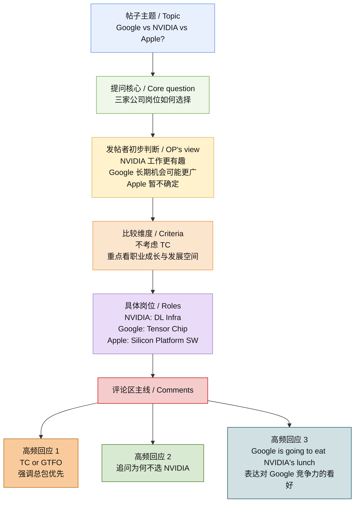

# Blind：Google vs NVIDIA vs Apple?（双语精读笔记 · 主帖首段）

本文整理自 Blind **Tech Industry** 板块讨论帖 *Google vs NVIDIA vs Apple?*，性质为**匿名职场社区求职比较帖**。发帖者 **ueSf12** 页面显示 **Microsoft** 公司徽标；真实姓名与履历**无法独立核实**。Blind 为面向已验证职场人士的匿名社区，身份验证机制见官方 FAQ。

---

## 前情提要

### 基本信息

- **文章来源**：Blind（匿名职场社区，面向经工作邮箱验证的职场人士）
- **文本类型**：论坛求职比较帖 + 评论区互动（本稿暂仅整理主帖首段）
- **帖子标题**：**Google vs NVIDIA vs Apple?**
- **发帖用户**：**ueSf12**（匿名用户名；页面中显示 **Microsoft** 公司徽标）
- **作者背景简介**：Blind 官方说明其社区是 **“anonymous community of verified professionals”**，用户通常需通过工作邮箱验证职业身份，但发言保持匿名。因此，**该发帖者没有可公开核验的真实姓名与完整职业履历**；仅能根据页面徽标判断其账号**显示为 Microsoft 用户**，但具体部门、资历与经历**无法独立核实**。
- **来源补注**：Blind 官方 FAQ 说明，平台通过工作邮箱验证用户职业身份，同时保留匿名发言机制。  
  参考：<https://us.teamblind.com/faq>

---

## 逐句精读

🔹 **Google vs NVIDIA vs Apple?**  
🔸 **谷歌 vs 英伟达 vs 苹果？**

### 背景注释

- **Google**：美国科技公司 Alphabet 旗下核心业务品牌，业务覆盖搜索、云计算、AI、芯片、移动生态等。
- **NVIDIA**：美国芯片公司，GPU、AI 训练/推理基础设施领域核心企业。
- **Apple**：美国消费电子与平台公司，以软硬件一体化、芯片自研著称。
- 该标题是典型的**比较型标题**，省略了完整谓语，实际含义相当于：**How do Google, NVIDIA, and Apple compare?**

> **Google / NVIDIA / Apple**
> 1. 英文释义（proper noun）: names of major technology companies / **大型科技公司的名称**。
> 2. 语域：**商业、科技、求职、新闻**。
> 3. 画龙点睛：在英文比较题目中，常用 **A vs B** 表示“**A 与 B 对比/谁更强/如何选择**”。这种写法高度口语化，也常见于论坛标题、视频标题、商业分析标题。

> **vs**
> 1. 英文释义（prep./abbr. of versus）: used to indicate comparison or opposition / **表示对比、对阵、竞争**。
> 2. 语域：**通用、媒体、论坛、体育、商业**。
> 3. 画龙点睛：**vs** 常用于标题，正文更正式时可写 **versus**。考试写作里若要更正式，可改为 **a comparison between A and B**。

---

🔹 **Which position would you choose?**  
🔸 **你会选哪个岗位？**

### 背景注释

- **position** 在求职语境里常指“**职位、岗位**”，不是单纯的“位置”。

> **position**
> 1. 英文释义（n.）: a job or role in an organization / **职位；岗位**； another meaning: place or posture / **位置；姿势**。
> 2. 语域：**正式、求职、人力资源**。
> 3. 画龙点睛：这是 **熟词僻义** 重点词。英语学习者常只记“位置”，但在招聘语境中 **position = job opening / role**。可搭配 **apply for a position, hold a senior position**。

> **choose**
> 1. 英文释义（v.）: to decide which person or thing you want / **选择；决定选取**。
> 2. 语域：**通用**。
> 3. 画龙点睛：常见结构有 **choose A over B, choose to do sth.**。不规则变化：**choose–chose–chosen**，考试中常考过去分词形式。

---

🔹 **I find the work at NVIDIA / to be more interesting / but also feel like Google might give me more opportunities later in my career / since the scope of the work is much wider / and I wouldn't be as specialized.**  
🔸 **我觉得英伟达的工作会更有意思，**/**但我同时也感觉，谷歌在我职业生涯后期或许会给我更多机会，**/**因为那边工作的覆盖面要广得多，**/**而且我不会被限定得那么专。**

### 背景注释

- **later in my career**：指职业发展的较后阶段，不一定是“临近退休”，而是相对未来的中长期阶段。
- **scope of the work**：指工作的广度、覆盖范围、接触面，不只是“工作量”。
- **specialized**：在职业语境中通常指“专业化程度很高、聚焦于较窄领域”。

> **find ... to be ...**
> 1. 英文释义（structure）: to consider someone or something as having a particular quality / **认为……是……；觉得……怎么样**。
> 2. 语域：**正式、书面、口语均可**。
> 3. 画龙点睛：这是高频表达，常见于阅读与写作：**I find this approach effective. / We found the task difficult.** 比单纯说 **I think** 略更自然、含蓄。

> **opportunity / opportunities**
> 1. 英文释义（n.）: a chance to do something or to develop / **机会；发展契机**。
> 2. 语域：**通用、求职、商业、教育**。
> 3. 画龙点睛：可数名词。常搭配 **career opportunities, growth opportunities, seize an opportunity**。写作中比反复用 **chance** 更正式。

> **scope**
> 1. 英文释义（n.）: the range or extent of something / **范围；广度；覆盖面**。
> 2. 语域：**正式、学术、商业、工程**。
> 3. 画龙点睛：**scope** 是阅读高频词。常见搭配 **the scope of work, beyond the scope of..., broaden the scope**。注意与 **scale** 区分：前者偏“范围”，后者偏“规模”。

> **specialized**
> 1. 英文释义（adj.）: focused on one particular area or skill / **专门化的；专业化的**。
> 2. 语域：**正式、职业、学术**。
> 3. 画龙点睛：在求职语境中，**specialized** 既可能是优势，也可能意味着职业路径较窄。相关词：**specialize in**, **specialist**, **specialization**。

> **career**
> 1. 英文释义（n.）: the series of jobs and professional development in a person’s working life / **职业生涯；事业发展路径**。
> 2. 语域：**通用、正式**。
> 3. 画龙点睛：常搭配 **career growth, career path, long-term career prospects**。在写作中可与 **profession** 区分：**career** 更强调发展过程。

---

🔹 **Apple I'm not really sure of though.**  
🔸 **不过，苹果这边我其实并没有太明确的判断。**

### 背景注释

- 这是口语化省略句，完整可理解为：**I'm not really sure about Apple, though.**
- **though** 置于句末，是非常常见的口语用法，表示“不过、但是、话虽如此”。

> **be not sure of/about**
> 1. 英文释义（phrase）: to feel uncertain about something / **对……拿不准；不确定**。
> 2. 语域：**口语、通用**。
> 3. 画龙点睛：常说 **I'm not sure about...**；**sure of** 也可用，但 **sure about** 在现代口语中更常见。可拓展：**I'm not entirely sure**, **I'm still unsure**。

> **though**
> 1. 英文释义（adv./conj.）: however; despite that / **不过；然而；虽然**。
> 2. 语域：**口语、书面均可**。
> 3. 画龙点睛：放句末时非常地道：**Nice idea, though. / I get your point, though.** 比 **however** 更口语自然。

---

🔹 **Not really taking TC into account here.**  
🔸 **这里并不怎么把 TC 算进考虑范围。**

### 背景注释

- **TC** = **Total Compensation**，即总薪酬，通常包括基础工资、奖金、股票、补贴等。
- **take ... into account**：固定表达，意为“把……考虑进去”。

> **TC (Total Compensation)**
> 1. 英文释义（n., abbreviation）: the full value of pay, including salary, bonus, equity, and benefits / **总包；总薪酬**。
> 2. 语域：**北美求职、科技行业、Blind 论坛高频**。
> 3. 画龙点睛：这是科技求职圈常用缩写。与 **base salary** 不同，**TC** 强调整体收入结构。论坛里常出现 **What's the TC? / TC matters most.**

> **take ... into account**
> 1. 英文释义（phrase）: to consider something when making a decision / **把……纳入考虑；考虑到**。
> 2. 语域：**正式、书面、口语均常见**。
> 3. 画龙点睛：这是考试写作高频表达，可替换 **consider**，更显成熟：**We must take long-term risks into account.** 也可说 **take account of**。

---

🔹 **Just looking to get people’s thoughts / on the companies / and career growth opportunities.**  
🔸 **我只是想听听大家对这些公司以及职业成长机会的看法。**

### 背景注释

- **thoughts** 在论坛语境中常表示“看法、意见、评价”，比 **opinions** 更口语一些。
- **career growth opportunities** 指晋升、转岗、能力拓展、未来平台价值等。

> **thoughts**
> 1. 英文释义（n.）: ideas, opinions, or views about something / **想法；看法；意见**。
> 2. 语域：**口语、论坛、职场交流**。
> 3. 画龙点睛：帖子里常见 **Any thoughts? / What are your thoughts?**，语气比直接问 **What's your opinion?** 更轻、更开放；亦常与 **IMO / my two cents** 等搭配出现。

---

## 待补信息

- **帖文直链**：请补 `source_url` 与首帖 **date**（若你保存了浏览器地址栏 URL，可直接发我续写 frontmatter）。
- **评论区精读**：流程图已列出评论主线（TC、NVIDIA、Google 竞争力等），若需逐条精读，可粘贴跟帖正文或授权我按链接抓取后再续写本章。
