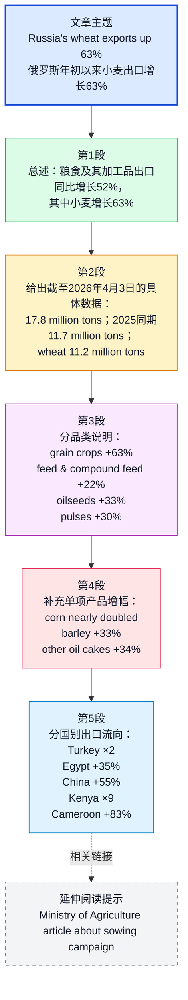

## 基本信息

- 文章来源：**Российская газета**（《俄罗斯报》）
- 题目：**С начала года Россия нарастила экспорт пшеницы на 63%**
- 作者：**Юлия Гуреева**
- 发布时间：**2026年4月7日**
- 核心信息来源：文中数据引自 **Россельхознадзор**（俄罗斯联邦兽医和植物卫生监督局，负责动植物检疫、农产品监管等）

作者背景简介：公开可核实的权威作者履历信息较少。根据该媒体站内可见署名记录，**Юлия Гуреева**为《俄罗斯报》经济/产业相关新闻作者，长期撰写农业、粮食、出口等主题报道。此处依据的是媒体署名与站内公开发表记录作出的谨慎归纳。

---

## 前情提要

---

## 逐句精读

🔻原文：`С начала года / Россия нарастила экспорт пшеницы на 63%`  
🔹English：Since the beginning of the year, / Russia has increased its wheat exports by `63%`.  
🔸中文：自今年年初以来，/ 俄罗斯已将其小麦出口提高了 `63%`。

背景注释：
- **Россия / Russia**：俄罗斯。
- **экспорт пшеницы / wheat exports**：小麦出口，是农业、国际贸易、粮食安全报道中的高频表达。
- 标题中的 **нарастила** 带有“扩大、增加、提升规模”的新闻语体色彩，比单纯“grew”更强调主动扩张。

> **`since the beginning of the year` 年初以来**
> 1) 英文释义（介词短语）：`from the start of the current year up to now`；从本年开始直到目前。
> 2) 语域：新闻、经济、统计。
> 3) 画龙点睛：这是时间统计报道中的高频框架，常与`exports`, `sales`, `output`, `inflation`连用。写作时也可替换为`year-to-date`，后者更紧凑、更像财经报道用语。

> **`increase ... by` 按……幅度增加**
> 1) 英文释义（动词搭配）：`to make something become larger by a stated amount or percentage`；使某物按某一数额或百分比增加。
> 2) 语域：通用、新闻、学术。
> 3) 画龙点睛：要特别区分`increase by 63%`与`increase to 63%`：前者是“增加了63%”，后者是“增加到63%”。这是考试翻译和图表写作中的常见失分点。

> **`wheat exports` 小麦出口**
> 1) 英文释义（名词短语）：`the sale and shipment of wheat to foreign countries`；向外国出售并运输小麦。
> 2) 语域：农业、贸易、新闻。
> 3) 画龙点睛：`wheat`通常是`不可数名词`，指“小麦”这一作物或商品；若说“一种小麦”，则常借助`a variety of wheat`。写作中常与`grain exports`, `global markets`, `shipment`搭配。

---

🔻原文：`Россия с начала года / нарастила экспорт зерна и продуктов его переработки / относительно того же периода в 2025 году / на 52%, / пшеницы - на 63%, / сообщается на сайте Россельхознадзора.`  
🔹English：Since the beginning of the year, / Russia has increased exports of grain and processed grain products / by `52%` compared with the same period in 2025, / while wheat exports have risen by `63%`, / according to the website of `Rosselkhoznadzor`.  
🔸中文：据 `Rosselkhoznadzor` 官网消息，自今年年初以来，/ 俄罗斯谷物及其加工产品的出口 / 较 `2025` 年同期增长了 `52%`，/ 其中小麦出口增长了 `63%`。

背景注释：
- **зерно и продукты его переработки**：直译为“谷物及其加工产品”，可指粮食及其加工制品。
- **относительно того же периода**：相对于同一时期，即“同比同期比较”。
- **Россельхознадзор / Rosselkhoznadzor**：俄罗斯联邦兽医和植物卫生监督局，俄语全称常译为农业监督机关，涉及农产品检疫、出口监管、植物卫生证书等。

> **`processed grain products` 谷物加工产品**
> 1) 英文释义（名词短语）：`products made by processing grain into other usable forms`；由谷物加工形成的产品。
> 2) 语域：农业、贸易、政策。
> 3) 画龙点睛：`process`在农产品语境中常表示“加工处理”，如`processed food`。写作时可顺带积累`value-added agricultural products`，强调“附加值更高的农产品”。

> **`compared with the same period` 与同期相比**
> 1) 英文释义（比较结构）：`when measured against an equivalent time span in another year or period`；与另一年份或时期的相同时间段相比。
> 2) 语域：新闻、统计、学术。
> 3) 画龙点睛：这是图表作文核心表达。`the same period last year`、`year on year`、`on a yearly basis`都可构成替换。翻译时注意它表达的是“同比”，不是“环比”。

> **`according to` 根据；据……所称**
> 1) 英文释义（介词短语）：`as stated or reported by`；依据……所陈述或报道。
> 2) 语域：通用、新闻、学术。
> 3) 画龙点睛：新闻写作中`according to`用于标明信息来源，能有效避免无来源陈述。后面可接`data`, `official figures`, `the ministry`, `a report`等，是高频客观引述结构。

---

🔻原文：`"По состоянию на 3 апреля 2026 года / экспорт зерна и продуктов его переработки составил свыше 17,8 миллиона тонн.`  
🔹English：`As of April 3, 2026`, / exports of grain and processed grain products / totaled `more than 17.8 million tons`.  
🔸中文：`截至2026年4月3日`，/ 谷物及其加工产品的出口总量 / 已达到 `1780多万吨`。

背景注释：
- **По состоянию на ...**：俄语新闻和公文中的固定表达，相当于英语 `as of ...`。
- **тонн / tons**：此类报道通常指公吨（metric tons / tonnes）的数量概念。

> **`as of` 截至；到……为止**
> 1) 英文释义（介词短语）：`up to and including a particular date or time`；直到并包括某一具体日期或时间。
> 2) 语域：正式、商业、法律、新闻。
> 3) 画龙点睛：`as of`在财经和公文中极常见，表示一个统计截点。不要与`from`混淆；`as of April 3`强调“截至4月3日这一时点的数据状态”。

> **`total` 总计达到**
> 1) 英文释义（动词）：`to reach a particular total amount`；合计达到某个总量。
> 2) 语域：正式、统计、新闻。
> 3) 画龙点睛：`totaled`是图表写作常用动词，比`was`信息密度更高。可替换为`reached`, `stood at`, `came to`，但语气和正式程度略有差异。

> **`more than` 超过；多于**
> 1) 英文释义（限定结构）：`greater than a stated number or amount`；大于某一已给数字或数量。
> 2) 语域：通用。
> 3) 画龙点睛：新闻里常见`more than`, `over`, `in excess of`。其中`in excess of`更正式。做阅读时要注意它往往表示概数，而非精确到小数点后的严格值。

---

🔻原文：`Это / на 52% превышает показатель аналогичного периода 2025 года, / когда было отгружено 11,7 миллиона тонн, - говорится в публикации.`  
🔹English：This / is `52%` higher than the figure for the corresponding period of 2025, / when `11.7 million tons` were shipped, / the publication says.  
🔸中文：该数字 / 比 `2025` 年同期的水平高出 `52%`，/ 而在当时共发运了 `1170万吨`，/ 该发布内容如是写道。

背景注释：
- **показатель**：统计指标、数值、指标表现。
- **аналогичный период**：对应时期、同期。
- **отгружено**：已发运、已装运，强调物流/出口流程中的“出货”。

> **`higher than the figure for` 高于……的数据/数值**
> 1) 英文释义（比较表达）：`greater than the recorded amount for`；高于……所记录的数值。
> 2) 语域：新闻、统计、学术。
> 3) 画龙点睛：`figure`在新闻里常不是“图形”，而是“数字、统计数值”。阅读时务必掌握这一熟词僻义，否则容易误判句意。可与`rate`, `total`, `level`辨析记忆。

> **`corresponding period` 对应时期；同期**
> 1) 英文释义（名词短语）：`the equivalent time period in another year or context`；另一年份或背景中的对应时间段。
> 2) 语域：正式、统计。
> 3) 画龙点睛：这是比`same period`更正式的说法，适合学术和政策文体。写作中用它可提升表达层级，但要确保前文时间参照清晰。

> **`ship` / `were shipped` 发运；装运**
> 1) 英文释义（动词）：`to send goods somewhere, especially by transport for sale`；把货物运往某地，尤指出货销售。
> 2) 语域：商业、物流、贸易。
> 3) 画龙点睛：`ship`不只指“船运”，也可泛指发货。名词形式有`shipment`。贸易文章中`export volume`与`shipment volume`常相关但不完全等同，需依语境判断。

---

🔻原文：`- В этом году / на 63% увеличились поставки на мировые рынки российской пшеницы - / до 11,2 миллиона тонн".`  
🔹English：This year, / shipments of Russian wheat to `global markets` / increased by `63%` / to `11.2 million tons`.  
🔸中文：今年，/ 俄罗斯小麦面向 `全球市场` 的供应量 / 增长了 `63%`，/ 达到 `1120万吨`。

背景注释：
- **поставки**：供应、交付、输送、出货，在贸易报道中常译为“供应量”或“发运量”。
- **мировые рынки / global markets**：世界市场、国际市场。

> **`shipments` 发运量；出货量**
> 1) 英文释义（名词，常复数）：`amounts of goods sent from one place to another`；从一地发送到另一地的一批批货物或其总量。
> 2) 语域：贸易、物流、新闻。
> 3) 画龙点睛：`shipment`既可指“单批货物”，也可指“出货行为/出货量”。考试中常和`delivery`, `supply`, `consignment`形成辨析，语境越偏贸易，`shipment`越自然。

> **`global markets` 全球市场**
> 1) 英文释义（名词短语）：`markets around the world where goods are bought and sold internationally`；全球范围内进行国际买卖的市场。
> 2) 语域：经济、贸易、新闻。
> 3) 画龙点睛：写作中它是`international markets`的近义替换。若强调“面向海外销售”，也可用`overseas markets`。注意`market`可具体可抽象，复数更常见于宏观经济表述。

> **`increase to` 增加到……**
> 1) 英文释义（动词搭配）：`to rise until reaching a stated level`；上升并达到某个数值。
> 2) 语域：通用、统计。
> 3) 画龙点睛：这一句同时出现`increase by 63%`和`to 11.2 million tons`，非常典型。前者表示增幅，后者表示结果值。图表作文里把二者同时写清楚，会更完整、更专业。

---

🔻原文：`Отмечается, что / экспорт зерна и продуктов его переработки увеличился / по всем видам продукции:`  
🔹English：It is noted that / exports of grain and processed grain products / increased / across `all product categories`:  
🔸中文：文中指出，/ 谷物及其加工产品的出口 / 在 `所有产品类别` 中均有所增长：

背景注释：
- **Отмечается, что ...**：俄语报道中常见的无主句式，相当于英语 `It is noted that ...`、`The report notes that ...`。
- **по всем видам продукции**：按各类产品来看，全部类别均增长。

> **`it is noted that` 据指出；文中指出**
> 1) 英文释义（引述结构）：`the report or source points out that`；报告或消息来源指出……
> 2) 语域：正式、新闻、公文。
> 3) 画龙点睛：这是典型的`非人称被动结构`，适合客观转述。写作中可替换为`the report notes that`, `it is reported that`, `it is stated that`，语气略有差异。

> **`category` 类别；品类**
> 1) 英文释义（名词）：`a group of things of the same type`；同类型事物所组成的类别。
> 2) 语域：通用、商业、统计。
> 3) 画龙点睛：`category`在图表和商业分析中特别常见。要注意与`type`相比，它更偏“分类体系中的一类”。常见搭配有`product category`, `income category`, `category growth`。

---

🔻原文：`в частности, / зерновые культуры - на 63%, / корма, комбикорма и их компоненты - на 22%, / масличные культуры - на 33%, / зернобобовые культуры - на 30%.`  
🔹English：in particular, / `grain crops` rose by `63%`, / `feed`, `compound feed`, and their components by `22%`, / `oilseed crops` by `33%`, / and `pulses` by `30%`.  
🔸中文：具体而言，/ `粮食作物` 出口增长了 `63%`，/ `饲料`、`配合饲料` 及其组成部分增长了 `22%`，/ `油料作物` 增长了 `33%`，/ `豆类作物` 增长了 `30%`。

背景注释：
- **зерновые культуры**：谷物类作物、粮食作物。
- **корма / комбикорма**：饲料 / 配合饲料。
- **масличные культуры**：油料作物，如葵花籽、大豆、油菜籽等。
- **зернобобовые культуры**：豆类作物、粒用豆科作物，英语里常可概括为 `pulses`。

> **`in particular` 尤其；具体来说**
> 1) 英文释义（插入语）：`especially when giving specific examples`；尤其是在列举具体例子时使用。
> 2) 语域：通用、正式。
> 3) 画龙点睛：这是展开细节的经典信号词。阅读中看到它，往往意味着后面会列举分项数据；写作中用它能让说明结构更清晰。

> **`compound feed` 配合饲料**
> 1) 英文释义（名词）：`animal feed made from a mixture of different ingredients`；由多种成分混合制成的动物饲料。
> 2) 语域：农业、畜牧、贸易。
> 3) 画龙点睛：`compound`在这里不是“复杂的”，而是“复合的、混合制成的”。这是熟词转义的典型案例。相关表达还有`feed additives`, `feed ingredients`。

> **`oilseed crops` 油料作物**
> 1) 英文释义（名词短语）：`crops grown mainly for the oil contained in their seeds`；主要为了获取种子中的油脂而种植的作物。
> 2) 语域：农业、贸易。
> 3) 画龙点睛：常见成员包括`soybeans`, `sunflower`, `rapeseed`。考试中如果文章谈农业贸易，这类词汇常与`crushing`, `vegetable oil`, `meal`一起出现。

> **`pulses` 豆类作物；食用豆类**
> 1) 英文释义（名词，通常复数）：`dry edible seeds such as beans, lentils, and peas`；可食用的干豆类种子，如豆、扁豆、豌豆。
> 2) 语域：农业、营养、贸易。
> 3) 画龙点睛：`pulse`这个义项对很多学习者较陌生，容易只记得“脉搏”。在农业和食品语境中，`pulses`是高频专业词，需单独记忆，属于典型熟词僻义考点。

---

🔻原文：`Кроме того, / почти вдвое выросли поставки российской кукурузы, / ячменя - на 33%, / прочих жмыхов - на 34%.`  
🔹English：In addition, / shipments of Russian `corn` / increased by `almost twofold`, / `barley` by `33%`, / and `other oil cakes` by `34%`.  
🔸中文：此外，/ 俄罗斯 `玉米` 的出口供应量 / 几乎翻了一番，/ `大麦` 增长了 `33%`，/ `其他油饼类副产品` 增长了 `34%`。

背景注释：
- **кукуруза / corn**：玉米。
- **ячмень / barley**：大麦，常用于饲料和酿造。
- **жмыхи**：榨油后的饼粕类副产品，英语常按语境译作 `oil cakes` 或与 `meal` 区分处理。
- **почти вдвое**：几乎翻倍、接近两倍。

> **`in addition` 此外；另外**
> 1) 英文释义（连接副词）：`used to introduce extra information`；用于引入附加信息。
> 2) 语域：通用、正式写作。
> 3) 画龙点睛：写作衔接中比`also`更正式，适合议论文和说明文。近义表达包括`moreover`, `furthermore`，但后两者语气往往更强。

> **`almost twofold` 几乎翻倍**
> 1) 英文释义（数量表达）：`nearly doubled`；几乎增加到原来的两倍。
> 2) 语域：正式、统计、新闻。
> 3) 画龙点睛：`twofold`是高质量书面表达，等于`double`的抽象化表达。图表写作中可写成`almost doubled`，更自然易懂；但阅读里常见`twofold`, `threefold`等。

> **`barley` 大麦**
> 1) 英文释义（名词）：`a cereal crop used for food, animal feed, and brewing`；一种用于食品、饲料和酿造的谷物。
> 2) 语域：农业、食品、贸易。
> 3) 画龙点睛：与`wheat`、`corn`同属粮食作物高频词。阅读农业文章时，这几个词经常组团出现，建议按“作物—用途—出口品”三位一体记忆。

> **`oil cake` 油饼；榨油后的饼粕**
> 1) 英文释义（名词）：`the solid material left after oil has been pressed from seeds`；种子榨油后剩下的固体残渣。
> 2) 语域：农业加工、饲料、贸易。
> 3) 画龙点睛：它常用作饲料原料。相关词还有`soybean meal`、`sunflower meal`。遇到这类词时，不要死译成“蛋糕”，应按农业加工语境理解为“饼粕”。

---

🔻原文：`В Россельхознадзоре также сообщили / о росте отгрузок зерновой продукции / в Турцию (вдвое), / Египет (+35%), / Китай (+55%), / Кению (в девять раз), / Камерун (+83%).`  
🔹English：`Rosselkhoznadzor` also reported / growth in shipments of grain products / to `Turkey` (doubling), / `Egypt` (`+35%`), / `China` (`+55%`), / `Kenya` (`ninefold`), / and `Cameroon` (`+83%`).  
🔸中文：`Rosselkhoznadzor` 还通报称，/ 发往 `土耳其`、`埃及`、`中国`、`肯尼亚` 和 `喀麦隆` 的粮食产品出口量均有所增长，/ 其中对 `土耳其` 几乎翻倍，/ 对 `埃及` 增长 `35%`，/ 对 `中国` 增长 `55%`，/ 对 `肯尼亚` 增至原来的 `9倍`，/ 对 `喀麦隆` 增长 `83%`。

背景注释：
- **Турция / Turkey**：土耳其，俄罗斯粮食出口的重要市场之一。
- **Египет / Egypt**：埃及，全球重要小麦进口国。
- **Китай / China**：中国，重要农产品进口市场。
- **Кения / Kenya**：肯尼亚，东非国家。
- **Камерун / Cameroon**：喀麦隆，中非国家。
- **в девять раз**：增加到原来的九倍，或“增长至九倍规模”；在英文表达中常处理为 `ninefold`。

> **`report growth in` 报告……的增长**
> 1) 英文释义（动词搭配）：`to state officially that there has been an increase in something`；正式说明某事出现了增长。
> 2) 语域：新闻、商业、政策。
> 3) 画龙点睛：这是很常见的财经报道句型。`report a rise in`, `announce an increase in`, `record growth in`都可作为替换，但主语和语气各有区别。

> **`grain products` 粮食产品；谷物制品**
> 1) 英文释义（名词短语）：`products consisting of grain or made from grain`；由粮食构成或以粮食制成的产品。
> 2) 语域：农业、贸易。
> 3) 画龙点睛：它比`grain`本身范围更宽，既可包括原粮，也可包括加工制品。阅读时要看上下文是否特指原粮，不能一概窄化理解。

> **`doubling` / `double` 翻倍**
> 1) 英文释义（动名词/动词）：`becoming twice as much or causing something to become twice as much`；变成两倍，或使之变成两倍。
> 2) 语域：通用、新闻。
> 3) 画龙点睛：在统计表达中，`doubled`比`increased by 100%`更自然；但若要更精确、更学术，后者更清楚。考试中两种说法都应熟练掌握。

> **`ninefold` 九倍地；九倍增长**
> 1) 英文释义（副词/形容词）：`by nine times`；以九倍的幅度。
> 2) 语域：正式、统计。
> 3) 画龙点睛：`-fold`构词法非常重要，如`twofold`, `tenfold`。它简洁、书面，尤其适用于数据报道。翻译时要根据上下文判断是“增加了八倍”还是“增至九倍”，避免机械套译。

---

🔻原文：`читайте также / Минсельхоз: Показатели посевной кампании в 2026 году превысили прошлогодние`  
🔹English：Read also: / `Ministry of Agriculture`: Indicators of the `2026 sowing campaign` exceeded last year's figures.  
🔸中文：另请参阅：/ `农业部`：`2026年播种活动` 的各项指标已超过去年水平。

背景注释：
- **читайте также / read also**：网页中的“延伸阅读/相关阅读”提示，不属于正文主体内容。
- **Минсельхоз**：即俄罗斯农业部。
- **посевная кампания**：播种季、春播/播种活动，是农业生产报道中的常见术语。
- 此类网页附加内容已作清理识别；此处保留其信息属性，但不作为正文新闻句的核心处理对象。

> **`sowing campaign` 播种活动；播种季工作**
> 1) 英文释义（名词短语）：`the organized seasonal process of sowing crops`；有组织开展的季节性农作物播种工作。
> 2) 语域：农业、政策、新闻。
> 3) 画龙点睛：`campaign`在这里不是“竞选”，而是“集中开展的行动”。这是典型熟词引申义。农业、公共卫生、宣传等语境里都常见这一用法。

> **`indicator` 指标**
> 1) 英文释义（名词）：`a sign or measurement showing the condition or level of something`；显示某事状态或水平的标志、测量值。
> 2) 语域：学术、统计、政策、经济。
> 3) 画龙点睛：`indicator`是阅读与写作中的高频学术词。可搭配`economic indicators`, `performance indicators`, `key indicators`。与`index`相比，它更泛指“指标”，不一定是综合指数。

---

## 词汇与表达总串联

为方便备考，本文高频可迁移表达可重点复习：

- `since the beginning of the year` 年初以来
- `increase ... by ...` 增长了……
- `increase to ...` 增长到……
- `compared with the same period` 与同期相比
- `as of + 日期` 截至某日
- `totaled ...` 总计达到……
- `shipments` 发运量；出货量
- `global markets` 全球市场
- `in particular` 具体而言
- `in addition` 此外
- `double / doubling / twofold` 翻倍
- `ninefold` 九倍
- `indicator` 指标
- `sowing campaign` 播种活动
