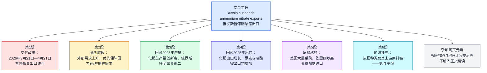
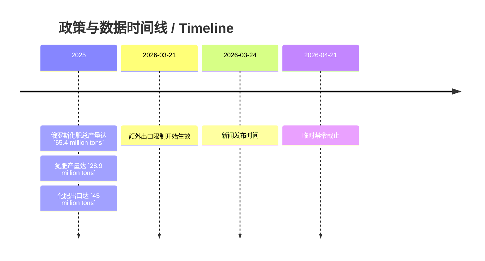

## 基本信息

- 来源网站：**Нефть и капитал / OilCapital**（栏目：**Экономика**）
- 题目：**Экспорт аммиачной селитры из России запрещен до 21 апреля**
- 作者：**Екатерина Красовская**
- 发布时间：**2026年3月24日 18:34**
- **原文链接说明**：用户提供的精读材料以 OilCapital 为来源；站内单篇 URL 未在本次环境中稳定抓取核实，`source_url` 暂指向作者聚合页，便于按日期检索；若你后续补全正式文章链接，可替换 `source_url` 为直链。

作者背景简介：根据公开可见网页信息，**Екатерина Красовская**为 **OilCapital /《Нефть и капитал》**的新闻作者，长期撰写与**能源、化工、出口、制裁、国际贸易、资源市场**相关的俄语财经新闻报道。公开页面可确认其署名发表于多篇能源与大宗商品新闻，但未检索到更完整的官方个人履历页，因此可谨慎判断其身份主要是**俄语财经/产业新闻记者或编辑作者**。参考：[作者页](https://oilcapital.ru/author/ekaterina-krasovskaya)；历史报道示例（题材参考）：[2024-08-01](https://oilcapital.ru/news/2024-08-01/v-evrope-predlagayut-vvesti-sanktsii-protiv-udobreniy-iz-rossii-5155310)、[2023-06-30](https://oilcapital.ru/news/2023-06-30/novak-ozadachil-neftyanikov-kvotami-dlya-eksporta-nefteproduktov-2971894)。

---

## 前情提要

### 文章来源与基本信息

- 来源网站：**Нефть и капитал / OilCapital**
- 栏目：**Экономика**
- 题目：**Экспорт аммиачной селитры из России запрещен до 21 апреля**
- 作者：**Екатерина Красовская**
- 发布时间：**2026年3月24日 18:34**

### 文章结构信息图

---

## 逐句精读

🔻原文：`Экспорт` `аммиачной селитры` / из России / запрещен / до `21 апреля`.  
🔹English：Exports of `ammonium nitrate` / from Russia / are banned / until `April 21`.  
🔸中文：俄罗斯的`硝酸铵`出口 / 被禁止 / 直到`4月21日`。

背景注释：
- **аммиачная селитра / ammonium nitrate**：通常译为“硝酸铵”，是一种重要的**氮肥**，同时也是一种具有较强氧化性的化学品，在农业和工业中都具有重要用途。
- **до 21 апреля**：这里表示禁令持续至**4月21日**，结合正文可知更准确区间是**2026年3月21日至2026年4月21日**。

> **`ammonium nitrate` 硝酸铵**
>
> 1. 英文释义（noun）：a chemical compound used especially as a `fertilizer` and sometimes in industrial applications；一种化合物，主要用作`肥料`，有时也用于工业领域。
> 2. 语域：科学、农业、新闻。
> 3. 画龙点睛：常与 `fertilizer`, `nitrogen fertilizer`, `export`, `production` 搭配。考试中常见于科技、农业、环境和国际贸易语境。注意不要与 `ammonia`（氨）混淆；前者是具体化合物，后者常作上游原料。

> **`ban` / `be banned` 禁止；被禁止**
>
> 1. 英文释义（verb / adjective-like passive use）：to officially or legally forbid something；正式或依法禁止某事。
> 2. 语域：正式、法律、新闻。
> 3. 画龙点睛：新闻里高频结构是 `be banned until`, `impose a ban on`, `lift a ban`, `temporary ban`。写作中可替换为 `prohibit`, `suspend`, `bar`, 但语气和搭配略有差异，需注意正式程度。

---

🔻原文：`Россия` / `ограничивает экспорт удобрений`, / чтобы `обеспечить посевную` / в стране / на фоне `взлетевшего спроса` / со стороны мирового рынка.  
🔹English：`Russia` / is `restricting fertilizer exports` / in order to `secure the sowing campaign` / at home / against the backdrop of `surging demand` / from the global market.  
🔸中文：`俄罗斯`正在`限制化肥出口`，以便在全球市场需求`飙升`的背景下，优先`保障国内春播/播种工作`。

背景注释：
- **посевная**：俄语经济与农业新闻中的常见词，指春季或农时中的**播种季、春耕播种工作**。
- **мировой рынок**：世界市场，指国际需求端；此处暗含国际市场抢购推高出口压力。
- 这一句是新闻导语，概括了**政策动作 + 政策目的 + 外部背景**三层信息。

> **`restrict` / `restrict exports` 限制；限制出口**
>
> 1. 英文释义（verb）：to limit the size, amount, or range of something；限制某事物的规模、数量或范围。
> 2. 语域：正式、政策、新闻、经济。
> 3. 画龙点睛：与 `ban` 不同，`restrict` 不一定是完全禁止，可能只是设限、收紧、压缩。常见搭配有 `restrict trade`, `restrict access`, `restrict supply`。写作中用于表达“收紧政策”非常自然。

> **`secure` 保障；确保获得**
>
> 1. 英文释义（verb）：to make certain that something is available or protected；确保某物可获得或得到保障。
> 2. 语域：正式、新闻、政策。
> 3. 画龙点睛：`secure supplies`, `secure funding`, `secure domestic demand` 都很常见。它比普通的 `ensure` 更有“落实保障、稳住资源”的意味，在经济新闻里很实用。

> **`surging demand` 激增的需求**
>
> 1. 英文释义（noun phrase）：rapidly rising demand for a product or service；快速上升的需求。
> 2. 语域：商业、经济、新闻。
> 3. 画龙点睛：`surge` 既可作名词也可作动词。常见搭配：`demand surged`, `a surge in prices`, `surging exports`。阅读中它往往暗示价格、供应链或政策调整。

---

🔻原文：С `21 марта` по `21 апреля 2026 года` / в России / `вводятся дополнительные ограничения` / на вывоз `аммиачной селитры`, / сообщает `Минсельхоз`.  
🔹English：From `March 21` to `April 21, 2026`, / `additional restrictions` / on the export of `ammonium nitrate` / are being introduced in Russia, / according to the `Ministry of Agriculture`.  
🔸中文：据`俄罗斯农业部`消息，自`2026年3月21日`至`2026年4月21日`，俄罗斯将对`硝酸铵`出口`实施额外限制`。

背景注释：
- **Минсельхоз**：即俄罗斯**农业部**（Ministry of Agriculture）。在俄罗斯涉农政策、粮食、化肥、播种保障等议题中是核心主管部门之一。
- **вводятся дополнительные ограничения**：典型政策新闻表述，意思不是首次出现所有限制，而是在既有制度基础上进一步加码。

> **`additional restrictions` 额外限制**
>
> 1. 英文释义（noun phrase）：extra rules or limits added to existing ones；在原有限制基础上新增的规则或约束。
> 2. 语域：正式、政策、新闻。
> 3. 画龙点睛：写作中可替换为 `further restrictions`, `extra curbs`, `tightened controls`。其中 `curb` 在新闻里非常高频，尤其用于贸易、资本流动和价格调控。

> **`introduce` / `be introduced` 推出；被实施**
>
> 1. 英文释义（verb）：to bring a rule, law, or system into operation；使一项规则、法律或制度开始实行。
> 2. 语域：正式、法律、政策。
> 3. 画龙点睛：注意不仅表示“介绍”，还可表示“推出政策”。例如 `introduce a tax`, `introduce sanctions`, `introduce restrictions`。这是考试中典型熟词僻义。

> **`Ministry of Agriculture` 农业部**
>
> 1. 英文释义（proper noun）：the government department responsible for agriculture-related policy；负责农业相关政策的政府部门。
> 2. 语域：正式、政府、新闻。
> 3. 画龙点睛：翻译时可根据上下文处理为“农业部”或“农林主管部门”。阅读中见到 `according to the Ministry...` 往往意味着信息来源具有官方属性。

---

🔻原文：`Действие` / уже `выданных` / и `планируемых к выдаче` / `экспортных лицензий` / `приостановлено`.  
🔹English：The `validity/application` of export licenses / already `issued` / and those `planned for issuance` / has been `suspended`.  
🔸中文：已经`发放`以及`计划发放`的`出口许可证` / 其效力或发放程序 / 均已被`暂停`。

背景注释：
- **экспортные лицензии**：出口许可证，说明相关出口本来受许可制度管理。
- **приостановлено**：暂停，不一定意味着永久取消，更接近“暂缓执行/中止生效”。

> **`issue` / `issued` 发放；签发**
>
> 1. 英文释义（verb）：to officially give or distribute something such as a license or permit；正式发放、签发许可证等。
> 2. 语域：正式、行政、法律。
> 3. 画龙点睛：常见搭配有 `issue a license`, `issue a permit`, `issue a statement`。注意与名词 `issue`（问题、议题）区分，是考试高频一词多义点。

> **`planned for issuance` 计划发放的**
>
> 1. 英文释义（phrase）：intended to be officially granted in the future；计划在未来正式签发的。
> 2. 语域：正式、官样、行政。
> 3. 画龙点睛：这是非常“公文式”的表达。英文写作中更自然可说 `pending export licenses`。阅读时要学会把冗长官话压缩为核心含义：`not only current but also pending licenses are affected`。

> **`suspend` / `be suspended` 暂停；中止**
>
> 1. 英文释义（verb）：to stop something temporarily from being in effect；暂时停止某事的效力或执行。
> 2. 语域：正式、法律、政策、商业。
> 3. 画龙点睛：与 `cancel` 不同，`suspend` 更强调临时性。常见搭配：`suspend operations`, `suspend a license`, `suspend trading`。在政策解读中，这个差异非常关键。

---

🔻原文：`Исключение` / сделано / только / для `поставок` / по `межправительственным соглашениям`.  
🔹English：An `exception` / has been made / only for `supplies` / carried out under `intergovernmental agreements`.  
🔸中文：唯一的`例外`是 / 根据`政府间协议`进行的相关`供应/交付`。

背景注释：
- **межправительственные соглашения**：政府间协议，通常指国家与国家之间达成的正式安排，优先级较高，往往不完全受一般商业许可措施约束。
- **поставки**：在贸易新闻里可译为“供应、供货、交付、发运”，需按语境灵活处理。

> **`exception` 例外**
>
> 1. 英文释义（noun）：a case that is treated differently from the general rule；不同于一般规则的特殊情形。
> 2. 语域：正式、法律、新闻。
> 3. 画龙点睛：常见搭配为 `make an exception`, `with the exception of`, `an exception applies to...`。写作中使用它可以更精确地表述政策并非“一刀切”。

> **`intergovernmental agreement` 政府间协议**
>
> 1. 英文释义（noun phrase）：a formal agreement between two or more governments；两个或多个政府之间达成的正式协议。
> 2. 语域：外交、法律、政策。
> 3. 画龙点睛：比 `international agreement` 更具体，强调签约主体是“政府”。在国际贸易、能源合作、军贸、基建等领域很常见，阅读中应特别敏感。

---

🔻原文：В `ведомстве` / пояснили, / что / на фоне `повышенного внешнего спроса` / на `азотные удобрения` / `временный запрет` / на их вывоз / позволит / в первую очередь / `обеспечить нужды внутреннего рынка`.  
🔹English：The `ministry/department` explained / that, amid `elevated external demand` / for `nitrogen fertilizers`, / the `temporary ban` / on their export / will make it possible / first and foremost / to `meet the needs of the domestic market`.  
🔸中文：该`部门`解释称，在国外对`氮肥`需求上升的背景下，对其出口实施的`临时禁令`将首先有助于`保障国内市场需求`。

背景注释：
- **ведомство**：常指“主管部门、部委、机构”，新闻翻译里通常不机械直译，可根据上文还原为农业部。
- **азотные удобрения**：氮肥，是以氮元素为主要营养成分的化肥类别，包括尿素、硝酸铵、硫酸铵等。
- **внутренний рынок**：国内市场，与外部市场/出口市场相对。

> **`elevated external demand` 较高的外部需求**
>
> 1. 英文释义（noun phrase）：demand from foreign buyers that is above normal levels；来自国外买家的、高于常态的需求。
> 2. 语域：经济、贸易、新闻。
> 3. 画龙点睛：`elevated` 比 `high` 更正式，也更常见于新闻和报告。可搭配 `elevated prices`, `elevated risks`, `elevated inflation`，很适合写作提分。

> **`temporary ban` 临时禁令**
>
> 1. 英文释义（noun phrase）：a prohibition imposed for a limited period of time；在限定时期内实施的禁令。
> 2. 语域：法律、政策、新闻。
> 3. 画龙点睛：常与 `impose`, `lift`, `extend`, `ease` 连用。考试写作中可用来描述政府短期干预市场的工具，逻辑上常对应 `to stabilize supply/prices`。

> **`meet the needs of` 满足……的需求**
>
> 1. 英文释义（phrase）：to provide what is required or necessary for someone or something；满足某人或某方面所需要的东西。
> 2. 语域：通用、正式、政策。
> 3. 画龙点睛：这是写作高频表达。可扩展为 `meet domestic demand`, `meet consumer needs`, `meet urgent needs`。相比 `satisfy demand`，它更中性、稳定、适用面更广。

---

🔻原文：Как напоминает `«НиК»`, / в `2025 году` / Россия / `увеличила выпуск` / всех видов удобрений / на `3,5%`, / достигнув `рекордных 65,4 млн т`.  
🔹English：As `OilCapital` notes, / in `2025` / Russia / `increased output` / of all types of fertilizers / by `3.5%`, / reaching a `record 65.4 million tons`.  
🔸中文：正如`《НиК / OilCapital》`所指出的，俄罗斯在`2025年`将各类化肥的`产量提高`了`3.5%`，达到创纪录的`6540万吨`。

背景注释：
- **«НиК»**：即 **«Нефть и капитал»** 的缩写，相当于该媒体在文内自称“本刊/本网”。
- **выпуск**：在工业和财经语境中常指“产量、产出、生产规模”。
- **65.4 млн т**：即 65.4 million tons，中文可按习惯译为“6540万吨”。

> **`increase output` 提高产量**
>
> 1. 英文释义（phrase）：to produce more of something than before；比之前生产更多。
> 2. 语域：商业、工业、经济。
> 3. 画龙点睛：`output` 常见于工业、制造、能源、农业报道。与 `production` 意义接近，但 `output` 更强调产出结果；写作中两者可交替使用，避免重复。

> **`record` 创纪录的**
>
> 1. 英文释义（adjective）：the highest or best level ever achieved；达到历史最高或最好水平的。
> 2. 语域：新闻、商业、体育。
> 3. 画龙点睛：常见搭配 `record highs`, `record output`, `record profits`。新闻标题中尤其高频。注意它既可作名词也可作形容词，阅读中要根据位置判断。

---

🔻原文：По этому `показателю` / страна / `вышла на второе место в мире`, / обойдя `США`, `Индию` / и `Канаду`, / и уступив / только `КНР`.  
🔹English：By this `indicator`, / the country / `rose to second place in the world`, / overtaking the `United States`, `India`, / and `Canada`, / and trailing / only `China`.  
🔸中文：按这一`指标`计算，俄罗斯已`升至世界第二位`，超过了`美国`、`印度`和`加拿大`，仅次于`中国`。

背景注释：
- **показатель**：指标、衡量标准；这里指上文的化肥产量。
- **КНР**：俄语缩写，指**中华人民共和国**，英文通常译为 **China** 或 **the PRC**；新闻中一般简化为 China。
- 句中使用了两个分词结构：**обойдя...**（超过……）和 **уступив только...**（仅落后于……），压缩了大量信息。

> **`indicator` 指标**
>
> 1. 英文释义（noun）：a measure used to show the state or level of something；用来显示某事物状态或水平的衡量标准。
> 2. 语域：学术、经济、统计、新闻。
> 3. 画龙点睛：常见搭配 `economic indicator`, `key indicator`, `by this indicator`。在阅读中它往往提示“比较依据”，翻译时不能漏掉，否则逻辑会变模糊。

> **`rise to second place` 升至第二位**
>
> 1. 英文释义（phrase）：to move upward in ranking and reach number two；排名上升到第二。
> 2. 语域：新闻、统计、商业。
> 3. 画龙点睛：类似表达有 `rank second`, `move into second place`, `become the world’s second-largest...`。写作时后者更地道，也更适合改写数据型句子。

> **`overtake` 超过；赶超**
>
> 1. 英文释义（verb）：to become greater than or more successful than someone or something；在数量、水平或排名上超过。
> 2. 语域：新闻、商业、通用。
> 3. 画龙点睛：除“超车”外，在经济新闻里也常指“赶超”。过去式是 `overtook`，过去分词是 `overtaken`，属于不规则动词，考试中要特别留意。

---

🔻原文：`Азотных удобрений` / выпустили / `28,9 млн т` / — / на `2,3%` больше, / чем годом ранее.  
🔹English：`Nitrogen fertilizers` / amounted to `28.9 million tons` in output / — / `2.3%` more / than a year earlier.  
🔸中文：其中`氮肥`产量为`2890万吨`，比上年增长`2.3%`。

背景注释：
- 这里是承接上一句，对“所有化肥”中的一个重点类别——**氮肥**——做单独拆分说明。
- **чем годом ранее**：新闻统计中的固定比较结构，意为“与一年前相比/同比”。

> **`nitrogen fertilizer` 氮肥**
>
> 1. 英文释义（noun phrase）：fertilizer containing nitrogen as a key nutrient for plant growth；含氮、用于促进植物生长的重要肥料。
> 2. 语域：农业、科学、经济。
> 3. 画龙点睛：常见于农业、粮食安全、化工产业文章。可以进一步认识相关词：`urea`, `ammonium nitrate`, `ammonium sulfate`。这类术语在科技英语和财经英语中经常交叉出现。

> **`year earlier` 一年前；同比基期**
>
> 1. 英文释义（phrase）：the same period in the previous year；上一年同一时期。
> 2. 语域：统计、新闻、财经。
> 3. 画龙点睛：英文中数据比较常用 `year on year (YoY)`, `from a year earlier`, `compared with the previous year`。掌握这些表达有助于读懂财经新闻中的同比、环比、累计比。

---

🔻原文：`Экспорт удобрений` / также / `продемонстрировал уверенный рост`: / объёмы `отгрузок` / увеличились / сразу на `7%`, / до `45 млн т`.  
🔹English：`Fertilizer exports` / also / `showed solid growth`: / `shipment` volumes / increased / by as much as `7%`, / to `45 million tons`.  
🔸中文：`化肥出口`也`显示出稳健增长`：`发运/出货`量一下子增加了`7%`，达到`4500万吨`。

背景注释：
- **отгрузки**：在贸易与物流语境中通常译为“发运量、出货量、装运量”。
- **уверенный рост**：财经新闻中的典型搭配，可理解为“稳健增长、较为扎实的增长”。

> **`show solid growth` 显示稳健增长**
>
> 1. 英文释义（phrase）：to grow at a clearly positive and stable rate；呈现明显而稳定的增长。
> 2. 语域：商业、财经、新闻。
> 3. 画龙点睛：可替换为 `post strong growth`, `record robust growth`, `grow steadily`。其中 `solid` 在商业语境里常不表示“固体的”，而表示“扎实的、可靠的”，属熟词活用。

> **`shipment` 装运；出货；发运**
>
> 1. 英文释义（noun）：the act or amount of goods being sent somewhere；货物运输或发出的数量。
> 2. 语域：物流、贸易、商业。
> 3. 画龙点睛：常见搭配 `shipment volumes`, `make a shipment`, `deliveries and shipments`。注意它既可以指数量，也可以指一批货物本身，需结合上下文判断。

---

🔻原文：Наибольшим `спросом` / пользовался / российский `карбамид` / — / его `поставки` / выросли / на `12%`, / до `8 млн т`.  
🔹English：Russian `urea` / saw the strongest `demand` / — / its `supplies/shipments` / rose / by `12%`, / to `8 million tons`.  
🔸中文：需求最旺的是俄罗斯`尿素`，其`供应/出口发运量`增长了`12%`，达到`800万吨`。

背景注释：
- **карбамид**：即 **urea**，中文常译“尿素”，是最常见的氮肥之一。
- **пользоваться спросом**：俄语固定说法，意为“受到欢迎、需求旺盛”。

> **`demand` 需求**
>
> 1. 英文释义（noun）：the desire and ability to buy goods or services；对商品或服务的购买需求。
> 2. 语域：经济、商业、通用。
> 3. 画龙点睛：常与 `strong demand`, `weak demand`, `domestic demand`, `global demand` 搭配。它既可作名词，也可作动词表示“要求”。考试中需根据上下文区分。

> **`urea` 尿素**
>
> 1. 英文释义（noun）：a nitrogen-rich chemical widely used as fertilizer；一种富含氮元素、广泛用作肥料的化学品。
> 2. 语域：农业、化工、科学。
> 3. 画龙点睛：与 `ammonium nitrate` 同属重要氮肥，但性质与用途细节不同。阅读理工或农业类材料时，认出这些术语可显著提升理解速度。

> **`supplies` / `shipments` 供应量；发运量**
>
> 1. 英文释义（noun）：amounts of goods provided or delivered；提供或交付的货物数量。
> 2. 语域：贸易、物流、新闻。
> 3. 画龙点睛：`supply` 既可表示“供应”这一抽象概念，也可表示“供应品”；复数 `supplies` 在新闻中常偏向“供货量、补给物资”。翻译时要避免一律机械处理。

---

🔻原文：`Экспорт аммиачной селитры` / прибавил `2%`, / достигнув `2,8 млн т`.  
🔹English：`Ammonium nitrate exports` / gained `2%`, / reaching `2.8 million tons`.  
🔸中文：`硝酸铵出口`增长了`2%`，达到`280万吨`。

背景注释：
- 这一句与上一句形成对照：**尿素增长更快（12%）**，而**硝酸铵增长较缓（2%）**。
- **прибавил** 在财经新闻中常作拟人化表达，表示“增加、上升”。

> **`gain` / `gained 2%` 增长2%**
>
> 1. 英文释义（verb）：to increase by a certain amount；按某一幅度上升。
> 2. 语域：财经、新闻。
> 3. 画龙点睛：新闻里常用 `gain`, `rise`, `increase`, `edge up`, `climb` 描述增长，不同词带有不同语感。`gain` 简洁有力，尤其常用于价格、出口、指数等数据句。

> **`reach` 达到**
>
> 1. 英文释义（verb）：to get to a particular level, amount, or stage；达到某一水平、数量或阶段。
> 2. 语域：通用、正式、统计。
> 3. 画龙点睛：高频搭配有 `reach a record`, `reach $1 billion`, `reach 2.8 million tons`。写作中它是最基础也最稳妥的数据动词之一。

---

🔻原文：`Примечательно`, / что / в прошлом году / российские удобрения / активно `закупали` `США`, / хотя / их `союзник` `ЕС` / ввоз минудобрений из России / `ограничил` / `повышенными пошлинами`.  
🔹English：`Notably`, / last year / Russian fertilizers / were actively `purchased` by the `United States`, / although / its `ally`, the `EU`, / `restricted` imports of Russian mineral fertilizers / with `higher tariffs`.  
🔸中文：`值得注意的是`，去年`美国`积极`采购`俄罗斯化肥；而其`盟友`——`欧盟`——却通过`提高关税`来`限制`从俄罗斯进口矿物肥料。

背景注释：
- **США**：美国。
- **ЕС**：欧盟（European Union）。
- **повышенные пошлины**：提高后的关税；这里体现的是贸易壁垒而非全面禁运。
- 句中构成了鲜明对比：**美国买入增加**，**欧盟加税限制**。

> **`notably` 值得注意的是**
>
> 1. 英文释义（adverb）：in a way that deserves special attention；以值得特别注意的方式。
> 2. 语域：正式、学术、新闻。
> 3. 画龙点睛：可用作段内逻辑提示词，提示“反常点、亮点、对比点”。写作中类似表达还有 `significantly`, `interestingly`, `it is worth noting that`，但语气和正式度不同。

> **`purchase` / `purchased` 采购；购买**
>
> 1. 英文释义（verb / noun）：to buy something, especially in a formal or commercial context；购买，尤指正式或商业场景中的采购。
> 2. 语域：正式、商业、政府采购。
> 3. 画龙点睛：比 `buy` 更正式，常见于新闻和商务写作。`procure` 更书面、更偏政府或机构采购。考试写作中可用 `purchase` 提升文体成熟度。

> **`ally` 盟友**
>
> 1. 英文释义（noun）：a country or group that cooperates closely with another, often politically or militarily；在政治或军事上关系密切的国家或集团。
> 2. 语域：国际关系、新闻。
> 3. 画龙点睛：可引申为公司或组织层面的“合作伙伴”。反义概念常是 `rival`, `adversary`。阅读国际新闻时它常透露地缘政治关系。

> **`tariff` 关税**
>
> 1. 英文释义（noun）：a tax imposed on imported or exported goods, especially imports；对进出口商品征收的税，尤指进口关税。
> 2. 语域：经济、贸易、政策。
> 3. 画龙点睛：常见搭配 `impose tariffs`, `raise tariffs`, `tariff barriers`。不要与 `tax` 完全等同；`tariff` 更具体，专指贸易关税体系。

---

🔻原文：В `итоге` / отечественные производители `азотных удобрений` / заняли `35%` / всего `импортного рынка` / в `Соединённых Штатах`, / опередив `Катар`.  
🔹English：`As a result`, / domestic producers of `nitrogen fertilizers` / took `35%` / of the entire `import market` / in the `United States`, / overtaking `Qatar`.  
🔸中文：`结果是`，俄罗斯国内`氮肥`生产商占据了`美国`整个`进口市场`的`35%`，并超过了`卡塔尔`。

背景注释：
- **отечественные производители**：此处站在俄罗斯媒体视角，指“本国生产商”，翻译时应还原为“俄罗斯本土/国内生产商”。
- **Соединённые Штаты**：美国的正式说法，即 the United States。
- **Катар / Qatar**：卡塔尔，是全球重要的天然气与化工产品出口国，也是氮肥市场的重要参与者之一。

> **`as a result` 结果；因此**
>
> 1. 英文释义（phrase）：for this reason; consequently；由于这个原因，因此。
> 2. 语域：通用、正式、逻辑衔接。
> 3. 画龙点睛：是写作和阅读中非常核心的因果连接语。可替换为 `therefore`, `consequently`, `thus`，但 `as a result` 更直白，适合说明事实后果。

> **`import market` 进口市场**
>
> 1. 英文释义（noun phrase）：the market made up of imported goods within a country or region；一个国家或地区由进口商品构成的市场部分。
> 2. 语域：贸易、经济。
> 3. 画龙点睛：理解时要分清 `export market` 与 `import market`。前者强调“卖向哪里”，后者强调“谁在一个国家的进口盘子里占多少份额”。

> **`overtake` 超过**
>
> 1. 英文释义（verb）：to become greater than another in amount, rank, or performance；在数量、排名或表现上超过另一方。
> 2. 语域：商业、新闻。
> 3. 画龙点睛：本词在本文第二次出现，说明它是财经新闻中高频比较动词。反复出现的词往往值得重点掌握，因为它们极具迁移价值。

---

🔻原文：К `азотным удобрениям` / относятся / `аммиачная селитра`, `карбамид` (`мочевина`), `сульфат аммония`, `кальциевая селитра`.  
🔹English：`Nitrogen fertilizers` / include / `ammonium nitrate`, `urea`, (`carbamide`), `ammonium sulfate`, and `calcium nitrate`.  
🔸中文：`氮肥`包括`硝酸铵`、`尿素（carbamide/мочевина）`、`硫酸铵`和`硝酸钙`。

背景注释：
- **мочевина**：俄语中也是“尿素”的常用名称。
- **сульфат аммония / ammonium sulfate**：硫酸铵，常见氮肥。
- **кальциевая селитра / calcium nitrate**：硝酸钙，也用于农业施肥。
- 这一句带有“科普定义”功能，为前文政策对象提供基础知识说明。

> **`include` 包括**
>
> 1. 英文释义（verb）：to contain or have as part of a whole；包含，作为整体的一部分而纳入。
> 2. 语域：通用、学术、说明文。
> 3. 画龙点睛：非常基础但极其高频。注意 `A includes B` 不一定表示列举穷尽；若要表示“完全列举”，常需借助 `consist of` 或上下文说明。

> **`ammonium sulfate` 硫酸铵**
>
> 1. 英文释义（noun）：a chemical compound used as a fertilizer and in some industrial processes；一种用于肥料和部分工业流程的化合物。
> 2. 语域：农业、化工。
> 3. 画龙点睛：与本文其他化学词一样，未必要死记专业细节，但需建立“词形识别能力”，考试阅读中见到即可迅速归类为化肥品种。

> **`calcium nitrate` 硝酸钙**
>
> 1. 英文释义（noun）：a fertilizer compound supplying calcium and nitrogen；一种可提供钙和氮的肥料化合物。
> 2. 语域：农业、化工。
> 3. 画龙点睛：化学名词往往由两个名词拼合构成，阅读时可拆解识别：`calcium`（钙）+ `nitrate`（硝酸盐）。这种拆词能力对 GRE 和科技英语尤其重要。

---

🔻原文：Все они / `производятся` / из `аммиака` (`NH₃`), / который, / в свою очередь, / `получают` / из `метана`.  
🔹English：All of them / are `produced` / from `ammonia` (`NH₃`), / which, / in turn, / is `obtained` / from `methane`.  
🔸中文：它们全部都是由`氨`（`NH₃`）`生产`而来，而`氨`本身又是由`甲烷`制取的。

背景注释：
- **аммиак / ammonia (NH₃)**：氨，是许多氮肥生产的关键基础化工原料。
- **метан / methane**：甲烷，是天然气的主要成分之一；这句话点出了化肥产业与天然气/上游能源之间的密切联系。
- **in turn / в свою очередь**：典型链条说明语，表示“进一步地、反过来、下一环节中”。

> **`produce` / `be produced` 生产；被生产**
>
> 1. 英文释义（verb）：to make or manufacture something, especially on a large scale；制造、生产某物，尤指大规模生产。
> 2. 语域：通用、工业、商业。
> 3. 画龙点睛：常见搭配 `produce fertilizer`, `produce energy`, `mass-produced`。与 `manufacture` 相比，`produce` 更宽泛、更自然，在新闻中使用频率极高。

> **`ammonia` 氨**
>
> 1. 英文释义（noun）：a chemical compound of nitrogen and hydrogen, widely used in fertilizer production；由氮和氢构成的化合物，广泛用于化肥生产。
> 2. 语域：化学、农业、工业。
> 3. 画龙点睛：不要与 `ammonium` 混淆；`ammonia` 是氨，`ammonium` 常指“铵/铵离子”相关成分。阅读时见到不同后缀，往往意味着完全不同的化学实体。

> **`obtain` / `be obtained from` 获得；从……中制取**
>
> 1. 英文释义（verb）：to get or derive something from a source；从某来源获得或提取某物。
> 2. 语域：正式、学术、科学。
> 3. 画龙点睛：比 `get` 正式得多，常用于科技和说明文，如 `hydrogen can be obtained from water`。在翻译中可根据语境处理为“得到、提取、制取”。

> **`methane` 甲烷**
>
> 1. 英文释义（noun）：the simplest hydrocarbon gas, the main component of natural gas；最简单的烃类气体，是天然气的主要成分。
> 2. 语域：化学、能源、环境。
> 3. 画龙点睛：这是能源和环境话题中的高频词。既出现在化工链条中，也常见于气候变化语境，因为它还是一种重要温室气体。

---

## 补充说明：已剔除的网页杂项

以下内容属于网页导航或附加元素，**不属于正文新闻句子**，因此不纳入逐句精读正文：

- “Экономика”
- “24 марта 2026, 18:34”
- “ЕК”
- 相关推荐标题：**Азия и Европа могут лишиться удобрений из-за перекрытия Ормузского пролива**
- “Узнать подробнее”
- 标签：`#РЫНКИ #РЕГУЛИРОВАНИЕ #АММИАК #МИНЕРАЛЬНЫЕ УДОБРЕНИЯ #УДОБРЕНИЯ #ЗАПРЕТ ЭКСПОРТА #ЭКОНОМИКА`
- “Нашли опечатку в тексте? Выделите её и нажмите Ctrl+Enter”
- “Подпишитесь”
