## 前情提要

### 文章来源与基本信息
- 来源：**Việt Nam News**
- 栏目：**Economy**
- 题目：**Ministry lists solutions to reach $74 billion in agricultural exports this year**
- 发布时间：**February 05, 2026 - 08:45**
- 体裁：新闻采访 / 政策解读
- 受访者：**Phùng Đức Tiến**
- 作者背景简介：**Phùng Đức Tiến**现任越南**Ministry of Agriculture and Environment**副部长，公开资料显示其长期从事农业科研与管理工作，职业经历包括家禽研究中心与国家畜牧研究机构的研究、管理岗位，后负责渔业、畜牧、兽医等相关领域工作。
  参考来源：
  - Việt Nam News 原文：https://vietnamnews.vn/economy/1765224/ministry-lists-solutions-to-reach-74-billion-in-agricultural-exports-this-year.html
  - 越南农业与环境部英文信息页：https://en.mae.gov.vn/deputy-minister-phung-duc-tien-runs-for-16th-national-assembly-pledges-four-key-commitments-9190.htm

### 文章结构信息图

```mermaid
flowchart TD
    A["文章核心 Core Topic<br/>越南农业、林业、渔业出口在2026年冲刺 `US$74 billion`"]:::a
    A --> B["开头背景 Background<br/>2025年出口表现强劲，为2026年目标奠基"]:::b
    A --> C["第一组问答 Q1<br/>回顾2025年成绩与数据"]:::c
    A --> D["第二组问答 Q2<br/>分析2026年的机遇与挑战"]:::d
    A --> E["第三组问答 Q3<br/>实现 `US$74 billion` 的政策路径"]:::e
    A --> F["第四组问答 Q4<br/>IUU黄牌解除进展"]:::f

    C --> C1["自然灾害、疫情后遗影响、地缘冲突、贸易壁垒"]:::g
    C --> C2["总出口额 `70.09 billion`，同比增长 `12%`"]:::g
    C --> C3["分项：农产品、畜产品、水产、林产品"]:::g
    C --> C4["主要市场：中国、美国、日本"]:::g

    D --> D1["挑战：全球经济不确定、保护主义、环保与食品安全标准趋严"]:::h
    D --> D2["挑战：气候变化、对等关税、技术壁垒"]:::h
    D --> D3["机遇：改革经验积累、市场多元化、企业主动性增强"]:::i

    E --> E1["方案1：标准化原料区，强化追溯、投入品质量和食品安全"]:::j
    E --> E2["方案2：深加工、产品多样化、提升附加值"]:::j
    E --> E3["方案3：冷链、物流中心、通关数字化"]:::j
    E --> E4["方案4：拓市场、破壁垒、预警机制、国家品牌"]:::j
    E --> E5["方案5：绿色转型、碳足迹、循环经济、低排放认证"]:::j

    F --> F1["政府高频督导，每周二与地方开会"]:::k
    F --> F2["已向欧委会相关机构提交报告"]:::k
    F --> F3["聚焦四项：渔船管理、监控、追溯、处罚"]:::k
    F --> F4["期望尽快解除黄牌，改善出口环境与国际信誉"]:::k

    classDef a fill:#143d59,color:#fff,stroke:#0f2d42,stroke-width:2px;
    classDef b fill:#f4d35e,color:#222,stroke:#c8a93e;
    classDef c fill:#7bd389,color:#0b2e13,stroke:#4c9f70;
    classDef d fill:#ff9f9f,color:#4a1111,stroke:#d46a6a;
    classDef e fill:#9ec5fe,color:#102a43,stroke:#5b8bd9;
    classDef f fill:#d2b4ff,color:#2d1457,stroke:#9a6fd1;
    classDef g fill:#d9f0d3,color:#1c3b1c,stroke:#86b779;
    classDef h fill:#ffd6d6,color:#5a1f1f,stroke:#e59898;
    classDef i fill:#fff0b3,color:#5b4b00,stroke:#d6c15c;
    classDef j fill:#d6e9ff,color:#12324a,stroke:#7aa6d9;
    classDef k fill:#eadcff,color:#3a235c,stroke:#b08be0;
```

---

## 逐句精读

🔹 **Việt Nam’s exports of `agricultural`, `forestry` and `fishery` products in 2025 / recorded positive results, / laying an important foundation for 2026 growth targets.**
🔸 2025年，越南`农林渔产品`出口取得积极成果，`为2026年增长目标打下重要基础`。

- 背景注释：
  - **Việt Nam**：越南。
  - **agricultural, forestry and fishery products**：越南官方统计中常见的三大涉农出口类别，分别指农业、林业和渔业产品。
  - **laying an important foundation**：新闻和政策文本中的高频表达，表示“为后续发展打基础”。
  - 部分网页版式中本句会在导语与配图说明等处重复出现，精读时按同一句处理即可。

> **`agricultural` 农业的** /əɡrɪˈkʌltʃərəl/
> 词性：adj.
> 英文释义：relating to farming, crops, and the raising of animals; 与农业、种植、养殖有关的。
> 语域：正式、新闻、经济、政策
> 画龙点睛：`agricultural` 常与 `exports`、`production`、`sector`、`products` 搭配，是农业经济类文章核心词。注意与 `agrarian` 区分：后者更偏“土地制度/农业社会结构”。写作中可积累 `agricultural output`、`agricultural value chain`、`agricultural policy`。

> **`record positive results` 取得积极成果**
> 英文释义：to achieve good or encouraging outcomes; 取得良好或令人鼓舞的结果。
> 语域：正式、新闻
> 画龙点睛：这是非常典型的新闻表达，主语常为 `exports`、`economy`、`sector`。比简单说 `did well` 更正式。可替换为 `post strong growth`、`deliver solid performance`。翻译时注意不是“记录结果”，而是“取得/实现成果”。

> **`lay a foundation for` 为……奠定基础**
> 英文释义：to create the conditions that make something possible later; 为未来发展创造条件。
> 语域：正式、学术、新闻
> 画龙点睛：写作中非常实用，可用于经济、教育、科技等话题。常见结构：`lay a solid/important/firm foundation for sth`。也可延伸为 `pave the way for`，后者更强调“铺平道路”。

> **`fishery` 渔业；渔业的** /ˈfɪʃəri/
> 词性：n./adj.
> 英文释义：the industry of catching, processing, or selling fish; 捕鱼、加工或销售鱼类的产业。
> 语域：正式、行业、新闻
> 画龙点睛：注意 `fishery` 常指“渔业产业”，而 `fish` 是“鱼”。政策文本中常见 `fishery products`、`fishery exports`。复数 `fisheries` 也常出现，指渔业部门或各类渔场资源。

---

🔹 **Deputy Minister of Agriculture and Environment `Phùng Đức Tiến` / spoke to Việt Nam News / about the sector’s performance in 2025, / as well as the opportunities and challenges in 2026 / to reach an `ambitious` export target of `US$74 billion`.**
🔸 农业与环境部副部长`Phùng Đức Tiến`在接受《Việt Nam News》采访时谈到了该行业在2025年的表现，以及2026年为实现`雄心勃勃的` `740亿美元`出口目标所面临的机遇与挑战。

- 背景注释：
  - **Deputy Minister**：副部长。
  - **Ministry of Agriculture and Environment**：越南农业与环境部。公开资料显示，该部由原农业与农村发展系统与环境资源相关系统整合而来。
  - **Phùng Đức Tiến**：越南农业与环境部副部长，长期从事农业科研与管理工作，负责渔业、畜牧、兽医等领域。
  - **Việt Nam News**：越南官方英文媒体之一。
  - **the sector’s performance**：指农业、林业和渔业整体表现。
  - **US$74 billion**：即740亿美元，为文章核心政策目标。

> **`Deputy Minister` 副部长**
> 英文释义：an official ranking below a minister in a government ministry; 政府部门中级别低于部长的官员。
> 语域：正式、政府、新闻
> 画龙点睛：涉及政府架构时常见。注意 `minister` 与 `ministry` 区分：前者是“部长”，后者是“部”。翻译时不要混淆。写作中可拓展 `Deputy Prime Minister`、`senior official`、`cabinet member`。

> **`performance` 表现，业绩** /pəˈfɔːrməns/
> 词性：n.
> 英文释义：how well a person, company, or sector does a job or activity; 某人、企业或行业的运行表现。
> 语域：通用、商务、新闻
> 画龙点睛：`performance` 在经济报道里经常表示“经营表现/运行表现”，不是只有“表演”这一个意思。常见搭配：`economic performance`、`export performance`、`strong performance`。属熟词僻义重点。

> **`as well as` 以及；连同**
> 英文释义：in addition to; 除……之外还。
> 语域：正式、通用
> 画龙点睛：比 `and` 更正式，适合写作提升句式。注意其连接主语时，谓语通常与前面的主语保持一致，如 `A, as well as B, is...`。这是语法考点。

> **`ambitious` 宏大的；有雄心的** /æmˈbɪʃəs/
> 词性：adj.
> 英文释义：having a strong desire to succeed, or requiring great effort to achieve; 有雄心的，或目标宏大且难度高的。
> 语域：正式、新闻、商务
> 画龙点睛：修饰 `target`、`plan`、`reform agenda` 时，常译为“宏伟的/雄心勃勃的”，语气积极但隐含挑战大。写作中可替换 `challenging`、`far-reaching`，但语义侧重不同。

---

🔹 **What were the most `notable` achievements in Việt Nam's agricultural, forestry and fishery exports in 2025?**
🔸 2025年越南农林渔产品出口中，最`值得关注的`成就有哪些？

- 背景注释：
  - 这是采访中的提问句，起到开启第一组问答的作用。

> **`notable` 值得注意的；显著的** /ˈnoʊtəbl/
> 词性：adj.
> 英文释义：important or interesting enough to deserve attention; 重要到值得关注的。
> 语域：正式、新闻、学术
> 画龙点睛：可用于替换 `important`、`remarkable`。新闻中 `most notable achievements/developments` 很常见。写作时用它能提升正式度，但要注意它强调“值得注意”，不一定等于“最好”。

---

🔹 **2025 was a particularly `demanding` year / for the agriculture and environment sector.**
🔸 2025年对农业与环境部门而言，是`尤其艰难、要求极高的`一年。

- 背景注释：
  - **the agriculture and environment sector**：这里指越南农业与环境相关政府管理与产业系统的整体。

> **`demanding` 要求高的；艰巨的** /dɪˈmændɪŋ/
> 词性：adj.
> 英文释义：needing a lot of effort, skill, or patience; 需要大量努力、能力或耐心的。
> 语域：通用、正式
> 画龙点睛：`demanding year/job/task` 都很常见。它不是“有需求的”，而是“要求高、压力大”。翻译时可根据语境处理为“艰难的”“充满挑战的”。这是阅读中常见误区。

---

🔹 **In the `aftermath` of the COVID-19 pandemic, / Việt Nam continued to suffer major losses from natural disasters.**
🔸 在新冠疫情的`余波`之下，越南继续遭受自然灾害带来的重大损失。

- 背景注释：
  - **COVID-19 pandemic**：新冠疫情。
  - **natural disasters**：自然灾害，越南常见有台风、洪灾、旱灾、盐碱化等。

> **`aftermath` 余波；后果** /ˈæftərmæθ/
> 词性：n.
> 英文释义：the period following an unpleasant event and the effects that result from it; 灾难或不幸事件之后的时期及其后果。
> 语域：正式、新闻
> 画龙点睛：常见搭配 `in the aftermath of...`，是阅读和写作高频结构。多用于灾难、战争、危机之后。比 `after` 更书面、更有“后续影响持续存在”的意味。

> **`suffer losses` 遭受损失**
> 英文释义：to experience damage, harm, or financial loss; 经历损失或伤害。
> 语域：正式、新闻、商务
> 画龙点睛：非常常见的经济新闻搭配。可扩展为 `suffer heavy/major/substantial losses`。写作中比 `lose a lot` 更地道、更正式。

---

🔹 **In 2023, / damage caused by storms and floods / was estimated at around `VNĐ5.1 trillion`.**
🔸 2023年，由暴风雨和洪水造成的损失`估计约为5.1万亿越南盾`。

- 背景注释：
  - **VNĐ**：越南盾，越南货币单位。
  - **storms and floods**：风暴和洪水，是越南农业损失的重要来源。

> **`be estimated at` 估计为**
> 英文释义：to be judged or calculated to have a particular value or amount; 被估算为某一数值。
> 语域：正式、新闻、学术
> 画龙点睛：数据类文章高频结构。可替换 `be put at`、`stand at`，但 `estimated` 更突出“估算值而非最终精确值”。翻译中注意被动语态的自然处理。

> **`damage` 损害；损失** /ˈdæmɪdʒ/
> 词性：n.
> 英文释义：physical harm or financial loss caused by something; 由某事造成的物质损害或经济损失。
> 语域：通用、正式
> 画龙点睛：作不可数名词时常表示总体损失，如 `storm damage`。与 `damages` 区分：后者在法律语境中可指“赔偿金”。这是考试中常见辨析点。

---

🔹 **This figure / `surged` to over `VNĐ98 trillion` in 2024 / and about `VNĐ100 trillion` in 2025.**
🔸 这一数字在2024年`飙升`至`超过98万亿越南盾`，并在2025年达到`约100万亿越南盾`。

- 背景注释：
  - **This figure**：指上句中的灾害损失数额。

> **`surge` 激增；飙升** /sɜːrdʒ/
> 词性：v./n.
> 英文释义：to increase suddenly and strongly; 突然且大幅上升。
> 语域：新闻、商务、经济
> 画龙点睛：和 `rise` 相比，`surge` 更强调速度快、幅度大。常用于价格、成本、病例、损失等。写作中可搭配 `surge to`、`surge by`，一个表结果，一个表幅度。

> **`figure` 数字；数值** /ˈfɪɡjər/
> 词性：n.
> 英文释义：a number representing an amount, especially in statistics or reports; 报告或统计中的数字。
> 语域：正式、新闻、商务
> 画龙点睛：这是 `figure` 的常考熟词僻义，不是“人物/图形”而是“数字”。新闻中 `this figure`, `official figures`, `latest figures` 极常见。阅读必须敏感识别。

---

🔹 **Geopolitical conflicts, trade wars in various regions / also `disrupted` supply chains / and led to the `proliferation` of trade barriers.**
🔸 各地区的地缘政治冲突和贸易战也`扰乱了`供应链，并导致贸易壁垒的`扩散/增多`。

- 背景注释：
  - **Geopolitical conflicts**：地缘政治冲突。
  - **trade wars**：贸易战。
  - **supply chains**：供应链。
  - **trade barriers**：贸易壁垒，包括关税、技术标准、检疫要求等。

> **`disrupt` 扰乱；中断** /dɪsˈrʌpt/
> 词性：v.
> 英文释义：to interrupt something and prevent it from continuing normally; 打断或扰乱正常运行。
> 语域：正式、新闻、商务
> 画龙点睛：常见搭配 `disrupt supply chains/services/markets`。比 `affect` 更强，强调“破坏正常秩序”。写作时可用于全球化、疫情、战争等话题。

> **`proliferation` 激增；扩散；大量出现** /prəˌlɪfəˈreɪʃn/
> 词性：n.
> 英文释义：a sudden increase in the number or amount of something; 数量快速增多。
> 语域：正式、学术、新闻
> 画龙点睛：高阶词汇，常见于国际关系、科技、政策话题，如 `the proliferation of weapons`、`the proliferation of barriers/regulations`。写作中能显著提高词汇层级。

---

🔹 **Nevertheless, / under the leadership of the Party and the Government / with coordinated efforts from ministries, sectors, local authorities, the business community, co-operatives and farmers, / the agricultural sector demonstrated strong `resilience` / and a flexible capacity in adapting to market changes.**
🔸 尽管如此，在党和政府的领导下，并在各部委、各行业、地方政府、商界、合作社和农民的协同努力下，农业部门展现出强大的`韧性`以及灵活应对市场变化的能力。

- 背景注释：
  - **the Party and the Government**：指越南的执政党与政府体系。
  - **co-operatives**：合作社，在农业生产组织中常见。
  - **resilience**：经济、企业、产业政策中高频概念，指在冲击下维持功能并恢复增长的能力。

> **`resilience` 韧性；复原力** /rɪˈzɪliəns/
> 词性：n.
> 英文释义：the ability to recover quickly from difficulties or adapt to change; 从困难中恢复并适应变化的能力。
> 语域：正式、政策、商业、心理学
> 画龙点睛：当下极高频词，尤其出现在经济、安全、城市治理和个人成长语境。可搭配 `economic resilience`、`institutional resilience`。写作时比 `strength` 更精准，因为它强调“受冲击后的恢复能力”。

> **`coordinated efforts` 协同努力**
> 英文释义：actions that are organised and carried out together effectively; 有组织的协调行动。
> 语域：正式、新闻、政策
> 画龙点睛：官方报道固定搭配。写作中可用于政府、学校、社会问题治理。比 `joint effort` 更显系统性与组织性。

> **`adapt to` 适应**
> 英文释义：to change in order to deal successfully with a new situation; 调整自身以适应新情况。
> 语域：通用
> 画龙点睛：常考介词搭配，必须是 `adapt to sth`。名词是 `adaptation`。写作中可延伸到 `adapt to market shifts / technological change / a new environment`。

---

🔹 **As a result, / total export `turnover` of agricultural, forestry and fishery products in 2025 / reached `$70.09 billion`, / up `12 per cent` year-on-year.**
🔸 因此，2025年农林渔产品出口总`额`达到`700.9亿美元`，`同比`增长`12%`。

- 背景注释：
  - **turnover**：此处指成交额、营业额、出口额，不是“人员流动率”。
  - **year-on-year**：同比，与上一年同期相比。

> **`turnover` 营业额；成交额；出口额** /ˈtɜːrnoʊvər/
> 词性：n.
> 英文释义：the total amount of business or sales over a period; 一段时期内的总销售额或交易额。
> 语域：商务、财经、新闻
> 画龙点睛：这是典型熟词僻义。很多学生只知道 `turn over`，却忽略 `turnover` 在财经里常表示“营业额/总额”。本句应译为“出口总额”，不能误解为“周转”。

> **`year-on-year` 同比**
> 英文释义：compared with the same period in the previous year; 与上一年同期相比。
> 语域：财经、统计、新闻
> 画龙点睛：财经英语核心表达。可写作 `YoY`。与 `month-on-month`（环比）区分。阅读中一看到 `up x per cent year-on-year` 就要迅速识别为“同比增长”。

---

🔹 **Of this figure, / agricultural products accounted for `$37.25 billion`, / up `13.7 per cent`; / livestock products `$627.8 million`, / up `17.4 per cent`; / fisheries `$11.32 billion`, / up `12.7 per cent`; / and forestry products and wooden furniture `$18.5 billion`, / up `6.6 per cent`.**
🔸 在这一总额中，`农产品`为`372.5亿美元`，增长`13.7%`；`畜产品`为`6.278亿美元`，增长`17.4%`；`水产品`为`113.2亿美元`，增长`12.7%`；`林产品和木制家具`为`185亿美元`，增长`6.6%`。

- 背景注释：
  - **account for**：在统计语境中表示“占到；构成”。
  - **livestock products**：畜牧产品。
  - **wooden furniture**：木制家具，是越南重要出口品类之一。

> **`account for` 占；构成；解释**
> 英文释义：to make up a part of a total; 在总量中占据一定比例。
> 语域：正式、统计、学术
> 画龙点睛：高频短语，意义很多，本句是“占到、构成”。不要机械译成“解释”。写作中可用 `X accounts for Y per cent of...` 表达数据占比，非常实用。

> **`livestock` 牲畜；畜牧业的** /ˈlaɪvstɑːk/
> 词性：n.
> 英文释义：farm animals such as cows, pigs, and sheep; 农场饲养的牲畜。
> 语域：农业、正式
> 画龙点睛：集合名词，通常不加复数 `s`。常见搭配 `livestock farming`、`livestock products`、`livestock sector`。考试中容易与 `poultry`（家禽）混淆。

---

🔹 **Major markets such as `China`, the `US` and `Japan` / continued to play a `pivotal` role, / accounting for `22.3 per cent`, `20.6 per cent` and `7.1 per cent` of total exports respectively, / all recording solid growth compared with the previous year.**
🔸 `中国`、`美国`和`日本`等主要市场继续发挥`关键性`作用，分别占出口总额的`22.3%`、`20.6%`和`7.1%`，且与上一年相比都实现了稳健增长。

- 背景注释：
  - **China, the US and Japan**：越南农产品出口的主要市场。
  - **respectively**：分别地，对应前面列出的顺序。
  - **solid growth**：稳健增长。

> **`pivotal` 关键的；枢纽性的** /ˈpɪvətl/
> 词性：adj.
> 英文释义：extremely important and central to the success of something; 对某事成败至关重要的。
> 语域：正式、新闻、学术
> 画龙点睛：比 `important` 更强，表示“起决定性作用”。常搭配 `play a pivotal role in...`，是写作高级表达。可替换 `crucial`、`central`，但 `pivotal` 书面色彩更浓。

> **`respectively` 分别地** /rɪˈspektɪvli/
> 词性：adv.
> 英文释义：in the same order as mentioned before; 按前文提到的顺序分别对应。
> 语域：正式、学术、新闻
> 画龙点睛：数据句必备词。阅读时必须建立“顺序对应”意识。写作中可大幅压缩句子，避免重复。若位置不当会导致逻辑混乱，是常见语法表达失误点。

---

🔹 **These figures / clearly demonstrate the effectiveness of production `restructuring` aligned with market demand, / as well as the adaptability of Vietnamese enterprises / in the face of external shocks.**
🔸 这些数据清楚地表明：与市场需求相衔接的生产`重组/结构调整`是有效的，同时也体现了越南企业在面对外部冲击时的适应能力。

- 背景注释：
  - **production restructuring**：生产结构调整，常指从粗放式、低附加值生产转向更符合市场需求的模式。
  - **external shocks**：外部冲击，如疫情、战争、关税、市场波动等。

> **`restructuring` 重组；结构调整** /ˌriːˈstrʌktʃərɪŋ/
> 词性：n.
> 英文释义：the process of changing the way something is organised or arranged; 调整组织或结构的过程。
> 语域：正式、经济、管理
> 画龙点睛：政策文和商文高频词。可用于企业、产业、债务、经济结构等。写作中如谈产业升级，可用 `industrial restructuring`、`production restructuring`，比 `change` 更专业。

> **`in the face of` 面对**
> 英文释义：when dealing with or confronted by something difficult; 面对困难或挑战时。
> 语域：正式、新闻、写作
> 画龙点睛：非常地道的书面表达，常与 `challenges`, `pressure`, `uncertainty`, `adversity` 搭配。比简单的 `when facing` 更有文体感。

---

🔹 **What are potential opportunities and challenges / for agricultural, forestry and fishery exports in 2026?**
🔸 2026年农林渔产品出口面临哪些潜在机遇与挑战？

- 背景注释：
  - 这是第二组问答的提问句，话题转向前瞻分析。

> **`potential` 潜在的** /pəˈtenʃl/
> 词性：adj./n.
> 英文释义：possible in the future, though not yet actual; 未来可能出现但尚未成为现实的。
> 语域：通用、正式
> 画龙点睛：`potential opportunities/challenges/risks` 都是高频搭配。写作中可用于分析型段落，帮助表达“可能性”而不把话说死。

---

🔹 **This year / is expected to remain a highly `challenging` year, / potentially even more difficult than 2025.**
🔸 预计今年仍将是极具`挑战性`的一年，甚至可能比2025年更加困难。

- 背景注释：
  - **This year**：结合文章发布时间，应指**2026年**。

> **`be expected to` 预计将；有望**
> 英文释义：to be likely to happen based on current information; 根据现有情况预计会发生。
> 语域：正式、新闻
> 画龙点睛：新闻预测句高频结构。可用于趋势判断，但语气比 `will` 更谨慎。写作中有助于保持客观。

> **`challenging` 充满挑战的** /ˈtʃælɪndʒɪŋ/
> 词性：adj.
> 英文释义：difficult in an interesting or demanding way; 具有难度、需要付出努力的。
> 语域：通用、正式
> 画龙点睛：与 `demanding` 相近，但 `challenging` 更中性、更常用。口语和写作都高频。若用于雅思写作，比单一使用 `difficult` 更自然。

---

🔹 **There are many factors / that will continue to `exert` strong pressure on agricultural exports, / such as uncertainties in the global economy, rising trade protectionism / and increasingly `stringent` requirements relating to environmental standards, traceability, carbon emissions and food safety.**
🔸 仍有许多因素将继续对农业出口`施加`巨大压力，例如全球经济中的不确定性、不断上升的贸易保护主义，以及在环境标准、可追溯性、碳排放和食品安全方面日益`严格的`要求。

- 背景注释：
  - **trade protectionism**：贸易保护主义。
  - **traceability**：可追溯性，尤其指食品、农产品从原料到销售全过程可追踪。
  - **carbon emissions**：碳排放。
  - **food safety**：食品安全。

> **`exert` 施加；运用** /ɪɡˈzɜːrt/
> 词性：v.
> 英文释义：to apply or bring to bear, especially pressure or influence; 施加压力、影响、力量等。
> 语域：正式、学术、新闻
> 画龙点睛：高频搭配 `exert pressure/influence/control`。是写作升级词，可替代普通的 `give`、`put`。使用时常接抽象名词作宾语。

> **`stringent` 严格的；苛刻的** /ˈstrɪndʒənt/
> 词性：adj.
> 英文释义：very strict and hard to satisfy; 非常严格、很难达到要求的。
> 语域：正式、新闻、法律、监管
> 画龙点睛：常修饰 `rules`, `requirements`, `standards`, `regulations`。比 `strict` 更正式，政策和法规类阅读高频。写作中能明显提升词汇档次。

> **`traceability` 可追溯性** /ˌtreɪsəˈbɪləti/
> 词性：n.
> 英文释义：the ability to track the history, origin, or movement of a product; 追踪产品历史、来源和流向的能力。
> 语域：技术、食品安全、贸易、监管
> 画龙点睛：农业外贸和供应链中的关键词。常与 `food safety`, `origin`, `compliance` 一起出现。属于专业词汇，但在现代贸易文章中越来越常见。

---

🔹 **At the same time, / climate change remains a long-term challenge, / directly affecting agricultural production, / particularly in key areas for crop cultivation, livestock farming and aquaculture.**
🔸 与此同时，气候变化仍然是一项长期挑战，直接影响农业生产，尤其影响到作物种植、畜牧养殖和水产养殖的重点区域。

- 背景注释：
  - **crop cultivation**：作物种植。
  - **livestock farming**：畜牧养殖。
  - **aquaculture**：水产养殖。

> **`remain` 仍然是；保持** /rɪˈmeɪn/
> 词性：v.
> 英文释义：to continue to be in the same state or condition; 继续处于某种状态。
> 语域：通用、正式
> 画龙点睛：在新闻和议论文中十分高频，用于保持客观陈述，如 `remain a challenge/problem/priority`。比简单的 `is still` 更书面。

> **`aquaculture` 水产养殖** /ˈækwəkʌltʃər/
> 词性：n.
> 英文释义：the farming of fish and other water animals or plants; 养殖鱼类及其他水生动植物。
> 语域：农业、环境、行业
> 画龙点睛：与 `fishing` 区分：`fishing` 偏捕捞，`aquaculture` 偏人工养殖。专业阅读中非常常见，特别是在东南亚、食品贸易和可持续发展话题下。

---

🔹 **The introduction of `reciprocal tariffs` or new technical barriers by certain major markets / also raises the bar for enterprises’ compliance capacity.**
🔸 某些主要市场推出`对等关税`或新的技术壁垒，也进一步提高了企业在合规能力方面的门槛。

- 背景注释：
  - **reciprocal tariffs**：对等关税，通常指针对他国关税措施而采取的对应关税政策。
  - **technical barriers**：技术性贸易壁垒，如检验检疫、标准认证、标签要求。
  - **compliance capacity**：企业满足法律、标准和监管要求的能力。

> **`reciprocal tariffs` 对等关税**
> 英文释义：tariffs imposed in response to tariffs or trade actions from another country; 针对他国关税或贸易行动而征收的对应性关税。
> 语域：贸易、政策、新闻
> 画龙点睛：国际贸易类文章高频术语。`reciprocal` 表“相互的、对等的”。翻译时要避免泛化成普通“关税”，因为这里突出“回应性、对等性”。

> **`raise the bar` 提高标准；抬高门槛**
> 英文释义：to make something more difficult by increasing expectations or standards; 通过提高标准使要求更高。
> 语域：通用、新闻、商务
> 画龙点睛：非常地道的习语表达。既可用于考试、招聘，也可用于法规和市场准入。写作里能替代枯燥的 `increase standards`。

> **`compliance` 合规；遵从** /kəmˈplaɪəns/
> 词性：n.
> 英文释义：the act of obeying rules, laws, or standards; 遵守规则、法律或标准。
> 语域：法律、商务、监管
> 画龙点睛：商业英语重点词。常见搭配 `regulatory compliance`, `compliance costs`, `compliance capacity`。企业治理、金融、国际贸易中都非常高频。

---

🔹 **However, 2026 also `presents` several important opportunities.**
🔸 然而，2026年也`带来了`若干重要机遇。

- 背景注释：
  - 该句是转折句，由前文的“挑战”转入“机遇”。

> **`present` 带来；呈现** /prɪˈzent/
> 词性：v.
> 英文释义：to cause something to exist or happen; to offer; 使某事出现；带来；提供。
> 中文对应：带来；提供；呈现。
> 语域：正式、新闻、学术
> 画龙点睛：`present opportunities/challenges/problems` 是新闻和议论文高频表达。这里不是“展示”，而是“带来”。写作中可替换 `bring about`、`offer`，但 `present` 更凝练、更书面。注意重音在第二音节时作动词。

---

🔹 **First, / the agriculture and environment sector / has accumulated experience in reform and production `restructuring`, / building a solid foundation in production organisation, raw material regions and processing capacity.**
🔸 首先，农业与环境部门在改革和生产`结构调整`方面已经积累了经验，并在生产组织、原料产区和加工能力方面打下了坚实基础。

- 背景注释：
  - **raw material regions**：原料产区，指稳定供应农产品原料的种植或养殖区域。
  - **processing capacity**：加工能力，关系到出口产品的附加值和稳定供给。

> **`accumulate` 积累** /əˈkjuːmjəleɪt/
> 词性：v.
> 英文释义：to gradually get more and more of something over time; 逐渐积累、积聚。
> 中文对应：积累。
> 语域：正式、通用、学术
> 画龙点睛：常见搭配有 `accumulate experience/knowledge/capital/data`。写作时比 `gain a lot of` 更书面。注意它强调“逐步积累”的过程感，而不是一次性获得。

> **`raw material` 原材料；原料** /ˌrɔː məˈtɪriəl/
> 词性：n.
> 英文释义：basic material from which a product is made; 用于生产成品的基础材料。
> 中文对应：原材料；原料。
> 语域：工业、农业、商务
> 画龙点睛：农业语境里的 `raw material regions` 很有特色，指“原料基地/原料产区”。不要只按工业语境理解。写作中还可见 `raw material supply`, `raw material costs`。

> **`solid foundation` 坚实基础**
> 英文释义：a strong base that supports future development; 有利于未来发展的稳固基础。
> 中文对应：坚实基础。
> 语域：正式、新闻、学术
> 画龙点睛：极常见的书面搭配，可用于教育、经济、科技、个人成长等几乎所有主题。表达稳妥、得体，是写作中非常值得储备的“万能高分搭配”。

---

🔹 **Second, / market `diversification` has begun to bear fruit, / with exports to Europe and Africa growing by between `34 per cent` and `68 per cent`, / opening up substantial scope for further diversification.**
🔸 第二，市场`多元化`已经开始见效，对欧洲和非洲的出口增长了`34%`到`68%`，从而为进一步多元化打开了相当大的空间。

- 背景注释：
  - **market diversification**：市场多元化，指减少对少数出口目的地的依赖。
  - **Europe and Africa**：这里作为相对新增长市场被提及。
  - **bear fruit**：固定表达，表示“开始见到成效”。

> **`diversification` 多元化；多样化** /daɪˌvɜːrsɪfɪˈkeɪʃn/
> 词性：n.
> 英文释义：the process of developing a wider range of products, markets, or activities; 扩展产品、市场或活动范围的过程。
> 中文对应：多元化；多样化。
> 语域：正式、经济、管理
> 画龙点睛：财经和产业升级文章中的关键词。常见搭配 `market diversification`, `export diversification`, `income diversification`。写作里它能很好体现“降低单一依赖风险”的逻辑。

> **`bear fruit` 见效；取得成果**
> 英文释义：to produce successful results; 开始产生成功结果。
> 中文对应：见效；开花结果。
> 语域：习语、正式写作中常见
> 画龙点睛：这是很地道的比喻表达，适合写作提升文采。常用于改革、努力、投资、谈判等长期过程开始显现成果的语境。不要直译成“结出水果”。

> **`scope` 空间；范围** /skoʊp/
> 词性：n.
> 英文释义：the opportunity or possibility for something to happen; 某事发生或发展的空间、可能性。
> 中文对应：空间；余地；范围。
> 语域：正式、学术、新闻
> 画龙点睛：`scope for...` 是固定搭配，表示“有……的空间/余地”。本句中 `substantial scope for further diversification` 很适合积累到写作中，体现分析深度。

---

🔹 **In addition, / Asian, `ASEAN`, Middle Eastern and `niche` markets / still offer considerable `untapped` potential.**
🔸 此外，亚洲、`东盟`、中东以及`细分市场`仍然具有相当可观、`尚未被充分开发的`潜力。

- 背景注释：
  - **ASEAN**：Association of Southeast Asian Nations，东南亚国家联盟。
  - **Middle Eastern**：中东地区的。
  - **niche markets**：利基市场/细分市场，通常指规模较小但需求明确、竞争策略更专业的市场。
  - **untapped potential**：尚未释放、尚未开发出来的潜力。

> **`ASEAN` 东盟**
> 英文释义：the Association of Southeast Asian Nations, a regional intergovernmental organization in Southeast Asia; 东南亚国家联盟。
> 中文对应：东盟。
> 语域：国际关系、新闻、经济
> 画龙点睛：地区合作与贸易文章高频缩写。写作中第一次出现最好写全称加缩写，之后再用 `ASEAN`。阅读时要迅速识别其区域经济和贸易合作属性。

> **`niche` 利基的；细分的** /niːʃ/
> 词性：adj./n.
> 英文释义：relating to a small, specialized part of a market; 与小而专门的市场部分有关。
> 中文对应：细分的；利基的。
> 语域：商业、营销
> 画龙点睛：`niche market` 是商务英语重点词组，表示“特定需求的小众市场”。比 `small market` 更专业，因为它强调“专业化、差异化”，而非单纯规模小。

> **`untapped potential` 未被开发的潜力**
> 英文释义：possibilities or value that have not yet been fully used or developed; 尚未被充分利用或开发的潜能。
> 中文对应：尚未开发的潜力。
> 语域：正式、商业、政策
> 画龙点睛：这是很常见的经济报道搭配，可用于市场、人才、资源、技术等主题。写作中能体现“未来增长空间”的判断，比简单说 `has potential` 更完整。

---

🔹 **More importantly, / the business community / has become increasingly `proactive` in trade promotion, market-oriented production planning / and systematic investment in raw material areas.**
🔸 更重要的是，商界在贸易促进、以市场为导向的生产规划以及对原料基地的系统性投资方面，变得越来越`主动积极`。

- 背景注释：
  - **the business community**：工商界、企业界。
  - **market-oriented**：以市场为导向的。
  - **raw material areas**：原料基地、原料产区。

> **`proactive` 主动的；积极作为的** /ˌproʊˈæktɪv/
> 词性：adj.
> 英文释义：taking action by causing change rather than only reacting to events; 主动采取行动，而不是被动应对。
> 中文对应：主动的；积极作为的。
> 语域：商务、管理、正式
> 画龙点睛：这是现代商业与管理语境中的高频词。与 `active` 相比，`proactive` 更强调“提前预判并主动布局”。写作中可用于企业、个人习惯、政府治理等多个话题。

> **`market-oriented` 市场导向的**
> 英文释义：designed according to market demand and conditions; 按照市场需求和市场条件来设计的。
> 中文对应：以市场为导向的。
> 语域：经济、管理、政策
> 画龙点睛：产业、教育、改革类文章高频复合形容词。写作中可搭配 `market-oriented reforms`, `market-oriented approach`, `market-oriented production`。连字符形式值得注意。

> **`systematic` 系统的；有体系的** /ˌsɪstəˈmætɪk/
> 词性：adj.
> 英文释义：done according to a fixed plan or system; 按照既定体系或计划进行的。
> 中文对应：系统的；体系化的。
> 语域：正式、学术、商务
> 画龙点睛：比 `regular` 更强调“成体系、非零散”。写作中常用于 `systematic investment/training/reform/review`，有助于表达措施不是临时性的，而是结构化推进。

---

🔹 **These are the key factors / enabling the agricultural sector / to overcome difficulties / and maintain growth `momentum` in 2026.**
🔸 这些就是使农业部门能够克服困难并在2026年保持增长`势头`的关键因素。

- 背景注释：
  - **growth momentum**：增长势头，宏观经济和产业分析中的高频搭配。

> **`enable` 使能够** /ɪˈneɪbl/
> 词性：v.
> 英文释义：to make it possible for someone or something to do something; 使……能够。
> 中文对应：使能够；促成。
> 语域：正式、通用
> 画龙点睛：常见结构 `enable sb/sth to do sth`。写作里非常实用，可替换 `help`，但更正式、更有逻辑因果感。注意后接不定式。

> **`momentum` 势头；动能** /moʊˈmentəm/
> 词性：n.
> 英文释义：the force that keeps an activity developing or making progress; 使某项活动持续发展或推进的力量。
> 中文对应：势头；动能。
> 语域：新闻、经济、正式
> 画龙点睛：常见搭配 `maintain momentum`, `gain momentum`, `growth momentum`, `reform momentum`。比 `speed` 更抽象，强调发展持续推进的“惯性和能量”。

---

🔹 **What are key solutions / that the sector will implement / to `realise` the export target of `$74 billion` set for 2026?**
🔸 为了`实现`2026年设定的`740亿美元`出口目标，该行业将采取哪些关键措施？

- 背景注释：
  - 这是第三组问答的提问句，进入“政策工具与实施路径”。

> **`realise` 实现** /ˈriːəlaɪz/
> 词性：v.
> 英文释义：to achieve something that was planned or hoped for; 实现既定计划或目标。
> 中文对应：实现。
> 语域：正式、英式拼写、新闻
> 画龙点睛：这里是英式拼写 `realise`，美式常写作 `realize`。注意它除了“意识到”外，还有“实现”的意思，这是熟词僻义重点。政策和愿景类文本中非常常见。

---

🔹 **Achieving this target in 2026 / will require the `simultaneous` implementation of multiple groups of solutions, / with the value chain placed at the centre, / from raw material regions through to end markets.**
🔸 要在2026年实现这一目标，需要`同时`实施多组解决方案，并把价值链置于核心位置，从原料产区一直覆盖到终端市场。

- 背景注释：
  - **value chain**：价值链，指从原料、生产、加工、物流到销售的完整链条。
  - **end markets**：终端市场，即产品最终销售或消费的市场。

> **`simultaneous` 同时发生的；同步的** /ˌsaɪmlˈteɪniəs/
> 词性：adj.
> 英文释义：happening at the same time; 在同一时间发生的。
> 中文对应：同时的；同步的。
> 语域：正式、学术、政策
> 画龙点睛：`simultaneous implementation` 是政策文常见搭配，强调多项措施并行推进。写作中比 `at the same time` 更凝练，更适合正式文体。

> **`value chain` 价值链**
> 英文释义：the full range of activities needed to bring a product from its beginning to the final market; 使产品从源头走向终端市场的完整活动链条。
> 中文对应：价值链。
> 语域：经济、管理、产业政策
> 画龙点睛：这是商务和产业分析核心概念。与 `supply chain` 相比，`value chain` 更强调各环节创造附加值，而不只是物流和供给流转。阅读中要注意区别。

> **`through to` 一直到；直至**
> 英文释义：continuing from one point to another ending point; 从某一点延续到终点。
> 中文对应：一直到；贯穿到。
> 语域：正式、通用
> 画龙点睛：比单独的 `to` 更有“从头到尾贯通”的意味。写作中可用于描述链条、过程、地理延伸或时间跨度。

---

🔹 **First, / the sector will continue to `standardise` and develop raw material areas based on market orders, / expand the allocation of planting area codes and aquaculture pond codes, / and strengthen management of input quality, food safety and traceability.**
🔸 第一，该行业将继续根据市场订单`规范化`并发展原料产区，扩大种植区编码和养殖塘编码的分配范围，并加强对投入品质量、食品安全和可追溯性的管理。

- 背景注释：
  - **planting area codes**：种植区编码，用于出口准入和产品追踪。
  - **aquaculture pond codes**：水产养殖塘编码，便于监管、溯源和出口认证。
  - **input quality**：投入品质量，如种子、饲料、肥料、农药等。

> **`standardise` 使标准化；规范化** /ˈstændərdaɪz/
> 词性：v.
> 英文释义：to make things of the same type have the same basic features or quality; 使同类事物达到统一标准。
> 中文对应：标准化；规范化。
> 语域：正式、技术、政策
> 画龙点睛：英式拼写为 `standardise`，美式为 `standardize`。在产业治理中，它常表示“按统一标准管理”，比单纯的 `improve` 更强调制度化和可监管性。

> **`allocation` 分配；配置** /ˌæləˈkeɪʃn/
> 词性：n.
> 英文释义：the act of giving something to someone for a particular purpose; 出于特定目的而进行的分配。
> 中文对应：分配；配置。
> 语域：正式、行政、经济
> 画龙点睛：常见搭配 `allocation of resources/funds/codes`。写作中能体现行政管理和政策实施感。名词形式比动词 `allocate` 更适合正式说明文。

> **`traceability` 可追溯性** /ˌtreɪsəˈbɪləti/
> 词性：n.
> 英文释义：the ability to trace the history or origin of something; 追踪某物来源与历史的能力。
> 中文对应：可追溯性。
> 语域：监管、食品安全、贸易
> 画龙点睛：本词再次出现，说明它是文章核心概念。考试中若一个专业词反复出现，往往就是全文逻辑关键词，需重点掌握其含义和应用场景。

---

🔹 **Organising production in line with `GAP`, organic and sustainable standards / is regarded as a core solution / to minimise the risk of warnings and rejected shipments, / while enhancing `value added` for export products.**
🔸 按照`GAP`、有机和可持续标准来组织生产，被视为一项核心举措，以尽量降低预警和货物被拒收的风险，同时提升出口产品的`附加值`。

- 背景注释：
  - **GAP**：通常指 **Good Agricultural Practices**，即“良好农业规范/良好农业实践”。
  - **warnings**：在贸易语境中可指进口方监管预警。
  - **rejected shipments**：被拒收的货运批次。
  - **value added**：附加值。

> **`in line with` 与……一致；按照**
> 英文释义：matching or agreeing with something; 与某标准或原则一致。
> 中文对应：与……一致；按照。
> 语域：正式、通用
> 画龙点睛：写作高频短语，可替换 `according to`，但更自然、更书面。常见于政策、规则、计划、趋势等语境。

> **`shipment` 货运；一批货物** /ˈʃɪpmənt/
> 词性：n.
> 英文释义：an amount of goods sent from one place to another; 从一地运往另一地的一批货物。
> 中文对应：货物批次；装运货物。
> 语域：贸易、物流、商务
> 画龙点睛：国际贸易核心词。`rejected shipments` 常见于食品安全、检验检疫类报道。注意与 `cargo` 的区别：`shipment` 更强调“一批次货”，`cargo` 更偏运输中的货物总体。

> **`value added` 附加值**
> 英文释义：the increase in value that is created in the production process; 生产过程中创造出来的新增价值。
> 中文对应：附加值。
> 语域：经济、管理、贸易
> 画龙点睛：产业升级文章的关键词。常见表达 `high value-added products`。写作时可用来论证为什么要从原料出口转向深加工和品牌化。

---

🔹 **In parallel, / the sector will promote deeper processing and product `diversification`, / prioritising investment in modern processing, preservation and packaging technologies.**
🔸 与此同时，该行业将推动更深层次的加工和产品`多样化`，并优先投资于现代加工、保鲜和包装技术。

- 背景注释：
  - **deeper processing**：深加工，即把初级原料加工成更高附加值产品。
  - **preservation**：保鲜、保存技术。
  - **packaging technologies**：包装技术。

> **`in parallel` 同时；并行地**
> 英文释义：at the same time and alongside something else; 与另一事项同时进行。
> 中文对应：同时；并行地。
> 语域：正式、政策、学术
> 画龙点睛：比 `meanwhile` 更强调“平行推进”。写作中适合列举多项措施并行实施，特别适用于政策建议类文章。

> **`prioritise` 优先考虑；优先安排** /praɪˈɔːrətaɪz/
> 词性：v.
> 英文释义：to treat something as more important than other things; 将某事置于优先地位。
> 中文对应：优先考虑；优先安排。
> 语域：正式、管理、政策
> 画龙点睛：英式拼写 `prioritise`，美式 `prioritize`。写作中可替代 `focus on`，更能体现决策层面的“优先级排序”。

> **`preservation` 保鲜；保存** /ˌprezərˈveɪʃn/
> 词性：n.
> 英文释义：the process of keeping something in good condition; 使某物保持良好状态的过程。
> 中文对应：保鲜；保存。
> 语域：食品、技术、正式
> 画龙点睛：在农产品贸易中，`preservation` 往往与冷链、包装一起出现。不要只理解成文物“保护”，在食品语境里常常就是“保鲜保存”。

---

🔹 **The development of refined and convenience products, / as well as the use of agricultural by-products like animal feed, biomaterials and extracts / to form new value chains / will contribute to increasing both export value and sustainability.**
🔸 精加工产品和便利产品的发展，以及利用饲料、生物材料和提取物等农业副产品来形成新的价值链，都将有助于同时提升出口价值和可持续性。

- 背景注释：
  - **refined products**：精加工产品。
  - **convenience products**：方便食品或便利用品，强调即食、易处理、适合现代消费。
  - **agricultural by-products**：农业副产品。
  - **biomaterials**：生物材料。
  - **extracts**：提取物。

> **`by-product` 副产品** /ˈbaɪ prɑːdʌkt/
> 词性：n.
> 英文释义：something produced in addition to the main product; 在主要产品之外附带产生的产品。
> 中文对应：副产品。
> 语域：工业、农业、经济
> 画龙点睛：可引申用于比喻义，但在本文中是实义。现代绿色经济强调提高 `by-products` 利用率，这与循环经济、减少浪费密切相关。

> **`extract` 提取物** /ˈekstrækt/
> 词性：n.
> 英文释义：a substance taken from a plant or other material for a particular purpose; 为特定用途从植物或其他材料中提取出的物质。
> 中文对应：提取物。
> 语域：食品、医药、工业
> 画龙点睛：在农产品深加工中很常见，如植物提取物、香精、药用成分。注意作名词和动词时重音不同：名词前重音，动词后重音。

> **`contribute to` 有助于；促成**
> 英文释义：to help cause or support something; 帮助促成某事。
> 中文对应：有助于；促成。
> 语域：通用、正式
> 画龙点睛：写作核心短语。后面常接名词、代词或动名词，如 `contribute to growth/improving health/reducing emissions`。介词 `to` 后别误接动词原形。

---

🔹 **In the logistics sector, / efforts will focus on developing cold storage systems, cold chains and regional logistics centres / and optimising transport, border gates and seaports.**
🔸 在物流领域，工作重点将放在发展冷库系统、冷链和区域物流中心，并优化运输、边境口岸和海港。

- 背景注释：
  - **cold storage systems**：冷库系统。
  - **cold chains**：冷链。
  - **regional logistics centres**：区域物流中心。
  - **border gates**：边境口岸。
  - **seaports**：海港。

> **`logistics` 物流** /ləˈdʒɪstɪks/
> 词性：n.
> 英文释义：the organisation of transporting and storing goods; 货物运输与储存的组织安排。
> 中文对应：物流。
> 语域：商务、运输、经济
> 画龙点睛：现代供应链文章的基础核心词。可搭配 `logistics costs`, `logistics infrastructure`, `logistics hub`。它通常作不可数名词使用。

> **`cold chain` 冷链**
> 英文释义：a temperature-controlled supply chain for perishable products; 用于易腐产品的温控供应链。
> 中文对应：冷链。
> 语域：食品、医药、物流
> 画龙点睛：农产品、疫苗、海鲜运输中高频术语。理解它有助于读懂“保鲜—损耗—出口品质”之间的逻辑。

> **`optimise` 优化** /ˈɑːptɪmaɪz/
> 词性：v.
> 英文释义：to make something as effective or efficient as possible; 使某事尽可能高效。
> 中文对应：优化。
> 语域：技术、管理、政策
> 画龙点睛：英式拼写 `optimise`，美式 `optimize`。写作中很适合替代 `improve`，尤其在谈流程、系统、资源配置时，更显专业。

---

🔹 **It also will accelerate `digitalisation` / to shorten customs clearance times, / reduce compliance costs / and enhance enterprises’ competitiveness.**
🔸 此外，该行业还将加快`数字化`，以缩短通关时间、降低合规成本，并提升企业竞争力。

- 背景注释：
  - **digitalisation**：数字化。
  - **customs clearance**：通关。
  - **compliance costs**：合规成本。
  - **competitiveness**：竞争力。

> **`digitalisation` 数字化** /ˌdɪdʒɪtəlaɪˈzeɪʃn/
> 词性：n.
> 英文释义：the process of using digital technologies to change business or administrative activities; 利用数字技术改造业务或管理活动的过程。
> 中文对应：数字化。
> 语域：科技、管理、政策
> 画龙点睛：现代经济文章超级高频词。与 `digitisation` 的区别可了解：后者更偏“把模拟信息转成数字格式”，前者更偏“整体业务数字转型”。考试中若区分到此层次，会很加分。

> **`customs clearance` 通关；海关放行**
> 英文释义：the process of getting goods officially approved through customs; 货物经海关审批放行的过程。
> 中文对应：通关。
> 语域：贸易、物流、海关
> 画龙点睛：国际贸易高频固定搭配。写作中可用于讨论营商环境、贸易便利化、跨境电商等主题。

> **`competitiveness` 竞争力** /kəmˈpetətɪvnəs/
> 词性：n.
> 英文释义：the ability to compete successfully with others; 成功参与竞争的能力。
> 中文对应：竞争力。
> 语域：经济、商务、政策
> 画龙点睛：常见搭配 `enhance/improve competitiveness`, `global competitiveness`, `cost competitiveness`。这是论证产业升级和制度改革成效的核心词之一。

---

🔹 **Another `crucial` solution / lies in improving market access capacity / and building a national brand for Vietnamese agricultural products.**
🔸 另一项`至关重要的`措施在于提升市场准入能力，并为越南农产品打造国家品牌。

- 背景注释：
  - **market access**：市场准入，指进入特定海外市场销售产品的能力与条件。
  - **national brand**：国家品牌，强调国家层面的整体形象与产品声誉。

> **`crucial` 至关重要的** /ˈkruːʃl/
> 词性：adj.
> 英文释义：extremely important because it strongly affects the result; 因对结果有重大影响而至关重要。
> 中文对应：关键的；至关重要的。
> 语域：正式、新闻、学术
> 画龙点睛：比 `important` 语气更强，但比 `vital` 略稳。是阅读和写作中非常值得替换积累的高频形容词。常见搭配 `crucial role/step/issue/solution`。

> **`market access` 市场准入**
> 英文释义：the ability or right to enter and sell in a market; 进入某一市场并在其中销售产品的能力或权利。
> 中文对应：市场准入。
> 语域：贸易、政策、经济
> 画龙点睛：这是国际贸易核心概念，通常与关税、配额、技术标准、认证要求等联系紧密。理解它有助于把握全文“拓市场+破壁垒”的逻辑。

> **`brand` 品牌；品牌形象** /brænd/
> 词性：n.
> 英文释义：a type of product or the image associated with it; 某类产品及其相关形象。
> 中文对应：品牌。
> 语域：商业、营销
> 画龙点睛：在 `national brand` 中，`brand` 不只是商标，而是综合信誉、质量认知和市场识别度。写作讨论产品升级时，这是非常核心的概念。

---

🔹 **The sector will continue `negotiations` / to open markets, remove technical barriers / and strengthen forecasting and early warning mechanisms / so that enterprises can proactively respond to market fluctuations.**
🔸 该行业将继续开展`谈判`，以开拓市场、消除技术壁垒，并强化预测和预警机制，从而使企业能够主动应对市场波动。

- 背景注释：
  - **open markets**：打开市场，即争取进入新市场或扩大准入。
  - **technical barriers**：技术性壁垒。
  - **forecasting and early warning mechanisms**：预测与预警机制。
  - **market fluctuations**：市场波动。

> **`negotiation` 谈判；磋商** /nɪˌɡoʊʃiˈeɪʃn/
> 词性：n.
> 英文释义：formal discussions aimed at reaching an agreement; 为达成协议而进行的正式讨论。
> 中文对应：谈判；磋商。
> 语域：外交、商业、政策
> 画龙点睛：常用复数 `negotiations` 表示持续进行的一系列谈判。写作中可搭配 `enter into negotiations`, `continue negotiations`, `trade negotiations`。

> **`early warning mechanism` 预警机制**
> 英文释义：a system that gives advance notice of possible problems; 能提前提示潜在问题的系统。
> 中文对应：预警机制。
> 语域：政策、经济、灾害管理
> 画龙点睛：很有政策文风格的表达，可用于金融风险、食品安全、环境治理等多个领域。写作时能体现“预防性治理”思维。

> **`fluctuation` 波动** /ˌflʌktʃuˈeɪʃn/
> 词性：n.
> 英文释义：a change in number, level, or amount; 数值、水平或数量的变动。
> 中文对应：波动。
> 语域：经济、统计、新闻
> 画龙点睛：常见于价格、汇率、市场、气温等语境。`market fluctuations` 是高频搭配。与 `volatility` 相比，`fluctuation` 更中性、更常见。

---

🔹 **At the same time, / building product brands, geographical indications and segmented marketing strategies / will facilitate a shift / from exporting raw materials / to exporting products with clear origin, standards and higher added value.**
🔸 与此同时，打造产品品牌、地理标志和分层营销策略，将有助于推动一种转变：从出口原材料，转向出口具有明确来源、规范标准和更高附加值的产品。

- 背景注释：
  - **geographical indications**：地理标志，表明产品来源于特定地区并具有相关品质或声誉。
  - **segmented marketing strategies**：细分化营销策略。
  - **clear origin**：来源明确。
  - **higher added value**：更高附加值。

> **`geographical indication` 地理标志**
> 英文释义：a sign used on products that have a specific geographical origin and qualities linked to that origin; 用于标示产品特定地理来源及其相关品质的标识。
> 中文对应：地理标志。
> 语域：法律、贸易、品牌
> 画龙点睛：农产品和食品贸易里的重要概念，如某地咖啡、某地产茶。它不仅是地名，更涉及知识产权、品牌保护和溢价能力。

> **`facilitate` 促进；使更容易** /fəˈsɪlɪteɪt/
> 词性：v.
> 英文释义：to make a process or action easier; 使某过程更容易进行。
> 中文对应：促进；便利。
> 语域：正式、学术、新闻
> 画龙点睛：写作高频升级词，可替换 `help`。常见搭配 `facilitate trade/communication/access/the shift to...`。学术和雅思写作尤其爱用。

> **`shift from... to...` 从……转向……**
> 英文释义：to change from one state, activity, or focus to another; 从一种状态或重心转变到另一种。
> 中文对应：从……转向……。
> 语域：通用、正式
> 画龙点睛：这是论证“结构升级/消费变化/政策调整”时非常实用的句式。写作中常见 `shift from quantity to quality`、`shift from exports of raw materials to branded products`。

---

🔹 **The green transformation / has been identified as a `prerequisite` / for accessing high-value market segments.**
🔸 绿色转型已被认定为进入高价值市场细分领域的一个`先决条件`。

- 背景注释：
  - **green transformation**：绿色转型，指向低碳、环保、可持续生产方式转变。
  - **high-value market segments**：高价值细分市场，通常指对品质、认证、品牌要求更高、利润更高的市场。

> **`prerequisite` 先决条件** /ˌpriːˈrekwəzɪt/
> 词性：n./adj.
> 英文释义：something that must exist or happen before something else is possible; 某事发生之前必须具备的条件。
> 中文对应：先决条件。
> 语域：正式、学术、政策
> 画龙点睛：比 `requirement` 更强调“前提性”。写作中可用于教育、科技、经济转型等主题，如 `A is a prerequisite for B`，是非常有力的因果表达。

> **`market segment` 细分市场**
> 英文释义：a specific group of consumers within a larger market; 大市场中的特定消费群体。
> 中文对应：细分市场。
> 语域：营销、商业
> 画龙点睛：与 `niche market` 相近，但 `market segment` 更中性、更强调市场划分方法，而 `niche market` 更强调“小而专”。两者可对照记忆。

---

🔹 **Measures including assessing and reducing carbon `footprints`, / promoting circular economy models, low-emissions production and sustainability certification / will be vigorously implemented / to meet the increasingly stringent requirements of premium markets and retail chains.**
🔸 包括评估并降低碳`足迹`、推广循环经济模式、低排放生产和可持续认证在内的各项措施，将被大力实施，以满足高端市场和零售链日益严格的要求。

- 背景注释：
  - **carbon footprints**：碳足迹，指产品、活动或组织在整个生命周期中的温室气体排放量。
  - **circular economy**：循环经济。
  - **low-emissions production**：低排放生产。
  - **sustainability certification**：可持续认证。
  - **premium markets**：高端市场。
  - **retail chains**：连锁零售体系。

> **`footprint` 足迹；痕迹** /ˈfʊtprɪnt/
> 词性：n.
> 英文释义：the effect or mark that something leaves, especially on the environment; 某事留下的影响或痕迹，尤指环境影响。
> 中文对应：足迹；痕迹。
> 语域：环境、科技、正式
> 画龙点睛：在 `carbon footprint` 中是固定术语，表示碳排放痕迹。不要按字面理解成“脚印”。这是环境议题中的核心词汇，常用于可持续发展话题。

> **`circular economy` 循环经济**
> 英文释义：an economic system aimed at reducing waste and reusing resources; 以减少浪费和重复利用资源为目标的经济体系。
> 中文对应：循环经济。
> 语域：环境、政策、经济
> 画龙点睛：绿色转型类文章高频概念。与传统“线性经济”相对，强调回收、再利用和资源闭环。写作中如果使用得当，能显著提升内容层次。

> **`vigorously` 大力地；积极有力地** /ˈvɪɡərəsli/
> 词性：adv.
> 英文释义：with great energy and force; 充满力量和决心地。
> 中文对应：大力地；有力地。
> 语域：正式、新闻、政策
> 画龙点睛：官方表述常用副词，常搭配 `implement`, `promote`, `enforce`, `pursue`。写作时可体现措施执行力度，而不是仅仅“提出口号”。

---

🔹 **An issue of particular concern to the business community and international markets / is the process of lifting the IUU fishing 'yellow card'.**
🔸 商界和国际市场特别关注的一个问题，是解除IUU捕捞“黄牌”的进程。

- 背景注释：
  - **IUU fishing**：Illegal, Unreported and Unregulated fishing，即“非法、不报告和不受监管的捕鱼”。
  - **yellow card**：欧盟针对某国IUU渔业治理不足发出的警告机制；若整改不到位，可能进一步升级并影响出口。

> **`particular concern` 特别关注的问题**
> 英文释义：something that causes special worry or attention; 引起特别担忧或关注的事项。
> 中文对应：特别关注的问题。
> 语域：正式、新闻
> 画龙点睛：是很典型的新闻/政策表达。写作中可积累 `of particular importance`, `of particular relevance`, `of particular concern` 这一系列结构。

> **`lift` 解除；取消** /lɪft/
> 词性：v.
> 英文释义：to remove an official restriction, ban, or warning; 解除官方限制、禁令或警告。
> 中文对应：解除；取消。
> 语域：新闻、法律、政策
> 画龙点睛：这里不是“举起”，而是“解除”。常见搭配 `lift sanctions`, `lift a ban`, `lift restrictions`, `lift the yellow card`，是典型熟词僻义。

> **`IUU fishing` 非法、不报告和不受监管的捕鱼**
> 英文释义：illegal, unreported and unregulated fishing activities; 违法、未申报和未受监管的捕鱼活动。
> 中文对应：非法、不报告和不受监管的捕鱼。
> 语域：渔业、国际监管、政策
> 画龙点睛：国际渔业治理中的专门术语，常直接用缩写 `IUU`。阅读遇到缩写时要优先判断其是否为全文核心概念，本句就是典型例子。

---

🔹 **How is the process of removing the yellow card going?**
🔸 解除黄牌的进程目前进展如何？

- 背景注释：
  - 这是第四组问答的提问句，焦点转向欧盟IUU黄牌整改进度。

> **`process` 进程；过程** /ˈprɑːses/
> 词性：n.
> 英文释义：a series of actions or steps taken to achieve an end; 为达成目标而进行的一系列步骤。
> 中文对应：过程；进程。
> 语域：通用、正式
> 画龙点睛：在政策和行政语境里，`process` 往往更适合译为“进程”，因为它强调事情正在推进，而不仅是静态的过程。

---

🔹 **The removal of the yellow card / is a priority task.**
🔸 解除黄牌是一项`优先任务`。

- 背景注释：
  - **priority task**：优先事项、重点任务，是官方表述中的常见说法。

> **`priority` 优先事项；优先的** /praɪˈɔːrəti/
> 词性：n./adj.
> 英文释义：something that is regarded as more important than others; 被认为比其他事项更重要的事情。
> 中文对应：优先事项；重点。
> 语域：正式、政策、通用
> 画龙点睛：写作中 `a top priority`, `priority task`, `priority area` 都很常见。它能帮助你表达“资源和注意力要优先投向何处”。

---

🔹 **Recently, / under the direct leadership of Prime Minister `Phạm Minh Chính` and Deputy Prime Minister `Trần Hồng Hà`, / head of the National Steering Committee on IUU Fishing Prevention, / the Government has held regular meetings with local authorities every Tuesday / to review progress, urge implementation and address `bottlenecks`.**
🔸 近来，在总理`Phạm Minh Chính`和兼任国家打击IUU捕捞指导委员会主任的副总理`Trần Hồng Hà`的直接领导下，政府每周二都与地方当局举行例会，以审查进展、督促落实并解决`堵点/瓶颈`问题。

- 背景注释：
  - **Phạm Minh Chính**：越南政府总理。
  - **Trần Hồng Hà**：越南副总理。
  - **National Steering Committee on IUU Fishing Prevention**：越南国家打击IUU捕捞指导委员会。
  - **local authorities**：地方政府部门。
  - **every Tuesday**：具体体现了推进工作的高频和常态化。

> **`review progress` 审查进展**
> 英文释义：to examine how much progress has been made; 检查已经取得了多少进展。
> 中文对应：审查进展；检查推进情况。
> 语域：正式、行政
> 画龙点睛：官方会议报道高频短语。写作中可与 `monitor progress`, `evaluate progress` 对比记忆：`review` 更强调阶段性回顾。

> **`urge` 敦促；催促** /ɜːrdʒ/
> 词性：v.
> 英文释义：to strongly encourage someone to do something; 强烈要求或敦促某人做某事。
> 中文对应：敦促；催促。
> 语域：新闻、外交、正式
> 画龙点睛：新闻英语超高频动词。常见结构 `urge sb to do sth`。在外交报道中尤常见，如 `urge all parties to...`。

> **`bottleneck` 瓶颈；阻塞点** /ˈbɑːtlnek/
> 词性：n.
> 英文释义：a problem that delays progress or makes something difficult; 阻碍进展或造成困难的问题。
> 中文对应：瓶颈；堵点。
> 语域：商务、政策、工程
> 画龙点睛：是非常形象的比喻词。经济和治理文章里常说 `remove bottlenecks`, `address bottlenecks`。写作中很适合表达制约发展的问题。

---

🔹 **To date, / Việt Nam has completed and submitted its report / to the `Directorate-General for Maritime Affairs and Fisheries` of the `European Commission`, / while continuing to direct localities / to focus on four core areas: vessel management, vessel monitoring, traceability and strict handling of violations.**
🔸 截至目前，越南已完成并向`欧盟委员会海事与渔业总司`提交报告，同时继续指导各地聚焦四个核心领域：渔船管理、渔船监控、可追溯性以及对违规行为的严格处理。

- 背景注释：
  - **To date**：截至目前。
  - **Directorate-General for Maritime Affairs and Fisheries**：欧盟委员会下属海事与渔业总司，简称常为 **DG MARE**。
  - **European Commission**：欧盟委员会。
  - **vessel management / vessel monitoring**：渔船管理 / 渔船监控。
  - **strict handling of violations**：严肃处理违规行为。

> **`to date` 截至目前**
> 英文释义：until now; up to the present time; 直到现在。
> 中文对应：截至目前；迄今为止。
> 语域：正式、新闻、商务
> 画龙点睛：比 `so far` 更正式，常用于报告、新闻和学术文。很适合用在时间推进型段落里。

> **`submit` 提交** /səbˈmɪt/
> 词性：v.
> 英文释义：to formally give something for consideration or approval; 正式提交以供审议或批准。
> 中文对应：提交。
> 语域：正式、行政、学术
> 画龙点睛：常见搭配 `submit a report/application/proposal/document`。比 `send` 更正式，强调程序性。

> **`violation` 违规；违反行为** /ˌvaɪəˈleɪʃn/
> 词性：n.
> 英文释义：an act of breaking a law, rule, or agreement; 违反法律、规则或协议的行为。
> 中文对应：违规；违法行为。
> 语域：法律、监管、正式
> 画龙点睛：常见搭配 `handle violations`, `a violation of rules`, `serious violations`。在法规和执法文章里出现频率很高。

---

🔹 **In addition to administrative penalties, / relevant authorities / have pursued `95 criminal cases` / to `deter` illegal fishing activities in foreign waters.**
🔸 除了行政处罚之外，有关部门还已追究了`95起刑事案件`，以`震慑`在外国海域进行的非法捕捞活动。

- 背景注释：
  - **administrative penalties**：行政处罚。
  - **criminal cases**：刑事案件。
  - **foreign waters**：外国海域。
  - **deter**：在执法语境中表示“通过惩罚威慑以防止再犯”。

> **`administrative penalty` 行政处罚**
> 英文释义：a punishment imposed by an administrative authority rather than a criminal court; 由行政机关而非法院施加的处罚。
> 中文对应：行政处罚。
> 语域：法律、监管
> 画龙点睛：与 `criminal penalty` 对照记忆。文章中将两者并列，体现治理力度升级。法律和公共管理文章里很常见。

> **`deter` 威慑；阻止** /dɪˈtɜːr/
> 词性：v.
> 英文释义：to discourage someone from doing something by making them afraid of the consequences; 通过让人担心后果而阻止其行为。
> 中文对应：威慑；阻止。
> 语域：法律、政策、正式
> 画龙点睛：常见结构 `deter sb from doing sth`。执法、犯罪、国际关系文章高频词。它强调“通过后果震慑来预防”，不是普通的 `stop`。

> **`pursue a case` 对案件进行追诉/办理**
> 英文释义：to continue legal action regarding a case; 对案件持续进行法律处理。
> 中文对应：追究案件；推进案件处理。
> 语域：法律、正式
> 画龙点睛：这里的 `pursued 95 criminal cases` 不是“追求案件”，而是“依法追究、侦办、推进处理”。这是典型法律语境义项。

---

🔹 **Fundamental `shortcomings` / have largely been addressed, / as Việt Nam has demonstrated strong determination / to comply with the European Commission’s recommendations.**
🔸 随着越南展现出落实欧盟委员会建议的强烈决心，根本性的`不足/短板`大多已得到解决。

- 背景注释：
  - **European Commission’s recommendations**：欧盟委员会对越南IUU整改提出的建议或要求。
  - **comply with**：遵守、符合。

> **`shortcoming` 缺点；不足；短板** /ˈʃɔːrtkʌmɪŋ/
> 词性：n.
> 英文释义：a fault or weakness in something; 某事中的缺陷或薄弱之处。
> 中文对应：不足；短板。
> 语域：正式、通用
> 画龙点睛：比 `problem` 更细致，强调体系中的弱项。政策分析中很适合表达“制度短板、治理缺陷”。

> **`address` 解决；处理；应对** /əˈdres/
> 词性：v.
> 英文释义：to deal with a problem or issue; 处理某个问题。
> 中文对应：解决；应对。
> 语域：正式、新闻、政策
> 画龙点睛：这是 `address` 的高频熟词僻义，不是“地址”。写作中常见 `address challenges/issues/concerns/gaps`，非常实用。

> **`comply with` 遵守；符合**
> 英文释义：to act according to a rule, request, or standard; 按照规则、要求或标准行事。
> 中文对应：遵守；符合。
> 语域：法律、监管、正式
> 画龙点睛：国际贸易和法规文章必背短语。后面通常接 `rules`, `standards`, `requirements`, `recommendations`。注意介词必须是 `with`。

---

🔹 **Việt Nam expects / to have the yellow card lifted soon, / thus creating more favourable conditions for fisheries exports / and enhancing Việt Nam’s credibility in international markets.**
🔸 越南期待黄牌能尽快被解除，从而为水产品出口创造更加有利的条件，并提升越南在国际市场上的公信力。

- 背景注释：
  - **fisheries exports**：渔业/水产品出口。
  - **credibility**：信誉、公信力，在国际市场准入与品牌建设中十分重要。

> **`favourable` 有利的** /ˈfeɪvərəbl/
> 词性：adj.
> 英文释义：helpful or likely to lead to success; 有帮助的，可能带来成功的。
> 中文对应：有利的。
> 语域：正式、新闻、通用
> 画龙点睛：常见搭配 `favourable conditions/environment/outcome`。英式拼写带 `u`，美式常写 `favorable`。写作中是非常稳妥的高频词。

> **`credibility` 可信度；公信力** /ˌkredəˈbɪləti/
> 词性：n.
> 英文释义：the quality of being trusted and believed in; 被信任和相信的品质。
> 中文对应：可信度；公信力。
> 语域：正式、商务、媒体、政治
> 画龙点睛：常用于国家形象、媒体、品牌、个人形象等。与 `reputation` 相比，`credibility` 更强调“值得相信”，而 `reputation` 更偏“名声”。

---

🔹 **VNS**
🔸 越通社英文新闻署名缩写。

- 背景注释：
  - **VNS**：此处通常是 **Việt Nam News / Vietnam News Service** 的署名缩写，用于文末标识稿件来源或编辑归属。

> **`abbreviation` 缩写** /əˌbriːviˈeɪʃn/
> 词性：n.
> 英文释义：a shortened form of a word or phrase; 单词或词组的简写形式。
> 中文对应：缩写。
> 语域：通用、正式
> 画龙点睛：阅读新闻时，文末或机构名后的缩写极常见。养成“看到缩写先判断是否为机构、媒体、政策机制”的习惯，对提高阅读效率非常重要。

---