# 基本信息

| 项目 | 内容 |
|---|---|
| 文章来源 | CCTV-17 农业农村频道《中国三农报道》节目字幕转写；用户提供文本为带时间轴的节目口播/现场报道稿。 |
| 题目 | 公开页面暂未检索到本期完整单页标题；可据片头提要概括为：《中国三农报道：骆驼产羔季、伏季休渔备货、虚假摆拍骗局等》。 |
| 主持人/出镜 | 张一。节目中自述：“大家好，我是张一。”公开权威页面未检索到本期张一的完整个人背景简介。 |
| 作者/记者/编导 | 用户文本与已检索公开页面均未显示本期逐条报道的具体记者、编导、撰稿署名。 |
| 栏目背景 | 央视网显示，CCTV-17 是我国首个面向“三农”的国家级全媒体频道；央视网相关页面显示《中国三农报道》属于 CCTV-17 农业农村频道节目。央视网 2020 年改版信息显示，《中国三农报道》为强化涉农新闻权威性的日播新闻栏目。 |
| 参考来源 | 央视网 CCTV-17 农业农村频道 [1](https://tv.cctv.com/cctv17/)；央视网《中国三农报道》视频页 [2](https://tv.cctv.com/lm/zgsnbd/videoset/)；央视网：农业农村节目中心高质量发展改版 [3](https://news.cctv.com/2020/09/16/ARTIQLhVldy4Wla2I9moQg2Z200916.shtml)；央视网三农频道改版专项推介会 [4](https://sannong.cctv.com/special/tjh/tjh/index.shtml)。 |

# 前情提要

```mermaid
flowchart TD
    A["节目开场与提要<br/>Opening headlines"] --> B["骆驼产业<br/>Camel husbandry"]
    A --> C["畜牧与育种<br/>Livestock management"]
    A --> D["水产供应与智慧养殖<br/>Seafood supply & smart aquaculture"]
    A --> E["林下经济与乡村文旅<br/>Under-forest economy & rural tourism"]
    A --> F["文明出游与法治治理<br/>Civic tourism & legal governance"]
    A --> G["灾害预警与农业受损<br/>Disaster alerts & crop damage"]
    A --> H["网络摆拍与平台责任<br/>Staged videos & platform liability"]
    A --> I["野生动物保护<br/>Wildlife protection"]
    A --> J["国际农产品市场<br/>Global produce market"]

    B --> B1["阿拉善：产羔季、补饲、驼峰发育、产业链与生态功能"]
    B --> B2["青海乌兰：科学管护、耳标管理、成活率、驼奶驼绒加工"]

    C --> C1["新疆玛纳斯：机械剪羊毛、防寄生虫与皮肤病"]
    C --> C2["贵州肉牛：基因选育、胚胎移植、降本增效"]

    D --> D1["厦门：伏季休渔前海鲜备货、价格预期"]
    D --> D2["山东郓城：无人机撒料喂加州鲈、降本提效"]

    E --> E1["福建三明：林下中草药、加工研发、服务平台"]
    E --> E2["重庆永川：农趣活动带动土特产销售"]
    E --> E3["贵州江口：村市集聚客流、线下品尝线上下单"]
    E --> E4["山东菏泽：牡丹观赏与牡丹宴融合"]

    F --> F1["云南泼水节：不文明行为、治安/刑事风险、组织方责任"]
    G --> G1["农田渍涝风险预警：强降雨、防范重点"]
    G --> G2["云南嵩明：冰雹强对流造成大棚与作物受损"]

    H --> H1["云南深山救助流浪女：虚假摆拍、吸粉变现、平台责任"]
    I --> I1["重庆奉节：非法猎捕经营野生动物案"]
    I --> I2["四川德格：棕熊脱困与垃圾口防护"]
    I --> I3["新疆喀什：马可·波罗盘羊取食"]
    J --> J1["印度西瓜：出口受阻、内销压力、价格低迷"]

    classDef blue fill:#D9ECFF,stroke:#2B6CB0,stroke-width:1px,color:#102A43;
    classDef green fill:#E6FFED,stroke:#2F855A,stroke-width:1px,color:#102A43;
    classDef orange fill:#FFF4E6,stroke:#C05621,stroke-width:1px,color:#102A43;
    classDef purple fill:#F3E8FF,stroke:#6B46C1,stroke-width:1px,color:#102A43;
    classDef red fill:#FFE4E6,stroke:#C53030,stroke-width:1px,color:#102A43;
    classDef gray fill:#F1F5F9,stroke:#475569,stroke-width:1px,color:#102A43;

    class A blue;
    class B,C,D,E green;
    class F,H red;
    class G orange;
    class I,J purple;
    class B1,B2,C1,C2,D1,D2,E1,E2,E3,E4,F1,G1,G2,H1,I1,I2,I3,J1 gray;
```

# 逐句精读（一）

## 覆盖范围：[00016.05–00161.14]

---

🔸中文：**`骆驼产羔季`**，/ 科学管护提升**`成活率`**。  
🔹English: During the **`camel calving season`**, / **`science-based management`** helps raise the **`survival rate`**.

背景注释：  
“产羔季”指母畜集中分娩幼崽的季节；在畜牧报道中，survival rate 常用于衡量幼畜出生后存活比例，是判断养殖管理水平的重要指标。

> **`calving season`** /ˈkɑːvɪŋ ˈsiːzn/  
> n. the period when cows, camels, or similar animals give birth；产犊/产羔季。语域：畜牧、农业、新闻。  
> 画龙点睛：**`calving`** 原本常指牛“产犊”，但在英语畜牧报道中也可扩展到大型反刍动物或驼科动物分娩。常见搭配有 **`during the calving season`**、**`calving rate`**、**`calving management`**。写作中若强调“科学养护”，可说 **`science-based management during the calving season`**，比 simple care 更专业。
>
> **`survival rate`** /sərˈvaɪvəl reɪt/  
> n. the percentage of individuals that remain alive after a certain period；成活率、存活率。语域：科学、医学、农业、统计。  
> 画龙点睛：**`rate`** 在考试阅读中常表示“比例/率”，不是“速度”。常见表达：**`improve/raise/boost the survival rate`** 提高成活率；**`a high survival rate`** 高成活率。与 **`mortality rate`** 死亡率互为反向概念，常成对出现。

---

🔸中文：**`海洋伏季休渔期`**临近，/ 商户加紧**`备货保供应`**。  
🔹English: As the **`summer fishing moratorium`** draws near, / merchants are stepping up **`stockpiling`** to ensure market supply.

背景注释：  
“伏季休渔”是中国沿海为保护海洋渔业资源、让鱼类繁殖恢复而实行的季节性禁捕制度。英语中 moratorium 常指“暂停、禁令、暂缓执行”。

> **`moratorium`** /ˌmɔːrəˈtɔːriəm/  
> n. an official temporary suspension of an activity；官方暂停、暂禁、休止期。语域：法律、政策、新闻。  
> 画龙点睛：**`moratorium`** 比 **`ban`** 更强调“暂时性、政策性暂停”。常见搭配：**`a fishing moratorium`** 休渔期；**`a moratorium on drilling`** 钻探暂停令；**`impose/lift a moratorium`** 实施/解除禁令。写作中可替代 simple ban，使表达更正式。
>
> **`stockpiling`** /ˈstɑːkpaɪlɪŋ/  
> n. the act of accumulating a large supply for future use；囤货、储备。语域：商业、供应链、新闻。  
> 画龙点睛：**`stockpile`** 可作名词也可作动词：**`stockpile seafood`** 储备海鲜；**`a stockpile of frozen products`** 冻品库存。与 **`hoard`** 相比，stockpile 更中性，强调供应保障；hoard 常带“抢购、囤积居奇”的负面色彩。

---

🔸中文：警方揭开**`云南深山救助流浪女`** / **`虚假摆拍骗局`**。  
🔹English: Police have exposed a **`staged fraud`** / involving a supposed rescue of a homeless woman in the remote mountains of Yunnan.

背景注释：  
“摆拍”在短视频语境中指为流量而预设剧本、伪造真实场景。staged 在新闻英语中常用于描述“被安排好的、非自然发生的”事件。

> **`staged`** /steɪdʒd/  
> adj. arranged in advance and not genuinely spontaneous；事先安排的、摆拍的。语域：新闻、影视、社交媒体。  
> 画龙点睛：**`staged`** 可中性表示“舞台化的”，也可负面表示“造假的”。如 **`a staged rescue`** 摆拍救助、**`a staged photo`** 摆拍照片、**`a staged incident`** 人为设计的事件。阅读中要根据语境判断褒贬。
>
> **`fraud`** /frɔːd/  
> n. wrongful or criminal deception intended to result in financial or personal gain；诈骗、欺诈。语域：法律、商业、新闻。  
> 画龙点睛：**`fraud`** 强调通过欺骗获取利益，常见搭配：**`commit fraud`** 实施诈骗；**`online fraud`** 网络诈骗；**`insurance fraud`** 保险欺诈。若强调“骗局”也可用 **`scam`**，更口语；fraud 更正式、法律色彩更浓。

---

🔸中文：更多内容 / **`马上呈现`**。  
🔹English: More stories / are coming up **`right away`**.

背景注释：  
这是电视新闻节目常见的转场句，用于提示观众后续内容即将播出。

> **`come up`** /kʌm ʌp/  
> phr.v. to be about to happen or appear；即将发生、即将出现。语域：口语、新闻播报。  
> 画龙点睛：电视节目中 **`coming up`** 常等于“稍后请看/马上播出”。例如：**`Coming up next, we look at...`** 接下来我们关注……。注意它不是“走上来”的字面义，而是节目流程中的固定提示语。
>
> **`right away`** /raɪt əˈweɪ/  
> adv. immediately；立刻、马上。语域：口语、新闻口播。  
> 画龙点睛：**`right away`** 比 **`immediately`** 更口语、自然。写作中若要正式，可用 **`without delay`**；新闻口播中用 **`right away`** 更贴近听众。

---

🔸中文：大家好，/ 我是**`张一`**。  
🔹English: Hello, everyone. / I’m **`Zhang Yi`**.

背景注释：  
这是主持人自我介绍。中文人名英译通常采用汉语拼音，并保留姓在前、名在后的顺序；在国际传播中也可写作 Zhang Yi。

> **`Hello, everyone`** /həˈloʊ ˈevriwʌn/  
> interj. a common greeting to an audience；大家好。语域：口语、主持、课堂。  
> 画龙点睛：面对多人开场时，**`Hello, everyone`** 比 **`Hello, everybody`** 稍正式一点，但两者都自然。演讲、课堂、视频开头常用；若更正式，可用 **`Good evening, everyone`** 或 **`Good morning, everyone`**。
>
> **`I’m...`** /aɪm/  
> contraction of “I am”；我是……。语域：口语、主持。  
> 画龙点睛：主持人口播常用缩略形式 **`I’m`**，语气自然亲切。正式书面自我介绍可写 **`I am Zhang Yi`**；视频开场、播客、采访中 **`I’m Zhang Yi`** 更地道。

---

🔸中文：这里是 / 正在直播的**`中国三农报道`**。  
🔹English: You are watching / a live broadcast of **`China Agriculture, Rural Areas and Farmers Report`**.

背景注释：  
“三农”指农业、农村、农民。英文可译为 agriculture, rural areas and farmers；如作为栏目名，也可保留拼音或按官方译名处理。此处采用解释性译法，方便理解。

> **`live broadcast`** /laɪv ˈbrɔːdkæst/  
> n. a program transmitted as events happen；现场直播。语域：媒体、新闻。  
> 画龙点睛：**`live`** 作形容词读 /laɪv/，表示“现场直播的”；作动词“居住”读 /lɪv/。常见搭配：**`a live broadcast`** 现场直播、**`live coverage`** 直播报道、**`go live`** 开始直播。
>
> **`agriculture, rural areas and farmers`**  
> phrase. the three core rural issues commonly called “三农”；农业、农村和农民。语域：政策、新闻、发展研究。  
> 画龙点睛：中国政策语境中的 **`三农`** 常译为 **`agriculture, rural areas and farmers`**，考试翻译中要避免直译成 three agricultures。若作形容词，可说 **`agriculture-related`** 或 **`rural affairs`**，视语境而定。

---

🔸中文：今年**`中央一号文件`**提出，/ 促进**`草原畜牧业`**转型升级。  
🔹English: This year’s **`No. 1 Central Document`** calls for / promoting the transformation and upgrading of **`grassland animal husbandry`**.

背景注释：  
“中央一号文件”通常指每年中共中央、国务院发布的首个重要政策文件，长期聚焦“三农”议题。grassland animal husbandry 指以草原资源为基础的畜牧业。

> **`call for`** /kɔːl fɔːr/  
> phr.v. to publicly demand, require, or advocate something；呼吁、要求、提出。语域：新闻、政策、议论文。  
> 画龙点睛：政策文件“提出、要求”常译为 **`call for`**，比 **`say`** 更正式。常见结构：**`call for efforts to do sth.`** 要求努力做某事；**`call for stronger measures`** 要求更强措施。注意不要误解为“打电话给”。
>
> **`transformation and upgrading`** /ˌtrænsfərˈmeɪʃn ənd ˌʌpˈɡreɪdɪŋ/  
> n. structural change and improvement toward a higher level；转型升级。语域：政策、经济、产业。  
> 画龙点睛：这是中国发展政策英语中的高频表达。**`transformation`** 强调结构性改变，**`upgrading`** 强调质量、效率、技术层级提升。产业报道可写 **`promote industrial transformation and upgrading`**，非常适合考研翻译和新闻写作。
>
> **`animal husbandry`** /ˈænɪməl ˈhʌzbəndri/  
> n. the farming and care of animals；畜牧业。语域：农业、学术、政策。  
> 画龙点睛：**`husbandry`** 不是“丈夫业”，而是“饲养管理”。常见搭配：**`livestock husbandry`** 畜牧养殖、**`grassland animal husbandry`** 草原畜牧业。比 **`raising animals`** 更正式、更适合新闻和学术语境。

---

🔸中文：近年来，/ **`内蒙古阿拉善盟`**引导养殖户 / 把**`骆驼养殖`**由辅助性向产业性转型。  
🔹English: In recent years, / **`Alxa League in Inner Mongolia`** has guided herders / to shift **`camel breeding`** from a supplementary activity to an industry-driven business.

背景注释：  
阿拉善盟位于内蒙古自治区西部，荒漠、戈壁、草原分布广，是中国双峰驼重要分布区之一。“盟”是内蒙古自治区特有的地级行政区划。

> **`guide`** /ɡaɪd/  
> v. to lead, direct, or advise someone toward a course of action；引导、指导。语域：新闻、政策、教育。  
> 画龙点睛：政策报道中的“引导农户/企业”可用 **`guide`**，如 **`guide farmers to adopt new techniques`** 引导农民采用新技术。它比 force 语气温和，强调政策、服务、示范带动。
>
> **`shift from...to...`** /ʃɪft frəm tuː/  
> phr. to change from one state, focus, or form to another；从……转向……。语域：新闻、学术、写作。  
> 画龙点睛：这是描述“转型”的黄金句型：**`shift from quantity-driven growth to quality-driven growth`** 从数量驱动转向质量驱动。本文 **`shift from a supplementary activity to an industry-driven business`** 很适合积累为产业升级表达。
>
> **`supplementary`** /ˌsʌplɪˈmentəri/  
> adj. added to something to improve or complete it；辅助的、补充的。语域：正式、教育、政策。  
> 画龙点睛：**`supplementary income`** 补充性收入、**`supplementary feeding`** 补饲。与 **`additional`** 相近，但 supplementary 更强调“辅助主业、补充不足”。在农业报道中非常常见。

---

🔸中文：对**`草原压力`**做减法，/ **`产业效益`**做加法。  
🔹English: The goal is to reduce **`pressure on grasslands`** / while increasing **`industrial returns`**.

背景注释：  
“做减法/做加法”是中文政策口播中的修辞表达。英文不能逐字译为 do subtraction/addition，宜转为 reduce/increase 的平行结构。

> **`pressure on...`** /ˈpreʃər ɑːn/  
> n. burden, stress, or strain placed on something；对……的压力。语域：新闻、环境、社会科学。  
> 画龙点睛：环境类写作高频：**`pressure on natural resources`** 自然资源压力；**`ease pressure on grasslands`** 缓解草原压力。pressure 可抽象使用，不只指物理压力。
>
> **`industrial returns`** /ɪnˈdʌstriəl rɪˈtɜːrnz/  
> n. economic benefits or profits generated by an industry；产业收益、产业效益。语域：经济、产业报道。  
> 画龙点睛：**`return`** 作名词常指“回报、收益”，不是“回来”。投资中有 **`return on investment`** 投资回报率；农业产业中 **`higher returns`** 可译为“更高效益”。与 **`benefits`** 相比，returns 更偏经济收益。

---

🔸中文：眼下，/ **`阿拉善左旗`**迎来了一年一度的**`骆驼产羔繁育季`**。  
🔹English: At present, / **`Alxa Left Banner`** is entering its annual **`camel calving and breeding season`**.

背景注释：  
“旗”是内蒙古自治区县级行政区划名称。阿拉善左旗是阿拉善盟下辖旗之一。annual 表示“一年一度的”。

> **`at present`** /æt ˈpreznt/  
> adv. now; currently；目前、眼下。语域：正式、新闻。  
> 画龙点睛：**`at present`** 比 **`now`** 更正式，适合新闻和报告。也可用 **`currently`**。注意 present 作名词“礼物”读 /ˈpreznt/，作动词“呈现”读 /prɪˈzent/。
>
> **`annual`** /ˈænjuəl/  
> adj. happening once every year；年度的、一年一度的。语域：新闻、商务、学术。  
> 画龙点睛：常见搭配：**`annual meeting`** 年会、**`annual output`** 年产量、**`annual report`** 年报。本文 **`annual camel calving season`** 可作为农业报道表达模板。
>
> **`breeding season`** /ˈbriːdɪŋ ˈsiːzn/  
> n. the period when animals reproduce；繁殖季。语域：生物、畜牧、自然纪录片。  
> 画龙点睛：**`breed`** 作动词是“繁殖、饲养”，作名词是“品种”。**`breeding`** 既可指自然繁殖，也可指人工育种，如 **`selective breeding`** 选择性育种。

---

🔸中文：我现在 / 正在**`阿拉善左旗`**当地一户牧民的**`骆驼养殖圈舍`**里。  
🔹English: I am now / inside a local herder’s **`camel enclosure`** in **`Alxa Left Banner`**.

背景注释：  
“圈舍”指牲畜圈养、休息、饲喂的设施。enclosure 可表示围起来的区域，livestock pen 也可表示畜圈。

> **`herder`** /ˈhɜːrdər/  
> n. a person who keeps and looks after grazing animals；牧民、牧人。语域：农业、民族地区报道。  
> 画龙点睛：**`herder`** 与 **`farmer`** 不完全相同。farmer 泛指农民，herder 强调放牧、饲养牛羊骆驼等群居牲畜。可说 **`camel herder`** 养驼牧民，**`nomadic herder`** 游牧民。
>
> **`enclosure`** /ɪnˈkloʊʒər/  
> n. an area surrounded by a fence or barrier；围栏、圈舍。语域：农业、动物管理。  
> 画龙点睛：动物园、牧场、养殖场都可用 **`enclosure`**。如 **`a camel enclosure`** 骆驼圈舍、**`a fenced enclosure`** 围栏区域。比 **`house`** 更准确，因为动物圈舍不是普通房屋。
>
> **`local`** /ˈloʊkəl/  
> adj. relating to a particular area；当地的。语域：通用、新闻。  
> 画龙点睛：新闻英语中 **`local`** 极高频：**`local residents`** 当地居民、**`local authorities`** 当地政府/部门、**`local herders`** 当地牧民。它能让报道更具现场感。

---

🔸中文：圈舍饲养着**`91峰`**正在哺乳期的骆驼妈妈 / 和**`48峰`**今年开春以来陆续产下的小驼羔。  
🔹English: The enclosure houses **`91 lactating mother camels`** / and **`48 calves`** born one after another since the beginning of spring this year.

背景注释：  
汉语中骆驼量词常用“峰”。英文通常直接用 number + camels/calves。“哺乳期”对应 lactating 或 nursing。

> **`lactating`** /ˈlækteɪtɪŋ/  
> adj. producing milk to feed young animals or babies；泌乳的、哺乳期的。语域：医学、畜牧、农业。  
> 画龙点睛：**`lactate`** 是“分泌乳汁”，名词 **`lactation`** 表示“泌乳期”。畜牧报道常见 **`lactating cows`** 泌乳奶牛、**`lactating camels`** 泌乳母驼。比 **`milk-giving`** 更专业。
>
> **`calf`** /kæf/  
> n. the young of a cow, camel, elephant, whale, etc.；幼崽、犊、驼羔。复数：**`calves`** /kævz/。语域：畜牧、动物学。  
> 画龙点睛：**`calf`** 不只指“小牛”，也指骆驼、鲸、象等动物幼崽。考试中注意复数不是 calfs，而是 **`calves`**。本文 **`camel calf`** 就是“小驼羔”。
>
> **`one after another`** /wʌn ˈæftər əˈnʌðər/  
> phr. in sequence; successively；陆续地、一个接一个地。语域：通用、叙事。  
> 画龙点睛：中文“陆续”常译为 **`one after another`** 或 **`successively`**。前者更口语自然，后者更正式。新闻口播中用 one after another 很顺。

---

🔸中文：从今年2月份开始，/ 阿拉善的骆驼陆续进入**`产崽期`**，/ 持续到5月份左右。  
🔹English: Since February this year, / camels in Alxa have gradually entered the **`birthing period`**, / which lasts until around May.

背景注释：  
这里“产崽期”与前文 calving season 接近。which lasts until around May 是典型非限制性定语从句，补充说明时间跨度。

> **`gradually`** /ˈɡrædʒuəli/  
> adv. slowly over a period of time；逐渐地、陆续地。语域：通用、新闻。  
> 画龙点睛：中文“陆续进入”可译为 **`gradually enter`**。gradually 强调过程，不是一次性发生。可用于趋势描述：**`prices gradually rose`** 价格逐步上涨；**`farmers gradually adopted the technology`** 农户逐渐采用该技术。
>
> **`birthing period`** /ˈbɜːrθɪŋ ˈpɪriəd/  
> n. the time during which animals give birth；产崽期、分娩期。语域：畜牧、动物管理。  
> 画龙点睛：**`birth`** 作动词较少见，**`give birth`** 更常用；但 **`birthing`** 可作形容词/名词修饰，如 **`birthing season`**、**`birthing pen`**。动物报道中自然。
>
> **`last until`** /læst ənˈtɪl/  
> phr. to continue up to a certain time；持续到……。语域：通用。  
> 画龙点睛：**`last`** 作动词不是“最后”，而是“持续”。如 **`The rainy season lasts until September.`** 雨季持续到九月。考试中常考熟词僻义。

---

🔸中文：大家看 / 我手上拿着的这把就是**`苜蓿草`**，/ 骆驼平时在戈壁主要吃**`骆驼刺`**、**`沙蒿`**这些天然的牧草。  
🔹English: Take a look: / what I’m holding is **`alfalfa hay`**; / on the Gobi, camels usually feed mainly on natural forage such as **`camelthorn`** and **`sand sagebrush`**.

背景注释：  
苜蓿是优质牧草，蛋白质含量较高；骆驼刺、沙蒿是干旱荒漠环境常见耐旱植物。Gobi 指戈壁荒漠地貌，不等同于普通 desert。

> **`alfalfa hay`** /ælˈfælfə heɪ/  
> n. dried alfalfa used as animal feed；苜蓿干草。语域：农业、畜牧。  
> 画龙点睛：**`alfalfa`** 是高蛋白豆科牧草，**`hay`** 指“干草”。若说鲜草可用 **`alfalfa`**，干草则用 **`alfalfa hay`**。奶牛、马、骆驼补饲报道中常见。
>
> **`feed on`** /fiːd ɑːn/  
> phr.v. to eat a particular kind of food；以……为食。语域：动物学、自然报道。  
> 画龙点睛：动物“吃什么”用 **`feed on`** 比 eat 更书面、更自然。如 **`camels feed on desert plants`** 骆驼以荒漠植物为食。被动结构 **`be fed on`** 表示“被喂以……”。
>
> **`forage`** /ˈfɔːrɪdʒ/  
> n. plants eaten by grazing animals；牧草、饲草。v. search for food；觅食。语域：农业、动物学。  
> 画龙点睛：**`forage`** 作名词不可数时指饲草资源；作动词指动物“觅食”。常见搭配：**`natural forage`** 天然牧草、**`forage resources`** 饲草资源。

---

🔸中文：但在**`哺乳期`**，/ 骆驼妈妈需要**`分泌乳汁`**，/ 所以对营养的需求也格外高。  
🔹English: But during the **`lactation period`**, / mother camels need to **`produce milk`**, / so their nutritional needs are especially high.

背景注释：  
哺乳期动物需要额外能量、蛋白质、矿物质与水分，以保证泌乳量和幼崽生长。

> **`lactation period`** /lækˈteɪʃn ˈpɪriəd/  
> n. the period during which a female mammal produces milk；泌乳期、哺乳期。语域：医学、畜牧。  
> 画龙点睛：与 **`breastfeeding period`** 相比，**`lactation period`** 更适合动物和医学专业语境。畜牧英语中还常见 **`peak lactation`** 泌乳高峰、**`lactation performance`** 泌乳性能。
>
> **`nutritional needs`** /nuːˈtrɪʃənəl niːdz/  
> n. dietary requirements for health and growth；营养需求。语域：医学、营养、农业。  
> 画龙点睛：**`nutritional`** 是形容词“营养方面的”，不同于 **`nutritious`**“有营养的”。可说 **`nutritional needs`** 营养需求、**`nutritious food`** 有营养的食物。两者常被混淆。
>
> **`especially high`** /ɪˈspeʃəli haɪ/  
> phr. particularly great in degree；格外高。语域：通用、新闻。  
> 画龙点睛：**`especially`** 可修饰形容词、副词、介词短语。写作中可替代 very，但语气更精准，强调“在特定情况下尤其如此”。

---

🔸中文：牧民们 / 就会专门对它们**`补饲`**苜蓿草和**`精饲料`**。  
🔹English: Herders therefore give them **`supplementary feed`**, / especially alfalfa hay and **`concentrated feed`**.

背景注释：  
“补饲”指在自然放牧之外额外提供饲料，以满足特定阶段的营养需要。“精饲料”通常指能量或蛋白密度较高的加工饲料。

> **`supplementary feed`** /ˌsʌplɪˈmentəri fiːd/  
> n. additional animal feed provided beyond normal grazing；补充饲料、补饲。语域：畜牧、农业。  
> 画龙点睛：前文 supplementary 是“辅助的”，这里构成农业高频搭配 **`supplementary feed`**。动词可说 **`provide supplementary feed for livestock`**。与 **`primary feed`** 主饲料相对。
>
> **`concentrated feed`** /ˈkɑːnsntreɪtɪd fiːd/  
> n. nutrient-dense feed, often grain- or protein-based；精饲料。语域：畜牧。  
> 画龙点睛：**`concentrated`** 在这里不是“注意力集中”，而是“浓缩的、高密度的”。精饲料常与 **`roughage`** 粗饲料相对。可积累：**`a balanced mix of roughage and concentrated feed`** 粗饲料与精饲料的均衡搭配。
>
> **`therefore`** /ˈðerfɔːr/  
> adv. for that reason；因此。语域：正式、逻辑连接。  
> 画龙点睛：**`therefore`** 比 so 更正式，适合书面写作和新闻解释。句中位置灵活：句首、动词前、分句中均可，但正式写作中常用逗号隔开。

---

🔸中文：**`苜蓿草`**的蛋白质含量高，/ 能让母驼的**`奶水`**更足、质量更好，/ 小驼羔也能长得更壮实。  
🔹English: **`Alfalfa hay`** is high in protein, / which helps mother camels produce more and better-quality milk, / allowing calves to grow stronger.

背景注释：  
高蛋白牧草有助于提升泌乳动物的奶量与乳品质；“壮实”可译为 stronger 或 more robust。

> **`be high in protein`** /bi haɪ ɪn ˈproʊtiːn/  
> phr. to contain a large amount of protein；蛋白质含量高。语域：营养、农业、食品。  
> 画龙点睛：描述营养成分常用 **`be high in...`**：**`high in fiber`** 富含纤维、**`high in calcium`** 钙含量高。反义表达为 **`low in fat/sugar`** 低脂/低糖。
>
> **`better-quality`** /ˌbetər ˈkwɑːləti/  
> adj. of a higher standard；质量更好的。语域：通用、商业、农业。  
> 画龙点睛：复合形容词放在名词前常加连字符，如 **`better-quality milk`**。若放在名词后可写 **`milk of better quality`**。考试写作中使用复合形容词可提升表达紧凑度。
>
> **`robust`** /roʊˈbʌst/  
> adj. strong and healthy; able to withstand difficult conditions；强壮的、健壮的。语域：正式、科学、经济。  
> 画龙点睛：robust 可形容人/动物健康，也可形容经济、系统、证据“稳健”。如 **`robust growth`** 强劲增长、**`robust evidence`** 有力证据，是 GRE/考研高频词。

---

🔸中文：小驼羔出生后 / 每天需要**`哺乳3~4次`**，/ 每次吃奶量需达到**`1~2升`**。  
🔹English: After birth, / each camel calf needs to **`nurse three to four times a day`**, / with each feeding reaching **`one to two liters`** of milk.

背景注释：  
nurse 作动词时可表示“婴儿/幼崽吃奶”或“母亲哺乳”，是熟词僻义之一。

> **`nurse`** /nɜːrs/  
> v. to feed at the breast or suckle；吃奶、哺乳。n. 护士。语域：医学、育儿、动物护理。  
> 画龙点睛：**`nurse`** 最常见意思是“护士”，但作动词可指“照料病人”或“哺乳/吃奶”。动物幼崽 **`nurse three times a day`** 表示“每天吃奶三次”。熟词僻义很适合阅读题。
>
> **`feeding`** /ˈfiːdɪŋ/  
> n. an instance of giving or taking food；一次喂食/吃奶。语域：育儿、畜牧。  
> 画龙点睛：**`each feeding`** 表示“每次喂奶/进食”。feed 既可指“喂”，也可指“吃”。名词化 feeding 使句子更简洁：**`with each feeding reaching...`** 每次喂奶量达到……
>
> **`liter`** /ˈliːtər/  
> n. a metric unit of volume；升。英式拼写：**`litre`**。语域：计量、科学。  
> 画龙点睛：美式 **`liter`**，英式 **`litre`**。考试中两种拼写均可识别。数量表达：**`one to two liters of milk`** 一到两升奶。

---

🔸中文：大家再来看看，/ 这些小驼羔的**`驼峰`**还很小，软软的，/ 基本上是塌着的。  
🔹English: Now take another look: / the **`humps`** of these calves are still very small and soft, / and they are basically sagging.

背景注释：  
骆驼驼峰主要储存脂肪，而非直接储水。幼驼驼峰尚未发育成熟，因此会显得小而软。

> **`hump`** /hʌmp/  
> n. a rounded raised part on the back of a camel；驼峰。语域：动物学、通用。  
> 画龙点睛：**`camel hump`** 是固定表达。注意骆驼驼峰储存的是 fat 脂肪，不是 water 水。双峰驼可说 **`a two-humped camel`**，单峰驼为 **`a one-humped camel`**。
>
> **`sag`** /sæɡ/  
> v. to sink, droop, or hang down；下垂、塌陷。语域：通用、描写。  
> 画龙点睛：**`sagging`** 可形容物体下垂，也可形容市场/信心下降：**`sagging demand`** 需求疲软。本文形容驼峰“塌着”，非常贴切。
>
> **`basically`** /ˈbeɪsɪkli/  
> adv. essentially; in most important respects；基本上、大体上。语域：口语、新闻解释。  
> 画龙点睛：**`basically`** 常用于口播，表示概括性判断。写正式论文时可换成 **`essentially`** 或 **`in essence`**，更书面。

---

🔸中文：牧民告诉我，/ 小驼羔需要**`哺乳12~16个月`**，/ 待到当年11月、12月寒冬来临前，/ 小驼羔的**`驼峰`**才会慢慢饱满，/ 以抵御阿拉善的严冬、安全过冬。  
🔹English: Herders told me / that camel calves need to **`nurse for 12 to 16 months`**; / before the harsh winter arrives in November and December, / their **`humps`** will gradually fill out, / helping them withstand Alxa’s severe cold and make it safely through the winter.

背景注释：  
这里包含多个时间与目的信息：哺乳时长、入冬前驼峰发育、抵御严寒。withstand 是描述“抵御自然压力”的正式动词。

> **`fill out`** /fɪl aʊt/  
> phr.v. to become fuller, rounder, or more developed；变得饱满、长丰满。语域：通用、描写。  
> 画龙点睛：**`fill out`** 还可表示“填写表格”，如 **`fill out a form`**。本文是另一义项“变丰满/发育起来”。根据宾语判断含义：humps fill out 是驼峰变饱满。
>
> **`withstand`** /wɪðˈstænd/  
> v. to resist or endure something successfully；抵御、经受住。语域：正式、科技、环境。  
> 画龙点睛：不规则变化：**`withstand—withstanding—withstood—withstood`**。常见搭配：**`withstand severe cold`** 抵御严寒、**`withstand pressure`** 承受压力、**`withstand shocks`** 经受冲击。
>
> **`make it through`** /meɪk ɪt θruː/  
> phr. to survive or manage to get through a difficult period；熬过、挺过。语域：口语、新闻叙述。  
> 画龙点睛：**`make it through the winter`** 是“安全过冬”的地道表达，比 survive the winter 更口语、更有画面感。也可说 **`get through a crisis`** 度过危机。

---

🔸中文：近年来，/ 全盟**`骆驼存栏量`**稳定在**`16.8万至17.4万峰`**。  
🔹English: In recent years, / the league’s **`camel inventory`** has remained stable / at **`168,000 to 174,000 head`**.

背景注释：  
“存栏量”是畜牧业统计术语，指某一时间点实际饲养的牲畜数量。英文可用 inventory、herd size 或 livestock population。

> **`inventory`** /ˈɪnvəntɔːri/  
> n. the total amount of goods or livestock on hand；库存量、存栏量。语域：商业、农业统计。  
> 画龙点睛：inventory 在商业中是“库存”，在畜牧统计中可表示“存栏”。如 **`livestock inventory`** 牲畜存栏。若强调群体规模，也可说 **`camel population`** 或 **`herd size`**。
>
> **`remain stable`** /rɪˈmeɪn ˈsteɪbəl/  
> phr. to stay steady without major change；保持稳定。语域：新闻、数据分析。  
> 画龙点睛：数据报道高频：**`prices remain stable`** 价格保持稳定；**`output remained stable`** 产量保持稳定。remain 是系动词，后接形容词，不用被动。
>
> **`head`** /hed/  
> n. a unit for counting livestock；头，牲畜计量单位。语域：农业、畜牧。  
> 画龙点睛：英语中牛、羊、骆驼等可用 **`head`** 计数：**`500 head of cattle`** 500头牛。注意单复数通常不变，尤其在统计表达中常见。

---

🔸中文：如今，/ **`阿拉善骆驼产业规模`**稳步扩大，/ 已形成**`驼奶、驼肉、驼绒`**全链条产业。  
🔹English: Today, / the **`scale of Alxa’s camel industry`** is expanding steadily, / and a full-chain industry covering **`camel milk, camel meat and camel wool`** has already taken shape.

背景注释：  
“全链条产业”强调从养殖、采集、加工到销售等环节衔接。驼绒通常指骆驼毛绒纤维，可用于纺织品。

> **`expand steadily`** /ɪkˈspænd ˈstedəli/  
> phr. to grow at a consistent and controlled pace；稳步扩大。语域：经济、产业、新闻。  
> 画龙点睛：**`steadily`** 表示稳定、持续，不一定快。产业报道中常见 **`grow steadily`**、**`increase steadily`**。与 **`rapidly`** 快速地不同，steadily 强调稳健。
>
> **`full-chain industry`** /fʊl tʃeɪn ˈɪndəstri/  
> n. an industry covering all major stages from production to processing and sales；全链条产业。语域：产业政策、商业报道。  
> 画龙点睛：也可说 **`whole industrial chain`** 或 **`an integrated industrial chain`**。写作中若表达“从田间到餐桌”，可用 **`from production and processing to marketing`** 展开说明。
>
> **`take shape`** /teɪk ʃeɪp/  
> phr. to begin to have a clear form；成形、初具规模。语域：新闻、写作。  
> 画龙点睛：**`take shape`** 是非常地道的动态表达：**`A new industry is taking shape.`** 一个新产业正在成形。比 simply appear 更自然、更有过程感。

---

🔸中文：**`年产值`**突破**`30亿元`**，/ 带动数千户牧民**`增收`**。  
🔹English: Its **`annual output value`** has exceeded **`3 billion yuan`**, / helping thousands of herder households increase their income.

背景注释：  
“年产值”指一年内产业创造的总产出价值。人民币“30亿元”译为 3 billion yuan，不是 30 billion；因为 1 亿 = 100 million。

> **`annual output value`** /ˈænjuəl ˈaʊtpʊt ˈvæljuː/  
> n. the total value of goods or services produced in a year；年产值。语域：经济、产业、统计。  
> 画龙点睛：**`output`** 是“产量/产出”，**`value`** 是“价值”。产业报道常用 **`gross output value`** 总产值。翻译数字时要特别注意中文“亿”和英文 million/billion 的换算。
>
> **`exceed`** /ɪkˈsiːd/  
> v. to be greater than a number or limit；超过、突破。语域：正式、数据新闻。  
> 画龙点睛：**`exceed`** 比 **`be more than`** 更正式。常见搭配：**`exceed expectations`** 超出预期、**`exceed 3 billion yuan`** 超过30亿元。注意 exceed 后直接接宾语，不加 over。
>
> **`household`** /ˈhaʊshoʊld/  
> n. all the people living together as a family unit；家庭、户。语域：社会统计、经济。  
> 画龙点睛：中文“户”常译为 **`household`**。如 **`rural households`** 农户、**`low-income households`** 低收入家庭。比 family 更偏统计口径。

---

🔸中文：除此之外，/ 骆驼更是**`阿拉善荒漠生态系统`**的重要守护者，/ 它们依靠**`踩蹄固地`**、**`粪肥还田`**来调节水土。  
🔹English: Beyond that, / camels are also important guardians of **`Alxa’s desert ecosystem`**; / by compacting the ground with their hooves and returning manure to the soil, / they help regulate water and soil conditions.

背景注释：  
这里强调骆驼在荒漠生态中的作用：蹄踏可在一定程度上影响地表结构，粪便则为土壤补充有机质。英文需把“踩蹄固地、粪肥还田”解释性展开。

> **`beyond that`** /bɪˈjɑːnd ðæt/  
> phr. in addition to what has been mentioned；除此之外。语域：口语、写作。  
> 画龙点睛：用于递进非常自然，比 **`besides`** 更有层次。写作中还可用 **`in addition`**、**`moreover`**、**`furthermore`**。新闻口播中 beyond that 简洁顺耳。
>
> **`ecosystem`** /ˈiːkoʊsɪstəm/  
> n. a community of organisms and their physical environment；生态系统。语域：科学、环境、政策。  
> 画龙点睛：**`ecosystem`** 可用于自然环境，也可引申为商业/创新生态：**`a digital ecosystem`** 数字生态。本文为本义 **`desert ecosystem`** 荒漠生态系统。
>
> **`compact`** /kəmˈpækt/  
> v. to press something together firmly；压实、夯实。adj. /ˈkɑːmpækt/ 紧凑的。语域：工程、农业、科学。  
> 画龙点睛：动词 compact 读音重音在后，形容词重音在前。农业中 **`soil compaction`** 指土壤压实。本文 **`compacting the ground with their hooves`** 是对“踩蹄固地”的解释性翻译。
>
> **`manure`** /məˈnʊr/  
> n. animal waste used to fertilize land；粪肥。语域：农业、环保。  
> 画龙点睛：manure 强调可作肥料的动物粪便；**`fertilizer`** 泛指肥料，可化学也可有机。**`return manure to the soil`** 对应“粪肥还田”，比字面 return to field 更自然。

---

🔸中文：助力区域内**`植被的自然修复`**，/ 维系区域**`草畜平衡`**。  
🔹English: This helps promote the **`natural restoration of vegetation`** in the region / and maintain a regional **`balance between grassland resources and livestock`**.

背景注释：  
“草畜平衡”是草原管理核心概念，指牲畜数量、放牧强度与草地承载力相匹配，避免过度放牧。

> **`restoration`** /ˌrestəˈreɪʃn/  
> n. the act of bringing something back to a healthy or original state；修复、恢复。语域：环境、建筑、医学。  
> 画龙点睛：环境写作常用 **`ecological restoration`** 生态修复、**`vegetation restoration`** 植被恢复。与 **`recovery`** 相比，restoration 更强调人为或自然过程使系统恢复功能。
>
> **`vegetation`** /ˌvedʒəˈteɪʃn/  
> n. plants in general, especially those growing in a particular area；植被。语域：生态、地理、农业。  
> 画龙点睛：vegetation 是不可数名词，不能说 vegetations。常见搭配：**`vegetation cover`** 植被覆盖、**`sparse vegetation`** 稀疏植被、**`natural vegetation`** 天然植被。
>
> **`maintain a balance`** /meɪnˈteɪn ə ˈbæləns/  
> phr. to keep different factors in a proper relationship；维持平衡。语域：通用、政策、生态。  
> 画龙点睛：写作万能搭配：**`maintain a balance between economic growth and environmental protection`** 在经济增长与环境保护之间保持平衡。本文是 **`balance between grassland resources and livestock`**。
>
> **`livestock`** /ˈlaɪvstɑːk/  
> n. farm animals such as cattle, sheep, goats, and camels；牲畜、家畜。语域：农业、政策。  
> 画龙点睛：livestock 是集合名词，通常不可数，不说 livestocks。可说 **`livestock farming`** 畜牧业、**`livestock numbers`** 牲畜数量、**`livestock carrying capacity`** 载畜量。

---

## 本部分核心表达回收

| 中文表达 | 推荐英文 | 使用场景 |
|---|---|---|
| 骆驼产羔季 | **`camel calving season`** | 畜牧新闻、农业报道 |
| 科学管护 | **`science-based management`** | 政策、农业技术、项目管理 |
| 成活率 | **`survival rate`** | 农业、医学、实验研究 |
| 伏季休渔期 | **`summer fishing moratorium`** | 渔业政策、海洋保护 |
| 虚假摆拍骗局 | **`staged fraud`** / **`staged scam`** | 网络治理、短视频乱象 |
| 草原畜牧业 | **`grassland animal husbandry`** | 农业政策、生态畜牧 |
| 由……向……转型 | **`shift from...to...`** | 产业升级、社会变化 |
| 补饲 | **`provide supplementary feed`** | 畜牧养殖 |
| 精饲料 | **`concentrated feed`** | 畜牧营养 |
| 存栏量 | **`livestock inventory`** / **`herd size`** | 农业统计 |
| 全链条产业 | **`full-chain industry`** / **`integrated industrial chain`** | 产业经济 |
| 年产值 | **`annual output value`** | 经济新闻、统计数据 |
| 荒漠生态系统 | **`desert ecosystem`** | 环境、生态学 |
| 植被自然修复 | **`natural restoration of vegetation`** | 生态保护 |
| 草畜平衡 | **`balance between grassland resources and livestock`** | 草原管理、生态畜牧 |

---

# 逐句精读（二）

## 覆盖范围：[00163.09–00339.09]

---

🔸中文：在**`青海乌兰县`**，/ **`骆驼养殖`**实现科学管护，/ 小骆驼**`成活率`**更高。
🔹English: In **`Wulan County, Qinghai`**, / **`camel breeding`** is now managed in a more science-based way, / resulting in a higher **`survival rate`** for young camels.

背景注释：
青海乌兰县位于柴达木盆地东北部，畜牧业资源较丰富。此处的“科学管护”强调从分娩、编号、饲喂、防疫到产业加工的全过程管理，而不是单纯依赖自然放牧经验。

> **`science-based`** /ˈsaɪəns beɪst/
> adj. relying on scientific evidence, methods, or standards；以科学为基础的、科学化的。语域：政策、农业、医学、管理。
> 画龙点睛：**`science-based management`** 是“科学管护/科学管理”的高质量译法。它比 simply scientific management 更强调“依据科学证据和技术方法”。常见搭配：**`science-based decision-making`** 科学决策、**`science-based conservation`** 科学保护，适合雅思写作中表达治理现代化。
>
> **`camel breeding`** /ˈkæməl ˈbriːdɪŋ/
> n. the raising and reproduction of camels；骆驼养殖、骆驼繁育。语域：农业、畜牧。
> 画龙点睛：**`breeding`** 既可表示“繁殖”，也可表示“育种/养殖”。若强调产业，可说 **`the camel breeding industry`**；若强调品种改良，可说 **`selective breeding of camels`**。
>
> **`resulting in`** /rɪˈzʌltɪŋ ɪn/
> phr. causing a particular outcome；导致、从而带来。语域：正式、学术、新闻。
> 画龙点睛：**`resulting in`** 是写作中连接“措施—结果”的高频结构。例：**`Improved feeding practices resulted in higher productivity.`** 改进饲喂方式带来了更高产能。注意 result in 后接结果；result from 后接原因。

---

🔸中文：为了让骆驼妈妈**`安心产崽`**，/ 牧民会把临近分娩的母驼 / 提前转移到**`开阔又安静的草场`**上，/ 任其自然分娩。
🔹English: To allow mother camels to **`give birth undisturbed`**, / herders move pregnant camels close to delivery / in advance to **`open and quiet pastures`**, / where they can give birth naturally.

背景注释：
大型牲畜临产前对环境稳定性较敏感，过度惊扰可能造成应激反应。此处体现的是“少干预、重观察”的分娩管理理念。

> **`give birth`** /ɡɪv bɜːrθ/
> phr. to produce a baby or young animal from the body；分娩、产崽。语域：通用、医学、畜牧。
> 画龙点睛：**`give birth`** 既可用于人，也可用于动物。动物报道中还可用 **`calve`**，如 **`The camel calved in April.`** 这头母驼四月产羔。若强调“自然分娩”，可说 **`give birth naturally`**。
>
> **`undisturbed`** /ˌʌndɪˈstɜːrbd/
> adj. not interrupted, bothered, or interfered with；不受打扰的、安静不受干扰的。语域：正式、自然、农业。
> 画龙点睛：**`undisturbed`** 常用于动物保护和环境描写，如 **`undisturbed habitat`** 未受干扰的栖息地。本文 **`give birth undisturbed`** 很准确地表达“安心产崽”，比 feel safe to give birth 更凝练。
>
> **`pasture`** /ˈpæstʃər/
> n. land covered with grass where animals feed；牧场、草场。语域：农业、畜牧。
> 画龙点睛：**`pasture`** 可作名词“牧场”，也可作动词“放牧”。常见搭配：**`open pasture`** 开阔草场、**`summer pasture`** 夏季牧场、**`pasture management`** 草场管理。

---

🔸中文：牧民 / 只远远看着，/ 不人为**`惊扰`**。
🔹English: Herders / simply observe from a distance / without **`disturbing`** the animals.

背景注释：
这一句体现自然分娩中的低干预原则，即人保持距离，只在必要时提供帮助。

> **`observe`** /əbˈzɜːrv/
> v. to watch carefully, especially to learn or monitor something；观察、监测。语域：科学、医学、新闻。
> 画龙点睛：**`observe`** 比 watch 更正式，强调“带目的地看”。畜牧管理中可说 **`observe the animals for signs of illness`** 观察动物是否有患病迹象。
>
> **`from a distance`** /frəm ə ˈdɪstəns/
> phr. not close to someone or something；从远处、保持距离地。语域：通用。
> 画龙点睛：**`from a distance`** 常用于避免干扰或保持安全距离。例：**`Tourists were asked to watch the wildlife from a distance.`** 游客被要求远距离观看野生动物。
>
> **`disturb`** /dɪˈstɜːrb/
> v. to interrupt, bother, or upset someone or something；打扰、惊扰、扰乱。语域：通用、生态、法律。
> 画龙点睛：disturb 可用于人、动物、秩序、睡眠。常见搭配：**`disturb wildlife`** 惊扰野生动物、**`disturb public order`** 扰乱公共秩序。名词 **`disturbance`** 表示“扰动、骚扰、混乱”。

---

🔸中文：等到小驼羔能自己站住、/ 稳稳当当地跟着母驼走了，/ 再把母子接回圈舍**`集中照料`**。
🔹English: Once the calf can stand on its own / and follow its mother steadily, / the mother and calf are brought back to the enclosure for **`centralized care`**.

背景注释：
幼畜出生后能否站立、跟随母畜，是判断其初期健康状态的重要指标。集中照料便于饲喂、防疫、编号和观察。

> **`stand on its own`** /stænd ɑːn ɪts oʊn/
> phr. to stand without help；自己站立。语域：通用、动物护理。
> 画龙点睛：**`on one’s own`** 表示“独立地、靠自己”。人可说 **`live on one’s own`** 独自生活；动物可说 **`stand on its own`** 自己站稳。
>
> **`steadily`** /ˈstedəli/
> adv. in a stable, controlled, or continuous way；稳稳地、稳定地。语域：通用、数据、动作描写。
> 画龙点睛：steadily 既能写动作“稳稳地走”，也能写趋势“稳定增长”。本文是动作义；前文 **`expand steadily`** 则是趋势义。
>
> **`centralized care`** /ˈsentrəlaɪzd ker/
> n. care provided in one organized place or system；集中照料、集中护理。语域：农业、医疗、管理。
> 画龙点睛：**`centralized`** 强调“集中统一”。常见搭配：**`centralized management`** 集中管理、**`centralized processing`** 集中加工。与 **`decentralized`** 分散式相对。

---

🔸中文：以前我们这 / 就是**`靠天吃饭`**。
🔹English: In the past, / we largely had to **`depend on the weather for our livelihood`**.

背景注释：
“靠天吃饭”是中文成语式表达，指农业生产严重依赖自然条件，缺少技术、设施、管理等保障。英文需意译，不能直译为 eat by the sky。

> **`depend on`** /dɪˈpend ɑːn/
> phr.v. to rely on someone or something；依赖、取决于。语域：通用、学术。
> 画龙点睛：**`depend on`** 可表示“依靠”或“取决于”。例：**`Crop yields depend heavily on rainfall.`** 作物产量很大程度取决于降雨。写作中可换用更正式的 **`rely on`**。
>
> **`livelihood`** /ˈlaɪvlihʊd/
> n. a means of supporting oneself financially；生计、谋生方式。语域：社会、农业、发展研究。
> 画龙点睛：**`livelihood`** 常用于农村、贫困、发展议题。搭配：**`rural livelihoods`** 农村生计、**`improve farmers’ livelihoods`** 改善农民生计、**`secure a livelihood`** 维持生计。
>
> **`depend on the weather`** /dɪˈpend ɑːn ðə ˈweðər/
> phr. to be strongly affected by weather conditions；依赖天气、靠天。语域：农业、口语解释。
> 画龙点睛：翻译“靠天吃饭”时，核心不是“吃饭”，而是“生产生活依赖自然”。可译为 **`depend heavily on the weather`** 或 **`be at the mercy of the weather`**。后者更有“听天由命”的意味。

---

🔸中文：现在县上**`兽医站`**的大夫常来，/ 教我们技术。
🔹English: Now doctors from the county **`veterinary station`** often come / to teach us practical techniques.

背景注释：
“兽医站”是基层动物疫病防控、养殖技术指导和畜牧服务的重要机构。中文“大夫”在此指兽医人员，不是给人看病的医生。

> **`veterinary`** /ˈvetərəneri/
> adj. relating to the medical care of animals；兽医的、动物医疗的。语域：医学、农业。
> 画龙点睛：**`veterinary`** 的名词是 **`veterinarian`** /ˌvetərəˈneriən/，意为“兽医”，口语常简称 **`vet`**。常见搭配：**`veterinary medicine`** 兽医学、**`veterinary services`** 兽医服务。
>
> **`station`** /ˈsteɪʃn/
> n. an official place or office for a particular service；站、所、服务机构。语域：机构、公共服务。
> 画龙点睛：station 不只指火车站，也可指基层服务点，如 **`police station`** 派出所、**`weather station`** 气象站、**`veterinary station`** 兽医站。
>
> **`practical techniques`** /ˈpræktɪkəl tekˈniːks/
> n. useful methods or skills applied in real work；实用技术。语域：培训、农业、职业教育。
> 画龙点睛：**`practical`** 强调“可操作、实用”，不同于 **`theoretical`** 理论性的。农业培训常说 **`teach farmers practical techniques`**，比 teach technology 更自然。

---

🔸中文：骆驼**`闹病`**了，/ 我们能治、会养，/ 该喂什么饲料。
🔹English: When camels **`fall ill`**, / we now know how to treat them and raise them properly, / including what feed they should be given.

背景注释：
“闹病”是口语化说法，意思是牲畜生病。英文可用 fall ill 或 get sick；新闻翻译中 fall ill 稍正式。

> **`fall ill`** /fɔːl ɪl/
> phr. to become sick；生病。语域：正式、新闻。
> 画龙点睛：**`fall ill`** 比 **`get sick`** 更书面。动物和人都可用。注意 fall 在这里是系动词性质，表示“进入某种状态”。类似表达有 **`fall asleep`** 入睡、**`fall silent`** 安静下来。
>
> **`treat`** /triːt/
> v. to give medical care to a person or animal；治疗。语域：医学、兽医。
> 画龙点睛：treat 常见义有“对待、款待、治疗”。医学语境中 **`treat a disease`** 治疗疾病、**`treat an animal`** 给动物治病。名词 **`treatment`** 表示治疗或处理方式。
>
> **`raise`** /reɪz/
> v. to keep and care for animals or children；饲养、抚养。语域：农业、家庭。
> 画龙点睛：**`raise animals`** 是“饲养动物”的地道说法。与 **`rear`** 相近，但 raise 更美式、更常用；rear 更偏英式或正式。raise 还可表示“提高、筹集、提出”，是高频多义词。

---

🔸中文：心里 / 都有数了。
🔹English: We now / have a clear idea of what to do.

背景注释：
“心里有数”是中文口语表达，指对情况、方法、风险已有把握。英文不宜直译为 have numbers in the heart。

> **`have a clear idea`** /hæv ə klɪr aɪˈdiə/
> phr. to understand something well enough to act；心里有数、清楚该怎么做。语域：通用、口语。
> 画龙点睛：表达“心里有数”可根据语境译为 **`know what to do`**、**`have a clear idea`**、**`have a good grasp of the situation`**。本文强调养殖技术掌握，因此译为 have a clear idea of what to do。
>
> **`what to do`** /wʌt tə duː/
> phr. the proper action to take；该怎么做。语域：通用。
> 画龙点睛：**`疑问词 + to do`** 是英语常用结构，可作宾语：**`know what to do`**、**`decide where to go`**、**`learn how to solve the problem`**。简洁又地道。

---

🔸中文：啊，你们看，/ 今年这骆驼羔子 / 都**`健健康康`**的。
🔹English: Look, / the camel calves this year / are all **`healthy and strong`**.

背景注释：
“羔子”是口语中对幼畜的称呼，这里指小驼羔。中文“健健康康”带有口语和欣慰语气，英文可译为 healthy and strong。

> **`healthy and strong`** /ˈhelθi ənd strɔːŋ/
> adj. in good health and physically robust；健康强壮的。语域：口语、农业报道。
> 画龙点睛：英语中常用并列表达增强语气，如 **`safe and sound`** 平安无事、**`healthy and strong`** 健康强壮。翻译中文叠词时，不必机械重复，可用自然搭配表达语气。
>
> **`calf`** /kæf/
> n. a young cow, camel, elephant, whale, etc.；幼畜、犊、驼羔。复数：**`calves`**。语域：畜牧、动物学。
> 画龙点睛：再次注意 **`calf`** 不是只指小牛。骆驼幼崽可说 **`camel calf`**，复数是 **`camel calves`**。考试中 calf/calves 的拼写变化常见。

---

🔸中文：为更精准地管理每一峰骆驼，/ 小驼羔一出生，/ 牧民就给它们戴上一枚 / 与母驼编号完全相同的**`耳标`**。
🔹English: To manage every camel more precisely, / as soon as a calf is born, / herders attach an **`ear tag`** to it / bearing exactly the same number as its mother’s.

背景注释：
耳标是畜牧业常见身份识别工具，可用于记录血缘、免疫、防疫、产奶、繁殖等信息。此处“母子编号一致”便于母幼配对管理。

> **`precisely`** /prɪˈsaɪsli/
> adv. accurately and exactly；精准地、精确地。语域：科技、管理、新闻。
> 画龙点睛：**`precise`** 强调“准确、细致、不含糊”。常见搭配：**`precise management`** 精准管理、**`precise measurement`** 精确测量。与 **`accurate`** 相近，但 precise 更强调细节粒度。
>
> **`as soon as`** /æz suːn æz/
> conj. immediately after something happens；一……就……。语域：通用、叙事。
> 画龙点睛：**`as soon as a calf is born`** 是非常自然的时间状语从句。注意主句和从句时态呼应：叙述常规做法时可用一般现在时。
>
> **`ear tag`** /ɪr tæɡ/
> n. a tag attached to an animal’s ear for identification；耳标。语域：畜牧、动物管理。
> 画龙点睛：**`tag`** 本义是“标签”，可作名词和动词。动词 **`tag an animal`** 表示“给动物打标”。畜牧业还常见 **`electronic ear tag`** 电子耳标。
>
> **`bear`** /ber/
> v. to carry, show, or have a mark, number, or sign；带有、标有。语域：正式、书面。
> 画龙点睛：这里 **`bearing the same number`** 表示“标有相同编号”。bear 是高频多义词：还可表示“忍受” **`bear pain`**、结果实 **`bear fruit`**。过去式 **`bore`**，过去分词 **`borne/born`**，用法需区分。

---

🔸中文：这枚小小的**`耳标`**，/ 既是骆驼的**`身份证`**，/ 也是母子之间的**`对号信物`**。
🔹English: This tiny **`ear tag`** / serves both as the camel’s **`ID card`** / and as a matching token that links mother and calf.

背景注释：
“身份证”在这里是比喻，表示身份识别；“对号信物”指通过同一编号确认母驼与小驼羔的对应关系。

> **`serve as`** /sɜːrv æz/
> phr.v. to function as something；充当、起……作用。语域：正式、新闻、学术。
> 画龙点睛：**`serve as`** 是写作高频结构，适合翻译“是/作为/起到……作用”。例：**`The river serves as a natural boundary.`** 这条河起到天然边界的作用。
>
> **`ID card`** /ˌaɪ ˈdiː kɑːrd/
> n. a card used to prove identity；身份证、身份卡。语域：通用、行政。
> 画龙点睛：**`ID`** 是 identification 的缩写。动物“身份证”可译为 **`an ID tag`** 或 **`an identification tag`**。本文用 ID card 保留比喻感，更贴近口播。
>
> **`matching token`** /ˈmætʃɪŋ ˈtoʊkən/
> n. an object or mark used to show that two things correspond；对应信物、匹配标记。语域：解释性翻译。
> 画龙点睛：中文“对号信物”英语没有完全固定对应词，需解释性翻译。**`matching`** 强调“相互对应”，**`token`** 表示“象征物、凭证”。翻译文化性词语时，意义准确优先于字面对等。

---

🔸中文：小骆驼都有号，/ 比方说小驼羔是**`22号`**，/ 那它的妈妈也是**`22号`**。
🔹English: Every young camel has a number; / for example, if a calf is **`No. 22`**, / then its mother is also **`No. 22`**.

背景注释：
编号管理能够减少母幼错配，方便记录健康、免疫、哺乳和生长情况。

> **`for example`** /fər ɪɡˈzæmpəl/
> phr. used to introduce an illustration；例如。语域：通用、写作、口语。
> 画龙点睛：**`for example`** 与 **`for instance`** 基本同义。写作中可用逗号隔开：**`For example, ...`**。在口播中放在句中也很自然。
>
> **`No.`** /ˈnʌmbər/
> abbr. number；编号、第……号。语域：通用、行政、统计。
> 画龙点睛：**`No.`** 是 number 的缩写，不读 /noʊ/，而读 **`number`**。如 **`No. 22`** 读作 number twenty-two。编号、排名、房号都可用。
>
> **`also`** /ˈɔːlsoʊ/
> adv. in addition; too；也、同样。语域：通用。
> 画龙点睛：also 通常放在 be 动词后、实义动词前：**`its mother is also No. 22`**。句末“也”常用 **`too`**，如 **`Its mother is No. 22, too.`**

---

🔸中文：呃，/ 养骆驼这块儿 / 确实**`讲究`**多了。
🔹English: Well, / when it comes to raising camels, / there are indeed many more **`specific practices and details`** now.

背景注释：
“讲究多了”是口语表达，指现在养殖更精细、更规范、更有技术要求。英文不能直接译为 more particular；需结合语境译为 more specific practices and details。

> **`when it comes to`** /wen ɪt kʌmz tə/
> phr. regarding; in the matter of；说到、涉及。语域：口语、写作。
> 画龙点睛：这是引出话题的万能表达：**`When it comes to rural development, infrastructure matters.`** 说到乡村发展，基础设施很重要。比 about 更自然、更有口语衔接感。
>
> **`indeed`** /ɪnˈdiːd/
> adv. used to emphasize a statement；确实、的确。语域：正式、口语均可。
> 画龙点睛：indeed 可加强语气，也可用于承接确认。例：**`The results are indeed encouraging.`** 结果确实令人鼓舞。比 really 更正式。
>
> **`specific practices`** /spəˈsɪfɪk ˈpræktɪsɪz/
> n. concrete methods or ways of doing something；具体做法、具体实践。语域：管理、农业、政策。
> 画龙点睛：翻译“讲究”时，不要死译。此处“讲究多”就是 **`more specific practices and details`**，强调专业化和精细化管理。**`practice`** 作可数名词时表示“做法、惯例”。

---

🔸中文：目前，/ **`乌兰县柴达木双峰驼`**存栏达**`4668峰`**，/ 较去年增加**`333峰`**。
🔹English: At present, / Wulan County has **`4,668 Bactrian camels of the Qaidam breed`** in stock, / an increase of **`333 head`** from last year.

背景注释：
“双峰驼”即 Bactrian camel，有两个驼峰，主要分布于中亚及中国西北地区。柴达木双峰驼是适应柴达木盆地高寒干旱环境的地方骆驼资源。

> **`Bactrian camel`** /ˈbæktriən ˈkæməl/
> n. a two-humped camel native to Central Asia；双峰驼。语域：动物学、畜牧。
> 画龙点睛：双峰驼是 **`Bactrian camel`**，单峰驼是 **`dromedary`** /ˈdrɑːməderi/ 或 **`Arabian camel`**。描述外形可说 **`a two-humped camel`**，但正式物种/品种介绍常用 Bactrian camel。
>
> **`in stock`** /ɪn stɑːk/
> phr. available or present in inventory；库存中、现有存栏。语域：商业、农业统计。
> 画龙点睛：商业中 **`in stock`** 表示“有货”；畜牧统计中可用于解释“存栏”。若更专业，可说 **`the county’s Bactrian camel inventory reached...`**
>
> **`an increase of`** /ən ˈɪnkriːs əv/
> phr. a rise by a particular amount；增加了……。语域：数据新闻、学术写作。
> 画龙点睛：数据表达模板：**`an increase of 333 head from last year`** 较去年增加333峰；若表达比例可说 **`an increase of 10 percent`**。注意 increase 作名词时重音在前 /ˈɪnkriːs/，作动词时重音在后 /ɪnˈkriːs/。

---

🔸中文：今年已顺利产下驼羔**`988峰`**，/ 突破去年全年**`937峰`**的产羔总量，/ 成活率稳定保持在**`98.67%`**。
🔹English: This year, **`988 camel calves`** have already been delivered successfully, / surpassing last year’s full-year total of **`937`** calves, / with the survival rate remaining stable at **`98.67 percent`**.

背景注释：
这里的“突破去年全年总量”说明截至当前产羔数已超过上一整年的数据。98.67% 的成活率在幼畜管理中属于较高水平，反映防疫、饲喂、分娩看护等措施有效。

> **`deliver`** /dɪˈlɪvər/
> v. to give birth to a baby or assist in birth；分娩、接生。语域：医学、畜牧、通用。
> 画龙点睛：deliver 常见义是“递送”，但医学语境中可指“分娩/接生”。**`The cow delivered a calf.`** 母牛产下一头犊。被动或完成结构也常见：**`calves have been delivered successfully`**。
>
> **`surpass`** /sərˈpæs/
> v. to go beyond or exceed；超过、超越。语域：正式、新闻、数据。
> 画龙点睛：**`surpass`** 比 exceed 更有“超越原纪录/水平”的意味。搭配：**`surpass last year’s total`** 超过去年总量、**`surpass expectations`** 超出预期。
>
> **`remain stable at`** /rɪˈmeɪn ˈsteɪbəl æt/
> phr. to stay at a particular level without major change；稳定保持在……。语域：数据新闻。
> 画龙点睛：表达比例、价格、产量稳定时常用 **`remain stable at + 数值`**。例：**`The unemployment rate remained stable at 4 percent.`** 失业率稳定在4%。

---

🔸中文：本**`产羔季`**将一直持续到5月底，/ 新生驼羔数量还将**`稳步增加`**。
🔹English: The current **`calving season`** will continue until the end of May, / and the number of newborn calves is expected to **`increase steadily`**.

背景注释：
这里使用将来时，说明产羔尚未结束。end of May 比 May’s end 更自然。

> **`continue until`** /kənˈtɪnjuː ənˈtɪl/
> phr. to keep going up to a particular time；持续到……。语域：通用、新闻。
> 画龙点睛：与前文 **`last until`** 相近。continue 更强调过程正在延续，last 更强调持续时长。例：**`The project will continue until December.`** 项目将持续到十二月。
>
> **`newborn`** /ˈnuːbɔːrn/
> adj./n. recently born；新生的、新生儿/幼崽。语域：医学、动物护理。
> 画龙点睛：newborn 可作形容词：**`newborn calves`** 新生驼羔；也可作名词：**`a newborn`** 新生儿。动物和人均可使用。
>
> **`increase steadily`** /ɪnˈkriːs ˈstedəli/
> phr. to rise in a stable and gradual way；稳步增加。语域：数据新闻、经济、农业。
> 画龙点睛：这是图表作文高频表达。可替换为 **`rise steadily`**、**`grow steadily`**。若快速上升则用 **`increase sharply`** 或 **`surge`**。

---

🔸中文：**`2025年`**，/ 青海乌兰县骆驼产业**`总产值`**达到**`2500余万元`**。
🔹English: In **`2025`**, / the total output value of Wulan County’s camel industry in Qinghai / reached **`more than 25 million yuan`**.

背景注释：
“2500余万元”应译为 more than 25 million yuan。中文“万”与英文 million 的换算是翻译数据时的重要难点：2500万 = 25 million。

> **`total output value`** /ˈtoʊtl ˈaʊtpʊt ˈvæljuː/
> n. the overall value of goods and services produced；总产值。语域：经济、统计、产业新闻。
> 画龙点睛：**`output value`** 强调产出对应的金额价值，不等同于 profit 利润。产业报道中“产值达到……”常译为 **`the output value reached...`**。
>
> **`reach`** /riːtʃ/
> v. to rise to or arrive at a particular number or level；达到。语域：通用、数据新闻。
> 画龙点睛：数据类表达中 reach 极常用：**`production reached 10 million tons`** 产量达到1000万吨。它强调达到某一水平，不一定有“突破”的强烈语气；“突破”可用 exceed/surpass/top。
>
> **`more than`** /mɔːr ðæn/
> phr. greater than；超过、多于。语域：通用。
> 画龙点睛：中文“余、超过、多于”常译为 **`more than`**。若想更正式，可用 **`over`** 或 **`in excess of`**；但新闻口播中 more than 最清晰。

---

🔸中文：从单靠放牧 / 到**`全链条发展`**，/ 乌兰县的**`柴达木双峰驼产业`**正一步步升级。
🔹English: From relying solely on grazing / to pursuing **`full-chain development`**, / Wulan County’s **`Qaidam Bactrian camel industry`** is upgrading step by step.

背景注释：
这里用“从……到……”展示产业变化：传统放牧 → 奶、肉、绒、加工、销售等全链条发展。

> **`rely solely on`** /rɪˈlaɪ ˈsoʊlli ɑːn/
> phr. to depend only on one thing；单靠、完全依赖。语域：正式、写作。
> 画龙点睛：**`solely`** 表示“仅仅、唯一地”。与 **`only`** 相比更正式。例：**`The village no longer relies solely on farming.`** 这个村庄不再单靠农业。
>
> **`full-chain development`** /fʊl tʃeɪn dɪˈveləpmənt/
> n. development across the entire industrial chain；全链条发展。语域：产业政策、商业新闻。
> 画龙点睛：可与 **`integrated development`** 联用，表达一二三产业融合。写作句型：**`shift from raw production to full-chain development`** 从原料生产转向全链条发展。
>
> **`step by step`** /step baɪ step/
> adv. gradually and in stages；一步步地、逐步地。语域：通用。
> 画龙点睛：**`step by step`** 强调阶段性推进。正式写作可用 **`gradually`** 或 **`in phases`**，但口播中 step by step 更形象。

---

🔸中文：在**`青海乌兰县乡村振兴产业园`**，/ 鲜驼奶挤出后，/ **`24小时内`**就完成**`锁鲜处理`**，/ 加工为液态奶、奶粉、奶片等 / 销往全国。
🔹English: At the **`Rural Revitalization Industrial Park`** in Wulan County, Qinghai, / fresh camel milk, once milked, / undergoes **`freshness-locking treatment`** within **`24 hours`**, / before being processed into liquid milk, milk powder, milk tablets and other products / for sale across the country.

背景注释：
“乡村振兴产业园”是承接农产品加工、产业融合、就业增收等功能的平台。“锁鲜处理”是食品加工营销中常见表达，英文可采用解释性译法 freshness-locking treatment，也可根据技术细节译为 rapid chilling/preservation processing。

> **`rural revitalization`** /ˈrʊrəl riˌvaɪtəlaɪˈzeɪʃn/
> n. the process of renewing and developing rural areas；乡村振兴。语域：政策、发展研究。
> 画龙点睛：**`revitalization`** 表示“重新焕发生机”。中国政策语境中的“乡村振兴”常译为 **`rural revitalization`**。可积累：**`rural revitalization strategy`** 乡村振兴战略。
>
> **`once milked`** /wʌns mɪlkt/
> phr. after the milk has been taken from an animal；一经挤出、挤奶后。语域：农业、食品加工。
> 画龙点睛：**`milk`** 不只是名词“牛奶/乳”，还可作动词“挤奶”。**`fresh camel milk, once milked`** 是简洁的状语结构，相当于 after it is milked。
>
> **`process into`** /ˈprɑːses ˈɪntuː/
> phr.v. to turn raw material into a finished product；加工成。语域：工业、食品、农业。
> 画龙点睛：农产品加工高频：**`process milk into powder`** 把奶加工成奶粉；**`process herbs into health products`** 把药材加工成保健产品。process 作名词读 /ˈprɑːses/，作动词美式同读，英式动词常读 /prəˈses/。
>
> **`across the country`** /əˈkrɔːs ðə ˈkʌntri/
> phr. throughout the nation；销往/遍及全国。语域：新闻、商业。
> 画龙点睛：表示“全国各地”常用 **`across the country`**、**`nationwide`**。若强调销售网络，可说 **`sold nationwide`**，简洁有力。

---

🔸中文：有了**`标准化加工`**，/ 奶源不愁卖，/ **`收购价`**也稳了，/ 牧民们干劲更足了。
🔹English: With **`standardized processing`** in place, / milk sources no longer lack buyers, / the **`purchase price`** has also stabilized, / and herders have become more motivated.

背景注释：
标准化加工能提高产品质量稳定性、延长保质期、拓宽销售渠道，从而稳定上游收购价格，增强牧民养殖积极性。

> **`standardized processing`** /ˈstændərdaɪzd ˈprɑːsesɪŋ/
> n. processing carried out according to unified standards；标准化加工。语域：食品工业、农业、制造业。
> 画龙点睛：**`standardized`** 强调“按统一标准执行”。常见搭配：**`standardized production`** 标准化生产、**`standardized management`** 标准化管理。它体现现代农业从经验型向规范型转变。
>
> **`purchase price`** /ˈpɜːrtʃəs praɪs/
> n. the price paid to buy goods from producers；收购价、购买价格。语域：商业、农业市场。
> 画龙点睛：农产品“收购价”常译为 **`purchase price`** 或 **`procurement price`**。前者通用，后者更偏正式采购。不要译成 buying price 也可懂，但不如 purchase price 专业。
>
> **`stabilize`** /ˈsteɪbəlaɪz/
> v. to become or make something steady；稳定、使稳定。语域：经济、医学、政策。
> 画龙点睛：stabilize 可及物也可不及物：**`Prices stabilized.`** 价格稳定下来；**`The policy stabilized prices.`** 政策稳定了价格。名词 **`stability`**，形容词 **`stable`**。
>
> **`motivated`** /ˈmoʊtɪveɪtɪd/
> adj. eager and willing to do something；有积极性的、有干劲的。语域：教育、管理、口语。
> 画龙点睛：中文“干劲更足”可译为 **`become more motivated`**。motivate 作动词“激励”，名词 **`motivation`**。写作中常说 **`boost farmers’ motivation`** 提高农民积极性。

---

🔸中文：每峰骆驼 / 第一个月产奶**`1~2公斤`**左右，/ 两个月以后能达到**`2~3公斤`**。
🔹English: Each camel / produces about **`one to two kilograms`** of milk per day in the first month, / and after two months the yield can reach **`two to three kilograms`**.

背景注释：
原文未明确“每日”或“每次”，根据畜牧产奶语境一般理解为日均产奶量；英文中用 per day 是解释性补足，若严格保守也可译为 produces about one to two kilograms in the first month’s milking period。此处为便于理解采用常见口径。

> **`produce milk`** /prəˈduːs mɪlk/
> phr. to generate milk naturally；产奶、泌乳。语域：畜牧、食品。
> 画龙点睛：动物“产奶”常用 **`produce milk`**，奶量叫 **`milk yield`**。例：**`The cow produces 20 liters of milk a day.`** 这头奶牛一天产20升奶。
>
> **`kilogram`** /ˈkɪləɡræm/
> n. a metric unit of weight；千克、公斤。缩写：**`kg`**。语域：计量、科学、商业。
> 画龙点睛：英语中公斤常说 **`kilogram`**，口语可说 kilo。正式写作中用 kilogram 或 kg。数量表达：**`two to three kilograms`** 二到三公斤。
>
> **`yield`** /jiːld/
> n. the amount produced；产量。v. produce or give way；产生、屈服。语域：农业、经济、学术。
> 画龙点睛：**`yield`** 是农业和金融高频词。农业中 **`crop yield`** 作物产量、**`milk yield`** 产奶量；金融中 **`bond yield`** 债券收益率。阅读中要根据语境判断。

---

🔸中文：每峰骆驼（月）收入 / 在**`800~1000元`**。
🔹English: Each camel can generate a monthly income / of **`800 to 1,000 yuan`**.

背景注释：
这里指每峰产奶骆驼按月为牧民带来的收入，大概率与驼奶收购有关。monthly income 是简洁表达。

> **`generate income`** /ˈdʒenəreɪt ˈɪnkʌm/
> phr. to produce earnings；产生收入、带来收益。语域：经济、商业、发展报道。
> 画龙点睛：**`generate`** 比 make 更正式，常用于经济报道：**`generate jobs`** 创造就业、**`generate revenue`** 创收、**`generate income for farmers`** 为农民带来收入。
>
> **`monthly income`** /ˈmʌnθli ˈɪnkʌm/
> n. money earned each month；月收入。语域：经济、个人财务、统计。
> 画龙点睛：monthly 是形容词“每月的”，也可作副词“每月一次”。类似表达：**`annual income`** 年收入、**`per capita income`** 人均收入。
>
> **`yuan`** /juˈɑːn/
> n. the basic unit of Chinese currency；元，人民币单位。语域：金融、新闻。
> 画龙点睛：英文中 yuan 单复数通常同形，可说 **`800 yuan`**，不用 yuans。若需强调人民币，可写 **`RMB 800`** 或 **`800 yuan in RMB`**。

---

🔸中文：今年 / 又增加了**`100多峰骆驼`**。
🔹English: This year, / more than **`100 camels`** have been added.

背景注释：
这里应为牧民或养殖主体扩大养殖规模，新增骆驼数量超过100峰。

> **`more than`** /mɔːr ðæn/
> phr. exceeding a particular number；超过、多于。语域：通用。
> 画龙点睛：**`100多`** 通常可译为 **`more than 100`** 或 **`over 100`**。若数字不精确，也可说 **`over a hundred`**，口语感更强。
>
> **`add`** /æd/
> v. to increase by including more；增加、添加。语域：通用、数据。
> 画龙点睛：add 可及物也可被动：**`The farm added 100 camels.`** 养殖场增加了100峰骆驼；**`100 camels have been added.`** 新增了100峰。名词 **`addition`** 表示“新增部分”。
>
> **`have been added`** /hæv bɪn ˈædɪd/
> passive perfect phrase. have been included or increased up to now；已经被增加。语域：新闻、数据描述。
> 画龙点睛：现在完成被动常用于说明“到目前为止已经完成的变化”。结构：**`have/has been + past participle`**。例如 **`New facilities have been built.`** 新设施已建成。

---

🔸中文：除了**`驼奶`**，/ 骆驼全身都是宝。
🔹English: Apart from **`camel milk`**, / virtually every part of a camel has value.

背景注释：
“全身都是宝”是中文农业报道常见表达，指动物或作物的各个部分都可开发利用。英文需意译为 every part has value，而非 whole body is treasure。

> **`apart from`** /əˈpɑːrt frəm/
> prep. besides; except for；除了……之外。语域：通用、写作。
> 画龙点睛：**`apart from`** 有两种方向：一是“除……外还”，相当于 besides；二是“除去……”，相当于 except for。本文是递进义：“除了驼奶，还有其他价值”。
>
> **`virtually`** /ˈvɜːrtʃuəli/
> adv. almost; nearly；几乎、差不多。语域：正式、新闻。
> 画龙点睛：virtually 在这里不是“虚拟地”，而是“几乎”。例：**`virtually impossible`** 几乎不可能，**`virtually every household`** 几乎每家每户。
>
> **`have value`** /hæv ˈvæljuː/
> phr. to be useful, important, or worth money；有价值。语域：通用、商业。
> 画龙点睛：表达“有经济价值”可说 **`have economic value`**；表达“开发利用价值”可说 **`have commercial potential`**。本文译为 every part has value，自然表达“都是宝”。

---

🔸中文：当前正值**`春夏之交`**，/ 骆驼**`采绒季`**也即将到来。
🔹English: As spring gives way to summer, / the **`camel wool harvesting season`** is also approaching.

背景注释：
春夏之交气温升高，骆驼进入脱绒或适合采绒阶段。驼绒可用于纺织保暖产品。

> **`give way to`** /ɡɪv weɪ tuː/
> phr. to be replaced by something；让位于、转为。语域：正式、描写。
> 画龙点睛：**`spring gives way to summer`** 是非常地道的季节转换表达。give way to 还可用于抽象变化：**`old methods gave way to modern technology`** 旧方法让位于现代技术。
>
> **`harvesting season`** /ˈhɑːrvɪstɪŋ ˈsiːzn/
> n. the period when crops or materials are collected；收获季、采收季。语域：农业、自然资源。
> 画龙点睛：harvest 不只用于粮食作物，也可用于蜂蜜、羊毛、驼绒等资源采集。**`camel wool harvesting season`** 对应“骆驼采绒季”。
>
> **`approach`** /əˈproʊtʃ/
> v. to come near in time or space；临近、接近。n. 方法。语域：通用、新闻。
> 画龙点睛：approach 作动词表示“临近”时常用于时间：**`The holiday is approaching.`** 假期临近。作名词则是“方法”：**`a scientific approach`** 科学方法。

---

🔸中文：牧民剪下的**`优质驼绒`**，/ 经加工可制成驼绒被、围巾等产品，/ 进一步拓宽**`增收渠道`**。
🔹English: The **`high-quality camel wool`** sheared by herders / can be processed into camel-wool quilts, scarves and other products, / further expanding their **`income-generating channels`**.

背景注释：
驼绒保暖性较好，是纺织品原料。这里体现“原料采集—加工产品—市场销售—牧民增收”的产业链延伸。

> **`high-quality`** /ˌhaɪ ˈkwɑːləti/
> adj. of a high standard；优质的、高质量的。语域：商业、农业、新闻。
> 画龙点睛：放在名词前作复合形容词时通常加连字符：**`high-quality wool`**。若作表语，可写 **`The wool is of high quality.`** 更正式。
>
> **`shear`** /ʃɪr/
> v. to cut wool or hair from an animal；剪羊毛、剪绒。语域：畜牧、纺织。
> 画龙点睛：shear 是畜牧专门动词。过去式可为 **`sheared`**，过去分词 **`shorn/sheared`**。常见搭配：**`shear sheep`** 剪羊毛、**`sheared wool`** 剪下的羊毛/绒。
>
> **`process into`** /ˈprɑːses ˈɪntuː/
> phr.v. to turn raw material into finished goods；加工成。语域：工业、农业。
> 画龙点睛：农产品加工核心句型：**`Raw materials are processed into value-added products.`** 原料被加工成增值产品。这里驼绒从原料变成被子、围巾，正是 value-added processing。
>
> **`income-generating channels`** /ˈɪnkʌm ˈdʒenəreɪtɪŋ ˈtʃænəlz/
> n. ways through which people earn money；增收渠道。语域：发展、扶贫、农业。
> 画龙点睛：**`income-generating`** 是复合形容词，表示“创收的”。常见表达：**`income-generating activities`** 创收活动、**`expand income channels`** 拓宽增收渠道。

---

🔸中文：去年我们收的就是**`十几吨`**，/ 今年大概能到**`二十多吨`**。
🔹English: Last year, we collected **`more than ten tons`**; / this year, the amount will probably reach **`over twenty tons`**.

背景注释：
这里是加工或收购主体对驼绒收购量的口述，说明规模扩大。

> **`collect`** /kəˈlekt/
> v. to gather or receive things from different places or people；收集、收购、采集。语域：通用、商业、农业。
> 画龙点睛：collect 可译“收集”，在农产品语境中也可表示“收购/收上来”。若强调商业采购，可用 **`purchase`**；若强调从牧民处集中收来，collect 很自然。
>
> **`ton`** /tʌn/
> n. a unit of weight；吨。语域：计量、商业、农业。
> 画龙点睛：美式常用 **`ton`**，公制吨也可写 **`metric ton`**。中文“十几吨”是模糊数，不能机械译为 ten several tons，可译 **`more than ten tons`** 或 **`a dozen-plus tons`**。
>
> **`probably`** /ˈprɑːbəbli/
> adv. likely; almost certainly but not completely sure；大概、很可能。语域：通用。
> 画龙点睛：probably 表示较高可能性，比 maybe 更肯定。新闻口播中对应“大概能到”。若估算更正式，可用 **`is expected to reach`** 预计达到。

---

🔸中文：这毛呢，/ **`含绒量`**也好。
🔹English: As for this wool, / its **`cashmere-like fiber content`** is also good.

背景注释：
“含绒量”指绒类纤维在毛绒原料中的比例。驼绒与羊绒不同，但都属于细软保暖纤维。为避免误译为 cashmere 本身，此处采用 cashmere-like fiber content 解释“绒”的概念；也可译为 fine down content。

> **`as for`** /æz fɔːr/
> prep. regarding; concerning；至于、说到。语域：通用、口语、写作。
> 画龙点睛：**`as for this wool`** 用于承接话题，口语感强。写作中可用于转入另一对象：**`As for the cost, it remains manageable.`** 至于成本，仍可控制。
>
> **`fiber content`** /ˈfaɪbər ˈkɑːntent/
> n. the proportion or amount of fiber in a material；纤维含量。语域：纺织、食品、材料。
> 画龙点睛：content 作名词“含量”时重音通常在前 /ˈkɑːntent/；作形容词“满意的”读 /kənˈtent/。**`fiber content`** 可用于纺织材料，也可用于食品营养“膳食纤维含量”。
>
> **`fine down`** /faɪn daʊn/
> n. soft fine undercoat fiber from animals；细绒、底绒。语域：纺织、畜牧。
> 画龙点睛：动物贴身柔软细毛常称 **`down`**，如 **`goose down`** 鹅绒、**`camel down`** 驼绒。若强调“含绒量”，可译为 **`down content`**，纺织语境更专业。

---

🔸中文：**`长度`**也好，/ **`细度`**也好，/ **`柔软度`**也好。
🔹English: Its **`length`** is good, / its **`fineness`** is good, / and its **`softness`** is good as well.

背景注释：
纺织纤维质量常看长度、细度、强度、柔软度、杂质含量等指标。长度较好、细度高、柔软度好通常意味着更适合制作高附加值纺织品。

> **`length`** /leŋθ/
> n. the measurement of something from end to end；长度。语域：通用、科技、纺织。
> 画龙点睛：length 的形容词是 **`long`**，动词是 **`lengthen`**“延长”。纺织中 **`fiber length`** 是重要质量指标。注意拼写中有 -gth。
>
> **`fineness`** /ˈfaɪnnəs/
> n. the quality of being thin, delicate, or refined；细度、精细程度。语域：纺织、材料、正式。
> 画龙点睛：fine 在纺织语境中不是“好的”而是“细的”。**`fiber fineness`** 指纤维细度；纤维越细，通常手感越柔软，产品档次越高。
>
> **`softness`** /ˈsɔːftnəs/
> n. the quality of being soft to touch；柔软度。语域：材料、纺织、通用。
> 画龙点睛：softness 来自形容词 **`soft`**。产品营销中常见 **`excellent softness`** 出色柔软度、**`soft to the touch`** 触感柔软。
>
> **`as well`** /æz wel/
> adv. too; also；也、同样。语域：通用。
> 画龙点睛：**`as well`** 常放句末，语气自然。与 also 相比，as well 更口语；与 too 相比，稍柔和。本文用来对应中文“也好……也好”的并列口吻。

---

🔸中文：以前老乡的驼绒**`没有销路`**，/ 我们加工成被子，/ 销到全国各地。
🔹English: In the past, local herders’ camel wool **`had no sales outlet`**; / we processed it into quilts / and sold them across the country.

背景注释：
“没有销路”指产品找不到稳定市场或销售渠道。通过加工为终端产品并销往全国，原料价值被进一步释放。

> **`sales outlet`** /seɪlz ˈaʊtlet/
> n. a place or channel through which goods are sold；销售渠道、销路。语域：商业、市场。
> 画龙点睛：outlet 可指“出口、插座、销售点、宣泄途径”。商业中 **`retail outlet`** 零售网点、**`sales outlet`** 销售渠道。中文“没销路”可译为 **`have no market`** 或 **`lack sales channels`**。
>
> **`process into quilts`** /ˈprɑːses ˈɪntuː kwɪlts/
> phr. to turn raw material into quilts through manufacturing；加工成被子。语域：制造、纺织。
> 画龙点睛：**`quilt`** 指夹棉、夹绒等有填充层的被子或绗缝被。驼绒被可译为 **`camel-wool quilt`**。注意 quilt 与 blanket 不同，blanket 更像毯子。
>
> **`sell across the country`** /sel əˈkrɔːs ðə ˈkʌntri/
> phr. to sell nationwide；销往全国各地。语域：商业、新闻。
> 画龙点睛：**`sell nationwide`** 更简洁；**`sell across the country`** 更口播自然。若主语是产品，可说 **`The products are sold nationwide.`** 产品销往全国。

---

## 本部分核心表达回收

| 中文表达 | 推荐英文 | 使用场景 |
|---|---|---|
| 科学管护 | **`science-based management`** | 畜牧、农业现代化、政策报道 |
| 安心产崽 | **`give birth undisturbed`** | 动物护理、畜牧管理 |
| 开阔又安静的草场 | **`open and quiet pastures`** | 牧场环境描写 |
| 远远看着 | **`observe from a distance`** | 野生动物保护、畜牧管理 |
| 集中照料 | **`centralized care`** | 农业、医疗、管理 |
| 靠天吃饭 | **`depend on the weather for one’s livelihood`** | 农业生产、发展议题 |
| 兽医站 | **`veterinary station`** | 基层畜牧服务 |
| 闹病 | **`fall ill`** / **`get sick`** | 人或动物生病 |
| 心里有数 | **`have a clear idea of what to do`** | 口语、经验掌握 |
| 耳标 | **`ear tag`** | 畜牧身份识别 |
| 对号信物 | **`matching token`** | 解释性翻译、身份匹配 |
| 柴达木双峰驼 | **`Qaidam Bactrian camel`** | 品种介绍、畜牧报道 |
| 存栏 | **`in stock`** / **`inventory`** | 农业统计 |
| 产羔总量 | **`total number of calves delivered`** | 畜牧数据 |
| 锁鲜处理 | **`freshness-locking treatment`** | 食品加工、冷链保鲜 |
| 标准化加工 | **`standardized processing`** | 食品工业、农业产业化 |
| 收购价 | **`purchase price`** | 农产品市场 |
| 产奶量 | **`milk yield`** | 畜牧、奶业 |
| 增收渠道 | **`income-generating channels`** | 乡村振兴、产业发展 |
| 采绒季 | **`camel wool harvesting season`** | 驼绒、畜牧、纺织 |
| 含绒量 | **`down content`** / **`fine fiber content`** | 纺织质量指标 |
| 没有销路 | **`have no sales outlet`** / **`lack sales channels`** | 市场销售 |

---

# 逐句精读（三）

## 覆盖范围：[00341.21–00483.00]

---

🔸中文：随着**`气温升高`**，/ **`新疆昌吉州玛纳斯县`**的羊群 / 迎来了一年一度的**`剪毛季`**。
🔹English: As **`temperatures rise`**, / sheep flocks in **`Manas County, Changji Prefecture, Xinjiang`** / have entered their annual **`shearing season`**.

背景注释：
新疆昌吉州位于新疆北部，畜牧业资源丰富。羊群春夏之交剪毛，有助于降温、防病，也能获得羊毛资源。

> **`as temperatures rise`** /æz ˈtemprətʃərz raɪz/
> phr. when temperatures become higher；随着气温升高。语域：新闻、天气、农业。
> 画龙点睛：**`as`** 在这里表示“随着”，不是“因为”。图表和新闻写作中常用：**`As demand rises, prices increase.`** 随着需求上升，价格上涨。
>
> **`flock`** /flɑːk/
> n. a group of sheep, goats, or birds；羊群、鸟群。语域：农业、动物。
> 画龙点睛：羊群常用 **`a flock of sheep`**，牛群常用 **`a herd of cattle`**，鱼群常用 **`a school of fish`**。集合名词搭配是考试阅读和写作细节。
>
> **`shearing season`** /ˈʃɪrɪŋ ˈsiːzn/
> n. the period when wool is cut from sheep or similar animals；剪毛季。语域：畜牧、纺织。
> 画龙点睛：**`shearing`** 来自动词 shear“剪羊毛/剪绒”。与普通 cut hair 不同，shear 是畜牧专门词。可说 **`sheep shearing`** 剪羊毛。

---

🔸中文：在玛纳斯县旱卡子滩乡一处养殖基地，/ 技术员们**`操作机械剪毛`**，/ 几分钟内，/ 一整张**`连毛羊皮`**就从羊身剥离下来。
🔹English: At a breeding base in Hankazitan Township, Manas County, / technicians **`operate mechanical shearing equipment`**; / within just a few minutes, / an entire **`fleece`** comes off the sheep in one piece.

背景注释：
“连毛羊皮”在原文口播中更像形象化描述，即一整张羊毛被完整剪下。英文用 fleece 表示从羊身上剪下的一整片羊毛，更自然。

> **`breeding base`** /ˈbriːdɪŋ beɪs/
> n. a site where animals are raised or bred；养殖基地、繁育基地。语域：农业、畜牧。
> 画龙点睛：base 在农业报道中可表示“基地”，如 **`vegetable production base`** 蔬菜生产基地、**`livestock breeding base`** 畜牧养殖基地。
>
> **`technician`** /tekˈnɪʃn/
> n. a person skilled in practical or technical work；技术员、技师。语域：职业、工业、农业。
> 画龙点睛：technician 强调实际操作技能，不一定是 scientist。农业现代化报道中常见 **`agricultural technicians`** 农技人员。
>
> **`mechanical shearing equipment`** /məˈkænɪkəl ˈʃɪrɪŋ ɪˈkwɪpmənt/
> n. machines used to cut wool from animals；机械剪毛设备。语域：畜牧、机械。
> 画龙点睛：equipment 是不可数名词，不能说 equipments。可说 **`a piece of equipment`** 一台/一件设备。
>
> **`fleece`** /fliːs/
> n. the wool coat of a sheep, especially after it has been shorn；羊毛、一整片剪下的羊毛。语域：畜牧、纺织。
> 画龙点睛：fleece 可指羊身上的毛，也可指剪下的一整片羊毛。动词 fleece 还可表示“敲诈、骗钱”，如 **`tourists were fleeced`** 游客被宰，要注意语境。

---

🔸中文：机械剪，/ **`三分钟一只羊`**；/ 人工剪，/ **`三十分钟一只羊`**。
🔹English: With mechanical shearing, / it takes **`three minutes per sheep`**; / with manual shearing, / it takes **`thirty minutes per sheep`**.

背景注释：
该句通过对比突出机械化效率：机械剪毛效率约为人工的十倍。

> **`mechanical`** /məˈkænɪkəl/
> adj. using machines or relating to machinery；机械的、机械化的。语域：工程、农业。
> 画龙点睛：mechanical 不等于 automatic。mechanical 强调用机器；automatic 强调自动完成。农业报道中 **`mechanical harvesting`** 机械收割，**`mechanized farming`** 机械化农业。
>
> **`manual`** /ˈmænjuəl/
> adj. done by hand rather than by machine；手工的、人工的。语域：工业、农业、办公。
> 画龙点睛：manual 作名词是“手册”，作形容词是“手工的”。**`manual labor`** 体力劳动，**`manual operation`** 手动操作。本文与 mechanical 构成鲜明对比。
>
> **`per`** /pər/
> prep. for each；每、每一。语域：数据、商业、科学。
> 画龙点睛：**`three minutes per sheep`** 表示“每只羊三分钟”。图表作文常用 **`per capita`** 人均、**`per day`** 每天、**`per unit`** 每单位。

---

🔸中文：我们准备 / 把这一批共**`1700只羊`**全部剪完。
🔹English: We plan / to finish shearing this entire batch of **`1,700 sheep`**.

背景注释：
batch 表示“一批”，常用于生产、加工、养殖管理等场景。

> **`plan to do`** /plæn tə duː/
> phr. to intend to do something；计划做某事。语域：通用。
> 画龙点睛：**`plan to finish`** 是标准结构。不要说 plan doing。若更正式，可用 **`intend to`** 或 **`be scheduled to`**。
>
> **`batch`** /bætʃ/
> n. a group of things or people dealt with together；一批。语域：生产、商业、农业。
> 画龙点睛：**`a batch of sheep`** 一批羊；**`a batch of products`** 一批产品。动词 **`batch process`** 表示分批处理。
>
> **`finish shearing`** /ˈfɪnɪʃ ˈʃɪrɪŋ/
> phr. complete the act of cutting wool；剪完毛。语域：畜牧。
> 画龙点睛：finish 后接动名词：**`finish doing sth.`**。例：**`finish harvesting`** 收割完，**`finish processing`** 加工完。语法上不要写 finish to do。

---

🔸中文：技术员说。
🔹English: said the technician.

背景注释：
这是新闻稿中对上一句直接引语的说话人补充。英文新闻常把 said 放在引语后。

> **`said`** /sed/
> v. past tense of say；说。语域：新闻、叙事。
> 画龙点睛：新闻英语中 **`said + 人物`** 或 **`人物 + said`** 都常见。引语后置时：**`"...," said the technician.`** 简洁自然。
>
> **`technician`** /tekˈnɪʃn/
> n. a skilled technical worker；技术员。语域：职业、农业。
> 画龙点睛：如果强调高级专家，可用 **`expert`**；如果强调一线操作人员，用 technician 更准确。本文是操作剪毛机械的一线人员。

---

🔸中文：最近，/ **`疥螨`**、**`羊虱`**等**`体外寄生虫`** / 进入繁殖高峰期。
🔹English: Recently, / **`external parasites`** such as mites and sheep lice / have entered their peak breeding period.

背景注释：
疥螨、羊虱是羊体表常见寄生虫，可导致瘙痒、脱毛、皮肤损伤和继发感染。气温升高、湿度增加时，寄生虫繁殖可能加快。

> **`external parasite`** /ɪkˈstɜːrnəl ˈpærəsaɪt/
> n. a parasite that lives on the outside of a host’s body；体外寄生虫。语域：兽医、医学、生物。
> 画龙点睛：**`external`** 外部的，**`parasite`** 寄生虫。与之相对的是 **`internal parasite`** 体内寄生虫。动物防疫报道中常见。
>
> **`mite`** /maɪt/
> n. a tiny arachnid, some kinds of which live as parasites；螨。语域：生物、兽医。
> 画龙点睛：疥螨可译为 **`mange mite`** 或 **`scabies mite`**。mange 是动物疥癣，scabies 常指人或动物疥疮。
>
> **`lice`** /laɪs/
> n. plural of louse; small parasitic insects；虱子。单数：**`louse`** /laʊs/。语域：医学、兽医。
> 画龙点睛：lice 是不规则复数，单数为 louse。类似 mouse/mice。**`sheep lice`** 是羊虱。
>
> **`peak breeding period`** /piːk ˈbriːdɪŋ ˈpɪriəd/
> n. the time when reproduction is at its highest level；繁殖高峰期。语域：生物、农业。
> 画龙点睛：**`peak`** 作形容词/名词表示“最高峰”。常见搭配：**`peak season`** 旺季、**`peak demand`** 需求高峰、**`peak breeding period`** 繁殖高峰期。

---

🔸中文：若不及时剪毛，/ **`闷热潮湿`**的毛层底部 / 极易诱发**`皮肤病`**和**`蝇蛆病`**。
🔹English: If shearing is not done in time, / the hot and humid base of the wool layer / can easily trigger **`skin diseases`** and **`flystrike`**.

背景注释：
“蝇蛆病”又称 myiasis，指苍蝇产卵后幼虫寄生于动物组织造成感染。羊毛厚重潮湿时，体表环境更利于寄生虫和病原体繁殖。

> **`in time`** /ɪn taɪm/
> phr. early enough; before it is too late；及时。语域：通用。
> 画龙点睛：**`in time`** 是“及时”，**`on time`** 是“准时”。例：**`The vet arrived in time.`** 兽医及时赶到；**`The train arrived on time.`** 火车准点到达。
>
> **`humid`** /ˈhjuːmɪd/
> adj. containing a lot of moisture in the air；潮湿的、湿热的。语域：天气、环境、医学。
> 画龙点睛：humid 常形容空气或环境湿度高。名词 **`humidity`** 湿度。与 wet 相比，humid 更强调空气中的湿气。
>
> **`trigger`** /ˈtrɪɡər/
> v. to cause something to start；引发、诱发。n. 扳机、诱因。语域：医学、新闻、科技。
> 画龙点睛：trigger 常用于负面事件：**`trigger an allergic reaction`** 引发过敏反应、**`trigger a crisis`** 引发危机。比 cause 更形象，强调“启动某个不良过程”。
>
> **`flystrike`** /ˈflaɪstraɪk/
> n. infestation of animals by fly larvae；蝇蛆病。语域：兽医、畜牧。
> 画龙点睛：flystrike 是羊等动物常见严重问题，由苍蝇幼虫侵袭引发。更医学的术语是 **`myiasis`** /maɪˈaɪəsɪs/，但新闻口播中 flystrike 更易懂。

---

🔸中文：会直接影响 / 羊群**`健康`**。
🔹English: This would directly affect / the **`health`** of the flock.

背景注释：
厚毛层、寄生虫、皮肤病会影响羊只生长、采食、繁殖和羊毛品质。

> **`directly affect`** /dəˈrektli əˈfekt/
> phr. to have an immediate influence on something；直接影响。语域：通用、学术、新闻。
> 画龙点睛：affect 是动词“影响”，effect 多作名词“影响/效果”。常见错误是混用。正确：**`Parasites affect animal health.`** 寄生虫影响动物健康。
>
> **`health of the flock`** /helθ əv ðə flɑːk/
> n. the overall physical condition of a sheep group；羊群健康。语域：畜牧、兽医。
> 画龙点睛：表示群体健康可说 **`herd health`** 牛群/畜群健康，**`flock health`** 羊群/禽群健康。畜牧管理中是核心概念。

---

🔸中文：目前玛纳斯县**`绵羊存栏30多万只`**，/ 今年春季需剪毛的成年羊约**`18万只`**，/ 预计5月中旬全县剪毛工作可全面完成。
🔹English: At present, Manas County has **`more than 300,000 sheep in stock`**; / about **`180,000 adult sheep`** need to be shorn this spring, / and shearing across the county is expected to be fully completed by mid-May.

背景注释：
该句包含三个数据：总存栏、需剪毛成年羊数量、预计完成时间。数据新闻翻译应清晰拆分，避免信息堆叠。

> **`in stock`** /ɪn stɑːk/
> phr. present in inventory；存栏、库存中。语域：商业、农业统计。
> 画龙点睛：畜牧“存栏”可用 **`in stock`**，也可说 **`the sheep inventory stands at...`**。如果写得更农业统计化，可译为 **`the county’s sheep inventory exceeds 300,000`**。
>
> **`adult sheep`** /əˈdʌlt ʃiːp/
> n. fully grown sheep；成年羊。语域：畜牧。
> 画龙点睛：sheep 单复数同形：one sheep, two sheep。不要写 sheeps。成年公羊是 **`ram`**，成年母羊是 **`ewe`** /juː/。
>
> **`be expected to`** /bi ɪkˈspektɪd tə/
> phr. be likely or scheduled to；预计、预期。语域：新闻、商务、学术。
> 画龙点睛：新闻数据预测高频：**`The work is expected to be completed by mid-May.`** 工作预计于五月中旬完成。比 will 更谨慎。
>
> **`mid-May`** /ˌmɪd ˈmeɪ/
> n. the middle part of May；五月中旬。语域：时间表达。
> 画龙点睛：月份前加 mid- 表示“中旬”：**`mid-April`** 四月中旬、**`mid-June`** 六月中旬。注意通常用连字符。

---

🔸中文：近日，/ **`贵州肉牛产业`**在**`自主育种`**上取得突破，/ 改良品种**`产肉多`**、**`养殖成本低`**。
🔹English: Recently, / Guizhou’s **`beef cattle industry`** has made a breakthrough in **`independent breeding`**; / the improved breeds produce more meat and cost less to raise.

背景注释：
“肉牛”指以产肉为主要用途的牛。自主育种体现地方产业减少对外部种源依赖、提升品种适应性和生产性能的方向。

> **`beef cattle`** /biːf ˈkætl/
> n. cattle raised primarily for meat；肉牛。语域：畜牧、农业。
> 画龙点睛：**`cattle`** 是集合名词，表示牛群/牛，不说 cattles。奶牛是 **`dairy cattle`**，肉牛是 **`beef cattle`**。
>
> **`make a breakthrough`** /meɪk ə ˈbreɪkθruː/
> phr. to achieve an important advance；取得突破。语域：科技、新闻、产业。
> 画龙点睛：breakthrough 常用于科研、技术、产业升级：**`a breakthrough in genetic breeding`** 基因育种突破。比 progress 更强调重大进展。
>
> **`independent breeding`** /ˌɪndɪˈpendənt ˈbriːdɪŋ/
> n. breeding based on one’s own system, resources or technology；自主育种。语域：农业科技、政策。
> 画龙点睛：**`independent`** 在政策语境中可表示“自主的、自主可控的”。也可译为 **`self-developed breeding system`**，更强调体系由本地建立。
>
> **`cost less to raise`** /kɔːst les tə reɪz/
> phr. require lower expenses for rearing；养殖成本更低。语域：农业、商业。
> 画龙点睛：cost 作动词后可接不定式：**`The animals cost less to raise.`** 这些动物饲养成本更低。raise 在畜牧语境中是“饲养”。

---

🔸中文：在**`毕节黔西甘棠镇第一牛场`**，/ 工作人员正在对**`安格斯纯种母牛`**做健康监测。
🔹English: At the First Cattle Farm in Gantang Town, Qianxi, Bijie, / staff are conducting health monitoring on **`purebred Angus cows`**.

背景注释：
安格斯牛原产苏格兰，是世界知名肉牛品种，以肉质、早熟和适应性等特征闻名。purebred 指血统纯正的品种个体。

> **`cattle farm`** /ˈkætl fɑːrm/
> n. a farm where cattle are raised；牛场。语域：农业、畜牧。
> 画龙点睛：cattle 是集合名词，**`cattle farm`** 是固定搭配。若强调肉牛场，可说 **`beef cattle farm`**。
>
> **`conduct health monitoring`** /kənˈdʌkt helθ ˈmɑːnɪtərɪŋ/
> phr. to carry out regular checks on health indicators；进行健康监测。语域：医学、畜牧、管理。
> 画龙点睛：conduct 是正式动词，后接名词：**`conduct research`** 开展研究、**`conduct tests`** 进行测试、**`conduct monitoring`** 开展监测。
>
> **`purebred`** /ˈpjʊrbred/
> adj. bred from parents of the same recognized breed；纯种的。语域：畜牧、动物育种。
> 画龙点睛：purebred 强调血统纯正。相对表达是 **`crossbred`** 杂交的。名词可作 **`a purebred Angus`** 一头纯种安格斯牛。
>
> **`Angus`** /ˈæŋɡəs/
> n. a breed of beef cattle originally from Scotland；安格斯牛。语域：畜牧、食品。
> 画龙点睛：Angus 在食品市场中也常见，如 **`Angus beef`** 安格斯牛肉。注意 Angus 本身是品种名，不需翻译成 anger 之类近音词。

---

🔸中文：该母牛 / 是**`自主育种体系`**的**`种源母本`**。
🔹English: This cow / serves as a **`foundation dam`** in the **`independent breeding system`**.

背景注释：
“母本”在育种中指作为繁殖来源的雌性亲本。dam 是畜牧育种中“母畜、母本”的专业词，对应 sire“父本”。

> **`serve as`** /sɜːrv æz/
> phr. to function as；作为、充当。语域：正式、新闻。
> 画龙点睛：前文已出现。这里 **`serves as a foundation dam`** 表示“作为种源母本”。serve as 能避免简单重复 be，使句子更正式。
>
> **`foundation dam`** /faʊnˈdeɪʃn dæm/
> n. a female animal used as a basic breeding source；基础母本、种源母本。语域：畜牧、育种。
> 画龙点睛：**`dam`** 在普通英语中是“水坝”，但在畜牧育种中是“母畜/母本”。父本是 **`sire`** /ˈsaɪər/。这是典型专业词义转换。
>
> **`breeding system`** /ˈbriːdɪŋ ˈsɪstəm/
> n. an organized set of methods for animal reproduction and selection；育种体系。语域：农业科技。
> 画龙点睛：system 强调“体系化”，不只是单个技术。**`an independent breeding system`** 体现从种源、选育、繁殖到扩繁的完整机制。

---

🔸中文：通过持续**`基因选育`**，/ 每年可稳定获得近**`600头优质个体`**。
🔹English: Through continuous **`genomic selection`**, / nearly **`600 high-quality individuals`** can be steadily obtained each year.

背景注释：
“基因选育”是利用遗传信息筛选优良个体的育种方式。genomic selection 更偏现代育种术语，强调基因组数据辅助选择。

> **`genomic selection`** /dʒɪˈnoʊmɪk sɪˈlekʃn/
> n. selection of animals or plants using genome-wide genetic information；基因组选择、基因选育。语域：生物科技、农业育种。
> 画龙点睛：**`genomic`** 来自 genome“基因组”。genetic 更泛指“遗传的”，genomic 更强调全基因组层面。农业科技阅读中二者常见。
>
> **`continuous`** /kənˈtɪnjuəs/
> adj. happening without stopping or over a period；持续的。语域：正式、科技、管理。
> 画龙点睛：continuous 强调不中断或连续推进；continual 可表示反复发生。**`continuous improvement`** 持续改进，**`continuous selection`** 持续选育。
>
> **`high-quality individual`** /ˌhaɪ ˈkwɑːləti ˌɪndɪˈvɪdʒuəl/
> n. a single animal or plant with desirable traits；优质个体。语域：育种、生物学。
> 画龙点睛：individual 在生物学中常指“个体”，不一定是“个人”。**`select superior individuals`** 筛选优良个体，是育种常用表达。

---

🔸中文：现在，/ 利用**`基因育种芯片`**、**`胚胎移植`**等现代生物育种技术，/ 在配种初期就能预测犊牛未来**`生长表现`**，/ 并评估母牛的**`遗传性能`**。
🔹English: Now, / by using modern biological breeding technologies such as **`genomic breeding chips`** and **`embryo transfer`**, / breeders can predict a calf’s future **`growth performance`** at the early mating stage / and assess the cow’s **`genetic potential`**.

背景注释：
基因育种芯片可检测动物基因位点，辅助预测生产性状；胚胎移植用于加速优良遗传资源扩繁。该句体现现代生物育种从“出生后观察”向“配种初期预测”前移。

> **`genomic breeding chip`** /dʒɪˈnoʊmɪk ˈbriːdɪŋ tʃɪp/
> n. a genetic testing chip used to assist breeding decisions；基因育种芯片。语域：生物技术、农业科技。
> 画龙点睛：chip 不只指薯片或芯片，在生物技术中可指检测芯片。**`genetic testing chip`** 或 **`SNP chip`** 也常见，用于检测遗传标记。
>
> **`embryo transfer`** /ˈembri.oʊ ˈtrænsfɜːr/
> n. a reproductive technology in which an embryo is moved into a surrogate female；胚胎移植。语域：生殖技术、畜牧育种。
> 画龙点睛：embryo 是“胚胎”；transfer 是“转移”。畜牧中 embryo transfer 可快速扩繁优良母本后代，是现代育种关键词。
>
> **`growth performance`** /ɡroʊθ pərˈfɔːrməns/
> n. how well an animal grows, often measured by weight gain and efficiency；生长表现、生长性能。语域：畜牧、动物科学。
> 画龙点睛：performance 不只是“表演”，在科技和管理中常指“性能、表现”。如 **`production performance`** 生产性能、**`reproductive performance`** 繁殖性能。
>
> **`genetic potential`** /dʒəˈnetɪk pəˈtenʃl/
> n. inherited capacity for desirable traits；遗传潜力、遗传性能。语域：生物、育种。
> 画龙点睛：**`potential`** 表示“潜力”。育种中说 **`assess genetic potential`** 评估遗传潜力，比 evaluate genes 更专业。

---

🔸中文：犊牛出生后，/ 即可对个体进行**`筛选`**，/ 数据也更精确。
🔹English: After the calves are born, / individual animals can be **`screened`** immediately, / and the data become more accurate as well.

背景注释：
出生后个体筛选可结合基因数据、体型、生长速度和健康指标，决定是否保留为种用或育肥。

> **`screen`** /skriːn/
> v. to examine people, animals, or things to identify certain qualities or problems；筛查、筛选。语域：医学、科技、育种。
> 画龙点睛：screen 作名词是“屏幕”，作动词是“筛查”。医学有 **`screen for cancer`** 癌症筛查；育种有 **`screen superior individuals`** 筛选优良个体。
>
> **`immediately`** /ɪˈmiːdiətli/
> adv. at once; without delay；立即、马上。语域：通用、正式。
> 画龙点睛：immediately 比 right away 更正式。新闻科技报道中常用于强调效率：**`can be identified immediately`** 可立即识别。
>
> **`accurate`** /ˈækjərət/
> adj. correct and exact；准确的、精确的。语域：科学、数据、通用。
> 画龙点睛：accurate 强调“正确无误”，precise 强调“细致精密”。理想数据既 accurate 又 precise。名词 **`accuracy`** 表示准确性。

---

🔸中文：技术人员通过**`基因选育`**，/ 筛出基因与体型俱佳的**`纯种母本`**，/ 并人工授精所用父本冻精也做**`遗传性状匹配`**。
🔹English: Through **`genetic selection`**, / technicians identify **`purebred dams`** with both superior genes and body conformation, / and the frozen semen from sires used for artificial insemination is also matched for **`heritable traits`**.

背景注释：
“体型”在畜牧育种中常指 body conformation，即身体结构、骨架、肌肉发育等外形性状。“父本冻精”指经过冷冻保存、用于人工授精的种公牛精液。

> **`genetic selection`** /dʒəˈnetɪk sɪˈlekʃn/
> n. choosing breeding animals based on inherited traits；遗传选育、基因选育。语域：生物、畜牧。
> 画龙点睛：genetic selection 比 genomic selection 更泛。前者强调遗传性状选择，后者强调基因组信息辅助选择。实际报道中可根据专业程度选择。
>
> **`body conformation`** /ˈbɑːdi ˌkɑːnfɔːrˈmeɪʃn/
> n. the shape, structure, and physical build of an animal；体型结构、体况外形。语域：畜牧育种。
> 画龙点睛：conformation 在动物育种中不是 confirmation“确认”，而是“体型结构”。拼写和意思都需区分。**`good conformation`** 表示体型结构优良。
>
> **`frozen semen`** /ˈfroʊzn ˈsiːmən/
> n. semen preserved by freezing for artificial insemination；冻精、冷冻精液。语域：畜牧繁殖、生殖技术。
> 画龙点睛：semen 是“精液”，正式医学/生物词。畜牧语境中 **`frozen semen from superior sires`** 优良父本冻精，是人工授精常用材料。
>
> **`artificial insemination`** /ˌɑːrtɪˈfɪʃl ɪnˌsemɪˈneɪʃn/
> n. placing semen into a female reproductive tract by technical means；人工授精。语域：医学、畜牧。
> 画龙点睛：artificial 是“人工的”，insemination 是“授精”。缩写常为 **`AI`**，但注意 AI 在科技语境也可表示 artificial intelligence。
>
> **`heritable trait`** /ˈherɪtəbl treɪt/
> n. a characteristic that can be passed from parents to offspring；可遗传性状。语域：遗传学、育种。
> 画龙点睛：trait 是“性状、特征”，heritable 是“可遗传的”。不要与 hereditary 混淆：heritable 偏“可遗传”，hereditary 常指“遗传性的疾病/特征”。

---

🔸中文：再结合**`胚胎移植`**，/ 培育地方优良**`新品系`**，/ 在省内8个基地**`规模化扩繁`**。
🔹English: Combined with **`embryo transfer`**, / this helps cultivate superior local **`new lines`**, / which are then multiplied on a large scale at eight bases across the province.

背景注释：
“品系”在育种中指具有稳定遗传特征的群体，比单个“品种”更强调育种过程中的遗传路线或群体来源。规模化扩繁指将优良遗传资源大量繁殖推广。

> **`cultivate`** /ˈkʌltɪveɪt/
> v. to develop, grow, or improve something carefully；培育、培养。语域：农业、教育、正式写作。
> 画龙点睛：cultivate 可指种植作物、培育品种，也可指培养能力或关系：**`cultivate talent`** 培养人才、**`cultivate local breeds`** 培育地方品种。
>
> **`line`** /laɪn/
> n. a group of animals or plants bred from common ancestry with certain traits；品系、血系。语域：育种、生物。
> 画龙点睛：line 在育种中不是“线”，而是“品系/血系”。如 **`breeding line`** 育种品系、**`maternal line`** 母系。
>
> **`multiply`** /ˈmʌltɪplaɪ/
> v. to increase greatly in number；繁殖、扩增。语域：生物、数学、农业。
> 画龙点睛：multiply 在数学中是“乘”，在生物和农业中是“繁殖、增加”。**`multiply on a large scale`** 对应“规模化扩繁”。
>
> **`on a large scale`** /ɑːn ə lɑːrdʒ skeɪl/
> phr. extensively; in large quantities；大规模地。语域：新闻、产业、学术。
> 画龙点睛：scale 表示“规模”。常见表达：**`large-scale production`** 大规模生产、**`small-scale farming`** 小规模农业。

---

🔸中文：扩繁后的**`改良群`** / 在生产性能、**`胴体品质`**、**`屠宰性能`**上优势更明显。
🔹English: The expanded **`improved herds`** / show clearer advantages in production performance, **`carcass quality`**, and **`slaughter performance`**.

背景注释：
胴体指屠宰后去除头、蹄、皮、内脏等后的躯体部分。胴体品质和屠宰性能是肉牛评价的重要指标。

> **`improved herd`** /ɪmˈpruːvd hɜːrd/
> n. a group of livestock enhanced through breeding or selection；改良群、改良畜群。语域：畜牧、育种。
> 画龙点睛：improved 在农业中常指“经改良的”，如 **`improved variety`** 改良品种、**`improved breed`** 改良品种。herd 多用于牛、马、骆驼等群体。
>
> **`production performance`** /prəˈdʌkʃn pərˈfɔːrməns/
> n. productive capacity such as growth, yield, or efficiency；生产性能。语域：畜牧、工业。
> 画龙点睛：performance 在这里是“性能”，不是“演出”。肉牛生产性能包括日增重、饲料转化率、出栏体重等。
>
> **`carcass quality`** /ˈkɑːrkəs ˈkwɑːləti/
> n. the quality of an animal’s body after slaughter；胴体品质。语域：肉品科学、畜牧。
> 画龙点睛：carcass 指动物屠宰后的胴体或尸体。在食品和畜牧语境中是专业中性词，不带恐怖意味。
>
> **`slaughter performance`** /ˈslɔːtər pərˈfɔːrməns/
> n. indicators related to meat yield after slaughter；屠宰性能。语域：畜牧、肉品加工。
> 画龙点睛：slaughter 是“屠宰”。相关表达：**`slaughter weight`** 屠宰体重、**`slaughter rate`** 屠宰率、**`meat yield`** 产肉率。

---

🔸中文：**`存栏规模`**达**`5000头`**。
🔹English: The herd inventory / has reached **`5,000 head`**.

背景注释：
这里指改良群或相关基地的肉牛存栏规模。head 是牲畜计量单位。

> **`herd inventory`** /hɜːrd ˈɪnvəntɔːri/
> n. the number of animals kept in a herd；畜群存栏量。语域：农业统计。
> 画龙点睛：**`herd`** 指畜群，**`inventory`** 指存量。组合 **`herd inventory`** 适合翻译“存栏规模”。也可简单说 **`the herd size`**。
>
> **`reach`** /riːtʃ/
> v. to arrive at a number or level；达到。语域：数据新闻。
> 画龙点睛：数据达到某值常用 reach：**`The inventory reached 5,000 head.`** 存栏达到5000头。若强调超过，可用 **`exceed`**。
>
> **`head`** /hed/
> n. a unit for counting livestock；头，牲畜计量单位。语域：畜牧统计。
> 画龙点睛：**`5,000 head`** 中 head 常不加复数 -s。正式表达也可写 **`5,000 head of cattle`**。

---

🔸中文：以前，/ 牛只**`出栏体重`**大概**`600公斤`**；/ 现在，/ 一批安格斯牛出栏能到**`700公斤`**左右，/ **`耐粗饲性`**也明显提高。
🔹English: In the past, / cattle had a market weight of about **`600 kilograms`**; / now, / a batch of Angus cattle can reach around **`700 kilograms`** at market weight, / and their **`tolerance of roughage`** has also improved significantly.

背景注释：
“出栏”指牲畜达到销售或屠宰标准后离开养殖环节。耐粗饲性指动物利用粗饲料、适应较低营养饲料的能力，对降低养殖成本很重要。

> **`market weight`** /ˈmɑːrkɪt weɪt/
> n. the weight of livestock when ready for sale or slaughter；出栏体重。语域：畜牧、市场。
> 画龙点睛：**`market weight`** 是畜牧中表达“可上市/出栏体重”的自然说法。也可说 **`slaughter weight`**，但 slaughter weight 更偏屠宰环节。
>
> **`a batch of`** /ə bætʃ əv/
> phr. a group dealt with together；一批。语域：生产、农业。
> 画龙点睛：batch 可用于动物、产品、订单等：**`a batch of calves`** 一批犊牛、**`a batch of goods`** 一批货物。
>
> **`roughage`** /ˈrʌfɪdʒ/
> n. coarse plant-based animal feed such as hay, straw, or silage；粗饲料。语域：畜牧、营养。
> 画龙点睛：roughage 在人类营养中可指“膳食纤维”，在畜牧中指“粗饲料”。与 **`concentrated feed`** 精饲料相对。
>
> **`significantly`** /sɪɡˈnɪfɪkəntli/
> adv. noticeably or to an important degree；显著地、明显地。语域：学术、新闻。
> 画龙点睛：significantly 可表示“程度大”，在统计中还可指“具有统计显著性”。本文是普通新闻义“明显提高”。

---

🔸中文：一个养殖周期，/ 牛只成本能降**`300~400元`**，/ 头均出栏利润又提高了**`600元`**。
🔹English: Over one breeding cycle, / the cost per animal can be reduced by **`300 to 400 yuan`**, / while the average profit per head at market weight increases by another **`600 yuan`**.

背景注释：
“养殖周期”指从引入、饲养到出栏的完整周期。降本与增利同时出现，说明育种改良提升了经济效益。

> **`breeding cycle`** /ˈbriːdɪŋ ˈsaɪkl/
> n. a complete period of raising or breeding animals；养殖周期、繁育周期。语域：畜牧、农业。
> 画龙点睛：cycle 表示“周期、循环”。农业中 **`growth cycle`** 生长周期，**`production cycle`** 生产周期。本文 breeding cycle 更贴近养殖流程。
>
> **`cost per animal`** /kɔːst pər ˈænɪməl/
> n. the expense for each animal；单只/头成本。语域：农业经济。
> 画龙点睛：**`per`** 是数据表达核心。**`cost per head`** 头均成本、**`profit per head`** 头均利润，畜牧经营分析高频。
>
> **`be reduced by`** /bi rɪˈduːst baɪ/
> phr. decrease by a particular amount；降低了……。语域：数据、经济。
> 画龙点睛：注意 **`reduce by`** 与 **`reduce to`**：reduce by 300 yuan 是“降低300元”；reduce to 300 yuan 是“降到300元”。考试翻译中常考。
>
> **`average profit per head`** /ˈævərɪdʒ ˈprɑːfɪt pər hed/
> n. the mean profit earned from each livestock animal；头均利润。语域：农业经济。
> 画龙点睛：**`per head`** 是牲畜计量常用结构。profit 是“利润”，不同于 income“收入”和 revenue“营收”。利润等于收入减成本。

---

## 本部分核心表达回收

| 中文表达 | 推荐英文 | 使用场景 |
|---|---|---|
| 气温升高 | **`temperatures rise`** | 天气、农业、生态 |
| 羊群 | **`sheep flock`** / **`flock of sheep`** | 畜牧、动物报道 |
| 剪毛季 | **`shearing season`** | 畜牧、羊毛产业 |
| 机械剪毛设备 | **`mechanical shearing equipment`** | 农业机械 |
| 一整片羊毛 | **`fleece`** | 纺织、畜牧 |
| 体外寄生虫 | **`external parasites`** | 兽医、动物防疫 |
| 疥螨 | **`mites`** / **`mange mites`** | 兽医 |
| 羊虱 | **`sheep lice`** | 兽医 |
| 繁殖高峰期 | **`peak breeding period`** | 生物、畜牧 |
| 蝇蛆病 | **`flystrike`** / **`myiasis`** | 兽医、羊病防控 |
| 成年羊 | **`adult sheep`** | 畜牧统计 |
| 肉牛产业 | **`beef cattle industry`** | 农业产业 |
| 自主育种 | **`independent breeding`** | 农业科技、政策 |
| 基因选育 | **`genetic selection`** / **`genomic selection`** | 生物育种 |
| 胚胎移植 | **`embryo transfer`** | 生殖技术、畜牧 |
| 生长表现 | **`growth performance`** | 育种、动物科学 |
| 遗传性能 | **`genetic potential`** | 遗传评估 |
| 父本冻精 | **`frozen semen from sires`** | 人工授精 |
| 遗传性状匹配 | **`match for heritable traits`** | 育种技术 |
| 新品系 | **`new line`** / **`new breeding line`** | 育种 |
| 规模化扩繁 | **`multiply on a large scale`** | 畜牧扩繁 |
| 胴体品质 | **`carcass quality`** | 肉品科学 |
| 屠宰性能 | **`slaughter performance`** | 肉牛评价 |
| 出栏体重 | **`market weight`** | 畜牧经营 |
| 耐粗饲性 | **`tolerance of roughage`** | 饲料效率、肉牛育种 |
| 头均出栏利润 | **`average profit per head at market weight`** | 农业经济 |

# 逐句精读（四）

## 覆盖范围：[00485.15–00621.89]

---

🔸中文：**`5月1日起`**，/ 我国**`黄海、东海`**等海域 / 进入**`伏季休渔期`**。
🔹English: Starting **`May 1`**, / China’s **`Yellow Sea, East China Sea`** and other waters / will enter the **`summer fishing moratorium`**.

背景注释：
“伏季休渔期”是为保护海洋渔业资源、保障鱼类繁殖生长而实施的季节性禁捕制度。黄海位于中国大陆与朝鲜半岛之间，东海位于中国东部沿海与日本琉球群岛之间，是中国重要近海渔场所在海域。

> **`starting May 1`** /ˈstɑːrtɪŋ meɪ wʌn/
> phr. beginning on May 1；自5月1日起。语域：新闻、公告、政策。
> 画龙点睛：英语中表达“自某日起”可用 **`starting + 日期`**、**`from + 日期`**、**`as of + 日期`**。其中 **`as of May 1`** 更正式，常见于法规、公告、财报；**`starting May 1`** 更口播化。
>
> **`waters`** /ˈwɔːtərz/
> n. areas of sea, lake, or river；水域、海域。语域：地理、海洋、新闻。
> 画龙点睛：water 通常不可数，但 **`waters`** 作复数时常指“某片水域/领海/海域”。如 **`coastal waters`** 近海水域、**`territorial waters`** 领海、**`international waters`** 国际水域。
>
> **`summer fishing moratorium`** /ˈsʌmər ˈfɪʃɪŋ ˌmɔːrəˈtɔːriəm/
> n. an official seasonal suspension of fishing in summer；伏季休渔期。语域：渔业政策、海洋保护、新闻。
> 画龙点睛：**`moratorium`** 强调“官方、临时性暂停”。与 **`ban`** 相比，moratorium 更正式，也更体现政策周期性。常见搭配：**`impose a moratorium`** 实施暂停令；**`lift a moratorium`** 解除暂停令。

---

🔸中文：**`福建厦门`**各海鲜市场 / 正加紧**`备货`**。
🔹English: Seafood markets across **`Xiamen, Fujian`** / are now stepping up **`stockpiling`**.

背景注释：
厦门是福建沿海重要城市，水产品消费与交易活跃。休渔后野生海捕水产品供应减少，市场常通过提前备货、冻品调配、养殖产品补充来稳定供应。

> **`seafood market`** /ˈsiːfuːd ˈmɑːrkɪt/
> n. a market where fish, shellfish and other seafood are sold；海鲜市场。语域：商业、食品、新闻。
> 画龙点睛：**`seafood`** 是集合名词，通常不可数，涵盖 fish、shrimp、crab、squid、shellfish 等。不要写成 sea food。
>
> **`across`** /əˈkrɔːs/
> prep. throughout an area；遍及、在……各处。语域：新闻、通用。
> 画龙点睛：**`markets across Xiamen`** 表示“厦门各市场”。across 常用于空间覆盖：**`across the country`** 全国各地、**`across the province`** 全省范围内。
>
> **`step up`** /step ʌp/
> phr.v. to increase or intensify an activity；加紧、加强、加大。语域：新闻、商务、政策。
> 画龙点睛：**`step up efforts`** 加大力度、**`step up production`** 加快生产、**`step up stockpiling`** 加紧备货。它比 increase 更有“行动加码”的动态感。
>
> **`stockpiling`** /ˈstɑːkpaɪlɪŋ/
> n. the act of building up supplies for future use；储备、备货、囤货。语域：供应链、商业、新闻。
> 画龙点睛：stockpile 本身可中性，表示为保障供应而储备；若带负面“囤积居奇”，常用 **`hoarding`**。本文是市场正常备货，用 stockpiling 更合适。

---

🔸中文：在**`夏商国际水产交易中心`**，/ 各类海鲜**`陆续到港`**。
🔹English: At the **`Xiashang International Aquatic Products Trading Center`**, / various kinds of seafood are **`arriving at port one after another`**.

背景注释：
“水产交易中心”通常承担水产品批发、分销、冷链仓储和价格形成等功能。aquatic products 是中国涉农和外贸语境中“水产品”的常用译法。

> **`aquatic products`** /əˈkwætɪk ˈprɑːdʌkts/
> n. fish, shellfish and other products from water farming or fishing；水产品。语域：农业、渔业、贸易。
> 画龙点睛：**`aquatic`** 表示“水生的”，不是 oceanic“海洋的”。水产品既可来自海洋捕捞，也可来自淡水或海水养殖。常见搭配：**`aquatic products market`** 水产市场、**`aquatic product processing`** 水产品加工。
>
> **`trading center`** /ˈtreɪdɪŋ ˈsentər/
> n. a place where goods are bought and sold in large quantities；交易中心。语域：商业、批发、物流。
> 画龙点睛：**`trade`** 强调贸易，**`trading`** 作形容词修饰 center。类似表达：**`commodity trading center`** 商品交易中心、**`wholesale trading center`** 批发交易中心。
>
> **`arrive at port`** /əˈraɪv æt pɔːrt/
> phr. to reach a harbor by ship；到港、抵港。语域：航运、贸易、新闻。
> 画龙点睛：port 是“港口”。货物“到港”可说 **`arrive at port`**；船舶“靠港”可说 **`dock`** 或 **`berth`**。若货物不是通过船运输，则可用 **`arrive at the market`**。
>
> **`one after another`** /wʌn ˈæftər əˈnʌðər/
> phr. successively；陆续地、一个接一个地。语域：叙事、新闻。
> 画龙点睛：该短语能准确表达“陆续”，比 continuously 更有“分批到来”的画面感。也可用 **`successively`**，但更书面。

---

🔸中文：商户说，/ 目前水产品价格**`总体平稳`**，/ 如鲈鱼**`批发价`**约每斤**`15元`**。
🔹English: Merchants say / that aquatic product prices are **`generally stable`** at present; / for example, the **`wholesale price`** of sea bass is about **`15 yuan per jin`**.

背景注释：
“斤”是中国常用市制重量单位，1斤=500克。英语报道中若面向国际读者，可换算为 per 500 grams 或 per half kilogram；此处保留 jin 并解释，以对应原文价格口径。

> **`merchant`** /ˈmɜːrtʃənt/
> n. a person or business that buys and sells goods；商户、商人。语域：商业、新闻。
> 画龙点睛：merchant 比 seller 更正式，常用于市场经营者或贸易商。小摊贩可说 **`vendor`**；批发商可说 **`wholesaler`**。
>
> **`generally stable`** /ˈdʒenrəli ˈsteɪbəl/
> adj. mostly steady, without major fluctuations；总体平稳。语域：数据新闻、经济。
> 画龙点睛：价格报道常用 **`remain generally stable`**。generally 表示“总体上”，留下少量波动空间，避免绝对化。
>
> **`wholesale price`** /ˈhoʊlseɪl praɪs/
> n. the price at which goods are sold in large quantities, usually to retailers；批发价。语域：商业、市场。
> 画龙点睛：wholesale 是“批发”，retail 是“零售”。**`wholesale price`** 批发价，**`retail price`** 零售价。考试图表中常出现二者对比。
>
> **`per jin`** /pər dʒɪn/
> phr. for each jin, a Chinese unit of weight equal to 500 grams；每斤。语域：中文市场口径、翻译。
> 画龙点睛：国际语境中建议转为 **`per 500 grams`**：**`15 yuan per 500 grams`**。如果保留 jin，需首次解释。类似地，“亩”可译为 **`mu`** 并说明约 0.067 hectare。

---

🔸中文：**`金枪鱼`**每斤约**`25元`**，/ **`鱿鱼`**每斤**`30元出头`**。
🔹English: **`Tuna`** is about **`25 yuan per jin`**, / while **`squid`** is just over **`30 yuan per jin`**.

背景注释：
金枪鱼 tuna 是远洋或海捕水产品常见品类；鱿鱼 squid 属头足类海产品。“出头”表示略高于某数。

> **`tuna`** /ˈtuːnə/
> n. a large sea fish widely eaten as food；金枪鱼。语域：食品、渔业。
> 画龙点睛：tuna 可作可数也可作不可数。作食品通常不可数：**`fresh tuna`** 鲜金枪鱼；指具体鱼种或个体时可数：**`several tuna`** 几条金枪鱼。
>
> **`squid`** /skwɪd/
> n. a sea creature with a long body and tentacles, eaten as seafood；鱿鱼。语域：食品、海洋生物。
> 画龙点睛：squid 单复数可同形，也可作 squids。作为食品通常不可数：**`fried squid`** 炸鱿鱼。
>
> **`just over`** /dʒʌst ˈoʊvər/
> phr. slightly more than；刚过、略高于。语域：数据、口语、新闻。
> 画龙点睛：中文“30元出头”不能译为 30 yuan head。可用 **`just over 30 yuan`**；“不到30元”则是 **`just under 30 yuan`**。这对表达价格、年龄、数量很实用。

---

🔸中文：进入5月**`休渔`**后，/ **`货量`**减少，/ **`海捕水产品`**价格会走高。
🔹English: After the **`fishing moratorium`** begins in May, / supply volumes will decline, / and prices of **`wild-caught seafood`** are expected to rise.

背景注释：
“海捕水产品”指来自海洋捕捞而非养殖的水产品。休渔期减少捕捞，短期内通常会使部分海捕品类供应收紧、价格上扬。

> **`supply volume`** /səˈplaɪ ˈvɑːljuːm/
> n. the amount of goods available for sale；货量、供应量。语域：商业、供应链、市场新闻。
> 画龙点睛：volume 在商业中常指“数量、交易量”，不是“音量”或“体积”单一含义。**`sales volume`** 销量，**`trade volume`** 贸易量，**`supply volume`** 供应量。
>
> **`decline`** /dɪˈklaɪn/
> v. to decrease；下降、减少。n. 下降。语域：正式、数据新闻。
> 画龙点睛：decline 比 decrease 更常用于新闻趋势。可说 **`supply volumes decline`** 货量减少、**`prices decline`** 价格下跌。注意 decline 还可作动词“婉拒”。
>
> **`wild-caught seafood`** /ˈwaɪld kɔːt ˈsiːfuːd/
> n. seafood caught in natural waters rather than farmed；野生捕捞海产品、海捕水产品。语域：食品、渔业、市场。
> 画龙点睛：**`wild-caught`** 与 **`farmed`** 相对。超市标签常见 **`wild-caught salmon`** 野生捕捞三文鱼、**`farmed shrimp`** 养殖虾。
>
> **`be expected to rise`** /bi ɪkˈspektɪd tə raɪz/
> phr. be likely to increase；预计会上涨。语域：新闻、经济。
> 画龙点睛：价格预测中用 **`are expected to rise`** 比 will rise 更稳妥，体现“预期”而非绝对断言。写作可用 **`prices are likely to edge up`** 表示小幅上涨。

---

🔸中文：**`鱿鱼、墨鱼、带鱼、金线鱼`**这些，/ **`减产`**会很多。
🔹English: Products such as **`squid, cuttlefish, hairtail and golden threadfin bream`** / will see a considerable drop in output.

背景注释：
墨鱼 cuttlefish 与鱿鱼 squid 都属头足类，但不是同一种。带鱼 hairtail 是中国沿海常见食用鱼。金线鱼常译为 golden threadfin bream 或 threadfin bream，具体物种译名可随市场分类略有差异。

> **`cuttlefish`** /ˈkʌtlfɪʃ/
> n. a marine mollusk related to squid and octopus；墨鱼、乌贼。语域：海洋生物、食品。
> 画龙点睛：cuttlefish、squid、octopus 都属头足类，但英语中要分清：**`squid`** 鱿鱼，**`cuttlefish`** 墨鱼/乌贼，**`octopus`** 章鱼。
>
> **`hairtail`** /ˈherteɪl/
> n. a long, ribbon-like marine fish eaten as seafood；带鱼。语域：食品、渔业。
> 画龙点睛：hairtail 形象来自“像头发/带状尾部”的鱼形。中文“带鱼”也可见译名 **`ribbonfish`**，市场语境两者都可见。
>
> **`considerable`** /kənˈsɪdərəbl/
> adj. large enough to be important；相当大的、显著的。语域：正式、新闻。
> 画龙点睛：**`a considerable drop`** 表示“明显下降”。considerable 不等于 considerate“体贴的”。拼写和含义要区分。
>
> **`drop in output`** /drɑːp ɪn ˈaʊtpʊt/
> n. a decrease in production；产量下降、减产。语域：经济、农业、工业。
> 画龙点睛：中文“减产”可译为 **`a drop in output`**、**`reduced production`** 或 **`output decline`**。其中 drop 更口播自然。

---

🔸中文：价格一般会有**`三成左右波动`**，/ 货少了嘛。
🔹English: Prices will generally **`fluctuate by around 30 percent`**, / because supplies will be tighter.

背景注释：
“三成”即30%左右。“货少了嘛”是口语化解释，指供给减少导致价格波动或上涨。

> **`fluctuate`** /ˈflʌktʃueɪt/
> v. to rise and fall irregularly；波动、起伏。语域：经济、数据、学术。
> 画龙点睛：价格、气温、汇率常用 fluctuate。搭配：**`prices fluctuate`** 价格波动、**`fluctuate between A and B`** 在A与B之间波动。名词 **`fluctuation`**。
>
> **`by around 30 percent`** /baɪ əˈraʊnd ˈθɜːrti pərˈsent/
> phr. by approximately thirty percent；约三成。语域：数据表达。
> 画龙点睛：百分比变化用 **`by`** 表示变化幅度：**`increase by 30 percent`** 增加30%；**`increase to 30 percent`** 增至30%。by/to 区别是考研翻译常见陷阱。
>
> **`tight supply`** /taɪt səˈplaɪ/
> n. a situation where available supply is limited；供应偏紧。语域：经济、市场。
> 画龙点睛：tight 不只是“紧的”，在经济中常指“紧张、偏紧”：**`tight supply`** 供应紧张、**`tight labor market`** 劳动力市场紧张、**`tight budget`** 预算紧张。

---

🔸中文：目前全市水产品**`日销量`** / 在**`550吨左右`**。
🔹English: At present, the city’s **`daily sales volume`** of aquatic products / is around **`550 tons`**.

背景注释：
日销量反映市场消费和流通规模。550吨是城市水产品市场较大的日常供应量级。

> **`daily sales volume`** /ˈdeɪli seɪlz ˈvɑːljuːm/
> n. the amount sold each day；日销量。语域：商业、市场数据。
> 画龙点睛：sales volume 强调数量，不等于 sales revenue 销售额。图表题中需区分 **`volume`** 数量与 **`value`** 金额。
>
> **`around`** /əˈraʊnd/
> adv. approximately；大约、左右。语域：通用、新闻。
> 画龙点睛：around、about、approximately 都可表“大约”。approximately 更正式；around 更口语、新闻口播常用。
>
> **`ton`** /tʌn/
> n. a unit of weight；吨。语域：计量、农业、贸易。
> 画龙点睛：国际正式统计常用 **`metric ton`** 公吨。中文“吨”多数对应 metric ton，即1000公斤；美制 ton 与英制 ton 略有差异。

---

🔸中文：休渔后 / **`野生海捕`**少，/ 但**`养殖水产品`**和**`冰鲜冻品`**会顶上来。
🔹English: After the moratorium begins, / **`wild-caught seafood`** will be less available, / but **`farmed aquatic products`** and **`chilled and frozen goods`** will fill the gap.

背景注释：
休渔影响海捕产品，但养殖水产品、冷冻库存、冰鲜产品可作为市场替代供应。“顶上来”是口语表达，指补位、补充供应。

> **`less available`** /les əˈveɪləbl/
> adj. harder to obtain; in shorter supply；供应减少、不那么容易获得。语域：市场、通用。
> 画龙点睛：available 表示“可获得的、有货的”。**`be less available`** 比 simply less 更准确，强调市场供应可得性下降。
>
> **`farmed aquatic products`** /fɑːrmd əˈkwætɪk ˈprɑːdʌkts/
> n. aquatic products produced through aquaculture；养殖水产品。语域：渔业、食品市场。
> 画龙点睛：farmed 与 wild-caught 相对。**`farmed fish`** 养殖鱼，**`farmed shrimp`** 养殖虾。aquaculture 是“水产养殖”。
>
> **`chilled and frozen goods`** /tʃɪld ənd ˈfroʊzn ɡʊdz/
> n. products kept cold or frozen for preservation；冰鲜冻品。语域：食品、冷链、物流。
> 画龙点睛：chilled 是“冷藏/冰鲜”，frozen 是“冷冻”。冰鲜通常未冻结，低温保鲜；冻品则冻结保存。食品供应链中二者需区分。
>
> **`fill the gap`** /fɪl ðə ɡæp/
> phr. to make up for a shortage or missing part；填补缺口、补位。语域：商业、政策、通用。
> 画龙点睛：中文“顶上来”可译为 **`fill the gap`**、**`make up the shortfall`**。供应链语境中 **`make up for reduced wild catches`** 也很自然。

---

🔸中文：批发商、供应商 / 最近已在加大**`囤货`**。
🔹English: Wholesalers and suppliers / have recently been increasing their **`stockpiles`**.

背景注释：
批发商 wholesaler 位于供应链中游，供应商 supplier 提供货源。休渔前加大库存，是平抑供应波动的常见商业策略。

> **`wholesaler`** /ˈhoʊlseɪlər/
> n. a person or company that sells goods in large quantities, usually to retailers；批发商。语域：商业、供应链。
> 画龙点睛：wholesaler 对应 retailer“零售商”。批发价是 **`wholesale price`**，零售价是 **`retail price`**。
>
> **`supplier`** /səˈplaɪər/
> n. a person or company that provides goods or services；供应商。语域：商业、制造、物流。
> 画龙点睛：supply 是“供应”，supplier 是“供应者”。常见搭配：**`reliable supplier`** 可靠供应商、**`food supplier`** 食品供应商、**`supply chain`** 供应链。
>
> **`stockpile`** /ˈstɑːkpaɪl/
> n./v. a reserve supply; to accumulate supplies；库存、储备；囤积、储备。语域：商业、政策、应急。
> 画龙点睛：名词 **`increase stockpiles`** 增加库存；动词 **`stockpile frozen seafood`** 储备冷冻海鲜。中性表达，强调供应保障。若批评性“囤积牟利”，可用 **`hoard`**。

---

🔸中文：一个**`满柜`**约**`960件`**，/ 一件**`10斤装`**。
🔹English: A **`full container`** holds about **`960 cases`**, / with each case containing **`10 jin`**.

背景注释：
“满柜”在物流中通常指一个装满的集装箱或冷柜货柜。这里的“件”指包装单位，一件10斤装，即约5公斤装。

> **`full container`** /fʊl kənˈteɪnər/
> n. a container filled to capacity；满柜、整柜。语域：物流、贸易。
> 画龙点睛：container 在国际贸易中常指集装箱。**`full container load`** 常缩写为 **`FCL`**，意为整箱货；相对的是 **`LCL`** 零担拼箱。
>
> **`case`** /keɪs/
> n. a box or package of goods；箱、件、包装单位。语域：物流、零售、批发。
> 画龙点睛：case 不只指“案例、案件”，在商业物流中指“一箱货”。如 **`a case of wine`** 一箱葡萄酒，**`960 cases`** 960件/箱。
>
> **`contain`** /kənˈteɪn/
> v. to have something inside；含有、装有。语域：通用、物流、食品。
> 画龙点睛：contain 强调“内部装有”。**`each case contains 10 jin`** 每件装10斤。若强调包装动作，可用 **`pack`**：**`packed in 10-jin cases`**。

---

🔸中文：平常一周大概**`三四柜`**，/ 休渔时**`五六柜、六七柜`**都常见。
🔹English: In normal times, we move about **`three to four containers`** a week; / during the moratorium, **`five to six, or even six to seven containers`** a week is common.

背景注释：
该句通过货柜数量对比，说明休渔期前后备货量明显增加。“三四”“五六”“六七”都是中文口语中的约数表达。

> **`in normal times`** /ɪn ˈnɔːrməl taɪmz/
> phr. under ordinary circumstances；平常、正常情况下。语域：口语、新闻。
> 画龙点睛：也可说 **`normally`** 或 **`on a typical week`**。本文有“一周”口径，译为 **`in normal times`** 或 **`in a normal week`** 都自然。
>
> **`move`** /muːv/
> v. to transport or sell goods in a particular volume；运输、周转、走货。语域：物流、商业。
> 画龙点睛：move 在商业中可表示“货物流转/卖出”：**`The store moves a lot of seafood before holidays.`** 这家店节前海鲜走货量大。熟词僻义，值得积累。
>
> **`or even`** /ɔːr ˈiːvən/
> phr. used to add a stronger or higher possibility；甚至、乃至。语域：通用、口语、写作。
> 画龙点睛：**`five to six, or even six to seven`** 能体现递进。写作中用 or even 可自然增强语气：**`It may take months, or even years.`** 这可能需要数月，甚至数年。
>
> **`common`** /ˈkɑːmən/
> adj. happening often; usual；常见的、普遍的。语域：通用。
> 画龙点睛：common 不等于 ordinary 的全部含义。common 强调频率高、常见；ordinary 强调普通、不特别。**`is common`** 对应“很常见”。

---

🔸中文：这段时间 / 是**`山东郓城县`** **`加州鲈养殖`**的关键期，/ 当地**`改装植保无人机`**，/ 用来空中撒料喂鱼。
🔹English: This period / is a crucial stage for **`largemouth bass farming`** in **`Yuncheng County, Shandong`**; / local operators have **`modified plant-protection drones`** / to scatter feed from the air.

背景注释：
“加州鲈”常译为 largemouth bass，原产北美，因养殖效益较好在中国多地推广。“植保无人机”原本用于喷洒农药、施肥等农业作业，经改装后可用于水产养殖投喂。

> **`crucial stage`** /ˈkruːʃl steɪdʒ/
> n. a very important period in a process；关键阶段、关键期。语域：通用、农业、项目管理。
> 画龙点睛：crucial 比 important 更强，强调“成败攸关”。常见搭配：**`a crucial stage of growth`** 生长关键期、**`crucial for survival`** 对生存至关重要。
>
> **`largemouth bass`** /ˈlɑːrdʒmaʊθ bæs/
> n. a freshwater fish species widely farmed and eaten；大口黑鲈、加州鲈。语域：水产养殖、食品。
> 画龙点睛：bass 作鱼名时常读 /bæs/，与 musical bass“低音” /beɪs/ 读音不同。加州鲈在中文市场中常称“加州鲈”，正式物种名常对应 largemouth bass。
>
> **`modify`** /ˈmɑːdɪfaɪ/
> v. to change something so that it works better or differently；改装、改造、修改。语域：科技、工程、通用。
> 画龙点睛：modify 强调在原有基础上调整。名词 **`modification`** 改装、修改。无人机“专项改装”可说 **`specialized modification`**。
>
> **`plant-protection drone`** /plænt prəˈtekʃn droʊn/
> n. an agricultural drone used for crop protection tasks such as spraying；植保无人机。语域：农业机械、科技。
> 画龙点睛：plant protection 在农业中指病虫草害防控。植保无人机常用于 **`spraying pesticides`** 喷洒农药、**`applying fertilizer`** 施肥。本文改用于 fish feeding。
>
> **`scatter feed`** /ˈskætər fiːd/
> phr. to spread animal feed over an area；撒料、撒饲料。语域：农业、水产。
> 画龙点睛：scatter 表示“分散撒开”。可说 **`scatter seeds`** 播撒种子、**`scatter feed over the water`** 把饲料撒到水面。比 throw feed 更专业。

---

🔸中文：在**`张营街道`****`400多亩生态精养塘`**面上，/ 无人机沿**`预设航线`**低空掠过，/ 把饲料**`匀撒`**在水面，/ 引来成群加州鲈争食。
🔹English: Over more than **`400 mu of ecologically managed intensive ponds`** in Zhangying Subdistrict, / drones skim low along **`preset routes`**, / spreading feed evenly across the water surface / and drawing schools of largemouth bass to compete for food.

背景注释：
“亩”是中国土地面积单位，1亩约等于666.7平方米，400多亩约合26.7公顷以上。精养塘指通过较高密度、较精细管理进行水产养殖的池塘系统。生态精养强调在高效养殖中兼顾水质、环境和资源利用。

> **`mu`** /muː/
> n. a Chinese unit of area equal to about 666.7 square meters；亩。语域：中国农业、土地面积。
> 画龙点睛：涉农翻译中“亩”可保留为 **`mu`** 并首次解释；国际读者场景可换算为 hectares。**`400 mu`** 约等于 **`26.7 hectares`**。
>
> **`intensive pond`** /ɪnˈtensɪv pɑːnd/
> n. a pond used for high-density, carefully managed aquaculture；精养塘。语域：水产养殖。
> 画龙点睛：intensive 在农业中常指“集约化、高投入、高管理强度”，如 **`intensive farming`** 集约化农业。不要误译为“紧张的池塘”。
>
> **`preset route`** /ˌpriːˈset ruːt/
> n. a route programmed in advance；预设航线。语域：无人机、导航、科技。
> 画龙点睛：preset 可作形容词/动词，表示“预先设定”。无人机报道常见 **`preset flight path`** 预设飞行路径。route 美式可读 /ruːt/ 或 /raʊt/。
>
> **`skim`** /skɪm/
> v. to move quickly and lightly over a surface；掠过、擦过表面移动。语域：描写、新闻。
> 画龙点睛：skim 还有“略读”之义，如 **`skim an article`** 略读文章；也可指“撇去浮沫”。本文是飞行动作“低空掠过”。
>
> **`evenly`** /ˈiːvənli/
> adv. in equal amounts or with regular spacing；均匀地。语域：通用、农业、技术。
> 画龙点睛：**`spread evenly`** 均匀撒布/铺开，是农业作业高频搭配。反义可用 **`unevenly`** 不均匀地。
>
> **`school`** /skuːl/
> n. a large group of fish swimming together；鱼群。语域：动物、自然。
> 画龙点睛：school 不只指“学校”，也指“鱼群”。**`a school of fish`** 一群鱼。羊群是 flock，牛群是 herd，鱼群是 school。

---

🔸中文：**`机载精准投喂系统`**可按水面大小、鱼群密度设航线，/ 实现**`定点、定量、均匀投喂`**，/ 解决人工投喂慢、撒不匀、浪费大等问题。
🔹English: The **`onboard precision feeding system`** can set routes according to the size of the water surface and fish density, / enabling **`fixed-point, measured and even feeding`**, / and addressing problems such as slow manual feeding, uneven distribution and excessive waste.

背景注释：
精准投喂是智慧渔业的重要环节，通过航线规划、投喂量控制、定位投放等方式提升饲料利用率，减少水体污染。

> **`onboard`** /ˈɑːnbɔːrd/
> adj. carried or installed on a vehicle, aircraft, or vessel；机载的、车载的、船载的。语域：科技、航空、工程。
> 画龙点睛：onboard 可指设备安装在载体上，如 **`onboard camera`** 机载摄像头、**`onboard computer`** 车载/机载计算机。本文是无人机搭载的系统。
>
> **`precision feeding system`** /prɪˈsɪʒn ˈfiːdɪŋ ˈsɪstəm/
> n. a system that controls feed delivery accurately；精准投喂系统。语域：智慧农业、水产养殖。
> 画龙点睛：precision 是“精准、精密”。现代农业常见 **`precision agriculture`** 精准农业、**`precision irrigation`** 精准灌溉、**`precision feeding`** 精准投喂。
>
> **`fish density`** /fɪʃ ˈdensəti/
> n. the number of fish in a given area or volume；鱼群密度、养殖密度。语域：水产、生态。
> 画龙点睛：density 是“密度”。农业中 **`planting density`** 种植密度，水产中 **`stocking density`** 放养密度。本文 fish density 更口播化。
>
> **`fixed-point`** /ˌfɪkst ˈpɔɪnt/
> adj. occurring at a designated location；定点的。语域：技术、农业、管理。
> 画龙点睛：中文“定点、定量、均匀”可用平行复合形容词：**`fixed-point, measured and even`**。英文不必机械三字对三字，重点是保持逻辑并列。
>
> **`measured`** /ˈmeʒərd/
> adj. carefully controlled in amount；定量的、有控制的。语域：正式、技术。
> 画龙点睛：measured 常表示“有分寸的、经过控制的”。这里 **`measured feeding`** 对应“定量投喂”。也可用 **`quantified feeding`**，更技术化。
>
> **`address a problem`** /əˈdres ə ˈprɑːbləm/
> phr. to deal with or try to solve a problem；解决/处理问题。语域：正式、政策、科技。
> 画龙点睛：address 不只指“地址”或“演讲”，作动词常表示“处理问题”。写作高频：**`address environmental challenges`** 应对环境挑战。

---

🔸中文：同时 / 减少**`残饵`**污染水体。
🔹English: At the same time, / it reduces water pollution caused by **`leftover feed`**.

背景注释：
残饵是未被鱼类摄食的饲料，沉积后会消耗溶解氧、释放营养盐，诱发水质恶化甚至富营养化。

> **`at the same time`** /æt ðə seɪm taɪm/
> phr. simultaneously; also；同时。语域：通用、新闻。
> 画龙点睛：用于并列效果：**`It saves labor and, at the same time, reduces waste.`** 它节省人工，同时减少浪费。若更正式可用 **`meanwhile`**。
>
> **`leftover feed`** /ˈleftoʊvər fiːd/
> n. uneaten animal feed left after feeding；残饵、剩余饲料。语域：水产、畜牧、环保。
> 画龙点睛：leftover 作形容词/名词表示“剩余的东西”。**`leftover food`** 剩饭，**`leftover feed`** 残饵。水产中也可用 **`uneaten feed`**。
>
> **`water pollution`** /ˈwɔːtər pəˈluːʃn/
> n. contamination of water bodies；水体污染。语域：环境、农业。
> 画龙点睛：pollution 是不可数名词，常见搭配：**`air pollution`** 空气污染、**`soil pollution`** 土壤污染、**`water pollution`** 水污染。动词 **`pollute`**，形容词 **`polluted`**。
>
> **`caused by`** /kɔːzd baɪ/
> phr. resulting from；由……引起。语域：通用、正式。
> 画龙点睛：过去分词短语 **`caused by leftover feed`** 后置修饰 pollution，使表达紧凑。写作中常用于原因说明。

---

🔸中文：**`人工成本`**省**`20多万元`**，/ 年总成本省**`30多万元`**，/ 鱼**`成活率`**还提高了**`8%`**。
🔹English: Labor costs have been reduced by **`more than 200,000 yuan`**, / total annual costs by **`more than 300,000 yuan`**, / and the fish **`survival rate`** has risen by **`8 percent`**.

背景注释：
该句展示无人机投喂的经济与生产效果：降低人工成本、降低年度总成本、提升鱼类成活率。注意“提高了8%”可理解为提高8个百分点或相对提高8%，原文未说明；英文保守译为 has risen by 8 percent。

> **`labor cost`** /ˈleɪbər kɔːst/
> n. the expense of employing workers；人工成本、劳动力成本。语域：经济、企业管理、农业经营。
> 画龙点睛：labor 美式拼写，英式为 **`labour`**。常见搭配：**`reduce labor costs`** 降低人工成本、**`labor-intensive`** 劳动密集型。
>
> **`be reduced by`** /bi rɪˈduːst baɪ/
> phr. decrease by a certain amount；减少了……。语域：数据、经济。
> 画龙点睛：再次注意 **`by`** 表示减少幅度，**`to`** 表示减少后的结果。**`reduced by 200,000 yuan`** 减少20万元；**`reduced to 200,000 yuan`** 减至20万元。
>
> **`total annual cost`** /ˈtoʊtl ˈænjuəl kɔːst/
> n. the overall cost incurred in one year；年度总成本。语域：财务、农业经营。
> 画龙点睛：annual 表示“一年一次的/年度的”。企业和农业项目评估常比较 **`annual cost`** 年成本与 **`annual revenue`** 年收入。
>
> **`survival rate`** /sərˈvaɪvəl reɪt/
> n. the proportion that remain alive；成活率。语域：农业、水产、医学、统计。
> 画龙点睛：水产养殖中 survival rate 是核心指标，与水质、投喂、病害防控密切相关。表达“提高成活率”可用 **`raise/improve/increase the survival rate`**。
>
> **`rise by 8 percent`** /raɪz baɪ eɪt pərˈsent/
> phr. increase by eight percent；提高8%。语域：数据表达。
> 画龙点睛：若中文明确“提高8个百分点”，英文应译为 **`rise by 8 percentage points`**。percent 和 percentage points 区别极重要：从90%到98%是上升8个百分点，不是上升8%。

---

🔸中文：我们的**`植保机`**经**`专项改装`**，/ 适合作业于**`渔业投喂`**，/ 每小时可完成**`300多亩`**水面的投饵。
🔹English: Our **`plant-protection drones`** have undergone **`specialized modifications`** / to make them suitable for **`fishery feeding operations`**, / and each can spread feed over **`more than 300 mu`** of water surface per hour.

背景注释：
植保机通常用于农田作业，经过载荷、撒布系统、航线、抗湿环境等方面改装后，可用于鱼塘投饵。这里体现农业机械跨场景应用。

> **`undergo`** /ˌʌndərˈɡoʊ/
> v. to experience or be subjected to a process；经历、接受。语域：正式、科技、医学。
> 画龙点睛：undergo 常接 process、change、treatment、modification 等：**`undergo surgery`** 接受手术、**`undergo major changes`** 经历重大变化。过去式 **`underwent`**，过去分词 **`undergone`**。
>
> **`specialized modification`** /ˈspeʃəlaɪzd ˌmɑːdɪfɪˈkeɪʃn/
> n. changes made for a specific purpose；专项改装、专门改造。语域：工程、科技、装备。
> 画龙点睛：specialized 表示“专门化的”。**`specialized equipment`** 专用设备、**`specialized training`** 专项培训。modification 是 modify 的名词。
>
> **`be suitable for`** /bi ˈsuːtəbl fɔːr/
> phr. be appropriate or fit for a purpose；适合……。语域：通用、正式。
> 画龙点睛：suitable 后常接 for：**`suitable for aquaculture operations`** 适合水产作业。若接动词，可用 **`suitable to do`**，但 **`suitable for + 名词`** 更常见。
>
> **`fishery feeding operations`** /ˈfɪʃəri ˈfiːdɪŋ ˌɑːpəˈreɪʃnz/
> n. feeding work in fishery or aquaculture production；渔业投喂作业。语域：水产、农业机械。
> 画龙点睛：fishery 可指渔业、渔场、渔业资源；aquaculture 更准确指“水产养殖”。本文若强调鱼塘养殖，也可译为 **`aquaculture feeding operations`**。
>
> **`per hour`** /pər ˈaʊər/
> phr. for each hour；每小时。语域：数据、效率描述。
> 画龙点睛：效率指标常用 **`per + 时间/单位`**：**`300 mu per hour`** 每小时300亩，**`10 tons per day`** 每天10吨，**`50 kilometers per hour`** 每小时50公里。

---

🔸中文：后面还会按养殖需要 / **`优化航线`**。
🔹English: Going forward, we will further **`optimize flight routes`** / according to farming needs.

背景注释：
无人机航线优化可根据池塘形状、鱼群分布、风向、投喂时间和投喂量调整，进一步提高投喂效率。

> **`going forward`** /ˈɡoʊɪŋ ˈfɔːrwərd/
> adv. from now on; in the future；今后、后续。语域：商务、新闻、管理。
> 画龙点睛：going forward 是商务和新闻常用衔接语，比 in the future 更具“从现在起继续推进”的语感。注意不要滥用，正式论文中可用 **`in future work`**。
>
> **`optimize`** /ˈɑːptɪmaɪz/
> v. to make something as effective or efficient as possible；优化。语域：科技、管理、工程。
> 画龙点睛：optimize 是现代科技报道高频词。常见搭配：**`optimize routes`** 优化路线、**`optimize resource allocation`** 优化资源配置、**`optimize production processes`** 优化生产流程。
>
> **`flight route`** /flaɪt ruːt/
> n. the path followed by an aircraft or drone；飞行路线、航线。语域：航空、无人机。
> 画龙点睛：无人机“航线”可译为 **`flight route`** 或 **`flight path`**。route 更偏路线规划，path 更偏实际飞行轨迹。
>
> **`according to`** /əˈkɔːrdɪŋ tuː/
> prep. based on or in relation to；根据、按照。语域：通用、正式。
> 画龙点睛：**`according to farming needs`** 按照养殖需要。according to 后接名词或名词短语，不直接接句子；若接句子可用 **`depending on whether...`**。

---

🔸中文：提高**`投喂精准度`**。
🔹English: This will improve **`feeding precision`**.

背景注释：
投喂精准度越高，越能避免局部过量、局部不足和残饵污染，有助于提升鱼类生长一致性和饲料转化效率。

> **`improve`** /ɪmˈpruːv/
> v. to make or become better；提高、改善。语域：通用、学术、新闻。
> 画龙点睛：improve 可及物也可不及物：**`improve efficiency`** 提高效率；**`water quality improves`** 水质改善。名词 **`improvement`**。
>
> **`feeding precision`** /ˈfiːdɪŋ prɪˈsɪʒn/
> n. the accuracy of feed delivery in amount and location；投喂精准度。语域：智慧农业、水产养殖。
> 画龙点睛：precision 强调“精确到位”。与 accuracy 相比，precision 更突出“控制得细、误差小”。**`precision feeding`** 精准投喂，是现代养殖技术关键词。
>
> **`precision`** /prɪˈsɪʒn/
> n. exactness and accuracy in detail；精确、精准。语域：科学、工程、农业。
> 画龙点睛：precision 常与现代化技术绑定：**`precision agriculture`** 精准农业、**`precision medicine`** 精准医学、**`precision manufacturing`** 精密制造。写作中可用于替换 vague “better control”。

---

## 本部分核心表达回收

| 中文表达 | 推荐英文 | 使用场景 |
|---|---|---|
| 5月1日起 | **`starting May 1`** / **`as of May 1`** | 新闻、政策公告 |
| 黄海、东海等海域 | **`the Yellow Sea, East China Sea and other waters`** | 地理、海洋新闻 |
| 伏季休渔期 | **`summer fishing moratorium`** | 渔业政策、海洋保护 |
| 加紧备货 | **`step up stockpiling`** | 供应链、市场新闻 |
| 水产交易中心 | **`Aquatic Products Trading Center`** | 批发、渔业、物流 |
| 陆续到港 | **`arrive at port one after another`** | 航运、供应链 |
| 总体平稳 | **`generally stable`** | 价格、市场数据 |
| 批发价 | **`wholesale price`** | 市场、商业 |
| 每斤 | **`per jin`** / **`per 500 grams`** | 中文市场价格翻译 |
| 30元出头 | **`just over 30 yuan`** | 价格、数量表达 |
| 海捕水产品 | **`wild-caught seafood`** | 渔业、食品标签 |
| 减产 | **`a drop in output`** / **`reduced production`** | 农业、工业 |
| 三成左右波动 | **`fluctuate by around 30 percent`** | 价格、数据 |
| 货少了 | **`supplies are tighter`** | 市场供需 |
| 日销量 | **`daily sales volume`** | 市场数据 |
| 养殖水产品 | **`farmed aquatic products`** | 水产养殖 |
| 冰鲜冻品 | **`chilled and frozen goods`** | 食品冷链 |
| 顶上来 | **`fill the gap`** / **`make up the shortfall`** | 供应链、替代供给 |
| 满柜 | **`full container`** | 物流、贸易 |
| 三四柜 | **`three to four containers`** | 物流约数 |
| 加州鲈 | **`largemouth bass`** | 水产养殖、食品 |
| 植保无人机 | **`plant-protection drone`** | 农业机械 |
| 空中撒料 | **`scatter feed from the air`** | 智慧水产 |
| 生态精养塘 | **`ecologically managed intensive ponds`** | 水产养殖 |
| 预设航线 | **`preset routes`** / **`preset flight paths`** | 无人机、导航 |
| 机载精准投喂系统 | **`onboard precision feeding system`** | 智慧农业、水产 |
| 定点、定量、均匀投喂 | **`fixed-point, measured and even feeding`** | 精准养殖 |
| 残饵 | **`leftover feed`** / **`uneaten feed`** | 水产环保 |
| 人工成本 | **`labor costs`** | 农业经营、企业管理 |
| 成活率提高8% | **`the survival rate has risen by 8 percent`** | 数据新闻 |
| 专项改装 | **`specialized modifications`** | 工程、设备 |
| 渔业投喂作业 | **`fishery feeding operations`** / **`aquaculture feeding operations`** | 水产机械 |
| 优化航线 | **`optimize flight routes`** | 无人机、管理 |
| 投喂精准度 | **`feeding precision`** | 智慧养殖 |

---

# 逐句精读（五）

## 覆盖范围：[00623.92–00711.61]

---

🔸中文：再看**`福建的林下经济`**。
🔹English: Now let’s turn to **`the under-forest economy`** in Fujian.

背景注释：
“林下经济”指利用林下土地、林荫空间和森林生态环境发展种植、养殖、采集、加工、康养等产业形态，如林下中药材、林下菌菇、林下养鸡等，是提高林地综合效益的重要方式。

> **`turn to`** /tɜːrn tuː/
> phr.v. to shift attention to a new topic；转向、来看。语域：口语、新闻播报、写作。
> 画龙点睛：节目转场常用 **`Now let’s turn to...`**，比 next 更自然。议论文中也可用：**`We now turn to the environmental implications.`** 现在转向环境影响。
>
> **`under-forest economy`** /ˈʌndər ˈfɔːrɪst ɪˈkɑːnəmi/
> n. economic activities conducted beneath forest canopies or based on forest resources；林下经济。语域：农业、林业、乡村振兴。
> 画龙点睛：该表达是解释性译法。也可说 **`understory economy`**，其中 understory 指森林下层植被空间；但面向普通读者时 **`under-forest economy`** 更直观。
>
> **`Fujian`** /ˌfuːdʒiˈɑːn/
> n. a coastal province in southeastern China；福建。语域：地名。
> 画龙点睛：中国地名通常用汉语拼音。若需交代位置，可写 **`Fujian Province in southeast China`**。

---

🔸中文：在**`三明`**，/ 从种到加，/ **`林下中草药产业链`**各环节都有新亮点。
🔹English: In **`Sanming`**, / from cultivation to processing, / every link in the **`under-forest Chinese herbal medicine industrial chain`** has seen new highlights.

背景注释：
三明位于福建西部，森林资源丰富，适合发展林下经济。“从种到加”指从种植到加工，体现产业链延伸。

> **`cultivation`** /ˌkʌltɪˈveɪʃn/
> n. the act of growing crops or plants；种植、栽培。语域：农业、正式。
> 画龙点睛：cultivation 来自 cultivate“栽培、培育”。中草药种植可说 **`herb cultivation`**；水稻种植可说 **`rice cultivation`**。比 planting 更正式、产业化。
>
> **`processing`** /ˈprɑːsesɪŋ/
> n. the treatment of raw materials to make products；加工。语域：工业、农业、食品。
> 画龙点睛：农业产业链中常见 **`production, processing and marketing`** 生产、加工、销售。processing 是提升附加值的关键环节。
>
> **`industrial chain`** /ɪnˈdʌstriəl tʃeɪn/
> n. the connected stages of production, processing, distribution and sales；产业链。语域：经济、产业政策。
> 画龙点睛：industrial chain 可搭配 upstream/midstream/downstream：**`upstream cultivation`** 上游种植，**`downstream sales`** 下游销售。
>
> **`highlight`** /ˈhaɪlaɪt/
> n. the most interesting or important part；亮点。v. 强调、突出。语域：新闻、商业、写作。
> 画龙点睛：highlight 作名词可译“亮点”：**`a major highlight of the project`** 项目一大亮点。作动词可译“凸显”：**`highlight the importance of...`** 强调……的重要性。

---

🔸中文：这里是**`三明市将乐县`**一片**`林下坡地`**。
🔹English: This is a piece of **`under-forest sloping land`** in **`Jiangle County, Sanming`**.

背景注释：
将乐县隶属福建省三明市，森林覆盖率较高。林下坡地指林木覆盖下的坡面土地，通常不适合大规模机械化耕作，但可利用生态环境种植耐阴或适宜林下生长的药材。

> **`a piece of land`** /ə piːs əv lænd/
> n. an area of land；一片土地。语域：通用、农业。
> 画龙点睛：land 作“土地”通常不可数，但可用 **`a piece/plot/tract of land`** 表示一块地。**`plot`** 常指小块地，**`tract`** 常指较大面积。
>
> **`sloping land`** /ˈsloʊpɪŋ lænd/
> n. land that is not flat and lies on a slope；坡地。语域：地理、农业。
> 画龙点睛：slope 是“坡、斜坡”，sloping 是形容词“倾斜的”。农业中坡地需关注水土保持，可说 **`soil and water conservation on sloping land`**。
>
> **`under-forest`** /ˈʌndər ˈfɔːrɪst/
> adj. located or practiced beneath forest cover；林下的。语域：林业、农业。
> 画龙点睛：under-forest 是解释性复合形容词。也可用 **`understory`**，如 **`understory planting`** 林下种植。understory 更专业，指森林下层空间。

---

🔸中文：传统种药材**`生长慢`**、**`占耕地`**、**`效益低`**，/ 而这里在**`控根容器栽培模式`**下。
🔹English: Traditional medicinal-herb cultivation is often marked by **`slow growth`**, **`use of arable land`** and **`low returns`**; / here, however, a **`root-control container cultivation model`** is being used.

背景注释：
“控根容器栽培”通常通过特定容器限制或引导根系生长，改善根系通气、排水、养分吸收和移栽成活率。此句在原文中与下一句连贯，说明该模式下多种药材可共生套种。

> **`medicinal-herb cultivation`** /məˈdɪsɪnəl hɜːrb ˌkʌltɪˈveɪʃn/
> n. the growing of herbs used for medicine；药材种植、中草药栽培。语域：农业、中医药产业。
> 画龙点睛：medicinal 表示“药用的”。**`medicinal herbs`** 药用草本/中药材。注意 herb 美式常读 /ɜːrb/，英式常读 /hɜːb/。
>
> **`be marked by`** /bi mɑːrkt baɪ/
> phr. to be characterized by；以……为特点、表现为。语域：正式、学术、新闻。
> 画龙点睛：**`be marked by slow growth and low returns`** 比 have slow growth and low returns 更书面。用于描述阶段、现象、问题：**`The period was marked by rapid change.`** 该时期以快速变化为特征。
>
> **`arable land`** /ˈærəbl lænd/
> n. land suitable for growing crops；耕地。语域：农业、地理、政策。
> 画龙点睛：arable 专指“适合耕作的”。**`protect arable land`** 保护耕地、**`occupy arable land`** 占用耕地。不要用 farm land 泛泛替代所有耕地语境。
>
> **`low returns`** /loʊ rɪˈtɜːrnz/
> n. low economic benefits or profits；效益低、回报低。语域：经济、农业。
> 画龙点睛：return 作名词常指“收益、回报”，如 **`high returns on investment`** 高投资回报。农业中 **`low returns`** 比 low benefits 更地道。
>
> **`root-control container cultivation model`** /ruːt kənˈtroʊl kənˈteɪnər ˌkʌltɪˈveɪʃn ˈmɑːdl/
> n. a cultivation system using containers to regulate root growth；控根容器栽培模式。语域：农业技术、园艺。
> 画龙点睛：这是技术名词，翻译可采取“逐层修饰”方式：root-control 控根，container 容器，cultivation 栽培，model 模式。遇到长名词短语，先找核心词 model，再逐层前置修饰。

---

🔸中文：**`何首乌`**、**`牛大力`**、**`三叶青`**等药材**`共生套种`**，/ **`一地多收`**。
🔹English: Medicinal herbs such as **`Polygonum multiflorum, Millettia speciosa and Tetrastigma hemsleyanum`** are **`interplanted in a symbiotic pattern`**, / allowing multiple harvests from the same plot.

背景注释：
何首乌、牛大力、三叶青均为常见中药材或药食资源。共生套种指在同一地块利用不同植物的生态位差异进行搭配种植，提高土地利用率和收益。中药材拉丁学名有助于避免中英文俗名不统一。

> **`medicinal herb`** /məˈdɪsɪnəl hɜːrb/
> n. a plant used for medicinal purposes；药用植物、中药材。语域：中医药、农业、植物学。
> 画龙点睛：**`herb`** 可指香草，也可指药草。中药材可译 **`Chinese medicinal herbs`**，若强调具体产业可说 **`Chinese herbal medicine industry`**。
>
> **`interplant`** /ˌɪntərˈplænt/
> v. to grow different crops together in the same area；套种、间作。语域：农业、生态种植。
> 画龙点睛：inter- 表示“相互、之间”。**`intercropping`** 间作/套种是更常见名词；**`interplant A with B`** 在A中套种B。
>
> **`symbiotic`** /ˌsɪmbaɪˈɑːtɪk/
> adj. involving a mutually beneficial relationship；共生的、互利共生的。语域：生物、生态、正式写作。
> 画龙点睛：symbiosis 是“共生”。在生物学中可指互利、偏利或寄生等广义关系；日常写作中 symbiotic 多指互利共生。
>
> **`plot`** /plɑːt/
> n. a small piece of land; also the storyline of a work；地块；情节。语域：农业、文学。
> 画龙点睛：plot 是高频多义词。农业中 **`a plot of land`** 一块地；文学中 **`the plot of a novel`** 小说情节。本文是地块义。
>
> **`multiple harvests`** /ˈmʌltɪpl ˈhɑːrvɪsts/
> n. more than one harvest or source of yield；多重收获、一地多收。语域：农业、经济。
> 画龙点睛：multiple 表示“多个的”。**`multiple income streams`** 多元收入来源、**`multiple harvests from the same plot`** 一地多收，是农业增效表达。

---

🔸中文：把**`亩均效益`** / 往上抬。
🔹English: This helps raise **`returns per mu`**.

背景注释：
“亩均效益”指每亩土地产生的经济收益，是评价土地利用效率的重要指标。中文“往上抬”口语化，英语宜简化为 raise。

> **`return per mu`** /rɪˈtɜːrn pər muː/
> n. economic benefit generated by each mu of land；亩均效益。语域：农业经济、政策。
> 画龙点睛：**`per`** 是单位效益表达核心：**`yield per mu`** 亩产、**`income per household`** 户均收入、**`profit per head`** 头均利润。
>
> **`raise`** /reɪz/
> v. to increase or lift something；提高、抬升。语域：通用、经济、农业。
> 画龙点睛：raise 是及物动词，后接宾语：**`raise returns`** 提高收益、**`raise efficiency`** 提高效率。rise 是不及物动词：**`returns rise`** 收益上升。二者区别常考。
>
> **`efficiency`** /ɪˈfɪʃnsi/
> n. the ability to achieve more output with less input；效率、效益。语域：经济、管理、科技。
> 画龙点睛：中文“效益”有时是 returns/profits，有时是 efficiency。本文“亩均效益”偏经济收益，因此译为 returns per mu；若是“生产效率”，则用 efficiency。

---

🔸中文：这种**`立体种药模式`**也离不开人工，/ 为周边村民多了一条**`挣钱的门路`**。
🔹English: This **`multi-layered medicinal-herb planting model`** also requires labor, / creating an additional **`income-earning opportunity`** for nearby villagers.

背景注释：
“立体种植”指利用空间层次、光照差异和植物生态位开展复合种植，提高空间和土地利用率。该模式带来用工需求，从而吸纳周边村民就业。

> **`multi-layered`** /ˌmʌlti ˈleɪərd/
> adj. having several layers or levels；多层次的、立体的。语域：农业、建筑、分析写作。
> 画龙点睛：中文“立体种植”可译为 **`multi-layered planting`** 或 **`three-dimensional planting`**。前者更自然，强调空间层次；后者更直译。
>
> **`require labor`** /rɪˈkwaɪər ˈleɪbər/
> phr. need human work；需要人工。语域：农业、经济。
> 画龙点睛：labor 在此是“劳动力/人工”。**`labor-intensive`** 表示“劳动密集型”。林下药材管理、采收、加工往往需要较多人工。
>
> **`income-earning opportunity`** /ˈɪnkʌm ˈɜːrnɪŋ ˌɑːpərˈtuːnəti/
> n. a chance to earn money；挣钱机会、增收门路。语域：发展、就业、农业。
> 画龙点睛：中文“门路”不可直译为 road/door，可根据语境译为 **`opportunity`**、**`channel`** 或 **`way to earn money`**。这里强调就业增收，用 income-earning opportunity 自然。
>
> **`nearby villagers`** /ˌnɪrˈbaɪ ˈvɪlɪdʒərz/
> n. villagers living close to the site；周边村民。语域：乡村报道。
> 画龙点睛：nearby 可作形容词或副词：**`nearby villages`** 附近村庄；**`live nearby`** 住在附近。villager 指村民，比 rural resident 更具体。

---

🔸中文：他先在我这儿打工，/ 学会怎么种。
🔹English: He first works for me here / to learn **`how to grow the herbs`**.

背景注释：
这句是经营者对带动农户模式的说明：先务工学习技术，再获得种苗支持，最后种植销售结算。

> **`work for`** /wɜːrk fɔːr/
> phr.v. to be employed by someone or an organization；为……工作、给……打工。语域：通用、口语。
> 画龙点睛：**`work for me`** 是“给我干活/为我工作”。**`work with me`** 是“和我一起工作”，关系更平等协作；两者含义不同。
>
> **`learn how to`** /lɜːrn haʊ tə/
> phr. acquire the skill to do something；学会如何……。语域：通用、教育。
> 画龙点睛：**`how to + 动词原形`** 是技能学习表达：**`learn how to plant`** 学会种植，**`learn how to manage pests`** 学会病虫害管理。
>
> **`grow the herbs`** /ɡroʊ ðə hɜːrbz/
> phr. cultivate medicinal plants；种植药材。语域：农业、口语。
> 画龙点睛：grow 可作及物动词“种植”：**`grow rice`** 种水稻、**`grow herbs`** 种草药；也可作不及物动词“生长”：**`The herbs grow slowly.`**

---

🔸中文：苗也先**`赊给`**他。
🔹English: We also provide the seedlings to him **`on credit`** first.

背景注释：
“赊给”指先交付商品，暂不收款，待后续销售或有资金后再结算。此种方式可降低农户启动成本。

> **`seedling`** /ˈsiːdlɪŋ/
> n. a young plant grown from a seed；幼苗、种苗。语域：农业、林业。
> 画龙点睛：seed 是“种子”，seedling 是“幼苗”。药材种苗可说 **`herb seedlings`** 或 **`medicinal-herb seedlings`**。
>
> **`on credit`** /ɑːn ˈkredɪt/
> phr. with payment delayed until later；赊账、赊购、赊销。语域：商业、金融、口语。
> 画龙点睛：**`buy on credit`** 赊购，**`sell/provide on credit`** 赊销/赊给。credit 在金融中还指“信用、贷款、学分”。
>
> **`provide`** /prəˈvaɪd/
> v. to give or supply something；提供、供应。语域：通用、正式。
> 画龙点睛：provide 常见结构：**`provide sb. with sth.`** 或 **`provide sth. to/for sb.`**。本文 **`provide the seedlings to him`** 表达“把苗供给他”。

---

🔸中文：对，/ 先**`供苗`**。
🔹English: Yes, / we supply the seedlings first.

背景注释：
“供苗”是农业生产链中的重要前端服务，即为农户提供符合品种、质量和栽培要求的种苗。

> **`supply`** /səˈplaɪ/
> v. to provide something needed；供应、供给。n. 供应。语域：商业、农业、物流。
> 画龙点睛：supply 比 give 更有“稳定供给”的意味。搭配：**`supply seedlings`** 供应种苗、**`supply raw materials`** 供应原料。
>
> **`first`** /fɜːrst/
> adv. before anything else；先、首先。语域：通用。
> 画龙点睛：first 可表示顺序，也可表示阶段安排。农业帮扶模式中 **`supply seedlings first and settle payment later`** 先供苗、后结算，是很清晰的结构。
>
> **`seedlings`** /ˈsiːdlɪŋz/
> n. young plants；种苗。语域：农业。
> 画龙点睛：复数 seedlings 常用于批量农业生产。树苗可说 **`tree seedlings`**，药材苗可说 **`herb seedlings`**。

---

🔸中文：对对，/ 不收他**`现钱`**，/ 等以后他卖了货再结。
🔹English: Right, / we do not charge him **`cash upfront`**; / payment is settled later after he sells the harvest.

背景注释：
这是一种“先服务、后结算”的利益联结机制，可降低农户进入产业的资金门槛。

> **`charge`** /tʃɑːrdʒ/
> v. to ask someone to pay a particular amount of money；收费、收取。语域：商业、通用。
> 画龙点睛：charge 有多义：收费、指控、充电、冲锋。商业中 **`charge sb. money`** 向某人收费；法律中 **`charge sb. with a crime`** 指控某人犯罪。
>
> **`cash upfront`** /kæʃ ˌʌpˈfrʌnt/
> n./adv. money paid before goods or services are delivered or before a project begins；预付款、现款先付。语域：商业、口语。
> 画龙点睛：upfront 可作形容词/副词，表示“预先的/预先地”。**`pay upfront`** 预先付款，**`upfront costs`** 前期成本。本文“不收现钱”即不要求 cash upfront。
>
> **`settle payment`** /ˈsetl ˈpeɪmənt/
> phr. to pay the amount owed and complete the transaction；结算、付清款项。语域：商业、财务。
> 画龙点睛：settle 可表示“解决争端、定居、结算”。**`settle the bill`** 结账，**`settle accounts`** 结清账目。
>
> **`harvest`** /ˈhɑːrvɪst/
> n. crops collected from the field; v. to collect crops；收成、收获；收割。语域：农业。
> 画龙点睛：harvest 可指“收获动作”也可指“收获物”。药材“卖了货”在农业语境中译为 **`after he sells the harvest`**，比 goods 更贴近种植场景。

---

🔸中文：这几年 / 国内外**`中药材、中成药及中药饮片市场`**持续**`扩容`**。
🔹English: In recent years, / markets at home and abroad for **`Chinese medicinal herbs, patent Chinese medicines and prepared herbal pieces`** have continued to **`expand`**.

背景注释：
中药材指原始或初加工药用材料；中成药是按固定处方和工艺制成的成品药；中药饮片是经过炮制、可供配方或煎煮使用的片、段、块等加工品。市场扩容指需求和市场规模扩大。

> **`at home and abroad`** /æt hoʊm ənd əˈbrɔːd/
> phr. domestically and internationally；国内外。语域：新闻、商务、政策。
> 画龙点睛：这是非常地道的固定搭配。也可说 **`domestic and overseas markets`** 国内和海外市场。
>
> **`Chinese medicinal herbs`** /ˌtʃaɪˈniːz məˈdɪsɪnəl hɜːrbz/
> n. raw herbs used in traditional Chinese medicine；中药材。语域：中医药、农业、贸易。
> 画龙点睛：若强调传统医学体系，可写 **`traditional Chinese medicinal herbs`**。herbs 不只包括草本，也常泛指中药植物材料。
>
> **`patent Chinese medicine`** /ˈpætnt ˌtʃaɪˈniːz ˈmedɪsn/
> n. ready-made traditional Chinese medicine in fixed formulations；中成药。语域：中医药、医药监管。
> 画龙点睛：patent Chinese medicine 是中成药常用译法，并不一定表示有现代专利，而是指固定配方、成品化药物。
>
> **`prepared herbal pieces`** /prɪˈperd ˈhɜːrbəl ˈpiːsɪz/
> n. processed slices or pieces of Chinese medicinal materials ready for prescription use；中药饮片。语域：中医药、药品加工。
> 画龙点睛：中药饮片也可译为 **`Chinese herbal decoction pieces`**，尤其强调可煎煮使用时。prepared 强调已炮制加工。
>
> **`expand`** /ɪkˈspænd/
> v. to become or make larger；扩大、扩容。语域：商业、经济、通用。
> 画龙点睛：market expand 表示市场规模扩大。名词 **`expansion`**，搭配：**`market expansion`** 市场扩张、**`expand production capacity`** 扩大产能。

---

🔸中文：当地引进**`精深加工企业`**，/ 在药材、食品等领域做研发、拓市场。
🔹English: Local authorities have introduced **`deep-processing enterprises`** / to conduct R&D and expand markets in areas such as medicinal herbs and food products.

背景注释：
精深加工指在初级加工基础上进一步提高加工深度和产品附加值，如从原药材发展到饮片、饮品、休闲食品、功能食品等。

> **`introduce enterprises`** /ˌɪntrəˈduːs ˈentərpraɪzɪz/
> phr. to bring in companies to invest or operate；引进企业。语域：经济、招商、政策新闻。
> 画龙点睛：中文“引进企业/项目/人才”常用 introduce 或 bring in。**`introduce investment`** 引进投资，**`bring in leading enterprises`** 引入龙头企业。
>
> **`deep-processing enterprise`** /diːp ˈprɑːsesɪŋ ˈentərpraɪz/
> n. a company that processes raw materials into higher-value products；精深加工企业。语域：产业、农业加工。
> 画龙点睛：deep processing 强调加工链条更深、产品附加值更高。农产品“精深加工”也可译为 **`advanced processing`** 或 **`value-added processing`**。
>
> **`R&D`** /ˌɑːr ən ˈdiː/
> abbr. research and development；研发。语域：科技、商业。
> 画龙点睛：R&D 是 research and development 的缩写，常见搭配：**`conduct R&D`** 开展研发、**`R&D investment`** 研发投入、**`R&D center`** 研发中心。
>
> **`expand markets`** /ɪkˈspænd ˈmɑːrkɪts/
> phr. to develop or enter broader markets；拓展市场。语域：商业、产业新闻。
> 画龙点睛：拓市场不是 open market 单纯“开放市场”，而是 **`expand markets`** 或 **`develop markets`**。若指进入海外，可说 **`expand into overseas markets`**。

---

🔸中文：还建起**`林业综合服务平台`**，/ 为企业提供**`林地生产`**、**`林事代办`**等服务。
🔹English: They have also built a **`comprehensive forestry service platform`** / to provide enterprises with services such as **`forestland production support`** and **`forestry affairs agency services`**.

背景注释：
林业综合服务平台可整合林地流转、技术指导、行政审批代办、生产服务、资源对接等功能。“林事代办”指帮助经营主体办理与林业相关的手续或事务。

> **`comprehensive`** /ˌkɑːmprɪˈhensɪv/
> adj. complete and including many aspects；综合的、全面的。语域：正式、政策、教育。
> 画龙点睛：comprehensive 常用于政策服务体系：**`comprehensive services`** 综合服务、**`comprehensive reform`** 综合改革。不要与 comprehensible“可理解的”混淆。
>
> **`forestry`** /ˈfɔːrɪstri/
> n. the science or industry of managing forests；林业。语域：农业、生态、政策。
> 画龙点睛：forest 是“森林”，forestry 是“林业”。常见搭配：**`forestry resources`** 林业资源、**`forestry industry`** 林业产业、**`forestry service platform`** 林业服务平台。
>
> **`forestland`** /ˈfɔːrɪstlænd/
> n. land covered by or designated for forests；林地。语域：林业、土地管理。
> 画龙点睛：forestland 也可写作 **`forest land`**。法律和土地管理语境中常指具有林业用途的土地。
>
> **`agency service`** /ˈeɪdʒənsi ˈsɜːrvɪs/
> n. a service in which one party handles procedures on behalf of another；代办服务。语域：商业、政务服务。
> 画龙点睛：中文“代办”可译为 **`agency service`** 或 **`services for handling procedures on behalf of clients`**。若怕歧义，可解释性展开。
>
> **`provide enterprises with...`** /prəˈvaɪd ˈentərpraɪzɪz wɪð/
> phr. offer something to companies；为企业提供……。语域：商务、政策。
> 画龙点睛：provide 的经典结构：**`provide A with B`** 或 **`provide B for A`**。两者都正确：**`provide enterprises with services`** / **`provide services for enterprises`**。

---

🔸中文：我们**`瞄准年轻消费者`**。
🔹English: We are **`targeting young consumers`**.

背景注释：
中药材产业通过养生零食、咖啡饮品等产品年轻化，意在拓展消费群体，使传统药食资源进入日常消费场景。

> **`target`** /ˈtɑːrɡɪt/
> v. to aim products, services, or efforts at a particular group；瞄准、面向、以……为目标。n. 目标。语域：商业、营销、政策。
> 画龙点睛：市场营销中 **`target consumers`** 瞄准消费者，**`target young people`** 面向年轻人。target 作动词很高频，比 aim at 更商业化。
>
> **`young consumers`** /jʌŋ kənˈsuːmərz/
> n. younger people who buy goods or services；年轻消费者。语域：市场营销、商业。
> 画龙点睛：consumer 是“消费者”，customer 是“顾客”。consumer 强调消费群体和市场研究，customer 强调具体购买关系。
>
> **`consumer`** /kənˈsuːmər/
> n. a person who buys or uses goods and services；消费者。语域：商业、经济、社会。
> 画龙点睛：consumer 的动词是 **`consume`** 消费，名词 **`consumption`** 消费。常见表达：**`consumer demand`** 消费需求、**`consumer preferences`** 消费偏好。

---

🔸中文：推出**`即食黄精`**、**`灵芝咖啡`**等**`养生小食`**，/ 市场反响不错。
🔹English: We have launched **`ready-to-eat Polygonatum`**, **`Ganoderma coffee`** and other **`health-oriented snacks`**, / and the market response has been positive.

背景注释：
黄精 Polygonatum 是常见药食同源植物；灵芝 Ganoderma 在中医药和保健品领域常见。将中药材开发为即食食品和咖啡饮品，是传统资源年轻化、休闲化、便捷化的一种路径。

> **`launch`** /lɔːntʃ/
> v. to introduce a new product, service, or activity；推出、发布。语域：商业、科技、营销。
> 画龙点睛：产品上市常用 **`launch a product`**。比 put out 更正式，比 release 更偏营销。名词 **`product launch`** 产品发布。
>
> **`ready-to-eat`** /ˌredi tu ˈiːt/
> adj. prepared so it can be eaten without further cooking；即食的。语域：食品、零售。
> 画龙点睛：复合形容词放名词前用连字符：**`ready-to-eat food`** 即食食品。类似有 **`ready-to-drink`** 即饮、**`ready-to-cook`** 预制待烹。
>
> **`Polygonatum`** /ˌpɑːlɪˈɡɑːnətəm/
> n. a genus of plants used in traditional Chinese medicine, including Huangjing；黄精属植物、黄精。语域：植物学、中医药。
> 画龙点睛：中药材对外翻译常用拉丁学名或拼音加解释。黄精也可译为 **`Huangjing`**，面向专业读者可用 Polygonatum 更准确。
>
> **`Ganoderma`** /ˌɡænəˈdɜːrmə/
> n. a genus of fungi including lingzhi or reishi；灵芝属、灵芝。语域：真菌学、中医药、保健品。
> 画龙点睛：灵芝常译为 **`lingzhi mushroom`** 或 **`reishi mushroom`**。Ganoderma 更偏学名，适合产品说明和专业文本。
>
> **`health-oriented`** /helθ ˈɔːrientɪd/
> adj. designed with health or wellness in mind；养生导向的、注重健康的。语域：食品、营销。
> 画龙点睛：oriented 表示“以……为导向”。常见表达：**`market-oriented`** 市场导向、**`consumer-oriented`** 消费者导向、**`health-oriented products`** 健康导向产品。
>
> **`market response`** /ˈmɑːrkɪt rɪˈspɑːns/
> n. how consumers or buyers react to a product；市场反响。语域：商业、营销、新闻。
> 画龙点睛：**`positive market response`** 市场反响不错。也可说 **`well received by the market`** 受到市场欢迎。

---

## 本部分核心表达回收

| 中文表达 | 推荐英文 | 使用场景 |
|---|---|---|
| 林下经济 | **`under-forest economy`** / **`understory economy`** | 林业、乡村振兴 |
| 从种到加 | **`from cultivation to processing`** | 农业产业链 |
| 林下中草药产业链 | **`under-forest Chinese herbal medicine industrial chain`** | 中药材产业 |
| 林下坡地 | **`under-forest sloping land`** | 林业、农业地貌 |
| 生长慢 | **`slow growth`** | 农业、植物生长 |
| 占耕地 | **`use/occupy arable land`** | 土地利用 |
| 效益低 | **`low returns`** | 农业经济 |
| 控根容器栽培模式 | **`root-control container cultivation model`** | 农业技术、园艺 |
| 共生套种 | **`interplant in a symbiotic pattern`** | 生态种植 |
| 一地多收 | **`multiple harvests from the same plot`** | 农业增效 |
| 亩均效益 | **`returns per mu`** | 农业经济 |
| 立体种药模式 | **`multi-layered medicinal-herb planting model`** | 林下种植 |
| 挣钱的门路 | **`income-earning opportunity`** | 就业、增收 |
| 赊给 | **`provide/sell on credit`** | 商业、农业帮扶 |
| 不收现钱 | **`not charge cash upfront`** | 交易、合作模式 |
| 卖了货再结 | **`settle payment after selling the harvest`** | 订单农业、合作结算 |
| 中药材 | **`Chinese medicinal herbs`** | 中医药、农业 |
| 中成药 | **`patent Chinese medicines`** | 医药产业 |
| 中药饮片 | **`prepared herbal pieces`** / **`Chinese herbal decoction pieces`** | 中医药加工 |
| 市场扩容 | **`markets continue to expand`** | 商业、产业 |
| 精深加工企业 | **`deep-processing enterprises`** / **`value-added processing enterprises`** | 农产品加工 |
| 做研发 | **`conduct R&D`** | 科技、企业 |
| 拓市场 | **`expand markets`** | 商业、营销 |
| 林业综合服务平台 | **`comprehensive forestry service platform`** | 政务、林业服务 |
| 林事代办 | **`forestry affairs agency services`** | 政务代办 |
| 瞄准年轻消费者 | **`target young consumers`** | 市场营销 |
| 即食黄精 | **`ready-to-eat Polygonatum`** | 食品、中药材产品 |
| 灵芝咖啡 | **`Ganoderma coffee`** / **`lingzhi coffee`** | 健康饮品 |
| 养生小食 | **`health-oriented snacks`** | 食品消费 |
| 市场反响不错 | **`the market response has been positive`** | 商业新闻 |

# 逐句精读（六）

## 覆盖范围：[00714.01–00883.66]

---

🔸中文：**`五一`**临近，/ 各地端出文旅“**`大餐`**” / **`招徕游客`**。
🔹English: As the **`May Day holiday`** approaches, / destinations across the country are serving up a rich **`cultural and tourism feast`** / to **`attract visitors`**.

背景注释：
“五一”指中国的劳动节假期，通常是国内旅游、乡村游、亲子游和城市周边游的高峰节点。“文旅”是“文化和旅游”的简称，英语中常译为 cultural and tourism 或 culture-and-tourism。中文“端出大餐”是比喻，指集中推出丰富活动、产品或服务。

> **`May Day holiday`** /ˈmeɪ deɪ ˈhɑːlədeɪ/
> n. the Labor Day holiday around May 1；五一假期、劳动节假期。语域：新闻、旅游、社会生活。
> 画龙点睛：**`May Day`** 在很多国家指劳动节，也可泛指五月一日。中文“五一临近”可译为 **`as the May Day holiday approaches`**，其中 approach 是“临近”，适合新闻口播。
>
> **`serve up`** /sɜːrv ʌp/
> phr.v. to provide or present something, often attractively；端出、提供、推出。语域：口语、新闻、餐饮引申。
> 画龙点睛：serve up 本义是“端上饭菜”，引申为“推出内容/活动”。本文把文旅活动比作“大餐”，用 **`serve up`** 很贴切。类似表达：**`serve up a variety of activities`** 推出多样活动。
>
> **`cultural and tourism feast`** /ˈkʌltʃərəl ənd ˈtʊrɪzəm fiːst/
> n. a rich offering of cultural and tourism activities；文旅大餐。语域：新闻、旅游宣传。
> 画龙点睛：feast 本义是“盛宴”，可比喻“丰富的享受/大量精彩内容”。如 **`a visual feast`** 视觉盛宴、**`a cultural feast`** 文化盛宴。
>
> **`attract visitors`** /əˈtrækt ˈvɪzɪtərz/
> phr. to draw tourists or guests to a place；吸引游客。语域：旅游、商业、新闻。
> 画龙点睛：中文“招徕游客”比“吸引游客”稍有营销意味。英语可用 **`attract visitors`**，若强调招揽生意，可用 **`draw in tourists`** 或 **`lure visitors`**，但 lure 有时略带诱导意味，需谨慎。

---

🔸中文：**`重庆永川区双石镇`**，/ 游客玩**`农趣`**，/ 还能把**`土特产`**带回家。
🔹English: In **`Shuangshi Town, Yongchuan District, Chongqing`**, / visitors can enjoy **`farm-themed fun`** / and take local **`specialty products`** home with them.

背景注释：
永川区隶属重庆市。乡村文旅中，“农趣”通常指稻田运动会、摸鱼、抓鸭、采摘、农事体验等带有农业生活特色的互动项目；“土特产”指当地特色农产品或手工食品。

> **`farm-themed`** /fɑːrm θiːmd/
> adj. designed around farming or rural life；以农事/乡村为主题的。语域：旅游、活动策划。
> 画龙点睛：**`-themed`** 是非常实用的后缀结构，表示“以……为主题的”。如 **`family-themed activities`** 亲子主题活动、**`history-themed tour`** 历史主题游。
>
> **`fun`** /fʌn/
> n. enjoyment, amusement, or entertaining activity；乐趣、趣味活动。语域：口语、旅游。
> 画龙点睛：fun 作名词通常不可数：**`have fun`** 玩得开心。作为形容词可说 **`a fun activity`** 有趣的活动。本文 **`farm-themed fun`** 对应“农趣”，自然且简洁。
>
> **`specialty products`** /ˈspeʃəlti ˈprɑːdʌkts/
> n. goods that are distinctive to a particular place；特色产品、土特产。语域：商业、旅游、地方经济。
> 画龙点睛：土特产可译 **`local specialties`** 或 **`specialty products`**。前者更口语，后者更商业。例：**`buy local specialties`** 买当地特产。
>
> **`take...home`** /teɪk hoʊm/
> phr. to bring something back home；带回家。语域：通用、旅游。
> 画龙点睛：旅游购物场景高频表达：**`take souvenirs home`** 把纪念品带回家；**`take fresh produce home`** 把新鲜农产品带回家。

---

🔸中文：在双石镇**`脚盆井村`**，/ **`田园趣味运动会`**正热闹。
🔹English: In **`Jiaopenjing Village`** of Shuangshi Town, / a **`countryside fun sports meet`** is in full swing.

背景注释：
“田园趣味运动会”是乡村文旅常见活动形式，将农田、泥地、水稻、鸭鱼等乡村元素转化为游客参与项目。“正热闹”可译为 is in full swing，表示活动正在热烈进行。

> **`countryside`** /ˈkʌntrisaɪd/
> n. land outside towns and cities, with fields and villages；乡村、农村地区。语域：旅游、地理、生活。
> 画龙点睛：countryside 强调田园风光和乡村空间；rural area 更正式、政策化。文旅报道中 countryside 更有画面感。
>
> **`sports meet`** /spɔːrts miːt/
> n. a sports event or athletic gathering；运动会。语域：学校、社区、活动报道。
> 画龙点睛：美式常说 **`sports meet`** 或 **`track meet`**；英式也可说 **`sports day`**。趣味运动会可译为 **`fun sports meet`**，突出娱乐参与性。
>
> **`in full swing`** /ɪn fʊl swɪŋ/
> idiom. at the busiest or most active stage；正热烈进行、如火如荼。语域：新闻、口语、活动报道。
> 画龙点睛：这是描写活动“正热闹”的黄金表达。例：**`Preparations are in full swing.`** 准备工作正全面展开。比 very busy 更地道。

---

🔸中文：**`稻田拔河`**，/ 大家赤脚在泥里**`角力`**。
🔹English: In the **`rice-field tug-of-war`**, / participants wrestle for victory barefoot in the mud.

背景注释：
“稻田拔河”将传统拔河项目移至稻田泥地中，增加乡村体验感和趣味性。“角力”在这里是比喻性说法，指双方用力较量。

> **`rice-field`** /ˈraɪs fiːld/
> adj./n. related to or located in a rice field；稻田的；稻田。语域：农业、旅游。
> 画龙点睛：rice field 是普通说法；若强调水田，也可用 **`paddy field`**。复合修饰时可写 **`rice-field tug-of-war`**，表示“稻田拔河”。
>
> **`tug-of-war`** /ˌtʌɡ əv ˈwɔːr/
> n. a contest in which two teams pull opposite ends of a rope；拔河。语域：体育、活动。
> 画龙点睛：tug 是“用力拉”，war 是“战争”，组合表示“拔河”。也可引申为“拉锯战”：**`a political tug-of-war`** 政治拉锯。
>
> **`barefoot`** /ˈberfʊt/
> adv./adj. without shoes or socks；赤脚地、赤脚的。语域：通用、描写。
> 画龙点睛：barefoot 可作副词：**`walk barefoot`** 赤脚走路；也可作形容词：**`barefoot children`** 赤脚的孩子。
>
> **`wrestle for victory`** /ˈresl fɔːr ˈvɪktəri/
> phr. to struggle physically or competitively to win；为获胜而较量。语域：体育、描写。
> 画龙点睛：wrestle 本义“摔跤、扭打”，也可抽象为“努力应对”：**`wrestle with a problem`** 努力解决问题。本文译“角力”，突出泥地较劲的画面感。

---

🔸中文：**`徒手捉鸭`**、**`稻田摸鱼`**最火爆，/ **`土麻鸭`**、**`活鲤鱼`**能不能带走，/ 各凭本事。
🔹English: **`Catching ducks by hand`** and **`catching fish in the rice field`** are the most popular events; / whether visitors can take home **`local Ma ducks`** or **`live carp`** / depends entirely on their own skills.

背景注释：
“土麻鸭”是地方特色鸭类或乡土鸭品类称呼，英语可采取解释性翻译 local Ma ducks，并保留特色。“各凭本事”是口语表达，表示能否获得奖励取决于个人能力。

> **`by hand`** /baɪ hænd/
> phr. manually, without tools or machines；徒手、手工地。语域：通用、农业、活动。
> 画龙点睛：**`catch ducks by hand`** 对应“徒手捉鸭”。by hand 还可指手工制作：**`made by hand`** 手工制作。
>
> **`popular event`** /ˈpɑːpjələr ɪˈvent/
> n. an activity that many people like or join；受欢迎的项目。语域：活动、体育、旅游。
> 画龙点睛：popular 不等于 populous“人口多的”。**`the most popular event`** 最受欢迎的项目，是活动报道高频表达。
>
> **`carp`** /kɑːrp/
> n. a freshwater fish commonly eaten in China；鲤鱼。语域：食品、鱼类。
> 画龙点睛：carp 单复数常同形，也可 carps 但少见。草鱼是 **`grass carp`**，鲫鱼是 **`crucian carp`**。
>
> **`depend entirely on`** /dɪˈpend ɪnˈtaɪərli ɑːn/
> phr. to be completely determined by something；完全取决于。语域：通用、写作。
> 画龙点睛：**`各凭本事`** 不能直译为 each relies on ability。可译为 **`It depends on their own skills`**，若加 entirely，更能体现“全凭自己”的语气。
>
> **`skill`** /skɪl/
> n. the ability to do something well；技能、本事。语域：通用、教育、活动。
> 画龙点睛：skill 是可数或不可数名词。**`practical skills`** 实用技能，**`survival skills`** 生存技能。本文 own skills 对应“本事”。

---

🔸中文：还行，/ 抱走一只鸭。
🔹English: Not bad — / I managed to carry away a duck.

背景注释：
这是游客体验后的口语表达。“还行”带轻松、满足的语气；“抱走”在活动语境中指抓到后作为奖品带走。

> **`not bad`** /nɑːt bæd/
> phr. fairly good; acceptable or better than expected；还不错、还行。语域：口语。
> 画龙点睛：not bad 是英语口语中含蓄表达肯定的常用说法，不是“很差”。语气可从“还可以”到“挺不错”不等，取决于语调。
>
> **`manage to do`** /ˈmænɪdʒ tə duː/
> phr. to succeed in doing something, especially with effort；设法做到、成功做到。语域：通用、叙事。
> 画龙点睛：**`manage to catch/carry away a duck`** 表示经过努力才做到。与 can 不同，manage to 强调“成功完成”。
>
> **`carry away`** /ˈkæri əˈweɪ/
> phr.v. to take something away by carrying it；带走、抱走。语域：通用。
> 画龙点睛：carry away 还可表示“使激动得失控”：**`get carried away`** 得意忘形/过于激动。本文是字面义“抱走”。

---

🔸中文：跟孩子一块儿来抓鸭、抓鱼，/ 特别开心。
🔹English: Coming here with my child to catch ducks and fish / has been a lot of fun.

背景注释：
这句体现乡村文旅的亲子属性。亲子游 family-friendly tourism 常通过低门槛、强互动、可拍照传播的活动吸引家庭客群。

> **`come with my child`** /kʌm wɪð maɪ tʃaɪld/
> phr. to go somewhere together with one’s child；和孩子一起来。语域：口语、旅游。
> 画龙点睛：中文“跟孩子一块儿来”可译为 **`come here with my child`**，自然口语。若泛指亲子出游，可说 **`family trips`** 或 **`parent-child travel`**。
>
> **`a lot of fun`** /ə lɑːt əv fʌn/
> phr. very enjoyable；非常有趣、特别开心。语域：口语、旅游。
> 画龙点睛：**`It was a lot of fun.`** 是口语中评价活动非常自然的句子。fun 通常不可数，不能说 a fun 作名词，但可说 **`a fun activity`**。
>
> **`catch ducks and fish`** /kætʃ dʌks ənd fɪʃ/
> phr. to capture ducks and fish；抓鸭、抓鱼。语域：活动、口语。
> 画龙点睛：fish 作为复数可保持 fish，尤其指同类鱼；fishes 常指不同鱼种。这里 catch fish 不加复数 -es 更自然。

---

🔸中文：玩累了，/ **`助农集市`**上逛逛，/ 新鲜蔬菜、土鸡土鸭、手腌咸菜、菜籽油等 / 摆满摊。
🔹English: When visitors get tired from playing, / they can stroll around the **`farmers-support market`**; / stalls are filled with fresh vegetables, free-range chickens and ducks, hand-pickled vegetables, rapeseed oil and more.

背景注释：
“助农集市”指以帮助农户销售农产品为目标的临时或常态化集市。“土鸡土鸭”强调本地散养或乡土特色；“手腌咸菜”强调手工制作。

> **`stroll around`** /stroʊl əˈraʊnd/
> phr.v. to walk slowly and casually around a place；闲逛、逛逛。语域：旅游、口语。
> 画龙点睛：stroll 比 walk 更有“悠闲散步”的感觉。旅游写作可用 **`stroll through a market`** 逛市场、**`stroll around the village`** 在村里闲逛。
>
> **`farmers-support market`** /ˈfɑːrmərz səˈpɔːrt ˈmɑːrkɪt/
> n. a market designed to help farmers sell their produce；助农集市。语域：乡村振兴、农产品销售。
> 画龙点睛：中文“助农”常需解释性翻译，可译 **`market supporting local farmers`**。如果作名称，farmers-support market 简洁，但正式文本可展开为 **`a market set up to support local farmers`**。
>
> **`stall`** /stɔːl/
> n. a stand or booth where goods are sold；摊位。语域：市场、商业、旅游。
> 画龙点睛：市场摊位常用 stall：**`food stall`** 小吃摊、**`market stall`** 市场摊位。不要与 store“商店”混淆。
>
> **`free-range`** /ˌfriː ˈreɪndʒ/
> adj. kept in natural or open conditions rather than confined；散养的。语域：食品、农业、营销。
> 画龙点睛：“土鸡土鸭”不宜直译为 earth chicken。可根据语境译为 **`free-range chickens and ducks`** 或 **`local chickens and ducks`**。free-range 强调饲养方式，local 强调地方特色。
>
> **`hand-pickled vegetables`** /hænd ˈpɪkld ˈvedʒtəblz/
> n. vegetables preserved by hand in salt, vinegar, or brine；手腌咸菜。语域：食品、地方特产。
> 画龙点睛：pickle 作动词“腌制”，pickled vegetables 是“腌菜”。hand-pickled 突出手工制作，具有乡土产品卖点。
>
> **`rapeseed oil`** /ˈreɪpsiːd ɔɪl/
> n. oil made from rapeseed；菜籽油。语域：食品、农业。
> 画龙点睛：菜籽油可译 **`rapeseed oil`**。在北美市场，低芥酸菜籽油常称 **`canola oil`**，但中国“菜籽油”一般译 rapeseed oil 更准确。

---

🔸中文：以前种稻就是种稻，/ 现在田里办活动，/ 也给各家带来了**`客流`**和**`收入`**。
🔹English: In the past, rice fields were used only for growing rice; / now, activities are held in the fields, / bringing **`visitor traffic`** and **`income`** to local households.

背景注释：
这句体现农业与文旅融合：稻田从单一生产空间变为生产、体验、消费和社交传播空间，从而带动农户销售农产品、餐饮和体验收入。

> **`be used for`** /bi juːzd fɔːr/
> phr. to have a particular purpose；被用于……。语域：通用、说明文。
> 画龙点睛：**`be used for + 名词/动名词`**：**`used for growing rice`** 用于种稻。若接动词原形，可用 **`be used to do`**：**`used to grow rice`**。
>
> **`hold activities`** /hoʊld ækˈtɪvətiz/
> phr. to organize events；举办活动。语域：新闻、活动管理。
> 画龙点睛：hold 可表示“举办”：**`hold a meeting`** 开会，**`hold a festival`** 举办节日活动。不是“握住”的字面义。
>
> **`visitor traffic`** /ˈvɪzɪtər ˈtræfɪk/
> n. the flow or number of visitors；客流、游客流量。语域：旅游、商业。
> 画龙点睛：traffic 不只指车辆交通，也可指“流量”。商业中 **`store traffic`** 门店客流，互联网中 **`web traffic`** 网站流量。
>
> **`local households`** /ˈloʊkəl ˈhaʊshoʊldz/
> n. families living in the area；当地各户、当地家庭。语域：社会、农业统计。
> 画龙点睛：household 比 family 更偏统计和经济单位。**`increase household income`** 增加家庭收入，是乡村报道常用表达。

---

🔸中文：我家鸡鸭蛋 / 现在**`很好卖`**。
🔹English: My family’s chicken and duck eggs / are now **`selling very well`**.

背景注释：
乡村活动带来客流后，农户自家禽蛋等农产品获得现场销售机会。“很好卖”即市场需求好、销售顺畅。

> **`sell well`** /sel wel/
> phr. to be bought by many people；卖得好、畅销。语域：商业、口语。
> 画龙点睛：英语中商品作主语时，sell 可主动表被动意义：**`The eggs sell well.`** 鸡蛋卖得好。类似：**`The book reads easily.`** 这本书读起来容易。
>
> **`chicken and duck eggs`** /ˈtʃɪkɪn ənd dʌk eɡz/
> n. eggs from chickens and ducks；鸡蛋和鸭蛋。语域：食品、农产品。
> 画龙点睛：egg 是可数名词。duck egg 鸭蛋，chicken egg 鸡蛋。若泛指蛋类产品，可说 **`eggs and other farm produce`**。
>
> **`very well`** /ˈveri wel/
> adv. successfully or to a high degree；很好地、非常好。语域：通用、口语。
> 画龙点睛：sell very well 是商业口语高频表达。若更正式，可说 **`enjoy strong sales`** 销售强劲，适合新闻或商业报告。

---

🔸中文：**`贵州江口县太平镇`**，/ “**`村市`**”很有人气。
🔹English: In **`Taiping Town, Jiangkou County, Guizhou`**, / the **`village market`** is drawing large crowds.

背景注释：
“村市”可理解为村级集市、乡村市集，是农产品、地方小吃、民俗表演与电商销售结合的平台。江口县位于贵州省铜仁市，靠近梵净山旅游资源区域。

> **`village market`** /ˈvɪlɪdʒ ˈmɑːrkɪt/
> n. a market held in or centered on a village；村市、乡村集市。语域：乡村经济、旅游。
> 画龙点睛：market 可指实体市场、集市，也可指抽象市场。这里是实体集市。若强调定期赶集，可说 **`rural fair`** 或 **`village fair`**。
>
> **`draw large crowds`** /drɔː lɑːrdʒ kraʊdz/
> phr. to attract many people；吸引大量人群、很有人气。语域：新闻、活动报道。
> 画龙点睛：draw 是“吸引”的地道动词。**`The festival drew large crowds.`** 节日吸引了大量人群。比 many people came 更新闻化。
>
> **`crowd`** /kraʊd/
> n. a large group of people gathered together；人群。语域：通用、新闻。
> 画龙点睛：crowd 作动词还可表示“挤满”：**`The square was crowded with visitors.`** 广场挤满游客。形容词 crowded 表示拥挤的。

---

🔸中文：除了果蔬、鲜粉，/ 还有各乡镇商户带来的**`腊味`**、**`牛杂汤锅`**、**`烤串`**、**`山货`**、**`抹茶`**等。
🔹English: In addition to fruits, vegetables and fresh rice noodles, / there are also **`cured meats`**, **`beef-offal hot pots`**, **`grilled skewers`**, **`mountain specialties`**, **`matcha`** and more brought by merchants from different townships.

背景注释：
“鲜粉”在贵州语境中多指新鲜米粉类食品；“腊味”指腌腊肉制品；“牛杂汤锅”是以牛内脏等为主料的地方热食；“山货”泛指山区土特产，如菌类、干货、野生或林下产品等。贵州部分地区发展抹茶产业，抹茶也成为地方特色消费品。

> **`in addition to`** /ɪn əˈdɪʃn tuː/
> prep. besides；除了……之外。语域：正式、写作、新闻。
> 画龙点睛：in addition to 后接名词或动名词，适合列举。比 besides 更正式。例：**`In addition to food, the market offers performances.`** 除了食品，集市还有表演。
>
> **`fresh rice noodles`** /freʃ raɪs ˈnuːdlz/
> n. freshly made noodles from rice；鲜米粉、鲜粉。语域：食品、地方小吃。
> 画龙点睛：中国地方小吃翻译要抓原料和形态。粉可译 **`rice noodles`**，若是粉条则可用 **`starch noodles`**。贵州“鲜粉”译 fresh rice noodles 较清晰。
>
> **`cured meats`** /kjʊrd miːts/
> n. meats preserved by salting, smoking, or drying；腊味、腌腊肉制品。语域：食品、餐饮。
> 画龙点睛：cure 作动词不只“治愈”，食品中指“腌制、风干保存”。**`cured ham`** 腌火腿，**`cured sausage`** 腊肠。
>
> **`offal`** /ˈɔːfl/
> n. the internal organs of an animal used as food；动物内脏、杂碎。语域：食品、餐饮。
> 画龙点睛：offal 是不可数名词，正式或餐饮用语。牛杂可译 **`beef offal`**。注意不要译成 beef miscellaneous，虽然中文“杂”有 miscellaneous 之义，但食品中不用。
>
> **`hot pot`** /ˈhɑːt pɑːt/
> n. a dish or meal cooked in a simmering pot of broth；火锅、汤锅。语域：餐饮、文化。
> 画龙点睛：hot pot 已是英语中较常见的中国饮食译法。牛杂汤锅可译 **`beef-offal hot pot`** 或 **`beef-offal soup pot`**。
>
> **`grilled skewer`** /ɡrɪld ˈskjuːər/
> n. food pieces roasted on a stick；烤串。语域：餐饮、街头小吃。
> 画龙点睛：skewer 是“签子、串”。烤羊肉串可译 **`grilled lamb skewers`**。grilled 强调烤制方式。
>
> **`mountain specialties`** /ˈmaʊntən ˈspeʃəltiz/
> n. local products from mountainous areas；山货、山中特产。语域：旅游、农产品。
> 画龙点睛：山货不能直译为 mountain goods 虽可理解，但 **`mountain specialties`** 更有市场和旅游语感。也可说 **`local mountain products`**。
>
> **`matcha`** /ˈmætʃə/
> n. finely ground powder of specially grown green tea；抹茶。语域：食品、饮品。
> 画龙点睛：matcha 是源自日语但已进入英语的常用词，指抹茶粉或抹茶风味食品。可搭配 **`matcha drinks`**、**`matcha desserts`**。

---

🔸中文：不少顾客 / 现场品尝、**`线上下单`**。
🔹English: Many customers / taste the products on site and **`place orders online`**.

背景注释：
“现场品尝、线上下单”体现线下体验与线上销售结合，是乡村集市、电商直播和农产品销售常见模式。

> **`customer`** /ˈkʌstəmər/
> n. a person who buys goods or services；顾客、客户。语域：商业、服务业。
> 画龙点睛：customer 强调购买关系；consumer 强调消费群体。集市场景中用 customer 更自然。
>
> **`on site`** /ɑːn saɪt/
> adv. at the place where something happens；现场、在当地。语域：商业、工程、活动。
> 画龙点睛：on site 常用于现场体验、现场办公、现场检查。形容词形式常写 **`on-site`**：**`on-site tasting`** 现场品尝。
>
> **`place an order`** /pleɪs ən ˈɔːrdər/
> phr. to request to buy goods or services；下单、订购。语域：商业、电商。
> 画龙点睛：下单不是 make an order 更常见，而是 **`place an order`**。线上下单即 **`place orders online`**，是电商高频表达。
>
> **`online`** /ˌɑːnˈlaɪn/
> adv./adj. through the Internet；线上、在线。语域：互联网、商业。
> 画龙点睛：online 可作副词：**`order online`** 网上下单；作形容词：**`online sales`** 线上销售。反义为 **`offline`** 线下。

---

🔸中文：我们在这儿卖**`汤果`**，/ 带了一百来斤，/ 卖了一百多碗，/ 生意可以。
🔹English: We are selling **`Tangguo`** here; / we brought a little over **`100 jin`**, / sold more than **`100 bowls`**, / and business has been pretty good.

背景注释：
“汤果”可能是当地小吃名称。由于用户文本没有提供具体食材和做法，英文宜保留拼音 Tangguo，并通过上下文说明为按碗售卖的小吃，避免误译。“一百来斤”表示约一百斤出头。

> **`sell`** /sel/
> v. to offer goods for money；售卖、出售。语域：商业、通用。
> 画龙点睛：sell 可及物：**`sell snacks`** 卖小吃；也可不及物：**`The product sells well.`** 产品卖得好。
>
> **`a little over`** /ə ˈlɪtl ˈoʊvər/
> phr. slightly more than；略多于、出头。语域：口语、数据表达。
> 画龙点睛：中文“一百来斤”可译为 **`a little over 100 jin`** 或 **`around 100 jin`**。若强调不精确，用 around；若强调超过一点，用 a little over。
>
> **`bowl`** /boʊl/
> n. a round container used for food; the amount it holds；碗；一碗的量。语域：餐饮、日常。
> 画龙点睛：食品销量常用容器作单位：**`100 bowls of noodles`** 一百碗面，**`two cups of tea`** 两杯茶。
>
> **`pretty good`** /ˈprɪti ɡʊd/
> adj. quite good；挺不错、还可以。语域：口语。
> 画龙点睛：pretty 作副词时表示“相当、挺”，口语常见。**`Business is pretty good.`** 生意还不错，比 very good 更轻松自然。

---

🔸中文：**`金钱杆`**、**`云中姑娘`**、**`土家摆手舞`**等民俗节目 / 也**`轮番演`**。
🔹English: Folk performances such as **`Jinqiangan`**, **`Girl in the Clouds`**, and the **`Tujia hand-waving dance`** / are also staged one after another.

背景注释：
“土家摆手舞”是土家族传统舞蹈，常用于节庆和民俗展示。金钱杆、云中姑娘应为地方民俗节目或表演名称，若无官方英文名，宜采用拼音或意译并保留原名含义。folk performance 指民俗节目、民间表演。

> **`folk performance`** /foʊk pərˈfɔːrməns/
> n. a traditional performance associated with local or ethnic culture；民俗节目、民间表演。语域：文化、旅游、新闻。
> 画龙点睛：folk 表示“民间的、民俗的”。常见搭配：**`folk song`** 民歌、**`folk dance`** 民间舞蹈、**`folk customs`** 民俗。
>
> **`stage`** /steɪdʒ/
> v. to organize and present a performance or event；上演、举办。n. 舞台；阶段。语域：文化、活动、新闻。
> 画龙点睛：stage 作动词是新闻高频：**`stage a performance`** 上演节目，**`stage an exhibition`** 举办展览。它不是只表示“舞台”。
>
> **`one after another`** /wʌn ˈæftər əˈnʌðər/
> phr. successively；轮番、一个接一个地。语域：叙事、新闻。
> 画龙点睛：对应“轮番演”非常自然。也可用 **`in succession`**，更正式；**`back to back`** 更强调连续无间隔。
>
> **`hand-waving dance`** /hænd ˈweɪvɪŋ dæns/
> n. a traditional dance featuring hand-waving movements；摆手舞。语域：民族文化、旅游。
> 画龙点睛：民族舞蹈名称可采用“民族名 + 描述性译法”：**`Tujia hand-waving dance`**，既保留文化主体，又让读者理解动作特征。

---

🔸中文：给集市 / **`聚人气`**。
🔹English: They help / **`draw more people to the market`**.

背景注释：
“聚人气”是文旅和商业活动常用表达，指通过节目、活动、优惠等方式吸引客流、营造热闹氛围。

> **`draw people to...`** /drɔː ˈpiːpl tuː/
> phr. to attract people to a place；把人吸引到……。语域：新闻、商业、旅游。
> 画龙点睛：draw 是 attract 的地道替换。**`draw tourists to rural areas`** 吸引游客到乡村；**`draw shoppers to the market`** 吸引消费者到市场。
>
> **`market`** /ˈmɑːrkɪt/
> n. a place where goods are sold; also demand for goods；市场、集市。语域：商业、经济。
> 画龙点睛：market 可指实体集市，也可指抽象需求。本文是实体“集市”；前文 market response 则是抽象“市场反响”。
>
> **`popularity`** /ˌpɑːpjuˈlærəti/
> n. the state of being liked or attracting attention；人气、受欢迎程度。语域：商业、媒体、旅游。
> 画龙点睛：“聚人气”也可译为 **`boost the market’s popularity`**。popularity 适合表达“受欢迎程度”，traffic 更强调客流数量。

---

🔸中文：周边老乡种菜、做干货，/ 都能来卖。
🔹English: Nearby villagers who grow vegetables or make dried goods / can all come here to sell them.

背景注释：
这句说明“村市”为周边村民提供销售平台，尤其适合小规模农产品、家庭加工干货、土特产等进入市场。

> **`nearby villagers`** /ˌnɪrˈbaɪ ˈvɪlɪdʒərz/
> n. villagers living close to the place；周边村民。语域：乡村报道。
> 画龙点睛：villager 指村民，nearby 可作形容词。若写正式政策文本，也可用 **`local rural residents`**，但口播中 nearby villagers 更自然。
>
> **`grow vegetables`** /ɡroʊ ˈvedʒtəblz/
> phr. to cultivate vegetables；种菜。语域：农业、日常。
> 画龙点睛：grow 作及物动词表示“种植”。**`grow tea`** 种茶，**`grow medicinal herbs`** 种药材，**`grow vegetables`** 种菜。
>
> **`dried goods`** /draɪd ɡʊdz/
> n. food products preserved by drying；干货。语域：食品、市场。
> 画龙点睛：dried goods 在食品语境中指干制食品，如干菌、干菜、腊制或脱水产品等。注意 dry goods 在美国还可指纺织品、杂货，具体语境要看食品还是商贸。
>
> **`come here to sell`** /kʌm hɪr tə sel/
> phr. come to this place for selling products；来这里售卖。语域：口语、商业。
> 画龙点睛：简单但自然的目的结构：**`come here to + 动词`**。例：**`come here to learn`** 来这里学习，**`come here to trade`** 来这里交易。

---

🔸中文：**`山东菏泽牡丹`**名气大，/ 种得好，/ 吃法也多。
🔹English: **`Peonies from Heze, Shandong`** are well known; / they are grown with great skill, / and there are many ways to enjoy them as food.

背景注释：
菏泽位于山东省西南部，以牡丹闻名，有“中国牡丹之都”等称号。牡丹不仅用于观赏，部分品种或花瓣也可用于食品、茶饮、糕点等开发，但食用需符合食品安全和品种适宜性要求。

> **`peony`** /ˈpiːəni/
> n. a flowering plant with large colorful blossoms；牡丹、芍药类植物。语域：植物、文化、旅游。
> 画龙点睛：牡丹通常译 **`tree peony`** 或 peony，芍药也可译 peony，因此精确时可用 **`tree peony`**。在文化旅游语境中 Heze peonies 足以传达“菏泽牡丹”。
>
> **`well known`** /ˌwel ˈnoʊn/
> adj. famous or widely recognized；知名的、名气大的。语域：通用、新闻。
> 画龙点睛：well-known 作前置定语时常加连字符：**`a well-known city`**；作表语可写 **`are well known`**。
>
> **`with great skill`** /wɪð ɡreɪt skɪl/
> phr. in a skillful way；技术很好地、很有水平地。语域：通用、描述。
> 画龙点睛：中文“种得好”若直译 grow well 可能理解为植物长得好；这里也有种植技术好之意，用 **`grown with great skill`** 更完整。
>
> **`ways to enjoy...as food`** /weɪz tə ɪnˈdʒɔɪ æz fuːd/
> phr. methods of eating or using something in cuisine；作为食物享用的方式。语域：餐饮、旅游。
> 画龙点睛：中文“吃法多”可译为 **`many ways to eat it`**，但对于花卉美食，用 **`enjoy them as food`** 更雅致。

---

🔸中文：在菏泽，/ **`牡丹`**就是一张**`金名片`**。
🔹English: In Heze, / the **`peony`** is a **`golden calling card`** for the city.

背景注释：
“金名片”是中文宣传语常见比喻，指最能代表地方形象、最具传播价值的特色资源。英文可用 calling card 表示“代表性标识、招牌”。

> **`calling card`** /ˈkɔːlɪŋ kɑːrd/
> n. a distinctive feature by which someone or something is known；名片、代表性标识。语域：比喻、新闻、文化。
> 画龙点睛：calling card 本义是“名片”，引申为“标志性特色”。**`Tourism has become the city’s calling card.`** 旅游成了这座城市的名片。
>
> **`golden`** /ˈɡoʊldən/
> adj. made of gold; very valuable or excellent；金色的；珍贵的、极佳的。语域：通用、比喻。
> 画龙点睛：golden 常用于比喻价值高：**`a golden opportunity`** 绝佳机会、**`golden age`** 黄金时代。**`golden calling card`** 对应“金名片”，保留宣传语色彩。
>
> **`city`** /ˈsɪti/
> n. a large town; also a municipal area；城市。语域：通用。
> 画龙点睛：中文“地方名片”英译常需补出对象：**`for the city`**，让比喻落点更清楚。

---

🔸中文：身边这片，/ 各色品种**`争艳`**。
🔹English: Here around me, / varieties of different colors are **`competing in beauty`**.

背景注释：
“争艳”是描写花卉竞相开放、色彩绚丽的文学化表达。英语可用 competing in beauty 或 blooming in a riot of colors，前者更贴近“争”的拟人感。

> **`variety`** /vəˈraɪəti/
> n. a type of plant or product; also diversity；品种；多样性。语域：农业、植物、通用。
> 画龙点睛：variety 在农业中常指“品种”：**`a new rice variety`** 水稻新品种。也可表示“多样性”：**`a variety of products`** 各种产品。
>
> **`compete in beauty`** /kəmˈpiːt ɪn ˈbjuːti/
> phr. to seem to rival each other in attractiveness；争奇斗艳、争艳。语域：文学、描写。
> 画龙点睛：这是中文审美表达的意译。若想更自然，可说 **`bloom in brilliant colors`** 绚丽绽放；若要保留拟人修辞，compete in beauty 合适。
>
> **`different colors`** /ˈdɪfrənt ˈkʌlərz/
> n. various colors；各色。语域：通用、描写。
> 画龙点睛：各色品种可译 **`varieties of different colors`**。如果强调色系，可用 **`color groups`** 或 **`color categories`**。

---

🔸中文：我手上这朵，/ 既是**`景`**，/ 也是**`菜`**。
🔹English: The flower in my hand / is both **`a sight to admire`** / and **`an ingredient to cook with`**.

背景注释：
这句通过“景/菜”对照，强调牡丹从观赏价值延伸到食用价值。英文需解释“景”不是 scenery 本身，而是可观赏之物。

> **`a sight to admire`** /ə saɪt tu ədˈmaɪər/
> phr. something beautiful worth looking at；可观赏的景致。语域：旅游、描写。
> 画龙点睛：sight 可表示“景象、景物”。**`a sight to behold`** 是更文学的表达，意为“值得一看的景象”。本文用 admire 更清晰。
>
> **`ingredient`** /ɪnˈɡriːdiənt/
> n. one of the foods used to make a dish；食材、配料。语域：餐饮、食品。
> 画龙点睛：ingredient 不只是“成分”，在烹饪中就是“食材”。**`edible flower petals can be used as an ingredient`** 可食花瓣可作为食材。
>
> **`both...and...`** /boʊθ ænd/
> conj. used to link two equally true ideas；既……又……。语域：通用、写作。
> 画龙点睛：**`both A and B`** 是翻译“既……又……”的标准结构。注意并列成分语法形式要一致，如 both a sight and an ingredient。

---

🔸中文：**`牡丹花酥`**取**`九大色系`**为型，/ **`九色九味`**，/ 馅里腌的是**`可食花瓣`**，/ 一口咬住春天的味。
🔹English: **`Peony flower pastries`** are shaped after **`nine major color groups`**; / each of the nine colors has its own flavor; / the filling contains preserved **`edible petals`**, / so one bite captures the taste of spring.

背景注释：
牡丹花酥是将牡丹花文化与糕点制作结合的文创食品。九大色系指牡丹花色分类的文化呈现；“一口咬住春天的味”是文学化营销表达，不能直译为 bite spring，需要译出意境。

> **`pastry`** /ˈpeɪstri/
> n. a baked food made with flour, fat and often sweet filling；酥点、糕点。语域：食品、餐饮。
> 画龙点睛：pastry 可指酥皮点心，也可指制作糕点的面团。花酥可译为 **`flower pastry`** 或具体 **`peony flower pastry`**。
>
> **`be shaped after`** /bi ʃeɪpt ˈæftər/
> phr. to be made in the form or style of something；以……为造型、仿……而成。语域：设计、食品、艺术。
> 画龙点睛：**`shaped after peony color groups`** 表示造型灵感来自牡丹色系。也可用 **`inspired by`**，更强调灵感来源。
>
> **`color group`** /ˈkʌlər ɡruːp/
> n. a category based on color；色系。语域：设计、植物分类、艺术。
> 画龙点睛：色系可译 **`color group`** 或 **`color palette`**。palette 更偏设计配色；group 更偏分类。
>
> **`filling`** /ˈfɪlɪŋ/
> n. food placed inside pastry, dumplings, cakes, etc.；馅、填充物。语域：餐饮。
> 画龙点睛：饺子馅、包子馅、糕点馅都可用 filling：**`red bean filling`** 红豆馅，**`meat filling`** 肉馅。
>
> **`edible`** /ˈedəbl/
> adj. safe or suitable to be eaten；可食用的。语域：食品、科学、通用。
> 画龙点睛：edible 是食品安全和植物介绍高频词。反义词 **`inedible`** 不可食用的。注意“可食花瓣”是 **`edible petals`**，不是 eatable petals；edible 更正式自然。
>
> **`preserved`** /prɪˈzɜːrvd/
> adj. treated to prevent decay, often by sugar, salt or drying；腌渍的、保存处理过的。语域：食品、农业。
> 画龙点睛：preserve 作动词可表示“保存、保护、腌制”。**`preserved fruit`** 蜜饯/果脯，**`preserved petals`** 腌渍花瓣。
>
> **`capture the taste of spring`** /ˈkæptʃər ðə teɪst əv sprɪŋ/
> phr. to convey or preserve the feeling/flavor of spring；留住/呈现春天的味道。语域：文学、营销、餐饮。
> 画龙点睛：capture 可表示“捕捉、呈现”。翻译“一口咬住春天的味”时，用 **`one bite captures...`** 既保留诗意，又符合英语表达。

---

🔸中文：若说点心只是牡丹**`小试牛刀`**，/ 一桌**`曹州全牡丹宴`**，/ 才算让花真正**`上了台面`**。
🔹English: If pastries are only a **`small first display of the peony’s culinary potential`**, / then a full **`Caozhou all-peony banquet`** / is what truly brings the flower **`to the dining table`**.

背景注释：
“曹州”是菏泽的古称之一，曹州牡丹具有历史文化象征。“小试牛刀”原指有大本领的人先在小事上略展身手；“上了台面”在此双关，既指端上餐桌，也指进入正式宴席和文化展示场景。

> **`culinary`** /ˈkʌlɪneri/
> adj. related to cooking or cuisine；烹饪的、厨艺的。语域：餐饮、正式。
> 画龙点睛：culinary 是 food/cooking 的高级表达。**`culinary tradition`** 饮食传统，**`culinary potential`** 烹饪潜力。适合雅思写作和文化类翻译。
>
> **`potential`** /pəˈtenʃl/
> n. the ability to develop or become successful；潜力。语域：通用、商业、科技。
> 画龙点睛：potential 作名词可数性较弱，常说 **`have great potential`**。本文 **`culinary potential`** 对应“可做成菜、可形成美食体系的潜力”。
>
> **`banquet`** /ˈbæŋkwɪt/
> n. a formal large meal for many people；宴席、宴会。语域：餐饮、礼仪、文化。
> 画龙点睛：banquet 比 dinner 更正式，强调成桌成席、菜品体系。**`a themed banquet`** 主题宴，**`state banquet`** 国宴。
>
> **`bring...to the dining table`** /brɪŋ tuː ðə ˈdaɪnɪŋ ˈteɪbl/
> phr. to make something part of a meal or cuisine；把……端上餐桌。语域：餐饮、文化。
> 画龙点睛：“上了台面”若按字面 table，容易误解为“公开化”。本文有餐饮语境，所以 **`bring the flower to the dining table`** 既保留双关，又自然。
>
> **`if...then...`** /ɪf ðen/
> conj. used to compare or reason；如果……那么……。语域：逻辑、写作。
> 画龙点睛：中文“若说……才算……”可转为英语 **`If..., then...`** 结构，逻辑清晰，适合翻译长句。

---

🔸中文：这道菜叫「**`花开盛世`**」，/ 是我们**`曹州牡丹宴`**的代表作之一。
🔹English: This dish is called **`Flowers Bloom in a Flourishing Age`**, / and it is one of the signature dishes of our **`Caozhou peony banquet`**.

背景注释：
“花开盛世”是带有吉祥寓意的菜名，表达繁荣、盛放、喜庆。中国菜名常有诗意与祝福意味，翻译时应兼顾字面意象和文化寓意。

> **`dish`** /dɪʃ/
> n. a particular kind of prepared food；一道菜。语域：餐饮、日常。
> 画龙点睛：dish 可指“盘子”，也可指“一道菜”。**`signature dish`** 招牌菜、代表菜，是餐饮高频表达。
>
> **`be called`** /bi kɔːld/
> phr. to have the name；叫作、名为。语域：通用。
> 画龙点睛：介绍名称时用 **`is called...`** 最自然。若更正式，可用 **`is named...`**。菜名翻译可保留中文拼音并加意译，视受众而定。
>
> **`flourishing`** /ˈflɜːrɪʃɪŋ/
> adj. growing or developing successfully；繁荣的、兴盛的。语域：正式、文化、经济。
> 画龙点睛：flourish 作动词表示“繁荣、茂盛”。**`a flourishing age`** 盛世，**`a flourishing industry`** 蓬勃发展的产业。
>
> **`signature dish`** /ˈsɪɡnətʃər dɪʃ/
> n. a dish that a restaurant or chef is especially known for；招牌菜、代表作。语域：餐饮、旅游。
> 画龙点睛：signature 本义“签名”，引申为“标志性的”。**`signature product`** 招牌产品，**`signature attraction`** 标志性景点。

---

🔸中文：用**`明虾`**做两朵**`盛放的牡丹`**，/ 一朵白、一朵红。
🔹English: It uses **`prawns`** to shape two **`fully blooming peonies`** — / one white and one red.

背景注释：
“明虾”通常指较大的海虾或对虾类，在菜品造型中可通过摆盘形成花朵意象。这里是以食材造型模拟牡丹盛放。

> **`prawn`** /prɔːn/
> n. a large shrimp-like shellfish；大虾、明虾。语域：餐饮、海鲜。
> 画龙点睛：prawn 与 shrimp 在不同英语地区和分类中用法有差异。英式英语更常用 prawn；美式常用 shrimp。明虾译 prawn 比 shrimp 更突出“大虾”。
>
> **`shape`** /ʃeɪp/
> v. to make something into a particular form；塑造成、做成……形状。n. 形状。语域：通用、设计、餐饮。
> 画龙点睛：菜品造型可说 **`shape ingredients into flowers`** 把食材做成花形。shape 也可抽象表示“塑造影响”：**`shape culture`** 塑造文化。
>
> **`fully blooming`** /ˈfʊli ˈbluːmɪŋ/
> adj. flowering completely and beautifully；盛放的。语域：植物、描写。
> 画龙点睛：bloom 是“开花”。**`in full bloom`** 是固定表达，意为“盛开”。这里作前置修饰用 fully blooming。
>
> **`peony`** /ˈpiːəni/
> n. 牡丹/芍药类花卉。语域：植物、文化。
> 画龙点睛：牡丹文化语境中 peony 常可接受；若需植物学区分，可用 **`tree peony`** 指牡丹。

---

🔸中文：一味**`咸鲜`**，/ 一味**`糖醋`**。
🔹English: One has a **`savory umami flavor`**, / while the other is **`sweet and sour`**.

背景注释：
“咸鲜”是中餐味型，强调咸味与鲜味结合；“糖醋”是酸甜味型，常见于糖醋鱼、糖醋里脊等。umami 是英语中表示“鲜味”的常用词。

> **`savory`** /ˈseɪvəri/
> adj. salty or spicy rather than sweet; appetizing；咸香的、鲜咸的。语域：餐饮、食品。
> 画龙点睛：美式 savory，英式 savoury。常与 sweet 相对：**`sweet and savory snacks`** 甜咸小吃。
>
> **`umami`** /uːˈmɑːmi/
> n. a savory taste often associated with glutamates；鲜味。语域：食品科学、餐饮。
> 画龙点睛：umami 源自日语，但已成为英语食品词汇，表示“鲜味”。翻译中餐“鲜”时，umami 很实用。
>
> **`sweet and sour`** /swiːt ənd ˈsaʊər/
> adj. having both sweet and acidic flavors；糖醋的、酸甜的。语域：餐饮。
> 画龙点睛：中餐“糖醋”常译 **`sweet and sour`**：**`sweet and sour pork`** 糖醋里脊/咕咾肉，**`sweet and sour fish`** 糖醋鱼。
>
> **`while`** /waɪl/
> conj. used to contrast two things；而、同时。语域：通用、写作。
> 画龙点睛：while 可表示时间“当……时”，也可表示对比“而”。本文 **`one..., while the other...`** 用于对比两种口味。

---

🔸中文：把**`菏泽风土`**、**`菏泽滋味`**融进整桌，/ 色更亮、味更出挑。
🔹English: The banquet weaves **`Heze’s local character`** and **`flavors`** into the entire table, / making the colors brighter and the tastes more distinctive.

背景注释：
“风土”指地方自然环境、物产、历史民俗和生活方式等综合特征；“滋味”既指味道，也可引申为地方生活感。“整桌”指整桌宴席菜品。“出挑”是口语化表达，指更突出、更亮眼。

> **`weave...into...`** /wiːv ˈɪntuː/
> phr. to combine something skillfully into a whole；把……融入……。语域：文学、文化、写作。
> 画龙点睛：weave 本义“编织”，引申为“巧妙融入”。文化翻译中很好用：**`weave local culture into tourism products`** 把地方文化融入旅游产品。过去式可为 **`wove`**，过去分词 **`woven`**。
>
> **`local character`** /ˈloʊkəl ˈkærəktər/
> n. the distinctive features of a place；地方特色、风土气质。语域：文化、旅游、写作。
> 画龙点睛：character 不只指“人物、性格”，也可指“特色、风貌”。**`a city with strong local character`** 一座地方特色鲜明的城市。
>
> **`flavor`** /ˈfleɪvər/
> n. taste; also a distinctive quality or atmosphere；味道；风味、特色。语域：食品、文化。
> 画龙点睛：flavor 可指食物味道，也可指“风情/特色”。**`local flavor`** 地方风味/地方特色，是文旅餐饮高频表达。
>
> **`distinctive`** /dɪˈstɪŋktɪv/
> adj. clearly different and recognizable；有特色的、出挑的。语域：正式、商业、文化。
> 画龙点睛：distinctive 用来表达“有辨识度、与众不同”。**`a distinctive taste`** 独特味道，**`a distinctive cultural identity`** 鲜明文化身份。
>
> **`entire table`** /ɪnˈtaɪər ˈteɪbl/
> n. the whole banquet spread；整桌宴席。语域：餐饮、口语化解释。
> 画龙点睛：中文“整桌”在餐饮中不是 literally table furniture，而是整桌菜。可译为 **`the entire banquet spread`** 更正式，本文用 entire table 保留口播感。

---

## 本部分核心表达回收

| 中文表达 | 推荐英文 | 使用场景 |
|---|---|---|
| 五一临近 | **`as the May Day holiday approaches`** | 节假日新闻、旅游 |
| 文旅大餐 | **`cultural and tourism feast`** | 文旅宣传 |
| 招徕游客 | **`attract visitors`** / **`draw in tourists`** | 旅游营销 |
| 农趣 | **`farm-themed fun`** | 乡村旅游、亲子活动 |
| 土特产 | **`local specialties`** / **`specialty products`** | 旅游购物、农产品 |
| 田园趣味运动会 | **`countryside fun sports meet`** | 乡村活动 |
| 正热闹 | **`be in full swing`** | 活动报道 |
| 稻田拔河 | **`rice-field tug-of-war`** | 乡村文旅 |
| 徒手捉鸭 | **`catch ducks by hand`** | 体验活动 |
| 稻田摸鱼 | **`catch fish in the rice field`** | 乡村体验 |
| 各凭本事 | **`depend entirely on one’s own skills`** | 口语、活动规则 |
| 助农集市 | **`farmers-support market`** / **`market supporting local farmers`** | 乡村振兴 |
| 土鸡土鸭 | **`free-range chickens and ducks`** / **`local chickens and ducks`** | 农产品 |
| 手腌咸菜 | **`hand-pickled vegetables`** | 食品、土特产 |
| 客流 | **`visitor traffic`** | 商业、旅游 |
| 很好卖 | **`sell very well`** | 市场销售 |
| 村市 | **`village market`** / **`rural fair`** | 乡村集市 |
| 腊味 | **`cured meats`** | 食品 |
| 牛杂汤锅 | **`beef-offal hot pot`** | 地方餐饮 |
| 烤串 | **`grilled skewers`** | 街头小吃 |
| 山货 | **`mountain specialties`** | 土特产 |
| 线上下单 | **`place orders online`** | 电商 |
| 民俗节目 | **`folk performances`** | 文旅、民族文化 |
| 轮番演 | **`be staged one after another`** | 演出报道 |
| 聚人气 | **`draw more people`** / **`boost popularity`** | 活动、商业 |
| 菏泽牡丹 | **`Heze peonies`** | 地方名片 |
| 金名片 | **`golden calling card`** | 城市形象 |
| 争艳 | **`compete in beauty`** / **`bloom in brilliant colors`** | 花卉描写 |
| 既是景，也是菜 | **`both a sight to admire and an ingredient to cook with`** | 文旅美食 |
| 牡丹花酥 | **`peony flower pastry`** | 文创食品 |
| 九大色系 | **`nine major color groups`** | 花卉、设计 |
| 可食花瓣 | **`edible petals`** | 食品、植物 |
| 一口咬住春天的味 | **`one bite captures the taste of spring`** | 文学化餐饮表达 |
| 小试牛刀 | **`a small first display of one’s potential`** | 比喻、文化翻译 |
| 曹州全牡丹宴 | **`Caozhou all-peony banquet`** | 地方宴席 |
| 上了台面 | **`bring...to the dining table`** | 餐饮双关 |
| 代表作 | **`signature dish`** | 餐饮、艺术 |
| 盛放的牡丹 | **`fully blooming peonies`** | 花卉、摆盘 |
| 咸鲜 | **`savory umami flavor`** | 中餐味型 |
| 糖醋 | **`sweet and sour`** | 中餐味型 |
| 风土滋味 | **`local character and flavors`** | 文旅、餐饮 |
| 味更出挑 | **`the tastes are more distinctive`** | 餐饮评价 |

---

# 逐句精读（七）

## 覆盖范围：[00885.86–01067.20]

---

🔸中文：出游也要讲**`文明`**、守**`秩序`**。
🔹English: When traveling, people should also behave **`civilly`** and observe **`public order`**.

背景注释：
这句是从乡村文旅转向文明旅游和公共秩序治理的过渡。文明出游通常包括尊重他人、遵守景区规则、保护公共设施、避免扰民和危险行为等。

> **`civilly`** /ˈsɪvəli/
> adv. in a polite and respectful way；文明地、有礼貌地。语域：公共行为、正式。
> 画龙点睛：civil 可表示“公民的、文明的、有礼貌的”。**`civil behavior`** 文明行为，**`civil society`** 公民社会。civilly 对应“讲文明”。
>
> **`observe public order`** /əbˈzɜːrv ˈpʌblɪk ˈɔːrdər/
> phr. to obey rules that keep public places orderly；遵守公共秩序。语域：法律、公共管理、新闻。
> 画龙点睛：observe 不只“观察”，还可表示“遵守”。**`observe the law`** 遵守法律，**`observe traffic rules`** 遵守交通规则。
>
> **`when traveling`** /wen ˈtrævəlɪŋ/
> phr. while going on a trip；出游时。语域：通用、旅游提示。
> 画龙点睛：状语从句省略结构，相当于 **`when people are traveling`**。英语提示语常这样写，简洁自然。

---

🔸中文：前不久，/ **`云南西双版纳泼水节`**期间，/ 出现**`高压水枪滋扰`**、**`强拉车门`**、**`围车泼水`**、**`借节庆骚扰他人`**等不文明行为。
🔹English: Not long ago, / during the **`Water-Splashing Festival`** in **`Xishuangbanna, Yunnan`**, / uncivilized acts occurred, including **`harassment with high-pressure water guns`**, **`forcibly pulling car doors`**, **`surrounding vehicles to splash water`**, and **`using the festival as a pretext to harass others`**.

背景注释：
西双版纳位于云南南部，傣族文化特色鲜明。泼水节是傣族等民族的重要传统节日，泼水本有祝福、净化、迎新等寓意。这里报道的是个别过激行为背离节日本意，涉及公共秩序和人身权益。

> **`not long ago`** /nɑːt lɔːŋ əˈɡoʊ/
> phr. recently; a short time ago；前不久。语域：新闻、口语。
> 画龙点睛：比 recently 更有叙事感。若需要具体时间，新闻报道应补出日期；此处原文未给具体日期，所以用 not long ago。
>
> **`Water-Splashing Festival`** /ˈwɔːtər ˈsplæʃɪŋ ˈfestɪvl/
> n. a traditional festival celebrated by Dai and related ethnic groups；泼水节。语域：文化、旅游、民族节庆。
> 画龙点睛：splash 是“泼、溅”。节日名称通常各实词首字母大写：**`the Water-Splashing Festival`**。
>
> **`uncivilized act`** /ʌnˈsɪvəlaɪzd ækt/
> n. behavior that lacks civility and violates social norms；不文明行为。语域：公共治理、新闻。
> 画龙点睛：uncivilized 在公共行为报道中常用，但语气较强。也可用 **`improper behavior`** 不当行为，语气较温和。
>
> **`harassment`** /həˈræsmənt/
> n. behavior that annoys, threatens, or intimidates someone repeatedly or seriously；骚扰、滋扰。语域：法律、公共安全、社会新闻。
> 画龙点睛：harass 是动词“骚扰”，harassment 是名词。**`sexual harassment`** 性骚扰，**`online harassment`** 网络骚扰。本文既有滋扰也有骚扰，harassment 覆盖较广。
>
> **`high-pressure water gun`** /haɪ ˈpreʃər ˈwɔːtər ɡʌn/
> n. a water gun that sprays water with strong force；高压水枪。语域：公共安全、活动报道。
> 画龙点睛：high-pressure 可修饰设备或环境：**`high-pressure hose`** 高压水管，**`high-pressure situation`** 高压局面。
>
> **`forcibly`** /ˈfɔːrsəbli/
> adv. using force；强行地、用力地。语域：法律、新闻。
> 画龙点睛：forcibly 常见于治安和法律报道：**`forcibly enter`** 强行进入，**`forcibly remove`** 强行移除。比 strongly 更有“强制”含义。
>
> **`pretext`** /ˈpriːtekst/
> n. a false or claimed reason used to hide the real reason；借口、托词。语域：正式、法律、新闻评论。
> 画龙点睛：**`use sth. as a pretext to do sth.`** 打着……旗号/以……为借口做某事。本文“借节庆骚扰他人”可译为 **`use the festival as a pretext to harass others`**。

---

🔸中文：近期，/ 云南多地的泼水节**`吸引全国游客`**，/ **`客流大增`**，/ **`失范问题`**也随之暴露。
🔹English: Recently, / Water-Splashing Festival events in many parts of Yunnan have **`attracted tourists from across the country`**; / visitor numbers have surged, / and problems of **`norm-breaking behavior`** have also been exposed.

背景注释：
节庆旅游客流增长会放大公共空间管理压力，如人流疏导、安全边界、行为规范、应急处置等。“失范”指行为脱离社会规范、公共规则或法律边界。

> **`attract tourists from across the country`** /əˈtrækt ˈtʊrɪsts frəm əˈkrɔːs ðə ˈkʌntri/
> phr. to draw visitors nationwide；吸引全国游客。语域：旅游、新闻。
> 画龙点睛：**`from across the country`** 表示“来自全国各地”，比 from the whole country 更自然。
>
> **`surge`** /sɜːrdʒ/
> v./n. to increase suddenly and greatly；激增、猛增。语域：新闻、经济、数据。
> 画龙点睛：客流、需求、价格、病例都可 surge。**`visitor numbers surged`** 客流大增。surge 比 increase 更强烈。
>
> **`norm-breaking behavior`** /nɔːrm ˈbreɪkɪŋ bɪˈheɪvjər/
> n. behavior that violates accepted norms；失范行为。语域：社会学、公共治理。
> 画龙点睛：norm 是“规范、准则”。**`social norms`** 社会规范，**`break norms`** 违反规范。中文“失范问题”可译为 **`problems of norm-breaking behavior`**。
>
> **`be exposed`** /bi ɪkˈspoʊzd/
> phr. to be revealed or made visible；暴露、显现。语域：新闻、正式。
> 画龙点睛：expose 可指“揭露问题”，也可指“暴露于危险/环境”。**`problems were exposed`** 问题暴露出来，是新闻常用被动表达。

---

🔸中文：短视频里，/ 有人无视**`公共边界`**，/ 用高压水枪、大型水枪近距离**`无差别`**射向路人，/ 甚至借机**`骚扰女性`**，/ 无视对方拒绝。
🔹English: In short videos, / some people ignored **`public boundaries`**, / using high-pressure and large water guns to spray passers-by at close range **`indiscriminately`**, / even taking the opportunity to **`harass women`**, / while disregarding their refusal.

背景注释：
“公共边界”指在公共活动中应尊重他人人身安全、意愿、隐私和空间距离。无差别近距离喷射可能造成惊吓、伤害或财物损坏；对明确拒绝者继续骚扰，可能触及治安乃至刑事法律责任。

> **`public boundary`** /ˈpʌblɪk ˈbaʊndəri/
> n. a social or behavioral limit in public spaces；公共边界。语域：社会评论、公共治理。
> 画龙点睛：boundary 可指地理边界，也可指心理、社交、法律边界。**`respect personal boundaries`** 尊重个人边界，是现代社会议题高频表达。
>
> **`passer-by`** /ˌpæsər ˈbaɪ/
> n. a person walking past a place；路人。复数：**`passers-by`**。语域：新闻、日常。
> 画龙点睛：复数形式在核心名词 passer 上加 -s，而不是 passer-bys。类似 **`mothers-in-law`**。
>
> **`at close range`** /æt kloʊs reɪndʒ/
> phr. from a short distance；近距离地。语域：新闻、安全、军事。
> 画龙点睛：range 可指“距离、范围、射程”。**`spray at close range`** 近距离喷射，强调潜在危险。
>
> **`indiscriminately`** /ˌɪndɪˈskrɪmɪnətli/
> adv. without careful choice or distinction；无差别地、不加区分地。语域：正式、新闻、法律。
> 画龙点睛：indiscriminate 是形容词“无差别的”。常见搭配：**`indiscriminate attacks`** 无差别攻击、**`spray indiscriminately`** 无差别喷射。
>
> **`take the opportunity to`** /teɪk ði ˌɑːpərˈtuːnəti tuː/
> phr. to use a situation as a chance to do something；趁机……。语域：通用、新闻。
> 画龙点睛：该短语可中性也可负面。本文负面：**`take the opportunity to harass women`** 借机骚扰女性。
>
> **`disregard`** /ˌdɪsrɪˈɡɑːrd/
> v. to ignore or pay no attention to；无视、不顾。语域：正式、法律、新闻。
> 画龙点睛：disregard 比 ignore 更正式，常用于规则、警告、意愿：**`disregard safety rules`** 无视安全规则，**`disregard her refusal`** 无视她的拒绝。

---

🔸中文：有人**`占道围聚`**，/ 对行驶、停靠中的车辆**`生拉硬拽`**、**`强行泼水`**，/ 造成车内饰、电路等**`财物受损`**。
🔹English: Some people **`occupied roads and gathered around vehicles`**, / pulling hard at moving or parked cars and **`forcibly splashing water`** on them, / causing damage to property such as vehicle interiors and electrical systems.

背景注释：
占道围聚影响道路通行秩序；对车辆生拉硬拽、强行泼水可能造成财产损失与交通安全风险。车辆电路进水可能导致短路、故障或更严重安全隐患。

> **`occupy roads`** /ˈɑːkjupaɪ roʊdz/
> phr. to take up road space and obstruct traffic；占道。语域：交通、公共秩序、新闻。
> 画龙点睛：occupy 表示“占据、占用”。公共管理中 **`occupy public space`** 占用公共空间，**`occupy the roadway`** 占用道路。
>
> **`gather around`** /ˈɡæðər əˈraʊnd/
> phr.v. to come together around something；围聚。语域：通用、新闻。
> 画龙点睛：gather 是“聚集”。**`gather around a vehicle`** 围在车周围；**`crowd around`** 也可表示围住，语气更拥挤。
>
> **`moving or parked cars`** /ˈmuːvɪŋ ɔːr pɑːrkt kɑːrz/
> n. vehicles that are in motion or stopped；行驶或停靠中的车辆。语域：交通、新闻。
> 画龙点睛：moving 表示正在移动，parked 表示已停放。用并列形容词能清楚对应“行驶、停靠中的”。
>
> **`vehicle interior`** /ˈviːəkl ɪnˈtɪriər/
> n. the inside parts of a vehicle；车内饰、车辆内部。语域：汽车、保险、维修。
> 画龙点睛：interior 是“内部、内饰”，反义 exterior“外部”。**`vehicle interiors`** 指座椅、仪表、中控、门板等内部部件。
>
> **`electrical system`** /ɪˈlektrɪkl ˈsɪstəm/
> n. the wiring and electrical components of a vehicle or device；电路系统。语域：工程、汽车、维修。
> 画龙点睛：vehicle electrical system 指车辆线路、电子元件等。water damage to electrical systems 可导致短路或故障。
>
> **`property damage`** /ˈprɑːpərti ˈdæmɪdʒ/
> n. harm done to possessions or physical assets；财物损坏。语域：法律、保险、新闻。
> 画龙点睛：property 不只“房地产”，法律中泛指财产。**`cause property damage`** 造成财产损失，是法律新闻高频搭配。

---

🔸中文：这些**`过激行为`** / 背离了泼水节**`互致祝福`**、**`和睦共享`**的本意。
🔹English: Such **`excessive behavior`** / goes against the original spirit of the Water-Splashing Festival: **`exchanging blessings`** and **`sharing harmony`**.

背景注释：
泼水节的文化寓意包括祝福、净化、迎新、友好互动等。报道强调，民俗活动中的参与应建立在尊重、适度和自愿基础上。

> **`excessive behavior`** /ɪkˈsesɪv bɪˈheɪvjər/
> n. behavior that goes beyond reasonable limits；过激行为、过度行为。语域：新闻、法律、公共治理。
> 画龙点睛：excessive 表示“过度的、超出合理限度的”。常见搭配：**`excessive force`** 过度武力、**`excessive drinking`** 过量饮酒。
>
> **`go against`** /ɡoʊ əˈɡenst/
> phr.v. to be contrary to something；违背、背离。语域：通用、正式。
> 画龙点睛：可用于原则、意愿、传统：**`go against public order`** 违背公共秩序，**`go against the spirit of the law`** 违背法律精神。
>
> **`original spirit`** /əˈrɪdʒənəl ˈspɪrɪt/
> n. the underlying meaning or purpose at the beginning；本意、初衷。语域：文化、法律、评论。
> 画龙点睛：spirit 可指“精神、宗旨”，不只是“鬼魂”。**`the spirit of the festival`** 节日精神，**`the spirit of cooperation`** 合作精神。
>
> **`exchange blessings`** /ɪksˈtʃeɪndʒ ˈblesɪŋz/
> phr. to give good wishes to each other；互致祝福。语域：文化、节庆。
> 画龙点睛：blessing 表示“祝福、福分”。节庆场景中 **`offer blessings`** 送上祝福，**`exchange blessings`** 互致祝福。
>
> **`harmony`** /ˈhɑːrməni/
> n. peaceful and friendly relations；和谐、和睦。语域：文化、社会、正式写作。
> 画龙点睛：harmony 可用于音乐“和声”，也可用于社会关系“和谐”。**`social harmony`** 社会和谐，**`live in harmony`** 和睦相处。

---

🔸中文：节前各地已发**`文明泼水倡议`**，/ 鼓励用**`枝蘸水`**、**`盆轻泼`**等温和方式 / 表达祝愿。
🔹English: Before the festival, local authorities had already issued **`civilized water-splashing initiatives`**, / encouraging people to express good wishes in gentler ways, / such as dipping branches in water or lightly splashing water from basins.

背景注释：
“枝蘸水”是较温和、象征性的泼水方式；“盆轻泼”强调适量、轻柔，避免强力冲击和不适。“倡议”通常不是法律强制，但具有行为引导和公共提醒作用。

> **`issue an initiative`** /ˈɪʃuː ən ɪˈnɪʃətɪv/
> phr. to release a proposal or call for action；发布倡议。语域：政策、公共管理、新闻。
> 画龙点睛：issue 作动词表示“发布、颁布”。**`issue a statement`** 发表声明，**`issue guidelines`** 发布指南。initiative 是“倡议、行动方案”。
>
> **`civilized water-splashing`** /ˈsɪvəlaɪzd ˈwɔːtər ˈsplæʃɪŋ/
> n./adj. water-splashing conducted in a respectful, orderly way；文明泼水。语域：公共文明、节庆管理。
> 画龙点睛：civilized 在此是“文明的、有秩序的”。可搭配 **`civilized tourism`** 文明旅游、**`civilized behavior`** 文明行为。
>
> **`gentler ways`** /ˈdʒentlər weɪz/
> n. milder and less forceful methods；更温和的方式。语域：通用、公共提示。
> 画龙点睛：gentle 表示“轻柔的、温和的”。比较级 gentler 对应“温和方式”。**`gentle splashing`** 轻泼。
>
> **`dip...in water`** /dɪp ɪn ˈwɔːtər/
> phr. to put something briefly into water；把……蘸入水中。语域：通用、动作描写。
> 画龙点睛：dip 表示“蘸、浸一下”。**`dip a branch in water`** 用树枝蘸水；**`dip bread in soup`** 用面包蘸汤。
>
> **`basin`** /ˈbeɪsn/
> n. a wide bowl used for holding water；盆。语域：日常、器物。
> 画龙点睛：basin 可指洗脸盆、水盆，也可指地理“盆地”。**`splash water from a basin`** 用盆泼水。
>
> **`express good wishes`** /ɪkˈspres ɡʊd ˈwɪʃɪz/
> phr. to convey blessings or hopes；表达祝愿。语域：节庆、礼仪。
> 画龙点睛：表达祝福可用 **`express good wishes`**、**`offer blessings`**、**`send best wishes`**。节庆报道中 express good wishes 较正式自然。

---

🔸中文：但**`不文明现象`** / 仍反复出现。
🔹English: Yet **`uncivilized behavior`** / continued to occur repeatedly.

背景注释：
该句强调倡议虽已发布，但实际执行和现场治理仍存在不足，需要更强规范、执法和组织管理。

> **`yet`** /jet/
> conj./adv. but; nevertheless；然而、但是。语域：写作、新闻。
> 画龙点睛：yet 作连接副词时比 but 更有转折力度。**`The rules were clear, yet violations continued.`** 规则清楚，但违规仍继续。
>
> **`continue to occur`** /kənˈtɪnjuː tu əˈkɜːr/
> phr. to keep happening；继续发生。语域：正式、新闻。
> 画龙点睛：occur 比 happen 更正式，常用于问题、事故、现象：**`similar incidents occurred`** 类似事件发生。
>
> **`repeatedly`** /rɪˈpiːtɪdli/
> adv. again and again；反复地。语域：通用、正式。
> 画龙点睛：repeatedly 常用于负面事件：**`violations occurred repeatedly`** 违规反复出现，**`warned repeatedly`** 反复警告。

---

🔸中文：种种**`越线行为`**，/ 打着“**`狂欢`**”的旗号突破**`公德`**，/ 甚至滑向**`违法`**。
🔹English: These various **`boundary-crossing acts`** / break through **`public morality`** under the banner of “**`carnival-like revelry`**,” / and may even slide into **`illegality`**.

背景注释：
“越线”指越过社会规范、他人意愿或法律边界。“打着……旗号”表示以某种名义掩盖不当行为。“滑向违法”强调行为从不文明、不道德进一步升级为违法甚至犯罪。

> **`boundary-crossing act`** /ˈbaʊndəri ˈkrɔːsɪŋ ækt/
> n. an act that crosses social, moral, or legal limits；越线行为。语域：社会评论、法律新闻。
> 画龙点睛：boundary-crossing 常用于描述越过个人边界、伦理边界或法律边界。比 simply bad behavior 更有规范意味。
>
> **`under the banner of`** /ˈʌndər ðə ˈbænər əv/
> phr. using something as a claimed cause or label；打着……旗号。语域：正式、评论、新闻。
> 画龙点睛：**`under the banner of freedom`** 打着自由的旗号；**`under the banner of celebration`** 打着庆祝的旗号。banner 本义“旗帜”。
>
> **`revelry`** /ˈrevlri/
> n. noisy celebration and enjoyment；狂欢、欢闹。语域：文学、新闻评论。
> 画龙点睛：revelry 通常指热闹甚至喧闹的庆祝。**`carnival-like revelry`** 可表达“狂欢式氛围”。比 carnival 更能指行为状态。
>
> **`public morality`** /ˈpʌblɪk məˈræləti/
> n. moral standards expected in public life；公德、公共道德。语域：法律、社会评论。
> 画龙点睛：morality 是“道德”，public morality 是公共生活中的道德底线。也可说 **`civic virtue`** 公民美德。
>
> **`slide into`** /slaɪd ˈɪntuː/
> phr.v. to gradually move into a worse state；滑向、逐渐陷入。语域：评论、新闻、写作。
> 画龙点睛：slide into 常用于负面变化：**`slide into chaos`** 滑向混乱，**`slide into illegality`** 滑向违法。表达渐进恶化很地道。
>
> **`illegality`** /ˌɪliˈɡæləti/
> n. the state of being against the law；违法状态、非法性。语域：法律、正式。
> 画龙点睛：illegal 是形容词“违法的”，illegality 是名词“违法性”。若指具体违法行为，可用 **`illegal acts`**。

---

🔸中文：**`违背他人意愿强泼`**、**`损害财物`**、**`伤害他人`**的，/ 可给予**`治安处罚`**；/ **`猥亵情节严重`**的，/ 可涉**`强制猥亵`**等犯罪；/ **`严重扰乱社会秩序`**的，/ 也可能构成**`寻衅滋事罪`**。
🔹English: Those who **`forcibly splash water against others’ will`**, **`damage property`**, or **`harm others`** / may face **`public-security penalties`**; / those involved in serious **`indecent assault`** / may be suspected of crimes such as **`forcible indecency`**; / and those who **`seriously disrupt social order`** / may also constitute the crime of **`picking quarrels and provoking trouble`**.

背景注释：
该句涉及中国法律语境。治安处罚通常依据《治安管理处罚法》等对扰乱秩序、侵犯人身财产等行为给予警告、罚款、行政拘留等。强制猥亵属于刑法犯罪类别。寻衅滋事罪是中国刑法中针对随意殴打、追逐拦截辱骂恐吓、强拿硬要、在公共场所起哄闹事造成秩序严重混乱等行为的罪名之一。具体定性需由司法机关依法认定。

> **`against others’ will`** /əˈɡenst ˈʌðərz wɪl/
> phr. without others’ consent or contrary to their wishes；违背他人意愿。语域：法律、伦理、公共行为。
> 画龙点睛：will 在法律和正式语境中可表示“意愿”。**`against one’s will`** 是固定表达，意为“违背某人意愿”。
>
> **`damage property`** /ˈdæmɪdʒ ˈprɑːpərti/
> phr. to harm or destroy someone’s possessions；损害财物。语域：法律、保险、新闻。
> 画龙点睛：property 在法律中泛指财产，不只是房产。**`property damage`** 财产损失，**`damage public property`** 损坏公共财物。
>
> **`public-security penalty`** /ˈpʌblɪk sɪˈkjʊrəti ˈpenəlti/
> n. an administrative penalty for public-security violations；治安处罚。语域：中国法律、公共安全。
> 画龙点睛：在中国法语境中，“治安处罚”可解释性译为 **`public-security administrative penalty`**。penalty 是处罚，punishment 更宽泛且刑罚色彩更强。
>
> **`indecent assault`** /ɪnˈdiːsnt əˈsɔːlt/
> n. sexual or indecent physical assault；猥亵、非礼性侵犯。语域：法律。
> 画龙点睛：indecent 表示“猥亵的、不雅的”，assault 是“攻击、侵犯”。不同法域术语不同，翻译中国罪名时常需解释。
>
> **`forcible indecency`** /ˈfɔːrsəbl ɪnˈdiːsnsi/
> n. coerced indecent conduct, a crime in legal translation contexts；强制猥亵。语域：法律翻译。
> 画龙点睛：forcible 表示“强制的、用强力的”。法律术语翻译应忠实但也要说明法域差异，不能简单套用英美法罪名。
>
> **`disrupt social order`** /dɪsˈrʌpt ˈsoʊʃl ˈɔːrdər/
> phr. to disturb the normal functioning of society or public places；扰乱社会秩序。语域：法律、公共管理。
> 画龙点睛：disrupt 表示“扰乱、中断”。**`disrupt traffic`** 扰乱交通，**`disrupt public services`** 影响公共服务。
>
> **`constitute a crime`** /ˈkɑːnstɪtuːt ə kraɪm/
> phr. to legally amount to a crime；构成犯罪。语域：法律、正式。
> 画龙点睛：constitute 是法律英语高频动词。**`This conduct may constitute fraud.`** 该行为可能构成欺诈。比 be a crime 更正式。
>
> **`picking quarrels and provoking trouble`** /ˈpɪkɪŋ ˈkwɔːrəlz ənd prəˈvoʊkɪŋ ˈtrʌbl/
> n. an English rendering of the Chinese criminal charge “寻衅滋事”；寻衅滋事。语域：中国法律翻译。
> 画龙点睛：这是中国刑法罪名的常见译法，字面感较强。写正式文本时可加说明：**`the Chinese criminal offense commonly translated as...`**。

---

🔸中文：当地公安机关已**`锁定相关人员`**，/ **`依法追责`**。
🔹English: Local public security authorities have identified the individuals involved / and are holding them accountable **`in accordance with the law`**.

背景注释：
“公安机关”指中国负责治安管理、刑事侦查等职责的机关。“依法追责”可包括行政处罚、刑事追究、责令赔偿等，具体取决于行为性质和后果。

> **`public security authorities`** /ˈpʌblɪk sɪˈkjʊrəti əˈθɔːrətiz/
> n. police and public security organs；公安机关。语域：中国法律、新闻。
> 画龙点睛：中国语境中的公安机关常译 **`public security authorities`** 或 **`police`**。前者更正式，后者更通俗。
>
> **`identify the individuals involved`** /aɪˈdentɪfaɪ ði ˌɪndɪˈvɪdʒuəlz ɪnˈvɑːlvd/
> phr. to determine who took part；锁定相关人员。语域：执法、新闻。
> 画龙点睛：锁定嫌疑人/人员不能直译 lock。可译 **`identify`**、**`locate`** 或 **`track down`**。identify 更中性正式。
>
> **`hold accountable`** /hoʊld əˈkaʊntəbl/
> phr. to make someone responsible for wrongdoing；追责、问责。语域：法律、公共管理。
> 画龙点睛：常见结构：**`hold sb. accountable for sth.`** 因某事追究某人责任。accountable 是“负有责任的”。
>
> **`in accordance with the law`** /ɪn əˈkɔːrdns wɪð ðə lɔː/
> phr. according to the law；依法。语域：法律、正式公文。
> 画龙点睛：这是“依法”的标准正式译法。也可用 **`according to law`**，但 in accordance with the law 更公文化。

---

🔸中文：对其余参与者**`批评教育`**，/ **`收缴危险喷水器具`**。
🔹English: Other participants have received **`criticism and education`**, / and dangerous water-spraying devices have been confiscated.

背景注释：
“批评教育”是中国基层治理和执法语境中常见处理方式，通常用于情节较轻、尚不够处罚或作为补充教育措施的情况。“收缴”指依法收取、扣留相关危险器具。

> **`criticism and education`** /ˈkrɪtɪsɪzəm ənd ˌedʒuˈkeɪʃn/
> n. corrective criticism and instruction；批评教育。语域：中国行政执法、基层治理。
> 画龙点睛：这是较有中国特色的治理表达，直译为 criticism and education 可接受，但面向国际读者可解释为 **`corrective warnings and education`**。
>
> **`participant`** /pɑːrˈtɪsɪpənt/
> n. a person who takes part in an activity；参与者。语域：活动、法律、研究。
> 画龙点睛：participate 是动词“参与”，常搭配 **`participate in an event`**。participant 可用于中性参与者，也可用于涉事人员。
>
> **`confiscate`** /ˈkɑːnfɪskeɪt/
> v. to officially take something away, often as a penalty；没收、收缴。语域：法律、执法、学校管理。
> 画龙点睛：confiscate 强调由权力机关或管理者收走。名词 **`confiscation`**。例：**`Police confiscated illegal equipment.`** 警方收缴非法设备。
>
> **`device`** /dɪˈvaɪs/
> n. a tool or piece of equipment made for a particular purpose；器具、装置。语域：科技、法律、通用。
> 画龙点睛：device 比 tool 更偏“装置、设备”。**`water-spraying device`** 喷水器具，**`electronic device`** 电子设备。

---

🔸中文：**`民法典第一千一百九十八条`**对**`群众性活动组织者`**的**`安全保障义务`**有明确规定。
🔹English: **`Article 1,198 of the Civil Code`** sets out the organizers’ **`duty to ensure safety`** with respect to **`mass-participation events`**.

背景注释：
《中华人民共和国民法典》第1198条涉及宾馆、商场、银行、车站、机场、体育场馆、娱乐场所等经营场所、公共场所经营者、管理者以及群众性活动组织者的安全保障义务。未尽到安全保障义务造成他人损害的，可能承担侵权责任。这里是对节庆活动组织方责任的法律提示。

> **`Article`** /ˈɑːrtɪkl/
> n. a numbered section of a legal document；法律条文、第……条。语域：法律、正式。
> 画龙点睛：法律中的“第……条”常译 **`Article + 数字`**。如 **`Article 1,198 of the Civil Code`** 民法典第一千一百九十八条。
>
> **`Civil Code`** /ˈsɪvl koʊd/
> n. a systematic collection of civil laws；民法典。语域：法律。
> 画龙点睛：code 在法律中是“法典”，如 **`Criminal Code`** 刑法典。中国《民法典》可译为 **`the Civil Code of the People’s Republic of China`**。
>
> **`provision`** /prəˈvɪʒn/
> n. a clause or rule in a legal document；规定、条款。语域：法律、合同、正式。
> 画龙点睛：provision 不只“提供”，作名词在法律中常指“条款”。**`legal provisions`** 法律规定，**`contractual provisions`** 合同条款。
>
> **`duty to ensure safety`** /ˈduːti tə ɪnˈʃʊər ˈseɪfti/
> n. a legal obligation to take reasonable measures to protect people from harm；安全保障义务。语域：法律、公共管理。
> 画龙点睛：英译常用 **`duty to ensure safety`**、**`safety obligations`** 或 **`obligation to take reasonable care`**，视判例与条文措辞而定。勿写成中英夹杂的 *safety 保障*；与群众性活动连用时可直接写 organizers’ **`duty to ensure safety`**。
>
> **`mass-participation event`** /mæs pɑːrˌtɪsɪˈpeɪʃn ɪˈvent/
> n. an event involving large numbers of participants；群众性活动。语域：公共安全、法律、活动管理。
> 画龙点睛：mass participation 表示“大众参与”。群众性活动也可译 **`mass event`**，但 mass event 有时偏“大型活动”，mass-participation event 更强调参与人群。

---

🔸中文：**`突发情况`**时，/ 组织方、现场人员**`救助不及时`**、**`措施不到位`**的，/ 同样要**`担责`**。
🔹English: In an **`emergency`**, / if organizers or on-site personnel fail to provide timely assistance or take adequate measures, / they must also **`bear responsibility`**.

背景注释：
大型节庆活动中，组织方需要进行风险预案、人流管理、安全提示、应急救助、现场巡查等。如事故发生后救助迟延或措施不足，可能承担相应民事、行政甚至其他法律责任。

> **`emergency`** /ɪˈmɜːrdʒənsi/
> n. a sudden serious situation requiring immediate action；突发情况、紧急情况。语域：公共安全、医学、新闻。
> 画龙点睛：emergency 强调需要立即处置。**`emergency response`** 应急响应，**`emergency plan`** 应急预案。
>
> **`on-site personnel`** /ˌɑːn ˈsaɪt ˌpɜːrsəˈnel/
> n. staff or people present at the location；现场人员。语域：活动管理、工程、安全。
> 画龙点睛：personnel 是集合名词，指工作人员，读音重音在后。on-site 作形容词需连字符，表示“现场的”。
>
> **`timely assistance`** /ˈtaɪmli əˈsɪstəns/
> n. help provided without delay；及时救助、及时帮助。语域：法律、公共安全、医学。
> 画龙点睛：timely 是形容词“及时的”，不是副词 time + ly 的简单组合。**`provide timely assistance`** 提供及时救助。
>
> **`adequate measures`** /ˈædɪkwət ˈmeʒərz/
> n. sufficient and appropriate actions；到位措施、充分措施。语域：法律、管理、公共安全。
> 画龙点睛：adequate 表示“足够的、合格的”。**`take adequate measures`** 采取充分措施。若“不够”，可说 **`inadequate measures`**。
>
> **`bear responsibility`** /ber rɪˌspɑːnsəˈbɪləti/
> phr. to accept or carry legal/moral responsibility；承担责任。语域：法律、正式。
> 画龙点睛：bear 是“承担、承受”。**`bear legal responsibility`** 承担法律责任，**`bear the cost`** 承担费用。过去式 bore，过去分词 borne。

---

🔸中文：本次泼水节暴露的问题，/ 也**`折射`**民俗游“**`要流量、轻治理`**”的**`短板`**。
🔹English: The problems exposed during this Water-Splashing Festival / also **`reflect`** a weakness in folk-custom tourism: **`chasing traffic while neglecting governance`**.

背景注释：
“民俗游”指以民族节庆、传统习俗、地方生活方式为吸引点的旅游产品。“要流量、轻治理”批评一些地方重视客流、曝光和经济收益，却忽视秩序维护、安全管理和文化边界。

> **`reflect`** /rɪˈflekt/
> v. to show or reveal something；反映、折射。语域：新闻、评论、学术。
> 画龙点睛：reflect 可表示“反射光线”，也可表示“反映问题”。评论写作中 **`This reflects a deeper problem.`** 这反映了更深层问题。
>
> **`folk-custom tourism`** /foʊk ˈkʌstəm ˈtʊrɪzəm/
> n. tourism based on local customs, festivals, and folk culture；民俗游。语域：旅游、文化产业。
> 画龙点睛：folk custom 是“民俗”。也可说 **`folklore tourism`** 或 **`ethnic cultural tourism`**，但具体要看是否强调民族文化。
>
> **`chase traffic`** /tʃeɪs ˈtræfɪk/
> phr. to pursue visitor numbers, online attention, or popularity；追求流量。语域：互联网、文旅、商业评论。
> 画龙点睛：traffic 可指客流，也可指网络流量。**`chasing traffic`** 在中文“流量经济”语境中很贴切。
>
> **`neglect governance`** /nɪˈɡlekt ˈɡʌvərnəns/
> phr. to fail to give enough attention to management and regulation；轻视治理、忽视治理。语域：政策、公共管理。
> 画龙点睛：neglect 比 ignore 更强调“疏于照管、未尽职责”。governance 指治理体系和治理能力，不只是 government。
>
> **`weakness`** /ˈwiːknəs/
> n. a shortcoming or weak point；短板、薄弱环节。语域：通用、管理、评论。
> 画龙点睛：中文“短板”可译为 **`weakness`**、**`weak link`**、**`shortcoming`**。若强调系统最薄弱环节，用 **`weak link`**。

---

🔸中文：专家指出，/ 发展文旅，/ 不能只算**`经济账`**，/ 还要统筹**`文明建设`**、**`文化保护`**和**`社会治理`**。
🔹English: Experts point out / that in developing culture and tourism, / authorities should not only calculate the **`economic returns`**, / but also coordinate **`civic civilization building`**, **`cultural preservation`**, and **`social governance`**.

背景注释：
“经济账”指只看收入、客流、消费、税收等经济收益；文明建设、文化保护、社会治理强调公共秩序、游客行为规范、民俗本真性和社区承载能力。

> **`point out`** /pɔɪnt aʊt/
> phr.v. to state or indicate something clearly；指出。语域：新闻、学术、评论。
> 画龙点睛：专家指出常译 **`experts point out`** 或 **`experts note`**。point out 后可接 that 从句。
>
> **`economic returns`** /ˌiːkəˈnɑːmɪk rɪˈtɜːrnz/
> n. financial or economic benefits；经济收益、经济账。语域：经济、政策。
> 画龙点睛：“算经济账”不能直译 calculate economic accounts。可译 **`focus only on economic returns`** 或 **`look only at the economic bottom line`**。
>
> **`coordinate`** /koʊˈɔːrdɪneɪt/
> v. to organize different elements so they work together；统筹、协调。语域：管理、政策、项目。
> 画龙点睛：coordinate 是政策英语高频词。**`coordinate development and security`** 统筹发展和安全，**`coordinate different departments`** 协调不同部门。
>
> **`civic civilization building`** /ˈsɪvɪk ˌsɪvəlaɪˈzeɪʃn ˈbɪldɪŋ/
> n. efforts to promote civilized public behavior and civic norms；文明建设。语域：中国政策、公共治理。
> 画龙点睛：“文明建设”是中国政策语境词，直译可能较抽象。可根据上下文译为 **`efforts to promote civilized public behavior`**，更易懂。
>
> **`cultural preservation`** /ˈkʌltʃərəl ˌprezərˈveɪʃn/
> n. protecting cultural heritage and traditions；文化保护。语域：文化遗产、政策。
> 画龙点睛：preservation 强调“保护并保持原貌”。**`heritage preservation`** 遗产保护，**`preserve local traditions`** 保护地方传统。
>
> **`social governance`** /ˈsoʊʃl ˈɡʌvərnəns/
> n. systems and actions for managing social affairs and public order；社会治理。语域：政策、社会学。
> 画龙点睛：governance 比 management 更强调多主体、制度化和规则体系。中国政策英语中 social governance 常见。

---

🔸中文：**`旅游文明建设`**，/ 须**`软硬结合`**、**`刚柔并济`**、**`多策并举`**。
🔹English: Building **`civilized tourism`** / requires a combination of **`soft guidance and hard constraints`**, **`firm enforcement and flexible measures`**, and **`multiple policies working together`**.

背景注释：
这句是高度概括的政策评论式表达。“软硬结合”指宣传教育与制度约束结合；“刚柔并济”指严格执法与柔性引导结合；“多策并举”指多种治理工具同步使用。

> **`civilized tourism`** /ˈsɪvəlaɪzd ˈtʊrɪzəm/
> n. tourism conducted in a respectful, orderly and responsible way；文明旅游。语域：公共文明、旅游管理。
> 画龙点睛：civilized tourism 是中文“文明旅游”的常用译法。也可解释为 **`responsible and respectful tourism behavior`**。
>
> **`soft guidance`** /sɔːft ˈɡaɪdns/
> n. non-coercive measures such as education and persuasion；柔性引导、软性引导。语域：治理、政策。
> 画龙点睛：soft 在治理中指非强制方式，如宣传、倡议、教育。对比 **`hard constraints`** 硬约束，形成政策搭配。
>
> **`hard constraint`** /hɑːrd kənˈstreɪnt/
> n. strict rule or binding requirement；硬约束。语域：政策、管理、法律。
> 画龙点睛：constraint 是“约束、限制”。**`legal constraints`** 法律约束，**`budget constraints`** 预算限制。
>
> **`firm enforcement`** /fɜːrm ɪnˈfɔːrsmənt/
> n. strict implementation of rules or laws；刚性执法、严格执行。语域：法律、公共管理。
> 画龙点睛：enforcement 是“执行、执法”。**`law enforcement`** 执法，**`strict enforcement of rules`** 严格执行规则。
>
> **`flexible measures`** /ˈfleksəbl ˈmeʒərz/
> n. adaptable actions suited to circumstances；柔性措施、灵活措施。语域：管理、政策。
> 画龙点睛：flexible 表示“灵活的”。与 rigid“僵化的”相对。治理中 flexible measures 可包括提醒、分流、志愿服务等。
>
> **`multiple policies working together`** /ˈmʌltɪpl ˈpɑːləsiz ˈwɜːrkɪŋ təˈɡeðər/
> phr. several measures being used at the same time；多策并举。语域：政策、治理。
> 画龙点睛：“多策并举”可译为 **`take multiple measures simultaneously`** 或 **`use a mix of policy tools`**。这里用名词结构保持与前面并列。

---

🔸中文：一方面，/ 对民俗活动作**`科学诠释`**，/ 使游客对民俗文化形成**`文化认同`**与**`敬畏`**；/ 另一方面，/ 强化**`刚性约束`**与**`规范执法`**。
🔹English: On the one hand, / folk activities should be **`interpreted in a sound and informed way`**, / so that visitors develop **`cultural identification`** with and **`respect`** for folk culture; / on the other hand, / **`binding constraints`** and **`standardized law enforcement`** should be strengthened.

背景注释：
“科学诠释”指通过导览、展陈、讲解、媒体传播等方式准确解释民俗来源、仪式边界和参与规则，避免把民俗简单娱乐化、粗俗化。“文化认同与敬畏”强调游客理解文化内涵后自觉尊重。刚性约束与规范执法则确保底线行为得到及时制止和处罚。

> **`on the one hand...on the other hand...`** /ɑːn ði wʌn hænd ɑːn ði ˈʌðər hænd/
> phr. used to present two contrasting or complementary points；一方面……另一方面……。语域：议论文、评论、正式表达。
> 画龙点睛：这是写作组织观点的经典结构。注意两部分应平行，不能只写 on the one hand 而缺少 on the other hand。
>
> **`interpret`** /ɪnˈtɜːrprət/
> v. to explain the meaning of something；诠释、解释。语域：文化、学术、翻译。
> 画龙点睛：interpret 可指“口译”，也可指“解释含义”。**`interpret folk customs`** 诠释民俗，**`interpret data`** 解读数据。名词 **`interpretation`**。
>
> **`sound and informed`** /saʊnd ənd ɪnˈfɔːrmd/
> adj. reasonable, accurate, and based on knowledge；科学的、充分知情的、合理准确的。语域：正式、学术、政策。
> 画龙点睛：中文“科学”在社会文化语境中不一定译 scientific，常可译 **`sound`**“合理可靠的”或 **`evidence-based`**。本文 **`sound and informed interpretation`** 比 scientific interpretation 更自然。
>
> **`cultural identification`** /ˈkʌltʃərəl aɪˌdentɪfɪˈkeɪʃn/
> n. a sense of recognizing and emotionally connecting with a culture；文化认同。语域：文化研究、社会学。
> 画龙点睛：identification 可指“识别”，也可指“认同”。**`identify with a culture`** 认同一种文化。
>
> **`respect for`** /rɪˈspekt fɔːr/
> n. admiration or consideration for someone or something；对……的尊重、敬畏。语域：通用、文化。
> 画龙点睛：中文“敬畏”含尊重和谨慎之意，英语可用 **`respect`**，若强调敬畏感可用 **`reverence`** /ˈrevərəns/，但 reverence 更庄重。
>
> **`binding constraint`** /ˈbaɪndɪŋ kənˈstreɪnt/
> n. a rule or limitation that must be obeyed；刚性约束、有约束力的限制。语域：法律、政策。
> 画龙点睛：binding 表示“有约束力的”。**`legally binding agreement`** 具有法律约束力的协议。刚性约束可译 hard constraints 或 binding constraints。
>
> **`standardized law enforcement`** /ˈstændərdaɪzd lɔː ɪnˈfɔːrsmənt/
> n. law enforcement carried out according to clear standards and procedures；规范执法。语域：法律、公共管理。
> 画龙点睛：standardized 强调标准化、程序化。**`standardized enforcement`** 可避免执法随意性，适合公共治理语境。

---

## 本部分核心表达回收

| 中文表达 | 推荐英文 | 使用场景 |
|---|---|---|
| 讲文明、守秩序 | **`behave civilly and observe public order`** | 文明旅游、公共提示 |
| 泼水节 | **`Water-Splashing Festival`** | 民族文化、旅游 |
| 高压水枪滋扰 | **`harassment with high-pressure water guns`** | 公共安全 |
| 强拉车门 | **`forcibly pull car doors`** | 治安新闻 |
| 围车泼水 | **`surround vehicles to splash water`** | 公共秩序 |
| 借节庆骚扰他人 | **`use the festival as a pretext to harass others`** | 法治评论 |
| 吸引全国游客 | **`attract tourists from across the country`** | 旅游新闻 |
| 客流大增 | **`visitor numbers surged`** | 数据、旅游 |
| 失范问题 | **`problems of norm-breaking behavior`** | 社会评论 |
| 公共边界 | **`public boundaries`** | 公共伦理 |
| 无差别射向路人 | **`spray passers-by indiscriminately`** | 安全、法律 |
| 无视对方拒绝 | **`disregard their refusal`** | 权益保护 |
| 占道围聚 | **`occupy roads and gather around vehicles`** | 交通秩序 |
| 财物受损 | **`property damage`** | 法律、保险 |
| 过激行为 | **`excessive behavior`** | 公共治理 |
| 互致祝福 | **`exchange blessings`** | 节庆文化 |
| 和睦共享 | **`sharing harmony`** | 文化解释 |
| 文明泼水倡议 | **`civilized water-splashing initiatives`** | 公共倡议 |
| 温和方式 | **`gentler ways`** | 行为引导 |
| 越线行为 | **`boundary-crossing acts`** | 评论、法治 |
| 打着……旗号 | **`under the banner of...`** | 评论写作 |
| 突破公德 | **`break through public morality`** | 社会评论 |
| 滑向违法 | **`slide into illegality`** | 法治表达 |
| 违背他人意愿 | **`against others’ will`** | 法律、伦理 |
| 治安处罚 | **`public-security penalties`** | 中国法律 |
| 强制猥亵 | **`forcible indecency`** | 法律翻译 |
| 扰乱社会秩序 | **`disrupt social order`** | 法律、公共管理 |
| 构成犯罪 | **`constitute a crime`** | 法律英语 |
| 寻衅滋事罪 | **`picking quarrels and provoking trouble`** | 中国刑法译名 |
| 依法追责 | **`hold accountable in accordance with the law`** | 执法新闻 |
| 批评教育 | **`criticism and education`** / **`corrective warnings and education`** | 基层治理 |
| 收缴 | **`confiscate`** | 执法 |
| 安全保障义务 | **`duty to ensure safety`** / **`safety obligations`** | 民法、公共活动 |
| 群众性活动 | **`mass-participation event`** | 公共安全 |
| 救助不及时 | **`fail to provide timely assistance`** | 责任认定 |
| 措施不到位 | **`fail to take adequate measures`** | 公共管理 |
| 担责 | **`bear responsibility`** | 法律、管理 |
| 要流量、轻治理 | **`chasing traffic while neglecting governance`** | 文旅评论 |
| 经济账 | **`economic returns`** / **`economic bottom line`** | 政策评论 |
| 文明建设 | **`civic civilization building`** / **`promoting civilized public behavior`** | 公共治理 |
| 文化保护 | **`cultural preservation`** | 文化遗产 |
| 社会治理 | **`social governance`** | 政策 |
| 软硬结合 | **`combine soft guidance and hard constraints`** | 治理策略 |
| 刚柔并济 | **`combine firm enforcement and flexible measures`** | 治理策略 |
| 多策并举 | **`take multiple measures simultaneously`** | 政策写作 |
| 科学诠释 | **`sound and informed interpretation`** | 文化传播 |
| 文化认同 | **`cultural identification`** | 文化研究 |
| 敬畏 | **`respect`** / **`reverence`** | 文化态度 |
| 规范执法 | **`standardized law enforcement`** | 法治治理 |

---

# 逐句精读（八）

## 覆盖范围：[01069.47–01293.41]

---

🔸中文：**`25日`**，/ **`农业农村部`**与**`中国气象局`**联合发布**`农田渍涝灾害风险预警`**。
🔹English: On **`the 25th`**, / the **`Ministry of Agriculture and Rural Affairs`** and the **`China Meteorological Administration`** jointly issued a **`risk warning for farmland waterlogging disasters`**.

背景注释：
农业农村部是中国负责农业、农村、农民相关事务的重要国务院组成部门。中国气象局负责全国气象监测、预报、预警与气象服务。“农田渍涝”指农田因降雨、排水不畅、地下水位高等导致土壤过湿或积水，从而影响作物根系呼吸、播种、出苗和生长。

> **`jointly issue`** /ˈdʒɔɪntli ˈɪʃuː/
> v. to release something together with another organization；联合发布。语域：政府公告、新闻、正式。
> 画龙点睛：**`jointly`** 表示“共同、联合”，常用于多部门行动：**`jointly issue a warning`** 联合发布预警，**`jointly launch a campaign`** 联合发起行动。**`issue`** 在新闻与公文中常作“发布、颁布”，如 issue a statement / notice / warning。
>
> **`risk warning`** /rɪsk ˈwɔːrnɪŋ/
> n. an official notice about a possible danger；风险预警。语域：灾害管理、金融、公共安全。
> 画龙点睛：warning 是“警告、预警”。**`risk warning for...`** 可译“……风险预警”。自然灾害中常见 **`flood risk warning`** 洪水风险预警、**`heatwave warning`** 热浪预警。
>
> **`waterlogging`** /ˈwɔːtərlɔːɡɪŋ/
> n. a condition in which soil or land becomes saturated with water；渍涝、积水过湿。语域：农业、水利、灾害。
> 画龙点睛：waterlogging 尤其指土壤水分过多、排水不畅。作物受渍涝影响可说 **`crops suffer from waterlogging`**。与 flood 洪水相比，waterlogging 更偏农田土壤和排水问题。
>
> **`farmland`** /ˈfɑːrmlænd/
> n. land used for farming；农田、耕地。语域：农业、土地管理。
> 画龙点睛：farmland 泛指农业用地；**`arable land`** 更强调“可耕作土地”；**`cropland`** 更强调已用于作物种植的土地。本文“农田渍涝”用 farmland waterlogging 自然。

---

🔸中文：预计**`26日至29日`**，/ **`西南东部`**、**`江汉`**、**`江南`**等地有**`强降雨过程`**。
🔹English: From **`the 26th to the 29th`**, / heavy rainfall is expected in areas including **`eastern Southwest China`**, **`Jianghan`**, and **`Jiangnan`**.

背景注释：
“强降雨过程”是气象新闻常用表达，指一段时间内较大范围、较强强度的降雨天气过程。江汉通常指长江与汉江流域相关区域，常涉及湖北及周边；江南一般指长江中下游以南部分地区，气象分区中常包括湖南、江西、浙江、上海、江苏南部、安徽南部等地，具体范围以气象部门定义为准。

> **`be expected`** /bi ɪkˈspektɪd/
> phr. be likely or predicted；预计、预期。语域：新闻、天气、商务。
> 画龙点睛：天气预报和数据预测中常用 **`is expected to`**：**`Heavy rain is expected.`** 预计有大雨。它比 will 更谨慎，表示根据预测模型或专家判断得出。
>
> **`heavy rainfall`** /ˈhevi ˈreɪnfɔːl/
> n. a large amount of rain；强降雨、大量降雨。语域：气象、灾害报道。
> 画龙点睛：rainfall 是降雨量或降雨现象，比 rain 更正式。搭配：**`heavy rainfall`** 强降雨、**`torrential rainfall`** 暴雨级强降雨、**`rainfall totals`** 降雨总量。
>
> **`eastern Southwest China`** /ˈiːstərn ˌsaʊθˈwest ˈtʃaɪnə/
> n. the eastern part of Southwest China；西南东部。语域：气象、地理。
> 画龙点睛：中国气象区划翻译常采用方位叠加：**`eastern Southwest China`**、**`northern South China`**。看似拗口，但在气象英语中可接受。
>
> **`including`** /ɪnˈkluːdɪŋ/
> prep. containing as part of a whole；包括……在内。语域：通用、新闻。
> 画龙点睛：including 后列举示例，不一定穷尽全部。若要表达“包括但不限于”，可说 **`including but not limited to`**，法律和合同中常见。

---

🔸中文：**`四川盆地`**、**`鄂东南`**、**`湘赣大部`**等地 / 农田**`渍涝风险`**高。
🔹English: Areas such as the **`Sichuan Basin`**, **`southeastern Hubei`**, and much of **`Hunan and Jiangxi`** / face a high risk of **`farmland waterlogging`**.

背景注释：
四川盆地地形相对封闭，降雨与排水条件会影响农田积水风险。鄂是湖北简称，湘是湖南简称，赣是江西简称。新闻翻译中，中文省份简称需还原为完整地名，避免读者误解。

> **`basin`** /ˈbeɪsn/
> n. a low area of land often surrounded by higher land；盆地。语域：地理、气象。
> 画龙点睛：basin 既可指“水盆”，也可指“盆地、流域”。**`Sichuan Basin`** 四川盆地，**`river basin`** 河流流域。根据上下文判断。
>
> **`face a high risk of`** /feɪs ə haɪ rɪsk əv/
> phr. to be likely to experience danger or harm；面临较高风险。语域：灾害、公共安全、金融。
> 画龙点睛：risk 搭配动词 face 很自然：**`farmers face a high risk of crop losses`** 农民面临作物损失高风险。也可说 **`be at high risk of`**。
>
> **`southeastern Hubei`** /ˌsaʊθˈiːstərn huːˈbeɪ/
> n. the southeastern part of Hubei Province；鄂东南。语域：地理、新闻。
> 画龙点睛：中国省份简称翻译应展开：鄂 = Hubei，湘 = Hunan，赣 = Jiangxi，鲁 = Shandong，豫 = Henan。考试翻译中不能把简称音译。
>
> **`much of`** /mʌtʃ əv/
> phr. a large part of；……大部。语域：通用、新闻。
> 画龙点睛：**`much of Hunan and Jiangxi`** 表示湘赣大部。若后接复数名词，用 many of；后接不可数或单一区域，用 much of。

---

🔸中文：**`国家防总办`**、**`应急管理部`**等 / 部署重点地区**`防范应对`**。
🔹English: The **`Office of the State Flood Control and Drought Relief Headquarters`**, the **`Ministry of Emergency Management`**, and other departments / have made arrangements for **`prevention and response`** in key areas.

背景注释：
国家防总办是国家防汛抗旱总指挥部办公室的简称，负责防汛抗旱相关协调工作。应急管理部负责灾害事故应急管理、安全生产、防灾减灾救灾等职责。“防范应对”包括风险排查、预警发布、物资准备、人员转移、应急值守等。

> **`make arrangements for`** /meɪk əˈreɪndʒmənts fɔːr/
> phr. to plan and organize something；部署、安排。语域：政府、商务、正式。
> 画龙点睛：中文“部署工作”不宜总译为 deploy work。政府语境中 **`make arrangements for prevention and response`** 更自然。deploy 多用于军队、设备、人员投放。
>
> **`flood control`** /flʌd kənˈtroʊl/
> n. measures to prevent or manage floods；防汛、防洪。语域：水利、灾害管理。
> 画龙点睛：**`flood control and drought relief`** 是“防汛抗旱”的常用译法。control 在这里是“控制、防控”，不是简单“控制欲”。
>
> **`emergency management`** /ɪˈmɜːrdʒənsi ˈmænɪdʒmənt/
> n. organization and response to disasters, accidents, and crises；应急管理。语域：公共安全、政府治理。
> 画龙点睛：常见搭配：**`emergency management department`** 应急管理部门、**`emergency response`** 应急响应、**`emergency preparedness`** 应急准备。
>
> **`prevention and response`** /prɪˈvenʃn ənd rɪˈspɑːns/
> n. actions taken to prevent harm and respond when it occurs；防范应对。语域：灾害、安全、公共卫生。
> 画龙点睛：这是一组常见并列：prevention 防范，response 应对。疫情、洪涝、事故新闻中都可用。
>
> **`key areas`** /ki ˈeriəz/
> n. important or high-priority places；重点地区、重点区域。语域：政策、新闻。
> 画龙点睛：key 作形容词表示“关键的、重点的”。**`key tasks`** 重点任务，**`key sectors`** 重点行业，**`key areas`** 重点地区。

---

🔸中文：紧盯**`山洪沟口`**、**`狭沟行洪`**等**`高风险点`**及养老院、民宿等**`重点部位`**，/ 查隐患、促整改。
🔹English: Authorities are keeping a close watch on **`high-risk points`** such as mountain-torrent gully outlets and narrow gullies prone to flood discharge, as well as **`key sites`** such as nursing homes and homestays, / to identify hazards and push for rectification.

背景注释：
山洪沟口是山洪下泄或汇集处，强降雨时风险较高。狭沟行洪指狭窄沟谷中洪水快速通过，具有突发性强、流速快、破坏力大的特点。养老院、民宿等人员集中或游客居住场所，需重点排查疏散通道、地质灾害隐患和应急预案。

> **`keep a close watch on`** /kiːp ə kloʊs wɑːtʃ ɑːn/
> phr. to monitor carefully；紧盯、密切关注。语域：新闻、应急、管理。
> 画龙点睛：比 watch 更正式更有管理意味。也可说 **`closely monitor`**。如 **`closely monitor high-risk areas`** 密切监测高风险地区。
>
> **`high-risk point`** /haɪ rɪsk pɔɪnt/
> n. a specific location with high danger；高风险点。语域：灾害管理、安全生产。
> 画龙点睛：point 在风险排查中可指具体点位。**`risk point`** 风险点，**`hidden danger point`** 隐患点，**`monitoring point`** 监测点。
>
> **`mountain torrent`** /ˈmaʊntən ˈtɔːrənt/
> n. a sudden fast flow of water in mountainous areas；山洪。语域：气象、水利、灾害。
> 画龙点睛：torrent 表示急流、洪流。**`mountain torrent disaster`** 山洪灾害。比 mountain flood 更专业。
>
> **`gully`** /ˈɡʌli/
> n. a narrow channel or small valley cut by water；沟谷、冲沟。语域：地理、灾害。
> 画龙点睛：gully 常指雨水冲刷形成的沟道。山洪灾害新闻中 **`gully outlet`** 可译“沟口”。
>
> **`prone to`** /proʊn tuː/
> adj. likely to suffer from or experience something；易于……的、容易发生……的。语域：正式、风险描述。
> 画龙点睛：**`flood-prone areas`** 易涝区，**`accident-prone road sections`** 事故多发路段。prone 后接 to + 名词/动名词。
>
> **`homestay`** /ˈhoʊmsteɪ/
> n. tourist lodging in a local home or family-run accommodation；民宿。语域：旅游、住宿。
> 画龙点睛：中国文旅语境中的“民宿”常译为 homestay 或 guesthouse。homestay 强调本地居住体验，guesthouse 更偏小型旅馆。
>
> **`identify hazards`** /aɪˈdentɪfaɪ ˈhæzərdz/
> phr. to find potential sources of danger；查隐患、识别风险。语域：安全生产、应急管理。
> 画龙点睛：hazard 是“危险源、隐患”，risk 是“风险”。**`hazard identification`** 隐患识别/危险源辨识，是安全管理常用词。
>
> **`rectification`** /ˌrektɪfɪˈkeɪʃn/
> n. correction of problems or violations；整改、纠正。语域：政府监管、安全生产。
> 画龙点睛：rectify 是动词“纠正、整改”。**`push for rectification`** 促整改，**`rectification measures`** 整改措施。新闻公文中高频。

---

🔸中文：**`24日`**，/ **`云南嵩明`**出现**`局地强对流天气`**，/ **`降雹`**并伴大风、短时强降水，/ 农作物及大棚受损。
🔹English: On **`the 24th`**, / **`Songming, Yunnan`** experienced **`localized severe convective weather`**, / with hail, strong winds and short-duration heavy rainfall, / damaging crops and greenhouses.

背景注释：
强对流天气通常指雷暴、短时强降水、冰雹、雷雨大风、龙卷等突发性强、破坏力大的天气。嵩明县隶属云南省昆明市，农业种植和设施农业受强对流影响较大。

> **`localized`** /ˈloʊkəlaɪzd/
> adj. limited to a particular area；局地的、局部的。语域：气象、医学、新闻。
> 画龙点睛：localized 常用于说明范围有限：**`localized flooding`** 局地洪涝，**`localized outbreak`** 局部暴发。气象新闻中非常常见。
>
> **`severe convective weather`** /sɪˈvɪr kənˈvektɪv ˈweðər/
> n. violent weather caused by strong vertical air movement；强对流天气。语域：气象专业、灾害新闻。
> 画龙点睛：convective 来自 convection“对流”。强对流天气英文常说 **`severe convective weather`**，包括 thunderstorms, hail, gales, short-term heavy rain 等。
>
> **`hail`** /heɪl/
> n./v. balls of ice falling from the sky; to fall as hail；冰雹；下冰雹。语域：天气、灾害。
> 画龙点睛：hail 作名词也可作动词。**`hail damaged crops`** 冰雹损坏作物，**`a hailstorm`** 冰雹风暴。不要与 hell 混淆读音。
>
> **`short-duration heavy rainfall`** /ʃɔːrt dʊˈreɪʃn ˈhevi ˈreɪnfɔːl/
> n. intense rainfall over a short period；短时强降水。语域：气象。
> 画龙点睛：duration 是“持续时间”。短时强降水也可译为 **`short-term heavy rain`**，口播更简洁；专业气象文本可用 short-duration heavy rainfall。
>
> **`greenhouse`** /ˈɡriːnhaʊs/
> n. a glass or plastic structure for growing plants；温室、大棚。语域：农业、设施种植。
> 画龙点睛：greenhouse 还可出现在 **`greenhouse gases`** 温室气体中。农业“大棚”可译 greenhouse 或 plastic greenhouse，若是简易薄膜大棚可说 **`plastic-covered greenhouse`**。

---

🔸中文：约半小时的**`冰雹`**、**`雷暴`**、大风、短时强降水，/ 致多车**`风挡破裂`**。
🔹English: About half an hour of **`hail`**, **`thunderstorms`**, strong winds and short-duration heavy rainfall / caused the windshields of many vehicles to crack.

背景注释：
冰雹直径较大或落速较快时，可击碎汽车风挡玻璃、损坏屋面、打穿大棚薄膜并击伤作物。雷暴天气还可能伴随雷击和瞬时大风。

> **`thunderstorm`** /ˈθʌndərstɔːrm/
> n. a storm with thunder and lightning；雷暴、雷雨。语域：气象、灾害。
> 画龙点睛：thunder 是雷声，lightning 是闪电，storm 是风暴。**`severe thunderstorms`** 强雷暴，常伴随 hail and strong winds。
>
> **`windshield`** /ˈwɪndʃiːld/
> n. the front window of a car；汽车前挡风玻璃。语域：汽车、交通。
> 画龙点睛：美式英语常用 windshield，英式常用 **`windscreen`**。新闻中“风挡破裂”可译为 **`windshields cracked`**。
>
> **`crack`** /kræk/
> v./n. to break partly without separating completely；破裂、裂开；裂缝。语域：通用、车辆、建筑。
> 画龙点睛：crack 表示出现裂纹，不一定完全碎掉。若玻璃完全碎裂，可用 **`shatter`**。**`hail cracked the windshield`** 冰雹砸裂挡风玻璃。
>
> **`vehicle`** /ˈviːəkl/
> n. a machine used for transport, especially on roads；车辆。语域：交通、正式。
> 画龙点睛：vehicle 比 car 更正式，包含汽车、货车等。法律和新闻常用 **`vehicles`** 泛指各类机动车。

---

🔸中文：**`昆曲高速嵩明段`**路面**`积雹`**。
🔹English: Hail accumulated on the road surface along the **`Songming section of the Kunming–Qujing Expressway`**.

背景注释：
昆曲高速通常指连接昆明与曲靖的高速公路。路面积雹会造成车辆打滑、制动距离增加和交通拥堵，需及时清理和交通管制。

> **`expressway`** /ɪkˈspresweɪ/
> n. a high-speed road designed for fast traffic；高速公路。语域：交通、新闻。
> 画龙点睛：expressway、highway、freeway 都可指高速道路，但用法因国家地区不同。中国“高速公路”常译 **`expressway`**。
>
> **`section`** /ˈsekʃn/
> n. a part of a road, area, or text；路段、部分。语域：交通、通用。
> 画龙点睛：**`the Songming section`** 嵩明段。道路报道常用 **`road section`** 路段、**`accident-prone section`** 事故多发路段。
>
> **`road surface`** /roʊd ˈsɜːrfɪs/
> n. the top layer of a road；路面。语域：交通、工程。
> 画龙点睛：surface 是“表面”。**`slippery road surface`** 湿滑路面，**`icy road surface`** 结冰路面。
>
> **`accumulate`** /əˈkjuːmjəleɪt/
> v. to gather or build up over time；积聚、堆积。语域：正式、科学、新闻。
> 画龙点睛：accumulate 可用于雪、雹、水、财富、经验等：**`snow accumulated on the roof`** 屋顶积雪，**`accumulate experience`** 积累经验。

---

🔸中文：农业上 / **`损失尤重`**。
🔹English: The agricultural sector / suffered especially heavy losses.

背景注释：
强对流天气对农业的影响往往比对城市短时交通影响更持久，因为作物受损可能影响整个生长周期、订单交付和农户收入。

> **`agricultural sector`** /ˌæɡrɪˈkʌltʃərəl ˈsektər/
> n. the part of the economy related to farming；农业领域、农业部门。语域：经济、农业新闻。
> 画龙点睛：sector 表示“行业、部门、领域”。**`manufacturing sector`** 制造业，**`service sector`** 服务业，**`agricultural sector`** 农业领域。
>
> **`suffer losses`** /ˈsʌfər ˈlɔːsɪz/
> phr. to experience damage or financial loss；遭受损失。语域：灾害、经济、新闻。
> 画龙点睛：suffer 后常接负面名词：**`suffer damage`** 遭受损害、**`suffer losses`** 遭受损失、**`suffer injuries`** 受伤。
>
> **`especially heavy`** /ɪˈspeʃəli ˈhevi/
> phr. particularly serious or severe；尤为严重、特别重。语域：新闻、通用。
> 画龙点睛：heavy 可形容雨、雪、损失、负担。**`heavy losses`** 重大损失，**`heavy rainfall`** 强降雨。熟词多义需注意。

---

🔸中文：一些**`大棚薄膜`**被打穿，/ 棚内菜、花受创。
🔹English: The **`plastic films`** on some greenhouses were pierced, / and vegetables and flowers inside were damaged.

背景注释：
设施农业大棚常覆盖塑料薄膜。冰雹击穿薄膜后，棚内作物会受到冰雹直接打击、低温雨水侵入、病害风险增加等影响。

> **`plastic film`** /ˈplæstɪk fɪlm/
> n. thin plastic sheeting used to cover greenhouses or fields；塑料薄膜。语域：农业、材料。
> 画龙点睛：film 不只指电影，也指“薄膜”。**`mulching film`** 地膜，**`greenhouse film`** 大棚膜。
>
> **`pierce`** /pɪrs/
> v. to make a hole through something；刺穿、打穿。语域：正式、描写、工程。
> 画龙点睛：pierce 比 break 更精准，强调尖锐或强力穿透。**`hail pierced the plastic film`** 冰雹打穿薄膜。
>
> **`inside`** /ɪnˈsaɪd/
> adv./prep. within something；在里面、内部。语域：通用。
> 画龙点睛：**`vegetables and flowers inside`** 省略了 inside the greenhouses，英语中为避免重复常这样表达。
>
> **`damage`** /ˈdæmɪdʒ/
> v./n. to harm or spoil something；损坏、损害。语域：通用、灾害、法律。
> 画龙点睛：damage 可作动词也可作不可数名词：**`crops were damaged`** 作物受损；**`crop damage`** 作物损害。与 destroy 相比，damage 不一定完全毁坏。

---

🔸中文：我这一份大棚，/ 单户**`四十一点几亩`**。
🔹English: For my share of the greenhouses, / my household alone has **`a little over 41 mu`**.

背景注释：
这里是受灾农户口述。“四十一点几亩”是口语化精确到小数但未说完整的面积，英语可译为 a little over 41 mu。1亩约666.7平方米，41亩多约2.7公顷以上。

> **`household`** /ˈhaʊshoʊld/
> n. a family or people living together as an economic unit；家庭、户。语域：社会统计、农业。
> 画龙点睛：农业报道中“单户”常译 **`one household`** 或 **`a single household`**。household 强调生产经营和收入统计单位。
>
> **`a little over`** /ə ˈlɪtl ˈoʊvər/
> phr. slightly more than；略多于、……多一点。语域：口语、数据表达。
> 画龙点睛：**`41点几`** 可译为 **`a little over 41`**。若是“大约41”，可用 about 41；若强调超过，用 a little over。
>
> **`mu`** /muː/
> n. a Chinese unit of area equal to about 666.7 square meters；亩。语域：中国农业、土地计量。
> 画龙点睛：首次面向国际读者应解释：**`one mu is about 666.7 square meters`**。也可换算为 hectares：15 mu ≈ 1 hectare。

---

🔸中文：光换膜一亩要**`一千多元`**，/ 合起来**`四五万元`**。
🔹English: Replacing the film alone costs **`more than 1,000 yuan per mu`**, / adding up to **`40,000 to 50,000 yuan`** in total.

背景注释：
这只是更换大棚薄膜的成本，不包括作物损失、人工、延期交付、后续病害防控等潜在损失。

> **`replace`** /rɪˈpleɪs/
> v. to put something new in place of something old or damaged；更换、替换。语域：通用、维修、工程。
> 画龙点睛：**`replace the film`** 更换薄膜，**`replace damaged parts`** 更换受损部件。名词 **`replacement`** 更换物/更换行为。
>
> **`alone`** /əˈloʊn/
> adv. only; without considering anything else；仅仅、光是。语域：通用、数据强调。
> 画龙点睛：**`Replacing the film alone costs...`** 对应“光换膜就……”。alone 放在名词或动作后，强调不包括其他成本。
>
> **`per mu`** /pər muː/
> phr. for each mu；每亩。语域：农业数据。
> 画龙点睛：per 是单位表达核心：**`per hectare`** 每公顷，**`per household`** 每户，**`per head`** 每头。
>
> **`add up to`** /æd ʌp tuː/
> phr.v. to amount to a total；合计为、加起来达到。语域：财务、口语、新闻。
> 画龙点睛：**`add up to 50,000 yuan`** 合计5万元。注意 **`add up`** 还可表示“说得通”：**`The numbers don’t add up.`** 数字对不上。
>
> **`in total`** /ɪn ˈtoʊtl/
> phr. altogether；总共、合计。语域：通用、数据。
> 画龙点睛：可放句首或句末：**`In total, the cost is...`** 或 **`...in total`**。比 altogether 更正式一点。

---

🔸中文：**`洋桔梗苗`**被打穿，/ 订单没法**`按期交付`**客户。
🔹English: The **`lisianthus seedlings`** were battered and pierced, / making it impossible to deliver orders to customers **`on schedule`**.

背景注释：
洋桔梗是一种观赏花卉，英文常称 lisianthus，也称 eustoma。花卉订单通常对花期、交付时间和品质要求较高，灾害造成苗株受损会直接影响订单履约。

> **`lisianthus`** /ˌlɪziˈænθəs/
> n. an ornamental flowering plant also called eustoma；洋桔梗。语域：花卉、园艺。
> 画龙点睛：花卉名称常有多个英文名。洋桔梗常见 **`lisianthus`** 或 **`eustoma`**。花卉出口或园艺文本中用 lisianthus 较常见。
>
> **`seedling`** /ˈsiːdlɪŋ/
> n. a young plant；幼苗、苗。语域：农业、园艺。
> 画龙点睛：seed 是种子，seedling 是幼苗。**`flower seedlings`** 花苗，**`vegetable seedlings`** 菜苗。
>
> **`batter`** /ˈbætər/
> v. to hit repeatedly and violently；连续重击、摧残。语域：新闻、灾害描写。
> 画龙点睛：batter 可用于风雨冰雹袭击：**`hail battered the crops`** 冰雹重创作物。名词 batter 还可指“面糊”，语境差异很大。
>
> **`on schedule`** /ɑːn ˈskedʒuːl/
> phr. at the planned time；按期、按计划。语域：商务、项目、物流。
> 画龙点睛：**`deliver on schedule`** 按期交付。schedule 美式读 /ˈskedʒuːl/，英式也常读 /ˈʃedjuːl/。
>
> **`deliver orders`** /dɪˈlɪvər ˈɔːrdərz/
> phr. to send ordered goods to customers；交付订单。语域：商业、物流。
> 画龙点睛：deliver 不只“递送”，还可表示“履约交付”。**`fail to deliver orders on time`** 未能按时交付订单。

---

🔸中文：**`露地作物`**受灾更重。
🔹English: **`Open-field crops`** suffered even more severe damage.

背景注释：
露地作物没有大棚、网室等设施保护，直接暴露在冰雹、大风、暴雨中，因此受灾更重。

> **`open-field crops`** /ˈoʊpən fiːld krɑːps/
> n. crops grown outdoors without greenhouse protection；露地作物。语域：农业、灾害新闻。
> 画龙点睛：open-field 表示“露地的、户外田间的”。与 **`greenhouse crops`** 大棚作物、**`protected cultivation`** 设施栽培相对。
>
> **`suffer damage`** /ˈsʌfər ˈdæmɪdʒ/
> phr. to be harmed or impaired；受损、遭受损害。语域：灾害、新闻、法律。
> 画龙点睛：suffer 后接 damage/loss/injury 等负面名词。**`crops suffered severe damage`** 作物严重受损。
>
> **`even more severe`** /ˈiːvən mɔːr sɪˈvɪr/
> phr. still worse or more serious；更严重。语域：通用、新闻。
> 画龙点睛：even 可加强比较级：**`even higher`** 更高，**`even worse`** 更糟，**`even more severe`** 更严重。

---

🔸中文：你看这些玉米，/ 叶被打烂，/ 有的秆被**`拦腰打断`**了，/ 就**`躺倒`**在田里。
🔹English: Look at these corn plants: / their leaves have been shredded, / and some stalks have been snapped **`in the middle`**, / leaving them lying flat in the field.

背景注释：
玉米叶片破碎会影响光合作用；茎秆被打断或倒伏会影响营养运输、授粉结实和机械收获，严重时会造成绝收。

> **`corn plant`** /kɔːrn plænt/
> n. a maize plant；玉米植株。语域：农业。
> 画龙点睛：美式英语 corn 常指玉米；英式英语 corn 可泛指谷物，玉米更明确可用 **`maize`**。国际农业文本中 maize 更精确。
>
> **`shred`** /ʃred/
> v. to tear or cut into small pieces；撕碎、打烂。语域：灾害描写、通用。
> 画龙点睛：shred 作名词是“碎片、细条”。**`leaves were shredded by hail`** 叶片被冰雹打碎。比 damaged 更有画面感。
>
> **`stalk`** /stɔːk/
> n. the main stem of a plant；茎、秆。语域：植物、农业。
> 画龙点睛：玉米秆可说 **`corn stalk`**。stalk 还可作动词“跟踪、潜近”，如 stalk prey，需按语境判断。
>
> **`snap`** /snæp/
> v. to break suddenly with a sharp sound；啪地折断、突然断裂。语域：通用、描写。
> 画龙点睛：**`stalks snapped in the middle`** 茎秆拦腰折断。snap 也可表示“拍快照、厉声说话”，是多义词。
>
> **`lie flat`** /laɪ flæt/
> phr. to be positioned horizontally against a surface；平躺、倒伏。语域：通用、农业描写。
> 画龙点睛：作物倒伏可说 **`crops are lodged`**，其中 lodge 是农业专业词；口播中 lying flat 更形象。
>
> **`field`** /fiːld/
> n. an area of land used for crops；田地。语域：农业、通用。
> 画龙点睛：field 还可指“领域”：**`the field of agriculture`** 农业领域。本文是“田里”的本义。

---

🔸中文：这一小片，/ 基本上可以说处于**`绝收状态`**。/ 初步统计，/ 当地农作物及设施受灾约**`3.6万亩`**。
🔹English: This small patch / can basically be described as suffering a **`total crop failure`**. / According to preliminary statistics, / about **`36,000 mu`** of local crops and agricultural facilities were affected.

背景注释：
“绝收”指某地块或某类作物因灾害严重受损，几乎没有可收产量。3.6万亩约合2,400公顷。这里“农作物及设施”包括露地作物、大棚、薄膜、花卉苗木等农业生产对象和设施。

> **`patch`** /pætʃ/
> n. a small area of land；小片地、小块区域。语域：农业、地理、通用。
> 画龙点睛：patch 可指补丁，也可指一小块土地：**`a vegetable patch`** 菜地，**`a patch of corn`** 一小片玉米地。
>
> **`basically`** /ˈbeɪsɪkli/
> adv. essentially; in general terms；基本上。语域：口语、新闻解释。
> 画龙点睛：basically 常用于口语判断，正式写作可换为 **`essentially`**。本文保留受访者口语感。
>
> **`total crop failure`** /ˈtoʊtl krɑːp ˈfeɪljər/
> n. a situation in which crops produce almost no harvest；绝收。语域：农业灾害、保险。
> 画龙点睛：crop failure 是“歉收/作物歉收”，加 total 表示“绝收”。**`near-total crop failure`** 可译“接近绝收”。
>
> **`preliminary statistics`** /prɪˈlɪmɪneri stəˈtɪstɪks/
> n. early, not-yet-final data；初步统计。语域：新闻、数据、政府通报。
> 画龙点睛：preliminary 表示“初步的、前期的”。**`preliminary investigation`** 初步调查，**`preliminary results`** 初步结果。
>
> **`agricultural facilities`** /ˌæɡrɪˈkʌltʃərəl fəˈsɪlətiz/
> n. structures and equipment used in agricultural production；农业设施。语域：农业、灾害统计。
> 画龙点睛：facilities 常指设施设备。**`greenhouses and irrigation facilities`** 大棚和灌溉设施。注意 facility 单数“设施”，复数 facilities 常见。
>
> **`be affected`** /bi əˈfektɪd/
> phr. to be influenced, damaged, or impacted；受影响、受灾。语域：新闻、灾害。
> 画龙点睛：灾害报道中 **`affected area`** 受灾面积，**`affected population`** 受灾人口。affected 不一定完全毁坏，表示受到影响。

---

🔸中文：当地已启动**`应急预案`**，/ 力争把损失**`降到最低`**。
🔹English: Local authorities have activated an **`emergency response plan`** / and are striving to **`minimize losses`**.

背景注释：
应急预案通常包括灾情核查、抢排积水、修复设施、技术指导、保险理赔、补种改种、病虫害防控等措施。“降到最低”是灾后处置常见目标表达。

> **`activate`** /ˈæktɪveɪt/
> v. to make a system, plan, or process start working；启动、激活。语域：应急、科技、管理。
> 画龙点睛：**`activate an emergency response plan`** 启动应急预案，是灾害新闻标准表达。activate 也可用于设备、账户、机制等。
>
> **`emergency response plan`** /ɪˈmɜːrdʒənsi rɪˈspɑːns plæn/
> n. a prepared plan for dealing with emergencies；应急预案。语域：公共安全、灾害管理。
> 画龙点睛：plan 是“预案/计划”；**`contingency plan`** 也可译应急预案，强调应对突发情况的备用方案。
>
> **`strive to`** /straɪv tuː/
> v. to make great efforts to do something；力争、努力。语域：正式、新闻、政策。
> 画龙点睛：strive 比 try 更正式，常用于政策目标：**`strive to reduce losses`** 力争减少损失，**`strive for high-quality development`** 力争高质量发展。过去式 strove/strived 均可。
>
> **`minimize losses`** /ˈmɪnɪmaɪz ˈlɔːsɪz/
> phr. to reduce losses as much as possible；把损失降到最低。语域：灾害、金融、管理。
> 画龙点睛：minimize 是“最小化、降至最低”。反义 maximize“最大化”。常见搭配：**`minimize risks`** 降低风险，**`minimize damage`** 尽量减少损害。

---

🔸中文：今年**`3月底`**，/ 多条“**`云南深山救助流浪女`**”短视频 / 在网络**`热传`**。
🔹English: In **`late March this year`**, / multiple short videos titled “**`rescuing a homeless woman in the remote mountains of Yunnan`**” / went viral online.

背景注释：
该段转向网络虚假摆拍事件。“热传”指在网络平台大量传播、获得关注。“深山救助流浪女”这一标题利用偏远环境、弱势人物和救助叙事激发同情心。

> **`late March`** /leɪt mɑːrtʃ/
> n. the latter part of March；3月底、三月下旬。语域：时间表达。
> 画龙点睛：月初 **`early March`**，月中 **`mid-March`**，月底 **`late March`**。比 at the end of March 更简洁。
>
> **`short video`** /ʃɔːrt ˈvɪdioʊ/
> n. a brief video, especially on social media platforms；短视频。语域：互联网、媒体。
> 画龙点睛：短视频平台可译 **`short-video platforms`**。注意复合形容词前置时常加连字符：**`short-video content`**。
>
> **`homeless woman`** /ˈhoʊmləs ˈwʊmən/
> n. a woman without stable housing；流浪女、无家可归女性。语域：社会新闻。
> 画龙点睛：homeless 是较中性的社会问题词。中文“流浪女”如果强调无固定住所，可译 homeless woman；若强调街头流浪者，可说 **`a woman

> **`homeless woman`** /ˈhoʊmləs ˈwʊmən/
> n. a woman without a stable place to live；无家可归的女性、流浪女性。语域：社会新闻、公共救助。
> 画龙点睛：**`homeless`** 是较中性的社会问题词，强调“没有稳定住所”。不要用 vagrant 轻易翻译“流浪者”，因为 vagrant 在英语中常带法律或贬义色彩。若强调“露宿街头”，可说 **`a woman living rough`**，但该表达偏英式。
>
> **`remote mountains`** /rɪˈmoʊt ˈmaʊntənz/
> n. mountains far from cities or easy access；偏远山区、深山。语域：地理、新闻、叙事。
> 画龙点睛：remote 表示“偏远的、遥远的”。常见搭配：**`remote village`** 偏远村庄、**`remote area`** 偏远地区。中文“深山”不宜直译 deep mountains，新闻英语更常用 remote mountains。
>
> **`go viral`** /ɡoʊ ˈvaɪrəl/
> phr. to spread very quickly online；在网上走红、疯传、热传。语域：互联网、媒体。
> 画龙点睛：viral 原指“病毒的”，互联网语境中表示内容像病毒一样快速传播。**`The video went viral overnight.`** 视频一夜爆红。注意 viral 本身不一定褒义，也可用于谣言、虚假信息传播。
>
> **`online`** /ˌɑːnˈlaɪn/
> adv. on the Internet；在网上、在线。语域：互联网、媒体。
> 画龙点睛：online 可作副词也可作形容词：**`spread online`** 在网上传播；**`online platforms`** 网络平台。反义是 **`offline`** 线下。

---

🔸中文：很快有网友看出**`破绽`**，/ 所谓“**`暖闻`**”实则是**`摆拍`**。
🔹English: Soon, some netizens spotted **`inconsistencies`**; / the so-called “**`heartwarming story`**” was in fact **`staged`**.

背景注释：
“暖闻”是中文媒体和网络语境中对温情新闻、正能量故事的称呼。此处加引号，表明该内容表面上包装为救助类温情故事，但实际是人为设计的虚假视频。

> **`netizen`** /ˈnetɪzn/
> n. a person who uses the Internet, especially actively；网民。语域：互联网、新闻。
> 画龙点睛：netizen 由 net + citizen 构成，在亚洲英语新闻中较常见。英语母语媒体也会用 **`internet users`**，更自然通用。中文“网友”可译为 **`netizens`** 或 **`online users`**。
>
> **`spot`** /spɑːt/
> v. to notice or recognize something, especially something hard to see；发现、看出。语域：通用、新闻。
> 画龙点睛：spot 作名词是“斑点、地点”，作动词是“发现”。**`spot a flaw`** 发现漏洞，**`spot inconsistencies`** 看出矛盾。比 see 更有“眼尖识破”的意味。
>
> **`inconsistency`** /ˌɪnkənˈsɪstənsi/
> n. something that does not match or agree with another thing；不一致之处、破绽、矛盾点。语域：逻辑、法律、新闻。
> 画龙点睛：inconsistent 是形容词“不一致的”。侦查、辟谣、阅读理解中常见 **`inconsistencies in the story`** 叙述中的矛盾。
>
> **`so-called`** /ˌsoʊ ˈkɔːld/
> adj. used to show that a name or description may be inaccurate；所谓的。语域：评论、新闻。
> 画龙点睛：so-called 常带怀疑或否定意味。**`the so-called rescue`** 所谓救助，暗示并非真实救助。使用时要注意语气。
>
> **`heartwarming story`** /ˈhɑːrtˌwɔːrmɪŋ ˈstɔːri/
> n. a story that makes people feel warm, kind, or moved；暖闻、温情故事。语域：媒体、叙事。
> 画龙点睛：heartwarming 是“暖心的、令人感动的”。可用于公益、亲情、救助类故事。反义可用 **`disturbing`** 令人不安的。
>
> **`staged`** /steɪdʒd/
> adj. arranged in advance rather than happening naturally；摆拍的、事先安排的。语域：媒体、新闻、影视。
> 画龙点睛：staged 可中性表示“上演的”，也可负面表示“伪造现场的”。**`a staged rescue video`** 摆拍救助视频，**`staged authenticity`** 被设计出来的真实感。

---

🔸中文：视频里，/ 博主称在**`丽江深山`**“**`偶遇`**”流浪女，/ 并全程跟拍“**`救助`**”。
🔹English: In the videos, / the blogger claimed to have “**`chanced upon`**” a homeless woman in the remote mountains of **`Lijiang`**, / and filmed the entire “**`rescue`**” process.

背景注释：
丽江位于云南省西北部，是著名旅游城市，周边山区地形复杂。“偶遇”“救助”均加引号，说明这些说法是视频中的包装叙事，而非真实事件。

> **`blogger`** /ˈblɑːɡər/
> n. a person who creates posts or videos online；博主、自媒体创作者。语域：互联网、媒体。
> 画龙点睛：blogger 原指写博客的人，现在也可泛指内容创作者。短视频语境中也常用 **`content creator`**，更宽泛；若强调平台账号运营者，可用 **`account operator`**。
>
> **`claim to have done`** /kleɪm tə hæv dʌn/
> phr. to say that one has done something, though it may not be true；声称已经做过某事。语域：新闻、法律、学术。
> 画龙点睛：claim 常表示“声称”，不保证真实性。**`claimed to have rescued her`** 声称救助了她。新闻中用 claim 能体现信息来源和审慎态度。
>
> **`chance upon`** /tʃæns əˈpɑːn/
> phr.v. to meet or find someone/something by accident；偶遇、偶然发现。语域：较正式、叙事。
> 画龙点睛：比 **`meet by chance`** 更凝练。本文加引号，暗示“偶遇”可能是剧本设计。也可用 **`come across`**，更口语自然。
>
> **`film`** /fɪlm/
> v. to record moving images；拍摄、录制。n. 电影、胶片。语域：影视、媒体。
> 画龙点睛：film 作动词很常见：**`film the entire process`** 全程拍摄。短视频拍摄也可用 **`record`** 或 **`shoot`**。shoot 在影视中是“拍摄”，但也有“射击”义。
>
> **`rescue process`** /ˈreskjuː ˈprɑːses/
> n. the series of actions involved in rescuing someone；救助过程。语域：公益、应急、新闻。
> 画龙点睛：process 强调过程和环节。**`the entire rescue process`** 全程救助过程。本文引号提示其真实性存疑。

---

🔸中文：画面里，/ 女子发乱、衣破，/ 缩在屋角，/ **`发抖`**、**`躲镜头`**。
🔹English: In the footage, / the woman had disheveled hair and torn clothes, / crouched in a corner, / **`trembling`** and **`avoiding the camera`**.

背景注释：
该句描写视频画面中被塑造出的“困境形象”：凌乱头发、破旧衣着、角落蜷缩、发抖、躲避镜头，都是短视频叙事中激发同情的视觉元素。

> **`footage`** /ˈfʊtɪdʒ/
> n. recorded video material；视频画面、影像资料。语域：媒体、新闻、影视。
> 画龙点睛：footage 是不可数名词，不能说 footages。常见搭配：**`video footage`** 视频画面、**`surveillance footage`** 监控录像。
>
> **`disheveled`** /dɪˈʃevəld/
> adj. untidy, especially in hair or clothing；凌乱的、蓬乱的。语域：描写、新闻。
> 画龙点睛：常用于外貌描写：**`disheveled hair`** 乱发，**`a disheveled appearance`** 衣冠不整的样子。比 messy 更书面。
>
> **`torn clothes`** /tɔːrn kloʊðz/
> n. clothes that are ripped or damaged；破衣服、破损衣物。语域：描写、新闻。
> 画龙点睛：torn 是 tear 的过去分词。**`torn`** 表示被撕破；**`worn`** 表示磨旧、穿旧。破旧衣服可用 **`worn and torn clothes`**。
>
> **`crouch`** /kraʊtʃ/
> v. to lower the body close to the ground by bending the legs；蹲伏、蜷缩。语域：动作描写。
> 画龙点睛：crouch 强调身体低下、蜷缩姿态。**`crouch in a corner`** 缩在角落。比 sit 更能表现恐惧或防御状态。
>
> **`tremble`** /ˈtrembl/
> v. to shake slightly because of fear, cold, or weakness；发抖、颤抖。语域：描写、文学、新闻。
> 画龙点睛：tremble 常与 fear/cold 搭配：**`tremble with fear`** 吓得发抖，**`tremble from cold`** 冷得发抖。
>
> **`avoid the camera`** /əˈvɔɪd ðə ˈkæmərə/
> phr. to try not to be filmed or looked at by the camera；躲镜头。语域：媒体、口语。
> 画龙点睛：avoid 后接名词或动名词：**`avoid being filmed`** 避免被拍摄。不要说 avoid to be filmed。

---

🔸中文：拍摄者自称**`施以援手`**。
🔹English: The person filming claimed to be **`lending a helping hand`**.

背景注释：
“施以援手”是较书面、带公益色彩的表达，指给予帮助。这里“自称”提示该帮助行为是视频叙事的一部分，并非经证实的真实救助。

> **`the person filming`** /ðə ˈpɜːrsn ˈfɪlmɪŋ/
> n. the person who is recording the video；拍摄者。语域：新闻、媒体。
> 画龙点睛：英语中可用现在分词后置修饰：**`the person filming`** = the person who was filming。简洁自然。
>
> **`claim to be doing`** /kleɪm tə bi ˈduːɪŋ/
> phr. to say one is doing something, possibly unverified；自称正在做……。语域：新闻、法律。
> 画龙点睛：claim 是新闻中表达“声称”的审慎动词。**`claimed to be helping`** 自称在帮忙。
>
> **`lend a helping hand`** /lend ə ˈhelpɪŋ hænd/
> idiom. to help someone；伸出援手、帮忙。语域：口语、公益、新闻。
> 画龙点睛：这是“施以援手”的地道译法。lend 的过去式和过去分词是 **`lent`**。也可说 **`offer assistance`**，更正式；**`help out`** 更口语。
>
> **`assistance`** /əˈsɪstəns/
> n. help or support；帮助、援助。语域：正式、公益、应急。
> 画龙点睛：assistance 比 help 更正式。常见搭配：**`provide assistance`** 提供帮助、**`seek assistance`** 寻求援助、**`emergency assistance`** 紧急援助。

---

🔸中文：话题精准打中**`同情心`**，/ 迅速**`发酵`**，/ 也引起警方注意。
🔹English: The topic precisely tapped into people’s **`sympathy`**, / quickly **`gained traction`**, / and also drew police attention.

背景注释：
“打中同情心”指内容利用弱势救助叙事激发公众情绪。“发酵”在舆论语境中指话题持续扩散、热度升高。警方注意说明虚假内容可能涉及扰乱网络秩序、诈骗引流等风险。

> **`tap into`** /tæp ˈɪntuː/
> phr.v. to make use of an emotion, resource, or demand；利用、触及、激发。语域：商业、心理、媒体。
> 画龙点睛：**`tap into sympathy`** 利用/触发同情心；**`tap into consumer demand`** 挖掘消费需求。比 hit 更地道。
>
> **`sympathy`** /ˈsɪmpəθi/
> n. feelings of pity and concern for someone in difficulty；同情、同情心。语域：心理、社会、通用。
> 画龙点睛：sympathy 强调“同情”；empathy 强调“共情、设身处地理解”。二者常被混淆。本文是被苦情叙事激发的同情心，用 sympathy。
>
> **`gain traction`** /ɡeɪn ˈtrækʃn/
> phr. to become more popular, accepted, or influential；获得关注、开始流行、发酵。语域：媒体、商业、政治。
> 画龙点睛：traction 本义“牵引力、抓地力”，引申为“传播势头、接受度”。**`The story quickly gained traction online.`** 这个故事很快在网上发酵。
>
> **`draw attention`** /drɔː əˈtenʃn/
> phr. to attract notice；引起注意。语域：通用、新闻。
> 画龙点睛：draw 在新闻中常作“吸引”。**`draw police attention`** 引起警方注意，**`draw public attention`** 引起公众关注。
>
> **`police attention`** /pəˈliːs əˈtenʃn/
> n. notice or concern from police authorities；警方注意。语域：执法、新闻。
> 画龙点睛：如果强调警方介入调查，可说 **`prompted a police investigation`** 引发警方调查。

---

🔸中文：民警**`核查`**，/ 三天内，/ 两个账号发同类视频十几条，/ 总播放近**`8万`**。
🔹English: Police officers **`verified the facts`** and found that / within three days, / two accounts had posted more than a dozen similar videos, / with total views approaching **`80,000`**.

背景注释：
“核查”是警方或平台对信息真实性、账号发布情况、传播数据、人员身份等进行查证。总播放量近8万虽不算顶级爆款，但足以说明内容已产生传播影响并诱发潜在捐助行为。

> **`verify the facts`** /ˈverɪfaɪ ðə fækts/
> phr. to check whether information is true；核查事实、查证情况。语域：新闻、执法、事实核查。
> 画龙点睛：verify 比 check 更正式，强调确认真伪。**`fact-check`** 是“事实核查”；**`verify an identity`** 核实身份。
>
> **`within three days`** /wɪˈðɪn θriː deɪz/
> phr. during a period of no more than three days；三天内。语域：时间表达。
> 画龙点睛：within 强调“不超过某段时间”。**`within 24 hours`** 24小时内，**`within a week`** 一周内。
>
> **`account`** /əˈkaʊnt/
> n. a user profile on an online platform; also a report or financial record；账号；叙述；账户。语域：互联网、金融、新闻。
> 画龙点睛：account 多义：**`social media account`** 社交媒体账号，**`bank account`** 银行账户，**`an account of events`** 事件叙述。本文是平台账号。
>
> **`post`** /poʊst/
> v. to publish content online；发布、发帖。n. 帖子。语域：互联网。
> 画龙点睛：**`post a video`** 发布视频，**`post a comment`** 发表评论。短视频平台上传作品可用 post 或 upload。
>
> **`more than a dozen`** /mɔːr ðæn ə ˈdʌzn/
> phr. more than twelve；十几条、超过十二个。语域：通用、新闻。
> 画龙点睛：dozen 是“一打、十二个”。中文“十几条”可译为 **`more than a dozen`**，比 over ten 更自然。
>
> **`view`** /vjuː/
> n. an instance of watching or accessing online content；播放量、浏览量。语域：互联网、媒体数据。
> 画龙点睛：视频播放量常用 **`views`**。**`total views`** 总播放量，**`views approached 80,000`** 播放量接近8万。
>
> **`approach`** /əˈproʊtʃ/
> v. to come near a number, time, or place；接近、临近。语域：数据、新闻。
> 画龙点睛：approach 可作“接近数值”：**`the figure approached 100,000`** 数字接近10万；也可作名词“方法”：**`a new approach`** 新方法。

---

🔸中文：视频传开后，/ 不少网民表示要**`捐钱捐物`**、**`寄吃寄穿`**，/ 只要给地址就寄，/ 还有人想与博主同去现场“**`救助`**”。
🔹English: After the videos spread, / many internet users said they wanted to **`donate money and goods`** and **`send food and clothing`**; / as long as an address was provided, they would send items, / and some even wanted to go with the blogger to the scene to “**`help`**.”

背景注释：
该句说明虚假视频已经触发真实捐助意愿，存在诈骗、非法募捐、隐私泄露、人身安全和线下聚集等风险。引号中的“救助”继续提示其并非真实救助场景。

> **`spread`** /spred/
> v. to become known or distributed widely；传播、扩散。语域：媒体、疾病、信息。
> 画龙点睛：spread 既可用于信息传播，也可用于疾病扩散、火势蔓延。过去式和过去分词同形：**`spread-spread-spread`**。
>
> **`donate money and goods`** /ˈdoʊneɪt ˈmʌni ənd ɡʊdz/
> phr. to give money and material items to help others；捐钱捐物。语域：公益、慈善。
> 画龙点睛：donate 是“捐赠”，名词 **`donation`**。**`donate to charity`** 向慈善机构捐款，**`make a donation`** 进行捐赠。
>
> **`send food and clothing`** /send fuːd ənd ˈkloʊðɪŋ/
> phr. to mail or deliver food and clothes；寄吃的和穿的。语域：公益、口语。
> 画龙点睛：clothing 是不可数集合名词，表示“衣物”。比 clothes 更正式。**`food and clothing donations`** 食品和衣物捐赠。
>
> **`as long as`** /æz lɔːŋ æz/
> conj. provided that; on condition that；只要。语域：通用、条件句。
> 画龙点睛：**`as long as an address is provided`** 只要提供地址。as long as 也可表示“和……一样长”，需根据语境判断。
>
> **`provide an address`** /prəˈvaɪd ən əˈdres/
> phr. to give a mailing or location address；提供地址。语域：物流、日常。
> 画龙点睛：address 作名词“地址”读 /əˈdres/ 或 /ˈædres/ 均可；作动词“处理、致辞”读 /əˈdres/。
>
> **`go with`** /ɡoʊ wɪð/
> phr. to accompany someone；与……同去、陪同。语域：通用、口语。
> 画龙点睛：**`go with the blogger to the scene`** 与博主同去现场。scene 在新闻中常指“现场”，如 **`the scene of the incident`** 事发现场。

---

🔸中文：与此同时，/ **`细心网友`**也看出多处**`矛盾`**。
🔹English: Meanwhile, / **`observant internet users`** also noticed several **`contradictions`**.

背景注释：
这句从“同情扩散”转向“网友识别破绽”。网络空间中，普通网民的事实核查和质疑有时会推动平台治理与警方介入。

> **`meanwhile`** /ˈmiːnwaɪl/
> adv. at the same time；与此同时。语域：新闻、叙事、写作。
> 画龙点睛：meanwhile 用于两个同步发生的情况，常引出另一条线索。比 at the same time 更简洁、新闻感更强。
>
> **`observant`** /əbˈzɜːrvənt/
> adj. good at noticing details；细心的、观察敏锐的。语域：正式、描写。
> 画龙点睛：observant 来自 observe“观察”。**`an observant reader`** 细心读者，**`observant users`** 细心用户。注意 observant 也可表示“遵守宗教规戒的”，看语境。
>
> **`contradiction`** /ˌkɑːntrəˈdɪkʃn/
> n. a situation where two facts or statements conflict；矛盾、抵触。语域：逻辑、新闻、学术。
> 画龙点睛：contradict 是动词“反驳、与……矛盾”。**`contradictions in the video`** 视频中的矛盾点。阅读理解中常考逻辑矛盾识别。
>
> **`notice`** /ˈnoʊtɪs/
> v. to become aware of something；注意到、发现。n. 通知。语域：通用。
> 画龙点睛：notice 作动词比 see 更强调“意识到”。**`notice several contradictions`** 发现多处矛盾。名词 notice 是“通知、告示”。

---

🔸中文：那名女子虽**`披头散发`**、衣装破旧，/ 但衣着整体尚整洁，/ 周边不见杂物，/ 不太像久居野外的流浪者。
🔹English: Although the woman appeared with **`disheveled hair`** and worn clothes, / her clothing still looked generally clean and tidy, / there were no miscellaneous items around her, / and she did not look much like a homeless person who had long lived outdoors.

背景注释：
网友质疑点包括：外表虽被刻意塑造成落魄状态，但衣物整体干净、环境不符合长期野外流浪生活特征。这属于通过场景细节判断视频真实性。

> **`although`** /ɔːlˈðoʊ/
> conj. despite the fact that；虽然、尽管。语域：通用、写作。
> 画龙点睛：although 引导让步从句，不能与 but 在同一英文主句中重复使用。中文“虽然……但……”翻译时常用 **`Although..., ...`**，后面不加 but。
>
> **`appear with`** /əˈpɪr wɪð/
> phr. to be seen having a certain appearance；呈现出……样子。语域：描写、新闻。
> 画龙点睛：appear 不只是“出现”，也可表示“看起来”。**`appeared with disheveled hair`** 看上去披头散发。
>
> **`worn clothes`** /wɔːrn kloʊðz/
> n. clothes that look old from use；旧衣服、穿旧的衣物。语域：描写。
> 画龙点睛：worn 是 wear 的过去分词，表示“磨旧的”。**`worn but clean clothes`** 旧但干净的衣服。与 torn“撕破的”区分。
>
> **`clean and tidy`** /kliːn ənd ˈtaɪdi/
> adj. neat and not dirty；干净整洁的。语域：通用、描写。
> 画龙点睛：tidy 强调整齐，clean 强调干净。衣着整体尚整洁可译 **`generally clean and tidy`**。
>
> **`miscellaneous items`** /ˌmɪsəˈleɪniəs ˈaɪtəmz/
> n. various objects of different kinds；杂物。语域：正式、描述。
> 画龙点睛：miscellaneous 表示“各种各样的、杂项的”。**`miscellaneous expenses`** 杂费，**`miscellaneous items`** 杂物。
>
> **`live outdoors`** /lɪv ˌaʊtˈdɔːrz/
> phr. to live outside rather than in a building；在户外生活、露宿。语域：社会新闻。
> 画龙点睛：outdoors 作副词“在户外”。**`long lived outdoors`** 长期在野外生活。若强调无家可归露宿，可说 **`sleep rough`**。

---

🔸中文：即便长发**`覆面`**，/ 露出的手、臂皮肤也偏**`白净`**，/ **`疑窦丛生`**。
🔹English: Even though her long hair covered her face, / the exposed skin on her hands and arms looked rather fair and clean, / raising even more doubts.

背景注释：
“疑窦丛生”是书面表达，表示疑点越来越多。网友认为，若长期在野外流浪，裸露皮肤状态可能与视频中呈现不符；当然，这只是网友根据视觉细节作出的初步怀疑，最终仍需警方核查。

> **`even though`** /ˈiːvən ðoʊ/
> conj. despite the fact that；即便、尽管。语域：通用、写作。
> 画龙点睛：even though 比 although 语气稍强，强调“即使如此”。**`Even though evidence seemed convincing, doubts remained.`** 即使证据看似可信，疑问仍存在。
>
> **`cover one’s face`** /ˈkʌvər wʌnz feɪs/
> phr. to hide or block the face；遮住脸、覆面。语域：通用、描写。
> 画龙点睛：cover 可表示“覆盖、报道、支付”。本文是物理遮挡：**`her hair covered her face`** 头发遮住了脸。
>
> **`exposed skin`** /ɪkˈspoʊzd skɪn/
> n. skin not covered by clothing or hair；裸露皮肤。语域：医学、描写。
> 画龙点睛：exposed 表示“暴露在外的”。医学中常说 **`exposed skin should be protected from sunlight`** 裸露皮肤应防晒。
>
> **`fair and clean`** /fer ənd kliːn/
> adj. light-colored and clean；白净的。语域：描写。
> 画龙点睛：fair 可表示“公平的”，也可表示“肤色浅的、白皙的”。**`fair skin`** 白皙皮肤。需根据语境判断。
>
> **`raise doubts`** /reɪz daʊts/
> phr. to cause people to question something；引发怀疑。语域：新闻、逻辑、评论。
> 画龙点睛：raise 可表示“提出、引发”。**`raise questions`** 引发问题，**`raise concerns`** 引起担忧，**`raise doubts`** 引发疑虑。
>
> **`doubt`** /daʊt/
> n./v. uncertainty or lack of belief；疑问、怀疑；怀疑。语域：通用、学术。
> 画龙点睛：doubt 中 b 不发音。**`beyond doubt`** 毫无疑问，**`cast doubt on`** 使人怀疑。中文“疑窦丛生”可译为 **`doubts multiplied`** 或 **`raising more doubts`**。

---

# 逐句精读（九）

## 覆盖范围：[01295.56–01407.48]

---

🔸中文：接举报后，/ **`丽江警方`**立**`专班`**核查，/ 所谓“**`深山救助`**”真相**`水落石出`**。
🔹English: After receiving reports, / **`Lijiang police`** set up a **`special task force`** to investigate, / and the truth behind the so-called “**`mountain rescue`**” finally **`came to light`**.

背景注释：
“专班”是中国公共治理和执法语境中常见词，指为处理特定事件成立的专项工作组。“水落石出”是成语，原指水落下去石头显露出来，比喻真相大白。

> **`receive reports`** /rɪˈsiːv rɪˈpɔːrts/
> phr. to get tips, complaints, or reports from the public；接到举报、收到报告。语域：执法、新闻。
> 画龙点睛：举报可根据语境译为 **`report`**、**`tip-off`**、**`complaint`**。警方“接举报”常用 **`receive reports`** 或 **`receive tip-offs`**。
>
> **`set up`** /set ʌp/
> phr.v. to establish or create；成立、设立。语域：通用、政府、商业。
> 画龙点睛：**`set up a task force`** 成立专班/工作组，**`set up a company`** 创办公司，**`set up a mechanism`** 建立机制。
>
> **`special task force`** /ˈspeʃl tæsk fɔːrs/
> n. a team formed to handle a specific task；专班、专项工作组。语域：执法、政府、应急。
> 画龙点睛：task force 常指为某一任务临时或专门组建的团队。比 team 更正式、更有专项治理意味。
>
> **`investigate`** /ɪnˈvestɪɡeɪt/
> v. to examine facts to discover the truth；调查、侦查。语域：法律、新闻、学术。
> 画龙点睛：police investigate a case 警方调查案件。名词 **`investigation`**。注意 investigate 后直接接宾语，不说 investigate into a case；但可说 **`look into a case`**。
>
> **`come to light`** /kʌm tu laɪt/
> idiom. to become known or revealed；真相大白、显露出来。语域：新闻、正式、叙事。
> 画龙点睛：翻译“水落石出”可用 **`the truth came to light`**，比 water falls and stones appear 自然得多。类似表达还有 **`be revealed`**、**`emerge`**。

---

🔸中文：经查，/ **`刘某某`**、**`鄂某某`**（或音近姓氏，以通报为准）做短视频约五年，/ **`涨粉慢`**，/ 发现“**`卖惨救助`**”来粉快，
🔹English: According to the investigation, / **`Liu`** and **`E`** or a similarly pronounced surname, subject to the official notice, had been making short videos for about five years; / their follower growth was slow, / and they found that “**`misery-selling rescue content`**” could attract followers quickly.

背景注释：
“某某”是中国新闻中对涉案人员姓名的匿名化处理。“涨粉”指社交媒体粉丝增长。“卖惨”指通过夸大或展示悲惨处境博取同情，常带负面评价。括号内容说明原字幕可能无法确认姓氏，应以警方通报为准。

> **`according to the investigation`** /əˈkɔːrdɪŋ tu ði ɪnˌvestɪˈɡeɪʃn/
> phr. based on what investigators found；经查、根据调查。语域：执法、新闻。
> 画龙点睛：这是警情通报和新闻报道常用开头。也可用 **`investigators found that...`**，句式更主动。
>
> **`subject to the official notice`** /ˈsʌbdʒekt tu ði əˈfɪʃl ˈnoʊtɪs/
> phr. depending on or to be confirmed by the official notice；以官方通报为准。语域：新闻、说明。
> 画龙点睛：**`subject to`** 可表示“取决于、以……为准、受……约束”。如 **`subject to approval`** 须经批准。
>
> **`follower growth`** /ˈfɑːloʊər ɡroʊθ/
> n. increase in the number of social media followers；粉丝增长、涨粉。语域：社交媒体、运营。
> 画龙点睛：涨粉可译 **`gain followers`**，名词化是 **`follower growth`**。**`slow follower growth`** 涨粉慢，**`rapid follower growth`** 涨粉快。
>
> **`misery-selling`** /ˈmɪzəri ˈselɪŋ/
> adj./n. exploiting hardship or suffering to gain sympathy or attention；卖惨。语域：互联网评论、解释性翻译。
> 画龙点睛：英语没有完全固定等价词，可解释为 **`exploiting misery for clicks`** 或 **`selling a sob story`**。sob story 指博同情的悲惨故事。
>
> **`attract followers`** /əˈtrækt ˈfɑːloʊərz/
> phr. to gain people who subscribe to or follow an account；吸粉、吸引粉丝。语域：社交媒体、营销。
> 画龙点睛：**`attract followers quickly`** 快速吸粉。也可说 **`gain followers`**，更直接；**`build a following`** 建立粉丝群，更书面。

---

🔸中文：便**`合谋设计`**这场假救助。
🔹English: They therefore **`conspired to design`** this fake rescue.

背景注释：
“合谋”带有共同策划不当行为的法律或负面色彩。“假救助”指并不存在真实救助需求或真实偶遇，而是为拍摄流量内容预设的情节。

> **`conspire to`** /kənˈspaɪər tuː/
> v. to secretly plan with others to do something unlawful or harmful；合谋、共谋。语域：法律、新闻。
> 画龙点睛：conspire 常有负面甚至法律意味。名词 **`conspiracy`** 合谋、阴谋。**`conspire to commit fraud`** 合谋实施欺诈。
>
> **`design`** /dɪˈzaɪn/
> v. to plan or create something deliberately；设计、策划。语域：通用、策划、工程。
> 画龙点睛：design 不只是“设计图案”，也可指“策划方案/骗局”。**`design a scheme`** 设计一套方案，**`design a fake rescue`** 策划假救助。
>
> **`fake rescue`** /feɪk ˈreskjuː/
> n. a rescue presented as real but actually staged or false；假救助。语域：新闻、互联网治理。
> 画龙点睛：fake 是口语和媒体高频词，表示“假的、伪造的”。正式一些可用 **`fabricated rescue`** 或 **`staged rescue`**。fake news 假新闻，fake account 假账号。

---

🔸中文：**`3月23日`**，/ 二人到丽江山区**`取景`**，/ 以每天**`90元`**雇杨某某扮流浪女，
🔹English: On **`March 23`**, / the two went to the mountainous area of Lijiang **`to scout and shoot locations`**, / and hired Yang to play the homeless woman for **`90 yuan a day`**.

背景注释：
“取景”在影视和短视频制作中指选择并拍摄场景。“扮流浪女”说明视频中的人物身份是角色扮演，不是真实流浪人员。每天90元体现该摆拍行为的低成本制作特征。

> **`mountainous area`** /ˈmaʊntənəs ˈeriə/
> n. an area with many mountains；山区。语域：地理、新闻。
> 画龙点睛：mountainous 是形容词“多山的”。**`mountainous terrain`** 山地地形，**`remote mountainous areas`** 偏远山区。
>
> **`scout locations`** /skaʊt loʊˈkeɪʃnz/
> phr. to look for suitable filming places；勘景、选景。语域：影视、媒体制作。
> 画龙点睛：scout 可作“侦察、寻找”。影视制作中 **`location scouting`** 是“勘景”。“取景”可译为 **`shoot footage on location`** 或 **`scout and shoot locations`**，视语境而定。
>
> **`hire`** /ˈhaɪər/
> v. to pay someone to do a job；雇用。语域：商业、通用。
> 画龙点睛：hire someone to do something 雇某人做某事。英式英语中 hire 也可表示“租用”，美式 rent 更常见。
>
> **`play`** /pleɪ/
> v. to perform the role of a character；扮演。语域：影视、戏剧、通用。
> 画龙点睛：**`play the homeless woman`** 扮演流浪女。play 在影视中是“饰演”，如 **`She plays a doctor in the film.`** 她在片中饰演医生。
>
> **`90 yuan a day`** /ˈnaɪnti juˈɑːn ə deɪ/
> phr. ninety yuan per day；每天90元。语域：工资、费用。
> 画龙点睛：日薪可用 **`a day`** 或 **`per day`**。口语中 **`90 yuan a day`** 更自然；正式数据中 **`90 yuan per day`** 更清晰。

---

🔸中文：按**`剧本`**、**`走位`**摆拍。
🔹English: The scenes were staged according to a **`script`** and planned **`blocking`**.

背景注释：
“走位”是影视、戏剧拍摄术语，指演员在场景中的移动路线、站位和镜头调度。该句说明视频并非真实记录，而是按照预设脚本和动作安排完成。

> **`script`** /skrɪpt/
> n. the written text or plan for a film, play, or video；剧本、脚本。语域：影视、媒体。
> 画龙点睛：短视频“脚本”也可用 script。**`scripted content`** 有脚本内容，常与 spontaneous“自发的”相对。
>
> **`blocking`** /ˈblɑːkɪŋ/
> n. the planned movement and positioning of actors in a scene；走位、场面调度。语域：戏剧、影视。
> 画龙点睛：blocking 是影视戏剧专业词，指演员站位与移动安排。中文“走位”若译为 walking position 不自然，blocking 更专业。
>
> **`stage a scene`** /steɪdʒ ə siːn/
> phr. to arrange and perform a scene deliberately；摆拍场景、安排场面。语域：影视、新闻。
> 画龙点睛：stage 既可指“上演”，也可指“人为安排”。**`the scene was staged`** 场景是摆拍的。
>
> **`according to`** /əˈkɔːrdɪŋ tuː/
> prep. based on or following；按照、根据。语域：通用、正式。
> 画龙点睛：according to 后接名词或名词短语。**`according to a script`** 按照剧本。不要说 according to that they planned。

---

🔸中文：核心就是以**`悲情`**博**`同情`**、**`吸粉攒粉`**，/ 为日后**`直播带货变现`**铺路；/ 说穿了就是“**`流量换钱`**”。
🔹English: The core idea was to use **`misery`** to win **`sympathy`** and **`gain and accumulate followers`**, / paving the way for future **`monetization through livestream e-commerce`**; / plainly put, it was **`turning traffic into money`**.

背景注释：
“直播带货”是通过直播平台介绍商品并促成销售的电商模式。“变现”指将关注度、粉丝、流量转化为收入。该句揭示摆拍背后的商业逻辑：苦情内容吸粉，再通过直播带货获利。

> **`core idea`** /kɔːr aɪˈdiə/
> n. the central purpose or logic；核心想法、核心逻辑。语域：分析、新闻、写作。
> 画龙点睛：core 可作名词“核心”，也可作形容词“核心的”。**`core issue`** 核心问题，**`core business`** 主营业务。
>
> **`misery`** /ˈmɪzəri/
> n. great suffering or unhappiness；悲惨、苦难。语域：正式、文学、社会新闻。
> 画龙点睛：misery 常用于苦难叙事。**`exploit misery`** 利用苦难，**`misery-selling content`** 卖惨内容。
>
> **`win sympathy`** /wɪn ˈsɪmpəθi/
> phr. to gain people’s pity and support；博取同情。语域：媒体、心理、新闻。
> 画龙点睛：win 不只“赢得比赛”，还可表示“赢得支持/同情/认可”。**`win public sympathy`** 赢得公众同情。
>
> **`accumulate followers`** /əˈkjuːmjəleɪt ˈfɑːloʊərz/
> phr. to build up a follower base over time；攒粉、积累粉丝。语域：社交媒体、营销。
> 画龙点睛：accumulate 比 gain 更强调逐步累积。**`accumulate followers for monetization`** 为变现积累粉丝。
>
> **`pave the way for`** /peɪv ðə weɪ fɔːr/
> idiom. to prepare conditions for something；为……铺路。语域：正式、新闻、写作。
> 画龙点睛：非常地道的隐喻表达。**`pave the way for future profits`** 为未来盈利铺路。
>
> **`monetization`** /ˌmɑːnətəˈzeɪʃn/
> n. the process of turning something into money or revenue；变现。语域：互联网、商业。
> 画龙点睛：互联网经济中常见 **`content monetization`** 内容变现、**`traffic monetization`** 流量变现。动词 **`monetize`**：**`monetize followers`** 将粉丝变现。
>
> **`livestream e-commerce`** /ˈlaɪvstriːm ˈiː kɑːmɜːrs/
> n. selling products through livestreaming；直播带货、直播电商。语域：互联网、商业。
> 画龙点睛：也可说 **`livestream shopping`**，更偏消费者场景；**`livestream e-commerce`** 更偏产业和商业模式。
>
> **`turn traffic into money`** /tɜːrn ˈtræfɪk ˈɪntuː ˈmʌni/
> phr. to convert online attention into income；流量换钱、流量变现。语域：互联网、商业。
> 画龙点睛：traffic 可指网络流量或客流。**`turn A into B`** 是“把A转化为B”的高频结构。正式表达可用 **`convert traffic into revenue`**。

---

🔸中文：**`3月28日至30日`**，/ 三人又连发**`虚假救助类视频`**十几条，/ 累计播放近**`8万`**。
🔹English: From **`March 28 to 30`**, / the three posted more than a dozen additional **`fake rescue videos`** in succession, / bringing total views to nearly **`80,000`**.

背景注释：
这里说明摆拍并非单条偶发视频，而是连续发布同类内容，具有账号运营和流量测试特征。“累计播放”指这些视频总播放量累加。

> **`from March 28 to 30`** /frəm mɑːrtʃ ˈtwenti eɪt tuː ˈθɜːrti/
> phr. during the period from March 28 through March 30；3月28日至30日。语域：时间表达、新闻。
> 画龙点睛：日期范围可用 **`from...to...`**。若强调包含最后一天，可用 **`from March 28 through March 30`**，美式更明确。
>
> **`in succession`** /ɪn səkˈseʃn/
> phr. one after another without interruption；接连、连续。语域：正式、新闻。
> 画龙点睛：**`posted videos in succession`** 连续发布视频。近义：**`one after another`** 更口语，**`consecutively`** 更强调连续顺序。
>
> **`fake rescue video`** /feɪk ˈreskjuː ˈvɪdioʊ/
> n. a video falsely presenting a rescue as real；虚假救助视频。语域：互联网治理、新闻。
> 画龙点睛：若强调“摆拍”，可译 **`staged rescue video`**；若强调“内容不实”，fake rescue video 更直接。
>
> **`bring total views to`** /brɪŋ ˈtoʊtl vjuːz tuː/
> phr. to increase the total number of views to a figure；使总播放量达到。语域：媒体数据、商业。
> 画龙点睛：数据报道中 **`bring the total to...`** 很常用。例：**`The new cases brought the total to 1,000.`** 新增病例使总数达到1000。

---

🔸中文：为防**`谣言扩散`**，/ 平台依警方要求**`下架视频`**，/ 对账号**`封禁处理`**。
🔹English: To prevent **`rumors from spreading`**, / the platform removed the videos at the request of police / and banned the accounts.

背景注释：
平台治理措施包括下架违规视频、封禁账号、限制传播、保全证据等。虚假救助视频可能误导公众、诱导捐赠、扰乱网络传播秩序，因此平台配合警方处置。

> **`prevent...from spreading`** /prɪˈvent frəm ˈspredɪŋ/
> phr. to stop something from becoming more widespread；防止……扩散。语域：公共安全、健康、网络治理。
> 画龙点睛：prevent 后常用结构 **`prevent sb./sth. from doing`**。**`prevent misinformation from spreading`** 防止虚假信息扩散。
>
> **`rumor`** /ˈruːmər/
> n. information that may not be true and spreads among people；谣言、传闻。语域：媒体、社会、新闻。
> 画龙点睛：美式 rumor，英式 **`rumour`**。与 misinformation 相比，rumor 强调未经证实的传播；misinformation 强调错误信息。
>
> **`remove the videos`** /rɪˈmuːv ðə ˈvɪdioʊz/
> phr. to take videos off a platform；下架视频、删除视频。语域：平台治理、互联网。
> 画龙点睛：平台“下架”常译 **`remove`** 或 **`take down`**。**`take down illegal content`** 下架违法内容，语气更平台治理化。
>
> **`at the request of`** /æt ðə rɪˈkwest əv/
> phr. because someone formally asked；应……要求、依……要求。语域：正式、新闻。
> 画龙点睛：**`at the request of police`** 应警方要求。request 比 ask 更正式。
>
> **`ban an account`** /bæn ən əˈkaʊnt/
> phr. to prohibit an account from using a platform；封禁账号。语域：互联网治理。
> 画龙点睛：ban 可作动词或名词：**`ban the account`** 封号，**`a platform ban`** 平台封禁。若是临时封禁，可说 **`suspend an account`**；永久封禁可说 **`permanently ban`**。

---

🔸中文：涉案三人 / 已依法受到**`处罚`**。
🔹English: The three people involved / have been punished **`in accordance with the law`**.

背景注释：
“涉案三人”指参与策划、拍摄、扮演的相关人员。处罚的具体类型需以警方通报为准，可能涉及行政处罚；若构成犯罪则可能进入刑事程序。

> **`the people involved`** /ðə ˈpiːpl ɪnˈvɑːlvd/
> n. people connected with a case or incident；涉事人员、涉案人员。语域：新闻、法律。
> 画龙点睛：involved 后置修饰 people，表示“相关的”。**`those involved in the case`** 涉案人员。
>
> **`punish`** /ˈpʌnɪʃ/
> v. to impose a penalty for wrongdoing；处罚、惩罚。语域：法律、教育、通用。
> 画龙点睛：punish 是普通动词；法律新闻中也可用 **`penalize`** 处罚，**`impose penalties on`** 对……处以处罚。
>
> **`in accordance with the law`** /ɪn əˈkɔːrdns wɪð ðə lɔː/
> phr. according to legal rules；依法。语域：法律、公文、新闻。
> 画龙点睛：这是“依法”的标准正式译法。比 legally 更公文化。**`handle the case in accordance with the law`** 依法处理案件。
>
> **`penalty`** /ˈpenəlti/
> n. a punishment for breaking a law or rule；处罚、罚则。语域：法律、体育、规则。
> 画龙点睛：penalty 可指罚款、处罚，也可指体育中的点球/罚球。法律中 **`administrative penalty`** 行政处罚，**`criminal penalty`** 刑事处罚。

---

🔸中文：法律人士指出，/ 假视频能短时间获得大量点击，/ 除内容具有**`迷惑性`**外，/ 平台在**`审核`**、**`预警`**、**`举报处理`**上的**`迟滞`**，/ 客观上也为**`虚假有害信息传播`**提供了**`温床`**。/ 平台对这类信息负有相应的**`审核与处置义务`**。
🔹English: Legal professionals pointed out / that fake videos can gain large numbers of clicks in a short time / not only because the content is **`misleading`**, / but also because platform delays in **`review`**, **`early warning`**, and **`complaint handling`** / objectively provide a **`breeding ground`** for the spread of **`false and harmful information`**. / Platforms bear corresponding **`obligations to review and handle`** such information.

背景注释：
该句从个案转向平台责任。平台对虚假、违法、有害信息通常负有内容审核、风险识别、投诉举报处理、及时处置等责任。这里“温床”是比喻，指平台机制迟滞为不良信息传播创造了条件。

> **`legal professional`** /ˈliːɡl prəˈfeʃənl/
> n. a person working in the legal field；法律人士。语域：法律、新闻。
> 画龙点睛：可指律师、法学专家、法律从业者等。若明确是律师，用 **`lawyer`**；若是专家，用 **`legal expert`**。
>
> **`click`** /klɪk/
> n. an online act of opening or viewing content；点击、点击量。语域：互联网、广告。
> 画龙点睛：**`gain clicks`** 获得点击，**`clickbait`** 标题党/诱点击内容。click 是互联网流量经济核心词。
>
> **`misleading`** /ˌmɪsˈliːdɪŋ/
> adj. causing someone to believe something false or wrong；具有迷惑性的、误导性的。语域：法律、媒体、广告监管。
> 画龙点睛：mislead 是“误导”，过去式/过去分词 **`misled`**。**`misleading content`** 误导性内容，**`misleading advertising`** 虚假/误导广告。
>
> **`review`** /rɪˈvjuː/
> n./v. examination or checking；审核、审查；复核。语域：平台治理、学术、行政。
> 画龙点睛：内容审核可说 **`content review`** 或 **`content moderation`**。moderation 更偏互联网平台对内容的治理。
>
> **`early warning`** /ˈɜːrli ˈwɔːrnɪŋ/
> n. advance notice of risk；预警。语域：风险管理、灾害、平台治理。
> 画龙点睛：early warning system 是“预警系统”。在平台语境中可指对异常传播、疑似诈骗、虚假信息的风险提示机制。
>
> **`complaint handling`** /kəmˈpleɪnt ˈhændlɪŋ/
> n. the process of dealing with user reports or complaints；举报处理、投诉处理。语域：平台治理、客服、监管。
> 画龙点睛：handling 表示“处理”。**`user complaint handling mechanism`** 用户举报处理机制。举报也可用 **`user reports`**。
>
> **`delay`** /dɪˈleɪ/
> n./v. lateness or slowness in action；迟延、迟滞；延误。语域：通用、法律、管理。
> 画龙点睛：平台“迟滞”可译为 **`delays`** 或 **`slow response`**。若强调机制不灵敏，可说 **`sluggish response`**。
>
> **`objectively`** /əbˈdʒektɪvli/
> adv. in effect or as a matter of fact, regardless of intention；客观上、事实上。语域：法律、评论、正式。
> 画龙点睛：objectively 不一定表示“客观公正地”，也可表示“从实际效果看”。本文即“客观上造成了……”。
>
> **`breeding ground`** /ˈbriːdɪŋ ɡraʊnd/
> n. a place or situation that helps something develop, especially something bad；温床、滋生地。语域：评论、新闻、正式。
> 画龙点睛：本义是动物繁殖地，引申为负面事物滋生环境。**`a breeding ground for rumors`** 谣言温床。
>
> **`false and harmful information`** /fɔːls ənd ˈhɑːrmfl ˌɪnfərˈmeɪʃn/
> n. information that is untrue and damaging；虚假有害信息。语域：网络治理、法律。
> 画龙点睛：false 强调“不真实”，harmful 强调“有危害”。网络治理中也常见 **`misinformation and harmful content`**。
>
> **`bear an obligation to`** /ber ən ˌɑːblɪˈɡeɪʃn tuː/
> phr. to have a duty to do something；负有……义务。语域：法律、正式。
> 画龙点睛：bear 是“承担”，obligation 是“义务”。**`platforms bear an obligation to review content`** 平台负有审核内容的义务。
>
> **`handle`** /ˈhændl/
> v. to deal with or manage；处理、处置。语域：通用、行政、平台治理。
> 画龙点睛：handle information 可表示处理信息；handle complaints 处理投诉。若强调删除、屏蔽、封禁等，可用 **`take action against`**。

---

🔸中文：应建立更**`敏捷`**的**`识别与处罚机制`**，/ 避免类似事件**`再演`**。
🔹English: A more **`agile`** mechanism for **`identification and punishment`** should be established / to prevent similar incidents from happening again.

背景注释：
“敏捷”在平台治理中指快速识别异常内容、及时预警、快速处置和反馈举报。“再演”是书面表达，意思是再次发生。

> **`agile`** /ˈædʒl/
> adj. able to move or respond quickly and effectively；敏捷的、反应迅速的。语域：管理、科技、平台治理。
> 画龙点睛：agile 原指动作灵活，也常用于软件开发 **`Agile development`** 敏捷开发。治理语境中 **`agile mechanism`** 表示反应快、迭代快的机制。
>
> **`mechanism`** /ˈmekənɪzəm/
> n. a system or process for achieving something；机制。语域：政策、管理、科技。
> 画龙点睛：mechanism 是政策写作高频词。**`early-warning mechanism`** 预警机制，**`accountability mechanism`** 问责机制。
>
> **`identification`** /aɪˌdentɪfɪˈkeɪʃn/
> n. the act of recognizing or determining what something is；识别、认定。语域：技术、法律、平台治理。
> 画龙点睛：identify 是动词。平台治理中 **`content identification`** 内容识别，**`risk identification`** 风险识别。
>
> **`punishment`** /ˈpʌnɪʃmənt/
> n. a penalty imposed for wrongdoing；处罚、惩罚。语域：法律、教育、规则。
> 画龙点睛：punishment 比 penalty 更宽泛；penalty 更偏规则或法律后果。平台处罚可包括 warning、removal、suspension、ban。
>
> **`prevent...from happening again`** /prɪˈvent frəm ˈhæpənɪŋ əˈɡen/
> phr. to stop something similar from recurring；避免再次发生。语域：通用、治理、新闻。
> 画龙点睛：中文“避免类似事件再演”可自然译为 **`prevent similar incidents from happening again`**。也可用 **`avoid a recurrence`**，更正式。
>
> **`similar incident`** /ˈsɪmələr ˈɪnsɪdənt/
> n. an event of the same kind；类似事件。语域：新闻、公共管理。
> 画龙点睛：incident 表示“事件”，常用于负面或需要处理的情况。比 thing/event 更正式。

---

🔸中文：**`履职不到位`**的，/ **`监管部门`**可依法处罚平台。
🔹English: If platforms **`fail to perform their duties properly`**, / regulatory authorities may penalize them in accordance with the law.

背景注释：
“履职不到位”指未充分履行法定或平台治理责任，如审核不严、举报处置不及时、风险预警缺失等。监管部门可依据相关法律法规对平台采取约谈、责令整改、罚款等措施，具体以适用法律和事实为准。

> **`fail to perform one’s duties properly`** /feɪl tə pərˈfɔːrm wʌnz ˈduːtiz ˈprɑːpərli/
> phr. to not carry out responsibilities adequately；履职不到位、未充分履责。语域：法律、监管、治理。
> 画龙点睛：**`perform duties`** 履行职责；properly 表示“恰当地、到位地”。中文“不到位”不能直译 not in place，需按语境译为 inadequately/properly。
>
> **`regulatory authorities`** /ˈreɡjələtɔːri əˈθɔːrətiz/
> n. government bodies responsible for supervision and regulation；监管部门。语域：法律、商业、平台治理。
> 画龙点睛：regulate 是“监管、规制”，regulatory 是“监管的”。**`financial regulatory authorities`** 金融监管部门，**`market regulators`** 市场监管部门。
>
> **`penalize`** /ˈpenəlaɪz/
> v. to punish someone for breaking a rule or law；处罚、惩处。语域：法律、监管、体育。
> 画龙点睛：penalize 比 punish 更偏规则处罚。**`penalize a platform for violations`** 因违规处罚平台。名词 **`penalty`**。
>
> **`in accordance with the law`** /ɪn əˈkɔːrdns wɪð ðə lɔː/
> phr. according to legal requirements；依法。语域：法律、公文。
> 画龙点睛：监管处罚类句子常用该表达。也可说 **`lawfully`**，但 in accordance with the law 更正式、完整。
>
> **`platform`** /ˈplætfɔːrm/
> n. an online service or system where users share content or conduct activities；平台。语域：互联网、商业。
> 画龙点睛：platform 可指车站站台、政治纲领，也可指网络平台。本文是 **`online platform`**，即短视频内容发布平台。

---

## 本部分核心表达回收

| 中文表达 | 推荐英文 | 使用场景 |
|---|---|---|
| 农田渍涝灾害风险预警 | **`risk warning for farmland waterlogging disasters`** | 气象、农业灾害 |
| 强降雨过程 | **`heavy rainfall`** / **`heavy rainfall process`** | 气象新闻 |
| 渍涝风险高 | **`face a high risk of farmland waterlogging`** | 农业灾害 |
| 防范应对 | **`prevention and response`** | 应急管理 |
| 高风险点 | **`high-risk points`** | 安全排查 |
| 山洪沟口 | **`mountain-torrent gully outlets`** | 山洪灾害 |
| 狭沟行洪 | **`narrow gullies prone to flood discharge`** | 防汛 |
| 查隐患 | **`identify hazards`** | 安全生产、应急 |
| 促整改 | **`push for rectification`** | 政府监管 |
| 局地强对流天气 | **`localized severe convective weather`** | 气象 |
| 降雹 | **`hail`** / **`hailfall`** | 灾害天气 |
| 短时强降水 | **`short-duration heavy rainfall`** | 气象 |
| 风挡破裂 | **`windshields cracked`** | 交通、灾害 |
| 路面积雹 | **`hail accumulated on the road surface`** | 交通天气 |
| 损失尤重 | **`suffer especially heavy losses`** | 灾害报道 |
| 大棚薄膜 | **`greenhouse plastic film`** | 设施农业 |
| 打穿 | **`pierce`** / **`be pierced`** | 灾害描写 |
| 洋桔梗苗 | **`lisianthus seedlings`** | 花卉园艺 |
| 按期交付 | **`deliver on schedule`** | 商业、订单 |
| 露地作物 | **`open-field crops`** | 农业 |
| 拦腰打断 | **`snap in the middle`** | 作物灾害 |
| 绝收 | **`total crop failure`** | 农业灾害 |
| 初步统计 | **`preliminary statistics`** | 数据新闻 |
| 应急预案 | **`emergency response plan`** | 应急管理 |
| 降到最低 | **`minimize losses`** | 灾害处置 |
| 热传 | **`go viral online`** | 网络传播 |
| 破绽 | **`inconsistencies`** / **`flaws`** | 辟谣、调查 |
| 暖闻 | **`heartwarming story`** | 媒体叙事 |
| 摆拍 | **`staged`** | 短视频、媒体 |
| 偶遇 | **`chance upon`** / **`come across`** | 叙事 |
| 全程跟拍 | **`film the entire process`** | 视频拍摄 |
| 施以援手 | **`lend a helping hand`** | 公益、救助 |
| 打中同情心 | **`tap into people’s sympathy`** | 媒体心理 |
| 发酵 | **`gain traction`** | 舆论传播 |
| 核查 | **`verify the facts`** | 执法、新闻 |
| 捐钱捐物 | **`donate money and goods`** | 公益 |
| 细心网友 | **`observant internet users`** | 网络调查 |
| 疑窦丛生 | **`raise more doubts`** / **`doubts multiplied`** | 侦查、评论 |
| 专班 | **`special task force`** | 政府、执法 |
| 水落石出 | **`the truth came to light`** | 调查结果 |
| 涨粉慢 | **`slow follower growth`** | 社交媒体运营 |
| 卖惨救助 | **`misery-selling rescue content`** | 网络乱象 |
| 合谋设计 | **`conspire to design`** | 法律、调查 |
| 取景 | **`scout and shoot locations`** | 影视、短视频 |
| 剧本、走位 | **`script and blocking`** | 影视制作 |
| 吸粉攒粉 | **`gain and accumulate followers`** | 社交媒体 |
| 直播带货变现 | **`monetization through livestream e-commerce`** | 互联网商业 |
| 流量换钱 | **`turn traffic into money`** / **`convert traffic into revenue`** | 流量经济 |
| 下架视频 | **`remove/take down the videos`** | 平台治理 |
| 封禁账号 | **`ban the accounts`** | 平台治理 |
| 迷惑性 | **`misleading`** | 法律、媒体 |
| 审核、预警、举报处理 | **`review, early warning, and complaint handling`** | 平台责任 |
| 迟滞 | **`delays`** / **`sluggish response`** | 治理评论 |
| 温床 | **`breeding ground`** | 评论、新闻 |
| 虚假有害信息 | **`false and harmful information`** | 网络治理 |
| 审核与处置义务 | **`obligations to review and handle`** | 平台法律责任 |
| 识别与处罚机制 | **`mechanism for identification and punishment`** | 平台治理 |
| 履职不到位 | **`fail to perform duties properly`** | 监管、问责 |
| 监管部门 | **`regulatory authorities`** | 法律、监管 |

---

# 逐句精读（十）

## 覆盖范围：[01409.52–01597.86]

---

🔸中文：**`重庆奉节`**，/ 警方捣毁一非法**`猎捕`**、**`经营野生动物`**团伙。
🔹English: In **`Fengjie, Chongqing`**, / police busted a gang engaged in the illegal **`hunting`** and **`trading of wild animals`**.

背景注释：
奉节县隶属重庆市，位于长江三峡库区一带。“非法猎捕、经营野生动物”通常涉及未经许可捕捉、收购、运输、出售野生动物或其制品。此类案件可能触犯野生动物保护法及刑法相关规定，具体罪名与处罚需根据物种保护级别、数量、价值、行为情节认定。

> **`bust`** /bʌst/
> v. to arrest people or break up an illegal operation；捣毁、查获、破获。语域：新闻、执法、口语化。
> 画龙点睛：**`bust a gang`** 捣毁团伙，**`drug bust`** 缉毒行动。bust 比 destroy 更符合警方破案语境，带有“查处并打掉犯罪网络”的意味。正式文本也可用 **`crack down on`** 或 **`break up`**。
>
> **`gang`** /ɡæŋ/
> n. an organized group of criminals or people acting together；团伙、帮派。语域：犯罪新闻、执法。
> 画龙点睛：gang 常用于违法犯罪组织：**`a trafficking gang`** 贩运团伙，**`a poaching gang`** 偷猎团伙。若只是一般小组，应用 group/team，避免犯罪色彩。
>
> **`illegal hunting`** /ɪˈliːɡl ˈhʌntɪŋ/
> n. hunting that violates laws or regulations；非法猎捕、非法狩猎。语域：法律、生态保护。
> 画龙点睛：非法猎捕野生动物常译 **`illegal hunting`**，若强调偷猎珍稀动物，可用 **`poaching`** /ˈpoʊtʃɪŋ/。poaching 更具“盗猎”色彩。
>
> **`trade in wild animals`** /treɪd ɪn waɪld ˈænɪməlz/
> phr. to buy and sell wild animals；经营/买卖野生动物。语域：法律、生态保护、国际贸易。
> 画龙点睛：**`trade in...`** 可表示“经营、买卖某类商品”。野生动物保护语境中常见 **`illegal wildlife trade`** 非法野生动物贸易，是高频表达。
>
> **`wild animal`** /waɪld ˈænɪməl/
> n. an animal living in nature rather than domesticated；野生动物。语域：生态、法律、动物保护。
> 画龙点睛：wild animal 强调野外生存、非家养；wildlife 是集合概念“野生动植物/野生动物资源”。**`wildlife protection`** 野生动物保护，**`wildlife crime`** 涉野生动物犯罪。

---

🔸中文：近日接**`群众举报`**，/ 有人**`私售`**麂子等野生动物。
🔹English: Recently, after receiving **`public tip-offs`**, / police learned that someone was **`privately selling`** muntjacs and other wild animals.

背景注释：
“群众举报”是中国新闻中常见说法，指公众向公安、市场监管、林业等部门提供违法线索。“麂子”通常指 muntjac，一类小型鹿科动物，常见于中国南方山地林区。不同麂类保护级别可能不同，涉案物种具体认定应以执法部门鉴定为准。

> **`public tip-off`** /ˈpʌblɪk ˈtɪp ɔːf/
> n. information from the public about possible wrongdoing；群众举报、公众线索。语域：执法、新闻。
> 画龙点睛：**`tip-off`** 是“线索、密报”，常用于警方新闻。**`receive a tip-off`** 接到举报。比 report 更有“提供线索”的意味。
>
> **`privately sell`** /ˈpraɪvətli sel/
> phr. to sell without authorization or through unofficial channels；私售、私下出售。语域：商业、执法。
> 画龙点睛：privately 可表示“私下地、非公开地”。违法交易中 **`privately sell protected wildlife`** 私售保护野生动物。若强调非法，可说 **`sell illegally`**。
>
> **`muntjac`** /ˈmʌntdʒæk/
> n. a small deer native to Asia, often called barking deer；麂、麂子。语域：动物学、野生动物保护。
> 画龙点睛：muntjac 又称 **`barking deer`**，因叫声似犬吠。中文“麂子”不是 musk deer“麝”，翻译时要区分。
>
> **`learn that`** /lɜːrn ðæt/
> phr. to find out or become informed that；获悉、了解到。语域：新闻、叙事。
> 画龙点睛：learn 不只“学习”，也可表示“得知”。新闻中 **`police learned that...`** 警方获悉……，比 police knew 更自然。
>
> **`other wild animals`** /ˈʌðər waɪld ˈænɪməlz/
> n. additional species of wildlife；其他野生动物。语域：生态、执法。
> 画龙点睛：other 后接复数名词时表示“其他的”。若指野生动物整体，可用不可数集合名词 **`other wildlife`**。

---

🔸中文：民警**`布控`**，/ 将嫌疑人刘某某**`抓获`**。
🔹English: Police officers **`set up surveillance and control measures`** / and arrested the suspect, Liu.

背景注释：
“布控”是执法术语，指根据线索对嫌疑人、车辆、地点等进行布置警力、监控、拦截或抓捕安排。“刘某某”是匿名化处理，英语中通常保留姓氏或写作 Liu, whose full name was withheld。

> **`set up surveillance`** /set ʌp sərˈveɪləns/
> phr. to arrange monitoring of a person or place；布控、布设监控。语域：执法、安全。
> 画龙点睛：surveillance 是“监控、监视”，常用于警方侦查。**`surveillance footage`** 监控录像，**`surveillance operation`** 监控行动。
>
> **`control measures`** /kənˈtroʊl ˈmeʒərz/
> n. measures used to control, intercept, or manage a situation；控制措施、管控措施。语域：执法、公共安全。
> 画龙点睛：control measures 可用于疫情、治安、灾害、市场监管。这里与 surveillance 搭配，用来解释“布控”的执法安排。
>
> **`arrest`** /əˈrest/
> v. to take someone into police custody；逮捕、抓获。语域：法律、新闻。
> 画龙点睛：arrest 是正式法律新闻高频词。**`arrest a suspect`** 抓获嫌疑人，**`be arrested on suspicion of...`** 因涉嫌……被捕。
>
> **`suspect`** /ˈsʌspekt/
> n. a person believed to have committed a crime；嫌疑人。语域：法律、新闻。
> 画龙点睛：suspect 作名词重音在前 /ˈsʌspekt/；作动词“怀疑”重音通常在后 /səˈspekt/。**`criminal suspect`** 犯罪嫌疑人。
>
> **`withhold one’s full name`** /wɪðˈhoʊld wʌnz fʊl neɪm/
> phr. to not publish someone’s complete name；隐去全名。语域：新闻、隐私。
> 画龙点睛：中国新闻中“某某”可译为 **`Liu, whose full name was withheld`**。withhold 是“保留、不公布、扣留”。

---

🔸中文：现场**`起获`**活体麂**`2只`**。
🔹English: At the scene, police **`seized`** two live muntjacs.

背景注释：
“起获”是执法报道常用词，指在现场查获、缴获涉案物品或动物。活体野生动物后续通常需由野生动物救护机构、林业部门或专业人员进行检疫、救护和放归评估。

> **`at the scene`** /æt ðə siːn/
> phr. at the place where an incident or operation happened；在现场。语域：新闻、执法。
> 画龙点睛：scene 可指“场景”，也可指“事发现场”。**`arrive at the scene`** 到达现场，**`evidence found at the scene`** 现场发现的证据。
>
> **`seize`** /siːz/
> v. to take possession of something by legal authority；查获、扣押、缴获。语域：法律、执法、海关。
> 画龙点睛：seize 常用于警方、海关查获违禁品：**`seize illegal wildlife`** 查获非法野生动物，**`seize drugs`** 查获毒品。比 take 更正式。
>
> **`live`** /laɪv/
> adj. living; not dead；活体的。语域：动物、新闻、贸易。
> 画龙点睛：live 作形容词“活的”读 /laɪv/，动词“居住/生活”读 /lɪv/。**`live animals`** 活体动物，**`live broadcast`** 现场直播。
>
> **`muntjac`** /ˈmʌntdʒæk/
> n. a small deer-like mammal；麂子。语域：动物学、生态保护。
> 画龙点睛：muntjac 可数，复数可用 **`muntjacs`**。两只活体麂即 **`two live muntjacs`**。
>
> **`seized animals`** /siːzd ˈænɪməlz/
> n. animals taken by authorities as evidence or for protection；查获动物。语域：执法、野生动物保护。
> 画龙点睛：seized 作过去分词前置，表示“被查获的”。**`seized wildlife products`** 查获的野生动物制品。

---

🔸中文：在**`康乐镇长沙村`**一民宅，/ 还搜出两只大冰柜，/ 内有**`去内脏麂子胴体`**等冻品**`25只`**、
🔹English: In a private home in **`Changsha Village, Kangle Town`**, / police also found two large freezers / containing **`dressed muntjac carcasses`** and other frozen items, totaling **`25`**.

背景注释：
“民宅”说明藏匿地点为私人住宅。“去内脏胴体”指已去除内脏后的动物躯体，属于野生动物制品或涉案冻品。该行与下一行共同构成完整查获清单。

> **`private home`** /ˈpraɪvət hoʊm/
> n. a residence belonging to an individual or family；民宅、私人住宅。语域：新闻、执法。
> 画龙点睛：private home 比 house 更强调非经营场所、私人居住空间。新闻中搜查民宅可说 **`search a private home`**。
>
> **`freezer`** /ˈfriːzər/
> n. a machine or compartment for keeping food frozen；冰柜、冷冻柜。语域：日常、食品储存、执法。
> 画龙点睛：freezer 指冷冻设备；fridge/refrigerator 指冰箱冷藏或冷冻一体设备。**`large freezer`** 大冰柜。
>
> **`dressed carcass`** /drest ˈkɑːrkəs/
> n. an animal body prepared after slaughter, usually with internal organs removed；去内脏胴体、屠宰整理后的胴体。语域：肉品、畜牧、执法。
> 画龙点睛：dressed 在肉品加工中不是“穿衣的”，而是“屠宰整理过的”。**`dressed weight`** 胴体重/屠宰整理后重量。
>
> **`carcass`** /ˈkɑːrkəs/
> n. the body of a dead animal；动物尸体、胴体。语域：动物、肉品、执法。
> 画龙点睛：carcass 在肉品和野生动物案件中是专业中性词。不要用 body 泛泛替代所有动物胴体语境。
>
> **`frozen items`** /ˈfroʊzn ˈaɪtəmz/
> n. items kept frozen；冻品、冷冻物品。语域：食品、执法、物流。
> 画龙点睛：冻品可译为 **`frozen goods`** 或 **`frozen items`**。若强调食品，可用 **`frozen food products`**。
>
> **`totaling`** /ˈtoʊtəlɪŋ/
> prep./participle. amounting to；共计、总计。语域：数据、新闻。
> 画龙点睛：**`totaling 25`** 共计25只/件。数据清单中常用现在分词使句子紧凑。

---

🔸中文：**`白胸苦恶鸟`**3只及**`屠宰工具`**。
🔹English: along with three **`white-breasted waterhens`** and **`slaughtering tools`**.

背景注释：
白胸苦恶鸟英文常译为 white-breasted waterhen，是秧鸡科鸟类，常栖息于湿地、稻田、水边灌丛等环境。与上一句合并理解，警方在冰柜和民宅中查获涉案冻品及屠宰工具。

> **`white-breasted waterhen`** /waɪt ˈbrestɪd ˈwɔːtərhen/
> n. a waterbird with a white face, throat and breast；白胸苦恶鸟。语域：鸟类学、野生动物保护。
> 画龙点睛：bird names often use physical features: **`white-breasted`** 白胸的，**`waterhen`** 水鸡类鸟。翻译鸟名时尽量查标准英文名，避免按字面乱译。
>
> **`along with`** /əˈlɔːŋ wɪð/
> prep. together with；连同、以及。语域：通用、新闻。
> 画龙点睛：用于补充清单：**`along with tools and frozen products`** 连同工具和冻品。比 and 更能体现“附带查获”。
>
> **`slaughtering tool`** /ˈslɔːtərɪŋ tuːl/
> n. a tool used for killing or processing animals；屠宰工具。语域：执法、肉品加工。
> 画龙点睛：slaughter 是“屠宰”，tool 是“工具”。**`slaughtering tools`** 可包括刀具、砧板、挂钩等，具体以现场查获为准。
>
> **`waterbird`** /ˈwɔːtərbɜːrd/
> n. a bird that lives near or on water；水鸟。语域：鸟类学、生态。
> 画龙点睛：waterbird 是泛称，waterfowl 通常指鸭、鹅等雁形目水禽。white-breasted waterhen 属湿地鸟类，用 waterbird 概括即可。
>
> **`specimen`** /ˈspesɪmən/
> n. an individual animal, plant, or item used as an example or sample；个体、标本、样本。语域：科学、执法清单。
> 画龙点睛：在查获清单中，几只鸟可表达为 **`three specimens of...`**，较专业；普通新闻用 **`three white-breasted waterhens`** 更易懂。

---

🔸中文：查明，/ 自**`2026年1月`**起，/ 刘某某、邵某等4人用**`夹`**、**`网`**等非法猎捕，
🔹English: Investigators found that, / since **`January 2026`**, / Liu, Shao and two others had used **`traps`**, **`nets`** and other means to hunt illegally.

背景注释：
“夹、网”等属于常见非法猎捕工具，可能造成无选择性捕杀，危害野生动物种群和生态系统。“查明”表示经侦查确认的事实。

> **`investigators found that`** /ɪnˈvestɪɡeɪtərz faʊnd ðæt/
> phr. authorities discovered through investigation；查明、调查发现。语域：执法、新闻。
> 画龙点睛：比 it was found that 更主动。警方通报中常译“经查”为 **`investigators found that`** 或 **`an investigation found that`**。
>
> **`since January 2026`** /sɪns ˈdʒænjueri ˈtwenti ˈtwenti sɪks/
> phr. from January 2026 until now or a later reference point；自2026年1月起。语域：时间表达。
> 画龙点睛：since 后接起点时间，常与完成时连用：**`had used`** 或 **`have used`**。报道过去调查结果时，用过去完成时 had used 很自然。
>
> **`trap`** /træp/
> n. a device used to catch animals；夹子、陷阱。v. 诱捕。语域：狩猎、执法、生态。
> 画龙点睛：trap 可作名词和动词。**`set traps`** 下夹子/设陷阱，**`trap wild animals`** 诱捕野生动物。
>
> **`net`** /net/
> n. a mesh device used for catching animals or fish；网。v. 用网捕获。语域：狩猎、渔业、体育。
> 画龙点睛：net 作动词可表示“净赚”，如 **`net a profit`**；也可表示“用网捕获”。本文是工具“网”。
>
> **`means`** /miːnz/
> n. a method or way of doing something；手段、方式。语域：正式、法律。
> 画龙点睛：means 单复数同形。**`by illegal means`** 以非法手段，**`means of transportation`** 交通方式。
>
> **`hunt illegally`** /hʌnt ɪˈliːɡəli/
> phr. to hunt in violation of law；非法猎捕。语域：法律、生态。
> 画龙点睛：若强调“偷猎保护动物”，可用 **`poach protected wildlife`**，比 hunt illegally 更具法律与生态保护色彩。

---

🔸中文：以**`50元/斤`**外销，/ 获利**`8万余元`**。
🔹English: They sold the animals outside the area at **`50 yuan per jin`**, / making illegal gains of **`more than 80,000 yuan`**.

背景注释：
“外销”指向外地或外部渠道销售。“50元/斤”是按重量计价，1斤=500克。“获利8万余元”属于涉案非法收益，后续可能作为违法所得依法追缴或量刑考量。

> **`sell outside the area`** /sel ˌaʊtˈsaɪd ði ˈeriə/
> phr. to sell to buyers beyond the local area；外销、销往外地。语域：商业、执法。
> 画龙点睛：外销可根据语境译为 **`sell to other regions`**、**`sell outside the area`** 或 **`export`**。若非国际贸易，不宜用 export。
>
> **`per jin`** /pər dʒɪn/
> phr. for each jin, a Chinese unit equal to 500 grams；每斤。语域：中国市场价格。
> 画龙点睛：对国际读者可换算为 **`per 500 grams`**。本文保留 jin 以对应口径。
>
> **`illegal gains`** /ɪˈliːɡl ɡeɪnz/
> n. profits obtained through illegal activity；非法获利、违法所得。语域：法律、执法。
> 画龙点睛：gain 作名词可指“收益”。法律中 **`illegal gains`** 常用于违法所得；**`confiscate illegal gains`** 没收违法所得。
>
> **`more than 80,000 yuan`** /mɔːr ðæn ˈeɪti ˈθaʊzənd juˈɑːn/
> phr. over eighty thousand yuan；8万余元。语域：数据、法律新闻。
> 画龙点睛：中文“余”可译为 **`more than`** 或 **`over`**。8万 = 80,000，不要误译成 800,000。
>
> **`profit from`** /ˈprɑːfɪt frəm/
> phr. to gain money or advantage from；从……获利。语域：商业、法律。
> 画龙点睛：若写成主动句可说 **`They profited from illegal wildlife trade.`** 他们从非法野生动物交易中获利。

---

🔸中文：主要嫌疑人已**`刑拘`**，/ 案在办。
🔹English: The principal suspects have been **`criminally detained`**, / and the case remains under investigation.

背景注释：
“刑拘”即刑事拘留，是公安机关、人民检察院在刑事案件侦查中对现行犯或重大嫌疑分子采取的临时剥夺人身自由的强制措施。“案在办”是口语化新闻表述，指案件仍在进一步侦办中。

> **`principal suspect`** /ˈprɪnsəpl ˈsʌspekt/
> n. a main suspect in a case；主要嫌疑人。语域：法律、新闻。
> 画龙点睛：principal 作形容词是“主要的”，不是 principle“原则”。**`principal offender`** 主犯，**`principal suspect`** 主要嫌疑人。
>
> **`criminally detained`** /ˈkrɪmɪnəli dɪˈteɪnd/
> adj./phr. held in criminal detention；被刑事拘留。语域：中国法律、执法新闻。
> 画龙点睛：detain 是“拘留、扣留”。**`criminal detention`** 刑事拘留，**`administrative detention`** 行政拘留，二者法律性质不同。
>
> **`remain under investigation`** /rɪˈmeɪn ˈʌndər ɪnˌvestɪˈɡeɪʃn/
> phr. to still be being investigated；仍在调查中、案在办。语域：法律、新闻。
> 画龙点睛：**`under investigation`** 是固定表达。**`The case is under investigation.`** 案件正在调查中。remain 强调状态持续。
>
> **`case`** /keɪs/
> n. a legal matter being investigated or tried；案件。语域：法律、新闻。
> 画龙点睛：case 还可指“情况、病例、箱子”。法律语境中 **`criminal case`** 刑事案件，**`civil case`** 民事案件。
>
> **`detention`** /dɪˈtenʃn/
> n. the act of keeping someone in custody；拘留、羁押。语域：法律。
> 画龙点睛：detention 在学校也可指“留堂”。法律语境中要结合 administrative/criminal 判断性质。

---

🔸中文：近日，/ **`四川德格县俄支乡`**，/ 有群众报警，/ 一只成年**`棕熊`**掉进约**`4米深`**的垃圾池，/ 民警迅即到场。
🔹English: Recently, / in **`Ezhi Township, Dege County, Sichuan`**, / residents called the police / after an adult **`brown bear`** fell into a garbage pit about **`four meters deep`**, / and officers quickly arrived at the scene.

背景注释：
德格县位于四川甘孜藏族自治州，地处川西高原。棕熊在中国属于国家二级重点保护野生动物。高原、山地地区人兽活动空间可能重叠，垃圾池等人类设施若缺乏防护，可能对野生动物造成陷落风险。

> **`resident`** /ˈrezɪdənt/
> n. a person who lives in a particular place；居民、群众。语域：新闻、社会。
> 画龙点睛：“群众报警”可译为 **`residents called the police`**。resident 比 people 更具体，强调当地居住者。
>
> **`call the police`** /kɔːl ðə pəˈliːs/
> phr. to contact police for help；报警。语域：日常、新闻。
> 画龙点睛：报警不是 alarm the police，常用 **`call the police`** 或 **`report to police`**。若拨打紧急电话，可说 **`call emergency services`**。
>
> **`brown bear`** /braʊn ber/
> n. a large bear species found across Eurasia and North America；棕熊。语域：动物学、生态保护。
> 画龙点睛：brown bear 是物种或类群名。bear 作名词是熊，作动词是“承担、忍受”，如 **`bear responsibility`**。
>
> **`garbage pit`** /ˈɡɑːrbɪdʒ pɪt/
> n. a pit used for dumping waste；垃圾池、垃圾坑。语域：环境、乡村设施。
> 画龙点睛：pit 表示坑、深洞。**`fall into a pit`** 掉进坑里。垃圾池也可译 **`waste pit`**，更正式。
>
> **`four meters deep`** /fɔːr ˈmiːtərz diːp/
> phr. having a depth of four meters；4米深。语域：测量、新闻。
> 画龙点睛：深度表达常用 **`数字 + meters deep`**；高度是 **`meters high`**；长度是 **`meters long`**。
>
> **`arrive at the scene`** /əˈraɪv æt ðə siːn/
> phr. to reach the location of an incident；到场、赶到现场。语域：新闻、应急。
> 画龙点睛：police/firefighters/rescuers arrived at the scene 是新闻固定搭配。scene 指事件现场。

---

🔸中文：熊在池底，/ 池壁又**`陡`**又**`滑`**。
🔹English: The bear was at the bottom of the pit, / and the pit walls were both **`steep`** and **`slippery`**.

背景注释：
“陡”和“滑”说明棕熊难以自行攀爬脱困。野生动物救援通常要避免麻醉、强行牵拉等造成二次伤害，同时保护现场人员安全。

> **`at the bottom of`** /æt ðə ˈbɑːtəm əv/
> phr. in the lowest part of something；在……底部。语域：通用、描写。
> 画龙点睛：**`at the bottom of the pit`** 在坑底。对应顶部可用 **`at the top of`**。
>
> **`pit wall`** /pɪt wɔːl/
> n. the side surface of a pit；坑壁、池壁。语域：工程、描写。
> 画龙点睛：wall 不只“墙”，也可指坑、井、容器等的内壁。**`well wall`** 井壁，**`pit wall`** 坑壁。
>
> **`steep`** /stiːp/
> adj. rising or falling sharply；陡峭的。语域：地理、道路、描写。
> 画龙点睛：steep 可形容坡、山、价格。**`a steep slope`** 陡坡，**`a steep price increase`** 大幅涨价。熟词引申常考。
>
> **`slippery`** /ˈslɪpəri/
> adj. difficult to stand on because it is smooth, wet, or icy；滑的、湿滑的。语域：安全、天气、描写。
> 画龙点睛：**`slippery road`** 湿滑道路，**`slippery surface`** 光滑表面。也可比喻“狡猾的、难以把握的”。
>
> **`both...and...`** /boʊθ ænd/
> conj. used to link two qualities or facts；既……又……。语域：通用。
> 画龙点睛：**`both steep and slippery`** 又陡又滑。并列成分需语法一致，两个形容词平行。

---

🔸中文：警民一起搭**`简易设施`**，/ 经多次尝试，/ 棕熊**`越壁脱困`**回到山林。
🔹English: Police and local residents built **`makeshift facilities`** together, / and after several attempts, / the brown bear climbed over the wall, escaped, and returned to the forest.

背景注释：
“警民一起”体现现场人员协作。“简易设施”可能是临时坡道、垫高物、辅助攀爬结构等，用于让熊自行脱困，避免直接接触造成风险。“回到山林”说明救援目标是帮助野生动物回归自然栖息地。

> **`makeshift`** /ˈmeɪkʃɪft/
> adj. temporary and made with available materials；临时的、简易的。语域：应急、新闻。
> 画龙点睛：**`makeshift bridge`** 临时桥，**`makeshift shelter`** 临时住所，**`makeshift facilities`** 简易设施。强调就地取材、临时搭建。
>
> **`facility`** /fəˈsɪləti/
> n. a structure, place, or piece of equipment for a purpose；设施、设备。语域：工程、公共服务。
> 画龙点睛：facility 可单数，复数 facilities 常用。**`rescue facilities`** 救援设施，**`public facilities`** 公共设施。
>
> **`after several attempts`** /ˈæftər ˈsevrəl əˈtempts/
> phr. after trying a number of times；经过多次尝试后。语域：通用、新闻。
> 画龙点睛：attempt 是“尝试”。**`make several attempts`** 进行多次尝试。比 try 作名词更正式。
>
> **`climb over`** /klaɪm ˈoʊvər/
> phr.v. to go up and across a barrier；翻越、越过。语域：动作描写。
> 画龙点睛：**`climb over the wall`** 翻过墙/壁。climb out of the pit 是“爬出坑”，也可用于此处。
>
> **`escape`** /ɪˈskeɪp/
> v. to get free from a difficult or dangerous place；逃脱、脱困。语域：通用、应急。
> 画龙点睛：escape 不一定指犯罪逃跑，也可指动物脱困、人员逃生。**`escape from a trap`** 从陷阱中逃脱。
>
> **`return to the forest`** /rɪˈtɜːrn tu ðə ˈfɔːrɪst/
> phr. to go back to woodland habitat；回到山林。语域：生态、救援。
> 画龙点睛：野生动物救助常见表达：**`return to the wild`** 回归野外，**`release back into the wild`** 放归自然。

---

🔸中文：棕熊为**`国家二级重点保护动物`**。
🔹English: The brown bear is a **`national second-class key protected animal`** in China.

背景注释：
中国对野生动物实行分级保护制度，国家重点保护野生动物分为一级、二级。棕熊属于国家二级重点保护野生动物，捕猎、交易、伤害均受到严格法律限制。英文中该制度可解释性翻译，避免直接套用国外保护等级。

> **`national second-class`** /ˈnæʃnəl ˈsekənd klæs/
> adj. belonging to China’s second tier of national protection；国家二级的。语域：中国法律、生态保护。
> 画龙点睛：这是中国保护等级的解释性译法。也可写 **`Class II nationally protected`**。若给国际读者，需说明这是中国法律体系下的保护等级。
>
> **`key protected animal`** /ki prəˈtektɪd ˈænɪməl/
> n. an animal under special legal protection；重点保护动物。语域：野生动物保护、法律。
> 画龙点睛：中国法律中“国家重点保护野生动物”常译为 **`wild animals under special state protection`** 或 **`national key protected wild animals`**。
>
> **`protected`** /prəˈtektɪd/
> adj. legally guarded from harm, hunting, or trade；受保护的。语域：法律、生态。
> 画龙点睛：**`protected species`** 受保护物种，**`protected area`** 保护区。protected 后常接 species/animal/habitat。
>
> **`species`** /ˈspiːʃiːz/
> n. a group of living organisms of the same type；物种。单复数同形。语域：生物、生态。
> 画龙点睛：one species, many species，单复数同形。棕熊可说 **`a protected species`**。
>
> **`legal protection`** /ˈliːɡl prəˈtekʃn/
> n. protection provided by law；法律保护。语域：法律、生态。
> 画龙点睛：**`under legal protection`** 受法律保护。野生动物报道中常用。

---

🔸中文：为避免再掉，/ 所里已在垃圾口**`加装格栅`**。
🔹English: To prevent animals from falling in again, / the local police station has installed a **`grille`** over the garbage opening.

背景注释：
“所里”指当地派出所或基层警务机构。加装格栅是对风险点进行物理防护，防止野生动物或人员再次坠入垃圾池。

> **`prevent...from doing`** /prɪˈvent frəm ˈduːɪŋ/
> phr. to stop something from happening；防止……发生。语域：通用、安全。
> 画龙点睛：**`prevent animals from falling in`** 防止动物掉入。prevent 后常接 **`object + from + -ing`**。
>
> **`fall in`** /fɔːl ɪn/
> phr.v. to fall into a hole, pit, or container；掉进去、陷入。语域：通用、事故。
> 画龙点睛：fall in 还可表示“塌陷”或“集合列队”，但本文是“掉进垃圾池”。
>
> **`local police station`** /ˈloʊkəl pəˈliːs ˈsteɪʃn/
> n. a grassroots police office serving a local area；当地派出所。语域：执法、公共安全。
> 画龙点睛：中国“派出所”通常译为 **`local police station`**。如果强调基层警务，可说 **`grassroots police station`**。
>
> **`install`** /ɪnˈstɔːl/
> v. to put equipment in place for use；安装、加装。语域：工程、设备、日常。
> 画龙点睛：install 可用于软件和设备：**`install a grille`** 安装格栅，**`install an app`** 安装应用。名词 **`installation`**。
>
> **`grille`** /ɡrɪl/
> n. a metal or wooden frame with bars used as a cover or barrier；格栅、栅格。语域：建筑、安全设施。
> 画龙点睛：grille 指防护栅格；grill 可指烤架、烧烤，也可指格栅，二者有重叠。正式设施语境用 **`grille`** 更准确。
>
> **`opening`** /ˈoʊpənɪŋ/
> n. a hole or entrance；开口、入口。语域：工程、通用。
> 画龙点睛：垃圾口可译 **`garbage opening`** 或 **`waste pit opening`**，即垃圾池入口/开口。

---

🔸中文：近两天，/ **`新疆喀什慕士塔格峰`**脚下，/ 成群**`马可·波罗盘羊`**到**`草甸取食`**。
🔹English: Over the past two days, / at the foot of **`Muztagh Ata`** in **`Kashgar, Xinjiang`**, / herds of **`Marco Polo argali`** have come to the meadows to feed.

背景注释：
慕士塔格峰通常指 Muztagh Ata，位于帕米尔高原东部，是新疆著名高山。马可·波罗盘羊是盘羊的一种大型野生羊类，以雄羊巨大螺旋角著称，分布于帕米尔及周边高寒地区。“草甸取食”说明其在高山草甸觅食活动。

> **`over the past two days`** /ˈoʊvər ðə pæst tuː deɪz/
> phr. during the last two days；近两天。语域：新闻、时间表达。
> 画龙点睛：表达“近几天”可用 **`over the past few days`**。比 recently 更具体，适合新闻口播。
>
> **`at the foot of`** /æt ðə fʊt əv/
> phr. at the lower part or base of a mountain；在……脚下。语域：地理、描写。
> 画龙点睛：**`at the foot of a mountain`** 山脚下。foot 在这里不是人体脚，而是山的底部。
>
> **`herd`** /hɜːrd/
> n. a group of large animals living or moving together；兽群、畜群。语域：动物、畜牧。
> 画龙点睛：羊、牛、鹿等群体可用 herd。鱼群 school，鸟群 flock。**`herds of argali`** 成群盘羊。
>
> **`Marco Polo argali`** /ˈmɑːrkoʊ ˈpoʊloʊ ˈɑːrɡəli/
> n. a subspecies/type of argali sheep found in the Pamirs, noted for large spiral horns；马可·波罗盘羊。语域：动物学、生态保护。
> 画龙点睛：argali 是大型野生盘羊。Marco Polo argali 得名与旅行家马可·波罗相关，常见于帕米尔地区生态报道。
>
> **`meadow`** /ˈmedoʊ/
> n. a field of grass and wild plants；草甸、草地。语域：地理、生态。
> 画龙点睛：meadow 强调自然草地、草甸景观。高山草甸可说 **`alpine meadow`**。
>
> **`feed`** /fiːd/
> v. to eat food, especially animals；取食、觅食。语域：动物、农业。
> 画龙点睛：feed 作动物“取食”时可不及物：**`the animals feed on grass`** 动物以草为食。也可作及物“喂养”。

---

🔸中文：又名**`帕米尔盘羊`**，/ **`国二重点保护`**。
🔹English: Also known as the **`Pamir argali`**, / it is under **`national second-class key protection`** in China.

背景注释：
“帕米尔盘羊”强调其与帕米尔高原的地理分布关系。“国二重点保护”是“国家二级重点保护野生动物”的口语简称。

> **`also known as`** /ˈɔːlsoʊ noʊn æz/
> phr. used to introduce another name；又名、也称。语域：通用、科普、新闻。
> 画龙点睛：常缩写为 **`aka`**，但正式文本中用 also known as 更稳妥。**`Muztagh Ata, also known as...`** 也可这样介绍别名。
>
> **`Pamir argali`** /pəˈmɪr ˈɑːrɡəli/
> n. argali associated with the Pamir region；帕米尔盘羊。语域：动物学、地理生态。
> 画龙点睛：Pamir 指帕米尔高原。动物名中地名常作前置修饰，如 **`Siberian tiger`** 西伯利亚虎，**`Tibetan antelope`** 藏羚羊。
>
> **`under protection`** /ˈʌndər prəˈtekʃn/
> phr. protected by law or authority；受保护。语域：法律、生态。
> 画龙点睛：**`under national protection`** 受国家保护。若表达一级/二级，可加 **`first-class/second-class`**。
>
> **`key protection`** /ki prəˈtekʃn/
> n. special or priority protection；重点保护。语域：中国生态法律。
> 画龙点睛：“国家重点保护”常用 **`national key protection`** 或解释为 **`special state protection`**。后一种更自然但少了“重点”的直译。
>
> **`Class II`** /klæs tuː/
> n./adj. second category in a classification system；二级。语域：分类、法律。
> 画龙点睛：可译作 **`Class II nationally protected animal`**，比 national second-class key protected animal 更符合英语名词结构。

---

🔸中文：雄羊具**`标志性`**的大**`螺旋角`**。
🔹English: Males have **`distinctive`** large **`spiral horns`**.

背景注释：
马可·波罗盘羊雄性以巨大、外旋的螺旋角闻名，是识别该类群的重要外形特征。雌性角通常较小或不如雄性显著。

> **`male`** /meɪl/
> n./adj. a male animal or person；雄性、雄性的。语域：生物、通用。
> 画龙点睛：动物性别表达中，male/female 作名词或形容词都可用。**`male argali`** 雄性盘羊，**`males have horns`** 雄性有角。
>
> **`distinctive`** /dɪˈstɪŋktɪv/
> adj. easy to recognize because it is different；标志性的、有辨识度的。语域：正式、描写、生态。
> 画龙点睛：distinctive 比 special 更精准，强调“可识别”。**`distinctive markings`** 标志性斑纹，**`distinctive features`** 显著特征。
>
> **`spiral horn`** /ˈspaɪrəl hɔːrn/
> n. a horn curved in a spiral shape；螺旋角。语域：动物学、描写。
> 画龙点睛：spiral 是“螺旋形的”。horn 可指动物角，也可指号角、汽车喇叭。**`large spiral horns`** 大螺旋角。
>
> **`feature`** /ˈfiːtʃər/
> n. a noticeable quality or part；特征。语域：通用、科技、描写。
> 画龙点睛：如果扩写可说 **`Their spiral horns are a distinctive feature.`** 它们的螺旋角是显著特征。feature 也是“功能”的意思，如 software features。
>
> **`noted for`** /ˈnoʊtɪd fɔːr/
> phr. famous or well known for；以……著称。语域：正式、科普。
> 画龙点睛：马可·波罗盘羊可描述为 **`noted for its massive spiral horns`**，适合科普写作。

---

🔸中文：栖息在海拔**`3700~4800米`**的**`高寒生境`**。
🔹English: They inhabit **`cold high-altitude habitats`** at elevations of **`3,700 to 4,800 meters`**.

背景注释：
高寒生境通常具有低温、强风、缺氧、植被稀疏、季节变化明显等特点。马可·波罗盘羊适应高海拔山地、草甸、裸岩坡地等环境。

> **`inhabit`** /ɪnˈhæbɪt/
> v. to live in a particular place；栖息于、居住在。语域：生态、正式。
> 画龙点睛：动物栖息某地常用 inhabit。**`species inhabit alpine regions`** 物种栖息于高山地区。名词 **`habitat`** 栖息地。
>
> **`high-altitude`** /ˌhaɪ ˈæltɪtuːd/
> adj. located at a great height above sea level；高海拔的。语域：地理、生态、医学。
> 画龙点睛：altitude 是“海拔、高度”。**`high-altitude environment`** 高海拔环境，**`altitude sickness`** 高原反应。
>
> **`habitat`** /ˈhæbɪtæt/
> n. the natural environment where an animal or plant lives；生境、栖息地。语域：生态、生物。
> 画龙点睛：habitat 强调物种生存环境。**`habitat loss`** 栖息地丧失，**`habitat protection`** 栖息地保护。
>
> **`elevation`** /ˌelɪˈveɪʃn/
> n. height above sea level；海拔、高程。语域：地理、测绘。
> 画龙点睛：**`at elevations of 3,700 to 4,800 meters`** 海拔3700至4800米。elevation 比 height 更专业。
>
> **`cold high-altitude`** /koʊld ˌhaɪ ˈæltɪtuːd/
> adj. high, cold, and harsh；高寒的。语域：生态、地理。
> 画龙点睛：中文“高寒”不是 simply high and cold 的随意组合，但英语中 **`cold high-altitude habitat`** 能准确表达高海拔低温生境。

---

🔸中文：目前，/ **`印度各产区`**西瓜进入**`收获期`**。
🔹English: At present, / watermelons in **`India’s major producing regions`** have entered the **`harvest season`**.

背景注释：
此段转向国际农产品市场。西瓜是季节性强、易腐、运输依赖性较高的鲜果，收获期集中时，若外销受阻，国内市场容易出现短期供过于求和价格下跌。

> **`producing region`** /prəˈduːsɪŋ ˈriːdʒən/
> n. an area where a crop or product is produced；产区。语域：农业、贸易。
> 画龙点睛：**`major producing regions`** 主产区、主要产区。也可说 **`production areas`**，但 producing region 更自然。
>
> **`watermelon`** /ˈwɔːtərmelən/
> n. a large fruit with green skin and red or yellow flesh；西瓜。语域：食品、农业。
> 画龙点睛：watermelon 可数：**`a watermelon`** 一个西瓜；泛指西瓜产业或商品时可用复数 **`watermelons`**。
>
> **`harvest season`** /ˈhɑːrvɪst ˈsiːzn/
> n. the period when crops are gathered；收获期、采收季。语域：农业。
> 画龙点睛：harvest 可作名词和动词。**`enter the harvest season`** 进入收获期，**`harvest watermelons`** 收西瓜。
>
> **`at present`** /æt ˈpreznt/
> adv. now; currently；目前。语域：新闻、正式。
> 画龙点睛：at present 比 now 更正式。也可用 **`currently`**，适合数据和新闻报道。
>
> **`major`** /ˈmeɪdʒər/
> adj. important or large；主要的、重要的。语域：通用、新闻。
> 画龙点睛：**`major producing regions`** 主要产区；**`major market`** 主要市场；**`major challenge`** 重大挑战。

---

🔸中文：受**`中东紧张局势`**影响，/ 对**`海湾国家`**这一传统**`外需市场`**出口受阻，/ 大量本拟**`外运`**瓜果被迫转**`内销`**。
🔹English: Affected by **`tensions in the Middle East`**, / exports to the **`Gulf countries`**, a traditional **`external-demand market`**, have been disrupted, / forcing large quantities of fruit originally intended for **`outbound shipment`** to be redirected to the **`domestic market`**.

背景注释：
海湾国家通常指波斯湾沿岸国家，如阿联酋、沙特、卡塔尔、科威特、巴林、阿曼等，是南亚农产品出口的重要市场之一。国际紧张局势可能通过航运风险、保险费用、港口物流、支付结算和需求变化影响农产品出口。

> **`tensions`** /ˈtenʃnz/
> n. strained relations or conflict between groups or countries；紧张局势。语域：国际关系、新闻。
> 画龙点睛：tension 可指物理“张力”，也可指政治/社会“紧张”。**`regional tensions`** 地区紧张局势，**`rising tensions`** 紧张升级。
>
> **`Middle East`** /ˌmɪdl ˈiːst/
> n. the region including countries in Western Asia and parts of North Africa；中东。语域：国际新闻、地理。
> 画龙点睛：国际新闻中常用 **`tensions in the Middle East`**，比 Middle East tense situation 更自然。
>
> **`Gulf countries`** /ɡʌlf ˈkʌntriz/
> n. countries around the Persian Gulf；海湾国家。语域：国际贸易、地缘政治。
> 画龙点睛：也可说 **`Gulf states`**。若特指海合会国家，可用 **`GCC countries`**，即 Gulf Cooperation Council countries。
>
> **`external-demand market`** /ɪkˈstɜːrnəl dɪˈmænd ˈmɑːrkɪt/
> n. an overseas market that provides demand for exports；外需市场。语域：贸易、经济。
> 画龙点睛：中文“外需”可译 **`external demand`** 或 **`overseas demand`**。若面向普通读者，**`traditional export market`** 更自然。
>
> **`be disrupted`** /bi dɪsˈrʌptɪd/
> phr. to be interrupted or disturbed；受阻、被扰乱。语域：供应链、贸易、新闻。
> 画龙点睛：disrupt 可用于物流、供应链、航班、生产：**`exports were disrupted`** 出口受阻，**`supply chains were disrupted`** 供应链受扰。
>
> **`outbound shipment`** /ˈaʊtbaʊnd ˈʃɪpmənt/
> n. goods transported out to another region or country；外运货物、外发运输。语域：物流、贸易。
> 画龙点睛：outbound 表示“向外的、出境/外发的”。反义 inbound“入境/入库的”。shipment 是运输的一批货。
>
> **`domestic market`** /dəˈmestɪk ˈmɑːrkɪt/
> n. the market within a country；国内市场、内销市场。语域：经济、贸易。
> 画龙点睛：domestic 不只“家庭的”，还常指“国内的”。**`domestic demand`** 内需，**`domestic sales`** 内销。
>
> **`redirect`** /ˌriːdəˈrekt/
> v. to send or guide something to a different place or use；改道、转向、转作。语域：物流、管理、网络。
> 画龙点睛：**`redirect exports to the domestic market`** 将出口转向内销。互联网中 redirect 还表示网页重定向。

---

🔸中文：**`海湾国家`**历来是印西瓜出口**`主销区`**，/ 每年旺季与**`斋月需求`**相叠。
🔹English: The **`Gulf countries`** have long been the main destination for Indian watermelon exports, / with the peak season each year overlapping with **`Ramadan demand`**.

背景注释：
斋月是伊斯兰教重要月份，日落后开斋餐饮消费需求上升，水果、饮品等消费可能增加。若西瓜收获旺季与斋月需求重叠，出口需求通常较强。

> **`have long been`** /hæv lɔːŋ bɪn/
> phr. have been so for a long time；历来是、长期以来一直是。语域：新闻、正式。
> 画龙点睛：**`have long been a major market`** 长期以来一直是主要市场。long 放在完成时中，强调持续时间长。
>
> **`main destination`** /meɪn ˌdestɪˈneɪʃn/
> n. the primary place goods or people go to；主要目的地、主销区。语域：贸易、旅游、物流。
> 画龙点睛：destination 不只旅游“目的地”，也可指货物出口目的地。**`export destination`** 出口目的地/市场。
>
> **`export`** /ˈekspɔːrt/
> n. goods sold to another country；出口商品。v. /ɪkˈspɔːrt/ 出口。语域：贸易、经济。
> 画龙点睛：export 作名词重音常在前，作动词重音常在后。反义词 **`import`** 进口。**`watermelon exports`** 西瓜出口。
>
> **`peak season`** /piːk ˈsiːzn/
> n. the busiest or most productive season；旺季、高峰期。语域：旅游、农业、商业。
> 画龙点睛：peak 可作名词或形容词。**`harvest peak season`** 收获旺季，**`tourism peak season`** 旅游旺季。
>
> **`overlap with`** /ˌoʊvərˈlæp wɪð/
> phr. to happen at the same time or cover the same area；与……重叠。语域：时间、数据、学术。
> 画龙点睛：**`the harvest overlaps with Ramadan demand`** 收获期与斋月需求重叠。overlap 也可作名词。
>
> **`Ramadan demand`** /ˌræməˈdɑːn dɪˈmænd/
> n. consumer demand during the Islamic holy month of Ramadan；斋月需求。语域：贸易、宗教文化、市场。
> 画龙点睛：Ramadan 是伊斯兰教斋月。市场报道中可说 **`demand during Ramadan`**，比 Ramadan demand 更解释性。

---

🔸中文：其中**`阿联酋`**占比常超**`30%`**。
🔹English: Among them, the **`United Arab Emirates`** often accounts for more than **`30 percent`**.

背景注释：
阿联酋全称 United Arab Emirates，简称 UAE，是海湾地区重要贸易和转口枢纽。农产品进入阿联酋后，部分也可能经由当地贸易网络再分销至周边市场。

> **`United Arab Emirates`** /juːˈnaɪtɪd ˈærəb ˈemərɪts/
> n. a Gulf country often abbreviated as UAE；阿拉伯联合酋长国、阿联酋。语域：国际新闻、贸易。
> 画龙点睛：首次出现可写全称 **`the United Arab Emirates`**，之后用 **`the UAE`**。注意 Emirates 复数形式。
>
> **`account for`** /əˈkaʊnt fɔːr/
> phr.v. to make up a proportion; also to explain；占……比例；解释。语域：数据、经济、学术。
> 画龙点睛：**`account for more than 30 percent`** 占比超过30%。另一个义项：**`account for the decline`** 解释下降原因。
>
> **`more than 30 percent`** /mɔːr ðæn ˈθɜːrti pərˈsent/
> phr. exceeding thirty percent；超过30%。语域：数据、新闻。
> 画龙点睛：百分数表达中 percent 美式拼写，英式也可 per cent。**`percentage point`** 是百分点，不能与 percent 混用。
>
> **`share`** /ʃer/
> n. a portion or percentage of a total；份额、占比。语域：经济、市场。
> 画龙点睛：如果改写可说 **`the UAE’s share often exceeds 30 percent`**。share 是市场份额、出口占比常用词。
>
> **`often`** /ˈɔːfn/
> adv. frequently；常常、经常。语域：通用。
> 画龙点睛：often 表示频率，不等于 always。原文“常超”不是每年必定超过，译为 often accounts for 更稳妥。

---

🔸中文：今年受**`地区冲突外溢影响`**，/ 对海湾**`走货遇阻`**，/ 西瓜大量转向国内，/ **`批发价`**一度跌到每公斤**`6~7卢比`**，
🔹English: This year, affected by the **`spillover effects of regional conflict`**, / shipments to the Gulf have been obstructed, / and large volumes of watermelons have been redirected domestically, / with the **`wholesale price`** at one point falling to **`6 to 7 rupees per kilogram`**.

背景注释：
“冲突外溢”指地区冲突影响超出战事本身，扩散至航运、贸易、金融、能源、市场心理等领域。“走货”是商贸口语，指货物流通、出货、发货。印度卢比 rupee 是印度法定货币，货币代码 INR。

> **`spillover effect`** /ˈspɪloʊvər ɪˈfekt/
> n. an indirect effect spreading from one area or issue to another；外溢影响、溢出效应。语域：经济、国际关系、社会科学。
> 画龙点睛：spillover 本义“溢出”，经济学和国际政治中常说 **`conflict spillover`** 冲突外溢，**`spillover effects on trade`** 对贸易的外溢影响。
>
> **`regional conflict`** /ˈriːdʒənəl ˈkɑːnflɪkt/
> n. conflict within or affecting a particular region；地区冲突。语域：国际新闻。
> 画龙点睛：conflict 可指武装冲突，也可指利益冲突。**`armed conflict`** 武装冲突，**`regional tensions and conflict`** 地区紧张与冲突。
>
> **`shipment`** /ˈʃɪpmənt/
> n. goods being transported; the act of shipping；货运、装运、走货。语域：物流、贸易。
> 画龙点睛：**`shipments to the Gulf`** 发往海湾的货物/出货。ship 作动词不仅指船运，也泛指运输、发货。
>
> **`be obstructed`** /bi əbˈstrʌktɪd/
> phr. to be blocked or hindered；受阻、受妨碍。语域：正式、新闻、物流。
> 画龙点睛：obstruct 比 block 更正式。**`exports were obstructed`** 出口受阻，**`traffic was obstructed`** 交通受阻。
>
> **`large volumes of`** /lɑːrdʒ ˈvɑːljuːmz əv/
> phr. large quantities of；大量。语域：贸易、数据。
> 画龙点睛：volume 在贸易中表示数量、货量。**`large volumes of produce`** 大量农产品。
>
> **`wholesale price`** /ˈhoʊlseɪl praɪs/
> n. the price for goods sold in bulk before retail；批发价。语域：商业、市场。
> 画龙点睛：wholesale 批发，retail 零售。**`wholesale prices fell`** 批发价下跌。
>
> **`at one point`** /æt wʌn pɔɪnt/
> phr. at a particular time during a period；一度、曾经。语域：新闻、叙事。
> 画龙点睛：**`prices at one point fell to...`** 价格一度跌至……，强调不是全程如此，而是某一阶段。
>
> **`rupee`** /ruːˈpiː/
> n. the currency unit of India and several other countries；卢比。语域：金融、贸易。
> 画龙点睛：印度卢比可写 **`Indian rupee`**，货币符号 ₹，代码 INR。复数 **`rupees`**。

---

🔸中文：约合人民币**`0.44~0.5元`**。
🔹English: equivalent to about **`0.44 to 0.50 yuan`**.

背景注释：
这里将印度卢比价格折算为人民币，便于中国观众理解价格水平。汇率会随时间波动，节目中的折算应以报道时汇率为准。

> **`equivalent to`** /ɪˈkwɪvələnt tuː/
> adj./phr. equal in value, amount, or meaning；相当于、约合。语域：数据、金融、翻译。
> 画龙点睛：**`equivalent to about 0.5 yuan`** 约合0.5元。equivalent 可作形容词或名词：**`the yuan equivalent`** 人民币等值金额。
>
> **`about`** /əˈbaʊt/
> adv. approximately；大约。语域：通用。
> 画龙点睛：about、around、approximately 都可表“大约”。金融严谨文本中 approximately 更正式；新闻口播中 about 更自然。
>
> **`yuan`** /juˈɑːn/
> n. the basic unit of China’s currency；元。语域：金融、贸易。
> 画龙点睛：yuan 单复数通常同形：**`0.5 yuan`**、**`100 yuan`**。人民币可写 RMB 或 Chinese yuan。
>
> **`exchange-rate conversion`** /ɪksˈtʃeɪndʒ reɪt kənˈvɜːrʒn/
> n. conversion from one currency to another；汇率折算。语域：金融、贸易。
> 画龙点睛：报道“约合人民币”本质是 exchange-rate conversion。写作中可说 **`based on the exchange rate at the time`** 按当时汇率计算。
>
> **`range`** /reɪndʒ/
> n. a set of values between two limits；范围、区间。语域：数据、统计。
> 画龙点睛：**`0.44 to 0.50 yuan`** 是价格区间。range 也可作动词：**`prices range from A to B`** 价格从A到B不等。

---

🔸中文：随后回升到**`12~13卢比/公斤`**，/ 约合**`0.87~0.94元人民币`**。
🔹English: Later, prices rebounded to **`12 to 13 rupees per kilogram`**, / equivalent to about **`0.87 to 0.94 yuan`**.

背景注释：
“回升”说明价格从低点有所恢复，但后文指出仍低于成本和往年出口均价。农产品价格回升可能来自内销消化、供应减少、物流调整或市场情绪变化等因素。

> **`rebound`** /rɪˈbaʊnd/
> v./n. to rise again after falling；反弹、回升。语域：经济、市场、体育。
> 画龙点睛：价格、股市、需求都可 rebound。**`prices rebounded to...`** 价格回升至……。名词：**`a price rebound`** 价格反弹。
>
> **`per kilogram`** /pər ˈkɪləɡræm/
> phr. for each kilogram；每公斤。语域：计量、市场。
> 画龙点睛：**`rupees per kilogram`** 卢比/公斤。kilogram 可缩写为 kg。价格单位表达中 per 非常高频。
>
> **`later`** /ˈleɪtər/
> adv. after that time；随后、后来。语域：通用、叙事。
> 画龙点睛：later 用于时间顺承。若强调“不久后”，可用 **`subsequently`**，更正式。
>
> **`equivalent to about`** /ɪˈkwɪvələnt tu əˈbaʊt/
> phr. roughly equal in value to；约合。语域：金融、新闻。
> 画龙点睛：货币换算句型：**`X rupees, equivalent to about Y yuan`**。注意 equivalent 后接 to。
>
> **`price`** /praɪs/
> n. the amount of money for which something is sold；价格。语域：经济、商业。
> 画龙点睛：price 可作名词和动词。**`prices rose/fell/rebounded`** 价格上涨/下跌/回升。不要与 prize“奖品”混淆。

---

🔸中文：仍低于**`种植成本`**，/ 也低于往年约**`0.3美元/公斤`**、约合人民币**`2.05元`**的**`出口均价`**。
🔹English: Even so, the price remains below **`production costs`** / and also below the previous years’ **`average export price`** of about **`0.30 US dollars per kilogram`**, or roughly **`2.05 yuan`**.

背景注释：
价格低于种植成本意味着农户可能亏损。出口均价高于当前内销批发价，说明出口受阻后转内销压低价格，对以外销为主的产区冲击较大。

> **`even so`** /ˈiːvən soʊ/
> adv. despite that; nevertheless；即便如此、仍然。语域：写作、新闻。
> 画龙点睛：用于承接让步：价格虽回升，**`even so`** 仍低于成本。比 but still 更书面。
>
> **`remain below`** /rɪˈmeɪn bɪˈloʊ/
> phr. to continue to be lower than；仍低于。语域：数据、经济。
> 画龙点睛：remain 是系动词，后接形容词或介词短语。**`prices remain below cost`** 价格仍低于成本。
>
> **`production cost`** /prəˈdʌkʃn kɔːst/
> n. the cost of producing goods or crops；生产成本、种植成本。语域：经济、农业。
> 画龙点睛：种植成本可译 **`production costs`** 或更具体 **`cultivation costs`**。production costs 范围更宽，包括种子、肥料、人工、灌溉、运输等。
>
> **`average export price`** /ˈævərɪdʒ ˈekspɔːrt praɪs/
> n. the mean price of exported goods；出口均价。语域：贸易、统计。
> 画龙点睛：average 是“平均的”。**`average export price per kilogram`** 每公斤出口均价。
>
> **`US dollar`** /ˌjuː ˈes ˈdɑːlər/
> n. the currency of the United States；美元。语域：金融、贸易。
> 画龙点睛：美元可写 **`US dollars`** 或 **`USD`**。单位价格：**`0.30 US dollars per kilogram`** 每公斤0.3美元。
>
> **`roughly`** /ˈrʌfli/
> adv. approximately；大约、约合。语域：通用、数据。
> 画龙点睛：roughly 比 approximately 更口语但仍适合新闻。**`roughly 2.05 yuan`** 约2.05元。rough 作形容词还有“粗糙的、艰难的”。

---

🔸中文：分析指出，/ 虽西瓜出口量占全国**`总产比例`**不高，/ 但**`过度依赖单一外需`**、**`抗风险弱`**，/ 出口受阻对主产区**`冲击`**仍明显。  
🔹English: Analysts note / that although watermelon exports account for only a small share of the country’s **`total output`**, / overreliance on a single external-demand market and weak **`risk resilience`** mean that export disruptions still have a noticeable impact on major producing regions.

背景注释：  
让步从句与主句一体理解：全国总量视角出口占比不高，并不等于**冲击可忽略**；若主产区外销依赖集中、**抗风险能力不足**，出口与物流一旦受阻，价格与农户收入仍会出现**显著波动**。英文用 **`although`** 承接让步后，主句直接陈述风险判断，不要再加 **but**。

> **`analyst`** /ˈænəlɪst/
> n. a person who studies data or events to explain trends；分析人士、分析师。语域：经济、新闻。
> 画龙点睛：analysis 是“分析”，analyst 是“分析人士”。**`market analysts`** 市场分析师，**`analysts note that...`** 分析指出。
>
> **`note that`** /noʊt ðæt/
> phr. to point out or mention；指出、提到。语域：新闻、学术。
> 画龙点睛：note 不只“笔记”，作动词是“指出、注意到”。比 say 更正式。**`Experts note that...`** 专家指出……。
>
> **`although`** /ɔːlˈðoʊ/
> conj. despite the fact that；虽然。语域：通用、写作。
> 画龙点睛：although 引导让步从句，英文中后面主句一般不再用 but。中文“虽……但……”常译为 **`Although..., ...`**。
>
> **`account for`** /əˈkaʊnt fɔːr/
> phr.v. to constitute a proportion of something；占……比例。语域：数据、经济。
> 画龙点睛：**`exports account for a small share`** 出口占比较小。account for 也可表示“解释原因”，要看上下文。
>
> **`small share`** /smɔːl ʃer/
> n. a low proportion；较小比例、占比不高。语域：经济、统计。
> 画龙点睛：中文“比例不高”可译为 **`account for only a small share`**，比 the proportion is not high 更地道。
>
> **`total output`** /ˈtoʊtl ˈaʊtpʊt/
> n. the overall amount produced；总产量。语域：农业、工业、统计。
> 画龙点睛：output 是产出、产量。**`national total output`** 全国总产量，**`crop output`** 作物产量。
>
> **`overreliance on`** /ˌoʊvərɪˈlaɪəns ɑːn/
> n. excessive dependence on something；过度依赖。语域：经济、政策、风险分析。
> 画龙点睛：over- 表示“过度”。**`overreliance on a single market`** 过度依赖单一市场，**`overreliance on imports`** 过度依赖进口。
>
> **`single market`** /ˈsɪŋɡl ˈmɑːrkɪt/
> n. one market rather than a diversified range of markets；单一市场。语域：贸易、经济。
> 画龙点睛：单一外需可译 **`a single overseas market`** 或 **`a single external-demand market`**。若强调出口目的地集中，推荐 **`a single export market`**。
>
> **`risk resilience`** /rɪsk rɪˈzɪliəns/
> n. the ability to withstand and recover from risks；抗风险能力、风险韧性。语域：经济、管理、政策。
> 画龙点睛：resilience 是“韧性、恢复力”。**`economic resilience`** 经济韧性，**`supply-chain resilience`** 供应链韧性。中文“抗风险弱”可译为 **`weak risk resilience`**。
>
> **`export disruption`** /ˈekspɔːrt dɪsˈrʌpʃn/
> n. interruption or obstruction of exports；出口受阻、出口中断。语域：贸易、供应链。
> 画龙点睛：disruption 是“扰乱、中断”。**`trade disruptions`** 贸易受扰，**`shipping disruptions`** 航运中断。
>
> **`noticeable impact`** /ˈnoʊtɪsəbl ˈɪmpækt/
> n. an effect that is clear enough to be seen；明显影响、显著冲击。语域：新闻、分析。
> 画龙点睛：noticeable 表示“明显可察觉的”。impact 比 influence 更强调冲击效果。**`have a noticeable impact on farmers’ incomes`** 对农民收入产生明显影响。
>
> **`major producing region`** /ˈmeɪdʒər prəˈduːsɪŋ ˈriːdʒən/
> n. an important area where a product is produced；主产区。语域：农业、贸易。
> 画龙点睛：主产区也可说 **`main production area`**。producing region 更常用于农产品报道。
>
> **`mean that`** /miːn ðæt/
> phr. to indicate or lead to the conclusion that；意味着。语域：分析、写作。
> 画龙点睛：英文中可用 mean that 串联原因与结论：**`Weak resilience means that disruptions hit harder.`** 韧性不足意味着中断冲击更大。

---

🔸中文：今天的《**`中国三农报道`**》就到这里。/ 您可通过**`央视影音`**、**`央视频`**收看节目。
🔹English: That is all for today’s **`China Agriculture, Rural Areas and Farmers Report`**. / You can watch the program on **`CCTV Video`** and **`Yangshipin`**.

背景注释：
《中国三农报道》是央视农业农村频道涉农新闻栏目。“央视影音”是中央广播电视总台旗下视频客户端之一；“央视频”是总台推出的综合性视听新媒体平台。栏目结尾常提示观众通过官方平台回看或收看节目。

> **`That is all for...`** /ðæt ɪz ɔːl fɔːr/
> phr. used to close a program, meeting, or report；……就到这里。语域：主持、会议、节目结尾。
> 画龙点睛：节目结束语常用 **`That’s all for today`**。比 Today’s program is over 更自然。口语中 That is 可缩写为 **`That’s`**。
>
> **`program`** /ˈproʊɡræm/
> n. a television or radio show；节目。语域：媒体、广播电视。
> 画龙点睛：美式 spelling 为 program，英式常写 **`programme`**。电视节目用 **`TV program`** 或 **`television program`**。
>
> **`watch the program`** /wɑːtʃ ðə ˈproʊɡræm/
> phr. to view a show；收看节目。语域：媒体、日常。
> 画龙点睛：看电视节目用 watch；读文章用 read；听广播用 listen to。中文“收看”译为 watch 最自然。
>
> **`CCTV Video`** /ˌsiː siː tiː ˈviːdioʊ/
> n. a CCTV video platform/app；央视影音。语域：媒体平台。
> 画龙点睛：平台名可采用官方或通用译名。若无固定英文名，可保留拼音或解释为 **`the CCTV Video app`**。
>
> **`Yangshipin`** /jɑːŋʂɻ̩ˈpɪn/
> n. China Media Group’s video platform, often rendered by pinyin；央视频。语域：媒体平台。
> 画龙点睛：中文平台名国际传播中常保留拼音，如 Yangshipin。首次出现可解释为 **`a CMG video platform`**，方便读者理解。
>
> **`through`** /θruː/
> prep. by means of; using；通过、借助。语域：通用。
> 画龙点睛：**`watch through an app`** 通过应用收看。through 还可表示“穿过、经历、从头到尾”，需按语境判断。

---

🔸中文：广告之后，/ 请继续收看电视剧《**`我和我的三个姐姐`**》。
🔹English: After the commercial break, / please stay tuned for the TV drama **`My Three Sisters and I`**.

背景注释：
“广告之后”是电视节目衔接语，提示节目间或广告后将播出后续内容。“请继续收看”常译为 stay tuned for，是广播电视英语中的固定表达。《我和我的三个姐姐》为电视剧名称，英文可意译为 My Three Sisters and I。

> **`commercial break`** /kəˈmɜːrʃl breɪk/
> n. a pause in a TV or radio program for advertisements；广告时段、广告插播。语域：广播电视、媒体。
> 画龙点睛：commercial 作名词可指电视广告。**`after the commercial break`** 广告之后，是电视播报固定表达。
>
> **`stay tuned`** /steɪ tuːnd/
> idiom. keep watching or listening；请继续收看/收听。语域：广播电视、主持。
> 画龙点睛：tuned 原指“调好频率”。**`Stay tuned for more updates.`** 请继续关注更多消息。节目串联中非常地道。
>
> **`TV drama`** /ˌtiː ˈviː ˈdrɑːmə/
> n. a dramatic television series；电视剧。语域：影视、媒体。
> 画龙点睛：电视剧可译 **`TV drama`**、**`television drama`** 或 **`drama series`**。如果是连续剧，series 更强调剧集形式。
>
> **`after`** /ˈæftər/
> prep./conj. later than；在……之后。语域：通用。
> 画龙点睛：after 可接名词或句子。**`after the break`** 休息/广告之后；**`after the program ends`** 节目结束后。
>
> **`please`** /pliːz/
> adv. used to make a request polite；请。语域：礼貌表达、主持。
> 画龙点睛：主持口播中 please 能让指令更礼貌。**`Please stay tuned`** 是固定礼貌节目提示语。
>
> **`title`** /ˈtaɪtl/
> n. the name of a book, film, or program；标题、片名、剧名。语域：出版、影视。
> 画龙点睛：剧名翻译可采用意译、音译或官方译名。若无官方英文名，**`My Three Sisters and I`** 能自然表达《我和我的三个姐姐》的含义。

---

## 本部分核心表达回收

| 中文表达 | 推荐英文 | 使用场景 |
|---|---|---|
| 捣毁团伙 | **`bust a gang`** / **`break up a gang`** | 执法新闻 |
| 非法猎捕 | **`illegal hunting`** / **`poaching`** | 野生动物保护 |
| 经营野生动物 | **`trade in wild animals`** / **`illegal wildlife trade`** | 法律、生态 |
| 群众举报 | **`public tip-off`** / **`public report`** | 执法线索 |
| 私售 | **`privately sell`** / **`sell illegally`** | 执法、市场监管 |
| 麂子 | **`muntjac`** / **`barking deer`** | 动物学、保护 |
| 布控 | **`set up surveillance and control measures`** | 警务 |
| 抓获嫌疑人 | **`arrest a suspect`** | 法律新闻 |
| 起获 | **`seize`** | 执法、海关 |
| 活体 | **`live animals`** | 野生动物案件 |
| 大冰柜 | **`large freezer`** | 现场查获 |
| 去内脏胴体 | **`dressed carcass`** | 肉品、执法 |
| 白胸苦恶鸟 | **`white-breasted waterhen`** | 鸟类学 |
| 屠宰工具 | **`slaughtering tools`** | 执法 |
| 夹、网 | **`traps and nets`** | 非法猎捕工具 |
| 外销 | **`sell outside the area`** / **`sell to other regions`** | 商贸 |
| 获利8万余元 | **`make illegal gains of more than 80,000 yuan`** | 法律、案件 |
| 刑拘 | **`be criminally detained`** | 中国法律 |
| 案在办 | **`the case remains under investigation`** | 执法新闻 |
| 棕熊 | **`brown bear`** | 野生动物 |
| 垃圾池 | **`garbage pit`** / **`waste pit`** | 环境、救援 |
| 又陡又滑 | **`steep and slippery`** | 地形、事故 |
| 简易设施 | **`makeshift facilities`** | 应急救援 |
| 越壁脱困 | **`climb over the wall and escape`** | 动物救援 |
| 国家二级重点保护动物 | **`Class II nationally protected animal`** | 中国生态法律 |
| 加装格栅 | **`install a grille`** | 安全防护 |
| 慕士塔格峰脚下 | **`at the foot of Muztagh Ata`** | 地理、生态 |
| 马可·波罗盘羊 | **`Marco Polo argali`** | 动物学 |
| 帕米尔盘羊 | **`Pamir argali`** | 动物学、地理 |
| 螺旋角 | **`spiral horns`** | 动物特征 |
| 高寒生境 | **`cold high-altitude habitat`** | 生态 |
| 西瓜产区 | **`watermelon-producing regions`** | 农业贸易 |
| 收获期 | **`harvest season`** | 农业 |
| 中东紧张局势 | **`tensions in the Middle East`** | 国际新闻 |
| 海湾国家 | **`Gulf countries`** / **`Gulf states`** | 国际贸易 |
| 外需市场 | **`external-demand market`** / **`overseas market`** | 经济贸易 |
| 出口受阻 | **`exports are disrupted`** / **`shipments are obstructed`** | 供应链 |
| 外运转内销 | **`redirect outbound shipments to the domestic market`** | 贸易、物流 |
| 主销区 | **`main destination`** / **`main export market`** | 农产品出口 |
| 斋月需求 | **`Ramadan demand`** / **`demand during Ramadan`** | 市场、宗教文化 |
| 占比超过30% | **`account for more than 30 percent`** | 数据 |
| 地区冲突外溢影响 | **`spillover effects of regional conflict`** | 国际关系、经济 |
| 走货遇阻 | **`shipments are obstructed`** | 商贸物流 |
| 批发价 | **`wholesale price`** | 市场 |
| 一度跌到 | **`at one point fall to`** | 价格变化 |
| 卢比/公斤 | **`rupees per kilogram`** | 计价单位 |
| 约合人民币 | **`equivalent to about ... yuan`** | 汇率折算 |
| 回升到 | **`rebound to`** | 市场价格 |
| 种植成本 | **`production costs`** / **`cultivation costs`** | 农业经济 |
| 出口均价 | **`average export price`** | 贸易统计 |
| 总产比例不高 | **`account for only a small share of total output`** | 数据分析 |
| 过度依赖单一外需 | **`overreliance on a single external-demand market`** | 风险分析 |
| 抗风险弱 | **`weak risk resilience`** | 经济、供应链 |
| 冲击明显 | **`have a noticeable impact`** | 分析评论 |
| 今天就到这里 | **`That’s all for today`** | 节目结尾 |
| 继续收看 | **`stay tuned for`** | 广播电视 |
| 广告之后 | **`after the commercial break`** | 媒体口播 |

---

# 全文高频主题表达总回收

| 主题 | 中文表达 | 推荐英文 |
|---|---|---|
| 畜牧养殖 | 科学管护 | **`science-based management`** |
| 畜牧养殖 | 产羔季 | **`calving season`** |
| 畜牧养殖 | 成活率 | **`survival rate`** |
| 畜牧养殖 | 补饲 | **`supplementary feeding`** / **`provide supplementary feed`** |
| 畜牧养殖 | 精饲料 | **`concentrated feed`** |
| 畜牧统计 | 存栏量 | **`livestock inventory`** / **`herd size`** |
| 产业发展 | 全链条产业 | **`full-chain industry`** / **`integrated industrial chain`** |
| 农业经济 | 年产值 | **`annual output value`** |
| 农业经济 | 增收渠道 | **`income-generating channels`** |
| 渔业政策 | 伏季休渔期 | **`summer fishing moratorium`** |
| 市场供应 | 加紧备货 | **`step up stockpiling`** |
| 市场供应 | 供应偏紧 | **`tight supply`** |
| 市场价格 | 批发价 | **`wholesale price`** |
| 水产养殖 | 加州鲈 | **`largemouth bass`** |
| 智慧农业 | 植保无人机 | **`plant-protection drone`** |
| 智慧农业 | 精准投喂 | **`precision feeding`** |
| 林下经济 | 林下经济 | **`under-forest economy`** / **`understory economy`** |
| 林下经济 | 控根容器栽培 | **`root-control container cultivation`** |
| 林下经济 | 一地多收 | **`multiple harvests from the same plot`** |
| 文旅融合 | 文旅大餐 | **`cultural and tourism feast`** |
| 文旅融合 | 农趣 | **`farm-themed fun`** |
| 文旅融合 | 土特产 | **`local specialties`** |
| 文明旅游 | 讲文明、守秩序 | **`behave civilly and observe public order`** |
| 公共治理 | 失范问题 | **`norm-breaking behavior`** |
| 法律责任 | 依法追责 | **`hold accountable in accordance with the law`** |
| 法律责任 | 构成犯罪 | **`constitute a crime`** |
| 灾害预警 | 农田渍涝 | **`farmland waterlogging`** |
| 灾害预警 | 强对流天气 | **`severe convective weather`** |
| 农业灾害 | 绝收 | **`total crop failure`** |
| 网络治理 | 摆拍 | **`staged`** |
| 网络治理 | 虚假有害信息 | **`false and harmful information`** |
| 网络治理 | 流量变现 | **`traffic monetization`** / **`convert traffic into revenue`** |
| 野生动物保护 | 非法猎捕 | **`illegal hunting`** / **`poaching`** |
| 野生动物保护 | 国家二级保护动物 | **`Class II nationally protected animal`** |
| 国际贸易 | 外需市场 | **`external-demand market`** |
| 国际贸易 | 出口受阻 | **`exports are disrupted`** |
| 国际贸易 | 抗风险能力 | **`risk resilience`** |

---

# 全文精读完成标记

本文已从开头提要“骆驼产羔季，科学管护提升成活率”逐句处理至结尾“广告之后，请继续收看电视剧《我和我的三个姐姐》”，**（一）至（十）**各段时间码与词汇块已顺接；各段末「本部分核心表达回收」与文末「全文高频主题表达总回收」可一并检索。**衔接说明**：已删除仅作粘贴占位的旧版「## 下接范围」起句，并将印度西瓜贸易分析中拆成两条的「分析指出……虽……／但……」合并为一条中英对读，避免英文悬垂从句。