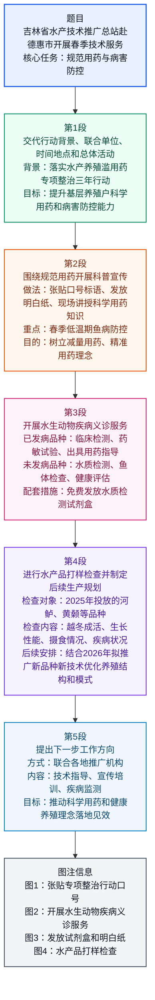

# 基本信息

- 文章来源：吉林省水产技术推广总站
- 题目：吉林省水产技术推广总站深入德惠市开展春季技术服务扎实推进规范用药与病害防控工作
- 作者 / 发布机构：吉林省水产技术推广总站
- 作者背景简介：吉林省水产技术推广总站现隶属于吉林省农业农村厅。吉林省农业农村厅公开信息显示，该站属于省农业农村厅分管事业单位之一；其2025年部门预算公开材料显示，该站成立于1986年3月，主要职能包括水产技术引进、试验、示范与推广，水产品优良品种引进、保种、选育、驯化、繁育、推广与交流，全省水生动物检验检疫、疫病防控及病害防治的监测、预报、预防，以及渔业投入品使用监测、渔业公共信息和渔业技术宣传教育等。资料来源：吉林省农业农村厅领导分工页面、吉林省水产技术推广总站2025年部门预算公开材料。吉林省农业农村厅领导分工 [1](https://agri.jl.gov.cn/gk/tld/tld/wwy/)，吉林省水产技术推广总站2025年部门预算 [2](https://agri.jl.gov.cn/gk/cwgk/yjsgk/ysgk/2025n_197552/202503/P020250304676041383258.pdf)
- 原文说明：用户提供文本中含有“图片”“暂无评论”等网页复制残留信息，已剔除；正文、题目、图注和来源信息已保留。原文为中文，以下按规则提供用户原中文与高质量英文译文，不再额外回译成第二份中文。
- 时间说明：原文写“4月16日”，没有直接标明年份；文中同时出现“2025年在各养殖场投放”和“2026年省水产站拟重点推广”等信息，因此该活动大概率发生在2026年4月16日，但逐句精读中仍按原文处理为“April 16”。

---

# 前情提要

---

# 逐句精读

## 题目

🔸中文：吉林省水产技术推广总站 / 深入德惠市 / 开展 **`春季技术服务`** / 扎实推进 **`规范用药`** 与 **`病害防控`** 工作  

🔹English：The **`Jilin Provincial Aquatic Technology Extension Station`** / carried out **`spring technical services`** in Dehui City / to steadily advance **`standardized drug use`** and **`disease prevention and control`**.

背景注释：
“吉林省水产技术推广总站”是省级水产技术推广机构，英文可译为 **Jilin Provincial Aquatic Technology Extension Station**。这里的“推广”不是商业营销，而是农业技术体系中的 **extension**，即把技术成果、操作规程和生产经验推广到基层生产者。“德惠市”是吉林省长春市代管的县级市。标题中的“规范用药”指水产养殖中按法规、标准和技术要求科学使用渔药或兽药；“病害防控”指对水生动物疾病进行预防、监测、诊断和控制。

> **`aquatic`** /əˈkwætɪk/
> 词性与释义：adj. relating to water or living in water 与水有关的；水生的。
> 语域：科学、生态、农业、水产养殖。
> 画龙点睛：**`aquatic`** 比 **water-related** 更正式、更专业，常见搭配有 **`aquatic products`** 水产品、**`aquatic animals`** 水生动物、**`aquatic ecosystems`** 水生态系统。注意 **aquatic** 不等于 **marine**；**marine** 多指海洋的，而 **aquatic** 可覆盖淡水、咸水及所有水域环境。

> **`technology extension`** /tekˈnɑːlədʒi ɪkˈstenʃən/
> 词性与释义：n. the organized dissemination and application of technology 技术推广；技术扩散应用。
> 语域：农业、科研转化、公共服务、政策文本。
> 画龙点睛：**`extension`** 在农业领域不是“延长”，而是“推广服务”。**`agricultural extension services`** 指农业推广服务，**`extension workers`** 指推广人员。中文“推广站”不宜译成 **promotion station**，更自然准确的是 **extension station** 或 **technical extension center**。

> **`standardized drug use`** /ˈstændərdaɪzd drʌɡ juːs/
> 词性与释义：n. the regulated and proper use of medicines or veterinary drugs 规范用药。
> 语域：农业监管、兽医、水产品质量安全。
> 画龙点睛：**`standardized`** 强调“符合标准、规程和法规”。在水产养殖语境中，**drug** 可指渔药、兽药或治疗性投入品，不是“毒品”。可写 **promote standardized drug use** 推进规范用药，或 **ensure proper medication practices** 确保用药行为规范。

> **`disease prevention and control`** /dɪˈziːz prɪˈvenʃən ənd kənˈtroʊl/
> 词性与释义：n. measures to prevent, monitor and manage diseases 病害预防与控制。
> 语域：医学、公共卫生、兽医、水产养殖。
> 画龙点睛：中文“防控”常译为 **`prevention and control`**。它比单独的 **prevention** 范围更大，既包括事前预防，也包括发现疾病后的控制、处理和持续管理。类似表达包括 **epidemic prevention and control** 疫情防控、**pest prevention and control** 病虫害防控。

---

🔸中文：为深入落实 **`吉林省水产养殖滥用药专项整治三年行动`**，切实提升基层养殖户 **`科学用药`** 和 **`病害防控能力`**，4月16日，吉林省水产技术推广总站 / 联合长春市水产技术推广总站、德惠市水产技术推广中心 / 在长春市德惠地区 / 集中开展了系列 **`技术推广`** 与 **`便民服务`** 活动。  

🔹English：To thoroughly implement **`Jilin Province’s three-year special campaign against drug misuse in aquaculture`** / and effectively enhance grassroots farmers’ capacity for **`scientific drug use`** and **`disease prevention and control`**, / on April 16, the Jilin Provincial Aquatic Technology Extension Station, together with the Changchun Aquatic Technology Extension Station and the Dehui Aquatic Technology Extension Center, / carried out a series of **`technology extension`** and **`farmer-oriented public services`** / in the Dehui area of Changchun.

背景注释：
“水产养殖滥用药专项整治三年行动”属于水产品质量安全治理行动，核心是纠正水产养殖中违规、超量、不按规定或不科学使用药物的问题。“长春市水产技术推广总站”和“德惠市水产技术推广中心”分别属于市级和县市级水产技术服务体系。“便民服务”在本文中具体服务对象是养殖户，因此可译为 **farmer-oriented public services**，比直译 **convenience services for the people** 更自然。

> **`implement`** /ˈɪmplɪment/
> 词性与释义：v. to put a plan, policy, or decision into effect 实施；贯彻；落实。
> 语域：正式、政策、管理、学术写作。
> 画龙点睛：**`implement`** 常搭配 **policy, plan, strategy, campaign, reform**。中文“落实行动方案”可译为 **implement a campaign** 或 **put a plan into practice**。名词是 **implementation**，如 **policy implementation** 政策执行，是雅思、考研、GRE写作中的高频抽象名词。

> **`special campaign`** /ˈspeʃəl kæmˈpeɪn/
> 词性与释义：n. a focused and organized drive to address a specific issue 专项行动；专项整治行动。
> 语域：政府、新闻、公共治理。
> 画龙点睛：中文“专项整治”在自然英语中可译为 **`special campaign`**、**targeted campaign** 或 **targeted enforcement campaign**。若涉及执法，**enforcement** 更强；若是综合治理和宣传服务，**special campaign** 更稳妥。本句使用 **campaign against drug misuse**，准确表达“治理滥用药”。

> **`drug misuse`** /drʌɡ ˌmɪsˈjuːs/
> 词性与释义：n. improper, excessive, or unauthorized use of drugs 药物误用；不当用药；滥用药。
> 语域：医学、兽医、公共卫生、农业监管。
> 画龙点睛：**`misuse`** 比 **abuse** 更中性，强调“不按规定或不合适地使用”。水产养殖中的 **drug misuse** 可包括超剂量、超范围、不遵守休药期、使用禁用药等。可写 **reduce drug misuse in aquaculture** 减少水产养殖滥用药，或 **prevent the misuse of veterinary drugs** 防止兽药不当使用。

> **`grassroots farmers`** /ˈɡræsruːts ˈfɑːrmərz/
> 词性与释义：n. farmers at the local or community level 基层养殖户；一线农户。
> 语域：政策、农业发展、社会治理。
> 画龙点睛：**`grassroots`** 原义为“草根的、基层的”，常修饰 **communities, organizations, officials, farmers**。中文“基层养殖户”不宜译为 **basic-level farmers**；可译为 **grassroots farmers**、**local aquaculture farmers** 或 **frontline farmers**。本文强调技术服务下沉到一线生产主体。

> **`capacity`** /kəˈpæsəti/
> 词性与释义：n. the ability to do something; the amount something can contain 能力；容量；承载力。
> 语域：正式、管理、发展政策、学术。
> 画龙点睛：中文“提升能力”常译为 **enhance/improve/build capacity**。高频搭配包括 **capacity building** 能力建设、**monitoring capacity** 监测能力、**institutional capacity** 机构能力。注意 **capacity** 既可表示抽象能力，也可表示物理容量，如 **storage capacity** 存储容量。

> **`farmer-oriented public services`** /ˈfɑːrmər ˈɔːrientɪd ˈpʌblɪk ˈsɝːvɪsɪz/
> 词性与释义：n. public services designed around farmers’ needs 面向农户的公共服务；便民服务。
> 语域：公共服务、农业政策、新闻报道。
> 画龙点睛：中文“便民服务”没有完全固定的英文对应。若突出公共服务属性，可用 **public services**；若突出对象是养殖户，可用 **farmer-oriented services**。**oriented** 表示“以……为导向”，如 **market-oriented reform** 市场化改革、**problem-oriented approach** 问题导向方法。

---

🔸中文：活动期间，省、市两级推广站 / 围绕 **`水产养殖规范用药`** 主题 / 广泛开展 **`科普宣传`**。  

🔹English：During the event, / the provincial and municipal extension stations / carried out extensive **`science popularization and outreach`** / around the theme of **`standardized drug use in aquaculture`**.

背景注释：
“省、市两级推广站”指省级和市级水产技术推广机构协同开展工作。“科普宣传”并不是普通广告宣传，而是向养殖户普及科学知识、规范要求和实用技术。英语中可根据语境译为 **science popularization**, **public education**, **technical outreach** 或 **science popularization and outreach**。

> **`provincial and municipal`** /prəˈvɪnʃəl ənd mjuːˈnɪsɪpəl/
> 词性与释义：adj. relating to the province and the city 省级和市级的。
> 语域：行政、政府、公共管理。
> 画龙点睛：中文“省、市两级”自然表达是 **at the provincial and municipal levels**。**provincial** 对应“省级”，**municipal** 对应“市级”。不要直译为 **province and city two levels**。例：**coordination at the provincial and municipal levels** 省市两级协同。

> **`extensive`** /ɪkˈstensɪv/
> 词性与释义：adj. covering a large area, range, or amount 广泛的；大范围的。
> 语域：正式、新闻、学术。
> 画龙点睛：**`extensive`** 强调范围广，常见搭配有 **extensive research** 广泛研究、**extensive coverage** 广泛覆盖、**extensive outreach** 广泛宣传。它容易和 **intensive** 混淆；**intensive** 强调强度大、密集，如 **intensive training** 强化培训。

> **`science popularization`** /ˈsaɪəns ˌpɑːpjələrəˈzeɪʃən/
> 词性与释义：n. the communication of scientific knowledge to non-specialists 科普；科学知识普及。
> 语域：教育、科技传播、政府宣传。
> 画龙点睛：**`popularization`** 不是简单的“流行化”，而是“使专业知识为大众理解”。若面向农户传播实用技术，也可用 **technical outreach**。考试写作可用 **science communication** 表示“科学传播”，比 **science publicity** 更自然。

> **`outreach`** /ˈaʊtriːtʃ/
> 词性与释义：n. organized efforts to provide information or services to target groups 外展服务；主动宣传服务。
> 语域：公共服务、教育、医疗、非营利机构。
> 画龙点睛：**`outreach`** 强调主动走出去，把信息、培训和服务送到目标人群身边。常见搭配有 **community outreach** 社区外展、**public outreach campaign** 公众宣传活动、**farmer outreach** 面向农户的推广服务。本文“深入基层”正体现 outreach 的含义。

---

🔸中文：工作人员 / 在养殖集中区域 / 张贴 **`宣传口号和标语`**，向养殖户发放水产养殖用药 **`《明白纸》`**，并现场讲授 **`科学用药知识`**，重点指导 **`春季低温期鱼病防控技术`**，帮助养殖户树立“**`减量用药、精准用药`**”理念，从源头保障 **`水产品质量安全`**。  

🔹English：Staff members / posted **`publicity slogans and banners`** in concentrated aquaculture areas, / distributed **`plain-language guidance sheets`** on drug use in aquaculture to farmers, / and provided on-site instruction on **`scientific drug use`**, / with a focus on techniques for **`fish disease prevention and control during the low-temperature period in spring`**; / this helped farmers develop the concept of **`reduced and precise drug use`** / and safeguard the **`quality and safety of aquatic products`** at the source.

背景注释：
“养殖集中区域”指养殖场、池塘、基地等养殖户和养殖生产活动较集中的区域。“明白纸”是基层政策宣传常见形式，通常以简明语言列明规定、要点、禁用事项或操作流程，不能直译为 **understanding paper**，宜译为 **plain-language guidance sheet** 或 **fact sheet**。“减量用药、精准用药”体现水产养殖从经验性、粗放式用药转向诊断基础上的精准化、减量化用药。“从源头保障水产品质量安全”指从养殖环节控制药残、病害和投入品风险。

> **`publicity slogans and banners`** /pʌbˈlɪsəti ˈsloʊɡənz ənd ˈbænərz/
> 词性与释义：n. short promotional phrases and displayed signs 宣传口号和标语。
> 语域：宣传、公共治理、活动报道。
> 画龙点睛：**`slogan`** 是“口号”，**banner** 是“横幅、标语牌”。中文“宣传”在政府语境中不一定是商业广告，可译为 **publicity**, **public awareness**, **outreach**。若强调提高意识，可写 **public awareness posters**；若强调现场悬挂，可写 **put up banners**。

> **`plain-language guidance sheet`** /pleɪn ˈlæŋɡwɪdʒ ˈɡaɪdəns ʃiːt/
> 词性与释义：n. an easy-to-understand written guide 通俗易懂的指导单；明白纸。
> 语域：公共服务、基层宣传、技术指导。
> 画龙点睛：**`plain-language`** 表示“用普通人能懂的语言写成的”。中文“明白纸”要译功能，不要译字面。可译为 **plain-language leaflet**, **easy-to-understand guidance sheet**, **fact sheet**。其中 **fact sheet** 在英语机构文件中很常见，指信息简表。

> **`on-site instruction`** /ˌɑːnˈsaɪt ɪnˈstrʌkʃən/
> 词性与释义：n. teaching or guidance provided at the actual location 现场指导；现场讲授。
> 语域：培训、工程、农业技术服务。
> 画龙点睛：**`on-site`** 表示“现场的、实地的”，常见搭配有 **on-site inspection** 现场检查、**on-site training** 现场培训、**on-site technical guidance** 现场技术指导。它与 **online** 相对，也与 **off-site** 异地的相对。

> **`low-temperature period`** /loʊ ˈtemprətʃər ˈpɪriəd/
> 词性与释义：n. a period marked by relatively low temperatures 低温期。
> 语域：农业、气象、水产养殖。
> 画龙点睛：水产养殖中，春季低温期会影响鱼类摄食、免疫和病原活动。英语可说 **during the low-temperature period in spring**，若强调水温，可说 **when spring water temperatures remain low**。水产语境中 **water temperature** 往往比普通 **weather temperature** 更关键。

> **`reduced and precise drug use`** /rɪˈduːst ənd prɪˈsaɪs drʌɡ juːs/
> 词性与释义：n. the practice of using fewer drugs and applying them accurately 减量用药、精准用药。
> 语域：农业绿色发展、兽医、水产品质量安全。
> 画龙点睛：**`reduced`** 强调用药量减少，**precise** 强调基于诊断、药敏试验、水质状况和病情的精准投放。可写 **A shift toward reduced and precise drug use is essential for safer aquaculture.** 注意 **precise** 更强调“精确、目标明确”，不只是一般的“正确”。

> **`safeguard`** /ˈseɪfɡɑːrd/
> 词性与释义：v. to protect something from harm or risk 保障；维护；保护。
> 语域：正式、法律、政策、新闻。
> 画龙点睛：**`safeguard`** 比 **protect** 更正式，常搭配 **public health, food safety, rights and interests, product quality**。中文“从源头保障”可译为 **safeguard ... at the source**，这是政策和新闻文本中很实用的表达。

---

🔸中文：针对当前 **`水生动物疾病高发风险`**，吉林省水产技术推广总站 **`科技志愿服务队`** / 同步开展了 **`水生动物疾病义诊服务`**。  

🔹English：In response to the current high risk of **`aquatic animal disease outbreaks`**, / the **`science and technology volunteer service team`** of the Jilin Provincial Aquatic Technology Extension Station / simultaneously provided **`free diagnostic services for aquatic animal diseases`**.

背景注释：
“水生动物疾病”包括鱼类、虾蟹类、贝类等养殖水生动物的传染性或非传染性疾病。“疾病义诊”借用人类医疗中的“义诊”概念，在本文中指技术人员免费为养殖动物提供病害诊断、检测和用药建议。“科技志愿服务队”可译为 **science and technology volunteer service team**，体现科技人员面向基层开展公益服务。

> **`in response to`** /ɪn rɪˈspɑːns tuː/
> 词性与释义：prep. phrase as a reaction to something 针对；回应；为了应对。
> 语域：正式、新闻、学术。
> 画龙点睛：**`in response to`** 是翻译“针对、应对”的高质量表达。例：**in response to rising disease risks** 针对不断上升的疾病风险。它不同于 **according to**；**according to** 是“根据”，而 **in response to** 强调采取行动来回应某种情况。

> **`outbreak`** /ˈaʊtbreɪk/
> 词性与释义：n. a sudden occurrence of disease, violence, or something undesirable 暴发；突然发生。
> 语域：医学、公共卫生、农业病害。
> 画龙点睛：**`outbreak`** 常用于传染病或病害，如 **a disease outbreak** 疾病暴发、**an outbreak of avian flu** 禽流感暴发。中文“高发风险”并不等于已经暴发，所以译为 **high risk of disease outbreaks**，比直接译成 **many outbreaks** 更严谨。

> **`simultaneously`** /ˌsaɪməlˈteɪniəsli/
> 词性与释义：adv. at the same time 同时；同步地。
> 语域：正式、科技、新闻。
> 画龙点睛：**`simultaneously`** 比 **at the same time** 更正式。中文“同步开展”可译为 **simultaneously carried out** 或 **provided ... in parallel**。**in parallel** 也表示“并行推进”，常用于项目管理和科技文本。

> **`diagnostic services`** /ˌdaɪəɡˈnɑːstɪk ˈsɝːvɪsɪz/
> 词性与释义：n. services aimed at identifying diseases or problems 诊断服务。
> 语域：医疗、兽医、水产病害、技术服务。
> 画龙点睛：**`diagnostic`** 是形容词，“诊断的”。常见搭配有 **diagnostic test** 诊断检测、**diagnostic tool** 诊断工具、**diagnostic services** 诊断服务。本文“义诊”若直译成 **charity clinic** 会过于人类医疗化，用 **free diagnostic services** 更贴合动物病害场景。

---

🔸中文：对于已发病的 **`鲤鱼`**、**`黄颡鱼`** 等品种，技术人员 / 现场进行 **`临床检测`** 及 **`药敏试验检测`**，并针对性出具 **`用药指导意见`**。  

🔹English：For diseased species such as **`carp`** and **`yellow catfish`**, / technicians conducted **`clinical examinations`** and **`antimicrobial susceptibility tests`** on site, / and issued **`targeted guidance on drug use`**.

背景注释：
“鲤鱼”一般译为 **carp**，是中国淡水养殖中常见鱼类。“黄颡鱼”可译为 **yellow catfish**，是淡水养殖中的重要品种之一。“药敏试验”即检测病原微生物对不同药物的敏感性，为精准用药提供依据，避免盲目用药、重复用药和诱发耐药风险。“临床检测”在水产病害语境中包括观察外观症状、行为异常、体表损伤、鳃部或内脏病变等。

> **`diseased`** /dɪˈziːzd/
> 词性与释义：adj. affected by disease 患病的；有病害的。
> 语域：医学、兽医、农业。
> 画龙点睛：**`diseased fish`** 表示“病鱼、发病鱼”，比 **sick fish** 更正式，适合技术报道。注意 **disease** 是名词，**diseased** 是形容词。**disease-ridden** 语气更强，常带夸张或负面色彩，正式技术文本中要慎用。

> **`carp`** /kɑːrp/
> 词性与释义：n. a common freshwater fish, often farmed for food 鲤鱼。
> 语域：水产、食品、生态。
> 画龙点睛：**`carp`** 泛指鱼类时单复数常同形，也可见 **carps**，但技术和食品语境中 **carp** 更常见。相关表达有 **common carp** 普通鲤、**grass carp** 草鱼、**silver carp** 鲢鱼、**bighead carp** 鳙鱼。翻译具体鱼种时不要把所有鲤科鱼都笼统译为 carp。

> **`clinical examination`** /ˈklɪnɪkəl ɪɡˌzæmɪˈneɪʃən/
> 词性与释义：n. an examination based on observable symptoms and professional assessment 临床检查；临床检测。
> 语域：医学、兽医、水产病害。
> 画龙点睛：**`clinical`** 不只用于人类医院，也可用于兽医和水产病害。**clinical signs** 指临床症状，如游动异常、体表出血、鳃部病变等。中文“临床检测”更适合译为 **clinical examination**，而不是笼统的 **test**。

> **`antimicrobial susceptibility test`** /ˌæntiˌmaɪˈkroʊbiəl səˌseptəˈbɪləti test/
> 词性与释义：n. a test that determines how sensitive a microorganism is to drugs 药敏试验；抗菌药物敏感性试验。
> 语域：医学检验、兽医、微生物学。
> 画龙点睛：这是精准用药的关键术语。**susceptibility** 表示“敏感性、易感性”，相关反义概念是 **resistance** 耐药性。常见缩写为 **AST**。可写 **conduct antimicrobial susceptibility testing before treatment** 治疗前开展药敏试验。

> **`targeted guidance`** /ˈtɑːrɡɪtɪd ˈɡaɪdəns/
> 词性与释义：n. advice tailored to a specific case or problem 针对性指导。
> 语域：政策、培训、技术服务。
> 画龙点睛：**`targeted`** 是表达“有针对性的”的高频词，常见搭配有 **targeted measures** 针对性措施、**targeted treatment** 针对性治疗、**targeted support** 精准支持。中文“针对性出具意见”可译为 **issue targeted recommendations/guidance**。

---

🔸中文：对于未发病的养殖品种，则通过 **`水质检测`**、**`鱼体检查`** 等手段，帮助养殖户 / 科学评估 **`健康状况`**，有针对性地做好 **`疾病预防`** 工作。  

🔹English：For farmed species that had not yet shown disease symptoms, / technicians used methods such as **`water quality testing`** and **`fish body examinations`** / to help farmers scientifically assess their **`health status`** / and carry out **`targeted disease prevention`**.

背景注释：
本句体现“预防为主”的病害管理思路：未发病并不意味着无风险，因此需要通过水质、鱼体、摄食、活动行为等指标提前评估健康状况。“水质检测”通常包括溶解氧、氨氮、亚硝酸盐、pH、水温等指标；“鱼体检查”可能包括体表、鳃、肠道、寄生虫和机械损伤等检查。

> **`show disease symptoms`** /ʃoʊ dɪˈziːz ˈsɪmptəmz/
> 词性与释义：v. phrase to display signs of disease 表现出疾病症状。
> 语域：医学、兽医、农业。
> 画龙点睛：中文“未发病”可译为 **had not developed disease**，也可译为 **had not shown disease symptoms**。后者更谨慎，因为没有症状不代表完全无感染。动物语境中也常用 **clinical signs**，如 **fish showing clinical signs of infection**。

> **`water quality testing`** /ˈwɔːtər ˈkwɑːləti ˈtestɪŋ/
> 词性与释义：n. the measurement of physical, chemical, or biological conditions of water 水质检测。
> 语域：环境科学、水产养殖、公共卫生。
> 画龙点睛：**`water quality`** 常见指标包括 **dissolved oxygen** 溶解氧、**ammonia nitrogen** 氨氮、**nitrite** 亚硝酸盐、**pH level** 酸碱度。水产写作可用 **monitor water quality regularly** 定期监测水质，或 **improve water quality management** 加强水质管理。

> **`health status`** /helθ ˈsteɪtəs/
> 词性与释义：n. the overall condition of health 健康状况。
> 语域：医学、公共卫生、兽医、水产。
> 画龙点睛：**`status`** 在正式英语中表示“状态、状况、地位”。**health status** 可用于人、动物、种群或生态系统。类似搭配有 **nutritional status** 营养状况、**infection status** 感染状态、**reproductive status** 繁殖状态。

> **`targeted disease prevention`** /ˈtɑːrɡɪtɪd dɪˈziːz prɪˈvenʃən/
> 词性与释义：n. prevention measures designed for specific risks 针对性疾病预防。
> 语域：医学、农业、公共卫生。
> 画龙点睛：**`prevention`** 强调事前预防，搭配 **targeted** 后表示根据具体风险采取措施。可写 **take targeted preventive measures** 采取针对性预防措施。**preventive** 和 **preventative** 都可作形容词，但 **preventive** 更常见、更简洁。

---

🔸中文：此外，还向养殖户 / 免费发放了 **`水质检测试剂盒`**，提升基层 **`自主监测能力`**。  

🔹English：In addition, / **`water quality testing kits`** were distributed to farmers free of charge, / improving grassroots capacity for **`independent monitoring`**.

背景注释：
“水质检测试剂盒”通常用于现场快速检测养殖水体中的关键水质指标，有助于养殖户及时发现水质异常。“自主监测能力”强调养殖户不完全依赖上级机构或专家到场，而是在日常生产中具备基础自检、自查和风险预警能力。

> **`testing kit`** /ˈtestɪŋ kɪt/
> 词性与释义：n. a set of tools or materials used to test something 检测试剂盒；测试套装。
> 语域：医学检测、环境监测、水质管理。
> 画龙点睛：**`kit`** 指一整套工具或材料，如 **first-aid kit** 急救包、**test kit** 检测试剂盒、**water testing kit** 水质检测套装。这里 **water quality testing kit** 比 **water quality detection reagent box** 更自然。

> **`free of charge`** /friː əv tʃɑːrdʒ/
> 词性与释义：adv. phrase without payment 免费地。
> 语域：正式、公共服务、商业说明。
> 画龙点睛：**`free of charge`** 比 **for free** 更正式，适合公共服务报道。例：**The service is provided free of charge.** 该服务免费提供。**complimentary** 也可表示“免费的”，但常用于酒店、航空、商业礼遇，如 **complimentary breakfast** 免费早餐。

> **`independent monitoring`** /ˌɪndɪˈpendənt ˈmɑːnɪtərɪŋ/
> 词性与释义：n. monitoring carried out without direct reliance on others 自主监测；独立监测。
> 语域：环境治理、农业管理、公共监管。
> 画龙点睛：**`monitoring`** 不只是“看”，而是持续跟踪、记录和评估。常见搭配有 **routine monitoring** 常规监测、**real-time monitoring** 实时监测、**disease monitoring** 疾病监测。中文“自主监测能力”可译为 **capacity for independent monitoring**。

---

🔸中文：活动中，技术人员还对吉林省水产技术推广总站2025年在各养殖场投放的 **`河鲈`**、**`黄颡`** 等品种的 **`越冬成活`**、**`生长性能`**、**`摄食情况`** 及 **`疾病发生状况`** 等进行了 **`打样检查`**，并结合检查结果 / 对后续 **`养殖管理`** 提出具体指导意见。  

🔹English：During the event, / technicians also conducted **`sampling inspections`** of species such as **`river perch`** and **`yellow catfish`** that had been stocked by the Jilin Provincial Aquatic Technology Extension Station at various farms in 2025, / examining their **`overwintering survival`**, **`growth performance`**, **`feeding status`**, and **`disease occurrence`**; / based on the inspection results, / they offered specific guidance on subsequent **`aquaculture management`**.

背景注释：
“河鲈”可译为 **river perch**，具体物种学名需结合项目材料进一步确认。“黄颡”是“黄颡鱼”的简称，可译为 **yellow catfish**。“投放”在水产养殖中通常指向养殖水体或养殖场放养苗种，英语常用动词 **stock**。“越冬成活”是吉林等寒冷地区水产养殖的重要指标，反映品种适应性和管理水平。“打样检查”结合上下文应理解为抽样检查或样品检查，译为 **sampling inspection** 较合适。

> **`sampling inspection`** /ˈsæmplɪŋ ɪnˈspekʃən/
> 词性与释义：n. inspection based on selected samples 抽样检查；打样检查。
> 语域：质量检测、农业生产、实验评估。
> 画龙点睛：中文“打样”在不同领域含义不同：印刷中是 **proofing**，生产中可指做样品，检测中常指抽取样本检查。本文是水产品检查，译为 **sampling inspection** 最稳妥。可写 **conduct a sampling inspection** 开展抽样检查。

> **`stock`** /stɑːk/
> 词性与释义：v. to put fish or animals into a body of water or farm for breeding or production 投放；放养。n. 存货；种群；股票。
> 语域：水产养殖、农业、商业、金融。
> 画龙点睛：**`stock`** 是熟词多义。金融里是“股票”，商业里是“库存”，水产里是“投放、放养”。如 **stock a pond with carp** 向池塘投放鲤鱼。**stocking density** 是“放养密度”，水产养殖中非常重要。

> **`overwintering survival`** /ˌoʊvərˈwɪntərɪŋ sərˈvaɪvəl/
> 词性与释义：n. survival through the winter period 越冬成活。
> 语域：生态学、水产养殖、农业。
> 画龙点睛：**`overwinter`** 作动词表示“越冬”。如 **fish overwinter in ponds** 鱼在池塘越冬。**survival rate** 是“成活率”，因此“越冬成活率”可译为 **overwintering survival rate**。寒区养殖常用这一指标评价品种适应性。

> **`growth performance`** /ɡroʊθ pərˈfɔːrməns/
> 词性与释义：n. how well an organism grows under certain conditions 生长性能；生长表现。
> 语域：动物营养、水产养殖、农业科研。
> 画龙点睛：**`performance`** 不只指“表演”，在科研和生产中常表示“性能、表现”。**growth performance** 可包括增重率、特定生长率、饲料转化率等。类似表达有 **reproductive performance** 繁殖性能、**production performance** 生产性能。

> **`feeding status`** /ˈfiːdɪŋ ˈsteɪtəs/
> 词性与释义：n. the condition or pattern of feeding 摄食情况。
> 语域：动物养殖、水产生产。
> 画龙点睛：**`feeding`** 在动物养殖中表示“摄食、投喂、喂养”。**feeding status** 可包括摄食活跃度、摄食量、是否拒食等。相关表达有 **feed intake** 采食量、**feeding behavior** 摄食行为、**feeding rate** 投喂率。

> **`subsequent`** /ˈsʌbsɪkwənt/
> 词性与释义：adj. happening after something else 随后的；后续的。
> 语域：正式、学术、新闻。
> 画龙点睛：**`subsequent`** 是 **following/later** 的正式表达，常用于 **subsequent management** 后续管理、**subsequent research** 后续研究、**subsequent measures** 后续措施。中文“后续养殖管理”译为 **subsequent aquaculture management**，比 **later farming management** 更专业。

---

🔸中文：同时，结合2026年省水产站拟重点推广的 **`水产新品种`** 及 **`新技术`**，技术人员 / 与养殖户共同研究制定了新一轮 **`养殖生产规划`**，推动 **`养殖结构和模式`** 持续优化。  

🔹English：At the same time, / in light of the **`new aquaculture varieties`** and **`new technologies`** that the provincial aquatic technology station plans to prioritize for extension in 2026, / technicians worked with farmers to study and formulate a new round of **`aquaculture production plans`**, / thereby promoting the continuous optimization of **`aquaculture structures and models`**.

背景注释：
“省水产站”是“吉林省水产技术推广总站”的简称。“拟重点推广”说明相关新品种和新技术属于计划重点推进方向，英语用 **plans to prioritize for extension** 较准确。“养殖结构和模式”可能包括品种结构、养殖密度、生产周期、健康养殖模式、水质管理技术、疾病防控路径和市场导向安排等。“持续优化”强调不是一次性调整，而是根据品种表现、市场需求和技术条件不断改进。

> **`in light of`** /ɪn laɪt əv/
> 词性与释义：prep. phrase considering something 鉴于；结合；考虑到。
> 语域：正式、法律、学术、政策。
> 画龙点睛：**`in light of`** 是翻译“结合、考虑到、鉴于”的高级表达。例：**in light of new evidence** 鉴于新证据。它比 **according to** 更强调“基于某情况作出判断或安排”。本句用来承接2026年推广计划。

> **`prioritize`** /praɪˈɔːrətaɪz/
> 词性与释义：v. to treat something as more important and deal with it first 优先考虑；重点推进。
> 语域：管理、政策、商业、学术。
> 画龙点睛：中文“重点推广”中的“重点”可用 **prioritize** 表达。常见搭配有 **prioritize safety** 优先考虑安全、**prioritize disease prevention** 优先防病、**prioritize key technologies for extension** 重点推广关键技术。名词 **priority** 表示“优先事项”。

> **`formulate`** /ˈfɔːrmjuleɪt/
> 词性与释义：v. to carefully develop a plan, policy, or idea 制定；规划；系统提出。
> 语域：正式、政策、学术、管理。
> 画龙点睛：**`formulate`** 比 **make** 更正式，常用于 **formulate a plan/policy/strategy** 制定计划、政策、战略。中文“研究制定”可译为 **study and formulate**。注意 **formulate** 还可表示“配制”药品或配方，如 **formulate a vaccine** 配制疫苗。

> **`production plan`** /prəˈdʌkʃən plæn/
> 词性与释义：n. a plan that sets out production goals, methods, and arrangements 生产规划；生产计划。
> 语域：农业生产、制造业、管理。
> 画龙点睛：**`production plan`** 在水产养殖中可包括品种选择、苗种投放、饲料安排、水质管理、防病措施、上市节奏等。常见动词搭配有 **develop production plans**、**formulate production plans**。有 **a new round of** 时，后面常用复数 **plans**。

> **`optimization`** /ˌɑːptɪməˈzeɪʃən/
> 词性与释义：n. the process of making something as effective or efficient as possible 优化。
> 语域：科技、管理、工程、政策。
> 画龙点睛：**`optimization`** 是“优化”的名词，动词为 **optimize**。常见搭配有 **optimize the structure** 优化结构、**optimize resource allocation** 优化资源配置、**continuous optimization** 持续优化。本文指养殖品种结构、技术路径和生产模式不断改进。

---

🔸中文：下一步，吉林省水产技术推广总站 / 将继续联合各地推广机构，持续深入基层 / 开展 **`技术指导`**、**`宣传培训`** 与 **`疾病监测`**，推动 **`科学用药`** 和 **`健康养殖理念`** 落地见效，为全省渔业 **`绿色高质量发展`** 提供有力 **`技术支撑`**。  

🔹English：Going forward, / the Jilin Provincial Aquatic Technology Extension Station / will continue to work with local extension agencies / to carry out sustained grassroots-level **`technical guidance`**, **`public outreach and training`**, and **`disease monitoring`**; / it will promote the effective implementation of the concepts of **`scientific drug use`** and **`healthy aquaculture`**, / providing strong **`technical support`** for the province’s **`green and high-quality development`** of fisheries.

背景注释：
“下一步”是政务新闻结尾常见承接语，英语可译为 **going forward**。“落地见效”不能直译为 “fall to the ground and show effects”，应译为 **effective implementation** 或 **translate ... into tangible results**。“健康养殖”强调良种、良法、良水、科学投喂、病害预防、规范用药和生态可持续。“绿色高质量发展”是政策表达，英语可译为 **green and high-quality development**，若面向国际读者，也可解释为 environmentally sustainable and quality-oriented development。

> **`going forward`** /ˈɡoʊɪŋ ˈfɔːrwərd/
> 词性与释义：adv. phrase from now on; in the future 今后；下一步。
> 语域：商务、政策、新闻。
> 画龙点睛：**`going forward`** 是英美商务与政策文本高频表达，比 **in the next step** 更自然。例：**Going forward, the agency will strengthen monitoring.** 下一步，该机构将加强监测。它不是物理意义上的“向前走”。

> **`grassroots-level`** /ˈɡræsruːts ˈlevəl/
> 词性与释义：adj. at the local or basic level 基层层面的。
> 语域：政策、社会治理、发展研究。
> 画龙点睛：**`grassroots-level technical guidance`** 表示“面向基层的一线技术指导”。中文“深入基层”可译为 **go deep into grassroots communities**，但在英语新闻中 **at the grassroots level** 更简洁自然。

> **`sustained`** /səˈsteɪnd/
> 词性与释义：adj. continuing for a long time 持续的；持久的。
> 语域：正式、政策、学术。
> 画龙点睛：**`sustained`** 比 **continuous** 更强调长期保持力度。常见搭配有 **sustained efforts** 持续努力、**sustained growth** 持续增长、**sustained monitoring** 持续监测。本文说明这不是一次性活动，而是持续服务机制。

> **`effective implementation`** /ɪˈfektɪv ˌɪmplɪmenˈteɪʃən/
> 词性与释义：n. the successful putting of a policy or idea into practice 有效落实；落地见效。
> 语域：政策、项目管理、学术。
> 画龙点睛：中文“落地见效”核心含义是“不停留在口号，而是真正产生效果”。可译为 **effective implementation**、**produce tangible results**、**translate ideas into action**。若突出基层效果，可写 **produce tangible results on the ground**。

> **`healthy aquaculture`** /ˈhelθi ˈækwəkʌltʃər/
> 词性与释义：n. aquaculture practices that maintain animal health, product safety, and ecological sustainability 健康养殖。
> 语域：水产养殖、农业绿色发展。
> 画龙点睛：**`aquaculture`** 指水产养殖，不是水族馆。**healthy aquaculture** 包括良好水质、合理密度、科学投喂、病害预防、规范用药等。相关表达有 **green aquaculture** 绿色养殖、**sustainable aquaculture** 可持续水产养殖。

> **`green and high-quality development`** /ɡriːn ənd ˌhaɪ ˈkwɑːləti dɪˈveləpmənt/
> 词性与释义：n. development that is environmentally sound and quality-oriented 绿色高质量发展。
> 语域：政策、经济、农业发展。
> 画龙点睛：这是中国特色政策表达，英译可保留为 **green and high-quality development**。**green** 强调生态、低污染、可持续，**high-quality** 强调效率、质量、安全和效益。若需解释，可写 **environmentally sustainable and quality-oriented development**。

> **`technical support`** /ˈteknɪkəl səˈpɔːrt/
> 词性与释义：n. expert help, tools, or services related to technology 技术支撑；技术支持。
> 语域：科技、工程、农业、公共服务。
> 画龙点睛：**`support`** 在这里多作不可数名词，通常不说 **a technical support**。常见搭配是 **provide strong technical support for...** 为……提供有力技术支撑。中文“支撑”也可用动词 **underpin**，如 **Technology underpins green development.**

---

## 图注

🔸中文：图1 / 张贴 **`水产养殖滥用药专项整治行动口号`**  

🔹English：Figure 1: / Posting slogans for the **`special campaign against drug misuse in aquaculture`**.

背景注释：
该图注对应现场宣传环节。“图1”在正式文本、报告和论文中可译为 **Figure 1**；如果是新闻图片，也可译为 **Photo 1**。这里为了保持规范统一，译为 **Figure 1**。“张贴口号”可用 **posting slogans** 或 **putting up slogans**。

> **`figure`** /ˈfɪɡjər/
> 词性与释义：n. an illustration, chart, or image in a text 图；图表；插图。
> 语域：学术、报告、正式文本。
> 画龙点睛：**`Figure 1`** 是论文和报告中常见格式。**figure** 还可表示“数字、人物、身材、认为”。如 **a key figure** 关键人物，**sales figures** 销售数据，**figure out** 弄明白。图注中 **Figure** 通常首字母大写。

> **`posting`** /ˈpoʊstɪŋ/
> 词性与释义：n./gerund putting up a notice, sign, or information 张贴；发布。
> 语域：新闻、行政、互联网。
> 画龙点睛：**`post`** 作动词既可指线下“张贴公告”，也可指线上“发布帖子”。**posting slogans** 是“张贴口号”。若强调张贴海报，可说 **put up posters**；若强调悬挂横幅，可说 **put up banners**。

> **`campaign against`** /kæmˈpeɪn əˈɡenst/
> 词性与释义：n. phrase an organized effort to fight or reduce something 反对、治理或整治……的行动。
> 语域：新闻、政策、社会运动。
> 画龙点睛：**`campaign against + problem`** 是常用结构，如 **a campaign against illegal fishing** 打击非法捕捞行动，**a campaign against drug misuse** 整治滥用药行动。注意 **campaign for** 表示“争取、支持”，如 **campaign for better food safety standards**。

---

🔸中文：图2 / 开展 **`水生动物疾病义诊服务`**  

🔹English：Figure 2: / Providing **`free diagnostic services for aquatic animal diseases`**.

背景注释：
该图注对应前文“水生动物疾病义诊服务”。英语图注常用动名词开头，简洁说明图片中的动作。这里的“义诊”不是人类医疗门诊，而是技术人员对养殖水生动物病害进行免费诊断与指导。

> **`provide`** /prəˈvaɪd/
> 词性与释义：v. to give or make something available 提供；供给。
> 语域：通用、正式、公共服务。
> 画龙点睛：**`provide`** 是服务类文本核心动词，常搭配 **services, support, guidance, training**。注意结构：**provide sb. with sth.** 或 **provide sth. for sb.**。如 **provide farmers with guidance** 或 **provide guidance for farmers**，考试写作建议使用完整结构。

> **`free diagnostic services`** /friː ˌdaɪəɡˈnɑːstɪk ˈsɝːvɪsɪz/
> 词性与释义：n. no-cost services for identifying disease problems 免费诊断服务；义诊服务。
> 语域：医疗、兽医、水产技术服务。
> 画龙点睛：中文“义诊”含有“免费、公益、现场服务”的意思。动物病害语境下宜译为 **free diagnostic services**。**diagnosis** 是名词“诊断”，复数是 **diagnoses** /ˌdaɪəɡˈnoʊsiːz/；动词是 **diagnose**。

> **`aquatic animal diseases`** /əˈkwætɪk ˈænɪməl dɪˈziːzɪz/
> 词性与释义：n. diseases affecting animals that live in water 水生动物疾病。
> 语域：兽医、水产养殖、动物卫生。
> 画龙点睛：**`aquatic animal`** 包括鱼、虾、蟹、贝、蛙等水生养殖动物。**aquatic animal health** 是国际动物卫生与水产养殖中常见表达。注意 **fish disease** 只是鱼病，范围小于 **aquatic animal disease**。

---

🔸中文：图3 / 发放 **`水质检测试剂盒`** 及“**`明白纸`**”等  

🔹English：Figure 3: / Distributing **`water quality testing kits`**, **`plain-language guidance sheets`**, and other materials.

背景注释：
该图注展示便民服务中的物资发放环节。水质检测试剂盒用于提升养殖户现场自检能力；“明白纸”用于简明传达用药规范、禁用事项、病害预防和操作要点等信息。

> **`distribute`** /dɪˈstrɪbjuːt/
> 词性与释义：v. to give things to a number of people 分发；发放；配送。
> 语域：公共服务、物流、教育、新闻。
> 画龙点睛：**`distribute`** 比 **give out** 更正式，适合新闻报道。常见搭配有 **distribute leaflets** 发放传单、**distribute supplies** 发放物资、**distribute testing kits** 发放检测试剂盒。名词 **distribution** 表示“分发、分配、分布”。

> **`materials`** /məˈtɪriəlz/
> 词性与释义：n. items or documents used for a specific purpose 材料；资料；物资。
> 语域：教育、培训、宣传、生产。
> 画龙点睛：**`materials`** 可指纸质资料，也可指实际物资。本文 **other materials** 对应中文“等”。注意 **material** 作不可数名词可表示“材料”，如 **raw material** 原材料；作复数时常表示“资料、用品”。

> **`guidance sheet`** /ˈɡaɪdəns ʃiːt/
> 词性与释义：n. a short written document giving instructions or advice 指导单；说明单。
> 语域：公共服务、技术培训、健康教育。
> 画龙点睛：**`guidance`** 是不可数名词，表示“指导、指南”。**sheet** 是单页纸，因此 **guidance sheet** 很适合译“明白纸”。如果内容更像宣传册，可译为 **leaflet**；如果是简明信息表，可译为 **fact sheet**；如果是操作说明，可译为 **instruction sheet**。

---

🔸中文：图4 / 水产品“**`打样`**”检查  

🔹English：Figure 4: / **`Sampling inspection`** of aquatic products.

背景注释：
此处“打样”结合前文“对河鲈、黄颡等品种的越冬成活、生长性能、摄食情况及疾病发生状况等进行了打样检查”，应理解为抽样检查或样本检查，而不是设计、印刷领域的“打样”。“水产品”可译为 **aquatic products**，在农业和食品安全语境中指鱼、虾、蟹、贝等养殖或捕捞产品。

> **`sampling`** /ˈsæmplɪŋ/
> 词性与释义：n. the act of selecting a small part for examination 抽样；采样。
> 语域：统计、检测、食品安全、环境监测。
> 画龙点睛：**`sampling`** 是检测类文本高频词。常见搭配有 **sampling inspection** 抽样检查、**water sampling** 水样采集、**random sampling** 随机抽样、**sample size** 样本量。**sample** 可作名词“样本”，也可作动词“取样”。

> **`aquatic products`** /əˈkwætɪk ˈprɑːdʌkts/
> 词性与释义：n. edible or commercial products from aquatic organisms 水产品。
> 语域：农业、食品贸易、质量安全。
> 画龙点睛：**`aquatic products`** 是水产品质量安全、进出口和农业报道中的常用译法。也可说 **fishery products**，范围包括捕捞和养殖渔业产品。若仅指海产品，可用 **seafood**；若包括淡水鱼、虾蟹等，**aquatic products** 更准确。

> **`inspection`** /ɪnˈspekʃən/
> 词性与释义：n. the act of examining something carefully 检查；检验；视察。
> 语域：质量控制、监管、工程、农业。
> 画龙点睛：**`inspection`** 强调有目的的检查。常见搭配有 **quality inspection** 质量检查、**on-site inspection** 现场检查、**sampling inspection** 抽样检查、**routine inspection** 常规检查。与 **test** 相比，**inspection** 范围更宽，可包括观察、测量、记录和判断。

