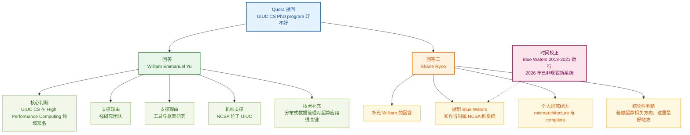

# How good is UIUC's computer science PhD program?

## 前情提要

文章来源：Quora 问答页摘录（用户提供；原页面 URL 未提供）  
题目：**How good is UIUC's computer science PhD program?**  
作者：William Emmanuel Yu；Shane Ryoo  
页面时间信息：用户摘录中两则回答均显示 **11y**，按当前日期 **2026 年 4 月 27 日** 推算，约为 **2015 年前后**；具体发布日期原摘录中未见。  
已纳入精读的正文范围：保留题目与两位答主对 UIUC CS PhD 的回答；广告、推广问答、浏览量、点赞数、导航栏等无关网页信息不纳入精读。

作者背景简介：

- William Emmanuel Yu：公开资料显示，William Emmanuel Yu 具有计算机科学博士背景，曾/现任与软件工程、网络、信息安全、大学信息系统及计算机科学教学相关的职位；据 ADAS 2026 简介，他是 Ateneo de Manila University 信息系统与计算机科学相关院系教师，并教授数据网络、编程、信息安全、大数据计算等课程。
- Shane Ryoo：据 Illinois ECE 校友资料，Shane Ryoo 是 University of Illinois ECE 校友，获得 BSEE、MSEE 和 PhD 学位；学生时期研究重点包括 **high-performance computer microarchitecture** 与 **compilers**，2014 年资料显示其任 Apple GPU Compiler/Driver Engineer。
- 背景实体：NCSA 即 National Center for Supercomputing Applications，是 University of Illinois Urbana-Champaign 的高性能计算与科研计算中心；Blue Waters 是 NCSA 曾运营的领导级超算系统，连续运行时间为 **2013 年至 2021 年**，并于 **2021 年 12 月 31 日**完成历史使命。因此，文中 “newest systems” 是作者写作当时的相对说法，不能理解为 2026 年现状。

---

## 逐句精读

🔹 How good / is **`UIUC's computer science PhD program`**?  
🔸 **`UIUC 的计算机科学博士项目`** / 到底有多好？

背景注释：

- **UIUC**：University of Illinois Urbana-Champaign，伊利诺伊大学厄巴纳-香槟分校。该校工程与计算机科学相关领域在美国公立大学中长期具有较强影响力。
- **CS**：Computer Science，计算机科学。
- **PhD program**：博士项目，通常包括课程学习、资格考试、研究训练、论文发表、博士论文与答辩等环节。
- 这句话是 Quora 问答标题，语气直接，适合口语化或论坛式提问；正式写作中可改为：**How strong is UIUC’s Ph.D. program in Computer Science?**

> **`How good is ... ?`** /haʊ ɡʊd ɪz/  
> 英文释义（question pattern）：used to ask about the quality, strength, or effectiveness of something；用于询问某事物的质量、实力或效果。  
> 语域：口语/论坛/日常提问。  
> 画龙点睛：**`How good is ...?`** 很自然，但略口语。学术或申请场景中，可换成 **`How strong is ...?`**、**`How reputable is ...?`**、**`How well-regarded is ...?`**。例如讨论学校项目时，**`strong`** 常指科研实力、师资、资源与声誉综合较强；**`reputable`** 更强调外界认可度与声誉。

> **`computer science`** /kəmˈpjuːtər ˈsaɪəns/  
> 英文释义（n.）：the study of computers, computation, algorithms, software, and information processing；研究计算机、计算、算法、软件和信息处理的学科。  
> 语域：学术/教育/科技。  
> 画龙点睛：**`computer science`** 不等同于单纯“学编程”。它覆盖 **`algorithms`**、**`systems`**、**`AI`**、**`theory`**、**`HCI`**、**`security`** 等方向。写申请文书时可说 **`my research interests in computer science lie in ...`**，表示“我的计算机科学研究兴趣在于……”。

> **`PhD program`** /ˌpiː eɪtʃ ˈdiː ˈproʊɡræm/  
> 英文释义（n.）：an organized course of advanced study and original research leading to a Doctor of Philosophy degree；通向哲学博士学位的高级学习与原创研究项目。  
> 语域：学术/招生/研究生教育。  
> 画龙点睛：英语中 **`PhD`** 可写作 **`Ph.D.`** 或 **`PhD`**，现代网页和简历中 **`PhD`** 很常见。搭配常见为 **`apply to a PhD program`**、**`enter a PhD program`**、**`complete a PhD program`**。注意不是 **`PhD course`**，因为博士不是单门课程。

---

🔹 They / are **`very well known for`** **`High Performance Computing`**.  
🔸 UIUC 计算机科学项目/团队 / 因 **`高性能计算`** 而 **`非常知名`**。

背景注释：

- **They**：此处不是指单个学校建筑或某个学生群体，而是承接题目中的 UIUC CS PhD program，可理解为 UIUC 的计算机科学系、相关研究团队或博士项目整体。
- **High Performance Computing, HPC**：高性能计算，通常涉及超级计算机、并行计算、分布式系统、科学计算、大规模模拟、GPU/加速器计算等。
- 该句是 William Emmanuel Yu 对 UIUC CS PhD 的第一层判断：强调其在 HPC 方向的声誉，而非笼统评价整个 CS 项目所有方向。

> **`be well known for`** /bi wel noʊn fɔːr/  
> 英文释义（phrase）：to be widely recognized because of a particular quality, achievement, or feature；因某种品质、成就或特点而广为人知。  
> 语域：通用/学术评价/新闻。  
> 画龙点睛：**`be well known for`** 后常接名词或动名词，如 **`well known for its research`**、**`well known for producing top graduates`**。近义表达有 **`be famous for`**、**`be renowned for`**、**`be noted for`**。其中 **`renowned`** 更正式、更褒义，适合学术写作。

> **`High Performance Computing`** /haɪ pərˈfɔːrməns kəmˈpjuːtɪŋ/  
> 英文释义（n.）：the use of powerful computers, parallel processing, and advanced software to solve large-scale computational problems；利用强大计算机、并行处理和先进软件解决大规模计算问题。  
> 语域：科技/计算机科学/科研计算。  
> 画龙点睛：**`High Performance Computing`** 常缩写为 **`HPC`**。写作中可说 **`HPC systems`**、**`HPC applications`**、**`HPC workloads`**、**`HPC infrastructure`**。它强调速度、规模和并行性；与 **`cloud computing`** 有交集，但 HPC 更偏科研计算和极端性能需求。

> **`very`** /ˈveri/  
> 英文释义（adv.）：used to emphasize the high degree of an adjective or adverb；用于强调形容词或副词的程度很高。  
> 语域：通用/口语。  
> 画龙点睛：**`very`** 简单直接，但在正式写作中容易显得普通。可根据语境替换为 **`highly`**、**`widely`**、**`particularly`**。例如 **`They are highly regarded for HPC`** 比 **`very well known`** 更正式，适合推荐信、申请文书或学术介绍。

---

🔹 They / have **`a strong research team`** / working on **`various tools and frameworks`**.  
🔸 他们 / 拥有 **`实力很强的研究团队`**，/ 正在从事 **`各类工具和框架`** 的研究。

背景注释：

- **research team**：在博士项目评价中，研究团队通常比课程本身更关键，因为博士训练以导师、课题组、科研资源和论文产出为核心。
- **tools and frameworks**：在计算机科学中，tool 可指具体软件工具、性能分析工具、编程工具链等；framework 可指软件框架、并行计算框架、数据处理框架或实验平台。
- 此句进一步说明 UIUC 在 HPC 方向不仅有名气，而且有具体团队与工程/研究产出。

> **`strong research team`** /strɔːŋ rɪˈsɜːrtʃ tiːm/  
> 英文释义（n. phrase）：a group of researchers with substantial expertise, productivity, funding, or influence；具有较强专业能力、科研产出、经费或影响力的研究团队。  
> 语域：学术/科研评价。  
> 画龙点睛：**`strong`** 在学术语境中不只是“强壮”，常表示“实力强、基础扎实、有竞争力”。可说 **`a strong faculty`**、**`a strong publication record`**、**`a strong fit`**。申请文书中 **`strong fit`** 表示“匹配度高”，非常常用。

> **`work on`** /wɜːrk ɑːn/  
> 英文释义（phrasal verb）：to spend time and effort developing, improving, studying, or solving something；投入时间和精力开发、改进、研究或解决某事。  
> 语域：通用/学术/职场。  
> 画龙点睛：**`work on`** 是科研英语核心短语。**`work in`** 常接领域，如 **`work in computer architecture`**；**`work on`** 常接具体问题或项目，如 **`work on distributed systems`**。不要把“研究某方向”机械写成 **`research on`**，很多时候 **`work on`** 更地道。

> **`various`** /ˈveriəs/  
> 英文释义（adj.）：several different types of something；若干不同种类的。  
> 语域：通用/书面。  
> 画龙点睛：**`various`** 强调“多种多样”，常放在复数名词前，如 **`various methods`**、**`various factors`**、**`various applications`**。与 **`varied`** 区分：**`various tools`** 指“各种工具”；**`a varied background`** 指“多元的背景”。

> **`framework`** /ˈfreɪmwɜːrk/  
> 英文释义（n.）：a basic structure, set of rules, or software environment that supports the development of something；支撑某事物发展的基本结构、规则体系或软件环境。  
> 语域：科技/学术/政策。  
> 画龙点睛：**`framework`** 在 CS 中常译“框架”，如 **`machine learning framework`**、**`distributed computing framework`**。在社科写作中也可指“理论框架”，如 **`conceptual framework`**。它比 **`tool`** 更系统，通常提供结构和扩展方式。

---

🔹 They / are also **`home to`** **`the National Center for Supercomputing Applications`** (**`NCSA`**).  
🔸 UIUC / 也是 **`美国国家超级计算应用中心`**（**`NCSA`**）的 **`所在地/依托单位`**。

背景注释：

- **National Center for Supercomputing Applications (NCSA)**：美国国家超级计算应用中心，位于 University of Illinois Urbana-Champaign。NCSA 是先进计算、数据、网络、可视化与科研计算资源的重要中心。
- **home to**：此处不是“家庭”的字面意思，而是“所在地、拥有、设有”。例如：**The city is home to several major research institutes.**
- 该句用机构资源支撑前文判断：UIUC CS 与 NCSA 的地理和科研生态关联，使其在高性能计算与超级计算相关方向具备优势。

> **`be home to`** /bi hoʊm tuː/  
> 英文释义（phrase）：to be the place where a person, organization, species, or facility is located or based；作为某人、机构、物种或设施所在地。  
> 语域：新闻/介绍性写作/学术机构介绍。  
> 画龙点睛：**`be home to`** 是介绍城市、大学、机构时的高频地道表达。比 **`have`** 更正式、更有画面感。例：**`The university is home to several world-class laboratories.`** 注意后面通常接机构、群体、设施或特色资源。

> **`National Center for Supercomputing Applications`** /ˈnæʃənəl ˈsentər fɔːr ˌsuːpərkəmˈpjuːtɪŋ ˌæplɪˈkeɪʃənz/  
> 英文释义（proper n.）：a research center at the University of Illinois focused on advanced computing, data, networking, visualization, and research cyberinfrastructure；位于伊利诺伊大学、专注先进计算、数据、网络、可视化和科研网络基础设施的研究中心。  
> 语域：专有名词/科研机构。  
> 画龙点睛：专有机构名首次出现时常用全称加缩写：**`the National Center for Supercomputing Applications (NCSA)`**；后文即可直接用 **`NCSA`**。学术写作中，首次定义缩写是基本规范，能降低读者理解成本。

> **`application`** /ˌæplɪˈkeɪʃən/  
> 英文释义（n.）：a practical use of a theory, method, or technology; also, a software program；理论、方法或技术的实际应用；也可指软件程序。  
> 语域：科技/学术/软件/申请场景。  
> 画龙点睛：**`application`** 是多义词。CS 中可指“应用程序”，如 **`mobile application`**；科研中常指“应用”，如 **`practical applications of AI`**；招生语境中又是“申请”，如 **`submit an application`**。阅读时必须根据上下文判断。

---

🔹 **`Distributed data management`** / is **`essential`** / for **`supercomputing applications`**.  
🔸 **`分布式数据管理`** / 对 **`超级计算应用`** / **`至关重要`**。

背景注释：

- **Distributed data management**：分布式数据管理，指在多台计算节点、多个存储系统或跨网络环境中组织、存取、同步、传输和优化数据。
- 在超级计算中，计算能力本身只是问题的一部分；海量数据的读写、调度、分布、容错和传输同样可能成为性能瓶颈。
- 该句解释了为什么 UIUC/NCSA 的相关工具与框架研究重要：超级计算应用往往依赖大规模并行计算与数据管理能力。

> **`distributed`** /dɪˈstrɪbjuːtɪd/  
> 英文释义（adj.）：spread across several computers, locations, or parts rather than kept in one place；分布在多个计算机、地点或部分中，而非集中在一处。  
> 语域：计算机科学/系统/网络。  
> 画龙点睛：**`distributed`** 在 CS 中极常见，如 **`distributed systems`**、**`distributed storage`**、**`distributed computing`**。它强调“多节点协作”。不要简单译成“被分发的”；在系统语境中多译为 **`分布式的`**。

> **`data management`** /ˈdeɪtə ˈmænɪdʒmənt/  
> 英文释义（n.）：the process of collecting, storing, organizing, protecting, and using data effectively；有效收集、存储、组织、保护和使用数据的过程。  
> 语域：科技/数据库/企业管理/科研。  
> 画龙点睛：**`data management`** 可涵盖 **`data storage`**、**`data access`**、**`data governance`**、**`data security`** 等。写作中可用 **`effective data management is critical to ...`**，表达“有效数据管理对……至关重要”。

> **`essential`** /ɪˈsenʃəl/  
> 英文释义（adj.）：absolutely necessary or extremely important；绝对必要的，极其重要的。  
> 语域：通用/学术/正式。  
> 画龙点睛：**`essential`** 比 **`important`** 更强，表示“不可或缺”。常见搭配：**`be essential for/to`**。区别：**`essential for success`** 强调对成功很必要；**`essential to the system`** 强调是系统内在组成。名词 **`essence`** 表“本质”。

> **`supercomputing`** /ˌsuːpərkəmˈpjuːtɪŋ/  
> 英文释义（n.）：the use of extremely powerful computers to perform complex calculations at very high speed；使用极高性能计算机高速执行复杂计算。  
> 语域：科技/科研计算。  
> 画龙点睛：**`supercomputing`** 强调“超级计算”这一活动或领域；**`supercomputer`** 是“超级计算机”这一机器；**`supercomputing applications`** 指依赖超算能力的应用，如气候模拟、材料计算、生物分子模拟、天体物理模拟等。

---

🔹 **`In addition to`** William Emmanuel Yu's answer, / one of **`NCSA's newest systems`** / is **`Blue Waters`**.  
🔸 **`除了`** William Emmanuel Yu 的回答之外，/ **`NCSA 当时较新的系统之一`** / 是 **`Blue Waters`**。

背景注释：

- **In addition to**：用于添加信息，表示“除……之外；在……基础上再补充”。
- **Blue Waters**：NCSA 曾运营的领导级超级计算系统。NCSA 官方资料显示，Blue Waters 自 **2013 年** 起连续运行至 **2021 年**；NCSA 于 **2021 年 12 月 17 日**宣布其即将停止运行，并说明其历史贡献将在 **2021 年 12 月 31 日**完成。
- 时间校正：由于本答复显示约为 **11 年前**，句中的 **newest** 是写作当时语境；截至 **2026 年 4 月 27 日**，Blue Waters 已不是 NCSA 的现役“新系统”。
- **system** 在超算语境中常指完整计算系统，包括处理器、内存、存储、网络互连、软件栈与调度环境等，不只是单台机器。

> **`in addition to`** /ɪn əˈdɪʃən tuː/  
> 英文释义（prep. phrase）：as well as; besides something already mentioned；除已经提到的内容之外；此外。  
> 语域：正式/半正式/学术写作。  
> 画龙点睛：**`in addition to`** 后接名词、代词或动名词，不直接接完整句子。若要接句子，可用 **`In addition, ...`**。例如：**`In addition to HPC, the department is strong in systems.`**；**`In addition, the department has strong faculty.`**

> **`system`** /ˈsɪstəm/  
> 英文释义（n.）：a set of connected parts that work together for a particular purpose；为特定目的协同工作的相互连接部分组成的整体。  
> 语域：通用/科技/工程/社会科学。  
> 画龙点睛：**`system`** 在科技英语中含义很宽。可指操作系统 **`operating system`**、分布式系统 **`distributed system`**、超算系统 **`supercomputing system`**。阅读时不要机械译成“系统”后就停止理解，要追问其组成部分与功能。

> **`newest`** /ˈnuːɪst/  
> 英文释义（adj., superlative）：most recently made, introduced, or developed；最新制造、引入或开发的。  
> 语域：通用/科技介绍/新闻。  
> 画龙点睛：**`newest`** 是 **`new`** 的最高级，常带强烈时间依赖。阅读旧文章时必须校正时间。英语中类似词还有 **`latest`**、**`state-of-the-art`**。其中 **`latest`** 也随时间变化；**`state-of-the-art`** 强调“当时最先进水平”。

> **`Blue Waters`** /bluː ˈwɔːtərz/  
> 英文释义（proper n.）：the name of a leadership-class supercomputer formerly operated by NCSA at the University of Illinois；NCSA 曾在伊利诺伊大学运营的一台领导级超级计算机名称。  
> 语域：专有名词/高性能计算。  
> 画龙点睛：专有名词 **`Blue Waters`** 不宜直译为“蓝水”作为技术实体名；可保留英文并加说明。写学术背景时可写 **`Blue Waters, a leadership-class supercomputer operated by NCSA from 2013 to 2021`**，既准确又避免时间误读。

---

🔹 I / did my **`PhD`** / in **`microarchitecture and compilers`**, / and was **`peripherally involved in`** / some of the **`supercomputing work`**.  
🔸 我 / 做博士研究时 / 方向是 **`微体系结构与编译器`**，/ 并且也 **`边缘性地参与过`** / 一些 **`超级计算相关工作`**。

背景注释：

- 此句是 Shane Ryoo 说明自己的发言依据：他在 UIUC 做博士期间研究 **microarchitecture** 与 **compilers**，并与部分 supercomputing work 有关联。
- **microarchitecture**：微体系结构，通常研究处理器内部如何实现指令集架构，包括流水线、缓存、执行单元、分支预测、并行机制等。
- **compilers**：编译器，将高级语言代码转换为机器可执行形式，同时进行优化；在 HPC 中，编译器对并行化、向量化、GPU 加速、内存优化等非常关键。
- **peripherally involved**：作者谨慎表达自己并非核心成员或主要负责人，而是外围参与。这种表达在学术英语中体现准确性与自我限定。

> **`do one's PhD`** /duː wʌnz ˌpiː eɪtʃ ˈdiː/  
> 英文释义（phrase）：to study for or complete a Doctor of Philosophy degree；攻读或完成博士学位。  
> 语域：口语/学术日常。  
> 画龙点睛：**`do my PhD in ...`** 是很地道的说法，尤其在英式和国际学术英语中常见。美式也常说 **`get/earn my PhD in ...`**。注意 **`PhD in Computer Science`** 表示学科，**`PhD at UIUC`** 表示学校。

> **`microarchitecture`** /ˌmaɪkroʊˈɑːrkɪtektʃər/  
> 英文释义（n.）：the internal design and organization of a computer processor that implements an instruction set architecture；实现指令集架构的处理器内部设计与组织方式。  
> 语域：计算机工程/体系结构/硬件。  
> 画龙点睛：**`microarchitecture`** 与 **`architecture`** 有区别。**`computer architecture`** 可泛指计算机体系结构；**`microarchitecture`** 更具体，指处理器内部实现，如 pipeline、cache、branch predictor。HPC 中硬件微结构会直接影响性能上限与优化策略。

> **`compiler`** /kəmˈpaɪlər/  
> 英文释义（n.）：a program that translates code written in a high-level programming language into machine code or another lower-level form；将高级编程语言代码翻译成机器码或较低级形式的程序。  
> 语域：计算机科学/软件工程/系统。  
> 画龙点睛：**`compiler`** 是“编译器”，动词是 **`compile`**，名词 **`compilation`**。常见搭配：**`compiler optimization`**、**`optimizing compiler`**、**`compiler infrastructure`**。在 HPC 中，编译器优化常涉及并行化、循环优化、向量化和内存访问优化。

> **`peripherally involved in`** /pəˈrɪfərəli ɪnˈvɑːlvd ɪn/  
> 英文释义（phrase）：involved in something only in a limited, indirect, or secondary way；以有限、间接或次要方式参与某事。  
> 语域：正式/学术自述/谨慎表达。  
> 画龙点睛：**`peripherally`** 来自 **`peripheral`**，本义“外围的”。说 **`I was peripherally involved in ...`** 比 **`I worked on ...`** 更谨慎，暗示自己不是核心贡献者。学术写作中这种限定能避免夸大经历，表达更可信。

> **`supercomputing work`** /ˌsuːpərkəmˈpjuːtɪŋ wɜːrk/  
> 英文释义（n. phrase）：research, development, or operational work related to supercomputing systems and applications；与超级计算系统和应用相关的研究、开发或运行工作。  
> 语域：科技/科研。  
> 画龙点睛：**`work`** 在这里不是“工作岗位”，而是“研究工作/项目工作/相关事务”。学术英语里 **`my work focuses on ...`** 表示“我的研究聚焦于……”。不要总译成“我的工作”，可根据语境译为“我的研究”。

---

🔹 **`A great place`** / if you want to **`do that`**.  
🔸 如果你想 **`做这个方向`**，/ 这里是 **`很好的地方`**。

背景注释：

- 这是一个省略句，完整形式可还原为：**It is a great place if you want to do that.**
- **that** 指代前文的 supercomputing work，尤其是与 HPC、microarchitecture、compilers、NCSA/Blue Waters 相关的研究方向。
- 该句为 Shane Ryoo 的结论性判断：如果申请人目标是做超级计算、高性能计算或相关系统方向，UIUC/NCSA 生态值得考虑。
- 翻译时不能把 **do that** 直译成“做那个”，应根据上下文译为“做这个方向/从事这类研究”。

> **`a great place`** /ə ɡreɪt pleɪs/  
> 英文释义（n. phrase）：a very good location, institution, or environment for a particular purpose；适合某一目的的很好地点、机构或环境。  
> 语域：口语/评价性表达。  
> 画龙点睛：**`place`** 不一定是物理地点，也可指学校、公司、研究环境。更正式说法可改为 **`an excellent environment`**、**`a strong institutional setting`**。例如申请文书中可写 **`UIUC offers an excellent environment for research in HPC.`**

> **`do that`** /duː ðæt/  
> 英文释义（verb phrase）：to pursue or engage in the activity just mentioned；从事刚刚提到的活动。  
> 语域：口语/上下文指代。  
> 画龙点睛：**`that`** 是典型指代词，阅读时必须回指前文。若上下文不清，翻译为“做那个”会很生硬。可根据前文具体化为 **`pursue supercomputing research`**、**`work in that area`**、**`study HPC`** 等。

> **`if you want to ...`** /ɪf juː wɑːnt tuː/  
> 英文释义（conditional clause）：used to state the condition under which something is true or advisable；用于说明某事成立或可取的条件。  
> 语域：通用/口语/建议。  
> 画龙点睛：**`if you want to ...`** 很自然，但在正式建议中可换成 **`if you intend to ...`**、**`if you plan to ...`**、**`if your goal is to ...`**。例如 **`If your goal is to pursue research in HPC, UIUC is a strong option.`** 更适合申请咨询语境。

---

## 全文语言点整合

### 核心内容理解

这段 Quora 回答的逻辑非常紧凑：

1. 提问者询问 UIUC CS PhD 项目整体实力。
2. William Emmanuel Yu 没有泛泛排名，而是指出一个具体强项：**High Performance Computing**。
3. 他用三个支撑点说明理由：强研究团队、工具与框架研究、NCSA 位于 UIUC。
4. 他补充说明超级计算应用离不开 **distributed data management**。
5. Shane Ryoo 在此基础上补充 Blue Waters，并用自己的博士研究背景说明其观察来源。
6. 最后用省略句给出结论：若想做这一方向，UIUC 是很好的地方。

### 可迁移到写作的表达

- **`be well known for ...`**：可用于介绍学校、城市、公司、研究团队的强项。例：**The department is well known for its work in distributed systems.**
- **`have a strong research team working on ...`**：可用于描述科研实力。例：**The university has a strong research team working on machine learning systems.**
- **`be home to ...`**：可用于介绍某地拥有重要机构或设施。例：**The campus is home to several major research laboratories.**
- **`be essential for ...`**：可用于论证某因素的重要性。例：**Efficient memory management is essential for large-scale computing applications.**
- **`in addition to ...`**：可用于补充信息。例：**In addition to strong faculty, the program offers access to advanced computing facilities.**
- **`be peripherally involved in ...`**：可用于谨慎描述参与程度。例：**I was peripherally involved in a project on GPU acceleration.**
- **`a great place if you want to ...`**：口语中自然；正式写作可升级为：**`an excellent environment for students who wish to pursue ...`**

### 易错点提醒

- **They** 在第一句回答中不是“他们”字面上的某几个人，而是指 UIUC CS 的项目/团队/机构生态。
- **home to** 不能直译成“家到……”，应译为“所在地；拥有；设有”。
- **application** 在 NCSA 全称中是“应用”，不是“申请”。
- **newest** 是时间敏感词。此处是 11 年前语境；Blue Waters 截至 2026 年已不是现役新系统。
- **peripherally involved** 表示“外围参与”，不是“深入参与”。
- **A great place if you want to do that** 是省略句，正式完整句为 **It is a great place if you want to do that.**

---

## 资料来源

- NCSA 官方网站：National Center for Supercomputing Applications  
  https://ncsa.illinois.edu/
- NCSA 官方 Blue Waters 项目介绍：Blue Waters  
  https://ncsa.illinois.edu/research/project-highlights/blue-waters/
- NCSA 官方公告：Historic Blue Waters Supercomputer Ceasing Operations  
  https://ncsa.illinois.edu/2021/12/17/historic-blue-waters-supercomputer-ceasing-operations/
- NCSA Blue Waters Decommissioning FAQ  
  https://ncsa.illinois.edu/blue-waters-decommissioning-faq/
- Illinois ECE 校友资料：Shane Ryoo  
  https://ece.illinois.edu/newsroom/alumni-news/ten-answers/2118
- ADAS 2026 简介：Dr. William Emmanuel Yu  
  https://adas.ph/?p=2123
- The Org 简介：William Emmanuel Yu  
  https://theorg.com/org/novare-technologies/org-chart/william-emmanuel-yu
好的，这是对您提供的 Quora 页面内容的系统性深度解析。

# 模块一：翻译与全文概要

## 英文翻译

> **English Translation**
>
> **William Emmanuel Yu**
>
> **Question: How good is UIUC's Computer Science PhD program?**
>
> They are very well known for **High Performance Computing (HPC)**. They have a strong research team working on various tools and frameworks. They are also home to the **National Center for Supercomputing Applications (NCSA)**. **Distributed data management** is essential for supercomputing applications.
>
> **Shane Ryoo**
>
> **Question: How good is UIUC's Computer Science PhD program?**
>
> In addition to William Emmanuel Yu's answer, one of **NCSA**'s newest systems is **Blue Waters**. I did my PhD in **microarchitecture** and **compilers**, and was peripherally involved in some of the supercomputing work. A great place if you want to do that.

## 中英文对照概要

**UIUC's Computer Science PhD: A Powerhouse in High-Performance Computing**
**伊利诺伊大学厄巴纳-香槟分校计算机科学博士项目：高性能计算领域的重镇**

The **UIUC Computer Science PhD program** is not just generically strong; it possesses a distinct, world-class reputation in the specific niche of **High Performance Computing (HPC)**.
**伊利诺伊大学厄巴纳-香槟分校（UIUC）的计算机科学博士项目**并非泛泛之辈，它在**高性能计算（HPC）**这一特定领域享有世界级的卓越声誉。

Its strength is anchored by the **National Center for Supercomputing Applications (NCSA)**, a hub that provides unparalleled resources and research opportunities, exemplified by its advanced systems like **Blue Waters**.
其实力根基在于**国家超级计算应用中心（NCSA）**，该中心提供了无与伦比的资源和研究机会，其先进的**蓝水（Blue Waters）**超级计算机系统即为明证。

This creates a fertile ground for foundational research in **distributed data management**, **microarchitecture**, and **compilers**, which are all critical components of the HPC ecosystem.
这为**分布式数据管理**、**微架构**和**编译器**等基础研究创造了沃土，而这些领域都是高性能计算生态系统的关键组成部分。

Consequently, for a doctoral student, the program offers more than just a degree; it provides deep, hands-on engagement with cutting-edge computing challenges at a national-scale facility.
因此，对于博士生而言，该项目提供的不仅仅是一个学位；它更提供了一个在国家级的设施中，深度、亲身参与前沿计算挑战的机会。

In essence, if your ambition lies in pushing the boundaries of supercomputing, UIUC is not just a great choice—it is one of the most strategically advantageous environments for a PhD.
从本质上说，如果你的志向在于推动超级计算的边界，那么UIUC不仅是一个绝佳的选择——它更是进行博士研究最具战略优势的环境之一。

---

# 模块二：基本信息与注释

## 2A. 文章基本信息

| 项目 / Item | 内容 / Content |
|---|---|
| **来源 / Source** | Quora |
| **题目 / Title** | How good is UIUC's computer science PhD program? |
| **作者 / Author** | **William Emmanuel Yu**, **Shane Ryoo** |
| **发表日期 / Date** | ~ **11 years ago** (答案发布于约11年前，具体在2013-2014年间) |
| **发稿地 / Dateline** | N/A (Online platform) |
| **文章类型 / Genre** | 网络问答 / 经验分享 (Online Q&A / Experiential Testimonial) |
| **主题领域 / Field** | **Computer Science**, **Higher Education**, **High Performance Computing** |

## 2B. 作者背景

**作者/记者背景：**

- **William Emmanuel Yu**：其Quora个人资料显示他曾在**University of Illinois at Urbana-Champaign**就读研究生。他的回答基于其在UIUC的亲身经历，证实了该校在**高性能计算 (HPC)** 领域的 **强项和声誉**。文中没有提供其当前的具体职业信息或更详细的学术背景。
- **Shane Ryoo**：其信息同样来自Quora个人资料，显示他曾就读于 **University of Illinois at Urbana-Champaign**。他的回答更具个人研究色彩，明确指出他本人便在UIUC完成了**微架构 (microarchitecture)**和**编译器 (compilers)**领域的博士研究，并曾间接参与到超级计算机工作中，这使得他的观点具有很高的**可信度**。

## 2C. 实体、地点、人物注释

### 🏛️ 地点与机构

**UIUC / University of Illinois at Urbana-Champaign**
美国**伊利诺伊大学厄巴纳-香槟分校**的官方缩写。这是一所世界顶级的公立研究型大学，其**计算机科学**专业常年位居全美前五，是该校的王牌院系之一。

**National Center for Supercomputing Applications (NCSA)**
**国家超级计算应用中心**。位于**UIUC**校园内的一个享誉全球的科研中心，是**全美五大超级计算中心之一**。它不仅是高性能计算的提供者，更是诸多互联网革命性技术（如首个图形化网页浏览器Mosaic）的发源地，对**HPC**领域的研究起到孵化器和磁石作用。

**Blue Waters**
**蓝水**超级计算机。项目启动时，它是世界上最强大的超级计算机之一，持续运算能力达到千万亿次级（petascale），由**NCSA**及其工业合作伙伴运营。它是**UIUC**在**HPC**领域顶级科研实力的一个标志性实体，为大规模科学和工程计算提供了关键基础设施。

### 📌 事件与概念

**High Performance Computing (HPC)**
**高性能计算**。指利用超级计算机和并行处理技术来解决复杂的计算问题。它不等同于普通的编程，更多涉及**分布式系统、并行算法、复杂架构和编译器优化**，是科学技术研究的关键驱动力。

**Distributed Data Management**
**分布式数据管理**。**HPC**的核心支撑技术之一。当计算任务在数千个节点上并行进行时，如何高效、可靠地在这些节点间存储、访问和管理海量数据，是一个核心的技术挑战，直接决定了超级计算机的实际应用效能。

**Microarchitecture**
**微架构**。计算机科学中连接硬件逻辑设计与指令集架构（ISA）的关键层次。在**HPC**背景下，研究和设计高效的处理器内部结构（如流水线、多发射、缓存层次结构），是从硬件底层榨取计算性能的关键。

**Compilers**
**编译器**。**HPC**领域的核心软件技术。将一个高级编程语言(如C++, Fortran)编写的程序，转换为可在特定硬件（尤其是高度复杂的并行超级计算机架构）上高效执行的机器码，需要极其先进的编译器技术进行代码优化和并行挖掘。

---

# 模块三：素材与语料库积累

## 3A. 重点词汇解析

### **W — 写作高频词**

---
### **① renowned** /rɪˈnaʊnd/ *adjective*
- **英文释义**: Widely known and esteemed for a particular quality or field; famous.
- **中文释义**: 享有盛誉的；著名的。
- **语域标注**: 正式 / 学术 / 书面。
- **同义词 / 反义词 / 常见搭配**:
    - **world-renowned / internationally-renowned** 举世闻名的
    - **famous / celebrated** 著名的
    - **obscure** (反) 不知名的
- **拓展内容（双语）**: A stronger and more formal word than "famous." It specifically emphasizes being highly respected for a specific positive quality or achievement, not just widespread recognition. **比"famous"一词更强烈、更正式。它特指因某种特定的优秀品质或成就而备受尊敬，而不仅仅是广为人知。**
- **例句**: "The university is **renowned** for its cutting-edge research in **computer science**."
  “该大学因其在**计算机科学**领域的尖端研究而**享有盛名**。”

---
### **② strong** /strɔːŋ/ *adjective*
- **英文释义**: (Of an institution, group, or field of study) Powerful in terms of resources, expertise, or reputation.
- **中文释义**: (机构、团体、研究领域) 强大的，实力雄厚的。
- **语域标注**: 通用，在此处为抽象引申义，接近正式。
- **同义词 / 反义词 / 常见搭配**:
    - **robust / solid** 稳健的/坚实的
    - **a strong team / delegation** 强大的团队/代表团
    - **weak** (反) 薄弱的
- **拓展内容（双语）**: This is a high-frequency word that native speakers use naturally to describe institutional capability. It avoids overusing flat words like "good" or "great." **这是母语者自然用来描述机构能力的常用高频词，避免了过度使用"good"或"great"等平淡词汇。**
- **例句**: "The department has a particularly **strong** research group in **artificial intelligence**."
  “该系有一个在**人工智能**领域实力特别**雄厚**的研究小组。”

---
### **③ home to** /hoʊm tuː/ *phrasal verb (idiomatic)*
- **英文释义**: To be the location where an important organization, facility, or group is based or originates from.
- **中文释义**: 是……的所在地/发源地/大本营。
- **语域标注**: 正式 / 新闻 / 书面。
- **同义词 / 反义词 / 常见搭配**:
    - **be the base of / host** 是...的基地/主办
    - **be the site of** 是...的所在地
- **拓展内容（双语）**: A powerful, concise idiom used frequently in journalism and academic writing to link a place with an institution of global or national importance. **一个在新闻和学术写作中常用的强有力的简洁习语，用于将一个地方与具有全球或国家重要性的机构联系起来。**
- **例句**: "Silicon Valley is **home to** many of the world's leading technology companies."
  “硅谷是许多世界顶尖科技公司的**所在地**。”

---
### **④ in addition to** /ɪn əˈdɪʃən tuː/ *preposition*
- **英文释义**: As well as; besides. Used to introduce an extra piece of information.
- **中文释义**: 除……之外（还）。
- **语域标注**: 正式 / 学术 / 书面。
- **同义词 / 反义词 / 常见搭配**:
    - **besides / apart from** 除...之外
    - **moreover / furthermore** (adv.) 此外
- **拓展内容（双语）**: It is a key transition phrase to build on a previous point, making an argument more layered and comprehensive. It's more formal than "also" or "and." **这是一个基于前文观点进行论述的关键过渡短语，使论证更有层次和全面性。它比"also"或"and"更正式。**
- **例句**: "**In addition to** its academic reputation, the city offers a vibrant cultural scene."
  “**除了**其学术声誉**之外**，这座城市还拥有充满活力的文化景观。”

---
### **⑤ peripherally** /pəˈrɪfərəli/ *adverb*
- **英文释义**: To a limited or minor extent; not centrally or directly.
- **中文释义**: 外围地；轻微地；不直接相关地。
- **语域标注**: 正式 / 学术 / 书面。
- **同义词 / 反义词 / 常见搭配**:
    - **tangentially / indirectly** 切向地/间接地
    - **marginally** 稍微地
    - **directly / centrally** (反) 直接地/中心地
- **拓展内容（双语）**: From "periphery" (edge). It clarifies the level of one's involvement without overstating it. It’s a precise word for describing a secondary, non-core role. **源自"periphery”（外围）。它可以在不夸大其词的情况下阐明参与程度。这是一个用于描述次要、非核心角色的精准词汇。**
- **例句**: "I was only **peripherally** involved in the project, mainly offering feedback on the final report."
  “我只是**外围**参与了该项目，主要是在最终报告方面提供反馈。”

---
### **⑥ systematically** /ˌsɪstəˈmætɪkli/ *adverb*
- **英文释义**: In a thorough, planned, and methodical way.
- **中文释义**: 系统地；有条不紊地。
- **语域标注**: 正式 / 学术 / 书面。
- **同义词 / 反义词 / 常见搭配**:
    - **methodically / structurally** 有条不紊地/结构性地
    - **chaotically** (反) 混乱地
- **拓展内容（双语）**: Implies a rigorous, step-by-step process, often used in research and complex problem-solving contexts. **暗示了一个严格、分步进行的过程，常用于研究和解决复杂问题的语境中。**
- **例句**: "The research team set out to **systematically** analyze the vast amounts of genomic data."
  “该研究团队着手**系统**分析海量的基因组数据。”

---

### **R — 阅读高频词**

---
### **① application** /ˌæplɪˈkeɪʃən/ *noun*
- **英文释义**: [C/U] The practical use of a theory, discovery, or technology, especially in science and engineering fields. Different from a software “app.”
- **中文释义**: （科技等的）应用，运用。
- **语域标注**: 正式 / 学术 / 科技新闻。
- **同义词 / 反义词 / 常见搭配**:
    - **usage / implementation** 使用/实施
    - **practical / commercial / scientific application** 实际/商业/科学应用
    - **theory** (反) 理论
- **拓展内容（双语）**: A classic case of polysemy. Don't confuse this with a mobile “app.” In scientific context, it means using a tool or finding to solve a real-world problem. **一个典型的多义词。不要将其与手机“app”混淆。在科学语境中，它指的是使用工具或发现来解决现实世界的问题。**
- **例句**: "The **High Performance Computing** research has direct **applications** in weather forecasting and drug discovery."
  “**高性能计算**研究在天气预报和药物发现方面有直接的**应用**。”

---
### **② distributed** /dɪˈstrɪbjuːtɪd/ *adjective*
- **英文释义**: (Of a computer system) Spread over multiple machines or locations but functioning as a single entity.
- **中文释义**: 分布式的。
- **语域标注**: 科技 / 计算机科学术语。
- **同义词 / 反义词 / 常见搭配**:
    - **decentralized / parallel** 去中心化的/并行的
    - **centralized** (反) 集中的
    - **distributed computing / network / database** 分布式计算/网络/数据库
- **拓展内容（双语）**: A foundational concept in modern computing. A **distributed system** connects many computers to share workload and data, crucial for handling tasks too large for one machine. **现代计算的基础概念。一个**分布式系统**连接多台计算机以分担工作负载和数据，这对于处理单台机器无法胜任的庞大任务至关重要。**
- **例句**: "Developing an efficient **distributed** file system is a major challenge in **supercomputing**."
  “开发一个高效的**分布式**文件系统是**超级计算**领域的主要挑战。”

---
### **③ framework** /ˈfreɪmwɜːrk/ *noun*
- **英文释义**: A basic structure, set of tools, or conceptual model underlying a system, software project, or idea.
- **中文释义**: 框架，结构，体系。
- **语域标注**: 科技 / 学术 / 通用。
- **同义词 / 反义词 / 常见搭配**:
    - **structure / architecture** 结构/架构
    - **theoretical / software / legal framework** 理论/软件/法律框架
- **拓展内容（双语）**: In software, a **framework** provides pre-built components, so developers don’t start from scratch. It can also mean a conceptual system of ideas. **在软件领域，**框架**提供了预构建的组件，这样开发者就不必从零开始。它也可以指一整套概念化的思想体系。**
- **例句**: "The team is developing a new cybersecurity **framework** to protect critical infrastructure."
  “该团队正在开发一个新的网络安全**框架**以保护关键基础设施。”

---
### **④ microarchitecture** /ˌmaɪkroʊˈɑːrkɪtektʃər/ *noun*
- **英文释义**: The structural design and organization of a processor’s core logic, defining how it executes the instruction set architecture (ISA).
- **中文释义**: 微架构，微结构。
- **语域标注**: 高度专业 / 计算机工程术语。
- **同义词 / 反义词 / 常见搭配**:
    - **processor design** 处理器设计
    - **computer organization** 计算机组成
- **拓展内容（双语）**: It’s the hardware design beneath the software-visible instructions. Different **microarchitectures** can run the same instruction set but with vastly different performance and energy efficiency. **这是软件可见指令之下的硬件设计。不同的**微架构**可以运行相同的指令集，但性能和能效可能天差地别。**
- **例句**: "His dissertation focused on a novel **microarchitecture** for low-power mobile processors."
  “他的博士论文专注于一种用于低功耗移动处理器的新型**微架构**。”

---
### **⑤ compiler** /kəmˈpaɪlər/ *noun*
- **英文释义**: A program that translates source code from a high-level programming language (like C++) into low-level machine code.
- **中文释义**: 编译器。
- **语域标注**: 计算机科学核心术语。
- **同义词 / 反义词 / 常见搭配**:
    - **interpreter** 解释器
    - **source code / machine code** 源代码/机器码
    - **compiler optimization** 编译器优化
- **拓展内容（双语）**: A **compiler** bridges human-readable code and machine-executable instructions. For **HPC**, the quality of the compiler’s optimization directly impacts a program’s speed. **编译器**是连接人类可读代码和机器可执行指令的桥梁。对于**HPC**而言，编译器优化的质量直接决定了程序运行的速度。**
- **例句**: "A state-of-the-art **compiler** can automatically parallelize code to run on thousands of cores."
  “一个先进的**编译器**能自动将代码并行化，使之在数千个核心上运行。”

---
### **⑥ essential** /ɪˈsenʃəl/ *adjective*
- **英文释义**: Absolutely necessary; extremely important.
- **中文释义**: 绝对必要的；至关重要的。
- **语域标注**: 通用，也常用于正式/学术写作。
- **同义词 / 反义词 / 常见搭配**:
    - **critical / crucial / vital** 关键的/至关重要的
    - **unnecessary / trivial** (反) 不必要的/琐碎的
    - **be essential to / for** 对……至关重要
- **拓展内容（双语）**: Stronger than “important.” It indicates that something is a fundamental requirement, not just beneficial. **比"important"语气更强。它意味着某事是根本性的要求，而不仅仅是有益。**
- **例句**: "Interdisciplinary collaboration is **essential** for solving complex global challenges."
  “跨学科合作对于解决复杂的全球性挑战**至关重要**。”

---

### **T — 翻译重要词**

---
### **① high performance computing (HPC)** /haɪ pərˈfɔːrməns kəmˈpjuːtɪŋ/ *noun phrase*
- **英文释义**: The use of supercomputers and parallel processing techniques for solving complex computational problems.
- **中文释义**: 高性能计算。
- **语域标注**: 科技 / 行业术语。
- **同义词 / 反义词 / 常见搭配**:
    - **supercomputing** 超级计算
    - **parallel computing** 并行计算
- **拓展内容（双语）**: The term “**HPC**” acts as a proper noun for an entire discipline. When translating, it is crucial to use the standard Chinese term "高性能计算" rather than a literal translation like "高表现计算". **"HPC"一词是整个学科的专用名词。翻译时，必须使用标准中文术语"高性能计算"，而不能直译为"高表现计算"。**
- **例句**: "Investments in **high performance computing** are vital for a nation's scientific competitiveness."
  “投资**高性能计算**对于国家的科学竞争力至关重要。”

---
### **② National Center for Supercomputing Applications (NCSA)** *proper noun*
- **英文释义**: A specific research center at UIUC.
- **中文释义**: 国家超级计算应用中心。
- **语域标注**: 机构专有名词。
- **同义词 / 反义词 / 常见搭配**:
    - Proper name, no direct synonyms.
- **拓展内容（双语）**: It’s a fixed proper name. “National” translates to "国家", not "国立" in mainland academic contexts. “Supercomputing” is "超级计算", and “applications” here refers to the practical uses of them, hence "应用". **这是一个固定的专有名词。"National"在中国大陆学术语境中翻译为"国家"而非"国立"。"Supercomputing"译为"超级计算"，"applications"在此指其实际运用，故为"应用"。**
- **例句**: "The **National Center for Supercomputing Applications** at UIUC is a leader in cyberinfrastructure development."
  “UIUC的**国家超级计算应用中心**是网络基础设施开发的领导者。”

---
### **③ Blue Waters** *proper noun*
- **英文释义**: A petascale supercomputer at the University of Illinois.
- **中文释义**: 蓝水。
- **语域标注**: 项目/产品专有名词。
- **同义词 / 反义词 / 常见搭配**:
    - Proper name, its translation must be consistent.
- **拓展内容（双语）**: Translating a proper noun like this follows the principle of name adoption. Since no official translation was widely established, a direct yet vivid translation like "蓝水" is preferred. Consistency is key; never use different terms like "蓝色水域" for the same entity. **翻译此类专有名词遵循名从主人的原则。在没有广泛确立的官方译名时，像"蓝水"这样直接而生动的翻译是可取的。一致是关键，切勿对同一实体使用"蓝色水域"等不同说法。**
- **例句**: "The **Blue Waters** supercomputer enabled scientists to simulate the life cycle of a tornado for the first time."
  “**蓝水**超级计算机使科学家首次能够模拟龙卷风的整个生命周期。”

---
### **④ distributed data management** *noun phrase*
- **英文释义**: The administration of data within a distributed computing environment to ensure availability, consistency, and efficiency.
- **中文释义**: 分布式数据管理。
- **语域标注**: 科技 / IT管理术语。
- **同义词 / 反义词 / 常见搭配**:
    - **big data management** 大数据管理
    - **data governance** 数据治理
- **拓展内容（双语）**: "Distributed" here means across multiple computer nodes, not “distribution” in a retail sense. The translation "分布式" is the standard term in CS. **此处的"Distributed"指跨多个计算机节点，而非零售意义上的"分销"。翻译为"分布式"是计算机科学的标准术语。**
- **例句**: "Reliable **distributed data management** is a cornerstone of any large-scale cloud service."
  “可靠的**分布式数据管理**是任何大规模云服务的基石。”

---
### **⑤ Microarchitecture** /ˌmaɪkroʊˈɑːrkɪtektʃər/ *noun*
- **英文释义**: The hardware implementation of an instruction set architecture (ISA).
- **中文释义**: 微架构。
- **语域标注**: 科技 / 半导体。
- **同义词 / 反义词 / 常见搭配**:
    - **processor design** 处理器设计
    - **chip architecture** 芯片架构
- **拓展内容（双语）**: The word “**microarchitecture**” is translated precisely as "**微架构**". Avoid mixing it up with the seemingly similar but distinct concept of “**microprocessor architecture**.” **"Microarchitecture"精准翻译为"微架构"。要避免将其与看似相似但实则不同的"微处理器架构"概念混淆。**
- **例句**: "The new chip’s **microarchitecture** delivers a 20% performance gain at the same power level."
  “新芯片的**微架构**在同等功耗水平下提供了20%的性能提升。”

---
### **⑥ Compiler** /kəmˈpaɪlər/ *noun*
- **英文释义**: A software tool that translates source code into machine code.
- **中文释义**: 编译器。
- **语域标注**: 科技 / 软件开发。
- **同义词 / 反义词 / 常见搭配**:
    - **assembler** 汇编器
    - **interpreter** 解释器
- **拓展内容（双语）**: Although the verb “compile” can be translated as "编撰," the tool “**compiler**” universally translates to "**编译器**" in CS, without exception. **尽管动词"compile"可译作"编撰"，但作为工具的"compiler"在计算机科学中无一例外地统一翻译为"编译器"。**
- **例句**: "An intelligent **compiler** is the first line of defense against inefficient code."
  “智能的**编译器**是防止低效代码的第一道防线。”

---

### **S — 熟词僻义 / 引申义**

---
### **① strong** /strɔːŋ/ *adjective*
- **基础义**: 强壮的 (physically powerful).
- **文中僻义**: 实力雄厚的 (institutionally powerful).
- **英文释义**: Possessing significant expertise, capability, or a competitive edge.
- **中文释义**: (团队、院系、项目) 实力雄厚的，顶尖的。
- **语域标注**: 在此语境为引申义，正式。
- **同义词 / 反义词 / 常见搭配**:
    - **a strong department / program / background** 一个强大的系/项目/背景
    - **robust / competent** 稳健的/有能力的
    - **weak / struggling** (反) 薄弱的/举步维艰的
- **拓展内容（双语）**: This is a very common use of “strong” in professional and academic contexts. It’s a metaphor, likening institutional capability to physical strength. **这是在专业和学术语境中"strong"的非常普遍的用法。这是一种比喻，将机构能力比作体力。**
- **例句**: "The company has a **strong** management **team** with decades of experience."
  “该公司拥有一个经验丰富、实力雄厚的管理团队。”

---
### **② home** /hoʊm/ *noun (idiomatic)*
- **基础义**: 家 (place of residence).
- **文中僻义**: 所在地，大本营 (location of an institution).
- **英文释义**: A place where something flourishes or from which it originates.
- **中文释义**: 发源地，所在地。
- **语域标注**: 习语，正式/新闻。
- **同义词 / 反义词 / 常见搭配**:
    - **be home to** 是…的所在地
    - **the cradle of** …的摇篮
- **拓展内容（双语）**: In the phrase “**be home to**,” the word “home” is entirely detached from its residential meaning. It personalizes an institution’s relationship with a place. **在短语"be home to"中，"home"一词完全脱离了其居住的含义。它将一个机构与一个地方的关系拟人化。**
- **例句**: "New Orleans is **home to** a unique style of jazz."
  “新奥尔良是一种独特爵士乐风格的发源地。”

---
### **③ applications** /ˌæplɪˈkeɪʃənz/ *noun*
- **基础义**: 申请，软件程序 (software app).
- **文中僻义**: 应用，用途 (practical uses).
- **英文释义**: The practical purpose or use of a technology or scientific discovery.
- **中文释义**: 应用。
- **语域标注**: 科学，正式。
- **同义词 / 反义词 / 常见搭配**:
    - **uses / implementations** 用途/实施
    - **practical / commercial / industrial applications** 实际/商业/工业应用
- **拓展内容（双语）**: A critical shift in meaning. “Supercomputing **applications**” refers to what you *do* with a supercomputer (e.g., simulating climate change), not the software you click on. **一个关键的语义转变。"Supercomputing applications"指的是你用超级计算机做什么（如模拟气候变化），而不是你点击的那个软件。**
- **例句**: "The research has promising **applications** in cancer treatment."
  “这项研究在癌症治疗方面有前景广阔的**应用**。”

---
### **④ system** /ˈsɪstəm/ *noun*
- **基础义**: 体系，系统 (a set of connected things).
- **文中僻义**: 大型计算机系统 (a large computer).
- **英文释义**: A complete, high-performance computer installation, often a supercomputer.
- **中文释义**: 系统，大型机。
- **语域标注**: 科技/行业术语。
- **同义词 / 反义词 / 常见搭配**:
    - **machine / platform** 机器/平台
    - **a high-end system** 高端系统
- **拓展内容（双语）**: Hardware engineers often refer to a computer, especially a large one, as “a **system**.” This reflects a holistic view of the machine as an integrated whole. **硬件工程师经常将计算机，特别是大型计算机，称为"系统"。这反映了将机器视为集成整体的整体观。**
- **例句**: "The data center will house a new exascale **system** for national security research."
  “该数据中心将部署一台百亿亿次的新**系统**用于国家安全研究。”

---
### **⑤ tools** /tuːlz/ *noun*
- **基础义**: 工具 (hammer, wrench).
- **文中僻义**: 软件工具，程序库 (software frameworks).
- **英文释义**: Software programs and libraries used to perform specific development or research tasks.
- **中文释义**: 工具，工具软件。
- **语域标注**: 科技/通用。
- **同义词 / 反义词 / 常见搭配**:
    - **software / utilities** 软件/实用程序
    - **development / debugging / research tools** 开发/调试/研究工具
- **拓展内容（双语）**: In a CS context, “**tools**” is abstract; it almost always means pieces of software that aid in a larger workflow. **在计算机科学的上下文中，"工具"是抽象概念；它几乎总是指辅助更大工作流程的软件组件。**
- **例句**: "We need better **tools** to visualize this massive dataset."
  “我们需要更好的**工具**来可视化这个庞大的数据集。”

---
### **⑥ peripherally** /pəˈrɪfərəli/ *adverb*
- **基础义**: 外围地，边缘地 (physically on the edge).
- **文中僻义**: 间接地，轻微地 (to a minor degree).
- **英文释义**: In a way that is not central or directly involved.
- **中文释义**: 外围地；稍微涉足地。
- **语域标注**: 正式/学术。
- **同义词 / 反义词 / 常见搭配**:
    - **tangentially / indirectly** 切向地/间接地
    - **directly / centrally** (反) 直接地/中心地
- **拓展内容（双语）**: A positional word abstracted to describe low involvement. It's a tactful way to claim some connection without overstating your expertise. **一个空间位置词被抽象化来描述低参与度。这是一种巧妙地表明有联系但又不夸大自身专业水平的说法。**
- **例句**: "As a project manager, I was only **peripherally** aware of the deep technical challenges the engineers faced."
  “作为项目经理，我只是**外围**地了解到工程师们所面临的深层次技术挑战。”

---

### **L — 地道表达**

---
### **① very well known for**
- **含义**: An emphatic and polished way to state a primary reputation. (用以强调和优雅地陈述主要声誉。)
- **地道用法**: More formal and emphatic than just “known for.” The intensifier “very well” strongly reinforces the reputation. **比单纯的"known for"更正式、更有力。强化词"very well"强有力地加强了声誉。**
- **例句**: "The chef is **very well known for** his innovative fusion cuisine."
  “这位主厨以其创新的融合料理而**广为人知**。”

---
### **② work on various tools and frameworks**
- **含义**: A precise, high-level description of software research and development activities. (精确地、高度概括地描述软件研发活动。)
- **地道用法**: “Various” suggests a diverse research portfolio without being overly specific. “Tools and **frameworks**” are the standard deliverables of systems research. **“Various”一词暗示了多样化的研究组合，而无需过于具体。“工具和框架”是系统研究的标准交付成果。**
- **例句**: "Our R&D lab is currently **working on various tools and frameworks** for autonomous driving simulations."
  “我们的研发实验室目前正致力于开发用于自动驾驶模拟的**各种工具和框架**。”

---
### **③ home to**
- **含义**: A powerful, idiomatic expression for institutional significance. (表达机构重要性的强大习语。)
- **地道用法**: Concisely establishes a sense of place and institutional gravitas. It's a staple of journalistic and academic prose. **简洁地建立起地方感和机构的庄重感。这是新闻和学术散文的基本用法。**
- **例句**: "The CERN laboratory is **home to** the Large Hadron Collider."
  “CERN实验室是大型强子对撞机的**所在地**。”

---
### **④ in addition to... one of... is...**
- **含义**: A smooth, academically styled sentence opener for adding layered information. (一个流畅的、学术风格的句子开头，用于添加层次信息。)
- **地道用法**: This structure allows a writer to acknowledge a previous point and then pivot to their own specific contribution, which is a classic academic rhetorical move. **这种结构允许作者承认前人的观点，然后转向自己的具体贡献，这是一种经典的学术修辞手法。**
- **例句**: "**In addition to** the points made by the previous speaker, **one of** the key challenges **is** the lack of reliable data."
  “**除了**前一位发言人提出的观点之外，关键挑战**之一**是缺乏可靠的数据。”

---
### **⑤ did my PhD in**
- **含义**: The most natural, conversational way a native English speaker describes their doctoral field. (英语母语者描述其博士研究领域时最自然、最口语化的方式。)
- **地道用法**: Far more common than “I pursued a PhD” or “I obtained a doctorate in.” It emphasizes the active experience of doing the research. **比"I pursued a PhD"或"I obtained a doctorate in"常见得多。它强调了做研究的主动经历。**
- **例句**: "I **did my PhD in** computational biology, focusing on protein folding."
  “我读博时研究的是计算生物学，主攻蛋白质折叠。”

---
### **⑥ a great place if you want to do that**
- **含义**: A simple, powerful, and authentic-sounding recommendation. (一个简单、有力且听起来真实的推荐。)
- **地道用法**: The casual “if you want to do that” makes the recommendation feel targeted, genuine, and personal, rather than generic. **随意的"if you want to do that"让推荐显得有针对性、真实和个人化，而不是笼统的。**
- **例句**: "If you're serious about documentary filmmaking, this is **a great place if you want to do that**."
  “如果你对纪录片制作是认真的，如果你想干这个，那这里是个理想之地。”

---

## 3B. 主题拓展搜索关键词

1.  **`NCSA UIUC history and impact`** — 搜索伊利诺伊大学国家超级计算应用中心的历史细节及其对互联网和科学计算产生的革命性影响。
2.  **`breakthroughs in exascale computing 2020s`** — 搜索近五年来百亿亿次计算领域的最新突破，理解当前高性能计算的前沿所在。
3.  **`top graduate programs parallel computing compilers`** — 搜索并行计算和编译器方向最强的研究生院项目，用于横向比较和择校。

## 3C. 金句积累

**① 原文/改写金句：**

> **"They are very well known for High Performance Computing."**
> **「他们在高性能计算领域享有极高的声誉。」**

🖊 **写作启示**：这是介绍一个机构顶尖优势的经典句型。“**be very well known for + [具体领域]**”既简洁又极具分量，远比“is good at”或“is famous”更有力、更正式。可用于任何需要强调核心竞争力或卓越声誉的场景，如介绍公司、大学、研究团队或个人。

**② 原文/改写金句：**

> **"[UIUC is] a great place if you want to do that."**
> **「如果你想干这行，UIUC是一个绝佳之地。」**

🖊 **写作启示**：这是一个看似简单却极其实用的推荐句式，充分体现了英语的“轻灵”之美。前半句树立价值判断（“a great place”），后半句用“**if you want to do that**”将判断限定在特定受众和目标上，使推荐立刻变得有的放矢，充满个人化和真诚感。非常适合在经验分享、建议和评测类写作中模仿。

**③ 改写提炼金句：**

> **"The program’s true strength lies not just in its curriculum, but in its unparalleled integration with a national laboratory, offering students hands-on involvement in problems that define the frontier of their field."**
> **「该项目的真正优势不仅在于其课程设置，更在于它与一座国家级实验室的无缝融合，让学生得以亲身参与解决那些定义其学科前沿的问题。」**

🖊 **写作启示**：此金句提炼自原文对 **NCSA** 的强调，并进行了学术化升华。句型“**The true strength lies not just in... but in...**”是一个极其有力的递进式论证结构，用于否定一个较浅显的优势，转而指出一个更深层、更核心的价值。它不仅可用于评价教育项目，也适用于剖析公司、政策或任何复杂系统的成功之道。“**unparalleled integration**”、“**hands-on involvement**”和“**problems that define the frontier of their field**”这类表达学术性强，能显著提升写作的专业度。