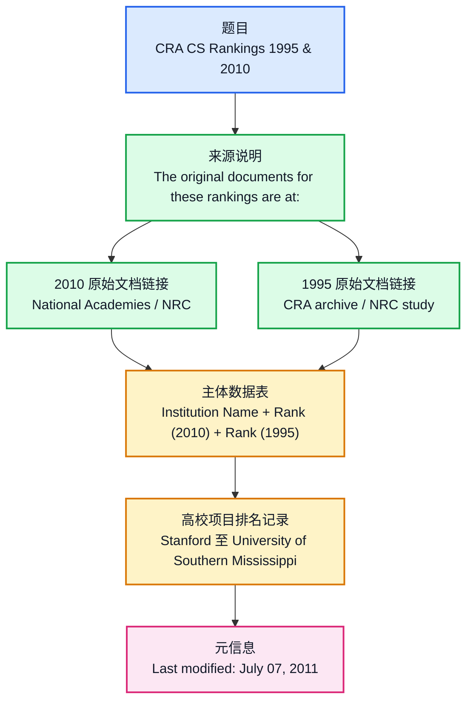

# CRA CS Rankings 1995 & 2010

## 前情提要

### 基本信息

| 项目 | 内容 |
| --- | --- |
| 文章来源 | Illinois Institute of Technology 个人网页目录下的排名整理页：`https://www.cs.iit.edu/~iraicu/rankings/CRA-CS-Rankings-1995-2010.htm` |
| 题目 | **`CRA CS Rankings 1995 & 2010`** |
| 作者 / 维护者 | 页面未在正文中明确列出作者；从网页路径 `~iraicu` 和站点信息看，页面很可能由 **Ioan Raicu** 维护，但严格引用时宜写作“作者未明 / page maintained under Ioan Raicu’s IIT web directory”。 |
| 作者背景 | **Ioan Raicu** 是 Illinois Institute of Technology 计算机科学系教授，并任 Argonne National Laboratory 客座研究人员；其研究方向包括 distributed systems, data-intensive computing, cloud computing, high-performance computing 等。参考：<https://www.cs.iit.edu/~iraicu/> |
| 原始排名来源 | 2010 年：National Academies / National Research Council 研究型博士项目评估；1995 年：CRA archive 中基于 NRC 研究的计算机科学博士项目排名。 |
| 重要说明 | 用户提供的 2010 原链接在 **2026-04-27** 访问时显示 “File Not Found”；1995 CRA archive 页面仍可访问并说明其数据来自 NRC study。 |
| 最后修改时间 | **July 07, 2011** |

## 文章结构信息图

## 阅读前关键背景

| 英文概念 | 中文说明 |
| --- | --- |
| **`CRA`** | **Computing Research Association**，美国计算研究协会，关注计算机科学、计算机工程等研究型学科的发展、政策与数据。 |
| **`CS`** | **Computer Science**，计算机科学。 |
| **`NRC`** | **National Research Council**，美国国家研究委员会，曾发布美国研究型博士项目评估。 |
| **`Rank`** | 排名；在此表中，数字越小通常表示名次越靠前。 |
| **`N/A`** | **Not Available** 或 **Not Applicable**，此处可理解为“无可用排名 / 不适用 / 未列入”。 |
| **`Institution Name`** | 机构名称，此处指大学或高等教育机构名称。 |
| **`Last modified`** | 网页最后修改时间，不等同于排名发布时间。 |

---

🔹 **`CRA CS Rankings` / `1995 & 2010`**  
🔸 **`CRA` 计算机科学排名 / `1995年与2010年`**

背景注释：  
**CRA** 指 Computing Research Association；**CS** 是 Computer Science 的常用缩写。标题采用名词短语结构，没有谓语动词，常见于网页标题、表格标题、报告标题。`1995 & 2010` 表示该页对两个年份的排名进行并列表述。

> **`ranking`** /ˈræŋkɪŋ/  
> 词性：n.  
> English definition: a position on a list that shows how good, important, or successful someone or something is.  
> 中文释义：排名；名次；排序结果。  
> 语域：学术、新闻、数据报告、教育评价。  
> 画龙点睛：`ranking` 常与 `university ranking`, `global ranking`, `rank high`, `rank among the top...` 搭配。注意 `rank` 作动词时可说 `The university ranks first`，也可说 `The university is ranked first`；前者更主动，后者更常见于榜单报道。考试写作中若要避免过度绝对化，可用 `is placed`, `is listed`, `is rated` 替换。

> **`CS`** /ˌsiː ˈes/  
> 词性：abbr.  
> English definition: abbreviation for Computer Science.  
> 中文释义：计算机科学的缩写。  
> 语域：学术、院系名称、技术语境。  
> 画龙点睛：`CS` 在高校语境中通常指 `Computer Science`，但在其他语境也可能指 `customer service`、`case study` 等。阅读时应依据上下文判断。本文出现 `CS Rankings`，结合大学博士项目和计算研究协会，应译为“计算机科学排名”。

> **`CRA`** /ˌsiː ɑːr ˈeɪ/  
> 词性：abbr.  
> English definition: abbreviation for Computing Research Association.  
> 中文释义：计算研究协会。  
> 语域：机构名称、学术政策、计算研究领域。  
> 画龙点睛：英文机构缩写首次出现时，正式写作通常先给全称再括号给缩写，如 `Computing Research Association (CRA)`。在翻译中，若读者可能不了解，宜处理为“美国计算研究协会 CRA”，以降低理解门槛。

---

🔹 The **`original documents` / for these `rankings` / are at:**  
🔸 这些 **`排名` / 所依据的 `原始文件` / 位于以下地址：**

背景注释：  
句中 `The original documents` 是主语，`are` 是系动词，`at` 引出网页地址。`for these rankings` 修饰 `documents`，说明这些文件是当前排名整理表的依据来源。这里的 `at` 用于说明网址位置，常见于网页写作。

> **`original document`** /əˈrɪdʒənəl ˈdɑːkjumənt/  
> 词性：n. phrase  
> English definition: the first or source document from which later copies, summaries, or references are made.  
> 中文释义：原始文件；源文件；一手文档。  
> 语域：正式、学术、法律、档案。  
> 画龙点睛：`original` 强调“最初的、非复制的”，而 `source document` 更强调“作为信息来源的文件”。学术写作中若要表达“请查阅原始资料”，可写 `consult the original documents` 或 `refer to the source documents`。

> **`be at`** /bi æt/  
> 词性：phr.  
> English definition: to be located at a particular place, address, or web address.  
> 中文释义：位于；可在某地址找到。  
> 语域：中性；网页说明常用。  
> 画龙点睛：网址前常用 `at`，如 `The report is available at...`；若强调“在网站上”，可用 `on the website`；若强调“通过链接访问”，可用 `via the link`。本文 `are at:` 是非常简洁的网页说明句式。

---

🔹 **`2010`**: `http://sites.nationalacademies.org/PGA/Resdoc/PGA_044749`  
🔸 **`2010年`**：`http://sites.nationalacademies.org/PGA/Resdoc/PGA_044749`

背景注释：  
该链接指向 National Academies 网站下的 Policy and Global Affairs / Research Doctorate 相关页面。根据现有资料，2010 年 NRC 发布的是 **A Data-Based Assessment of Research-Doctorate Programs in the United States**，其博士项目评估采用区间排名和多指标数据，而非简单单一名次。用户提供的该链接在 **2026-04-27** 访问时显示页面不存在，但其指向的机构和路径与 2010 NRC 研究型博士项目评估背景相符。

> **`National Academies`** /ˈnæʃənəl əˈkædəmiz/  
> 词性：proper n.  
> English definition: a group of U.S. nonprofit institutions that provide independent advice on science, engineering, and medicine.  
> 中文释义：美国国家科学院、工程院和医学院体系下的国家学术机构。  
> 语域：机构名称、学术政策。  
> 画龙点睛：机构名翻译时不宜逐字硬译为“国家学院们”，应根据正式名称处理为“美国国家科学院、工程院和医学院”或概括为“美国国家学术机构”。`Academies` 为复数，表示多个院组成的体系。

> **`Research Doctorate`** /rɪˈsɜːrtʃ ˈdɑːktərət/  
> 词性：n. phrase  
> English definition: a doctoral degree focused primarily on original research, such as a Ph.D.  
> 中文释义：研究型博士项目；研究型博士学位。  
> 语域：高等教育、学术评估。  
> 画龙点睛：`doctorate` 泛指博士学位；`research doctorate` 强调以原创研究为核心，通常对应 Ph.D.。与之相对，`professional doctorate` 更偏职业实践，如 Ed.D., M.D., J.D. 等。

---

🔹 **`1995`**: `http://archive.cra.org/statistics/nrcstudy2/rankcs.html`  
🔸 **`1995年`**：`http://archive.cra.org/statistics/nrcstudy2/rankcs.html`

背景注释：  
该 CRA archive 页面题为 **Rank Ph.D. Programs in Computer Science**，说明页面中的 CS program data derived from a National Research Council study titled **Research-Doctorate Programs in the United States: Continuity and Change**。因此，1995 项数据本质上与 NRC 的研究型博士项目评估相关，而 CRA 页面提供了归档和检索形式。

> **`archive`** /ˈɑːrkaɪv/  
> 词性：n.; v.  
> English definition: a collection of historical records or documents; to store records for future reference.  
> 中文释义：档案；归档网站；把资料归档。  
> 语域：档案、网页、学术资料。  
> 画龙点睛：作名词时，`archive` 可指“档案馆”或“网页存档”；作动词时可说 `The documents were archived in 2007`。注意发音既可作 /ˈɑːrkaɪv/，英美均常见。

> **`derive from`** /dɪˈraɪv frəm/  
> 词性：phr. v.  
> English definition: to come from or be obtained from a particular source.  
> 中文释义：源自；来自；由……得出。  
> 语域：正式、学术。  
> 画龙点睛：`derive from` 常用于数据、结论、词源、收益来源。写作中可用 `The conclusion derives from empirical evidence`，但更常见被动结构 `is derived from`，如 `The data are derived from a national survey`。

---

🔹 **`Institution Name` / `Rank (2010)` / `Rank (1995)`**  
🔸 **`机构名称` / `2010年排名` / `1995年排名`**

背景注释：  
这是表头，不是完整句。`Institution` 在美国高等教育语境中通常指大学、学院、研究机构等；本文表格列出的机构几乎全部为美国大学或高校系统中的校区。`Rank (2010)` 与 `Rank (1995)` 表示两个年份对应的排名记录。

> **`institution`** /ˌɪnstɪˈtuːʃən/  
> 词性：n.  
> English definition: an organization, especially one with an important social, educational, or public role.  
> 中文释义：机构；制度性组织；院校。  
> 语域：正式、教育、社会科学。  
> 画龙点睛：`institution` 比 `organization` 更强调制度性、公共性或长期存在。高校可称 `higher-education institution`。注意 `institutional` 是形容词，意为“机构的；制度性的”，如 `institutional support`。

> **`rank`** /ræŋk/  
> 词性：n.; v.  
> English definition: a position in an ordered list; to give someone or something a position in such a list.  
> 中文释义：名次；等级；给……排名。  
> 语域：教育评价、体育、商业、军事。  
> 画龙点睛：`rank` 作名词可说 `a high rank`，但在排名语境中 `rank No. 1` 表示第一；数字越小越靠前。作动词可说 `rank first`, `rank among the top ten`, `be ranked 3rd`。注意 `ranking` 是“排名结果/排行榜”，`rank` 是“名次/排名”。

> **`N/A`** /ˌen ˈeɪ/  
> 词性：abbr.  
> English definition: not available or not applicable.  
> 中文释义：无资料；不适用；未列入。  
> 语域：表格、数据、行政表单。  
> 画龙点睛：`N/A` 在不同表格中可能表示 `not available` 或 `not applicable`，翻译时要看上下文。本文排名表中更自然理解为“该年份没有可用排名或未列入该榜单”。

---

## 数据记录逐项精读对照

| 英文数据项 | 中文对照 | 背景注释 |
| --- | --- | --- |
| 🔹 **`STANFORD UNIVERSITY` / Rank (2010): `1` / Rank (1995): `1`** | 🔸 **`斯坦福大学` / 2010年排名：`第1` / 1995年排名：`第1`** | Stanford University 位于美国加利福尼亚州，是私立研究型大学。 |
| 🔹 **`MASSACHUSETTS INSTITUTE OF TECHNOLOGY` / Rank (2010): `3` / Rank (1995): `2`** | 🔸 **`麻省理工学院` / 2010年排名：`第3` / 1995年排名：`第2`** | MIT 位于美国马萨诸塞州剑桥，以理工科和计算机科学研究著称。 |
| 🔹 **`PRINCETON UNIVERSITY` / Rank (2010): `3` / Rank (1995): `6`** | 🔸 **`普林斯顿大学` / 2010年排名：`第3` / 1995年排名：`第6`** | Princeton University 位于美国新泽西州，是私立研究型大学。 |
| 🔹 **`UNIVERSITY OF CALIFORNIA-BERKELEY` / Rank (2010): `4` / Rank (1995): `3`** | 🔸 **`加利福尼亚大学伯克利分校` / 2010年排名：`第4` / 1995年排名：`第3`** | UC Berkeley 是加州大学系统旗舰校区之一，常简称 Berkeley。 |
| 🔹 **`CARNEGIE MELLON UNIVERSITY` / Rank (2010): `6` / Rank (1995): `4`** | 🔸 **`卡内基梅隆大学` / 2010年排名：`第6` / 1995年排名：`第4`** | Carnegie Mellon University 位于美国宾夕法尼亚州匹兹堡，计算机学院影响力较大。 |
| 🔹 **`CORNELL UNIVERSITY` / Rank (2010): `8` / Rank (1995): `5`** | 🔸 **`康奈尔大学` / 2010年排名：`第8` / 1995年排名：`第5`** | Cornell University 位于美国纽约州伊萨卡，是私立研究型大学。 |
| 🔹 **`UNIVERSITY OF NORTH CAROLINA AT CHAPEL HILL` / Rank (2010): `9` / Rank (1995): `29`** | 🔸 **`北卡罗来纳大学教堂山分校` / 2010年排名：`第9` / 1995年排名：`第29`** | UNC Chapel Hill 是北卡罗来纳大学系统的旗舰校区之一。 |
| 🔹 **`UNIVERSITY OF ILLINOIS AT URBANA-CHAMPAIGN` / Rank (2010): `10` / Rank (1995): `8`** | 🔸 **`伊利诺伊大学厄巴纳—香槟分校` / 2010年排名：`第10` / 1995年排名：`第8`** | UIUC 位于美国伊利诺伊州，工程与计算机科学领域常见于排名语境。 |
| 🔹 **`UNIVERSITY OF CALIFORNIA-LOS ANGELES` / Rank (2010): `11` / Rank (1995): `14`** | 🔸 **`加利福尼亚大学洛杉矶分校` / 2010年排名：`第11` / 1995年排名：`第14`** | UCLA 是加州大学系统重要校区，位于洛杉矶。 |
| 🔹 **`UNIVERSITY OF CALIFORNIA-SANTA BARBARA` / Rank (2010): `12` / Rank (1995): `48`** | 🔸 **`加利福尼亚大学圣塔芭芭拉分校` / 2010年排名：`第12` / 1995年排名：`第48`** | UCSB 位于美国加利福尼亚州圣塔芭芭拉。 |
| 🔹 **`UNIVERSITY OF PENNSYLVANIA` / Rank (2010): `12` / Rank (1995): `24`** | 🔸 **`宾夕法尼亚大学` / 2010年排名：`第12` / 1995年排名：`第24`** | University of Pennsylvania 常简称 Penn，位于费城。 |
| 🔹 **`HARVARD UNIVERSITY` / Rank (2010): `14` / Rank (1995): `11`** | 🔸 **`哈佛大学` / 2010年排名：`第14` / 1995年排名：`第11`** | Harvard University 位于马萨诸塞州剑桥，是私立研究型大学。 |
| 🔹 **`UNIVERSITY OF TEXAS AT AUSTIN` / Rank (2010): `15` / Rank (1995): `7`** | 🔸 **`德克萨斯大学奥斯汀分校` / 2010年排名：`第15` / 1995年排名：`第7`** | UT Austin 是德克萨斯大学系统旗舰校区之一。 |
| 🔹 **`UNIVERSITY OF WISCONSIN-MADISON` / Rank (2010): `16` / Rank (1995): `10`** | 🔸 **`威斯康星大学麦迪逊分校` / 2010年排名：`第16` / 1995年排名：`第10`** | UW–Madison 是美国公立研究型大学。 |
| 🔹 **`GEORGIA INSTITUTE OF TECHNOLOGY` / Rank (2010): `17` / Rank (1995): `32`** | 🔸 **`佐治亚理工学院` / 2010年排名：`第17` / 1995年排名：`第32`** | Georgia Tech 位于美国佐治亚州亚特兰大。 |
| 🔹 **`UNIVERSITY OF CALIFORNIA-SAN DIEGO` / Rank (2010): `17` / Rank (1995): `22`** | 🔸 **`加利福尼亚大学圣迭戈分校` / 2010年排名：`第17` / 1995年排名：`第22`** | UC San Diego 常简称 UCSD，位于加州圣迭戈。 |
| 🔹 **`UNIVERSITY OF MARYLAND COLLEGE PARK` / Rank (2010): `17` / Rank (1995): `16`** | 🔸 **`马里兰大学帕克分校` / 2010年排名：`第17` / 1995年排名：`第16`** | University of Maryland, College Park 常简称 UMD。 |
| 🔹 **`UNIVERSITY OF MICHIGAN-ANN ARBOR` / Rank (2010): `17` / Rank (1995): `21`** | 🔸 **`密歇根大学安娜堡分校` / 2010年排名：`第17` / 1995年排名：`第21`** | University of Michigan–Ann Arbor 是密歇根大学系统旗舰校区。 |
| 🔹 **`DUKE UNIVERSITY` / Rank (2010): `20` / Rank (1995): `28`** | 🔸 **`杜克大学` / 2010年排名：`第20` / 1995年排名：`第28`** | Duke University 位于美国北卡罗来纳州达勒姆。 |
| 🔹 **`COLUMBIA UNIVERSITY IN THE CITY OF NEW YORK` / Rank (2010): `22` / Rank (1995): `22`** | 🔸 **`纽约市哥伦比亚大学` / 2010年排名：`第22` / 1995年排名：`第22`** | 这是 Columbia University 的正式校名形式，强调其位于纽约市。 |
| 🔹 **`MICHIGAN STATE UNIVERSITY` / Rank (2010): `22` / Rank (1995): `53`** | 🔸 **`密歇根州立大学` / 2010年排名：`第22` / 1995年排名：`第53`** | Michigan State University 是美国公立研究型大学。 |
| 🔹 **`UNIVERSITY OF ROCHESTER` / Rank (2010): `22` / Rank (1995): `30`** | 🔸 **`罗切斯特大学` / 2010年排名：`第22` / 1995年排名：`第30`** | University of Rochester 位于纽约州罗切斯特。 |
| 🔹 **`UNIVERSITY OF WASHINGTON` / Rank (2010): `23` / Rank (1995): `9`** | 🔸 **`华盛顿大学` / 2010年排名：`第23` / 1995年排名：`第9`** | University of Washington 通常指位于西雅图的公立研究型大学。 |
| 🔹 **`BROWN UNIVERSITY` / Rank (2010): `25` / Rank (1995): `13`** | 🔸 **`布朗大学` / 2010年排名：`第25` / 1995年排名：`第13`** | Brown University 位于罗德岛州普罗维登斯。 |
| 🔹 **`UNIVERSITY OF SOUTHERN CALIFORNIA` / Rank (2010): `25` / Rank (1995): `20`** | 🔸 **`南加利福尼亚大学` / 2010年排名：`第25` / 1995年排名：`第20`** | USC 是位于洛杉矶的私立研究型大学。 |
| 🔹 **`STATE UNIVERSITY OF NEW YORK AT STONY BROOK` / Rank (2010): `26` / Rank (1995): `31`** | 🔸 **`纽约州立大学石溪分校` / 2010年排名：`第26` / 1995年排名：`第31`** | Stony Brook University 属于 SUNY 系统。 |
| 🔹 **`LOUISIANA STATE UNIVERSITY AND AGRICULTURAL AND MECHANICAL COLLEGE` / Rank (2010): `29` / Rank (1995): `77`** | 🔸 **`路易斯安那州立大学暨农业与机械学院` / 2010年排名：`第29` / 1995年排名：`第77`** | LSU 的正式名称保留了美国赠地大学传统中的 agricultural and mechanical 表述。 |
| 🔹 **`UNIVERSITY OF MASSACHUSETTS AMHERST` / Rank (2010): `29` / Rank (1995): `18`** | 🔸 **`马萨诸塞大学阿默斯特分校` / 2010年排名：`第29` / 1995年排名：`第18`** | UMass Amherst 是马萨诸塞大学系统旗舰校区。 |
| 🔹 **`PURDUE UNIVERSITY MAIN CAMPUS` / Rank (2010): `30` / Rank (1995): `26`** | 🔸 **`普渡大学主校区` / 2010年排名：`第30` / 1995年排名：`第26`** | Purdue University 主校区位于印第安纳州西拉法叶。 |
| 🔹 **`UNIVERSITY OF MINNESOTA-TWIN CITIES` / Rank (2010): `30` / Rank (1995): `47`** | 🔸 **`明尼苏达大学双城分校` / 2010年排名：`第30` / 1995年排名：`第47`** | Twin Cities 指明尼阿波利斯与圣保罗都会区。 |
| 🔹 **`UNIVERSITY OF CALIFORNIA-IRVINE` / Rank (2010): `32` / Rank (1995): `34`** | 🔸 **`加利福尼亚大学欧文分校` / 2010年排名：`第32` / 1995年排名：`第34`** | UC Irvine 常简称 UCI。 |
| 🔹 **`PENN STATE UNIVERSITY` / Rank (2010): `33` / Rank (1995): `54`** | 🔸 **`宾夕法尼亚州立大学` / 2010年排名：`第33` / 1995年排名：`第54`** | Penn State 通常指 Pennsylvania State University。 |
| 🔹 **`OHIO STATE UNIVERSITY MAIN CAMPUS` / Rank (2010): `34` / Rank (1995): `39`** | 🔸 **`俄亥俄州立大学主校区` / 2010年排名：`第34` / 1995年排名：`第39`** | Ohio State University 主校区位于哥伦布。 |
| 🔹 **`UNIVERSITY OF VIRGINIA` / Rank (2010): `34` / Rank (1995): `35`** | 🔸 **`弗吉尼亚大学` / 2010年排名：`第34` / 1995年排名：`第35`** | University of Virginia 常简称 UVA。 |
| 🔹 **`TUFTS UNIVERSITY` / Rank (2010): `35` / Rank (1995): `N/A`** | 🔸 **`塔夫茨大学` / 2010年排名：`第35` / 1995年排名：`无可用数据`** | `N/A` 表示该表未给出 1995 排名。 |
| 🔹 **`TEXAS A & M UNIVERSITY` / Rank (2010): `37` / Rank (1995): `63`** | 🔸 **`德克萨斯农工大学` / 2010年排名：`第37` / 1995年排名：`第63`** | A&M 源自 Agricultural and Mechanical 的历史名称。 |
| 🔹 **`UNIVERSITY OF CHICAGO` / Rank (2010): `39` / Rank (1995): `24`** | 🔸 **`芝加哥大学` / 2010年排名：`第39` / 1995年排名：`第24`** | University of Chicago 位于伊利诺伊州芝加哥。 |
| 🔹 **`UNIVERSITY OF PITTSBURGH PITTSBURGH CAMPUS` / Rank (2010): `39` / Rank (1995): `43`** | 🔸 **`匹兹堡大学匹兹堡校区` / 2010年排名：`第39` / 1995年排名：`第43`** | Pittsburgh campus 指匹兹堡大学主校区。 |
| 🔹 **`STATE UNIVERSITY OF NEW YORK AT BUFFALO` / Rank (2010): `41` / Rank (1995): `57`** | 🔸 **`纽约州立大学布法罗分校` / 2010年排名：`第41` / 1995年排名：`第57`** | 现常称 University at Buffalo。 |
| 🔹 **`UNIVERSITY OF CALIFORNIA-RIVERSIDE` / Rank (2010): `41` / Rank (1995): `N/A`** | 🔸 **`加利福尼亚大学河滨分校` / 2010年排名：`第41` / 1995年排名：`无可用数据`** | UC Riverside 是加州大学系统校区之一。 |
| 🔹 **`YALE UNIVERSITY` / Rank (2010): `41` / Rank (1995): `14`** | 🔸 **`耶鲁大学` / 2010年排名：`第41` / 1995年排名：`第14`** | Yale University 位于康涅狄格州纽黑文。 |
| 🔹 **`UNIVERSITY OF CALIFORNIA-DAVIS` / Rank (2010): `42` / Rank (1995): `57`** | 🔸 **`加利福尼亚大学戴维斯分校` / 2010年排名：`第42` / 1995年排名：`第57`** | UC Davis 是加州大学系统校区之一。 |
| 🔹 **`ARIZONA STATE UNIVERSITY` / Rank (2010): `43` / Rank (1995): `61`** | 🔸 **`亚利桑那州立大学` / 2010年排名：`第43` / 1995年排名：`第61`** | Arizona State University 常简称 ASU。 |
| 🔹 **`UNIVERSITY OF CALIFORNIA-SANTA CRUZ` / Rank (2010): `44` / Rank (1995): `50`** | 🔸 **`加利福尼亚大学圣克鲁兹分校` / 2010年排名：`第44` / 1995年排名：`第50`** | UC Santa Cruz 是加州大学系统校区之一。 |
| 🔹 **`UNIVERSITY OF NEBRASKA - LINCOLN` / Rank (2010): `45` / Rank (1995): `74`** | 🔸 **`内布拉斯加大学林肯分校` / 2010年排名：`第45` / 1995年排名：`第74`** | University of Nebraska–Lincoln 常简称 UNL。 |
| 🔹 **`RICE UNIVERSITY` / Rank (2010): `48` / Rank (1995): `19`** | 🔸 **`莱斯大学` / 2010年排名：`第48` / 1995年排名：`第19`** | Rice University 位于得克萨斯州休斯敦。 |
| 🔹 **`INDIANA UNIVERSITY AT BLOOMINGTON` / Rank (2010): `51` / Rank (1995): `36`** | 🔸 **`印第安纳大学布卢明顿分校` / 2010年排名：`第51` / 1995年排名：`第36`** | Indiana University Bloomington 是印第安纳大学系统旗舰校区。 |
| 🔹 **`UNIVERSITY OF COLORADO AT BOULDER` / Rank (2010): `51` / Rank (1995): `40`** | 🔸 **`科罗拉多大学博尔德分校` / 2010年排名：`第51` / 1995年排名：`第40`** | University of Colorado Boulder 常简称 CU Boulder。 |
| 🔹 **`UNIVERSITY OF SOUTH FLORIDA` / Rank (2010): `51` / Rank (1995): `69`** | 🔸 **`南佛罗里达大学` / 2010年排名：`第51` / 1995年排名：`第69`** | University of South Florida 位于佛罗里达州坦帕等地。 |
| 🔹 **`UNIVERSITY OF UTAH` / Rank (2010): `54` / Rank (1995): `40`** | 🔸 **`犹他大学` / 2010年排名：`第54` / 1995年排名：`第40`** | University of Utah 位于盐湖城。 |
| 🔹 **`NEW YORK UNIVERSITY` / Rank (2010): `55` / Rank (1995): `17`** | 🔸 **`纽约大学` / 2010年排名：`第55` / 1995年排名：`第17`** | New York University 常简称 NYU。 |
| 🔹 **`WASHINGTON UNIVERSITY IN ST. LOUIS` / Rank (2010): `56` / Rank (1995): `52`** | 🔸 **`圣路易斯华盛顿大学` / 2010年排名：`第56` / 1995年排名：`第52`** | 注意不同于 University of Washington；该校位于密苏里州圣路易斯。 |
| 🔹 **`NORTHWESTERN UNIVERSITY` / Rank (2010): `57` / Rank (1995): `38`** | 🔸 **`西北大学` / 2010年排名：`第57` / 1995年排名：`第38`** | Northwestern University 位于伊利诺伊州埃文斯顿。 |
| 🔹 **`LEHIGH UNIVERSITY` / Rank (2010): `58` / Rank (1995): `96`** | 🔸 **`理海大学` / 2010年排名：`第58` / 1995年排名：`第96`** | Lehigh University 位于宾夕法尼亚州。 |
| 🔹 **`NORTH CAROLINA STATE UNIVERSITY` / Rank (2010): `59` / Rank (1995): `60`** | 🔸 **`北卡罗来纳州立大学` / 2010年排名：`第59` / 1995年排名：`第60`** | North Carolina State University 常简称 NC State。 |
| 🔹 **`GEORGIA STATE UNIVERSITY` / Rank (2010): `60` / Rank (1995): `N/A`** | 🔸 **`佐治亚州立大学` / 2010年排名：`第60` / 1995年排名：`无可用数据`** | Georgia State University 位于亚特兰大。 |
| 🔹 **`VIRGINIA POLYTECHNIC INSTITUTE AND STATE UNIVERSITY` / Rank (2010): `61` / Rank (1995): `66`** | 🔸 **`弗吉尼亚理工学院暨州立大学` / 2010年排名：`第61` / 1995年排名：`第66`** | 该校常称 Virginia Tech。 |
| 🔹 **`IOWA STATE UNIVERSITY` / Rank (2010): `64` / Rank (1995): `77`** | 🔸 **`爱荷华州立大学` / 2010年排名：`第64` / 1995年排名：`第77`** | Iowa State University 位于艾姆斯。 |
| 🔹 **`FLORIDA INSTITUTE OF TECHNOLOGY` / Rank (2010): `66` / Rank (1995): `94`** | 🔸 **`佛罗里达理工学院` / 2010年排名：`第66` / 1995年排名：`第94`** | Florida Institute of Technology 常简称 Florida Tech。 |
| 🔹 **`VANDERBILT UNIVERSITY` / Rank (2010): `67` / Rank (1995): `73`** | 🔸 **`范德堡大学` / 2010年排名：`第67` / 1995年排名：`第73`** | Vanderbilt University 位于田纳西州纳什维尔。 |
| 🔹 **`BOSTON UNIVERSITY` / Rank (2010): `68` / Rank (1995): `57`** | 🔸 **`波士顿大学` / 2010年排名：`第68` / 1995年排名：`第57`** | Boston University 常简称 BU。 |
| 🔹 **`NORTHEASTERN UNIVERSITY` / Rank (2010): `68` / Rank (1995): `N/A`** | 🔸 **`东北大学` / 2010年排名：`第68` / 1995年排名：`无可用数据`** | Northeastern University 位于波士顿；注意不同于中国“东北大学”。 |
| 🔹 **`RUTGERS THE STATE UNIVERSITY OF NEW JERSEY NEW BRUNSWICK CAMPUS` / Rank (2010): `68` / Rank (1995): `27`** | 🔸 **`罗格斯大学新不伦瑞克校区` / 2010年排名：`第68` / 1995年排名：`第27`** | Rutgers 是新泽西州州立大学系统；New Brunswick 为其重要校区。 |
| 🔹 **`UNIVERSITY OF FLORIDA` / Rank (2010): `68` / Rank (1995): `46`** | 🔸 **`佛罗里达大学` / 2010年排名：`第68` / 1995年排名：`第46`** | University of Florida 常简称 UF。 |
| 🔹 **`CALIFORNIA INSTITUTE OF TECHNOLOGY` / Rank (2010): `69` / Rank (1995): `12`** | 🔸 **`加州理工学院` / 2010年排名：`第69` / 1995年排名：`第12`** | California Institute of Technology 常称 Caltech。 |
| 🔹 **`FLORIDA STATE UNIVERSITY` / Rank (2010): `70` / Rank (1995): `N/A`** | 🔸 **`佛罗里达州立大学` / 2010年排名：`第70` / 1995年排名：`无可用数据`** | Florida State University 常简称 FSU。 |
| 🔹 **`OREGON STATE UNIVERSITY` / Rank (2010): `70` / Rank (1995): `70`** | 🔸 **`俄勒冈州立大学` / 2010年排名：`第70` / 1995年排名：`第70`** | Oregon State University 位于科瓦利斯。 |
| 🔹 **`UNIVERSITY OF DELAWARE` / Rank (2010): `70` / Rank (1995): `N/A`** | 🔸 **`特拉华大学` / 2010年排名：`第70` / 1995年排名：`无可用数据`** | University of Delaware 是美国公立研究型大学。 |
| 🔹 **`DARTMOUTH COLLEGE` / Rank (2010): `71` / Rank (1995): `56`** | 🔸 **`达特茅斯学院` / 2010年排名：`第71` / 1995年排名：`第56`** | Dartmouth College 虽名为 College，但为研究型高校。 |
| 🔹 **`JOHNS HOPKINS UNIVERSITY` / Rank (2010): `71` / Rank (1995): `37`** | 🔸 **`约翰斯·霍普金斯大学` / 2010年排名：`第71` / 1995年排名：`第37`** | Johns Hopkins University 位于马里兰州巴尔的摩。 |
| 🔹 **`UNIVERSITY OF ARIZONA` / Rank (2010): `71` / Rank (1995): `33`** | 🔸 **`亚利桑那大学` / 2010年排名：`第71` / 1995年排名：`第33`** | University of Arizona 位于图森。 |
| 🔹 **`UNIVERSITY OF CINCINNATI MAIN CAMPUS` / Rank (2010): `71` / Rank (1995): `N/A`** | 🔸 **`辛辛那提大学主校区` / 2010年排名：`第71` / 1995年排名：`无可用数据`** | Main Campus 表示主校区。 |
| 🔹 **`UNIVERSITY OF IOWA` / Rank (2010): `71` / Rank (1995): `62`** | 🔸 **`爱荷华大学` / 2010年排名：`第71` / 1995年排名：`第62`** | University of Iowa 位于艾奥瓦城。 |
| 🔹 **`RENSSELAER POLYTECHNIC INSTITUTE` / Rank (2010): `72` / Rank (1995): `49`** | 🔸 **`伦斯勒理工学院` / 2010年排名：`第72` / 1995年排名：`第49`** | RPI 是美国历史较久的理工类高校之一。 |
| 🔹 **`UNIVERSITY OF GEORGIA` / Rank (2010): `72` / Rank (1995): `N/A`** | 🔸 **`佐治亚大学` / 2010年排名：`第72` / 1995年排名：`无可用数据`** | University of Georgia 常简称 UGA。 |
| 🔹 **`UNIVERSITY OF OKLAHOMA NORMAN CAMPUS` / Rank (2010): `72` / Rank (1995): `101`** | 🔸 **`俄克拉荷马大学诺曼校区` / 2010年排名：`第72` / 1995年排名：`第101`** | Norman Campus 是俄克拉荷马大学主校区。 |
| 🔹 **`OKLAHOMA STATE UNIVERSITY MAIN CAMPUS` / Rank (2010): `73` / Rank (1995): `108`** | 🔸 **`俄克拉荷马州立大学主校区` / 2010年排名：`第73` / 1995年排名：`第108`** | Oklahoma State University 主校区位于 Stillwater。 |
| 🔹 **`UNIVERSITY OF KENTUCKY` / Rank (2010): `73` / Rank (1995): `65`** | 🔸 **`肯塔基大学` / 2010年排名：`第73` / 1995年排名：`第65`** | University of Kentucky 位于列克星敦。 |
| 🔹 **`BRANDEIS UNIVERSITY` / Rank (2010): `74` / Rank (1995): `N/A`** | 🔸 **`布兰迪斯大学` / 2010年排名：`第74` / 1995年排名：`无可用数据`** | Brandeis University 位于马萨诸塞州沃尔瑟姆。 |
| 🔹 **`UNIVERSITY OF CENTRAL FLORIDA` / Rank (2010): `74` / Rank (1995): `83`** | 🔸 **`中佛罗里达大学` / 2010年排名：`第74` / 1995年排名：`第83`** | University of Central Florida 常简称 UCF。 |
| 🔹 **`KENT STATE UNIVERSITY MAIN CAMPUS` / Rank (2010): `75` / Rank (1995): `100`** | 🔸 **`肯特州立大学主校区` / 2010年排名：`第75` / 1995年排名：`第100`** | Kent State University 位于俄亥俄州。 |
| 🔹 **`UNIVERSITY OF TENNESSEE` / Rank (2010): `77` / Rank (1995): `N/A`** | 🔸 **`田纳西大学` / 2010年排名：`第77` / 1995年排名：`无可用数据`** | 通常指 University of Tennessee, Knoxville。 |
| 🔹 **`CITY UNIVERSITY OF NEW YORK GRAD. CENTER` / Rank (2010): `78` / Rank (1995): `N/A`** | 🔸 **`纽约城市大学研究生中心` / 2010年排名：`第78` / 1995年排名：`无可用数据`** | `Grad. Center` 是 `Graduate Center` 的缩写。 |
| 🔹 **`UNIVERSITY OF CONNECTICUT` / Rank (2010): `80` / Rank (1995): `92`** | 🔸 **`康涅狄格大学` / 2010年排名：`第80` / 1995年排名：`第92`** | University of Connecticut 常简称 UConn。 |
| 🔹 **`UNIVERSITY OF ILLINOIS AT CHICAGO` / Rank (2010): `80` / Rank (1995): `51`** | 🔸 **`伊利诺伊大学芝加哥分校` / 2010年排名：`第80` / 1995年排名：`第51`** | University of Illinois Chicago 常简称 UIC。 |
| 🔹 **`FLORIDA INTERNATIONAL UNIVERSITY` / Rank (2010): `81` / Rank (1995): `N/A`** | 🔸 **`佛罗里达国际大学` / 2010年排名：`第81` / 1995年排名：`无可用数据`** | FIU 位于佛罗里达州迈阿密。 |
| 🔹 **`UNIVERSITY OF MARYLAND BALTIMORE COUNTY` / Rank (2010): `81` / Rank (1995): `89`** | 🔸 **`马里兰大学巴尔的摩郡分校` / 2010年排名：`第81` / 1995年排名：`第89`** | UMBC 是马里兰大学系统成员。 |
| 🔹 **`ILLINOIS INSTITUTE OF TECHNOLOGY` / Rank (2010): `82` / Rank (1995): `91`** | 🔸 **`伊利诺伊理工学院` / 2010年排名：`第82` / 1995年排名：`第91`** | IIT 位于芝加哥；本文网页也托管在该校域名下。 |
| 🔹 **`UNIVERSITY OF OREGON` / Rank (2010): `83` / Rank (1995): `64`** | 🔸 **`俄勒冈大学` / 2010年排名：`第83` / 1995年排名：`第64`** | University of Oregon 位于尤金。 |
| 🔹 **`AUBURN UNIVERSITY` / Rank (2010): `86` / Rank (1995): `N/A`** | 🔸 **`奥本大学` / 2010年排名：`第86` / 1995年排名：`无可用数据`** | Auburn University 位于阿拉巴马州。 |
| 🔹 **`NEW JERSEY INSTITUTE OF TECHNOLOGY` / Rank (2010): `87` / Rank (1995): `N/A`** | 🔸 **`新泽西理工学院` / 2010年排名：`第87` / 1995年排名：`无可用数据`** | NJIT 位于新泽西州纽瓦克；原表后文又出现一次同名机构。 |
| 🔹 **`WAYNE STATE UNIVERSITY` / Rank (2010): `88` / Rank (1995): `79`** | 🔸 **`韦恩州立大学` / 2010年排名：`第88` / 1995年排名：`第79`** | Wayne State University 位于底特律。 |
| 🔹 **`COLLEGE OF WILLIAM AND MARY` / Rank (2010): `90` / Rank (1995): `N/A`** | 🔸 **`威廉与玛丽学院` / 2010年排名：`第90` / 1995年排名：`无可用数据`** | 现常称 William & Mary，是美国历史较久的高校之一。 |
| 🔹 **`STATE UNIVERSITY OF NEW YORK AT BINGHAMTON` / Rank (2010): `90` / Rank (1995): `105`** | 🔸 **`纽约州立大学宾汉姆顿分校` / 2010年排名：`第90` / 1995年排名：`第105`** | Binghamton University 属于 SUNY 系统。 |
| 🔹 **`UNIVERSITY OF NEW MEXICO MAIN CAMPUS` / Rank (2010): `91` / Rank (1995): `N/A`** | 🔸 **`新墨西哥大学主校区` / 2010年排名：`第91` / 1995年排名：`无可用数据`** | University of New Mexico 主校区位于阿尔伯克基。 |
| 🔹 **`WASHINGTON STATE UNIVERSITY` / Rank (2010): `93` / Rank (1995): `81`** | 🔸 **`华盛顿州立大学` / 2010年排名：`第93` / 1995年排名：`第81`** | Washington State University 常简称 WSU。 |
| 🔹 **`GEORGE WASHINGTON UNIVERSITY` / Rank (2010): `96` / Rank (1995): `67`** | 🔸 **`乔治华盛顿大学` / 2010年排名：`第96` / 1995年排名：`第67`** | George Washington University 位于华盛顿特区。 |
| 🔹 **`UNIVERSITY OF SOUTH CAROLINA COLUMBIA` / Rank (2010): `96` / Rank (1995): `93`** | 🔸 **`南卡罗来纳大学哥伦比亚校区` / 2010年排名：`第96` / 1995年排名：`第93`** | Columbia 是南卡罗来纳州首府，此处不是哥伦比亚大学。 |
| 🔹 **`CASE WESTERN RESERVE UNIVERSITY` / Rank (2010): `97` / Rank (1995): `67`** | 🔸 **`凯斯西储大学` / 2010年排名：`第97` / 1995年排名：`第67`** | Case Western Reserve University 位于俄亥俄州克利夫兰。 |
| 🔹 **`NORTH DAKOTA STATE UNIVERSITY MAIN CAMPUS` / Rank (2010): `98` / Rank (1995): `N/A`** | 🔸 **`北达科他州立大学主校区` / 2010年排名：`第98` / 1995年排名：`无可用数据`** | North Dakota State University 常简称 NDSU。 |
| 🔹 **`UNIVERSITY OF NORTH CAROLINA AT CHARLOTTE` / Rank (2010): `99` / Rank (1995): `N/A`** | 🔸 **`北卡罗来纳大学夏洛特分校` / 2010年排名：`第99` / 1995年排名：`无可用数据`** | UNC Charlotte 是北卡罗来纳大学系统成员。 |
| 🔹 **`UNIVERSITY OF ALABAMA` / Rank (2010): `100` / Rank (1995): `N/A`** | 🔸 **`阿拉巴马大学` / 2010年排名：`第100` / 1995年排名：`无可用数据`** | University of Alabama 主校区位于 Tuscaloosa。 |
| 🔹 **`WRIGHT STATE UNIVERSITY MAIN CAMPUS` / Rank (2010): `101` / Rank (1995): `N/A`** | 🔸 **`莱特州立大学主校区` / 2010年排名：`第101` / 1995年排名：`无可用数据`** | Wright State University 位于俄亥俄州。 |
| 🔹 **`NEW MEXICO STATE UNIVERSITY MAIN CAMPUS` / Rank (2010): `102` / Rank (1995): `79`** | 🔸 **`新墨西哥州立大学主校区` / 2010年排名：`第102` / 1995年排名：`第79`** | New Mexico State University 常简称 NMSU。 |
| 🔹 **`SYRACUSE UNIVERSITY MAIN CAMPUS` / Rank (2010): `102` / Rank (1995): `44`** | 🔸 **`雪城大学主校区` / 2010年排名：`第102` / 1995年排名：`第44`** | Syracuse University 位于纽约州雪城。 |
| 🔹 **`MISSISSIPPI STATE UNIVERSITY` / Rank (2010): `103` / Rank (1995): `99`** | 🔸 **`密西西比州立大学` / 2010年排名：`第103` / 1995年排名：`第99`** | Mississippi State University 位于密西西比州。 |
| 🔹 **`UNIVERSITY OF HOUSTON` / Rank (2010): `104` / Rank (1995): `75`** | 🔸 **`休斯敦大学` / 2010年排名：`第104` / 1995年排名：`第75`** | University of Houston 位于得克萨斯州休斯敦。 |
| 🔹 **`UNIVERSITY OF KANSAS` / Rank (2010): `105` / Rank (1995): `86`** | 🔸 **`堪萨斯大学` / 2010年排名：`第105` / 1995年排名：`第86`** | University of Kansas 常简称 KU。 |
| 🔹 **`UNIVERSITY OF ARKANSAS MAIN CAMPUS` / Rank (2010): `107` / Rank (1995): `N/A`** | 🔸 **`阿肯色大学主校区` / 2010年排名：`第107` / 1995年排名：`无可用数据`** | University of Arkansas 主校区位于 Fayetteville。 |
| 🔹 **`OLD DOMINION UNIVERSITY` / Rank (2010): `108` / Rank (1995): `88`** | 🔸 **`欧道明大学` / 2010年排名：`第108` / 1995年排名：`第88`** | Old Dominion University 位于弗吉尼亚州诺福克。 |
| 🔹 **`UNIVERSITY OF ALABAMA AT BIRMINGHAM` / Rank (2010): `109` / Rank (1995): `97`** | 🔸 **`阿拉巴马大学伯明翰分校` / 2010年排名：`第109` / 1995年排名：`第97`** | UAB 位于阿拉巴马州伯明翰。 |
| 🔹 **`CLEMSON UNIVERSITY` / Rank (2010): `110` / Rank (1995): `N/A`** | 🔸 **`克莱姆森大学` / 2010年排名：`第110` / 1995年排名：`无可用数据`** | Clemson University 位于南卡罗来纳州。 |
| 🔹 **`KANSAS STATE UNIVERSITY` / Rank (2010): `111` / Rank (1995): `82`** | 🔸 **`堪萨斯州立大学` / 2010年排名：`第111` / 1995年排名：`第82`** | Kansas State University 常简称 K-State。 |
| 🔹 **`STATE UNIVERSITY OF NEW YORK AT ALBANY` / Rank (2010): `112` / Rank (1995): `N/A`** | 🔸 **`纽约州立大学奥尔巴尼分校` / 2010年排名：`第112` / 1995年排名：`无可用数据`** | University at Albany 属于 SUNY 系统。 |
| 🔹 **`TEXAS TECH UNIVERSITY` / Rank (2010): `112` / Rank (1995): `N/A`** | 🔸 **`得克萨斯理工大学` / 2010年排名：`第112` / 1995年排名：`无可用数据`** | Texas Tech University 位于拉伯克。 |
| 🔹 **`UNIVERSITY OF NORTH TEXAS` / Rank (2010): `112` / Rank (1995): `94`** | 🔸 **`北得克萨斯大学` / 2010年排名：`第112` / 1995年排名：`第94`** | University of North Texas 常简称 UNT。 |
| 🔹 **`UNIVERSITY OF ALABAMA IN HUNTSVILLE` / Rank (2010): `114` / Rank (1995): `87`** | 🔸 **`阿拉巴马大学亨茨维尔分校` / 2010年排名：`第114` / 1995年排名：`第87`** | UAH 位于阿拉巴马州亨茨维尔。 |
| 🔹 **`WESTERN MICHIGAN UNIVERSITY` / Rank (2010): `115` / Rank (1995): `N/A`** | 🔸 **`西密歇根大学` / 2010年排名：`第115` / 1995年排名：`无可用数据`** | Western Michigan University 位于卡拉马祖。 |
| 🔹 **`BRIGHAM YOUNG UNIVERSITY` / Rank (2010): `116` / Rank (1995): `N/A`** | 🔸 **`杨百翰大学` / 2010年排名：`第116` / 1995年排名：`无可用数据`** | Brigham Young University 常简称 BYU，位于犹他州普罗沃。 |
| 🔹 **`OREGON HEALTH AND SCIENCE UNIVERSITY` / Rank (2010): `116` / Rank (1995): `42`** | 🔸 **`俄勒冈健康与科学大学` / 2010年排名：`第116` / 1995年排名：`第42`** | OHSU 是以健康科学和研究为重点的机构。 |
| 🔹 **`TEMPLE UNIVERSITY` / Rank (2010): `117` / Rank (1995): `70`** | 🔸 **`天普大学` / 2010年排名：`第117` / 1995年排名：`第70`** | Temple University 位于宾夕法尼亚州费城。 |
| 🔹 **`NEW JERSEY INSTITUTE OF TECHNOLOGY` / Rank (2010): `118` / Rank (1995): `N/A`** | 🔸 **`新泽西理工学院` / 2010年排名：`第118` / 1995年排名：`无可用数据`** | 原表中该校此前已以 2010 年第 87 名出现；此处按原文保留，可能是原整理表中的重复记录。 |
| 🔹 **`UNIVERSITY OF MEMPHIS` / Rank (2010): `118` / Rank (1995): `N/A`** | 🔸 **`孟菲斯大学` / 2010年排名：`第118` / 1995年排名：`无可用数据`** | University of Memphis 位于田纳西州孟菲斯。 |
| 🔹 **`SOUTHERN METHODIST UNIVERSITY` / Rank (2010): `120` / Rank (1995): `89`** | 🔸 **`南卫理公会大学` / 2010年排名：`第120` / 1995年排名：`第89`** | Southern Methodist University 常简称 SMU，位于得克萨斯州达拉斯。 |
| 🔹 **`UNIVERSITY OF LOUISIANA AT LAFAYETTE` / Rank (2010): `120` / Rank (1995): `N/A`** | 🔸 **`路易斯安那大学拉法叶分校` / 2010年排名：`第120` / 1995年排名：`无可用数据`** | University of Louisiana at Lafayette 常简称 UL Lafayette。 |
| 🔹 **`UNIVERSITY OF SOUTHERN MISSISSIPPI` / Rank (2010): `125` / Rank (1995): `N/A`** | 🔸 **`南密西西比大学` / 2010年排名：`第125` / 1995年排名：`无可用数据`** | University of Southern Mississippi 常简称 Southern Miss。 |
---

## 表格专名与固定表达精读

> **`University of X`** /ˌjuːnɪˈvɜːrsəti əv/  
> 词性：proper-name pattern  
> English definition: a naming pattern meaning “the university associated with a state, city, region, or person named X.”  
> 中文释义：“某某大学”的校名结构。  
> 语域：高校名称、正式机构名称。  
> 画龙点睛：`University of California`, `University of Texas`, `University of Florida` 等通常译为“……大学”。如果后接 `at + campus/city`，如 `University of Texas at Austin`，一般译为“……大学……分校”。注意 `of` 不一定都译出“的”，中文高校名多按习惯译法处理。

> **`at` in university names** /æt/  
> 词性：prep.  
> English definition: used to indicate the campus, city, or specific location of a university system.  
> 中文释义：位于；在……校区；……分校。  
> 语域：高校正式名称。  
> 画龙点睛：在 `University of North Carolina at Chapel Hill` 中，`at Chapel Hill` 不是普通地点状语，而是校名的一部分。翻译时常译为“……大学……分校”。这类结构在美国公立大学系统中非常常见。

> **`Institute of Technology`** /ˈɪnstɪtuːt əv tekˈnɑːlədʒi/  
> 词性：n. phrase  
> English definition: an institution, often a university-level school, specializing in science, engineering, and technology.  
> 中文释义：理工学院；技术学院。  
> 语域：高校名称、科技教育。  
> 画龙点睛：`Institute` 不一定是低于大学的“学院”。如 `Massachusetts Institute of Technology` 和 `California Institute of Technology` 都是世界知名研究型大学。翻译时应采用通行译名，不能机械理解为普通学院。

> **`Main Campus`** /ˌmeɪn ˈkæmpəs/  
> 词性：n. phrase  
> English definition: the principal or primary campus of a university with multiple campuses.  
> 中文释义：主校区。  
> 语域：高等教育、行政分类。  
> 画龙点睛：`main campus` 用于区分同一大学系统中的不同校区。不要误译为“主要校园”这种生硬表达。正式翻译中可写“主校区”，如 `Purdue University Main Campus` 即“普渡大学主校区”。

> **`State University`** /steɪt ˌjuːnɪˈvɜːrsəti/  
> 词性：n. phrase  
> English definition: a public university established or supported by a U.S. state.  
> 中文释义：州立大学。  
> 语域：美国高等教育。  
> 画龙点睛：`state` 在美国教育语境中常指“州”，不是“国家”。`Michigan State University` 应译为“密歇根州立大学”，不可译为“密歇根国家大学”。与 `University of Michigan` 不同，二者是不同高校。

> **`Polytechnic`** /ˌpɑːliˈteknɪk/  
> 词性：adj.; n.  
> English definition: related to many technical or applied sciences; an institution specializing in technical education.  
> 中文释义：理工的；工艺技术的；理工学院。  
> 语域：高校名称、工程教育。  
> 画龙点睛：`poly-` 表示“多”，`technic` 与技术有关。`polytechnic institute` 常译为“理工学院”。如 `Rensselaer Polytechnic Institute` 译为“伦斯勒理工学院”。不要把 `polytechnic` 简单译为“多技术的”。

> **`Agricultural and Mechanical`** /ˌæɡrɪˈkʌltʃərəl ənd məˈkænɪkəl/  
> 词性：adj. phrase  
> English definition: historically referring to land-grant institutions focused on agriculture and mechanical arts.  
> 中文释义：农业与机械的；农工的。  
> 语域：美国高校历史名称、赠地大学传统。  
> 画龙点睛：`A&M` 常源自 `Agricultural and Mechanical`。在校名中，它多是历史遗留称谓，不意味着该校只教授农业和机械。`Texas A&M University` 通常按通行译名译为“德克萨斯农工大学”。

> **`Graduate Center`** /ˈɡrædʒuət ˈsentər/  
> 词性：n. phrase  
> English definition: a division or institution focused on graduate-level education and research.  
> 中文释义：研究生中心；研究生院中心。  
> 语域：高等教育。  
> 画龙点睛：`graduate` 作形容词时表示“研究生的”，读作 /ˈɡrædʒuət/；作动词“毕业”时常读 /ˈɡrædʒueɪt/。`Grad.` 是 `Graduate` 的缩写，常见于课程表、校区名称和行政文件。

---

🔹 **`Last modified` / July 07, 2011**  
🔸 **`最后修改时间` / 2011年7月7日**

背景注释：  
`Last modified` 是网页元信息，说明该页面最后一次被修改的日期。它不一定等同于排名数据发布日。2010 NRC assessment 发布于 2010 年；1995 数据来自更早的 NRC / CRA 归档资料；本行只表示整理页面在 2011 年 7 月 7 日被更新或保存。

> **`last modified`** /læst ˈmɑːdɪfaɪd/  
> 词性：adj. phrase  
> English definition: most recently changed or updated.  
> 中文释义：最后修改的；最近一次更新的。  
> 语域：网页、文档管理、软件、数据文件。  
> 画龙点睛：`modify` 表示“修改、调整”，比 `change` 更正式，也常用于文件、代码、设置。网页底部的 `Last modified` 常译为“最后修改时间”。注意它说明的是页面更新时间，不必然说明内容首次发布日期。

> **`July 07, 2011`** /dʒuˈlaɪ ˈsevən ˌtwenti ɪˈlevən/  
> 词性：date expression  
> English definition: the seventh day of July in the year 2011.  
> 中文释义：2011年7月7日。  
> 语域：日期表达。  
> 画龙点睛：美式日期常写作 `Month Day, Year`，如 `July 07, 2011`；英式更常见 `7 July 2011`。翻译成中文时统一为“年—月—日”。正式写作中，`July 7, 2011` 比 `July 07, 2011` 更自然，但网页元信息常保留两位日期。

---

## 参考来源

| 来源 | 链接 |
| --- | --- |
| Ioan Raicu 个人主页 / 背景信息 | <https://www.cs.iit.edu/~iraicu/> |
| IIT 新闻中关于 Ioan Raicu 的职位与研究背景 | <https://www.iit.edu/news/standing-test-time-cs-professor-honored-work-20-year-old-paper> |
| CRA archive：Rank Ph.D. Programs in Computer Science | <https://archive.cra.org/statistics/nrcstudy2/rankcs.html> |
| National Academies Press：A Data-Based Assessment of Research-Doctorate Programs in the United States | <https://nap.nationalacademies.org/read/12994/chapter/1> |
| MIT Institutional Research 对 2010 NRC assessment 的说明 | <https://ir.mit.edu/national-research-council> |
| 用户所给 2010 National Academies 链接，现显示 File Not Found | <https://sites.nationalacademies.org/PGA/Resdoc/PGA_044749> |
