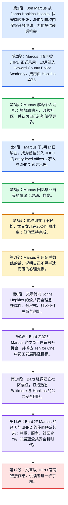

# 精读笔记

## 基本信息

| 项目 | 内容 |
|---|---|
| 文章来源 | Johns Hopkins University 官方新闻平台 **The Hub**：JHPD officer graduates from police academy [1](https://hub.jhu.edu/2025/06/11/jhpd-officer-graduates-from-police-academy/) |
| 栏目 | Public Safety / University News |
| 题目 | **JHPD officer graduates from police academy** |
| 副题 | **Jon Marcus, a former Johns Hopkins Hospital security guard, is the first entry-level officer to join the JHPD** |
| 作者 | **Hub staff report** |
| 发布时间 | 用户粘贴文本显示为 **Jun 12, 2025**；官方页面当前显示为 **June 11, 2025**。下文涉及正文事件日期时，按原文具体日期解析。 |
| 图片说明 | **JHPD Chief of Police Branville Bard pins a badge onto Officer Jon Marcus** |
| 作者背景 | **Hub staff report** 表示由 The Hub 编辑/通讯团队撰写或整理的新闻稿，并非署名单一记者。The Hub 是 Johns Hopkins University 用来发布校内科研、校园事务、公共安全、大学新闻等内容的官方新闻中心；官方 About 页面说明 The Hub 是集中呈现 Johns Hopkins 分散活动与重要动态的新闻平台。 |
| 相关背景来源 | Johns Hopkins Public Safety 关于 JHPD [2](https://publicsafety.jhu.edu/community-safety/johns-hopkins-police-department/) 的页面说明其公共安全理念强调信任、伙伴关系与社区福祉；JHPD Leadership [3](https://publicsafety.jhu.edu/community-safety/johns-hopkins-police-department/meet-the-jhpd-team/) 页面介绍 Branville G. Bard Jr. 为 Johns Hopkins 公共安全副总裁及 JHPD 首任警察局长；Ten for One [4](https://president.jhu.edu/ten-for-one/) 是 Johns Hopkins 通过 2030 年的大学战略框架。 |

---

## 前情提要

---

🔹 Jon Marcus / worked as a **`security guard`** / for the **`Johns Hopkins Hospital`** / for eight years.  
🔸 乔恩·马库斯在**`约翰斯·霍普金斯医院`**担任**`保安`**长达八年。

背景注释：**Jon Marcus** 是本文人物，原为 Johns Hopkins Hospital 的安保人员，后成为 Johns Hopkins Police Department 的入门级警员。**Johns Hopkins Hospital** 是约翰斯·霍普金斯体系中的知名医院，位于美国马里兰州巴尔的摩，是 Johns Hopkins Medicine 的重要组成部分。这里的 “for eight years” 用来凸显其与 Hopkins 体系的长期联系。

> **`security guard`** /sɪˈkjʊrəti ɡɑːrd/ n. phrase：a person employed to protect a building, people, or property 安保人员；保安。语域：日常 / 职业 / 公共安全。画龙点睛：**`guard`** 作名词是“守卫者”，作动词是“守护、防卫”。注意 **`security guard`** 不等同于 **`police officer`**：前者通常负责场所安全与巡逻，后者具有正式执法身份。写作可用：**`work as a security guard`** 表示“当保安”。
>
> **`work as`** /wɜːrk æz/ phrasal pattern：to have a particular job or role 担任……工作；以……身份工作。语域：通用 / 简历 / 新闻。画龙点睛：**`work as + 职位`** 是简历和新闻报道常用结构，比 **`be a`** 更强调职业经历。例：She worked as a nurse for ten years. 注意不要说 **work for a teacher** 表示“当老师”，应说 **`work as a teacher`**。
>
> **`for eight years`** /fɔːr eɪt jɪrz/ prep. phrase：during a period of eight years 持续八年。语域：通用。画龙点睛：**`for + 时间段`** 强调动作或状态持续多久，常与一般过去时或现在完成时连用。本文用一般过去时 **worked**，表示这段经历发生在加入 JHPD 之前；若仍在持续，则常说 **has worked for eight years**。

---

🔹 When the **`Johns Hopkins Police Department`** (**`JHPD`**) / **`opened applications`** to Hopkins security officers last year, / it **`presented`** a “perfect” **`opportunity`**, / Marcus says.  
🔸 马库斯说，去年，当**`约翰斯·霍普金斯警察部门`**向霍普金斯体系内的安保人员**`开放申请`**时，这为他提供了一个“完美”的**`机会`**。

背景注释：**Johns Hopkins Police Department, JHPD** 是约翰斯·霍普金斯大学的警察部门。根据 Johns Hopkins Public Safety 官方说明，JHPD 旨在通过现代、进步的警务政策，在学生、员工和邻近社区之间建立基于信任与合作的安全环境。**Hopkins security officers** 指 Hopkins 体系内已有的安保人员，而不是外部普通申请者。

> **`open applications to`** /ˈoʊpən ˌæplɪˈkeɪʃənz tuː/ v. phrase：to allow a group of people to apply for something 向……开放申请。语域：正式 / 招聘 / 机构公告。画龙点睛：这里 **`open`** 不是“打开门”的字面义，而是“开放资格”。常见搭配：**`applications are open`** 申请已开放；**`open applications for a position`** 开放某职位申请；**`open applications to internal candidates`** 向内部候选人开放申请。
>
> **`present`** /prɪˈzent/ v.：to offer, create, or make something available 提供；带来；造成。语域：正式 / 新闻 / 学术。画龙点睛：**`present an opportunity`** 是高频写作搭配，表示“带来机会”。注意发音：动词 **present** 重音在后 /prɪˈzent/；名词 /ˈprezənt/ 可指“礼物”或“现在”。近义表达：**`offer an opportunity`**, **`create an opportunity`**。
>
> **`opportunity`** /ˌɑːpərˈtuːnəti/ n.：a chance to do something desirable 机会；良机。语域：通用 / 正式。画龙点睛：常见搭配为 **`a perfect opportunity`** 绝佳机会，**`a rare opportunity`** 难得机会，**`take/seize an opportunity`** 抓住机会。考试写作中可替代简单的 **chance**，但语气更正式、更积极。

---

🔹 He / was **`officially hired`** by the JHPD / in August / and started at the **`Howard County Police Academy`** / in October, / with Hopkins **`covering the costs`**.  
🔸 他于8月被 JHPD **`正式录用`**，并于10月进入**`霍华德县警察学院`**学习，相关费用由霍普金斯方面**`承担`**。

背景注释：**Howard County Police Academy** 位于美国马里兰州霍华德县，用于警务训练。句中 “in August” 和 “in October” 未说明年份，但结合前句 “last year” 及文章发表于2025年，可推知为2024年8月和2024年10月。**Hopkins** 在文中是 Johns Hopkins University / Johns Hopkins 体系的简称。

> **`officially hired`** /əˈfɪʃəli ˈhaɪərd/ adj./v. phrase：formally employed by an organization 被正式聘用；被正式录用。语域：正式 / 人事 / 新闻。画龙点睛：**`hire`** 是美式英语中“雇用”的常用词；英式更常见 **recruit** 或 **employ**。被动结构 **`be hired by`** 强调由某机构录用，适合新闻报道。
>
> **`academy`** /əˈkædəmi/ n.：a school or institution for special training 专门学院；训练机构。语域：教育 / 职业培训。画龙点睛：**`police academy`** 是“警察学院 / 警校”，并不一定等同于综合性大学。**academy** 还可指艺术、科学等领域的学会，如 **the Academy Awards** 奥斯卡奖。
>
> **`cover the costs`** /ˈkʌvər ðə kɔːsts/ v. phrase：to pay for the expenses 支付费用；承担成本。语域：商务 / 机构 / 日常。画龙点睛：**`cover`** 在这里不是“覆盖”，而是“支付、足以负担”。常见搭配：**`cover tuition`** 支付学费，**`cover expenses`** 报销费用，**`cover the bill`** 买单。

---

🔹 “I / always **`wanted to`** help people.”  
🔸 “我一直**`想要`**帮助别人。”

背景注释：这是 Marcus 对自己职业动机的直接引语。句子简短，符合新闻人物报道中用直接引语塑造人物形象的写法。

> **`want to`** /wɑːnt tuː/ v. phrase：to wish or desire to do something 想要做某事。语域：口语 / 通用。画龙点睛：**`want to do`** 是最基础但最自然的意愿表达。正式写作中可换成 **`seek to do`** 或 **`aim to do`**；但直接引语中保留 **want to** 更真实自然。
>
> **`help people`** /help ˈpiːpəl/ v. phrase：to assist others 帮助他人。语域：通用 / 服务职业。画龙点睛：在申请文、面试和职业叙述中，**`I want to help people`** 是常见动机表达。若想更具体，可写 **`help people in need`** 帮助有需要的人，或 **`serve the community`** 服务社区。

---

🔹 I / was always **`driven by`** the **`desire`** / to help make my community better,” / Marcus says.  
🔸 马库斯说，我一直受到一种**`愿望`**的**`驱使`**：希望帮助自己的社区变得更好。”

背景注释：**community** 在美国公共安全语境中很重要，既可指地理社区，也可指校园共同体、居民群体或具有共同利益的人群。这里体现 JHPD 的社区导向理念。

> **`be driven by`** /bi ˈdrɪvən baɪ/ passive phrase：to be strongly motivated or influenced by something 受……驱动；受……激励。语域：正式 / 叙事 / 职业动机。画龙点睛：**`driven`** 来自动词 **drive**，过去分词为 **driven**。写作中 **`be driven by a desire to...`** 是高级表达，强于简单的 **want to**，可用于个人陈述：I am driven by a desire to solve real-world problems.
>
> **`desire`** /dɪˈzaɪər/ n./v.：a strong wish to have or do something 强烈愿望；渴望。语域：正式 / 文学 / 心理。画龙点睛：**desire** 比 **wish** 更强烈，比 **want** 更正式。常见搭配：**`a desire to improve`** 改进的愿望，**`a strong desire for change`** 对改变的强烈渴望。
>
> **`community`** /kəˈmjuːnəti/ n.：people living in the same area or sharing common interests 社区；共同体。语域：社会 / 新闻 / 公共政策。画龙点睛：**community** 可数，复数为 **communities**。常见搭配：**`serve the community`**, **`community partnership`**, **`campus community`**。考试中常译为“社区”或“共同体”，需按语境选择。

---

🔹 “I / **`felt like`** / I wasn’t doing enough.”  
🔸 “我**`觉得`**自己做得还不够。”

背景注释：此句进一步解释 Marcus 从保安转向警务岗位的内在原因：他认为原有岗位不足以充分实现“帮助社区”的目标。

> **`feel like`** /fiːl laɪk/ v. phrase：to have the impression or opinion that 感觉；觉得。语域：口语 / 直接引语。画龙点睛：**`feel like + 从句`** 表示“觉得……”，非常口语化。不要机械译成“感觉像”。例：I feel like I need more time. 我觉得我需要更多时间。
>
> **`do enough`** /duː ɪˈnʌf/ v. phrase：to do as much as is needed 做得足够。语域：通用。画龙点睛：**enough** 可作副词、形容词、代词。位置要注意：修饰名词时通常在前，如 **enough time**；修饰形容词或副词时在后，如 **good enough**。

---

🔹 “I / feel like / I **`could have been doing`** more.”  
🔸 “我觉得自己本来**`还能做得更多`**。”

背景注释：这里的时态和情态结构很值得注意。Marcus 用 **could have been doing** 表达对过去一段时间的反思：并非单一动作，而是“原本可以一直在做更多”。

> **`could have been doing`** /kʊd hæv bɪn ˈduːɪŋ/ modal perfect progressive：used to talk about a possible ongoing action in the past 本可能一直在做；原本可以做得更多。语域：口语 / 反思表达。画龙点睛：这是 **情态动词 + have been + V-ing**，强调过去持续可能性。对比：**could have done** 侧重完成某事；**could have been doing** 侧重过去一段时间内持续进行。
>
> **`more`** /mɔːr/ adv./pron./adj.：a greater amount or degree 更多；更大程度。语域：通用。画龙点睛：**do more** 是简洁有力的表达，常用于社会责任、个人成长、公共服务语境，如 **We must do more to protect vulnerable groups.**

---

🔹 Marcus / **`graduated from`** the academy / on May 14 / and became the first **`entry-level officer`** / to join the JHPD.  
🔸 马库斯于5月14日从警校**`毕业`**，并成为首位加入 JHPD 的**`入门级警员`**。

背景注释：**May 14** 指2025年5月14日，因为文章发表于2025年6月。**entry-level officer** 强调 Marcus 并非已有警务经验后横向调入，而是作为初级岗位人员进入 JHPD，这也是文章新闻价值所在。

> **`graduate from`** /ˈɡrædʒueɪt frəm/ v. phrase：to complete a course of study and receive qualification 从……毕业。语域：教育 / 新闻。画龙点睛：美式英语中 **graduate** 作动词常说 **`graduate from college`**；英式也可说 **leave university**，但含义不完全相同。注意 **graduate** 作名词读 /ˈɡrædʒuət/，作动词读 /ˈɡrædʒueɪt/。
>
> **`entry-level`** /ˈentri ˌlevəl/ adj.：suitable for someone who is starting a job and has little experience 入门级的；初级的。语域：招聘 / 职场。画龙点睛：**entry-level position/job/officer** 是求职英语高频词。反义表达可用 **senior-level**, **experienced**, **veteran**。不要把它误解为“入口层级”的物理空间。
>
> **`join`** /dʒɔɪn/ v.：to become a member of an organization 加入；成为……一员。语域：通用。画龙点睛：**join + 组织** 不加介词，直接说 **join the team / join the police department**。若表示“加入某人一起做某事”，可说 **join someone in doing something**。

---

🔹 Among those **`in attendance`** / for the ceremony / were Branville Bard, / vice president for public safety at Johns Hopkins / and the JHPD’s **`chief of police`**, / as well as Marcus’s wife and 7-month-old daughter.  
🔸 出席典礼的人员中包括布兰维尔·巴德——约翰斯·霍普金斯负责公共安全的副总裁兼 JHPD **`警察局长`**——以及马库斯的妻子和他7个月大的女儿。

背景注释：**Branville Bard** 即 Dr. Branville G. Bard Jr.。Johns Hopkins 官方领导页面显示，他担任 Johns Hopkins University 与 Johns Hopkins Medicine 公共安全副总裁，并于2023年4月被任命为 JHPD 首任 Chief of Police。**7-month-old daughter** 表明 Marcus 在训练期间还承担新生儿家庭责任。

> **`in attendance`** /ɪn əˈtendəns/ idiom：present at an event 出席；在场。语域：正式 / 新闻 / 活动报道。画龙点睛：这是倒装句触发点：**Among those in attendance were...** 正常语序为 **Branville Bard... was among those in attendance**。新闻英语常用倒装来突出出席者范围。
>
> **`ceremony`** /ˈserəmoʊni/ n.：a formal public or religious event 典礼；仪式。语域：正式 / 新闻。画龙点睛：常见搭配：**graduation ceremony** 毕业典礼，**award ceremony** 颁奖典礼，**opening ceremony** 开幕式。注意拼写不是 *ceremoney*。
>
> **`chief of police`** /tʃiːf əv pəˈliːs/ n. phrase：the head of a police department 警察局长。语域：公共安全 / 政府 / 新闻。画龙点睛：**chief** 表示“负责人、首领”，常用于机构最高职位，如 **fire chief**, **editor in chief**, **chief executive officer**。在美国，**chief of police** 通常是地方或机构警察部门的最高行政负责人。
>
> **`as well as`** /æz wel æz/ conjunction-like phrase：in addition to 除……之外；以及。语域：通用 / 正式。画龙点睛：**as well as** 连接成分时，谓语通常与前面的主语一致，而非与后面的名词一致。例：The teacher, as well as the students, is excited.

---

🔹 “I / was very **`ecstatic`**,” / Marcus says / of his graduation day.  
🔸 谈到毕业那天，马库斯说：“我非常**`欣喜若狂`**。”

背景注释：**ecstatic** 是比 “happy” 强烈得多的情绪词，适合表达毕业、获奖、家庭喜事等强烈喜悦。新闻报道中保留该词，有助于呈现人物当天的情绪强度。

> **`ecstatic`** /ɪkˈstætɪk/ adj.：extremely happy or excited 狂喜的；欣喜若狂的。语域：情感表达 / 新闻直接引语。画龙点睛：**ecstatic** 强度高于 **happy**, **pleased**, **excited**。常见搭配：**`be ecstatic about/over something`** 因某事欣喜若狂。例：She was ecstatic about the offer. 注意不要与 **static** “静止的”混淆。
>
> **`of`** /əv/ prep.：about or concerning 关于；就……而言。语域：正式 / 新闻。画龙点睛：**`says of his graduation day`** 中 **of** 表示“谈及”。新闻英语常见结构：**he said of the decision** 他谈到这一决定时说。比 **about** 更简洁、更有报道腔。

---

🔹 “My wife / says / she was **`more excited than`** me, / but I / was **`proud of`** myself.”  
🔸 “我妻子说她比我还**`激动`**，但我为自己感到**`自豪`**。”

背景注释：此句通过家庭成员的反应补充仪式的私人意义。公共安全报道中加入家庭细节，有助于将机构新闻转化为人物故事。

> **`more excited than`** /mɔːr ɪkˈsaɪtɪd ðæn/ comparative phrase：having a greater feeling of excitement than 比……更激动。语域：口语 / 通用。画龙点睛：比较级结构 **more + 多音节形容词 + than**。**excited** 描述人“感到兴奋”；**exciting** 描述事物“令人兴奋”。不要说 *I am exciting* 表示“我很兴奋”。
>
> **`proud of`** /praʊd əv/ adj. phrase：feeling pleased about someone’s achievement 为……感到自豪。语域：通用。画龙点睛：固定搭配是 **`be proud of someone/something`**。若强调“以……为荣”，可说 **take pride in**，更正式：He takes pride in serving his community.
>
> **`myself`** /maɪˈself/ pron.：used when the speaker is also the object of the action 我自己。语域：通用。画龙点睛：反身代词可表示动作回到主语，也可用于强调。这里 **proud of myself** 强调 Marcus 对个人坚持和成就的认可。

---

🔹 The academy / wasn’t easy, / Marcus says, / especially when his wife **`gave birth to`** their daughter / in late 2024.  
🔸 马库斯说，警校训练并不轻松，尤其是在他妻子于2024年底**`生下`**他们女儿的时候。

背景注释：**late 2024** 指2024年后段，通常可理解为10月至12月左右，具体日期原文未说明。结合前文他10月进入警校，女儿出生与警校训练时间重叠，解释了他面临的压力。

> **`not easy`** /nɑːt ˈiːzi/ adj. phrase：difficult 困难的；并不轻松。语域：口语 / 通用。画龙点睛：英语中常用否定形式表达温和判断，**wasn’t easy** 比 **was difficult** 更含蓄，也更贴近口语直接引语。
>
> **`especially when`** /ɪˈspeʃəli wen/ adv. phrase：particularly at the time that 尤其当……时。语域：通用 / 叙事。画龙点睛：**especially** 用来突出特殊情境，可放句首、句中或句末。写作中常用于补充压力或限制条件：The task is challenging, especially when resources are limited.
>
> **`give birth to`** /ɡɪv bɜːrθ tuː/ v. phrase：to produce a baby 生下；分娩。语域：通用 / 医学 / 新闻。画龙点睛：固定搭配 **give birth to + baby/child/daughter/son**。不要说 *give a birth*。也可比喻“孕育、产生”：The crisis gave birth to new reforms.

---

🔹 But he / was **`determined to`** **`see it through`**.  
🔸 但他**`决心`** **`坚持到底`**。

背景注释：这里的 **it** 指警校训练和成为 JHPD 警员的整个过程。该句是人物弧线的转折：前句写困难，后句写坚持。

> **`determined to`** /dɪˈtɜːrmɪnd tuː/ adj. phrase：firmly decided to do something 决心做某事。语域：正式 / 叙事 / 励志。画龙点睛：**determined** 可作形容词，常见结构 **`be determined to do`**。名词为 **determination**，动词为 **determine**。写作中可替换简单的 **want to**，强调意志坚定。
>
> **`see it through`** /siː ɪt θruː/ phrasal verb：to continue doing something until it is finished 坚持完成；撑到最后。语域：口语 / 半正式。画龙点睛：这是非常地道的表达。**see through** 也可表示“看穿”，但 **`see something through`** 表示“把某事坚持做完”。例：Once you start the project, you need to see it through.

---

🔹 “One of my football coaches / had said to me, / ‘If you **`quit`** now, / you always will be a **`quitter`**,’” / he says.  
🔸 他说：“我的一位橄榄球教练曾对我说，‘如果你现在**`放弃`**，你以后就永远会是个**`半途而废的人`**。’”

背景注释：**football** 在美国语境中通常指 American football，即美式橄榄球，而不是英式英语中的 soccer。体育教练的话在美国人物叙事中常被用作坚毅、纪律和团队精神的来源。这里的 **had said** 是过去完成时，表示这句话发生在他回忆的过去节点之前。

> **`football coach`** /ˈfʊtbɔːl koʊtʃ/ n. phrase：a person who trains a football team 橄榄球教练；足球教练。语域：体育 / 日常。画龙点睛：在美国新闻中 **football** 多指美式橄榄球；若指英式足球，美国英语常说 **soccer**。**coach** 既可作名词“教练”，也可作动词“指导、训练”。
>
> **`had said`** /hæd sed/ past perfect：used to show an action happened before another past moment 曾经说过；此前说过。语域：语法 / 叙事。画龙点睛：过去完成时 **had + 过去分词** 用来交代“过去的过去”。此处 Marcus 现在回忆警校经历，而教练的话更早发生，所以用 **had said**。
>
> **`quit`** /kwɪt/ v.：to stop doing something or leave a job, school, or activity 放弃；退出；辞职。语域：口语 / 通用。画龙点睛：**quit** 过去式和过去分词均为 **quit** 或 **quitted**，美式常用 **quit**。常见搭配：**quit a job**, **quit school**, **quit smoking**。比 **stop** 更强调主动退出。
>
> **`quitter`** /ˈkwɪtər/ n.：a person who gives up easily 轻易放弃的人；半途而废者。语域：口语 / 评价性。画龙点睛：**quitter** 带负面评价色彩。构词为 **quit + -er**，表示做某动作的人。类似：**runner**, **worker**, **fighter**。本文中它承载心理压力与自我激励功能。

---

🔹 “I / **`took that to heart`**.”  
🔸 “我把那句话**`牢记在心`**。”

背景注释：**that** 指前一句教练关于 “quit/quitter” 的告诫。该表达体现这句话对 Marcus 的长期影响。

> **`take something to heart`** /teɪk ˈsʌmθɪŋ tuː hɑːrt/ idiom：to be deeply affected by advice, criticism, or words 把某事放在心上；铭记于心。语域：口语 / 叙事。画龙点睛：这个短语既可表示“认真接受建议”，也可表示“因批评而难过”。本文为积极义：把教练的话当作原则。例：She took her mentor’s advice to heart.
>
> **`heart`** /hɑːrt/ n.：the organ in the chest; also the center of feelings 心脏；内心。语域：通用 / 比喻。画龙点睛：英语中 **heart** 常表示情感核心，如 **learn by heart** 背熟，**from the heart** 发自内心，**at the heart of** 处于核心。

---

🔹 Every day, / when things **`got hard`**, / I was like, / ‘I can’t **`quit`** this.’  
🔸 每一天，当事情**`变得艰难`**时，我就会想：‘我不能**`放弃`**这件事。’

背景注释：**I was like** 是口语引述结构，常用来表达“我当时就想 / 我当时就说”。这里不是严格逐字转述，而是还原当时的内心语言。

> **`get hard`** /ɡet hɑːrd/ v. phrase：to become difficult 变得困难。语域：口语 / 通用。画龙点睛：**get + adjective** 表示状态变化，如 **get better**, **get worse**, **get tired**。这里 **hard** 不是“硬的”，而是“困难的、艰苦的”。
>
> **`I was like`** /aɪ wəz laɪk/ colloquial reporting phrase：used informally to introduce what someone thought or said 我当时就想 / 我当时就说。语域：口语。画龙点睛：这是美式口语中非常常见的转述方式，不适合正式学术写作。正式写作可改为 **I thought**, **I told myself**, **I said to myself**。
>
> **`quit this`** /kwɪt ðɪs/ v. phrase：to stop continuing this thing 放弃这件事。语域：口语。画龙点睛：**quit** 可直接接名词或代词作宾语。本文 **this** 指警校训练与成为警员的道路，语义上比单纯 **quit school** 更宽泛。

---

🔹 Johns Hopkins / has taken a **`holistic`**, **`layered approach`** / to **`public safety`** / that **`incorporates`** community partnerships and public safety innovations / into its operations / to improve the overall **`well-being`** of the campus community.  
🔸 约翰斯·霍普金斯采取了一种面向**`公共安全`**的**`整体性`**、**`多层次方法`**：将社区伙伴关系和公共安全创新纳入其运作之中，以提升校园共同体的整体**`福祉`**。

背景注释：这一句从 Marcus 的个人故事转向机构政策。Johns Hopkins Public Safety 官方页面也强调通过信任、伙伴关系、现代警务政策来建设安全环境。**campus community** 不只包括学生，也可包括教职员工、患者、访客和周边居民，具体范围依 Hopkins 公共安全语境而定。

> **`holistic`** /hoʊˈlɪstɪk/ adj.：considering the whole of something, not just separate parts 整体性的；全面的。语域：正式 / 教育 / 医疗 / 管理。画龙点睛：**holistic approach** 是学术与政策写作高频搭配，表示“不头痛医头、脚痛医脚”，而是综合考虑系统各部分。反义可用 **piecemeal** 零碎的。
>
> **`layered approach`** /ˈleɪərd əˈproʊtʃ/ n. phrase：a method with several levels or components 分层式方法；多层次策略。语域：政策 / 安全 / 管理。画龙点睛：**layered** 强调不依赖单一措施，而是多种机制叠加。例如网络安全常说 **a layered security approach** 多层防护策略。
>
> **`public safety`** /ˈpʌblɪk ˈseɪfti/ n. phrase：the protection of the general public from danger 公共安全。语域：政府 / 警务 / 新闻。画龙点睛：**public safety** 比 **security** 范围更广，可包括警务、应急响应、心理健康危机支持、预防教育等。写作中常与 **community**, **trust**, **accountability** 搭配。
>
> **`incorporate ... into`** /ɪnˈkɔːrpəreɪt ˈɪntuː/ v. phrase：to include something as part of a larger whole 将……纳入；把……融入。语域：正式 / 学术 / 管理。画龙点睛：高分写作常用词。例：The program incorporates technology into classroom teaching. 名词为 **incorporation**。
>
> **`well-being`** /ˌwel ˈbiːɪŋ/ n.：the state of being healthy, happy, and comfortable 福祉；身心健康。语域：教育 / 公共政策 / 心理健康。画龙点睛：注意连字符 **well-being**。它不仅指身体健康，也包括心理、社会、安全感等综合状态。常见搭配：**student well-being**, **community well-being**。

---

🔹 It’s an **`approach`** / that **`holds particular appeal`** / for JHPD employees, / Marcus included.  
🔸 这种**`方法`**对 JHPD 员工具有**`特别的吸引力`**，马库斯也包括在内。

背景注释：**Marcus included** 是补充结构，意思是 “including Marcus”。它把 Marcus 个人选择与 JHPD 的整体理念连接起来。

> **`approach`** /əˈproʊtʃ/ n.：a way of dealing with something 方法；路径；处理方式。语域：正式 / 学术 / 政策。画龙点睛：**approach to + 名词/动名词** 是固定结构，如 **an approach to public safety**, **an approach to solving problems**。不要说 *approach of doing*。
>
> **`hold appeal`** /hoʊld əˈpiːl/ v. phrase：to be attractive or interesting 有吸引力。语域：正式 / 新闻。画龙点睛：**appeal** 作名词是“吸引力”或“上诉”；作动词是“吸引、呼吁、上诉”。**`hold particular appeal for someone`** 比 **be attractive to someone** 更书面。
>
> **`particular`** /pərˈtɪkjələr/ adj.：special or specific 特别的；特定的。语域：通用 / 正式。画龙点睛：**particular** 可表示“具体某个”，也可表示“格外的”。本文 **particular appeal** 表示“尤其强的吸引力”。常见搭配：**particular concern**, **particular interest**, **particular importance**。
>
> **`included`** /ɪnˈkluːdɪd/ past participle：counted as part of a group 包括在内。语域：通用。画龙点睛：**Marcus included** 是后置补充，等于 **including Marcus**。类似：**children included** 包括儿童在内；**tax included** 含税。

---

🔹 Bard / is particularly **`interested in`** creating **`opportunities`** / for individuals like Marcus / to **`move up`** within the organization, / an approach that supports the university’s goal — **`articulated`** in its **`Ten for One strategic framework`** — / to create clear, meaningful **`pathways`** for staff advancement.  
🔸 巴德特别**`关注`**为马库斯这样的人创造在组织内部**`晋升`**的**`机会`**；这种做法支持了大学在其 **`Ten for One 战略框架`**中所**`阐明`**的目标，即为员工发展建立清晰而有意义的**`路径`**。

背景注释：**Bard** 指 Branville G. Bard Jr.。**Ten for One strategic framework** 是 Johns Hopkins 面向2030年的战略框架。官方页面显示其目标之一是让 Johns Hopkins 成为“认可、支持员工，并为员工及其家庭提供多种职业与个人发展路径”的雇主。这里将 Marcus 的个人晋升与大学层面的员工发展战略联系起来。

> **`be interested in`** /bi ˈɪntrəstɪd ɪn/ adj. phrase：to want to know about or be involved in something 对……感兴趣；关注。语域：通用。画龙点睛：后接名词或动名词：**interested in creating**, 不能说 *interested to creating*。若表示“有意做某事”，可说 **be interested in doing something**。
>
> **`move up`** /muːv ʌp/ phrasal verb：to rise to a higher position 晋升；上升。语域：职场 / 口语。画龙点睛：**move up within the organization** 是职场晋升表达。近义词：**advance**, **be promoted**, **climb the ladder**。其中 **climb the career ladder** 更形象，但略口语。
>
> **`articulate`** /ɑːrˈtɪkjuleɪt/ v.：to express an idea clearly and effectively 清楚表达；阐明。语域：正式 / 学术 / 政策。画龙点睛：本文 **articulated in** 是过去分词作后置定语。**articulate** 也可作形容词 /ɑːrˈtɪkjələt/，表示“表达清楚的”。注意动词和形容词发音略有差异。
>
> **`strategic framework`** /strəˈtiːdʒɪk ˈfreɪmwɜːrk/ n. phrase：a structured plan that sets long-term goals 战略框架。语域：管理 / 大学治理 / 政策。画龙点睛：**framework** 不是具体“框子”，而是思想、政策或行动的结构。常见搭配：**policy framework**, **legal framework**, **conceptual framework**。
>
> **`pathway`** /ˈpæθweɪ/ n.：a route or means to achieve something 路径；途径。语域：教育 / 职业发展 / 政策。画龙点睛：**pathway for staff advancement** 指员工职业发展的制度化通道。教育写作中常见 **pathways to success**, **career pathways**, **learning pathways**。

---

🔹 “**`Establishing trust`** / among the communities we serve / is a **`critical`** part / of our role / as **`public safety officers`**,” / Bard said.  
🔸 巴德说：“在我们所服务的各个社区之间**`建立信任`**，是我们作为**`公共安全人员`**职责中**`至关重要`**的一部分。”

背景注释：该句体现现代公共安全话语的核心：警务或校园安全不只是执法，还包括社区信任建设。**communities we serve** 既可能指 Hopkins 校园群体，也可能指 Baltimore 周边社区。

> **`establish trust`** /ɪˈstæblɪʃ trʌst/ v. phrase：to create or build confidence between people or groups 建立信任。语域：正式 / 公共治理 / 商务。画龙点睛：**establish** 比 **build** 更正式，常用于制度、关系、原则。搭配：**establish trust**, **establish a relationship**, **establish a system**。
>
> **`serve`** /sɜːrv/ v.：to work for or provide help to people or a community 服务；为……工作。语域：公共服务 / 正式。画龙点睛：公共部门常说 **the communities we serve**，强调职责对象。**serve** 还可表示“服役、任职、提供食物”。需按语境判断。
>
> **`critical`** /ˈkrɪtɪkəl/ adj.：extremely important; involving careful judgment 关键的；至关重要的；批判性的。语域：正式 / 学术 / 新闻。画龙点睛：**critical** 不只表示“批评的”，更常表示“极其重要的”。近义：**crucial**, **vital**, **essential**。考试阅读中要警惕熟词僻义。
>
> **`public safety officer`** /ˈpʌblɪk ˈseɪfti ˈɔːfɪsər/ n. phrase：a person responsible for protecting public or institutional safety 公共安全人员。语域：政府 / 校园安全。画龙点睛：该词比 **police officer** 更宽泛，可能包括警务、安保、应急、社区安全等岗位。本文用它凸显 JHPD 的公共服务定位。

---

🔹 “We / are **`fortunate`** / to be able to build a team of individuals / who know Baltimore and who know Hopkins, / officers who are **`familiar to`** people in our communities / and who understand their needs and **`concerns`**.”  
🔸 “我们很**`幸运`**，能够组建一支既了解巴尔的摩、又了解霍普金斯的团队；这些警员为我们社区中的人们所**`熟悉`**，也理解他们的需求和**`关切`**。”

背景注释：**Baltimore** 是美国马里兰州最大城市，Johns Hopkins 的多个校区和医院均与巴尔的摩紧密相关。Bard 强调招募熟悉 Baltimore 与 Hopkins 的人员，是为了突出本地知识、社区关系和信任基础。

> **`fortunate`** /ˈfɔːrtʃənət/ adj.：lucky, especially because something good has happened 幸运的。语域：正式 / 礼貌表达。画龙点睛：**fortunate** 比 **lucky** 更正式、更得体。常见结构：**`be fortunate to do something`** 有幸做某事；**`be fortunate in having...`** 幸运地拥有……。
>
> **`build a team`** /bɪld ə tiːm/ v. phrase：to create or develop a group that works together 组建团队；建设团队。语域：管理 / 职场。画龙点睛：**build** 常用于抽象对象：**build trust**, **build capacity**, **build a career**, **build a partnership**。这里强调长期塑造而非一次性招聘。
>
> **`familiar to`** /fəˈmɪliər tuː/ adj. phrase：known or recognized by someone 为……所熟悉。语域：通用。画龙点睛：注意 **`familiar to`** 与 **`familiar with`**：A is familiar to B = B 熟悉 A；B is familiar with A = B 对 A 熟悉。本文 **officers who are familiar to people** = 人们熟悉这些警员。
>
> **`concern`** /kənˈsɜːrn/ n.：a worry, issue, or matter of importance 担忧；关切；重要事项。语域：正式 / 公共政策。画龙点睛：**concerns** 在新闻和政策语境中常指公众担忧，而不只是私人焦虑。搭配：**address concerns** 回应关切，**raise concerns** 提出担忧，**safety concerns** 安全隐患。

---

🔹 “It / was an **`honor`** / to **`pin`** Officer Marcus’s **`badge`** / at graduation, / as it was a **`proud moment`** / for all of us at the JHPD,” / he added.  
🔸 他补充说：“在毕业典礼上为马库斯警员**`佩戴`** **`警徽`**，是一种**`荣幸`**；因为这对我们 JHPD 全体成员而言，都是一个**`值得自豪的时刻`**。”

背景注释：**pin a badge** 指在警察毕业或宣誓等仪式上，将警徽别在警员制服上，象征身份确认、职业认可和职责开始。**Officer Marcus** 中 Officer 是对警员的正式称呼。

> **`honor`** /ˈɑːnər/ n.：a privilege or special respect 荣幸；荣誉。语域：正式 / 仪式 / 演讲。画龙点睛：**It is an honor to do something** 是致辞高频句型，表示“很荣幸做某事”。美式拼写 **honor**，英式为 **honour**。
>
> **`pin`** /pɪn/ v.：to fasten something with a pin or badge 别上；固定。语域：日常 / 仪式。画龙点睛：**pin** 作名词是“别针、徽章”，作动词是“别住”。本文 **pin Officer Marcus’s badge** 是仪式动作，不宜译为“钉住警徽”。
>
> **`badge`** /bædʒ/ n.：a small object showing rank, membership, or authority 徽章；警徽。语域：警务 / 机构。画龙点睛：**badge** 在警务语境中特指警员身份和授权象征。常见表达：**police badge**, **wear a badge**, **badge number**。
>
> **`proud moment`** /praʊd ˈmoʊmənt/ n. phrase：a time that makes someone feel proud 值得自豪的时刻。语域：通用 / 仪式报道。画龙点睛：**moment** 在新闻写作中常不只是“一瞬间”，也可指“重要时刻”。如 **a historic moment**, **a defining moment**, **a proud moment**。

---

🔹 “His **`journey`** / reflects the **`heart of our mission`**: / to build a department **`grounded in`** respect, service, and community partnership.  
🔸 “他的**`历程`**体现了我们**`使命的核心`**：建设一个**`植根于`**尊重、服务和社区合作的部门。”

背景注释：此句具有机构使命宣示色彩。**respect, service, and community partnership** 是 JHPD 希望强调的三项价值。冒号后面的不定式短语解释 **the heart of our mission** 的具体内容。

> **`journey`** /ˈdʒɜːrni/ n.：a process of development or change; a trip 旅程；历程。语域：叙事 / 演讲。画龙点睛：**journey** 在人物报道中常指成长过程，而不只是物理旅行。常见搭配：**career journey**, **personal journey**, **journey from...to...**。
>
> **`reflect`** /rɪˈflekt/ v.：to show, express, or be a sign of something 反映；体现。语域：正式 / 学术 / 新闻。画龙点睛：**reflect** 不仅是“反射”，还可表示“体现某种价值或趋势”。例：The policy reflects a shift in priorities.
>
> **`the heart of`** /ðə hɑːrt əv/ idiom：the most important or central part of something ……的核心。语域：正式 / 演讲 / 写作。画龙点睛：**heart** 作为隐喻表示“核心、本质”。类似表达：**at the core of**, **central to**。本文 **heart of our mission** 非常适合用于机构使命表述。
>
> **`grounded in`** /ˈɡraʊndɪd ɪn/ adj. phrase：based firmly on something 建立在……基础上；植根于。语域：正式 / 学术 / 政策。画龙点睛：**ground** 作动词可表示“使建立基础”。常见写作搭配：**grounded in evidence** 基于证据，**grounded in reality** 立足现实，**grounded in respect** 以尊重为基础。

---

🔹 I / hope / his example **`inspires`** others / to join us / in **`shaping`** a **`new era`** of public safety / at Johns Hopkins.”  
🔸 我希望他的榜样能够**`激励`**更多人加入我们，共同**`塑造`**约翰斯·霍普金斯公共安全的**`新时代`**。”

背景注释：**new era of public safety** 是机构愿景表达，暗示 JHPD 希望区别于传统单一执法模式，转向更重视社区合作、透明度、信任和服务的公共安全模式。

> **`inspire`** /ɪnˈspaɪər/ v.：to make someone feel willing or excited to do something 激励；鼓舞。语域：正式 / 演讲 / 教育。画龙点睛：常见结构：**`inspire someone to do something`** 激励某人做某事。名词 **inspiration**，形容词 **inspiring**。注意 **inspired** 描述人受到启发，**inspiring** 描述事物令人鼓舞。
>
> **`join us in doing`** /dʒɔɪn ʌs ɪn ˈduːɪŋ/ v. pattern：to take part with us in an activity 加入我们一起做……。语域：正式 / 号召。画龙点睛：**join someone in doing something** 是固定结构。例：We invite you to join us in building a safer community. 不要漏掉介词 **in**。
>
> **`shape`** /ʃeɪp/ v.：to influence how something develops 塑造；影响……的发展。语域：正式 / 政策 / 写作。画龙点睛：**shape the future / shape policy / shape a new era** 都是高频搭配。它比 **make** 更强调“逐步影响并形成某种格局”。
>
> **`new era`** /nuː ˈɪrə/ n. phrase：a new period marked by important change 新时代；新阶段。语域：正式 / 新闻 / 演讲。画龙点睛：**era** 比 **period** 更宏大，常用于历史性转变。搭配：**a new era of cooperation**, **a new era of technology**, **a new era of public safety**。

---

🔹 To **`learn more about`** the JHPD, / visit the **`Johns Hopkins Public Safety website`**.  
🔸 如需**`进一步了解`** JHPD，请访问**`约翰斯·霍普金斯公共安全网站`**。

背景注释：这是新闻稿常见结尾句，提供机构官网入口。**Johns Hopkins Public Safety website** 是 Johns Hopkins 公共安全相关信息、JHPD 介绍、领导团队、问责机制、招聘与政策文件等内容的官方平台。

> **`learn more about`** /lɜːrn mɔːr əˈbaʊt/ v. phrase：to get additional information about something 进一步了解。语域：通用 / 网站 / 新闻结尾。画龙点睛：这是网页和公告的常用行动提示。比 **know more about** 更自然。例：To learn more about the program, visit our website.
>
> **`visit`** /ˈvɪzɪt/ v.：to go to a place or website 访问；参观；浏览。语域：通用。画龙点睛：**visit** 可用于实体地点，也可用于网站：**visit the website**。中文常译为“访问网站”，不是“拜访网站”。
>
> **`website`** /ˈwebsaɪt/ n.：a set of pages on the internet 网站。语域：通用 / 科技。画龙点睛：注意 **website** 现多写作一个词，而不是 **web site**。搭配：**official website**, **university website**, **public safety website**。

---

# 模块一：翻译与全文概要

> 原文为英文，无需翻译。

---

## 中英文对照概要

**A Badge of Trust: Johns Hopkins’ First Homegrown Officer and the Human Face of Campus Policing Reform**    
**一枚信任的徽章：约翰·霍普金斯首位本土培养警官与校园警务改革的人文面孔**

`Jon Marcus`, a former `Johns Hopkins Hospital` `security guard`, has become the `first entry-level officer` to graduate from the police academy and officially join the `Johns Hopkins Police Department` (`JHPD`).  
`乔恩·马库斯`曾是`约翰斯·霍普金斯医院`的一名`保安`，如今成为首位从警察学院毕业并正式加入`约翰斯·霍普金斯警察局`（`JHPD`）的`基层警官`。

His trajectory from hospital security to sworn officer embodies the university's `holistic, layered approach to public safety`, which prioritizes community trust over traditional enforcement.  
他从医院保安到宣誓警官的转变，体现了该大学`整体性、多层次的公共安全策略`，这一策略将社区信任置于传统执法之上。

`JHPD Chief` `Branville Bard` explicitly frames this hiring as a strategic tool to build a department `grounded in respect, service, and community partnership`, signaling a deliberate departure from the often adversarial relationship between campus police and urban communities.  
`JHPD局长` `布兰维尔·巴德`明确将此次聘用视为一种战略工具，旨在建立一支`植根于尊重、服务与社区伙伴关系`的警务队伍，这标志着对校园警察与城市社区间常见对立关系的刻意疏离。

Underpinning this recruitment is the university’s `Ten for One` strategic framework, which seeks to create `clear, meaningful pathways for staff advancement`, transforming public safety jobs from transient posts into long-term careers.  
支撑这一招聘理念的是该大学的`“十为一”`战略框架，该框架致力于创造`清晰、有意义的员工晋升路径`，将公共安全岗位从临时性职位转变为长期职业。

The story is not merely a personnel update; it is a carefully crafted narrative designed to legitimize the `JHPD` — a private university police force in `Baltimore`, a city marked by historic tensions between law enforcement and `Black` communities — by foregrounding local familiarity and personal investment.  
这篇报道不仅仅是人事动态；它是一篇精心构建的叙事，旨在通过突出本地归属感与个人投入，使`JHPD`——这所位于`巴尔的摩`（一个因执法部门与`黑人`社区历史性紧张关系而闻名的城市）的私立大学警察力量——获得合法性。

---

# 模块二：基本信息与注释

## 2A. 文章基本信息

| 项目 / Item | 内容 / Content |
|---|---|
| **来源 / Source** | **The Hub** / **约翰·霍普金斯大学官方新闻平台** |
| **题目 / Title** | **JHPD officer graduates from police academy** / **JHPD警官从警察学院毕业** |
| **作者 / Author** | **Hub staff report** / **Hub 采编团队** |
| **发表日期 / Date** | **Jun 12, 2025** / **2025年6月12日**（若按官网页眉则以 **June 11, 2025** 为准；见上文「发布时间」） |
| **发稿地 / Dateline** | **Baltimore, MD** (implicit) / **马里兰州巴尔的摩**（隐含） |
| **文章类型 / Genre** | **University News / Institutional Feature** / **大学新闻/机构宣传特写** |
| **主题领域 / Field** | **Public Safety / Higher Education Administration / Community Policing** / **公共安全/高等教育管理/社区警务** |

---

## 2B. 作者背景

**作者/记者背景：**  
本文为 **`Hub staff report`**，表明这是由约翰·霍普金斯大学官方新闻办公室采编团队撰写的通讯稿，未署个人作者姓名。**The Hub** 是约翰·霍普金斯大学的**中央新闻与信息平台**，代表校方立场。

---

## 2C. 实体、地点、人物注释

### 👤 人物

**乔恩·马库斯（Jon Marcus）**  
`约翰·霍普金斯警察局`首位`基层警官`。曾在`约翰·霍普金斯医院`担任`保安`长达八年，于2025年5月14日从`霍华德县警察学院`毕业。其职业轨迹被校方塑造为社区警务与内部晋升的典范。

**布兰维尔·巴德（Branville Bard）**  
`约翰·霍普金斯大学`分管`公共安全`的`副校长`及`JHPD`的`警察局长`。他积极推动将本地人员纳入警务体系，强调`信任`、`尊重`与`社区伙伴关系`，是该校公共安全战略的核心人物。

### 🏛️ 地点与机构

**约翰·霍普金斯警察局（Johns Hopkins Police Department / JHPD）**  
一所由`约翰·霍普金斯大学`建立的`私立大学警察局`，负责该校位于`马里兰州巴尔的摩市`的校区安全。其成立和运作引发了关于私立警察权力与社区问责的广泛讨论。本文为该部门招募首批本地警官进行形象宣传。

**霍华德县警察学院（Howard County Police Academy）**  
位于`马里兰州霍华德县`的警察培训机构，为`JHPD`新招募警官提供专业执法训练。`马库斯`在此完成了由大学资助的培训。

**约翰·霍普金斯医院（Johns Hopkins Hospital）**  
`约翰·霍普金斯大学`的附属教学医院，位于`巴尔的摩市`东部。是`JHPD`警员`马库斯`此前工作八年的地方。

**十为一战略框架（Ten for One Strategic Framework）**  
`约翰·霍普金斯大学`的一项长期战略规划，旨在通过各项机构承诺推动大学整体发展。文中提及该框架的目的是说明校方对`员工晋升路径`与`职业发展`的承诺。

### 📌 事件与概念

**JHPD 基层警官首次毕业（First entry-level JHPD officer graduation）**  
2025年5月14日，`乔恩·马库斯`从警察学院毕业，成为`JHPD`第一位非横向招募的`基层警官`。这是一个重要的象征性事件，标志着该警察局从零开始建设其基层力量。

**社区导向警务（Community-oriented policing）**  
一种强调执法机构与社区之间建立合作伙伴关系和信任的战略。`JHPD`的`整体性、多层次公共安全策略`即建立在此理念之上。

---

# 模块三：素材与语料库积累

## 3A. 重点词汇解析

### **W — 写作高频词**

---

### **① holistic** /hoʊˈlɪs.tɪk/ *adjective*

- **英文释义**：
  Dealing with or treating the whole of something or someone and not just a part.

- **中文释义**：
  整体的，全面的。

- **语域标注**：
  学术 / 正式 / 商业战略与公文写作高频词。

- **同义词 / 反义词 / 常见搭配**：
  - **a holistic approach** 整体性方法
  - **a holistic view** 全面视角
  - **holistic development** 全面发展
  - **antonym: fragmented** 反义词：零散的

- **拓展内容（中英混合）**：
  这个词源于希腊语 `holos`（整体）。在英语写作中，它是一个极佳的“高大上”替换词，可以替代 `comprehensive` 或 `overall`，尤其用于描述系统性方法、政策或医学理念（如 holistic medicine 整体医学）。注意它通常用于抽象概念，不用于描述具体物体的“整体大小”。

- **例句**：
  "The university has adopted a **`holistic` approach** to student well-being, integrating mental health services with academic support."
  “该大学采取了**整体性方法**来照顾学生的身心健康，将心理健康服务与学术支持融为一体。”

---

### **② articulate** /ɑːrˈtɪk.jə.leɪt/ *verb*

- **英文释义**：
  To express or explain thoughts or feelings clearly in words.

- **中文释义**：
  清楚地表达，阐明。

- **语域标注**：
  正式 / 书面。在口语中也可以用作形容词（发音为 /ɑːrˈtɪk.jə.lət/），形容人口齿伶俐。

- **同义词 / 反义词 / 常见搭配**：
  - **articulate a vision** 阐明愿景
  - **articulate concerns** 表达关切
  - **clearly articulated** 明确阐述的
  - **synonym: elucidate** 同义词：阐释

- **拓展内容（中英混合）**：
  这是一个动词和形容词双重身份的词，发音不同。在正式报告和战略文件中极常出现，远比 `express` 更有力，暗示表达者不仅说出想法，而且思路清晰、逻辑严谨。是写作中展示词汇量的安全选择。

- **例句**：
  "In his speech, the chief **`articulated` a clear strategy** for rebuilding public trust in the department."
  “局长在讲话中**清晰阐述了一项旨在重建公众对警方信任的战略**。”

---

### **③ ground (in)** /ɡraʊnd/ *verb*

- **英文释义**：
  To base something on a particular idea or principle.

- **中文释义**：
  使基于…，使根植于…。

- **语域标注**：
  正式 / 书面。常用于机构宣言和战略文件。

- **同义词 / 反义词 / 常见搭配**：
  - **grounded in reality** 基于现实的
  - **grounded in evidence** 以证据为基础的
  - **grounded in values** 植根于价值观的
  - **synonym: rooted in** 同义词：扎根于

- **拓展内容（中英混合）**：
  这是 `ground` 作为动词的重要用法，常以被动形式 `be grounded in sth` 出现。它比 `based on` 更有深度和信念感，暗示着坚实、不可动摇的基础。务必注意与飞行中 `grounded`（禁飞的）等含义区分。

- **例句**：
  "Their entire philosophy of policing is **`grounded in` the principles of empathy and mutual respect**."
  “他们的整个警务理念**植根于共情和相互尊重的原则**。”

---

### **④ advance / advancement** /ədˈvæns/ *verb, noun*

- **英文释义**：
  To move forward to a later stage in a process or career; progress or development in a job or subject.

- **中文释义**：
  进步，晋升；推进。

- **语域标注**：
  通用，但在职场和学术语境中尤为正式。

- **同义词 / 反义词 / 常见搭配**：
  - **career advancement** 职业发展
  - **staff advancement** 员工晋升
  - **advance our understanding** 增进我们的理解
  - **synonym: progression** 同义词：进展

- **拓展内容（中英混合）**：
  作为“晋升”含义时，`advancement` 是不可数名词。它在 HR 和大学管理中极其高频，例如 `pathways for advancement`（晋升通道）。注意 `advance` 作为形容词还表示“预先的”（如 `advance notice`），不要混淆。

- **例句**：
  "The new program offers tangible **`pathways for career advancement`** to entry-level employees."
  “新项目为基层员工提供了切实的**职业晋升通道**。”

---

### **⑤ encompass** /ɪnˈkʌm.pəs/ *verb*

- **英文释义**：
  To include a wide range of ideas, subjects, or things.

- **中文释义**：
  包含，涵盖（尤指范围广泛的内容）。

- **语域标注**：
  正式 / 书面。在政策文件、学术论文中极常见。

- **同义词 / 反义词 / 常见搭配**：
  - **encompass a wide range of** 涵盖广泛的
  - **encompass both A and B** 同时涵盖A和B
  - **synonym: embrace, cover** 同义词：包含

- **拓展内容（中英混合）**：
  `Encompass` 强调的不是所有物件的简单罗列，而是指一个整体框架或概念将各部分有机“包围”在内。在写作中，它可以优雅地替代 `include`，以显正式和宏大叙事感。

- **例句**：
  "The university's public safety strategy **`encompasses` everything from traditional patrols to community engagement programs**."
  “这所大学的公共安全战略**涵盖了从传统巡逻到社区参与项目的所有内容**。”

---

### **⑥ forge** /fɔːrdʒ/ *verb*

- **英文释义**：
  To make an effort to develop a successful relationship with a person, organization, or country; or to make something, especially a strong object, out of metal.

- **中文释义**：
  （努力地）建立，缔造（关系）；锻造。

- **语域标注**：
  正式 / 文学性。原文未现，但有拓展价值，常见于伙伴关系描述。

- **同义词 / 反义词 / 常见搭配**：
  - **forge a relationship** 建立关系
  - **forge an alliance** 缔结联盟
  - **forge links** 建立联系
  - **synonym: build, cultivate** 同义词：建立、培养

- **拓展内容（中英混合）**：
  这个词本身带有“千锤百炼”的本意，因此引申出的“建立关系”也暗示过程不易、成果牢固，比 `build` 或 `establish` 更具力量感。

- **例句**：
  "The recruitment of local residents is intended to **`forge a stronger bond` between the police department and the community**."
  “招募本地居民旨在**加强警局与社区之间的联系**。”

---

### **⑦ prioritize** /praɪˈɔːr.ə.taɪz/ *verb*

- **英文释义**：
  To decide which of a group of things are the most important so that you can deal with them first.

- **中文释义**：
  优先处理，确定优先顺序。

- **语域标注**：
  通用，管理/商业/学术语境常用。

- **同义词 / 反义词 / 常见搭配**：
  - **prioritize A over B** 优先考虑A而不是B
  - **prioritize safety** 安全第一
  - **set priorities** 设定优先事项
  - **synonym: rank, focus on** 同义词：排列、聚焦于

- **拓展内容（中英混合）**：
  `Prioritize` 是及物动词，后面直接跟名词。它的音调重音在第二个音节 /-ɔːr-/。在 To-Do List 和时间管理语境中可能被滥用，但在正式写作中仍是表达战略重点的利器。

- **例句**：
  "Unlike traditional models, this department **`prioritizes` trust-building over strict enforcement**."
  “与传统模式不同，该部门**将信任建设置于严格执法之上**。”

---

### **⑧ facilitate** /fəˈsɪl.ɪ.teɪt/ *verb*

- **英文释义**：
  To make something possible or easier.

- **中文释义**：
  促进，使便利。

- **语域标注**：
  正式 / 学术。原文未现，但常与 pathway 和 advancement 搭配。

- **同义词 / 反义词 / 常见搭配**：
  - **facilitate communication** 促进沟通
  - **facilitate the growth of** 促进...的增长
  - **synonym: enable, assist** 同义词：使能够、协助

- **拓展内容（中英混合）**：
  `Facilitate` 的主语通常是物或抽象事物，很少说 “I facilitate you to do something”，而应用 “I facilitate your doing something” 或直接用 “help”。

- **例句**：
  "The `Ten for One` framework is designed to **`facilitate` staff development and promotion**."
  “`十为一`框架旨在**促进员工的成长与晋升**。”

---

### **R — 阅读高频词**

---

### **① entry-level** /ˈen.tri ˌlev.əl/ *adjective*

- **英文释义**：
  Of or suitable for a beginner or someone who is starting a career; at the lowest level in a job or hierarchy.

- **中文释义**：
  入门级的，基层的。

- **语域标注**：
  通用，HR和职场常用词汇。

- **同义词 / 反义词 / 常见搭配**：
  - **an entry-level position/job** 基层岗位
  - **entry-level officer** 基层警官
  - **entry-level salary** 入门级薪水
  - **antonym: senior, executive** 反义词：高级的

- **拓展内容（中英混合）**：
  这是一个复合形容词，必须使用连字符 `-`。在警局语境中，`entry-level officer` 这个提法不仅表明他的新手身份，政治上也极具深意：它意味着这是一个按部就班、逐级培养的部门，而非依赖空降或外部调动。

- **例句**：
  "The company is offering several **`entry-level` positions** for graduates this year."
  “公司今年为毕业生提供了数个**入门级职位**。”

---

### **② mission** /ˈmɪʃ.ən/ *noun*

- **英文释义**：
  Any work that someone believes it is their duty to do; an important job, especially a military one, that someone is sent somewhere to do.

- **中文释义**：
  使命，任务，天职。

- **语域标注**：
  通用 / 组织话语高频词。

- **同义词 / 反义词 / 常见搭配**：
  - **core mission** 核心使命
  - **mission statement** 使命宣言
  - **carry out a mission** 执行任务
  - **synonym: purpose, calling** 同义词：宗旨、天职

- **拓展内容（中英混合）**：
  这个词带有强烈的价值取向，暗示所做之事超越日常工作，具有崇高目标。在现代机构传播中，`mission` 常与 `vision`（愿景）并用，构成 “使命与愿景” 的经典组合。当局内部人员提及 `the heart of our mission` 时，其意在召唤情感共鸣和道德认同，而不仅是指派任务。

- **例句**：
  "The police chief emphasized that the department's **`core mission`** is to serve the community, not just to enforce laws."
  “警察局长强调警局的**核心使命**是服务社区，而不仅仅是执法。”

---

### **③ outfit** /ˈaʊt.fɪt/ *verb*

- **英文释义**：
  To provide someone or something with the necessary clothes or equipment for a particular purpose.

- **中文释义**：
  装备，配备；装束。

- **语域标注**：
  口语，也可用于新闻报道。原文虽未以此词为主，但原文图片描述 `pins a badge` 即典型 outfit 动作。

- **同义词 / 反义词 / 常见搭配**：
  - **fully outfitted** 全副武装的
  - **outfit with gear** 装备好工具
  - **synonym: equip** 同义词：装备

- **拓展内容（中英混合）**：
  `Outfit` 作名词更常见，指全套服装或组织（如 a research outfit）。作动词时略显老派，但有精准感。`Badge pinning` 就是一种仪式性的 outfit 行为。

- **例句**：
  "The academy **`outfitted`** each recruit with standard-issue uniforms and duty belts."
  “警校给每位学员**配备了**标准制式制服和勤务腰带。”

---

### **④ articulate** /ɑːˈtɪk.jə.lət/ *adjective* (再次出现，重点区分词性)

- **英文释义**：
  Able to express thoughts and feelings easily and clearly.

- **中文释义**：
  口齿伶俐的，表达能力强的。

- **语域标注**：
  书面到正式口语。

- **同义词 / 反义词 / 常见搭配**：
  - **an articulate speaker** 能言善辩的演讲者
  - **highly articulate** 表达极其清晰的
  - **synonym: eloquent** 同义词：雄辩的

- **拓展内容（中英混合）**：
  当一个招聘主管说我们想要 `an articulate candidate`，这既可能是中性技能描述，也可能在历史上带有文化偏见。但在本文语境下，作动词用的 `articulate` 是关键，作形容词可作补充辨析。

- **例句**：
  "She is an **`articulate` advocate** for police reform, able to bridge the gap between officers and critics."
  “她是一位**表达能力极强的警务改革倡导者**，能够弥合警员与批评者之间的鸿沟。”

---

### **⑤ incorporate** /ɪnˈkɔːr.pər.eɪt/ *verb*

- **英文释义**：
  To include something as part of something larger.

- **中文释义**：
  将…纳入，包含。

- **语域标注**：
  正式 / 商业及政策用语。

- **同义词 / 反义词 / 常见搭配**：
  - **incorporate A into B** 将A纳入B
  - **incorporate feedback** 纳入反馈
  - **synonym: integrate** 同义词：整合

- **拓展内容（中英混合）**：
  与 `include` 相比，`incorporate` 更突显“融合”的动态过程，而非静态包含。在机构改革新闻中，这是一个必备动词，常与战略或计划搭配。

- **例句**：
  "The university's public safety plan **`incorporates` community partnerships and technological innovations**."
  “该大学的公共安全计划**将社区伙伴关系和技术创新都纳入其中**。”

---

### **⑥ transient** /ˈtræn.zi.ənt/ *adjective*

- **英文释义**：
  Lasting for only a short time; temporary.

- **中文释义**：
  短暂的，片刻的；流动的（人口）。

- **语域标注**：
  正式 / 地理学与人口学/社评用词。

- **同义词 / 反义词 / 常见搭配**：
  - **a transient population** 流动人口
  - **transient post** 临时职位
  - **synonym: temporary, fleeting** 同义词：暂时的
  - **antonym: permanent** 反义词：永久的、长期的

- **拓展内容（中英混合）**：
  在本文概要中使用 `transient posts` 概念，批判了以往将保安工作简单视为临时谋生手段的做法，从而反衬 `JHPD` 提供 `long-term careers` 的叙事。`transient` 强调过程上的不持久性，比 `temporary` 更正式。

- **例句**：
  "The shift aims to transform public safety jobs from **`transient` employment** into stable lifelong professions."
  “这一转变旨在将公共安全职位从**暂时性的工作**转化为稳定的终身职业。”

---

### **⑦ foreground** /ˈfɔːr.ɡraʊnd/ *verb*

- **英文释义**：
  To give the most importance to a particular subject or quality.

- **中文释义**：
  使突出，强调。

- **语域标注**：
  学术 / 文艺批评用词，后进入新闻与评论。

- **同义词 / 反义词 / 常见搭配**：
  - **foreground the role of** 凸显...的作用
  - **synonym: highlight, emphasize** 同义词：凸出
  - **antonym: background** 反义词：弱化、使居幕后

- **拓展内容（中英混合）**：
  `Foreground` 作名词意为“前景”，人们熟悉。但作为及物动词，它提供了一个非常形象的替换 `emphasize` 或 `highlight` 的选择，尤其在描述某个叙事、意图或描述某组织刻意展示某些内容时。

- **例句**：
  "The report **`foregrounds`** the experiences of local residents in its assessment of the new policing policy."
  “报告在评估新警务政策时**突出了**当地居民的切身感受。”

---

### **⑧ serve as** /sɜːrv æz/ *verb phrase*

- **英文释义**：
  To be used for a particular purpose; to perform a role or function.

- **中文释义**：
  充当，作为…之用。

- **语域标注**：
  通用，正式。

- **同义词 / 反义词 / 常见搭配**：
  - **serve as an example** 作为一个典范
  - **serve as a reminder** 起到提醒的作用
  - **synonym: function as** 同义词：起...作用

- **拓展内容（中英混合）**：
  这是一个万能搭配。它比 `be` 更加动态。注意 `serve` 作及物动词时还可以指“服务于”，例如 `serve the community`，这在公共安全文章中也是重要用法。

- **例句**：
  "Officer Marcus’s story will **`serve as` a powerful recruitment tool** for the department."
  “马库斯警官的故事将**成为警局招贤纳士的有力工具**。”

---

### **T — 翻译重要词**

---

### **① police academy** /pəˈliːs əˈkæd.ə.mi/ *noun phrase*

- **英文释义**：
  A training school for entry-level police recruits, providing basic law enforcement education.

- **中文释义**：
  警察学院，警校。

- **语域标注**：
  通用，警务专用。

- **同义词 / 反义词 / 常见搭配**：
  - **graduation from the academy** 从警校毕业
  - **police training academy** 警察培训学院
  - **synonym: police school** 同义词：警官学校

- **拓展内容（中英混合）**：
  翻译时注意，美国的 `police academy` 相当于中国的“公安院校”或“警官培训中心”，但结构和文化差异巨大。`Academy` 在这里不指大学级别的学术机构，而是一种技能培训机构。中文语境下，如果面对的是普通公众，有时用“警察培训学校”更容易避免误解。

- **例句**：
  "After six months of rigorous training at the **`police academy`**, he was finally sworn in as an officer."
  “在**警校**接受了六个月的严格训练后，他终于宣誓成为了一名警官。”

---

### **② guard vs. officer** /ɡɑːrd/ /ˈɔː.fɪ.sər/

- **英文释义**：
  `Guard`: A person who protects a place or people, typically without full statutory powers of arrest. `Officer`: A person holding authority in the police, having sworn law enforcement power.

- **中文释义**：
  `Guard`: 保安、警卫。`Officer`: 警察、警官。

- **语域标注**：
  精准法律/制度区分，新闻翻译必须分清两者。

- **同义词 / 反义词 / 常见搭配**：
  - **security guard** 保安人员
  - **police officer** 警察
  - **sworn officer** 宣誓就职的警官
  - **antonym: civilian staff** 反义词：文职人员

- **拓展内容（中英混合）**：
  在美国英语中，这是身份和权力的重大区别：`security guard` 是私人雇员，权力有限（通常只能观察和报告）；`police officer` 是经过宣誓、持枪、具有法律授予的逮捕权的执法人员。`JHPD` 作为私人大学警队，其警员是否持有全部公共执法权正是此议题的核心。中文翻译必须严格区分，不可混用“警察”一词。

- **例句**：
  "The transition from a **`security guard`** to a sworn **`police officer`** represents a significant shift in both responsibility and legal authority."
  “从一名**保安**转变成宣誓就职的**警官**，意味着责任和法律权威的重大转变。”

---

### **③ holistic, layered approach** /hoʊˈlɪs.tɪk ˈleɪ.ərd əˈproʊtʃ/

- **英文释义**：
  A strategy that considers the whole picture and operates on multiple, interconnected levels.

- **中文释义**：
  多层次的整体性策略。

- **语域标注**：
  正式、官僚/机构文本。

- **同义词 / 反义词 / 常见搭配**：
  - **a comprehensive approach** 综合方法
  - **a multifaceted strategy** 多层面的策略
  - **integrated approach** 综合性方法

- **拓展内容（中英混合）**：
  整个短语是典型的机构话语，翻译时切忌逐字死译。“holistic”强调全局观和系统观，暗指不能头痛医头；“layered”强调层次感，指从预防、干预到执法等不同层面的手段配合。此处翻译成“整体性、多层次公共安全策略”较为妥当。

- **例句**：
  "The city's **`holistic, layered approach`** to homelessness combines housing programs, mental health services, and public safety measures."
  “该市应对无家可归问题的**整体性、多层次策略**融合了住房计划、心理健康服务与公共安全措施。”

---

### **④ Ten for One strategic framework** /ten fɔːr wʌn strəˈtiː.dʒɪk ˈfreɪm.wɜːrk/

- **英文释义**：
  Johns Hopkins University’s institutional strategic plan which aims to advance numerous areas by integrating individual efforts into collective success.

- **中文释义**：
  “十为一”战略框架。

- **语域标注**：
  官方名称，机构专有。

- **同义词 / 反义词 / 常见搭配**：
  - **strategic plan** 战略规划
  - **institutional framework** 制度框架
  - **staff advancement pathways** 员工晋升路径

- **拓展内容（中英混合）**：
  翻译机构战略名称时，需要综合考量字面意义和内在文采。`Ten for One` 字面是“十为一”，其中 “One” 指代 “One University”（共同目标/整体大学）。传递的是一种“众志成城”、“合众为一”的集体主义思想。在翻译时保留引号并作适当解释，有助于读者理解。

- **例句**：
  "Under the **`Ten for One strategic framework`**, the university pledges to create equitable career pipelines for all staff."
  “根据 **『十为一』战略框架**，大学承诺为所有员工创造公平的职业发展通道。”

---

### **⑤ pathways for advancement** /ˈpæθ.weɪ fɔːr ədˈvæns.mənt/

- **英文释义**：
  Clearly defined routes through which employees can progress into higher roles in an organization.

- **中文释义**：
  晋升途径，职业发展通道。

- **语域标注**：
  人力资源管理/机构战略。

- **同义词 / 反义词 / 常见搭配**：
  - **career ladder** 职业阶梯
  - **career pipeline** 人才输送通道
  - **opportunities for promotion** 晋升机会

- **拓展内容（中英混合）**：
  `Pathway` 比 `path` 更常用来描述制度和结构上的“通道”，常用于教育、职场。在翻译“pathways for staff advancement”时，“员工晋升路径/通道”是标准HR翻译，不要直译成“前进的道路”。

- **例句**：
  "The government program aims to create **`pathways for career advancement`** in the tech sector for underrepresented groups."
  “该政府项目旨在为弱势群体在科技行业创造**职业晋升通道**。”

---

### **⑥ pin someone's badge** /pɪn ˈsʌm.wʌnz bædʒ/

- **英文释义**：
  To ceremonially attach an officer’s insignia to their uniform, officially marking their new status and authority.

- **中文释义**：
  为某人别上、佩戴警徽（仪式用语）。

- **语域标注**：
  警务仪式/富有象征意义的表达。

- **同义词 / 反义词 / 常见搭配**：
  - **badge pinning ceremony** 警徽佩戴仪式
  - **swearing-in ceremony** 宣誓就职仪式

- **拓展内容（中英混合）**：
  `Pin` 这个动词在这里带有非常强烈的仪式感。中文没有固定对应的简短动词，翻译时需补充“仪式性地别上”或“为...佩戴上警徽”。这是西方执法机构中常见的象征性动作，标志着新人被正式接纳为组织成员。

- **例句**：
  "During the emotional ceremony, the chief **`pinned the badge` onto** the new officer's chest as his family looked on."
  “在感人的仪式上，局长**将警徽佩戴在**这名新警官的胸前，他的家人在一旁注视。”

---

### **⑦ incorporate A into B** /ɪnˈkɔːr.pə.reɪt eɪ ˈɪn.tuː biː/

- **英文释义**：
  To include something so that it forms a part of something.

- **中文释义**：
  将……纳入……，使……融入……。

- **语域标注**：
  正式，政策文件用语。

- **同义词 / 反义词 / 常见搭配**：
  - **integrate A into B** 将A整合进B

- **拓展内容（中英混合）**：
  在翻译战略文本时，`incorporate community partnerships into its operations` 是“将社区合作伙伴关系纳入其日常运作”，这里的 `incorporate` 是深度融入，而非简单的 `add`（添加）。

- **例句**：
  "The committee voted to **`incorporate` the new safety guidelines `into`** the existing policy."
  “委员会投票决定**将**新的安全准则**纳入**现有政策。”

---

### **⑧ grounded in respect** /ˈɡraʊn.dɪd ɪn rɪˈspekt/

- **英文释义**：
  To have respect as a fundamental principle.

- **中文释义**：
  基于尊重，立足于尊重。

- **语域标注**：
  正式宣言。

- **同义词 / 反义词 / 常见搭配**：
  - `rooted in` 植根于
  - `founded upon` 建立在…之上

- **拓展内容（中英混合）**：
  在翻译具有价值导向的政治文本时，`grounded in` 最好不要译为简单的“基于”，而是“立足于”、“植根于”，以传达其深厚的基础性价值。

- **例句**：
  "The new code of conduct is **`grounded in` principles of mutual respect and accountability**."
  “新行为准则**立足于相互尊重和问责制的原则**。”

---

### **S — 熟词僻义 / 引申义**

---

### **① entry** /ˈen.tri/ *noun*

- **英文释义**：
  The act of coming or going into a place, job, or competition; often used as a prefix like `entry-level` to mean a starting point.

- **中文释义**：
  进入，入口；入门级。

- **语域标注**：
  通用，但在复合词中需特别注意。

- **同义词 / 反义词 / 常见搭配**：
  - **point of entry** 切入点
  - **data entry** 数据录入
  - **entry-level** 入门级

- **拓展内容（中英混合）**：
  `Entry` 通常被理解为“入口”，但在 `entry-level` 中，它引申为进入一个体系的最低级别。`Entry-level officer` 并不简单等于“新来的”，而是一个正式的职级名称，职业阶梯的最下一级。

- **例句**：
  "His **`entry` into politics** was unexpected, given his background in law enforcement."
  “考虑到他的执法背景，他**进入政坛**是出乎意料的。”

---

### **② see through** /siː θruː/ *phrasal verb*

- **英文释义**：
  To continue doing something until it is finished, especially when it is difficult or unpleasant.

- **中文释义**：
  把…坚持做完，坚持到底。

- **语域标注**：
  非正式口语，但常用于个人叙事。

- **同义词 / 反义词 / 常见搭配**：
  - **see it through to the end** 坚持到底
  - **synonym: stick it out** 同义词：硬扛过去
  - **antonym: give up, quit** 反义词：放弃

- **拓展内容（中英混合）**：
  注意不可将 “see through”（坚持到底）与 “see through something/someone”（看穿、识破）混淆。`determined to see it through` 是高度口语化的励志表达，描绘一种克服困难的决心和韧劲。

- **例句**：
  "Although the training was incredibly tough, he was determined to **`see it through`**."
  “尽管训练异常艰苦，他还是下定决心要**坚持到底**。”

---

### **③ badge** /bædʒ/ *noun/verb*

- **英文释义**：
  (n.) An official metal or plastic emblem showing status, rank, or membership of an organization. (v.) To pin a badge onto someone.

- **中文释义**：
  徽章，证章；佩戴徽章。

- **语域标注**：
  通用，但在执法语境中满含象征意义。

- **同义词 / 反义词 / 常见搭配**：
  - **badge of honor** 荣誉的象征
  - **sworn badge** 宣誓警徽

- **拓展内容（中英混合）**：
  `Badge` 在本文中不仅是物品，它代表了法律授予的强制力、组织信任及个人身份。`Pin a badge` 这个动作在警务文化中是一个“成人礼”，象征着交接权力和责任。

- **例句**：
  "For a police officer, the **`badge`** is a powerful symbol of the public trust placed in them."
  “对一名警察来说，**警徽**是公众寄予他们信任的有力象征。”

---

### **④ drive** /draɪv/ *verb/noun*

- **英文释义**：
  To strongly influence or compel someone to do something; a strong inner need or effort.

- **中文释义**：
  驱使，驱动；干劲，内驱力。

- **语域标注**：
  通用，常用于描述个人动机。

- **同义词 / 反义词 / 常见搭配**：
  - **be driven by a desire** 被一种渴望驱使
  - **motivation/drive** 动机/干劲
  - **synonym: motivate** 同义词：激励

- **拓展内容（中英混合）**：
  在构词学中，`drive` 表示发自内心的、强烈到近乎本能的推动力。在职业叙事中，被 `driven by the desire to help people` 是一种典型的“公共服务动机”表述，在申请文书和新闻人物特写中十分常见。

- **例句**：
  "He is **`driven by` a deep sense of duty**, not by the prospect of a paycheck."
  “他的动力来自于**内心深处的责任感**，而非薪水。”

---

### **⑤ operations** /ˌɑː.pəˈreɪ.ʃənz/ *noun (plural)*

- **英文释义**：
  The activities involved in doing or producing something, often used for the routine execution of policies.

- **中文释义**：
  运作，日常业务，行动。

- **语域标注**：
  管理/军事/商业。

- **同义词 / 反义词 / 常见搭配**：
  - **day-to-day operations** 日常运作
  - **head of operations** 运营总监
  - **synonym: functioning** 同义词：运转

- **拓展内容（中英混合）**：
  `Operation` 的单数常指具体行动或手术，但复数 `operations` 几乎是一个固定搭配，指机构的日常运转。当 Bard 说 `incorporate ... into its operations`，他不是指一次行动，而是指将某物固化到机构的 DNA 和日常实践中。

- **例句**：
  "Integrating community feedback into the department's daily **`operations`** is key to reform."
  “将社区反馈融入警局的日常**运作**是改革的关键。”

---

### **⑥ heart** /hɑːrt/ *noun*

- **英文释义**：
  The central or most important part of something.

- **中文释义**：
  核心，实质，心。

- **语域标注**：
  比喻性用法，常见于演讲和文学。

- **同义词 / 反义词 / 常见搭配**：
  - **the heart of the matter** 问题的核心
  - **at the heart of** 处于...的核心
  - **synonym: core, essence** 同义词：核心

- **拓展内容（中英混合）**：
  `heart` 作为一种修辞，比 `center` 或 `core` 承载了更多道德和情感重量。Bard 说“这反映了我们使命的核心”，其用意是将一个官僚人事流程（招聘）拔高至组织的价值内核。

- **例句**：
  "Trust is at the **`heart of` every successful police-community relationship**."
  “信任是**成功的警民关系的核心**。”

---

### **⑦ appeal** /əˈpiːl/ *noun*

- **英文释义**：
  The quality that makes something attractive or interesting to a particular person or group.

- **中文释义**：
  吸引力，感染力。

- **语域标注**：
  通用。

- **同义词 / 反义词 / 常见搭配**：
  - **hold particular appeal** 具有特殊的吸引力
  - **broaden the appeal** 扩大吸引力
  - **synonym: attraction** 同义词：吸引力

- **拓展内容（中英混合）**：
  在 `holds particular appeal for JHPD employees` 中，`appeal` 是一个被低估的名词用法。这里文章暗示，内部晋升制度不仅仅对马库斯个人有吸引力，它还是一种调动整个组织内生动力的管理手段。

- **例句**：
  "The promise of career stability **`holds particular appeal` for young professionals** entering the field."
  “对刚进入这个领域的年轻专业人员来说，职业稳定的承诺**具有特殊的吸引力**。”

---

### **⑧ era** /ˈɪər.ə/ *noun*

- **英文释义**：
  A long and distinct period of history with a particular feature or characteristic.

- **中文释义**：
  时代，纪元，新阶段。

- **语域标注**：
  正式/宏大的叙述。

- **同义词 / 反义词 / 常见搭配**：
  - **a new era of** 一个...的新时代
  - **usher in a new era** 开创一个新时代
  - **synonym: age, epoch** 同义词：纪元

- **拓展内容（中英混合）**：
  `a new era of public safety`，用`era`这个词，是在做历史分期。Bard通过这个词，暗示JHPD的出现不仅是一个制度创新，而是巴尔的摩公共安全历史的转折点，极具公关色彩。

- **例句**：
  "The accords were meant to **usher in a new era** of cooperation between the two nations."
  “这些协议旨在开创两国合作的**新时代**。”

---

### **L — 地道表达**

---

### **① ecstatic** /ɪkˈstæt.ɪk/ *adjective*

- **英文释义**：
  Extremely happy; feeling or expressing overwhelming happiness or joyful excitement.

- **中文释义**：
  欣喜若狂的，狂喜的。

- **语域标注**：
  口语中较强的表达，书面也可使用。

- **同义词 / 反义词 / 常见搭配**：
  - **absolutely ecstatic** 极其兴奋
  - **ecstatic about/over** 对...欣喜若狂
  - **synonym: overjoyed, thrilled** 同义词：狂喜的
  - **antonym: crestfallen** 反义词：垂头丧气的

- **拓展内容（中英混合）**：
  比 `very happy` 要强烈得多。这个词来源于希腊语 `ekstasis`（站在自身之外），形容快乐到“灵魂出窍”的感觉。在地道口语中，人们可能用它来形容大事（毕业）或小事（买到打折商品），是一个带有一定夸张手法的表达。

- **例句**：
  "The new parents were **`absolutely ecstatic`** when they held their daughter for the first time."
  “初为父母者第一次抱起女儿时，**欣喜若狂**。”

---

### **② take something to heart** /teɪk ˈsʌm.θɪŋ tuː hɑːrt/

- **英文释义**：
  To take a person's advice or a difficult experience very seriously, often allowing it to affect one's future decisions and behavior.

- **中文释义**：
  把某事记在心上，深受某事影响。

- **语域标注**：
  口语常用，充满情感色彩。

- **同义词 / 反义词 / 常见搭配**：
  - **take advice to heart** 把建议记在心里
  - **take criticism to heart** 把批评放在心上
  - **synonym: internalize** 同义词：内化

- **拓展内容（中英混合）**：
  这是一个非常地道的生活场景短语，分为两个稍有不同的情感方向：一种是感激的、受用的记住（take advice to heart）；另一种是受伤的、受打击的记住（take criticism to heart）。马库斯用此短语，是说他将教练那句粗粝的训诫化为自身成长进步的动力，属于前者。

- **例句**：
  "I really **`took his advice to heart`** and started preparing for the exam months in advance."
  “我确实**把他的建议记在心里了**，并提前好几个月就开始备考。”

---

### **③ I was like, "..."** /aɪ wʌz laɪk/

- **英文释义**：
  An informal quotative used to report one's own thoughts, feelings, or speech in a narrative. It is often used instead of "I said" or "I thought."

- **中文释义**：
  我心想…，我当时（的感觉）是…。

- **语域标注**：
  口语/非正式叙述的引语。常常出现在年轻人或偏向轻松的新闻特写中。

- **同义词 / 反义词 / 常见搭配**：
  - **I was all…** 我当时就是...
  - **I thought to myself…** 我心想...
  - **I said to myself…** 我对自己说...

- **拓展内容（中英混合）**：
  “be + like” 作为引语，是英语口语演变的一个重要现象，尤其在美国英语中。它不仅能直接引述说过的话，还能引述内心的独白或者当时的感觉。《Hub》在新闻报道中使用这种口语化引语，是一种自然的风格。中文可用“我心想”、“我当时寻思着”来体现这种非正式的内心戏。

- **例句**：
  "When the trainer told us we had to run another five miles, **`I was like, 'You've got to be kidding me.'`** "
  “当教练告诉我们还要再跑五英里时，**我心说：‘开什么玩笑。’**”

---

### **④ see it through** /siː ɪt θruː/

- **英文释义**：
  To persevere with an undertaking until it is completed, no matter the difficulties.

- **中文释义**：
  坚持到底，把…进行到底。

- **语域标注**：
  非正式口语/励志用语。（在S类已作为词汇本身讲解，此处侧重短语在地道语境中的应用。）

- **同义词 / 反义词 / 常见搭配**：
  - **follow through** 贯彻始终
  - **synonym: stick with it** 同义词：咬住不放

- **拓展内容（中英混合）**：
  在口语中经常和 `determined` 搭配。`Determined to see it through` 是一种表达韧性的常见组合。同时注意不要和 `see through someone`（看穿某人）混淆。

- **例句**：
  "Starting a PhD is daunting, but I'm determined to **`see it through`**."
  “开始攻读博士学位让人望而却步，但我决心要**坚持到底**。”

---

### **⑤ perfect opportunity** /ˈpɜːr.fɪkt ˌɑː.pərˈtuː.nə.ti/

- **英文释义**：
  An extremely favorable set of circumstances for doing something.

- **中文释义**：
  绝佳的机会，天赐良机。

- **语域标注**：
  通用，略带口语褒义。

- **同义词 / 反义词 / 常见搭配**：
  - **golden opportunity** 黄金机会
  - **missed opportunity** 错失的机会

- **拓展内容（中英混合）**：
  `Perfect` 和 `opportunity` 是非常自然的口语搭配。当某人说 “it’s a perfect opportunity”，它不仅仅是客观上方便，还带着一种强烈的主观期待和个人匹配感。

- **例句**：
  "The fellowship program offered her the **`perfect opportunity`** to gain international experience."
  “这个奖学金项目为她提供了获得国际经验的**绝佳机会**。”

---

### **⑥ move up** /muːv ʌp/ *phrasal verb*

- **英文释义**：
  To advance to a higher rank, level, or position within an organization or system.

- **中文释义**：
  高升，晋升，向上升迁。

- **语域标注**：
  非正式口语 / 商业通用。

- **同义词 / 反义词 / 常见搭配**：
  - **move up the ladder** 攀登职业阶梯
  - **synonym: get promoted** 同义词：获得提拔

- **拓展内容（中英混合）**：
  一个简洁、形象的短语。在 Bard 的语境中，`for individuals like Marcus to move up within the organization`，传达出强烈的机构内部向上流动性信号。

- **例句**：
  "If you work hard, there are plenty of chances to **`move up` in this company**."
  “如果你努力工作，在这家公司有很多**晋升**的机会。”

---

### **⑦ familiar face** /fəˈmɪl.i.ər feɪs/

- **英文释义**：
  A person who is known and recognized by members of a community, often fostering comfort and trust.

- **中文释义**：
  熟悉的面孔，熟人。

- **语域标注**：
  日常口语，新闻常用。

- **同义词 / 反义词 / 常见搭配**：
  - **a friendly face** 友好的面孔
  - **synonym: a known quantity** 同义词：知根知底的人

- **拓展内容（中英混合）**：
  在警务叙事中，`familiar face` 是一种反转传统“匿名执法者”形象的修辞。它强调警员不是一个穿制服的外部符号，而是一个社区成员能叫出名字、有个人故事的邻居。这直接回应了对警民关系生疏的批评。

- **例句**：
  "Seeing a **`familiar face`** on patrol can make residents feel much safer."
  “巡逻时看到**熟悉的面孔**会让居民安心许多。”

---

### **⑧ proud moment** /praʊd ˈmoʊ.mənt/

- **英文释义**：
  A time when you feel very pleased and satisfied because of something you have achieved or something good happening to someone you are connected with.

- **中文释义**：
  骄傲的时刻。

- **语域标注**：
  通用口语，充满感情色彩。

- **同义词 / 反义词 / 常见搭配**：
  - **a moment of pride** 骄傲的一刻
  - **emotional moment** 感人时刻

- **拓展内容（中英混合）**：
  `Proud moment` 是一个地道的情感标记，Bard正是用此短语将毕业仪式的感受与整个部门的集体荣誉联结起来，完成了一场成功的情感动员。 `it was a proud moment for all of us` 是典型的团队建设话术。

- **例句**：
  "Watching the first class graduate was a **`proud moment` for the entire university community**."
  “看着第一届学生毕业，是整个大学社区的**骄傲时刻**。”

---

## 3B. 主题拓展搜索关键词

1.  **`community policing strategies in university settings`** — 搜索此关键词可学习大学环境下的社区警务策略实施案例与相关批判性研究。
2.  **`private university police force accountability`** — 此关键词适合探索私立大学警队的问责制、法律边界与公共舆论争议。
3.  **`Johns Hopkins JHPD history and reaction`** — 通过此关键词可深入搜索JHPD成立始末及巴尔的摩社区与学术界对其的各类反应。

---

## 3C. 金句积累

**① 原文金句：**
> **“I was always driven by the desire to help make my community better... I felt like I wasn't doing enough. I feel like I could have been doing more.”**
> **「我一直怀着帮助社区变得更好的愿望，并受其驱使……我当时觉得自己做得还不够。我觉得自己本可以做得更多。」**

🖊 **写作启示**：
这是一个经典的“**不满于现状从而追求卓越**”的叙事句型。`Driven by the desire to...` 是表达内在动机的万能高级表达。后两句利用时态变化（过去时 `wasn't doing` 与过去虚拟 `could have been doing`）来展现主人公不断自省、永不止步的内心世界，非常适合用于人物特写、申请文书或演讲中以表现成长与上进心。

---

**② 原文金句：**
> **“Establishing trust among the communities we serve is a critical part of our role as public safety officers. We are fortunate to be able to build a team of individuals who know Baltimore and who know Hopkins.”**
> **「在我们服务的社区中建立信任，是我们作为公共安全人员职责的关键部分。我们有幸组建了一支既了解巴尔的摩又了解霍普金斯的团队。」**

🖊 **写作启示**：
此句是机构领导者阐述**使命与价值**的优秀范例。Bard没有强调武力或威慑，而是将 `establishing trust` 框定为警务的`critical`组成部分，这是一种典型的进步主义修辞。后半句的 `who know Baltimore and who know Hopkins` 使用了重复结构来强化“本地性”这一卖点。在撰写公共声明、企业文化内刊或竞选演讲稿时，这种将**地区归属感**与**专业责任**相结合的表达极具感染力。

---

**③ 改写提炼金句：**
> **“A truly effective public safety officer is not just an enforcer of the law, but a product of the community, deeply understanding its pulse and invested in its well-being.”**
> **「一位真正有效的公共安全人员，不仅是法律的执行者，更是社区的产物，深刻理解其脉搏，并对其福祉有着切身投入。」**

🖊 **写作启示**：
这个句子是对原文精神的提炼与升华。它运用了“**不是A，而是B**”的对比结构，将一个具象的招聘事件提升到了一个哲学思辨的高度。`Not just an enforcer... but a product of the community` 这一强烈对比，重新定义了执法者的合法性与认同感来源，是从具体新闻中提炼通用观点的写作技巧，适用于评论文章、结业论文或演讲稿的立论部分。

---
