# 基本信息

- 文章来源：The Hub｜Johns Hopkins University [1](https://hub.jhu.edu/)
- 原文页面：Johns Hopkins takes significant steps to augment campus safety operations [2](https://hub.jhu.edu/2024/07/31/johns-hopkins-police-department-policies-and-leadership/)
- 题目：Johns Hopkins takes significant steps to augment campus safety operations
- 副标题：Johns Hopkins Police Department adds two experienced leaders, releases the policies and procedures that will govern its public safety operations
- 作者：Hub staff report
- 发布时间：官网页面显示为 **July 31, 2024**；用户粘贴文本中显示为 **Aug 1, 2024**，可能源于页面更新、时区显示或转载抓取差异。本文以官网页面日期 **2024年7月31日** 为准。
- 作者背景简介：**Hub staff report** 不是单一署名作者，而是约翰斯·霍普金斯大学新闻平台 The Hub 的机构性/编辑部署名。The Hub 是 Johns Hopkins University 用于集中呈现校内研究、大学新闻、人物、公共事务和校园动态的新闻中心。其 “About the Hub” 页面说明 The Hub 旨在作为约翰斯·霍普金斯大学各类分散活动的新闻中心，展示学校正在发生的重要事务。参考：About the Hub [3](https://hub.jhu.edu/about/)
- 相关背景资料：
  - Johns Hopkins Public Safety [4](https://publicsafety.jhu.edu/)
  - Johns Hopkins Police Department Accountability Board [5](https://publicsafety.jhu.edu/community-safety/johns-hopkins-police-department/accountability-board/)
  - Community Safety and Strengthening Act legislative archive [6](https://publicsafety.jhu.edu/community-safety/johns-hopkins-police-department/department-documentation/legislative-archive/)

# 前情提要

```mermaid
flowchart TD
    A["文章主题<br/>Johns Hopkins Public Safety 宣布加强校园公共安全运行"]:::main

    A --> B["标题与副标题<br/>概括两项核心动作：<br/>增加经验丰富的领导人员；发布治理公共安全运行的政策程序"]:::title

    B --> C["第1段<br/>宣布 Johns Hopkins Public Safety 的关键步骤：<br/>JHPD 两名资深警务领导到任；<br/>公布作为部门基础的政策与程序；<br/>强调社区意见的重要作用"]:::p1

    C --> D["第2段<br/>说明 JHPD 政策的形成过程：<br/>四个月反馈期；Hopkins 社区与 Baltimore 邻里参与；<br/>社区倡导者、执法改革专家和问责委员会共同参与"]:::p2

    D --> E["第3段<br/>Branville Bard Jr.、就业 向社区致谢：<br/>强调社区参与、反馈与 JHPD 建设之间的关系"]:::p3

    E --> F["第4段<br/>介绍 Monique “Mo” Brown：<br/>24年 BPD 经历；曾任副局长；<br/>将负责 Homewood、East Baltimore 和 Peabody 校区警务服务管理"]:::p4

    F --> G["第5段<br/>补充 Brown 的 Baltimore 背景：<br/>长期本地居民；MERVO 毕业；<br/>因社区参与、青少年项目、减少暴力和警务改革获认可"]:::p5

    G --> H["第6段<br/>Baltimore Police Commissioner Richard Worley 评价 Brown：<br/>对其离开 BPD 表示遗憾；<br/>同时肯定她继续在 Baltimore 与 JHPD 合作"]:::p6

    H --> I["第7段<br/>Maryland State Senator Cory McCray 评价 Brown：<br/>强调她代表城市精神、韧性和本土经验；<br/>将任命描述为职业里程碑和领导力证明"]:::p7

    I --> J["第8段<br/>介绍 Robert “Teddy” Reed：<br/>30多年警务经验；6月17日出任 JHPD captain；<br/>将推动专业、社区导向型警务"]:::p8

    J --> K["第9段<br/>Towson University 的 Charles J. Herring 评价 Reed：<br/>强调其精力、诚信和帮助他人的意愿；<br/>认为其将成为 JHPD 的积极力量"]:::p9

    K --> L["第10段<br/>Bard 概括评价 Mo 与 Teddy：<br/>二人代表 JHPD 希望招募的警务人员水准"]:::p10

    L --> M["第11段<br/>说明 Johns Hopkins 公共安全模式：<br/>整体性、分层式方法；<br/>纳入社区合作、公共安全创新、校园安全与行为健康专家"]:::p11

    M --> N["第12段<br/>说明秋季学期前的预期部署：<br/>少量新增成员与 JHPD 警车预计进入校园"]:::p12

    N --> O["第13段<br/>说明 JHPD 日常运行依据：<br/>政策与程序文件；<br/>历经社区反馈和修订；<br/>包括教职工、学生、问责委员会和 Baltimore 居民意见"]:::p13

    O --> P["第14段<br/>说明政策制定合作方：<br/>National Policing Institute；<br/>21CP Solutions；<br/>强调安全、公平、包容的公共安全方案"]:::p14

    P --> Q["第15段<br/>发布配套报告：<br/>disposition report；external report；<br/>分别说明评论处理情况与政策发展/反馈流程"]:::p15

    Q --> R["第16段<br/>Bard 总结政策原则：<br/>符合国家最佳实践；反映 Johns Hopkins 价值；<br/>回应 JHPD enabling legislation 目标；<br/>体现广泛、协作、透明的审查过程"]:::p16

    R --> S["第17段<br/>收束信息：<br/>JHPD 新聘人员将与现有 JHPS 员工合作；<br/>服务 Baltimore 与 Washington, D.C. 的校区和设施；<br/>提供全天候联系方式"]:::p17

    classDef main fill:#0B3D91,color:#ffffff,stroke:#06245C,stroke-width:2px;
    classDef title fill:#D9EAF7,color:#002D72,stroke:#68ACE5,stroke-width:2px;
    classDef p1 fill:#E8F5E9,color:#1B5E20,stroke:#66BB6A;
    classDef p2 fill:#FFF3E0,color:#E65100,stroke:#FFB74D;
    classDef p3 fill:#F3E5F5,color:#4A148C,stroke:#BA68C8;
    classDef p4 fill:#E0F7FA,color:#006064,stroke:#4DD0E1;
    classDef p5 fill:#FCE4EC,color:#880E4F,stroke:#F06292;
    classDef p6 fill:#EDE7F6,color:#311B92,stroke:#9575CD;
    classDef p7 fill:#FFFDE7,color:#795548,stroke:#DCE775;
    classDef p8 fill:#E1F5FE,color:#01579B,stroke:#4FC3F7;
    classDef p9 fill:#F1F8E9,color:#33691E,stroke:#AED581;
    classDef p10 fill:#FAFAFA,color:#263238,stroke:#B0BEC5;
    classDef p11 fill:#E8EAF6,color:#1A237E,stroke:#7986CB;
    classDef p12 fill:#FFF8E1,color:#FF6F00,stroke:#FFD54F;
    classDef p13 fill:#E0F2F1,color:#004D40,stroke:#4DB6AC;
    classDef p14 fill:#F9FBE7,color:#827717,stroke:#D4E157;
    classDef p15 fill:#EFEBE9,color:#3E2723,stroke:#A1887F;
    classDef p16 fill:#FBE9E7,color:#BF360C,stroke:#FF8A65;
    classDef p17 fill:#ECEFF1,color:#263238,stroke:#90A4AE;
```

---

## 标题

🔹Johns Hopkins / takes **`significant steps`** / to **`augment`** campus safety operations

🔸约翰斯·霍普金斯大学采取**`重要举措`**，以**`加强`**校园安全运行。

背景注释：
- **Johns Hopkins** 指 Johns Hopkins University，中文常译为“约翰斯·霍普金斯大学”，位于美国马里兰州巴尔的摩，是美国著名研究型大学。
- **campus safety operations** 在美国大学语境中通常不只指“保安巡逻”，还包括风险预防、应急响应、警务协调、心理/行为健康支持、校区安全治理、社区合作等综合性公共安全运行体系。

> **`significant`** /sɪɡˈnɪfɪkənt/ adj.
> English definition: important, large enough to be noticed or have an effect. 中文：重要的；显著的；足以产生影响的。
> 语域：正式、新闻、学术常用。
> 画龙点睛：**`significant`** 比 **important** 更偏正式，常用于新闻和学术写作，如 **`a significant increase`** 显著增长、**`a significant role`** 重要作用、**`significant progress`** 重大进展。注意它不等于“很有意义的”时的 emotional meaning；若强调“有意义”，可用 **meaningful**。考试写作中可替换 **big/important**。

> **`augment`** /ɔːɡˈment/ v.
> English definition: to increase the size, amount, strength, or value of something. 中文：增加；扩大；增强。
> 语域：正式、新闻、管理、政策文本。
> 画龙点睛：**`augment`** 是高阶替换词，常用于 **`augment capacity/resources/security`**，比 **increase** 更正式，含“在原有基础上补强”的意味。名词为 **augmentation**。区别：**enhance** 偏“提升质量”，**expand** 偏“扩大规模”，**augment** 偏“补充并增强”。

> **`operation(s)`** /ˌɑːpəˈreɪʃənz/ n.
> English definition: the activities involved in running a business, organization, or system. 中文：运行；运营；运作事务。
> 语域：管理、商业、政府、机构文本。
> 画龙点睛：在新闻和机构文件中，**`operations`** 常不是“手术”，而是“运行/运营”。如 **daily operations** 日常运行、**security operations** 安保运行、**campus operations** 校园运营。考研翻译中要警惕熟词僻义，不要机械译为“操作”。

---

## 副标题

🔹Johns Hopkins Police Department / adds two **`experienced leaders`**, / releases the **`policies and procedures`** / that will **`govern`** its public safety operations

🔸约翰斯·霍普金斯警察局新增两名**`经验丰富的领导者`**，并发布将**`规范`**其公共安全运行的**`政策与程序`**。

背景注释：
- **Johns Hopkins Police Department, JHPD** 是 Johns Hopkins University 建立的大学警察部门。根据相关资料，马里兰州的 **Community Safety and Strengthening Act** 授权约翰斯·霍普金斯大学在特定条件下建立该部门。
- **policies and procedures** 是美国机构治理文本中的固定搭配，表示“政策原则 + 操作流程”，前者偏规范和边界，后者偏执行步骤。
- **govern** 在这里不是“统治”，而是“规范、管理、约束”。

> **`experienced`** /ɪkˈspɪriənst/ adj.
> English definition: having knowledge or skill because one has done something for a long time. 中文：有经验的；老练的。
> 语域：通用、招聘、新闻。
> 画龙点睛：**`experienced`** 常修饰 **leader/officer/teacher/professional**。表达“在某方面有经验”用 **`experienced in sth/doing sth`**。同义词包括 **seasoned**、**veteran**，其中 **veteran** 常用于军警、政界、职场资深人士，新闻感更强。

> **`policies and procedures`** /ˈpɑːləsiz ənd prəˈsiːdʒərz/ n. phrase
> English definition: official rules and established ways of doing things in an organization. 中文：政策与程序；规章与流程。
> 语域：正式、机构、法律、行政。
> 画龙点睛：这是机构写作中的高频搭配。**policy** 是“应该做什么/原则是什么”，**procedure** 是“如何一步步做”。例如公司手册、大学规定、政府部门指引中常见 **`policies and procedures manual`**。翻译时可根据语境译为“制度和流程”。

> **`govern`** /ˈɡʌvərn/ v.
> English definition: to control, regulate, or influence how something is done. 中文：管理；规范；制约；支配。
> 语域：正式、法律、政策、学术。
> 画龙点睛：**`govern`** 不一定指政府“治理国家”，也可指规则“支配/规范”行为，如 **rules governing elections** 规范选举的规则，**principles governing conduct** 约束行为的原则。考试中常见抽象主语：**laws/rules/factors/principles govern...**

---

## 正文精读

🔹Johns Hopkins Public Safety / today announced **`key steps`** / in its **`ongoing efforts`** / to **`enhance`** public safety / on and around the university's campuses — the hiring of two **`veteran officers`** to leadership positions with the Johns Hopkins Police Department (JHPD) / and the publication of policies and procedures / that will serve as the department's **`foundation`**.

🔸约翰斯·霍普金斯公共安全部门今日宣布，在其持续推进校内及周边公共安全提升工作的过程中，已采取若干**`关键举措`**——任命两名**`资深警官`**担任约翰斯·霍普金斯警察局（JHPD）的领导职务，并发布将作为该部门**`根基`**的政策与程序。

背景注释：
- **Johns Hopkins Public Safety** 是约翰斯·霍普金斯大学负责公共安全事务的部门，范围包括校园安全、公共安全项目、警务建设以及相关支持团队。
- **JHPD** 是 **Johns Hopkins Police Department** 的缩写。美国大学系统中，部分大学有自己的 campus police 或 university police，其职责通常与校区及周边指定区域的公共安全有关。
- 句中的破折号用于解释 **key steps** 的具体内容：一是聘任领导人员，二是发布政策程序。
- **today** 指原文发表日，即官网显示的 **2024年7月31日**。

> **`key step(s)`** /kiː steps/ n. phrase
> English definition: important actions taken as part of a larger process. 中文：关键步骤；重要举措。
> 语域：新闻、政策、商务。
> 画龙点睛：**`key`** 作形容词时是“关键的”，常见搭配包括 **`key factor`** 关键因素、**`key issue`** 核心问题、**`key step`** 关键步骤。写作中可替换 **important**，但语义更强调“对整体进程起决定性作用”。

> **`ongoing efforts`** /ˈɑːnɡoʊɪŋ ˈefərts/ n. phrase
> English definition: continuing attempts or work to achieve something. 中文：持续努力； ongoing 的工作。
> 语域：正式、新闻、机构公文。
> 画龙点睛：**`ongoing`** 表示“正在进行且仍会继续”，常修饰 **efforts / investigation / discussion / process / reform**。例如 **ongoing negotiations** 正在进行的谈判。它比 **current** 更强调“过程未结束”。

> **`enhance`** /ɪnˈhæns/ v.
> English definition: to improve the quality, value, or effectiveness of something. 中文：提高；增强；改善。
> 语域：正式、新闻、学术、商业。
> 画龙点睛：**`enhance`** 是英语写作高频升级词，常搭配 **safety/security/effectiveness/quality/reputation**。与 **improve** 相比更正式，常含“使原有事物更好”的意思。名词 **enhancement** 可译为“提升、加强措施”。

> **`veteran officer`** /ˈvetərən ˈɔːfɪsər/ n. phrase
> English definition: an officer who has long experience in a profession, especially police or military service. 中文：资深警官；老资格警务人员。
> 语域：新闻、军事、警务。
> 画龙点睛：**`veteran`** 作名词常指“退伍军人”，作形容词可指“经验丰富的”。如 **veteran journalist** 资深记者、**veteran lawmaker** 资深议员。翻译时不能一律译为“退伍的”，要看后接职业名词。

---

🔹Community **`input`** / played a **`critical role`** / in supporting the search for these key leaders / and the development of the final policies.

🔸社区**`意见`**在协助遴选这些关键领导者以及制定最终政策的过程中，发挥了**`至关重要的作用`**。

背景注释：
- **Community input** 在美国公共政策、大学治理和城市事务中是常见表达，指来自学生、教职员工、居民、社区团体等利益相关者的反馈、意见和建议。
- 该句强调 JHPD 的领导招聘和政策制定并非单纯内部行政决定，而是纳入了社区参与。

> **`input`** /ˈɪnpʊt/ n.
> English definition: advice, ideas, information, or opinions that help someone make a decision. 中文：意见；建议；投入的信息。
> 语域：通用、商务、政策、机构治理。
> 画龙点睛：**`input`** 不仅是计算机“输入”，在会议、政策和管理语境中常指“意见反馈”。常见搭配：**seek input** 征求意见，**community input** 社区意见，**public input** 公众意见，**provide input on sth** 就某事提供意见。

> **`play a critical role`** /pleɪ ə ˈkrɪtɪkəl roʊl/ v. phrase
> English definition: to be extremely important in making something happen or succeed. 中文：发挥关键作用；起至关重要的作用。
> 语域：正式、新闻、学术写作。
> 画龙点睛：写作中可用 **`play a vital/crucial/central role in...`** 替代简单的 **be important**。介词固定用 **in**，后接名词或动名词，如 **play a critical role in shaping policy** 在塑造政策方面发挥关键作用。

> **`development`** /dɪˈveləpmənt/ n.
> English definition: the process of creating, improving, or bringing something into a more advanced form. 中文：制定；发展；开发；形成过程。
> 语域：正式、学术、商业、政策。
> 画龙点睛：**`development`** 不只指经济“发展”，也可指政策、产品、能力、思想的“形成/开发”。本文中 **the development of the final policies** 应译为“最终政策的制定”，而非“政策的发展”。

---

🔹The JHPD's policies — which were recently **`finalized`** / following an **`extensive`** four-month period of feedback and input from the Hopkins community and neighbors throughout Baltimore — / were developed through the **`collaborative efforts`** of community advocates and leading experts in **`law enforcement reform`** efforts across the nation, / as well as the Johns Hopkins Police Department Accountability Board.

🔸JHPD 的政策近期已经**`最终确定`**；在此之前，霍普金斯社区以及巴尔的摩各地邻里居民经历了为期四个月的广泛反馈与意见征集期。这些政策是在社区倡导者、全国范围内**`执法改革`**领域的 leading experts，以及约翰斯·霍普金斯警察局问责委员会的**`协作努力`**下制定完成的。

背景注释：
- **Hopkins community** 通常指约翰斯·霍普金斯大学共同体，包括学生、教职员工、校友及相关人员。
- **Baltimore** 是美国马里兰州最大城市，也是 Johns Hopkins University 多个校区所在地。
- **law enforcement reform** 指围绕警务透明度、使用武力、问责机制、社区警务、去升级化训练等方面的改革。
- **Johns Hopkins Police Department Accountability Board** 是 JHPD 问责委员会。官方资料显示，该委员会旨在让 Hopkins 与周边社区成员参与 JHPD 的发展和运行监督，并对政策、程序和培训提出建议。

> **`finalize`** /ˈfaɪnəlaɪz/ v.
> English definition: to complete the last part of a plan, agreement, or document so that it is finished. 中文：最终确定；完成定稿。
> 语域：正式、商务、法律、行政。
> 画龙点睛：**`finalize`** 常用于合同、政策、计划、安排：**finalize an agreement** 敲定协议，**finalize a policy** 敲定政策。它强调“经过修改讨论后进入最终版本”。名词 **finalization** 较正式。

> **`extensive`** /ɪkˈstensɪv/ adj.
> English definition: covering a large area, involving many details, or including a great amount. 中文：广泛的；大量的；全面的。
> 语域：正式、新闻、学术。
> 画龙点睛：**`extensive`** 可修饰范围、经验、研究、损害、讨论等，如 **extensive experience** 丰富经验，**extensive research** 大量研究，**extensive damage** 大面积破坏。不要简单译为“昂贵的”，那是 **expensive**。

> **`collaborative efforts`** /kəˈlæbəreɪtɪv ˈefərts/ n. phrase
> English definition: efforts made jointly by several people or groups. 中文：协作努力；共同努力。
> 语域：正式、机构、学术。
> 画龙点睛：**`collaborative`** 来自 **collaborate**，强调多方合作。常见搭配：**collaborative project / approach / process / effort**。写作中表达“多方参与”时，比 **together** 更正式、更有组织感。

> **`law enforcement`** /lɔː ɪnˈfɔːrsmənt/ n.
> English definition: the activity of making sure that laws are obeyed, usually by the police. 中文：执法；执法部门。
> 语域：法律、警务、新闻。
> 画龙点睛：**`law enforcement`** 可指“执法活动”，也可泛指“执法机构/执法人员”。如 **law enforcement agencies** 执法机构，**law enforcement officers** 执法人员。翻译需根据上下文灵活处理。

---

🔹"I want to express my **`deep gratitude`** / to everyone in the community / who has taken the time to **`engage with`** me and other Johns Hopkins Public Safety (JHPS) leaders / while we worked to **`enhance`** our current operations," / Branville Bard Jr., vice president for public safety and chief of police, / wrote in a message to the Hopkins community today.

🔸约翰斯·霍普金斯大学公共安全副校长兼警察局长 Branville Bard Jr. 今日在致 Hopkins 社区的一封信中写道：“在我们努力**`加强`**现有运行工作的过程中，社区中许多人愿意花时间与我以及约翰斯·霍普金斯公共安全部门（JHPS）的其他领导者**`交流互动`**，我想向他们表达**`深切感谢`**。”

背景注释：
- **Branville Bard Jr.** 是 Johns Hopkins 的 vice president for public safety and chief of police。此前 Johns Hopkins 关于 JHPD chief 的相关报道显示，他负责推动 JHPD 政策、程序和人员配置等建设。
- **JHPS** 是 **Johns Hopkins Public Safety** 的缩写。
- **message to the Hopkins community** 指面向校内外相关成员发布的官方信息，常见于美国大学行政沟通。

> **`deep gratitude`** /diːp ˈɡrætɪtuːd/ n. phrase
> English definition: a strong feeling of thankfulness. 中文：深切感谢；由衷感激。
> 语域：正式、致辞、公开信。
> 画龙点睛：**`gratitude`** 比 **thanks** 更正式。常用结构：**express gratitude to sb for sth** 因某事向某人表示感谢。形容词可用 **deep / sincere / profound gratitude**。写作中表达感谢时，比 **thank you very much** 更书面。

> **`take the time to do sth`** /teɪk ðə taɪm tə/ phrase
> English definition: to spend time doing something, especially when it requires effort. 中文：特意花时间做某事。
> 语域：通用、礼貌表达、正式沟通。
> 画龙点睛：该表达带有礼貌和感谢色彩，强调对方付出了时间成本。例如 **Thank you for taking the time to meet with us.** 感谢您抽时间与我们会面。比简单说 **do sth** 更委婉、更得体。

> **`engage with`** /ɪnˈɡeɪdʒ wɪð/ phr. v.
> English definition: to communicate with, become involved with, or respond to someone or something. 中文：与……交流；参与；接触；回应。
> 语域：正式、教育、公共政策、机构沟通。
> 画龙点睛：**`engage with the community`** 是公共事务高频表达，指“与社区沟通并吸收其意见”。注意 **engage in** 更强调“参与某活动”，如 **engage in discussion**；**engage with** 更强调“与对象互动”。

---

🔹"Your feedback / has been not just **`valuable`**, / but **`integral to`** the development of the JHPD."

🔸“你们的反馈不仅**`宝贵`**，而且对 JHPD 的建设与发展**`不可或缺`**。”

背景注释：
- 这句话延续 Bard 对社区反馈的肯定。
- **not just A, but B** 是强调结构，意思是“不只是 A，而且是 B”，语气比普通并列更强。
- **development of the JHPD** 指 JHPD 从设立、制度设计、人员配置到运行机制逐步成形的过程。

> **`valuable`** /ˈvæljuəbl/ adj.
> English definition: very useful, important, or worth a lot. 中文：有价值的；宝贵的。
> 语域：通用、正式。
> 画龙点睛：**`valuable`** 既可指钱财“贵重”，也可指信息、经验、建议“有价值”。如 **valuable feedback** 宝贵反馈，**valuable experience** 宝贵经验。注意 **invaluable** 不是“没有价值”，而是“极其宝贵”。

> **`integral to`** /ˈɪntɪɡrəl tuː/ adj. phrase
> English definition: necessary and important as part of a whole. 中文：对……必不可少；构成……整体的一部分。
> 语域：正式、学术、政策文本。
> 画龙点睛：**`integral`** 常用结构是 **be integral to sth**，不要误写成 **integral for**。它比 **important to** 更强，强调“不可分割、缺了就不完整”。如 **Trust is integral to effective leadership.**

> **`development`** /dɪˈveləpmənt/ n.
> English definition: the gradual growth, formation, or creation of something. 中文：发展；形成；建设。
> 语域：正式、学术、组织管理。
> 画龙点睛：在机构建设语境中，**`development`** 常译为“建设/形成过程”，如 **the development of a department** 一个部门的建设。不要机械译为“发展”，应结合对象选择“制定、开发、建设、形成”。

---

🔹Monique "Mo" Brown, / a 24-year **`veteran`** of the Baltimore Police Department (BPD) / who most recently served as BPD's deputy commissioner of Patrol and the Community Policing Bureau, / will be the JHPD's deputy chief of operations, / responsible for **`oversight and management`** of police services / for the university's Homewood, East Baltimore, and Peabody campuses.

🔸Monique “Mo” Brown 是巴尔的摩警察局（BPD）一名拥有 24 年经验的**`资深人员`**，最近曾担任 BPD 巡逻与社区警务局副局长。她将出任 JHPD 运营副局长，负责监督和管理该大学 Homewood、East Baltimore 和 Peabody 三个校区的警务服务。

背景注释：
- **Baltimore Police Department, BPD** 是巴尔的摩市警察局。
- **deputy commissioner** 可译为“副局长/副专员”，具体译法取决于机构层级。
- **Patrol and the Community Policing Bureau** 指巡逻及社区警务相关部门。**community policing** 是美国警务理念中的重要概念，强调警察与社区建立合作关系。
- **Homewood campus** 是 Johns Hopkins 主校区之一，常与本科教育、人文科学、工程等学院相关。
- **East Baltimore campus** 与 Johns Hopkins 医学、公共卫生和医院体系关系密切。
- **Peabody campus** 与 Peabody Institute 相关，后者是 Johns Hopkins 的音乐与舞蹈学院。

> **`veteran`** /ˈvetərən/ n./adj.
> English definition: a person with long experience in a particular field; also a former member of the armed forces. 中文：资深人士；老手；退伍军人。
> 语域：新闻、职业、军警。
> 画龙点睛：本文中 **`a 24-year veteran of BPD`** 指“在 BPD 工作 24 年的资深人员”，不是“退伍军人”。常见表达：**a veteran of politics** 政坛老将，**a veteran teacher** 资深教师。翻译时必须看 **of** 后面的领域。

> **`serve as`** /sɜːrv æz/ v. phrase
> English definition: to work in a particular job, role, or position. 中文：担任；充当；起……作用。
> 语域：正式、履历、新闻。
> 画龙点睛：**`serve as`** 是介绍职位经历的高频表达，比 **work as** 更正式。可用于人担任职务，也可用于物起作用：**The document serves as a guide.** 该文件起指南作用。

> **`oversight and management`** /ˈoʊvərsaɪt ənd ˈmænɪdʒmənt/ n. phrase
> English definition: supervision and control of how something is run. 中文：监督与管理。
> 语域：正式、行政、治理、机构运行。
> 画龙点睛：**`oversight`** 在正式语境中是“监督”，不是“疏忽”时的 everyday meaning。它常见于 **government oversight** 政府监督、**civilian oversight** 文职/民间监督、**oversight board** 监督委员会。与 **management** 连用强调既监督又运营。

---

🔹Brown, / a current and lifelong Baltimore resident / who graduated from Mergenthaler Vocational-Technical (MERVO) High School, / is **`respected`** locally and nationally / for her **`extensive work`** in community engagement, youth initiatives, violence reduction, and police reform.

🔸Brown 目前是、并且一直是巴尔的摩居民，毕业于 Mergenthaler Vocational-Technical（MERVO）High School。她因在社区参与、青少年项目、减少暴力和警务改革方面的**`大量工作`**，在当地和全国范围内都**`备受尊敬`**。

背景注释：
- **lifelong Baltimore resident** 强调 Brown 与巴尔的摩长期、深厚的本地联系。
- **Mergenthaler Vocational-Technical High School** 通常简称 **MERVO**，是位于巴尔的摩的一所职业技术高中。
- **youth initiatives** 指面向青少年的项目、行动计划或政策努力。
- **violence reduction** 在城市治理语境中常指减少枪支暴力、社区暴力和公共安全风险的综合策略。

> **`lifelong`** /ˈlaɪflɔːŋ/ adj.
> English definition: lasting or existing for the whole of a person’s life. 中文：终身的；一生的；长期的。
> 语域：通用、新闻、人名介绍。
> 画龙点睛：**`lifelong`** 常修饰身份、兴趣、习惯或关系，如 **lifelong resident** 长期/终身居民，**lifelong learner** 终身学习者，**lifelong friend** 一生的朋友。本文强调地方身份和社区可信度。

> **`respected`** /rɪˈspektɪd/ adj.
> English definition: admired by people because of good qualities or achievements. 中文：受尊敬的；有声望的。
> 语域：通用、新闻、人物介绍。
> 画龙点睛：**`be respected for sth`** 表示“因……受到尊敬”。注意 **respectful** 是“表示尊敬的、有礼貌的”，**respectable** 是“体面的、值得尊敬的”，**respected** 强调“已经受到尊敬/认可”。

> **`initiative`** /ɪˈnɪʃətɪv/ n.
> English definition: a new plan or action intended to solve a problem or improve a situation. 中文：倡议；行动计划；项目。
> 语域：正式、政策、商业、公共事务。
> 画龙点睛：**`initiative`** 在新闻中常译为“倡议/计划/项目”，如 **climate initiative** 气候倡议，**youth initiative** 青少年项目。另一个常见意思是“主动性”，如 **show initiative** 表现出主动性。

---

🔹Brown / was **`selected`** / following a **`national search`**.

🔸Brown 是在一次**`全国范围遴选`**之后被**`选定`**的。

背景注释：
- **national search** 在美国大学、医院、政府或大型机构招聘中常见，表示职位不是只在本地或内部招聘，而是在全国范围寻找候选人。
- 该句用于强调任命过程的竞争性和正式性。

> **`select`** /səˈlekt/ v.
> English definition: to choose someone or something carefully from a group. 中文：选择；选定；遴选。
> 语域：正式、招聘、行政。
> 画龙点睛：**`select`** 比 **choose** 更正式，强调“经过筛选后选出”。常见搭配：**be selected for a position** 被选中担任某职位，**selected candidate** 入选候选人。名词 **selection** 可译为“选拔/选择”。

> **`following`** /ˈfɑːloʊɪŋ/ prep.
> English definition: after an event or as a result of something. 中文：在……之后；随后。
> 语域：正式、新闻、书面语。
> 画龙点睛：**`following`** 作介词时相当于 **after**，但更正式，如 **following the meeting** 会后，**following a review** 审查之后。新闻英语中高频，可让句子更紧凑。

> **`national search`** /ˈnæʃənəl sɜːrtʃ/ n. phrase
> English definition: a recruitment process conducted across the country to find qualified candidates. 中文：全国范围的招聘/遴选。
> 语域：招聘、大学行政、新闻。
> 画龙点睛：美国高校常说 **conduct a national search**，表示为某高级职位进行全国遴选。类似还有 **global search** 全球遴选，**internal search** 内部选拔。翻译时用“遴选”比“搜索”更地道。

---

🔹"I am **`disappointed`** / to see Deputy Commissioner Brown leave the BPD / but **`extremely happy`** for her / and proud of her / as she moves into the **`next chapter`** in her career," / Baltimore Police Commissioner Richard Worley said.

🔸巴尔的摩警察局局长 Richard Worley 表示：“看到 Brown 副局长离开 BPD，我感到**`遗憾`**；但随着她迈入职业生涯的**`下一篇章`**，我也由衷为她高兴，并为她感到骄傲。”

背景注释：
- **Richard Worley** 是文中提到的 Baltimore Police Commissioner，即巴尔的摩警察局局长。
- **Deputy Commissioner Brown** 是对 Brown 先前 BPD 职务的称呼。
- 这句话使用 **disappointed... but happy/proud** 的转折结构，表达“惜别 + 祝贺”的公共评价。

> **`disappointed`** /ˌdɪsəˈpɔɪntɪd/ adj.
> English definition: unhappy because something hoped for did not happen. 中文：失望的；遗憾的。
> 语域：通用。
> 画龙点睛：**`disappointed to do sth`** 表示“做某事/看到某事而感到失望或遗憾”。本文语气不是批评，而是惜别。搭配：**disappointed with/in sb** 对某人失望，**disappointed at/about sth** 对某事失望。

> **`move into`** /muːv ˈɪntuː/ phr. v.
> English definition: to begin a new activity, role, stage, or situation. 中文：进入；转入；开始新的阶段。
> 语域：通用、职业发展、新闻。
> 画龙点睛：**`move into a new role/field/chapter`** 常用于职业转型。它不一定是物理搬入，也可抽象表示“进入新阶段”。写履历或人物报道时很实用。

> **`next chapter`** /nekst ˈtʃæptər/ n. phrase
> English definition: a new stage or period in someone’s life or career. 中文：下一阶段；新篇章。
> 语域：新闻、演讲、人物报道。
> 画龙点睛：**`chapter`** 原意为书的“章”，引申为人生或事业阶段。表达 **the next chapter in one’s career/life** 很地道，中文可译“职业生涯的新篇章”，比 “new stage” 更有文采。

---

🔹"Plus, / she is still working / in our great city / with our **`partners`** at the JHPD."

🔸“而且，她仍将在我们这座伟大的城市工作，并与我们在 JHPD 的**`合作伙伴`**共事。”

背景注释：
- **our great city** 指 Baltimore，是当地官员在公共讲话中常用的城市认同表达。
- **partners at the JHPD** 表明 BPD 与 JHPD 之间存在合作关系，尤其是在校园与城市公共安全交汇区域。

> **`plus`** /plʌs/ adv./conj.
> English definition: used to add another fact or reason. 中文：而且；此外。
> 语域：口语、半正式。
> 画龙点睛：**`plus`** 比 **moreover/furthermore** 更口语化，常用于讲话或采访引用中。正式写作可替换为 **in addition** 或 **moreover**。新闻引用保留 **plus** 可体现说话人的自然口吻。

> **`partner`** /ˈpɑːrtnər/ n.
> English definition: a person or organization that works with another to achieve something. 中文：合作伙伴；协作方。
> 语域：通用、商业、公共事务。
> 画龙点睛：**`partner`** 不只指“配偶/伴侣”，在机构语境中常指合作组织。常见搭配：**community partners** 社区合作伙伴，**strategic partner** 战略伙伴，**work with partners** 与伙伴合作。

> **`still`** /stɪl/ adv.
> English definition: continuing to happen or be true despite change. 中文：仍然；依旧。
> 语域：通用。
> 画龙点睛：本文中 **`still`** 表示“虽然离开 BPD，但仍在 Baltimore 工作”，有缓和离任影响的作用。写作中 **still** 常用于让步关系：**The task is difficult, but still possible.**

---

🔹Added state Sen. Cory McCray: / "Born and raised in Baltimore, / Monique 'Mo' Brown **`embodies`** our city's spirit and **`resilience`**.

🔸州参议员 Cory McCray 补充说：“Monique ‘Mo’ Brown 生于巴尔的摩、长于巴尔的摩，**`体现了`**我们这座城市的精神与**`韧性`**。”

背景注释：
- **state Sen.** 是 **state Senator** 的缩写，指州参议员，而非联邦参议员。
- **Cory McCray** 是文中引用的马里兰州州参议员。
- **Born and raised in Baltimore** 是人物介绍中高频表达，强调其本地根基和社区归属感。
- **spirit and resilience** 是公共演讲中常见的褒义抽象名词组合，强调城市品格。

> **`born and raised`** /bɔːrn ənd reɪzd/ phrase
> English definition: born in a place and grew up there. 中文：出生并成长于……；土生土长于……。
> 语域：口语、新闻、人物介绍。
> 画龙点睛：**`born and raised in...`** 是非常地道的人物背景表达。中文可译“土生土长于……”。例如 **She was born and raised in New York.** 她在纽约出生并长大。

> **`embody`** /ɪmˈbɑːdi/ v.
> English definition: to represent or express an idea, quality, or feeling in a clear way. 中文：体现；代表；集中表现。
> 语域：正式、新闻、评论、演讲。
> 画龙点睛：**`embody`** 常接抽象名词，如 **values/spirit/principles/hope/resilience**。它比 **show** 更高级，表示“某人或某物本身就是某种品质的化身”。名词 **embodiment** 意为“体现、化身”。

> **`resilience`** /rɪˈzɪliəns/ n.
> English definition: the ability to recover quickly from difficulties or adapt to challenges. 中文：韧性；复原力；抗逆力。
> 语域：正式、心理学、公共政策、新闻。
> 画龙点睛：**`resilience`** 是近年高频词，可用于个人、城市、经济、系统：**urban resilience** 城市韧性，**psychological resilience** 心理韧性，**economic resilience** 经济韧性。形容词是 **resilient**。

---

🔹She / understands our **`strengths`** and **`areas for growth`** / on a **`profound`** level.

🔸她对我们的**`优势`**以及**`有待成长的领域`**有着**`深层次`**的理解。

背景注释：
- 这里的 **our** 指 Baltimore 及其社区。
- **areas for growth** 是较委婉、建设性的表达，避免直接说 weaknesses 或 problems。
- 该句强调 Brown 不只是外部管理者，而是对本地问题和潜力有深刻理解的人。

> **`strengths`** /streŋθs/ n.
> English definition: qualities, abilities, or advantages that make someone or something effective. 中文：优势；长处；强项。
> 语域：通用、组织管理、教育。
> 画龙点睛：**`strengths and weaknesses`** 是固定搭配，但在正式公共话语中，为避免负面色彩，常用 **strengths and areas for growth**。这是一种积极、委婉、建设性的表达方式。

> **`areas for growth`** /ˈeriəz fər ɡroʊθ/ n. phrase
> English definition: aspects that need improvement or further development. 中文：有待改进之处；成长空间。
> 语域：教育、管理、公共沟通。
> 画龙点睛：这是英语中非常地道的委婉表达，用于替代 **weaknesses/problems**。例如绩效反馈中常说 **Here are some areas for growth.** 这些是可以进一步提升的方面。

> **`profound`** /prəˈfaʊnd/ adj.
> English definition: very deep, serious, or showing great understanding. 中文：深刻的；深远的；深层的。
> 语域：正式、学术、演讲。
> 画龙点睛：**`profound`** 可修饰影响、理解、变化、问题：**profound impact** 深远影响，**profound understanding** 深刻理解。比 **deep** 更正式。副词 **profoundly** 常用于 **profoundly affect/change**。

---

🔹This moment / is **`unique`**, / as one of our own / steps into a role / that allows her to **`invest`** her heart and soul / into the community / she **`cherishes`**.

🔸这一时刻**`意义非凡`**，因为我们自己人中的一员走上了一个岗位，使她能够把全部心力**`投入`**到她所**`珍视`**的社区之中。

背景注释：
- **one of our own** 是强烈的归属表达，意思是“我们自己人”。
- **invest her heart and soul** 是比喻性表达，强调全身心投入。
- **community she cherishes** 指她长期生活、服务并高度重视的 Baltimore 社区。

> **`unique`** /juˈniːk/ adj.
> English definition: being the only one of its kind; very special or unusual. 中文：独特的；特殊的；意义非凡的。
> 语域：通用、正式。
> 画龙点睛：严格说 **unique** 原义是“独一无二”，传统语法不建议说 **very unique**，但现代口语中常见。正式写作可用 **truly unique / particularly distinctive**。本文译为“意义非凡”比“独特”更顺中文语感。

> **`one of our own`** /wʌn əv aʊr oʊn/ phrase
> English definition: someone who belongs to our group, community, or place. 中文：我们自己人；我们群体中的一员。
> 语域：口语、演讲、社区话语。
> 画龙点睛：该表达强调身份认同和共同归属。常用于本地人担任重要职位、校友回馈母校等语境。中文翻译时可根据语气译为“自己人”“本地培养出来的人”。

> **`invest one's heart and soul into`** /ɪnˈvest wʌnz hɑːrt ənd soʊl ˈɪntuː/ phrase
> English definition: to put all one’s energy, passion, and commitment into something. 中文：全心全意投入；倾注心血。
> 语域：演讲、人物评价、文学化表达。
> 画龙点睛：**`invest`** 不只指“投资金钱”，还可指投入时间、精力、情感。常见搭配：**invest time/energy/resources in sth**。**heart and soul** 是固定表达，表示“全身心”。

> **`cherish`** /ˈtʃerɪʃ/ v.
> English definition: to love, protect, or value someone or something deeply. 中文：珍视；珍爱；珍惜。
> 语域：正式、文学、演讲。
> 画龙点睛：**`cherish`** 比 **like/value** 情感更强，常用于 **cherish a memory/friendship/community/value**。它含有“珍重并希望保护”的意味。名词 **cherished** 作形容词表示“珍爱的”。

---

🔹Mo's appointment as JHPD's deputy chief of operations / is more than a **`career milestone`**; / it's a **`testament to`** / what **`relentless dedication`** and **`visionary leadership`** can achieve.

🔸Mo 被任命为 JHPD 运营副局长，不只是一个**`职业里程碑`**；它更**`证明了`**不懈奉献与富有远见的领导力能够成就什么。

背景注释：
- **appointment** 指对某一职位的正式任命。
- 分号连接两个独立分句，第二分句对第一分句进行升华说明。
- **relentless dedication and visionary leadership** 是高度褒义的公共表彰式表达。

> **`appointment`** /əˈpɔɪntmənt/ n.
> English definition: the act of officially choosing someone for a job or position. 中文：任命；委任。
> 语域：正式、行政、新闻。
> 画龙点睛：**`appointment`** 常见两义：一是“预约”，如 doctor’s appointment；二是“任命”，如 **appointment as director** 被任命为主任。本文是第二义。动词 **appoint sb as/to sth**。

> **`career milestone`** /kəˈrɪr ˈmaɪlstoʊn/ n. phrase
> English definition: an important event or achievement in someone’s professional life. 中文：职业里程碑。
> 语域：职业发展、新闻、人物报道。
> 画龙点睛：**`milestone`** 原指路标，引申为“重要阶段/里程碑”。常见搭配：**major milestone** 重要里程碑，**reach a milestone** 达到里程碑。写作中比 **important event** 更凝练。

> **`testament to`** /ˈtestəmənt tuː/ n. phrase
> English definition: proof or evidence that something exists or is true. 中文：……的证明；……的见证。
> 语域：正式、演讲、评论。
> 画龙点睛：结构为 **be a testament to sth**。例如 **Her success is a testament to hard work.** 她的成功证明了努力的价值。比 **show/prove** 更庄重，常用于表彰和总结性评价。

> **`relentless dedication`** /rɪˈlentləs ˌdedɪˈkeɪʃən/ n. phrase
> English definition: continuous and determined commitment that does not stop. 中文：不懈奉献；持续投入。
> 语域：正式、表彰、人物报道。
> 画龙点睛：**`relentless`** 可褒可贬，表示“不停歇的”。如 **relentless efforts** 不懈努力，**relentless pressure** 持续压力。**dedication** 表示奉献精神，常搭配 **to**：**dedication to public service** 对公共服务的奉献。

---

🔹Robert "Teddy" Reed / brings more than 30 years of **`policing experience`** / to the role of captain of the JHPD, / which he **`assumed`** on June 17.

🔸Robert “Teddy” Reed 拥有 30 多年的**`警务经验`**，并将这些经验带入 JHPD 警监/队长这一职位；他已于 6月17日**`就任`**该职。

背景注释：
- **captain** 在警务系统中常指较高级别的指挥职位，具体中文可视机构层级译为“警监”“队长”或“分局/部门负责人”。
- **June 17** 指 2024 年 6月17日，因为文章发表于 2024年7月31日。
- **brings experience to the role** 是人物任命报道中的常见结构，强调候任者的资历与岗位匹配。

> **`policing`** /pəˈliːsɪŋ/ n.
> English definition: the work or activity of the police in keeping order and enforcing laws. 中文：警务；治安管理；执法活动。
> 语域：警务、公共政策、新闻。
> 画龙点睛：**`policing`** 比 **police work** 更抽象正式，常见于 **community-oriented policing** 社区导向型警务，**democratic policing** 民主警务，**policing practices** 警务实践。

> **`bring sth to the role`** /brɪŋ tə ðə roʊl/ phrase
> English definition: to contribute skills, experience, or qualities to a position. 中文：把……带入某一职位；为岗位贡献……。
> 语域：招聘、人物报道、管理。
> 画龙点睛：这是介绍履历优势的地道句型：**She brings extensive experience to the role.** 她为该岗位带来了丰富经验。比 **has experience** 更体现“经验将转化为岗位价值”。

> **`assume`** /əˈsuːm/ v.
> English definition: to begin to have a particular job, responsibility, or position. 中文：承担；就任；担任。
> 语域：正式、行政、新闻。
> 画龙点睛：**`assume`** 常见三义：认为/假设；承担责任；就任职位。本文 **assumed the role** 是“就任”。常见搭配：**assume office** 就职，**assume responsibility** 承担责任。

---

🔹In this position, / he will ensure / the JHPD delivers **`highly professional`**, **`community-oriented policing`** / and will regularly **`engage with`** students, faculty, staff, and neighbors of the university.

🔸在这一职位上，他将确保 JHPD 提供**`高度专业化`**、**`社区导向型的警务服务`**，并将定期与学生、教师、员工以及大学周边居民进行交流互动。

背景注释：
- **students, faculty, staff** 是美国大学中最常见的三类校内成员表达：学生、教师、行政/支持员工。
- **neighbors of the university** 指大学周边社区居民，而不仅是校内人员。
- **community-oriented policing** 是警务改革和现代大学安全治理中的核心概念之一，强调警务服务与社区需求、信任和合作相结合。

> **`ensure`** /ɪnˈʃʊr/ v.
> English definition: to make certain that something happens or is done. 中文：确保；保证。
> 语域：正式、行政、学术、商务。
> 画龙点睛：**`ensure`** 后可接名词或宾语从句：**ensure safety** 确保安全，**ensure that policies are followed** 确保政策得到遵守。注意与 **insure** 区分：**insure** 多指“投保”。

> **`highly professional`** /ˈhaɪli prəˈfeʃənəl/ adj. phrase
> English definition: showing a high level of skill, competence, and proper conduct. 中文：高度专业的。
> 语域：正式、职业评价。
> 画龙点睛：**`highly`** 常强化形容词，如 **highly effective / highly skilled / highly respected**。**professional** 不只是“职业的”，还指“专业、规范、合乎职业伦理”。本文强调警务服务质量和职业规范。

> **`community-oriented`** /kəˈmjuːnəti ˈɔːrientɪd/ adj.
> English definition: designed to focus on the needs, concerns, and participation of a community. 中文：以社区为导向的；面向社区的。
> 语域：公共政策、教育、警务、社会服务。
> 画龙点睛：后缀 **-oriented** 表示“以……为导向”，如 **student-oriented** 以学生为中心，**result-oriented** 结果导向，**market-oriented** 市场导向。写作中很实用。

---

🔹Most recently, / Reed, a Baltimore resident, / served as a **`commander`** / in the Administrative and Technical Support Bureau / at Towson University.

🔸最近，身为巴尔的摩居民的 Reed 在 Towson University 行政与技术支持局担任**`指挥官`**。

背景注释：
- **Towson University** 是位于马里兰州 Towson 的公立大学，距离 Baltimore 不远。
- **Administrative and Technical Support Bureau** 可译为“行政与技术支持局/部门”，在警务或公共安全机构中通常负责后台支持、技术系统、行政管理等工作。
- **commander** 在警务语境中指具有指挥职责的职位。

> **`most recently`** /moʊst ˈriːsəntli/ adv. phrase
> English definition: in the latest position, situation, or period before now. 中文：最近；最近一次。
> 语域：履历、新闻、正式介绍。
> 画龙点睛：介绍人物履历时，**`most recently`** 常用于说明“上一份重要职务”：**Most recently, she served as CEO.** 最近，她曾担任首席执行官。比 **recently** 更强调“在此之前最近的任职”。

> **`commander`** /kəˈmændər/ n.
> English definition: an officer in charge of a group, unit, or operation. 中文：指挥官；负责人。
> 语域：军事、警务、正式。
> 画龙点睛：**`commander`** 来自 **command**，强调指挥权。常见于 police/military/fire services。翻译时视上下文可译“指挥官、指挥员、负责人”，不要简单译为“命令者”。

> **`bureau`** /ˈbjʊroʊ/ n.
> English definition: a department or division of a government or large organization. 中文：局；处；部门。
> 语域：政府、警务、机构。
> 画龙点睛：**`bureau`** 在美式英语中常指政府或大型机构部门，如 **Federal Bureau of Investigation** 联邦调查局。警务组织中 **bureau** 往往是局内大部门，中文可按层级译为“局/处/部门”。

---

🔹"I have always known Teddy / to be of **`high energy`**, **`sound integrity`**, / and genuinely interested in helping people / to improve their **`quality of life`** / where he is able," / said Charles J. Herring, chief of police and associate vice president for the Office of Public Safety at Towson University.

🔸Towson University 公共安全办公室警察局长兼副校长 Charles J. Herring 表示：“在我一直以来的了解中，Teddy 精力充沛、品格可靠，并且真诚地希望在力所能及之处帮助人们改善**`生活质量`**。”

背景注释：
- **Charles J. Herring** 是 Towson University 公共安全办公室相关负责人。
- **associate vice president** 可译为“副校长/副总裁级负责人”，在大学行政体系中通常是高层管理职位。
- **where he is able** 表示“在他有能力做到的地方/范围内”，带有务实、克制的表达效果。

> **`high energy`** /haɪ ˈenərdʒi/ n. phrase
> English definition: a strong level of enthusiasm, activity, and drive. 中文：精力充沛；活力充足。
> 语域：人物评价、职场、半正式。
> 画龙点睛：形容人精力旺盛可说 **high-energy person/leader**。本文 **be of high energy** 较正式且略带书面评价色彩。常搭配 **enthusiasm, drive, commitment** 等人物品质词。

> **`sound integrity`** /saʊnd ɪnˈteɡrəti/ n. phrase
> English definition: strong honesty and moral principles. 中文：可靠的诚信品质；正直品格。
> 语域：正式、职业评价、公共服务。
> 画龙点睛：**`sound`** 作形容词可表示“可靠的、稳健的”，如 **sound judgment** 良好判断力，**sound policy** 稳健政策。**integrity** 是“正直、诚信”，常用于领导力和公共职务评价。

> **`quality of life`** /ˈkwɑːləti əv laɪf/ n. phrase
> English definition: the general well-being, comfort, health, and happiness of individuals or communities. 中文：生活质量；生活品质。
> 语域：公共政策、社会学、医疗、城市治理。
> 画龙点睛：**`quality of life`** 是公共事务高频概念，不只指收入，还包括安全、健康、环境、教育、心理状态等。常见搭配：**improve/enhance quality of life** 改善生活质量。

---

🔹"Teddy is a **`positive addition`** / and will be a **`driving force`** / with the Johns Hopkins Police Department.

🔸“Teddy 将是一位**`积极的新成员`**，也将成为约翰斯·霍普金斯警察局的一股**`推动力量`**。”

背景注释：
- 这是 Herring 对 Reed 加入 JHPD 的评价。
- **positive addition** 和 **driving force** 都是人物推荐/任命报道中常见的褒义表达。
- **with the JHPD** 在这里表示“在 JHPD 中/与 JHPD 共事”。

> **`positive addition`** /ˈpɑːzətɪv əˈdɪʃən/ n. phrase
> English definition: someone or something that improves a group or situation after joining it. 中文：积极的新成员；有益补充。
> 语域：职场、新闻、推荐语。
> 画龙点睛：**`addition`** 不只指“加法”，也可指“新增成员/新加入者”。如 **She is a welcome addition to the team.** 她是团队中受欢迎的新成员。

> **`driving force`** /ˈdraɪvɪŋ fɔːrs/ n. phrase
> English definition: the person or thing that strongly motivates or pushes something forward. 中文：推动力；主要推动者。
> 语域：正式、新闻、评论、商业。
> 画龙点睛：**`driving force behind sth`** 是常见结构，表示“某事背后的主要动力”。例如 **Innovation is the driving force behind growth.** 创新是增长背后的推动力。

> **`addition`** /əˈdɪʃən/ n.
> English definition: a person or thing added to something. 中文：新增的人或物；补充。
> 语域：通用、职场。
> 画龙点睛：人物报道中 **addition** 可译为“新成员”，如 **a valuable addition to the faculty** 教师队伍中一位很有价值的新成员。不要机械译为“增加”。

---

🔹I, along with everyone at Towson University, / wish him the best / as he joins the JHU community."

🔸我和 Towson University 的所有人一道，祝愿他在加入 JHU 共同体之际一切顺利。”

背景注释：
- **JHU** 是 **Johns Hopkins University** 的缩写。
- **wish him the best** 是英语中常见祝福表达，语气自然、简洁。
- **as** 在这里表示“当……之际/随着……”。

> **`along with`** /əˈlɔːŋ wɪð/ prep. phrase
> English definition: together with someone or something. 中文：与……一起；连同。
> 语域：通用、正式。
> 画龙点睛：**`A, along with B, ...`** 作主语时，谓语通常与 A 保持一致。本文主语核心是 **I**，所以用 **wish**。类似 **The teacher, along with the students, is attending.**

> **`wish sb the best`** /wɪʃ ðə best/ phrase
> English definition: to hope that someone will be successful and happy. 中文：祝某人一切顺利。
> 语域：口语、书面祝福、职场。
> 画龙点睛：也可说 **wish you all the best**。用于离职、升职、毕业、换岗等场景。比 **good luck** 更温和正式，适合邮件和公开声明。

> **`community`** /kəˈmjuːnəti/ n.
> English definition: a group of people connected by place, identity, institution, or shared interests. 中文：共同体；社区；群体。
> 语域：通用、教育、公共事务。
> 画龙点睛：大学中的 **community** 常译“共同体”，如 **campus community** 校园共同体，**JHU community** 约翰斯·霍普金斯大学共同体。比“社区”范围更广，包含学生、教职员工、校友等。

---

🔹Added Bard: / "Mo and Teddy / serve as **`excellent examples`** / of the **`caliber`** of police officers / we are proud to have on our team, / and they will be an **`inspiration`** / as we continue to recruit and hire additional officers."

🔸Bard 补充说：“Mo 和 Teddy 是我们团队引以为豪的警务人员**`水准`**的**`优秀范例`**；随着我们继续招募和聘用更多警员，他们也将成为一种**`激励`**。”

背景注释：
- **Mo and Teddy** 分别指 Monique Brown 与 Robert Reed。
- **caliber of police officers** 是对人才质量的评价，强调 JHPD 希望吸纳的警员能力和素质标准。
- **recruit and hire** 两个动词连用，前者偏“吸引/招募候选人”，后者偏“正式雇用”。

> **`serve as`** /sɜːrv æz/ v. phrase
> English definition: to function as or be used as something. 中文：作为；充当；起……作用。
> 语域：正式、新闻、学术。
> 画龙点睛：前文 **served as deputy commissioner** 是“担任职务”；本文 **serve as examples** 是“作为例子”。同一短语在不同语境下可灵活翻译，体现英语高频动词的多义性。

> **`caliber`** /ˈkælɪbər/ n.
> English definition: the level of quality, ability, or worth of a person or thing. 中文：水平；能力；素质；水准。
> 语域：正式、招聘、评价。
> 画龙点睛：**`caliber`** 常用于评价人才质量：**high-caliber candidates** 高素质候选人，**the caliber of leadership** 领导力水准。它原可指枪炮口径，引申为“人的能力层级”。

> **`inspiration`** /ˌɪnspəˈreɪʃən/ n.
> English definition: someone or something that encourages people to do or feel something positive. 中文：激励；鼓舞；灵感来源。
> 语域：通用、演讲、人物评价。
> 画龙点睛：**`be an inspiration to sb`** 表示“激励某人”。动词 **inspire** 可接人或行为：**inspire students to learn** 激励学生学习。形容词 **inspiring** 表示“鼓舞人心的”。

---

🔹Johns Hopkins / has a **`holistic`**, **`layered approach`** to public safety / that **`incorporates`** community partnerships and public safety innovations / into its operations / to improve the overall **`well-being`** of the campus community.

🔸约翰斯·霍普金斯采用一种**`整体性`**、**`分层式`**的公共安全方法，将社区合作关系和公共安全创新纳入其运行之中，以提升校园共同体的整体**`福祉`**。

背景注释：
- **holistic, layered approach** 表明该校公共安全模式不是单一依赖警务，而是多层次组合：警务、校园安保、社区合作、危机应对、行为健康支持等。
- **public safety innovations** 可指新技术、数据系统、行为健康响应模式、社区参与机制等。
- **well-being** 在大学语境中包括安全感、身心健康、社区环境和生活质量。

> **`holistic`** /hoʊˈlɪstɪk/ adj.
> English definition: considering the whole of something, not just individual parts. 中文：整体性的；全局性的。
> 语域：正式、医学、教育、管理、公共政策。
> 画龙点睛：**`holistic approach`** 是高频搭配，表示“综合性方法”。它强调看整体系统，而非只处理局部问题。写作中可用于教育、医疗、治理：**a holistic approach to mental health** 心理健康的综合方法。

> **`layered approach`** /ˈleɪərd əˈproʊtʃ/ n. phrase
> English definition: a method that uses several levels or types of measures together. 中文：分层式方法；多层防护方法。
> 语域：安全、管理、公共政策。
> 画龙点睛：**`layered`** 来自 **layer** 层。安全领域常说 **layered security**，指多重防护，而非只靠一种措施。本文强调 Johns Hopkins 公共安全由多个组成部分共同发挥作用。

> **`incorporate ... into ...`** /ɪnˈkɔːrpəreɪt ˈɪntuː/ v. phrase
> English definition: to include something as part of a larger whole. 中文：把……纳入……；将……融入……。
> 语域：正式、学术、商务、政策。
> 画龙点睛：常见结构 **incorporate A into B**。如 **incorporate feedback into the final report** 将反馈纳入最终报告。比 **include** 更强调“整合进系统”。

> **`well-being`** /ˌwel ˈbiːɪŋ/ n.
> English definition: the state of being healthy, safe, comfortable, and happy. 中文：福祉；身心健康；安康。
> 语域：教育、心理学、公共政策、健康。
> 画龙点睛：**`well-being`** 不等于单纯 health，它涵盖身体、心理、社会、安全等方面。常见搭配：**student well-being** 学生福祉，**overall well-being** 整体福祉。

---

🔹Brown and Reed / will work **`closely with`** the university's existing Public Safety team, / including campus security and experts in **`behavioral health`**.

🔸Brown 和 Reed 将与该大学现有的公共安全团队**`密切合作`**，其中包括校园安保人员以及**`行为健康`**方面的专家。

背景注释：
- **campus security** 通常指校区安保人员，可能不等同于 sworn police officers。
- **behavioral health** 在美国公共安全和医疗语境中常涵盖心理健康、成瘾问题、危机干预、行为风险评估等。
- 该句说明 JHPD 领导人员会与非警务专业人员协作，体现“分层式公共安全”模式。

> **`work closely with`** /wɜːrk ˈkloʊsli wɪð/ v. phrase
> English definition: to cooperate frequently and carefully with someone. 中文：与……密切合作。
> 语域：通用、正式、职场。
> 画龙点睛：这是机构合作的万能表达。**closely** 强调合作频率高、协调紧密。类似表达：**collaborate with** 更正式；**coordinate with** 更强调协调行动。

> **`existing`** /ɪɡˈzɪstɪŋ/ adj.
> English definition: already present or in use. 中文：现有的；既有的。
> 语域：正式、行政、商业。
> 画龙点睛：**`existing`** 常用于政策或组织调整：**existing staff** 现有员工，**existing system** 现有系统，**existing policies** 现行政策。它强调“不是新设，而是已经存在”。

> **`behavioral health`** /bɪˈheɪvjərəl helθ/ n. phrase
> English definition: mental health and patterns of behavior affecting well-being, including substance use and crisis-related concerns. 中文：行为健康；心理与行为健康。
> 语域：医疗、公共卫生、校园安全。
> 画龙点睛：**`behavioral health`** 比 **mental health** 范围更宽，常包括心理健康、物质使用、危机干预和行为风险。美国校园安全中该概念很重要，因为许多安全事件需要非警务专业支持。

---

🔹Bard / noted / that a small number of **`additional team members`** / as well JHPD police vehicles / are **`expected to`** be on campus / by the beginning of the fall semester.

🔸Bard 指出，预计到秋季学期开始时，将有少量**`新增团队成员`**以及 JHPD 警车进入校园。

背景注释：
- 原文中 **as well JHPD police vehicles** 按标准语法通常应为 **as well as JHPD police vehicles**，这里可能是网页文本中的小缺漏或编辑疏漏。理解上应为“additional team members as well as JHPD police vehicles”。
- **fall semester** 指美国高校秋季学期，通常从 8月下旬或 9月开始。
- 这句话说明 JHPD 的实际可见部署将逐步出现。

> **`note`** /noʊt/ v.
> English definition: to mention or point out something. 中文：指出；提到。
> 语域：正式、新闻、学术。
> 画龙点睛：新闻英语中 **`note that...`** 常用于引出补充信息，比 **say** 更正式，带“特别说明”的意味。如 **The report notes that costs have increased.**

> **`additional`** /əˈdɪʃənəl/ adj.
> English definition: more than what already exists. 中文：额外的；新增的。
> 语域：正式、通用。
> 画龙点睛：**`additional`** 常修饰 resources/support/staff/funding。比 **more** 更书面。名词 **addition**；副词 **additionally** 可用于段落连接，表示“此外”。

> **`be expected to`** /bi ɪkˈspektɪd tuː/ phrase
> English definition: to be likely or scheduled to do something. 中文：预计将；有望；按计划会。
> 语域：新闻、正式、预测。
> 画龙点睛：新闻中 **`be expected to`** 常用于尚未发生但有较高确定性的事件，如 **The policy is expected to take effect next month.** 该政策预计下月生效。语气比 **will** 更谨慎。

> **`semester`** /səˈmestər/ n.
> English definition: one of the two main periods of an academic year. 中文：学期。
> 语域：教育。
> 画龙点睛：美国大学常分 **fall semester** 秋季学期和 **spring semester** 春季学期。英国有时用 **term**。在美式大学语境中，**semester** 更常见。

---

🔹The JHPD's **`day-to-day operations`** / will be **`informed by`** a set of policies and procedures, / published today / following a **`lengthy`** community feedback and revision process / that allowed for input from faculty, staff, students, members of the Johns Hopkins Police Accountability Board, and Baltimore residents.

🔸JHPD 的**`日常运行`**将以一套政策与程序为依据；这套政策与程序于今日发布，此前经历了一个**`漫长的`**社区反馈和修订过程，并允许教师、员工、学生、约翰斯·霍普金斯警察问责委员会成员以及巴尔的摩居民提供意见。

背景注释：
- **day-to-day operations** 指一个部门日常如何执行职责，包括巡逻、响应、沟通、记录、管理等。
- **be informed by** 是正式表达，表示“受到……指导/影响/依据……形成”。
- **faculty, staff, students**：faculty 是教师/教研人员，staff 是行政及支持人员，students 是学生。
- **Baltimore residents** 指巴尔的摩居民，体现政策制定向校外社区开放意见渠道。

> **`day-to-day operations`** /ˌdeɪ tə ˈdeɪ ˌɑːpəˈreɪʃənz/ n. phrase
> English definition: the ordinary activities needed to run an organization every day. 中文：日常运行；日常运营事务。
> 语域：管理、机构、商务、公共部门。
> 画龙点睛：**`day-to-day`** 表示“日常的、每日的”，常修饰 **work/management/operations/responsibilities**。写作中可替换 **daily**，但更强调实际运行层面的琐碎持续事务。

> **`be informed by`** /bi ɪnˈfɔːrmd baɪ/ phrase
> English definition: to be influenced, guided, or shaped by particular information, principles, or evidence. 中文：受……指导；以……为依据；由……塑造。
> 语域：正式、学术、政策文本。
> 画龙点睛：这是高阶学术/政策表达。**A is informed by B** 不译为“A 被 B 通知”，而是“A 受到 B 的启发/指导”。如 **policy informed by evidence** 以证据为依据的政策。

> **`lengthy`** /ˈleŋθi/ adj.
> English definition: taking a long time or containing many words/details. 中文：漫长的；冗长的。
> 语域：正式、新闻。
> 画龙点睛：**`lengthy process`** 表示“耗时较长的过程”，语气中性或略显费时。**lengthy report** 可指“篇幅很长的报告”。与 **long** 相比更书面。

> **`allow for`** /əˈlaʊ fɔːr/ phr. v.
> English definition: to make it possible for something to happen or be included. 中文：允许；使……成为可能；为……留出空间。
> 语域：正式、政策、规划。
> 画龙点睛：**`allow for input`** 表示“允许/容纳意见输入”。另一个常见意思是“考虑到”：**allow for delays** 考虑到延误。翻译需看宾语类型。

---

🔹The JHPD's policies / were developed **`in collaboration with`** independent experts from the National Policing Institute, / a nonprofit organization dedicated to advancing **`excellence in policing`**, / and 21CP Solutions, / an expert consulting team made up of former law enforcement personnel, academics, civil rights lawyers, and community leaders / dedicated to advancing safe, fair, **`equitable`**, and **`inclusive`** public safety solutions.

🔸JHPD 的政策是在与 National Policing Institute 的独立专家以及 21CP Solutions 合作的基础上制定的。National Policing Institute 是一家致力于推动**`卓越警务`**的非营利组织；21CP Solutions 则是一个专家咨询团队，由前执法人员、学者、民权律师和社区领袖组成，致力于推动安全、公正、**`公平`**且**`包容`**的公共安全解决方案。

背景注释：
- **National Policing Institute** 是一个关注警务研究、警务质量和实践改进的非营利机构。
- **21CP Solutions** 是提供警务改革、公共安全、社区信任建设等咨询服务的专业团队。
- **civil rights lawyers** 指从事公民权利相关法律工作的律师，常涉及平等保护、反歧视、警务问责、宪法权利等议题。
- **equitable** 与 **equal** 不完全相同：equal 强调“相同待遇”，equitable 强调“公平合理、考虑差异后的公正”。

> **`in collaboration with`** /ɪn kəˌlæbəˈreɪʃən wɪð/ phrase
> English definition: working jointly with another person or organization. 中文：与……合作；在与……协作中。
> 语域：正式、学术、机构文本。
> 画龙点睛：比 **with** 更正式，强调共同完成。常用于研究、政策、项目：**developed in collaboration with experts** 与专家合作制定。动词 **collaborate with sb on sth**。

> **`nonprofit organization`** /ˌnɑːnˈprɑːfɪt ˌɔːrɡənəˈzeɪʃən/ n. phrase
> English definition: an organization that uses its money to achieve its goals rather than to make profit for owners. 中文：非营利组织。
> 语域：法律、公共事务、机构介绍。
> 画龙点睛：美式英语常用 **nonprofit**，英式英语也常见 **not-for-profit**。注意 nonprofit 并不等于“不赚钱”，而是利润不分配给私人所有者，而用于组织使命。

> **`excellence in policing`** /ˈeksələns ɪn pəˈliːsɪŋ/ n. phrase
> English definition: a very high standard of quality in police practice and performance. 中文：卓越警务；高水平警务实践。
> 语域：警务改革、机构使命表述。
> 画龙点睛：**`excellence in...`** 是使命陈述常见表达，如 **excellence in education/research/service**。它比 **good policing** 更正式，常用于机构愿景和专业标准。

> **`equitable`** /ˈekwɪtəbl/ adj.
> English definition: fair and reasonable, especially by considering different needs and circumstances. 中文：公平合理的；公正的。
> 语域：法律、公共政策、社会议题。
> 画龙点睛：**`equitable`** 是公共政策高频词。**equal** 是“相等”，**equitable** 是“公平”，可能意味着针对不同处境采取不同支持。常见搭配：**equitable access** 公平获取机会，**equitable treatment** 公正对待。

> **`inclusive`** /ɪnˈkluːsɪv/ adj.
> English definition: designed to include people of different backgrounds, identities, or needs. 中文：包容的；兼容并蓄的。
> 语域：教育、公共政策、组织文化。
> 画龙点睛：**`inclusive`** 常与 **diverse/equitable/fair** 连用。搭配：**inclusive environment** 包容性环境，**inclusive policy** 包容性政策。名词 **inclusion**，动词 **include**。

---

🔹The university / today also published a **`disposition report`** / detailing all comments received and actions taken during the public comment period / and an **`external report`** / that provides an **`overview`** of the policy development and feedback processes.

🔸该大学今日还发布了一份**`意见处理报告`**，详细列明公众意见征询期间收到的所有评论以及所采取的行动；同时还发布了一份**`外部报告`**，概述政策制定与反馈流程。

背景注释：
- **public comment period** 指公众或相关群体可提交意见的正式时间段。
- **disposition report** 在政策流程中通常记录“收到哪些意见、如何处理、是否采纳、采取了什么行动”。
- **external report** 表明由外部方或独立视角形成的报告，用于增强透明度或审查可信度。

> **`disposition report`** /ˌdɪspəˈzɪʃən rɪˈpɔːrt/ n. phrase
> English definition: a report explaining how comments, issues, or items were handled or resolved. 中文：处理结果报告；意见处理报告。
> 语域：法律、行政、政策程序。
> 画龙点睛：**`disposition`** 常见义为“性格/倾向”，但在行政和法律语境中可指“处理、处置、结果”。本文应译为“意见处理报告”，不能译成“性格报告”。

> **`detail`** /dɪˈteɪl/ v.
> English definition: to describe or list something fully and clearly. 中文：详细说明；详列。
> 语域：正式、新闻、报告。
> 画龙点睛：**`detail`** 作名词是“细节”，作动词是“详述”。如 **The report details the findings.** 报告详细说明了调查结果。新闻和学术写作中很常见。

> **`public comment period`** /ˈpʌblɪk ˈkɑːment ˈpɪriəd/ n. phrase
> English definition: an official period when members of the public can submit opinions on a proposed policy or rule. 中文：公众意见征询期；公开评论期。
> 语域：政府、政策、行政程序。
> 画龙点睛：美国政策制定中常见 **public comment**，指公众对草案政策、规章或项目发表意见。搭配：**open a public comment period** 开启公众意见期，**submit public comments** 提交公众意见。

> **`overview`** /ˈoʊvərvjuː/ n.
> English definition: a general summary of a subject without every detail. 中文：概述；综述。
> 语域：正式、学术、商务。
> 画龙点睛：**`provide an overview of...`** 是报告写作常用结构。它不是 detail，而是总体说明。论文、报告开头常写 **This section provides an overview of...**

---

🔹"These policies / **`adhere to`** national **`best practices`** in community-focused public safety / and **`reflect`** the values of Johns Hopkins / and the objectives of the JHPD-enabling legislation," / Bard wrote.

🔸Bard 写道：“这些政策**`遵循`**社区导向型公共安全方面的全国**`最佳实践`**，并**`体现`**约翰斯·霍普金斯的价值观以及授权设立 JHPD 的相关立法目标。”

背景注释：
- **best practices** 指某一领域被广泛认可、效果较好、具有参照意义的做法。
- **community-focused public safety** 与 **community-oriented policing** 相关，都强调公共安全要回应社区需求并建立信任。
- **JHPD-enabling legislation** 指授权 JHPD 成立的法律框架。相关资料显示，**Community Safety and Strengthening Act** 于 2019 年在马里兰州通过并签署，授权约翰斯·霍普金斯大学在特定条件下建立警察部门。

> **`adhere to`** /ədˈhɪr tuː/ phr. v.
> English definition: to follow a rule, belief, principle, or standard. 中文：遵守；遵循；坚持。
> 语域：正式、法律、政策、学术。
> 画龙点睛：**`adhere to standards/rules/principles`** 是正式表达，比 **follow** 更庄重。名词 **adherence** 表示“遵守”。注意介词固定为 **to**，不要漏掉。

> **`best practices`** /best ˈpræktɪsɪz/ n. phrase
> English definition: methods or techniques generally accepted as the most effective in a field. 中文：最佳实践；公认有效做法。
> 语域：商务、公共政策、技术、教育。
> 画龙点睛：**`best practices`** 是现代机构写作高频词，用于说明某做法符合行业标准。中文可保留“最佳实践”，也可译为“公认的最佳做法”。通常用复数。

> **`reflect`** /rɪˈflekt/ v.
> English definition: to show, express, or be a sign of something. 中文：反映；体现；显示。
> 语域：正式、学术、新闻。
> 画龙点睛：**`reflect values/objectives/concerns`** 是抽象写作常用搭配。不要只理解为镜子“反射”。如 **The decision reflects public concern.** 该决定反映了公众关切。

> **`enabling legislation`** /ɪˈneɪblɪŋ ˌledʒɪsˈleɪʃən/ n. phrase
> English definition: a law that gives an organization or authority the legal power to do something. 中文：授权性立法；授权设立的法律。
> 语域：法律、政府、政策。
> 画龙点睛：**`enable`** 是“使能够”，**enabling legislation** 指赋予权力或法律依据的法规。本文 **JHPD-enabling legislation** 指允许或授权 JHPD 建立和运行的法律框架。

---

🔹"The policy process / **`demonstrates`** our **`commitment to`** an extensive, collaborative, transparent review / ensuring our policies are **`responsive to`** community input."

🔸“这一政策流程**`体现了`**我们对广泛、协作、透明审查的**`承诺`**，确保我们的政策能够**`回应`**社区意见。”

背景注释：
- 该句概括政策制定流程的三个特点：extensive（广泛）、collaborative（协作）、transparent（透明）。
- **responsive to community input** 是公共机构常用表达，强调政策不是封闭制定，而是对外部意见有回应。
- **ensuring...** 是现在分词结构，补充说明 review 的目的或结果。

> **`demonstrate`** /ˈdemənstreɪt/ v.
> English definition: to show clearly that something exists or is true. 中文：展示；表明；证明。
> 语域：正式、学术、新闻。
> 画龙点睛：**`demonstrate commitment/ability/effectiveness`** 是写作高频搭配。比 **show** 更正式。名词 **demonstration** 可指“证明、示范、游行”，需按语境翻译。

> **`commitment to`** /kəˈmɪtmənt tuː/ n. phrase
> English definition: a strong promise, dedication, or willingness to support something. 中文：对……的承诺；致力于……。
> 语域：正式、演讲、组织使命。
> 画龙点睛：**`commitment to transparency/equality/service`** 是机构文本高频表达。动词 **commit to doing sth** 表示“承诺做某事”。注意介词 **to** 后可接名词或动名词。

> **`transparent`** /trænsˈpærənt/ adj.
> English definition: open and easy to see, understand, or check. 中文：透明的；公开清楚的。
> 语域：公共治理、商业、机构管理。
> 画龙点睛：**`transparent`** 原指物理“透明”，治理语境中指过程公开、信息可查。常见搭配：**transparent process** 透明流程，**transparent decision-making** 透明决策。

> **`responsive to`** /rɪˈspɑːnsɪv tuː/ adj. phrase
> English definition: reacting quickly and appropriately to needs, requests, or changes. 中文：回应……的；对……作出反应的。
> 语域：正式、政策、服务管理。
> 画龙点睛：**`responsive to community needs/input`** 是公共服务常用搭配，表示“能听取并回应”。区别：**responsible for** 是“负责”，**responsive to** 是“回应”。

---

🔹The JHPD **`hires`** / will work **`in partnership with`** current Johns Hopkins Public Safety employees / across the university's campuses and facilities / in Baltimore and Washington, D.C.

🔸JHPD 的这些**`新聘人员`**将与现有的约翰斯·霍普金斯公共安全员工**`合作`**，共同服务该大学位于巴尔的摩和华盛顿特区的各校区与设施。

背景注释：
- **hires** 作名词时指“新雇员/新聘人员”，这是熟词僻义。
- **Washington, D.C.** 是美国首都华盛顿哥伦比亚特区。Johns Hopkins 在华盛顿特区也有相关设施和校区活动，例如 Johns Hopkins University Bloomberg Center。
- **campuses and facilities** 范围比 campuses 更广，可能包括教学楼、办公点、研究设施、医疗或行政相关空间等。

> **`hire`** /ˈhaɪər/ n./v.
> English definition: as a noun, a person newly employed; as a verb, to employ someone. 中文：新雇员；聘用。
> 语域：通用、招聘、新闻。
> 画龙点睛：**`hire`** 作动词很常见，本文 **The JHPD hires** 是名词复数，指“JHPD 新聘人员”。类似表达：**new hires** 新员工。不要误译为“JHPD 雇用这个动作”。

> **`in partnership with`** /ɪn ˈpɑːrtnərʃɪp wɪð/ phrase
> English definition: working together with another person or organization toward a shared goal. 中文：与……合作；以伙伴关系与……协作。
> 语域：正式、机构、公共事务。
> 画龙点睛：比 **with** 更强调平等协作和共同目标。常见于机构声明：**work in partnership with local communities** 与当地社区合作。

> **`facility`** /fəˈsɪləti/ n.
> English definition: a building, place, or service provided for a particular purpose. 中文：设施；场所；机构空间。
> 语域：通用、机构、行政。
> 画龙点睛：**`facility`** 可指具体建筑或功能设施，如 **research facility** 研究设施，**medical facility** 医疗机构，**sports facility** 体育设施。复数 **facilities** 常泛指一个机构的各类场所。

---

🔹The Johns Hopkins Public Safety team / can be **`reached`** 24 hours a day, seven days a week / at 667-208-1200.

🔸如需联系约翰斯·霍普金斯公共安全团队，可每周七天、每天 24 小时拨打 667-208-1200。

背景注释：
- **24 hours a day, seven days a week** 即常说的 **24/7**，表示全天候服务。
- 这是文章末尾的实用联系信息，用于告知校园共同体遇到公共安全问题时的联系方式。
- 电话号码 **667-208-1200** 是原文提供的 Johns Hopkins Public Safety 联系电话。

> **`reach`** /riːtʃ/ v.
> English definition: to contact someone by phone, email, or another means. 中文：联系到；联络上。
> 语域：通用、服务信息。
> 画龙点睛：**`can be reached at + 电话/邮箱`** 是英文联系信息的固定写法。不要译为“被到达”。例如 **She can be reached at this email address.** 可通过此邮箱联系她。

> **`24 hours a day, seven days a week`** /ˈtwenti fɔːr ˈaʊərz ə deɪ ˈsevən deɪz ə wiːk/ phrase
> English definition: all the time, every day. 中文：每天24小时、每周7天；全天候。
> 语域：服务、公共安全、商业。
> 画龙点睛：正式写法常用完整表达，简写为 **24/7** 更口语和广告化。公共安全、医院、热线服务中常见：**available 24/7** 全天候可用。

> **`at`** /æt/ prep.
> English definition: used before phone numbers or email addresses to show how someone can be contacted. 中文：通过；拨打；在……号码。
> 语域：通用。
> 画龙点睛：联系方式中常用 **at**：**Call us at 123-4567**，**Contact me at my email address**。中文翻译不必逐字译“在”，可译为“拨打/通过……联系”。

---

# 重点长难句结构回看

🔹Johns Hopkins Public Safety / today announced **`key steps`** / in its **`ongoing efforts`** / to **`enhance`** public safety / on and around the university's campuses — the hiring of two **`veteran officers`** to leadership positions with the Johns Hopkins Police Department (JHPD) / and the publication of policies and procedures / that will serve as the department's **`foundation`**.

🔸句子主干：Johns Hopkins Public Safety announced key steps.
🔸后置修饰：in its ongoing efforts to enhance public safety on and around the university's campuses。
🔸破折号解释：the hiring... and the publication...，具体说明 key steps 的内容。
🔸定语从句：that will serve as the department's foundation 修饰 policies and procedures。
🔸翻译策略：先抓主干“宣布关键举措”，再处理破折号后的两项举措，最后补出“作为部门根基”。

---

🔹The JHPD's policies — which were recently **`finalized`** / following an **`extensive`** four-month period of feedback and input from the Hopkins community and neighbors throughout Baltimore — / were developed through the **`collaborative efforts`** of community advocates and leading experts in **`law enforcement reform`** efforts across the nation, / as well as the Johns Hopkins Police Department Accountability Board.

🔸句子主干：The JHPD's policies were developed through collaborative efforts.
🔸插入语：which were recently finalized following... 用来补充政策定稿过程。
🔸并列参与方：community advocates, leading experts..., as well as the Accountability Board。
🔸翻译策略：英文可把信息压缩在一个句子里，中文宜拆分为两句，以避免修饰链过长。

---

🔹The JHPD's policies / were developed **`in collaboration with`** independent experts from the National Policing Institute, / a nonprofit organization dedicated to advancing **`excellence in policing`**, / and 21CP Solutions, / an expert consulting team made up of former law enforcement personnel, academics, civil rights lawyers, and community leaders / dedicated to advancing safe, fair, **`equitable`**, and **`inclusive`** public safety solutions.

🔸句子主干：The JHPD's policies were developed in collaboration with independent experts and 21CP Solutions.
🔸同位语一：a nonprofit organization... 解释 National Policing Institute。
🔸同位语二：an expert consulting team... 解释 21CP Solutions。
🔸过去分词短语：made up of... 修饰 consulting team。
🔸dedicated to...：前一次修饰 nonprofit organization，后一次修饰 expert consulting team。
🔸翻译策略：中文中应分层展开机构身份，避免把两个 **dedicated to** 混在一起。

---

# 高频表达积累

- **`take significant steps to do sth`**：采取重要举措做某事
- **`augment campus safety operations`**：加强校园安全运行
- **`ongoing efforts to enhance...`**：为提升……而持续作出的努力
- **`play a critical role in...`**：在……中发挥关键作用
- **`community input`**：社区意见；社区反馈
- **`be finalized following...`**：在……之后最终确定
- **`collaborative efforts`**：协作努力；共同努力
- **`law enforcement reform`**：执法改革；警务改革
- **`express deep gratitude to sb`**：向某人表达深切感谢
- **`take the time to do sth`**：特意花时间做某事
- **`engage with the community`**：与社区互动/沟通
- **`be integral to...`**：对……不可或缺
- **`serve as...`**：担任；作为；起……作用
- **`oversight and management`**：监督与管理
- **`community engagement`**：社区参与
- **`youth initiatives`**：青少年项目/倡议
- **`violence reduction`**：减少暴力
- **`following a national search`**：经过全国范围遴选之后
- **`move into the next chapter in one's career`**：进入职业生涯的新篇章
- **`embody spirit and resilience`**：体现精神与韧性
- **`areas for growth`**：有待提升之处；成长空间
- **`invest one's heart and soul into...`**：全心投入……
- **`be a testament to...`**：是……的证明/见证
- **`bring experience to the role`**：为该职位带来经验
- **`community-oriented policing`**：社区导向型警务
- **`quality of life`**：生活质量
- **`driving force`**：推动力量
- **`holistic, layered approach`**：整体性、分层式方法
- **`incorporate A into B`**：将 A 纳入 B
- **`overall well-being`**：整体福祉
- **`behavioral health`**：行为健康；心理与行为健康
- **`day-to-day operations`**：日常运行
- **`be informed by...`**：以……为依据；受……指导
- **`allow for input from...`**：允许……提供意见
- **`in collaboration with...`**：与……合作
- **`equitable and inclusive solutions`**：公平且包容的解决方案
- **`public comment period`**：公众意见征询期
- **`adhere to national best practices`**：遵循全国最佳实践
- **`enabling legislation`**：授权性立法
- **`transparent review`**：透明审查
- **`be responsive to community input`**：回应社区意见
- **`work in partnership with...`**：与……合作
- **`can be reached at...`**：可通过……联系

# 翻译能力提示

- **operation(s)** 在本文多次出现，主要译为“运行/运营/运作”，不要译成“操作”。
- **public safety** 在校园语境中比“公共安全”更具体，包含校园安全、警务、社区合作、危机响应、行为健康支持等。
- **community** 在本文需根据上下文灵活译为“社区”“共同体”“周边居民群体”。
- **input** 在政策语境中是“意见/反馈”，不是机械的“输入”。
- **oversight** 在治理语境中是“监督”，不是“疏忽”。
- **equitable** 常译“公平的/公正合理的”，不要简单等同于 **equal**“相等的”。
- **be informed by** 是高阶表达，译为“受……指导/以……为依据”，不是“被……通知”。
- **hires** 作名词时是“新聘人员”，不是动词“雇用”。

# 模块一：翻译与全文概要

## 英文翻译

原文即为英文，故本部分略。

---

## 中英文对照概要

**Johns Hopkins University Strengthens Campus Policing with Key Hires and Transparent Policy Framework**
**约翰斯·霍普金斯大学通过关键人事任命与透明政策框架加强校园警务**

`Johns Hopkins University` has announced `major steps` in `reinforcing its campus safety operations`, including the `appointment` of `two veteran law enforcement leaders` to the `Johns Hopkins Police Department (JHPD)` and the `public release` of its `foundational policies and procedures`, developed through `extensive community consultation`.
`约翰斯·霍普金斯大学`宣布了`加强校园安全运营`的`重大举措`，包括为`约翰斯·霍普金斯警察局`任命`两名经验丰富的执法领导者`，并`公开发布`了经过`广泛社区咨询`制定的`基础性政策与程序文件`。

`Monique "Mo" Brown`, a `24-year veteran` of the `Baltimore Police Department` and `Baltimore native`, assumes the role of `deputy chief of operations`, while `Robert "Teddy" Reed`, with `over 30 years of policing experience`, takes on the position of `JHPD captain`.
`莫妮克·“莫”·布朗`是`巴尔的摩警察局`的`24年老兵`和`巴尔的摩本地人`，出任`运营副局长`；而拥有`30余年警务经验`的`罗伯特·“特迪”·里德`则担任`约翰斯·霍普金斯警察局警长`。

The newly published `policy framework`, shaped in `collaboration` with `the National Policing Institute` and `21CP Solutions`, reflects a `commitment` to `community-oriented policing`, `transparency`, and `accountability`, with `community input` described by `Vice President Branville Bard Jr.` as `"integral"` to the process.
新发布的`政策框架`是在与`国家警务研究所`和`21CP Solutions`的`合作`下制定的，体现了一种对`社区导向警务`、`透明度`和`问责制`的`承诺`。`副校长布兰维尔·巴德`将`社区意见`描述为该过程的`“不可或缺”`部分。

This `development` signals `Johns Hopkins`' `holistic strategy` to `public safety`—one that `integrates` `traditional policing` with `behavioral health expertise` and `community partnerships`—setting a `benchmark` for `private university law enforcement` in `urban settings`.
这一`进展`标志着`约翰斯·霍普金斯大学`在`公共安全`方面的`整体战略`——将`传统警务`与`行为健康专业知识`和`社区合作伙伴关系`相`融合`——为`城市环境`下的`私立大学执法`设立了`标杆`。

---

# 模块二：基本信息与注释

## 2A. 文章基本信息

| 项目 / Item | 内容 / Content |
|---|---|
| **来源 / Source** | `The Hub` / `Johns Hopkins University` |
| **题目 / Title** | `Johns Hopkins takes significant steps to augment campus safety operations` / `约翰斯·霍普金斯大学采取重大举措增强校园安全运营` |
| **作者 / Author** | `Hub staff report` / `Hub 员工报道` |
| **发表日期 / Date** | `Aug 1, 2024` / `2024年8月1日` |
| **发稿地 / Dateline** | `Baltimore, MD` / `马里兰州巴尔的摩` |
| **文章类型 / Genre** | `University Press Release / News Report` / `大学新闻稿/新闻报道` |
| **主题领域 / Field** | `Public Safety / Higher Education Administration / Police Reform` / `公共安全 / 高等教育管理 / 警务改革` |

---

## 2B. 作者背景

**作者/记者背景：**
本文为`The Hub`的`集体电稿`，未署个人作者。`The Hub`是`约翰斯·霍普金斯大学`的`官方新闻中心`，发布该校`研究突破`、`校园动态`、`政策公告`及`社区故事`。

---

## 2C. 实体、地点、人物注释

### 👤 人物

**`莫妮克·“莫”·布朗`（Monique "Mo" Brown）**
`巴尔的摩警察局`24年资深成员，曾任`巡逻与社区警务局副局长`。被任命为`约翰斯·霍普金斯警察局运营副局长`。巴尔的摩本地人，毕业于`梅根塔勒职业技术高中`。在`社区参与`、`青年项目`、`暴力减少`和`警务改革`方面广受认可。

**`罗伯特·“特迪”·里德`（Robert "Teddy" Reed）**
拥有超过30年警务经验。最近担任`陶森大学行政与技术支援局指挥官`。被任命为`约翰斯·霍普金斯警察局警长`。以`高能量`、`正直`和致力于改善人们生活质量著称。

**`布兰维尔·巴德`（Branville Bard Jr.）**
`约翰斯·霍普金斯大学公共安全副校长`兼`警察局局长`。自2021年8月起负责公共安全事务，领导`约翰斯·霍普金斯警察局`的政策、程序和人员配置建设。

**`理查德·沃利`（Richard Worley）**
`巴尔的摩警察局局长`。对布朗的离任表示遗憾但感到自豪。

**`科里·麦克雷`（Cory McCray）**
`马里兰州参议员`。称赞布朗的任命体现了`巴尔的摩精神`和`韧性`。

**`查尔斯·J·赫林`（Charles J. Herring）**
`陶森大学公共安全办公室主任`兼`警察局局长`。高度评价里德的品格和专业能力。

---

### 🏛️ 地点与机构

**`约翰斯·霍普金斯大学`（Johns Hopkins University / JHU）**
美国`第一所研究型大学`，成立于`1876年`。总部位于`马里兰州巴尔的摩`。主校区包括`霍姆伍德`、`东巴尔的摩`和`皮博迪`等。

**`约翰斯·霍普金斯警察局`（Johns Hopkins Police Department / JHPD）**
该大学新建立的`执法机构`，旨在为校园及周边提供`社区导向警务服务`，接受`约翰斯·霍普金斯大学警察问责委员会`的监督。

**`约翰斯·霍普金斯公共安全部门`（Johns Hopkins Public Safety / JHPS）**
大学的`公共安全整体架构`，融合`校园安全`、`行为健康专家`和`社区合作`。

**`巴尔的摩警察局`（Baltimore Police Department / BPD）**
`马里兰州巴尔的摩市`的`主要市政执法机构`。

**`陶森大学`（Towson University）**
位于`马里兰州`的`公立大学`，里德的前雇主。

**`国家警务研究所`（National Policing Institute）**
一家致力于`推进警务卓越`的`非营利组织`，参与`约翰斯·霍普金斯警察局`的政策制定。

**`21CP Solutions`**
一家`专家咨询团队`，由`前执法人员`、`学者`、`民权律师`和`社区领袖`组成，致力于推进`安全、公平、公正、包容的公共安全解决方案`。

**`约翰斯·霍普金斯大学警察问责委员会`（Johns Hopkins Police Department Accountability Board）**
负责监督`约翰斯·霍普金斯警察局` ，确保其`透明`和`问责`的机构。

---

### 📌 事件与概念

**`社区导向警务`（Community-Oriented Policing）**
一种`执法哲学`，强调在警察与社区之间建立`关系`和`伙伴关系`，以共同解决公共安全问题。

**`公共安全分层方法`（Holistic, Layered Approach to Public Safety）**
`约翰斯·霍普金斯大学`的公共安全模式，整合了`传统执法`、`行为健康干预`、`社区合作`与`技术创新`。

**`政策反馈与修订期`（Policy Feedback and Revision Period）**
为期`四个月`，允许`教职员工`、`学生`、`社区成员`对`约翰斯·霍普金斯警察局`的`政策草案`提出意见。

---

# 模块三：素材与语料库积累

## 3A. 重点词汇解析

### W — 写作高频词

---

### **① augment** /ɔːɡˈment/ *v.*

- **英文释义**：
  To `increase` the size, amount, or value of something by adding to it.

- **中文释义**：
  增强；扩充；补充

- **语域标注**：
  正式 / 书面 / 学术

- **同义词 / 反义词 / 常见搭配**：
  - **`bolster` / `strengthen`** 增强（强调使更坚固）
  - **`amplify`** 放大（强调效果或强度）
  - **`supplement`** 补充（强调增加额外部分）
  - **常见搭配**：`augment income`（增加收入）、`augment capabilities`（增强能力）

- **拓展内容（中英混合）**：
  `Augment` 的 `aug-` 词根来自拉丁语 `augere`，意为“增加”，与 `auction`（拍卖）、`author`（创造者）同源。
  与 `increase` 不同的是，`augment` 常指通过添加新元素或补充部分来提升整体价值或功能，常用于`政策、资源、技能`等抽象或正式语境。
  `Augmentation` 是其名词形式，如 `staff augmentation`（人员扩充）。

- **例句**：
  "The university plans to **`augment`** its `cybersecurity capabilities` to counter `emerging threats`."
  “该大学计划增强其网络安全能力，以应对新兴威胁。”

---

### **② holistic** /hoʊˈlɪs.tɪk/ *adj.*

- **英文释义**：
  Dealing with or treating the `whole` of something, not just a part.

- **中文释义**：
  整体的；全面的；全盘的

- **语域标注**：
  正式 / 学术 / 书面

- **同义词 / 反义词 / 常见搭配**：
  - **`comprehensive`** 全面的
  - **`integrated`** 综合的
  - **`all-encompassing`** 包罗万象的
  - **常见搭配**：`holistic approach`（整体方法）、`holistic view`（整体观点）

- **拓展内容（中英混合）**：
  `Holistic` 源于希腊语 `holos`（整体）。在教育、管理、医学等领域中极常用。`A holistic approach` 意味着不只看问题的某个局部，而是考虑到所有相关方面。在职场上描述`策略、方案、改革`时，`holistic` 是一个能提升专业感的强势词汇。注意区分 `holistic` 与 `wholistic`，前者是标准拼写。

- **例句**：
  "Addressing `urban crime` requires a **`holistic`** `strategy` that includes `education`, `employment`, and `community engagement`."
  “解决城市犯罪需要一项包括教育和社区参与在内的整体策略。”

---

### **③ integral** /ˈɪn.tɪ.ɡrəl/ *adj.*

- **英文释义**：
  `Necessary` and `essential` as a part of a whole.

- **中文释义**：
  不可或缺的；构成整体所必需的

- **语域标注**：
  正式 / 书面

- **同义词 / 反义词 / 常见搭配**：
  - **`indispensable`** 必不可少的
  - **`vital`** 至关重要的
  - **`inherent`** 内在的
  - **常见搭配**：`integral part`（组成部分）、`integral to`（对……不可或缺）

- **拓展内容（中英混合）**：
  `Integral` 的核心在于强调某物是整体不可分割的一部分，而不仅仅是“重要”。如果某物 `is integral to a plan`，意味着没有它，这个计划就不完整或无法运作。它比 `important` 在逻辑关系上更强。
  注意发音，重音在第一个音节，与 `integrate` /ˈɪn.tɪ.ɡreɪt/ 不同。

- **例句**：
  "`Community trust` is **`integral`** to the `success` of any `police reform initiative`."
  “社区信任对任何警务改革倡议的成功都不可或缺。”

---

### **④ feedback** /ˈfiːd.bæk/ *n.*

- **英文释义**：
  `Advice` or `criticism` about how good or useful something is, given to help improve it.

- **中文释义**：
  反馈；意见；反响

- **语域标注**：
  通用 / 半正式 / 商务

- **同义词 / 反义词 / 常见搭配**：
  - **`input`** 投入/意见
  - **`response`** 回应
  - **`constructive criticism`** 建设性批评
  - **常见搭配**：`solicit feedback`（征求意见）、`positive / negative feedback`（正面/负面反馈）

- **拓展内容（中英混合）**：
  `Feedback` 是从控制论引入管理的词汇，本意是“输出信号的回输”。在职场和学术写作中已是基础词，但需注意它是`不可数名词`。永远不要说 `a feedback` 或 `feedbacks`。如需量化，用 `some feedback`、`a lot of feedback`、`a piece of feedback`。

- **例句**：
  "The `administration` `encouraged` `students` and `faculty` to provide **`feedback`** on the `draft policy`."
  “行政部门鼓励师生就政策草案提供反馈。”

---

### **⑤ collaboration** /kəˌlæb.əˈreɪ.ʃən/ *n.*

- **英文释义**：
  The act of `working together` with someone to `produce` something.

- **中文释义**：
  合作；协作

- **语域标注**：
  正式 / 书面 / 商务

- **同义词 / 反义词 / 常见搭配**：
  - **`partnership`** 伙伴关系
  - **`cooperation`** 合作
  - **`teamwork`** 团队合作
  - **常见搭配**：`in collaboration with`（与……合作）、`close collaboration`（紧密合作）

- **拓展内容（中英混合）**：
  `Collaboration` 强调`主动共同创造`的过程，比 `cooperation`（合作，可能只是配合）更具主动性和联合创造的内涵。在外交、商业、科研写作中，`collaboration` 是彰显`平等参与和共同努力`的优选词。

- **例句**：
  "The `policies` were developed in **`collaboration`** with `independent experts` and `community advocates`."
  “这些政策是与独立专家和社区倡导者合作制定的。”

---

### **⑥ commitment** /kəˈmɪt.mənt/ *n.*

- **英文释义**：
  A `promise` or `firm decision` to do something; the `willingness` to give your time and energy to something.

- **中文释义**：
  承诺；献身；投入

- **语域标注**：
  正式 / 书面 / 新闻

- **同义词 / 反义词 / 常见搭配**：
  - **`dedication`** 奉献
  - **`pledge`** 誓言/保证
  - **`obligation`** 义务
  - **常见搭配**：`demonstrate commitment to`（展现对……的承诺）、`long-term commitment`（长期投入）

- **拓展内容（中英混合）**：
  `Commitment` 是传达严肃态度和战略定力的关键词。尤其在机构声明中，它代表一种`不可轻易动摇的立场或责任`。`Make a commitment` 是做出承诺的动作，而 `show commitment` 是展现投入度的状态。是申请文书、政策文件和领导人讲话中的高频词。

- **例句**：
  "`Bard` `reaffirmed` the `university's` **`commitment`** to `transparency` and `accountability`."
  “巴德重申了大学对透明度和问责制的承诺。”

---

### **⑦ release** /rɪˈliːs/ *v. & n.*

- **英文释义**：
  (v.) To `make public`; to allow to be `published` or `shown`.
  (n.) The act of making something public or available.

- **中文释义**：
  公布；发布；释放

- **语域标注**：
  通用 / 新闻 / 法律

- **同义词 / 反义词 / 常见搭配**：
  - **`publish`** 发表
  - **`issue`** 发布
  - **`disclose`** 披露
  - **常见搭配**：`press release`（新闻稿）、`release a statement`（发表声明）、`release a report`（公布报告）

- **拓展内容（中英混合）**：
  `Release` 在此语境下极具新闻专业感，表示`正式、有控制地公开信息`。常用于`government records`、`company reports`、`policy documents` 等。`Release` 作名词可搭配 `news release`、`product release`。不要与 `relief`（缓解）混淆。

- **例句**：
  "The `department` **`released`** the `recruitment data` in response to a `Freedom of Information request`."
  “该部门应信息自由法请求公布了招聘数据。”

---

### **⑧ oversee** /ˌoʊ.vɚˈsiː/ *v.*

- **英文释义**：
  To `be in charge` of; to `supervise` a process or work.

- **中文释义**：
  监督；监管；负责

- **语域标注**：
  正式 / 管理

- **同义词 / 反义词 / 常见搭配**：
  - **`supervise`** 监督
  - **`manage`** 管理
  - **`administer`** 管理
  - **常见搭配**：`oversee operations`（监管运营）、`oversee the implementation`（监督执行）

- **拓展内容（中英混合）**：
  `Oversee` 的字面义是“从上方看”，形象地表达了`从高层监控、负责`的含义。注意不要与 `overlook` 混淆。`Overlook` 有两个相反意思：一是“俯瞰”，二是“忽视”。在正式的职位描述中，`oversee` 比 `manage` 更强调`监管职责`而非日常事务的`直接处理`。

- **例句**：
  "As `deputy chief`, she will **`oversee`** `police services` on three campuses."
  “作为副局长，她将负责监督三个校区的警务服务。”

---

### R — 阅读高频词

---

### **① veteran** /ˈvet̬.ər.ən/ *n. & adj.*

- **英文释义**：
  A person who has had `long experience` in a particular field.

- **中文释义**：
  老兵；经验丰富的人；老手

- **语域标注**：
  通用

- **同义词 / 反义词 / 常见搭配**：
  - **`seasoned`** 经验丰富的
  - **`hardened`** 老练的
  - **`novice`** 新手（反）
  - **常见搭配**：`veteran officer`（资深警官）、`veteran journalist`（资深记者）

- **拓展内容（中英混合）**：
  本义为“退伍军人”，但在职场和新闻中更多用于形容在任何领域有`长期经验的人`。作形容词时非常地道，如 `a 20-year veteran of the force`（在该警队服役20年的老兵）。这个词传达的不仅是经验，还有一种`可靠`和`历经风雨`的隐含色彩。

- **例句**：
  "`Brown` is a **`veteran`** of the `Baltimore Police Department`, having served for `24 years`."
  “布朗是巴尔的摩警察局的老兵，已服役24年。”

---

### **② deputy** /ˈdep.jə.t̬i/ *n.*

- **英文释义**：
  A person whose `rank` is `immediately below` that of the head of an organization or department, and who is `in charge` when the head is not there.

- **中文释义**：
  副手；副职；代表

- **语域标注**：
  正式 / 执法 / 管理

- **同义词 / 反义词 / 常见搭配**：
  - **`vice`** 副的
  - **`assistant`** 助理
  - **`second-in-command`** 副指挥官
  - **常见搭配**：`deputy chief`（副局长）、`deputy director`（副主任）

- **拓展内容（中英混合）**：
  `Deputy` 特指`正式任命的副职`，在本人不在时行使职权。与 `vice president` 不同，`deputy` 常用于执法机构、政府部门的职位，如 `sheriff's deputy`（警长副手）、`deputy minister`（副部长）。在警察组织中，`deputy chief` 是仅次于 `chief` 的高级指挥官。

- **例句**：
  "She served as `BPD's` **`deputy`** `commissioner` of `Patrol`."
  “她曾担任巴尔的摩警察局巡逻分局副局长。”

---

### **③ commissioner** /kəˈmɪʃ.ən.ɚ/ *n.*

- **英文释义**：
  A `head` of a `department` or `organization`, especially in police or government.

- **中文释义**：
  局长；专员；委员

- **语域标注**：
  正式 / 政府 / 执法

- **同义词 / 反义词 / 常见搭配**：
  - **`chief`** 局长（尤指警察局长）
  - **`director`** 总监
  - **`superintendent`** 警司
  - **常见搭配**：`police commissioner`（警察局局长）、`deputy commissioner`（副局长）

- **拓展内容（中英混合）**：
  `Commissioner` 在`美国警务系统`中通常指大城市的警察局长，是城市的最高警务官员，通常由市长任命。与 `chief of police` 有细微区别，`commissioner` 更偏向`行政和政治层面`，而 `chief` 更偏向`业务操作`。一些机构中两者是同一人。

- **例句**：
  "`Police` **`Commissioner`** `Worley` `praised` `Brown` for her `service`."
  “警察局长沃利称赞了布朗的工作。”

---

### **④ embody** /ɪmˈbɑː.di/ *v.*

- **英文释义**：
  To `represent` a quality or an idea `exactly`; to `be the physical form of` a concept.

- **中文释义**：
  体现；具体表现；是……的化身

- **语域标注**：
  正式 / 书面 / 文学

- **同义词 / 反义词 / 常见搭配**：
  - **`epitomize`** 成为典范
  - **`personify`** 人格化
  - **`represent`** 代表
  - **常见搭配**：`embody the spirit`（体现精神）、`embody the values`（体现价值观）

- **拓展内容（中英混合）**：
  `Embody` 比 `represent` 更具象、更文学。说某人 `embodies resilience`，意味着她本身就是`韧性`的`活生生的写照`。这在颁奖词、悼念文、人物特稿中是非常高级的用词。它的形容词 `embodied` 在心理学和认知科学中也常用，表示“具身的”。

- **例句**：
  "She **`embodies`** our city's `spirit` and `resilience`."
  “她体现了我们城市的精神和韧性。”

---

### **⑤ milestone** /ˈmaɪl.stoʊn/ *n.*

- **英文释义**：
  An `important event` in the development or history of something or in someone's life.

- **中文释义**：
  里程碑；划时代的事件

- **语域标注**：
  通用 / 新闻 / 商业

- **同义词 / 反义词 / 常见搭配**：
  - **`landmark`** 地标/里程碑
  - **`turning point`** 转折点
  - **`benchmark`** 基准
  - **常见搭配**：`reach a milestone`（抵达里程碑）、`career milestone`（职业里程碑）

- **拓展内容（中英混合）**：
  `Milestone` 用来标记`重大进展或转折`。在企业发展、科学研究和个人成长中极为常见。与 `landmark` 的区别在于，`milestone` 更多指示`发展过程中的一个节点`，而 `landmark` 则常指`具有历史意义的重大判决、建筑或事件`。

- **例句**：
  "`Graduating` from the `police academy` was a significant **`milestone`** in her `career`."
  “从警校毕业是她职业生涯中的一个重要里程碑。”

---

### **⑥ caliber** /ˈkæl.ɪ.bɚ/ *n.*

- **英文释义**：
  The `quality` or `standard` of someone's ability, character, or something.

- **中文释义**：
  水准；才能；质量

- **语域标注**：
  正式 / 书面

- **同义词 / 反义词 / 常见搭配**：
  - **`stature`** 声望
  - **`quality`** 质量
  - **`competence`** 能力
  - **常见搭配**：`of the highest caliber`（最高水准的）、`of this caliber`（这种水平的）

- **拓展内容（中英混合）**：
  `Caliber` 原指枪炮的口径，引申为人的`才能、水准`。常用于招聘或推荐语境，是高度褒扬之词。`A person of high caliber` 表示高水平、高质量的人才。这是一个体现文采的`生物隐喻`。

- **例句**：
  "`Brown` and `Reed` are `shining examples` of the **`caliber`** of `officers` we are `proud to hire`."
  “布朗和里德是我们引以为傲的、体现我们招聘警官水准的杰出典范。”

---

### **⑦ accountability** /əˌkaʊn.t̬əˈbɪl.ə.t̬i/ *n.*

- **英文释义**：
  The `fact` of being `responsible` for your decisions or actions and being `expected` to `explain` them.

- **中文释义**：
  问责制；负有责任；可说明性

- **语域标注**：
  正式 / 政治 / 管理

- **同义词 / 反义词 / 常见搭配**：
  - **`responsibility`** 责任
  - **`liability`** 法律责任
  - **`transparency`** 透明（常一起出现）
  - **常见搭配**：`ensure accountability`（确保问责）、`accountability board`（问责委员会）

- **拓展内容（中英混合）**：
  `Accountability` 是现代治理和管理的核心概念。不同于 `responsibility`（责任，侧重于完成任务），`accountability` 更强调`对结果的负责`和`必须接受质询`的义务。`Police accountability` 是警务改革中的核心议题。

- **例句**：
  "The `JHPD` `policies` emphasize `transparency` and **`accountability`** to the `community`."
  “约翰斯·霍普金斯警察局的政策强调对社区的透明度和问责制。”

---

### **⑧ disposition report** /ˌdɪs.pəˈzɪʃ.ən rɪˈpɔːrt/ *n.*

- **英文释义**：
  A `document` detailing how `comments`, `complaints`, or `requests` have been `handled` or `resolved`.

- **中文释义**：
  处置报告；处理报告

- **语域标注**：
  正式 / 法律 / 行政

- **同义词 / 反义词 / 常见搭配**：
  - **`docket`** 待办清单/摘要
  - **`summary of actions`** 行动摘要
  - **`response report`** 回应报告
  - **常见搭配**：`public disposition report`（公开处置报告）、`complaint disposition`（投诉处理）

- **拓展内容（中英混合）**：
  `Disposition` 在行政和司法术语中极常见，指对某一案件或申请的最终处理决定或状态。一个 `disposition report` 会清晰列出`收到什么、谁处理、结果是批准还是拒绝、为什么`。这在`信息透明`和`程序正义`中是一种关键档案。

- **例句**：
  "The `university` `published` a **`disposition report`** `summarizing` all `public comments` and the `actions taken`."
  “大学公布了一份处置报告，总结所有公众意见及已采取的行动。”

---

### T — 翻译重要词

---

### **① community-oriented policing** /kəˈmjuː.nə.t̬i ˈɔːr.i.en.tɪd pəˈliː.sɪŋ/ *n.*

- **英文释义**：
  A `strategy` emphasizing `partnerships` and `problem-solving techniques` between police and communities to `address` causes of crime.

- **中文释义**：
  社区导向警务；社区警务

- **语域标注**：
  正式 / 执法 / 学术

- **同义词 / 反义词 / 常见搭配**：
  - **`community policing`** 社区警务
  - **`problem-oriented policing`** 问题导向警务
  - **`patrol model`** 巡逻模式（传统模式，区别于社区警务）

- **拓展内容（中英混合）**：
  翻译时需体现出其核心理念：警察的职责不仅是事后反应，更是`融入社区`、与居民`建立信任`和`共同解决问题`。中文在政府文件和学术语境中，“社区警务”已是通用译法，但“社区导向警务”更能体现其战略导向性。

- **例句**：
  "`JHPD` is committed to **`community-oriented policing`**, focusing on `prevention` rather than just `response`."
  “约翰斯·霍普金斯警察局致力于社区导向警务，重在预防而非仅仅回应。”

---

### **② police accountability** /pəˈliːs əˌkaʊn.t̬əˈbɪl.ə.t̬i/ *n.*

- **英文释义**：
  `Mechanisms` and `principles` designed to hold `police officers` and `departments` `responsible` for their `actions` and `policies`.

- **中文释义**：
  警察问责；警务问责

- **语域标注**：
  正式 / 法律 / 改革

- **同义词 / 反义词 / 常见搭配**：
  - **`civilian oversight`** 民选监督
  - **`police reform`** 警务改革
  - **`impunity`** 有罪不罚（反义）

- **拓展内容（中英混合）**：
  这是美国警务改革话语的核心词。翻译时不能只译作“警察责任”，需译为“警察问责”或“警务问责制”，强调存在一个制度体系来确保警察`必须对其行为负责`。`Accountability Board` 直接译为“问责委员会”。

- **例句**：
  "The **`police accountability`** `board` will `review` `incidents` and `policy compliance`."
  “警察问责委员会将审查事件和政策合规情况。”

---

### **③ enabling legislation** /ɪˈneɪ.bəl.ɪŋ ˌledʒ.ɪˈsleɪ.ʃən/ *n.*

- **英文释义**：
  `Laws` that `authorize` or `empower` a `government agency` or `institution` to `act` in a specific way.

- **中文释义**：
  授权立法；启用法规

- **语域标注**：
  法律 / 正式

- **同义词 / 反义词 / 常见搭配**：
  - **`statutory authority`** 法定权力
  - **`mandate`** 授权
  - **`regulatory framework`** 监管框架

- **拓展内容（中英混合）**：
  这是法律和政治领域的术语。指的是赋予某个机构存在和行动的法律依据。翻译这个短语的关键在于理解其功能——`enabling` 的核心是“使……能够”，即通过立法让原本无权限的机构获得法定地位和权力。

- **例句**：
  "The `JHPD` `operates` under **`enabling legislation`** passed by the `Maryland General Assembly`."
  “约翰斯·霍普金斯警察局在州议会通过的授权立法下运作。”

---

### **④ behavioral health** /bɪˈheɪ.vjɚ.əl helθ/ *n.*

- **英文释义**：
  The `connection` between a person's `behaviors` and their `health` and `well-being`, including `mental health` and `substance use`.

- **中文释义**：
  行为健康

- **语域标注**：
  正式 / 医学 / 社会服务

- **同义词 / 反义词 / 常见搭配**：
  - **`mental health`** 心理健康
  - **`psychiatric care`** 精神护理
  - **`crisis intervention`** 危机干预

- **拓展内容（中英混合）**：
  `Behavioral health` 是一个比 `mental health` 更宽泛的概念，涵盖了`成瘾`、`饮食失调`、危机中的情绪管理等多种可能通过行为表现出来健康问题。在现代公共安全语境中，将`行为健康专家`纳入系统是避免`心理危机情况刑事化`的重大趋势。

- **例句**：
  "The `university's` `public safety model` `integrates` **`behavioral health`** `experts` to handle `non-violent crisis situations`."
  “该大学的公共安全模式整合了行为健康专家，以处理非暴力危机情况。”

---

### **⑤ draft policies** /dræft ˈpɑː.lə.siz/ *n.*

- **英文释义**：
  `Preliminary versions` of `rules` or `guidelines` that are `open for review` before finalization.

- **中文释义**：
  政策草案；规定草案

- **语域标注**：
  正式 / 行政

- **同义词 / 反义词 / 常见搭配**：
  - **`proposed regulations`** 拟议法规
  - **`preliminary guidelines`** 初步指南
  - **`final policies`** 最终政策（反义）

- **拓展内容（中英混合）**：
  `Draft` 在此作形容词，表示“草拟的”。这是一个极其重要的行政词汇。`Draft policies` 是公布出来供公众审阅和提供反馈的版本，体现了`程序正义`和`包容性`。`Finalize` 是与此配套的动词。

- **例句**：
  "The `JHPD` `released` **`draft policies`** for `public review` during a `60-day comment period`."
  “约翰斯·霍普金斯警察局发布了政策草案，供公众在60天评论期内审阅。”

---

### **⑥ deputy chief of operations** /ˈdep.jə.t̬i tʃiːf ʌv ˌɑː.pəˈreɪ.ʃənz/ *n.*

- **英文释义**：
  A `senior police officer` `second in command` responsible for the `day-to-day` operational `activities` and `personnel`.

- **中文释义**：
  运营副局长；行动副局长

- **语域标注**：
  执法 / 正式

- **同义词 / 反义词 / 常见搭配**：
  - **`assistant chief`** 助理局长
  - **`operations commander`** 行动指挥官
  - **`chief of staff`** 参谋长/幕僚长

- **拓展内容（中英混合）**：
  在警察组织中，`chief of operations` 主抓`勤务、一线响应`和`日常调度`，是实实在在的`业务主官`。译作“运营副局长”或“行动副局长”均可，前者更贴近管理职能，后者更贴近战术职能。

- **例句**：
  "`Brown` will serve as **`deputy chief of operations`**, `overseeing` `police services` across `three campuses`."
  “布朗将担任运营副局长，负责监管三个校区的警务服务。”

---

### S — 熟词僻义 / 引申义

---

### **① augment** /ɔːɡˈment/ *v.*

- **核心引申义**：
  在`增强`的基础上，强调通过`外来添加物`进行`结构性强化`，不单纯是数量增加。

- **拓展**：
  常与 `human capability`、`staff`、`budget` 等搭配。在科技报道中常见 `augmented reality`（增强现实），就是指用数字信息增强真实世界。

- **例句**：
  "They decided to **`augment`** the `existing force` with `civilian specialists`."
  “他们决定通过加入民事专家来增强现有队伍。”

---

### **② layered** /ˈleɪ.ɚd/ *adj.*

- **核心引申义**：
  从物理的“分层”引申为策略上的`多层次`、`有纵深`、`互相补充`。

- **拓展**：
  `A layered approach` 意味着不依赖单一方案，而是多种方法和资源层层叠加，互为备份，从而更加坚固和安全。`Defence in depth`（纵深防御）是其同义概念。

- **例句**：
  "The `university` `adopted` a **`layered`** `security strategy` combining `patrols`, `cameras`, and `mental health services`."
  “该大学采用了一种结合巡逻、摄像头与心理健康服务的多层次安全策略。”

---

### **③ caliber** /ˈkæl.ɪ.bɚ/ *n.*

- **核心引申义**：
  从“枪管口径”引申为人的`才能、水准、重要性程度`。

- **拓展**：
  口径越大，威力越强。因此 `high-caliber` 人才即指能力出众、造诣高深的人。这是一个极其常见且富有“力量感”的隐喻。

- **例句**：
  "`We seek to recruit officers` of the `highest` **`caliber`**."
  “我们致力于招募最顶尖水准的警官。”

---

### **④ captain** /ˈkæp.tɪn/ *n.*

- **核心引申义**：
  在军事中是上尉/船长，在`警察部门`通常是`警长`，高于 lieutenant（中尉/警督），低于 chief（局长）。

- **拓展**：
  警察序列中的 `captain` 是基层分局或大队的指挥官，权责很大。翻译时要根据具体执法体系判断级别。

- **例句**：
  "`Reed` assumed the role of **`captain`** of the `JHPD`."
  “里德就任约翰斯·霍普金斯警察局警长一职。”

---

### **⑤ reach** /riːtʃ/ *v.*

- **核心引申义**：
  从物理上的“到达”引申为“联系上”“影响到”“成功沟通”。

- **拓展**：
  在文末提供电话号码时，`can be reached at...` 是标准的`公务表达`，意为“可以通过……联系到”。核心是`成功建立联系`，而非单纯发出信号。

- **例句**：
  "The `team` can be **`reached`** `24/7` at `667-208-1200`."
  “可拨打 667-208-1200 每周七天24小时联系到该团队。”

---

### **⑥ chief** /tʃiːf/ *n. & adj.*

- **核心引申义**：
  从部落酋长引申为`最高主管`、`第一负责人`。作形容词表示`最重要的`、`首席的`。

- **拓展**：
  `Chief of police` 即警察局长。在新闻中，`chief` 是机构主官的万能代称，如 `White House chief of staff`（白宫幕僚长）。`Chief among them` 是一个极地道的写作短语，意为“其中最重要的是”。

- **例句**：
  "**`Chief`** `among the concerns` was `public safety`."
  “其中最重要的关切是公共安全。”

---

### L — 地道表达

---

### **① take significant steps to...** /teɪk sɪɡˈnɪf.ɪ.kənt steps tuː/ *phrase*

- **中文释义**：
  采取重大举措以……

- **解析**：
  机构宣布新政策时的`标准开头`，比“start doing”力度更大，更具计划性和决心。`Steps` 暗示这是一系列行动的一部分。

- **例句**：
  "The `city council` **`took significant steps`** to `address` the `housing crisis`."
  “市议会采取了重大举措以应对住房危机。”

---

### **② serve as the foundation** /sɝːv æz ðə faʊnˈdeɪ.ʃən/ *phrase*

- **中文释义**：
  作为……的基础；构成……的基石

- **解析**：
  常用于阐述`纲领、政策、原则文件`的基石作用。`Serve as` 比 `is` 更书面、更显功能导向。

- **例句**：
  "`Trust` and `mutual respect` **`serve as the foundation`** of our `partnership`."
  “信任和相互尊重构成我们伙伴关系的基础。”

---

### **③ express my deep gratitude** /ɪkˈspres maɪ diːp ˈɡræt.ɪ.tuːd/ *phrase*

- **中文释义**：
  表达我深切的感谢

- **解析**：
  公开声明和书信中的`高级感谢句式`。`Deep` 强化感谢的真挚与厚重感。这是建立`亲和力`与`公信力`的常用公关语言。

- **例句**：
  "I want to **`express my deep gratitude`** to the `first responders` for their `heroic work`."
  “我要向第一时间响应者的英勇工作表达深切感谢。”

---

### **④ a testament to** /ə ˈtes.tə.mənt tuː/ *phrase*

- **中文释义**：
  是……的证明 / 是……的明证

- **解析**：
  `Testament` 本义为遗嘱，引申为`有力的证明`。形容某人某事的结果强有力地证实了之前的投入、努力或某种品质。极具修辞力和说服力。

- **例句**：
  "`Her success` is **`a testament to`** her `hard work` and `perseverance`."
  “她的成功是她勤奋与毅力的明证。”

---

### **⑤ play a critical role in...** /pleɪ ə ˈkrɪt̬.ɪ.kəl roʊl ɪn/ *phrase*

- **中文释义**：
  在……中起关键作用

- **解析**：
  升级版的 `important role`。`Critical` 带有紧迫性和决定性色彩，比 `important` 和 `significant` 语气更重，表明这是成败攸关或缺之不可的要素。

- **例句**：
  "`Community input` **`played a critical role` in** `shaping` the `final policy`."
  “社区意见在形成最终政策中发挥了关键作用。”

---

### **⑥ the next chapter in her career** /ðə nekst ˈtʃæp.tɚ ɪn hɝː kəˈrɪr/ *phrase*

- **中文释义**：
  职业生涯的下一篇章

- **解析**：
  一个充满希望和肯定意味的`人生隐喻`，将职业生涯比作一本书，每一次变动都是新的一章。常用于欢送和任命的高管人事新闻中，温馨而体面。

- **例句**：
  "`We wish him well` as he `begins` **`the next chapter in his career`**."
  “在他开启职业生涯新篇章之际，我们祝愿他一切顺利。”

---

## 3B. 主题拓展搜索关键词

1. **`"Community-Oriented Policing Services" COPS Office`** — 搜索该词可深入了解美国司法部下设的COPS办公室及其推行的社区警务模式、拨款和培训资源。
2. **`"National Policing Institute" reform policies`** — 搜索该词可查找国家警务研究所发布的最新警务改革报告、最佳实践指南及其参与的其他大学或市政项目。
3. **`"University Police Department" campus safety model`** — 搜索该词可横向对比美国各大学（如哈佛、宾大）的校园安全模式、建立警察局的争议与管理经验。

---

## 3C. 金句积累

**① 原文/改写金句：**

> **"This moment is unique, as one of our own steps into a role that allows her to invest her heart and soul into the community she cherishes."**
> **「此乃独一无二之时刻，因吾辈中一人正担起新责，得以将心血与灵魂倾注于她所珍视的社区之中。」**

🖊 **写作启示**：
句式 `This moment is unique, as...` 是引出重大人事任命或事件意义的`高级开篇结构`，非常正式且具有仪式感。`Invest her heart and soul into...` 则是表达`无私奉献`的最地道、最动人的描写，适合用于人物特写、颁奖词、纪念文章等需要强调深厚情感的语境。`Step into a role` 是“上任”的生动替代表达。

---

**② 原文/改写金句：**

> **"These policies adhere to national best practices in community-focused public safety and reflect the values of Johns Hopkins."**
> **「这些政策遵循社区导向公共安全领域的全国最佳实践，并反映了约翰斯·霍普金斯大学的价值观。」**

🖊 **写作启示**：
`Adhere to national best practices` 是机构发布合规、标准类文件时的强有力声明，它同时完成了两件事：`表示遵从`和`展现专业高度`。`Reflect the values of...` 则巧妙地将冷冰冰的规则与组织的理想和道德定位连接起来。这种从“实践”到“价值”的升华是优秀公关写作的模板句型。

---

**③ 改写提炼金句：**

> **"A holistic public safety strategy does not merely react to crime; it builds a resilient ecosystem of policing, behavioral health, and community trust that addresses the roots of insecurity."**
> **「一个整体性的公共安全策略，并非仅仅是对犯罪的被动反应，而是构建一个由警务、行为健康与社区信任组成的韧性生态系统，直击不安全感的根源。」**

🖊 **写作启示**：
此句提炼了文章关于整体战略的核心思想。`Does not merely...; it builds...` 是一个强大的辨析对比句式，用于澄清复杂概念的深层含义。`Resilient ecosystem` 是现代管理和政策报告中的前沿隐喻，比 `system` 或 `network` 更能体现`抗压性、适应性和互赖性`。`Addresses the roots of...` 是表达“治本”的经典表述，适用于各类改革和社会议题的深度分析。