## 基本信息

| 项目 | 内容 |
|---|---|
| 文章来源 | Johns Hopkins University Public Safety 官网 |
| 页面题目 | Frequently Asked Questions |
| 主题范围 | Johns Hopkins Accountability Board (JHAB)、Johns Hopkins Police Department (JHPD)、Behavioral Health Crisis Support Team (BHCST) 的常见问题索引 |
| 作者/署名 | 页面未标明个人作者；可视为 Johns Hopkins University Public Safety 机构发布 |
| 作者/机构背景 | Johns Hopkins University 创立于 1876 年，官网称其是美国第一所研究型大学；Public Safety 是约翰斯·霍普金斯大学与约翰斯·霍普金斯医学系统公共安全相关事务的机构页面。其公共安全领导层中，Dr. Branville G. Bard, Jr. 任 Vice President for Public Safety，并于 2023 年 4 月被任命为 JHPD 首任警察局长。 |
| 官网核对来源 | JHU Public Safety FAQ 页面 [1](https://publicsafety.jhu.edu/community-safety/frequently-asked-questions/)；JHU About Us [2](https://www.jhu.edu/about/)；JHU Public Safety Leadership [3](https://publicsafety.jhu.edu/about/our-leadership/) |

## 前情提要

```mermaid
flowchart TD
    A["Frequently Asked Questions<br/>常见问题总页"] --> B["JH Accountability Board FAQs<br/>约翰斯·霍普金斯问责委员会"]
    A --> C["JHPD FAQs<br/>约翰斯·霍普金斯警察局"]
    A --> D["BHCST FAQs<br/>行为健康危机支持团队"]

    B --> B1["定义与组成<br/>What is it?**： Composition?"]
    B --> B2["任命与遴选<br/>Appointments & nominations"]
    B --> B3["参与与任期<br/>Engagement & term cycle"]
    B --> B4["政策与章程<br/>Policy process & bylaws"]

    C --> C1["历史、背景与研究<br/>History, Background and Research"]
    C --> C2["社区参与<br/>Community Engagement"]
    C --> C3["运行机制<br/>Operations"]
    C --> C4["问责与透明<br/>Accountability"]

    D --> D1["团队定义<br/>What is BHCST?"]
    D --> D2["危机响应方式<br/>Behavioral crisis response"]
    D --> D3["服务对象与范围<br/>Who is served? Geography?"]
    D --> D4["发展历程与试点结果<br/>Timeline & pilot results"]

    classDef root fill:#17324d,color:#ffffff,stroke:#0b1f33,stroke-width:2px;
    classDef jhab fill:#d8ecff,color:#12395f,stroke:#6aa7d8,stroke-width:1.5px;
    classDef jhpd fill:#e4f7df,color:#1d4d2b,stroke:#78b86b,stroke-width:1.5px;
    classDef bhcst fill:#fff0d6,color:#6a3d00,stroke:#d79b32,stroke-width:1.5px;
    classDef sub fill:#f7f7fb,color:#222222,stroke:#b8b8c8,stroke-width:1px;

    class A root;
    class B,B1,B2,B3,B4 jhab;
    class C,C1,C2,C3,C4 jhpd;
    class D,D1,D2,D3,D4 bhcst;
```

## 逐句精读

### 页面公共安全提示与机构信息

🔹 **`Dial 911`** / for **`emergencies`** / and **`(667) 208-1200`** / to contact **`Public Safety`** directly.
🔸 如遇**`紧急情况`**，请拨打 **`911`**；如需直接联系**`公共安全部门`**，请拨打 **`(667) 208-1200`**。

背景注释：911 是美国紧急报警电话，通常用于火警、医疗急救、犯罪或其他危及生命安全的突发情况。Public Safety 在高校语境中通常指校园安全、应急响应、安保协调等机构职能。

> **`dial`** /ˈdaɪəl/ v. to press numbers on a phone to make a call；拨打电话。语域：日常/公共提示。画龙点睛：`dial 911` 是美国语境中极常见的安全提示；写作中可用 `dial + number`，比 `call` 更强调“按号拨出”。过去式和过去分词为 `dialed/dialled`，美式常用 `dialed`。
>
> **`emergency`** /ɪˈmɜːrdʒənsi/ n. a serious, unexpected, and dangerous situation requiring immediate action；紧急情况。语域：公共安全/医疗/新闻。画龙点睛：常见搭配有 `in an emergency`、`emergency services`、`emergency response`。注意它可数：`an emergency`；复数 `emergencies`。
>
> **`directly`** /dəˈrektli, daɪˈrektli/ adv. without involving anyone or anything else；直接地。语域：通用/机构说明。画龙点睛：`contact sb directly` 表示“不经中介直接联系”，在邮件、官网、通知中高频；同义可用 `straight away`，但后者更口语。

---

🔹 **`Johns Hopkins University`**.
🔸 **`约翰斯·霍普金斯大学`**。

背景注释：Johns Hopkins University，简称 JHU，位于美国马里兰州巴尔的摩，是美国著名私立研究型大学。官网称其创立于 1876 年，是美国第一所研究型大学。

> **`university`** /ˌjuːnɪˈvɜːrsəti/ n. an institution of higher education and research；大学。语域：教育/正式。画龙点睛：`university` 在英美语境中强调高等教育与研究机构；常见搭配有 `research university`、`public/private university`、`university campus`。
>
> **`Johns Hopkins`** /ˌdʒɑːnz ˈhɑːpkɪnz/ proper n. a personal and institutional name；专有名词。语域：机构名称。画龙点睛：这里 `Johns` 不是拼写错误，而是创办资助人 Johns Hopkins 的名字；翻译时通常音译为“约翰斯·霍普金斯”。

---

🔹 **`Est.`** / **`1876`**.
🔸 **`创立于`** / **`1876 年`**。

背景注释：Est. 是 established 的缩写，常见于机构、品牌、学校介绍，表示“创立于”。Johns Hopkins University 于 1876 年正式开校。

> **`Est.`** /ɪˈstæblɪʃt/ abbr. established；创立于，成立于。语域：机构介绍/品牌标识。画龙点睛：`Est. 1876` 常出现在校徽、品牌标识、历史简介中；完整表达可写作 `established in 1876`。
>
> **`establish`** /ɪˈstæblɪʃ/ v. to start or create an organization, system, or rule；建立，创立。语域：正式/学术/商业。画龙点睛：常见搭配 `establish a university/company/system`；名词为 `establishment`，形容词为 `established`，表示“已确立的；老牌的”。

---

🔹 America’s **`First Research University`**.
🔸 美国**`第一所研究型大学`**。

背景注释：这是 Johns Hopkins University 的官方定位之一，强调其以研究与研究生教育为核心的现代大学模式。该说法常见于 JHU 官网介绍。

> **`research university`** /rɪˈsɜːrtʃ ˌjuːnɪˈvɜːrsəti/ n. a university with a strong focus on research and graduate education；研究型大学。语域：教育/学术。画龙点睛：与 `teaching college` 相对，`research university` 更强调科研产出、博士培养和学术创新。
>
> **`first`** /fɜːrst/ adj. coming before all others；第一的，最早的。语域：通用。画龙点睛：在机构宣传语中，`first` 常用于强调历史地位；注意与 `foremost` 区分，后者更偏“最重要的、首屈一指的”。

---

🔹 **`Johns Hopkins University Public Safety`**.
🔸 **`约翰斯·霍普金斯大学公共安全部`**。

背景注释：Public Safety 在大学系统中通常涵盖校园安全、巡逻、应急协调、犯罪预防、行为健康危机响应等工作。这里是页面的发布机构或所属栏目。

> **`public safety`** /ˈpʌblɪk ˈseɪfti/ n. the protection of people from danger, crime, or emergencies；公共安全。语域：政府/高校/公共管理。画龙点睛：常见搭配 `public safety officials`、`public safety department`、`public safety strategy`，比 `security` 更宽泛，涵盖应急、预防、协调等。
>
> **`safety`** /ˈseɪfti/ n. the condition of being protected from danger；安全。语域：通用/机构。画龙点睛：`safety` 强调“免受伤害的状态”；`security` 更偏防范犯罪、入侵或威胁，二者在公共安全语境常并用。

---

🔹 **`Frequently Asked Questions`**.
🔸 **`常见问题`**。

背景注释：FAQ 是网站、机构公告、政策说明中常见的信息组织形式，用问答方式降低读者理解成本。这里页面主要列出 JHAB、JHPD、BHCST 三大主题的常见问题。

> **`frequently`** /ˈfriːkwəntli/ adv. often；经常地，频繁地。语域：正式/通用。画龙点睛：`frequently asked questions` 固定搭配为 FAQ；写作中可用 `frequently cited`、`frequently observed` 提升表达正式度。
>
> **`asked questions`** /æskt ˈkwestʃənz/ n. phr. questions that people ask；被提出的问题。语域：网站/说明文。画龙点睛：`asked` 是过去分词作定语，修饰 `questions`；类似结构有 `required documents`、`proposed changes`、`reported cases`。

---

🔹 Learn more / about the **`Johns Hopkins Accountability Board (JHAB)`**, **`Johns Hopkins Police Department (JHPD)`** and the **`Behavioral Health Crisis Support Team (BHCST)`** / through these **`frequently asked questions`**.
🔸 通过这些**`常见问题`**，进一步了解**`约翰斯·霍普金斯问责委员会（JHAB）`**、**`约翰斯·霍普金斯警察局（JHPD）`**以及**`行为健康危机支持团队（BHCST）`**。

背景注释：JHAB 是面向 JHPD 的问责与社区参与机制；JHPD 是约翰斯·霍普金斯大学警察局；BHCST 是针对行为健康或心理健康危机的移动危机共同响应团队。

> **`learn more about`** /lɜːrn mɔːr əˈbaʊt/ phr. to get additional information about something；进一步了解。语域：网站/说明性文本。画龙点睛：官网和宣传材料高频表达；比 `know more` 更自然。可写 `To learn more about the program, visit...`。
>
> **`accountability`** /əˌkaʊntəˈbɪləti/ n. the state of being responsible and answerable for actions；问责，责任追究。语域：政治/法律/公共管理。画龙点睛：常见搭配 `public accountability`、`police accountability`、`accountability mechanism`；写作中可替代简单的 `responsibility`，但更强调“需接受监督”。
>
> **`behavioral health`** /bɪˈheɪvjərəl helθ/ n. mental health and behaviors affecting well-being；行为健康，心理与行为健康。语域：医疗/公共卫生。画龙点睛：美国公共卫生语境中常用，范围可涵盖心理健康、物质使用、危机干预等；比 `mental health` 更宽。

---

### Johns Hopkins Accountability Board FAQs

🔹 **`JH Accountability Board FAQs`**.
🔸 **`约翰斯·霍普金斯问责委员会常见问题`**。

背景注释：JH Accountability Board 即 Johns Hopkins University Police Accountability Board，主要与 JHPD 的实施、监督、政策建议和社区反馈有关。

> **`board`** /bɔːrd/ n. a group of people who manage, advise, or oversee an organization；委员会，董事会，理事会。语域：机构/商业/公共治理。画龙点睛：`board` 不只指“木板”，在组织语境中常指有决策、监督或咨询职能的群体，如 `school board`、`advisory board`。
>
> **`FAQ`** /ˌef eɪ ˈkjuː/ n. frequently asked question(s)；常见问题。语域：网站/技术文档/机构说明。画龙点睛：既可指单个问题，也可指常见问题列表；复数可写 `FAQs`，读作字母音。

---

🔹 What is / the **`Johns Hopkins University Police Accountability Board`**?
🔸 **`约翰斯·霍普金斯大学警察问责委员会`**是什么？

背景注释：这一问题询问 JHAB 的基本定义。Police Accountability Board 在美国公共治理语境中通常与警务监督、投诉处理、社区反馈、政策审查等机制相关。

> **`police accountability`** /pəˈliːs əˌkaʊntəˈbɪləti/ n. the principle that police must be answerable for their conduct；警务问责。语域：法律/公共管理/新闻。画龙点睛：常用于讨论执法透明度、投诉机制、使用武力审查等；可搭配 `enhance/ensure/strengthen police accountability`。
>
> **`What is...?`** /wʌt ɪz/ question pattern. used to ask for a definition or explanation；……是什么？语域：通用/说明文。画龙点睛：FAQ 中最基础的定义型问题；比 `What does ... mean?` 更宽，可要求定义、功能与背景说明。

---

🔹 What is / the **`composition`** of the **`JH Accountability Board`**?
🔸 **`JH 问责委员会`**的**`组成`**是什么？

背景注释：composition 在机构文本中常指成员构成，包括学生、教职员工、社区成员等类别以及比例安排。

> **`composition`** /ˌkɑːmpəˈzɪʃən/ n. the way in which something is made up；组成，构成。语域：正式/机构/学术。画龙点睛：常用于分析群体结构，如 `the composition of the committee/population/workforce`；比 `make-up` 更正式。
>
> **`of`** /əv, ʌv/ prep. used to show relation or belonging；……的。语域：通用。画龙点睛：`the composition of...` 是名词后置修饰结构，考研/雅思阅读中常见，翻译时常处理为“……的组成/构成”。

---

🔹 How are / the **`JH Accountability Board members`** / **`appointed`**?
🔸 **`JH 问责委员会成员`**是如何被**`任命`**的？

背景注释：该问题涉及成员产生机制，包括由大学提名、政府官员任命、州参议院确认等程序。appointed 是典型的机构任命用语。

> **`appoint`** /əˈpɔɪnt/ v. to choose someone officially for a job or responsibility；任命，委任。语域：正式/法律/组织管理。画龙点睛：常见搭配 `appoint someone as/to`，如 `She was appointed as chair.`；名词为 `appointment`，既可指“任命”也可指“预约”。
>
> **`member`** /ˈmembər/ n. a person who belongs to a group or organization；成员。语域：通用/机构。画龙点睛：`board member` 指委员会成员；`faculty member` 指教职员工；`member state` 指成员国，语境决定翻译。

---

🔹 How are / **`nominating committee members`** / **`selected`**?
🔸 **`提名委员会成员`**是如何被**`遴选`**出来的？

背景注释：nominating committee 是负责推荐候选人的委员会。在大学治理、董事会、公共委员会遴选中常见。

> **`nominating committee`** /ˈnɑːməneɪtɪŋ kəˈmɪti/ n. a committee that proposes candidates for positions；提名委员会。语域：机构治理/正式。画龙点睛：`nominate` 表示“提名”，不等同于最终 `appoint`；提名是推荐，任命是正式授予职位。
>
> **`select`** /sɪˈlekt/ v. to choose from a group；选择，遴选。语域：正式/通用。画龙点睛：比 `choose` 更正式，常用于制度化筛选：`select candidates`、`selected applicants`、`selection process`。

---

🔹 Why does / **`university leadership`** / make the **`JH Accountability Board appointments`**?
🔸 为什么由**`大学领导层`**来进行**`JH 问责委员会任命`**？

背景注释：university leadership 指学校高层管理者，可能包括校长、执行副校长、相关部门负责人等。该问题关注任命权的归属及其法律依据。

> **`leadership`** /ˈliːdərʃɪp/ n. the people who lead an organization; the ability to lead；领导层；领导能力。语域：管理/机构/新闻。画龙点睛：`university leadership` 多指“校方高层”，不是抽象的“领导力”；注意根据语境区分。
>
> **`appointment`** /əˈpɔɪntmənt/ n. the act of choosing someone for a position；任命，委任。语域：正式/组织管理。画龙点睛：`make an appointment` 也可表示“预约”，但在 `board appointments` 中是“任命事项/任命名额”。

---

🔹 Why was / the **`JH Accountability Board`** / **`launched`** / before the **`establishment`** of the **`Johns Hopkins Police Department`**?
🔸 为什么**`JH 问责委员会`**在**`约翰斯·霍普金斯警察局`**正式**`成立`**之前就先行**`启动`**？

背景注释：launched 表示项目或机构启动。这里的问题暗含政策逻辑：先设立监督与社区参与机制，再推进警察部门建设。

> **`launch`** /lɔːntʃ/ v. to start or introduce something new；启动，推出。语域：商业/政策/科技/机构。画龙点睛：常搭配 `launch a program/campaign/initiative`；比 `start` 更正式，也更强调公开推出。
>
> **`establishment`** /ɪˈstæblɪʃmənt/ n. the act of creating an organization or system；建立，设立。语域：正式/法律/机构。画龙点睛：动词 `establish` 的名词形式；在政策文本中常见，如 `the establishment of a department/system`。
>
> **`before`** /bɪˈfɔːr/ prep./conj. earlier than；在……之前。语域：通用。画龙点睛：`before + noun` 与 `before + clause` 都常见；此处后接名词短语 `the establishment of...`。

---

🔹 How can / **`neighbors`**, **`community groups`**, and other **`stakeholders`** / **`engage with`** the **`JH Accountability Board`**?
🔸 **`邻近居民`**、**`社区团体`**以及其他**`利益相关方`**如何与**`JH 问责委员会`**进行**`互动参与`**？

背景注释：stakeholders 是公共政策、商业和组织管理中的高频词，指受到项目影响或对项目有利益关系的人群。这里包括学生、居民、社区组织等。

> **`stakeholder`** /ˈsteɪkˌhoʊldər/ n. a person or group affected by or interested in a decision or activity；利益相关方。语域：商业/公共政策/管理。画龙点睛：雅思写作高频词，可用于教育、环境、城市治理话题；比 `people involved` 更正式。
>
> **`engage with`** /ɪnˈɡeɪdʒ wɪð/ phr. to communicate or become involved with someone or something；与……接触、互动、参与。语域：正式/机构传播。画龙点睛：`engage with the community` 表示“与社区互动”，比 `talk to` 更正式且强调持续参与。
>
> **`neighbor`** /ˈneɪbər/ n. a person living near another；邻居，邻近居民。语域：日常/社区治理。画龙点睛：美式拼写 `neighbor`，英式为 `neighbour`；机构文本中常用于拉近与社区居民的距离。

---

🔹 What is / the **`term length/cycle`** / for the **`JH Accountability Board members`**?
🔸 **`JH 问责委员会成员`**的**`任期长度/任期周期`**是多久？

背景注释：term 在委员会、政府、董事会语境中常指任期；cycle 强调换届或任期轮替周期。

> **`term length`** /tɜːrm leŋθ/ n. the amount of time someone serves in a position；任期长度。语域：政府/教育/机构治理。画龙点睛：`term` 不只指“术语”或“学期”，在政治和组织语境中常指“任期”，如 `a four-year term`。
>
> **`cycle`** /ˈsaɪkəl/ n. a series of events repeated regularly；周期，循环。语域：正式/学术/组织管理。画龙点睛：`application cycle`、`election cycle`、`budget cycle` 都很常见，强调制度化重复过程。

---

🔹 How can / I / **`join`** the **`JH Accountability Board`**?
🔸 我如何**`加入`****`JH 问责委员会`**？

背景注释：join 在组织语境中表示成为成员。该问题通常指申请程序、资格条件、提名流程等。

> **`join`** /dʒɔɪn/ v. to become a member of a group or organization；加入，成为成员。语域：通用。画龙点睛：`join a board/club/team` 都可用；注意 `join in` 表示“参加某项活动”，而 `join` 后可直接接组织名。
>
> **`How can I...?`** /haʊ kæn aɪ/ question pattern. used to ask about a method or possibility；我怎样才能……？语域：通用/网站 FAQ。画龙点睛：比 `How do I...?` 更强调“可行方式或许可条件”，常用于服务说明页。

---

🔹 Will / the **`JH Accountability Board`** / be **`involved in`** the **`policy process`**?
🔸 **`JH 问责委员会`**会**`参与`****`政策制定过程`**吗？

背景注释：policy process 指政策从起草、审议、征求意见、修订到实施的整个流程。该问题关注 JHAB 是否能审阅或影响 JHPD 政策。

> **`be involved in`** /bi ɪnˈvɑːlvd ɪn/ phr. to take part in an activity or process；参与，介入。语域：通用/正式。画龙点睛：比 `join` 更宽泛，强调“参与某事过程”；常见搭配 `be involved in decision-making/research/policy development`。
>
> **`policy process`** /ˈpɑːləsi ˈprɑːses/ n. the stages through which policies are developed and implemented；政策过程。语域：公共管理/学术/政府。画龙点睛：`policy` 不是 `politics`；前者是“政策”，后者是“政治”。考试翻译中要避免混淆。

---

🔹 Where can / I / **`find`** the **`JH Accountability Board Bylaws`**?
🔸 我在哪里可以**`找到`****`JH 问责委员会章程`**？

背景注释：bylaws 是组织内部章程或规章，通常规定成员资格、会议程序、投票方式、任期、权责等。

> **`bylaws`** /ˈbaɪˌlɔːz/ n. rules made by an organization to govern itself；章程，内部规章。语域：法律/机构治理。画龙点睛：常用复数形式 `bylaws`；与 `law` 不同，`bylaws` 多指组织内部规则，而非国家法律。
>
> **`find`** /faɪnd/ v. to discover or locate something；找到，查得。语域：通用。画龙点睛：网站 FAQ 中 `Where can I find...?` 是高频检索型问题，可用于询问资料、表格、政策文件的位置。

---

🔹 **`FAQs`** / will be **`updated`** / on an **`ongoing basis`**.
🔸 **`常见问题`**将会被**`持续更新`**。

背景注释：官网 FAQ 页面常随政策、实施进展或公众反馈变化而更新。ongoing basis 是机构说明中常见表达，强调持续性而非一次性。

> **`update`** /ʌpˈdeɪt/ v. to make something more current；更新。语域：网站/技术/机构公告。画龙点睛：`be updated` 是被动语态，常用于网页内容；名词 `an update` 表示“更新消息”。
>
> **`on an ongoing basis`** /ɑːn ən ˈɑːnˌɡoʊɪŋ ˈbeɪsɪs/ phr. continuously or regularly；持续地，定期地。语域：正式/机构。画龙点睛：可替代简单的 `regularly`，适合正式写作，如 `The data will be reviewed on an ongoing basis.`

---

🔹 **`Md. Code Ann., Education § 24-1205(c)(2)`**.
🔸 **`《马里兰州法典注释本·教育篇》第 24-1205(c)(2) 条`**。

背景注释：Md. 是 Maryland 的缩写；Code Ann. 指 Code Annotated，即“注释法典”。§ 是 section 的法律符号，表示“第……条”。

> **`Code Ann.`** /koʊd ˈænəteɪtɪd/ abbr. Code Annotated；注释法典。语域：法律。画龙点睛：美国州法常以 `State Code Ann.` 形式引用；阅读法律脚注时，`§` 读作 `section`，不是普通标点。
>
> **`Education`** /ˌedʒuˈkeɪʃən/ n. the field or system of teaching and learning；教育。语域：法律/教育。画龙点睛：在法律引用中，`Education` 可指法典中的“教育篇/教育卷”，不一定是普通意义上的“教育活动”。

---

🔹 **`Md. Code Ann., Education § 24-1205(c)(3)-(4)`**.
🔸 **`《马里兰州法典注释本·教育篇》第 24-1205(c)(3) 至 (4) 条`**。

背景注释：该脚注继续引用马里兰州教育法相关条款。括号中的数字表示同一条下的不同分项。

> **`section`** /ˈsekʃən/ n. a distinct part of a legal document, text, or organization；条，节，部分。语域：法律/学术/机构。画龙点睛：法律符号 `§` 等于 `section`；复数符号常写 `§§`，表示多个条款。
>
> **`subsection`** /ˈsʌbˌsekʃən/ n. a smaller part within a section；分款，分项。语域：法律/正式文本。画龙点睛：如 `(c)(3)` 可理解为某条之下的 c 款第 3 项；法律阅读中层级关系非常重要。

---

🔹 **`Available at`**: https://publicsafety.jhu.edu/assets/uploads/sites/9/2024/12/Interim-study-report-FINAL.pdf.
🔸 **`可查阅于`**：https://publicsafety.jhu.edu/assets/uploads/sites/9/2024/12/Interim-study-report-FINAL.pdf。

背景注释：Available at 是学术论文、政策文件、法律脚注中常见的来源标注表达，后接网址或出版信息。

> **`available at`** /əˈveɪləbəl æt/ phr. accessible or obtainable from a place or website；可在……获得/查阅。语域：学术/法律/正式引用。画龙点睛：参考文献和脚注中常见；也可写 `available from`，但 `available at + URL` 更适合网页来源。
>
> **`interim`** /ˈɪntərɪm/ adj. temporary or provisional; occurring between two stages；临时的，过渡期间的，中期的。语域：正式/政策/商务。画龙点睛：`interim report` 指“中期报告/临时报告”；`interim CEO` 指“临时首席执行官”。

---

### JHPD FAQs

🔹 **`JHPD FAQs`**.
🔸 **`约翰斯·霍普金斯警察局常见问题`**。

背景注释：JHPD 是 Johns Hopkins Police Department 的缩写，指约翰斯·霍普金斯大学警察局。该栏目围绕设立原因、研究依据、运行边界、武装、问责等问题展开。

> **`police department`** /pəˈliːs dɪˈpɑːrtmənt/ n. an official organization responsible for policing；警察局，警务部门。语域：政府/公共安全。画龙点睛：美国语境中 `department` 常指政府或机构部门；`Police Department` 常缩写为 `PD`，如 `BPD`。
>
> **`department`** /dɪˈpɑːrtmənt/ n. a division of a large organization；部门，系，局。语域：机构/教育/政府。画龙点睛：在大学里可指“院系”，在政府里可指“部门/局”；需按语境翻译。

---

🔹 **`History, Background and Research`**.
🔸 **`历史、背景与研究`**。

背景注释：这是 JHPD FAQ 下的分栏标题，说明接下来的问题主要解释设立大学警察局的历史背景、政策背景和研究依据。

> **`background`** /ˈbækɡraʊnd/ n. the context or circumstances behind something；背景。语域：通用/学术/政策。画龙点睛：写作中 `provide background on...` 表示“提供……背景”；不要只译为“背景图”。
>
> **`research`** /rɪˈsɜːrtʃ/ n. systematic investigation to establish facts or reach conclusions；研究。语域：学术/政策。画龙点睛：不可数名词为主，通常说 `conduct research`，而不是 `do a research`；若指一项研究可用 `a study`。

---

🔹 Why did / **`Johns Hopkins`** / **`seek to establish`** a **`university police department`**?
🔸 为什么**`约翰斯·霍普金斯`**寻求**`设立大学警察局`**？

背景注释：该问题询问 JHPD 设立的原因。seek to do 是正式表达，表示“试图、寻求做某事”，常见于政策、法律和机构说明。

> **`seek to do`** /siːk tə duː/ phr. to try or attempt to do something；寻求做某事，试图做某事。语域：正式/政策/法律。画龙点睛：比 `try to` 更正式；过去式和过去分词为 `sought`，如 `The university sought authorization.`
>
> **`establish`** /ɪˈstæblɪʃ/ v. to create or set up an organization；建立，设立。语域：正式/机构。画龙点睛：常用于制度化创建，如 `establish a department/committee/framework`，比 `build` 更强调正式成立。
>
> **`university police department`** /ˌjuːnɪˈvɜːrsəti pəˈliːs dɪˈpɑːrtmənt/ n. a police department affiliated with a university；大学警察局。语域：美国校园治理/公共安全。画龙点睛：美国高校警察可能具有执法权，与普通校园保安 `security officers` 不完全相同。

---

🔹 What is / the **`status`** of the **`JHPD`**?
🔸 **`JHPD`**目前处于什么**`状态/进展阶段`**？

背景注释：status 在 FAQ 中常用于询问项目、机构或政策目前的进展、法律地位、运行阶段等。

> **`status`** /ˈsteɪtəs, ˈstætəs/ n. the current state, condition, or legal position of something；状态，进展，地位。语域：正式/通用。画龙点睛：`What is the status of...?` 是询问项目进展的高频句型，可译为“……目前进展如何？”
>
> **`of`** /əv/ prep. indicating relation；……的。语域：通用。画龙点睛：`the status of the project/case/application` 常见于工作邮件和官方公告，适合正式询问。

---

🔹 Is there / **`research`** / that **`supports`** the **`decision`** / to establish a **`university police department`**?
🔸 是否有**`研究`****`支持`**设立**`大学警察局`**这一**`决定`**？

背景注释：该问题关注循证依据，即设立 JHPD 是否经过研究、文献审查、同业比较或最佳实践分析。

> **`support`** /səˈpɔːrt/ v. to provide evidence, justification, or help；支持，证明，支撑。语域：学术/政策/通用。画龙点睛：在学术写作中，`evidence supports the claim` 表示“证据支持该主张”，不只是情感上的支持。
>
> **`decision`** /dɪˈsɪʒən/ n. a choice or judgment made after consideration；决定，决策。语域：通用/机构。画龙点睛：常见搭配 `make a decision`、`policy decision`、`decision-making process`；注意 `decision` 可数。

---

🔹 Did / **`Johns Hopkins`** / **`explore`** giving officers **`less lethal weapons`** / instead of **`guns`**?
🔸 **`约翰斯·霍普金斯`**是否曾**`探讨`**给警员配备**`低致命性武器`**而不是**`枪支`**？

背景注释：less lethal weapons 指相对枪支而言不以致死为主要目的的执法装备，如泰瑟枪、胡椒喷雾、橡胶弹等，但仍可能造成伤害。

> **`explore`** /ɪkˈsplɔːr/ v. to examine or consider something carefully；探讨，研究，探索。语域：正式/学术/政策。画龙点睛：`explore options/possibilities/alternatives` 表示“探讨选项/可能性/替代方案”，比 `think about` 更正式。
>
> **`less lethal`** /les ˈliːθəl/ adj. designed to be less likely to cause death；低致命性的。语域：执法/军事/公共安全。画龙点睛：注意不是 `non-lethal`；`less lethal` 更谨慎，承认仍可能造成严重伤害。
>
> **`instead of`** /ɪnˈsted əv/ prep. in place of；而不是，代替。语域：通用。画龙点睛：后接名词、代词或动名词，如 `instead of using guns`；不能直接接完整从句。

---

🔹 Did / **`Johns Hopkins`** / **`explore`** having **`unarmed officers`**?
🔸 **`约翰斯·霍普金斯`**是否曾探讨使用**`非武装警员/安全人员`**？

背景注释：unarmed officers 指不携带枪支等武器的安全或执法人员。高校公共安全中常区分 sworn police officers 与 unarmed public safety officers。

> **`unarmed`** /ʌnˈɑːrmd/ adj. not carrying weapons；非武装的，未携带武器的。语域：公共安全/新闻/军事。画龙点睛：前缀 `un-` 表示否定；反义词为 `armed`。如 `armed police` 是武装警察，`unarmed civilians` 是手无寸铁的平民。
>
> **`officer`** /ˈɔːfɪsər/ n. a person with an official position, especially in police or military；官员，警员，工作人员。语域：政府/执法/机构。画龙点睛：`police officer` 是“警官/警员”；`public safety officer` 可译为“公共安全人员”，不一定等同警察。

---

🔹 How does / the **`JHPD`** / **`compare to`** our **`peers`**?
🔸 **`JHPD`**与我们的**`同类院校/同行机构`**相比如何？

背景注释：peers 在大学语境中通常指同级别、同类型或可比较的高校及其机构。compare to 在这里表示进行横向比较。

> **`compare to`** /kəmˈper tuː/ phr. to examine similarities and differences with something；与……相比。语域：学术/商业/政策。画龙点睛：`compare with` 也常用；严格说 `compare to` 可强调类比，`compare with` 强调比较，但现代英语中常可互换。
>
> **`peer`** /pɪr/ n. someone or something of equal status or similar type；同辈，同级机构。语域：教育/商业/正式。画龙点睛：`peer universities` 指同类高校；`peer review` 是“同行评审”，学术语境高频。

---

🔹 Does / it / **`incorporate`** **`best practices`** / in **`twenty-first century policing`**?
🔸 它是否**`纳入`**了**`二十一世纪警务`**中的**`最佳实践`**？

背景注释：twenty-first century policing 指现代警务改革理念，如社区警务、程序正义、透明度、去升级化、数据监督等。

> **`incorporate`** /ɪnˈkɔːrpəreɪt/ v. to include something as part of a whole；纳入，吸收，整合。语域：正式/学术/政策。画龙点睛：常搭配 `incorporate feedback/principles/best practices`；比 `include` 更强调整合进系统。
>
> **`best practices`** /best ˈpræktɪsɪz/ n. methods recognized as most effective；最佳实践。语域：商业/政策/管理。画龙点睛：常用于制度设计和项目评估；可写 `adopt best practices`、`align with best practices`。
>
> **`policing`** /pəˈliːsɪŋ/ n. the work or activity of maintaining law and order；警务，执法活动。语域：公共安全/法律。画龙点睛：`policing` 不只是“警察”，而是整个执法和秩序维护活动。

---

🔹 How was / the **`Memorandum of Understanding (MOU)`** / **`developed`**?
🔸 **`谅解备忘录（MOU）`**是如何**`制定/形成`**的？

背景注释：MOU 是 Memorandum of Understanding 的缩写，常用于机构之间就合作、职责、流程达成书面理解，未必等同于合同，但具有正式性。

> **`Memorandum of Understanding`** /ˌmeməˈrændəm əv ˌʌndərˈstændɪŋ/ n. a formal document describing an agreement between parties；谅解备忘录。语域：法律/外交/机构合作。画龙点睛：常缩写为 `MOU`；在政府、高校、企业合作中常见，用于明确职责、范围和程序。
>
> **`develop`** /dɪˈveləp/ v. to create, grow, or formulate something over time；制定，形成，发展。语域：通用/正式。画龙点睛：政策文本中 `develop a policy/framework/MOU` 指“制定”；不是简单“发展”。

---

🔹 In the **`MOU`**, / there is a **`provision`** / that the **`mayor`** can **`authorize`** the **`expansion`** of the **`JHPD`**.
🔸 在**`谅解备忘录`**中，有一项**`条款`**规定，**`市长`**可以**`授权`****`JHPD`**的**`扩展`**。

背景注释：provision 在法律和协议中指条款；mayor 是市长。这里涉及 JHPD 管辖范围在紧急情况下可能扩大。

> **`provision`** /prəˈvɪʒən/ n. a clause or condition in a legal document；条款，规定。语域：法律/合同/政策。画龙点睛：熟词僻义重点；它也可表示“提供、供应”，但在 `a provision that...` 中是“规定/条款”。
>
> **`authorize`** /ˈɔːθəraɪz/ v. to give official permission；授权，批准。语域：法律/行政/正式。画龙点睛：名词 `authorization`；常见搭配 `authorize someone to do something`，表示“授权某人做某事”。
>
> **`expansion`** /ɪkˈspænʃən/ n. the act of becoming larger or extending in scope；扩大，扩展。语域：商业/政策/机构。画龙点睛：可指地理范围、业务范围、规模扩大；动词为 `expand`。

---

🔹 When can / that / **`happen`**?
🔸 这在什么时候可能**`发生`**？

背景注释：that 指上一句中的 mayor authorizing the expansion of the JHPD，即市长授权扩大 JHPD 管辖范围。

> **`happen`** /ˈhæpən/ v. to take place or occur；发生。语域：通用。画龙点睛：`happen` 常用于事件发生；正式写作可替换为 `occur`、`take place`，但 FAQ 中用 `happen` 更自然直白。
>
> **`that`** /ðæt/ pron. referring to something already mentioned；那件事，前述事项。语域：通用。画龙点睛：代词指代是阅读考点；此处 `that` 回指“授权扩展 JHPD”这一整件事。

---

🔹 What is / the **`process`**?
🔸 具体**`流程`**是什么？

背景注释：process 指实现某项授权或政策变更所需的步骤、条件和程序。

> **`process`** /ˈprɑːses/ n. a series of actions taken to achieve a result；过程，流程，程序。语域：通用/正式。画龙点睛：机构文本常用 `application process`、`approval process`、`review process`；强调步骤和规范。
>
> **`what is the process`** /wʌt ɪz ðə ˈprɑːses/ question pattern. used to ask about procedure；流程是什么？语域：服务/行政/FAQ。画龙点睛：比 `How to do it?` 更正式，适合询问政策或行政手续。

---

🔹 Does / the **`JHPD`** / have a **`policy manual`** / separate from the **`MOU`**?
🔸 **`JHPD`**是否有一份独立于**`谅解备忘录`**之外的**`政策手册`**？

背景注释：policy manual 是机构内部操作手册或规章手册，通常比 MOU 更细化，规定日常执法、程序、纪律、记录等事项。

> **`policy manual`** /ˈpɑːləsi ˈmænjuəl/ n. a handbook of rules and procedures；政策手册，规章手册。语域：机构/行政/法律。画龙点睛：`manual` 不只指“手工的”，作名词指“手册”；`employee manual` 是员工手册。
>
> **`separate from`** /ˈsepərət frəm/ phr. not connected with or not the same as；独立于，与……分开。语域：正式/通用。画龙点睛：常用于区分文件、机构或责任：`separate from the agreement`、`separate from personal views`。

---

### Community Engagement

🔹 **`Community Engagement`**.
🔸 **`社区参与`**。

背景注释：Community engagement 是公共管理和高校治理中的关键概念，强调机构主动与社区居民、学生、员工、团体沟通并吸收反馈。

> **`community`** /kəˈmjuːnəti/ n. a group of people living in the same area or sharing common interests；社区，共同体。语域：公共管理/社会学/通用。画龙点睛：可指地理社区，也可指身份共同体，如 `campus community`。
>
> **`engagement`** /ɪnˈɡeɪdʒmənt/ n. involvement, participation, or interaction；参与，互动，接触。语域：正式/管理/社会治理。画龙点睛：`community engagement` 比 `communication` 更进一步，强调双向互动和实质参与。

---

🔹 What has / **`Johns Hopkins Public Safety leadership`** / done / to **`engage with`** the **`community`** / on issues related to **`public safety`**?
🔸 **`约翰斯·霍普金斯公共安全领导层`**在与**`社区`**就**`公共安全`**相关议题进行**`互动沟通`**方面做了什么？

背景注释：该问题聚焦 JHU Public Safety 高层如何就 JHPD 与校园安全议题开展听取意见、会议、社区活动等沟通工作。

> **`leadership`** /ˈliːdərʃɪp/ n. senior people in charge of an organization；领导层。语域：管理/机构。画龙点睛：这里不是“领导能力”，而是指 Public Safety 的负责人群体；翻译要贴合组织语境。
>
> **`issues related to`** /ˈɪʃuːz rɪˈleɪtɪd tuː/ phr. matters connected with；与……有关的问题。语域：正式/学术/政策。画龙点睛：可替换 `problems about`，更正式；如 `health issues related to air pollution`。
>
> **`public safety`** /ˈpʌblɪk ˈseɪfti/ n. protection of the public from danger；公共安全。语域：政府/高校/公共管理。画龙点睛：在美国高校中常涵盖警务、安保、危机响应、犯罪预防等，不宜狭义译成“治安”。

---

🔹 Does / **`Johns Hopkins`** / **`invest in`** **`initiatives`** / to **`address`** the **`root causes`** of **`crime`**?
🔸 **`约翰斯·霍普金斯`**是否**`投资/投入`**相关**`项目举措`**，以**`应对`****`犯罪的根源性原因`**？

背景注释：root causes of crime 指导致犯罪的深层社会、经济、教育、健康或社区因素。这类表达常见于公共安全和公共卫生策略中。

> **`invest in`** /ɪnˈvest ɪn/ phr. to put money, time, or effort into something；投资于，投入。语域：商业/政策/通用。画龙点睛：不只指金钱，也可指资源和精力；如 `invest in education/community programs`。
>
> **`initiative`** /ɪˈnɪʃətɪv/ n. a new plan or action intended to solve a problem；倡议，举措，项目。语域：政策/商业/机构。画龙点睛：公共政策高频词，比 `plan` 更正式，常搭配 `launch an initiative`。
>
> **`root causes`** /ruːt ˈkɔːzɪz/ n. the fundamental reasons behind a problem；根源性原因。语域：学术/政策/社会问题。画龙点睛：雅思写作可用于犯罪、贫困、健康等话题；`address root causes` 表示“从根源上解决”。

---

### Operations

🔹 **`Operations`**.
🔸 **`运行事务/行动机制`**。

背景注释：Operations 在机构文本中指日常运行、具体执行、行动安排和业务流程。JHPD FAQ 中该栏涉及武装、派警、边界、逮捕、交通执法等实际运行问题。

> **`operation`** /ˌɑːpəˈreɪʃən/ n. the way an organization works; an organized activity；运行，运作，行动。语域：商业/机构/军事/公共安全。画龙点睛：复数 `operations` 常指“业务运行/行动事务”，不是单个“手术”。
>
> **`operate`** /ˈɑːpəreɪt/ v. to function or manage activities；运行，运作，操作。语域：通用/正式。画龙点睛：`operate with` 可指“与……协作运行”；`operate within boundaries` 表示“在边界内运作”。

---

🔹 Are / **`JHPD officers`** / **`armed`**?
🔸 **`JHPD 警员`**是否**`配备武器`**？

背景注释：armed 在警务语境中通常指携带枪支等武器。该问题涉及校园警务中较敏感的武装执法议题。

> **`armed`** /ɑːrmd/ adj. carrying weapons；武装的，携带武器的。语域：执法/军事/新闻。画龙点睛：`armed officers` 指武装警员；`armed robbery` 指持械抢劫。反义词为 `unarmed`。
>
> **`officer`** /ˈɔːfɪsər/ n. a police or public official；警员，官员。语域：执法/政府。画龙点睛：在 `JHPD officers` 中应译为“JHPD 警员”，而非泛泛的“官员”。

---

🔹 How will / you / **`ensure`** officers / do not **`use force`** **`unnecessarily`**?
🔸 你们将如何**`确保`**警员不会**`不必要地使用武力`**？

背景注释：use force 是执法领域核心表达，涉及警员在逮捕、制止、保护人身安全等情况下使用身体控制、器械或致命武力。

> **`ensure`** /ɪnˈʃʊr/ v. to make certain that something happens；确保，保证。语域：正式/政策/管理。画龙点睛：常见结构 `ensure that + clause`；比 `make sure` 更正式，适合写作。
>
> **`use force`** /juːz fɔːrs/ phr. to apply physical or coercive power；使用武力。语域：法律/警务。画龙点睛：`use of force` 是名词结构，警务政策中极高频；可搭配 `excessive use of force`。
>
> **`unnecessarily`** /ˌʌnˈnesəserəli/ adv. without need or justification；不必要地。语域：正式/通用。画龙点睛：由 `necessary` 派生；写作中可用于批评资源浪费或过度措施，如 `unnecessarily complicated`。

---

🔹 If / I / have a **`complaint`** / about an **`Officer`**, / what do / I / do?
🔸 如果我对某位**`警员`**有**`投诉`**，我该怎么办？

背景注释：complaint 在警务问责中通常指公众对警员行为、执法方式或不当行为的正式投诉。Officer 原文大写，可能强调职务身份。

> **`complaint`** /kəmˈpleɪnt/ n. a statement that something is wrong or unsatisfactory；投诉，抱怨，申诉。语域：法律/消费者权益/机构。画龙点睛：`file a complaint` 是固定搭配，表示“提出/提交投诉”；动词为 `complain`。
>
> **`What do I do?`** /wʌt duː aɪ duː/ question pattern. asking for practical guidance；我该怎么办？语域：口语/FAQ。画龙点睛：FAQ 中常用于给读者明确行动步骤，语气直接自然。
>
> **`about`** /əˈbaʊt/ prep. concerning；关于，涉及。语域：通用。画龙点睛：`a complaint about someone/something` 表示“针对……的投诉”，介词不能误用为 `to`。

---

🔹 What are / the **`boundaries`** of the **`JHPD`**?
🔸 **`JHPD`**的**`管辖边界`**是什么？

背景注释：boundaries 在这里指 JHPD 能够巡逻、执法或响应的地理范围，不只是抽象边界。高校警务的管辖边界通常由法律和协议界定。

> **`boundary`** /ˈbaʊndəri/ n. a line that marks the limits of an area or authority；边界，界限。语域：地理/法律/公共管理。画龙点睛：既可指地理边界，也可指权限边界；`jurisdictional boundary` 是“管辖边界”。
>
> **`What are...?`** /wʌt ɑːr/ question pattern. asking for plural identification；……是什么？语域：通用。画龙点睛：主语 `boundaries` 为复数，所以用 `are`；FAQ 标题中常省略复杂背景，直入问题。

---

🔹 What are / the **`responsibilities`** of the **`JHPD`** / vs. **`BPD`** / in **`response to crime`**?
🔸 在**`应对犯罪`**方面，**`JHPD`**与**`巴尔的摩警察局（BPD）`**各自的**`职责`**是什么？

背景注释：BPD 指 Baltimore Police Department。vs. 是 versus 的缩写，表示“与……相比/对照”。该问题涉及大学警察与市警察之间的职责划分。

> **`responsibility`** /rɪˌspɑːnsəˈbɪləti/ n. a duty or obligation；责任，职责。语域：通用/正式。画龙点睛：常见搭配 `take responsibility for`、`be responsible for`；在机构文本中多译为“职责”。
>
> **`vs.`** /ˈvɜːrsəs/ abbr. versus；对，与……相比。语域：标题/法律/体育/比较。画龙点睛：正式写作中可写全 `versus`；在问题标题中用 `vs.` 简洁呈现对比关系。
>
> **`in response to`** /ɪn rɪˈspɑːns tuː/ phr. as a reaction to；作为对……的回应。语域：正式/新闻/政策。画龙点睛：常用于应急、政策和研究，如 `in response to the crisis`。

---

🔹 Will / the **`JHPD`** / be **`dispatched`** / to all **`calls`** into **`public safety`**?
🔸 **`JHPD`**会被**`派遣`**去处理所有打入**`公共安全部门`**的**`求助/报警电话`**吗？

背景注释：dispatch 是警务和应急响应中的关键词，指通信中心根据情况派出警员、医疗、消防或其他响应资源。

> **`dispatch`** /dɪˈspætʃ/ v. to send someone or something to a place for a purpose；派遣，调度。语域：应急/物流/警务。画龙点睛：`be dispatched to a call` 是应急响应固定表达；名词 `dispatcher` 指调度员。
>
> **`call`** /kɔːl/ n. a phone request for help or service；求助电话，报警电话。语域：公共安全/服务。画龙点睛：在警务语境中 `a call` 不只是普通电话，而是一个需要响应的服务请求。
>
> **`public safety`** /ˈpʌblɪk ˈseɪfti/ n. public protection services；公共安全部门/公共安全事务。语域：机构/政府。画龙点睛：这里可具体理解为 JHU Public Safety 的通信或受理系统。

---

🔹 Can / you / **`describe`** / how an **`incident`** would be **`handled`** / if it **`occurs`** on a **`sidewalk`** within the **`campus area`** / versus just outside of the **`campus area`**?
🔸 你能否**`说明`**，如果某一**`事件`****`发生`**在**`校园区域`**内的人行道上，或刚好在**`校园区域`**之外，将会如何被**`处理`**？

背景注释：sidewalk 是美式英语中的“人行道”，英式常用 pavement。campus area 在该文本中是具有法律意义的地理范围。

> **`describe`** /dɪˈskraɪb/ v. to explain what something is like or how it happens；描述，说明。语域：通用/正式。画龙点睛：FAQ 中 `Can you describe how...?` 比 `How...?` 更礼貌，暗示希望得到过程性解释。
>
> **`incident`** /ˈɪnsɪdənt/ n. an event, often unusual or involving harm；事件，事故。语域：新闻/警务/机构。画龙点睛：比 `event` 更常用于突发、不良或需处理的事件，如 `security incident`。
>
> **`sidewalk`** /ˈsaɪdwɔːk/ n. a paved path for pedestrians beside a road；人行道。语域：美式英语。画龙点睛：英式英语多用 `pavement`；美国城市治理和警务文本常用 `sidewalk`。

---

🔹 Who **`responds`**?
🔸 由谁来**`响应/出警处理`**？

背景注释：respond 在公共安全语境中不是简单“回答”，而是指对应急事件作出反应、到场处理或提供服务。

> **`respond`** /rɪˈspɑːnd/ v. to react or take action in answer to an event or request；响应，作出反应，出动处理。语域：公共安全/医疗/通用。画龙点睛：`first responder` 指第一响应人员，如警察、消防、急救人员；不要简单译作“第一回答者”。
>
> **`Who responds?`** /huː rɪˈspɑːndz/ question pattern. asking which agency or person takes action；谁来响应？语域：应急/FAQ。画龙点睛：主语 `who` 作第三人称单数时动词加 `-s`，所以是 `responds`。

---

🔹 Is / the **`JHPD`** / able to **`conduct traffic stops`** / for **`motor vehicle infractions`** / within the **`campus area`** / when **`patrolling`**?
🔸 **`JHPD`**在**`巡逻`**时，能否在**`校园区域`**内针对**`机动车违规行为`**进行**`交通拦停`**？

背景注释：traffic stop 指警察因交通违法或安全原因拦停车辆。motor vehicle infraction 指机动车违法或违规，通常较轻于 criminal offense。

> **`conduct traffic stops`** /kənˈdʌkt ˈtræfɪk stɑːps/ phr. to carry out roadside vehicle stops；进行交通拦停。语域：警务/法律。画龙点睛：`conduct` 作动词时读 /kənˈdʌkt/，表示“实施、执行”；名词 `conduct` 读 /ˈkɑːndʌkt/，意为“行为”。
>
> **`infraction`** /ɪnˈfrækʃən/ n. a minor violation of a rule or law；违规，轻微违法。语域：法律/交通管理。画龙点睛：比 `crime` 轻；常见搭配 `traffic infraction`，可译为“交通违法/违规”。
>
> **`patrol`** /pəˈtroʊl/ v./n. to move around an area to monitor safety；巡逻。语域：警务/军事/安保。画龙点睛：`on patrol` 表示“在巡逻中”；`patrolling` 为现在分词，表示动作背景。

---

🔹 Is / the **`JHPD`** / able to **`make an arrest`** / for an **`open warrant`**?
🔸 **`JHPD`**能否因**`未执行逮捕令/有效通缉令`**而**`实施逮捕`**？

背景注释：open warrant 通常指仍然有效、尚未执行的逮捕令或法院令状。make an arrest 是警务中的固定表达。

> **`make an arrest`** /meɪk ən əˈrest/ phr. to arrest someone officially；实施逮捕。语域：警务/法律。画龙点睛：英语常说 `make an arrest`，不是 `do an arrest`；被逮捕者可说 `be arrested`。
>
> **`warrant`** /ˈwɔːrənt/ n. a legal document authorizing police action；令状，逮捕令，搜查令。语域：法律/警务。画龙点睛：`arrest warrant` 是逮捕令，`search warrant` 是搜查令；动词 `warrant` 还可表示“使……有正当理由”。
>
> **`open`** /ˈoʊpən/ adj. active or unresolved；未结的，仍有效的。语域：法律/行政。画龙点睛：熟词僻义；`open case` 是未结案件，`open warrant` 是未执行或仍有效的令状。

---

🔹 Can / the **`JHPD`** / **`police`** areas / outside of the **`campus area`**?
🔸 **`JHPD`**能否在**`校园区域`**之外的**`地区`****`执法/维持治安`**？

背景注释：police 在此作动词，表示执行警务、维持治安、进行监管。该问题涉及管辖权限制。

> **`police`** /pəˈliːs/ v. to control, monitor, or maintain order in an area；执法，维持治安，监管。语域：警务/正式。画龙点睛：熟词僻义重点；`police` 不只作名词“警察”，还可作动词，如 `police the streets`。
>
> **`outside of`** /ˌaʊtˈsaɪd əv/ prep. beyond the limits of；在……之外。语域：通用。画龙点睛：美式英语常用 `outside of`；正式写作中也可简化为 `outside the campus area`。

---

🔹 Why do / the **`JHPD boundaries`** / not include **`Johns Hopkins Bayview Medical Center`** and the **`Eastern building`**?
🔸 为什么**`JHPD 的管辖边界`**不包括**`约翰斯·霍普金斯湾景医疗中心`**和**`Eastern 大楼`**？

背景注释：Johns Hopkins Bayview Medical Center 是 JH 医学系统的重要医疗中心；Eastern building 是 JHU 相关设施。该问题涉及哪些物业被纳入 JHPD 法定校园区域。

> **`include`** /ɪnˈkluːd/ v. to contain as part of a whole；包括，包含。语域：通用。画龙点睛：`include` 与 `contain` 都可表包含，但 `include` 更强调“作为组成部分纳入”。
>
> **`medical center`** /ˈmedɪkəl ˈsentər/ n. a large hospital or health-care complex；医疗中心。语域：医疗/机构。画龙点睛：美国大型医疗机构常称 `Medical Center`，不仅是医院，也可能包括研究、教学、门诊等。
>
> **`boundary`** /ˈbaʊndəri/ n. limit of an area or authority；边界。语域：法律/地理/公共安全。画龙点睛：此处译为“管辖边界”比单纯“边界”更准确。

---

🔹 What **`police force`** / has **`authority over`** other **`Hopkins-affiliated area`** / e.g., **`Carey Business School`**?
🔸 哪一支**`警察力量`**对其他**`霍普金斯附属区域`**拥有**`管辖权`**，例如**`凯瑞商学院`**？

背景注释：Carey Business School 是 Johns Hopkins University 的商学院。authority over 表示对某区域、事项或人员拥有正式权力。

> **`police force`** /pəˈliːs fɔːrs/ n. an organized body of police；警察队伍，警力。语域：警务/新闻。画龙点睛：`force` 在此不是“武力”，而是“队伍/力量”，如 `the local police force`。
>
> **`authority over`** /əˈθɔːrəti ˈoʊvər/ phr. official power to control or make decisions about；对……的权力/管辖权。语域：法律/管理。画龙点睛：`have authority over an area/person` 是正式表达，常用于职责划分。
>
> **`affiliated`** /əˈfɪlieɪtɪd/ adj. officially connected with an organization；附属的，关联的。语域：机构/教育/商业。画龙点睛：`affiliated with` 表示“隶属于/与……有关联”，如 `a university-affiliated hospital`。

---

🔹 If / the **`university`** / **`expands`**, / will the **`JHPD`** / **`expand`** as well?
🔸 如果**`大学`****`扩张`**，**`JHPD`**也会随之**`扩大`**吗？

背景注释：该问题关注大学新增校区、地产或设施后，JHPD 的管辖范围是否自动扩大。as well 表示“也，同样”。

> **`expand`** /ɪkˈspænd/ v. to become or make larger；扩大，扩张。语域：商业/机构/政策。画龙点睛：可指规模、地域、服务范围扩大；名词是 `expansion`。
>
> **`as well`** /æz wel/ adv. also, too；也，同样。语域：通用。画龙点睛：常置于句尾，比 `too` 稍正式；如 `The program expanded, and the staff expanded as well.`
>
> **`if`** /ɪf/ conj. introducing a condition；如果。语域：通用。画龙点睛：条件状语从句是阅读常考结构；此处假设大学扩张后的连带结果。

---

🔹 What **`qualifies as`** a **`fresh pursuit`**?
🔸 什么情况**`构成`****`紧追/即时追捕`**？

背景注释：fresh pursuit 是法律术语，指执法人员在特定情况下连续、无不合理延误地追捕嫌疑人，可能涉及跨越通常管辖边界。

> **`qualify as`** /ˈkwɑːlɪfaɪ æz/ phr. to meet the conditions to be considered something；符合条件而被视为，构成。语域：法律/正式。画龙点睛：不是“有资格作为”那么生硬；可译为“算作/构成”，如 `qualify as evidence`。
>
> **`fresh pursuit`** /freʃ pərˈsuːt/ n. immediate and continuous pursuit of a suspect；紧追，即时追捕。语域：法律/警务。画龙点睛：法律术语，强调追捕的连续性和及时性；不是普通的“新鲜追求”。

---

🔹 How will / the **`Behavioral Health Crisis Support Team (BHCST)`** / **`operate with`** the **`JHPD`**?
🔸 **`行为健康危机支持团队（BHCST）`**将如何与**`JHPD`****`协同运作`**？

背景注释：该问题涉及非警务或共同响应机制如何与警察部门协作，尤其在心理健康危机、行为健康危机或个人危机事件中。

> **`operate with`** /ˈɑːpəreɪt wɪð/ phr. to function in cooperation with；与……协同运作。语域：机构/公共安全。画龙点睛：`operate` 强调机制如何运行；`work with` 更口语，`operate with` 更偏制度化协作。
>
> **`crisis support`** /ˈkraɪsɪs səˈpɔːrt/ n. assistance provided during an urgent personal or mental-health crisis；危机支持。语域：心理健康/公共卫生。画龙点睛：常见于 `crisis support team`、`crisis intervention`；强调即时援助和稳定局势。
>
> **`behavioral health`** /bɪˈheɪvjərəl helθ/ n. mental and behavioral well-being；行为健康。语域：医疗/公共卫生。画龙点睛：在美国语境中范围宽于“心理健康”，可涵盖危机干预、行为问题、物质使用等。

---

🔹 Will / **`JHU`** / continue to have **`unarmed officers`**?
🔸 **`JHU`**是否会继续保留**`非武装安全人员/警员`**？

背景注释：JHU 是 Johns Hopkins University 的缩写。该问题说明即便 JHPD 成立，是否仍保留不携带武器的公共安全人员。

> **`continue to`** /kənˈtɪnjuː tuː/ phr. to keep doing something；继续做某事。语域：通用。画龙点睛：后接动词原形，如 `continue to provide services`；也可用 `continue doing`，意义接近。
>
> **`unarmed officer`** /ʌnˈɑːrmd ˈɔːfɪsər/ n. an officer who does not carry weapons；非武装人员/警员。语域：公共安全。画龙点睛：在校园安全语境中可能指 public safety officer，不一定有完整警察执法权。
>
> **`JHU`** /ˌdʒeɪ eɪtʃ ˈjuː/ abbr. Johns Hopkins University；约翰斯·霍普金斯大学。语域：机构缩写。画龙点睛：首次出现应写全称加缩写，后文可直接使用缩写。

---

🔹 The **`Baltimore Police Department (the BPD)`** / is **`understaffed`**.
🔸 **`巴尔的摩警察局（BPD）`****`人手不足`**。

背景注释：Baltimore Police Department 是美国马里兰州巴尔的摩市的市级警察部门。understaffed 指人员不足，常用于医院、学校、警察局等机构。

> **`understaffed`** /ˌʌndərˈstæft/ adj. having too few workers；人手不足的。语域：机构/管理/新闻。画龙点睛：由 `under-` 加 `staffed` 构成；类似词有 `underfunded` 经费不足、`under-resourced` 资源不足。
>
> **`police department`** /pəˈliːs dɪˈpɑːrtmənt/ n. official police organization；警察局。语域：公共安全。画龙点睛：美国城市警察局常以城市名加 `Police Department` 命名，如 `New York Police Department`。

---

🔹 What will / you / do / to **`make sure`** that **`Johns Hopkins Police Department (JHPD)`** / does not **`make the situation worse`** for the **`BPD`**?
🔸 你们将采取什么措施来**`确保`****`约翰斯·霍普金斯警察局（JHPD）`**不会使**`BPD`**的处境**`更加恶化`**？

背景注释：该问题担忧 JHPD 招聘或运行会不会进一步削弱 BPD 本已紧张的人力。make the situation worse 是自然表达，表示让局面变糟。

> **`make sure`** /meɪk ʃʊr/ phr. to ensure；确保。语域：通用。画龙点睛：比 `ensure` 更口语；正式写作可用 `ensure that`，FAQ 中用 `make sure` 更直接。
>
> **`make the situation worse`** /meɪk ðə ˌsɪtʃuˈeɪʃən wɜːrs/ phr. to worsen existing conditions；使情况恶化。语域：通用/政策讨论。画龙点睛：写作中可替换为 `exacerbate the problem`，后者更正式、更学术。
>
> **`situation`** /ˌsɪtʃuˈeɪʃən/ n. a set of circumstances；情况，局面。语域：通用。画龙点睛：常见搭配 `current situation`、`difficult situation`、`improve/worsen the situation`。

---

🔹 Will / having a **`JHPD`** / **`eliminate`** the need for **`off-duty officers`** / on **`Hopkins’ campuses`**?
🔸 拥有**`JHPD`**是否会**`消除`**霍普金斯各校区对**`非值勤警员`**的需求？

背景注释：off-duty officers 指不在其原警察机构正式值班时，以额外工作形式提供服务的警员。Hopkins’ campuses 指霍普金斯所属各校区。

> **`eliminate`** /ɪˈlɪməneɪt/ v. to remove completely；消除，排除。语域：正式/政策/学术。画龙点睛：比 `remove` 更强调彻底去除；可搭配 `eliminate the need/risk/possibility`。
>
> **`off-duty`** /ˌɔːf ˈduːti/ adj. not working at one’s official job at that time；非值勤的，下班后的。语域：警务/工作安排。画龙点睛：`off-duty police officer` 指非正常值勤时间工作的警员；反义为 `on-duty`。
>
> **`campus`** /ˈkæmpəs/ n. the grounds and buildings of a university；校园，校区。语域：教育。画龙点睛：复数为 `campuses`，不是 `campi`；`on campus` 表示“在校园内”。

---

🔹 Will / current **`JH public safety officers and staff`** / be **`replaced by`** **`JHPD hires`**?
🔸 现有的**`JH 公共安全人员和员工`**会被**`JHPD 新聘人员`****`取代`**吗？

背景注释：hires 作名词时指新雇员、新聘人员。该问题涉及 JHPD 成立后是否替换既有公共安全队伍。

> **`replace`** /rɪˈpleɪs/ v. to take the place of someone or something；取代，替换。语域：通用/机构。画龙点睛：被动结构 `be replaced by` 表示“被……取代”；主动可写 `replace A with B`。
>
> **`hire`** /ˈhaɪər/ n. a person newly employed; v. to employ someone；新聘人员；雇用。语域：人力资源/商业。画龙点睛：作名词时常见于美式英语，如 `new hires`；动词搭配 `hire staff/officers`。
>
> **`staff`** /stæf/ n. the employees of an organization；员工，全体职员。语域：机构/商业。画龙点睛：`staff` 可作集合名词；美式英语中可用单数或复数动词，英式更常用复数动词。

---

🔹 Is / **`JHPD officer recruitment`** / **`limited to`** **`city residents`**?
🔸 **`JHPD 警员招聘`**是否**`仅限于`****`城市居民`**？

背景注释：recruitment 指招聘、招募。city residents 在本文语境中通常指 Baltimore City residents，即巴尔的摩市居民。

> **`recruitment`** /rɪˈkruːtmənt/ n. the process of attracting and hiring people；招聘，招募。语域：人力资源/军事/机构。画龙点睛：动词 `recruit`，名词 `recruit` 也可指“新兵/新成员”；`recruitment efforts` 指招聘工作。
>
> **`limited to`** /ˈlɪmɪtɪd tuː/ phr. restricted to；限于，仅限于。语域：正式/通用。画龙点睛：常见于资格条件：`Eligibility is limited to residents.`
>
> **`resident`** /ˈrezɪdənt/ n. a person who lives in a place；居民。语域：法律/行政/通用。画龙点睛：`resident` 强调居住身份；`citizen` 强调国籍或公民身份，不可混用。

---

🔹 Are / **`JHPD officers`** / **`trained in`** how to handle **`incidents involving sexual assault`**?
🔸 **`JHPD 警员`**是否接受过如何处理**`涉及性侵的事件`**的**`培训`**？

背景注释：sexual assault 是法律和校园安全中非常严肃的术语，涵盖未经同意的性接触或性侵犯行为。trained in 表示在某方面受过训练。

> **`trained in`** /treɪnd ɪn/ phr. educated or prepared in a specific skill or area；在……方面受过培训。语域：职业/教育/机构。画龙点睛：可说 `trained in crisis intervention`；若强调被训练去做某事，用 `trained to do`。
>
> **`sexual assault`** /ˈsekʃuəl əˈsɔːlt/ n. sexual contact or behavior without consent；性侵，性侵犯。语域：法律/校园安全/公共政策。画龙点睛：严肃法律术语，翻译时不宜弱化为“性骚扰”；`sexual harassment` 是性骚扰，范围不同。
>
> **`incident involving...`** /ˈɪnsɪdənt ɪnˈvɑːlvɪŋ/ phr. an event that includes or concerns something；涉及……的事件。语域：新闻/警务/正式。画龙点睛：`involving` 后接事件要素，常用于避免过早定性。

---

### Accountability

🔹 **`Accountability`**.
🔸 **`问责`**。

背景注释：Accountability 是公共治理、警务改革、机构透明度中的核心概念，强调权力行使者需要解释、接受监督并承担后果。

> **`accountability`** /əˌkaʊntəˈbɪləti/ n. responsibility to explain and be answerable for actions；问责，责任追究。语域：公共管理/法律/政治。画龙点睛：比 `responsibility` 更强调外部监督与后果承担；常见搭配 `transparency and accountability`。
>
> **`accountable`** /əˈkaʊntəbəl/ adj. required to justify actions or decisions；负有责任的，需接受问责的。语域：正式/公共治理。画龙点睛：`be accountable to someone` 表示“对某人/机构负责”。

---

🔹 How will / you / **`ensure`** the **`accountability`** and **`transparency`** of a **`Johns Hopkins Police Department`** / within the **`community`**?
🔸 你们将如何在**`社区`**中**`确保`****`约翰斯·霍普金斯警察局`**的**`问责性`**与**`透明度`**？

背景注释：accountability and transparency 是警务改革、政府治理和机构合规文本中的常见搭配，强调公众监督、信息公开、投诉机制和责任追究。

> **`transparency`** /trænsˈpærənsi/ n. openness and clarity in decision-making or operations；透明度，公开透明。语域：政府/商业/公共管理。画龙点睛：常与 `accountability` 并列；`promote transparency`、`ensure transparency` 都很常见。
>
> **`within the community`** /wɪˈðɪn ðə kəˈmjuːnəti/ phr. inside or among the community；在社区内部/面向社区。语域：公共管理。画龙点睛：`within` 比 `in` 更强调范围边界；此处突出警察局与社区关系。
>
> **`ensure`** /ɪnˈʃʊr/ v. to make certain；确保。语域：正式。画龙点睛：政策承诺句中高频，用于引出制度安排、监督机制或程序保障。

---

🔹 What is / the **`difference between`** the **`Baltimore City Police Accountability Board`** and the **`Johns Hopkins Police Accountability Board`**?
🔸 **`巴尔的摩市警务问责委员会`**与**`约翰斯·霍普金斯警务问责委员会`**之间有什么**`区别`**？

背景注释：该问题区分市级警务问责机构与大学警务问责机构。difference between A and B 是对比型问题的标准表达。

> **`difference between A and B`** /ˈdɪfərəns bɪˈtwiːn/ phr. the way two things are not the same；A 与 B 的区别。语域：通用/学术。画龙点睛：注意介词固定为 `between`；若有三者以上也可用 `among`，但现代英语中 `between` 也可用于多项明确比较。
>
> **`Police Accountability Board`** /pəˈliːs əˌkaʊntəˈbɪləti bɔːrd/ n. a board related to police oversight；警务问责委员会。语域：法律/公共治理。画龙点睛：长名词短语可从后往前理解：`Board` 是核心，前面限定其为“警务问责”的委员会。

---

🔹 How will / you / **`prevent`** **`racial profiling`** or **`racially biased policing`** / that other **`university police departments`** have been **`criticized for`**, / and how would / you / **`address`** **`officer misconduct`**?
🔸 你们将如何**`防止`**其他**`大学警察部门`**曾被**`批评`**存在的**`种族画像执法`**或**`带有种族偏见的警务行为`**，又将如何**`处理`****`警员不当行为`**？

背景注释：racial profiling 指执法中基于种族、族裔等特征而非具体行为证据进行怀疑、盘查或执法。officer misconduct 指警员违反政策、法律或职业规范的行为。

> **`prevent`** /prɪˈvent/ v. to stop something from happening；防止，阻止。语域：通用/正式。画龙点睛：常见结构 `prevent something from happening`；写作中可用于犯罪、疾病、风险等话题。
>
> **`racial profiling`** /ˈreɪʃəl ˈproʊfaɪlɪŋ/ n. targeting people based on race rather than evidence；种族画像执法。语域：法律/警务/民权。画龙点睛：这是美国警务改革中的敏感术语，翻译要保留“基于种族特征进行执法判断”的含义。
>
> **`biased policing`** /ˈbaɪəst pəˈliːsɪŋ/ n. policing influenced by prejudice；带有偏见的警务行为。语域：公共安全/民权。画龙点睛：`bias` 是“偏见”；`implicit bias` 指隐性偏见，是警务培训和社会心理学高频词。
>
> **`misconduct`** /ˌmɪsˈkɑːndʌkt/ n. unacceptable or improper behavior, especially by professionals；不当行为，失职行为。语域：法律/职业伦理。画龙点睛：`officer misconduct` 常指警员违反纪律、滥用权力或不当执法；比 `bad behavior` 正式得多。

---

🔹 What kind of **`training`** / do **`university police officers`** / receive / on **`diversity`**, **`community policing`**, and related **`issues`**?
🔸 **`大学警员`**会接受哪些关于**`多元化`**、**`社区警务`**及相关**`议题`**的**`培训`**？

背景注释：community policing 是强调警民合作、社区信任、预防犯罪的警务理念。diversity 在高校语境中常涉及种族、性别、性取向、宗教、年龄、能力等差异。

> **`training`** /ˈtreɪnɪŋ/ n. instruction and practice to develop skills；培训，训练。语域：教育/职业/公共安全。画龙点睛：不可数名词为主；可说 `receive training in/on...`，不能说 `receive a training`，除非指一次课程可用 `a training session`。
>
> **`diversity`** /daɪˈvɜːrsəti, dɪˈvɜːrsəti/ n. the presence of differences within a group；多样性，多元化。语域：教育/职场/公共政策。画龙点睛：常与 `equity`、`inclusion` 并列为 `DEI`；不只指种族，也包括性别、能力、背景等。
>
> **`community policing`** /kəˈmjuːnəti pəˈliːsɪŋ/ n. policing focused on cooperation with the community；社区警务。语域：警务/公共管理。画龙点睛：强调预防、信任与合作，区别于单纯反应式执法。

---

🔹 How can / the **`public`** / **`request the release`** of **`body-worn camera footage`** or other **`records`**?
🔸 **`公众`**如何**`申请公开`****`随身摄像机影像`**或其他**`记录`**？

背景注释：body-worn camera footage 指警员佩戴式摄像机拍摄的视频，是警务透明和问责的重要材料。records 可指执法记录、文件、报告等。

> **`request the release`** /rɪˈkwest ðə rɪˈliːs/ phr. to formally ask that information be made public；申请公开/发布。语域：法律/政府信息公开。画龙点睛：`release` 作名词可指“发布、公开”；常见于 `release of records/data/footage`。
>
> **`body-worn camera`** /ˈbɑːdi wɔːrn ˈkæmərə/ n. a camera worn by police officers；随身摄像机，执法记录仪。语域：警务/公共安全。画龙点睛：`worn` 是过去分词作定语，表示“佩戴的”；类似 `hand-held device`。
>
> **`footage`** /ˈfʊtɪdʒ/ n. recorded film or video material；视频片段，影像资料。语域：媒体/法律/警务。画龙点睛：不可数名词，不能说 `a footage`；可说 `a piece of footage` 或 `video footage`。

---

### Behavioral Health Crisis Support Team FAQs

🔹 **`Behavioral Health Crisis Support Team FAQs`**.
🔸 **`行为健康危机支持团队常见问题`**。

背景注释：该栏目聚焦 BHCST，即在行为健康或心理健康危机中提供临床与公共安全共同响应的团队。

> **`behavioral health`** /bɪˈheɪvjərəl helθ/ n. mental health and behavior-related well-being；行为健康。语域：公共卫生/心理健康。画龙点睛：比 `mental health` 更宽，可涵盖心理危机、行为问题、成瘾、压力反应等。
>
> **`crisis support team`** /ˈkraɪsɪs səˈpɔːrt tiːm/ n. a team providing help during crises；危机支持团队。语域：公共卫生/校园服务。画龙点睛：`support` 强调协助、稳定和转介，不一定是执法行动。

---

🔹 What is / the **`JHU Behavioral Health Crisis Support Team (BHCST)`**?
🔸 **`JHU 行为健康危机支持团队（BHCST）`**是什么？

背景注释：该问题询问 BHCST 的定义、人员构成与服务方式。BHCST 是 JHU 以行为健康危机为对象的移动危机共同响应项目。

> **`Behavioral Health Crisis Support Team`** /bɪˈheɪvjərəl helθ ˈkraɪsɪs səˈpɔːrt tiːm/ n. a team supporting behavioral-health crises；行为健康危机支持团队。语域：公共卫生/高校安全。画龙点睛：长名词短语可分解为 `Behavioral Health` + `Crisis Support` + `Team`，核心词是 `Team`。
>
> **`crisis`** /ˈkraɪsɪs/ n. a time of intense difficulty, danger, or distress；危机。语域：医疗/社会/公共安全。画龙点睛：复数为 `crises` /ˈkraɪsiːz/，拼写和读音都是考试易错点。

---

🔹 Currently, / what **`happens`** / if someone has a **`behavioral crisis`** at **`JHU`**?
🔸 目前，如果有人在**`JHU`**出现**`行为健康危机`**，会发生什么、如何处理？

背景注释：behavioral crisis 通常指心理、情绪或行为层面的紧急状态，可能包括自杀意念、严重情绪痛苦、失控行为等。

> **`currently`** /ˈkɜːrəntli/ adv. at the present time；目前，现在。语域：正式/通用。画龙点睛：比 `now` 更正式，常用于报告、官网、政策说明；可放句首修饰整个句子。
>
> **`behavioral crisis`** /bɪˈheɪvjərəl ˈkraɪsɪs/ n. an urgent mental or behavioral health situation；行为健康危机。语域：心理健康/公共安全。画龙点睛：这类表达常用于非警务危机响应，强调临床支持和安全稳定。
>
> **`if someone has...`** /ɪf ˈsʌmwʌn hæz/ conditional pattern. used to describe a possible situation；如果某人有/出现……。语域：通用。画龙点睛：FAQ 常用条件句模拟读者可能遇到的场景。

---

🔹 What does / this **`team`** / **`look like in practice`**?
🔸 这个**`团队`**在**`实际运行中`**是什么样的？

背景注释：look like in practice 是非常地道的表达，表示“实际操作中如何体现”，不是询问外观。

> **`in practice`** /ɪn ˈpræktɪs/ phr. in actual use or real situations；在实践中，实际操作中。语域：正式/通用。画龙点睛：与 `in theory` 相对；写作常用 `In theory..., but in practice...`。
>
> **`look like`** /lʊk laɪk/ phr. to appear or be in a particular form；看起来像；实际呈现为。语域：口语/说明。画龙点睛：这里不是问外貌，而是问“运作模式是什么样”；翻译要灵活处理。
>
> **`team`** /tiːm/ n. a group working together；团队。语域：通用/机构。画龙点睛：可搭配 `clinical team`、`response team`、`support team`，强调协作完成任务。

---

🔹 What **`types of calls`** / are **`managed by`** the **`BHCST`**?
🔸 **`BHCST`**会**`处理`**哪些**`类型的求助电话/事件请求`**？

背景注释：calls 在公共安全语境中常指打入调度中心或热线的服务请求。managed by 表示由某团队处理、协调或负责。

> **`type of`** /taɪp əv/ phr. a kind or category of something；……类型。语域：通用。画龙点睛：`types of calls` 可译为“来电类型/求助类型”，不要机械译成“电话的类型”。
>
> **`manage`** /ˈmænɪdʒ/ v. to handle, control, or be responsible for；处理，管理，负责。语域：管理/机构/通用。画龙点睛：`manage a case/call/crisis` 表示“处理个案/来电/危机”，比 `deal with` 更正式。
>
> **`call`** /kɔːl/ n. request for assistance by phone or dispatch；求助电话，服务请求。语域：公共安全/客服。画龙点睛：`calls for service` 是警务和公共安全常见说法，指需要响应的求助事项。

---

🔹 Who is / **`served by`** the **`BHCST`**?
🔸 哪些人可以获得**`BHCST`**的**`服务`**？

背景注释：serve 在公共机构语境中常表示“为……提供服务”，不是餐厅端菜的狭义用法。该问题询问服务对象。

> **`serve`** /sɜːrv/ v. to provide services or help to people；服务于，为……提供服务。语域：公共服务/机构/通用。画龙点睛：`serve the community` 是公共机构高频表达；被动 `be served by` 表示“由……服务”。
>
> **`Who is served by...?`** /huː ɪz sɜːrvd baɪ/ question pattern. asking about beneficiaries；服务对象是谁？语域：机构/公共服务。画龙点睛：被动语态突出接受服务的人群，而非服务提供者。

---

🔹 Is there / a **`geographic focus`** / for this **`program`**?
🔸 这个**`项目`**是否有特定的**`地理重点/服务区域`**？

背景注释：geographic focus 指项目重点覆盖的地理范围，如某些校区、社区或城市区域。

> **`geographic`** /ˌdʒiːəˈɡræfɪk/ adj. relating to geography or location；地理的，地域的。语域：学术/政策/项目管理。画龙点睛：也可写 `geographical`；常见搭配 `geographic area/focus/distribution`。
>
> **`focus`** /ˈfoʊkəs/ n. the main area of attention；重点，焦点。语域：通用/正式。画龙点睛：`a geographic focus` 可译为“地域重点”；动词搭配为 `focus on`。
>
> **`program`** /ˈproʊɡræm/ n. a planned set of activities or services；项目，计划。语域：美式英语/机构。画龙点睛：美式拼写 `program`；英式在电脑程序外常写 `programme`。

---

🔹 When did / the **`team`** / **`start`**, / and how did / it / **`expand`** its **`services`**?
🔸 该**`团队`**何时**`开始运作`**，又是如何**`扩展`**其**`服务`**的？

背景注释：该问题询问 BHCST 的时间线，包括试点启动、服务扩围、人员增加、校区扩展等。

> **`start`** /stɑːrt/ v. to begin；开始。语域：通用。画龙点睛：正式文本中可替换为 `launch`；若强调项目正式启动，`launch` 更有机构感。
>
> **`expand services`** /ɪkˈspænd ˈsɜːrvɪsɪz/ phr. to increase the range or area of services；扩展服务。语域：公共服务/机构管理。画龙点睛：可指增加服务时间、覆盖地点、人员规模或服务内容。
>
> **`service`** /ˈsɜːrvɪs/ n. assistance or work provided for others；服务。语域：公共服务/商业。画龙点睛：复数 `services` 常指一整套服务项目，如 `mental health services`。

---

🔹 Have there been / **`additional measures`** / taken / to **`implement`** the **`recommendations`** / presented by the **`Task Force on Student Health and Well-Being (SHWB)`**?
🔸 是否已经采取了**`额外措施`**，以**`落实`****`学生健康与福祉工作组（SHWB）`**提出的**`建议`**？

背景注释：Task Force 通常指为解决特定问题而成立的工作组。Student Health and Well-Being 涉及学生身心健康、校园支持体系和危机服务等议题。

> **`additional measures`** /əˈdɪʃənəl ˈmeʒərz/ n. extra actions taken to address something；额外措施。语域：政策/机构/正式。画龙点睛：`measure` 在政策语境中常译为“措施”，不是“测量”；如 `preventive measures`。
>
> **`implement`** /ˈɪmpləment/ v. to put a plan or recommendation into effect；实施，落实。语域：政策/管理/学术。画龙点睛：常搭配 `implement recommendations/policies/reforms`；名词为 `implementation`。
>
> **`recommendation`** /ˌrekəmenˈdeɪʃən/ n. advice or a suggested course of action；建议，推荐。语域：正式/学术/政策。画龙点睛：报告中的 `recommendations` 通常指正式建议，可被采纳并执行。

---

🔹 My **`campus`** / is considering **`starting`** a **`mobile crisis co-response team`**.
🔸 我的**`校园/校区`**正在考虑**`组建`**一支**`移动危机共同响应团队`**。

背景注释：mobile crisis co-response team 指可移动到现场，由临床人员与安全人员或其他专业人员共同响应危机的团队。co-response 强调跨专业协作。

> **`consider doing`** /kənˈsɪdər ˈduːɪŋ/ phr. to think carefully about doing something；考虑做某事。语域：通用/正式。画龙点睛：`consider` 后接动名词，不接 `to do`；应说 `consider starting`，不是 `consider to start`。
>
> **`mobile crisis`** /ˈmoʊbəl ˈkraɪsɪs/ adj./n. crisis services that can go to the person in need；移动危机服务。语域：心理健康/公共卫生。画龙点睛：`mobile` 在这里不是“手机的”，而是“可移动到现场的”。
>
> **`co-response`** /ˌkoʊ rɪˈspɑːns/ n. a response involving two or more types of professionals；共同响应。语域：公共安全/公共卫生。画龙点睛：前缀 `co-` 表示“共同”，如 `cooperate`、`coauthor`、`coexist`。

---

🔹 How can / I / **`get in touch with`** the **`BHCST`** / to **`learn more about`** the **`process`** and **`best practices`**?
🔸 我如何才能与**`BHCST`****`取得联系`**，以便进一步了解相关**`流程`**和**`最佳实践`**？

背景注释：get in touch with 是自然地道的联系某人或机构的表达。best practices 在项目复制、经验分享中常指经过验证的有效做法。

> **`get in touch with`** /ɡet ɪn tʌtʃ wɪð/ phr. to contact someone；与……取得联系。语域：日常/商务/机构。画龙点睛：比 `contact` 更口语亲切；正式邮件可写 `Please get in touch with our office.`
>
> **`learn more about`** /lɜːrn mɔːr əˈbaʊt/ phr. to obtain additional information；进一步了解。语域：网站/服务说明。画龙点睛：官网链接常写 `Learn more`；比中式表达 `know more` 更自然。
>
> **`best practices`** /best ˈpræktɪsɪz/ n. proven effective methods；最佳实践。语域：项目管理/政策。画龙点睛：在经验推广语境中，`best practices` 可译为“成熟做法/最佳实践”，避免机械译为“最好的练习”。

---

🔹 Why did / **`JHU`** / **`develop`** the **`Behavioral Health Crisis Support Team (BHCST)`**?
🔸 **`JHU`**为什么**`建立/发展`****`行为健康危机支持团队（BHCST）`**？

背景注释：develop 在这里不是“发展中国家”的发展，而是“开发、创建、建立并完善项目”。该问题询问 BHCST 的设立动因。

> **`develop`** /dɪˈveləp/ v. to create or improve something over time；开发，建立，发展完善。语域：正式/项目管理。画龙点睛：`develop a program/team/model` 强调从构想到成型的过程；比 `create` 更能体现持续完善。
>
> **`Behavioral Health Crisis Support Team`** /bɪˈheɪvjərəl helθ ˈkraɪsɪs səˈpɔːrt tiːm/ n. team for behavioral-health crises；行为健康危机支持团队。语域：公共卫生/高校服务。画龙点睛：长专有名词首次出现写全称加缩写，后文用 `BHCST` 即可。
>
> **`why did...`** /waɪ dɪd/ question pattern. asking about reasons in the past；为什么……？语域：通用/FAQ。画龙点睛：`did` 后动词用原形，所以是 `develop`，不是 `developed`。

---

🔹 What have been / the **`initial results`** / of the **`pilot program`**?
🔸 该**`试点项目`**的**`初步结果`**如何？

背景注释：pilot program 指在全面推广前进行的小规模试验项目。initial results 指早期数据、初步成效或试运行结果。

> **`initial results`** /ɪˈnɪʃəl rɪˈzʌlts/ n. early findings or outcomes；初步结果。语域：研究/项目评估/机构报告。画龙点睛：`initial` 强调早期、初步；写作中可搭配 `initial findings/evidence/assessment`。
>
> **`pilot program`** /ˈpaɪlət ˈproʊɡræm/ n. a small-scale trial program before wider implementation；试点项目。语域：政策/商业/公共服务。画龙点睛：`pilot` 作名词是飞行员，作形容词可指“试点的”；如 `pilot study`、`pilot project`。
>
> **`result`** /rɪˈzʌlt/ n. an outcome or consequence；结果，成效。语域：通用/学术。画龙点睛：`results of a program` 可译为“项目成效”；学术中常用复数 `results` 指研究结果。

---

## 高频写作与翻译表达汇总

| 英文表达 | 精准中文 | 可迁移用法 |
|---|---|---|
| **`public safety`** | 公共安全 | `public safety strategy` 公共安全策略 |
| **`accountability and transparency`** | 问责性与透明度 | 政府治理、企业治理、警务改革高频搭配 |
| **`community engagement`** | 社区参与 | 城市治理、大学治理、公共政策写作常用 |
| **`best practices`** | 最佳实践，成熟做法 | `adopt/incorporate best practices` |
| **`policy process`** | 政策过程，政策制定流程 | 可用于公共管理、教育政策、环境政策 |
| **`root causes of crime`** | 犯罪的根源性原因 | 雅思犯罪类话题高价值表达 |
| **`racial profiling`** | 种族画像执法 | 法律、民权、警务改革核心术语 |
| **`use of force`** | 使用武力 | 警务政策、法律报道常用 |
| **`body-worn camera footage`** | 执法记录仪影像 | 信息公开、警务透明场景常见 |
| **`mobile crisis co-response team`** | 移动危机共同响应团队 | 公共卫生、心理健康、校园安全语境适用 |
| **`pilot program`** | 试点项目 | 政策试验、项目评估、改革方案常用 |
| **`on an ongoing basis`** | 持续地，定期持续地 | 正式替代 `regularly/continuously` |

## 资料核对来源

- Johns Hopkins University Public Safety, “Frequently Asked Questions”: https://publicsafety.jhu.edu/community-safety/frequently-asked-questions/
- Johns Hopkins University, “About Us”: https://www.jhu.edu/about/
- Johns Hopkins University Public Safety, “Our Leadership”: https://publicsafety.jhu.edu/about/our-leadership/

---
