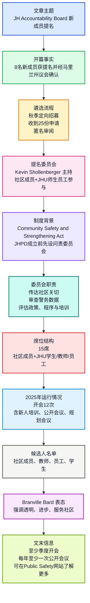

## 基本信息

- 文章来源：Johns Hopkins University — The Hub [1](https://hub.jhu.edu/2026/04/06/johns-hopkins-police-accountability-board-new-members-2026/)
- 栏目主题：Public safety / University News
- 题目：**Eight nominated to join the Johns Hopkins University Police Accountability Board**
- 作者：**Hub staff report**
- 官方页面发布日期：**April 6, 2026**。用户粘贴文本显示为 **Apr 7**，以官方页面标注的 **April 6, 2026** 为准。
- 作者背景简介：**Hub staff report** 指约翰斯·霍普金斯大学官方新闻中心 **The Hub** 的机构性员工报道，而非单一署名记者。The Hub 官方介绍称其是汇集 Johns Hopkins 各类研究、大学事务与新闻动态的新闻中心。
- 相关背景信源：
  - About the Hub [2](https://hub.jhu.edu/about/)
  - JH Accountability Board [3](https://publicsafety.jhu.edu/community-safety/johns-hopkins-police-department/accountability-board/)
  - Branville G. Bard Jr. biography [4](https://publicsafety.jhu.edu/about/our-leadership/)
  - Kevin Shollenberger biography [5](https://provost.jhu.edu/members/kevin-shollenberger/)
  - JHU Black Faculty & Staff Association [6](https://bfsa.jhu.edu/)
  - Community Safety and Strengthening Act background [7](https://publicsafety.jhu.edu/community-safety/)

## 文本范围

本文精读范围包括：标题、副题、署名信息、正文段落、引语、候选人名单与文末信息句。网页导航、社交分享、相关推荐、Trending、页脚版权与站点链接不纳入精读。

---

## 前情提要

---

## 逐句精读

🔹英文：Eight **`nominated`** / to join the Johns Hopkins University **`Police Accountability Board`**  

🔸中文：八人获**`提名`**，将加入约翰斯·霍普金斯大学**`警务问责委员会`**。

背景注释：

- **Johns Hopkins University**：约翰斯·霍普金斯大学，美国著名私立研究型大学，位于马里兰州巴尔的摩，官方标识强调其创立于 **1876** 年。
- **Police Accountability Board**：警务问责委员会，核心功能是让大学与周边社区成员参与警务部门发展、政策审查与监督。

> **`nominated`** /ˈnɑːmɪneɪtɪd/
> 1. v. past participle; to formally propose someone for a position, honor, or role 正式提名、推荐某人担任职位或获得荣誉。
> 2. 语域：正式、新闻、政治、组织治理。
> 3. 画龙点睛：`nominate sb. for/as/to do` 是高频搭配，如 be nominated for an award、be nominated to serve on a board。注意它强调“正式提出人选”，不等于最终当选；对应名词为 `nominee` 候选人、`nomination` 提名。

> **`Police Accountability Board`** /pəˈliːs əˌkaʊntəˈbɪləti bɔːrd/
> 1. n. a board that reviews, advises on, or oversees police conduct, policy, and accountability 警务问责、监督或咨询委员会。
> 2. 语域：法律、公共治理、大学行政、公共安全。
> 3. 画龙点睛：`accountability` 不只是“责任”，更偏“可问责性、被监督并解释行为的义务”。写作中可用 `promote transparency and accountability` 表示“提升透明度和问责性”，常用于政府、企业治理、公共机构改革语境。

---

🔹英文：**`Faculty`**, **`staff`**, student, and community member **`nominees`** / have been **`approved`** by the Maryland General Assembly / and will join with 15-member board this summer  

🔸中文：教师、职员、学生和社区成员**`候选人`** / 已获马里兰州议会**`批准`** / 并将于今年夏天加入这个由15名成员组成的委员会。

背景注释：

- **faculty**：在美国高校语境中通常指教师、教授与教学科研人员。
- **staff**：高校行政、运营、技术、服务等非教师岗位人员。
- **Maryland General Assembly**：马里兰州议会，是美国马里兰州的立法机构，由参议院和众议院组成。
- 原文中 “will join with 15-member board” 从语义看应理解为 “will join the 15-member board”，即“加入这个15人委员会”。

> **`faculty`** /ˈfækəlti/
> 1. n. the teaching and research staff of a university or college 大学教师群体；也可指学院、系科。
> 2. 语域：教育、大学行政。
> 3. 画龙点睛：美式英语中 `faculty` 常作集合名词，指“全体教师”。与 `staff` 区分：faculty 偏教学科研人员，staff 偏行政与支持人员。考研/雅思阅读中 university faculty 常译为“大学教职中的教师群体”。

> **`nominee`** /ˌnɑːmɪˈniː/
> 1. n. a person who has been formally proposed for a position, prize, or election 被提名者、候选人。
> 2. 语域：正式、新闻、政治、奖项。
> 3. 画龙点睛：`nominee` 是被提名的人，`nomination` 是提名行为或提名资格，`candidate` 是更宽泛的“候选人”。新闻标题常写 `presidential nominee`、`board nominee`，强调已进入正式程序。

> **`approved`** /əˈpruːvd/
> 1. v. past participle; officially accepted or agreed to 正式批准、认可。
> 2. 语域：正式、法律、行政。
> 3. 画龙点睛：`approve` 可作及物动词，approve a proposal 批准提案；也可作不及物短语 `approve of`，表示“赞成”。两者不可混淆：`approve the plan` 是批准，`approve of the plan` 是赞同。

---

🔹英文：By **`Hub staff report`** / Published April 6, 2026  

🔸中文：作者：**`The Hub员工报道`** / 发布日期：2026年4月6日。

背景注释：

- **Hub staff report**：机构署名，说明该文由约翰斯·霍普金斯大学官方新闻中心 The Hub 的员工团队撰写或整理。
- **April 6, 2026**：官方网页发布日期。用户复制文本中出现 Apr 7，但官方页面显示为 April 6, 2026。

> **`staff report`** /stæf rɪˈpɔːrt/
> 1. n. a report written collectively or institutionally by the staff of a publication or organization 员工报道、机构性报道。
> 2. 语域：新闻、机构传播。
> 3. 画龙点睛：当文章署名为 `staff report`，通常意味着不是个人专栏，而是机构新闻稿或编辑部整理稿。阅读时要注意其语气常较客观、正式、信息导向，较少使用第一人称评价。

> **`published`** /ˈpʌblɪʃt/
> 1. v. past participle; made available to the public in print or online 发布、出版、发表。
> 2. 语域：新闻、出版、学术。
> 3. 画龙点睛：`publish` 既可用于书籍出版，也可用于网页、论文、公告发布。常见搭配：`publish an article`、`publish findings`、`newly published research`。被动式 `be published on/in` 对应“发表于网站/刊物”。

---

🔹英文：Eight new members / have been **`nominated`** to join the Johns Hopkins University Police Accountability Board (**`JHAB`**) / beginning this summer / and recently had their nominations **`confirmed`** / during the 2026 legislative session of the Maryland General Assembly.  

🔸中文：八名新成员 / 已获**`提名`**，将从今年夏天开始加入约翰斯·霍普金斯大学警务问责委员会（**`JHAB`**）/ 他们的提名最近已在马里兰州议会2026年立法会期中获得**`确认`**。

背景注释：

- **JHAB**：Johns Hopkins University Police Accountability Board 的缩写。注意该缩写不是 JHUAB，而是 JHAB，原文中也使用 JHAB。
- **legislative session**：立法会期，指议会集中审议和处理法案、任命确认等事项的时间段。
- **Maryland General Assembly**：在此处承担确认提名的州级立法角色。

> **`confirmed`** /kənˈfɜːrmd/
> 1. v. past participle; formally approved, especially by an official body 正式确认、批准，尤指由官方机构确认任命或提名。
> 2. 语域：法律、政治、行政、新闻。
> 3. 画龙点睛：`confirm` 在日常英语中可表示“确认信息”，在政治行政语境中常指“批准任命”。如 `Senate-confirmed appointment` 指“经参议院确认的任命”。本文中不是简单核实，而是正式程序上的确认。

> **`legislative session`** /ˈledʒɪsleɪtɪv ˈseʃn/
> 1. n. a period during which a legislature formally meets to conduct business 立法机关正式开会处理事务的会期。
> 2. 语域：政治、法律、新闻。
> 3. 画龙点睛：`legislative` 来自 `legislate` 制定法律，相关词还有 `legislation` 法律/立法、`legislature` 立法机关、`legislator` 立法者。考试中常通过词根 `legis-` 识别“法律、立法”语义场。

> **`beginning this summer`** /bɪˈɡɪnɪŋ ðɪs ˈsʌmər/
> 1. adv. phrase; starting from this summer 从今年夏天开始。
> 2. 语域：新闻、行政通知。
> 3. 画龙点睛：`beginning + 时间点` 可作状语，相当于 `starting in/from`。如 `Beginning next year, the policy will apply to all students.` 写作中简洁正式，适合公告和新闻体。

---

🔹英文：Following a **`targeted outreach effort`** / to recruit quality applicants in the fall, / 25 applications / were **`submitted`**.  

🔸中文：在秋季开展一项旨在招募优秀申请者的**`定向外联工作`**之后，/ 共**`提交`**了25份申请。

背景注释：

- **targeted outreach effort**：通常指有明确对象、群体或区域的招募/宣传行动，不是泛泛发布通知。
- **in the fall**：美国英语中 fall 指秋季，本文指2025年秋季左右的申请招募阶段。

> **`targeted outreach effort`** /ˈtɑːrɡɪtɪd ˈaʊtriːtʃ ˈefərt/
> 1. n. a planned attempt to contact specific groups or communities 定向外联、精准招募或面向特定群体的联系工作。
> 2. 语域：公共管理、大学行政、非营利组织、招聘。
> 3. 画龙点睛：`outreach` 强调主动走向目标群体，常译为“外联、拓展、社区 outreach”。搭配如 `community outreach` 社区外展、`outreach program` 外联项目。`targeted` 强调“有针对性”，比 general outreach 更精准。

> **`recruit`** /rɪˈkruːt/
> 1. v. to find and persuade people to join an organization, apply for a role, or take part in an activity 招募、征募、吸纳。
> 2. 语域：招聘、军事、教育、组织管理。
> 3. 画龙点睛：`recruit` 可作动词也可作名词“新成员、新兵”。常见搭配：`recruit applicants`、`recruit volunteers`、`recruit participants`。学术研究中 recruit participants 指“招募受试者/参与者”。

> **`submitted`** /səbˈmɪtɪd/
> 1. v. past participle; formally sent or presented for consideration 提交、递交。
> 2. 语域：正式、学术、行政。
> 3. 画龙点睛：`submit an application/proposal/report` 是高频固定搭配。`submit to` 还可表示“屈从于”，如 submit to authority。考试中需根据宾语判断：submit a document 是“提交文件”，submit to pressure 是“屈服于压力”。

---

🔹英文：All applications / were **`anonymized`** and reviewed by the **`nominating committee`**, / chaired by Vice Provost for Student Health and Well-Being Kevin Shollenberger / and composed of Baltimore City community members / as well as Johns Hopkins University students, faculty, and staff.  

🔸中文：所有申请 / 均经过**`匿名化处理`**，并由**`提名委员会`**审阅；/ 该委员会由负责学生健康与福祉的副教务长 Kevin Shollenberger 主持，/ 成员包括巴尔的摩市社区成员，/ 以及约翰斯·霍普金斯大学的学生、教师和职员。

背景注释：

- **anonymized**：匿名化处理，意味着申请材料中的姓名等可识别信息被移除，以提升评审公平性。
- **nominating committee**：负责筛选、审阅并提出推荐候选人的委员会。
- **Kevin Shollenberger**：JHU 负责学生健康与福祉的副教务长。官方介绍显示，他于2019年8月被任命为首任 Vice Provost for Student Health and Well-Being，负责学生健康、心理健康、基础医疗资源协调等。
- **Vice Provost**：美国大学行政中的高级职位，通常译为“副教务长”或“副校务长”，具体职责依大学制度而异。
- **Baltimore City**：马里兰州巴尔的摩市，JHU 多个校区位于该市。

> **`anonymized`** /əˈnɑːnəmaɪzd/
> 1. adj./v. past participle; made anonymous by removing identifying information 被匿名化的；去除身份识别信息的。
> 2. 语域：数据保护、招聘、研究伦理、行政评审。
> 3. 画龙点睛：来自 `anonymous` 匿名的。常见搭配：`anonymized data` 匿名化数据、`anonymized applications` 匿名申请材料。注意不同于 `confidential` 保密；anonymous 是“不显示身份”，confidential 是“不公开内容”。

> **`nominating committee`** /ˈnɑːmɪneɪtɪŋ kəˈmɪti/
> 1. n. a committee responsible for identifying and recommending candidates 提名委员会。
> 2. 语域：组织治理、大学行政、公司董事会、协会选举。
> 3. 画龙点睛：`committee` 是集合名词，英式英语可接单复数动词，美式英语多作单数。搭配如 `serve on a committee` 任委员会成员，`chair a committee` 主持委员会，`committee member` 委员。

> **`composed of`** /kəmˈpoʊzd əv/
> 1. phrase; made up of 由……组成。
> 2. 语域：正式、学术、新闻。
> 3. 画龙点睛：`be composed of`、`consist of`、`be made up of` 都可表“由……组成”。其中 composed of 更正式；consist of 不用于被动。写作中可写：`The panel is composed of experts, students, and community representatives.`

---

🔹英文：At the **`close`** of the application process, / each application / was reviewed for **`completeness`**, / and student applicants / were submitted to Student Affairs / for review and confirmation of **`affiliation`**.  

🔸中文：在申请流程**`结束`**时，/ 每份申请都接受了**`完整性`**审查；/ 学生申请者的信息则被提交给学生事务部门，/ 以便审查并确认其**`隶属关系`**。

背景注释：

- **Student Affairs**：美国大学常见行政部门，负责学生生活、学生支持、活动、健康、纪律或服务等事务；此处用于核实学生身份与学校隶属关系。
- **confirmation of affiliation**：确认申请者是否确属相关学校、院系或校区成员。

> **`at the close of`** /æt ðə kloʊz əv/
> 1. prep. phrase; at the end of 在……结束时。
> 2. 语域：正式、新闻、行政。
> 3. 画龙点睛：`close` 作名词时可表示“结束、终结”，常见于正式文体，如 `at the close of the meeting` 会议结束时。不要只理解为形容词“近的”或动词“关闭”。

> **`completeness`** /kəmˈpliːtnəs/
> 1. n. the state of having all necessary parts 完整性、完备性。
> 2. 语域：行政、数据、学术、质量控制。
> 3. 画龙点睛：由 complete 派生。申请流程中 `review for completeness` 不是评估优劣，而是检查材料是否齐全。类似表达有 `check for accuracy` 检查准确性、`screen for eligibility` 筛查资格。

> **`affiliation`** /əˌfɪliˈeɪʃn/
> 1. n. a formal connection with an organization, institution, or group 隶属关系、从属关系、机构关联。
> 2. 语域：学术、行政、机构身份。
> 3. 画龙点睛：学术论文作者信息中的 `institutional affiliation` 指作者所属机构。本文中 confirmation of affiliation 指核实学生是否确为 JHU 相应学院/校区成员。动词为 `affiliate`，形容词为 `affiliated`。

---

🔹英文：“The **`nominating committee's`** work / is **`critically important`**, / as the work of the JHAB / is critical to the **`development and implementation`** of the JHPD,” Shollenberger said.  

🔸中文：Shollenberger 表示：“**`提名委员会`**的工作**`至关重要`**，/ 因为 JHAB 的工作对于 JHPD 的**`发展与落实`**至关重要。”

背景注释：

- 这里是 Kevin Shollenberger 的直接引语。
- **JHPD**：Johns Hopkins Police Department，约翰斯·霍普金斯警察局。
- **development and implementation**：先设计、形成制度与组织架构，再将其付诸实践。该表达常用于政策、项目和制度建设。

> **`critically important`** /ˈkrɪtɪkli ɪmˈpɔːrtnt/
> 1. adj. phrase; extremely important; essential 极其重要的、至关重要的。
> 2. 语域：正式、新闻、学术、政策。
> 3. 画龙点睛：`critical` 在此不是“批判的”，而是“关键的、决定性的”。常见搭配：`critical role`、`critical factor`、`critical importance`。写作中比 very important 更正式有力。

> **`development and implementation`** /dɪˈveləpmənt ænd ˌɪmplɪmenˈteɪʃn/
> 1. n. phrase; the process of designing or building something and then putting it into practice 发展、制定与实施。
> 2. 语域：政策、项目管理、机构建设。
> 3. 画龙点睛：这是政策文本高频并列结构。`develop` 偏“形成、设计、建设”，`implement` 偏“执行、落实”。可写 `policy development and implementation`，表示政策从制定到执行的全过程。

> **`JHPD`** /ˌdʒeɪ eɪtʃ piː ˈdiː/
> 1. acronym; Johns Hopkins Police Department 约翰斯·霍普金斯警察局。
> 2. 语域：机构名称、公共安全。
> 3. 画龙点睛：英文新闻中首次出现机构全称后常用括号给出缩写，后文直接使用缩写。阅读长文时要建立缩写表，如 JHAB、JHPD、JHU、BFSA，否则容易混淆机构关系。

---

🔹英文：“I **`extend`** my sincere thanks and appreciation / to each member of the nominating committee / for their **`thoughtful review and evaluation`** / of each application to the JHAB.”  

🔸中文：“我向提名委员会的每一位成员表达诚挚的感谢与感激，/ 感谢他们对每一份 JHAB 申请所作的**`细致审阅与评估`**。”

背景注释：

- 这句话继续出自 Kevin Shollenberger 的引语。
- **their** 指代 each member，在现代英语中 singular they 用法十分常见，用于性别中性或泛指单个人。

> **`extend my sincere thanks`** /ɪkˈstend maɪ sɪnˈsɪr θæŋks/
> 1. phrase; to formally express genuine gratitude 表达诚挚感谢。
> 2. 语域：正式、致辞、公告、机构文本。
> 3. 画龙点睛：`extend thanks/appreciation/gratitude to sb.` 是正式感谢句式，比 `thank sb.` 更庄重。写邮件或致辞可用：`I would like to extend my sincere gratitude to all participants.`

> **`thoughtful`** /ˈθɔːtfəl/
> 1. adj. showing careful consideration or attention 深思熟虑的、周到的、细致的。
> 2. 语域：正式、日常均可。
> 3. 画龙点睛：`thoughtful` 不只是“体贴的”，在工作语境中常指“认真周密的”。如 `a thoughtful analysis` 周密分析，`thoughtful feedback` 认真反馈。反义可用 `careless` 或 `perfunctory` 敷衍的。

> **`review and evaluation`** /rɪˈvjuː ænd ɪˌvæljuˈeɪʃn/
> 1. n. phrase; the process of examining and judging something 审查与评估。
> 2. 语域：行政、学术、项目管理。
> 3. 画龙点睛：`review` 偏“审阅、检查”，`evaluation` 偏“评价、衡量质量”。二者并列常见于申请、项目、政策文本。类似组合还有 `assessment and review`、`monitoring and evaluation`。

---

🔹英文：“The JHAB's work / is **`invaluable`** / in that it helps to ensure / that the JHPD is a **`forward-thinking`**, **`progressive`**, and **`transparent`** police department / that truly serves the best interests of / and protects our community.”  

🔸中文：“JHAB 的工作**`极其宝贵`**，/ 因为它有助于确保 JHPD 成为一个**`有前瞻性`**、**`进步`**且**`透明`**的警务部门，/ 真正服务于并保护我们社区的最大利益。”

背景注释：

- 这句话在网页中作为摘引出现，并在后文由 Branville Bard 再次以正文引语形式出现。
- **Branville Bard**：JHU 公共安全副总裁、警察局长。官方资料显示，他曾拥有多年执法与公共安全经验，并于2023年4月被任命为 JHPD 首任警察局长。
- **best interests**：常用于法律、治理和公共服务语境，表示“最大利益、最佳利益”。

> **`invaluable`** /ɪnˈvæljuəbl/
> 1. adj. extremely useful or valuable 极有价值的、非常宝贵的。
> 2. 语域：正式、书面、新闻。
> 3. 画龙点睛：`invaluable` 不是“没有价值”，而是“价值极高”。前缀 in- 在此不是否定 value，而形成固定词义“无法估价的”。同义：`priceless`、`indispensable`。反义：`worthless`。

> **`in that`** /ɪn ðæt/
> 1. conjunction phrase; because; in the sense that 因为；在于。
> 2. 语域：正式、学术、解释性写作。
> 3. 画龙点睛：`in that` 比 because 更书面，常用于解释判断依据：`The policy is significant in that it changes the funding model.` 表示“其重要性在于……”。翻译时常处理为“因为/就在于”。

> **`forward-thinking`** /ˈfɔːrwərd ˈθɪŋkɪŋ/
> 1. adj. planning for the future and willing to use new ideas 有远见的、前瞻性的。
> 2. 语域：组织管理、政策、商业、公共治理。
> 3. 画龙点睛：常修饰 institution、leader、approach、policy。与 `innovative` 接近，但 forward-thinking 更强调面向未来的规划能力。写作可用 `a forward-thinking approach to public safety`。

> **`transparent`** /trænsˈpærənt/
> 1. adj. open and clear, without hidden processes or information 透明的、公开清楚的。
> 2. 语域：公共治理、商业伦理、新闻。
> 3. 画龙点睛：治理语境中 `transparent` 常与 `accountable` 连用：`transparent and accountable governance`。它不只是“物理上透明”，还指信息、程序、决策公开可查。

---

🔹英文：Branville Bard / Vice president for **`public safety`**  

🔸中文：Branville Bard / **`公共安全`**副总裁。

背景注释：

- 这是上一句摘引的署名与职务说明。
- **public safety**：公共安全，涵盖校园安保、警务、应急管理、犯罪预防、危机响应等。
- **Vice president for public safety**：大学行政职位，负责学校公共安全体系与相关部门管理。

> **`public safety`** /ˈpʌblɪk ˈseɪfti/
> 1. n. the protection of the general public from danger, crime, or emergencies 公共安全。
> 2. 语域：政府、校园治理、警务、应急管理。
> 3. 画龙点睛：`public safety` 比 `security` 范围更广，可包括 crime prevention、emergency response、community safety 等。大学语境中的 public safety 往往结合校园警务、安保、心理危机与社区合作。

> **`vice president`** /ˌvaɪs ˈprezɪdənt/
> 1. n. a senior official below the president in an organization 副总裁、副校长级高级管理者。
> 2. 语域：组织管理、大学行政、企业。
> 3. 画龙点睛：在美国大学中 `vice president for + 领域` 常指负责某一行政板块的高级官员，如 `Vice President for Student Affairs`。不要机械译成国家副总统，要看机构语境。

---

🔹英文：Per the **`Community Safety and Strengthening Act`**, / the university established the accountability board / before creating the Johns Hopkins Police Department.  

🔸中文：根据《**`社区安全与强化法案`**》，/ 该大学在成立约翰斯·霍普金斯警察局之前，/ 先设立了问责委员会。

背景注释：

- **Per**：在正式或法律语境中表示“根据、依照”。
- **Community Safety and Strengthening Act**：马里兰州2019年相关法案，授权 JHU 在特定条件下建立警察部门，并将问责机制作为制度安排的一部分。
- **before creating**：说明制度设计上先有外部/社区参与的监督结构，再推进警务部门建设。

> **`per`** /pɜːr/
> 1. prep. according to; in accordance with 根据、依照。
> 2. 语域：正式、商务、法律、行政。
> 3. 画龙点睛：`per` 常用于邮件和行政文本，如 `per your request` 按照你的要求，`per the agreement` 根据协议。它比 according to 更简短，但在口语中过度使用会显得生硬。

> **`established`** /ɪˈstæblɪʃt/
> 1. v. past participle; created, founded, or formally set up 建立、设立、确立。
> 2. 语域：正式、法律、机构、学术。
> 3. 画龙点睛：`establish` 可用于建立组织、制度、事实、关系。`establish a board` 设立委员会，`establish evidence` 确立证据，`well-established` 则指“成熟的、公认的”。

> **`accountability board`** /əˌkaʊntəˈbɪləti bɔːrd/
> 1. n. a board created to promote oversight and responsibility 问责委员会、监督委员会。
> 2. 语域：公共治理、法律、组织管理。
> 3. 画龙点睛：`board` 在此不是“木板”，而是“董事会、委员会、理事会”。如 school board 学区委员会，advisory board 咨询委员会，review board 审查委员会。

---

🔹英文：The board, / **`unique`** both in Maryland and throughout the country, / **`empowers`** community members from JHU and the surrounding neighborhoods / to help the **`development and operation`** of the JHPD.  

🔸中文：该委员会 / 在马里兰州乃至全美都具有**`独特性`**；/ 它**`赋权`** JHU 及周边社区成员，/ 让他们参与协助 JHPD 的**`发展与运行`**。

背景注释：

- **unique both in Maryland and throughout the country**：强调这种大学警务问责委员会模式在州内和全国层面都不同寻常。
- **surrounding neighborhoods**：指 JHU 校园周边社区，尤其与巴尔的摩城市社区关系相关。
- 句中 “to help the development and operation” 在英语中更自然的写法是 “to help shape/support the development and operation”，但原文含义明确。

> **`unique`** /juˈniːk/
> 1. adj. being the only one of its kind; very unusual 独一无二的、独特的。
> 2. 语域：通用、正式。
> 3. 画龙点睛：严格说 unique 表示“唯一”，一般不应说 very unique，但现代口语中可见。正式写作更推荐 `truly unique`、`particularly distinctive`。本文的 unique 强调制度安排罕见。

> **`empower`** /ɪmˈpaʊər/
> 1. v. to give someone authority, ability, or confidence to do something 授权、赋权、使能够。
> 2. 语域：公共治理、教育、社会议题、组织管理。
> 3. 画龙点睛：`empower sb. to do sth.` 是核心结构。它比 allow 更积极，含“给予权力、资源或能力”。写作中常见 `empower communities`、`empower students`、`empower employees`。

> **`operation`** /ˌɑːpəˈreɪʃn/
> 1. n. the way an organization, system, or process works 运行、运作；也可指行动、手术。
> 2. 语域：管理、商业、医疗、军事。
> 3. 画龙点睛：`operation` 是多义词。医院里是“手术”，军事中是“行动”，机构语境中是“运作”。本文 `development and operation of the JHPD` 指警察部门从建设到日常运行。

---

🔹英文：Under the law, / accountability board members / are **`responsible for`** sharing community concerns directly with department leadership, / reviewing police department **`metrics`**, / and assessing current and **`prospective`** department policies, procedures, and training / to provide recommendations for improvement.  

🔸中文：根据该法律，/ 问责委员会成员**`负责`**直接向部门领导层传达社区关切，/ 审查警察部门的**`指标数据`**，/ 并评估现行及**`拟议中的`**部门政策、程序和培训，/ 以提出改进建议。

背景注释：

- **department leadership**：这里指 JHPD 领导层。
- **metrics**：可包括犯罪数据、响应时间、投诉、巡逻或培训相关指标等，具体以 JHPD 公开指标为准。
- **current and prospective**：既看已经实施的政策，也看未来可能出台的政策。
- **recommendations for improvement**：委员会提供的是建议功能，而非直接管理警察部门。

> **`responsible for`** /rɪˈspɑːnsəbl fɔːr/
> 1. adj. phrase; having the duty to deal with or take care of something 负责……的。
> 2. 语域：通用、正式、行政。
> 3. 画龙点睛：`be responsible for doing sth.` 后接动名词。它也可表示“对某事负有责任/导致某结果”，如 `The storm was responsible for delays.` 阅读时要结合主语判断是职责还是原因。

> **`metrics`** /ˈmetrɪks/
> 1. n. measurements used to assess performance, progress, or quality 指标、衡量数据。
> 2. 语域：管理、数据分析、公共政策、商业。
> 3. 画龙点睛：`metric` 比 `data` 更具体，强调“用于衡量的指标”。常见搭配：`performance metrics` 绩效指标，`key metrics` 关键指标。写作中可用 `use metrics to evaluate outcomes`。

> **`prospective`** /prəˈspektɪv/
> 1. adj. expected or likely to happen in the future; potential 未来的、预期的、潜在的。
> 2. 语域：正式、学术、法律、招生招聘。
> 3. 画龙点睛：`prospective students` 是“潜在学生/意向申请者”，`prospective policy` 指“未来可能出台的政策”。不要与 `perspective` 观点、视角混淆，二者拼写和意义不同。

> **`recommendations for improvement`** /ˌrekəmenˈdeɪʃnz fɔːr ɪmˈpruːvmənt/
> 1. n. phrase; suggestions intended to make something better 改进建议。
> 2. 语域：正式、评估、咨询、治理。
> 3. 画龙点睛：`recommendation` 常与介词 `for/on` 搭配：recommendations for improvement 改进建议，recommendations on policy 关于政策的建议。动词 `recommend` 后可接 gerund：recommend doing sth.。

---

🔹英文：The **`15-seat board`** / must **`consist of`** at least three community members **`unaffiliated with`** the university, / including at least one community representative from each of the three areas in Baltimore where the JHPD may patrol, / and 10 JHU students, faculty, and staff, / including at least one member of the JHU Black Faculty and Staff Association.  

🔸中文：这个**`15席委员会`** / 必须**`由……组成`**：至少三名与大学**`无隶属关系`**的社区成员，/ 其中包括来自巴尔的摩三个 JHPD 可能巡逻区域的各至少一名社区代表；/ 另有10名 JHU 学生、教师和职员，/ 其中至少包括一名 JHU 黑人教师与职员协会成员。

背景注释：

- **15-seat board**：这里的 seat 指委员会席位，不是座椅。
- **unaffiliated with the university**：与大学没有正式隶属关系，强调外部社区代表性。
- **three areas in Baltimore where the JHPD may patrol**：通常对应 JHPD 可能开展巡逻的校园及周边区域。
- **JHU Black Faculty and Staff Association / BFSA**：约翰斯·霍普金斯大学黑人教师与职员协会。其官方页面称该组织旨在促进黑人在 JHU、Johns Hopkins Medicine 与 Johns Hopkins Health System 的公平待遇、包容与社区建设。

> **`15-seat board`** /ˌfɪfˈtiːn siːt bɔːrd/
> 1. n. phrase; a board with fifteen positions or membership slots 拥有15个席位的委员会。
> 2. 语域：组织治理、政治、新闻。
> 3. 画龙点睛：`seat` 在政治和组织语境中常指“席位”。如 `win a seat in Parliament` 赢得议会席位，`board seat` 董事会/委员会席位。不要直译为“15个座位的板子”。

> **`consist of`** /kənˈsɪst əv/
> 1. v. phrase; to be made up of 由……组成。
> 2. 语域：正式、说明文、学术。
> 3. 画龙点睛：`consist of` 无被动形式，不能说 `is consisted of`。正确：`The board consists of 15 members.` 可替换为 `is composed of` 或 `is made up of`。

> **`unaffiliated with`** /ˌʌnəˈfɪlieɪtɪd wɪð/
> 1. adj. phrase; not officially connected with an organization 与……无正式隶属关系的。
> 2. 语域：正式、行政、学术、组织治理。
> 3. 画龙点睛：`affiliated with` 表“隶属于、附属于、与……有关联”；加前缀 un- 表否定。高校中常见 `affiliated hospital` 附属医院，`unaffiliated community members` 非大学关联社区成员。

> **`patrol`** /pəˈtroʊl/
> 1. v./n. to move around an area to make sure it is safe 巡逻；巡逻行动。
> 2. 语域：警务、军事、公共安全。
> 3. 画龙点睛：`patrol an area` 是及物用法，`go on patrol` 是名词短语。本文 `where the JHPD may patrol` 表示 JHPD 依法或按范围可能巡逻的区域。

---

🔹英文：The Baltimore City mayor and city council president / each **`appoint`** one community member to the board, / which leaves 13 seats / to be selected by JHU leadership.  

🔸中文：巴尔的摩市市长和市议会主席 / 各自**`任命`**一名社区成员进入委员会；/ 这样剩余13个席位 / 将由 JHU 领导层选定。

背景注释：

- **Baltimore City mayor**：巴尔的摩市市长。
- **city council president**：市议会主席，在地方政府中具有重要立法和代表职能。
- 此句解释 15 个席位的产生方式：2席由市级官员任命，13席由 JHU 领导层选择。

> **`appoint`** /əˈpɔɪnt/
> 1. v. to officially choose someone for a job or position 任命、委派。
> 2. 语域：正式、政治、组织管理。
> 3. 画龙点睛：`appoint sb. to a position` 或 `appoint sb. as chair`。名词 `appointment` 可指“任命”也可指“预约”。语境区别：doctor’s appointment 是看医生预约，official appointment 是官方任命。

> **`city council`** /ˈsɪti ˈkaʊnsl/
> 1. n. a local elected body that makes decisions for a city 市议会。
> 2. 语域：地方政府、政治新闻。
> 3. 画龙点睛：`council` 委员会/议会，`counsel` 建议/律师，发音相同但拼写和意义不同。`city council president` 是“市议会主席”，不是国家层面的 president。

> **`leadership`** /ˈliːdərʃɪp/
> 1. n. the people who lead an organization; also the ability to lead 领导层；领导能力。
> 2. 语域：组织管理、商业、政治、大学行政。
> 3. 画龙点睛：`leadership` 可指抽象能力，也可指具体“领导层”。本文 `JHU leadership` 指 JHU 高层管理者。类似表达：`university leadership`、`senior leadership`、`department leadership`。

---

🔹英文：Faculty and staff members and community members / appointed by the university and confirmed by the Maryland State Senate / serve **`two-year terms`**, / while student members / serve **`one-year terms`**.  

🔸中文：由大学任命并经马里兰州参议院确认的教师、职员和社区成员 / 任期为**`两年`**，/ 而学生成员 / 任期为**`一年`**。

背景注释：

- **Maryland State Senate**：马里兰州参议院，马里兰州议会的一部分。
- **term**：任期，委员会、董事会、民选职位中常见。
- 学生任期较短，可能与学生身份、毕业流动性相关。

> **`term`** /tɜːrm/
> 1. n. a fixed period of time during which someone holds a position 任期；也可指术语、学期、条款。
> 2. 语域：政治、法律、教育、商业。
> 3. 画龙点睛：`term` 多义高频。`serve a two-year term` 任两年任期；`academic term` 学期；`legal terms` 法律条款；`technical term` 技术术语。阅读时根据搭配判断。

> **`serve`** /sɜːrv/
> 1. v. to work in a role or perform duties for a period 任职、服务、履行职责。
> 2. 语域：正式、公共服务、组织管理。
> 3. 画龙点睛：`serve on a board/committee` 表“在委员会任职”，`serve as chair` 表“担任主席”。不要只理解为餐厅“服务、端上”。新闻中 serve 常与职位、任期搭配。

> **`while`** /waɪl/
> 1. conj. used to contrast two facts whereas 然而、而；也可表示“当……时”。
> 2. 语域：通用、书面。
> 3. 画龙点睛：本文 `while student members serve...` 是对比用法，不是时间状语。雅思写作常用 while 表对照：`Adults preferred cars, while younger people favored public transport.`

---

🔹英文：The current Accountability Board / met 12 times in 2025, / including its **`new member orientation`** on June 24 / and an annual **`public meeting`** on Oct. 15, / as well as committee meetings, planning sessions, / and a conversation with JHU President Ron Daniels.  

🔸中文：现任问责委员会 / 在2025年共召开12次会议，/ 包括6月24日的**`新成员入职培训`** / 和10月15日的年度**`公开会议`**，/ 以及委员会会议、规划会议，/ 并与 JHU 校长 Ron Daniels 进行了一次交流。

背景注释：

- **2025**：这里是报道发布前一年的委员会运行情况。
- **new member orientation**：新成员培训/导向会，帮助新成员了解职责、规则和流程。
- **public meeting**：向公众开放或接受公众意见的会议。
- **Ron Daniels / Ronald J. Daniels**：约翰斯·霍普金斯大学校长，文中称 JHU President Ron Daniels。
- **Oct. 15**：October 15，即10月15日。英文新闻中月份常缩写。

> **`orientation`** /ˌɔːriənˈteɪʃn/
> 1. n. training or information given to people starting a new role 入职培训、迎新介绍、情况说明。
> 2. 语域：教育、人力资源、组织管理。
> 3. 画龙点睛：`student orientation` 是学生迎新，`employee orientation` 是员工入职培训，`new member orientation` 是新成员导向培训。不要只理解为“方向、取向”。

> **`annual`** /ˈænjuəl/
> 1. adj. happening once every year 每年的、年度的。
> 2. 语域：正式、商业、机构、新闻。
> 3. 画龙点睛：`annual meeting` 年会/年度会议，`annual report` 年报，`annual income` 年收入。注意 `biannual` 可表示一年两次或两年一次，易混，正式写作最好直接说明 frequency。

> **`planning session`** /ˈplænɪŋ ˈseʃn/
> 1. n. a meeting devoted to planning future actions 规划会议、计划讨论会。
> 2. 语域：组织管理、项目管理。
> 3. 画龙点睛：`session` 比 meeting 更强调一段有特定目的的工作时间。常见搭配：`training session` 培训课，`listening session` 听取意见会，`strategy session` 战略会议。

---

🔹英文：The **`nominees`** for the accountability board / are:  

🔸中文：问责委员会的**`候选人`**如下：

背景注释：

- 这句话引出名单，后文按社区成员、教师、职员、学生分类。
- **nominees** 说明这些人已获提名；根据前文，他们的提名已获马里兰州议会相关会期确认。

> **`nominees`** /ˌnɑːmɪˈniːz/
> 1. n. plural; people formally proposed for a position, award, or role 被提名者、候选人。
> 2. 语域：正式、新闻、政治、机构。
> 3. 画龙点睛：复数形式为 `nominees`。与 `applicants` 申请者不同：applicant 是提交申请的人，nominee 是经过遴选后被正式提名的人。本文从25名 applicants 中产生8名 nominees。

> **`accountability`** /əˌkaʊntəˈbɪləti/
> 1. n. the obligation to explain actions and accept responsibility 问责性、负责并接受监督的义务。
> 2. 语域：公共治理、商业伦理、教育管理。
> 3. 画龙点睛：写作中常与 `transparency` 连用。`accountability` 强调“有人必须解释、负责、接受监督”，比 responsibility 更制度化。常见表达：`ensure accountability`、`public accountability`、`accountability mechanism`。

---

🔹英文：Community members  

🔸中文：社区成员。

背景注释：

- 这里是名单分类标题，指来自大学周边或巴尔的摩市相关社区的成员。
- 在该委员会制度中，社区成员用于体现校外居民和周边社区利益。

> **`community member`** /kəˈmjuːnəti ˈmembər/
> 1. n. a person belonging to a local community or group 社区成员。
> 2. 语域：公共治理、社会服务、教育、非营利组织。
> 3. 画龙点睛：`community` 不只指“社区居委会”，还可指有共同身份、地理位置或利益的人群。常见搭配：`community engagement` 社区参与，`community concerns` 社区关切，`community representative` 社区代表。

---

🔹英文：Fareeha Warheed / – Baltimore City Council President Nominee, / Doctoral Student, School of Education  

🔸中文：Fareeha Warheed / ——巴尔的摩市议会主席提名人，/ 教育学院博士生。

背景注释：

- **Baltimore City Council President Nominee**：表示该候选人由巴尔的摩市议会主席提名。
- **Doctoral Student**：博士生，正在攻读博士学位。
- **School of Education**：约翰斯·霍普金斯大学教育学院。

> **`doctoral student`** /ˈdɑːktərəl ˈstuːdnt/
> 1. n. a student studying for a doctoral degree 博士生。
> 2. 语域：教育、学术。
> 3. 画龙点睛：`doctoral` 是形容词，指博士阶段的；`doctorate` 是博士学位名词。可说 `doctoral program` 博士项目、`doctoral dissertation` 博士论文。不要与 `medical doctor` 医生混淆。

> **`nominee`** /ˌnɑːmɪˈniː/
> 1. n. someone nominated by a person or body for a position 被提名者。
> 2. 语域：正式、行政、政治。
> 3. 画龙点睛：在 `Baltimore City Council President Nominee` 中，Nominee 不是“市议会主席候选人”，而是“由市议会主席提名的人”。翻译时要看修饰关系，避免误译。

> **`School of Education`** /skuːl əv ˌedʒuˈkeɪʃn/
> 1. n. a university division focused on education 教育学院。
> 2. 语域：大学机构名称。
> 3. 画龙点睛：美国大学中的 `school` 常指学院，不一定是中小学。`School of Medicine` 医学院，`School of Education` 教育学院，`Bloomberg School of Public Health` 公共卫生学院。

---

🔹英文：Faculty  

🔸中文：教师。

背景注释：

- 这是候选人名单的类别标题，指 JHU 教师或教研人员。
- 在美国大学新闻中，faculty 通常包括教授、副教授、助理教授等教学科研人员。

> **`faculty`** /ˈfækəlti/
> 1. n. teaching and academic staff of a university 大学教师、教学科研人员。
> 2. 语域：教育、大学行政。
> 3. 画龙点睛：`faculty` 作“教师群体”时常不可数或集合用法；单个教师可说 `faculty member`。如 `faculty and staff` 常译为“教职员工”，其中 faculty 偏教师，staff 偏行政支持人员。

---

🔹英文：Panagis Galiatsatos / – **`Pulmonary and Critical Care Physician`**, / Director of the Tobacco Treatment clinic, / Co-Director, Medicine for the Greater Good, / Associate Professor of Medicine / (**`Current Member`**)  

🔸中文：Panagis Galiatsatos / ——**`肺病与重症监护医生`**，/ 烟草治疗诊所主任，/ Medicine for the Greater Good 联合主任，/ 医学副教授，/ （**`现任成员`**）。

背景注释：

- **Panagis Galiatsatos**：JHU 医学院相关医生与教师。公开资料显示，他从事肺病与重症医学，并共同领导 Medicine for the Greater Good。
- **Pulmonary and Critical Care**：肺病学与重症监护医学，涉及呼吸系统疾病、ICU重症治疗等。
- **Tobacco Treatment clinic**：烟草治疗诊所，通常服务于戒烟、尼古丁依赖治疗、烟草相关健康干预。
- **Medicine for the Greater Good**：JHU Bayview Medical Center 相关倡议/项目，旨在加强医疗工作者与社区之间的联系，并关注健康不平等、社区健康与社会经济障碍。
- **Associate Professor of Medicine**：医学副教授。
- **Current Member**：说明其已经是问责委员会成员，本次为现任成员继续或重新进入名单。

> **`pulmonary`** /ˈpʌlməneri/
> 1. adj. relating to the lungs 肺部的、肺病相关的。
> 2. 语域：医学、科学。
> 3. 画龙点睛：`pulmonary disease` 肺部疾病，`pulmonary function` 肺功能。词根与 lung 相关。医学阅读中常见 `cardiopulmonary` 心肺的，`pulmonologist` 肺科医生。

> **`critical care`** /ˈkrɪtɪkl ker/
> 1. n. medical care for patients with life-threatening conditions 重症监护、危重症护理。
> 2. 语域：医学、医院管理。
> 3. 画龙点睛：`critical` 在医学中指“危重的”。`critical care physician` 是重症监护医生，常在 ICU 工作。不要译成“批判性护理”。`intensive care` 与 critical care 语义接近。

> **`clinic`** /ˈklɪnɪk/
> 1. n. a medical facility or specialized treatment service 诊所、专科门诊。
> 2. 语域：医学、公共卫生。
> 3. 画龙点睛：`clinic` 可指独立诊所，也可指医院内特定专科服务，如 `tobacco treatment clinic` 烟草治疗门诊，`pain clinic` 疼痛门诊。与 `hospital` 医院范围不同。

> **`Current Member`** /ˈkɜːrənt ˈmembər/
> 1. n. phrase; a person who is presently serving as a member 现任成员。
> 2. 语域：组织管理、名单说明。
> 3. 画龙点睛：`current` 表“当前的、现任的”，不是 current 作名词“水流、电流”。如 `current policy` 现行政策，`current students` 在读学生，`current member` 现任成员。

---

🔹英文：Staff  

🔸中文：职员。

背景注释：

- 这是候选人名单类别标题，指 JHU 非教师岗位人员，包括行政、运营、沟通、秘书、图书馆、活动协调等角色。
- 与 faculty 相比，staff 更偏行政支持与机构运转。

> **`staff`** /stæf/
> 1. n. employees of an organization, especially non-teaching or support employees 员工、职员；在大学中常指非教师岗位人员。
> 2. 语域：组织管理、教育、商业。
> 3. 画龙点睛：`staff` 作集合名词时可指全体员工；单个员工可说 `staff member`。`faculty and staff` 是高校语境固定搭配，常整体译为“教职员工”，但精读时要区分二者职责。

---

🔹英文：Erin Slater / – **`Board Operations Specialist`**, / Secretary of the Board of Trustees Office  

🔸中文：Erin Slater / ——**`董事会运营专员`**，/ 董事会秘书办公室成员。

背景注释：

- **Board Operations Specialist**：负责董事会/委员会运行、会议、流程或行政协调的专业职务。
- **Board of Trustees**：大学董事会/理事会，通常是大学最高治理机构之一。
- **Secretary of the Board of Trustees Office**：董事会秘书办公室，支持董事会治理与行政运作。

> **`operations`** /ˌɑːpəˈreɪʃnz/
> 1. n. the activities involved in running an organization or system 运营、运作事务。
> 2. 语域：商业、行政、组织管理。
> 3. 画龙点睛：复数 `operations` 常指组织日常运转。`operations specialist` 是运营专员，`operations manager` 是运营经理。与单数 operation 的“手术/行动/运行”相比，operations 更偏业务流程和管理。

> **`specialist`** /ˈspeʃəlɪst/
> 1. n. someone with expert knowledge or responsibility in a particular area 专员、专家。
> 2. 语域：职务、医学、商业、技术。
> 3. 画龙点睛：`specialist` 可译为“专家”或“专员”，取决于岗位级别。职称中如 `communications specialist` 通常是“传播专员”，医学中 `heart specialist` 可译为“心脏专科医生”。

> **`Board of Trustees`** /bɔːrd əv trʌˈstiːz/
> 1. n. a governing board responsible for oversight of an institution 董事会、理事会、校董会。
> 2. 语域：大学治理、非营利组织、公司治理。
> 3. 画龙点睛：`trustee` 是受托人、理事、校董。美国大学常由 Board of Trustees 负责高层治理、财务监督、重大政策决策。不要将 trustees 简单译为“信托公司员工”。

---

🔹英文：Lisa Moreland / – **`Executive Assistant`**, University Libraries / – BFSA Member, Homewood Campus  

🔸中文：Lisa Moreland / ——大学图书馆**`行政助理`**，/ BFSA 成员，Homewood 校区。

背景注释：

- **Executive Assistant**：高级行政助理，通常支持高层管理者或部门行政。
- **University Libraries**：大学图书馆系统。
- **BFSA**：Black Faculty and Staff Association，黑人教师与职员协会。
- **Homewood Campus**：JHU 主校区之一，位于巴尔的摩，是许多本科和研究生项目所在地。

> **`executive assistant`** /ɪɡˈzekjətɪv əˈsɪstənt/
> 1. n. an administrative professional who supports senior leaders or executives 行政助理、高级行政助理。
> 2. 语域：职务、组织管理。
> 3. 画龙点睛：`executive` 在职称中常指“高管/高级管理相关”，不一定翻译成“执行的”。`assistant` 不是“助教”专属，行政岗位中常见 `executive assistant to the dean` 院长行政助理。

> **`libraries`** /ˈlaɪbreriz/
> 1. n. plural of library; collections or institutions providing books, resources, and information services 图书馆系统。
> 2. 语域：教育、学术机构。
> 3. 画龙点睛：大学中 `University Libraries` 往往是一个系统，包括多个分馆、数字资源、档案与研究支持服务。注意 library 的常见发音为 /ˈlaɪbreri/，中间 r 后可弱读。

> **`campus`** /ˈkæmpəs/
> 1. n. the grounds and buildings of a university or college 校园、校区。
> 2. 语域：教育、大学新闻。
> 3. 画龙点睛：`on campus` 在校内，`off campus` 校外，`campus community` 校园共同体。多校区大学常用 `Homewood Campus`、`East Baltimore Campus` 等专名区分地点。

---

🔹英文：Jerrell Bratcher / – Communications, University Administration, / Senior Special Events Coordinator, Corporate & Global Affairs  

🔸中文：Jerrell Bratcher / ——大学行政部门传播岗位，/ 企业与全球事务高级特别活动协调员。

背景注释：

- **Communications**：传播/沟通部门，负责机构信息发布、媒体、内部沟通或品牌传播。
- **University Administration**：大学行政系统。
- **Senior Special Events Coordinator**：高级特别活动协调员，负责大型活动、仪式、会议或专项活动组织。
- **Corporate & Global Affairs**：企业与全球事务，通常涉及对外关系、全球合作、企业联系或机构事务。

> **`communications`** /kəˌmjuːnɪˈkeɪʃnz/
> 1. n. the professional field of sharing information within or outside an organization 传播、沟通、机构传播工作。
> 2. 语域：公共关系、机构管理、媒体。
> 3. 画龙点睛：复数 `communications` 常指一个专业领域或部门，不只是普通“交流”。如 `University Communications` 大学传播部，`corporate communications` 企业传播，`strategic communications` 战略传播。

> **`coordinator`** /koʊˈɔːrdɪneɪtər/
> 1. n. a person who organizes people, activities, or resources 协调员、统筹人员。
> 2. 语域：职务、项目管理、活动管理。
> 3. 画龙点睛：动词 `coordinate` 表“协调、统筹”，名词 `coordination`。职称中 coordinator 常表示负责安排流程、联络多方和落实细节，如 `program coordinator` 项目协调员。

> **`corporate and global affairs`** /ˈkɔːrpərət ænd ˈɡloʊbl əˈferz/
> 1. n. phrase; institutional work related to corporate relations and international/global engagement 企业与全球事务。
> 2. 语域：大学行政、公共事务、对外关系。
> 3. 画龙点睛：`affairs` 在机构名中常译为“事务”，如 `student affairs` 学生事务，`public affairs` 公共事务，`global affairs` 全球事务。它强调管理、关系与政策层面的事务处理。

---

🔹英文：Students  

🔸中文：学生。

背景注释：

- 这是候选人名单类别标题。
- 学生成员在该委员会中任期为一年，体现学生群体对校园警务政策与培训的参与。

> **`student`** /ˈstuːdnt/
> 1. n. a person studying at a school, college, or university 学生。
> 2. 语域：教育、通用。
> 3. 画龙点睛：大学语境中需区分 `undergraduate student` 本科生、`graduate student` 研究生、`doctoral student` 博士生。美式英语中 graduate student 包含硕士生和博士生，英式英语常用 postgraduate。

---

🔹英文：Beau Oster / – East Baltimore / Graduate Student, Neuroscience, School of Medicine  

🔸中文：Beau Oster / ——East Baltimore 校区 / 医学院神经科学研究生。

背景注释：

- **East Baltimore**：JHU 医学相关校区所在区域之一，包括医学院、公共卫生学院等医学/健康科学资源。
- **Graduate Student**：研究生，在美国语境可指硕士或博士层级学生，需结合项目判断。
- **Neuroscience**：神经科学，研究神经系统、脑、行为、认知等。
- **School of Medicine**：JHU 医学院。

> **`graduate student`** /ˈɡrædʒuət ˈstuːdnt/
> 1. n. a student studying for an advanced degree after a bachelor’s degree 研究生。
> 2. 语域：教育、学术。
> 3. 画龙点睛：美式英语中 graduate student 通常包括硕士和博士阶段。注意 `graduate` 作动词读 /ˈɡrædʒueɪt/，作名词或形容词常读 /ˈɡrædʒuət/。

> **`neuroscience`** /ˈnʊroʊsaɪəns/
> 1. n. the scientific study of the nervous system 神经科学。
> 2. 语域：科学、医学、心理学。
> 3. 画龙点睛：词根 neuro- 表“神经”。相关词：`neurology` 神经病学，`neurologist` 神经科医生，`neural` 神经的。neuroscience 更偏跨学科基础研究和认知/脑科学研究。

> **`School of Medicine`** /skuːl əv ˈmedɪsn/
> 1. n. a university division that trains doctors and conducts medical research 医学院。
> 2. 语域：大学机构、医学教育。
> 3. 画龙点睛：`medicine` 在 `School of Medicine` 中指医学学科，不是“药物”。“吃药”是 take medicine，但“医学院”是 school of medicine。语境决定词义。

---

🔹英文：Jonathan Aguilar / – Homewood / Undergraduate, KSAS*  

🔸中文：Jonathan Aguilar / ——Homewood 校区 / 本科生，KSAS。

背景注释：

- **Undergraduate**：本科生。
- **KSAS**：通常指 JHU 的 **Krieger School of Arts and Sciences**，即克里格文理学院。
- **Homewood**：JHU 主校区之一，Krieger School of Arts and Sciences 与 Whiting School of Engineering 等本科教育资源集中于此。
- 星号 * 在用户粘贴文本中出现，但相应注释未随正文显示；结合 JHU 语境，KSAS 可理解为 Krieger School of Arts and Sciences。

> **`undergraduate`** /ˌʌndərˈɡrædʒuət/
> 1. n./adj. a student studying for a bachelor’s degree; related to bachelor-level study 本科生；本科阶段的。
> 2. 语域：教育、大学招生。
> 3. 画龙点睛：`undergraduate` 对应本科，`graduate student` 对应研究生。可简称 `undergrad`，较口语。搭配：`undergraduate program` 本科项目，`undergraduate research` 本科生科研。

> **`KSAS`** /ˌkeɪ es eɪ ˈes/
> 1. acronym; Krieger School of Arts and Sciences 克里格文理学院。
> 2. 语域：大学机构缩写。
> 3. 画龙点睛：美国大学文本常用学院缩写，如 KSAS、SOM、BSPH。遇到缩写要回到首次出现或机构语境推断。KSAS 中 `Arts and Sciences` 不等同“艺术学院”，而是文理学科总称。

> **`Homewood`** /ˈhoʊmwʊd/
> 1. proper noun; a Johns Hopkins campus name Homewood 校区。
> 2. 语域：地名、校园名称。
> 3. 画龙点睛：专有名词通常保留英文或音译。大学新闻中地点名常承载机构信息：Homewood 常联想到主校区与本科教育，East Baltimore 常联想到医学与公共卫生相关机构。

---

🔹英文：Tayler Troup / – Peabody / Undergraduate Student, Peabody Institute  

🔸中文：Tayler Troup / ——Peabody 校区 / Peabody Institute 本科生。

背景注释：

- **Peabody**：JHU 旗下音乐与表演艺术相关机构所在区域/校区名称。
- **Peabody Institute**：皮博迪学院，是 JHU 的音乐学院/音乐教育机构之一。
- **Undergraduate Student**：本科生，与上一句中的 Undergraduate 意义一致，只是这里完整写为名词短语。

> **`institute`** /ˈɪnstɪtuːt/
> 1. n. an organization for education, research, or a specialized field 学院、研究所、机构。
> 2. 语域：教育、研究、专业机构。
> 3. 画龙点睛：`institute` 可指研究所，也可指专业学院。`Peabody Institute` 是专名，应译为“皮博迪学院”。动词 institute 还可表示“建立、制定”，如 institute reforms 推行改革。

> **`undergraduate student`** /ˌʌndərˈɡrædʒuət ˈstuːdnt/
> 1. n. a student pursuing a bachelor’s degree 本科生。
> 2. 语域：教育、大学行政。
> 3. 画龙点睛：`undergraduate` 本身可作名词，所以 `Undergraduate` 与 `Undergraduate Student` 意义接近。正式名单中常完整写出 student，使身份更清晰。

> **`Peabody`** /ˈpiːbədi/
> 1. proper noun; name associated with the Peabody Institute and campus Peabody 专名，指皮博迪学院/校区。
> 2. 语域：专有名词、教育机构。
> 3. 画龙点睛：专有名词的准确识别对阅读很重要。看到 `Peabody/Undergraduate Student`，斜线前多为校区或归属地，后面说明学生层级和学院。

---

🔹英文：Branville Bard, / Johns Hopkins' vice president for public safety and **`chief of police`**, / shared his **`gratitude`** / for the work of the accountability board.  

🔸中文：Branville Bard / 作为约翰斯·霍普金斯大学公共安全副总裁兼**`警察局长`**，/ 对问责委员会的工作表达了**`感谢`**。

背景注释：

- **Branville Bard**：JHU 公共安全副总裁，JHPD 警察局长。官方资料显示，他曾担任马萨诸塞州剑桥市警察局长，并拥有多年执法与公共安全经验。
- **chief of police**：警察局长，负责警察部门领导工作。
- **shared his gratitude**：新闻体中常见委婉表达，相当于“expressed thanks”。

> **`chief of police`** /tʃiːf əv pəˈliːs/
> 1. n. the head of a police department 警察局长。
> 2. 语域：警务、政府、公共安全。
> 3. 画龙点睛：`chief` 作名词可指“负责人、首领”，作形容词可指“主要的”。`police chief` 与 `chief of police` 都可表示警察局长，后者更正式。

> **`gratitude`** /ˈɡrætɪtuːd/
> 1. n. the feeling of being thankful 感激、感谢。
> 2. 语域：正式、书面、致辞。
> 3. 画龙点睛：`gratitude` 比 thanks 更正式。常见搭配：`express gratitude`、`show gratitude`、`deep gratitude`。形容词 grateful：`I am grateful for your support.`

> **`shared his gratitude`** /ʃerd hɪz ˈɡrætɪtuːd/
> 1. phrase; expressed appreciation 表达感谢。
> 2. 语域：新闻、机构报道。
> 3. 画龙点睛：新闻写作常用 `shared` 表“表达、谈到、介绍”，不只是“分享物品”。如 `She shared her concerns` 她表达了关切，`He shared his vision` 他阐述了愿景。

---

🔹英文：“The JHAB's work / is **`invaluable`** / in that it helps to ensure / that the JHPD is a **`forward-thinking`**, **`progressive`**, and **`transparent`** police department / that truly **`serves the best interests of`** and protects our community,” he said.  

🔸中文：他说：“JHAB 的工作**`极其宝贵`**，/ 因为它有助于确保 JHPD 成为一个**`有前瞻性`**、**`进步`**且**`透明`**的警务部门，/ 真正**`服务于……的最大利益`**并保护我们的社区。”

背景注释：

- 该句与前文摘引内容相同，此处是正文中完整归属于 Branville Bard 的直接引语。
- **progressive**：在美国公共治理语境中通常指更重视改革、透明、公平、现代化实践的理念，不一定仅指党派政治标签。
- **serves the best interests of**：高度正式的公共服务表达，强调机构存在目的应服务群体最大利益。

> **`progressive`** /prəˈɡresɪv/
> 1. adj. favoring new ideas, reform, or social improvement 进步的、改革取向的。
> 2. 语域：政治、社会议题、教育、公共管理。
> 3. 画龙点睛：`progressive` 可指“进步主义的”，也可泛指“先进、改革导向”。在语法中还有 `progressive tense` 进行时。阅读时须根据 police department 语境理解为“改革型、现代化、进步取向”。

> **`serve the best interests of`** /sɜːrv ðə best ˈɪntrəsts əv/
> 1. phrase; to act in ways that benefit someone or something most 服务于……的最大利益。
> 2. 语域：法律、公共治理、教育、机构使命。
> 3. 画龙点睛：`best interests` 常见于法律和治理文本，如 `in the best interests of the child` 符合儿童最大利益。`serve` 在此是“服务于、符合”，不是餐厅服务。

> **`protects our community`** /prəˈtekts aʊr kəˈmjuːnəti/
> 1. phrase; keeps the community safe from harm 保护我们的社区。
> 2. 语域：公共安全、警务、机构使命。
> 3. 画龙点睛：`protect sb./sth. from/against sth.` 是核心搭配。写作中可说 `protect communities from violence`、`protect rights against abuse`。本文省略具体威胁，泛指公共安全保护。

---

🔹英文：The accountability board / must meet **`at least quarterly`** / and hold at least one public meeting each year / to **`seek input on`** JHPD policies, procedures, and training / from community members of Baltimore City.  

🔸中文：问责委员会 / 必须**`至少每季度`**召开一次会议，/ 并且每年至少举行一次公开会议，/ 以向巴尔的摩市社区成员**`征求关于`** JHPD 政策、程序和培训的意见。

背景注释：

- **at least quarterly**：至少每季度一次，即每年至少四次。
- **public meeting each year**：每年至少一次公开会议，用于听取社区成员意见。
- **policies, procedures, and training**：制度、操作流程与人员培训，是警务治理中最核心的三类监督对象。

> **`at least quarterly`** /æt liːst ˈkwɔːrtərli/
> 1. adv. phrase; no less than once every quarter 至少每季度一次。
> 2. 语域：正式、会议制度、组织治理。
> 3. 画龙点睛：`quarterly` 可作副词或形容词，表示“季度的/每季度”。如 `quarterly report` 季报，`meet quarterly` 每季度开会。`at least` 强调最低要求，可多不可少。

> **`seek input on`** /siːk ˈɪnpʊt ɑːn/
> 1. phrase; to ask for opinions, feedback, or suggestions about something 征求关于……的意见。
> 2. 语域：正式、组织管理、公共咨询。
> 3. 画龙点睛：`input` 在管理语境中不是“输入数据”而是“意见、建议、反馈”。常见搭配：`seek public input` 征求公众意见，`provide input on a proposal` 对提案提供意见。

> **`procedure`** /prəˈsiːdʒər/
> 1. n. an established way of doing something 程序、流程、步骤。
> 2. 语域：法律、行政、医学、技术。
> 3. 画龙点睛：`policy` 是政策原则，`procedure` 是执行步骤。医学中 procedure 也可指“手术/操作”。本文 `policies, procedures, and training` 是治理文本经典三联结构。

---

🔹英文：More information about the accountability board / can be found on the **`Public Safety website`**, / which includes a form / for **`comments and questions`**.  

🔸中文：关于问责委员会的更多信息 / 可在**`公共安全网站`**上找到；/ 该网站还包含一个用于提交**`意见和问题`**的表格。

背景注释：

- **Public Safety website**：JHU 公共安全部门网站，提供 JH Accountability Board 信息、会议、成员、申请任命流程、联系方式等。
- **form for comments and questions**：供公众或社区成员提交意见、疑问与反馈的表格。
- 该句为新闻稿常见结尾，用于引导读者获取更多资料或参与反馈。

> **`can be found`** /kæn bi faʊnd/
> 1. passive phrase; is available or located 可找到、可查阅。
> 2. 语域：新闻、说明文、网站指引。
> 3. 画龙点睛：`can be found on/in/at` 是提供信息来源的常用句式。例：`The full report can be found on the official website.` 比 `You can find...` 更客观正式。

> **`website`** /ˈwebsaɪt/
> 1. n. a set of web pages on the internet 网站。
> 2. 语域：通用、信息技术、机构传播。
> 3. 画龙点睛：介词通常用 `on a website`，如 `on the Public Safety website`。若是具体页面可用 `on the page`。不要说 `in the website`，除非强调网站内部结构时也不自然。

> **`comments and questions`** /ˈkɑːments ænd ˈkwestʃənz/
> 1. n. phrase; feedback, remarks, and inquiries 意见与问题。
> 2. 语域：网站、公共咨询、客户服务、行政。
> 3. 画龙点睛：`comment` 可指评论、意见、说明；`question` 是问题、疑问。表单中 `comments and questions` 常译为“意见与问题”，比“评论和问题”更符合机构反馈语境。

---

🔹英文：Posted in University News  

🔸中文：发布于“大学新闻”栏目。

背景注释：

- **University News**：The Hub 的栏目分类，收录大学行政、校园事务、机构动态等新闻。
- **Posted in**：网站文章分类常用表达，表示“发布在某栏目下”。

> **`posted in`** /ˈpoʊstɪd ɪn/
> 1. phrase; published or placed in a category 发布于、归类于。
> 2. 语域：网站、博客、新闻平台。
> 3. 画龙点睛：`post` 作动词可指“张贴、发布”，在网络语境中是“发帖、发布内容”。`posted in University News` 是网站分类标签，不是“被派驻在大学新闻”。

> **`University News`** /ˌjuːnɪˈvɜːrsəti nuːz/
> 1. n. category name for news about a university 大学新闻栏目。
> 2. 语域：新闻分类、机构传播。
> 3. 画龙点睛：标题式栏目名常保留大写。英文标题大小写可提示专名或栏目名，如 `University News` 不是泛指所有大学新闻，而是该网站的具体栏目。

---

🔹英文：Tagged **`public safety`**  

🔸中文：标签：**`公共安全`**。

背景注释：

- **Tagged**：网站标签，用于主题索引和检索。
- **public safety**：本文核心主题，与校园警务、问责、社区安全、公共治理相关。

> **`tagged`** /tæɡd/
> 1. v. past participle; marked with a label or keyword 被标记、加标签。
> 2. 语域：网站、社交媒体、信息管理。
> 3. 画龙点睛：`tag` 作名词是“标签”，作动词是“给……加标签”。在网站和社媒中 `tagged public safety` 表示文章被归入 public safety 主题，便于检索。

> **`public safety`** /ˈpʌblɪk ˈseɪfti/
> 1. n. protection of people in a community from harm, emergencies, or crime 公共安全。
> 2. 语域：政府、大学治理、警务、应急管理。
> 3. 画龙点睛：在英文新闻中，`public safety` 是比 policing 更宽的概念。它可以包括预防犯罪、应急响应、校园安保、心理危机干预和社区合作。本文虽涉及警务，但主题归入 public safety。

