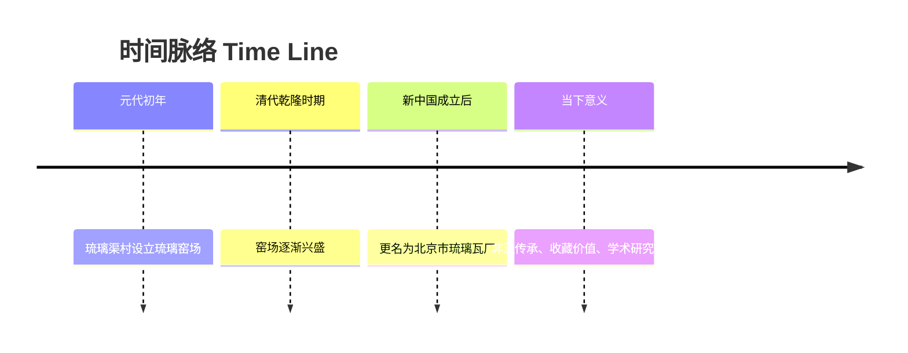

# 门头沟琉璃渠村

**来源：** 首都之窗（北京市人民政府门户网站）  
**栏目：** 人文北京 > 北京概况 > 门头沟概况 > 门头沟非遗  
**供稿：** 门头沟区政务服务管理局  
**原文发布：** 2023-04-11 15:53  
**说明：** 本文为基于首都之窗公开页面的英中双语精读整理；机构背景可参考门头沟区政府信息公开指南。

---

## 文章来源与基本信息

- 来源网站：`首都之窗（北京市人民政府门户网站）`
- 栏目位置：`人文北京 > 北京概况 > 门头沟概况 > 门头沟非遗`
- 题目：`门头沟琉璃渠村`
- 发布时间：`2023-04-11 15:53`
- 来源/供稿：`门头沟区政务服务管理局`
- 作者背景简介：`门头沟区政务服务管理局`为北京市门头沟区政府相关职能部门，承担政务服务、政府信息公开等相关工作。根据其政府信息公开指南，相关信息公开、查阅与申请渠道均由该机构统一发布和管理。
  - 参考来源：
    - 首都之窗原文页：https://www.beijing.gov.cn/renwen/bjgk/mtggk/mtgfy/202304/t20230411_3003195.html
    - 门头沟区政务服务管理局信息公开指南：https://www.bjmtg.gov.cn/mtgqzwfwglj/zfxxgkzn/202006/2ec74ec438474459ba8f527854d16c1f.shtml

---

## 前情提要

```mermaid
flowchart TD
    A["文章主题<br/>Mentuogou Liuliqu Village<br/>门头沟琉璃渠村与琉璃烧造技艺"] --> B["第1部分：历史源流<br/>村落与窑场的形成、兴盛与更名"]
    A --> C["第2部分：技艺传承<br/>家族传入、师承延续、行业规矩"]
    A --> D["第3部分：工艺特色<br/>官式标准、工序繁复、审美特征"]
    A --> E["第4部分：价值意义<br/>收藏价值 + 学术研究意义"]

    B --> B1["句1：村庄具有悠久琉璃烧造史"]
    B --> B2["句2：元代初年设窑，已有700多年历史"]
    B --> B3["句3：乾隆时期逐渐兴盛"]
    B --> B4["句4：新中国成立后更名为北京市琉璃瓦厂"]

    C --> C1["句5：技艺由赵氏家族自山西传入，并延续传承"]
    C --> C2["句6：新中国成立后知名传人"]
    C --> C3["句7：形成父子相传、不传外乡人的规矩"]
    C --> C4["句8：关键工序由本村工匠亲自完成"]

    D --> D1["句9：按清工部规制烧造，被视为正宗"]
    D --> D2["句10：形成官式做法与系统审美特征"]
    D --> D3["句11：制作需二十多道程序、十多天"]
    D --> D4["句12：成品在工艺、釉料、原料、造型上独具一格"]

    E --> E1["句13：具备观赏与收藏价值"]
    E --> E2["句14：对建筑、文化、宗教民俗与审美研究有意义"]

    classDef c1 fill:#E3F2FD,stroke:#1E88E5,color:#0D47A1
    classDef c2 fill:#E8F5E9,stroke:#43A047,color:#1B5E20
    classDef c3 fill:#FFF3E0,stroke:#FB8C00,color:#E65100
    classDef c4 fill:#F3E5F5,stroke:#8E24AA,color:#4A148C
    classDef c0 fill:#FCE4EC,stroke:#D81B60,color:#880E4F

    class A c0
    class B,B1,B2,B3,B4 c1
    class C,C1,C2,C3,C4 c2
    class D,D1,D2,D3,D4 c3
    class E,E1,E2 c4
```

---

## 逐句精读

### 第 1 句

🔹Mentuogou Liuliqu Village / has a `long-standing` history / of `glaze-fired` production.  
🔸门头沟琉璃渠村有着`历史悠久`的`琉璃烧造`史话。

背景注释：

- `Mentuogou`：即北京西部的`门头沟区`，历史文化资源丰富。
- `Liuliqu Village`：`琉璃渠村`，以琉璃烧造传统闻名。
- `glaze-fired production`：这里对应“琉璃烧造”，指以釉料、窑火、模制等工艺烧制建筑或陈设用琉璃制品。

> **`long-standing` adj. 长期存在的；历史悠久的**  
> 英文释义：`having existed for a long time`（存在已久的）  
> 语域：正式、新闻、学术常用  
> 画龙点睛：`long-standing`常修饰`tradition / dispute / practice / relationship`。它比`old`更正式，强调“延续已久”而非单纯“年代久”。写作中可替换普通表达，如`an old tradition`升级为`a long-standing tradition`，更地道、更有书面感。

> **`glaze-fired` adj. 施釉烧制的；经釉烧工艺完成的**  
> 英文释义：`made by firing material in a kiln after applying glaze`（施釉后经窑烧制成的）  
> 语域：工艺、艺术史、建筑材料  
> 画龙点睛：这是带明显专业色彩的表达，可联想到`glaze`（釉）+ `fire`（烧制）。遇到传统工艺、陶瓷、琉璃类文本时十分高频。阅读中要区分`glass`（玻璃）与`glaze / glazed ware`（釉层/上釉制品）的不同语义领域。

---

### 第 2 句

🔹As early as / the early Yuan Dynasty, / a `glaze kiln` was established / in Liuliqu Village, / giving it a history / of more than `seven hundred years`.  
🔸早在`元代初年`即在琉璃渠村设立了`琉璃窑场`，距今已有`七百多年`的历史。

背景注释：

- `the Yuan Dynasty`：`元代`，中国历史朝代之一，时间为`1271—1368`。
- `glaze kiln`：对应“琉璃窑场”，可理解为专门烧造琉璃制品的窑场。
- 本句核心是时间起点非常早，突出该工艺传统的历史纵深。

> **`as early as` phr. 早在……时候就**  
> 英文释义：`at a point in time that is surprisingly early`（在一个令人感到很早的时间点）  
> 语域：通用、书面、历史叙述  
> 画龙点睛：这是时间强调句型，常见于历史、科技发展、社会现象题材。后面通常接`year / period / age`。写作时可用来突出“起步之早”：`As early as the 18th century, ...`。翻译中不要只机械译成“在……早期”，更常译为“早在……就……”。

> **`kiln` n. 窑；窑炉**  
> 英文释义：`a large oven used for firing clay, pottery, bricks, etc.`（用于烧制陶器、砖瓦等的大型窑炉）  
> 语域：工艺、建筑、考古  
> 画龙点睛：`kiln`是陶瓷、砖瓦、琉璃领域核心词。常见搭配有`brick kiln`、`pottery kiln`、`lime kiln`。阅读中它往往和`firing`、`glaze`、`ceramic`、`temperature control`等一起出现，属于典型专业词串，见到时应建立术语网络。

---

### 第 3 句

🔹By the `Qianlong reign` of the Qing Dynasty, / the Liuliqu kiln site / had gradually `prospered`.  
🔸到清代`乾隆`时期，琉璃渠窑场逐渐`兴盛`起来。

背景注释：

- `Qianlong reign`：即清高宗乾隆皇帝在位时期，通常指`1735—1796`。
- 乾隆时期皇家建筑活动频繁，对高等级建筑材料的需求较强，这也是“窑场兴盛”在历史上可理解的重要背景。

> **`reign` n. 统治时期；在位时期**  
> 英文释义：`the period during which a king, queen, emperor, etc. rules`（君主统治的时期）  
> 语域：历史、政治、传记  
> 画龙点睛：`during the reign of ...`是历史文本高频结构，阅读里几乎可视为固定搭配。它比单说`period`更精准，因为它绑定了具体君主。写作中若涉及王朝史、政治史，用`reign`能显著提升表述准确度。

> **`prosper` v. 繁荣；兴旺；成功发展**  
> 英文释义：`to develop in a successful way; to become strong and healthy economically or socially`（成功发展；变得繁荣）  
> 语域：正式、经济、历史叙述  
> 画龙点睛：`prosper`既可指经济繁荣，也可指事业、产业、城镇发展良好。名词是`prosperity`，形容词是`prosperous`。写作中可套用：`The town prospered under ...`、`This industry prospered during ...`。注意它通常带“持续发展良好”的意味，不只是短期走红。

---

### 第 4 句

🔹After the founding of the People’s Republic of China, / it was renamed / the `Beijing Glazed Tile Factory`.  
🔸建国后又更名为`北京市琉璃瓦厂`。

背景注释：

- `the People’s Republic of China`：即`中华人民共和国`，成立于`1949年10月1日`。
- `Glazed Tile Factory`：说明该窑场后来进入现代工厂化、制度化命名阶段。
- `glazed tile`：建筑用“琉璃瓦”，多见于宫殿、坛庙、寺观等传统建筑。

> **`rename` v. 重新命名；改名**  
> 英文释义：`to give a new name to someone or something`（给某人或某物起新名字）  
> 语域：通用、新闻、行政  
> 画龙点睛：常见结构为`be renamed as / be renamed ...`。注意英语里很多时候直接说`was renamed X`，不一定要加`as`。在历史或机构沿革类阅读中，`rename`常暗示功能转型、制度调整或时代更替，是信息点词汇。

> **`glazed tile` n. 琉璃瓦；釉面瓦**  
> 英文释义：`a roof or decorative tile coated with glaze and fired`（表面施釉并烧制而成的瓦）  
> 语域：建筑、文博、艺术史  
> 画龙点睛：区别于普通`tile`，`glazed tile`强调有釉层、兼具装饰功能。写作时如果谈中国传统建筑，`yellow glazed tiles`、`imperial glazed tiles`都是非常典型的文化词组。阅读中往往与宫殿、寺庙、皇家建筑相联系。

---

### 第 5 句

🔹According to *An Interview Record of the Zhao Family of the Glaze Kiln*, / Liuliqu Village’s glaze-making craft / was `introduced` from Shanxi / by the Zhao family, / a renowned household of glaze artisans, / and was later `handed down` through three generations of the Guo family.  
🔸据《`琉璃窑赵氏访问记`》记载，琉璃渠村的琉璃烧造技艺是由琉璃世家`赵氏家族`由`山西`传入的，此后由`郭氏三代`传人。

背景注释：

- *An Interview Record of the Zhao Family of the Glaze Kiln*：原文所引文献性资料名，可理解为关于赵氏家族与琉璃窑传统的访谈记录。
- `Shanxi`：`山西`，中国北方重要历史文化区域，传统手工业基础深厚。
- `the Zhao family`、`the Guo family`：这里强调技艺的家族性传承，反映传统手工业常见的血缘/师承结构。
- 原文“此后由郭氏三代传人”略显省略，英语中补足为“由郭氏家族三代传承”更通顺。

> **`introduce` v. 引入；传入；采用**  
> 英文释义：`to bring something into use or into a place for the first time`（首次将某物带入某地或投入使用）  
> 语域：正式、历史、学术  
> 画龙点睛：`introduce ... into ...`是高频结构，如`introduce a technology into a region`。它既可指“介绍”，也可指“引进、传入”，阅读中一定要按语境辨义。此处不是“介绍某项技术”，而是“把技艺带到某地”。

> **`hand down` phr. 传下去；世代相传**  
> 英文释义：`to give or leave something to people who will live after you`（留给后人；传承）  
> 语域：文化、家庭、历史  
> 画龙点睛：这是谈传统、价值观、工艺、故事时非常地道的表达。常见搭配：`be handed down from generation to generation`。在写作中，它比单纯的`pass on`更有历史感和文化厚度，特别适合非遗、家族技艺、民俗传统等题材。

---

### 第 6 句

🔹After the founding of New China, / well-known inheritors / included `Xiao Ruiwen`, `Wu Wenzhi`, and others.  
🔸新中国成立后较有名的`传人`有`萧瑞稳`、`武文志`等。

背景注释：

- `inheritors`：这里不是财产继承人，而是“技艺传承人”。
- `Xiao Ruiwen`、`Wu Wenzhi`：为文中列举的较有代表性的传承者姓名。
- `New China`：英语中常用来指`1949年`后成立的中华人民共和国，属特定历史语境表达。

> **`inheritor` n. 继承者；传承人**  
> 英文释义：`a person who receives or continues something from an earlier person or tradition`（继承某物或延续某种传统的人）  
> 语域：文化、法律、历史  
> 画龙点睛：在非遗语境里，`inheritor`常译“传承人”；在法律语境中则偏“继承人”。考试中常考这种一词多义。若强调官方认定的非遗传承人，还可见`representative inheritor`。翻译时必须结合语境，不能机械处理。

> **`well-known` adj. 著名的；广为人知的**  
> 英文释义：`known by many people`（被很多人知道的）  
> 语域：通用  
> 画龙点睛：虽然是基础词，但在正式写作里可替换为`renowned`、`noted`、`prominent`。不过当对象是人名列举而语气需克制时，`well-known`反而更稳妥。备考中要学会根据文体控制词汇强度，而不是一味追求“高级”。

---

### 第 7 句

🔹“`From father to son, / from son to grandson, / and never to outsiders`” / was an `unwritten rule` / in Liuliqu Village.  
🔸“`父传子、子传孙、琉璃不传外乡人`”，则是琉璃渠村`不成文的规矩`。

背景注释：

- 这句话体现了传统手工业中典型的`家族内部封闭式传承`模式。
- `outsiders`在这里不是泛指陌生人，而是指“非本地、非本家系统中的外来者”。
- 这种传承方式有利于技术保密，但也可能限制技术扩散。

> **`outsider` n. 外来者；圈外人**  
> 英文释义：`someone who does not belong to a particular group, community, or place`（不属于某一群体、共同体或地方的人）  
> 语域：通用、社会文化  
> 画龙点睛：`outsider`既可指地理上的“外乡人”，也可指社会关系中的“局外人”。其反义倾向词包括`insider`。阅读中它常隐含“边界”“归属”“排他性”等文化信息，值得敏感捕捉，不要只译成表层的“外面的人”。

> **`unwritten rule` n. 不成文规定；默认规则**  
> 英文释义：`a rule that is generally understood and followed although it is not officially stated`（虽未正式写出但普遍遵守的规则）  
> 语域：社会、组织、文化分析  
> 画龙点睛：这是极其常用的抽象表达，适合写组织文化、社会习惯、行业惯例。与`written rule`对照明显。写作中若想表达“没有明文规定，但大家都默认如此”，`an unwritten rule`几乎是最佳选项，简洁且准确。

---

### 第 8 句

🔹Some highly technical procedures, / such as the key formulas for glaze colors / and `temperature control`, / have always been carried out / personally by people from Liuliqu Village.  
🔸一些`技术含量高`的工序，像关键的`釉色配方`、`火候控制`等技术，一直都是由琉璃渠村人亲自完成的。

背景注释：

- `glaze colors`：指琉璃表面釉色的配制与呈现，涉及材料比例和烧制效果。
- `temperature control`：对应“火候控制”，是窑烧工艺成败的核心。
- 本句进一步说明：真正高门槛、难复制的部分始终掌握在本村技艺共同体内部。

> **`formula` n. 配方；公式；方案**  
> 英文释义：`a set of ingredients or instructions used to make something`（制作某物的一组成分或方法）  
> 语域：科学、工艺、商业  
> 画龙点睛：`formula`常被误以为只有“数学公式”一个义项。其实在工艺、食品、化妆品、材料学里，它经常表示“配方”。考试很爱考这种熟词僻义。搭配有`secret formula`、`chemical formula`、`baby formula`，语境差别要能迅速判断。

> **`temperature control` n. 温度控制；火候控制**  
> 英文释义：`the process of regulating heat to keep it at the desired level`（调节温度使其保持在目标范围内的过程）  
> 语域：科学、工程、工艺  
> 画龙点睛：在中文工艺语境里，“火候”常不仅是温度数值，更包含时间、力度、经验判断。翻成`temperature control`是较稳妥的技术化表达。写作中涉及制造过程时，常与`precision`、`stability`、`consistency`连用，能体现专业性。

---

### 第 9 句

🔹The Liuliqu kiln / produced glazed ware / in accordance with the `regulations of the Qing Ministry of Works`, / and has long been regarded / as the `orthodox form` of traditional glaze ware.  
🔸琉璃渠窑厂按`清工部规制`烧造琉璃，一直被视为传统琉璃之`正宗`。

背景注释：

- `the Qing Ministry of Works`：即清代中央政府六部之一的`工部`，负责工程营造、营缮等事务。
- `regulations`：这里不是普通“规则”，而是具有制度规范意味的“规制”。
- `orthodox`：此处指“正统、最标准、最被认可”的传统做法。

> **`in accordance with` phr. 按照；依据；与……一致**  
> 英文释义：`following or agreeing with a rule, law, wish, or request`（遵照某项规则、法律或要求）  
> 语域：正式、法律、行政、学术  
> 画龙点睛：这是书面表达中的高频正式短语，可替代普通的`according to`。它更强调“合乎规范、依规而行”。写作中若涉及制度、标准、政策、实验流程，用它会显得更严谨，如`in accordance with the regulations`.

> **`orthodox` adj. 正统的；被公认为规范的**  
> 英文释义：`generally accepted as being correct or traditional`（通常被认为正确或传统正宗的）  
> 语域：宗教、学术、文化评论  
> 画龙点睛：`orthodox`原本常用于宗教、思想体系，表示“正统”。引申到工艺传统时，能表达“最符合经典规范的做法”。它比`authentic`更强调“规范系统中的正统性”，比`genuine`更带制度和传统权威色彩。

---

### 第 10 句

🔹It developed a `standardized imperial style` for China, / one that may be described as / imposing from a distance, / well-shaped up close, / elegant in line, / exquisite in decoration, / profound in implication, / beautiful in color, / combining strength with softness, / and achieving both `formal beauty` and `inner vitality`.  
🔸形成了中国标准的`官式做法`，可以说远观有势，近看有形，线条优雅，装饰精巧，寓意深刻，色彩秀美，刚柔相济，`形神兼备`。

背景注释：

- `imperial style`：对应“官式做法”，即与官方、皇家建筑标准相联系的制作规范与审美系统。
- `combining strength with softness`：对应“刚柔相济”，是中国传统审美中的经典评价语。
- `formal beauty and inner vitality`：对应“形神兼备”，兼顾外在形制与内在神韵。

> **`imperial style` n. 官式风格；皇家规范风格**  
> 英文释义：`a style associated with imperial or official standards and aesthetics`（与皇室或官方标准、美学有关的风格）  
> 语域：历史、艺术史、建筑  
> 画龙点睛：这是翻译“官式”时较自然的表达。它不仅指“皇家的”，更暗含“标准化、规范化、制度化”的意味。写作中谈中国古建筑、礼制艺术时，`imperial style`、`court style`都可出现，但前者更稳妥、更常见。

> **`exquisite` adj. 精巧的；精美的；制作极其精细的**  
> 英文释义：`extremely beautiful and carefully made`（极美且制作精细的）  
> 语域：文学、艺术评论、正式描述  
> 画龙点睛：`exquisite`常修饰`craftsmanship / decoration / detail / design / taste`。它比`beautiful`信息量更大，强调“精致到位、做工考究”。雅思写作若描写艺术品或传统工艺，这个词非常加分，但要注意别泛用到任何普通事物上。

> **`vitality` n. 活力；生命力；神韵中的生气**  
> 英文释义：`energy and liveliness; the power to continue to live or develop`（活力；持续生长发展的力量）  
> 语域：通用、艺术评论、抽象论述  
> 画龙点睛：`vitality`既可写人，也可写文化、城市、艺术风格。此处对应“神”，不是生物意义上的生命，而是审美层面的“内在生气”。在翻译中若只译成`spirit`会较宽泛，`inner vitality`更能体现艺术评论语感。

---

### 第 11 句

🔹Completing a single glazed piece / usually requires / more than `twenty procedures`, / and takes / over `ten days`.  
🔸一件琉璃制品的完成一般要经过`二十多道程序`，花费`十多天`的时间才能完成。

背景注释：

- 本句用数字化表达突出制作流程的`复杂性`与`耗时性`。
- `procedure`在工艺文本中指“步骤、工序、流程环节”，不是泛泛的“程序”。

> **`procedure` n. 程序；步骤；工序**  
> 英文释义：`a set of actions that is the official or accepted way of doing something`（完成某事的正式或公认步骤）  
> 语域：正式、行政、技术、工艺  
> 画龙点睛：`procedure`与`process`有交叉，但`procedure`更强调“具体步骤安排”，`process`更强调“整体过程”。考试常考二者辨析。工艺文本里说`twenty procedures`，是在强调分步骤、分工序的精密性，而不只是笼统过程漫长。

> **`require` v. 需要；要求；须要**  
> 英文释义：`to need something; to make something necessary`（需要；使某事成为必要）  
> 语域：通用、正式  
> 画龙点睛：这是基础词，但在高级阅读中非常重要。`require`比`need`更正式，常接`time / effort / skill / permission / attention`。写作里表达“某事耗费资源”时，可优先使用：`The process requires great patience and precision.` 既自然又有书面感。

---

### 第 12 句

🔹Glazed works fired in this way / are marked by / `unique craftsmanship`, `distinctive glaze materials`, `special raw materials`, / and `singular forms`, / and may truly be called / a `marvel` of Chinese culture.  
🔸这样烧制出来的琉璃作品，具有`制作工艺独特`、`釉料独特`、`原料独特`、`造型独特`等特点，堪称`中华一绝`。

背景注释：

- 本句从成品层面总结其核心特征。
- `raw materials`：对应“原料”。
- `form`在艺术品语境中可指形制、造型、轮廓。
- `a marvel of Chinese culture`是对“中华一绝”的自然英语概括，兼顾赞誉色彩与书面表达。

> **`craftsmanship` n. 工艺；技艺；工匠水平**  
> 英文释义：`the skill with which something is made`（制作某物时体现出的技艺水平）  
> 语域：艺术、工艺、产品评价  
> 画龙点睛：这是讨论手工艺时的核心词。它既可指“手艺”，也可指“做工”。常见搭配：`fine craftsmanship`、`traditional craftsmanship`、`superior craftsmanship`。写作中比泛泛的`skill`更贴合实物制作场景，尤其适用于非遗、设计、制造主题。

> **`marvel` n. 奇迹；奇观；令人惊叹之物**  
> 英文释义：`something extremely surprising, beautiful, or impressive`（非常令人惊叹、优美或了不起的事物）  
> 语域：文学、评论、较正式  
> 画龙点睛：`marvel`既可作名词，也可作动词。作名词时常带赞叹意味，但不浮夸。翻译“中华一绝”时，用`marvel`比简单的`masterpiece`更有“惊艳独特、罕见杰出”的味道。阅读中若见`the marvels of ...`，通常指某一领域令人赞叹的成果。

---

### 第 13 句

🔹Because works from Liuliqu / are made from `costly raw materials`, / involve `meticulous and complex craftsmanship`, / and embody rich cultural meaning, / they possess / great value / for both appreciation and collection.  
🔸琉璃渠琉璃作品，由于`原料成本昂贵`、`制作工艺精细繁复`，具有丰富的文化内涵，因此极具`欣赏`和`收藏价值`。

背景注释：

- 本句从市场与文化两个维度解释其价值来源。
- `appreciation`：这里偏“观赏、审美欣赏”。
- `collection value`：即作为收藏对象的价值，常涉及稀缺性、文化性、工艺性。

> **`costly` adj. 昂贵的；代价高的**  
> 英文释义：`costing a lot of money`（花费很多钱的）  
> 语域：正式、新闻、商业  
> 画龙点睛：`costly`比`expensive`更书面，有时还含“代价高昂”的引申义，如`a costly mistake`。本句中它修饰`raw materials`很自然。写作中若想提升表达正式度，可把`expensive materials`替换成`costly materials`。

> **`meticulous` adj. 一丝不苟的；极其细致的**  
> 英文释义：`very careful and precise, giving great attention to details`（极其仔细、精准并关注细节的）  
> 语域：正式、学术、评价  
> 画龙点睛：这是描写工艺、研究、工作态度的高质量词。常搭配`attention to detail`。与`careful`相比，`meticulous`更强调“细到近乎苛刻”。雅思写作若描述手工艺或科研过程，`meticulous craftsmanship / meticulous research`都非常亮眼。

> **`embody` v. 体现；蕴含；具体表现**  
> 英文释义：`to represent or express an idea, quality, or principle`（体现或表达某种思想、品质或原则）  
> 语域：正式、学术、评论  
> 画龙点睛：`embody`是抽象写作中的强力动词，远胜于普通的`show`。常见搭配：`embody values`、`embody tradition`、`embody the spirit of ...`。阅读里见到它，往往意味着“某个具体对象承载着更深层的文化或思想意义”。

---

### 第 14 句

🔹At the same time, / the glaze-firing craft of Liuliqu Village / is representative of `royal glaze production`, / which makes it / highly significant / for the study of traditional Chinese architecture, / ancient culture, / religious folk customs, / and aesthetics.  
🔸同时琉璃渠村的琉璃烧造技艺是`皇家琉璃制作`的代表，这对于研究中国传统建筑、古代文化、宗教民俗以及`审美`等方面也具有重要的意义。

背景注释：

- `royal glaze production`：指服务于皇家建筑体系的琉璃制作传统。
- `traditional Chinese architecture`：中国传统建筑，如宫殿、坛庙、陵寝、寺观等。
- `religious folk customs`：宗教民俗，涉及民间信仰、礼仪、节俗与宗教实践。
- `aesthetics`：美学、审美研究，是人文学科常见关键词。

> **`representative of` phr. 具有代表性的；可作为……典型**  
> 英文释义：`serving as a typical example of a group, style, or category`（可作为某一群体、风格或类别典型例子的）  
> 语域：学术、评论、正式  
> 画龙点睛：这个结构在论文摘要、阅读理解、文化分析中很常见。它比简单的`is a representative`更灵活，后面直接接类别名词即可，如`representative of traditional craftsmanship`。表达“某物最能体现某类特征”时非常实用。

> **`aesthetics` n. 美学；审美观；审美层面**  
> 英文释义：`the study of beauty and art, or ideas about what is beautiful`（对美和艺术的研究；关于美的观念）  
> 语域：学术、艺术评论、人文社科  
> 画龙点睛：`aesthetics`既可作学科名词“美学”，也可作复数形式表示“审美风格/审美标准”。考试中常见搭配有`aesthetic value`、`aesthetic appeal`、`traditional aesthetics`。注意其形容词是`aesthetic`，写作中很高频。

> **`significant` adj. 重要的；意义重大的**  
> 英文释义：`important or noticeable in a way that has an effect`（重要的；有明显影响的）  
> 语域：通用、学术、正式  
> 画龙点睛：这是学术英语核心词之一。可表示“重要的”，也可表示“显著的”。阅读中要根据语境区分：在统计学里是“显著的”，在人文社科里多是“意义重大的”。写作中常见句型：`be significant for ...`、`have significant implications for ...`。

---

## 术语与专名速记

- 🔹`Liuli` / 🔸琉璃：在中国传统语境中，多指用于建筑装饰或艺术制作的釉烧制品，并不完全等同于现代日常意义上的“glass”。
- 🔹`glaze` / 🔸釉：覆盖于制品表面的玻璃质层，能带来色彩、光泽与保护效果。
- 🔹`kiln` / 🔸窑：烧制陶、瓷、琉璃、砖瓦等的高温设施。
- 🔹`imperial / royal` / 🔸皇家、官式：与宫廷或官方营造体系相关的规范、风格与等级。
- 🔹`inheritor` / 🔸传承人：延续某项传统技艺、知识体系或文化实践的人。

参考来源：

- 首都之窗原文页：https://www.beijing.gov.cn/renwen/bjgk/mtggk/mtgfy/202304/t20230411_3003195.html
- 门头沟区政务服务管理局信息公开指南：https://www.bjmtg.gov.cn/mtgqzwfwglj/zfxxgkzn/202006/2ec74ec438474459ba8f527854d16c1f.shtml
