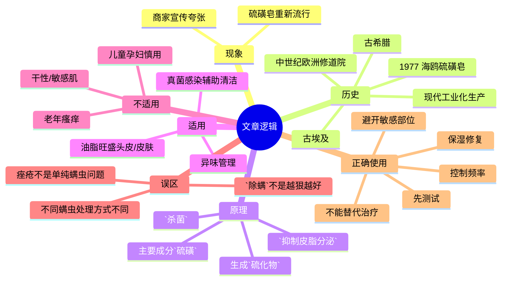

# 2块钱一块的硫磺皂，是皮肤病「神器」还是毁肤「杀手」？

说明：原文为中文；正文保留中文原句并附英文译文与逐句精读。原文中明显属于网页杂项的「图片 / 留言 / 写留言 / 点亮小红心」等无实质内容部分已剔除，不纳入正文解析。

---

## 基本信息

- 文章来源：微信公众号 **「科普中国」**
- 题目：**2块钱一块的硫磺皂，是皮肤病「神器」还是毁肤「杀手」？**
- 编辑：**周飞扬、易钰晴（胡杨计划）**
- 校审：**李卓然**

### 作者/来源背景注释

- **科普中国**：中国科协主导的国家级科普信息平台，长期发布公共健康、科学常识、生活方式等科普内容。
- **微信公众号**：微信生态中的内容发布平台，文章常以健康科普、新闻评论、生活建议等形式传播。
- **周飞扬、易钰晴（胡杨计划）**：从页面署名看，二者为本文编辑人员；公开可核实的信息主要体现为编辑署名，未检索到稳定、权威且足以单列成完整人物简介的公开职业背景资料，因此此处仅据页面署名进行标注，不作过度推断。

---

## 前情提要

```mermaid
flowchart TD
    A["文章总问题<br/>Sulfur soap: `miracle cure` or `skin-damaging cleanser`?"]:::title

    A --> B["开篇引入<br/>硫磺皂重新走红，宣传夸大"]:::p1
    A --> C["历史脉络<br/>从古代含硫制剂到现代国产硫磺皂"]:::p2
    A --> D["核心机制<br/>主要成分是`硫磺`，与皮肤分泌物反应"]:::p3
    A --> E["能做什么<br/>有限适用，不是人人都适合"]:::p4
    A --> F["适用场景1<br/>出汗多、真菌感染风险较高人群"]:::p5
    A --> G["适用场景2<br/>减轻异味"]:::p6
    A --> H["适用场景3<br/>油脂旺盛、毛囊炎/脂溢性皮炎倾向"]:::p7
    A --> I["不推荐人群<br/>老年瘙痒、干敏皮、儿童孕妇"]:::p8
    A --> J["常见误区<br/>除螨≠洁肤；除螨≠根治痤疮；不是所有螨虫问题都靠它"]:::p9
    A --> K["正确使用<br/>浓度、测试、频率、避开敏感区、保湿、不能替代药物"]:::p10
    A --> L["结论<br/>有用，但不是`万能药`，关键在科学使用"]:::p11

    classDef title fill:#dbeafe,stroke:#2563eb,color:#111827,stroke-width:2px;
    classDef p1 fill:#fef3c7,stroke:#d97706,color:#111827;
    classDef p2 fill:#fde2e4,stroke:#e11d48,color:#111827;
    classDef p3 fill:#dcfce7,stroke:#16a34a,color:#111827;
    classDef p4 fill:#e0e7ff,stroke:#4f46e5,color:#111827;
    classDef p5 fill:#fce7f3,stroke:#db2777,color:#111827;
    classDef p6 fill:#ede9fe,stroke:#7c3aed,color:#111827;
    classDef p7 fill:#cffafe,stroke:#0891b2,color:#111827;
    classDef p8 fill:#fee2e2,stroke:#dc2626,color:#111827;
    classDef p9 fill:#ecfccb,stroke:#65a30d,color:#111827;
    classDef p10 fill:#fae8ff,stroke:#a21caf,color:#111827;
    classDef p11 fill:#e2e8f0,stroke:#475569,color:#111827;
```

---

## 逐句精读

🔸提起`硫磺皂`，很多人脑海里 / 都会立刻浮现出 / 那股特有的`刺鼻味道`。  
🔹At the mention of `sulfur soap`, many people / immediately think of / its distinctive `pungent smell`.

背景注释：

- **硫磺皂 / sulfur soap**：一种含硫成分的清洁产品，传统上常用于油脂分泌较旺、某些皮肤问题的辅助清洁。
- **刺鼻味道 / pungent smell**：在健康、化学、清洁产品描述中常见，指气味强烈、刺激鼻腔。

> **`sulfur soap` 硫磺皂** /ˈsʌlfər soʊp/
> n. a soap containing sulfur, often used for cleansing oily or problem-prone skin 含硫的肥皂，常用于油性或问题皮肤清洁
> 语域：护肤、医学、日常生活
> 画龙点睛：`sulfur`常见于`skincare`与`dermatology`语境。考试中可与`antibacterial`、`antifungal`、`oil-control`搭配记忆。表达时可说`use sulfur soap for body cleansing`，但不要随意泛化成「治百病」。

> **`pungent` 刺激性的；刺鼻的** /ˈpʌndʒənt/
> adj. having a strong sharp smell or taste 气味或味道强烈刺鼻的；（引申）尖锐有力的
> 语域：通用、新闻、文学、产品描述
> 画龙点睛：`pungent smell`是高频搭配。注意它不等于单纯的`bad-smelling`，强调的是「强烈、冲鼻」。写作中可用于气味描写，也可引申表示`a pungent criticism`「尖锐批评」。

---

🔸随着各种`清洁产品`的不断升级，`硫磺皂`也一度沉寂。  
🔹As various `cleansing products` kept evolving, `sulfur soap` also faded from the spotlight for a time.

背景注释：

- 这里的「沉寂」并非指停产，而是指市场关注度下降、消费场景缩小。
- **清洁产品 / cleansing products**：包括洗面奶、沐浴露、洗发产品、功能皂等。

> **`cleansing product` 清洁产品** /ˈklenzɪŋ ˈprɑːdʌkt/
> n. a product used to remove dirt, oil, or impurities from skin or hair 清除皮肤或头发污垢、油脂的产品
> 语域：护肤、消费、广告
> 画龙点睛：`cleanser`更常指单个「清洁剂/洗面奶」，`cleansing products`则是更宽泛的类别说法。写作中谈消费升级时，可配`upgrade`, `formulation`, `milder ingredients`等。

> **`fade from the spotlight` 淡出公众视野**
> phr. to receive less public attention than before 逐渐失去公众关注
> 语域：新闻、评论、文化写作
> 画龙点睛：这是很地道的抽象表达。可替换「过气」「不再受追捧」等中文意思。类似说法还有`fade into obscurity`，后者语气更强，表示几乎被遗忘。

---

🔸但近些年，`硫磺皂`又重新引起了大家的关注。  
🔹But in recent years, `sulfur soap` has attracted public attention once again.

背景注释：

- 这类「重新走红」的现象常与社交媒体带货、复古国货回潮、功能型护肤话题传播有关。

> **`attract attention` 引起关注**
> phr. to make people notice something 使人注意到；引起关注
> 语域：通用、学术、新闻
> 画龙点睛：这是英语写作中的基础高频搭配。主语既可为产品、政策、现象，也可为研究结果。注意比`draw attention`更中性；`draw public attention to`后可直接接问题或现象。

---

🔸「`温和除螨`，`洁净肌肤`」「`皮肤病`，一洗就好」「`100%除螨`，`根治痤疮`」……甚至还被一些商家和消费者吹成了「`万能神器`」。  
🔹Claims such as “`gently removes mites` and `cleanses the skin`,” “`skin diseases` can be washed away in one go,” and “`100% mite removal` and `a complete cure for acne`” have even led some sellers and consumers to hype it up as a `universal miracle product`.

背景注释：

- **除螨 / remove mites**：通常指针对螨虫相关问题的控制，但商业宣传中常被过度泛化。
- **痤疮 / acne**：常见慢性炎症性皮肤病，病因复杂，不是单一「洗掉」即可解决。
- **万能神器 / miracle product**：网络语境中的夸张营销话术。

> **`mite` 螨虫** /maɪt/
> n. a tiny arthropod, some species of which may live on skin or in dust 螨虫；一种极小型节肢动物
> 语域：医学、卫生、生物
> 画龙点睛：常见搭配有`dust mites`, `Demodex mites`。阅读中若出现`mite infestation`，通常指螨虫异常增殖或感染。不要把所有皮肤问题都简单归因于`mites`。

> **`acne` 痤疮** /ˈækni/
> n. a skin condition involving blocked pores, inflammation, and pimples 痤疮；粉刺性皮肤病
> 语域：医学、护肤、日常
> 画龙点睛：`acne`通常作不可数名词。常见搭配：`acne-prone skin`, `treat acne`, `acne breakouts`。考试写作可与`inflammation`, `hormonal changes`, `sebum`联动使用。

> **`hype up` 吹捧；过度宣传**
> phr. to promote something excessively or excitedly 大肆炒作；过度宣传
> 语域：新闻、商业、口语
> 画龙点睛：非常适合评论营销话术。名词形式是`hype`。写作中可说`The product has been hyped up online.`，语气通常带保留或质疑意味。

---

🔸`硫磺皂`真的有这么`神奇`吗？  
🔹Is `sulfur soap` really that `miraculous`?

背景注释：

- 这是典型设问句，用于从营销话术转向科学分析。

> **`miraculous` 神奇的；不可思议的** /mɪˈrækjələs/
> adj. seeming impossible but happening in a surprising way 神奇的；宛如奇迹的
> 语域：新闻、评论、文学
> 画龙点睛：产品评测和科普文章里，作者常故意引用夸张说法再加以质疑。搭配如`miraculous cure`, `miraculous results`。正式写作中若想保持客观，可改为`remarkably effective`。

---

🔸今天我们就来`一探究竟`。  
🔹Today, we will `get to the bottom of it`.

背景注释：

- **一探究竟**：中文常见导入语，用于开启调查、科普、解释。

> **`get to the bottom of` 查明真相；弄清根源**
> phr. to discover the real cause or truth of something 查清……的根本原因或真相
> 语域：新闻、口语、评论
> 画龙点睛：这是非常实用的短语。可用于调查问题、分析争议、澄清误解。写作中比简单的`find out`更有「深入查明」的意味。

---

🔸`硫磺皂`的前世今生。  
🔹The past and present of `sulfur soap`.

背景注释：

- 这是小标题，功能是引出历史背景与发展脉络。
- **前世今生**：中文中常表示事物的起源与演变。

> **`the past and present of ...` ……的过去与现在**
> phr. the origin, history, and current state of something 某事物的起源、发展与现状
> 语域：说明文、纪录片、专题写作
> 画龙点睛：英文中若用于更正式场景，也可写作`the history and current status of ...`。这里保留一定标题感与可读性。

---

🔸人类使用`硫磺皂`的历史 / 可追溯到 / 几个世纪前。  
🔹The history of human use of `sulfur soap` / can be traced back / several centuries.

背景注释：

- **可追溯到 / can be traced back**：历史说明文中极高频表达。

> **`trace back` 追溯到**
> phr. to identify the origin or earlier form of something 追溯……的起源
> 语域：学术、历史、新闻
> 画龙点睛：常见句型：`A can be traced back to B.` 适合写历史源流、制度起源、文化沿革。注意被动形式最常见：`can be traced back to ...`

---

🔸在`古埃及`和`古希腊`时期，人们便使用 / 含有`硫磺`的药膏 / 治疗`皮肤病`，这些药膏 / 可被视为 / `硫磺皂`的早期形式。  
🔹In the periods of `ancient Egypt` and `ancient Greece`, people used ointments containing `sulfur` to treat `skin diseases`, and these ointments can be regarded as early forms of `sulfur soap`.

背景注释：

- **古埃及 / ancient Egypt**：约公元前3000年起形成的重要古文明，以医学、香料、矿物药剂应用闻名。
- **古希腊 / ancient Greece**：古典医学传统的重要源头，对后世西方医学和药理学有深远影响。
- **药膏 / ointment**：半固体外用制剂，常用于皮肤病灶局部涂抹。

> **`ointment` 药膏** /ˈɔɪntmənt/
> n. a smooth thick substance spread on the skin for healing or protection 软膏；药膏
> 语域：医学、药学、日常
> 画龙点睛：与`cream`, `gel`, `lotion`要区分：`ointment`通常更油、更厚重。阅读中常见于皮肤治疗说明。搭配有`apply ointment`, `topical ointment`。

> **`regard as` 视为**
> phr. to consider someone or something in a particular way 把……看作；视为
> 语域：正式、学术、新闻
> 画龙点睛：高频写作表达。句型：`A is regarded as B.` 也可替换为`be seen as`, `be considered`。其中`regard as`书面感较强，适合议论文与说明文。

---

🔸进入`中世纪`，随着`硫磺皂`的制作技术 / 逐渐发展，它的使用 / 也扩展到 / `个人卫生`领域。  
🔹In the `Middle Ages`, as the techniques for making `sulfur soap` gradually developed, its use also expanded into the field of `personal hygiene`.

背景注释：

- **中世纪 / the Middle Ages**：通常指欧洲历史上的约5世纪至15世纪。
- **个人卫生 / personal hygiene**：指洗浴、清洁、护理等维护身体卫生的行为。

> **`expand into` 扩展到；进入**
> phr. to spread into a new area, field, or market 扩展到新的领域
> 语域：新闻、商业、学术
> 画龙点睛：可用于产业、用途、业务范围。例：`The company expanded into healthcare.` 也可表示「应用场景拓宽」。

> **`personal hygiene` 个人卫生** /ˈpɜːrsənl ˈhaɪdʒiːn/
> n. practices of keeping the body clean to maintain health 个人卫生
> 语域：医学、教育、公共卫生
> 画龙点睛：`hygiene`常与`oral hygiene`, `sleep hygiene`, `hand hygiene`等构成固定搭配，是健康类阅读高频词。

---

🔸在`欧洲`的`修道院`中，修士们常自制`硫磺皂`，用于保持`个人卫生`和`预防疾病`。  
🔹In `European` `monasteries`, monks often made `sulfur soap` themselves to maintain `personal hygiene` and `prevent disease`.

背景注释：

- **修道院 / monastery**：基督教修士共同生活、修行之所。中世纪欧洲修道院也是知识、医药、手工制作的重要场所。
- **修士 / monk**：通常指男性修道者。

> **`monastery` 修道院** /ˈmɑːnəsteri/
> n. a place where monks live and worship 修道院
> 语域：历史、宗教、文化
> 画龙点睛：不要与`temple`、`church`混淆。`monk`是修士，`nun`是修女。阅读中若涉及欧洲中世纪文化史，这是常见词。

> **`prevent disease` 预防疾病**
> phr. to stop disease from occurring or spreading 预防疾病
> 语域：医学、公共卫生
> 画龙点睛：比`avoid illness`更正式。写作中可扩展为`prevent the spread of disease`, `disease prevention measures`。

---

🔸随着`化学工业`的发展，`硫磺皂`的生产 / 变得`规模化`和`标准化`。  
🔹With the development of the `chemical industry`, the production of `sulfur soap` became `large-scale` and `standardized`.

背景注释：

- **化学工业 / chemical industry**：以化学加工为核心的工业体系，推动药品、洗护、材料等产品工业化。
- **规模化 / large-scale**、**标准化 / standardized**：工业生产中的核心特征。

> **`standardized` 标准化的** /ˈstændərdaɪzd/
> adj. made consistent according to a standard 按统一标准制造的
> 语域：工业、管理、学术
> 画龙点睛：与`large-scale`常一起出现，描述现代工业体系。作文中可用于论述现代制造、医疗流程、考试制度等。

---

🔸大规模的生产 / 使得`硫磺皂`走进了 / 更多的普通家庭。  
🔹Large-scale production / brought `sulfur soap` into / more ordinary households.

背景注释：

- **普通家庭 / ordinary households**：强调从专业或少数群体使用，转向大众消费品。

> **`household` 家庭；住户** /ˈhaʊshoʊld/
> n. a home or the people living in it 家庭；住户
> 语域：通用、统计、消费
> 画龙点睛：`household products`是家用产品，`household income`是家庭收入。这里用复数`households`强调消费覆盖面扩大。

---

🔸`1977 年`，`上海制皂厂`推出了中国首块`硫磺皂`——`海鸥硫磺皂`，这便是`上海硫磺皂`的前身。  
🔹In `1977`, the `Shanghai Soap Factory` launched China’s first bar of `sulfur soap`—`Seagull Sulfur Soap`, the predecessor of what later became known as `Shanghai Sulfur Soap`.

背景注释：

- **1977年**：文中给出的中国本土工业化产品时间节点。
- **上海制皂厂 / Shanghai Soap Factory**：中国近现代日化工业体系中的代表性企业之一。
- **海鸥硫磺皂 / Seagull Sulfur Soap**：老牌硫磺皂产品名称。
- **前身 / predecessor**：指后续品牌或产品形态的早期来源。

> **`launch` 推出；上市** /lɔːntʃ/
> v. to introduce a new product or service to the public 推出（新产品）
> 语域：商业、新闻、市场
> 画龙点睛：商业英语高频词。常见搭配：`launch a product`, `launch a campaign`。名词形式也常见，如`product launch`。

> **`predecessor` 前身；前任** /ˈpredəsesər/
> n. an earlier form of something; a person who held a position before another 前身；前任
> 语域：正式、历史、商业
> 画龙点睛：用于组织机构、产品、制度沿革非常地道。反义方向常用`successor`「继任者；后续版本」。

---

🔸凭借其独特的`配方`和良好的`洗护功能`，`上海硫磺皂`成为了`家喻户晓`的老牌国货，也成为家庭常备的`日常用品`之一。  
🔹Thanks to its distinctive `formula` and effective `cleansing and care functions`, `Shanghai Sulfur Soap` became a `household name` among classic domestic brands and one of the `daily necessities` kept in many homes.

背景注释：

- **国货**：中文语境下指国产品牌，英文可依语境译为`domestic brand`。
- **家喻户晓 / household name**：固定表达，指广为人知。
- **日常用品 / daily necessities**：如肥皂、牙膏、洗发水等常用物品。

> **`formula` 配方** /ˈfɔːrmjələ/
> n. a set combination of ingredients used in a product 配方；配料方案
> 语域：护肤、化学、商业
> 画龙点睛：护肤与药妆语境中极常见。可搭配`mild formula`, `improved formula`, `formulate`。注意不只指数学公式。

> **`household name` 家喻户晓的人/物/品牌**
> n. someone or something that is widely known 众所周知的名称；家喻户晓的品牌
> 语域：新闻、商业、评论
> 画龙点睛：是非常地道的固定搭配。不能直译成「家庭名字」。常用于品牌、明星、经典产品的知名度描述。

> **`daily necessity` 日常必需品** /ˈdeɪli nəˈsesəti/
> n. something needed for everyday life 日常用品；生活必需品
> 语域：经济、消费、生活
> 画龙点睛：更正式场合常见复数`daily necessities`。与`luxury goods`形成对比，是消费类文章高频词组。

---

🔸此后，还出现了`液体硫磺皂`，它既保留了`抑菌功效`，又改善了传统`硫磺皂`的臭味。  
🔹Later, `liquid sulfur soap` also appeared; it retained its `antibacterial effects` while improving the unpleasant smell of traditional `sulfur soap`.

背景注释：

- **液体硫磺皂 / liquid sulfur soap**：较传统皂块更便于涂抹和冲洗，气味也常经过配方优化。
- **抑菌功效 / antibacterial effects**：指抑制细菌生长，而非等同于「消灭所有病原体」。

> **`antibacterial` 抑菌的；抗菌的** /ˌæntibækˈtɪriəl/
> adj. able to kill bacteria or stop them growing 抗菌的；抑菌的
> 语域：医学、护肤、消费
> 画龙点睛：注意`antibacterial`不等于`antiviral`或`antifungal`。写作中涉及清洁产品时，需区分不同作用对象，避免概念混淆。

---

🔸但万变不离其宗，不管`硫磺皂`的形态 / 或是`辅料`发生了怎样的变化，`硫磺皂`的`主要成分`还是`硫磺`，其`作用机制`是 / 通过与`皮肤分泌物`接触后生成`硫化物`，从而产生一定的`杀菌`、`抑制皮脂腺分泌`的效果。  
🔹Yet despite changes in its form or auxiliary ingredients, the `main ingredient` of `sulfur soap` remains `sulfur`. Its `mechanism of action` is that, after coming into contact with `skin secretions`, it forms `sulfides`, thereby producing certain `antibacterial` effects and helping `suppress sebaceous gland secretion`.

背景注释：

- **辅料 / auxiliary ingredients**：产品中除核心功能成分外的其他成分。
- **作用机制 / mechanism of action**：医学、药理、护肤说明中的核心术语。
- **皮肤分泌物 / skin secretions**：主要包括皮脂、汗液等。
- **硫化物 / sulfides**：含硫化学物质。
- **皮脂腺 / sebaceous gland**：分泌皮脂的腺体，和油脂分泌、痤疮、脂溢性皮炎等密切相关。

> **`mechanism of action` 作用机制**
> n. the biochemical process through which a substance works 作用机制；发挥作用的生物化学过程
> 语域：医学、药理、科研
> 画龙点睛：医学英语中的核心表达，常缩写为`MOA`。考试阅读中遇到药物、激素、营养成分时，理解这一术语常是抓主旨的关键。

> **`sebaceous gland` 皮脂腺** /sɪˈbeɪʃəs ɡlænd/
> n. a gland in the skin that secretes oil 皮脂腺
> 语域：医学、皮肤科
> 画龙点睛：与`sebum`（皮脂）配套记忆。痤疮、毛囊炎、脂溢性皮炎等皮肤问题常与`excess sebum production`相关，是皮肤科阅读高频知识点。

> **`suppress` 抑制** /səˈpres/
> v. to reduce or prevent something from developing or functioning 抑制；压制
> 语域：学术、医学、正式
> 画龙点睛：比`reduce`更强调「压住、抑制发展」。常见搭配：`suppress inflammation`, `suppress secretion`, `suppress appetite`。写作中很正式、很实用。

---

## 逐句精读（续）

🔸`硫磺皂`能做什么？
🔹What can `sulfur soap` do?

背景注释：
- 这是分节标题，用于转入“功效边界”讨论。文章将从“能做什么”进一步细化为“能做一点什么，但不是万能”。

> **`What can ... do?` ……能起什么作用？**
> 句式功能：用于引出某种产品、政策、方法的实际作用范围
> 语域：通用、科普、说明文
> 画龙点睛：这类问句常用于文章结构推进。后文一般会接`in fact`, `however`, `under certain conditions`等限制性信息，提醒读者注意“边界感”。

---

🔸事实上，`硫磺皂`远没有一些宣传里说得那么“`神奇`”，并不是人人都能当成“`皮肤病万能皂`”来用。
🔹In fact, `sulfur soap` is far from as `miraculous` as some promotional claims suggest, and it is not something everyone can use as an `all-purpose soap for skin diseases`.

背景注释：
- **宣传 / promotional claims**：广告、种草、社交媒体营销中的说法。
- **皮肤病万能皂**：作者用引号表示对夸大说法的否定与疏离。

> **`far from` 远非；绝不是**
> phr. used to emphasize that something is very different from what is claimed or expected 远非；完全谈不上
> 语域：正式、评论、议论文
> 画龙点睛：极其适合写作中的反驳句。句型：`A is far from B.` 比单纯的`not`更有力度。可用于驳斥夸张说法、错误期待或片面结论。

> **`all-purpose` 多用途的；万能的** /ˌɔːl ˈpɜːrpəs/
> adj. suitable for many different uses 多用途的；通用的
> 语域：消费、说明文
> 画龙点睛：在商业文案中常带正面意味，但在科普反驳中可带警惕意味，如`there is no all-purpose cure`。适合与`tool`, `cleaner`, `solution`, `soap`搭配。

---

🔸`硫磺皂`在`毛囊炎`、轻微`螨虫感染`等特定`皮肤病`问题上，在医生指导下可使用，但并不适合`日常洗脸`、`洗护`使用。
🔹`Sulfur soap` may be used, under a doctor’s guidance, for specific skin conditions such as `folliculitis` and mild `mite infestations`, but it is not suitable for `daily facial cleansing` or routine `washing and care`.

背景注释：
- **毛囊炎 / folliculitis**：毛囊及其周围组织的炎症，常见于油脂分泌旺盛、摩擦、感染等情况。
- **螨虫感染 / mite infestation**：指螨虫相关问题，但轻重、类型和处理方式差异很大。
- **医生指导下 / under a doctor’s guidance**：强调个体差异和医学判断的重要性。

> **`folliculitis` 毛囊炎** /fəˌlɪkjəˈlaɪtɪs/
> n. inflammation of one or more hair follicles 毛囊炎
> 语域：医学、皮肤科
> 画龙点睛：由`follicle`（毛囊）+ `-itis`（炎症）构成。医学词汇中`-itis`高频表示“炎症”，如`dermatitis`, `bronchitis`，记住这一后缀有助于快速猜词。

> **`under a doctor’s guidance` 在医生指导下**
> phr. with medical supervision or advice 在医生指导下；遵医嘱
> 语域：医学、科普
> 画龙点睛：这是风险提示型表达。遇到功能性产品、药妆、保健品时，写作中可用该结构强调“不要自行滥用”。

> **`routine` 日常的；常规的** /ruːˈtiːn/
> adj. done regularly as part of normal practice 常规的；日常的
> 语域：通用、医学、工作
> 画龙点睛：`routine skincare`, `routine check-up`, `routine use`都很常见。注意它既可作形容词，也可作名词“惯例；流程”。

---

🔸因为`硫磺皂`本身偏`碱性`、`刺激性强`，而我们的皮肤正常是`弱酸性`的，长期使用 / 可能会破坏正常皮肤的`酸碱平衡`，使`皮肤屏障`受损，尤其是`面部`和`敏感区域`，应选择更`温和`的`清洁产品`。
🔹This is because `sulfur soap` itself is relatively `alkaline` and highly `irritating`, whereas healthy human skin is normally `slightly acidic`. Long-term use may disrupt the skin’s normal `acid-base balance` and damage the `skin barrier`; especially for the `face` and other `sensitive areas`, milder `cleansing products` should be chosen.

背景注释：
- **碱性 / alkaline** 与 **弱酸性 / slightly acidic**：皮肤表面通常存在酸性保护膜。
- **酸碱平衡 / acid-base balance**：这里指皮肤表面环境平衡。
- **皮肤屏障 / skin barrier**：角质层及相关结构构成的重要保护系统。
- **敏感区域 / sensitive areas**：如眼周、口周、鼻翼、生殖周边等更易受刺激部位。

> **`alkaline` 碱性的** /ˈælkəlaɪn/
> adj. having a pH above 7; basic in chemistry 碱性的
> 语域：化学、医学、护肤
> 画龙点睛：与`acidic`构成基础对义词。护肤阅读中常涉及`pH-balanced`, `slightly acidic cleanser`等。记住它有助于理解清洁产品刺激性的来源。

> **`irritating` 有刺激性的** /ˈɪrɪteɪtɪŋ/
> adj. causing discomfort, inflammation, or annoyance 引起刺激的；使不适的
> 语域：医学、通用
> 画龙点睛：皮肤科语境里通常不是“烦人”，而是“刺激皮肤/黏膜”。常见搭配：`irritating ingredients`, `skin irritation`, `cause irritation`。

> **`skin barrier` 皮肤屏障**
> n. the outer protective function of the skin that keeps moisture in and irritants out 皮肤屏障
> 语域：皮肤科、护肤
> 画龙点睛：这是近年护肤领域核心术语。与`barrier repair`, `barrier damage`, `compromised skin barrier`搭配极高频。写作中谈敏感肌、干燥、泛红时常是核心概念。

> **`mild` 温和的** /maɪld/
> adj. not strong, harsh, or severe 温和的；不刺激的
> 语域：护肤、药学、通用
> 画龙点睛：`mild cleanser`, `mild soap`, `mild symptoms`都很常见。护肤描述中，`mild`比`gentle`更偏产品特性，`gentle`更偏使用感与风格，但两者常可接近替换。

---

🔸皮肤需要一定`油脂`来维持`健康`，`过度清洁`反而适得其反。
🔹The skin needs a certain amount of `oil` to maintain its `health`, and `over-cleansing` can be counterproductive.

背景注释：
- **油脂 / oil**：这里对应皮脂，不完全是负面存在。
- **过度清洁 / over-cleansing**：现代护肤中常见误区，尤其见于油皮、痤疮人群。

> **`counterproductive` 适得其反的** /ˌkaʊntərprəˈdʌktɪv/
> adj. having the opposite effect from the one intended 适得其反的
> 语域：正式、学术、评论
> 画龙点睛：这是高级但实用的写作词。适合替代中文“越做越糟”“本想解决却加重问题”。可用于教育、政策、护肤、健康行为等多种主题。

> **`over-cleansing` 过度清洁**
> n. / gerund cleaning too often or too harshly 过于频繁或过于强烈的清洁
> 语域：护肤、科普
> 画龙点睛：这是护肤语境中的高频概念。可联想`overwashing`, `overexfoliation`。写作时很适合用来解释“为什么油皮越洗越油”。

---

🔸如果出现`干燥`、`刺痛`、`泛红`等不适，应立即`停用`刺激性产品，让皮肤自行恢复。
🔹If symptoms such as `dryness`, `stinging`, or `redness` occur, irritating products should be `stopped` immediately so that the skin can recover on its own.

背景注释：
- **刺痛 / stinging**：皮肤受刺激后常见主观症状。
- **泛红 / redness**：炎症或屏障受损的常见表现。
- **停用 / stop using**：皮肤刺激管理中的第一步常是去除诱因。

> **`stinging` 刺痛感** /ˈstɪŋɪŋ/
> n./adj. a sharp, smarting sensation 刺痛；引起刺痛的
> 语域：医学、护肤
> 画龙点睛：与`burning`, `itching`, `tightness`常并列出现。做阅读题时，这类词往往提示“刺激性反应”而非“治疗见效”。

> **`redness` 发红；泛红** /ˈrednəs/
> n. the state of being red, often due to irritation or inflammation 发红；红斑样表现
> 语域：医学、护肤
> 画龙点睛：非常基础但高频。常见搭配：`reduce redness`, `facial redness`, `persistent redness`。写作中可与`sensitivity`、`inflammation`组成症状组。

---

🔸`硫磺皂`不是`神器`，能用但要`谨慎`，用对`场景`才安全。
🔹`Sulfur soap` is not a `miracle product`; it can be used, but `cautiously`, and only safely in the right `context`.

背景注释：
- 这一句是前文的阶段性结论：不是完全不能用，而是“有限、审慎、分情况使用”。
- **场景 / context**：此处指使用部位、人群、频率、症状和目的。

> **`cautiously` 谨慎地** /ˈkɔːʃəsli/
> adv. in a careful way that avoids risk 谨慎地；小心地
> 语域：正式、医学、建议类文本
> 画龙点睛：建议类写作中非常好用。可搭配`use cautiously`, `proceed cautiously`, `interpret cautiously`，不仅能谈产品，也能谈结论与数据。

> **`context` 语境；情境；具体条件** /ˈkɑːntekst/
> n. the situation or conditions in which something happens 背景情境；具体条件
> 语域：学术、通用、评论
> 画龙点睛：这里不是语言学意义上的“上下文”，而是“使用条件”。英语写作中，`depends on the context`是很高效的限制性表达。

---

🔸出汗多，容易被各种`真菌感染`找上门的人群。
🔹People who sweat heavily and are more likely to develop various `fungal infections`.

背景注释：
- 这是小标题，限定适用人群之一。
- **真菌感染 / fungal infection**：常见于闷热、潮湿、摩擦较多部位。

> **`fungal infection` 真菌感染**
> n. an infection caused by fungi 真菌感染
> 语域：医学、皮肤科
> 画龙点睛：与`bacterial infection`、`viral infection`要区分。皮肤科阅读里若出现潮湿、出汗、瘙痒、皮疹等线索，常与真菌问题相关。

---

🔸`真菌感染`引起的`皮疹`，可以考虑使用`硫磺皂`。
🔹For `rashes` caused by `fungal infections`, the use of `sulfur soap` may be considered.

背景注释：
- **皮疹 / rash**：泛指皮肤上可见的炎性或异常改变，不是单一疾病名称。
- “可以考虑”保留了医学建议中的非绝对性。

> **`rash` 皮疹** /ræʃ/
> n. an area of red or inflamed spots on the skin 皮疹
> 语域：医学、日常
> 画龙点睛：一词多义，作形容词还有“轻率的”之意。皮肤语境中要优先识别为名词。搭配：`develop a rash`, `skin rash`, `heat rash`。

> **`may be considered` 可以考虑**
> phr. indicates a cautious, non-absolute recommendation 可予考虑；可作为选择之一
> 语域：医学、正式建议
> 画龙点睛：很适合学习“留余地”的英文表达。比`should use`更谨慎，也更符合医疗与科普文本的语气。

---

🔸天气热、出汗多 / 容易给`真菌`创造`孳生环境`。
🔹Hot weather and heavy sweating / can easily create a breeding environment for `fungi`.

背景注释：
- **孳生环境 / breeding environment**：适宜病原体、微生物生长繁殖的条件。
- **真菌 / fungi**：`fungus`的复数形式。

> **`fungi` 真菌（复数）** /ˈfʌndʒaɪ/
> n. plural of fungus 真菌（复数）
> 语域：生物、医学
> 画龙点睛：`fungus`单数，`fungi`复数，是考试阅读中常见的不规则复数形式。记住这一点能帮助快速识别专业文本。

> **`breeding environment` 滋生环境**
> n. conditions favorable for growth or reproduction 适合生长繁殖的环境
> 语域：医学、公共卫生、环境
> 画龙点睛：可替换中文“温床”。写作时能准确表达“某条件促进问题发展”，如`a breeding ground for bacteria`更常见。

---

🔸`硫磺皂`能`控油`、轻度`抑制真菌`，起到辅助`清洁`作用。
🔹`Sulfur soap` can help `control oil` and mildly `inhibit fungal growth`, thus playing an auxiliary `cleansing` role.

背景注释：
- **控油 / control oil**：多指减少皮脂堆积感，不等同于根治出油。
- **辅助 / auxiliary**：强调不是主要治疗手段。

> **`inhibit` 抑制** /ɪnˈhɪbɪt/
> v. to slow down or prevent a process or growth 抑制；阻止
> 语域：学术、医学、科学
> 画龙点睛：与`suppress`接近，但`inhibit`更常用于科学过程与生长抑制。搭配：`inhibit growth`, `inhibit activity`, `inhibit secretion`。

> **`auxiliary` 辅助的** /ɔːɡˈzɪliəri/
> adj. giving support rather than being primary 辅助的；次要的
> 语域：正式、医学、技术
> 画龙点睛：常见于`auxiliary treatment`, `auxiliary role`。写作中可准确表达“不是主力，只是配合”。

---

🔸使用建议：对于出汗多的人群 / 可将`液体硫磺皂`作为`沐浴露`使用，泡沫停留 `3~5 分钟`后再冲洗。
🔹Usage advice: For people who sweat heavily, `liquid sulfur soap` can be used as a `body wash`, and the foam may be left on for `3–5 minutes` before rinsing.

背景注释：
- **液体硫磺皂 / liquid sulfur soap**：液态形式通常更适合全身涂抹。
- **沐浴露 / body wash**：液体身体清洁产品。
- 停留时间在这里属于文章建议，不代表所有人都适合同一时长。

> **`body wash` 沐浴露**
> n. liquid soap used for washing the body 沐浴露
> 语域：日常、消费、护肤
> 画龙点睛：区别于`soap bar`（香皂/皂块）。生活英语里比`shower gel`更常见于美式语境，二者接近。

> **`rinse` 冲洗** /rɪns/
> v. to wash something quickly with clean water 冲洗
> 语域：日常、护肤、实验
> 画龙点睛：与`wash`不同，`rinse`更强调“用清水冲净”。产品说明里极高频，如`apply`, `lather`, `rinse thoroughly`。

---

🔸注意事项：`硫磺皂`只能作为`控油抗菌`的辅助手段，不能替代`药物`。
🔹Precaution: `Sulfur soap` can only serve as an auxiliary means of `oil control and antibacterial care`; it cannot replace `medication`.

背景注释：
- **药物 / medication**：这里强调硫磺皂不等于药品治疗方案。
- **注意事项 / precaution**：说明存在适用边界和风险提示。

> **`medication` 药物；药物治疗** /ˌmedɪˈkeɪʃn/
> n. medicine used to treat a condition 药物；用药
> 语域：医学、日常
> 画龙点睛：比`medicine`更书面，常用于临床或说明语境。搭配：`prescribed medication`, `take medication`, `replace medication`。

> **`precaution` 注意事项；预防措施** /prɪˈkɔːʃn/
> n. an action taken to avoid risk 注意事项；预防措施
> 语域：正式、说明文、医学
> 画龙点睛：高频于产品说明、安全警示、医学建议。常见结构：`As a precaution...`, `take precautions against ...`

---

🔸如果`症状`改善不明显，请及时`就医`。
🔹If `symptoms` do not improve noticeably, seek `medical attention` promptly.

背景注释：
- **就医 / seek medical attention**：出现持续或加重症状时的标准建议。
- **及时 / promptly**：强调不要拖延。

> **`symptom` 症状** /ˈsɪmptəm/
> n. a physical or mental feature indicating a condition or disease 症状
> 语域：医学、通用
> 画龙点睛：与`sign`辨析：`symptom`常是患者主观感受到的，`sign`更偏医生可观察到的客观体征，但实际语境也会有交叉。

> **`seek medical attention` 就医**
> phr. to get help from a medical professional 寻求医疗帮助；就医
> 语域：医学、公共卫生
> 画龙点睛：这是比`see a doctor`更正式的表达。说明文、急救指南、科普文章都很常见，值得直接背诵。

---

🔸`祛除异味`。
🔹`Eliminating unpleasant odors`.

背景注释：
- 这是小标题，进入第二类可用场景。
- **异味 / unpleasant odors**：通常与汗液被细菌分解后的气味有关。

> **`odor` 气味；异味** /ˈoʊdər/
> n. a smell, especially one that is unpleasant 气味；异味
> 语域：通用、医学、产品说明
> 画龙点睛：英式拼写为`odour`。正式语境下比`smell`更中性或更专业。搭配：`body odor`, `unpleasant odor`, `control odor`。

---

🔸`硫磺`具有一定的`抑菌作用`，可以减少 / 对`汗液成分`的分解，在一定程度上可以`祛除异味`。
🔹`Sulfur` has certain `antibacterial properties`, which can reduce the breakdown of `components in sweat` and thus help `eliminate unpleasant odors` to some extent.

背景注释：
- **汗液成分 / components in sweat**：汗液本身未必很臭，异味往往与皮肤表面细菌分解相关。
- **在一定程度上 / to some extent**：非常重要的限制表达。

> **`property` 性质；特性** /ˈprɑːpərti/
> n. a quality or characteristic that something has 性质；特性
> 语域：学术、科学、通用
> 画龙点睛：在科技文本中，`properties`常指物理/化学/生物特性。与`feature`相比，`property`更偏客观性质。

> **`to some extent` 在一定程度上**
> phr. partly but not completely 在某种程度上；有限地
> 语域：学术、科普、正式写作
> 画龙点睛：这是表达“有限有效”的黄金短语。能让论述更严谨，避免绝对化。写作文时非常加分。

---

🔸如果`新陈代谢`旺盛，容易出汗，可以尝试使用`硫磺皂`。
🔹If your `metabolism` is active and you sweat easily, you may try using `sulfur soap`.

背景注释：
- **新陈代谢 / metabolism**：人体能量转化和物质代谢总称，代谢旺盛的人有时更易出汗。
- “可以尝试”仍是弱建议，不是强制推荐。

> **`metabolism` 新陈代谢** /məˈtæbəlɪzəm/
> n. the chemical processes in the body that keep it alive 新陈代谢
> 语域：医学、生物、健康
> 画龙点睛：健康话题中的核心词。相关表达：`metabolic rate`, `boost metabolism`。注意别把它简单理解成“消化”或“瘦身能力”。

---

🔸使用建议：在夏季，`腋下`出汗多，`脚汗`多的人群 / 可将`硫磺皂`作为`清洁用品`使用。
🔹Usage advice: In summer, people with heavy sweating in the `underarms` or excessive `foot sweat` may use `sulfur soap` as a `cleansing product`.

背景注释：
- **腋下 / underarms**：体味管理中的典型高汗区域。
- **脚汗 / foot sweat**：也常与鞋袜不透气、细菌或真菌环境相关。

> **`underarm` 腋下** /ˈʌndərɑːrm/
> n. the area beneath the shoulder joint where the arm meets the body 腋下
> 语域：日常、医学、护理
> 画龙点睛：复数常作`underarms`。个人护理产品中高频，如`underarm odor`, `underarm sweat`, `underarm care`。

> **`cleansing product` 清洁用品**
> n. a product used to clean the body or skin 清洁用品
> 语域：护肤、消费
> 画龙点睛：可泛指洗护类产品，是比`soap`更上位的类别词。说明文中适合用来避免重复。

---

🔸注意事项：`硫磺皂`只能作为`抗菌`的辅助手段，同时还要配合穿`宽松透气衣物`、勤换`鞋袜`，并且减少`辛辣刺激饮食`的摄入。
🔹Precaution: `Sulfur soap` can only be used as an auxiliary `antibacterial` measure. It should also be combined with wearing `loose, breathable clothing`, changing `shoes and socks` frequently, and reducing the intake of `spicy and irritating foods`.

背景注释：
- 这里强调体味、出汗和皮肤问题往往与生活方式共同相关。
- **宽松透气衣物 / loose, breathable clothing**：降低闷热潮湿。
- **辛辣刺激饮食 / spicy and irritating foods**：中文健康文体中常见表述。

> **`breathable` 透气的** /ˈbriːðəbl/
> adj. allowing air to pass through easily 透气的
> 语域：服饰、运动、健康
> 画龙点睛：高频于面料、鞋袜、护具描述。可搭配`breathable fabric`, `breathable shoes`。在健康建议类写作中很实用。

> **`intake` 摄入量** /ˈɪnteɪk/
> n. the amount of food, drink, or another substance taken in 摄入量；摄入
> 语域：营养、医学、正式
> 画龙点睛：常见于`calorie intake`, `salt intake`, `fluid intake`。搭配`reduce intake of ...`是典型健康英语表达。

---

🔸`头发油`、`脸上油`，容易长`疖肿`、`毛囊炎`人群。
🔹People with `oily hair` and `oily facial skin`, who are prone to `boils` and `folliculitis`.

背景注释：
- 这是第三类可考虑使用的人群标题。
- **疖肿 / boil**：通常为毛囊深部细菌感染形成的红肿疼痛结节。

> **`boil` 疖；疖肿** /bɔɪl/
> n. a painful swollen lump on the skin caused by infection 疖；疖肿
> 语域：医学、日常
> 画龙点睛：一词多义，作动词是“煮沸”。在医学语境要靠上下文判断。与`abscess`相比，`boil`更口语、更常见于一般科普。

---

🔸如果你是`头发`容易出油，有典型的`脂溢性皮炎`的情况，`硫磺皂`的`控油`与`杀菌`在短期内可能有一定`缓解效果`，可以抑制`皮脂腺分泌`，减少皮肤表面`油脂堆积`，从而在一定程度上`缓解症状`。
🔹If your `hair` becomes oily easily and you have typical `seborrheic dermatitis`, the `oil-control` and `antibacterial` effects of `sulfur soap` may provide some short-term `relief`. It can help suppress `sebaceous gland secretion`, reduce the `buildup of oil` on the skin surface, and thereby `alleviate symptoms` to a certain extent.

背景注释：
- **脂溢性皮炎 / seborrheic dermatitis**：常见慢性炎症性皮肤病，常见于头皮、鼻翼、眉间等皮脂分泌旺盛部位。
- **缓解 / relieve, alleviate**：强调减轻，不是根治。

> **`seborrheic dermatitis` 脂溢性皮炎** /ˌsebəˈriːɪk ˌdɜːrməˈtaɪtɪs/
> n. a chronic inflammatory skin condition associated with excess oil and flaking 脂溢性皮炎
> 语域：医学、皮肤科
> 画龙点睛：虽然较长，但在皮肤科文章中很常见。可与`dandruff`, `redness`, `scalp`, `oily skin`一起记忆。注意它常反复发作，表达时不宜轻率说`cure`.

> **`buildup` 堆积；积聚** /ˈbɪldʌp/
> n. gradual accumulation 积聚；堆积
> 语域：通用、医学、技术
> 画龙点睛：`oil buildup`, `plaque buildup`, `buildup of stress`都很常见。写作中比`a lot of`更精确，也更像母语表达。

> **`alleviate` 缓解；减轻** /əˈliːvieɪt/
> v. to make something less severe 减轻；缓和
> 语域：正式、医学、学术
> 画龙点睛：这是替代`relieve`的高级写作词，特别适合症状、压力、贫困、痛苦等语境。搭配：`alleviate symptoms`, `alleviate pain`.

---

🔸但同时也要忌食`油腻`、`辛辣`以及`刺激食物`，并保持`作息规律`。
🔹At the same time, one should avoid `greasy`, `spicy`, and other `irritating foods`, while maintaining a `regular daily routine`.

背景注释：
- **作息规律 / regular daily routine**：中文健康建议中高频表达，英文可视具体语境译为`sleep schedule`或`daily routine`。
- 饮食与作息常被作为皮肤问题的综合管理因素。

> **`greasy` 油腻的** /ˈɡriːsi/
> adj. containing or covered with too much oil or fat 油腻的
> 语域：日常、健康
> 画龙点睛：可形容食物，也可形容头发或皮肤。搭配：`greasy food`, `greasy hair`, `greasy skin`。注意与`oily`语义接近但风格略不同。

> **`routine` 作息；日常规律**
> n. the usual order of things you do every day 日常安排；作息规律
> 语域：通用、健康
> 画龙点睛：这里是名词义。若强调“睡眠时间规律”，可更具体说`maintain a regular sleep schedule`，考试写作中更精准。

---

🔸因它同样存在`刺激性`，不建议长期使用。
🔹Because it is also `irritating`, long-term use is not recommended.

背景注释：
- 这是对前句的补充限制：即使短期可能有帮助，也不意味着可长期使用。

> **`long-term` 长期的** /ˌlɔːŋ ˈtɜːrm/
> adj. lasting for a long period 长期的
> 语域：通用、学术、医学
> 画龙点睛：与`short-term`对应。写作中非常高频，如`long-term effects`, `long-term use`, `long-term strategy`。

---

🔸使用建议：`头皮`上可以使用`液体硫磺皂`，在`头皮`上稍许按摩，保持 `3~5 分钟`后再冲洗。
🔹Usage advice: `Liquid sulfur soap` may be used on the `scalp`; massage it gently into the `scalp` and leave it on for `3–5 minutes` before rinsing.

背景注释：
- **头皮 / scalp**：头发生长的皮肤区域。
- 这里特别强调是抹在头皮而非头发上，针对的是皮脂与毛囊环境。

> **`scalp` 头皮** /skælp/
> n. the skin covering the top of the head 头皮
> 语域：医学、护发、日常
> 画龙点睛：与`hair`区分十分重要。很多洗护建议是“作用于头皮，不是发丝”。搭配：`itchy scalp`, `oily scalp`, `scalp care`.

> **`massage` 按摩；揉按** /məˈsɑːʒ/
> v. to rub gently with the hands 按摩；揉按
> 语域：日常、护肤、医疗
> 画龙点睛：护肤洗发说明中非常常见。表达产品使用步骤时，可连用`apply`, `massage`, `leave on`, `rinse`形成完整链条。

---

🔸每周使用 `2~3 次`即可，待`症状缓解`后减少使用次数。
🔹Using it `2–3 times a week` is sufficient; once the `symptoms improve`, the frequency should be reduced.

背景注释：
- **频率控制**是这篇文章强调的核心安全要点。
- **症状缓解 / symptoms improve**：反映短期目标达成后应减量，而非惯性延续。

> **`frequency` 频率** /ˈfriːkwənsi/
> n. how often something happens or is done 频率
> 语域：通用、医学、统计
> 画龙点睛：使用类建议中高频搭配：`reduce the frequency`, `frequency of use`, `high-frequency use`。写作中是比`often`更正式的表达。

---

🔸记得`面部`涂`保湿乳液`，洗发时将`硫磺皂`的泡沫涂抹在`头皮`上，而非`头发`上。
🔹Remember to apply a `moisturizing lotion` to the `face`, and when washing your hair, apply the foam of `sulfur soap` to the `scalp`, not the `hair` itself.

背景注释：
- **保湿乳液 / moisturizing lotion**：用于减少清洁后水分流失。
- 句中反复区分`scalp`与`hair`，是洗护理解中的重要细节。

> **`moisturizing lotion` 保湿乳液**
> n. a light skincare product used to add or retain moisture 保湿乳液
> 语域：护肤、日常
> 画龙点睛：与`cream`相比，`lotion`通常更轻薄。可搭配`apply lotion`, `fragrance-free lotion`, `barrier-repair lotion`。

---

🔸这 `3 类人群`不推荐使用`硫磺皂`。
🔹These `three groups of people` are not recommended to use `sulfur soap`.

背景注释：
- 这是分节标题，逻辑上从“可考虑使用”转向“明确不推荐使用”。
- 文章结构进入风险人群筛查。

> **`be not recommended to` 不建议……**
> 结构说明：更自然的英语常写作`... are not advised to use ...`或`... are not recommended for ...`
> 语域：医学、说明文
> 画龙点睛：中文直译痕迹较重时，要学会调整。更地道表达如`Sulfur soap is not recommended for these three groups.` 值得积累。

---

🔸`皮肤瘙痒`的`老年人`。
🔹`Older adults` with `itchy skin`.

背景注释：
- 这是第一类不推荐人群标题。
- **老年人 / older adults**：医学和公共健康语境下较为中性、得体的表达。

> **`itchy` 发痒的** /ˈɪtʃi/
> adj. causing an uncomfortable desire to scratch 发痒的
> 语域：日常、医学
> 画龙点睛：比名词`itch`更适合形容皮肤状态。搭配：`itchy skin`, `itchy rash`, `feel itchy`。

---

🔸`硫磺皂`并不能治疗`瘙痒`，尤其是对`老年人`来说。
🔹`Sulfur soap` cannot treat `itching`, especially in `older adults`.

背景注释：
- 句子先否定一个常见误解：瘙痒并不等于“洗一洗就好”。
- 老年性瘙痒常与干燥、屏障功能下降等因素相关。

> **`itching` 瘙痒** /ˈɪtʃɪŋ/
> n. an unpleasant feeling that makes you want to scratch 瘙痒
> 语域：医学、日常
> 画龙点睛：可作名词，与`itch`接近。医学写作常说`itching`, `pruritus`（更专业）。非专业场景先掌握`itching`即可。

---

🔸随着`年龄增长`，我们的皮肤的`皮脂腺分泌`会逐渐减少，`秋冬季节`特别`干燥`，本应该加强日常`保湿`，但`硫磺皂`的`脱脂能力`太强，会加剧皮肤的`干燥`、`紧绷感`，非但不会“雪中送炭”，反倒成了“火上浇油”。
🔹As `age increases`, the skin’s `sebaceous gland secretion` gradually declines. During the `autumn and winter seasons`, when the skin is especially `dry`, daily `moisturizing` should actually be strengthened. However, the `degreasing power` of `sulfur soap` is too strong, and it can worsen `dryness` and feelings of `tightness`, so instead of helping, it may make matters worse.

背景注释：
- **皮脂腺分泌减少**：老年皮肤更容易干燥的重要原因之一。
- **脱脂能力 / degreasing power**：指去除皮肤油脂的能力。
- **紧绷感 / tightness**：过度清洁后的常见主观感受。
- “雪中送炭 / 火上浇油”在英文中不宜直译成习语，宜转换为“本想帮忙，结果恶化问题”。

> **`degreasing` 脱脂的；去油的** /diːˈɡriːsɪŋ/
> adj./n. removing grease or oil 去油的；脱脂作用
> 语域：护肤、工业、说明文
> 画龙点睛：在皮肤语境中可译为“去除皮脂/油脂的能力”。注意太强的`degreasing`可能破坏屏障，这种“适度而非越强越好”的思路很重要。

> **`tightness` 紧绷感** /ˈtaɪtnəs/
> n. the feeling that the skin is stretched or dry 紧绷感
> 语域：护肤、医学
> 画龙点睛：护肤投诉和产品评价中高频。常与`dryness`, `stinging`, `flaking`并列，是判断清洁过度的典型信号词。

---

🔸`干性皮肤`、`敏感性皮肤`者。
🔹People with `dry skin` or `sensitive skin`.

背景注释：
- 第二类不推荐人群标题。
- **干性皮肤 / dry skin** 与 **敏感性皮肤 / sensitive skin** 在清洁产品选择上通常都更强调温和与保湿。

> **`sensitive skin` 敏感性皮肤**
> n. skin that reacts easily to products or environmental factors 敏感肌；敏感性皮肤
> 语域：护肤、医学
> 画龙点睛：极高频护肤表达。注意它不是严格单一诊断名，而是常见描述性类别。写作可搭配`prone to redness`, `reactive`, `barrier impairment`。

---

🔸`硫磺皂`中的`硫磺`及`皂基清洁成分`会直接刺激`皮肤角质层`，如果皮肤本来就`敏感`，现在`屏障功能`损伤得更加严重了，就会出现`干燥`、`紧绷`、局部`烧灼`这些症状，我们得从修复`屏障功能`开始治疗。
🔹The `sulfur` and `soap-based cleansing ingredients` in `sulfur soap` can directly irritate the `stratum corneum`. If the skin is already `sensitive`, further damage to the `barrier function` may lead to symptoms such as `dryness`, `tightness`, and localized `burning`, and treatment should begin with repairing the `barrier function`.

背景注释：
- **皂基清洁成分 / soap-based cleansing ingredients**：传统皂类清洁产品常见基础成分。
- **皮肤角质层 / stratum corneum**：皮肤最外层屏障结构。
- **烧灼 / burning**：皮肤刺激反应的典型主诉。
- **修复屏障功能 / repair the barrier function**：现代皮肤管理中的核心策略。

> **`stratum corneum` 角质层** /ˌstreɪtəm ˈkɔːrniəm/
> n. the outermost layer of the skin 皮肤最外层的角质层
> 语域：医学、皮肤科
> 画龙点睛：这是偏专业术语，但在高质量护肤科普中常出现。若能识别，可迅速理解“屏障受损”类文章的逻辑主线。

> **`barrier function` 屏障功能**
> n. the protective role of the skin in keeping irritants out and moisture in 皮肤的保护功能
> 语域：医学、护肤
> 画龙点睛：与`skin barrier`近义，但更强调“功能”而非结构。搭配：`impaired barrier function`, `restore barrier function`，很适合写作升级表达。

> **`burning` 灼热感；烧灼感** /ˈbɜːrnɪŋ/
> n./adj. a hot painful sensation 灼热感；引发灼热的
> 语域：医学、护肤
> 画龙点睛：与`stinging`相比，`burning`通常更偏持续、热辣样不适。阅读中两者常并列，提示刺激程度较明显。

---

🔸`儿童`、`孕妇`。
🔹`Children` and `pregnant women`.

背景注释：
- 第三类不推荐或慎用人群标题。
- 这两类人群常因皮肤状态或安全边际要求更高，而需更谨慎。

> **`pregnant` 怀孕的** /ˈpreɡnənt/
> adj. carrying a developing baby inside the body 怀孕的
> 语域：日常、医学
> 画龙点睛：高频基础词。写作中涉及正式医疗建议时，也可用`pregnant women`, `during pregnancy`, `pregnancy-related changes`。

---

🔸`儿童`皮肤娇嫩，`孕妇`皮肤状态特殊，建议在`医生指导下`使用，避免自行长期使用。
🔹`Children` have delicate skin, and `pregnant women` are in a special skin condition, so use is recommended only `under a doctor’s guidance`, while self-directed long-term use should be avoided.

背景注释：
- **皮肤娇嫩 / delicate skin**：意味着更容易受刺激。
- **皮肤状态特殊 / special skin condition**：孕期可能伴随激素变化、敏感性变化。
- 文章语气是“谨慎使用”，不是绝对禁止。

> **`delicate` 娇嫩的；脆弱的** /ˈdelɪkət/
> adj. easily damaged or needing careful treatment 娇嫩的；易受损的
> 语域：日常、医学、评论
> 画龙点睛：可形容皮肤、织物、局势。用于皮肤时，比`fragile`更自然。搭配：`delicate skin`, `delicate area`.

> **`self-directed` 自行决定的；非医生指导的**
> adj. done on one’s own initiative 自行进行的
> 语域：正式、医疗建议
> 画龙点睛：这里用于避免“自己长期乱用”的意思。若想更自然，也可说`without medical advice`，更简洁实用。

---

*（以下为原文后半：误区辨析、正确使用与全文结论。）*

🔸关于`硫磺皂`的 `3 个误区`。
🔹Three common `misconceptions` about `sulfur soap`.

背景注释：
- 这是分节标题，文章结构从“适用/不适用人群”转入“观念纠偏”。
- **误区 / misconception**：指广泛存在但不准确的认识。

> **`misconception` 误解；错误观念** /ˌmɪskənˈsepʃn/
> n. a belief or idea that is wrong or not based on correct understanding 误解；错误认识
> 语域：学术、科普、评论
> 画龙点睛：非常适合议论文和说明文。搭配有`common misconception`, `public misconception`, `clear up misconceptions`。比`mistake`更强调“认知上的系统性偏差”。

---

🔸`温和除螨`，就可以`洁净皮肤`了吗？
🔹If something `gently removes mites`, does that mean it can truly `cleanse the skin`?

背景注释：
- 这是第一则误区标题，以设问形式提出。
- 文章将在后文指出：除螨并不等于皮肤更健康、更干净。

> **`cleanse` 清洁；净化** /klenz/
> v. to clean something thoroughly, especially the skin 清洁；洁净
> 语域：护肤、宗教、文学
> 画龙点睛：比`clean`更常见于护肤和较正式语境。名词是`cleanser`。写作中可用于产品说明，也可引申为“净化环境/系统”。

---

🔸先说答案——这是个`伪命题`。
🔹Let’s start with the answer—this is a `false proposition`.

背景注释：
- **伪命题 / false proposition**：指问题预设本身就不成立。
- 文章在逻辑上先否定提问前提，再做科学解释。

> **`proposition` 命题；论断** /ˌprɑːpəˈzɪʃn/
> n. a statement or idea put forward for consideration 命题；论断
> 语域：逻辑、学术、评论
> 画龙点睛：在议论文中是很有力量的词。`false proposition`、`questionable proposition`都适合用于拆解错误前提，比简单说`wrong idea`更有逻辑感。

---

🔸绝大多数人的`皮肤表面`都存在`毛囊蠕形螨`和`皮脂腺蠕形螨`，正常情况下它们与人体“`和平共处`”，只有当`螨虫数量`异常增多（如`皮肤屏障受损`、`油脂分泌过旺`），才可能引发`皮肤问题`。
🔹On the skin surface of the vast majority of people, `Demodex folliculorum` and `Demodex brevis` are present. Under normal circumstances, they `coexist peacefully` with the human body. Only when the `mite population` increases abnormally—such as when the `skin barrier is damaged` or `oil secretion becomes excessive`—may they trigger `skin problems`.

背景注释：
- **毛囊蠕形螨 / Demodex folliculorum**：寄居在毛囊中的一种螨虫。
- **皮脂腺蠕形螨 / Demodex brevis**：常与皮脂腺相关。
- **和平共处 / coexist peacefully**：强调很多微生物或微型生物与人体并非天然对立。
- **皮肤屏障受损 / skin barrier is damaged**：常使皮肤更易受刺激、炎症或微生态失衡。

> **`coexist` 共存；和平共处** /ˌkoʊɪɡˈzɪst/
> v. to exist together at the same time or in the same place 共存；共同存在
> 语域：学术、生态、社会评论
> 画龙点睛：非常适合表达“并非所有微生物都必须清零”。可用于人与自然、文化、技术等多种题材，是一词多用的高级词。

> **`abnormally` 异常地** /æbˈnɔːrməli/
> adv. in a way that is different from what is normal 异常地
> 语域：医学、正式
> 画龙点睛：与`normally`相对。医学类阅读里，它常提示疾病判断阈值，如`abnormally high`, `abnormally low`, `abnormally increased`。

> **`trigger` 引发；触发** /ˈtrɪɡər/
> v. to cause something to start 引发；触发
> 语域：医学、新闻、科技
> 画龙点睛：高频而灵活。可搭配`trigger inflammation`, `trigger a reaction`, `trigger concern`。比`cause`更强调“启动某一反应链”。

---

🔸否则`过度清洁皮肤`，盲目“`除螨`”，会损伤皮肤的`屏障功能`，反而会引起皮肤的`刺激`和`敏感症状`。
🔹Otherwise, `over-cleansing the skin` and blindly trying to `remove mites` can damage the skin’s `barrier function` and instead lead to `irritation` and `sensitivity symptoms`.

背景注释：
- **盲目除螨 / blindly trying to remove mites**：批评无依据、无必要的过度干预。
- **敏感症状 / sensitivity symptoms**：包括刺痛、紧绷、发红、灼热等。

> **`blindly` 盲目地** /ˈblaɪndli/
> adv. without enough thought, knowledge, or judgment 盲目地
> 语域：评论、议论文、新闻
> 画龙点睛：这是批判不理性行为的高效副词。可用于`blindly follow trends`, `blindly trust advertising`，非常适合消费与媒体话题写作。

> **`irritation` 刺激；刺激反应** /ˌɪrɪˈteɪʃn/
> n. soreness, inflammation, or discomfort caused by something 刺激；不适反应
> 语域：医学、护肤
> 画龙点睛：与形容词`irritating`配套记忆。搭配：`skin irritation`, `cause irritation`, `signs of irritation`。阅读中看到它，常意味着“产品不耐受”而非“有效”。

---

🔸`100% 除螨`，就可以`根治痤疮`了吗？
🔹If mites are removed `100%`, does that mean `acne` can be permanently cured?

背景注释：
- 第二则误区标题。
- 文中将指出：将“除螨”和“痤疮根治”直接画等号，是偷换概念。

> **`permanently cure` 根治**
> phr. to cure something completely and for the long term 彻底治愈；根治
> 语域：医学、宣传、评论
> 画龙点睛：在科学与医疗语境中，`cure`必须慎用。很多慢性或复发性疾病更常说`manage`, `control`, `alleviate`。这也是识别夸大宣传的重要语言信号。

---

🔸必须指出，这个`题干`偷换了`概念`。
🔹It must be pointed out that this `claim` shifts the `concept` and plays a definitional trick.

背景注释：
- **偷换概念 / shifts the concept**：逻辑谬误的一种，指把两个不同问题混为一谈。
- **题干**在这里不是考试题，而是“这个说法本身的前提”。

> **`concept` 概念** /ˈkɑːnsept/
> n. an abstract idea or general notion 概念
> 语域：学术、逻辑、评论
> 画龙点睛：议论文中极高频。搭配：`confuse two concepts`, `clarify the concept`, `conceptual error`。用于批判论证漏洞很有用。

> **`point out` 指出**
> phr. to mention something important or notable 指出；点明
> 语域：通用、正式写作
> 画龙点睛：虽然基础，但极常用。学术写作中可升级为`It should be noted that...`、`It must be emphasized that...`，语气更正式。

---

🔸`痤疮`是由于`毛囊皮脂腺导管`的`角化异常`（俗称“`毛孔堵塞`”）、`皮脂腺`过度分泌、`痤疮丙酸杆菌`增殖以及`炎症反应`等共同起作用的结果，与“`螨虫`”关系不大。
🔹`Acne` results from the combined effects of abnormal `keratinization` of the `pilosebaceous duct` (commonly known as `clogged pores`), excessive `sebaceous` secretion, proliferation of `Cutibacterium acnes`, and `inflammatory responses`, and it has little to do with `mites`.

背景注释：
- **毛囊皮脂腺导管 / pilosebaceous duct**：毛囊及皮脂腺相关结构。
- **角化异常 / abnormal keratinization**：角质代谢异常，导致毛孔堵塞。
- **痤疮丙酸杆菌**：现更常写作 **Cutibacterium acnes**。
- **炎症反应 / inflammatory responses**：痤疮形成中的关键环节。
- 这一句是全文最重要的医学纠偏之一：痤疮病因是多因素的。

> **`keratinization` 角化（过程）** /ˌkerətɪnəˈzeɪʃn/
> n. the process in which cells become filled with keratin and form a protective layer 角化；角质形成过程
> 语域：医学、皮肤科
> 画龙点睛：在皮肤病文章中很重要。遇到`abnormal keratinization`，通常意味着毛孔堵塞、鳞屑或角质代谢问题，是理解痤疮与角化疾病的关键词。

> **`clogged pores` 毛孔堵塞**
> n. pores blocked by oil, dead skin cells, or debris 毛孔堵塞
> 语域：护肤、日常、医学科普
> 画龙点睛：这是`角化异常`的通俗表达。口语和写作都常见，适合用来向非专业读者解释医学概念。

> **`proliferation` 增殖；增生** /prəˌlɪfəˈreɪʃn/
> n. rapid increase in the number of cells or organisms 增殖；繁殖增加
> 语域：医学、学术
> 画龙点睛：比`increase`专业得多。常见于`bacterial proliferation`, `cell proliferation`。在科研和医学阅读里非常高频。

> **`inflammatory response` 炎症反应**
> n. the body’s immune response to injury or infection 炎症反应
> 语域：医学、生物
> 画龙点睛：是很多疾病机制的核心表达。与`chronic inflammation`, `immune response`一并掌握，对医学科普阅读帮助很大。

---

🔸况且，`痤疮`是`毛囊皮脂腺`的`慢性炎症`，仅仅靠一块“`硫磺皂`”就能解决，实在是太不现实了。
🔹Moreover, `acne` is a `chronic inflammation` of the `pilosebaceous unit`, so expecting a single bar of `sulfur soap` to solve it is simply unrealistic.

背景注释：
- **慢性炎症 / chronic inflammation**：说明痤疮可能反复、迁延。
- **毛囊皮脂腺 / pilosebaceous unit**：皮肤科专业表达。
- **不现实 / unrealistic**：进一步否定“神奇速效”的商业叙事。

> **`chronic` 慢性的；长期的** /ˈkrɑːnɪk/
> adj. lasting for a long time or recurring frequently 慢性的；长期反复的
> 语域：医学、社会问题、评论
> 画龙点睛：与`acute`（急性的）相对，是医学英语核心词。写作中还可引申为`chronic stress`, `chronic shortage`，很实用。

> **`unrealistic` 不现实的** /ˌʌnriəˈlɪstɪk/
> adj. not based on reality or practical possibility 不现实的
> 语域：评论、学术、通用
> 画龙点睛：反驳夸张承诺时特别好用。可搭配`unrealistic expectations`, `unrealistic claim`，在消费与广告分析中很自然。

---

🔸是不是所有的`螨虫问题`都可以用`硫磺皂`来解决？
🔹Can all `mite-related problems` be solved with `sulfur soap`?

背景注释：
- 第三则误区标题。
- 文章将强调不同螨虫类型、致病机制和防治方式差异明显。

> **`mite-related` 与螨虫相关的**
> adj. related to mites 与螨虫相关的
> 语域：医学、科普
> 画龙点睛：英语里用`-related`构词非常高频，如`skin-related`, `stress-related`, `diet-related`。能显著提升表达压缩度与书面感。

---

🔸目前真正能明确引起人类`疾病`的`螨虫`，大约有`四种`——`疥螨`、`蠕形螨`、`恙螨`、`尘螨`。
🔹At present, there are about `four` kinds of `mites` that are clearly known to cause human `diseases`—`scabies mites`, `Demodex mites`, `chigger mites`, and `dust mites`.

背景注释：
- **疥螨 / scabies mites**：与疥疮相关。
- **蠕形螨 / Demodex mites**：常寄居毛囊或皮脂腺。
- **恙螨 / chigger mites**：某些情况下可叮咬人。
- **尘螨 / dust mites**：常与吸入性过敏相关。
- “大约有四种”表明是面向大众科普的概括性说明。

> **`scabies` 疥疮；疥螨相关疾病** /ˈskeɪbiːz/
> n. a contagious skin condition caused by mites 疥疮
> 语域：医学、公共卫生
> 画龙点睛：常与`itching`, `contagious`, `infestation`一起出现。若出现夜间瘙痒、接触传播等线索，常要联想到这个词。

> **`dust mite` 尘螨**
> n. a tiny creature living in dust, often linked with allergies 尘螨
> 语域：医学、家居卫生
> 画龙点睛：与`allergy`, `asthma`, `bedding`高度相关。不是靠“洗皮肤”就能解决的问题，这种分类意识很重要。

---

🔸其中，通过`直接寄生`或`叮咬`导致人类患病的是前三者；通过`吸入方式`导致人类`过敏`的是`尘螨`。
🔹Among them, the first three cause disease in humans through `direct parasitism` or `biting`, whereas `dust mites` cause human `allergies` mainly through `inhalation`.

背景注释：
- **直接寄生 / direct parasitism**：寄生在人体表面或相关部位。
- **吸入方式 / inhalation**：提示尘螨问题主要与环境暴露和过敏机制相关，而非局部皮肤清洗。

> **`parasitism` 寄生** /ˈpærəsaɪtɪzəm/
> n. a relationship in which one organism lives on or in another and harms it 寄生关系；寄生
> 语域：生物、医学
> 画龙点睛：专业度较高，但看到`parasite`, `parasitic`, `parasitism`这一词族时，要能迅速判断为“寄生”语义链。

> **`inhalation` 吸入** /ˌɪnhəˈleɪʃn/
> n. the act of breathing something in 吸入
> 语域：医学、药学、环境健康
> 画龙点睛：与`ingestion`（摄入/吞入）、`absorption`（吸收）区分记忆。环境过敏类文章中高频。

> **`allergy` 过敏** /ˈælərdʒi/
> n. a condition in which the immune system reacts abnormally to a substance 过敏
> 语域：医学、日常
> 画龙点睛：常见搭配：`dust allergy`, `allergic reaction`, `allergy symptoms`。日常交流和考试写作都极高频。

---

🔸`硫磺皂`只能辅助`疥螨`和`蠕形螨`的治疗，防治`恙螨`需在`野外作业`时穿`长袖`，勤换`床品`或保持`空气清新`有助于防`尘螨`。
🔹`Sulfur soap` can only assist in the treatment of `scabies mites` and `Demodex mites`. To prevent `chigger mites`, one should wear `long sleeves` during `outdoor fieldwork`, while frequently changing `bedding` or keeping the `air fresh` helps reduce `dust mites`.

背景注释：
- 这是本文很重要的分类结论。
- **野外作业 / outdoor fieldwork**：提示恙螨防护与环境暴露有关。
- **床品 / bedding**：尘螨管理的高频关键词。
- **空气清新 / air fresh**：此处可理解为通风良好、降低尘螨环境负担。

> **`bedding` 床上用品** /ˈbedɪŋ/
> n. sheets, blankets, pillowcases, etc. used on a bed 床品；寝具
> 语域：家居、健康、公共卫生
> 画龙点睛：与`dust mites`联系极紧。搭配：`wash bedding regularly`, `change bedding`, `clean bedding`，是家庭卫生类文章高频词。

> **`fieldwork` 野外作业；实地工作** /ˈfiːldwɜːrk/
> n. work done outside in real conditions, often in nature or on location 实地工作；野外作业
> 语域：研究、农业、户外、公共卫生
> 画龙点睛：本词不只用于学术调查，也可泛指在户外环境中进行的工作。与虫咬、暴露、防护服饰常可连用。

---

🔸切勿听信不正确的`宣传`，`盲目除螨`。
🔹Never trust inaccurate `promotional claims` and `remove mites blindly`.

背景注释：
- 这是一句收束性的风险提醒。
- **切勿 / never**：语气较强，表示明确不建议。
- 英文里更自然可理解为“不要盲目相信宣传并随意除螨”。

> **`promotional claim` 宣传说法；营销宣称**
> n. a statement used to promote a product 宣传话术；营销宣称
> 语域：商业、媒体、科普
> 画龙点睛：在消费辨析类文章中很常用。可搭配`misleading promotional claims`, `advertising claims`, `marketing claims`。

> **`misleading` 误导性的** /ˌmɪsˈliːdɪŋ/
> adj. causing someone to believe something that is not true 误导性的
> 语域：新闻、商业、法律、科普
> 画龙点睛：虽原文未直接用到，但与本句密切相关。写作中用来批评广告与信息失真，非常精准。

---

🔸如何正确使用`硫磺皂`。
🔹How to use `sulfur soap` properly.

背景注释：
- 分节标题，文章进入最后的操作性建议部分。
- 从“能不能用”过渡到“怎么用更安全”。

> **`properly` 正确地；恰当地** /ˈprɑːpərli/
> adv. in the right or suitable way 正确地；妥当地
> 语域：通用、说明文
> 画龙点睛：产品说明、方法步骤、规则指导中高频。可替换基础词`correctly`，语气更自然、更实用。

---

🔸目前市面上`硫磺皂`所含的`硫磺浓度`多为 `5%~10%`。
🔹At present, the `sulfur concentration` in most `sulfur soaps` on the market is typically `5%–10%`.

背景注释：
- **浓度 / concentration**：产品功效与刺激性判断的重要参数。
- **市面上 / on the market**：消费品说明中的常见表达。

> **`concentration` 浓度** /ˌkɑːnsnˈtreɪʃn/
> n. the amount of a substance present in a mixture or solution 浓度
> 语域：化学、医学、护肤
> 画龙点睛：是看懂成分党文章的核心词。常见搭配：`active concentration`, `high concentration`, `at a concentration of ...`

---

🔸但`浓度`并非越高越好——`浓度过高`（如超过 `10%`）会大幅增加皮肤`刺激风险`。
🔹However, a higher `concentration` is not necessarily better—an `excessively high concentration` (for example, above `10%`) can greatly increase the risk of skin `irritation`.

背景注释：
- 这是功能性产品中很重要的常识：有效不等于越高越好。
- **刺激风险 / irritation risk**：强调剂量与风险的平衡。

> **`not necessarily` 不一定；并非必然**
> phr. used to show that something is not always true 不一定；未必
> 语域：学术、正式写作、辩证分析
> 画龙点睛：非常重要的逻辑限定词。能显著提升表达严谨性。考试写作中比绝对判断更成熟。

> **`excessively` 过度地；过高地** /ɪkˈsesɪvli/
> adv. too much; beyond what is reasonable or safe 过度地
> 语域：正式、医学、评论
> 画龙点睛：与`excessive`配套。常见于`excessively high`, `excessive use`, `excessive cleaning`，适合表示“超过合理限度”。

---

🔸以下是一些使用 `tips`：
🔹Here are some usage `tips`:

背景注释：
- **tips**：英文借词，在中文网络科普中很常见。
- 这一句起到列表导入作用。

> **`tip` 小建议；技巧** /tɪp/
> n. a useful piece of practical advice 小贴士；实用建议
> 语域：日常、媒体、说明文
> 画龙点睛：虽然基础，但在口语和轻说明文里非常高频。正式写作中可替换为`recommendation`, `guideline`, `practical advice`。

---

🔸`测试后使用`。
🔹`Test before use`.

背景注释：
- 这是第一条使用原则标题。
- 对敏感人群尤为重要。

> **`before use` 使用前**
> phr. prior to using a product 在使用之前
> 语域：产品说明、包装警示
> 画龙点睛：说明类英语里极高频。常见完整表达：`Patch test before use.`、`Read instructions before use.`

---

🔸首次使用前，可先在`耳后`或`手臂内侧`小范围涂抹，观察 `24 小时`，若出现`红肿`、`瘙痒`、`刺痛`，需立即停用并清洗。
🔹Before first use, apply it to a small area behind the `ear` or on the inner side of the `arm`, and observe for `24 hours`. If `redness and swelling`, `itching`, or `stinging` occurs, stop using it immediately and wash it off.

背景注释：
- **耳后 / behind the ear**、**手臂内侧 / inner side of the arm**：常见局部测试部位。
- **24小时观察**：即常说的“斑贴/局部耐受测试”思路。
- **红肿 / redness and swelling**：过敏或刺激反应常见信号。

> **`apply` 涂抹；应用** /əˈplaɪ/
> v. to put something on a surface, especially the skin 涂抹；施用
> 语域：护肤、医学、通用
> 画龙点睛：说明文高频动词。搭配：`apply to the skin`, `apply evenly`, `apply a small amount`。比`put`更正式、更专业。

> **`wash off` 洗掉；冲净**
> phr. to remove something by washing 用水洗去
> 语域：日常、产品说明
> 画龙点睛：与`rinse off`相近。护肤和清洁产品说明里反复出现，值得整体记忆。

---

🔸`控制使用时间及频率`。
🔹`Control the duration and frequency of use`.

背景注释：
- 第二条使用原则标题。
- 这是本文安全使用的核心之一。

> **`duration` 持续时间** /duˈreɪʃn/
> n. the length of time that something lasts 持续时间
> 语域：正式、医学、通用
> 画龙点睛：可用于治疗、学习、实验、运动等。搭配：`limit the duration`, `duration of use`, `short duration`.

---

🔸即使是`油性肌`或有`皮肤问题`的人群，也建议“`间断使用`”（如每周 `2~3 次`），待`症状缓解`后暂停，避免`皮肤屏障`受损。
🔹Even for people with `oily skin` or existing `skin problems`, `intermittent use` is recommended (for example, `2–3 times a week`). Once `symptoms improve`, use should be stopped to avoid damage to the `skin barrier`.

背景注释：
- **间断使用 / intermittent use**：不是天天持续用，而是有间隔地用。
- **油性肌 / oily skin**：很多人误以为越油越要强清洁，文章在此纠偏。

> **`intermittent` 间断的；断续的** /ˌɪntərˈmɪtənt/
> adj. stopping and starting at intervals 间歇的；断续的
> 语域：医学、正式
> 画龙点睛：常见于`intermittent fasting`, `intermittent symptoms`, `intermittent use`。是很实用的“非连续性”表达。

> **`oily skin` 油性皮肤**
> n. skin that produces excess sebum 油性皮肤
> 语域：护肤、日常
> 画龙点睛：与`dry skin`, `combination skin`, `sensitive skin`一起构成常见肤质表达体系。写作时可直接成套使用。

---

🔸清洗时`涂抹`后，在局部停留 `1~2 分钟`即可冲洗，不可长时间`揉搓`以防`硫磺`持续刺激皮肤。
🔹When cleansing, after `application`, it only needs to remain on the affected area for `1–2 minutes` before being rinsed off. Do not `rub` for a long time, so as to prevent prolonged irritation from `sulfur`.

背景注释：
- **揉搓 / rub**：机械刺激也会加重皮肤负担。
- **持续刺激 / prolonged irritation**：不只是成分浓度，接触时长也会影响耐受性。

> **`rub` 揉搓；摩擦** /rʌb/
> v. to move something over a surface with pressure 摩擦；揉搓
> 语域：日常、医学、护肤
> 画龙点睛：皮肤科建议中经常强调`avoid rubbing`。对湿疹、敏感肌、炎症性皮肤问题来说，机械摩擦本身就可能是诱因。

> **`prolonged` 持续很久的；延长的** /prəˈlɔːŋd/
> adj. continuing for a long time 长时间持续的
> 语域：医学、正式
> 画龙点睛：比`long`更正式。常见于`prolonged exposure`, `prolonged use`, `prolonged irritation`，很适合说明风险。

---

🔸`避开敏感部位`。
🔹`Avoid sensitive areas`.

背景注释：
- 第三条使用原则标题。
- 使用部位选择也是风险控制的一部分。

> **`avoid` 避开；避免** /əˈvɔɪd/
> v. to keep away from or prevent something from happening 避免；避开
> 语域：通用、医学、说明文
> 画龙点睛：基础高频词，但极其实用。说明文中常和`contact with eyes`, `overuse`, `direct sunlight`搭配。

---

🔸`面部`使用时需避开`眼周`、`口鼻黏膜`等`皮肤薄弱处`；禁止用于皮肤有`伤口`、`溃烂`的部位，否则会引发强烈`刺激`。
🔹When used on the `face`, it should be kept away from the area around the `eyes`, the `oral and nasal mucosa`, and other `fragile areas of the skin`. It must not be used on areas with `wounds` or `ulceration`, otherwise it may cause severe `irritation`.

背景注释：
- **眼周 / around the eyes**：皮肤更薄，更敏感。
- **口鼻黏膜 / oral and nasal mucosa**：黏膜组织对刺激更敏感。
- **溃烂 / ulceration**：皮肤完整性受损时更不宜使用刺激性清洁产品。

> **`mucosa` 黏膜** /mjuːˈkoʊsə/
> n. the moist lining of some parts of the body, such as the nose and mouth 黏膜
> 语域：医学
> 画龙点睛：正式医学语境常用，日常也可说`mucous membranes`。看到它要立刻意识到“该区域通常更敏感，不宜刺激”。

> **`ulceration` 溃烂；溃疡形成** /ˌʌlsəˈreɪʃn/
> n. the process or condition of forming ulcers 溃烂；溃疡化
> 语域：医学
> 画龙点睛：虽然专业，但在皮肤损伤、创面、炎症文章中可能出现。与`wound`, `lesion`, `erosion`同属损伤类词汇。

---

🔸`加强保湿修复`。
🔹`Strengthen moisturizing and barrier repair`.

背景注释：
- 第四条使用原则标题。
- 文章始终强调：清洁之后，修复与保湿是关键配套措施。

> **`barrier repair` 屏障修复**
> n. restoring the skin’s protective barrier 屏障修复
> 语域：护肤、皮肤科
> 画龙点睛：近年护肤核心概念。常与`ceramides`, `occlusives`, `gentle skincare`同现，是理解敏感肌护理的重要关键词组。

---

🔸使用后`皮肤表面油脂`流失，需立即涂抹`温和`的`保湿乳/霜`（如含`神经酰胺`、`凡士林`的产品），修复`皮肤屏障`，减少`干燥`。
🔹After use, the `surface oils of the skin` are reduced, so a `mild` `moisturizing lotion or cream` should be applied immediately—such as products containing `ceramides` or `petrolatum`—to repair the `skin barrier` and reduce `dryness`.

背景注释：
- **神经酰胺 / ceramides**：皮肤屏障脂质的重要组成成分。
- **凡士林 / petrolatum**：常见封闭型保湿成分。
- **保湿乳/霜**：根据质地和肤质选择，核心目的是减少经皮水分流失。

> **`ceramide` 神经酰胺** /ˈserəmaɪd/
> n. a type of lipid that helps form the skin barrier 神经酰胺
> 语域：护肤、皮肤科、生化
> 画龙点睛：护肤成分党高频词。与`barrier repair`关系密切。记住它，有助于理解为什么某些保湿产品更强调修复而不仅仅是“补水”。

> **`petrolatum` 凡士林** /ˌpetrəˈleɪtəm/
> n. a semi-solid moisturizing substance derived from petroleum 凡士林
> 语域：药学、护肤
> 画龙点睛：经典封闭性保湿成分。常用于减轻干燥和保护受损屏障。与`moisturizer`不同，它更强调“封住水分”。

> **`apply immediately` 立即涂抹**
> phr. to put on a product right away 立即使用/涂抹
> 语域：产品说明、护肤
> 画龙点睛：护肤中“时机”很重要。清洁后立即保湿，是很多皮肤科建议里的关键操作顺序。

---

🔸`不能代替药物治疗`。
🔹`It cannot replace drug treatment`.

背景注释：
- 第五条使用原则标题。
- 是全文的底线结论之一：硫磺皂不是药物替代品。

> **`replace` 代替；取代** /rɪˈpleɪs/
> v. to take the place of something 代替；取代
> 语域：通用、医学、商业
> 画龙点睛：非常高频。医学语境常见`cannot replace professional treatment/medication`，用于反驳“偏方代替正规治疗”的论调很合适。

---

🔸`硫磺皂`虽有一定的`杀菌`、`抑螨`、`控油`作用，但`硫磺皂`并非`药物`，若`皮肤症状`无改善或加重，需及时`就医`，切不可依赖`硫磺皂`而耽搁`治疗`。
🔹Although `sulfur soap` does have certain `antibacterial`, `anti-mite`, and `oil-control` effects, it is not a `medication`. If `skin symptoms` do not improve or become worse, `medical attention` should be sought promptly, and one must not rely on `sulfur soap` in a way that delays proper `treatment`.

背景注释：
- **抑螨 / anti-mite**：指对螨虫相关问题有一定抑制作用，但不是全能解决方案。
- **耽搁治疗 / delay treatment**：医学科普中非常重要的警示。
- 这句是全文最核心的安全结论之一。

> **`delay treatment` 延误治疗**
> phr. to postpone or interfere with timely medical care 耽误治疗；延误治疗
> 语域：医学、公共卫生
> 画龙点睛：健康类文章高频警示语。可类推`delay diagnosis`, `delay intervention`。写作中用于强调错误观念的现实后果，非常有力。

> **`rely on` 依赖；依靠**
> phr. to depend on something or someone 依赖；依靠
> 语域：通用、正式
> 画龙点睛：一词多用。可用于人、方法、系统、经验。批评单一依赖时常见结构：`should not rely solely on ...`，其中`solely`可进一步增强表达。

---

🔸`硫磺皂`的`妙用`确实不少，但它并不是`万能药`。
🔹`Sulfur soap` does indeed have quite a few `useful applications`, but it is not a `cure-all`.

背景注释：
- 这是全文总结句之一，语气平衡：承认价值，但否定神化。
- **万能药 / cure-all**：典型的反夸大表达。

> **`cure-all` 万能药；包治百病的办法** /ˈkjʊr ɔːl/
> n. something claimed to solve every problem 万能药；万灵丹
> 语域：评论、医学、新闻
> 画龙点睛：很地道，也很适合写作中批评“神药”“神招”。可扩展到政策、技术、教育方案等：`There is no cure-all for...`

> **`application` 用途；应用** /ˌæplɪˈkeɪʃn/
> n. a practical use of something 应用；用途
> 语域：学术、科技、说明文
> 画龙点睛：比`use`更正式。可用于科技产品、理论、方法、成分，是提升书面表达的高频替换词。

---

🔸只有`科学使用`，`硫磺皂`的`妙用`才能真正发挥作用。
🔹Only through `scientific use` can the `benefits` of `sulfur soap` truly be brought into play.

背景注释：
- **科学使用 / scientific use**：中文科普中常见表达，英文可理解为合理、证据导向、规范地使用。
- **发挥作用 / be brought into play**：强调正确方法比神化宣传更重要。

> **`bring ... into play` 使……发挥作用**
> phr. to cause something to be used effectively 使……真正起作用
> 语域：正式、评论、说明文
> 画龙点睛：是很漂亮的书面表达。适合替代基础的`work well`。可用于能力、机制、优势、政策效果等多种抽象对象。

> **`scientific` 科学的；符合科学原则的** /ˌsaɪənˈtɪfɪk/
> adj. based on science or careful evidence-based method 科学的；讲求证据的
> 语域：学术、科普、评论
> 画龙点睛：在中文科普语境里，`科学使用`往往不是“实验室式”的意思，而是“合理、规范、循证地用”。翻译时要理解这一层语气。

---

## 文章体裁与核心立场（补录）

（署名与来源说明见文首「基本信息」。）

- **体裁**：健康科普 / 消费辨析 / 皮肤护理常识。
- **核心立场**：
  - `硫磺皂` 有特定用途；
  - 不是日常万能清洁品；
  - 不能替代正规治疗。

---

## 全文核心高频词汇总复盘

> **`skin barrier` 皮肤屏障**
> 这是全文最核心概念之一。凡遇到`dryness`、`redness`、`stinging`、`tightness`，都要联想到`barrier damage`。阅读、写作、翻译里都极高频。

> **`irritation` / `irritating` 刺激 / 有刺激性的**
> 是皮肤科和产品评价中的关键风险词。看到它，往往意味着“不耐受”“过度使用”“成分过猛”。

> **`intermittent use` 间断使用**
> 这是理解本文建议的核心表达：`能用`不等于`天天用`，`有帮助`不等于`长期持续使用`。

> **`cure-all` 万能药**
> 用于批判“神化产品”。在雅思、考研、GRE写作里，这类词很适合拿来分析夸大宣传和消费误导。

> **`seek medical attention` 及时就医**
> 所有健康类科普中都值得直接积累的标准表达。比`see a doctor`更正式，也更适合写作。

---
