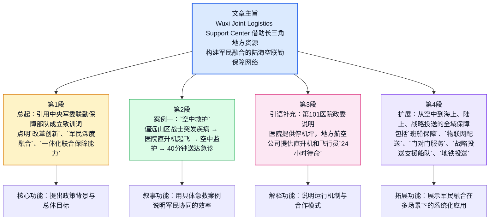
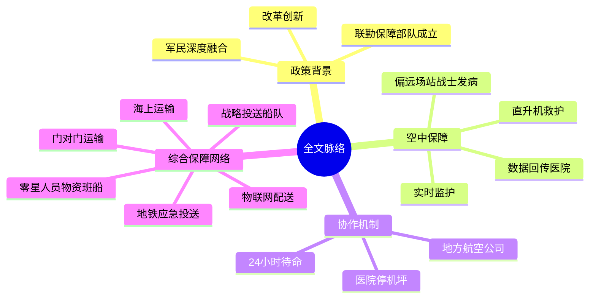

# 无锡联勤保障中心：借力地方优势资源 打造军民陆海空联勤保障新网

**来源**：央视网 / 央视新闻客户端  
**原文日期**：2016-12-30 10:34  
**记者**：高洁、郭彬、陶艳斌  
**原文链接**：[央视网报道](https://m.news.cctv.com/2016/12/30/ARTIEDLFCAFxpZs5kOCee1h8161230.shtml)  
**背景参考**：[央视网相关报道（2017-01-19）](https://news.cctv.com/2017/01/19/ARTI44XQMusy9zvzGiF7PjFd170119.shtml)、[央视网国防部相关背景（2016-09-13）](https://news.cctv.com/2016/09/13/ARTIPTWBZfkeuGOHRSu38yQc160913.shtml)

---

## 前情提要

### 文章来源与基本信息

- **来源网站**：央视网 / 央视新闻客户端
- **题目**：无锡联勤保障中心：借力地方优势资源 打造军民陆海空联勤保障新网
- **发布时间**：2016年12月30日 10:34
- **署名信息**：央视记者 高洁、郭彬、陶艳斌
- **文章体裁**：新闻报道

### 作者背景简介

- **高洁、郭彬、陶艳斌**：根据央视网该文页面可确认三人为本篇报道署名记者，属于**中央广播电视总台/央视新闻系统的新闻采编人员**。公开页面可确认其记者身份，但未检索到权威且细化到个人履历的公开作者简介，因此这里只能据央视署名信息标注为**央视记者**，不对其教育背景、履历作无依据推断。

---

## 文章结构信息图

---

## 逐句精读

🔸**题目：** 无锡联勤保障中心：借力地方优势资源 打造军民陆海空联勤保障新网  
🔹**English:** Wuxi Joint Logistics Support Center: Leveraging Local Resource Advantages to Build a New Civil-Military Joint Logistics Support Network Across Land, Sea, and Air

> **`leverage` /ˈlevərɪdʒ/** *v.* to use something to maximum advantage 充分利用  
> 中文：`利用；借助……的优势`  
> 语域：正式；新闻；商务；政策  
> 画龙点睛：`leverage` 是新闻和学术写作中的高频正式词，常替代普通的 `use`。典型搭配有 `leverage resources / leverage advantages / leverage technology`。写作中用它可显著提升表达正式度，但宾语通常应是`资源、优势、平台、经验`等可被“放大利用”的事物。

> **`joint logistics support`** 联勤保障  
> 语域：军事；政策  
> 画龙点睛：这是军事英语中的固定表达。`joint` 强调`跨军种联合`，`logistics support` 指`后勤保障`。考试中若遇到 `joint operations / joint command / joint support`，都可从“联合、协同、一体化”角度理解。

> **`civil-military integration` / `civil-military`** 军民融合；军民两用/军民协同的  
> 语域：政策；军事；公共治理  
> 画龙点睛：`civil-military` 常作前置定语，如 `civil-military cooperation`。理解时不要机械译成“民事-军事”，而要根据上下文处理为`军民协同`、`军民融合`、`军地合作`等更自然表达。

---

### 🔸`习主席`在中央军委联勤保障部队成立致训词中指出，/要`锐意改革创新`，/大力推进改革，/优化制度机制，/提高管理科学水平，/推动军民深度融合发展。  
🔹In his instruction speech delivered at the founding of the CMC Joint Logistics Support Force, President Xi pointed out that it was essential to `press ahead with bold reform and innovation`, `vigorously advance reform`, optimize institutions and mechanisms, improve the scientific level of management, and promote in-depth civil-military integration.

### 背景注释

- **中央军委**：即**中央军事委员会**，英文常译为 **Central Military Commission (CMC)**。
- **联勤保障部队**：2016年中国军队改革背景下组建的重要后勤保障力量，强调跨军种联合保障。
- **致训词**：在政治、军事语境下可理解为具有指示性、纲领性的讲话或训令式讲话，英译常处理为 **instruction speech** 或 **address**。
- **锐意改革创新**：政策新闻中的高频表达，强调以积极姿态推进制度、机制与方法创新。

> **`press ahead with`** 继续推进；大力推进  
> 音标：/pres əˈhed wɪð/  
> 语域：正式；新闻；政策  
> 画龙点睛：这是非常典型的新闻写作短语，语气比 `continue` 更有力度。常见搭配有 `press ahead with reform / negotiations / construction`。翻译时可灵活处理为`继续推进`、`加快推进`、`大力推进`。

> **`bold` /bəʊld/** *adj.* brave and confident; showing willingness to take risks 大胆的；果敢的  
> 中文：`大胆的；有魄力的`  
> 语域：通用；正式；新闻  
> 画龙点睛：`bold reform` 是政策和评论文本中常见搭配，不只是“大胆”，更带有`果断推进、敢于突破`之意。写作里可用于 `bold move / bold plan / bold attempt`，比 `brave` 更适合修饰政策、决定和举措。

> **`institution` /ˌɪnstɪˈtjuːʃn/** *n.* an established system or organization 制度；机构  
> 中文：`制度；机构`  
> 语域：正式；政治；社科  
> 画龙点睛：在政策文本中，`institutions and mechanisms` 常一起出现，通常不是单纯“机构”，而是`制度安排与运行机制`。遇到复数时要特别警惕其抽象义，不能一律译成“机构们”。

> **`integration` /ˌɪntɪˈɡreɪʃn/** *n.* the act of combining parts into a whole 融合；整合  
> 中文：`融合；一体化`  
> 语域：正式；政策；科技；社科  
> 画龙点睛：`integration` 在阅读中极高频，常见于 `economic integration / system integration / civil-military integration`。它强调`部分进入整体、实现协同`，与只表示“合作”的 `cooperation` 不同，程度更深。

---

### 🔸为加快`融入联合作战体系`，/提高`一体化联合保障能力`，/无锡联勤保障中心充分利用长三角地区丰厚的交通、医疗、物联网技术等资源优势，/在空中救护、海上运输、兵力投送等多种领域深度军民融合，/打造新型军民共建的陆海空联勤保障网络体系，/提升后勤核心保障能力。  
🔹To accelerate its `integration into the joint operations system` and enhance its `integrated joint support capability`, the Wuxi Joint Logistics Support Center has made full use of the Yangtze River Delta’s abundant advantages in transportation, medical care, and Internet of Things technologies. It has promoted deep civil-military integration in such fields as airborne medical evacuation, maritime transport, and troop deployment, thereby building a new jointly developed logistics support network across land, sea, and air and strengthening core logistics support capabilities.

### 背景注释

- **无锡联勤保障中心**：联勤保障体系中的区域性中心之一，驻地在江苏无锡。
- **长三角地区**：即**长江三角洲地区**，中国经济最发达、交通和产业配套最密集区域之一。
- **物联网技术**：英文 **Internet of Things (IoT)**，指通过网络实现设备、传感器、平台互联互通。
- **兵力投送**：军事术语，指兵员、装备、力量向任务区域快速运输和部署。
- **陆海空联勤保障网络体系**：强调保障系统覆盖 land, sea and air 三大维度，并形成网络化、体系化协同。

> **`integrate into`** 融入；纳入  
> 音标：/ˈɪntɪɡreɪt ˈɪntuː/  
> 语域：正式；学术；政策  
> 画龙点睛：`integrate into` 强调“进入某个更大的体系并成为其一部分”。常见于 `integrate into the global economy / integrate into a system`。翻译时要体现`融入体系`而非仅仅“加入”。

> **`capability` /ˌkeɪpəˈbɪləti/** *n.* the ability to do something 能力；作战能力  
> 中文：`能力；保障能力`  
> 语域：正式；军事；商务  
> 画龙点睛：`capability` 比 `ability` 更正式，也更常用于组织、系统、装备层面。军事新闻中常见 `combat capability / support capability / deployment capability`。写作中若谈系统性能力，优先选 `capability`。

> **`abundant` /əˈbʌndənt/** *adj.* existing in large quantities 丰富的；充足的  
> 中文：`丰富的；大量的`  
> 语域：正式；新闻；学术  
> 画龙点睛：可替代 `many`、`a lot of`，更书面。常见搭配 `abundant resources / abundant evidence / abundant opportunities`。注意它强调数量或供给充足，语气自然、正式。

> **`deployment` /dɪˈplɔɪmənt/** *n.* the movement or positioning of forces 部署；投送  
> 中文：`部署；投送`  
> 语域：军事；正式  
> 画龙点睛：在军事英语里，`deploy` 和 `deployment` 很核心。`troop deployment` 可指`兵力部署/投送`。做阅读时要按上下文区分“静态部署”与“动态投送”两层含义。

> **`thereby` /ˌðeəˈbaɪ/** *adv.* by that means 从而；因此  
> 中文：`从而；借此`  
> 语域：正式；学术；新闻  
> 画龙点睛：连接前后逻辑非常有用，尤其适合写作中表达“通过前项措施实现后项结果”。句法上常引出结果，较 `so` 更书面，可显著提升文章正式度。

---

### 🔸近日，/空军某偏远山区场站一名战士小李`突发疾病`，/情况危急，/急需到千里之外的解放军第101医院救治。  
🔹Recently, a soldier named Xiao Li at an Air Force station in a remote mountainous area `was suddenly stricken by an illness`. His condition was critical, and he urgently needed to be sent to the PLA 101st Hospital, located a thousand miles away, for treatment.

### 背景注释

- **空军某偏远山区场站**：`场站`在军事语境中通常指承担机场、保障、驻训等任务的基层单位或站点。
- **解放军第101医院**：中国人民解放军体系内医院之一，文中承担紧急救治任务。
- **千里之外**：中文新闻中的概数表达，强调距离遥远，不宜死译为精确数字；英文中可自然处理为 `a thousand miles away` 或 `far away`，此处保留修辞色彩。

> **`be stricken by`** 突患；突然遭受  
> 音标：/ˈstrɪkən baɪ/  
> 语域：正式；新闻；医疗  
> 画龙点睛：这是报道疾病、灾难、打击时很地道的表达，如 `be stricken by cancer / drought / grief`。比普通的 `get sick` 正式很多，适合新闻翻译和写作升级。

> **`critical` /ˈkrɪtɪkl/** *adj.* extremely serious or dangerous 危急的；关键的  
> 中文：`危急的；至关重要的`  
> 语域：通用；医疗；新闻  
> 画龙点睛：熟词僻义重点。很多学生只知道“批评的”，但在医疗和新闻中，`critical condition` 表示`病情危急`。这是高频考点，务必结合语境判断义项。

> **`urgent` /ˈɜːdʒənt/** *adj.* needing immediate action 紧急的  
> 中文：`紧急的；迫切的`  
> 语域：通用；正式；医疗  
> 画龙点睛：`urgent` 常用于 `urgent need / urgent task / urgently need`。和 `emergency` 区别在于：前者偏“迫切需要立即处理”，后者更偏“突发紧急状态/急诊”。

---

### 🔸医院直升机救护中心接到`急救任务`后，/立即指派停放在医院停机坪上的直升机预热并起飞，/医护人员同机抵达，/并利用直升机上的救护设备对小李进行实时监护，/并将血常规、肝肾功等数据传到医院，/40分钟后，/小李就被送到医院急诊室抢救。  
🔹After the hospital’s helicopter rescue center received the `emergency medical mission`, it immediately ordered the helicopter parked on the hospital helipad to warm up and take off. Medical personnel arrived on board and used the aircraft’s rescue equipment to monitor Xiao Li in real time, while transmitting data such as blood routine results and liver and kidney function indicators back to the hospital. Forty minutes later, Xiao Li had been delivered to the emergency room for resuscitation.

### 背景注释

- **直升机救护中心**：相当于 helicopter emergency medical service 的组织节点。
- **停机坪**：英文常用 **helipad**，专指直升机起降平台。
- **血常规、肝肾功**：属于基础医学检测指标，分别对应 blood routine tests / liver and kidney function indicators。
- **急诊室抢救**：英语里可根据场景译为 `emergency treatment`, `resuscitation`, `emergency room care`。此处因病情危急，`resuscitation` 更贴切。

> **`mission` /ˈmɪʃn/** *n.* an important assignment 任务  
> 中文：`任务；使命`  
> 语域：通用；军事；新闻  
> 画龙点睛：`mission` 在军事、航空、医疗救援中都很常见。比 `task` 更正式，且常带有`特定目标与执行属性`。新闻中 `rescue mission / combat mission / medical mission` 都是固定搭配。

> **`on board`** 在机上；在船上；搭载  
> 音标：/ɒn bɔːd/  
> 语域：通用；航空；新闻  
> 画龙点睛：不要只理解成“在董事会”。在交通、航空语境中，它表示`在飞机/船/交通工具上`。写作和口语中都很实用，如 `The doctor was on board the helicopter.`

> **`monitor` /ˈmɒnɪtə(r)/** *v.* to watch and check carefully 监测；监护  
> 中文：`监测；监护`  
> 语域：医疗；科技；新闻  
> 画龙点睛：在医疗语境中，`monitor` 不只是“看着”，而是`持续监测生命体征或病情`。名词 `monitoring` 也很常见，如 `real-time monitoring`，是阅读和写作中的高频专业表达。

> **`indicator` /ˈɪndɪkeɪtə(r)/** *n.* a sign or measurement 指标；标志  
> 中文：`指标`  
> 语域：正式；医疗；经济；科技  
> 画龙点睛：考试阅读中高频，常见于 `economic indicators`、`health indicators`。它比 `sign` 更偏量化、专业。做翻译时，如果上下文涉及检测、评估、统计，多半宜译作`指标`。

> **`resuscitation` /rɪˌsʌsɪˈteɪʃn/** *n.* the act of reviving someone 抢救；复苏  
> 中文：`抢救；复苏`  
> 语域：医疗；正式  
> 画龙点睛：这是医学新闻中的高阶词。比笼统的 `treatment` 更具体，强调`使生命体征恢复`。若文章涉及急诊、重症、心肺复苏等内容，它常是关键线索词。

---

### 🔸通过与航空公司、高速公路交管等部门`深度协作`，/建立空中救援基地，/开辟空中后送“生命通道”。  
🔹Through `close coordination` with airlines, highway traffic management authorities, and other departments, they established an aerial rescue base and opened up an airborne evacuation “lifeline.”

### 背景注释

- **航空公司、高速公路交管等部门**：说明参与主体不仅是军队和医院，也包括地方交通与民航资源。
- **空中后送**：军事和医疗语境中可理解为将伤病员通过空中方式后送到后方医院或更高级别医疗机构，英文可译为 **air evacuation** 或 **aeromedical evacuation**。
- **生命通道**：中文修辞色彩较强，英文常译为 **lifeline**，既保留形象感，也自然。

> **`coordination` /kəʊˌɔːdɪˈneɪʃn/** *n.* the act of organizing things to work together 协调；协作  
> 中文：`协调；协同配合`  
> 语域：正式；新闻；管理  
> 画龙点睛：`coordination` 比 `cooperation` 更强调`统筹与配合过程`。搭配有 `close coordination with`、`policy coordination`。翻译时可根据上下文选 `协调`、`协同`、`联动`。

> **`evacuation` /ɪˌvækjuˈeɪʃn/** *n.* the act of moving people from danger 撤离；后送  
> 中文：`撤离；后送`  
> 语域：军事；医疗；应急  
> 画龙点睛：在普通语境中是“疏散撤离”，在军事医疗语境中可引申为`后送伤员`。因此见到 `medical evacuation` 时要优先译为`医疗后送`，而不是简单的“医疗撤离”。

> **`lifeline` /ˈlaɪflaɪn/** *n.* something essential for survival 生命线；生命通道  
> 中文：`生命线；生命通道`  
> 语域：新闻；比喻；应急  
> 画龙点睛：既可指字面意义上的救生绳，也常作比喻，表示`维系生存的关键渠道`。写作中用于交通、供给、医疗、金融支持等场景都很自然。

---

### 🔸无锡联勤保障中心第101医院政委沈建华：/医院与地方航空公司签订协议，/我们免费为他们提供（院内）停机坪，/地方航空公司派出直升机和飞行员24小时待命，/为我们抢救偏远地区的危重伤员提供了全力保障。  
🔹Shen Jianhua, political commissar of the 101st Hospital under the Wuxi Joint Logistics Support Center, said that the hospital had signed an agreement with a local aviation company: the hospital provided its in-house helipad free of charge, while the company dispatched helicopters and pilots to remain on call 24 hours a day, providing full support for the rescue of critically injured or ill personnel in remote areas.

### 背景注释

- **政委**：即**政治委员**，中国军队体制中的政治工作领导职务，英文常译为 **political commissar**。
- **24小时待命**：英文固定搭配可用 **remain on call 24 hours a day**。
- **危重伤员**：既可包括重伤员，也可包括危重病患，因此翻译时可适度包容为 `critically injured or ill personnel`。

> **`agreement` /əˈɡriːmənt/** *n.* a formal arrangement 协议；约定  
> 中文：`协议；协定`  
> 语域：正式；法律；商务；新闻  
> 画龙点睛：与 `contract` 相比，`agreement` 语义更宽，可指正式协议，也可指一般约定。新闻里 `sign an agreement with` 是高频表达，适合积累为写作模板。

> **`free of charge`** 免费地  
> 音标：/friː əv tʃɑːdʒ/  
> 语域：正式；商务；通用  
> 画龙点睛：比 `for free` 更书面、更适合正式写作。常见于公告、说明、新闻。翻译输出时可根据语境处理为`免费提供`、`不收费`。

> **`on call`** 待命；随时可出动  
> 音标：/ɒn kɔːl/  
> 语域：医疗；军事；职场  
> 画龙点睛：这是非常实用的固定短语，医生、技术人员、救援人员都可 `be on call`。表示`不一定在现场，但必须随时响应`。与 `on duty` 的“正在值班”不同，二者要区分。

> **`critical` /ˈkrɪtɪkl/** *adj.* extremely serious 危重的  
> 中文：`危重的；严重的`  
> 语域：医疗；新闻  
> 画龙点睛：本词再次出现，说明它是本篇核心高频词。尤其与病情、伤情搭配时，多译为`危重`而非“关键”。重复词在真题阅读中往往对应主线信息，值得特别敏感。

---

### 🔸此外，/他们发挥东南沿海水系网路发达、航运企业资源雄厚的优势，/依托地方班船保障零星人员物资，/利用陆军船艇开行固定班船，/选择适型民船组织专船保障，/破解制约战区岛屿部队运输难题；  
🔹In addition, they have capitalized on the advantages of the well-developed waterway network along the southeastern coast and the strong resource base of shipping enterprises. They rely on local scheduled vessels to transport scattered personnel and supplies, operate regular services with Army boats, and select suitable civilian ships for dedicated transport missions, thereby addressing transport difficulties that have constrained island forces in the theater.

### 背景注释

- **东南沿海水系网路发达**：指该地区河网、港口、内河航运和近海运输条件优越。
- **班船**：固定航线、固定班次的船只，可译为 **scheduled vessel/service**。
- **零星人员物资**：指小批量、分散化的人员与物资。
- **战区岛屿部队**：驻守海岛或岛礁地区的部队，运输保障往往受天气、运力和航线制约。
- **专船保障**：为特定任务专门调配船只实施运输保障。

> **`capitalize on`** 充分利用  
> 音标：/ˈkæpɪtəlaɪz ɒn/  
> 语域：正式；新闻；商务  
> 画龙点睛：与 `leverage` 类似，但更强调`抓住并利用某种有利条件`。如 `capitalize on opportunities / advantages / strengths`。写作中用于说明“把优势转化为成果”很地道。

> **`scheduled` /ˈʃedjuːld/ or /ˈskedʒuːld/** *adj.* arranged to happen at a particular time 定期的；按班次的  
> 中文：`定期的；定班的`  
> 语域：交通；新闻；通用  
> 画龙点睛：`scheduled service / scheduled flight / scheduled vessel` 都表示按固定时刻表运行。阅读时要和 `regular` 区分：二者都可译“定期”，但 `scheduled` 更突出“排定时刻表”。

> **`dedicated` /ˈdedɪkeɪtɪd/** *adj.* designed for one purpose 专用的；专门的  
> 中文：`专用的；专门调配的`  
> 语域：正式；技术；新闻  
> 画龙点睛：除了“有奉献精神的”，它还有常见引申义“专门用途的”。如 `dedicated line / dedicated team / dedicated ship`。这属于典型熟词僻义，考试很爱考。

> **`constrain` /kənˈstreɪn/** *v.* to limit or restrict 限制；制约  
> 中文：`限制；制约`  
> 语域：正式；学术；新闻  
> 画龙点睛：比 `limit` 更正式，常见于政策、经济、科技文章。名词是 `constraint`，高频搭配有 `resource constraints`、`institutional constraints`。写作时非常好用。

---

### 🔸运用驻地先进的物联网技术，/实现战备物资运输配送直达战场，/并协调运用区域内各种运力，/采用立体联运、江海直达运输等多种方式，/让“门对门”服务取代“多次倒运”；  
🔹By applying advanced local Internet of Things technologies, they have enabled combat-readiness supplies to be transported and delivered directly to the battlefield. They have also coordinated the use of various transport capacities within the region and adopted multiple approaches—including multimodal transport and direct river-sea shipping—so that `door-to-door` service can replace repeated transshipment.

### 背景注释

- **战备物资**：保障部队战备、训练和行动所需的重要物资，英文可处理为 **combat-readiness supplies**。
- **运力**：指可调用的运输能力、运输资源，如车、船、飞机、铁路等。
- **立体联运**：多运输方式协同联运，可理解为 **multimodal transport**。
- **江海直达运输**：river-sea direct transport，指船只或运输链路直接贯通江河与海运系统。
- **门对门服务**：物流领域常见说法，指从起点到终点的直接交付。

> **`enable` /ɪˈneɪbl/** *v.* to make possible 使能够；使成为可能  
> 中文：`使能够；促成`  
> 语域：正式；科技；新闻  
> 画龙点睛：这是写作中的万能升级词，比 `make` 更正式。典型结构：`enable sb/sth to do sth` 或 `enable sth`。常用于科技、政策、制度效果描述。

> **`capacity` /kəˈpæsəti/** *n.* ability or amount available 容量；能力；运力  
> 中文：`能力；运力；承载能力`  
> 语域：正式；物流；经济  
> 画龙点睛：在运输和产业语境里，`capacity` 常不是“容量”而是`产能/运力/处理能力`。阅读时要根据行业语境准确判断，不能机械套义。

> **`multimodal transport`** 多式联运；立体联运  
> 语域：物流；交通；正式  
> 画龙点睛：由 `multi-` 和 `modal` 构成，指多种运输方式联动，如公铁水空联运。若用于写作，可展示你对物流、供应链类话题的专业表达能力。

> **`transshipment` /trænsˈʃɪpmənt/** *n.* the transfer of goods from one vehicle to another 转运；倒运  
> 中文：`转运；多次倒运`  
> 语域：物流；航运；正式  
> 画龙点睛：这是物流新闻中的专业词。和普通的 `transport` 不同，它强调`中途换装、转接`。本句里 `repeated transshipment` 正好对应中文“多次倒运”。

> **`door-to-door`** 门到门的；门对门的  
> 音标：/ˌdɔː tə ˈdɔː/  
> 语域：物流；商务  
> 画龙点睛：物流、快递、国际贸易高频表达。作定语时通常加连字符，如 `door-to-door service`。也可在口语里引申表示“挨家挨户”，需按语境区分。

---

### 🔸依托地方国有大型交通运输企业组建战略投送支援船队，/助推民船国防潜力转化为军事`实力`，/提升战略投送和海上支援保障能力；  
🔹Relying on large state-owned local transportation enterprises, they have formed a strategic projection support fleet, helping convert the national defense potential of civilian ships into military `capability` and enhancing strategic projection as well as maritime support capacities.

### 背景注释

- **国有大型交通运输企业**：指地方大型国有航运、港航或综合运输企业。
- **战略投送**：军事术语，强调远距离、大规模、快速地输送兵力和物资，英文常见 **strategic projection** 或 **strategic mobility**。
- **民船国防潜力**：即民用船舶在国防动员、兵力投送、海上支援中可转化利用的能力。
- **实力**：在军事新闻中，很多时候并非泛泛的“power”，更偏向体系性保障能力，因此此处译为 `capability` 更稳妥。

> **`projection` /prəˈdʒekʃn/** *n.* the act of extending power or force outward 投送；投射  
> 中文：`投送；力量投射`  
> 语域：军事；国际关系；正式  
> 画龙点睛：在军事语境中，`power projection`、`strategic projection` 都是高频术语。它强调把力量从一地迅速延伸到另一地，不只是“投影”这个基础义。

> **`convert ... into ...`** 将……转化为……  
> 音标：/kənˈvɜːt ... ˈɪntuː/  
> 语域：正式；通用；科技；经济  
> 画龙点睛：这是写作中非常高频且高价值的结构，可用于表达资源、潜力、优势、问题、能量等的转化。比简单的 `become` 更精确，逻辑关系也更清晰。

> **`potential` /pəˈtenʃl/** *n./adj.* capacity that could develop 潜力；潜在的  
> 中文：`潜力；潜在能力`  
> 语域：通用；正式；经济；军事  
> 画龙点睛：`potential` 常与 `realize / unlock / tap / convert` 搭配。写作时，用于论述“尚未完全开发的能力”非常合适，如 `growth potential`、`defense potential`。

> **`maritime` /ˈmærɪtaɪm/** *adj.* connected with the sea 海上的；海事的  
> 中文：`海上的；海事的`  
> 语域：正式；航运；军事  
> 画龙点睛：比 `marine` 更常用于航运、法律、地缘政治和军事新闻。搭配有 `maritime transport / maritime security / maritime support`。是海洋类阅读的核心词之一。

---

### 🔸协调某部驻地地铁公司签订应急保障协议，/使轻装部队城市投送能力大幅提升。  
🔹They also coordinated with a local metro company where a certain unit was stationed to sign an emergency support agreement, significantly improving the urban deployment capability of lightly equipped troops.

### 背景注释

- **地铁公司**：说明城市公共交通系统也被纳入应急保障和兵力投送网络。
- **应急保障协议**：在突发情况下调用地方交通资源的制度化安排。
- **轻装部队**：指携带较轻装备、便于快速机动的部队。
- **城市投送能力**：即部队在城市空间内快速输送和部署的能力。

> **`metro` /ˈmetrəʊ/** *n.* subway system 地铁  
> 中文：`地铁；城市轨道交通`  
> 语域：通用；城市交通  
> 画龙点睛：英式英语中 `metro`、`underground`、`subway` 可能交替出现。正式翻译时若强调系统运营主体，常说 `metro company` 或 `urban rail operator`。

> **`emergency` /ɪˈmɜːdʒənsi/** *adj./n.* sudden serious situation 紧急情况；应急的  
> 中文：`紧急情况；应急的`  
> 语域：通用；政府；医疗；应急  
> 画龙点睛：`emergency support agreement` 这种搭配非常有现实感。写作中可积累 `emergency response / emergency services / emergency plan` 等表达，适用于公共治理、灾害、医疗话题。

> **`lightly equipped`** 轻装的；装备较轻的  
> 语域：军事  
> 画龙点睛：这是按意义自然转换出的军事表达。`lightly armed / lightly equipped troops` 都可表示轻装机动部队。阅读中遇到 `light` 不一定是“轻的”，要结合军事场景理解其机动性含义。

> **`significantly` /sɪɡˈnɪfɪkəntli/** *adv.* in an important or noticeable way 显著地；大幅地  
> 中文：`显著地；大幅地`  
> 语域：正式；学术；新闻  
> 画龙点睛：这是写作中替换 `greatly / a lot` 的高频副词。适合描述数据变化、能力提升、影响增强。与 `substantially`、`markedly` 近义，可灵活互换。

---

### 🔸（央视记者 高洁 郭彬 陶艳斌）  
🔹(CCTV reporters Gao Jie, Guo Bin, and Tao Yanbin)

### 背景注释

- 这是本文署名记者信息。
- 新闻署名有助于判断文本来源的采编主体与媒介属性。

> **`reporter` /rɪˈpɔːtə(r)/** *n.* a journalist who reports news 记者  
> 中文：`记者`  
> 语域：新闻；通用  
> 画龙点睛：`reporter` 是新闻采编前线岗位；与 `journalist` 相比，它更强调采写、出镜、现场报道等具体报道职责。考试中二者有时可互换，但细微侧重点不同。

---

## 补充说明：原文整理后的有效正文范围

你提供的文本中，夹杂了大量网页导航、推荐阅读、广告下载提示、排行榜、页脚备案信息等。这些都属于**网页噪音信息**，不属于新闻正文，已在精读时剔除。真正需要精读的核心内容包括：

1. 标题
2. 正文4个自然段
3. 记者署名

如需继续扩展，可另行补充：**全文高质量英译整合版**、**主题词汇表（雅思/考研/GRE）**、**逐句语法树分析**、**可直接背诵的中英对照版本**等模块。
