## 基本信息

- 文章来源：央视网《正午国防军事》 20260422 英雄回家 [1](https://tv.cctv.com/2026/04/22/VIDEL359hXnLaBXkpLKkamTP260422.shtml)
- 节目题目：`《正午国防军事》 20260422 英雄回家`
- 来源平台：中央广播电视总台国防军事频道 / 央视网
- 页面更新时间：`2026年04月22日 14:43`
- 编辑：`刘洁`
- 责任编辑：`刘慧`
- 节目页性质：这是央视网发布的节目页面，正文为电视特别节目的播出内容与直播解说。
- 编发背景说明：节目页未署名单一记者，公开页面可确认其为央视网节目内容页面，`刘洁` 与 `刘慧` 为页面所标注的编发/责任编辑人员；公开可靠检索结果未见更详细、可稳定核验的个人履历信息，因此此处不作扩展性推断。
- 事实核对参考：
  - 新华网：第十三批在韩中国人民志愿军烈士遗骸今日回国 [2](https://www.news.cn/politics/20260422/fec90eb9310c4410bf437aea11152467/c.html)
  - 新华网：中国连续十三年迎回在韩志愿军烈士遗骸 [3](https://www.news.cn/20260422/a9ca161d6ecf4d67bc9e8b62b9b98b9a/c.html)
  - 央视网相关节目页 [1](https://tv.cctv.com/2026/04/22/VIDEL359hXnLaBXkpLKkamTP260422.shtml)

---

## 前情提要

```mermaid
flowchart TB
    A["开篇抒情与历史回望<br/>Opening invocation<br/>山河共盼 · 英雄回家 · 76周年"] --> B["演播室导语<br/>Studio lead-in<br/>专机已启程 · 沈阳准备就绪"]
    B --> C["机场前方连线<br/>Live from airport<br/>五机编队 · 低空通场 · 水门礼"]
    C --> D["礼兵与迎回细节<br/>Honor guard details<br/>棺椁托举 · 步幅步速 · 训练强度"]
    D --> E["社会各界迎接<br/>Public participation<br/>老兵 · 家属 · 学生 · 港澳台代表"]
    E --> F["陵园前方连线<br/>Live from cemetery<br/>安葬准备 · 花束哀思 · 杨根思"]
    F --> G["遗物与身份确认<br/>Artifacts & identification<br/>DNA比对 · 钱坤华画像"]
    G --> H["中韩交接与官方表态<br/>Handover & statement<br/>仁川机场 · 交接书 · 1023位"]
    H --> I["空中迎回直播解说<br/>Airborne reception live<br/>运-20B · 歼-20 · 双20同框"]
    I --> J["呼号与象征意义<br/>Call signs & symbolism<br/>荣归50 · 红鹰 · 历史回响"]
    J --> K["降落与过水门<br/>Landing & water salute<br/>最高礼遇 · 告慰先烈"]
    K --> L["联检登机与棺椁整理<br/>Ground procedure<br/>边检海关 · 固定架 · 防撞条"]
    L --> M["迎回仪式正式举行<br/>Formal ceremony<br/>国歌 · 三鞠躬 · 迎棺椁"]
    M --> N["灵车启程赴陵园<br/>Convoy departure<br/>骑警护卫 · 车载条幅 · 山河无恙"]
    N --> O["结尾与次日安葬预告<br/>Closing & burial preview<br/>4月23日沈阳安葬"]

    classDef c1 fill:#E3F2FD,stroke:#1E88E5,color:#0D47A1,stroke-width:1.5px;
    classDef c2 fill:#E8F5E9,stroke:#43A047,color:#1B5E20,stroke-width:1.5px;
    classDef c3 fill:#FFF3E0,stroke:#FB8C00,color:#E65100,stroke-width:1.5px;
    classDef c4 fill:#F3E5F5,stroke:#8E24AA,color:#4A148C,stroke-width:1.5px;
    classDef c5 fill:#FCE4EC,stroke:#D81B60,color:#880E4F,stroke-width:1.5px;

    class A,B c1;
    class C,D,E c2;
    class F,G c3;
    class H,I,J,K c4;
    class L,M,N,O c5;
```

本篇整体推进逻辑非常清晰：

- 前段先以`抒情性纪念话语`打开情感场域，再迅速切入`新闻直播状态`。
- 中段由两个现场并行展开：一条线是`机场迎回`，一条线是`陵园安葬准备`。
- 后段将`国家礼仪`、`军事装备象征`、`历史记忆`与`现实护送流程`交织在一起，形成强烈的仪式叙事。
- 语言风格上，兼有`电视新闻播报体`、`纪念性抒情体`与`现场直播口语体`三种文体。

---

## 逐句精读

以下按播出顺序连续编排，**共 20 个结构段**（部分段因篇幅分为「续」）；已删除生成过程中的对话式过渡句，段与段直接衔接。

### 第1部分：开场至“大家在默默等候着英雄的归来。”

---

🔸 `山河共盼`，/ `英雄回家`！  
🔹 `The whole land waits in hope` / as `its heroes return home`!

背景注释：这里的“英雄”在语境中指`在韩中国人民志愿军烈士`；“回家”不仅指遗骸回国，也带有强烈的国家记忆与仪式性修辞色彩。

> **`wait in hope`** /weɪt ɪn hoʊp/ phr. to wait while holding a strong expectation that something meaningful will happen; `怀着希望等待，殷切期盼`。语域：正式 / 抒情 / 新闻评论。
> 画龙点睛：这是很适合写作提分的表达，比普通的 `wait for` 更有情感张力。可用于国家、公众、家属、社会群体共同期待的场景，如 `The nation waited in hope.` 注意它强调“带着盼望等待”，不是单纯客观等待。

> **`return home`** /rɪˌtɝːn ˈhoʊm/ phr. to go back to one’s homeland, family, or rightful place; `回家，回到祖国/故土/归属之地`。语域：通用 / 纪念 / 新闻。
> 画龙点睛：`return` 本身已含“回来”之意，但搭配 `home` 后情感色彩显著增强，常见于军人归来、遗骸归国、流离者返乡等语境。写作中它比 `come back` 更庄重，也更适合纪念性文本。

---

🔸 各位，/ 您正在收看的是 / 中央广播电视总台国防军事频道《正午国防军事》`英雄回家特别节目`，/ 本期报道 `第十三批在韩中国人民志愿军烈士遗骸回国`。  
🔹 You are now watching / a `special edition` of *Midday National Defense and Military* on CMG’s National Defense and Military Channel, / featuring the return to China of `the 13th batch of the remains of Chinese People’s Volunteers martyrs from South Korea`.

背景注释：
- `中央广播电视总台`常译为 `China Media Group (CMG)`。
- `在韩中国人民志愿军烈士遗骸` 指在韩国境内发现、整理并经中韩双方交接的中国人民志愿军烈士遗骸。
- `第十三批` 按官方报道对应 `2026年4月22日` 的交接与迎回工作。

> **`special edition`** /ˌspeʃəl ɪˈdɪʃn/ n. a specially produced version of a program, newspaper, or publication for an important event; `特别节目；特别版`。语域：媒体 / 新闻。
> 画龙点睛：在媒体英语里非常常见，适合翻译“特别报道、特别节目、特别刊”。若强调“专题报道”，还可用 `special coverage`；若强调“特别一期节目”，`special edition` 更贴切。写作中可自然搭配 `watch`, `broadcast`, `release`, `air`。

> **`remains`** /rɪˈmeɪnz/ n. the dead body or bones of a person, especially after death in war or long burial; `遗骸，遗体残存部分`。语域：正式 / 法务 / 历史 / 新闻。
> 画龙点睛：这是处理战争、考古、纪念与法医学语境时的高频正式词。不可随意和日常的 `body` 混用；`body` 更中性直接，`remains` 更庄重，也更适合历史与哀悼场景。常见搭配：`human remains`, `identify the remains`, `return the remains`。

---

🔸 今年 / 是中国人民志愿军 `抗美援朝出国作战76周年`。  
🔹 This year `marks the 76th anniversary` of the Chinese People’s Volunteers’ entry into the war to `Resist U.S. Aggression and Aid Korea`.

背景注释：
- `抗美援朝` 是中国官方历史叙事中的固定表述，对应英语里常译为 `the War to Resist U.S. Aggression and Aid Korea`。
- 从`1950年`中国人民志愿军入朝作战算起，到`2026年`为`76周年`。
- 学术或国际史学语境中，也常将该战争整体置于 `the Korean War` 的框架下讨论。

> **`mark`** /mɑːrk/ v. to signify, celebrate, or officially recognize an event or occasion; `标志着；纪念`。语域：正式 / 新闻 / 演讲。
> 画龙点睛：`mark an anniversary / milestone / occasion` 是新闻英语中的黄金搭配。它不是“做标记”那层日常义，而是熟词僻义中的“纪念、迎来、标志”。写作时比 `be` 更有书面感，例如 `This year marks...` 很适合开头句。

> **`anniversary`** /ˌænɪˈvɝːsəri/ n. the yearly recurrence of a date remembering an important event; `周年纪念日，周年`。语域：通用 / 正式。
> 画龙点睛：考试中高频，注意与 `birthday` 区分：前者纪念“事件”，后者纪念“出生”。常见搭配有 `the 50th anniversary of...`、`commemorate an anniversary`。写作中若想更庄重，可与 `mark`, `commemorate`, `observe` 连用。

---

🔸 `76年前`，/ 我们最可爱的 / 中国人民志愿军战士。  
🔹 `Seventy-six years ago`, / the soldiers of the Chinese People’s Volunteers — `the nation’s most beloved sons` — stepped onto the stage of history.

背景注释：
- “`最可爱的人`”是中国现代政治与文学表达中的经典称谓，常用来指中国人民志愿军战士。
- 原句在口语播报中带有停顿，语法上并非完整句；英译时需适度补足，使其自然成句。

> **`beloved`** /bɪˈlʌvd/ adj. dearly loved; `深受爱戴的，备受珍爱的`。语域：正式 / 文学 / 纪念。
> 画龙点睛：`beloved` 常出现在纪念文体、悼词、演讲稿中，比 `loved` 更庄重、更凝练。可用于 `a beloved leader`, `a beloved teacher`, `our beloved homeland`。翻译“最可爱的人”时，直接硬译为 `the loveliest people` 不够庄重，`beloved` 更稳妥。

---

🔸 为了 `祖国`，/ 为了 `世界和平`，/ `义无反顾` 走上战场。  
🔹 For `the motherland` / and for `world peace`, / they went to war `without hesitation`.

背景注释：这是典型的纪念性叙述句，突出战争参与的价值目标：国家安全与和平理想。`义无反顾` 带有明显的道义决断色彩。

> **`motherland`** /ˈmʌðərˌlænd/ n. one’s native country, especially viewed with strong emotional attachment; `祖国`。语域：正式 / 政治 / 抒情。
> 画龙点睛：`motherland` 情感色彩浓，常见于演讲、纪念、政治文本。与较中性的 `country` 不同，它突出归属感、情感连接和牺牲叙事。写作中要看场合：议论文、历史题材可用，普通日常表达常用 `country` 或 `homeland`。

> **`without hesitation`** /wɪˈðaʊt ˌhezɪˈteɪʃn/ phr. immediately and decisively, with no doubt or delay; `毫不犹豫地，义无反顾地`。语域：通用 / 书面。
> 画龙点睛：可用于人物品质描写，尤其适合“责任、勇气、选择”类写作。替换简单的 `immediately`、`at once` 时，它能多出“心理上的坚定”这一层含义。常搭配：`act without hesitation`, `step forward without hesitation`。

---

🔸 一张张 `年轻的面庞`，/ `雄赳赳气昂昂`。  
🔹 `Young faces` / were filled with `undaunted pride and resolve`.

背景注释：
- `雄赳赳，气昂昂` 是极具时代记忆的表达，也与《中国人民志愿军战歌》中的著名歌词形成呼应。
- 原句为高度凝练的抒情短句，英译不宜逐字死译，应转化为具有精神状态描写的自然表达。

> **`undaunted`** /ʌnˈdɔːntɪd/ adj. not discouraged, frightened, or weakened; `不屈的，无所畏惧的`。语域：正式 / 文学 / 新闻特写。
> 画龙点睛：这是写人物精神状态的高阶词，常用于战争、灾难、奋斗叙事，如 `remain undaunted`。比 `brave` 更强调“在压力之下依旧不退缩”。GRE、考研写作中用它描写群体意志，表达会更高级。

> **`resolve`** /rɪˈzɑːlv/ n. firm determination to do something; `决心，坚定意志`。语域：正式 / 新闻 / 演讲。
> 画龙点睛：注意这里是名词，不是动词“解决”。新闻中常见 `show resolve`, `demonstrate resolve`, `political resolve`。写作时若想表达“不是一时冲动，而是坚定意志”，`resolve` 很好用。

---

🔸 `跨过鸭绿江`。  
🔹 They `crossed the Yalu River`.

背景注释：
- `鸭绿江` 英语常作 `the Yalu River`，是中朝界河。
- 这里与上一句共同构成对《中国人民志愿军战歌》核心意象的呼应。
- 中文原句省略主语，英译自然补出 `They`。

> **`cross`** /krɔːs/ v. to go from one side to the other of a river, road, border, etc.; `跨过，越过`。语域：通用。
> 画龙点睛：最基本但极高频的动词。历史叙事里，`cross the river / border` 常具有象征意义，表示行动正式开始。注意 `cross` 直接接宾语，不说 `cross over the river` 也可以；若强调“越过到另一边”，`cross over` 更口语、更动态。

---

🔸 他们 / 以 `血肉之躯` / 为新中国 `赢得了胜利和尊严`，/ 赢得了祖国 `和平稳定发展强大` 的今天。  
🔹 With `their flesh and blood`, / they `won victory and dignity` for New China, / and made possible the `peace, stability, development, and strength` the country enjoys today.

背景注释：
- `新中国` 指 `1949年`成立的中华人民共和国。
- 这一句是典型的纪念修辞：通过“先烈牺牲”与“今日国家发展”之间的因果联系，强化历史—现实的连续性。
- `血肉之躯` 不是字面“身体”而已，而是突出“以凡人之身承受战争”。

> **`flesh and blood`** /ˌfleʃ ən ˈblʌd/ n. the human body and its vulnerability; by extension, living human beings in their physical reality; `血肉之躯；有血有肉的人身`。语域：正式 / 文学 / 修辞。
> 画龙点睛：该表达常用于强调人的脆弱与真实，从而凸显牺牲的重量。不要机械理解成生物学意义。写作中若描写战争、苦难、生命代价，它比 `body` 更有震撼力；固定搭配还有 `one’s own flesh and blood`，意为“亲骨肉”。

> **`dignity`** /ˈdɪɡnəti/ n. the quality of being worthy of honor and respect; `尊严，体面，庄严`。语域：正式 / 政治 / 伦理。
> 画龙点睛：这是阅读和写作中的核心价值词。它可指个人尊严，也可指国家尊严。常见搭配：`national dignity`, `live with dignity`, `defend one’s dignity`。翻译“尊严”时，`honor` 有时也可用，但 `dignity` 更强调“不可被践踏的价值与地位”。

---

🔸 `您的牺牲`，/ 祖国 `永远记得`。  
🔹 `Your sacrifice` / will `forever be remembered` by the motherland.

背景注释：这里使用第二人称“您”，形成面对英烈的直接呼告，增强仪式感与情感强度。

> **`sacrifice`** /ˈsækrɪfaɪs/ n. the act of giving up one’s life, comfort, or interests for a greater cause; `牺牲；奉献`。语域：正式 / 历史 / 纪念。
> 画龙点睛：既可作名词，也可作动词。战争语境里常指“为更高目标付出生命代价”。注意 `make sacrifices` 表示“作出牺牲”；`a sacrifice for peace/freedom` 也是高频搭配。写作中它是价值判断很强的词，适合庄重语境。

> **`remember`** /rɪˈmembər/ v. to keep someone or something in one’s mind, especially with honor or emotion; `记得；铭记`。语域：通用。
> 画龙点睛：看似基础，却有非常重要的引申用法。纪念语境中的 `remember` 往往不是一般“记住”，而是“铭记、纪念”。可搭配 `always remember`, `be remembered for`, `remember the fallen`。基础词用对，往往比生僻词更有力量。

---

🔸 `您的奉献`，/ 山河 `从未忘怀`。  
🔹 `Your devotion` / has `never been forgotten` by this land.

背景注释：“山河”在中文纪念语境中常不是单指自然地理，而是国家、故土、人民与历史共同体的象征。

> **`devotion`** /dɪˈvoʊʃn/ n. great love, loyalty, and commitment to a person, cause, or duty; `奉献；忠诚；挚爱`。语域：正式 / 书面。
> 画龙点睛：`devotion` 兼有“情感投入”与“长期忠诚付出”两层意思，语义比 `contribution` 更深。可搭配 `devotion to duty`, `devotion to one’s country`。翻译“奉献”时，如果强调精神与忠诚，优先考虑它；若强调具体贡献，可用 `contribution`。

> **`forget` / `be forgotten`** /fəˈɡet/ v. / passive phr. to fail to remember; in passive form, to fade from collective memory; `忘记；被遗忘`。语域：通用。
> 画龙点睛：纪念类文本中，`never be forgotten` 是非常有力量的固定句式，简洁而庄重。写作时可与 `those who gave their lives`、`their names`、`their deeds` 等搭配，形成庄严的纪念语气。

---

🔸 `思念无声`，/ 却可 `跨越山海`。  
🔹 `Remembrance is silent`, / yet it can `cross mountains and seas`.

背景注释：
- “山海”在中文中常构成宏大空间意象，表示地理阻隔之远。
- 英译中用 `remembrance` 比 `missing` 更庄重，也更适合纪念英烈的语境。

> **`remembrance`** /rɪˈmembrəns/ n. the act of remembering someone, especially with respect, grief, or honor; `怀念，追思，纪念`。语域：正式 / 纪念。
> 画龙点睛：比 `memory` 更强调“纪念行为”和“追思情感”，常用于纪念日、悼词、墓园、战争纪念活动，如 `a day of remembrance`。翻译“思念”时，如果不是私人恋爱语境，而是庄重哀思，`remembrance` 很合适。

> **`cross mountains and seas`** /krɔːs ˈmaʊntənz ən siːz/ phr. to travel across great distances, literal or metaphorical; `跨越山海；跨越重重阻隔`。语域：抒情 / 演讲。
> 画龙点睛：这是很好的英译化表达，既保留中文意象，又不显生硬。写作中可用于描写记忆、友谊、文化传播、情感连接等“穿越距离”的抽象主题。

---

🔸 今天，/ 祖国 / 以 `最高礼遇` / 接您回家。  
🔹 Today, / the motherland welcomes you home / with `the highest honors`.

背景注释：
- 这里的“最高礼遇”在后文会具体体现为`歼-20护航`、`五机编队低空通场`、`过水门`等。
- “接您回家”延续了前文的第二人称呼告结构。

> **`honor`** /ˈɑːnər/ n. high respect or official recognition; `荣誉；敬意；礼遇`。语域：正式 / 官方 / 军事。
> 画龙点睛：在纪念和外交语境中，`honors` 常不是抽象“荣誉”而是具体“礼遇、礼节、仪式待遇”，如 `military honors`, `full honors`, `state honors`。翻译“最高礼遇”时，用 `the highest honors` 非常地道。

> **`welcome ... home`** /ˈwelkəm ... hoʊm/ phr. to receive someone returning with warmth, dignity, or ceremony; `迎接……回家`。语域：通用 / 抒情 / 新闻。
> 画龙点睛：这是典型的英语温情表达，既可用于家庭场景，也可用于国家迎回军人、运动员、遗骸等庄重场景。比单纯 `receive` 更有人情味和归属感，特别适合纪念文本。

---

🔸 今天上午 `9:50`，/ 接迎第13批12位在韩中国人民志愿军烈士遗骸的专机 / 已经从 `韩国起飞`。  
🔹 At `9:50 this morning`, / the aircraft sent to bring back the remains of the `12 martyrs of the 13th batch` from South Korea / had already `taken off from South Korea`.

背景注释：
- 这里的“今天”对应节目播出当天，即`2026年4月22日`。
- 根据官方通稿，专机于韩国仁川起飞，执行的是第十三批在韩志愿军烈士遗骸接迎任务。
- `第13批12位` 这一数字信息在整篇报道中反复出现，是新闻信息密度极高的核心事实点。

> **`take off`** /teɪk ɔːf/ v. of an aircraft, to leave the ground and begin flying; `起飞`。语域：通用 / 航空 / 新闻。
> 画龙点睛：航空新闻的绝对高频词。其反义搭配是 `land`。注意它还有熟词僻义，如“突然流行、事业起飞”。阅读中需根据语境辨义。与飞机搭配时常见：`take off from + 地点`。

> **`batch`** /bætʃ/ n. a group of things or people dealt with together at one time; `一批，一组`。语域：通用 / 正式 / 行政。
> 画龙点睛：`batch` 在新闻里经常用于“分批次交接、移送、生产、处理”。如 `the latest batch of aid`, `the first batch of students`。与 `group` 相比，`batch` 更突出“按程序或时间分次处理”的意味。

---

🔸 那此刻，/ `沈阳桃仙国际机场` / 已经 `做好了准备`。  
🔹 At this moment, / `Shenyang Taoxian International Airport` / is already `fully prepared`.

背景注释：`沈阳桃仙国际机场` 是本次专机降落和迎回仪式举行地点。节目中“此刻”对应直播现场时态，营造新闻进行中的临场感。

> **`be prepared`** /bi prɪˈperd/ phr. to be ready for an event, action, or responsibility; `做好准备`。语域：通用 / 新闻。
> 画龙点睛：这是基础但很实用的结构。若强调“完全准备就绪”，可说 `be fully prepared`、`be in place`。新闻报道中常写成 `All preparations have been completed.`，更正式；口语直播里 `is fully prepared` 更自然。

> **`at this moment`** /æt ðɪs ˈmoʊmənt/ phr. now, at the exact present time being referred to; `此刻，此时`。语域：新闻直播 / 口语 / 书面。
> 画龙点睛：直播连线和新闻转场的常用时间提示语。它比简单的 `now` 更具镜头感与现场感。写作中若需要制造“读者仿佛在场”的效果，可以适度使用。

---

🔸 马上 / 我们来 `连线前方记者`。  
🔹 In just a moment, / we will `go live to our reporter on the scene`.

背景注释：这是电视直播语言中的典型转场句。“前方记者”并非字面上的“front reporter”，而是指`在事发现场、直播一线的记者`。

> **`go live to`** /ɡoʊ laɪv tuː/ phr. to switch a broadcast to a reporter or camera at another location in real time; `连线到……；切到……现场直播`。语域：媒体 / 直播。
> 画龙点睛：极地道的广播电视表达。不要直译成 `connect with`，那样技术意味太强、媒体感不够。新闻英语里常见：`We now go live to...`、`Let's go live to our correspondent in...`。

> **`on the scene`** /ɑːn ðə siːn/ phr. present at the place where something is happening; `在现场`。语域：新闻 / 通用。
> 画龙点睛：非常常考的新闻短语。它既能修饰记者 `a reporter on the scene`，也能修饰警方、医护等。与 `at the scene` 接近，但 `on the scene` 更像固定新闻搭配。

---

🔸 `蓉蓉` 你好，/ 来给我们介绍一下 / 你在 `现场看到的、感受到的情况`。  
🔹 Hello, `Rongrong`. / Please tell us / what you can `see and feel on the scene`.

背景注释：这是演播室主持人与现场记者之间的直播对话。中文里的“看到的、感受到的”体现电视直播不仅追求信息，也强调氛围、情绪与临场感。

> **`on the scene`** /ɑːn ðə siːn/ phr. at the place where the event is happening; `在现场`。语域：新闻。
> 画龙点睛：这一短语值得反复掌握。它既能表示记者位置，也能扩展到叙事角度，如 `Witnesses on the scene said...`。新闻阅读里出现频率很高。

> **`introduce / give an introduction to`** /ˌɪntrəˈduːs/ v. / phr. to present or describe something to others; `介绍，说明`。语域：通用。
> 画龙点睛：中文“介绍一下情况”如果机械译成 `introduce the situation` 略显生硬。直播语境里更自然的是 `tell us`, `walk us through`, `bring us up to date on`。这类替换很能提升口语与写作自然度。

---

🔸 好的，/ 林泉。  
🔹 Certainly, / Linquan.

背景注释：这是现场记者对主持人的回应。中文直播口语中的“好的”常并非表示“内容好”，而是表示`收到、接续、开始回答`。

> **`certainly`** /ˈsɝːtnli/ adv. used to show agreement or readiness to do something; `好的；当然；没问题`。语域：通用 / 礼貌表达。
> 画龙点睛：在英语里，回应主持人或采访者时，用 `Certainly.`、`Of course.`、`Sure.` 都可，但正式播报语境中 `Certainly` 更稳。写作和口语中要根据语域选词：`sure` 更口语，`certainly` 更正式。

---

🔸 我现在 / 是在 `迎回仪式现场`，/ 距离 `专机停机坪最近的位置`。  
🔹 I am now / at `the site of the reception ceremony`, / at the point `closest to the special aircraft apron`.

背景注释：
- “迎回仪式现场”指沈阳桃仙国际机场内接迎烈士遗骸归国的正式礼仪区域。
- `停机坪` 在航空语境中常译作 `apron`，也可根据上下文用 `tarmac`，但 `apron` 更专业。

> **`ceremony`** /ˈserəˌmoʊni/ n. a formal public or religious occasion; `仪式，典礼`。语域：通用 / 正式。
> 画龙点睛：这是纪念报道中的高频词。可搭配 `reception ceremony`, `handover ceremony`, `burial ceremony`, `memorial ceremony`。写作中若要区分：`ceremony` 偏正式礼仪活动，`event` 更宽泛，`ritual` 更强调程序和象征。

> **`apron`** /ˈeɪprən/ n. the area of an airport where aircraft are parked, loaded, or serviced; `机场停机坪，机坪`。语域：航空 / 专业。
> 画龙点睛：这是很多学习者不熟悉但很实用的专业词。别和日常“围裙”那一义混淆——它本来就有这两个意思。航空新闻里，`apron`, `runway`, `taxiway`, `terminal` 常一起出现，值得成组记忆。

---

🔸 `沈阳的温度` / 在 `20度左右`。  
🔹 `The temperature in Shenyang` / is `around 20 degrees Celsius`.

背景注释：直播记者常先交代天气与温度，一方面是现场信息，一方面也在营造“春日迎英雄归来”的氛围，与后文“冰天雪地—春暖花开”的对照形成铺垫。

> **`temperature`** /ˈtemprətʃər/ n. the degree of heat in a place, object, or body; `温度，气温`。语域：通用 / 新闻 / 科学。
> 画龙点睛：天气播报中高频。注意常说 `the temperature is...`、`temperatures will reach...`。若表达“约、大约”，可搭配 `around`, `about`, `roughly`。英语里报气温时，`degrees Celsius` 比单说 `degrees` 更完整规范。

> **`around`** /əˈraʊnd/ adv. approximately; `大约，左右`。语域：通用。
> 画龙点睛：非常常见的近似表达。它比 `approximately` 更口语、更自然；新闻口播里也常用。写作中若追求正式，可改为 `approximately`；若保持自然简洁，`around` 很好。

---

🔸 那现在呢，/ 现场的工作人员，/ 包括 `各个媒体` 以及 `各界代表`，/ 都已经 `做好了准备`。  
🔹 At the moment, / the on-site staff — / including `members of the media` and `representatives from all sectors of society` — / have all `completed their preparations`.

背景注释：
- `各界代表` 是中文新闻中常见概括性表达，常译为 `representatives from all walks / sectors of life`。
- 这一句从“场地准备”过渡到“参与者准备”，将新闻镜头逐渐从物理空间转向人群与仪式氛围。

> **`media`** /ˈmiːdiə/ n. newspapers, television, radio, and online news organizations collectively; `媒体`。语域：通用 / 新闻。
> 画龙点睛：`media` 形式上像复数，现代英语里既可接复数动词，也常接单数动词，新闻写作两种都能见到。表达“媒体记者”常说 `members of the media`、`media personnel`，比直译 `all kinds of media` 更自然。

> **`all sectors of society`** /ɔːl ˈsektərz əv səˈsaɪəti/ phr. different social groups or fields represented in public life; `社会各界`。语域：正式 / 新闻 / 政务。
> 画龙点睛：这是翻译“社会各界”的极稳表达。若换成 `all walks of life`，更强调职业或人生道路背景的不同；`all sectors of society` 更正式，也更适合新闻播报与政策文本。

---

🔸 大家 / 在 `默默等候着` / 英雄的归来。  
🔹 Everyone / is `waiting in silence` / for the heroes to return.

背景注释：这一句以极简表达收束现场氛围，重点不在动作本身，而在`安静、克制、庄重`的集体情感状态。

> **`in silence`** /ɪn ˈsaɪləns/ phr. without speaking or making noise; `默默地；静静地`。语域：通用 / 抒情 / 新闻。
> 画龙点睛：比单独用 `silently` 更有画面感，常用于悼念、守候、注目礼等场景，如 `stand in silence`, `wait in silence`。写作时它能迅速塑造庄重气氛，是非常值得积累的短语。

> **`await`** /əˈweɪt/ v. to wait for something or someone; `等候，期待……到来`。语域：正式 / 书面。
> 画龙点睛：它常被用来替换 `wait for` 提升正式度，但要特别注意：`await` 后面直接接宾语，不能说 `await for`。如 `The nation awaits their return.` 新闻标题、纪念文本里尤其常见。

---

以上为第1部分精读笔记。
下一部分将从这句开始接续：

🔸 稍后，载有12位志愿军烈士遗骸的运20B和4架歼20五机编队，将会在机场上空进行第一次低空通场。

### 第2部分：机场迎回流程与礼兵细节铺垫

---

🔸 稍后，/ 载有12位志愿军烈士遗骸的 `运20B` 和4架 `歼20` 五机编队，/ 将会在机场上空 / 进行第一次 `低空通场`。  
🔹 Soon, / a five-aircraft formation consisting of the `Y-20B` carrying the remains of 12 Volunteer Army martyrs and four `J-20` fighter jets / will make its first `low-altitude flypast` over the airport.

背景注释：
- `运20B`：中国新型大型军用运输机，英文常写作 `Y-20B transport aircraft`。
- `歼20`：中国第五代隐身战斗机，英文常作 `J-20 stealth fighter` 或 `J-20 fighter jet`。
- `低空通场`：航空与仪式语境中的固定动作，指飞机以较低高度沿机场上空飞越展示，常兼具校验、礼仪与展示意义。英语里可译为 `low-altitude flypast` 或 `low pass`。前者更偏仪式场景。

> **`formation`** /fɔːrˈmeɪʃn/ n. an arrangement of aircraft, soldiers, or vehicles moving together in an organized pattern; `编队，队形`。语域：军事 / 航空 / 新闻。
> 画龙点睛：`formation` 在军事英语里极高频，既可指静态“队形”，也可指动态“编队飞行”。常见搭配有 `fly in formation`, `a five-aircraft formation`, `combat formation`。阅读中要注意它并不总是“形成、构成”的普通义。

> **`flypast`** /ˈflaɪpæst/ n. a ceremonial flight of aircraft over a particular place; `飞越致敬，空中通场`。语域：英式 / 军事 / 仪式。
> 画龙点睛：这是非常贴切“通场致敬”的词，尤其适合阅兵、纪念、葬礼、国庆等场景。美式英语中也常见 `flyover`，但 `flypast` 在仪式感和新闻腔上更浓。考试写作里若涉及航空礼仪，这个词很加分。

---

🔸 当 `运20B` / 通过 `水门` 时，/ 4架 `歼20` 会在运20B的上空 / 由南向北，/ 以 `四机右梯队` 的形式 / 进行再次 `低空通场`。  
🔹 As the `Y-20B` passes through the `water salute`, / four `J-20` fighter jets will fly above it / from south to north / in a `four-aircraft right-echelon formation`, / making another `low-altitude flypast`.

背景注释：
- `水门`：机场以两辆消防车喷射水柱形成拱门，向重要航班致敬，英语常说 `water salute`。
- `右梯队`：航空编队术语，可译为 `right-echelon formation`，指各机相对领机向右后方依次错列。
- 这里体现出极强的礼仪设计感：地面有“过水门”，空中有“再次低空通场”。

> **`water salute`** /ˈwɔːtər səˈluːt/ n. a ceremonial arch of water sprayed by airport fire trucks to honor an aircraft; `水门礼，过水门礼遇`。语域：航空 / 仪式 / 新闻。
> 画龙点睛：如果只译成 `water gate` 是错误的。航空英语里标准说法是 `water salute`。常见搭配：`receive a water salute`, `pass through a water salute`。这个表达在国际机场新闻里很常见，尤其用于首航、退役、纪念返航等。

> **`echelon`** /ˈeʃəlɑːn/ n. a military formation in which units are arranged diagonally; `梯队，梯形队列`。语域：军事 / 专业。
> 画龙点睛：这是军事阅读里很值得掌握的词。它在非军事语境中还可表示“层级、阶层”，如 `upper echelons of society`。本句中是专业术语 `right-echelon formation`，属于典型的一词多义考点。

---

🔸 `运20B` / 呼号 `荣归50`，/ `歼20` 呼号 `红鹰`，/ 以空军 `特有的方式`，/ `最高礼仪`，/ 致敬志愿军先烈。  
🔹 The `Y-20B`, bearing the call sign `Ronggui 50`, / and the `J-20s`, with the call sign `Red Eagle`, / will pay tribute to the fallen Volunteers / in the Air Force’s `distinctive way`, / with `the highest honors`.

背景注释：
- `呼号` 即航空通信中的无线电识别代号，英语为 `call sign`。
- `荣归50` 在节目后文中有专门解释：`荣归` 对应英雄归来，`50` 呼应 `1950年` 出征。
- `红鹰` 既有力量与速度的象征，也与人民空军红色传统叙事相呼应。
- 这里的“特有的方式”强调空军专属的仪式性表达。

> **`call sign`** /ˈkɔːl saɪn/ n. an identifying name or code used in radio communication, especially in aviation or the military; `呼号`。语域：航空 / 军事 / 通信。
> 画龙点睛：这类词在新闻材料里不常见，但一旦涉及军机、航班、塔台通信就非常关键。不要误解成普通“名字”。可搭配 `bear the call sign`, `use the call sign`, `radio call sign`。

> **`pay tribute to`** /peɪ ˈtrɪbjuːt tuː/ phr. to express admiration, respect, or honor for someone; `向……致敬，表达敬意`。语域：正式 / 新闻 / 纪念。
> 画龙点睛：这是悼念、纪念、表彰类材料中的万能高分表达。比简单的 `respect` 更完整、更庄重。可写 `pay tribute to the dead / the heroes / the victims`。翻译“致敬”时，优先考虑这个短语。

---

🔸 随后，/ `运20B` / 在通过水门之后，/ 会滑行到 / 我身后的 `专机停机坪`。  
🔹 After that, / once the `Y-20B` has passed through the water salute, / it will taxi to / the `special-aircraft apron` behind me.

背景注释：
- 飞机降落后在地面沿滑行道移动，用英语通常说 `taxi`。
- 记者在现场连线时常用“我身后”指示镜头空间位置，这种说法在英语直播中也常表达为 `behind me`。

> **`taxi`** /ˈtæksi/ v. of an aircraft, to move slowly on the ground before takeoff or after landing; `滑行`。语域：航空。
> 画龙点睛：这是航空类阅读中最基础也最容易忽略的动词之一。它和名词“出租车”同形同音，但意义完全不同。常见搭配：`taxi to the gate`, `taxi to the apron`, `taxi along the runway/taxiway`。

> **`apron`** /ˈeɪprən/ n. the area where aircraft park or are serviced at an airport; `机坪，停机坪`。语域：航空。
> 画龙点睛：这里再次出现，建议和 `runway`（跑道）、`taxiway`（滑行道）、`terminal`（航站楼）成组记忆。阅读里如果看到飞机“停靠、装卸、接受礼遇”，多半与 `apron` 相关。

---

🔸 那这架 / 编号为 `两洞三四三` 的 `运20B`，/ 也是在去年的 `九三阅兵` 场上 / `首次亮相`，/ 备受关注。  
🔹 This `Y-20B`, / bearing the number `20343`, / also `made its first public appearance` / at last year’s `September 3 military parade`, / drawing wide attention.

背景注释：
- “两洞三四三”是口语念法，对应机号 `20343`。
- `九三阅兵` 指 `9月3日` 举行的纪念性阅兵活动；中文媒体常简称“九三阅兵”。
- `首次亮相` 在新闻英语中常译为 `make its debut` 或 `make its first public appearance`。考虑语气稳妥，这里后者更中性。

> **`make one’s debut`** /meɪk wʌnz deɪˈbjuː/ phr. to appear publicly for the first time; `首次亮相，初次登场`。语域：正式 / 新闻 / 文体。
> 画龙点睛：这个表达不仅能用于演员、运动员，也常用于新装备、新产品、新政策。新闻里非常常见。若对象是军事装备，`make its debut` 简洁有力；若想更稳妥正式，可说 `make its first public appearance`。

> **`draw attention`** /drɔː əˈtenʃn/ phr. to cause people to notice or focus on something; `引起关注`。语域：通用 / 新闻。
> 画龙点睛：这是高频写作搭配。可扩展为 `draw wide / public / international attention`。比简单的 `be noticed` 更主动，更适合描写事件或新事物的传播效应。

---

🔸 这次 / 也是 `运20B` / `首次飞出国门`。  
🔹 This is also the `first time` that the `Y-20B` has `flown beyond China’s borders`.

背景注释：
- `飞出国门` 是带有中文特色的新闻表达，不宜直译为 `fly out of the country's gate`。
- 更自然的英语可处理为 `fly beyond China’s borders`、`undertake its first overseas mission`。
- 这里强调的不只是航迹变化，更是装备运用层面的阶段性意义。

> **`beyond ... borders`** /bɪˈjɑːnd ... ˈbɔːrdərz/ phr. outside the limits of a country; `走出国门，越出边界`。语域：正式 / 新闻。
> 画龙点睛：这是翻译“走出国门/飞出国门”的稳妥方法。既保留了“跨出国家疆界”的含义，又避免中式直译。若是商务文化语境，也可说 `go global`，但军事新闻显然不宜如此口语化。

> **`first time` clause** /fɝːst taɪm/ structure. used to emphasize an initial occurrence; `第一次……`。语域：通用。
> 画龙点睛：典型句型是 `This is the first time that + 现在完成时`。这是英语语法中的常考结构，表达“到目前为止第一次发生”。本句正好是标准范例，值得直接背熟。

---

🔸 空军发布，/ 我们用 `最澎湃的中国心`，/ 接 `最勇敢的人` 回家。  
🔹 The Air Force declared: / with `the most fervent Chinese heart`, / we are bringing `the bravest people` home.

背景注释：
- 这是节目引用空军发布的宣传语，带有明显的纪念与传播文案色彩。
- “中国心”在中文里兼具身份认同、情感热度与民族情感三层意味。英译时需兼顾修辞感与自然度。

> **`fervent`** /ˈfɝːvənt/ adj. having or showing very strong and sincere feelings; `炽热的，热忱的，澎湃的`。语域：正式 / 抒情 / 演讲。
> 画龙点睛：`fervent` 是很适合替代 `passionate` 的高阶词，尤其适用于爱国情感、信念、祈愿等较庄重题材。常见搭配：`fervent hope`, `fervent belief`, `fervent patriotism`。

> **`brave` / `the bravest`** /breɪv/ adj. showing courage; `勇敢的`。语域：通用。
> 画龙点睛：基础词往往最有力量。纪念类文本里，`the brave`, `the bravest`, `the fallen brave` 都很常见。不要因为词简单就忽视它；关键在于搭配和语境。与 `courageous` 相比，`brave` 更直接、更有号召力。

---

🔸 那此前 / 我在采访 `运20B机组` 准备的时候，/ 飞行员也告诉我，/ 他们为了使飞机在飞行和落地的时候 / `更加平稳`，/ 他们 `精准把控着每一个细节`，/ 比如说 `油量`。  
🔹 Earlier, / when I was interviewing the `Y-20B crew` during their preparations, / the pilots told me that / in order to make the aircraft `more stable` in flight and on landing, / they `precisely controlled every detail`, / including such things as the `fuel load`.

背景注释：
- `机组` 在航空语境中通常指执行飞行任务的全部乘员，英语常说 `crew`。
- “飞行和落地时更加平稳”对应飞行安全与仪式庄重的双重要求。
- `油量` 是飞行计划中的关键变量，直接影响重量、重心、航程与落地状态。

> **`crew`** /kruː/ n. all the people working together on an aircraft, ship, or vehicle; `机组，乘员组`。语域：航空 / 通用。
> 画龙点睛：`crew` 是集合名词，可指整体，也可按语境理解为多名成员。常见搭配：`flight crew`, `cabin crew`, `aircrew`。军事语境中，`aircrew` 更专业，但电视口播里 `crew` 已足够自然。

> **`stable`** /ˈsteɪbl/ adj. firm, steady, and not likely to change or move suddenly; `平稳的，稳定的`。语域：通用 / 技术 / 航空。
> 画龙点睛：在飞行语境中，`stable` 常指姿态稳定、飞行平稳、落地顺畅。它既可描述机器，也可描述局势、经济、情绪。是典型高频多义词，阅读中要借助语境判断。

> **`fuel load`** /ˈfjuːəl loʊd/ n. the amount of fuel carried by an aircraft or vehicle; `载油量，油量配置`。语域：航空 / 技术。
> 画龙点睛：比单独的 `fuel` 更准确，因为这里不是泛指燃料，而是“本次任务所装载、配置的油量”。在技术文本里，`load` 常有“负载、装载量”的意思，值得和 `payload`（有效载荷）一起记忆。

---

🔸 他们 / 在每一个阶段、/ 每个 `气象条件` 下，/ 都经过了 `精心的计算`。  
🔹 At every stage / and under every `weather condition`, / everything was subjected to `meticulous calculation`.

背景注释：
- 这句继续解释为何机组能保证“平稳”，强调其背后是专业准备，而非临场发挥。
- `气象条件` 在飞行任务中包括风速、风向、能见度、气压、温湿度等。

> **`weather condition(s)`** /ˈweðər kənˈdɪʃnz/ n. the state of the atmosphere at a given time and place; `气象条件，天气条件`。语域：通用 / 航空 / 新闻。
> 画龙点睛：日常中我们常说 `weather`，但在技术或任务 planning 语境里，`weather conditions` 更完整、更专业。写作中若涉及交通、飞行、施工、赛事等，就很适合使用。

> **`meticulous`** /məˈtɪkjələs/ adj. showing great attention to detail; very careful and precise; `一丝不苟的，极其细致的`。语域：正式 / 书面。
> 画龙点睛：这是描写专业精神的高分词。可搭配 `meticulous planning`, `meticulous preparation`, `meticulous calculation`。比 `careful` 更高级，强调“细到每个环节都不放过”。

---

🔸 那么 / 这一个个细节，/ 都倾注了战士们 / 对于志愿军先烈的 `无上的崇敬`。  
🔹 Every one of these details / embodies the service members’ `supreme reverence` for the Volunteer Army martyrs.

背景注释：
- “倾注”在这里不是物理意义上的“倒入”，而是“凝聚、寄托、注入情感”。
- `无上的崇敬` 是典型庄重书面表达，英语可用 `supreme reverence`, `the utmost respect` 等。

> **`embody`** /ɪmˈbɑːdi/ v. to express or represent an idea, quality, or feeling in a visible form; `体现，凝聚，承载`。语域：正式 / 书面。
> 画龙点睛：翻译“体现、折射、承载”时非常好用。它比 `show` 更书面，更适合抽象概念与具体细节之间的关系，如 `The design embodies respect and care.`

> **`reverence`** /ˈrevərəns/ n. deep respect mixed with awe; `崇敬，敬仰`。语域：正式 / 宗教 / 纪念。
> 画龙点睛：比 `respect` 更深、更庄严，常带有一种肃穆感。纪念英烈、宗教人物、历史伟人时尤其贴切。写作中可搭配 `deep reverence`, `hold in reverence`, `show reverence for`。

---

🔸 那么稍后，/ `运20B` 当滑行到 `专机停机坪` 之后，/ 由 `北部战区陆军某旅` 的礼兵们 / 会双手 `庄重托举棺椁`，/ 来到我旁边的区域，/ 是 `棺椁的整理区和摆放区`。  
🔹 Shortly afterward, / once the `Y-20B` has taxied to the `special-aircraft apron`, / honor guards from `an Army brigade under the Northern Theater Command` / will `solemnly carry the coffins with both hands` / to the area beside me, / which serves as `the coffin preparation and placement area`.

背景注释：
- `北部战区` 是中国人民解放军五大战区之一，英文常作 `Northern Theater Command`。
- `礼兵` 常译 `honor guards`。
- `棺椁` 在这里可根据上下文译为 `coffins`，若强调遗体安放用棺，也可用 `caskets`。考虑军礼与媒体场景，`coffins` 更稳妥。
- `整理区和摆放区` 是仪式流程中的功能区域，用于擦拭整理、统一陈列。

> **`honor guard`** /ˈɑːnər ɡɑːrd/ n. a ceremonial military unit assigned to pay formal respect at important occasions; `礼兵，仪仗护卫`。语域：军事 / 仪式。
> 画龙点睛：这个表达在国事访问、国葬、纪念仪式、机场迎灵等场景很常见。和 `guard of honor` 关系密切，后者更常指“仪仗队整体”，前者更便于指承担任务的礼兵成员。

> **`solemnly`** /ˈsɑːləmnli/ adv. in a serious, dignified, and formal manner; `庄重地，肃穆地`。语域：正式 / 仪式。
> 画龙点睛：描写仪式动作时很实用，如 `solemnly carry`, `solemnly declare`, `solemnly bow`。比 `seriously` 更有礼仪感。英语写作中如果想塑造庄严氛围，`solemn / solemnly` 很值得多用。

---

🔸 那么在 `棺椁的整理区和摆放区`，/ 也分别放置了 / 12张覆盖 `军用毛毯` 的桌子。  
🔹 In the `coffin preparation and placement area`, / there are also / 12 tables, each covered with a `military blanket`.

背景注释：
- 这里是非常具体的现场布置描写，通过数量和物件细节强化仪式的严整与秩序。
- `军用毛毯` 带有鲜明的军队场景特征，也暗示覆盖、保护与敬重。

> **`placement`** /ˈpleɪsmənt/ n. the act or process of putting something in a particular place; `摆放，安置`。语域：正式 / 通用。
> 画龙点睛：看似普通，但在流程性、布置性说明中非常有用。可搭配 `the placement of items`, `careful placement`, `placement area`。翻译“摆放区”时，用 `placement area` 简洁明晰。

> **`blanket`** /ˈblæŋkɪt/ n. a large cover, usually made of wool or similar material, used for warmth or covering; `毛毯，毯子`。语域：通用。
> 画龙点睛：基础词，但常有引申义，如 `a blanket ban`（全面禁令）、`blanket coverage`（全面覆盖）。在本句中是本义。阅读时要注意区分具体物品义和抽象修饰义。

---

🔸 棺椁 / 首先由礼兵 / 从飞机上运送到 `整理区` / 进行 `擦拭和整理` 之后。  
🔹 The coffins / will first be carried by the honor guards / from the aircraft to the `preparation area`, / where they will be `wiped down and put in order`.

背景注释：
- 这句与下一句共同构成完整流程。
- `擦拭和整理` 体现对棺椁外部状态与陈列标准的最后确认，属于礼仪程序的一部分。
- 中文原句是口播中的前置结构，英语中需自然整合成完整句。

> **`wipe down`** /waɪp daʊn/ phr. to clean the surface of something by wiping it; `擦拭表面`。语域：通用。
> 画龙点睛：这是非常实用的动词短语。比单独 `wipe` 更强调“从上到下、整体擦拭”。生活英语、工作流程、新闻描述里都常见，如 `wipe down the table/equipment`.

> **`put in order`** /pʊt ɪn ˈɔːrdər/ phr. to arrange neatly or organize properly; `整理妥当，归置整齐`。语域：通用 / 书面。
> 画龙点睛：它比简单的 `organize` 更柔和，也更适合具体物件的整理。翻译“整理”时很好用。若强调“整理得井然有序”，也可说 `arrange in an orderly manner`。

---

🔸 再到 `摆放区`，/ 他们将双手 `托举着棺椁`，/ 代表祖国和人民 / `第一个去迎接` 志愿军先烈。  
🔹 Then, in the `placement area`, / they will `hold the coffins aloft with both hands`, / becoming `the first to receive` the martyrs / on behalf of the motherland and the people.

背景注释：
- “第一个去迎接”并不是强调时间先后那么简单，而是强调礼兵作为国家仪式执行者，承担“第一接迎者”的象征身份。
- `代表祖国和人民` 是典型官方纪念语汇，强调国家—人民共同体。

> **`hold aloft`** /hoʊld əˈlɔːft/ phr. to hold something up high; `高高托起，托举`。语域：正式 / 文学 / 仪式。
> 画龙点睛：`aloft` 带有明显书面和仪式色彩，比普通 `hold up` 更庄重。适合描写旗帜、火炬、奖杯、棺椁等被郑重举起的对象，画面感很强。

> **`on behalf of`** /ɑːn bɪˈhæf əv/ phr. as a representative of someone or a group; `代表……`。语域：正式 / 新闻 / 政务。
> 画龙点睛：这是公文、演讲、外交、新闻中极高频的表达。常见结构是 `on behalf of the people/government/family`。务必掌握，写作中一用就有正式感。

---

🔸 有位礼兵 / 也跟我说，/ 我的 `第一步`，/ 其实也是先烈们 / `真真切切再次回到祖国怀抱、踏上故乡土地的第一步`。  
🔹 One honor guard also told me: / “My `first step` / is, in fact, / the `very first step by which the martyrs truly return to the embrace of the motherland and set foot once more on their native soil`.”

背景注释：
- 这里转入人物直接感受，使宏大仪式突然落到个体身体经验上。
- “第一步”具有强烈象征意义：礼兵迈出的脚步，被赋予“替先烈先行踏上祖国土地”的文化含义。
- “祖国怀抱”是汉语纪念叙事中高频意象。

> **`set foot on`** /set fʊt ɑːn/ phr. to step onto or arrive at a place; `踏上，到达`。语域：通用 / 文学 / 新闻。
> 画龙点睛：这是很经典的书面表达，常用于“踏上土地、国土、征程、异乡、故土”等语境。比 `arrive at` 更有动作感，也更有情感色彩。阅读与写作中都非常实用。

> **`native soil`** /ˈneɪtɪv sɔɪl/ n. one’s homeland or birthplace, especially in an emotional or literary sense; `故土，故乡的土地`。语域：文学 / 纪念 / 演讲。
> 画龙点睛：`soil` 在这里不是单纯“土壤”，而是国家故土的象征意象。写作中若谈返乡、归根、民族认同，这类表达比 `hometown` 更深沉、更书面。

---

🔸 因此 / 这一步 / 非常的 `重要`，/ 一定要 / 把它 `走好`。  
🔹 Therefore, / this step / is of the utmost `importance`, / and it must be / taken `properly and well`.

背景注释：
- “走好”在这里不是普通走路，而是“以最稳、最正、最庄重的标准完成这一步”。
- 中文简短有力，英语翻译需要避免太口语化，因此作适度展开。

> **`of the utmost importance`** /əv ði ˈʌtmoʊst ɪmˈpɔːrtns/ phr. extremely important; `极其重要，至关重要`。语域：正式 / 书面。
> 画龙点睛：这是写作提分表达。比 `very important` 更正式、更高级，适合议论文、演讲、新闻评论。可直接背下来，用于强调意义、责任、任务、程序等。

> **`properly`** /ˈprɑːpərli/ adv. in a correct, suitable, or appropriate way; `妥当地，恰当地`。语域：通用。
> 画龙点睛：别小看这个词。很多时候中文“做好、走好、办好”未必要翻成 `well`，而 `properly` 能更准确体现“符合规范、得体、按标准”的含义。

---

🔸 为了让步伐 / 更加有 `庄重感`，/ 礼兵们 / 特意将 `步速` 调整为 / 每分钟80步，/ `步幅` 50厘米。  
🔹 To make their pace / more `solemn in effect`, / the honor guards / deliberately adjusted their `cadence` / to 80 steps per minute, / with a `stride length` of 50 centimeters.

背景注释：
- `步速` 在队列训练中常对应 `cadence` 或 `pace rate`。
- `步幅` 对应 `stride length`。
- 这里以精确数字凸显仪式动作的可度量性与训练规范。

> **`cadence`** /ˈkeɪdns/ n. the rhythm or rate of a sequence of sounds or movements, especially marching steps; `步频，节奏，步速节律`。语域：军事 / 音乐 / 专业。
> 画龙点睛：这是描写行军、朗诵、语流节奏时很高级的词。用于队列时尤其精准。不要只会用 `speed`；在“整齐行进节律”这个语境里，`cadence` 明显更地道。

> **`stride length`** /straɪd leŋθ/ n. the distance covered in one step or stride; `步幅`。语域：运动 / 军事 / 技术。
> 画龙点睛：这属于非常实用的专业搭配。`stride` 比普通 `step` 更偏动作幅度和跨步长度。描述行军、运动、生物力学数据时都很常见。

---

🔸 从飞机到 `整理区` / 近40米的距离，/ 行进当中，/ 礼兵战士的上身始终要 `保持挺拔`，/ 每一步起落 / `节奏有致`，/ `铿锵有声`。  
🔹 Across the nearly 40-meter distance / from the aircraft to the `preparation area`, / the honor guards must keep their upper bodies `upright and firm` throughout the march, / with every step rising and falling / in a `measured rhythm`, / `resonant and forceful`.

背景注释：
- 这句是非常典型的“动作细部描写”，重点不在信息增量，而在仪式质感的渲染。
- `挺拔` 不只是身体姿态，也是精神状态的外化。
- `铿锵有声` 原本多用于声音、步伐、语言、誓言等，这里形容脚步落点坚定有力。

> **`upright`** /ˈʌpraɪt/ adj. straight and vertical; by extension, firm and dignified; `挺直的；挺拔的；端正的`。语域：通用 / 书面。
> 画龙点睛：既可写身体姿势，也可形容人格正直，是常见一词多义。这里显然是姿态义。搭配如 `stand upright`, `remain upright`, `an upright posture` 都很自然。

> **`measured`** /ˈmeʒərd/ adj. done with careful control and regularity; `有分寸的；有节律的；从容规整的`。语域：正式 / 书面。
> 画龙点睛：`measured rhythm`, `measured tone`, `measured response` 都很常见。它强调“克制而精准”，特别适合描写礼兵动作、正式发言、审慎回应。

> **`resonant`** /ˈrezənənt/ adj. deep, clear, and continuing to sound; also suggestive or powerful in effect; `洪亮的；铿锵的；有回响感的`。语域：正式 / 文学。
> 画龙点睛：既可写声音，也可写“引发回响的意义”。本句用它来翻译“铿锵有声”很合适。若用于抽象义，可说 `a resonant message`，表示“发人深省、引起广泛共鸣的信息”。

---

🔸 以此来表达 / 迎接英雄回家的 `庄重`。  
🔹 In this way, / they express the `solemnity` of welcoming the heroes home.

背景注释：这一句对上一整组动作描写作出目的说明：所有步幅、步速、姿态和节律，最终都服务于“庄重”这一核心仪式价值。

> **`solemnity`** /səˈlemnəti/ n. the quality of being serious, dignified, and formal; `庄严，庄重，肃穆`。语域：正式 / 仪式 / 宗教 / 纪念。
> 画龙点睛：和 `solemn` 一样，是纪念、悼念、典礼语境里的核心词。比 `seriousness` 更有礼仪感。常见搭配：`with solemnity`, `the solemnity of the occasion`, `a sense of solemnity`。

---

### 第3部分：托举训练、社会迎接与演播室转场

---

🔸 另外，/ 这每一副棺椁的重量 / 是在 `30~35斤`，/ 而为了将烈士的棺椁 / 托举得 `更加平稳`，/ 训练当中战士们都会主动将训练的 `配重` / 增加到 `近45斤`。  
🔹 In addition, / each coffin weighs about `15 to 17.5 kilograms`, / and in order to carry the martyrs’ coffins `more steadily`, / the soldiers deliberately increase the `training load` / to `nearly 22.5 kilograms` during practice.

背景注释：
- 中文里的“斤”是中国常用市制重量单位，`1斤=0.5千克`。
- 这里强调的不是绝对重量，而是礼兵为了任务稳定性而进行的`超负荷模拟训练`。
- “主动增加配重”体现的是任务意识、仪式意识与体能标准三者结合。

> **`weigh`** /weɪ/ v. to have a particular weight; `重达，有……重量`。语域：通用。
> 画龙点睛：这是描述客观重量最常用的动词。常见句型有 `it weighs...`, `each box weighs...`。在正式写作中，比 `is ... kilograms heavy` 更自然。阅读里还要注意熟词僻义：`weigh` 也可表示“权衡”，如 `weigh the options`。

> **`steady` / `steadily`** /ˈstedi/ adj.; /ˈstedɪli/ adv. firm, controlled, and not shaking or changing suddenly; `平稳的；稳稳地`。语域：通用。
> 画龙点睛：描述动作、步伐、飞行、情绪都很好用。这里用 `more steadily` 很贴合“托举更稳”的实际动作要求。写作中也可搭配 `a steady pace`, `steady progress`, `keep steady`。

> **`load`** /loʊd/ n. something carried; the amount of weight borne; `负荷，配重，载荷`。语域：通用 / 技术 / 训练。
> 画龙点睛：`load` 是高频核心词。可指物理负重，也可指工作量、心理负担。这里翻译“配重”时非常合适。可延伸记忆 `workload`, `payload`, `load-bearing` 等常见派生搭配。

---

🔸 那么这些 `严苛要求` 的背后 / 都是年轻战士们 / 对先烈的 `敬仰` / 和 `无限的怀念`。  
🔹 Behind these `stringent requirements` / lie the young soldiers’ `deep admiration` for the fallen / and their `boundless remembrance`.

背景注释：
- 这句将前一句的体能训练细节，上升为精神动因的说明。
- “先烈”在中文里带有明确的纪念性和价值评价，英语里常根据语境译为 `the fallen`, `martyrs`, `fallen heroes`。这里为避免重复，可用 `the fallen`。
- “无限的怀念”是情感表达，不宜译得过于字面。

> **`stringent`** /ˈstrɪndʒənt/ adj. very strict, severe, and demanding; `严格的，严苛的`。语域：正式 / 书面 / 新闻。
> 画龙点睛：这是比 `strict` 更书面的词，常用于 `stringent requirements`, `stringent standards`, `stringent controls`。阅读里它经常出现在政策、实验标准、军事训练等场景，是非常值得掌握的正式词。

> **`admiration`** /ˌædməˈreɪʃn/ n. respect and approval for someone or something; `敬佩，敬仰，钦佩`。语域：通用 / 正式。
> 画龙点睛：与 `respect` 相比，`admiration` 更突出“由衷佩服”。常见搭配有 `have admiration for`, `win admiration`, `deep admiration`。写作中翻译“敬佩”时非常好用。

> **`boundless`** /ˈbaʊndləs/ adj. without limit; `无边无际的，无限的`。语域：书面 / 文学 / 抒情。
> 画龙点睛：这是一个很有文采的词，适合纪念、抒情、文学语境，如 `boundless love`, `boundless gratitude`, `boundless remembrance`。比 `endless` 更有书面美感。

---

🔸 今天执行任务的战士中间，/ 有的家人和长辈 / 就是 `志愿军老战士`，/ 那有的战士 / 已经是 `连续13年` / 参加烈士遗骸的 `迎回任务`。  
🔹 Among the soldiers carrying out today’s mission, / some have family members or elders who were `veterans of the Chinese People’s Volunteers`, / while others have already taken part in the `mission of receiving the martyrs’ remains` / for `13 consecutive years`.

背景注释：
- `志愿军老战士` 指曾参加抗美援朝作战的老兵。
- `连续13年` 强调这项国家任务的制度化、持续性和参与者的长期坚守。
- “迎回任务”是兼具军事执行与国家礼仪的特殊任务。

> **`veteran`** /ˈvetərən/ n. a person who has had long experience in a particular field, especially a former soldier; `老兵，退伍军人；经验丰富者`。语域：通用 / 军事。
> 画龙点睛：在军事语境中最常见的是“老兵、退役军人”。注意它不一定意味着高龄，而是曾服役的人。搭配有 `war veteran`, `military veteran`, `combat veteran`。本句中 `veterans of the Chinese People’s Volunteers` 非常贴切。

> **`consecutive`** /kənˈsekjətɪv/ adj. following one after another without interruption; `连续的`。语域：正式 / 通用。
> 画龙点睛：这是考试中很常见的高频词。比 `continuous` 更强调“一个接一个、没有间断的次数或年份”，如 `three consecutive wins`, `for five consecutive years`。本句就是标准搭配。

> **`mission`** /ˈmɪʃn/ n. an important duty, task, or operation, especially one with a special purpose; `任务，使命，行动`。语域：通用 / 军事 / 新闻。
> 画龙点睛：`mission` 既可指具体任务，也可指更抽象的“使命感”。军事报道里尤其高频，如 `carry out a mission`, `sacred mission`, `rescue mission`。比 `task` 更庄重、更有目标感。

---

🔸 今天，/ 他们托举的 / 不仅是棺椁本身的 `重量`，/ 更是一种 `使命、责任与传承`。  
🔹 Today, / what they lift / is not only the `weight` of the coffins themselves, / but also a sense of `mission, responsibility, and inheritance`.

背景注释：
- 这是典型的递进修辞：从物理重量上升到精神重量。
- “传承”在中文纪念与政治叙事中极高频，英语可根据语境处理为 `inheritance`, `continuity`, `passing on`, `legacy`。此处直译 `inheritance` 基本可行，但若更强调精神延续，`continuity` 或 `passing on a legacy` 也可。
- 为保持与中文结构对应，这里保留三项并列。

> **`weight`** /weɪt/ n. the heaviness of something; also a burden or importance; `重量；分量；重担`。语域：通用。
> 画龙点睛：这是非常典型的一词双关型核心词。既可指真实重量，也可指责任、意义之“分量”。写作时若善用这种双层含义，语言会更有张力。

> **`responsibility`** /rɪˌspɑːnsəˈbɪləti/ n. a duty or obligation to deal with something properly; `责任，职责`。语域：通用 / 正式。
> 画龙点睛：基础高频词，但极其重要。常见搭配：`take responsibility`, `bear responsibility`, `a sense of responsibility`。本句与 `mission` 并列，前者偏“任务感”，后者偏“义务感”。

> **`inheritance`** /ɪnˈherɪtəns/ n. something passed down from previous generations; `继承之物；传承`。语域：正式 / 书面。
> 画龙点睛：它既可指财产继承，也可指文化、精神、传统上的承继。阅读中要根据上下文辨义。若写“精神传承”，还可替换为 `legacy`，语感往往更自然。

---

🔸 此刻，/ 在 `停机坪的东侧`，/ 是参加今天 `迎回仪式` 的 `社会各界代表`，/ 有陆军、空军、火箭军和武警部队代表。  
🔹 At this moment, / on `the eastern side of the apron`, / stand `representatives from all sectors of society` attending today’s `reception ceremony`, / including delegates from the Army, the Air Force, the Rocket Force, and the People’s Armed Police.

背景注释：
- `火箭军` 指中国人民解放军火箭军，英文常作 `the PLA Rocket Force`；口播里简化为 `the Rocket Force` 亦可。
- `武警部队` 常译为 `the People’s Armed Police`。
- 这句将镜头从礼兵动作切向观礼人群，体现仪式参与面的广泛性。

> **`representative`** /ˌreprɪˈzentətɪv/ n. a person chosen or acting on behalf of others; `代表`。语域：通用 / 正式。
> 画龙点睛：这是新闻、公文和会议语境中的常用词。可搭配 `representatives from...`, `official representatives`, `delegation representatives`。注意它还可作形容词，表示“有代表性的”。

> **`delegate`** /ˈdelɪɡət/ n. a person sent to represent others; `代表，代表团成员`。语域：正式 / 会议 / 政务。
> 画龙点睛：与 `representative` 意思接近，但 `delegate` 更强调“被派出、被委派”的身份，在正式场合尤其常见。这里用它来翻译各军兵种“代表”很自然。

---

🔸 其中 / 我们也看到了 / 来自 `抗美援朝特级

### 第4部分：观礼人群、护送安排与机场连线收束

---

🔸 其中 / 我们也看到了 / 来自 `抗美援朝特级战斗英雄杨根思` 生前所在连队的官兵代表、/ `神舟二十号航天员乘组`，/ 还有志愿军老战士和烈士家属代表、/ 港澳台学生代表等 / 约 `1800人`。  
🔹 Among them, / we also saw / representatives of the officers and soldiers from the company where `Yang Gensi, a Special-Class Combat Hero of the War to Resist U.S. Aggression and Aid Korea,` once served, / the `crew of Shenzhou-20`, / as well as veteran Volunteer soldiers, representatives of martyrs’ families, / and student representatives from Hong Kong, Macao, and Taiwan — / about `1,800 people` in total.

背景注释：
- `杨根思`：中国人民志愿军著名战斗英雄，被授予“特级战斗英雄”称号，是抗美援朝战争中的标志性英烈人物之一。
- `生前所在连队`：在中国军事纪念叙事中，英烈原所属部队具有鲜明象征意义，代表精神血脉与建制传承。
- `神舟二十号航天员乘组`：将新时代航天员代表纳入迎回仪式，体现“英烈精神—当代强军—科技强国”之间的象征联结。
- `1800人`：这一数字在节目中多次出现，是仪式规模的重要信息点。

> **`representative`** /ˌreprɪˈzentətɪv/ n. a person who speaks or acts for a group; `代表`。语域：正式 / 新闻 / 政务。
> 画龙点睛：这是正式文本中的基础高频词。常见搭配有 `a representative of`, `representatives from various sectors`, `family representatives`。写作时可用于会议、典礼、访问、座谈会等多种场景，适用范围很广。

> **`crew`** /kruː/ n. a group of people working together on a vehicle, aircraft, or mission; `乘组；机组；团队成员`。语域：航空 / 航天 / 通用。
> 画龙点睛：`crew` 不仅用于飞机，也常用于飞船和航天任务，如 `space crew`, `crew members`。与 `team` 相比，它更强调“同一载具或任务体系中的协同成员”，专业感更强。

> **`in total`** /ɪn ˈtoʊtl/ phr. as a complete amount; `总计，共计`。语域：通用 / 正式。
> 画龙点睛：这是非常常用的总结数量表达。可替换 `altogether`、`a total of`。其中 `a total of + 数字` 更适合正式报道，如 `a total of 1,800 people attended the event.`

---

🔸 稍后 / 迎回仪式结束，/ 烈士遗骸 `护送车队` / 会在 `骑警护卫队` 的引领下，/ 从仪式现场出发，/ 前往 `沈阳抗美援朝烈士陵园`。  
🔹 After the reception ceremony concludes, / the `escort convoy` carrying the martyrs’ remains / will set out from the ceremony site / under the lead of a `mounted police escort`, / heading for the `Shenyang Martyrs Cemetery of the War to Resist U.S. Aggression and Aid Korea`.

背景注释：
- `护送车队`：这里指承载烈士遗骸棺椁及相关遗物的专门车队。
- `骑警护卫队`：在中国城市重大礼仪活动中，骑警常承担引导、护卫和礼仪展示功能。
- `沈阳抗美援朝烈士陵园`：第十三批在韩志愿军烈士遗骸安葬地，也是前12批归国烈士的重要安葬与纪念场所。

> **`convoy`** /ˈkɑːnvɔɪ/ n. a group of vehicles traveling together, often for protection or ceremony; `车队，护送队伍`。语域：军事 / 新闻 / 交通。
> 画龙点睛：`convoy` 在新闻中很常见，可用于军车、物资运输、政要出行等场景。常见搭配有 `an escort convoy`, `a military convoy`, `travel in convoy`。比普通的 `a line of vehicles` 更专业、更紧凑。

> **`escort`** /ˈeskɔːrt/ n./v. a person, vehicle, or force accompanying someone for protection or honor; `护送；护卫；陪同`。语域：正式 / 军事 / 礼仪。
> 画龙点睛：这是一个名词和动词都高频的词。写作时可说 `escort the remains`, `under police escort`, `provide an escort`。若翻译“护送任务”，`escort mission` 也很自然。

> **`set out`** /set aʊt/ phr. to begin a journey; `出发，启程`。语域：通用 / 书面。
> 画龙点睛：这是比 `leave` 更有“正式启程”意味的表达。既可写实际行程，也可写抽象“着手开始”，如 `set out to do sth.`，考试中经常会考其不同义项。

---

🔸 今天早上，/ 我在仪式现场外，/ 还见到了一位 / `默默等候` 的 `沈阳市民李大姐`。  
🔹 This morning, / outside the ceremony site, / I also met / a Shenyang resident, `Ms. Li`, / who was `waiting quietly`.

背景注释：
- 这里镜头从国家礼仪与部队队列，转向普通市民个体，使报道从宏大叙事进入“人民记忆”的微观层面。
- `李大姐` 中的“大姐”是一种带有亲切感与口语色彩的称呼，英译通常处理为 `Ms. Li` 或 `a local woman surnamed Li`。

> **`resident`** /ˈrezɪdənt/ n. a person who lives in a particular place; `居民，市民`。语域：通用 / 新闻。
> 画龙点睛：新闻里常用 `local resident` 表示“当地居民”。它比 `citizen` 更强调居住地，而不是法律身份。翻译“某市民”时，`a Shenyang resident` 很自然。

> **`quietly`** /ˈkwaɪətli/ adv. without speaking much or making noise; also with restraint; `安静地，默默地`。语域：通用。
> 画龙点睛：`quietly` 在纪念类文本里常带有“克制、沉静”的情感色彩，不只是“没声音”。搭配 `wait quietly`, `stand quietly`, `quietly observe` 都很常见。

---

🔸 她说，/ `70多年前`，/ 我们的志愿军 / 是在 `冰天雪地` 的寒冬 / 出发了。  
🔹 She said that / `more than seventy years ago`, / our Volunteer soldiers / set out / in a bitter winter of `ice and snow`.

背景注释：
- 这句以普通市民之口，把历史场景重新召回当下。
- `冰天雪地` 是高度形象化的汉语成语，突出自然环境极端严酷。
- 从修辞上看，这里与后文“春暖花开”的当下形成鲜明对照。

> **`set out`** /set aʊt/ phr. to begin a journey or departure; `出发，启程`。语域：通用 / 书面。
> 画龙点睛：这里再次出现，值得巩固。相比 `set off`，`set out` 稍更书面，叙事感更强。历史叙述、人物传记、新闻特写里都非常好用。

> **`bitter`** /ˈbɪtər/ adj. extremely cold and unpleasant; `严寒的，刺骨的`。语域：通用 / 书面。
> 画龙点睛：不要只记它“苦的”这一义。在天气语境中，`bitter` 尤其常见，如 `a bitter wind`, `bitter cold`。写作中用于冬季、战争、艰难环境描写时很有力量。

> **`ice and snow`** /aɪs ən snoʊ/ phr. ice and snowfall; by extension, a frozen and wintry landscape; `冰天雪地`。语域：通用 / 文学。
> 画龙点睛：虽然是朴素表达，但很适合翻译成语意象。若想更文学一点，也可说 `amid snow and ice`、`in a world of ice and snow`，但新闻转述中不宜过度修饰。

---

🔸 现在的四月，/ `春暖花开`，/ 也让我们的英雄 / 看一看，/ 他们 `拼命守护` 的家乡 / 有多美。  
🔹 Now, in April, / with spring in full bloom, / our heroes can also see / how beautiful / the homeland they `risked everything to protect` / has become.

背景注释：
- 这句把“时间上的回归”与“视觉上的见证”结合起来：先烈重新“看见”今日祖国。
- `春暖花开` 在中文中既是季节描写，也承载安宁、希望与生命复苏的象征。
- “拼命守护”强调的是不惜代价的保卫。

> **`in full bloom`** /ɪn fʊl bluːm/ phr. with flowers fully open; by extension, at the height of spring vitality; `繁花盛开；春意正浓`。语域：文学 / 新闻特写。
> 画龙点睛：这是描写春天、花季、城市景观时非常地道的表达。写作中比简单的 `flowers are blooming` 更凝练、更有画面感。

> **`risk everything`** /rɪsk ˈevriθɪŋ/ phr. to put one’s life, future, or all one has in danger for a cause; `冒着失去一切的风险；拼命`。语域：通用 / 书面。
> 画龙点睛：翻译“拼命”时，这是非常自然且有力度的表达。它既能体现生命风险，也能体现决绝。可搭配 `risk everything to protect`, `risk everything for freedom`。

> **`homeland`** /ˈhoʊmlænd/ n. one’s native land or home country; `家乡；祖国故土`。语域：正式 / 抒情 / 政治。
> 画龙点睛：`homeland` 兼有“家乡”与“祖国”的情感色彩，语义比 `hometown` 更宏观，比 `country` 更有归属感。纪念、演讲、历史叙述中尤其常见。

---

🔸 祖国 / 一片 `生机盎然`，/ `欣欣向荣`。  
🔹 The motherland / is full of `vitality` / and `thriving prosperity`.

背景注释：
- 这是高度凝练的抒情概括句，强调国家发展与和平景象。
- `生机盎然` 与 `欣欣向荣` 含义接近，前者偏生命力与活力，后者偏发展势头与繁荣景象。

> **`vitality`** /vaɪˈtæləti/ n. energy, liveliness, and the capacity for growth; `生机，活力`。语域：正式 / 通用。
> 画龙点睛：这是描写城市、经济、文化、社会状态时很有用的词。可搭配 `economic vitality`, `urban vitality`, `full of vitality`。写作中比简单的 `energy` 更正式。

> **`thrive` / `thriving`** /θraɪv/ v.; /ˈθraɪvɪŋ/ adj. to grow strongly and successfully; `蓬勃发展；欣欣向荣的`。语域：通用 / 书面。
> 画龙点睛：`thriving` 是写发展状况时的高频好词，可用于经济、社区、文化、自然生态等。比 `developing well` 更自然更紧凑。

---

🔸 `未曾见面`，/ `深受其恩`。  
🔹 Though we `never met them`, / we `have been profoundly blessed by what they gave us`.

背景注释：
- 这是极具中文凝练之美的纪念表达，强调当代人虽未与先烈相识，却始终生活在他们牺牲换来的和平之中。
- 英译时不能死译成 `have deeply received their grace`，应转化为自然且保留情感强度的表达。

> **`profoundly`** /prəˈfaʊndli/ adv. deeply and strongly; `深深地， profoundly`。语域：正式 / 书面。
> 画龙点睛：这是极常用的程度副词，适合搭配 `moved`, `influenced`, `grateful`, `affected` 等。比 `deeply` 略更正式、更书面。

> **`bless` / `be blessed by`** /bles/ v. / passive phr. to bring good or benefit to someone; `使受益；蒙受……之惠`。语域：正式 / 文学 / 宗教引申。
> 画龙点睛：本词原本有宗教色彩，但在书面语中也可泛指“受惠于、幸运拥有”。翻译“深受其恩”时，用被动结构能较好体现“我们今天所享有的一切，来自他们的付出”。

---

🔸 祖国和人民 / 从未忘记，/ 我们在这里 / `默默等候着` / 英雄归来。  
🔹 The motherland and the people / have never forgotten; / we are here / `waiting quietly` / for the heroes’ return.

背景注释：
- 这句话把个体市民的感受提升为集体性的国家记忆。
- “祖国和人民从未忘记”是本次报道的核心主题句之一，与节目中多次重复的“祖国从未忘记，人民从未忘记”前后呼应。

> **`have never forgotten`** /hæv ˈnevər fərˈɡɑːtn/ phr. a present perfect structure showing remembrance continuing up to the present; `从未忘记`。语域：通用 / 纪念。
> 画龙点睛：现在完成时在这里很关键，它不是单说过去“没忘记”，而是强调“从过去到现在一直没有忘记”。这是英语时态表达连续性情感的典型用法。

> **`return`** /rɪˈtɝːn/ n. the act of coming back; `归来，返回`。语域：通用 / 书面。
> 画龙点睛：`return` 既可作动词也可作名词。像 `the heroes’ return`, `their safe return`, `await his return` 这类名词用法，在正式写作中非常常见，值得专门积累。

---

🔸 好的，/ 林泉，/ 现场的情况 / 就是这样。  
🔹 All right, / Linquan, / that is the situation / here at the scene.

背景注释：
- 这是现场记者结束连线时的标准收束句。
- 电视直播英语里常用 `That’s the latest from here.`、`That’s what we’re seeing here on the scene.` 等表达。

> **`the situation here at the scene`** phr. `现场情况就是这样；以上是现场情况`。语域：新闻直播。
> 画龙点睛：这是新闻口播中非常常见的收尾方式。中文里往往很口语，英译时可适度整理，但要保留简洁、利落的直播感。

---

🔸 好的，/ 蓉蓉。  
🔹 Thank you, / Rongrong.

背景注释：
- 主持人在直播连线中回应记者时，英语里常常并不直译成 `Okay`，而会自然地用 `Thank you` 承接，体现电视节目中的礼貌性与流畅性。

> **`Thank you`** /θæŋk juː/ phr. used to acknowledge a speaker’s contribution politely; `谢谢；好的，收到`。语域：通用 / 直播。
> 画龙点睛：口语里它不仅表示感谢，也常表示“收到你的报道，接下来我来继续”。这种功能性用法在新闻主持、会议转场中很常见。

---

🔸 从 `冰天雪地` / 到 `春暖花开`，/ `未见其面，深受其恩`，/ 这是我们所有人 / `共同的心声`。  
🔹 From `ice and snow` / to `spring in full bloom`, / from `never having met them` to `living in the grace of their sacrifice`, / this is the `shared voice of all of us`.

背景注释：
- 这是主持人对前方采访内容的提炼与升华。
- 句中以两个并列意象串联历史与现实、情感与时间。
- `共同的心声` 是中文新闻与演讲中常见表达，英语可译为 `shared feeling`, `shared sentiment`, `common voice`。这里选 `shared voice` 以对应“心声”的外化表达。

> **`shared`** /ʃerd/ adj. experienced or felt by all members of a group; `共同的，共有的`。语域：通用。
> 画龙点睛：这是写“共同记忆、共同愿望、共同责任”时很好用的基础词。常见搭配：`shared values`, `shared memory`, `shared responsibility`, `shared future`。

> **`sentiment`** /ˈsentɪmənt/ n. a thought or feeling expressed by many people or on a particular occasion; `情感；心声；情绪倾向`。语域：正式 / 新闻 / 演讲。
> 画龙点睛：如果你想把“心声”译得更书面，`shared sentiment` 非常好。它比 `feeling` 更抽象、更正式，在社论和评论里很常见。

---

🔸 这是蓉蓉 / 在仪式现场 / 带来的 `最新报道`。  
🔹 This was the `latest report` / brought to us by Rongrong / from the ceremony site.

背景注释：
- `最新报道` 是新闻节目中标准概括语。
- 主持人用这句话正式结束机场第一段现场连线，并准备切换到下一个地点。

> **`latest report`** /ˈleɪtɪst rɪˈpɔːrt/ n. the most recent news update; `最新报道，最新消息`。语域：新闻。
> 画龙点睛：`latest` 在新闻中极高频，既可作形容词，也可转化成名词短语，如 `the latest`. 常见表达：`the latest developments`, `the latest update`, `bring us the latest`。

---

### 第5部分：转向陵园现场与安葬准备

---

🔸 `沈阳抗美援朝烈士陵园` / 作为烈士遗骸的 `安葬地`，/ 那此刻 / 也已经做好了 / 迎接英烈归来的 `全部准备工作`。  
🔹 As the `burial site` for the martyrs’ remains, / the `Shenyang Martyrs Cemetery of the War to Resist U.S. Aggression and Aid Korea` / has also completed / `all preparations` / for receiving the fallen heroes.

背景注释：
- `安葬地`：指次日举行安葬仪式、最终安放烈士遗骸的地点。
- `沈阳抗美援朝烈士陵园` 是整个报道中的第二核心现场，与桃仙机场形成“迎回—安葬”的两段式结构。
- “全部准备工作”体现正式仪式组织的周密性。

> **`burial site`** /ˈberiəl saɪt/ n. the place where the dead are buried; `安葬地，埋葬地点`。语域：正式 / 历史 / 新闻。
> 画龙点睛：这是处理葬礼、考古、战争纪念类文本的高频搭配。比单独 `graveyard` 更中性、更正式，特别适合新闻说明语境。

> **`preparation`** /ˌprepəˈreɪʃn/ n. the act or process of getting ready; `准备工作，筹备`。语域：通用。
> 画龙点睛：常与 `make preparations for`, `complete preparations`, `in preparation for` 搭配。写作中如果你想提高正式度，用名词结构往往比动词更稳健。

---

🔸 在陵园的 `大门前`，/ 各界群众 / `翘首期盼`，/ 等待着英雄归来。  
🔹 At the `main gate` of the cemetery, / people from all walks of life / are `eagerly waiting` / for the heroes to return.

背景注释：
- `翘首期盼` 是较书面的汉语成语，表示急切盼望。
- 这句继续强化“人民在等英雄回家”的主线，只是把场景从机场换到陵园门前。

> **`eagerly`** /ˈiːɡərli/ adv. with strong interest, hope, or expectation; `热切地，殷切地`。语域：通用 / 书面。
> 画龙点睛：用于翻译“殷切期待、热切盼望”非常自然。可搭配 `eagerly await`, `eagerly anticipate`, `eagerly watch`。如果场景庄重，也可以用 `expectantly`，语气更克制。

> **`await`** /əˈweɪt/ v. to wait for something or someone; `等待，等候`。语域：正式 / 书面。
> 画龙点睛：再次出现，值得巩固。记住它后面直接接宾语，不能说 `await for`。新闻中常用 `await the arrival`, `await the outcome`, `await their return`。

---

🔸 那马上 / 我们来连线 / 正在前方的 `总台记者杨雪`。  
🔹 In just a moment, / we will go live to / CMG reporter `Yang Xue`, / who is at the scene ahead.

背景注释：
- `总台记者` 指中央广播电视总台记者。
- 这是节目从机场现场切换到陵园现场的转场句。

> **`go live to`** /ɡoʊ laɪv tuː/ phr. to connect in real time to a reporter at another location; `连线到……现场直播`。语域：媒体 / 直播。
> 画龙点睛：这是直播英语里的固定表达，值得反复记忆。可与 `reporter`, `correspondent`, `studio`, `scene` 等高频搭配使用。

---

🔸 杨雪，/ 来给我们说一说 / 在前方陵园那面的 `准备工作` 吧。  
🔹 Yang Xue, / please tell us / about the `preparations` / at the cemetery on your side.

背景注释：
- “那面”是口语表达，意为“那边、那个现场”。
- 直播连线里，这种句子既是提问，也是镜头接力的提示。

> **`preparations`** /ˌprepəˈreɪʃnz/ n. arrangements made for something that is going to happen; `准备工作，筹备情况`。语域：通用 / 正式。
> 画龙点睛：复数形式 `preparations` 在新闻口播中很常见，强调“多个具体准备事项”。如 `security preparations`, `final preparations`, `burial preparations`。

---

🔸 好的，/ 林泉。  
🔹 Certainly, / Linquan.

背景注释：
- 与前一次机场连线相同，这是记者接话的标准回应。

> **`certainly`** /ˈsɝːtnli/ adv. used to show agreement or readiness; `好的，当然`。语域：礼貌 / 正式。
> 画龙点睛：在直播、采访、服务等场景中都很常见。比 `okay` 稍正式，比 `of course` 更中性。

---

🔸 四月的 `沈阳抗美援朝烈士陵园`，/ `苍松覆翠`，/ 更显得 `庄严肃穆`。  
🔹 In April, / the `Shenyang Martyrs Cemetery of the War to Resist U.S. Aggression and Aid Korea`, / with its `verdant pines`, / appears all the more `solemn and majestic`.

背景注释：
- `苍松覆翠` 是富有古典色彩的景物描写，强调陵园环境的肃穆与生命力。
- `庄严肃穆` 是纪念场所常见修饰语，兼具“庄重”与“静穆”。

> **`verdant`** /ˈvɝːdnt/ adj. green with healthy grass or other rich vegetation; `翠绿的，葱茏的`。语域：文学 / 书面。
> 画龙点睛：这是描写自然景观的高阶词，比 `green` 更书面、更有质感。可用于 `verdant hills`, `verdant trees`, `verdant landscape`。

> **`solemn`** /ˈsɑːləm/ adj. serious, dignified, and formal; `庄严的，肃穆的`。语域：正式 / 仪式。
> 画龙点睛：纪念、悼念、法庭、宗教场合都高频使用。`solemn and majestic` 这样的搭配很适合写纪念馆、烈士陵园、国家仪式现场。

> **`majestic`** /məˈdʒestɪk/ adj. grand, impressive, and dignified; `庄严雄伟的，宏伟肃穆的`。语域：书面 / 文学。
> 画龙点睛：常用来描写建筑、山川、仪式感很强的场景。与 `solemn` 搭配，可以同时表现“安静的庄重”与“宏大的气势”。

---

🔸 为了 `缅怀` / 在抗美援朝战争当中 `英勇捐躯` 的志愿军烈士，/ `1951年` / 沈阳抗美援朝烈士陵园 / 正式 `落成`。  
🔹 In order to `commemorate` / the Volunteer Army martyrs who `laid down their lives heroically` in the War to Resist U.S. Aggression and Aid Korea, / the Shenyang Martyrs Cemetery / was officially `completed` / in `1951`.

背景注释：
- `1951年` 是陵园正式落成的时间点，说明这处纪念空间几乎与战争年代同步建立。
- `缅怀` 是纪念类文本核心动词之一。
- `英勇捐躯` 为庄重书面表达，强调为国家、民族、正义事业献出生命。

> **`commemorate`** /kəˈmeməreɪt/ v. to honor and remember a person or event, especially in a formal way; `纪念，缅怀`。语域：正式 / 新闻 / 历史。
> 画龙点睛：这是纪念类写作中的高频高分词。可搭配 `commemorate the dead`, `commemorate the anniversary`, `commemorate those who fell in war`。比 `remember` 更正式、更具仪式感。

> **`lay down one’s life`** /leɪ daʊn wʌnz laɪf/ phr. to die willingly for a cause; `献出生命，捐躯`。语域：正式 / 文学 / 纪念。
> 画龙点睛：这是翻译“英勇牺牲、捐躯”的非常地道的表达。比简单的 `die` 更庄重，也更能体现价值和选择。适合写英烈、消防员、军人等主题。

> **`complete`** /kəmˈpliːt/ v. to finish building or making something; `建成，完成`。语域：通用 / 正式。
> 画龙点睛：翻译“落成”时，`be completed` 是最稳的新闻表达。若想更有仪式感，也可说 `be inaugurated`，但那更偏“启用、落成典礼”语义。

---

🔸 陵园建成之后呢，/ 就陆续 `安葬` 了 `123位` / 中国人民志愿军烈士。  
🔹 After the cemetery was completed, / it gradually `became the burial place` of `123` martyrs of the Chinese People’s Volunteers.

背景注释：
- `陆续` 表示不是一次性完成，而是分期、分次进行。
- 这句补充了陵园在2014年以前就已经具有安葬志愿军烈士的历史功能。

> **`gradually`** /ˈɡrædʒuəli/ adv. slowly over a period of time; `逐步地，陆续地`。语域：通用。
> 画龙点睛：翻译“陆续”时，`gradually`、`one after another`、`over time` 都可能合适。若强调“持续不断地分批发生”，`one after another` 更形象；若强调过程，则 `gradually` 更稳。

> **`burial place`** /ˈberiəl pleɪs/ n. the place where someone is buried; `安葬之地`。语域：正式 / 纪念。
> 画龙点睛：这是比简单的 `grave` 更宏观的说法，适合陵园、墓园、纪念场所的介绍。

---

🔸 那么从 `2014年` 开始，/ 祖国和人民以 `最高礼遇`，/ 已先后迎回的 `12批共1011位` / 在韩中国人民志愿军烈士遗骸，/ 他们也被 `安葬` 在了这里。  
🔹 Since `2014`, / with `the highest honors`, / the motherland and the people have successively brought home `12 batches totaling 1,011` sets of remains of Chinese People’s Volunteers martyrs from South Korea, / and they, too, have been `laid to rest` here.

背景注释：
- 这句概括了到第十三批之前的历史数据：`2014—2025年，共12批、1011位`。
- `迎回` 与 `安葬` 构成完整流程。
- `laid to rest` 是英语中表达安葬、长眠的常用庄重说法。

> **`successively`** /səkˈsesɪvli/ adv. one after another in a series; `先后地，接连地`。语域：正式 / 书面。
> 画龙点睛：这是翻译“先后”非常合适的副词。它比 `one by one` 更书面，更适合新闻总结性数据句。

> **`totaling`** /ˈtoʊtəlɪŋ/ prep./participle. adding up to a certain amount; `共计，总计为`。语域：正式 / 数据表达。
> 画龙点睛：这是英语里处理数据非常地道的方式，如 `12 batches totaling 1,011 remains`。比反复用 `a total of` 更灵活，写作中很实用。

> **`lay to rest`** /leɪ tuː rest/ phr. to bury someone; `安葬，使长眠`。语域：正式 / 纪念。
> 画龙点睛：这是很典型的委婉、庄重表达。既可用于新闻，也可用于悼词、纪念文章。比 `bury` 更温和，更符合肃穆语境。

---

🔸 今天，/ 第十三批，/ `12位` 在韩中国人民志愿军烈士遗骸，/ 也即将回到 / 祖国 `温暖的怀抱` 之中。  
🔹 Today, / the `12` martyrs’ remains of the thirteenth batch from South Korea / are also about to return / to the `warm embrace` of the motherland.

背景注释：
- `温暖的怀抱` 是纪念与迎归语境中的高频意象，强调国家作为最终归宿与精神家园。
- 这句话把历史数据说明再次拉回“当下正在发生的迎回”。

> **`embrace`** /ɪmˈbreɪs/ n. an act of holding someone closely; by extension, a welcoming shelter or acceptance; `怀抱；拥抱；接纳`。语域：通用 / 文学 / 抒情。
> 画龙点睛：本词本义是“拥抱”，但在书面语中常引申为“包容、怀抱、归属”。`the embrace of the motherland` 这类表达很适合纪念文体。

> **`be about to`** /bi əˈbaʊt tuː/ phr. to be going to happen very soon; `即将，马上要`。语域：通用。
> 画龙点睛：这是英语中表达“临近发生”的高频结构。比简单的 `will soon` 更有即时感，特别适合直播叙事。

---

🔸 他们 / 也将与 `前期归国的战友们` / 一起 / 在这里 `得到安息`。  
🔹 They will also / rest here together / with the comrades / who had returned to the country in earlier batches.

背景注释：
- `前期归国的战友们` 指前12批归国并安葬于此的志愿军烈士。
- “得到安息”在纪念文体中是非常典型的安葬表达，强调不再漂泊、魂归故土。

> **`rest`** /rest/ v. to remain buried or placed somewhere in peace after death; `安息，长眠`。语域：正式 / 文学 / 纪念。
> 画龙点睛：这是英语里有关逝者最常见的委婉表达之一，如 `rest in peace`, `rest here`, `their remains rest in the cemetery`。语气庄重而不生硬。

> **`earlier batch(es)`** /ˈɜːrliər bætʃɪz/ phr. batches that arrived or were processed before; `前期批次，早先批次`。语域：新闻 / 行政。
> 画龙点睛：处理“前期归国的”这类说明时，用 `earlier batches` 很自然。既准确，又能与文中反复出现的 `batch` 体系保持一致。

---

### 第6部分：陵园鲜花、杨根思与英烈遗物的历史见证

---

🔸 为了迎接英雄回家，/ 今天一大早啊，/ 陵园 / 是收到了很多 `快递花束`。  
🔹 To welcome the heroes home, / the cemetery / received many `bouquets delivered by courier` / early this morning.

背景注释：
- 这句体现出社会公众自发参与纪念的方式之一：通过寄送鲜花表达哀思与敬意。
- `快递花束` 是很有当代生活气息的细节：一端是现代物流系统，一端是庄严纪念场景，形成“日常社会—国家记忆”之间的连接。
- 这里的“陵园收到花束”也说明此次迎回并不仅仅是官方仪式，也有广泛民间情感投入。

> **`bouquet`** /buˈkeɪ/ n. a bunch of flowers arranged together, especially as a gift or for ceremony; `花束`。语域：通用 / 礼仪。
> 画龙点睛：比普通的 `flowers` 更具体，也更适合礼仪和纪念场合。常见搭配有 `lay a bouquet`, `send a bouquet`, `a bouquet of white chrysanthemums`。写作中若涉及悼念、节庆、婚礼等场景，用它会更准确。

> **`courier`** /ˈkʊriər/ n. a person or service that delivers packages and messages; `快递员；快递服务`。语域：通用 / 商务 / 新闻。
> 画龙点睛：现代新闻中常见。可作名词，也可构成 `courier service`。翻译“快递寄来”时，可灵活处理为 `delivered by courier`，自然且地道，避免中式直译。

---

🔸 我们来看，/ 我手边的这一束鲜花呢，/ 它来自于 `江苏省根思乡`。  
🔹 Let’s take a look. / This bouquet beside me / comes from `Gensi Township in Jiangsu Province`.

背景注释：
- `根思乡` 与后文的英雄 `杨根思` 直接相关，地名本身已承载纪念意义。
- 记者通过手边实物引出来源地，是电视报道中非常常见的“借物转入背景故事”的方式。

> **`come from`** /kʌm frəm/ phr. to originate from a place; `来自，源于`。语域：通用。
> 画龙点睛：虽然是基础短语，但在新闻和口语中非常高频。可用于人物、物品、资金、消息来源等。若想更正式一点，也可用 `originate from`，但现场口播里 `come from` 最自然。

> **`beside`** /bɪˈsaɪd/ prep. at the side of; `在……旁边`。语域：通用。
> 画龙点睛：和 `next to` 接近，但 `beside` 更简洁、稍书面。现场报道常说 `the object beside me`, `the building behind me`，这些方位词值得成组积累。

---

🔸 是 `杨根思烈士陵园` / 委托送来的。  
🔹 It was sent / on behalf of the `Yang Gensi Martyrs Cemetery`.

背景注释：
- `委托送来` 说明这束花并非私人随手寄送，而是由纪念机构专门表达哀思。
- `杨根思烈士陵园` 是纪念英雄杨根思的重要场所，与沈阳陵园之间通过这束花建立起跨地域的纪念联系。

> **`on behalf of`** /ɑːn bɪˈhæf əv/ phr. as a representative of someone or an organization; `代表……；受……委托`。语域：正式 / 新闻 / 政务。
> 画龙点睛：这是非常核心的正式表达。既可表示“代表”，也可表示“受托”。如 `speak on behalf of the family`, `accept the award on behalf of the team`。本句就是标准用法。

> **`send`** /send/ v. to cause something to go or be taken somewhere; `寄送，送来`。语域：通用。
> 画龙点睛：看似简单，但在翻译“委托送来”时，不必追求复杂结构，`was sent` 就足够自然。基础词在正式语境中照样有力量，关键是搭配恰当。

---

🔸 `特级英雄杨根思` / 就安葬在 / `沈阳抗美援朝烈士陵园` 当中。  
🔹 `Yang Gensi, a Special-Class Hero,` / is buried / in the `Shenyang Martyrs Cemetery of the War to Resist U.S. Aggression and Aid Korea`.

背景注释：
- `杨根思` 是中国人民志愿军极具代表性的战斗英雄。
- `特级英雄` 是高度荣誉性称号，英语可处理为 `Special-Class Hero`，兼顾字面信息与官方色彩。
- 这句说明鲜花来源与沈阳陵园之间并非偶然，而是因为英雄本人就安葬于此。

> **`be buried`** /bi ˈberid/ phr. to have one’s body placed in a grave or burial place; `安葬于`。语域：正式 / 通用。
> 画龙点睛：这是介绍墓园、历史人物安葬地时最基础实用的表达。若要更庄重，可换成 `be laid to rest`；若做事实说明，`be buried in...` 最清楚直接。

> **`hero`** /ˈhɪroʊ/ n. a person admired for courage, noble qualities, or outstanding achievements; `英雄`。语域：通用 / 纪念。
> 画龙点睛：基础词，但在纪念叙事里常配合定语强化，如 `war hero`, `national hero`, `fallen hero`。写作中不要因为词简单而回避，关键在于上下文和修饰语的配合。

---

🔸 `1950年11月`，/ 为了 `保卫阵地`，/ 杨根思 / 抱着 `炸药包` 冲向敌群，/ 与敌人 `同归于尽`，/ 牺牲的时候 / 年仅 `28岁`。  
🔹 In `November 1950`, / in order to `defend his position`, / Yang Gensi / charged into the enemy ranks / carrying a `demolition pack`, / perishing `together with the enemy`; / he was only `28 years old` / when he died.

背景注释：
- 这里简要概述了杨根思最著名的英雄事迹。
- `保卫阵地` 是战争叙事中的核心动作，英语常译 `defend the position`、`hold the position`。
- `同归于尽` 为高度浓缩的汉语表达，意为与敌方一同毁灭、共赴死亡。英译时需避免生硬，可根据语境处理为 `perish together with the enemy`。
- `炸药包` 在战争史语境中常可译为 `demolition pack`、`explosive pack`。

> **`defend`** /dɪˈfend/ v. to protect someone or something from attack; `保卫，防守`。语域：通用 / 军事。
> 画龙点睛：军事和议论文都高频。可搭配 `defend the country`, `defend one’s position`, `defend national dignity`。它还可引申为“辩护、维护观点”，属于典型一词多义高频词。

> **`charge into`** /tʃɑːrdʒ ˈɪntuː/ phr. to rush forward aggressively into a place or group; `冲向，猛冲进`。语域：军事 / 叙事。
> 画龙点睛：这是非常有画面感的短语，常用于战争、体育和戏剧性叙述。比简单的 `run to` 更有力量，更能体现决绝和速度。

> **`perish`** /ˈperɪʃ/ v. to die, especially in a violent, tragic, or harsh situation; `罹难，牺牲，丧生`。语域：正式 / 新闻 / 文学。
> 画龙点睛：这是比 `die` 更正式、更沉重的词，常用于战争、灾难、事故。适合纪念语境，但不宜在普通日常口语中过度使用。写作中可用于提升庄重感。

---

🔸 杨根思 / 生前曾经说过，/ `不相信有完不成的任务`，/ `不相信有克服不了的困难`，/ `不相信有战胜不了的敌人`。  
🔹 During his lifetime, / Yang Gensi once said: / “I do not believe there is any mission that cannot be accomplished, / any difficulty that cannot be overcome, / or any enemy that cannot be defeated.”

背景注释：
- 这是杨根思最广为人知的名言之一，体现出极强的战斗意志与革命英雄主义精神。
- 句式上采用三重平行结构，中文气势很强；英译中也尽量保留 parallelism（排比）效果。
- 这类名言在纪念节目中常被重新引用，用以建立历史人物与当代受众之间的精神联系。

> **`accomplish`** /əˈkɑːmplɪʃ/ v. to succeed in doing or completing something; `完成，实现`。语域：正式 / 通用。
> 画龙点睛：比 `finish` 更强调“圆满完成任务目标”，常与 `task`, `mission`, `goal` 搭配。写作中很适合表达任务、目标、事业的实现，正式度较高。

> **`overcome`** /ˌoʊvərˈkʌm/ v. to successfully deal with and control a problem or difficulty; `克服，战胜`。语域：通用。
> 画龙点睛：这是考试作文中的核心动词之一。常见搭配有 `overcome difficulties`, `overcome fear`, `overcome obstacles`。它比 `solve` 更适合“困难、阻碍、情绪”类对象。

> **`defeat`** /dɪˈfiːt/ v. to win against someone in a battle, game, or contest; `击败，战胜`。语域：通用 / 军事。
> 画龙点睛：与 `beat` 相比，`defeat` 更正式、更适合战争或正式竞赛语境。新闻和写作里很常见。名词形式也常用，如 `suffer defeat`。

---

🔸 英雄 / 虽然已经离我们远去，/ 但是他留下的 `铮铮誓言` / 却值得我们 / 永远 `铭记` 和 `传承`。  
🔹 Although the hero / has long since passed away, / the `ringing vow` he left behind / is still worthy of being / forever `remembered` and `carried forward`.

背景注释：
- `铮铮誓言` 既有“言辞坚定有力”之意，也含金石般清响不屈的修辞色彩。
- `铭记和传承` 是典型纪念类并列结构：前者偏记忆与认同，后者偏延续与实践。
- 句中“英雄虽远，精神常在”是整个节目叙事的重要价值逻辑。

> **`vow`** /vaʊ/ n. a serious promise or commitment; `誓言，誓约`。语域：正式 / 文学 / 宗教 / 纪念。
> 画龙点睛：比 `promise` 更庄重，常用于婚礼、宗教、历史人物誓言、战争口号等场景。若翻译“誓言”，它往往比 `pledge` 更偏个人宣示，感情色彩更强。

> **`remember`** /rɪˈmembər/ v. to keep someone or something in mind, especially with respect; `记住，铭记`。语域：通用。
> 画龙点睛：在纪念语境中，`remember` 往往已经超出普通“记住”的含义，而接近“追思、纪念”。可搭配 `always remember`, `remember the fallen`, `be remembered by future generations`。

> **`carry forward`** /ˈkæri ˈfɔːrwərd/ phr. to continue and develop something valuable from the past; `传承，弘扬，发扬`。语域：正式 / 演讲 / 政策。
> 画龙点睛：这是翻译“传承精神、弘扬传统”的高频好表达。比简单的 `pass on` 更书面，也更适合公共叙事与正式写作。

---

🔸 今天呢，/ 第十三批 `12位` 在韩中国人民志愿军烈士遗骸 / 会被护送到 / `沈阳抗美援朝烈士陵园`。  
🔹 Today, / the remains of the `12` martyrs of the thirteenth batch from South Korea / will be escorted to / the `Shenyang Martyrs Cemetery of the War to Resist U.S. Aggression and Aid Korea`.

背景注释：
- 这句把镜头从杨根思的历史故事拉回当下进程。
- `会被护送到` 指遗骸车队在机场仪式结束后前往陵园的实际安排。
- 这也是“迎回”向“安葬”过渡的节点句。

> **`escort`** /ɪˈskɔːrt/ v. to accompany and protect or honor someone or something; `护送，护卫`。语域：正式 / 军事 / 礼仪。
> 画龙点睛：名词和动词都极常见。可说 `escort the remains`, `escort the convoy`, `escort guests`。在庄严场合，它不仅表示安全护送，也带有礼仪性的“陪护”意味。

> **`remain(s)`** /rɪˈmeɪnz/ n. the body or bones of a dead person; `遗骸`。语域：正式 / 新闻 / 法务 / 历史。
> 画龙点睛：再次出现，值得巩固。它通常用复数形式表示“遗骸”，语气庄重，比 `body` 更适合战争遗骸、考古发现等场景。

---

🔸 明天上午呢，/ 在这里 / 将举行 `庄严肃穆` 的 / 烈士遗骸 `安葬仪式`。  
🔹 Tomorrow morning, / a `solemn and dignified` / burial ceremony for the martyrs’ remains / will be held here.

背景注释：
- “明天上午”在节目播出当天即指 `2026年4月23日上午`。
- `安葬仪式` 是迎回工作的最终礼仪环节之一，标志着“回国—回家—安息”叙事链条的完成。
- `庄严肃穆` 是非常典型的纪念场合定语。

> **`burial ceremony`** /ˈberiəl ˈserəˌmoʊni/ n. a formal ceremony held for burial; `安葬仪式`。语域：正式 / 纪念。
> 画龙点睛：比单独的 `funeral` 更准确，因为这里强调的是“安葬环节的正式仪式”，而非一般意义上的完整丧礼流程。纪念报道中这个表达很实用。

> **`dignified`** /ˈdɪɡnɪfaɪd/ adj. calm, serious, and deserving respect; `庄重的，庄严得体的`。语域：正式。
> 画龙点睛：`dignified` 常用于人物举止、仪式气氛、公开场合发言。和 `solemn` 相比，它更强调“端庄得体、令人尊敬”的质感。

---

🔸 其实 / 每年和英雄们一同回家的，/ 还有烈士们的 `遗物`。  
🔹 In fact, / what returns home with the heroes every year / also includes the martyrs’ `personal effects`.

背景注释：
- `遗物` 在这里不仅是物件，更是身份确认、历史研究和情感纪念的重要媒介。
- 句首 `其实` 带有引出补充信息的功能：从遗骸转向遗物，为后文 DNA 比对、纪念馆展示等内容铺垫。

> **`personal effects`** /ˈpɝːsənl ɪˈfekts/ n. personal belongings, especially of someone who has died; `遗物，随身物品`。语域：正式 / 法务 / 新闻。
> 画龙点睛：这是翻译“遗物”的很稳妥表达，尤其适用于新闻、法务和历史语境。相比普通的 `belongings`，它更正式，也更适合逝者相关场景。

> **`in fact`** /ɪn fækt/ phr. used to add important true information or correction; `事实上，其实`。语域：通用。
> 画龙点睛：口语和写作都高频。它常用于补充说明、纠正预设、引出更关键信息。写作中使用得当，可以增强逻辑推进。

---

🔸 这些遗物呢，/ 对于 `确认烈士身份`，/ 挖掘更多志愿军战士的 `英雄事迹`，/ 都有着非常重要的 `价值和意义`。  
🔹 These personal effects / are of great `value and significance` / in `confirming the identities of martyrs` / and uncovering more of the Volunteer soldiers’ `heroic deeds`.

背景注释：
- 这句点明遗物的双重功能：一是身份识别，二是历史叙事补全。
- `确认烈士身份` 与后文的 DNA 比对形成技术与物证的双重线索。
- `英雄事迹` 在中文中常指具有道德感召力和历史记忆价值的个人经历。

> **`confirm`** /kənˈfɝːm/ v. to establish that something is true or correct; `确认，证实`。语域：通用 / 正式。
> 画龙点睛：在新闻、科研、调查、身份识别中都高频。常见搭配：`confirm an identity`, `confirm reports`, `confirm the cause of death`。正式度适中，适用面很广。

> **`deed`** /diːd/ n. an action, especially an intentional or notable one; `行为，事迹`。语域：正式 / 文学。
> 画龙点睛：`heroic deeds` 是非常典型的固定搭配，适合翻译“英雄事迹”。比 `stories` 更突出“具体行动”，比 `acts` 更有历史感和庄重感。

> **`significance`** /sɪɡˈnɪfɪkəns/ n. the importance or meaning of something; `意义，重要性`。语域：正式。
> 画龙点睛：和 `importance` 相比，`significance` 更强调“深层意义”。写作时如果你想表达“价值和意义”，可用 `value and significance`，非常地道。

---

🔸 那么经过整理呢，/ 前 `12批` 已经回国的 `烈士遗物`，/ 有部分已经在 / `沈阳抗美援朝烈士陵园纪念馆` 当中 `展出`。  
🔹 After being sorted and catalogued, / some of the martyrs’ `personal effects` from the previous `12 batches` that had already returned to China / are now `on display` / in the memorial hall of the `Shenyang Martyrs Cemetery of the War to Resist U.S. Aggression and Aid Korea`.

背景注释：
- `整理` 在这里不仅是简单归置，还可能包括清点、分类、编号、保存和说明撰写。
- `纪念馆` 是陵园的重要组成部分，承担展示、教育与研究功能。
- `展出` 表示这些遗物已从“交接物证”进入“公共纪念叙事”的展示阶段。

> **`catalogue`** /ˈkætəlɔːɡ/ v. to make a systematic list of items; `编目，分类登记`。语域：正式 / 博物馆 / 档案。
> 画龙点睛：翻译“整理”时，如果语境涉及展馆、文物、遗物，`sort and catalogue` 比单纯 `organize` 更准确，能体现专业处理流程。

> **`on display`** /ɑːn dɪˈspleɪ/ phr. being shown publicly for people to look at; `展出，陈列中`。语域：通用 / 展览 / 博物馆。
> 画龙点睛：这是展览类语境里的万能表达。常见搭配：`be on display in the museum`, `put sth on display`, `public display`。简洁而自然。

---

🔸 在众多遗物当中，/ 有一只 `体型小巧` 的 `小铜号`，/ 格外地 `引人注目`。  
🔹 Among the many artifacts, / a `small brass bugle` of `compact size` / is especially `eye-catching`.

背景注释：
- 记者开始从“整体遗物”切入到“代表性个体遗物”，这是常见的叙事聚焦方式。
- `小铜号` 是军事通信和冲锋号令的重要物件，后文会进一步解释其战场功能。
- “体型小巧”与其后承载的历史重量形成反差，增强叙述效果。

> **`bugle`** /ˈbjuːɡl/ n. a simple brass instrument used especially in the military for signals; `军号，铜号`。语域：军事 / 音乐 / 历史。
> 画龙点睛：这是军事英语中的专业词。它和普通 `trumpet` 不同，`bugle` 更常用于军队号令。若文本涉及历史战场、军营生活、仪式号声，这个词非常关键。

> **`eye-catching`** /ˈaɪ ˌkætʃɪŋ/ adj. very noticeable or attractive; `引人注目的`。语域：通用。
> 画龙点睛：非常好用的写作表达，可描述颜色、设计、物件、现象。比 `noticeable` 更形象，也更有视觉冲击感。

---

🔸 它 / 也被称为叫做 `羊角号`，/ `号声可长可短，可急可缓`，/ 是当年在战场上 `传递信号` 的 / 一个非常重要的 `工具`。  
🔹 It is also known as a `ram’s-horn bugle`; / its calls could be long or short, urgent or slow, / and it was a very important `tool` / for `transmitting signals` on the battlefield in those years.

背景注释：
- `羊角号` 是汉语中的传统称呼，强调其形制或形象来源。
- `可长可短，可急可缓` 说明号音在战场上承担不同指令功能。
- 在无线通信尚不发达的年代，号声、旗语等都是关键战场通信手段。

> **`transmit`** /trænzˈmɪt/ v. to send out or pass on information, signals, or energy; `传递，传输，发出`。语域：正式 / 技术 / 军事。
> 画龙点睛：这是科技、通信、医学、新闻里都非常常见的词。翻译“传递信号”时，`transmit signals` 是标准搭配，正式且准确。

> **`signal`** /ˈsɪɡnəl/ n. a movement, sound, or sign giving information or instructions; `信号，号令`。语域：通用 / 技术 / 军事。
> 画龙点睛：一词多用，既可作名词也可作动词。搭配非常广：`send a signal`, `traffic signal`, `distress signal`, `signal for attack/retreat`。阅读中辨义很重要。

> **`tool`** /tuːl/ n. something used to perform a particular function; `工具，手段`。语域：通用。
> 画龙点睛：基础词，但在抽象语境中也常表示“手段、工具性资源”，如 `language is a tool`, `education as a tool for change`。这里用本义，很自然。

---

🔸 当年的 `阵阵号声` / 曾令敌军 `闻风丧胆`，/ `溃不成军`。  
🔹 The repeated blasts of the bugle in those years / once made enemy troops `tremble at the mere sound of it`, / leaving them `routed and in disarray`.

背景注释：
- `阵阵号声` 强调号声的连续性与现场感。
- `闻风丧胆` 是汉语成语，字面意思是“听到风声就吓破了胆”，这里引申为“极度恐惧”。
- `溃不成军` 意为队伍彻底被打乱、失去组织。英译需重在效果而非字面。

> **`blast`** /blæst/ n. a sudden loud sound, especially from a horn or trumpet; `号声；巨响`。语域：通用 / 军事 / 音乐。
> 画龙点睛：除了“爆炸”之义外，它还常指喇叭、军号等发出的强烈声响，如 `a blast of the horn`。阅读中一定要根据语境区分。

> **`tremble`** /ˈtrembl/ v. to shake because of fear, cold, or weakness; `发抖，战栗`。语域：通用 / 文学。
> 画龙点睛：在翻译“闻风丧胆”时，用 `tremble` 能保留恐惧感。写作中可和 `with fear`, `at the thought of`, `at the sound of` 搭配，表现心理震慑效果。

> **`rout` / `routed`** /raʊt/ v./adj. to defeat and scatter an enemy completely; `击溃；被彻底打散的`。语域：军事 / 新闻。
> 画龙点睛：这是战争和体育报道中的常见词，正式度高于 `beat badly`。常见搭配：`rout the enemy`, `be routed`, `a rout`。很适合翻译“溃不成军”。

---

🔸 一件件 `穿越硝烟` 的遗物背后，/ 我们仿佛可以看到 / 一位位 `坚毅勇敢`、`英勇无畏` 的 / 志愿军战士的形象。  
🔹 Behind each artifact that has `come through the smoke of war`, / we can almost see / the figures of Volunteer soldiers / who were `resolute and brave`, / `heroic and fearless`.

背景注释：
- `穿越硝烟` 是典型战争纪念修辞，并非真的“自己穿越”，而是说这些遗物经历了战争岁月并保存至今。
- 句中“仿佛可以看到”体现出物证唤起历史想象的功能。
- `坚毅勇敢、英勇无畏` 是并列赞颂性形容词结构，用于塑造群体英雄形象。

> **`artifact`** /ˈɑːrtɪfækt/ n. an object made or used by people in the past, especially of historical interest; `文物；历史遗物；遗存物件`。语域：历史 / 博物馆 / 新闻。
> 画龙点睛：比一般的 `object` 更有历史与研究意味。若语境偏展览、纪念馆、考古或历史见证，`artifact` 是很好的选择。它能提升表达的专业度。

> **`resolute`** /ˈrezəluːt/ adj. firmly determined and unwavering; `坚毅的，坚定的`。语域：正式 / 书面。
> 画龙点睛：这是描写人物意志的高分词，比 `determined` 更凝练，更适合正式文本。常见搭配：`resolute in the face of danger`, `a resolute stance`。

> **`fearless`** /ˈfɪrləs/ adj. without fear; bold and brave; `无畏的，勇敢的`。语域：通用 / 书面。
> 画龙点睛：它比 `brave` 更直接强调“没有恐惧”。适合人物品质描写、英雄叙事、激励语境。可搭配 `fearless spirit`, `fearless soldier`, `remain fearless`。

---

🔸 穿越风雨，/ 穿越硝烟，/ 志愿军的 `英雄精神` / 值得我们 `永续传承`。  
🔹 Through wind and rain, / through the smoke of war, / the Volunteer Army’s `heroic spirit` / deserves to be `passed on forever`.

背景注释：
- 这是总结性抒情句，把具体遗物上升为精神传承主题。
- `永续传承` 中“永续”强调持续不断、绵延不绝，不只是简单“传下去”。
- 在整篇节目中，这类句子承担着从事实报道到价值阐释的桥梁作用。

> **`heroic spirit`** /həˈroʊɪk ˈspɪrɪt/ n. the spirit of courage, sacrifice, and noble ideals; `英雄精神`。语域：正式 / 演讲 / 纪念。
> 画龙点睛：这是纪念写作中的核心抽象名词短语。可与 `carry forward`, `uphold`, `inherit`, `embody` 等搭配，用于表达精神传统的延续。

> **`pass on`** /pæs ɑːn/ phr. to give something to the next generation or another person; `传承，传下去`。语域：通用 / 书面。
> 画龙点睛：这是比 `inherit` 更强调“主动传给后人”的表达。适用于文化、价值、经验、技能。若加上 `forever`、`from generation to generation`，纪念感更强。

> **`deserve`** /dɪˈzɝːv/ v. to be worthy of something; `值得，应得`。语域：通用。
> 画龙点睛：非常重要的写作词。可搭配 `deserve respect`, `deserve remembrance`, `deserve to be remembered`。它能自然引出价值判断，是议论文和评论写作中的常客。

---

### 第7部分：从“回国”到“回家”——身份确认、钱坤华与青年纪念

---

🔸 让英雄 / 从 `回国` 到 `回家`，/ 从 `无名` 到 `有名`，/ 一直是 / 全社会 `共同关注的话题`。  
🔹 Helping the heroes move / from `returning to the country` to `truly coming home`, / and from `being unnamed` to `being identified`, / has long been / a matter of `shared concern across society`.

背景注释：
- 这句话高度概括了近年来迎回在韩志愿军烈士遗骸工作的两层目标：一是`遗骸归国`，二是`身份确认与精神归家`。
- `从无名到有名` 指通过 DNA 比对、遗物研究、档案核查等方式，尽可能恢复烈士姓名与家族信息。
- 这里的“回家”不仅是地理意义上的回到中国，也包含安葬、确认身份、找到亲属等更完整的“归家”意义。

> **`identify`** /aɪˈdentɪfaɪ/ v. to recognize or establish who someone is; `确认身份，辨认出`。语域：正式 / 法务 / 新闻 / 医学。
> 画龙点睛：这是处理“确认身份”最核心的动词。可搭配 `identify the remains`, `identify the victim`, `be identified through DNA testing`。阅读中它还常表示“识别问题、认定特征”，属于高频多义词。

> **`unnamed`** /ʌnˈneɪmd/ adj. not named or not known by name; `无名的，未具名的`。语域：正式 / 新闻。
> 画龙点睛：这是翻译“无名”非常自然的词。可用于 `unnamed hero`, `unnamed source`, `remain unnamed`。若强调“未被辨认身份”，也可用 `unidentified`，但本句“无名”更偏没有姓名信息，`unnamed` 更贴切。

> **`shared concern`** /ʃerd kənˈsɝːn/ n. something that many people care deeply about; `共同关注的问题/话题`。语域：正式 / 新闻 / 评论。
> 画龙点睛：这是议论文和新闻评论里很好用的短语。比简单的 `something everyone cares about` 更凝练、更书面。常见搭配有 `a matter of shared concern`, `an issue of shared concern`。

---

🔸 通过 `DNA` 的比对呢，/ 目前我国 / 已为 `36位` 归国中国人民志愿军烈士遗骸 / `确认身份` 及其 `亲缘关系`。  
🔹 Through `DNA comparison`, / China has so far / `identified` the remains of `36` repatriated martyrs of the Chinese People’s Volunteers / and confirmed their `family relationships`.

背景注释：
- `DNA 比对` 是目前烈士身份确认工作的关键技术路径之一。
- `亲缘关系` 指通过遗传信息确认与现存亲属之间的血缘联系。
- 这句话中的 `36位` 是当时节目播出时的已确认人数。

> **`DNA comparison`** /ˌdiː en ˈeɪ kəmˈpærɪsn/ n. the process of comparing DNA samples to determine identity or biological relationship; `DNA比对`。语域：法医学 / 生物学 / 新闻。
> 画龙点睛：这类表达在新闻中非常常见，也可说 `DNA matching`。若强调“实验室鉴定程序”，`comparison` 更正式；若强调“匹配成功”，`matching` 更自然。

> **`kinship`** /ˈkɪnʃɪp/ n. family relationship; blood relationship; `亲缘关系，血缘关系`。语域：正式 / 法务 / 生物学。
> 画龙点睛：比普通的 `family relationship` 更精确、更书面。常见于法医学、遗传学、族谱研究。翻译“亲缘关系鉴定”时，可说 `kinship identification` 或 `kinship analysis`。

> **`so far`** /soʊ fɑːr/ phr. up to the present time; `截至目前，到现在为止`。语域：通用。
> 画龙点睛：和现在完成时高频搭配，如 `has so far identified...`。这是英语表达“截至目前成果”的标准结构，非常值得熟练掌握。

---

🔸 现在大家看，/ 在我身边的这几位学生，/ 他们来自于 `东北育才悲鸿美术学校`。  
🔹 As you can see now, / the students standing beside me / are from the `Northeast Yucai Beihong Art School`.

背景注释：
- `东北育才悲鸿美术学校` 是与美术教育相关的学校机构名称。
- 记者通过镜头转向现场学生，为下文的钱坤华肖像画作铺垫。
- 电视报道中“现在大家看”是非常典型的镜头引导语。

> **`standing beside me`** phr. `在我身边站着的`。语域：新闻直播 / 口语。
> 画龙点睛：现场报道里，英语常通过现在分词结构自然交代人物位置，如 `standing behind me`, `gathered here beside me`。这种结构比直译更自然。

> **`art school`** /ɑːrt skuːl/ n. a school specializing in art education; `美术学校，艺术学校`。语域：教育。
> 画龙点睛：基础但常用。若学校名称很长，英译通常采用专名音译 + `Art School` 的形式，既清楚又稳妥。

---

🔸 他们手里捧着的，/ 是归国志愿军烈士 `钱坤华` 的 `肖像画`。  
🔹 What they are holding in their hands / is a `portrait` of repatriated Volunteer martyr `Qian Kunhua`.

背景注释：
- `钱坤华` 是已确认身份的归国志愿军烈士之一。
- `肖像画` 在这里不仅是艺术作品，也是记忆修复与身份纪念的重要媒介。
- 现场学生手持肖像，象征青年一代对英烈的记忆接力。

> **`portrait`** /ˈpɔːrtrət/ n. a painting, drawing, or photo of a person, especially showing the face; `肖像画，肖像`。语域：艺术 / 通用。
> 画龙点睛：这是艺术与纪念场景中的高频词。既可指绘画，也可指摄影肖像。常见搭配有 `paint a portrait`, `a portrait of`, `portrait sketch`。

> **`hold`** /hoʊld/ v. to carry or support something with one’s hands; `拿着，捧着`。语域：通用。
> 画龙点睛：基础词，但在正式描写中也很自然。若强调“郑重托持”，可根据语境换成 `hold up`, `carry`, `bear`, `present`。

---

🔸 `钱坤华` 的家乡呢，/ 也在 `江苏`。  
🔹 `Qian Kunhua’s` hometown / is also in `Jiangsu`.

背景注释：
- 这句与前文来自江苏根思乡的花束形成地域呼应，强化“江苏与志愿军英烈记忆”的连接。
- “也在江苏”意味着前文杨根思相关信息已提到江苏。

> **`hometown`** /ˈhoʊmtaʊn/ n. the town or place where a person comes from; `家乡`。语域：通用。
> 画龙点睛：这是最自然的“家乡”表达。若想更庄重、更具抒情色彩，也可用 `native place` 或 `native soil`，但新闻口播里 `hometown` 最稳。

---

🔸 `20岁` 的时候呢，/ 他奔赴了 / 抗美援朝 `保家卫国` 的战场。  
🔹 At the age of `20`, / he went to the battlefield / to `defend the homeland and protect the country` in the war to Resist U.S. Aggression and Aid Korea.

背景注释：
- `保家卫国` 是中文中高度凝练的家国叙事表达，强调战争参与的道义目标。
- 钱坤华二十岁出征，突出英烈群体普遍极为年轻这一历史事实。

> **`at the age of`** /æt ði eɪdʒ əv/ phr. used to state how old someone was at a particular time; `在……岁时`。语域：通用。
> 画龙点睛：这是时间年龄表达中的标准结构，叙事、传记、新闻都极常用。可以直接背熟。

> **`defend the homeland`** phr. `保卫家园/祖国`。语域：正式 / 演讲 / 纪念。
> 画龙点睛：这是翻译 `保家卫国` 时很自然的一半表达。若想完整呈现原意，可加上 `protect the country`，构成并列结构，既忠实又有气势。

---

🔸 两年之后，/ 在朝鲜战场上 `壮烈牺牲`，/ 年仅 `22岁`。  
🔹 Two years later, / he `died a heroic death` on the Korean battlefield / at the age of only `22`.

背景注释：
- 这句与上一句构成时间对照：`20岁奔赴战场，22岁牺牲`，极具情感冲击力。
- `壮烈牺牲` 是固定纪念性表达，英译常用 `die a heroic death`、`lay down one’s life heroically`。

> **`heroic`** /həˈroʊɪk/ adj. showing great courage and nobility; `英勇的，壮烈的`。语域：正式 / 纪念。
> 画龙点睛：这是“英雄、英勇、壮烈”语义场中的核心词。可搭配 `heroic death`, `heroic deeds`, `heroic sacrifice`。写作中用于纪念场景非常自然。

> **`battlefield`** /ˈbætlfiːld/ n. a place where a battle is fought; `战场`。语域：军事 / 新闻 / 通用。
> 画龙点睛：既可指真实战场，也常作比喻义，如 `the battlefield of ideas`。阅读时注意根据语境辨别是否为比喻。

---

🔸 在去年 / 各部门的 `共同努力` 之下，/ 钱坤华烈士 / 与家人 `DNA比对成功`，/ 这让家人们 `激动不已`。  
🔹 Thanks to the `joint efforts` of various departments last year, / martyr Qian Kunhua / was `successfully matched through DNA` with his family, / which left them `deeply moved and overjoyed`.

背景注释：
- 这说明钱坤华已完成身份确认，是“从无名到有名”的具体案例。
- `各部门共同努力` 体现身份确认工作涉及退役军人事务、公安、法医学、档案、地方协查等多部门协同。
- “激动不已”在这里既包含惊喜，也包含迟到多年的哀痛与安慰。

> **`joint effort(s)`** /dʒɔɪnt ˈefərts/ n. efforts made together by different people or organizations; `共同努力，协同努力`。语域：正式 / 新闻 / 政务。
> 画龙点睛：这是公共事务和正式报道中的高频搭配。比 `work together` 更适合总结性表达，如 `through the joint efforts of...`。

> **`match`** /mætʃ/ v. to correspond or be found to belong together; `匹配，配对成功`。语域：通用 / 技术 / 法医学。
> 画龙点睛：在 DNA 语境中，`match` 很常见，如 `DNA matched the family samples`。它既可作动词也可作名词（`a DNA match`），考试里非常实用。

> **`overjoyed`** /ˌoʊvərˈdʒɔɪd/ adj. extremely happy; `欣喜万分的，激动不已的`。语域：书面 / 新闻。
> 画龙点睛：这是表达强烈喜悦的高分词。若语境既有喜悦又有感动，也可配合 `deeply moved` 一起使用，更贴近本句情感层次。

---

🔸 那么在今年的 `清明节前夕`，/ 他的家人 `飞越千里` 来到沈阳，/ 为英雄 `扫墓`。  
🔹 On the eve of this year’s `Tomb-Sweeping Day`, / his family `traveled a great distance by air` to Shenyang / to `pay their respects at his grave`.

背景注释：
- `清明节`：中国传统祭扫节日，英语常译 `Tomb-Sweeping Day` 或 `Qingming Festival`。
- `飞越千里` 在这里既有实际旅途之远，也有情感上的长久等待终于落实到一次真实到访。
- `扫墓` 是汉语文化负载词，英译宜重在“祭扫、凭吊”之意。

> **`Tomb-Sweeping Day`** /tuːm ˈswiːpɪŋ deɪ/ n. a traditional Chinese festival for honoring the dead; `清明节`。语域：文化 / 新闻。
> 画龙点睛：对外表达时这是很常见的译法。若面向更了解中国文化的读者，也可直接说 `Qingming Festival`。两者都常见，但前者解释性更强。

> **`pay one’s respects`** /peɪ wʌnz rɪˈspekts/ phr. to show honor and respect, especially to the dead; `致意，祭奠，凭吊`。语域：正式 / 纪念。
> 画龙点睛：这是翻译“祭扫、扫墓、致哀”时很有用的表达。比直接说 `visit the grave` 更有礼仪感和敬意。

---

🔸 为了 `弥补` / 钱坤华烈士生前 / 没有留下过这样照片的 `遗憾`，/ `东北育才悲鸿美术学校` 的师生们 / 通过烈士家属的模样以及讲述，/ 为他 `绘制` 了两幅 `肖像画`。  
🔹 In order to `make up for` the regret that martyr Qian Kunhua had left no such photograph during his lifetime, / teachers and students of the `Northeast Yucai Beihong Art School` / used the appearance and recollections of his family members / to `paint` two `portraits` of him.

背景注释：
- 这句展示了纪念活动中的“图像修复”与“艺术重建”：在缺少本人照片的情况下，通过家属面容特征与口述记忆进行绘制。
- `悲鸿` 名称使人联想到中国现代美术传统中的写实与人物造型能力。
- 这里的肖像不仅是艺术创作，也是纪念性“补像”。

> **`make up for`** /meɪk ʌp fɔːr/ phr. to compensate for something missing or regrettable; `弥补，补偿`。语域：通用。
> 画龙点睛：非常实用的短语，写作中常用于“弥补缺憾、补偿损失、补回不足”。结构稳定：`make up for + 名词/动名词`。

> **`recollection`** /ˌrekəˈlekʃn/ n. a memory of something; `回忆，讲述中的记忆`。语域：正式 / 书面。
> 画龙点睛：比 `memory` 更书面，尤其适合口述历史、证词、纪念叙述等场景。可搭配 `family recollections`, `personal recollections`。

> **`paint`** /peɪnt/ v. to create a picture using paint; `绘制，作画`。语域：通用 / 艺术。
> 画龙点睛：虽然基础，但在艺术语境里最自然。若特指“画像”，可说 `paint a portrait of sb`。比泛泛的 `draw` 更准确，因为后文区分了素描和油画。

---

🔸 家属 / 留下了 `素描肖像`，/ 这幅 `油画肖像` / 就被学校 `保留` 了下来。  
🔹 The family kept the `sketch portrait`, / while the school retained / the `oil portrait`.

背景注释：
- 这句说明两幅肖像画的去向分配：家属保留一幅，学校留存一幅。
- `素描` 与 `油画` 的区分，也让这次纪念创作更具具体性与可感性。

> **`sketch`** /sketʃ/ n. a simple drawing, often done in pencil; `素描，速写`。语域：艺术。
> 画龙点睛：既可作名词也可作动词。和 `portrait` 搭配时，`sketch portrait` 能准确表现“素描肖像”。若想更地道，也可说 `a portrait sketch`。

> **`oil portrait`** /ɔɪl ˈpɔːrtrət/ n. a portrait painted in oil; `油画肖像`。语域：艺术。
> 画龙点睛：这是艺术作品分类中的自然搭配。类似的还有 `oil painting`, `watercolor portrait`, `charcoal sketch`，适合扩展积累。

> **`retain`** /rɪˈteɪn/ v. to keep or continue to have something; `保留，留存`。语域：正式 / 书面。
> 画龙点睛：比 `keep` 更正式，常见于档案、权利、特征、样本等语境。写作中能明显提升书面感。

---

🔸 今天 / 同学们特意带来了 / 烈士的肖像，/ 迎接英雄回家，/ 致敬先烈的 `不朽功勋`，/ 表达青年人的 `敬意`。  
🔹 Today, / the students have specially brought / the martyr’s portrait / to welcome the hero home, / pay tribute to his `immortal merits`, / and express the younger generation’s `respect`.

背景注释：
- 这句强调青年参与纪念的主动性与仪式性。
- `不朽功勋` 是高度书面化的纪念表达，意为永不磨灭的卓著功绩。
- 这里的“青年人”并不仅仅指在场学生，也象征代际传承。

> **`immortal`** /ɪˈmɔːrtl/ adj. never to be forgotten; living forever in memory; `不朽的，永垂不朽的`。语域：文学 / 纪念。
> 画龙点睛：除了“永生的”本义，在纪念类写作中更常见的是“精神、功绩、名字不朽”。如 `immortal glory`, `immortal spirit`, `immortal deeds`。

> **`merit`** /ˈmerɪt/ n. a good quality or a worthy achievement; `功勋，功绩，价值`。语域：正式 / 书面。
> 画龙点睛：本词常见义是“优点、价值”，但在正式汉译英中，也可承担“功绩、功勋”之义。若想更强烈，也可替换为 `deeds`、`achievements`、`service`，但 `merits` 保留了书面庄重感。

> **`the younger generation`** /ðə ˈjʌŋɡər ˌdʒenəˈreɪʃn/ n. young people as a group in relation to older generations; `青年一代，年轻一代`。语域：正式 / 评论 / 演讲。
> 画龙点睛：这是翻译“青年人、年轻一代”的高频正式表达。可用于教育、纪念、社会责任、代际传承等主题写作。

---

🔸 与 `哀思`。  
🔹 And their `grief-filled remembrance`.

背景注释：
- 这是一句由上一句延续出来的转写残句，实际语义应与前句连读为“表达青年人的敬意与哀思”。
- `哀思` 指带有悲痛与追念的思念，不等于普通的 sadness。

> **`remembrance`** /rɪˈmembrəns/ n. the act of remembering with respect or sorrow; `追思，缅怀`。语域：正式 / 纪念。
> 画龙点睛：翻译“哀思”时，若想保留庄重感，可在 `remembrance` 前加入 `sorrowful`, `grief-filled`, `solemn` 等修饰。它比单纯 `sadness` 更准确。

> **`grief`** /ɡriːf/ n. deep sorrow, especially caused by death; `悲痛，哀伤`。语域：通用 / 纪念。
> 画龙点睛：这是与死亡、失去密切相关的核心词。常见搭配有 `deep grief`, `express grief`, `a moment of grief and remembrance`。

---

🔸 此时此刻，/ 距离英雄 `回家` 的脚步 / 越来越近了，/ 我们也将继续 `守候` 在 `沈阳抗美援朝烈士陵园`，/ 和大家一起 / 等待英雄回家。  
🔹 At this very moment, / the heroes’ `homecoming` is drawing nearer and nearer, / and we will continue to `keep watch` here at the `Shenyang Martyrs Cemetery of the War to Resist U.S. Aggression and Aid Korea`, / waiting together with all of you / for the heroes to come home.

背景注释：
- `回家的脚步越来越近` 是拟人化表达，把“专机、车队、仪式流程”转化为“英雄归来”的可感时间推进。
- `守候` 比普通“等待”更有温度和持续性，强调守在现场、一直等待。

> **`homecoming`** /ˈhoʊmˌkʌmɪŋ/ n. the act of returning home; `归来，回家`。语域：通用 / 抒情 / 新闻。
> 画龙点睛：这个词很适合概括“英雄回家”这一主题。比单独的 `return` 多了一层“回到归属之地”的情感色彩。

> **`keep watch`** /kiːp wɑːtʃ/ phr. to remain in place attentively, waiting or guarding; `守候，守望`。语域：书面 / 新闻 / 文学。
> 画龙点睛：是翻译“守候、守望”的很好用表达。既可表示物理上的守在原地，也可表达精神上的持续关注。

---

🔸 好的，林泉，/ 前方的情况 / 暂时为大家介绍到这，/ 把时间交回给演播室。  
🔹 All right, Linquan, / that is all for the moment / from the scene here, / and I’ll hand things back to the studio.

背景注释：
- 这是现场记者结束连线的标准话术。
- “把时间交回给演播室”是中文直播习惯说法，英语不必直译 `give the time back`，而应说 `hand back to the studio`、`back to you in the studio`。

> **`for the moment`** /fɔːr ðə ˈmoʊmənt/ phr. for now; at present; `暂时，目前`。语域：通用。
> 画龙点睛：新闻口播中很常见，用于表示“截至目前先介绍到这里，后续还会继续更新”。比简单的 `now` 更完整。

> **`hand back to`** /hænd bæk tuː/ phr. to return the broadcast to another speaker or location; `把镜头/话语权交还给`。语域：媒体 / 直播。
> 画龙点睛：这是电视直播中很自然的表达。也可用 `back to the studio`、`back to you`，都很常见。

---

🔸 好的，/ 这是杨雪 / 来自抗美援朝烈士陵园门口的 `现场报道`。  
🔹 Thank you. / That was a `live report` from Yang Xue / at the entrance to the martyrs’ cemetery of the War to Resist U.S. Aggression and Aid Korea.

背景注释：
- 主持人用这句话完成对上一段陵园连线的收束。
- `现场报道` 在英语中最自然的是 `live report` 或 `report from the scene`。

> **`live report`** /laɪv rɪˈpɔːrt/ n. a report delivered in real time from the scene; `现场连线报道，直播报道`。语域：新闻 / 直播。
> 画龙点睛：和 `latest report` 类似，但 `live report` 更强调实时性和现场性。媒体语境中极常见。

---

### 第8部分：仁川交接、官方表态与再次切回机场直播

---

🔸 今天上午，/ 中韩双方 / 在韩国 `仁川国际机场` / 共同举行 `交接仪式`。  
🔹 This morning, / China and South Korea / jointly held a `handover ceremony` / at `Incheon International Airport` in South Korea.

背景注释：
- `仁川国际机场`：韩国重要国际机场，也是本次遗骸交接仪式举行地点。
- `交接仪式` 指中韩双方就烈士遗骸与遗物完成正式移交的仪式。
- 这里标志着报道从陵园现场切回外交与交接事实层面。

> **`handover ceremony`** /ˈhændoʊvər ˈserəˌmoʊni/ n. a formal ceremony in which something is officially transferred from one party to another; `交接仪式`。语域：正式 / 外交 / 新闻。
> 画龙点睛：非常适合翻译“移交仪式、交接仪式”。比简单的 `transfer ceremony` 更常见，也更贴合官方新闻用语。

> **`jointly`** /ˈdʒɔɪntli/ adv. together and with shared participation; `共同地，联合地`。语域：正式。
> 画龙点睛：常用于政府、机构、研究、会议场景，如 `jointly hold`, `jointly issue`, `jointly conduct`。正式感很强。

---

🔸 韩方向中方 / 移交第13批 `12位` 在韩中国人民志愿军烈士遗骸 / 及 `146件遗物`。  
🔹 The South Korean side / handed over to the Chinese side / the remains of `12` martyrs of the thirteenth batch of Chinese People’s Volunteers in South Korea, / along with `146 personal effects`.

背景注释：
- `12位遗骸 + 146件遗物` 是本次交接的核心数据。
- “韩方向中方移交”属于外交与礼仪程序中的正式表述。

> **`hand over`** /hænd ˈoʊvər/ phr. to transfer something officially to another person or side; `移交，交付`。语域：正式 / 法务 / 外交。
> 画龙点睛：非常高频，适合处理“移交证据、移交物资、移交遗骸、移交权力”等语境。其正式度比一般的 `give` 高得多。

> **`along with`** /əˈlɔːŋ wɪð/ phr. together with; `连同，连带，还有`。语域：通用 / 正式。
> 画龙点睛：处理并列信息很自然，比 repeatedly using `and` 更灵活。新闻句子里尤其好用。

---

🔸 中韩双方代表 / 现场 `签署` 交接书。  
🔹 Representatives of both China and South Korea / `signed` the handover document / on site.

背景注释：
- `交接书` 是完成正式移交程序的重要文书。
- 这一句体现交接工作不仅有仪式层面，也有规范化的法律/行政文本程序。

> **`sign`** /saɪn/ v. to write one’s name on a document to make it official; `签署，签字`。语域：通用 / 正式。
> 画龙点睛：常见但重要。与 `signature`、`signatory` 等词构成一组。写作中可搭配 `sign an agreement`, `sign a document`, `sign a handover paper`。

> **`on site`** /ɑːn saɪt/ phr. at the actual place where something happens; `在现场`。语域：新闻 / 通用。
> 画龙点睛：和 `on the scene` 类似，但 `on site` 更偏程序、工程、执行现场；`on the scene` 更常见于新闻报道和突发事件。

---

🔸 中国人民解放军 `仪仗司礼大队` 礼兵 / 持 `国旗` 护送烈士棺椁 / 登上解放军空军 `运20B运输机`。  
🔹 Honor guards from the PLA `Ceremonial Guard Brigade` / escorted the martyrs’ coffins / draped with or accompanied by the `national flag` / aboard a PLA Air Force `Y-20B transport aircraft`.

背景注释：
- `仪仗司礼大队` 是承担国家礼仪、仪仗任务的重要单位。
- `持国旗护送棺椁登机` 体现出极高等级的国家礼仪规格。
- `运20B运输机` 则把国家礼仪与现代军事装备能力结合起来。

> **`ceremonial`** /ˌserəˈmoʊniəl/ adj. relating to a formal ceremony; `礼仪性的，仪式性的`。语域：正式 / 礼仪。
> 画龙点睛：它常与 `guard`, `unit`, `dress`, `occasion` 搭配。翻译“司礼、礼仪”时尤其有用，正式度很高。

> **`escort`** /ɪˈskɔːrt/ v. to accompany and protect or honor; `护送，伴送`。语域：正式 / 礼仪 / 军事。
> 画龙点睛：这里再次出现，说明它是本篇报道中的核心动作词之一。重复见到时要主动巩固它的使用场景。

> **`aboard`** /əˈbɔːrd/ prep./adv. onto or on a ship, train, plane, etc.; `登上，在……上`。语域：通用 / 书面 / 航空。
> 画龙点睛：航空和海事英语中非常常见。比 `on` 更专业，也更适合新闻表达，如 `board the plane` 和 `go aboard the aircraft` 都很自然。

---

🔸 烈士英灵 / 马上将回到 / 祖国和人民 `怀抱`。  
🔹 The spirits of the martyrs / are about to return / to the `embrace` of the motherland and the people.

背景注释：
- `英灵` 是对英烈亡灵的庄重称呼，英语可根据语气译为 `spirits of the martyrs`。
- “祖国和人民怀抱”继续强化国家与人民共同接迎的主题。

> **`spirit`** /ˈspɪrɪt/ n. the non-physical part of a person; by extension, soul; `英灵，灵魂，精神`。语域：通用 / 纪念 / 宗教引申。
> 画龙点睛：本词非常多义。除了“精神、气概”，在纪念语境中也可指“亡灵、英灵”。阅读时一定要靠上下文判断。

> **`embrace`** /ɪmˈbreɪs/ n. a welcoming or protective hold; `怀抱，拥抱`。语域：抒情 / 纪念。
> 画龙点睛：再次出现，说明它是本篇纪念叙事中的核心意象词之一。适合表达国家、故土、亲人对归来者的接纳与包容。

---

🔸 交接仪式上，/ 退役军人事务部相关负责人表示，/ 中韩 `连续十三年` 实施 / 在韩中国人民志愿军烈士遗骸交接，/ 将 `1023位` 烈士遗骸 / 接回祖国。  
🔹 At the handover ceremony, / a relevant official from the Ministry of Veterans Affairs said that / China and South Korea have `for thirteen consecutive years` carried out / the handover of the remains of Chinese People’s Volunteers martyrs in South Korea, / bringing home the remains of `1,023` martyrs / to the motherland.

背景注释：
- `退役军人事务部` 是牵头遗骸交接和英烈褒扬纪念工作的中国政府部门之一。
- `连续十三年` 与 `1023位` 是整篇报道的关键总结数据。
- 这一句把当年的接迎行动置于长期制度化安排之中。

> **`consecutive`** /kənˈsekjətɪv/ adj. following one after another without interruption; `连续的`。语域：正式 / 通用。
> 画龙点睛：再次出现。它特别适合和 `years`, `days`, `wins`, `batches` 等搭配，是数据型新闻表达中的高频词。

> **`bring home`** /brɪŋ hoʊm/ phr. to take someone back to their homeland or family; `带回家，接回祖国`。语域：通用 / 纪念。
> 画龙点睛：这个短语在本篇里非常有感情重量。除了本义外，它还有“使人深刻认识到”的熟词僻义，考试中常考双义。

---

🔸 中方感谢韩方相关部门和工作人员 / 付出的 `努力`，/ 将进一步 `深化` 与韩方的 `友好合作交流`，/ 积极 `推进` 在韩中国人民志愿军烈士遗骸保护相关工作，/ 让更多志愿军烈士 `英魂`。  
🔹 The Chinese side expressed gratitude for the `efforts` made by relevant South Korean departments and staff, / and said it would further `deepen` `friendly cooperation and exchanges` with the South Korean side, / actively `advance` related work on protecting the remains of Chinese People’s Volunteers martyrs in South Korea, / so that more of the martyrs’ `heroic souls`...

背景注释：
- 这句是官方表态中的长句，涉及感谢、合作、推进保护工作三层内容。
- `英魂` 延续纪念性庄重表述。
- 原句在转写中于“让更多志愿军烈士英魂”处换气停顿，下一句补足语义。

> **`deepen`** /ˈdiːpən/ v. to make or become deeper, stronger, or closer; `深化，加强`。语域：正式 / 政务 / 外交。
> 画龙点睛：在政策和外交文本里极常见，如 `deepen cooperation`, `deepen reform`, `deepen mutual trust`。是正式写作中的高频动词。

> **`advance`** /ədˈvæns/ v. to help something progress; `推进，推动`。语域：正式 / 政务 / 新闻。
> 画龙点睛：它既可表示“前进”，也可表示“推进工作、推动议程”。政策写作中尤其高频，如 `advance negotiations`, `advance the project`, `advance related work`。

> **`heroic soul`** /həˈroʊɪk soʊl/ n. the noble spirit of a fallen hero; `英魂`。语域：纪念 / 文学。
> 画龙点睛：这是比较庄重的翻法。若想更新闻化，也可用 `martyrs’ spirits`。前者更抒情，后者更中性。

---

🔸 早日回到祖国。  
🔹 ...may `return to the motherland` at an early date.

背景注释：
- 这是上一句的续接残句，完整意思是“让更多志愿军烈士英魂早日回到祖国”。
- 转写保留了电视口播中的停顿切分。

> **`at an early date`** /æt ən ˈɜːrli deɪt/ phr. soon; as early as possible; `早日，尽早`。语域：正式 / 书面。
> 画龙点睛：这是比较书面的“早日”表达。新闻和公文里可用；日常口语中更常说 `soon` 或 `as soon as possible`。

---

🔸 此次接迎 / 在韩志愿军烈士遗骸回国，/ 日期很 `特别`，/ 明天就是 `人民海军成立77周年纪念日`。  
🔹 The date of this repatriation mission / for the remains of Volunteer martyrs from South Korea / is `special`, / because tomorrow marks the `77th anniversary of the founding of the PLA Navy`.

背景注释：
- `人民海军成立77周年纪念日` 对应 `2026年4月23日`。
- 这句话为后文“中国海军也将以最高礼仪迎接英雄回家”的节目表达作铺垫，带有纪念日联动的宣传意味。

> **`mark the anniversary`** phr. `迎来……周年纪念`。语域：新闻 / 正式。
> 画龙点睛：这是表达纪念日的稳定结构，比简单的 `is the anniversary of` 更有新闻文体感。

> **`founding`** /ˈfaʊndɪŋ/ n. the establishment of an institution or organization; `成立，创立`。语域：正式。
> 画龙点睛：常见于 `the founding of the PRC`, `the founding anniversary`, `founding ceremony`。历史和政经文本中很高频。

---

🔸 迎接烈士遗骸及遗物的专机 / 进入中国 `领空` 以后。  
🔹 After the special aircraft carrying the martyrs’ remains and personal effects / enters Chinese `airspace`.

背景注释：
- 这是一个前置时间分句，真正的主句在下一句。
- `领空` 是国家主权概念的一部分，在航空新闻与国际法语境中很重要。

> **`airspace`** /ˈer speɪs/ n. the space above a country or area, especially considered in terms of control; `领空，空域`。语域：航空 / 国际关系 / 新闻。
> 画龙点睛：要注意它既可以指广义“空域”，也可在国家语境中指“领空”。搭配如 `enter Chinese airspace`, `restricted airspace`, `controlled airspace`。

---

🔸 中国海军 / 也将以 `最高礼仪` / 迎接英雄回家。  
🔹 The PLA Navy / will also welcome the heroes home / with `the highest honors`.

背景注释：
- 这句在节目转写中与前句相连，形成“明天是海军成立纪念日—海军也以最高礼仪迎接”的表述逻辑。
- 从全篇后续画面看，空中实际执行护航与通场任务的是空军 `运-20B` 和 `歼-20`；本句在节目语义层面更强调“军种纪念日联动”与“国家整体礼遇”色彩。

> **`the highest honors`** /ðə ˈhaɪɪst ˈɑːnərz/ phr. the greatest formal respect and ceremony; `最高礼仪，最高礼遇`。语域：正式 / 仪式 / 军事。
> 画龙点睛：这是本篇反复出现的核心表达。无论是空中护航、过水门，还是护送入园，都可以归入这一语义框架。

---

🔸 好，/ 现在我们看到的，/ 此刻在 `沈阳桃仙国际机场`，/ 画面当中已经看到的是 / `运20B专机` 以及护航的 `4架歼20` / 已经进入到我们的 `视线` 当中。  
🔹 All right, / what we are seeing now, / at this moment at `Shenyang Taoxian International Airport`, / is that the `Y-20B special aircraft` / together with the `four escorting J-20 fighters` / has entered our `field of view`.

背景注释：
- 这句话标志着节目从交接事实说明切回机场实时画面。
- `进入视线` 是直播解说中典型的视觉引导表达。
- 此时专机及护航战机已进入观众可见画面，现场仪式正式进入高潮前奏。

> **`field of view`** /fiːld əv vjuː/ n. the area that can be seen; `视线范围，视野`。语域：通用 / 技术 / 解说。
> 画龙点睛：比简单的 `sight` 更完整，也更适合画面解说。若想更口播自然，也可说 `has come into view`，那是媒体里非常高频的表达。

> **`escort` / `escorting`** /ɪˈskɔːrt/ v. accompanying for protection or honor; `护航的，护送的`。语域：军事 / 新闻。
> 画龙点睛：从 `escort convoy` 到 `escorting fighters`，这个词在本篇中反复跨场景出现。掌握它能打通地面与空中护送的表达体系。

---

🔸 马上将回到 / 祖国和人民的 `怀抱`。  
🔹 They will soon return / to the `embrace` of the motherland and the people.

背景注释：
- 这是对上一句画面说明的抒情补充。
- “怀抱”意象在本篇多次反复，形成非常统一的纪念性修辞。

> **`soon`** /suːn/ adv. in a short time; `马上，很快`。语域：通用。
> 画龙点睛：虽是基础词，但在直播里极重要，能传达时间推进感。若想更正式，可用 `shortly`；若强调临近，可用 `momentarily`。

---

🔸 马上 / 我们也把画面视线 / 交给在现场，/ 由我的同事 `季一飞` / 为各位做 `现场的解说报道`。  
🔹 In just a moment, / we will also hand over the live pictures / to my colleague `Ji Yifei` at the scene, / who will provide `on-site commentary and reporting` for all of you.

背景注释：
- 这是节目进入“现场主解说”阶段的转场句。
- `解说报道` 不只是新闻播报，也包括对飞机编队、机场礼仪动作的同步说明。

> **`commentary`** /ˈkɑːmənˌteri/ n. spoken description or explanation of an event as it happens; `解说，现场评述`。语域：媒体 / 直播。
> 画龙点睛：这和普通 `report` 不同，`commentary` 更强调跟随画面进行说明。体育、阅兵、典礼直播中都很常见。

> **`at the scene`** /æt ðə siːn/ phr. at the place where the event is happening; `在现场`。语域：新闻。
> 画龙点睛：和前文 `on the scene` 近义。二者都常见；`on the scene` 更像固定媒体搭配，`at the scene` 更通用一些。

---

### 第9部分：双20同框、低空通场与空中致敬的现场直播

---

🔸 这是 `歼20` / 自 `2022年` 首次为执行接迎任务的 `运20系列专机护航` 以来。  
🔹 This marks the period / since the `J-20` / first began `escorting Y-20 series special aircraft on martyr-reception missions` / in `2022`.

背景注释：
- 这是一句直播解说中的前置句，真正完整意思要与下一句连起来理解：自 `2022年` 歼-20首次为执行接迎任务的运-20系列专机护航以来，双20已连续第五次同框接迎先烈回国。
- `歼20`：中国第五代隐身战斗机。
- `运20系列`：中国国产大型运输机系列；此前执行接迎任务的主要是 `运-20`，此次为 `运-20B` 首次出境执行该任务。

> **`mark`** /mɑːrk/ v. to signify or indicate an important point, change, or beginning; `标志着，意味着`。语域：正式 / 新闻。
> 画龙点睛：直播或新闻总结中，`This marks...` 是非常常见的句式，用来引出“某一阶段、某一变化、某一历史节点”。它比简单的 `this is` 更有概括力和新闻感。

> **`escort`** /ɪˈskɔːrt/ v. to accompany and protect or honor someone or something; `护送，护航`。语域：军事 / 礼仪 / 新闻。
> 画龙点睛：在空军语境中，`escort` 往往指战机伴飞护航；在地面语境中则可指车队、礼兵、警卫护送。它是本篇最核心的动作词之一，建议和 `escort convoy`、`escort mission`、`escort fighters` 一起成组记忆。

> **`series`** /ˈsɪriːz/ n. a number of related things of the same kind; `系列`。语域：通用 / 技术 / 新闻。
> 画龙点睛：`series` 常见于装备型号、节目作品、实验数据等语境，如 `Y-20 series aircraft`, `a series of events`。注意它单复数同形，谓语可依语境灵活处理。

---

🔸 `大国重器`，/ `双20` 连续 `第五次` / 以 `同框列阵` 的方式 / 接迎先烈回国。  
🔹 These `pillars of national strength` — / the `Double-20` combination — / are, for the `fifth consecutive time`, / appearing `in the same formation frame` / to welcome the martyrs home.

背景注释：
- `大国重器` 是中文媒体中对国家重大装备、战略装备的常见概括性称呼。
- `双20` 指 `运-20系列运输机` 与 `歼-20战斗机` 同时出现在同一任务中。
- `同框列阵` 强调两型主战装备共同出现在同一视觉画面和队形中，既有技术展示意味，也有鲜明象征意义。

> **`pillar of national strength`** phr. `大国重器；国家重器`。语域：新闻 / 评论 / 抒情。
> 画龙点睛：中文“重器”很难完全直译，若面向英文读者，可灵活处理为 `major strategic asset`, `pillar of national strength`, `great-power hardware`。这里用较稳妥的解释性译法，更便于理解其“战略能力象征”的含义。

> **`consecutive`** /kənˈsekjətɪv/ adj. following one after another without interruption; `连续的`。语域：正式 / 通用。
> 画龙点睛：这是新闻数据表达的高频词，如 `for the fifth consecutive time`, `three consecutive years`, `six consecutive victories`。比 `continuous` 更适合可数事件、年份和批次。

> **`formation`** /fɔːrˈmeɪʃn/ n. an organized arrangement of aircraft, troops, or vehicles; `编队，列阵，队形`。语域：军事 / 航空。
> 画龙点睛：在本篇中它既可指空中编队，也可对应中文的“列阵”效果。搭配非常多：`fly in formation`, `a five-aircraft formation`, `right-echelon formation`。属于军事英语基础词。

---

🔸 现在 `运20B` 和4架 `歼20` / 正在机场上空 / 组成 `5机编队` 通场。  
🔹 The `Y-20B` and four `J-20` fighter jets / are now / making a flypast over the airport / in a `five-aircraft formation`.

背景注释：
- `5机编队` 是此次空中礼仪展示的核心视觉构型。
- `通场` 在航空直播语境中常指低空飞越机场上空，以完成展示、校验或礼仪动作。
- 这里是镜头进入核心画面后的实时播报句。

> **`flypast`** /ˈflaɪpæst/ n. a ceremonial flight of aircraft over a place; `空中通场，飞越致敬`。语域：英式 / 仪式 / 航空。
> 画龙点睛：这是描述“仪式性飞越”的高频词，比一般的 `pass` 或 `overflight` 更有礼仪色彩。若面向更偏美式受众，也可说 `flyover`，但 `flypast` 更贴近纪念和军事展示场景。

> **`fighter jet`** /ˈfaɪtər dʒet/ n. a military aircraft designed primarily for air combat; `战斗机`。语域：军事 / 航空。
> 画龙点睛：这是最常见、最易懂的通用说法。若强调代际、隐身性能，可进一步说 `stealth fighter jet`、`fifth-generation fighter jet`。

---

🔸 您现在看到的 / 是 `第十三批` 在韩中国人民志愿军烈士遗骸 `迎回仪式` 的现场。  
🔹 What you are seeing now / is the scene of the `reception ceremony` / for the `13th batch` of the remains of Chinese People’s Volunteers martyrs from South Korea.

背景注释：
- 这是直播解说中的“画面定位句”，用来提醒观众当前所见画面的性质与主题。
- `第十三批` 是本次任务最关键的编号信息之一。
- `迎回仪式` 对应机场现场的正式接迎环节。

> **`scene`** /siːn/ n. the place where something is happening; `现场，场景`。语域：通用 / 新闻。
> 画龙点睛：直播里高频。既可指“眼前现场”，也可指“画面场景”。不要只记电影里的“场景”义，它在新闻中同样非常常见。

> **`reception ceremony`** /rɪˈsepʃn ˈserəˌmoʊni/ n. a formal ceremony to receive someone or something; `迎接仪式，迎回仪式`。语域：正式 / 礼仪。
> 画龙点睛：适合翻译“迎回仪式、接迎仪式”。若强调“移交”，则用 `handover ceremony`；若强调“接回并迎接”，`reception ceremony` 更贴切。

---

🔸 画面中 / 我们看到的是 / 执行接迎志愿军烈士遗骸回国任务的 / 中国空军 `运20B专机`，/ 以及在它的左右两侧。  
🔹 In the picture, / what we see / is the Chinese Air Force `Y-20B special aircraft` / carrying out the mission of bringing the martyrs’ remains home, / together with aircraft on its left and right sides.

背景注释：
- 这句是解说中的前半句，完整意思由下一句补足：左右两侧的是护航伴飞的4架歼-20战机。
- `专机` 在这里并非国家领导人专机，而是“执行特定重要任务的专用飞机”。
- `左右两侧` 是典型编队画面描述语言。

> **`special aircraft`** /ˈspeʃl ˈerkræft/ n. an aircraft assigned to a special mission; `专机，执行特殊任务的飞机`。语域：新闻 / 航空。
> 画龙点睛：翻译中文“专机”时，`special aircraft` 是较稳妥的中性表达。若语境是政要出访，也可用 `state aircraft`；但本句显然更适合任务型表达。

> **`carry out a mission`** /ˈkæri aʊt ə ˈmɪʃn/ phr. to perform or execute a mission; `执行任务`。语域：正式 / 军事 / 新闻。
> 画龙点睛：极高频搭配。无论军事、救援、科研、外交，都可以用 `carry out a mission/task/operation`，正式度高且适用面广。

---

🔸 护航伴飞的 / 4架中国空军 `歼20战机`。  
🔹 On both sides are / four Chinese Air Force `J-20 fighter aircraft` / flying in escort.

背景注释：
- 这是上一句的续接补足。
- `护航伴飞` 既强调安全护卫，也强调礼仪性陪伴，是本次任务的标志性空中动作。
- `歼20战机` 在此承担的不是作战任务，而是典礼性护航与国家礼遇表达。

> **`escort flight` / `flying in escort`** phr. `护航伴飞`。语域：航空 / 军事 / 新闻。
> 画龙点睛：翻译“伴飞”时，常见说法包括 `escort`, `fly in escort`, `escort and accompany`, `provide escort`. 其中 `flying in escort` 很适合直播解说，既自然又准确。

> **`aircraft`** /ˈerkræft/ n. any vehicle that can fly; `飞行器；飞机`。语域：航空 / 通用。
> 画龙点睛：它既可作单数也可作复数。新闻中常说 `four aircraft`, `a military aircraft`。与更口语的 `plane` 相比，`aircraft` 更正式、更专业。

---

🔸 现在 `5机编队` / 正在 `沈阳桃仙国际机场` 的上空 / `低空通场`。  
🔹 The `five-aircraft formation` / is now making a `low-altitude flypast` / over `Shenyang Taoxian International Airport`.

背景注释：
- `低空通场` 是此次礼仪动作的核心关键词之一。
- `沈阳桃仙国际机场` 是专机降落与迎回仪式举行地点。
- 这一句强化观众对当前空中动作的识别。

> **`low-altitude`** /ˌloʊ ˈæltɪtuːd/ adj. at a relatively low height above the ground; `低空的`。语域：航空 / 军事。
> 画龙点睛：常见于 `low-altitude flight`, `low-altitude flypast`, `low-altitude operation`。它比简单的 `low` 更专业，适合航空报道。

> **`over`** /ˈoʊvər/ prep. above and across; `在……上空`。语域：通用。
> 画龙点睛：基础词但极高频。在航空直播里，`over the airport`, `over the city`, `over Chinese airspace` 都很常见。简单词往往是高频核心表达。

---

🔸 参加迎回仪式的所有人 / 在此刻 / `行注目礼`。  
🔹 Everyone attending the reception ceremony / is, at this moment, / `standing at attention and looking on in salute`.

背景注释：
- `行注目礼` 是庄重场合常见礼仪动作，字面是“以注视表示敬礼”。
- 在军礼、纪念仪式和国旗场合中，这种动作常体现沉默、肃立与敬意。
- 英语里没有完全一一对应的固定词组，需根据语境解释性翻译。

> **`salute`** /səˈluːt/ n./v. a gesture or act showing respect; `敬礼；致敬`。语域：军事 / 礼仪 / 新闻。
> 画龙点睛：`salute` 既能作具体动作，也能作抽象致敬。翻译“行注目礼”时，可结合 `stand at attention` 或 `look on in salute` 进行说明性处理。

> **`at attention`** /æt əˈtenʃn/ phr. standing straight and alert in a military manner; `立正肃立`。语域：军事 / 仪式。
> 画龙点睛：描写军礼和仪式动作非常好用。若只是普通群众，也不必机械理解为严格军姿，而可借其表达“肃立致敬”的状态。

---

🔸 天上地面 / 共同 / 向志愿军烈士 / 致以 `崇高的敬意`。  
🔹 In the sky and on the ground alike, / tribute is being paid / to the Volunteer martyrs / with `the highest respect`.

背景注释：
- `天上地面共同` 是很有画面感的并列结构：空中的飞机编队与地面的仪式人群同时致敬。
- 这句很好地概括了本次迎回仪式“空地联动”的礼仪设计。

> **`tribute`** /ˈtrɪbjuːt/ n. an act, statement, or gift showing respect; `致敬，敬意，敬献`。语域：正式 / 纪念。
> 画龙点睛：和前文 `pay tribute to` 成组记忆。名词形式也很常见，如 `a moving tribute`, `a tribute ceremony`, `a tribute to the fallen`。

> **`alike`** /əˈlaɪk/ adv. in the same way; equally; `同样地，共同地`。语域：书面 / 新闻。
> 画龙点睛：在 `in the sky and on the ground alike` 这样的结构中，`alike` 能增强并列感和书面感，比单独用 `together` 更凝练。

---

🔸 在 `运20B` 和4架护航的 `歼20战机` / 共同编队 `低空通场` 后。  
🔹 After the `Y-20B` and the four escorting `J-20` fighter jets / complete their `low-altitude flypast` in formation.

背景注释：
- 这是一个典型前置时间分句，主句在下一句。
- 直播解说中常用这种“在……之后”来提示观众即将发生的下一步动作。
- 中文原句停在“后”，英语中需自然整合成完整结构。

> **`complete`** /kəmˈpliːt/ v. to finish doing something; `完成`。语域：通用 / 正式。
> 画龙点睛：这里比 `finish` 稍正式，更适合解说语体。它可以搭配任务、程序、动作，如 `complete the flypast`, `complete the landing procedures`。

> **`in formation`** /ɪn fɔːrˈmeɪʃn/ phr. arranged in a planned pattern, especially while flying or marching; `编队状态下，列阵地`。语域：军事 / 航空。
> 画龙点睛：这是非常常见的短语。比单独用 `together` 更专业，特别适合飞机、士兵、舰艇等整齐协同行动。

---

🔸 载有12位在韩中国人民志愿军烈士遗骸 / 及相关遗物的 `运20B专机` / 将再次 `拉升`。  
🔹 The `Y-20B special aircraft`, / carrying the remains of 12 Chinese People’s Volunteers martyrs from South Korea / and related personal effects, / will then `pull up again`.

背景注释：
- `拉升` 是航空动作术语，指飞机在完成通场后重新增大爬升角、提升高度。
- 在礼仪飞行中，这通常是为进入标准航线、准备进近降落而做的动作。
- 这句是从“礼仪展示”转向“技术飞行程序”的衔接点。

> **`pull up`** /pʊl ʌp/ phr. of an aircraft, to start climbing after flying low; `拉升，抬头爬升`。语域：航空。
> 画龙点睛：航空新闻中很实用。注意它也有日常义“停下车”，阅读时必须区分语境。在飞机语境里，`pull up` 明显是姿态和高度变化。

> **`related`** /rɪˈleɪtɪd/ adj. connected with something; `相关的`。语域：通用 / 正式。
> 画龙点睛：虽然简单，但在新闻中非常高频，尤其用于 `related work`, `related materials`, `related personal effects`。是正式表达中的万能连接词。

---

🔸 `运20B专机` / 将按照 `塔台` 的指令 / 加入到既定的 `标准起落航线`，/ 组织 `进近`。  
🔹 The `Y-20B` / will, in accordance with instructions from the `control tower`, / join the established `standard traffic pattern` / and begin its `approach`.

背景注释：
- `塔台`：机场空中交通管制的核心指挥单位，英语通常为 `control tower`。
- `标准起落航线`：飞机在机场起降时遵循的既定飞行航迹，可译为 `standard traffic pattern`。
- `进近`：飞机从航路或等待程序进入最终准备着陆阶段，英语为 `approach`，属航空核心术语。

> **`control tower`** /kənˈtroʊl ˈtaʊər/ n. the part of an airport from which air traffic is directed; `塔台`。语域：航空。
> 画龙点睛：在航空英语中极其重要。和 `tower` 搭配的常见词有 `tower instructions`, `tower clearance`, `tower communication`。新闻里提到塔台，往往和起飞、降落、空地对话有关。

> **`traffic pattern`** /ˈtræfɪk ˈpætərn/ n. the standard path followed by aircraft near an airport for takeoff and landing; `起落航线，机场流量航线`。语域：航空 / 专业。
> 画龙点睛：这是很专业但很值得掌握的表达。比直译的 `takeoff and landing route` 更地道。若想更稳一些，也可用 `landing pattern` 或 `approach pattern`。

> **`approach`** /əˈproʊtʃ/ n./v. the phase of flight when an aircraft is preparing to land; `进近，进近着陆`。语域：航空。
> 画龙点睛：在航空语境中，`approach` 是核心术语，不只是日常“接近”。如 `final approach`, `approach control`, `begin the approach`。这是很典型的熟词僻义考点。

---

🔸 今天 `沈阳` 的天气 / 以 `晴` 为主，/ 现在室外气温 / 是 `15摄氏度`，/ `北风二至三级`。  
🔹 Today’s weather in `Shenyang` / is mainly `clear`, / with an outdoor temperature / of `15 degrees Celsius`, / and a `northerly wind of force 2 to 3`.

背景注释：
- 直播中加入天气信息，一方面是现场说明，另一方面也服务于飞行和画面条件的交代。
- `北风二至三级` 是中文天气播报常见说法，英语中较自然的表达为 `a northerly wind of force 2 to 3`，也可简化为 `light northerly winds`。
- 与前文“春暖花开”的情感氛围呼应，这里进一步强化“在春风中迎接英烈”。

> **`clear`** /klɪr/ adj. with no clouds or rain; `晴朗的`。语域：天气 / 通用。
> 画龙点睛：天气播报里的高频词。`sunny` 更偏“阳光充足”，`clear` 更偏“天空无云、视野清晰”。航空和天气报道中，`clear` 很常用。

> **`northerly`** /ˈnɔːrðərli/ adj./adv. coming from the north; `北向的；北风的`。语域：天气 / 航海 / 航空。
> 画龙点睛：比简单的 `north wind` 更书面、更像播报语言。天气表达里，`a northerly wind`, `southerly winds`, `easterly flow` 都很常见。

> **`degrees Celsius`** /dɪˈɡriːz ˈselsiəs/ n. the Celsius temperature scale; `摄氏度`。语域：科学 / 天气 / 通用。
> 画龙点睛：英语里正式报温度时最好补全 `degrees Celsius`。美式口语有时会省略为 `degrees`, 但国际新闻播报中写完整更稳妥。

---

🔸 今天 / 我们在 `春风中` / 迎接英烈回家。  
🔹 Today, / in the `spring breeze`, / we welcome the fallen heroes home.

背景注释：
- 这是一句典型的抒情化直播评论，把天气信息自然转化为纪念氛围。
- `春风` 在中文里经常象征温暖、复苏、和平，与前文“冰天雪地”形成强对比。

> **`breeze`** /briːz/ n. a light wind; `微风，和风`。语域：通用 / 文学。
> 画龙点睛：比 `wind` 更轻柔，更适合描写春日、自然和氛围。写作中 `in the spring breeze`、`a gentle breeze` 都很有画面感。

> **`fallen hero(es)`** /ˈfɔːlən ˈhɪroʊz/ n. heroes who have died, especially in war; `英烈，牺牲的英雄`。语域：纪念 / 军事 / 新闻。
> 画龙点睛：这是英语纪念语境中很常见的表达，比单独说 `martyrs` 略更通俗，也保留了庄重感。可以和 `honor`, `remember`, `welcome home` 等高频搭配使用。

---

🔸 现在 `运20B专机` / 正在加入到 / 既定的 `标准起落航线`。  
🔹 The `Y-20B` / is now joining / the established `standard traffic pattern`.

背景注释：
- 这句是对前面飞行程序说明的实时化重复确认。
- 直播里经常会在关键动作发生时，用更简单的句子再次提示观众当前状态。

> **`join`** /dʒɔɪn/ v. to enter and become part of something; `加入，进入`。语域：通用。
> 画龙点睛：在航空语境中，`join the pattern`、`join the route` 这种说法非常自然。别只把它记成“参加、加入组织”，它在技术流程里也很常见。

> **`established`** /ɪˈstæblɪʃt/ adj. already set up and recognized; `既定的，已建立的`。语域：正式 / 通用。
> 画龙点睛：翻译“既定”时，这是一个很好用的词。可用于 `established route`, `established practice`, `established procedure`，正式感很强。

---

🔸 在降低 `飞行高度` 后，/ 他将 `对准跑道`。  
🔹 After lowering its `flight altitude`, / it will `line up with the runway`.

背景注释：
- `对准跑道` 是飞机进近着陆中的关键步骤。
- 中文口播里用了“他”指代飞机，这在中文中很常见；英语中应还原为 `it`。
- 这是非常典型的航行情景说明句。

> **`altitude`** /ˈæltɪtuːd/ n. the height of an aircraft above sea level or ground level; `高度，飞行高度`。语域：航空 / 科学。
> 画龙点睛：航空类核心词。常见搭配：`maintain altitude`, `lower altitude`, `cruising altitude`。不要和 `height` 完全等同，它更专业。

> **`line up with`** /laɪn ʌp wɪð/ phr. to align with something, especially a runway; `对准，与……成一直线`。语域：航空 / 通用。
> 画龙点睛：这是着陆语境中的常见表达，如 `line up with the runway centerline`。也可引申表示“与……一致、匹配”，属于很有用的多义短语。

---

🔸 预计 / 在几分钟后，/ `运20B` / 将自 `西南向东北` / 降落在 `沈阳桃仙国际机场` 的 `跑道` 上。  
🔹 It is expected that, / in a few minutes, / the `Y-20B` / will land on the `runway` of `Shenyang Taoxian International Airport`, / approaching from the `southwest toward the northeast`.

背景注释：
- 这里给出了飞机降落方向，是航空直播中常见的路径说明。
- `跑道` 是飞机起飞降落的专用道面，英语为 `runway`，与 `taxiway`（滑行道）不同。
- `预计` 显示当时仍处于实时播报中的预告性判断。

> **`runway`** /ˈrʌnweɪ/ n. the strip of ground where aircraft take off and land; `跑道`。语域：航空。
> 画龙点睛：这是航空最基础词之一。一定要和 `taxiway`、`apron`、`terminal` 区分开。很多非专业读者容易混淆，这里值得特别记住。

> **`be expected to`** /bi ɪkˈspektɪd tuː/ phr. to be likely or scheduled to happen; `预计将，会`。语域：正式 / 新闻。
> 画龙点睛：新闻写作里非常常见，用于天气、交通、经济、活动安排等。比简单的 `will probably` 更正式、客观。

---

🔸 包括 `国家、辽宁省、沈阳市` 相关单位的工作人员、/ 部队官兵、/ 志愿军老战士、/ 烈士家属、/ 青年学生等 `社会各界代表`，/ 总计 `1800余人`，/ 将参加今天的 `迎回仪式`。  
🔹 Staff from relevant bodies at the `state`, `Liaoning provincial`, and `Shenyang municipal` levels, / military personnel, / veteran Volunteer soldiers, / martyrs’ family members, / young students, and other `representatives from all sectors of society`, / totaling `more than 1,800 people`, / will attend today’s `reception ceremony`.

背景注释：
- 这句再次对迎回仪式参加人员进行完整概括。
- `1800余人` 是节目中反复出现的规模信息。
- “国家—省—市—军队—家属—学生—社会代表”这一层层展开，体现仪式参与的广泛性和国家层级性。

> **`municipal`** /mjuːˈnɪsɪpl/ adj. relating to a city or town government; `市级的，市政的`。语域：正式 / 行政。
> 画龙点睛：常用于 `municipal government`, `municipal authorities`, `municipal level`。翻译“沈阳市相关单位”时非常自然。

> **`sector`** /ˈsektər/ n. a part or division of society, the economy, or a field of activity; `界别，领域，部门`。语域：正式 / 新闻。
> 画龙点睛：在 `all sectors of society` 里，它就是“社会各界”的标准译法。政策、公文、评论中高频出现。

> **`totaling`** /ˈtoʊtəlɪŋ/ prep./participle. adding up to; `总计，共计`。语域：正式 / 数据表达。
> 画龙点睛：再次出现。处理复杂主语后补充总人数时，这个结构非常简洁有力，比另起一句 `The total number is...` 更紧凑。

---

🔸 在现场。  
🔹 On site.

背景注释：
- 这是转写中的残句，实际上是上一句口播节奏的一部分，应理解为“以上这些人员都已在现场/将在现场参加仪式”。
- 对这类 ASR 切分残句，精读时要识别其依附关系，不宜孤立机械理解。

> **`on site`** /ɑːn saɪt/ phr. at the place where something happens; `在现场`。语域：新闻 / 工程 / 通用。
> 画龙点睛：虽然简短，但它是英语新闻和说明文字中的高频短语。和 `on the scene` 相近，但 `on site` 更偏“执行、布置、工作现场”。

---

🔸 此时此刻，/ 每个人都 `满怀期盼` / 与 `崇高的敬意`。  
🔹 At this very moment, / everyone is filled / with `eager expectation` / and `profound respect`.

背景注释：
- 这句描写的是观礼人群的共同情感状态。
- `满怀期盼` 与 `崇高的敬意` 一动一静：前者朝向“英雄归来”的等待，后者朝向“志愿军先烈”的致敬。
- 直播评论常用这类双重情感并列句，既交代氛围，也提升仪式感。

> **`eager expectation`** /ˈiːɡər ˌekspekˈteɪʃn/ n. strong hopeful anticipation; `殷切期待，满怀期盼`。语域：书面 / 抒情。
> 画龙点睛：比简单的 `hope` 更完整，既有期待也有情绪强度。适合纪念、赛事、典礼等需要表达群体盼望的语境。

> **`profound respect`** /prəˈfaʊnd rɪˈspekt/ n. deep respect; `崇高的敬意，深切敬意`。语域：正式 / 纪念。
> 画龙点睛：是非常好用的固定搭配。比单独 `respect` 更有分量，适合翻译“崇高敬意、深深敬意、由衷敬意”。

---

🔸 在 `桃仙机场` 的停机坪上 / 静静 `伫立`，/ 等候志愿军英烈归国。  
🔹 They stand `quietly` / on the apron at `Taoxian Airport`, / waiting for the Volunteer martyrs to return to the motherland.

背景注释：
- 这是上一句的延续说明，描述的是现场全体人员的姿态。
- `伫立` 比一般“站着”更庄重，常用于纪念、等待、肃立等场合。
- `归国` 在这里与“回家”相比更偏事实和地理意义。

> **`stand quietly`** phr. `静静伫立`。语域：通用 / 纪念。
> 画龙点睛：虽然结构简单，但很有画面感。翻译“静静伫立”时，不必强行寻找生僻动词，`stand quietly` 往往已经足够庄重；若更书面，可说 `stand in silence`.

> **`return to the motherland`** phr. `回到祖国，归国`。语域：正式 / 纪念。
> 画龙点睛：这是翻译“归国”的稳定表达。比单纯 `come back` 更庄重，也更符合国家叙事语境。

---

🔸 今天上午，/ `第十三批` 在韩中国人民志愿军烈士遗骸 `迎回仪式` / 将在 `沈阳桃仙国际机场` 的停机坪上 `举行`。  
🔹 This morning, / the `reception ceremony` for the `13th batch` of the remains of Chinese People’s Volunteers martyrs from South Korea / will be `held` / on the apron of `Shenyang Taoxian International Airport`.

背景注释：
- 这是对仪式时间地点的标准新闻说明句。
- `举行` 在正式报道中常译 `be held`，十分典型。
- 直播中重复说明时间地点，有助于观众随时进入情境。

> **`be held`** /bi held/ phr. to take place formally; `举行`。语域：正式 / 新闻 / 公文。
> 画龙点睛：这是翻译“会议、典礼、比赛、活动举行”的万能结构。正式、稳妥、适用面极广，是写作中的基础高分句型。

> **`apron`** /ˈeɪprən/ n. the airport area where aircraft park and are serviced; `停机坪，机坪`。语域：航空。
> 画龙点睛：本词本篇已多次出现，建议你现在已经把它与 `runway`、`taxiway` 区分清楚：`apron` 停靠，`runway` 起降，`taxiway` 滑行。

---

🔸 `12位` 志愿军烈士 / 在阔别祖国 `70多年后`，/ 今天终于 `回家了`。  
🔹 The `12` Volunteer martyrs, / after being separated from the motherland for `more than seventy years`, / have finally `come home` today.

背景注释：
- 这句是极具情感重量的总结句，把时间跨度与当下归来直接并置。
- `70多年` 是从抗美援朝战争年代到 `2026年` 的历史跨度。
- `终于回家了` 是全篇最核心的情感表达之一。

> **`be separated from`** /bi ˈsepəreɪtɪd frəm/ phr. to be apart from something or someone; `与……分离，离开……多年`。语域：通用 / 书面。
> 画龙点睛：这类结构很适合翻译“阔别……多年”。比简单的 `leave` 更能表达长久分离的状态。

> **`finally`** /ˈfaɪnəli/ adv. after a long time or after much delay; `终于，最终`。语域：通用。
> 画龙点睛：基础但极有力量。尤其在“漫长等待终有结果”的句子里，`finally` 往往就足以承载很强的情感张力。

---

### 第10部分：空地对话、呼号“荣归50”与空军礼仪象征

---

🔸 `荣归50`，/ 感谢护送 / 志愿军 `忠烈` 荣归故土，/ `山河共盼`，/ 英雄回家！  
🔹 `Ronggui 50`, / thank you for escorting the Volunteer martyrs — / the `faithful fallen` — back to their native soil. / `The land has long awaited this moment`; / the heroes are coming home!

背景注释：
- 这是直播中转入 `塔台—机组空地对话` 的第一句，属于高度仪式化、情感化的航空通信内容。
- `荣归50` 是此次执行接迎任务的运-20B呼号。
- `忠烈` 是中文纪念语境中的庄重称谓，强调忠诚与牺牲。
- `山河共盼` 与节目开头形成首尾呼应，强化国家共同体的情感等待。

> **`escort`** /ɪˈskɔːrt/ v. to accompany and protect or honor someone or something; `护送，护航，伴送`。语域：军事 / 礼仪 / 新闻。
> 画龙点睛：在本篇中它贯穿空中护航、地面护送、车队引导等多种场景，是核心高频词。可搭配 `escort the remains`, `escort the convoy`, `escort fighters`。写作时它比简单的 `accompany` 更庄重、更专业。

> **`native soil`** /ˈneɪtɪv sɔɪl/ n. one’s homeland, especially in an emotional or literary sense; `故土，故乡的土地`。语域：文学 / 纪念 / 演讲。
> 画龙点睛：这是翻译“故土”的非常有分量的表达。`soil` 在这里不是普通“土壤”，而是国家与故乡的象征意象。纪念、返乡、家国题材中很适合使用。

> **`fallen`** /ˈfɔːlən/ adj. having died, especially in battle; `阵亡的，牺牲的`。语域：军事 / 纪念。
> 画龙点睛：这是英语纪念战争牺牲者时极高频的词，常见于 `the fallen`, `fallen heroes`, `fallen soldiers`。它比直接说 `dead` 更庄重、更符合悼念语境。

---

🔸 祖国 / 从未忘记，/ 人民 / 从未忘记。  
🔹 The motherland / has never forgotten; / the people / have never forgotten.

背景注释：
- 这是全篇最核心的主题句之一，前后多次重复。
- 重复结构增强了誓言感、纪念感与国家叙事的稳定性。
- 这里的“祖国”与“人民”并列，体现国家与社会共同记忆。

> **`never forget`** /ˈnevər fərˈɡet/ phr. to remember permanently and solemnly; `永不忘记，从未忘记`。语域：通用 / 纪念 / 演讲。
> 画龙点睛：这是纪念写作中最朴素也最有力量的表达之一。可以用于人物、历史、牺牲、灾难记忆等主题。配合现在完成时 `has never forgotten`，能突出“从过去持续到现在”的不间断记忆。

> **`motherland`** /ˈmʌðərlænd/ n. one’s native country, especially viewed with deep emotional attachment; `祖国`。语域：正式 / 抒情 / 政治。
> 画龙点睛：与一般的 `country` 相比，`motherland` 感情色彩更强，更适合家国叙事、纪念文本、演讲稿。写作文时要注意场合：正式抒情可用，日常说明则不必过度使用。

---

🔸 我们 / 以 `最高礼仪`，/ 向忠烈 / 致敬！  
🔹 We / pay tribute to the martyrs / with `the highest honors`!

背景注释：
- 这句是对前一句“从未忘记”的行动化表达：记忆不仅是情感，更体现在国家礼仪和实际迎回行动中。
- `最高礼仪` 在本次报道中具体体现为：歼-20护航、五机编队低空通场、过水门、礼兵托举等。

> **`the highest honors`** /ðə ˈhaɪɪst ˈɑːnərz/ phr. the greatest formal respect or ceremonial treatment; `最高礼仪，最高礼遇`。语域：正式 / 仪式 / 军事。
> 画龙点睛：这是本篇的核心表达之一。常见搭配有 `receive full honors`, `military honors`, `state honors`。翻译“最高礼遇”时，这个短语非常稳妥、自然。

> **`pay tribute to`** /peɪ ˈtrɪbjuːt tuː/ phr. to express admiration, honor, or respect for someone; `向……致敬`。语域：正式 / 新闻 / 纪念。
> 画龙点睛：这是写作和翻译中非常值得熟练掌握的高频短语，适用于英烈、先驱、受害者、教师、医护等多种对象。比单独用 `respect` 更正式、更完整。

---

🔸 我是 `荣归50`，/ 感谢塔台 / 保障护航。  
🔹 This is `Ronggui 50`. / Thank you to the tower / for its support and protective coordination.

背景注释：
- 这句是机组回应塔台的空地通信内容。
- `塔台` 在航空中承担指挥、协调和安全保障作用。
- “保障护航”在这里并非单纯军事护航，而是指塔台在整个飞行和降落流程中的空管协调与安全支持。

> **`tower`** /ˈtaʊər/ n. short for control tower at an airport; `塔台`。语域：航空。
> 画龙点睛：在航空通信里，`tower` 常直接代指 `control tower`。如 `Contact tower`, `Tower, this is Ronggui 50.` 这类表达非常典型。是航空类阅读的基础词。

> **`coordination`** /koʊˌɔːrdɪˈneɪʃn/ n. the act of organizing different parts to work together effectively; `协调，统筹保障`。语域：正式 / 技术 / 航空。
> 画龙点睛：翻译“保障、协调”时很常用，尤其适合多方联动场景。常见搭配有 `air traffic coordination`, `operational coordination`, `close coordination among departments`。

> **`support`** /səˈpɔːrt/ n./v. help or assistance; `支持，保障`。语域：通用。
> 画龙点睛：看似简单，但在正式语境中非常好用。英语里的 `support` 常能覆盖中文“保障、支援、支持”等多层含义，具体要看上下文。

---

🔸 `忠骨还乡`，/ `举国共盼`，/ 英烈精神 / `光照千秋`。  
🔹 The loyal remains / are returning home; / the whole nation / has long awaited this; / the spirit of the martyrs / will `shine through the ages`.

背景注释：
- 这是高度凝练的纪念性口号式表达。
- `忠骨还乡` 中“忠骨”代指忠烈遗骸，语体非常庄重。
- `光照千秋` 是典型汉语修辞，强调英烈精神的长久照耀与历史意义。

> **`through the ages`** /θruː ði ˈeɪdʒɪz/ phr. throughout history and into the future; `千秋万代，历久长存`。语域：文学 / 演讲 / 纪念。
> 画龙点睛：非常适合翻译“千秋、万世、千古”这类时间跨度极长的修辞。比简单的 `forever` 更有历史厚度和书面感。

> **`remain(s)`** /rɪˈmeɪnz/ n. the body or bones of a dead person; `遗骸`。语域：正式 / 历史 / 新闻。
> 画龙点睛：本篇多次出现，已经是核心必会词。再次提醒：它通常用复数形式，且语气比 `body` 更庄重，尤其适合战争遗骸与考古语境。

> **`spirit`** /ˈspɪrɪt/ n. the inner force, values, or soul represented by someone; `精神，英魂，气魄`。语域：通用 / 纪念 / 抽象。
> 画龙点睛：这是极高频多义词。写作中 `the spirit of sacrifice`, `the spirit of resilience`, `the spirit of the martyrs` 都非常自然，是抽象价值表达中的核心词。

---

🔸 请祖国和人民放心，/ 我们 `护佑英灵` 荣归！  
🔹 Please rest assured, / motherland and people: / we will `protect and accompany the martyrs’ spirits` on their honorable return!

背景注释：
- 这句具有明显誓词色彩。
- `护佑英灵` 是强烈的纪念化、仪式化表达，包含“守护”“护送”“安抚”多层意味。
- “请……放心”是中文军队与公共叙事中常见的承诺型表达。

> **`rest assured`** /rest əˈʃʊrd/ phr. to feel certain and not worry; `放心，请放心`。语域：正式 / 口语 / 演讲。
> 画龙点睛：这是很地道的表达，常见于承诺、安抚、表态场景。可用在口语和写作中，如 `You can rest assured that...`，正式感和自然度都很好。

> **`protect`** /prəˈtekt/ v. to keep someone or something safe from harm; `保护，守护`。语域：通用。
> 画龙点睛：基础词但非常核心。翻译“护佑”时，可以根据语境搭配 `protect`, `guard`, `watch over`。纪念语境中，`protect and accompany` 能兼顾物理护送与情感守护。

> **`honorable return`** /ˈɑːnərəbəl rɪˈtɝːn/ n. a return marked by dignity and honor; `光荣归来，荣归`。语域：正式 / 纪念。
> 画龙点睛：虽然不是固定词组，但很适合解释 `荣归` 的含义。若想更凝练，也可直接说 `return in honor` 或 `return home with honor`。

---

🔸 这里是 / `第十三批` 在韩中国人民志愿军烈士遗骸 `迎回仪式` 的现场。  
🔹 This is / the scene of the `reception ceremony` / for the `13th batch` of Chinese People’s Volunteers martyrs’ remains from South Korea.

背景注释：
- 这是直播解说在高潮画面后重新做场景定位。
- 电视直播中，这类句子有助于中途进入频道的观众迅速理解当前画面内容。

> **`reception ceremony`** /rɪˈsepʃn ˈserəˌmoʊni/ n. a formal ceremony to receive someone or something; `迎回仪式，接迎仪式`。语域：正式 / 礼仪。
> 画龙点睛：和前文一样，这个词组非常适合翻译“迎回仪式”。如果用户日后写类似新闻摘要，可以直接套用。

---

🔸 刚刚 / 我们听到了 / `沈阳桃仙国际机场塔台工作人员` / 与空军 `运20B机组` 之间的 `空地对话`。  
🔹 Just now, / we heard the `ground-to-air exchange` / between staff at the `Shenyang Taoxian International Airport control tower` / and the Air Force `Y-20B crew`.

背景注释：
- `空地对话` 是航空直播中的一个专业性很强的点，指地面塔台与空中机组之间的无线电通信。
- 这类通信通常高度程序化，但在本次任务中加入了强烈仪式和纪念色彩。
- `刚刚` 表明解说正在对方才播放的录音或直播通信进行解释。

> **`ground-to-air`** /ɡraʊnd tuː er/ adj. between the ground and an aircraft in the air; `空地之间的`。语域：航空 / 军事。
> 画龙点睛：这是一个很实用的专业表达。类似的还有 `air-to-ground`, `air-to-air`。涉及航空、军事、通信时都很高频。

> **`exchange`** /ɪksˈtʃeɪndʒ/ n. a conversation or sequence of remarks between people; `对话，交流，往来话语`。语域：通用 / 正式。
> 画龙点睛：比 `dialogue` 更自然，也比 `conversation` 更适合简短来回通信。新闻里常说 `a brief exchange`, `an exchange between officials`, `radio exchange`。

> **`crew`** /kruː/ n. the people operating an aircraft; `机组，乘员组`。语域：航空。
> 画龙点睛：再次出现，说明它是航空叙述必备词。和 `pilot` 不同，`crew` 包括不止飞行员，而是整组执行任务的机上成员。

---

🔸 值得注意的是，/ `荣归50` / 是此次执行接迎第13批 / 在韩中国人民志愿军烈士遗骸归国的 `运20B飞机` 的 `呼号`。  
🔹 It is worth noting that / `Ronggui 50` / is the `call sign` / of the `Y-20B aircraft` / carrying out this mission / to bring home the 13th batch of Chinese People’s Volunteers martyrs’ remains from South Korea.

背景注释：
- 这里开始进入对呼号的解释说明。
- `呼号` 在航空通信中具有识别、调度和象征功能。
- 本次任务特地赋予呼号以历史纪念含义，因此节目专门说明。

> **`it is worth noting that`** /ɪt ɪz wɝːθ ˈnoʊtɪŋ ðæt/ phr. used to draw attention to an important point; `值得注意的是`。语域：正式 / 新闻 / 学术。
> 画龙点睛：这是写作中的黄金提示结构，适合引出重要补充信息。正式度很高，考研英语和雅思写作里都可直接使用。

> **`call sign`** /ˈkɔːl saɪn/ n. an identifying name or code used in radio communication; `呼号`。语域：航空 / 军事 / 通信。
> 画龙点睛：这是本段绝对核心词。常见搭配有 `bear the call sign`, `radio call sign`, `use the call sign`。碰到塔台、军机、海事通信等题材时要立刻联想到它。

---

🔸 表达 `1950年` 出征的英雄们，/ 今天 `光荣回家` 了。  
🔹 It signifies that / the heroes who set out in `1950` / have today `returned home in honor`.

背景注释：
- 这是对“荣归”一词的情感解释。
- `1950年` 是中国人民志愿军赴朝作战的历史起点。
- “光荣回家”把历史出征与今日归来闭合成完整叙事弧线。

> **`signify`** /ˈsɪɡnɪfaɪ/ v. to mean or represent something; `表示，象征，意味着`。语域：正式 / 书面。
> 画龙点睛：比简单的 `mean` 更书面，更适合解释名称、符号、设计、数字的象征意义。常见于新闻说明和学术分析。

> **`in honor`** /ɪn ˈɑːnər/ phr. in a way that shows honor or receives honor; `光荣地，以荣誉的方式`。语域：正式 / 纪念。
> 画龙点睛：可用于 `return in honor`, `buried in honor`, `a ceremony held in honor of...`。翻译“光荣”时很灵活。

---

🔸 其中的 `50` / 呼应 `1950年` 志愿军跨过 `鸭绿江` 抗美援朝，/ 象征对先烈 `出征精神` 的 `传承`。  
🔹 The number `50` / echoes the year `1950`, when the Volunteers crossed the `Yalu River` to fight in the war, / and symbolizes the `inheritance` of the martyrs’ `spirit of setting out for battle`.

背景注释：
- `50` 是该呼号中极具历史指向性的数字。
- `鸭绿江` 是中朝界河，在中国抗美援朝叙事中具有极强象征意义。
- `出征精神` 指面对国家需要时毅然出发、奔赴战场的决断与担当。

> **`echo`** /ˈekoʊ/ v. to repeat, reflect, or remind people of something from the past; `呼应，映照，使人联想到`。语域：正式 / 文学 / 新闻。
> 画龙点睛：这是解释设计、数字、口号和历史意象关系时非常好用的词。比如 `The date echoes a key moment in history.` 写作里很加分。

> **`inheritance`** /ɪnˈherɪtəns/ n. something passed down from earlier generations; `继承之物；传承`。语域：正式 / 书面。
> 画龙点睛：这里用来翻译“传承”没有问题，但如果强调精神延续，`legacy` 往往也很自然。考试中要注意它除“遗产继承”外，还有文化与精神继承义。

> **`set out for battle`** phr. `出征，奔赴战场`。语域：纪念 / 叙事。
> 画龙点睛：翻译“出征”时，这类结构比简单的 `go to war` 更有动势与历史感。尤其适合人物传记、战争纪念文本。

---

🔸 `荣归` / 寓意着 / 志愿军英烈 / 在阔别祖国 `70多年` 后，/ 在今天 `荣归故里`，/ 回到祖国母亲的 `怀抱`。  
🔹 `Ronggui` / conveys the meaning that / after being separated from the motherland for `more than seventy years`, / the Volunteer martyrs / are today `returning honorably to their homeland` / and to the `embrace` of the motherland.

背景注释：
- 这里进一步解释“荣归”二字本身的象征意义。
- `荣归故里` 原本常用于功成返乡、英魂归土等场景，这里用在烈士遗骸回国上，格外庄重。
- `祖国母亲的怀抱` 是典型抒情修辞。

> **`convey`** /kənˈveɪ/ v. to express or communicate a meaning or feeling; `传达，表达，寓意着`。语域：正式 / 书面。
> 画龙点睛：翻译“寓意、传递含义”时特别好用。可搭配 `convey meaning`, `convey respect`, `convey a message`，正式感很强。

> **`homeland`** /ˈhoʊmlænd/ n. one’s native land; `故土，祖国`。语域：正式 / 抒情。
> 画龙点睛：比 `home` 更宏观，比 `country` 更有感情。纪念、历史、国家叙事里是非常常见的词。

> **`embrace`** /ɪmˈbreɪs/ n. a welcoming or protective hold; `怀抱，拥抱`。语域：抒情 / 纪念。
> 画龙点睛：本篇反复出现，说明它已经构成统一意象链。你在写作中若反复使用某个关键词，也能形成文本内部的呼应效果。

---

🔸 `荣归50` 的呼号 / 是对历史的 `追寻`，/ 也是跨越 `76年` 的 `回响`。  
🔹 The call sign `Ronggui 50` / is a `search back into history`, / and also an `echo` / sounding across `seventy-six years`.

背景注释：
- `76年` 对应 `1950—2026` 的时间跨度。
- 这句把呼号从单纯的识别代号，上升为历史记忆的象征装置。
- `追寻` 与 `回响` 都是很有修辞色彩的词，增强了时间纵深感。

> **`echo`** /ˈekoʊ/ n. a repeated sound; by extension, a lasting response from the past; `回响，回声，历史回响`。语域：文学 / 新闻 / 评论。
> 画龙点睛：和前文动词 `echo` 成组记忆非常好。名词用法在评论写作里很加分，如 `an echo of the past`, `a historical echo`, `a voice that still echoes today`。

> **`search back into history`** phr. `对历史的追寻`。语域：书面 / 评论。
> 画龙点睛：虽然不是固定词组，但这种解释性表达很适合把中文抽象修辞转成自然英文。若更凝练，也可说 `a tribute to history` 或 `a return to history’s memory`。

---

🔸 通过 `跨越时空` 的命名方式，/ 传递人民空军 / 对先烈的 `深切缅怀`，/ 表达祖国和人民 / 从未遗忘英雄的 `坚定态度` / 与 `无尽深情`。  
🔹 Through a naming method that `reaches across time and space`, / it conveys the People’s Air Force’s `deep remembrance` of the martyrs, / and expresses the `firm conviction` / and `endless affection` / with which the motherland and the people have never forgotten their heroes.

背景注释：
- `跨越时空` 是中文纪念与叙事文本中非常常见的宏大修辞。
- `人民空军` 即中国人民解放军空军。
- 这句把呼号命名与国家记忆、军种情感表达结合起来。

> **`reach across time and space`** phr. `跨越时空`。语域：文学 / 评论 / 纪念。
> 画龙点睛：这是一个很有表现力的表达，适合写历史记忆、文化传承、技术连接与代际对话等主题。能明显提升语言质感。

> **`remembrance`** /rɪˈmembrəns/ n. the act of remembering with respect and sorrow; `缅怀，追思，纪念`。语域：正式 / 纪念。
> 画龙点睛：这是比普通 `memory` 更适合纪念文本的词。前面已出现多次，现在应当已经形成稳定语感。

> **`conviction`** /kənˈvɪkʃn/ n. a strong and firm belief; `坚定信念；坚定态度`。语域：正式 / 书面。
> 画龙点睛：用来翻译“坚定态度”很自然，尤其当“态度”并非表面姿态，而是深层立场时。写作中可搭配 `firm conviction`, `political conviction`, `moral conviction`。

> **`affection`** /əˈfekʃn/ n. a feeling of liking, love, or deep warmth; `深情，爱戴，情感`。语域：通用 / 书面。
> 画龙点睛：比 `love` 更克制、更书面。翻译“无尽深情”时，用 `endless affection`、`deep affection` 都很合适，尤其适合国家、人民、家属等主体的情感表达。

---

🔸 使用 `运20B` 新型军用大型运输机 / 接应烈士遗骸。  
🔹 Using the new `Y-20B` large military transport aircraft / to receive and carry home the martyrs’ remains.

背景注释：
- 这是一个前置句，真正完整意思要和后两句连读：使用运-20B接应烈士遗骸，既是国家实力的展现，更以现代化军事力量告慰先烈。
- `运20B` 的“新型”与“首次飞出国门执行接迎任务”构成该报道的重要新闻点。

> **`transport aircraft`** /ˈtrænspɔːrt ˈerkræft/ n. an aircraft used to carry troops, cargo, or equipment; `运输机`。语域：航空 / 军事。
> 画龙点睛：这是标准专业词。和 `fighter aircraft`、`bomber`, `helicopter` 等一起构成航空装备词汇体系。考试中遇到军事新闻时非常实用。

> **`receive and carry home`** phr. `接应并带回`。语域：新闻 / 纪念。
> 画龙点睛：中文“接应”在本语境中不是战术上的“支援接应”，而是“前往接迎并运回”。英语中可根据上下文灵活处理，不必拘泥一一对应。

---

🔸 既是 `国家实力` 的展现。  
🔹 This is not only a display of `national strength`.

背景注释：
- 这是上一句的逻辑延续。
- `国家实力` 在这里既包括装备制造能力，也包括组织协调能力、国家礼仪能力与国防现代化水平。

> **`display`** /dɪˈspleɪ/ n. an act of showing something clearly; `展示，体现`。语域：正式 / 新闻。
> 画龙点睛：非常好用的抽象名词。常见结构：`a display of strength`, `a display of courage`, `a display of unity`。写作里能有效替代单调的 `show`.

> **`national strength`** /ˈnæʃnəl streŋθ/ n. the overall power of a nation; `国家实力`。语域：正式 / 评论 / 新闻。
> 画龙点睛：这是国际关系和新闻评论里的常见表达。它既可指军事，也可涵盖经济、科技、制度、组织等综合能力。

---

🔸 更以 `现代化军事力量` / `告慰先烈`。  
🔹 It also uses `modern military strength` / to `console and reassure the martyrs`.

背景注释：
- `告慰先烈` 是极具中文特色的纪念表达，意思是：以今天国家的发展、和平与强大，宽慰先烈英灵。
- 英译时不宜死译成 `inform the martyrs`，而应体现“告知并安慰”的深层情感。
- 这句将“装备先进”上升为“对历史牺牲的回应”。

> **`console`** /kənˈsoʊl/ v. to comfort someone in sadness or loss; `安慰，告慰`。语域：正式 / 文学。
> 画龙点睛：翻译“告慰”时，这是很有用的核心词。它强调安抚悲痛、给予宽慰。若对象不是活着的人，也可在纪念语境中延伸使用，带有明显的抒情色彩。

> **`reassure`** /ˌriːəˈʃʊr/ v. to make someone feel less worried and more certain; `使安心，使宽慰`。语域：通用 / 正式。
> 画龙点睛：与 `console` 搭配使用时，可以把“告慰”中“安慰+让其放心”的双重含义表达得更完整。写作中也常用于社会、政策、公众心理等场景。

> **`modern military strength`** /ˈmɑːdərn ˈmɪləteri streŋθ/ n. modernized military capability and power; `现代化军事力量`。语域：军事 / 新闻 / 评论。
> 画龙点睛：这是一个很实用的组合表达。既能指具体装备，也能指体系化能力。适合军事报道与国防现代化主题写作。

---

### 第11部分（续）：国家能力、运-20B的时代意义与专家解读

---

🔸 `2014年以来`，/ 空军每年 / 派飞机赴韩 / 接迎志愿军烈士遗骸。  
🔹 Since `2014`, / the Air Force has sent aircraft to South Korea every year / to bring back the remains of the Volunteer martyrs.

背景注释：
- 这句概括了自 `2014年` 起形成的年度性接迎机制。
- `赴韩` 指中国派机前往韩国执行接迎任务。
- 这是对“连续十三年”这一事实的制度化背景说明。

> **`since`** /sɪns/ prep./conj. from a point in the past until now; `自……以来`。语域：通用。
> 画龙点睛：与现在完成时高度搭配，是英语时态中的重要信号词。像 `Since 2014, the Air Force has sent...` 就是标准结构。考试中经常考查 `since + 过去时间点 + 现在完成时` 的搭配。

> **`send`** /send/ v. to cause someone or something to go to a place for a purpose; `派遣，派送，发送`。语域：通用。
> 画龙点睛：这里不是普通“寄送”，而是“派出执行任务”。写作中可灵活搭配 `send troops`, `send aircraft`, `send a delegation`, `send aid`。基础词在正式文本中同样很有力量。

> **`bring back`** /brɪŋ bæk/ phr. to take someone or something back to where they belong; `带回，接回`。语域：通用。
> 画龙点睛：翻译“接迎回国”时，这是很自然的表达。若强调国家和仪式感，可升级为 `bring home`；若强调行政程序，可用 `repatriate`。不同语境要会切换。

---

🔸 `2020年` 起，/ 由国产大型运输机 `运20` `直飞`。  
🔹 Since `2020`, / the mission has been carried out by the domestically produced large transport aircraft `Y-20`, / flying `directly` on the route.

背景注释：
- `2020年起由运20直飞` 是报道强调装备升级与自主能力提升的重要节点。
- `国产大型运输机` 突出装备国产化、自主研发与战略投送能力。
- `直飞` 表明任务航程和保障能力已达到无需中转的水平，具有明显象征意义。

> **`domestically produced`** /dəˈmestɪkli prəˈduːst/ adj. made within one’s own country; `国产的，本国生产的`。语域：正式 / 新闻 / 产业。
> 画龙点睛：这是翻译“国产”的很稳妥表达。比简单的 `made in China` 更适合正式报道。可用于 `domestically produced aircraft`, `domestically developed chips`, `domestically built vessels`。

> **`directly`** /dəˈrektli/ adv. without stopping or changing in between; `直飞地，直接地`。语域：通用 / 航空。
> 画龙点睛：在航空语境中，`fly directly`、`a direct flight` 都很常见。注意它也常表示“直接地、径直地”。阅读中要根据搭配判断具体义项。

> **`transport aircraft`** /ˈtrænspɔːrt ˈerkræft/ n. an aircraft used to carry troops, cargo, or equipment; `运输机`。语域：航空 / 军事。
> 画龙点睛：这是军事航空的基础词。和 `fighter aircraft`, `bomber`, `trainer aircraft` 等一起构成装备词汇网络，后续阅读军事实体报道时会反复出现。

---

🔸 此次 `运20B` `首次飞出国门` / 执行接迎任务，/ 具有哪些新的 `时代意义`？  
🔹 What new `significance of the times` / does it carry / that the `Y-20B` is `flying beyond China’s borders for the first time` / to carry out this reception mission?

背景注释：
- 这是一句节目中的设问句，用来引出后面的专家解读。
- `首次飞出国门` 突出了 `运20B` 本批任务的特殊性。
- `时代意义` 是中文评论和新闻分析中高频词，常用于把单一事件上升到更大的历史与现实语境中理解。

> **`significance`** /sɪɡˈnɪfɪkəns/ n. the importance or meaning of something; `意义，重要性`。语域：正式。
> 画龙点睛：处理“时代意义、现实意义、象征意义”时，这个词都非常好用。常见搭配：`historical significance`, `practical significance`, `symbolic significance`。写作中很值得高频使用。

> **`of the times`** /əv ðə taɪmz/ phr. belonging to or reflecting the current era; `具有时代性的，时代的`。语域：书面 / 评论。
> 画龙点睛：与 `significance` 搭配可作 `significance for the present era`，比直译 `significance of the times` 在英语里更自然。

---

🔸 我们也来听 / 军事专家 `王明志` 的 `解读`。  
🔹 Let us also hear / military expert `Wang Mingzhi’s` / `interpretation`.

背景注释：
- `王明志` 在节目中作为军事专家出场，负责解释装备性能与任务象征意义。
- `解读` 在媒体语境中并非简单“解释”，而是专业分析、背景阐释。

> **`interpretation`** /ɪnˌtɜːrprɪˈteɪʃn/ n. an explanation of the meaning of something; `解读，阐释`。语域：正式 / 新闻 / 学术。
> 画龙点睛：比简单的 `explanation` 更强调“专业视角下的分析”。很适合评论、专家连线、政策分析等语境。

---

🔸 `运20B` 这一型飞机 / 是 `换装` 了国产的 / `大推力的发动机`，/ 那么它的 `性能` / 有了 `大幅度的提升`，/ 在 `航程`、/ 在 `运载能力` 这方面 / 都有 `大幅度的提升`。  
🔹 The `Y-20B` model / has been `equipped with` domestically made / `high-thrust engines`, / and as a result its `performance` / has been `greatly improved`; / in terms of `range` / and `payload capacity`, / it has seen `substantial gains`.

背景注释：
- `换装发动机` 是型号升级的核心技术特征之一。
- `大推力发动机` 直接关系到起飞性能、航程、载重与高温高原适应性等。
- `运20B` 相比早期型的提升，正是节目强调其“首次出国执行接迎任务”意义的重要技术基础。

> **`equip ... with`** /ɪˈkwɪp ... wɪð/ phr. to provide something with what is needed; `为……配备，换装`。语域：正式 / 技术。
> 画龙点睛：翻译“换装、配装、装备某系统”时非常好用。常见搭配：`be equipped with new engines`, `equip troops with advanced gear`。

> **`thrust`** /θrʌst/ n. the forward force produced by an engine; `推力`。语域：航空 / 工程。
> 画龙点睛：航空核心术语。常见搭配：`engine thrust`, `high-thrust engine`, `thrust-to-weight ratio`。遇到飞行器性能分析，这个词非常关键。

> **`payload capacity`** /ˈpeɪloʊd kəˈpæsəti/ n. the amount of cargo or load an aircraft can carry; `运载能力，有效载荷能力`。语域：航空 / 军事。
> 画龙点睛：比普通的 `carrying ability` 专业得多。技术文本中非常常见，适合用来写运输机、火箭、卫星、车辆等载运能力。

---

🔸 那么用这样的 `新型飞机` / `直飞` 这样一个 / 非常 `神圣的任务`，/ 就是要用空军 `转型建设` 所取得的 `成就`，/ 用空军 `战略能力` 的 `提升` / 向英烈们 / 表示 `最崇高的敬意`。  
🔹 To use such a `new aircraft` / to `fly directly` on a mission so `sacred` as this / is to use the `achievements` of the Air Force’s `transformation and development`, / and the `improvement` in its `strategic capability`, / to express `the highest respect` / to the martyrs.

背景注释：
- `神圣的任务` 表明这不是普通运输任务，而是具有国家礼仪和历史纪念属性的特殊行动。
- `空军转型建设` 指现代化建设、体系转型与战略能力提升。
- `战略能力` 是大国空军的重要评价维度，涉及远程投送、空中保障、体系支撑等。

> **`sacred`** /ˈseɪkrɪd/ adj. extremely important and deserving great respect; `神圣的，庄严不可亵渎的`。语域：正式 / 纪念 / 宗教引申。
> 画龙点睛：非常适合翻译“神圣使命、神圣任务、神圣职责”。比 `important` 强很多，适合庄重场景。

> **`transformation`** /ˌtrænsfərˈmeɪʃn/ n. a complete change in form or character; `转型，变革`。语域：正式 / 政策 / 军事。
> 画龙点睛：处理“转型升级、结构转型、战略转型”时都很好用。与 `development`, `modernization` 搭配频繁。

> **`strategic capability`** /strəˈtiːdʒɪk ˌkeɪpəˈbɪləti/ n. the ability to operate and exert power at a strategic level; `战略能力`。语域：军事 / 新闻。
> 画龙点睛：是军事评论中的高频词组。比 `military strength` 更具体，强调体系化、远程化、全局性能力。

---

🔸 我国共有 `197000多名` `英雄儿女`，/ 将 `青春` 与 `生命` / 永远 `定格` 在那片 `炮火连天` 的战场。  
🔹 More than `197,000` of China’s `heroic sons and daughters` / forever `fixed` their `youth` and `lives` / on that battlefield / `filled with unending gunfire`.

背景注释：
- `197000多名` 是中国人民志愿军烈士的重要宏观数据。
- `英雄儿女` 是典型纪念性修辞，不强调具体家庭关系，而强调民族共同体中的儿女。
- `定格` 带有形象化表达，意为生命永远停留在最年轻的时刻。

> **`forever fixed`** phr. `永远定格`。语域：文学 / 纪念。
> 画龙点睛：比简单的 `stopped` 更有画面感，适合翻译青春、笑容、生命、记忆“定格”的表达。

> **`gunfire`** /ˈɡʌnfaɪər/ n. the repeated shooting of guns; `炮火，枪炮声`。语域：军事 / 新闻。
> 画龙点睛：可用于真实战场，也可出现在历史回顾中。`filled with gunfire` 很适合翻译“炮火连天”的氛围。

---

🔸 无数烈士 `忠魂` / 长眠于 `异国他乡`，/ 但祖国和人民 / 从未忘记他们。  
🔹 Countless martyrs’ `loyal souls` / lie at rest in `foreign lands`, / yet the motherland and the people / have never forgotten them.

背景注释：
- `异国他乡` 强化烈士遗骸长期未归的历史伤痛。
- `忠魂长眠` 是纪念性固定表达，强调虽身在异乡但精神永存。
- 末尾再次回到全篇主旨句“从未忘记”。

> **`lie at rest`** /laɪ æt rest/ phr. to remain buried and at peace after death; `长眠`。语域：正式 / 纪念。
> 画龙点睛：是表达“安息、长眠”的很自然说法，比单独 `be buried` 更有情感色彩。

> **`foreign land`** /ˈfɔːrən lænd/ n. another country seen as a place away from one’s homeland; `异国他乡`。语域：书面 / 纪念。
> 画龙点睛：比 `another country` 更有“离乡背井”的情感层次，适合家国与战争叙事。

---

🔸 `2013年`，/ 中韩两国 / 秉持 `友好协商`、`务实合作` 的原则，/ 共同 `签署` 了 / 关于移交在韩中国人民志愿军烈士遗骸的 `协议`。  
🔹 In `2013`, / China and South Korea, / upholding the principles of `friendly consultation` and `practical cooperation`, / jointly `signed` / an `agreement` on the transfer of the remains of Chinese People’s Volunteers martyrs in South Korea.

背景注释：
- `2013年签署协议` 是之后持续交接工作的制度基础。
- `友好协商、务实合作` 是中方正式叙事中的典型外交表述。
- `协议` 的签署使遗骸交接从单次事件变成可持续推进的正式合作机制。

> **`friendly consultation`** /ˈfrendli ˌkɑːnslˈteɪʃn/ n. consultation conducted in a friendly manner; `友好协商`。语域：外交 / 政务。
> 画龙点睛：是典型对外事务表达。翻译涉外政策或联合声明时常见。

> **`practical cooperation`** /ˈpræktɪkl koʊˌɑːpəˈreɪʃn/ n. cooperation focused on real results; `务实合作`。语域：外交 / 新闻。
> 画龙点睛：在中国对外报道中极高频。比泛泛的 `cooperation` 更强调“可落实、有效果”。

> **`agreement`** /əˈɡriːmənt/ n. an official arrangement or understanding between sides; `协议，协定`。语域：正式 / 法务 / 外交。
> 画龙点睛：基础但关键。和 `sign`, `reach`, `implement` 形成稳定搭配链。

---

🔸 从 `2014年` 到 `2025年`，/ 我国已经以 `最高礼遇` / 先后接迎 `12批`，/ 共计 `1011位`。  
🔹 From `2014` to `2025`, / with `the highest honors`, / China had successively received `12 batches`, / totaling `1,011` sets of remains.

背景注释：
- 这是到第十三批之前的累计数据回顾。
- 中文原句在“1011位”后停顿，下一句补足对象是“在韩中国人民志愿军烈士遗骸及相关遗物”。
- 注意这里叙述的是在第十三批发生前已完成的接迎数量。

> **`successively`** /səkˈsesɪvli/ adv. one after another; `先后地，陆续地`。语域：正式。
> 画龙点睛：处理连续批次、连续年份、连续举措时非常自然，比 `one by one` 更书面。

> **`totaling`** /ˈtoʊtəlɪŋ/ prep./participle. adding up to; `总计，共计`。语域：正式 / 数据表达。
> 画龙点睛：新闻中处理数字非常高效，建议反复掌握。

---

🔸 在韩中国人民志愿军烈士遗骸 / 及相关的遗物 / 回到祖国的 `怀抱`。  
🔹 The remains of Chinese People’s Volunteers martyrs in South Korea, / together with related personal effects, / returned to the `embrace` of the motherland.

背景注释：
- 这是上一句数据说明的语义补足。
- “回到祖国怀抱”再次延续全篇最核心的抒情意象。
- 这类断句是语音转写中常见现象，理解时需与前句合并。

> **`together with`** /təˈɡeðər wɪð/ phr. along with; `连同，与……一起`。语域：通用 / 正式。
> 画龙点睛：适合连接主项和附属项，比反复使用 `and` 更稳妥。

> **`embrace`** /ɪmˈbreɪs/ n. welcoming or protective hold; `怀抱，拥抱`。语域：抒情 / 纪念。
> 画龙点睛：本篇反复出现，已经构成主题词。适合在写作中制造意象呼应。

---

### 第12部分：专机降落前的直播解说

---

🔸 载有 `12位` 志愿军烈士遗骸的 / 以及相关遗物的 `运20B专机` / 正在 `缓缓地降低高度`。  
🔹 The `Y-20B` special aircraft, / carrying the remains of `12` Volunteer martyrs / as well as related personal effects, / is `slowly descending`.

背景注释：
- 这句标志着画面进入真正着陆前的关键阶段。
- `缓缓地降低高度` 强调飞行平稳，也与仪式庄重气氛一致。
- 直播中对高度变化的描述非常典型。

> **`descend`** /dɪˈsend/ v. to move downward, especially of an aircraft; `下降，降低高度`。语域：航空 / 通用。
> 画龙点睛：是航空报道的高频词。和 `climb`, `ascend`, `approach`, `land` 一起构成基本飞行动作词汇。

> **`slowly`** /ˈsloʊli/ adv. at a low speed; `缓缓地，慢慢地`。语域：通用。
> 画龙点睛：虽然基础，但在纪念和直播语境里可传达“平稳、庄重、克制”的节奏感。

---

🔸 很快，/ 它将降落在 / `沈阳桃仙国际机场` 的 `跑道` 上。  
🔹 Soon, / it will land / on the `runway` / of `Shenyang Taoxian International Airport`.

背景注释：
- 这是对上一句的直接推进。
- 直播中这种“当前状态 + 几秒后将发生的动作”结构很常见。
- `跑道` 是本次专机着陆的核心场景点。

> **`land`** /lænd/ v. of an aircraft, to come down onto the ground; `着陆，降落`。语域：航空 / 通用。
> 画龙点睛：最基础也最重要的飞行动词之一。和 `take off`, `taxi`, `approach` 形成完整起降流程词汇链。

> **`runway`** /ˈrʌnweɪ/ n. the strip on which aircraft land and take off; `跑道`。语域：航空。
> 画龙点睛：要始终与 `taxiway`、`apron` 区分：`runway` 起降，`taxiway` 滑行，`apron` 停靠。

---

🔸 现在 `沈阳` 室外的气温 / 是 `15摄氏度`，/ `北风2至3级`。  
🔹 The outdoor temperature in `Shenyang` / is now `15 degrees Celsius`, / with a `northerly wind of force 2 to 3`.

背景注释：
- 再次播报天气，兼顾现场信息和飞行条件说明。
- 天气条件与仪式场景共同构成“春日迎归”的氛围。

> **`northerly wind`** /ˈnɔːrðərli wɪnd/ n. a wind coming from the north; `北风`。语域：天气 / 航空。
> 画龙点睛：比 `north wind` 稍更书面，适合播报语体。

---

🔸 在 `晴空` 中，/ 在 `春风` 里，/ 我们今天 / 迎接英烈回家。  
🔹 Beneath a `clear sky`, / in the `spring breeze`, / today we / welcome the martyrs home.

背景注释：
- 这是抒情化现场解说。
- `晴空` 与 `春风` 都服务于“和平、安宁、复苏”的主题意象。
- 与前文“冰天雪地”形成鲜明时间对照。

> **`clear sky`** /klɪr skaɪ/ n. a sky without clouds; `晴空`。语域：通用 / 描写。
> 画龙点睛：很适合自然景物描写，搭配 `beneath a clear sky` 很有画面感。

> **`welcome ... home`** phr. `迎接……回家`。语域：纪念 / 抒情。
> 画龙点睛：本篇主题性核心表达，建议牢固记住。

---

🔸 您现在收看的是 / `第十三批` 在韩中国人民志愿军烈士遗骸 `迎回仪式` 的现场。  
🔹 You are now watching / the live scene of the `reception ceremony` / for the `13th batch` of Chinese People’s Volunteers martyrs’ remains from South Korea.

背景注释：
- 这是典型的主持/解说重定位句。
- 在长直播中反复提示节目主题与现场，有助于信息清晰。

> **`live scene`** /laɪv siːn/ n. the real-time on-site view; `现场直播画面，现场`。语域：新闻 / 直播。
> 画龙点睛：媒体类表达。也可说 `live coverage`, `live broadcast`, `the scene live from...`。

---

🔸 载有 `12位` 志愿军烈士遗骸 / 以及 `146件` 相关遗物的 / 中国空军 `运20B专机` / 正在 `降低高度`。  
🔹 The Chinese Air Force `Y-20B` special aircraft, / carrying the remains of `12` Volunteer martyrs / and `146` related personal effects, / is `descending`.

背景注释：
- 这里把人数与遗物数再次明确结合。
- 节目通过不断重复核心数字，加强观众记忆。
- `中国空军运20B专机` 点明机型与军种归属。

> **`descend`** /dɪˈsend/ v. to move downward; `下降`。语域：航空。
> 画龙点睛：在飞行类文本里比 `go down` 更专业，也更适合正式报道。

---

🔸 `对准跑道`，/ 很快将降落在 / `沈阳桃仙国际机场` 的跑道上。  
🔹 It has `lined up with the runway` / and will soon land / on the runway at `Shenyang Taoxian International Airport`.

背景注释：
- 这里比上一轮更进一步，表示飞机已进入着陆轴线。
- 对直播而言，这是高度接近着陆瞬间的关键信号。

> **`line up with`** /laɪn ʌp wɪð/ phr. to align with; `对准`。语域：航空 / 通用。
> 画龙点睛：在飞行语境中很常见，写作中也可引申为“与……一致”。

---

🔸 向志愿军 `行礼`！  
🔹 `Salute` the Volunteer martyrs!

背景注释：
- 这是现场礼仪口令。
- 简短有力，具有明显的军礼和仪式属性。

> **`salute`** /səˈluːt/ v. to perform a gesture of respect; `敬礼，致敬`。语域：军事 / 仪式。
> 画龙点睛：作动词和名词都非常常见。与 `pay tribute to` 相比，`salute` 更直接、动作性更强。

---

🔸 `敬礼`！  
🔹 `Salute`!

背景注释：
- 这是紧接上句的口令执行。
- 语义上强调动作开始。

> **`salute`** /səˈluːt/ v./n. `敬礼`。语域：军事。
> 画龙点睛：口令中通常简洁直接，不加修饰，这正是军令语言的特点。

---

🔸 您现在收看的是 / `第十三批` 在韩中国人民志愿军烈士遗骸 `迎回仪式` 的现场。  
🔹 You are now watching / the live scene of the `reception ceremony` / for the `13th batch` of Chinese People’s Volunteers martyrs’ remains from South Korea.

背景注释：
- 重复定位句，作用同前。
- 着陆后常需要再次提示现场性质和阶段节点。

> **`reception ceremony`** 同前。
> 画龙点睛：遇到全文多次重复的核心搭配，要通过重复形成稳定记忆，而不是机械跳过。

---

🔸 现在，/ 载有 `12位` 志愿军烈士遗骸 / 及相关遗物的 / 中国空军 `运20B专机` / 已经 `平稳安全地降落` 在了 / `沈阳桃仙国际机场`。  
🔹 Now, / the Chinese Air Force `Y-20B` special aircraft, / carrying the remains of `12` Volunteer martyrs / and related personal effects, / has `landed safely and smoothly` / at `Shenyang Taoxian International Airport`.

背景注释：
- 这是一个重要节点句：专机正式着陆。
- `平稳安全地降落` 既是飞行状态说明，也带有礼仪和情感色彩。
- 至此，空中接迎环节进入地面仪式阶段。

> **`land safely and smoothly`** phr. `平稳安全地降落`。语域：航空 / 新闻。
> 画龙点睛：中文常把“平稳”和“安全”连用，英语中也可以双副词并列表达。很适合新闻播报。

> **`safely`** /ˈseɪfli/ adv. without danger or harm; `安全地`。
> **`smoothly`** /ˈsmuːðli/ adv. in a steady and even way; `平稳地`。
> 画龙点睛：这两个副词在飞行、运营、活动进行等语境中都很常用。

---

🔸 飞机 / 正在 `跑道上滑行`。  
🔹 The aircraft / is now `taxiing along the runway`.

背景注释：
- 着陆后飞机会减速并进入滑行阶段。
- 中文口播简单直接，英语里通常用 `taxi` 描写这一动作。

> **`taxi`** /ˈtæksi/ v. of an aircraft, to move on the ground; `滑行`。语域：航空。
> 画龙点睛：非常核心的航空动词。记住它和名词“出租车”同形，但语义完全不同。

---

🔸 它将沿 `指定的路线` / 进入到 / 今天迎回仪式的 `区域`。  
🔹 It will follow the `designated route` / into the `area` / for today’s reception ceremony.

背景注释：
- 飞机从跑道滑行到礼仪区，是机场程序与仪式安排的衔接。
- `指定路线` 体现地面调度和仪式场景布置都经过精密安排。

> **`designated`** /ˈdezɪɡneɪtɪd/ adj. officially chosen or assigned; `指定的，规定的`。语域：正式 / 管理 / 新闻。
> 画龙点睛：翻译“指定路线、指定地点、指定人员”时都很常用，正式度高。

---

🔸 在 `跑道旁` 的停机坪上，/ 参加迎回仪式的 / 部队官兵以及相关人员、车辆 / `整齐列队`，/ `行注目礼`，/ 迎接英烈归来。  
🔹 On the apron beside the `runway`, / troops, related personnel, and vehicles / participating in the reception ceremony / are `lined up in neat formation`, / `standing in salute`, / to welcome the martyrs home.

背景注释：
- 这是典型的现场画面描写：人、车、队形全部进入仪式状态。
- `整齐列队` 强调秩序与庄重。
- `跑道旁停机坪` 点明地面礼仪区位置。

> **`line up in formation`** phr. `列队成行，整齐列阵`。语域：军事 / 仪式。
> 画龙点睛：`formation` 的使用能显著提高军事场景表达的准确度。

> **`in neat formation`** phr. `整齐列队地`。
> 画龙点睛：适合描述军队、学生、车辆、代表方阵等。

---

🔸 日前，/ 中国退役军人事务部与韩国国防部 / 就实施 `第13批` 在韩中国人民志愿军烈士遗骸交接工作 / `达成一致`。  
🔹 Recently, / China’s Ministry of Veterans Affairs and South Korea’s Ministry of National Defense / `reached agreement` / on carrying out the handover of the `13th batch` of Chinese People’s Volunteers martyrs’ remains in South Korea.

背景注释：
- 这句回补交接工作的前期外交与行政协调。
- `达成一致` 是正式合作程序中的关键表述。
- `日前` 在新闻里通常指“前不久，近日”。

> **`reach agreement`** /riːtʃ əˈɡriːmənt/ phr. to come to an agreement; `达成一致，达成协议`。语域：正式 / 外交 / 新闻。
> 画龙点睛：极高频搭配。比简单的 `agree` 更正式，也更适合双边合作语境。

---

🔸 `4月19日`，/ 由退役军人事务部等部门组成的 / 在韩中国人民志愿军烈士遗骸交接工作 `代表团组` / 启程前往韩国。  
🔹 On `April 19`, / a `delegation` composed of the Ministry of Veterans Affairs and other departments / set out for South Korea / to carry out the handover of Chinese People’s Volunteers martyrs’ remains in South Korea.

背景注释：
- 这是执行本批次交接工作的前期行动安排。
- `代表团组` 指多部门联合工作组。
- 日期信息体现整个任务有明确的时间线。

> **`delegation`** /ˌdelɪˈɡeɪʃn/ n. an official group of representatives; `代表团`。语域：正式 / 外交 / 政务。
> 画龙点睛：常用于出访、谈判、交接、会议等场合。比 `team` 更正式、更具官方色彩。

> **`set out for`** /set aʊt fɔːr/ phr. to begin a journey to a place; `启程前往`。语域：书面 / 新闻。
> 画龙点睛：很适合新闻时间线叙述，正式而自然。

---

🔸 韩方 / 于今天上午 / 向中方移交 `12位` 在韩中国人民志愿军烈士遗骸 / 及相关遗物。  
🔹 This morning, / the South Korean side / handed over to the Chinese side / the remains of `12` Chinese People’s Volunteers martyrs in South Korea / along with related personal effects.

背景注释：
- 这是对交接完成的再次确认。
- 直播中重复核心事实，有利于观众准确理解。

> **`hand over`** 同前。
> 画龙点睛：多次重复说明这是本篇最重要的程序动词之一。

---

🔸 我们现在看到 / `运20B专机` / 正在 `桃仙国际机场` 的跑道上 / `调整方向`。  
🔹 We can now see / the `Y-20B` special aircraft / `adjusting its direction` / on the runway at `Taoxian International Airport`.

背景注释：
- 着陆后飞机需要根据滑行路线调整朝向。
- 这是地面移动过程中一个技术性细节。

> **`adjust`** /əˈdʒʌst/ v. to change slightly to fit conditions; `调整`。语域：通用 / 技术。
> 画龙点睛：常见于姿态、速度、路线、政策、设备参数等调整，适用范围很广。

---

🔸 它将沿 `既定的路线` / 进入到 / 今天烈士遗骸迎回仪式的现场。  
🔹 It will proceed along the `planned route` / into the site / of today’s reception ceremony for the martyrs’ remains.

背景注释：
- `既定路线` 与前文 `指定路线` 意义相近，都是地面调度的一部分。
- `迎回仪式的现场` 此时具体指停机坪礼仪区域。

> **`planned route`** phr. `既定路线，预设路线`。语域：通用 / 交通 / 新闻。
> 画龙点睛：适用于航线、车队路线、行动路线等多种场景。

---

🔸 `青山埋忠骨`，/ `千秋尚凛然`。  
🔹 `Green hills hold the loyal remains`, / and `their righteous spirit endures through the ages`.

背景注释：
- 这是高度凝练的纪念性修辞句。
- `青山埋忠骨` 强调英雄长眠山河之间。
- `凛然` 体现英烈精神不因时间而减弱。

> **`endure through the ages`** phr. `千秋尚在，历久弥存`。语域：文学 / 纪念。
> 画龙点睛：很适合翻译中文中的“千秋、长存、永在”类表达，兼具时间感与庄重感。

---

🔸 载有 `12位` 在韩中国人民志愿军烈士遗骸 / 及相关遗物的 `运20B飞机`，/ 现在已经 `平稳降落` 在 / `沈阳桃仙国际机场`。  
🔹 The `Y-20B` aircraft, / carrying the remains of `12` Chinese People’s Volunteers martyrs in South Korea / and related personal effects, / has now `landed smoothly` / at `Shenyang Taoxian International Airport`.

背景注释：
- 重复确认着陆成功。
- 在现场直播中，这类重复是正常的信息强化。

> **`smoothly`** /ˈsmuːðli/ adv. `平稳地`。语域：通用 / 航空。
> 画龙点睛：适用于着陆、推进、运行、举行活动等多种场景。

---

🔸 正在 `跑道上滑行`。  
🔹 It is `taxiing along the runway`.

背景注释：
- 为上一句补充当前动作。
- 语义简洁，属于直播实时解说常见残句。

> **`taxi`** 同前。
> 画龙点睛：遇到这类重复词时，应将其视为高频核心词巩固机会。

---

🔸 `两天前` 的 `4月20日下午`，/ 这架中国空军 `运20B` 军用大型运输机 / 从 `华中某机场` 起飞，/ 赴韩国执行 / 接迎第13批志愿军烈士遗骸回国的 `神圣任务`。  
🔹 On the afternoon of `April 20`, `two days earlier`, / this Chinese Air Force `Y-20B` large military transport aircraft / took off from `an airport in central China` / for South Korea / to carry out the `sacred mission` of bringing home the remains of the 13th batch of Volunteer martyrs.

背景注释：
- 这句补充任务的出发时间线。
- `华中某机场` 属于公开报道中常见的模糊处理，出于安全或保密考虑不具体点名。
- `神圣任务` 再次强调任务的纪念与国家属性。

> **`take off`** /teɪk ɔːf/ v. `起飞`。
> **`sacred mission`** /ˈseɪkrɪd ˈmɪʃn/ n. `神圣任务`。
> 画龙点睛：两个都是本篇高频核心表达。一个是航空动作基本词，一个是纪念报道价值判断词。

---

🔸 这是中国空军 `运20B` / `首次执行` 在韩志愿军烈士遗骸接迎任务。  
🔹 This is the `first time` / the Chinese Air Force `Y-20B` / has `undertaken` a mission to receive the remains of Volunteer martyrs from South Korea.

背景注释：
- 这是本次报道关于机型新闻价值的核心句之一。
- `首次执行` 表示型号应用场景的正式拓展。

> **`undertake`** /ˌʌndərˈteɪk/ v. to begin or take responsibility for something; `承担，执行`。语域：正式 / 新闻 / 公文。
> 画龙点睛：比 `do` 或 `carry out` 更书面，特别适合任务、工程、研究、行动等对象。

---

🔸 `运20B` / 在 `运20` 的基础上发展而来，/ 装配了 `新型的国产发动机`，/ `航程远`、`载重大`、`速度快`。  
🔹 The `Y-20B`, / developed on the basis of the `Y-20`, / is fitted with `new domestically made engines`, / offering `longer range`, `greater payload`, and `higher speed`.

背景注释：
- 这是对机型技术特征的通俗化概括。
- 直播中往往用三项并列概括装备优势，便于观众理解。
- `航程远、载重大、速度快` 是典型性能摘要表达。

> **`range`** /reɪndʒ/ n. the distance an aircraft can travel; `航程`。语域：航空。
> **`payload`** /ˈpeɪloʊd/ n. the load that a vehicle or aircraft can carry; `载荷，载重`。语域：技术 / 航空。
> 画龙点睛：这是性能分析中的关键名词。与 `speed` 组合后，构成装备报道最常见的三项指标体系。

---

🔸 在今天上午，/ 执行接迎任务的 `运20B专机` / 从韩国 `返程`，/ 进入我国 `领空后`，/ 中国空军派出 `4架歼20`，/ `振翅长空`。  
🔹 This morning, / after the `Y-20B` carrying out the reception mission / began its `return flight` from South Korea / and entered China’s `airspace`, / the Chinese Air Force dispatched `four J-20s`, / `soaring into the sky`.

背景注释：
- `返程` 表示由韩国返回中国的航段。
- `进入我国领空后` 是歼-20护航启动的时间节点。
- `振翅长空` 是明显修辞化表达，用以强化画面感和力量感。

> **`return flight`** /rɪˈtɝːn flaɪt/ n. the flight back after a trip; `返程航班/返程飞行`。语域：通用 / 航空。
> **`dispatch`** /dɪˈspætʃ/ v. to send out for a purpose; `派出，调派`。语域：正式 / 军事 / 新闻。
> 画龙点睛：比简单的 `send` 更有任务性和执行意味，适合军机、救援队、工作组等语境。

---

🔸 为 `运20B`，/ 为志愿军先烈 / `护航`。  
🔹 To `escort` the `Y-20B`, / and to honorably `escort` the Volunteer martyrs.

背景注释：
- 这是上一句的目的补足。
- “为运20B护航”是动作层面，“为志愿军先烈护航”则升华为纪念层面。

> **`escort`** /ɪˈskɔːrt/ v. `护航，护送`。
> 画龙点睛：同一个动词在本句中同时承载技术动作和情感意义，是非常典型的新闻修辞用法。

---

🔸 空军同步发布了 / 接迎第13批志愿军烈士遗骸回国任务的 `标识`。  
🔹 At the same time, / the Air Force released / the `mission emblem` / for bringing home the remains of the 13th batch of Volunteer martyrs.

背景注释：
- `任务标识` 是军队或重大活动中常见的视觉识别设计。
- 其作用不仅是宣传，也承载象征意义与精神表达。

> **`emblem`** /ˈembləm/ n. a design or symbol representing an organization or idea; `标识，徽记，徽章图案`。语域：正式 / 设计 / 军事。
> 画龙点睛：比普通的 `logo` 更庄重、更适合纪念或军事场合。

---

🔸 标识 / 由 `志愿军战士雕塑`、/ `中国人民志愿军胸章`、/ `运20B与4架歼20编队`、/ `新时代官兵`、/ `和平鸽` 等图案组成，/ 配有 `英雄1950`、`回家2026` 的字样。  
🔹 The emblem / consists of images including / a `sculpture of a Volunteer soldier`, / the `Chinese People’s Volunteers badge`, / the `Y-20B and a formation of four J-20s`, / `service members of the new era`, / and `doves of peace`, / together with the words `Heroes 1950` and `Homecoming 2026`.

背景注释：
- 这句是对任务标识视觉元素的完整说明。
- `英雄1950 / 回家2026` 将出征与归来通过年份直接连在一起。
- `和平鸽` 是国际常见的和平象征意象。

> **`consist of`** /kənˈsɪst əv/ phr. to be made up of; `由……组成`。语域：正式 / 通用。
> **`dove of peace`** /dʌv əv piːs/ n. a symbol of peace; `和平鸽`。语域：文化 / 象征。
> 画龙点睛：一个是结构说明高频短语，一个是象征意象固定表达，都很值得积累。

---

🔸 `两枚任务章` / 一体设计，/ 寓意着 / `英雄回家`，/ `血脉传承`，/ 寄托着官兵 / `铭记历史`、`缅怀先烈` 的 `真挚情感`。  
🔹 The `two mission badges`, / designed as an integrated whole, / symbolize / the `heroes’ homecoming` / and the `continuity of the bloodline and spirit`, / and embody the service members’ `sincere feelings` / of `remembering history` and `mourning the martyrs`.

背景注释：
- `两枚任务章一体设计` 说明视觉设计上采用成对呼应结构。
- `血脉传承` 在这里主要不是生理血缘，而是精神传统与历史使命的延续。
- `铭记历史、缅怀先烈` 是非常典型的纪念文本并列结构。

> **`badge`** /bædʒ/ n. a small piece of metal or cloth showing identity or honor; `章，徽章`。语域：军事 / 日常 / 纪念。
> **`embody`** /ɪmˈbɑːdi/ v. to represent or express something; `体现，寄托，承载`。
> 画龙点睛：`badge` 处理“任务章”很准确；`embody` 则特别适合翻译“寄托、体现、承载情感与精神”。

---

🔸 这枚 `任务标识`，/ 今天也贴在了 / `运20B机舱` 的 `舷窗` 上。  
🔹 This `mission emblem` / has also been placed today / on the `porthole-style windows` / of the `Y-20B cabin`.

背景注释：
- 这句说明任务标识不仅存在于宣传图中，也实际贴附在执行任务的飞机上。
- `舷窗` 是飞机或船舶上的圆形/椭圆形窗户的惯常说法。

> **`porthole`** /ˈpɔːrthoʊl/ n. a small round window in a ship or aircraft; `舷窗`。语域：航空 / 航海。
> 画龙点睛：这是一个很形象的词。虽然日常不高频，但在装备和交通工具描写中很实用。

---

### 第13部分：军车条幅、时间节点与水门礼

---

🔸 画面中 / 我们看到的是 / 今天参加迎回仪式现场的 `军用车辆`。  
🔹 In the picture, / what we see / are the `military vehicles` / present at today’s reception ceremony.

背景注释：
- 画面从飞机转向地面运输与护送系统。
- `军用车辆` 后续主要承担棺椁与遗物转运任务。

> **`military vehicle`** /ˈmɪləteri ˈviːəkl/ n. a vehicle used by the armed forces; `军用车辆`。语域：军事。
> 画龙点睛：适合概括卡车、装甲车、运输车等，不一定要在第一时间细分车型。

---

🔸 在 `军用卡车` 的侧面。  
🔹 On the sides / of the `military trucks`.

背景注释：
- 这是一个前置残句，下一句补足“都挂有条幅”。
- 语音转写中常见这种画面式断句。

> **`truck`** /trʌk/ n. a large road vehicle for carrying goods; `卡车`。语域：通用。
> 画龙点睛：基础词，但在本篇后文会频繁出现，尤其与运送棺椁和遗物相关。

---

🔸 都挂有 / `缅怀先烈`、`致敬英雄` 的 `条幅`。  
🔹 There are `banners` hanging there / bearing the words `Remember the martyrs` / and `Salute the heroes`.

背景注释：
- `条幅` 是仪式现场非常典型的视觉文字元素。
- 通过条幅，口号性的纪念主题进入观众视野。

> **`banner`** /ˈbænər/ n. a long strip of cloth or material with words on it; `横幅，条幅`。语域：通用 / 活动 / 新闻。
> 画龙点睛：是活动、仪式、示威、庆典等场景中的高频词。比 `sign` 更适合大幅悬挂文字。

---

🔸 这里是 `沈阳桃仙国际机场`，/ 您现在看到的是 / `第13批` 在韩中国人民志愿军烈士遗骸 `迎回仪式` 的现场。  
🔹 This is `Shenyang Taoxian International Airport`, / and what you are now seeing / is the scene of the `reception ceremony` / for the `13th batch` of Chinese People’s Volunteers martyrs’ remains from South Korea.

背景注释：
- 又一次现场定位。
- 长时直播里重复地点和主题，是电视播报常规手法。

> **`scene of the ceremony`** phr. `仪式现场`。语域：新闻 / 直播。
> 画龙点睛：很适合做新闻概述句的核心结构。

---

🔸 现在 `运20B` / 正在 `地面引导车` 的引导下 / `缓缓滑行`。  
🔹 The `Y-20B` / is now `taxiing slowly` / under the guidance of a `ground guide vehicle`.

背景注释：
- `地面引导车` 是机场为飞机地面滑行提供引导的专用车辆。
- 这说明飞机已经从跑道转入礼仪区域附近的滑行阶段。

> **`guide vehicle`** /ɡaɪd ˈviːəkl/ n. a vehicle used to lead another vehicle or aircraft; `引导车`。语域：交通 / 航空。
> **`under the guidance of`** phr. `在……引导下`。
> 画龙点睛：一个是名词，一个是正式介词结构，组合后非常适合程序说明类句子。

---

🔸 经过机场的 `航站楼`。  
🔹 Passing by the airport `terminal`.

背景注释：
- 这是对滑行路径的简单补充说明。
- `航站楼` 是机场最常见的功能建筑。

> **`terminal`** /ˈtɝːmɪnl/ n. the main building at an airport where passengers arrive and depart; `航站楼`。语域：航空。
> 画龙点睛：是机场场景最核心词之一。与 `runway`, `apron`, `taxiway`, `tower` 一起记忆效果最好。

---

🔸 这架 `运20B专机` / 在今天上午 `10:18` / 从韩国 `返程进入我国领空后`，/ 在来自 `北部战区空军` 的 `4架歼20战机` 的护航伴飞下，/ 于上午的 `11:25` / `平稳安全地降落` 在 `沈阳桃仙国际机场`。  
🔹 After this `Y-20B` special aircraft / `re-entered Chinese airspace` from South Korea at `10:18` this morning, / it was escorted by `four J-20 fighter jets` / from the `Air Force of the Northern Theater Command`, / and at `11:25 a.m.` / it `landed safely and smoothly` / at `Shenyang Taoxian International Airport`.

背景注释：
- 这句给出了完整的关键时间节点：`10:18 进入中国领空`，`11:25 降落沈阳桃仙机场`。
- `北部战区空军` 是本次歼-20护航任务执行方。
- 时间信息是整篇报道中非常重要的事实线索。

> **`re-enter`** /ˌriːˈentər/ v. to enter again; `再次进入，重新进入`。语域：正式 / 通用。
> **`escort`** 同前。
> 画龙点睛：有时间、有地点、有动作时，英语叙述最好保持顺序清晰。新闻阅读和写作都非常依赖这种时间线表达能力。

---

🔸 这架赴韩接迎 / 第13批在韩中国人民志愿军烈士遗骸回国的 / `运20B军用大型运输机`，/ 来自 `中部战区空军`。  
🔹 This `Y-20B` large military transport aircraft, / which flew to South Korea to bring home / the remains of the 13th batch of Chinese People’s Volunteers martyrs, / comes from the `Air Force of the Central Theater Command`.

背景注释：
- 这里补充运-20B所属单位信息。
- 前文歼-20护航来自北部战区空军，而执行运输任务的运-20B来自中部战区空军，体现多方协同。

> **`come from`** /kʌm frəm/ phr. to belong to or originate from; `来自，隶属于`。语域：通用。
> 画龙点睛：在军事报道里不仅可以表示产地，也可表示建制归属、来源单位。

---

🔸 这是 `运20B` / `首次执行` 接迎志愿军英烈 / 返回祖国的任务。  
🔹 This is the `first time` / the `Y-20B` has carried out / the mission of bringing the fallen Volunteer heroes / back to the motherland.

背景注释：
- 与前文“首次飞出国门”“首次执行接迎任务”相互呼应。
- 再次强调型号首次参与这一仪式性任务。

> **`carry out`** /ˈkæri aʊt/ phr. to perform or execute; `执行`。语域：正式 / 通用。
> 画龙点睛：和 `mission`, `task`, `plan`, `operation` 都是经典搭配。

---

🔸 作为我国 `最新型` 的国产军用大型运输机，/ `运20B` 曾在去年 / 纪念抗战胜利 `80周年阅兵` 中亮相，/ 并引起了 `广泛关注`。  
🔹 As China’s `newest` domestically made large military transport aircraft, / the `Y-20B` appeared last year / in the military parade marking the `80th anniversary` of the victory in the War of Resistance, / drawing `widespread attention`.

背景注释：
- `最新型` 强化运-20B的先进性。
- 此处再次提及此前公开亮相的背景。
- `广泛关注` 说明其在公众视野中具有很高关注度。

> **`newest`** /ˈnuːɪst/ adj. most recent; `最新的`。语域：通用。
> **`widespread attention`** /ˈwaɪdspred əˈtenʃn/ n. broad public attention; `广泛关注`。
> 画龙点睛：这是新闻里很稳定的搭配，适合形容科技成果、政策、事件引发的传播效应。

---

🔸 此次 `大国重器`，/ `鹰击长空`，/ `首次飞出国门`，/ 接迎 `12位` 志愿军烈士回家，/ 以 `国之名` 迎英雄回家。  
🔹 This time, / these `great instruments of national strength`, / `eagles striking the vast sky`, / have `for the first time flown beyond China’s borders` / to bring `12` Volunteer martyrs home, / welcoming the heroes home `in the name of the nation`.

背景注释：
- 这是一句高度修辞化的总结句。
- `鹰击长空` 用鹰比喻战机与国之重器。
- `以国之名` 是中文纪念与国家仪式报道中的极强表达，强调国家主体性与最高规格。

> **`in the name of the nation`** phr. `以国之名`。语域：正式 / 纪念 / 演讲。
> 画龙点睛：这是很有力量的表达，适合翻译“以国家名义、以国之名、代表国家”。在庄重文本中非常出彩。

> **`strike the sky` / `eagles in the sky`** 为修辞化处理。
> 画龙点睛：遇到高度文学化中文时，英译宜保留气势，但也要避免过度生硬。此类表达重在传神而非逐字对应。

---

🔸 现在 `运20B` / 正在 `平稳地` / 经过 `桃仙机场` 的 `航站楼`。  
🔹 The `Y-20B` / is now passing `smoothly` / by the `terminal` / of Taoxian Airport.

背景注释：
- 画面继续跟随飞机地面滑行。
- `平稳地` 强化整个任务流程的稳妥和庄重感。

> **`pass by`** /pæs baɪ/ phr. to move past something; `经过`。语域：通用。
> 画龙点睛：是非常基础却高频的空间移动表达，直播解说中极常用。

---

🔸 在它的 `前方`，/ 是为迎接志愿军烈士遗骸归国 / 专门 `布设` 的 `水门礼区域`。  
🔹 Ahead of it / is the `water-salute area`, / specially `set up` / to welcome home the martyrs’ remains.

背景注释：
- `水门礼区域` 是机场消防车辆喷射水柱所形成的礼仪通道区域。
- 这是整个地面迎接仪式中最具国际航空礼仪特色的环节之一。

> **`set up`** /set ʌp/ phr. to arrange or prepare; `布设，设置，搭建`。语域：通用 / 新闻。
> **`water-salute area`** phr. `水门礼区域`。
> 画龙点睛：将专有场景名词组合成解释性短语，是翻译新闻实务中的常见做法。

---

🔸 `运20B` / 即将 `经过水门`。  
🔹 The `Y-20B` / is about to `pass through the water salute`.

背景注释：
- 这是水门礼开始前的提示句。
- `经过水门` 在中文机场报道中极高频。

> **`pass through`** /pæs θruː/ phr. to move through; `穿过，经过`。语域：通用。
> 画龙点睛：和 `water salute` 搭配非常自然，是机场礼仪报道的稳定表达。

---

🔸 而此刻。  
🔹 And at this very moment.

背景注释：
- 这是一个转场残句，下一句补足画面转向“上空再次通场”的内容。
- 直播中这种悬停式断句有很强的现场感。

> **`at this very moment`** phr. `就在此刻`。语域：新闻 / 抒情。
> 画龙点睛：比 `now` 更有画面推进感，适合直播和叙事。

---

🔸 在机场的上空，/ 我们看到 / 担任护航任务的 `4架中国空军歼20战机` / 再次 `出现在机场上空`，/ 进行 `低空飞行通场`。  
🔹 Above the airport, / we can see / the `four Chinese Air Force J-20 fighter jets` assigned to the escort mission / once again `appearing overhead`, / making a `low-altitude flypast`.

背景注释：
- 这是水门礼与空中致敬同步进行的第二轮高潮。
- `再次出现在机场上空` 表示歼-20完成第一次动作后再次回到镜头中心。
- `低空飞行通场` 再次体现空军礼仪性表达。

> **`overhead`** /ˌoʊvərˈhed/ adv./adj. above one’s head or above a place; `在上空`。语域：通用 / 新闻。
> **`flypast`** 同前。
> 画龙点睛：`overhead` 是描写飞机、声音、天气等“头顶上方”位置感的高频词，非常实用。

---

🔸 致敬志愿军英烈，/ 弘扬传承伟大 `抗美援朝精神`。  
🔹 They pay tribute to the Volunteer martyrs / and carry forward the great `spirit of resisting U.S. aggression and aiding Korea`.

背景注释：
- 这句是对空中动作的价值说明。
- `抗美援朝精神` 在中国纪念语境中是高度概括的历史精神概念，通常包含爱国主义、革命英雄主义、国际主义等维度。

> **`carry forward`** /ˈkæri ˈfɔːrwərd/ phr. to continue and promote; `弘扬，传承，发扬`。语域：正式 / 演讲。
> **`spirit`** 同前。
> 画龙点睛：翻译“弘扬精神”时这是非常经典的搭配，可直接积累。

---

🔸 两辆消防车 / 在专机两侧 / 高高喷射出了 `水柱`，/ 两道水柱 / 呈 `抛物线` 腾空而起，/ 在 `最高点` 交叉相会，/ 形成一座 `拱形的水门`。  
🔹 Two fire engines / on either side of the special aircraft / sprayed high `columns of water`; / the two streams / rose in `parabolic arcs`, / met and crossed at their `highest point`, / forming an `arched water gate`.

背景注释：
- 这句是对水门礼视觉效果的细致描写。
- `抛物线` 是非常具体的形状描述。
- `拱形水门` 是国际航空最高礼遇之一的标志性画面。

> **`column of water`** /ˈkɑːləm əv ˈwɔːtər/ n. a vertical stream of water; `水柱`。语域：通用 / 描写。
> **`parabolic`** /ˌpærəˈbɑːlɪk/ adj. shaped like a parabola; `抛物线状的`。语域：数学 / 描写。
> **`arched`** /ɑːrtʃt/ adj. shaped like an arch; `拱形的`。
> 画龙点睛：这些词让画面描述极其具体，非常值得在高级写作中学习“如何把视觉画面说清楚”。

---

🔸 载有 `12位` 志愿军英烈 `英灵` 的 `运20B` / 正在 `缓缓地穿行其间`。  
🔹 The `Y-20B`, / carrying the `spirits` of `12` Volunteer martyrs, / is `slowly passing through` beneath the arch.

背景注释：
- `英灵` 在这里强化了礼仪的神圣感。
- `穿行其间` 让画面从静态水门回到动态飞机。

> **`pass through`** /pæs θruː/ phr. `穿过，穿行于`。
> **`beneath`** /bɪˈniːθ/ prep. `在……之下`。
> 画龙点睛：`beneath the arch` 很适合水门礼画面描写，比简单 `under` 稍更书面。

---

🔸 `过水门` / 是国际民航界 `公认` 的 `最高级别礼遇`。  
🔹 A `water salute` / is a `widely recognized` / `highest-level honor` / in international civil aviation.

背景注释：
- 这句直接解释了为什么“过水门”如此重要。
- `国际民航界公认` 提供权威性。
- `最高级别礼遇` 使这一动作不仅是视觉效果，更是制度化礼仪。

> **`widely recognized`** /ˈwaɪdli ˈrekəɡnaɪzd/ adj. accepted or acknowledged by many people; `公认的，广泛认可的`。
> **`civil aviation`** /ˈsɪvl ˌeɪviˈeɪʃn/ n. non-military aviation; `民航`。
> 画龙点睛：二者都是新闻解释性句子里的高频词组，适合在说明权威性和行业属性时使用。

---

🔸 机场 / 以 `最隆重的礼仪`、/ `最尊崇的敬礼` / 迎接阔别故土 `七十余载` 的志愿军英烈回家。  
🔹 The airport / is welcoming home the Volunteer martyrs, / who have been away from their native soil for `more than seventy years`, / with `the grandest ceremony` / and `the most reverent salute`.

背景注释：
- 这句是对水门礼意义的进一步升华。
- `七十余载` 是典型书面表达，意为七十多年。
- `最尊崇的敬礼` 强调不仅程序隆重，而且情感上极为崇敬。

> **`reverent`** /ˈrevərənt/ adj. showing deep respect; `尊崇的，虔敬的，崇敬的`。语域：正式 / 纪念。
> **`grand` / `the grandest`** /ɡrænd/ adj. `隆重的，盛大的`。
> 画龙点睛：翻译“隆重、尊崇”时，`grand` 偏仪式规模，`reverent` 偏情感态度，二者结合很到位。

---

🔸 我们刚刚看到了 / 再一次进行 `低空飞行通场`，/ 致敬志愿军英烈的 / 四架护航伴飞的中国空军 `歼20战机`。  
🔹 We have just seen / the four Chinese Air Force `J-20` fighter jets / flying in escort / once again make a `low-altitude flypast` / to pay tribute to the Volunteer martyrs.

背景注释：
- 这是对刚才水门礼同步空中通场的总结回顾。
- `再一次` 是本次歼-20动作设计中的关键点：不是一次飞过，而是多轮礼仪性出现。

> **`pay tribute to`** 同前。
> **`once again`** /wʌns əˈɡen/ phr. `再次，又一次`。
> 画龙点睛：直播中通过 `just seen`, `once again`, `have just watched` 这类表达能够自然连接刚发生过的画面。

---

🔸 在本次的 `护航任务` 中，/ `歼20` 的呼号 / 是 `红鹰`，/ 代表 `传承` 与 `力量`。  
🔹 In this `escort mission`, / the `J-20s` use the call sign `Red Eagle`, / representing `inheritance` / and `strength`.

背景注释：
- `红鹰` 呼号的解释从技术识别延伸到象征内涵。
- `传承与力量` 是后文人民空军精神叙事的两个关键词。

> **`strength`** /streŋθ/ n. power or force; `力量，实力`。
> **`inheritance`** /ɪnˈherɪtəns/ n. something passed down; `传承`。
> 画龙点睛：在象征解读中，这种抽象名词并列十分常见。写作中能快速形成庄重的评论语气。

---

🔸 `抗美援朝战争` 中，/ 成立刚满 `一年` 的 `人民空军`。  
🔹 During the `War to Resist U.S. Aggression and Aid Korea`, / the `People’s Air Force`, / then only just over `one year` old...

背景注释：
- 这是后面长句的开头残句，完整意思在下一句继续。
- 重点是说明：抗美援朝时期的中国人民空军刚成立不久，条件十分艰苦。

> **`just over one year old`** phr. `刚满一年`。语域：通用 / 叙事。
> 画龙点睛：可用于组织、机构、项目、婴儿等，表示“成立/出生刚过一年”。

---

🔸 很多飞行员 / 从 `航校` 直接飞向战场，/ 发扬 `空中拼刺刀精神`，/ 以 `极限近战` / 来弥补 `技术差距`。  
🔹 Many pilots / flew straight from `flight school` to the battlefield, / carrying forward the spirit of `fighting bayonet-style battles in the air`, / using `close-in combat at the limits` / to make up for the `technological gap`.

背景注释：
- `空中拼刺刀精神` 是中文军事叙事中特有表达，强调在装备条件不占优的情况下依靠勇气、技术和近距离缠斗精神取胜。
- `航校` 即航空学校。
- `技术差距` 指当时中美空战装备与训练水平存在差异。

> **`flight school`** /flaɪt skuːl/ n. a school where pilots are trained; `航校，飞行学校`。
> **`make up for`** /meɪk ʌp fɔːr/ phr. `弥补`。
> **`gap`** /ɡæp/ n. a difference or separation; `差距`。
> 画龙点睛：`make up for a gap/disadvantage/loss` 是非常地道的高频结构，可广泛用于议论文与新闻翻译。

---

🔸 在 `两年八个月` 的时间里，/ 志愿军空军 / 共 `击落敌机330架`，/ `击伤95架`，/ 创造世界 `空战史上` 的 `奇迹`。  
🔹 Over the course of `two years and eight months`, / the Volunteer Air Force / `shot down 330 enemy aircraft` / and `damaged 95 more`, / creating a `miracle` / in the history of `aerial warfare`.

背景注释：
- 这句给出抗美援朝空战中的著名战果数据。
- `空战史` 即空中作战历史。
- `奇迹` 在这里是高度评价性词语，体现历史叙事中的英雄主义色彩。

> **`shot down`** /ʃɑːt daʊn/ phr. to destroy an aircraft in the air; `击落`。
> **`aerial warfare`** /ˈeriəl ˈwɔːrfer/ n. warfare in the air; `空战，空中作战`。
> 画龙点睛：军事题材中非常关键。`shoot down`, `air superiority`, `dogfight` 等都属于相关词汇链。

---

🔸 今天，/ 不论 `时代发展`、`装备更新`，/ 人民空军 `空中拼刺刀精神` 的 `传承` / 始终 `没有变`。  
🔹 Today, / regardless of `changes in the times` / and `upgrades in equipment`, / the `inheritance` of the People’s Air Force’s spirit of `bayonet fighting in the air` / has `never changed`.

背景注释：
- 这句将历史上的空战精神与今天的空军建设联系起来。
- `没有变` 是价值和精神层面的延续，不是技术层面的停滞。

> **`regardless of`** /rɪˈɡɑːrdləs əv/ phr. despite; `不论，不管`。
> **`upgrade`** /ˈʌpɡreɪd/ n./v. `升级，更新`。
> 画龙点睛：处理“尽管……但……”结构时，`regardless of` 是非常常见且书面的连接方式。

---

🔸 `歼20红鹰` 的呼号，/ 也表达了 / 新时代空军官兵 / 对 `红色血脉` 的 `赓续传承`，/ 和对英烈 `永恒的守护`。  
🔹 The call sign `Red Eagle` of the `J-20` / also expresses / the new-era Air Force officers’ and soldiers’ / continued inheritance of the `red bloodline`, / and their `eternal guardianship` of the martyrs.

背景注释：
- `红色血脉` 是中文政治与纪念叙事中的典型抽象概念，强调革命传统和精神来源。
- `赓续传承` 比一般“传承”更强调不断接续、绵延延展。
- `永恒的守护` 把实际护航升华为精神性的守护。

> **`bloodline`** /ˈblʌdlaɪn/ n. lineage; by extension, inherited tradition; `血脉，精神血脉`。
> **`guardianship`** /ˈɡɑːrdiənʃɪp/ n. protection or guardianship; `守护，护持`。
> 画龙点睛：翻译“精神血脉、红色血脉”时，`bloodline` 是可行但需结合语境的象征译法；而 `guardianship` 则能增强“守护英烈”的庄重感。

---

### 第14部分：双20与过水门的象征内涵、联检登机与机舱细节

---

🔸 在此次接迎任务当中，/ `双20五机同框` / 和民航界 `最高礼仪` `过水门` / 分别承载着怎样的 `内涵`？  
🔹 In this reception mission, / what `meaning` is carried respectively / by the `Double-20 five-aircraft appearance in one frame` / and by the civil aviation world’s `highest honor`, the `water salute`?

背景注释：
- 这是再次设问，引出第二轮专家解读。
- `双20五机同框` 与 `过水门` 被明确列为两种核心象征动作。
- `内涵` 在这里指象征意义、精神内容。

> **`meaning`** /ˈmiːnɪŋ/ n. what something represents; `内涵，含义，意义`。
> **`respectively`** /rɪˈspektɪvli/ adv. separately or in turn; `分别地`。
> 画龙点睛：在并列问题或分析结构中，`respectively` 很实用，可清晰对应多个对象。

---

🔸 我们继续来听 / 军事专家 `王明志` 的 `解读`。  
🔹 Let us continue to hear / military expert `Wang Mingzhi’s` / `interpretation`.

背景注释：同前，属于专家连线引导句。

> **`continue to`** /kənˈtɪnjuː tuː/ phr. `继续`。
> 画龙点睛：在直播推进中很常见，是串联分析段落的自然方式。

---

🔸 `过水门`，/ 就是以 `航空最高礼遇` / 为英雄 `洗尘`。  
🔹 A `water salute` / is to use `aviation’s highest honor` / to `wash away the dust` for the heroes.

背景注释：
- `洗尘` 是中文特有礼仪表达，原意为为远行归来者设宴接风、洗去风尘。
- 放在这里，既保留传统文化意味，又与水门礼的“水”形成巧妙呼应。

> **`wash away the dust`** phr. `洗尘`。
> 画龙点睛：这是带解释性的意译，既保留中文修辞，也让英语读者理解其“接风洗尘”的文化意味。若更解释性，也可说 `offer the heroes a ceremonial welcome home`.

> **`aviation’s highest honor`** phr. `航空最高礼遇`。
> 画龙点睛：结构简洁，适合解释水门礼的地位。

---

🔸 `过水门` / 就是用这种 / 带有非常鲜明 `空军特色` 的 `最高礼仪`。  
🔹 The `water salute` / is to use this `highest ceremonial honor`, / one with very distinct `Air Force characteristics`.

背景注释：
- 这句延续上一句解释。
- 节目中将“水门礼”与“空军特色”联系起来，虽然严格说它属于机场/民航礼仪，但在本次任务中与空军接迎语境密切融合。

> **`distinct`** /dɪˈstɪŋkt/ adj. clearly different and recognizable; `鲜明的`。
> **`characteristic`** /ˌkærəktəˈrɪstɪk/ n. a distinguishing feature; `特色，特征`。
> 画龙点睛：`distinctive characteristics` 是高频搭配，非常适合描述风格、特征、制度与文化特性。

---

🔸 向志愿军的英烈们 / 表达 `崇高的敬意`。  
🔹 To express `profound respect` / to the Volunteer martyrs.

背景注释：
- 这是上一句的动作目的补足。
- 与前文“pay tribute to”同义呼应。

> **`profound respect`** 同前。
> 画龙点睛：庄重文本中，比简单 `great respect` 更稳、更自然。

---

🔸 `双20五机同框` / 就是用 `大国重器` 告慰英烈们，/ 他们的付出 / 换来了今天的 `和平与安宁`。  
🔹 The `Double-20 five-aircraft appearance` / is to use these `great instruments of national strength` / to reassure the martyrs / that their sacrifice / has brought today’s `peace and tranquility`.

背景注释：
- 这句把装备展示与历史回报直接对应。
- `和平与安宁` 是中文纪念报道中对现实成果的典型概括。
- 这里的逻辑是：先烈当年流血牺牲，换来了今天的国家安全和人民生活安稳。

> **`tranquility`** /træŋˈkwɪləti/ n. calm and peace; `安宁，平静`。语域：书面 / 抒情。
> 画龙点睛：比简单的 `peace` 更有生活与状态感。`peace and tranquility` 是很优美也很常见的并列搭配。

---

🔸 换来了今天 / 人民空军 `战略能力` 的 `提升`。  
🔹 And has also made possible / the `enhancement` of the People’s Air Force’s `strategic capability` today.

背景注释：
- 这是上一句的递进补足。
- “和平安宁”偏结果层面，“战略能力提升”偏国家实力层面。

> **`enhancement`** /ɪnˈhænsmənt/ n. improvement or strengthening; `提升，增强`。
> 画龙点睛：正式文本中常用于能力、制度、功能、效率的提升，比 `improvement` 稍更书面。

---

🔸 从 `2020年` 开始，/ 国产军用大型运输机 `鲲鹏运20` / 连续 `6年` 执行接迎任务。  
🔹 Since `2020`, / the domestically made large military transport aircraft `Kunpeng Y-20` / has carried out this reception mission / for `six consecutive years`.

背景注释：
- `鲲鹏` 是运-20的常见别称。
- `连续6年` 说明从2020到2026这一阶段，国产大运已成为接迎任务主力平台。

> **`for six consecutive years`** phr. `连续六年`。
> 画龙点睛：数字表达要熟练固定搭配，既简洁又地道。

---

🔸 而今天，/ `最新列装` 的 `运20B` / 首次执行任务，/ 这体现了祖国 / 对烈士们的 `无上尊崇`，/ 更加有力地 `彰显国家形象`。  
🔹 And today, / the `newly commissioned` `Y-20B` / is carrying out this mission for the first time, / which reflects the motherland’s `supreme reverence` for the martyrs / and more forcefully `projects the nation’s image`.

背景注释：
- `列装` 指装备正式编入部队服役。
- `无上尊崇` 表国家对烈士敬重之至；本句将“新装备首次执行接迎”上升到国家礼仪与国家形象层面。
- `国家形象` 在此既指国防现代化能力，也指国家记忆与制度组织能力的对外呈现。

> **`commission` / `commissioned`** /kəˈmɪʃn/ v./adj. to officially bring equipment into service; `列装，正式服役的`。语域：军事 / 正式。
> 画龙点睛：这是军事装备报道中的核心词。`newly commissioned` 很适合翻译“最新列装”。还可见于海军舰艇、空军机型、纪念设施等语境。

> **`project`** /prəˈdʒekt/ v. to present or convey an image, quality, or idea to others; `彰显，展示，投射出`。语域：正式 / 新闻 / 评论。
> 画龙点睛：比简单的 `show` 更书面，尤其适合“国家形象、专业形象、力量形象”的表达。写作中很能提升抽象论述的质感。

---

🔸 `告慰先烈英灵`。  
🔹 To `console` the `spirits of the martyrs`.

背景注释：
- 这是上一句的补足残句。
- `告慰先烈英灵` 是中文纪念文本中的固定表达，意为以今天的和平、强大与秩序宽慰英烈。

> **`console`** /kənˈsoʊl/ v. to comfort in sorrow or loss; `告慰，安慰`。语域：正式 / 文学 / 纪念。
> 画龙点睛：翻译“告慰”时非常关键。与 `comfort` 相比，`console` 更庄重，也更适合书面纪念语境。

> **`spirit`** /ˈspɪrɪt/ n. soul; by extension, the spiritual presence of the dead; `英灵，精神，灵魂`。语域：纪念 / 抒情。
> 画龙点睛：同词多义极强。遇到战争纪念、悼念文本时，它常指“英灵”而不只是“精神”。

---

🔸 我们现在看到 / 这架编号为 `两洞三四三` 的，/ 载有 `12位` 志愿军烈士遗骸 / 和相关遗物的 `运20B专机` / 已经 `完全平稳`。  
🔹 We can now see that / this `Y-20B` special aircraft / bearing the number `20343`, / carrying the remains of `12` Volunteer martyrs / and related personal effects, / has now come to a `full and steady halt`.

背景注释：
- “两洞三四三”对应机号 `20343`。
- `完全平稳` 在这里不是“飞行平稳”，而是指飞机已在指定位置停稳。
- 这说明仪式即将从飞机滑行阶段转入开舱、联检和礼兵登机阶段。

> **`come to a halt`** /kʌm tuː ə hɔːlt/ phr. to stop moving completely; `完全停稳，停下`。语域：通用 / 新闻。
> 画龙点睛：比简单的 `stop` 更正式，更适合交通、设备、车队、飞机等场景。直播中非常自然。

> **`bearing the number`** phr. `编号为……`。语域：正式 / 说明。
> 画龙点睛：这是介绍车辆、飞机、列车、装备编号的很好用表达，简洁且自然。

---

🔸 为了确保 / 志愿军烈士遗骸 / `安全平稳` 地回国，/ 执行本次迎回任务的 `机组官兵` / 提前利用 `1~2周` 的时间，/ 对飞机所有的 `系统` / 进行了 `全面的检查和维护`。  
🔹 To ensure that / the martyrs’ remains / returned to the country `safely and steadily`, / the `crew members` assigned to this mission / spent `one to two weeks` in advance / carrying out `comprehensive inspections and maintenance` / on all of the aircraft’s `systems`.

背景注释：
- 这句揭示仪式背后的技术保障准备。
- `机组官兵` 强调机组既是专业飞行人员，也是承担特殊使命的军人。
- `全面检查和维护` 表明这不仅是日常飞前检查，而是针对特殊任务的系统性保障。

> **`comprehensive`** /ˌkɑːmprɪˈhensɪv/ adj. complete and including everything necessary; `全面的，系统的`。语域：正式 / 技术。
> 画龙点睛：非常适合翻译“全面检查、综合评估、系统梳理”。比 `full` 更书面、更有体系感。

> **`maintenance`** /ˈmeɪntənəns/ n. work done to keep equipment in good condition; `维护，保养`。语域：技术 / 航空。
> 画龙点睛：航空和工程语境的高频词。常见搭配：`routine maintenance`, `maintenance checks`, `inspection and maintenance`。

---

🔸 对 `着陆装置`、/ `飞控系统`、/ `电源系统`、/ `通讯导航系统` / 都进行了 `深入的检查`。  
🔹 They conducted `thorough inspections` / of the `landing gear`, / `flight-control system`, / `power system`, / and `communications and navigation system`.

背景注释：
- 这里列出的是航空器安全运行的核心系统。
- 通过具体系统清单，报道增强了技术可信度和任务严肃性。
- `通讯导航系统` 在复杂飞行任务中尤其关键。

> **`thorough`** /ˈθɜːroʊ/ adj. done carefully and completely; `深入的，彻底的`。语域：正式。
> 画龙点睛：是翻译“深入检查、彻底排查”的好词。比 `careful` 更强调不留遗漏。

> **`landing gear`** /ˈlændɪŋ ɡɪr/ n. the wheels and supporting structure used for landing; `着陆装置，起落架`。语域：航空。
> 画龙点睛：航空高频专业词。读到飞机起降、着陆安全时经常出现。

---

🔸 我们现在看到 / `运20B` 飞机尾部的 `后舱门` / 正在 `缓缓地开启`。  
🔹 We can now see / the `rear cargo door` / at the tail of the `Y-20B` / `slowly opening`.

背景注释：
- `后舱门开启` 是地面程序转入实物交接的关键节点。
- 对大型运输机而言，尾部舱门是装卸大件与执行特殊运输任务的重要结构。

> **`cargo door`** /ˈkɑːrɡoʊ dɔːr/ n. a door used for loading and unloading cargo; `货舱门，后舱门`。语域：航空 / 运输。
> 画龙点睛：比普通 `door` 更专业。处理运输机、货机、物流设备时都常用。

> **`open` / `opening`** /ˈoʊpən/ v./participle. `开启，打开`。
> 画龙点睛：基础词在技术报道中依然有效。配合位置和对象即可表达得足够准确。

---

🔸 `运20B` 的机组 / 还在机舱内 / 进行了 `精心细致` 的 `改装和加装`。  
🔹 The `Y-20B` crew / also carried out / `careful and meticulous` / `modifications and additional fittings` / inside the cabin.

背景注释：
- 这说明飞机并非仅以原始状态执行任务，而是根据遗骸运输与礼仪需要进行专门改装。
- `改装和加装` 体现任务定制化程度。
- 这类细节有助于理解“现代装备如何服务庄严纪念任务”。

> **`modification`** /ˌmɑːdɪfɪˈkeɪʃn/ n. a change made to improve or adapt something; `改装，修改`。语域：技术 / 航空。
> 画龙点睛：常见于飞机、车辆、系统、软件等语境。若强调“定制化适配”，这个词非常好用。

> **`fitting`** /ˈfɪtɪŋ/ n. a part added to something; `加装件，配件`。语域：技术。
> 画龙点睛：和 `additional fittings` 搭配可自然表达“加装”。比泛泛的 `parts` 更专业。

---

🔸 铺设加固了 / 崭新的 `军绿色地毯`。  
🔹 They laid and reinforced / a brand-new `army-green carpet`.

背景注释：
- 这是一项兼具礼仪性与实用性的细节布置。
- `军绿色` 既保持军队风格，也与庄重环境协调。
- “铺设加固”表明不仅是装饰，更要满足运输稳定性要求。

> **`reinforce`** /ˌriːɪnˈfɔːrs/ v. to strengthen or make more secure; `加固，加强`。语域：正式 / 工程。
> 画龙点睛：很适合翻译“加固结构、强化措施、加强效果”。技术与抽象语境都高频。

> **`army-green`** /ˈɑːrmi ɡriːn/ adj. military green in color; `军绿色的`。语域：描写 / 军事。
> 画龙点睛：颜色表达看似简单，但在场景描写中能显著增强画面感。

---

🔸 用 `最庄重` `最高` 的标准 / 迎接英烈回家。  
🔹 They did so / to welcome the martyrs home / with the `most solemn` / and `highest` standards.

背景注释：
- 这是对前面改装细节的目的说明。
- `最庄重、最高标准` 体现国家礼仪与专业保障双重要求。

> **`solemn`** /ˈsɑːləm/ adj. `庄重的，肃穆的`。
> **`standard`** /ˈstændərd/ n. `标准`。
> 画龙点睛：`highest standards` 是正式写作中的经典表达，可广泛用于制度、服务、保障、训练等主题。

---

🔸 在完成 `指定机位` 的停靠后，/ 接下来将要进行 `联检` / 以及相关的 `交接工作`。  
🔹 After parking at the `designated stand`, / the next steps will be / `joint inspection procedures` / and related `handover work`.

背景注释：
- `指定机位` 指飞机在机场固定停靠的位置。
- `联检` 通常涉及边检、海关等多部门联合检查。
- 这是专机从“落地”转入“法定程序与实物交接”的关键步骤。

> **`designated stand`** /ˈdezɪɡneɪtɪd stænd/ n. the assigned parking position for an aircraft; `指定机位`。语域：航空。
> 画龙点睛：比普通 `parking place` 专业得多，适合机场地面程序语境。

> **`joint inspection`** /dʒɔɪnt ɪnˈspekʃn/ n. an inspection carried out by multiple authorities together; `联检`。语域：行政 / 航空 / 口岸。
> 画龙点睛：翻译海关、边检、港口、机场多部门联动程序时非常好用。

---

🔸 我们看到 / `运20B` 的尾部舱门 / 已经打开。  
🔹 We can see / that the rear cargo door / of the `Y-20B` / has now opened.

背景注释：
- 这是对前面“正在开启”的状态更新。
- 开舱意味着地面人员即将登机办理手续。

> **`has opened`** 使用现在完成时，强调“刚刚完成开启，进入新状态”。
> 画龙点睛：直播叙述中，如果动作刚刚完成，现在完成时非常自然。

---

🔸 `地面指挥` / 在与机组 `沟通联络` 后，/ 在接到 `允许登机` 的通知后。  
🔹 After the `ground coordinator` / communicated with the crew / and received notice that `boarding was permitted`.

背景注释：
- 这是一个前置残句，下一句补足具体动作。
- `允许登机` 说明登机并非随时进行，而是在程序确认之后执行。

> **`coordinator`** /koʊˈɔːrdɪneɪtər/ n. a person who organizes and directs activities; `指挥协调人员`。语域：正式 / 执行。
> 画龙点睛：翻译“地面指挥”时，若强调协调性质，`ground coordinator` 很稳；若强调指挥性，也可用 `ground commander`，但此处前者更合适。

> **`permit`** /pərˈmɪt/ v. to allow; `允许，准许`。语域：正式。
> 画龙点睛：在程序性语境中，比 `allow` 更正式。

---

🔸 `地面指挥` / 带领 `边检`、`海关`、`烈士陵园` 等相关单位的工作人员，/ 从 `运20B` 的尾舱门 / 即将 `登机`。  
🔹 The `ground coordinator` / is about to lead staff / from `border inspection`, `customs`, the `martyrs’ cemetery`, and other relevant units / aboard the aircraft / through the rear cargo door of the `Y-20B`.

背景注释：
- `边检` 与 `海关` 是口岸法定程序部门。
- `烈士陵园` 工作人员的参与，说明后续遗骸转运与安葬衔接已提前介入。
- 从尾舱门登机是运输机的典型流程。

> **`customs`** /ˈkʌstəmz/ n. the official department that controls goods entering or leaving a country; `海关`。
> **`border inspection`** /ˈbɔːrdər ɪnˈspekʃn/ n. border control and entry-exit inspection; `边检`。
> 画龙点睛：两者是口岸类新闻的基础术语，建议成组记忆。

---

🔸 来自于 `边检`、`海关`、`烈士陵园` 等相关单位的工作人员，/ 在 `登机后` / 将分别与 `机组` / 及赴韩 `工作团组` 对接，/ 办理 `入关手续`。  
🔹 Staff from `border inspection`, `customs`, the `martyrs’ cemetery`, and other relevant units / will, after `boarding`, / coordinate respectively with the `crew` / and the `working delegation` that went to South Korea / to handle `entry procedures`.

背景注释：
- 这句具体说明联检和对接程序。
- `赴韩工作团组` 指此前前往韩国办理交接的代表团。
- `入关手续` 是遗骸、遗物和相关人员回国后的法定程序。

> **`entry procedures`** /ˈentri prəˈsiːdʒərz/ n. formal procedures for entering a country; `入关手续`。
> **`coordinate with`** /koʊˈɔːrdɪneɪt wɪð/ phr. `与……对接协调`。
> 画龙点睛：`coordinate with` 是行政、工程、外交、活动执行里极高频的正式短语。

---

🔸 `清点` 烈士遗骸 `棺椁`、`遗物` 的 `数量` / 并办理 `交接`。  
🔹 They will `count and verify` / the number of martyrs’ `coffins` and `personal effects` / and complete the `handover`.

背景注释：
- 这是联检程序中的核心操作之一。
- `清点数量并办理交接` 体现程序的严密性、准确性与庄重性。

> **`verify`** /ˈverɪfaɪ/ v. to check and confirm the accuracy of something; `核对，核实`。
> **`handover`** /ˈhændoʊvər/ n. the act of officially transferring something; `交接`。
> 画龙点睛：`count and verify` 是很地道的程序表达，常用于清点物资、设备、人员与证物。

---

🔸 在 `运20B机舱` 内。  
🔹 Inside the `Y-20B cabin`.

背景注释：
- 残句，下一句继续说明机舱内部布置。
- 这类镜头转换式断句在直播中很常见。

> **`cabin`** /ˈkæbɪn/ n. the enclosed space inside an aircraft; `机舱`。语域：航空。
> 画龙点睛：既可指客舱，也可泛指机内空间，具体含义要结合语境。

---

🔸 同时安装有 / `专用的棺椁架`。  
🔹 There are also / `special coffin racks` / installed inside.

背景注释：
- 这说明遗骸运输有专门固定装置，不是临时摆放。
- `专用棺椁架` 体现出这项任务的专门化和高度重视。

> **`rack`** /ræk/ n. a frame or structure for holding things; `架子，支架`。
> 画龙点睛：在技术语境中，`rack` 很常用，既可指货架，也可指设备架、固定架。

---

🔸 部队官兵 / 亲手 `设计制作` 了 / 能起到更好 `固定作用` 的 `系留锁`。  
🔹 Service members / personally `designed and made` / `retention locks` / that could provide better `stabilization`.

背景注释：
- `系留锁` 是为棺椁固定而设计的装置。
- `亲手设计制作` 强调这不是简单采购，而是官兵为任务专门投入心力。
- 这一细节有很强的情感温度。

> **`retention`** /rɪˈtenʃn/ n. the act of keeping something securely in place; `固定，保持`。
> **`stabilization`** /ˌsteɪbələˈzeɪʃn/ n. making something stable; `固定稳固作用，稳定化`。
> 画龙点睛：技术表达里，抽象名词能更准确说明装置功能。适合写工程、设备、运输安全。

---

🔸 在 `棺椁架` 的每一格内侧四周 / 还 `细心地` 贴上了 `防撞条`。  
🔹 Around the inner edges of each compartment of the `coffin rack`, / `protective anti-collision strips` / were also `carefully` applied.

背景注释：
- 这是进一步加强稳妥保护的细节。
- `每一格` 表明内部布置非常规整。
- `防撞条` 体现运输过程中的物理防护意识。

> **`anti-collision strip`** /ˌænti kəˈlɪʒn strɪp/ n. a strip used to prevent impact damage; `防撞条`。
> **`carefully`** /ˈkerfəli/ adv. `细心地，小心地`。
> 画龙点睛：具体小物件名词 + 功能说明，是技术翻译中常见模式。不要怕解释性表达，它往往比硬找所谓“标准唯一词”更可靠。

---

🔸 来 `确保` / 在运输途中，/ 棺椁 `更加平稳安妥`。  
🔹 This was done / to `ensure` / that during transport / the coffins would remain `more stable and secure`.

背景注释：
- 这是对前两句装置设计的目的总结。
- `平稳安妥` 兼顾运动状态稳定和整体安全妥当。

> **`ensure`** /ɪnˈʃʊr/ v. to make certain; `确保`。
> **`secure`** /sɪˈkjʊr/ adj. safe and firmly fixed; `稳妥的，牢固安全的`。
> 画龙点睛：`stable and secure` 是非常典型的并列搭配，适用于设备、运输、网络、制度、局势等多种语境。

---

🔸 这每一处的 `细节` / 都 `倾注` 着官兵们 / 对志愿军先烈的 `无上尊崇`。  
🔹 Every such `detail` / `embodies` / the service members’ `supreme reverence` / for the Volunteer martyrs.

背景注释：
- 这句把技术保障再次提升到精神敬意层面。
- 全篇反复使用“细节—敬意”这一逻辑，是很重要的叙事结构。

> **`embody`** /ɪmˈbɑːdi/ v. to express or represent something in a concrete form; `体现，凝聚`。
> **`reverence`** /ˈrevərəns/ n. deep respect; `崇敬`。
> 画龙点睛：这是本篇纪念性分析的核心词组之一，值得反复巩固。

---

🔸 在得到 `登机允许` 后，/ 我们现在看到，/ 在地面指挥的带领下，/ `边检`、`海关`、`烈士陵园` 等相关单位的工作人员 / 已经从尾部舱门 `登机`。  
🔹 After receiving `permission to board`, / we can now see / that under the guidance of the ground coordinator, / staff from `border inspection`, `customs`, the `martyrs’ cemetery`, and other relevant units / have already `boarded` through the rear cargo door.

背景注释：
- 这是前面程序说明的动作落实。
- 直播中“我们现在看到”将程序信息和画面同步。

> **`board`** /bɔːrd/ v. to get onto a plane, ship, or train; `登机，登上`。
> 画龙点睛：是交通和航空场景最常用动词之一。比 `get on` 更正式，新闻里优先使用。

---

🔸 他们将与 `机组` / 及赴韩 `工作团组` 对接 / 办理 `入关手续`，/ `清点` 烈士遗骸 `棺椁`、`遗物` 的数量 / 并办理 `交接`。  
🔹 They will coordinate with the `crew` / and the `working delegation` that went to South Korea / to handle `entry procedures`, / `count and verify` the number of martyrs’ `coffins` and `personal effects`, / and complete the `handover`.

背景注释：
- 这是对联检登机任务的再次完整说明。
- 直播里重复程序，是为了让观众清晰理解现场正在进行的具体步骤。

> **`count and verify`** 同前。
> **`entry procedures`** 同前。
> 画龙点睛：在程序报道里，重复往往不是赘述，而是不同镜头节点下的再确认。

---

🔸 在参加迎回仪式的人群中，/ 我们看到了 `志愿军老战士`。  
🔹 Among those attending the reception ceremony, / we saw `veteran Volunteer soldiers`.

背景注释：
- `志愿军老战士` 的在场，使这场仪式具有“战友重逢”的特殊情感维度。
- 他们是历史见证者，也是精神传递者。

> **`veteran`** /ˈvetərən/ n. an experienced former soldier; `老兵，老战士`。
> 画龙点睛：在军事与纪念语境中非常常用，建议牢固掌握。

---

🔸 今天，/ 在又一个 `春天` 里。  
🔹 Today, / in yet another `spring`.

背景注释：
- 这是一个情感铺垫残句。
- `又一个春天` 与“七十余载等待”形成时间对照，也与归国和安息的主题相呼应。

> **`yet another`** phr. `又一个，再一个`。
> 画龙点睛：这个结构很适合带有时间递进感的抒情句。

---

🔸 他们 / 与他们阔别了 `七十多年` 的 `战友们` / 再一次地 `相逢`。  
🔹 They are meeting once again / the `comrades-in-arms` / from whom they had been separated / for `more than seventy years`.

背景注释：
- 这里的“他们”前指在场老战士，后指归国烈士。
- 这句是全篇极具情感冲击力的句子之一：生者与逝者、记忆与归来，在同一时刻交汇。
- `战友` 在中文里有强烈情感和共同经历色彩。

> **`comrade-in-arms`** /ˌkɑːmræd ɪn ˈɑːrmz/ n. a fellow soldier or comrade in battle; `战友`。语域：军事 / 纪念。
> 画龙点睛：比普通的 `friend`、`colleague` 强得多，专门表达共同战斗的关系。历史题材中非常传神。

> **`meet once again`** phr. `再次相逢`。
> 画龙点睛：简单但情感足。若写作中想更文学一点，也可用 `reunite`。

---

### 第15部分：礼兵就位、棺椁整理与礼兵精神

---

🔸 在 `运20B专机` 的尾部，/ 我们现在看到 / 已经有 `护卫礼兵` / 来到了。  
🔹 At the rear of the `Y-20B` special aircraft, / we can now see / that `honor guard escorts` / have already arrived.

背景注释：
- 这标志着礼兵搬运棺椁阶段即将开始。
- `护卫礼兵` 与前文的礼兵、持枪卫兵共同构成现场礼仪力量。

> **`honor guard escort`** phr. `护卫礼兵`。
> 画龙点睛：这是解释性组合表达，适合兼顾“礼兵”与“护卫”双重职能。

---

🔸 尾部舱门的 `两侧`。  
🔹 On `both sides` of the rear cargo door.

背景注释：
- 残句，补充护卫礼兵所在位置。

> **`both sides`** phr. `两侧`。
> 画龙点睛：基础方位表达，高频且实用。

---

🔸 同时，/ 赴韩国执行交接工作的 `代表团组` 的工作人员 / 以及解放军 `仪仗司礼大队` 的官兵 / 从 `运20B` 尾部的舱门 / `走下飞机`。  
🔹 At the same time, / staff from the `delegation` that went to South Korea to carry out the handover / together with officers and soldiers from the PLA `Ceremonial Guard Brigade` / `disembarked` / from the rear cargo door of the `Y-20B`.

背景注释：
- 这说明机上赴韩交接代表团已经完成返回，与地面仪式进行衔接。
- `仪仗司礼大队` 是承担国家礼仪任务的重要力量。
- `走下飞机` 在航空新闻中常用 `disembark`。

> **`disembark`** /ˌdɪsɪmˈbɑːrk/ v. to leave an aircraft or ship; `下飞机，下船`。语域：正式 / 交通 / 新闻。
> 画龙点睛：比 `get off the plane` 更正式，更适合新闻报道。

---

🔸 他们 / 也将在现场 / 参加接下来的 `迎回仪式`。  
🔹 They / will also take part / in the `reception ceremony` / that follows on site.

背景注释：
- 说明这些人员并不只是完成交接返回，还将继续参与国内迎回环节。
- 强化了“仁川交接—沈阳迎回”的完整链条。

> **`take part in`** /teɪk pɑːrt ɪn/ phr. to participate in; `参加`。
> 画龙点睛：基础但稳定，可在正式与日常场景通用。

---

🔸 您现在看到的是 / `第13批` 在韩中国人民志愿军烈士遗骸 `迎回仪式` 的现场。  
🔹 What you are now seeing / is the scene of the `reception ceremony` / for the `13th batch` of Chinese People’s Volunteers martyrs’ remains from South Korea.

背景注释：
- 现场定位句，作用同前。

> **`scene of the reception ceremony`** phr. `迎回仪式现场`。
> 画龙点睛：这是可以直接复用的新闻句型。

---

🔸 现在我们看到的是 / `16名持枪卫兵` / 正在 `行进` 至今天迎回仪式现场 / 的烈士遗骸 `棺椁的整理区` 和 `摆放区` 两侧 `就位`。  
🔹 We can now see / `16 armed guards` / `marching` into position / on both sides of the martyrs’ coffin `preparation area` / and `placement area` / at today’s reception ceremony site.

背景注释：
- `持枪卫兵` 强化仪式的庄严与军礼性质。
- `整理区` 和 `摆放区` 是棺椁下机后处理与陈列的功能区。
- `就位` 是正式活动中非常典型的程序词。

> **`march`** /mɑːrtʃ/ v. to walk in a formal military way; `行进，列队行进`。
> **`take position` / `move into position`** phr. `就位`。
> 画龙点睛：军事与礼仪场景中，`march` 和 `move into position` 都极高频，建议成组记忆。

---

🔸 在他们当中，/ 有的战士 / 已经是 `连续十三年` / 参加了至今所有的 `十三批` 志愿军烈士遗骸迎回仪式。  
🔹 Among them, / some soldiers / have participated / for `thirteen consecutive years` / in all `thirteen` reception ceremonies / for the returning remains of Volunteer martyrs.

背景注释：
- 这是一句非常有分量的“时间沉淀”信息。
- 说明迎回仪式不只是制度连续，也有人物连续。
- 这些战士本身也成为了仪式记忆的一部分。

> **`participate in`** /pɑːrˈtɪsɪpeɪt ɪn/ phr. `参加`。
> **`consecutive`** 同前。
> 画龙点睛：当“连续多年参加同一庄严任务”时，英语里用 `for + consecutive years` 很自然、很正式。

---

🔸 `十三载` 的 `坚守`，/ 标准 / 始终 `如一`。  
🔹 Through `thirteen years` of `steadfast commitment`, / the standards / have remained `unchanged`.

背景注释：
- `坚守` 在这里既指岗位坚守，也指仪式标准的长期保持。
- `始终如一` 是典型书面表达，强调不因时间推移而降低要求。

> **`steadfast`** /ˈstedfæst/ adj. firm and unwavering; `坚定不移的`。
> **`unchanged`** /ʌnˈtʃeɪndʒd/ adj. `始终如一的，未改变的`。
> 画龙点睛：这组词很适合描写原则、信念、标准、情感的长期稳定。

---

🔸 战士们 / 以 `一丝不苟` 的 `坚持与守护`，/ 致敬前辈，/ 缅怀先烈。  
🔹 With `meticulous` `persistence and guardianship`, / the soldiers / honor their predecessors / and mourn the martyrs.

背景注释：
- 这句将礼兵动作的精确要求，转化为精神层面的“守护”。
- `前辈` 在这里既可指志愿军先烈，也包括前几批执行迎回任务的礼兵传统。

> **`meticulous`** /məˈtɪkjələs/ adj. showing great attention to detail; `一丝不苟的`。
> **`guardianship`** /ˈɡɑːrdiənʃɪp/ n. protective care; `守护`。
> 画龙点睛：`meticulous` 用于描述动作标准尤其精准；`guardianship` 则把动作上升为情感和责任。

---

🔸 现在我们看到的是 / 今天迎回仪式现场 / 的烈士遗骸的 `整理区`。  
🔹 What we are now seeing / is the martyrs’ coffin `preparation area` / at today’s reception ceremony site.

背景注释：
- 镜头从卫兵移动到功能区域本身。
- `整理区` 是棺椁下机后的第一处理区。

> **`preparation area`** /ˌprepəˈreɪʃn ˈeriə/ n. `整理区，准备区域`。
> 画龙点睛：虽然是解释性表达，但在现场说明中非常清楚实用。

---

🔸 分为 `三排四列`。  
🔹 It is arranged / in `three rows and four columns`.

背景注释：
- 具体的排布数量体现了仪式秩序与视觉整齐感。
- 12具棺椁对应三排四列的布局。

> **`row`** /roʊ/ n. a line of things side by side; `排`。
> **`column`** /ˈkɑːləm/ n. a vertical line of things; `列`。
> 画龙点睛：基础但很实用，尤其适合表格、队列、座位、摆放布局等场景。

---

🔸 `持枪卫兵` / 已经 `行进` 至 / 烈士遗骸棺椁的整理区的两侧。  
🔹 The `armed guards` / have already `marched` / to both sides / of the coffin preparation area.

背景注释：
- 这是对前面“正在行进至……就位”的状态更新。

> **`march to`** phr. `行进至`。
> 画龙点睛：军礼与队列语境的高频结构。

---

🔸 而在 `整理区` 的东侧，/ 就是今天迎回仪式现场 / 的烈士遗骸棺椁的 `摆放区`。  
🔹 To the east of the `preparation area` / is the `placement area` / for the martyrs’ coffins / at today’s reception ceremony site.

背景注释：
- 这句进一步说明空间布局。
- `东侧` 提供非常明确的现场方向信息。

> **`to the east of`** phr. `在……东侧`。
> **`placement area`** /ˈpleɪsmənt ˈeriə/ n. `摆放区`。
> 画龙点睛：方位表达和区域名词搭配，是现场解说的基本功。

---

🔸 `16名持枪卫兵` / 已经 `就位`，`站定`。  
🔹 The `16 armed guards` / have `taken their positions` / and `come to a standstill`.

背景注释：
- 说明卫兵布防动作已经完成。
- `就位、站定` 都是仪式动作完成的固定程序词。

> **`take one’s position`** phr. `就位`。
> **`standstill`** /ˈstændstɪl/ n. complete stop; in phr. `come to a standstill`; `站定，停止不动`。
> 画龙点睛：第二个表达本义更广，但在这里用来解释“站定”很自然。

---

🔸 画面中 / 我们看到的是 `20名礼兵战士`。  
🔹 In the picture, / we see `20 honor guards`.

背景注释：
- 这里开始转入实际搬运棺椁的礼兵队伍。
- `20名` 与后续棺椁、遗物分工相对应。

> **`honor guard`** /ˈɑːnər ɡɑːrd/ n. ceremonial military guard; `礼兵`。
> 画龙点睛：本篇多次出现，是礼仪军事场景的核心词。

---

🔸 他们 `走向` / `运20B专机`。  
🔹 They are `walking toward` / the `Y-20B` special aircraft.

背景注释：
- 这是礼兵登机搬运前的动作。
- 直播用简单动作词强化画面推进。

> **`walk toward`** phr. `走向`。
> 画龙点睛：简单但实用。空间推进型叙述少不了这类短语。

---

🔸 在他们的手中，/ 手持的是 `棺椁架`。  
🔹 In their hands, / they are carrying `coffin frames`.

背景注释：
- `棺椁架` 是礼兵搬运和整理时使用的支撑工具。
- 这句说明礼兵并非空手登机，而是按既定流程携带专用器具。

> **`frame`** /freɪm/ n. a structure that supports something; `架子，框架`。
> 画龙点睛：是一个多义高频词。这里取“支撑架”义，和技术、摄影、建筑中的其他义项要区分。

---

🔸 他们即将 `登上飞机`，/ 在机舱内完成相关的 `整理工作` 后，/ 护送烈士遗骸棺椁 / 和烈士遗物 `走下飞机`，/ 用双手的 `托举`。  
🔹 They are about to `board the aircraft`, / and after completing the necessary `arrangement work` inside the cabin, / they will escort the martyrs’ coffins / and personal effects `down from the aircraft`, / `holding them aloft with both hands`.

背景注释：
- 这句完整说明礼兵动作流程：登机—整理—护送下机—双手托举。
- `双手托举` 是本次迎回仪式中极具象征意义的动作。

> **`hold aloft`** /hoʊld əˈlɔːft/ phr. `托举，高高举起`。
> **`arrangement work`** phr. `整理工作`。
> 画龙点睛：`hold aloft` 很适合礼仪、旗帜、火炬、棺椁等庄重对象；`arrangement work` 则是较中性实用的流程表达。

---

🔸 接迎先烈回家。  
🔹 To welcome the martyrs home.

背景注释：
- 这是上一句动作目的的补足。
- 再次回到全篇最核心主题表达。

> **`welcome ... home`** 同前。
> 画龙点睛：全文高频核心表达，已经形成主题性语言记忆。

---

🔸 在 `运20B` 的尾舱门的两侧，/ `8名护卫礼兵` / 已经在两侧 `站定`。  
🔹 On both sides of the rear cargo door of the `Y-20B`, / `eight escort honor guards` / have already `taken their positions`.

背景注释：
- 礼兵系统进一步布置完毕。
- 尾舱门两侧的礼兵具有明显的仪式护卫功能。

> **`take position`** 同前。
> 画龙点睛：礼仪与军队场景中的固定高频结构。

---

🔸 对志愿军烈士而言，/ 从 `2014年` 开始至今的连续 `13年`，/ 每一次 `迎回仪式` / 都是 `忠魂的安息`。  
🔹 For the Volunteer martyrs, / each `reception ceremony` / in the `thirteen consecutive years` since `2014` / has been a moment of `rest for loyal souls`.

背景注释：
- 这句带有明显评论色彩。
- `忠魂的安息` 指遗骸归国、得以安葬，对英灵而言是一种迟来的安定与归宿。

> **`rest`** /rest/ n./v. `安息`。
> **`loyal soul`** phr. `忠魂`。
> 画龙点睛：纪念文本中，具体事实往往会被升华为“安息、归宿、重逢、告慰”等抽象价值词。

---

🔸 `青山处处埋忠骨`，/ `何须马革裹尸还`，/ 是英雄的 `豪情`。  
🔹 “`Loyal remains may rest beneath green hills everywhere; there is no need to return wrapped in a horsehide,`” / such words embody a hero’s `bold spirit`.

背景注释：
- 这是中国文化语境中的著名诗性表达，强调战士以身许国、不计归葬的豪迈。
- `马革裹尸还` 是古典战争意象，强调战死沙场的决绝。
- 节目在这里引用传统表达，是为了与后面的“落叶归根”形成对照。

> **`bold spirit`** /boʊld ˈspɪrɪt/ n. courageous and unrestrained spirit; `豪情，豪迈气概`。
> 画龙点睛：翻译这类汉语文化词汇时，不必执着逐字硬译，抓住其情感核心更重要。

---

🔸 但 `落叶归根`，/ `魂安故土`，/ 是中华民族 `最深沉的文化基因`。  
🔹 Yet `fallen leaves return to their roots`, / and `souls find peace in their native soil`; / this is among the Chinese nation’s `deepest cultural impulses`.

背景注释：
- `落叶归根` 是中国文化里关于归乡、归葬、归属感的核心意象。
- `文化基因` 是现代汉语中常见的抽象比喻，意为深层文化心理结构。
- 这一句解释了为什么“接英雄回家”如此牵动公众情感。

> **`native soil`** 同前。
> **`cultural impulse`** /ˈkʌltʃərəl ˈɪmpʌls/ n. deep-seated cultural drive; `文化基因式的深层冲动`。
> 画龙点睛：`文化基因` 很难机械直译。用解释性表达更利于英文理解，也避免生硬。

---

🔸 接他们回家，/ 是对 `先辈`、对 `英烈` / 最大的 `慰藉`。  
🔹 Bringing them home / is the greatest `consolation` / to their `forebears` / and to the `martyrs` themselves.

背景注释：
- 这句把“回家”定义为一种安慰与抚平历史伤痛的行动。
- `先辈` 在这里可理解为民族记忆中的前人、同代幸存者与后代共同面向的历史对象。

> **`consolation`** /ˌkɑːnsəˈleɪʃn/ n. comfort in sorrow; `慰藉，安慰`。
> 画龙点睛：是翻译“慰藉、宽慰、抚慰”的高频正式名词，适合纪念文本。

---

🔸 每一次 `迎回` 志愿军烈士，/ 都是 `一场推迟的归来`，/ 都是一次 `跨越时空的重逢`。  
🔹 Every return of Volunteer martyrs / is `a homecoming long delayed`, / and every one / is `a reunion across time and space`.

背景注释：
- 这句是整篇报道中最富文学性的总结句之一。
- `推迟的归来` 突出了战争遗留问题跨越几十年的时间长度。
- `跨越时空的重逢` 将现实仪式与历史记忆连接在一起。

> **`long delayed`** phr. `迟来的，推迟已久的`。
> **`reunion`** /riːˈjuːniən/ n. meeting again after separation; `重逢`。
> 画龙点睛：`a long-delayed homecoming` 是非常漂亮的英译结构，适合纪念和历史报道写作。

---

🔸 许多志愿军烈士 / 由于各种原因 / 可能无法找到 / 他们的 `亲属`。  
🔹 Many Volunteer martyrs, / for various reasons, / may never be able to have / their `relatives` found.

背景注释：
- 这是对身份确认工作的现实困难说明。
- `由于各种原因` 可能包括资料缺失、家属年代久远、样本缺失等。

> **`relative`** /ˈrelətɪv/ n. a family member; `亲属，亲人`。
> 画龙点睛：比 `family` 更适合用于法务、身份确认、户籍与血缘关系语境。

---

🔸 但作为 `先烈的后辈`，/ 每一个中国人 / 在此刻 / 都是他们的 `家人`。  
🔹 But as `the descendants of the martyrs`, / every Chinese person / at this moment / is their `family`.

背景注释：
- 这句是极强的国家共同体表达。
- 它将“未找到亲属”的现实，转化为“整个民族共同接纳”的道德叙事。
- `家人` 在这里显然是情感共同体意义，而非生物血缘意义。

> **`descendant`** /dɪˈsendənt/ n. a person descended from an ancestor; here extended to later generations; `后辈，后人`。
> **`family`** /ˈfæməli/ n. family, kin; here in an emotional collective sense; `家人`。
> 画龙点睛：处理这类文化性句子时，要理解英语里 `family` 也能用作广义归属共同体表达。

---

### 第16部分：登机整理、历年迎回数据与战争记忆回望

---

🔸 现在，/ 礼兵战士 / 已经 `分批登机`，/ 他们将在机舱内 / 完成相关的 `整理工作`。  
🔹 The honor guards / have now `boarded in groups`, / and inside the cabin / they will complete the necessary `arrangement work`.

背景注释：
- 说明礼兵已按既定程序进入机舱。
- `分批登机` 体现流程有序，也适应机舱内部空间限制。

> **`in groups`** /ɪn ɡruːps/ phr. `分批，分组`。
> 画龙点睛：当中文“分批”不强调严格时间批次，而强调“按组依次”时，用 `in groups` 很自然。

---

🔸 接下来 / 将由他们 / 护送烈士遗骸棺椁 / 和烈士遗物 `走下飞机`。  
🔹 Next, / they will be the ones / to escort the martyrs’ coffins / and personal effects `down from the aircraft`.

背景注释：
- 这句明确了礼兵下一个动作。
- 直播用“接下来”不断推进程序节奏。

> **`next`** /nekst/ adv. `接下来`。
> 画龙点睛：程序说明、直播解说、写作层次推进中都非常好用。

---

🔸 这里是 / `第十三批` 在韩中国人民志愿军烈士遗骸 `迎回仪式` 的现场。  
🔹 This is the scene / of the `reception ceremony` / for the `13th batch` of Chinese People’s Volunteers martyrs’ remains from South Korea.

背景注释：同前，现场定位句。

> **`scene`** 同前。
> 画龙点睛：直播语体中重复出现，正说明其核心功能。

---

🔸 多年来，/ 让 `埋骨他乡` 的英雄 / `魂安故里`，/ 回到祖国，/ 始终牵动着 / 每一个中国人的心。  
🔹 For many years, / bringing home the heroes / whose bones were buried in foreign lands / so that their `souls may rest in their native place` / has always touched / the heart of every Chinese person.

背景注释：
- `埋骨他乡` 与 `魂安故里` 构成鲜明对照。
- 这句高度概括“迎回烈士遗骸”为什么具有持续的社会共鸣。

> **`native place`** /ˈneɪtɪv pleɪs/ n. one’s birthplace or homeland; `故里，故乡`。
> **`touch the heart`** phr. `牵动……的心`。
> 画龙点睛：`touch the heart(s) of...` 是非常自然的情感表达，可用于评论和议论文。

---

🔸 今天祖国 / `张开双臂`，/ 再次以 `最高的礼遇` / 迎接 `12位` 英烈回家。  
🔹 Today, / the motherland `opens its arms`, / once again / to welcome `12` martyrs home / with `the highest honors`.

背景注释：
- `张开双臂` 是拟人化表达，强化祖国作为归宿的形象。
- `再次` 指在此之前已连续多年迎回先烈。

> **`open one’s arms`** phr. `张开双臂迎接`。
> 画龙点睛：是一个非常自然又有温度的表达，适合欢迎归来、接纳和拥抱等语境。

---

🔸 这样，/ 目前已有 `13批`，/ 总计 `1023名` / 在韩中国人民志愿军烈士遗骸 / 回到祖国。  
🔹 In this way, / there have now been `13 batches`, / with a total of `1,023` / Chinese People’s Volunteers martyrs’ remains from South Korea / having returned to the motherland.

背景注释：
- 这是第十三批完成后的累计总数。
- `1023名` 是本篇全程最核心的统计数据之一。

> **`a total of`** phr. `总计`。
> 画龙点睛：数据句最稳表达之一，适合各种新闻和作文图表写作。

---

🔸 分别是 / 第一批 `2014年3月28日` `437位`，/ 第二批 `2015年3月20日` `68位`，/ 第三批 `2016年3月31日`，`36位`。  
🔹 They were: / the first batch, `437` on `March 28, 2014`; / the second batch, `68` on `March 20, 2015`; / and the third batch, `36` on `March 31, 2016`.

背景注释：
- 这里开始逐一列举历年批次与人数。
- 这组数据是整个迎回工作历史脉络的重要组成部分。

> **`batch`** /bætʃ/ n. `批次，一批`。
> 画龙点睛：反复出现，已经是本篇关键词。处理分批交接、分批回国时非常关键。

---

🔸 第四批，/ `2017年3月22日`，`28位`。  
🔹 The fourth batch: / `28` on `March 22, 2017`.

背景注释：同上，为批次数据列举。

> **`batch`** 同前。
> 画龙点睛：面对数据密集句，翻译时要保持格式整齐，便于识读。

---

🔸 第五批，/ `2018年3月28日`，`20位`。  
🔹 The fifth batch: / `20` on `March 28, 2018`.

背景注释：同上。

> **`fifth`** /fɪfθ/ adj. `第五的`。
> 画龙点睛：序数词在数据报道中不可出错，建议习惯性准确处理。

---

🔸 第六批，/ `2019年4月3日`，`10位`。  
🔹 The sixth batch: / `10` on `April 3, 2019`.

背景注释：同上。

> **`sixth`** /sɪksθ/ adj. `第六的`。
> 画龙点睛：序数词拼写和发音都是英语基础但常错点，值得顺手巩固。

---

🔸 第七批，/ `2020年9月27日`，`117位`。  
🔹 The seventh batch: / `117` on `September 27, 2020`.

背景注释：同上。

> **`seventh`** /ˈsevənθ/ adj. `第七的`。
> 画龙点睛：数据句中最好保持统一格式，便于阅读和记忆。

---

🔸 第八批 / `2021年9月2日`，`109位`。  
🔹 The eighth batch: / `109` on `September 2, 2021`.

背景注释：同上。

> **`eighth`** /eɪtθ/ adj. `第八的`。
> 画龙点睛：注意发音连读，口语里常不容易说准。

---

🔸 第九批，/ `2022年9月16日`，`88位`。  
🔹 The ninth batch: / `88` on `September 16, 2022`.

背景注释：同上。

> **`ninth`** /naɪnθ/ adj. `第九的`。
> 画龙点睛：序数词与日期表达，是新闻英语里最基本也最必须准确的部分。

---

🔸 第十批，/ `2023年11月23日`，`25位`。/ 第十一批，/ `2024年11月28日`，`43位`。  
🔹 The tenth batch: / `25` on `November 23, 2023`. / The eleventh batch: / `43` on `November 28, 2024`.

背景注释：
- 两批信息在同一句中连续给出。
- 这类数据并列时，英语里保持平行格式很重要。

> **`tenth` / `eleventh`** /tenθ/ /ɪˈlevənθ/ adj. `第十的 / 第十一的`。
> 画龙点睛：批次数据列举时，序数词最好统一样式，方便整体梳理。

---

🔸 第十二批，/ `2025年9月12日`，`30位`。  
🔹 The twelfth batch: / `30` on `September 12, 2025`.

背景注释：同上。

> **`twelfth`** /twelfθ/ adj. `第十二的`。
> 画龙点睛：注意拼写变化，不是简单地在 `twelve` 后加 `th`。

---

🔸 今天 `第十三批` `12位`，/ 共计 `1023位` / 志愿军烈士遗骸 / 回到祖国。  
🔹 With today’s `13th batch` of `12`, / a total of `1,023` / Volunteer martyrs’ remains / have returned to the motherland.

背景注释：
- 这是上面数据列举后的总结句。
- `今天第十三批12位` 与前12批数据合并，得出最终累计总数。

> **`with`-summary structure** 用于总括。
> 画龙点睛：在英语里，`With today’s...` 是很自然的总结式开头，适合将新增数据并入总量。

---

🔸 从 `2014年` 至 `2026年`，/ 连续 `十三载`，/ 这样的迎回仪式 / 从未 `中断`。  
🔹 From `2014` to `2026`, / for `thirteen consecutive years`, / such reception ceremonies / have never been `interrupted`.

背景注释：
- 这句总结的不只是数据，更是“连续性”。
- `从未中断` 突出国家意志和制度坚持。

> **`interrupt`** /ˌɪntəˈrʌpt/ v. to stop something from continuing; `中断，打断`。
> 画龙点睛：与 `continue`、`sustain` 相对。写作中说“项目未中断、合作未中断”都很常见。

---

🔸 这本身 / 便是一段 `厚重而庄严` 的 `国家叙事`。  
🔹 This in itself / constitutes a `weighty and solemn` / `national narrative`.

背景注释：
- `国家叙事` 是新闻评论中的抽象概念，指一个国家通过持续行动构建出的历史记忆与价值表达。
- `厚重而庄严` 是对这一叙事气质的评价。

> **`narrative`** /ˈnærətɪv/ n. a story or account, especially one shaping public understanding; `叙事，叙述框架`。
> 画龙点睛：现代评论写作中非常高频，尤其适合谈历史记忆、国家形象、媒体表达和文化建构。

> **`weighty`** /ˈweɪti/ adj. serious and important; `厚重的，分量很重的`。
> 画龙点睛：比 `important` 更有“历史重量感”，很适合纪念与评论场景。

---

🔸 它意味着 / `战争的伤痕`，/ 正被祖国深情的温情 / `缓缓地抚平`。  
🔹 It means that / the `scars of war` / are being `slowly soothed` / by the motherland’s deep compassion.

背景注释：
- 这是高度抒情的评论句。
- `战争的伤痕` 不仅指物理遗骸未归，也包括历史创伤和家族缺憾。
- `抚平` 是疗愈性很强的意象。

> **`scar`** /skɑːr/ n. a mark left by a wound; by extension, trauma; `伤痕，创伤`。
> **`soothe`** /suːð/ v. to make pain or sorrow less severe; `抚平，抚慰，缓和`。
> 画龙点睛：抽象议论文和纪念性写作中，这类具象化动词非常能增强表达力度。

---

🔸 `历史的缺憾`，/ 正被一代代人的 `坚守` 与 `告慰`。  
🔹 `Historical regrets and omissions` / are being addressed / by the `steadfast commitment` / and `acts of consolation` / of generation after generation.

背景注释：
- 原句在转写中句法残缺，下一句“一一弥补”补足其谓语结果。
- `历史的缺憾` 指战争遗留问题与姓名未明、遗骸未归等历史空白。

> **`omission`** /oʊˈmɪʃn/ n. something left out or missing; `缺憾，遗漏`。
> **`steadfast commitment`** phr. `坚守`。
> 画龙点睛：处理“历史缺憾”时，需要兼顾“遗憾”和“缺失”，解释性翻译通常更清楚。

---

🔸 `一一弥补`。  
🔹 `being remedied one by one`.

背景注释：
- 这是上一句的续接。
- `一一弥补` 强调不是抽象抚慰，而是通过持续工作逐项完成。

> **`remedy`** /ˈremədi/ v./n. to correct or improve; `弥补，补救`。
> 画龙点睛：是正式写作中非常好用的“补救、纠正”词，适用于制度、错误、历史问题等。

---

🔸 `1023位` 英烈归乡，/ 正是这段 `家国叙事` 中 / 最动人的 `篇章`。  
🔹 The homecoming of `1,023` martyrs / is precisely / the most moving `chapter` / in this `national-and-familial narrative`.

背景注释：
- `家国叙事` 兼具家庭、故土和国家层面的意义。
- `篇章` 是典型书面隐喻，将历史比作一本书。

> **`chapter`** /ˈtʃæptər/ n. a section of a book; by extension, a stage or part of history; `篇章`。
> 画龙点睛：比简单的 `part` 更有文学性，也更适合历史评论语境。

---

🔸 祖国 / 从未遗忘，/ 人民 / 从未遗忘。  
🔹 The motherland / has never forgotten; / the people / have never forgotten.

背景注释：
- 主题句再次回归。
- 反复出现，形成全篇结构性回环。

> **`never forget`** 同前。
> 画龙点睛：重复不是赘余，而是主题锚点。

---

🔸 `忠魂不远`，/ 英雄终归故土。  
🔹 The `loyal souls` are not far away; / the heroes will in the end return to their native soil.

背景注释：
- 这是极具纪念感的收束句。
- `忠魂不远` 表示英烈精神从未远离国家和人民。
- `终归故土` 则回应全篇“回家”主题。

> **`in the end`** /ɪn ði end/ phr. `终究，最终`。
> **`native soil`** 同前。
> 画龙点睛：简单短语在庄重语境中同样很有力量，关键在于搭配得体。

---

### 第17部分：76周年回望与战争牺牲规模

---

🔸 今年 / 是中国人民志愿军 `抗美援朝出国作战76周年`。  
🔹 This year / marks the `76th anniversary` / of the Chinese People’s Volunteers’ entry into the war to Resist U.S. Aggression and Aid Korea.

背景注释：同前，是全篇历史背景主线之一。

> **`anniversary`** 同前。
> 画龙点睛：纪念类文本必备高频词。

---

🔸 `76年前` 的 `1950年`，/ 无数年轻的战士 / `辞别故土`，/ `告别亲人`，/ `雄赳赳气昂昂`，/ 跨过 `鸭绿江`，/ 奔赴朝鲜战场。  
🔹 In `1950`, `seventy-six years ago`, / countless young soldiers / `bade farewell to their homeland`, / `said goodbye to their loved ones`, / crossed the `Yalu River` / in high spirits and with fearless resolve, / and headed for the Korean battlefield.

背景注释：
- 这句重构了志愿军出征的历史画面。
- `辞别故土、告别亲人` 与后面的“回家”构成完整呼应。
- `雄赳赳气昂昂` 与前文一样，源自非常经典的时代记忆表达。

> **`bid farewell to`** /bɪd ˌferˈwel tuː/ phr. `辞别，告别`。
> **`loved one`** /lʌvd wʌn/ n. a close family member or dear person; `亲人，挚爱的人`。
> 画龙点睛：这两个表达非常适合叙述战争出征、离别、迁徙等题材。

---

🔸 他们 / 以 `血肉为盾`，/ 以 `忠魂为刃`，/ `义无反顾` 奔赴烽火，/ 用 `热血与生命` / 守护 `家国安宁`，/ 捍卫 `民族尊严`。  
🔹 They / used `their flesh as a shield` / and `their loyal souls as a blade`, / rushing into the flames of war `without hesitation`, / and with their `blood and lives` / defended the `peace of home and nation` / and upheld `national dignity`.

背景注释：
- 这是一句高度修辞化的赞颂句。
- `血肉为盾、忠魂为刃` 都是典型比喻。
- `民族尊严` 在战争纪念叙事中具有很强价值核心作用。

> **`dignity`** /ˈdɪɡnəti/ n. `尊严`。
> **`uphold`** /ʌpˈhoʊld/ v. to support or defend; `捍卫，维护`。
> 画龙点睛：`uphold dignity/justice/law` 是极高频正式搭配，非常适合议论文与纪念文体。

---

🔸 在他们之中，/ 有抱起 `炸药包` 冲向敌阵，/ 与强敌 `同归于尽` 的 `杨根思`。  
🔹 Among them / was `Yang Gensi`, / who picked up an `explosive pack`, / charged at the enemy position, / and perished together with a powerful foe.

背景注释：
- 杨根思是抗美援朝战争中最著名的英雄之一。
- 这里以点带面，列举代表人物。

> **`explosive pack`** /ɪkˈsploʊsɪv pæk/ n. a bag or bundle of explosives; `炸药包`。
> **`perish`** 同前。
> 画龙点睛：战争叙事里，用具体器物词能显著增强画面感和历史实感。

---

🔸 有 `舍身堵枪眼`，/ 为战友开辟胜利道路的 `黄继光`。  
🔹 There was also `Huang Jiguang`, / who `threw himself against an enemy machine-gun embrasure` / to open the road to victory for his comrades.

背景注释：
- 黄继光是中国战争记忆中的重要英雄人物。
- `堵枪眼` 是极具中国历史记忆的固定表达，英译需解释其动作本质。

> **`embrasure`** /ɪmˈbreɪʒər/ n. an opening in a fortification for firing weapons; `射孔，枪眼`。
> 画龙点睛：这是较专业的词，适合军事历史题材。遇到堡垒、火力点、枪眼等场景时非常有用。

---

🔸 有 `严守潜伏纪律`，/ `烈火焚身` `岿然不动` 的 `邱少云`。  
🔹 There was `Qiu Shaoyun`, / who `strictly observed concealment discipline` / and remained `motionless` / even as `flames engulfed his body`.

背景注释：
- 邱少云是中国家喻户晓的英雄人物。
- 其事迹核心在于严格纪律和超常意志。
- `烈火焚身岿然不动` 是高度凝练的赞颂句。

> **`motionless`** /ˈmoʊʃnləs/ adj. not moving at all; `一动不动的，岿然不动的`。
> **`engulf`** /ɪnˈɡʌlf/ v. to surround or cover completely; `吞没，包围，焚身般覆盖`。
> 画龙点睛：在灾难、火焰、洪水、情绪等场景里，`engulf` 都很有表现力。

---

🔸 更有 `千千万万` `无名无畏` `浴血牺牲` 的 `英雄儿女`。  
🔹 And there were also `countless` / `nameless yet fearless` / `heroic sons and daughters` / who gave their blood and lives.

背景注释：
- 这句将镜头从著名英雄扩展到数量巨大的无名烈士群体。
- `无名无畏` 是非常有力的并列结构。

> **`countless`** /ˈkaʊntləs/ adj. too many to count; `千千万万的，无数的`。
> **`nameless`** /ˈneɪmləs/ adj. without a known name; `无名的`。
> 画龙点睛：和 `fearless` 组合后，对比性很强，十分适合纪念与文学表达。

---

🔸 `为什么战旗美如画`？  
🔹 `Why is the battle flag as beautiful as a painting?`

背景注释：
- 这是对经典歌词/时代记忆的引用式表达。
- 它起到强烈的情感唤起作用。

> **`battle flag`** /ˈbætl flæɡ/ n. a military flag carried in battle; `战旗`。
> 画龙点睛：军事、历史、纪念场景中的特征性名词。

---

🔸 英雄的鲜血 / `染红了它`。  
🔹 It was `dyed red` / by the heroes’ blood.

背景注释：
- 回答上一句设问。
- 极具视觉冲击力和象征意味。

> **`dye`** /daɪ/ v. to color something; `染红，染色`。
> 画龙点睛：在文学和纪念写作中，可用于血、夕阳、火光等带来颜色变化的意象描写。

---

🔸 在长达 `两年零九个月` 的 `浴血奋战` 中，/ 先后有 `二百九十余万人次` 中国人民志愿军 / 奔赴前线。  
🔹 During the `two years and nine months` of `bloody fighting`, / more than `2.9 million troop deployments` of the Chinese People’s Volunteers / were successively sent to the front.

背景注释：
- `290余万人次` 这里是“人次”概念，英语不能简单译为 `2.9 million people`，更准确应体现为 `troop deployments` 或 `person-times`。
- `浴血奋战` 强调战斗惨烈程度。

> **`deployment`** /dɪˈplɔɪmənt/ n. the movement of troops into position for action; `部署，调派；出动人次`。
> 画龙点睛：当中文说“人次”时，英语往往需要根据语境解释性转写，而不是机械直译。

> **`bloody fighting`** /ˈblʌdi ˈfaɪtɪŋ/ n. fierce fighting involving great bloodshed; `浴血奋战`。
> 画龙点睛：虽然结构简单，但极具力度，适合战争叙事。

---

🔸 `197000多名` `中华优秀儿女` / 以身许国，/ 用生命 `捍卫正义`，/ 以牺牲 `换来和平`。  
🔹 More than `197,000` / of China’s finest sons and daughters / `dedicated themselves to the nation`, / `defended justice` with their lives, / and `purchased peace through sacrifice`.

背景注释：
- 这句是对烈士规模和牺牲意义的高度概括。
- `以身许国` 是非常凝练的传统表达，强调把自己完全交付给国家。
- `捍卫正义、换来和平` 则是价值层面的总结。

> **`dedicate oneself to`** /ˈdedɪkeɪt wʌnˈself tuː/ phr. `以身许国，献身于`。
> **`sacrifice`** 同前。
> 画龙点睛：这类搭配在议论文、演讲、纪念文体中都非常好用，既正式又有力量。

---

### 第18部分：棺椁下机、礼兵动作与训练标准

---

🔸 这里是 / `第十三批` 在韩中国人民志愿军烈士遗骸 `迎回仪式` 的现场。  
🔹 This is the scene / of the `reception ceremony` / for the `13th batch` of Chinese People’s Volunteers martyrs’ remains from South Korea.

背景注释：同前。

> **`reception ceremony`** 同前。
> 画龙点睛：高频重复即主题锚点。

---

🔸 载有 `12位` 志愿军烈士遗骸棺椁 / 及相关遗物的 / 中国空军 `运20B` 飞机，/ 今天上午从韩国 `仁川机场` 起飞。  
🔹 The Chinese Air Force `Y-20B` aircraft, / carrying the coffins of `12` Volunteer martyrs / and related personal effects, / took off this morning / from `Incheon Airport` in South Korea.

背景注释：
- 再次回溯专机起飞事实。
- 这里特意用 `coffins`，因为镜头已进入棺椁下机阶段。

> **`coffin`** /ˈkɔːfɪn/ n. a box in which a dead body is buried; `棺椁，棺材`。
> 画龙点睛：在纪念报道里可根据语境用 `coffin` 或 `casket`，前者更常见、更中性。

---

🔸 在进入我国 `领空后`，/ 由空军 `4架歼20战斗机` / `护航` 于上午的 `11:25` / 降落在 `沈阳桃仙国际机场`。  
🔹 After entering Chinese `airspace`, / it was `escorted` by `four J-20 fighter jets` of the Air Force / and landed at `11:25 a.m.` / at `Shenyang Taoxian International Airport`.

背景注释：
- 这是完整时间线的再确认。
- `11:25` 是极重要的着陆时间节点。

> **`escort`** 同前。
> **`airspace`** 同前。
> 画龙点睛：核心事实多次重复，有助于在脑中形成稳定时间轴。

---

🔸 我们现在看到 / 礼兵正在按序 `依次护送` / `12位` 志愿军烈士遗骸棺椁 / `走下飞机`。  
🔹 We can now see / the honor guards `escorting in sequence` / the coffins of the `12` Volunteer martyrs / `down from the aircraft`.

背景注释：
- 这是整场仪式最核心的视觉瞬间之一。
- `按序依次` 强调动作绝对有序。
- 礼兵托举棺椁下机，是“回家”从抽象变为具体的时刻。

> **`in sequence`** /ɪn ˈsiːkwəns/ phr. in order, one after another; `按序，依次`。
> 画龙点睛：是程序描述中的高频表达，比简单的 `one by one` 更书面，且突出仪式中的先后次序。

---

🔸 他们 / 都是 `双手托举着棺椁`。  
🔹 They are all `holding the coffins aloft with both hands`.

背景注释：
- `双手托举` 是本次迎回仪式中极具象征意义的礼兵动作，强调庄重、稳妥与“以双手迎英雄回家”的国家礼仪意味。
- 这一动作并不只是搬运，更带有明确的纪念性和代表性。

> **`hold aloft`** /hoʊld əˈlɔːft/ phr. to hold something up high with formality or dignity; `托举，高高举起`。语域：正式 / 仪式。
> 画龙点睛：非常适合旗帜、火炬、奖杯、棺椁等庄重场景。比普通的 `hold up` 更有礼仪感和画面感。

> **`coffin`** /ˈkɔːfɪn/ n. a box in which a dead body is buried; `棺椁，棺材`。语域：正式 / 纪念。
> 画龙点睛：战争纪念、葬礼、历史报道中高频。若语境更偏仪式和礼仪，也可用 `casket`，但 `coffin` 更通用稳妥。

---

🔸 代表祖国和人民 / 第一个去迎接 / 志愿军先烈，/ `托举英雄`。  
🔹 On behalf of the motherland and the people, / they are the first / to receive the Volunteer martyrs / and to `lift up the heroes`.

背景注释：
- `第一个去迎接` 并不只是时间意义上的“最先”，更是象征礼兵作为国家礼仪执行者，成为先烈归国后第一批“接住”他们的人。
- `托举英雄` 是高度概括的纪念表达，把物理动作直接升华为精神意义。

> **`on behalf of`** /ɑːn bɪˈhæf əv/ phr. as the representative of someone or a group; `代表……`。语域：正式 / 政务 / 新闻。
> 画龙点睛：公文、讲话、新闻中极常见。是翻译“代表祖国和人民”的标准表达。

> **`receive`** /rɪˈsiːv/ v. to welcome or formally take something/someone upon arrival; `迎接，接纳，接收`。语域：正式 / 礼仪。
> 画龙点睛：在纪念礼仪场景里，`receive the martyrs` 比简单 `meet` 更庄重，也更符合仪式语境。

---

🔸 他们的每一个动作 / 都 `整齐划一`。  
🔹 Every movement they make / is `precisely synchronized`.

背景注释：
- 这句强调礼兵动作的一致性。
- `整齐划一` 是军事队列和仪式动作中的核心要求，体现纪律、训练和庄重。

> **`synchronized`** /ˈsɪŋkrənaɪzd/ adj. happening in complete coordination at the same time; `整齐一致的，同步的`。语域：正式 / 军事 / 动作描写。
> 画龙点睛：比简单的 `uniform` 更强调“动作上的同步一致”。适合队列、舞蹈、操演、系统协同等场景。

---

🔸 `十分稳健`。  
🔹 They are `remarkably steady` and composed.

背景注释：
- 这是对上一句动作状态的进一步补充。
- `稳健` 在这里既指动作不晃不乱，也指姿态沉稳、节奏控制精准。

> **`steady`** /ˈstedi/ adj. firm and controlled, without shaking; `平稳的，稳健的`。语域：通用 / 书面。
> 画龙点睛：适用范围非常广，可写动作、飞行、情绪、进步、经济等。是典型基础高频词中的“万能好词”。

---

🔸 在通常情况下，/ `齐步行进` / 每分钟 `116至122步`。  
🔹 Under normal circumstances, / the regular `marching pace` / is `116 to 122 steps per minute`.

背景注释：
- 这句引入对礼兵步速的专业说明。
- 通过“常规值”与后面“特意调整后的步频”对比，突出本次仪式的特殊庄重性。

> **`marching pace`** /ˈmɑːrtʃɪŋ peɪs/ n. the speed or rhythm of marching; `齐步行进速度，步速`。语域：军事 / 队列。
> 画龙点睛：翻译队列、军训、仪仗动作时非常实用。`pace` 也可表示普通“步伐、节奏”，是高频核心词。

---

🔸 而为了让步伐 / 更有 `庄重感`，/ 礼兵 / 特意将 `步频` 调整为 / 每分钟 `80步`，/ `步幅` `50厘米`。  
🔹 But to give the march / a stronger sense of `solemnity`, / the honor guards / deliberately adjusted the `cadence` / to `80 steps per minute`, / with a `stride length` of `50 centimeters`.

背景注释：
- 与常规齐步速度相比，这里显著放慢步频，是为了强化纪念性仪式的庄严感。
- `步频` 与 `步幅` 同时控制，体现训练的精确性。

> **`cadence`** /ˈkeɪdns/ n. the rhythmic flow or rate of movement, especially marching; `步频，节奏`。语域：军事 / 音乐 / 正式。
> 画龙点睛：非常好的高阶词。比简单的 `speed` 更精确，尤其适合队列、行军、演讲节奏等场景。

> **`stride length`** /straɪd leŋθ/ n. the distance covered in one step; `步幅`。语域：运动 / 军事 / 技术。
> 画龙点睛：在动作分析、训练、体育、行进描写中都很实用。属于典型的“知道后很加分”的表达。

---

🔸 从飞机到整理区 / 近 `40米` 的距离，/ 行进中的礼兵战士 / 上身始终要 `保持挺拔`，/ 每一步的起落 / `节奏一致`。  
🔹 Across the nearly `40-meter` stretch / from the aircraft to the preparation area, / the honor guards, as they march, / must keep their upper bodies `upright and firm`, / with every step rising and falling / in a `uniform rhythm`.

背景注释：
- 这句把仪式动作具体化为可见、可训练、可考核的标准。
- `保持挺拔` 是外在姿态要求，`节奏一致` 是动作协调要求。

> **`upright`** /ˈʌpraɪt/ adj. straight and held high; `挺直的，挺拔的`。语域：通用 / 书面。
> 画龙点睛：既可写身体姿态，也可引申为“正直的”。这里是姿态义。搭配如 `stand upright`, `an upright posture`。

> **`uniform rhythm`** /ˈjuːnɪfɔːrm ˈrɪðəm/ n. an even and consistent rhythm; `一致的节奏`。语域：正式 / 动作描写。
> 画龙点睛：翻译“节奏一致、整齐有致”时很好用。`uniform` 在这里不是“制服”，而是“统一、一致”的形容词义。

---

🔸 `铿锵有声`，/ 以此来表达 / 迎接英雄回家的 `庄重`。  
🔹 Their steps sound `firm and resonant`, / expressing in this way / the `solemnity` of welcoming the heroes home.

背景注释：
- `铿锵有声` 原本多用于脚步、誓言、语言，这里形容礼兵步伐落点坚定有力。
- 这句把前面所有动作要求归结为一个目的：庄重。

> **`resonant`** /ˈrezənənt/ adj. deep, clear, and continuing to sound; `铿锵有力的，有回响的`。语域：正式 / 文学。
> 画龙点睛：可写声音，也可写抽象意义“引发回响”。是很有质感的词。

> **`solemnity`** /səˈlemnəti/ n. the quality of being serious and dignified; `庄严，庄重`。语域：正式 / 仪式。
> 画龙点睛：纪念、葬礼、法庭、宗教等场景高频。比 `seriousness` 更有礼仪感。

---

🔸 为了保证 / 以 `最高的标准` / 迎接忠烈回家，/ 我们了解到。  
🔹 To ensure that the fallen are welcomed home / by `the highest standards`, / we have learned that...

背景注释：
- 这是一个引出训练准备情况的前置句。
- 原句在直播中停顿于“我们了解到”，下一句补足具体内容。

> **`standard`** /ˈstændərd/ n. a level of quality or requirement; `标准`。语域：通用 / 正式。
> 画龙点睛：`the highest standards` 是非常高频的正式表达，适用于服务、训练、制度、保障等多种语境。

---

🔸 这些战士们 / 提前约 `一个月` / 就进行了 `严格的训练准备`。  
🔹 These soldiers / began `rigorous training preparations` / about `one month` in advance.

背景注释：
- 这句强调礼兵动作的庄重和稳定不是“现场发挥”，而是长期训练的结果。
- `一个月` 的训练周期体现任务准备的严肃性。

> **`rigorous`** /ˈrɪɡərəs/ adj. extremely thorough and strict; `严格的，严密的`。语域：正式 / 训练 / 学术。
> 画龙点睛：比 `strict` 更强调标准高、过程严密。适合训练、研究、审核等场景。

> **`in advance`** /ɪn ədˈvæns/ phr. before a particular time; `提前`。语域：通用。
> 画龙点睛：极常用。可写 `book in advance`, `prepare in advance`, `warn in advance`。

---

🔸 在实际迎回任务中，/ 每一副棺椁的重量 / 在 `30至35斤`。  
🔹 In the actual reception mission, / each coffin weighs about `15 to 17.5 kilograms`.

背景注释：
- 中文的 `30至35斤` 换算为国际通用单位约 `15—17.5千克`。
- 节目给出重量，是为了说明礼兵托举的体能要求。

> **`weigh`** /weɪ/ v. to have a certain weight; `重达，有……重量`。
> 画龙点睛：描述客观重量最自然的动词。是图表写作和说明文中的高频基础词。

---

🔸 而为了将烈士棺椁 / 托举得 `更加平稳`，/ 在训练中，/ 战士们都会主动地将训练 `配重` / 增加到 `近45斤`。  
🔹 To carry the martyrs’ coffins `more steadily`, / the soldiers, during training, / would voluntarily increase the `training load` / to `nearly 45 jin`—about `22.5 kilograms`.

背景注释：
- 这里再次出现“训练负重高于实战负重”的细节，强化礼兵对平稳与庄重的追求。
- `主动` 一词很重要，说明这不仅是命令要求，也体现官兵的主观敬意。

> **`load`** /loʊd/ n. a weight carried; `负荷，配重`。语域：通用 / 技术。
> 画龙点睛：可指物理重量，也可指工作负担、心理负担。是非常高频的多义词。

> **`voluntarily`** /ˌvɑːlənˈterəli/ adv. willingly and by one’s own choice; `主动地，自愿地`。语域：正式 / 通用。
> 画龙点睛：翻译“主动”时非常好用。语气比 `on their own` 更正式。

---

🔸 `严苛要求` 的背后，/ 是年轻战士们 / 对先烈的 `敬仰` / 和 `无限的怀念`。  
🔹 Behind these `stringent requirements` / lie the young soldiers’ `admiration` for the martyrs / and their `boundless remembrance`.

背景注释：
- 这句将训练标准和精神动机联系起来。
- `年轻战士` 与 `先烈` 的代际关系，正是“传承”的具体体现。

> **`stringent`** /ˈstrɪndʒənt/ adj. very strict and demanding; `严苛的，严格的`。语域：正式。
> 画龙点睛：政策、标准、训练、检查等语境都非常常见，是正式文体中的好词。

> **`boundless`** /ˈbaʊndləs/ adj. without limit; `无限的，无边的`。语域：书面 / 抒情。
> 画龙点睛：比 `endless` 更有书面美感，适合爱、怀念、敬意、希望等抽象情感。

---

🔸 在今天执行任务的战士中，/ 有的家人长辈 / 就是 `志愿军老战士`。  
🔹 Among the soldiers carrying out today’s mission, / some have family elders / who were `veteran soldiers of the Chinese People’s Volunteers`.

背景注释：
- 这说明迎回仪式中的“传承”不仅是国家叙事，也可能是具体家庭记忆的延续。
- `家人长辈就是志愿军老战士` 使任务承担者与历史对象之间形成更直接的情感链条。

> **`veteran`** /ˈvetərən/ n. an experienced former soldier; `老兵，老战士`。
> 画龙点睛：战争、纪念、退役军人事务场景高频词。与 `combat veteran`, `war veteran` 常搭配。

---

🔸 有的战士 / 已经是 `连续13年` / 参加烈士遗骸迎回任务。  
🔹 Some soldiers / have already taken part / in this reception mission / for `13 consecutive years`.

背景注释：
- 人员的连续参与本身也构成仪式记忆的一部分。
- `连续13年` 和“13批”形成平行呼应。

> **`consecutive`** /kənˈsekjətɪv/ adj. following one after another without interruption; `连续的`。
> 画龙点睛：数据和时间表达中非常实用，适合考试写作和新闻阅读。

---

🔸 可以说，/ 今天他们手中托举的 / 不仅是棺椁本身的 `重量`，/ 更是一种 `使命`、`责任` 与 `传承`。  
🔹 It can be said that / what they are lifting in their hands today / is not only the physical `weight` of the coffins, / but also a `mission`, a `responsibility`, and an `inheritance`.

背景注释：
- 这是典型的递进修辞：从物理重量上升到精神分量。
- 三个并列词中，`使命` 偏任务感，`责任` 偏义务感，`传承` 偏历史延续。

> **`mission`** /ˈmɪʃn/ n. an important task or calling; `使命，任务`。
> **`inheritance`** /ɪnˈherɪtəns/ n. something handed down; `传承，继承`。
> 画龙点睛：这类抽象名词并列是英语正式写作的常见句型，非常适合提升表达层次。

---

🔸 同时呢，/ `8名礼兵战士` / 也护送志愿军烈士 `遗物` / 走下飞机。  
🔹 At the same time, / `eight honor guards` / are also escorting / the martyrs’ `personal effects` / down from the aircraft.

背景注释：
- 除遗骸棺椁外，遗物同样被纳入正式护送流程。
- 这说明遗物在身份确认和纪念叙事中的重要地位。

> **`personal effects`** /ˈpɝːsənl ɪˈfekts/ n. belongings of a person, especially after death; `遗物，随身物品`。
> 画龙点睛：法务、历史、纪念馆、战争报道中都非常常见。是翻译“遗物”的优先选择之一。

---

🔸 烈士遗物 / 对于烈士身份的 `鉴定` / 提供了 `关键且具有价值` 的 `参考作用`。  
🔹 The martyrs’ personal effects / provide `key and valuable reference` / for the `identification` of the martyrs’ identities.

背景注释：
- 这句明确遗物的功能不仅是纪念，还包括法医学和历史学意义上的辅助识别。
- `参考作用` 在英语里常需要自然转化，而不是机械直译成 `reference role`。

> **`identification`** /aɪˌdentɪfɪˈkeɪʃn/ n. the process of establishing who someone is; `身份鉴定，身份确认`。
> 画龙点睛：法务、医学、调查、DNA 比对语境中的核心词。正式度高，适用面广。

> **`reference`** /ˈrefrəns/ n. information used to help make a judgment; `参考，参照依据`。
> 画龙点睛：这里不是“参考书”，而是“辅助判断依据”。属于典型熟词多义。

---

🔸 近年来，/ `退役军人事务部` `攻坚克难`，/ 先后突破 / 战场遗骸 `DNA提取`、/ `复杂亲缘鉴定` 等 `核心技术难关`，/ 搭建起了国内遗传标记类型 `最完备` 的 / 烈士遗骸与亲属 `DNA数据库`。  
🔹 In recent years, / the `Ministry of Veterans Affairs`, `overcoming one difficulty after another`, / has successively made breakthroughs / in such `core technical challenges` as `DNA extraction` from battlefield remains / and `complex kinship identification`, / and has established / the country’s `most comprehensive` `DNA database` / of martyrs’ remains and their relatives.

背景注释：
- 这句概括了身份确认工作的技术基础。
- `DNA提取` 与 `复杂亲缘鉴定` 是法医学、遗传学和档案工作结合的结果。
- 数据库的建立，为后续更多身份确认提供了制度和技术平台。

> **`breakthrough`** /ˈbreɪkθruː/ n. an important advance; `突破`。
> **`kinship identification`** /ˈkɪnʃɪp aɪˌdentɪfɪˈkeɪʃn/ n. identification of biological family relations; `亲缘鉴定`。
> **`comprehensive`** /ˌkɑːmprɪˈhensɪv/ adj. `最完备的，最全面的`。
> 画龙点睛：三者都是科技/正式报道中的高频关键词。尤其 `breakthrough` 极适合写科技、改革、项目进展。

---

🔸 截至目前，/ 已为 `2014年以来` 迎回安葬的前 `12批` 共 `1011位` 在韩志愿军烈士 / 完成 `比对鉴定`。  
🔹 As of now, / matching and identification work / has been completed / for the `1,011` Volunteer martyrs from South Korea / in the first `12 batches` / returned and buried since `2014`.

背景注释：
- 这里指的是对前12批归国烈士遗骸开展 DNA 比对和身份确认工作。
- `截至目前` 强调这是播出时点上的最新进展。

> **`as of now`** /æz əv naʊ/ phr. up to the present time; `截至目前`。
> **`matching and identification`** phr. `比对鉴定`。
> 画龙点睛：数据进展句中，这两个表达很常用。`as of now` 和 `so far` 都能表示“截至目前”，前者更书面一些。

---

🔸 成功为 `36位` 英烈 / `确认身份`，/ `寻得亲人`。  
🔹 The authorities have successfully `identified` `36` martyrs / and `found their relatives`.

背景注释：
- 这是前面技术工作的最直接成果。
- `确认身份、寻得亲人` 正是节目此前所说“从无名到有名，从回国到回家”的典型实现方式。

> **`identify`** /aɪˈdentɪfaɪ/ v. to establish who someone is; `确认身份`。
> **`relative`** /ˈrelətɪv/ n. a family member; `亲属，亲人`。
> 画龙点睛：两个词都非常高频且关键，适用于法务、医学、家庭关系、新闻报道等多类文本。

---

🔸 接下来，/ 相关部门 / 将启动 `第13批` `12位` 烈士遗骸的 `DNA信息采集工作`，/ 持续推进 `亲属信息` 的 `摸排` 与 `样本征集`。  
🔹 Next, / the relevant authorities / will launch `DNA information collection` / for the remains of the `12` martyrs in the `13th batch`, / while continuing to advance / the `screening` of `relatives’ information` / and the `collection of samples`.

背景注释：
- 这句说明第十三批烈士身份确认工作即将启动。
- `摸排` 带有调查、核查、逐步梳理的行政工作色彩。
- `样本征集` 指向潜在亲属采样，以便进行 DNA 比对。

> **`screening`** /ˈskriːnɪŋ/ n. careful checking or searching; `摸排，筛查`。
> **`sample collection`** /ˈsæmpl kəˈlekʃn/ n. the gathering of samples for testing; `样本征集/采集`。
> 画龙点睛：这类表达在医学、法医、流调、身份鉴定中都很常见。

---

🔸 让英烈真正实现 / 从 `归国` 到 `回家`，/ 从 `无名` 到 `留名`。  
🔹 This is to truly enable the martyrs / to move from `returning to the country` to `coming home`, / and from `being nameless` to `having their names remembered`.

背景注释：
- 这句是对身份确认工作意义的总结。
- `留名` 比单纯“有名”更强调姓名被确认、被记住、被写入历史与家族记忆。

> **`nameless`** /ˈneɪmləs/ adj. without a known name; `无名的`。
> **`be remembered by name`** phr. `留名，被确认为名，被名字记住`。
> 画龙点睛：面对中文“留名”这类文化色彩较强的词，英语常用解释性表达会更自然、更准确。

---

🔸 礼兵战士 / 护送全部 `12具棺椁`，/ 现在来到迎回仪式的 `整理区`。  
🔹 The honor guards / have escorted all `12 coffins` / and have now arrived / at the `preparation area` of the reception ceremony.

背景注释：
- 这说明棺椁下机阶段完成，进入整理和摆放程序。
- `12具棺椁` 与之前三排四列的布局相对应。

> **`arrive at`** /əˈraɪv æt/ phr. to reach a place; `来到，到达`。
> 画龙点睛：基础但极高频，和地点搭配即可，叙事非常稳定。

---

🔸 每一具棺椁上 / 都覆盖着一面 `鲜艳的五星红旗`。  
🔹 Each coffin / is draped with / a `bright Five-Star Red Flag`.

背景注释：
- `五星红旗` 是中华人民共和国国旗。
- 棺椁覆国旗，是国家级纪念礼仪的重要象征，表示以国家名义接迎和安葬英烈。

> **`drape`** /dreɪp/ v. to cover something loosely with cloth; `覆盖，披覆`。
> 画龙点睛：在葬礼、纪念、礼仪、舞台布置中很常见。`be draped with the national flag` 是非常典型的庄重表达。

> **`Five-Star Red Flag`** /faɪv stɑːr red flæɡ/ n. the national flag of the People’s Republic of China; `五星红旗`。
> 画龙点睛：固定专有名词，涉及正式翻译时应准确处理。

---

🔸 `棺椁整理完毕`。  
🔹 The `coffin preparation` is now complete.

背景注释：
- 这句标志整理程序阶段完成。
- 接下来就进入正式仪式发言与集体纪念环节。

> **`complete`** /kəmˈpliːt/ adj./v. finished; `完成的 / 完成`。
> 画龙点睛：极常用。程序性说明里，`is complete` 简洁正式。

---

🔸 这一刻，/ 每一个中国人 / 都会更加深刻地理解，/ 我们国旗的颜色 / 是由无数革命先烈的鲜血 `染成` 的。  
🔹 At this moment, / every Chinese person / can understand more deeply / that the color of our national flag / was `dyed` by the blood of countless revolutionary martyrs.

背景注释：
- 这是一句高度情感化的评论句。
- 它把“棺椁覆国旗”的视觉画面转化为关于国家牺牲与记忆的象征性理解。
- `染成` 是非常强烈的视觉隐喻。

> **`deeply`** /ˈdiːpli/ adv. in a profound way; `深刻地`。
> **`dyed`** /daɪd/ adj./participle. colored by; `染成的`。
> 画龙点睛：具体颜色和抽象牺牲通过 `dyed by blood` 连在一起，是很有冲击力的英译方式。

---

### 第19部分：仪式发言、参会人员与仪式正式开始

---

🔸 同志们，/ 经 `党中央、国务院批准`，/ 今天我们在这里 / `隆重举行仪式`，/ 迎接第十三批 / 在韩中国人民志愿军烈士遗骸回国。  
🔹 Comrades, / with the approval of the `Party Central Committee and the State Council`, / today we are `holding this solemn ceremony` here / to welcome home / the remains of the `13th batch` of Chinese People’s Volunteers martyrs from South Korea.

背景注释：
- 这是仪式现场正式讲话的开场。
- `党中央、国务院批准` 表明本次迎回仪式具有最高层级的国家正式性。
- `隆重举行仪式` 是典型官方礼仪用语。

> **`with the approval of`** /wɪð ði əˈpruːvl əv/ phr. having been formally approved by; `经……批准`。
> **`solemn ceremony`** /ˈsɑːləmn ˈserəˌmoʊni/ n. a serious and dignified formal ceremony; `隆重而庄严的仪式`。
> 画龙点睛：这两个都是公文、讲话、新闻报道的高频正式结构。

---

🔸 `宣扬英烈事迹`，/ `弘扬伟大精神`。  
🔹 To `publicize the martyrs’ deeds` / and `carry forward their great spirit`.

背景注释：
- 这是上一句仪式目的的补充说明。
- 中文用对仗式短句，英语可处理为两个并列目的。

> **`publicize`** /ˈpʌblɪsaɪz/ v. to make widely known; `宣扬，宣传，使广为人知`。
> **`carry forward`** 同前。
> 画龙点睛：正式讲话里，目的句常用不定式并列，非常规范。

---

🔸 出席今天仪式的有 / 中央宣传部、中央对外联络部、中央网信办、中央港澳办、外交部、国家发展改革委等部门负责同志。  
🔹 Attending today’s ceremony are / responsible officials from such departments as / the Publicity Department of the CPC Central Committee, / the International Department of the CPC Central Committee, / the Cyberspace Administration, / the Hong Kong and Macao Affairs Office, / the Ministry of Foreign Affairs, / and the National Development and Reform Commission.

背景注释：
- 这是对中央层面出席单位的说明。
- 这种长列举句在正式仪式讲话中很常见。
- 其功能是展示国家多部门共同参与和重视。

> **`attend`** /əˈtend/ v. to be present at; `出席，参加`。
> **`official`** /əˈfɪʃl/ n. a person holding public office; `负责同志，官员`。
> 画龙点睛：正式会议与仪式场景里极高频，搭配稳定。

---

🔸 `抗美援朝战争` / 是中国人民 / 在中国共产党领导下，/ 为援助朝鲜人民、/ 保卫国家安全 / 而进行的一场 `反侵略的正义战争`。  
🔹 The `War to Resist U.S. Aggression and Aid Korea` / was, under the leadership of the Communist Party of China, / a `just anti-aggression war` / waged by the Chinese people / to aid the Korean people / and safeguard national security.

背景注释：
- 这是正式讲话中的历史性质界定。
- 属于中国官方历史叙述中的标准表达。
- 英语中最好保留这一正式概括的结构和价值判断。

> **`anti-aggression`** /ˌænti əˈɡreʃn/ adj. against aggression; `反侵略的`。
> **`just war`** /dʒʌst wɔːr/ n. a morally justified war; `正义战争`。
> 画龙点睛：遇到历史定性句，英语里往往要兼顾政治表述与语法自然，`a just anti-aggression war` 是较稳妥的处理方式。

---

🔸 `七十六年` 过去，/ 伟大的 `抗美援朝精神` / 也成为我们 `代代相传` 的 `宝贵财富`。  
🔹 `Seventy-six years` have passed, / and the great `spirit of resisting U.S. aggression and aiding Korea` / has become a `precious legacy` / passed down `from generation to generation`.

背景注释：
- 这句把历史战争与当代精神传承连接起来。
- `代代相传` 是很典型的中文表达，英语常用 `from generation to generation`。

> **`legacy`** /ˈleɡəsi/ n. something valuable handed down from the past; `遗产，宝贵财富，精神遗产`。
> **`from generation to generation`** phr. `代代相传`。
> 画龙点睛：这两个表达是纪念性写作中的高频黄金搭配。

---

🔸 今天，/ 在沈阳迎回仪式的现场。  
🔹 Today, / at the site of the reception ceremony in Shenyang.

背景注释：
- 这是前置残句，下一句接续表达“我们一起致敬……”。
- 正式讲话中这种停顿能增强现场感。

> **`site`** /saɪt/ n. place where something is happening; `现场，地点`。
> 画龙点睛：比 `place` 更正式，也更常见于新闻与说明文。

---

🔸 我们一起致敬 / `舍生忘死`、`浴血奋战` 的 / 志愿军英雄们！  
🔹 Let us together pay tribute / to the Volunteer heroes / who `risked their lives without hesitation` / and `fought in bloody battles`!

背景注释：
- 这是讲话中的直接号召句。
- `舍生忘死、浴血奋战` 是典型赞颂性并列短语。

> **`pay tribute to`** 同前。
> **`risk one’s life`** /rɪsk wʌnz laɪf/ phr. `舍生忘死地冒生命危险`。
> 画龙点睛：评论、演讲、人物描写中都非常有力量。

---

🔸 `这盛世如您所愿`！  
🔹 `This flourishing age is as you wished it to be!`

背景注释：
- 这是一句在近年纪念语境中常见的表达。
- 用今天的和平与发展回应先烈当年的牺牲，是全篇情感高度集中的一句。

> **`flourishing age`** /ˈflɜːrɪʃɪŋ eɪdʒ/ n. a prosperous and thriving era; `盛世`。
> 画龙点睛：翻译“盛世”时，可根据语境用 `prosperous era`, `flourishing age`, `an age of prosperity`。这里为了保持抒情性，用 `flourishing age` 很合适。

---

🔸 省法院、检察院、沈阳市委、市人大，/ 市政协，/ 联勤保障中心，/ 武警辽宁省总队等单位负责同志。  
🔹 Also present were / responsible comrades from such bodies as / the provincial court, the procuratorate, / the Shenyang Municipal Party Committee, the Municipal People’s Congress, / the Municipal Committee of the CPPCC, / the Joint Logistics Support Force, / and the Liaoning Provincial Corps of the People’s Armed Police.

背景注释：
- 这几行在转写中被切得很碎，实际属于同一组参会单位名单。
- 这里进行整合，是对 ASR 碎片化信息的必要清理。
- 这类名单主要用于说明仪式的广泛代表性和组织层级。

> **`also present were`** phr. `还有……出席在场`。
> 画龙点睛：处理名单型长句时，这是很自然的开头结构，便于把碎片整理成完整英语。

---

🔸 有来自陆军、空军、火箭军 / 及武警部队的官兵、/ 青少年学生、/ 英雄航天员、/ 奥运健儿、/ 文艺工作者，/ 以及国家、省市相关单位的工作人员。  
🔹 There were also / officers and soldiers from the Army, the Air Force, the Rocket Force, / and the People’s Armed Police, / along with young students, / heroic astronauts, / Olympic athletes, / artists and cultural workers, / and staff from relevant state, provincial, and municipal units.

背景注释：
- 这句说明参会人员覆盖军队、青年、体育、文艺和各级机关等多个群体。
- 具有明显的“社会各界共同致敬”的象征意味。

> **`along with`** /əˈlɔːŋ wɪð/ phr. together with; `以及，连同`。
> 画龙点睛：在长列举句里很好用，能减轻反复使用 `and` 的累赘感。

> **`cultural worker`** /ˈkʌltʃərəl ˈwɝːkər/ n. someone engaged in cultural and artistic work; `文艺工作者`。
> 画龙点睛：这是较稳妥的解释性翻译，适合正式报道。

---

🔸 此时，/ 现场的气氛 / `庄严肃穆`。  
🔹 At this moment, / the atmosphere at the scene / is `solemn and reverent`.

背景注释：
- 这是对仪式整体气氛的概括。
- `庄严肃穆` 是纪念、葬礼、烈士陵园场景中的高频描述。

> **`solemn`** /ˈsɑːləm/ adj. `庄严的`。
> **`reverent`** /ˈrevərənt/ adj. showing deep respect; `肃穆崇敬的`。
> 画龙点睛：两个词并用，能比单一 `solemn` 更完整地表现“庄重 + 崇敬”的双重气氛。

---

🔸 在接迎的人群当中，/ 我们看到 / 有人带来了 / 当年志愿军老战士的 `照片`。  
🔹 Among the welcoming crowd, / we saw / people who had brought / `photographs` of veteran Volunteer soldiers from those years.

背景注释：
- 这说明普通民众参与纪念时，也通过实物媒介把历史人物“带到现场”。
- 这种细节让整个仪式更具民间情感温度。

> **`photograph`** /ˈfoʊtəɡræf/ n. a picture made using a camera; `照片`。
> 画龙点睛：虽然基础，但在历史叙事中常带有记忆媒介功能。可与 `old photographs`, `family photographs` 搭配。

---

🔸 `见义勇为英雄`、/ `三八红旗手`、/ `退役军人`、/ `烈士家属`、/ `志愿军老战士`，/ 今天，/ 再一次 / 与 `12位` 志愿军烈士、/ 与他们的 `老战友`，/ 再一次地 `相逢`。  
🔹 Heroes honored for `acts of courage`, / `March 8 Red-Banner` honorees, / `veterans`, / `martyrs’ family members`, / and `elder Volunteer soldiers` / have today, / once again, / met the `12` Volunteer martyrs / and their `old comrades-in-arms` / in a moment of reunion.

背景注释：
- 这几行在 ASR 中切分得很碎，实际表达的是：很多不同身份的代表共同见证了这场重逢。
- `三八红旗手` 是中国妇女先进荣誉称号。
- 这一段的核心不在名单本身，而在“跨代际共同见证英烈归来”。

> **`veteran`** 同前。
> **`reunion`** /riːˈjuːniən/ n. meeting again after separation; `重逢，相逢`。
> 画龙点睛：把碎片名单整理成主谓清晰的句子，是处理转写文本时很重要的能力。

---

🔸 `学校少先队员`、/ `港澳台青少年学生代表`，/ 以及 `辽宁省机关干部代表`，/ 有来自香港、澳门特别行政区与台湾省的 `师生代表`，/ 参加今天的 `迎回仪式`。  
🔹 `Young Pioneers from local schools`, / `youth student representatives from Hong Kong, Macao, and Taiwan`, / as well as `representatives of Liaoning provincial officials`, / including `teachers and students` from Hong Kong, the Macao Special Administrative Region, and Taiwan Province, / are attending today’s `reception ceremony`.

背景注释：
- 这组人员说明本次仪式同时具有教育、统一认同和青年传承意义。
- `港澳台学生代表` 的在场，强化了共同纪念历史的国家共同体叙事。

> **`representative`** /ˌreprɪˈzentətɪv/ n. a person representing others; `代表`。
> **`attend`** 同前。
> 画龙点睛：名单句中，`representatives from...` 是最高频结构之一。

---

🔸 `仪式开始`，/ `全体肃立`，/ `迎棺椁`。  
🔹 The `ceremony begins`; / `all rise in solemn respect`; / `receive the coffins`.

背景注释：
- 这是仪式程序口令。
- `全体肃立` 是纪念场合的典型要求。
- `迎棺椁` 表示正式礼仪动作开始。

> **`all rise`** /ɔːl raɪz/ phr. everyone stands up formally; `全体肃立，起立`。
> 画龙点睛：法庭、典礼、追悼会等场合都非常常见，是很规范的程序性表达。

---

🔸 `迎回仪式` / 即将 `正式开始`。  
🔹 The `reception ceremony` / is about to `officially begin`.

背景注释：
- 这句是程序性提示语，紧接前一句进入仪式核心环节。

> **`officially`** /əˈfɪʃəli/ adv. in a formal or recognized manner; `正式地`。
> 画龙点睛：活动、合作、程序、任命开始时都很常用。

---

🔸 `向右转`。  
🔹 `Right turn`.

背景注释：
- 仪式队列口令。
- 这类句子语义简洁但程序意义明确。

> **`turn`** /tɝːn/ v./n. `转，转向`。
> 画龙点睛：军令、操练中常直接用名词/短口令形式，省略主语和助动词。

---

🔸 `抬棺椁`。  
🔹 `Lift the coffins`.

背景注释：
- 仪式动作口令。
- 直接标志礼兵开始托举棺椁。

> **`lift`** /lɪft/ v. to raise something up; `抬起，举起`。
> 画龙点睛：基础词，但在口令中非常有力，简短直接。

---

🔸 `向左转`！  
🔹 `Left turn!`

背景注释：
- 与前面口令配套，指示队列转向。

> **`left turn`** phr. `向左转`。
> 画龙点睛：仪式和队列英语里，口令通常尽量简短、清晰。

---

🔸 `齐步走`。  
🔹 `Forward march`.

背景注释：
- 标准队列行进口令。
- 这里比字面 `march in step` 更自然的军令表达是 `Forward march`.

> **`forward march`** phr. command used to begin marching; `齐步走`。
> 画龙点睛：这是非常标准的英语口令表达，适合军训、队列、礼兵等语境。

---

🔸 `停`！  
🔹 `Halt!`

背景注释：
- 队列停止口令。
- 仪式口令在英语里往往用一个单词完成。

> **`halt`** /hɔːlt/ v./n. to stop moving; `停，立定`。
> 画龙点睛：比普通 `stop` 更像军令，也更符合仪式语体。

---

🔸 `奏唱中华人民共和国国歌`。  
🔹 `Please rise for the national anthem of the People’s Republic of China`.

背景注释：
- 原句是程序提示。
- 在英文仪式语境中，常将“奏唱国歌”自然译为 `Please rise for the national anthem...`，既符合礼仪语言，也便于理解。

> **`national anthem`** /ˈnæʃnəl ˈænθəm/ n. a country’s official song; `国歌`。
> 画龙点睛：国旗、国歌、国徽等国家象征类词汇是纪念与政务报道的基础词汇。

---

🔸 向志愿军烈士 `三鞠躬`。  
🔹 `Three bows` / to the Volunteer martyrs.

背景注释：
- `鞠躬` 是东亚礼仪中典型的敬意动作。
- `三鞠躬` 在纪念仪式中具有很强的庄重性与程序性。

> **`bow`** /baʊ/ n./v. to bend the upper body as a sign of respect; `鞠躬`。
> 画龙点睛：在礼仪、舞台、纪念场合都很常见。注意名词和动词都可用。

---

🔸 `再鞠躬`。  
🔹 `Second bow`.

背景注释：
- 程序性口令，承接前一句。

> **`second`** /ˈsekənd/ adj. `第二次的`。
> 画龙点睛：仪式步骤中，英语常用数词直接指示程序顺序。

---

🔸 `三鞠躬`。  
🔹 `Third bow`.

背景注释：
- 三次鞠躬完成整个敬礼程序。

> **`third`** /θɝːd/ adj. `第三次的`。
> 画龙点睛：简洁、清晰、程序化，是英语礼仪口令的典型特点。

---

🔸 护送志愿军烈士遗骸 / `上灵车`。  
🔹 Escort the martyrs’ remains / `onto the hearse vehicles`.

背景注释：
- `灵车` 在这里实际是承担遗骸运送任务的专用军车。
- 英语里可根据语境用 `hearse` 或解释性表达。考虑本次为军用卡车执行灵车功能，此处用复合解释更稳妥。

> **`hearse`** /hɝːs/ n. a vehicle used to carry a coffin to a funeral or burial place; `灵车`。
> 画龙点睛：纪念、葬礼报道中的典型词汇。若遇到非传统灵车而是军车执行此功能，可适度解释性翻译。

---

🔸 `向右看齐`。  
🔹 `Dress right`.

背景注释：
- 队列调整口令，要求向右对齐。
- 英语军令中，`Dress right` 是非常标准的表达。

> **`dress right`** phr. command to align to the right; `向右看齐`。
> 画龙点睛：这是典型固定口令，属于知道就很专业的表达。

---

🔸 `向前看`。  
🔹 `Eyes front`.

背景注释：
- 队列口令，要求目视正前方。
- 与上句配套。

> **`eyes front`** phr. command to face forward; `向前看`。
> 画龙点睛：也是标准口令，比直译更地道。

---

🔸 `向左转`。  
🔹 `Left turn`.

背景注释：
- 同前，为队列移动服务。

> **`left turn`** 同前。
> 画龙点睛：队列英语多为极简命令句。

---

### 第20部分：军车启运、条幅口号与“数字不是终点”

---

🔸 伴随着 `思念曲第一曲` 奏响，/ 礼兵战士 / 双手托举起 `12位` 志愿军烈士的遗骸棺椁。  
🔹 As the `First Melody of Remembrance` begins to play, / the honor guards / lift in both hands / the coffins of the `12` Volunteer martyrs.

背景注释：
- `思念曲第一曲` 属于仪式配乐的一部分。
- 配乐与礼兵动作同步，使仪式进入高度情感化的段落。

> **`as ... begins to play`** phr. `伴随着……奏响`。
> 画龙点睛：音乐、画面、动作并行时，这个结构很好用，适合描写仪式或影视场景。

> **`remembrance`** /rɪˈmembrəns/ n. `追思，纪念`。
> 画龙点睛：用于命名和纪念语境都很贴切。

---

🔸 他们将 `依次` 地 / 登上 `军用卡车`。  
🔹 They will board the `military trucks` / `one after another`.

背景注释：
- 说明棺椁开始由整理区转运至车辆。
- `依次` 继续强调仪式程序的秩序感。

> **`one after another`** phr. `依次，一个接一个`。
> 画龙点睛：比单独 `in order` 更具动态画面感，特别适合行进与流程叙述。

---

🔸 `七十多年前`，/ 中国人民志愿军中 / 很多战士 / 就是乘坐 `军用卡车` / 跨过 `鸭绿江` / `保家卫国` 的。  
🔹 `More than seventy years ago`, / many soldiers of the Chinese People’s Volunteers / crossed the `Yalu River` / in `military trucks` / to `defend their homeland and country`.

背景注释：
- 这句把今天的军卡护送与当年出征的交通记忆连接起来。
- 同样的运输工具，在历史和今天之间形成了极强的象征呼应。

> **`cross`** /krɔːs/ v. `跨过，越过`。
> **`defend the homeland and country`** phr. `保家卫国`。
> 画龙点睛：这类“交通工具 + 历史回忆”的连接，是纪念报道中很常见的象征手法。

---

🔸 如今 `山河无恙`，/ 英雄归来。  
🔹 Now the land is at peace, / and the heroes return.

背景注释：
- `山河无恙` 是高度概括和平安定状态的中文表达。
- 这句用“今天的安宁”回应“当年的牺牲”。

> **`at peace`** /æt piːs/ phr. in a peaceful condition; `安定无恙，处于和平之中`。
> 画龙点睛：非常自然，也可用于国家、地区、社会状态描写。

---

🔸 从 `2020年` 开始，/ `军用卡车` / 在迎回仪式中 / 担任烈士遗骸棺椁 / 以及相关遗物的 `运送任务`。  
🔹 Since `2020`, / `military trucks` / have taken on the `transport mission` / of carrying the martyrs’ coffins / and related personal effects / in the reception ceremony.

背景注释：
- 这是对军卡在仪式中的制度性角色说明。
- 与前一句“当年出征乘军卡”一起，形成强烈的历史回环。

> **`transport mission`** /ˈtrænspɔːrt ˈmɪʃn/ n. a mission of carrying people or goods; `运送任务`。
> 画龙点睛：适用于军队、物流、救援、航空运输等场景，正式且通用。

---

🔸 在 `军用卡车` 的车身外侧，/ 都挂有 / `缅怀先烈`、`致敬英雄` 的 `条幅`。  
🔹 On the outer sides of the `military trucks`, / there are `banners` / bearing the words `Remember the martyrs` / and `Salute the heroes`.

背景注释：
- 这是对军卡视觉符号的说明。
- 这些条幅让护送车队本身也成为一部分纪念文本。

> **`outer side`** /ˈaʊtər saɪd/ n. 外侧。
> **`banner`** 同前。
> 画龙点睛：具体位置 + 物件 + 文字内容，是现场描写很常见的结构。

---

🔸 分别是 / `迎接中国人民志愿军烈士回家`。  
🔹 One reads: / `Welcome the Chinese People’s Volunteers martyrs home`.

背景注释：
- 这是第一条条幅口号内容。
- 下面几句继续列出口号文本。

> **`read`** /riːd/ v. to say or show in writing; `写着，标有`。
> 画龙点睛：描述标语、牌子、屏幕内容时非常常用，如 `The sign reads...`

---

🔸 `山河共盼，英雄回家`。  
🔹 `The whole land waits in hope; the heroes are coming home`.

背景注释：
- 与节目开头主题句呼应。
- 说明条幅内容和节目主叙事统一。

> **`wait in hope`** phr. `怀着希望等待`。
> 画龙点睛：纪念和集体情感描写中很有张力。

---

🔸 `家国永念，英名永垂`。  
🔹 `Nation and family remember forever; their names shall endure forever`.

背景注释：
- 这是高度对仗的纪念口号。
- `英名永垂` 指名字和功绩被永远铭记。

> **`endure forever`** phr. `永垂不朽，永远流传`。
> 画龙点睛：翻译“永垂”时，很适合用 `endure` 这类时间跨度强的动词。

---

🔸 `铭记历史，缅怀先烈`。  
🔹 `Remember history; commemorate the martyrs`.

背景注释：
- 这是中国纪念类公共话语中的典型组合句。
- 前者面向历史记忆，后者面向牺牲者本身。

> **`commemorate`** /kəˈmeməreɪt/ v. `纪念，缅怀`。
> 画龙点睛：比 `remember` 更正式、更具仪式感。

---

🔸 `中国人民志愿军烈士永垂不朽`！  
🔹 `The martyrs of the Chinese People’s Volunteers shall live forever in glory!`

背景注释：
- 这是非常典型的纪念口号。
- 英译时需兼顾庄重与自然，不宜字面直译得过于僵硬。

> **`glory`** /ˈɡlɔːri/ n. honor and admiration; `光荣，荣光`。
> 画龙点睛：在英烈纪念语境中，`live forever in glory` 是很自然的赞颂表达。

---

🔸 今天，/ 先烈们 / 再一次 `坐上军用卡车`。  
🔹 Today, / the martyrs / once again `ride in military trucks`.

背景注释：
- 这句通过交通工具把历史出征与今天归来联在一起。
- `再一次` 既是字面上的再次乘坐，也是象征意义上的历史回返。

> **`ride in`** /raɪd ɪn/ phr. to travel inside a vehicle; `乘坐`。
> 画龙点睛：基础且非常自然，比 `sit on/in` 更适合车辆场景。

---

🔸 去看看 / 祖国今天 / 幸福美好的样子。  
🔹 To see / what a happy and beautiful place / the motherland has become today.

背景注释：
- 这是拟人化和抒情化表达。
- “让英雄看看今天的祖国”是本篇很重要的情感线索之一。

> **`has become`** /hæz bɪˈkʌm/ phr. `已经变成，已经发展成`。
> 画龙点睛：很适合表达变化后的状态，是写作中非常好用的完成时结构。

---

🔸 `这盛世，如您所愿`。  
🔹 `This age of prosperity is as you wished`.

背景注释：
- 与前文讲话中的同一句呼应。
- 体现当代生活对先烈牺牲的回应。

> **`age of prosperity`** /eɪdʒ əv prɑːˈsperəti/ n. a prosperous era; `盛世`。
> 画龙点睛：如果不想重复 `flourishing age`，这里也可用 `age of prosperity`，两者都自然。

---

🔸 从 `2014年` 开始至今，/ `1023位` 在韩中国人民志愿军烈士 `回家`。  
🔹 Since `2014`, / `1,023` Chinese People’s Volunteers martyrs from South Korea / have `come home`.

背景注释：
- 这是仪式过程中的又一次总数回顾。
- `回家` 依旧是核心关键词，强调归属而非单纯运输完成。

> **`come home`** phr. `回家`。
> 画龙点睛：简单却极有情感力量，是本篇英文表达的主题词。

---

🔸 这个数字 / 不是 `终点`。  
🔹 This number / is not the `end point`.

背景注释：
- 这句将统计数字转化为价值表达：交接工作仍将继续。
- “不是终点”意味着更多烈士仍等待回家。

> **`end point`** /end pɔɪnt/ n. the final point or end; `终点`。
> 画龙点睛：也可直接说 `not the end`。若想更书面，`not the final destination` 也可，但这里 `end point` 简洁有力。

---

🔸 而是一个 / 正在进行当中 / `庄严的承诺`。  
🔹 Rather, / it is a `solemn promise` / still being carried forward.

背景注释：
- `庄严的承诺` 是对“持续迎回烈士”这一国家行动的高度概括。
- 与上一句形成典型的“不是……而是……”转折结构。

> **`promise`** /ˈprɑːmɪs/ n. a declaration that something will be done; `承诺`。
> 画龙点睛：和 `solemn` 搭配后，庄重程度大幅提升。适合国家、历史和纪念主题写作。

---

🔸 它象征着 / 国家从未忘记 / 寻找英雄，/ 带他们回家的 `脚步` / 从未 `停歇`。  
🔹 It symbolizes that / the nation has never forgotten / to search for its heroes, / and that the `steps` of bringing them home / have never `ceased`.

背景注释：
- `脚步从未停歇` 是拟人化表达，强调行动持续不断。
- 这句话很好地概括了制度连续性和情感持续性。

> **`cease`** /siːs/ v. to stop; `停歇，停止`。语域：正式。
> 画龙点睛：比 `stop` 更书面。适用于行动、合作、战争、呼声等场景。

---

🔸 每一次 `迎回仪式` / 都不是迎接一个 `数字`，/ 而是代表国家 / 向每一位先烈 / 致以 `最崇高的敬意`。  
🔹 Every `reception ceremony` / is not about receiving a `number`, / but about the nation / paying `the highest tribute` / to each and every martyr.

背景注释：
- 这是对“数字背后是个体英雄”的强调。
- 也是纪念文本常见的反数字化、反抽象化表达。

> **`tribute`** /ˈtrɪbjuːt/ n. an act of showing respect; `敬意，致敬`。
> 画龙点睛：和 `pay tribute to` 成组记忆效果最好。名词和短语都很高频。

---

🔸 连续 `十三年` 迎回 `十三批`，/ 共计 `1023位` 志愿军烈士遗骸。  
🔹 Over `thirteen consecutive years`, / `thirteen batches` have been brought home, / totaling `1,023` sets of martyrs’ remains.

背景注释：
- 这句用整齐的数据结构强化历史规模感。
- 时间、批次、人数三组数字形成鲜明节奏。

> **`totaling`** 同前。
> 画龙点睛：面对数据句，稳定、清晰比花哨更重要。

---

🔸 这一组的 `数字`，/ 是连接 `历史与现在`、/ `英雄与人民`、/ `牺牲与奉献` 的 `情感密码`。  
🔹 This set of `numbers` / is an `emotional code` / linking `history and the present`, / `heroes and the people`, / and `sacrifice and dedication`.

背景注释：
- `情感密码` 是现代汉语评论中常见比喻，指某种能唤起共同记忆和情感反应的符号系统。
- 这里把抽象数字比作能点燃集体记忆的“密码”，与下文“不曾忘记的承诺”形成情感递进。

---

🔸 它象征着 / 祖国 `不曾忘记` 的 `承诺`，/ 承载着 / 对 `19万多名` 志愿军烈士的 `深切缅怀`。  
🔹 It symbolizes / the `promise` that the motherland has `never forgotten`, / and it carries / `deep remembrance` / for the `more than 190,000` Volunteer martyrs.

背景注释：
- 这里的 `19万多名` 对应抗美援朝战争中中国人民志愿军烈士的大致规模表述。
- 句中的“它”承接前文那组历史数字与连续迎回行动。
- `不曾忘记的承诺` 说明迎回烈士遗骸不是一次性行动，而是长期持续的国家责任。

> **`promise`** /ˈprɑːmɪs/ n. a declaration that something will be done; `承诺`。语域：正式 / 演讲 / 纪念。
> 画龙点睛：在纪念语境里，`promise` 往往不只是个人承诺，更可指国家、社会、历史对某件事的持续责任。可搭配 `a solemn promise`, `fulfill a promise`, `keep a promise`。

> **`remembrance`** /rɪˈmembrəns/ n. the act of remembering with respect and sorrow; `缅怀，追思`。语域：正式 / 纪念。
> 画龙点睛：这是本篇反复出现的核心词之一。与 `memory` 相比，它更适合庄重纪念场合。常见搭配：`in remembrance of`, `a day of remembrance`, `deep remembrance`。

---

🔸 现在，/ `12位` 志愿军烈士的 `遗骸`、`棺椁` / 以及相关 `遗物` / 全部 `登车`。  
🔹 Now, / the `remains`, `coffins`, / and related `personal effects` / of the `12` Volunteer martyrs / have all been `loaded onto the vehicles`.

背景注释：
- 这句标志机场迎回仪式的重要阶段完成：遗骸和遗物已全部装载上护送车辆。
- 从这里开始，流程转入车队护送前往陵园阶段。
- `登车` 在仪式语境中并不只是普通上车，而意味着“移灵转运”的正式完成。

> **`load onto`** /loʊd ˈɑːntuː/ phr. to place something onto a vehicle for transport; `装上车，装载到……上`。语域：通用 / 运输 / 正式。
> 画龙点睛：这是运输、物流、军事报道中非常实用的短语。比简单的 `put on` 更专业。常见搭配：`load onto trucks`, `load onto an aircraft`, `load supplies onto vehicles`。

> **`vehicle`** /ˈviːəkl/ n. a machine used for transporting people or goods; `车辆`。语域：通用。
> 画龙点睛：比 `car` 范围更广，适合军车、工程车、护送车辆等正式语境。新闻中极高频。

---

🔸 这里是 / `第十三批` 在韩中国人民志愿军烈士遗骸 `迎回仪式` 的现场。  
🔹 This is the scene / of the `reception ceremony` / for the `13th batch` of Chinese People’s Volunteers martyrs’ remains from South Korea.

背景注释：
- 这是直播中的现场重定位句。
- 节目在关键节点反复提示主题和现场信息，便于观众重新进入语境。

> **`scene`** /siːn/ n. the place where something is happening; `现场，场景`。语域：新闻 / 通用。
> 画龙点睛：在新闻直播中高频，既能指物理空间，也能指镜头画面。常见搭配：`the scene of the ceremony`, `live from the scene`。

---

🔸 此刻，/ `12位` 志愿军烈士的遗骸棺椁 / 以及相关的遗物 / 全部登上了 `军用卡车`。  
🔹 At this moment, / the coffins containing the remains of the `12` Volunteer martyrs, / together with the related personal effects, / have all been placed onto `military trucks`.

背景注释：
- 这句进一步明确车辆类型：`军用卡车`。
- 节目反复强调军卡，不仅因为它承担运输任务，也因为它与当年志愿军出征记忆形成象征呼应。

> **`military truck`** /ˈmɪləteri trʌk/ n. a truck used by the armed forces; `军用卡车`。语域：军事 / 运输。
> 画龙点睛：是非常直接、清楚的表达。若想更概括也可说 `military vehicle`, 但这里 `truck` 更贴近画面。

> **`together with`** /təˈɡeðər wɪð/ phr. along with; `连同，与……一起`。语域：通用 / 正式。
> 画龙点睛：在长句中连接主项与附属项非常好用，能减少机械重复 `and`。

---

🔸 现场参加迎回仪式的全体人员 / `行注目礼`，/ `目送` 车队离开。  
🔹 All those present at the ceremony / are `standing in salute`, / `seeing off` the convoy as it departs.

背景注释：
- `行注目礼` 在这里体现的是集体肃立、注视致敬。
- `目送` 是很有中文情感色彩的词，强调不发声的送别和注视。

> **`see off`** /siː ɔːf/ phr. to go with someone when they depart and bid them farewell; `送别，目送离开`。语域：通用 / 书面。
> 画龙点睛：既可用于日常送人，也可用于庄重场合。这里用在车队离场，非常自然。比简单的 `watch leave` 更地道。

> **`salute`** /səˈluːt/ n./v. a gesture or act showing respect; `敬礼，致敬`。语域：军事 / 仪式。
> 画龙点睛：如果不强调具体军礼动作，`standing in salute` 可以很好地兼顾“注目礼”和“致敬”的效果。

---

🔸 `国泰民安今胜昔`，/ 英雄热血 `未曾干`。  
🔹 `The nation is more peaceful and prosperous today than ever before`, / and the heroes’ hot blood / has `never truly dried`.

背景注释：
- 这是一句高度修辞化、诗性极强的评论句。
- `国泰民安` 是中国传统表达，意指国家太平、百姓安宁。
- `英雄热血未曾干` 并非字面意义，而是说英雄精神和牺牲意义始终鲜活。

> **`prosperous`** /ˈprɑːspərəs/ adj. successful and flourishing; `繁荣的，兴盛的`。语域：正式 / 书面。
> 画龙点睛：与 `peaceful` 并列，可较好传达 `国泰民安` 的双重内涵：安定 + 繁荣。常见搭配：`a peaceful and prosperous nation/society`.

> **`truly`** /ˈtruːli/ adv. in reality or in the deepest sense; `真正地`。语域：通用 / 书面。
> 画龙点睛：在抽象句中加入 `truly`，可以帮助英语读者理解其并非字面叙述，而是强调深层真实含义。

---

🔸 今天，/ 这些 `最可爱的人` / 终于 `魂归祖国`，/ 祖国 `不曾忘记`，/ 人民 `不曾忘记`。  
🔹 Today, / these `most beloved people` / have at last `returned in spirit to the motherland`; / the motherland has `never forgotten`, / and the people have `never forgotten`.

背景注释：
- `最可爱的人` 是中国现代纪念语境中对志愿军战士的经典称谓。
- `魂归祖国` 强调英灵终于归返故土和国家怀抱。
- 后半句再次回到全文主题锚点。

> **`beloved`** /bɪˈlʌvd/ adj. dearly loved and deeply respected; `最受爱戴的，最可爱的（庄重语境）`。语域：正式 / 纪念。
> 画龙点睛：比简单的 `lovely` 或 `nice` 更庄重、更适合纪念英雄人物。处理类似“最可爱的人”时非常稳妥。

> **`return in spirit`** phr. `魂归，英灵归返`。语域：书面 / 纪念。
> 画龙点睛：面对中文“魂归”这类高度凝练表达，英语常用解释性短语更自然。既保留情感，也避免硬译生涩。

---

🔸 载有 `12位` 志愿军烈士遗骸棺椁 / 及相关遗物的 `军车车队`，/ 在 `70辆摩托车` 组成的 `骑警护卫队` 的开道护送下。  
🔹 The `military vehicle convoy`, / carrying the coffins of the `12` Volunteer martyrs / and related personal effects, / is being led and escorted / by a `mounted police-style motorcycle escort unit` / made up of `70 motorcycles`.

背景注释：
- 这是一句前置结构，真正主句在下一句。
- `70辆摩托车组成的骑警护卫队` 是城市礼仪护送的重要视觉元素。
- `开道护送` 说明车队行进中有专门先导力量负责引领和护卫。

> **`convoy`** /ˈkɑːnvɔɪ/ n. a group of vehicles traveling together; `车队，护送车队`。语域：军事 / 新闻 / 交通。
> 画龙点睛：是本篇后段高频核心词。比 `a line of vehicles` 更专业。可搭配 `escort convoy`, `military convoy`, `convoy route`。

> **`escort unit`** /ˈeskɔːrt ˈjuːnɪt/ n. a unit assigned to escort and protect; `护卫队，护送分队`。语域：正式 / 军警 / 新闻。
> 画龙点睛：比简单的 `group` 更像组织化力量，很适合警卫、骑警、军队场景。

---

🔸 正在从 `沈阳桃仙国际机场` 的迎回仪式现场 `出发`。  
🔹 It is now `departing` / from the site of the reception ceremony / at `Shenyang Taoxian International Airport`.

背景注释：
- 这句补足上一句的主干。
- 标志整个机场迎回仪式正式结束，车队进入城市护送路线。

> **`depart`** /dɪˈpɑːrt/ v. to leave and begin a journey; `出发，离开`。语域：正式 / 交通 / 新闻。
> 画龙点睛：比 `leave` 更正式，更适合车队、专机、航班、代表团等语境。

---

🔸 `依次离开` `桃仙机场`。  
🔹 The vehicles are leaving `Taoxian Airport` / `one after another`.

背景注释：
- `依次离开` 表现出整个车队行动的秩序性。
- 这类句子常用于直播对移动画面的分步确认。

> **`one after another`** 同前。
> 画龙点睛：非常适合描述车队、礼兵、人员、棺椁、发言次序等依序动作。

---

🔸 车队 / 将进入 `沈阳市` 的 `主城区`。  
🔹 The convoy / will enter / the `main urban area` / of `Shenyang`.

背景注释：
- `主城区` 指沈阳市中心主要城市区域。
- 这一信息说明护送路线将从机场延伸到城市公共空间，意味着更多市民可沿途致敬。

> **`urban area`** /ˈɜːrbən ˈeriə/ n. the built-up part of a city; `城区，城市区域`。语域：通用 / 新闻。
> 画龙点睛：是比 `city center` 更稳妥的广义表达。若强调核心地带，也可用 `central urban area`。

---

🔸 自南向北 / 行驶 `29.7公里`，/ 前往 `沈阳抗美援朝烈士陵园`。  
🔹 It will travel `29.7 kilometers` / from south to north / to the `Shenyang Martyrs Cemetery of the War to Resist U.S. Aggression and Aid Korea`.

背景注释：
- 这句给出护送路线的方向和长度。
- `29.7公里` 让整个报道在情感叙述之外，也保留了鲜明的新闻事实细节。
- 护送目的地明确指向次日安葬仪式举行地点。

> **`travel`** /ˈtrævl/ v. to move over a distance; `行驶，前往，经过一定距离`。语域：通用。
> 画龙点睛：比 `go` 更适合描述有明确距离的数据句。可搭配 `travel 30 kilometers`, `travel northward`, `travel by road`.

> **`from south to north`** phr. `自南向北`。语域：说明 / 新闻。
> 画龙点睛：方向表达在直播、地图说明、路线介绍中很常见，记住这一类结构很有帮助。

---

🔸 此刻，/ 在迎回仪式的现场，/ 来自社会的 `各界代表` `1800余人`，/ `行注目礼`，/ `目送`。  
🔹 At this moment, / at the reception ceremony site, / `more than 1,800 representatives` / from all sectors of society / are `standing in salute`, / `seeing the convoy off`.

背景注释：
- 这句再次回到现场总观礼人群，形成与前面车队移动画面的交叉剪辑。
- `1800余人` 是本篇反复出现的关键规模数据。
- `目送` 在这里和前面的 `行注目礼` 共同构成静默而庄重的集体送别动作。

> **`representative`** /ˌreprɪˈzentətɪv/ n. a person representing a group; `代表`。语域：正式。
> 画龙点睛：会议、典礼、纪念活动、外交场合都高频。处理“各界代表”时，`representatives from all sectors of society` 是最稳的组合。

> **`see off`** 同前。
> 画龙点睛：本词既能表达日常送别，也能表达大型仪式上的送行，适应面很广。

---

🔸 `十二位` 在韩中国人民志愿军烈士遗骸棺椁 / 以及相关遗物 / 离开迎回仪式的现场。  
🔹 The coffins containing the remains of the `twelve` Chinese People’s Volunteers martyrs from South Korea, / together with the related personal effects, / are leaving the ceremony site.

背景注释：
- 这句是对车队离场动作的概括性确认。
- 既保留人数，也保留“遗骸棺椁 + 遗物”完整对象链条。

> **`ceremony site`** /ˈserəˌmoʊni saɪt/ n. the place where a ceremony is held; `仪式现场`。语域：正式 / 新闻。
> 画龙点睛：很适合新闻中反复提及的活动地点，比单纯 `site` 更具体。

---

🔸 在明天 `4月23日` 上午。  
🔹 Tomorrow morning, `April 23`.

背景注释：
- 这是前置时间残句。
- 和下一句连起来构成完整时间安排说明。
- 这里明确给出绝对日期，有助于建立时间线。

> **`tomorrow morning`** /təˈmɑːroʊ ˈmɔːrnɪŋ/ phr. `明天上午`。
> 画龙点睛：在涉及相对时间时，补上绝对日期能显著提高清晰度，尤其是在新闻和时间线梳理中。

---

🔸 在 `沈阳抗美援朝烈士陵园` / 将举行 / 第13批在韩中国人民志愿军烈士遗骸 `安葬仪式`。  
🔹 A `burial ceremony` / will be held / at the `Shenyang Martyrs Cemetery of the War to Resist U.S. Aggression and Aid Korea` / for the remains of the `13th batch` of Chinese People’s Volunteers martyrs from South Korea.

背景注释：
- 这句给出次日最关键的安排信息。
- `安葬仪式` 是迎回工作流程中的最终庄严环节。
- 地点与前方陵园连线内容形成呼应。

> **`burial ceremony`** /ˈberiəl ˈserəˌmoʊni/ n. a formal ceremony for burial; `安葬仪式`。语域：正式 / 纪念。
> 画龙点睛：比普通 `funeral` 更适合这里，因为节目强调的是遗骸安放与安葬程序，而非完整丧礼。

---

🔸 `山河无恙`，/ `英雄归来`！  
🔹 `The land is at peace`, / and `the heroes have returned`!

背景注释：
- 这是全篇极具总结性的主题句。
- `山河无恙` 回应当年战争创伤之后今天的和平安宁。
- `英雄归来` 则对应整篇节目标题和主线。

> **`at peace`** /æt piːs/ phr. in a peaceful condition; `安宁无恙`。语域：通用 / 抒情。
> 画龙点睛：简洁却有力，特别适合把抽象的和平状态说得自然清楚。

---

🔸 此刻，/ 烈士遗骸 `护送车队` / 正在前往 `沈阳抗美援朝烈士陵园`。  
🔹 At this moment, / the `escort convoy` carrying the martyrs’ remains / is on its way / to the `Shenyang Martyrs Cemetery of the War to Resist U.S. Aggression and Aid Korea`.

背景注释：
- 这是对当前状态的最新确认。
- 与前面的路线说明形成照应：车队已经正式行进在前往陵园的途中。

> **`on one’s way`** /ɑːn wʌnz weɪ/ phr. in the process of going somewhere; `在前往……的路上`。语域：通用。
> 画龙点睛：既自然又高频，新闻和口语都非常常见。适用于车队、人员、物资等正在途中状态的描述。

---

🔸 明天上午，/ 在那里 / 将举行 / 第十三批在韩中国人民志愿军烈士遗骸 `安葬仪式`。  
🔹 Tomorrow morning, / there / the `burial ceremony` / for the remains of the `13th batch` of Chinese People’s Volunteers martyrs from South Korea / will be held.

背景注释：
- 这是对次日仪式安排的再次强调。
- 直播结束前重复关键信息，是典型电视新闻做法。

> **`there`** /ðer/ adv. in that place; `在那里`。语域：通用。
> 画龙点睛：看似简单，但在现场转场和后续安排说明中很重要。配合已知地点时，能让句子更自然。

---

🔸 稍后，/ 中央广播电视总台国防军事频道 `《正午国防军事》` / 将继续 `关注` / 第十三批在韩中国人民志愿军烈士遗骸回国的 `相关消息`，/ 我们一起 `迎英烈回家`。  
🔹 Later, / *Midday National Defense and Military* / on CMG’s National Defense and Military Channel / will continue to `follow` / `related updates` / on the return to China of the `13th batch` of Chinese People’s Volunteers martyrs’ remains from South Korea. / Let us together `welcome the martyrs home`.

背景注释：
- 这是节目结尾的收束与后续预告。
- `继续关注相关消息` 是典型媒体收尾表达。
- 末尾“我们一起迎英烈回家”回到全篇的核心主题与情感动员。

> **`follow`** /ˈfɑːloʊ/ v. to continue paying attention to and reporting on something; `持续关注，跟进报道`。语域：新闻 / 通用。
> 画龙点睛：新闻报道中极高频。可搭配 `follow developments`, `continue to follow the story`, `follow related updates`。比单纯 `watch` 更专业。

> **`update`** /ˈʌpdeɪt/ n. new information about a developing event; `最新消息，更新信息`。语域：新闻 / 通用。
> 画龙点睛：是现代新闻英语中的基础词。`related updates`、`the latest updates`、`provide updates on` 都很常见。

> **`welcome the martyrs home`** phr. `迎英烈回家`。语域：纪念 / 抒情。
> 画龙点睛：这是本篇的主题性终结表达。简单、庄重、有归属感，是全文最值得记住的核心句式之一。

---

## 全文精读完成

本篇为《正午国防军事》「英雄回家」特别节目的**英中逐句精读稿**，内容自开篇导语连贯延伸至片尾收束；段内保留 🔸/🔹 对照、`>` 词条与背景注释的原有体例。

**配套词汇表**（雅思 / 考研英语 / GRE 主题高频）：[📄 《正午国防军事》「英雄回家」：雅思 / 考研英语 / GRE 高频词汇汇总表](022-《正午国防军事》英雄回家-雅思考研GRE高频词汇汇总表-2026-04-23.md)