## 文章来源与作者
- 来源：**Military.com**
- 题目：**Three Generals Ousted as Pentagon Shakeup Hits War Command**
- 作者：**Darius Radzius**
- 发布时间：**April 2, 2026, 6:40 p.m. ET**

## 作者背景简介
- **Darius Radzius** 是一位兼具广播与数字新闻经验的记者、主播。根据 Military.com 作者页与公开记者资料，他**拥有二十多年新闻从业经验**，现于 **1010 WINS at 92.3 FM（Audacy, New York City）** 从事主播与报道工作，长期覆盖**突发新闻、公共安全、现场报道**等题材。
- 公开资料还显示，他与军事新闻领域存在持续联系，并曾有与美国军方传播相关的职业经历。
- 参考来源：
  - Military.com 作者页：https://www.military.com/author/darius-radzius
  - Muck Rack 作者资料：https://muckrack.com/dariusradzius/articles

## 前情提要

```mermaid
flowchart TD
    A["标题：Three Generals Ousted as Pentagon Shakeup Hits War Command"] --> B["第1段：核心消息<br/>国防部长Pete Hegseth撤换陆军最高将领及另外两名高级军官"]
    B --> C["第2段：补充细节<br/>要求立即退休；涉及George、Hodne、Green；官方未公开解释"]
    C --> D["第3段：官方表态<br/>国防部公开事务助理Sean Parnell发声明确认George立即退休"]
    D --> E["第4段：媒体动作<br/>Military.com已向国防部、陆军、白宫求证"]
    E --> F["第5段：过渡安排<br/>副参谋长LaNeve预计代理陆军参谋长，确保连续性"]
    F --> G["第6段：国会层面<br/>军务委员会可能作出反应"]
    G --> H["第7段：未决问题<br/>五角大楼未说明对当前作战、盟友协调、执行层面的影响"]
    H --> I["第8段：小标题<br/>The Generals Caught in the Shakeup"]
    I --> J["第9段：George背景<br/>军旅履历、任命过程、参战经历"]
    J --> K["第10段：George职责与改革<br/>曾任副参谋长与防长高级军事助理；推动Army Transformation Initiative"]
    K --> L["第11段：Hodne背景<br/>负责训练、战备与现代化；其司令部在George任内扩大"]
    L --> M["第12段：Green背景<br/>负责宗教支持、士气福利；曾为入伍兵，后成为牧师"]
    M --> N["第13段：Green岗位争议性上升<br/>与Hegseth推动的军中牧师制度调整有关"]
    N --> O["第14段：小标题<br/>Shakeup Expands as War Pressure Builds"]
    O --> P["第15段：战争背景<br/>冲突进入决定性阶段；美军继续打击伊朗；霍尔木兹海峡周边压力升高"]
    P --> Q["第16段：霍尔木兹海峡的重要性<br/>涉及商业航运、全球能源流动与经济风险"]
    Q --> R["第17段：战争外溢效应<br/>超出初始目标，扰乱能源市场，增加指挥压力"]
    R --> S["第18段：与既往人事变动相连<br/>George被撤是Hegseth一系列高层调整的一部分"]
    S --> T["第19段：时机敏感<br/>战争更不稳定，未来数日或影响冲突走向"]
```

---

## 逐句精读

🔹**Defense Secretary Pete Hegseth has removed the Army’s top general / along with two other senior officers / in a sweeping wartime shakeup, / dramatically expanding a leadership purge inside the Pentagon / as the Iran war intensifies.**  
🔸国防部长皮特·赫格塞思已将美国陆军最高级别将领与另外两名高级军官一并撤职；这一大规模战时人事震荡，随着对伊朗战争持续升级，显著扩大了五角大楼内部的领导层清洗。

背景注释：
- **Defense Secretary**：美国国防部长，负责领导国防部，是文职最高国防官员。
- **Pete Hegseth**：文中所指美国国防部长。
- **the Army’s top general**：通常指美国陆军参谋长（Chief of Staff of the Army），是陆军最高军职之一。
- **the Pentagon**：五角大楼，美国国防部总部，常代指美国国防体系。
- **Iran war**：文中语境指美国与伊朗之间正在升级的军事冲突。

> **重点词汇 / 词组**
>
> **1. sweeping（adj.）全面的；大规模的**
> 英文释义：*affecting many things or people; broad and extensive*（影响范围很广的；全面而广泛的）
> 语域：正式、新闻、政治
> 画龙点睛：**sweeping** 常用于新闻写作，搭配 **changes / reforms / powers / victory / shakeup**。它强调“**范围广、影响大**”，比 big 更正式、更有新闻感。考试中常见于时政、经济、制度改革语境。
>
> **2. wartime shakeup（n.）战时大调整；战时人事震荡**
> 英文释义：*a major reorganization or abrupt change in leadership during a war*（战争期间发生的重大重组或领导层骤变）
> 语域：新闻、军事、政治
> 画龙点睛：**shakeup** 多指组织内部的“**洗牌式调整**”，常见搭配有 **cabinet shakeup, management shakeup, leadership shakeup**。它往往暗示变动突然、影响深远，常带有不稳定色彩。
>
> **3. purge（n./v.）清洗；清除**
> 英文释义：*the removal of people considered unwanted from an organization*（将某机构中被视为不受欢迎的人清除出去）
> 语域：政治、历史、新闻，语气较强
> 画龙点睛：**purge** 语义很重，常带有**政治性、强制性、系统性**意味。新闻里若用它，往往暗示这不是普通调岗，而更像有目标的排除行动。写作中需注意语气分量。
>
> **4. intensify（v.）加剧；升级；强化**
> 英文释义：*to become stronger or more severe, or to make something stronger or more severe*（变得更强烈、更严重；使加剧）
> 语域：通用、新闻、学术
> 画龙点睛：常见搭配：**conflict intensifies, pressure intensifies, competition intensifies**。写作中可替换 become worse，显得更正式。名词是 **intensity**，形容词是 **intense**。

---

🔹**Hegseth asked the top official / to step down and take immediate retirement, / as initially reported by multiple news outlets / and confirmed to Military.com by the Pentagon.**  
🔸据多家新闻媒体最初报道、并经五角大楼向 Military.com 证实，赫格塞思已要求这位最高级别官员下台并立即退休。

背景注释：
- **step down**：在政治、军政、公司治理中常指辞职、卸任。
- **Military.com**：美国军事新闻网站，长期报道军方、退伍军人和国防事务。
- **the Pentagon confirmed**：表示这一消息已获得官方确认。

> **重点词汇 / 词组**
>
> **1. step down（phrasal v.）下台；辞职；卸任**
> 英文释义：*to leave an important job or position, especially voluntarily or under pressure*（离开重要职位，尤指主动或在压力下离任）
> 语域：新闻、政治、职场
> 画龙点睛：**step down** 常用于高位人物离任，比 resign 更灵活；有时表面中性，实际暗含压力。常见搭配：**step down as CEO/president/chairman**。注意与 **step aside** 区分，后者更偏“暂时让开”。
>
> **2. immediate retirement（n.）立即退休**
> 英文释义：*retirement that takes effect at once without a transition period*（立即生效、没有过渡期的退休）
> 语域：正式、军事、行政
> 画龙点睛：在军政语境中，**retirement** 有时并非纯粹年龄到点，而可能是“被要求离场”的委婉表达。阅读时要结合上下文辨别是否带有**forced exit** 色彩。
>
> **3. initially（adv.）起初；最初**
> 英文释义：*at the beginning; at first*（在开始时；起初）
> 语域：通用、正式、新闻
> 画龙点睛：学术和新闻中常用 **initially** 来组织信息顺序，优于口语化的 at first。常见结构：**initially reported / initially planned / initially believed**。
>
> **4. confirm（v.）证实；确认**
> 英文释义：*to state or show that something is true or certain*（声明或表明某事是真实或确定的）
> 语域：通用、新闻、官方
> 画龙点睛：新闻高频词。常见搭配：**confirm reports / confirm details / confirm to reporters**。名词 **confirmation**。注意与 prove 区别：**confirm** 强调官方或权威认可，不一定是逻辑证明。

---

🔹**The department said / George will retire effective immediately.**  
🔸国防部表示，乔治将即刻退休，并立即生效。

背景注释：
- **The department**：此处指美国国防部。
- **George**：指前文提到的 **Gen. Randy A. George**，即美国陆军参谋长。

> **重点词汇 / 词组**
>
> **1. effective immediately（固定表达）立即生效**
> 英文释义：*starting at once, without delay*（从现在起立刻开始生效）
> 语域：法律、行政、新闻、商务
> 画龙点睛：极常见正式表达，可用于任命、辞退、规则变更、合同通知。写作中比 from now on 更正式。要整体记忆，属于典型公文英语。
>
> **2. retire（v.）退休；退役；离任**
> 英文释义：*to stop working permanently, especially because of age or length of service*（永久停止工作，尤因年龄或服务年限）
> 语域：通用、军事、职场
> 画龙点睛：在军事语境中，**retire** 不仅是“退休”，也可含“结束军职生涯”。注意与 **resign** 区分：前者偏“退出职业生涯”，后者偏“辞职”。新闻中二者语气差别很重要。

---

🔹**Defense officials also said / the shakeup includes Gen. David Hodne, / who leads the Army’s Training and Doctrine Command, / and Maj. Gen. William Green Jr., / the Army’s chief of chaplains.**  
🔸国防部官员还表示，此次人事震荡还涉及戴维·霍德内上将——他领导陆军训练与条令司令部——以及威廉·格林二世少将，即陆军首席随军牧师。

背景注释：
- **Gen. David Hodne**：美国陆军高级将领。
- **Training and Doctrine Command（TRADOC）**：美国陆军训练与条令司令部，负责训练、教育、条令制定和部队转型。
- **Maj. Gen. William Green Jr.**：美国陆军少将。
- **chief of chaplains**：陆军首席牧师长官，负责军中宗教支持事务。
- **chaplain**：军中牧师，为官兵提供宗教服务、精神支持与伦理咨询。

> **重点词汇 / 词组**
>
> **1. include（v.）包括；涉及**
> 英文释义：*to contain as part of a whole*（作为整体的一部分而包含）
> 语域：通用
> 画龙点睛：新闻里 **include** 常用于列举波及对象，语义看似平实，但常暗示“不是个例，而是一批人”。写作中可与 **involve, encompass, cover** 互换，但语气轻重不同。
>
> **2. doctrine（n.）条令；学说；教义**
> 英文释义：*a set of beliefs or principles, especially in military, political, or religious contexts*（一套信条、原则，尤用于军事、政治或宗教领域）
> 语域：军事、政治、宗教、学术
> 画龙点睛：军事里的 **doctrine** 指作战原则、训练理念、用兵框架。它不是单纯“理论”，而是会指导实践。考试中常见熟词僻义，务必掌握其军事义。
>
> **3. chaplain（n.）牧师；随军牧师；机构神职人员**
> 英文释义：*a member of the clergy attached to an institution such as the military, a prison, or a hospital*（在军队、监狱、医院等机构任职的神职人员）
> 语域：宗教、军事、机构管理
> 画龙点睛：不要只理解成普通“牧师”。**chaplain** 强调其服务于某一机构。常见搭配：**military chaplain, prison chaplain, hospital chaplain**。是文化背景题中的高频词。
>
> **4. lead（v.）领导；指挥；主管**
> 英文释义：*to be in charge of or direct an organization or group*（负责、指挥某组织或群体）
> 语域：通用、正式
> 画龙点睛：新闻英语很爱用 **lead** 表示“担任某机构负责人”，比 be the head of 更紧凑。注意过去式/过去分词都是 **led**，不是 leaded。

---

🔹**The removal of multiple senior officers / marks one of the most significant wartime leadership shakeups / during active U.S. combat operations / in recent years.**  
🔸在美国近年仍处于现役作战行动期间，同时撤换多名高级军官，标志着近年来最重大的战时领导层震荡之一。

背景注释：
- **senior officers**：高级军官，通常指将官或高级指挥官。
- **active U.S. combat operations**：美国正在进行中的实战军事行动。
- 该句强调的是**事件历史分量**，不是一般的人事调整。

> **重点词汇 / 词组**
>
> **1. removal（n.）撤职；免职；移除**
> 英文释义：*the act of taking someone out of a position or place*（将某人从职位或某处移开的行为）
> 语域：正式、新闻、行政
> 画龙点睛：**removal** 在政治军事报道中常比 firing 更正式，也更中性，但仍可能指“强制离职”。搭配：**the removal of officials / judges / officers**。
>
> **2. mark（v.）标志着；意味着**
> 英文释义：*to be a sign that something is happening or has happened*（表明某事发生了或正在发生）
> 语域：正式、新闻、学术
> 画龙点睛：写作高频升级词。**mark** 可替换 mean 或 show，搭配常见：**mark a turning point / mark a shift / mark the beginning of**。非常适合议论文和新闻分析。
>
> **3. significant（adj.）重大的；显著的**
> 英文释义：*important or large enough to have an effect*（重要到足以产生影响的；显著的）
> 语域：通用、学术、新闻
> 画龙点睛：**significant** 是万能正式词，常见于 **significant change / risk / impact / decline**。注意它既可表示“重要”，也可表示“明显”。学术中还有“统计显著”的专业义。
>
> **4. active combat operations（n.）现役作战行动；正在进行的战斗行动**
> 英文释义：*ongoing military operations involving direct fighting*（正在进行、包含直接交战的军事行动）
> 语域：军事、新闻
> 画龙点睛：**combat** 比 war 更具体，指实际战斗。搭配 **combat zone, combat troops, combat operations**。遇到 active 时，强调“并非战后，而是在打仗时”。

---

🔹**No official explanation / has been publicly provided.**  
🔸官方尚未公开给出任何解释。

背景注释：
- 这种表达在新闻中常用于强调**信息空白**与**官方沉默**。

> **重点词汇 / 词组**
>
> **1. official（adj.）官方的；正式的**
> 英文释义：*approved by or coming from a person or organization in authority*（来自权威个人或机构、得到正式认可的）
> 语域：通用、新闻、政府
> 画龙点睛：常见搭配：**official statement, official explanation, official figures**。阅读中要注意，official 不等于 true，只表示“来自官方渠道”。
>
> **2. provide（v.）提供；给出**
> 英文释义：*to give something to someone or make it available*（给予；提供）
> 语域：通用、正式
> 画龙点睛：高频正式动词。常见搭配：**provide information / support / evidence / an explanation**。写作中比 give 更书面。句中被动结构 **has been provided** 很典型。
>
> **3. publicly（adv.）公开地；在公众面前**
> 英文释义：*in a way that is open to ordinary people or known by the public*（以公众可见、可知的方式）
> 语域：新闻、正式
> 画龙点睛：常用于区分“内部已知”和“对外公开”。搭配：**publicly acknowledge / deny / release / state**。阅读时要注意其隐含信息：可能内部已有解释，但未对外发布。

---

🔹**Sean Parnell, assistant to the secretary of defense for public affairs, / said in a statement posted on X / that George “will be retiring from his position as the 41st Chief of Staff of the Army effective immediately,” / adding that the department is “grateful for General George’s decades of service.”**  
🔸国防部长公共事务助理肖恩·帕内尔在其发布于 X 平台的一份声明中表示，乔治“将卸任美国陆军第41任参谋长，并立即退休”，并补充说，国防部“感谢乔治上将数十年来的服役贡献”。

背景注释：
- **Sean Parnell**：美国国防部公共事务相关官员。
- **public affairs**：公共事务，指政府/军方对外传播、媒体沟通事务。
- **X**：社交平台，原 Twitter。
- **41st Chief of Staff of the Army**：美国陆军第41任参谋长。
- “grateful for ... service” 是典型官方致谢话术。

> **重点词汇 / 词组**
>
> **1. statement（n.）声明；表态**
> 英文释义：*something that someone says or writes officially or publicly*（官方或公开说出/写出的内容）
> 语域：新闻、政治、法律
> 画龙点睛：新闻中 **statement** 往往是最基本的官方信息来源。常见搭配：**issue a statement, release a statement, in a statement**。写作中可表示“立场说明”。
>
> **2. position（n.）职位；职务**
> 英文释义：*a job or role in an organization*（组织中的岗位或职务）
> 语域：通用、正式
> 画龙点睛：**position** 比 job 更正式，尤其适合组织架构语境。常见搭配：**hold a position, leave a position, senior position**。还可表示“立场”，属一词多义高频词。
>
> **3. grateful（adj.）感激的；感谢的**
> 英文释义：*feeling or showing thanks*（感激的；表达感谢的）
> 语域：通用、正式
> 画龙点睛：官方声明中常见 **be grateful for**。比 thank 更偏状态与礼貌姿态。写作中可用于正式致谢，也常用于政治辞令中的“礼貌性收束”。
>
> **4. decades of service（n.）数十年的服役/服务**
> 英文释义：*many years spent working or serving, often in the military or public sector*（多年从事服务工作，常指军队或公共部门）
> 语域：正式、军政
> 画龙点睛：**service** 在军政语境下常指“服役、效劳国家”，不是普通“服务”。搭配：**military service, public service, years of service**。翻译时要根据对象选“服役”或“服务”。

---

🔹**Military.com reached out for comment / to the Defense Department, the U.S. Army and the White House.**  
🔸Military.com 已向国防部、美国陆军以及白宫请求置评。

背景注释：
- **reached out for comment**：新闻固定说法，表示向相关机构联系采访、征求回应。
- **the White House**：白宫，常代指美国总统行政当局。

> **重点词汇 / 词组**
>
> **1. reach out（phrasal v.）联系；接洽**
> 英文释义：*to contact someone in order to get help, information, or a response*（联系某人以获取帮助、信息或回应）
> 语域：新闻、商务、日常
> 画龙点睛：现代英语高频短语。新闻里常见 **reach out for comment**，商务里常见 **reach out to clients**。语气比 contact 略柔和，但正式度足够。
>
> **2. comment（n.）评论；回应；置评**
> 英文释义：*an opinion, reaction, or statement about something*（对某事的意见、回应或说法）
> 语域：通用、新闻
> 画龙点睛：在新闻场景中，**for comment** 往往不是“随便评论”，而是“请相关方正式回应”。常见表达：**declined to comment, unavailable for comment**。
>
> **3. White House（n.）白宫；美国总统行政当局**
> 英文释义：*the official residence and workplace of the U.S. president, often used to mean the U.S. administration*（美国总统官邸和办公地，也常代指美国政府行政核心）
> 语域：新闻、政治
> 画龙点睛：这是典型**转喻**。新闻里说 **the White House said**，并不是建筑开口说话，而是代表总统团队或行政当局。类似还有 **the Pentagon, Downing Street**。

---

🔹**Gen. Christopher C. LaNeve, / the Army’s vice chief of staff, / is expected to serve as acting chief of staff, / according to multiple reports, / ensuring continuity as operations continue.**  
🔸据多方报道，陆军副参谋长克里斯托弗·C·拉内夫上将预计将出任代理参谋长，从而在行动持续进行之际确保指挥连续性。

背景注释：
- **vice chief of staff**：副参谋长。
- **acting chief of staff**：代理参谋长，临时履行该职。
- **continuity**：在军政组织中常指指挥、运作、程序的连续不中断。

> **重点词汇 / 词组**
>
> **1. be expected to（结构）预计将；很可能会**
> 英文释义：*to be likely or planned to do something*（很可能或按计划会做某事）
> 语域：通用、新闻
> 画龙点睛：新闻非常常用，用于尚未正式落定但可信度较高的信息。比 will 更保守。写作时可用来体现审慎表达，避免绝对化。
>
> **2. acting（adj.）代理的；临时履职的**
> 英文释义：*temporarily doing the duties of a particular job*（临时履行某职位职责的）
> 语域：行政、新闻、职场
> 画龙点睛：常见搭配：**acting president / acting secretary / acting chief**。注意不是“表演的”，这是熟词僻义。翻译时多作“代理”。
>
> **3. continuity（n.）连续性；延续性**
> 英文释义：*the state of continuing without interruption*（不中断地持续的状态）
> 语域：正式、管理、军事
> 画龙点睛：政府、军队、企业都重视 **continuity of operations / continuity of government**。这是高阶写作词，能准确表达“稳定衔接、不出断档”。
>
> **4. operations（n.）行动；作战行动；运作**
> 英文释义：*organized activities, especially military actions or business processes*（有组织的行动，尤指军事行动或业务运作）
> 语域：军事、商务、管理
> 画龙点睛：在军事报道中，**operations** 常不直译为“操作”，而是“行动、作战”。需靠语境判断。常见搭配：**military operations, ongoing operations, special operations**。

---

🔹**Congressional reaction / is likely, / particularly from the Armed Services committees / that oversee senior military leadership and wartime operations.**  
🔸国会方面很可能会作出反应，尤其是负责监督高级军事领导层与战时行动的军务委员会。

背景注释：
- **Congressional**：与美国国会有关。
- **Armed Services committees**：美国国会中负责军队、国防事务监督的委员会，包括参众两院对应委员会。
- **oversee**：在制度语境中常指“监督、审查、管辖”。

> **重点词汇 / 词组**
>
> **1. congressional（adj.）国会的**
> 英文释义：*relating to the U.S. Congress*（与美国国会有关的）
> 语域：美国政治、新闻
> 画龙点睛：大写/小写要注意。**Congress** 是机构名，**congressional** 是形容词。常见搭配：**congressional inquiry, congressional leaders, congressional oversight**。
>
> **2. reaction（n.）反应；回应**
> 英文释义：*a response to an event or situation*（对某事件或局势的反应）
> 语域：通用、新闻
> 画龙点睛：新闻里的 **reaction** 既可指情绪，也可指制度性回应，如听证、声明、批评。搭配：**strong reaction, public reaction, market reaction**。
>
> **3. oversee（v.）监督；监管；负责监理**
> 英文释义：*to watch and direct something to make sure it works properly*（监督并指导某事以确保其正常进行）
> 语域：正式、行政、政治
> 画龙点睛：**oversee** 比 supervise 更常见于机构治理层面。常见搭配：**oversee operations / spending / leadership / implementation**。写作中很实用。
>
> **4. committee（n.）委员会**
> 英文释义：*a group of people appointed for a specific function*（为特定职能设立的一组人员）
> 语域：政治、行政、学术
> 画龙点睛：美国政治新闻中常出现。常见搭配：**committee hearing, committee chair, select committee**。理解美国新闻时，委员会往往代表调查权和预算监督权。

---

🔹**The Pentagon has not detailed / how the transition will affect ongoing operations, / leaving open questions about whether the leadership changes could influence planning, coordination with allies or execution / as the war continues to evolve.**  
🔸五角大楼尚未详细说明此次交接将如何影响正在进行的作战行动，这也使外界仍对这些领导层变动是否会影响作战规划、与盟友的协调或具体执行存有疑问；而与此同时，战争局势仍在持续演变。

背景注释：
- **transition**：此处指领导岗位更替。
- **allies**：盟友国家，通常指与美国开展联合行动或合作的伙伴。
- **planning / coordination / execution**：军事行动中的三个关键环节：规划、协调、执行。

> **重点词汇 / 词组**
>
> **1. transition（n.）过渡；交接；转变**
> 英文释义：*the process of changing from one state or system to another*（从一种状态或体系转向另一种的过程）
> 语域：正式、政治、管理
> 画龙点睛：新闻里既可指政权交接，也可指岗位更替、制度过渡。常见搭配：**smooth transition, transition period, transition team**。本句强调人事更替的组织影响。
>
> **2. ongoing（adj.）正在进行的；持续中的**
> 英文释义：*continuing to happen or exist now*（正在继续发生或存在的）
> 语域：通用、正式、新闻
> 画龙点睛：比 current 更强调“尚未结束”。常见于 **ongoing investigation / war / negotiations / operations**。阅读中一旦出现，往往提示事情仍未定型。
>
> **3. leave open questions（固定表达）留下未解问题；引发悬而未决的疑问**
> 英文释义：*to keep important issues unresolved or uncertain*（使重要问题仍未解决或不确定）
> 语域：新闻、分析
> 画龙点睛：很地道的新闻分析表达，可直接用于写作。它比 raise questions 更强调“因未解释充分而留下空白”。属于提升表达层次的好短语。
>
> **4. evolve（v.）演变；发展**
> 英文释义：*to develop gradually into a different form*（逐渐发展成不同形态）
> 语域：学术、新闻、通用
> 画龙点睛：常见搭配：**situation evolves, policy evolves, species evolved**。既可用于生物，也可用于局势。写作中比 change 更有过程感、更正式。

---

🔹**The Generals Caught in the Shakeup**  
🔸这场人事震荡中受到波及的几位将领。

背景注释：
- 这是小标题，用于引出下文对几位将领的分别介绍。

> **重点词汇 / 词组**
>
> **1. caught in（固定表达）被卷入；受到波及**
> 英文释义：*to become involved in something, often unwillingly or unexpectedly*（被动或意外地卷入某事）
> 语域：通用、新闻
> 画龙点睛：很常见的被动卷入表达。可用于 **caught in the crossfire / scandal / storm / crackdown**。写作中能准确表达“并非主动参与，而是受事件牵连”。

---

🔹**Gen. Randy A. George, / a four-star general and career infantry officer, / has served as the Army’s 41st chief of staff / since September 2023 / after being nominated by then-President Joe Biden / and confirmed by the Senate.**  
🔸兰迪·A·乔治上将是一位四星上将，也是一名职业步兵军官；在时任总统乔·拜登提名并经参议院确认后，他自 2023 年 9 月起担任美国陆军第41任参谋长。

背景注释：
- **four-star general**：四星上将，美国现役高级将官军衔之一。
- **career infantry officer**：职业步兵军官，说明其长期军旅生涯主要在步兵兵种。
- **nominated by the president and confirmed by the Senate**：美国高级军政职位常见任命程序，总统提名、参议院确认。
- **Joe Biden**：美国前总统。

> **重点词汇 / 词组**
>
> **1. four-star general（n.）四星上将**
> 英文释义：*a general holding the rank represented by four stars, one of the highest ranks in the U.S. military*（以四颗星表示的高级将衔，是美军最高级别军衔之一）
> 语域：军事、新闻
> 画龙点睛：军衔表达需整体掌握。新闻中 **four-star** 往往不只是军衔信息，也暗示其地位极高，因此被撤换的政治意味更强。
>
> **2. career（adj.）职业生涯中的；毕生从事某职业的**
> 英文释义：*having spent most of one’s working life in a particular profession*（一生大部分职业生涯都在某行业中度过的）
> 语域：通用、正式
> 画龙点睛：**career officer / diplomat / civil servant** 表示“长期专业从业者”，强调经验积累，而非临时任职。是理解人物资历的重要修饰词。
>
> **3. nominate（v.）提名；任命提名**
> 英文释义：*to officially suggest someone for a position, honor, or role*（正式提议某人担任某职位、荣誉或角色）
> 语域：政治、正式
> 画龙点睛：美国政治新闻高频。常见搭配：**nominate someone for secretary/judge/command**。名词 **nomination**。注意与 appoint 区分：前者是提名，后者通常是正式任命。
>
> **4. confirm（v.）批准确认；证实**
> 英文释义：*to formally approve someone for a position; or to verify something*（正式批准某人出任职位；或证实某事）
> 语域：政治、新闻
> 画龙点睛：在美国制度语境中，**confirmed by the Senate** 是专门术语，表示经过参议院批准。与前面“证实消息”的意思不同，属一词多义，考试很爱考。

---

🔹**He enlisted in the Army in 1982 / before commissioning from the U.S. Military Academy at West Point in 1988 / and has spent more than four decades in uniform, / including combat deployments during the Gulf War, Iraq War and war in Afghanistan.**  
🔸他于 1982 年参军，随后于 1988 年从西点军校获得军官任命；他已身着军装服役四十余年，其间还曾在海湾战争、伊拉克战争和阿富汗战争中执行作战部署任务。

背景注释：
- **enlist**：指以士兵身份入伍。
- **commissioning**：授衔任官，成为正式军官。
- **U.S. Military Academy at West Point**：西点军校，美国著名军官学校。
- **in uniform**：身穿制服，常引申为“服役”。
- **combat deployments**：作战部署，即被派往战区执行任务。
- **Gulf War / Iraq War / war in Afghanistan**：分别指海湾战争、伊拉克战争、阿富汗战争。

> **重点词汇 / 词组**
>
> **1. enlist（v.）入伍；参军**
> 英文释义：*to join the armed forces as a soldier, sailor, etc.*（作为士兵、水兵等加入军队）
> 语域：军事
> 画龙点睛：**enlist** 通常指“入伍”，而 **commission** 指“成为军官”。两者不能混淆。新闻里若一个人先 enlisted 再 commissioned，说明其经历跨越士兵与军官两个阶段。
>
> **2. commission（v./n.）授予军官职衔；委任**
> 英文释义：*to formally make someone an officer in the armed forces*（正式授予某人军官身份）
> 语域：军事、正式
> 画龙点睛：本句中 **commissioning** 是军事专业术语。考试中易误判成“委员会”或“佣金”。要根据语境识别其“授官”义。
>
> **3. in uniform（固定表达）服役中；穿制服的职业身份中**
> 英文释义：*serving in the military or another uniformed service*（在军队或其他制服系统中服役）
> 语域：军事、新闻
> 画龙点睛：这是很地道的转义表达，不只是字面“穿制服”。如 **years in uniform** 往往直接译成“服役多年”。
>
> **4. deployment（n.）部署；派遣；调动**
> 英文释义：*the movement of military forces to a place for action*（将军队调往某地执行行动）
> 语域：军事、新闻
> 画龙点睛：高频军事词。**combat deployment** 明确指战斗部署。动词是 **deploy**。写作时可引申为资源部署、技术部署，但军事义最核心。

---

🔹**George previously served as vice chief of staff of the Army / and as senior military assistant to the secretary of defense, / placing him at the center of Pentagon decision-making / before taking the Army’s top job.**  
🔸乔治此前曾担任陆军副参谋长，也曾任国防部长高级军事助理；这些职务使他在出任陆军最高职位之前，就已处于五角大楼决策核心。

背景注释：
- **vice chief of staff of the Army**：陆军副参谋长。
- **senior military assistant to the secretary of defense**：国防部长高级军事助理，通常是接近部长核心决策层的军方顾问角色。
- **decision-making**：决策过程、政策制定过程。

> **重点词汇 / 词组**
>
> **1. previously（adv.）先前；此前**
> 英文释义：*before now or before a particular time*（在现在或某一特定时间之前）
> 语域：正式、新闻
> 画龙点睛：是梳理履历、时间线的常见副词。写作中可替换 before this / earlier，显得更紧凑正式。
>
> **2. place someone at the center of（结构）使某人处于……核心位置**
> 英文释义：*to put someone in a central and influential role in something*（使某人处于某事的中心且有影响力的位置）
> 语域：新闻、分析
> 画龙点睛：非常值得积累的高级表达。适合写人地位、舆论焦点、权力结构。可灵活替换为 **put, leave, bring** 等动词。
>
> **3. decision-making（n.）决策；决策过程**
> 英文释义：*the process of making important choices*（作出重要选择的过程）
> 语域：管理、政治、学术
> 画龙点睛：复合名词，常见搭配：**decision-making process, strategic decision-making**。写作中能显著提升表达正式度。
>
> **4. top job（n.）最高职位；首要职务**
> 英文释义：*the most senior position in an organization*（组织中最资深、最高级的职位）
> 语域：新闻、半正式
> 画龙点睛：较口语化但新闻常用，简洁有力。正式写作可替换为 **top post / highest office / senior-most position**。

---

🔹**As chief, / he led a sweeping Army Transformation Initiative / aimed at restructuring the force / and preparing it for large-scale combat operations, / including the creation of new commands / and modernization of weapons and doctrine.**  
🔸担任参谋长期间，他主导了一项大规模的“陆军转型计划”，其目标是重组部队，并使其为大规模作战行动做好准备；其中包括设立新的指挥机构，以及推进武器装备和作战条令的现代化。

背景注释：
- **Army Transformation Initiative**：文中所指陆军改革/转型计划。
- **restructuring the force**：重组部队结构。
- **large-scale combat operations**：大规模作战行动，是近年美军战略语境中的重要概念。
- **commands**：这里指军事指挥机构、司令部。
- **modernization**：军事现代化，涵盖装备、理论、组织等层面。

> **重点词汇 / 词组**
>
> **1. initiative（n.）倡议；计划；举措**
> 英文释义：*a new plan or action intended to solve a problem or improve a situation*（旨在解决问题或改善局面的新计划或行动）
> 语域：正式、政策、新闻
> 画龙点睛：政策和机构新闻中的高频词。常见搭配：**launch an initiative, reform initiative, policy initiative**。比 plan 更有官方、战略色彩。
>
> **2. restructure（v.）重组；调整结构**
> 英文释义：*to organize something in a new and different way*（以新的方式重新组织）
> 语域：商务、军事、政策
> 画龙点睛：可用于公司、军队、债务、政府机构。名词 **restructuring**。写作中常表示深层调整，而非表面修改。
>
> **3. large-scale（adj.）大规模的**
> 英文释义：*involving many people or things; extensive*（涉及许多人或事物的；规模很大的）
> 语域：正式、新闻
> 画龙点睛：高频复合形容词，常见于 **large-scale operation / reform / attack / study**。比 big 更准确，也更适合考试写作。
>
> **4. modernization（n.）现代化**
> 英文释义：*the process of making something more modern and effective*（使某物更现代、更有效的过程）
> 语域：政策、军事、经济
> 画龙点睛：常见搭配：**military modernization, modernization efforts, modernization program**。这是时政英语核心词之一，写作可广泛迁移到教育、产业、治理等话题。

---

🔹**Gen. David Hodne, / a former Army Ranger, / has led the Army’s Transformation and Training Command, / which supports training, readiness / and broader efforts to modernize the force for future conflicts.**  
🔸戴维·霍德内上将曾是美国陆军游骑兵；他一直领导陆军转型与训练司令部，该机构负责支持训练、战备，以及推动更广泛的军队现代化工作，以应对未来冲突。

背景注释：
- **Army Ranger**：美国陆军精锐轻步兵力量成员，通常接受高强度训练。
- **Transformation and Training Command**：文中所述司令部名称。
- **readiness**：军队战备水平。
- **future conflicts**：未来战争/未来冲突环境。

> **重点词汇 / 词组**
>
> **1. former（adj.）前任的；曾经的**
> 英文释义：*having previously been a particular thing or held a particular position*（以前是某种身份或职位的）
> 语域：通用、新闻
> 画龙点睛：**former** 常放在名词前，简洁表达“前……的”。注意与 latter 区分。新闻中极高频。
>
> **2. readiness（n.）战备状态；准备就绪**
> 英文释义：*the state of being fully prepared for something*（为某事完全准备就绪的状态）
> 语域：军事、管理
> 画龙点睛：军事中特别关键，常见 **combat readiness, force readiness**。不要只机械译成“准备”，很多时候应译为“战备能力/战备状态”。
>
> **3. broader efforts（n.）更广泛的努力/行动**
> 英文释义：*wider or more comprehensive attempts to achieve something*（范围更广、层面更全面的努力）
> 语域：新闻、政策
> 画龙点睛：**broader** 常暗示该措施不是孤立之举，而是更大框架的一部分。很适合用在分析写作中，体现结构性思维。
>
> **4. conflict（n.）冲突；武装冲突**
> 英文释义：*serious disagreement or fighting, especially between countries or groups*（严重分歧或交战，尤指国家或团体之间）
> 语域：通用、新闻、国际关系
> 画龙点睛：比 war 语义稍宽，可指有限武装冲突，也可指抽象矛盾。新闻为避免法律或政治定性，常用 conflict 而不用 war。

---

🔹**His command was expanded under George / as part of broader modernization efforts, / making it central to how the Army adapts to evolving battlefield threats.**  
🔸在乔治任内，霍德内所辖司令部作为更广泛现代化努力的一部分得到扩编，这使其成为陆军适应不断演变的战场威胁的核心机构。

背景注释：
- **under George**：在乔治担任陆军参谋长期间。
- **expanded**：可能涉及权限、规模、任务范围的扩大。
- **battlefield threats**：战场威胁，包括武器、战法、科技、敌方能力等变化。

> **重点词汇 / 词组**
>
> **1. expand（v.）扩大；扩展；扩编**
> 英文释义：*to increase in size, importance, or scope*（在规模、重要性或范围上扩大）
> 语域：通用、军事、商务
> 画龙点睛：军事语境中可译为“扩编、扩权、扩充任务”。名词 **expansion**。注意根据上下文选最准确译法，不要一律译“扩大”。
>
> **2. as part of（固定表达）作为……的一部分**
> 英文释义：*included within a larger plan, system, or whole*（包含在更大计划、体系或整体之中）
> 语域：通用、正式
> 画龙点睛：极实用连接结构，能把局部措施嵌入整体框架。写作中可增强逻辑衔接，如 **as part of broader reforms / a wider strategy**。
>
> **3. adapt to（v.）适应**
> 英文释义：*to change in order to deal successfully with a new situation*（为了成功应对新情况而作出调整）
> 语域：通用、学术、新闻
> 画龙点睛：常见搭配：**adapt to change / new conditions / climate / threats**。名词 **adaptation**。是阅读、写作的高频核心词。
>
> **4. evolving（adj.）不断演变的；发展变化中的**
> 英文释义：*gradually changing or developing*（逐渐变化或发展的）
> 语域：正式、新闻、学术
> 画龙点睛：常与 **threats, situation, technology, standards** 搭配。比 changing 更正式，也更突出过程性。

---

🔹**Maj. Gen. William Green Jr., / the Army’s chief of chaplains, / has overseen religious support across the force / and advised senior leaders on troop welfare and morale.**  
🔸威廉·格林二世少将是陆军首席牧师长官；他一直负责整个部队的宗教支持事务，并就部队福利与士气问题向高级领导层提供建议。

背景注释：
- **religious support**：军中的宗教服务与精神关怀。
- **across the force**：遍及整个部队。
- **troop welfare and morale**：官兵福利与士气，是军队管理的重要方面。

> **重点词汇 / 词组**
>
> **1. oversee（v.）负责监督；统筹管理**
> 英文释义：*to supervise and direct something*（监督并指导某事）
> 语域：正式、行政
> 画龙点睛：本词前文已出现，这里体现其高频价值。尤其适合描述高层岗位职责。不同于 do，强调“统筹看管”。
>
> **2. religious support（n.）宗教支持；宗教服务保障**
> 英文释义：*services and care related to religion provided within an institution*（机构内部提供的宗教相关服务与关怀）
> 语域：军事、宗教、机构管理
> 画龙点睛：不要狭隘理解成“传教”。在军队中，它往往包括礼拜安排、精神辅导、信仰自由保障、危机慰藉等。
>
> **3. welfare（n.）福利；福祉**
> 英文释义：*health, comfort, and happiness*（健康、安适与幸福）
> 语域：正式、社会政策、管理
> 画龙点睛：**welfare** 不一定是“社会福利制度”，也可指一般性的“身心福祉”。搭配：**employee welfare, child welfare, troop welfare**。
>
> **4. morale（n.）士气；精神状态**
> 英文释义：*the level of confidence and positive feeling among a group of people*（一群人的信心与积极情绪水平）
> 语域：军事、组织管理
> 画龙点睛：高频但易忽视的词。常见搭配：**boost morale, low morale, troop morale**。在军队和企业报道中都很常见。

---

🔹**A former enlisted soldier / who later became an ordained minister, / Green has served as a chaplain since the 1990s / and deployed in support of operations in Iraq.**  
🔸格林曾是一名入伍士兵，后来成为按立牧师；自 20 世纪 90 年代以来，他一直担任随军牧师，并曾被部署以支援伊拉克相关军事行动。

背景注释：
- **enlisted soldier**：入伍兵，相对军官而言。
- **ordained minister**：经过宗教按立程序的牧师。
- **deployed in support of operations in Iraq**：被派往与伊拉克行动相关的任务中，强调支持性质，不一定是直接战斗。

> **重点词汇 / 词组**
>
> **1. enlisted soldier（n.）入伍士兵**
> 英文释义：*a soldier who is not a commissioned officer*（非授衔军官的士兵）
> 语域：军事
> 画龙点睛：美国军队等级制度中，**enlisted** 与 officer 区分非常重要。阅读人物履历时，这类信息能体现其职业起点和晋升路径。
>
> **2. ordained（adj.）被按立为神职人员的**
> 英文释义：*officially made a minister or priest by a religious ceremony*（经宗教仪式正式任命为牧师或神职人员的）
> 语域：宗教、正式
> 画龙点睛：是宗教背景中的核心词。别误解为 ordinary。常见搭配：**ordained minister / ordained priest**。
>
> **3. serve as（固定搭配）担任；充任**
> 英文释义：*to work in a particular role or position*（以某种身份任职）
> 语域：通用、正式
> 画龙点睛：比 be 更正式，履历句中极常见。可用于 **serve as president / advisor / bridge / reminder**，既能写人，也能写抽象功能。
>
> **4. in support of（固定表达）为支持……；作为对……的支援**
> 英文释义：*to help or assist something*（帮助、支援某事）
> 语域：正式、军事、政策
> 画龙点睛：常见于军事、公文、政策文本。比 support 作为动词更正式。写作中可直接套用：**in support of reform / the mission / local communities**。

---

🔹**He became the Army’s chief of chaplains in 2023 / and was only recently promoted to major general.**  
🔸他于 2023 年出任陆军首席牧师长官，并且是在最近才晋升为少将。

背景注释：
- **major general**：少将，美国军衔体系中的两星将官。
- **only recently**：暗示其晋升时间较近，因此被撤换可能更显突然。

> **重点词汇 / 词组**
>
> **1. promote（v.）晋升；提升**
> 英文释义：*to move someone to a higher rank or position*（将某人提升到更高军衔或职位）
> 语域：职场、军事、正式
> 画龙点睛：在军事中可直译“晋升军衔”。过去分词 **promoted** 常见于履历报道。注意与“促销、推广”的另一义区分。
>
> **2. major general（n.）少将**
> 英文释义：*a high-ranking officer in the army, above brigadier general and below lieutenant general in the U.S. system*（美军中高于准将、低于中将的高级军官）
> 语域：军事
> 画龙点睛：英美军衔体系容易混淆，尤其 **major general** 并不是“上校将军”。建议整体记忆军衔层级。
>
> **3. recently（adv.）最近；新近**
> 英文释义：*not long ago*（不久前）
> 语域：通用
> 画龙点睛：与 **only** 连用时，能强化“刚刚发生不久”的语气。新闻里往往暗示变动“来得很快”或“时机敏感”。

---

🔹**His role has drawn increased attention / as Hegseth has pushed changes / to how military chaplains operate, / placing the position at the center of broader cultural and policy debates inside the Pentagon.**  
🔸随着赫格塞思推动调整军中牧师的运作方式，格林这一职务受到了越来越多的关注；这也使该岗位处在五角大楼内部更广泛的文化与政策争论的中心。

背景注释：
- **military chaplains operate**：军中牧师如何履职、如何组织宗教服务。
- **cultural and policy debates**：可能涉及宗教自由、军队文化、制度边界等问题。
- **inside the Pentagon**：指五角大楼内部的政策与文化讨论。

> **重点词汇 / 词组**
>
> **1. draw attention（固定搭配）引起关注**
> 英文释义：*to make people notice something*（使人们注意到某事）
> 语域：通用、新闻
> 画龙点睛：很实用的写作短语。可替换 attract attention，但 **draw attention to** 在议论文里更常见、更自然。
>
> **2. push changes（搭配）推动变革；推进调整**
> 英文释义：*to actively try to make changes happen*（积极推动改变发生）
> 语域：新闻、政策
> 画龙点睛：**push** 在这里不是“推一下”，而是“强力推动”。这类熟词僻义很重要。搭配：**push reforms / legislation / cuts / changes**。
>
> **3. operate（v.）运作；履职；运行**
> 英文释义：*to function or carry out activities*（运转；开展活动；履行职责）
> 语域：通用、正式
> 画龙点睛：该词可指机器运行、企业经营、机构运作、人员履职。阅读时不能只想到“操作机器”。这里是“军中牧师制度如何运作”。
>
> **4. at the center of（固定搭配）处于……中心；成为……核心**
> 英文释义：*in the most important or most involved position in something*（处在某事中最重要、最卷入的位置）
> 语域：新闻、分析
> 画龙点睛：与前文 **at the center of Pentagon decision-making** 呼应，是典型分析表达。写作中非常好用。

---

🔹**Shakeup Expands as War Pressure Builds**  
🔸随着战争压力不断加大，这场人事震荡也在扩大。

背景注释：
- 这是第二个小标题，功能是将“人事变动”与“战争升级背景”连接起来。

> **重点词汇 / 词组**
>
> **1. build（v.）增强；积聚；加剧**
> 英文释义：*to increase gradually over time*（随着时间逐渐增加）
> 语域：通用、新闻
> 画龙点睛：**pressure builds, tension builds, momentum builds** 都很常见。该词写动态过程很自然，比 increase 更有渐进积累感。

---

🔹**The removals come / as the conflict enters what officials have described as a decisive phase, / with U.S. forces continuing strikes across Iran / while broader fighting and pressure on key shipping lanes near the Strait of Hormuz / continue to build across the region.**  
🔸这些撤职决定出台之际，这场冲突正进入官员们所称的“决定性阶段”；与此同时，美军继续在伊朗境内发动打击，而更广泛的交战以及对霍尔木兹海峡附近关键航道的压力，也在整个地区持续升高。

背景注释：
- **decisive phase**：决定性阶段，暗示战争可能进入关键转折点。
- **U.S. forces**：美军部队。
- **strikes across Iran**：对伊朗多地实施打击，通常指空袭、导弹打击等。
- **shipping lanes**：航运通道。
- **Strait of Hormuz**：霍尔木兹海峡，全球重要石油运输咽喉。
- **across the region**：整个地区，指中东相关区域。

> **重点词汇 / 词组**
>
> **1. decisive（adj.）决定性的；关键的**
> 英文释义：*having the power to settle an issue; very important in making a final result*（足以决定结果的；对最终结果极其关键的）
> 语域：正式、新闻、军事
> 画龙点睛：常见搭配：**decisive moment / phase / factor / victory**。写作中比 important 更有“左右结果”的力度。
>
> **2. strike（n./v.）打击；袭击**
> 英文释义：*a military attack, especially a sudden one using aircraft or missiles*（军事打击，尤指突然的空袭或导弹攻击）
> 语域：军事、新闻
> 画龙点睛：新闻中 **strikes** 极高频，不要只理解为“罢工”。需根据语境判断。军事报道里通常译为“打击、空袭”。
>
> **3. shipping lane（n.）航道；海上运输通道**
> 英文释义：*a route regularly used by ships*（船舶经常航行的路线）
> 语域：航运、地缘政治、新闻
> 画龙点睛：国际新闻和地缘政治写作常见。与 **trade route** 相关，但更偏海上运输实际通道。
>
> **4. region（n.）地区；区域**
> 英文释义：*a large area of land or sea, especially one with a particular characteristic*（具有某种特征的一大片地区或海域）
> 语域：通用、新闻、地理
> 画龙点睛：国际关系文本中 **the region** 往往有特指含义，需结合上下文译出具体语境，不宜机械照搬。

---

🔹**The strategic importance of the Strait of Hormuz / has grown / as attacks on commercial vessels and threats to shipping routes / have raised concerns about global energy flows / and the potential for wider economic disruption.**  
🔸随着针对商船的袭击以及对航运路线的威胁引发外界对全球能源流动和更广泛经济扰乱风险的担忧，霍尔木兹海峡的战略重要性进一步上升。

背景注释：
- **strategic importance**：战略重要性。
- **commercial vessels**：商船、商业船只。
- **global energy flows**：全球能源运输与供应流动，尤其涉及石油、天然气。
- **economic disruption**：经济扰乱、经济中断。

> **重点词汇 / 词组**
>
> **1. strategic（adj.）战略的；具有全局意义的**
> 英文释义：*relating to long-term plans and the overall conduct of operations*（与长期规划及整体行动安排有关的）
> 语域：军事、商业、政策
> 画龙点睛：与 **tactical** 相对。战略层面看全局，战术层面看具体执行。考试阅读中常考这一组概念。
>
> **2. vessel（n.）船只；舰船**
> 英文释义：*a ship or large boat*（船只，大船）
> 语域：航运、法律、新闻
> 画龙点睛：比 ship 更正式，常见于海事、保险、国际新闻。搭配：**commercial vessel, naval vessel**。
>
> **3. raise concerns（固定搭配）引发担忧**
> 英文释义：*to cause people to become worried about something*（使人们开始担心某事）
> 语域：新闻、正式
> 画龙点睛：新闻万能表达，既客观又克制。可直接用于议论文：**This raises concerns about...**，非常实用。
>
> **4. disruption（n.）扰乱；中断；破坏**
> 英文释义：*a situation in which normal processes are interrupted or prevented*（正常过程被中断或妨碍的状态）
> 语域：新闻、经济、社会
> 画龙点睛：搭配广泛：**supply disruption, economic disruption, disruption to transport**。注意与 destroy 不同，它强调“运行被打乱”，未必彻底毁坏。

---

🔹**The war has expanded beyond its initial targets, / disrupted energy markets / and increased pressure on U.S. military leaders / to manage a fast-moving regional conflict, / with concerns rising about broader instability / and the potential for a prolonged energy crisis.**  
🔸这场战争已经超出了其最初打击目标的范围，扰乱了能源市场，并加重了美国军事领导层管理这一快速发展的地区冲突的压力；与此同时，人们对更广泛的不稳定局势以及长期能源危机可能性的担忧也在上升。

背景注释：
- **initial targets**：最初目标，可能指最早的军事打击对象或战略目标。
- **energy markets**：能源市场，包括石油、天然气等交易市场。
- **fast-moving regional conflict**：迅速变化的地区冲突。
- **instability**：地区政治、军事、经济的不稳定。
- **prolonged energy crisis**：持续时间较长的能源危机。

> **重点词汇 / 词组**
>
> **1. beyond（prep.）超出；越过**
> 英文释义：*farther than; outside the limits of*（超出……范围；在……之外）
> 语域：通用、正式
> 画龙点睛：抽象义非常重要，**beyond expectations / control / repair / initial targets**。考试中常考其引申义，而非空间义。
>
> **2. disrupt（v.）扰乱；中断**
> 英文释义：*to prevent something from continuing normally*（阻碍某事正常继续）
> 语域：新闻、经济、社会
> 画龙点睛：与前文名词 **disruption** 构成词族。写作时用词族替换可增强表达多样性。
>
> **3. fast-moving（adj.）迅速变化的；发展很快的**
> 英文释义：*changing or developing quickly*（快速变化或发展的）
> 语域：新闻、商业、政治
> 画龙点睛：常见于 **fast-moving situation / crisis / market / conflict**。很有新闻感，建议整体积累。
>
> **4. prolonged（adj.）长期的；持久的；拖长的**
> 英文释义：*continuing for a long time, often longer than expected*（持续很长时间，常常超过预期）
> 语域：正式、医学、新闻
> 画龙点睛：常见搭配：**prolonged conflict / illness / crisis / debate**。比 long 更书面，也常暗含“不理想地拖长”。

---

🔹**George’s removal follows a series of high-level personnel changes under Hegseth, / who has taken a more direct role in military leadership decisions / since leading the Pentagon.**  
🔸乔治被撤职，是赫格塞思任内一系列高层人事变动中的最新一环；自执掌五角大楼以来，赫格塞思在军事领导层决策中扮演了更为直接的角色。

背景注释：
- **personnel changes**：人事变动。
- **high-level**：高层级的。
- **taken a more direct role**：意味着防长亲自更深度介入军方领导层安排。
- **since leading the Pentagon**：自其担任国防部长、领导国防部以来。

> **重点词汇 / 词组**
>
> **1. follow（v.）继……之后发生；接踵而来**
> 英文释义：*to happen after something else*（在另一事件之后发生）
> 语域：通用、新闻
> 画龙点睛：新闻英语里 **X follows Y** 很常见，不是“跟随”字面义，而是“承接前事”。是理解事件链条的重要信号词。
>
> **2. personnel（n.）人员；人事**
> 英文释义：*the people who work for an organization; matters relating to staff*（机构中的人员；与人员有关的事务）
> 语域：正式、行政、军事
> 画龙点睛：**personnel changes** 常译“人事变动”。注意它通常作集合名词，不等于 personal。
>
> **3. high-level（adj.）高层的；高级别的**
> 英文释义：*involving people or matters of great authority or importance*（涉及高权力层级或重要事务的）
> 语域：新闻、政治、商务
> 画龙点睛：常见搭配：**high-level talks / meeting / officials / changes**。正式感强，适合写作。
>
> **4. direct role（n.）直接角色；直接参与**
> 英文释义：*an immediate and active part in something*（对某事进行直接而积极的参与）
> 语域：新闻、分析
> 画龙点睛：比 involvement 更具动作感。可学习搭配：**play a direct role in**, **take a more direct role in**。

---

🔹**The timing is drawing scrutiny / as the war enters a more volatile and uncertain phase, / with officials warning the coming days / could shape the trajectory of the conflict.**  
🔸随着战争进入一个更加动荡且充满不确定性的阶段，此次行动发生的时机正受到审视；与此同时，官员们警告说，未来几天可能会决定这场冲突的发展轨迹。

背景注释：
- **timing**：事情发生的时机。
- **drawing scrutiny**：受到严格审视、引发质疑。
- **volatile**：局势动荡、易变。
- **trajectory of the conflict**：冲突的发展方向、走势。

> **重点词汇 / 词组**
>
> **1. timing（n.）时机；时间点的选择**
> 英文释义：*the time at which something happens or is planned to happen*（某事发生或被安排发生的时间点）
> 语域：通用、新闻、分析
> 画龙点睛：新闻评论常讨论 **the timing of the move / announcement / decision**，因为“什么时候做”往往和“为什么做”同样重要。
>
> **2. scrutiny（n.）审视；仔细审查；质疑性关注**
> 英文释义：*careful and critical examination*（仔细而带批判性的审查）
> 语域：正式、新闻、法律、政治
> 画龙点睛：高阶词汇。常见搭配：**come under scrutiny, draw scrutiny, face scrutiny**。比 attention 更带“审查、怀疑、追问”意味。
>
> **3. volatile（adj.）动荡的；易变的；不稳定的**
> 英文释义：*likely to change suddenly and unpredictably*（可能突然且不可预测地变化的）
> 语域：经济、国际关系、新闻
> 画龙点睛：可形容市场、局势、情绪、化学物质。国际新闻里常译“动荡的”。是阅读高频词。
>
> **4. trajectory（n.）轨迹；发展路径；走势**
> 英文释义：*the course that something follows over time*（某事随时间推移所走的路径）
> 语域：学术、新闻、分析
> 画龙点睛：既可指物理轨迹，也可指政策、战争、人生“发展轨迹”。写作中很加分，明显比 path 更高级。

---

## 深度文本分析报告

## 模块一：翻译与全文概要

### 文章主题领域判定
**军事新闻 / 国防政策 / 组织管理**  
*Military News / Defense Policy / Organizational Management*

### 全文概要

**中文：**  
美国防部长皮特·赫格塞思在伊朗战争升级之际，实施了一次重大军事领导层人事变动。他强制要求陆军参谋长兰迪·乔治四星上将以及另外两位高级军官——陆军训练与条令司令部司令戴维·霍德内上将和陆军首席牧师长官威廉·格林少将——立即退役。这次调整是美国近年来在主动作战时期进行的**最重要的军事领导层变动之一**，反映出赫格塞思对五角大楼权力的直接掌控。在伊朗冲突扩大、能源市场动荡、中东局势不断恶化的背景下，新领导班子面临着管理长期区域冲突、维护盟国协调和确保战争进展的重大挑战。

**English:**  
As the Iran war intensifies, U.S. Defense Secretary Pete Hegseth has executed a major military leadership overhaul, demanding the **immediate retirement of Army Chief of Staff Randy George**, a four-star general, along with two other senior officers—Gen. David Hodne of the Army Training and Doctrine Command and Maj. Gen. William Green Jr., the Army's Chief of Chaplains. This shakeup represents **one of the most significant military leadership changes during active combat operations in recent years**, signaling Hegseth's direct control over the Pentagon. Against a backdrop of expanding Iran conflict, energy market disruption, and escalating Middle Eastern instability, the new leadership faces major challenges in managing a protracted regional conflict, maintaining allied coordination, and ensuring operational progress.

---

## 模块二：基本信息与注释

### 2A. 文章基本信息

| 项目 | 信息 |
|------|------|
| **来源 / Source** | Military.com |
| **题目 / Title** | Three Generals Ousted as Pentagon Shakeup Hits War Command |
| **副标题 / Subtitle** | Defense Secretary Pete Hegseth removes the Army's top general along with two other senior officers in a sweeping wartime shakeup |
| **作者 / Author** | Darius Radzius |
| **发表日期 / Publication Date** | April 2, 2026, 6:40 PM ET |
| **文章分类 / Category** | Military News / Defense Policy |

### 2B. 作者背景

**Darius Radzius 背景信息：**  
Darius Radzius 是一名拥有超过 20 年广播和数字新闻经验的资深记者。他目前在纽约市 1010 WINS 电台（92.3 FM，属 Audacy）担任主播和记者，主要负责突发新闻和公共安全事件的现场报道。他因在纽约州广播协会和长岛新闻俱乐部获得多项奖项，专长于军事新闻报道和政策分析。

### 2C. 人物、机构、地点注释

| 实体 | 类型 | 注释 |
|------|------|------|
| **Pete Hegseth / 皮特·赫格塞思** | 人物 | 美国国防部长（2025 年起任职），前陆军军官，曾任新闻评论员，以推行军事改革著称 |
| **Gen. Randy George / 兰迪·乔治上将** | 人物 | 陆军参谋长（第 41 任），2023 年 9 月上任，职业步兵军官，拥有 40 余年军旅生涯，曾参与海湾战争、伊拉克战争和阿富汗战争 |
| **Gen. David Hodne / 戴维·霍德内上将** | 人物 | 陆军训练与条令司令部（TRADOC）司令，前陆军游骑兵，主管部队训练、战备与现代化工作 |
| **Maj. Gen. William Green Jr. / 威廉·格林少将** | 人物 | 陆军首席牧师长官（chief of chaplains），前列兵，已授圣职牧师，1990 年代起担任陆军牧师，2023 年出任陆军首席牧师长官 |
| **Christopher C. LaNeve / 克里斯托弗·C·拉内夫** | 人物 | 陆军副参谋长，预计将临时代理陆军参谋长 |
| **Joe Biden / 乔·拜登** | 人物 | 前任美国总统（已卸任），曾提名 Randy George 为陆军参谋长 |
| **Pentagon / 五角大楼** | 机构 | 美国国防部总部，位于弗吉尼亚州阿灵顿，常代指美国国防体系与决策核心 |
| **Army Training and Doctrine Command (TRADOC) / 陆军训练与条令司令部** | 机构 | 美国陆军主要司令部之一，负责部队培训、作战条令与军事现代化 |
| **Iran War / 伊朗战争** | 事件 | 在文中指美国与伊朗之间正在升级的军事冲突，背景涉及中东地区战略利益 |
| **Strait of Hormuz / 霍尔木兹海峡** | 地点 | 位于伊朗与阿曼之间，全球重要航运与能源通道；商船遇袭会威胁地区能源流通 |
| **West Point / 西点** | 机构 | 美国军事学院（United States Military Academy），位于纽约州，培养美国陆军军官 |
| **Fort Bragg / 布拉格堡** | 地点 | 美国陆军大型基地，位于北卡罗来纳州（基地已更名为 Fort Liberty，文中仍可见旧称） |
| **Fort Hood / 胡德堡** | 地点 | 美国陆军基地，位于德克萨斯州（现官方名 Fort Cavazos，文中仍可见旧称） |

---

## 模块三：素材与语料库积累

### 3A. 重点词汇解析

#### **W - 写作高频词**

##### 1. **shakeup** | /ˈʃeɪkʌp/
**词性：** n. (noun) 名词 | 可数名词 (countable)

**英文释义：** A significant and sudden change in a system, organization, or group of people, often involving reorganization or replacement of personnel.  
一个系统、组织或人事团队中的重大突然变化，通常涉及重新组织或人员更换。

**中文释义：** 剧变；人事变动；大调整；整顿

**语域标注：** 新闻、商业、政治、管理领域常用 | News, business, political, management contexts

**同义词/反义词：**
- 同义词：overhaul, upheaval, reorganization, reshuffle, restructuring
- 反义词：continuity, stability, status quo

**拓展内容：**
- shake up (verb phrasal) = 打破常规；进行大改组
- 可与 "personnel"、"leadership"、"organizational" 等词搭配
- 动词形式："to shake up" 表示 "对...进行大调整"
- 常见表达："a major shakeup", "a sweeping shakeup", "an unprecedented shakeup"

**例句：** The newly appointed CEO initiated a **shakeup** of the corporate structure to improve efficiency.  
新任首席执行官对公司结构进行了**大幅整顿**以提高效率。

---

##### 2. **oust** | /aʊst/
**词性：** v. (verb) 动词 | 及物动词 (transitive)

**英文释义：** To force someone to leave a position of power, office, or their home, typically through political means or pressure.  
强制某人离开权力位置、职位或住所，通常通过政治手段或压力实现。

**中文释义：** 赶出；驱逐；撤职；罢免

**语域标注：** 政治新闻、商业、法律领域 | Political news, business, legal contexts

**同义词/反义词：**
- 同义词：remove, dismiss, depose, remove from office, throw out, unseat
- 反义词：install, appoint, retain, keep

**拓展内容：**
- 过去式：ousted | 过去分词：ousted | 现在分词：ousting
- 名词形式：ouster (n.) 意为 "驱逐；罢免"
- 常见表达："oust someone from power", "oust someone from office", "be ousted as", "the ousting of"
- 例："The political party voted to oust their leader." (该政党投票罢免其领导人)

**例句：** After the scandal, shareholders voted to **oust** the chairman from his position.  
丑闻发生后，股东们投票**罢免**了董事长的职位。

---

##### 3. **purge** | /pɜːrdʒ/
**词性：** n./v. (noun/verb) 名词/动词 | 可数/及物

**英文释义 (n.):** The removal or elimination of people or things regarded as undesirable or unwanted, often from an organization or system.  
从组织或系统中移除或清除被认为不合适或不需要的人或事物。

**英文释义 (v.):** To rid an organization or system of people or things considered undesirable.  
清除组织或系统中被认为不合适的人或事物。

**中文释义：** (n.) 清洗；肃清；清除；大清洗 (v.) 清洗；清除；肃清

**语域标注：** 政治、历史、管理领域 | Political, historical, management contexts

**同义词/反义词：**
- 同义词：cleanse, sweep, elimination, removal, clean sweep
- 反义词：retention, preservation, inclusion

**拓展内容：**
- 过去式/分词：purged | 现在分词：purging
- 常见表达："leadership purge" (领导层清洗), "mass purge" (大规模清洗), "purge opponents" (清除对手)
- 可与 "from" 搭配："purge from the organization"

**例句：** The military leadership initiated a **purge** of officers suspected of disloyalty during the transition period.  
军事领导层在过渡期间对被怀疑不忠的军官进行了**清洗**。

---

##### 4. **intensify** | /ɪnˈtensɪfaɪ/
**词性：** v. (verb) 动词 | 及物/不及物

**英文释义：** To make or become greater in intensity, strength, or degree; to increase in force or effect.  
使或变得更强烈、更强大或程度更高；增加力度或效果。

**中文释义：** 加强；加剧；增强；激化

**语域标注：** 学术、新闻、通用书面语 | Academic, news, formal written language

**同义词/反义词：**
- 同义词：strengthen, heighten, escalate, augment, amplify, worsen
- 反义词：weaken, diminish, lessen, reduce, ease

**拓展内容：**
- 过去式/分词：intensified | 现在分词：intensifying
- 名词形式：intensification (n.) 加强；加剧
- 形容词：intense | 副词：intensely
- 常见表达："intensify efforts" (加强努力), "intensify pressure" (加大压力), "intensify conflict" (激化冲突)

**例句：** As diplomatic talks continue, **the military has intensified** its presence in the region to maintain strategic advantage.  
随着外交谈判继续进行，军方**加强**在该地区的军事存在以保持战略优势。

---

##### 5. **dramatic** | /drəˈmætɪk/
**词性：** adj. (adjective) 形容词

**英文释义：** Sudden, striking, and impressive in nature; involving sudden and significant change; theatrical or vivid in style.  
性质上突然的、引人注目的和令人印象深刻的；涉及突然且重大的变化；戏剧性或生动的风格。

**中文释义：** 戏剧性的；急剧的；显著的；引人注目的

**语域标注：** 新闻、学术、通用书面语 | News, academic, formal written language

**同义词/反义词：**
- 同义词：striking, sudden, significant, marked, impressive, vivid, theatrical
- 反义词：gradual, subtle, minor, insignificant, undramatic

**拓展内容：**
- 副词形式：dramatically (大幅地；戏剧性地；显著地)
- 名词形式：drama (戏剧；事件), dramatize (使...戏剧化)
- 常见表达："dramatic change" (急剧变化), "dramatic shift" (显著转变), "dramatic expansion" (大幅扩展)

**例句：** The **dramatic** announcement of three high-ranking officers' removal shocked the military establishment and raised questions about leadership stability.  
三位高级军官被**突然**撤换的声明震惊了军事机构，并引发了关于领导层稳定性的疑问。

---

##### 6. **transition** | /trænˈzɪʃən/
**词性：** n. (noun) 名词 | 可数名词；也可用 v. (verb) 动词

**英文释义 (n.):** The process or period of changing from one state, condition, or set of circumstances to another.  
从一种状态、条件或情况变为另一种状态的过程或时期。

**英文释义 (v.):** To move or pass from one state, condition, or position to another; to make a transition.  
从一种状态、条件或位置移动到另一种；进行过渡。

**中文释义 (n.):** 过渡；转变；衔接 (v.) 过渡；转变；衔接

**语域标注：** 通用书面语、政治、商业、科学 | General written language, political, business, scientific contexts

**同义词/反义词：**
- 同义词：change, shift, transfer, switchover, transformation, passage
- 反义词：continuity, stasis, maintenance (n.) | stagnation

**拓展内容：**
- 过去式/分词 (v.)：transitioned | 现在分词：transitioning
- 形容词：transitional (过渡的；临时的)
- 常见表达："transition period" (过渡时期), "ensure continuity" (确保连贯性)
- 动词用法："transition from X to Y" (从 X 过渡到 Y)

**例句：** The **transition** of military command requires careful coordination to ensure continuity of operations during wartime.  
军事指挥权的**交接**需要谨慎协调，以确保战争期间作战的连贯性。

---

#### **R - 阅读高频词**

##### 1. **escalate** | /ˈeskəleɪt/
**词性：** v. (verb) 动词 | 及物/不及物

**英文释义：** To increase in intensity, seriousness, or scope; to make or become worse or more violent.  
增加强度、严重性或范围；使或变得更糟或更暴力。

**中文释义：** 上升；升级；加剧；扩大

**语域标注：** 新闻、政治、军事、商业 | News, political, military, business contexts

**同义词/反义词：**
- 同义词：worsen, aggravate, heighten, intensify, magnify, amplify
- 反义词：de-escalate, reduce, diminish, ease, calm

**拓展内容：**
- 过去式/分词：escalated | 现在分词：escalating
- 名词形式：escalation (升级；加剧)
- 常见表达："escalate tensions" (升高紧张局势), "escalate conflict" (扩大冲突), "escalate operations" (升级行动)

**例句：** The military's decision to conduct continuous strikes has **escalated** regional tensions significantly.  
军方进行持续打击的决定已经**大幅升级**了地区紧张局势。

---

##### 2. **coordinate** | /kəʊˈɔːrdɪneɪt/
**词性：** v. (verb) 动词；n. (noun) 名词；adj. (adjective) 形容词

**英文释义 (v.):** To arrange or organize the different parts of an activity or system so that they work together effectively.  
安排或组织活动或系统的不同部分，使其有效地共同运作。

**英文释义 (n.):** Each of a set of numbers used to locate a point in a system, such as latitude and longitude on a map.  
用于在系统中定位点的一组数字中的每一个。

**中文释义 (v.):** 协调；协同；配合 (n.) 坐标

**语域标注：** 通用书面语、管理、军事、科学 | General written language, management, military, scientific contexts

**同义词/反义词：**
- 同义词：orchestrate, synchronize, align, organize, harmonize
- 反义词：disorganize, discord, misalign

**拓展内容：**
- 过去式/分词 (v.)：coordinated | 现在分词：coordinating
- 名词形式：coordination (协调；配合)
- 形容词：coordinated (协调的) | coordinate (同等的；并列的)

**例句：** The Pentagon must **coordinate** military strategy with allied nations to maintain collective defense posture in the region.  
五角大楼必须**协调**与盟国的军事战略，以维持该地区的集体防卫态势。

---

##### 3. **trajectory** | /trəˈdʒektəri/
**词性：** n. (noun) 名词 | 可数名词

**英文释义：** The path followed by an object or person moving under the action of given forces; figuratively, the general course or direction of progress or development.  
物体或人在给定力的作用下运动所遵循的路径；比喻地，进展或发展的总体过程或方向。

**中文释义：** 轨迹；弹道；发展路径；走向

**语域标注：** 学术、新闻、科学、政治 | Academic, news, scientific, political contexts

**同义词/反义词：**
- 同义词：path, course, direction, progress, development, trend
- 反义词：stasis (静止状态)

**拓展内容：**
- 复数形式：trajectories
- 与 "shape", "determine", "influence", "alter" 等词搭配
- 常见表达："the trajectory of conflict" (冲突的走向), "alter the trajectory" (改变轨迹)

**例句：** Military analysts suggest that the leadership changes could potentially **alter the trajectory** of how the war evolves in coming months.  
军事分析人士表示，领导层变化可能会改变未来数月战争演变的**走向**。

---

##### 4. **disrupt** | /dɪsˈrʌpt/
**词性：** v. (verb) 动词 | 及物动词

**英文释义：** To break apart or interrupt the normal flow, progress, or functioning of something; to cause disorder or turmoil.  
破坏或中断某事的正常流动、进展或功能；引起混乱或动荡。

**中文释义：** 扰乱；中断；破坏；阻碍

**语域标注：** 新闻、商业、政治、一般书面语 | News, business, political, general written language

**同义词/反义词：**
- 同义词：interrupt, disturb, hamper, impede, obstruct, throw off
- 反义词：maintain, continue, facilitate, enable

**拓展内容：**
- 过去式/分词：disrupted | 现在分词：disrupting
- 名词形式：disruption (破坏；中断)
- 形容词：disruptive (破坏性的；扰乱的)

**例句：** The conflict has **disrupted** energy markets, global supply chains, and economic growth projections worldwide.  
冲突已**扰乱**能源市场、全球供应链及全球经济增长预期。

---

##### 5. **volatile** | /ˈvɑːlətl/ (美) or /ˈvɒlətaɪl/ (英)
**词性：** adj. (adjective) 形容词

**英文释义：** Liable to change rapidly and unpredictably; prone to sudden violent change; unstable; (of substance) evaporating readily.  
易于快速和不可预测地变化；易于突然剧烈变化；不稳定；(物质) 易挥发。

**中文释义：** 易变的；不稳定的；易爆发的；局势不稳定的

**语域标注：** 新闻、政治、商业、科学 | News, political, business, scientific contexts

**同义词/反义词：**
- 同义词：unstable, unpredictable, turbulent, changeable, mercurial, explosive
- 反义词：stable, predictable, steady, constant, calm

**拓展内容：**
- 名词形式：volatility (易变性；不稳定性)
- 与 "situation", "market", "region", "political environment" 等词搭配

**例句：** The region faces an increasingly **volatile** situation, with multiple actors pursuing conflicting interests and military postures shifting rapidly.  
该地区面临日趋**不稳定**的局势，多个行为体追求相互冲突的利益，军事态势迅速转变。

---

##### 6. **perpetuate** | /pərˈpetʃueɪt/
**词性：** v. (verb) 动词 | 及物动词

**英文释义：** To make something continue indefinitely; to cause something to last or continue; to preserve or maintain.  
使某事无限期地继续；导致某事持续或继续；保存或维持。

**中文释义：** 使...永续；使...长期存在；延续；保持

**语域标注：** 学术、新闻、政治 | Academic, news, political contexts

**同义词/反义词：**
- 同义词：continue, maintain, sustain, prolong, preserve, keep alive
- 反义词：end, terminate, halt, cease, discontinue

**拓展内容：**
- 过去式/分词：perpetuated | 现在分词：perpetuating
- 名词形式：perpetuation (永续；延续)

**例句：** The absence of clear strategic direction risks **perpetuating** regional instability and extending the duration of military operations beyond current projections.  
缺乏明确的战略方向可能会**延续**地区不稳定局势，并延长军事行动的持续时间，超出目前的预期。

---

#### **T - 翻译重要词**

##### 1. **command** | /kəˈmænd/
**词性：** n. (noun) 名词；v. (verb) 动词

**英文释义 (n.):** An authoritative instruction to do something; a group of people or military unit under the control of a leader; authority or control.  
做某事的权威性指示；受一位领导人控制的一群人或军事单位；权力或控制。

**英文释义 (v.):** To give an authoritative instruction to do something; to be in control of; to have authority over.  
给予做某事的权威性指示；处于控制状态；对...拥有权力。

**中文释义 (n.):** 命令；指挥；司令部；指挥权 (v.) 命令；指挥；控制；掌控

**语域标注：** 军事、法律、通用书面语 | Military, legal, general written language

**同义词/反义词：**
- 同义词：order, directive, instruction, authority, control, leadership (n.) | order, direct, control, lead (v.)
- 反义词：subordination, obedience (n.) | obey, submit (v.)

**拓展内容：**
- 军事短语："command and control" (指挥与控制), "chain of command" (指挥链), "take command" (接管指挥)

**例句：** The temporary **command** structure allows Gen. LaNeve to assume control while maintaining organizational continuity and operational effectiveness.  
临时**指挥**结构使得拉内夫上将能够接管控制权，同时保持组织连贯性和作战效能。

---

##### 2. **mobilize** | /ˈmoʊbɪlaɪz/
**词性：** v. (verb) 动词 | 及物/不及物

**英文释义：** To organize and encourage people or resources to work toward a goal; to prepare military forces for war; to make something able to move or be moved.  
组织和鼓励人员或资源为某一目标而工作；准备军队参战；使某物能够移动或被移动。

**中文释义：** 动员；组织；调动；准备

**语域标注：** 政治、军事、社会、商业 | Political, military, social, business contexts

**同义词/反义词：**
- 同义词：organize, marshal, rally, gather, assemble, coordinate
- 反义词：demobilize, disband, disperse

**拓展内容：**
- 名词形式：mobilization (动员；组织)

**例句：** Policymakers must **mobilize** diplomatic channels and military resources to address the escalating security challenges in the Middle East.  
政策制定者必须**动员**外交渠道和军事资源来应对中东不断升级的安全挑战。

---

##### 3. **succession** | /səkˈseʃən/
**词性：** n. (noun) 名词 | 可数名词

**英文释义：** The action or process of inheriting a title, office, or property; a series of people or things following one after another; the order in which one thing follows another.  
继承头衔、职位或财产的行为或过程；一系列人或事物依次跟随；一事物接另一事物的顺序。

**中文释义：** 继承；继任；继续；继任序列

**语域标注：** 法律、政治、历史、通用书面语 | Legal, political, historical, general written language

**同义词/反义词：**
- 同义词：inheritance, sequence, series, progression, continuity
- 反义词：interruption, discontinuation

**拓展内容：**
- 形容词：successive (连续的；相继的), succeeding (接下来的)

**例句：** The rapid **succession** of military leadership changes raises concerns about the Pentagon's long-term strategic planning and institutional stability.  
军事领导层的快速**更替**引发了对五角大楼长期战略规划和制度稳定性的担忧。

---

##### 4. **doctrine** | /ˈdɑːktrɪn/
**词性：** n. (noun) 名词 | 可数名词

**英文释义：** A set of principles or beliefs that are taught as the only truths; an official policy or principle of a government or military; a particular system of belief or principles.  
作为唯一真理而传授的一套原则或信念；政府或军队的官方政策或原则；特定的信念或原则体系。

**中文释义：** 学说；教义；原则；军事学说；作战条令

**语域标注：** 政治、军事、宗教、学术 | Political, military, religious, academic contexts

**同义词/反义词：**
- 同义词：principle, belief, teaching, policy, theory, system
- 反义词：practice (实践)

**拓展内容：**
- 形容词：doctrinal (教义的；原则的)

**例句：** Gen. George's Army Transformation Initiative, which emphasized doctrinal modernization and strategic adaptation, represented a fundamental approach to preparing forces for future conflicts.  
乔治上将的陆军转型计划强调条令现代化与战略调整，代表了为未来冲突准备部队的一种基本路径。

---

##### 5. **continuity** | /kənˈtɪnjuəti/
**词性：** n. (noun) 名词 | 不可数名词

**英文释义：** The state or fact of not being interrupted or broken; the uninterrupted connection or sequence of something.  
不被中断或破坏的状态或事实；某事物不间断的连接或顺序。

**中文释义：** 连贯性；连续性；一致性；连贯；延续

**语域标注：** 通用书面语、商业、政治、电影制作 | General written language, business, political, filmmaking contexts

**同义词/反义词：**
- 同义词：continuance, continuation, consistency, flow, sequence, unbroken connection
- 反义词：discontinuity, interruption, break, disruption

**拓展内容：**
- 与 "operational continuity", "ensure continuity", "business continuity" 搭配

**例句：** To **ensure continuity** of military operations during the leadership transition, the Pentagon has established clear protocols for command succession and decision-making authority.  
为了在领导层过渡期间**确保**军事行动的**连续性**，五角大楼已建立明确的指挥继任与决策权限协议。

---

##### 6. **morale** | /məˈræl/
**词性：** n. (noun) 名词 | 不可数名词

**英文释义：** The confidence, enthusiasm, and discipline of a person or group at a particular time; the emotional and mental state of individuals or units with respect to their willingness to perform assigned duties.  
某个特定时间内一个人或团体的信心、热情和纪律性；个人或单位对执行分配任务的意愿所表现出的情感和心理状态。

**中文释义：** 士气；精神状态；（此处非 "moral" 道德）

**语域标注：** 军事、商业、心理学、社会 | Military, business, psychology, social contexts

**同义词/反义词：**
- 同义词：confidence, esprit de corps, spirit, enthusiasm
- 反义词：demoralization, dispiritedness, low morale

**拓展内容：**
- 注意与 **moral**（道德的）拼写与发音不同

**例句：** Military chaplains, like Maj. Gen. Green, play a crucial role in sustaining troop **morale** and addressing personnel concerns about their welfare and well-being during extended deployments.  
军事牧师（如格林少将）在维持部队**士气**、回应长期部署期间官兵对福利与身心健康的关切方面发挥着关键作用。

---

#### **S - 熟词僻义/引申义**

##### 1. **strike** | /straɪk/
**词性：** n. (noun) 名词；v. (verb) 动词

**英文释义 (军事用法 n.):** An attack by armed forces, especially a military aerial attack; a deliberate attempt to hit or damage a target.  
武装力量的攻击，尤其是军事空中攻击；蓄意打击或破坏目标的企图。

**中文释义 (军事语境):** 空袭；轰炸；军事打击；突袭

**语域标注：** 军事新闻、政治 | Military news, political contexts

**同义词/反义词：**
- 同义词：attack, raid, airstrike, bombing, assault, offensive action
- 反义词：defense, withdrawal, ceasefire, retreat

**拓展内容：**
- 过去式：struck | 过去分词：struck/stricken | 现在分词：striking
- 军事短语："air strike" (空袭), "surgical strike" (精准打击), "missile strike" (导弹攻击)

**例句：** The **strikes** against Iranian military installations have heightened regional tensions and complicated diplomatic efforts to achieve a ceasefire agreement.  
对伊朗军事设施的**打击**加剧了地区紧张局势，并使达成停火协议的外交努力更加复杂。

---

##### 2. **pressure** | /ˈpreʃər/
**词性：** n. (noun) 名词；v. (verb) 动词

**英文释义 (政治/战略用法 n.):** Demanding or compelling force exerted on a person or organization to achieve particular political or strategic objectives; coercive measures or threats.  
对一个人或组织施加的要求或强制力，以实现特定的政治或战略目标；强制措施或威胁。

**中文释义 (政治用法):** 压力；施压；政治压力；战略施压

**语域标注：** 政治、新闻、军事 | Political, news, military contexts

**同义词/反义词：**
- 同义词：coercion, compulsion, force, constraint, duress, demands
- 反义词：freedom, autonomy, voluntary agreement

**例句：** The U.S. military faces mounting **pressure** to manage the regional conflict while avoiding escalation that could draw additional adversaries and allies into direct confrontation.  
美国军队面临日益增加的**压力**：既要管理地区冲突，又要避免局势升级，以免把更多对手和盟友卷入直接对抗。

---

##### 3. **sweep** | /swiːp/
**词性：** n. (noun) 名词；v. (verb) 动词

**英文释义 (组织/新闻用法):** A comprehensive or thorough action that removes or affects many things or people at once; (adj. sweeping) broad and extensive.  
一次性影响许多人或事的全面行动；广泛的改革或调整。

**中文释义 (组织/战术用法):** 全面清理；全方位行动；大规模调整

**语域标注：** 军事、新闻、组织管理 | Military, news, organizational management contexts

**同义词/反义词：**
- 同义词：overhaul, systematic change, comprehensive reform
- 反义词：partial change, selective action, limited adjustment

**拓展内容：**
- 形容词：**sweeping** (广泛的；彻底的)
- 短语："sweeping changes", "sweeping reforms"

**例句：** Defense Secretary Hegseth's **sweeping** removal of senior military leaders reflects his broader effort to reshape Pentagon leadership and align military strategy with his policy objectives.  
国防部长赫格塞思对高级军事领导人的**全面**撤换反映了他重塑五角大楼领导层、使军事战略与其政策目标对齐的更广泛努力。

---

##### 4. **channel** | /ˈtʃænəl/
**词性：** n. (noun) 名词；v. (verb) 动词

**英文释义 (外交/沟通用法 n.):** A means of communication or transmission; formal or official routes through which diplomatic or military communications are conducted.  
沟通或传播的手段；进行外交或军事沟通的正式或官方渠道。

**中文释义 (外交用法):** 渠道；途径；沟通渠道；外交渠道

**语域标注：** 外交、新闻、商业、通用书面语 | Diplomatic, news, business, general written language

**同义词/反义词：**
- 同义词：route, pathway, means, medium, conduit, avenue
- 反义词：blockade, closure, obstruction

**拓展内容：**
- 常见表达："through official channels" (通过官方渠道), "diplomatic channels" (外交渠道)

**例句：** Diplomatic efforts to de-escalate the conflict rely on established **channels** between military and government officials, though recent leadership changes have raised questions about message consistency.  
缓和冲突的外交努力依赖军政官员之间既有的沟通**渠道**，尽管近期领导层变动引发了对信息一致性的疑问。

---

##### 5. **attention** | /əˈtenʃən/
**词性：** n. (noun) 名词 | 不可数名词

**英文释义 (政治/媒体用法):** Notice taken or consideration given to something; public or political focus or scrutiny; media coverage or public awareness.  
对某事采取的注意或给予的考虑；公众或政治焦点或审视；媒体报道或公众意识。

**中文释义 (政治/媒体用法):** 关注；关注焦点；报道；审视；公众舆论

**语域标注：** 通用书面语、政治、新闻 | General written language, political, news contexts

**同义词/反义词：**
- 同义词：focus, notice, scrutiny, consideration, concern, awareness
- 反义词：neglect, oversight, inattention, disregard

**拓展内容：**
- 短语："draw attention to", "bring attention to", "under scrutiny/attention"

**例句：** The chaplaincy position has **drawn increased attention** from Pentagon leadership and policymakers due to ongoing debates over military religious practices and cultural policy within the armed forces.  
由于围绕军中宗教实践与文化政策的持续辩论，牧师体系相关岗位已**引起**五角大楼领导层与政策制定者**更多关注**。

---

##### 6. **consolidate** | /kənˈsɑːlɪdeɪt/
**词性：** v. (verb) 动词 | 及物/不及物

**英文释义:** To combine several things into a single, more effective or unified whole; to strengthen or make more secure the power or position of a person or organization.  
将多个事物合并成单一的、更有效或统一的整体；加强或使一个人或组织的权力或地位更牢固。

**中文释义：** 巩固；加强；合并；整合；强化

**语域标注：** 商业、政治、军事、通用书面语 | Business, political, military, general written language

**同义词/反义词：**
- 同义词：strengthen, solidify, unify, merge, combine, reinforce
- 反义词：weaken, divide, disperse, fragment

**拓展内容：**
- 名词形式：consolidation (巩固；合并)

**例句：** The rapid leadership changes may provide the Defense Secretary with an opportunity to **consolidate** his authority over Pentagon operations and align military strategy with his administrative priorities.  
快速的领导层变动可能为国防部长提供**巩固**其对五角大楼行动权威、并使军事战略与其行政优先事项对齐的机会。

---

#### **L - 地道表达**

##### 1. **step down** (phrasal verb) | /step daʊn/
**词性：** 短语动词 (phrasal verb)

**英文释义：** To resign from a position of power or responsibility; to voluntarily relinquish one's office or authority.  
从权力或责任位置辞职；自愿放弃职位或权力。

**中文释义：** 辞职；下台；退出；辞去职务

**语域标注：** 新闻、政治、通用书面语 | News, political, general written language

**同义词/反义词：**
- 同义词：resign, relinquish, quit, withdraw, abdicate, retreat
- 反义词：take office, assume power, step up (接任)

**例句：** The General was **asked to step down** from his position as Chief of Staff, marking the beginning of an unprecedented leadership transition in the military hierarchy.  
这位将军被**要求**从陆军参谋长职位**下台**，标志着军事层级中一次前所未有的领导层过渡的开始。

---

##### 2. **ensure continuity** (common expression) | /ɪnˈʃʊr kənˈtɪnjuəti/
**词性：** 动词短语 (verb phrase)

**英文释义：** To make certain that something continues without interruption or breaks; to maintain uninterrupted functioning or connection.  
确保某事不间断或不破裂地继续；维持不间断的功能或连接。

**中文释义：** 确保连贯性；维持连续性；保证不中断

**语域标注：** 商业、政治、管理、新闻 | Business, political, management, news contexts

**例句：** Military officials emphasized that the temporary command structure has been designed to **ensure continuity** of operations during this critical transition period.  
军事官员强调，临时指挥结构旨在在这一关键过渡时期**确保**作战的**连续性**。

---

##### 3. **on the ground** (idiom) | /ɑːn ðə ɡraʊnd/
**词性：** 短语 (phrase)

**英文释义：** In or present at a particular location; at the site of action or operations; in practical reality as opposed to theory.  
在或位于特定地点；在行动或操作的现场；在实际现实中而不是理论上。

**中文释义：** 在现场；实际上；在战地；就地

**语域标注：** 新闻、军事、日常书面语 | News, military, everyday written language

**同义词/反义词：**
- 同义词：in place, at the scene, at the location, in reality, in practice
- 反义词：theoretically, in theory, remotely

**例句：** Military analysts are uncertain how the leadership changes will affect troop morale and operational effectiveness **on the ground** as the conflict continues to evolve in unpredictable directions.  
军事分析人士不确定领导层变化将如何影响部队士气与**实地**作战效能，因为冲突继续以不可预测的方式演变。

---

##### 4. **leave open questions** (common expression) | /liːv ˈoʊpən ˈkwestʃənz/
**词性：** 动词短语 (verb phrase)

**英文释义：** To fail to resolve or clarify something; to leave something uncertain or unresolved; to create ambiguity about a matter.  
未能解决或澄清某事；使某事保持不确定或未解决；就某个问题制造歧义。

**中文释义：** 遗留疑问；留下悬念；使...不明确；产生疑问

**语域标注：** 新闻、学术、通用书面语 | News, academic, general written language

**例句：** The Pentagon's failure to provide detailed explanations for the leadership removals **leaves open questions** about the strategic rationale behind the military shakeup and its potential consequences for ongoing operations.  
五角大楼未能为领导层撤换提供详细解释，**使外界对**军事人事震荡背后的战略理由及其对持续军事行动的潜在后果**仍存疑问**。

---

##### 5. **fast-moving** (adjective/compound word) | /fɑːst ˈmuːvɪŋ/
**词性：** 形容词 (adjective)

**英文释义：** Happening or developing quickly and with rapid changes; characterized by rapid progression or development.  
迅速发生或发展并伴有快速变化的；以快速发展为特征的。

**中文释义：** 快速发展的；瞬息万变的；步伐迅速的；快速变化的

**语域标注：** 新闻、商业、通用书面语 | News, business, general written language

**例句：** The **fast-moving** regional conflict has created significant challenges for military leaders attempting to adapt strategy and maintain effective command and control over dispersed forces.  
**快速演变**的地区冲突为试图调整战略并保持对分散部队有效指挥控制的军事领导人带来了重大挑战。

---

##### 6. **at the center of** (prepositional phrase) | /æt ðə ˈsentər əv/
**词性：** 介词短语 (prepositional phrase)

**英文释义：** At the most important position or location; in the middle of something; directly involved in or responsible for something significant.  
在最重要的位置或地点；在某事的中间；直接参与或负责某个重要事项。

**中文释义：** 在...中心；在...核心；处于...中心位置；对...起核心作用

**语域标注：** 通用书面语、新闻、学术 | General written language, news, academic contexts

**例句：** Gen. George's previous roles as vice chief of staff and senior military assistant placed him **at the center of** Pentagon decision-making, making his sudden removal particularly significant for understanding current defense policy direction.  
乔治上将此前担任副参谋长与国防部长高级军事助理，使他**处于**五角大楼决策的**中心**，因而其突然去职对理解当前国防政策走向尤为重要。

---

### 3B. 主题拓展搜索关键词

为用户深入学习本文主题，建议使用以下搜索关键词：

1. **"Pentagon military leadership restructuring 2026"** | 五角大楼军事领导层改组 2026 年  
   - 用于搜索美国国防部自 2025 年以来的领导层变动趋势和改革动向

2. **"Strait of Hormuz shipping security Iran conflict"** | 霍尔木兹海峡海运安全 伊朗冲突  
   - 用于了解该地区战略重要性、商业影响以及中东能源地缘政治

3. **"U.S. military doctrine transformation large-scale combat operations"** | 美国军事条令转变 大规模作战行动  
   - 用于理解美国军队现代化方向、作战准备与战术创新

---

### 3C. 金句积累

**金句 1：**

**英文：** "The removal of multiple senior officers marks one of the most significant wartime leadership shakeups during active U.S. combat operations in recent years."

**中文：** 多位高级军官的撤换标志着美国近年来在现役作战行动期间最重大的战时领导层震荡之一。

**应用场景：** 概括「人事变动的历史分量」、战时领导层更替的罕见程度；适用于政策分析、时事评论、议论文开头定调。

---

**金句 2：**

**英文：** "Defense Secretary Pete Hegseth has removed the Army's top general along with two other senior officers in a sweeping wartime shakeup, dramatically expanding a leadership purge inside the Pentagon as the Iran war intensifies."

**中文：** 国防部长皮特·赫格塞思撤换了陆军最高将领及另外两名高级军官；这场大规模战时人事震荡随着伊朗战争升级，显著扩大了五角大楼内部的领导层清洗。

**应用场景：** 写作「一句话新闻导语」模板；需要同时交代**人物、动作、规模（sweeping）、评价（purge）与背景（战争升级）**时可直接化用结构。

---

**金句 3：**

**英文：** "No official explanation has been publicly provided."

**中文：** 官方尚未公开给出任何解释。

**应用场景：** 强调**信息真空**或**官方沉默**；可用于分析稿、摘编中一句收束，语气克制、适合考场议论文「现象—空白」衔接。

---

**金句 4：**

**英文：** "The Pentagon has not detailed how the transition will affect ongoing operations, leaving open questions about whether the leadership changes could influence planning, coordination with allies or execution as the war continues to evolve."

**中文：** 五角大楼尚未说明此次交接将如何影响正在进行的行动，从而使外界仍存疑问：领导层变动是否会影响规划、与盟友的协调或具体执行——而战争局势仍在演变。

**应用场景：** 讨论**指挥交接 × 作战连续性 × 盟友协调**；可迁移到企业换帅、危机管理、国际协作等主题的「三段式影响」表述（planning / coordination / execution）。

---

**金句 5：**

**英文：** "The strategic importance of the Strait of Hormuz has grown as attacks on commercial vessels and threats to shipping routes have raised concerns about global energy flows and the potential for wider economic disruption."

**中文：** 随着针对商船的袭击与对航线的威胁引发对全球能源流动及更广泛经济扰乱风险的担忧，霍尔木兹海峡的战略重要性进一步上升。

**应用场景：** 能源地缘、航运安全、制裁与冲突外溢；适合作为段落主题句，链式连接**地缘咽喉 → 安全事件 → 能源与市场后果**。

---

**金句 6：**

**英文：** "The timing is drawing scrutiny as the war enters a more volatile and uncertain phase, with officials warning the coming days could shape the trajectory of the conflict."

**中文：** 随着战争进入更动荡、更不确定的阶段，此次人事变动的时机正受到审视；官员警告未来数日可能决定冲突的走向。

**应用场景：** 评论「为何此时换将」；**timing / scrutiny / volatile / trajectory** 四个词可整体迁移到时事英语写作与口语中的「敏感时点」分析。

---

**金句 7：**

**英文：** "George's removal follows a series of high-level personnel changes under Hegseth, who has taken a more direct role in military leadership decisions since leading the Pentagon."

**中文：** 乔治去职是赫格塞思任内一系列高层人事变动中的最新一环；自执掌五角大楼以来，他在军事领导层决策中扮演了更为直接的角色。

**应用场景：** 把**单次事件**嵌入**连续政策线**（follows a series of…）；可用于人物稿、权力分析中「个案—模式—决策者风格」三层推进。

---

## 参考来源
- Military.com 文章页：
  https://www.military.com/daily-news/headlines/2026/04/02/army-chief-forced-out-iran-war-hits-new-phase.html
- Military.com 作者页：
  https://www.military.com/author/darius-radzius
- Muck Rack 作者资料：
  https://muckrack.com/dariusradzius/articles
