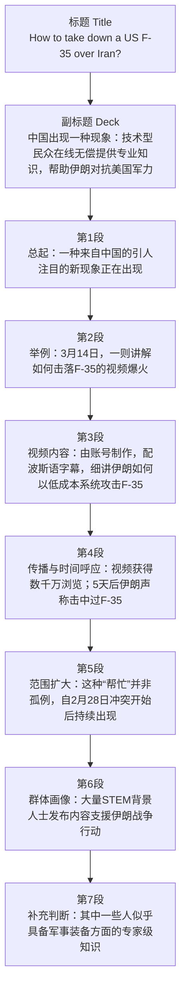
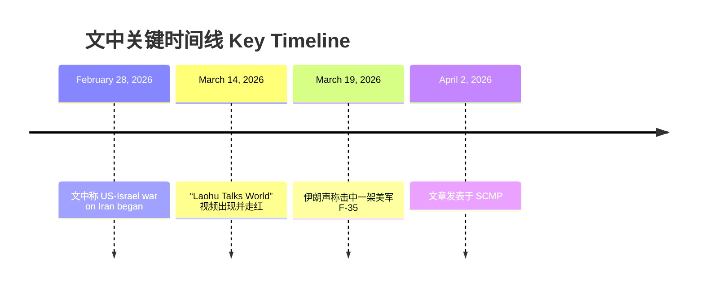
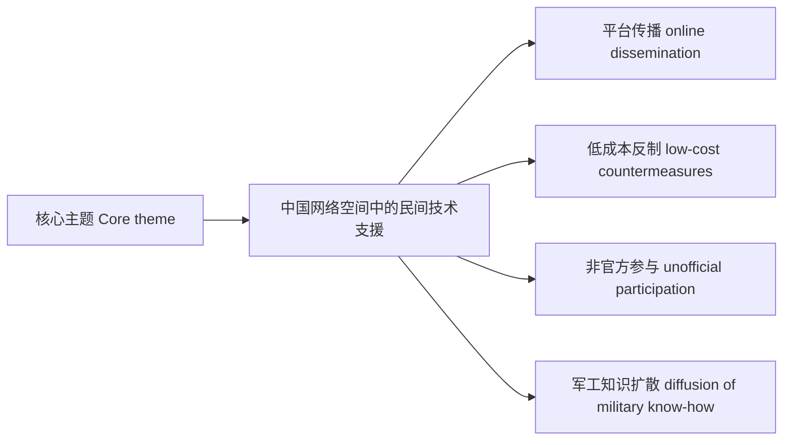

## 文章来源与作者

- **来源**：《南华早报》（South China Morning Post）
- **题目**：How to take down a US F-35 over Iran? Chinese engineer’s prophetic tutorial goes viral
- **作者**：Chao Kong（in Beijing）
- **发布时间**：8:00am, April 2, 2026

## 作者背景简介

据《南华早报》署名信息及其同站近期报道可见，**Chao Kong** 常驻北京，主要撰写 **China Science / 科技、军工、航空航天与前沿技术** 相关报道，长期关注中国科研进展及其战略、安全、产业层面的延伸影响。

## 参考链接

1. [How to take down a US F-35 over Iran? Chinese engineer’s prophetic tutorial goes viral](https://www.scmp.com/news/china/science/article/3348619/how-take-down-us-f-35-over-iran-chinese-engineers-prophetic-tutorial-goes-viral)（主文）
2. [Why tiny atomic clocks may hold key to China mass-producing cheap swarm drones](https://www.scmp.com/news/china/science/article/3347000/why-tiny-atomic-clocks-may-hold-key-china-mass-producing-cheap-swarm-drones)
3. [Leading Chinese hypersonic aviation scientist Yan Hong dies at 56](https://www.scmp.com/news/china/science/article/3348183/leading-chinese-hypersonic-aviation-scientist-yan-hong-dies-56)

## 全文结构（导航）

1. **前情提要**：流程图、时间线、主题图（mermaid）。  
2. **逐段双语精读**：标题至末段（🔹/🔸 对照 + 词汇注释）。  
3. **模块一～三**：全文概要、基本信息与实体表、词汇 / 地道表达 / 检索关键词与金句。  
4. **分类说明**：本篇入库路径与体裁（检索用，非新闻正文）。

---

## 前情提要

---

🔹**How to take down a US F-35 / over Iran? / Chinese engineer’s prophetic tutorial / goes viral**  
🔸**如何在伊朗上空击落一架美军 F-35？一名中国工程师“预见性”的教程在网上疯传。**

背景注释：

- **take down**：新闻标题中常指“击落、摧毁、干掉”，语气比单纯的 *defeat* 更强，常见于军事、执法、网络安全语境。
- **F-35**：美国制造的第五代隐形战斗机，通常指洛克希德·马丁公司研发的 **F-35 Lightning II**。
- **over Iran**：此处 *over* 不是“关于”，而是“在……上空”。
- **prophetic**：本义“预言性的”，标题中带有“事后看仿佛说中了”的修辞色彩。
- **go viral**：指内容“迅速爆火、病毒式传播”。

> **take down**
> - 英文释义（v. phr.）: **to defeat, destroy, or cause something such as an aircraft or system to fall**；**击落；摧毁；使失效**
> - 语域：新闻、军事、口语、网络传播
> - 画龙点睛：**take down** 是高频短语，义项很多：可指“击倒对手、拆除建筑、记下信息、下架内容”。考试里最易混的是 **write down**（记下）与 **take down**（可带“迅速记录”或“弄倒/击落”）。在军事报道中，常比 **shoot down** 略宽泛。
>
> **prophetic**
> - 英文释义（adj.）: **correctly suggesting what will happen in the future**；**预示未来的；像预言一样应验的**
> - 语域：正式、评论、新闻修辞
> - 画龙点睛：该词不一定真与“宗教预言”有关，新闻里常表示“**事后看极具预见性**”。注意与 **predictive** 区分：**predictive** 更偏技术、模型、数据预测；**prophetic** 更偏修辞和叙述效果。
>
> **go viral**
> - 英文释义（v. phr.）: **to spread very quickly and widely online**；**在网络上迅速爆红**
> - 语域：媒体、社交平台、半口语
> - 画龙点睛：写作中可替换为 **spread rapidly online**, **gain massive traction**, **attract huge online attention**。其中 **viral** 已高度固化，不宜机械直译为“病毒的”，而应按语境译作“爆火、疯传”。

---

🔹**Striking phenomenon / emerges from China / as technically skilled civilians / volunteer expertise online / to help Iran counter US military might**  
🔸**一种引人注目的现象正在中国出现：具备技术能力的平民正在线无偿贡献自己的专业知识，以帮助伊朗对抗美国的军事力量。**

背景注释：

- **striking phenomenon**：意为“显著/引人注目的现象”，属于较正式新闻表达。
- **technically skilled civilians**：指具备工程、技术、科研、数据、电子等能力的普通民众，而非军方人员。
- **Iran**：伊朗，位于中东地区。
- **counter US military might**：*military might* 指“军事强权/军事实力”；*counter* 指“对抗、反制”。

> **striking**
> - 英文释义（adj.）: **very noticeable or unusual**；**引人注目的；显著的**
> - 语域：新闻、正式写作
> - 画龙点睛：**striking** 常修饰 **contrast, feature, resemblance, example, phenomenon**。它不是简单的“打击人的”，而是“**视觉上或事实层面特别醒目**”。写作中用于替换 **obvious / impressive**，能显著提升正式度。
>
> **volunteer**
> - 英文释义（v.）: **to offer to do something without being paid or forced**；**自愿做；主动提供**
> - 语域：通用、新闻、正式
> - 画龙点睛：作动词时常见结构是 **volunteer to do sth**、**volunteer sth**。本句中是 **volunteer expertise**，属于高级搭配，表示“主动提供专业能力”，比单纯 **help** 更精准。注意名词义“志愿者”也极常考。
>
> **expertise**
> - 英文释义（n., uncountable）: **special skill or knowledge in a particular field**；**专门知识；专业技能**
> - 语域：正式、学术、商务、新闻
> - 画龙点睛：**expertise** 是**不可数名词**，常搭配 **technical expertise, domain expertise, provide expertise, draw on expertise**。写作中若想表达“某人很专业”，可说 **have expertise in...**，比 **be very professional** 更书面。
>
> **counter**
> - 英文释义（v.）: **to act against something in order to reduce or stop its effect**；**反制；对抗；抵消**
> - 语域：正式、新闻、军事、政策
> - 画龙点睛：**counter** 是阅读高频词，常见于 **counter threats, counter sanctions, counter criticism, counter inflation**。它强调“**针对性回应**”，不是一般性的 oppose。名词还有“柜台”；这一词多义常是考试命题点。
>
> **military might**
> - 英文释义（n. phr.）: **great military power or strength**；**军事力量；军事实力**
> - 语域：新闻、政治、国际关系
> - 画龙点睛：**might** 在这里不是情态动词，而是名词“力量”。同类表达有 **economic might, naval might, industrial might**。阅读时需迅速区分 **might** 的词性，否则容易误判句法。

---

🔹**A striking phenomenon / is emerging from China / as the Middle East conflict presses on: / technically skilled civilians / are volunteering their expertise online / to help Iran counter US military might, / without seeking payment or official backing.**  
🔸**随着中东冲突持续推进，一种引人注目的现象正从中国显现出来：具备技术技能的平民正在线上主动提供专业知识，帮助伊朗对抗美国的军事力量，而且既不索取报酬，也没有官方背书。**

背景注释：

- **the Middle East**：中东地区。
- **press on**：持续推进、继续进行。
- **official backing**：官方支持、官方背书。
- 句中冒号后面是对“a striking phenomenon”的具体解释，属于新闻写作中常见的“总述 + 冒号展开”。

> **press on**
> - 英文释义（v. phr.）: **to continue or move forward despite difficulty**；**坚持推进；继续进行**
> - 语域：新闻、书面、叙述
> - 画龙点睛：**press on** 含“顶着压力继续向前”的意味，常见于战争、谈判、改革、项目进度等语境。可替换 **continue**，但语气更强，更能体现“局势仍在发展，未停止”。
>
> **seek**
> - 英文释义（v.）: **to try to obtain or achieve something**；**寻求；谋求；试图获得**
> - 语域：正式、新闻、学术、法律
> - 画龙点睛：**seek** 比 **look for** 更正式，常搭配 **seek help, seek compensation, seek approval, seek asylum**。本句 **without seeking payment** 很地道，适合写作表达“并非为谋取利益”。
>
> **backing**
> - 英文释义（n., uncountable/sometimes countable）: **support, especially financial, political, or moral support**；**支持；资助；背书**
> - 语域：新闻、政治、商业
> - 画龙点睛：常见搭配 **official backing, government backing, financial backing**。它比 **support** 更强调“**有分量、可提供资源或合法性的支持**”。翻译时很多场合译成“背书”比“支持”更准确。
>
> **official**
> - 英文释义（adj.）: **approved by or connected with a government or authority**；**官方的；正式的**
> - 语域：通用、新闻、法律、行政
> - 画龙点睛：注意 **official statement / official source / official visit / official backing**。考试里常通过 **official** 与 **formal** 区分：**official** 偏“政府、机构层面”，**formal** 偏“形式、礼仪、文体”。

---

🔹**The trend / was vividly illustrated / on March 14, / when a detailed tutorial / on taking down America’s F-35 / appeared on Chinese social media / and went viral.**  
🔸**这一趋势在 3 月 14 日得到了生动体现：当时，一则关于如何击落美国 F-35 的详细教程出现在中国社交媒体上，并迅速疯传。**

背景注释：

- **March 14**：文中给出的具体日期。
- **tutorial**：教程、讲解视频、教学帖。
- **Chinese social media**：中国社交媒体平台的统称，可泛指微博、B站、抖音、小红书、微信公众号等，但原文未具体点名。
- **America’s F-35**：新闻修辞中用国家名代指其武器装备归属。

> **trend**
> - 英文释义（n.）: **a general development or direction in which something is changing**；**趋势；动向**
> - 语域：通用、新闻、学术、商业
> - 画龙点睛：**trend** 不仅用于时尚，也常见于社会、经济、科技和舆论分析。搭配有 **a growing trend, reverse a trend, identify a trend**。写作中若要显得更学术，可用 **pattern**、**tendency**，但语义侧重点略不同。
>
> **vividly**
> - 英文释义（adv.）: **in a way that is very clear, powerful, and easy to imagine**；**生动地；鲜明地；清楚地**
> - 语域：正式、新闻、文学
> - 画龙点睛：**vividly illustrated** 是高频新闻搭配，表示“被鲜明地展示出来”。类似表达还有 **vividly demonstrate / vividly show**。用于议论文时能增强论证力度，比单用 **clearly** 更有画面感。
>
> **illustrate**
> - 英文释义（v.）: **to make something clear by giving examples or showing evidence**；**说明；阐明；举例证明**
> - 语域：正式、学术、新闻
> - 画龙点睛：这词极重要。除“插图”义外，动词更常考“**阐明、说明**”。常见结构：**illustrate how/that...**, **be illustrated by...**。阅读中如果误解成“画插图”，就会影响全句理解。
>
> **tutorial**
> - 英文释义（n.）: **a lesson or set of instructions that teaches how to do something**；**教程；操作指南**
> - 语域：教育、互联网、技术
> - 画龙点睛：现在的 **tutorial** 常指视频教程、分步指南。搭配如 **video tutorial, step-by-step tutorial, tutorial on...**。写作里若说“教程”，它比 **lesson** 更贴近数字时代语境。
>
> **appear**
> - 英文释义（v.）: **to become available or be seen in a place**；**出现；刊出；发布**
> - 语域：通用、新闻
> - 画龙点睛：媒体语境中 **appear on social media / appear in a report / appear online** 很常见，表示“内容发布出来、开始可见”，并不总是“看起来”。这是其熟词僻义之一。

---

🔹**Created by the account “Laohu Talks World” / and subtitled in Persian, / the video / meticulously explained / how Iran could use its low-cost systems / to target and destroy / the advanced stealth fighter.**  
🔸**这段视频由账号“Laohu Talks World”制作，并配有波斯语字幕；视频一丝不苟地讲解了伊朗如何利用其低成本系统来瞄准并摧毁这款先进的隐形战斗机。**

背景注释：

- **Laohu Talks World**：文中提到的账号名，*Laohu* 为汉语拼音“老虎”。
- **Persian**：波斯语，伊朗的主要语言之一。
- **low-cost systems**：低成本系统，可能涵盖雷达、导弹、防空网络、无人机、传感器或其他作战/侦测系统；原文未细化。
- **stealth fighter**：隐形战斗机，强调低可探测性。
- 句首 **Created... and subtitled...** 为过去分词短语作状语，用来补充视频的来源和语言处理方式。

> **subtitle**
> - 英文释义（v.）: **to provide a film or video with written text of the spoken words**；**给……加字幕**
> - 语域：媒体、影视、互联网
> - 画龙点睛：常见形式有 **be subtitled in English/Chinese/Persian**。注意与 **caption** 区分：**subtitle** 多对应台词字幕，**caption** 既可指图片说明，也可指视频字幕总称。
>
> **meticulously**
> - 英文释义（adv.）: **with great attention to detail; very carefully and precisely**；**一丝不苟地；极其细致地**
> - 语域：正式、新闻、学术
> - 画龙点睛：这是写作高级副词，常修饰 **plan, examine, explain, document, prepare**。它不仅表示“认真”，更强调“**对细节的严密把控**”。用在人物描写或过程描写中都很出彩。
>
> **target**
> - 英文释义（v.）: **to aim an attack, effort, or action at someone or something**；**把……作为目标；瞄准；针对**
> - 语域：新闻、军事、商业
> - 画龙点睛：**target** 是典型多义词，可作名词“目标；靶子”，也可作动词“针对、瞄准”。常见搭配 **target civilians, target inflation, target a market, target and destroy**。考试中常通过词性转换设题。
>
> **stealth**
> - 英文释义（adj./n. used attributively）: **designed to avoid being seen or detected, especially by radar**；**隐形的；低可探测的**
> - 语域：军事、科技
> - 画龙点睛：**stealth fighter, stealth aircraft, stealth technology** 是固定搭配。不要只理解成“偷偷摸摸”；在军工语境中，它有明确技术含义，通常与 **radar evasion**、**low observability** 相关。
>
> **advanced**
> - 英文释义（adj.）: **highly developed or sophisticated**；**先进的；高端的**
> - 语域：通用、科技、新闻
> - 画龙点睛：**advanced** 在科技文里非常高频，常修饰 **system, technology, weapon, economy, research**。它不只是“高级班的”，也可表示“技术上更成熟、更复杂”。翻译要依语境灵活处理。

---

🔹**It / drew tens of millions of views.**  
🔸**它吸引了数千万次浏览。**

背景注释：

- **tens of millions**：数千万。英语中是模糊但量级很大的表达。
- **views**：在社交媒体语境中通常指“观看量、浏览量”。

> **draw**
> - 英文释义（v.）: **to attract or obtain something such as attention, support, or viewers**；**吸引；获得**
> - 语域：通用、新闻、正式
> - 画龙点睛：**draw** 是超级高频多义词。除“画、拉”外，新闻里常表示“**吸引（注意/观众/批评）**”。如 **draw attention, draw criticism, draw investment, draw crowds**。这是熟词僻义重点。
>
> **tens of millions**
> - 英文释义（number phrase）: **an amount between twenty million and ninety-nine million, used approximately**；**数千万，大约几千万**
> - 语域：新闻、统计
> - 画龙点睛：英语中 **tens of thousands / hundreds of thousands / millions of** 等表达非常常见。注意 **tens of millions of views** 里 **views** 必须保留复数。中文翻译不必死译为“几千万”，译作“数千万”更自然。
>
> **view**
> - 英文释义（n.）: **an occasion when a video or page is watched or visited**；**观看次数；浏览量**
> - 语域：互联网、媒体
> - 画龙点睛：网络语境里的 **views** 不等于“观点”。要结合上下文辨义。相关词有 **clicks, impressions, reach, engagement**；其中 **views** 通常最直观，指“被看了多少次”。

---

🔹**Five days after the post, / on March 19, / Iran claimed / it had struck a US F-35.**  
🔸**在该帖文发布五天后，也就是 3 月 19 日，伊朗宣称自己击中过一架美军 F-35。**

背景注释：

- **the post**：指上文提到的社交媒体帖子/视频发布内容。
- **claimed**：新闻写作中常用于表示“声称”，带有信息来源归属，并不自动表示记者已证实。
- **had struck**：过去完成时，表示“在声称这一动作之前，击中一事已经发生”。
- **strike** 在军事新闻中可表示“袭击、打击、命中”。

> **claim**
> - 英文释义（v.）: **to say that something is true, especially when it has not been proven**；**声称；宣称**
> - 语域：新闻、法律、正式
> - 画龙点睛：新闻报道非常爱用 **claim** 来保持中立，因为它暗示“**这是当事方说法，未必已获独立证实**”。阅读时要敏感：**say** 中性，**claim** 常带“尚待核实”的信息态度。
>
> **strike**
> - 英文释义（v.）: **to hit or attack, especially suddenly or forcefully**；**打击；击中；攻击**
> - 语域：通用、新闻、军事
> - 画龙点睛：**strike** 义项极多：打、击、袭击、罢工、猛然想到。军事中常见 **strike a target, launch a strike, air strike**。本句 **had struck a US F-35** 更接近“命中/击中”。
>
> **post**
> - 英文释义（n.）: **a message, article, or item published online**；**网帖；帖子；发布内容**
> - 语域：互联网、媒体
> - 画龙点睛：现代英语里 **post** 既可作名词，也可作动词“发帖”。如 **make a post**, **post a video**, **social media post**。考试中要避免和“邮政”“岗位”混淆。
>
> **had + past participle**
> - 英文释义（grammar）: **the past perfect tense used for an action completed before another past point**；**过去完成时，表示“过去的过去”**
> - 语域：语法
> - 画龙点睛：本句 **Iran claimed it had struck...** 的时间关系是：先“击中”，后“宣称”。过去完成时正是用来拉开两个过去动作的先后顺序。翻译时通常不必机械体现时态，但理解逻辑非常关键。

---

🔹**The effort to help / has hardly been isolated / since the US-Israel war on Iran / began on February 28.**  
🔸**自文中所称的“美国—以色列对伊朗战争”于 2 月 28 日开始以来，这种提供帮助的做法几乎并非个别现象。**

背景注释：

- **has hardly been isolated**：双重理解关键在于 **hardly** 不是“辛苦地”，而是“几乎不”；整句意为“绝不是孤立个例”。
- **isolated**：这里不是“孤独的”，而是“孤立的、零星的、个别的”。
- **since ... began on February 28**：给出明确起点时间。
- **US-Israel war on Iran**：这是文章中的表述；作为阅读理解，应先准确把握原文措辞本身。

> **effort**
> - 英文释义（n.）: **an attempt to do something, especially when it requires work or energy**；**努力；尝试；行动**
> - 语域：通用、新闻、正式
> - 画龙点睛：**effort** 常不是抽象“努力学习”那种努力，也可具体指“某项行动、某种尝试”，如 **peace effort, rescue effort, diplomatic effort**。本句就是“支援性行动”。
>
> **isolated**
> - 英文释义（adj.）: **happening alone; not connected with others of the same kind**；**孤立的；个别的；非系统性的**
> - 语域：新闻、学术、正式
> - 画龙点睛：这是阅读高频抽象词。**an isolated case/incident** 表示“个例”。本句 **hardly been isolated** 的真正意思是“这类现象并不少见”，是理解难点。
>
> **hardly**
> - 英文释义（adv.）: **almost not**；**几乎不；几乎没有**
> - 语域：通用、正式
> - 画龙点睛：**hardly** 不是 **hard** 的副词形式“努力地”，而是独立副词“几乎不”。如 **hardly ever, hardly any, can hardly believe**。这是英语考试经典陷阱词。
>
> **since**
> - 英文释义（prep./conj.）: **from a particular time in the past until now**；**自从……以来**
> - 语域：通用
> - 画龙点睛：当 **since** 表时间起点时，主句常配 **现在完成时**，如本句 **has hardly been isolated since... began...**。这类时态配合是语法题和翻译题高频考点。

---

🔹**Across Chinese social media, / many people with backgrounds in science, technology, engineering and mathematics (STEM) / have created and shared content / aimed at helping Iran’s war effort.**  
🔸**在中国各大社交媒体平台上，许多拥有科学、技术、工程和数学（STEM）背景的人创建并分享了内容，其目的在于帮助伊朗的战争行动。**

背景注释：

- **STEM**：Science, Technology, Engineering and Mathematics 的缩写，即“科学、技术、工程、数学”。
- **war effort**：战争努力、战时行动体系，常指为战争目标所进行的整体性支援。
- **aimed at**：旨在、以……为目标。
- **Across Chinese social media**：表示“在中国社交媒体的各个平台/整个生态中”，不是单一平台。

> **background**
> - 英文释义（n.）: **a person’s education, training, or experience**；**教育背景；专业背景；经历**
> - 语域：通用、新闻、职场
> - 画龙点睛：**background** 远不止“背景颜色/背景板”，在人身上常指“出身、履历、受训经历”。搭配 **academic background, professional background, family background** 很常见。
>
> **STEM**
> - 英文释义（abbr., noun）: **science, technology, engineering and mathematics**；**科学、技术、工程与数学领域**
> - 语域：教育、政策、科技新闻
> - 画龙点睛：这是国际教育与科技报道中的核心缩略词。常见延伸还有 **STEM education, STEM talent, STEM workforce**。写作中首次出现最好像原文一样写全称并加括号。
>
> **content**
> - 英文释义（n., uncountable/collective）: **information, articles, videos, or material made available online**；**内容；网络内容**
> - 语域：互联网、媒体、营销
> - 画龙点睛：数字媒体时代的 **content** 是高频词，常含“帖子、视频、图文、节目”等集合意义。不要只理解成“目录内容”。搭配 **create content, share content, content creator**。
>
> **aimed at**
> - 英文释义（adj./participle phrase）: **intended or designed to achieve a particular purpose**；**旨在；针对；以……为目的**
> - 语域：正式、新闻、学术
> - 画龙点睛：这是写作万能表达，可用于政策、研究、广告、产品说明：**a policy aimed at reducing costs**, **measures aimed at improving safety**。比 **for** 更正式，更能体现目的性。
>
> **war effort**
> - 英文释义（n. phr.）: **the total activities and resources used by a country or group to support a war**；**战争行动总体投入；战时支援体系**
> - 语域：历史、军事、新闻
> - 画龙点睛：该短语常见于历史和国际新闻，如 **support the war effort**。它不是单次作战行动，而是更宏观的“战争所需的整体努力与资源动员”。翻译时根据语境可译“战争行动”或“战时支援”。

---

🔹**Some / appear to possess / expert knowledge / of military equipment.**  
🔸**其中一些人似乎拥有关于军事装备的专家级知识。**

背景注释：

- **appear to**：似乎、看起来，表示记者在做谨慎判断。
- **possess**：拥有，书面色彩较强。
- **military equipment**：军事装备，泛指武器系统、平台、传感器、雷达、导弹、战机等。
- **expert knowledge**：专家知识，强调专业深度而非普通了解。

> **appear to**
> - 英文释义（v. phr.）: **to seem to be or seem to do something**；**似乎；看起来**
> - 语域：新闻、正式、学术
> - 画龙点睛：新闻中 **appear to** 很重要，它体现“谨慎归纳而非绝对断言”。与 **seem to** 接近，但 **appear to** 更书面。写作中可帮助你避免过度武断。
>
> **possess**
> - 英文释义（v.）: **to have or own a quality, skill, or object**；**拥有；具备**
> - 语域：正式、书面、法律
> - 画龙点睛：**possess** 比 **have** 更正式，特别适合表示“具备某种品质、能力、特征”，如 **possess the ability/confidence/knowledge**。写作中用于升级语言非常有效。
>
> **expert knowledge**
> - 英文释义（n. phr.）: **specialized knowledge possessed by an expert**；**专家级知识；专门深度知识**
> - 语域：正式、学术、新闻
> - 画龙点睛：该搭配可迁移到很多写作场景，如 **expert knowledge of law/finance/data security**。其中 **knowledge** 常不可数，但前面加修饰语后能非常精确地表达知识层级。
>
> **equipment**
> - 英文释义（n., uncountable）: **the tools, machines, or devices used for a particular purpose**；**设备；装备**
> - 语域：通用、科技、军事
> - 画龙点睛：**equipment** 是**不可数名词**，不能说 *equipments*。若要表示数量，用 **pieces of equipment**。军事语境下常译“装备”，技术语境下常译“设备”，要按上下文调整。

---

> **接续说明**：上文为标题至末段的**逐句双语精读**；以下 **模块一～三** 为同一材料的**系统分析**（概要、元信息、词汇与语料），主题与上文一致，便于总览与写作迁移。

## 模块一：翻译与全文概要

### 原文语言识别与英文版本

原文已为英文。

### 文章概要（中英文对照）

**英文：**  
This article from the South China Morning Post examines an extraordinary grassroots phenomenon in China where skilled civilians are leveraging online platforms to provide technical expertise supporting Iran's military capabilities. The report centers on a viral tutorial published on March 14 by an account called "Laohu Talks World," which presented a sophisticated analysis of tactics for neutralizing the US F-35 stealth fighter using available Iranian air defense systems. The piece maps a broader trend of **technically-proficient individuals contributing tactical knowledge** without compensation or state sponsorship, representing a form of decentralized support that distinguishes itself from conventional state-level military assistance. This phenomenon gained particular attention when Iran claimed striking a US F-35 just five days after the tutorial's release, though causal relationships remain subject to debate.

**中文：**  
本文来自南华早报，报道了中国出现的一种非凡的基层现象：具有专业技能的民间人士正在利用网络平台提供技术专长，支持伊朗的军事能力建设。报道重点关注 3 月 14 日发布在「Laohu Talks World」账号上的一份爆红教程（直译可作「老虎谈世界」），其中呈现了关于如何利用伊朗现有防空系统应对美国 F-35 隐形战机的战术分析。文章勾勒出一种更广泛的趋势——**具有技术能力的个人无偿提供战术知识**，不受政府赞助或资金支持，代表了一种去中心化的支持方式，有别于传统国家层级的军事援助。这一现象在伊朗声称在教程发布五天后击中一架美国 F-35 战机后获得了特别关注，尽管因果关系仍存在争议。

---

> **衔接**：以下 **模块二** 以表格与实体注释固定来源、题名与关键专名，可与模块一概要及上文精读互证。

## 模块二：基本信息与注释

### 2A. 文章基本信息

| 项目 | 内容 |
|------|------|
| **来源** | South China Morning Post（南华早报） |
| **标题** | How to take down a US F-35 over Iran? Chinese engineer's prophetic tutorial goes viral |
| **中文标题** | 如何在伊朗上空击落美国 F-35？中国工程师的「预见性」教程走红（*prophetic* 亦常译「预言性」） |
| **作者** | Chao Kong |
| **发表日期** | 2026 年 4 月 2 日上午 8:00 |
| **分类** | 科技 / 地缘政治（媒体栏目为 China science；涉冲突与安全语境） |
| **原文长度** | 约 450 词（估算；以版面「2-MIN READ」为短讯体量） |

### 2B. 作者背景

**Chao Kong** 是南华早报科技记者，专长于科学事实核查与复杂科技进展的叙述转化；其职责包括将中国科技新进展转化为全球受众易于理解的报道，目前主要关注北京科技新闻领域。该记者具有将专业科技内容通俗化的能力。（可与文首「作者背景简介」对照：本段侧重职务与能力概括。）

### 2C. 关键实体、地点与人物注释

| 实体 | 说明 |
|------|------|
| **"Laohu Talks World"** | 文中所述中文社交媒体账号；视频涉及战争策略与军事装备讨论。（具体平台与运营者身份以原文未展开为限。） |
| **F-35 Lightning II** | 美国洛克希德·马丁公司研发的第五代隐形战斗机，具有低可探测性、航电与多用途作战能力。 |
| **波斯湾 / 哈尔格岛（Kharg Island）** | 连接中东航运与能源运输的关键水域之一；哈尔格岛为伊朗重要原油出口终端所在地（文内配图说明）。译名常用「哈尔格岛」，勿与「卡尔格」混淆。 |
| **美以伊冲突** | 文中所述 2 月 28 日起的地区冲突框架（措辞以原文 *US-Israel war on Iran* 为准；独立事实核查略）。 |
| **STEM 领域** | Science, Technology, Engineering, Mathematics——科学、技术、工程、数学领域专业人士。 |

---

## 模块三：素材与语料库积累

本节为 **模块一、二** 的延伸：在已掌握全文脉络与元信息的前提下，按 **W / R / T / S** 与 **L** 分层积累可复用语料；**3B** 供延伸检索，**3C** 供摘录与仿写。

### 3A. 重点词汇解析（双语注释）

#### **W - 写作高频词**

**1. phenomenon** /fɪˈnɒmənən/ | 名词

- **英文释义**（朗文）：Something that happens or exists in society, science, or nature, especially something that is studied because it is difficult to understand.
- **中文释义**：现象；异常事物；非凡的人或事
- **语域标注**：学术 / 正式 / 新闻
- **同义词**：occurrence, event, incident
- **拓展内容**：
  - 复数形式为 **phenomena**（不规则复数）
  - 常见搭配：*social phenomenon*（社会现象）, *natural phenomenon*（自然现象）, *a striking/remarkable phenomenon*（引人瞩目的现象）
  - 衍生词：phenomenal (adj. 非凡的)
- **例句**：The rapid adoption of artificial intelligence represents a remarkable **phenomenon** that universities are scrambling to address in their curricula. / 人工智能的快速普及代表了一种值得关注的现象，大学纷纷试图在课程中回应这一挑战。

**2. volunteer** /ˌvɒlənˈtɪə(r)/ | 动词 / 名词

- **英文释义**（剑桥）：To offer to do something willingly without being forced or without being paid; a person who offers to do something without being forced or paid.
- **中文释义**：自愿提供；志愿者；自愿参加者
- **语域标注**：正式 / 非正式 / 新闻
- **反义词**：conscript, forced, coerced
- **拓展内容**：
  - 动词用法：*volunteer to do sth*（自愿做某事）, *volunteer for sth*（自愿参加）
  - 名词用法：*active volunteer*（积极的志愿者）, *volunteer staff*（志愿人员）
  - 衍生词：voluntary (adj.), volunteering (n.)
  - **注意**：*volunteer one's services*（自愿提供服务）
- **例句**：After the natural disaster, thousands of citizens **volunteered** their construction expertise to help rebuild affected communities. / 自然灾害后，数千名市民自愿提供建筑专业知识来帮助重建受灾社区。

**3. expertise** /ˌekspɜːˈtiːz/ | 名词（不可数）

- **英文释义**（朗文）：Special skills or knowledge in a particular subject that you learn by experience or training.
- **中文释义**：专门技能；专业知识；专业能力
- **语域标注**：学术 / 正式 / 商业
- **同义词**：skill, knowledge, proficiency, competence
- **拓展内容**：
  - **不可数名词**，一般不与不定冠词搭配表泛指
  - 常见搭配：*technical/medical/financial expertise*（技术 / 医学 / 财务专长）, *have expertise in*（在……方面有专长）, *lack expertise*（缺乏专长）, *area of expertise*（专业领域）
  - 衍生词：expert (n./adj.), expertly (adv.)
  - **重要搭配**：*considerable expertise*（深厚的专业知识）, *professional expertise*（专业技能）
- **例句**：The cybersecurity firm's **expertise** in detecting advanced persistent threats made it invaluable to Fortune 500 companies defending their networks. / 这家网络安全公司在检测高级持久性威胁方面的专业知识，使其对守护网络的财富 500 强公司极具价值。

**4. content** /ˈkɒntent/ | 名词

- **英文释义**（朗文）：The material that is contained in something, especially the subject matter or text of a document, film, video, or website.
- **中文释义**：内容；所含的东西；（网络）内容
- **语域标注**：正式 / 新闻 / 学术
- **近似词**：material, substance, subject matter, information
- **拓展内容**：
  - **可数与不可数**：*the content is* / *the contents are*（*contents* 指盒内具体物件时常用复数）
  - 常见搭配：*user-generated content*（用户生成内容）, *create content*（创作内容）, *content creation*（内容创作）, *digital content*（数字内容）
  - **注意区分**：*content* (n.) 内容 vs. *content* (adj.) 满足的（读音亦常不同）
- **例句**：Social media platforms must carefully **moderate the content** posted by their users to prevent the spread of dangerous misinformation and harmful instructions. / 社交媒体平台必须仔细审核用户发布的内容，以防危险错误信息与有害操作指引扩散。

**5. strike** /straɪk/ | 动词

- **英文释义**（朗文）：To hit someone or something with your hand or a weapon; to attack a place or person suddenly; (of workers) to stop work as a protest; to achieve or discover something suddenly.
- **中文释义**：打击；罢工；轰击；突然发现
- **语域标注**：通用 / 新闻 / 军事
- **不规则变化**：strike → struck → struck/stricken
- **拓展内容**：
  - 多义性强：*strike a deal*（达成协议）, *strike a balance*（找到平衡）, *strike a chord*（引起共鸣）, *air strike*（空袭）, *military strike*（军事打击）
  - 衍生词：striker (n.), striking (adj.)
  - **常见短语**：*strike at*（针对）, *strike down*（打击；使无效）, *strike back*（反击）, *strike out*（删除；出局；出击）
- **例句**：The Iranian military claimed to have **struck** an American F-35 fighter jet with advanced air defense systems, marking a significant escalation in regional military tensions. / 伊朗军方声称用先进防空系统击中一架美国 F-35 战斗机，标志着地区军事紧张显著升级。（**claim** 为当事方说法，独立核实略。）

**6. backing** /ˈbækɪŋ/ | 名词

- **英文释义**（剑桥）：Support or encouragement, especially financial or political support; material used to support the back of something; musical accompaniment.
- **中文释义**：支持；资金支持；后援；伴奏
- **语域标注**：正式 / 商业 / 政治
- **同义词**：support, sponsorship, assistance, endorsement
- **拓展内容**：
  - **名词用法**：*financial backing*（资金支持）, *government backing*（政府支持）, *without official backing*（没有官方支持）
  - **复合名词**：*backing vocalist*（伴唱者）, *backing band*（伴奏乐队）
  - 衍生词：back (v./n.), backer (n.)
  - **与 support 的语感**：*backing* 常暗示可动用资源或“站台式”支持；*support* 更宽
- **例句**：The startup secured venture capital **backing** from leading technology investors, enabling rapid scaling of its innovative platform. / 这家初创公司获得领先科技投资者的风险投资支持，使其得以快速扩张创新平台。

---

#### **R - 阅读高频词**

**1. meticulously** /meˈtɪkjuləsli/ | 副词

- **英文释义**（剑桥）：In a way that shows careful attention to detail; very carefully and precisely.
- **中文释义**：一丝不苟地；精心地；细致地；谨慎地
- **语域标注**：正式 / 学术 / 书面
- **反义词**：carelessly, hastily, negligently
- **拓展内容**：
  - 来自形容词 *meticulous*（一丝不苟的）
  - 常见搭配：*meticulously planned*（精心策划）, *meticulously researched*（精心研究）, *meticulously followed*（严格遵循）
  - **同义副词**：carefully, precisely, scrupulously, methodically
  - 衍生词：meticulous (adj.), meticulousness (n.)
- **例句**：The archaeological team **meticulously** documented every artifact and layer of the excavation site to preserve crucial historical evidence. / 考古团队对挖掘现场的每件文物和地层进行了精细记录，以保护关键历史证据。

**2. vividly** /ˈvɪvɪdli/ | 副词

- **英文释义**（剑桥）：In a way that is very clear, bright, detailed, or striking; memorably and strikingly.
- **中文释义**：生动地；栩栩如生地；鲜明地；清晰地
- **语域标注**：正式 / 书面 / 描写性
- **反义词**：dully, vaguely, dimly
- **拓展内容**：
  - 来自形容词 *vivid*（生动的；清晰的）
  - 常见搭配：*vividly describe*（生动描写）, *vividly illustrated*（鲜明地展示）, *vividly recalled/remembered*（清晰地回忆）
  - **同义副词**：graphically, clearly, strikingly, dramatically
  - 衍生词：vivid (adj.), vividness (n.)
- **例句**：The documentary **vividly** portrayed the harsh realities of climate migration, leaving audiences emotionally moved and prompted to action. / 这部纪录片生动地呈现了气候迁移的严峻现实，使观众受到触动并促发行动。

**3. viral** /ˈvaɪrəl/ | 形容词

- **英文释义**（剑桥）：Spreading or tending to spread rapidly via the internet and social media; relating to or caused by a virus.
- **中文释义**：（网络）爆红的；病毒式的；快速传播的；病毒性的
- **语域标注**：新闻 / 非正式 / 当代
- **反义词**：localized, contained, limited
- **拓展内容**：
  - **双重含义**：医学含义（病毒的）与网络含义（爆红、快速扩散）
  - 常见搭配：*viral video*（爆红视频）, *viral content*（病毒式内容）, *go viral*（走红；爆红）, *viral marketing*（病毒式营销）
  - 衍生词：virally (adv.), virality (n.)
- **例句**：The TikTok challenge **went viral** overnight, accumulating over 100 million views within 48 hours as users worldwide participated in the trend. / 这个 TikTok 挑战一夜爆红，48 小时内浏览量过亿，全球用户跟风参与。

**4. trend** /trend/ | 名词 / 动词

- **英文释义**（朗文）：A general tendency in the way a situation is changing or developing; a fashion or tendency that many people follow.
- **中文释义**：趋势；趋向；潮流；时尚
- **语域标注**：正式 / 新闻 / 商业
- **同义词**：tendency, direction, pattern, drift
- **拓展内容**：
  - **名词用法**：*current trend*（当前趋势）, *emerging trend*（新兴趋势）, *downward/upward trend*（下降 / 上升趋势）
  - **动词用法**：*trending on social media*（在社交媒体上走红）, *trend upwards/downwards*（趋向上升 / 下降）
  - **常见短语**：*set the trend*（引领潮流）, *buck the trend*（逆势而行）, *follow the trend*（跟风）
  - 衍生词：trendy (adj.), trendsetter (n.)
- **例句**：The **trend** toward remote work arrangements has fundamentally reshaped corporate real estate strategies and employee commuting patterns across major metropolitan areas. / 远程工作安排这一趋势已从根本上改变企业不动产策略与大城市员工的通勤模式。

**5. isolated** /ˈaɪsəleɪtɪd/ | 形容词

- **英文释义**（朗文）：Far away from other places or people; happening only once or not often; alone and unable to meet or speak to other people.
- **中文释义**：孤立的；远离的；单独的；偶发的
- **语域标注**：正式 / 学术 / 通用
- **反义词**：connected, integrated, frequent, social
- **拓展内容**：
  - 来自动词 *isolate*（隔离）
  - **多重含义**：地理隔离（*isolated region*）、偶发事件（*isolated incident*）、心理感受（*feel isolated*）
  - 常见搭配：*isolated case/incident/event*（个别案例 / 事件）, *isolated community*（偏远社区）, *hardly isolated*（几乎并非孤例——见原文否定结构）
  - 衍生词：isolate (v.), isolation (n.)
- **例句**：The whistleblower felt deeply **isolated** after revealing corporate misconduct, facing both social ostracism and professional retaliation from industry colleagues. / 举报人在揭露企业不当行为后深感孤立，既遭社交排斥也面临同行报复。

**6. degrade** /dɪˈɡreɪd/ | 动词

- **英文释义**（剑桥）：To make someone lose respect or dignity; to treat someone badly or with disrespect; to reduce in rank or status.
- **中文释义**：贬低；侮辱；（军事）削弱（能力 / 体系）
- **语域标注**：正式 / 学术 / 军事 / 新闻
- **同义词**：diminish, reduce, lower, humiliate（义项不同需甄别）
- **拓展内容**：
  - **军事报道常见义**：*degrade enemy capability*（削弱敌方能力）, *degrade air defenses*（削弱防空体系）
  - **社会含义**：*degrade oneself*（有失身份）, *degrading treatment*（侮辱性待遇）
  - 衍生词：degradation (n.), degrading (adj.)
- **例句**：Military analysts noted that repeated drone strikes aimed to **degrade** Iran's air defense infrastructure systematically over several weeks. / 军事分析人士指出，多次无人机打击意在数周内有系统地削弱伊朗防空基础设施。（**延伸例句**，非 SCMP 该篇原句。）

---

#### **T - 翻译重要词**

**1. prophetic** /prɒˈfetɪk/ | 形容词

- **英文释义**（朗文）：Containing or expressing a prophecy or prediction; showing a remarkable ability to foretell events.
- **中文释义**：预言性的；预兆性的；事后看仿佛应验的（新闻修辞）
- **语域标注**：正式 / 书面 / 文学
- **近似词**：predictive, prescient, visionary, foretelling
- **拓展内容**：
  - 来自名词 *prophet*（先知）
  - **与 *predictive* 分工**：*prophetic* 偏叙述与修辞；*predictive* 偏模型与数据
  - 常见搭配：*prophetic vision*（预言式视野）, *prophetic words*（似预言的话语）
  - 衍生词：prophet (n.), prophecy (n.), prophetically (adv.)
- **例句**：The scientist's **prophetic** warnings about pandemic risks, delivered in a 2015 TED talk, proved tragically accurate when COVID-19 emerged five years later. / 这位科学家在 2015 年 TED 演讲中对大流行风险的预警，在五年后被悲剧性地印证。

**2. meticulously explained** /meˈtɪkjuləsli ɪkˈspleɪnd/ | 短语

- **英文释义**：Provided a detailed, careful, and thorough explanation; broke down systematically with careful attention to every detail.
- **中文释义**：一丝不苟地讲解；极为细致地说明
- **翻译要点**：*meticulously* 强调过程严谨；*explained* 强调信息传递。
- **替代表达**：*carefully explained*, *detailed explanation*, *thoroughly described*, *systematically laid out*
- **例句翻译参考**：The physicist **meticulously explained** the complex quantum mechanics principles to the undergraduate students. / 这位物理学家向本科生一丝不苟地讲解了复杂的量子力学原理。

**3. counter** /ˈkaʊntə(r)/ | 动词 / 名词 / 复合词 *counter-*

- **英文释义**（朗文）：To act against something or try to prevent it from having an effect; to say something in response to someone's claim; a surface or desk in a store.
- **中文释义**：对抗；反驳；柜台（名词）
- **语域标注**：通用 / 正式 / 商业
- **拓展内容**：
  - **动词**：*counter an argument*（反驳论点）, *counter a threat*（应对威胁）, *counter US military might*（对抗美军实力——见原文）
  - **名词**：*over-the-counter*（非处方；场外）
  - **介词搭配**：*counter to*（与……相反）
  - 衍生词：counteract (v.), counterattack (v./n.), counter-offensive (n.)
- **例句**：Strategic defense systems were specifically designed to **counter** advanced threats posed by stealth aircraft and cruise missiles. / 战略防御系统旨在对抗隐形飞机与巡航导弹带来的高阶威胁。

**4. vividly illustrated** /ˈvɪvɪdli ˈɪləstreɪtɪd/ | 短语

- **英文释义**：Demonstrated or exemplified in a strikingly clear and memorable manner; graphically shown through examples or descriptions.
- **中文释义**：生动地说明；鲜明地展示
- **翻译要点**：*vividly* 强调可感知度；*illustrated* 强调“用例证阐明”（不一定是插图）。
- **替代表达**：*graphically shown*, *strikingly demonstrated*, *clearly exemplified*, *powerfully depicted*
- **例句翻译参考**：The documentary **vividly illustrated** the environmental consequences of industrial pollution through powerful imagery and personal testimonies. / 这部纪录片借强有力影像与个人证词，鲜明揭示了工业污染的环境后果。

**5. subtitled in Persian** /ˈsʌbtaɪtəld ɪn ˈpɜːʒən/ | 短语

- **英文释义**：Provided with translated text appearing at the bottom of the screen in the Persian language; captioned in Persian.
- **中文释义**：配有波斯语字幕
- **翻译要点**：*subtitle* 为影视与视频术语；伊朗官方语言常称波斯语（Persian / Farsi）。
- **替代表达**：*with Persian subtitles*, *Persian-language subtitles*
- **例句翻译参考**：The educational video was **subtitled in Persian** to reach a broader audience across the Middle East region. / 该教育视频配以波斯语字幕，以触达中东更广泛受众。

**6. technically skilled civilians** /tekˈnɪkəli skɪld səˈvɪljənz/ | 短语

- **英文释义**：Non-military citizens possessing specialized knowledge and competence in science, technology, engineering, or mathematics fields.
- **中文释义**：具备技术能力的平民；非军人的技术从业者
- **翻译要点**：*technically skilled* 强调技能；*civilians* 强调非战斗人员身份。
- **替代表达**：*skilled individuals*, *technical professionals*, *STEM-trained citizens*
- **例句翻译参考**：The government mobilized **technically skilled civilians** to support critical infrastructure reconstruction following the natural disaster. / 政府动员具备技术能力的民众支援灾后关键基础设施重建。

---

#### **S - 熟词僻义 / 引申义**

**1. tutorial** /tjuːˈtɔːriəl/ | 名词 / 形容词

- **英文释义**（朗文）：A lesson given by a tutor or instructor to an individual or small group; instructional material or video demonstrating how to do something.
- **中文释义**：教程；辅导课；（网络）分步教学
- **语域标注**：教育 / 技术 / 新闻
- **含义演变**：
  - **传统**：导师制小课
  - **当代**：*video tutorial*、软件操作与攻略向内容
  - 常见搭配：*online tutorial*（在线教程）, *step-by-step tutorial*（分步教程）
  - 衍生词：tutor (n./v.), tutoring (n.)
- **例句**：The **tutorial** on advanced photography techniques attracted over 5 million viewers who sought to improve their videography skills. / 这则高级摄影技巧教程吸引逾 500 万观看者希望提升影像能力。

**2. backing** /ˈbækɪŋ/ | 名词（引申义）

- **英文释义**（扩展）：Support or sponsorship, typically political, financial, or institutional; endorsement that lends legitimacy or resources.
- **中文释义**：背书式支持；官方或机构层面的站台
- **语域标注**：正式 / 政治 / 商业
- **核心引申**：由“背后支撑物”隐喻为资源与合法性支持
- **常见搭配**：*financial backing*, *government backing*, *official backing*, *without official backing*（见原文：无官方背书）
- **对比**：*with backing* 常暗示可调用资源；*without backing* 强调自发与非正式

**3. shared** /ʃeəd/ | 动词过去式 / 过去分词 / 形容词

- **英文释义**（朗文）：To divide something among a number of people; to tell somebody about an experience, idea, or problem; (of two or more people) to have something in common; *shared* (adj.) used or owned by more than one person.
- **中文释义**：分享；共享；分担；共同拥有；（分词）已分享 / 已发布供传播
- **语域标注**：通用 / 正式 / 非正式
- **核心引申**：由“分配、分割”引申为“信息交流、知识交换”；社交媒体语境下常强调**公开传播**而非仅私存。
- **熟词僻义与辨析**：
  - 文中 *have created and shared content*：**shared** 为 **share** 的过去分词，强调内容在平台上可被观看与再传播。
  - **shared**（adj.）：*shared knowledge*, *shared responsibility*, *shared values*
  - **share**（n.）：股份、份额（与动词同形异义）
- **常见搭配**：*shared knowledge*（共享知识）, *shared content*（分享的内容）, *shared experience*（共同经历）, *share expertise*（分享专业知识）
- **对比**：
  - *to share*：强调主动传播、让他人获得信息
  - *to post*：强调在公开平台发布（动作更“平台化”）
  - *to distribute*：强调系统性分发、配给
- **例句**：Researchers **shared** their data with international colleagues to accelerate scientific progress in climate modeling. / 研究人员与国际同事分享数据，以加速气候建模方面的科学进展。  
  *（另见原文：many STEM users **created and shared** content aimed at helping Iran’s war effort.）*

**4. escalation** /ˌeskəˈleɪʃən/ | 名词

- **英文释义**（剑桥）：A rapid increase in the level of intensity of something; the act of making a situation or problem worse or more serious.
- **中文释义**：升级；扩大；加剧
- **语域标注**：正式 / 新闻 / 政治 / 军事
- **核心引申**：由物理“上升”隐喻为事态烈度加深。
- **常见搭配**：*military escalation*（军事升级）, *conflict escalation*（冲突升级）, *rapid escalation*（快速升级）, *de-escalation*（降级；缓和）
- **衍生词**：escalate (v.), escalatory (adj.)
- **对比**：
  - *escalation*：常含“层级/烈度递进”的过程感
  - *intensification*：强调强度加深，未必突出“阶梯式升级”
  - *aggravation*：强调使恶化（语气更负面）
- **例句**：Military analysts warned that continued drone strikes could trigger an unpredictable **escalation** in regional tensions throughout the Persian Gulf. / 军事分析人士警告，持续的无人机打击可能在波斯湾地区引发难以预测的紧张升级。

**5. striking** /ˈstraɪkɪŋ/ | 形容词

- **英文释义**（朗文）：Noticeable or impressive in a way that catches your attention; very unusual or easily seen.
- **中文释义**：显著的；引人注目的；鲜明的
- **语域标注**：正式 / 书面 / 新闻
- **核心引申**：由动词 *strike*（击打、撞击）引申为“像被击中注意力一样醒目”；**非**“殴打他人的”日常义。
- **常见搭配**：*striking phenomenon*（引人瞩目的现象）, *striking feature*（显著特征）, *striking contrast*（鲜明对比）, *striking similarity*（惊人相似）, *striking difference*（显著差异）
- **衍生词**：strike (v.), strikingly (adv.)
- **同义词**：remarkable, noticeable, conspicuous, notable
- **例句**：The **striking** development in unmanned vehicle technology has created both unprecedented opportunities and significant national security concerns for military planners worldwide. / 无人车辆技术的显著发展为全球军事规划者既带来前所未有的机遇，也带来重大国家安全关切。

**6. medium** /ˈmiːdiəm/ | 名词（引申义）

- **英文释义**（朗文）：The material or form used by an artist, writer, performer, or broadcaster; a way or means of doing something.
- **中文释义**：媒介；手段；载体；（艺术）表现材料
- **语域标注**：正式 / 艺术 / 传播 / 通用
- **核心引申**：由“中间物 / 介质”引申为传播与表达的**渠道或载体**。
- **常见搭配**：*social media*（社交媒体）, *mass media*（大众媒体）, *media platform*（媒体平台）, *digital medium*（数字媒介）
- **复数**：表示“媒介/媒体”时常用 *media*（集合用法）；“灵媒”义可用 *mediums*。
- **衍生词**：mediate (v.), mediation (n.)；*median*（中位数）与 *medium* 拼写相近，勿混
- **例句**：The artist chose **digital painting as her primary medium** to create immersive visual narratives exploring themes of technology and human connection. / 这位艺术家以数字绘画为主要媒介，创作探索科技与人类联结主题的沉浸式视觉叙事。

---

#### **L - 地道表达**

**1. go viral** /ɡəʊ ˈvaɪrəl/ | 短语动词

- **英文释义**（剑桥）：(Of online content) to spread rapidly across social media and the internet, gaining massive visibility and engagement in a short period.
- **中文释义**：（网络内容）爆红；病毒式传播
- **语域标注**：非正式 / 新闻 / 网络
- **常见搭配**：*go viral on social media*, *go viral overnight*, *potential to go viral*
- **替代表达**：*become a viral sensation*, *achieve viral status*, *spread like wildfire*, *trend on social media*
- **文化背景**：强调传播速度与非线性扩散（与“上热搜”类表述常可互参，语域不同）。
- **例句**：The musician's surprising collaboration with an unexpected guest artist **went viral**, accumulating 500 million views within three weeks across all major platforms. / 这位音乐家与一位出人意料的嘉宾合作一夜爆红，三周内在各主要平台累计 5 亿次播放。

**2. draw tens of millions of views** /drɔː tenz əv ˈmɪljənz əv vjuːz/ | 短语

- **英文释义**：To attract or receive tens of millions of views; to accumulate viewership in the tens of millions.
- **中文释义**：吸引数千万次观看 / 浏览
- **语域标注**：正式 / 新闻 / 统计 / 网络
- **常见搭配**：*draw millions of views*, *draw billions of views*, *attract considerable viewership*, *accumulate massive engagement*
- **替代表达**：*attract a massive audience*, *gain millions of clicks*, *reach tens of millions of people*
- **数字**：*tens of millions* 通常指约两千万至近亿量级的模糊量级（非精确统计用语）。
- **例句**：The viral campaign **drew tens of millions of views** from users across Southeast Asia, making it one of the most-watched pieces of digital content of the year. / 该病毒式传播活动仅在东南亚就吸引数千万次观看，成为当年最受关注的数字内容之一。

**3. without seeking payment or official backing** | 短语

- **英文释义**：Not requesting compensation or state-level support; operating without financial incentive or institutional endorsement.
- **中文释义**：不索取报酬；无官方背书
- **语域标注**：正式 / 书面 / 新闻 / 政治
- **核心特点**：强调自愿、非酬佣、非体制授权。
- **对比**：
  - *without seeking payment*：经济维度
  - *without official backing*：政治 / 体制合法性维度
- **替代表达**：*unpaid and unsanctioned*, *voluntary and unofficial*, *without state sponsorship*
- **例句**：The open-source software community developed sophisticated security tools **without seeking payment or official backing**, demonstrating the power of collaborative innovation driven by technical excellence. / 开源社区在未索取报酬、亦无官方背书的情况下开发复杂安全工具，体现了技术驱动协作创新的力量。

**4. appears to possess** /əˈpɪəz tə pəˈzes/ | 短语

- **英文释义**：Seems to have or own something; gives the impression of having certain qualities or knowledge.
- **中文释义**：似乎具备；看起来拥有
- **语域标注**：正式 / 书面 / 新闻 / 学术
- **语气**：*appears* 表示**不完全断定**，留待核实。
- **常见搭配**：*appear to possess expertise*, *appear to possess knowledge*, *appear to have information*
- **替代表达**：*seems to have*, *apparently possesses*, *reportedly has*
- **例句**：Investigative journalists uncovered that several contributors **appear to possess** advanced knowledge of military engineering, raising questions about their backgrounds and motivations. / 调查记者发现若干贡献者似乎具备高级军事工程知识，引发对其背景与动机的追问。

**5. decentralized support** /ˌdiːˈsentrəlaɪzd səˈpɔːt/ | 名词短语

- **英文释义**：Aid from multiple independent sources rather than a single central authority; distributed support without hierarchical coordination.
- **中文释义**：去中心化的支持；分散式支援
- **语域标注**：正式 / 学术 / 政治 / 技术
- **核心概念**：与 *centralized support* 相对，强调多源、网络化与自发协作（与模块一概要中的 *decentralized support* 用法一致）。
- **常见搭配**：*decentralized network*, *decentralized system*, *decentralized finance*
- **衍生词**：decentralize (v.), decentralization (n.)
- **例句**：The humanitarian relief operation benefited from **decentralized support** provided by local NGOs, community volunteers, and international organizations working independently toward common goals. / 人道救援受益于当地非政府组织、社区志愿者与国际机构各自独立却目标一致的去中心化支援。

**6. state-level military assistance** /steɪt ˈlevəl ˌmɪlɪtəri əˈsɪstəns/ | 名词短语

- **英文释义**：Official military support, training, or resources provided by a government to another nation or faction; formal government-to-government military aid.
- **中文释义**：国家层面的军事援助；政府间正式军援
- **语域标注**：正式 / 政治 / 外交 / 军事
- **层级对比**：*individual/grassroots contribution* → *organizational support* → *state-level assistance* → *international/multilateral aid*（示意链条，语境而定）。
- **常见搭配**：*state-level military aid*, *official military assistance*, *government-provided military support*
- **例句**：International diplomats sought to distinguish between **state-level military assistance** and grassroots technical contributions when analyzing foreign involvement in the regional conflict. / 国际外交官在分析外国介入地区冲突时，试图区分国家层级军援与基层技术贡献。

---

### 3B. 主题拓展搜索关键词

**1. "Chinese STEM professionals geopolitics Middle East"**

- **用途**：检索 STEM 背景公众与地缘政治交叉议题的学术讨论与政策分析。
- **适用平台**：Google Scholar、JSTOR、期刊数据库。

**2. "F-35 air defense systems Iran military capabilities"**

- **用途**：技术对比、防空体系与五代机作战环境的公开评估（注意甄别来源与立场）。
- **适用平台**：防务媒体、军事智库公开报告、开源技术文献。

**3. "grassroots online information warfare social media"**

- **用途**：民间信息动员、社交媒体上的舆论与认知战相关研究。
- **适用平台**：智库报告、信息安全与传播学文献。

---

### 3C. 金句积累

**金句 1**

**英文原文：**  
"A striking phenomenon is emerging from China as the Middle East conflict presses on: technically skilled civilians are volunteering their expertise online to help Iran counter US military might, without seeking payment or official backing."

**中文翻译：**  
随着中东冲突持续推进，中国出现了一个引人瞩目的现象：具备技术专长的平民正在网络上自愿提供专业知识，以帮助伊朗对抗美国军事力量；这些行为既无偿，也没有官方背书。

**适用场景：**

- 公民参与、知识共享、非正式跨国支持等议题的评论或论文；
- 讨论数字时代“去中心化”援助或舆论动员；
- 非正式“公民外交”案例分析。

---

**金句 2**

**英文原文：**  
"The trend was vividly illustrated on March 14, when a detailed tutorial on taking down America's F-35 appeared on Chinese social media and went viral. Five days after the post, on March 19, Iran claimed it had struck a US F-35."

**中文翻译：**  
3 月 14 日，一则关于如何击落美国 F-35 的详细教程出现在中文社交媒体上并迅速走红，生动体现了这一趋势。在该帖发布五天后，即 3 月 19 日，伊朗声称击中一架美国 F-35。

**适用场景：**

- 讨论信息传播与现实事件之间的时间关联（**相关性 ≠ 因果**）；
- 社交媒体影响力、舆论与政治互动；
- 新闻写作中 *claim*、*vividly illustrated* 等措辞的语气。

---

**金句 3**

**英文原文：**  
"Across Chinese social media, many people with backgrounds in science, technology, engineering and mathematics (STEM) have created and shared content aimed at helping Iran's war effort. Some appear to possess expert knowledge of military equipment."

**中文翻译：**  
在中国各大社交媒体上，许多具有科学、技术、工程和数学（STEM）背景的人士创作并分享旨在协助伊朗战时行动的内容。其中一些人似乎具备军事装备方面的专家级知识。

**适用场景：**

- STEM 与冲突议题交叉、开源情报与民间技术讨论边界；
- 新闻中 *appear to* 的谨慎表述与后续核实空间；
- 平台治理、内容政策与“专业知识”可见性相关讨论。

---

> **说明**：**模块一～三**（系统分析）至此结束；下节 **分类说明** 仅服务仓库检索与路径标注，**不属于** SCMP 报道正文或记者观点。

## 分类说明（检索用）

- **体裁**：境外英文报道的**双语精读**笔记，正文以英中分段对照与词汇注释为主。
- **路径**：`reading/notes/politics/conflict-security/` —— 主题涉及**中东冲突语境下的军事传播、网络舆论与军民技术知识扩散**，归入冲突与安全议题子目录。
- **未放入 `chinese-documents/` 的原因**：原文主体为英文报道精读，不符合「中文为主文档」入库条件。
