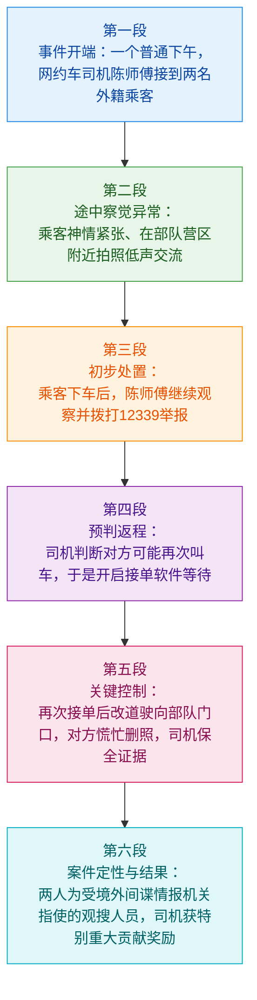
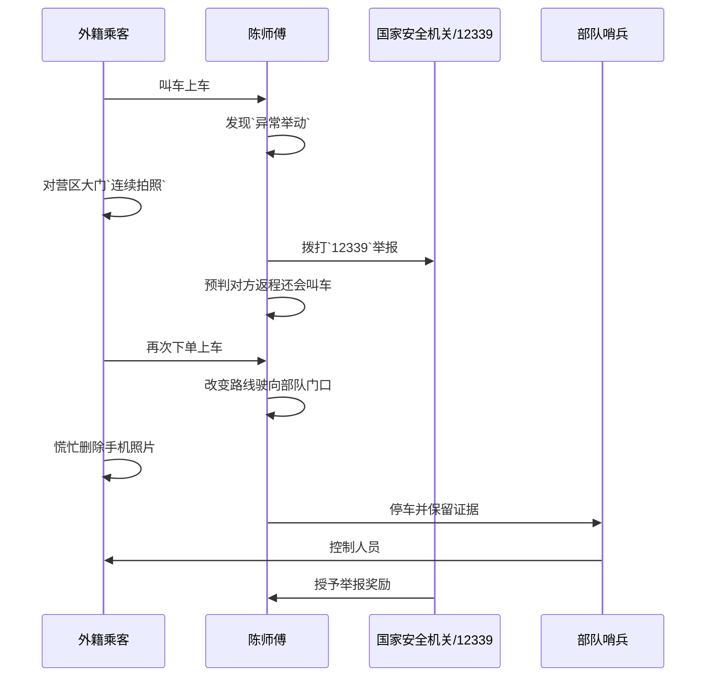

# 网约车司机智斗境外间谍获奖励

**来源**：人民日报微博视频文案（用户提供文本摘录）  
**体裁**：新闻短讯 / 案例通报类材料  
**相关机构**：国家安全机关、`12339` 国家安全机关举报受理电话  

---

---

## 逐句精读

🔸一个寻常的下午，/ 网约车司机`陈师傅` / 接到了两名`外籍乘客`。  
🔹One ordinary afternoon, / ride-hailing driver `Mr. Chen` / picked up two `foreign passengers`.

### 背景注释

- `网约车司机`：通常可译为 `ride-hailing driver`，指通过网络平台接单的司机，如滴滴等平台司机。
- `陈师傅`：中文里的“`师傅`”常用于礼貌称呼从事服务行业或技术工种的成年人，带有尊称色彩；这里译为 `Mr. Chen` 更自然。
- `外籍乘客`：指具有外国国籍的乘客，英文常见表达有 `foreign passengers`、`foreign nationals`。新闻语境中后者更正式。

> **`ordinary` 普通的；寻常的**
> 英文释义（adj.）`normal, usual, or not special`；普通的，平常的
> 语域：通用、写作、叙事
> 画龙点睛：`ordinary` 常写“平常无奇”，可与 `common`、`usual` 比较：`usual` 更强调“惯常”，`ordinary` 更强调“并不特别”。写作中如 `an ordinary day`、`ordinary people` 很高频，适合阅读与作文叙事开头。

> **`ride-hailing` 网约车的；通过叫车平台预约的**
> 英文释义（adj./n. modifier）`relating to services that allow people to book rides via an app`；与打车软件叫车服务有关的
> 语域：新闻、商业、城市治理
> 画龙点睛：这是现代城市出行高频词，常见搭配有 `ride-hailing platform`、`ride-hailing driver`、`ride-hailing service`。注意其不是传统 `taxi` 的简单同义替换，常涉及平台经济、合规监管等社会议题。

> **`pick up` 接载；接人上车**
> 英文释义（phrasal verb）`to collect someone in a vehicle`；用车接某人
> 语域：口语、新闻、日常叙事
> 画龙点睛：`pick up` 是典型熟词多义词，除“接人”外还有“捡起、学会、恢复、增加”等义项。交通语境里常写 `pick up a passenger`。翻译时要结合语境，考试中很容易出现一词多义干扰。

---

🔸行驶过程中，/ 陈师傅发现 / 两名`外籍乘客`行为`异常`，/ 神情有些`紧张`。  
🔹During the ride, / Mr. Chen noticed / that the two `foreign passengers` were acting `abnormally` / and looked somewhat `nervous`.

### 背景注释

- `行驶过程中`：新闻中常用于交代事件发生的具体阶段，英文可灵活译为 `during the ride`、`while driving`。
- `行为异常`：属于安全观察类常用表达，英文可说 `behave abnormally`、`act suspiciously`。后者更强调“可疑”。

> **`notice` 注意到；察觉**
> 英文释义（v.）`to see, hear, or become aware of something`；注意到，察觉到
> 语域：通用、叙事、学术基础
> 画龙点睛：`notice` 后可接名词、代词、`that` 从句或复合结构，如 `notice sb do/doing sth`。阅读中常与 `observe`、`spot` 区分：`observe` 更正式更强调观察，`spot` 更强调突然发现。

> **`abnormally` 异常地；反常地**
> 英文释义（adv.）`in a way that is unusual or not normal`；异常地，不正常地
> 语域：新闻、医学、正式写作
> 画龙点睛：由 `abnormal + -ly` 构成。可用于行为、数据、身体指标等，如 `abnormally high temperature`。写作中如想表达“不同寻常”也可换用 `unusually`，语气相对没那么重。

> **`nervous` 紧张的；不安的**
> 英文释义（adj.）`worried or slightly frightened about something`；紧张的，不安的
> 语域：通用、口语、叙事
> 画龙点睛：常见搭配 `feel nervous`、`look nervous`、`be nervous about`。注意与 `tense` 区别：`tense` 常强调身体和气氛上的绷紧，`nervous` 更偏心理层面的紧张焦虑。

---

🔸当车辆行驶到`某部队营区`附近时，/ 两人开始对着`部队大门`连续拍照 / 并低声交流。  
🔹When the vehicle approached the vicinity of a `military camp`, / the two men began taking photos continuously of the `main gate` / and talking in low voices.

### 背景注释

- `部队营区`：可译为 `military camp`、`military compound`、`garrison area`。本句用 `military camp` 便于理解。
- `部队大门`：在安全语境下属于敏感设施外围区域，英文可译作 `main gate of the military compound`。
- `低声交流`：表示刻意压低声音，隐含躲避他人注意的意味，英文可说 `talk in low voices` 或 `speak in whispers`。

> **`approach` 接近；靠近**
> 英文释义（v.）`to come near to something in distance or time`；接近，靠近
> 语域：通用、正式、新闻
> 画龙点睛：`approach` 既可作动词，也可作名词表示“方法”。阅读中常见一词多义：`approach a problem` 是“着手处理问题”，而本句是空间意义上的“靠近”。写作替换词价值很高。

> **`vicinity` 附近；邻近地区**
> 英文释义（n.）`the area near or around a particular place`；附近，周边地区
> 语域：正式、新闻、书面
> 画龙点睛：比 `near`、`nearby` 更正式，常见搭配 `in the vicinity of...`。雅思和考研阅读中出现频率不低，适合积累为书面表达升级词。

> **`in low voices` 低声地；小声地**
> 英文释义（phrase）`speaking quietly so that others cannot easily hear`；低声说话
> 语域：叙事、新闻
> 画龙点睛：可替换表达有 `in whispers`、`quietly`、`under one’s breath`。细微差别上，`in whispers` 更像“耳语”，而 `in low voices` 更中性，适合客观叙述。

---

🔸陈师傅`心生警觉`，/ 觉得两人身份十分`可疑`。  
🔹Mr. Chen `became alarmed` / and felt that the two men’s identities were highly `suspicious`.

### 背景注释

- `心生警觉`：汉语中带有即时心理反应色彩，英文可自然转换为 `become alert`、`be alarmed`、`grow suspicious`。
- `身份可疑`：新闻中常译为 `their identities were suspicious` 或更自然地说 `they seemed highly suspicious`。这里保留“身份”层面的判断。

> **`alarmed` 警觉的；惊觉不对的**
> 英文释义（adj.）`frightened or worried that something dangerous or unpleasant may happen`；因危险征兆而警觉、不安
> 语域：新闻、叙事、正式
> 画龙点睛：`alarmed` 比 `worried` 更强，往往暗含“意识到可能有危险”。常见搭配 `be alarmed by/at`。写作中可用于社会问题、环境风险、治安事件等语境。

> **`suspicious` 可疑的；引起怀疑的**
> 英文释义（adj.）`making you feel that something is wrong, dishonest, or illegal`；可疑的，令人起疑的
> 语域：新闻、法律、治安
> 画龙点睛：既可指“某人多疑”（`be suspicious of`），也可指“某事可疑”。本句属后者。考试中要区分 `suspect`（嫌疑人/怀疑）与 `suspicious`（可疑的/怀疑的）。

---

🔸行程`目的地`离当地某部队不远，/ 两名乘客下车后，/ 陈师傅并没有立即离开，/ 而是悄悄跟随观察，/ 并拨打`12339国家安全机关举报受理电话`报告了情况。  
🔹The trip’s `destination` was not far from a local military unit. / After the two passengers got out, / Mr. Chen did not leave immediately; / instead, he discreetly followed and observed them / and called the `12339 hotline for reporting threats to national security` to report what he had seen.

### 背景注释

- `目的地`：英文常用 `destination`。
- `12339`：中国国家安全机关举报受理电话，用于受理危害国家安全相关线索举报。
- `国家安全机关`：可概括译为 `national security authorities`。如需避免制度细节误差，可用较稳妥的概括表述。
- `悄悄跟随观察`：体现“继续留意但不打草惊蛇”，英文可表达为 `discreetly followed and observed them`。

> **`destination` 目的地**
> 英文释义（n.）`the place to which someone is going`；目的地，终点
> 语域：通用、交通、旅游、新闻
> 画龙点睛：高频搭配有 `reach one’s destination`、`final destination`、`tourist destination`。写作中既能用于具体出行，也可引申为人生目标，但阅读里通常先取本义。

> **`discreetly` 谨慎地；不声张地**
> 英文释义（adv.）`carefully and without drawing attention`；谨慎地，低调地
> 语域：正式、新闻、叙事
> 画龙点睛：易与 `discretely` 混淆。`discreetly` 是“谨慎不张扬”，`discretely` 是“分开地”。这是经典拼写辨析点，考试和写作都值得特别注意。

> **`hotline` 热线电话**
> 英文释义（n.）`a special telephone line for people to get help or provide information`；热线电话
> 语域：新闻、公共服务
> 画龙点睛：常见搭配 `emergency hotline`、`consumer hotline`、`reporting hotline`。新闻翻译中把具体号码与功能结合说明，表达会更完整准确。

---

🔸打完电话后，/ 陈师傅突然想到 / 对方返程可能要再次叫车，/ 就打开了所有`接单软件`默默等待。  
🔹After making the call, / Mr. Chen suddenly realized / that the two men might book another ride for the return trip, / so he opened all his `ride-receiving apps` and waited silently.

### 背景注释

- `返程`：指出发地与目的地相对的“回程”，英语可说 `the return trip`。
- `接单软件`：对司机而言指用于接收订单的平台应用，英文可译为 `ride-receiving apps`、`driver apps on ride-hailing platforms`。
- `默默等待`：这里强调不声张、耐心守候。

> **`realize` 意识到；想到**
> 英文释义（v.）`to suddenly understand or become aware of something`；意识到，突然想到
> 语域：通用、叙事、学术基础
> 画龙点睛：`realize` 在阅读中极常见，后接 `that` 从句非常高频。注意不要只记“实现”；作“意识到”时更常见。属于典型多义核心词。

> **`return trip` 返程；回程**
> 英文释义（n. phrase）`a journey back to the place where one started`；返程，回程
> 语域：通用、交通
> 画龙点睛：与 `one-way trip` 对应。写作中可扩展到旅游、通勤、物流等语境。若强调“往返票”则常说 `round trip` 或 `return ticket`。

> **`book` 预订；预约**
> 英文释义（v.）`to arrange to have or use something at a particular time`；预订，预约
> 语域：通用、商业、出行
> 画龙点睛：`book a ride / flight / hotel / table` 都很常见。现代平台语境中，`book a ride` 比直译“call a car”更地道，更符合英语平台服务表达习惯。

---

🔸果然，/ 不久后他接到了两人的订单，/ `目的地`是某部队训练场方向。  
🔹Sure enough, / not long afterward, he received an order from the same two men, / and the `destination` was in the direction of a military training ground.

### 背景注释

- `果然`：体现先前判断得到印证，英文可译为 `sure enough`、`as expected`。
- `训练场`：军事语境中可译作 `training ground`、`training area`。
- `某……方向`：中文中常见的模糊地理指向表达，英译时可用 `in the direction of...`。

> **`sure enough` 果然；果不其然**
> 英文释义（phrase）`used to say that something happened as expected`；果然，不出所料
> 语域：口语、叙事、新闻转述
> 画龙点睛：很适合叙事推进。书面更正式替换可用 `as expected`、`as anticipated`。若写作文追求自然流畅，这类短语很加分。

> **`direction` 方向**
> 英文释义（n.）`the route or course along which something moves or points`；方向
> 语域：通用
> 画龙点睛：除本义外，`under the direction of` 表“在……指导下”，`sense of direction` 表“方向感”。阅读中需警惕抽象义与具体义切换。

> **`training ground` 训练场；训练区域**
> 英文释义（n.）`a place where training activities are carried out`；训练场，训练区域
> 语域：军事、体育、新闻
> 画龙点睛：既可用于军事，也可用于体育和比喻义，如 `a training ground for young talent`。属于值得掌握的跨语境词组。

---

🔸两名`外籍人员`再次上车后，/ 陈师傅改变了行车路线，/ 朝着部队大门开去。  
🔹After the two `foreign nationals` got into the car again, / Mr. Chen changed his route / and drove toward the gate of the military compound.

### 背景注释

- `外籍人员`：比 `外籍乘客` 稍正式，英文用 `foreign nationals` 更符合新闻/法律语体。
- `改变行车路线`：即临时变更原定路径，英文常说 `change the route`、`alter the route`。
- `朝着……开去`：表示明确的行驶方向。

> **`foreign national` 外国公民；外籍人士**
> 英文释义（n.）`a person who is a citizen of another country`；外国公民，外籍人士
> 语域：新闻、法律、出入境
> 画龙点睛：比 `foreigner` 更正式、更中性，尤其适合新闻报道、法律文件和政策文本。正式写作中优先掌握这一表达。

> **`route` 路线；行车路线**
> 英文释义（n.）`a way or course taken in getting from a starting point to a destination`；路线，路径
> 语域：通用、交通、物流
> 画龙点睛：常见搭配 `change one’s route`、`bus route`、`trade route`。与 `road` 区别：`road` 是道路本身，`route` 是从一地到另一地的路线安排。

---

🔸发现情况不对，/ 两人慌忙删除手机内的照片。  
🔹Realizing that something was wrong, / the two men hurriedly deleted the photos on their phones.

### 背景注释

- `发现情况不对`：表示察觉环境变化、意识到自己可能暴露。英文常用 `realize that something was wrong`。
- `删除照片`：在案件叙事中，往往与毁灭证据相关联，但本句本身仅作客观叙述，不额外扩大含义。

> **`delete` 删除**
> 英文释义（v.）`to remove information, especially from a computer or phone`；删除（电子信息）
> 语域：通用、技术、法律取证
> 画龙点睛：数字时代高频词。搭配如 `delete a file/message/photo`。在法律或调查语境中，删除行为可能与 `destroy evidence` 相关，但翻译时要谨慎，不可擅自加重定性。

> **`hurriedly` 匆忙地；慌忙地**
> 英文释义（adv.）`in a quick and nervous way`；匆忙地，慌忙地
> 语域：叙事、新闻
> 画龙点睛：比单纯 `quickly` 更多了一层仓促和失措感。写作中可用于刻画人物心理状态，使叙事更立体。

---

🔸陈师傅`当机立断`，/ 加速冲向部队大门，/ 随即一个猛刹停车，/ 抢下手机`保留证据`。  
🔹Mr. Chen `acted without hesitation`, / accelerated toward the military gate, / then brought the car to a sudden stop, / seized the phone, and `preserved the evidence`.

### 背景注释

- `当机立断`：指在关键时刻迅速作出决定，英文可译为 `act decisively`、`act without hesitation`。
- `猛刹停车`：即急刹车，英文可说 `brake hard`、`bring the car to a sudden stop`。
- `保留证据`：法律与调查语境中的关键表达，可译为 `preserve the evidence`。

> **`without hesitation` 毫不犹豫地**
> 英文释义（phrase）`acting immediately and confidently, without pausing to doubt`；毫不犹豫地
> 语域：叙事、新闻、写作
> 画龙点睛：是 `当机立断` 的自然英文表达之一。作文中可用于人物品质描写，如责任感、勇气、果断。也可换成 `decisively`，更凝练正式。

> **`accelerate` 加速**
> 英文释义（v.）`to begin to move faster`；加速
> 语域：通用、科技、交通
> 画龙点睛：既可表汽车加速，也可用于抽象义，如 `accelerate growth`、`accelerate reform`。阅读中经常由具体义转为抽象义，需灵活识别。

> **`preserve evidence` 保全/保留证据**
> 英文释义（phrase）`to keep evidence intact so that it can be used later`；保存并保全证据
> 语域：法律、执法、新闻
> 画龙点睛：非常重要的法律表达。可联想 `collect evidence`（收集证据）、`tamper with evidence`（篡改证据）、`destroy evidence`（毁灭证据），这一组搭配很适合备考积累。

---

🔸部队`哨兵`迅速上前，/ 控制了两名`外籍人员`。  
🔹The military `sentries` quickly stepped forward / and restrained the two `foreign nationals`.

### 背景注释

- `哨兵`：指执行警戒、值守任务的士兵，英文可译为 `sentry`。复数为 `sentries`。
- `控制`：在执法和安保语境中常指“使其无法继续行动”，英文可用 `restrain`、`detain`。若未明确正式拘押程序，`restrain` 更稳妥。

> **`sentry` 哨兵；岗哨人员**
> 英文释义（n.）`a soldier who guards a place`；哨兵，警戒士兵
> 语域：军事、历史、新闻
> 画龙点睛：复数是不规则拼写 `sentries`。近义词有 `guard`，但 `sentry` 更强调站岗警戒职能，军事色彩更浓。

> **`restrain` 制服；约束；控制**
> 英文释义（v.）`to hold someone back or keep them under control`；控制住，制服，约束
> 语域：法律、执法、正式
> 画龙点睛：`restrain` 既可指身体上的控制，也可指情绪克制，如 `restrain anger`。一词多义很重要。新闻中用于现场处置，比 `control` 更具体、更自然。

---

🔸经查，/ 这两名`外籍人员`受`境外间谍情报机关`指使，/ 专门对我国`军事目标`进行`观搜`。  
🔹Investigations found that / the two `foreign nationals` had been directed by an `overseas espionage and intelligence agency` / to conduct surveillance and reconnaissance of Chinese `military targets`.

### 背景注释

- `经查`：新闻中常见调查结论引导语，英文可说 `investigations found that...`、`it was later found that...`。
- `境外间谍情报机关`：此处是安全领域术语性表达，可概括译为 `overseas espionage and intelligence agency`。
- `军事目标`：在安全与军事语境中指具有军事价值的设施、区域或对象，英文是 `military targets`。
- `观搜`：安全领域常指观察、搜索、侦察性的信息收集活动，英语可概括为 `surveillance and reconnaissance`。

> **`investigation` / `investigations found` 调查；经调查发现**
> 英文释义（n./reporting phrase）`an official attempt to discover the facts about something`；调查；经调查发现
> 语域：新闻、法律、行政
> 画龙点睛：新闻里常见套语有 `preliminary investigations showed...`、`investigators found that...`。这是阅读理解中判断“信息来源”与“结论依据”的关键语言标记。

> **`espionage` 间谍活动**
> 英文释义（n.）`the activity of secretly getting important political or military information`；间谍活动，刺探情报
> 语域：情报、安全、新闻、法律
> 画龙点睛：较正式，常与 `spy` 区分：`spy` 多指间谍这个人，`espionage` 指行为或活动。常见搭配 `industrial espionage`、`military espionage`、`counter-espionage`。

> **`reconnaissance` 侦察；勘察**
> 英文释义（n.）`military or strategic observation of an area to gather information`；侦察，勘察
> 语域：军事、战略、新闻
> 画龙点睛：发音和拼写都较难，是考试中容易失分的高级词。常与 `surveillance` 搭配：`surveillance` 偏持续监视，`reconnaissance` 偏侦察摸排，二者并列能增强表达准确度。

---

🔸他们此次企图利用`网约车`的`便利性`，/ 隐蔽地获取`军事设施`的`地理位置`、`营区布防`等信息。  
🔹This time, they attempted to exploit the `convenience` of `ride-hailing services` / to covertly obtain information such as the `geographic locations` of `military facilities` / and the `deployment within the camp`.

### 背景注释

- `网约车的便利性`：指平台约车隐蔽、灵活、可快速移动的特点。
- `军事设施`：可译为 `military facilities`，范围包括营区、训练场、仓储设施等。
- `地理位置`：英文 `geographic location` 或 `location`。
- `营区布防`：指营区内部部署、防卫配置、警戒安排等，可较稳妥地概括为 `deployment within the camp`。
- `隐蔽地获取`：强调秘密、不易被察觉地获取信息，英文可用 `covertly obtain`。

> **`exploit` 利用；借助；剥削**
> 英文释义（v.）`to use something in order to gain an advantage`；利用，以获取好处
> 语域：正式、新闻、商业、批评性语境
> 画龙点睛：`exploit` 常带负面色彩，表示“利用某种条件谋利”。与中性 `use` 不同。阅读里还可指“剥削（他人）”，要根据宾语判断义项。

> **`convenience` 便利；方便性**
> 英文释义（n.）`the quality of being easy to use or suitable for your needs`；便利，方便
> 语域：通用、商业、社会议题
> 画龙点睛：常见搭配 `for convenience`、`at your convenience`、`convenience store`。作文中讨论科技与生活时是高频词，但也常与 `privacy`、`security` 构成利弊对比。

> **`covertly` 秘密地；隐蔽地**
> 英文释义（adv.）`in a way that is secret and intended not to be noticed`；秘密地，隐蔽地
> 语域：安全、情报、正式写作
> 画龙点睛：和 `secretly` 接近，但 `covertly` 更正式、更偏情报或执法语境。适合阅读与高阶写作积累。

> **`deployment` 部署；布防**
> 英文释义（n.）`the positioning of troops, equipment, or resources for military action or defense`；部署，布防
> 语域：军事、政策、新闻
> 画龙点睛：不仅用于军事，也可用于技术场景，如 `software deployment`。考试中一旦出现，要特别依语境判断是“军队部署”还是“系统部署”。

---

🔸陈师傅因其高度`警觉`和`英勇行为`，/ 被国家安全机关授予`公民举报特别重大贡献奖励`。  
🔹Because of his high level of `vigilance` and `brave conduct`, / Mr. Chen was awarded a `special major-contribution prize for citizen reporting` by the national security authorities.

### 背景注释

- `警觉`：此处不是一般性的“担心”，而是对异常情况保持敏锐注意，英文可用 `vigilance`。
- `英勇行为`：强调在风险情境中的果断与勇气，英文可说 `brave conduct`、`bravery`。
- `授予奖励`：固定表达为 `award sb sth` 或 `present sb with an award`。
- `公民举报特别重大贡献奖励`：属特定奖励称谓，英译以准确传意为主，可采用解释性翻译。

> **`vigilance` 警觉；警惕性**
> 英文释义（n.）`the state of being careful and alert to possible danger`；警觉，警惕
> 语域：正式、新闻、安全、政治
> 画龙点睛：是非常典型的高级抽象名词，常见搭配 `remain vigilant`、`heightened vigilance`。与 `alertness` 相近，但 `vigilance` 更常见于公共安全、政治安全和风险防范语境。

> **`bravery` / `brave conduct` 勇敢；英勇行为**
> 英文释义（n./phrase）`courage shown in a difficult or dangerous situation`；勇敢，英勇表现
> 语域：新闻、表彰、正式
> 画龙点睛：`bravery` 是抽象品质，`brave conduct` 是更贴近公文和新闻表述的具体行为说法。作文中描写人物品质时，可与 `courage`、`resolve`、`presence of mind` 搭配使用。

> **`award` 授予；奖项**
> 英文释义（v./n.）`to give something such as a prize officially; a prize or honor given officially`；授予；奖项
> 语域：通用、正式、新闻
> 画龙点睛：动词和名词都极高频。常见结构有 `award sb a prize`、`be awarded for...`。阅读中要注意与 `reward` 区分：`award` 更正式，常指官方或机构授予；`reward` 更强调回报或悬赏。
