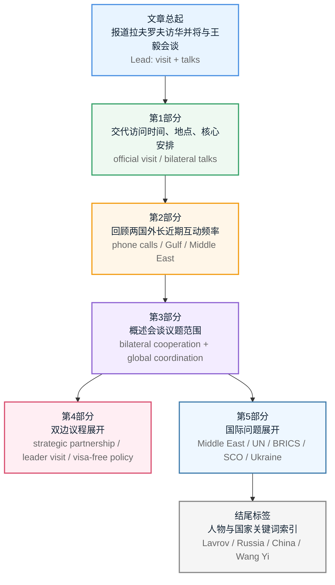

# 塔斯社：拉夫罗夫与王毅将在北京举行会谈

**来源**：TASS（塔斯社，俄罗斯国家通讯社）  
**栏目**：Политика（Politics，政治）  
**录入日期**：2026-04-15

---

## 前情提要

**文章来源**：TASS（塔斯社，俄罗斯国家通讯社）  
**栏目**：Политика（Politics，政治）  
**题目**：Лавров и Ван И проведут переговоры в Пекине  
**英文题目**：Lavrov and Wang Yi to Hold Talks in Beijing  
**中文题目**：拉夫罗夫与王毅将在北京举行会谈  
**署名**：Редакция сайта ТАСС（TASS 网站编辑部）

**作者/编辑背景简介**：  
TASS 是俄罗斯历史最久、覆盖面最广的国家通讯社之一，前身可追溯至 1904 年的 St. Petersburg Telegraph Agency。根据 TASS 官方介绍，该机构每天以联合国六种官方语言发布大量新闻、图片与视频，拥有遍布俄罗斯各地区及海外的记者站。本文署名并非单个记者，而是 **TASS 网站编辑部**，通常表示该稿件由编辑团队整合公开信息、官方通报与背景资料后完成。

**核对说明**：本文为用户提供的俄文稿件，内部存在若干**时间线明显不一致**之处，例如“14 апреля”与“2 декабря 2025 года”“феврале 2026 года”等信息并置，显示该文本可能经过网页复制、版本混入或日期错置。以下精读将**忠实整理并解析用户所给文本**，同时在相关句子的背景注释中提示时间异常。

**参考来源**：

- TASS 官方简介：https://tass.com/today  
- TASS 关于机构历史与概况的介绍：https://tass.com/society/1728541  

---

## 逐句精读

🔻 Главная / Политика / `Лавров` и `Ван И` / проведут переговоры / в `Пекине`.  
🔹 `Lavrov` and `Wang Yi` / will hold talks / in `Beijing`.  
🔸 `拉夫罗夫`与`王毅`将于`北京`举行会谈。

背景注释：

- **Главная / Политика**：网页导航栏信息，分别为“首页”“政治”，属于版面标签。
- **Lavrov / Sergei Lavrov**：谢尔盖·拉夫罗夫，俄罗斯外交部长。
- **Wang Yi**：王毅，中国外交部长。
- **Beijing**：北京，中国首都。
- 这一行实质上是**标题句**，高度概括全文主题。

> **`hold talks`｜举行会谈**
>
> 1. 英文释义（动词短语）：`to have formal discussions, especially between officials or governments`；举行正式讨论，尤指官员或政府间会谈。
> 2. 中文：举行会谈；展开磋商。
> 3. 语域：正式；新闻；外交。
> 4. 画龙点睛：这是外交新闻中的高频表达，常见搭配有 `hold talks with...`、`hold bilateral talks`、`hold high-level talks`。比一般的 `talk` 更正式，考试中常与 `meet`、`negotiate` 区分：`meet` 强调见面，`hold talks` 强调正式磋商，`negotiate` 则更强调为达成协议而谈判。

> **`will`｜将要**
>
> 1. 英文释义（modal verb）：`used to express the future`；用于表达将来。
> 2. 中文：将；会。
> 3. 语域：通用；新闻。
> 4. 画龙点睛：新闻标题常用一般将来时，表示已安排好的官方活动。阅读时要注意，`will` 在新闻中往往不只是“未来”，还隐含“官方已宣布的计划”。写作中若要显得更正式，可与 `is scheduled to`、`is set to` 互换使用。

---

🔻 Одной из тем беседы / глав `МИД` `России` и `Китая` / может быть / подготовка к визиту / президента `РФ` `Владимира Путина` / в `КНР`.  
🔹 One of the topics of the talks / between the foreign ministers of `Russia` and `China` / may be / preparations for the visit / of Russian President `Vladimir Putin` / to `China`.  
🔸 `俄罗斯`与`中国`两国外长会谈的议题之一，可能是为`俄罗斯总统弗拉基米尔·普京`访华所做的准备工作。

背景注释：

- **МИД**：Ministry of Foreign Affairs，外交部。
- **РФ**：Russian Federation，俄罗斯联邦。
- **КНР**：People’s Republic of China，中华人民共和国。
- **Vladimir Putin**：弗拉基米尔·普京，俄罗斯总统。
- 句中 `may be` 表明这是**推测性判断**，并非已正式确认的议题。

> **`topic`｜议题；话题**
>
> 1. 英文释义（noun）：`a subject that people discuss, write about, or deal with`；讨论、书写或处理的主题。
> 2. 中文：议题；主题；话题。
> 3. 语域：通用；新闻；学术。
> 4. 画龙点睛：在政治新闻中，`topic` 常与 `issue` 接近，但 `issue` 更强调“问题/事项”，`topic` 更偏“讨论内容”。搭配有 `a topic of discussion`、`a key topic`、`on the topic of`。写作中可用于替换过于口语的 `thing to talk about`。

> **`preparations for`｜为……做准备**
>
> 1. 英文释义（noun phrase）：`actions taken in advance in order to make something ready`；为使某事就绪而提前采取的准备工作。
> 2. 中文：为……所作的准备。
> 3. 语域：正式；新闻；行政。
> 4. 画龙点睛：`preparation` 既可数也可不可数，新闻里 `preparations for a visit / summit / meeting` 很常见。注意介词通常用 `for`。写作时可扩展为 `step up preparations for...`，表示“加紧准备”。

> **`may`｜可能**
>
> 1. 英文释义（modal verb）：`used to indicate possibility`；表示可能性。
> 2. 中文：可能；也许。
> 3. 语域：通用；新闻。
> 4. 画龙点睛：`may` 比 `will` 语气更保留，适合报道尚未证实的信息。阅读时要警惕情态动词所体现的“确定性等级”：`will` > `is likely to` > `may`。翻译时不可一律处理成“将”。

---

🔻 `Редакция` сайта `ТАСС` / 05:01  
🔹 `TASS` website editorial staff / 05:01  
🔸 `塔斯社网站编辑部` / `05:01`

背景注释：

- **Редакция сайта ТАСС**：即 TASS 网站编辑部，说明文章非单一记者署名，而是编辑团队署名。
- **05:01**：发布时间，通常指页面显示时间。

> **`editorial staff`｜编辑部；编辑团队**
>
> 1. 英文释义（noun phrase）：`the group of editors and journalists responsible for producing content`；负责内容制作的编辑与记者团队。
> 2. 中文：编辑部；编辑团队。
> 3. 语域：新闻；出版。
> 4. 画龙点睛：`staff` 是集合名词，表示“全体员工”，单复数谓语在不同英语变体中都可能出现。新闻署名中出现 `editorial staff`，往往意味着稿件由团队整理完成，而非一位特派记者独立撰写。

---

🔻 `ПЕКИН`, 14 апреля. / `ТАСС`/. / Министр иностранных дел `России` `Сергей Лавров` / 14-15 апреля посетит `Китай` / с официальным визитом, / где проведет переговоры / с главой `МИД КНР` `Ван И`.  
🔹 `BEIJING`, April 14. / `TASS`/. / Russian Foreign Minister `Sergey Lavrov` / will visit `China` on April 14-15 / on an official visit, / where he will hold talks / with Chinese Foreign Minister `Wang Yi`.  
🔸 `北京，4月14日。/塔斯社电/` `俄罗斯外交部长谢尔盖·拉夫罗夫`将于`4月14日至15日`对`中国`进行正式访问，并将在访问期间与`中国外交部长王毅`举行会谈。

背景注释：

- **BEIJING, April 14. / TASS /.**：典型通讯社电头格式，表示发稿地点与日期。
- **official visit**：正式访问，是外交活动中的规范术语。
- **Chinese Foreign Minister**：英文里为方便理解，将俄文 `глава МИД КНР` 顺译为“中国外交部长”。
- 本句是正文**导语句**，交代事件的时间、地点、人物与核心动作。

> **`official visit`｜正式访问**
>
> 1. 英文释义（noun phrase）：`a visit made in an official capacity, especially by a government representative`；政府代表以正式身份进行的访问。
> 2. 中文：正式访问。
> 3. 语域：外交；新闻。
> 4. 画龙点睛：与 `state visit` 不同，`state visit` 规格更高，通常用于国家元首层级；`official visit` 范围更广，可用于部长级访问。考试中容易误把两者混用，翻译时应结合来访者级别判断。

> **`Foreign Minister`｜外交部长**
>
> 1. 英文释义（noun）：`the government minister responsible for a country's foreign affairs`；负责一国外交事务的政府部长。
> 2. 中文：外交部长。
> 3. 语域：政治；外交。
> 4. 画龙点睛：英式和国际新闻里常见 `Foreign Minister`，美式语境更常见 `Secretary of State` 指美国国务卿。写作时谈他国外长职位，优先用 `foreign minister` 更稳妥。

> **`where`｜在该处；在其中**
>
> 1. 英文释义（relative adverb）：`in which place or situation`；在那个地点或情形中。
> 2. 中文：在那里；届时在……期间。
> 3. 语域：通用；书面。
> 4. 画龙点睛：本句中 `where` 指代前面的整段访问情境，中文不必机械译成“在那里”，自然表达常是“并将在访问期间……”。这类关系副词是长难句理解的常见考点。

---

🔻 Министры / поддерживают регулярный контакт.  
🔹 The ministers / maintain regular contact.  
🔸 两国外长一直`保持定期联系`。

背景注释：

- 此处的 **министры** 即上文所指俄罗斯外长拉夫罗夫与中国外长王毅。
- 在外交报道中，`maintain regular contact` 暗示双方沟通机制较稳定。

> **`maintain`｜保持；维持**
>
> 1. 英文释义（verb）：`to continue to have or keep something at a particular level or condition`；使某种状态持续；维持。
> 2. 中文：保持；维持。
> 3. 语域：正式；新闻；学术。
> 4. 画龙点睛：`maintain` 是写作中的高频正式动词，可替代普通的 `keep`。常见搭配：`maintain contact`、`maintain stability`、`maintain order`。此外还有“坚称”义，如 `maintain that...`，属于熟词僻义，考试中很常见。

> **`regular contact`｜定期联系；经常性沟通**
>
> 1. 英文释义（noun phrase）：`communication that takes place consistently or at fixed intervals`；持续发生或按固定频率进行的联系。
> 2. 中文：定期联系；经常性沟通。
> 3. 语域：正式；外交；商务。
> 4. 画龙点睛：`contact` 既可数也可不可数。`be in regular contact with...`、`maintain close contact with...` 都是地道搭配。写作时可用来表达机构、个人之间持续沟通的关系。

---

🔻 5 апреля / они провели телефонный разговор, / в ходе которого / обсудили ситуацию / в `Персидском заливе` / и международные усилия / по прекращению конфронтации / в регионе.  
🔹 On April 5, / they held a phone conversation, / during which / they discussed the situation / in the `Persian Gulf` / and international efforts / to end the confrontation / in the region.  
🔸 `4月5日`，两人进行了电话交谈，在通话中讨论了`波斯湾`局势，以及国际社会为结束该地区对抗所作的努力。

背景注释：

- **Persian Gulf**：波斯湾，中东重要海湾，涉及能源运输与地区安全。
- **international efforts**：通常指多国外交协调、劝和、斡旋或相关政治行动。
- **confrontation**：在国际新闻中常指对立、紧张、冲突升级，而不一定是全面战争。

> **`phone conversation`｜电话交谈**
>
> 1. 英文释义（noun phrase）：`a discussion held over the telephone`；通过电话进行的交谈。
> 2. 中文：电话交谈；通话。
> 3. 语域：中性；新闻。
> 4. 画龙点睛：外交新闻也常写作 `telephone conversation` 或 `phone call`。其中 `hold a phone conversation` 比 `make a phone call` 更正式，适合书面表达。翻译时可根据语境灵活处理成“通电话”“电话会谈”。

> **`during which`｜在此期间；在这次……中**
>
> 1. 英文释义（relative structure）：`used to introduce a clause describing what happened during an event`；引出“在该事件过程中发生了什么”的定语从句结构。
> 2. 中文：在此期间；在……过程中。
> 3. 语域：书面；正式。
> 4. 画龙点睛：这是长难句中非常高频的衔接结构。阅读时抓住先行词即可：这里指前面的 `a phone conversation`。写作中用它能有效避免简单句堆砌，提升句式层次。

> **`confrontation`｜对抗；对立**
>
> 1. 英文释义（noun）：`a hostile or argumentative situation between opposing sides`；对立双方之间敌对或紧张的状态。
> 2. 中文：对抗；对立；冲突态势。
> 3. 语域：新闻；政治；国际关系。
> 4. 画龙点睛：`confrontation` 不一定指直接军事冲突，也可指政治、外交或战略对峙。常见搭配：`escalate confrontation`、`avoid confrontation`、`end confrontation`。与 `conflict` 相比，它更强调“对峙态势”。

---

🔻 До этого / они созванивались / 1 марта / и выразили готовность / совместно способствовать / стабилизации ситуации / на `Ближнем Востоке`.  
🔹 Before that, / they had spoken by phone / on March 1 / and expressed readiness / to jointly contribute to / stabilizing the situation / in the `Middle East`.  
🔸 在此之前，双方曾于`3月1日`通电话，并表示愿意共同推动`中东`局势稳定。

背景注释：

- **Middle East**：中东地区，通常包括西亚和北非部分国家，是国际政治中的高敏感区域。
- **express readiness**：外交话语中很常见，表示“表达意愿/准备好……”，措辞通常较审慎。
- **jointly** 强调双方协同行动。

> **`readiness`｜准备；意愿**
>
> 1. 英文释义（noun）：`the state of being prepared or willing to do something`；准备就绪或愿意做某事的状态。
> 2. 中文：准备；意愿；就绪状态。
> 3. 语域：正式；新闻；外交。
> 4. 画龙点睛：`express readiness to do sth` 是固定搭配，常见于官方声明。它既可表示“愿意”，也可隐含“已有条件准备行动”。写作中若想更书面，可用 `willingness`、`preparedness`，但三者语义侧重点不同：`willingness` 偏主观意愿，`readiness` 更兼具意愿与状态。

> **`jointly`｜共同地；联合地**
>
> 1. 英文释义（adverb）：`together; by two or more people or groups acting together`；由两个或多个主体共同地。
> 2. 中文：共同地；联合地。
> 3. 语域：正式；商务；外交。
> 4. 画龙点睛：`jointly` 在正式文体中比 `together` 更常见，特别适合机构、国家之间的合作语境。常见搭配：`jointly promote`、`jointly issue`、`jointly develop`。写作中能显著提升正式度。

> **`stabilize` / `stabilization`｜使稳定 / 稳定化**
>
> 1. 英文释义（verb / noun）：`to make something stable` / `the process of becoming or making something stable`；使稳定 / 稳定的过程。
> 2. 中文：稳定；使稳定；稳定化。
> 3. 语域：正式；经济；政治；国际关系。
> 4. 画龙点睛：新闻里常见 `stabilize the situation`、`promote stabilization`。名词形式 `stabilization` 在书面表达中更密集。注意拼写中 `-ize / -ization` 是高频词缀，考研/GRE 词汇中很重要。

---

🔻 Последние переговоры / прошли / 2 декабря 2025 года / в `Москве`.  
🔹 Their latest talks / took place / in `Moscow` / on December 2, 2025.  
🔸 两人最近一次会谈于`2025年12月2日`在`莫斯科`举行。

背景注释：

- **Moscow**：莫斯科，俄罗斯首都。
- **时间异常提示**：本文前文电头为 `14 апреля`（4月14日），而本句却出现 `2025年12月2日` 作为“最近一次会谈”，在时间顺序上明显不合常理。这很可能是稿件版本混入、网页复制错位或原文数据异常。解析时保留原句信息，但应注意其时间逻辑问题。

> **`latest`｜最新的；最近的**
>
> 1. 英文释义（adjective）：`most recent; newest`；最近的；最新的。
> 2. 中文：最近的；最新的。
> 3. 语域：通用；新闻。
> 4. 画龙点睛：`latest` 在新闻中非常常见，但使用时一定要注意时间参照点。若文中时间混乱，翻译不能机械照搬其逻辑，应在注释中标出异常。与 `last` 比较：`last` 更像“上一次的”，`latest` 更强调“迄今最近”。

> **`take place`｜举行；发生**
>
> 1. 英文释义（verb phrase）：`to happen or be held`；发生；举行。
> 2. 中文：举行；发生。
> 3. 语域：正式；新闻。
> 4. 画龙点睛：这是极高频正式替换词，可替代口语 `happen`。如 `the meeting took place in Moscow`。注意它通常不用于被动结构，也不直接带宾语，这一点在语法改错题中常考。

---

🔻 В `МИД РФ` / накануне визита / сообщили, / что главы внешнеполитических ведомств / обсудят / широкий круг вопросов / двустороннего сотрудничества, / перспективы контактов / на различных уровнях / и взаимодействие / на международной арене.  
🔹 The `Russian Foreign Ministry` / said on the eve of the visit / that the two foreign ministers / would discuss / a broad range of issues / of bilateral cooperation, / the prospects for contacts / at various levels, / and interaction / in the international arena.  
🔸 `俄罗斯外交部`在访问前夕表示，两国外长将讨论`双边合作`中的广泛议题、`各层级接触`的前景，以及在`国际舞台`上的协作。

背景注释：

- **Russian Foreign Ministry**：俄罗斯外交部。
- **on the eve of the visit**：在访问前夕，典型新闻时间表达。
- **bilateral cooperation**：双边合作。
- **contacts at various levels**：通常指元首、部长、部门及地方等多层级往来。
- **international arena**：国际舞台，是新闻和国际关系中的常见比喻说法。

> **`a broad range of`｜广泛的；一系列的**
>
> 1. 英文释义（phrase）：`many different kinds of`；多种多样的。
> 2. 中文：广泛的；一系列的。
> 3. 语域：正式；新闻；学术。
> 4. 画龙点睛：`a broad range of issues` 是极其高频的书面搭配。可替换为 `a wide range of`。写作时它能帮助你避免反复使用 `many`，提升表达层次，但要注意后接复数名词。

> **`bilateral`｜双边的**
>
> 1. 英文释义（adjective）：`involving two countries, groups, or people`；涉及两个国家、群体或个人的。
> 2. 中文：双边的。
> 3. 语域：外交；国际关系；商务。
> 4. 画龙点睛：与 `multilateral`（多边的）相对。常见搭配：`bilateral ties`、`bilateral relations`、`bilateral meeting`、`bilateral cooperation`。在国际议题写作中，这组词是必备高频词。

> **`prospect`｜前景；可能性**
>
> 1. 英文释义（noun）：`the possibility that something will happen or develop in the future`；某事未来发生或发展的可能性。
> 2. 中文：前景；可能性。
> 3. 语域：正式；新闻；经济。
> 4. 画龙点睛：`prospect(s)` 可数性较灵活。新闻里常见 `the prospects for talks / cooperation / growth`。注意和 `expectation` 区别：`prospect` 偏客观前景，`expectation` 偏主观预期。

> **`international arena`｜国际舞台**
>
> 1. 英文释义（noun phrase）：`the sphere of international politics and relations`；国际政治与国际关系活动的场域。
> 2. 中文：国际舞台；国际领域。
> 3. 语域：新闻；政治。
> 4. 画龙点睛：`arena` 本义是“竞技场”，引申为“活动舞台”。写作中用于政治、经济、外交都很自然，如 `on the international arena` 或更常见的 `in the international arena`。属于形象但不口语的表达。

---

🔻 Двусторонняя повестка  
🔹 Bilateral agenda.  
🔸 双边议程。

背景注释：

- 这是小标题，用来引出下文关于俄中双边关系与合作内容。
- **agenda** 在新闻中可指正式议程，也可泛指讨论事项。

> **`agenda`｜议程；待办事项**
>
> 1. 英文释义（noun）：`a list of matters to be discussed or dealt with`；将要讨论或处理的事项清单。
> 2. 中文：议程；议题安排。
> 3. 语域：正式；会议；政治。
> 4. 画龙点睛：`agenda` 是写作万能词，但要注意它也有引申义，如 `political agenda`（政治主张/政策议程）。搭配：`on the agenda`、`set the agenda`、`top the agenda`。新闻标题中常省略冠词，呈现更紧凑。

---

🔻 Современные российско-китайские отношения / официально определяются сторонами / как / "`отношения всеобъемлющего партнерства и стратегического взаимодействия, / вступающие в новую эпоху`".  
🔹 Contemporary Russia-China relations / are officially defined by the two sides / as / "`a comprehensive partnership and strategic interaction / entering a new era`."  
🔸 当代`俄中关系`被双方正式定义为“`进入新时代的全面伙伴关系与战略协作关系`”。

背景注释：

- **Russia-China relations**：俄中关系。
- 这类表述常见于外交公报、联合声明和官方讲话中。
- **entering a new era**：带有较强政治语汇色彩，强调关系进入新阶段。

> **`define`｜界定；定义**
>
> 1. 英文释义（verb）：`to describe clearly the nature or meaning of something`；清楚界定某事的性质或含义。
> 2. 中文：界定；定义。
> 3. 语域：正式；学术；政治。
> 4. 画龙点睛：`define A as B` 是经典结构，考试中常出现。除“下定义”外，还可表示“塑造……特征”，如 `The era was defined by rapid change.` 阅读时要注意它的抽象引申义。

> **`comprehensive partnership`｜全面伙伴关系**
>
> 1. 英文释义（noun phrase）：`a wide-ranging cooperative relationship covering many fields`；涵盖多领域合作的广泛伙伴关系。
> 2. 中文：全面伙伴关系。
> 3. 语域：外交；政策。
> 4. 画龙点睛：`comprehensive` 在外交文本中常表示“覆盖面广、层次多”，并不只是日常意义上的“全面的”。常见于国家关系定位，属于正式政策语言，写作中不宜滥用到普通生活语境。

> **`strategic`｜战略的**
>
> 1. 英文释义（adjective）：`relating to long-term plans and important overall aims`；与长期规划和总体目标有关的。
> 2. 中文：战略的。
> 3. 语域：政治；军事；商业。
> 4. 画龙点睛：`strategic` 不等于单纯“重要的”，它强调“关乎全局、长期、方向性”。常见搭配：`strategic partnership`、`strategic interests`、`strategic planning`。考试翻译中容易被误译成“策略性的”。

---

🔻 "`Наша дипломатия` / осознанно продвигает / честное, равноправное / и взаимовыгодное партнерство / со всеми, / кто готов взаимодействовать с нами / на этих же принципах. / Примером такого сотрудничества, / безусловно, / являются / партнерские, дружеские отношения / с `Китайской Народной Республикой`, / нашим великим восточным соседом`", - / отмечал `Лавров` / в феврале 2026 года, / выступая в `Госдуме`.  
🔹 "`Our diplomacy` / deliberately promotes / honest, equal / and mutually beneficial partnership / with all those / who are ready to cooperate with us / on the same principles. / A clear example of such cooperation, / undoubtedly, / is / the partnership-based and friendly relationship / with the `People's Republic of China`, / our great eastern neighbor`," / `Lavrov` said / while speaking in the `State Duma` / in February 2026.  
🔸 “`我们的外交`有意识地推进同一切愿在这些相同原则基础上与我们开展合作的国家发展`诚实、平等、互利`的伙伴关系。此类合作的一个无疑的例子，就是同`中华人民共和国`——我们伟大的东方邻邦——之间的`伙伴式、友好关系`。”这是`拉夫罗夫`于`2026年2月`在`国家杜马`发言时所作表述。

背景注释：

- **Our diplomacy**：此处指俄罗斯外交。
- **People's Republic of China**：中华人民共和国。
- **State Duma**：俄罗斯联邦会议国家杜马，俄议会下院。
- **时间异常提示**：本句出现 `2026年2月`，与前文 `4月14日` 的当下报道时间再次不协调，显示文本内部时间线存在明显混杂。
- 引号内为直接引述官方话语，措辞政治色彩较强。

> **`deliberately`｜有意识地；刻意地**
>
> 1. 英文释义（adverb）：`in a way that is intentional and carefully considered`；以有意且经过考虑的方式。
> 2. 中文：有意识地；刻意地；审慎地。
> 3. 语域：正式；新闻；学术。
> 4. 画龙点睛：`deliberately` 既可中性表示“有意地”，也可在某些语境中带“故意”的负面色彩。外交表述里更偏“有意识、非偶然”。阅读时需结合上下文判断情感色彩。

> **`mutually beneficial`｜互利的；互惠的**
>
> 1. 英文释义（adjective）：`producing benefits for both or all sides involved`；让双方或多方都受益的。
> 2. 中文：互利的；互惠的。
> 3. 语域：商务；外交；正式。
> 4. 画龙点睛：高频搭配有 `mutually beneficial cooperation`、`mutually beneficial partnership`。比单纯 `beneficial` 更强调双方都得益。写作中非常适合用于国际合作、贸易、团队协作等话题。

> **`principle`｜原则**
>
> 1. 英文释义（noun）：`a basic rule, belief, or idea that guides behavior`；指导行为的基本规则、信念或理念。
> 2. 中文：原则。
> 3. 语域：通用；正式；政治。
> 4. 画龙点睛：`principle` 与 `principal` 常被混淆：前者是“原则”，后者是“主要的；校长”。搭配有 `on principle`、`basic principles`、`stick to one's principles`，是考试高频易错词。

> **`undoubtedly`｜无疑地；毫无疑问地**
>
> 1. 英文释义（adverb）：`without doubt; certainly`；没有疑问地；当然。
> 2. 中文：无疑地；毫无疑问地。
> 3. 语域：正式；演讲；评论。
> 4. 画龙点睛：它比 `certainly` 更有强调色彩，但在新闻转述中通常表明原说话者的主观看法。写作里可用于增强论证力度，但学术写作中要避免过度绝对化。

---

🔻 Ранее / помощник президента `РФ` / по международным делам / `Юрий Ушаков` / сообщил, / что председатель `КНР` `Си Цзиньпин` / пригласил / президента `РФ` `Владимира Путина` / с официальным визитом / в `Китай` / в первой половине 2026 года, / российский лидер / принял приглашение.  
🔹 Earlier, / Russian presidential aide for international affairs / `Yury Ushakov` / said / that Chinese President `Xi Jinping` / had invited / Russian President `Vladimir Putin` / to pay an official visit / to `China` / in the first half of 2026, / and the Russian leader / had accepted the invitation.  
🔸 此前，`俄罗斯总统国际事务助理尤里·乌沙科夫`表示，`中国国家主席习近平`已邀请`俄罗斯总统普京`于`2026年上半年`对`中国`进行正式访问，俄方领导人已接受邀请。

背景注释：

- **Yury Ushakov**：尤里·乌沙科夫，俄罗斯总统国际事务助理。
- **Xi Jinping**：习近平，中国国家主席。
- **the first half of 2026**：2026年上半年。
- **时间异常提示**：这里再次出现 2026 年时间点，继续显示文本时间系统存在混杂。
- `accepted the invitation` 表示访问具有较明确的政治安排意义。

> **`aide`｜助手；助理**
>
> 1. 英文释义（noun）：`an assistant to an important person, especially in government`；重要人物，尤指政府官员的助理。
> 2. 中文：助手；助理。
> 3. 语域：政治；正式。
> 4. 画龙点睛：发音近似 `aid`，但词性和功能不同。`aide` 指人，`aid` 可指帮助或援助。国际政治新闻里 `presidential aide`、`senior aide` 很常见，是考试常考辨析点。

> **`invite`｜邀请**
>
> 1. 英文释义（verb）：`to ask someone to come somewhere or do something`；邀请某人前往某处或做某事。
> 2. 中文：邀请。
> 3. 语域：通用；外交；礼仪。
> 4. 画龙点睛：在外交语境中，`invite a president to pay an official visit` 具有正式政治含义，不只是日常“邀请”。搭配 `invite sb to do sth`、`extend an invitation to sb`。后者更书面。

> **`accept the invitation`｜接受邀请**
>
> 1. 英文释义（phrase）：`to agree to an invitation`；同意接受邀请。
> 2. 中文：接受邀请。
> 3. 语域：通用；正式；外交。
> 4. 画龙点睛：外交报道中这一表达常意味着访问计划进入较实质阶段。写作时若想正式一些，可用 `accept an invitation to pay a visit`。注意冠词与介词搭配的完整性。

---

🔻 `Лавров` / указывал, / что `Россия` / будет активно / и продуктивно / готовиться / к этому визиту.  
🔹 `Lavrov` / pointed out / that `Russia` / would prepare / actively / and productively / for this visit.  
🔸 `拉夫罗夫`曾指出，`俄罗斯`将为此次访问进行积极而富有成效的准备。

背景注释：

- **pointed out**：在新闻转述中可表示“指出”“表示”“提到”，语气比 `said` 略更强调。
- **prepare actively and productively**：体现官方对访问筹备工作的积极预期。

> **`point out`｜指出**
>
> 1. 英文释义（verb phrase）：`to mention something in order to draw attention to it`；提及某事以引起注意。
> 2. 中文：指出；提到。
> 3. 语域：通用；新闻；学术。
> 4. 画龙点睛：`point out` 是正式写作和阅读中的核心短语，常可替换 `say`，使表达更精准。注意其后可接 `that` 从句，也可接名词。考试中常用于作者观点转述。

> **`productively`｜富有成效地**
>
> 1. 英文释义（adverb）：`in a way that produces useful results`；以产生有效成果的方式。
> 2. 中文：富有成效地；卓有成效地。
> 3. 语域：正式；商务；新闻。
> 4. 画龙点睛：这个词能显著提升表达正式度。相关词族：`productive`（高效的），`productivity`（生产率/效率）。在议论文写作里，用 `work productively`、`use time productively` 都很地道。

---

🔻 В этой связи / стоит ожидать, / что его подготовка / станет / одной из тем переговоров министров.  
🔹 In this regard, / it is reasonable to expect / that preparations for it / will become / one of the topics of the ministers' talks.  
🔸 鉴于此，有理由预计，围绕此次访问的筹备工作将成为两国外长会谈的议题之一。

背景注释：

- **In this regard**：鉴于此；就此而言，典型正式衔接语。
- 本句并非官方直接确认，而是报道中的**推断性判断**。
- `its preparation` 中的 `it` 指前述领导人访问。

> **`in this regard`｜在这方面；鉴于此**
>
> 1. 英文释义（linking phrase）：`with reference to what has just been mentioned`；就刚提到的事情而言。
> 2. 中文：在这方面；鉴于此；就此而言。
> 3. 语域：正式；书面；新闻。
> 4. 画龙点睛：这是非常实用的篇章连接表达，适合议论文与公文写作。可替换为 `in this respect`、`in this connection`，但细微语感不同，`in this regard` 最稳妥、最中性。

> **`reasonable`｜合理的；有根据的**
>
> 1. 英文释义（adjective）：`based on good judgment and therefore fair or sensible`；基于良好判断、因而合情合理的。
> 2. 中文：合理的；有根据的。
> 3. 语域：正式；通用。
> 4. 画龙点睛：句中译为 `it is reasonable to expect`，比直接说 `we can expect` 更客观、更书面。学术和新闻写作中，这类“降主观度”的表达非常值得模仿。

---

🔻 `Путин` / подписал / 1 декабря 2025 года / указ, / в соответствии с которым / граждане `КНР` / на основе принципа взаимности / до 14 сентября 2026 года / смогут приезжать / в `Россию` / сроком до 30 дней / без виз.  
🔹 `Putin` / signed / a decree / on December 1, 2025, / under which / citizens of `China`, / on the basis of reciprocity, / will be able to travel / to `Russia` / for up to 30 days / without visas / until September 14, 2026.  
🔸 `普京`于`2025年12月1日`签署一项法令。根据该法令，基于`互惠原则`，`中国公民`在`2026年9月14日`之前可`免签`赴`俄罗斯`停留最长`30天`。

背景注释：

- **decree**：法令、总统令。
- **on the basis of reciprocity**：基于互惠原则，即双方给予对等便利。
- **without visas**：免签。
- **时间异常提示**：此句时间仍与全文开头时间不一致，应视为原文内部时间系统存在问题。
- 对政策类句子，阅读时要特别注意**条件、对象、期限、停留时长**四个要素。

> **`decree`｜法令；政令**
>
> 1. 英文释义（noun）：`an official order issued by a legal or political authority`；法律或政治权力机关发布的正式命令。
> 2. 中文：法令；政令；总统令。
> 3. 语域：法律；政治；新闻。
> 4. 画龙点睛：`decree` 常用于总统、政府或法院发布的正式命令。与 `law` 不同，`law` 是法律；`decree` 更偏行政或权力机关发出的命令性文件。翻译时须根据制度背景灵活处理。

> **`reciprocity`｜互惠；对等**
>
> 1. 英文释义（noun）：`the practice of exchanging things with others for mutual benefit`；为共同利益进行对等交换的做法。
> 2. 中文：互惠；对等。
> 3. 语域：外交；法律；贸易。
> 4. 画龙点睛：这是正式高阶词，常见于 `on the basis/principle of reciprocity`。写作中若能准确使用，会明显提升词汇层次。注意它比简单的 `mutual benefit` 更突出“对等回报”机制。

> **`without visas` / `visa-free`｜免签**
>
> 1. 英文释义（phrase / adjective）：`not requiring a visa for entry`；入境无需签证。
> 2. 中文：免签；无需签证。
> 3. 语域：旅行；政策；新闻。
> 4. 画龙点睛：新闻里既可说 `travel without visas`，也可说 `under a visa-free regime`。写作中若讨论旅游政策、出入境便利化，这一表达非常实用。

---

🔻 `Китай` / ввел / в отношении россиян / аналогичный безвизовый режим / с 15 сентября 2025 года.  
🔹 `China` / introduced / a similar visa-free regime / for Russian citizens / starting from September 15, 2025.  
🔸 `中国`自`2025年9月15日`起也对`俄罗斯公民`实施了类似的`免签制度`。

背景注释：

- **visa-free regime**：免签制度；免签安排。
- **similar** 表明中方政策与俄方做法相对应。
- 本句与上一句共同构成“互惠原则”的具体体现。

> **`introduce`｜推出；实施**
>
> 1. 英文释义（verb）：`to bring something into use or operation for the first time`；首次启用或施行某项事物。
> 2. 中文：推出；实施；引入。
> 3. 语域：正式；政策；商业。
> 4. 画龙点睛：`introduce a policy / measure / system` 是正式写作高频搭配。不要只记住“介绍”义，它在新闻里更多表示“推行、实施”，属于典型熟词僻义。

> **`regime`｜制度；机制**
>
> 1. 英文释义（noun）：`a system or planned way of doing things, especially imposed or organized officially`；一种正式组织或实施的制度、机制。
> 2. 中文：制度；机制；体制。
> 3. 语域：正式；政治；法律。
> 4. 画龙点睛：`regime` 在政治学中也可指“政权”，但在 `visa-free regime` 中仅表示“制度安排”。考试中要结合搭配判断词义，避免机械理解成“政权”。

---

🔻 Посол `Китая` / в `Москве` / `Чжан Ханьхуэй` / ранее заявил `ТАСС`, / что безвизовый режим / между `Россией` и `Китаем` / желательно продлить / навсегда.  
🔹 Chinese Ambassador to `Moscow` / `Zhang Hanhui` / earlier told `TASS` / that the visa-free regime / between `Russia` and `China` / should preferably be extended / permanently.  
🔸 `中国驻莫斯科大使张汉晖`此前对`塔斯社`表示，`俄中之间的免签制度`最好能够`永久延长`。

背景注释：

- **Zhang Hanhui**：张汉晖，中国驻俄罗斯大使。
- **permanently**：永久地。
- `should preferably be extended permanently` 带有建议、期望色彩，不是法律决定。

> **`extend`｜延长；扩大**
>
> 1. 英文释义（verb）：`to make something longer in time or larger in scope`；使时间延长或范围扩大。
> 2. 中文：延长；扩大；续延。
> 3. 语域：通用；正式；法律。
> 4. 画龙点睛：`extend` 是高频多义词。可表示“延长时间”（`extend a deadline`）、“扩大范围”（`extend cooperation`），还可表示“给予”（`extend an invitation`）。考试中常通过搭配区分义项。

> **`permanently`｜永久地**
>
> 1. 英文释义（adverb）：`for all future time; in a lasting way`；持续到未来全部时间；永久地。
> 2. 中文：永久地；长期地。
> 3. 语域：正式；政策；法律。
> 4. 画龙点睛：`permanent` / `permanently` 常用于政策安排、职位变动、技术状态等。和 `long-term` 区别：`long-term` 是长期但未必永久；`permanent(ly)` 则更绝对。

---

🔻 Вероятно, / эта тема / также будет стоять / на повестке переговоров.  
🔹 Probably, / this issue / will also be / on the agenda / of the talks.  
🔸 很可能，这一问题也将列入此次会谈的议程。

背景注释：

- **Probably**：表示较高程度的推测。
- **on the agenda**：列入议程，是会议、外交、政策报道的常用说法。
- 本句不是正式确认，而是记者基于前文信息作出的判断。

> **`probably`｜很可能；大概**
>
> 1. 英文释义（adverb）：`used to say that something is likely to happen or be true`；用于表示某事很可能发生或属实。
> 2. 中文：很可能；大概。
> 3. 语域：通用；新闻。
> 4. 画龙点睛：新闻写作常借助 `probably`、`likely`、`apparently` 控制确定性。阅读时必须识别这些词，以分清“已证实事实”和“媒体推断”。

> **`on the agenda`｜在议程上；列入议程**
>
> 1. 英文释义（phrase）：`scheduled to be discussed`；被安排进行讨论。
> 2. 中文：列入议程；提上议事日程。
> 3. 语域：会议；政治；商务。
> 4. 画龙点睛：固定搭配，十分实用。常见表达：`be on the agenda`、`put sth on the agenda`、`top the agenda`。雅思写作和考研翻译中，谈政策和会议安排时很好用。

---

🔻 Международные проблемы  
🔹 International issues.  
🔸 国际问题。

背景注释：

- 这是第二个小标题，引出下文关于中东、联合国、多边机制与地区热点问题的内容。
- **issues** 比 `problems` 更中性，更适合外交文本。

> **`issue`｜问题；议题**
>
> 1. 英文释义（noun）：`an important subject or problem for discussion`；值得讨论的重要问题或议题。
> 2. 中文：问题；议题；事项。
> 3. 语域：通用；正式；新闻。
> 4. 画龙点睛：`issue` 是新闻英语最常见的万能名词之一，比 `problem` 更中性、覆盖面更广。搭配：`global issues`、`key issues`、`address an issue`。在写作中能显著提升正式感。

---

🔻 Кризис / на `Ближнем Востоке` / остается / одной из центральных тем / мировой политики.  
🔹 The crisis / in the `Middle East` / remains / one of the central issues / in world politics.  
🔸 `中东`危机仍然是`世界政治`中的核心议题之一。

背景注释：

- **Middle East crisis**：泛指中东地区持续冲突与紧张态势。
- **world politics**：世界政治；国际政治格局。
- `remains` 表示该问题并非新近出现，而是持续性焦点。

> **`remain`｜仍然是；保持**
>
> 1. 英文释义（verb）：`to continue to be in the same state or condition`；继续保持某种状态。
> 2. 中文：仍然是；保持。
> 3. 语域：通用；书面；新闻。
> 4. 画龙点睛：`remain` 是写作中比 `still be` 更正式的替换词。常见结构：`remain + adjective/noun`。例如 `remain unresolved`、`remain a challenge`。考试作文中非常好用。

> **`central`｜核心的；中心的**
>
> 1. 英文释义（adjective）：`most important or essential`；最重要的；核心的。
> 2. 中文：核心的；中心的。
> 3. 语域：通用；新闻；学术。
> 4. 画龙点睛：在抽象语境中，`central` 常不译为“中心的”，而译为“核心的、关键的”，如 `a central issue`。写作中可替代 `important`，显得更精炼高级。

---

🔻 В российском дипведомстве / подтвердили, / что этот вопрос / будет обсуждаться / на предстоящих переговорах.  
🔹 The Russian foreign ministry / confirmed / that this issue / would be discussed / at the upcoming talks.  
🔸 `俄罗斯外交部门`证实，这一问题将在即将举行的会谈中被讨论。

背景注释：

- **confirmed**：证实，意味着该议题已获官方确认。
- **upcoming talks**：即将举行的会谈。
- 与前文中的推测性表达不同，本句确定性更强。

> **`confirm`｜证实；确认**
>
> 1. 英文释义（verb）：`to state that something is definitely true or has been arranged`；说明某事属实或已被安排。
> 2. 中文：证实；确认。
> 3. 语域：新闻；商务；正式。
> 4. 画龙点睛：`confirm` 在新闻里是“信息可靠性”信号词。阅读时，一旦出现 `confirmed`，通常意味着信息来源级别提高。搭配：`confirm that...`、`confirm a visit`、`confirm reports`。

> **`upcoming`｜即将到来的**
>
> 1. 英文释义（adjective）：`happening soon`；很快就会发生的。
> 2. 中文：即将到来的。
> 3. 语域：通用；新闻。
> 4. 画龙点睛：比 `future` 更强调“近期将发生”。如 `upcoming talks / elections / meeting`。写作里能自然替代单调的 `next`，尤其适合正式文体。

---

🔻 На международных площадках, / в частности / в `ООН`, / `Москва` и `Пекин` / тесно координируют / подходы.  
🔹 On international platforms, / particularly / at the `United Nations`, / `Moscow` and `Beijing` / closely coordinate / their approaches.  
🔸 在国际平台上，尤其是在`联合国`框架内，`莫斯科`与`北京`在立场上保持密切协调。

背景注释：

- **United Nations / UN**：联合国。
- **Moscow / Beijing**：在政治新闻中常用首都代指国家政府。
- **coordinate approaches**：协调立场、政策取向或处理方式，是外交报道固定搭配。
- **international platforms**：国际平台，泛指联合国及各类多边机制。

> **`coordinate`｜协调**
>
> 1. 英文释义（verb）：`to organize different people or activities so that they work together effectively`；组织不同人员或活动，使其有效协同。
> 2. 中文：协调；协同。
> 3. 语域：正式；外交；管理。
> 4. 画龙点睛：外交语境里 `coordinate positions/approaches/actions` 非常常见。注意它既可作动词，也可作形容词 `coordinate`（同等级的），但后者较少见。写作中这个词比 `work together` 更正式、更精准。

> **`approach`｜立场；处理方式**
>
> 1. 英文释义（noun）：`a particular way of dealing with something`；处理某事的特定方式。
> 2. 中文：方式；路径；立场。
> 3. 语域：通用；新闻；学术。
> 4. 画龙点睛：`approach` 是典型熟词多义：可指“靠近”，也可指“方法、处理方式”。国际关系报道中常译为“立场”或“处理方式”，如 `coordinate approaches to global issues`。

---

🔻 Одним из примеров / является / совместное голосование / против резолюции `Бахрейна` / по `Ормузскому проливу` / в `Совете Безопасности ООН`.  
🔹 One example / is / the joint vote / against `Bahrain`'s resolution / on the `Strait of Hormuz` / in the `UN Security Council`.  
🔸 其中一个例子是，双方在`联合国安理会`就`巴林`提交的有关`霍尔木兹海峡`的决议草案进行`共同投票反对`。

背景注释：

- **Bahrain**：巴林，中东海湾国家。
- **Strait of Hormuz**：霍尔木兹海峡，全球能源运输要道。
- **UN Security Council**：联合国安全理事会。
- **joint vote against**：共同投票反对，说明两国在具体议题上立场一致。
- 本句涉及具体国际事件，但文中未提供该决议更多背景细节。

> **`joint`｜联合的；共同的**
>
> 1. 英文释义（adjective）：`done or produced by two or more people or groups together`；由两个或多个主体共同完成的。
> 2. 中文：联合的；共同的。
> 3. 语域：正式；外交；商务。
> 4. 画龙点睛：`joint` 在国际报道中是核心词，如 `joint statement`、`joint exercise`、`joint project`。它强调“共同参与”，比 `shared` 更偏正式合作场景。

> **`resolution`｜决议；决议草案**
>
> 1. 英文释义（noun）：`a formal decision or statement agreed on by an official group`；由正式机构通过的决定或声明。
> 2. 中文：决议；决议草案。
> 3. 语域：法律；外交；联合国事务。
> 4. 画龙点睛：在联合国语境中，`resolution` 是关键词。阅读时需区分 `draft resolution`（决议草案）与已通过的 `resolution`。翻译时是否加“草案”，要看上下文是否已表决通过。

> **`vote against`｜投票反对**
>
> 1. 英文释义（verb phrase）：`to vote in opposition to a proposal or person`；在投票中对某项提案或某人投反对票。
> 2. 中文：投票反对。
> 3. 语域：政治；议会；新闻。
> 4. 画龙点睛：与 `vote for`（投票赞成）、`abstain`（弃权）构成一组高频政治词汇。作文讨论民主、制度、国际组织时都很实用。

---

🔻 Министры / в последнем телефонном разговоре / выразили удовлетворение / совпадением подходов стран / по большинству вопросов / глобальной повестки дня, / включая ситуацию / вокруг `Ирана`.  
🔹 In their latest phone conversation, / the ministers / expressed satisfaction / with the convergence of their countries' positions / on most issues / on the global agenda, / including the situation / surrounding `Iran`.  
🔸 在最近一次通话中，两国外长对双方国家在`全球议程`多数问题上的`立场趋同`表示满意，其中包括围绕`伊朗`局势的问题。

背景注释：

- **Iran**：伊朗，中东重要国家，也是国际外交关注焦点。
- **global agenda**：全球议程，指国际社会普遍关注的重要问题。
- **convergence of positions/approaches**：立场趋同、观点接近。
- `express satisfaction with...` 是官方表态中常见的礼貌性积极评价。

> **`express satisfaction`｜表示满意**
>
> 1. 英文释义（phrase）：`to formally say that one is pleased with something`；正式表示对某事满意。
> 2. 中文：表示满意。
> 3. 语域：正式；外交；新闻。
> 4. 画龙点睛：这是官方新闻中的固定表达，语气比简单的 `be happy with` 更正式、更克制。写作中讨论机构、政府、会议成果时非常实用。

> **`convergence`｜趋同；汇合**
>
> 1. 英文释义（noun）：`the process of becoming similar or coming together`；变得相似或汇合的过程。
> 2. 中文：趋同；一致化；汇合。
> 3. 语域：学术；外交；经济。
> 4. 画龙点睛：高阶词。国际关系中常见 `convergence of views / positions / interests`。与 `consensus` 不同，`convergence` 强调“逐渐接近”，不一定表示完全一致。

> **`agenda`｜议程；关注事项**
>
> 1. 英文释义（noun）：`the set of items or issues to be dealt with`；需要处理的事项或议题集合。
> 2. 中文：议程；议题范围。
> 3. 语域：正式；政治；会议。
> 4. 画龙点睛：在 `global agenda` 中，它不再是单场会议的议程，而是“全球公共议题清单”。这是 `agenda` 的常见引申义，考试翻译时要根据语境灵活处理。

---

🔻 В `МИД РФ` / сообщили, / что на переговорах / также планируется / обсудить / совместную работу / в `ООН`, `БРИКС`, `ШОС`, `Группе двадцати`, `АТЭС` / и других многосторонних механизмах / и форумах.  
🔹 The `Russian Foreign Ministry` / said / that the talks / are also expected / to discuss / joint work / in the `UN`, `BRICS`, the `SCO`, the `Group of Twenty`, the `APEC` forum, / and other multilateral mechanisms / and forums.  
🔸 `俄罗斯外交部`表示，此次会谈还计划讨论双方在`联合国`、`金砖国家机制`、`上合组织`、`二十国集团`、`亚太经合组织`以及其他`多边机制`和论坛中的合作。

背景注释：

- **UN**：联合国。
- **BRICS**：金砖国家合作机制。
- **SCO / Shanghai Cooperation Organization**：上海合作组织。
- **Group of Twenty / G20**：二十国集团。
- **APEC / Asia-Pacific Economic Cooperation**：亚太经济合作组织。
- **multilateral mechanisms and forums**：多边机制和论坛，是国际合作的重要载体。

> **`multilateral`｜多边的**
>
> 1. 英文释义（adjective）：`involving several countries or groups`；涉及多个国家或群体的。
> 2. 中文：多边的。
> 3. 语域：外交；国际关系；经济。
> 4. 画龙点睛：与 `bilateral` 相对，是国际问题写作中的核心词。常见搭配：`multilateral cooperation`、`multilateral framework`、`multilateral mechanism`。讨论全球治理时几乎必备。

> **`mechanism`｜机制**
>
> 1. 英文释义（noun）：`an established process or system for achieving something`；为实现某事而建立的过程或制度。
> 2. 中文：机制。
> 3. 语域：正式；政策；学术。
> 4. 画龙点睛：`mechanism` 是高频抽象名词，新闻和论文都常用。不要只理解成“机械装置”；在社科语境中更常表示“制度安排、运行机制”。写作中非常加分。

> **`forum`｜论坛；会议平台**
>
> 1. 英文释义（noun）：`a place, meeting, or medium where ideas and views are exchanged`；交换观点的场所、会议或平台。
> 2. 中文：论坛；平台；会议机制。
> 3. 语域：正式；国际事务；学术。
> 4. 画龙点睛：`forum` 既可指实体会议，也可指交流平台。复数 `forums` 是标准形式。国际新闻里常与 `mechanism` 连用，表示正式合作渠道。

---

🔻 Кроме того, / ожидается / обстоятельный обмен мнениями / по ряду "`горячих тем`" / и региональных сюжетов, / включая `украинский кризис`, / добавили / в министерстве.  
🔹 In addition, / a substantive exchange of views / is expected / on a number of "`hot issues`" / and regional topics, / including the `Ukraine crisis`, / the ministry / added.  
🔸 此外，`该部`补充称，双方预计还将就一系列“`热点问题`”及地区性议题进行`深入交换意见`，其中包括`乌克兰危机`。

背景注释：

- **substantive exchange of views**：深入交换意见，强调讨论内容较为充分。
- **hot issues**：热点问题，常见于新闻报道，但并非特别正式的官方术语。
- **Ukraine crisis**：乌克兰危机。
- **the ministry added**：该部补充称，为新闻引语常见结尾格式。

> **`substantive`｜实质性的；内容充实的**
>
> 1. 英文释义（adjective）：`dealing with real and important matters`；涉及真实而重要内容的。
> 2. 中文：实质性的；内容充实的。
> 3. 语域：正式；学术；外交。
> 4. 画龙点睛：`substantive` 常用于 `substantive talks / progress / discussion`，强调“不是走形式”。与 `substantial` 容易混淆：后者更偏“数量大、程度高”；前者更偏“内容实质”。

> **`exchange of views`｜交换意见**
>
> 1. 英文释义（noun phrase）：`a discussion in which different opinions are shared`；交流不同意见的讨论。
> 2. 中文：交换意见；意见交流。
> 3. 语域：正式；外交；会议。
> 4. 画龙点睛：这是外交报道的固定表达。比 `discussion` 更温和，也更符合官方措辞。常见变体：`have an exchange of views on...`、`conduct a frank exchange of views`。

> **`hot issue`｜热点问题；敏感议题**
>
> 1. 英文释义（noun phrase）：`an issue receiving a lot of attention or causing strong concern`；受到广泛关注或引起强烈关切的问题。
> 2. 中文：热点问题；敏感议题。
> 3. 语域：新闻；评论。
> 4. 画龙点睛：`hot` 在这里不是“热的”，而是“热门的、敏感的”。写作中使用要注意语体，正式学术文章里可替换为 `pressing issue`、`high-profile issue`、`sensitive issue`。

---

🔻 `Лавров`, `Сергей Викторович` / `Россия` / `Китай` / `Ван И`  
🔹 `Lavrov`, `Sergey Viktorovich` / `Russia` / `China` / `Wang Yi`  
🔸 `拉夫罗夫，谢尔盖·维克托罗维奇` / `俄罗斯` / `中国` / `王毅`

背景注释：

- 这部分是网页底部的**标签/索引词**，便于站内检索，不属于正文叙述句。
- **Sergey Viktorovich**：拉夫罗夫的父称。俄语姓名常由名、父称、姓构成。
- 此类标签在网页复制文本中常被一并带出，精读时应识别其版面功能。

> **`tag` / `index term`｜标签；索引词**
>
> 1. 英文释义（noun）：`a keyword used to classify or retrieve information`；用于分类或检索信息的关键词。
> 2. 中文：标签；索引词。
> 3. 语域：媒体；互联网；出版。
> 4. 画龙点睛：网页复制材料常混入标签、栏目、推荐位等噪音信息。阅读时学会识别这类非正文成分，能显著提高信息筛选效率，这也是英语考试长篇材料处理的重要能力之一。

---

