# 越中友谊｜越中关系：贸易增长的新动力

**来源**：人民军队报网中文频道（QDND）  
**稿件来源**：越通社（Vietnam News Agency, VNA）  
**发布时间**：2026-04-14 13:00 (GMT+7)  
**录入日期**：2026-04-18  

**作者背景简介**：越通社（Vietnam News Agency, VNA）是越南国家通讯社，承担对内对外新闻发布职能，常为越南官方媒体提供时政、经济、外交等稿件来源。

---

## 前情提要

```mermaid
flowchart TD
    A["文章主题<br/>Vietnam–China trade growth<br/>越中贸易增长新动力"]:::c1
    B["开头<br/>建交以来关系全面发展<br/>贸易是突出亮点"]:::c2
    C["现实背景<br/>高层访问带来新机遇<br/>推动可持续双边贸易"]:::c3
    D["第一部分<br/>可信赖的邻居"]:::c4
    E["第1层<br/>地理相近 + 消费习惯相似<br/>带动贸易持续增长"]:::c5
    F["第2层<br/>2025全年贸易额2564亿美元<br/>2026年前两月667亿美元"]:::c6
    G["第3层<br/>越南出口农水产品等<br/>中国向越南供应设备原料零件"]:::c5
    H["第4层<br/>跨境电商 + 交通物流升级<br/>降低成本提高效率"]:::c6
    I["第二部分<br/>扩大合作"]:::c7
    J["第1层<br/>海口贸易促进办公室成立<br/>合作方向更加具体"]:::c8
    K["第2层<br/>海南区位特殊<br/>是中国与东南亚往来的重要门户"]:::c9
    L["第3层<br/>越南—海南贸易规模仍小<br/>地方合作潜力大"]:::c8
    M["第4层<br/>海南自贸港政策突破<br/>注入经贸投资新动力"]:::c9
    N["第5层<br/>产业互补明显<br/>正制定2026-2028合作计划"]:::c8
    O["第6层<br/>海口办公室作为桥梁<br/>服务企业、推广品牌"]:::c9
    P["第三部分<br/>政策建议与未来方向"]:::c10
    Q["转型方向<br/>从边贸/小额出口转向`正贸`<br/>聚焦高质量产品"]:::c11
    R["制度与标准<br/>强化质量管理<br/>扩大GlobalGAP/VietGAP/HACCP应用"]:::c12
    S["投资与互联互通<br/>吸引中国投资高科技、绿色、数字领域<br/>加强公铁海基础设施联通"]:::c11
    T["市场拓展<br/>从云南/广东/广西扩展至中国西部、东部、西南部"]:::c12
    U["结尾落点<br/>遵守标准、重视溯源与品牌建设<br/>推动未来可持续发展"]:::c10

    A --> B --> C --> D
    D --> E --> F --> G --> H
    H --> I
    I --> J --> K --> L --> M --> N --> O
    O --> P
    P --> Q --> R --> S --> T --> U

    classDef c1 fill:#dbeafe,stroke:#2563eb,color:#0f172a
    classDef c2 fill:#ede9fe,stroke:#7c3aed,color:#111827
    classDef c3 fill:#fee2e2,stroke:#dc2626,color:#111827
    classDef c4 fill:#dcfce7,stroke:#16a34a,color:#111827
    classDef c5 fill:#fef3c7,stroke:#d97706,color:#111827
    classDef c6 fill:#cffafe,stroke:#0891b2,color:#111827
    classDef c7 fill:#fce7f3,stroke:#db2777,color:#111827
    classDef c8 fill:#e0f2fe,stroke:#0284c7,color:#111827
    classDef c9 fill:#fae8ff,stroke:#a21caf,color:#111827
    classDef c10 fill:#e2e8f0,stroke:#475569,color:#111827
    classDef c11 fill:#ecfccb,stroke:#65a30d,color:#111827
    classDef c12 fill:#ffe4e6,stroke:#e11d48,color:#111827
```

---

🔹 Since diplomatic ties were established / on `January 18, 1950`, / Vietnam–China relations have developed comprehensively, / with `trade` standing out as a major highlight.  
🔸 自`1950年1月18日`建交以来，越中关系实现了全面发展，其中`贸易`尤为亮眼。

背景注释：

- `diplomatic ties`：指国家间正式外交关系。
- `January 18, 1950`：中越建交日期，是理解全文历史起点的关键时间坐标。
- `comprehensively`：在新闻语境中常指“多领域、全方位”发展，而非单一层面。
- `highlight`：此处不是“高光时刻”的口语义，而是“突出亮点、重点成果”。

> **`diplomatic ties` 外交关系** /ˌdɪpləˈmætɪk taɪz/
> n. phrase. official relations between states 国家间正式外交关系
> 中文：外交关系；邦交
> 语域：外交、新闻、国际关系
> 画龙点睛：`establish diplomatic ties with...` 是高频外交表达，写作中可替换普通的 `have relations with`。注意 `tie` 常用复数 `ties` 表示双边联系；搭配还有 `sever ties`、`strengthen ties`、`normalize ties`，是时政阅读与翻译中的核心词组。

> **`stand out` 突出，显眼** /ˌstænd ˈaʊt/
> v. phrase. to be clearly noticeable; to be better or more important than others 显得突出；尤为重要
> 中文：突出；脱颖而出
> 语域：通用、新闻、学术写作
> 画龙点睛：`stand out as...` 表“作为……而突出”，非常适合写作升格，如 `Innovation stands out as a key driver.` 不只用于外貌“显眼”，更常用于抽象评价，属于熟词常考引申义。

> **`highlight` 亮点；重点** /ˈhaɪlaɪt/
> n. a particularly important or interesting detail 最重要或最有意思的部分
> 中文：亮点；重点
> 语域：新闻、商务、学术
> 画龙点睛：名词义常见于报道总结；动词义则是“强调”。阅读中需区分 `a highlight of...` 与 `highlight the importance of...`。写作里可作高级替换：`a major highlight`, `one of the highlights`, 比 `important point` 更自然。

---

🔹 China is / one of Vietnam’s `largest trading partners` / and plays an important role / in Vietnam’s supply chains / and product distribution, / while Vietnam is also / an important trading partner of China / in ASEAN.  
🔸 中国是越南`最大的贸易伙伴之一`，并在越南的供应链与商品销售中发挥重要作用；与此同时，越南也是中国在东盟的重要贸易伙伴。

背景注释：

- `trading partner`：贸易伙伴，指在货物或服务贸易中往来密切的国家或地区。
- `supply chains`：供应链，指从原材料到生产、运输、销售的完整链条。
- `product distribution`：商品销售/分销体系。
- `ASEAN`：Association of Southeast Asian Nations，东南亚国家联盟，区域经济合作的重要框架。

> **`trading partner` 贸易伙伴** /ˈtreɪdɪŋ ˌpɑːrtnər/
> n. phrase. a country or company that regularly trades with another 经常进行贸易往来的国家或公司
> 中文：贸易伙伴
> 语域：经济、新闻、商务
> 画龙点睛：常见搭配有 `largest trading partner`, `key trading partner`, `major trading partner`。写作时若要体现经贸关系，可直接用这一固定搭配，远比泛泛的 `business partner` 更准确专业。

> **`supply chain` 供应链** /səˈplaɪ tʃeɪn/
> n. the network involved in producing and delivering a product 生产并交付产品所涉及的链条体系
> 中文：供应链
> 语域：经济、商业、制造业
> 画龙点睛：这是近年高频词，尤其在全球化、产业转移、物流中常考。可搭配 `integrate into the supply chain`, `disrupt the supply chain`, `strengthen supply-chain resilience`。注意复数 `supply chains` 在新闻中很常见。

> **`play a role in` 在……中发挥作用** /pleɪ ə roʊl ɪn/
> v. phrase. to influence or contribute to something 对某事产生影响或作出贡献
> 中文：在……中发挥作用
> 语域：通用、新闻、学术
> 画龙点睛：写作万能结构。可升级为 `play an important / significant / pivotal role in...`。比单纯说 `affect` 更稳妥，因为它既可表达积极影响，也可表达参与性作用，是阅读翻译中的常见骨架表达。

---

🔹 The state visit to China / by To Lam, / General Secretary of the Communist Party of Vietnam Central Committee / and State President of Vietnam, / is expected to / open up `new opportunities` for bilateral trade / and inject momentum into `sustainable development`.  
🔸 越共中央总书记、越南国家主席`苏林`对中国进行的国事访问，预计将为双边贸易打开`新的机遇`，并为`可持续发展`注入动力。

背景注释：

- `state visit`：国事访问，外交礼仪等级很高。
- `To Lam`：苏林，时任越共中央总书记、越南国家主席。
- `bilateral trade`：双边贸易。
- `sustainable development`：可持续发展，常见于经济、环境与政策文本。

> **`state visit` 国事访问** /steɪt ˈvɪzɪt/
> n. phrase. an official visit by a head of state to another country 国家元首对另一国进行的正式访问
> 中文：国事访问
> 语域：外交、时政
> 画龙点睛：与普通 `visit` 不同，`state visit` 带有严格外交礼仪含义。考试翻译里不能简单译成“访问”。常见搭配：`pay a state visit to...`, `during his state visit`, `official visit`（级别略宽泛）要注意区分。

> **`open up opportunities` 开辟机遇** /ˈoʊpən ʌp ˌɑːpərˈtuːnətiz/
> v. phrase. to create favorable chances 创造有利机会
> 中文：开辟机遇；带来机会
> 语域：新闻、商务、政策
> 画龙点睛：`open up` 有“打开、开拓、开放”多义，此处是抽象义“开辟”。写作中比 `bring opportunities` 更生动。可搭配 `open up new markets`, `open up room for cooperation`, 很适合经贸话题作文。

> **`sustainable development` 可持续发展** /səˈsteɪnəb(ə)l dɪˈveləpmənt/
> n. phrase. development that meets present needs without harming the future 满足当代需求且不损害未来的发展
> 中文：可持续发展
> 语域：政策、经济、环境、学术
> 画龙点睛：绝对高频政策词组。可延展为 `sustainable growth`, `green development`, `long-term development`。写作中若涉及环保、经济、治理，可用它提升表达层级，但要注意它通常带有长期性和协调性含义。

---

🔹 With the advantages / of geographical proximity / and similar consumer habits, / trade between the two countries / has maintained `positive growth momentum`.  
🔸 依托地理接近和消费习惯相似这两大优势，两国之间的贸易保持了`积极的增长态势`。

背景注释：

- `geographical proximity`：地理邻近。
- `consumer habits`：消费者习惯/消费习惯。
- `growth momentum`：增长势头、增长动能，常见经济报道表述。

> **`proximity` 接近；邻近** /prɑːkˈsɪməti/
> n. nearness in distance, time, or relationship 接近；邻近
> 中文：接近；邻近
> 语域：正式、学术、新闻
> 画龙点睛：比 `closeness` 更正式，常见搭配 `geographical proximity`, `in close proximity to...`。阅读中常和区位优势连用。写作时若谈地区合作、物流优势，用它会比口语化表达更地道。

> **`consumer habits` 消费习惯** /kənˈsuːmər ˈhæbɪts/
> n. phrase. regular patterns in how consumers buy and use goods 消费者购买和使用商品的习惯模式
> 中文：消费习惯
> 语域：经济、市场、商业
> 画龙点睛：`consumer behavior` 更偏“消费行为”学术概念，`consumer habits` 更偏日常稳定模式。阅读时要区分。作文讨论市场、营销、跨境电商时，这类搭配都非常实用。

> **`momentum` 动力；势头** /moʊˈmentəm/
> n. driving force or forward movement 推动力；发展势头
> 中文：动能；势头
> 语域：新闻、经济、学术
> 画龙点睛：原义为物理“动量”，新闻中常引申为“发展势头”。高频搭配有 `gain momentum`, `maintain momentum`, `inject momentum into...`。这是典型熟词僻义，阅读里常考，写作里也很加分。

---

🔹 In `2025`, / China was Vietnam’s largest trading partner.  
🔸 在`2025年`，中国是越南最大的贸易伙伴。

背景注释：

- 这是对双边经贸格局的直接判断句，时间点明确，应注意与其他年份数据区分。
- `largest trading partner` 表示按总体贸易规模衡量排名居首。

> **`largest` 最大的** /ˈlɑːrdʒɪst/
> adj. biggest in size, amount, or degree 在规模、数量或程度上最大的
> 中文：最大的
> 语域：通用、新闻
> 画龙点睛：比较级、最高级在新闻中常用于排名判断。像 `largest trading partner`, `largest export market`, `largest source of imports` 都是经贸类固定句型，翻译时需把逻辑关系译准确。

> **`trading partner` 贸易伙伴** /ˈtreɪdɪŋ ˌpɑːrtnər/
> n. phrase. a party with which trade is conducted 进行贸易往来的对象
> 中文：贸易伙伴
> 语域：经济、商务
> 画龙点睛：同一核心词在全文反复出现，说明它是主题词。建议重点积累其排名表达：`the top trading partner`, `one of the biggest trading partners`, `a major trading partner in the region`。

---

🔹 Vietnam is / China’s largest trading partner in ASEAN / and also / its `fourth-largest` trading partner globally, / with bilateral trade / reaching `US$256.4 billion`, / up `24.8%`.  
🔸 越南是中国在东盟最大的贸易伙伴，同时也是中国在全球范围内`第四大`贸易伙伴；双边贸易额达到`2564亿美元`，增长`24.8%`。

背景注释：

- `ASEAN`：东盟，是中国周边经贸合作的重要区域组织。
- `globally`：从全球范围排名，而非局限于某一区域。
- `US$256.4 billion`：即2564亿美元。
- `up 24.8%`：新闻中常用的简略增幅表达。

> **`fourth-largest` 第四大的** /ˌfɔːrθ ˈlɑːrdʒɪst/
> adj. ranking fourth in size or importance 位列第四大的
> 中文：第四大的
> 语域：新闻、统计
> 画龙点睛：这类复合序数表达在英文新闻中非常高频，如 `second-largest economy`, `third-biggest market`。写作时可模仿其结构来表达国际排名，简洁有力。

> **`bilateral trade` 双边贸易** /baɪˈlætərəl treɪd/
> n. phrase. trade conducted between two countries 两国之间的贸易
> 中文：双边贸易
> 语域：经济、外交
> 画龙点睛：与 `multilateral trade`（多边贸易）相对。写作与翻译中，涉及两国经贸往来时优先使用 `bilateral`。常见搭配：`bilateral ties`, `bilateral cooperation`, `bilateral agreement`。

> **`reach` 达到** /riːtʃ/
> v. to arrive at a particular level or amount 达到某一水平或数量
> 中文：达到
> 语域：通用、新闻、统计
> 画龙点睛：统计句中非常常见，如 `sales reached...`, `the number reached...`。比 `be` 更动态。写作图表题可大量使用。注意搭配 `reach a record high`, `reach US$...`, `reach its peak`。

---

🔹 In the first two months of `2026`, / bilateral trade / reached `US$66.7 billion`, / a `30.2%` increase / compared with the same period of `2025`.  
🔸 在`2026年`前两个月，双边贸易额达到`667亿美元`，较`2025年`同期增长`30.2%`。

背景注释：

- `the same period`：同一时期，是同比表达中的标准说法。
- 此句提供短期增长数据，用于强化“增长势头”判断。

> **`increase` 增长；增加** /ˈɪŋkriːs/
> n. a rise in amount, number, or degree 数量、程度或规模的上升
> 中文：增长；增加
> 语域：通用、新闻、统计
> 画龙点睛：作名词读 /ˈɪŋkriːs/，作动词读 /ɪnˈkriːs/，考试中常考重音差异。图表写作高频搭配：`a sharp increase`, `a steady increase`, `show an increase of...`。注意与 `rise`、`growth` 的细微语感差别。

> **`compared with` 与……相比** /kəmˈperd wɪð/
> prep. phrase. examined in relation to another thing 与另一对象进行比较
> 中文：与……相比
> 语域：通用、学术、新闻
> 画龙点睛：图表和数据句必备。`compared with` 常用于指出差异，`compared to` 有时更偏类比，但现代英语中两者也有交叉。考试写作尽量稳妥用 `compared with the same period last year`。

---

🔹 Vietnam exports / major products to China / such as `agricultural products`, `aquatic products`, electronic components, textiles, rubber, and crude oil, / among which / agricultural products enjoy significant advantages / due to strong Chinese consumer demand.  
🔸 越南向中国出口的主要商品包括`农产品`、`水产品`、电子零部件、纺织品、橡胶和原油等；其中，由于中国消费需求旺盛，`农产品`具有明显优势。

背景注释：

- `agricultural products`：农产品。
- `aquatic products`：水产品，在中国语境中常见，对应英文也常见于贸易报道。
- `electronic components`：电子零部件。
- `crude oil`：原油。
- `consumer demand`：消费需求。

> **`agricultural products` 农产品** /ˌæɡrɪˈkʌltʃərəl ˈprɑːdʌkts/
> n. phrase. goods produced through farming and agriculture 农业生产的产品
> 中文：农产品
> 语域：农业、贸易、新闻
> 画龙点睛：常与 `farm produce` 近义，但 `agricultural products` 更正式。可搭配 `export agricultural products`, `market access for agricultural products`。农业贸易题材中几乎是必备词组。

> **`aquatic products` 水产品** /əˈkwætɪk ˈprɑːdʌkts/
> n. phrase. products from water-based farming or fishing 来自水域养殖或捕捞的产品
> 中文：水产品
> 语域：贸易、农业、渔业
> 画龙点睛：与 `seafood` 相比，`aquatic products` 更正式、更宽，既可含海产也可含淡水养殖产品。政策或海关语境中常见，用于翻译“水产品”非常准确。

> **`demand` 需求** /dɪˈmænd/
> n. the desire or need for goods or services 对商品或服务的需要
> 中文：需求
> 语域：经济、市场、通用
> 画龙点睛：搭配极多：`consumer demand`, `market demand`, `meet the demand for...`。动词义也很常见，表示“要求”。阅读中注意区分经济名词义与日常动词义，是典型多义词。

---

🔹 By contrast, / Vietnam imports from China / machinery and equipment for production, / industrial raw materials, / and electronic components.  
🔸 相比之下，越南从中国进口用于生产的机械设备、工业原材料以及电子零部件。

背景注释：

- `By contrast`：表示对照、转折，引出进口结构。
- `machinery and equipment`：机械设备。
- `industrial raw materials`：工业原材料。

> **`by contrast` 相比之下** /baɪ ˈkɑːntræst/
> adv. phrase. used to show a difference when comparing things 用于对比差异
> 中文：相比之下；反过来
> 语域：正式、学术、新闻
> 画龙点睛：衔接句意非常好用。比 `however` 更强调对照关系。写作中用于比较图表、两国政策、正反面现象都很自然，可与 `in contrast` 互换，但前者更常作句首插入语。

> **`machinery` 机器设备总称** /məˈʃiːnəri/
> n. machines collectively, especially in industry 机器设备的总称
> 中文：机械；机械设备
> 语域：工业、贸易
> 画龙点睛：通常作不可数名词，不能说 `many machineries`。若想表达“多台机器”，应说 `many machines`。这是考试中常见的可数/不可数陷阱。

> **`raw materials` 原材料** /rɔː məˈtɪriəlz/
> n. phrase. basic substances used to make products 用于生产产品的基础材料
> 中文：原材料
> 语域：工业、经济
> 画龙点睛：搭配 `industrial raw materials`, `import raw materials`, `source raw materials from...`。与 `materials` 相比，`raw materials` 明确强调“未经加工的基础投入品”。

---

🔹 The diversity / of the two countries’ commodity structures / helps them / leverage their respective `comparative advantages` / and contributes to / their shared economic development.  
🔸 两国商品结构的多样性有助于它们发挥各自的`比较优势`，并推动共同的经济发展。

背景注释：

- `commodity structures`：商品结构，即进出口商品类别构成。
- `comparative advantages`：比较优势，国际贸易理论核心概念。
- `shared economic development`：共同经济发展。

> **`comparative advantage` 比较优势** /kəmˈpærətɪv ədˈvæntɪdʒ/
> n. phrase. the ability to produce something at a lower opportunity cost than others 以更低机会成本生产某种产品的能力
> 中文：比较优势
> 语域：经济学、贸易
> 画龙点睛：国际贸易理论核心术语，考试中很值得掌握。不要和 `competitive advantage` 混淆：前者偏经济学比较成本，后者偏市场竞争力。写作中若讨论分工、国际贸易、产业互补，这个词非常到位。

> **`leverage` 利用，发挥** /ˈlevərɪdʒ/
> v. to use something to maximum advantage 充分利用
> 中文：利用；借助
> 语域：商务、经济、正式
> 画龙点睛：比普通 `use` 更高级，常见于商业英语。搭配 `leverage resources`, `leverage technology`, `leverage advantages`。新闻和商务写作中频率很高，属于实用型升格词。

> **`contribute to` 有助于；促成** /kənˈtrɪbjuːt tuː/
> v. phrase. to help cause or bring about something 有助于促成某事
> 中文：有助于；促进
> 语域：通用、学术、新闻
> 画龙点睛：这是写作最常用因果表达之一。后面可接名词、代词或动名词。比 `lead to` 语气更温和，更适合表达“积极贡献”或多因素之一的作用。

---

🔹 In addition to traditional trade, / `cross-border e-commerce` has developed rapidly / and become an important channel / for Vietnamese businesses, / especially those dealing in agricultural products, / to enter the Chinese market.  
🔸 除了传统贸易之外，`跨境电子商务`发展迅速，并已成为越南企业，尤其是农产品企业，进入中国市场的重要渠道。

背景注释：

- `cross-border e-commerce`：跨境电商，是近年国际贸易新形式。
- `channel`：此处指市场进入渠道，而非物理“水道”。
- `enter the market`：进入市场。

> **`cross-border e-commerce` 跨境电子商务** /ˌkrɔːs ˈbɔːrdər iːˈkɑːmɜːrs/
> n. phrase. online trade across national borders 跨越国界进行的电子商务
> 中文：跨境电商
> 语域：商务、贸易、数字经济
> 画龙点睛：热点词汇，常与 `digital trade`, `online retail`, `platform economy` 联动出现。写作讨论外贸新模式时非常好用。注意拼写可写作 `e-commerce`，连字符不能漏。

> **`channel` 渠道** /ˈtʃænəl/
> n. a means through which something is achieved or delivered 实现或传递某事的途径
> 中文：渠道；途径
> 语域：商务、新闻、通用
> 画龙点睛：熟词常见义是“频道、海峡”，但商务中常表示“渠道”。如 `sales channel`, `distribution channel`, `an important channel for...`。阅读中要学会根据语境切换义项。

> **`enter` 进入** /ˈentər/
> v. to begin involvement in a place, market, or activity 进入某地、市场或领域
> 中文：进入
> 语域：通用、商务
> 画龙点睛：`enter the Chinese market` 是非常标准的商务表达。比 `go into` 更正式。写作中还可说 `market entry`, `barriers to entry`, 形成一组高频搭配。

---

🔹 At the same time, / transport and logistics infrastructure / between the two countries / has been upgraded, / including expressways, border gates, cross-border railways, and seaports, / helping to lower transport costs / and improve cargo circulation efficiency.  
🔸 同时，两国之间的交通与物流基础设施得到升级，包括高速公路、口岸、跨境铁路和海港，这有助于降低运输成本并提升货物流通效率。

背景注释：

- `logistics infrastructure`：物流基础设施。
- `border gates`：口岸。
- `cross-border railways`：跨境铁路。
- `cargo circulation efficiency`：货物流通效率。

> **`logistics` 物流** /ləˈdʒɪstɪks/
> n. the planning and movement of goods 货物运输与调配管理
> 中文：物流
> 语域：商业、运输、供应链
> 画龙点睛：不要只理解成“后勤”。在经贸语境里，它常指商品运输、仓储、配送体系。可搭配 `logistics costs`, `logistics hub`, `logistics network`，是跨境贸易阅读中的高频核心词。

> **`upgrade` 升级** /ʌpˈɡreɪd/
> v. to improve something to a higher standard 提升到更高水平
> 中文：升级；改善
> 语域：通用、技术、政策
> 画龙点睛：可作动词也可作名词。新闻里常见被动：`be upgraded`。写作谈基础设施、产业、消费结构时都可用，搭配 `upgrade infrastructure`, `industrial upgrading`, `consumption upgrade`。

> **`efficiency` 效率** /ɪˈfɪʃənsi/
> n. the ability to do something well without wasting time or resources 高效完成事情且少浪费资源的能力
> 中文：效率
> 语域：通用、学术、商务
> 画龙点睛：搭配极广：`improve efficiency`, `energy efficiency`, `operational efficiency`。写作中与 `productivity` 常一起出现，但前者偏“效率”，后者偏“生产率”，不要混淆。

---

🔹 Against the backdrop / of continuously growing bilateral trade, / the establishment of the Vietnam Trade Promotion Office in Haikou, China, / helps to `translate` / the two sides’ cooperation directions / into concrete action.  
🔸 在双边贸易持续增长的背景下，越南驻中国海口贸易促进办公室的设立，有助于将双方合作方向`具体化`并落到实处。

背景注释：

- `against the backdrop of`：在……背景下，新闻/论文常用。
- `Trade Promotion Office`：贸易促进办公室，承担市场对接、推广、协调等功能。
- `Haikou`：海口，海南省省会。
- 此处 `translate` 为抽象义“转化为、具体落实”，不是“翻译”。

> **`against the backdrop of` 在……背景下** /əˈɡenst ðə ˈbækdrɑːp əv/
> prep. phrase. in the context of a broader situation 在更大背景或环境之下
> 中文：在……背景下
> 语域：正式、新闻、学术
> 画龙点睛：这是高级书面衔接短语，特别适合议论文和新闻分析。可替换普通的 `in the context of`，语感更强。后面常接名词性短语，如 `global uncertainty`, `rapid urbanization`。

> **`establishment` 设立；建立** /ɪˈstæblɪʃmənt/
> n. the act of creating something formally 正式建立某事物的行为
> 中文：设立；成立
> 语域：正式、法律、政策
> 画龙点睛：来自动词 `establish`。在公文和新闻里很常见，如 `the establishment of a mechanism / office / fund`。写作中名词化表达能提高正式程度，是很实用的学术与政策文体资源。

> **`translate ... into ...` 将……转化为……** /trænzˈleɪt ... ˈɪntuː .../
> v. phrase. to turn an idea or plan into a practical result 将理念或计划变为实际结果
> 中文：把……转化为……；落实为……
> 语域：正式、新闻、商务
> 画龙点睛：这是典型熟词僻义。不是语言翻译，而是“转化、落实”。如 `translate policy into practice`, `translate potential into growth`。考试翻译很爱考这一义项，务必掌握。

---

🔹 Nguyen Sinh Nhat Tan, / Deputy Minister of Industry and Trade of Vietnam, / said that Hainan has long held advantages / as an active center / of economy, trade, and tourism / in southern China, / and, with its special geographical position, / serves as an important gateway / linking China with Southeast Asia, / including Vietnam.  
🔸 越南工贸部副部长`阮生日新`表示，海南长期以来在中国南部作为经济、贸易和旅游活跃中心具有优势；同时，凭借其特殊的地理位置，海南还是连接中国与包括越南在内东南亚地区的重要门户。

背景注释：

- `Nguyen Sinh Nhat Tan`：阮生日新，越南工贸部副部长。
- `Hainan`：海南，中国最南端省级行政区之一，区位接近东南亚。
- `gateway`：门户，常用于交通、贸易、战略地理表述。
- `southern China`：中国南部。

> **`active center` 活跃中心** /ˈæktɪv ˈsentər/
> n. phrase. a place where activities are concentrated and dynamic 活动密集且发展活跃的中心
> 中文：活跃中心
> 语域：新闻、经济
> 画龙点睛：`active` 在这里不是“积极的某个人”，而是“活跃的、繁盛的”。这类搭配在区域经济报道中很常见，如 `a major economic hub`, `an active trading center`，可灵活改写。

> **`geographical position` 地理位置** /ˌdʒiːəˈɡræfɪkəl pəˈzɪʃən/
> n. phrase. the location of a place in geographic terms 地理上的位置
> 中文：地理位置
> 语域：正式、地理、新闻
> 画龙点睛：与 `location` 相比，`geographical position` 更正式、更适合分析区位优势。写作中可以与 `strategic location` 互换使用，但后者更强调战略意义。

> **`gateway` 门户；通道** /ˈɡeɪtweɪ/
> n. a place that acts as an entrance to another area or market 通往另一地区或市场的入口
> 中文：门户；通道
> 语域：新闻、地理、商务
> 画龙点睛：这是非常形象的抽象表达，如 `a gateway to Southeast Asia`。既可指交通枢纽，也可指市场入口。写作中用它来描述城市或港口的战略地位，很自然也很高级。

---

🔹 According to statistics / from China Customs, / bilateral trade between Vietnam and Hainan / reached about `US$1.41 billion` in `2025`, / accounting for `0.48%` / of total Vietnam–China trade, / indicating that / the potential for local-level cooperation / remains substantial.  
🔸 据中国海关统计，`2025年`越南与海南双边贸易额约为`14.1亿美元`，占越中贸易总额的`0.48%`，这表明双方地方层面的合作潜力依然巨大。

背景注释：

- `China Customs`：中国海关，官方统计来源。
- `account for`：占比。
- `local-level cooperation`：地方层面合作，不是中央层级合作。
- `potential`：潜力。

> **`account for` 占……比例；构成** /əˈkaʊnt fɔːr/
> v. phrase. to form or make up a part of a total 占总量中的一部分
> 中文：占；构成
> 语域：统计、新闻、学术
> 画龙点睛：高频统计表达。除“解释”义外，它在数据句中常表示“占比”。如 `exports account for 30% of GDP`。考试中常因多义而干扰判断，必须结合数字语境识别。

> **`potential` 潜力** /pəˈtenʃəl/
> n. the possibility for future development or success 未来发展或成功的可能性
> 中文：潜力
> 语域：通用、商务、教育
> 画龙点睛：常用搭配 `have great potential`, `unlock the potential of...`, `market potential`。写作中非常百搭，但注意不要滥用空泛表述，最好和具体领域连用，如 `growth potential`, `cooperation potential`。

> **`substantial` 相当大的；可观的** /səbˈstænʃəl/
> adj. large in amount or degree 数量或程度相当大的
> 中文：巨大的；可观的
> 语域：正式、新闻、学术
> 画龙点睛：比 `big`、`large` 更正式。可用于 `substantial progress`, `substantial investment`, `substantial differences`。阅读和写作里都很常见，是提升正式度的高频形容词。

---

🔹 The Hainan Free Trade Port / officially began operation / on `December 18, 2025`, / and has introduced / a series of `breakthrough policies`, / which are expected to / inject new momentum / into economic, trade, and investment cooperation.  
🔸 海南自由贸易港于`2025年12月18日`正式运作，并推出了一系列`突破性政策`，预计将为经济、贸易和投资合作注入新的动力。

背景注释：

- `Hainan Free Trade Port`：海南自由贸易港，中国推进高水平开放的重要平台。
- `December 18, 2025`：此处为明确时间节点。
- `breakthrough policies`：突破性政策，表示制度创新力度较大。
- `inject new momentum into...`：为……注入新动能。

> **`free trade port` 自由贸易港** /friː treɪd pɔːrt/
> n. phrase. a port area with preferential trade and customs policies 具有优惠贸易与海关政策的港口区域
> 中文：自由贸易港
> 语域：经济、政策、贸易
> 画龙点睛：与 `free trade zone` 相近但不完全等同。后者范围更广，前者更突出港口开放与制度安排。阅读政策类文章时要注意具体制度定位差异。

> **`breakthrough` 突破性的；突破** /ˈbreɪkθruː/
> adj./n. a sudden and important advance 重大突破；突破性的进展
> 中文：突破；突破性的
> 语域：新闻、科技、政策
> 画龙点睛：可作名词也可作定语形容词，如 `a breakthrough in medicine`, `breakthrough policies`。写作中适合描述制度创新、科研进展，但要确保对象确实具有“突破”色彩。

> **`inject ... into ...` 向……注入……** /ɪnˈdʒekt/
> v. to add something, especially energy or money, to improve a situation 注入某种力量、资金或活力
> 中文：注入
> 语域：新闻、商务、通用
> 画龙点睛：原义是“注射”，引申义在新闻里非常常见，如 `inject vitality into the economy`, `inject confidence into the market`。属于很地道的动态表达。

---

🔹 Vietnam and Hainan / have highly complementary industrial structures / in fields such as / merchandise trade, agricultural products, processing industries, tourism, and the digital economy.  
🔸 越南与海南在商品贸易、农产品、加工业、旅游业和数字经济等领域具有很强的产业结构互补性。

背景注释：

- `complementary`：互补的。
- `processing industries`：加工业。
- `digital economy`：数字经济。
- `industrial structures`：产业结构。

> **`complementary` 互补的** /ˌkɑːmpləˈmentəri/
> adj. combining well to complete or enhance each other 相互补充、彼此强化的
> 中文：互补的
> 语域：经济、商务、学术
> 画龙点睛：常见搭配 `complementary advantages`, `complementary industries`, `be complementary to each other`。不要和 `complimentary`（赞美的/免费的）混淆，拼写和含义完全不同，考试中常设陷阱。

> **`processing industry` 加工业** /ˈprɑːsesɪŋ ˈɪndəstri/
> n. phrase. industry involved in turning raw materials into finished or semi-finished goods 将原材料加工为成品或半成品的产业
> 中文：加工业
> 语域：工业、经济
> 画龙点睛：与 `manufacturing` 相近，但 `processing` 更强调“加工环节”。翻译“加工工业/加工业”时这个词非常准确，尤其在农产品、轻工业、食品工业语境中常见。

> **`digital economy` 数字经济** /ˈdɪdʒɪtəl ɪˈkɑːnəmi/
> n. phrase. economic activity driven by digital technologies 由数字技术驱动的经济活动
> 中文：数字经济
> 语域：政策、科技、经济
> 画龙点睛：近年热点高频词。可搭配 `develop the digital economy`, `digital transformation`, `platform economy`。写作科技与经济融合主题时极具实用价值。

---

🔹 The two sides / are drawing up / a `2026–2028 cooperation plan` / to effectively implement / the agreements already signed.  
🔸 双方正在制定`2026—2028年合作计划`，以便有效落实已经签署的协议。

背景注释：

- `draw up`：起草、制定。
- `implement`：落实、执行。
- `agreements already signed`：已签署协议。

> **`draw up` 起草；制定** /drɔː ʌp/
> v. phrase. to prepare something officially, such as a plan or contract 正式起草或制定
> 中文：制定；起草
> 语域：正式、法律、政策
> 画龙点睛：非常常见的书面动词短语，常搭配 `draw up a plan`, `draw up a list`, `draw up a contract`。比 `make` 更正式、更准确，适合写作升格。

> **`implement` 实施；落实** /ˈɪmplɪment/
> v. to put a plan, decision, or system into effect 使计划、决定或制度付诸实施
> 中文：实施；落实
> 语域：正式、政策、学术
> 画龙点睛：政策文本高频词。与 `carry out` 接近，但 `implement` 更偏制度、政策、措施的正式执行。名词同形 `implement` 还有“工具”的意思，需靠语境判断。

> **`agreement` 协议** /əˈɡriːmənt/
> n. an arrangement or promise accepted by parties 各方接受的安排或约定
> 中文：协议；协定
> 语域：通用、法律、外交
> 画龙点睛：在国际关系中，`agreement` 常比 `treaty` 更宽泛。搭配有 `sign an agreement`, `implement an agreement`, `bilateral agreement`。翻译时要看正式程度决定译作“协议”还是“协定”。

---

🔹 The Vietnam Trade Promotion Office in Haikou / is expected to become / an important `bridge`, / helping businesses obtain market information, / promoting trade and investment activities, / and / promoting Vietnamese products and brands / in the Chinese market.  
🔸 越南驻海口贸易促进办公室有望成为一座重要的`桥梁`，帮助企业获取市场信息，推动贸易与投资促进活动，并在中国市场推广越南产品和品牌。

背景注释：

- `bridge`：此处为比喻义，表示沟通连接机制。
- `market information`：市场信息。
- `promote products and brands`：推广产品和品牌。

> **`bridge` 桥梁；纽带** /brɪdʒ/
> n. something that connects two sides or groups 连接双方的人、物或机制
> 中文：桥梁；纽带
> 语域：通用、新闻、外交
> 画龙点睛：熟词常见引申义。写作中常见 `serve as a bridge between... and...`，既可指人，也可指机构、平台、语言、教育交流。翻译时不要只理解为实体桥。

> **`obtain` 获得** /əbˈteɪn/
> v. to get something, especially by effort or process 通过努力或程序获得
> 中文：获得
> 语域：正式、学术、商务
> 画龙点睛：比 `get` 正式得多，适合书面表达。常搭配 `obtain information`, `obtain approval`, `obtain a visa`。考试写作中是非常好用的升格替换词。

> **`promote` 促进；推广** /prəˈmoʊt/
> v. to encourage or support the growth of something; to advertise 推动发展；推广宣传
> 中文：促进；推广
> 语域：通用、商务、政策
> 画龙点睛：多义高频词。既可表示“促进合作”，也可表示“推广产品”。阅读中要靠宾语判断具体义项。搭配如 `promote trade`, `promote investment`, `promote a brand` 都非常常见。

---

🔹 To promote bilateral trade, / Vietnam’s Ministry of Industry and Trade believes / it is necessary to change / the way of entering the Chinese market, / make a strong shift / toward `official trade`, / gradually reduce / the form of small-scale exports, / and focus on `high-quality products`.  
🔸 为推动双边贸易，越南工贸部认为，有必要改变进入中国市场的方式，强力转向`正贸`，逐步减少小额出口形式，并专注于`高质量产品`。

背景注释：

- `official trade`：此处对应中文“正贸”，即更规范、正式、制度化的贸易方式。
- `small-scale exports`：小额出口。
- `high-quality products`：高质量产品，强调质量升级而非数量扩张。

> **`official trade` 正式贸易；正贸** /əˈfɪʃəl treɪd/
> n. phrase. trade conducted through formal, regulated channels 通过正式、规范渠道进行的贸易
> 中文：正贸；正式贸易
> 语域：贸易、政策
> 画龙点睛：此词组带有政策和制度色彩，强调规范报关、正式结算、标准准入等。与边民互市、小额边贸等形成对照。翻译时不能简单译成“官方贸易”而忽略其“规范贸易渠道”含义。

> **`gradually` 逐步地** /ˈɡrædʒuəli/
> adv. slowly over time rather than suddenly 逐渐地、循序渐进地
> 中文：逐步地；渐进地
> 语域：通用、正式
> 画龙点睛：政策和改革类文本高频副词。写作中可替换 `slowly`，更显书面。常搭配 `gradually reduce`, `gradually improve`, `gradually shift from... to...`。

> **`high-quality` 高质量的** /ˌhaɪ ˈkwɑːləti/
> adj. of a high standard of excellence 质量水平高的
> 中文：高质量的
> 语域：通用、商务、政策
> 画龙点睛：这是新闻和政策中常见的评价性形容词。可扩展到 `high-quality development`, `high-quality growth`, `high-quality products`。写作中要注意最好配具体名词，不宜孤立堆砌。

---

🔹 Localities / need to formulate / sectoral development strategies, / develop large-scale and specialized production areas, / and align them / with `market signals`.  
🔸 各地方需要制定行业发展战略，发展大规模、专业化产区，并使其与`市场信号`相衔接。

背景注释：

- `localities`：地方政府或地方地区。
- `formulate`：制定。
- `specialized production areas`：专业化产区。
- `market signals`：市场信号，指需求、价格、趋势等信息反馈。

> **`formulate` 制定；构想** /ˈfɔːrmjəleɪt/
> v. to create or express something systematically 系统地制定或表述
> 中文：制定；规划
> 语域：正式、学术、政策
> 画龙点睛：常搭配 `formulate a strategy/policy/plan`。比 `make` 或 `create` 更正式，更强调系统性，是议论文和公文写作中的高频升级词。

> **`specialized` 专业化的** /ˈspeʃəlaɪzd/
> adj. designed or focused on a particular purpose or area 专门化、专业化的
> 中文：专业化的
> 语域：经济、教育、通用
> 画龙点睛：可用于 `specialized production`, `specialized training`, `specialized knowledge`。与 `professional` 不同，`specialized` 强调“专门针对某一领域”，而非“职业性的”。

> **`market signal` 市场信号** /ˈmɑːrkɪt ˈsɪɡnəl/
> n. phrase. information from the market indicating demand, price, or direction 反映需求、价格或走势的市场信息
> 中文：市场信号
> 语域：经济、商务
> 画龙点睛：经济分析常用术语。写作中若想表达“根据市场需求调整生产”，可用 `respond to market signals`，比简单说 `follow the market` 更专业。

---

🔹 At the same time, / it is necessary to strengthen / quality management of export goods / and expand the application / of standards such as `GlobalGAP`, `VietGAP`, and `HACCP`; / make use of cooperation mechanisms / to remove technical barriers / and draw up roadmaps / for market access / for export products.  
🔸 与此同时，有必要加强出口商品质量管理，扩大`GlobalGAP`、`VietGAP`和`HACCP`等标准的应用；利用合作机制消除技术壁垒，并为出口产品制定市场准入路线图。

背景注释：

- `GlobalGAP`：国际良好农业规范认证体系。
- `VietGAP`：越南良好农业规范。
- `HACCP`：Hazard Analysis and Critical Control Points，危害分析与关键控制点体系，常见食品安全标准。
- `technical barriers`：技术壁垒，通常涉及检验检疫、标准认证、标签要求等。
- `market access`：市场准入。

> **`quality management` 质量管理** /ˈkwɑːləti ˈmænɪdʒmənt/
> n. phrase. the control and improvement of product or process quality 对产品或流程质量的控制与提升
> 中文：质量管理
> 语域：商务、工业、标准化
> 画龙点睛：常与 `quality control` 一起出现，但前者更偏系统管理，后者更偏具体检验控制。写作中若谈产品升级、国际竞争力，`quality management` 很贴切。

> **`technical barrier` 技术壁垒** /ˈteknɪkəl ˈbæriər/
> n. phrase. non-tariff restrictions based on standards or regulations 基于标准或法规形成的非关税限制
> 中文：技术壁垒
> 语域：贸易、法律、政策
> 画龙点睛：国际贸易中非常关键的概念，常见于农产品、食品、电子产品出口。可搭配 `remove technical barriers`, `face technical barriers to trade`。理解它有助于做经贸类阅读推断题。

> **`market access` 市场准入** /ˈmɑːrkɪt ˈækses/
> n. phrase. the ability or permission to enter and sell in a market 进入某一市场并销售的资格或机会
> 中文：市场准入
> 语域：贸易、政策、商务
> 画龙点睛：与 `enter the market` 相比，`market access` 更制度化，强调规则、审批、标准和通道。写作讨论贸易谈判、农产品出口、外资进入时都很常用。

---

🔹 At the same time, / it is necessary to continue attracting / Chinese investment / in fields such as `high technology`, reform and innovation, renewable energy, the green economy, and the digital economy; / and to strengthen connectivity / in infrastructure such as roads, railways, and sea routes / to support supply chains.  
🔸 同时，还需要继续吸引中国在`高科技`、改革创新、可再生能源、绿色经济和数字经济等领域的投资；并加强公路、铁路和海路等基础设施的互联互通，以支撑供应链。

背景注释：

- `high technology`：高科技。
- `renewable energy`：可再生能源，如风能、太阳能等。
- `green economy`：绿色经济。
- `connectivity`：互联互通。
- `sea routes`：海运航线/海路。

> **`renewable energy` 可再生能源** /rɪˈnuːəb(ə)l ˈenərdʒi/
> n. phrase. energy from sources that can be naturally replenished 可自然补充的能源
> 中文：可再生能源
> 语域：环境、能源、政策
> 画龙点睛：高频热点词。常见种类包括 `solar`, `wind`, `hydropower`。写作环境与经济平衡主题时可直接调用。注意与 `clean energy` 有交叉但不完全等同。

> **`connectivity` 互联互通；连接性** /ˌkɑːnekˈtɪvəti/
> n. the state of being connected and able to work together 连接并协同运作的状态
> 中文：互联互通；连通性
> 语域：政策、交通、数字技术
> 画龙点睛：既可指基础设施连通，也可指数字网络连接。区域合作类文章中非常常见，如 `regional connectivity`, `transport connectivity`。写作中是升级版的 `connection`。

> **`support` 支撑；支持** /səˈpɔːrt/
> v. to help something continue or succeed 支持某事持续或成功
> 中文：支撑；支持
> 语域：通用、新闻、政策
> 画龙点睛：熟词要会活用。此处不是“精神支持”，而是“为供应链提供基础性支撑”。搭配如 `support economic growth`, `support the supply chain`, `policy support` 都很常见。

---

🔹 In addition to traditional markets / such as Yunnan, Guangdong, and Guangxi, / Vietnamese enterprises / also need to expand into / potential markets / in western, eastern, and southwestern China, / while paying attention to / compliance with regulations / on quality standards, traceability, and brand building, / thereby contributing to / the sustainable development / of Vietnam–China trade / in the future.  
🔸 除了云南、广东和广西等传统市场外，越南企业还需要进一步开拓中国西部、东部和西南部等潜力市场；同时注重遵守有关质量标准、溯源和品牌建设的规定，从而为未来越中贸易的可持续发展作出贡献。

背景注释：

- `expand into`：拓展进入新市场。
- `traceability`：可追溯性/溯源能力，在农产品和食品贸易中尤为重要。
- `brand building`：品牌建设。
- `compliance with regulations`：遵守规定、合规。
- `thereby`：从而，因此，由此产生结果。

> **`expand into` 拓展进入** /ɪkˈspænd ˈɪntuː/
> v. phrase. to enter and grow in a new area or market 进入并拓展新的地区或市场
> 中文：拓展至；进军
> 语域：商务、市场
> 画龙点睛：企业国际化常用表达。比 `enter` 多一层“扩大布局”的意思。搭配 `expand into overseas markets`, `expand into new sectors`，写作商业发展题很实用。

> **`traceability` 可追溯性** /ˌtreɪsəˈbɪləti/
> n. the ability to track the history or origin of a product 追踪产品来源和流转过程的能力
> 中文：可追溯性；溯源
> 语域：食品安全、贸易、供应链
> 画龙点睛：这是食品、农产品、医药贸易中极关键的专业词。与 `trace`（追踪）同源。写作中可和 `quality control`, `food safety`, `supply-chain transparency` 组合使用。

> **`compliance` 合规；遵守** /kəmˈplaɪəns/
> n. the act of obeying rules or standards 对规则或标准的遵守
> 中文：合规；遵守
> 语域：法律、商务、政策
> 画龙点睛：常见搭配 `compliance with regulations`, `regulatory compliance`。比动词 `obey` 更正式、更专业，尤其适合描述企业对标准、法律、程序的遵守，是商务英文核心词之一。

> **`thereby` 从而，由此** /ðerˈbaɪ/
> adv. as a result of that 因而；由此
> 中文：从而；因此
> 语域：正式、学术
> 画龙点睛：这是连接因果关系的高级副词，常用于书面语和翻译。结构上常连接前一动作与后一结果，如 `..., thereby improving efficiency.` 用在写作中很能提升句式层次。
