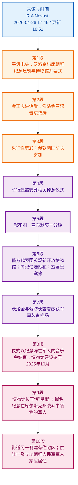

# 精读笔记

## 基本信息

- 文章来源：`РИА Новости / RIA Novosti` [1](https://ria.ru/20260426/kndr-2089032167.html)
- 发布时间：2026年4月26日 17:46；更新时间：2026年4月26日 18:51
- 网页标题：**Володин принял участие в открытии музея, посвященного подвигу солдат КНДР**
  中文参考：**沃洛金出席纪念朝鲜士兵功绩的博物馆开幕式**
- 正文标题：**Володин в КНДР принял участие в открытии Музея боевых подвигов героев**
  中文参考：**沃洛金在朝鲜出席“英雄战斗功绩博物馆”开幕式**
- 作者/记者：网页未列出个人署名；该文以 **РИА Новости / RIA Novosti** 作为发布机构。
- 发布机构背景：RIA Novosti 是俄罗斯主要通讯社之一，目前网页底部信息显示其所属/创办实体为 **МИА «Россия сегодня» / Rossiya Segodnya International Information Agency**；网页还列出总编辑为 **А. В. Гаврилова**。相关背景可参见 RIA 原文页底部信息及 `RIA Novosti` 背景资料 [2](https://en.wikipedia.org/wiki/RIA_Novosti)。
- 已剔除内容：网页广告、导航栏、社交平台入口、RIA AI 简要复述、图片说明重复项、相关文章推荐、标签、评论与讨论数字等非正文信息。

## 前情提要

---

## 逐句精读

🔻 **`ПХЕНЬЯН`**, / **`26 апр`** — / **`РИА Новости`**.
🔹 **`PYONGYANG`**, / **`April 26`** — / **`RIA Novosti`**.
🔸 **`平壤`**，/ **`4月26日`**—— / **`俄罗斯新闻社`**。

背景注释：
- **Пхеньян / Pyongyang / 平壤**：朝鲜民主主义人民共和国首都。新闻电头中常用大写地点名，说明报道发出地点或事件发生地。
- **РИА Новости / RIA Novosti / 俄罗斯新闻社**：俄罗斯通讯社名称。此处作为新闻电头中的发布机构出现。

> **`dateline`** /ˈdeɪtlaɪn/ n.
> 英文释义：the line at the beginning of a news report that gives the place and date of the report；新闻报道开头标明地点和日期的一行。
> 语域：新闻。
> 画龙点睛：新闻英语中，**`dateline`** 常写作 **`CITY, Month Day — agency`**，如 **`WASHINGTON, April 26 — Reuters`**。雅思/考研阅读中看到这种结构，应迅速识别为新闻来源信息，不要误当正文主干。

> **`news agency`** /ˈnuːz ˌeɪdʒənsi/ n.
> 英文释义：an organization that collects news and supplies it to newspapers, websites, and broadcasters；采集并向报纸、网站、广播电视等提供新闻的通讯社。
> 语域：新闻、传媒。
> 画龙点睛：**`agency`** 在新闻语境中常指“通讯社”，不是“代理处”。常见搭配有 **`state news agency`**、**`official news agency`**、**`international news agency`**。写作中可用来介绍消息来源：**`according to the state news agency`**。

---

🔻 **`Председатель Госдумы`** / **`Вячеслав Володин`** / **`принял участие`** / в церемонии открытия / в **`КНДР`** / Мемориального комплекса и Музея боевых подвигов героев зарубежной военной операции.
🔹 **`Vyacheslav Volodin`**, / the **`State Duma speaker`**, / **`took part in`** / the **`opening ceremony`** in the **`DPRK`** / for the Memorial Complex and Museum of the **`Combat Feats`** of Heroes of the Foreign Military Operation.
🔸 **`国家杜马主席`** **`维亚切斯拉夫·沃洛金`** / 在 **`朝鲜`** / 出席了 / **`境外军事行动英雄战斗功绩纪念综合体和博物馆`** 的 **`开幕仪式`**。

背景注释：
- **Госдума / State Duma / 国家杜马**：俄罗斯联邦会议下院，中文常译为“国家杜马”。
- **Вячеслав Володин / Vyacheslav Volodin / 维亚切斯拉夫·沃洛金**：俄罗斯政治人物，担任俄罗斯国家杜马主席。
- **КНДР / DPRK / 朝鲜民主主义人民共和国**：俄文全称为 **Корейская Народно-Демократическая Республика**，英文为 **Democratic People’s Republic of Korea**，即朝鲜。
- **зарубежная военная операция / Foreign Military Operation / 境外军事行动**：文中所用称谓，指朝方/俄方报道语境下朝鲜军人参与的境外作战行动；报道后文将其与库尔斯克州战事纪念相关联。

> **`speaker`** /ˈspiːkər/ n.
> 英文释义：the presiding officer of a legislative assembly；议会或立法机构的议长、主席。
> 语域：政治、议会新闻。
> 画龙点睛：**`speaker`** 不只表示“说话者/演讲者”，在政治新闻中常指“议长”。如 **`the Speaker of the House`** 是美国众议院议长；**`State Duma speaker`** 即俄罗斯国家杜马主席。阅读中要根据机构名判断词义。

> **`take part in`** /teɪk pɑːrt ɪn/ phr.
> 英文释义：to participate in an activity or event；参加、参与某项活动或事件。
> 语域：中性，新闻、学术、日常均常用。
> 画龙点睛：**`take part in`** 比 **`join`** 更强调“参与某项活动/仪式/竞赛”。常见搭配：**`take part in a ceremony`**、**`take part in talks`**、**`take part in a survey`**。写作中可替换 **`participate in`**。

> **`opening ceremony`** /ˈoʊpənɪŋ ˈserəmoʊni/ n.
> 英文释义：a formal event that marks the beginning or official opening of something；开幕式、启用仪式。
> 语域：正式、新闻。
> 画龙点睛：**`ceremony`** 强调正式仪式，常与 **`opening`**、**`closing`**、**`award`**、**`commemorative`** 搭配。注意介词：**`at the opening ceremony`** 表“在开幕式上”，**`the ceremony for the opening of...`** 表“……的开幕仪式”。

> **`combat feat`** /ˈkɑːmbæt fiːt/ n.
> 英文释义：an act of bravery or achievement performed in battle；战斗中的英勇行为或功绩。
> 语域：军事、纪念性报道。
> 画龙点睛：**`feat`** 指“壮举、功绩”，常用于强调难度和英勇性，如 **`a remarkable feat`**、**`an engineering feat`**。军事语境中的 **`combat feat`** 带有纪念与表彰色彩，翻译时可译为“战功”“战斗功绩”。

---

🔻 После выступления / Председателя Государственных дел **`КНДР`** **`Ким Чен Ына`** / **`Володин`** / зачитал приветствие / президента РФ **`Владимира Путина`**, / адресованное участникам мероприятия.
🔹 After the address / by **`Kim Jong Un`**, Chairman of State Affairs of the **`DPRK`**, / **`Volodin`** / **`read out`** a message of greetings / from Russian President **`Vladimir Putin`**, / **`addressed to`** the participants in the event.
🔸 在 **`朝鲜国务委员会委员长金正恩`** 发表讲话之后，/ **`沃洛金`** / 宣读了 / **`俄罗斯总统弗拉基米尔·普京`** / 致活动参加者的 **`问候致辞`**。

背景注释：
- **Ким Чен Ын / Kim Jong Un / 金正恩**：朝鲜最高领导人；文中职衔 **Председатель Государственных дел КНДР** 对应“朝鲜国务委员会委员长”。
- **Владимир Путин / Vladimir Putin / 弗拉基米尔·普京**：俄罗斯总统。
- **приветствие / message of greetings**：在俄语政治新闻中常指领导人发来的正式致辞、贺词或问候信。

> **`address`** /əˈdres/ n.; /əˈdres/ v.
> 英文释义：n. a formal speech；正式讲话、致辞。v. to speak to someone formally or to direct words to someone；向某人讲话，致函给某人。
> 语域：正式、政治、外交。
> 画龙点睛：**`address`** 作名词不是“地址”时，常译“讲话、演说”。如 **`a televised address`** 电视讲话。作动词 **`be addressed to sb.`** 表“写给/致某人”，本文 **`addressed to the participants`** 即“致与会者”。

> **`read out`** /riːd aʊt/ phr. v.
> 英文释义：to read something aloud, especially formally；大声宣读，尤指正式宣读。
> 语域：正式、会议、新闻。
> 画龙点睛：**`read out`** 强调“把文字读出来给众人听”，适合搭配 **`statement`**、**`message`**、**`names`**、**`results`**。与 **`read`** 相比，它更突出公开场合的“宣读”动作。

> **`message of greetings`** /ˈmesɪdʒ əv ˈɡriːtɪŋz/ n.
> 英文释义：a formal message expressing respect, welcome, or good wishes；表达敬意、欢迎或祝愿的正式致辞/贺词。
> 语域：外交、礼仪、官方报道。
> 画龙点睛：政治新闻中中文“致辞、贺信、问候”可灵活译为 **`message`**、**`greetings`**、**`congratulatory message`**。若强调“宣读领导人贺词”，可写 **`read out a message from the president`**。

> **`participant`** /pɑːrˈtɪsɪpənt/ n.
> 英文释义：a person who takes part in an activity or event；参加者、参与者。
> 语域：中性，学术、会议、新闻常用。
> 画龙点睛：**`participant`** 来自 **`participate in`**。考试写作中可用于替换 **`people who join`**。注意介词：**`participants in the event`**，而不是 **`participants of the event`** 更自然。

---

🔻 Церемония открытия / Мемориального комплекса и Музея / продолжилась разрезанием **`символической ленточки`**, / в котором приняли участие / министры обороны РФ **`Андрей Белоусов`** / и министр обороны КНДР **`Но Гван Чхоль`**.
🔹 The opening ceremony / for the Memorial Complex and Museum / continued with the cutting of a **`symbolic ribbon`**, / in which / Russian Defense Minister **`Andrei Belousov`** / and DPRK Defense Minister **`No Kwang Chol`** / **`took part`**.
🔸 **`纪念综合体和博物馆`** 的开幕式 / 随后进行 **`象征性剪彩`**，/ **`俄罗斯国防部长安德烈·别洛乌索夫`** / 与 **`朝鲜国防相努光铁`** / 参加了这一环节。

背景注释：
- **Андрей Белоусов / Andrei Belousov / 安德烈·别洛乌索夫**：俄罗斯国防部长；曾长期从事经济政策相关政府工作。
- **Но Гван Чхоль / No Kwang Chol / 努光铁**：朝鲜国防相。不同媒体中文译名可能有“努光铁”“卢光哲”等差异。
- **剪彩 / ribbon-cutting**：政治、商业和公共建筑启用仪式中的常见象征性动作，表示项目正式开放或投入使用。
- 俄文句中 **в котором** 从严格语法看应指代前面的 **разрезанием**，但按意义可理解为“在这一剪彩环节中”。

> **`continue with`** /kənˈtɪnjuː wɪð/ phr.
> 英文释义：to proceed by doing something next；接着进行，以……继续。
> 语域：中性、新闻叙述。
> 画龙点睛：**`continue with`** 后接名词或动名词，表示活动流程推进：**`The meeting continued with a discussion.`** 与 **`continue to do`** 不同，后者强调动作持续，如 **`continued to speak`**。

> **`symbolic`** /sɪmˈbɑːlɪk/ adj.
> 英文释义：representing an idea, value, or meaning rather than being important in a practical way；象征性的，具有象征意义的。
> 语域：正式、新闻、学术。
> 画龙点睛：**`symbolic`** 常修饰 **`gesture`**、**`act`**、**`ribbon`**、**`victory`**。写作中可用于分析事件意义：**`The visit was largely symbolic.`** 表“此次访问主要具有象征意义”。

> **`ribbon-cutting`** /ˈrɪbən ˌkʌtɪŋ/ n.
> 英文释义：a ceremony in which a ribbon is cut to mark the official opening of a place；通过剪彩标志正式开放的仪式。
> 语域：新闻、商业、公共事务。
> 画龙点睛：也可写作 **`the cutting of a ribbon`**。连字符形式 **`ribbon-cutting ceremony`** 很常见。注意 **`cut`** 不规则变化：**`cut-cut-cut`**，过去式和过去分词不变。

> **`defense minister`** /dɪˈfens ˈmɪnɪstər/ n.
> 英文释义：the government official in charge of a country’s defense ministry；国防部长。
> 语域：政治、军事、新闻。
> 画龙点睛：美式常写 **`defense`**，英式常写 **`defence`**。搭配为 **`Russian Defense Minister`**、**`the defense ministry`**。标题中常省冠词，用姓名前置作同位语。

---

🔻 Также / состоялось **`траурная церемония погребения`** / на территории комплекса / останков **`павших героев`**.
🔹 Also, / a **`mourning burial ceremony`** / was held / on the grounds of the complex / for the remains of the **`fallen heroes`**.
🔸 此外，/ 还在该综合体区域内 / 为 **`阵亡英雄`** 的遗骸 / 举行了 **`悼念安葬仪式`**。

背景注释：
- **останки / remains / 遗骸**：用于指人的遗体、遗骨或遗骸，新闻报道和正式纪念语境中常见。
- **павшие герои / fallen heroes / 阵亡英雄**：纪念性、军事性表达，强调军人在战斗中死亡并被赋予英雄叙事。
- 语言提示：俄文原句 **состоялось траурная церемония** 存在性数一致问题；规范俄语通常应为 **состоялась траурная церемония**，因为 **церемония** 为阴性名词。

> **`mourning`** /ˈmɔːrnɪŋ/ n.; adj.
> 英文释义：n. the expression of deep sorrow after someone’s death；哀悼。adj. related to grief for the dead；悼念的。
> 语域：正式、新闻、纪念活动。
> 画龙点睛：**`mourning`** 可作名词和形容词，如 **`a period of mourning`** 哀悼期，**`a mourning ceremony`** 悼念仪式。注意不要与 **`morning`** /ˈmɔːrnɪŋ/ “早晨”混淆，拼写只差一个字母。

> **`burial ceremony`** /ˈberiəl ˈserəmoʊni/ n.
> 英文释义：a formal event at which a dead person’s body or remains are buried；安葬仪式、葬礼仪式。
> 语域：正式、宗教、纪念报道。
> 画龙点睛：**`burial`** 来自动词 **`bury`** /ˈberi/ “埋葬”。常见搭配：**`burial site`** 墓地、安葬地点；**`proper burial`** 妥善安葬；**`state burial`** 国葬。

> **`remains`** /rɪˈmeɪnz/ n. pl.
> 英文释义：the body of a dead person or what is left of it；遗体、遗骸。
> 语域：正式、法医、新闻。
> 画龙点睛：**`remains`** 常用复数形式，既可指“遗体/遗骸”，也可指“残余物、遗迹”。如 **`human remains`** 人类遗骸，**`the remains of an ancient city`** 古城遗迹。阅读时需根据语境判断。

> **`fallen`** /ˈfɔːlən/ adj.
> 英文释义：dead as a result of war or fighting；在战争或战斗中阵亡的。
> 语域：军事、纪念、庄重。
> 画龙点睛：**`fallen`** 是 **`fall`** 的过去分词，也可作形容词。军事纪念语境中 **`the fallen`** 可直接表示“阵亡者”。如 **`honor the fallen`** 纪念阵亡者，语气庄重。

---

🔻 По ее окончании / **`Володин`** и **`Белоусов`** / **`возложили венки`** / к месту захоронения.
🔹 Upon its conclusion, / **`Volodin`** and **`Belousov`** / **`laid wreaths`** / at the **`burial site`**.
🔸 仪式结束后，/ **`沃洛金`** 和 **`别洛乌索夫`** / 在 **`安葬地点`** / **`敬献花圈`**。

背景注释：
- **возложить венки / lay wreaths / 敬献花圈**：纪念阵亡者、悼念活动和国家仪式中的固定动作。
- **место захоронения / burial site / 安葬地点**：指遗骸安放或埋葬的具体地点。

> **`upon its conclusion`** /əˈpɑːn ɪts kənˈkluːʒən/ phr.
> 英文释义：when it ended; after it was completed；在其结束后。
> 语域：正式、书面、新闻。
> 画龙点睛：**`upon + noun/gerund`** 可表示“一……就……/在……之后”，比 **`after`** 更正式。如 **`upon arrival`** 抵达后，**`upon completion`** 完成后。写作中可提升句式正式度。

> **`lay wreaths`** /leɪ riːðz/ phr.
> 英文释义：to place circular arrangements of flowers at a memorial or grave；在纪念碑或墓前敬献花圈。
> 语域：正式、纪念、外交新闻。
> 画龙点睛：**`lay`** 在此意为“放置”，过去式和过去分词为 **`laid-laid`**，不要误写成 **`layed`**。常见搭配：**`lay flowers`**、**`lay a wreath at a memorial`**。

> **`burial site`** /ˈberiəl saɪt/ n.
> 英文释义：a place where a dead person’s body or remains are buried；墓地、安葬地点。
> 语域：正式、考古、新闻。
> 画龙点睛：**`site`** 表“地点、场所”，常用于正式语境：**`construction site`** 建筑工地，**`archaeological site`** 考古遗址，**`memorial site`** 纪念场所。

---

🔻 Была объявлена / **`минута молчания`**.
🔹 A **`minute of silence`** / was announced.
🔸 现场宣布 / **`默哀一分钟`**。

背景注释：
- **минута молчания / minute of silence / 默哀一分钟**：在悼念仪式、纪念活动中常见，参与者以短暂沉默表达哀思。
- 英语中更常说 **observe a minute of silence**，即“默哀一分钟”；新闻叙述中也可说 **a minute of silence was held/observed**。

> **`minute of silence`** /ˈmɪnɪt əv ˈsaɪləns/ n.
> 英文释义：a short period during which people remain silent to show respect for someone who has died；为逝者表达敬意而保持沉默的一分钟。
> 语域：正式、纪念、公共活动。
> 画龙点睛：固定搭配多为 **`observe a minute of silence`** 或 **`hold a minute of silence`**。**`silence`** 是不可数名词，一般不用 **`a silence`**，但在短语中可说 **`a moment/minute of silence`**。

> **`announce`** /əˈnaʊns/ v.
> 英文释义：to make something known publicly or officially；公开宣布，正式宣布。
> 语域：新闻、官方、日常均可。
> 画龙点睛：**`announce`** 后可直接接名词或从句：**`announce a decision`**、**`announce that...`**。名词为 **`announcement`**。新闻标题中常用于政策、任命、活动安排等信息。

---

🔻 Затем / **`Володин`** и члены делегации / осмотрели / **`открывшийся музей`**.
🔹 Then, / **`Volodin`** and members of the delegation / **`inspected`** / the **`newly opened museum`**.
🔸 随后，/ **`沃洛金`** 与代表团成员 / 参观查看了 / **`新开放的博物馆`**。

背景注释：
- **делегация / delegation / 代表团**：外交、议会、军事访问报道中常用词，指被派往某地参加活动或会谈的一组人员。
- **открывшийся музей / newly opened museum / 新开放的博物馆**：俄文分词结构，强调“已经开放并开始接待参观”的状态。

> **`delegation`** /ˌdelɪˈɡeɪʃən/ n.
> 英文释义：a group of people chosen to represent an organization, government, or country；代表团。
> 语域：外交、政治、商务、会议。
> 画龙点睛：常见搭配：**`a government delegation`**、**`a parliamentary delegation`**、**`head a delegation`**。动词 **`delegate`** /ˈdelɪɡeɪt/ 表“委派”，名词 **`delegate`** /ˈdelɪɡət/ 表“代表”。

> **`inspect`** /ɪnˈspekt/ v.
> 英文释义：to look at something carefully, especially officially；仔细查看，视察，检查。
> 语域：正式、官方、技术、军事。
> 画龙点睛：**`inspect`** 比 **`visit`** 更正式，强调“查看、审视”。官员参观设施常译为 **`inspect`** 或 **`tour`**。名词 **`inspection`** 表“检查、视察”。

> **`newly opened`** /ˈnuːli ˈoʊpənd/ adj.
> 英文释义：having opened recently；新近开放的。
> 语域：中性、新闻、商业。
> 画龙点睛：**`newly + past participle`** 是高频结构，如 **`newly elected president`** 新当选总统，**`newly built road`** 新建道路，**`newly discovered evidence`** 新发现的证据。写作中非常实用。

---

🔻 Российские гости / также приняли участие / в церемонии **`возложения цветов`** / к **`стене памяти`** / внутри музея.
🔹 The Russian guests / also **`took part in`** / a ceremony of **`laying flowers`** / at the **`wall of memory`** / inside the museum.
🔸 俄罗斯来宾 / 还参加了 / 在博物馆内部 **`记忆墙`** 前 / **`献花`** 的仪式。

背景注释：
- **стена памяти / wall of memory / 记忆墙**：通常指刻有姓名、事迹或纪念文字的墙面，用于公共纪念、战争纪念或灾难纪念。
- **возложение цветов / laying flowers / 献花**：与 **lay wreaths** 类似，是悼念和纪念活动中的固定礼仪。

> **`lay flowers`** /leɪ ˈflaʊərz/ phr.
> 英文释义：to place flowers at a grave, memorial, or symbolic site to show respect；在墓地、纪念碑或纪念场所献花。
> 语域：纪念、新闻、礼仪。
> 画龙点睛：**`lay`** 在礼仪语境中表示“摆放、敬献”。可说 **`lay flowers at the monument`**、**`lay a wreath at the memorial`**。与 **`put`** 相比，**`lay`** 更正式、更庄重。

> **`wall of memory`** /wɔːl əv ˈmeməri/ n.
> 英文释义：a commemorative wall that preserves names or memories of people or events；保存人物姓名或事件记忆的纪念墙。
> 语域：纪念、公共建筑、历史叙述。
> 画龙点睛：英语中也常见 **`memorial wall`**，表达更自然。**`memory`** 强调“记忆”，**`memorial`** 强调“纪念物/纪念性质”。翻译时可根据语境译为“记忆墙”或“纪念墙”。

> **`inside`** /ˌɪnˈsaɪd/ prep.; adv.
> 英文释义：in or into the inner part of something；在……里面，进入内部。
> 语域：中性。
> 画龙点睛：**`inside the museum`** 表“在博物馆内部”。区别 **`in`** 与 **`inside`**：**`inside`** 更突出“内部空间”，而 **`in`** 只是一般位置。写作中用 **`inside`** 可增强空间感。

---

🔻 **`Володин`** / одним из первых / оставил запись / в **`книге почетных гостей`**.
🔹 **`Volodin`** / was among the first / to **`leave an entry`** / in the **`book of honored guests`**.
🔸 **`沃洛金`** / 是最早一批 / 在 **`贵宾簿`** 上 / **`题写留言`** 的人士之一。

背景注释：
- **книга почетных гостей / book of honored guests / 贵宾簿**：用于重要来宾签名、题词或留言的正式簿册。英语也常说 **guest book**，但 **book of honored guests** 更贴近俄文直译与仪式感。
- **одним из первых / among the first / 最早一批之一**：强调行动发生得很早，带有仪式顺序或礼宾安排意味。

> **`be among the first to do sth.`** /əˈmʌŋ ðə fɜːrst/ phr.
> 英文释义：to be one of the earliest people to do something；是最早做某事的人之一。
> 语域：新闻、正式、日常均可。
> 画龙点睛：这个结构非常适合写作：**`The company was among the first to adopt the technology.`** 表“该公司是最早采用该技术的企业之一”。注意 **`among`** 后通常接复数概念。

> **`leave an entry`** /liːv ən ˈentri/ phr.
> 英文释义：to write a note, record, or comment in a book, register, or log；在簿册、登记册或日志中留下记录/留言。
> 语域：正式、记录性表达。
> 画龙点睛：**`entry`** 可指“条目、记录、参赛作品、进入”。在 **`guest book`** 中，**`entry`** 指题词或留言。动词搭配除 **`leave an entry`** 外，也可说 **`make an entry`**。

> **`honored guest`** /ˈɑːnərd ɡest/ n.
> 英文释义：a guest who is given special respect or recognition；受到特别尊敬或礼遇的客人。
> 语域：正式、礼仪。
> 画龙点睛：美式拼写 **`honored`**，英式拼写 **`honoured`**。常见表达：**`guest of honor`** 主宾、贵宾；**`honored guest`** 受尊敬的来宾。两者相近，但 **`guest of honor`** 更强调典礼中的核心来宾身份。

---

🔻 После этого / председатель Госдумы и министр обороны РФ / ознакомились с образцами / **`военной трофейной техники`**.
🔹 After that, / the State Duma speaker and the Russian defense minister / **`examined`** samples of / **`captured military equipment`**.
🔸 此后，/ **`国家杜马主席`** 和 **`俄罗斯国防部长`** / 查看了 / **`缴获军事装备`** 的样品。

背景注释：
- **трофейная техника / captured equipment / 缴获装备**：军事语境中指在战场或行动中从对方获得的武器、车辆、设备等。
- **образцы / samples / 样品、样本**：在军事装备展示中可指“样品、样机、实物样本”。

> **`examine`** /ɪɡˈzæmɪn/ v.
> 英文释义：to look at or consider something carefully in order to learn about it；仔细查看、检查、研究。
> 语域：正式、学术、医学、法律、新闻。
> 画龙点睛：**`examine`** 比 **`look at`** 更正式，强调“细看以了解情况”。常见搭配：**`examine evidence`**、**`examine equipment`**、**`examine the causes`**。名词 **`examination`** 也可指考试或检查。

> **`captured`** /ˈkæptʃərd/ adj.
> 英文释义：taken by force from an enemy during war or fighting；从敌方夺取的、缴获的。
> 语域：军事、新闻。
> 画龙点睛：**`capture`** 作动词可指“俘获、夺取、捕捉”。军事中 **`captured weapons`** 是“缴获武器”；科技写作中 **`capture data/images`** 是“采集数据/图像”。同一词跨语域含义差异明显。

> **`military equipment`** /ˈmɪləteri ɪˈkwɪpmənt/ n.
> 英文释义：machines, vehicles, weapons, or tools used by armed forces；军队使用的机器、车辆、武器或设备。
> 语域：军事、新闻、政策。
> 画龙点睛：**`equipment`** 是不可数名词，不能说 **`equipments`**。若要表达多件装备，可说 **`pieces of equipment`**。常见搭配：**`heavy military equipment`**、**`advanced equipment`**。

> **`sample`** /ˈsæmpəl/ n.
> 英文释义：a small amount or example of something used to show what the whole is like；样本、样品、示例。
> 语域：科学、商业、技术、新闻。
> 画龙点睛：**`sample`** 可指商品样品、数据样本、医学样本，也可指展示用的装备样品。动词 **`sample`** 表“抽样、品尝”。写作中 **`a representative sample`** 是“有代表性的样本”。

---

🔻 Церемония / окончилась концертом / **`в память о погибших воинах`**.
🔹 The ceremony / ended with a concert / **`in memory of`** the **`fallen soldiers`**.
🔸 仪式 / 以一场 **`纪念阵亡军人`** 的音乐会 / 告终。

背景注释：
- **погибшие воины / fallen soldiers / 阵亡军人**：正式纪念语境中的表达，强调军人因战争或战斗而死亡。
- **concert in memory of... / 纪念……的音乐会**：公共纪念活动常以音乐会、默哀、献花等形式收尾。

> **`end with`** /end wɪð/ phr.
> 英文释义：to have something as the final part；以……结束。
> 语域：中性，叙述、新闻常用。
> 画龙点睛：**`end with`** 强调最后一个环节或结果，如 **`The meeting ended with a vote.`** 与 **`end in`** 不同，**`end in failure/disaster`** 更强调结局性质。写流程时 **`end with`** 很自然。

> **`in memory of`** /ɪn ˈmeməri əv/ phr.
> 英文释义：intended to honor and remember someone who has died；为了纪念逝者。
> 语域：正式、纪念、碑文。
> 画龙点睛：固定短语 **`in memory of sb.`** 常用于纪念碑、基金会、活动名称。近义表达有 **`in honor of`**，但后者既可用于生者也可用于逝者；**`in memory of`** 通常专指纪念已故者。

> **`fallen soldier`** /ˈfɔːlən ˈsoʊldʒər/ n.
> 英文释义：a soldier who has died in war or battle；阵亡士兵。
> 语域：军事、纪念、庄重。
> 画龙点睛：**`fallen`** 比 **`dead`** 更庄重、更具纪念色彩。新闻或纪念演讲中常说 **`honor fallen soldiers`**、**`pay tribute to the fallen`**，避免直白生硬的 **`dead soldiers`**。

---

🔻 Строительство / Музея боевых подвигов героев зарубежной военной операции / началось / в **`Пхеньяне`** / в **`октябре 2025 года`**.
🔹 **`Construction`** / of the Museum of the Combat Feats of Heroes of the Foreign Military Operation / began / in **`Pyongyang`** / in **`October 2025`**.
🔸 **`境外军事行动英雄战斗功绩博物馆`** 的 **`建设`** / 于 **`2025年10月`** / 在 **`平壤`** / 开始。

背景注释：
- **October 2025 / 2025年10月**：说明该博物馆建设从开工到开幕大约经历半年时间。
- **Museum of the Combat Feats...**：名称较长，具有纪念性、政治性和军事性。英语翻译可尽量保留正式名称结构，中文则可译为“境外军事行动英雄战斗功绩博物馆”。

> **`construction`** /kənˈstrʌkʃən/ n.
> 英文释义：the process of building something such as a road, building, or bridge；建筑、建设、施工。
> 语域：工程、新闻、政策。
> 画龙点睛：**`construction`** 是不可数名词时表示“建设过程”，也可作可数名词表示“建筑物/构造”。常见搭配：**`construction began`**、**`under construction`**、**`construction project`**。

> **`begin`** /bɪˈɡɪn/ v.
> 英文释义：to start happening or to start doing something；开始发生，开始做某事。
> 语域：中性。
> 画龙点睛：不规则变化：**`begin-began-begun`**。本文 **`construction began`** 是新闻报道常用搭配。若强调某人启动项目，可用 **`launch construction`** 或 **`start construction`**。

> **`combat feats`** /ˈkɑːmbæt fiːts/ n. pl.
> 英文释义：brave or remarkable acts performed in battle；战斗中的英勇壮举、战功。
> 语域：军事、纪念、官方叙述。
> 画龙点睛：**`feat`** 的复数 **`feats`** 常与形容词连用：**`heroic feats`**、**`extraordinary feats`**。在非军事语境也可用，如 **`a feat of engineering`** “工程壮举”。

---

🔻 Музей / расположен / на улице **`Новых Звезд`** — / получившей название / в честь воинов, / отдавших жизнь / в боях / в **`Курской области`**.
🔹 The museum / is **`located on`** **`New Stars Street`**, / which was **`named in honor of`** the soldiers / who **`gave their lives`** / in battles / in **`Kursk Region`**.
🔸 该博物馆 / 位于 **`新星街`**；/ 这条街得名于 / 那些在 **`库尔斯克州`** 战斗中 **`献出生命`** 的军人，/ 以示纪念。

背景注释：
- **улица Новых Звезд / New Stars Street / 新星街**：文中称该街名为纪念在库尔斯克州战斗中牺牲的军人而设。
- **Курская область / Kursk Region / 库尔斯克州**：俄罗斯西部联邦主体之一，与乌克兰接壤；报道语境中与俄乌战争期间的边境战事相关。
- **отдавших жизнь / gave their lives / 献出生命**：军事纪念文本中的庄重表达，避免直说“死亡”，带有牺牲叙事。

> **`be located on`** /bi loʊˈkeɪtɪd ɑːn/ phr.
> 英文释义：to be situated on a street, road, or piece of land；位于某条街道或某片土地上。
> 语域：正式、说明性文字。
> 画龙点睛：地点表达中，街道前通常用 **`on`**：**`located on Oxford Street`**；城市前用 **`in`**：**`located in Pyongyang`**；具体地址可用 **`at`**：**`located at 10 Downing Street`**。

> **`be named in honor of`** /bi neɪmd ɪn ˈɑːnər əv/ phr.
> 英文释义：to be given a name as a way to show respect for someone or something；为纪念……而命名。
> 语域：正式、纪念、城市地名。
> 画龙点睛：也可说 **`be named after`**，但 **`in honor of`** 更强调敬意和纪念。如 **`The school was named in honor of its founder.`** 用于写作非常地道。

> **`give one’s life`** /ɡɪv wʌnz laɪf/ phr.
> 英文释义：to die while trying to help, protect, or serve others；为帮助、保护或服务他人而牺牲生命。
> 语域：庄重、纪念、军事。
> 画龙点睛：这是委婉而庄重的表达，常见于纪念碑文和演讲。结构可扩展为 **`give one’s life for one’s country`** “为国捐躯”。比 **`die`** 更具纪念色彩。

> **`battle`** /ˈbætəl/ n.; v.
> 英文释义：n. a fight between armed forces；战斗、战役。v. to fight or struggle；作战，搏斗。
> 语域：军事，也可引申为奋斗。
> 画龙点睛：**`battle`** 可指具体战斗，也可作比喻：**`battle against cancer`** 与癌症抗争，**`battle for control`** 争夺控制权。军事中 **`in battle`** 表“在战斗中”。

---

🔻 По другую сторону улицы / возведен **`жилой квартал`** / для семей погибших / и отличившихся в боях / военнослужащих **`Корейской народной армии`**.
🔹 **`Across the street`**, / a **`residential quarter`** has been built / for the families of fallen servicemen / and of **`Korean People’s Army`** personnel / who **`distinguished themselves`** in battle.
🔸 在街道另一侧，/ 建起了一片 **`住宅区`**，/ 供 **`朝鲜人民军`** 中 / **`阵亡军人`** 家属 / 以及在战斗中 **`立功表现突出`** 的军人家属居住。

背景注释：
- **Корейская народная армия / Korean People’s Army / 朝鲜人民军**：朝鲜武装力量的通称。
- **отличившиеся в боях / distinguished themselves in battle / 在战斗中表现突出、立功**：正式军事表彰表达，指在战斗中表现优异、获得认可。
- **жилой квартал / residential quarter / 住宅区**：指集中建设的居住片区，可服务于特定群体，如军人家属、职工家庭等。

> **`across the street`** /əˈkrɔːs ðə striːt/ phr.
> 英文释义：on the other side of the street；在街道对面，在马路另一侧。
> 语域：日常、新闻、空间描写。
> 画龙点睛：**`across`** 强调“横过、在对面”。区别 **`across the street`** 与 **`on the street`**：前者是“街对面”，后者是“在街上/沿街”。空间描述题中很常见。

> **`residential quarter`** /ˌrezɪˈdenʃəl ˈkwɔːrtər/ n.
> 英文释义：an area of a town or city where people live；住宅区、居住片区。
> 语域：城市规划、新闻、正式说明。
> 画龙点睛：**`residential`** 表“居住的、住宅的”，反义常见为 **`commercial`** 商业的、**`industrial`** 工业的。**`quarter`** 在城市语境中可指“区域”，如 **`the French Quarter`** 法国区。

> **`serviceman`** /ˈsɜːrvɪsmən/ n.
> 英文释义：a man who serves in the armed forces；军人。复数为 **`servicemen`**。
> 语域：军事、新闻。
> 画龙点睛：现代英语为性别中性，常用 **`service member`** 或 **`military personnel`**。新闻翻译中，俄文 **военнослужащий** 可译为 **`serviceman`**、**`service member`**、**`military personnel`**，需看语境。

> **`distinguish oneself`** /dɪˈstɪŋɡwɪʃ wʌnˈself/ phr.
> 英文释义：to do something so well that one earns respect or recognition；表现突出，脱颖而出，立功。
> 语域：正式、表彰、军事、学术。
> 画龙点睛：**`distinguish`** 本义“区分”，但 **`distinguish oneself`** 是熟词僻义重点，表示“使自己显得突出”。如 **`She distinguished herself in scientific research.`** 她在科研中表现卓越。

> **`personnel`** /ˌpɜːrsəˈnel/ n.
> 英文释义：people employed in an organization or serving in the armed forces；人员，职员，军队人员。
> 语域：正式、商务、军事。
> 画龙点睛：**`personnel`** 是集合名词，常作复数意义使用，如 **`military personnel are...`**。不要与 **`personal`** /ˈpɜːrsənl/ “个人的”混淆。考试中二者拼写和重音容易混。

---

## 参考链接

- RIA Novosti 原文：`Володин принял участие в открытии музея, посвященного подвигу солдат КНДР` [1](https://ria.ru/20260426/kndr-2089032167.html)
- RIA Novosti 背景资料：`RIA Novosti` [2](https://en.wikipedia.org/wiki/RIA_Novosti)
- 俄罗斯国家杜马主席信息：`Володин Вячеслав Викторович — Государственная Дума` [3](https://duma.gov.ru/duma/chairman/)
- 俄罗斯政府网站关于安德烈·别洛乌索夫的信息：`Андрей Рэмович Белоусов — Правительство России` [4](https://government.ru/gov/persons/123/)
- 金正恩职衔近期背景参考：`Kim Jong-un reappointed as president of North Korea's state affairs commission` [5](https://koreajoongangdaily.joins.com/news/2026-03-23/national/northKorea/Kim-Jongun-reappointed-as-president-of-North-Koreas-state-affairs-commission/2551027)

我将按模块顺序完成分析。先执行所有必要搜索。
现在搜索词汇的权威词典释义：
数据充足，现在整合输出完整分析。

---

# 模块一：翻译与全文概要

## 英文翻译

> **Volodin Attends Opening of Museum Dedicated to the Feats of DPRK Soldiers**
> 
> *(РИА Новости / RIA Novosti, Pyongyang, April 26 — updated 18:51)*
>
> PYONGYANG, April 26 — RIA Novosti. **State Duma Chairman Vyacheslav Volodin** participated in the opening ceremony of the **Memorial Complex and Museum of Combat Feats of Heroes of the Foreign Military Operation** in the DPRK.
>
> Following the address by **Chairman of State Affairs of the DPRK Kim Jong-un**, Volodin read aloud a greeting from Russian President **Vladimir Putin**, addressed to the participants of the event.
>
> The opening ceremony of the Memorial Complex and Museum continued with the **cutting of a symbolic ribbon**, in which **Russian Defence Minister Andrei Belousov** and **DPRK Defence Minister No Gwang-chol** both took part.
>
> A **solemn burial ceremony** was also held on the grounds of the complex for the **remains of the fallen heroes**.
>
> Upon its conclusion, Volodin and Belousov **laid wreaths** at the burial site. A **minute of silence** was observed.
>
> Volodin and members of the delegation then **toured the newly opened museum**. The Russian guests also participated in a **wreath-laying ceremony at the Wall of Memory** inside the museum. Volodin was among the first to **leave a message in the guest book**.
>
> The Duma chairman and the Russian Defence Minister subsequently **inspected captured military hardware (trophy weapons)**.
>
> The ceremony concluded with a **concert in memory of fallen soldiers**.
>
> Construction of the Museum of Combat Feats of Heroes of the Foreign Military Operation began in Pyongyang in **October 2025**. The museum is located on **New Stars Street** — a name given in honour of the soldiers who gave their lives in battles in the **Kursk Oblast**. Across the street, a **residential quarter has been built for the families** of KPA servicemen killed or distinguished in battle.

---

## 中英文对照概要

**Russian-DPRK Military Brotherhood Enshrined in Stone: Pyongyang Opens Landmark War Memorial**
**俄朝军事情谊凝固于碑：平壤揭幕重要战争纪念馆**

On April 26, 2026, Pyongyang staged a ceremony of deep political and symbolic gravity.
2026年4月26日，平壤举行了一场具有深刻政治与象征意义的重大仪式。

**The opening of the Memorial Complex and Museum of Combat Feats of Heroes of the Foreign Military Operation** marked a formal, permanent commemoration of DPRK soldiers who fought and died alongside Russian forces in the Kursk campaign.
**《对外军事行动英雄作战功勋纪念综合体暨博物馆》** 的落成，正式且永久地纪念了在库尔斯克战役中与俄军并肩作战、为国捐躯的朝鲜军人。

State Duma Chairman Volodin conveyed Putin's personal greetings, while Defence Ministers of both nations jointly cut the ribbon — a carefully choreographed display of strategic partnership at the highest level.
国家杜马主席沃洛金转达了普京的亲笔致辞，两国国防部长联合剪彩，这是精心安排的最高层战略伙伴关系展示。

**The street on which the museum stands has been named "New Stars Street"** in honour of the fallen KPA fighters — a gesture that transforms an ordinary Pyongyang thoroughfare into a site of national martyr-memory.
**博物馆所在街道被命名为"新星大街"**，以纪念阵亡的朝鲜人民军战士——这一举措将平壤一条普通街道升华为国家英烈纪念地。

Beyond the architecture, the event signals a qualitative deepening of the Russia-DPRK military-political axis: residential housing for fallen soldiers' families across the street from the museum suggests that this alliance is being woven into the social fabric, not merely proclaimed in diplomatic communiqués.
超越建筑本身，此次活动标志着俄朝军政轴心的深度强化：博物馆对面为阵亡战士家属建设的住宅区表明，这一同盟正被编织进社会结构之中，而非仅仅停留于外交公报层面。

---

# 模块二：基本信息与注释

## 2A. 文章基本信息

| 项目 | 内容 |
|---|---|
| **来源 / Source** | РИА Новости（俄罗斯国际文传电讯社）|
| **题目 / Title** | Володин принял участие в открытии музея, посвященного подвигу солдат КНДР（沃洛金出席朝鲜英雄士兵博物馆开幕仪式）|
| **作者 / Author** | 未署名 / Not attributed（通讯社电稿）|
| **发表日期 / Date** | 2026年4月26日（更新于18:51）|
| **发稿地 / Dateline** | 平壤 Pyongyang |

---

## 2B. 作者背景

РИА Новости（俄罗斯国际文传电讯社）为俄罗斯联邦官方通讯社，创建于1941年，总部位于莫斯科。现隶属俄罗斯国际媒体集团（Россия Сегодня），是俄罗斯国家级权威新闻发布机构，以多语种向全球发布政治、外交、军事等领域即时资讯。

**作者/记者**：本文为通讯社集体电稿，未署个人记者姓名。

---

## 2C. 实体、地点、人物注释

### 👤 人物

**维亚切斯拉夫·沃洛金（Вячеслав Виktorович Воло́дин / Vyacheslav Volodin）**
1964年2月4日生于萨拉托夫州。俄罗斯政治家，自2016年10月起出任俄罗斯联邦国家杜马（下院）第十届主席，为俄罗斯联合俄罗斯党重要人物，曾任总统行政厅第一副主任，是克里姆林宫核心决策圈成员。

**安德烈·别洛乌索夫（Андрей Рэмович Белоусов / Andrei Belousov）**
1959年生，俄罗斯经济学家出身的政治人物，2024年出任俄罗斯联邦国防部长，接替谢尔盖·绍伊古，主导俄军事工业综合体的经济整合工作。

**劳光哲（노광철 / No Gwang-chol）**
朝鲜人民民主共和国现任国防相，朝鲜人民军高级将领，参与对外军事合作事务。

---

### 🏛️ 地点与机构

**平壤（Пхеньян / Pyongyang）**
朝鲜民主主义人民共和国首都，位于朝鲜半岛西北部大同江畔，人口约300万（据估），是朝鲜政治、军事、文化中心。

**库尔斯克州（Курская область / Kursk Oblast）**
俄罗斯联邦中央联邦区下辖州，与乌克兰苏梅州接壤。2024年8月乌克兰军队曾对该州发动越境攻势，朝鲜人民军部队参与了此后的防御与反攻作战。

**新星大街（Улица Новых Звёзд / New Stars Street）**
平壤新命名街道，专门为纪念在库尔斯克战役中牺牲的朝鲜战士而得名。

**朝鲜人民军（Корейская народная армия / Korean People's Army, KPA）**
朝鲜民主主义人民共和国武装力量，创建于1948年，据估计现役兵力逾100万。

---

# 模块三：素材与语料库积累

## 3A. 重点词汇解析

---

### **W — 写作高频词**

---

**① memorial** /məˈmɔːriəl/ *n. / adj.*

- **英文释义**：*(n.)* Something, especially a stone structure, built or done to remind people of someone who has died; *(adj.)* done or made to remind people of someone who has died.
- **中文释义**：纪念物；纪念碑；纪念性的（形容词）
- **语域**：正式 / 新闻 / 书面
- **同义词**：monument, cenotaph, commemoration, shrine
- **常见搭配**：
  - **build/erect a memorial** 建造纪念碑
  - **lay a wreath at a memorial** 在纪念碑前献花圈
  - **a war memorial** 战争纪念碑
  - **memorial service/ceremony** 追悼仪式
  - **a lasting/permanent memorial** 永久纪念
- **拓展**：*memorial* 作名词为**可数名词**。注意与 *monument* 的区分：*memorial* 侧重悼念具体的人或事件，*monument* 范围更广，可指任何纪念性建筑或历史遗址（如 monument to human achievement）。作形容词仅用于名词前（attributive only）。词族：memorialize（v.）/ commemorative（adj. 近义）。
- **地道用法**："The prime minister laid a wreath at the war memorial." 首相在战争纪念碑前献花圈。

---

**② commemorate** /kəˈmeməreɪt/ *v.*

- **英文释义**：To do something to show that you remember and respect an important person or event in the past.
- **中文释义**：纪念；为…举行纪念活动
- **语域**：正式 / 书面 / 新闻
- **同义词**：honor, mark, celebrate (in the sense of observe), memorialize
- **常见搭配**：
  - **commemorate the fallen** 纪念阵亡者
  - **a ceremony to commemorate…** 纪念…的仪式
  - **be commemorated with a plaque/statue** 以铭牌/雕像纪念
- **拓展**：规则动词，commemorated / commemorating。名词形式：**commemoration**（n.，可数/不可数均有用法）；形容词：**commemorative**（a commemorative stamp 纪念邮票）。注意：不可用 *celebrate* 直接替换，因 *celebrate* 隐含欢庆色彩，而纪念阵亡者场合应用 *commemorate*。
- **地道用法**："The museum was built to commemorate those who gave their lives in the operation." 这座博物馆是为纪念在行动中牺牲的人而建造的。

---

**③ tribute** /ˈtrɪbjuːt/ *n.*

- **英文释义**：Something that you say, do, or give in order to express your respect or admiration for someone; *historical* a payment of goods or money by a weaker ruler/country to a more powerful one.
- **中文释义**：致敬；颂辞；贡品（历史义）
- **语域**：正式 / 书面 / 新闻
- **同义词**：homage, honor, accolade, testament
- **常见搭配**：
  - **pay tribute to sb.** 向某人致敬（最核心搭配）
  - **a floral tribute** 花卉致敬（献花）
  - **be a tribute to sth.** 是对…的证明/肯定
  - **in tribute to** 为了向…致敬
- **拓展**：可数/不可数均有；作"颂辞"义多不可数（as *tribute*），作具体致敬行为可数（*a tribute*）。**熟词僻义**：在历史语境中指"贡赋"（弱国向强国缴纳的贡品），切勿混淆。
- **地道用法**："The ceremony paid tribute to the soldiers who fought shoulder to shoulder with Russian forces." 仪式向与俄军并肩作战的战士们致敬。

---

**④ solemn** /ˈsɑːləm/ *adj.*

- **英文释义**：Very serious and not happy, especially because of an important or sad occasion; (of a promise/oath) made very seriously with no intention of breaking it.
- **中文释义**：庄严的；肃穆的；（誓言）郑重的
- **语域**：正式 / 书面 / 文学
- **同义词**：grave, dignified, earnest, august
- **反义词**：flippant, frivolous, lighthearted
- **常见搭配**：
  - **a solemn ceremony/occasion** 庄严的仪式/场合
  - **a solemn oath/vow/pledge** 庄严誓言
  - **solemn music** 肃穆的音乐
  - **grow/look solemn** 神情变得严肃
- **拓展**：副词 **solemnly**；名词 **solemnity**（不可数，指庄严的氛围）。区别：*grave* 侧重严肃性，常指面对困难或危险；*solemn* 更强调仪式感和神圣性。词源来自拉丁语 *solemnis*（每年举行一次的，庄重的）。
- **地道用法**："The solemn procession of mourners moved slowly past the Wall of Memory." 肃穆的悼念队伍缓缓走过英烈墙。

---

**⑤ solidarity** /ˌsɑːləˈdærəti/ *n.*

- **英文释义**：Loyalty and general agreement between all people in a group, or between different groups, because they share a common aim.
- **中文释义**：团结；同仇敌忾；一致性
- **语域**：正式 / 政治 / 新闻
- **同义词**：unity, cohesion, camaraderie, fraternity
- **反义词**：division, discord, fragmentation
- **常见搭配**：
  - **show/express/demonstrate solidarity (with sb.)** 表达团结
  - **a gesture/act of solidarity** 团结的姿态
  - **in solidarity with** 声援…
  - **military/political solidarity** 军事/政治团结
- **拓展**：**不可数名词**。注意：*solidarity* 强调共同目标驱动下的凝聚力，比 *unity* 更具政治色彩，常见于工人运动、国际政治语境。 *camaraderie* 则更强调情感上的战友情谊（见下文）。
- **地道用法**："Kim Jong-un's attendance underscored the profound military solidarity binding Pyongyang to Moscow." 金正恩的出席彰显了平壤与莫斯科之间深厚的军事团结。

---

**⑥ alliance** /əˈlaɪəns/ *n.*

- **英文释义**：An arrangement in which two or more countries/groups agree to work together to achieve something; also, the group itself formed through such an arrangement.
- **中文释义**：同盟；联盟；结盟
- **语域**：正式 / 外交 / 政治 / 新闻
- **同义词**：coalition, pact, confederation, bloc, partnership
- **常见搭配**：
  - **form/forge/enter into an alliance** 结成联盟
  - **a military/strategic alliance** 军事/战略联盟
  - **in alliance with** 与…联合
  - **break (off) an alliance** 终止联盟
- **拓展**：**可数名词**。词族：allied（adj.）/ ally（n./v.）。区分：*alliance* 通常指正式协议驱动的关系；*partnership* 更中性、商业色彩更强；*coalition* 常指临时性的联合（尤指政治或战时）。
- **地道用法**："The museum's opening is a powerful symbol of the deepening strategic alliance between Russia and the DPRK." 博物馆的落成是俄朝深化战略联盟的有力象征。

---

### **R — 阅读高频词**

---

**① remains** /rɪˈmeɪnz/ *n. [plural]*

- **英文释义**：The body or parts of the body of a dead person; also, parts of something left after the rest has been destroyed or has disappeared.
- **中文释义**：（人的）遗骸；遗体；遗迹（复数形式，无单数）
- **语域**：正式 / 新闻 / 学术
- **常见搭配**：
  - **the remains of the fallen** 阵亡者遗骸
  - **inter/bury the remains** 安葬遗骸
  - **human remains** 人体遗骸
  - **ancient/Roman remains** 古代/罗马遗迹
- **拓展**：**始终为复数形式**，不可说 *a remain*。作"遗骸"义时为 **death/body domain**，作"遗迹"义时为 **archaeology domain**。注意 *remain*（v. 保持/剩余）与 *remains*（n.）完全不同。
- **地道用法**："A solemn burial ceremony was held for the remains of the fallen heroes on the grounds of the memorial complex." 在纪念综合体内为阵亡英雄的遗骸举行了庄严的安葬仪式。

---

**② wreath** /riːθ/ *n.*

- **英文释义**：A circle made from leaves, flowers, or branches, placed at a grave or war memorial as a sign of respect; also worn on the head as an honor.
- **中文释义**：花圈；花环（献于墓前或纪念碑处）
- **语域**：正式 / 仪式性 / 新闻
- **常见搭配**：
  - **lay/place a wreath** 敬献花圈（最核心搭配）
  - **a laurel wreath** 月桂花环（荣誉象征）
  - **a Christmas wreath** 圣诞花环
  - **a wreath-laying ceremony** 献花圈仪式
- **拓展**：**可数名词**，复数 *wreaths* /riːðz/（注意发音变化）。动词 *wreathe* /riːð/ 意为"缠绕；笼罩"（the valley was wreathed in mist）。**熟词僻义**："a wreath of smoke" 一缕缭绕的烟。
- **地道用法**："Volodin and Belousov laid wreaths at the burial site of the fallen KPA soldiers." 沃洛金和别洛乌索夫在朝鲜人民军阵亡战士墓前敬献了花圈。

---

**③ delegation** /ˌdeləˈɡeɪʃən/ *n.*

- **英文释义**：A group of people who officially represent a country, organization, or company; also, the act of giving authority or responsibility to someone else.
- **中文释义**：代表团；授权（委派）
- **语域**：正式 / 外交 / 新闻 / 商务
- **同义词**：mission, envoy (for a single person), contingent, deputation
- **常见搭配**：
  - **a trade/diplomatic/military delegation** 贸易/外交/军事代表团
  - **lead/head a delegation** 率领代表团
  - **a delegation of officials** 官员代表团
  - **the delegation of authority/power** 权力下放（管理义）
- **拓展**：**可数名词**。注意两个截然不同的义项：①代表团（可数）②授权/委托（不可数，管理学语境）。动词 *delegate* 既可指"授权"也可指"委派（代表）"；*delegate*（n.）指单个代表。
- **地道用法**："Volodin and members of the Russian delegation toured the newly opened museum." 沃洛金及俄罗斯代表团成员参观了新落成的博物馆。

---

**④ unveil** /ʌnˈveɪl/ *v.*

- **英文释义**：To remove a covering from a new statue, painting, or building as part of a formal ceremony; more broadly, to make something known for the first time.
- **中文释义**：（正式）揭幕；揭开（纪念碑等的）面纱；首次公开/披露
- **语域**：正式 / 新闻 / 书面
- **同义词**：reveal, launch, inaugurate, disclose
- **反义词**：conceal, cover, shroud
- **常见搭配**：
  - **unveil a statue/memorial/plaque** 为雕像/纪念碑/铭牌揭幕
  - **unveil a plan/strategy/initiative** 公布计划/战略（引申义，新闻极常用）
- **拓展**：规则动词。**熟词僻义**：在科技、商业报道中大量用作"发布/推出"，如 "Apple unveiled its new iPhone." 不含"揭开布幕"字面义，纯指"首次公布"。这是阅读英语财经/科技新闻必须掌握的引申义。
- **地道用法**："The memorial complex was unveiled in a ceremony attended by senior officials of both nations." 纪念综合体在两国高级官员出席的仪式上正式揭幕。

---

**⑤ camaraderie** /ˌkæməˈrɑːdəri/ *n.*

- **英文释义**：A feeling of friendship and trust that develops between people who work or fight together.
- **中文释义**：战友情谊；同志情；（共事者间的）友爱之情
- **语域**：正式 / 书面 / 文学 / 新闻
- **同义词**：comradeship, brotherhood, esprit de corps, fellowship
- **常见搭配**：
  - **the camaraderie of/among soldiers** 战士间的战友情
  - **a sense of camaraderie** 同志情谊感
  - **military camaraderie** 军队情谊
- **拓展**：**不可数名词**。词源来自法语 *camarade*（同室之人→战友），与 *comrade*（同志）同源。注意与 *solidarity*（强调共同目标下的团结）的区分：*camaraderie* 更侧重情感和人际层面的亲密感。发音易错，重音在第三音节 **-rɑː-**。
- **地道用法**："The museum stands as a monument to the camaraderie forged between Russian and Korean soldiers in the heat of battle." 这座博物馆是俄朝士兵在战火中铸就的战友情谊的丰碑。

---

**⑥ valour (AmE: valor)** /ˈvælər/ *n.*

- **英文释义**：Great courage and bravery, especially in war. *(literary)*
- **中文释义**：英勇；勇气（尤指战场上的英勇）
- **语域**：正式 / 文学 / 军事 / 书面
- **同义词**：bravery, gallantry, heroism, courage, intrepidity
- **反义词**：cowardice
- **常见搭配**：
  - **deeds of valour** 英勇行为
  - **medals awarded for valor** 因英勇而授予的勋章
  - **acts of conspicuous valour** 卓著的英勇行为
  - **discretion is the better part of valour** 【谚】谨慎为勇敢之本（知进退才是真英勇）
- **拓展**：**不可数名词**。英式拼法 *valour*，美式 *valor*。形容词 **valorous**（英勇的，较罕见，文学性强）。与 *bravery* 区别：*valour* 专指战场或危险场合中的无畏，语气更庄重古雅；*bravery* 使用范围更广。
- **地道用法**："The inscription on the Wall of Memory honoured the valour of those who sacrificed their lives far from home." 英烈墙上的铭文颂扬了那些在异乡献出生命者的英勇精神。

---

### **T — 翻译重要词**

---

**① 外军事行动 / Foreign Military Operation**

- **原文俄语**：зарубежная военная операция
- **翻译要点**：俄罗斯官方用语，指在他国领土上进行的军事行动。翻译时应忠实还原官方用语，不得擅自改为"战争"或"入侵"等带主观色彩的词汇。英文对应为 **Foreign Military Operation** 或 **overseas military operation**。
- **对比**：俄语另有 "специальная военная операция"（特别军事行动，指俄乌冲突），二者略有区别，本文指朝鲜军队参与的行动。

---

**② подвиг / feat / heroic deed / exploit**

- **英文释义**：An act of great bravery or exceptional achievement, especially in a military context.
- **中文释义**：英雄壮举；功勋；卓越行为
- **翻译要点**：俄语 *подвиг* 带有强烈的英雄主义色彩，英译可选 *feat*, *exploit*, *heroic deed*。译为 *feat* 时注意其**可数名词**用法。**切忌**译为中性词 *action* 或 *operation*，因原词含有价值评价成分。
- **语域**：正式 / 军事 / 新闻
- **搭配**：a feat of arms（武功）/ feats of heroism（英雄主义壮举）

---

**③ плечом к плечу / shoulder to shoulder**

- **英文释义**：(idiom) Fighting or working together, united in a common cause; also literally, physically side by side.
- **中文释义**：并肩（作战）；同心协力
- **翻译要点**：俄语 *плечом к плечу* 与英语 *shoulder to shoulder* 完全对应，属于跨语言等效成语。中文译为"并肩"最为地道。需注意在正式外交文本中，此短语具有明显的战略同盟隐喻意义，翻译时宜保留其情感力度。
- **搭配**：fight shoulder to shoulder / stand shoulder to shoulder / work shoulder to shoulder

---

**④ венок / wreath（敬献花圈）**

- **翻译要点**：俄语 *венок* / 英语 *wreath* / 中文"花圈"——三者对应。翻译时须注意动词搭配：中文"献花圈"，英文务必用 **lay a wreath**（不说 *give* 或 *offer* a wreath，后者欠地道）；俄语 *возложить венок* 同样为专用动宾搭配。
- **地道英语**：lay wreaths at the burial site ✅ / offer wreaths ❌（欠佳）

---

**⑤ трофейная техника / trophy (captured) weapons / war trophies**

- **英文释义**：Military equipment or weapons captured from the enemy.
- **中文释义**：缴获的武器装备；战利品（军事）
- **翻译要点**：*trophy weapons* 或 *captured military hardware* 均可。注意 *trophy* 在此为军事专用义（战利品，源自希腊语 *tropaion* 即战胜纪念物），与体育竞技中的"奖杯/奖品"义完全不同——此为典型**熟词僻义**。中文译为"战利品武器"或"缴获装备"均可。

---

**⑥ минута молчания / a minute of silence / moment of silence**

- **翻译要点**：俄语 *минута молчания*，英文 **a minute of silence**（英式）或 **a moment of silence**（美式均可），中文"默哀一分钟"。这是国际通行的悼念礼仪表达，翻译时三种语言均有固定搭配，切忌生硬直译如 *a minute of quiet*。
- **语域**：正式 / 仪式性

---

### **S — 熟词僻义 / 引申义**

---

**① trophy** /ˈtroʊfi/ *n.*

- **常见义**：奖杯；奖品（体育竞技）
- **僻义/引申义**：**战利品；战争纪念物**（军事语境）— something kept as proof of success in war or hunting.
  - 例："They inspected the captured trophy weapons on display." 他们检视了展出的缴获战利品武器。
- **词源线索**：源自希腊语 *tropaion*（击退敌人后竖立的纪念标志），军事义才是本义，奖杯义反而是引申。
- **现代引申**：*trophy wife*（年轻漂亮的妻子，暗示炫耀性）/ *trophy property*（象征身份地位的豪宅）——这些带贬义色彩的引申义在英语媒体中广泛出现。

---

**② fallen** /ˈfɔːlən/ *adj. / n.*

- **常见义**：落下的（fallen leaves 落叶）
- **僻义/引申义**：**阵亡的；牺牲的（军人）**
  - *the fallen*（名词化，接定冠词）= 阵亡将士（集合名词）
  - 例："A solemn concert was held in memory of the fallen." 举行了庄严的音乐会以悼念阵亡将士。
- **辨析**：*fallen soldiers* 与 *dead soldiers* 均可指阵亡者，但 *fallen* 更富尊重与悲悼色彩，是纪念性场合的首选词。
- **其他僻义**：*a fallen woman*（旧时指失去贞操的女性，现已过时）。

---

**③ lay** /leɪ/ *v.*（此处为"放置/敬献"义）

- **常见义**：躺（lie的过去式，常被混淆）；下蛋
- **僻义/搭配义**：**正式地放置；敬献**（lay a wreath / lay a foundation stone / lay flowers）
  - 与 *lie* 的区分是经典语法难点：*lay* 为及物动词（需要宾语），*lie* 为不及物动词。
  - 例："Volodin laid a wreath at the grave." ✅ / "Volodin lay at the grave." ❌（意思完全不同）
- **不规则变化**：lay – **laid** – laid（不可说 *layed*）

---

**④ read out** /riːd aʊt/ *phr. v.*

- **常见义**：大声朗读
- **引申义/语境义**：在正式外交/仪式场合，指**宣读（致辞、公告、声明等）**，带有代表他人传达意旨的含义，语气庄重。
  - 例："Volodin read out Putin's congratulatory message to the participants." 沃洛金宣读了普京致与会者的贺电。
  - 对比：*read* 是中性词，*read out* 强调"朗读给他人听"的仪式感；*deliver a speech* 则指亲自发表演讲。

---

**⑤ complex** /ˈkɑːmpleks/ *n.*（名词义）

- **常见义（形容词）**：复杂的
- **僻义（名词）**：**综合建筑群；综合体**（a group of buildings or facilities serving a related purpose）
  - 例：*a memorial complex*（纪念综合体）/ *a sports complex*（体育综合体）/ *an industrial complex*（工业综合体）
- **心理学义**：情结（如 *an inferiority complex* 自卑情结）——三个义项完全不同，须依语境判断。

---

**⑥ forge** /fɔːrdʒ/ *v.*

- **常见义**：锻造（金属）；伪造（文件）
- **引申义**：**缔结；建立（关系、联盟等）**——尤指经过艰苦努力建立起来的
  - 例："The two armies forged an unbreakable brotherhood in battle." 两国军队在战火中铸就了不可撼动的战友情谊。
  - 搭配：**forge an alliance / forge bonds / forge ties** — 这一义项在外交和政治新闻中极为常见，且带有"来之不易、情感深厚"的色彩，比 *establish* 更有力度。

---

### **L — 地道表达**

---

**① shoulder to shoulder**
- **释义**：并肩作战；并肩同行（字面 + 比喻双义）
- **用法**：Kim Jong-un stated that Russian and DPRK military forces had **fought shoulder to shoulder**.（金正恩表示俄朝军队**并肩作战**。）
- **同义表达**：side by side; hand in hand; in lockstep with

---

**② lay a wreath (at)**
- **释义**：在（纪念碑/墓地）献花圈（固定仪式表达）
- **用法**：The delegation **laid wreaths at** the burial site of the fallen heroes.（代表团在阵亡英雄墓前**献花圈**。）
- **注意**：这是国际外交报道中的固定搭配，不可替换为 *place* 或 *put* a wreath（欠正式）。

---

**③ pay tribute to**
- **释义**：向…致敬；公开表达敬意（最地道的"致敬"表达）
- **用法**：The concert **paid tribute to** the soldiers who gave their lives far from home.（音乐会**向**在异乡捐躯的战士们**致敬**。）
- **注意**：比 *honor* 更强调主动性和仪式感；*pay homage to* 则更侧重对伟大人物的崇敬。

---

**④ in memory of**
- **释义**：为纪念…；以…之名（用于悼念场合）
- **用法**：A concert was held **in memory of** the fallen warriors.（举行了一场音乐会，**以纪念**阵亡的战士。）
- **辨析**：*in memory of*（纪念已故者）vs. *in honor of*（向在世者表达敬意）vs. *in commemoration of*（纪念某一历史事件，更正式）

---

**⑤ give one's life (for)**
- **释义**：为…献出生命；为…捐躯（比 *die for* 更庄重有力）
- **用法**：The street was named after soldiers who **gave their lives** in the battles of Kursk Oblast.（这条街道以在库尔斯克州战役中**献出生命**的战士命名。）
- **语域**：正式 / 仪式性 / 政治演讲

---

**⑥ be woven into the fabric of**
- **释义**：被编织进…的结构/肌理中（比喻某事物已深度融入某体系或社会）
- **用法**：The alliance between Russia and the DPRK is now **woven into the social fabric** of Pyongyang, not merely proclaimed in diplomatic communiqués.（俄朝联盟已**深深融入**平壤的社会结构，而非仅停留于外交公报之中。）
- **语域**：书面 / 学术 / 高级写作；该表达用于写作可显著提升文章层次。

---

## 3B. 主题拓展搜索关键词

1. **`DPRK Russia military alliance Kursk 2024 2025`** — 深入了解俄朝军事合作背景、朝鲜军队参与库尔斯克战役的详情
2. **`war memorial museum opening ceremony diplomacy symbolism`** — 了解战争纪念馆在外交场合中的政治象征功能
3. **`Russia DPRK Treaty of Comprehensive Strategic Partnership`** — 研究2024年俄朝《全面战略伙伴关系条约》的条款与意义

---

## 3C. 金句积累

**① 原文金句（金正恩表态）：**
> "Военные КНДР и России сражались плечом к плечу."
> **"The militaries of the DPRK and Russia fought shoulder to shoulder."**
> **「朝鲜与俄罗斯军队并肩作战。」**

🖊 *写作启示*：*shoulder to shoulder* 是描述军事同盟、国际合作关系时极富感情色彩的地道表达，适用于任何论述国际团结、双边协作的写作场景，远比 *together* 或 *jointly* 更有力度。

---

**② 博物馆叙事金句（本文改写提炼）：**
> **"The street was named in honour of soldiers who gave their lives in battle — transforming an ordinary thoroughfare into a site of national martyr-memory."**
> **「这条街道以那些在战场上献出生命的士兵命名，将一条普通街道升华为国家英烈纪念地。」**

🖊 *写作启示*：*transforming … into …* 结构简洁有力，适合在论述文化、历史、政治议题时描述转化与升华。*martyr-memory* 为高级复合名词用法，可用于学术写作。

---

**③ 同盟深化叙事金句（分析性改写）：**
> **"Beyond the architecture, the event signals a qualitative deepening of the Russia-DPRK axis — an alliance being woven into the social fabric, not merely proclaimed in diplomatic communiqués."**
> **「超越建筑本身，此次活动标志着俄朝轴心的深度强化——这一同盟正被编织进社会结构，而非仅停留于外交公报之中。」**

🖊 *写作启示*：*beyond X, … signals …* 是分析性写作的强力句型，体现思维层次；*not merely … but …* 的对比结构凸显论点深度；*qualitative deepening*（质的深化）是描述国际关系演变的精准学术表达。