# 精读笔记

## 基本信息

来源网站：国际在线（用户提供页面信息显示为“首页 > 滚动 > 正文”）
原始来源：中央广电总台央视网；央视网原文标题为《〖央视快评〗把“义乌发展经验”进一步总结好运用好》
题目：把“义乌发展经验”进一步总结好运用好
发布时间：国际在线页面显示为 2026-04-23 17:36:21；央视网原文显示为 2026年04月23日 16:25
编辑：杨磊
署名作者：央视评论员
作者背景简介：本文署名“央视评论员”，属于央视评论类文章的集体署名，不是具体个人作者署名；“央视快评”是央视网/中央广播电视总台体系下的时政评论品牌栏目，通常围绕重要时政活动、重要讲话、政策部署等作快速阐释与评论。
参考来源：央视网原文：https://news.cctv.com/2026/04/23/ARTIXSQQm3ASpRDVV9VDCHVR260423.shtml ；央视网相关新闻：https://news.cctv.com/2026/04/23/ARTITIJe200XUeg7vg2LeGVv260423.shtml ；央视快评栏目页：https://news.cctv.com/yskp/

## 前情提要

```mermaid
flowchart TD
    A[第1段<br/>由“小商品，大市场”引入义乌<br/>说明重要指示与县域经济、中国式现代化的方向意义<br/><br/>Opening: Yiwu as entry point; policy significance] --> B[第2段<br/>交代义乌区位与资源条件<br/>列出市场主体、贸易国家和地区、出口额等事实<br/>强调资源有限但创新与奋斗可以创造业绩<br/><br/>Evidence: constraints, data, achievement]
    B --> C[第3段<br/>回顾在浙江工作期间多次调研义乌<br/>说明“十二个字、五个结合”的经验表述<br/>强调其对义乌高质量发展的指引作用<br/><br/>Historical framing: formulation of the experience]
    C --> D[第4段<br/>指出当前改革发展稳定任务繁重<br/>提出要把经验转化为因地制宜、实干兴邦的实践成效<br/><br/>Present task: translate experience into practice]
    D --> E[第5段<br/>联系正确政绩观学习教育<br/>从“小商品”扩展到“小木耳”“小黄花”“小龙虾”<br/>阐释政绩不在表面规模，而在富民兴县、惠及群众<br/><br/>Governance view: real performance benefits people]
    E --> F[第6段<br/>强调经验不是固定模板<br/>要求各地分析自身优势，避免同质化竞争和低水平重复<br/>尊重基层群众首创精神，融入全国发展大局<br/><br/>Application: adapt, differentiate, innovate]
    F --> G[第7段<br/>以“郡县治，天下安；县域兴，国家强”收束<br/>要求发展各具特色的县域经济<br/>推动产业融合，实现兴业、强县、富民一体发展<br/><br/>Conclusion: county-level development and modernization]

    classDef intro fill:#E8F3FF,stroke:#2F80ED,color:#111,stroke-width:1.5px;
    classDef data fill:#E9FBEF,stroke:#27AE60,color:#111,stroke-width:1.5px;
    classDef history fill:#FFF4E5,stroke:#F2994A,color:#111,stroke-width:1.5px;
    classDef task fill:#F3E8FF,stroke:#9B51E0,color:#111,stroke-width:1.5px;
    classDef governance fill:#FFECEC,stroke:#EB5757,color:#111,stroke-width:1.5px;
    classDef apply fill:#EAF7F7,stroke:#00A6A6,color:#111,stroke-width:1.5px;
    classDef conclude fill:#F7F7E8,stroke:#B7950B,color:#111,stroke-width:1.5px;

    class A intro;
    class B data;
    class C history;
    class D task;
    class E governance;
    class F apply;
    class G conclude;
```

---

🔸中文：`` / 把“`义乌发展经验`”/ 进一步总结好、运用好  
🔹英文：`CCTV Quick Commentary`: Further Summarize and Better Apply the `Yiwu Development Experience`

背景注释：
“央视快评”可译为 CCTV Quick Commentary，属于官方媒体短评/快评文体；“义乌发展经验”指浙江义乌在县域经济、市场培育、商贸流通、改革创新等方面形成的发展路径与治理经验。标题中的“总结好、运用好”是中文政策话语中常见的并列结构，英文可用 summarize and apply well / further summarize and better apply 来体现递进与落实。

> **`commentary` 评论；评论文章** /ˈkɑːmənteri/
> n. an article, broadcast, or statement that explains or gives an opinion on events（对事件作解释或评论的文章、节目或陈述）
> 语域：新闻、媒体、学术写作
> 画龙点睛：`commentary` 强调“解释+评论”，比 `comment` 更正式、更成篇。考试写作中可用 political commentary, media commentary, social commentary。注意 `commentary on sth.`，例如 commentary on economic policy。新闻类文章标题常用它对应“评论、述评、快评”。

> **`apply` 运用；应用；适用** /əˈplaɪ/
> v. to use something in a practical situation（把某物用于实际情境）；to be relevant to a particular person or situation（适用于某人或某种情况）
> 语域：通用、学术、政策、职场
> 画龙点睛：`apply` 的核心不是“申请”而是“把原则、方法、经验落到具体场景”。常见搭配：`apply a theory to practice` 把理论用于实践，`apply lessons learned` 运用经验教训，`apply to` 适用于。写作中可替换 use，显得更正式。

---

🔸中文：“`小商品，大市场`”，中国义乌 / `名扬天下`。  
🔹英文：With its “`small commodities, vast market`,” Yiwu, China, / has become `renowned worldwide`.

背景注释：
义乌位于浙江省中部，是中国乃至全球知名的小商品集散地。“小商品，大市场”概括的是产品单价和体量“小”，但交易网络、市场辐射和外贸规模“大”的特点。

> **`commodity` 商品；大宗商品；日用品** /kəˈmɑːdəti/
> n. a product or raw material that can be bought and sold（可以买卖的产品或原材料）
> 语域：商业、经济、新闻
> 画龙点睛：`commodity` 在经济新闻中常指“商品/大宗商品”，如 oil, grain and other commodities；但 `small commodities` 可指小商品、日用小件。注意不要简单等同于 `goods`：`goods` 更泛，`commodity` 更有市场交易、标准化商品色彩。

> **`vast` 广阔的；巨大的** /væst/
> adj. extremely large in area, amount, or degree（面积、数量或程度极大的）
> 语域：正式、书面、新闻
> 画龙点睛：`vast` 比 `big` 更书面，常搭配 `market`, `resources`, `potential`, `majority`, `network`。表达“大市场”时，`vast market` 比 `big market` 更有经济评论风格。反义表达可用 `limited`, `narrow`, `modest`。

> **`renowned worldwide` 享誉全球；闻名世界** /rɪˈnaʊnd ˌwɜːrldˈwaɪd/
> adj. phrase: famous and respected across the world（在全世界范围内知名且受认可）
> 语域：新闻、宣传、正式写作
> 画龙点睛：`renowned` 比 `famous` 更正式，并带有“声誉良好”的意味。常见搭配：`world-renowned university`, `renowned for innovation`。写作中表达“名扬天下/享誉全球”，可用 `be renowned worldwide` 或 `enjoy a global reputation`。

---

🔸中文：近日，习近平总书记 / 作出`重要指示`，/ 充分肯定义乌改革发展取得的`非凡成就`，/ 殷切希望把“`义乌发展经验`”进一步总结好、运用好，/ 并对全国各地探索走出符合各自实际的`高质量发展之路` / 寄予殷切期望。  
🔹英文：Recently, General Secretary Xi Jinping / issued an `important instruction`, / fully recognizing the `extraordinary achievements` Yiwu has made in reform and development, / earnestly hoping that the “`Yiwu Development Experience`” will be further summarized and better applied, / and expressing high expectations for localities across the country / to explore `high-quality development paths` suited to their own realities.

背景注释：
“重要指示”在中国政治语境中通常指领导人就某项工作、某一领域或具体事件作出的指导性要求。“高质量发展”是中国政策话语中的核心概念，强调质量、效率、结构、创新、可持续性，而非单纯速度或规模。

> **`issue an instruction` 作出指示；发布指示** /ˈɪʃuː ən ɪnˈstrʌkʃn/
> v. phrase: to formally give an order or guidance（正式给出命令、指令或指导）
> 语域：正式、行政、政策、新闻
> 画龙点睛：`issue` 在新闻英语中常表示“发布、作出”，常见搭配：`issue a statement`, `issue an order`, `issue guidelines`。比 `give` 更正式。注意 `instruction` 可数，表示具体指示；不可数时可表示“教学、指导”。

> **`recognize` 承认；认可；肯定** /ˈrekəɡnaɪz/
> v. to accept or acknowledge something as true or important（承认或认可某事真实、重要）
> 语域：通用、正式、外交、政策
> 画龙点睛：这里 `recognize` 不译为“认出”，而是“肯定、认可”。常见搭配：`recognize achievements`, `recognize the importance of`, `be widely recognized as`。写作中可替代 `admit`，但 `recognize` 更中性积极，`admit` 常含“不得不承认”。

> **`extraordinary achievement` 非凡成就；卓越成就** /ɪkˈstrɔːrdəneri əˈtʃiːvmənt/
> n. phrase: an unusually great or remarkable success（不同寻常的重大成功）
> 语域：正式、新闻、演讲
> 画龙点睛：`extraordinary` 表示“超出寻常”，语气强于 `great`。常搭配 achievement, effort, progress, courage。注意 `achievement` 可数，常说 `make achievements in...`，也可说 `a remarkable achievement`。

> **`be suited to` 适合；符合** /bi ˈsuːtɪd tuː/
> adj. phrase: appropriate or fitting for a particular purpose or situation（适合某一目的或情况）
> 语域：正式、通用
> 画龙点睛：表达“符合各自实际”时，`suited to local realities` 很地道。辨析：`suitable for` 后接对象或用途；`suited to` 更强调“与某种条件相匹配”。政策翻译中常见 `measures suited to local conditions` 因地制宜的措施。

---

🔸中文：总书记的重要指示，/ 为新征程上推动`县域经济`提质增效、/ 加快`中国式现代化`建设 / 指明了奋进方向。  
🔹英文：The General Secretary’s important instruction / has pointed the way forward for improving the quality and efficiency of the `county-level economy` / and accelerating the building of `Chinese modernization` on the new journey.

背景注释：
“县域经济”指以县级行政区域为基本单元的经济体系，是连接城市与乡村、工业与农业、基层治理与区域发展的重要层级。“中国式现代化”是中国官方政治经济话语中的核心概念，强调人口规模巨大、共同富裕、物质文明与精神文明协调、人与自然和谐共生、和平发展等内涵。

> **`point the way forward` 指明前进方向** /pɔɪnt ðə weɪ ˈfɔːrwərd/
> v. phrase: to indicate the direction or method for future action（指出未来行动的方向或方法）
> 语域：正式、演讲、政策
> 画龙点睛：这是翻译“指明方向”的高频表达。也可说 `provide guidance for...`。`way forward` 常用于会议、政策和管理语境，表示“下一步路径”。例如：`Innovation points the way forward for sustainable growth.`

> **`county-level economy` 县域经济；县级经济** /ˈkaʊnti ˈlevl ɪˈkɑːnəmi/
> n. phrase: the economy organized around counties or county-level administrative regions（围绕县或县级行政区域形成的经济）
> 语域：政策、区域经济、发展研究
> 画龙点睛：`county-level` 是复合形容词，作定语时通常加连字符。中国语境中的“县域经济”不能机械译成 `county economy`，用 `county-level economy` 更能体现行政层级与区域发展含义。

> **`accelerate` 加快；促进提速** /əkˈseləreɪt/
> v. to make something happen faster or sooner（使某事更快发生）
> 语域：正式、科技、经济、政策
> 画龙点睛：`accelerate` 是写作中替代 `speed up` 的正式词。常见搭配：`accelerate growth`, `accelerate reform`, `accelerate the transition to...`。名词为 `acceleration`。反义词：`slow`, `decelerate`。

---

🔸中文：地处浙中的义乌，/ 不沿边不靠海，/ `资源禀赋`并不突出，/ 但凭着“`大胆干大胆闯`”的奋斗精神，/ 从“`鸡毛换糖`”起步，/ 成长为享誉全球的“`世界超市`”。  
🔹英文：Located in central Zhejiang, / Yiwu is neither a border city nor a coastal city, / and its `resource endowment` is not particularly strong; / yet, with a fighting spirit of “`daring to work hard and break new ground`,” / it started from the practice of “`exchanging chicken feathers for candy`” / and grew into a world-renowned “`global supermarket`.”

背景注释：
“浙中”指浙江省中部地区。“不沿边不靠海”强调义乌没有边境口岸和沿海港口等天然区位优势。“鸡毛换糖”是义乌早期小商贩走街串巷、以鸡毛等物品换取糖果等小商品的历史记忆，常被用来象征义乌商贸传统和创业精神。“世界超市”是对义乌国际小商品市场全球贸易功能的形象称呼。

> **`resource endowment` 资源禀赋** /ˈriːsɔːrs ɪnˈdaʊmənt/
> n. phrase: the natural, human, or economic resources available to a place or organization（某地或组织拥有的自然、人力或经济资源条件）
> 语域：经济学、发展研究、政策
> 画龙点睛：`endowment` 本义是“捐赠、天赋”，在经济学中常指一地“先天资源条件”。常见表达：`natural resource endowment`, `factor endowment`。翻译“禀赋”时比 `resources` 更专业，尤其适合雅思/GRE经济社科文本。

> **`break new ground` 开创新局面；开辟新路** /breɪk nuː ɡraʊnd/
> v. phrase: to do something innovative that has not been done before（做以前没有做过的创新之事）
> 语域：正式、新闻、学术、商业
> 画龙点睛：这是表达“大胆闯、敢创新”的地道习语。`ground` 在这里不是“地面”，而是“领域、范围”。常说 `a groundbreaking discovery` 开创性发现。写作中可用于科技、改革、教育等主题。

> **`world-renowned` 世界知名的；享誉全球的** /ˌwɜːrld rɪˈnaʊnd/
> adj. famous and respected throughout the world（全世界知名且受尊重的）
> 语域：正式、新闻、宣传
> 画龙点睛：`world-renowned` 作定语很常见，如 `a world-renowned market`。与 `world-famous` 相比，`world-renowned` 更书面、更强调声誉。注意连字符用于复合形容词。

> **`global supermarket` 世界超市；全球商品集散地** /ˈɡloʊbl ˈsuːpərmɑːrkɪt/
> n. phrase: a metaphor for a market that supplies a wide range of goods to the world（向全球供应大量商品的市场的比喻说法）
> 语域：新闻、商业、比喻表达
> 画龙点睛：`supermarket` 在这里是隐喻，不是普通超市。英语中可用 metaphorical nouns 增强表达，如 `the factory of the world`, `a hub of global trade`。翻译政策新闻时，要保留形象性，同时避免过度口语化。

---

🔸中文：目前，/ 义乌小商品市场`经营主体`突破126万户，/ 与230多个国家和地区 / 有`贸易往来`。  
🔹英文：At present, / the Yiwu small-commodities market has more than 1.26 million `market entities`, / and maintains `trade ties` / with over 230 countries and regions.

背景注释：
“经营主体”在中国经济统计语境中通常包括企业、个体工商户等参与市场经营的主体。“230多个国家和地区”体现义乌小商品贸易网络的全球覆盖度。

> **`at present` 目前；现在** /æt ˈpreznt/
> adv. phrase: at the current time（在当前时间）
> 语域：正式、书面
> 画龙点睛：`at present` 比 `now` 更正式，常用于新闻报道和学术写作。注意不要与 `present` 作“礼物”混淆。类似表达：`currently`, `at the moment`；其中 `currently` 最适合统计数据和政策描述。

> **`market entity` 市场主体；经营主体** /ˈmɑːrkɪt ˈentəti/
> n. phrase: a business, organization, or individual legally engaged in market activities（依法从事市场活动的企业、组织或个人）
> 语域：法律、经济、政策
> 画龙点睛：`entity` 指“实体、主体”，常见于法律和商业文本，如 `legal entity` 法人实体，`business entity` 商业实体。中国政策文本中的“经营主体/市场主体”常译为 `market entities`，比 `operators` 更正式、范围更广。

> **`trade ties` 贸易联系；经贸往来** /treɪd taɪz/
> n. phrase: commercial relations between places or countries（地区或国家之间的商业关系）
> 语域：新闻、国际关系、经济
> 画龙点睛：`ties` 常用于国家、机构、地区之间的“关系”，如 `diplomatic ties`, `economic ties`, `cultural ties`。表达“与……有贸易往来”可说 `maintain trade ties with...`，比 `do business with...` 更正式。

---

🔸中文：2025年，/ 义乌`外贸出口额`7300多亿元，/ 居全国县（市、区）首位。  
🔹英文：In 2025, / Yiwu’s `foreign-trade exports` exceeded 730 billion yuan, / ranking first among all counties, county-level cities, and districts nationwide.

背景注释：
“7300多亿元”即超过7300亿元人民币，英文可译为 exceeded 730 billion yuan。“县（市、区）”是中国县级行政区划常见并列，包括县、县级市和市辖区等。

> **`foreign-trade exports` 外贸出口；对外贸易出口额** /ˈfɔːrən treɪd ˈekspɔːrts/
> n. phrase: goods sold from one country or region to foreign markets（销往境外市场的商品及其金额）
> 语域：经济、贸易、新闻
> 画龙点睛：`export` 作名词时，重音在前：/ˈekspɔːrt/；作动词时常读 /ɪkˈspɔːrt/。`foreign trade` 指对外贸易；表达“出口额”可用 `export value` 或 `exports`，统计语境中 `exports exceeded...` 很自然。

> **`exceed` 超过；超出** /ɪkˈsiːd/
> v. to be greater than a particular number or amount（大于某一数字或数量）
> 语域：正式、统计、财经、法律
> 画龙点睛：`exceed` 是数据报道高频词，比 `be more than` 更正式。常见搭配：`exceed expectations`, `exceed the limit`, `exceed 10 million`。名词 `excess` 表示“过量”，形容词 `excessive` 表示“过度的”。

> **`rank first among` 位居……首位** /ræŋk fɜːrst əˈmʌŋ/
> v. phrase: to hold the highest position within a group（在某一群体中排名第一）
> 语域：新闻、统计、学术
> 画龙点睛：`rank` 可作不及物动词：`rank first/second`，也可作及物动词：`be ranked first`。表达“在全国……中排名第一”，可用 `rank first nationwide among...`，结构紧凑、信息密度高。

---

🔸中文：义乌经济社会发展的实践 / 充分证明，/ `资源有限、创新无限`，/ 条件不足、奋斗可补，/ 只要找准定位、拼搏奋斗、`久久为功`，/ 就能创造`不凡业绩`。  
🔹英文：The practice of Yiwu’s economic and social development / has fully demonstrated that / while `resources may be limited, innovation is boundless`; / where conditions fall short, hard work can make up the difference; / as long as one defines the right positioning, strives with determination, and `keeps working persistently over time`, / remarkable achievements can be made.

背景注释：
此句是典型评论文中的论证升华，由义乌案例提炼普遍经验。“久久为功”是中文政策与评论语体中常见成语式表达，强调长期坚持、持续发力、积累见效。

> **`demonstrate` 证明；显示；论证** /ˈdemənstreɪt/
> v. to show clearly that something is true or exists（清楚显示某事真实存在）
> 语域：正式、学术、新闻
> 画龙点睛：`demonstrate` 比 `show` 更正式，适合议论文和图表作文。常见搭配：`demonstrate the importance of`, `demonstrate that...`, `demonstrate a strong ability to...`。名词为 `demonstration`。

> **`boundless` 无限的；无边无际的** /ˈbaʊndləs/
> adj. having no limit（没有限制的）
> 语域：文学、演讲、正式表达
> 画龙点睛：`boundless` 来自 `bound` 边界 + `-less` 无。表达“创新无限”时，`innovation is boundless` 比 `innovation is unlimited` 更有修辞感。类似词：`limitless`, `infinite`；其中 `infinite` 更偏抽象或数学，`boundless` 更有文采。

> **`fall short` 不足；未达到要求** /fɔːl ʃɔːrt/
> v. phrase: to fail to reach a standard or amount（未达到标准、数量或期望）
> 语域：正式、新闻、商业
> 画龙点睛：常用结构：`fall short of expectations/standards/targets`。这里 `where conditions fall short` 是“条件不足”的地道译法。注意不要译成 `conditions are short`，后者不自然。

> **`persistently` 坚持不懈地；持续地** /pərˈsɪstəntli/
> adv. continuing firmly despite difficulty or delay（尽管有困难或延迟仍持续坚定地）
> 语域：正式、学术、励志、政策
> 画龙点睛：`persistently` 可对应“久久为功、持续发力”。动词 `persist in doing sth.` 表示坚持做某事；名词 `persistence` 是毅力。写作中可说 `sustained and persistent efforts` 持续而坚定的努力。

---

🔸中文：习近平总书记 / 在浙江工作期间，/ 多次到义乌`调研`，/ 总结推广“`义乌发展经验`”。  
🔹英文：During his tenure in Zhejiang, / General Secretary Xi Jinping / made multiple `research and inspection visits` to Yiwu / and summarized and promoted the “`Yiwu Development Experience`.”

背景注释：
“在浙江工作期间”指习近平曾在浙江任职时期。“调研”在中国政治行政语境中常指领导干部深入基层、企业、地方等开展调查研究与实地考察，英文宜根据语境译为 research visits, inspection tours, fact-finding visits。

> **`tenure` 任期；任职期间** /ˈtenjər/
> n. the period during which someone holds an official position（某人担任某一职务的时期）
> 语域：正式、政治、职场、学术
> 画龙点睛：`during his tenure as...` 表示“在他担任……期间”。它比 `during his time in...` 更正式。常见搭配：`academic tenure` 终身教职，`presidential tenure` 总统任期。注意 `tenure` 本身不一定指固定任期，也可泛指任职时期。

> **`inspection visit` 视察；考察访问** /ɪnˈspekʃn ˈvɪzɪt/
> n. phrase: an official visit to examine work, conditions, or progress（为了解工作、条件或进展而进行的正式访问）
> 语域：行政、新闻、政策
> 画龙点睛：中文“调研”不能总译成 `research`。若涉及领导到地方了解情况，`inspection visit` 或 `fact-finding visit` 更自然。`research` 偏学术研究；`inspection` 有实地查看、工作检查色彩。

> **`promote` 推广；促进；提升** /prəˈmoʊt/
> v. to encourage the use, growth, or acceptance of something（促进某事发展、使用或被接受）
> 语域：通用、商业、政策
> 画龙点睛：`promote` 不只表示“升职”，还常表示“推广理念/经验/政策”。搭配：`promote best practices`, `promote economic growth`, `promote public awareness`。此处 `summarize and promote experience` 对应“总结推广经验”。

---

🔸中文：2006年6月调研时，/ 他用“十二个字、五个结合”，/ `精辟而深刻`地阐述了“`义乌发展经验`”，/ 即“莫名其妙”“无中生有”“点石成金”，/ 以及“必须把贯彻中央精神、落实省委决策部署同本地实际紧密结合起来”/ “必须把继承前人同推进创新紧密结合起来”/ “必须把推进经济发展同促进社会全面进步紧密结合起来”/ “必须把发挥政府这只‘有形的手’的作用与发挥市场这只‘无形的手’的作用有机结合起来”/ “必须把推进改革发展同实现社会和谐稳定紧密结合起来”等，/ 为推进义乌持续`高质量发展` / 提供了重要指引。  
🔹英文：During an inspection visit in June 2006, / he used the framework of “twelve characters and five integrations” / to give an `incisive and profound` exposition of the “`Yiwu Development Experience`”: / namely, “seemingly inexplicable,” “creating something out of nothing,” and “turning stone into gold”; / as well as the requirements to closely integrate the implementation of the central authorities’ guiding principles and the provincial Party committee’s decisions with local realities, / to closely integrate carrying forward what predecessors had achieved with advancing innovation, / to closely integrate economic development with overall social progress, / to organically integrate the role of the government as the “`visible hand`” with that of the market as the “`invisible hand`,” / and to closely integrate reform and development with social harmony and stability, / thereby providing important guidance for advancing Yiwu’s sustained `high-quality development`.

背景注释：
“十二个字、五个结合”是对义乌经验的高度概括。“莫名其妙”“无中生有”“点石成金”在原文中属于富有修辞色彩的概括：从看似不具备优势、无中创造市场、把普通资源转化为价值。“有形的手”和“无形的手”借用经济学隐喻，前者指政府调控、公共服务和制度供给，后者指市场机制、价格信号和竞争配置资源。

> **`framework` 框架；体系；结构** /ˈfreɪmwɜːrk/
> n. a basic structure of ideas, rules, or principles（思想、规则或原则的基本结构）
> 语域：学术、政策、商业
> 画龙点睛：`framework` 是高频学术写作词，可用于理论、政策、分析结构：`analytical framework`, `policy framework`, `legal framework`。翻译“十二个字、五个结合”这类概括性结构，用 `framework of...` 能体现其系统性。

> **`incisive` 精辟的；敏锐透彻的** /ɪnˈsaɪsɪv/
> adj. showing clear, sharp, and intelligent understanding（显示清晰、敏锐、深刻理解的）
> 语域：正式、书评、评论、学术
> 画龙点睛：`incisive` 常形容 analysis, comment, observation, critique，表示“切中要害”。比 `sharp` 更正式，比 `good` 更精准。可写：`an incisive analysis of social change` 对社会变化的精辟分析。

> **`exposition` 阐述；说明；论述** /ˌekspəˈzɪʃn/
> n. a detailed explanation of an idea or theory（对思想或理论的详细说明）
> 语域：正式、学术、评论
> 画龙点睛：`exposition` 是 GRE/考研阅读常见抽象名词，来自动词 `expose/exposit` 相关词根，表示“展开说明”。比 `explanation` 更书面。常见搭配：`a clear exposition of a theory`。

> **`create something out of nothing` 无中生有** /kriˈeɪt ˈsʌmθɪŋ aʊt əv ˈnʌθɪŋ/
> idiom: to produce value or results despite having very little to start with（在起点很低或资源很少的情况下创造价值或成果）
> 语域：通用、修辞、商业评论
> 画龙点睛：这是“无中生有”的自然译法。英语中 `out of nothing` 强调从几乎没有资源、条件或基础中创造。商业写作可说：`entrepreneurs often create value out of nothing but ideas and persistence.`

> **`visible hand` 有形的手** /ˈvɪzəbl hænd/
> n. phrase: a metaphor for government intervention or administrative coordination in the economy（政府干预或行政协调经济的隐喻）
> 语域：经济学、政策、评论
> 画龙点睛：与 Adam Smith 传统中的 `invisible hand` 相对，`visible hand` 常指政府、制度、规划、公共服务等作用。写作中可用：`a balance between the visible hand of government and the invisible hand of the market`。

> **`invisible hand` 无形的手** /ɪnˈvɪzəbl hænd/
> n. phrase: a metaphor for market forces that coordinate individual economic actions（协调个体经济行为的市场力量的隐喻）
> 语域：经济学、学术、新闻
> 画龙点睛：`invisible hand` 是经济学经典隐喻，通常关联市场机制、价格信号和自发秩序。注意冠词通常用 `the invisible hand`。在中国政策翻译中常与 `the visible hand of government` 并列。

> **`sustained high-quality development` 持续高质量发展** /səˈsteɪnd haɪ ˈkwɑːləti dɪˈveləpmənt/
> n. phrase: long-term development focused on quality, efficiency, sustainability, and structural improvement（注重质量、效率、可持续性和结构优化的长期发展）
> 语域：政策、经济、新闻
> 画龙点睛：`sustained` 表示“持续的”，不同于 `sustainable` 的“可持续的、环保/长期可维持的”。二者可重叠但侧重点不同：`sustained growth` 强调连续增长，`sustainable growth` 强调可长期维持且代价可控。

---

🔸中文：当前，/ 我国`改革发展稳定`任务 / `艰巨繁重`。  
🔹英文：At present, / the tasks of `reform, development, and stability` in China / are `arduous and demanding`.

背景注释：
“改革发展稳定”是中国政策话语中的固定并列结构，通常概括改革推进、经济社会发展、社会大局稳定三方面任务。“艰巨繁重”强调任务难度大、数量多、责任重。

> **`reform, development, and stability` 改革、发展、稳定** /rɪˈfɔːrm dɪˈveləpmənt ænd stəˈbɪləti/
> n. phrase: a policy triad referring to institutional change, economic-social progress, and social order（指制度改革、经济社会发展与社会秩序稳定的政策三元结构）
> 语域：政策、政治评论
> 画龙点睛：并列抽象名词在政策英语中非常常见。翻译时要保持顺序和结构稳定。类似表达：`peace, development and cooperation`; `growth, employment and stability`。写作中三项并列能增强逻辑和节奏。

> **`arduous` 艰巨的；费力的** /ˈɑːrdʒuəs/
> adj. involving a lot of effort and difficulty（需要大量努力且困难重重的）
> 语域：正式、书面、新闻
> 画龙点睛：`arduous` 常形容 journey, task, process, struggle。比 `difficult` 更正式、更有“长期艰苦努力”的意味。可写：`an arduous task of modernization` 现代化的艰巨任务。

> **`demanding` 要求高的；艰难的；费力的** /dɪˈmændɪŋ/
> adj. needing a lot of skill, effort, or attention（需要大量能力、努力或注意力的）
> 语域：通用、正式、职场
> 画龙点睛：`demanding` 可形容 job, task, schedule, teacher。与 `arduous` 搭配形成 `arduous and demanding`，对应“艰巨繁重”。`demanding` 不一定负面，也可表示“高标准、要求严”。

---

🔸中文：我们要结合新形势，/ `锚定`新目标，/ 深刻把握“义乌发展经验”的`核心要义`、精神内涵、科学方法，/ 切实把发展经验转化为`因地制宜`、`实干兴邦`的实践成效。  
🔹英文：We must take into account new circumstances, / `anchor ourselves to` new goals, / gain a deep understanding of the `core essence`, spiritual connotations, and scientific methods of the “Yiwu Development Experience,” / and effectively translate this development experience into practical results marked by `locally tailored approaches` and `national rejuvenation through hard work`.

背景注释：
“锚定”原为航海意象，政策语体中表示牢牢对准目标、保持战略定力。“因地制宜”强调根据不同地区资源、产业、人口、区位等条件制定政策。“实干兴邦”是中国政治话语中强调务实行动、实践导向的表达。

> **`take into account` 考虑到；把……纳入考虑** /teɪk ˈɪntu əˈkaʊnt/
> v. phrase: to consider something when making a judgment or decision（作判断或决策时考虑某因素）
> 语域：正式、学术、政策、写作
> 画龙点睛：这是议论文高频表达，可替代 `consider`，结构为 `take sth. into account`。例如：`Policymakers should take local conditions into account.` 注意 `account` 不可随意改复数。

> **`anchor oneself to` 锚定；牢牢对准** /ˈæŋkər wʌnˈself tuː/
> v. phrase: to firmly base one’s actions or plans on a goal or principle（把行动或计划牢牢建立在某目标或原则上）
> 语域：正式、政策、演讲
> 画龙点睛：`anchor` 作动词很有画面感，表示“固定、使稳定”。常见搭配：`anchor policy in reality`, `anchor expectations`, `anchor oneself to a goal`。比 `focus on` 更强调稳定不偏移。

> **`core essence` 核心要义；本质核心** /kɔːr ˈesns/
> n. phrase: the most important nature or meaning of something（某事最重要的本质或含义）
> 语域：正式、理论、政策
> 画龙点睛：`essence` 是抽象名词，常用于哲学、理论和政策阐释。表达“把握核心要义”，可用 `grasp the essence of...` 或 `understand the core essence of...`。`core essence` 略有强调叠加，适合政策翻译。

> **`locally tailored` 因地制宜的；适合当地条件的** /ˈloʊkəli ˈteɪlərd/
> adj. phrase: designed or adapted to fit local conditions（为适应当地条件而设计或调整的）
> 语域：政策、发展、商业
> 画龙点睛：`tailor` 作动词表示“量身定制”。常见表达：`tailor policies to local needs`, `locally tailored solutions`。翻译“因地制宜”时，`according to local conditions` 也可，但 `locally tailored` 更简洁地道。

---

🔸中文：各地要结合开展树立和践行`正确政绩观`学习教育，/ 结合各自具体实际，/ 学习好、运用好“`义乌发展经验`”。  
🔹英文：All localities should, / in conjunction with study and education programs aimed at establishing and practicing a `sound view of official performance`, / and in light of their own specific conditions, / study and apply the “`Yiwu Development Experience`” well.

背景注释：
“政绩观”指领导干部如何理解、创造、评价政绩的价值取向。“正确政绩观”强调政绩应服务人民、符合发展规律、经得起实践和历史检验，而不是片面追求规模、速度、形象工程。

> **`locality` 地方；地区；地方政府辖区** /loʊˈkæləti/
> n. a particular area or place, especially considered as an administrative unit（某一地区，尤其可指行政区域）
> 语域：正式、行政、政策
> 画龙点睛：`locality` 比 `place` 更正式，常用于政策文本中的“各地”。复数 `localities` 可对应“各地区/各地”。例如：`Different localities should adopt different policies.`

> **`in conjunction with` 结合；与……同时进行** /ɪn kənˈdʒʌŋkʃn wɪð/
> prep. phrase: together with or in combination with something（与某事一起或结合进行）
> 语域：正式、法律、政策、学术
> 画龙点睛：这是替代 `together with` 的正式表达。常见于说明政策、项目、措施之间的配合：`implemented in conjunction with local reforms`。注意 `conjunction` 也可指语法中的“连词”。

> **`sound view of official performance` 正确政绩观** /saʊnd vjuː əv əˈfɪʃl pərˈfɔːrməns/
> n. phrase: a proper understanding of what constitutes meaningful achievements by officials（对官员何为真正政绩的正确理解）
> 语域：政治、行政、政策
> 画龙点睛：`sound` 作形容词有“合理的、可靠的、稳健的”之意，如 `sound judgment`, `sound policy`。翻译“正确”时，不一定都用 `correct`；政策英语中 `sound` 更体现理性、稳健、合乎原则。

> **`in light of` 根据；鉴于；考虑到** /ɪn laɪt əv/
> prep. phrase: considering something（考虑到某事）
> 语域：正式、学术、法律、政策
> 画龙点睛：`in light of local conditions` 是“结合本地实际”的优雅表达。与 `because of` 不同，`in light of` 更强调“以某信息为判断依据”。常见于考研阅读和法律文本。

---

🔸中文：从“`小商品，大市场`”到“小木耳、大产业”“小黄花、大产业”“小龙虾、大产业”，/ 习近平总书记`以小见大`，/ 深刻回答了关于`政绩观`的一个重要命题：/ 政绩不在规模宏大、不在表面光鲜，/ 而在立足禀赋、尊重规律、扎根群众、`富民兴县`，/ 追求实实在在的增长，/ 为人民群众带来`实惠`。  
🔹英文：From “`small commodities, a vast market`” to “small wood-ear mushrooms, a major industry,” “small daylilies, a major industry,” and “small crayfish, a major industry,” / General Secretary Xi Jinping `sees the larger picture through small examples` / and has profoundly answered an important proposition concerning the `view of official performance`: / performance should not be judged by sheer scale or superficial gloss, / but by grounding development in local endowments, respecting objective laws, staying rooted among the people, and `enriching the people while strengthening the county`; / it should pursue tangible growth / and bring real benefits to the people.

背景注释：
“小木耳、大产业”“小黄花、大产业”“小龙虾、大产业”都是以特色农业或地方产业带动县域发展、农民增收的表达方式。“以小见大”是修辞方式，即从小切口观察大问题。“富民兴县”强调县域发展最终要让人民增收、地方兴盛。

> **`see the larger picture through small examples` 以小见大** /siː ðə ˈlɑːrdʒər ˈpɪktʃər θruː smɔːl ɪɡˈzæmplz/
> v. phrase: to understand a broad issue by examining small, concrete cases（通过小而具体的案例理解宏观问题）
> 语域：评论、学术、写作
> 画龙点睛：英语中“以小见大”没有完全固定的一词对应，可译为 `see the bigger picture through small examples`。写作中也可说 `use a small case to illuminate a larger issue`，很适合议论文和阅读概括题。

> **`proposition` 命题；论点；主张** /ˌprɑːpəˈzɪʃn/
> n. a statement or idea that is considered or discussed（被考虑、讨论的陈述或观点）
> 语域：学术、哲学、正式评论
> 画龙点睛：`proposition` 在 GRE/考研中常见，既可指逻辑命题，也可指观点主张。比 `question` 更抽象正式。常见搭配：`test a proposition`, `advance a proposition`, `an important proposition concerning...`。

> **`superficial gloss` 表面光鲜；表层光泽** /ˌsuːpərˈfɪʃl ɡlɑːs/
> n. phrase: an attractive appearance that lacks deeper substance（缺乏实质的漂亮外表）
> 语域：正式、评论、批判性写作
> 画龙点睛：`superficial` 表示“表面的、肤浅的”，常带批判意味；`gloss` 可指光泽，也可指粉饰。表达“表面光鲜”时，`superficial gloss` 比 `beautiful appearance` 更有评论力度。

> **`tangible` 实实在在的；可感知的；有形的** /ˈtændʒəbl/
> adj. clear and definite enough to be easily seen, felt, or noticed（清楚明确、可看见或感受到的）
> 语域：正式、商业、政策、学术
> 画龙点睛：`tangible benefits/results/growth` 是“实惠、实效、实实在在增长”的高频译法。反义词是 `intangible` 无形的。雅思写作中可说：`Education brings tangible benefits to individuals and society.`

> **`bring real benefits to` 给……带来实惠** /brɪŋ ˈriːəl ˈbenɪfɪts tuː/
> v. phrase: to provide practical advantages or gains to someone（为某人提供实际好处或收益）
> 语域：通用、政策、新闻
> 画龙点睛：翻译“带来实惠”不宜用 `bring cheapness`。自然表达是 `bring real/tangible benefits to the people`。`benefit` 作名词可数或不可数；此处复数强调多方面实际好处。

---

🔸中文：“`义乌发展经验`”/ 不是`固化的模板`，/ 而是`鲜活的实践启示`。  
🔹英文：The “`Yiwu Development Experience`” / is not a `rigid template`, / but a `living source of practical inspiration`.

背景注释：
此句强调义乌经验不能被机械复制。政策经验的价值不在于套用某个固定模式，而在于理解其背后的方法论，如因地制宜、改革创新、尊重市场和基层首创精神。

> **`rigid template` 固化模板；僵化模式** /ˈrɪdʒɪd ˈtemplət/
> n. phrase: a fixed model that allows little flexibility（几乎没有灵活性的固定模式）
> 语域：正式、批判性评论、政策
> 画龙点睛：`rigid` 表示“僵硬的、不灵活的”，常带负面色彩，如 `rigid rules`, `rigid thinking`。`template` 是模板。`not a rigid template but...` 是非常适合议论文的对比结构。

> **`living` 鲜活的；有生命力的；仍在发挥作用的** /ˈlɪvɪŋ/
> adj. active, existing, and developing in the present（在当下活跃存在并发展着的）
> 语域：正式、文化、政策、评论
> 画龙点睛：`living` 不只表示“活着的”，还可表示“鲜活的、有生命力的”，如 `a living tradition` 活态传统，`a living document` 动态更新的文件。这里 `living source` 体现经验仍能启发实践。

> **`practical inspiration` 实践启示；实际启发** /ˈpræktɪkl ˌɪnspəˈreɪʃn/
> n. phrase: useful ideas drawn from real practice（从实际实践中得出的有用启发）
> 语域：正式、教育、政策、评论
> 画龙点睛：`inspiration` 不只指“灵感”，也可指“启发”。搭配 `practical` 可避免过于抽象。类似表达：`practical guidance`, `useful lessons`, `actionable insights`。其中 `actionable` 强调可操作。

---

🔸中文：各地`资源禀赋`、`产业基础` / 千差万别。  
🔹英文：Resource endowments and `industrial foundations` / vary enormously from place to place.

背景注释：
“资源禀赋”包括自然资源、地理区位、人力资源、文化资源等；“产业基础”指一个地方已有的产业结构、企业能力、供应链、技术积累和市场条件。

> **`industrial foundation` 产业基础** /ɪnˈdʌstriəl faʊnˈdeɪʃn/
> n. phrase: the existing base of industries, firms, supply chains, and capabilities in a place（某地已有产业、企业、供应链和能力基础）
> 语域：经济、政策、产业研究
> 画龙点睛：`foundation` 不只是“地基”，在抽象语境中表示“基础”。常见搭配：`economic foundation`, `technological foundation`, `institutional foundation`。表达“产业基础薄弱”可说 `a weak industrial foundation`。

> **`vary enormously` 差异巨大；千差万别** /ˈveri ɪˈnɔːrməsli/
> v. phrase: to differ very greatly（差异非常大）
> 语域：正式、学术、新闻
> 画龙点睛：`vary` 常用于描述不同群体、地区、时间之间的差异。结构：`vary from person to person`, `vary from place to place`, `vary widely/enormously`. 图表作文中也常用 `figures vary significantly across regions`。

> **`from place to place` 因地而异；各地不同** /frəm pleɪs tə pleɪs/
> adv. phrase: in different locations（在不同地方之间）
> 语域：通用、书面
> 画龙点睛：这是表达“各地情况不同”的自然短语。类似结构还有 `from country to country`, `from person to person`, `from case to case`。重复介词结构简洁而地道，适合说明差异性。

---

🔸中文：各地要深入分析自身优势，/ 把`特色资源`做成`优势产业`，/ 做到`差异化发展`，/ 避免`同质化竞争`、低水平重复。  
🔹英文：Localities should conduct in-depth analyses of their own strengths, / turn `distinctive resources` into `competitive industries`, / pursue `differentiated development`, / and avoid `homogeneous competition` and low-level duplication.

背景注释：
“特色资源”可包括自然特产、文化遗产、区位条件、产业传统等。“同质化竞争”指各地产业布局和产品结构雷同，导致重复建设、价格战、资源浪费。“低水平重复”强调在技术、质量、附加值不高的层面重复投资或扩张。

> **`conduct in-depth analyses` 深入分析** /kənˈdʌkt ɪn depθ əˈnæləsiːz/
> v. phrase: to carry out detailed and thorough examinations（进行详细、全面的分析）
> 语域：学术、政策、商业
> 画龙点睛：`conduct` 常与 research, survey, analysis, investigation 搭配，表示“开展、实施”。`analysis` 的复数是 `analyses` /əˈnæləsiːz/，这是考研和 GRE 常考拼写与读音点。

> **`distinctive resources` 特色资源** /dɪˈstɪŋktɪv ˈriːsɔːrsɪz/
> n. phrase: resources that are unique or characteristic of a place（某地独有或具有辨识度的资源）
> 语域：发展、商业、政策
> 画龙点睛：`distinctive` 表示“有特色的、与众不同的”，比 `special` 更正式。常见搭配：`distinctive features`, `distinctive culture`, `distinctive advantages`。写作中可用于说明差异化竞争力。

> **`competitive industry` 优势产业；有竞争力的产业** /kəmˈpetətɪv ˈɪndəstri/
> n. phrase: an industry that has advantages over others in the market（在市场中具有优势的产业）
> 语域：经济、商业、政策
> 画龙点睛：`competitive` 既可表示“竞争激烈的”，也可表示“有竞争力的”。语境决定含义。`competitive industry` 此处是“优势产业”；`a highly competitive market` 则是“竞争激烈的市场”。

> **`differentiated development` 差异化发展** /ˌdɪfəˈrenʃieɪtɪd dɪˈveləpmənt/
> n. phrase: development based on distinctive features rather than identical models（基于特色而非同一模式的发展）
> 语域：商业、政策、区域经济
> 画龙点睛：`differentiate` 是商业战略高频词，表示“使差异化”。名词 `differentiation`。表达企业或地区避免同质竞争，可说 `pursue differentiated strategies` 或 `develop differentiated advantages`。

> **`homogeneous competition` 同质化竞争** /ˌhoʊməˈdʒiːniəs ˌkɑːmpəˈtɪʃn/
> n. phrase: competition among similar products, industries, or models with little differentiation（缺乏差异的产品、产业或模式之间的竞争）
> 语域：经济、商业、政策
> 画龙点睛：`homogeneous` 意为“同质的、同类的”，反义词是 `heterogeneous` 异质的。商业写作中常说 `homogeneous products` 同质化产品。`avoid homogeneous competition` 是产业政策语境中的常见译法。

---

🔸中文：要尊重基层和群众`首创精神`，/ `改革创新`、`真抓实干`、`久久为功`，/ 更好服务和融入全国发展大局，/ 为一域增光、为全局添彩。  
🔹英文：It is necessary to respect the `pioneering spirit` of the grassroots and the people, / advance reform and innovation, work earnestly and pragmatically, and maintain persistent efforts over time, / so as to better serve and integrate into the overall national development agenda, / adding distinction to one region and contributing brilliance to the whole.

背景注释：
“基层”指县、乡镇、社区、企业一线等直接面对群众和实际问题的层面。“群众首创精神”强调人民群众和基层实践在改革创新中的主动性。“为一域增光、为全局添彩”是对地方发展与国家整体发展关系的修辞表达。

> **`pioneering spirit` 首创精神；开拓精神** /ˌpaɪəˈnɪrɪŋ ˈspɪrɪt/
> n. phrase: the willingness to explore, innovate, and take the lead（探索、创新并率先行动的精神）
> 语域：正式、评论、政策、教育
> 画龙点睛：`pioneer` 可作名词“先驱”，也可作动词“开创”。`pioneering spirit` 适合翻译“首创精神、开拓精神”。常见搭配：`pioneering work`, `pioneering role`, `a pioneer in e-commerce`。

> **`grassroots` 基层；基层民众** /ˈɡræsruːts/
> n./adj. ordinary people or the local level of an organization or society（普通民众或组织、社会的基层层面）
> 语域：政治、社会、公共管理
> 画龙点睛：`grassroots` 单复数形式相同，常作定语：`grassroots democracy`, `grassroots innovation`, `grassroots organizations`。它不是“草根”的贬义，而是强调基层、民间、一线。

> **`pragmatically` 务实地；注重实效地** /præɡˈmætɪkli/
> adv. in a practical way based on real results rather than theory alone（以注重实际结果而非空谈理论的方式）
> 语域：正式、政策、职场
> 画龙点睛：`pragmatic` 是“务实的”，常用于评价政策和做法：`a pragmatic approach`, `pragmatic solutions`。翻译“真抓实干”可用 `work earnestly and pragmatically`，体现认真落实与务实行动。

> **`integrate into` 融入；并入；与……融合** /ˈɪntɪɡreɪt ˈɪntuː/
> v. phrase: to become part of a larger system or whole（成为更大体系或整体的一部分）
> 语域：正式、经济、社会、政策
> 画龙点睛：`integrate into the overall national development agenda` 可译“融入全国发展大局”。`integrate A with B` 表示“把A与B结合”，`integrate into` 强调进入并成为整体的一部分。

---

🔸中文：`郡县治`，天下安；/ `县域兴`，国家强。  
🔹英文：When `prefectures and counties are well governed`, all under heaven enjoys peace; / when `county-level regions prosper`, the nation grows strong.

背景注释：
“郡县”源自中国古代行政区划传统，句子以对偶形式强调基层治理与国家治理之间的关系。“天下安”是传统政治表达，指国家社会安定。“县域兴，国家强”把古代治理逻辑转化为现代县域经济发展逻辑。

> **`well governed` 治理良好；管理有序** /wel ˈɡʌvərnd/
> adj. phrase: administered effectively, fairly, and in an orderly way（被有效、公正、有序地治理）
> 语域：政治、公共管理、正式写作
> 画龙点睛：`govern` 是“治理”，不只是“统治”。`well-governed society`, `well-governed institutions` 都很常见。名词 `governance` 表示“治理”，如 `local governance`, `corporate governance`。

> **`all under heaven` 天下** /ɔːl ˈʌndər ˈhevn/
> n. phrase: a classical rendering of the Chinese concept “tianxia,” referring to the realm or the world under heaven（“天下”的古典译法，指天下、国家或世界秩序）
> 语域：历史、文化、古典翻译
> 画龙点睛：`all under heaven` 是文言色彩较强的译法，适合保留“天下”的古典意味。普通现代语境也可译为 `the country` 或 `society as a whole`。翻译时要根据文体选择。

> **`prosper` 兴盛；繁荣** /ˈprɑːspər/
> v. to become successful, rich, or strong（变得成功、富足或强大）
> 语域：正式、经济、历史、演讲
> 画龙点睛：`prosper` 比 `develop` 更有“兴旺繁荣”色彩。常见搭配：`businesses prosper`, `regions prosper`, `a country prospers`。名词 `prosperity` 是“繁荣”，如 `common prosperity` 共同富裕。

---

🔸中文：各地要深入贯彻落实习近平总书记关于发展`县域经济`的重要指示精神，/ 以`习近平经济思想`为指引，/ 发展各具特色的县域经济，/ 推动农村一二三产业`深度融合`，/ 因地制宜培育农业强县、工业大县、旅游名县，/ 实现`兴业、强县、富民`一体发展，/ 为推进`中国式现代化`作出更大贡献。  
🔹英文：All localities should thoroughly implement the spirit of General Secretary Xi Jinping’s important instructions on developing the `county-level economy`, / take `Xi Jinping Economic Thought` as their guide, / develop county-level economies with distinctive features, / promote the `deep integration` of primary, secondary, and tertiary industries in rural areas, / cultivate strong agricultural counties, major industrial counties, and renowned tourism counties according to local conditions, / achieve integrated development that `boosts industries, strengthens counties, and enriches the people`, / and make greater contributions to advancing `Chinese modernization`.

背景注释：
“农村一二三产业”分别对应第一产业农业、第二产业加工制造、第三产业服务业；“深度融合”指农业生产、加工、流通、文旅、电商、服务等环节协同发展。“农业强县、工业大县、旅游名县”体现不同地区依据自身条件选择不同发展路径。“兴业、强县、富民”构成目标链条：产业兴旺、县域增强、人民增收。

> **`thoroughly implement` 深入贯彻落实** /ˈθɜːrəli ˈɪmplɪment/
> v. phrase: to carry out fully and carefully（全面而认真地执行、落实）
> 语域：正式、政策、行政
> 画龙点睛：`implement` 是“执行、实施、落实”，比 `do` 更正式。常见搭配：`implement policies`, `implement reforms`, `implement a strategy`。`thoroughly implement` 是政策翻译中对应“深入贯彻落实”的常见组合。

> **`distinctive features` 特色；鲜明特点** /dɪˈstɪŋktɪv ˈfiːtʃərz/
> n. phrase: qualities that make something clearly different from others（使某物明显区别于其他事物的特征）
> 语域：正式、商业、政策
> 画龙点睛：`with distinctive features` 是“各具特色”的自然译法。`feature` 比 `characteristic` 更常用；`distinctive` 强调可识别、差异化。写作中可说 `a city with distinctive cultural features`。

> **`primary, secondary, and tertiary industries` 第一、第二、第三产业** /ˈpraɪmeri ˈsekənderi ænd ˈtɜːrʃieri ˈɪndəstriz/
> n. phrase: agriculture and resource extraction; manufacturing and construction; and services（第一产业农业及资源开采；第二产业制造业和建筑业；第三产业服务业）
> 语域：经济学、产业政策、统计
> 画龙点睛：三次产业是经济学基础概念。`tertiary` /ˈtɜːrʃieri/ 是高级词，常见于 `tertiary education` 高等教育、`tertiary industry` 第三产业。注意不要把第三产业译成 `third industry`，不够专业。

> **`deep integration` 深度融合** /diːp ˌɪntɪˈɡreɪʃn/
> n. phrase: close and systematic combination of different sectors or elements（不同部门或要素之间紧密、系统性的融合）
> 语域：政策、经济、科技
> 画龙点睛：`integration` 是“融合、整合、一体化”。常见搭配：`regional integration`, `industrial integration`, `digital integration`。`deep integration` 强调不是表层合作，而是产业链、价值链和服务链深层协同。

> **`cultivate` 培育；培养；发展** /ˈkʌltɪveɪt/
> v. to develop a quality, skill, relationship, or industry over time（逐步培养、发展某种品质、能力、关系或产业）
> 语域：正式、教育、农业、政策
> 画龙点睛：`cultivate` 本义可指“耕种”，引申为“培育”。政策文本中常说 `cultivate emerging industries`, `cultivate talent`, `cultivate a market`。比 `develop` 更强调长期培育、逐步形成。

> **`integrated development` 一体发展；融合发展** /ˈɪntɪɡreɪtɪd dɪˈveləpmənt/
> n. phrase: development in which different goals or sectors advance together as one system（不同目标或部门作为整体协同推进的发展）
> 语域：政策、区域发展、经济
> 画龙点睛：`integrated` 强调“一体化、协同化”，常见搭配：`integrated development of urban and rural areas`, `integrated transport system`。这里用于翻译“兴业、强县、富民一体发展”，体现目标之间互相支撑。

> **`make greater contributions to` 为……作出更大贡献** /meɪk ˈɡreɪtər ˌkɑːntrɪˈbjuːʃnz tuː/
> v. phrase: to do more to help achieve a goal（为实现某目标提供更多帮助或作用）
> 语域：正式、新闻、演讲、政策
> 画龙点睛：`contribution` 常与 `make` 搭配：`make a contribution to`, `make significant contributions to`。注意介词用 `to`，不是 `for`。写作中可用于教育、科技、环境、经济等主题。
