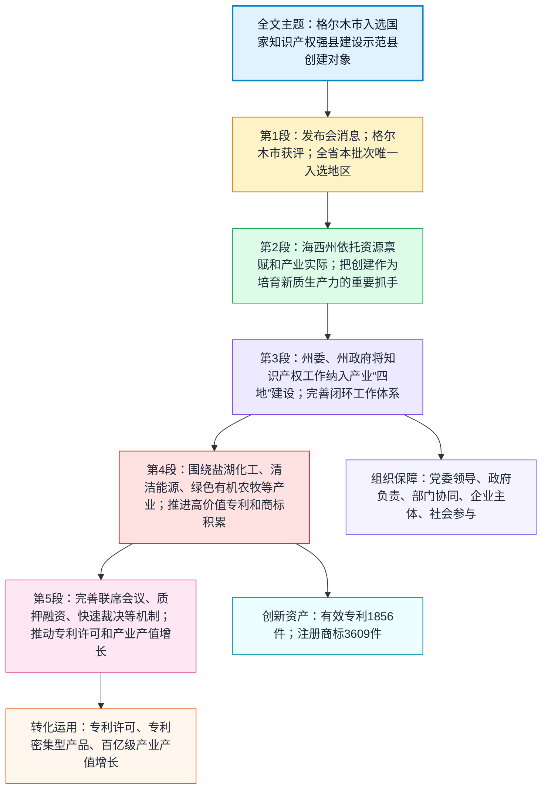

# 精读笔记

## 基本信息

- 文章来源：人民网青海频道转载；原始来源标注为《青海日报》。用户粘贴文本未含可直接打开的人民网文章 URL；同文可检索转载见：新浪财经转载《青海日报》原文 [1](https://finance.sina.cn/2026-04-21/detail-inhvesxr8267259.d.html)。
- 题目：格尔木市获评国家知识产权强县建设示范县创建对象
- 作者：叶文娟
- 发布时间：2026年04月21日09:02
- 作者背景：公开可检索资料主要显示，叶文娟为《青海日报》记者，署名报道常见于青海生态保护、自然教育、湿地保护、地方治理、知识产权等相关主题；未检索到权威、详尽的个人履历页面。可参见其署名报道：中国藏族网通转载《青海日报》署名报道 [2](https://www.tibet3.com/st/hb/2024-06/05/content_500062250.html)。
- 相关权威背景：国家知识产权局 2026 年 3 月 2 日发布的“2025—2027年国家知识产权强国建设示范创建对象”通知中，名单包含“海西州格尔木市”；详见：国家知识产权局通知 [3](https://www.cnipa.gov.cn/art/2026/3/2/art_75_204817.html)。青海“产业四地”通常指世界级盐湖产业基地、国家清洁能源产业高地、国际生态旅游目的地、绿色有机农畜产品输出地；参见：青海省人民政府网相关说明 [4](https://www.qinghai.gov.cn/zwgk/system/2026/03/05/030094038.shtml)。

## 前情提要

---

🔸中文：`格尔木市` / 获评 / `国家知识产权强县建设示范县创建对象`  

🔹English: `Golmud City` / Named a `Candidate Demonstration County` / for the National `Intellectual-Property-Strong-County` Initiative

背景注释：

- Golmud City：格尔木市，隶属青海省海西蒙古族藏族自治州，是中国西部重要的资源型、工业型城市，盐湖资源、钾肥、锂资源、新能源等产业基础突出。
- Candidate Demonstration County：这里的“创建对象”不是最终验收后的“示范县”称号，而是进入创建周期、接受建设和评估的候选对象。国家知识产权局通常会在创建期结束后组织评估验收。
- Intellectual-Property-Strong-County Initiative：“知识产权强县建设”中的“县”在政策语境中常泛指县、县级市、市辖区等县域行政单元；格尔木虽名为“市”，但在此类政策体系中可纳入县域示范创建对象。

> **`be named` 获评；被选定** /bi neɪmd/
> 释义：v. passive phrase, to be officially chosen, appointed, or identified as something（被正式选定、任命或认定为某种身份）。
> 语域：新闻 / 正式。
> 画龙点睛：新闻英语中 `be named` 很常用，可译“被评为、获评、入选、被任命为”。注意它不只是“被命名为”。如 `be named a finalist` 是“入围决赛”，`be named CEO` 是“被任命为首席执行官”。写作中比 `get` 更正式，比 `win` 更客观。

> **`candidate` 候选对象；候选人** /ˈkændɪdət/
> 释义：n. a person or thing being considered for a position, award, or status（被考虑授予职位、奖项或身份的人或对象）。
> 语域：正式 / 政策 / 学术。
> 画龙点睛：`candidate` 不一定是“政治候选人”，也可指“候选项目、候选城市、候选药物”。常见搭配：`a candidate for admission` 入学候选人，`a candidate site` 候选地点，`a promising candidate` 有前景的候选对象。本文中译“创建对象”比“候选县”更贴合政策语境。

> **`demonstration county` 示范县** /ˌdemənˈstreɪʃn ˈkaʊnti/
> 释义：n. a county selected to serve as a model for policy implementation or development practice（被选作政策实施或发展实践样板的县域单位）。
> 语域：政策 / 行政 / 发展报道。
> 画龙点睛：`demonstration` 在政策英语中常译“示范”，不是“游行示威”。如 `demonstration zone` 示范区，`demonstration project` 示范项目，`pilot and demonstration program` 试点示范项目。雅思写作中可用于表达“以点带面”的政策实验。

> **`intellectual property` 知识产权** /ˌɪntəˈlektʃuəl ˈprɑːpərti/
> 释义：n. legal rights over creations of the mind, such as patents, trademarks, copyrights, and designs（对智力创造成果享有的法律权利，如专利、商标、版权和外观设计）。
> 语域：法律 / 商业 / 科技 / 政策。
> 画龙点睛：常缩写为 `IP`。不要把 `property` 只理解为“房产”，在法律英语中它泛指“财产权”。常见搭配：`IP protection` 知识产权保护，`IP rights` 知识产权权利，`IP-intensive industries` 知识产权密集型产业。

---

🔸中文：`4月20日`，/ 从省政府新闻办召开的 `2026年青海省知识产权工作专题新闻发布会` 上 / 传来消息，/ 今年1月，/ 在省市场监督管理局（知识产权局）有力支撑下，/ `格尔木市` 成功获评 `国家知识产权强县建设示范县创建对象`，/ 成为全省本批次唯一入选地区。  

🔹English: On `April 20`, / news emerged from a `special press conference on Qinghai Province’s 2026 intellectual property work`, held by the provincial government’s information office: / in January this year, / with strong support from the Provincial Administration for Market Regulation, also known as the Intellectual Property Office, / `Golmud City` was successfully named a `candidate demonstration county` for the national Intellectual-Property-Strong-County initiative, / becoming the only locality in the province selected in this batch.

背景注释：

- provincial government’s information office：省政府新闻办，通常负责组织政府新闻发布、政策解读、权威信息发布。
- Provincial Administration for Market Regulation：省市场监督管理局。中国地方市场监管部门常承担市场秩序、质量监管、商标、广告、反垄断、消费者权益保护等职能；同时部分地区挂“知识产权局”牌子。
- in this batch：本批次。国家级示范创建通常按周期、批次组织申报、推荐、评审、公示和确认。
- only locality in the province：全省唯一入选地区，突出该事件在青海省内的稀缺性和代表性。

> **`emerge` 出现；传出；浮现** /ɪˈmɝːdʒ/
> 释义：v. to become known, visible, or apparent after being hidden or not known（在原本不明显或不为人知后变得可见、可知或显现）。
> 语域：新闻 / 学术 / 正式。
> 画龙点睛：新闻中 `news emerged that...` 可译“有消息传出……”。它比 `come out` 更正式，比 `appear` 更强调“从背景中浮现”。常见搭配：`details emerged` 细节浮出水面，`a pattern emerged` 一种模式显现。

> **`special press conference` 专题新闻发布会** /ˈspeʃəl pres ˈkɑːnfərəns/
> 释义：n. an official media briefing focused on a particular topic or policy area（围绕特定主题或政策领域召开的官方媒体发布活动）。
> 语域：新闻 / 政务。
> 画龙点睛：`press conference` 是“新闻发布会”，不是“出版社会议”。`special` 在此不是“特别好的”，而是“专题性的、专门的”。可写作：`a press conference on climate policy` 气候政策新闻发布会。

> **`with strong support from` 在……有力支持下** /wɪð strɔːŋ səˈpɔːrt frəm/
> 释义：prep. phrase, receiving substantial help, backing, or facilitation from someone or an institution（获得某人或某机构的重要帮助、支持或推动）。
> 语域：正式 / 政策 / 商务。
> 画龙点睛：该结构适合翻译中文政务报道中的“在……支持下”。写作时可替换为 `with the backing of`、`under the guidance of`、`with assistance from`，但语义不同：`guidance` 强调指导，`backing` 强调背书或支持。

> **`locality` 地区；地方行政区域** /loʊˈkæləti/
> 释义：n. a particular area, place, or administrative region（某一地区、地点或行政区域）。
> 语域：正式 / 政策 / 地理。
> 画龙点睛：`locality` 比 `place` 更正式，常用于政策、统计、规划语境。比如 `rural localities` 农村地区，`local authorities` 地方当局。本文译“地区”比“地方”更自然。

> **`batch` 批次** /bætʃ/
> 释义：n. a group of people or things dealt with, produced, or selected at the same time（一组同时处理、生产、评选或选定的人或事物）。
> 语域：通用 / 商务 / 行政。
> 画龙点睛：`batch` 很适合翻译“本批次、第一批、分批”。常见搭配：`the first batch of applicants` 第一批申请人，`a new batch of products` 一批新产品，`batch processing` 批处理。

---

🔸中文：自创建工作启动以来，/ `海西蒙古族藏族自治州` 立足本地特色 `资源禀赋`，/ 紧扣产业发展实际，/ 把示范县创建作为培育 `新质生产力`、夯实产业发展根基的重要抓手，/ 统筹州县力量、抓实重点任务，/ 全方位推进 `知识产权全链条` 提质增效，/ 稳步书写知识产权强县建设实干答卷。  

🔹English: Since the launch of the creation work, / `Haixi Mongolian and Tibetan Autonomous Prefecture` has built on its distinctive local `resource endowment`, / closely aligned its efforts with the realities of industrial development, / treated the demonstration-county creation as an important lever for nurturing `new quality productive forces` and consolidating the foundation of industrial development, / coordinated prefecture- and county-level resources and carried out key tasks in earnest, / comprehensively promoted quality and efficiency improvements across the `entire intellectual property chain`, / and steadily produced a results-oriented account of building an IP-strong county.

背景注释：

- Haixi Mongolian and Tibetan Autonomous Prefecture：海西蒙古族藏族自治州，位于青海省西部，辖区内资源型产业、盐湖产业和新能源产业较突出。
- resource endowment：资源禀赋，指一个地区天然拥有或长期积累形成的资源条件，如矿产、土地、能源、生态、区位和产业基础。
- new quality productive forces：新质生产力，中国近年政策话语中的重要概念，通常强调以科技创新为主导、摆脱传统增长路径、具有高科技、高效能、高质量特征的先进生产力。
- entire intellectual property chain：知识产权全链条，通常覆盖创造、运用、保护、管理、服务等环节。

> **`launch` 启动；发起** /lɔːntʃ/
> 释义：v./n. to start a project, campaign, product, or activity, especially in a planned or public way（以有计划或公开方式启动项目、活动、产品或行动）。
> 语域：新闻 / 商务 / 政策。
> 画龙点睛：`launch` 常用于“启动行动、推出产品、发起活动”。如 `launch a campaign` 发起活动，`launch a policy initiative` 启动政策倡议，`product launch` 产品发布。比 `start` 更正式、更有组织感。

> **`resource endowment` 资源禀赋** /ˈriːsɔːrs ɪnˈdaʊmənt/
> 释义：n. the natural, economic, or institutional resources that a place possesses and can use for development（一个地区所拥有并可用于发展的自然、经济或制度资源）。
> 语域：经济 / 区域发展 / 学术。
> 画龙点睛：`endowment` 本义有“捐赠、天赋、禀赋”。在经济地理中，`resource endowment` 是高频表达，强调发展不是凭空发生，而是依托当地已有条件。写作中可说：`a region’s comparative advantage stems from its resource endowment`。

> **`align with` 与……相契合；紧扣** /əˈlaɪn wɪð/
> 释义：v. phrase, to arrange plans, actions, or policies so that they match or support something（使计划、行动或政策与某事保持一致或相互支撑）。
> 语域：商务 / 政策 / 学术。
> 画龙点睛：`align with` 是高级写作常用词组，可替换简单的 `fit`。常见搭配：`align policy with local needs` 使政策契合地方需求，`align incentives with goals` 使激励与目标一致。

> **`lever` 杠杆；抓手；手段** /ˈlevər/
> 释义：n. a means of achieving a particular result or exerting influence（实现特定结果或产生影响的手段）。
> 语域：正式 / 政策 / 商务。
> 画龙点睛：中文政务文体里的“抓手”可译为 `lever`、`vehicle`、`instrument`。`lever` 强调“以较小投入撬动较大效果”，如 `education as a lever for social mobility` 教育作为社会流动的杠杆。

> **`nurture` 培育；滋养；扶持** /ˈnɝːtʃər/
> 释义：v. to help someone or something develop over time through support, care, or favorable conditions（通过支持、照料或有利条件帮助人或事物逐步发展）。
> 语域：正式 / 教育 / 政策 / 商务。
> 画龙点睛：`nurture` 比 `develop` 更有“长期培育”的意味。常用于 `nurture talent` 培养人才，`nurture innovation` 培育创新，`nurture emerging industries` 培育新兴产业。

> **`consolidate` 巩固；夯实** /kənˈsɑːlɪdeɪt/
> 释义：v. to make a position, system, or achievement stronger and more secure（使某种地位、制度或成果更加稳固）。
> 语域：正式 / 政策 / 学术。
> 画龙点睛：`consolidate` 是考研、雅思、GRE 常见高级词，可译“巩固、整合”。如 `consolidate gains` 巩固成果，`consolidate power` 巩固权力，`consolidate the foundation` 夯实基础。

> **`entire chain` 全链条** /ɪnˈtaɪər tʃeɪn/
> 释义：n. all stages or links in a process, from creation to final application or service（一个过程中的全部环节，从创造到最终应用或服务）。
> 语域：产业 / 政策 / 管理。
> 画龙点睛：中文“全链条”可译 `the entire chain` 或 `the whole chain`。在产业语境中也可说 `value chain` 价值链、`supply chain` 供应链、`innovation chain` 创新链。本文是 `IP chain`，即知识产权创造、运用、保护、管理、服务等环节。

---

🔸中文：州委、州政府 / 将 `知识产权工作` 深度嵌入产业 “`四地`” 建设核心布局，/ 对标知识产权强国建设相关纲要，/ 出台系列 `全链条配套扶持政策`，/ 把创建核心指标纳入常态化年度绩效考核。  

🔹English: The prefectural Party committee and prefectural government / have deeply embedded `intellectual property work` into the core framework for building Qinghai’s industrial “`Four Hubs`,” / benchmarked their efforts against the relevant outlines for building an intellectual property powerhouse, / rolled out a series of `supporting policies covering the whole chain`, / and incorporated the core creation indicators into regular annual performance evaluations.

背景注释：

- prefectural Party committee and prefectural government：州委、州政府。海西州为自治州，州级党委和政府是地方治理中的重要组织与行政主体。
- Four Hubs：“四地”在青海产业政策语境中通常包括世界级盐湖产业基地、国家清洁能源产业高地、国际生态旅游目的地、绿色有机农畜产品输出地。
- intellectual property powerhouse：知识产权强国，指在知识产权创造质量、运用效益、保护水平、治理能力和国际竞争力等方面具有较强实力的国家。
- annual performance evaluations：年度绩效考核，将政策目标量化或指标化后纳入常态考核体系，有利于强化执行责任。

> **`embed` 嵌入；深度纳入** /ɪmˈbed/
> 释义：v. to fix something firmly and deeply within a structure, system, or process（将某事物牢固、深入地置入某一结构、体系或流程中）。
> 语域：正式 / 科技 / 政策 / 新闻。
> 画龙点睛：`embed` 原意可指“嵌入物体中”，引申为“纳入制度或体系”。常见搭配：`embed innovation in governance` 将创新嵌入治理，`embedded system` 嵌入式系统。本文用 `deeply embedded` 很贴近“深度嵌入”。

> **`core framework` 核心布局；核心框架** /kɔːr ˈfreɪmwɝːk/
> 释义：n. the central structure or arrangement that guides a plan, policy, or system（指导计划、政策或系统的中心结构或安排）。
> 语域：政策 / 学术 / 管理。
> 画龙点睛：`framework` 是写作高频词，表示“框架、体系、架构”。如 `legal framework` 法律框架，`policy framework` 政策框架，`analytical framework` 分析框架。比 `plan` 更强调结构性。

> **`benchmark against` 对标；以……为参照** /ˈbentʃmɑːrk əˈɡenst/
> 释义：v. phrase, to compare performance, policy, or standards with a recognized model or target（将表现、政策或标准与公认模型或目标进行比较和参照）。
> 语域：商务 / 政策 / 管理。
> 画龙点睛：中文“对标”常译 `benchmark against`。如 `benchmark against international standards` 对标国际标准。注意 `benchmark` 既可作名词“基准”，也可作动词“对标、比较”。

> **`roll out` 推出；出台** /roʊl aʊt/
> 释义：v. phrase, to introduce a new policy, product, or service to the public or to a target group（向公众或目标群体推出新政策、产品或服务）。
> 语域：新闻 / 商务 / 政策。
> 画龙点睛：`roll out` 适合翻译“出台、上线、推出”。如 `roll out new measures` 出台新措施，`roll out a vaccination program` 推出疫苗接种计划。比 `issue` 更有“铺开实施”的动态感。

> **`incorporate ... into` 将……纳入……** /ɪnˈkɔːrpəreɪt ˈɪntuː/
> 释义：v. phrase, to include something as part of a larger system, plan, or document（把某事物作为组成部分纳入更大的体系、计划或文件）。
> 语域：正式 / 学术 / 政策。
> 画龙点睛：这是翻译“纳入”的万能高分结构。例：`incorporate environmental targets into economic planning` 将环境目标纳入经济规划。注意介词常用 `into`，不要误写成 `in`。

> **`performance evaluation` 绩效考核；绩效评估** /pərˈfɔːrməns ɪˌvæljuˈeɪʃn/
> 释义：n. a formal assessment of how well a person, organization, or policy has met stated goals（对个人、组织或政策目标完成情况的正式评估）。
> 语域：管理 / 行政 / 商务。
> 画龙点睛：`evaluation` 偏“评估”，`assessment` 也可译“评估”，但 `performance evaluation` 更贴近组织管理中的“绩效考核”。常见搭配：`annual performance evaluation` 年度绩效考核。

---

🔸中文：州级相关领导 / 常态化下沉 `格尔木` 一线办公、现场纾困解难，/ 完善党委领导、政府负责、部门协同、企业主体、社会参与的 `闭环工作体系`，/ 为高标准推进示范县创建 / 筑牢坚实组织保障。  

🔹English: Relevant prefecture-level leaders / have routinely gone down to the front line in `Golmud` to work on site and resolve practical difficulties, / improved a `closed-loop working system` in which Party committees lead, governments take responsibility, departments coordinate, enterprises play the principal role, and society participates, / and laid a solid organizational foundation / for advancing the demonstration-county creation to a high standard.

背景注释：

- go down to the front line：中文“下沉一线”在政务报道中常指领导干部到基层、现场、项目所在地办公或督导。
- closed-loop working system：闭环工作体系，通常表示任务从发现问题、交办、落实、反馈、评估到再改进形成完整循环。
- enterprises play the principal role：企业主体，强调企业在知识产权创造、运用、转化中的核心地位。
- organizational foundation：组织保障，在政策执行中指领导机制、责任机制、协调机制和资源配置等。

> **`front line` 一线；前线** /ˌfrʌnt ˈlaɪn/
> 释义：n. the place where the most direct or important work, action, or confrontation happens（最直接、最关键工作或行动发生的地点）。
> 语域：军事 / 新闻 / 管理 / 政策。
> 画龙点睛：`front line` 不只用于战争，也常用于公共服务和治理。`front-line workers` 一线工作人员，`on the front line of reform` 处在改革一线。本文译“基层一线、工作一线”均可。

> **`on site` 现场；在现场** /ɑːn saɪt/
> 释义：adv./adj. at the place where something is happening or being done（在事情发生或工作开展的具体地点）。
> 语域：商务 / 工程 / 新闻 / 管理。
> 画龙点睛：`on-site` 作形容词时通常加连字符，如 `on-site inspection` 现场检查，`on-site services` 现场服务。作状语时常写 `on site`。本文 `work on site` 贴合“现场办公”。

> **`resolve practical difficulties` 解决实际困难** /rɪˈzɑːlv ˈpræktɪkəl ˈdɪfɪkəltiz/
> 释义：v. phrase, to find workable solutions to concrete problems encountered in practice（为实践中遇到的具体问题找到可行解决办法）。
> 语域：正式 / 政策 / 管理。
> 画龙点睛：中文“纾困解难”可译 `resolve difficulties`、`address bottlenecks`、`remove obstacles`。其中 `address` 强调处理，`resolve` 强调解决，`remove` 强调清除障碍。

> **`closed-loop` 闭环的** /ˌkloʊzd ˈluːp/
> 释义：adj. involving a complete cycle of action, feedback, correction, and follow-up（包含行动、反馈、修正和跟进的完整循环）。
> 语域：工程 / 管理 / 政策。
> 画龙点睛：`closed-loop management` 是管理英语中的高频表达，表示“闭环管理”。反义可理解为 `open-ended` 开放式、无明确闭环的。写作中可用于强调执行力：`a closed-loop mechanism for problem-solving` 问题解决闭环机制。

> **`principal role` 主体作用；主要作用** /ˈprɪnsəpəl roʊl/
> 释义：n. the leading or primary role played by a person, group, or institution（个人、群体或机构发挥的主要或主导作用）。
> 语域：正式 / 政策 / 管理。
> 画龙点睛：`principal` 作形容词时表示“主要的、首要的”，不要和 `principle` “原则”混淆。`principal role` 可译“主体作用”，`principal reason` 主要原因，`principal component` 主要组成部分。

> **`lay a solid foundation` 筑牢坚实基础** /leɪ ə ˈsɑːlɪd faʊnˈdeɪʃn/
> 释义：v. phrase, to create a strong basis on which future development or success can be built（建立可支撑未来发展或成功的坚实基础）。
> 语域：正式 / 通用 / 政策。
> 画龙点睛：这是高分写作万能表达。可用于教育、经济、科技、制度建设等：`lay a solid foundation for sustainable growth` 为可持续增长奠定坚实基础。`lay-laid-laid` 是不规则变化，注意不要写成 `layed`。

---

🔸中文：锚定 `盐湖化工`、`清洁能源`、绿色有机农牧等主导产业，/ 全域推进 `高价值专利培育专项行动`，/ 科学布局产业链核心技术专利储备。  

🔹English: Focusing on leading industries such as `salt-lake chemicals`, `clean energy`, and green and organic agriculture and animal husbandry, / the city has advanced a special campaign across the whole area to cultivate `high-value patents`, / and has scientifically planned reserves of core-technology patents along the industrial chains.

背景注释：

- salt-lake chemicals：盐湖化工。青海柴达木盆地盐湖资源丰富，盐湖产业常涉及钾、锂、镁、钠等资源开发及化工产品生产。
- clean energy：清洁能源。青海太阳能、风能、水电等资源丰富，清洁能源是其重点产业方向之一。
- green and organic agriculture and animal husbandry：绿色有机农牧，强调生态、绿色、有机标准下的农业和畜牧业生产。
- high-value patents：高价值专利，通常指技术含量高、市场价值高、法律稳定性强、能支撑产业竞争力的专利。

> **`focus on` 聚焦；锚定** /ˈfoʊkəs ɑːn/
> 释义：v. phrase, to give particular attention or effort to something（把注意力或努力集中在某事上）。
> 语域：通用 / 商务 / 政策。
> 画龙点睛：中文“锚定”常可译 `focus on`、`target`、`anchor around`。`focus on` 最自然稳妥；`target` 更强调“以……为目标”；`anchor around` 更强调“围绕……固定布局”。

> **`leading industries` 主导产业** /ˈliːdɪŋ ˈɪndəstriz/
> 释义：n. industries that play a major role in driving regional economic growth or technological development（在推动区域经济增长或技术发展中发挥主要作用的产业）。
> 语域：经济 / 政策 / 产业分析。
> 画龙点睛：`leading` 不只是“领先的”，在产业语境中常译“主导的、龙头的”。如 `leading sector` 主导部门，`leading enterprise` 龙头企业。不要机械译成“领导产业”。

> **`salt-lake chemicals` 盐湖化工** /ˈsɔːlt leɪk ˈkemɪkəlz/
> 释义：n. chemical products and industrial processes based on mineral resources extracted from salt lakes（基于盐湖矿产资源提取和加工形成的化工产品及产业流程）。
> 语域：产业 / 科技 / 资源经济。
> 画龙点睛：`chemicals` 在产业英语中常作复数，指“化工产品、化学品”。`chemical industry` 是“化学工业/化工行业”。盐湖资源语境中可搭配 `lithium extraction from salt lakes` 盐湖提锂。

> **`cultivate high-value patents` 培育高价值专利** /ˈkʌltɪveɪt haɪ ˈvæljuː ˈpætnts/
> 释义：v. phrase, to develop patents that have strong technological, legal, and commercial value（培育具有较强技术价值、法律价值和商业价值的专利）。
> 语域：知识产权 / 科技政策。
> 画龙点睛：`cultivate` 用于“培育人才、市场、产业、专利”等很地道。`high-value` 是复合形容词，修饰名词时加连字符，如 `high-value patents`、`high-value services`。注意 `patent` 美音常读 /ˈpætnt/，英音常读 /ˈpeɪtnt/。

> **`patent reserves` 专利储备** /ˈpætnt rɪˈzɝːvz/
> 释义：n. patents or patentable technologies prepared and accumulated for future industrial use or strategic protection（为未来产业应用或战略保护而准备、积累的专利或可专利技术）。
> 语域：知识产权 / 科技管理。
> 画龙点睛：`reserve` 作名词时可指“储备、储量、保留”。如 `foreign exchange reserves` 外汇储备，`oil reserves` 石油储量。`patent reserves` 表示企业或地区提前布局的专利组合和技术储备。

> **`industrial chain` 产业链** /ɪnˈdʌstriəl tʃeɪn/
> 释义：n. the sequence of linked activities, firms, technologies, and markets involved in producing and delivering industrial value（创造和交付产业价值的一系列相互连接的活动、企业、技术和市场环节）。
> 语域：经济 / 产业 / 政策。
> 画龙点睛：区分 `industrial chain` 产业链、`supply chain` 供应链、`value chain` 价值链。`industrial chain` 更强调产业上下游整体，`supply chain` 更强调供应和物流，`value chain` 更强调价值创造环节。

---

🔸中文：目前 / 全市 `有效专利` 累计1856件、`注册商标` 3609件。  

🔹English: To date, / the city has accumulated 1,856 `valid patents` and 3,609 `registered trademarks`.

背景注释：

- valid patents：有效专利，指仍处于法律有效状态的专利，通常需要已授权且按规定维持有效。
- registered trademarks：注册商标，指经商标主管机关核准注册、依法享有商标专用权的标志。
- 1856件、3609件：这些数据用于展示格尔木市在知识产权创造和品牌建设方面的存量基础。

> **`to date` 迄今；截至目前** /tuː deɪt/
> 释义：adv. up to the present time（到现在为止）。
> 语域：正式 / 新闻 / 商务。
> 画龙点睛：`to date` 常用于数据陈述，比 `until now` 更正式。例：`The project has attracted $10 million to date.` 该项目迄今已吸引1000万美元。注意不要误解为“去约会”。

> **`accumulate` 累计；积累** /əˈkjuːmjəleɪt/
> 释义：v. to gradually gather or increase over time（随着时间逐渐聚集或增加）。
> 语域：正式 / 学术 / 数据报道。
> 画龙点睛：`accumulate` 强调“逐渐积累”。名词为 `accumulation`。常见搭配：`accumulate experience` 积累经验，`accumulate capital` 积累资本，`accumulated total` 累计总量。

> **`valid patent` 有效专利** /ˈvælɪd ˈpætnt/
> 释义：n. a patent that remains legally enforceable and has not expired, lapsed, or been invalidated（仍具有法律效力、未到期、未失效且未被宣告无效的专利）。
> 语域：法律 / 知识产权。
> 画龙点睛：`valid` 在法律英语中是“有效的、具有法律效力的”。如 `valid contract` 有效合同，`valid license` 有效许可证。反义词可用 `invalid` 无效的，`expired` 过期的，`lapsed` 失效的。

> **`registered trademark` 注册商标** /ˈredʒɪstərd ˈtreɪdmɑːrk/
> 释义：n. a trademark officially recorded and protected by the relevant authority（经主管机关正式登记并受到保护的商标）。
> 语域：法律 / 商业。
> 画龙点睛：`trademark` 指“商标”，不要和 `brand` 完全等同。`brand` 更偏市场和消费者认知，`trademark` 更偏法律权利。`registered` 表示“已注册的”，常见符号为 ®；未注册商标常用 ™。

---

🔸中文：`盐湖产业` 专利转化应用案例 / 获评全国强国建设典型案例，/ 填补全省相关领域空白，/ 特色地标产品、新能源重点项目 `科创赋能` 成效突出，/ 特色产业 `提质增效` 势头强劲。  

🔹English: A case of patent `commercialization and application` in the `salt-lake industry` / was selected as a national exemplary case in building an intellectual property powerhouse, / filling a gap in this field in the province; / science-and-technology empowerment has delivered notable results for distinctive geographical-indication products and key new-energy projects, / and the momentum of `quality and efficiency improvement` in distinctive industries remains strong.

背景注释：

- patent commercialization and application：专利转化应用，即将专利技术从纸面权利转化为生产、产品、服务或商业收益。
- national exemplary case：全国典型案例，用于展示可复制、可推广的经验做法。
- geographical-indication products：地理标志产品，指因特定地域自然因素、人文因素而具有特定质量、声誉或特征的产品。
- science-and-technology empowerment：科创赋能，指用科技创新提升产业效率、产品价值和竞争力。
- quality and efficiency improvement：提质增效，即提高质量、提升效率和效益，是中文政策报道中的常见表达。

> **`commercialization` 商业化；转化为商业应用** /kəˌmɝːʃələˈzeɪʃn/
> 释义：n. the process of turning an idea, technology, or invention into a marketable product or service（将想法、技术或发明转化为可销售产品或服务的过程）。
> 语域：科技 / 商业 / 知识产权。
> 画龙点睛：专利语境中的“转化”常译 `commercialization` 或 `technology transfer`。`commercialization` 强调市场化收益，`application` 强调实际应用，`transfer` 强调从研发主体转移到使用主体。

> **`exemplary case` 典型案例；示范案例** /ɪɡˈzempləri keɪs/
> 释义：n. a case that is considered a good model for others to learn from（被认为可供其他主体学习借鉴的优秀案例）。
> 语域：正式 / 政策 / 教育。
> 画龙点睛：`exemplary` 表示“可作榜样的、示范性的”。比 `typical` 更强调正面示范价值。`typical case` 是“典型案例”，不一定褒义；`exemplary case` 往往含“值得学习”的意味。

> **`fill a gap` 填补空白** /fɪl ə ɡæp/
> 释义：v. phrase, to provide something that was missing in a field, system, or body of knowledge（补足某领域、体系或知识中原本缺失的部分）。
> 语域：学术 / 新闻 / 政策。
> 画龙点睛：这是翻译“填补空白”的地道表达。可说 `fill a gap in the market` 填补市场空白，`fill a gap in research` 填补研究空白。`gap` 也常见于 `income gap` 收入差距、`skills gap` 技能缺口。

> **`geographical-indication product` 地理标志产品** /ˌdʒiːəˈɡræfɪkəl ˌɪndɪˈkeɪʃn ˈprɑːdʌkt/
> 释义：n. a product whose quality, reputation, or characteristics are linked to a specific geographical origin（质量、声誉或特征与特定地理来源相关的产品）。
> 语域：知识产权 / 农业 / 贸易。
> 画龙点睛：`geographical indication` 常缩写为 `GI`。如法国香槟、帕尔马火腿、中国某些地方特色农产品都可涉及 GI 保护。本文“特色地标产品”可译作 `distinctive geographical-indication products`。

> **`empowerment` 赋能** /ɪmˈpaʊərmənt/
> 释义：n. the act of giving someone or something greater capacity, authority, tools, or confidence to act effectively（赋予某人或某事更强能力、工具、权限或信心，使其更有效行动）。
> 语域：政策 / 商务 / 教育 / 科技。
> 画龙点睛：中文“赋能”在英语中常译 `empowerment` 或动词 `empower`。如 `digital empowerment` 数字赋能，`technology empowers small businesses` 技术赋能小企业。注意不要滥用，最好明确“用什么赋能谁”。

> **`notable results` 显著成效** /ˈnoʊtəbl rɪˈzʌlts/
> 释义：n. results that are important, clear, or worthy of attention（重要、明显或值得关注的成果）。
> 语域：正式 / 新闻 / 政策。
> 画龙点睛：`notable` 比 `good` 更正式，可用于学术和报道。近义词有 `significant`、`remarkable`、`substantial`。其中 `significant` 可强调统计或重要性，`remarkable` 更有“引人注目”的意味。

> **`momentum` 势头；动能** /moʊˈmentəm/
> 释义：n. the force or speed of development that makes progress continue（推动发展持续向前的力量或速度）。
> 语域：新闻 / 经济 / 政策。
> 画龙点睛：`momentum` 是写经济和社会发展很有用的词。常见搭配：`gain momentum` 势头增强，`maintain momentum` 保持势头，`lose momentum` 失去动力。本文 `momentum remains strong` 对应“势头强劲”。

> **`quality and efficiency improvement` 提质增效** /ˈkwɑːləti ænd ɪˈfɪʃnsi ɪmˈpruːvmənt/
> 释义：n. the process of improving both quality and efficiency or economic returns（同时提升质量、效率或经济效益的过程）。
> 语域：政策 / 产业 / 管理。
> 画龙点睛：中文政策词“提质增效”不能只译成 `improve quality`，因为还包含效率和效益。可根据语境译为 `improve quality and efficiency` 或 `enhance quality and efficiency`。

---

🔸中文：健全常态化 `工作联席会议机制`，/ 稳妥破解 `专利布局`、`质押融资` 等各类实操难题，/ 建成市域首家 `商标品牌指导站`，/ 优化知识产权侵权快速裁决便民窗口，/ 压缩维权办理时限。  

🔹English: The prefecture has improved a regular `interdepartmental meeting mechanism`, / prudently solved various operational problems such as `patent portfolio planning` and `pledge financing`, / established the city’s first `trademark-brand guidance station`, / optimized the convenient service window for fast adjudication of intellectual property infringement, / and shortened the processing time for rights protection.

背景注释：

- interdepartmental meeting mechanism：联席会议机制，通常由多个部门定期会商、协调处理跨部门问题。
- patent portfolio planning：专利布局，指围绕产业链、技术路线、市场竞争和法律保护设计专利申请与保护组合。
- pledge financing：质押融资，企业可将专利权、商标权等知识产权作为质押物获取贷款融资。
- trademark-brand guidance station：商标品牌指导站，通常为企业提供商标注册、品牌培育、维权保护等服务。
- fast adjudication of IP infringement：知识产权侵权快速裁决，旨在提高侵权纠纷处理效率，降低维权成本。

> **`interdepartmental` 跨部门的；部门间的** /ˌɪntərˌdiːpɑːrtˈmentl/
> 释义：adj. involving two or more government departments or organizational units（涉及两个或多个政府部门或组织部门的）。
> 语域：行政 / 政策 / 管理。
> 画龙点睛：前缀 `inter-` 表示“在……之间”，如 `international` 国际的，`interdisciplinary` 跨学科的。`interdepartmental coordination` 是“跨部门协调”，很适合政务类翻译。

> **`mechanism` 机制** /ˈmekənɪzəm/
> 释义：n. a system, process, or set of arrangements through which something is done（完成某事的一套系统、流程或安排）。
> 语域：正式 / 学术 / 政策。
> 画龙点睛：`mechanism` 是翻译“机制”的核心词。常见搭配：`coordination mechanism` 协调机制，`supervision mechanism` 监督机制，`market mechanism` 市场机制。比 `method` 更强调制度化安排。

> **`prudently` 稳妥地；审慎地** /ˈpruːdəntli/
> 释义：adv. in a careful and sensible way that avoids unnecessary risks（以谨慎、理性、避免不必要风险的方式）。
> 语域：正式 / 金融 / 政策。
> 画龙点睛：`prudent` 是 GRE/考研高频词，意为“审慎的”。反义词可用 `reckless` 鲁莽的。金融语境中 `prudent lending` 是审慎放贷，`prudential regulation` 是审慎监管。

> **`patent portfolio planning` 专利布局；专利组合规划** /ˈpætnt pɔːrtˈfoʊlioʊ ˈplænɪŋ/
> 释义：n. the strategic planning of a group of patents to protect technologies, markets, and competitive positions（为保护技术、市场和竞争地位而进行的一组专利战略规划）。
> 语域：知识产权 / 科技管理 / 商业。
> 画龙点睛：`portfolio` 原指“作品集、投资组合”，在专利语境中指“专利组合”。`patent portfolio` 比单个 `patent` 更强调系统布局，常用于企业知识产权战略。

> **`pledge financing` 质押融资** /pledʒ ˈfaɪnænsɪŋ/
> 释义：n. financing obtained by using assets or rights as collateral for a loan（以资产或权利作为担保物获得贷款融资）。
> 语域：金融 / 法律 / 商务。
> 画龙点睛：`pledge` 作名词可指“质押、誓言”，作动词可指“承诺、质押”。知识产权质押融资可译 `IP pledge financing`。注意 `mortgage` 多用于不动产抵押，`pledge` 更适合权利或动产质押。

> **`adjudication` 裁决；审理判定** /əˌdʒuːdɪˈkeɪʃn/
> 释义：n. the formal process of making a decision in a legal or administrative dispute（在法律或行政争议中作出正式决定的过程）。
> 语域：法律 / 行政。
> 画龙点睛：`adjudication` 比 `decision` 更法律化。动词是 `adjudicate`。常见搭配：`administrative adjudication` 行政裁决，`dispute adjudication` 争议裁决。用于知识产权侵权处理非常贴切。

> **`infringement` 侵权；侵犯** /ɪnˈfrɪndʒmənt/
> 释义：n. an act of violating a law, right, agreement, or protected interest（违反法律、权利、协议或受保护利益的行为）。
> 语域：法律 / 知识产权。
> 画龙点睛：知识产权领域高频词：`patent infringement` 专利侵权，`trademark infringement` 商标侵权，`copyright infringement` 著作权侵权。动词为 `infringe`，常用结构 `infringe on/upon someone’s rights`。

> **`shorten the processing time` 压缩办理时限** /ˈʃɔːrtn ðə ˈprɑːsesɪŋ taɪm/
> 释义：v. phrase, to reduce the time needed to handle or complete a procedure（减少办理或完成某一程序所需的时间）。
> 语域：行政 / 商务 / 服务管理。
> 画龙点睛：中文“压缩时限”可译 `shorten the processing time`、`reduce turnaround time`。`turnaround time` 更偏服务、流程和业务办理周期，是商务英语高频表达。

---

🔸中文：成功落地 `千万元级专利许可签约合作`，/ 多款核心盐湖产品入选 `国家专利密集型产品名录`，/ 联动百亿级产业产值增长，/ 为示范县建设注入源源不断的 `经济动能`。  

🔹English: `Patent licensing cooperation` worth more than ten million yuan has been successfully concluded, / multiple core salt-lake products have been included in the `national catalogue of patent-intensive products`, / driving growth in industrial output value at the ten-billion-yuan level, / and injecting a steady stream of `economic momentum` into the construction of the demonstration county.

背景注释：

- patent licensing cooperation：专利许可合作，指专利权人允许他人在一定条件下实施其专利，通常涉及许可费、合作开发或产业化应用。
- more than ten million yuan：千万元级，通常指金额达到或超过一千万元人民币量级。
- patent-intensive products：专利密集型产品，通常指与专利技术关联紧密、专利贡献度较高的产品。
- ten-billion-yuan level：百亿级，中文“百亿”约等于 10 billion yuan，即一百亿元人民币量级。
- economic momentum：经济动能，指推动经济增长、产业扩张或价值提升的持续动力。

> **`licensing` 许可；授权使用** /ˈlaɪsnsɪŋ/
> 释义：n. the act of giving official permission to use intellectual property, technology, software, or a brand under agreed conditions（在约定条件下允许他人使用知识产权、技术、软件或品牌的行为）。
> 语域：法律 / 商业 / 知识产权。
> 画龙点睛：`license` 美式拼法中名词、动词都可用；英式英语中名词常为 `licence`，动词为 `license`。`patent licensing` 是“专利许可”，`exclusive license` 独占许可，`non-exclusive license` 普通许可。

> **`worth more than ten million yuan` 价值千万元级；金额超过一千万元** /wɝːθ mɔːr ðæn ten ˈmɪljən juˈɑːn/
> 释义：adj. phrase, having a monetary value exceeding ten million yuan（具有超过一千万元人民币的金额或价值）。
> 语域：新闻 / 金融 / 商务。
> 画龙点睛：中文“千万元级”不宜硬译成 `ten-million-level` 单独使用，完整表达可写 `worth more than ten million yuan` 或 `at the ten-million-yuan level`。注意英文数字表达：一千万是 `ten million`，一亿是 `one hundred million`。

> **`conclude` 达成；签订；结束** /kənˈkluːd/
> 释义：v. to formally reach an agreement or bring something to an end（正式达成协议或使某事结束）。
> 语域：正式 / 法律 / 商务 / 外交。
> 画龙点睛：`conclude an agreement` 是“达成/签署协议”的正式表达。不要只把 `conclude` 理解为“总结”。如 `The parties concluded a contract.` 双方签订了合同。名词为 `conclusion`。

> **`catalogue` 名录；目录** /ˈkætəlɔːɡ/
> 释义：n. an official or organized list of items, products, or records（项目、产品或记录的正式或系统化清单）。
> 语域：正式 / 行政 / 商业。
> 画龙点睛：英式常写 `catalogue`，美式常写 `catalog`。政策文件中的“名录”常译 `catalogue`，如 `national catalogue` 国家名录，`product catalogue` 产品目录。

> **`patent-intensive products` 专利密集型产品** /ˈpætnt ɪnˈtensɪv ˈprɑːdʌkts/
> 释义：n. products whose value, competitiveness, or technical features depend heavily on patents（其价值、竞争力或技术特征高度依赖专利的产品）。
> 语域：知识产权 / 产业政策。
> 画龙点睛：后缀结构 `-intensive` 表示“密集型的、依赖……较多的”。如 `labor-intensive` 劳动密集型，`capital-intensive` 资本密集型，`technology-intensive` 技术密集型，`knowledge-intensive` 知识密集型。

> **`output value` 产值** /ˈaʊtpʊt ˈvæljuː/
> 释义：n. the total monetary value of goods or services produced by an industry, enterprise, or region（某一产业、企业或地区生产的产品或服务的货币总价值）。
> 语域：经济 / 统计 / 产业。
> 画龙点睛：`output` 是“产出”，`value` 是“价值”，合起来是“产值”。常见表达：`gross industrial output value` 工业总产值，`agricultural output value` 农业产值。不要误译为“输出价值”。

> **`inject ... into` 向……注入……** /ɪnˈdʒekt ˈɪntuː/
> 释义：v. phrase, to add something such as energy, money, confidence, or momentum to a system（向某一系统加入能量、资金、信心或动力）。
> 语域：新闻 / 经济 / 政策。
> 画龙点睛：`inject` 原义是“注射”，引申为“注入”。常见搭配：`inject capital into the economy` 向经济注入资本，`inject vitality into rural development` 为乡村发展注入活力。本文 `inject momentum into` 对应“注入动能”。

> **`a steady stream of` 源源不断的** /ə ˈstedi striːm əv/
> 释义：phrase, a continuous flow or supply of something（某物持续不断的流入或供应）。
> 语域：新闻 / 文学 / 商务。
> 画龙点睛：这是翻译“源源不断”的优美表达。可说 `a steady stream of visitors` 源源不断的游客，`a steady stream of investment` 持续不断的投资，`a steady stream of innovation` 不断涌现的创新。

> **`economic momentum` 经济动能** /ˌiːkəˈnɑːmɪk moʊˈmentəm/
> 释义：n. the driving force that sustains or accelerates economic growth and industrial development（维持或加速经济增长与产业发展的驱动力）。
> 语域：经济 / 政策 / 新闻。
> 画龙点睛：`momentum` 与 `engine` 都可译“动能/引擎”，但侧重点不同：`momentum` 强调持续推进的势头，`engine` 强调驱动增长的来源。可写 `innovation has become a new engine of growth`，也可写 `the economy is gaining momentum`。
