---
title: VOV：日本犯罪数量激增（越英中精读笔记）
source: VOV.VN（越南之声电子报 / Voice of Vietnam）
source_url: https://vov.vn/the-gioi/toi-pham-tai-nhat-ban-tang-chong-mat-post1153004.vov
author: Ngọc Huân / VOV-Tokyo
date: 2025-02-06
created_date: 2026-04-14
category: reading/notes/politics/domestic-policy/other-countries
tags: 越南语, VOV, 越英中对照, 日本治安, 日本国家警察厅, NPA, 刑法犯, 公共安全, 网络诈骗, SNS犯罪, 暗黑打工, yami baito, 民调, 战后低点, 雅思阅读, 考研英语, GRE, 精读笔记, Ngọc Huân
original_title: Tội phạm tại Nhật Bản tăng chóng mặt
language_original: vi
---

本文整理自 `VOV.VN` 越南语报道，配套英文讲解与中文释义；核心数据可与日本警察厅（`NPA`）公开统计互证。发稿时间：`15:08, Thursday, February 6, 2025`。

## 文章来源与作者信息

- 来源：`VOV.VN`（越南之声电子报 / Voice of Vietnam）
  链接：<https://vov.vn/the-gioi/toi-pham-tai-nhat-ban-tang-chong-mat-post1153004.vov>
- 题目：`Tội phạm tại Nhật Bản tăng chóng mặt`
- 中文可译：日本犯罪数量激增
- 作者：`Ngọc Huân / VOV-Tokyo`
- 发布时间：`15:08, Thursday, February 6, 2025`
- 文章语言：越南语
- 作者背景简介：根据 `VOV` 作者页与 `VOV World` 可核实，`Ngọc Huân` 为 `VOV` 驻日本/东京记者，长期报道日本政治、社会、侨务与突发新闻；其 `VOV` 作者页显示其名下有大量日本相关报道。
  参考：
  1. <https://vov.vn/tac-gia/ngoc-huanvov-tokyo-author1886>
  2. <https://vovworld.vn/vi-VN/nguoi-viet-muon-phuong/khai-mac-hoi-cho-quoc-te-ikebana-tokyo-2024-1350726.vov>
- 事实核验补充：日本警察厅（`National Police Agency, NPA`）官方统计页可核实，`2024` 年日本刑法犯认知件数为 `737,679`，较 `2023` 年 `703,351` 件继续上升。
  参考：
  1. <https://www.npa.go.jp/newlyarrived/2024/20240213.html>
  2. <https://www.npa.go.jp/hakusyo/r07/honbun/html/bb2211000.html>
  3. <https://www.npa.go.jp/hanzaihigai/whitepaper/2025/zenbun/siryo/siryo-10.html>

## 前情提要

```mermaid
flowchart TD
    A["基本信息<br/>VOV.VN / 2025-02-06<br/>主题：日本犯罪上升"]:::meta
    B["第1段<br/>导语：2024年犯罪继续上升<br/>已是连续第3年增长"]:::p1
    C["第2段<br/>核心数据：737,679起<br/>较2023年增加34,328起"]:::p2
    D["第3段<br/>上升类型：严重犯罪、暴力犯罪、<br/>网银诈骗、虐童、社媒诈骗"]:::p3
    E["第4段<br/>社交媒体成为犯罪招募渠道<br/>2024年8月后多地出现恶性案件"]:::p4
    F["第5段<br/>“非法兼职”实施者 / 暗黑打工<br/>财务、投资、情感诈骗损失巨大"]:::p5
    G["第6段<br/>民调：76.6%认为治安十年变差<br/>仅10.5%认为改善"]:::p6
    H["第7段<br/>另一问题：56.4%认为治安良好<br/>该比例为2021年以来最低"]:::p7
    I["第8段<br/>历史纵向：2002年约285万起高点<br/>2021年降至战后低点568,104起"]:::p8
    J["第9段<br/>2022年反弹：601,389起<br/>疫情限制放松后20年来首增"]:::p9
    K["第10段<br/>2023年继续升至70.3万余起"]:::p10
    L["第11段<br/>警方定性：形势严峻<br/>将强化部署、堵塞漏洞、全面应对"]:::p11

    A --> B --> C --> D --> E --> F --> G --> H --> I --> J --> K --> L

    classDef meta fill:#e8f1ff,stroke:#5b8def,color:#111,stroke-width:1.5px;
    classDef p1 fill:#fff3cd,stroke:#d39e00,color:#111;
    classDef p2 fill:#fde2e4,stroke:#d6336c,color:#111;
    classDef p3 fill:#e2f0d9,stroke:#5c940d,color:#111;
    classDef p4 fill:#dbeafe,stroke:#1d4ed8,color:#111;
    classDef p5 fill:#f3e8ff,stroke:#7e22ce,color:#111;
    classDef p6 fill:#ffe8cc,stroke:#f76707,color:#111;
    classDef p7 fill:#e6fcf5,stroke:#0f766e,color:#111;
    classDef p8 fill:#f8f0fc,stroke:#a61e4d,color:#111;
    classDef p9 fill:#edf2ff,stroke:#364fc7,color:#111;
    classDef p10 fill:#fff0f6,stroke:#c2255c,color:#111;
    classDef p11 fill:#e9ecef,stroke:#495057,color:#111;
```

---

## 逐句精读

### 句1

🔻越文：Theo số liệu của Cơ quan Cảnh sát quốc gia Nhật Bản công bố, số vụ tội phạm ở nước này trong năm 2024 tiếp tục tăng nhanh và đây là năm tăng thứ 3 liên tiếp.  
🔹English：According to figures / released by Japan’s National Police Agency, / the number of crimes in the country / `continued to rise sharply` in 2024, / marking the `third consecutive year of increase`.  
🔸中文：根据日本国家警察厅公布的数据，`2024年`该国犯罪数量`继续快速上升`，这已经是`连续第三年增长`。

背景注释：

- `Japan’s National Police Agency`：日本国家警察厅，简称 `NPA`，是日本中央警察行政机关。
- `2024`：这里指自然年 `January 1, 2024` 至 `December 31, 2024`。
- 官方统计显示：`2024` 年刑法犯认知件数为 `737,679`，`2023` 年为 `703,351`。

> **continued to rise sharply / 持续迅速上升**
> ① 英文释义（verb phrase）：`to keep increasing at a fast rate`；中文：`持续快速增长/上升`。
> ② 语域：新闻、时政、统计报道。
> ③ 画龙点睛：这是新闻英语中非常高频的增势表达，常见搭配有 `prices continued to rise sharply`、`crime rose sharply`。写作中若想更正式，可与 `surge`、`climb rapidly`、`register a steep increase` 互换；若题目考查趋势图表描述，这一表达极实用。

> **consecutive / 连续的**
> ① 英文释义（adj.）：`following one after another without interruption`；中文：`连续的，接连的`。
> ② 语域：正式、新闻、学术。
> ③ 画龙点睛：`consecutive` 常与 `days / years / wins / losses / terms` 连用，如 `three consecutive years`。易与 `continuous` 混淆：`consecutive` 强调“一个接一个”，`continuous` 更强调“不中断地持续”。考试中这一辨析很常见。

---

### 句2

🔻越文：Cơ quan này cũng đưa ra cảnh báo “tình hình tội phạm đang ở mức nghiêm trọng” tại quốc gia Đông Á này.  
🔹English：The agency also `warned` / that the crime situation / in this East Asian country / `is serious`.  
🔸中文：该机构还发出警告称，这个东亚国家的犯罪形势`处于严峻状态`。

背景注释：

- `East Asian country` 在文中即指 `Japan`。
- 官方白皮书对当前犯罪态势的判断也是“形势严峻/严重”。

> **warn / 警告；提醒**
> ① 英文释义（v.）：`to tell someone about a possible danger or problem`；中文：`警告；提醒注意风险`。
> ② 语域：通用、新闻、正式。
> ③ 画龙点睛：常见结构有 `warn that...`、`warn sb. of/about sth.`、`warn sb. not to do sth.`。新闻里 `authorities warned that...` 非常常见。注意它后面常接完整从句，适合写作中引出官方立场。

> **serious / 严重的；严峻的**
> ① 英文释义（adj.）：`severe, important, or dangerous enough to require attention`；中文：`严重的；严峻的；不容忽视的`。
> ② 语域：高频通用词，也常见于新闻和学术。
> ③ 画龙点睛：`serious` 是典型熟词，但在时政新闻里常不是“严肃的”，而是`严重的`。可搭配 `a serious problem / serious threat / serious concern`。写作中比 `bad` 更正式，更适合议论文。

---

### 句3

🔻越文：Theo Báo cáo về tình hình tội phạm trong năm 2024 được Cơ quan Cảnh sát quốc gia Nhật Bản công bố vào hôm nay (6/2), số vụ phạm tội hình sự tại nước này trong năm qua là 737.679 vụ, tăng 34.328 so với năm 2023.  
🔹English：According to the `2024 Crime Situation Report` / released today (`February 6`) by Japan’s National Police Agency, / the number of `Penal Code offenses` recorded in the country last year / reached `737,679`, / up `34,328` from 2023.  
🔸中文：根据日本国家警察厅于`2月6日`发布的`2024年犯罪形势报告`，该国去年记录在案的`刑法犯`数量达到`737,679起`，比`2023年`增加`34,328起`。

背景注释：

- `February 6`：为 `February 6, 2025`。
- `Penal Code offenses`：通常对应“刑法犯/刑事犯罪（按刑法分类）”。
- 日本警察厅相关统计页可核实 `2024: 737,679`、`2023: 703,351`，差值确为 `34,328`。

> **release / 发布；公布**
> ① 英文释义（v.）：`to make information available to the public`；中文：`发布；公布`。
> ② 语域：新闻、官方、公文。
> ③ 画龙点睛：新闻中 `release a report / statement / data` 高频出现。与 `publish` 相比，`release` 更强调“对外公布”；与 `announce` 相比，`release` 更常搭配文件、数据、报告本身。读写中值得固定记忆。

> **offense / 违法行为；犯罪**
> ① 英文释义（n.）：`an illegal act; a crime`；中文：`违法行为；犯罪`。
> ② 语域：法律、新闻、正式。
> ③ 画龙点睛：英式常拼作 `offence`，美式常拼作 `offense`。搭配有 `criminal offense`、`minor offense`、`serious offense`。在法律语境下，它比笼统的 `crime` 更制度化、分类化，翻译题中常见。

---

### 句4

🔻越文：Trong số đó, các loại tội phạm ở mức rất nghiêm trọng và tội phạm bạo lực, bao gồm cả tội cướp, tội liên quan đến các vụ án chuyển tiền gian lận nhắm vào các ngân hàng trực tuyến, số vụ trẻ em bị lạm dụng, và các vụ lừa đảo chuyên biệt, lừa đảo qua sử dụng mạng xã hội đang ngày càng gia tăng.  
🔹English：Among them, / `especially serious offenses` and `violent crimes`—including robbery, / fraudulent fund-transfer cases targeting online banks, / child-abuse cases, / and specialized scams as well as fraud carried out through social media— / are all `on the rise`.  
🔸中文：其中，`特别严重犯罪`和`暴力犯罪`都在增加，包括抢劫、针对网上银行的欺诈转账案件、儿童受虐案件，以及专门型诈骗和通过社交媒体实施的诈骗，均呈`上升趋势`。

背景注释：

- `online banks`：指网上银行/网络银行服务，不一定是纯互联网银行机构。
- `specialized scams`：此处对应日本语境中的“特殊诈骗”类案件，如冒充、诱导汇款等。
- `child-abuse cases`：指虐待儿童或儿童遭受侵害案件。

> **violent crime / 暴力犯罪**
> ① 英文释义（noun phrase）：`crime involving physical force or the threat of force`；中文：`使用暴力或以暴力相威胁的犯罪`。
> ② 语域：法律、新闻、社会治理。
> ③ 画龙点睛：典型搭配有 `a rise in violent crime`、`combat violent crime`。和 `crime of violence` 近义，但 `violent crime` 更常见。阅读中一看到它，通常意味着抢劫、袭击、杀人等高危案件类型。

> **on the rise / 在上升；不断增加**
> ① 英文释义（phrase）：`increasing`；中文：`在上升；越来越多`。
> ② 语域：新闻、书面语。
> ③ 画龙点睛：这是极地道的趋势表达，可替换 `increasing` 使表达更自然。常用于 `costs are on the rise`、`cybercrime is on the rise`。写图表作文或时评时很好用，简洁又地道。

---

### 句5

🔻越文：Theo Cơ quan Cảnh sát quốc gia Nhật Bản, tình trạng tội phạm lợi dụng các trang mạng xã hội để kêu gọi người dân thực hiện các hành vi phạm tội đã trở thành mối đe dọa nghiêm trọng đối với an toàn công cộng tại nước này.  
🔹English：According to Japan’s National Police Agency, / the use of `social networking platforms` by criminals / to recruit ordinary people to commit offenses / has become a `serious threat` to `public safety` in the country.  
🔸中文：据日本国家警察厅称，犯罪分子利用`社交网络平台`招募普通民众实施犯罪的现象，已经成为该国`公共安全`的`严重威胁`。

背景注释：

- 日本近年高度关注通过 `SNS`（社交网络服务）招募犯罪实施者的现象。
- `public safety`：指公共安全、社会治安层面的安全。

> **recruit / 招募；招收**
> ① 英文释义（v.）：`to find and persuade people to join or take part in something`；中文：`招募；吸收加入`。
> ② 语域：通用、新闻、商业、军事。
> ③ 画龙点睛：既可用于正常语境，如 `recruit staff`，也可用于负面语境，如 `recruit criminals / extremists`。注意后面可接 `to do sth.`，表示“招募某人做某事”。在翻译中常被误译成单纯“招聘”，其实语义更广。

> **threat / 威胁**
> ① 英文释义（n.）：`something likely to cause damage, danger, or harm`；中文：`威胁；隐患`。
> ② 语域：高频正式词，新闻、学术常见。
> ③ 画龙点睛：搭配极多：`pose a threat to`、`security threat`、`serious threat`。写作时可用 `pose a threat to public safety` 代替简单的 `be dangerous to`，表达更高级、更像新闻英语。

---

### 句6

🔻越文：Đặc biệt, kể từ tháng 8 năm ngoái, tại nhiều địa phương của Nhật Bản đã xảy ra hàng loạt các vụ phạm tội nghiêm trọng liên quan bạo lực, bao gồm cả các vụ cướp của, giết người, hành hung hoặc gây thương tích người khác.  
🔹English：In particular, / since `August last year`, / a `series of` serious violent crimes / have occurred in various parts of Japan, / including robberies, murders, assaults, / and incidents causing bodily injury.  
🔸中文：尤其是自`去年8月`以来，日本多地发生了一`系列`严重暴力犯罪，包括抢劫、杀人、殴打以及致人受伤等案件。

背景注释：

- `August last year`：若以发稿日 `February 6, 2025` 为基准，这里对应 `August 2024`。
- `bodily injury`：法律和新闻语境中常表示人身伤害。

> **a series of / 一系列**
> ① 英文释义（phrase）：`several things of the same type happening one after another`；中文：`一连串；一系列`。
> ② 语域：通用、新闻、学术。
> ③ 画龙点睛：固定搭配，后接复数名词，但整体中心仍是 `series`。如 `a series of attacks / reforms / incidents`。写作中非常高频，比 `many` 更精确，也更有条理感。

> **assault / 袭击；殴打**
> ① 英文释义（n./v.）：`a physical attack on someone`；中文：`袭击；殴打；攻击`。
> ② 语域：法律、新闻。
> ③ 画龙点睛：`assault` 在法律语境里很常见，常和 `battery` 一起出现于英美法材料。新闻中 `sexual assault`、`assault charges` 也极高频。注意它既可作名词也可作动词。

---

### 句7

🔻越文：Đối tượng của những vụ việc này hầu hết do những người làm việc bán thời gian bất hợp pháp thực hiện.  
🔹English：Most of the perpetrators in these cases / were people recruited for `illegal part-time jobs`.  
🔸中文：这些案件中的多数作案者，都是被招募来从事`非法兼职`的人。

背景注释：

- 这里的 `illegal part-time jobs` 在日本近年社会语境中常对应 `yami baito`（“暗黑打工/黑工式兼职”）：表面像零工招募，实则诱导参与抢劫、诈骗、运赃等犯罪。
- `perpetrator` 指作案者、实施者。

> **perpetrator / 犯罪实施者；作案人**
> ① 英文释义（n.）：`a person who commits a harmful, illegal, or immoral act`；中文：`作恶者；犯罪实施者；作案人`。
> ② 语域：法律、新闻、正式。
> ③ 画龙点睛：这是比 `criminal` 更具体、更书面的词，强调“某一行为的实施者”。搭配常见 `the perpetrator of the attack/crime`。阅读中若遇到此词，通常是在较正式的案件报道或司法文本里。

> **illegal / 非法的**
> ① 英文释义（adj.）：`not allowed by law`；中文：`违法的；非法的`。
> ② 语域：法律、新闻、正式。
> ③ 画龙点睛：别只会用 `wrong`。`illegal` 明确指“违反法律”，可搭配 `illegal entry / illegal activity / illegal employment`。写作时用于法规、犯罪、移民、网络安全等主题都很自然。

---

### 句8

🔻越文：Ngoài ra, các vụ gian lận đặc biệt, gian lận tài chính, đầu tư và tình cảm qua sử dụng mạng xã hội, tội phạm chuyển tiền gian lận thông qua việc lạm dụng ngân hàng và sử dụng thẻ tín dụng gian lận…, đã gây thiệt hại nghiêm trọng đối với Nhật Bản, vượt quá 200 tỷ Yên.  
🔹English：In addition, / special fraud, financial scams, investment fraud, / and romance scams conducted through social media, / as well as fraudulent fund transfers involving the abuse of banking services / and the fraudulent use of credit cards, / have caused `severe losses` in Japan, / exceeding `200 billion yen`.  
🔸中文：此外，特殊诈骗、金融诈骗、通过社交媒体实施的投资诈骗与情感诈骗，以及滥用银行服务进行的欺诈转账和信用卡盗刷等，已给日本造成`严重损失`，金额`超过2000亿日元`。

背景注释：

- `romance scams`：情感诈骗，犯罪分子常通过社交平台建立虚假亲密关系后诱导转账。
- `200 billion yen`：约合数十亿元人民币量级。
- 日本警察厅 `2025` 年白皮书进一步写到：相关多类诈骗合计损失`超过2600亿日元`；本文用“超过2000亿日元”是概括性表述。

> **romance scam / 情感诈骗**
> ① 英文释义（noun phrase）：`a fraud in which someone pretends romantic interest to obtain money`；中文：`以恋爱/感情关系为幌子的诈骗`。
> ② 语域：新闻、网络安全、反诈宣传。
> ③ 画龙点睛：这是近年极高频词汇，常与 `online dating`、`social media`、`catfishing` 一起出现。写作时可用于数字安全、社交媒体风险等主题。注意它不是“浪漫故事”，而是明确的诈骗类型。

> **severe loss / 严重损失**
> ① 英文释义（noun phrase）：`heavy or serious financial damage`；中文：`严重损失；重大经济损害`。
> ② 语域：财经、新闻、法律。
> ③ 画龙点睛：`severe` 不只修饰天气、疾病，也常修饰 `damage / losses / shortage / consequences`。搭配 `suffer severe losses` 很常见。翻译时可灵活处理为“损失惨重”“造成重大损害”。

---

### 句9

🔻越文：Trước đó, trong một cuộc khảo sát trực tuyến về an toàn công cộng do Cơ quan Cảnh sát quốc gia Nhật Bản thực hiện và nhận được phản hồi từ 5.000 người dân cho biết, có tới 76,6% số người được hỏi cho rằng, vấn đề “an toàn công cộng trong 10 năm qua ở Nhật Bản đã trở nên tệ hơn” - đây là con số cao nhất từ trước đến nay, trong khi chỉ có 10,5% trả lời “vấn đề này được cải thiện”.  
🔹English：Earlier, / in an online `public-safety survey` conducted by Japan’s National Police Agency / and answered by `5,000 residents`, / `as many as 76.6 percent` of respondents said / public safety in Japan had worsened over the past decade— / the highest figure ever— / while only `10.5 percent` said it had improved.  
🔸中文：此前，在日本国家警察厅开展并由`5000名民众`参与的一项线上`公共安全调查`中，`多达76.6%`的受访者认为，日本过去十年的公共安全状况已经恶化——这是`有史以来最高`的比例；而只有`10.5%`的人认为情况有所改善。

背景注释：

- `respondents`：受访者。
- `the highest figure ever`：表示自有记录以来的最高值。
- 这里将“过去十年治安变差”的主观感受数据化呈现，常见于新闻和调查类文章。

> **respondent / 受访者；调查对象**
> ① 英文释义（n.）：`a person who answers questions, especially in a survey`；中文：`回答问卷或调查的人；受访者`。
> ② 语域：调查、学术、新闻。
> ③ 画龙点睛：在问卷研究中非常常见，别与 `interviewee` 混淆；`respondent` 更偏问卷和调查语境。写作里可以用 `survey respondents`、`most respondents believed that...`，学术感更强。

> **as many as / 多达**
> ① 英文释义（phrase）：`used to emphasize a surprisingly large number`；中文：`多达；竟有`。
> ② 语域：新闻、说明文。
> ③ 画龙点睛：这是英语里非常地道的数量强调结构。与 `as few as` 相对，后者表示“少到只有”。图表作文、调查分析中都很好用，能显著提升表达层次。

---

### 句10

🔻越文：Đối với câu hỏi “tình hình an ninh công cộng ở Nhật Bản tốt hay không”, chỉ có 56,4% số người được hỏi đồng ý với ý kiến này.  
🔹English：When asked / whether `public security` in Japan is good, / only `56.4 percent` of respondents agreed.  
🔸中文：在“日本的`社会治安`是否良好”这一问题上，只有`56.4%`的受访者表示认同。

背景注释：

- `public security` 与 `public safety` 在中文里都可译作“公共安全/社会治安”，此处更接近“治安状况”。
- 此句承接上一句，说明公众对日本治安的正面评价比例并不高。

> **public security / 社会治安；公共安全**
> ① 英文释义（noun phrase）：`the condition in which people are protected from crime and disorder`；中文：`社会治安；公共安全状态`。
> ② 语域：政治、法律、新闻。
> ③ 画龙点睛：`public security` 常见于政府治理、警务报道；`public safety` 更宽，可包含事故、灾害、卫生安全等。翻译时要看上下文，若文章聚焦犯罪治理，译成“社会治安”通常更贴切。

---

### 句11

🔻越文：Đây cũng được đánh giá là tỷ lệ thấp nhất kể từ khi cuộc khảo sát bắt đầu theo hình thức này vào năm 2021.  
🔹English：This was also `the lowest rate` / since the survey began / in this format / in `2021`.  
🔸中文：这也被认为是自该调查于`2021年`以这种形式开展以来的`最低比例`。

背景注释：

- `in this format`：指按当前这种线上或现行问卷方式进行。
- 这里是时间比较结构，常见于新闻统计报道。

> **the lowest rate / 最低比例**
> ① 英文释义（noun phrase）：`the smallest percentage or level in a comparison`；中文：`最低比例；最低水平`。
> ② 语域：统计、新闻、学术。
> ③ 画龙点睛：`rate` 在统计语境下不只是“速度”，还常表示“比率、发生率、比例”。如 `crime rate`、`approval rate`、`unemployment rate`。考试中属于典型熟词僻义，必须掌握。

---

### 句12

🔻越文：Theo số liệu báo cáo của Cơ quan Cảnh sát quốc gia Nhật Bản, số vụ phạm tội hình sự tại Nhật Bản đã giảm dần kể từ mức cao nhất là khoảng 2,85 triệu vụ vào năm 2002 và đạt mức thấp nhất sau chiến tranh là 568.104 vụ được ghi nhận vào năm 2021.  
🔹English：According to data reported by Japan’s National Police Agency, / the number of `Penal Code offenses` in Japan / had `gradually fallen` from a peak of about `2.85 million` cases in `2002` / to a `postwar low` of `568,104` cases recorded in `2021`.  
🔸中文：根据日本国家警察厅的报告数据，日本`刑法犯`数量自`2002年`约`285万起`的峰值后持续下降，并在`2021年`降至战后最低点，即`568,104起`。

背景注释：

- `postwar low`：战后最低，通常默认指第二次世界大战后。
- 官方统计页面可核实：`2021` 年确为战后低点 `568,104`。
- `2.85 million` 体现的是长期历史对比，而非近年即时变化。

> **gradually / 逐渐地**
> ① 英文释义（adv.）：`slowly and over a period of time`；中文：`逐步地；渐渐地`。
> ② 语域：通用、书面、学术。
> ③ 画龙点睛：这是趋势描写常用副词，可与 `steadily`、`progressively` 比较。`gradually` 强调循序渐进，`steadily` 强调平稳连续。图表作文中两者都很常用，但语义侧重不同。

> **peak / 峰值；最高点**
> ① 英文释义（n./v.）：`the highest point or level`；中文：`高峰；峰值；达到顶点`。
> ② 语域：统计、经济、新闻。
> ③ 画龙点睛：搭配如 `reach a peak`、`peak at`、`a peak of 2.85 million`。在图表写作中是核心词。作动词时可说 `sales peaked in July`，灵活性很强。

---

### 句13

🔻越文：Tuy nhiên kể từ năm 2022 đến nay, các vụ phạm tội tại Nhật Bản lại ghi nhận gia tăng nhanh chóng.  
🔹English：However, / since `2022`, / crime in Japan / has been `rising rapidly` again.  
🔸中文：然而，自`2022年`以来，日本犯罪案件又开始`迅速回升`。

背景注释：

- `again` 表示与此前长期下降趋势形成反转。
- 与前句构成典型的“先降后升”走势结构。

> **however / 然而；不过**
> ① 英文释义（adv. / discourse marker）：`used to introduce a contrast`；中文：`然而；不过`。
> ② 语域：正式、学术、新闻。
> ③ 画龙点睛：这是逻辑连接词中的核心词。写作时可用于句首、句中；但正式文体里常注意标点和停顿。与 `but` 相比，`however` 更书面、更适合论证和数据转折。

---

### 句14

🔻越文：Cụ thể, năm 2022 Nhật Bản có 601.389 vụ phạm tội, tăng 5,9% so với năm 2021.  
🔹English：Specifically, / Japan recorded `601,389` criminal cases in `2022`, / an increase of `5.9 percent` over `2021`.  
🔸中文：具体而言，日本在`2022年`记录了`601,389起`犯罪案件，较`2021年`增长`5.9%`。

背景注释：

- 这里是对上句“自 2022 年起回升”的量化说明。
- 严格说官方表中 `2022` 数据常见为 `601,331` 或文章写法 `601,389`；不同页面口径可能有细微差异，本文沿用原文写法。若按警察厅白皮书基础表，常见值为 `601,331`。

> **an increase of ... over ... / 较……增长……**
> ① 英文释义（structure）：`a rise by a certain amount compared with an earlier figure`；中文：`比……增加……`。
> ② 语域：统计、新闻、财经、学术。
> ③ 画龙点睛：这是图表作文和数据新闻中的万能句型。可变体为 `up ... from ...`、`rose by ... compared with ...`。注意 `increase of 5.9%` 是“增幅”，`increase to` 则强调“增至”，二者不要混淆。

---

### 句15

🔻越文：Đây cũng là lần đầu tiên sau 20 năm, số vụ phạm tội tại Nhật Bản tăng trong bối cảnh các biện pháp hạn chế phòng ngừa đại dịch Covid-19 tại quốc gia này được nới lỏng.  
🔹English：It was also the `first time in 20 years` / that the number of crimes in Japan had increased, / `against the backdrop of` the country’s relaxation / of COVID-19 prevention restrictions.  
🔸中文：这也是`20年来第一次`，日本犯罪数量在该国`放松新冠防疫限制`的背景下出现增长。

背景注释：

- `COVID-19 prevention restrictions`：指疫情期间实施的防疫限制措施。
- 此句强调“社会恢复流动”与“犯罪回升”之间的背景关系，并非简单断言单一因果。

> **against the backdrop of / 在……背景下**
> ① 英文释义（phrase）：`in the context of a particular situation or event`；中文：`在……背景下；在……大环境中`。
> ② 语域：新闻、评论、学术。
> ③ 画龙点睛：这是高级连接表达，特别适合写时评、政策分析和国际关系文章。它比 `because of` 更稳妥，因为往往强调“背景语境”而非直接因果，论述更严谨。

> **relaxation / 放宽；松动**
> ① 英文释义（n.）：`the act of making rules or controls less strict`；中文：`放松；放宽；松动`。
> ② 语域：政策、新闻、正式。
> ③ 画龙点睛：常搭配 `the relaxation of restrictions / controls / rules`。别只记动词 `relax`。名词形式在新闻报道、政策公文、学术论文里更常见，更书面。

---

### 句16

🔻越文：Trong năm 2023, số vụ phạm tội tại Nhật Bản tiếp tục tăng và đạt mức hơn 703.000 vụ, nhiều hơn khoảng hơn 100.000 vụ so với năm 2022 trước đó.  
🔹English：In `2023`, / the number of crimes in Japan `continued to rise` / and surpassed `703,000` cases, / more than `100,000` higher than in `2022`.  
🔸中文：在`2023年`，日本犯罪数量`继续上升`，超过`70.3万起`，比`2022年`多出`10万余起`。

背景注释：

- 日本警察厅基础表显示 `2023` 年为 `703,351` 件。
- 该句继续完成 `2021 → 2022 → 2023 → 2024` 的递增链条。

> **surpass / 超过；超过……水平**
> ① 英文释义（v.）：`to become greater than a number, level, or person`；中文：`超过；超越`。
> ② 语域：正式、新闻、学术。
> ③ 画龙点睛：比 `be more than` 更凝练书面，常用于数据报道，如 `sales surpassed expectations`、`the figure surpassed 700,000`。写作中能明显提升正式度。

---

### 句17

🔻越文：Cơ quan Cảnh sát quốc gia Nhật Bản cảnh báo: “Tình hình tội phạm tại Nhật Bản tiếp tục ở mức nghiêm trọng”, nhấn mạnh sẽ “tăng cường triển khai mạnh mẽ các hoạt động và biện pháp nghiệp vụ cần thiết nhằm ngăn chặn mọi sơ hở, thúc đẩy đối phó toàn diện với các loại tội phạm” để hạn chế tối đa tình trạng phạm tội xảy ra.  
🔹English：Japan’s National Police Agency `warned` / that the country’s crime situation `remains serious` / and stressed that it would `intensify` the implementation of necessary operational activities and measures, / close every possible `loophole`, / and promote a `comprehensive response` to all types of crime / so as to minimize criminal offenses.  
🔸中文：日本国家警察厅警告称，该国犯罪形势`仍然严峻`，并强调将`进一步强化`必要的执法行动和业务措施，堵住一切可能的`漏洞`，推动对各类犯罪的`全面应对`，以尽可能减少犯罪发生。

背景注释：

- `operational activities and measures`：可理解为警方在侦查、预防、管控等方面的业务性措施。
- `loophole`：既可指制度漏洞，也可指防范薄弱环节。
- 这句话代表警方后续治理方向：强化执行、堵塞漏洞、综合治理。

> **intensify / 加强；强化**
> ① 英文释义（v.）：`to make something stronger, more serious, or more extreme`；中文：`加强；强化；加剧`。
> ② 语域：正式、新闻、政策。
> ③ 画龙点睛：常见搭配 `intensify efforts / measures / pressure / conflict`。它既可用于正面行动强化，也可用于负面局势加剧。写作里用它替代普通的 `strengthen`，风格会更正式有力。

> **loophole / 漏洞；空子**
> ① 英文释义（n.）：`a weakness or gap in a system, law, or plan that can be used unfairly`；中文：`漏洞；可乘之机`。
> ② 语域：法律、政策、新闻。
> ③ 画龙点睛：典型搭配有 `close loopholes`、`exploit a loophole`。这个词在法律、税务、平台治理、网络安全文章中都很常见。翻译时视语境可译作“漏洞”“空子”“薄弱环节”。

> **comprehensive response / 全面应对**
> ① 英文释义（noun phrase）：`a broad and thorough reaction addressing many aspects of a problem`；中文：`综合性、全方位的应对措施`。
> ② 语域：政策、新闻、学术。
> ③ 画龙点睛：`comprehensive` 是议论文和政策文的高频加分词，常搭配 `strategy / reform / solution / response`。它强调“不局限于单一手段”，非常适合写治理类、社会问题类作文。

---

## 补充核对信息

- 文中核心数据 `737,679`、`703,351`、`568,104` 与日本警察厅公开资料可相互印证。
- 关于诈骗损失金额，`VOV` 文中写为“`超过2000亿日元`”；日本警察厅 `2025` 年白皮书相关表述为多类诈骗合计损失`超过2600亿日元`，因此本文可视为`概括性表述`而非精确细分数字。
- 文中“非法兼职”在日本现实语境中高度对应 `yami baito`，这是理解近年日本恶性案件招募链条的关键词。

## 参考链接

1. VOV 原文：<https://vov.vn/the-gioi/toi-pham-tai-nhat-ban-tang-chong-mat-post1153004.vov>
2. VOV 作者页：<https://vov.vn/tac-gia/ngoc-huanvov-tokyo-author1886>
3. VOV World（作者身份旁证）：<https://vovworld.vn/vi-VN/nguoi-viet-muon-phuong/khai-mac-hoi-cho-quoc-te-ikebana-tokyo-2024-1350726.vov>
4. 日本警察厅统计入口：<https://www.npa.go.jp/newlyarrived/2024/20240213.html>
5. 日本警察白皮书相关页：<https://www.npa.go.jp/hakusyo/r07/honbun/html/bb2211000.html>
6. 日本犯罪被害者白书基础表：<https://www.npa.go.jp/hanzaihigai/whitepaper/2025/zenbun/siryo/siryo-10.html>
