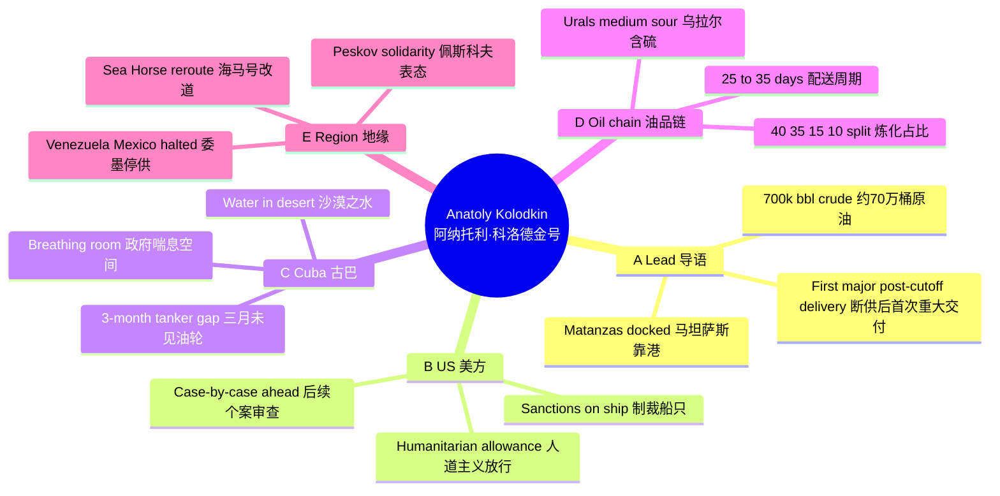

# 文章导读 | Reading Guide

## 前情提要 | Background Context

> **One-sentence takeaway | 一句话**  
> **EN:** A sanctioned Russian tanker unloads ~700,000 barrels of Urals crude at Matanzas—the first major delivery after the Trump administration choked Venezuelan and Mexican flows—while Washington frames the shipment as humanitarian and Havana scrambles to end months of blackouts.  
> **ZH:** 在美中断委、墨对古供油并收紧制裁的背景下，一艘受制裁的俄籍油轮在马坦萨斯卸下约 70 万桶乌拉尔原油；美方以人道主义为由放行，而古巴正试图走出数月停电与电网崩溃的困局。

| **Axis 维度** | **What to know（EN）** | **要点（中文）** |
|:---|:---|:---|
| **Policy 政策** | U.S. restricts oil to Cuba (including from Russia); later signals **case-by-case** reviews for further shipments. | 美国限制对古巴供油（含俄油）；后续称对更多船货将 **个案审查**。 |
| **Energy 能源** | No tanker for **three months**; blackouts strain grid, transport, health care, and farming. | 古巴已 **三个月**未见油轮；停电拖累电网、交通、医疗与农业。 |
| **Suppliers 供给** | Venezuela/Mexico flows **halted** under U.S. pressure after **Jan. 3**; Kremlin says it **cannot stay indifferent** to Cuba’s plight. | **1 月 3 日**后委、墨线路在美压下 **停摆**；克宫称对古巴处境 **无法无动于衷**。 |
| **This story 本文** | *Anatoly Kolodkin* enters near Guantanamo; Aframax at **Matanzas**; **humanitarian** carve-out vs. sanctions narrative. | “阿纳托利·科洛德金”号靠近关塔那摩进港；**阿芙拉型**靠 **马坦萨斯**；**人道主义**叙事与制裁并存。 |

---

## 思维导图 | Mind Map

---

## 段落结构速览 | Paragraph Map

| **Block 块** | **Paras** | **EN focus** | **中文要点** |
|:---:|:---|:---|:---|
| **I · Lead** | 1–5 | Arrival; sanctions; **humanitarian** framing; **first** large cargo since cutoff. | 到港；制裁；人道叙事；**断供以来首次**大规模油货。 |
| **II · Society** | 6–9 | **“Water in the desert”**; dilapidated grid; relief & **breathing room**. | **“沙漠之水”**；电网破败；喘息与 **余地**。 |
| **III · Technical** | 10–12 | **25–35** days; **Urals**; **40/35/15/10** product split. | **25–35 天**；**乌拉尔**；**四三五一**炼化结构。 |
| **IV · Geopolitics** | 13–16 | Maduro capture → **Venezuela** stop; **Mexico** halts; **Peskov**; **Sea Horse** stuck → **Venezuela**. | 马杜罗事件后 **委内瑞拉** 停供；**墨西哥**跟进；**佩斯科夫**；**海马**滞留改道。 |

---

## 叙事与修辞 | Narrative & Rhetoric

| **Device 手法** | **English** | **中文** |
|:---|:---|:---|
| **Contrast 对照** | **Clear skies** at berthing vs. **desperate** everyday energy crisis. | 靠港时天象 **晴朗** 与民生能源 **绝望** 对位。 |
| **Metaphor 隐喻** | **“Water in the desert”** — scarcity and relief in one image. | **「沙漠中的水」** — 稀缺与解渴并置。 |
| **Data 数据** | **Barrel count**, **percent splits**, **days to distribute** anchor credibility. | **桶数**、**比例**、**配送天数** 夯实报道可信度。 |

---

**来源：** Reuters (路透社)  
**题目：** Russian oil tanker begins discharging cargo in Cuba's Matanzas terminal (俄罗斯油轮开始在古巴马坦萨斯码头卸货)  
**作者：** Ayose Naranjo（路透社驻古巴记者，长期关注拉美地区能源及政治动态）

---

🔹 **Russian oil tanker / begins / discharging cargo / in Cuba's Matanzas terminal**  
🔸 **俄罗斯油轮 / 开始 / 在古巴马坦萨斯码头 / 卸货**

> 1. **Discharge** [dɪsˈtʃɑːrdʒ]: (v.) To unload a ship or a vehicle. (卸货，排出)
> 2. **Cargo** [ˈkɑːrɡoʊ]: (n.) Goods carried on a ship, aircraft, or motor vehicle. (货物)
> 3. **Terminal** [ˈtɜːrmɪnl]: (n.) A large facility where fuel or goods are stored and transferred. (码头，终端，集散站)
> 4. **Matanzas**: (Proper Noun) A city and province in Cuba, known for its deep-water port and oil storage facilities. (马坦萨斯：古巴北部港口城市)

---

🔹 **About 40% of the crude / is expected / to be turned into fuel oil / for power generation**  
🔸 **约40%的原油 / 预计 / 将被转化为燃油 / 用于发电**

> 1. **Crude** [kruːd]: (n.) Petroleum as it comes from the ground, before it has been refined. (原油)
> 2. **Fuel oil**: (n.) Heavy oil used as fuel for ships or for heating and power. (重油，燃油)
> 3. **Power generation**: (n. phr.) The production of electrical energy from other forms of energy. (发电)

---

🔹 **It / could take / up to 35 days / for the fuel / to be distributed**  
🔸 **燃料的 / 分配 / 可能需要 / 长达35天的时间**

> 1. **Up to**: (prep. phr.) Indicating a maximum amount or level. (多达，长达)
> 2. **Distribute** [dɪˈstrɪbjuːt]: (v.) To supply goods to stores and other businesses. (分发，分配)

---

🔹 **Russia / "will continue to work on this," / Kremlin spokesman / said**  
🔸 **克里姆林宫发言人 / 表示 / 俄罗斯“将继续就此开展工作”**

> 1. **Kremlin** [ˈkremlɪn]: (Proper Noun) The executive branch of the Russian government. (克里姆林宫：代指俄罗斯政府)
> 2. **Spokesman** [ˈspoʊksmən]: (n.) A person who makes official statements on behalf of a group or organization. (发言人)

---

🔹 **MATANZAS, Cuba, March 31 (Reuters) - / A Russian-flagged tanker / carrying some 700,000 barrels of crude / docked / in Cuba's Matanzas oil terminal / on Tuesday, / shipping data / showed, / marking the first significant oil delivery / to the island / since President Donald Trump's administration / cut off its fuel supply.**  
🔸 **路透社马坦萨斯3月31日电 - / 航运数据显示，/ 一艘载有约70万桶原油的 / 俄罗斯籍油轮 / 于周二 / 停靠 / 在古巴马坦萨斯石油码头，/ 这标志着 / 自唐纳德·特朗普总统政府 / 切断其燃料供应以来，/ 该岛国迎来的 / 首次重大石油交付。**

> 1. **Russian-flagged**: (adj.) Registered in Russia and flying the Russian flag. (悬挂俄罗斯国旗的，俄籍的)
> 2. **Barrel** [ˈbærəl]: (n.) A unit of measurement for oil, equal to 42 US gallons. (桶：石油计量单位)
> 3. **Dock** [dɑːk]: (v.) (Of a ship) to sail into a harbor and stay there. (靠岸，停靠码头)
> 4. **Marking**: (v.pres.part) To be a sign of a particular situation or change. (标志着，作为...的征兆)
> 5. **Cut off**: (phr v.) To stop providing something such as energy, money, or supplies. (切断，中断)

---

🔹 **The Anatoly Kolodkin vessel, / under U.S. sanctions, / entered / Cuban territorial waters / late on Sunday / not far from the U.S. Navy base / at Guantanamo Bay, / despite U.S. restrictions / on oil supplies / to Cuba, / including from Russia.**  
🔸 **尽管美国 / 对向古巴供应石油（包括来自俄罗斯的供应）/ 设有种种限制，/ 但受美国制裁的 / “阿纳托利·科洛德金”号（Anatoly Kolodkin）船只 / 仍于周日晚些时候 / 进入了 / 古巴领海，/ 距离关塔那摩湾的 / 美国海军基地不远。**

> 1. **Vessel** [ˈvesl]: (n.) A ship or large boat. (船只，舰艇)
> 2. **Sanction** [ˈsæŋkʃn]: (n.) Official permission or approval; (more commonly in plural) penalties imposed by one country on another. (制裁)
> 3. **Territorial waters**: (n. phr.) The waters under the jurisdiction of a nation or state. (领海)
> 4. **Guantanamo Bay**: (Proper Noun) A bay in southeastern Cuba, home to a controversial U.S. naval base. (关塔那摩湾)
> 5. **Restriction** [rɪˈstrɪkʃn]: (n.) A limiting condition or measure. (限制，约束)

---

🔹 **The U.S. / said / it / was allowing / the tanker / to deliver the crude oil / for humanitarian reasons.**  
🔸 **美国方面 / 表示，/ 出于人道主义原因，/ 允许 / 该油轮 / 交付原油。**

> 1. **Humanitarian** [hjuːˌmænɪˈteriən]: (adj.) Concerned with or seeking to promote human welfare. (人道主义的)

---

🔹 **The Aframax tanker / entered / Cuba's largest fuel storage facility / under mostly clear skies and light winds, / LSEG data / showed.**  
🔸 **伦敦证券交易所集团（LSEG）的数据 / 显示，/ 这艘阿芙拉型油轮 / 在晴朗的天气和微风中 / 进入了 / 古巴最大的燃料储存设施。**

> 1. **Aframax**: (n.) A medium-sized oil tanker with a capacity between 80,000 and 120,000 deadweight tons. (阿芙拉型油轮：一种中型油轮)
> 2. **Storage facility**: (n. phr.) A place where goods or materials are kept. (储存设施，仓库)
> 3. **LSEG**: (Abbr.) London Stock Exchange Group, a global financial markets infrastructure and data provider. (伦敦证券交易所集团：全球金融市场数据提供商)

---

🔹 **For many Cubans, / exhausted from months of blackouts, / the arrival of the 250-meter tanker / was cause for celebration.**  
🔸 **对于许多 / 因数月的断电而筋疲力尽的 / 古巴人来说，/ 这艘250米长油轮的到来 / 是值得庆祝的事情。**

> 1. **Exhausted** [ɪɡˈzɔːstɪd]: (adj.) Very tired; depleted of resources. (筋疲力尽的，耗尽的)
> 2. **Blackout** [ˈblækaʊt]: (n.) A failure of electrical power supply. (断电，停电)
> 3. **Cause for**: (n. phr.) A reason for having a particular feeling or behaving in a particular way. (做某事的理由/原因)

---

🔹 **"This / is like finding water in the desert," / said / Matanzas resident Marino Galvez, 66, / who / watched the ship early / from the city's waterfront boulevard.**  
🔸 **“这就像在沙漠中找到了水，” / 66岁的马坦萨斯居民马里诺·加尔维斯 / 说道，/ 他清晨 / 在城市的滨海大道上 / 观望了这艘船。**

> 1. **Waterfront** [ˈwɔːtərfrʌnt]: (n.) A part of a town or city that borders a body of water. (滨水区，码头区)
> 2. **Boulevard** [ˈbʊləvɑːrd]: (n.) A wide street in a town or city, typically one lined with trees. (林荫大道，大街)

---

🔹 **Cuba / has not received / an oil tanker / in three months, / according to President Miguel Diaz-Canel, / deepening / an energy crisis / that / has further crippled / its already dilapidated electrical grid, healthcare services, public transportation and farming.**  
🔸 **据古巴国家主席米格尔·迪亚斯-卡内尔称，/ 古巴已经三个月 / 没有收到过油轮了，/ 这加剧了 / 一场能源危机，/ 这场危机 / 进一步削弱了 / 其本已陈旧不堪的电网、医疗服务、公共交通和农业。**

> 1. **Cripple** [ˈkrɪpl]: (v.) To cause severe damage to something; to make something unable to operate properly. (使陷入瘫痪，严重削弱)
> 2. **Dilapidated** [dɪˈlæpɪdeɪtɪd]: (adj.) (Of a building or object) in a state of disrepair or ruin as a result of age or neglect. (陈旧破烂的，荒废的)
> 3. **Electrical grid**: (n. phr.) A network of synchronized power providers and consumers. (电网)
> 4. **Miguel Diaz-Canel**: (Proper Noun) The President of Cuba since 2018. (米格尔·迪亚斯-卡内尔：古巴现任领导人)

---

🔹 **Once / fully discharged and refined, / the crude / should give / Cuba's Communist-run government / breathing room / amid growing pressure / from Trump's administration, / which / has promised change / in Cuba.**  
🔸 **一旦 / 完成卸货并经过精炼，/ 这些原油 / 应该会给 / 古巴共产党领导的政府 / 提供喘息的空间，/ 此时正值 / 承诺改变古巴现状的 / 特朗普政府施加的压力日益增长之际。**

> 1. **Refine** [rɪˈfaɪn]: (v.) To remove impurities or unwanted elements from a substance, typically as part of an industrial process. (精炼，提纯)
> 2. **Breathing room**: (n. phr.) Time to rest or think before doing something again; a temporary relief from pressure. (喘息之机，余地)
> 3. **Amid** [əˈmɪd]: (prep.) In the middle of or during. (在...之中)

---

🔹 **It / will take / between 25 and 35 days / before the oil / can be fully processed and distributed domestically, / according to an estimate / published on social media / by Cuba's foreign ministry.**  
🔸 **根据古巴外交部 / 在社交媒体上 / 发布的一份预测，/ 这些石油 / 需要25到35天的时间 / 才能在国内完成加工和分配。**

> 1. **Domestically** [dəˈmestɪkli]: (adv.) In a way that relates to one's own country. (在国内地)
> 2. **Estimate** [ˈestɪmət]: (n.) An approximate calculation or judgment of the value, number, quantity, or extent of something. (估计，预测)

---

🔹 **The ship / is carrying / Russian Urals, / a medium sour crude, / which / is a good fit / for Cuba's aging refineries.**  
🔸 **该船 / 装载的是 / 俄罗斯乌拉尔原油，/ 这是一种中质含硫原油，/ 非常适合 / 古巴老旧的炼油厂。**

> 1. **Urals**: (Proper Noun) A reference to the main export grade of Russian crude oil. (乌拉尔原油)
> 2. **Sour crude**: (n. phr.) Crude oil containing a high amount of impurities, especially sulfur. (含硫原油)
> 3. **Refinery** [rɪˈfaɪnəri]: (n.) An industrial installation where a substance is refined. (炼油厂)

---

🔹 **About 40% of the cargo / is expected / to be turned into fuel oil / to power the island's electricity plants, / the foreign ministry / said.**  
🔸 **外交部 / 表示，/ 约40%的货物 / 预计 / 将转化为燃油，/ 为岛上的发电厂提供动力。**

> 1. **Electricity plant**: (n. phr.) A power station that generates electricity. (发电厂)

---

🔹 **Another 35% / will be refined / into diesel / for power generation and transportation, / 15% / into gasoline, / and the remaining 10% / processed / into cooking gas and related products.**  
🔸 **另外35% / 将被精炼 / 成柴油，/ 用于发电和运输；/ 15% / 转化为汽油；/ 剩余的10% / 则加工 / 成炊事用气及相关产品。**

> 1. **Diesel** [ˈdiːzl]: (n.) A type of heavy oil used as fuel in diesel engines. (柴油)
> 2. **Gasoline** [ˈɡæsəliːn]: (n.) Refined petroleum used as fuel for internal combustion engines. (汽油)

---

🔹 **The U.S. / stopped / Venezuelan oil exports / to Cuba / after capturing Venezuelan President Nicolas Maduro / on January 3.**  
🔸 **在1月3日 / 抓获委内瑞拉总统尼古拉斯·马杜罗后，/ 美国 / 停止了 / 委内瑞拉向古巴的 / 石油出口。**

> 1. **Export** [ˈekspɔːrt]: (n.) A commodity, article, or service sold abroad. (出口)
> 2. **Nicolas Maduro**: (Proper Noun) The leader of Venezuela whose presidency has been contested. (尼古拉斯·马杜罗)

---

🔹 **Trump / later / threatened / to slap punishing tariffs / on any other country / that / sent crude / to Cuba, / and Mexico, / one of its largest suppliers / along with Venezuela, / halted / its shipments.**  
🔸 **特朗普 / 随后 / 威胁 / 要对任何其他 / 向古巴发送原油的国家 / 征收惩罚性关税，/ 于是与委内瑞拉同为古巴最大供应国之一的 / 墨西哥 / 停止了 / 运输。**

> 1. **Slap**: (v. informal) To impose a fine, tax, or restriction unexpectedly or forcefully. (强制执行，突然施加)
> 2. **Punishing**: (adj.) Extremely severe or taxing. (严厉的，惩罚性的)
> 3. **Tariff** [ˈtærɪf]: (n.) A tax or duty to be paid on a particular class of imports or exports. (关税)
> 4. **Halt** [hɔːlt]: (v.) To bring or come to an abrupt stop. (停止，中止)

---

🔹 **Asked / on Monday / if further Russian shipments / would follow, / Kremlin spokesman Dmitry Peskov / said: / "In the desperate situation / that Cubans now find themselves in, / this, of course, / cannot leave us indifferent, / so we / will continue to work on this."**  
🔸 **周一被问及 / 是否还会有后续的俄罗斯运输时，/ 克里姆林宫发言人德米特里·佩斯科夫 / 表示：/ “在古巴人目前所处的绝望境地中，/ 这当然 / 不能让我们无动于衷，/ 因此我们将继续就此开展工作。”**

> 1. **Desperate** [ˈdespərət]: (adj.) Feeling, showing, or involving a hopeless sense that a situation is so bad as to be impossible to deal with. (绝望的，危急的)
> 2. **Indifferent** [ɪnˈdɪfrənt]: (adj.) Having no particular interest or sympathy; unconcerned. (冷漠的，无动于衷的)
> 3. **Dmitry Peskov**: (Proper Noun) The press secretary for Russian President Vladimir Putin. (德米特里·佩斯科夫：俄罗斯总统新闻秘书)

---

🔹 **The Trump administration / said / on Monday / it / would review / further oil shipments / to Cuba / on a "case-by-case" basis.**  
🔸 **特朗普政府 / 周一表示，/ 它将 / 以“个案处理”的方式 / 审查 / 进一步运往古巴的 / 石油。**

> 1. **Case-by-case**: (adj./adv.) Considering each situation individually. (逐案处理，根据具体情况而定)

---

🔹 **Before Anatoly Kolodkin, / another tanker, the Sea Horse, / was carrying / Russian diesel / to Cuba, / but / rerouted / to Venezuela / after remaining stuck / for weeks / in the middle of the Atlantic.**  
🔸 **在“阿纳托利·科洛德金”号之前，/ 另一艘名为“海马”号（Sea Horse）的油轮 / 曾向古巴 / 运送俄罗斯柴油，/ 但在 / 大西洋中部 / 困了数周后，/ 改道 / 前往委内瑞拉。**

> 1. **Reroute** [ˌriːˈruːt]: (v.) To send someone or something by a different route. (改道，变更路线)
> 2. **Stuck** [stʌk]: (adj.) Unable to move from a particular position or place. (卡住的，困住的)

---

🔹 **It / is unclear / if the Sea Horse and other tankers / that / were originally bound for Cuba / will try / to discharge / at Cuban ports / after the White House / softened / what / had been / a blanket blockade.**  
🔸 **在白宫 / 放宽了 / 此前所谓的 / 全面封锁之后，/ 目前尚不清楚 / 原本开往古巴的 / “海马”号和其他油轮 / 是否会尝试 / 在古巴港口 / 卸货。**

> 1. **Bound for**: (adj. phr.) Going towards a particular place. (前往...的)
> 2. **Softened**: (v. past) To make or become less severe, harsh, or violent. (放宽，软化)
> 3. **Blanket**: (adj.) Covering all cases or instances; total and inclusive. (全面的，总括的)
> 4. **Blockade** [blɑːˈkeɪd]: (n.) An act or means of sealing off a place to prevent goods or people from entering or leaving. (封锁)
