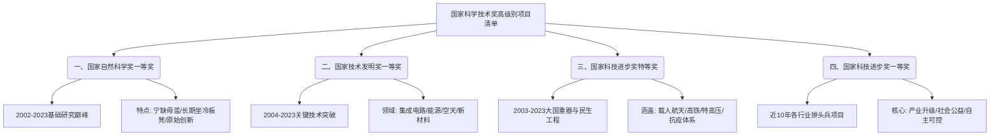

# 近20年国家科学技术奖高级别获奖项目精读笔记

**文章信息：**

- **标题：** 近20年国家科学技术奖三大奖获奖项目清单
- **来源：** 整理自《科奖在线》（kejijiangli）公开数据
- **编辑：** 理论前沿观察员
- **发布时间：** 2024年（结合最新2023年度获奖名单）
- **栏目：** 科技创新与国家战略

---

### 【前情提要】文章脉络图

---

### 一、国家自然科学奖一等奖（近20年）

**该奖项代表了中国基础研究的最高水平，部分年份会出现空缺。**

> **【背景补充】**
> **国家自然科学奖（National Natural Science Award）**：授予在基础研究和应用基础研究中阐明自然现象、特征和规律，做出重大科学发现的个人。一等奖的评选极其严格，连续多年空缺（如2010-2012）已成常态，体现了“宁缺毋滥”的原则。

- **2023** **拓扑电子材料计算预测** —— **方忠**（中国科学院物理研究所）
    > **【注释】方忠 (Fang Zhong)**：中国科学院院士，中科院物理研究所所长。他在计算物理和凝聚态物理领域有深厚造诣，通过理论预言了多种拓扑量子态，使中国在该领域处于国际领先地位。
    > **【词汇解析】拓扑 (Topology)**：数学概念，指物体在连续变形下保持不变的性质。在材料学中，拓扑性质决定了电子流动的特殊稳定性，是未来量子计算的基石。
- **2020** **纳米限域催化** —— **包信和**（中国科学院大连化学物理研究所）
    > **【注释】包信和 (Bao Xinhe)**：物理化学家，中国科学院院士，曾任中国科学技术大学校长。
    > **【重点解析】限域 (Confinement)**：指将反应物限制在纳米尺度的空间内，从而改变其反应路径。
    > **【近义词】** 约束 (Constraint)、限制 (Restriction)。
- **2020** **有序介孔高分子和碳材料的创制和应用** —— **赵东元**（复旦大学）
    > **【注释】赵东元 (Zhao Dongyuan)**：中国科学院院士，被誉为“造孔大师”，他因领奖后背着布袋子回实验室的照片而在网络走红，体现了老一辈科学家的纯粹。
- **2019** **高效手性螺环催化剂的发现** —— **周其林**（南开大学）
- **2018** **量子反常霍尔效应的实验发现** —— **薛其坤**（清华大学）
    > **【注释】薛其坤 (Xue Qikun)**：中国科学院院士，现任南方科技大学校长。2023年获得国家最高科学技术奖。
    > **【金句积累】** 薛其坤常说科学家要“**坐冷板凳**”（Patiently endure the solitude of research），该发现被杨振宁先生评价为“诺贝尔奖级”的工作。
- **2017** **水稻高产优质性状形成的分子机理及品种设计** —— **李家洋**（中国科学院遗传与发育生物学研究所）
- **2017** **聚集诱导发光** —— **唐本忠**（香港科技大学）
    > **【注释】聚集诱导发光 (Aggregation-Induced Emission, AIE)**：由唐本忠院士首次提出，打破了传统发光材料在聚集状态下亮度降低的魔咒，是极少数由中国科学家原创并引领的化学领域。
- **2016** **大亚湾反应堆中微子实验发现的中微子振荡新模式** —— **王贻芳**（中国科学院高能物理研究所）
    > **【词汇辨析】振荡 (Oscillation)** vs **震荡 (Shaking/Shock)**：前者多指物理量在两个状态间周期性变化（如中微子振荡），后者多指剧烈变动（如股市震荡）。
- **2015** **多光子纠缠及干涉度量** —— **潘建伟**（中国科学技术大学）
    > **【注释】潘建伟 (Pan Jianwei)**：量子通信领军人物，“墨子号”量子卫星首席科学家。
- **2014** **网络计算的模式及基础理论研究** —— **张尧学**（清华大学）
- **2013** **40K以上铁基高温超导体的发现及若干基本物理性质研究** —— **赵忠贤**（中国科学院物理研究所）
    > **【注释】赵忠贤 (Zhao Zhongxian)**：中国超导物理大师。2013年的获奖打破了此前连续三年的空缺。
- **2009** **《中国植物志》的编研** —— **钱崇澍**（中国科学院植物研究所）
    > **【注释】钱崇澍 (Qian Chongshu)**：中国近代植物学奠基人之一。该项目是几代科学家历时45年完成的巨著，体现了“**十年磨一剑**”（Success comes through long-term effort）的工匠精神。
- **2006** **介电体超晶格材料的设计、制备、性能和应用** —— **闵乃本**（南京大学）
- **2006** **金属配合物中多重键的反应性研究** —— **支志明**（香港大学）
- **2003** **澄江动物群与寒武纪大爆发** —— **陈均远**（中国科学院南京地质古生物研究所）
- **2002** **物理有机化学前沿领域两个重要方面-有机分子簇集和自由基化学的研究** —— **蒋锡夔**（中国科学院上海有机化学研究所）

---

### 二、国家技术发明奖一等奖（近20年通用项目）

| 年度 | 项目名称 | 第一完成人 | 第一完成单位 |
| :--- | :--- | :--- | :--- |
| **2023** | **集成电路化学机械抛光关键技术与装备** | **路新春** | **清华大学** |
| **2023** | **京津冀地下水污染防治关键技术与应用** | **吴丰昌** | **中国环境科学研究院** |
| **2023** | **陆上宽频宽方位高密度地震勘探关键技术与装备** | **张少华** | **中石油东方地球物理公司** |
| **2023** | **永磁电涡流阻尼减振缓冲耗能新技术研发与应用** | **陈政清** | **湖南大学** |
| **2023** | **深部能源开发岩体应力场透明解析技术及应用** | **鞠杨** | **中国矿业大学（北京）** |
| **2020** | **超高清视频多态基元编解码关键技术** | **高文** | **北京大学** |
| **2019** | **复杂机场高精度飞行校验技术及装备** | **张军** | **北京航空航天大学** |
| **2018** | **云-端融合系统的资源反射机制及高效互操作技术** | **梅宏** | **北京大学** |

> **【重点解析】互操作 (Interoperability)**：指不同系统、设备或应用之间能够无缝交换信息并使用所交换信息的能力。
> **【英语加强】** Cloud-Edge Integration (云边融合)。

| 年度 | 项目名称 | 第一完成人 | 第一完成单位 |
| :--- | :--- | :--- | :--- |
| **2018** | **大深度高精度广域电磁勘探技术与装备** | **何继善** | **中南大学** |
| **2017** | **燃煤机组超低排放关键技术研发及应用** | **高翔** | **浙江大学** |
| **2017** | **高性能碳纤维复合材料构件高质高效加工技术与装备** | **贾振元** | **大连理工大学** |
| **2015** | **硅衬底高光效GaN基蓝色发光二极管** | **江风益** | **南昌大学** |
| **2014** | **甲醇制取低碳烯烃（DMTO）技术** | **刘中民** | **中科院大连物化所** |
| **2013** | **大型结构与土体接触面力学试验系统研制及应用** | **张建民** | **清华大学** |
| **2012** | **立体视频重建与显示技术及装置** | **戴琼海** | **清华大学** |
| **2012** | **大跨建筑钢-混凝土组合结构新技术及其应用** | **聂建国** | **清华大学** |
| **2011** | **宽带移动通信容量逼近传输技术及产业化应用** | **尤肖虎** | **东南大学** |
| **2011** | **有机发光显示材料、器件与工艺集成技术和应用** | **邱勇** | **清华大学** |
| **2009** | **海洋特征寡糖的制备技术（糖库构建）与应用开发** | **管华诗** | **中国海洋大学** |
| **2008** | **硬脆材料复杂曲面零件精密制造技术与装备** | **郭东明** | **大连理工大学** |
| **2006** | **超精密特种形状测量技术与装置** | **谭久彬** | **哈尔滨工业大学** |
| **2005** | **非晶态合金催化剂和磁稳定床反应工艺的创新与集成** | **宗保宁** | **中石化石科院** |
| **2004** | **高性能炭/炭航空制动材料的制备技术** | **黄伯云** | **中南大学** |

---

### 三、国家科技进步奖特等奖（近20年通用项目）

**特等奖通常授予对国家安全、经济发展有巨大推动作用的重大工程或技术突破。**

- **2023** **复兴号高速列车** —— **叶阳升**（中国国家铁路集团有限公司）
- **2019** **海上大型绞吸疏浚装备的自主研发与产业化** —— **谭家华**（上海交通大学）
    > **【注释】疏浚装备 (Dredging Equipment)**：如“天鲲号”，被称为“造岛神器”，涉及国家领土主权安全。
- **2019** **长江三峡枢纽工程** —— **中国长江三峡集团有限公司**
- **2017** **特高压±800kV直流输电工程** —— **李立涅**（国家电网公司）
    > **【重点解析】特高压 (Ultra-High Voltage, UHV)**：中国目前世界唯一的特高压商用技术拥有国，实现了“中国电力，引领世界”。
- **2017** **以防控人感染H7N9禽流感为代表的新发传染病防治体系重大创新和技术突破** —— **李兰娟**（浙江大学医学院附属第一医院）
    > **【注释】李兰娟 (Li Lanjuan)**：中国工程院院士，传染病学家。
- **2016** **第四代移动通信系统（TD-LTE）关键技术与应用** —— **曹淑敏**（中国移动通信集团公司）
- **2015** **京沪高速铁路工程** —— **何华武**（中国铁路总公司）
- **2015** **高效环保芳烃成套技术开发及应用** —— **戴厚良**（中国石油化工股份有限公司）
- **2014** **超深水半潜式钻井平台研发与应用** —— **中海石油（中国）有限公司**
- **2013** **两系法杂交水稻技术研究与应用** —— **袁隆平**（湖南杂交水稻研究中心）
    > **【注释】袁隆平 (Yuan Longping)**：“杂交水稻之父”，解决了中国人的吃饭问题。
- **2012** **特高压交流输电关键技术、成套设备及工程应用** —— **刘振亚**（国家电网公司）
- **2012** **特大型超深高含硫气田安全高效开发技术及工业化应用** —— **曹耀峰**（中石化股份公司）
- **2011** **青藏高原地质理论创新与找矿重大突破** —— **张洪涛**（中国地质调查局）
- **2010** **大庆油田高含水后期4000万吨以上持续稳产高效勘探开发技术** —— **大庆油田有限责任公司**
- **2008** **青藏铁路工程** —— **孙永福**（铁道部）
- **2003** **中国载人航天工程** —— **王永志**（中国载人航天工程办公室）
    > **【注释】王永志 (Wang Yongzhi)**：载人航天工程首任总设计师，2003年度国家最高科学技术奖获得者。

---

### 四、国家科技进步奖一等奖（近10年部分代表项目）

- **2023** **“深海一号”超深水大气田开发工程关键技术与应用**（中国海洋石油集团有限公司）
    > **【背景补充】“深海一号”**：我国首个自主研发的1500米深水大气田，标志着我国深海油气开发能力的跨越。
- **2023** **饮用水安全保障技术体系创建与应用**（中国科学院生态环境研究中心）
- **2023** **下一代互联网源地址验证体系结构SAVA关键技术与规模化应用** —— **吴建平**（清华大学）
- **2023** **第五代移动通信系统5G关键技术与工程应用**（中国移动通信集团有限公司）
- **2020** **工业烟气多污染物协同深度治理技术及应用**（清华大学）
- **2020** **天空地遥感数据高精度智能处理关键技术及应用**（武汉大学）
- **2020** **钟南山呼吸疾病防控创新团队**（广州医科大学附属第一医院）
    > **【注释】钟南山 (Zhong Nanshan)**：中国工程院院士，2020年获授“共和国勋章”。
- **2020** **水稻遗传资源的创制保护和研究利用**（上海市农业生物基因中心）

---
**【结语】**
这长长的名单不仅是项目的堆叠，更是中国近20年科技实力的缩影。从“三峡工程”到“复兴号”，从“拓扑材料”到“5G通信”，中国科技正经历从**跟跑**（Following）到**并跑**（Parallel running）再到**领跑**（Leading）的深刻转型。

