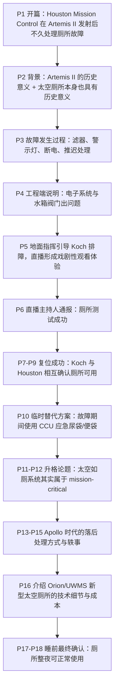
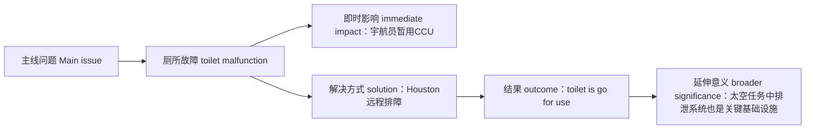

# 第一篇：Chron · 休斯敦任务控制中心与阿耳忒弥斯二号厕所危机（双语精读）

## 文章来源与作者

- **来源**：Chron
- **题目**：**Engineers at Houston Mission Control saved Artemis II from a toilet disaster**
- **副标题**：**“Happy to report that toilet is go for use.”**
- **作者**：**Gwen Howerton**
- **发表时间**：**April 2, 2026**

## 作者背景简介

**Gwen Howerton** 是 Chron 的 **Texas Culture Reporter**。她主要报道德州文化与轻政治议题。她曾在 Chron 的 audience team 工作，是 **Texas A&M University** 校友，读书期间主持过政治类广播节目。  
作者页：<https://www.chron.com/author/gwen-howerton/>

---

## 前情提要

---

## 逐句精读

### 🔹Houston plays a vital role / in spaceflight.  
🔸休斯敦在航天飞行中扮演着至关重要的角色。

**背景注释**
- **Houston**：美国得州最大城市之一，因 **Johnson Space Center** 位于此地，长期与美国载人航天密切相关。
- **spaceflight**：航天飞行，既可指载人任务，也可泛指航天器飞行活动。

> **vital role**
> 1. 英文释义（noun phrase）：**an extremely important function or position**；中文：**至关重要的作用/角色**
> 2. 语域：正式、新闻、学术通用
> 3. 画龙点睛：**play a vital role in...** 是高频搭配，写作中可替换普通的 *be important in*。可拓展为 **play a key/crucial/pivotal role in**。注意 role 前常配形容词强调程度。
>
> **spaceflight**
> 1. 英文释义（n.）：**travel or operation in outer space**；中文：**航天飞行**
> 2. 语域：科技、新闻
> 3. 画龙点睛：该词常见于 NASA 语境，如 **human spaceflight**（载人航天）、**spaceflight operations**（航天飞行运行）。写作中比笼统的 *space travel* 更专业。

---

### 🔹We don't launch the rockets, / but the intrepid scientists at the Johnson Space Center here in Space City / monitor spaceflights and troubleshoot problems that arise.  
🔸我们并不负责发射火箭，但这里“太空城”中约翰逊航天中心那些勇敢无畏的科学家，会监控航天任务并排查出现的各种问题。

**背景注释**
- **Johnson Space Center**：NASA 位于休斯敦的约翰逊航天中心，美国载人航天任务控制核心机构之一。
- **Space City**：休斯敦的别称，突出其航天产业与 NASA 背景。
- **troubleshoot**：原本是工程/计算机领域术语，指“查错、排障”。

> **intrepid**
> 1. 英文释义（adj.）：**fearless and willing to face danger or difficulty**；中文：**勇敢无畏的；坚定果敢的**
> 2. 语域：正式、文学、新闻
> 3. 画龙点睛：常用于描写探险者、记者、科学家等，带有褒义色彩。比 **brave** 更书面，也更强调面对未知和困难时的无畏。
>
> **monitor**
> 1. 英文释义（v.）：**to watch and check a situation carefully over a period of time**；中文：**监测；持续监控**
> 2. 语域：正式、科技、新闻
> 3. 画龙点睛：常搭配 **monitor progress / monitor a patient / monitor systems**。与 *watch* 相比，**monitor** 更强调系统性、持续性和专业性。
>
> **troubleshoot**
> 1. 英文释义（v.）：**to identify and solve problems in a system or process**；中文：**排查故障；解决技术问题**
> 2. 语域：技术、工程、职场
> 3. 画龙点睛：极高频职场词。名词形式是 **troubleshooting**。口语和商务英语里常说 **troubleshoot an issue/problem/system**。适合写进科技类作文与面试表达。

---

### 🔹Not long into the historic Artemis II launch, / Houston had to fix a problem—of the potty variety.  
🔸在这次具有历史意义的“阿耳忒弥斯二号”发射开始后不久，休斯敦方面就不得不处理一个问题——而且还是厕所方面的问题。

**背景注释**
- **Artemis II**：NASA 阿耳忒弥斯计划中的一次载人绕月任务。
- **potty variety**：带有戏谑口吻，意为“厕所这一类的问题”。**potty** 比 **toilet** 更口语、更轻松。

> **historic**
> 1. 英文释义（adj.）：**important in history; likely to be remembered**；中文：**具有历史意义的**
> 2. 语域：新闻、正式
> 3. 画龙点睛：注意区别 **historic** 与 **historical**。前者强调“意义重大”，后者强调“与历史有关”。考试里常考此辨析。
>
> **variety**
> 1. 英文释义（n.）：**a particular type or kind of something**；中文：**种类；类型**
> 2. 语域：通用
> 3. 画龙点睛：此处用于幽默表达 **of the ... variety**，相当于 “属于……这一类”。写作里可活用：**an error of the technical variety**。
>
> **potty**
> 1. 英文释义（n./adj., informal）：**toilet; relating to using the toilet**；中文：**厕所；如厕的**
> 2. 语域：口语、轻松语体
> 3. 画龙点睛：比 **toilet/restroom** 更口语，常见于儿童语境或轻松报道。新闻作者用它，能制造幽默感，降低技术报道的严肃度。

---

### 🔹In a mission / setting several historic firsts, / including sending the first person of color and the first woman around the moon, / the toilet barely rates, / though it is no less historic.  
🔸在这项创下多项历史首次的任务中——其中包括首次把有色人种宇航员和首位女性送往绕月飞行——厕所问题本来几乎不值一提，尽管它本身同样具有历史意义。

**背景注释**
- **historic firsts**：历史性首次成就。
- **person of color**：美国语境中常见表达，指“有色人种”，属于较正式、政治文化敏感度较高的表述。
- **barely rates**：这里不是“评分”，而是“几乎算不上值得一提”。

> **historic first**
> 1. 英文释义（noun phrase）：**an event or achievement happening for the first time and carrying major significance**；中文：**历史性首次**
> 2. 语域：新闻、正式
> 3. 画龙点睛：媒体高频搭配。写作中可直接套用：**mark a historic first**, **represent a historic first for...**，非常适合概括事件意义。
>
> **barely rate**
> 1. 英文释义（verb phrase）：**to scarcely deserve attention or importance**；中文：**几乎不值得一提**
> 2. 语域：新闻、评论
> 3. 画龙点睛：此处是熟词僻义。**rate** 不仅是“评价”，还可表示“值得；配得上”。例如 **The issue hardly rates a mention.** 很适合阅读理解辨义。
>
> **no less**
> 1. 英文释义（adv. phrase）：**equally; not at all less**；中文：**同样；丝毫不逊于**
> 2. 语域：正式、强调
> 3. 画龙点睛：常用于加强比较语气，如 **no less important**, **no less remarkable**。写作里可提升句子格调，表达“并不亚于”。

---

### 🔹Artemis II is the first manned mission / to fly to the moon / since Apollo 17 in 1972, / and it has a toilet / where the Apollo missions did not.  
🔸阿耳忒弥斯二号是自 1972 年阿波罗 17 号以来首个飞往月球的载人任务，而且它配备了厕所，而阿波罗任务当年并没有。

**背景注释**
- **manned mission**：传统表达“载人任务”；如今也常被 **crewed mission** 替代，以避免性别含义。
- **Apollo 17**：美国阿波罗计划最后一次登月任务，发射于 1972 年。

> **manned mission**
> 1. 英文释义（noun phrase）：**a space mission carrying human crew members**；中文：**载人任务**
> 2. 语域：航天、新闻
> 3. 画龙点睛：现代英语 increasingly 使用 **crewed mission / human mission**。阅读时要认识旧说法，写作时可优先用更中性的 **crewed**。
>
> **where**
> 1. 英文释义（conj./relative adv.）：**in a situation in which**；中文：**而在……情况下；而……却**
> 2. 语域：正式、书面
> 3. 画龙点睛：此处 **where** 不是地点义，而是抽象关系连接，表示对比：**it has X where Y did not**。这是高级书面表达。

---

### 🔹(The Apollo astronauts peed and pooped—sorry, no euphemisms here—into rolled up plastic sheets and bags, / but more on that later.)  
🔸（阿波罗宇航员当年是把尿和粪便——抱歉，这里不作委婉表达——排进卷起的塑料片和袋子里，不过后文还会细说。）

**背景注释**
- **no euphemisms here**：作者刻意声明“不用委婉语”，形成口语化、幽默化叙述风格。
- **rolled up plastic sheets and bags**：指早期太空任务中极其简陋的废物收集装置。

> **euphemism**
> 1. 英文释义（n.）：**a mild or indirect word used instead of one considered unpleasant or embarrassing**；中文：**委婉语**
> 2. 语域：语言学、写作、日常
> 3. 画龙点睛：阅读中常见作者自觉说明措辞风格。写作时可说 **use euphemisms**, **avoid euphemistic language**。考试中常涉及作者语气判断。
>
> **more on that later**
> 1. 英文释义（fixed expression）：**I will explain or discuss that in more detail later**；中文：**后文再详述**
> 2. 语域：新闻、口语化写作
> 3. 画龙点睛：非常地道的篇章衔接语，适合英语写作中的非正式说明文或演讲。能自然制造“先埋伏笔、后展开”的结构感。

---

### 🔹The toilet was powered up / an hour after the launch / and promptly broke.  
🔸发射后一小时，厕所系统启动，但很快就坏了。

**背景注释**
- **powered up**：启动、通电。
- **promptly**：这里表示“立刻、马上”，带点讽刺意味，因为刚启动就故障。

> **power up**
> 1. 英文释义（phrasal v.）：**to switch on and supply power to a machine or system**；中文：**启动；通电开启**
> 2. 语域：技术、工程
> 3. 画龙点睛：其反义搭配是 **power down**。科技报道里常见被动语态：**was powered up / was powered down**。
>
> **promptly**
> 1. 英文释义（adv.）：**immediately; without delay**；中文：**迅速地；立刻**
> 2. 语域：正式、新闻
> 3. 画龙点睛：既可中性，也可在语境中带讽刺意味，如本句“刚开机就坏”。写作中比 **quickly** 更书面。

---

### 🔹Mission specialist Christina Koch / called Houston / to report a problem with a urine filter in the toilet, / which Koch said was “without beads.”  
🔸任务专家克里斯蒂娜·科赫联系休斯敦，报告说厕所中的尿液过滤器出了问题；科赫称，该过滤器“没有珠粒”。

**背景注释**
- **Christina Koch**：NASA 宇航员。
- **mission specialist**：任务专家，宇航员分工中的一种岗位。
- **urine filter**：尿液过滤器。
- **without beads**：按字面是“没有珠粒/滤珠”，可能指过滤装置内部介质异常。

> **mission specialist**
> 1. 英文释义（n.）：**an astronaut assigned to specific technical or scientific duties during a mission**；中文：**任务专家**
> 2. 语域：航天、正式
> 3. 画龙点睛：属航天专业称谓。阅读中需与 **commander / pilot / flight engineer** 等角色区分，常作为细节题考点。
>
> **report a problem with**
> 1. 英文释义（verb phrase）：**to inform someone officially or clearly that something is wrong with a system**；中文：**报告……出现问题**
> 2. 语域：正式、工作、技术
> 3. 画龙点睛：职场高频句型。可套用 **report an issue with the software/device/system**，适合口语和邮件写作。
>
> **urine**
> 1. 英文释义（n.）：**liquid waste excreted by the body**；中文：**尿液**
> 2. 语域：医学、科学、正式
> 3. 画龙点睛：比 **pee** 正式很多。新闻和医学英语中常用 **urine sample / urine output / urine recycling**。注意不可数。

---

### 🔹Koch also noted / a blinking amber light / on the toilet.  
🔸科赫还注意到厕所上有一个闪烁的琥珀色警示灯。

**背景注释**
- **amber light**：琥珀色灯，常作设备警示状态灯。
- **noted**：这里不是“做笔记”，而是“注意到并报告”。

> **note**
> 1. 英文释义（v.）：**to notice and mention something**；中文：**注意到并指出**
> 2. 语域：正式、新闻
> 3. 画龙点睛：熟词僻义。阅读中常见 **X noted that...**，并非“记笔记”，而是“指出、提到”。写作可替换 *say*，更正式。
>
> **amber**
> 1. 英文释义（adj./n.）：**yellow-orange in color**；中文：**琥珀色的；黄褐色的**
> 2. 语域：技术、日常
> 3. 画龙点睛：交通灯和工业警示系统中高频词，常和 **red / green indicator** 并列。阅读中需掌握颜色引申义。

---

### 🔹Later, / Koch turned the water to the toilet on / and its power cut out entirely.  
🔸随后，科赫打开了厕所的供水，但它的电源却彻底断掉了。

**背景注释**
- **cut out**：停止运转、断掉。
- **entirely**：完全地，表明故障升级。

> **cut out**
> 1. 英文释义（phrasal v.）：**to stop functioning suddenly**；中文：**突然停止运转；中断**
> 2. 语域：口语、新闻、技术
> 3. 画龙点睛：熟词多义。除“剪下”外，还可表示机器、引擎、信号等“突然中断”。考试阅读常考短语动词义项。
>
> **entirely**
> 1. 英文释义（adv.）：**completely; wholly**；中文：**完全地；彻底地**
> 2. 语域：正式、通用
> 3. 画龙点睛：可替换 **completely**，语气更书面。常见搭配 **entirely possible / entirely different / entirely cut out**。

---

### 🔹Houston told Koch / to hold off on messing with the toilet, / as Integrity was about to go through a middle of the night apogee burn—an important maneuver / to push the Orion spacecraft further into orbit / in order to assist with its trip to the moon.  
🔸休斯敦方面告诉科赫先别继续折腾厕所，因为“Integrity”即将执行一次深夜远地点点火——这是一项重要机动，用于把“猎户座”飞船进一步送入轨道，从而帮助它完成奔月之旅。

**背景注释**
- **hold off on**：暂缓、推迟。
- **Integrity**：此处是飞船/任务呼号。
- **apogee burn**：远地点点火，轨道飞行中的推进操作。
- **Orion spacecraft**：NASA 猎户座飞船。
- **maneuver**：航天语境里指“机动动作”。

> **hold off on**
> 1. 英文释义（phrasal v.）：**to delay doing something for a time**；中文：**暂缓；先别做**
> 2. 语域：口语、工作、新闻
> 3. 画龙点睛：非常地道。常见 **hold off on making a decision / hold off on repairs**。比 simply saying *wait* 更自然。
>
> **apogee burn**
> 1. 英文释义（n. phrase）：**an engine firing conducted near apogee to adjust or raise an orbit**；中文：**远地点点火**
> 2. 语域：航天、技术
> 3. 画龙点睛：专业术语。**apogee** 指远地点，与 **perigee**（近地点）相对。科技阅读中遇到术语，先抓功能解释而非死记字面。
>
> **maneuver**
> 1. 英文释义（n./v.）：**a carefully planned movement or action**；中文：**机动动作；策略性操作**
> 2. 语域：军事、航天、正式
> 3. 画龙点睛：可指物理移动，也可指策略手段。搭配 **orbital maneuver / political maneuver / maneuver a vehicle**，多领域高频。

---

### 🔹But that pesky toilet / would still need to be fixed.  
🔸但这个恼人的厕所终究还是得修好。

**背景注释**
- **pesky**：略带口语色彩，意为“讨厌的、烦人的”。作者用词轻松。

> **pesky**
> 1. 英文释义（adj., informal）：**annoying or troublesome**；中文：**烦人的；棘手的**
> 2. 语域：口语、轻松新闻
> 3. 画龙点睛：语气比 **annoying** 更活泼，常用于带一点抱怨但不太严肃的语境，如 **pesky bugs / pesky issue**。

---

### 🔹The problem, / NASA officials told reporters on the ground in Florida, / was an issue with electronics.  
🔸NASA 官员告诉佛罗里达现场记者，问题出在电子系统。

**背景注释**
- **officials**：官员、负责人。
- **on the ground**：在现场，而非远程。

> **on the ground**
> 1. 英文释义（phrase）：**present at the actual location of events**；中文：**在现场；实地**
> 2. 语域：新闻
> 3. 画龙点睛：新闻高频表达，常与现场报道有关。不要只理解成“在地上”。如 **reporters on the ground**, **troops on the ground**。
>
> **electronics**
> 1. 英文释义（n.）：**electronic systems or components**；中文：**电子系统；电子元件**
> 2. 语域：技术
> 3. 画龙点睛：可指“电子学”也可泛指设备中的电子部分。此处是后者。要靠上下文判断。

---

### 🔹There was also a problem / with water tank valves / that messed with the flow of water to the toilet.  
🔸此外，水箱阀门也出了问题，从而扰乱了厕所的供水流动。

**背景注释**
- **valves**：阀门。
- **messed with**：此处并非“戏弄”，而是“扰乱、影响”。

> **valve**
> 1. 英文释义（n.）：**a device that controls the flow of liquid or gas**；中文：**阀门**
> 2. 语域：工程、科技
> 3. 画龙点睛：技术类文章高频基础词。常与 **water valve / intake valve / pressure valve** 搭配。
>
> **mess with**
> 1. 英文释义（phrasal v.）：**to interfere with or disrupt something**；中文：**干扰；弄乱；影响**
> 2. 语域：口语、新闻
> 3. 画龙点睛：多义短语。既可表示“招惹某人”，也可表示“把某物弄坏/干扰”。本句属后者，是典型语境辨义点。
>
> **flow**
> 1. 英文释义（n.）：**the movement of a liquid, gas, or information in a steady way**；中文：**流动；流量**
> 2. 语域：通用、技术
> 3. 画龙点睛：常见搭配 **flow of water / traffic flow / cash flow / workflow**。一个词跨理工和商科都很高频。

---

### 🔹Koch took on the role of space plumber, / and Houston flight controller Amy Dill / diligently walked Koch through troubleshooting the toilet.  
🔸科赫临时担当起“太空管道工”的角色，而休斯敦的飞行控制员艾米·迪尔则一丝不苟地一步步指导她排查厕所故障。

**背景注释**
- **space plumber**：作者的比喻性说法，幽默地把宇航员比作“太空管道工”。
- **flight controller**：飞行控制员，负责地面监控与技术支持。
- **walk someone through**：一步一步指导某人完成某事。

> **take on the role of**
> 1. 英文释义（verb phrase）：**to assume the function or responsibility of**；中文：**承担……角色；充当**
> 2. 语域：正式、通用
> 3. 画龙点睛：写作万能表达。可用于人物职责转换，如 **take on the role of mediator/leader/teacher**。
>
> **diligently**
> 1. 英文释义（adv.）：**carefully and with steady effort**；中文：**勤勉地；认真细致地**
> 2. 语域：正式
> 3. 画龙点睛：常用于褒义评价工作态度。可搭配 **work diligently / investigate diligently / diligently guide**。
>
> **walk someone through**
> 1. 英文释义（phrasal v.）：**to explain or guide someone through a process step by step**；中文：**手把手带着完成；逐步指导**
> 2. 语域：口语、职场、技术支持
> 3. 画龙点睛：IT、培训、面试场景超高频。比如 **Can you walk me through the process?** 非常实用。

---

### 🔹It was a bit like listening in / on the world's funniest IT call, / and we're all lucky / that NASA decided to include the potty problems on its video feed of the mission.  
🔸这场面有点像是在偷听全世界最好笑的一通 IT 客服电话，而我们大家也算幸运，因为 NASA 决定把这场“厕所故障”一并放进任务视频直播里。

**背景注释**
- **listen in on**：偷听、旁听。
- **IT call**：信息技术支持电话。
- **video feed**：视频信号流，直播画面。

> **listen in on**
> 1. 英文释义（phrasal v.）：**to listen to a conversation that you are not directly part of**；中文：**偷听；旁听**
> 2. 语域：口语、新闻
> 3. 画龙点睛：常用于电话、会议场景。注意介词 **on** 不可漏。
>
> **video feed**
> 1. 英文释义（n. phrase）：**a live or transmitted stream of video images**；中文：**视频信号；视频直播流**
> 2. 语域：媒体、技术
> 3. 画龙点睛：媒体英语高频。可扩展 **live feed / camera feed / news feed**，不同语境都很常见。
>
> **potty problem**
> 1. 英文释义（n. phrase, informal）：**a toilet-related issue**；中文：**厕所问题；如厕故障**
> 2. 语域：轻松、口语化新闻
> 3. 画龙点睛：作者用这种儿童化、轻松化表达，削弱生理话题的尴尬感，是典型的语气调节手法。

---

### 🔹It was even complete / with meta-commentary from NASA employees manning the, uh, stream, / who gave us at home the play-by-play / with the same hushed voice reserved for golf announcers and Olympic color commentators.  
🔸更绝的是，负责看守——呃——这路“直播流”的 NASA 员工还配上了带点“元评论”意味的解说，为家中的观众逐段播报，语调之轻声细语，简直就像高尔夫解说员和奥运赛事评论员那样。

**背景注释**
- **meta-commentary**：对评论本身再加评论，带有自我意识或调侃意味。
- **manning the stream**：值守直播流。
- **play-by-play**：逐个动作、逐步展开的实时解说。
- **color commentator**：赛事中的辅助评论员，偏重背景与趣味分析。

> **meta-commentary**
> 1. 英文释义（n.）：**commentary about the commentary itself or about how something is being presented**；中文：**元评论；关于评论本身的评论**
> 2. 语域：媒体、文化评论
> 3. 画龙点睛：较高级词汇，常见于文学批评、媒体分析。掌握它有助于理解作者“自觉调侃叙事方式”的风格。
>
> **play-by-play**
> 1. 英文释义（n.）：**a detailed real-time account of events as they happen**；中文：**实时逐项解说**
> 2. 语域：体育、直播、新闻
> 3. 画龙点睛：不仅可用于体育，也可用于任何“边发生边播报”的过程。写作里很形象。
>
> **hushed**
> 1. 英文释义（adj.）：**quiet, soft, and subdued**；中文：**轻声的；压低嗓音的**
> 2. 语域：文学、新闻
> 3. 画龙点睛：比 *quiet* 更有画面感，常用于营造庄重、紧张或神秘氛围，如 **hushed tones / a hushed room**。

---

### 🔹“NASA astronaut Christina Koch / reporting they had a successful test of the toilet,” / the livestream host helpfully pointed out.  
🔸“NASA 宇航员克里斯蒂娜·科赫报告说，他们已成功完成厕所测试。”直播主持人颇为贴心地提醒道。

**背景注释**
- **livestream host**：直播主持人。
- **pointed out**：指出、说明。
- **helpfully**：这里略带幽默，暗示主持人把这件事解释得一本正经。

> **livestream**
> 1. 英文释义（n./v.）：**a live broadcast over the internet**；中文：**网络直播；直播**
> 2. 语域：媒体、互联网
> 3. 画龙点睛：现代媒体英语高频。名词、动词都可用：**watch a livestream / livestream the event**。
>
> **point out**
> 1. 英文释义（phrasal v.）：**to draw attention to something**；中文：**指出；提醒注意**
> 2. 语域：通用、正式
> 3. 画龙点睛：万能短语。可替换单调的 *say*，在阅读和写作中都非常高频。

---

### 🔹After successful tests, / Houston had Koch reactivate Integrity's toilet.  
🔸在测试成功后，休斯敦方面让科赫重新启动了“Integrity”号的厕所系统。

**背景注释**
- **reactivate**：重新启动、重新启用。
- **had Koch reactivate**：使役结构，表示“让科赫去重新启动”。

> **reactivate**
> 1. 英文释义（v.）：**to make something active or operational again**；中文：**重新激活；重新启动**
> 2. 语域：技术、正式
> 3. 画龙点睛：由 **re- + activate** 构成，构词法清晰。写作中可用来描述系统、账户、装置恢复工作。
>
> **have someone do something**
> 1. 英文释义（causative structure）：**to cause or instruct someone to do something**；中文：**让某人做某事**
> 2. 语域：通用
> 3. 画龙点睛：重要语法点。与 **make/let/get** 构成使役结构常被考查。此句 **had Koch reactivate** 很典型。

---

### 🔹Koch ran the toilet for a minute / and added water.  
🔸科赫让厕所运行了一分钟，并向其中加了水。

**背景注释**
- **run**：此处不是“跑”，而是“使设备运行”。

> **run**
> 1. 英文释义（v.）：**to operate or cause a machine to operate**；中文：**运转；使运转**
> 2. 语域：通用、技术
> 3. 画龙点睛：熟词多义重点词。**run a machine / run a test / run the program** 都很常见，是考试高频义项。

---

### 🔹A few minutes later, / Koch called Houston again.  
🔸几分钟后，科赫再次呼叫休斯敦。

**背景注释**
- 这是叙事推进句，展示测试后反馈的时间顺序。

> **a few minutes later**
> 1. 英文释义（time phrase）：**after several minutes had passed**；中文：**几分钟后**
> 2. 语域：通用
> 3. 画龙点睛：叙事衔接常用时间状语，写作中非常实用，能帮助建立时间线。

---

### 🔹“It worked!” / Koch, who sounded relieved, said / after the toilet reboot was completed.  
🔸“成功了！”在厕所重启完成后，听上去如释重负的科赫说道。

**背景注释**
- **relieved**：如释重负。
- **reboot**：重启。常用于计算机，也可用于各类系统。

> **relieved**
> 1. 英文释义（adj.）：**feeling happy because something difficult or worrying has ended**；中文：**如释重负的；松了一口气的**
> 2. 语域：通用
> 3. 画龙点睛：常搭配 **feel relieved / sound relieved / be relieved that...**。写人物情绪时很自然。
>
> **reboot**
> 1. 英文释义（n./v.）：**to restart a computer or system**；中文：**重启**
> 2. 语域：技术、日常
> 3. 画龙点睛：现代英语常见词。除字面义外，还有比喻义，如 **reboot the economy / reboot a franchise**。

---

### 🔹“Houston, Integrity, / good checkout.”  
🔸“休斯敦，这里是‘Integrity’，检查结果良好。”

**背景注释**
- **checkout**：此处为技术/操作语境，指检查结果、检验状态良好。
- 航天通话往往高度简洁。

> **checkout**
> 1. 英文释义（n.）：**a test or inspection showing whether a system is functioning correctly**；中文：**检查结果；检验情况**
> 2. 语域：技术、航天
> 3. 画龙点睛：不要只理解为超市“收银台”。在工程语境中，**a good checkout** 指测试通过、状态正常，是专业义项。

---

### 🔹“Happy to report / that toilet is go for use,” / Houston CAPCOM confirmed.  
🔸休斯敦方面的 CAPCOM 确认说：“很高兴报告，厕所现在可以投入使用了。”

**背景注释**
- **CAPCOM**：Capsule Communicator，直接与宇航员通话的地面联络员。
- **is go for use**：航天口令风格，表示“已获准使用/状态正常可用”。

> **CAPCOM**
> 1. 英文释义（n.）：**the mission control official who communicates directly with astronauts**；中文：**航天器通信联络员**
> 2. 语域：航天、专业
> 3. 画龙点睛：NASA 专业缩写。阅读中遇缩写要注意靠上下文和背景知识解码。
>
> **be go for**
> 1. 英文释义（fixed phrase, aerospace）：**to be approved or ready for a particular action**；中文：**获准进行；可以执行**
> 2. 语域：航天、军事、技术
> 3. 画龙点睛：非常典型的 NASA/工程口令。反义常为 **no-go**。在考试里若不了解行业语义，容易误判。

---

### 🔹“We do recommend / letting the system get to operating speed / before donating fluid.”  
🔸“不过我们确实建议，先让系统达到运行速度，再进行液体‘捐赠’。”

**背景注释**
- **operating speed**：运行速度/工作转速。
- **donating fluid**：幽默委婉说法，指“排尿”。

> **operating speed**
> 1. 英文释义（n. phrase）：**the speed at which a machine normally functions**；中文：**运行速度；工作转速**
> 2. 语域：技术
> 3. 画龙点睛：机械、工程文中高频。也可说 **reach operating temperature / operating pressure**，表达设备进入正常工作状态。
>
> **donate**
> 1. 英文释义（v.）：**to give something, especially for a purpose**；中文：**捐赠；奉献**
> 2. 语域：正式、日常
> 3. 画龙点睛：这里是幽默借用，把“上厕所”说成 **donating fluid**。阅读中要识别这种委婉修辞，而不是按字面理解成慈善捐赠。

---

### 🔹“We are cheers all around, / and we will do that,” / Koch said, / about five hours post-launch.  
🔸“我们这边大家都在欢呼，而且我们会照办的。”科赫在发射后约五小时说道。

**背景注释**
- **cheers all around**：到处都是欢呼声，表示大家一致庆祝。
- **post-launch**：发射后。

> **all around**
> 1. 英文释义（adv. phrase）：**in every part; among everyone present**；中文：**到处；人人都**
> 2. 语域：通用
> 3. 画龙点睛：在 **cheers all around** 中表示“大家都在庆贺”。是非常自然的群体氛围表达。
>
> **post-launch**
> 1. 英文释义（adj./adv.）：**after the launch**；中文：**发射后的**
> 2. 语域：航天、新闻
> 3. 画龙点睛：前缀 **post-** 很高频，写作可类推出 **postwar, post-pandemic, post-election**。

---

### 🔹During the toilet's short downtime, / Artemis II crews had to use CCUs, or Collapsible Contingency Urinals, / to do their business.  
🔸在厕所短暂停机期间，阿耳忒弥斯二号机组人员不得不使用 CCU，也就是“可折叠应急尿具”，来解决生理需求。

**背景注释**
- **downtime**：停机时间、无法运行的时段。
- **CCU**：Collapsible Contingency Urinal，紧急情况下使用的便携排泄装置。
- **do their business**：委婉说法，指上厕所。

> **downtime**
> 1. 英文释义（n.）：**a period when a machine or system is not operating**；中文：**停机时间；故障停用期**
> 2. 语域：技术、商业
> 3. 画龙点睛：也可指人“休息时间”，但技术文里通常指设备停运。要结合上下文判断。
>
> **contingency**
> 1. 英文释义（n./adj.）：**a possible future event that requires preparation; emergency backup-related**；中文：**应急情况；应急备用的**
> 2. 语域：正式、军事、工程
> 3. 画龙点睛：高频正式词。常见 **contingency plan**（应急预案）。考试写作很实用。
>
> **do one’s business**
> 1. 英文释义（idiom）：**to urinate or defecate; to use the toilet**；中文：**上厕所；方便**
> 2. 语域：委婉、口语
> 3. 画龙点睛：非常地道的委婉说法。适合识别语气色彩，不宜在特别正式的学术写作中滥用。

---

### 🔹These are small, plastic bags / that astronauts pee and poop in.  
🔸这些就是宇航员用来排尿和排便的小塑料袋。

**背景注释**
- 句子直接解释 CCU 的实际用途，语言非常直白。

> **pee**
> 1. 英文释义（v./n., informal）：**to urinate**；中文：**小便；撒尿**
> 2. 语域：口语
> 3. 画龙点睛：比 **urinate** 随意得多。新闻作者在本篇中故意用口语词，制造轻松、好懂的效果。
>
> **poop**
> 1. 英文释义（v./n., informal）：**to defecate; feces**；中文：**大便；排便**
> 2. 语域：口语
> 3. 画龙点睛：日常口语常见。与正式词 **feces / defecate** 有语体差别，阅读时要敏感识别风格变化。

---

### 🔹After the toilet was fixed, / Koch radioed Houston / to ask when they could dump the CCU, / which had filled up / during the commode catastrophe.  
🔸厕所修好后，科赫通过无线电联系休斯敦，询问他们什么时候可以处理掉那个 CCU，因为它在这场“马桶灾难”期间已经装满了。

**背景注释**
- **radioed**：通过无线电联络。
- **dump**：倾倒、处理掉。
- **commode catastrophe**：带押头韵的幽默说法，意为“马桶灾难”。

> **radio**
> 1. 英文释义（v.）：**to send a message by radio communication**；中文：**用无线电发送消息**
> 2. 语域：军事、航天、新闻
> 3. 画龙点睛：名词动用是英语常见现象。像 **text, email, message** 一样，都可由名词转动词。
>
> **dump**
> 1. 英文释义（v.）：**to empty out or get rid of something**；中文：**倾倒；处理掉**
> 2. 语域：通用、口语
> 3. 画龙点睛：多义词。既可指“倒垃圾”，也可引申为“甩掉、抛弃”。阅读里需结合宾语判断。
>
> **catastrophe**
> 1. 英文释义（n.）：**a sudden disaster or complete failure**；中文：**灾难；惨败**
> 2. 语域：正式、新闻
> 3. 画龙点睛：作者把厕所故障夸张成 **commode catastrophe**，兼具幽默与修辞效果。写作中慎用，因语气较强。

---

### 🔹It's easy to laugh at this debacle, / but the toilet on Integrity is a real game changer / in the fascinating realm of spaceflight poop-ourri.  
🔸人们当然很容易嘲笑这场闹剧，但“Integrity”上的这台厕所，在妙趣横生的太空排泄世界里，的确是个真正改变游戏规则的存在。

**背景注释**
- **debacle**：惨败、乱局、闹剧。
- **game changer**：改变局面的事物。
- **realm**：领域。
- **poop-ourri**：作者仿照 **potpourri** 杜撰的双关词，混合了 **poop**，形成幽默效果。

> **debacle**
> 1. 英文释义（n.）：**a complete failure or embarrassing mess**；中文：**崩盘；乱局；闹剧**
> 2. 语域：新闻、评论
> 3. 画龙点睛：比 **problem** 强得多，常用于政治、商业、活动现场的“狼狈失败”。很适合高级写作。
>
> **game changer**
> 1. 英文释义（n.）：**something that significantly changes an existing situation**；中文：**改变局面的关键事物**
> 2. 语域：新闻、商业、口语
> 3. 画龙点睛：高频表达，口语和写作都常见。但正式学术写作中可酌情换成 **transformative development**。
>
> **realm**
> 1. 英文释义（n.）：**a particular area of activity or knowledge**；中文：**领域；范围**
> 2. 语域：正式、文学、评论
> 3. 画龙点睛：比 **field/area** 更有书面气质。常见 **in the realm of science/politics/art**。

---

### 🔹Astronauts spend anywhere from days to months in space; / Artemis II astronauts will spend 10 days / as they travel around the moon, / the furthest from Earth / that humans have ever been.  
🔸宇航员在太空中停留的时间短则数日，长则数月；而阿耳忒弥斯二号宇航员将用 10 天时间绕月飞行，抵达人类迄今离地球最远的位置。

**背景注释**
- **anywhere from ... to ...**：从……到……不等。
- **the furthest from Earth that humans have ever been**：定语从句结构较紧凑，强调历史纪录。

> **anywhere from ... to ...**
> 1. 英文释义（range expression）：**within a range that starts at one amount and ends at another**；中文：**从……到……不等**
> 2. 语域：通用
> 3. 画龙点睛：表达区间范围极常用，口语和写作皆可直接套用。
>
> **furthest**
> 1. 英文释义（adj./adv., superlative）：**at the greatest distance**；中文：**最远的/地**
> 2. 语域：通用
> 3. 画龙点睛：**farther/farthest** 偏物理距离，**further/furthest** 可含抽象义；现代英语里两者常有交叉，但考试仍可能考辨析。

---

### 🔹David Munns, / a science and technology expert at CUNY, / underscored / how important having a functional s--tter is.  
🔸纽约市立大学的一位科学技术专家 David Munns 强调指出，一个能正常工作的马桶有多么重要。

**背景注释**
- **CUNY**：City University of New York，纽约市立大学。
- **underscored**：强调。
- **s--tter**：对粗俗词 **shitter** 的部分遮掩写法，指厕所。作者保留口语粗粝感，但避免完全直写。

> **underscore**
> 1. 英文释义（v.）：**to emphasize the importance of something**；中文：**强调；凸显**
> 2. 语域：正式、新闻
> 3. 画龙点睛：新闻英语非常高频，可替换 *emphasize/highlight*。是提升写作词汇层次的好词。
>
> **functional**
> 1. 英文释义（adj.）：**working properly and fit for its purpose**；中文：**可正常运作的；实用的**
> 2. 语域：正式、技术、通用
> 3. 画龙点睛：常见搭配 **functional system / functional toilet / highly functional design**。比 simply saying *working* 更正式。

---

### 🔹“The toilet is a ‘mission-critical’ system, / so if it breaks down, / the whole mission is in jeopardy,” / Munns told Scientific American.  
🔸Munns 在接受《科学美国人》采访时说：“厕所是一个‘任务关键型’系统，所以一旦它坏了，整个任务都会陷入危险之中。”

**背景注释**
- **mission-critical**：任务关键的，若失效会危及整体任务。
- **in jeopardy**：处于危险中。
- **Scientific American**：美国著名科普媒体《科学美国人》。

> **mission-critical**
> 1. 英文释义（adj.）：**essential to the success or survival of an operation or mission**；中文：**任务关键的；事关成败的**
> 2. 语域：技术、商业、军事
> 3. 画龙点睛：非常实用的高级表达。可用于 **mission-critical software / infrastructure / component**。写作中十分加分。
>
> **break down**
> 1. 英文释义（phrasal v.）：**to stop working because of a fault**；中文：**出故障；坏掉**
> 2. 语域：通用
> 3. 画龙点睛：也是熟词多义。人可 **break down emotionally**，机器可 **break down mechanically**。
>
> **in jeopardy**
> 1. 英文释义（phrase）：**in danger; at risk**；中文：**处于危险中；岌岌可危**
> 2. 语域：正式、新闻
> 3. 画龙点睛：比 **in danger** 更书面。常见于新闻标题和正式报告。

---

### 🔹As previously mentioned, / astronauts with the Apollo program / had gone to the bathroom in bags / in front of their crewmates / with little privacy.  
🔸如前所述，阿波罗计划中的宇航员只能当着同伴的面在袋子里上厕所，几乎没有什么隐私可言。

**背景注释**
- **Apollo program**：阿波罗计划。
- **crewmates**：同组乘员。
- **with little privacy**：几乎毫无隐私。

> **privacy**
> 1. 英文释义（n.）：**freedom from being watched or disturbed by others**；中文：**隐私；不受打扰的私人空间**
> 2. 语域：通用
> 3. 画龙点睛：可用于现实社会议题，也可用于本句这种特殊环境。搭配 **lack of privacy / privacy concerns** 很常见。

---

### 🔹During Apollo 10, / a turd escaped its containment bag / and floated around the capsule, / to the bemusement of the astronauts.  
🔸在阿波罗 10 号任务期间，一坨粪便从收纳袋里跑了出来，在舱内四处漂浮，把宇航员都看乐了。

**背景注释**
- **turd**：较粗俗，指“一坨屎”。
- **containment bag**：收纳袋/隔离袋。
- **capsule**：太空舱。
- **bemusement**：困惑中带 amused 的发笑，这里更接近“忍俊不禁”。

> **containment**
> 1. 英文释义（n.）：**the act of keeping something controlled or enclosed**；中文：**控制；封存；隔离**
> 2. 语域：技术、医学、正式
> 3. 画龙点睛：常见于 **containment measures / containment vessel / containment bag**。理工和公共卫生领域都常见。
>
> **capsule**
> 1. 英文释义（n.）：**a small enclosed spacecraft compartment**；中文：**太空舱；返回舱**
> 2. 语域：航天
> 3. 画龙点睛：航天阅读基本词。不要只记“胶囊”。
>
> **bemusement**
> 1. 英文释义（n.）：**a feeling of amusement mixed with mild confusion**；中文：**忍俊不禁又略感诧异**
> 2. 语域：正式、文学
> 3. 画龙点睛：高级词。比单纯 **amusement** 更细腻，表示“觉得离谱又好笑”。

---

### 🔹Understandably, / nobody claimed the flying poo.  
🔸很可以理解的是，没有人承认那团飞来飞去的便便是自己的。

**背景注释**
- **claimed**：认领、承认归属。
- **flying poo**：延续幽默语气。

> **understandably**
> 1. 英文释义（adv.）：**for understandable reasons; as one would expect**；中文：**可以理解地；不难理解地**
> 2. 语域：新闻、评论
> 3. 画龙点睛：写作中用于自然表达立场，比直接评论更克制。
>
> **claim**
> 1. 英文释义（v.）：**to say that something belongs to you or is your responsibility**；中文：**认领；声称归属**
> 2. 语域：通用
> 3. 画龙点睛：多义高频词。可表示“声称”，也可表示“索赔、认领”。本句属“认领”义。

---

### 🔹“There's a turd / floating through the air,” / astronaut Thomas Stafford said / while laughing.  
🔸宇航员托马斯·斯塔福德一边笑一边说：“有一坨屎正在空中飘着。”

**背景注释**
- **Thomas Stafford**：美国宇航员，曾参与阿波罗任务。
- **floating through the air**：失重环境中的漂浮状态。

> **float**
> 1. 英文释义（v.）：**to stay suspended and move lightly in liquid, air, or space**；中文：**漂浮；悬浮**
> 2. 语域：通用、科学
> 3. 画龙点睛：在太空语境尤其常见。可说 **float around the cabin / float in microgravity**。

---

### 🔹Because cabin space / was at a premium, / astronauts with the Apollo missions / left a total of 96 bags of waste filled with poop and pee / on the Moon, / which are still sitting there.  
🔸由于舱内空间极其紧张，阿波罗任务中的宇航员一共把 96 袋装满粪便和尿液的废弃物留在了月球上，而这些袋子至今仍在那里。

**背景注释**
- **at a premium**：十分紧缺、非常宝贵。
- **waste**：此处指排泄废物。
- **which are still sitting there**：强调这些遗留物今天依然存在。

> **at a premium**
> 1. 英文释义（idiom）：**in very short supply and therefore especially valuable**；中文：**十分紧缺；极其宝贵**
> 2. 语域：正式、新闻、商业
> 3. 画龙点睛：非常值得积累。可用于 **space/time/privacy is at a premium**，在写作中很地道。
>
> **waste**
> 1. 英文释义（n.）：**unwanted material or bodily excretion**；中文：**废物；排泄物**
> 2. 语域：正式、科学
> 3. 画龙点睛：常见于 **human waste / nuclear waste / industrial waste**。语义范围很广。

---

### 🔹Artemis astronauts / will use what's called the Universal Waste Management System, / first installed on the International Space Station.  
🔸阿耳忒弥斯宇航员将使用一种名为“通用废物管理系统”的装置，该系统最早安装于国际空间站。

**背景注释**
- **Universal Waste Management System (UWMS)**：NASA 新一代太空排泄管理系统。
- **International Space Station**：国际空间站。
- **what's called**：所谓、被称为。

> **waste management**
> 1. 英文释义（n. phrase）：**the handling, treatment, and disposal of waste materials**；中文：**废弃物管理**
> 2. 语域：技术、环境、工程
> 3. 画龙点睛：环保、工程、公共政策中都高频。是跨学科核心词组。
>
> **install**
> 1. 英文释义（v.）：**to put equipment in place so it can be used**；中文：**安装**
> 2. 语域：技术、日常
> 3. 画龙点睛：可用于软件也可用于硬件。被动形式 **be installed** 很常见。

---

### 🔹The UWMS / is built into the floor of the Orion capsule / and is about the size of an airplane bathroom.  
🔸UWMS 被嵌入“猎户座”太空舱的地板中，大小大约相当于飞机上的洗手间。

**背景注释**
- **built into**：嵌入式安装。
- **about the size of**：大小约等于。

> **built into**
> 1. 英文释义（phrase）：**forming an integral part of something**；中文：**嵌入……之中；内置于**
> 2. 语域：技术、设计
> 3. 画龙点睛：常见于 **built-in camera / built into the wall/system**。注意与形容词 **built-in** 的关联。
>
> **capsule**
> 1. 英文释义（n.）：**the enclosed section of a spacecraft for crew or equipment**；中文：**太空舱**
> 2. 语域：航天
> 3. 画龙点睛：本词在本文中再次出现，重复即重点。阅读中遇到反复出现的专业名词，要重点掌握。

---

### 🔹It uses suction / to pull waste in, / and it recycles urine / for reuse as water for the crew.  
🔸它利用吸力把排泄物吸入系统，并将尿液回收处理后重新作为机组用水。

**背景注释**
- **suction**：吸力。
- **recycle urine for reuse**：尿液循环利用，是长期太空任务的重要生命保障技术。

> **suction**
> 1. 英文释义（n.）：**the force that draws in or pulls something by creating lower pressure**；中文：**吸力**
> 2. 语域：科学、工程
> 3. 画龙点睛：常见于医疗、机械、航天。表达专业，但不生僻。
>
> **recycle**
> 1. 英文释义（v.）：**to process something so it can be used again**；中文：**回收利用**
> 2. 语域：环保、技术、通用
> 3. 画龙点睛：除环保新闻外，在航天生命支持系统中也很关键。搭配 **recycle water / recycle materials / recyclable**。
>
> **reuse**
> 1. 英文释义（n./v.）：**to use again**；中文：**再次使用；再利用**
> 2. 语域：通用、技术
> 3. 画龙点睛：与 **recycle** 区别：**reuse** 强调直接再用，**recycle** 强调经过处理后再用。此处两者并用，很值得辨析。

---

### 🔹It cost $23 million / for NASA to develop, / is suited for both male and female anatomy, / and can handle “dual ops”—“when they’re doing both defecation and urination at the same time,” / Melissa McKinley, project manager for the toilet, / told Smithsonian Magazine.  
🔸NASA 为研发它花费了 2300 万美元；它既适配男性也适配女性身体结构，还能处理所谓的“双重操作”——也就是项目经理 Melissa McKinley 在接受《史密森尼杂志》采访时所说的“排便和排尿同时进行”的情况。

**背景注释**
- **male and female anatomy**：男女生理结构。
- **dual ops**：双重操作。
- **defecation / urination**：正式医学用语，分别指排便、排尿。
- **Smithsonian Magazine**：美国史密森学会旗下杂志。

> **be suited for**
> 1. 英文释义（phrase）：**to be appropriate or designed for**；中文：**适合于；适配于**
> 2. 语域：正式、产品说明
> 3. 画龙点睛：比 **be good for** 更正式。常用于人、设备、设计与用途之间的匹配。
>
> **anatomy**
> 1. 英文释义（n.）：**the physical structure of a living body**；中文：**解剖结构；身体构造**
> 2. 语域：医学、科学
> 3. 画龙点睛：既可指“解剖学”，也可指“身体结构”。本句是后者。
>
> **defecation / urination**
> 1. 英文释义（n.）：**the process of passing feces / urine from the body**；中文：**排便 / 排尿**
> 2. 语域：医学、正式
> 3. 画龙点睛：比 **poop / pee** 正式得多。本文前后刻意切换语体，是很好的语感训练材料。

---

### 🔹The toilet was fixed successfully, / but Koch radioed Houston one more time / before the Artemis II crew went to bed / to check / if they could use the bathroom.  
🔸厕所虽然已经成功修好，但在阿耳忒弥斯二号机组准备睡觉前，科赫还是又一次通过无线电联系休斯敦，确认他们是否可以使用卫生间。

**背景注释**
- **one more time**：再一次。
- **went to bed**：准备休息。
- **to check if...**：不定式表目的。

> **one more time**
> 1. 英文释义（phrase）：**once again; another time**；中文：**再一次**
> 2. 语域：通用、口语
> 3. 画龙点睛：叙事中自然流畅。比重复用 **again** 更有口语感。
>
> **check if**
> 1. 英文释义（verb phrase）：**to verify whether something is true or allowed**；中文：**确认是否**
> 2. 语域：通用
> 3. 画龙点睛：非常实用的口语/写作搭配，可直接套用在邮件、工作沟通和考试作文中。

---

### 🔹“Christina, / you are good to use toilet all night,” / Houston confirmed to Koch.  
🔸休斯敦向科赫确认说：“Christina，你整晚都可以放心使用厕所。”

**背景注释**
- **be good to**：在此表示“可以放心做……；已获准……”。
- 航天通话常省略冠词，如 **use toilet** 而非 **use the toilet**。

> **be good to**
> 1. 英文释义（phrase, informal/operational）：**to be cleared or allowed to do something**；中文：**可以；获准；没问题可以做**
> 2. 语域：口语、操作沟通
> 3. 画龙点睛：例如 **You’re good to go / good to use it / good to leave**。非常地道，生活和职场里都常听到。

---

# 第二篇：卫报 · 丹麦丹内布罗格号残骸发现与哥本哈根战役（系统性深度解析）

## 模块一：翻译与全文概要

**英文全文** [已提供原文，无需翻译]

**主题领域**：海洋考古学、军事史、历史遗产保护

**精练概要**

**英文：**  
**The 1801 Battle of Copenhagen, where British admiral Horatio Nelson defeated Denmark's navy, has taken on fresh historical significance with the underwater discovery of the Dannebroge—the Danish flagship that sank during the engagement.** Operating under extreme conditions in Copenhagen harbour's murky waters 15 meters below the surface, marine archaeologists from Denmark's Viking Ship Museum are engaged in a race against time to excavate this 19th-century wreck before construction development engulfs the site. **The systematic recovery of well-preserved artifacts—cannons, uniforms, human remains—offers unprecedented insights into the brutal realities of early naval warfare that written records alone cannot convey.** With dendrochronological analysis confirming the ship's construction date through tree-ring examination, and the excavation scheduled to conclude before the harbor transforms into an urban housing complex, this discovery represents a vital intersection between maritime heritage preservation and urban development pressures.

**中文：**  
**1801年哥本哈根战役中，英国海军上将霍雷肖·纳尔逊击败丹麦海军，如今通过水下发现该战役中沉没的丹麦旗舰船丹内布罗格号，这场历史事件获得了新的历史意义。** 来自丹麦维京船舶博物馆的海洋考古学家在哥本哈根港口混浊的海底15米处在极端条件下作业，与时间赛跑以在建筑施工吞噬现场前挖掘这艘19世纪沉船。**系统回收保存完好的文物——大炮、军装、人类遗骸——提供了有关早期海战残酷现实的前所未有的见解，这是书面记录所无法传达的。** 通过树轮测年法确认船舶的建造年代，以及在港口转变为城市住宅区前完成挖掘计划，此项发现代表了海事遗产保护与城市发展压力的重要交汇。

---

## 模块二：基本信息与注释

### 2A. 文章基本信息

| 项目 | 内容 |
|------|------|
| **来源 / Source** | 英国卫报 The Guardian（英国新闻机构，成立于1821年） / UK news agency, founded in 1821 |
| **题目 / Title** | Archaeologists discover wreck of Danish warship sunk by Nelson 225 years ago / 考古学家发现丹麦军舰残骸，该船于225年前被纳尔逊击沉 |
| **摄影记者 / Photographer** | James Brooks（美联社摄影记者及视频工作者）/ James Brooks, AP photographer and videographer |
| **发表日期 / Publication Date** | 2026年4月2日 Thursday, April 2, 2026 06:42 EDT |
| **细分类别 / Category** | 考古学 Archaeology |

### 2B. 作者与主要人物背景

**James Brooks** - 美联社（Associated Press）自由摄影记者、制片人兼视频制作者。长期从事国际新闻报道，涵盖欧洲地区的突发新闻、人文故事及纪录片工作。主要作品包括格陵兰政治危机、丹麦社会议题等深度国际报道摄影。

**Morten Johansen** - 丹麦维京船舶博物馆（Viking Ship Museum）海事考古部主任。该博物馆位于罗斯基勒（Roskilde），是专门研究古代船舶、航海与造船文化的国家级机构。约翰森在北欧海洋考古领域享有学术声誉。

### 2C. 关键实体与地点注释

**人物：**
- **Horatio Nelson (1758-1805)** - 英国皇家海军上将，欧洲历史上最著名的海军指挥官之一。特拉法尔加海战（1805）期间阵亡。以战术创新和大无畏精神著称，在丹麦与拿破仑时期法国对抗中发挥关键作用。

- **Olfert Fischer (1745-1829)** - 丹麦皇家海军准将，1801年哥本哈根战役中丹内布罗格号旗舰的指挥官。在战役中阵亡。

- **Frederik (Crown Prince)** - 丹麦王储腓特烈（后来的国王腓特烈六世，1768-1839），1801年与纳尔逊谈判停火。

**地点：**
- **Copenhagen Harbour** - 哥本哈根港，位于丹麦首都，北欧重要的海运枢纽。

- **Battle of Copenhagen (1801)** - 发生在1801年4月2日，是英国皇家海军与丹麦-挪威联合舰队之间的重大海战。背景是丹麦加入反英同盟（包括俄罗斯、普鲁士、瑞典）。

- **Lynetteholm** - 哥本哈根港内的新型城市开发项目，规划在港口中部建设新的住宅区，预期于2070年完成。

- **Nelson's famous remark** - 相传纳尔逊在上级发出反对信号后说"I have only one eye, I have a right to be blind sometimes"（我只有一只眼睛，我有权视而不见），由此衍生成英文习语"to turn a blind eye"（假装看不见/无视）。

---

## 模块三：素材与语料库积累

### 3A. 重点词汇解析

#### W - 写作高频词

**1. Wreck** /rek/ n. [可数]
- **英文释义**：A ship, aircraft, or other vehicle that has been destroyed or severely damaged. / The remains of a wreck.
- **中文释义**：残骸；沉船；破坏的船只或车辆
- **语域标注**：新闻媒体、学术、书面语
- **同义词/反义词**：Debris (残骸); Wreckage（残骸）; Destroy (摧毁)
- **拓展内容**：作动词时表示"毁坏"（常见于习语"wreak havoc"）。"Shipwreck"特指沉船事件。形容词形式"wrecked"表示"筋疲力尽的"（非正式）。
- **例句**：The salvage team carefully catalogued every artifact recovered from the **wreck** of the Tudor merchant vessel. / 打捞队小心翼翼地编目了从都铎商船残骸中回收的每件文物。

**2. Excavate** /ˈɛkskeɪt/ v. [及物动词]
- **英文释义**：To dig out or remove something from the ground, especially by archaeological investigation.
- **中文释义**：挖掘；发掘（尤指考古）
- **语域标注**：学术、考古、正式书面语
- **同义词/反义词**：Unearth (发掘); Dig (挖); Uncover (揭露); Cover up (隐瞒)
- **拓展内容**：可数名词"excavation"（挖掘工作）。搭配词"archaeological excavation"。形容词"excavated"表示"被挖掘出的"。
- **例句**：Underwater archaeologists **excavated** the site using specialized equipment to minimize damage to the organic materials found in the sediment layer. / 水下考古学家使用专业设备**挖掘**该遗址，以最大限度地减少对沉积层中发现的有机物质的损害。

**3. Blockade** /blɑːˈkeɪd/ n./v. [名词/动词]
- **英文释义** (noun)：The action of sealing off a place to prevent goods or people from entering or leaving. (verb): To prevent goods or people from entering or leaving a place by military force.
- **中文释义**：（军事）封锁；包围；堵截
- **语域标注**：军事、历史、新闻、正式书面语
- **同义词/反义词**：Siege (围攻); Embargo (禁运); Open up (开放)
- **拓展内容**：历史及政治术语。常见搭配"run/break a blockade"（突破封锁）。动词变化规则：blockade → blockaded → blockading。
- **例句**：The British fleet maintained a strategic **blockade** of the Danish harbour to prevent supplies from reaching the enemy's naval base. / 英国舰队维持对丹麦港口的战略**封锁**，以阻止补给品到达敌方海军基地。

**4. Incendiary** /ɪnˈsɛndieri/ adj./n. [形容词/名词]
- **英文释义** (adj.)：Designed or intended to cause fire; inflammatory or provocative (fig.). (noun): An incendiary bomb or missile.
- **中文释义**：燃烧的；煽动性的；燃烧弹
- **语域标注**：军事、历史、新闻、学术
- **同义词/反义词**：Inflammatory (煽动性的); Provocative (挑衅性的); Firebomb (燃烧弹); Pacifying (安抚的)
- **拓展内容**：常用搭配"incendiary device"（燃烧装置）、"incendiary remark"（煽动性言论）。名词形式"incendiarism"（纵火行为）。
- **例句**：The naval engagement became more destructive when the opposing warships deployed **incendiary** shells that ignited massive fires aboard the wooden vessels. / 当交战的军舰部署**燃烧**炮弹点燃木质船只上的大火时，海战变得更具破坏性。

**5. Ceasefire** /ˈsiːsfaɪər/ n. [可数/不可数]
- **英文释义**：An agreement to stop fighting between enemies.
- **中文释义**：停火；停战协议
- **语域标注**：军事、政治、新闻、正式
- **同义词/反义词**：Truce (休战); Armistice (停战协定); Continued hostility (持续敌对)
- **拓展内容**：复合词，由cease（停止）+ fire（射击）组成。常见搭配"call for a ceasefire"、"brokered a ceasefire"、"ceasefire agreement"。
- **例句**：After three days of intense bombardment, Nelson **offered a ceasefire**, recognizing that further engagement would only result in catastrophic losses on both sides. / 经过三天的激烈轰炸后，纳尔逊**提议停火**，认识到进一步的交战只会导致双方的灾难性损失。

**6. Commemorate** /kəˈmɛməreɪt/ v. [及物动词]
- **英文释义**：To honor or pay respect to the memory of an important event or person.
- **中文释义**：纪念；铭记
- **语域标注**：正式、学术、新闻
- **同义词/反义词**：Honor (尊敬); Mark (标记); Remember (记得); Forget (遗忘)
- **拓展内容**：名词形式"commemoration"。形容词"commemorative"（纪念性的）。搭配"commemorate the anniversary"。
- **例句**：The museum announced its findings on Thursday, 225 years to the day to **commemorate** the Battle of Copenhagen, creating a symbolic link between past and present. / 博物馆在周四宣布其发现，正好是哥本哈根战役225周年纪念日，在过去和现在之间创造了象征性联系。

---

#### R - 阅读高频词

**1. Sediment** /ˈsɛdɪmənt/ n. [不可数/可数]
- **英文释义**：Fine solid material that settles at the bottom of a liquid, especially as a result of depositing by water or air.
- **中文释义**：沉积物；淤泥；沉渣
- **语域标注**：科学、地质、考古、学术
- **同义词/反义词**：Deposit (沉积物); Silt (淤泥); Layer (层); Clear (清澈的)
- **拓展内容**：形容词"sedimentary"（沉积的），常见于"sedimentary rock"。动词"sediment"在某些语境中表示"沉淀"。
- **例句**：Working in thick **sediment** and almost zero visibility, the divers struggled to locate artifacts buried beneath centuries of accumulated particles and debris. / 在厚重的**沉积物**和几乎零能见度的条件下，潜水员很难定位埋在数百年积累的颗粒和碎屑下的文物。

**2. Visibility** /ˌvɪzəˈbɪləti/ n. [不可数]
- **英文释义**：The state of being able to see or be seen; the degree to which an object can be perceived by the eye.
- **中文释义**：能见度；可见性
- **语域标注**：科学、日常、新闻、技术
- **同义词/反义词**：Sight (视线); Visibility range (能见距离); Obscurity (模糊); Invisibility (看不见)
- **拓展内容**：形容词"visible"（可见的）与"invisible"（不可见的）。搭配"low visibility"（低能见度）、"high visibility"（高能见度）。
- **例句**：The **visibility** at 15 meters depth was so poor that divers had to use their hands to feel for artifacts rather than rely on their eyes to spot them. / 在15米深处的**能见度**非常低，潜水员不得不用手触摸文物，而不是依靠眼睛来发现它们。

**3. Dredge** /drɛdʒ/ v. [及物/不及物]
- **英文释义** (primary): To search through water with a dredger (a machine for removing material from the bottom of water bodies); (figurative) to search through something thoroughly.
- **中文释义**：疏浚；拖网打捞；翻出（往事等）
- **语域标注**：海事、学术、口语
- **同义词/反义词**：Excavate (挖掘); Search (搜索); Recover (回收); Bury (埋藏)
- **拓展内容**：名词"dredger"（疏浚船）。搭配"dredge up"（翻出不愉快的回忆）。常见短语"dredge from the bottom"。
- **例句**：Environmental agencies used sophisticated **dredging** equipment to remove layers of sediment from the harbor floor, gradually revealing the remains of the sunken warship. / 环境机构使用精密的**疏浚**设备从港口海底移除沉积层，逐渐显露沉没军舰的遗骸。

**4. Artifact** /ˈɑːrtɪfækt/ n. [可数]
- **英文释义**：An object made or shaped by human craft, especially one of historical or cultural interest.
- **中文释义**：文物；手工制品；人工制物
- **语域标注**：考古、博物馆、学术、正式
- **同义词/反义词**：Relic (遗迹); Object (物体); Remains (遗物); Natural object (自然物体)
- **拓展内容**：形容词形式为"artifactual"。复数形式"artifacts"。常见搭配"archaeological artifact"、"historical artifact"。
- **例句**：Marine archaeologists discovered two cannons, uniforms, insignia, shoes, and bottles—**artifacts** that provide tangible evidence of life and warfare aboard the Dannebroge. / 海洋考古学家发现了两门大炮、军装、徽章、鞋子和瓶子——这些**文物**提供了丹内布罗格号上生活和战争的有形证据。

**5. Insignia** /ɪnˈsɪɡniə/ n. [复数/单数]
- **英文释义**：A symbol, badge, or emblem of office, rank, or membership; distinctive marks of identity or authority.
- **中文释义**：徽章；标志；权力象征
- **语域标注**：正式、军事、官方
- **同义词/反义词**：Badge (徽章); Emblem (标志); Symbol (象征); Mark (标记)
- **拓展内容**：拉丁语origin。单数与复数形式相同。常见搭配"royal insignia"、"military insignia"。
- **例句**：Among the precious items retrieved was the **insignia** of high-ranking naval officers, which helped archaeologists identify the social hierarchy aboard the flagship. / 在回收的珍贵物品中有高级海军军官的**徽章**，这帮助考古学家确定了旗舰上的社会等级制度。

**6. Dendrochronology** /ˌdendrəkrəˈnɑːlədʒi/ n. [不可数]
- **英文释义**：The scientific method of determining the age of wood by counting the annual growth rings in a cross-section of the trunk.
- **中文释义**：树轮年代测定法
- **语域标注**：科学、考古、学术
- **同义词/反义词**：Tree-ring dating (树轮测年); Radiocarbon dating (放射性碳测年)
- **拓展内容**：词根分解：dendro-（树）+ chrono-（时间）+ -logy（学科）。相关术语"dendrochronologist"（树轮年代学家）。
- **例句**：**Dendrochronological** analysis of the wooden beams confirmed that the ship's construction date matched historical records, authenticating the identity of the wreck as the Dannebroge. / **树轮测年**分析确认木梁的建造日期与历史记录相符，验证了残骸是丹内布罗格号的身份。

---

#### T - 翻译重要词

**1. Unearth** /ʌnˈɜːrθ/ v. [及物动词]
- **英文释义**：To dig up something from the ground; to discover or reveal something that was hidden or unknown.
- **中文释义**：挖掘出；发现；揭露
- **语域标注**：书面语、新闻、文学
- **同义词/反义词**：Excavate (挖掘); Discover (发现); Reveal (揭露); Bury (埋藏); Hide (隐藏)
- **拓展内容**：通常用于比喻意义，表示"发现隐藏的真相"。搭配"unearth evidence"、"unearth the truth"。
- **例句**：Danish marine archaeologists are in a race against time to **unearth** the wreck before construction begins, hoping to **unearth** precious evidence of what daily life was like aboard a warship during this pivotal naval battle. / 丹麦海洋考古学家与时间竞速以**挖掘出**残骸，希望**发掘**关于这场关键海战中军舰日常生活的珍贵证据。

**2. Flagship** /ˈflæɡʃɪp/ n. [可数]
- **英文释义**: The most important ship in a fleet, usually carrying the commander-in-chief; (figuratively) the most important or famous product, service, or item of an organization.
- **中文释义**：旗舰；主力舰；（比喻）旗舰产品/项目
- **语域标注**：海事、商业、新闻
- **同义词/反义词**：Commanding ship (指挥舰); Leading vessel (领头船); Subsidiary (附属品)
- **拓展内容**：历史背景：旗舰上悬挂司令官的旗帜（flag）。现代用法常见于商业术语"flagship store"（旗舰店）。
- **例句**：The Dannebroge, the Danish **flagship**, commanded by Commodore Olfert Fischer, became Nelson's primary target during the intense engagement. / 由准将奥尔费特·菲舍尔指挥的丹麦**旗舰**丹内布罗格号成为纳尔逊在激烈交战中的主要目标。

**3. Shrapnel** /ˈʃræpnəl/ n. [不可数/可数]
- **英文释义**：Small pieces of metal from a bomb, bullet, or shell that are scattered during an explosion.
- **中文释义**：弹片；炮弹碎片
- **语域标注**：军事、新闻、正式
- **同义词/反义词**：Fragments (碎片); Debris (残骸); Shards (碎片)
- **拓展内容**：词源：命名自Henry Shrapnel（1761-1842），英国军官，发明了这种炮弹。常见搭配"shrapnel wounds"（弹片伤）。
- **例句**：When a cannonball struck a wooden ship, it wasn't the projectile itself that caused the most devastating damage—it was the shower of wooden splinters, similar to **shrapnel**, flying in all directions. / 当炮弹击中木制舰船时，造成最严重伤害的不是炮弹本身，而是四溅的木质碎片，类似**弹片**，向四面八方飞散。

**4. Truce** /truːs/ n. [可数]
- **英文释义**：An agreement to stop fighting or conflict temporarily; a period of peace or calm.
- **中文释义**：休战；停战；暂停
- **语域标注**：正式、军事、历史
- **同义词/反义词**：Ceasefire (停火); Armistice (停战协定); Peace (和平); Conflict (冲突)
- **拓展内容**：强调暂时性协议。常见搭配"call a truce"（宣布休战）、"fragile truce"（脆弱的休战）。短语"armed truce"（武装休战）。
- **例句**：Nelson eventually offered a **truce** to the Danish forces, recognizing that continuing the brutal assault would be mutually destructive, and a ceasefire was subsequently agreed with Denmark's Crown Prince Frederik. / 纳尔逊最终向丹麦军队提出**休战**建议，认识到继续残酷的攻击对双方都是破坏性的，随后与丹麦王储腓特烈达成了停火协议。

**5. Deafening** /ˈdɛfənɪŋ/ adj./v. [形容词/动词]
- **英文释义** (adj.): Extremely loud; making it difficult or impossible to hear anything else. (verb): Present participle of deafen; to make someone deaf or unable to hear.
- **中文释义**：震耳欲聋的；使人耳聋的
- **语域标注**：书面语、新闻、文学
- **同义词/反义词**：Thunderous (雷鸣般的); Deafening silence (寂静无声); Quiet (安静的)
- **拓展内容**：形容词常见搭配"deafening silence"（寂静无声，反讽修辞）、"deafening roar"（震耳欲聋的吼声）。动词形式"deafen"表示使聋或使失聪。
- **例句**：Records from the period describe a **deafening roar** created when the stricken Dannebroge slowly drifted northward and finally exploded across the harbor of Copenhagen. / 当时的记录描述了当受伤的丹内布罗格号缓缓向北漂移，最后在哥本哈根港爆炸时产生的**震耳欲聋的吼声**。

**6. Chronicle** /ˈkrɑːnɪkəl/ v./n. [及物动词/名词]
- **英文释义** (verb): To record events in the order they happen; to narrate or describe. (noun): A factual written account of events in the order they happened; a historical record.
- **中文释义**：编年史；编纂；记录
- **语域标注**：正式、学术、历史、书面语
- **同义词/反义词**：Record (记录); Document (文献); History (历史); Narrative (叙述)
- **拓展内容**：词根来自"chrono"（时间）。形容词"chronological"（按时间顺序的）。常见搭配"chronicle events"、"historical chronicle"。
- **例句**：Chronicled in books and painted on canvases, the 1801 battle is deeply embedded in Denmark's national story, yet the underwater excavation reveals details that traditional historical sources could never adequately convey. / **记载**在书籍中并绘制在画布上的1801年战役深深植根于丹麦的民族故事中，但水下挖掘揭示了传统历史资料永远无法充分传达的细节。

---

#### S - 熟词僻义/引申义

**1. Torn** /tɔːrn/ adj. [形容词]
- **常见义**：撕裂的；破的 - Ripped or damaged.
- **引申义/特定用法**：（在此文中）"Cannon fire **tore through** its upper deck" — 指炮火穿过、贯穿，强调破坏的瞬间性和威力。
- **中文释义**：撕裂；穿过；贯穿
- **语域标注**：文学、新闻、描写性文章
- **同义词/反义词**：Pierce (刺穿); Penetrate (穿透); Shred (撕成碎片); Heal (愈合)
- **拓展内容**：动词形式"tear"的过去分词。短语"tear through"表示快速且暴力地穿过。搭配"tear apart"（撕裂）、"tear down"（推倒）。
- **例句**：The naval cannons **tore through** the wooden hull with devastating force, creating splinters that acted like shrapnel inside the ship. / 海军大炮以毁灭性的力量**穿透**了木制船体，产生的碎片像舰船内部的弹片一样起作用。

**2. Nightmare** /ˈnaɪtmɛər/ n. [可数]
- **常见义**：噩梦 - A disturbing dream.
- **引申义**：（此文中）"It was a nightmare to be onboard" — 指极其恐怖、痛苦的经历。表示一个人所经历的最坏情景。
- **中文释义**：噩梦；最坏的情形；可怕的经历
- **语域标注**：日常、文学、新闻
- **同义词/反义词**：Ordeal (苦难); Horror (恐怖); Dream (梦); Breeze (轻松)
- **拓展内容**：复合词：night（夜晚）+ mare（母马）。习语"nightmare scenario"（噩梦般的情景）。形容词"nightmarish"（噩梦般的）。
- **例句**：It was indeed **a nightmare** to be onboard one of these eighteenth-century warships during battle—wooden splinters from cannon strikes became improvised shrapnel that caused horrific injuries to the crew. / 在战斗中，成为这些18世纪军舰上的一员确实是**一场噩梦**——炮击造成的木质碎片变成了临时性的弹片，对船员造成了可怕的伤害。

**3. Blind** /blaɪnd/ adj./v. [形容词/动词]
- **常见义**：看不见的；盲的 - Unable to see.
- **引申义/成语**：短语 "**turn a blind eye**" — 视而不见、假装看不见；故意忽视。源自纳尔逊的历史典故，现已成为英文常见习语。
- **中文释义**：盲的；视而不见的；忽视；蒙蔽
- **语域标注**：日常、正式、习语
- **同义词/反义词**：Sightless (看不见的); Overlook (忽视); Notice (注意); See (看见)
- **拓展内容**：动词形式"blind"表示"使失明"或"蒙蔽"。名词形式"blindness"（盲目；无视）。搭配"blind to"（对……视而不见）、"blind alley"（死胡同）。
- **例句**：The battle inspired the famous phrase "**to turn a blind eye**," allegedly stemming from Nelson's own remark when he deliberately ignored a superior's signal, reportedly saying, "I have only one eye, I have a right to be blind sometimes."
- **补注**：**转身不看**（与 *turn a blind eye* 对应）这一说法常与纳尔逊典故并提：据说他在故意无视上级信号时曾说："我只有一只眼睛，我有权视而不见。"

**4. Hazard** /ˈhæzərd/ n./v. [名词/动词]
- **常见义**：危险；冒险 - A danger or risk.
- **引申义**：（此文中）"The darkened dig site is also full of cannonballs – a hazard for divers" — 指特定的风险因素或危险物体。
- **中文释义**：危险；危害；冒险；冒着……风险
- **语域标注**：正式、技术、日常
- **同义词/反义词**：Risk (风险); Danger (危险); Peril (危险); Safety (安全)
- **拓展内容**：短语"occupational hazard"（职业危害）。动词"hazard"表示"冒……的风险"或"做大胆猜测"。形容词"hazardous"（危险的）。
- **例句**：Submerged cannonballs posed an unexpected hazard for the divers, who navigated in darkness and had to carefully feel their way around these iron projectiles. / 淹没的炮弹对潜水员造成了意外的危险，他们在黑暗中航行，不得不小心地在这些铁制炮弹周围摸索前进。

**5. Embedded** /ɪmˈbɛdɪd/ adj. [形容词]
- **常见义**：嵌入的；内嵌的 - Set or fixed firmly in something.
- **引申义**：（此文中）"Deeply embedded in Denmark's national story" — 指深深植入、根深蒂固于文化或意识形态中。
- **中文释义**：嵌入的；根深蒂固的；深深扎根的
- **语域标注**：正式、学术、文化评论
- **同义词/反义词**：Rooted (扎根的); Entrenched (根深蒂固的); Ingrained (根深蒂固的); Superficial (表面的)
- **拓展内容**：动词形式"embed"。搭配"deeply embedded"、"firmly embedded"。现代用法常见于新闻业术语"embedded journalist"（随军记者）。
- **例句**：The Battle of Copenhagen, chronicled in books and painted on canvases, remains deeply embedded in Denmark's national consciousness as a defining moment of courage and sacrifice. / 哥本哈根战役被记载在书籍中、绘制在画布上，在丹麦民族意识中仍然根深蒂固，是勇气和牺牲的决定性时刻。

**6. Silt** /sɪlt/ n./v. [名词/动词]
- **常见义**：淤泥；细沙 - Fine sand, clay, or other material carried by running water.
- **引申义**：（此文中）"Clouds of silt stirred up from the seabed" — 表示由流动水体搅起的微粒物质，影响能见度。
- **中文释义**：淤泥；细沙；被淤泥堵塞
- **语域标注**：科学、地理、环境
- **同义词/反义词**：Sediment (沉积物); Mud (泥土); Clay (粘土); Clear water (清水)
- **拓展内容**：动词形式"silt up"表示"被淤泥堵塞"。常见搭配"silt accumulation"（淤泥积累）。形容词"silty"（淤泥状的）。
- **例句**：The darkened dig site is full of hazards, not least clouds of silt stirred up from the seabed that reduce visibility to nearly zero, forcing divers to navigate by touch alone. / 黑暗的挖掘现场充满危险，尤其是从海底搅起的淤泥云团把能见度降到接近零，迫使潜水员仅凭触觉导航。

---

#### L - 地道表达

**1. In a race against time** /ɪn ə reɪs əˈɡɛnst taɪm/
- **英文释义**：Engaged in a situation where something must be completed before a deadline; competing with time as if it were an opponent.
- **中文释义**：与时间赛跑；时不我待；紧急进行
- **语域标注**：新闻、日常、文学、紧急情景
- **同义词/反义词**：Against the clock (争分夺秒); Time is running out (时间不多); Unhurried (不匆忙)
- **拓展内容**：习语表达，用于描述高压、紧迫的情境。常见于新闻标题和描写紧急任务的文章。类似表达："against time"、"race the clock"。
- **例句**：The marine archaeologists are literally in a race against time to excavate the Dannebroge before the construction site engulfs the wreck, making the discoveries more urgent and dramatic. / 海洋考古学家确实在与时间赛跑，力求在建筑用地吞没沉船前完成丹内布罗格号的发掘，使发现更显紧迫与戏剧性。

**2. Tore through** /tɔːr θruː/
- **英文释义**：Moved rapidly and forcefully; penetrated or destroyed something with great violence or speed.
- **中文释义**：猛烈穿过；快速破坏；突进
- **语域标注**：文学、新闻、军事描写
- **同义词/反义词**：Smashed through (砸穿); Penetrated (穿透); Ripped apart (撕裂); Gently passed (轻轻经过)
- **拓展内容**：短语动词"tear through"。可用于多种语境：物理破坏（"bullets tore through the walls"）、快速移动（"he tore through the neighborhood on his motorcycle"）、快速完成（"she tore through the book"）。
- **例句**：Cannon fire tore through the upper deck of the Dannebroge with terrifying velocity, transforming wooden planks into deadly splinters that became as destructive as shrapnel. / 炮火猛烈穿过丹内布罗格号的上层甲板，以可怕的速度将木板变成致命碎片，其破坏力堪比弹片。

**3. Feel one's way** /fiːl wʌnz weɪ/
- **英文释义**：To move cautiously, using one's hands or intuition rather than vision; to proceed carefully and tentatively.
- **中文释义**：摸索前进；小心谨慎地前进；凭感觉摸索
- **语域标注**：日常、文学、描写性
- **同义词/反义词**：Grope (摸索); Navigate blindly (盲目导航); Rush forward (急冲); See clearly (清楚看见)
- **拓展内容**：习语，强调在不确定或困难条件下的谨慎移动。可扩展为"feel one's way into"（逐渐适应）。相关表达"stumble around"（跌跌撞撞）。
- **例句**：When visibility drops to nearly nothing, divers must literally feel their way, using their hands to locate artifacts in the darkness rather than relying on sight—as one archaeologist noted, they "look with their fingers instead of with their eyes." / 当能见度降至几乎为零时，潜水员只能字面意义上地摸索前进，用手在黑暗中定位文物，而非依赖视觉——正如一位考古学家所说，他们"用手指看而不是用眼睛看"。

**4. Come to light** /kʌm tu laɪt/
- **英文释义**：To be revealed or discovered; to become publicly known or understood.
- **中文释义**：显露；被揭露；真相大白；被发现
- **语域标注**：正式、新闻、日常
- **同义词/反义词**：Be revealed (被揭露); Be discovered (被发现); Surface (浮现); Remain hidden (保持隐藏)
- **拓展内容**：习语，用于指重要信息或事实被发现。常见搭配"new evidence comes to light"（新证据显露）、"the truth comes to light"（真相大白）。近似表达"emerge"、"surface"。
- **例句**：Through underwater excavation, details about daily life aboard warships have come to light in ways that traditional written histories simply could not convey, offering unprecedented insights. / 通过水下发掘，有关舰上日常生活的细节以书面史书难以传达的方式浮出水面，带来前所未有的认识。

**5. Slow drift** /sloʊ drɪft/
- **英文释义**：Gradual, gentle movement without direct propulsion; a slow change of direction or course.
- **中文释义**：缓慢漂流；逐渐漂移
- **语域标注**：文学、技术、新闻
- **同义词/反义词**：Gradual movement (逐渐移动); Float (漂浮); Rapid change (快速变化)
- **拓展内容**：复合名词。"Drift"作为名词表示方向或意向的逐渐改变。常见搭配"cultural drift"（文化演变）、"continental drift"（大陆漂移）。动词"drift"可单独使用。
- **例句**：After sustaining catastrophic damage and fires, the stricken Dannebroge entered a slow drift northward across the harbor before ultimately exploding in a cataclysmic moment recorded in historical accounts. / 遭受灾难性损伤与火灾后，受创的丹内布罗格号在港内缓慢向北漂移，最终在史载的灾变一刻爆炸。

**6. Shed light on** /ʃɛd laɪt ɑːn/
- **英文释义**：To clarify or help explain something unclear; to provide information or understanding about a topic.
- **中文释义**：阐明；解释；照亮；提供线索
- **语域标注**：正式、学术、新闻
- **同义词/反义词**：Clarify (澄清); Explain (解释); Illuminate (照亮); Obscure (模糊)
- **拓展内容**：习语，既有字面意义（照亮），也有引申意义（解释）。常见搭配"shed new light on"（对……有新的认识）。类似表达"throw light on"、"cast light on"。
- **例句**：The archaeological findings shed light on the brutal realities of 18th-century naval warfare in ways that written records and paintings alone could never adequately convey. / 考古发现阐明了18世纪海战的残酷现实，仅靠文字记录与绘画无法充分传达。

---

### 3B. 主题拓展搜索关键词

- **Battle of Copenhagen 1801 naval history** — 深入了解这场战役的战略背景、参战方力量对比、战术特点及其对欧洲政治格局的影响
- **Maritime archaeology underwater excavation techniques** — 学习现代水下考古的方法论、设备使用、文物保护等科学原理
- **Horatio Nelson naval commander biography** — 全面认识纳尔逊的军事生涯、战术创新、个人故事及其在英国历史中的地位

### 3C. 金句积累

**金句 1**

- **英文原文**："A great deal had been written about the battle by very enthusiastic spectators, but we actually don't know how it was to be onboard a ship being shot to pieces by English warships and some of that story we can probably learn from seeing the wreck."
- **中文翻译**："关于这场战役，许多热情的旁观者已经留下了大量记述，但我们实际上不知道身处一艘被英国军舰轰成碎片的船上是什么感受，而我们可能能从沉船残骸中了解到这个故事的一部分。"
- **赏析与应用**：对比书面历史与物质文化遗产的不同价值。适用于论证「直接证据补充二手记述」、考古学对历史真实性的意义等学术或议论文语境。

**金句 2**

- **英文原文**："It's a big part of the Danish national feeling."
- **中文翻译**："这是丹麦民族感情的重要组成部分。"
- **赏析与应用**：以极简句式点出历史遗迹与民族认同的联系。可作文化评论、国家认同类段落的引言或收束。

**金句 3**

- **英文原文**："Sometimes you can't see anything, and then you really have to just feel your way, look with your fingers instead of with your eyes."
- **中文翻译**："有时你什么都看不见，那么你真的只能摸索前进，用手指去'看'而不是用眼睛。"
- **赏析与应用**：通过触觉代视觉的表述，呈现极端作业环境。适用于描写困境、坚持或通感式修辞；可呼应上文 **feel one's way**。

---

## 参考链接

### 第一篇（Chron）

1. [Engineers at Houston Mission Control saved Artemis II from a toilet disaster](https://www.chron.com/culture/article/artemis-2-toilet-malfunction-houston-22185840.php)（Chron 原文）
2. [Gwen Howerton（作者页）](https://www.chron.com/author/gwen-howerton/)

### 第二篇（The Guardian）

1. [Archaeologists discover wreck of Danish warship sunk by Nelson 225 years ago](https://www.theguardian.com/science/2026/apr/02/archaeologists-discover-wreck-danish-warship-sunk-admiral-nelson)（The Guardian）
