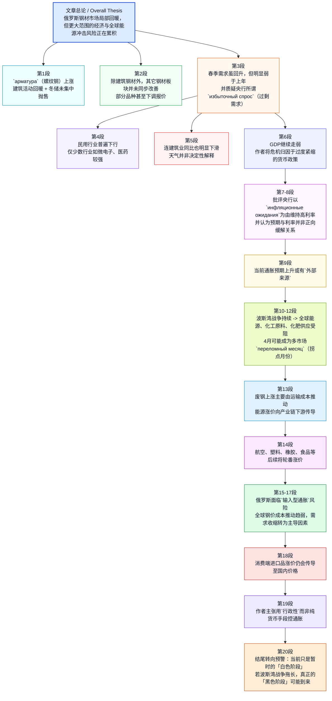

本精读笔记正文顺序为：**基本信息** → **前情提要（Mermaid）** → **逐句精读**（俄 / 英 / 中对照 + 词汇注释）；作者与参考链接见文末。归入 `macro-policy/`：以通胀、利率、能源冲击与全球商品传导为主线。

---

## 基本信息

- **文章来源：** **ИИС «Металлоснабжение и сбыт»**（《Металлоснабжение и сбыт》行业资讯/分析平台；用户粘贴文本来自 **ООО «Элемент» / subelement.ru** 的转载页）
- **题目：** **Это еще белая полоса. Российский и мировой рынок стали: 29 марта — 5 апреля 2026 г.**
- **发表时间：** 结合转载页时间与原始搜索结果，**应为 2026年4月6日**（用户粘贴页显示「06 Апрель 2026」；检索结果亦显示「06 апреля 2026 г. 07:07」）
- **作者：** 转载页未明确标署作者；结合该栏目长期署名与站内作者页信息，推定为 **`Виктор Тарнавский`（维克托·塔尔纳夫斯基）**
- **作者背景简介：** `Виктор Тарнавский` 现任《Металлоснабжение и сбыт》**副主编、分析板块负责人**；受教育于基辅的乌克兰国际关系学院，专业背景为**国际经济**，长期从事**金属行业分析、国际黑色冶金、宏观经济、能源与大宗商品**报道与评论。

---

## 前情提要

---

## 逐句精读

<!-- NOTE: 三语组（🔻俄 / 🔹英 / 🔸中）前两行行尾含 Markdown 硬换行（两个空格）。 -->

### 🔻В конце марта — начале апреля / пошла в рост `арматура`.  
### 🔹In late March and early April, `rebar` began to rise in price.  
### 🔸在三月底到四月初，`螺纹钢`价格开始上涨。

背景注释：
- `арматура`：建筑用钢筋/螺纹钢，俄语行业语境中常指建筑钢材核心品种。
- 这里的 `пошла в рост` 是俄语新闻常见说法，表示「开始上升、转入增长轨道」。

> **`rebar` / 螺纹钢**
>
> 1. 英文释义（n.）steel reinforcing bars used in concrete construction；用于混凝土结构中的钢筋、螺纹钢。
> 2. 语域：建筑、工程、钢铁行业。
> 3. 画龙点睛：`rebar` 是 construction English 高频词，常搭配 `rebar prices rise/fall`、`rebar demand`、`rebar inventories`。写作中不要误写成泛泛的 `steel bars`，行业报道里用 `rebar` 更自然、更专业。

> **`rise` / 上涨；上升**
>
> 1. 英文释义（v./n.）to increase in amount, level, or value；增加、上升；（n.）上升、涨幅。
> 2. 语域：通用、新闻、经济。
> 3. 画龙点睛：价格语境常见 `prices rose`、`began to rise`、`saw a rise`。注意 `rise` 多作不及物动词；若强调「抬高价格」，常用 `raise prices`。考研/雅思写作里二者混淆很常见。

---

### 🔻Стройка / все-таки `оживилась`, / а накопленные на зиму избыточные запасы / не были выброшены в продажу.  
### 🔹Construction activity did, after all, `pick up`, and the excess inventories accumulated for the winter were not dumped onto the market.  
### 🔸建筑活动终究还是`回暖了`，而冬季积累下来的过剩库存并没有被集中抛售到市场上。

背景注释：
- `Стройка`：口语化/新闻化简称，指建筑业、施工活动、建设工地整体。
- `выброшены в продажу`：不是字面「扔出去卖」，而是「集中抛售」。

> **`pick up` / 回升；恢复活跃**
>
> 1. 英文释义（phrasal v.）to improve, increase, or become more active after a weak period；回升、好转、变活跃。
> 2. 语域：新闻、商业、口语均常见。
> 3. 画龙点睛：经济报道里 `demand picked up`、`construction picked up` 很地道。它比 `recover` 更灵活，既能写温和回升，也能写短期转暖。口语里还能表示「接某人、拿起」，属典型一词多义考点。

> **`inventory` / 库存**
>
> 1. 英文释义（n.）a supply of goods kept in stock；库存，存货。
> 2. 语域：商业、供应链、财务。
> 3. 画龙点睛：注意英美差异中 `inventory` 几乎通用。搭配有 `build inventories`、`draw down inventories`、`excess inventories`。写作中若谈「去库存」，可用 `reduce inventories` 或 `destock`。

> **`dump onto the market` / 向市场抛售**
>
> 1. 英文释义（phrase）to sell a large quantity quickly, often at low prices；向市场大量抛售。
> 2. 语域：贸易、市场、新闻。
> 3. 画龙点睛：`dump` 在国际贸易里常引申为「低价倾销、集中抛售」。与 `anti-dumping`（反倾销）关联极强，是阅读里非常重要的经济词汇网络。

---

### 🔻Это / позволило металлоторговым компаниям / `поднять цены`.  
### 🔹This allowed steel-trading companies to `raise prices`.  
### 🔸这使钢材贸易公司得以`提价`。

背景注释：
- `металлоторговые компании`：钢材贸易商、金属材料经销商。
- 句中 `это` 回指前一句提到的需求回暖与库存未被抛售。

> **`raise prices` / 提价**
>
> 1. 英文释义（phrase）to increase the selling price of goods or services；提高售价。
> 2. 语域：商业、新闻、经济。
> 3. 画龙点睛：与 `prices rise` 区别明显：`raise` 强调「某主体主动提高价格」，`rise` 强调「价格自己上涨」。翻译时主被动关系非常关键，写作中用对能显著提升表达准确度。

---

### 🔻В некоторых регионах / они даже `превысили` уровень первичного рынка, / чего давно не бывало.  
### 🔹In some regions, they even `exceeded` the level of the primary market, something that had not happened for a long time.  
### 🔸在一些地区，这些价格甚至`超过了`一级市场的水平，这种情况已经很久没有出现过了。

背景注释：
- `первичный рынок`：此处可理解为钢厂初级销售/出厂市场，相对于流通环节的现货或分销市场。
- 句末 `чего давно не бывало` 是俄语中带评价色彩的补充说明。

> **`exceed` / 超过**
>
> 1. 英文释义（v.）to be greater than a number, limit, or level；超过，超出。
> 2. 语域：正式、新闻、学术。
> 3. 画龙点睛：`exceed` 比 `be higher than` 更正式。常见搭配 `exceed expectations`、`exceed the limit`、`exceed last year's level`。阅读中常与 `surpass` 近义，但 `surpass` 语气略更书面。

> **`primary market` / 一级市场；初级销售市场**
>
> 1. 英文释义（n. phrase）the market in which products are first sold by producers or issuers；一级市场、初级销售市场。
> 2. 语域：金融、贸易、行业分析。
> 3. 画龙点睛：在不同领域含义不同。金融里常指「新发行市场」，商品流通里可指「生产者首次出售的市场」。做翻译时必须结合上下文判定，不能机械套用单一词义。

---

### 🔻Правда, / в прочих секторах российского рынка стальной продукции / таких благоприятных перемен / не произошло.  
### 🔹However, in other segments of the Russian steel products market, no such favorable changes took place.  
### 🔸不过，在俄罗斯钢铁制品市场的其他板块中，并没有出现这类有利的变化。

背景注释：
- `Правда` 句首相当于 「however / admittedly / to be fair」，带轻微转折。
- `стальная продукция`：钢铁产品、钢材制品。

> **`segment` / 细分板块；市场分部**
>
> 1. 英文释义（n.）a separate part of a market, industry, or activity；细分市场、板块。
> 2. 语域：商业、市场分析。
> 3. 画龙点睛：常搭配 `market segment`、`premium segment`、`low-end segment`。比泛泛的 `part` 更专业。雅思写作 Task 1/商科写作中频繁可用。

> **`favorable` / 有利的**
>
> 1. 英文释义（adj.）showing advantage, support, or positive conditions；有利的，顺利的。
> 2. 语域：正式、新闻、商务。
> 3. 画龙点睛：可搭配 `favorable conditions`、`favorable environment`、`favorable changes`。其反义词常为 `adverse`，后者在新闻和学术文本中也很高频，建议成对记忆。

---

### 🔻Металлургические компании / `пролонгировали` в апреле цены / практически на все виды проката, / а в некоторых сегментах / были вынуждены / даже понизить котировки.  
### 🔹In April, metallurgical companies `rolled over` prices for almost all types of rolled steel, and in some segments they were even forced to lower their quotations.  
### 🔸4月份，冶金企业对几乎所有轧制钢材品种都`延续了`原有价格，而在某些板块甚至被迫下调报价。

背景注释：
- `прокат`：轧材、轧制钢材。
- `котировки`：报价、行情价格，常见于大宗商品与现货市场报道。
- `пролонгировали цены`：俄语商业语体里可理解为「维持/顺延价格政策」。

> **`roll over` / 顺延；延续**
>
> 1. 英文释义（phrasal v.）to continue something into a new period without major change；顺延，延续。
> 2. 语域：金融、商业。
> 3. 画龙点睛：金融里常见 `roll over debt/loans/contracts`。在价格政策语境下可译作「延续原价」。这是典型的语境化表达，不宜死译为「翻滚」。

> **`quotation` / 报价**
>
> 1. 英文释义（n.）an official statement of the price at which goods can be bought or sold；报价。
> 2. 语域：贸易、金融、商务。
> 3. 画龙点睛：与 `quote`（v./n.）是同源词。商务邮件中常写 `Please send us your quotation`。考试翻译中不要误解成「引语」，其在不同语境下义项差异很大。

---

### 🔻Спрос на металл / `оживился` по весне, / но остается / много слабее, чем в прошлом году.  
### 🔹Demand for steel `revived` in the spring, but it remains much weaker than last year.  
### 🔸金属需求在春季有所`回升`，但仍明显弱于去年。

背景注释：
- `по весне` 带口语/新闻色彩，意为「到了春天、在春季时」。
- `металл` 在俄语行业文章里常泛指钢材或金属材料，并非一定指纯金属学意义上的 metal。

> **`revive` / 复苏；回暖**
>
> 1. 英文释义（v.）to become active, healthy, or strong again；恢复活力，复苏。
> 2. 语域：新闻、经济、正式。
> 3. 画龙点睛：`revive demand`、`the market revived` 都很常见。与 `recover` 相比，`revive` 更强调「重新活跃」。写市场评论时很有表现力，也常用于文学或政治语境。

> **`weaker than` / 弱于；不如**
>
> 1. 英文释义（comparative structure）lower in strength, intensity, or performance than；比……更弱。
> 2. 语域：通用、新闻。
> 3. 画龙点睛：比较结构是写作基本功。可扩展为 `much weaker than expected`、`far weaker than a year earlier`。在经济报道中常把时间比较与程度副词连用，提高信息密度。

---

### 🔻Некоторые дистрибьюторы / оценивают спад год к году / примерно в `20%`.  
### 🔹Some distributors estimate the year-on-year decline at about `20%`.  
### 🔸一些分销商估计，同比降幅大约为`20%`。

背景注释：
- `дистрибьюторы`：分销商、经销商。
- `год к году`：同比，即 year-on-year / YoY。

> **`year-on-year` / 同比**
>
> 1. 英文释义（adj./adv.）compared with the same period of the previous year；同比的/同比地。
> 2. 语域：经济、统计、新闻。
> 3. 画龙点睛：常缩写为 `YoY`。与 `month-on-month`、`quarter-on-quarter` 构成统计表达体系。雅思图表、经济英语和商科阅读中非常高频。

> **`decline` / 下降；降幅**
>
> 1. 英文释义（n./v.）a decrease; to decrease；下降；下滑。
> 2. 语域：新闻、经济、正式。
> 3. 画龙点睛：`decline` 既可作名词也可作动词。搭配 `a decline of 20%`、`sales declined by 20%`。注意与 `decrease` 近义，但 `decline` 往往文体更正式些。

---

### 🔻Вообще, / просто удивительно, / где же Центробанк, / опубликовавший Резюме обсуждения процентной ставки / на заседании 20 марта, / увидел все еще остающийся, по его мнению, `избыточный спрос`?  
### 🔹More broadly, it is quite surprising where the Central Bank, which published the Summary of the key-rate discussion after its March 20 meeting, saw what it still considers `excess demand`.  
### 🔸总的来看，令人颇感惊讶的是，央行在3月20日议息会议后发布利率讨论摘要时，究竟是从哪里看出了它所认为仍然存在的`过剩需求`？

背景注释：
- `Центробанк`：俄罗斯中央银行。
- `Резюме обсуждения процентной ставки`：央行关于利率会议的讨论摘要。
- 这句话带明显反问色彩，属于评论性写法而非中性报道。

> **`excess demand` / 过剩需求**
>
> 1. 英文释义（n. phrase）demand that exceeds available supply or the economy’s sustainable capacity；超过供给或可持续承受能力的需求。
> 2. 语域：经济学、货币政策。
> 3. 画龙点睛：宏观经济里常与 `overheating`、`inflationary pressure` 联动出现。写作中如要讨论通胀成因，`excess demand` 是非常标准的学术表达，优于笼统的 `too much demand`。

> **`consider` / 认为**
>
> 1. 英文释义（v.）to regard something as being of a particular kind；认为，把……看作。
> 2. 语域：通用、正式。
> 3. 画龙点睛：常见结构 `consider A (to be) B`。比 `think` 更正式，更适合议论文和阅读翻译。学术文中尤其高频。

---

### 🔻В какую гражданскую отрасль / не посмотри, / почти везде спад.  
### 🔹Whichever civilian industry one looks at, there is a downturn almost everywhere.  
### 🔸无论看哪个民用行业，几乎到处都在下滑。

背景注释：
- `гражданская отрасль`：民用行业，与军工/国防工业形成对照。
- 句式带有泛指和强调效果。

> **`downturn` / 下滑；低迷**
>
> 1. 英文释义（n.）a decline in economic, business, or market activity；下滑，低迷。
> 2. 语域：经济、新闻。
> 3. 画龙点睛：`downturn` 常用于较大层面的行业或经济走弱，如 `economic downturn`。比 `drop` 更偏趋势性、宏观性，新闻阅读中辨识度很高。

---

### 🔻На ум приходят / разве что `микроэлектроника` и фармацевтика, / но этого, наверное, слишком мало, / чтобы поднять «среднюю температуру по больнице»?  
### 🔹The only sectors that come to mind are `microelectronics` and pharmaceuticals, but that is probably far too little to raise the “average temperature of the whole hospital,” so to speak.  
### 🔸能想到的恐怕也只有`微电子`和医药行业，但这大概远不足以抬高「整家医院的平均体温」吧？

背景注释：
- `средняя температура по больнице`：俄语常见讽喻表达，类似「平均数掩盖真实差异」；字面是「全院平均体温」。
- `фармацевтика`：制药业、医药行业。

> **`microelectronics` / 微电子**
>
> 1. 英文释义（n.）the branch of electronics dealing with very small components and integrated circuits；微电子学，微电子产业。
> 2. 语域：科技、产业政策。
> 3. 画龙点睛：该词常和 `semiconductor`、`chip manufacturing` 相关联。做科技产业阅读时要能迅速识别其与芯片、集成电路领域的关联。

> **`come to mind` / 想到；浮现在脑海中**
>
> 1. 英文释义（phrase）to occur to someone as a thought or example；想到，想起。
> 2. 语域：通用。
> 3. 画龙点睛：写作里可用于自然引出例子：`The first example that comes to mind is...`。非常实用，既自然又不僵硬。

---

### 🔻Или у нас / такая мощная / и интенсивно накачивающая мускулы / `оборонная промышленность`?  
### 🔹Or do we really have such a powerful and rapidly muscle-building `defense industry`?  
### 🔸抑或说，我们真的拥有一个如此强大、并且还在快速「长肌肉」的`国防工业`？

背景注释：
- `оборонная промышленность`：国防工业、军工产业。
- `накачивающая мускулы` 为比喻说法，形容实力快速增强。

> **`defense industry` / 国防工业；军工产业**
>
> 1. 英文释义（n. phrase）the sector that produces military equipment and related systems；国防工业，军工产业。
> 2. 语域：政治、经济、军事。
> 3. 画龙点睛：英式多写 `defence`，美式多写 `defense`。与 `military-industrial complex` 相关但不完全等同。阅读中碰到二者需区分：后者常带政治批评意味。

---

### 🔻Даже стройка, / по данным Минэкономразвития, / показала `-16%` в январе / и `-14%` в феврале / по отношению к аналогичному периоду прошлого года.  
### 🔹Even construction, according to data from the Ministry of Economic Development, posted `-16%` in January and `-14%` in February compared with the same period last year.  
### 🔸就连建筑业，根据经济发展部的数据，1月同比为`-16%`，2月同比为`-14%`。

背景注释：
- `Минэкономразвития`：俄罗斯经济发展部。
- `аналогичный период прошлого года`：去年同期，是经济报道高频表达。

> **`compared with the same period last year` / 与去年同期相比**
>
> 1. 英文释义（time-comparison expression）used to compare data with the corresponding period a year earlier；与上年同期相比。
> 2. 语域：统计、经济、报告。
> 3. 画龙点睛：这是报告类英语超级高频句型。可替换为 `year-on-year`，但完整表达更适合翻译题和正式写作，逻辑更清楚。

---

### 🔻Причем, / снега и морозы / здесь не играли `решающей роли`.  
### 🔹Moreover, snow and freezing weather did not play a `decisive role` here.  
### 🔸而且，降雪和严寒在这里并未起到`决定性作用`。

背景注释：
- 这里作者在反驳把下滑简单归咎于天气因素的说法。

> **`decisive role` / 决定性作用**
>
> 1. 英文释义（n. phrase）a role that has a determining or crucial influence on the outcome；决定性作用。
> 2. 语域：正式、议论文、新闻。
> 3. 画龙点睛：比 `important role` 更强。写作中若想增强论证力度，可用 `play a decisive role in...`。其形容词 `decisive` 还可表示「果断的」，属一词多义点。

---

### 🔻Неоднократно приходилось убеждаться: / если что-то надо построить, / этим будут заниматься / в любую погоду.  
### 🔹Experience has repeatedly shown that if something needs to be built, people will work on it in any weather.  
### 🔸人们已不止一次地发现：如果某个项目必须建设，那么无论什么天气都会照常施工。

背景注释：
- 该句是作者的经验性论断，用来支撑上一句「天气不是决定因素」的判断。

> **`in any weather` / 在任何天气条件下**
>
> 1. 英文释义（phrase）regardless of weather conditions；不论天气如何。
> 2. 语域：通用。
> 3. 画龙点睛：简单但很好用，可扩展为 `in all weather conditions`。在翻译中可避免机械直译成 `under any weather`，后者不自然。

---

### 🔻Российский ВВП / `снизился` в феврале / на `1,5%` / по сравнению с 2025 г. / после `-2,1%` в январе.  
### 🔹Russia’s GDP `declined` by `1.5%` in February compared with 2025, after a `-2.1%` reading in January.  
### 🔸俄罗斯GDP在2月份较2025年同期`下降`了`1.5%`，此前1月份为`-2.1%`。

背景注释：
- `ВВП`：GDP，国内生产总值。
- 这里的比较基准按上下文理解为同比口径。

> **`GDP` / 国内生产总值**
>
> 1. 英文释义（n.）gross domestic product; the total value of goods and services produced within a country；国内生产总值。
> 2. 语域：宏观经济。
> 3. 画龙点睛：经济类阅读最核心缩写之一。写作中首次出现可写全称加括号 `gross domestic product (GDP)`，之后直接用缩写即可。

> **`decline` / 下降**
>
> 1. 英文释义（v.）to become smaller, lower, or weaker；下降，下滑。
> 2. 语域：正式、经济。
> 3. 画龙点睛：可与 `contract` 近义；若谈 GDP，`the economy contracted` 更偏宏观语境，而 `GDP declined` 更偏数据陈述，两者都值得掌握。

---

### 🔻Эти отрицательные показатели / снова пытаются объяснить / меньшим числом рабочих дней, / суровыми погодными условиями / и еще невесть чем.  
### 🔹These negative figures are once again being explained away by a smaller number of working days, harsh weather conditions, and who knows what else.  
### 🔸这些负面数据又一次被试图归因于工作日较少、天气严酷以及其他说不清的种种因素。

背景注释：
- `невесть чем`：口语色彩，含「谁知道还有什么」的不屑意味。
- `объяснить` 在此有「解释过去/为之找理由」意味。

> **`explain away` / 轻描淡写地解释过去；找借口淡化**
>
> 1. 英文释义（phrasal v.）to try to make something seem less important or serious by giving reasons；辩解过去、轻轻带过。
> 2. 语域：新闻、评论。
> 3. 画龙点睛：这个短语带批评意味，常用于作者认为解释「不足以服人」的场景。若能在写作中准确使用，语气会更精细。

> **`harsh` / 严酷的**
>
> 1. 英文释义（adj.）severe, unpleasant, or difficult to endure；严酷的，恶劣的。
> 2. 语域：通用、新闻。
> 3. 画龙点睛：可形容 `harsh weather`、`harsh conditions`、`harsh measures`。根据搭配不同，中文可译「恶劣的/苛刻的/严厉的」，属于典型搭配型词汇。

---

### 🔻Словно боятся признаться / в том, / что давным-давно видно «на земле».  
### 🔹It is as if they are afraid to admit what has long been obvious “on the ground.”  
### 🔸他们仿佛害怕承认那些在「基层现实中」早已显而易见的事实。

背景注释：
- `на земле` 字面是「在地面上」，新闻评论里常引申为「在现实一线、在基层、在实际运行中」。
- 带有明显的中央—基层认知落差批评。

> **`on the ground` / 在实际现场；在一线现实中**
>
> 1. 英文释义（phrase）in real conditions where events actually happen, rather than in theory；在现场、在基层现实中。
> 2. 语域：新闻、政治、国际关系。
> 3. 画龙点睛：非常地道，常见于 `the situation on the ground`。比单纯的 `in reality` 更有「实地观察」的意味，阅读和写作都值得重点掌握。

> **`admit` / 承认**
>
> 1. 英文释义（v.）to acknowledge that something is true；承认。
> 2. 语域：通用、正式。
> 3. 画龙点睛：后接 `that-clause` 很常见：`admit that...`。注意与 `confess` 区别：后者更偏「认错、坦白过失」，语气更重。

---

### 🔻Реальный сектор российской экономики / загнали в тяжелый кризис, / причем исключительно собственными силами, / посредством двух с половиной лет проведения / `избыточно жесткой денежно-кредитной политики`.  
### 🔹The real sector of the Russian economy has been driven into a severe crisis, and entirely by domestic actions, through two and a half years of `excessively tight monetary policy`.  
### 🔸俄罗斯经济的实体部门被推入了一场严重危机，而且完全是靠自身政策造成的，其方式就是持续两年半实行`过度紧缩的货币政策`。

背景注释：
- `реальный сектор`：实体经济部门，相对于金融部门。
- `денежно-кредитная политика`：货币政策。
- 此句立场鲜明，属于强评论性判断。

> **`real sector` / 实体经济部门**
>
> 1. 英文释义（n. phrase）the part of the economy that produces goods and non-financial services, as opposed to finance；实体经济部门。
> 2. 语域：经济学、政策讨论。
> 3. 画龙点睛：与 `financial sector` 对照记忆最有效。宏观评论里经常出现，尤其在讨论高利率对工业和制造业冲击时。

> **`monetary policy` / 货币政策**
>
> 1. 英文释义（n. phrase）actions by a central bank to influence money supply, credit conditions, and interest rates；中央银行调控货币、信贷与利率的政策。
> 2. 语域：宏观经济、金融。
> 3. 画龙点睛：核心搭配有 `tight monetary policy`、`loose monetary policy`、`monetary easing`、`monetary tightening`。这是经济英语的骨干词组，必须熟练。

> **`excessively tight` / 过度紧缩的**
>
> 1. 英文释义（adj. phrase）too restrictive or too severe；过于严厉、过度收紧的。
> 2. 语域：评论、政策分析。
> 3. 画龙点睛：`excessively` 是非常好用的高级副词，可强化判断但比情绪化词更克制。写议论文时很适合表达「超出了合理程度」。

---

### 🔻Сейчас Центральный банк / носится с жупелом `инфляционных ожиданий`, / заявляя, что их высокий уровень / не позволяет приступить / к решительному снижению ставки.  
### 🔹The Central Bank is now waving the specter of `inflation expectations`, saying that their high level does not allow it to begin cutting the policy rate decisively.  
### 🔸现在，中央银行正拿`通胀预期`这个「稻草人」大做文章，声称其高企使其无法着手坚决降息。

背景注释：
- `жупел`：原义类似「吓人的东西、妖怪」，引申为「被拿来吓人或反复搬出来的幌子/稻草人」。
- `ставка`：此处指政策利率、关键利率。

> **`inflation expectations` / 通胀预期**
>
> 1. 英文释义（n. phrase）people’s expectations about future inflation；公众或市场对未来通胀水平的预期。
> 2. 语域：宏观经济、货币政策。
> 3. 画龙点睛：这是央行沟通里的核心概念，常与 `anchored/unanchored`、`price-setting behavior` 连用。阅读财经文章时，一旦看到它就要联想到利率决策与工资价格形成机制。

> **`specter` / 幽灵；挥之不去的威胁**
>
> 1. 英文释义（n.）something widely feared as a possible unpleasant event；令人担忧的幽灵般威胁。
> 2. 语域：正式、新闻、评论。
> 3. 画龙点睛：常见搭配 `the specter of inflation/recession/war`。它并非字面「鬼魂」那么简单，而是非常典型的评论性抽象词。

---

### 🔻Однако, / если разобраться с этими ожиданиями, / получается, что они / практически никак / с процентной ставкой / не `коррелируют`.  
### 🔹However, if one examines these expectations closely, it appears that they do not `correlate` with the interest rate in any meaningful way.  
### 🔸然而，如果认真分析这些预期，就会发现它们与利率几乎并不`相关`。

背景注释：
- `процентная ставка`：利率。
- `коррелируют`：与英语 `correlate` 同源。

> **`correlate` / 相关；呈相关关系**
>
> 1. 英文释义（v.）to have a mutual relationship in which one thing changes with another；相关联，呈相关性。
> 2. 语域：学术、统计、经济。
> 3. 画龙点睛：常见结构 `A correlates with B`。注意它不等于 `cause`，即「相关不等于因果」，这是学术阅读与写作中的高频逻辑提醒。

---

### 🔻А если есть между ними связь, / то `обратная`.  
### 🔹And if there is any relationship between them, it is an `inverse` one.  
### 🔸而如果两者之间真有联系，那也是一种`反向`关系。

背景注释：
- 这里是对上一句的加强，逻辑上构成让步—转折。

> **`inverse` / 反向的；成反比的**
>
> 1. 英文释义（adj.）opposite in direction or effect; inversely related；反向的，相反的，成反比的。
> 2. 语域：数学、经济、学术。
> 3. 画龙点睛：经济分析中常说 `an inverse relationship`。比简单的 `opposite` 更精确、更书面，是高分写作非常值得使用的表达。

---

### 🔻Чем выше ставка, / тем выше ожидания, / и никак иначе.  
### 🔹The higher the rate, the higher the expectations—nothing else.  
### 🔸利率越高，预期反而越高，不会是别的情况。

背景注释：
- 典型比较级结构，强调「正是如此」。

> **`the higher..., the higher...` / 越……越……**
>
> 1. 英文释义（comparative-correlative structure）used to show that one change is linked to another；表示一项变化引起另一项变化。
> 2. 语域：通用、正式。
> 3. 画龙点睛：这是英语高级而高频的句式，如 `The sooner, the better.`、`The more you read, the better you write.` 翻译和写作都很实用。

---

### 🔻Самые высокие инфляционные ожидания / были в марте 2022 г., / когда российская экономика попала под удар санкций, / а рубль едва не сорвался / в `свободное падение`.  
### 🔹Inflation expectations were at their highest in March 2022, when the Russian economy came under sanctions pressure and the ruble nearly went into `free fall`.  
### 🔸通胀预期最高出现在2022年3月，当时俄罗斯经济遭受制裁冲击，而卢布也几乎陷入`自由落体式暴跌`。

背景注释：
- `санкции`：制裁。
- `свободное падение` 对应英语财经高频词 `free fall`。

> **`free fall` / 暴跌；自由落体式下滑**
>
> 1. 英文释义（n.）a sudden and steep decline, especially in prices or value；暴跌，断崖式下滑。
> 2. 语域：金融、新闻。
> 3. 画龙点睛：市场报道里非常常见，如 `the currency went into free fall`。比 `fall sharply` 更形象，带危机感，阅读时一看到就应联想到恐慌性下跌。

> **`come under pressure` / 受到压力**
>
> 1. 英文释义（phrase）to face increasing strain, criticism, or stress；承受压力、遭受冲击。
> 2. 语域：新闻、经济、政治。
> 3. 画龙点睛：可写作 `come under sanctions pressure / political pressure / market pressure`。这是标准新闻英语搭配，尤其适合财经与国际时政文本。

---

### 🔻Следующий пик / был в декабре 2023 г., / как раз, когда Центробанк / перешел к жесткой денежно-кредитной политике / и `взвинтил` ставки.  
### 🔹The next peak came in December 2023, exactly when the Central Bank shifted to tight monetary policy and `jacked up` rates.  
### 🔸下一个高点出现在2023年12月，恰恰就是央行转向紧缩货币政策并`大幅抬高`利率的时候。

背景注释：
- `пик`：峰值。
- `взвинтил` 含「猛地拧高、急剧抬升」的形象色彩。

> **`jack up` / 猛然抬高；大幅上调**
>
> 1. 英文释义（phrasal v.）to increase something sharply, especially prices or rates；猛涨，急剧提高。
> 2. 语域：新闻、口语、评论。
> 3. 画龙点睛：比 `raise` 更有力度、更生动。常用于批评性描述，如 `jack up prices`、`jack up interest rates`。正式学术写作可换成 `increase sharply`。

> **`peak` / 峰值**
>
> 1. 英文释义（n.）the highest point or level；峰值，最高点。
> 2. 语域：通用、统计、新闻。
> 3. 画龙点睛：搭配 `reach a peak`、`peak at`。与 `bottom`（谷底）配套记忆，对读图表和经济文章很有帮助。

---

### 🔻А нынешний рост, / возможно, / имеет `внешнее происхождение`.  
### 🔹And the current increase may have an `external origin`.  
### 🔸而当前这一轮上升，可能具有`外部来源`。

背景注释：
- 这里的「外部」在下文具体指国际能源与地缘冲突因素。

> **`external` / 外部的**
>
> 1. 英文释义（adj.）coming from outside a system, country, or process；外部的。
> 2. 语域：通用、经济、政治。
> 3. 画龙点睛：常与 `internal` 对照。经济分析里可说 `external shock`、`external demand`、`external factors`。这是论证因果来源时非常关键的形容词。

> **`origin` / 来源；起源**
>
> 1. 英文释义（n.）the point or cause from which something begins；来源，起因。
> 2. 语域：正式、学术、新闻。
> 3. 画龙点睛：常见搭配 `the origin of inflation`、`country of origin`。与 `source` 近义，但 `origin` 更强调「起点/根源」。

---

### 🔻Война в Персидском заливе / продолжается уже больше месяца / и пока не собирается прекращаться.  
### 🔹The war in the Persian Gulf has been going on for more than a month and shows no sign of ending.  
### 🔸波斯湾战争已经持续了一个多月，而且目前看不到要结束的迹象。

背景注释：
- `Персидский залив`：波斯湾，全球重要能源运输与地缘政治地区。
- 句中时间判断是文章写作时点下的判断。

> **`show no sign of` / 没有……迹象**
>
> 1. 英文释义（phrase）to appear unlikely to change or end soon；没有迹象表明会……。
> 2. 语域：新闻、正式。
> 3. 画龙点睛：如 `show no sign of slowing`、`show no sign of recovery`。是经济和国际新闻中极其常见的稳定搭配。

---

### 🔻А это значит, / что она оказывает / все более заметное влияние / на `глобальную экономику`.  
### 🔹That means it is exerting an increasingly visible impact on the `global economy`.  
### 🔸这意味着，它正在对`全球经济`产生越来越明显的影响。

背景注释：
- `глобальная экономика`：全球经济、世界经济。

> **`global economy` / 全球经济**
>
> 1. 英文释义（n. phrase）the economy considered at the worldwide level；全球经济。
> 2. 语域：经济、新闻。
> 3. 画龙点睛：写作中不要总写 `world economy`，`global economy` 更现代、更常见。搭配 `impact on the global economy` 十分标准。

> **`exert an impact` / 施加影响**
>
> 1. 英文释义（phrase）to produce an effect or influence；产生影响。
> 2. 语域：正式、学术、新闻。
> 3. 画龙点睛：比 `have an effect` 更正式。常见于报告、论文和高分写作，是很值得主动使用的学术表达。

---

### 🔻Уже несколько недель / на мировой рынок / не поступает / более `20%` экспорта нефти / и немногим менее `20%` экспорта природного газа.  
### 🔹For several weeks now, more than `20%` of oil exports and just under `20%` of natural-gas exports have not been reaching the world market.  
### 🔸数周以来，超过`20%`的石油出口和略低于`20%`的天然气出口已经没有流入全球市场。

背景注释：
- 这里强调的是供应中断规模，而非价格本身。
- `не поступает` 可理解为「未进入、未供应到」。

> **`reach the market` / 进入市场；流入市场**
>
> 1. 英文释义（phrase）to arrive at or become available in the market；进入市场，供应到市场。
> 2. 语域：商业、供应链。
> 3. 画龙点睛：既可写新产品上市，也可写大宗商品供应流入。注意与 `enter the market` 的细微差异：`reach` 更偏「到达/流入」。

---

### 🔻Уже начинает ощущаться / физический дефицит / азотных удобрений, гелия, / сырья для производства пластиков / и искусственных волокон.  
### 🔹A physical shortage of nitrogen fertilizers, helium, and feedstocks for producing plastics and synthetic fibers is already beginning to be felt.  
### 🔸氮肥、氦气，以及用于生产塑料和合成纤维的原料，已经开始出现实物性短缺。

背景注释：
- `физический дефицит`：强调不是账面问题，而是真实的现货短缺。
- `искусственные волокна`：人造纤维、合成纤维。

> **`shortage` / 短缺**
>
> 1. 英文释义（n.）a situation in which there is not enough of something；短缺，不足。
> 2. 语域：新闻、经济、供应链。
> 3. 画龙点睛：常搭配 `a shortage of fuel/labor/chips`。与 `lack` 相比，`shortage` 更偏客观供给不足，适合市场与产业链语境。

> **`feedstock` / 原料；工业投入料**
>
> 1. 英文释义（n.）raw material supplied to an industrial process；工业原料，投料。
> 2. 语域：化工、制造业、能源。
> 3. 画龙点睛：这是化工与能源文本的专业词。读到 `petrochemical feedstocks` 要能立刻想到「石化原料」，属于高阶阅读词汇。

---

### 🔻Цены на нефть и газ / примерно на `60-65%` / превышают уровень конца февраля.  
### 🔹Oil and gas prices are roughly `60–65%` above their late-February level.  
### 🔸石油和天然气价格大约比2月底高出`60%—65%`。

背景注释：
- `уровень конца февраля`：二月底的水平。

> **`be above the ... level` / 高于……水平**
>
> 1. 英文释义（structure）to stand at a higher level than a previous benchmark；高于某一基准水平。
> 2. 语域：新闻、统计、经济。
> 3. 画龙点睛：这是描述数据变化的很稳健的写法，可避免反复使用 `increase by`。图表作文和数据翻译中特别实用。

---

### 🔻А некоторые нефтепродукты / подорожали / еще больше.  
### 🔹Some petroleum products have become even more expensive.  
### 🔸而某些成品油及石油制品的涨价幅度还要更大。

背景注释：
- `нефтепродукты`：石油制品、成品油，如柴油、汽油、燃料油等。

> **`petroleum products` / 石油制品**
>
> 1. 英文释义（n. phrase）products derived from crude oil, such as gasoline, diesel, and fuel oil；石油制品，成品油。
> 2. 语域：能源、贸易。
> 3. 画龙点睛：不要只会写 `oil products`，行业里 `petroleum products` 更正式、更精确。阅读中常与 refining、fuel demand 一起出现。

---

### 🔻Апрель / на многих рынках / станет `переломным месяцем`.  
### 🔹April will become a `turning-point month` in many markets.  
### 🔸4月将成为许多市场的一个`转折性月份`。

背景注释：
- `переломный`：关键转折的、决定走势变化的。

> **`turning point` / 转折点**
>
> 1. 英文释义（n.）a point at which a significant change occurs；转折点。
> 2. 语域：通用、新闻、学术。
> 3. 画龙点睛：写作中可用 `a turning point for...`。这里作者把月份拟作转折点，属于很自然的新闻评论表达。

---

### 🔻Сейчас в порты / приходят последние газовозы, / отправленные из Катара / до начала войны.  
### 🔹The last LNG carriers dispatched from Qatar before the war are now arriving at ports.  
### 🔸目前，各港口正迎来那些在战争爆发前从卡塔尔启运的最后一批液化天然气运输船。

背景注释：
- `газовозы`：通常指 LNG（液化天然气）运输船。
- `Катар`：卡塔尔，全球重要 LNG 出口国。

> **`LNG carrier` / 液化天然气运输船**
>
> 1. 英文释义（n. phrase）a ship designed to transport liquefied natural gas；液化天然气运输船。
> 2. 语域：能源、航运。
> 3. 画龙点睛：能源航运新闻高频词。若文本没明确是 LNG，也可译作 `gas carrier`；但结合卡塔尔出口语境，`LNG carrier` 更贴切。

> **`dispatch` / 发运；派遣**
>
> 1. 英文释义（v.）to send off to a destination or for a purpose；发送，发运，派遣。
> 2. 语域：物流、新闻、正式。
> 3. 画龙点睛：搭配 `dispatch goods/ships/troops`。比 `send` 更正式，也更符合运输、供应链语境。

---

### 🔻Во многих странах / показывают дно / накопленные ранее запасы.  
### 🔹In many countries, previously accumulated inventories are hitting bottom.  
### 🔸在许多国家，先前积累的库存正跌至谷底。

背景注释：
- `показывают дно`：直译「露出底部」，引申为「见底、接近耗尽」。
- 是俄语经济评论里很形象的表达。

> **`hit bottom` / 触底；见底**
>
> 1. 英文释义（phrase）to reach the lowest point possible；跌到最低点，见底。
> 2. 语域：新闻、经济、口语。
> 3. 画龙点睛：既可用于价格，也可用于库存、情绪、市场。与 `bottom out` 近义，后者更常表示「触底后趋稳」。

---

### 🔻Правительство Италии, в частности, / заявило, / что оно только до начала мая / сможет поддерживать / сниженную ставку акциза на бензин, / чтобы на него / не росли цены.  
### 🔹The Italian government, for example, said it would only be able to maintain the reduced gasoline excise rate until early May, so that prices would not rise.  
### 🔸例如，意大利政府表示，它只能维持降低后的汽油消费税税率到5月初，以避免汽油价格继续上涨。

背景注释：
- `акциз`：消费税、特别消费税。
- `бензин`：汽油。
- 这里体现的是政府通过税收手段对冲能源涨价。

> **`excise rate` / 消费税税率**
>
> 1. 英文释义（n. phrase）the rate of an excise tax imposed on specific goods such as fuel, alcohol, or tobacco；特定商品的消费税税率。
> 2. 语域：财政、税务、新闻。
> 3. 画龙点睛：`excise` 是财政税制类重要词。与 `VAT`（增值税）不同，`excise` 常针对燃油、烟酒等特定商品，翻译时要区分。

---

### 🔻Проблема в том, / что первичный рост затрат / на энергоносители и электроэнергию / начинает спускаться вниз / по `производственным цепочкам`.  
### 🔹The problem is that the initial increase in energy and electricity costs is beginning to move down through `production chains`.  
### 🔸问题在于，能源和电力成本最初的上涨，正开始沿着`生产链条`向下游传导。

背景注释：
- `энергоносители`：能源载体，通常指油气煤等能源商品。
- `производственные цепочки`：生产链条、产业链。

> **`production chain` / 生产链；产业链环节**
>
> 1. 英文释义（n. phrase）the sequence of stages involved in producing goods；生产链条。
> 2. 语域：产业、供应链、经济。
> 3. 画龙点睛：更常见近义是 `supply chain` 或 `value chain`。若强调生产过程内部传导，`production chain` 更贴近原意；翻译时要根据上下文选择。

> **`pass through` / 传导；转嫁**
>
> 1. 英文释义（phrase）to transfer costs or effects through a chain to others；把成本或影响向下传导/转嫁。
> 2. 语域：经济、金融。
> 3. 画龙点睛：虽然原句未直接出现此英语词，但理解该句时脑中应联想到 `cost pass-through`，这是宏观与产业分析中的关键词。

---

### 🔻Обстановка в Персидском заливе / еще не прошла / `точку невозврата`, / но близка к ней.  
### 🔹The situation in the Persian Gulf has not yet passed the `point of no return`, but it is close.  
### 🔸波斯湾局势尚未越过`不可逆转的临界点`，但已经非常接近了。

背景注释：
- `точка невозврата`：字面「无法返回之点」，英语固定搭配即 `point of no return`。

> **`point of no return` / 不可逆转点；临界点**
>
> 1. 英文释义（n. phrase）the stage beyond which it is impossible to go back to the previous condition；超过后便无法回头的临界点。
> 2. 语域：新闻、政策、环境、军事。
> 3. 画龙点睛：这是极其地道的固定短语，常用于战争、气候变化、谈判破裂等语境。高分写作若使用得当，表达力度很强。

---

### 🔻Даже если завтра / наступит мир / (что крайне маловероятно), / понадобятся месяцы, / чтобы рынки / вернулись на прежние уровни.  
### 🔹Even if peace comes tomorrow—which is extremely unlikely—it will take months for markets to return to their previous levels.  
### 🔸即便明天就实现和平——尽管这极不可能——市场也需要数月时间才能回到原先水平。

背景注释：
- `прежние уровни`：先前水平。
- 体现出市场修复的滞后性。

> **`return to previous levels` / 回到先前水平**
>
> 1. 英文释义（phrase）to recover to an earlier benchmark or state；恢复到此前水平。
> 2. 语域：新闻、经济、报告。
> 3. 画龙点睛：描述数据修复时特别常用。比单纯的 `recover` 更具体，因为它明确指出「恢复到哪一水平」。

---

### 🔻А если атаки / на промышленные предприятия / и нефтегазовую инфраструктуру / будут продолжаться по нарастающей, / кризис вскоре встанет перед нами / во всей своей ужасной красе.  
### 🔹But if attacks on industrial facilities and oil-and-gas infrastructure continue to escalate, the crisis will soon stand before us in all its grim fullness.  
### 🔸但如果针对工业企业以及油气基础设施的袭击继续升级，那么这场危机很快就会以其全部可怕面目展现在我们面前。

背景注释：
- `нефтегазовая инфраструктура`：油气基础设施。
- `по нарастающей`：逐步升级、不断增强。
- `во всей своей ужасной красе`：带强烈修辞色彩，可理解为「以其最可怕的全貌」。

> **`escalate` / 升级；加剧**
>
> 1. 英文释义（v.）to become or make something more intense or serious；升级，加剧。
> 2. 语域：新闻、国际关系、危机分析。
> 3. 画龙点睛：常见于 `the conflict escalated`、`costs escalated`。与 `intensify` 近义，但 `escalate` 更常用于冲突、风险、危机发展。

> **`infrastructure` / 基础设施**
>
> 1. 英文释义（n.）the basic physical systems and facilities needed for a country or industry to function；基础设施。
> 2. 语域：通用、政策、经济。
> 3. 画龙点睛：不可数名词。常搭配 `transport infrastructure`、`energy infrastructure`、`critical infrastructure`，考试中很常见。

---

### 🔻В конце марта / на всех основных рынках / подорожал `металлолом`.  
### 🔹At the end of March, `scrap metal` became more expensive in all major markets.  
### 🔸3月底，在所有主要市场上，`废钢`价格都上涨了。

背景注释：
- `металлолом`：废钢、废金属；在钢铁行业中常特指炼钢废钢原料。

> **`scrap metal` / 废金属；废钢**
>
> 1. 英文释义（n. phrase）discarded metal suitable for recycling; in steelmaking contexts, often steel scrap；废金属；钢铁语境下常指废钢。
> 2. 语域：冶金、回收、贸易。
> 3. 画龙点睛：行业里也常直接用 `scrap`。如 `scrap prices`、`scrap collection`、`ferrous scrap`。这是钢铁产业链阅读的核心词之一。

---

### 🔻В Турции он, например, / впервые с февраля 2024 г. / достиг отметки `$400` за т `CFR`.  
### 🔹In Turkey, for example, it reached `$400` per ton `CFR` for the first time since February 2024.  
### 🔸例如在土耳其，它自2024年2月以来首次达到每吨`400美元`的`CFR`水平。

背景注释：
- `Турция`：土耳其是全球重要废钢进口国。
- `CFR`：Cost and Freight，成本加运费价，不含保险。

> **`CFR` / 成本加运费价**
>
> 1. 英文释义（trade term）Cost and Freight; the seller covers cost and freight to the destination port, but not insurance；成本加运费，卖方承担货价与运费至目的港。
> 2. 语域：国际贸易、航运。
> 3. 画龙点睛：与 `CIF`、`FOB` 一起是最重要的贸易术语之一。考试翻译和商务阅读中经常考，必须区分保险责任归属。

---

### 🔻Повышение за месяц / составило около `$30` за т / исключительно за счет / транспортной составляющей.  
### 🔹The increase over the month amounted to about `$30` per ton, entirely because of the transport component.  
### 🔸一个月内的上涨幅度约为每吨`30美元`，完全是由运输成本部分推动的。

背景注释：
- `транспортная составляющая`：运输成本部分、物流成本占比。

> **`component` / 构成部分；组成因素**
>
> 1. 英文释义（n.）one of the parts that make up something；组成部分，构成因素。
> 2. 语域：通用、经济、技术。
> 3. 画龙点睛：常用于分析型文本，如 `cost component`、`key component`。写作中用它比 `part` 更正式、更有分析感。

---

### 🔻А в ней, / в свою очередь, / важнейшую роль / сыграло удорожание / дизельного топлива для грузовиков / и мазута для судов.  
### 🔹And within that, in turn, the key role was played by the rising cost of diesel fuel for trucks and fuel oil for ships.  
### 🔸而在这其中，起最关键作用的又是卡车用柴油和船舶用燃料油价格的上涨。

背景注释：
- `мазут`：燃料油、重油。
- 说明运输成本上涨的内部原因。

> **`fuel oil` / 燃料油**
>
> 1. 英文释义（n. phrase）heavy oil used as fuel, especially for ships, boilers, or industrial use；燃料油、重油。
> 2. 语域：能源、航运。
> 3. 画龙点睛：不要与 `crude oil` 混淆。前者是成品燃料的一类，后者是原油。能源类文本中二者区别很关键。

> **`in turn` / 反过来；继而**
>
> 1. 英文释义（phrase）as a result of something just mentioned; one after another in sequence；反过来、继而。
> 2. 语域：通用、正式。
> 3. 画龙点睛：逻辑衔接词，非常适合写因果链：`A raises B, which in turn pushes up C.` 这是高质量英文表达的重要工具。

---

### 🔻В ближайшие несколько недель / по такому же пути / пойдут (уже пошли) авиаперевозки.  
### 🔹Over the next few weeks, air transport will follow the same path—in fact, it already has.  
### 🔸在接下来的几周里，航空运输也会走上同样的路——实际上，它已经开始了。

背景注释：
- `по такому же пути пойдут`：沿着同样路径发展，即进入同类涨价或成本上升趋势。

> **`follow the same path` / 走同样的道路；呈现相同走势**
>
> 1. 英文释义（phrase）to develop in the same way as something else；沿同样轨迹发展。
> 2. 语域：新闻、分析。
> 3. 画龙点睛：很适合趋势预测。比简单的 `also rise` 更具逻辑和画面感，可直接用于议论文和图表分析。

---

### 🔻Затем / наступит черед / пластиков, синтетики, резины / и массы всевозможной продукции, / сырьем для которой / являются в конечном итоге / нефть и газ.  
### 🔹Then it will be the turn of plastics, synthetics, rubber, and a vast range of products whose raw materials ultimately come from oil and gas.  
### 🔸接下来，就会轮到塑料、合成材料、橡胶以及大量最终以石油和天然气为原料的各类产品。

背景注释：
- `наступит черед`：轮到……了。
- 强调油气作为上游原料对下游制成品的广泛传导。

> **`raw material` / 原料**
>
> 1. 英文释义（n. phrase）a basic material used in the production of goods；原材料。
> 2. 语域：制造业、经济。
> 3. 画龙点睛：与 `finished product` 相对。也可用 `input` 表达「投入品」，但 `raw material` 更直观、更基础。

> **`ultimately` / 归根结底；最终**
>
> 1. 英文释义（adv.）in the end or after all relevant factors are considered；最终，从根本上说。
> 2. 语域：正式、学术、新闻。
> 3. 画龙点睛：它既可表示时间上的「最后」，也可表示逻辑上的「归根结底」。该句属于后者，用得很地道。

---

### 🔻Осенью / скакнет продовольствие, / потому что рисовые поля / в странах Южной и Юго-Восточной Азии / уже не получили / нужную им дозу удобрений.  
### 🔹Food prices will jump in the autumn because rice fields in South and Southeast Asia have already failed to receive the fertilizer they need.  
### 🔸到了秋天，食品价格将会猛涨，因为南亚和东南亚各国的稻田已经没有获得所需剂量的化肥。

背景注释：
- `продовольствие`：食品、粮食供应。
- 指向农业投入不足对未来粮价的滞后影响。

> **`jump` / 猛涨**
>
> 1. 英文释义（v.）to rise suddenly and sharply；猛增，猛涨。
> 2. 语域：新闻、口语、经济。
> 3. 画龙点睛：价格语境下 `prices jumped` 很常见，比 `rose` 更强调突发性和幅度。写作时若需增强动态感，非常好用。

> **`fertilizer` / 化肥**
>
> 1. 英文释义（n.）a substance added to soil to make plants grow better；肥料，化肥。
> 2. 语域：农业、贸易、能源关联产业。
> 3. 画龙点睛：注意英式可写 `fertiliser`。能源危机和粮食价格文章中它经常出现，因为天然气价格与化肥生产成本密切相关。

---

### 🔻Для России / это несет риски `«импорта» инфляции`, / как это уже было / в 2021 г.  
### 🔹For Russia, this creates the risk of `imported inflation`, as happened before in 2021.  
### 🔸对俄罗斯而言，这带来了`「输入型」通胀`的风险，就像2021年那样。

背景注释：
- `импорт инфляции`：输入型通胀，即国际价格上涨通过进口渠道传入国内。
- 属宏观经济标准概念。

> **`imported inflation` / 输入型通胀**
>
> 1. 英文释义（n. phrase）inflation caused by rising import prices, exchange-rate effects, or external cost shocks；由进口品涨价或外部成本冲击带来的通胀。
> 2. 语域：宏观经济。
> 3. 画龙点睛：这是政策评论里的高频术语。写作中如果要论述国内通胀并非完全由内需过热导致，用 `imported inflation` 会非常准确。

---

### 🔻Однако тогда / металлургические компании / сверяли свои действия / по `«экспортному паритету»`, / а сейчас / наибольшее влияние / может оказать `«импортный»`.  
### 🔹At that time, however, metallurgical companies aligned their actions with `export parity`, whereas now `import parity` may exert the greatest influence.  
### 🔸不过，当时冶金企业主要是依据`「出口平价」`来决定行动，而现在影响最大的可能会变成`「进口平价」`。

背景注释：
- `экспортный паритет / импортный паритет`：出口平价/进口平价，指按外部市场价格及相关成本换算的国内定价参照。
- 商品定价分析中的专业概念。

> **`export parity` / 出口平价**
>
> 1. 英文释义（n. phrase）a pricing benchmark based on what sellers can obtain from exports after relevant costs；以出口市场可实现净价为参照的定价基准。
> 2. 语域：大宗商品、贸易、行业分析。
> 3. 画龙点睛：理解它有助于读懂国内价格为何受国际市场牵引。与 `import parity` 对照记忆，是商品市场分析中的关键概念。

> **`import parity` / 进口平价**
>
> 1. 英文释义（n. phrase）a pricing benchmark derived from the cost of importing a comparable product；以进口替代品成本为基准的价格参照。
> 2. 语域：贸易、商品分析。
> 3. 画龙点睛：当国内商品可以被进口品替代时，`import parity` 往往成为价格上限或重要参照。这个概念在能源、钢铁、化工领域都很实用。

---

### 🔻Рост цен на стальную продукцию, / вызванный увеличением затрат / на энергию и транспорт, / на мировом рынке / в целом завершается.  
### 🔹The rise in steel-product prices caused by higher energy and transport costs is, on the whole, coming to an end in the global market.  
### 🔸由能源和运输成本上升所推动的钢材价格上涨，在全球市场上总体上正接近尾声。

背景注释：
- 这一句转向全球钢价主导因素的变化：从成本推动转向需求收缩。

> **`on the whole` / 总体上**
>
> 1. 英文释义（phrase）generally speaking; taken as a whole；总体上，大体而言。
> 2. 语域：正式、通用。
> 3. 画龙点睛：是很好的概括性连接表达，适合写作中做保留式判断，语气比 `in general` 略更书面。

---

### 🔻На первое место / выходит другой фактор / противоположной направленности — / сужение `видимого спроса`.  
### 🔹Another factor of the opposite kind is moving to the forefront: the contraction of `apparent demand`.  
### 🔸如今占据首要位置的，是另一个方向相反的因素——`表观需求`的收缩。

背景注释：
- `видимый спрос` 在大宗商品分析中通常对应 `apparent demand`，即通过产量、进出口、库存等推算的「表观需求」。
- 不是消费者主观「看得见的需求」，而是统计概念。

> **`apparent demand` / 表观需求**
>
> 1. 英文释义（n. phrase）an estimate of demand inferred from production, imports, exports, and stock changes rather than direct consumption data；根据产量、进出口与库存变化推算出的需求。
> 2. 语域：商品研究、产业统计。
> 3. 画龙点睛：这是行业研究里非常专业的术语。若在阅读中看到 `apparent steel use/demand`，要立刻意识到它是「推算指标」而不是直接统计的终端消费。

> **`contraction` / 收缩**
>
> 1. 英文释义（n.）a reduction in size, level, or activity；收缩，萎缩。
> 2. 语域：经济、学术、正式。
> 3. 画龙点睛：比 `decline` 更强调「整体缩小」。宏观上常见 `economic contraction`，行业上可说 `demand contraction`，很适合正式写作。

---

### 🔻В ряде стран / потребители отказываются / от слишком дорогостоящего импорта, / делая выбор / в пользу продукции местного производства.  
### 🔹In a number of countries, consumers are turning away from overly expensive imports and choosing locally produced goods instead.  
### 🔸在一些国家，消费者正在放弃价格过高的进口商品，转而选择本国产品。

背景注释：
- `местного производства`：本地生产的、国产的。

> **`turn away from` / 不再选择；转离**
>
> 1. 英文释义（phrase）to stop supporting, buying, or using something；转而不再选择、放弃。
> 2. 语域：新闻、商业。
> 3. 画龙点睛：可用于消费偏好、政治支持、投资方向。比单纯 `reject` 更温和，强调「选择转移」的动态过程。

> **`in favor of` / 倾向于；选择**
>
> 1. 英文释义（phrase）showing preference for one thing over another；支持、倾向于、选择。
> 2. 语域：正式、通用。
> 3. 画龙点睛：固定搭配，极高频。可写 `choose A over B`，也可写 `make a choice in favor of A`，后者更正式。

---

### 🔻Однако / на потребительском рынке / во многих сегментах / велика роль / импортных товаров и материалов.  
### 🔹However, in many segments of the consumer market, imported goods and materials still play a major role.  
### 🔸然而，在消费品市场的许多板块中，进口商品和进口材料仍然占据重要地位。

背景注释：
- 与上一句形成转折：全球有些国家可转向本土产品，但俄罗斯消费市场并非处处如此。

> **`consumer market` / 消费市场**
>
> 1. 英文释义（n. phrase）the market for goods and services purchased by end consumers；消费品市场。
> 2. 语域：商业、经济。
> 3. 画龙点睛：与 `industrial market`、`capital market` 等区分。写作时若要讨论居民消费层面的价格传导，用它很自然。

---

### 🔻Поэтому / их подорожание / потянет за собой / рост цен.  
### 🔹Therefore, their becoming more expensive will drag prices upward more broadly.  
### 🔸因此，它们的涨价将会带动更广泛的价格上涨。

背景注释：
- `потянет за собой`：字面「拖着……一起走」，常译「带动、引发、连带造成」。

> **`drag ... upward` / 把……往上拉；推高**
>
> 1. 英文释义（phrase）to cause something to rise, often indirectly；带动上升，推高。
> 2. 语域：新闻、经济。
> 3. 画龙点睛：与 `push up` 近义，但 `drag ... upward` 更能体现「被连带拉升」的感觉。理解这个隐含意义，有助于精准翻译经济评论。

---

### 🔻К этому процессу / подтянутся и российские производители / импортных аналогов.  
### 🔹Russian producers of import substitutes will also be pulled into this process.  
### 🔸俄罗斯那些生产进口替代品的企业也会被卷入这一过程。

背景注释：
- `импортные аналоги`：进口替代品，即功能类似于进口商品的国内产品。
- 这里意指本土替代品生产商也会顺势涨价。

> **`import substitute` / 进口替代品**
>
> 1. 英文释义（n. phrase）a domestically produced good that replaces an imported one；进口替代品。
> 2. 语域：产业政策、经济。
> 3. 画龙点睛：在发展经济学与产业政策中很常见，如 `import substitution strategy`。这类词汇很适合考研阅读与翻译。

---

### 🔻Это будет / мощный `проинфляционный фактор`, / который, тем не менее, / не будет иметь / никакого отношения / к спросу и уровню ключевой ставки.  
### 🔹This will be a powerful `pro-inflationary factor`, which, nevertheless, will have nothing to do with demand or the level of the policy rate.  
### 🔸这将成为一个强有力的`推升通胀因素`，但它与需求强弱和政策利率水平并没有任何关系。

背景注释：
- `ключевая ставка`：关键利率、政策利率。
- 句子核心在于区分「成本推动型通胀」与「需求拉动型通胀」。

> **`inflationary` / 通胀性的；推升物价的**
>
> 1. 英文释义（adj.）likely to cause inflation or price increases；会引发通胀的。
> 2. 语域：宏观经济。
> 3. 画龙点睛：常见搭配 `inflationary pressure`、`inflationary factor`、`inflationary spiral`。是财经英语基础核心词，必须熟练。

> **`policy rate` / 政策利率**
>
> 1. 英文释义（n. phrase）the central bank’s benchmark interest rate used to guide monetary conditions；央行用来调节货币环境的基准政策利率。
> 2. 语域：货币政策、金融。
> 3. 画龙点睛：和 `key rate`、`benchmark rate` 在很多语境中接近，但具体国家叫法可能不同。阅读时要注意制度差异。

---

### 🔻ФАС / на прошлой неделе / уже предупредила `«Русал»`, / чтобы не поднимал внутренние цены / на алюминий / до европейского уровня, / а правительство / ввело мораторий / на экспорт бензина.  
### 🔹Last week, the Federal Antimonopoly Service already warned `Rusal` not to raise domestic aluminum prices to the European level, while the government imposed a moratorium on gasoline exports.  
### 🔸上周，联邦反垄断局已经警告`俄铝`不要把国内铝价抬升到欧洲水平，而政府则出台了汽油出口暂停令。

背景注释：
- `ФАС`：俄罗斯联邦反垄断局（Federal Antimonopoly Service）。
- `Русал`：Rusal，全球重要铝业公司。
- `мораторий`：暂停令、临时禁令。

> **`moratorium` / 暂停令；暂缓令**
>
> 1. 英文释义（n.）a temporary prohibition or suspension of an activity；临时禁止，暂停。
> 2. 语域：法律、政策、新闻。
> 3. 画龙点睛：常搭配 `impose a moratorium on...`。它不是永远禁止，而强调「在一段时期内暂停」，翻译时需体现这一临时性。

> **`warn` / 警告；告诫**
>
> 1. 英文释义（v.）to tell someone of a possible danger or undesirable action；警告，提醒不要。
> 2. 语域：通用、新闻。
> 3. 画龙点睛：常见结构 `warn sb not to do sth`。这是标准考试语法点，既可用于报道，也可用于写作叙述。

---

### 🔻Так, в общем, / и надо действовать.  
### 🔹That, broadly speaking, is how one should act.  
### 🔸总的来说，就应该这样行事。

背景注释：
- 该句承接上句，明确表达作者对行政干预措施的认可。

> **`broadly speaking` / 总体而言**
>
> 1. 英文释义（phrase）in general terms; without going into fine detail；大体上说，总体而言。
> 2. 语域：正式、通用。
> 3. 画龙点睛：是一个非常稳健的书面衔接语。用它可以降低绝对化语气，使判断听起来更审慎。

---

### 🔻С инфляцией / надо бороться / не насильственным сужением спроса, / что приводит лишь / к кризисному замораживанию экономики, / а жесткими административными, силовыми / и совершенно не рыночными мерами.  
### 🔹Inflation should be fought not by forcibly narrowing demand—which only leads to a crisis-like freezing of the economy—but by tough administrative, coercive, and frankly non-market measures.  
### 🔸对抗通胀，不应依靠强行压缩需求——那只会导致经济陷入危机式冻结——而应依靠强硬的行政性、强制性、并且完全非市场化的措施。

背景注释：
- `силовые меры`：带有强制力的措施。
- `не рыночные`：非市场化的。
- 句子体现鲜明政策立场。

> **`narrow demand` / 压缩需求**
>
> 1. 英文释义（phrase）to reduce overall demand in the economy；压缩总需求。
> 2. 语域：宏观经济、政策。
> 3. 画龙点睛：可联想到 `demand suppression`。在阅读宏观政策争论时，这类表达常用于批评过度紧缩政策。

> **`non-market measures` / 非市场化措施**
>
> 1. 英文释义（n. phrase）measures that intervene directly rather than relying on market mechanisms；非市场手段。
> 2. 语域：政策、经济评论。
> 3. 画龙点睛：与 `market-based mechanisms` 相对。政策分析写作里，这是表达政府直接干预的重要术语。

---

### 🔻Современная экономика / должна быть `управляемой`!  
### 🔹A modern economy must be `manageable`—or capable of being actively governed.  
### 🔸现代经济必须是`可治理、可调控的`！

背景注释：
- `управляемой`：既可指「可管理的」，也可指「可由政府有效调控的」。此处偏后者。
- 感叹号强化作者立场。

> **`manageable` / 可管理的；可控的**
>
> 1. 英文释义（adj.）able to be controlled, handled, or directed effectively；可管理的，可控的。
> 2. 语域：通用、政策。
> 3. 画龙点睛：根据语境可译「可控的/可治理的/可调控的」。这是翻译中很考功力的词，不能机械定成单一中文义项。

---

### 🔻А пока что / надо радоваться / пригожим весенним денькам / и готовиться / к тому, / что может стать хуже.  
### 🔹For now, one should enjoy the pleasant spring days and prepare for the possibility that things may get worse.  
### 🔸而眼下，人们只能先珍惜这些宜人的春日时光，同时为局势可能进一步恶化做好准备。

背景注释：
- 句子语气由政策批评转向带劝诫意味的收束。

> **`prepare for` / 为……做准备**
>
> 1. 英文释义（phrase）to get ready for something expected or possible；为……作准备。
> 2. 语域：通用。
> 3. 画龙点睛：非常基础但极高频。后接名词或 `the possibility that...` 都很常见，是把简单句写得更成熟的重要方式。

---

### 🔻Сейчас, / как в том анекдоте, / еще `белая полоса`.  
### 🔹Right now, as in that old joke, this is still the `white streak`—the good phase.  
### 🔸现在，正如那个笑话里说的那样，这还只是`白色地带`——也就是相对顺利的阶段。

背景注释：
- `белая полоса / черная полоса`：俄语里常说人生或局势有「白道/黑道」，即「顺境期/倒霉期」。
- 这里与标题呼应。

> **`phase` / 阶段**
>
> 1. 英文释义（n.）a distinct stage in a process of change or development；阶段。
> 2. 语域：通用、学术、新闻。
> 3. 画龙点睛：原文是比喻说法，英文翻译可用 `phase` 帮助读者理解其引申义。抽象议论文里，这个词非常实用。

---

### 🔻А если война в Персидском заливе / затянется / еще на месяц-другой, / может наступить / по-настоящему `черная`.  
### 🔹And if the war in the Persian Gulf drags on for another month or two, a truly `black` streak may arrive.  
### 🔸而如果波斯湾战争再拖上一两个月，那么真正`黑暗`的阶段就可能到来。

背景注释：
- `затянется`：拖长、延宕。
- `черная` 承接上句 `белая полоса`，形成对比修辞。

> **`drag on` / 拖延；久拖不决**
>
> 1. 英文释义（phrasal v.）to continue for longer than expected or desired；拖长，拖延不结束。
> 2. 语域：通用、新闻。
> 3. 画龙点睛：常见于 `the war dragged on`、`talks dragged on for months`。写国际新闻或议论文时非常自然，比 `continue for a long time` 更地道。

> **`streak` / 一段连续的时期**
>
> 1. 英文释义（n.）a continuous period of a particular kind；连续的一段时期。
> 2. 语域：通用、口语、新闻。
> 3. 画龙点睛：除「条纹」本义外，还可指 `a winning streak`、`a bad streak`。这里用来承接俄语比喻，非常贴切，也体现一词多义能力。

---

## 文章来源与作者参考链接

- 原始文章页：<https://www.metalinfo.ru/ru/news/182915>
- 作者页（维克托·塔尔纳夫斯基）：<https://www.metalinfo.ru/ru/contacts/persons/87>

我需要先搜索重点词汇的词典释义，再执行完整分析。
好，词典数据已充分获取，现在输出完整分析。

---

# 模块一：翻译与全文概要

## 1. 英文翻译

**Still a White Stripe: The Russian and Global Steel Market, March 29 – April 5, 2026**

In late March and early April, rebar prices began to climb. Construction activity finally showed some signs of life, and the excess inventory stockpiled over the winter was not dumped onto the market. This allowed steel trading companies to raise prices. In some regions, prices even surpassed the primary market level — something that had not happened for a long time.

However, no such favorable shifts occurred in other segments of the Russian steel market. Metallurgical companies essentially rolled over prices in April on almost all rolled-product types, and in certain segments (cold-rolled sheet, galvanized and coated steel) were even forced to lower their quotations.

Demand for metal has picked up with the onset of spring, but remains far weaker than last year. Some distributors estimate the year-on-year decline at around 20%. It is truly remarkable where exactly the Central Bank — which published minutes of its March 20 interest rate meeting — sees the "excessive demand" it still believes exists.

Look at virtually any civilian sector, and you'll find decline almost everywhere. Microelectronics and pharmaceuticals come to mind as exceptions, but that is probably too little to move the "average temperature" of the economy. Or is our defense industry so powerful and so rapidly building its muscles?

Even construction, according to the Ministry of Economic Development, posted -16% in January and -14% in February year-on-year. Snow and frost played no decisive role here. Experience repeatedly confirms: if something needs to be built, work proceeds in any weather.

Russia's GDP fell 1.5% in February compared to 2025, following -2.1% in January. These negative figures are once again being explained away by fewer working days, harsh weather, and other excuses — as if people fear admitting what has long been visible "on the ground." The real sector of the Russian economy has been pushed into a severe crisis — entirely through self-inflicted means, by two and a half years of excessively tight monetary policy.

The Central Bank is now brandishing the specter of "inflation expectations," claiming that their elevated level prevents decisive rate cuts. Yet if one examines these expectations carefully, they show virtually no correlation with the key interest rate — and if any connection exists, it is inverse: the higher the rate, the higher the expectations, and not the other way around.

The highest inflation expectations came in March 2022, when the Russian economy took the brunt of sanctions and the ruble nearly went into freefall. The next peak was in December 2023, precisely when the Central Bank shifted to tight monetary policy and jacked up rates. The current rise may well have an external origin.

The war in the Persian Gulf has now lasted more than a month and shows no signs of stopping. This means it is exerting an increasingly tangible impact on the global economy. For several weeks now, more than 20% of global oil exports and nearly 20% of natural gas exports have been absent from world markets. A physical shortage of nitrogen fertilizers, helium, and raw materials for plastics and synthetic fibers is beginning to be felt. Oil and gas prices are roughly 60–65% above their late-February levels. Some petroleum products have risen even more.

April will be a turning point on many markets. The last LNG tankers dispatched from Qatar before the war broke out are now arriving in ports. In many countries, previously accumulated inventories are hitting bottom. The Italian government, in particular, stated it can only maintain reduced excise duties on gasoline until early May to prevent price increases.

The problem is that the initial rise in energy and electricity costs is now cascading down production chains. The situation in the Persian Gulf has not yet passed the point of no return — but it is approaching it. Even if peace were to arrive tomorrow (which is extremely unlikely), it would take months for markets to return to their previous levels. And if attacks on industrial facilities and oil-and-gas infrastructure continue to escalate, the crisis will soon be upon us in all its terrible glory.

At the end of March, scrap metal prices rose in all major markets. In Turkey, for example, scrap reached $400 per tonne CFR for the first time since February 2024. The monthly increase was about $30 per tonne, driven entirely by the transportation component — which in turn was heavily driven by rising diesel fuel prices for trucks and bunker fuel for ships.

In the next few weeks, air freight will follow the same path (and has already begun to). Then will come plastics, synthetics, rubber, and a vast array of products whose ultimate raw material is oil and gas. By autumn, food prices will surge, because rice paddies in South and Southeast Asia have already not received the fertilizer doses they need.

For Russia, this brings the risk of "imported" inflation — as happened in 2021. Back then, however, metallurgical companies calibrated their actions to "export parity," whereas now the greatest influence may come from "import parity."

The price increases for steel products driven by rising energy and transport costs are broadly winding down on global markets. A different, opposing factor is now taking center stage: shrinking visible demand. In some countries, consumers are turning away from excessively expensive imports in favor of domestically produced goods.

In many segments of the consumer market, however, imported goods and materials play a significant role. Their price rises will therefore pull up broader price levels. Russian producers of import-equivalent goods will join this process. This will be a powerful pro-inflationary factor — yet one that has nothing whatsoever to do with demand or the level of the key interest rate.

The Federal Antimonopoly Service (FAS) has already warned RUSAL last week not to raise domestic aluminum prices to European levels, and the government has introduced a ban on gasoline exports. This is, broadly speaking, the right approach. Inflation should be fought not by forcibly suppressing demand — which only leads to a crisis-induced economic freeze — but through tough administrative, forceful, and decidedly non-market measures. The modern economy must be managed!

For now, we should appreciate the pleasant spring days and prepare for things to potentially get worse. At the moment, as the joke goes, we're still in the "white stripe." But if the war in the Persian Gulf drags on another month or two, we may well enter a truly dark one.

---

## 2. 中英文对照概要

**English Summary:**
This market analysis, published by Element LLC (a Russian steel structure manufacturer) on April 6, 2026, surveys the Russian and global steel market for the week of March 29 – April 5. The author identifies a narrow bright spot — a modest rebound in rebar prices driven by seasonal construction recovery — against an otherwise bleak domestic backdrop: year-on-year demand down roughly 20%, GDP contracting, and a Central Bank policy the author argues has induced a self-inflicted industrial recession. The piece's analytical core is an argument that the Bank of Russia's reliance on suppressing demand via high interest rates is both ineffective and counterproductive, given that current and emerging inflationary pressures are supply-side and externally driven. **The ongoing war in the Persian Gulf is identified as the pivotal macro variable**, threatening to cascade price shocks from energy through transportation, chemicals, and ultimately food by autumn. The author advocates for administrative price controls and export restrictions over monetary tightening as the appropriate policy toolkit, concluding with a wry warning: Russia is currently in the "white stripe," but the "black stripe" may be approaching.

**中文概要：**
本文由俄罗斯钢结构制造商ООО「Элемент」于2026年4月6日发布，是对2026年3月29日至4月5日俄罗斯及全球钢铁市场的周度综合分析。作者在总体低迷的市场背景下捕捉到一处亮点：因春季建筑回暖，螺纹钢价格出现小幅反弹。但国内整体态势仍不乐观：钢铁需求同比下降约20%，GDP持续收缩，而作者认为，俄罗斯央行长达两年半的紧缩性货币政策，是造成实体经济陷入危机的核心根源。**文章的分析重心在于：当前及未来的通胀压力源于供给侧和外部冲击，而非需求过热，央行依靠高利率压制需求的逻辑根本上是错误的。**波斯湾战争被认定为当前最关键的宏观变量，其影响正沿能源→运输→化工→食品的产业链逐级传导，秋季粮价或将显著上涨。作者主张以行政手段（限价、禁止出口）代替货币紧缩来应对通胀，并以俄语典故"还在白色条纹期"作结，警示：当下尚属相对平稳，但若波斯湾战争再拖数月，真正的"黑色条纹"或将到来。

---

# 模块二：基本信息与注释

## 2A. 文章基本信息

| 项目 | 内容 |
|------|------|
| **来源 / Source** | subelement.ru（ООО «Элемент» 官网，俄罗斯金属结构制造商） |
| **栏目 / Section** | Черная металлургия в России（俄罗斯黑色金属冶金） |
| **题目 / Title** | Это еще белая полоса. Российский и мировой рынок стали: 29 марта — 5 апреля 2026 г. / *Still a White Stripe: The Russian and Global Steel Market, March 29–April 5, 2026* |
| **作者 / Author** | 未署名 / Unsigned |
| **发表日期 / Date** | 2026年4月6日 |
| **文章类型 / Type** | 市场分析 / Market Analysis |
| **语言 / Language** | 俄语 / Russian |

## 2B. 作者背景

文章未署名，发布方为ООО「Элемент」（有限责任公司「元素」），注册地为俄罗斯，统一纳税人识别码（ИНН）9709045791，2006年创立，主营钢结构设计、制造与快速装配建筑业务。其官网设有专门的冶金市场资讯与分析栏目，定期发布国内外钢铁市场周报，涵盖价格走势、供需分析及宏观政策评述，具有较强的行业专业性。该文作者熟悉俄罗斯冶金、宏观经济及国际大宗商品市场，文风兼具专业性与评论性。

## 2C. 实体、地点与人物注释

**机构 / Institutions:**

- **ЦБ РФ（Центральный банк Российской Федерации）/ Central Bank of Russia（Bank of Russia）**：俄罗斯联邦中央银行，成立于1990年，是俄罗斯货币政策的制定与执行机构，负责设定基准利率（ключевая ставка / key rate），具有独立性地位。
  *俄罗斯联邦中央银行，1990年成立，负责制定货币政策与设定基准利率。*

- **Минэкономразвития（Министерство экономического развития РФ）/ Ministry of Economic Development of Russia**：俄罗斯联邦经济发展部，负责经济预测、社会经济政策制定及统计数据发布。
  *俄罗斯联邦经济发展部，负责宏观经济预测与政策制定。*

- **ФАС（Федеральная антимонопольная служба）/ Federal Antimonopoly Service (FAS)**：俄罗斯联邦反垄断局，成立于2004年，负责反垄断监管、价格管控及市场竞争监督。
  *俄罗斯联邦反垄断局，2004年成立，负责竞争监管与价格监督。*

**企业 / Companies:**

- **Русал (RUSAL / UC Rusal)**：俄罗斯铝业股份公司，成立于2000年，是全球主要铝生产商之一，总部位于莫斯科。
  *成立于2000年，全球主要铝生产商，总部在莫斯科。*

**地点 / Locations:**

- **Персидский залив / Persian Gulf（波斯湾）**：位于西亚，介于阿拉伯半岛与伊朗之间，是全球最重要的石油和天然气出口通道，周边国家包括沙特阿拉伯、伊朗、伊拉克、科威特、卡塔尔、阿联酋等。
  *全球最重要的油气出口通道，周边集中了世界主要产油国。*

- **Катар / Qatar（卡塔尔）**：波斯湾西岸小国，是全球最大的液化天然气（LNG）出口国之一。
  *全球最大LNG出口国之一。*

- **Турция / Turkey（土耳其）**：全球最大的钢铁废料（废钢）进口国和电炉钢生产国之一，其废钢进口价格被视为国际废钢市场的重要参考基准。
  *全球最大废钢进口国之一，其废钢价格是国际市场重要参考。*

**术语 / Terms:**

- **CFR（Cost and Freight，成本加运费）**：国际贸易术语，卖方负责将货物运至目的港并支付运费，风险在装运港转移给买方。
  *国际贸易术语，价格包含货物成本及运至目的港的运费。*

- **Арматура / Rebar（螺纹钢/钢筋）**：建筑用带肋钢筋，是工程建设领域最基础的钢铁产品之一。
  *建筑用带肋钢筋，是衡量建筑业需求的核心钢铁品种。*

- **Металлолом / Scrap metal（废钢）**：钢铁冶炼的重要原料，尤其是电炉炼钢的主要原材料。
  *电炉炼钢主要原料，其价格是衡量钢铁市场上游成本的重要指标。*

---

# 模块三：素材与语料库积累

## 3A. 重点词汇解析

---

### W — 写作高频词

---

**1. moratorium** /ˌmɔːrəˈtɔːriəm/
- **词性**：n.（可数，通常单数；复数 moratoriums / moratoria）
- **英文释义（LDOCE）**：An official stopping of an activity for a period of time; or a law/agreement giving more time to pay debts.
- **中文释义**：（官方宣布的）暂停令；延期偿债协议
- **语域**：正式 / 书面 / 法律 / 政治新闻
- **同义词**：suspension, freeze, halt, pause
- **常见搭配**：
  - **impose/declare/call a moratorium on sth** 宣布对某事实施暂停令
  - **lift/end a moratorium** 解除暂停令
  - **a moratorium on exports/nuclear testing/debt payments**
- **拓展（双语）**：
  - The government introduced a moratorium on gasoline exports to stabilize domestic prices. 政府宣布暂停汽油出口以稳定国内价格。
  - 注意区分 **moratorium**（官方暂停令）与 **embargo**（禁运，更强硬，带有政治强制色彩）。
  - 词源：源自拉丁语 *morari*（to delay），体现其"延迟/暂停"的本义。

---

**2. inflationary** /ɪnˈfleɪʃəneri/
- **词性**：adj.
- **英文释义（LDOCE）**：Relating to or causing price increases.
- **中文释义**：通货膨胀性的；助长通胀的
- **语域**：学术 / 经济新闻 / 正式书面
- **同义词**：price-rising, expansionary（宽松语境）
- **反义词**：deflationary, disinflationary
- **常见搭配**：
  - **inflationary pressure(s)** 通胀压力（最高频搭配）
  - **inflationary spiral** 通胀螺旋（工资与物价相互推高的恶性循环）
  - **inflationary expectations** 通胀预期
  - **pro-inflationary factor** 助推通胀的因素（文中原词）
- **词族**：inflation (n.) → inflationary (adj.) → inflate (v.) → deflation / disinflation / reflation
- **拓展**：*inflationary spiral* 是经济学经典概念：工资上涨→成本上升→物价上涨→工人要求更高工资，如此循环。文中作者使用 **проинфляционный фактор**，英译即 **pro-inflationary factor**。

---

**3. monetary policy** /ˈmʌnɪteri ˈpɒlɪsi/
- **词性**：n.（不可数/可数）
- **英文释义（LDOCE Business）**：The way a central bank controls the amount of money in the economy, e.g. by changing interest rates.
- **中文释义**：货币政策
- **语域**：经济学术 / 财经新闻 / 正式
- **常见搭配**：
  - **tight/restrictive monetary policy** 紧缩性货币政策
  - **loose/easy/accommodative monetary policy** 宽松性货币政策
  - **tighten/loosen monetary policy** 收紧/放松货币政策
  - **conduct/implement monetary policy** 实施货币政策
- **相关术语**：
  - **fiscal policy** 财政政策（区别：货币政策由央行执行，财政政策由政府执行）
  - **key rate / benchmark rate / base rate** 基准利率
- **拓展**：文中反复批评俄央行实施 *избыточно жесткая денежно-кредитная политика*（excessively tight monetary policy），是本文核心论点载体。

---

**4. deficit** /ˈdefɪsɪt/
- **词性**：n.（可数）
- **英文释义（LDOCE）**：The difference between the amount of something that you have and the higher amount that you need; also the amount by which spending exceeds income.
- **中文释义**：赤字；短缺；逆差
- **语域**：经济 / 财政 / 正式书面
- **同义词**：shortfall, shortcoming; 反义词：surplus
- **常见搭配**：
  - **budget deficit** 财政赤字
  - **trade deficit** 贸易逆差
  - **current account deficit** 经常账户赤字
  - **run/face/show a deficit** 出现赤字
  - **reduce/cut/eliminate a deficit** 削减赤字
  - **in deficit** 处于亏损/逆差状态
- **拓展**：注意 **deficit** 与 **debt** 区别：deficit 是某一时期收支差额（流量概念），debt 是累积未偿还债务总额（存量概念）。

---

**5. commodity** /kəˈmɑːdəti/
- **词性**：n.（可数；复数 commodities）
- **英文释义（LDOCE）**：A product that is bought and sold, especially in its basic form before being processed; also a useful quality or thing.
- **中文释义**：大宗商品；商品；有价值的事物
- **语域**：经济 / 贸易 / 正式
- **常见搭配**：
  - **commodity prices** 大宗商品价格
  - **commodity market** 大宗商品市场
  - **agricultural/industrial commodities** 农业/工业大宗商品
  - **a scarce/precious commodity** 稀缺/宝贵的资源（引申义）
- **拓展（双语）**：
  - 在经济学语境中，*commodity* 特指标准化、可互换的原材料或初级产品（石油、铁矿石、小麦等），区别于 *product*（加工品）或 *good*（泛指商品）。
  - 引申用法：*Time is a precious commodity.* 时间是宝贵的资源。（此处为比喻用法，可数）

---

**6. parity** /ˈpærəti/
- **词性**：n.（不可数）
- **英文释义（LDOCE）**：The state of being equal, especially in pay, rights, or power; also equality between units of money from two countries.
- **中文释义**：平等；等价；平价；均等
- **语域**：正式 / 经济 / 政治
- **常见搭配**：
  - **export/import parity** 出口/进口平价（文中核心术语）
  - **pay/wage parity** 工资均等
  - **nuclear parity** 核均衡
  - **achieve/reach/maintain parity with** 与…实现平等/平价
  - **purchasing power parity (PPP)** 购买力平价
- **拓展**：文中 *экспортный паритет / импортный паритет* 即 **export parity / import parity**，指国内价格与国际出口/进口价格接轨，是俄罗斯大宗商品定价中的常用概念。

---

### R — 阅读高频词

---

**7. prolongation** /ˌproʊlɔːŋˈɡeɪʃən/
- **词性**：n.（可数/不可数）
- **英文释义（LDOCE）**：The act of making something last longer; something added to make it longer.
- **中文释义**：延长；续期；延伸
- **语域**：正式 / 法律 / 商业书面
- **同义词**：extension, continuation, renewal
- **常见搭配**：
  - **prolongation of a contract/agreement** 合同/协议续期
  - **prolongation of life/therapy** 延长生命/治疗期
- **词族**：prolong (v.) → prolongation (n.) → prolonged (adj., 常用：*a prolonged recession* 持续衰退)
- **拓展**：日常写作更常用动词形式 *prolong*。*a prolonged period of high interest rates* 长期高利率。文中原词 **пролонгировали цены**，英译为 *rolled over / held prices / maintained prices*（商业语境下更地道）。

---

**8. cascade** /kæˈskeɪd/ （文中概念：成本沿产业链向下传导）
- **词性**：v. / n.
- **英文释义**：(v.) To pass something on through a sequence of stages; (n.) a process whereby something is passed on successively. Also: a waterfall or a large amount of something falling.
- **中文释义**：（像瀑布般）逐级传递；级联；瀑布式扩散
- **语域**：学术 / 经济分析 / 正式书面
- **常见搭配**：
  - **cascade down the supply chain** 沿供应链逐级向下传导
  - **a cascade of price increases** 价格的连锁上涨
  - **cascade effect / cascading effects** 级联效应
- **拓展**：文中"初级成本上涨开始沿产业链向下传导"的表达，英文地道写法即：*The initial rise in energy costs is now cascading down production chains.* 这一动词用法在经济分析文章中极为高频。

---

**9. downstream** /ˌdaʊnˈstriːm/
- **词性**：adj. / adv.
- **英文释义（LDOCE Business）**：Relating to an activity, product etc. that depends on or happens after another activity; later in the production process.
- **中文释义**：下游的；处于产业链后端的
- **语域**：商业 / 经济 / 工业
- **反义词**：upstream（上游的）
- **常见搭配**：
  - **downstream industries/activities/effects** 下游产业/活动/影响
  - **downstream processing** 下游加工
  - **pass costs downstream** 将成本转移至下游
- **拓展**：在石油天然气行业，*upstream* 指勘探开采，*midstream* 指管道运输，*downstream* 指炼化与零售。在供应链分析中，downstream 泛指产业链后段的加工、分销、消费环节。

---

**10. point of no return**
- **词性**：固定短语（名词性）
- **英文释义**：The point in a process at which it becomes impossible to stop or reverse what is happening.
- **中文释义**：不可逆的临界点；回头已晚的时刻
- **语域**：通用 / 新闻 / 正式分析
- **同义词**：tipping point, threshold, critical juncture
- **常见搭配**：
  - **pass/reach the point of no return** 越过/抵达不可逆的临界点
  - **approach/near the point of no return** 接近临界点
- **拓展**：源自航空术语，指飞机飞出燃油无法返回出发地的距离点。现广泛用于政治、经济、生态等领域的分析写作中，是高级词汇必备表达。

---

**11. quotation** /kwoʊˈteɪʃən/（文中：котировки）
- **词性**：n.（可数）
- **英文释义**：An amount of money that you say you will charge to do a piece of work; or a price stated for the sale or purchase of securities/commodities.
- **中文释义**：报价；行情；引语
- **语域**：商业 / 金融 / 正式
- **同义词（商业语境）**：quote, bid, offer, price
- **常见搭配**：
  - **lower/raise quotations** 下调/上调报价
  - **market quotation** 市场报价/行情
  - **a quotation for...** 对…的报价
- **拓展**：注意 *quotation* 在不同语境的三重含义：①引语（文学）②报价单（商业）③挂牌价/行情（金融）。文中 котировки 对应金融/商品市场中的"行情价"。

---

**12. distributor** /dɪˈstrɪbjuːtər/
- **词性**：n.（可数）
- **英文释义**：A company or person that supplies goods to shops and businesses.
- **中文释义**：经销商；分销商
- **语域**：商业 / 贸易
- **同义词**：dealer, wholesaler, reseller
- **常见搭配**：
  - **steel/auto/pharmaceutical distributor** 钢铁/汽车/医药经销商
  - **authorized distributor** 授权经销商
  - **distributor network** 经销商网络
- **词族**：distribute (v.) → distribution (n.) → distributor (n.) → distributed (adj.)

---

### T — 翻译重要词

---

**13. excessive** /ɪkˈsesɪv/
- **词性**：adj.
- **英文释义**：Much more than is reasonable or necessary.
- **中文释义**：过度的；过分的；过于的
- **语域**：通用 / 正式 / 批评性语境
- **反义词**：moderate, reasonable, proportionate
- **常见搭配**：
  - **excessive tightening** 过度紧缩
  - **excessive demand/supply** 过度需求/供应
  - **excessive reliance on...** 过度依赖…
- **翻译提示**：俄语 *избыточно жесткая* 字面为"过度严厉的"，英译 *excessively tight* 更符合货币政策语域，避免直译为 *overly hard*。
- **拓展**：副词形式 **excessively** 常用于批评性分析文章：*The central bank excessively tightened monetary conditions.* 央行过度收紧了货币条件。

---

**14. inventory** /ˈɪnvəntɔːri/
- **词性**：n.（可数/不可数；复数 inventories）
- **英文释义**：A list of all the things in a place; or the amount of goods a company has in stock.
- **中文释义**：库存；存货；清单
- **语域**：商业 / 物流 / 供应链
- **同义词**：stock, stockpile（囤积），reserves
- **常见搭配**：
  - **excess/surplus inventory** 过剩库存
  - **inventory buildup/drawdown** 库存积累/去库存
  - **manage/reduce inventory** 管理/减少库存
  - **inventory levels** 库存水平
- **翻译提示**：文中 *накопленные на зиму избыточные запасы*，英译为 *excess inventory stockpiled over the winter*，注意 stockpile 有主动囤积含义，reserves 更中性。

---

**15. tighten** /ˈtaɪtən/
- **词性**：v.（及物/不及物；规则动词）
- **英文释义**：To make something stricter or more severe; to become tighter.
- **中文释义**：收紧；加强；（使）变严格
- **语域**：经济政策 / 监管 / 正式书面
- **常见搭配**：
  - **tighten monetary/fiscal policy** 收紧货币/财政政策
  - **tighten regulations/controls** 加强监管/管控
  - **tighten credit conditions** 收紧信贷条件
  - **tighten one's belt** 节衣缩食（习语）
- **反义词组**：loosen / ease / relax（monetary policy）
- **翻译提示**：货币政策语境中 **tighten = raise rates + reduce money supply**，与 *ease / loosen* 构成对立对。

---

**16. shortfall** /ˈʃɔːrtfɔːl/
- **词性**：n.（可数；复数 shortfalls）
- **英文释义**：A difference between the amount you have and the amount you need or expect.
- **中文释义**：短缺；缺口；不足额
- **语域**：经济 / 财政 / 正式书面
- **同义词**：deficit, gap, inadequacy
- **常见搭配**：
  - **a shortfall in supply/production** 供应/产量缺口
  - **make up the shortfall** 填补缺口
  - **a budget/revenue shortfall** 财政/收入短缺
- **拓展**：文中"波斯湾战争导致全球能源出口减少20%"，即可描述为：*a significant shortfall in global energy supply*。注意与 deficit 的区别：shortfall 更强调"预期与实际的差距"，deficit 更强调"财务亏损"。

---

**17. cascading** /kæˈskeɪdɪŋ/（见上，此处专注翻译用法）
- **翻译专项**：
  - *成本沿产业链向下传导* → **costs cascading down the supply chain**
  - *连锁反应* → **cascading effects / a cascade of consequences**
  - *级联式价格上涨* → **cascading price increases**
- 这一词在翻译俄语 *распространяется по производственным цепочкам*（沿生产链扩散）时极为精准。

---

**18. stockpile** /ˈstɑːkpaɪl/
- **词性**：n.（可数）/ v.（及物）
- **英文释义**：A large supply of something stored for future use; to accumulate a large supply.
- **中文释义**：（大量）储备；囤积；库存（尤指战略储备或预防性囤货）
- **语域**：通用 / 军事 / 经济 / 新闻
- **常见搭配**：
  - **stockpile oil/grain/weapons** 囤积石油/粮食/武器
  - **draw down stockpiles** 消耗库存
  - **strategic stockpile** 战略储备
  - **deplete/exhaust stockpiles** 耗尽储备
- **翻译提示**：比 *inventory* 更强调主动大量囤积，常用于带有策略性或警示性语境。

---

### S — 熟词僻义 / 引申义

---

**19. bottom** /ˈbɑːtəm/（文中：showing the bottom of accumulated inventories）
- **词性**：n. / v. / adj.
- **常规义**：底部；底端
- **僻义/引申义（经济语境）**：（市场/库存）触底；最低点
  - *Inventories are hitting bottom.* 库存正在触底。
  - *The market bottomed out in Q3.* 市场在第三季度触底。
  - *bottom out* (phrasal verb)：（价格/经济）触底回升
- **语域**：财经新闻 / 经济分析
- **对应中文**：触底；谷底；最低点
- **拓展**：*bottom* 作动词 **bottom out** 是经济分析中极常用的短语动词，表示"跌至最低点后企稳"，与 *peak out*（见顶）构成对立。

---

**20. spiral** /ˈspaɪrəl/
- **词性**：n. / v. / adj.
- **常规义**：螺旋形
- **僻义/引申义（经济语境）**：
  - n. **inflationary spiral** 通胀螺旋（工资与物价互相推高的恶性循环）
  - v. *Prices are spiraling out of control.* 价格正在失控地螺旋式上涨。
  - *spiral into recession* 螺旋式滑入衰退
- **语域**：经济 / 新闻 / 分析性写作
- **拓展**：**a wage-price spiral**（工资-价格螺旋）是宏观经济学经典概念，指工资上涨推高成本、物价上涨又倒逼工资上涨的恶性循环。

---

**21. freeze** /friːz/（文中：crisis-induced economic freeze）
- **词性**：v. / n.（不规则动词：freeze – froze – frozen）
- **常规义**：冻结；结冰
- **僻义/引申义（经济语境）**：
  - **an economic freeze** 经济冻结/停滞
  - **a wage/price freeze** 工资/价格冻结（行政手段）
  - **freeze lending/investment** 冻结贷款/投资
  - *Assets were frozen.* 资产被冻结。
- **语域**：经济政策 / 金融 / 法律
- **拓展**：文中 *кризисное замораживание экономики* 英译为 *crisis-induced economic freeze*，其中 freeze 作名词，表示经济活动的强制性停滞，比 *stagnation* 更强调主动干预造成的冻结效果。

---

**22. trigger** /ˈtrɪɡər/
- **词性**：v.（及物）/ n.（可数）
- **常规义（n.）**：扳机
- **引申义（经济/新闻语境）**：
  - v. **触发；引发**：*Rising energy costs triggered a cascade of price increases.* 能源成本上涨引发了连锁价格上涨。
  - n. **诱因；触发因素**：*The war was the trigger for the global commodity shock.* 这场战争是全球大宗商品冲击的导火索。
- **常见搭配**：
  - **trigger inflation/recession/a crisis** 引发通胀/衰退/危机
  - **act as a trigger for...** 成为…的触发因素
- **语域**：新闻 / 政治 / 经济分析（极高频）

---

**23. speculation** /ˌspekjuˈleɪʃən/（相关词：speculative demand）
- **常规义**：推测；猜测
- **僻义（经济语境）**：投机；投机性行为
  - **speculative demand** 投机性需求（区别于真实消费需求）
  - **speculative bubble** 投机泡沫
  - **speculative trading/investment** 投机性交易/投资
- **拓展**：*speculate* 同时有"推测"和"投机"两义，在经济语境中须根据上下文判断。文中分析"可见需求"（видимый спрос / visible demand），即包含了去除投机成分后的真实需求概念。

---

### L — 地道表达

---

**24. jack up** /dʒæk ʌp/
- **词性**：phrasal verb（及物）
- **英文释义**：To increase prices, costs, or rates significantly and suddenly.
- **中文释义**：（大幅）哄抬（价格）；猛然提高
- **语域**：非正式 / 口语 / 新闻口语化表达
- **例句**：*The central bank jacked up rates to combat inflation.* 央行大幅加息以应对通胀。
- **近义词（正式→非正式）**：raise / increase → hike → jack up
- **拓展**：*jack up* 相比 *raise* 更有"突然、大幅、带有负面色彩"的含义，常用于批评性语境。文中俄语 *взвинтил ставки*（将利率大幅拧高）英译为 *jacked up rates* 最为传神。

---

**25. roll over** / **roll over prices**
- **词性**：phrasal verb（及物/不及物）
- **英文释义（商业语境）**：To maintain/carry forward existing prices, terms, or debt without change to a new period.
- **中文释义**：（将价格/条款）顺延；维持不变续期
- **语域**：商业 / 金融 / 贸易
- **例句**：*Steelmakers rolled over April prices on most product categories.* 钢铁生产商将大多数品类的4月价格维持不变延续。
- **拓展**：在金融语境中 *roll over debt* 指将到期债务展期续借。在大宗商品合约中 *roll over a contract* 指将近月合约转入远月。文中原词 **пролонгировали цены** 即此意。

---

**26. in the pipeline**
- **词性**：固定短语（习语）
- **英文释义**：In the process of being completed or delivered; already underway.
- **中文释义**：正在进行中；即将到来；在途中
- **语域**：商业 / 新闻 / 通用口语和书面均可
- **例句**：*Several LNG shipments are still in the pipeline and will arrive in the coming weeks.* 数批液化天然气货轮仍在途中，将于未来数周抵港。
- **近义词**：on the way, forthcoming, in the works, underway
- **拓展**：该表达源自石油管道运输，现广泛用于表示"正在推进的计划/货物/政策"。

---

**27. at the expense of**
- **词性**：固定短语
- **英文释义**：If you achieve something at the expense of someone/something, you do it in a way that harms them.
- **中文释义**：以…为代价；损害…而获益
- **语域**：正式 / 书面 / 分析性写作
- **例句**：*Economic growth was achieved at the expense of industrial investment.* 经济增长是以牺牲工业投资为代价的。
- **拓展**：文中批评央行以压制需求的方式治理通胀，即以实体经济为代价（*at the expense of the real economy*）。这一表达在政治经济分析写作中极为常用。

---

**28. tipping point**
- **词性**：n.（可数，通常单数）
- **英文释义**：The point at which a small change causes a larger, often irreversible change.
- **中文释义**：临界点；转折点；引爆点
- **语域**：学术 / 新闻 / 通用分析
- **近义词**：point of no return（更强调不可逆），threshold（门槛），critical juncture（关键节点）
- **例句**：*The Persian Gulf situation may be approaching a tipping point from which recovery would take months.* 波斯湾局势可能正在接近一个临界点，届时市场将需数月才能恢复。
- **拓展**：*tipping point* 由美国记者Malcolm Gladwell推广，现为高频学术与新闻词汇，与文中 *точка невозврата*（point of no return）语义相近但略有区别：tipping point 更中性，强调质变临界；point of no return 更强调不可逆转。

---

**29. year-on-year（YoY）**
- **词性**：adj. / adv.（复合词）
- **英文释义**：Comparing figures from one year to the same period in the previous year.
- **中文释义**：同比（年度对比）
- **语域**：财经新闻 / 统计分析
- **近义词**：year-over-year（美式更常用）；compared to the same period last year
- **例句**：*Steel demand fell roughly 20% year-on-year.* 钢铁需求同比下降约20%。
- **拓展**：对应词：**month-on-month（MoM）**（环比）；**quarter-on-quarter（QoQ）**（季度环比）。这三个表达是财经报道必备。

---

## 3B. 主题拓展搜索关键词

1. **"Russia monetary policy inflation 2025 2026"** — 深入了解俄罗斯央行加息周期与实体经济影响的背景资料
2. **"Persian Gulf war 2026 oil supply disruption energy market"** — 追踪波斯湾冲突对全球能源与大宗商品市场的实时影响
3. **"global steel market scrap price outlook 2026"** — 获取全球钢铁市场及废钢价格走势的专业分析

---

