本笔记正文顺序为：**前情提要（含 Mermaid）** → **逐句精读**（英 / 中对照 + 背景注释 + 词汇卡片）→ **作者背景** → **说明**。

---

## 前情提要

### 文章来源与基本信息
- 来源：Bank of Russia（俄罗斯央行）官网新闻稿
- 题目：**Bank of Russia cuts the key rate by 50 bp to 15.00% p.a.**
- 日期：**20 March 2026**
- 文体：**Press release / 央行政策声明**
- 相关人物：**Elvira Nabiullina**（`Governor of the Bank of Russia`，俄罗斯央行行长。根据 Bank of Russia 官方简介：生于 **29 October 1963**，毕业于莫斯科国立大学经济系，自 **June 2013** 起任俄罗斯央行行长。）
  参考来源：Bank of Russia 官方简介
  https://cbr.ru/eng/about_br/nabiullinaes/

### 文章结构信息图

```mermaid
flowchart TD
    A["文章主题<br/>Bank of Russia 将关键利率下调 `50 bp` 至 `15.00%`"]:::title

    A --> B1["第1段<br/>宣布降息决定；判断经济正接近<br/>`balanced growth path`；2月通胀放缓，但外部环境不确定性上升"]:::p1
    A --> B2["第2段<br/>前瞻指引：后续是否继续降息，将取决于<br/>通胀放缓可持续性、通胀预期、内外部风险"]:::p2
    A --> B3["第3段<br/>给出近期通胀数据：1—2月季调后价格增速、核心通胀、截至3月16日同比通胀"]:::p3
    A --> B4["第4段<br/>解释2月价格增速明显放缓，主要因为年初一次性因素消退"]:::p4
    A --> B5["第5段<br/>通胀预期变化不大；若维持高位，将阻碍通胀持续回落"]:::p5
    A --> B6["第6段<br/>经济偏离均衡增长路径的上行程度缩小；高频数据与调查显示2026年初活动放缓"]:::p6
    A --> B7["第7段<br/>劳动力市场紧张程度缓解；缺工比例下降；但失业率仍处历史低位，工资增速仍快于劳动生产率"]:::p7
    A --> B8["第8-9段<br/>货币条件虽略有放松但仍偏紧；信贷活动温和；居民储蓄倾向高"]:::p8
    A --> B9["第10-11段<br/>风险评估：中期内通胀上行风险仍占主导；财政政策在中期有助于压低通胀，但参数变化会影响货币政策"]:::p9
    A --> B10["第12-13段<br/>后续安排：4月1日公布议息摘要；4月24日召开下一次利率会议并发布预测"]:::p10
    A --> B11["附注信息<br/>附带行长会后声明链接、转载要求、页面更新时间等网页杂项"]:::p11

    classDef title fill:#dbeafe,stroke:#2563eb,color:#111827,stroke-width:2px;
    classDef p1 fill:#fef3c7,stroke:#d97706,color:#111827;
    classDef p2 fill:#e0f2fe,stroke:#0284c7,color:#111827;
    classDef p3 fill:#ede9fe,stroke:#7c3aed,color:#111827;
    classDef p4 fill:#dcfce7,stroke:#16a34a,color:#111827;
    classDef p5 fill:#fee2e2,stroke:#dc2626,color:#111827;
    classDef p6 fill:#fce7f3,stroke:#db2777,color:#111827;
    classDef p7 fill:#ecfccb,stroke:#65a30d,color:#111827;
    classDef p8 fill:#e2e8f0,stroke:#475569,color:#111827;
    classDef p9 fill:#fae8ff,stroke:#a21caf,color:#111827;
    classDef p10 fill:#cffafe,stroke:#0891b2,color:#111827;
    classDef p11 fill:#f3f4f6,stroke:#6b7280,color:#111827;
```

---

## 逐句精读

🔹On **20 March 2026**, / the **Bank of Russia Board of Directors** decided / to cut the **key rate** by **50 basis points** / to **15.00% per annum**.  
🔸在 **2026年3月20日**，俄罗斯央行董事会决定将`关键利率`下调 **50个基点**，至年化 **15.00%**。

- 背景注释：
  - **Bank of Russia**：俄罗斯中央银行，即俄罗斯联邦中央银行。
  - **Board of Directors**：央行董事会，为货币政策等重大事项的决策机构。
  - **key rate**：央行政策利率，类似“基准政策利率”，对市场融资成本、贷款利率、经济活动和通胀有重要影响。
  - **basis point / bp**：基点，`1 bp = 0.01%`，因此 `50 bp = 0.50%`。
  - **per annum**：年率、按年计算，常见于金融文本。

> **`key rate` 关键利率 / 政策利率**
> 音标：/kiː reɪt/
> 词性：noun phrase
> 英文释义：`the main interest rate set by a central bank to influence borrowing costs and economic activity`；中央银行设定、用于影响融资成本和经济活动的主要利率。
> 语域：经济、金融、央行公报
> 画龙点睛：`key rate` 是央行新闻中的核心高频词，常与 `raise/cut/hold` 搭配。写作中可替换为 `policy rate`、`benchmark rate`，但不同国家制度略有差异，考试中宜优先按原文术语理解与使用。

> **`basis point` 基点**
> 音标：/ˈbeɪsɪs pɔɪnt/
> 词性：noun
> 英文释义：`one hundredth of one percentage point`；百分点的百分之一，即 `0.01%`。
> 语域：金融、债券、货币政策
> 画龙点睛：金融英语中常缩写为 `bp` 或 `bps`。注意 `50 basis points` 不是 `50%`，而是 `0.50%`。阅读题中很容易因数值换算出错而误解政策力度。

> **`per annum` 每年；按年率计算**
> 音标：/pər ˈænəm/
> 词性：adverbial phrase
> 英文释义：`for each year`；按每一年计算。
> 语域：正式、金融、法律
> 画龙点睛：常缩写为 `p.a.`，常见于利率、收益率、租金等表述。比 `a year` 更正式，适合书面表达与翻译。遇到 `annualised terms` 时也要联想到“折年率”概念。

---

🔹The economy / is approaching / a **balanced growth path**.  
🔸俄罗斯经济正逐步接近一条`均衡增长路径`。

- 背景注释：
  - **balanced growth path**：宏观经济学术语，指经济增长更接近供需平衡、不过热也不过冷、与潜在产出相匹配的状态。

> **`approach` 接近；趋近于**
> 音标：/əˈprəʊtʃ/
> 词性：verb
> 英文释义：`to come nearer to something in distance, amount, or condition`；在距离、数量或状态上逐渐接近。
> 语域：通用、学术、新闻
> 画龙点睛：`approach` 在经济文体中常用于趋势判断，如 `inflation approaches target`。它强调“逐步接近”，弱于 `reach`。写作中可用于表达谨慎判断，避免结论过满。

> **`balanced growth path` 均衡增长路径**
> 音标：/ˈbælənst ɡrəʊθ pɑːθ/
> 词性：noun phrase
> 英文释义：`a trajectory of economic growth consistent with macroeconomic stability and sustainable capacity`；与宏观稳定和可持续供给能力相一致的经济增长轨迹。
> 语域：宏观经济、政策分析
> 画龙点睛：这是典型政策术语，常暗示此前经济可能存在过热或失衡。翻译时不宜简单译成“平衡发展”，应体现“路径/轨道”的动态含义，适合考研翻译和经济类阅读。

---

🔹In **February**, / **price growth** predictably **decelerated** / after a temporary acceleration / in **January**.  
🔸在 **2月**，物价上涨速度在 **1月**短暂加快之后，如预期那样`放缓`了。

- 背景注释：
  - **price growth**：在央行表述中常指价格水平上涨，即通胀压力或价格增速。
  - **decelerate**：正式经济术语，指增速放慢，不等于价格绝对下降。

> **`price growth` 价格增长；物价上涨**
> 音标：/praɪs ɡrəʊθ/
> 词性：noun phrase
> 英文释义：`an increase in prices over time`；价格随时间上升。
> 语域：经济、统计、政策
> 画龙点睛：它接近 `inflation`，但语气更偏“价格走势”描述。阅读中需区分 `price growth slowed` 与 `prices fell`：前者是涨得慢了，后者才是价格下降。

> **`decelerate` 减速；放缓**
> 音标：/diːˈseləreɪt/
> 词性：verb
> 英文释义：`to slow down in speed or rate`；在速度或增速上放慢。
> 语域：正式、学术、经济
> 画龙点睛：与 `slow` 相比，`decelerate` 更正式、更书面。新闻和政策文本中常见 `inflation decelerated`。写作时搭配 `sharply / gradually / predictably` 很自然。

---

🔹The **Bank of Russia** estimates / that the **underlying measures** of current price growth / remain / in the range of **4–5%** / in **annualised terms**.  
🔸俄罗斯央行估计，当前物价上涨的`潜在指标`按`折年率`计算仍处于 **4%—5%** 的区间。

- 背景注释：
  - **underlying measures**：剔除短期扰动或一次性因素后，用于观察更持久通胀趋势的指标。
  - **annualised terms**：折算成年率后的口径，便于将较短时期数据与年度目标比较。

> **`underlying` 潜在的；基础层面的**
> 音标：/ˌʌndəˈlaɪɪŋ/
> 词性：adjective
> 英文释义：`basic, fundamental, or not immediately obvious`；基础的、根本的、并非表面可见的。
> 语域：学术、经济、分析
> 画龙点睛：在通胀语境中，`underlying inflation` 往往指剔除波动项后的更真实趋势。不要机械译成“底层的”；更自然的译法通常是“潜在的”“内在的”“基础性的”。

> **`estimate` 估计；评估认为**
> 音标：/ˈestɪmeɪt/
> 词性：verb
> 英文释义：`to form a judgment about the value, size, or amount of something`；对某事物的数值、规模或程度作出判断。
> 语域：正式、学术、新闻
> 画龙点睛：政策文本中的 `estimate` 往往表示“模型估算+专业判断”，比 `guess` 正式且可靠得多。可用于写作表达审慎立场，如 `the report estimates that...`

> **`annualised` 按年折算的**
> 音标：/ˈænjuəlaɪzd/
> 词性：adjective
> 英文释义：`calculated as if the rate continued for a whole year`；假设该增速持续一整年后折算出的年率。
> 语域：金融、统计、经济
> 画龙点睛：这是阅读高频考点。`monthly growth annualised` 不等于同比；它是把短期增速换算成年化速度。做题时务必区分 `annual`, `year-on-year`, `annualised` 三者。

---

🔹However, / **uncertainty** regarding the **external environment** / has increased considerably.  
🔸然而，与`外部环境`有关的`不确定性`已经明显上升。

- 背景注释：
  - **external environment**：通常指国际经济、地缘政治、贸易、能源价格、资本流动等外部条件。

> **`uncertainty` 不确定性**
> 音标：/ʌnˈsɜːtənti/
> 词性：noun
> 英文释义：`a situation in which something is not known or certain`；事态不明确、无法确定的状态。
> 语域：新闻、学术、经济
> 画龙点睛：经济类文章常用 `heightened uncertainty`、`policy uncertainty`。它是抽象名词，常与 `increase`, `persist`, `surround` 搭配，写作中能显著提升表达正式度。

> **`external environment` 外部环境**
> 音标：/ɪkˈstɜːnl ɪnˈvaɪrənmənt/
> 词性：noun phrase
> 英文释义：`conditions outside a country or organisation that influence its performance`；国家或机构外部、会影响其表现的环境条件。
> 语域：经济、商业、政策
> 画龙点睛：常对应内部条件 `domestic conditions`。翻译时要根据上下文具体化，可能包含国际市场、政治风险、外需变化等，不宜一概笼统处理。

---

🔹The **Bank of Russia** will assess / the need for a further **key rate cut** / at its upcoming meetings / depending on the **sustainability** of the inflation slowdown, / the dynamics of **inflation expectations**, / and the analysis of risks / posed by external and domestic conditions.  
🔸俄罗斯央行将在接下来的会议上评估是否有必要进一步`下调关键利率`，这将取决于通胀放缓的`可持续性`、`通胀预期`的变化，以及对内外部条件所带来风险的分析。

- 背景注释：
  - **inflation expectations**：居民、企业和市场对未来通胀的预期，是央行决策的重要变量。
  - **external and domestic conditions**：外部与国内条件，分别指国际环境与国内经济金融状况。

> **`sustainability` 可持续性**
> 音标：/səˌsteɪnəˈbɪləti/
> 词性：noun
> 英文释义：`the ability to continue over time at a certain level`；在一定水平上持续下去的能力。
> 语域：正式、学术、政策
> 画龙点睛：不要只把它理解为环保语境中的“可持续”。在经济文本里，常指趋势是否稳固，如 `the sustainability of growth/disinflation`，是很典型的政策判断词。

> **`inflation expectations` 通胀预期**
> 音标：/ɪnˈfleɪʃn ˌekspekˈteɪʃənz/
> 词性：noun phrase
> 英文释义：`beliefs about future inflation held by households, firms, or markets`；居民、企业或市场对未来通胀的预期。
> 语域：宏观经济、央行政策
> 画龙点睛：它常被视为影响现实通胀的重要因素，因为预期会改变工资谈判、定价与储蓄行为。考试中若看到“预期居高不下”，往往意味着央行保持谨慎甚至偏紧立场。

> **`pose` 造成；带来（风险、威胁）**
> 音标：/pəʊz/
> 词性：verb
> 英文释义：`to present or create a problem, danger, or difficulty`；提出或带来问题、危险、困难。
> 语域：正式、新闻
> 画龙点睛：`pose a risk/threat/challenge` 是固定高频搭配。写作中非常实用，能替代简单的 `cause`。注意其宾语常为抽象名词，体现正式书面风格。

---

🔹According to the **Bank of Russia’s forecast**, / given the **monetary policy stance**, / annual inflation will decline / to **4.5–5.5%** in **2026**.  
🔸根据俄罗斯央行的预测，在当前`货币政策立场`之下，**2026年**的年度通胀率将下降至 **4.5%—5.5%**。

- 背景注释：
  - **forecast**：预测值，通常基于模型、数据与政策假设。
  - **monetary policy stance**：货币政策立场，指政策整体偏紧、偏松或中性。

> **`forecast` 预测**
> 音标：/ˈfɔːkɑːst/
> 词性：noun
> 英文释义：`a statement about what is expected to happen in the future`；关于未来可能发生情况的预测。
> 语域：新闻、经济、商业
> 画龙点睛：可作名词也可作动词。经济文献中常见 `baseline forecast`, `revised forecast`。翻译时根据语境可译“预测”“预期”“展望”，但要保持术语统一。

> **`monetary policy stance` 货币政策立场**
> 音标：/ˈmʌnɪtəri ˈpɒləsi stɑːns/
> 词性：noun phrase
> 英文释义：`the overall orientation of monetary policy, such as tight, neutral, or loose`；货币政策总体取向，如偏紧、中性或偏松。
> 语域：宏观经济、央行
> 画龙点睛：`stance` 比 `policy` 更强调“姿态、取向”。阅读中若出现 `tight stance`，通常意味着高利率、控制需求；写作中可用来概括政策方向，十分高级。

---

🔹**Underlying inflation** / will be close to **4%** / in **2026 H2**.  
🔸`潜在通胀`在 **2026年下半年**将接近 **4%**。

- 背景注释：
  - **Underlying inflation**：潜在通胀，强调更稳定、更能反映长期趋势的通胀水平。
  - **H2**：`the second half of the year`，即下半年。

> **`underlying inflation` 潜在通胀**
> 音标：/ˌʌndəˈlaɪɪŋ ɪnˈfleɪʃn/
> 词性：noun phrase
> 英文释义：`inflation adjusted to remove temporary or volatile influences`；剔除短期或波动性因素后的通胀。
> 语域：经济、统计
> 画龙点睛：与 `headline inflation` 相对。政策分析中，若潜在通胀接近目标，往往意味着物价压力更具可控性。翻译时比“基础通胀”更常见、更自然的是“潜在通胀”。

> **`H2` 下半年**
> 音标：/eɪtʃ tuː/
> 词性：abbreviation
> 英文释义：`the second half of a year`；一年的下半年。
> 语域：商业、金融、报告
> 画龙点睛：与 `H1` 成对出现。考试中看到 `2026 H2`，应迅速识别为 `July–December 2026`。书面表达简洁高效，但正式翻译时一般译成“2026年下半年”。

---

🔹In **2027** and beyond, / annual inflation / will stay **on target**.  
🔸到 **2027年**及以后，年度通胀率将保持在`目标水平`。

- 背景注释：
  - **on target**：达到目标、处于目标范围内；在央行语境中通常指通胀回到政策目标附近。

> **`on target` 达到目标；处于目标水平**
> 音标：/ɒn ˈtɑːɡɪt/
> 词性：phrase
> 英文释义：`meeting the intended objective or level`；达到预定目标或水平。
> 语域：通用、经济、管理
> 画龙点睛：这是高频固定搭配。央行文本中常指通胀回归目标。注意它不一定表示“精确等于”，很多时候表示“符合政策目标区间或目标方向”。

---

🔹In **January – February**, / the current **seasonally adjusted** price growth / averaged **10.2%** / in annualised terms / compared to **4.4%** / in **2025 Q4**.  
🔸在 **1月至2月**，经`季节性调整`后的当前价格涨幅按年化计算平均为 **10.2%**，而 **2025年第四季度**这一数字为 **4.4%**。

- 背景注释：
  - **seasonally adjusted**：季节调整后，剔除节假日、天气、季节消费模式等规律性波动。
  - **Q4**：第四季度，即 `October–December`。

> **`seasonally adjusted` 经季节性调整的**
> 音标：/ˈsiːznəli əˈdʒʌstɪd/
> 词性：adjective
> 英文释义：`modified statistically to remove seasonal patterns`；经统计处理后剔除季节性波动的。
> 语域：统计、经济
> 画龙点睛：这是数据阅读必会表达。未经季调的数据常受春节、假期、气候等影响而失真。做题时若比较连续月份走势，应特别重视 `seasonally adjusted` 口径。

> **`average` 平均为**
> 音标：/ˈævərɪdʒ/
> 词性：verb
> 英文释义：`to amount to a typical level over a period`；在一段时间内平均达到某一水平。
> 语域：通用、统计
> 画龙点睛：作动词时常见于数据句。`averaged 10.2%` 比 `was 10.2% on average` 更凝练，适合新闻和图表作文写作。

---

🔹The similar indicator / of **core inflation** / averaged **7.0%** / after **5.0%** / in the previous quarter.  
🔸与之相近的`核心通胀`指标平均为 **7.0%**，而上一季度为 **5.0%**。

- 背景注释：
  - **core inflation**：核心通胀，通常剔除食品、能源等波动较大的项目，用于衡量更稳定的价格压力。

> **`core inflation` 核心通胀**
> 音标：/kɔːr ɪnˈfleɪʃn/
> 词性：noun phrase
> 英文释义：`inflation excluding certain volatile items such as food and energy`；剔除食品、能源等波动项后的通胀。
> 语域：经济、统计、央行
> 画龙点睛：它是衡量中长期通胀趋势的经典指标。阅读中常与 `headline inflation` 对照出现。若核心通胀高，往往说明价格压力并非短期扰动，而更具广泛性。

> **`previous quarter` 上一季度**
> 音标：/ˈpriːviəs ˈkwɔːtə(r)/
> 词性：noun phrase
> 英文释义：`the quarter immediately before the current one being discussed`；所讨论时期之前紧邻的那个季度。
> 语域：商业、统计
> 画龙点睛：理解季度表达时要结合时间锚点。财经文本中常用它避免重复写具体季度。翻译时若上下文清楚，可译“上一季度”；若不清楚，可补足具体时间。

---

🔹As of **16 March 2026**, / annual inflation / stood at **5.9%**.  
🔸截至 **2026年3月16日**，年度通胀率为 **5.9%**。

- 背景注释：
  - **As of**：截至某日，是金融、公文、合同中常见日期表达。
  - **stood at**：处于、达到某一数值，是数据报道高频搭配。

> **`as of` 截至**
> 音标：/æz əv/
> 词性：prepositional phrase
> 英文释义：`starting from or measured at a particular time`；从某个时间点起，或截至某个时间点。
> 语域：正式、金融、法律
> 画龙点睛：用于报告时点数据极常见，如 `as of March 16`。不要与 `as for` 混淆。翻译时多数场合译为“截至”，简洁准确。

> **`stand at` 处于；达到（某水平）**
> 音标：/stænd æt/
> 词性：verb phrase
> 英文释义：`to be at a particular level, amount, or figure`；处于某一水平、数量或数值。
> 语域：新闻、经济、统计
> 画龙点睛：数据写作高频搭配，如 `unemployment stood at 4%`。比简单的 `was` 更书面、更符合财经报道风格，建议在写作中积累使用。

---

🔹In **February**, / the current price growth / slowed significantly / as the effects of **one-off factors** / seen at the beginning of the year / had faded away.  
🔸在 **2月**，当前价格涨幅明显放缓，因为年初出现的`一次性因素`的影响已经消退。

- 背景注释：
  - **one-off factors**：一次性因素，指不会长期重复出现的短期扰动，如税费调整、价格重置、行政措施等。
  - **fade away**：逐渐消失、减弱。

> **`one-off` 一次性的**
> 音标：/ˌwʌn ˈɒf/
> 词性：adjective
> 英文释义：`happening only once and not regularly repeated`；只发生一次、不会经常重复的。
> 语域：新闻、商业、经济
> 画龙点睛：这是阅读高频词，常见于 `one-off factors/effects/payment`。理解它有助于判断数据波动是暂时还是趋势性变化，是政策分析中的关键区分。

> **`fade away` 逐渐消退；消失**
> 音标：/feɪd əˈweɪ/
> 词性：phrasal verb
> 英文释义：`to gradually become weaker or disappear`；逐渐减弱或消失。
> 语域：通用、新闻
> 画龙点睛：既可用于声音、记忆，也可用于政策冲击或经济效应。写作中可替代单一的 `disappear`，语义更具过程感，更贴近原文细腻表达。

---

🔹Excluding these factors, / **underlying inflation** / is generally assessed / at **4–5%** / in annualised terms.  
🔸如果剔除这些因素，`潜在通胀`通常被评估为按年化计算处于 **4%—5%**。

- 背景注释：
  - 此句延续前文，强调“剔除一次性因素后”的通胀判断，更接近央行对中期趋势的观察。

> **`exclude` 排除；剔除**
> 音标：/ɪkˈskluːd/
> 词性：verb
> 英文释义：`to leave out or remove from consideration`；不予纳入、从考虑范围中去掉。
> 语域：通用、学术、统计
> 画龙点睛：在数据分析中，`excluding` 很常见，后接被剔除因素。翻译时可灵活处理为“剔除”“不计入”“扣除……之后”，具体看对象是变量、成本还是特殊项目。

> **`assess` 评估；判断**
> 音标：/əˈses/
> 词性：verb
> 英文释义：`to evaluate or judge the nature, quality, or importance of something`；评定、判断某事物的性质、质量或重要性。
> 语域：正式、学术、政策
> 画龙点睛：比 `think`、`consider` 更正式，常见于研究、报告和官方声明。搭配 `be assessed at...` 时尤其常用于数值判断，是考试翻译中值得积累的被动结构。

---

🔹**Inflation expectations** / have changed little / since **February**.  
🔸自 **2月**以来，`通胀预期`变化不大。

- 背景注释：
  - 央行关注通胀预期，因为预期若高，会影响消费、储蓄、工资与定价行为。

> **`change little` 变化很小**
> 音标：/tʃeɪndʒ ˈlɪtl/
> 词性：verb phrase
> 英文释义：`to show only a small degree of change`；只发生很小幅度的变化。
> 语域：通用、新闻、报告
> 画龙点睛：这是非常自然的数据描述表达。可替换 `remain broadly unchanged`。在图表作文和经济阅读中都高频，语气客观克制。

---

🔹If they remain **elevated**, / this may **impede** / a sustainable slowdown in inflation.  
🔸如果它们仍维持在`高位`，这可能会`阻碍`通胀持续放缓。

- 背景注释：
  - 这里的 **they** 指前句中的 **inflation expectations**。
  - **elevated** 在经济文本里常指“高于正常水平”。

> **`elevated` 处于高位的；偏高的**
> 音标：/ˈelɪveɪtɪd/
> 词性：adjective
> 英文释义：`higher than normal or desirable`；高于正常或理想水平的。
> 语域：正式、经济、医学
> 画龙点睛：比 `high` 更正式、更分析化。常见于 `elevated inflation/risk/pressure`。写作中能提升语体层次，适合政策、商业和学术语境。

> **`impede` 阻碍；妨碍**
> 音标：/ɪmˈpiːd/
> 词性：verb
> 英文释义：`to delay or prevent progress`；延缓或阻止进展。
> 语域：正式、学术、新闻
> 画龙点睛：它比 `hinder`、`obstruct` 更常见于正式分析文。搭配 `impede progress/recovery/disinflation` 很自然，是阅读与写作都值得掌握的高级动词。

---

🔹The **upward deviation** of the Russian economy / from a **balanced growth path** / is decreasing.  
🔸俄罗斯经济相对于`均衡增长路径`的`向上偏离`正在减小。

- 背景注释：
  - **upward deviation**：高于均衡水平的偏离，常暗示经济过热、需求强于供给。
  - 这是一种偏宏观模型化的政策表述。

> **`deviation` 偏离；偏差**
> 音标：/ˌdiːviˈeɪʃn/
> 词性：noun
> 英文释义：`a difference from a normal or expected value or path`；偏离正常值、预期值或既定路径的差异。
> 语域：学术、统计、经济
> 画龙点睛：在宏观经济里，`deviation from trend/path` 常表示经济偏热或偏冷。翻译时要结合方向词 `upward/downward` 处理，不能笼统译成“变化”。

---

🔹**High-frequency data** and **business surveys** / indicate / slower growth / in economic activity / in early **2026**.  
🔸`高频数据`和`企业调查`表明，**2026年初**经济活动的增长有所放慢。

- 背景注释：
  - **high-frequency data**：发布更及时、频率更高的数据，如周度交易、支付、物流、发电等。
  - **business surveys**：对企业进行的景气调查、信心调查等。

> **`high-frequency data` 高频数据**
> 音标：/ˌhaɪ ˈfriːkwənsi ˈdeɪtə/
> 词性：noun phrase
> 英文释义：`data collected and published very frequently, often weekly or daily`；高频采集和发布的数据，通常按周或按日。
> 语域：经济、金融、数据分析
> 画龙点睛：它常用于弥补官方宏观数据滞后的问题。阅读中看到它，往往意味着“实时观察经济温度”，是判断短期走势的重要线索。

> **`business survey` 企业调查**
> 音标：/ˈbɪznəs ˈsɜːveɪ/
> 词性：noun phrase
> 英文释义：`a survey collecting firms’ views on orders, demand, employment, or confidence`；收集企业对订单、需求、就业或信心看法的调查。
> 语域：经济、商业
> 画龙点睛：它反映的是“主观预期与感受”，与硬数据互补。做阅读题时常需要区分 `survey evidence` 与 `official statistics` 的证据性质。

---

🔹**Consumer demand** cooled / after its sharp rise / in late **2025**, / which was mainly driven / by expectations of higher **VAT** and **recycling fee**.  
🔸`消费者需求`在 **2025年末**大幅上升之后已经降温；而此前那一轮上升，主要是由对更高`增值税`和`回收费`的预期所推动的。

- 背景注释：
  - **consumer demand**：居民消费需求。
  - **VAT**：`value-added tax`，增值税。
  - **recycling fee**：回收费/回收处理费，常见于汽车、工业产品等监管或税费体系中。
  - 此句意思是：因预期税费提高，消费者和企业可能提前购买，从而在上一阶段推高需求。

> **`consumer demand` 消费者需求**
> 音标：/kənˈsjuːmə dɪˈmɑːnd/
> 词性：noun phrase
> 英文释义：`the desire and ability of households to buy goods and services`；家庭购买商品和服务的意愿与能力。
> 语域：经济、商业
> 画龙点睛：常与 `domestic demand` 区分，前者更偏居民消费，后者范围更广。写作中可搭配 `weaken`, `cool`, `recover`, `remain resilient` 等。

> **`VAT` 增值税**
> 音标：/ˌviː eɪ ˈtiː/
> 词性：noun
> 英文释义：`value-added tax, a tax added at each stage of production or distribution`；在生产和流通各环节增值部分征收的税。
> 语域：财政、税收、商业
> 画龙点睛：欧洲和许多国家普遍使用这一术语。中文常译“增值税”。考试中若见消费者提前采购，很可能与税率上调预期相关，需注意政策与行为之间的因果链。

> **`drive` 推动；驱动**
> 音标：/draɪv/
> 词性：verb
> 英文释义：`to cause something to happen or develop`；促使某事发生或发展。
> 语域：通用、新闻、经济
> 画龙点睛：经济文本中极高频，如 `growth was driven by exports`。它比 `cause` 更动态、更自然。写作时非常适合描述因素与结果之间的关系。

---

🔹**Business sentiment** also implies / more moderate **domestic demand**.  
🔸`企业信心`也表明，`国内需求`将更为温和。

- 背景注释：
  - **business sentiment**：企业情绪/企业信心，反映企业对市场、订单、投资前景的判断。
  - **domestic demand**：国内需求，包括消费、投资等内部需求。

> **`business sentiment` 企业信心；企业情绪**
> 音标：/ˈbɪznəs ˈsentɪmənt/
> 词性：noun phrase
> 英文释义：`the general mood or confidence of businesses about economic conditions`；企业对经济状况的总体情绪或信心。
> 语域：经济、商业、新闻
> 画龙点睛：`sentiment` 常见于 `market sentiment`, `investor sentiment`, `consumer sentiment`。它通常不是硬指标，但对预测投资和招聘行为非常重要。

> **`moderate` 温和的；适度的**
> 音标：/ˈmɒdərət/
> 词性：adjective
> 英文释义：`not extreme; within reasonable limits`；不极端的，处于适度范围内的。
> 语域：通用、政策、新闻
> 画龙点睛：经济文中常表示“增长没那么强”“需求更平稳”。比 `weak` 更中性、克制。考试翻译中要根据语境译成“温和”“适度”“较为平缓”。

---

🔹The **labour market tightness** / is gradually decreasing.  
🔸劳动力市场的`紧张程度`正在逐步下降。

- 背景注释：
  - **labour market tightness**：劳动力市场偏紧，指岗位多、劳动力不足、招聘困难、工资压力上升。

> **`labour market tightness` 劳动力市场紧张**
> 音标：/ˈleɪbə ˈmɑːkɪt ˈtaɪtnəs/
> 词性：noun phrase
> 英文释义：`a condition in which labour demand is strong relative to labour supply`；劳动力需求相对供给偏强的状态。
> 语域：劳动经济、宏观经济
> 画龙点睛：这是理解工资通胀的重要概念。市场越“紧”，企业越难招人，工资上涨压力往往越大。阅读时它常与 `shortages`, `vacancies`, `wage growth` 连用。

---

🔹According to surveys, / the percentage of enterprises / experiencing **labour shortages** / continues to **shrink** / and is now / at its lowest level / since **mid-2023**.  
🔸根据调查，面临`劳动力短缺`的企业占比继续`缩小`，目前已降至自 **2023年年中**以来的最低水平。

- 背景注释：
  - **labour shortages**：招工难、用工短缺。
  - **mid-2023**：2023年年中，通常指约 2023年6—7月附近。

> **`labour shortage` 劳动力短缺**
> 音标：/ˈleɪbə ˈʃɔːtɪdʒ/
> 词性：noun phrase
> 英文释义：`a situation in which there are not enough workers available`；可供雇用的劳动者不足的情况。
> 语域：劳动经济、商业
> 画龙点睛：常与 `skill shortage` 区分，后者强调特定技能不足。翻译时要根据上下文选“劳动力短缺”“用工荒”“招工难”等更自然表达。

> **`shrink` 缩小；减少**
> 音标：/ʃrɪŋk/
> 词性：verb
> 英文释义：`to become smaller in size, amount, or extent`；在规模、数量或程度上变小。
> 语域：通用、新闻、经济
> 画龙点睛：其过去式和过去分词都是 `shrank / shrunk`。数据句中常用于描述比例、规模、利润收缩。写作时比单纯 `decrease` 更具形象性。

---

🔹Companies / are planning / more moderate **wage indexations** / in **2026** / compared to **2023–2025**.  
🔸与 **2023—2025年**相比，各公司在 **2026年**计划进行幅度更为温和的`工资指数化调整`。

- 背景注释：
  - **wage indexation**：工资指数化调整，指根据通胀或其他指标自动或半自动提高工资。
  - 在部分国家或行业语境中，这类表述常见于薪资制度和通胀传导分析。

> **`wage indexation` 工资指数化调整**
> 音标：/weɪdʒ ˌɪndekˈseɪʃn/
> 词性：noun phrase
> 英文释义：`the adjustment of wages in line with inflation or another index`；按照通胀或其他指数对工资进行调整。
> 语域：劳动经济、政策、薪酬制度
> 画龙点睛：这是较专业的经济术语。它与通胀形成互动：通胀高→工资跟涨→企业成本上升→价格可能再涨。理解这一链条有助于把握“工资—通胀螺旋”。

---

🔹Meanwhile, / **unemployment** remains / at **historical lows**, / and **wage growth** is still **outpacing** / the growth in **labour productivity**.  
🔸与此同时，`失业率`仍处于`历史低位`，而且`工资增长`仍然快于`劳动生产率`的增长。

- 背景注释：
  - **historical lows**：历史低位，并不一定是绝对最低点，但表示极低水平。
  - **labour productivity**：劳动生产率，即单位劳动投入所创造的产出。
  - 当工资增速持续快于生产率，往往可能带来成本推动型通胀压力。

> **`historical low` 历史低位**
> 音标：/hɪˈstɒrɪkl ləʊ/
> 词性：noun phrase
> 英文释义：`one of the lowest levels ever recorded in history`；有记录以来的极低水平之一。
> 语域：新闻、统计
> 画龙点睛：常以复数 `historical lows` 出现。翻译时通常译“历史低位”，比“历史最低点”更稳妥，因为原文未必断言绝对最低。

> **`outpace` 超过……速度；快于**
> 音标：/ˌaʊtˈpeɪs/
> 词性：verb
> 英文释义：`to grow or move faster than something else`；比另一事物增长或推进得更快。
> 语域：新闻、商业、经济
> 画龙点睛：它是比较增长速度的高频高级词，常见 `wages outpace productivity`, `costs outpace revenue`。写作中比 `grow faster than` 更简洁有力。

> **`labour productivity` 劳动生产率**
> 音标：/ˈleɪbə ˌprɒdʌkˈtɪvəti/
> 词性：noun phrase
> 英文释义：`output produced per unit of labour input`；每单位劳动投入所创造的产出。
> 语域：经济学、生产管理
> 画龙点睛：这是解释长期工资、竞争力和通胀的重要变量。若工资长期快于生产率，企业成本压力会累积，是政策分析里非常关键的逻辑点。

---

🔹**Monetary conditions** / have eased somewhat / but remain **tight**.  
🔸`货币条件`虽已有所放松，但仍然`偏紧`。

- 背景注释：
  - **monetary conditions**：货币条件，涵盖利率、融资可得性、汇率、金融环境等。
  - **tight**：在政策和金融环境中指融资成本高、信贷偏紧、流动性不宽松。

> **`monetary conditions` 货币条件**
> 音标：/ˈmʌnɪtəri kənˈdɪʃənz/
> 词性：noun phrase
> 英文释义：`the overall financial and interest-rate environment affecting borrowing and spending`；影响借贷和支出的整体金融与利率环境。
> 语域：宏观经济、金融
> 画龙点睛：它比单一的利率更宽泛。阅读中若说 `conditions eased`，不一定等于降息，也可能是市场利率回落、信用利差收窄或融资环境改善。

> **`tight` 偏紧的；从紧的**
> 音标：/taɪt/
> 词性：adjective
> 英文释义：`not loose; restrictive, especially in finance or policy`；不宽松的，尤其指金融或政策上的限制性。
> 语域：通用、经济
> 画龙点睛：这是经济语境中的熟词僻义。`tight monetary policy` 不是“紧张的政策”，而是“偏紧/从紧的货币政策”。考试中这一义项极其重要。

---

🔹**Interest rates** / have declined / in most segments / of the financial market.  
🔸金融市场大多数板块的`利率`都已下降。

- 背景注释：
  - **segments of the financial market**：金融市场的不同部分，如货币市场、债券市场、贷款市场等。

> **`segment` 板块；部分；细分领域**
> 音标：/ˈseɡmənt/
> 词性：noun
> 英文释义：`a separate part of a larger market or system`；更大市场或体系中的一个组成部分。
> 语域：商业、金融
> 画龙点睛：常见于 `market segment`。在财经阅读中，它提示不要把市场视为单一整体，而应关注不同领域之间的差异化变化。

---

🔹**Non-price** bank lending conditions / are still **tight**.  
🔸银行贷款的`非价格性`条件仍然`偏紧`。

- 背景注释：
  - **non-price lending conditions**：除利率之外的贷款条件，如审批标准、抵押要求、期限、额度、风险偏好等。

> **`non-price` 非价格的**
> 音标：/ˌnɒn ˈpraɪs/
> 词性：adjective
> 英文释义：`not directly related to price, such as terms, standards, or access`；并非直接与价格相关，而是涉及条款、标准或可得性。
> 语域：经济、金融
> 画龙点睛：这是信贷分析常见概念。即使利率下降，若审查更严格、授信更谨慎，融资仍可能偏紧。因此做题时不能只盯着“价格”因素。

> **`lending conditions` 贷款条件；信贷条件**
> 音标：/ˈlendɪŋ kənˈdɪʃənz/
> 词性：noun phrase
> 英文释义：`the terms and standards under which banks provide loans`；银行发放贷款所依据的条款和标准。
> 语域：银行、金融
> 画龙点睛：常与 `ease`、`tighten`、`credit standards` 连用。它既包含利率，也包含非价格条件，是理解融资环境的核心术语。

---

🔹**Lending activity** / was moderate / in early **2026**.  
🔸**2026年初**的`信贷活动`较为温和。

- 背景注释：
  - **lending activity**：贷款发放活动、信贷扩张程度。

> **`lending activity` 信贷活动**
> 音标：/ˈlendɪŋ ækˈtɪvəti/
> 词性：noun phrase
> 英文释义：`the amount or pace of loan issuance by financial institutions`；金融机构发放贷款的规模或速度。
> 语域：金融、银行
> 画龙点睛：这类表达常用于概括信贷扩张是否强劲。若与 `moderate`, `subdued`, `robust` 搭配，可快速判断融资对经济的支持力度。

---

🔹**Households** continue / to demonstrate / a high **propensity to save**.  
🔸`家庭部门`仍然表现出较高的`储蓄倾向`。

- 背景注释：
  - **households**：经济统计中的“住户部门/家庭部门”。
  - **propensity to save**：储蓄倾向，即收入中用于储蓄而非消费的倾向。

> **`household` 家庭；住户部门**
> 音标：/ˈhaʊshəʊld/
> 词性：noun
> 英文释义：`a person or group of people living together as a unit; in economics, the household sector`；共同生活的家庭单位；在经济学中也指家庭部门。
> 语域：通用、经济
> 画龙点睛：在宏观语境里常用复数 `households` 指居民部门，不只是“家人”。阅读时要能从生活义切换到统计义，这是常见考点。

> **`propensity to save` 储蓄倾向**
> 音标：/prəˈpensəti tə seɪv/
> 词性：noun phrase
> 英文释义：`the tendency to save rather than spend income`；把收入用于储蓄而非消费的倾向。
> 语域：经济学
> 画龙点睛：与 `propensity to consume` 相对。它会影响内需、货币传导和增长动力。写作中可用于更学术地表达“居民更愿意存钱”。

---

🔹**Proinflationary risks** / still **prevail over** / **disinflationary** ones / on the **mid-term horizon**.  
🔸在`中期视野`内，`促通胀风险`仍然`占上风`，高于`去通胀风险`。

- 背景注释：
  - **proinflationary risks**：推高通胀的风险。
  - **disinflationary**：使通胀回落、降低通胀压力的。
  - **mid-term horizon**：中期时间范围，政策评估常用说法。

> **`prevail over` 占上风；压倒**
> 音标：/prɪˈveɪl ˈəʊvə(r)/
> 词性：verb phrase
> 英文释义：`to be stronger or more important than something else`；比另一方更强、更重要。
> 语域：正式、新闻、分析
> 画龙点睛：可用于风险比较、意见比较、力量对比。比简单的 `be greater than` 更有“对抗中占优”的意味，是高质量写作很实用的表达。

> **`disinflationary` 去通胀的；抑制通胀的**
> 音标：/dɪsɪnˈfleɪʃənəri/
> 词性：adjective
> 英文释义：`tending to reduce the rate of inflation`；倾向于降低通胀率的。
> 语域：宏观经济、政策
> 画龙点睛：不要与 `deflationary` 混淆。`disinflation` 是“通胀下降但仍可能为正”，而 `deflation` 则是“物价总水平下降”。这是经济阅读中的关键概念辨析。

> **`mid-term horizon` 中期视野；中期时间范围**
> 音标：/ˌmɪd tɜːm həˈraɪzn/
> 词性：noun phrase
> 英文释义：`the medium-term period considered in policy or forecasting`；政策或预测所考虑的中期时间区间。
> 语域：政策、金融、预测
> 画龙点睛：`horizon` 在此不是“地平线”，而是“时间视野”。这是熟词僻义高频点。写作中 `over the medium-term horizon` 很有政策文本质感。

---

🔹The key **proinflationary risks** / are associated with / a **deterioration** in the global economic outlook / and rising global price pressures / amid increased **geopolitical tensions**, / as well as with / a longer upward deviation / of the Russian economy / from a balanced growth path / and high inflation expectations.  
🔸主要的`促通胀风险`与以下因素有关：全球经济前景的`恶化`、在`地缘政治紧张`加剧背景下全球价格压力上升，以及俄罗斯经济更长时间地向上偏离均衡增长路径和较高的通胀预期。

- 背景注释：
  - **global economic outlook**：全球经济前景。
  - **geopolitical tensions**：地缘政治紧张局势，如冲突、制裁、贸易限制等。
  - 此句是风险清单式长句，阅读时应按并列结构拆解。

> **`deterioration` 恶化**
> 音标：/dɪˌtɪəriəˈreɪʃn/
> 词性：noun
> 英文释义：`the process of becoming worse`；变得更糟的过程。
> 语域：正式、新闻、学术
> 画龙点睛：常与 `a deterioration in...` 搭配，适用于经济、健康、关系、安全等多领域。写作中比 `become worse` 更名词化、更正式。

> **`geopolitical tension` 地缘政治紧张局势**
> 音标：/ˌdʒiːəʊpəˈlɪtɪkl ˈtenʃn/
> 词性：noun phrase
> 英文释义：`political conflict or strain related to geography, power, and international relations`；与地理、权力和国际关系相关的政治紧张。
> 语域：国际关系、新闻、经济
> 画龙点睛：它常通过能源、贸易、汇率、资本流动影响经济。考试中若文章讨论外部风险，这一术语往往是关键触发因素。

> **`amid` 在……之中；在……背景下**
> 音标：/əˈmɪd/
> 词性：preposition
> 英文释义：`in the middle of; during; in the context of`；在……过程中；在……背景之下。
> 语域：新闻、正式
> 画龙点睛：新闻英语高频词，能把事件放入背景环境中。比 `during` 更有“复杂局势之中”的色彩，写作中很加分。

---

🔹**Disinflationary risks** / involve / a more significant slowdown / in **domestic demand**.  
🔸`去通胀风险`则涉及`国内需求`出现更明显的放缓。

- 背景注释：
  - 这里的“风险”并非一定是负面政策含义，而是指可能导致通胀低于预期的因素。

> **`involve` 涉及；包含**
> 音标：/ɪnˈvɒlv/
> 词性：verb
> 英文释义：`to include or contain as a necessary part`；包含、牵涉、涉及。
> 语域：通用、正式
> 画龙点睛：在正式文体中很常见，可替代口语化的 `include`。句型 `A involves B` 简洁好用，适合议论文和说明文写作。

---

🔹The **Bank of Russia** / takes into account / the announced parameters / of **fiscal policy**.  
🔸俄罗斯央行将已公布的`财政政策`参数纳入考量。

- 背景注释：
  - **fiscal policy**：财政政策，主要涉及政府支出、税收、赤字安排等。
  - **parameters**：参数、框架设定、主要数值安排。

> **`take into account` 把……考虑进去；纳入考量**
> 音标：/teɪk ˈɪntu əˈkaʊnt/
> 词性：verb phrase
> 英文释义：`to consider something when making a judgment or decision`；作判断或决策时将某因素考虑在内。
> 语域：通用、正式
> 画龙点睛：极高频固定搭配，适用于口笔语各种场景。比 `consider` 更强调“已计入决策过程”，翻译时常可自然译成“纳入考量”。

> **`fiscal policy` 财政政策**
> 音标：/ˈfɪskl ˈpɒləsi/
> 词性：noun phrase
> 英文释义：`government policy on taxation, spending, and borrowing`；政府在税收、支出和借贷方面的政策。
> 语域：经济、公共政策
> 画龙点睛：与 `monetary policy` 并列，是宏观调控双支柱之一。阅读中要注意二者作用渠道不同：财政偏政府预算，货币偏利率与信用。

---

🔹On the **mid-term horizon**, / fiscal policy / will help / slow down inflation.  
🔸从`中期`来看，财政政策将有助于放缓通胀。

- 背景注释：
  - 这意味着在央行判断中，财政安排总体不会额外刺激通胀，反而有助于需求降温或稳定预期。

> **`help` 有助于；促进**
> 音标：/help/
> 词性：verb
> 英文释义：`to make it easier for something to happen`；使某事更容易发生。
> 语域：通用
> 画龙点睛：虽是基础词，但在政策文中非常常见。`help slow down inflation` 这种搭配简洁自然。考试中要注意基础词在正式语境中的准确功能，不可忽视。

---

🔹Changes in the fiscal policy parameters / may require / an **adjustment** / in the **monetary policy** pursued.  
🔸财政政策参数的变化，可能要求对正在实施的`货币政策`作出`调整`。

- 背景注释：
  - 这句话体现“财政—货币政策协调”：若财政政策更宽松或更紧，央行可能相应调整利率路径。
  - **pursued** 在这里指“所实施的、所执行的”。

> **`adjustment` 调整**
> 音标：/əˈdʒʌstmənt/
> 词性：noun
> 英文释义：`a small change made to improve or correct something`；为改进或纠正某事而作出的调整。
> 语域：通用、正式、经济
> 画龙点睛：名词化表达在正式文体中很常见。相比动词 `adjust`，`make an adjustment` 更书面，适合翻译政策句、学术句和公文句。

> **`pursue` 采取；执行；推进**
> 音标：/pəˈsjuː/
> 词性：verb
> 英文释义：`to carry out or continue a policy, plan, or course of action`；执行、持续推进某项政策、计划或行动。
> 语域：正式、政策、学术
> 画龙点睛：熟词僻义典型例子。它不只是“追赶”，在政策语境里常表示“实行”。翻译时若仍译“追求”，就会偏离原意，需要特别警惕。

---

🔹On **1 April 2026**, / the **Bank of Russia** releases / the **Summary of the Key Rate Discussion**.  
🔸在 **2026年4月1日**，俄罗斯央行将发布《`关键利率讨论摘要`》。

- 背景注释：
  - **Summary of the Key Rate Discussion**：议息讨论摘要，类似会议纪要的简版，有助于市场了解决策逻辑。

> **`summary` 摘要；概述**
> 音标：/ˈsʌməri/
> 词性：noun
> 英文释义：`a brief statement of the main points`；对主要内容的简要概括。
> 语域：通用、正式
> 画龙点睛：在官方材料中常指压缩版纪要。阅读时看到 `summary` 不要误以为只是普通简介，它往往承载重要信息筛选结果。

---

🔹The **Bank of Russia Board of Directors** holds / its next **key rate meeting** / on **24 April 2026**.  
🔸俄罗斯央行董事会将于 **2026年4月24日**举行下一次`关键利率会议`。

- 背景注释：
  - **key rate meeting**：利率会议、议息会议，即决定政策利率的会议。

> **`hold a meeting` 召开会议**
> 音标：/həʊld ə ˈmiːtɪŋ/
> 词性：verb phrase
> 英文释义：`to organize and conduct a meeting`；组织并召开会议。
> 语域：通用、正式
> 画龙点睛：极高频表达。官方公告常用 `hold`, `convene`。翻译时通常用“召开”最贴切，较少译成字面的“举行并持有”。

> **`key rate meeting` 利率会议；议息会议**
> 音标：/kiː reɪt ˈmiːtɪŋ/
> 词性：noun phrase
> 英文释义：`a meeting where the central bank decides on the policy interest rate`；央行决定政策利率的会议。
> 语域：金融、央行
> 画龙点睛：与美联储语境中的 `FOMC meeting` 功能相似。财经阅读中，会议日期往往意味着政策窗口和市场波动节点。

---

🔹The **press release** / on the **Bank of Russia Board** decision / and the **medium-term forecast** / are to be published / at **13.30 Moscow time**.  
🔸关于俄罗斯央行董事会决定的`新闻稿`及`中期预测`将于`莫斯科时间13:30`发布。

- 背景注释：
  - **press release**：新闻稿、公告。
  - **medium-term forecast**：中期预测，通常涵盖通胀、增长、利率等路径。
  - **Moscow time**：莫斯科时间；阅读国际新闻时要注意时区换算。

> **`press release` 新闻稿**
> 音标：/pres rɪˈliːs/
> 词性：noun
> 英文释义：`an official statement issued to the media`；向媒体发布的官方声明。
> 语域：新闻、公关、政府
> 画龙点睛：不要按字面拆成“按压+释放”。这是固定名词。考试中常作为文章来源信号词，提示文本可能来自机构官方表述。

> **`medium-term forecast` 中期预测**
> 音标：/ˌmiːdiəm tɜːm ˈfɔːkɑːst/
> 词性：noun phrase
> 英文释义：`a forecast covering the medium-term period rather than the immediate future`；覆盖中期而非眼前短期的预测。
> 语域：经济、政策
> 画龙点睛：`short-term / medium-term / long-term` 是阅读中常见时间框架。理解这一层次有助于分辨政策是在应对短期波动，还是处理中长期趋势。

---

🔹Statement by **Bank of Russia Governor Elvira Nabiullina** / in follow-up to **Board of Directors** meeting / on **20 March 2026**.  
🔸俄罗斯央行行长 **Elvira Nabiullina** 就 **2026年3月20日**董事会会议所作的后续声明。

- 背景注释：
  - **Elvira Nabiullina**：俄罗斯央行行长。Bank of Russia 官方资料显示，她自 **June 2013** 起担任该职务。
    来源：https://cbr.ru/eng/about_br/nabiullinaes/
  - **in follow-up to**：作为后续回应、会后补充说明。

> **`follow-up` 后续；后续说明**
> 音标：/ˈfɒləʊ ʌp/
> 词性：noun / adjective phrase
> 英文释义：`something done later to continue, explain, or complete an earlier action`；在先前行动之后为继续、解释或完成而进行的后续事项。
> 语域：通用、正式、商务
> 画龙点睛：常见于 `follow-up meeting`, `follow-up statement`, `follow up on...`。写作和职场英语里都非常实用，表示“跟进”之意。

---

🔹The reference to the **Press Service** / is mandatory / if you intend / to use this material.  
🔸如果你打算使用这份材料，那么注明`新闻处/新闻服务部门`来源是强制性的。

- 背景注释：
  - **Press Service**：机构新闻处、新闻办公室，负责媒体沟通和官方发布。
  - 这是官网转载使用说明，不属于正文政策分析内容，但属于原文有效信息。

> **`mandatory` 强制性的；必须的**
> 音标：/ˈmændətəri/
> 词性：adjective
> 英文释义：`required by rule or law; not optional`；规则或法律要求的，不可选择的。
> 语域：正式、法律、行政
> 画龙点睛：与 `optional` 相对。官方文本中常用于版权、程序、申报要求等。写作时能准确表达“必须”而不过于口语化。

> **`intend` 打算；意图**
> 音标：/ɪnˈtend/
> 词性：verb
> 英文释义：`to plan or mean to do something`；计划或打算做某事。
> 语域：通用、正式
> 画龙点睛：常用结构 `intend to do`。比 `want to` 更正式、更书面，适合说明目的、计划与使用条件。

---

### 作者背景简介
- **Elvira Nabiullina**：俄罗斯央行行长。Bank of Russia 官方资料显示，她出生于 **29 October 1963**，1986年毕业于莫斯科国立大学经济系，曾任俄罗斯经济发展相关职务，自 **June 2013** 起任 **Governor of the Bank of Russia**。
- 官方来源：
  - Bank of Russia: https://cbr.ru/eng/about_br/nabiullinaes/

### 说明
已剔除网页底部的联系方式、版权、cookie 提示、导航按钮等与正文内容无关的信息；保留了来源、标题、日期、相关人物与正文有效句子。
