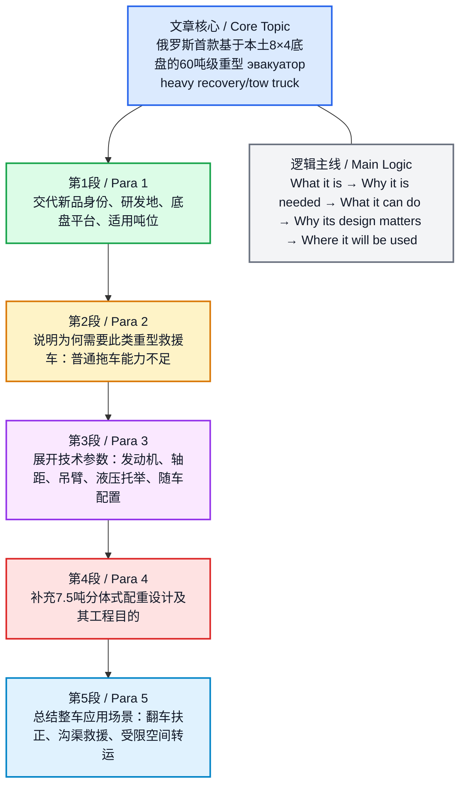
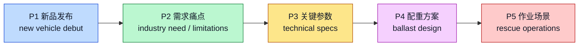

# Первый российский эвакуатор грузоподъемностью 60 тонн построили на шасси 8×4

> 以下为俄 / 英 / 中三线对照精读；**同组内** `🔻` 原文行与 `🔹` 英译行行末保留两处空格，为 Markdown 硬换行，预览时三组对齐分行显示。

## 文章来源信息

- 来源网站：`sdelanounas.ru`（转载页）
- 原始来源：`tehnoomsk.ru`
- 题目：`Первый российский эвакуатор грузоподъемностью 60 тонн построили на шасси 8×4`
- 题目英译：`Russia’s First 60-Ton-Capacity Tow Truck Built on an 8×4 Chassis`
- 转载页署名：`Михаил Петровский`
- 图片来源：`ГК «Кузовостроитель» / КАМАЗ`
- 时间线说明：`sdelanounas.ru` 页面显示为“1天前”；页面评论时间为 `2026年4月13日—15日`，可据此判断该转载页发表于 `2026年4月中旬`。文中“`Весной 2026 года`（2026年春季）”为原文表述，此处按原文保留。
- 作者背景核注：公开可核实信息显示，`tehnoomsk.ru` 的编辑署名体系并不稳定，其“关于我们”页面明确说明该站“作者署名并不系统化”；该媒体项目的创始人为 `Евгений Белкин`。本篇在 `sdelanounas.ru` 转载页上标注为 `Михаил Петровский`，但目前未检索到该文作者与 `tehnoomsk.ru` 官方作者页之间稳定、充分的一手对应介绍，因此这里仅保留“转载页署名”这一可核实信息。
- 站点背景：`Техносфера.Россия / Tehnoomsk.ru` 为俄罗斯一个聚焦本国科技、工业、交通与技术发展的媒体资源，官方“关于我们”页称其网站自 `2010年` 运行。

---

## 前情提要

---

## 逐句精读

---

🔻Весной `2026 года` / представлен первый разработанный в `России` / на базе отечественного автомобиля / с колесной формулой `8×4` / тяжелый эвакуатор / для работы с техникой массой до `60 тонн`.  
🔹In `spring 2026`, / the first heavy `recovery truck` developed in `Russia`, / based on a domestically made vehicle / with an `8×4 wheel configuration`, / was unveiled / for handling equipment weighing up to `60 tons`.  
🔸在 `2026年春季`，/ 俄罗斯推出了首款在 `本土车辆平台` 基础上开发的、采用 `8×4 轮式布局` 的重型 `救援拖车/清障车`，/ 用于处理重量最高达 `60吨` 的设备。

背景注释：
- `8×4`：表示车辆共有四根车轴，其中八个车轮位置中四个为驱动轮；这类布局常用于重载工程车辆。
- `recovery truck`：比普通 `tow truck` 更强调事故救援、扶正、拖带重型车辆等功能。
- 文中“presented / unveiled”对应俄文 `представлен`，是新闻语体中常见的“发布、亮相”。

> **`recovery truck` 重型救援拖车；事故抢险拖车**
>
> 1) 英文释义（n.）: `a specialized vehicle used to tow, lift, or recover damaged or disabled vehicles`；用于拖曳、吊起或救援受损/故障车辆的专用车辆。
> 2) 语域：新闻、汽车工程、物流运输。
> 3) 画龙点睛：比普通 `tow truck` 更强调 `救援` 与 `复杂工况处置`。考试中若写科技或交通类说明文，用 `recovery vehicle / recovery truck` 比单写 `truck` 更准确；还可搭配 `vehicle recovery`, `heavy recovery operations`。

> **`wheel configuration` 轮式布局；轮轴配置**
>
> 1) 英文释义（n.）: `the arrangement of wheels and driven axles on a vehicle`；车辆车轮与驱动桥的布置方式。
> 2) 语域：汽车工程、机械、技术说明。
> 3) 画龙点睛：常与数字组合出现，如 `4×2`, `6×4`, `8×4`。写作时可扩展为 `drive configuration`。注意它不是单指轮胎数量，而是 `车轮位置/驱动方式的结构表达`。

> **`unveil` 发布；首次公开展示**
>
> 1) 英文释义（v.）: `to introduce or reveal something publicly for the first time`；首次向公众展示、发布。
> 2) 语域：新闻、商务、公关。
> 3) 画龙点睛：比 `show` 正式得多，常用于 `unveil a model / plan / product`。新闻阅读中常见被动式 `was unveiled`，写作里可用于提升正式度。

---

🔻Машина / создана в `Санкт-Петербурге` / специалистами предприятия `«Кузовостроитель»` / на базе современного `4-осного шасси КАМАЗ К5 (К5046)`.  
🔹The vehicle / was built in `St. Petersburg` / by specialists from the company `Kuzovostroitel`, / using the modern `four-axle KAMAZ K5 chassis (K5046)` as its base.  
🔸该车辆 / 由 `圣彼得堡` 企业 `Kuzovostroitel（车身制造商）` 的专业人员打造，/ 采用现代化的 `KAMAZ K5（K5046）四轴底盘` 作为基础平台。

背景注释：
- `Санкт-Петербург`：俄罗斯第二大城市，重要工业和制造中心。
- `Кузовостроитель`：从名称直译看与“车身制造/改装”相关，文中指参与开发该专用车辆的企业。
- `КАМАЗ`：俄罗斯著名重型卡车制造商，英文常写作 `KAMAZ`。
- `chassis`：底盘，是专用车改装最核心的平台之一。

> **`chassis` 底盘**
>
> 1) 英文释义（n.）: `the main frame of a vehicle, including the wheels, engine area, and supporting structure`；车辆的主体框架与承载结构。
> 2) 语域：汽车工程、机械制造。
> 3) 画龙点睛：专用车文章中极高频。注意复数为 `chassis`。写作中常见搭配：`based on a chassis`, `heavy-duty chassis`, `truck chassis`。这是技术文本中的核心名词。

> **`four-axle` 四轴的**
>
> 1) 英文释义（adj.）: `having four axles`；具有四根车轴的。
> 2) 语域：汽车、运输、工程。
> 3) 画龙点睛：`axle` 是车轴，`axle load` 是“轴荷”。阅读时别和 `axis` 混淆。四轴往往意味着更强承载与更复杂的重量分配。

> **`base` 基础平台；底子**
>
> 1) 英文释义（n. / v.）: `the underlying support or foundation`；基础、底座；`to use as a foundation`；以……为基础。
> 2) 语域：通用、技术、学术。
> 3) 画龙点睛：本句中 `using ... as its base` 很典型。写作中可迁移到抽象话题：`be based on evidence`, `a solid base for growth`。属于高频熟词高用。

---

🔻Устанавливаются / мощные `КМУ` / для подъема тяжелой техники / (`например`, `Инман IM 175T` / или аналоги).  
🔹Powerful `truck-mounted cranes` / are installed / for lifting heavy equipment / (`for example`, the `Inman IM 175T` / or similar models).  
🔸车辆配备了强力 `随车起重机`，/ 用于吊装重型设备，/ `例如` `Inman IM 175T` / 或同类型号。

背景注释：
- `КМУ` 是俄语缩写，通常指 `краноманипуляторная установка`，即“随车起重机/车载起重操纵装置”。
- `Инман IM 175T`：文中列举的起重装置型号，用于说明该车可配备的重型吊装设备等级。
- `аналог`：在俄语新闻里常表示“同级替代品/类似型号”。

> **`truck-mounted crane` 随车起重机**
>
> 1) 英文释义（n.）: `a crane installed on a truck for lifting and moving heavy loads`；安装在卡车上的起重设备，用于吊装和搬运重物。
> 2) 语域：工程机械、物流、装备说明。
> 3) 画龙点睛：可简写为 `mounted crane`，但完整表达更清晰。注意 `mounted` 是后缀形容词，表示“安装在……上的”。写作中适合科技说明、图表描述。

> **`similar model` 同类型号；类似机型**
>
> 1) 英文释义（n. phrase）: `a model with comparable design or function`；设计或功能相近的型号。
> 2) 语域：产品说明、技术资料、商业。
> 3) 画龙点睛：比单纯 `same` 更自然。常见搭配 `or equivalent`, `or similar models`, `similar equipment`。在正式表达中可避免重复具体品牌。

---

🔻Как сообщают разработчики, / самый грузоподъёмный эвакуатор в `России` / это / вполне востребованная машина.  
🔹According to the developers, / the highest-capacity recovery truck in `Russia` / is / a vehicle that is very much in demand.  
🔸开发方表示，/ 俄罗斯这款 `承载能力最高` 的救援拖车 / 是一种 `市场需求相当明确` 的车辆。

背景注释：
- `Как сообщают разработчики`：俄语新闻常见引述框架，相当于英语 `According to the developers`。
- `грузоподъёмный`：与载重、起重能力相关，放在车辆和设备上常指“承载/起吊能力强”。

> **`according to` 根据；据……所说**
>
> 1) 英文释义（prep. phrase）: `as stated by`；按照……所说/所报道。
> 2) 语域：新闻、学术、正式写作。
> 3) 画龙点睛：这是阅读与写作必备引证结构。后常接 `officials`, `data`, `experts`。比 `by` 更明确表达“信息来源”。翻译题中极常出现。

> **`in demand` 有需求的；抢手的**
>
> 1) 英文释义（adj. phrase）: `wanted or needed by many people`；被广泛需要的，需求旺盛的。
> 2) 语域：商业、新闻、职场。
> 3) 画龙点睛：固定搭配，不能说 `in a demand`。常见扩展：`highly in demand`, `remain in demand`。可迁移到人才、技能、产品、服务等多种话题。

> **`capacity` 容量；能力；承载能力**
>
> 1) 英文释义（n.）: `the maximum amount that something can contain, produce, or handle`；最大承载、处理或容纳能力。
> 2) 语域：通用、工程、商业。
> 3) 画龙点睛：本句隐含在 `highest-capacity` 中。它是考试高频词，常见于 `production capacity`, `carrying capacity`, `capacity building`，语义覆盖广。

---

🔻Дело в том, что / обычные эвакуаторы / не всегда справляются / с огромными тягачами с автоприцепами (`автопоезда`) / и спецтехникой большой массы.  
🔹The reason is that / ordinary tow trucks / cannot always cope / with huge tractor units with trailers (`road trains`) / and heavy specialized machinery.  
🔸原因在于，/ 普通清障拖车 / 并不总能应对 / 带挂车的大型牵引车（即 `公路列车/汽车列车`）/ 以及重量很大的专用设备。

背景注释：
- `тягач`：牵引车、拖头。
- `автопоезд`：字面是“汽车列车”，指牵引车加挂车组成的重型组合车辆，英文常译 `road train` 或 `tractor-trailer combination`。
- `спецтехника`：泛指专用工程机械、特种作业车辆。

> **`cope with` 应对；处理；对付**
>
> 1) 英文释义（v. phrase）: `to deal successfully with a difficult situation or task`；成功处理、应对困难局面。
> 2) 语域：通用、新闻、学术。
> 3) 画龙点睛：后面必须接 `with`。这是高频短语动词，既能写机械处理能力，也能写人面对压力：`cope with stress`。翻译题和完形常考。

> **`tractor unit` 牵引车头**
>
> 1) 英文释义（n.）: `the front part of a truck designed to pull a trailer`；用于牵引挂车的卡车前部。
> 2) 语域：物流运输、汽车。
> 3) 画龙点睛：英式英语中常见；美式也常见 `tractor`。别和农业 `tractor` 完全等同理解，要结合上下文判断是否指“半挂牵引车头”。

> **`specialized machinery` 专用机械；特种设备**
>
> 1) 英文释义（n. phrase）: `machines designed for specific industrial or technical purposes`；为特定工业或技术用途设计的机械设备。
> 2) 语域：工业、工程、制造。
> 3) 画龙点睛：`specialized` 比 `special` 更书面、更专业。写作时可用于描述制造业升级、产业结构、工程施工等场景。

---

🔻Проблем возникает / сразу несколько: / недостаточная грузоподъёмность стрелы, / ограниченные возможности гидравлического подхвата, / перегруз осей шасси / и недостаточный запас тягового усилия лебёдок.  
🔹Several problems / arise at once: / insufficient lifting capacity of the boom, / limited capability of the hydraulic underlift, / overloading of the chassis axles, / and inadequate winch pulling power reserves.  
🔸问题会一下子出现好几项：/ 吊臂的 `起重能力不足`，/ 液压托举装置的能力有限，/ 底盘车轴 `超载`，/ 以及绞盘的 `牵引力储备不足`。

背景注释：
- `стрела`：工程机械中指“吊臂/臂架”。
- `гидравлический подхват`：在救援拖车中常指液压托举/托叉系统，用于抬起车辆一端。
- `лебёдка`：绞盘，利用钢缆进行拖拽或回收。
- 这是一个典型技术列举句，信息密度很高，适合拆分阅读。

> **`insufficient` 不足的；不够的**
>
> 1) 英文释义（adj.）: `not enough`；不足够的。
> 2) 语域：正式、学术、报告、新闻。
> 3) 画龙点睛：比 `not enough` 更正式，更适合说明文。常见搭配：`insufficient funds`, `insufficient data`, `insufficient capacity`。写作提分词。

> **`lifting capacity` 起重能力；举升能力**
>
> 1) 英文释义（n. phrase）: `the maximum weight that equipment can safely lift`；设备安全举起的最大重量。
> 2) 语域：工程、机械、安全规范。
> 3) 画龙点睛：可与 `load capacity` 区分：前者偏“吊起”，后者偏“承载”。技术文和图表题里常见。

> **`overload` / `overloading` 超载**
>
> 1) 英文释义（v./n.）: `to put too great a load on something`；使负载过大；`overloading` 为超载行为或状态。
> 2) 语域：工程、交通、电力、计算机。
> 3) 画龙点睛：非常高频的跨领域词。可用于 `overloaded network`, `overloaded schedule`, `axle overload`。词义迁移能力很强，值得掌握。

> **`winch` 绞盘**
>
> 1) 英文释义（n.）: `a mechanical device used for pulling or lifting heavy objects with a rope or cable`；用绳索或钢缆拉升重物的机械装置。
> 2) 语域：机械、航海、救援。
> 3) 画龙点睛：和 `crane` 不同，`winch` 侧重 `拉`，`crane` 侧重 `吊`。搭配如 `winch cable`, `winch force`, `powered winch`。专业阅读中常见。

---

🔻Логично, что / для эвакуации тяжелой техники / требуется / соответствующий класс автомобилей-эвакуаторов.  
🔹It is logical that / recovering heavy equipment / requires / a corresponding class of recovery vehicles.  
🔸很显然，/ 要对重型设备实施救援转运，/ 就需要 / 与之相匹配的一个等级的救援车辆。

背景注释：
- `соответствующий класс`：不是简单的“某一种车”，而是“对应等级/级别的车型”。
- 该句承担论证功能：由前面的问题自然推出后面的产品定位。

> **`require` 需要；要求**
>
> 1) 英文释义（v.）: `to need something`；需要；`to make something necessary`；使……成为必要。
> 2) 语域：正式、学术、新闻。
> 3) 画龙点睛：比 `need` 更正式。常见结构：`require sth`, `require sb to do sth`, `be required for`。写作文体升级非常实用。

> **`corresponding` 相应的；对应的**
>
> 1) 英文释义（adj.）: `matching or related to something else`；与另一事物相匹配或相对应的。
> 2) 语域：正式、学术、技术。
> 3) 画龙点睛：常用于逻辑关系表达，如 `corresponding increase`, `corresponding measure`。阅读里看到它，通常意味着“前后呼应的匹配关系”。

> **`class` 等级；类别；级别**
>
> 1) 英文释义（n.）: `a group or category of things sharing similar qualities`；按共同特征划分的类别、等级。
> 2) 语域：通用、科技、商业。
> 3) 画龙点睛：本句不是“上课的班级”，而是“车型等级”。熟词僻义是考试重点，需结合专业语境判断。

---

🔻При создании новой машины / также важно / использовать / российскую базу и решения.  
🔹When developing the new vehicle, / it is also important / to use / Russian platforms and technical solutions.  
🔸在研制这款新车时，/ 同样重要的是 / 采用 / 俄罗斯本土的平台基础与技术方案。

背景注释：
- `база` 在技术语境中常指“基础平台、底子、底盘基础”。
- `решения` 在工程、IT、制造中常常不是“决定”，而是“技术方案、解决方案”。

> **`technical solution` 技术方案；工程方案**
>
> 1) 英文释义（n. phrase）: `a practical engineering or technological method used to solve a problem`；用于解决问题的工程或技术办法。
> 2) 语域：工程、IT、制造、项目管理。
> 3) 画龙点睛：`solution` 在科技文本里常是“方案”，不是数学“解答”而已。常见搭配 `innovative solution`, `design solution`, `integrated solution`。

> **`platform` 平台；基础系统**
>
> 1) 英文释义（n.）: `a base or system on which something is built or developed`；某物据以开发构建的基础平台。
> 2) 语域：技术、商业、计算机、汽车。
> 3) 画龙点睛：汽车文章中可指“车辆平台”，IT 中可指“软件平台”。这是跨领域核心词，翻译要根据语境灵活处理。

---

🔻На что способен / самый мощный российский эвакуатор / на шасси `КАМАЗ К5046`?  
🔹What is / Russia’s most powerful recovery truck / on the `KAMAZ K5046 chassis` / capable of?  
🔸这台基于 `KAMAZ K5046 底盘` 的、俄罗斯 `性能最强` 的救援拖车，/ 到底 `能做到什么`？

背景注释：
- 这是一个设问句，用于引出后文参数说明。
- `способен` 对应英语常见表达 `be capable of`，是说明能力范围的高频结构。

> **`be capable of` 能够；有能力做**
>
> 1) 英文释义（phrase）: `to have the ability or capacity to do something`；具有做某事的能力。
> 2) 语域：正式、学术、说明文。
> 3) 画龙点睛：后接 `noun` 或 `-ing`。如 `be capable of lifting 50 tons`。比 `can` 更书面，是阅读和写作的优质替换。

> **`powerful` 强大的；性能强的**
>
> 1) 英文释义（adj.）: `having great power, force, or effectiveness`；具有很强力量、效能或影响力的。
> 2) 语域：通用、新闻、科技。
> 3) 画龙点睛：既可写物理力量，也可写抽象影响力，如 `a powerful engine`, `a powerful argument`。属于高频基础词，但搭配极重要。

---

🔻Новая машина / с отечественным двигателем `Р6` / мощностью `460 л.с.` / получила увеличенную колёсную базу / до `6 метров` / и специальную надстройку `K-30 2T`.  
🔹The new vehicle, / equipped with a domestic `R6 engine` / rated at `460 horsepower`, / has received an extended wheelbase / of up to `6 meters` / and a special `K-30 2T` superstructure.  
🔸这款新车 / 搭载本土 `R6 发动机`，/ 功率为 `460马力`，/ 并采用了加长后的 `6米轴距` / 以及专门设计的 `K-30 2T` 上装结构。

背景注释：
- `Р6`：从语义判断，相当于 `inline-six / straight-six` 一类直列六缸发动机命名中的俄式表达，但原文仅写 `Р6`，此处按原文保留。
- `л.с.`：俄语“马力”缩写，对应 `horsepower / hp`。
- `надстройка`：在专用车领域常译“上装、专用上装结构”。

> **`rated at` 额定为；标定为**
>
> 1) 英文释义（v. phrase）: `officially measured or specified as having a certain capacity or power`；被规定或标定为某一数值。
> 2) 语域：技术参数、产品说明。
> 3) 画龙点睛：参数句非常常见，如 `rated at 460 hp`, `rated at 220 volts`。写科技文时比 `has` 更专业。

> **`wheelbase` 轴距**
>
> 1) 英文释义（n.）: `the distance between the front and rear axles of a vehicle`；车辆前后轴中心之间的距离。
> 2) 语域：汽车工程、评测、技术说明。
> 3) 画龙点睛：影响稳定性、转弯半径、载荷分配。考试中属于专业词，但词形透明，适合积累：`wheel + base`。

> **`superstructure` 上部结构；上装**
>
> 1) 英文释义（n.）: `the part of a structure built on top of a base`；建于基础平台之上的上层结构。
> 2) 语域：工程、船舶、专用车辆。
> 3) 画龙点睛：在不同领域意义不同：船上是“上层建筑”，专用车里可指“上装结构”。翻译时要结合行业语境，不宜机械直译。

---

🔻Эвакуатор из `Санкт-Петербурга` / оснащен основной стрелой / грузоподъёмностью `50 тонн` / и гидравлическим подхватом / грузоподъёмностью `30 тонн` / (`грузоподъёмность подхвата` / на максимальном вылете / составляет `10 тонн`).  
🔹The recovery truck from `St. Petersburg` / is equipped with a main boom / with a lifting capacity of `50 tons`, / and a hydraulic underlift / with a lifting capacity of `30 tons` / (`the underlift capacity` / at maximum reach / is `10 tons`).  
🔸这台来自 `圣彼得堡` 的救援拖车 / 配备一根主吊臂，/ `起重能力为50吨`，/ 还配有液压托举装置，/ `额定能力为30吨`；/ 其中托举装置在 `最大作业伸距` 下 / 的能力为 `10吨`。

背景注释：
- `вылет`：机械臂、吊臂术语，指臂架伸出距离、作业半径、外伸量。
- 同一设备在不同 `reach / outreach` 条件下额定能力不同，这属于机械参数中的常见规律。
- 句中括号内是对前面参数的补充限定。

> **`be equipped with` 配备有；装备有**
>
> 1) 英文释义（phrase）: `to have something as part of the equipment or features`；具备某种设备或配置。
> 2) 语域：正式、说明文、产品介绍。
> 3) 画龙点睛：写产品介绍时极高频，比 `has` 更正式。可接具体硬件，也可接抽象能力：`equipped with sensors`, `equipped with advanced software`。

> **`boom` 吊臂；臂架**
>
> 1) 英文释义（n.）: `a long arm on a crane or lifting machine used for raising loads`；起重设备上用于吊升重物的长臂。
> 2) 语域：工程、机械。
> 3) 画龙点睛：注意别与表示“繁荣”的 `boom` 混淆。这正是熟词僻义的典型考点。机械语境里几乎都指“臂”。

> **`maximum reach` 最大伸距；最大作业半径**
>
> 1) 英文释义（n. phrase）: `the farthest distance an arm or boom can extend`；臂架可延伸到的最远距离。
> 2) 语域：机械、工程、起重设备。
> 3) 画龙点睛：参数说明常和 `capacity` 搭配出现。要理解“伸得越远，承重通常越低”的工程逻辑，有助于精准读懂技术文本。

---

🔻В стандартной комплектации / есть колесные захваты для автобусов, / набор вилок, / адаптер для перевозки полуприцепов / и буксирная штанга / грузоподъёмностью `32 тонны`.  
🔹The standard configuration / includes wheel lifts for buses, / a set of forks, / an adapter for transporting semi-trailers, / and a towing bar / rated at `32 tons`.  
🔸在标准配置中，/ 该车配有适用于公交车的 `车轮夹持/托举装置`、/ 一套叉具、/ 用于运输半挂车的适配器，/ 以及一根 `额定能力为32吨` 的牵引杆。

背景注释：
- `standard configuration`：标准配置，区别于选装件。
- `полуприцеп`：半挂车，英文 `semi-trailer`。
- `буксирная штанга`：牵引杆/拖杆，用于牵引连接。

> **`standard configuration` 标准配置**
>
> 1) 英文释义（n. phrase）: `the set of features or equipment included as normal`；正常默认配备的功能或设备组合。
> 2) 语域：产品说明、汽车、技术文档。
> 3) 画龙点睛：和 `optional equipment` 相对。图表题、产品介绍、科技类说明文中非常实用，可替换普通的 `basic version`。

> **`adapter` 适配器；转接装置**
>
> 1) 英文释义（n.）: `a device that allows different pieces of equipment to work together`；使不同设备协同工作的连接或转接装置。
> 2) 语域：工程、电子、机械、IT。
> 3) 画龙点睛：跨领域高频词。别局限为充电器配件，它在机械行业也很常见。写作时常与 `interface`, `connector` 对比出现。

> **`towing bar` 牵引杆**
>
> 1) 英文释义（n.）: `a rigid bar used for towing one vehicle behind another`；将一辆车拖在另一辆车后方的刚性牵引杆。
> 2) 语域：汽车、交通、机械。
> 3) 画龙点睛：与 `tow rope` 区别在于前者更刚性、更稳定。适合技术翻译和交通安全题材表达。

---

🔻Разработчики / также создали и разместили / балласт массой `7,5 тонн` / нестандартной формы, / разделив его / на `3 части`.  
🔹The developers / also created and installed / `7.5 tons` of ballast / in a non-standard shape, / dividing it / into `three parts`.  
🔸开发人员 / 还设计并安装了 / 总质量达 `7.5吨` 的配重，/ 其外形并非常规样式，/ 并且将其 / 分成了 `三部分`。

背景注释：
- `ballast`：配重，用于改善稳定性、平衡重心。
- `нестандартной формы`：非标准形状，说明其设计是为适应车辆结构和受力需求而定制。
- `разместили` 在这里不是简单“放置”，更接近“布置安装”。

> **`ballast` 配重；压载物**
>
> 1) 英文释义（n.）: `heavy material used to give stability or balance`；用于增加稳定性或平衡的重物。
> 2) 语域：工程、船舶、轨道、机械。
> 3) 画龙点睛：不要只记船舶中的“压载”；在起重、车辆、轨道中也常见。技术文里看到它，往往与 `stability`、`load distribution` 同现。

> **`install` 安装；装配**
>
> 1) 英文释义（v.）: `to put equipment in place so that it is ready for use`；把设备装好并使其可投入使用。
> 2) 语域：通用、工程、IT。
> 3) 画龙点睛：比 `put` 精确得多。可用于实体设备，也可用于软件：`install software`。是非常典型的基础高频词。

> **`divide ... into ...` 把……分成……**
>
> 1) 英文释义（phrase）: `to separate something into parts`；将某物分割成若干部分。
> 2) 语域：通用、学术、技术。
> 3) 画龙点睛：结构极常见，后接数量、类别、阶段都行。写作中可迁移：`The process can be divided into three stages.`

---

🔻Это нужно / для устойчивости / при работе стрелы, / повышения безопасности / при эвакуации тяжёлых машин, / для оптимального распределения нагрузки / на шасси, / а также / для упрощения обслуживания и эксплуатации.  
🔹This is necessary / for stability / during boom operation, / for improved safety / when recovering heavy vehicles, / for optimal load distribution / on the chassis, / and also / for easier maintenance and operation.  
🔸这样做 / 是为了在吊臂作业时提高 `稳定性`，/ 提升重型车辆救援过程中的 `安全性`，/ 实现底盘载荷的 `优化分配`，/ 同时 / 简化后期的 `维护` 与 `使用运行`。

背景注释：
- `обслуживание`：维护、保养。
- `эксплуатация`：在工程和运输语境中常指“使用、运行、运维过程”，不是日常英语里“剥削”的那个含义。
- 本句是标准的“设计目的”说明句。

> **`stability` 稳定性**
>
> 1) 英文释义（n.）: `the quality of being steady and not likely to change or fall`；稳定、不易失衡或变化的性质。
> 2) 语域：通用、工程、经济。
> 3) 画龙点睛：技术文里常指结构稳定、行驶稳定或系统稳定。可与 `stable` 一并记忆。是从工程到议论文都高频的核心词。

> **`load distribution` 载荷分配**
>
> 1) 英文释义（n. phrase）: `the way weight is spread across a structure or vehicle`；重量在结构或车辆各部分间的分布方式。
> 2) 语域：工程、汽车、安全。
> 3) 画龙点睛：这是理解车辆设计的关键概念。写作中还能迁移到抽象语义，如 `income distribution`，帮助建立 `distribution` 的核心义。

> **`maintenance` 维护；保养**
>
> 1) 英文释义（n.）: `the work needed to keep something in good condition`；保持设备良好状态所需的维护工作。
> 2) 语域：工程、商业、物业、IT。
> 3) 画龙点睛：和 `repair` 不同，`maintenance` 更偏预防性、日常性维护。高频搭配：`routine maintenance`, `maintenance costs`。考试中很常见。

> **`operation` 运行；操作；作业**
>
> 1) 英文释义（n.）: `the act or process of working or functioning`；运作、运行、操作过程。
> 2) 语域：通用、技术、商业、军事。
> 3) 画龙点睛：一词多义极强。技术文中常译“运行/操作”，军事新闻中常译“行动/作战”，医学中又是“手术”。属重点熟词多义。

---

🔻В итоге / получилась российская машина / на отечественном шасси, / которая может выполнять / не только стандартную буксировку, / но и сложные аварийные операции / с самыми тяжелыми транспортными средствами: / подъём опрокинутых грузовиков, / извлечение техники из кювета, / а также эвакуацию / с ограниченным доступом.  
🔹As a result, / what has been created is a Russian vehicle / on a domestic chassis / that can perform / not only standard towing / but also complex emergency recovery operations / involving the heaviest vehicles: / lifting overturned trucks, / pulling equipment out of ditches, / as well as carrying out recovery work / in areas with restricted access.  
🔸最终，/ 这是一台基于国产底盘打造的俄罗斯车辆，/ 它不仅能够执行常规拖曳任务，/ 还可以对最重型的运输工具实施复杂的 `事故救援作业`：/ 包括扶正侧翻卡车、/ 将设备从沟渠中拖出，/ 以及在 `通行受限` 区域开展救援转运。

背景注释：
- `аварийные операции`：事故处置、应急救援作业。
- `кювет`：道路边沟、路边排水沟，车辆冲出路面后常会跌入其中。
- `с ограниченным доступом`：受限空间、进入条件受限区域，是工程和救援语境中的高频表达。
- 该句是全文总结句，概括功能定位与典型作业场景。

> **`as a result` 最终；结果是**
>
> 1) 英文释义（adv. phrase）: `therefore; consequently`；因此、结果。
> 2) 语域：正式、学术、新闻。
> 3) 画龙点睛：逻辑连接词中的常青项。比口语 `so` 更书面，适合写议论文、说明文、总结句。

> **`emergency recovery operation` 应急救援作业**
>
> 1) 英文释义（n. phrase）: `an operation carried out to recover damaged or disabled vehicles in emergency situations`；在紧急情况下实施的车辆救援回收作业。
> 2) 语域：救援、交通、工程、安全。
> 3) 画龙点睛：由 `emergency + recovery + operation` 组合而成，具备很强的专业说明力。科技翻译和行业报道中非常好用。

> **`overturned` 侧翻的；翻倒的**
>
> 1) 英文释义（adj.）: `having turned over onto one side or upside down`；翻倒、侧翻、倾覆的。
> 2) 语域：交通、新闻、事故报道。
> 3) 画龙点睛：来源于动词 `overturn`。新闻里常见 `an overturned truck`, `the boat overturned`。适合事故类阅读积累。

> **`ditch` 沟；边沟**
>
> 1) 英文释义（n.）: `a long narrow channel dug in the ground, especially beside a road`；地面挖出的狭长沟渠，尤指路边沟。
> 2) 语域：通用、交通、工程。
> 3) 画龙点睛：常见却易忽视。交通场景里频繁出现，如 `fall into a ditch`。不要只记口语动词义 `ditch` = “抛弃”。

> **`restricted access` 通行受限；进入受限**
>
> 1) 英文释义（n. phrase）: `limited ability to enter or reach a place`；进入某地的条件受限制。
> 2) 语域：安全、工程、建筑、交通。
> 3) 画龙点睛：可用于实体空间，也可用于网络与权限语境。是典型的跨场景表达，写作时很有迁移价值，如 `restricted-access area`。

---

## 参考来源

1. `sdelanounas.ru` 转载页：
   https://sdelanounas.ru/blogs/175221/

2. `tehnoomsk.ru` 关于页面（用于核注站点与编辑说明）：
   https://tehnoomsk.ru/about_us

3. `tehnoomsk.ru` 站点主页（用于核对媒体定位）：
   https://tehnoomsk.ru/

如果你愿意，我下一条可以继续把这篇文章整理成一份更适合背诵的版本，包括：

- `全文高级英译整合版`
- `雅思/考研/GRE写作可复用表达清单`
- `逐句语法树版`
- `一页式词汇总表`
