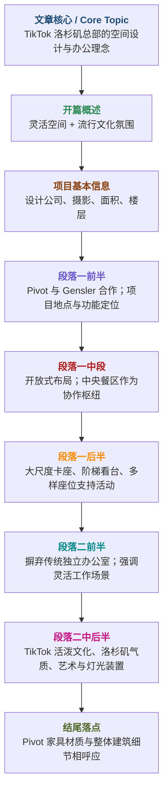

## 基本信息

- **文章来源**：Pivot Interiors 官网项目页
- **题目**：**_TikTok Los Angeles Headquarters_**
- **作者**：**页面未标注具体署名作者**
- **设计公司**：**Gensler**
- **摄影**：**Benny Chan**
- **范围说明**：**Ancillary package for five-story office, 120,000 square feet**
- **来源链接**：
  - Pivot 项目原页：https://www.pivotinteriors.com/projects/tiktok-los-angeles-headquarters
  - Pivot 公司背景：https://www.pivotinteriors.com/news/2023/celebrating-50-years
  - Gensler 官方信息：https://www.gensler.com/press-releases/aia-college-of-fellows-2025

## 作者/机构背景简介

- **Pivot Interiors**：美国办公空间与商业室内解决方案公司，历史可追溯至 **1973 年**；据其官网资料，1999 年由 **Space Designs** 与 **CRI** 合并形成 Pivot Interiors，服务对象覆盖科技、教育、初创企业与医疗等领域。
- **Gensler**：国际知名建筑与设计公司，长期从事办公、城市、品牌与室内环境设计。
- **Benny Chan**：文中标注的摄影师，负责该项目影像呈现；本页未提供更详细个人简介。
- **说明**：该页面为企业项目展示页，**不是传统新闻报道**，因此通常以公司名义发布，**不设个人作者署名**。

## 前情提要

---

## 逐句精读

🔹 **Seamlessly flexible spaces designed for both individual reflection and communal gathering / meet a lively pop culture theme / in TikTok's Los Angeles office.**  
🔸 **在 TikTok 洛杉矶办公室中，既适合个人沉思、又适合集体相聚的无缝衔接式灵活空间，与充满活力的流行文化主题彼此交融。**

**背景注释**

- **TikTok**：国际短视频平台，母公司为字节跳动。
- **Los Angeles**：美国洛杉矶，加州重要文化、娱乐与创意产业中心。
- **pop culture**：流行文化，常指影视、音乐、社交媒体、时尚等大众文化现象。
- **individual reflection**：此处指个人独处、思考、沉淀的办公状态。
- **communal gathering**：集体聚集、共同交流的空间使用场景。

> **Seamlessly flexible**
> 1. 形容词短语：**working smoothly without breaks or awkward transitions 无缝衔接且高度灵活的**
> 2. 语域：**设计、建筑、商业宣传**
> 3. 画龙点睛：**seamlessly** 常与 **integrate, connect, flow, transition** 搭配；写作中可替换普通的 *smoothly*，使表达更具设计感与高级感。
>
> **reflection**
> 1. 名词：**careful thought about something 深思；反思**；另有“映像、反射”义
> 2. 语域：**正式、学术、心理、教育**
> 3. 画龙点睛：考试中常考 **reflection on/upon sth**；与 **meditation, contemplation** 接近，但 **reflection** 更强调经过思考后的回顾与体悟。
>
> **communal**
> 1. 形容词：**shared by a group of people 共享的；公共群体性的**
> 2. 语域：**社会、建筑、公共空间、新闻**
> 3. 画龙点睛：易与 **common** 混淆；**communal space** 强调“供群体共同使用的空间”，比 **public space** 更带有社群属性。
>
> **theme**
> 1. 名词：**the central idea or style of something 主题；主调；风格线索**
> 2. 语域：**通用、文学、设计、品牌**
> 3. 画龙点睛：在设计英语里，**theme** 不只是“主题思想”，还常指空间视觉与体验上的统一主线，如 **a tropical theme / an industrial theme**。

---

🔹 **Design Firm: Gensler**  
🔸 **设计公司：Gensler。**

**背景注释**

- **Gensler**：全球知名建筑、规划与设计事务所，在办公空间、品牌环境和城市设计领域影响较大。
- 这类项目页中的 **Design Firm** 表示该项目的主设计机构。

> **firm**
> 1. 名词：**a business company, especially one providing professional services 公司；事务所**
> 2. 语域：**商业、法律、建筑、咨询**
> 3. 画龙点睛：**firm** 在职业英语中常特指专业服务机构，如 **law firm, design firm, accounting firm**；比泛泛的 **company** 更专业。

---

🔹 **Photography: Benny Chan**  
🔸 **摄影：Benny Chan。**

**背景注释**

- **Benny Chan**：该项目页面标注的摄影师姓名。
- **Photography** 在项目页中通常指空间摄影或建筑摄影的署名信息。

> **photography**
> 1. 名词：**the activity or art of taking photographs 摄影；摄影作品**
> 2. 语域：**艺术、媒体、建筑展示**
> 3. 画龙点睛：项目介绍中 **Photography: + 人名** 是固定署名格式；注意它此处不是“摄影技术”泛指，而是“摄影作者信息”。

---

🔹 **Scope: Ancillary package for five-story office, / 120,000 square feet**  
🔸 **项目范围：为一座五层办公楼提供配套家具方案，总面积为 12 万平方英尺。**

**背景注释**

- **Scope**：项目范围、服务边界。
- **Ancillary package**：在办公空间项目中通常指辅助性或配套性的家具/设施配置，不是主体建筑施工。
- **square feet**：平方英尺，美国常用面积单位；**120,000 square feet** 约合 **11,148 平方米**。
- **five-story office**：五层办公空间。

> **scope**
> 1. 名词：**the range or extent of work involved 范围；规模；涉及内容**
> 2. 语域：**项目管理、商务、工程**
> 3. 画龙点睛：常见搭配 **project scope, within the scope of, broaden the scope**；阅读中常表示“项目究竟做到哪一步”。
>
> **ancillary**
> 1. 形容词：**providing support to the main work or service 附属的；辅助的；配套的**
> 2. 语域：**正式、商业、法律、医疗、工程**
> 3. 画龙点睛：这是高频正式词，可替换 **supporting / secondary**；如 **ancillary services, ancillary facilities**，写作中能显著提升正式度。

---

🔹 **As a provider of the ancillary package for seating, lounge furniture, café and conference tables, / Pivot was proud to partner with Gensler / on TikTok’s Los Angeles headquarters in Culver City, CA.**  
🔸 **作为座椅、休闲家具、咖啡区桌具和会议桌等配套方案的供应方，Pivot 很荣幸能与 Gensler 合作，共同参与位于加州卡尔弗城的 TikTok 洛杉矶总部项目。**

**背景注释**

- **Pivot**：即 Pivot Interiors。
- **partner with**：这里指项目协作，而非股权意义上的“合伙”。
- **Culver City, CA**：卡尔弗城，位于洛杉矶县，是媒体、影视与创意产业较集中的区域。
- **headquarters**：总部。此处指该公司在当地的重要办公据点。
- **lounge furniture**：休闲区家具，如沙发、软椅、边几等。

> **provider**
> 1. 名词：**a person or company that supplies something 提供者；供应商**
> 2. 语域：**商业、服务、合同**
> 3. 画龙点睛：常见于商务文本，如 **service provider, solution provider**；比 **seller** 更强调“提供整体方案或服务”。
>
> **partner with**
> 1. 动词短语：**to work together with someone or an organization 与……合作**
> 2. 语域：**商业、新闻、公关**
> 3. 画龙点睛：很常见的新闻写作表达；比 **work with** 更正式，常暗示平等协作关系。可扩展为 **partner on a project / partner to deliver solutions**。
>
> **headquarters**
> 1. 名词：**the main office of an organization 总部**
> 2. 语域：**商业、军事、新闻**
> 3. 画龙点睛：通常作单复同形名词使用，常搭配 **corporate headquarters, be headquartered in**；翻译时需根据语境处理为“总部”或“总部办公地”。

---

🔹 **This five-story office / is TikTok’s first U.S.-based space / and provides touch-down workspace space / for their teams, collaborators and influencers.**  
🔸 **这座五层办公空间是 TikTok 在美国设立的首个办公据点，并为其团队、合作伙伴以及内容创作者提供可临时使用的落脚式办公空间。**

**背景注释**

- **U.S.-based**：设在美国的、以美国为基地的。
- **touch-down workspace**：办公场景术语，指员工或访客短暂停留、临时办公的工位或工作区，不等于固定工位。
- **collaborators**：合作方、协作人员。
- **influencers**：网络影响者，通常指在社交媒体平台拥有影响力的创作者。

> **U.S.-based**
> 1. 形容词：**located in or operating from the United States 设在美国的；以美国为基地的**
> 2. 语域：**新闻、商业、国际事务**
> 3. 画龙点睛：常见于媒体与商业报道，如 **U.S.-based company**；注意连字符结构常作前置定语。
>
> **touch-down workspace**
> 1. 名词短语：**a temporary place where people can briefly work or stop by 临时办公位；短暂停留工作区**
> 2. 语域：**办公设计、房地产、企业管理**
> 3. 画龙点睛：是现代办公语汇，体现混合办公趋势。不要按字面误译成“触地工作区”；可译为 **临时办公位 / 即停即用工位**。
>
> **collaborator**
> 1. 名词：**someone who works with others to create or achieve something 合作者；协作者**
> 2. 语域：**通用、学术、商业、创意产业**
> 3. 画龙点睛：中性偏正式词，常用于项目、研究、艺术创作。历史语境中有“通敌合作者”义，现代商业语境一般无此负面色彩。
>
> **influencer**
> 1. 名词：**a person who can affect others’ opinions or buying decisions, especially online 网红；社交媒体影响者**
> 2. 语域：**媒体、营销、互联网**
> 3. 画龙点睛：现代数字传播高频词。可搭配 **brand influencer, social media influencer, influencer marketing**。

---

🔹 **The space is open, / with a central canteen on the middle floor / that acts as a collaborative hub.**  
🔸 **整个空间采用开放式布局，中间楼层设有一个中央餐区，充当协作交流的枢纽。**

**背景注释**

- **open**：此处指开放式空间布局，而不是“营业中”。
- **canteen**：餐厅、食堂、用餐区。
- **collaborative hub**：协作中心、交流枢纽，指团队自然汇聚与互动的核心场所。

> **canteen**
> 1. 名词：**a place where food is served in a workplace or school 食堂；员工餐厅；用餐区**
> 2. 语域：**英式英语、办公、校园**
> 3. 画龙点睛：英式语境常用 **canteen**，美式有时更常说 **cafeteria**；在设计文本中可按语境灵活译为“餐区/中央餐厅”。
>
> **act as**
> 1. 动词短语：**to serve in the role of 充当；起……作用**
> 2. 语域：**通用、正式写作、说明文**
> 3. 画龙点睛：高频学术与说明类表达，如 **act as a buffer / catalyst / bridge**；翻译时常处理为“发挥……作用”更自然。
>
> **hub**
> 1. 名词：**the central point of activity 中心；枢纽；核心点**
> 2. 语域：**商业、科技、城市、交通**
> 3. 画龙点睛：非常实用的抽象名词，能用于 **transport hub, innovation hub, collaboration hub**，写作中比 **center** 更有动态感。

---

🔹 **The space features large, oversized booths / and communal bleachers for community forums, / with a wide variety of seating arrangements / to support company events.**  
🔸 **该空间设有大型、加宽式卡座，以及供社区论坛活动使用的共享阶梯看台，并配备多种多样的座位布局，以支持公司活动的开展。**

**背景注释**

- **oversized booths**：超大卡座，常见于半围合式讨论区。
- **bleachers**：阶梯式看台座位，在办公空间中常被借用为可举办分享会、论坛或全员会的阶梯区。
- **community forums**：社区论坛；在企业语境里，也可指公开讨论会、员工交流会、社群活动。
- **seating arrangements**：座位安排、座位配置方式。
- **company events**：公司活动，如发布会、内部分享、培训或社交活动。

> **feature**
> 1. 动词：**to include as an important part 以……为特色；设有；包含**
> 2. 语域：**新闻、产品说明、设计介绍**
> 3. 画龙点睛：在介绍类文本中极高频，常用来避免反复使用 **have**。如 **The building features...** 比 **has** 更正式。
>
> **booth**
> 1. 名词：**a partly enclosed seating area or small compartment 卡座；隔间；小亭位**
> 2. 语域：**餐饮、展览、室内设计**
> 3. 画龙点睛：熟词常见义是“摊位”，但本文是设计语境中的“卡座”；这类熟词僻义是阅读高频考点。
>
> **bleacher**
> 1. 名词：**rows of raised seats arranged like steps 阶梯看台座位**
> 2. 语域：**体育、建筑、办公设计**
> 3. 画龙点睛：现代办公空间借用体育场的阶梯式结构营造分享场景，因此 **bleachers** 在企业空间报道中越来越常见。
>
> **arrangement**
> 1. 名词：**a way in which things are organized or positioned 布置；安排；配置**
> 2. 语域：**通用、设计、组织管理**
> 3. 画龙点睛：与 **layout** 接近，但 **arrangement** 更强调具体摆放方式；如 **seating arrangement** 是固定搭配。

---

🔹 **Much of the space / is arranged around the café area, / for which Pivot provided café tables and seating.**  
🔸 **空间中的很大一部分围绕咖啡区进行布局，而 Pivot 则为这一区域提供了咖啡桌和座椅。**

**背景注释**

- **arranged around**：围绕……来布置、组织。
- **café area**：咖啡区，兼具社交、休憩、非正式交流等功能。
- **for which**：关系代词结构，指代前面的 **the café area**。

> **arrange around**
> 1. 动词短语：**to organize something with another thing as the center 围绕……布置/组织**
> 2. 语域：**设计、说明文**
> 3. 画龙点睛：可迁移到写作中，如 **The discussion is arranged around three themes**，不仅用于空间，也用于论证结构。
>
> **provide**
> 1. 动词：**to supply or make available 提供；供应**
> 2. 语域：**通用、正式、商业**
> 3. 画龙点睛：高频基础词，但搭配能力很重要：**provide sb with sth / provide sth for sb**。本文用了后者的关系从句变体。
>
> **seating**
> 1. 名词：**chairs or places to sit 座位；座椅配置**
> 2. 语域：**设计、建筑、活动组织**
> 3. 画龙点睛：**seating** 既可泛指“座位总称”，也可指“座椅系统”；不要机械只译成“座位”。

---

🔹 **The design sidesteps the traditional private office / with flexible workspaces / for individual reflection, focused work or meetings, / which flow seamlessly around communal team spaces.**  
🔸 **这一设计避开了传统的独立办公室模式，转而采用灵活的工作空间，以满足个人思考、专注办公或会议需求；这些空间又与共享式团队区域自然顺畅地衔接在一起。**

**背景注释**

- **sidestep**：此处不是字面“侧步躲开”，而是“有意绕开、避免采用”。
- **private office**：传统独立办公室。
- **focused work**：专注型工作、深度工作。
- **flow seamlessly**：自然无缝地衔接、流动。
- **communal team spaces**：团队共享空间。

> **sidestep**
> 1. 动词：**to avoid dealing with or using something 绕开；回避；避免采用**
> 2. 语域：**新闻、评论、商业、正式写作**
> 3. 画龙点睛：这是很有表现力的动词，常见于 **sidestep the issue/problem/tradition**；比 **avoid** 更带策略性。
>
> **focused**
> 1. 形容词：**giving full attention to one thing 专注的；聚焦的**
> 2. 语域：**通用、教育、办公**
> 3. 画龙点睛：常见搭配 **focused work, focused attention, stay focused**；也是写作中替换 **concentrated** 的自然表达。
>
> **flow**
> 1. 动词：**to move or connect smoothly 流动；顺畅衔接**
> 2. 语域：**设计、文学、说明文**
> 3. 画龙点睛：空间写作中常用 **spaces flow into/around/through**；把静态空间写出动态感，是建筑英语的重要特点。
>
> **communal**
> 1. 形容词：**shared by a group 共享的；集体使用的**
> 2. 语域：**社会、设计、公共空间**
> 3. 画龙点睛：与上文呼应，形成关键词复现。阅读时注意这种词汇重复往往提示文章主旨：**个人与集体之间的平衡**。

---

🔹 **TikTok’s fun, lively culture / and pops of color / that reflect the office’s Los Angeles vibe / prevail throughout design / with the inclusion of art and murals, lighting installations and electronic kinetic LED walls.**  
🔸 **TikTok 轻松活泼的文化气质，以及呼应办公室洛杉矶风格的跳色设计，借由艺术作品与壁画、灯光装置以及电子动态 LED 墙体的融入，贯穿于整体设计始终。**

**背景注释**

- **pops of color**：设计表达，指点缀性的亮色、跳色。
- **Los Angeles vibe**：洛杉矶风格/氛围，通常联想到创意、娱乐、阳光、多元文化。
- **murals**：壁画。
- **lighting installations**：灯光装置艺术或大型灯光设计。
- **kinetic LED walls**：动态 LED 墙面；**kinetic** 强调运动感、动态变化效果。
- **prevail throughout**：贯穿始终、普遍存在于整体之中。

> **pop of color / pops of color**
> 1. 名词短语：**a small but strong area of bright color 点睛亮色；跳色**
> 2. 语域：**设计、时尚、室内装饰**
> 3. 画龙点睛：非常地道的设计表达。不是“颜色爆炸”，而是“局部亮色点缀”。写作中可用于描述视觉层次。
>
> **vibe**
> 1. 名词：**the general feeling or atmosphere of a place or situation 氛围；感觉；调性**
> 2. 语域：**口语、媒体、时尚、生活方式**
> 3. 画龙点睛：较口语化，但在当代媒体和品牌文案里极常见。比 **atmosphere** 更轻松、更贴近生活方式表达。
>
> **prevail**
> 1. 动词：**to exist widely or be the strongest influence 盛行；占主导；贯穿**
> 2. 语域：**正式、新闻、学术**
> 3. 画龙点睛：常搭配 **prevail in/throughout**；在精读中要掌握其抽象义，不只是“获胜”，还可表示“某种特征普遍存在”。
>
> **kinetic**
> 1. 形容词：**relating to movement 动态的；运动的**
> 2. 语域：**艺术、物理、设计**
> 3. 画龙点睛：用于 **kinetic art / kinetic installation**；此词能帮助理解现代空间中的“可变、会动、可感知变化”的设计语言。

---

🔹 **Pivot’s ancillary furniture selections / reflect finishes and fabrics / that complement the bold color choices / and architectural details of the space.**  
🔸 **Pivot 所选择的配套家具，在饰面与织物材质上呼应了这一空间大胆的色彩选择以及建筑细节。**

**背景注释**

- **ancillary furniture**：配套家具、辅助性家具配置。
- **finishes**：饰面材料、表面处理，如木饰面、金属漆面、哑光/亮光处理等。
- **fabrics**：织物、面料。
- **complement**：此处指“与……相映成趣、形成良好呼应”，不是“补足”字面那么简单。
- **architectural details**：建筑细节，如线条、节点、材质收口、立面特征等。

> **selection**
> 1. 名词：**the act or result of choosing 选择；所选之物**
> 2. 语域：**通用、商业、设计**
> 3. 画龙点睛：在产品或设计文本中，**selections** 常指“所选用的具体配置方案”，不是抽象“选择行为”而已。
>
> **finish**
> 1. 名词：**the surface appearance or treatment of a material 饰面；表面处理**
> 2. 语域：**建筑、室内、工业设计**
> 3. 画龙点睛：这是设计领域核心词。基础学习者常只知道动词“完成”，但名词义 **finish** 在阅读中非常重要。
>
> **fabric**
> 1. 名词：**cloth used for making things such as furniture coverings 织物；布料；面料**
> 2. 语域：**设计、服装、家具**
> 3. 画龙点睛：在室内英语中，**fabric** 常指软装面料；可搭配 **upholstery fabric, durable fabric, woven fabric**。
>
> **complement**
> 1. 动词：**to make something look better or work well with it 与……相配；补充并增强**
> 2. 语域：**正式、设计、写作**
> 3. 画龙点睛：注意与 **compliment**（称赞）区分。考试里拼写辨析很常见。设计语境中 **complement** 常译为“呼应、相配、相得益彰”。

---

## 参考来源

- Pivot Interiors 项目页：<https://www.pivotinteriors.com/projects/tiktok-los-angeles-headquarters>
- Pivot Interiors 公司背景：<https://www.pivotinteriors.com/news/2023/celebrating-50-years>
- Gensler 官方资料：<https://www.gensler.com/press-releases/aia-college-of-fellows-2025>

我来按照设定的流程对这篇文章进行系统深度分析。

---

## 模块一：翻译与全文概要

**原文主题领域**：企业办公空间设计与商业案例研究

**中英文对照概要**：

This case study showcases **Pivot Interiors' collaboration with renowned design firm Gensler on TikTok's flagship U.S. headquarters in Culver City, Los Angeles**. As the ancillary furniture provider, Pivot supplied seating, lounge furniture, café tables, and conference furniture for this innovative 120,000-square-foot five-story office complex. The design philosophy prioritizes **flexibility and human-centered workspace**, departing from traditional private offices to create **seamless transitions between individual focus areas and communal collaboration zones**. The central canteen functions as a vibrant hub, complemented by oversized booths and communal bleachers designed for company events and community forums. The aesthetic integrates **TikTok's dynamic, youth-oriented culture through bold colors, art installations, kinetic LED walls, and murals**, with Pivot's furniture selections carefully chosen to harmonize with the architectural vision and vibrant color palette.

本案例展示了**Pivot室内设计公司与享誉盛名的Gensler设计事务所合作打造TikTok标志性美国总部的创意成果**，该总部位于洛杉矶卡尔弗城。作为配套家具供应商，Pivot为这座120,000平方英尺的五层办公楼提供了座椅、休闲家具、咖啡厅餐桌和会议桌。设计理念优先考虑**灵活性和以人为本的工作空间**，摒弃传统私人办公室的做法，创造**个人专注区域与共享协作空间的无缝过渡**。中层中央食堂成为充满活力的中枢枢纽，辅以超大号展位和共享看台，用于公司活动和社区论坛。美学设计融入了**TikTok充满活力、面向年轻人的企业文化，通过大胆的配色、艺术装置、动感LED墙和壁画**，Pivot的家具选择精心挑选以与建筑愿景和充满活力的调色板相协调。

---

## 模块二：基本信息与注释

### 2A. 文章基本信息 | Article Metadata

| 信息类别 | 详情 |
|---------|------|
| **来源 / Source** | Pivot Interiors 官方网站案例库 / Pivot Interiors official website portfolio |
| **题目 / Title** | TikTok Los Angeles Headquarters |
| **作者 / Author** | Pivot Interiors (企业发布) / Published by Pivot Interiors (corporate) |
| **摄影 / Photography** | Benny Chan |
| **设计事务所 / Design Firm** | Gensler |
| **发表日期 / Publication Date** | 未明确标注 (推测2019-2020年间) / Not explicitly stated (estimated 2019-2020) |
| **项目地点 / Location** | Culver City, Los Angeles, California |
| **项目规模 / Scope** | 五层办公楼，120,000平方英尺 / Five-story office, 120,000 square feet |

### 2B. 作者背景 | Author Background

**Pivot Interiors** — 美国办公家具与工作空间解决方案提供商，致力于为全球企业设计并供应高性能办公环境所需的家具和配套产品。公司与Gensler、Heatherwick Studio等国际顶级设计事务所长期合作，项目包括Google、Adobe、DoorDash等科技企业总部。

---

### 2C. 关键Entity与地点注释 | Key Entities & Annotations

| Entity | 说明 / Notes |
|--------|-----------|
| **TikTok** | 字节跳动旗下短视频社交平台，总部位于中国北京，该洛杉矶总部是其美国主要办公基地 / ByteDance-owned short-video social platform, headquartered in Beijing; this Los Angeles HQ is its primary U.S. office base |
| **Gensler** | 全球顶级建筑与设计事务所，成立于1965年，以办公空间和企业总部设计著称 / Leading global architecture and design firm founded in 1965, renowned for office space and corporate headquarters design |
| **Culver City, Los Angeles** | 加州洛杉矶县城市，是美国娱乐产业中心，距好莱坞仅数英里 / City in Los Angeles County, California; center of U.S. entertainment industry, miles from Hollywood |
| **Heatherwick Studio** | 英国伦敦设计工作室，创意总监Thomas Heatherwick以创新建筑设计和公共空间改造著称 / London-based British design studio; Creative Director Thomas Heatherwick is known for innovative architectural design and public space transformation |

---

现在我需要进行词汇搜索。让我调用搜索工具获取词典信息。
继续补充词汇搜索：
再补充搜索更多词汇：
继续补充更多词汇搜索：
根据搜索结果，现在整理模块三。由于搜索限制，我将整合已获得的词典信息：

---

## 模块三：素材与语料库积累

### 3A. 重点词汇解析 | Vocabulary Analysis

#### **W - 写作高频词 | High-Frequency Writing Words**

**1. seamless** /ˈsiːmləs/ | adjective | 无缝的；流畅的；连贯的
- **英文释义**：Done or made so smoothly that you cannot tell where one thing stops and another begins; without any breaks or interruptions.
- **中文释义**：指事物之间的连接光滑自然，看不出分界，引申为流畅、毫无障碍地进行。
- **语域标注**：正式/学术/商业英语，常用于描述技术集成、设计过渡、用户体验等。
- **同义词**：smooth, continuous, unbroken | **反义词**：disconnected, fragmented, disjointed
- **拓展内容**：
  - 动词形式：seam(接缝) + -less(无)
  - 副词形式：**seamlessly** /ˈsiːmləsli/
  - 常见搭配：seamless integration(无缝集成), seamless transition(流畅过渡), seamless flow(顺畅流动)
  - 近义表达：**without any seams; in a continuous manner**
- **例句**：The software design enables a **seamless transition** between different applications, enhancing user productivity significantly.
- **例句中文**：该软件设计实现了不同应用程序之间的**流畅过渡**，显著提升了用户工作效率。

**2. flexible** /ˈfleksəbəl/ | adjective | 灵活的；可变的；易弯曲的
- **英文释义**：Able to change or be changed easily to suit any new situation; capable of bending without breaking.
- **中文释义**：具有适应性和变通性，能够根据情况调整；物理上指易于弯曲而不断裂。
- **语域标注**：正式/非正式/学术/商业，广泛应用于管理、技术、设计等领域。
- **同义词**：adaptable, pliable, supple | **反义词**：rigid, inflexible, stiff
- **拓展内容**：
  - 名词形式：**flexibility** /ˌfleksəˈbɪləti/ (灵活性)
  - 副词形式：**flexibly** /ˈfleksəbli/
  - 常见搭配：flexible approach(灵活方法), flexible workspace(灵活工作空间), flexible working hours(弹性工作时间)
  - 反义词形式：**inflexible, inflexibility**
- **例句**：Modern office design prioritizes **flexible workspaces** that allow employees to transition between focused work and collaborative meetings without friction.
- **例句中文**：现代办公室设计强调**灵活工作空间**，使员工能够在专注工作和协作会议之间顺利切换。

**3. collaborative** /kəˈlæbərətɪv/ | adjective | 协作的；共同参与的
- **英文释义**：Produced or conducted jointly by two or more people or groups working together.
- **中文释义**：指多方共同参与、相互配合进行的活动或过程。
- **语域标注**：正式/学术/商业/技术领域。
- **同义词**：cooperative, joint, combined | **反义词**：individual, independent, solo
- **拓展内容**：
  - 名词形式：**collaboration** /kəˌlæbəˈreɪʃən/ (协作)
  - 动词形式：**collaborate** /kəˈlæbəreɪt/
  - 副词形式：**collaboratively** /kəˈlæbərətɪvli/
  - 常见搭配：collaborative design(协作设计), collaborative hub(协作中心), collaborative efforts(协作努力)
- **例句**：The **collaborative environment** within the office encourages cross-functional teams to share ideas and solve problems collectively.
- **例句中文**：办公室内的**协作环境**鼓励跨职能团队共享想法并集体解决问题。

**4. aesthetic** /esˈθetɪk/ 或 /iːsˈθetɪk/ | adjective/noun | 美学的；审美的；美的
- **英文释义**：Concerned with beauty or the appreciation of beauty; relating to what looks or feels attractive; a set of principles about beauty and art.
- **中文释义**：与美感相关的；注重外观设计和艺术表现的；可作名词表示审美标准或艺术风格。
- **语域标注**：正式/学术/艺术/设计领域。
- **同义词**：artistic, beautiful, visual | **反义词**：ugly, unattractive, functional-only
- **拓展内容**：
  - 副词形式：**aesthetically** /esˈθetɪkli/
  - 名词形式：**aesthetics** /esˈθetɪks/ (美学)
  - 常见搭配：aesthetic appeal(审美吸引力), aesthetic design(美学设计), aesthetic value(美学价值)
  - 短语：both aesthetic and functional(既美观又实用)
- **例句**：TikTok's Los Angeles office demonstrates that **aesthetic design** and functional workspace requirements can be balanced harmoniously through thoughtful architectural planning.
- **例句中文**：TikTok洛杉矶办公室证明了**美学设计**与实用工作空间需求可以通过精心的建筑规划和谐地结合。

**5. vibrant** /ˈvaɪbrənt/ | adjective | 充满活力的；鲜艳的；生动的
- **英文释义**：Full of energy and enthusiasm; bright and striking in color; lively and dynamic.
- **中文释义**：充满生机和活力；色彩鲜明醒目；生动活泼。
- **语域标注**：正式/非正式/创意/营销领域。
- **同义词**：lively, energetic, vivid, dynamic | **反义词**：dull, lifeless, muted
- **拓展内容**：
  - 副词形式：**vibrantly** /ˈvaɪbrəntli/
  - 名词形式：**vibrancy** /ˈvaɪbrənsi/
  - 常见搭配：vibrant colors(鲜艳的颜色), vibrant culture(充满活力的文化), vibrant atmosphere(生动的氛围)
  - 同义表达：**full of life and energy; striking and bright**
- **例句**：The office features **vibrant pop culture murals** and dynamic lighting installations that reflect TikTok's young, energetic brand identity.
- **例句中文**：办公室拥有**充满活力的流行文化壁画**和动感照明装置，体现了TikTok年轻、充满活力的品牌形象。

**6. prevail** /prɪˈveɪl/ | verb | 盛行；占优势；获胜；普遍存在
- **英文释义**：To be widespread or current; to win or triumph; to be the strongest or most common element.
- **中文释义**：指某种状况、观点或力量广泛存在、占上风或最终获胜。
- **语域标注**：正式/书面/学术语言。
- **同义词**：predominate, triumph, win, succeed | **反义词**：fail, lose, decline
- **拓展内容**：
  - 常见搭配：**prevail in**(在...中盛行), **prevail over**(战胜), **common sense prevailed**(理性占上风)
  - 第三人称单数：prevails
  - 过去式/过去分词：prevailed
  - 进行式：prevailing /prɪˈveɪlɪŋ/ (形容词：普遍的、现行的)
  - 同义短语：**be the norm; win out; be victorious**
- **例句**：Throughout the workspace design, a contemporary design philosophy **prevails**, balancing aesthetic expression with practical functionality.
- **例句中文**：在整个工作空间设计中，当代设计理念**占据主导地位**，平衡了美学表达与实用功能。

---

#### **R - 阅读高频词 | High-Frequency Reading Words**

**1. ancillary** /ænˈsɪləri/ 或 /ˈænsəleri/ | adjective | 辅助的；附属的；次要的
- **英文释义**：Providing or performing a supporting function; connected with something else but less important; subordinate.
- **中文释义**：作为配套或辅助而存在的；重要性次于主要部分；服从的。
- **语域标注**：正式/商业/医学/教育领域。
- **同义词**：supplementary, auxiliary, secondary, supporting | **反义词**：primary, main, principal
- **拓展内容**：
  - 词源：Latin "ancilla"(女仆) + -ary(后缀)
  - 常见搭配：**ancillary services**(辅助服务), **ancillary staff**(辅助人员), **ancillary equipment**(配套设备), **ancillary package**(配套方案)
  - 名词形式：**ancillary** (当作名词时指附属事物)
  - 同义短语：**supporting but not central; secondary in importance**
- **例句**：Pivot provided the **ancillary furniture package**, including chairs, tables, and lounge seating, that complemented Gensler's overall architectural vision.
- **例句中文**：Pivot提供了**配套家具方案**，包括椅子、桌子和休闲座椅，与Gensler的整体建筑设想相辅相成。

**2. hub** /hʌb/ | noun | 中心；枢纽；轮毂；中心地带
- **英文释义**：The central point of activity or interest; the center of a wheel; a central location where connections are made.
- **中文释义**：活动、交通或信息的中心节点；某领域的核心地带；轮子的中心部分。
- **语域标注**：正式/非正式/技术/商业语言。
- **可数性**：可数名词
- **同义词**：center, core, nucleus, focal point | **反义词**：periphery, edge, margin
- **拓展内容**：
  - 常见搭配：**central hub**(中心枢纽), **hub city**(交通枢纽城市), **distribution hub**(物流中心), **collaborative hub**(协作中心)
  - 形容词形式：**hub-like** (像枢纽一样的)
  - 比喻用法：act as a hub for communication(充当沟通的中心)
  - 同义表达：**meeting point; focal center; place of convergence**
- **例句**：The **central canteen serves as a collaborative hub**, bringing together employees from different departments for spontaneous networking and idea exchange.
- **例句中文**：**中央食堂充当协作枢纽**，汇聚来自不同部门的员工进行自发性的交流和想法分享。

**3. workspace** /ˈwɜːrkspeɪs/ | noun | 工作空间；工作区域；办公区
- **英文释义**：An area or space designated and equipped for work or labor; the area where someone works.
- **中文释义**：为工作而设计和配备的场所或区域；员工进行工作活动的空间。
- **语域标注**：正式/商业/技术/办公环境语言。
- **可数性**：可数名词（通常以单数或复数形式出现）
- **同义词**：workstation, work area, office space, work environment | **反义词**：leisure space, break room
- **拓展内容**：
  - 复合词：**open workspace**(开放式工作区), **flexible workspace**(灵活工作区), **shared workspace**(共享工作区), **hybrid workspace**(混合工作区)
  - 相关词汇：**workplace**(工作场所，更广泛的概念)
  - 常见搭配：**touchdown workspace**(临时工作空间), **collaborative workspace**(协作工作区)
  - 同义表达：**designated area for work; working environment; office layout**
- **例句**：The redesigned **flexible workspaces** enable employees to choose between individual focus areas, informal meeting spaces, and collaborative zones based on task requirements.
- **例句中文**：重新设计的**灵活工作空间**使员工能够根据任务需求在个人专注区、非正式会议空间和协作区之间进行选择。

**4. lively** /ˈlaɪvli/ | adjective | 生动的；活跃的；充满生气的；鲜艳的
- **英文释义**：Full of energy and enthusiasm; active and spirited; bright and striking; eventful and exciting.
- **中文释义**：充满活力和热情的；积极主动的；色彩鲜艳醒目的；充满趣味性的。
- **语域标注**：正式/非正式/创意/描述性语言，常见于建筑、设计、人物描写。
- **同义词**：energetic, vibrant, spirited, animated, lively | **反义词**：dull, lifeless, sluggish, slow
- **拓展内容**：
  - 名词形式：**liveliness** /ˈlaɪvlinəs/ (活力)
  - 副词形式：**livelily** /ˈlaɪvəli/（较少使用）
  - 比较级：**livelier**；最高级：**liveliest**
  - 常见搭配：**lively discussion**(热烈讨论), **lively atmosphere**(活跃氛围), **lively culture**(充满活力的文化), **lively colors**(鲜艳颜色)
  - 同义短语：**full of energy and activity; bright and animated**
- **例句**：The office exudes a **lively pop culture theme**, with bold murals, kinetic LED walls, and vibrant color palettes that energize occupants throughout the workday.
- **例句中文**：办公室充溢着**生动的流行文化主题**，采用大胆的壁画、动感LED墙和鲜艳的调色板，使员工在整个工作日保持精力。

**5. touch-down** 或 **touchdown** /ˈtʌtʃdaʊn/ | noun/adjective | 临时停留；临时工作空间
- **英文释义**：A temporary stop or brief visit; in office context, a flexible workspace for temporary or occasional use by employees.
- **中文释义**：临时降落或短暂停留；在办公环境中指员工临时使用的工作空间。
- **语域标注**：正式/商业/办公环境语言。
- **可数性**：可数名词
- **拓展内容**：
  - 源自航空术语：飞机着陆
  - 引申用法：**touch-down workspace**(临时工作区), **touchdown space**(着陆区)
  - 常见搭配：**touchdown meeting**(短暂会议), **touchdown area**(临时区域)
  - 同义表达：**temporary workspace; flexible area for brief occupation; landing spot**
- **例句**：The design includes **touchdown workspaces** for visiting collaborators and influencers who need temporary desk space without requiring permanent office assignments.
- **例句中文**：设计中包含了**临时工作空间**，供访问的协作者和网红在不需要永久办公室分配的情况下使用临时办公桌。

**6. oversized** /ˌoʊvərˈsaɪzd/ 或 **oversize** /ˌoʊvərˈsaɪz/ | adjective | 超大的；尺寸过大的；特大号的
- **英文释义**：Bigger than usual or larger than the standard size; of exceptional or excessive size.
- **中文释义**：比通常或标准尺寸更大的；尺寸特别大的；超出常规的。
- **语域标注**：正式/非正式/商业/设计语言。
- **同义词**：oversize, outsized, large-scale, extra-large | **反义词**：undersized, miniature, tiny
- **拓展内容**：
  - 形容词形式：**oversized** (最常用), **oversize** (较少见)
  - 动词形式：**oversize** (使...过大)
  - 常见搭配：**oversized booth**(超大展位), **oversized furniture**(特大家具), **oversized jacket**(超大外套), **oversized communal spaces**(超大公共空间)
  - 同义表达：**larger than standard; exceptionally spacious; XXL in scale**
- **例句**：The office features **oversized booths and communal bleachers** that accommodate large group gatherings and foster spontaneous team interactions in a social, relaxed atmosphere.
- **例句中文**：办公室设有**超大展位和共享看台**，能容纳大型集体聚集，并在社交、轻松的氛围中促进自发性的团队互动。

---

#### **T - 翻译重要词 | Translation-Critical Terms**

**1. complement** /ˈkɑːmpləment/ (动词/名词) | 补充；相得益彰；补充物
- **英文释义**：To complete something and make it better by adding something that enhances it; something that combines well with something else.
- **中文释义**：补充完善某物；使其更加完美；相辅相成的东西；构成补集。
- **语域标注**：正式/学术/设计/商业语言。
- **易混淆词**：**compliment** (赞美、称赞) vs **complement** (补充、补集)
- **拓展内容**：
  - 名词形式：**complement** /ˈkɑːmpləment/ (补充物)
  - 动词形式：**complement** /ˈkɑːmpləment/ (补充)
  - 形容词形式：**complementary** /ˌkɑːmpləˈmentəri/ (相辅相成的)
  - 常见搭配：**complement the design**(与设计相辅相成), **complementary colors**(互补色), **perfect complement**(完美补充)
  - 同义词：**enhance, improve, augment**
- **例句**：Pivot's carefully selected furniture finishes and fabrics **complement the bold architectural details** and vibrant color scheme throughout TikTok's headquarters.
- **例句中文**：Pivot精心挑选的家具饰面和面料**与大胆的建筑细节和充满活力的色彩方案相得益彰**。

**2. sidestep** /ˈsaɪdstep/ | 动词 | 避开；回避；绕过；横向移动
- **英文释义**：To avoid or evade something by moving sideways or by clever maneuvering; to dodge or circumvent.
- **中文释义**：通过侧身移动或巧妙回避来躲避某事；规避或绕过。
- **语域标注**：正式/非正式/商业/隐喻语言。
- **可数性**：动词（可及物或不及物）
- **拓展内容**：
  - 名词形式：**sidestep** /ˈsaɪdstep/ (侧步；回避)
  - 过去式/过去分词：**sidestepped** /ˌsaɪdˈstept/
  - 进行式：**sidestepping** /ˌsaɪdˈstepɪŋ/
  - 常见搭配：**sidestep tradition**(打破传统), **sidestep the issue**(回避问题), **sidestep the traditional approach**(摒弃传统做法)
  - 同义词：**avoid, evade, circumvent, bypass**
  - 反义词：**confront, address, embrace**
- **例句**：The design philosophy **sidesteps the traditional private office model**, opting instead for flexible, open workspaces that promote spontaneous collaboration and knowledge-sharing.
- **例句中文**：设计理念**摒弃了传统的独立办公室模式**，转而采用灵活的开放工作空间来促进自发协作和知识分享。

**3. reflect** /rɪˈflekt/ | 动词 | 反映；表现；体现；思考
- **英文释义**：To show, demonstrate, or be evidence of something; to think deeply or carefully about something; to return light or image.
- **中文释义**：显示、表明或体现某事物；深思熟虑；光线或影像的反射。
- **语域标注**：正式/学术/商业/日常语言。
- **拓展内容**：
  - 名词形式：**reflection** /rɪˈflekʃən/ (反思；反射；体现)
  - 形容词形式：**reflective** /rɪˈflektɪv/ (沉思的；反射的)
  - 过去式/过去分词：**reflected** /rɪˈflektɪd/
  - 常见搭配：**reflect the culture**(体现文化), **reflect values**(反映价值观), **reflect on**(思考), **reflect light**(反射光线)
  - 同义词：**demonstrate, represent, exemplify, embody**
- **例句**：The vibrant murals, dynamic lighting installations, and bold color choices **reflect TikTok's youthful, creative culture** and resonate with the company's digital-native brand identity.
- **例句中文**：充满活力的壁画、动感照明装置和大胆的配色选择**体现了TikTok年轻、创意的企业文化**，与公司的数字原住民品牌身份相呼应。

**4. installation** /ˌɪnstəˈleɪʃən/ | 名词 | 安装；装置；艺术装置
- **英文释义**：The act of fitting equipment in its place; a piece of equipment that has been installed; an art form using objects, lights, or sounds in a space.
- **中文释义**：安装设备的行为或过程；已安装的设备或系统；现代艺术作品（综合多媒体元素）。
- **语域标注**：正式/技术/艺术/商业语言。
- **可数性**：可数名词，可用单数或复数。
- **拓展内容**：
  - 动词形式：**install** /ɪnˈstɔːl/ (安装)
  - 名词形式：**installer** (安装工)
  - 常见搭配：**lighting installation**(照明装置), **art installation**(艺术装置), **LED installation**(LED装置), **installation costs**(安装费用)
  - 同义表达：**setup; equipment placement; artistic display**
  - 艺术领域：**site-specific installation** (特定场景艺术装置)
- **例句**：The kinetic **LED installations** serve as dynamic focal points throughout the office, creating visual interest and reinforcing the brand's forward-thinking, technology-driven aesthetic.
- **例句中文**：动感**LED装置**作为整个办公室的动态焦点，创造视觉趣味并强化品牌的前瞻性、技术驱动的审美特征。

**5. finish** /ˈfɪnɪʃ/ (名词) | 饰面；表面处理；最后接触
- **英文释义**：The surface treatment or final coating applied to materials; the outer layer or appearance of something; final touches or details.
- **中文释义**：材料表面处理或最终涂层；物体的外表或外观；最后的细节或润色。
- **语域标注**：正式/技术/设计/商业语言。
- **可数性**：可数名词（通常用复数形式 **finishes**）
- **拓展内容**：
  - 常见搭配：**wood finish**(木质饰面), **matte finish**(哑光饰面), **glossy finish**(光面饰面), **surface finish**(表面处理), **quality finish**(精致饰面)
  - 形容词形式：**finished** /ˈfɪnɪʃt/ (完成的；精致的)
  - 动词形式：**finish** (完成；涂饰)
  - 同义表达：**surface treatment; outer coating; refined appearance**
- **例句**：Pivot's furniture selections feature **finishes and fabrics** carefully curated to harmonize with the architectural vision, creating a cohesive visual narrative throughout the space.
- **例句中文**：Pivot家具的选择采用**精心挑选的饰面和面料**，与建筑设想和谐搭配，在整个空间创造出统一的视觉叙事。

**6. provider** /prəˈvaɪdər/ | 名词 | 提供者；供应商；服务商
- **英文释义**：An individual or company that supplies or furnishes goods, services, or resources to others; someone who furnishes or supplies.
- **中文释义**：向他人提供或供应物品、服务或资源的个人或企业；提供者或供应方。
- **语域标注**：正式/商业/技术语言。
- **可数性**：可数名词
- **拓展内容**：
  - 动词形式：**provide** /prəˈvaɪd/ (提供)
  - 名词形式：**provision** /prəˈvɪʒən/ (条款；供给)
  - 常见搭配：**service provider**(服务商), **furniture provider**(家具供应商), **content provider**(内容商), **sole provider**(唯一供应商), **leading provider**(主要提供商)
  - 同义词：**supplier, vendor, manufacturer, distributor**
- **例句**：As a leading **provider of ancillary office solutions**, Pivot partnered with Gensler to create a workspace that seamlessly integrates furniture, design, and functionality.
- **例句中文**：作为办公配套解决方案的主要**提供商**，Pivot与Gensler合作打造了一个将家具、设计和功能无缝融合的工作空间。

---

#### **S - 熟词僻义/引申义 | Polysemous Words & Extended Meanings**

**1. flow** /floʊ/ | 名词/动词 | 流动；顺畅进行；连贯
- **英文释义**：The continuous movement of a liquid, gas, or information; smooth progression; movement in a specific direction.
- **中文释义**：液体、气体或信息的连续运动；平稳的进展；特定方向的流动。
- **语域标注**：正式/非正式/科学/设计语言。
- **拓展内容**（引申义）：
  - 基本意义：物理上的流动（water flow 水流）
  - 引申意义1：信息流动（data flow 数据流）
  - 引申意义2：设计上的流畅感（flow of design 设计的连贯性）
  - 引申意义3：心流体验（in the flow 进入心流状态）
  - 搭配：**seamless flow**(流畅的流动), **design flow**(设计流畅性), **traffic flow**(交通流), **workflow**(工作流程)
- **例句**：The open office layout ensures a **natural flow of movement** between collaborative zones and individual focus areas, reducing friction and enhancing employee productivity.
- **例句中文**：开放的办公室布局确保了协作区和个人专注区之间的**自然流动**，减少阻力，提升员工生产力。

**2. touch** /tʌtʃ/ | 名词/动词 | 接触；触摸；接触点；细微调整
- **英文释义**：Physical contact; a slight contact or impression; a small amount; a particular quality or characteristic.
- **中文释义**：身体接触；轻微接触或印象；少量；特殊的品质或特征。
- **语域标注**：正式/非正式/日常语言。
- **拓展内容**（引申义）：
  - 基本意义：物理接触（touch the wall 触摸墙）
  - 引申意义1：接触、交流（touch base with 与...保持联系）
  - 引申意义2：细微调整（finishing touch 最后的点缀）
  - 引申意义3：领域或方面（the human touch 人情味）
  - 搭配：**personal touch**(个人风格), **artistic touch**(艺术手法), **finishing touch**(最后的点缀), **a touch of**(一点儿的)
- **例句**：The design adds **a creative touch** through art installations and murals, infusing personality and warmth into the workspace while maintaining professional functionality.