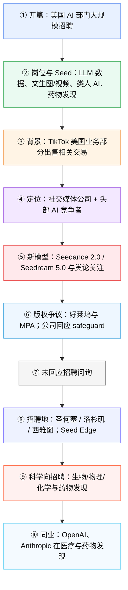

## 说明

以下内容已**删节**：原报道中涉及地缘竞争、政界与议员表态、行政部门、政党及意识形态取向的段落与结构节点已移除，**仅保留招聘、产品、版权争议与同业（OpenAI/Anthropic）对照**等商业与技术向精读。

## 前情提要

### 文章基本信息
- **文章来源**：Bloomberg（网页存档：archive.today；原站域名 **www.bloomberg.com**）
- **栏目**：Technology | AI
- **题目**：**ByteDance Building Out Artificial Intelligence Team in US**
- **作者**：**Alexandra S. Levine**
- **发布时间**：**February 19, 2026 at 1:00 PM UTC**
- **作者背景**：据 Bloomberg 作者页，**Alexandra S. Levine** 是 Bloomberg News 驻纽约记者，主要报道 **technology, social media and AI**；此前曾在 **Forbes**、**Politico** 工作，也曾在 **The New York Times** 担任专栏作者。
  来源：Bloomberg 作者页
  链接：https://www.bloomberg.com/authors/AXHpNJZtVis/alexandra-s-levine

### 文章结构信息图（删节后主线）

---

## 逐句精读

🔹**Chinese tech giant ByteDance Ltd. / is hiring in the US / for nearly 100 open roles / within its artificial intelligence division, / as it seeks to compete with leading US-based AI companies.**  

🔸**中国科技巨头字节跳动有限公司正在美国为其人工智能部门招聘近 100 个岗位，以期与领先的美国本土 AI 公司同台竞争。**

**背景注释**
- **ByteDance Ltd.（字节跳动）**：中国大型科技公司，旗下最知名产品包括 TikTok、抖音等。
- **US-based AI companies**：指总部设在美国的人工智能公司，如 OpenAI、Anthropic、Google DeepMind 等语境中的竞争者。

> **ByteDance**
> 1. 英文释义（**proper noun**）：**a Chinese multinational technology company known for platforms such as TikTok and Douyin**；**中国跨国科技公司，以 TikTok 和抖音等平台闻名**。
> 2. 语域：**新闻 / 商业 / 科技**
> 3. 画龙点睛：新闻里公司名后常接 **Ltd. / Inc. / Corp.**，阅读时要顺带识别企业性质。写作中若要避免重复，可用 **the company / the Beijing-based firm / the tech giant** 回指，增强表达的自然度与连贯性。

> **open role**
> 1. 英文释义（**noun phrase**）：**a job position that is currently available and needs to be filled**；**当前空缺、正在招聘的岗位**。
> 2. 语域：**招聘 / 商业 / 职场**
> 3. 画龙点睛：比单纯的 **job** 更偏招聘语境。常搭配 **fill an open role, post an open role, apply for an open role**。考试里常与 **vacancy / opening / position** 互换出现，但 **open role** 更偏企业招聘公告的现代表达。

> **artificial intelligence division**
> 1. 英文释义（**noun phrase**）：**the department or business unit responsible for AI-related work**；**负责人工智能相关业务的部门/事业部**。
> 2. 语域：**商业 / 科技 / 组织管理**
> 3. 画龙点睛：**division** 在公司里常指“事业部、部门”，比 **team** 规模更大。写作中可积累同类表达：**research division, cloud division, mobile division**。阅读时注意区分 **division**（部门）与 **diversification**（多元化）。

---

🔹**The positions, / which are listed on ByteDance's career page, / are for Seed, its AI team / which was established in 2023 / and now has labs across the US, Singapore and China.**  

🔸**这些岗位都发布在字节跳动的招聘页面上，隶属于其 AI 团队 Seed；该团队成立于 2023 年，目前已在美国、新加坡和中国设有实验室。**

**背景注释**
- **career page**：企业官网中的招聘页面。
- **Seed**：文中指 ByteDance 的 AI 团队名称。
- **labs**：这里不是普通“实验室”字面义，而是科技公司研究机构、研发中心的常见说法。
- **across the US, Singapore and China**：表示跨地域布局，凸显其全球研发网络。

> **career page**
> 1. 英文释义（**noun phrase**）：**the part of a company's website where job openings and recruitment information are posted**；**公司网站中发布招聘信息的页面**。
> 2. 语域：**招聘 / 商业**
> 3. 画龙点睛：求职语境非常常见。可搭配 **browse a career page, update a career page, list vacancies on the career page**。翻译时别机械译成“职业页面”，应自然处理为 **招聘页面 / 招聘官网页面**。

> **establish**
> 1. 英文释义（**verb**）：**to start or create something that is intended to last**；**建立；设立；创办**。
>    其他常见义：**to prove something clearly**；**确立，证实**。
> 2. 语域：**正式 / 新闻 / 学术**
> 3. 画龙点睛：这是考试高频动词。常见搭配 **establish a company / establish a lab / establish credibility / establish that...**。注意它既可表“建立机构”，也可表“确立事实”。熟词僻义非常重要。

> **lab**
> 1. 英文释义（**noun**）：**a laboratory; in tech, often a research center for innovation and experimentation**；**实验室；在科技语境中常指研发中心**。
> 2. 语域：**科技 / 学术 / 商业**
> 3. 画龙点睛：新闻里 **AI lab** 往往不只是物理场所，也可指研究团队。常见搭配 **research lab, AI lab, innovation lab**。写作中可与 **research center** 替换，但 **lab** 更短、更现代。

---

🔹**The open roles / highlight various job responsibilities, / including "producing international data" / for ByteDance's large language models; / advancing its popular text, image and video generation tools; / doing research to develop human-like AI; / and building science models / to help the company pursue drug discovery and design, / according to the postings.**  

🔸**根据这些招聘信息，这些空缺岗位凸显了多项工作职责，包括：为字节跳动的大语言模型“生产国际化数据”；推进其广受欢迎的文本、图像和视频生成工具；开展研究以开发类人 AI；以及构建科学模型，帮助公司推进药物发现与药物设计。**

**背景注释**
- **large language models (LLMs)**：大语言模型，基于海量文本训练，可执行生成、理解、推理等任务。
- **text, image and video generation tools**：生成式 AI 工具，分别对应文生文、文生图、视频生成等方向。
- **human-like AI**：类人 AI，这里强调更接近人类学习、互动或推理能力。
- **drug discovery and design**：药物发现与设计，AI 近年在生物医药领域的重要应用方向。

> **highlight**
> 1. 英文释义（**verb**）：**to emphasize or make something noticeable**；**突出；强调；使显眼**。
> 2. 语域：**新闻 / 学术 / 正式写作**
> 3. 画龙点睛：新闻里常用于“某事实显示/凸显了某趋势”，比 **show** 更有“重点突出”的意味。常见搭配 **highlight the importance/problem/risk/trend**。写作中是非常好用的升级词。

> **large language model**
> 1. 英文释义（**noun phrase**）：**an AI model trained on massive amounts of text to understand and generate language**；**通过海量文本训练、用于理解和生成语言的人工智能模型**。
> 2. 语域：**科技 / AI**
> 3. 画龙点睛：常缩写为 **LLM**。阅读时看到复数 **LLMs** 要能快速识别。可搭配 **train, fine-tune, deploy, evaluate**。写作中若面向非专业读者，第一次出现最好给出全称加括号缩写。

> **human-like**
> 1. 英文释义（**adjective**）：**having qualities or behaviors similar to those of humans**；**具有人类般特征的；类人的**。
> 2. 语域：**科技 / 学术 / 科普**
> 3. 画龙点睛：后缀 **-like** 很高频，表示“像……一样”。如 **childlike, machine-like, human-like**。翻译要结合语境，常译为 **类人、近似人类的**，比直译“像人的”更自然、更专业。

> **pursue**
> 1. 英文释义（**verb**）：**to try to achieve or obtain something over time**；**追求；致力于；推进**。
>    其他常见义：**to chase**；**追赶，追捕**。
> 2. 语域：**正式 / 新闻 / 学术**
> 3. 画龙点睛：这是典型熟词僻义。新闻和学术中常不是“追赶”，而是 **pursue a goal / pursue research / pursue a strategy**。翻译时常可灵活处理为 **推进、从事、开展、寻求实现**。

> **drug discovery**
> 1. 英文释义（**noun phrase**）：**the process of identifying new candidate medicines**；**发现新候选药物的过程**。
> 2. 语域：**医药 / 生物科技 / 科技新闻**
> 3. 画龙点睛：常与 **drug development** 并列，但二者不同：前者偏“发现候选药物”，后者更广，涵盖后续测试、临床、审批等。考试翻译中要避免统统笼统译成“制药”。

---

🔹**Beijing-based ByteDance's US hiring push / comes after it announced a long-awaited deal / to sell parts of its US TikTok business / to non-Chinese owners.**  

🔸**总部位于北京的字节跳动此次在美招聘扩张，是在其宣布一项期待已久的交易之后进行的；根据该交易，公司将把其美国 TikTok 业务的部分资产出售给非中国籍所有者。**

**背景注释**
- **Beijing-based**：新闻中常用“城市 + based”标明总部所在地。
- **long-awaited deal**：酝酿已久、外界等待已久的交易。
- **non-Chinese owners**：买方背景为所有权结构调整，与跨境业务重组相关。

> **hiring push**
> 1. 英文释义（**noun phrase**）：**a concentrated effort to recruit many employees in a short period**；**集中推进的大规模招聘行动**。
> 2. 语域：**商业 / 新闻**
> 3. 画龙点睛：**push** 在这里不是“推”，而是“推进行动、攻势”。常见搭配 **marketing push, reform push, hiring push**。阅读时若机械理解就容易出错，这是典型新闻义。

> **long-awaited**
> 1. 英文释义（**adjective**）：**expected for a long time and finally happening**；**期待已久的；拖延已久终于到来的**。
> 2. 语域：**新闻 / 正式写作**
> 3. 画龙点睛：可用于 **long-awaited deal / decision / report / reform**。它往往暗示过程漫长、关注度高。写作中很好用，既传递时间跨度，也带出舆论期待感。

> **address**
> 1. 英文释义（**verb**）：**to deal with a problem or issue**；**处理；应对；解决**。
>    其他义：**to speak to**；**向……讲话**；**to write an address on**；**写地址**。
> 2. 语域：**正式 / 新闻 / 学术**
> 3. 画龙点睛：这是超级高频熟词僻义。新闻里 **address concerns/issues/problems** 基本都译为 **应对/处理**，绝不是“给……写地址”。翻译中若掌握这一义，理解速度会大幅提升。

---

🔹**While ByteDance's ties to TikTok / make it best known in the US / as a social media company, / it is also a dominant AI company / and a major competitor to leading US AI firms.**  

🔸**虽然字节跳动因与 TikTok 的关联而在美国最广为人知的身份是一家社交媒体公司，但它同时也是一家占据强势地位的 AI 公司，并与美国头部 AI 公司形成重要竞争关系。**

**背景注释**
- **ties to TikTok**：与 TikTok 的联系，这里指所有权和品牌关联。
- **dominant AI company**：强调其在 AI 领域并非边缘参与者，而是有主导力或强竞争力。
- **leading US AI firms**：美国领先 AI 企业，侧重市场与产品层面的竞争格局。

> **tie to**
> 1. 英文释义（**noun phrase**）：**a connection, link, or relationship with someone or something**；**与……的联系、关联**。
> 2. 语域：**新闻 / 商业**
> 3. 画龙点睛：常见复数 **ties**。可搭配 **financial ties, family ties**。阅读时别只想到“领带”；这是典型一词多义考点。

> **dominant**
> 1. 英文释义（**adjective**）：**more important, powerful, or influential than others**；**占主导地位的；强势的**。
> 2. 语域：**商业 / 学术 / 新闻**
> 3. 画龙点睛：常见搭配 **dominant player, dominant position, dominant firm**。它不一定等于“垄断”，但往往暗示强势市场地位。写作中可替换简单词 **powerful / leading**，提升正式度。

> **pioneer**
> 1. 英文释义（**noun**）：**a person or organization that is among the first to develop or use something new**；**先驱；开拓者**。
> 2. 语域：**正式 / 新闻 / 学术**
> 3. 画龙点睛：可作名词也可作动词。常见搭配 **AI pioneer, pioneer in the field, pioneer new methods**。翻译成“先锋”有时太文学化，科技新闻中通常译为 **先驱/开拓者** 更稳。

---

🔹**ByteDance's chatbot app Doubao — / akin to OpenAI's ChatGPT, Anthropic PBC's Claude and Google's Gemini — / was China's most-downloaded AI chatbot / for most of 2025, / according to Bloomberg Intelligence.**  

🔸**据 Bloomberg Intelligence 称，字节跳动的聊天机器人应用豆包——与 OpenAI 的 ChatGPT、Anthropic PBC 的 Claude 以及 Google 的 Gemini 属于同类产品——在 2025 年的大部分时间里都是中国下载量最高的 AI 聊天机器人。**

**背景注释**
- **Doubao（豆包）**：字节跳动的 AI 聊天机器人应用。
- **akin to**：表示“类似于”，常见于较正式比较说明。
- **Anthropic PBC**：Anthropic 是美国 AI 公司；**PBC** 指 **Public Benefit Corporation**，即公益型公司架构。
- **Bloomberg Intelligence**：Bloomberg 的研究分析部门，提供行业与市场分析。

> **chatbot**
> 1. 英文释义（**noun**）：**a computer program or AI system designed to simulate conversation with users**；**聊天机器人；对话式人工智能程序**。
> 2. 语域：**科技 / 商业**
> 3. 画龙点睛：是当前科技阅读高频词。可搭配 **AI chatbot, launch a chatbot, chatbot app, chatbot interface**。写作中若想更学术，可换成 **conversational AI system**。

> **akin to**
> 1. 英文释义（**adjective phrase**）：**similar to something**；**类似于；近似于**。
> 2. 语域：**正式 / 书面**
> 3. 画龙点睛：比 **like** 更书面，也更常见于新闻和学术。结构通常是 **be akin to + 名词/动名词**。翻译时可灵活处理为 **堪比、类似于、相当于**。

> **most-downloaded**
> 1. 英文释义（**compound adjective**）：**downloaded more times than any comparable product**；**下载量最高的**。
> 2. 语域：**商业 / 科技 / 新闻**
> 3. 画龙点睛：新闻中常用连字符复合形容词，如 **US-based, long-awaited, most-downloaded**。阅读时要整体识别，别拆碎。写作中恰当使用复合形容词，能明显提升英文的凝练度。

---

🔹**In February, / ByteDance launched a new AI video generation model, Seedance 2.0, / and image generation model, Seedream 5.0.**  

🔸**在 2 月，字节跳动推出了新的 AI 视频生成模型 Seedance 2.0，以及图像生成模型 Seedream 5.0。**

**背景注释**
- **video generation model / image generation model**：生成式 AI 的两类核心模型。
- **launch**：科技公司新品发布时的标准新闻用词。
- **2.0 / 5.0**：版本号，通常暗示迭代升级。

> **launch**
> 1. 英文释义（**verb**）：**to introduce a new product, service, or initiative to the public**；**推出；发布**。
>    其他义：**to send off forcibly**；**发射**。
> 2. 语域：**商业 / 科技 / 新闻**
> 3. 画龙点睛：新闻里极高频，常见搭配 **launch a product / model / campaign / initiative**。别只记“发射”；在商业报道中几乎总是“发布、推出”。

> **generation model**
> 1. 英文释义（**noun phrase**）：**an AI model that creates new content such as text, images, audio, or video**；**能够生成文本、图像、音频或视频等新内容的 AI 模型**。
> 2. 语域：**科技 / AI**
> 3. 画龙点睛：常与具体媒介搭配形成 **text generation model / image generation model / video generation model**。翻译时注意它不是“世代模型”，而是“生成模型”。

---

🔹**Those launches, / just weeks after the TikTok deal closed, / have thrust ByteDance back into the spotlight in the US.**  

🔸**这些发布发生在 TikTok 交易完成仅仅数周之后，已将字节跳动再次推回美国舆论的聚光灯下。**

**背景注释**
- **deal closed**：交易完成、正式落地。
- **back into the spotlight**：重新成为关注焦点，是媒体报道常见表达。
- 本句承接上文，说明新模型发布在媒体与舆论层面受到高度关注。

> **close a deal / a deal closes**
> 1. 英文释义（**verb phrase**）：**to complete or finalize a business transaction**；**完成交易；使交易正式落地**。
> 2. 语域：**商业 / 金融 / 新闻**
> 3. 画龙点睛：**close** 在商业里常表示“完成交易”，不是“关闭”。如 **The acquisition closed in May.** 这是财经阅读高频义，务必熟练掌握。

> **thrust ... into the spotlight**
> 1. 英文释义（**verb phrase**）：**to suddenly place someone or something in a position of public attention**；**把……猛然推到公众关注的中心**。
> 2. 语域：**新闻 / 正式写作**
> 3. 画龙点睛：很有力度的表达。**spotlight** 常与媒体曝光、舆论焦点连用。写作中用它比 **make...famous** 或 **draw attention to** 更凝练、更像新闻英语。

---

🔹**Hollywood heavyweights / have accused ByteDance / of stealing intellectual property with Seedance, / which has already been used / to spin up viral alternate endings / to popular television shows / and fake movie scenes / with A-list actors.**  

🔸**好莱坞重量级人物已经指责字节跳动借助 Seedance 窃取知识产权；该模型已经被用来快速炮制热门电视剧的病毒式“另类结局”，以及由一线明星出演的伪造电影场景。**

**背景注释**
- **Hollywood heavyweights**：好莱坞有分量的人物/机构，可指大型制片公司、高层、知名创作者等。
- **intellectual property (IP)**：知识产权，包括版权、商标、专利等；此处重点是影视版权与角色形象等。
- **viral alternate endings**：在社交平台迅速传播的“另类结局”二创内容。
- **A-list actors**：一线演员，知名度和商业价值最高的演员群体。

> **heavyweight**
> 1. 英文释义（**noun**）：**an important and influential person or organization in a particular field**；**重量级人物；有重大影响力的人/机构**。
> 2. 语域：**新闻 / 商业 / 文体**
> 3. 画龙点睛：不是只指拳击“重量级”。新闻里经常比喻“大佬、巨头”。如 **industry heavyweight**。翻译时可按语境处理为 **重量级人物/巨头**。

> **intellectual property**
> 1. 英文释义（**noun phrase**）：**creations of the mind protected by law, such as copyrights, patents, and trademarks**；**受法律保护的智力成果，如版权、专利和商标等**。
> 2. 语域：**法律 / 商业 / 科技**
> 3. 画龙点睛：常缩写 **IP**。注意英语中 **property** 不是狭义“房产”，这里是“财产权”。写作可搭配 **infringe intellectual property, protect IP rights, IP dispute**。

> **spin up**
> 1. 英文释义（**phrasal verb**）：**to create or produce something quickly, often with little delay**；**迅速做出；快速生成**。
> 2. 语域：**口语化商业 / 科技 / 新闻引述**
> 3. 画龙点睛：本义可用于“启动机器/服务”，科技语境里常引申为“快速搭建、快速生成”。是很地道的现代英语表达。阅读时不要只按字面“旋转起来”理解。

> **viral**
> 1. 英文释义（**adjective**）：**spreading quickly and widely on the internet**；**在网络上迅速传播的，爆红的**。
> 2. 语域：**互联网 / 媒体 / 新闻**
> 3. 画龙点睛：现代高频词。与医学上的“病毒性的”不同，社媒语境中指“爆火传播”。常见搭配 **go viral, viral video, viral trend**。写作时非常实用。

> **A-list**
> 1. 英文释义（**adjective**）：**belonging to the most famous and successful group of entertainers**；**一线的；顶级的（尤指演艺人士）**。
> 2. 语域：**娱乐 / 新闻**
> 3. 画龙点睛：常见于娱乐报道，如 **A-list actor / celebrity / star**。翻译时用 **一线、顶级、头部** 都可，需根据语境选择最自然的中文表达。

---

🔹**Within days of Seedance's availability, / Walt Disney Co. and Paramount Skydance Corp. / sent ByteDance cease-and-desist letters, / and the Motion Picture Association — / which counts companies like Netflix Inc. and Warner Bros. Discovery Inc. / among its members — / demanded that ByteDance stop / "unauthorized use of U.S. copyrighted works / on a massive scale."**  

🔸**在 Seedance 上线后的几天之内，华特迪士尼公司和派拉蒙 Skydance 公司就向字节跳动发出了停止并终止函；与此同时，美国电影协会——其成员包括 Netflix 和 Warner Bros. Discovery 等公司——要求字节跳动停止“大规模未经授权使用美国受版权保护作品”的行为。**

**背景注释**
- **Walt Disney Co.**：华特迪士尼公司，美国大型娱乐传媒集团。
- **Paramount Skydance Corp.**：文中所指影视公司实体。
- **cease-and-desist letter**：法律函件，要求对方停止涉嫌侵权或违法行为。
- **Motion Picture Association (MPA)**：美国电影协会，代表多家主要影视公司利益。
- **copyrighted works**：受版权保护的作品。
- 本句体现争议从舆论层面迅速上升到法律警告层面。

> **availability**
> 1. 英文释义（**noun**）：**the state of being available for use or access**；**可获得性；可用状态；上线可访问状态**。
> 2. 语域：**科技 / 商业 / 法律**
> 3. 画龙点睛：产品场景里常指“上线后可供公众使用”。与 **accessibility** 不同，前者侧重“是否可用/是否上市”，后者更偏“可接近性、无障碍性”。

> **cease-and-desist letter**
> 1. 英文释义（**noun phrase**）：**a legal notice demanding that someone stop an allegedly unlawful activity**；**要求对方停止涉嫌违法行为的律师函/停止侵权函**。
> 2. 语域：**法律 / 商业 / 新闻**
> 3. 画龙点睛：这是法律新闻高频词组。翻译通常用 **停止并终止函、停止侵权函、警告函**。阅读时看到它，通常意味着争议已进入法律施压阶段，而不只是公开表态。

> **unauthorized**
> 1. 英文释义（**adjective**）：**not officially permitted or approved**；**未经授权的；未获许可的**。
> 2. 语域：**法律 / 商业 / 正式写作**
> 3. 画龙点睛：常与 **use, access, disclosure, distribution** 搭配。与 **illegal** 不完全等同：**unauthorized** 更强调“未获许可”，法律判断可能进一步展开。

> **on a massive scale**
> 1. 英文释义（**phrase**）：**in very large quantities or across a very broad scope**；**大规模地；在极广范围内**。
> 2. 语域：**新闻 / 正式写作**
> 3. 画龙点睛：新闻评论中常用于强调严重性。可搭配 **fraud on a massive scale / data collection on a massive scale**。写作中比简单的 **a lot** 高级得多。

---

🔹**"ByteDance respects intellectual property rights / and we have heard the concerns regarding Seedance 2.0," / a spokesperson wrote in an email.**  

🔸**“字节跳动尊重知识产权，我们也已经听到了外界对 Seedance 2.0 的担忧，”一位发言人在电子邮件中写道。**

**背景注释**
- **spokesperson**：发言人，代表机构对外回应。
- **regarding**：正式用法，相当于 “about / concerning”。

> **respect intellectual property rights**
> 1. 英文释义（**verb phrase**）：**to acknowledge and comply with legal ownership of creative works and inventions**；**尊重并遵守知识产权权利**。
> 2. 语域：**法律 / 公关 / 商业**
> 3. 画龙点睛：企业回应版权争议时的标准表述。写作中可积累同类官方表达：**take concerns seriously, remain committed to compliance, strengthen safeguards**，这类套语在新闻与商务英语里很常见。

> **regarding**
> 1. 英文释义（**preposition**）：**about; concerning**；**关于；就……而言**。
> 2. 语域：**正式 / 书面**
> 3. 画龙点睛：比 **about** 更正式，适合新闻与学术写作。可用于句中压缩结构，如 **questions regarding safety, debate regarding regulation**。正式写作很实用。

---

🔹**"We are taking steps / to strengthen current safeguards / as we work to prevent the unauthorized use / of intellectual property and likeness / by users."**  

🔸**“我们正在采取措施，加强现有防护机制；同时也在努力防止用户未经授权使用知识产权内容以及他人肖像。”**

**背景注释**
- **safeguards**：保护机制、防范措施，常用于合规、风控、技术防护语境。
- **likeness**：法律语境中常指个人肖像、外貌形象、可识别人格形象。
- **by users**：强调侵权行为可能由平台用户实施，企业在表述上将责任部分指向用户侧使用。

> **take steps to**
> 1. 英文释义（**verb phrase**）：**to take action in order to achieve or prevent something**；**采取措施以……**。
> 2. 语域：**正式 / 公关 / 新闻**
> 3. 画龙点睛：这是功能极强的写作句型。可搭配 **take steps to improve / address / reduce / prevent**。在议论文和新闻摘要中都很好用，表达稳妥又正式。

> **safeguard**
> 1. 英文释义（**noun**）：**a measure taken to protect something from harm, abuse, or risk**；**保护措施；防护机制**。
>    （**verb**）**to protect**；**保护，保障**。
> 2. 语域：**法律 / 政策 / 科技 / 公关**
> 3. 画龙点睛：名动两用。企业声明中常见 **implement safeguards, strengthen safeguards, privacy safeguards**。比 **protection** 更正式，也更强调制度化、机制化防护。

> **likeness**
> 1. 英文释义（**noun**）：**a person's appearance or image, especially as represented in a photo, video, or artwork**；**肖像；外貌形象；可识别的人物形象**。
> 2. 语域：**法律 / 娱乐 / 媒体**
> 3. 画龙点睛：在 AI、影视、广告语境中很重要，常见于 **use of name, image, and likeness**。不要只记“相似”，这里是法律专门义，翻译成 **肖像/形象权相关内容** 更准确。

---

🔹**The company didn't respond / to questions about the AI job postings.**  

🔸**该公司没有回应有关这些 AI 招聘岗位的问题。**

**背景注释**
- 新闻报道中 **didn't respond to questions** 是标准记者表述，表示记者已联系，但对方未正面回复。
- **job postings**：招聘启事、岗位发布信息。

> **respond to**
> 1. 英文释义（**verb phrase**）：**to reply to or react to something**；**回应；答复；对……作出反应**。
> 2. 语域：**通用 / 新闻 / 正式**
> 3. 画龙点睛：新闻里常见 **declined to comment** 与 **didn't respond to questions**，后者通常更中性。写作时注意介词 **to**，很多学习者容易漏掉。

> **posting**
> 1. 英文释义（**noun**）：**an official notice or announcement placed online; here, a job advertisement**；**网上发布的信息；此处指招聘启事**。
> 2. 语域：**互联网 / 招聘 / 商业**
> 3. 画龙点睛：**job posting** 是招聘固定搭配。别误解为“岗位派驻”。在职场英语中，**post a job / job posting / job post** 都很高频。

---

🔹**"It has all the ingredients / to be an AI powerhouse, / so it shouldn't be a surprise / to industry observers / that it is now emerging as one."**  

🔸**“它具备成为 AI 巨头级玩家的一切要素，因此，如今它正崛起为这样一股力量，业界观察者不应感到意外。”**

**背景注释**
- **ingredients**：这里是比喻义，不是“食材”，而是“构成成功的关键要素”。
- **AI powerhouse**：AI 强者、AI 重镇、AI 巨头式力量。
- **emerge as**：开始显现为、崛起为。

> **ingredient**
> 1. 英文释义（**noun**）：**one of the necessary parts or factors for achieving something**；**要素；因素；必要条件**。
>    其他义：**a food item used in cooking**；**食材**。
> 2. 语域：**通用 / 新闻 / 比喻表达**
> 3. 画龙点睛：这里是熟词僻义。英语常把成功因素比作“ingredients”。如 **the ingredients for success**。考试中若只会“原料、配料”，就会误判语义层次。

> **powerhouse**
> 1. 英文释义（**noun**）：**a person, company, or country that is extremely strong and successful in a particular field**；**强者；巨头；实力雄厚的主体**。
> 2. 语域：**新闻 / 商业 / 评论**
> 3. 画龙点睛：新闻里很常见，如 **economic powerhouse, tech powerhouse, AI powerhouse**。翻译要结合对象灵活处理为 **强国、巨头、强者、重镇**，不要拘泥于单一对应词。

> **emerge as**
> 1. 英文释义（**verb phrase**）：**to become recognized as something over time**；**显现为；崛起为；逐渐成为**。
> 2. 语域：**正式 / 新闻**
> 3. 画龙点睛：这是描述“新格局形成”的高频结构。常见于 **emerge as a leader / major player**。写作中很适合总结趋势变化。

---

🔹**The ByteDance Seed team / is hiring / in San Jose, California, Los Angeles and Seattle, / where TikTok also has large offices.**  

🔸**字节跳动的 Seed 团队正在加州圣何塞、洛杉矶以及西雅图招聘，而 TikTok 在这些地方也都设有大型办公室。**

**背景注释**
- **San Jose**：美国加州圣何塞，硅谷核心城市之一。
- **Los Angeles**：洛杉矶，美国娱乐产业中心。
- **Seattle**：西雅图，美国科技重镇之一。
- 地点选择说明 ByteDance 的招聘瞄准美国科技与内容产业人才集中地。

> **hire**
> 1. 英文释义（**verb**）：**to employ someone for a job**；**雇用；招聘**。
> 2. 语域：**通用 / 商业 / 招聘**
> 3. 画龙点睛：新闻里可直接说 **The company is hiring in...**，表示“正在某地招人”。可搭配 **hire engineers, hire aggressively, hire for multiple roles**。非常实用。

> **office**
> 1. 英文释义（**noun**）：**a place where business is conducted; in company reporting, often a regional site or workplace hub**；**办公室；办事处；办公点**。
> 2. 语域：**通用 / 商业**
> 3. 画龙点睛：商业报道中复数 **offices** 常表示“地区办公布局”。如 **have offices in London and New York**。可自然译为 **设有办公室/办事处/办公点**。

---

🔹**ByteDance is also launching / the Seed Edge Research Initiative, / which "focuses on developing general intelligence models — / models that possess human-like learning abilities, / interaction capabilities, / and tool-use proficiency," / according to one posting.**  

🔸**根据一则招聘信息，字节跳动还将启动 Seed Edge Research Initiative，该项目“专注于开发通用智能模型——即具有人类般学习能力、交互能力以及工具使用熟练度的模型”。**

**背景注释**
- **Research Initiative**：研究计划、研究倡议、专项研发项目。
- **general intelligence models**：通用智能模型，指不仅在单一任务上强，而是在学习、交互、工具使用等方面更全面的模型。
- **tool-use proficiency**：工具使用能力，AI 近年常指模型调用搜索、代码执行、外部工具等能力。

> **initiative**
> 1. 英文释义（**noun**）：**a new plan or action intended to solve a problem or achieve a goal**；**倡议；计划；专项行动**。
> 2. 语域：**商业 / 政策 / 新闻**
> 3. 画龙点睛：常见搭配 **launch an initiative, research initiative, policy initiative**。比 **plan** 更正式，也更常带有组织性和战略意味。

> **general intelligence**
> 1. 英文释义（**noun phrase**）：**broad, flexible intelligence that can be applied across many tasks and situations**；**通用智能；可跨任务迁移的广泛智能能力**。
> 2. 语域：**AI / 学术 / 科技**
> 3. 画龙点睛：与狭义、专门任务能力形成对比。阅读时常与 **AGI**（artificial general intelligence）有关联。翻译要避免过度泛化，通常保留为 **通用智能** 最准确。

> **capability**
> 1. 英文释义（**noun**）：**the ability or power to do something**；**能力；本领**。
> 2. 语域：**正式 / 科技 / 商业**
> 3. 画龙点睛：比 **ability** 更正式，也更常用于系统、机构、技术的客观能力描述。常见搭配 **core capabilities, interaction capabilities**。

> **proficiency**
> 1. 英文释义（**noun**）：**a high degree of skill or competence**；**熟练；精通**。
> 2. 语域：**正式 / 教育 / 职业**
> 3. 画龙点睛：比 **skill** 更强调“熟练程度高”。常搭配 **language proficiency, technical proficiency, tool-use proficiency**。写作中用来替代简单词 **good at** 很加分。

---

🔹**ByteDance has also been ramping up / its science-focused efforts, / hiring US talent / with backgrounds in biology, physics and chemistry / "to develop open, high-precision, generalizable models / that drive breakthroughs / in biology and drug discovery," / according to one current job listing.**  

🔸**根据一则当前招聘启事，字节跳动也一直在加码其以科学为导向的工作，招聘具有生物、物理和化学背景的美国人才，“以开发开放、高精度、可泛化的模型，从而推动生物学和药物发现领域的突破”。**

**背景注释**
- **ramp up**：加速推进、加大力度。
- **science-focused efforts**：面向科学研究的投入与项目。
- **generalizable models**：可泛化模型，指能在新数据、新任务上保持有效性的模型。
- **breakthroughs**：重大突破，科研报道高频词。

> **ramp up**
> 1. 英文释义（**phrasal verb**）：**to increase the level, amount, or speed of something**；**加快；扩大；提升力度**。
> 2. 语域：**商业 / 新闻 / 口语化正式表达**
> 3. 画龙点睛：新闻里非常常见，如 **ramp up production / hiring / investment / pressure**。比 **increase** 更有“持续加码、提速推进”的动态感，值得重点积累。

> **high-precision**
> 1. 英文释义（**adjective**）：**having a very high level of exactness or accuracy**；**高精度的**。
> 2. 语域：**科学 / 工程 / 技术**
> 3. 画龙点睛：复合形容词结构常见于科技写作。可迁移记忆 **high-speed, low-cost, large-scale, high-precision**。阅读时要整体识别，不宜逐词拆译。

> **generalizable**
> 1. 英文释义（**adjective**）：**able to be applied effectively to other cases, tasks, or situations**；**可泛化的；可推广适用的**。
> 2. 语域：**学术 / 机器学习 / 科技**
> 3. 画龙点睛：是科研和 ML 文章里的重要词。名词是 **generalizability**。很多学习者认识 **general**，却不熟悉这一派生词；这是很典型的高阶学术词汇。

> **breakthrough**
> 1. 英文释义（**noun**）：**an important advance or discovery**；**重大突破**。
> 2. 语域：**科学 / 新闻 / 商业**
> 3. 画龙点睛：常见搭配 **make a breakthrough, breakthrough in cancer research, breakthrough technology**。这是写科技报道和科技作文非常实用的核心词。

---

🔹**Health care and drug discovery / are areas / where American AI competitors / are also investing heavily.**  

🔸**医疗保健和药物发现，也是美国 AI 竞争对手正在大举投入的领域。**

**背景注释**
- **invest heavily**：大力投资、重金投入。
- 本句起承上启下作用，把 ByteDance 的科学布局与美国同行放在同一赛道中比较。

> **invest heavily**
> 1. 英文释义（**verb phrase**）：**to commit a large amount of money, effort, or resources to something**；**大举投资；大力投入资源**。
> 2. 语域：**商业 / 新闻**
> 3. 画龙点睛：副词 **heavily** 在商业里很有力量，表示“程度很大”。可搭配 **invest heavily in AI / R&D / infrastructure**。写作中比 **invest a lot** 更自然专业。

> **area**
> 1. 英文释义（**noun**）：**a field or subject of activity, study, or business**；**领域；方向**。
> 2. 语域：**通用 / 学术 / 商业**
> 3. 画龙点睛：这里不是地理“区域”，而是抽象义“领域”。如 **an area of research / an area of concern**。这是基础词的高频抽象义，阅读中必须反应迅速。

---

🔹**OpenAI Chief Executive Officer Sam Altman / announced OpenAI for Healthcare in January, / and said earlier this month / that his company may consider investing in / or subsidizing firms / that use OpenAI's technology / for drug discovery.**  

🔸**OpenAI 首席执行官 Sam Altman 于 1 月宣布推出 OpenAI for Healthcare，并在本月早些时候表示，他的公司可能会考虑投资或补贴那些将 OpenAI 技术用于药物发现的企业。**

**背景注释**
- **Chief Executive Officer (CEO)**：首席执行官。
- **OpenAI for Healthcare**：从字面看是 OpenAI 面向医疗健康领域的项目/计划名称。
- **subsidize**：提供补贴，说明支持形式不止于直接投资。
- **earlier this month**：本月早些时候，新闻中的相对时间表达。

> **announce**
> 1. 英文释义（**verb**）：**to make something known publicly**；**宣布；发布**。
> 2. 语域：**新闻 / 商业 / 正式**
> 3. 画龙点睛：极高频新闻动词。常见结构 **announce that... / announce a plan / announce the launch of...**。写作时可与 **declare** 区分：前者更中性、日常商业化。

> **subsidize**
> 1. 英文释义（**verb**）：**to support something financially, usually by paying part of the cost**；**补贴；资助**。
> 2. 语域：**经济 / 政策 / 商业**
> 3. 画龙点睛：名词是 **subsidy**。常见搭配 **subsidize farmers / energy / users / firms**。在商业战略语境中，它意味着企业可能通过让利来推动生态扩张。

---

🔹**Anthropic, / which recently announced Claude for Life Sciences / and Claude for Healthcare, / is also supporting uses of its AI / aimed at accelerating drug discovery and development.**  

🔸**Anthropic 最近宣布推出 Claude for Life Sciences 和 Claude for Healthcare，同时也在支持将其 AI 用于加速药物发现与开发的各种应用。**

**背景注释**
- **Anthropic**：美国 AI 公司，Claude 是其代表性模型/产品系列。
- **Life Sciences**：生命科学，通常包括生物学、生物医药等。
- **drug discovery and development**：药物发现与开发，后者比单纯 discovery 覆盖范围更广。

> **aimed at**
> 1. 英文释义（**phrase**）：**intended to achieve a particular purpose**；**旨在；目的是**。
> 2. 语域：**正式 / 新闻 / 学术**
> 3. 画龙点睛：可接名词或动名词，如 **aimed at reducing costs / aimed at growth**。是议论文和新闻中连接“措施—目的”的高频结构。

> **accelerate**
> 1. 英文释义（**verb**）：**to make something happen faster**；**加速；促进提速**。
> 2. 语域：**科技 / 商业 / 学术**
> 3. 画龙点睛：比 **speed up** 更正式。常见搭配 **accelerate innovation / growth / adoption / drug discovery**。写作中是非常万能的升级词。

> **development**
> 1. 英文释义（**noun**）：**the process of growth, improvement, or further creation; in pharma, the stages after discovery toward usable drugs**；**发展；开发；在医药语境中指从发现后走向可用药物的后续开发过程**。
> 2. 语域：**通用 / 科技 / 医药**
> 3. 画龙点睛：这是典型多义词。与 **drug discovery** 并列时，**development** 不能简单译成“发展”，而应译为 **开发**，体现药物研发流程意识。

---

## 参考来源
- Bloomberg 作者页：Alexandra S. Levine
  https://www.bloomberg.com/authors/AXHpNJZtVis/alexandra-s-levine

---

## 附注
- 原文在 **Bloomberg**（**www.bloomberg.com**）发布；你提到以 **archive.today** 存档阅读，但未附具体存档 URL；`source_url` 暂空，若你补充链接可再写入 frontmatter。
- 本篇已删去原稿中政界、地缘与意识形态相关句段；若需逐句对照原文全文，请查阅 Bloomberg 原文。
- 后续可在此文基础上增补：**全文高频词汇总表**、**长难句语法总复盘**、**雅思/考研写作表达迁移清单**。
