## 基本信息

- 文章来源：Arknights: Endfield 官方网站
- 题目：**《「春晓时」核心章节版本研发通讯》**
- 发布时间：**2026年4月13日 11:00**
- 作者署名：**《明日方舟：终末地》项目组**
- 作者背景简介：该署名通常指《明日方舟：终末地》的官方开发团队，即由**鹰角网络（Hypergryph）**负责该项目的策划、叙事、系统设计、程序、美术、运营沟通等成员共同对外发布的官方开发通讯。此类“项目组”署名不对应单一自然人作者，而是代表游戏官方团队的集体发声，常用于版本前瞻、开发进展说明、系统优化公告与测试沟通。
- 参考链接：
  - 官方原文：https://endfield.hypergryph.com/news/4781
  - 官方站点：https://endfield.hypergryph.com/

---

## 前情提要

```mermaid
flowchart TB
    A["文章定位<br/>Official dev update<br/>官方版本研发通讯"]:::a
    B["开场说明<br/>版本名：春晓时<br/>开启时间：4月17日"]:::b
    C["集成工业系统与地区建设优化<br/>Industrial system & regional construction"]:::c
    D["战斗体验优化<br/>Combat experience"]:::d
    E["交互与易用性优化<br/>Interaction & usability"]:::e
    F["养成体验优化<br/>Progression & cultivation"]:::f
    G["月卡焕新与赠礼活动<br/>Monthly card refresh & gifts"]:::g
    H["辉光庆典特殊寻访<br/>Special banner / recruitment"]:::h
    I["仍在开发中的优化内容<br/>More features in development"]:::i
    J["结尾致谢与剧情召唤<br/>Return to Talos-II"]:::j

    A --> B
    B --> C
    B --> D
    B --> E
    B --> F
    B --> G
    B --> H
    B --> I
    I --> J

    C --> C1["总控事项：一键收产/排产/线索"]
    C --> C2["资源回收站：4级远程一键收取"]
    C --> C3["仓储节点：按地区筛选委托"]
    C --> C4["地下暗管：移动接口不断连"]
    C --> C5["蓝图分享：文本自动带名称"]

    D --> D1["危境再现：新增计时显示"]
    D --> D2["终结技：剩余持续时间提示"]

    E --> E1["装备制造：快捷跳转+批量制作"]
    E --> E2["高阶培养自选箱：缺料直跳并预填数量"]
    E --> E3["训练奖励：已掌握可直接领取"]
    E --> E4["素材获取：可跳转协议空间入口"]
    E --> E5["手柄键位：支持自定义替换"]
    E --> E6["满潜能特效：显示开关"]
    E --> E7["跳过动画：流程简化"]

    F --> F1["理智消耗许可：新增多种获取途径"]
    F --> F2["干员培养助力：达标返还素材"]

    G --> G1["月卡日常奖励追加理智消耗许可"]
    G --> G2["4月11日至维护前：补发对应许可"]
    G --> G3["曾购月卡用户：额外补偿120"]
    G --> G4["焕新月卡赠礼：至2026年5月18日4:00"]

    H --> H1["2026年5月14日开启"]
    H --> H2["6星池：莱万汀/洁尔佩塔/艾尔黛拉/骏卫"]
    H --> H3["保底独立：10抽5星+，80抽6星"]
    H --> H4["30/60/120/240抽对应额外奖励"]

    I --> I1["装备批量精锻"]
    I --> I2["基质愿望单与完美搭配标记"]
    I --> I3["任务列表优先显示叙事活动支线"]
    I --> I4["主界面待办汇总入口"]
    I --> I5["手柄与键鼠无缝切换"]
    I --> I6["备用电源功能"]
    I --> I7["武陵电力连接优化"]

    classDef a fill:#dbeafe,stroke:#1d4ed8,color:#111;
    classDef b fill:#ede9fe,stroke:#7c3aed,color:#111;
    classDef c fill:#dcfce7,stroke:#16a34a,color:#111;
    classDef d fill:#fee2e2,stroke:#dc2626,color:#111;
    classDef e fill:#fef3c7,stroke:#d97706,color:#111;
    classDef f fill:#e0f2fe,stroke:#0284c7,color:#111;
    classDef g fill:#fae8ff,stroke:#c026d3,color:#111;
    classDef h fill:#ffe4e6,stroke:#e11d48,color:#111;
    classDef i fill:#ecfccb,stroke:#65a30d,color:#111;
    classDef j fill:#f3f4f6,stroke:#4b5563,color:#111;
```

---

## 逐句精读

🔸 亲爱的`管理员`：
🔹 Dear `Administrator`,

背景注释：
- “管理员”是《明日方舟：终末地》中官方对玩家/指挥者身份的称呼，类似许多游戏中的“Doctor”“Commander”或“Traveler”，带有世界观设定色彩。

> **`administrator` n. 管理员；行政管理者**
>
> 1. English definition: a person responsible for running an organization, system, or operation；中文：负责管理某一组织、系统或事务的人。
> 2. 语域：正式；行政；游戏本地化常用。
> 3. 画龙点睛：`administrator` 比 `manager` 更正式，也更偏“系统/组织管理者”身份。在游戏语境中常被用作玩家头衔，带有设定感。注意它也常指“系统管理员”。常见搭配：`system administrator`、`database administrator`、`school administrator`。

---

🔸 这里是《明日方舟：终末地》`项目组`。
🔹 This is the `Arknights: Endfield development team`.

背景注释：
- 《明日方舟：终末地》是鹰角网络旗下的游戏项目。
- “项目组”在中文互联网与游戏公告中常指负责该产品开发与沟通的官方团队，不是单一作者。

> **`development team` n. 开发团队；项目组**
>
> 1. English definition: a group of people responsible for creating and improving a product or project；中文：负责开发、完善某一产品或项目的团队。
> 2. 语域：正式；商业；科技；游戏开发。
> 3. 画龙点睛：`development team` 是非常高频的职场与科技表达，既可指软件团队，也可指游戏团队。写作中若强调“研发”可用 `R&D team`；若强调“项目”可用 `project team`。公告中它常体现“官方集体发声”，而非个人观点。

---

🔸 此刻，`春景已至`，前路仍长，《明日方舟：终末地》核心章节版本「`春晓时`」/ 也将于`4月17日`开启。
🔹 At this moment, / as `spring has arrived` yet the road ahead remains long, / Arknights: Endfield’s core chapter version, `Spring Dawn`, / is also set to launch on `April 17`.

背景注释：
- “春晓时”是本次核心章节版本名，带有较强文学化、季节化命名风格。
- “核心章节版本”通常指主线推进与系统优化兼具的重要版本。
- 这里的“4月17日”是公告中明确给出的开启日期。

> **`spring has arrived` phr. 春天已至**
>
> 1. English definition: spring has come; a poetic way to indicate seasonal renewal；中文：春天已经到来，常带有抒情意味。
> 2. 语域：文学；宣传；书面。
> 3. 画龙点睛：比起普通的 `it is spring`，`spring has arrived` 更有“时令已至、气氛已成”的文艺色彩。适合写作中描写季节转折、氛围烘托。可替换表达：`spring is in the air`、`with the arrival of spring`。

> **`the road ahead remains long` phr. 前路仍长**
>
> 1. English definition: there is still a long way to go; much work or progress remains；中文：未来仍有很长的路要走，事情尚未完成。
> 2. 语域：正式；演讲；宣传；新闻。
> 3. 画龙点睛：这是很典型的抽象比喻表达，适合写作中表示“任务仍艰巨”“进展尚未完成”。英语里可灵活替换为 `there is still much to be done`。考试翻译时注意不要死译成“前面的路很长”，而应译出“未来仍任重道远”。

> **`launch` v. 启动；推出；上线**
>
> 1. English definition: to officially start, release, or introduce something；中文：正式启动、发布或推出某事物。
> 2. 语域：正式；商业；科技；产品发布。
> 3. 画龙点睛：`launch` 是产品、活动、版本公告中的核心词。常见搭配：`launch a new version`、`product launch`、`launch event`。注意它既可作动词，也可作名词。比 `start` 更正式、更具“发布”意味。

---

🔸 通过本期`研发通讯`，/ 我们将为管理员介绍 / 即将在此版本中上线的 / 一系列`优化与调整`。
🔹 Through this `development update`, / we will introduce to all Administrators / a series of `optimizations and adjustments` / that will go live in this version.

背景注释：
- “研发通讯”可理解为开发团队向玩家发布的阶段性开发说明，常用于版本前瞻、系统说明与改动汇总。
- “上线”在互联网/游戏中即正式实装、发布到可体验版本。

> **`development update` n. 研发通讯；开发进展说明**
>
> 1. English definition: an official communication explaining development progress or upcoming changes；中文：说明开发进展或即将到来的改动的官方通报。
> 2. 语域：正式；产品；游戏运营。
> 3. 画龙点睛：这是公告翻译中很实用的表达。若偏社区化，可用 `dev update`；若更正式，可用 `development briefing` 或 `developer update`。写作时注意区分 `update` 作名词“更新说明”和作动词“更新”。

> **`optimization` n. 优化**
>
> 1. English definition: the process of making something work better or more efficiently；中文：使某事物运行得更好、更高效的过程。
> 2. 语域：正式；科技；工程；产品。
> 3. 画龙点睛：`optimization` 是技术、产品、运营文体里的高频词。注意它不等于简单的“change”；它强调“朝更优方向改进”。常见搭配：`performance optimization`、`workflow optimization`、`system optimization`。写作中可与 `improvement` 区分：前者更专业，后者更宽泛。

> **`adjustment` n. 调整**
>
> 1. English definition: a small change made to improve or correct something；中文：为改进或修正而做出的调整。
> 2. 语域：通用；正式；政策；产品。
> 3. 画龙点睛：`adjustment` 常暗示“非颠覆性改动”，适合公告语气。搭配如 `policy adjustment`、`price adjustment`、`balance adjustment`。考试中要注意与 `adaptation` 区分：`adjustment` 是改动本身，`adaptation` 更偏“适应”。

---

🔸 `集成工业系统`与`地区建设`优化
🔹 Optimizations to the `integrated industrial system` and `regional construction`

背景注释：
- 这是小节标题，概括后续若干系统性改动。
- “集成工业系统”体现本作区别于传统角色扮演玩法的经营/建造特征。

> **`integrated` adj. 集成的；整合的**
>
> 1. English definition: combined into a unified whole；中文：整合为一个整体的。
> 2. 语域：正式；科技；工程；商业。
> 3. 画龙点睛：`integrated` 很适合写作中表达“系统整合”“一体化”。搭配：`integrated system`、`integrated approach`、`integrated platform`。不要和 `integral` 混淆，后者更偏“不可或缺的”。

> **`regional construction` n. 地区建设**
>
> 1. English definition: development and building work carried out within a region or area；中文：在某一地区内进行的建设与发展。
> 2. 语域：正式；规划；游戏系统。
> 3. 画龙点睛：`regional` 在英语写作里常用于“区域性的”。若更偏城市规划，也可见 `regional development`。本句中 `construction` 并非仅指“盖房”，而是更广义的建设与配置。

---

🔸 新增功能：/「帝江号 - 总控中枢」新增功能，/ 可`一键收取产物并安排生产`、`一键领取并填入线索`，/ 简化帝江号舱室的`日常操作流程`。
🔹 New [`Central Control Tasks`] feature: / a new [`Central Control Tasks`] function has been added to “Di Jiang - Central Control Hub,” / allowing players to `collect outputs and arrange production with one click`, / as well as `claim and submit clues with one click`, / thereby simplifying the `daily operating procedures` of the Di Jiang’s compartments.

背景注释：
- “帝江号”应为游戏中的设施/载具/据点名称。
- “总控中枢”指 central control hub，一般是系统管理的总入口。
- “线索”在游戏语境中通常为任务、情报、收集类资源。
- “一键”是中文游戏公告常见说法，英语通常译作 `with one click` 或 `one-tap`。

> **`with one click` phr. 一键地；点一下即可**
>
> 1. English definition: by performing a task through a single click or action；中文：通过一次点击即可完成。
> 2. 语域：产品；互联网；游戏。
> 3. 画龙点睛：这是界面与产品说明中的高频表达。移动端也常写成 `one tap`。写作时它体现“降低操作成本”的产品思路。注意别机械翻成 `one-key`，那是中式英语痕迹较重的表达。

> **`arrange production` phr. 安排生产**
>
> 1. English definition: to organize or schedule production activities；中文：组织、调度或安排生产活动。
> 2. 语域：工业；管理；游戏系统。
> 3. 画龙点睛：`arrange` 在这里不是“摆放”，而是“统筹安排”。可替换为 `schedule production`、`set up production`。适合学习其熟词僻义：`arrange` 在商务和管理语境中经常表示“安排、筹划”。

> **`procedure` n. 流程；步骤**
>
> 1. English definition: an established way of doing something, especially an official or routine one；中文：做某事的既定流程，尤指正式或例行程序。
> 2. 语域：正式；行政；操作说明；医学。
> 3. 画龙点睛：`procedure` 比 `process` 更强调“步骤化、规范化”；`process` 更强调整体过程。搭配：`operating procedure`、`application procedure`、`safety procedure`。阅读中常见于规章、实验、说明文。

---

🔸 收取体验优化：/ 当等级达到`4级`后，/ 可于界面选中`任意4级`，/ 在其详情页中`一键远程收取` / 该地区所有4级的资源，/ 无需`亲自前往`。
🔹 Collection experience optimized for the [`Resource Recycling Station`]: / once a station reaches `Level 4`, / players can select `any Level 4` recycling station on the map screen / and `remotely collect with one click` / the resources from all Level 4 recycling stations in that region, / with no need to `go there in person`.

背景注释：
- “远程收取”体现该功能减少跑图、降低重复劳动。
- “地图界面”“详情页”是典型 UI 术语。

> **`remote` / `remotely` adj./adv. 远程的；远程地**
>
> 1. English definition: done from a distance, without being physically present；中文：在不亲自到场的情况下远距离完成的。
> 2. 语域：科技；办公；游戏。
> 3. 画龙点睛：`remote` 近年来高频出现于 `remote work`、`remote access`、`remote control`。本句中学会 `remotely collect` 这种副词搭配，有助于写作表达“远程处理/远程操作”。

> **`in person` phr. 亲自；本人到场**
>
> 1. English definition: physically present rather than acting through a device or another person；中文：亲自到场，而非通过他人或设备完成。
> 2. 语域：通用；正式；口语皆可。
> 3. 画龙点睛：`in person` 是非常实用的固定表达。常见搭配：`attend in person`、`appear in person`、`apply in person`。与 `personally` 有联系但不完全相同：`in person` 强调“实体到场”，`personally` 更强调“由本人做”。

---

🔸 `仓储节点`功能优化：/「仓储节点」的`运送委托列表` / 将新增按`地区筛选`功能，/ 便于管理员快速筛选特定地区的委托。
🔹 `Storage node` function optimization: / the `delivery commission list` of storage nodes / will gain a new `filter-by-region` function, / making it easier for Administrators to quickly locate commissions from specific areas.

背景注释：
- “仓储节点”可理解为储存或物流中转设施。
- “委托”在游戏中多指任务、订单、派送请求。

> **`filter` v./n. 筛选；过滤**
>
> 1. English definition: to select or remove items according to particular criteria；中文：按特定标准进行筛选或过滤。
> 2. 语域：科技；数据；产品界面。
> 3. 画龙点睛：`filter` 是阅读和写作中的高频功能词。常见搭配：`filter by date`、`filter by region`、`apply a filter`。注意它既能作动词也能作名词。考试中常见引申义：`filter information` 表示筛选信息。

> **`commission` n. 委托；任务；佣金**
>
> 1. English definition: a task formally assigned to someone; in other contexts, a fee paid for services；中文：正式委托的任务；在其他语境中也可指佣金。
> 2. 语域：正式；商业；游戏。
> 3. 画龙点睛：这是典型多义词。游戏里多指“委托任务”，商业里可指“佣金”，政治里可指“委员会”。阅读时必须结合语境判断。常见搭配：`take on a commission`、`sales commission`、`commission a report`（此时为动词“委托制作”）。

---

🔸 `地下暗管`使用体验优化：/ 地图上的`集成核心区域` / 将显示「暗管」及「多口暗管」标记。
🔹 Usability improvements for `underground concealed conduits`: / the `integrated core areas` on the map / will now display markers for “concealed conduits” and “multi-port concealed conduits.”

背景注释：
- “暗管”指埋设于地下或不直接暴露的管道设施。
- “多口暗管”表示具有多个接口的地下管道结构。
- “集成核心区域”大概率是工业系统布局中的关键区块。

> **`conduit` n. 管道；导管；传输渠道**
>
> 1. English definition: a tube, pipe, or channel for carrying something, especially liquids, cables, or information；中文：输送液体、电缆或信息的管道、导管、渠道。
> 2. 语域：工程；科技；正式。
> 3. 画龙点睛：`conduit` 比普通 `pipe` 更正式，且适用范围更广，可用于实体管道，也可比喻“信息渠道”。考试阅读里常见抽象义：`a conduit for ideas`。是很值得积累的学术/正式词。

> **`marker` n. 标记；标识**
>
> 1. English definition: a sign or symbol indicating the location or status of something；中文：用于表示位置或状态的标记。
> 2. 语域：通用；地图；界面；技术。
> 3. 画龙点睛：`marker` 在地图、界面、医学、语言学中都常见。搭配：`map marker`、`genetic marker`、`discourse marker`。学习该词有助于建立“同词多域”的词汇网络。

---

🔸 同时，/ 在上述区域内移动「暗管」或「多口暗管」的`出入口`时，/ 已连接的对应`地下管道` / 将不会`断开连接`，/ 方便调整`工业布局`。
🔹 At the same time, / when moving the `entrances and exits` of concealed conduits or multi-port concealed conduits within those areas, / the corresponding connected `underground pipelines` / will no longer `be disconnected`, / making it easier to adjust the `industrial layout`.

背景注释：
- 本句说明的是功能容错性优化：移动接口时，已有连接会被保留。
- “工业布局”体现资源、设施、供电、管线之间的系统排布。

> **`disconnect` v. 断开连接**
>
> 1. English definition: to separate something from a connection or link；中文：使某物与原有连接分离、断开。
> 2. 语域：科技；工程；网络；日常。
> 3. 画龙点睛：`disconnect` 是很高频的技术词。常见搭配：`disconnect from the network`、`be disconnected`。它也有抽象义，如 `a disconnect between theory and practice`，表示“两者脱节”，是考试阅读常见用法。

> **`layout` n. 布局；排布；版面**
>
> 1. English definition: the way in which parts are arranged or organized；中文：各部分的安排方式、布局。
> 2. 语域：设计；工程；建筑；排版。
> 3. 画龙点睛：`layout` 用途很广，可指工厂布局、网页版面、城市规划。搭配：`industrial layout`、`page layout`、`office layout`。写作中表示“合理安排结构”时非常好用。

---

🔸 `蓝图分享文本`优化：/ 复制蓝图分享码后，/ 系统自动生成的文本中 / 将包含该蓝图的`名称`，/ 使蓝图分享与接收过程更加`直观`。
🔹 `Blueprint sharing text` optimization: / after copying a blueprint sharing code, / the automatically generated text / will include the blueprint’s `name`, / making the process of sharing and receiving blueprints more `intuitive`.

背景注释：
- “蓝图”在建造/工业类游戏中通常指建造方案、配置模板。
- “分享码”是玩家间快速复制配置的常见机制。

> **`blueprint` n. 蓝图；设计方案**
>
> 1. English definition: a detailed plan or design, originally for building, now also used metaphorically；中文：详细设计图；也可引申为方案、规划。
> 2. 语域：工程；建筑；商业；游戏。
> 3. 画龙点睛：`blueprint` 在阅读里常作比喻，如 `a blueprint for reform`。不仅限于“施工图”。写作中若想表达“总体方案”，它比 `plan` 更正式、更形象。

> **`intuitive` adj. 直观的；易于理解和使用的**
>
> 1. English definition: easy to understand or use without deliberate analysis；中文：无需复杂思考便能理解或上手的。
> 2. 语域：产品；设计；科技；教育。
> 3. 画龙点睛：产品分析里非常常见。搭配：`intuitive interface`、`intuitive design`。与 `instinctive` 不同，`intuitive` 更强调“对使用者来说直观”，而非“出于本能”。

---

🔸 `战斗体验`优化
🔹 `Combat experience` optimizations

背景注释：
- 这是新的板块标题，后文聚焦 UI 反馈与战斗信息提示。

> **`combat` n./adj. 战斗；作战的**
>
> 1. English definition: fighting during a war or conflict; relating to battle；中文：战斗；作战的。
> 2. 语域：军事；游戏；正式。
> 3. 画龙点睛：`combat` 比 `fight` 更正式，更适合书面和游戏系统语境。常见搭配：`combat system`、`combat effectiveness`、`close combat`。作为动词还有“对抗、抗击”之义，如 `combat climate change`。

---

🔸 计时优化：/ 在中挑战`领袖敌人`时，/ 界面左上角 / 将新增`战斗计时显示`，/ 方便清晰掌握`通关用时`。
🔹 Timing optimization for [`Hazard Reenactment`]: / when challenging `boss enemies` in this mode, / a new `combat timer display` / will be added to the upper-left corner of the screen, / allowing players to clearly track their `clear time`.

背景注释：
- “危境再现”应为一种挑战模式。
- “领袖敌人”即 boss-level enemies。
- “通关用时”在竞速、挑战、效率配置中很重要。

> **`boss enemy` n. 领袖敌人；首领敌人**
>
> 1. English definition: a powerful enemy that serves as a major challenge, often at key stages of a game；中文：通常在关键阶段登场、难度较高的首领级敌人。
> 2. 语域：游戏。
> 3. 画龙点睛：玩家语境常直接说 `boss`。正式说明文中写 `boss enemy` 或 `boss encounter` 更清晰。注意它不能简单理解成“老板敌人”。

> **`timer` n. 计时器；计时显示**
>
> 1. English definition: a device or on-screen element that measures time；中文：用于计量时间的装置或界面显示。
> 2. 语域：通用；科技；游戏。
> 3. 画龙点睛：`timer` 比 `clock` 更强调“为某项目计时”。常见搭配：`countdown timer`、`on-screen timer`。阅读中还常见 `time-consuming`、`timing`、`timely` 等同根词，可一起记忆。

---

🔸 新增`终结技`持续时间提示：/ 当施放持续一段时间的终结技时，/ 画面下方 / 将显示该终结技的`剩余持续时间`。
🔹 New duration indicator for `ultimate skills`: / when an ultimate skill that lasts for a period of time is activated, / the lower part of the screen / will show its `remaining duration`.

背景注释：
- “终结技”在动作/角色类游戏中通常对应 ultimate skill、finisher、burst skill 等。
- 该改动属于战斗信息透明化。

> **`duration` n. 持续时间**
>
> 1. English definition: the length of time something continues；中文：某事持续的时间长度。
> 2. 语域：正式；通用；科技；医学。
> 3. 画龙点睛：`duration` 是阅读和写作高频词，尤其在实验、政策、合同、游戏说明中常见。搭配：`for the duration of`、`short duration`、`duration indicator`。与 `period` 相比，它更强调“持续长度”。

> **`remaining` adj. 剩余的**
>
> 1. English definition: left over after part has been used, spent, or dealt with；中文：在部分被使用或处理后剩下的。
> 2. 语域：通用；正式；说明文。
> 3. 画龙点睛：`remaining` 在阅读里非常常见，如 `the remaining tasks`、`remaining time`。它比 `left` 更正式、更适合书面语。注意常作前置定语。

---

🔸 `交互与易用性`优化
🔹 `Interaction and usability` optimizations

背景注释：
- “易用性”即 usability，是产品设计与人机交互的核心概念之一。
- 后文主要讨论跳转逻辑、批量操作、按键自定义、显示开关等。

> **`usability` n. 易用性；可用性**
>
> 1. English definition: the degree to which something is easy and effective to use；中文：某事物易于使用且使用效率高的程度。
> 2. 语域：产品设计；人机交互；科技。
> 3. 画龙点睛：这是雅思写作和科技阅读里的优质词汇。可替换简单表达 `ease of use`。搭配：`improve usability`、`user usability testing`。不要和 `availability` 混淆，后者偏“可获得性/可用状态”。

---

🔸 `装备制造`功能优化：/界面新增按钮，/ 点击后可`直接跳转`至界面。
🔹 Optimization to the `equipment crafting` feature: / a new [`Craft Equipment`] button has been added to the [Operator - Equipment] screen, / and clicking it allows players to `jump directly` to the [Equipment Processing] screen.

背景注释：
- “干员”是该系列世界观中的角色单位称呼。
- “跳转”是 UI 设计中从当前页面直接进入相关功能页面。

> **`craft` v. 制作；打造**
>
> 1. English definition: to make something skillfully, especially by hand or through a game system；中文：精心制作、打造；游戏中常指合成制造。
> 2. 语域：通用；游戏；手工；文学。
> 3. 画龙点睛：`craft` 在游戏里非常常见，如 `craft weapons`、`craft materials`。它也能作名词“工艺”“手艺”。写作中 `craft an argument` 还可表示“精心构建论点”，属熟词僻义。

> **`directly` adv. 直接地**
>
> 1. English definition: without anything intervening; immediately to the target；中文：不经过中间步骤地，直接地。
> 2. 语域：通用。
> 3. 画龙点睛：`directly` 用法广。考试中要注意：英式英语里它有时可表“立刻”；在界面说明中则常表“直接进入”。搭配：`go directly to`、`directly affect`。

---

🔸 同时，/ 新增装备`批量制作`功能，/ 支持`一次性`制作多件装备。
🔹 At the same time, / a new `batch crafting` feature has been added, / allowing multiple pieces of equipment to be crafted `in one go`.

背景注释：
- “批量制作”是典型效率优化。
- “一次性”在这里指单次操作内完成，不是“一次性的用品”。

> **`batch` adj./n. 批量的；一批**
>
> 1. English definition: involving a group of items processed together；中文：成批进行的；一批事物。
> 2. 语域：制造；数据处理；产品。
> 3. 画龙点睛：`batch` 在工业、编程、产品说明中很常见，如 `batch processing`、`batch upload`。它强调“多个对象一起处理”。写作中可提升正式度，替代简单的 `many at once`。

> **`in one go` phr. 一次性地；一口气地**
>
> 1. English definition: in a single attempt or action, without stopping；中文：一次完成，一口气完成。
> 2. 语域：较口语；但在说明文中也可自然使用。
> 3. 画龙点睛：非常地道。口语和写作都实用，如 `finish the report in one go`。若想更正式，可换成 `at one time` 或 `in a single operation`。

---

🔸 使用优化：/ 在升级干员技能及天赋时，/ 若所需培养素材能通过获取，/ 且已有素材数量不足，/ 可在该素材的详情页中点击跳转至自选箱界面，/ 系统将`默认选中`该素材 / 并设置需要开启的自选箱数量，/ 以快速补充对应素材。
🔹 Usage optimization for the [`Advanced Training Selectable Box`]: / when upgrading an Operator’s skills and talents, / if the required training material can be obtained from this box / and the amount already owned is insufficient, / players can click from the material’s detail page to jump to the box interface, / where the system will `select that material by default` / and preset the number of boxes to open, / so as to quickly replenish the needed resource.

背景注释：
- “自选箱”是中文游戏常见机制，指打开后可从若干奖励中任选其一。
- “默认选中”属于 UI 预填逻辑，减少用户输入成本。
- “天赋”在游戏中通常是角色被动能力或属性分支。

> **`insufficient` adj. 不足的；不够的**
>
> 1. English definition: not enough in amount, degree, or quality；中文：在数量、程度或质量上不足。
> 2. 语域：正式；学术；商业；说明文。
> 3. 画龙点睛：比 `not enough` 更正式，是写作加分词。常见搭配：`insufficient funds`、`insufficient evidence`、`data is insufficient`。注意其后常接名词，不太单独裸用。

> **`by default` phr. 默认地**
>
> 1. English definition: automatically, unless changed by the user or another setting；中文：在未被用户更改时自动采用的默认状态。
> 2. 语域：科技；软件；产品。
> 3. 画龙点睛：`default` 是数字产品语境里的核心词。常见搭配：`selected by default`、`default settings`。也要知道法律/金融中它还有“违约”之义，是典型多义词。

> **`replenish` v. 补充；补足**
>
> 1. English definition: to fill something up again after it has been used；中文：在被消耗后再次补充、补足。
> 2. 语域：正式；物流；书面。
> 3. 画龙点睛：比 `refill` 更正式，适合书面表达。可用于物资、能量、库存、资源：`replenish supplies`、`replenish energy`。考试写作中很实用。

---

🔸 「`训练`」奖励领取优化：/ 若管理员已掌握「基础训练」「干员教学」中的`战斗知识`，/ 可`直接领取`对应奖励，/ 无需完整体验教学内容。
🔹 Optimization to claiming rewards from `Training`: / if an Administrator has already mastered the `combat knowledge` taught in “Basic Training” and “Operator Tutorials,” / the corresponding rewards can be `claimed directly`, / without having to complete the full tutorial experience.

背景注释：
- “基础训练”“干员教学”应为新手引导或教学模块。
- 此优化减少重复教程的时间成本。

> **`master` v. 掌握；精通**
>
> 1. English definition: to learn how to do something very well；中文：熟练掌握，达到精通程度。
> 2. 语域：通用；教育；技能。
> 3. 画龙点睛：`master` 既可作动词，也可作名词“主人/硕士”。作为动词时非常适合写作，如 `master a skill`、`master a language`。语气比 `learn` 强很多。

> **`claim` v. 领取；索取；声称**
>
> 1. English definition: to obtain something officially due to you; in other contexts, to state that something is true；中文：领取应得之物；也可指声称。
> 2. 语域：正式；法律；游戏；商业。
> 3. 画龙点睛：又一个典型多义词。游戏里常见 `claim rewards`；新闻里常见 `claim that...` 表示“声称”。阅读时一定要分辨语境，不要只记一个义项。

---

🔸 `素材获取跳转`优化：/ 优化了部分素材的获取跳转逻辑。
🔹 Optimization to `material acquisition navigation`: / the navigation logic for obtaining certain materials has been improved.

背景注释：
- “跳转逻辑”指点击后链接到哪个功能、页面、模式的规则。
- “素材”即升级、制作所需材料。

> **`acquisition` n. 获得；获取**
>
> 1. English definition: the act of getting or obtaining something；中文：获得、取得某物的行为。
> 2. 语域：正式；学术；商业；产品。
> 3. 画龙点睛：`acquisition` 很正式，阅读里也常指“并购”。如 `language acquisition` 是“语言习得”，`company acquisition` 是“公司收购”。这是标准多义词，务必结合搭配记忆。

> **`logic` n. 逻辑；规则机制**
>
> 1. English definition: the reasoning or underlying rule system behind how something works；中文：某事运作背后的逻辑、规则机制。
> 2. 语域：通用；科技；哲学；产品。
> 3. 画龙点睛：在产品语境中，`logic` 常不指抽象哲学逻辑，而指“系统判断规则”。如 `business logic`、`routing logic`。写作中能显著提升表达专业度。

---

🔸 对于能通过`深潜模式`获取的素材，/ 在此素材的详情页中，/ 可点击跳转至对应`协议空间`的入口界面。
🔹 For materials obtainable through the `Deep Dive mode` of [Hazard Reenactment], / players can click from the material’s detail page / to jump to the entry screen of the corresponding `Protocol Space`.

背景注释：
- “深潜模式”“协议空间”都是游戏内专有名词。
- 此处主要是减少检索路径，提高找关卡效率。

> **`obtainable` adj. 可获得的**
>
> 1. English definition: able to be obtained or acquired；中文：能够被获得的。
> 2. 语域：正式；说明文。
> 3. 画龙点睛：是 `obtain` 的形容词形式。比 `can be obtained` 更紧凑，更适合书面表达。阅读中这种后缀 `-able` 构词非常常见，值得系统积累。

> **`entry` n. 入口；进入资格；条目**
>
> 1. English definition: a way or point of entering; also a record or item in a list；中文：入口；也可指参赛资格、词条、记录项。
> 2. 语域：通用；界面；比赛；词典。
> 3. 画龙点睛：`entry` 又是多义词。界面里是“入口”，词典里是“词条”，比赛里是“参赛作品/资格”。考试阅读常通过搭配考察义项判断。

---

🔸 `手柄自定义键位`优化：/ 新增探索模式与战斗相关键位的`自定义替换`功能。
🔹 Optimization for `custom controller button mapping`: / a new feature has been added that allows `custom reassignment` of controls related to exploration mode and combat.

背景注释：
- “手柄”即 game controller。
- “键位自定义”是提升可达性与操作习惯适配的重要功能。

> **`mapping` n. 映射；按键布局对应关系**
>
> 1. English definition: the arrangement that links controls or elements to particular functions；中文：将控制键位与功能对应起来的配置关系。
> 2. 语域：科技；游戏；编程。
> 3. 画龙点睛：`key mapping`、`button mapping` 是游戏与软件设置中高频表达。它来自更抽象的“映射”概念，在数学、编程中都很常见，属于值得迁移学习的词。

> **`reassign` v. 重新分配；重新指定**
>
> 1. English definition: to assign something again, often to a different place or function；中文：将某物重新分配或改指到别的位置/功能。
> 2. 语域：正式；管理；科技。
> 3. 画龙点睛：在按键设置里，`reassign buttons` 很地道。它也可用于工作任务、人员安排：`reassign staff`。构词上是 `re-` + `assign`，很利于词汇扩展。

---

🔸 `干员特效显示`优化：/ 新增干员满潜能特效的`显示开关`，/ 可自由选择是否展示特定干员的此项特效。
🔹 Optimization to `Operator effect display`: / a new `display toggle` has been added for the special effects shown when an Operator reaches full potential, / allowing players to choose freely whether to show this effect for specific Operators.

背景注释：
- “满潜能”是角色培养满配状态。
- “显示开关”是产品中常见的视觉控制项。

> **`toggle` n./v. 开关；切换**
>
> 1. English definition: a switch or action that changes between two states；中文：在两种状态之间切换的开关或动作。
> 2. 语域：科技；产品；界面。
> 3. 画龙点睛：非常实用的界面词汇。常见搭配：`toggle on/off`、`display toggle`。与 `switch` 接近，但 `toggle` 更强调“在两个状态间来回切换”的动作机制。

> **`specific` adj. 特定的；具体的**
>
> 1. English definition: clearly defined and particular rather than general；中文：明确而具体的，非泛泛而谈的。
> 2. 语域：通用；学术；正式。
> 3. 画龙点睛：学术写作高频词。搭配：`specific examples`、`specific measures`、`specific to`。注意与 `particular` 接近，但 `specific` 更强调“明确限定”。

---

🔸 `其他功能交互`优化：/ 简化了干员`寻访`与武库申领时`跳过动画`的流程。
🔹 Other `interaction` optimizations: / the process for `skipping animations` during Operator `recruitment` and arsenal claiming has been simplified.

背景注释：
- “寻访”是该系列抽卡/招募机制的官方术语。
- “武库申领”应为装备领取或武库相关系统的资源获取行为。

> **`skip` v. 跳过**
>
> 1. English definition: to leave out or move past something without doing or watching it；中文：略过、跳过某一步骤或内容。
> 2. 语域：通用；界面；口语。
> 3. 画龙点睛：`skip` 是非常高频的功能词。可用于 `skip ads`、`skip class`、`skip the intro`。注意它也有“蹦跳”之义，是典型熟词多义。

> **`interaction` n. 交互；互动**
>
> 1. English definition: the way in which users and a system act upon each other；中文：用户与系统之间的交互方式。
> 2. 语域：产品设计；社会学；科技。
> 3. 画龙点睛：在产品语境里，`interaction design` 是核心术语。写作中它也可指人与人、人与环境之间的相互作用，应用范围非常广。

---

🔸 `养成体验`优化
🔹 `Progression experience` optimizations

背景注释：
- “养成”在中文游戏语境中指角色培养、资源投入、等级/技能成长体系。
- 英语里没有完全对等的单词，常译为 `progression`、`character development` 或 `growth system`。

> **`progression` n. 进展；成长推进；进阶过程**
>
> 1. English definition: the process of developing or moving gradually toward a more advanced state；中文：逐步发展、提升、进阶的过程。
> 2. 语域：正式；教育；游戏；医学。
> 3. 画龙点睛：`progression` 比 `progress` 更强调“阶段推进过程”。游戏里可对应成长线；学术里也常指病程进展，如 `disease progression`。是非常值得掌握的正式词。

---

🔸 新增获取途径：
🔹 New ways to obtain [`Sanity Consumption Permits`]:

背景注释：
- “理智”是《明日方舟》系列常见体力/行动力概念。
- “理智消耗许可”应是与体力消耗或扫荡效率相关的特殊资源。

> **`permit` n. 许可；许可证**
>
> 1. English definition: an official document or authorization that allows something；中文：允许进行某事的正式许可或凭证。
> 2. 语域：正式；法律；行政；游戏。
> 3. 画龙点睛：`permit` 作名词和动词都常用。名词如 `work permit`，动词如 `The rules permit...`。游戏本地化里常借用其“通行/许可”感，增强系统命名的正式色彩。

---

🔸 「春晓时」版本开启后，/中 / 将`追加`更多可购买的。
🔹 After the launch of the “Spring Dawn” version, / more purchasable [Sanity Consumption Permits] / will be `added` to [Regional Construction - Supply Dispatch].

背景注释：
- “物资调度”指资源分配或购买模块。
- “追加”在公告里常表示在原有基础上继续增加。

> **`add` / `be added` v. 增加；追加**
>
> 1. English definition: to put something extra in or onto something else；中文：加入、增加、追加。
> 2. 语域：通用。
> 3. 画龙点睛：虽是基础词，但正式公告里常以被动形式 `be added` 出现。学习重点在搭配和句型，而非词义本身。可升级替换词：`introduce`、`append`、`supplement`。

> **`dispatch` n./v. 调度；派遣；发送**
>
> 1. English definition: to send something or someone somewhere for a purpose; also the act of organizing such sending；中文：派遣、发送、调度；也可指调度行为本身。
> 2. 语域：物流；军事；管理。
> 3. 画龙点睛：`dispatch` 很适合积累其正式感。可指“派遣人员”，也可指“发送货物”，新闻里还有“急件报道”之义。是典型一词多用。

---

🔸 「春晓时」版本开启后，/ 将在协议通行证「源石配给」和「协议定制」档位`循环奖励`的原有基础上，/ 额外增加。
🔹 After “Spring Dawn” begins, / additional [Sanity Consumption Permits] will be added / on top of the existing `recurring rewards` / in the “Originium Supply” and “Protocol Customization” tiers of the Protocol Pass.

背景注释：
- “协议通行证”类似 battle pass。
- “循环奖励”指达到上限后可重复获取的一类奖励机制。
- “源石”是系列世界观中的核心资源/矿物名词，常音译或专名处理。

> **`recurring` adj. 循环出现的；重复发生的**
>
> 1. English definition: happening repeatedly or at regular intervals；中文：反复发生的，循环性的。
> 2. 语域：正式；商业；金融；产品。
> 3. 画龙点睛：`recurring` 在订阅、收入、奖励系统里特别常见，如 `recurring payment`、`recurring revenue`。写作中可替代重复的 `repeated`，显得更专业。

> **`on top of` phr. 在……基础上；除……之外还**
>
> 1. English definition: in addition to something already present；中文：在已有基础上再增加。
> 2. 语域：通用；口语和书面均可。
> 3. 画龙点睛：非常实用的表达，既可表空间“在上方”，也可表抽象“除此之外还”。阅读理解时要特别注意义项切换。本句显然是“附加、叠加”义。

---

🔸 原有的「`理智减耗`」活动 / 将优化为「`理智补给`」活动。
🔹 The original “`Reduced Sanity Consumption`” event / will be optimized into a “`Sanity Supply`” event.

背景注释：
- 这里是活动机制替换：从降低消耗，转为直接提供补给。
- 对玩家而言，体感差异可能体现在资源分配与日常规划上。

> **`reduce` v. 减少；降低**
>
> 1. English definition: to make something smaller in amount, degree, or size；中文：减少、降低。
> 2. 语域：通用；学术；政策；经济。
> 3. 画龙点睛：`reduce` 在考试中极高频。搭配：`reduce costs`、`reduce emissions`、`reduce the risk of...`。注意名词形式 `reduction` 也很常考。

> **`supply` n./v. 补给；供应；提供**
>
> 1. English definition: to provide what is needed; also the stock or provision itself；中文：供应、补给；也可指供应品本身。
> 2. 语域：通用；商业；军事；经济。
> 3. 画龙点睛：`supply` 是核心高频词。可构成 `power supply`、`food supply`、`supply chain`。在本句中既有“补给”活动名意味，也保留“资源供给”的系统感。

---

🔸 参与活动 / 即可获取和。
🔹 By participating in the event, / players can obtain [Emergency Sanity Enhancers] and [Sanity Consumption Permits].

背景注释：
- “应急理智加强剂”应是恢复或增强体力相关的道具。
- 句式简短，是典型公告发放说明。

> **`participate in` phr. 参与**
>
> 1. English definition: to take part in an activity or event；中文：参加、参与某项活动。
> 2. 语域：通用；正式。
> 3. 画龙点睛：这是写作万能搭配。注意介词必须是 `in`。常见错误是漏掉介词。可替换：`take part in`、`engage in`，但语气和风格略有差异。

> **`obtain` v. 获得**
>
> 1. English definition: to get or acquire something, especially in a formal way；中文：获得，取得。
> 2. 语域：正式；书面。
> 3. 画龙点睛：比 `get` 正式得多，是阅读、翻译、写作的基础升级词。搭配：`obtain permission`、`obtain data`、`obtain results`。与前文 `obtainable` 可联动记忆。

---

🔸 管理员每日达成登录与理智消耗的`任务目标`后，/ 共计可获取×4及×8。
🔹 After completing the daily `task objectives` of logging in and spending Sanity, / Administrators can obtain a total of 4 [Emergency Sanity Enhancers] and 8 [Sanity Consumption Permits].

背景注释：
- “任务目标”是常规日常活跃设计。
- “共计”用于给出合计数量。

> **`objective` n. 目标；目的**
>
> 1. English definition: something that one is trying to achieve；中文：努力达成的目标。
> 2. 语域：正式；商业；教育；军事。
> 3. 画龙点睛：`objective` 比 `goal` 更正式，也常用于项目管理。还可作形容词“客观的”。这也是考试里非常典型的多义词。

> **`a total of` phr. 共计**
>
> 1. English definition: the complete amount when everything is added together；中文：合计总数。
> 2. 语域：正式；统计；说明文。
> 3. 画龙点睛：数据类表达常用结构。写作中用它能让数据表述更规范，如 `a total of 300 participants`。比简单说 `totally` 更准确。

---

🔸 新增「`干员培养助力`」活动：/ 达成干员等级、技能、天赋或武器等级提升等`培养目标`，/ 即可返还等大量培养素材。
🔹 A new “`Operator Training Support`” event will be introduced: / upon reaching `development targets` such as Operator level, skills, talents, or weapon level upgrades, / players will receive refunds of large amounts of training materials, including [Protocol Prisms], [Advanced Combat Records], [Weapon Inspection Kits], and [Discount Gold Tickets].

背景注释：
- 这里的“返还”类似培养回馈活动。
- 一长串道具名称属于游戏专有名词，翻译时通常保持专名风格。

> **`target` n. 目标**
>
> 1. English definition: a level or result aimed at；中文：力求达到的标准或结果。
> 2. 语域：通用；商业；教育；军事。
> 3. 画龙点睛：`target` 是基础高频词，但很值得深挖。可作名词、动词，如 `target users`。搭配：`meet the target`、`set a target`、`sales target`。本句中指“培养目标”。

> **`refund` v./n. 返还；退款**
>
> 1. English definition: to pay back money or resources; also the amount returned；中文：退还金钱或资源；也可指退款/返还物。
> 2. 语域：商业；金融；游戏活动。
> 3. 画龙点睛：通常与钱相关，但在游戏说明中也可表示“返还资源”。写作中要注意它与 `compensate` 的区别：`refund` 强调退回原有投入，`compensate` 更强调补偿损失。

---

🔸 若在活动开启时 / 已达成目标，/ 可`直接领取`对应奖励。
🔹 If the targets have already been met when the event begins, / the corresponding rewards may be `claimed directly`.

背景注释：
- 这是典型追认机制，照顾先前已完成培养的玩家。

> **`corresponding` adj. 对应的；相应的**
>
> 1. English definition: matching or related to something else in a proper way；中文：与另一事物相对应的、相应的。
> 2. 语域：正式；学术；说明文。
> 3. 画龙点睛：写作与翻译高频词。搭配：`corresponding measures`、`corresponding data`。词根联想：`correspond` 动词“符合；通信”。

---

🔸 `月卡焕新与赠礼活动`
🔹 `Monthly Card Refresh and Gift Event`

背景注释：
- “月卡”是移动游戏常见的月度订阅型福利。
- “焕新”强调升级改版而非简单延续。

> **`refresh` n./v. 焕新；刷新；更新**
>
> 1. English definition: to make something newer, fresher, or updated；中文：使之焕然一新、更新。
> 2. 语域：产品；市场；通用。
> 3. 画龙点睛：`refresh` 既可指网页刷新，也可指品牌/产品焕新。广告和产品文案中很常见。注意它和 `renewal` 接近，但 `refresh` 更轻盈，更偏“更新面貌”。

---

🔸 新版本开放后，/ 月卡的`每日奖励` / 将追加×4。
🔹 After the new version goes live, / the `daily rewards` of the monthly card / will be supplemented with 4 [Sanity Consumption Permits].

背景注释：
- “每日奖励”是月卡的核心持续价值组成。

> **`daily reward` n. 每日奖励**
>
> 1. English definition: a reward that can be received each day；中文：每日可领取的奖励。
> 2. 语域：游戏；产品活动。
> 3. 画龙点睛：属于固定产品表达。写作中也可学习 `daily routine`、`daily allowance` 等 `daily + 名词` 结构，非常高产。

---

🔸 自「春晓时」版本前瞻特别节目播出之日（`4月11日`）起 / 至版本更新维护前，/ 管理员在此期间领取的月卡每日奖励，/ 我们将在新版本开启`首日` / 通过邮件统一`补发`对应数量的。
🔹 From the date on which the “Spring Dawn” preview special program aired (`April 11`) / until the version update maintenance begins, / for the monthly-card daily rewards claimed by Administrators during this period, / we will `reissue` the corresponding number of [Sanity Consumption Permits] by mail / on the `first day` of the new version.

背景注释：
- 这里给出了明确时间锚点：4月11日。
- “补发”通常表示对既往区间的追加补偿，以邮件形式统一发放。
- “维护前”指服务器版本更新维护开始前。

> **`air` v. 播出**
>
> 1. English definition: to broadcast a program on television, radio, or online；中文：播出节目。
> 2. 语域：媒体；新闻。
> 3. 画龙点睛：`air` 是熟词僻义代表。基础义是“空气”，作动词却可表示“播出”或“公开表达”。阅读里常见 `The show aired on Friday.`，很容易误解。

> **`reissue` v. 补发；重新发放；再版**
>
> 1. English definition: to issue something again, especially after revision, delay, or compensation need；中文：重新发放、补发；也可指再版。
> 2. 语域：正式；行政；出版；游戏运营。
> 3. 画龙点睛：构词清晰：`re-` + `issue`。在公告场景下很常用，尤其是证件、奖励、补偿。与 `resend` 相比更正式，也更适合“官方统一发放”。

---

🔸 在「全面测试」至「春晓时」版本更新维护前购买过月卡的管理员，/ 将在新版本开启首日 / 通过邮件`一次性`获得×120的额外`补偿`。
🔹 Administrators who purchased the monthly card between the “Comprehensive Test” period and the maintenance before the “Spring Dawn” version update / will receive an additional `one-time` `compensation` of 120 [Sanity Consumption Permits] by mail / on the first day of the new version.

背景注释：
- “全面测试”应为游戏此前测试阶段名称。
- “补偿”常用于对购买用户、受影响用户的额外发放。

> **`one-time` adj. 一次性的；单次的**
>
> 1. English definition: happening only once, rather than repeatedly；中文：只发生一次的，非重复性的。
> 2. 语域：商业；说明文；合同。
> 3. 画龙点睛：和中文“仅此一次”语感接近。搭配：`one-time payment`、`one-time offer`、`one-time compensation`。别和“用一次就扔”的一次性用品混淆。

> **`compensation` n. 补偿；赔偿**
>
> 1. English definition: something, especially money or benefits, given to make up for loss or inconvenience；中文：为弥补损失、不便而给出的补偿。
> 2. 语域：正式；法律；商业；运营。
> 3. 画龙点睛：写作和新闻高频词。可搭配 `financial compensation`、`seek compensation`。注意与 `refund` 的区别：补偿不一定等于退回原款。

---

🔸 此外，/「春晓时」版本将特别开启「`焕新月卡赠礼`」活动。
🔹 In addition, / the “Spring Dawn” version will specially launch the “`Refreshed Monthly Card Gift`” event.

背景注释：
- “此外”是典型递进公告连接词。
- “特别开启”强调该活动具有版本限定或庆祝性质。

> **`in addition` phr. 此外；另外**
>
> 1. English definition: as an extra point or item；中文：作为额外补充地。
> 2. 语域：正式；写作；说明文。
> 3. 画龙点睛：议论文和说明文极好用。比 `besides` 更正式。可替换为 `furthermore`、`moreover`，但语气略有不同。

> **`launch` v. 开启；推出**
>
> 1. English definition: to officially start or introduce something；中文：正式启动、推出。
> 2. 语域：正式；商业；产品。
> 3. 画龙点睛：前文已见，重复出现恰恰说明它是版本公告核心动词。词汇学习要重视“高频复现”。

---

🔸 在「春晓时」版本开启后至`2026年5月18日4:00`（服务器时间），/ 每日登录可领取×200、×1和×4，/ 每日登录奖励在每日`04:00`（服务器时间）刷新。
🔹 From the start of the “Spring Dawn” version until `4:00 on May 18, 2026` (server time), / logging in each day will grant 200 [Crystallized Jades], 1 [Emergency Sanity Enhancer], and 4 [Sanity Consumption Permits], / and the daily login rewards will reset at `04:00` each day (server time).

背景注释：
- 这里时间信息非常具体，属于活动规则关键点。
- “服务器时间”提醒玩家不要按本地时区误判刷新时间。

> **`reset` v. 重置；刷新**
>
> 1. English definition: to set something back to its starting condition or count again from zero；中文：使恢复到初始状态；重新计算刷新。
> 2. 语域：科技；游戏；通用。
> 3. 画龙点睛：`reset` 在设备、系统、游戏里都非常高频。搭配：`reset the system`、`daily reset`。写作中可引申为“重启、重新开始”。

> **`server time` n. 服务器时间**
>
> 1. English definition: the official time used by the game server rather than the player's local clock；中文：以游戏服务器为准的官方时间，而非玩家本地时间。
> 2. 语域：游戏；技术。
> 3. 画龙点睛：非常实用的游戏术语。用户常因时区问题误解活动时间，因此公告里常明确写出 `server time`。考试中虽少见，但产品英语中很高频。

---

🔸 活动期间累计最多可领取`30次`每日登录奖励，/ 总计可获得×6000、×1200、×120。
🔹 During the event period, / players may claim the daily login rewards up to `30 times` in total, / for a grand total of 6000 [Crystallized Jades], 1200 [Sanity], and 120 [Sanity Consumption Permits].

背景注释：
- “累计最多”说明不是无限领取，而是有封顶次数。

> **`up to` phr. 最多；高达**
>
> 1. English definition: as much as a maximum amount, but not more；中文：最多，不超过某一上限。
> 2. 语域：通用；广告；说明文。
> 3. 画龙点睛：非常高频，阅读中一定要敏感。它既可表示“多达”，也可表示“直到”。含义需由上下文判断。本句明显是“上限”。

> **`in total` phr. 总计**
>
> 1. English definition: when all parts are added together；中文：总计，合计。
> 2. 语域：通用；数据说明。
> 3. 画龙点睛：与前文 `a total of` 相互补充。数据描述类写作里非常好用，可让数字表述更自然。

---

🔸 此活动赠礼可与原有月卡奖励`叠加领取`。
🔹 The gifts from this event can be `claimed in addition to` the original monthly card rewards.

背景注释：
- “叠加领取”说明两套奖励并行存在，不互相替代。

> **`in addition to` phr. 除……之外还；叠加于**
>
> 1. English definition: as an extra to something already mentioned；中文：除已有内容之外另加。
> 2. 语域：正式；写作。
> 3. 画龙点睛：雅思写作高频连接结构。注意其后接名词/名词短语，而不是完整句子。和 `besides`、`apart from` 相关，但更稳定正式。

---

🔸 `「辉光庆典」特殊寻访开放`
🔹 `“Radiant Celebration” Special Recruitment Opens`

背景注释：
- “特殊寻访”即特殊卡池/特殊招募活动。
- “开放”在游戏活动中常译作 `opens`、`goes live`、`becomes available`。

> **`special recruitment` n. 特殊寻访；特殊招募**
>
> 1. English definition: a limited or specially designed recruitment banner/event in a game；中文：游戏中的特殊招募活动或限定卡池。
> 2. 语域：游戏。
> 3. 画龙点睛：`recruitment` 在现实语境通常是“招聘”，在游戏语境则可借指“招募角色”。这是理解本地化语感的关键。

---

🔸 `2026年5月14日`将开启「辉光庆典」特殊寻访。
🔹 The “Radiant Celebration” Special Recruitment will begin on `May 14, 2026`.

背景注释：
- 明确的活动开启日期，是规则信息的核心。

> **`begin` v. 开始**
>
> 1. English definition: to start to happen or exist；中文：开始。
> 2. 语域：通用。
> 3. 画龙点睛：基础词，但公告中非常常见。正式文体中可与 `commence` 互换，但 `begin` 更自然。重点在掌握时间表达：`begin on + 日期`。

---

🔸 在该特殊寻访中，/ 全部可能出现的`6星干员`为：/ 莱万汀 / 洁尔佩塔 / 艾尔黛拉 / 骏卫。
🔹 In this special recruitment, / the only possible `6-star Operators` are / Leiwanting, Jierpeita, Aierdaila, and Junwei.

背景注释：
- “6星干员”是角色稀有度说明。
- 专有角色名通常采用官方译名或音译。

> **`possible` adj. 可能出现的；可能的**
>
> 1. English definition: able to happen, exist, or be chosen；中文：有可能发生、存在或被选中的。
> 2. 语域：通用。
> 3. 画龙点睛：虽简单，但常与概率、限定池规则搭配。学习重点在语境功能：界定范围、限制可能性。搭配：`all possible outcomes`、`as soon as possible`。

---

🔸 「辉光庆典」特殊寻访的`保底计数` / 为`独立计算`，/ 与其他寻访互不影响。
🔹 The `pity counter` for the “Radiant Celebration” Special Recruitment / is `calculated independently` / and does not affect other recruitment banners.

背景注释：
- “保底”是抽卡游戏机制术语，通常指在一定抽数内必出某稀有度。
- “独立计算”说明这个池子的保底不与其他池共享。

> **`independent` adj. 独立的**
>
> 1. English definition: separate and not influenced or controlled by something else；中文：独立的，不受其他事物影响的。
> 2. 语域：通用；学术；政治；技术。
> 3. 画龙点睛：高频核心词。搭配：`independent variable`、`independent system`、`remain independent`。公告中常用来强调“单独结算、互不影响”。

> **`counter` n. 计数器；计数**
>
> 1. English definition: a device or system that records numbers or occurrences；中文：用于记录次数或数量的计数器/计数系统。
> 2. 语域：技术；游戏；通用。
> 3. 画龙点睛：`counter` 义项很多，还可指“柜台”或动词“反击”。本句是“计数器”。阅读时一定靠搭配识别：`pity counter`、`counterattack`、`at the counter` 完全不同。

---

🔸 最多`10次`寻访 / 必定能通过保底获取`5星或以上干员`；/ 最多`80次`寻访 / 必定能通过保底获取`6星干员`。
🔹 Within at most `10 pulls`, / players are guaranteed through the pity system to obtain a `5-star-or-higher Operator`; / within at most `80 pulls`, / they are guaranteed to obtain a `6-star Operator`.

背景注释：
- 这是非常关键的卡池保底规则。
- “或以上”表示最低稀有度门槛。

> **`guarantee` v./n. 保证；保底保证**
>
> 1. English definition: to make certain that something will happen; also a formal assurance；中文：保证某事发生；也可指保证本身。
> 2. 语域：通用；法律；商业；游戏。
> 3. 画龙点睛：写作高频词。搭配：`guarantee quality`、`be guaranteed to do`。游戏公告中它常承担“保底”语义，是理解系统规则的关键词。

> **`or higher` phr. 或更高**
>
> 1. English definition: at the stated level or above it；中文：达到该等级或更高等级。
> 2. 语域：说明文；技术；游戏。
> 3. 画龙点睛：非常常见的等级、学历、规格表达，如 `18 or older`、`B2 or higher`。翻译时要译出“下限已定，上不封顶”的逻辑。

---

🔸 在「辉光庆典」特殊寻访中，/ 达成对应的寻访次数，/ 可获得下列奖励：
🔹 In the “Radiant Celebration” Special Recruitment, / upon reaching the specified number of pulls, / players can obtain the following rewards:

背景注释：
- 这是奖励列表总起句，后面是分档奖励规则。

> **`specified` adj. 指定的；规定的**
>
> 1. English definition: clearly stated or identified；中文：明确说明的、规定好的。
> 2. 语域：正式；法律；说明文。
> 3. 画龙点睛：`specified` 常见于合同、规则、考试说明，体现“被明确写定”。可与 `specific` 对照记忆：前者偏“已规定”，后者偏“具体的”。

---

🔸 每`1次`寻访或加急招募，/ 均可额外获得×1。
🔹 For every single pull or expedited recruitment, / players additionally receive 1 [`Assurance Quota`].

背景注释：
- “保障配额”应为该特殊池独有的附赠资源。
- “加急招募”是另一种招募方式，本句将两者并列处理。

> **`quota` n. 配额；限额**
>
> 1. English definition: a fixed share or number assigned to someone or something；中文：分配给某人或某事物的固定份额或数量。
> 2. 语域：正式；商业；行政；经济。
> 3. 画龙点睛：阅读里很常见，如 `import quota`、`emission quota`。在游戏里借用这一正式词，会让资源命名更制度化。非常值得掌握。

> **`additionally` adv. 额外地；此外**
>
> 1. English definition: as an extra point or amount；中文：作为额外补充。
> 2. 语域：正式；写作。
> 3. 画龙点睛：比 `also` 更正式，适合说明文与学术写作。常用于列举附加信息或附加收益。

---

🔸 累计寻访`30次`，/ 可额外获得`10次加急招募`（即`1次免费十连`），/ 仅在「辉光庆典」特殊寻访期间生效，/ 不会保留到其他寻访。
🔹 After accumulating `30 pulls`, / players additionally receive `10 expedited recruitments` (that is, `one free ten-pull`), / which is valid only during the “Radiant Celebration” Special Recruitment / and will not carry over to other banners.

背景注释：
- “十连”是十次连抽的玩家惯用说法。
- “不保留到其他寻访”是跨池继承规则说明。

> **`accumulate` v. 累计；积累**
>
> 1. English definition: to gradually collect or build up over time；中文：逐渐累积、积攒。
> 2. 语域：正式；学术；金融；说明文。
> 3. 画龙点睛：高频正式词。搭配：`accumulate experience`、`accumulate wealth`、`accumulated total`。比 `collect` 更强调“逐步累加”的过程。

> **`carry over` phr. 延续到；结转到**
>
> 1. English definition: to continue to exist or remain valid in another period or context；中文：延续、结转到另一阶段或情境中。
> 2. 语域：商业；会计；游戏规则。
> 3. 画龙点睛：很实用的短语。可用于假期结转、余额结转、规则继承：`unused leave can be carried over`。本句里是“不会延续到其他卡池”。

---

🔸 加急招募所赠送的`免费十连`，/ 其抽取结果将不计入「辉光庆典」特殊寻访或其他寻访`保底计数`，/ 也不会累加至「辉光庆典」特殊寻访奖励所需的`累计寻访次数`中。
🔹 The `free ten-pull` granted through expedited recruitment / will not have its results counted toward the `pity counter` of the “Radiant Celebration” Special Recruitment or any other recruitment, / nor will it be added to the `accumulated pull count` required for the reward milestones of this special recruitment.

背景注释：
- 这句是规则细则，说明“免费十连”不参与两个统计维度：保底计数、奖励累计次数。
- 这是抽卡公告中最容易被误读的部分之一。

> **`count toward` phr. 计入；算入**
>
> 1. English definition: to be included as part of a total or requirement；中文：被算入总数或要求之中。
> 2. 语域：正式；教育；规则说明。
> 3. 画龙点睛：非常地道，考试和规则文本都高频。比如 `This course counts toward your degree.` 学会后可大幅提升表达准确度。

> **`milestone` n. 里程碑；阶段节点**
>
> 1. English definition: an important stage or point in development or progress；中文：发展或进度中的重要节点。
> 2. 语域：商业；项目管理；说明文。
> 3. 画龙点睛：除了本义“里程碑石”，更常见的是比喻义。写作中可用于项目进展、人生阶段、研究突破，是很加分的词。

---

🔸 累计寻访`60次`，/ 可额外获得×10。
🔹 After accumulating `60 pulls`, / players additionally receive 10 [Basic Recruitment Vouchers].

背景注释：
- “凭证”在游戏中通常指可直接兑换或进行招募的票券类资源。

> **`voucher` n. 凭证；代金券；票券**
>
> 1. English definition: a document or code that can be exchanged for goods, services, or rights；中文：可用于兑换商品、服务或资格的凭证、票券。
> 2. 语域：商业；旅游；游戏。
> 3. 画龙点睛：`voucher` 在考试和日常英语中都常见，如 `gift voucher`、`travel voucher`。本地化里常用来翻译“凭证、券、票”。

---

🔸 该规则在「辉光庆典」特殊寻访中`仅生效1次`。
🔹 This rule `takes effect only once` in the “Radiant Celebration” Special Recruitment.

背景注释：
- 这是领取次数上限说明。

> **`take effect` phr. 生效**
>
> 1. English definition: to start to operate or become valid；中文：开始生效、开始起作用。
> 2. 语域：正式；法律；政策；规则说明。
> 3. 画龙点睛：规则文本、合同、公告中的核心表达。常见时间搭配：`take effect on...`。比简单的 `start` 更有制度感。

---

🔸 累计寻访`120次`，/ 可额外获得×1。
🔹 After accumulating `120 pulls`, / players additionally receive 1 [`Radiant Celebration Call Voucher`].

背景注释：
- 该凭证是后文可自选一名 6 星干员的重要奖励道具。

> **`call` / `voucher` 组合专名**
>
> 1. English definition: here it refers to a special voucher used to obtain a selected character；中文：此处为特殊调用/召唤凭证。
> 2. 语域：游戏专名。
> 3. 画龙点睛：专名翻译中不必过度字面拆解，但要读懂其功能。遇到专有道具名时，考试式阅读训练重点不是逐字死译，而是结合上下文判断用途。

---

🔸 使用后，/ 可从`6星干员`莱万汀 / 洁尔佩塔 / 艾尔黛拉 / 骏卫中 / `任意选择`一名干员`免费获取`。
🔹 After use, / players may `freely choose` one Operator / from among the `6-star Operators` Leiwanting, Jierpeita, Aierdaila, and Junwei / and `obtain that Operator for free`.

背景注释：
- 这是“自选六星”的明确信息。
- “任意选择”意味着四选一，不受随机性影响。

> **`freely choose` phr. 任意选择；自由选择**
>
> 1. English definition: to choose without being restricted among the available options；中文：在给定选项中自由决定。
> 2. 语域：通用；说明文。
> 3. 画龙点睛：简单但实用。若更正式可用 `select at will`，但现代产品文案中 `freely choose` 更自然易懂。

> **`for free` phr. 免费地**
>
> 1. English definition: without payment；中文：免费地，无需付费。
> 2. 语域：通用；口语常见。
> 3. 画龙点睛：日常极高频。正式写作可换成 `free of charge`。两者都要会，语域不同而已。

---

🔸 该规则在「辉光庆典」特殊寻访中`仅生效1次`。
🔹 This rule `takes effect only once` in the “Radiant Celebration” Special Recruitment.

背景注释：
- 与 60 抽规则类似，这里强调 120 抽自选券只能获取一次。

> **`only once` phr. 仅一次**
>
> 1. English definition: no more than one time；中文：只有一次，不会重复发生。
> 2. 语域：通用；规则说明。
> 3. 画龙点睛：看似简单，但规则文本里这类限制词非常关键。阅读时务必对 `only`、`at most`、`no more than` 保持敏感。

---

🔸 每累计寻访`240次`，/ 可额外获得×1。
🔹 For every accumulated `240 pulls`, / players additionally receive 1 [`Radiant Celebration Token Supply`].

背景注释：
- 这是可重复档位奖励，因为句式用了“每累计”。
- “信物”在此通常用于角色潜能提升或重复角色价值转化。

> **`for every` phr. 每……一次；每逢**
>
> 1. English definition: for each individual instance of something；中文：每一个；每达到一次。
> 2. 语域：通用；规则；数学。
> 3. 画龙点睛：表达规则频率很常用，如 `for every $10 spent`。和 `each` 接近，但句法灵活性更高。

> **`token` n. 信物；象征物；代币**
>
> 1. English definition: a symbol, sign, or item representing something; also a game/transport token；中文：信物、象征物；也可指代币。
> 2. 语域：通用；游戏；文化；金融。
> 3. 画龙点睛：`token` 多义且很常见。文化语境是“象征”，游戏里常为“代币/信物”，计算机里有“令牌”。属于跨领域高频词。

---

🔸 使用后，/ 可从莱万汀的信物 / 洁尔佩塔的信物 / 艾尔黛拉的信物 / 骏卫的信物中 / `任意选择一个信物`免费获取。
🔹 After use, / players may `freely select one token` / from among the tokens of Leiwanting, Jierpeita, Aierdaila, and Junwei / and obtain it for free.

背景注释：
- “信物”与角色绑定。
- 这与前文的“任选一名干员”形成奖励层级上的对应。

> **`select` v. 选择**
>
> 1. English definition: to choose carefully from a number of options；中文：从多个选项中挑选。
> 2. 语域：正式；说明文；产品。
> 3. 画龙点睛：比 `choose` 略正式，带有“从候选项中选择”的感觉。界面按钮里也常见 `Select`。适合写作、翻译升级表达。

---

🔸 若未拥有上述的`6星干员`，/ 则无法选择该干员对应的信物。
🔹 If players do not already own the above-mentioned `6-star Operator`, / they will be unable to choose that Operator’s corresponding token.

背景注释：
- 这是信物奖励的前置条件说明。
- “上述”对应前文列出的四名角色。

> **`above-mentioned` adj. 上述的**
>
> 1. English definition: mentioned earlier in the text or speech；中文：前文提到的，上述的。
> 2. 语域：正式；法律；书面。
> 3. 画龙点睛：很典型的正式书面表达。可替换 `mentioned above`。在规则、论文、合同中非常常见。

> **`corresponding` adj. 对应的**
>
> 1. English definition: directly related or matching；中文：相对应的。
> 2. 语域：正式。
> 3. 画龙点睛：虽前文出现过，但重复出现更能强化记忆。高频词汇本就需要在不同语境中反复巩固。

---

🔸 及/ 均为本次特殊寻访中可额外获得的奖励，/ 其结果将不会影响干员的`获取概率` / 及「辉光庆典」特殊寻访或其他寻访的`保底计数`。
🔹 Both the [Radiant Celebration Call Voucher] and the [Radiant Celebration Token Supply] / are extra rewards obtainable in this special recruitment, / and their outcomes will not affect the `acquisition rates` of Operators / or the `pity counters` of the “Radiant Celebration” Special Recruitment or any other recruitment.

背景注释：
- 这句是概率与保底独立性的再次确认。
- 抽卡玩家最关心的两类规则：概率、保底，本句都明确排除了影响。

> **`rate` n. 比率；概率；速率**
>
> 1. English definition: a measure, level, or frequency, often expressed numerically；中文：比率、概率、速率。
> 2. 语域：通用；统计；经济；游戏。
> 3. 画龙点睛：`rate` 非常高频。`drop rate`、`interest rate`、`birth rate` 都是考试常客。搭配判断义项很重要。

> **`outcome` n. 结果**
>
> 1. English definition: the final result or consequence of an action or process；中文：行动或过程的最终结果。
> 2. 语域：正式；学术；统计；说明文。
> 3. 画龙点睛：比 `result` 略正式，常用于实验、政策、医疗、规则。写作中能有效提升表达层次。

---

🔸 更多详细规则，/ 可在寻访开启后，/ 前往游戏内中查看。
🔹 For more detailed rules, / players may, after the recruitment opens, / go to [“Radiant Celebration” Special Recruitment - Recruitment Details] within the game to view them.

背景注释：
- 这是规则查询入口说明。
- “游戏内查看”意味着最终解释权通常以客户端内规则页为准。

> **`detailed` adj. 详细的**
>
> 1. English definition: containing many facts or particulars；中文：包含大量细节的，详细的。
> 2. 语域：通用；正式。
> 3. 画龙点睛：写作中非常万能，如 `a detailed explanation`、`detailed data`。与 `specific` 相关，但 `detailed` 更强调信息丰富。

---

🔸 `仍在开发中的优化内容`
🔹 `Optimization content still under development`

背景注释：
- 这一部分不是已上线内容，而是计划中的功能预告。
- “开发中”意味着后续版本可能调整。

> **`under development` phr. 开发中**
>
> 1. English definition: currently being designed, built, or improved；中文：正在设计、制作或完善中。
> 2. 语域：产品；科技；工程。
> 3. 画龙点睛：产品公告高频搭配。也可写 `in development`。前者更强调状态，后者更常见于项目描述，两者都应掌握。

---

🔸 除了本次「春晓时」版本中上线的内容外，/ 更多优化与新增功能正在`加紧开发`，/ 预计将在未来的版本更新中与大家见面。
🔹 In addition to the content going live in this “Spring Dawn” version, / more optimizations and new features are being `developed at an accelerated pace`, / and are expected to meet players in future version updates.

背景注释：
- “与大家见面”是中文公告中的常见拟人化表达，英语需自然转述。
- “预计”说明计划性而非绝对承诺。

> **`accelerate` / `at an accelerated pace` phr. 加快；加紧**
>
> 1. English definition: to make something happen faster；中文：使某事进展更快。
> 2. 语域：正式；科技；商业；政策。
> 3. 画龙点睛：比 `speed up` 更正式，适合书面表达。搭配：`accelerate development`、`accelerated growth`。考试中很常见。

> **`be expected to` phr. 预计将；有望**
>
> 1. English definition: likely or planned to happen；中文：预期会发生、计划会发生。
> 2. 语域：正式；新闻；说明文。
> 3. 画龙点睛：这是表达“预测/计划”时最稳妥的结构之一。比绝对语气更留有余地，适合公告、新闻和学术描述。

---

🔸 以下是部分已规划内容的`提前预览`：
🔹 Below is an `early preview` of some of the planned content:

背景注释：
- “提前预览”表明后文是前瞻性质，而非最终定稿。

> **`preview` n. 预览；预告**
>
> 1. English definition: an advance showing or early look at something；中文：提前展示、预览。
> 2. 语域：媒体；产品；电影；游戏。
> 3. 画龙点睛：非常常用。搭配：`preview version`、`exclusive preview`、`movie preview`。写作和翻译中都很好用。

---

🔸 `装备精锻`功能优化：/ 新增装备`批量精锻`功能，/ 可一次性选择多件精锻消耗的装备，/ 连续精锻`直至成功`，/ 减少`重复操作`。
🔹 Optimization to the `equipment refinement` feature: / a new `batch refinement` function will allow players to select multiple items used for refinement at once / and carry out continuous refinement `until success`, / thereby reducing `repetitive operations`.

背景注释：
- “精锻”可理解为更高阶的装备强化/精炼机制。
- “直至成功”说明系统会自动重复执行。

> **`refinement` n. 精炼；精锻；改良**
>
> 1. English definition: the process of making something more fine, pure, or advanced；中文：使某物更精细、更高级或更纯化的过程。
> 2. 语域：工程；制造；游戏；抽象写作。
> 3. 画龙点睛：除了游戏强化，它还可指思想、制度、工艺上的“改良”。是个抽象层次很高的词，值得扩展记忆。

> **`repetitive` adj. 重复的**
>
> 1. English definition: involving the same action again and again；中文：反复重复的。
> 2. 语域：通用；产品；医学。
> 3. 画龙点睛：常与 `repetitive tasks`、`repetitive strain injury` 搭配。产品设计里它常用来描述用户负担。写作中比 `repeated` 更自然。

---

🔸 `基质搭配`体验优化：/ 在新增的基质`愿望单`中选定目标武器后，/ 新获取或中已拥有的、三条属性`完美契合`该武器技能的无瑕基质，/ 将被`自动锁定`并标记为。
🔹 Optimization to the `matrix matching` experience: / after selecting a target weapon in the newly added matrix `wishlist`, / any immaculate matrix newly obtained or already owned in the [Valuables Vault] whose three attributes `perfectly match` that weapon’s skills / will be `automatically locked` and labeled as [Perfect Match].

背景注释：
- “愿望单”是 wishlist，表示玩家预设目标。
- “无瑕基质”“贵重品库”是系统专有名词。
- “自动锁定”常用于防止误分解、误出售。

> **`wishlist` n. 愿望单**
>
> 1. English definition: a list of desired items or preferred targets；中文：想要获得的物品或目标清单。
> 2. 语域：电商；游戏；产品。
> 3. 画龙点睛：电商和抽卡游戏都很常见。它不仅是“想要的清单”，也常意味着“系统将优先帮助你关注这些目标”。

> **`perfectly match` phr. 完美契合**
>
> 1. English definition: to correspond exactly and very well；中文：非常准确、理想地匹配。
> 2. 语域：通用；产品；求职；说明文。
> 3. 画龙点睛：`match` 是基础词，但短语搭配很关键。可用于技能、颜色、性格、需求与岗位之间的匹配。写作里非常实用。

> **`automatically` adv. 自动地**
>
> 1. English definition: by itself, without needing human action each time；中文：自动地，无需每次人工操作。
> 2. 语域：科技；产品。
> 3. 画龙点睛：几乎所有科技与产品文本都会出现。搭配：`automatically save`、`automatically generate`、`automatically lock`。它体现“系统代劳”这一设计理念。

---

🔸 `任务优先级显示`优化：/ 任务列表中将`优先显示`当前叙事活动的干员支线任务，/ 并增加`提示标签`，/ 便于快速定位并体验剧情。
🔹 Optimization to `task priority display`: / the task list will `prioritize` the side missions of Operators in the current narrative event, / and `indicator tags` will be added / to make it easier to quickly locate and experience the story.

背景注释：
- “叙事活动”说明该活动剧情权重较高。
- “支线任务”是主线之外但与角色相关的剧情任务。

> **`prioritize` v. 优先处理；优先显示**
>
> 1. English definition: to treat something as more important than other things；中文：把某事放在更优先的位置。
> 2. 语域：正式；管理；产品。
> 3. 画龙点睛：非常适合写作，常见于时间管理、政策资源配置、产品排序。搭配：`prioritize safety`、`prioritize user needs`。

> **`indicator` n. 提示标识；指标**
>
> 1. English definition: something that shows the status, presence, or importance of something；中文：用于显示状态、存在或重要性的标识/指标。
> 2. 语域：科技；数据；产品；经济。
> 3. 画龙点睛：可指界面提示，也可指经济指标，如 `economic indicators`。又是典型跨领域高频词。

---

🔸 `地区建设交互`优化：/ 主界面将新增`重要事务汇总入口`，/ 集中展示仓储节点、物资调度等系统的`待办事项` /（如解锁、升级、资源收取），/ 并支持`快速跳转处理`。
🔹 Optimization to `regional construction interaction`: / a new `important affairs summary entrance` will be added to the main interface / to centrally display `pending tasks` from systems such as storage nodes and supply dispatch / — including unlocking, upgrading, and resource collection — / and it will support `quick jumps for handling them`.

背景注释：
- “待办事项”本质上是 to-do items。
- “汇总入口”是把分散系统的提醒集中到一个入口。

> **`pending` adj. 待处理的；未决的**
>
> 1. English definition: awaiting action, decision, or completion；中文：尚待处理、尚未完成的。
> 2. 语域：正式；行政；产品；法律。
> 3. 画龙点睛：`pending` 在邮件、任务、法律文件中都很高频。搭配：`pending issues`、`pending approval`、`pending tasks`。非常适合写作升级。

> **`summary` n. 汇总；摘要**
>
> 1. English definition: a short statement or display giving the main points of something；中文：对主要内容的汇总或摘要。
> 2. 语域：通用；学术；产品。
> 3. 画龙点睛：不仅可指文章摘要，也可指仪表盘式信息汇总，如 `account summary`、`summary page`。应用范围很广。

---

🔸 `手柄与键鼠操作切换`优化：/ 优化操作设备切换逻辑。
🔹 Optimization to `switching between controller and keyboard-mouse controls`: / the logic for switching input devices will be improved.

背景注释：
- “键鼠”即 keyboard and mouse。
- “切换逻辑”说明是系统自动识别与切换机制方面的优化。

> **`switch` v./n. 切换**
>
> 1. English definition: to change from one thing to another；中文：从一种状态或方式切换到另一种。
> 2. 语域：通用；科技；产品。
> 3. 画龙点睛：高频基础词，但应用很广：`switch devices`、`switch roles`、`switch off`。掌握其名词和动词双重用法很重要。

> **`input device` n. 输入设备**
>
> 1. English definition: a device used to send data or commands to a computer or system；中文：向计算机或系统输入指令的数据设备。
> 2. 语域：科技；计算机。
> 3. 画龙点睛：典型技术词汇。可与 `output device` 对照记忆。阅读中属于高频基础科技词。

---

🔸 在此前可热切的世界探索及系统功能界面中 / 可`无缝切换`，/ 不再弹出`确认提示` / 且不再返回主页面。
🔹 In world exploration and system-function interfaces where hot switching was previously available, / players will now be able to `switch seamlessly`, / without a `confirmation prompt` popping up / and without being sent back to the main page.

背景注释：
- “热切”即无需中断流程即可直接切换。
- “确认提示”是许多系统里会打断操作流的二次确认弹窗。

> **`seamless` adj. 无缝的；流畅衔接的**
>
> 1. English definition: smooth and continuous, without obvious breaks or interruptions；中文：无缝衔接的，不被明显打断的。
> 2. 语域：产品；商业；设计。
> 3. 画龙点睛：现代产品文案非常爱用。搭配：`seamless transition`、`seamless integration`。写作里也可用于组织衔接自然、体验流畅。

> **`prompt` n./v. 提示；促使**
>
> 1. English definition: a message or cue that asks someone to act; also to cause something to happen；中文：提示信息；也可指促使。
> 2. 语域：科技；教育；通用。
> 3. 画龙点睛：在软件界面中 `prompt` 很常见，如 `error prompt`、`confirmation prompt`。现在 AI 语境中的“提示词”也是这个词，极高频。

---

🔸 新增`备用电源`功能：/ 当某地区`电力耗尽`时，/ 可选择启用备用电源，/ 在一段时间内为该地区所有设备`临时供电`，/ 以便管理员调整电力布局，/ 为恢复常规供电提供`缓冲`。
🔹 New `backup power` feature: / when a region’s `power is depleted`, / players may activate backup power / to `temporarily supply electricity` to all devices in that region for a period of time, / allowing Administrators to adjust the power layout / and providing a `buffer` for restoring normal power supply.

背景注释：
- “备用电源”是工业/基地经营系统中的容错机制。
- “缓冲”这里指恢复常规系统前的过渡时间与操作余地。

> **`backup` adj./n. 备用的；备份**
>
> 1. English definition: kept in reserve for use when needed；中文：预备在需要时使用的备用物。
> 2. 语域：通用；科技；工程。
> 3. 画龙点睛：`backup` 可指备用电源，也可指数据备份。非常高频。搭配：`backup plan`、`backup battery`、`back up data`。

> **`deplete` v. 耗尽；用光**
>
> 1. English definition: to use up most or all of something；中文：消耗殆尽。
> 2. 语域：正式；环境；资源；医学。
> 3. 画龙点睛：比 `use up` 更正式。常见搭配：`deplete resources`、`depleted energy`、`ozone depletion`。考试阅读很常见。

> **`buffer` n. 缓冲；缓冲区**
>
> 1. English definition: something that reduces shock, delay, or immediate pressure；中文：起到缓和、缓冲作用的人或物；也可指缓冲区。
> 2. 语域：科技；工程；商业。
> 3. 画龙点睛：抽象义非常常见，如 `a buffer against risk`。计算机里也有 `buffer memory`。是典型可迁移词汇。

---

🔸 `武陵电力连接`优化：/ 集成核心区域内的与/ 可与外部的息壤供电设备`正常连接`，/ 便于野外`电力布局`。
🔹 Optimization to `Wuling power connectivity`: / the [Xirang Power Posts] and [Xirang Repeaters] within the integrated core area / will be able to `connect normally` with external Xirang power devices, / making outdoor `power layout` easier.

背景注释：
- “武陵”应为地区名。
- “中继器”常指信号或电力中转设备。
- “息壤”是世界观中的专有资源/技术名词。

> **`repeater` n. 中继器**
>
> 1. English definition: a device that receives and retransmits a signal or transmission；中文：接收并再次传输信号/能量的中继设备。
> 2. 语域：电子；通信；工程。
> 3. 画龙点睛：技术词，但经常在网络、通信、电力中出现。掌握这类词有助于读懂科技题材材料。

> **`connectivity` n. 连接性；连通能力**
>
> 1. English definition: the state or quality of being connected；中文：连接状态或连通能力。
> 2. 语域：科技；网络；工程。
> 3. 画龙点睛：比 `connection` 更抽象，强调系统层面的连接能力。写作中可用于数字基础设施、交通网络、国际联系等语境。

---

🔸 感谢管理员对《明日方舟：终末地》一直以来的`关注与支持`。
🔹 Thank you for your continued `attention and support` for Arknights: Endfield.

背景注释：
- 这是官方公告常见的致谢句式。
- “一直以来”体现长期支持。

> **`continued` adj. 持续的；一贯的**
>
> 1. English definition: lasting for a period of time without stopping；中文：持续不断的。
> 2. 语域：正式；商务；公告。
> 3. 画龙点睛：`continued support` 是商务、客服、公告中极高频搭配，务必整块记忆。比 `continuous` 更常用于这类礼貌表达。

> **`support` n./v. 支持**
>
> 1. English definition: help, approval, or encouragement given to someone or something；中文：支持、帮助、拥护。
> 2. 语域：通用；商务；政治；技术。
> 3. 画龙点睛：核心高频词。既可指情感支持，也可指技术支持、政策支持。搭配极广，如 `customer support`、`support a proposal`。

---

🔸 除了本期研发通讯介绍的内容之外，/ 更多`新玩法`及优化也在持续开发中，/ 将在后续版本中`陆续实装`。
🔹 Beyond what has been introduced in this development update, / more `new gameplay features` and optimizations are also under continuous development / and will be `implemented gradually` in subsequent versions.

背景注释：
- “新玩法”是游戏运营高频说法，英语常译作 `new gameplay features`。
- “陆续实装”强调分批上线，不是一次性全部推出。

> **`gameplay` n. 玩法；游戏机制体验**
>
> 1. English definition: the way a game is played, including its mechanics and player experience；中文：游戏的玩法机制与游玩体验。
> 2. 语域：游戏。
> 3. 画龙点睛：游戏英语核心词。不是简单的“play game”，而是“玩法设计”这一系统概念。适合与 `combat gameplay`、`core gameplay loop` 搭配记忆。

> **`implement` v. 实施；实现；实装**
>
> 1. English definition: to put a plan, system, or feature into effect；中文：实施、落实、实现某项计划或功能。
> 2. 语域：正式；政策；科技；管理。
> 3. 画龙点睛：阅读、写作都极高频。比 `do`、`carry out` 更专业。搭配：`implement a policy`、`implement a feature`。

> **`gradually` adv. 逐步地；陆续地**
>
> 1. English definition: slowly and in stages, not all at once；中文：逐步地、分阶段地。
> 2. 语域：通用；正式。
> 3. 画龙点睛：说明节奏时很好用。搭配：`gradually improve`、`gradually increase`。与 `progressively` 接近，但 `gradually` 更常用、更自然。

---

🔸 `清波寨风波初平`，/ `武陵城危机又起`。
🔹 The turmoil in `Qingbo Stronghold` has only just subsided, / yet a new crisis is already rising in `Wuling City`.

背景注释：
- “清波寨”“武陵城”均为游戏内地点名。
- 这是明显带有剧情推进色彩的文学性收束。
- “初平”“又起”构成对比，表现危机接续。

> **`subside` v. 平息；减弱**
>
> 1. English definition: to become less strong, severe, or intense；中文：平息、减弱、缓和。
> 2. 语域：正式；新闻；文学。
> 3. 画龙点睛：常用于冲突、疼痛、洪水、风暴等：`the storm subsided`。非常适合新闻与文学翻译。

> **`crisis` n. 危机**
>
> 1. English definition: a time of great danger, difficulty, or uncertainty；中文：危险、困难或不确定性极高的关键时刻。
> 2. 语域：通用；新闻；政治；商业。
> 3. 画龙点睛：写作高频词。搭配：`financial crisis`、`identity crisis`、`climate crisis`。注意复数是 `crises`，很常考。

---

🔸 管理员，/ 是时候`回到塔卫二`，/ 与干员们`携手`，/ `直面`这一场注定艰险的战斗了。
🔹 Administrator, / it is time to `return to Talos-II`, / `join hands with` your Operators, / and `face head-on` a battle destined to be perilous.

背景注释：
- “塔卫二”应为游戏世界中的核心地点，英语可按专名处理为 Talos-II。
- “携手”“直面”具有动员式、叙事式宣传风格。
- “注定艰险”增强史诗感与危机感。

> **`join hands with` phr. 携手；共同合作**
>
> 1. English definition: to work together with someone in cooperation；中文：与某人携手合作。
> 2. 语域：正式；宣传；文学。
> 3. 画龙点睛：既可字面指“手拉手”，更常见的是比喻义“携手合作”。写作中可用于国家合作、团队协作、共同应对挑战。

> **`face` / `face head-on` phr. 直面；迎面应对**
>
> 1. English definition: to confront something directly and bravely；中文：直接而勇敢地面对。
> 2. 语域：通用；演讲；新闻；文学。
> 3. 画龙点睛：`face` 是基础词，但 `face head-on` 很有力度，特别适合写作中表示迎难而上。可替换：`confront`、`tackle`，但语气各有不同。

> **`perilous` adj. 艰险的；危险重重的**
>
> 1. English definition: full of danger or risk；中文：充满危险、艰难险阻的。
> 2. 语域：正式；文学；新闻。
> 3. 画龙点睛：这是 `dangerous` 的高级替换词，文学感更强。适合形容旅程、局势、处境、任务，是写作提档的好词。

---

🔸 《明日方舟：终末地》`项目组`
🔹 The `Arknights: Endfield development team`

背景注释：
- 这是公告署名。
- 与开头呼应，形成官方完整落款。

> **`development team` n. 开发团队；项目组**
>
> 1. English definition: the group responsible for developing and improving a project or product；中文：负责开发和完善某项目或产品的团队。
> 2. 语域：正式；产品；科技。
> 3. 画龙点睛：再次出现，适合强化记忆。精读中最重要的不只是认识新词，也包括把高频核心表达真正内化为自己的写作资源。

---

## 附录：模块化精读整理

以下为与上文「逐句精读」配套的**全文英译、概要、实体注释与词汇拓展**，便于对照检索与背诵；专名与活动译法尽量与逐句块保持一致。

---

# 模块一：翻译与全文概要

## 英文翻译

**Dear Administrators,**

This is the *Arknights: Endfield* development team.

Spring has arrived, and the road ahead remains long. The core chapter version **"Spring Dawn"** of *Arknights: Endfield* will launch on **April 17th**. Through this development newsletter, we will introduce a series of optimizations and adjustments coming in this version.

---

### Integrated Industrial System & Regional Construction Optimization

**· New [Central Control Tasks] Feature:** The "Di Jiang — Central Control Hub" now includes a **[Central Control Tasks]** function, enabling **one-tap collection of outputs and production scheduling, and one-tap claiming and submission of clues**, simplifying daily operating procedures in Di Jiang compartments.

**· [Resource Recycling Station] Collection Experience Optimization:** Once a [Resource Recycling Station] reaches Level 4, administrators can select **any Level 4 [Resource Recycling Station]** on the **[Map]** interface and **remotely collect resources from all Level 4 [Resource Recycling Stations] in that region with a single tap**, without needing to travel there in person.

**· Storage Node Function Optimization:** The transport commission list for "Storage Nodes" will add a region-based filter, allowing administrators to quickly locate commissions in specific areas.

**· Underground Conduit Usability Optimization:** Integrated Core zones on the map will now display "Conduit" and "Multi-Port Conduit" markers. Additionally, when moving the inlet/outlet of a Conduit or Multi-Port Conduit within these zones, already-connected underground pipelines will no longer disconnect, making it easier to adjust industrial layouts.

**· Blueprint Sharing Text Optimization:** After copying a blueprint share code, the auto-generated system text will now include the blueprint's name, making the sharing and receiving process more intuitive.

---

### Combat Experience Optimization

**· [Hazard Reenactment] Timer Optimization:** When challenging boss enemies in [Hazard Reenactment], a combat timer will now appear in the upper-left corner of the screen for easy tracking of clear time.

**· New Ultimate Skill Duration Indicator:** When activating an ultimate skill with a duration component, the remaining duration will be displayed at the bottom of the screen.

---

### Interaction & Usability Optimization

**· Equipment Crafting Function Optimization:** A [Equipment Crafting] button has been added to the [Operator — Equipment] interface, allowing direct navigation to the [Equipment Processing] screen. A batch crafting feature has also been added, supporting the crafting of multiple pieces of equipment at once.

**· [Advanced Training Selection Box] Usability Optimization:** When upgrading operator skills or talents, if the required training materials can be obtained from the **[Advanced Training Selection Box]** but are insufficient in stock, administrators can tap the material's detail page to jump directly to the selection box interface. The system will automatically pre-select the material and set the required number of boxes to open for quick replenishment.

**· "Training" Reward Collection Optimization:** If an administrator has already mastered the combat knowledge in "Basic Training" and "Operator Tutorials," they can claim the corresponding rewards directly without completing the full tutorial experience.

**· Material Acquisition Navigation Optimization:** The navigation logic for some material detail pages has been improved. For materials obtainable through [Hazard Reenactment]'s Deep Dive mode, administrators can now tap through to the corresponding Protocol Space entry interface from the material's detail page.

**· Controller Custom Key Binding Optimization:** Custom key remapping for exploration mode and combat-related bindings has been added.

**· Operator Effect Display Optimization:** A toggle has been added for the full-potential effect on operators, allowing players to freely choose whether to display this effect for specific operators.

**· Other Interaction Optimizations:** The process for skipping animations during operator recruitment and armory claims has been simplified.

---

### Character Growth Experience Optimization

**· New Acquisition Methods for [Sanity Consumption Permit]:**
- After the "Spring Dawn" version launches, more purchasable [Sanity Consumption Permits] will be added to [Regional Construction — Supply Dispatch].
- Additional [Sanity Consumption Permits] will be added to the recurring rewards of the "Originium Supply" and "Protocol Customization" tiers of the Protocol Pass.
- The original "Reduced Sanity Consumption" event will be optimized into a "Sanity Supply" event. Participating grants [Emergency Sanity Enhancer] and [Sanity Consumption Permit]. By completing daily login and sanity-consumption objectives, administrators can earn a total of **[Emergency Sanity Enhancer] ×4** and **[Sanity Consumption Permit] ×8** per day.

**· New "Operator Training Support" Event:** Reaching development targets such as operator level, skill, talent, or weapon level upgrades will return large quantities of training materials including [Protocol Prisms], [Advanced Combat Records], [Weapon Inspection Kits], and [Discount Gold Tickets]. If targets are already met when the event launches, rewards can be claimed immediately.

---

### Monthly Card Refresh & Gift Event

- After the new version launches, **the daily reward of the Monthly Card will add [Sanity Consumption Permit] ×4**.
- From the day of the "Spring Dawn" version preview special program aired (April 11) until the version update maintenance, [Sanity Consumption Permits] corresponding to the daily Monthly Card rewards collected during this period will be reissued via in-game mail on the first day of the new version.
- Administrators who purchased a Monthly Card between the "Comprehensive Test" period and the maintenance before the "Spring Dawn" version update will receive a one-time compensation of **[Sanity Consumption Permit] ×120** via in-game mail on the first day of the new version.
- The **"Refreshed Monthly Card Gift"** event will launch with the "Spring Dawn" version. From the version launch until **May 18, 2026 at 04:00 (server time)**, logging in daily grants **[Crystallized Jades] ×200**, **[Emergency Sanity Enhancer] ×1**, and **[Sanity Consumption Permit] ×4**. Daily rewards reset at 04:00 server time. The event allows a **maximum of 30 daily login claims**, totaling **[Crystallized Jades] ×6,000**, **[Sanity] ×1,200**, and **[Sanity Consumption Permit] ×120**.

> ※ Event gifts can be claimed on top of existing Monthly Card rewards.

---

### "Radiant Celebration" Special Recruitment Opens

The **"Radiant Celebration"** Special Recruitment will open on **May 14, 2026**. The only possible 6-star Operators are: **Leiwanting / Jierpeita / Aierdaila / Junwei**. The pity counter for this special recruitment is calculated independently and does not affect other recruitment banners. Within at most **10 pulls**, players are guaranteed through the pity system to obtain a **5-star-or-higher Operator**; within at most **80 pulls**, they are guaranteed to obtain a **6-star Operator**.

**Milestone Rewards for "Radiant Celebration" Special Recruitment:**
- **Every 1 pull or expedited recruitment** grants an additional **[Assurance Quota] ×1**.
- Cumulative **30 pulls** grants **10 expedited recruitments** (i.e., **one free ten-pull**), valid only during the "Radiant Celebration" Special Recruitment and will not carry over to other banners.
  > ※ The free ten-pull granted through expedited recruitment will not have its results counted toward the pity counter of the "Radiant Celebration" Special Recruitment or any other recruitment, nor will it be added to the accumulated pull count required for the reward milestones of this special recruitment.
- Cumulative **60 pulls** grants **[Basic Recruitment Vouchers] ×10** (this rule **takes effect only once** in this special recruitment).
- Cumulative **120 pulls** grants **[Radiant Celebration Call Voucher] ×1**, which allows administrators to **freely choose** one 6-star Operator from Leiwanting / Jierpeita / Aierdaila / Junwei and **obtain that Operator for free** (this rule **takes effect only once**).
- For every accumulated **240 pulls**, players additionally receive **[Radiant Celebration Token Supply] ×1**, which allows administrators to **freely select one token** from among the tokens of Leiwanting, Jierpeita, Aierdaila, and Junwei and obtain it for free.
  > ※ If players do not already own the above-mentioned 6-star Operator, they will be unable to choose that Operator’s corresponding token.

> ※ [Radiant Celebration Call Voucher] and [Radiant Celebration Token Supply] are extra rewards obtainable in this special recruitment; their outcomes will not affect Operators’ **acquisition rates** or the **pity counters** of the "Radiant Celebration" Special Recruitment or any other recruitment.

---

### Optimizations Still in Development

In addition to the "Spring Dawn" content going live in this version, more optimizations and new features are being developed at an accelerated pace and are expected to meet players in future version updates. Below is an early preview of some planned content:

- **Equipment Refinement Batch Optimization:** Batch selection of equipment for refinement, with continuous refinement until success, reducing repetitive operations.
- **Matrix Matching Experience Optimization:** After selecting a target weapon in the new Matrix Wishlist, newly obtained or already-owned Flawless Matrices with three attributes perfectly matching that weapon's skill will be auto-locked and marked as [Perfect Match].
- **Quest Priority Display Optimization:** Current narrative event operator side quests will be displayed first in the quest list, with priority tags added for quick access.
- **Regional Construction Interaction Optimization:** A "Key Pending Tasks" summary entry will be added to the main interface, consolidating pending items from storage nodes, supply dispatch, and other systems (such as unlocking, upgrading, resource collection) with quick navigation support.
- **Controller & Keyboard/Mouse Switching Optimization:** Seamless switching between input devices without confirmation prompts or returning to the main screen, now applicable across world exploration and system UI screens.
- **New Backup Power Supply Feature:** When a region's power is depleted, a backup power supply can be activated to temporarily power all devices in that region, providing a buffer to adjust and restore normal power.
- **Wuling Power Connection Optimization:** [Xirang Power Posts] and [Xirang Repeaters] within integrated core areas can now **connect normally** with external Xirang power devices, making outdoor **power layout** easier.

---

Thank you, Administrators, for your continued support of *Arknights: Endfield*. Beyond what this newsletter covers, more new gameplay and optimizations are in ongoing development and will be deployed in future updates.

The turmoil in **Qingbo Stronghold** has only just subsided, yet a new crisis is already rising in **Wuling City**. Administrator, it is time to **return to Talos-II**, **join hands with** your Operators, and **face head-on** a battle destined to be **perilous**.

— *Arknights: Endfield* Development Team

---

## 中英文对照概要

**[EN]** The *Arknights: Endfield* development team has released the official development newsletter for the upcoming **"Spring Dawn"** version launching on April 17, 2026. The newsletter outlines extensive quality-of-life improvements spanning five core areas: **integrated industrial system & regional construction, combat experience, interaction & usability, progression/cultivation, and monthly card / gacha systems**. Key highlights include a new one-tap **[Central Control Tasks]** workflow for the Di Jiang central hub, remote collection for Level 4 resource recycling stations, enhanced combat UI with Hazard Reenactment timers and ultimate-skill duration indicators, and sweeping crafting/navigation improvements. On the economy side, the team is substantially expanding acquisition channels for **[Sanity Consumption Permits]** through supply dispatch, Protocol Pass recurring rewards, events, and monthly card revisions. The **"Radiant Celebration"** special recruitment opens May 14, 2026, with an independent pity counter and milestone rewards including a **120-pull** [Radiant Celebration Call Voucher]. The newsletter closes with a narrative teaser: turmoil in **Qingbo Stronghold** has only just subsided, yet a new crisis is rising in **Wuling City**—time to **return to Talos-II**.

**[中文]** 《明日方舟：终末地》项目组发布了「春晓时」版本（2026年4月17日上线）的研发通讯，全面介绍了涵盖**集成工业与建设管理、战斗机制、交互易用性、干员养成、货币化与抽卡系统**五大核心方向的大量品质优化内容。核心亮点包括：全新一键式「总控事项」功能以简化基地运营流程、满级资源回收站的远程收取机制、加入Boss计时器与终结技持续时间提示的战斗UI强化，以及全面改善的道具管理体验。经济层面，项目组大幅扩展**【理智消耗许可】**的获取渠道，覆盖月卡改版、活动重设计及通行证奖励等多个途径。5月14日开放的「辉光庆典」限定寻访引入对玩家友好的**120抽自选机制**，保底直取指定6星干员。通讯末尾以塔卫二武陵城的剧情预告收束，为下一篇章的故事走向埋下伏笔。

---

# 模块二：基本信息与注释

## 2A. 文章基本信息

| 项目 | 内容 |
|------|------|
| **来源 / Source** | 《明日方舟：终末地》官方网站 / Official *Arknights: Endfield* website |
| **题目 / Title** | 研发通讯 · 「春晓时」版本优化预告 / Development Newsletter · "Spring Dawn" Version Optimization Preview |
| **作者 / Author** | 《明日方舟：终末地》项目组 / *Arknights: Endfield* Development Team |
| **发表日期 / Date** | 2026年4月13日 11:00（以官方页为准） / April 13, 2026, 11:00 (per official page) |
| **URL** | https://endfield.hypergryph.com/news/4781 |

## 2B. 作者背景
《明日方舟：终末地》项目组隶属于**鹰角网络**（Hypergryph），该公司2018年成立于上海，是《明日方舟》系列IP的开发商与运营商。《终末地》为《明日方舟》正统3D续作，采用开放世界+策略战斗设计，项目组由鹰角核心研发团队负责，多次发布研发通讯与玩家沟通版本进度。

## 2C. 实体注释

| 实体 | 注释 |
|------|------|
| **《明日方舟：终末地》/ Arknights: Endfield** | 鹰角网络开发的3D开放世界动作策略游戏，为《明日方舟》系列正统续作，设定于架空星球塔卫二（英文常作 **Talos-II**，与上文逐句精读一致）。 |
| **帝江号 / Di Jiang** | 游戏内玩家的移动基地/中枢载体之一；公告中与「总控中枢」并提，作为集成工业与生产流程的枢纽场景。 |
| **塔卫二 / Talos-II** | 游戏故事发生的世界观舞台之一；上文英文收束句作 *return to Talos-II*。 |
| **武陵城 / Wuling City** | 本期通讯剧情预告中出现的地名，为游戏世界观中的重要城市，下一章节叙事核心场景。 |
| **清波寨 / Qingbo Stronghold** | 通讯末段提及的前一叙事地点（上文英译作 *Qingbo Stronghold*），暗示相关剧情暂告段落，故事线将转移至武陵城。 |
| **干员 / Operator** | 游戏中可招募的角色单位，涵盖战斗、生产等功能，对应《明日方舟》原作的"干员"概念。 |
| **莱万汀 / Levantine** | 「辉光庆典」特殊寻访可获取的6星干员之一。 |
| **洁尔佩塔 / Chelpita** | 「辉光庆典」特殊寻访可获取的6星干员之一。 |
| **艾尔黛拉 / Eldara** | 「辉光庆典」特殊寻访可获取的6星干员之一。 |
| **骏卫 / Junwei** | 「辉光庆典」特殊寻访可获取的6星干员之一。 |
| **鹰角网络 / Hypergryph** | 中国游戏开发商，2018年成立于上海，代表作为《明日方舟》系列。 |

---

# 模块三：素材与语料库积累

## 3A. 重点词汇解析

> 以下为词汇拓展笔记，可与「逐句精读」及模块一英译中的术语**交叉对照**；条目为学习扩展，**不替代**游戏内最终官方译名。

---

## W - 写作高频词

---

**1. streamline** /ˈstriːmlaɪn/ *v.*

- **英文释义**：To make a system, organization, or process more simple and effective by removing unnecessary parts of it.（使系统、流程更加简洁高效，去除不必要的环节）
- **中文释义**：精简；简化流程；使流线型
- **语域**：书面 / 正式 / 商业 / 科技写作
- **同义词**：simplify, optimize, rationalize, trim
- **反义词**：complicate, bloat, burden
- **拓展**：
  - 词性变化：streamlined (adj.) 流线型的；已精简的 | streamlining (n.) 精简过程
  - 搭配：**streamline operations / processes / workflow / procedures**
  - 本文对应："simplifying daily operations in Dijiang compartments" 即 streamlining the workflow
  - ✦ 原义为"使（车辆/船体）呈流线型以减少阻力"，后引申为"去除阻力、简化流程"，这一隐喻迁移在商业英语写作中极为常见
  - Native用法：*The company streamlined its supply chain, cutting delivery times in half.*（公司精简了供应链，将交付时间缩短了一半。）

---

**2. deploy** /dɪˈplɔɪ/ *v.*

- **英文释义**：① (technical) To put software, systems, or updates into active use. ② To use something effectively. ③ (military) To move soldiers or weapons into a position to be used.（技术：部署；使用；军事：调遣）
- **中文释义**：部署；上线；调遣；投入使用
- **语域**：技术 / 军事 / 正式书面
- **同义词**：implement, roll out, release, launch
- **反义词**：withdraw, retract, decommission
- **拓展**：
  - 搭配：**deploy a feature / update / patch / troops / resources**
  - 词性：deployment (n.) 部署 | deployed (adj.)
  - 本文对应："will be deployed in future updates"（将在后续版本中陆续**部署/实装**）
  - ✦ 在科技语境中，deploy 特指将代码/功能推送到生产环境并使其对用户生效，不可与 "release" 简单互换——release 侧重"发布宣告"，deploy 侧重"技术层面的上线实施"
  - Native用法：*The new AI feature will be deployed to all users next quarter.*

---

**3. consolidate** /kənˈsɑːlɪdeɪt/ *v.*

- **英文释义**：To combine things in order to make them more effective, or to become more secure and stronger; to bring together (information, items) into a unified whole.（合并；整合；巩固）
- **中文释义**：整合；合并；巩固；汇集
- **语域**：书面 / 正式 / 商业 / 技术
- **同义词**：merge, unify, integrate, centralize
- **反义词**：disperse, fragment, scatter
- **拓展**：
  - 词性：consolidation (n.) 整合，巩固 | consolidated (adj.) 综合的
  - 搭配：**consolidate information / data / entries / power / position**
  - 本文对应："A 'Key Pending Tasks' summary entry will be added... **consolidating** pending items"（汇总待办事项）
  - ✦ 注意区分：consolidate（整合为一）vs. integrate（将不同部分融合）vs. merge（合并两个以上实体）。consolidate 更强调"从分散到集中"的过程，常用于描述信息汇总和权力巩固。
  - Native用法：*The dashboard consolidates all your notifications in one place.*

---

**4. overhaul** /ˈoʊvərˌhɔːl/ *v. / n.*

- **英文释义**：To examine a machine or system carefully and repair or change any parts that are not working correctly; a thorough examination and repair or redesign.（彻底检修；大修；全面改革）
- **中文释义**：大修；全面改版；彻底改革
- **语域**：书面 / 正式 / 技术 / 新闻
- **同义词**：revamp, redesign, reform, renovate, restructure
- **拓展**：
  - 可数名词：an overhaul（一次大修/改革）
  - 搭配：**a complete / major / total overhaul | overhaul a system / policy / design**
  - 本文对应：原活动"理智减耗"被"优化为"（effectively **overhauled** into）"理智补给"活动
  - ✦ overhaul 作名词极为常见：*The system is in need of a complete overhaul.*（该系统亟需彻底改革。）在新闻写作中频繁用于描述政策、法规、系统的大规模重组。
  - Native用法：*The government has announced a major overhaul of the tax system.*

---

**5. seamless** /ˈsiːmləs/ *adj.*

- **英文释义**：Done or made so smoothly that you cannot tell where one thing stops and another begins; without any obvious joins or breaks.（无缝的；浑然一体的；流畅不间断的）
- **中文释义**：无缝的；无感切换的；顺滑的；一气呵成的
- **语域**：书面 / 技术 / 正式 / 广告
- **同义词**：smooth, fluid, uninterrupted, frictionless
- **反义词**：disjointed, jarring, clunky, fragmented
- **拓展**：
  - 副词：seamlessly（无缝地）→ 实用高频，如：*The app transitions seamlessly between screens.*
  - 搭配：**seamless transition / integration / experience / switching / flow**
  - 本文对应："Seamless switching between input devices"（操作设备**无缝切换**）
  - ✦ 原义为服装"无接缝"（seamless stockings 无缝丝袜），现在在 UX/产品设计语境中几乎是固定用语，描述用户体验流畅无阻。注意不要滥用，应有实质内容支撑。
  - Native用法：*The goal is to create a seamless user experience across all platforms.*

---

**6. intuitive** /ɪnˈtuːɪtɪv/ *adj.*

- **英文释义**：① Based on feelings rather than facts or proof; instinctive. ② (of software/design) easy to understand and use without instruction.（直觉的；（设计）直观易用的）
- **中文释义**：直觉的；直观的；易上手的
- **语域**：技术 / 产品设计 / 书面
- **同义词**：instinctive, user-friendly, natural, self-explanatory
- **反义词**：counterintuitive, confusing, complex
- **拓展**：
  - 副词：intuitively | 名词：intuition /ˌɪntuˈɪʃən/（直觉）
  - 搭配：**intuitive interface / design / UI / understanding / awareness**
  - 本文对应："making the sharing and receiving process more **intuitive**"（使分享流程更加**直观**）
  - ✦ 在科技/产品文案中，intuitive = "无需说明书即可理解使用"，是UX领域的核心正面评价词。注意与 instinctive 的区分：instinctive 强调天生本能，intuitive 更多指基于经验的敏锐判断或设计的自然易用性。

---

## R - 阅读高频词

---

**7. parity** /ˈpærɪti/ *n.*

- **英文释义**：The state of being equal, especially having equal pay, rights, or power.（平等；同等地位；等价）
- **中文释义**：同等；均等；奇偶性（计算机）
- **语域**：正式 / 经济 / 技术 / 学术
- **不可数名词**（一般）；在计算机领域可数
- **同义词**：equality, equivalence, balance
- **反义词**：disparity, inequality, imbalance
- **拓展**：
  - 搭配：**achieve / reach parity | wage / pay parity | parity with sth**
  - 在游戏语境中：gacha parity = 不同抽卡池保底计数相互独立/联动的设计哲学
  - 本文对应：各寻访保底独立计算，体现各池**互不影响**（independent parity counters）
  - ✦ 不要与 "peer" (同龄人) 混淆。parity 着重"数量/地位上的相等状态"。

---

**8. retroactive** /ˌretroʊˈæktɪv/ *adj.*

- **英文释义**：A law or decision that is retroactive is effective from a particular date in the past.（具有追溯效力的；溯及既往的）
- **中文释义**：追溯性的；有溯及既往效力的
- **语域**：正式 / 法律 / 书面
- **同义词**：retrospective, backdated
- **反义词**：prospective, forward-looking
- **拓展**：
  - 副词：retroactively（追溯地）
  - 搭配：**retroactive pay / effect / compensation | retroactive to [date]**
  - 本文对应：月卡奖励将**补发**（retroactively compensated），即对过去已领取但未含该奖励的行为进行溯及补偿
  - ✦ 法律考试高频词。retroactive（美式偏好）= retrospective（英式偏好），两者可互换，但 retroactive to 后接具体日期是固定搭配。

---

**9. cap** /kæp/ *v. / n.*

- **英文释义**：(v.) To set an upper limit on an amount or number; (n.) an upper limit put on something.（设上限；封顶；上限）
- **中文释义**：（动词）封顶；设置上限；（名词）上限；限额
- **语域**：经济 / 金融 / 政策 / 技术 / 口语均适用
- **可数名词**
- **同义词**：limit, ceiling, restrict, constrain
- **反义词**：uncap, remove limits
- **拓展**：
  - 搭配：**a cap on sth | cap at [number] | spending cap | salary cap | rate cap**
  - 本文对应："**a maximum of 30 daily login claims**"即 capped at 30 claims（每日登录奖励上限30次）
  - ✦ cap 在游戏语境中特指"最大累计次数/上限"（e.g., *daily login rewards are capped at 30*）。在政策语境中：*The government has placed a cap on energy prices.*

---

**10. compensation** /ˌkɑːmpənˈseɪʃən/ *n.*

- **英文释义**：① Money paid to someone because they have suffered injury, loss, or because a product/service failed to deliver as expected. ② Something that makes a bad situation better.（补偿金；赔偿；弥补）
- **中文释义**：补偿；赔偿；补偿物
- **语域**：法律 / 商业 / 正式 / 新闻
- **不可数（义项1、2）；可数（义项2作"一件弥补之事"）**
- **同义词**：reparation, reimbursement, remuneration, redress
- **拓展**：
  - 搭配：**pay / receive / award / seek / claim / demand compensation | financial compensation | by way of compensation**
  - 动词：compensate /ˈkɑːmpənseɪt/ for sth
  - 本文对应："will receive a one-time **compensation** of ×120 via in-game mail"（一次性**补偿**）
  - ✦ 注意美英差异：在美式英语中，compensation 还常指"工资、薪酬总包"（= remuneration），如 *salary and compensation package*。这是典型的熟词引申义。

---

**11. accumulate** /əˈkjuːmjəleɪt/ *v.*

- **英文释义**：To gradually increase in number or amount over a period of time, or to make something do this.（逐渐积累；累积；积聚）
- **中文释义**：积累；累积；聚积
- **语域**：书面 / 正式 / 学术 / 商业
- **同义词**：amass, build up, gather, collect, stockpile
- **反义词**：deplete, exhaust, spend, dissipate
- **拓展**：
  - 词性：accumulation (n.) 积累 | accumulated (adj.) 累积的 | accumulative (adj.)
  - 搭配：**accumulate points / rewards / wealth / data / evidence**
  - 本文对应："cumulative pulls"（累计寻访次数）即 accumulated pull count
  - ✦ 与 collect 区分：collect 强调有意识地分类收集，accumulate 更强调"随时间推移自然增加"的过程，通常用于更正式或学术语境。

---

**12. navigate** /ˈnævɪɡeɪt/ *v.*

- **英文释义**：① To find the way to a place; ② (UI/digital) To move between different screens, menus, or pages in a system; ③ To deal with a difficult situation.（导航；在系统中跳转；应对复杂情况）
- **中文释义**：导航；跳转（界面）；应对；穿行
- **语域**：技术 / 书面 / 通用
- **同义词**：navigate to → go to, access, jump to, direct to
- **拓展**：
  - 词性：navigation (n.) | navigational (adj.) | navigator (n.)
  - 搭配：**navigate to a screen / page / menu | navigate through complexity / challenges | navigate a path**
  - 本文对应："allowing direct **navigation** to the [Equipment Processing] screen"（直接**跳转**至界面）
  - ✦ 在数字产品语境中，navigate（动词）和 navigation（名词）是 UX 写作核心词汇。在比喻用法中，*navigate a crisis / challenge* 是政治/商业新闻的高频表达。

---

## T - 翻译重要词

---

**13. quality-of-life (QoL)** *compound adj. / n. phrase*

- **音标**：/ˌkwɒlɪti əv laɪf/
- **英文释义**：Referring to improvements that enhance day-to-day comfort, convenience, or efficiency, especially in games or software (as opposed to new content).（生活质量；游戏/产品中指提升日常体验便利性的改进，区别于新内容添加）
- **中文释义**：生活质量；（游戏语境）"品质优化" / "体验优化"
- **语域**：通用 / 游戏行业术语（QoL improvements 是游戏开发领域固定说法）
- **拓展**：
  - 本文标题含义："a series of **quality-of-life improvements**"是游戏行业通用说法，中文通常译为"**品质优化**""体验优化"，而非直译"生活质量改善"
  - ✦ 翻译陷阱：quality of life 直译"生活质量"在医学/社会学语境下完全正确；但在游戏/软件语境下，必须意译为"体验优化/便利性改进"，否则译文显得生硬。
  - Native用法：*This patch includes several QoL improvements that make crafting less tedious.*

---

**14. replenish** /rɪˈplenɪʃ/ *v.*

- **英文释义**：To make something full or complete again by adding a new supply of something.（补充；补满；重新填满）
- **中文释义**：补充；补给；填满
- **语域**：书面 / 正式 / 通用
- **同义词**：refill, restock, reload, top up (BrE informal), resupply
- **反义词**：deplete, drain, exhaust
- **拓展**：
  - 名词：replenishment /rɪˈplenɪʃmənt/ 补充；补给
  - 搭配：**replenish supplies / stocks / energy / reserves | replenish sth with sth**
  - 本文对应："for quick **replenishment** of the corresponding material"（快速**补充**对应素材）
  - ✦ 翻译时需注意：replenish 比 refill 更正式，有"重新恢复至满载状态"的含义。在商业/物流文本中，supply replenishment（库存补充）是高频专业词组。
  - 注意：不规则动词无，规则变化：replenished, replenishing。

---

**15. buffer** /ˈbʌfər/ *n. / v.*

- **英文释义**：(n.) ① Something that protects someone or something from being harmed; ② a period of extra time or supply that allows for adjustment; ③ (computing) temporary memory storage. (v.) To reduce the impact of something harmful.（缓冲物；缓冲期；缓冲区；缓和冲击）
- **中文释义**：缓冲；缓冲期；（计）缓冲区；缓和
- **语域**：通用 / 技术 / 正式
- **可数名词**（buffer / buffers）
- **同义词**：cushion, safeguard, intermediary, shock absorber
- **拓展**：
  - 搭配：**a buffer zone / period / time | act as a buffer | buffer against sth**
  - 本文对应："providing a **buffer** to adjust and restore normal power"（为恢复供电**争取缓冲时间**）
  - ✦ 翻译中"缓冲"是 buffer 的最自然对应，但需注意语境：在技术文档中多译"缓冲区"，在政策/经济文本中多译"缓冲期/缓冲机制"，在游戏中多译"过渡时间"。
  - 熟词僻义：buffering（网络视频加载中）也源自此词。

---

**16. granular** /ˈɡrænjʊlər/ *adj.*

- **英文释义**：Including or dealing with small details; able to be broken down into fine components or categories.（（信息处理）细粒度的；详细到颗粒级别的）
- **中文释义**：细粒度的；精细的；详尽的（常指数据或控制精度）
- **语域**：技术 / 商业 / 学术 / 正式书面
- **同义词**：detailed, fine-grained, granulated, specific
- **反义词**：coarse, broad, sweeping, high-level
- **拓展**：
  - 搭配：**granular control / data / filtering / permissions | at a granular level**
  - 本文对应：区域筛选功能（region-based filter）即提供了更 **granular** 的操作控制
  - ✦ 翻译陷阱：granular 的字面义是"颗粒状的"，但在数字/管理语境中应译为"细粒度的/精细的"，切忌直译。*We need granular control over user permissions.*（我们需要对用户权限进行精细化管理。）

---

**17. toggle** /ˈtɑːɡəl/ *n. / v.*

- **英文释义**：(n.) A control (switch) that turns a feature on or off; (v.) To switch between two states or options.（开关；切换按钮；切换）
- **中文释义**：（界面）开关；切换；拨动
- **语域**：技术 / 产品设计 / 口语
- **同义词**：switch, flip, enable/disable
- **拓展**：
  - 搭配：**toggle on/off | toggle switch | toggle between A and B**
  - 本文对应："A **toggle** has been added for the full-potential effect on operators"（新增特效显示**开关**）
  - ✦ Toggle 是 UI/UX 领域高频词，翻译时根据上下文可译为"开关/切换按钮/启用-禁用控件"。在中文产品文案中最常见的对应是"开关"。

---

**18. pity (counter/mechanic)** → 见下方 S 类熟词僻义处理

---

## S - 熟词僻义 / 引申义

---

**19. pity** /ˈpɪti/ *n.（游戏语境特殊引申义）*

- **英文本义**：A feeling of sympathy and sadness for someone's suffering; something unfortunate.（同情；怜悯；遗憾之事）
- **游戏引申义**：A guaranteed drop/rate-up mechanism in gacha games that ensures players receive a rare item after a certain number of failed attempts.（保底机制：在抽卡游戏中，经过一定次数抽取后必定获得稀有角色/道具的机制）
- **中文释义（本义）**：同情；怜悯；遗憾
- **中文释义（游戏引申义）**：保底；保底计数
- **拓展**：
  - ✦ 这是游戏（尤其是手游）领域产生的独特行业黑话。其逻辑：玩家在连续抽卡不中时"值得同情"（it's a pity you haven't gotten it），因此系统设置保底来"怜悯"玩家——此为词义引申的来源
  - 搭配：**pity counter | pity system | pity timer | pity carries over（保底继承）| hit pity（触发保底）**
  - 本文对应："The pity counter for this special recruitment is calculated **independently**"（该寻访保底计数**独立计算**）
  - Native用法：*My pity is at 70, so I'm likely to get the 6-star next banner.*（我保底到70了，下一抽应该能出六星。）
  - ⚠️ 此为游戏亚文化词汇，在正式写作中请使用 **"guaranteed drop rate" / "safety net mechanism"**。

---

**20. roll** /roʊl/ *v.（游戏语境引申义）*

- **英文本义**：To move by turning over and over; to form into a cylinder shape.（滚动；卷）
- **游戏引申义**：To perform a gacha/lottery pull; to spend in-game currency in a random reward system.（在抽卡游戏中进行一次抽取）
- **中文释义（本义）**：滚动；卷
- **中文释义（游戏引申义）**：抽卡；抽取；抽奖
- **拓展**：
  - 来源：来自桌游/TRPG的"掷骰子"（roll the dice/roll for initiative），引申至数字游戏的随机抽取
  - 搭配：**roll for sth | roll on a banner | do rolls / pulls**
  - 本文对应：pulls / pulls（寻访次数）= rolls in English gaming community
  - ✦ 区分：pull（一次抽取，较通用）vs. roll（更多来自桌游语境，TRPG玩家常用）vs. summon（召唤，日韩手游常用）

---

**21. carry over** *phrasal v.（引申义）*

- **英文本义**：To move something from one place, time, or situation to another.（延续；转移；结转）
- **游戏/财务引申义**：To transfer accumulated progress, currency, or bonuses to a future period or pool.（将积累的进度/货币/奖励转移至下一周期或池子）
- **中文释义**：结转；延续；继承（保底）
- **语域**：财务 / 游戏 / 通用
- **拓展**：
  - 搭配：**carry over to the next period / banner | pity carries over | carry over unused balances**
  - 本文对应："will not carry over to other recruitments"（**不会保留**到其他寻访）—— 即保底不继承
  - 财务语境：*Unused vacation days carry over to the next year.*（未用完的假期结转至明年。）

---

**22. vest / vested** /vest/ *v. / adj.（引申义）*

- **英文本义**：To give official power or authority to someone.（授予）
- **游戏/商业引申义（vested）**：Having a personal interest in an outcome; (of rewards/benefits) earned and guaranteed to be received.（有既得利益的；已归属的）
- **中文释义**：既得的；有利益关系的；已授权的
- **拓展**：
  - 搭配：**vested interest（既得利益）| vested rights | fully vested（完全归属）**
  - 在游戏语境中：rewards that are "yours to keep" once earned = **vested rewards**（已获取即归属）
  - ✦ vested interest（既得利益）是政治/经济分析写作必会词组：*Those with a vested interest in the old system resisted reform.*（那些在旧体制中有既得利益者抵制改革。）

---

**23. milestone** /ˈmaɪlstoʊn/ *n.*

- **英文本义**：A stone that shows distances on a road.（里程碑，原指道路上的里程石）
- **引申义**：An important event or stage in the development of something; a point in a game/project where a reward is triggered.（重要节点；里程碑成就；达成奖励节点）
- **中文释义**：里程碑；重要节点；达成奖励触发点
- **语域**：通用 / 项目管理 / 游戏
- **可数名词**
- **搭配**：**reach / hit / achieve a milestone | milestone rewards | project milestone**
- **本文对应**："Reaching growth **milestones**... will return large quantities of training materials"（达成培养**目标节点**可返还大量素材）
- ✦ 在商业/科技写作中，milestone 是项目管理语言中的核心词汇：*The successful launch of the app was a major milestone for the team.*

---

**24. cap** → 见上方 R 类，此处补充**熟词僻义**

- **本义（名词）**：帽子
- **引申义（动词）**：设上限；封顶
- **引申义（名词）**：上限；最高限额
- ✦ cap 作动词极易被遗忘：*Interest rates are capped at 5%.*（利率封顶为5%。）这是写作和翻译的常见考点。

---

## L - 地道表达

---

**25. roll out** *phrasal v.*

- **音标**：/roʊl aʊt/
- **英文释义**：To gradually make a new product, service, or system available, often in stages.（分阶段推出；逐步上线；发布）
- **中文释义**：推出；上线；分阶段发布
- **语域**：商业 / 技术 / 新闻（非常地道的行业表达）
- **同义词**：launch, release, deploy, introduce
- **搭配**：**roll out a feature / update / product / campaign | phased rollout（分阶段推出）| nationwide rollout**
- **本文对应**：更多优化"will be **rolled out** in future updates"（将在后续版本中**陆续实装**）
- ✦ rollout（名词，无空格）也是新闻高频词：*The vaccine rollout has been slower than expected.*（疫苗推广进度低于预期。）

---

**26. under active development** *fixed phrase*

- **英文释义**：A formal/business expression meaning something is currently being worked on with significant effort.（正在积极开发中；处于紧张开发阶段）
- **中文释义**：正在积极开发中；正在加紧开发
- **语域**：技术 / 商业 / 官方通告
- **搭配**：**under active development / construction / review / consideration**
- **本文对应**："more optimizations and features are **under active development**"（更多优化正在**加紧开发**）
- ✦ 这一表达在科技公司官方通告、路线图（roadmap）、发布说明（patch notes/release notes）中极为常见，体现官方语气又不失亲切，是行业文本的地道固定句式。比较：*in development*（在开发中，较平淡）vs. *under active development*（正在积极推进，含「团队全力投入」的语气强化）。

---

**27. in one fell swoop** *idiom*

- **音标**：/ɪn wʌn fel swuːp/
- **英文释义**：Done all at once, in a single action; achieving multiple things simultaneously with one effort.（一举；一次性；一气呵成）
- **中文释义**：一举；一次性完成；一步到位
- **语域**：书面 / 口语均适用；略带文学色彩
- **搭配**：**in one fell swoop | do/achieve/accomplish sth in one fell swoop**
- **本文对应**：游戏中大量"一键操作"（one-tap）功能体现的正是 *in one fell swoop* 的精髓——一键收取全部资源、一次性制作多件装备等
- ✦ fell 在此为古英语形容词，意为"凶猛的/致命的"（源自猛禽俯冲捕猎的意象），现代英语中 fell 此义已基本消亡，仅保留在这一固定短语中。写作中可用来替代 at once / simultaneously，增添文采。
- Native用法：*The new policy eliminated three redundant departments in one fell swoop.*（新政策一举裁撤了三个冗余部门。）

---

**28. heads-up** *n. / idiom*

- **音标**：/ˈhedzˌʌp/
- **英文释义**：A warning or piece of information given in advance so that someone can be prepared.（预先提醒；预告；事先通知）
- **中文释义**：预告；事先提醒；提前告知
- **语域**：非正式 / 口语 / 商业邮件均常见
- **搭配**：**give sb a heads-up | a quick heads-up | heads-up about/on sth**
- **本文对应**：本研发通讯本身即为 a *heads-up* 性质的文件——提前向玩家预告即将上线的内容及仍在开发中的功能，而非正式 patch notes（更新日志）
- ✦ 在职场英语邮件中极为常见且地道：*Just wanted to give you a heads-up that the meeting has been moved to 3 p.m.*（提前告知你，会议改到下午3点了。）切勿在正式学术写作中使用。

---

**29. hand-holding** *n. / adj. (metaphor)*

- **音标**：/ˈhændˌhoʊldɪŋ/
- **英文释义**：The act of providing excessive guidance or assistance, treating the user/learner as if they cannot figure things out on their own; overly guided experience.（过度引导；手把手教学；不必要的指导）
- **中文释义**：手把手引导；过度辅助；新手引导（游戏语境）
- **语域**：非正式 / 游戏评论 / 产品设计批评
- **搭配**：**unnecessary hand-holding | reduce hand-holding | too much hand-holding**
- **本文对应**：通讯提到跳过教学内容直接领取奖励，减少了对熟练玩家的**强制新手引导**（unnecessary hand-holding）
- ✦ 在游戏评测语境中，hand-holding 通常带有轻微贬义，指过度引导破坏沉浸感：*The game suffers from excessive hand-holding in its early hours.*（游戏前期过度的新手引导削弱了游戏体验。）在教育/培训语境中则相对中性。

---

**30. patch notes** *n. (compound noun, gaming industry term)*

- **音标**：/pætʃ noʊts/
- **英文释义**：An official document released by a game or software developer listing all changes, fixes, additions, and removals included in a specific update version.（补丁说明；版本更新日志；改动记录）
- **中文释义**：版本更新日志；补丁说明；改动说明
- **语域**：游戏行业 / 软件开发（行业专用术语）
- **搭配**：**read the patch notes | patch notes for version X | balance patch | hotfix patch**
- **本文对应**：本文研发通讯（development newsletter）在性质上介于官方博客与正式 *patch notes* 之间——预告为主，非最终更新日志
- ✦ 相关词汇体系：
  - **patch**（补丁/版本）→ 修复 bug 或调整数值的小更新
  - **hotfix**（热修复）→ 紧急发布的小补丁，修复严重 bug
  - **balance patch**（平衡补丁）→ 专门调整游戏角色/道具数值
  - **major update / version update**（大版本更新）→ 含大量新内容
  - Native用法：*According to the latest patch notes, the character's damage output has been reduced by 15%.*（根据最新版本日志，该角色伤害输出降低了15%。）

---

## 3B. 主题拓展搜索关键词

| # | 搜索关键词 | 用途说明 |
|---|-----------|---------|
| 1 | **Arknights Endfield Spring Dawn patch notes April 2026** | 查找英文社区对本次版本更新的详细解析、玩家讨论及官方英文公告 |
| 2 | **gacha game pity system mechanics explained** | 深入了解保底机制（pity system）在不同手游中的设计逻辑与行业标准 |
| 3 | **live service game quality of life improvements UX design** | 从产品设计与用户体验角度理解游戏QoL优化的行业实践与设计哲学 |

---

## 3C. 金句积累

---

**金句一**

> **原文**：此刻，春景已至，前路仍长。
>
> **高质量英译**：Spring has arrived at this moment, yet the road ahead stretches long and far.
>
> **赏析**：短短十字，以季节意象（春景）与空间延伸（前路仍长）构成对仗，传递出"新的开始，但征途尚远"的双重情感——既是对版本开启的欢迎，也是对游戏长线运营的承诺。英译中 "stretches long and far" 保留了原文的开阔感与诗意节奏，适合用于描述事业开端、项目启动或战略展望的写作场景。

---

**金句二**

> **原文**：清波寨风波初平，武陵城危机又起。
>
> **高质量英译**：The turmoil in Qingbo Stronghold has only just subsided, yet a new crisis is already rising in Wuling City.
>
> **赏析**：此句采用典型的"转折递进"叙事结构——"barely... yet already..."，以 barely subsided（刚刚平息）与 already brewing（又在酝酿）形成紧张的时间压迫感，是游戏、影视、小说中制造悬念、推动叙事的经典句式。**barely + past participle, yet + already + present participle** 是英语写作中表达"前脚……后脚……"的地道高阶句型，可广泛迁移至新闻导语、叙事散文和分析报告中。
>
> **写作迁移示例**：*The dust from the last financial crisis had barely settled, yet warning signs of a new one were already brewing.*（上一次金融危机的尘埃尚未落定，新一轮危机的警示信号已悄然涌现。）

---

**金句三**

> **原文**：管理员，是时候回到塔卫二，与干员们携手，直面这一场注定艰险的战斗了。
>
> **高质量英译**：Administrator, the time has come — return to Talos-II, stand shoulder to shoulder with your Operators, and face head-on the battle that was always destined to be perilous.
>
> **赏析**：这是典型的**号召行动式结尾（call-to-action closing）**，以第二人称直接呼告（"Administrator"）打破第四堵墙，将读者卷入叙事。三个并列不定式（return / stand / face）构成排比，节奏铿锵有力。"**face head-on**"（正面迎击）与"**destined to be perilous**"（注定艰险）的搭配强化了史诗感。此类结构在演讲稿、品牌文案和叙事性报道的结尾段落中极具感染力，值得积累模仿。
>
> **写作迁移示例**：*The moment has arrived — stand with your team, face the challenge head-on, and forge the future you were meant to build.*（时刻已到——与你的团队并肩而立，直面挑战，缔造你本该创造的未来。）