# Роскосмос заключил контракты на создание трёх новых спутников связи «Экспресс»

> 事件：2026年4月6日，俄罗斯国家航天集团框架下签署三颗新型 Express 通信卫星建造合同。以下为俄 / 英 / 中三线对照精读；行末两空格为 Markdown 硬换行。**末段（产业协作与瓦洛夫引语、来源行）已并入用户修订版全文，与本篇前部在同一文件中连续保存。**

## 前情提要

### 文章信息

| 项目 | 信息 |
|---|---|
| 文章来源 | `sdelanounas.ru` 社区投稿页；页面同时注明原始信息来源为 `radio-center.ru`，文中末尾又援引 `rscc.ru/news/1436/` |
| 题目 | `Роскосмос заключил контракты на создание трёх новых спутников связи «Экспресс»` |
| 页面署名 | `Иван РС` |
| 页面发布时间 | `2026年4月7日` |
| 事件发生时间 | `2026年4月6日` |
| 文本语言 | 俄语；以下按 `🔻原文 / 🔹英文 / 🔸中文` 三线对照精读 |
| 整理后的有效正文 | 共 `22` 个句子/条目句 |
| 作者背景简介 | 经公开网页检索，`Иван РС` 在 `sdelanounas.ru` 上可见为持续发布通信、航天、电子等主题资讯的社区型投稿用户；公开检索结果中未见可稳定核验的实名记者/学者简介。这一点是**基于公开页面发帖记录的推断**，不是官方认证身份。另，`sdelanounas.ru` 页面文字显示：注册用户可直接发文，且无预审。 |

```mermaid
flowchart TD
    A["文章核心 / Core Event<br/>2026-04-06 签署三颗“Express”通信卫星合同"]:::core

    A --> B["开篇交代 / Opening<br/>时间、场合、事件本身<br/>Space Week / Неделя космоса"]:::intro
    A --> C["签约框架 / Contracting Parties<br/>RSCC ↔ JSC RESHETNEV<br/>Roscosmos 体系内协作"]:::party
    A --> D["出席人员 / Attendees<br/>Volin / Valov / Bakanov / Ugnivenko"]:::people

    A --> E["交易条件 / Deal Terms<br/>总金额 43.97 bn RUB<br/>2030年前制造并入轨<br/>寿命 15 years"]:::deal

    A --> F["卫星一 / Satellite 1<br/>Express-AT3 / 56°E<br/>直接广播 / replace AT1"]:::sat1
    A --> G["卫星二 / Satellite 2<br/>Express-AT4 / 36°E<br/>保障网络连续性 / replace AMU1"]:::sat2
    A --> H["卫星三 / Satellite 3<br/>Express-AMU8 / 14°W<br/>broadcast + data + mobile comms + broadband<br/>replace AM8 / 覆盖非洲与拉美"]:::sat3

    A --> I["行业评价 / Market Reading<br/>Volin：俄国内外市场上的超大 GEO 订单"]:::comment1
    A --> J["制造能力 / Industrial Capacity<br/>late 2025–early 2026 共 7 星<br/>300 家企业 / 8万人 / IT control / AMU4 experience"]:::comment2
    A --> K["厂商表态 / Manufacturer's View<br/>Valov：对国家与 заказчик 的责任<br/>1994年以来已建 22 颗 Express"]:::comment3

    classDef core fill:#1e3a8a,color:#ffffff,stroke:#93c5fd,stroke-width:2px;
    classDef intro fill:#e0f2fe,color:#0c4a6e,stroke:#38bdf8,stroke-width:1.5px;
    classDef party fill:#ede9fe,color:#4c1d95,stroke:#8b5cf6,stroke-width:1.5px;
    classDef people fill:#fce7f3,color:#9d174d,stroke:#f472b6,stroke-width:1.5px;
    classDef deal fill:#ecfccb,color:#365314,stroke:#84cc16,stroke-width:1.5px;
    classDef sat1 fill:#fff7ed,color:#9a3412,stroke:#fb923c,stroke-width:1.5px;
    classDef sat2 fill:#fef3c7,color:#92400e,stroke:#f59e0b,stroke-width:1.5px;
    classDef sat3 fill:#dcfce7,color:#166534,stroke:#22c55e,stroke-width:1.5px;
    classDef comment1 fill:#e0e7ff,color:#3730a3,stroke:#6366f1,stroke-width:1.5px;
    classDef comment2 fill:#cffafe,color:#155e75,stroke:#06b6d4,stroke-width:1.5px;
    classDef comment3 fill:#f3e8ff,color:#6b21a8,stroke:#c084fc,stroke-width:1.5px;
```

## 检索与核对来源

- `sdelanounas.ru` 文章页：<https://sdelanounas.ru/blogs/175059/>
- `sdelanounas.ru` 可见作者其他公开发帖示例：<https://sdelanounas.ru/blogs/175249/>；<https://sdelanounas.ru/blogs/174858/>
- `RSCC` 官方英文页（公司背景）：<https://eng.rscc.ru/about/>
- `RSCC` 官方英文页（Alexey Volin 简介）：<https://eng.rscc.ru/about/persons/1/>
- `Roscosmos` 官方站：<https://www.roscosmos.ru/>
- `TASS` 关于 Mikhail Valov 任命报道：<https://tass.ru/ekonomika/25313851>
- 稿件末尾援引的 RSCC 新闻页：<https://rscc.ru/news/1436/>

---

# 逐句精读

---

🔻 `6 апреля 2026 года` / `в рамках` `Недели космоса`, / `Роскосмос` заключил контракты / на создание `трёх новых спутников связи «Экспресс»`.  
🔹 On `April 6, 2026`, / as part of `Space Week`, / `Roscosmos` signed contracts / for the creation of `three new Express communications satellites`.  
🔸 `2026年4月6日`，/ 在 `“太空周”` 活动期间，/ `俄罗斯国家航天集团` 签署了合同，/ 将建造 `三颗新的“Express（快车）”通信卫星`。

背景注释：

- `Роскосмос / Roscosmos`：俄罗斯国家航天集团，负责国家航天活动。
- `Неделя космоса / Space Week`：文中所指围绕航天主题展开的活动周。
- `Экспресс / Express`：俄罗斯通信卫星系列名称。

> **`as part of` 作为……的一部分；在……框架内**
> 英文释义：`prep. phrase` used to show that something happens within a larger event, plan, or structure（表示某事发生在更大的活动、计划或框架之内）。
> 中文：作为……的一部分；在……框架内。
> 语域：正式 / 新闻 / 学术。
> 画龙点睛：写作里非常实用，可替换单薄的 `during`。常见搭配有 `as part of a campaign / program / reform / initiative`。若想再正式一点，可写 `within the framework of`，但日常新闻里 `as part of` 更自然。

> **`sign a contract` 签订合同**
> 英文释义：`v. phrase` to formally approve and enter into a legally binding agreement（正式签署并订立具有法律约束力的协议）。
> 中文：签订合同。
> 语域：正式 / 商务 / 法律 / 新闻。
> 画龙点睛：注意和 `award a contract` 区分：`sign` 强调“签了”，`award` 强调“授予中标方”。考试写作中可与 `conclude a contract`、`enter into a contract` 互换，但 `sign` 最直接、最常见。

---

🔻 Подписание / таких `масштабных контрактов`, / `приуроченно` к `65-летию` первого полёта человека в космос.  
🔹 The signing of contracts / on such a `large scale` / was `timed to` the `65th anniversary` / of the first human spaceflight.  
🔸 如此 `大规模合同` 的签署，/ 是为了纪念 / 人类首次进入太空 `65周年`。

背景注释：

- 本句原文有语法瑕疵：`приуроченно` 按规范俄语通常应作 `приурочено`，且全句为省略式表达。以下按其语义正常理解。
- “第一个人类太空飞行”指尤里·加加林于 `1961年4月12日` 完成人类首次载人航天飞行；到 `2026年` 正好是 `65周年`。

> **`large-scale` 大规模的**
> 英文释义：`adj.` involving many people, a lot of money, or a very broad scope（涉及人数多、资金大或范围广的）。
> 中文：大规模的。
> 语域：正式 / 新闻 / 学术。
> 画龙点睛：常配 `large-scale project / reform / deployment / invasion`。比 `big` 精确得多，写作中一用就更像正式英语。注意连字符：作前置定语时通常写成 `large-scale investment`。

> **`be timed to` 为配合……而安排时间；为纪念……而安排**
> 英文释义：`v. phrase` to be scheduled so that it coincides with a particular date, event, or purpose（被安排在某一日期或事件前后，以形成呼应）。
> 中文：特意安排在……之际；为配合/纪念……而定在某时。
> 语域：正式 / 新闻。
> 画龙点睛：非常适合新闻翻译。可类比 `be timed for`，但 `be timed to coincide with` 更完整、更书面。别误解成“计时”；这里不是 time as a noun，而是动词 `time` 的引申用法。

---

🔻 Всего / состоялось подписание `трёх контрактов` / между `ФГУП «Космическая связь» (ГП КС)` / и `АО «РЕШЕТНЁВ»` / (входит в госкорпорацию `«Роскосмос»`).  
🔹 In total, / `three contracts` were signed / between the `Federal State Unitary Enterprise Russian Satellite Communications Company (RSCC)` / and `JSC RESHETNEV`, / which is part of the `Roscosmos` State Corporation.  
🔸 此次共签署了 `三份合同`，/ 签约双方为 `俄罗斯卫星通信公司（RSCC）` / 与 `RESHETNEV股份公司`，/ 后者隶属 `俄罗斯国家航天集团` 体系。

背景注释：

- `ФГУП / FSUE`：俄语为“联邦国有单一制企业”。
- `Космическая связь / RSCC`：俄罗斯卫星通信公司，国家级卫星通信运营商。
- `АО / JSC`：股份公司。
- `АО «РЕШЕТНЁВ» / JSC RESHETNEV`：俄罗斯主要卫星制造企业之一，属 Roscosmos 体系。

> **`in total` 总计；一共**
> 英文释义：`adv. phrase` used to give the final number or amount after listing details（用于给出合计数）。
> 中文：总计；总共。
> 语域：中性 / 正式 / 新闻。
> 画龙点睛：很适合数据句开头。与 `altogether` 相比，`in total` 更书面、更稳妥。翻译时常可处理为“共计”“合计”“一共”。

> **`state corporation` 国有集团；国家公司**
> 英文释义：`n.` a corporation owned or controlled by the state（由国家拥有或控制的公司/集团）。
> 中文：国有集团；国家公司。
> 语域：正式 / 法律 / 新闻 / 政经。
> 画龙点睛：俄语新闻常见国家背景企业，翻译时不要一概处理成普通 `company`。`state-owned company` 强调“国有”，`state corporation` 更接近制度性实体称谓。

---

🔻 `Документы` / завизировали / главы предприятий / `Алексей Волин` и `Михаил Валов`.  
🔹 The `documents` / were signed off on / by the heads of the two organizations, / `Alexey Volin` and `Mikhail Valov`.  
🔸 这些 `文件` / 由两家机构负责人 / `阿列克谢·沃林` 和 `米哈伊尔·瓦洛夫` / 签署确认。

背景注释：

- `Alexey Volin`：RSCC 总经理。RSCC 官方英文页显示，他于 `2021年6月28日` 出任该公司 Director General。
- `Mikhail Valov`：JSC RESHETNEV 总经理。TASS 报道显示，他于 `2025年10月10日` 被任命为企业总经理，此前长期在该公司从事技术与总设计工作。

> **`sign off on` 签字批准；正式确认**
> 英文释义：`phrasal verb` to officially approve something, especially a document, plan, or payment（对文件、计划、付款等作正式批准）。
> 中文：签字批准；签署确认。
> 语域：正式 / 商务 / 行政。
> 画龙点睛：比单纯 `sign` 多一层“批准通过”的意味。常见搭配 `sign off on a proposal / budget / agreement`。翻译时可灵活处理为“核签”“审签”“签署确认”。

> **`head` 负责人；主管；领导**
> 英文释义：`n.` the person in charge of an organization or department（机构、部门的负责人）。
> 中文：负责人；主管；领导。
> 语域：中性 / 正式。
> 画龙点睛：新闻里 `the head of ...` 极高频。不要只会用 `leader`；`head` 更客观、更机构化。写作中 `head of the company / agency / department` 都非常自然。

---

🔻 `Церемонию` / также посетили / руководитель `Роскосмоса` `Дмитрий Баканов` / и замглавы `Минцифры РФ` `Дмитрий Угнивенко`.  
🔹 The `ceremony` / was also attended by / `Dmitry Bakanov`, the head of `Roscosmos`, / and `Dmitry Ugnivenko`, Deputy Minister of `Russia’s Ministry of Digital Development`.  
🔸 `俄罗斯国家航天集团` 负责人 `德米特里·巴卡诺夫`，/ 以及 `俄罗斯数字发展部` 副部长 `德米特里·乌格尼文科` / 也出席了此次 `仪式`。

背景注释：

- `Dmitry Bakanov`：Roscosmos 负责人。Roscosmos 官方站 `2026年4月1日` 的新闻条目亦显示其以集团负责人身份公开活动。
- `Минцифры РФ`：俄罗斯联邦数字发展、通信与大众传媒部，通常简称“数字发展部”。

> **`ceremony` 仪式；典礼**
> 英文释义：`n.` a formal public event held on a special occasion（在特定场合举行的正式公共活动）。
> 中文：仪式；典礼。
> 语域：正式 / 新闻。
> 画龙点睛：常见搭配 `opening ceremony / signing ceremony / award ceremony`。若文体偏政务或新闻，`ceremony` 比 `event` 更有“礼仪性”和“正式性”。

> **`attend` 出席；参加**
> 英文释义：`v.` to go to and be present at an event, meeting, or school（到场参加活动、会议、学校等）。
> 中文：出席；参加。
> 语域：中性 / 正式。
> 画龙点睛：考试里常见错误是加介词：应说 `attend a meeting`，不能说 `attend to a meeting`。`attend to` 是“处理、照料”。新闻句里 `was attended by` 很常见。

---

🔻 `Общая стоимость контрактов` / составила / `43,97 млрд рублей`.  
🔹 The `total value of the contracts` / came to / `43.97 billion rubles`.  
🔸 `这些合同的总金额` / 达到 / `439.7亿卢布`。

背景注释：

- `рубль / ruble`：俄罗斯货币单位。
- 俄语用逗号作小数点，因此 `43,97` 对应英文中的 `43.97`。

> **`total value` 总价值；总金额**
> 英文释义：`n. phrase` the full monetary worth of something（某事物的全部货币价值）。
> 中文：总价值；总金额。
> 语域：正式 / 商务 / 财经 / 新闻。
> 画龙点睛：适用于合同、资产、交易。可与 `total cost` 区分：`value` 偏“价值/金额表述”，`cost` 更偏“成本/花费”。财经写作中两者不能随意混用。

> **`come to` 合计达到；共计**
> 英文释义：`v. phrase` to reach a total amount or number（达到某个总数或总金额）。
> 中文：合计为；总共达到。
> 语域：中性 / 商务 / 新闻。
> 画龙点睛：这是非常地道的“数据动词”。除了 `amount to` 外，`come to` 也很好用，语气自然。口语里还可表示“苏醒”“突然想到”，要靠语境辨义。

---

🔻 `АО «РЕШЕТНЁВ»` / выиграло / все `три закрытых тендера`, / которые `ГП КС` объявило / в феврале `2026 года`.  
🔹 `JSC RESHETNEV` / won / all `three closed tenders` / that `RSCC` had announced / in `February 2026`.  
🔸 `RESHETNEV股份公司` / 赢得了 / `俄罗斯卫星通信公司` 于 `2026年2月` 发布的 / 全部 `三项封闭式招标`。

背景注释：

- `тендер / tender`：招标；投标项目。
- `закрытый тендер / closed tender`：封闭招标，通常仅邀请特定主体参与。

> **`tender` 招标；投标项目**
> 英文释义：`n.` a formal offer to supply goods or services, especially in response to a request from an organization or government（为提供货物或服务而提交的正式投标/招标项目）。
> 中文：招标；投标项目。
> 语域：正式 / 商务 / 政府采购 / 法律。
> 画龙点睛：动词也可用，`to tender for a project` 表示“投标某项目”。新闻里 `win a tender`、`announce a tender`、`invite tenders` 都很常见。

> **`closed tender` 封闭式招标**
> 英文释义：`n. phrase` a tender process open only to selected participants（仅向特定受邀方开放的招标程序）。
> 中文：封闭招标；邀请招标。
> 语域：正式 / 采购 / 法律。
> 画龙点睛：和 `open tender` 对照记忆。翻译时若语境偏政府采购，可译为“邀请招标”；若强调不公开竞争，则译为“封闭式招标”更稳妥。

---

🔻 `Согласно договорённостям`, / все `космические аппараты` / необходимо произвести / и вывести на орбиту / `до 2030 года`.  
🔹 `Under the agreements`, / all the `spacecraft` / must be manufactured / and launched into orbit / `by 2030`.  
🔸 `根据这些约定`，/ 所有 `航天器` / 都必须在 `2030年前` / 完成制造并送入轨道。

背景注释：

- `космический аппарат` 在俄语航天语境中通常对应英文 `spacecraft`，比 `satellite` 更宽；但本文具体对象是通信卫星。
- `до 2030 года`：表示截至 `2030年` 这一时间上限。

> **`under the agreement(s)` 根据协议；按照约定**
> 英文释义：`prep. phrase` according to the terms or provisions of an agreement（按照协议条款）。
> 中文：根据协议；按照约定。
> 语域：正式 / 法律 / 商务 / 新闻。
> 画龙点睛：可替换 `according to`，但法律/合同色彩更强。注意单复数都常见：`under the agreement` 强调某一协议，`under the agreements` 强调多份协议。

> **`spacecraft` 航天器**
> 英文释义：`n.` a vehicle designed for travel or operation in outer space（为外层空间飞行或作业而设计的飞行器）。
> 中文：航天器。
> 语域：科技 / 航天 / 新闻。
> 画龙点睛：单复数同形：`one spacecraft / two spacecraft`。这是考试和翻译里很爱考的小点，不要误写成 `spacecrafts`。具体到通信卫星时，可视语境改译为 `satellite`。

---

🔻 Каждый / из `спутников` / рассчитан / на `15 лет активной работы`.  
🔹 Each / of the `satellites` / is designed for / `15 years of active service`.  
🔸 每一颗 `卫星` / 的设计寿命都为 / `15年在轨有效工作期`。

背景注释：

- 航天领域常把卫星的 `design life / service life` 作为核心指标之一。
- `active service` 在这里不是“服役于军队”，而是“有效在役、可正常运行”。

> **`be designed for` 被设计用于；设计寿命为**
> 英文释义：`v. phrase` to be intended or engineered for a particular purpose, period, or condition（被设计成适用于某用途、时长或条件）。
> 中文：被设计用于；设计寿命为。
> 语域：正式 / 技术 / 新闻。
> 画龙点睛：很适合说明功能或寿命，既可接用途，也可接年限，如 `designed for heavy use / designed for 15 years`。写作里比 `can last` 更客观、更工程化。

> **`active service` 在役运行；有效服役期**
> 英文释义：`n. phrase` the period during which equipment or a person is actively operating or serving（设备或人员处于实际运行/服役状态的时期）。
> 中文：在役运行；有效服役期。
> 语域：技术 / 军事 / 新闻。
> 画龙点睛：不同语境含义不同。军语里常指“现役”；设备语境下则指“实际工作期”。翻译时必须跟上下文走，不能机械套成“现役”。

---

🔻 `«Экспресс-АТ3»` (`56° в. д.`): / `Назначение`: / непосредственное `телерадиовещание` / (`транспондеры DBS-диапазона`).  
🔹 `Express-AT3` (`56°E`): / Its `mission` is / direct `television and radio broadcasting`, / using `DBS-band transponders`.  
🔸 `“快车-AT3”`（`东经56度`）：/ 其 `用途` 是 / 直接 `电视与广播传输`，/ 采用 `DBS频段转发器`。

背景注释：

- `56° в. д.` = `56 degrees east longitude`，指地球同步轨道上的轨位。
- `DBS` = `Direct Broadcast Satellite`，通常指面向终端用户的直接广播卫星业务。

> **`mission` 任务；用途；使命**
> 英文释义：`n.` the main purpose or function of something（某物的主要目的或功能）。
> 中文：任务；用途；使命。
> 语域：中性 / 正式 / 技术 / 军事。
> 画龙点睛：在科技报道里，`mission` 不一定是“航天任务”那种宏大事件，也常可指设备、项目、机构的“功能定位”。比 `use` 更正式，比 `purpose` 更有技术文体感。

> **`transponder` 转发器**
> 英文释义：`n.` a device that receives a signal and automatically transmits a response or relayed signal（接收信号并自动发出回应或转发信号的装置）。
> 中文：转发器。
> 语域：通信 / 航天 / 工程。
> 画龙点睛：卫星通信高频术语。常见搭配 `satellite transponder`。别和 `transmitter` 混为一谈：`transponder` 常含“接收并转发”的双重功能。

---

🔻 `Роль`: / замена `аварийного спутника` / `«Экспресс-АТ1»`.  
🔹 Its `role` / is to replace / the `failed satellite` / `Express-AT1`.  
🔸 它的 `角色` / 是替代 / 已发生故障的 `“快车-AT1”卫星`。

背景注释：

- `аварийный` 在这里不是普通“事故的”，而是指“发生故障、出过重大异常的”卫星。
- `Express-AT1`：同系列既有通信卫星。

> **`replace` 替代；接替**
> 英文释义：`v.` to take the place of something or to provide a substitute for it（取代某物的位置；作为替代品）。
> 中文：替代；接替。
> 语域：中性 / 正式 / 新闻 / 技术。
> 画龙点睛：极常用，但要注意搭配：`replace A with B` 是“用 B 替换 A”；`B replaces A` 是“B 替代 A”。很多学习者会把主客体说反。

> **`failed` 失效的；发生故障的**
> 英文释义：`adj.` not working properly or no longer functioning as intended（未正常工作或不再按预期运作的）。
> 中文：失效的；故障的。
> 语域：技术 / 新闻。
> 画龙点睛：这里不是“失败的”那种抽象评价，而是设备层面的“故障”。在工程语境下常见 `failed engine / failed unit / failed satellite`。

---

🔻 `Финансирование`: / средства / самого `ГП КС`.  
🔹 `Funding` / will come from / `RSCC’s own funds`.  
🔸 `资金来源` / 将由 / `俄罗斯卫星通信公司自有资金` 解决。

背景注释：

- 本句强调该项目资金并非单独写明由外部财政注入，而是由运营方自身承担。
- `средства` 在财经语境中常译为“资金”。

> **`funding` 资金；经费支持**
> 英文释义：`n.` money provided for a particular purpose（为特定用途提供的资金）。
> 中文：资金；经费。
> 语域：正式 / 商务 / 财经 / 学术。
> 画龙点睛：比 `money` 正式得多。常见搭配 `public funding / private funding / secure funding / funding source`。写作里一旦涉及项目经费，优先用它。

> **`own funds` 自有资金**
> 英文释义：`n. phrase` money belonging to an organization itself rather than borrowed or externally provided money（组织自身持有、而非借入或外部拨付的资金）。
> 中文：自有资金。
> 语域：商务 / 财经 / 会计。
> 画龙点睛：这是财经和公司报道常见表达。与 `borrowed funds`、`external financing` 对照记忆。翻译时常可处理成“自筹资金”“公司自有资金”。

---

🔻 `«Экспресс-АТ4»` (`36° в. д.`): / `Назначение`: / обеспечение `преемственности` / сетей `спутникового вещания`.  
🔹 `Express-AT4` (`36°E`): / Its purpose is / to ensure the `continuity` / of `satellite broadcasting` networks.  
🔸 `“快车-AT4”`（`东经36度`）：/ 其目的在于 / 保障 `卫星广播网络` 的 `连续性`。

背景注释：

- `36°E` 是重要广播轨位之一。
- `преемственность` 在俄语政策/技术语境中常指“延续性、接续性、不中断传承”。

> **`continuity` 连续性；延续性**
> 英文释义：`n.` the state of continuing without interruption（不中断持续存在的状态）。
> 中文：连续性；延续性。
> 语域：正式 / 学术 / 商务 / 技术。
> 画龙点睛：可用于服务、政策、供应链、叙事等多类语境。常见搭配 `business continuity` 很重要；这里可理解为“服务不断档”。和 `consistency` 不同，后者偏“一致性”。

> **`satellite broadcasting` 卫星广播**
> 英文释义：`n. phrase` the distribution of television or radio signals via satellites（通过卫星传输电视或广播信号）。
> 中文：卫星广播。
> 语域：通信 / 媒体 / 技术。
> 画龙点睛：很适合技术翻译。若强调电视平台，可扩展为 `satellite TV broadcasting`；若想更泛指“播出业务”，则可用 `satellite broadcast services`。

---

🔻 `Роль`: / замена аппарата `«Экспресс-АМУ1»` / на `ключевой орбитальной позиции` / для европейской части России.  
🔹 Its role / is to replace `Express-AMU1` / at a `key orbital slot` / serving the European part of Russia.  
🔸 它的作用 / 是在服务俄罗斯欧洲部分的 `关键轨位` 上 / 替换 `“快车-AMU1”`。

背景注释：

- `орбитальная позиция / orbital slot`：地球同步轨道上的特定经度位置，是卫星资源中的关键概念。
- `欧洲部分的俄罗斯`：俄语新闻中常用地理分区说法，指俄罗斯西部欧洲地区。

> **`orbital slot` 轨位；轨道位置**
> 英文释义：`n. phrase` a specific position assigned to a satellite in orbit, especially in geostationary orbit（尤其指地球同步轨道上分配给卫星的特定位置）。
> 中文：轨位；轨道位置。
> 语域：航天 / 通信 / 法规。
> 画龙点睛：这是卫星通信里非常专业但很常用的词。不要只翻成笼统的 `position`。一旦涉及 GEO 资源、频率协调、替换卫星，`orbital slot` 基本是标准表达。

> **`key` 关键的；核心的**
> 英文释义：`adj.` very important or essential（非常重要的；核心的）。
> 中文：关键的；核心的。
> 语域：中性 / 正式 / 新闻。
> 画龙点睛：虽然是基础词，但在正式写作中极高频，能稳定替换 `important`。常见搭配 `key issue / key market / key role / key position`，简洁而不幼稚。

---

🔻 `«Экспресс-АМУ8»` (`14° з. д.`): / `Функционал`: / `телерадиовещание`, `передача данных`, / связь на `подвижных объектах`, / `телефония`, `широкополосный доступ` / и `мультимедиа`.  
🔹 `Express-AMU8` (`14°W`): / Its functions include / `television and radio broadcasting`, `data transmission`, / communications for `moving platforms`, / `telephony`, `broadband access`, / and `multimedia` services.  
🔸 `“快车-AMU8”`（`西经14度`）：/ 其功能包括 / `电视与广播传输`、`数据传输`、/ 面向 `移动载体` 的通信、/ `电话业务`、`宽带接入` / 以及 `多媒体服务`。

背景注释：

- `14° з. д.` = `14 degrees west longitude`。
- `подвижные объекты / moving platforms`：通常指船舶、车辆、飞机等移动目标。
- 这颗星的业务类型明显比前两颗更综合。

> **`broadband access` 宽带接入**
> 英文释义：`n. phrase` high-speed access to the internet or data networks（对互联网或数据网络的高速接入）。
> 中文：宽带接入。
> 语域：通信 / IT / 新闻。
> 画龙点睛：比单说 `internet access` 更专业，强调带宽与网络能力。搭配常见 `fixed broadband access / broadband services / provide broadband access`。

> **`multimedia` 多媒体；多媒体业务**
> 英文释义：`n./adj.` content or services using a combination of text, sound, images, video, and interactive features（综合使用文字、音频、图像、视频等形式的内容或服务）。
> 中文：多媒体；多媒体的。
> 语域：IT / 媒体 / 通信。
> 画龙点睛：在科技新闻里既可指“多媒体内容”，也可泛指“多媒体服务能力”。不要把它狭义理解成“做 PPT 的那种多媒体”。

---

🔻 `Роль`: / замена `«Экспресс-АМ8»`.  
🔹 Its role / is to replace / `Express-AM8`.  
🔸 它的任务 / 是替换 / `“快车-AM8”`。

背景注释：

- `Express-AM8` 为既有通信卫星。
- 在卫星系统更新中，`replace` 往往意味着维持既有轨位和业务连续性。

> **`role` 作用；职能；角色**
> 英文释义：`n.` the function or position that someone or something has in a situation（某人或某物在某情境中的功能或位置）。
> 中文：作用；职能；角色。
> 语域：中性 / 正式。
> 画龙点睛：基础词但很有用。写作里 `play a key role in` 高度高频；技术说明里也常用 `the role of this satellite is to ...`。别只把它理解成“戏剧角色”。

---

🔻 `Зона покрытия`: / `оба полушария` / (`Восточное` и `Западное`), / включая `Африку` / и `Латинскую Америку`.  
🔹 Its `coverage area` / includes `both hemispheres` / (`the Eastern` and `the Western`), / including `Africa` / and `Latin America`.  
🔸 它的 `覆盖范围` / 横跨 `东西两个半球`，/ 其中包括 `非洲` / 和 `拉丁美洲`。

背景注释：

- `coverage area`：通信业务能有效提供服务的地理区域。
- 文中强调该星并非只面向俄罗斯本土，而具有跨区域国际覆盖能力。

> **`coverage area` 覆盖范围；覆盖区域**
> 英文释义：`n. phrase` the geographic area in which a service or signal is available（某项服务或信号可到达的地理区域）。
> 中文：覆盖范围；覆盖区域。
> 语域：通信 / 市场 / 新闻。
> 画龙点睛：通信、网络、媒体、保险都能用。注意不要机械只译成“区域”；若强调信号或服务能力，`coverage` 的核心就是“可被覆盖到”。

> **`hemisphere` 半球**
> 英文释义：`n.` one half of the Earth, especially divided into eastern/western or northern/southern halves（地球的一半，尤指东西或南北半球）。
> 中文：半球。
> 语域：地理 / 科学 / 新闻。
> 画龙点睛：常见组合 `Northern Hemisphere / Western Hemisphere`。拼写里注意中间是 `-sphere`，与 `atmosphere`、`biosphere` 同属一类词尾。

---

🔻 `Гендиректор ГП КС` `Алексей Волин` / подчеркнул, / что это `крупнейший заказ` / `геостационарных аппаратов` / на российском и международном рынке.  
🔹 `Alexey Volin`, Director General of `RSCC`, / stressed / that this is the `largest order` / for `geostationary spacecraft` / on both the Russian and international markets.  
🔸 `俄罗斯卫星通信公司` 总经理 `阿列克谢·沃林` / 强调说，/ 这是俄罗斯国内及国际市场上 / `规模最大的地球静止轨道航天器订单`。

背景注释：

- `геостационарный / geostationary`：地球静止轨道，轨道高度约 `35,786 km`，卫星相对地面近似静止，适合通信与广播业务。
- `largest order` 指订单规模，而非单纯卫星数量。

> **`stress` 强调**
> 英文释义：`v.` to give special emphasis to something（特别强调某事）。
> 中文：强调。
> 语域：正式 / 新闻 / 学术。
> 画龙点睛：新闻引语里非常常见，能稳定替换 `say`。常见搭配 `stress that ...`。注意别和名词 `stress`（压力）混淆，这正是典型熟词僻义。

> **`geostationary` 地球静止的；地球静止轨道的**
> 英文释义：`adj.` remaining above the same point on Earth because of an orbit matching Earth’s rotation（因轨道周期与地球自转同步而保持相对地面静止的）。
> 中文：地球静止的；地球静止轨道的。
> 语域：航天 / 通信 / 科学。
> 画龙点睛：常见搭配 `geostationary orbit`、`geostationary satellite`。不要和 `geosynchronous` 完全混同：后者更宽，前者更严格，要求位于赤道平面并对地静止。

---

🔻 По итогам `конкурсов` / конца `2025` — начала `2026 года` / `«РЕШЕТНЁВ»` / должен изготовить / для предприятия `семь спутников`.  
🔹 Following the `tender rounds` / of late `2025` and early `2026`, / `RESHETNEV` / is to build / `seven satellites` / for `RSCC`.  
🔸 根据 `2025年末至2026年初` 的招标结果，/ `RESHETNEV` / 需为 `俄罗斯卫星通信公司` / 建造 `七颗卫星`。

背景注释：

- 这里的 `семь спутников / seven satellites`，按语义应是“此前四颗 + 本次三颗”的合计。
- RSCC 官方英文新闻检索结果显示，`2025年底` 已有四颗 Express 系列卫星合同：`Express-AMU6`、`Express-40`、`Express-AMU51`、`Express-AMU52`。

> **`following` 在……之后；根据……结果**
> 英文释义：`prep.` after or as a result of something（在某事之后；基于某事结果）。
> 中文：在……之后；根据……结果。
> 语域：正式 / 新闻。
> 画龙点睛：新闻文体里很好用，比 `after` 更书面。像本句 `following the tender rounds`，就带有“依据此前招标结果”的逻辑关系，译成“根据……结果”更顺。

> **`manufacture` 制造；生产**
> 英文释义：`v.` to make goods, especially in large quantities and often in a factory（尤其指在工厂中批量制造产品）。
> 中文：制造；生产。
> 语域：正式 / 工业 / 商务。
> 画龙点睛：比 `make` 专业得多。名词是 `manufacturer`（制造商）。写作里若谈工业能力、装备产业、供应链，优先考虑 `manufacture / manufacturing`。

---

🔻 Для `производителя` / это `серьёзный вызов`, / но, как отметил `Волин`, / при создании `предыдущих четырёх аппаратов` / уже сформирована `кооперация` / из `300 предприятий` (`80 тыс. человек`), / отлажена `IT-система контроля` / и процессы / на примере спутника `АМУ4`, / что позволит / `соблюсти графики`.  
🔹 For the `manufacturer`, / this is a `serious challenge`, / but, as `Volin` noted, / in the course of building the `previous four spacecraft`, / a `cooperative industrial network` / of `300 enterprises` (`80,000 people`) / has already been formed, / an `IT-based control system` / and related processes / have been streamlined / using satellite `AMU4` as a model, / which will make it possible / to `keep to the schedule`.  
🔸 对于这家 `制造商` 而言，/ 这是一项 `严峻挑战`；/ 但正如 `沃林` 所指出的，/ 在建造 `此前四颗航天器` 的过程中，/ 一个由 `300家企业`（约 `8万人`）组成的 `产业协作体系` 已经形成，/ 以卫星 `AMU4` 为样板的 `IT控制系统` 和相关流程 / 也已调试完善，/ 这将有助于 `按计划节点推进`。

背景注释：

- `производитель / manufacturer`：此处指卫星研制生产方，即 `JSC RESHETNEV`。
- `кооперация` 在俄语工业语境里不是日常意义上的“合作”那么简单，更接近“配套协作体系、产业协作网络、供应链协同”。
- `300 предприятий (80 тыс. человек)`：说明该项目背后不是单一工厂，而是大规模工业协同体系。
- `IT-система контроля`：指项目管理、节点监控、质量控制等数字化管理系统。
- `АМУ4 / AMU4`：文中作为流程打样和经验沉淀的参考项目，被用来说明此前已经形成可复制的方法论。
- `соблюсти графики`：俄语新闻中常指“守住工期、按节点推进、按时完成交付”。

> **`manufacturer` 制造商；生产方**
> 英文释义：`n.` a company or person that makes goods, especially on an industrial scale（制造产品的公司或个人，尤指工业规模生产者）。
> 中文：制造商；生产方。
> 语域：正式 / 工业 / 商务 / 新闻。
> 画龙点睛：比普通的 `maker` 更正式、更适合产业报道。常见搭配有 `satellite manufacturer`、`equipment manufacturer`、`domestic manufacturer`。写作中如果想强调“研制生产主体”，它比 `producer` 更贴切。

> **`challenge` 挑战；难题**
> 英文释义：`n.` a difficult task or problem that tests someone’s ability（对能力构成考验的艰巨任务或难题）。
> 中文：挑战；难题。
> 语域：中性 / 正式 / 新闻 / 学术。
> 画龙点睛：这是高频词，但真正高级的用法在于搭配。常见有 `pose a challenge`、`face a challenge`、`a major challenge for`。本句 `a serious challenge` 是非常标准的新闻表达，写作时可直接借用。

> **`cooperation` / `cooperative network` 协作；协作网络**
> 英文释义：`n.` the process of working together toward a shared goal; in industry, a coordinated network of suppliers and partners（为共同目标而协同工作的过程；在工业中可指配套协作网络）。
> 中文：合作；协作体系；产业协作网络。
> 语域：正式 / 商务 / 工业 / 政策。
> 画龙点睛：在一般英语里 `cooperation` 很常见，但工业报道里往往需要更准确地理解成 `industrial cooperation` 或 `supply-chain coordination`。翻译时不要简单落成“合作”，否则会丢掉“体系化协同”的意味。

> **`streamline` 理顺；优化；使更高效**
> 英文释义：`v.` to improve a process so that it works more efficiently and effectively（优化流程，使其运作更高效）。
> 中文：理顺；优化；精简并提效。
> 语域：正式 / 商务 / 管理 / 新闻。
> 画龙点睛：写作中非常好用，尤其适合谈流程、审批、运营、供应链。常见搭配 `streamline procedures / operations / workflow`。比单纯的 `improve` 更有“流程再造、效率提升”的管理感。

> **`keep to the schedule` 按计划推进；遵守工期**
> 英文释义：`v. phrase` to do work according to the planned timetable（按照预定时间表开展工作）。
> 中文：按计划推进；遵守进度安排；守住工期。
> 语域：正式 / 商务 / 工程 / 新闻。
> 画龙点睛：这是项目管理中的核心表达。也可说 `stay on schedule`、`meet the deadline`，但三者略有差别：`keep to the schedule` 强调整体进度表，`meet the deadline` 强调某个截止点，`stay on schedule` 更偏结果状态。

---

🔻 `Михаил Валов`, / гендиректор `АО «РЕШЕТНЁВ»`, / назвал / эту работу / `большой ответственностью` / перед `государством` / и `заказчиком`.  
🔹 `Mikhail Valov`, / Director General of `JSC RESHETNEV`, / described / this work / as `a major responsibility` / to the `state` / and to the `customer`.  
🔸 `RESHETNEV股份公司` 总经理 `米哈伊尔·瓦洛夫` / 表示，/ 这项工作 / 意味着对 `国家` / 以及 `委托方` / 所承担的 `重大责任`。

背景注释：

- `заказчик` 在俄语商务、工程、军工、政府采购语境中很常见，不宜机械翻成普通 `buyer`，更接近“委托方、业主方、 заказ方、甲方”。
- 本句体现的是典型的官方/企业表态语言：强调责任、政治性与履约义务并重。

> **`describe ... as ...` 把……描述为……；称……为……**
> 英文释义：`v. phrase` to say that someone or something can be characterized in a particular way（说某人或某事可被界定为某种性质）。
> 中文：把……描述为……；称……为……。
> 语域：正式 / 新闻 / 学术。
> 画龙点睛：这是新闻引述里极实用的结构。与 `call ...` 相比，`describe ... as ...` 更正式、语气更稳。雅思写作和阅读里经常出现，掌握后能让表达更成熟。

> **`responsibility` 责任；职责**
> 英文释义：`n.` a duty or obligation to deal with something properly（妥善处理某事的责任或义务）。
> 中文：责任；职责。
> 语域：中性 / 正式 / 新闻 / 法律。
> 画龙点睛：既可指抽象责任感，也可指具体职责。常见搭配 `take responsibility for`、`bear responsibility`、`a sense of responsibility`。本句中 `a major responsibility` 带有明显的政治与合同双重分量。

> **`customer` 委托方；客户**
> 英文释义：`n.` a person or organization that buys goods or services; in project contexts, the commissioning party（购买商品或服务的个人或机构；在项目语境中指委托方）。
> 中文：客户；委托方；甲方。
> 语域：商务 / 工程 / 新闻。
> 画龙点睛：这里若直译为“客户”会略显轻，项目管理语境下更接近“委托方”。与 `client` 相比，`customer` 更偏交易关系；`client` 常见于律师、咨询、广告等专业服务场景。

---

🔻 Он / напомнил, / что их `предприятие` / сотрудничает / с `национальным оператором` / `с 1994 года` / и за это время / изготовило `22 телекоммуникационных аппарата` / серии `«Экспресс»`.  
🔹 He / recalled / that their `company` / has been cooperating / with the `national operator` / `since 1994` / and has, during that time, / built `22 telecommunications spacecraft` / in the `Express` series.  
🔸 他还提到，/ 他们的 `企业` / 自 `1994年` 起 / 就一直与这家 `国家级运营商` 展开合作，/ 并在此期间 / 研制了 `22颗“Express”系列通信航天器`。

背景注释：

- `национальный оператор / national operator`：此处指 `RSCC`，即俄罗斯国家级卫星通信运营商。
- `с 1994 года`：表示合作历史已持续三十余年。
- `телекоммуникационные аппараты`：严格说是“通信航天器/通信卫星平台中的通信类航天器”；在本文具体语境里可自然译为“通信卫星”。
- `серия «Экспресс»`：俄罗斯长期运营的通信卫星系列，具有持续迭代特征。

> **`recall` 提到；回顾；忆及**
> 英文释义：`v.` to bring a fact or memory back to mind, or to mention it again（回想起某事，或再次提及某事实）。
> 中文：回忆起；提到；重申。
> 语域：正式 / 新闻 / 学术。
> 画龙点睛：新闻里 `he recalled that ...` 常不是“艰难回忆”，而只是“他提到/提醒说”。这是典型熟词活用点。比 `remember` 更书面，也更适合转述发言。

> **`cooperate with` 与……合作**
> 英文释义：`v. phrase` to work together with another person or organization for a shared purpose（与他人或机构为共同目标而协同工作）。
> 中文：与……合作。
> 语域：中性 / 正式 / 商务 / 新闻。
> 画龙点睛：搭配一定是 `cooperate with sb/sth`。名词是 `cooperation`，形容词是 `cooperative`。写作中常见 `closely cooperate with`、`cooperate on a project`，注意介词不要乱用。

> **`since` 自……以来**
> 英文释义：`prep./conj.` from a particular time in the past until now（从过去某一时间一直到现在）。
> 中文：自……以来。
> 语域：中性 / 全语域高频。
> 画龙点睛：与现在完成时连用是考试重点，如 `has cooperated since 1994`。不要和 `for` 混淆：`since` 后接起点，`for` 后接时长，例如 `for 30 years`。

> **`telecommunications` 电信；通信传输**
> 英文释义：`n.` the technology and activity of sending signals, data, voice, and images over distances（远距离传输信号、数据、语音和图像的技术与业务）。
> 中文：电信；通信传输。
> 语域：正式 / 技术 / 行业。
> 画龙点睛：常见构成有 `telecommunications industry / telecommunications services / telecommunications satellite`。拼写较长，但行业英语里极高频，建议整体记忆，不要拆着背。

> **`spacecraft` 航天器**
> 英文释义：`n.` a vehicle designed to travel or operate in outer space（用于在外层空间飞行或运行的飞行器）。
> 中文：航天器。
> 语域：科技 / 航天 / 新闻。
> 画龙点睛：这里再次出现，值得巩固：`spacecraft` 单复数同形。若语境很明确是通信星，可译为“通信卫星”；若想保留技术严谨性，则译“通信航天器”更贴近原文。

---

🔻 `Источник`: / `rscc.ru/news/1436/`  
🔹 `Source`: / `rscc.ru/news/1436/`  
🔸 `来源`：/ `rscc.ru/news/1436/`

背景注释：

- `Источник / Source`：表示本文部分信息直接援引自 `RSCC` 官方新闻页面。
- `rscc.ru`：俄罗斯卫星通信公司官方网站域名。

> **`source` 来源；消息源；出处**
> 英文释义：`n.` the place, person, or document from which information comes（信息所来自的地点、人物或文件）。
> 中文：来源；出处；消息源。
> 语域：中性 / 新闻 / 学术。
> 画龙点睛：阅读和写作中都非常重要。新闻里讲 `according to sources`，学术里讲 `cite the source`。做精读时，一看到 `source` 就要有“信息层级”和“可靠性判断”的意识。

---

## 附：原文信息结构（网站排版）

以下为抓取页的板块化呈现，便于对照“条件 / 参数 / 引语”在原文中的位置；逐句精读仍以正文条为准。

**Условия сделки：** общая сумма；三套封闭招标；2030 年前制造入轨；15 年工作寿命。

**Характеристики новых спутников：** 三颗星分项（AT3 / AT4 / AMU8）及覆盖区说明。

**Контекст и комментарии сторон：** 沃林、瓦洛夫引语与社会化协作/历史合作表述；末行 `Источник: rscc.ru/news/1436/`。
