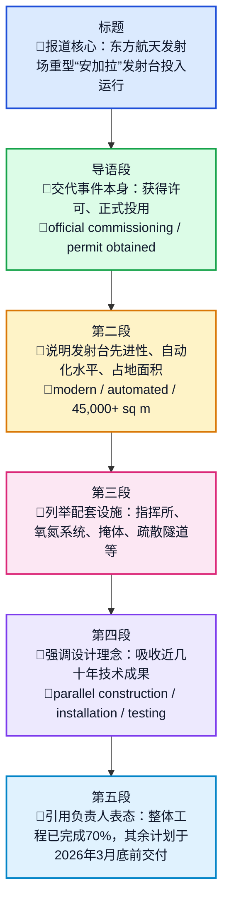

# Стартовый стол для тяжелой «Ангары» на Восточном введен в эксплуатацию

> 本文为 `🔻原文 / 🔹英文 / 🔸中文` 三线逐句精读；**三语组**内行末两空格为 Markdown 硬换行。关键节点：Roscosmos 官方 Telegram 称东方航天发射场重型「安加拉」发射台于 **2025-12-08** 投入运行；文中另引述剩余辅助设施计划于 **2026年3月底** 前交付。

## 前情提要

### 文章来源与基本信息

- 来源网站：`rg.ru`（Российская газета / *Rossiyskaya Gazeta*）
- 转引来源：`РИА Новости`（*RIA Novosti*）
- 文章题目：`Стартовый стол для тяжелой «Ангары» на Восточном введен в эксплуатацию`
- 中文题目：东方航天发射场重型“安加拉”火箭发射台已投入运行
- 文章语言：俄语
- 可核对到的关键信息：
  - 俄罗斯国家航天集团 `Роскосмос` 官方 Telegram 提到：`2025年12月8日`，东方航天发射场用于重型 `Ангара` 火箭的发射台投入运行。
  - 文中提到“到 `2026年3月底` 完成剩余辅助设施交付”，属于报道中的规划时间点。

### 作者/署名背景

- 该文并无明确个人记者署名，页面显示为 `РИА Новости`。
- `РИА Новости`（RIA Novosti）是俄罗斯的重要国家通讯社之一，常以“通讯社快讯/转载通稿”形式供其他媒体转发。
- `Российская газета`（Rossiyskaya Gazeta）是俄罗斯具有官方背景的重要报纸与新闻平台，常发布政策、社会与科技类报道。

### 文章结构信息图

---

## 逐句精读

---

🔻 `Стартовый стол / для тяжелой «Ангары» / на Восточном / введен в эксплуатацию.`  
🔹 The `launch pad` / for the heavy `Angara` rocket / at `Vostochny` / has been `commissioned`.  
🔸 位于`东方航天发射场`、用于重型`安加拉`火箭的`发射台`，现已`投入运行`。

背景注释：

- `Стартовый стол`：直译“发射桌”，航天语境中通常对应英语 `launch pad`，即火箭竖立、加注、点火与起飞的平台及其核心设备区域。
- `Ангара / Angara`：俄罗斯研制的运载火箭家族，包含轻型到重型不同型号。
- `Восточный / Vostochny`：俄罗斯远东地区的东方航天发射场，是俄罗斯重点建设的本土航天发射基地。
- `введен в эксплуатацию`：新闻、公文、工程报道中的高频正式表达，意为“正式投运、投入使用”。

> **`launch pad` 发射台；发射场平台**
>
> 1) 英文释义（n.）: a platform or area from which rockets are launched；火箭发射的平台或区域。
> 2) 语域：航天、科技、新闻、工程。
> 3) 画龙点睛：常与 `launch complex`、`launch site` 区分。`launch pad` 更强调`具体发射平台`，`launch complex` 可指`整套发射综合体`。写作中可搭配 `build / upgrade / commission / operate a launch pad`，是航天新闻高频核心词。

> **`commission` 投入使用；正式启用**
>
> 1) 英文释义（v.）: to formally bring something into service or use；正式启用、投入运行。另可表示“委托制作/授权执行”。
> 2) 语域：正式、工程、军事、新闻。
> 3) 画龙点睛：和 `put into operation`、`bring online`、`enter service` 近义。考试中很值得掌握其`熟词僻义`：很多学生只知道“委员会”`commission`（n.），却忽视其动词义“使服役/投入使用”。

> **`commissioned` 已投运的；已启用的**
>
> 1) 英文释义（adj./past participle）: officially placed into service；正式投入使用的。
> 2) 语域：正式、新闻、技术。
> 3) 画龙点睛：在被动结构中极常见，如 `was commissioned in 2025`。翻译时根据上下文可处理为`建成投运`、`正式服役`、`获准启用`，不要机械只译作“被委托”。

---

🔻 `Один из самых современных / и автоматизированных в мире.`  
🔹 It is `one of the most modern` / and `highly automated` facilities in the world.  
🔸 它是世界上`最现代化`、且`自动化程度最高`的设施之一。

背景注释：

- 这是标题下的短句式导语，俄语新闻中常用这种“名词性判断句/省略句”来先行拔高对象的重要性与技术等级。
- `автоматизированных` 强调自动控制、流程联动、系统化管理水平，而不仅仅是“用了机器”。

> **`modern` 现代的；先进的**
>
> 1) 英文释义（adj.）: relating to the present or recent times; using the most up-to-date ideas or equipment；现代的；采用最新理念或设备的。
> 2) 语域：通用、新闻、科技。
> 3) 画龙点睛：在科技报道里，`modern` 往往不只是“现代”，更接近`先进的`。可替换为 `advanced`、`state-of-the-art`。写作中若要更正式，可用 `among the most advanced facilities worldwide`。

> **`automated` 自动化的**
>
> 1) 英文释义（adj.）: operated largely by machines or control systems with limited human intervention；主要依靠机器或控制系统运行的。
> 2) 语域：科技、工业、工程。
> 3) 画龙点睛：注意与 `automatic` 区别：`automatic` 偏“自动发生/自动装置”，`automated` 更强调`流程系统实现自动化`。如 `an automated monitoring system`，非常适合科技写作。

---

🔻 `Стартовый стол / для «Ангары» / на Восточном / ввели в эксплуатацию.`  
🔹 The `launch pad` / for the `Angara` rocket / at `Vostochny` / was `put into operation`.  
🔸 位于`东方航天发射场`、用于`安加拉`火箭的`发射台`，已被`投入使用`。

背景注释：

- 这是副标题对标题的改写复现，新闻中常通过近义重述强化中心信息。
- `ввели в эксплуатацию` 与上一句 `введен в эксплуатацию` 为同一固定搭配的不同语法形态。

> **`put into operation` 投入运行；投入使用**
>
> 1) 英文释义（phrase）: to start using something officially for its intended purpose；正式开始按设计用途使用。
> 2) 语域：正式、工程、新闻。
> 3) 画龙点睛：这是非常实用的书面表达，适用于设备、工厂、系统、基础设施。与 `put into use` 相比，`put into operation` 更正式、更偏技术与工程语境，是翻译题高频表达。

---

🔻 `На космодроме Восточный / введен в эксплуатацию стартовый стол / для ракет-носителей тяжелого класса семейства «Ангара».`  
🔹 At the `Vostochny Cosmodrome`, / a `launch pad` has been `commissioned` / for heavy-lift launch vehicles of the `Angara` family.  
🔸 在`东方航天发射场`，一座供`安加拉`系列`重型运载火箭`使用的`发射台`已经`正式投运`。

背景注释：

- `космодром`：即“航天发射场”。
- `ракеты-носители`：标准术语，对应英语 `launch vehicles`，指将卫星、飞船等送入轨道的运载火箭。
- `тяжелого класса`：火箭分级中的“重型级别”，强调较大的运载能力。

> **`cosmodrome` 航天发射场**
>
> 1) 英文释义（n.）: a site for launching spacecraft, especially in Russian usage；航天器发射场，尤见于俄语语境。
> 2) 语域：航天、科技。
> 3) 画龙点睛：英语里常见 `spaceport`、`launch site`。但谈俄罗斯语境时，`cosmodrome` 很地道，如 `Baikonur Cosmodrome`、`Vostochny Cosmodrome`。阅读中识别这一词，有助于迅速判断文本主题属于航天基础设施。

> **`launch vehicle` 运载火箭**
>
> 1) 英文释义（n.）: a rocket used to carry payloads such as satellites into space；将卫星等载荷送入太空的火箭。
> 2) 语域：航天、科技、正式。
> 3) 画龙点睛：不要简单等同于 `rocket`。`rocket` 是泛称，`launch vehicle` 更正式、更准确，尤其适合学术与新闻语境。写作中用它能显著提升表达专业度。

> **`heavy-lift` 重型运载的**
>
> 1) 英文释义（adj.）: capable of carrying very large payloads；能够运送大质量载荷的。
> 2) 语域：航天、军事、工程。
> 3) 画龙点睛：常见搭配 `heavy-lift rocket`、`heavy-lift launcher`。`lift` 在这里不是“举起”字面义，而是`运载能力`。属于典型专业熟词僻义，考试阅读中容易失分。

---

🔻 `Соответствующее разрешение / получено «Дирекцией космодрома «Восточный», / сообщает «Роскосмос» / в своем Telegram-канале.`  
🔹 The `relevant permit` / was obtained by the `Vostochny Cosmodrome Directorate`, / `Roscosmos` reported / on its Telegram channel.  
🔸 俄罗斯国家航天集团（Roscosmos）在其 Telegram 频道中表示，相关`许可文件`已由`东方航天发射场管理局`取得。

背景注释：

- `Роскосмос / Roscosmos`：俄罗斯国家航天集团，负责俄罗斯航天活动的重要国家机构。
- `Дирекция космодрома «Восточный»`：可理解为东方航天发射场的运营/管理机构。
- `соответствующее разрешение`：俄语公文新闻常见说法，表示与投运、验收、使用资格相对应的正式批准文件。

> **`permit` 许可；许可证**
>
> 1) 英文释义（n.）: an official document allowing something to happen；许可某项活动进行的正式文件。
> 2) 语域：正式、法律、行政、工程。
> 3) 画龙点睛：与 `license` 有交叉，但 `permit` 常偏`具体事项的批准`。如 `building permit`、`operating permit`。翻译时要看语境，可译为`许可证`、`批文`、`许可文件`。

> **`relevant` 相应的；相关的**
>
> 1) 英文释义（adj.）: closely connected to the matter at hand；与当前事项紧密相关的。
> 2) 语域：正式、学术、新闻。
> 3) 画龙点睛：这是阅读与写作高频词。搭配丰富，如 `relevant data / laws / authorities / permit`。注意它不只表示“有关的”，也常带有“切题、适用”的含义。

> **`directorate` 管理局；主管机构**
>
> 1) 英文释义（n.）: an administrative department or body that directs operations；负责管理与指挥运作的机构。
> 2) 语域：正式、行政、机构。
> 3) 画龙点睛：常见于政府、军队、基础设施管理机构名称。比普通的 `department` 更正式，带有`统筹管理`意味。翻译时可视具体机构译作`局`、`处`、`管理处`、`指挥部`。

---

🔻 `Этот стартовый стол, / по оценкам специалистов, / — один из самых современных / и автоматизированных в мире.`  
🔹 This `launch pad`, / `according to specialists`, / is `one of the most advanced` / and automated in the world.  
🔸 这个`发射台`，`据专家评估`，是世界上`最先进`、自动化程度最高的设施之一。

背景注释：

- `по оценкам специалистов`：新闻中典型的“引述判断来源”结构，增强论断的客观化色彩。
- `самых современных` 在此比一般 `modern` 更接近 `advanced`、`state-of-the-art`。

> **`according to` 根据；据……所说/所评估**
>
> 1) 英文释义（prep. phrase）: as stated, reported, or judged by someone；根据某人所述、所报或所判断。
> 2) 语域：通用、新闻、学术。
> 3) 画龙点睛：写作中用于`信息来源引入`非常关键。可接机构、专家、报告、数据，如 `according to the report`。是议论文与说明文中提升客观性的核心结构。

> **`specialist` 专家；专业人员**
>
> 1) 英文释义（n.）: a person highly skilled in a particular field；在某一领域具有专业能力的人。
> 2) 语域：正式、新闻、学术。
> 3) 画龙点睛：与 `expert` 相近，但 `specialist` 更强调`专业分工领域`。如 `a space systems specialist`。翻译时可视语境处理为`专家`、`专业人士`、`技术人员`。

> **`advanced` 先进的**
>
> 1) 英文释义（adj.）: highly developed or ahead of others in progress or technology；技术上高度发展、领先的。
> 2) 语域：科技、新闻、正式。
> 3) 画龙点睛：比 `modern` 更突出`技术领先性`。常与 `technology / system / facility / equipment` 搭配。阅读里一旦出现，多半涉及科技、军事、工业优势描述。

---

🔻 `Его площадь / — более 45 тысяч квадратных метров.`  
🔹 Its `area` / is `more than 45,000 square meters`.  
🔸 它的`面积`为`4.5万多平方米`。

背景注释：

- `45 тысяч квадратных метров`：直译“四万五千平方米以上”。
- 在工程报道中，面积数字常用于凸显项目规模，而非单纯提供地理信息。

> **`area` 面积；区域**
>
> 1) 英文释义（n.）: the size of a surface; a region or space；面积；区域。
> 2) 语域：通用、工程、地理。
> 3) 画龙点睛：这是典型一词多义词。此处为`面积`，而非“地区”。阅读中要靠上下文判断。常搭配 `cover an area of...`、`total area`、`floor area`。

> **`square meter` 平方米**
>
> 1) 英文释义（n.）: a unit of area equal to a square measuring one meter on each side；面积单位“平方米”。
> 2) 语域：通用、工程、建筑。
> 3) 画龙点睛：注意英式常写 `square metres`，美式为 `square meters`。写作中表达大数量时可灵活改写为 `over 45,000 sq m`，更符合新闻压缩表达习惯。

---

🔻 `Также / в рамках строительства стартового комплекса «Ангара» / сданы в эксплуатацию / еще 37 объектов.`  
🔹 In addition, / within the construction of the `Angara launch complex`, / `another 37 facilities` / have also been `commissioned`.  
🔸 此外，在`安加拉发射综合体`建设过程中，`另外37处设施`也已经`交付并投入使用`。

背景注释：

- `в рамках`：固定搭配，可译为“在……框架内”“作为……的一部分”。
- `стартовый комплекс`：比 `launch pad` 范围更大，指整个发射综合设施系统。
- `объект` 在工程语境中常译“设施、工程单体、建筑单元”，不能总译成抽象的“对象”。

> **`within the framework of` 在……框架内；作为……的一部分**
>
> 1) 英文释义（phrase）: as part of a broader plan, project, or system；在更大计划或项目框架内。
> 2) 语域：正式、新闻、行政。
> 3) 画龙点睛：这是公文和新闻高频表达。更自然的英语新闻可简化为 `as part of`。翻译题中见到俄语/中文类似“在……框架下”，常可对应此结构。

> **`launch complex` 发射综合体**
>
> 1) 英文释义（n.）: the complete set of launch infrastructure and supporting systems；包含发射设施及配套系统的完整综合体。
> 2) 语域：航天、工程。
> 3) 画龙点睛：与 `launch pad` 的层级不同。`pad` 是平台，`complex` 是整个系统。做科技翻译时若混淆，容易造成信息层级错误。

> **`facility` 设施；场所**
>
> 1) 英文释义（n.）: a place, piece of equipment, or service built for a particular purpose；为特定用途而建设的设施或设备。
> 2) 语域：正式、工程、新闻。
> 3) 画龙点睛：可数名词，复数 `facilities` 很常见。比 `building` 范围广，既可以指建筑，也可指系统设施。新闻里说 `37 facilities`，体现的是工程构成单元，而不仅是房屋。

---

🔻 `Среди них:`  
🔹 `Among them` are the following facilities:  
🔸 `其中包括`以下设施：

背景注释：

- 这是引出清单的过渡语。
- 英语中可自然补全为 `Among them are...`，使表达完整。

> **`among` 在……之中**
>
> 1) 英文释义（prep.）: in the middle of or included within a group；在一群人或事物当中。
> 2) 语域：通用。
> 3) 画龙点睛：和 `between` 区别要牢记：`between` 常用于两者之间，`among` 常用于三者及以上或群体之中。阅读中这是最基础但极易因汉语直觉而误用的介词。

---

🔻 `командный пункт`  
🔹 a `command post` / `control center`  
🔸 `指挥所` / `控制中心`

背景注释：

- 在航天工程中，指负责指令下达、状态监控、发射流程组织的核心控制区域。

> **`command post` 指挥所**
>
> 1) 英文释义（n.）: a place from which operations are directed；用于组织与指挥行动的场所。
> 2) 语域：军事、航天、应急管理。
> 3) 画龙点睛：在航天语境中也可译作 `control center`，后者更偏技术监控，前者更偏指挥体系。翻译要根据上下文选择侧重点。

---

🔻 `технологический блок кислорода и азота`  
🔹 a `process unit` for `oxygen and nitrogen`  
🔸 `氧气和氮气工艺处理单元`

背景注释：

- 航天发射需要大量低温推进剂及相关气体供应系统，氧、氮常用于推进剂处理、惰化、防爆与技术保障。

> **`process unit` 工艺单元**
>
> 1) 英文释义（n.）: a functional part of an industrial system handling specific technical processes；承担特定工艺流程的功能单元。
> 2) 语域：工程、工业、化工。
> 3) 画龙点睛：科技翻译中，`technological block` 直译生硬，常自然化处理为 `process unit`、`technical unit`。要体现其`工艺功能`，而不是机械地译成“技术块”。

---

🔻 `хранилище кислорода и азота`  
🔹 an `oxygen and nitrogen storage facility`  
🔸 `氧气与氮气储存设施`

背景注释：

- 对发射场而言，这类设施通常涉及低温储罐、输送管线与安全控制系统。

> **`storage facility` 储存设施**
>
> 1) 英文释义（n.）: a place designed for storing materials or equipment；专门用于储存物资或设备的设施。
> 2) 语域：工程、物流、工业。
> 3) 画龙点睛：比 `warehouse` 更广。`warehouse` 偏仓库，`storage facility` 能覆盖储罐区、专用储存建筑等，更适合科技与工业文本。

---

🔻 `площадка хранилища кислорода / для заправки разгонного блока`  
🔹 an `oxygen storage site` / for fueling the `upper stage`  
🔸 用于给`上面级`加注的`氧储存区`

背景注释：

- `разгонный блок / upper stage`：多级火箭中负责将载荷进一步送入目标轨道的上面级模块。
- `заправка`：在航天中多指推进剂或相关工质加注。

> **`upper stage` 上面级**
>
> 1) 英文释义（n.）: the upper section of a multistage rocket used to place payloads into final orbit；多级火箭中将载荷送入最终轨道的上层级。
> 2) 语域：航天、科技。
> 3) 画龙点睛：是航天阅读高频专业词。不要误译成普通“上层阶段”。常搭配 `fuel the upper stage`、`upper-stage engine`、`orbital insertion`。

> **`fueling` 加注燃料/推进剂**
>
> 1) 英文释义（n./gerund）: the act of loading fuel or propellants into a vehicle or system；向运载工具或系统装填燃料或推进剂。
> 2) 语域：航天、航空、工程。
> 3) 画龙点睛：航天里常可扩展理解为推进剂加注，不限于传统意义上的燃油。搭配有 `fueling operations`、`fueling line`、`pre-launch fueling`，在流程类文章中非常常见。

---

🔻 `укрытия / для обслуживающего персонала`  
🔹 `protective shelters` / for `service personnel`  
🔸 供`保障人员`使用的`防护掩体`

背景注释：

- 发射场作业存在高温、高压、易燃、冲击波等风险，因此人员掩体是重要安全设施。

> **`shelter` 掩体；避难所**
>
> 1) 英文释义（n.）: a structure giving protection from danger or bad conditions；提供防护的建筑或场所。
> 2) 语域：安全、军事、工程。
> 3) 画龙点睛：既可作名词也可作动词。此处要译出`防护设施`含义，而不是普通“住所”。在科技新闻里常见 `blast shelter`、`emergency shelter`。

---

🔻 `эвакуационные тоннели`  
🔹 `evacuation tunnels`  
🔸 `疏散隧道`

背景注释：

- 用于紧急情况下人员快速撤离，是大型工业与航天设施的重要安全设计要素。

> **`evacuation` 疏散；撤离**
>
> 1) 英文释义（n.）: the act of moving people from a dangerous place to safety；将人员从危险区域转移到安全地带。
> 2) 语域：安全、工程、应急。
> 3) 画龙点睛：高频搭配 `evacuation plan / route / tunnel / procedure`。写作里如果讨论安全管理，这个词非常实用，明显优于口语化的 `leave quickly`。

---

🔻 `заправочная эстакада`  
🔹 a `fueling trestle` / `service gantry for fueling`  
🔸 `加注栈桥` / `加注作业架`

背景注释：

- `эстакада` 在工程里可指高架作业平台、栈桥、支撑架构；航天翻译常需结合场景灵活处理。

> **`gantry` 桁架塔；作业架**
>
> 1) 英文释义（n.）: a framework structure supporting equipment over a working area；位于作业区域上方、支撑设备的框架结构。
> 2) 语域：工程、港口、航天。
> 3) 画龙点睛：发射场常见 `service gantry`。如果直译成普通“架子”会损失专业感。工程阅读里识别它，往往有助于判断设施的功能是`支撑、检修、加注或吊装`。

---

🔻 `перрон взятия проб`  
🔹 a `sampling apron` / `sampling platform`  
🔸 `取样坪` / `取样平台`

背景注释：

- `взятие проб` 即“取样、采样”；航天推进剂与气体系统中常需进行质量与安全检测。

> **`sampling` 取样；采样**
>
> 1) 英文释义（n./adj.）: the act of taking a small part for testing or analysis；为检测或分析而取出样本。
> 2) 语域：科学、工业、检测。
> 3) 画龙点睛：搭配如 `sampling point`、`sampling device`、`air sampling`。考试中常出现在实验、环境、工业文本里，是跨学科高频词。

---

🔻 `молниеотводы`  
🔹 `lightning rods`  
🔸 `避雷针`

背景注释：

- 发射场对雷电极为敏感，避雷系统关系到火箭、储罐与电气系统安全。

> **`lightning rod` 避雷针**
>
> 1) 英文释义（n.）: a metal rod designed to protect structures from lightning strikes；用于防止建筑遭雷击的金属导体。
> 2) 语域：工程、建筑、气象安全。
> 3) 画龙点睛：也是常见科普词。复数形式 `lightning rods` 很常见。若在写作里描述基础设施安全配置，这一词比泛泛的 `protection system` 更具体准确。

---

🔻 `прожекторные мачты.`  
🔹 `floodlight masts`.  
🔸 `探照灯塔架` / `照明桅杆`。

背景注释：

- 用于夜间作业照明、远距离场区照明与安全保障。

> **`floodlight` 泛光灯；强力照明灯**
>
> 1) 英文释义（n.）: a powerful light used to illuminate a large area；照亮大面积区域的强光灯。
> 2) 语域：工程、舞台、安防。
> 3) 画龙点睛：搭配 `floodlight mast / tower / system`。不要只理解成普通 `light`。工业场景中它强调`大范围、强功率照明`。

---

🔻 `Как подчеркивается, / при проектировании и строительстве стартового комплекса для «Ангары» / учитывались / все технологические достижения последних десятилетий.`  
🔹 As `emphasized`, / in the design and construction of the `Angara` launch complex, / `all the technological achievements` of recent decades / were `taken into account`.  
🔸 报道`强调`说，在为`安加拉`建设发射综合体的设计与施工过程中，`近几十年来的全部技术成果`都被`纳入考量`。

背景注释：

- `Как подчеркивается`：典型新闻引述框架，可译“据强调”“报道强调指出”。
- `учитывались`：不是简单“被看到”，而是“被充分考虑、被计入方案设计”。

> **`emphasize` 强调**
>
> 1) 英文释义（v.）: to give special importance to something；突出某事的重要性。
> 2) 语域：通用、新闻、学术。
> 3) 画龙点睛：新闻里可用被动或分词形式 `as emphasized`、`it was emphasized that...`。写作时它是组织论证重点的好词，比反复用 `say`、`point out` 更有层次。

> **`achievement` 成就；成果**
>
> 1) 英文释义（n.）: something accomplished successfully, especially through effort or skill；通过努力或技能取得的成功成果。
> 2) 语域：通用、学术、新闻。
> 3) 画龙点睛：这里是科技成果，故译作`技术成果`更稳妥。常见搭配 `scientific achievements`、`technological achievements`。注意它既可指个人成就，也可指集体技术成果。

> **`take into account` 把……考虑在内**
>
> 1) 英文释义（phrase）: to consider something when making a decision or plan；在决策或规划中将某因素纳入考虑。
> 2) 语域：正式、学术、新闻。
> 3) 画龙点睛：写作和翻译中的超级高频表达。还可说 `factor in`，但 `take into account` 更正式。若能熟练掌握，可大幅提升议论文和说明文的表达质量。

---

🔻 `Проект / выполнен таким образом, / что предполагает возможность / параллельного строительства, монтажа и испытаний / технологического оборудования.`  
🔹 The `project` / was designed in such a way / that it allows / the possibility of `parallel construction, installation, and testing` / of technological equipment.  
🔸 该`项目方案`被设计成这样一种形式：它允许对相关工艺设备进行`并行施工、安装和测试`。

背景注释：

- `монтаж`：工程语境中通常译“安装、装配”。
- `испытания`：技术测试、试验、调试验证。
- 这一句体现的是工程组织方式优化，即不同工序可并行推进，提高整体建设效率。

> **`in such a way that` 以这样一种方式，以至于**
>
> 1) 英文释义（phrase）: in a manner that produces a particular result；以某种方式从而达到某种结果。
> 2) 语域：正式、说明文、学术。
> 3) 画龙点睛：这类结构非常适合长难句写作，可自然连接“手段—结果”。阅读里见到它，要迅速识别后面的 `that` 从句往往是在说明设计结果或功能效果。

> **`parallel` 并行的；同时进行的**
>
> 1) 英文释义（adj.）: occurring at the same time or side by side；同时发生的；并列进行的。
> 2) 语域：工程、科技、计算机。
> 3) 画龙点睛：常见搭配 `parallel processing`、`parallel development`、`parallel construction`。比普通 `simultaneous` 更有“并列流程、可同步推进”的技术感。

> **`installation` 安装；装配**
>
> 1) 英文释义（n.）: the act of putting equipment in place and making it ready for use；将设备装好并使其可用的过程。
> 2) 语域：工程、技术。
> 3) 画龙点睛：也是高频一词多义词，既可指“安装过程”，也可指“装置/大型艺术装置”。在工程文本中，多半指`安装作业`。和 `assembly` 近义，但 `installation` 更强调就位与投入使用准备。

> **`testing` 测试；试验**
>
> 1) 英文释义（n.）: the process of checking performance, safety, or quality；检查性能、安全性或质量的过程。
> 2) 语域：科技、工程、学术。
> 3) 画龙点睛：搭配极多，如 `system testing`、`field testing`、`pre-launch testing`。写作中如果要表达“验证可行性”，`testing` 往往比笼统的 `checking` 更专业。

---

🔻 `По словам руководителя «Дирекции космодрома «Восточный» Николая Новикова, / на данный момент / в рамках строительства стартового комплекса «Ангара» / введено в эксплуатацию / уже 70% сооружений.`  
🔹 According to `Nikolai Novikov`, head of the `Vostochny Cosmodrome Directorate`, / at present, / within the construction of the `Angara` launch complex, / `70 percent of the structures` / have already been `put into operation`.  
🔸 `东方航天发射场管理局`负责人`尼古拉·诺维科夫`表示，截至目前，在`安加拉发射综合体`建设范围内，已有`70%的建筑与设施`被`投入运行`。

背景注释：

- `Николай Новиков / Nikolai Novikov`：文中所引述的东方航天发射场管理机构负责人。
- `сооружения`：比 `buildings` 范围更广，可指建筑物、构筑物、工程设施。
- `на данный момент`：正式表达，相当于 `at present / as of now`。

> **`according to` 根据；据……所说**
>
> 1) 英文释义（prep. phrase）: as stated or reported by someone；根据某人的说法或报道。
> 2) 语域：通用、新闻、学术。
> 3) 画龙点睛：在引语报道中非常高频。若频繁使用，可与 `in the words of`、`as stated by` 交替，增强写作多样性。但 `according to` 最稳妥、最客观。

> **`structure` 结构；构筑物；建筑物**
>
> 1) 英文释义（n.）: something that has been built, such as a building or other constructed object；建造而成的物体，如建筑或构筑物。
> 2) 语域：工程、建筑、通用。
> 3) 画龙点睛：它既可指抽象“结构”，也可指具体“构筑物”。在土木与工程报道中，复数 `structures` 常译作`建筑与设施`，这样比单译“结构”更准确。

> **`at present` 目前；当前**
>
> 1) 英文释义（phrase）: at the current time；在当前时点。
> 2) 语域：正式、新闻、学术。
> 3) 画龙点睛：比口语 `now` 更书面。可替换为 `currently`、`as of now`。阅读里它往往提示后面数据是`阶段性进度`，不是最终完成状态。

---

🔻 `Оставшиеся вспомогательные сооружения / планируется сдать / до конца марта 2026 года.`  
🔹 The `remaining auxiliary structures` / are `scheduled to be delivered` / by the `end of March 2026`.  
🔸 `其余辅助设施`计划在`2026年3月底前`完成`交付验收`。

背景注释：

- `вспомогательные сооружения`：即非核心但必要的辅助性工程设施。
- `до конца марта 2026 года`：应明确理解为绝对时间——`2026年3月31日`之前。
- `сдать` 在工程报道中常有“交付、验收通过、移交使用”之意。

> **`remaining` 剩余的；尚未完成的**
>
> 1) 英文释义（adj.）: left after part has been used, dealt with, or completed；在部分完成或处理之后剩下的。
> 2) 语域：通用、新闻、正式。
> 3) 画龙点睛：是阅读高频词。可接 `time / tasks / issues / funds / structures`。翻译时常可根据语境灵活处理为`剩余的`、`其余的`、`尚待完成的`。

> **`auxiliary` 辅助的；配套的**
>
> 1) 英文释义（adj.）: providing supplementary or additional help and support；提供补充性支持的。
> 2) 语域：正式、技术、军事。
> 3) 画龙点睛：非常适合工程与学术写作，如 `auxiliary systems`、`auxiliary equipment`。它比 `supporting` 更正式、更专业。考试中还要注意其名词义“助动词”，属于典型多义词。

> **`be scheduled to` 计划于；定于**
>
> 1) 英文释义（phrase）: to be planned or arranged to happen at a particular time；被安排在某一时间发生。
> 2) 语域：正式、新闻、行政。
> 3) 画龙点睛：时间计划类表达的核心句式。可替换 `is expected to`、`is due to`，但 `be scheduled to` 最强调`已列入时间表`。写作中尤其适合描述项目进度。

> **`deliver` 交付；移交；完成交工**
>
> 1) 英文释义（v.）: to hand over formally; in project contexts, to complete and transfer for use；正式交付；在项目语境中指完成并移交使用。
> 2) 语域：通用、工程、商业。
> 3) 画龙点睛：很多人只记得“送递快递”，但在工程项目里 `deliver` 常表示`交付成果/完工移交`。这是典型熟词僻义，翻译与写作中非常值得掌握。

---

## 参考来源

- Roscosmos 官方 Telegram：<https://t.me/s/roscosmos_gk/19002>
- Rossiyskaya Gazeta 官方站点：<https://rg.ru/>
- 关于《Российская газета》：<https://rgmedia.rg.ru/>
- 关于 RIA Novosti 的公开背景说明可参见综合公开资料检索结果。
