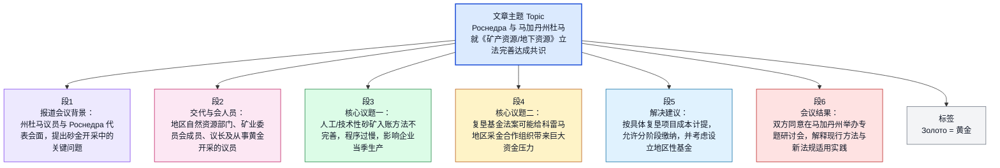

## 文章来源与基本信息

- 来源网站：**NEDRADV（НедраДВ）**
- 栏目：**Новости законодателей / Новости**
- 题目：**Роснедра и депутаты Магаданской думы договорились доработать законодательство о недрах**
- 发布标注：**16 апреля 2026**
- 文内消息时间：**16 марта 2026 года**
- 作者署名：原文未见明确个人记者署名，文中注明信息来源为**пресс-служба регионального органа власти**（地区政权机关新闻处/新闻服务部门）
- 配图说明：**фото предоставлено Магаданской областной думы**（图片由马加丹州杜马提供）

## 作者/机构背景简介

- **NEDRADV（НедраДВ）**：俄语矿业与远东地区矿产资源资讯平台，常发布采矿、地质、招标、行业政策与区域矿业动态。
- **Роснедра**：俄罗斯联邦**矿产资源利用署/联邦地下资源利用署**，隶属国家资源管理体系，负责地下资源使用管理、许可、地质研究与相关政策执行。
- **Магаданская областная дума**：马加丹州立法机关，相当于地区层级议会。
- **пресс-служба регионального органа власти**：指地区政府或立法机关的新闻宣传部门，不对应具体个人作者。

---

## 前情提要

---

## 逐句精读

🔻 **Новости законодателей**  
🔹 `News` / of `lawmakers`  
🔸 立法者新闻。

背景注释：  
这里是栏目名称。`законодатели` 指“立法者、议员”，常用于议会、杜马、立法会议相关报道语境。

> **`lawmaker` / `законодатель`**  
> 1. 英文释义（n.）：a person who makes or helps make laws；`立法者，制定法律者，议员`。  
> 2. 语域：正式、新闻、政治。  
> 3. 画龙点睛：`lawmaker` 是英语新闻里非常高频的政治词，常见搭配有 `federal lawmakers`、`state lawmakers`、`lawmakers approved/rejected a bill`。写作中比笼统的 `politician` 更准确，因为它强调“立法职能”而非一般政治人物。

---

🔻 **Главная / Новости**  
🔹 `Home` / `News`  
🔸 首页 / 新闻。

背景注释：  
这是网页导航路径。`Главная` 即网站首页，`Новости` 即新闻栏目。

> **`home page` / `home`**  
> 1. 英文释义（n.）：the main page of a website；`首页，主页`。  
> 2. 语域：通用、互联网。  
> 3. 画龙点睛：网站语境里常直接说 `Home`，不必总写成 `home page`。阅读网页材料时，导航栏信息虽然不是正文，但有助于判断文章体裁、栏目属性与信息来源可靠性。

---

🔻 **Роснедра и депутаты Магаданской думы договорились доработать законодательство о недрах**  
🔹 `Rosnedra` and deputies of the Magadan Duma / agreed to `refine` the legislation on `subsoil resources`.  
🔸 `俄罗斯联邦地下资源利用署`与马加丹州杜马议员同意进一步`完善`有关`地下资源/矿产资源`的立法。

背景注释：  
- **Роснедра / Rosnedra**：俄罗斯联邦地下资源利用署，负责地下资源利用管理。  
- **Магаданская дума**：指马加丹州杜马，即地方立法机关。  
- **законодательство о недрах**：俄语中直译为“关于地下资源的立法”，在中文语境中通常可理解为“矿产资源法制/地下资源法律制度”。

> **`refine`**  
> 1. 英文释义（v.）：to improve something by making small changes；`改进，完善，细化`。  
> 2. 语域：正式、政策、学术。  
> 3. 画龙点睛：`refine` 常用于制度、方法、模型、表述的“进一步优化”，比 `change` 更细致、比 `reform` 更温和。写作中可用于 `refine legislation`、`refine a methodology`、`refine the proposal`。

> **`legislation`**  
> 1. 英文释义（n.）：a law or a set of laws；`法律；法规；立法`。  
> 2. 语域：正式、法律、新闻。  
> 3. 画龙点睛：`legislation` 可指单部法律，也可指某领域法规整体。考试中常与 `law` 区分：`law` 更泛，`legislation` 更强调成文立法与立法活动。常见搭配有 `pass legislation`、`amend legislation`、`environmental legislation`。

> **`subsoil resources`**  
> 1. 英文释义（n. phr.）：mineral and other natural resources located underground；`地下资源，地下矿产资源`。  
> 2. 语域：法律、矿业、地质。  
> 3. 画龙点睛：这是对俄语 `недра` 的较贴切法律化表达。一般英语新闻更常说 `mineral resources` 或 `subsurface resources`，但涉及俄罗斯法制语境时，`subsoil` 能更准确保留原制度概念。

---

🔻 **16 апреля 2026**  
🔹 `April 16, 2026`  
🔸 2026年4月16日。

背景注释：  
这是网页显示的发布日期。需要注意：正文首句又出现了**2026年3月16日**，说明网页发布时间与消息事件时间并不一致，阅读时要区分“刊发日期”和“事件发生日期”。

> **`publication date`**  
> 1. 英文释义（n. phr.）：the date on which something is published；`发布日期，刊发日期`。  
> 2. 语域：正式、出版、新闻。  
> 3. 画龙点睛：做新闻阅读时要特别分辨 `publication date` 与 `event date`。这类时间错位在考试阅读和信息核对中很常见，若忽视，容易误判事件新旧与因果顺序。

---

🔻 **Чиновники рассказали о проблемах россыпников.**  
🔹 Officials / spoke about the problems faced by `placer miners`.  
🔸 官员们谈到了`砂矿开采者`面临的问题。

背景注释：  
- `чиновники`：官员、公职人员。  
- `россыпники`：来自 `россыпь`（砂矿、冲积矿），指从事砂矿特别是砂金开采的人或企业。中文可译为“砂矿开采者”“砂金开采企业/从业者”。

> **`official`**  
> 1. 英文释义（n.）：a person who holds a position in government or an organization；`官员，公务人员，正式负责人`。  
> 2. 语域：正式、新闻、政治。  
> 3. 画龙点睛：新闻里 `officials said` 非常常见，既可指政府官员，也可指机构负责人。翻译时要结合上下文判断是“政府部门官员”还是“机构人士”，避免一律机械译作“官方”。

> **`placer miner`**  
> 1. 英文释义（n.）：a miner engaged in extracting minerals, especially gold, from placer deposits；`砂矿矿工；砂金开采者`。  
> 2. 语域：矿业、地质。  
> 3. 画龙点睛：`placer` 是矿业术语，指流水搬运沉积形成的砂矿、冲积矿。考试中这类专业词往往不要求主动使用，但应掌握构词识别：`placer gold` 砂金，`placer deposit` 砂矿床。

---

🔻 **фото предоставлено Магаданской областной думы**  
🔹 Photo / provided by the Magadan Regional Duma.  
🔸 照片由马加丹州杜马提供。

背景注释：  
这是图片版权/来源说明。俄语原句中语法略显新闻网页式简化，标准表达通常会更完整。

> **`provided by`**  
> 1. 英文释义（v. phr.）：supplied or made available by；`由……提供`。  
> 2. 语域：通用、新闻、版权说明。  
> 3. 画龙点睛：图片说明里 `photo provided by...`、`image courtesy of...` 都很常见。前者更中性直接，后者更书面、更有“鸣谢”意味。阅读新闻网页时，这类说明可帮助判断图片来源是否来自官方机构。

---

🔻 **16 марта 2026 года, NEDRADV. Депутаты Магаданской областной думы / на встрече с делегацией Роснедр / обозначили ключевые проблемы россыпной добычи золота, / сообщает пресс-служба регионального органа власти.**  
🔹 `March 16, 2026`, NEDRADV. Deputies of the Magadan Regional Duma / at a meeting with a delegation from `Rosnedra` / identified the key problems of `placer gold mining`, / the press service of the regional authority reports.  
🔸 2026年3月16日，NEDRADV报道。马加丹州杜马议员们在与`俄罗斯联邦地下资源利用署`代表团会面时，指出了`砂金开采`中的若干关键问题；这一消息由地区政权机关新闻处发布。

背景注释：  
- **делегация Роснедр**：来自 Rosnedra 的代表团。  
- **россыпная добыча золота**：砂金开采，即从冲积砂矿床中开采黄金。  
- **пресс-служба**：新闻处、新闻办公室，常见于俄语官方新闻稿体。

> **`delegation`**  
> 1. 英文释义（n.）：a group of people sent to represent an organization or government；`代表团，代表小组`。  
> 2. 语域：正式、外交、新闻。  
> 3. 画龙点睛：`delegation` 常与 `from`、`led by`、`visit`、`meeting` 连用。写作中它强调“代表性身份”，比普通的 `group` 更正式。可用于政府、学校、企业、国际组织场景。

> **`identify`**  
> 1. 英文释义（v.）：to recognize and point out; to determine；`识别；指出；确定`。  
> 2. 语域：正式、学术、新闻。  
> 3. 画龙点睛：政策与报告中 `identify problems / priorities / risks` 非常高频。它不只是“认出”，还可表示“明确指出、锁定”。GRE/考研中要注意其抽象义，不要只记最基础的“辨认身份”。

> **`placer gold mining`**  
> 1. 英文释义（n. phr.）：the extraction of gold from placer deposits；`砂金开采`。  
> 2. 语域：矿业、地质、行业新闻。  
> 3. 画龙点睛：这是专业名词组合，核心是 `placer` + `gold` + `mining`。在阅读中可通过后缀快速判断：`mining` 指开采活动，`deposit` 指矿床，`extraction` 指提取过程。专业文章里这些词往往成组出现。

> **`press service`**  
> 1. 英文释义（n. phr.）：the media or communications office of an institution；`新闻处，宣传/对外联络部门`。  
> 2. 语域：正式、新闻、机构。  
> 3. 画龙点睛：俄语新闻常见 `сообщает пресс-служба...`，英语可译作 `the press service reported` 或更自然地融入句子。翻译时不必每次机械直译为“新闻处报道”，可根据中文习惯处理为“据……新闻处消息”。

---

🔻 **В мероприятии / приняли участие министр природных ресурсов и экологии Магаданской области Наталья Морозова, / члены Горного совета при заксобрании, / в том числе спикер Анатолий Широков, / а также депутаты, занятые в золотодобыче, / — Александр Басанский, Станислав Пруцков и Игорь Розинов.**  
🔹 The event / was attended by Natalya Morozova, Minister of Natural Resources and Ecology of the Magadan Region, / members of the Mining Council under the regional legislature, / including Speaker Anatoly Shirokov, / as well as deputies engaged in `gold mining`, / namely Alexander Basansky, Stanislav Prutskov, and Igor Rozinov.  
🔸 出席此次活动的有：马加丹州自然资源与生态部长娜塔莉娅·莫罗佐娃、州议会下设矿业委员会成员（其中包括议长阿纳托利·希罗科夫），以及从事`黄金开采`行业的议员——亚历山大·巴桑斯基、斯坦尼斯拉夫·普鲁茨科夫和伊戈尔·罗津诺夫。

背景注释：  
- **министр природных ресурсов и экологии**：自然资源与生态部长。  
- **Горный совет**：矿业委员会/矿业理事会。  
- **заксобрание**：`законодательное собрание` 的缩略形式，即立法会议。  
- **спикер**：议长，英语借词在俄语政治语境中很常见。  
- 文中多人名为俄罗斯地区政商界人士，主要功能是交代参会构成。

> **`attend` / `be attended by`**  
> 1. 英文释义（v.）：to go to and be present at an event；`参加，出席`。`be attended by` 表示“由……出席”。  
> 2. 语域：正式、会议、新闻。  
> 3. 画龙点睛：新闻里列举与会者时，`was attended by` 很常用，书面色彩强。与 `take part in` 相比，它更强调“到场出席”这一事实，而不一定突出实际参与度。

> **`speaker`**  
> 1. 英文释义（n.）：the presiding officer of a legislative body; also a person who speaks；`议长；发言人；演讲者`。  
> 2. 语域：政治、会议。  
> 3. 画龙点睛：此词是典型一词多义。政治新闻中 `Speaker` 常专指议会议长，首字母有时大写。阅读时需根据上下文区分它与一般意义上的“演讲者、说话者”。

> **`engaged in`**  
> 1. 英文释义（adj./v. phr.）：involved in or occupied with an activity；`从事于；参与于`。  
> 2. 语域：正式、书面。  
> 3. 画龙点睛：`be engaged in` 是高频正式表达，比口语 `work in` 更书面。可用于 `be engaged in research/trade/mining`。写作时能有效提升正式度，但要避免和表示“订婚”的常见义混淆。

> **`gold mining`**  
> 1. 英文释义（n. phr.）：the industry or activity of extracting gold from the earth；`黄金开采，采金业`。  
> 2. 语域：矿业、经济。  
> 3. 画龙点睛：可表示具体生产活动，也可表示整个行业。常见搭配：`gold-mining company`、`gold-mining region`、`small-scale gold mining`。连字符形式常用于定语位置。

---

🔻 **Игорь Розинов / акцентировал внимание / на несовершенстве действующей методики постановки на баланс техногенных россыпей.**  
🔹 Igor Rozinov / `focused attention` / on the imperfections of the current methodology for placing `technogenic placers` on the balance sheet.  
🔸 伊戈尔·罗津诺夫`特别强调`了现行`人工成因砂矿/技术性砂矿`入账方法存在的不完善之处。

背景注释：  
- **акцентировать внимание на**：强调、着重指出。  
- **постановка на баланс**：矿业、会计和资源管理语境下指“登记入账、列入储量/资产平衡表”。这里不是普通会计记账，而是资源储量获得官方确认并纳入平衡表体系。  
- **техногенные россыпи**：人为活动形成或受工业活动影响而形成、可再回收利用的砂矿堆积，中文可译“技术性砂矿”“人工成因砂矿”“工源砂矿”。

> **`focus attention on`**  
> 1. 英文释义（v. phr.）：to direct attention to something important；`把注意力集中到；强调`。  
> 2. 语域：正式、新闻、学术。  
> 3. 画龙点睛：它是很好的议论文表达，可替代单一的 `stress`、`emphasize`。常见写法有 `focus attention on the need/problem/risk`。翻译时注意不是简单“集中注意力”，而常是“着重指出”。

> **`imperfection` / `imperfections`**  
> 1. 英文释义（n.）：a fault, weakness, or lack of complete effectiveness；`缺陷，不完善之处`。  
> 2. 语域：正式、技术、评论。  
> 3. 画龙点睛：在制度和方法语境中，`imperfections` 比 `mistakes` 更客观，强调系统上的不完备，而非具体错误。适合用于法律、机制、模型、程序等抽象对象。

> **`methodology`**  
> 1. 英文释义（n.）：a system of methods used in a particular area；`方法体系，方法论，操作方法`。  
> 2. 语域：学术、技术、政策。  
> 3. 画龙点睛：`method` 指具体方法，`methodology` 指方法体系或整体规则。考试写作中不要滥用；若要表达“评估方法体系”“研究方法框架”，`methodology` 才更恰当。

> **`technogenic placers`**  
> 1. 英文释义（n. phr.）：placer deposits formed or altered by human industrial activity；`人工成因砂矿，工源砂矿`。  
> 2. 语域：矿业、地质、资源管理。  
> 3. 画龙点睛：`technogenic` 是专业词，常见于俄语技术和矿业文献英译。阅读时可抓住词根 `techno-` 判断与技术/工业活动相关，不必执着于生活英语里是否常用。

---

🔻 **По его словам, / процесс / занимает слишком много времени.**  
🔹 According to him, / the process / takes too much time.  
🔸 据他说，这一过程耗时过长。

背景注释：  
这里的 `процесс` 具体指前句提到的“技术性砂矿正式入账/列入平衡表的流程”。

> **`according to`**  
> 1. 英文释义（prep.）：as stated or reported by；`根据；据……所说`。  
> 2. 语域：通用、新闻、学术。  
> 3. 画龙点睛：这是转述信息来源的核心结构。阅读理解中它常提示“信息并非作者直接断言”。写作中使用 `according to the report/data/expert` 能显著增强信息出处意识。

> **`take time` / `take too much time`**  
> 1. 英文释义（v. phr.）：to require a certain amount of time；`花费时间；耗时`。  
> 2. 语域：通用。  
> 3. 画龙点睛：英语中“事情花时间”通常用物作主语：`The process takes time.` 而不是总说“we spend time on the process”。这种表达方式在翻译和写作中非常值得模仿。

---

🔻 **Депутат / отметил, / что недропользователям / нужен оперативный инструмент / для постановки на баланс техногенных россыпей.**  
🔹 The deputy / noted / that `subsoil users` / need an `efficient` tool / for registering technogenic placers on the balance sheet.  
🔸 这位议员指出，`地下资源使用者/矿业权使用企业`需要一种`高效、快捷的`工具，以便将技术性砂矿纳入正式储量/资产平衡体系。

背景注释：  
- **недропользователи**：直译为“地下资源使用者”，在中文专业语境中通常指矿业权人、采矿企业、资源开发企业。  
- **оперативный инструмент**：并非字面“操作性工具”，而是“反应迅速、便于即时处理的机制或工具”。

> **`subsoil user`**  
> 1. 英文释义（n.）：an entity licensed to use underground mineral resources；`地下资源使用者；矿业权使用者；采矿企业`。  
> 2. 语域：法律、矿业、俄语制度翻译。  
> 3. 画龙点睛：这是明显带有俄式资源法背景的表达。若面向更自然英语语境，也可按场景译成 `mining company`、`license holder`、`resource developer`。但精读时保留制度原貌更有助于理解原文。

> **`efficient` / `оперативный`**  
> 1. 英文释义（adj.）：working well without wasting time or resources；`高效的，效率高的`。  
> 2. 语域：通用、商务、政策。  
> 3. 画龙点睛：俄语 `оперативный` 常含“迅速、及时、响应快”之意，英译时要灵活处理，可根据语境选 `efficient`、`prompt`、`rapid-response`。翻译考试中这类词不能只做字面对应。

> **`tool`**  
> 1. 英文释义（n.）：something used to perform a task; also a means or mechanism；`工具；手段；机制`。  
> 2. 语域：通用、技术、政策。  
> 3. 画龙点睛：抽象语境中 `tool` 不一定是实物，常可指政策工具、管理工具、制度手段。写作中 `policy tool`、`analytical tool`、`legal tool` 都非常常见。

---

🔻 **Он подчеркнул: «Любая постановка на баланс — процесс длительный.**  
🔹 He stressed: “Any placement on the balance sheet is a `lengthy` process.  
🔸 他强调说：“任何纳入平衡体系的程序都是一个`漫长的`过程。

背景注释：  
这里继续指矿产资源储量或相关对象的正式入账程序，而非普通商业记账。

> **`stress`**  
> 1. 英文释义（v.）：to emphasize something as important；`强调，着重指出`。  
> 2. 语域：正式、新闻、学术。  
> 3. 画龙点睛：`stress`、`emphasize`、`highlight` 都能表示“强调”，但 `stress` 在新闻转述中最简洁自然。写作时可替换单调的 `say`，提高论述力度。

> **`lengthy`**  
> 1. 英文释义（adj.）：lasting a long time or being very long；`冗长的；耗时很长的`。  
> 2. 语域：正式、通用。  
> 3. 画龙点睛：`lengthy` 既可修饰“文章/演讲太长”，也可修饰“程序耗时很久”。这里比简单的 `long` 更正式。考试写作中可用于 `a lengthy procedure/investigation/delay`。

---

🔻 **Если идти по пути, / предложенному сегодняшней методикой, / мы, скорее всего, / уйдем на следующий промывочный сезон, / в то время как бизнес / хочет работать здесь и сейчас, / рядом со своими существующими выработками».**  
🔹 If we follow the path / proposed by the current methodology, / we will most likely / move into the next `washing season`, / while businesses / want to work here and now, / next to their existing `workings`.  
🔸 如果按照现行方法所提出的路径来走，我们很可能就要拖到下一个`洗选季/淘洗季`；而企业希望现在就开工，在其现有`采坑、采场或作业面`附近立即作业。”

背景注释：  
- **промывочный сезон**：砂金开采中借助冲洗、淘洗工艺进行作业的季节，可译“洗选季”“淘洗季”（亦作冲洗作业季）。  
- **выработки**：采矿中指采坑、采场、已有开采作业区等；英译 `workings` 为矿业常用复数名词。

> **`washing season`**  
> 1. 英文释义（n. phr.）：the seasonal period when placer operations using wash plants or sluicing are carried out；语境中强调与“下一季”相对的时间窗口。  
> 2. 语域：矿业、现场生产调度。  
> 3. 画龙点睛：不宜与泛指 `rainy season` 混淆；此处核心是生产节奏与许可/入账流程不同步。

> **`workings`**  
> 1. 英文释义（n. pl., mining)：excavations or areas where mining is or has been carried out；`采掘作业区，采场`。  
> 2. 语域：矿业、地质。  
> 3. 画龙点睛：复数形式常见，指现场已形成的作业空间集合。

---

🔻 **Участники встречи / сошлись во мнении, / что методику / необходимо доработать / совместными усилиями.**  
🔹 The participants in the meeting / `agreed` / that the methodology / needs to be `refined further` / through `joint efforts`.  
🔸 与会者们`一致认为`，这套方法有必要在`共同努力`下进一步`完善`。

背景注释：  
- **сойтись во мнении**：固定表达，表示“意见一致、达成共识”。  
- **методика**：此处仍指前文关于技术性砂矿“入账/纳入平衡体系”的现行方法规则。  
- **совместными усилиями**：多见于官方、会议、政策语境，强调“协同推进”。

> **`agree` / `reach agreement`**  
> 1. 英文释义（v.）：to have the same opinion or to consent；`同意；意见一致；达成一致`。  
> 2. 语域：通用、新闻、正式。  
> 3. 画龙点睛：`agree` 基础但高频。新闻里常用 `agreed that...` 引出共识内容；更正式可用 `reach agreement`、`be in agreement`。阅读时要分清：它既可表示“赞同某观点”，也可表示“就某行动方案达成一致”。

> **`refine further`**  
> 1. 英文释义（v. phr.）：to improve something even more by making adjustments；`进一步完善，继续优化`。  
> 2. 语域：正式、政策、技术。  
> 3. 画龙点睛：`further` 放在动词后可自然表达“进一步”。写作中 `refine further`、`clarify further`、`develop further` 都很常见，适合表达“不是推翻重来，而是在现有基础上优化”。

> **`joint effort` / `joint efforts`**  
> 1. 英文释义（n. phr.）：work done together by two or more parties；`共同努力，协同行动`。  
> 2. 语域：正式、新闻、政策。  
> 3. 画龙点睛：这是典型公文和新闻表达。搭配有 `through joint efforts`、`require joint efforts`、`a joint effort by government and business`。写作中可用于描述多方合作，比简单的 `work together` 更书面。

---

🔻 **Еще одной темой обсуждения / стал проект закона / о рекультивационных фондах.**  
🔹 Another topic of discussion / was a draft law / on `reclamation funds`.  
🔸 另一个讨论议题是关于`复垦基金`的法律草案。

背景注释：  
- **проект закона**：法案、法律草案。  
- **рекультивация**：矿业与环境治理语境中的“土地复垦、生态恢复”。  
- **рекультивационные фонды**：为保障矿山修复、土地复垦义务履行而设立的专项基金。

> **`draft law` / `bill`**  
> 1. 英文释义（n.）：a proposed law under consideration；`法律草案，法案`。  
> 2. 语域：法律、政治、新闻。  
> 3. 画龙点睛：`bill` 更常见于英美立法程序，`draft law` 更接近直译和国际新闻风格。考试中遇到不同法域时，要根据语境灵活处理，不必机械统一。

> **`reclamation`**  
> 1. 英文释义（n.）：the process of restoring land after it has been damaged or used for industry or mining；`复垦，恢复治理`。  
> 2. 语域：环境、矿业、法律。  
> 3. 画龙点睛：在矿业语境中，`reclamation` 是核心术语，常指采矿后土地修复。不要与一般意义上的“收回、开垦”混淆。常见搭配：`land reclamation`、`mine reclamation`、`reclamation obligations`。

> **`fund`**  
> 1. 英文释义（n.）：a sum of money saved or made available for a particular purpose；`基金，专项资金`。  
> 2. 语域：金融、政策、通用。  
> 3. 画龙点睛：`fund` 既可指“资金池”，也可指“资助”。在法律和政策文本中常见 `establish a fund`、`contribute to a fund`、`fund management`。阅读时注意它未必等同于商业投资基金。

---

🔻 **Станислав Пруцков / представил расчеты, / демонстрирующие высокую финансовую нагрузку / на колымские артели / в случае принятия законопроекта.**  
🔹 Stanislav Prutskov / presented calculations / showing a high `financial burden` / on `Kolyma mining cooperatives` / if the bill is adopted.  
🔸 斯坦尼斯拉夫·普鲁茨科夫提交了测算结果，显示一旦该法案获通过，`科雷马地区采金合作组织`将面临沉重的`财务负担`。

背景注释：  
- **колымские**：与 **Колыма / Kolyma** 有关，即俄罗斯远东著名采金地区，地理上与马加丹州密切相关。  
- **артель**：俄罗斯历史与行业语境中的“合作采矿组织、合作社式采金企业”，中文很难一词对等，可根据上下文译作“采金合作组织/采矿合作社”。  
- **в случае принятия законопроекта**：即“若法案获得通过”。

> **`calculation` / `calculations`**  
> 1. 英文释义（n.）：mathematical estimations or computations；`计算；测算结果`。  
> 2. 语域：财经、政策、技术。  
> 3. 画龙点睛：在政策报道中，`present calculations` 常表示“拿出数据测算支持论点”。它比泛泛的 `data` 更强调推算过程与结果。写作中可用于经济、工程、预算分析类表达。

> **`financial burden`**  
> 1. 英文释义（n. phr.）：a heavy cost or financial obligation；`财政负担，财务压力，经济负担`。  
> 2. 语域：财经、政策、新闻。  
> 3. 画龙点睛：这是极高频正式表达，常搭配 `place/impose a financial burden on`。写作时可替代口语化的 `cost too much`，更适合议论文和新闻概述。

> **`cooperative` / `artel`**  
> 1. 英文释义（n.）：an organization owned and run jointly by its members；`合作社，合作组织`。  
> 2. 语域：经济、历史、地区制度。  
> 3. 画龙点睛：俄语 `артель` 带有历史与地区行业色彩，严格说不完全等同现代 `cooperative`，但英译时常借其表达“成员联合经营”的特征。阅读时要留意其制度背景，而不是简单理解为普通公司。

---

🔻 **Депутат / указал, / что недропользователь / не освобождается / от обязанности / выполнять дорогостоящие рекультивационные мероприятия, / а дополнительно / должен внести депозит в банк / — в качестве гарантии исполнения обязательств по рекультивации.**  
🔹 The deputy / pointed out / that the `subsoil user` / is not exempt / from the obligation / to carry out costly `reclamation measures`, / and in addition / must place a `deposit` in a bank / as a guarantee that the reclamation obligations will be fulfilled.  
🔸 这位议员指出，`矿业权使用者/资源开发企业`并不能免除其实施高成本`复垦措施`的义务；除此之外，还必须向银行缴存一笔`保证金/存款`，作为履行复垦义务的担保。

背景注释：  
- **не освобождается от обязанности**：典型法律表达，“不免除……义务”。  
- **рекультивационные мероприятия**：复垦措施、生态修复工作。  
- **депозит в банк**：此处不是一般理财存款，而是带担保性质的银行保证金安排。  
- **гарантия исполнения обязательств**：法律和合同语境中的“履约担保”。

> **`be exempt from`**  
> 1. 英文释义（adj./v. phr.）：to be officially free from a duty, tax, or requirement；`被豁免，不受……约束`。  
> 2. 语域：法律、政策、正式。  
> 3. 画龙点睛：常见搭配有 `be exempt from tax`、`be exempt from liability`、`be exempt from the requirement`。这里用否定形式 `not exempt from`，是法律文体中非常典型的表述。

> **`obligation`**  
> 1. 英文释义（n.）：something that a person or organization is required to do；`义务，责任`。  
> 2. 语域：法律、商务、正式。  
> 3. 画龙点睛：`obligation` 比 `duty` 更正式、更常见于合同与法规。搭配包括 `legal obligation`、`fulfill an obligation`、`contractual obligations`。考试中它常与 `liability`、`responsibility` 混淆，需注意区分。

> **`reclamation measure`**  
> 1. 英文释义（n. phr.）：a specific action taken to restore land after mining or industrial use；`复垦措施，修复举措`。  
> 2. 语域：环境、矿业、政策。  
> 3. 画龙点睛：`measure` 在政策文体中常指“措施、举措”，不是单纯“测量”。阅读中若看到 `costly measures`、`preventive measures`、`emergency measures`，都应优先理解为“措施”。

> **`deposit`**  
> 1. 英文释义（n.）：money placed in a bank or paid as security；`存款；押金；保证金`。  
> 2. 语域：金融、法律、商务。  
> 3. 画龙点睛：`deposit` 语义范围较广，既可指“银行存款”，也可指“押金、定金、保证金”。本句显然偏向“担保性保证金”。翻译时必须结合法律功能，而不能只译成普通“存款”。

> **`guarantee`**  
> 1. 英文释义（n.）：a formal assurance that something will happen or be done；`保证；担保`。  
> 2. 语域：法律、商务、通用。  
> 3. 画龙点睛：`guarantee` 可作名词也可作动词。法律金融语境里常见 `bank guarantee`、`provide a guarantee`。写作时它既可用于经济议题，也可用于更抽象的“rights guarantees”。

---

🔻 **Пруцков / привел конкретные цифры: / согласно пояснительной записке, / стоимость / оценивается / в сумму от 600 тыс. до 1,5 млн рублей / за гектар.**  
🔹 Prutskov / cited specific figures: / according to the explanatory note, / the cost / is estimated / at `600,000 to 1.5 million rubles` / per hectare.  
🔸 普鲁茨科夫给出了具体数字：根据说明文件，相关成本预计为每公顷`60万至150万卢布`。

背景注释：  
- **пояснительная записка**：法案或项目附带的说明文件、说明备忘录，通常用于解释立法目的、成本影响、实施逻辑。  
- **гектар**：公顷，1 公顷 = 10,000 平方米。

> **`cite`**  
> 1. 英文释义（v.）：to mention something as evidence or an example；`引用，援引，列举`。  
> 2. 语域：正式、学术、新闻。  
> 3. 画龙点睛：`cite figures/data/reasons/examples` 是非常实用的写作搭配，表示“用……作依据”。比简单的 `say` 或 `give` 更有论证感。

> **`explanatory note`**  
> 1. 英文释义（n. phr.）：a document that explains the purpose or details of a proposal or law；`说明文件，说明备忘录`。  
> 2. 语域：法律、行政、正式。  
> 3. 画龙点睛：立法、预算、项目审批中经常有这类附件。它不是正文法律条文，但常包含关键背景和成本说明。做精读时，这类文件名往往提示后文数字和判断的来源。

> **`estimate`**  
> 1. 英文释义（v.）：to roughly calculate or judge the value, cost, or amount；`估计，估算`。  
> 2. 语域：通用、财经、学术。  
> 3. 画龙点睛：`estimate` 既可作动词也可作名词。常见结构：`be estimated at`、`It is estimated that...`。新闻和论文中极高频，表示“基于现有信息的估算”，不是最终精确值。

> **`per hectare`**  
> 1. 英文释义（prep. phr.）：for each hectare of land；`每公顷`。  
> 2. 语域：农业、土地、环境、矿业。  
> 3. 画龙点睛：`per + 单位` 是阅读数据时必须熟练识别的结构，如 `per capita`、`per square meter`、`per ton`。它常决定数字的真实量级，不能漏看。

---

🔻 **В итоге / перед стартом работ / предприятию / потребуется единовременно / внести на депозит / порядка 1,8 млрд рублей.**  
🔹 As a result, / before the start of operations, / the company / will need / to place about `1.8 billion rubles` / in a deposit / in a `lump sum`.  
🔸 结果是，在开工之前，企业需要`一次性`缴存约`18亿卢布`的保证金。

背景注释：  
- **перед стартом работ**：在工程或采矿作业开始前。  
- **единовременно**：一次性地，而非分期。  
- **порядка**：大约、约莫，表示近似数。

> **`as a result`**  
> 1. 英文释义（adv. phr.）：therefore; consequently；`结果，因此`。  
> 2. 语域：通用、正式、逻辑连接。  
> 3. 画龙点睛：这是非常常用的因果连接表达。写作中可替代重复的 `so`，但要注意其后通常接已经形成的结果，而不是主观建议。

> **`lump sum`**  
> 1. 英文释义（n./adv. phr.）：a single payment made at one time rather than in parts；`一次性总额；一次性支付`。  
> 2. 语域：金融、商务、法律。  
> 3. 画龙点睛：本句俄语用副词 `единовременно`，英译可用 `in a lump sum` 或 `as a one-time payment`。考试中这是表达“非分期、一次缴清”的高价值词组。

> **`place on deposit` / `deposit funds`**  
> 1. 英文释义（v. phr.）：to put money into a bank account or hold it there as security；`存入银行；缴存保证金`。  
> 2. 语域：金融、法律。  
> 3. 画龙点睛：这里的 `deposit` 带有“冻结/担保”意味。阅读经济法类文本时，要留意“资金是否可自由使用”这一隐含信息，因为它往往决定企业真实负担。

---

🔻 **По словам депутата, / такая нагрузка / особенно тяжела / в условиях высокой закредитованности отрасли.**  
🔹 According to the deputy, / such a burden / is especially heavy / under conditions of the industry’s high `debt load`.  
🔸 这位议员表示，在该行业`负债水平较高`的情况下，这样的负担尤其沉重。

背景注释：  
- **закредитованность**：高负债、过度依赖贷款的状态，常见于俄语财经新闻。  
- **отрасль**：行业、产业部门；此处指黄金开采/矿业领域。

> **`burden`**  
> 1. 英文释义（n.）：something difficult or costly that someone has to bear；`负担，重担`。  
> 2. 语域：通用、财经、政策。  
> 3. 画龙点睛：`burden` 可指经济、心理、制度等多重负担。正式写作中常见 `tax burden`、`regulatory burden`、`debt burden`。它比 `pressure` 更强调必须承受的成本。

> **`debt load`**  
> 1. 英文释义（n. phr.）：the amount of debt carried by a company, person, or sector；`债务负担，负债水平`。  
> 2. 语域：财经、商务。  
> 3. 画龙点睛：也可说 `debt burden`、`high indebtedness`。阅读经济报道时，这类表达往往在解释“为何某项新规会特别痛苦”，属于因果链条中的关键背景词。

> **`industry`**  
> 1. 英文释义（n.）：a particular area of economic activity；`行业，产业`。  
> 2. 语域：通用、商务、经济。  
> 3. 画龙点睛：`industry` 在新闻里既可指整个产业，也可指某一部门如 `the mining industry`。写作时常搭配 `industry players`、`industry-wide`、`industry conditions`。

---

🔻 **Александр Басанский / выдвинул несколько инициатив / для решения обозначенных проблем.**  
🔹 Alexander Basansky / put forward several `initiatives` / to solve the problems that had been identified.  
🔸 亚历山大·巴桑斯基提出了几项`倡议/方案`，以解决前述问题。

背景注释：  
- **выдвинуть инициативы**：提出倡议、提出方案、抛出建议。  
- **обозначенные проблемы**：前文已点明、已界定的问题。

> **`initiative`**  
> 1. 英文释义（n.）：a new plan or action intended to solve a problem or improve a situation；`倡议；新举措；方案`。  
> 2. 语域：正式、政策、商务。  
> 3. 画龙点睛：`initiative` 在政策和企业报道中极高频，可表示“主动提出的改革动作”。注意它也有“主动性”之义，如 `show initiative`，属常见一词多义。

> **`put forward`**  
> 1. 英文释义（v. phr.）：to suggest an idea, plan, or proposal for consideration；`提出，提议`。  
> 2. 语域：正式、学术、新闻。  
> 3. 画龙点睛：比 `propose` 稍带“提交供讨论”的动态感。适合搭配 `proposal`、`idea`、`initiative`、`argument`。写作里很实用，尤其用于概述某人提出的政策或观点。

---

🔻 **Он предложил / рассчитывать размер взноса в рекультивационный фонд / строго от стоимости конкретного проекта рекультивации / и предусматривать поэтапное внесение взносов / — по мере отработки площадей.**  
🔹 He proposed / calculating the size of the contribution to the reclamation fund / strictly on the basis of the cost of the specific reclamation project / and providing for `phased` contributions / as the areas are worked out.  
🔸 他建议，应严格按照具体复垦项目的成本来计算复垦基金缴费额度，并规定可`分阶段`缴纳——随着相关地块逐步开采完成而逐步缴纳。

背景注释：  
- **размер взноса**：缴费金额、缴款额度。  
- **строго от стоимости**：严格以……成本为基准。  
- **поэтапное внесение**：分阶段缴纳。  
- **по мере отработки площадей**：随着地块被逐步开采、作业推进而同步处理；这里的 `отработка` 是矿业语境中的“开采作业推进/采完”。

> **`contribution`**  
> 1. 英文释义（n.）：an amount of money given to a fund or project；`缴款，出资，贡献`。  
> 2. 语域：金融、政策、通用。  
> 3. 画龙点睛：`contribution` 不仅是“贡献”，还常指制度性缴费，如社保、基金、会费。阅读时若涉及 `fund`，它往往应译为“缴款/出资”，而非抽象的“贡献”。

> **`on the basis of`**  
> 1. 英文释义（prep. phr.）：according to or using something as a foundation；`以……为依据，根据……`。  
> 2. 语域：正式、学术、法律。  
> 3. 画龙点睛：这是提升写作正式度的高频结构，可替代简单的 `based on`。在政策、分析、学术论证中非常常见，如 `on the basis of cost estimates`。

> **`phased`**  
> 1. 英文释义（adj.）：done gradually in separate stages；`分阶段的，逐步进行的`。  
> 2. 语域：正式、政策、商务。  
> 3. 画龙点睛：与一次性义务（如 `lump-sum` 缴存）对照，强调随采掘进度分期履行；与 `staged` 在政策英文中常可互换，阅读时一并掌握即可。

🔸 `phased payments`、`phased implementation`、`a phased rollout` 都是非常常见的正式搭配。遇到政策推进、工程实施、缴费安排时，这个词往往意味着“降低一次性压力、按进度推进”。

> **`work out` / `worked-out areas`（矿业语境）**  
> 1. 英文释义（v. phr.）：to extract resources from an area until it has been developed or exhausted；`开采完毕；完成某区段作业`。  
> 2. 语域：矿业、技术。  
> 3. 画龙点睛：这个义项不同于日常英语里的“锻炼”或“解决问题”。专业阅读中，同一词组可能因领域不同而意思差异极大，必须依赖上下文判断。

---

🔻 **Кроме того, / депутат / выступил с идеей / создать региональный, / а не федеральный / фонд рекультивации, / который / управлялся бы субъектом / под контролем Роснедр.**  
🔹 In addition, / the deputy / put forward the idea / of creating a regional, / rather than federal, / `reclamation fund`, / which / would be managed by the region / under the supervision of `Rosnedra`.  
🔸 此外，这位议员还提出一个设想：建立一个地区性的、而非联邦层级的`复垦基金`，并由地区方面在`俄罗斯联邦地下资源利用署`监督下进行管理。

背景注释：  
- **региональный, а не федеральный**：强调管理层级之争，即由地方还是中央统一管理。  
- **субъект**：在俄罗斯政治制度中常指“联邦主体”，即州、边疆区、共和国等地区行政单位。此处不宜误解为抽象哲学意义上的“主体”。  
- **под контролем Роснедр**：在 Rosnedra 的监督之下，说明并非完全地方自治，而是保留联邦监管。

> **`rather than`**  
> 1. 英文释义（prep./conj.）：instead of; in preference to；`而不是；宁可……也不……`。  
> 2. 语域：通用、正式。  
> 3. 画龙点睛：这是非常实用的对比结构，可用于政策选择、因果判断、偏好表达。写作中 `A rather than B` 比单纯 `not B but A` 更紧凑、更自然。

> **`supervision`**  
> 1. 英文释义（n.）：the act of overseeing and directing something；`监督，监管，督导`。  
> 2. 语域：正式、行政、法律。  
> 3. 画龙点睛：常见搭配有 `under the supervision of`、`regulatory supervision`、`close supervision`。它强调持续监管，而不只是一次性的检查。政策文体中非常高频。

> **`manage` / `be managed by`**  
> 1. 英文释义（v.）：to control, organize, and administer something；`管理，运营，主持`。  
> 2. 语域：通用、商务、行政。  
> 3. 画龙点睛：`manage` 既可指企业经营，也可指基金、项目、机构管理。被动结构 `be managed by` 在说明制度归属时很常见，适合翻译“由……管理”。

---

🔻 **По мнению Басанского, / такой подход / повысит эффективность мероприятий.**  
🔹 In Basansky’s view, / such an approach / will `increase the effectiveness` of the measures.  
🔸 巴桑斯基认为，这样的做法将`提高相关措施的成效/效率`。

背景注释：  
- **мероприятия**：在俄语正式文体中不仅是“活动”，也常指“措施、举措、工作安排”。此处显然不是“活动”，而是复垦管理与执行措施。  
- **такой подход**：指前句提出的地区基金、联邦监督的制度设计。

> **`approach`**  
> 1. 英文释义（n.）：a way of dealing with a problem or task；`方法，路径，做法`。  
> 2. 语域：通用、学术、政策。  
> 3. 画龙点睛：`approach` 是议论文和政策文里极其常见的抽象名词，常与 `problem`、`issue`、`policy` 搭配。比 `way` 更正式，适合提升写作层次。

> **`increase the effectiveness of`**  
> 1. 英文释义（v. phr.）：to make something work better or produce better results；`提高……的有效性/效率`。  
> 2. 语域：正式、政策、学术。  
> 3. 画龙点睛：`effectiveness` 强调“是否有效、是否产生结果”，而 `efficiency` 更强调“效率、投入产出比”。这两个词考试中常混，需结合语境判断。

> **`measure` / `мероприятие`**  
> 1. 英文释义（n.）：an action taken to achieve a particular purpose；`措施，举措`。  
> 2. 语域：正式、政策、行政。  
> 3. 画龙点睛：遇到俄语或英语新闻中的 `measures`，很多时候应译作“措施”而非“测量”或“活动”。它是政策报道里最核心的一类抽象名词之一。

---

🔻 **По итогам встречи / стороны договорились / провести в Магаданской области / специальный семинар / с участием специалистов Роснедр.**  
🔹 Following the meeting, / the parties `agreed` / to hold / a special seminar / in the Magadan Region / with the participation of specialists from `Rosnedra`.  
🔸 会议结束后，各方`商定`将在马加丹州举行一次专题研讨会，并邀请`俄罗斯联邦地下资源利用署`专家参加。

背景注释：  
- **по итогам встречи**：根据会议结果、会后、会议结束后。  
- **стороны**：各方，当事各方；官方新闻中常用来避免重复点名多个机构。  
- **с участием специалистов**：有……专家参与。

> **`following`**  
> 1. 英文释义（prep.）：after; as a result of；`在……之后；根据……之后的结果`。  
> 2. 语域：正式、新闻。  
> 3. 画龙点睛：新闻里 `following the meeting/report/incident` 非常常见，较 `after` 更书面。适合用于概括“某事件之后发生的安排或后续动作”。

> **`party` / `parties`**  
> 1. 英文释义（n.）：the people, groups, or organizations involved in an agreement or situation；`各方，当事方`。  
> 2. 语域：法律、商务、外交、新闻。  
> 3. 画龙点睛：不要只记“聚会”或“政党”。正式文本里的 `parties` 经常指谈判、协议、争议中的“相关各方”，是典型熟词僻义。

> **`seminar`**  
> 1. 英文释义（n.）：a meeting for discussion or training on a particular subject；`研讨会，专题讨论会`。  
> 2. 语域：教育、培训、正式。  
> 3. 画龙点睛：`seminar` 通常比 `meeting` 更聚焦“讲解+讨论”的专业性活动。政策场景中举行 seminar 往往意味着解释规则、培训执行、统一理解。

> **`with the participation of`**  
> 1. 英文释义（prep. phr.）：involving the attendance or involvement of；`由……参与；有……参加`。  
> 2. 语域：正式、新闻、公文。  
> 3. 画龙点睛：这是典型正式表达，适合概述参会构成、合作项目与联合活动。相比 `with ... taking part` 更凝练、更书面。

---

🔻 **Цель мероприятия / — разъяснить правоприменительную практику / по действующим методикам / и новым нормативно‑правовым актам.**  
🔹 The purpose of the event / is to `clarify law-enforcement practice` / regarding the current methodologies / and the new `regulatory legal acts`.  
🔸 此次活动的目的，是对现行方法以及新的`规范性法律文件`相关的`法律适用实践`进行说明和解读。

背景注释：  
- **правоприменительная практика**：法律适用实践、执法适用中的实际操作规则与判例化经验，不等于单纯“执法”。  
- **действующие методики**：现行有效的方法规则。  
- **нормативно‑правовые акты**：规范性法律文件，是俄语法制语境中常见总称，涵盖法律、法规、规章等。  
- 此句说明该研讨会并非象征性会议，而是偏向“规则解读与实务培训”。

> **`clarify`**  
> 1. 英文释义（v.）：to make something easier to understand；`澄清，说明，阐明`。  
> 2. 语域：正式、学术、政策。  
> 3. 画龙点睛：`clarify rules/procedures/positions` 是非常高频的正式搭配。它常用于解释复杂制度，语气比 `explain` 更强调“消除模糊与歧义”。

> **`law-enforcement practice` / `legal application practice`**  
> 1. 英文释义（n. phr.）：the practical way in which laws and regulations are interpreted and applied；`法律适用实践；执法/适法实践`。  
> 2. 语域：法律、行政。  
> 3. 画龙点睛：这是较强制度色彩的表达。不要狭义理解为警察执法；在更广语境中，它指法律条文在现实中的实施方式、解释路径与执行经验。

> **`current`**  
> 1. 英文释义（adj.）：existing or in effect now；`当前的，现行的`。  
> 2. 语域：通用、法律、政策。  
> 3. 画龙点睛：法律语境中 `current rules/laws/methodologies` 常译“现行……”，比简单的“当前”更准确。阅读时它往往暗示与“new/proposed/amended”形成对比。

> **`regulatory legal acts`**  
> 1. 英文释义（n. phr.）：official normative legal documents such as laws, regulations, and rules；`规范性法律文件`。  
> 2. 语域：法律、行政、制度翻译。  
> 3. 画龙点睛：这是对俄语法制术语的较忠实翻译。若面向更自然英语，可按具体层级译成 `laws and regulations`。但精读时保留术语原貌，有助于理解制度表达的精确性。

---

🔻 **Теги: Золото**  
🔹 Tags: `Gold`  
🔸 标签：`黄金`。

背景注释：  
这是网页标签，用于内容归类，提示本文所属主题为黄金/采金行业。

> **`tag`**  
> 1. 英文释义（n.）：a keyword or label attached to content for classification；`标签，关键词`。  
> 2. 语域：互联网、媒体。  
> 3. 画龙点睛：新闻网站和数据库中 `tags` 能帮助快速判断文章主题归属。精读信息材料时，标签虽短，但常可作为建立主题词汇网的有效入口。

> **`gold`**  
> 1. 英文释义（n.）：a valuable yellow metal used in jewelry, finance, and industry；`黄金`。  
> 2. 语域：通用、经济、矿业。  
> 3. 画龙点睛：`gold` 在财经语境中既指实物金属，也可延伸到黄金产业、金价、黄金储备。常见搭配：`gold mining`、`gold reserves`、`gold prices`、`gold producer`。
