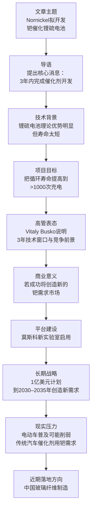
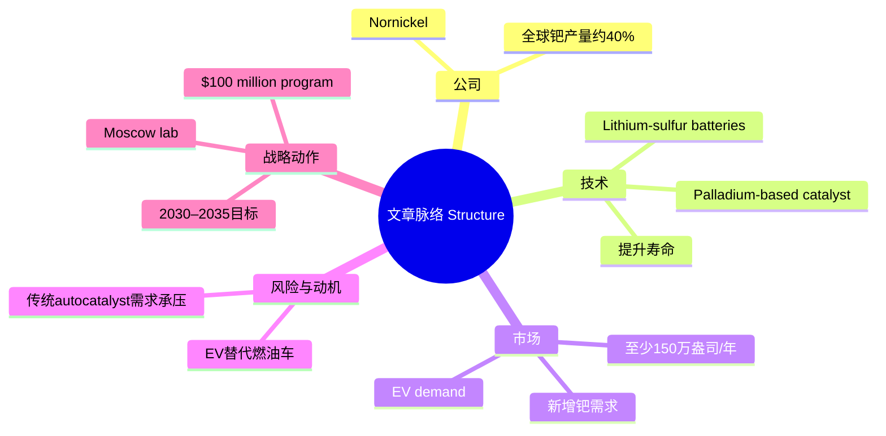
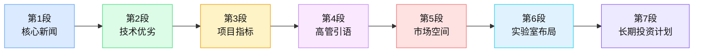

## 文章来源与作者信息

- 来源网站：`ProFinance.Ru`（据文末说明，本文由 `ProFinance.Ru` 根据 `Reuters`、`Интерфакс` 材料整理）
- 题目：`«Норникель» подготовит новый рынок спроса на палладий со стороны электромобилей`
- 发布时间：`14.04.26 14:01`  
  结合俄文新闻站常见日期格式推断，这里通常表示 `2026年4月14日 14:01`。
- 原始消息来源：`Reuters`，`Интерфакс`
- 作者背景简介：  
  `Reuters`（路透社）是全球主要国际通讯社之一，总部位于英国伦敦，长期提供金融、商业、政治与科技新闻，写作风格强调信息密度、事实导向与国际读者可读性。  
  `Интерфакс`（Interfax，国际文传电讯社）是俄罗斯重要通讯社之一，广泛报道俄罗斯经济、金融、能源与政策动态。  
  本页未明确署名单一记者，因此更准确地说，本文属于`通讯社素材整合稿`，而非典型署名专栏文章。

---

## 前情提要

---

## 逐句精读

🔻 **Используя сайт profinance.ru, Вы соглашаетесь с использованием файлов cооkie, которые указаны в Политике обработки персональных данных.**  
🔹 Using the `profinance.ru` website, / you agree to the use of `cookies` / as specified in the Personal Data Processing Policy.  
🔸 使用 `profinance.ru` 网站，您即表示同意使用个人数据处理政策中所述的 `cookie` 文件。

背景注释：  
这里是网页弹窗或站点提示语，不属于新闻正文。`cookie` 是网站存储在用户设备上的小型数据文件，用于登录状态保存、偏好记录、流量统计和广告追踪等。

> **`cookie` n. / `cookies` n.pl.**  
> 英文释义：`a small piece of data stored by a website on a user's computer or device` 网站存储在用户电脑或设备上的小型数据文件  
> 中文：`浏览器缓存文件；Cookie`  
> 语域：互联网、技术、法律合规  
> 画龙点睛：`cookie` 在阅读科技、隐私政策、欧盟数据合规文本时极常见。常见搭配有 `accept cookies`、`cookie policy`、`third-party cookies`、`essential cookies`。考试中常与 `privacy`、`consent`、`tracking` 联动出现，需掌握其功能义而不只是音译词。

---

🔻 **«Норникель» подготовит новый рынок спроса на палладий со стороны электромобилей.**  
🔹 `Nornickel` / will help create / a new market of demand for `palladium` / from `electric vehicles`.  
🔸 `诺镍公司`将推动形成一个来自`电动汽车`领域、面向`钯`的新需求市场。

背景注释：  
`Норникель` 即 `Nornickel`，英文常写作 `MMC Norilsk Nickel`，是俄罗斯大型金属与矿业公司，以镍、钯、铂、铜等金属生产见长，在全球钯供应中地位突出。  
`palladium`（钯）是一种贵金属，常用于汽车尾气净化催化剂、电子材料、化工催化及部分新型电池技术。  
`electric vehicles` 指电动汽车，常缩写为 `EVs`。

> **`palladium` n.**  
> 英文释义：`a rare silver-white metallic element used in catalysts, electronics, and jewelry` 一种稀有的银白色金属元素，用于催化剂、电子工业和珠宝  
> 中文：`钯`  
> 语域：材料、化学、能源、金融新闻  
> 画龙点睛：`palladium` 常出现在大宗商品、贵金属和新能源技术语境中。阅读时要和 `platinum`、`nickel`、`lithium` 区分。写作中若谈资源战略，可搭配 `palladium demand`、`palladium supply`、`palladium-based catalyst`。

> **`electric vehicle` n.**  
> 英文释义：`a vehicle powered wholly or partly by electricity, especially by batteries` 主要或部分由电力驱动、尤其依靠电池驱动的车辆  
> 中文：`电动汽车`  
> 语域：科技、商业、政策、环保  
> 画龙点睛：常缩写为 `EV`。新闻中高频搭配有 `EV adoption`、`EV penetration`、`EV market`、`EV transition`。注意它不仅是交通词，也是能源转型与产业政策核心词。

---

🔻 **Речь идет об использовании палладия в качестве катализатора в литий-серных батареях.**  
🔹 The issue here / is the use of `palladium` / as a `catalyst` / in `lithium-sulfur batteries`.  
🔸 这里所说的是把`钯`用作`催化剂`，应用于`锂硫电池`之中。

背景注释：  
`lithium-sulfur batteries`（锂硫电池）被视为下一代储能技术方向之一，理论上能量密度高于传统锂离子电池，但循环寿命和稳定性一直是主要瓶颈。  
`catalyst` 指催化剂，能加速化学反应或改善反应路径，但本身不被永久消耗。

> **`catalyst` n.**  
> 英文释义：`a substance that speeds up a chemical reaction without being permanently changed itself` 加速化学反应而自身不被永久改变的物质  
> 中文：`催化剂；促进因素`  
> 语域：化学、科技，也可引申用于社科  
> 画龙点睛：本词有本义和引申义。科技文里是“催化剂”，社科文里可指“促成因素”。常见搭配 `act as a catalyst`、`catalytic activity`。写作中可灵活用于抽象表达，如 `The crisis acted as a catalyst for reform.`

> **`lithium-sulfur battery` n.**  
> 英文释义：`a type of rechargeable battery that uses lithium and sulfur as key materials` 以锂和硫为关键材料的一种可充电电池  
> 中文：`锂硫电池`  
> 语域：电池技术、材料科学  
> 画龙点睛：这是典型科技复合名词。阅读时应整体识别，不要拆成零散单词理解。常与 `energy density`、`cycle life`、`commercialization`、`next-generation battery` 连用。

---

🔻 **Надеждинский металлургический завод компании «Норникель» в Норильске, Россия, 23 августа 2021 года. REUTERS**  
🔹 The `Nadezhda Metallurgical Plant` of `Nornickel` / in `Norilsk`, Russia, / August 23, 2021. / `REUTERS`  
🔸 这是`路透社`配发图片说明：俄罗斯`诺里尔斯克`的`诺镍公司纳杰日金斯克冶金厂`，拍摄于`2021年8月23日`。

背景注释：  
这不是正文句子，而是图片说明。  
`Norilsk` 是俄罗斯西伯利亚北部重要工业城市，与镍、铜、钯等矿产开发密切相关。  
`REUTERS` 表示图片版权或来源归路透社。

> **`metallurgical` adj.**  
> 英文释义：`relating to the science or industry of metals and metal extraction` 与金属学或金属提炼工业有关的  
> 中文：`冶金的`  
> 语域：工业、材料、制造业  
> 画龙点睛：`metallurgical` 常见于重工业报道，如 `metallurgical plant`、`metallurgical industry`。它与 `metal` 有关，但更偏“冶炼、金属工艺”层面，写作中适合提升专业表达精确度。

---

🔻 **«Норникель» заявил во вторник, 14 апреля, что намерен завершить разработку катализатора на основе палладия для литий-серных (Li-S) батарей в течение трех лет, что потенциально может создать новый крупный источник спроса на палладий в электромобилях.**  
🔹 `Nornickel` said / on Tuesday, `April 14`, / that it intends to complete the development of a `palladium-based catalyst` / for `lithium-sulfur (Li-S) batteries` / within three years, / which could potentially create / a major new source of demand for `palladium` / in `electric vehicles`.  
🔸 `诺镍公司`于`4月14日`星期二表示，计划在三年内完成用于`锂硫（Li-S）电池`的`钯基催化剂`开发；这一进展有可能为`电动汽车`领域带来一个新的大型`钯`需求来源。

背景注释：  
`Li-S` 是 `lithium-sulfur` 的缩写，科技与产业新闻中常见。  
`palladium-based` 表示“以钯为基础的、含钯的”。  
句末 `which` 引导的非限制性定语从句，指代前面整个开发计划及其完成结果，而不是单独指 `three years`。

> **`intend` v.**  
> 英文释义：`to have a plan or purpose to do something` 打算做某事；意欲  
> 中文：`打算；计划`  
> 语域：正式、新闻、商务  
> 画龙点睛：`intend to do` 是新闻稿高频结构，比 `want to` 更正式。常与公司、政府、机构主语连用，如 `The company intends to expand...`。写作中可替换口语化表达，提升正式度。

> **`palladium-based` adj.**  
> 英文释义：`made with or centered on palladium as a principal material` 以钯为主要材料或核心成分的  
> 中文：`钯基的；以钯为基础的`  
> 语域：科技、材料、工业  
> 画龙点睛：后缀结构 `-based` 在学术和新闻英语中极实用，如 `market-based`、`carbon-based`、`evidence-based`。掌握该构词法有助于快速识别技术词和写出更凝练的书面表达。

> **`source of demand` phr.**  
> 英文释义：`something that generates or contributes to market demand` 产生或推动市场需求的来源  
> 中文：`需求来源`  
> 语域：经济、商业、市场分析  
> 画龙点睛：经济报道中常说 `a source of growth`、`a source of revenue`、`a source of demand`。它强调“需求从哪里来”。写作时可用于分析产业驱动因素，比直接说 `demand` 更具结构感。

---

🔻 **Литий-серные батареи теоретически обладают более высокой плотностью энергии, а также значительно меньшей стоимостью и весом, чем литий-ионные батареи, используемые в настоящее время в большинстве электромобилей.**  
🔹 `Lithium-sulfur batteries`, / in theory, / have a higher `energy density`, / as well as significantly lower cost and weight, / than the `lithium-ion batteries` / currently used / in most `electric vehicles`.  
🔸 `锂硫电池`在理论上具有更高的`能量密度`，同时其成本和重量也明显低于目前大多数`电动汽车`所使用的`锂离子电池`。

背景注释：  
`energy density` 指单位质量或单位体积所能储存的能量，是衡量电池性能的核心指标之一。  
`lithium-ion batteries` 即锂离子电池，是当前消费电子和电动车中最成熟、最广泛使用的电池体系。

> **`energy density` n.**  
> 英文释义：`the amount of energy stored in a given system or space per unit volume or mass` 单位体积或单位质量内储存的能量  
> 中文：`能量密度`  
> 语域：物理、工程、电池技术  
> 画龙点睛：这是能源科技文章必会词。常搭配 `high energy density`、`gravimetric energy density`、`volumetric energy density`。阅读中它往往与 `weight`、`range`、`efficiency` 一起决定技术优劣。

> **`lithium-ion battery` n.**  
> 英文释义：`a rechargeable battery in which lithium ions move between electrodes during charging and discharging` 充放电过程中锂离子在电极间移动的一种可充电电池  
> 中文：`锂离子电池`  
> 语域：科技、制造业、消费电子  
> 画龙点睛：常写作 `Li-ion battery`。这是与 `Li-S battery` 对照出现的核心术语。考试阅读中，命题人常通过对比不同技术路线来设置细节题和推断题，要特别留意比较级结构。

---

🔻 **Однако до сих пор они не получили массового производства из-за крайне ограниченного срока службы.**  
🔹 `However`, / they have not yet achieved `mass production` / because of their extremely limited `service life`.  
🔸 `然而`，由于`使用寿命`极其有限，它们迄今仍未实现`大规模生产`。

背景注释：  
这里的 `they` 指上一句中的 `lithium-sulfur batteries`。  
`service life` 在工业与工程领域常指产品可正常工作的寿命、服役周期。  
该句是典型的“优势—限制”科技新闻论述模式。

> **`mass production` n.**  
> 英文释义：`the manufacture of large quantities of standardized products` 大批量标准化产品的生产  
> 中文：`大规模生产；量产`  
> 语域：制造业、商业、科技  
> 画龙点睛：`mass production` 常与 `commercialization`、`scale-up`、`industrial application` 一起出现。它不等于“能做出来”，而是“能稳定、低成本、批量地做出来”。写作中可作为科技落地能力的重要判断标准。

> **`service life` n.**  
> 英文释义：`the period during which a machine, product, or material remains usable` 设备、产品或材料可持续使用的期限  
> 中文：`使用寿命；服役寿命`  
> 语域：工程、制造、产品说明  
> 画龙点睛：与日常表达 `lifespan` 接近，但 `service life` 更偏技术、工业语域。常见搭配 `extend the service life`、`limited service life`。考研翻译中这是典型专业化表达，值得积累。

---

🔻 **Проект «Норникеля», на долю которого приходится около 40% мирового производства, направлен на значительное увеличение срока службы литий-серных батарей до более чем 1000 циклов зарядки.**  
🔹 `Nornickel's project`, / which accounts for about `40% of global production`, / is aimed at significantly increasing / the `service life` of `lithium-sulfur batteries` / to more than `1,000 charging cycles`.  
🔸 `诺镍公司`这一项目——该公司约占`全球产量的40%`——旨在显著提高`锂硫电池`的`使用寿命`，使其超过`1000次充电循环`。

背景注释：  
这里 `40% of global production` 从上下文看指该公司在全球相关钯产量中的占比。  
`charging cycles` 指电池完整充放电循环次数，是衡量电池寿命的重要技术指标。

> **`account for` phr.v.**  
> 英文释义：`to make up or constitute a part of something` 占据；构成  
> 中文：`占……比例；构成`  
> 语域：正式、新闻、数据分析  
> 画龙点睛：`account for` 是英语阅读高频短语，既可表示“占比”，也可表示“解释原因”。要根据语境区分：本句是“占据比例”；如 `This may account for the decline` 则是“解释”。属于考试易混点。

> **`charging cycle` n.**  
> 英文释义：`one complete process of charging and discharging a rechargeable battery` 一次完整的充放电循环  
> 中文：`充电循环；充放电循环`  
> 语域：电池技术、电子产品  
> 画龙点睛：科技文中常用 `cycle life` 和 `charging cycles` 衡量电池耐久性。阅读时留意数字，因为命题常围绕 `1000 cycles` 这类具体指标出题。

---

🔻 **«Решение здесь может быть найдено на горизонте 3-х лет. [Это время нужно] для того, чтобы мы могли технологию доработать и она могла конкурировать с существующими. Литий-серные технологии выглядят достаточно перспективно, с точки зрения плотности энергии показатели выше текущих LFP, NMC и других видов аккумуляторов», — сказал вице-президент «Норникеля» Виталий Буско.**  
🔹 `A solution` here / may be found / within a `three-year horizon`. / `[That time is needed]` / so that we can further refine the technology / and enable it to compete with existing ones. / `Lithium-sulfur technologies` look quite promising; / from the perspective of `energy density`, / their indicators are higher / than those of current `LFP`, `NMC`, / and other types of batteries, / said `Nornickel Vice President Vitaly Busko`.  
🔸 `诺镍`副总裁`维塔利·布斯科`表示：这里的`解决方案`有望在`三年时间范围内`找到。`这段时间`将用于进一步完善该技术，使其能够与现有技术竞争。就`能量密度`而言，`锂硫技术`看起来相当有前景，其指标高于当前的`LFP`、`NMC`以及其他类型电池。

背景注释：  
`Vitaly Busko` 为文中提到的 `Nornickel` 高管。  
`LFP` 指 `lithium iron phosphate`，即磷酸铁锂电池。  
`NMC` 指含镍、锰、钴的三元锂电池体系，英文常写 `nickel manganese cobalt`.  
`on the horizon` 或 `within a ... horizon` 是新闻与商业分析中常见表达，表示“在某个时间范围内可望实现”。

> **`horizon` n.**  
> 英文释义：`a future time period within which something is expected to happen` 预计某事将在其中发生的未来时间范围  
> 中文：`时间范围；前景期`  
> 语域：商业、政策、分析  
> 画龙点睛：除“地平线”本义外，在经济和咨询文本中常引申为“时间视野”。如 `over the medium-term horizon`。这是典型熟词僻义，考试中非常值得重点掌握。

> **`refine` v.**  
> 英文释义：`to improve something by making small changes; to make it more precise or effective` 通过细微调整改进；使更精确、更有效  
> 中文：`改进；优化；精炼`  
> 语域：科技、学术、商务  
> 画龙点睛：`refine` 既可用于技术，也可用于观点、方法、模型，如 `refine a process`、`refine an argument`。比 `improve` 更书面、更强调“打磨”。写作替换价值很高。

> **`compete with` phr.**  
> 英文释义：`to be able to rival or match another product, company, or system` 与……竞争；可与……抗衡  
> 中文：`与……竞争；和……抗衡`  
> 语域：商业、市场、科技  
> 画龙点睛：可用于商业竞争，也可用于技术路线比较。常见形式 `compete with`, `compete against`, `be competitive with`。雅思写作讨论新旧技术替代时非常好用。

> **`promising` adj.**  
> 英文释义：`showing signs of future success or usefulness` 显示出未来成功或实用前景的  
> 中文：`有前景的；有希望的`  
> 语域：科技、教育、商业  
> 画龙点睛：`promising` 是评价技术、药物、研究方向时的高频词。比 `good` 精准得多。可搭配 `a promising technology`、`promising results`、`a promising candidate`。

---

🔻 **Если технология окажется успешной, она «откроет огромные новые рынки для палладия», заявили в компании «Норникель», оценив потенциальный спрос как минимум в 1,5 миллиона унций в год.**  
🔹 If the technology proves successful, / it will `open up` vast new markets / for `palladium`, / `Nornickel` said, / estimating `potential demand` / at at least `1.5 million ounces per year`.  
🔸 `诺镍公司`表示，如果这项技术最终被证明成功，它将为`钯`“打开巨大的新市场”；公司估计其`潜在需求`至少可达到每年`150万盎司`。

背景注释：  
`ounce` 在贵金属市场中通常指 `troy ounce`（金衡盎司），不同于日常重量单位。  
贵金属市场习惯以盎司计价和计量，因此新闻常直接写 `ounces`。  
这里的需求是指新增工业需求，而非投资需求。

> **`open up` phr.v.**  
> 英文释义：`to create new opportunities, possibilities, or markets` 开辟；打开新的机会或市场  
> 中文：`开辟；打开`  
> 语域：新闻、商业、政策  
> 画龙点睛：`open up` 很适合描述“新技术、新政策带来新空间”。可搭配 `open up markets`、`open up opportunities`、`open up new avenues`。写作中比单纯 `create` 更生动自然。

> **`potential demand` n.**  
> 英文释义：`possible future demand that may emerge under certain conditions` 在特定条件下可能出现的未来需求  
> 中文：`潜在需求`  
> 语域：经济、市场、投资  
> 画龙点睛：`potential` 是商业分析核心词，表示“尚未完全实现但可能形成的”。常与 `market`, `growth`, `risk`, `benefit` 搭配。阅读中要留意它和 `actual` 的区别。

> **`ounce` n.**  
> 英文释义：`a unit of weight; in precious metals, often a troy ounce` 重量单位；贵金属中通常指金衡盎司  
> 中文：`盎司`  
> 语域：金融、贵金属、商品市场  
> 画龙点睛：商品新闻里 `ounces` 往往不是生活中的常衡盎司，而是 `troy ounces`。如果用户要做金融英语阅读，这类单位必须敏感，尤其在金银铂钯市场里极常见。

---

🔻 **На этой неделе компания «Норникель» открыла в Москве лабораторию по изучению палладия для разработки новых областей применения палладия, выходящих за рамки автокатализаторов для неэлектрических транспортных средств, на которые в настоящее время приходится более 80% мирового спроса.**  
🔹 This week, / `Nornickel` opened / a `palladium research laboratory` in `Moscow` / to develop new applications for `palladium` / beyond `autocatalysts` for non-electric vehicles, / which currently account for / more than `80% of global demand`.  
🔸 本周，`诺镍公司`在`莫斯科`设立了一家`钯研究实验室`，用于开发`钯`的新应用领域，突破面向非电动车辆的`汽车催化剂`用途；目前后者仍占`全球需求`的`80%以上`。

背景注释：  
`autocatalysts` 指汽车尾气净化催化剂，主要用于燃油车尾气处理。  
该句强调公司试图减少对单一传统用途的依赖，因为电动车增长可能压缩燃油车催化剂市场。

> **`autocatalyst` n.**  
> 英文释义：`a catalyst used in vehicle emission-control systems` 用于车辆排放控制系统中的催化剂  
> 中文：`汽车催化剂；车用尾气催化剂`  
> 语域：汽车工业、环保、材料  
> 画龙点睛：不要与一般化学中的 `catalyst` 混淆。前者是具体工业应用。常出现在贵金属需求分析里，因为钯、铂、铑都与汽车尾气处理密切相关。

> **`account for` phr.v.**  
> 英文释义：`to constitute or represent a specified proportion` 占据某一特定比例  
> 中文：`占……比重`  
> 语域：正式、数据报道  
> 画龙点睛：该短语再次出现，说明它是财经科技报道的骨干表达。反复出现的高频结构，往往就是最值得背诵和模仿的表达。

> **`beyond` prep./adv.**  
> 英文释义：`outside the range, limits, or scope of something` 超出……范围；在……之外  
> 中文：`超出；在……之外`  
> 语域：通用、正式  
> 画龙点睛：`beyond` 是非常实用的抽象表达词。新闻与议论文中可用于 `beyond economics`、`beyond traditional uses`、`go beyond`。它能帮助写作摆脱简单的 `not only...` 句式。

---

🔻 **Металлургический гигант инвестирует 100 миллионов долларов в программу, направленную на создание примерно 1,7 миллиона тройских унций нового ежегодного спроса на палладий к 2030–2035 годам, чтобы компенсировать потенциальные потери от растущего распространения электромобилей, и уже определил ближайшую коммерческую возможность его применения в производстве стекловолокна в Китае.**  
🔹 The `metallurgical giant` / is investing `$100 million` / in a program aimed at creating / about `1.7 million troy ounces` of new annual demand for `palladium` / by `2030–2035`, / in order to offset `potential losses` / from the growing adoption of `electric vehicles`, / and has already identified / the nearest `commercial opportunity` / for its application / in `fiberglass` production / in `China`.  
🔸 这家`冶金巨头`正向一项计划投资`1亿美元`；该计划旨在到`2030—2035年`间创造每年约`170万金衡盎司`的新增`钯`需求，以抵消`电动汽车`日益普及可能带来的`潜在损失`。此外，公司已经确定了其近期`商业化机会`，即在`中国`的`玻璃纤维`生产中加以应用。

背景注释：  
`troy ounce` 即金衡盎司，是贵金属国际通行计量单位。  
`fiberglass`（玻璃纤维）广泛用于建筑、汽车、风电叶片、复合材料等领域。  
句中 `its application` 的 `its` 指代 `palladium`。  
该句交代了公司战略动机：提前寻找新的用钯场景，以对冲电动车替代燃油车后传统车用催化剂需求下降的风险。

> **`offset` v.**  
> 英文释义：`to balance or reduce the effect of something by having an opposite effect` 抵消；弥补  
> 中文：`抵消；补偿`  
> 语域：经济、金融、环境、政策  
> 画龙点睛：`offset losses`、`offset costs`、`offset emissions` 都很常见。该词在商业分析与议论文中极有用，能准确表达“用一个增长弥补另一个下降”。

> **`adoption` n.**  
> 英文释义：`the act or process of beginning to use something` 采用；采纳；普及应用  
> 中文：`采用；普及`  
> 语域：科技、商业、政策  
> 画龙点睛：在科技报道中，`adoption` 不只是“采用”字面义，更常表示技术被市场接受的过程，如 `EV adoption`、`technology adoption`。这是理解产业扩散的核心名词。

> **`commercial opportunity` n.**  
> 英文释义：`a chance to develop profit-making business activity` 商业盈利机会  
> 中文：`商业机会；商业化机遇`  
> 语域：商业、投资、产业分析  
> 画龙点睛：和 `business opportunity` 接近，但 `commercial` 更正式，也更偏产业落地。学术转产业、技术转市场时常见这一表达，写作中非常实用。

> **`fiberglass` n.**  
> 英文释义：`fine glass fibers used especially in insulation and reinforced materials` 用于绝热或增强材料的细玻璃纤维  
> 中文：`玻璃纤维`  
> 语域：材料、制造业、工程  
> 画龙点睛：这是产业新闻里较专业的材料词。若用户备考财经或科技英语，建议顺手记住相关构词：`glass fiber`、`fiber-reinforced`、`composite materials`，有助于拓展材料类词汇网络。

---

## 补充说明：正文之外已剔除内容

你提供的页面中还包含以下杂项，已按规则剔除，不纳入正文逐句精读范围：

- 站点导航栏：如 `Котировки`、`Графики`、`Форум` 等
- 年龄提示：`18+`
- Telegram/订阅入口
- “按主题推荐”新闻列表
- “最后新闻”滚动列表
- 页脚版权、广告、公司链接、联系方式等
