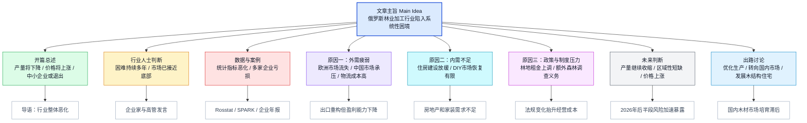
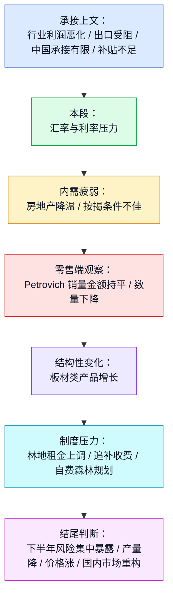

## 前情提要

### 文章来源与基本信息
- 来源：**Fontanka.ru（《Фонтанка》）**
- 栏目：**Бизнес**
- 题目：**Дерево засыхает. Почему лесопромышленники банкротятся и уходят с рынка**
- 中文可译：**树木在枯萎：为什么林业企业正走向破产并退出市场**
- 作者：**Екатерина Фомичева**
- 作者身份：**《Фонтанка》“Бизнес（商业）”栏目记者**
- 发布时间：**2026年4月8日 10:04**

### 作者背景简介
目前公开可核实的信息显示，**Екатерина Фомичева**为《Фонтанка》商业条线记者，本文署名信息可直接确认其记者身份；但关于其更完整的公开职业履历、教育背景、长期报道方向等，公开网页可检索到的权威资料较少，**暂无法可靠补充更详细生平信息**。这里不做无依据扩展。

### 文章结构信息图

---

## 逐句精读

> 说明：原文为俄语，按要求保留三种文本：**🔻原文 / 🔹英文 / 🔸中文**。以下仅处理文章正文核心内容，已剔除网页导航、广告、评论区、推荐阅读、站点页脚等无关杂讯。

---

🔻В ближайшее время / в России заметно сократится объем производства `пиломатериалов`. / А цены на них вырастут.  
🔹In the near future, / the volume of `lumber` production in Russia / will decline noticeably. / And prices for it will rise.  
🔸在不久的将来，/ 俄罗斯`锯材`的产量 / 将明显下降。/ 而其价格也将上涨。

背景注释：
- `пиломатериалы`：指经过锯切加工后的木材产品，常译为“锯材、板材、木料”。
- 本句是全文导语，先抛出两个核心判断：**供给下降**与**价格上涨**。

> **`lumber` / `timber` 锯材；木材（n.）**
> 英文释义：`wood prepared for building or carpentry`（用于建筑或木工的加工木材）；中文：`锯材；木料`
> 语域：新闻，商业，建筑
> 画龙点睛：美式英语常用 `lumber`，英式英语更常见 `timber`。考试中若谈建筑、出口、原材料行情，这两个词常出现。注意 `wood` 更泛，`lumber/timber` 更偏工业或建筑成品语境。

> **`decline` 下降；减少（v./n.）**
> 英文释义：`to become smaller, fewer, or less`（变少、下降）；中文：`下降；减少`
> 语域：正式，新闻，经济
> 画龙点睛：可替换 `fall`, `drop`, `decrease`，但 `decline` 书面感更强，常用于数据和趋势描述，如 `production declined by 10%`。写作中非常适合图表题、经济类阅读和论述文。

> **`noticeably` 显著地；明显地（adv.）**
> 英文释义：`in a way that is easy to see or recognize`（明显可察觉地）；中文：`明显地；显著地`
> 语域：正式，新闻
> 画龙点睛：是 `noticeable` 的副词形式。比 `obviously` 更客观，适合描述趋势、变化、差异。雅思写作中可用于修饰数据变化，如 `prices rose noticeably in the final quarter`。

---

🔻Все это происходит / из-за `плачевной` ситуации / в лесопромышленном секторе / на фоне снижения спроса / на внешнем и внутреннем рынках.  
🔹All this is happening / because of the `dire` situation / in the forestry industry / against the backdrop of falling demand / in both foreign and domestic markets.  
🔸这一切的发生 / 是因为林业工业部门 / 处于`严峻`困境之中，/ 同时外部市场和国内市场的需求 / 都在下滑。

背景注释：
- `лесопромышленный сектор`：林业工业部门，涵盖采伐、锯材加工、木制品、纸浆造纸等环节。
- `external and domestic markets`：分别指出口市场与俄罗斯国内市场。

> **`dire` 极其严重的；危急的（adj.）**
> 英文释义：`extremely serious or urgent`（极其严重或紧急的）；中文：`严峻的；糟糕的；危急的`
> 语域：正式，新闻
> 画龙点睛：比 `bad` 强得多，常见于 `dire situation`, `dire need`, `dire warning`。阅读里遇到它，往往意味着问题已不只是一般困难，而是接近危机状态。

> **`against the backdrop of` 在……背景之下（phrase）**
> 英文释义：`happening while a particular situation exists`（在某种背景或大环境下发生）；中文：`在……背景下`
> 语域：正式，新闻
> 画龙点睛：非常典型的新闻英语表达，可替换 `amid`, `in the context of`。写作中用它能显著提升句子书面度，如 `against the backdrop of slowing growth`.

> **`domestic market` 国内市场（n. phrase）**
> 英文释义：`the market within a country`（一国国内的市场）；中文：`国内市场`
> 语域：经济，商业
> 画龙点睛：与 `foreign market` / `overseas market` 对应。财经阅读中常和 `demand`, `consumption`, `exports`, `policy support` 搭配出现。

---

🔻Уже во второй половине года / можно ожидать ухода с рынка / и `банкротств` малых и средних предприятий, / считают эксперты.  
🔹Experts believe that / in the second half of the year / one can expect market exits / and `bankruptcies` among small and medium-sized enterprises.  
🔸专家认为，/ 早在今年下半年，/ 人们就可能看到 / 中小企业退出市场 / 以及出现`破产`潮。

背景注释：
- `малые и средние предприятия`：即中小企业，英文常对应 `SMEs`。
- 本句点出行业风险释放的时间窗口：**2026年下半年**。

> **`bankruptcy` 破产（n.）**
> 英文释义：`the state of being unable to pay debts`（无力偿债的状态）；中文：`破产`
> 语域：法律，商业，新闻
> 画龙点睛：常搭配 `file for bankruptcy`, `declare bankruptcy`, `face bankruptcy`。注意它既可指法律程序，也可泛指企业财务崩溃。写作涉及企业风险时非常常用。

> **`market exit` 退出市场（n. phrase）**
> 英文释义：`the act of leaving a market or stopping operations in it`（退出某一市场或停止经营）；中文：`退出市场`
> 语域：经济，产业分析
> 画龙点睛：是产业研究高频词，与 `market entry` 相对。可用来描述企业倒闭、转型、停产或撤销业务。阅读理解常把它作为行业洗牌的重要信号。

> **`small and medium-sized enterprises` 中小企业（n. phrase）**
> 英文释义：`businesses smaller than large corporations in size and revenue`（规模和营收小于大型公司的企业）；中文：`中小企业`
> 语域：商业，政策
> 画龙点睛：常缩写为 `SMEs`。写作中第一次写全称，之后可用缩写。该词在经济政策、就业、产业结构类文章中极高频。

---

🔻«Сложности / у лесопромышленников / не первый год, / и ситуация / наконец достигла дна. / Но у меня настроение хорошее, / потому что дальше падать уже некуда», — говорит / генеральный директор и учредитель / одного из крупнейших на Северо-Западе предприятий отрасли / ГК «УЛК» / Владимир Буторин.  
🔹“The difficulties / facing forestry companies / have not lasted just one year, / and the situation / has finally hit bottom. / But I’m in a good mood, / because there is simply nowhere left to fall,” says / Vladimir Butorin, / the CEO and founder / of ULC Group, / one of the largest companies in the industry / in northwestern Russia.  
🔸“林业企业面临的困难 / 并不是这一年才有，/ 而且局势 / 终于已经跌到了谷底。/ 但我的心情还不错，/ 因为再往下 / 也没地方可跌了，” / 俄罗斯西北地区业内最大企业之一 / `ULC Group` 的创始人兼首席执行官 / 弗拉基米尔·布托林说道。

背景注释：
- `ГК «УЛК»`：俄语中 `ГК` 通常指 `Group of Companies`，即集团公司。
- `Northwestern Russia`：通常指俄罗斯西北联邦区，包括圣彼得堡、列宁格勒州、阿尔汉格尔斯克州等地。
- `hit bottom` 为强烈比喻，表示市场跌至谷底。

> **`hit bottom` 跌到底部；触底（phrase）**
> 英文释义：`to reach the lowest point possible`（到达最低点）；中文：`跌到谷底；触底`
> 语域：新闻，商业，口语
> 画龙点睛：经济报道中很常见，如 `sales hit bottom`。它既能描述数据，也能描述情绪或处境。与 `bottom out` 接近，但 `bottom out` 更偏“探底后趋稳”。

> **`founder` 创始人（n.）**
> 英文释义：`a person who starts an organization or company`（创办组织或公司的人）；中文：`创始人`
> 语域：商业
> 画龙点睛：常与 `CEO`, `co-founder`, `chairman` 连用。阅读中注意区分：`founder` 说的是创建身份，不一定等于当前管理者；但这里同时兼任 `CEO`。

> **`there is nowhere left to fall` 已无再跌空间（expression）**
> 英文释义：`the situation is already at an extreme low point`（情况已低到不能再低）；中文：`已经跌无可跌`
> 语域：口语化评论，新闻引语
> 画龙点睛：属于非常形象的表达。写作中不宜频繁使用，但阅读中识别此类口语化引语，有助于理解受访者态度：悲观现实中带一点自嘲。

---

🔻«Объем заготовки древесины / и производства продукции лесопиления / по итогам 2026 года / сократится / по сравнению с 2021 годом / вдвое.  
🔹“By the end of 2026, / the volume of timber harvesting / and sawmilling output / will decrease / by half / compared with 2021.  
🔸“到2026年年底，/ 木材采伐量 / 以及锯木加工产品的产量 / 与2021年相比 / 将会`减半`。

背景注释：
- `заготовка древесины`：木材采伐、原木采集。
- `лесопиление`：锯木加工、锯材生产。

> **`timber harvesting` 木材采伐（n. phrase）**
> 英文释义：`the process of cutting and collecting trees for industrial use`（为工业用途砍伐和收集树木）；中文：`木材采伐`
> 语域：林业，工业
> 画龙点睛：属于行业术语。若文章涉及资源、森林或供应链，这是核心概念。注意和 `logging` 接近，后者更常见、更口语，也可指伐木业。

> **`sawmilling` 锯木加工（n.）**
> 英文释义：`the process of cutting logs into lumber in a sawmill`（在锯木厂将原木切割成锯材的过程）；中文：`锯木加工`
> 语域：工业，林业
> 画龙点睛：由 `sawmill` 派生。专业文章中常见，但日常英语较少见。读到时要意识到它指加工环节，而非原始采伐环节。

> **`by half` 减半；一半地（phrase）**
> 英文释义：`reduced to 50 percent of the original amount`（减少到原来的一半）；中文：`减半`
> 语域：通用，正式
> 画龙点睛：比 `50% lower` 更自然简洁。图表作文中非常实用：`output fell by half`, `profits were cut by half`。

---

🔻И после этого / мы увидим самое интересное — / как будет меняться рынок / после ухода части игроков», — прогнозирует Владимир Буторин.  
🔹And after that, / we will see the most interesting part— / how the market will change / after some players leave it,” / Vladimir Butorin predicts.  
🔸“而在那之后，/ 我们将看到最值得关注的部分——/ 当一部分市场参与者退出之后，/ 市场究竟会如何变化，” / 弗拉基米尔·布托林预测道。

背景注释：
- `игроки` 在经济新闻中常译为“市场参与者、业内企业”，不是字面上的“玩家”。
- 本句强调：危机之后将进入**行业出清与重组**阶段。

> **`player` 参与者；企业主体（n.）**
> 英文释义：`an important company or person involved in a market or activity`（在某个市场或活动中的参与主体）；中文：`参与者；行业主体`
> 语域：商业，新闻
> 画龙点睛：`major player`, `key player`, `market player` 极常见。它不是游戏词义，而是财经报道里对公司、资本、机构的简洁说法。

> **`leave the market` 退出市场（phrase）**
> 英文释义：`to stop operating or competing in a market`（停止在某市场经营或竞争）；中文：`退出市场`
> 语域：经济，商业
> 画龙点睛：可与 `go bankrupt`, `shut down`, `withdraw from the market` 区分：`leave the market` 最中性，未必一定因破产，也可能因战略收缩或并购退出。

> **`predict` 预测（v.）**
> 英文释义：`to say what will happen in the future`（预言、预测未来发生之事）；中文：`预测`
> 语域：正式，新闻，学术
> 画龙点睛：比 `guess` 更正式，常见搭配 `predict that...`, `be predicted to...`。阅读中常出现于专家、机构、模型分析语境。

---

🔻Глава ООО `«УК "Череповецлес"`» / Сергей Сухарев / подтверждает, / что ситуация на рынке / катастрофическая.  
🔹Sergey Sukharev, / head of `Cherepovetsles Management Company LLC`, / confirms / that the situation on the market / is catastrophic.  
🔸`切列波韦茨林业管理公司有限责任公司`负责人 / 谢尔盖·苏哈列夫 / 证实说，/ 市场上的局势 / 已是`灾难性`的。

背景注释：
- `ООО`：俄语公司形式，相当于 `LLC`（有限责任公司）。
- `Череповец`：俄罗斯城市切列波韦茨，位于沃洛格达州，是工业城市。

> **`catastrophic` 灾难性的（adj.）**
> 英文释义：`extremely bad, causing great damage`（极其糟糕并造成巨大损失的）；中文：`灾难性的`
> 语域：正式，新闻
> 画龙点睛：语气非常强，明显强于 `serious`、`severe`。在阅读里常作为态度判断词，说明说话者不是在描述一般经营困难，而是在强调系统性危机。

> **`confirm` 证实；确认（v.）**
> 英文释义：`to state that something is true or correct`（确认某事属实）；中文：`证实；确认`
> 语域：正式，新闻
> 画龙点睛：新闻写作中很高频，常见 `confirm that...`。要与 `affirm` 区分：`confirm` 偏事实核实，`affirm` 偏态度或法律上的确认。

---

🔻«Действительно, / можно ожидать закрытия части предприятий, / но мы будем на рынке / до последнего», — уверяет он.  
🔹“Indeed, / we can expect some enterprises to shut down, / but we will remain on the market / until the very end,” / he assures.  
🔸“的确，/ 可以预料会有一部分企业关闭，/ 但我们会坚守市场 / 到最后一刻，” / 他说道，并如此保证。

背景注释：
- `до последнего`：直译“直到最后”，在这里表达“撑到最后、坚持到底”。

> **`shut down` 关闭；停业（phrasal v.）**
> 英文释义：`to close a business or stop operations`（关闭企业或停止运营）；中文：`关闭；停业`
> 语域：商业，口语，新闻
> 画龙点睛：比 `close` 更有“停止运转”的意味。常见于工厂、企业、网站、系统。注意被动式也很常见：`the plant was shut down`.

> **`until the very end` 到最后一刻（phrase）**
> 英文释义：`continuing as long as possible`（尽可能坚持到最后）；中文：`直到最后；坚持到底`
> 语域：通用，带情绪色彩
> 画龙点睛：常用于表达韧性、决心或悲壮感。阅读中识别该表达，有助于把握人物立场与情绪。

---

🔻Согласно данным `Росстата`, / по итогам 2025 года / индекс промышленного производства / в сфере деревообработки / снизился на `3,5%`, / а лесозаготовка сократилась на `9,2%` / относительно показателей 2024 года, / констатирует Николай Иванов, / член правления и вице-президент / ПАО `«Сегежа Групп»`.  
🔹According to data from `Rosstat`, / by the end of 2025 / the industrial production index / in wood processing / fell by `3.5%`, / while logging declined by `9.2%` / relative to 2024, / says Nikolai Ivanov, / a board member and vice president / of `Segezha Group PJSC`.  
🔸`俄罗斯联邦国家统计局`的数据表明，/ 到2025年年底，/ 木材加工领域的工业生产指数 / 下降了`3.5%`，/ 而伐木业 / 较2024年 / 收缩了`9.2%`，/ `Segezha Group` 公共股份公司 / 董事会成员兼副总裁 / 尼古拉·伊万诺夫如是指出。

背景注释：
- `Росстат (Rosstat)`：俄罗斯联邦国家统计局，官方统计机构。
- `ПАО`：俄语公司类型，通常对应 `Public Joint-Stock Company`，即公共股份公司。
- `Сегежа Групп (Segezha Group)`：俄罗斯大型林业和纸浆木材企业集团。

> **`according to` 根据（prep. phrase）**
> 英文释义：`as stated by or in`（依据……所说/所载）；中文：`根据；按照`
> 语域：正式，学术，新闻
> 画龙点睛：是最基础也最实用的信息来源引介表达。写作中可用于引用数据、报告、研究。注意不要误写成 `according with`。

> **`industrial production index` 工业生产指数（n. phrase）**
> 英文释义：`a statistical measure of changes in industrial output`（衡量工业产出变化的统计指标）；中文：`工业生产指数`
> 语域：经济，统计
> 画龙点睛：这是宏观经济高频术语。阅读时若出现 `index rose/fell`, 通常反映某行业整体景气度，而非单一企业表现。

> **`relative to` 相对于（phrase）**
> 英文释义：`compared with`（与……相比）；中文：`相对于；较之于`
> 语域：正式，学术，新闻
> 画龙点睛：比 `compared to` 更中性、精确。适合数据说明、学术写作、图表分析。

---

🔻Справка: / на Северо-Западе сейчас действует / более `380` предприятий / лесопромышленного комплекса / с выручкой более `10 млн рублей` в год.  
🔹Background note: / in northwestern Russia, / more than `380` forestry-industry enterprises / are currently operating, / each with annual revenue of over `10 million rubles`.  
🔸补充说明：/ 在俄罗斯西北地区，/ 目前有 `380` 多家林业工业企业 / 正在运营，/ 其年营收均超过 `1000万卢布`。

背景注释：
- `лесопромышленный комплекс`：林业工业综合体/林业产业体系。
- 这里是媒体插入的说明性数据，不是受访者直接发言。

> **`annual revenue` 年营收（n. phrase）**
> 英文释义：`the income a company receives over a year before expenses`（企业一年内获得的营业收入，未扣除成本）；中文：`年营收`
> 语域：商业，会计
> 画龙点睛：要与 `profit` 区分：`revenue` 是收入总额，`profit` 是扣除成本后的利润。财经阅读中二者混淆是常见失分点。

> **`currently operating` 目前仍在运营（phrase）**
> 英文释义：`working or doing business at the present time`（当前仍在营业或运作）；中文：`目前运营中`
> 语域：商业，新闻
> 画龙点睛：适合描述企业、工厂、机构现状态。相比单独的 `operate`，这种结构在书面表达中更自然。

---

🔻Крупнейшие игроки / уже показывают отрицательные результаты.  
🔹The biggest players / are already posting negative results.  
🔸最大的市场参与者 / 已经开始出现负面业绩。

背景注释：
- `отрицательные результаты`：在商业语境中指亏损、利润恶化、财务表现为负。

> **`post` 公布，录得（v.）**
> 英文释义：`to record or announce a particular result`（录得或公布某种结果）；中文：`录得；公布`
> 语域：商业，财经新闻
> 画龙点睛：财经报道中常见 `post a profit`, `post a loss`, `post growth`。不是社交媒体“发帖”的意思，而是“实现/录得”某项业绩。

> **`negative results` 负面业绩；亏损表现（n. phrase）**
> 英文释义：`poor financial outcomes, often losses`（不佳的财务结果，通常含亏损）；中文：`负面业绩；不良结果`
> 语域：商业，新闻
> 画龙点睛：是较笼统表达，具体可指利润下滑、净亏损、现金流恶化。阅读中常作为后文具体财务数据的总括。

---

🔻Например, / у ООО `«Устьянский ЛПК»` / выручка в прошлом году / составила `2,4 млрд рублей`, / убыток — `7,6 млрд рублей`.  
🔹For example, / `Ustyansky Timber Industry Complex LLC` / posted revenue of `2.4 billion rubles` last year, / while its loss amounted to `7.6 billion rubles`.  
🔸例如，/ `乌斯季扬斯基木材工业综合体有限责任公司` / 去年的营收为 `24亿卢布`，/ 而亏损则高达 `76亿卢布`。

背景注释：
- `ЛПК` 常指 `лесопромышленный комплекс`，即木材/林业工业综合体。
- 本句突出“高营收+更高亏损”的反差。

> **`loss` 亏损（n.）**
> 英文释义：`money that is lost when expenses are greater than income`（支出超过收入所产生的亏损）；中文：`亏损`
> 语域：会计，商业
> 画龙点睛：与 `profit` 相对。常见表达 `net loss`, `operating loss`, `post a loss`, `run at a loss`。写作里可用于说明企业经营恶化。

> **`amount to` 达到；总计（v. phrase）**
> 英文释义：`to reach a particular total`（达到某个数量或总额）；中文：`达到；合计为`
> 语域：正式，新闻
> 画龙点睛：非常适合搭配数字。比 `be` 更正式，如 `losses amounted to $5 million`。此外它还有“等同于”的义项，要结合语境判断。

---

🔻У ООО `«Октябрьский ЛПК»` / выручка за 2025 год / составила почти `4 млрд рублей`, / убыток — `904 млн рублей`.  
🔹At `Oktyabrsky Timber Industry Complex LLC`, / revenue for 2025 / totaled nearly `4 billion rubles`, / and the loss was `904 million rubles`.  
🔸`十月木材工业综合体有限责任公司` / 2025年的营收 / 接近 `40亿卢布`，/ 亏损则为 `9.04亿卢布`。

> **`total` 总计为（v.）**
> 英文释义：`to add up to a particular amount`（合计达到某数额）；中文：`总计为`
> 语域：正式，商业
> 画龙点睛：与 `amount to` 类似，适合数字表达。写图表作文时可替换重复的 `was`，让句子更有层次。

---

🔻У ООО `«Лесплитинвест»` / выручка составила `589 млн рублей`, / убыток достиг `200 млн рублей`.  
🔹At `Lesplitinvest LLC`, / revenue stood at `589 million rubles`, / and losses reached `200 million rubles`.  
🔸`Lesplitinvest`有限责任公司 / 的营收为 `5.89亿卢布`，/ 亏损达到 `2亿卢布`。

> **`stand at` 处于；达到（phrase）**
> 英文释义：`to be at a particular level or amount`（处于某一水平）；中文：`为；达到`
> 语域：正式，新闻，图表写作
> 画龙点睛：数据写作高频表达，可替换 `be`。如 `inflation stood at 6%`。语气客观、简洁。

> **`reach` 达到（v.）**
> 英文释义：`to get to a particular level, amount, or stage`（达到某一水平、数量或阶段）；中文：`达到`
> 语域：通用，正式
> 画龙点睛：在数据描述中非常灵活，如 `reach a peak`, `reach 10 million`, `reach record highs/lows`。要注意比 `amount to` 更动态。

---

🔻У ООО `«АСПЭК-Ефимовский»` / в 2025 году / выручка от продажи / превысила `7 млрд рублей`, / а убыток достиг `489 млн рублей`.  
🔹At `ASPEK-Yefimovsky LLC`, / in 2025 / sales revenue / exceeded `7 billion rubles`, / while losses reached `489 million rubles`.  
🔸在 2025 年，/ `ASPEK-Yefimovsky`有限责任公司 / 的销售收入 / 超过了 `70亿卢布`，/ 而亏损达到了 `4.89亿卢布`。

> **`sales revenue` 销售收入（n. phrase）**
> 英文释义：`income earned from selling goods or services`（通过销售商品或服务获得的收入）；中文：`销售收入`
> 语域：商业，会计
> 画龙点睛：是 `revenue` 的更具体说法。考试中遇到 `sales`, `turnover`, `revenue` 要注意细微差异：很多情况下可近似，但语境不同。

> **`exceed` 超过（v.）**
> 英文释义：`to be greater than`（大于；超过）；中文：`超过`
> 语域：正式，学术，新闻
> 画龙点睛：比 `be more than` 更凝练正式。适合数字、限制、预期等语境，如 `costs exceeded expectations`.

---

🔻Предприятия / таких крупных холдингов, / как `«Вологодские промышленники»`, / ГК `«Титан»`, / 2024 год отработали с прибылью, / но за прошлый год / отчетность они пока не обнародовали.  
🔹The enterprises / of major holdings / such as `Vologda Industrialists` / and `Titan Group` / operated profitably in 2024, / but they have not yet disclosed / their financial statements / for last year.  
🔸像 `Vologda Industrialists`、`Titan Group` 这样的大型控股集团 / 旗下企业 / 在 2024 年 / 仍是盈利运营，/ 但对于上一年的财务报表，/ 它们迄今尚未披露。

背景注释：
- `holding`：控股集团、企业集团。
- `отчетность`：财务报表、会计报告、经营报告。

> **`operate profitably` 盈利运营（phrase）**
> 英文释义：`to run a business while making a profit`（企业在经营中实现盈利）；中文：`盈利运营`
> 语域：商业
> 画龙点睛：比简单说 `make a profit` 更强调“经营状态”。可用于公司、门店、工厂等场景。写作中很地道。

> **`disclose` 披露；公开（v.）**
> 英文释义：`to make information publicly known`（把信息公开出来）；中文：`披露；公开`
> 语域：正式，法律，财经
> 画龙点睛：财报、监管、公司治理文章中高频。常见搭配 `disclose results`, `disclose information`, `failure to disclose`.

> **`financial statements` 财务报表（n. phrase）**
> 英文释义：`formal records of a company’s financial activities`（正式记录公司财务活动的报表）；中文：`财务报表`
> 语域：会计，商业
> 画龙点睛：通常包括 `income statement`, `balance sheet`, `cash flow statement`。金融类阅读若出现它，往往暗示后文会出现关键经营数据。

---

🔻«За 2026 год / финансовые показатели / будут хуже, / причем у всех», — не обнадеживает / один из участников рынка.  
🔹“For 2026, / financial indicators / will be worse, / and this will affect everyone,” / says one market participant, / offering no reassurance.  
🔸“到了 2026 年，/ 财务指标 / 只会更差，/ 而且所有企业都逃不掉，” / 一位市场人士如此表示，/ 语气毫不乐观。

> **`financial indicators` 财务指标（n. phrase）**
> 英文释义：`measures used to assess financial performance`（用来评估财务表现的指标）；中文：`财务指标`
> 语域：商业，财经
> 画龙点睛：可指营收、利润率、现金流、负债率等。写作中可作为总括词，然后展开具体数据。

> **`reassure` 使安心；安慰（v.）**
> 英文释义：`to make someone feel less worried`（使某人不那么担心）；中文：`使安心；打消疑虑`
> 语域：通用，新闻
> 画龙点睛：本句里用否定色彩转述。常见搭配 `reassure investors`, `reassure the public`。很适合新闻和议论文写作。

---

🔻Снижает показатели / и крупнейший по объему выпуска / производитель целлюлозно-бумажной продукции / в России / с головным офисом в Петербурге — / АО `«Группа "Илим"`».  
🔹Also dragging down the figures / is `Ilim Group JSC`, / Russia’s largest producer / of pulp and paper products by output volume, / headquartered in St. Petersburg.  
🔸同样拉低整体指标的，/ 还有总部位于圣彼得堡的 / 俄罗斯按产量计最大的 / 纸浆和造纸产品生产商——/ `Ilim Group` 股份公司。

背景注释：
- `целлюлозно-бумажная продукция`：纸浆与纸制品。
- `АО`：一般对应 `Joint-Stock Company`，股份公司。
- `Ilim Group`：俄罗斯大型纸浆、造纸与木材加工企业。

> **`drag down` 拉低；拖累（phrasal v.）**
> 英文释义：`to reduce or worsen something`（使下降或恶化）；中文：`拉低；拖累`
> 语域：新闻，商业
> 画龙点睛：非常形象的财经表达。常见 `high costs dragged down profits`, `weak demand dragged down growth`。写作里可替代单调的 `reduce`.

> **`headquartered` 总部设在（adj./participle）**
> 英文释义：`having a company’s main office in a particular place`（总部位于某地）；中文：`总部设于`
> 语域：商业，新闻
> 画龙点睛：常见句型 `a company headquartered in...`。这是介绍企业背景时非常地道的压缩表达。

---

🔻Выручка компании / по `РСБУ` / за 2024 год / составила `207,08 млрд рублей`, / что на `12%` больше показателя 2023 года.  
🔹The company’s revenue / under `RAS` / for 2024 / amounted to `207.08 billion rubles`, / which was `12%` higher than in 2023.  
🔸根据 `RAS（俄罗斯会计准则）`，/ 该公司 2024 年的营收 / 达到 `2070.8亿卢布`，/ 比 2023 年 / 高出 `12%`。

背景注释：
- `РСБУ`：Russian Accounting Standards，俄罗斯会计准则。
- 本句引出“营收增长但利润下滑”的对比。

> **`under ... standards` 按照……准则（phrase）**
> 英文释义：`calculated or reported according to a certain standard`（根据某种准则核算或披露）；中文：`按……准则`
> 语域：会计，金融
> 画龙点睛：会计阅读中常见 `under IFRS`, `under GAAP`, `under RAS`。不同准则下的数据口径可能不同，阅读时必须留意。

> **`higher than` 高于（phrase）**
> 英文释义：`greater in amount or level than`（数量或水平更高于）；中文：`高于`
> 语域：通用
> 画龙点睛：看似简单，但图表比较题中极高频。注意与 `increase by 12%`、`increase to 12%` 区分：`by` 表增幅，`to` 表增至。

---

🔻А вот чистая прибыль / по итогам 2024 года / снизилась / и составила `15,2 млрд рублей` / против `17,4 млрд рублей` / годом ранее.  
🔹But net profit / for 2024 / declined / to `15.2 billion rubles`, / compared with `17.4 billion rubles` / a year earlier.  
🔸但 2024 年的`净利润` / 却出现下滑，/ 降至 `152亿卢布`，/ 而上年同期 / 为 `174亿卢布`。

> **`net profit` 净利润（n. phrase）**
> 英文释义：`profit remaining after all costs, taxes, and expenses are deducted`（扣除所有成本、税费和支出后的利润）；中文：`净利润`
> 语域：会计，商业
> 画龙点睛：与 `gross profit`（毛利润）对比记忆。财务分析中，营收增长但净利润下降，通常意味着成本、费用或融资压力上升。

> **`compared with` 与……相比（phrase）**
> 英文释义：`when considered against another figure or situation`（与另一数据或情况比较）；中文：`与……相比`
> 语域：正式，通用
> 画龙点睛：图表作文核心表达。`compared with` 与 `compared to` 很多场合可互换，但前者更适合严谨比较语境。

---

### 结构导图（之一）：区域数据与供需主线

---

🔻По данным `СПАРК`, / общая выручка лесопромышленных предприятий `СЗФО` / выросла / с `85,5 млрд рублей` в 2024 году / до `97,6 млрд рублей` в 2025 году.
🔹According to `SPARK` data, / the total revenue of forestry enterprises in the `Northwestern Federal District` / rose / from `85.5 billion rubles` in 2024 / to `97.6 billion rubles` in 2025.
🔸根据 `SPARK` 的数据，/ `西北联邦区` 林业企业的总营收 / 从 2024 年的 `855亿卢布` / 增长到 2025 年的 `976亿卢布`。

背景注释：
- `СПАРК (SPARK)`：俄罗斯企业信息与分析数据库，常用于查询公司财务、法人、风险等商业信息。
- `СЗФО`：`Северо-Западный федеральный округ`，即俄罗斯西北联邦区。

> **`total revenue` 总营收（n. phrase）**
> 英文释义：`the complete amount of income earned before costs are deducted`（扣除成本前的全部收入总额）；中文：`总营收`
> 语域：商业，会计
> 画龙点睛：适合行业、区域、集团层面统计。注意它不等于利润；很多文章正是通过“营收上升、利润下滑”来说明经营质量恶化。

> **`rise from ... to ...` 从……升至……（pattern）**
> 英文释义：`to increase between two stated amounts`（在两个给定数值之间上升）；中文：`从……上升到……`
> 语域：通用，图表，新闻
> 画龙点睛：图表作文核心句型。要注意和 `rise by` 区分：`from ... to ...` 强调起点与终点，`by ...` 强调增量。

---

🔻Но чистая прибыль / четко сигнализирует о том, / что в отрасли / все достаточно плохо.
🔹But net profit / clearly signals / that things are / quite bad / in the industry.
🔸但`净利润` / 却清楚地表明，/ 这个行业的整体状况 / 相当糟糕。

背景注释：
- 这里形成典型的财务对照：**营收增长并不意味着行业健康**，利润才更能反映盈利质量。

> **`signal` 表明；发出信号（v./n.）**
> 英文释义：`to show or indicate that something exists or is likely`（显示或表明某事存在/可能发生）；中文：`表明；发出信号`
> 语域：正式，新闻，商业
> 画龙点睛：财经评论中极常见，如 `data signal weakness`, `this signals a shift in demand`。比 `show` 更有“指标预警”的意味。

> **`industry` 行业（n.）**
> 英文释义：`a type of business activity or economic sector`（某类商业活动或经济部门）；中文：`行业`
> 语域：通用，商业
> 画龙点睛：可构成大量高频搭配，如 `industry outlook`, `industry-wide`, `across the industry`。写作中是比 `field` 更偏经济产业的词。

---

🔻Еще в 2024 году / совокупная чистая прибыль лесопромышленников / составляла `7,8 млрд рублей`, / а в 2025 году / она `рухнула` / до `720 млн рублей`.
🔹Back in 2024, / the combined net profit of forestry companies / stood at `7.8 billion rubles`, / but in 2025 / it `collapsed` / to `720 million rubles`.
🔸早在 2024 年，/ 林业企业的合计净利润 / 还有 `78亿卢布`，/ 但到了 2025 年，/ 它却`暴跌`至 / `7.2亿卢布`。

背景注释：
- `совокупная`：合计的、综合的。
- `рухнула`：语气很强，表示骤降、崩落。

> **`combined net profit` 合计净利润（n. phrase）**
> 英文释义：`the total net profit of several companies taken together`（若干企业合并计算后的净利润总额）；中文：`合计净利润`
> 语域：商业，会计
> 画龙点睛：当文章分析区域或行业而不是单一企业时，`combined`/`aggregate` 很常见。适合写概括句。

> **`collapse` 暴跌；崩塌（v./n.）**
> 英文释义：`to fall suddenly and heavily`（突然且大幅下跌）；中文：`暴跌；崩溃`
> 语域：新闻，经济
> 画龙点睛：强度远高于 `fall` 或 `decline`。常用于价格、利润、市场、信心等。考试中它往往暗示危机级别的恶化。

---

🔻`Без спроса`
🔹`No Demand`
🔸`没有需求`

背景注释：
- 这是文中一个小标题，提示下文将转入**需求端分析**。
- 新闻阅读中，小标题常帮助迅速把握段落功能。

> **`demand` 需求（n.）**
> 英文释义：`the desire and ability to buy goods or services`（购买商品或服务的意愿与能力）；中文：`需求`
> 语域：经济，商业
> 画龙点睛：与 `supply` 构成最基础的经济学搭配。阅读里出现 `weak demand`, `consumer demand`, `domestic demand` 时，要立刻联想到价格、产量、利润联动。

---

🔻На рынок / негативно влияет / снижение спроса / и на внешних, и на внутреннем рынках.
🔹The market / is being negatively affected / by falling demand / in both foreign and domestic markets.
🔸市场 / 正在受到负面影响，/ 原因是外部市场和国内市场 / 的需求都在下降。

> **`negatively affect` 对……产生负面影响（phrase）**
> 英文释义：`to harm or worsen something`（损害或使某事恶化）；中文：`对……产生负面影响`
> 语域：正式，学术，新闻
> 画龙点睛：写作里非常万能，适合替换口语化的 `be bad for`。可搭配政策、价格、环境、市场、健康等广泛对象。

> **`foreign market` 国外市场（n. phrase）**
> 英文释义：`a market outside one’s own country`（本国之外的市场）；中文：`国外市场；海外市场`
> 语域：商业，贸易
> 画龙点睛：与 `domestic market` 对举时特别常见。外贸类文章的核心概念词。

---

🔻Российские лесопромышленники / всегда зарабатывали деньги / с помощью экспорта.
🔹Russian forestry companies / have always made money / through exports.
🔸俄罗斯林业企业 / 一直以来都是依靠出口 / 来赚钱的。

背景注释：
- 点出行业历史盈利模式：**出口导向型**。

> **`make money` 赚钱；获利（phrase）**
> 英文释义：`to earn profit or income`（赚取收入或利润）；中文：`赚钱；获利`
> 语域：通用
> 画龙点睛：虽然很基础，但在新闻引语中很自然。正式写作中可替换为 `generate profits`, `earn revenue`, `remain profitable`，根据语境选择。

> **`through exports` 通过出口（phrase）**
> 英文释义：`by selling goods abroad`（通过对外销售商品）；中文：`通过出口`
> 语域：商业，贸易
> 画龙点睛：适合构成逻辑链：`through exports`, `through investment`, `through subsidies`。写作时可用它明确因果或路径。

---

🔻По данным `Росстата`, / в России производится / порядка `30 млн куб. м` пиломатериалов ежегодно, / которые идут на экспорт, / говорит / генеральный директор ООО `«Национальное лесное агентство развития и инвестиций»` / Виталий Липский.
🔹According to `Rosstat`, / about `30 million cubic meters` of lumber / are produced annually in Russia / for export, / says Vitaly Lipsky, / генеральный director of the `National Forestry Development and Investment Agency LLC`.
🔸`Vitaly Lipsky`——`国家林业发展与投资署有限责任公司`总经理——表示，/ 根据 `Rosstat` 的数据，/ 俄罗斯每年生产约 `3000万立方米` 的出口锯材。

背景注释：
- `куб. м`：立方米，英文 `cubic meters`。
- 文中为受访者引用官方统计数据。

> **`annually` 每年地（adv.）**
> 英文释义：`once every year; per year`（每年；按年计算）；中文：`每年地`
> 语域：正式，统计
> 画龙点睛：比 `every year` 更书面，特别适合数字与统计说明，如 `the country produces 30 million tons annually`。

> **`cubic meter` 立方米（n.）**
> 英文释义：`a unit of volume equal to a cube one meter on each side`（边长一米的立方体体积单位）；中文：`立方米`
> 语域：测量，工业，贸易
> 画龙点睛：资源、能源、木材、天然气报道中常见。注意复数形式 `cubic meters`。

---

🔻Но `Росстат` / не учитывает работу / малых и средних предприятий, / поясняет он.
🔹But `Rosstat` / does not take into account / the activity of small and medium-sized enterprises, / he explains.
🔸但他解释说，/ `Rosstat` / 并没有把中小企业的经营活动 / 统计进去。

> **`take into account` 考虑到；纳入统计（phrase）**
> 英文释义：`to include or consider something when making a judgment or calculation`（在判断或计算中考虑、纳入）；中文：`考虑到；计入`
> 语域：正式，学术，新闻
> 画龙点睛：是极高频表达。数据分析类文章里常表示“某统计口径未覆盖某部分”。写作中也很适合表达“政策应考虑到……”。

---

🔻По подсчетам / иностранных аналитиков, / Россия производит `44 млн куб. м` пиломатериалов в год, / и вот тут / все становится на свои места: / порядка `14 млн куб. м` / приходится / на малый и средний бизнес, / говорит Виталий Липский.
🔹According to estimates / by foreign analysts, / Russia produces `44 million cubic meters` of lumber a year, / and this / makes everything clear: / about `14 million cubic meters` / come / from small and medium-sized businesses, / says Vitaly Lipsky.
🔸Vitaly Lipsky 表示，/ 根据国外分析师的估算，/ 俄罗斯每年生产 `4400万立方米` 锯材，/ 这样一来 / 一切就说得通了：/ 其中约 `1400万立方米` / 来自中小企业。

背景注释：
- `и вот тут все становится на свои места`：习语，意为“这样事情就清楚了/一切就对上了”。

> **`estimate` 估计；估算（n./v.）**
> 英文释义：`a rough calculation or judgment of value, amount, or size`（对数量、价值或规模的估算）；中文：`估算；估计`
> 语域：正式，学术，商业
> 画龙点睛：常见于数据不完全精确但有参考价值的语境。与 `calculate` 相比，`estimate` 更强调近似值而非精确值。

> **`come from` 来自（phrase）**
> 英文释义：`to originate from a source`（源自某一来源）；中文：`来自`
> 语域：通用
> 画龙点睛：虽然基础，但在数据句里非常常用，如 `most revenue comes from exports`。简单词组在正式写作中照样好用，关键在搭配准确。

---

🔻После начала `СВО` / прекратились поставки пиломатериалов / в Европу, / однако экспорт в эти страны / составлял / не такую уж существенную долю — / всего около `4 млн куб. м` в год.
🔹After the start of the `special military operation`, / shipments of lumber / to Europe / came to a halt. / However, exports to those countries / accounted for / a not particularly large share— / only about `4 million cubic meters` a year.
🔸在 `特别军事行动` 开始之后，/ 对欧洲的锯材供应 / 中断了。/ 不过，/ 对这些国家的出口 / 所占份额 / 其实并没有那么大——/ 每年仅约 `400万立方米`。

背景注释：
- `СВО`：俄语媒体常用缩写，指“特别军事行动”。
- 本句重点：欧洲市场虽然失去，但从全国总量看并非最大份额；然而对某些地区影响更大。

> **`come to a halt` 停止；中断（phrase）**
> 英文释义：`to stop completely`（完全停下）；中文：`停止；中断`
> 语域：正式，新闻
> 画龙点睛：比 `stop` 更形象，也更常见于新闻。常用于运输、谈判、生产、增长等中止场景。

> **`account for` 占……比例；构成（phrase）**
> 英文释义：`to make up a part of a total`（构成整体中的一部分）；中文：`占比；构成`
> 语域：学术，商业，图表
> 画龙点睛：图表写作最重要短语之一，如 `exports account for 30% of sales`。也有“解释说明”的义项，要根据上下文区分。

> **`share` 份额；占比（n.）**
> 英文释义：`a part or proportion of a whole`（整体中的一部分或比例）；中文：`份额；比重`
> 语域：商业，统计
> 画龙点睛：常见 `market share`, `share of exports`, `a large/small share`。理解它有助于快速把握结构性比例关系。

---

🔻То есть / наиболее сильно / прекращение экспорта в Европу / сказалось / на предприятиях Северо-Запада.
🔹In other words, / the halt in exports to Europe / affected / enterprises in northwestern Russia / most severely.
🔸也就是说，/ 停止对欧洲出口 / 影响最严重的，/ 是俄罗斯西北地区的企业。

> **`affect ... most severely` 对……影响最严重（phrase）**
> 英文释义：`to have the strongest negative impact on`（对……造成最强烈的负面影响）；中文：`对……影响最重`
> 语域：正式，新闻
> 画龙点睛：这是比较级语义的一个很地道的表达。写作中可用 `be hit hardest` 作为更简洁替代。

> **`in other words` 换句话说（phrase）**
> 英文释义：`used to explain something more clearly`（用更清楚的话重述）；中文：`换句话说`
> 语域：通用，逻辑衔接
> 画龙点睛：议论文和说明文中非常实用，用于解释前句含义、做推论或概括。

---

🔻По данным `Росстата`, / объем производства пиломатериалов / за последние два года / сократился на `1 млн куб. м`, / а экспорт — / на `10 млн куб. м`, / до `20 млн куб. м`.
🔹According to `Rosstat`, / over the past two years / lumber production / has fallen by `1 million cubic meters`, / while exports / have dropped / by `10 million cubic meters`, / to `20 million cubic meters`.
🔸根据 `Rosstat` 的数据，/ 在过去两年里，/ 锯材产量 / 减少了 `100万立方米`；/ 而出口量 / 则减少了 `1000万立方米`，/ 降至 `2000万立方米`。

> **`over the past two years` 在过去两年里（phrase）**
> 英文释义：`during the last two years up to now`（截至目前的过去两年中）；中文：`在过去两年中`
> 语域：通用，正式
> 画龙点睛：时间范围表达非常高频。注意和 `in the past two years` 常可互换，但前者更自然地引出趋势变化。

> **`drop to` 降至（phrase）**
> 英文释义：`to decrease until reaching a certain level`（下降到某一水平）；中文：`降至`
> 语域：图表，新闻
> 画龙点睛：和 `drop by` 一样重要。`by` 表减少多少，`to` 表降到多少；两者是图表题最容易混淆的点之一。

---

🔻Очевидно, / что экспорт / просел / за счет того, / что им перестал заниматься / малый и средний бизнес.
🔹It is obvious / that exports / have slumped / because / small and medium-sized businesses / have stopped engaging in them.
🔸显然，/ 出口之所以出现下滑，/ 是因为中小企业 / 已经不再从事这项业务。

> **`slump` 大幅下滑（v./n.）**
> 英文释义：`to fall or drop heavily`（大幅下降）；中文：`暴跌；明显下滑`
> 语域：新闻，经济
> 画龙点睛：比 `decline` 更有“疲软、低迷”的色彩，常用于销量、需求、出口、信心。阅读里出现它往往暗示趋势不只是轻微回落。

> **`engage in` 从事；参与（phrase）**
> 英文释义：`to take part in or be involved in an activity`（参加或从事某活动）；中文：`从事；参与`
> 语域：正式
> 画龙点睛：书面语色彩明显，适合替代 `do`。如 `engage in trade`, `engage in negotiations`, `engage in research`。

---

🔻Фактически / крупные лесопромышленники / выдавили / средний и малый бизнес / с внешних рынков, / заключает Виталий Липский.
🔹In effect, / large forestry companies / have squeezed / medium-sized and small businesses / out of foreign markets, / Vitaly Lipsky concludes.
🔸Vitaly Lipsky 总结道，/ 实际上，/ 大型林业企业 / 已经把中小企业 / 挤出了海外市场。

> **`squeeze ... out of ...` 把……挤出……（phrase）**
> 英文释义：`to force someone or something out of a place or market by pressure or competition`（通过压力或竞争将其挤出某地或市场）；中文：`把……挤出`
> 语域：商业，新闻
> 画龙点睛：形象且常见，尤其用于竞争格局分析。可表示价格战、规模优势、渠道控制等造成的淘汰效应。

> **`in effect` 实际上；事实上（phrase）**
> 英文释义：`in fact or in practice`（事实上；实际效果上）；中文：`实际上`
> 语域：正式，逻辑衔接
> 画龙点睛：用于在总结前文后给出更本质判断。写作中可提升逻辑严密度。

---

🔻Сейчас / крупные экспортеры / с большими объемами заготовки и переработки / увеличили поставки в Китай, / но и там / рынок не `резиновый`.
🔹Now / large exporters / with substantial harvesting and processing volumes / have increased supplies to China, / but even there / the market is not `limitless`.
🔸如今，/ 拥有大规模采伐与加工能力的大型出口商 / 已增加了对中国的供货，/ 但即便在那边，/ 市场容量也不是`无限的`。

背景注释：
- `рынок не резиновый` 是俄语口语比喻，字面“市场不是橡皮做的”，意为“市场容量有限，无法无限吸收供给”。

> **`limitless` 无限制的；无限的（adj.）**
> 英文释义：`without end, limit, or boundary`（没有尽头、限制或边界的）；中文：`无限的`
> 语域：通用
> 画龙点睛：本句是对比喻的自然英译。新闻翻译时常需把原文习语转化为读者更易理解的自然表达，而非逐字直译。

> **`supplies` 供货；供应量（n.）**
> 英文释义：`amounts of goods provided to a place or buyer`（提供给某地或买方的货物数量）；中文：`供应；供货量`
> 语域：贸易，商业
> 画龙点睛：与 `supply` 单复数意义常不同。复数 `supplies` 常指具体供给物资或供货批次。

---

🔻Спрос на древесину / в Китае / не растет.
🔹Demand for timber / in China / is not growing.
🔸中国市场 / 对木材的需求 / 并没有增长。

> **`demand for` 对……的需求（phrase）**
> 英文释义：`the desire or need for a particular good or service`（对特定商品或服务的需求）；中文：`对……的需求`
> 语域：经济，商业
> 画龙点睛：极高频搭配。后接名词时很自然，如 `demand for housing`, `demand for energy`, `demand for labor`。

---

🔻Кроме того, / у российских производителей / заметно выросли затраты на логистику, / сократились государственные субсидии / на экспортные поставки.
🔹In addition, / logistics costs / for Russian producers / have increased noticeably, / while government subsidies / for export shipments / have been reduced.
🔸此外，/ 俄罗斯生产商的物流成本 / 明显上升了，/ 国家针对出口运输的补贴 / 则减少了。

> **`logistics costs` 物流成本（n. phrase）**
> 英文释义：`expenses related to transportation, storage, and distribution`（与运输、仓储和配送相关的成本）；中文：`物流成本`
> 语域：商业，供应链
> 画龙点睛：供应链类文章高频词。常与 `rise`, `surge`, `weigh on profits` 搭配，直接影响出口竞争力。

> **`subsidy` 补贴（n.）**
> 英文释义：`money provided by a government to support an industry or activity`（政府为支持某行业或活动提供的资金）；中文：`补贴`
> 语域：经济，政策
> 画龙点睛：常见搭配 `government subsidy`, `export subsidy`, `subsidize`。阅读中它通常与产业政策、价格扭曲、竞争力关联。

---

🔻Все это / делает поставки в `КНР` / не такими уж привлекательными, / особенно для компаний / европейской части России.
🔹All of this / makes shipments to `China` / far less attractive, / especially for companies / in the European part of Russia.
🔸所有这些因素 / 都使得对 `中国` 的供货 / 变得不那么有吸引力了，/ 尤其是对俄罗斯欧洲部分地区的企业而言。

背景注释：
- `КНР`：俄语缩写，对应“中华人民共和国”，英文通常直接译为 `China` 或 `PRC`，新闻中多简化为 `China`。
- `европейская часть России`：指俄罗斯西部、地理上属于欧洲的部分。

> **`attractive` 有吸引力的；有利可图的（adj.）**
> 英文释义：`appealing or advantageous`（有吸引力的；有优势的）；中文：`有吸引力的；划算的`
> 语域：通用，商业
> 画龙点睛：在商业语境里，它不仅指“好看”，更常指“值得做、利润可观”。如 `an attractive market`, `an attractive investment`.

> **`especially` 尤其（adv.）**
> 英文释义：`more than in other cases`（比其他情况更明显地）；中文：`尤其；特别是`
> 语域：通用
> 画龙点睛：用于突出重点对象。虽然简单，但在翻译和写作里能清楚标示层级关系。

---

🔻«Мы смогли / изменить географию поставок / и теперь экспортируем продукцию / на азиатские рынки, / но стоимость перевозок / очень подорожала», — жалуется Сергей Сухарев.
🔹“We managed / to change the geography of our shipments / and now export our products / to Asian markets, / but transportation costs / have risen sharply,” / Sergey Sukharev complains.
🔸“我们设法 / 改变了供货的地理方向，/ 现在把产品出口到 / 亚洲市场，/ 但运输成本 / 已经大幅上涨了，” / 谢尔盖·苏哈列夫抱怨道。

> **`shipment geography` / `geography of shipments` 供货地域分布（phrase）**
> 英文释义：`the regional pattern or destination structure of shipments`（货物流向的地区分布）；中文：`供货地理格局`
> 语域：贸易，物流
> 画龙点睛：这是典型财经表达，常用于描述出口转向、市场重构。写作中可以借鉴这种抽象说法提升表达层次。

> **`rise sharply` 大幅上升（phrase）**
> 英文释义：`to increase quickly and significantly`（迅速且明显地上升）；中文：`大幅上涨`
> 语域：图表，新闻
> 画龙点睛：图表写作高频搭配。与 `increase slightly/gradually/steadily` 一起记忆最有效。

---

🔻Государство / субсидирует поставки продукции / на экспорт, / но по факту / эта помощь — / просто `капля в море`, / которая / никакой положительной роли / не играет, / говорят участники рынка.
🔹The state / subsidizes export shipments, / but in reality / this support / is just `a drop in the ocean`, / which / plays no positive role at all, / market participants say.
🔸市场人士表示，/ 国家确实对出口运输 / 提供补贴，/ 但实际上，/ 这点帮助 / 不过只是`杯水车薪`，/ 根本起不到 / 任何积极作用。

> **`a drop in the ocean` 沧海一粟；杯水车薪（idiom）**
> 英文释义：`a very small amount compared with what is needed`（与实际所需相比微不足道的数量）；中文：`杯水车薪；微不足道`
> 语域：通用，新闻引语
> 画龙点睛：这是非常常见的英语习语，可用于钱、时间、援助、资源。写作中若使用，要确保语境适合，避免过度口语化。

> **`play a role` 起作用；扮演角色（phrase）**
> 英文释义：`to have an effect or function in a situation`（在某情境中发挥作用）；中文：`发挥作用`
> 语域：通用，正式
> 画龙点睛：极其高频，适用于学术写作和议论文。可扩展为 `play a key role`, `play a limited role`, `play no role`.

---

🔻По словам Владимира Буторина, / на 2026 год / федеральный центр / выделит / в качестве субсидий / на перевозки продукции лесопиления / `550 млн рублей`.
🔹According to Vladimir Butorin, / for 2026 / the federal government / will allocate / `550 million rubles` / in subsidies / for transporting sawmill products.
🔸弗拉基米尔·布托林表示，/ 2026 年 / 联邦政府 / 将拨出 `5.5亿卢布` / 作为锯木产品运输补贴。

> **`allocate` 拨付；分配（v.）**
> 英文释义：`to give something officially for a particular purpose`（为特定用途正式拨给某物）；中文：`分配；拨付`
> 语域：正式，政策，财政
> 画龙点睛：常见于预算、资金、资源分派。比 `give` 更正式精准，如 `allocate funds`, `allocate resources`, `allocate land`.

> **`federal government` 联邦政府（n. phrase）**
> 英文释义：`the central national government in a federal system`（联邦体制下的中央国家政府）；中文：`联邦政府`
> 语域：政治，政策
> 画龙点睛：在俄罗斯、美国等国家语境中很常见。注意与 `regional government` 对应。

---

🔻Одна компания / может получить / до `200 млн рублей` / в качестве субсидии / в течение года.
🔹A single company / can receive / up to `200 million rubles` / in subsidies / over the course of a year.
🔸一家企业 / 在一年之内 / 最多可以获得 / `2亿卢布` 的补贴。

> **`up to` 最多；高达（phrase）**
> 英文释义：`as much as, but not more than`（达到但不超过）；中文：`最多；高达`
> 语域：通用，商业
> 画龙点睛：广告、政策、合同、新闻里都极常见。阅读时要辨别它表示上限，不等于实际都能拿到这个数。

---

🔻«То есть / объем господдержки / на 2026 год / смогут получить / всего `2,5` компании.
🔹“That means / the amount of state support / allocated for 2026 / will be enough for / only `2.5` companies.
🔸“也就是说，/ 2026 年的国家扶持总额 / 最多只够 / `2.5` 家公司来分。

背景注释：
- `2.5 companies` 是说话者故意使用的讽刺式表达，意为“连三家公司都不够分”。

> **`state support` 国家扶持；政府支持（n. phrase）**
> 英文释义：`assistance provided by the government`（政府提供的帮助或支持）；中文：`国家支持；政府扶持`
> 语域：政策，商业
> 画龙点睛：可涵盖补贴、税收优惠、贷款担保等多种形式。比 `subsidy` 范围更广。

---

🔻И уже за этой субсидией / выстроилась очередь / из десятков экспортеров», — комментирует Владимир Буторин.
🔹And there is already / a line of dozens of exporters / waiting for this subsidy,” / Vladimir Butorin comments.
🔸“而且现在，/ 已经有几十家出口商 / 排队等着拿这笔补贴了，” / 弗拉基米尔·布托林评论道。

> **`line up for` 排队争取（phrase）**
> 英文释义：`to wait in line for something or compete to get it`（排队等候或争相获取）；中文：`排队争取`
> 语域：通用，新闻
> 画龙点睛：可字面可引申。这里既是“排队申请”，也暗示资源稀缺、竞争激烈。

> **`exporter` 出口商（n.）**
> 英文释义：`a person or company that sells goods to another country`（向他国销售商品的人或企业）；中文：`出口商`
> 语域：贸易，商业
> 画龙点睛：与 `importer` 配对记忆最有效。贸易文章中基本词汇，但极核心。

---

### 结构导图（之二）：汇率、投资与内需零售

---

🔻«Другая проблема — / это `крепкий рубль`, / что снижает привлекательность экспорта. / Но большого выбора нет», — говорит Сергей Сухарев.
🔹“Another problem / is the `strong ruble`, / which reduces the attractiveness of exports. / But there is not much choice,” / says Sergey Sukharev.
🔸“另一个问题 / 是`卢布坚挺`，/ 这会削弱出口的吸引力。/ 但我们并没有太多选择，” / 谢尔盖·苏哈列夫说道。

背景注释：
- `крепкий рубль`：字面为“强势/坚挺的卢布”，即本币汇率较强。对出口企业而言，本币走强通常会削弱价格竞争力。
- 本句点出**汇率因素**对出口利润的挤压。

> **`strong currency` 强势货币（n. phrase）**
> 英文释义：`a currency with a relatively high value compared with others`（相对于其他货币价值较高的货币）；中文：`强势货币`
> 语域：经济，金融
> 画龙点睛：在出口语境里，`a strong currency` 往往不是好消息，因为本国商品会显得更贵。可联想 `strong dollar`, `strong euro`, `strong yen` 等常见搭配。

> **`attractiveness` 吸引力；利好程度（n.）**
> 英文释义：`the quality of being appealing or advantageous`（具有吸引力或优势的性质）；中文：`吸引力；优势程度`
> 语域：正式，商业
> 画龙点睛：商业语境中它常表示“是否值得做、是否有利可图”，并非单纯外貌上的“吸引人”。常见 `investment attractiveness`, `market attractiveness`.

> **`there is not much choice` 别无太多选择（expression）**
> 英文释义：`there are very limited options available`（可用选择很有限）；中文：`没有太多选择；别无他法`
> 语域：通用，新闻引语
> 画龙点睛：非常自然的表达，适合描述被动处境。更正式可改为 `options are limited` 或 `there are few alternatives`.

---

🔻«Одновременно / высокий `ключ` `ЦБ`, / а также дорогой рубль / препятствуют инвестиционным процессам / в отрасли, / что замедляет модернизацию производственных фондов, / развитие отраслевого машиностроения / и станкостроения, / а также импортозамещения / по линии лесной техники», — сетует Николай Иванов.
🔹“At the same time, / the high `policy rate` of the `Central Bank`, / together with an expensive ruble, / is hindering investment processes / in the industry. / This slows the modernization of production assets, / the development of sector-specific machinery / and machine-tool building, / as well as import substitution / in forestry equipment,” / complains Nikolai Ivanov.
🔸尼古拉·伊万诺夫感叹道：/ “与此同时，/ `央行`的高`关键利率` / 再加上高位卢布，/ 正在阻碍行业内的投资活动。/ 这又拖慢了生产设备的现代化升级、/ 行业机械制造和机床制造的发展，/ 以及林业装备领域的进口替代进程。”

背景注释：
- `ЦБ`：中央银行，这里指俄罗斯央行。
- `ключ`：口语省略，指 `ключевая ставка`，即基准利率/关键利率/policy rate。
- `import substitution`：进口替代，即用本国产品替代进口产品，是俄语经济报道高频概念。
- `production assets` 对应 `производственные фонды`，近似“生产性固定资产”。

> **`policy rate` 政策利率；基准利率（n. phrase）**
> 英文释义：`the interest rate set by a central bank to influence the economy`（中央银行设定以调控经济的利率）；中文：`政策利率；基准利率`
> 语域：金融，宏观经济
> 画龙点睛：在财经阅读里，利率变化常与投资、借贷成本、消费、汇率联动。写作时若谈宏观调控，`policy rate` 比简单说 `interest rate` 更精确。

> **`hinder` 阻碍；妨碍（v.）**
> 英文释义：`to make it difficult for something to happen or develop`（使某事难以发生或发展）；中文：`阻碍；妨碍`
> 语域：正式，学术，新闻
> 画龙点睛：比 `stop` 更常见于书面表达，强调“拖慢、造成障碍”，未必完全阻止。常搭配 `growth`, `investment`, `progress`, `reform`.

> **`modernization` 现代化；升级改造（n.）**
> 英文释义：`the process of making something more modern and efficient`（使某物更现代、更高效的过程）；中文：`现代化；升级`
> 语域：正式，工业，政策
> 画龙点睛：在产业类文章里非常常见。可搭配 `industrial modernization`, `military modernization`, `modernize equipment`.

> **`import substitution` 进口替代（n. phrase）**
> 英文释义：`the replacement of imported goods with domestically produced ones`（用本国产品替代进口商品）；中文：`进口替代`
> 语域：经济，产业政策
> 画龙点睛：这是政策分析类阅读常见术语。理解它有助于把握国家产业战略与企业成本结构变化。

---

🔻`Внутренний рынок не радует`
🔹`The Domestic Market Offers Little Cheer`
🔸`国内市场也并不令人乐观`

背景注释：
- 这是新的小标题，说明文章重心从**外需与出口**转向**内需与国内销售**。

> **`domestic market` 国内市场（n. phrase）**
> 英文释义：`the market within a country’s own borders`（一国境内的市场）；中文：`国内市场`
> 语域：经济，商业
> 画龙点睛：与 `export market`、`foreign market` 常一起出现。产业分析中，判断一个行业能否“内循环”时，这个词极关键。

---

🔻На внутреннем рынке / тоже все нехорошо.
🔹Things are not good / in the domestic market / either.
🔸在国内市场上，/ 情况同样也不乐观。

> **`not good` / `far from good` 情况不好（expression）**
> 英文释义：`in an unsatisfactory or troubled state`（处于不令人满意或麻烦的状态）；中文：`状况不好`
> 语域：通用，新闻
> 画龙点睛：虽然简单，但在新闻中这种直接表达常用来制造转折和强调。更正式可替换为 `unfavorable`, `weak`, `under pressure`.

---

🔻Спрос / сокращается, / потому что / снизились темпы жилищного строительства.
🔹Demand / is shrinking / because / the pace of housing construction / has slowed.
🔸需求 / 正在收缩，/ 因为住宅建设的速度 / 已经放缓。

背景注释：
- `housing construction` 是木材行业内需的重要下游，因为住宅、装修、结构材料都会影响木材消耗。

> **`shrink` 收缩；减少（v.）**
> 英文释义：`to become smaller in size, amount, or value`（在规模、数量或价值上变小）；中文：`收缩；减少`
> 语域：正式，经济
> 画龙点睛：比 `decrease` 更有“整体萎缩”的感觉，常用于市场、需求、经济、人口。阅读中它往往暗示趋势性疲弱。

> **`the pace of` ……的速度；节奏（phrase）**
> 英文释义：`the speed at which something happens`（某事发生的速度）；中文：`……的速度；节奏`
> 语域：通用，正式
> 画龙点睛：写作中很好用，如 `the pace of growth`, `the pace of reform`, `the pace of urbanization`。很适合提升表达多样性。

> **`housing construction` 住宅建设（n. phrase）**
> 英文释义：`the building of homes and residential properties`（住房与住宅地产的建设）；中文：`住宅建设`
> 语域：建筑，经济
> 画龙点睛：房地产、材料、城市化文章高频短语。若其放缓，通常会连带影响水泥、钢材、木材、家装等多个行业。

---

🔻Нормальных условий / в части ипотеки / тоже пока нет, / напоминают участники рынка.
🔹There are still no normal conditions / in the mortgage sector / for now, / market participants remind us.
🔸市场人士提醒说，/ 在按揭贷款方面，/ 目前也还没有恢复到正常条件。

背景注释：
- `ипотека`：房贷、按揭贷款。
- 这里的“正常条件”主要指较可接受的利率、首付、审批环境和购房融资可得性。

> **`mortgage` 抵押贷款；房贷（n.）**
> 英文释义：`a loan used to buy property, especially a home`（用于购买房产的贷款，尤指房贷）；中文：`按揭贷款；房贷`
> 语域：金融，房地产
> 画龙点睛：阅读中常见搭配 `mortgage rates`, `mortgage market`, `take out a mortgage`。房地产需求往往与房贷条件直接相关。

> **`for now` 目前；暂时（phrase）**
> 英文释义：`at the present time, though this may change later`（目前如此，但未来可能变化）；中文：`目前；暂时`
> 语域：通用
> 画龙点睛：是带有“暂时性”意味的时间表达，写作中很适合描述阶段性状态。

---

🔻Некоторое сезонное оживление / может быть / в части дачных строительных работ, / однако заметная положительная динамика / в сегменте `DIY` / есть далеко не во всех категориях.
🔹There may be / some seasonal revival / in summer-house construction work, / however, noticeable positive momentum / in the `DIY` segment / is far from being seen / across all categories.
🔸在别墅/乡间住宅施工方面，/ 可能会出现一定的季节性回暖，/ 然而在 `DIY` 零售板块中，/ 明显的正向增长 / 并没有出现在所有品类里。

背景注释：
- `дача`：俄语文化中的乡间别墅/周末住宅。
- `DIY`：`do-it-yourself`，指自己动手装修、修缮、建造相关的零售市场。

> **`seasonal revival` 季节性回暖（n. phrase）**
> 英文释义：`a temporary improvement linked to a certain season`（与某一季节相关的暂时回升）；中文：`季节性回暖`
> 语域：商业，新闻
> 画龙点睛：可用于旅游、消费、建筑、农业等领域。它暗示改善可能只是短期、周期性的，不等于长期趋势反转。

> **`momentum` 动能；发展势头（n.）**
> 英文释义：`the force that keeps a trend developing or increasing`（推动趋势持续发展的力量）；中文：`势头；动能`
> 语域：正式，商业，经济
> 画龙点睛：财经报道中极高频，如 `growth momentum`, `upward momentum`, `lose momentum`。写作中非常加分。

> **`DIY` 自助式装修/动手制作（n./adj.）**
> 英文释义：`do-it-yourself activities, especially home repair or improvement done without professionals`（不依赖专业人士、自己动手完成的修缮或制作活动）；中文：`DIY；自己动手装修/制作`
> 语域：零售，家装，生活方式
> 画龙点睛：在商业报道里，`DIY segment` 往往指家居建材零售市场的一块重要消费场景。

---

🔻«В марте 2026 года / в `СТД "Петрович"` / наблюдалось постепенное восстановление спроса / на пиломатериалы», — рассказали в компании.
🔹“In March 2026, / at `Petrovich Construction Trading House`, / a gradual recovery in demand / for lumber / was observed,” / the company said.
🔸该公司表示：/ “在 2026 年 3 月，/ `Petrovich 建材贸易公司` / 对锯材的需求 / 出现了逐步恢复的迹象。”

背景注释：
- `Петрович`：俄罗斯知名建材零售与供应企业。
- 新闻中常用企业自身销售数据作为内需观察窗口。

> **`gradual recovery` 逐步恢复（n. phrase）**
> 英文释义：`a slow and steady return to a better level`（缓慢而稳定地恢复到更好水平）；中文：`逐步恢复`
> 语域：经济，商业
> 画龙点睛：比 `rebound` 更温和，不暗示强烈反弹。适合描述谨慎改善的趋势。

> **`observe` / `be observed` 观察到；出现（v.）**
> 英文释义：`to notice or record something`（观察到或记录到某现象）；中文：`观察到；出现`
> 语域：正式，新闻，学术
> 画龙点睛：被动形式 `was observed` 在报告和新闻中很常见，带有“基于数据观察”的客观色彩。

---

🔻По итогам марта / объем продаж / в денежном выражении / оказался сопоставим / с результатом марта 2025 года, / в натуральном же выражении / продажи / в марте 2026-го / просели / по сравнению с мартом прошлого года / на `12%`, / констатирует `«Петрович»`.
🔹By the end of March, / the sales volume / in monetary terms / turned out to be comparable / to the result of March 2025. / In physical terms, however, / sales / in March 2026 / fell / by `12%` / compared with March of the previous year, / `Petrovich` states.
🔸`Petrovich` 指出，/ 截至 3 月底，/ 以金额计算的销售额 / 与 2025 年 3 月 / 基本相当；/ 但若按实物数量计算，/ 2026 年 3 月的销量 / 较上年 3 月 / 下降了 `12%`。

背景注释：
- `в денежном выражении`：按金额计算。
- `в натуральном выражении`：按实物量/自然量计算，即销量件数、体积、吨数等。
- 这说明**价格因素可能抵消了部分销量下降**。

> **`in monetary terms` 按金额计算（phrase）**
> 英文释义：`measured by value in money`（以货币价值来衡量）；中文：`按金额计算`
> 语域：商业，统计
> 画龙点睛：和 `in volume terms`/`in physical terms` 常形成对照。阅读中这是理解“价升量跌”现象的关键表达。

> **`comparable` 可比的；相当的（adj.）**
> 英文释义：`similar enough to be compared or roughly equal`（足够相似、可比较或大致相当的）；中文：`可比的；相当的`
> 语域：正式，新闻，统计
> 画龙点睛：常见搭配 `be comparable to`, `comparable figures`, `not directly comparable`。数据对比题里很实用。

> **`in physical terms` 按实物量计算（phrase）**
> 英文释义：`measured by actual quantity rather than money value`（按实际数量而非货币价值衡量）；中文：`按实物量计算`
> 语域：统计，商业
> 画龙点睛：理解它能帮助区分“销售额没降”和“销量在降”之间的差别，这是经济新闻中的常见陷阱。

---

🔻«Заметный вклад / в общий рост сегмента / внесли древесно-плитные материалы: / продажи `ДВП`, `ДСП`, `фанеры` / и сопутствующих позиций / в марте / выросли / на `29%`.
🔹“A noticeable contribution / to the overall growth of the segment / was made by wood-panel materials: / sales of `fiberboard`, `chipboard`, `plywood`, / and related items / in March / rose / by `29%`.
🔸“对整个板块增长 / 作出明显贡献的，/ 是木质板材类产品：/ `纤维板`、`刨花板`、`胶合板` / 以及相关产品 / 在 3 月份的销量 / 增长了 `29%`。

背景注释：
- `ДВП`：纤维板，常译 `fiberboard`。
- `ДСП`：刨花板，常译 `chipboard` / `particle board`。
- `фанера`：胶合板，`plywood`。
- 这类产品在装修与家具制造中应用广泛。

> **`contribution` 贡献；促成作用（n.）**
> 英文释义：`the part played in achieving a result`（在形成某结果中所起的作用）；中文：`贡献；作用`
> 语域：正式，学术，商业
> 画龙点睛：常见 `make a contribution to`, `a major contribution`, `contribute to`。写作中可用于分析多因素原因。

> **`overall growth` 整体增长（n. phrase）**
> 英文释义：`growth considered across the whole segment or system`（从整体角度看的增长）；中文：`整体增长`
> 语域：商业，统计
> 画龙点睛：适合概括局部增长对全局的带动作用，尤其用于行业细分板块分析。

> **`related items` 相关商品（n. phrase）**
> 英文释义：`products associated with the main category mentioned`（与前述主类商品相关联的产品）；中文：`相关商品；配套品项`
> 语域：零售，商业
> 画龙点睛：新闻里常用于避免把具体品类列得过细，同时保留范围感。

---

🔻Это может / указывать / на повышение активности покупателей / в подготовке / к строительному сезону / и смещение спроса / в сторону комплексных закупок материалов», — говорит Денис Егоров, / руководитель отдела закупок / `«Строительные материалы и лесопиломатериалы»` / `СТД "Петрович"`.
🔹This may / indicate / increased buyer activity / in preparation / for the construction season / and a shift in demand / toward comprehensive purchases of materials,” / says Denis Yegorov, / head of procurement for / `Construction Materials and Lumber` / at `Petrovich Construction Trading House`.
🔸`Petrovich 建材贸易公司`“建筑材料与锯材”采购部负责人 / 丹尼斯·叶戈罗夫表示：/ “这可能表明，/ 消费者在为施工季做准备时 / 活跃度有所上升，/ 同时需求也在转向 / 更成套、更综合的材料采购。”

背景注释：
- `construction season`：建筑施工旺季，通常受气候影响。
- `complex purchases`：不是“复杂购买”，而是“一站式、成套采购”。

> **`indicate` 表明；显示（v.）**
> 英文释义：`to point to or show something`（指示或表明某事）；中文：`表明；显示`
> 语域：正式，学术，新闻
> 画龙点睛：和 `suggest` 相比，`indicate` 更客观；和 `prove` 相比，又不那么绝对。很适合写作中表达谨慎判断。

> **`shift in demand` 需求转移；需求变化（n. phrase）**
> 英文释义：`a change in what buyers want or prefer`（购买者需求或偏好的变化）；中文：`需求转向；需求变化`
> 语域：经济，市场分析
> 画龙点睛：市场分析高频词组。后面常接 `toward` 或 `away from`，说明需求结构的重新分配。

> **`comprehensive purchases` 综合采购；成套采购（n. phrase）**
> 英文释义：`broader, more complete buying of multiple related materials`（对多种相关材料进行更完整的一揽子采购）；中文：`综合采购；成套采购`
> 语域：零售，供应链
> 画龙点睛：适合描述消费者从“零散购买”转向“整单采购”的趋势，是零售端的结构性信号。

---

### 结构导图（之三）：法律政策、制度成本与行业出路

---

🔻`Тяжелые законы`
🔹`Heavy Laws`
🔸`沉重的法律压力`

背景注释：
- 这是段落小标题，意思不是“法律本身很重”，而是“法律和政策规定给行业带来沉重负担”。

> **`heavy` 沉重的；严厉的（adj.）**
> 英文释义：`serious, burdensome, or hard to bear`（严重的、负担沉重的、难以承受的）；中文：`沉重的；严苛的`
> 语域：通用，新闻标题
> 画龙点睛：标题中 `heavy` 常有引申义，表示“压力大、负担重”。理解标题修辞很重要，不能机械按字面翻译。

> **`law` 法律（n.）**
> 英文释义：`a system of rules officially recognized by a country or authority`（国家或权威正式承认的一套规则）；中文：`法律`
> 语域：法律，通用
> 画龙点睛：新闻标题里用复数 `laws` 往往不只指某一部法律，也可泛指法规、政策、制度环境。

---

🔻Жалуются лесопромышленники / и на законодательные инициативы / федерального центра.
🔹Forestry companies / also complain / about legislative initiatives / from the federal government.
🔸林业企业 / 还在抱怨 / 来自联邦中央的立法举措。

背景注释：
- `законодательные инициативы`：立法倡议、政策法规新动向。
- `федеральный центр`：俄语新闻中常指联邦中央政府。

> **`legislative initiative` 立法举措；立法动议（n. phrase）**
> 英文释义：`a proposed legal or regulatory action from lawmakers or the government`（立法者或政府提出的法律/监管行动）；中文：`立法举措；立法倡议`
> 语域：法律，政策，新闻
> 画龙点睛：阅读中常见于政策变化报道。它未必已经完全成为法律，也可能是政策方向或制度调整的开端。

> **`complain about` 抱怨；对……表示不满（phrase）**
> 英文释义：`to express dissatisfaction with something`（表达对某事的不满）；中文：`抱怨；投诉`
> 语域：通用，新闻
> 画龙点睛：看似基础，但在新闻引语中极常见。更正式的近义表达有 `criticize`, `voice concerns about`, `object to`.

---

🔻Например, / компании `душит` / повышение ставок аренды / лесного фонда, / сетует / один из участников рынка / из Ленобласти.
🔹For example, / rising lease rates / for the forest fund / are `strangling` companies, / laments / one market participant / from the Leningrad region.
🔸例如，/ 来自列宁格勒州的一位业内人士抱怨说，/ 森林基金租赁费率的上调 / 正在`扼住`企业的喉咙。

背景注释：
- `лесной фонд`：国家森林资源/森林基金，通常指可被租赁经营的林地资源。
- `Ленобласть`：列宁格勒州。
- `душит` 是强烈比喻，表示政策成本压力极大。

> **`lease rate` 租赁费率（n. phrase）**
> 英文释义：`the price charged for leasing something`（租用某物所需支付的费率）；中文：`租赁费率`
> 语域：商业，法律，地产
> 画龙点睛：与 `rent` 相关，但 `rate` 更强调标准和计费规则。政策类文章中费率调整常直接影响行业成本结构。

> **`strangle` 扼杀；严重压制（v.）**
> 英文释义：`to severely restrict or crush something`（严重压制、几乎使其无法生存）；中文：`扼杀；压得喘不过气`
> 语域：强烈修辞，新闻引语
> 画龙点睛：本义是“勒死”，引申后语气很重。阅读时需理解其修辞色彩：并非字面暴力，而是表达经营被成本压垮。

> **`lament` 哀叹；抱怨（v.）**
> 英文释义：`to express sadness, regret, or dissatisfaction`（表达悲叹、遗憾或不满）；中文：`哀叹；抱怨`
> 语域：正式，文学，新闻
> 画龙点睛：比 `say`、`complain` 更有情绪强度，常用于记者转述不乐观表态。

---

🔻Так, / в 2023 году / появилось постановление правительства РФ № `578` / о повышении аренды лесфонда.
🔹Thus, / in 2023, / Russian government decree No. `578` / was introduced / to raise forest-fund lease charges.
🔸例如，/ 2023 年 / 俄罗斯政府出台了第 `578` 号决议，/ 上调森林基金的租赁费用。

背景注释：
- `постановление правительства`：政府决议、政府条例。
- 编号 `578` 是政策识别信息，方便追溯具体法规。

> **`decree` 法令；政令；决议（n.）**
> 英文释义：`an official order or regulation issued by a government`（政府发布的正式命令或规章）；中文：`政令；法令；决议`
> 语域：法律，政策
> 画龙点睛：不同法系下具体法律层级不完全相同，但新闻翻译中常用 `decree` 来译政府发布的正式规范性文件。

> **`introduce` 推出；实施（v.）**
> 英文释义：`to bring in a new rule, system, or law`（引入新的规则、制度或法律）；中文：`推出；实施`
> 语域：正式，政策，新闻
> 画龙点睛：政策类文章中非常高频，如 `introduce a tax`, `introduce reforms`, `introduce new regulations`.

---

🔻Первоначально `Рослесхоз` / говорил о том, / что действие постановления / не распространяется / на договоры аренды, / заключенные ранее.
🔹Initially, `Rosleskhoz` / said / that the decree / did not apply / to lease contracts / concluded earlier.
🔸最初，`Rosleskhoz（俄罗斯联邦林业署）`曾表示，/ 该决议的适用范围 / 不包括那些 / 早先已经签订的租赁合同。

背景注释：
- `Рослесхоз (Rosleskhoz)`：俄罗斯联邦林业署，负责林业管理与相关政策执行。
- `заключенные ранее`：之前签订的，涉及法规是否具有追溯适用效果。

> **`apply to` 适用于（phrase）**
> 英文释义：`to be relevant to or affect someone or something`（适用于、影响到）；中文：`适用于`
> 语域：法律，通用
> 画龙点睛：法律英语极高频短语。要和 `apply for`（申请）严格区分，这是考试里常见失误点。

> **`conclude a contract` 签订合同（phrase）**
> 英文释义：`to formally make a legal agreement`（正式达成法律协议）；中文：`签订合同`
> 语域：法律，商业
> 画龙点睛：比 `sign a contract` 更书面。两者都对，但法律文本中 `conclude` 很常见。

---

🔻Однако / с прошлого года / практика / поменялась.
🔹However, / since last year, / the practice / has changed.
🔸然而，/ 从去年开始，/ 实际执行做法 / 发生了变化。

背景注释：
- `практика` 在这里不是“练习”，而是“实践中的执行口径/司法或行政实践”。

> **`practice` 实务做法；执行惯例（n.）**
> 英文释义：`the usual way rules are applied in real situations`（规则在现实中通常如何被执行的方式）；中文：`实践做法；执行惯例`
> 语域：法律，政策
> 画龙点睛：这是 `practice` 的重要熟词僻义。法律和政策阅读里，它常指“实际操作口径”，不等于抽象规则文本本身。

---

🔻`Счетная палата` / пришла к выводу, / что пересчет арендной платы / нужно распространить / на договоры, / которые были заключены / и до 2023 года.
🔹The `Accounts Chamber` / came to the conclusion / that the recalculation of lease payments / should be extended / to contracts / that had been concluded / even before 2023.
🔸`审计院`得出结论认为，/ 租金的重新核算 / 也应适用于 / 那些 / 早在 2023 年之前 / 就已经签订的合同。

背景注释：
- `Счетная палата`：俄罗斯联邦审计院，国家审计监督机构。
- 本句关键是：政策在实际执行中出现了**追溯性影响**。

> **`come to the conclusion` 得出结论（phrase）**
> 英文释义：`to decide after consideration that something is true`（经过考虑后得出某结论）；中文：`得出结论`
> 语域：正式，学术，新闻
> 画龙点睛：非常标准的书面表达。比单独 `conclude` 更完整清晰，适合写作与翻译。

> **`recalculation` 重新计算；重新核算（n.）**
> 英文释义：`the act of calculating something again, often under new rules`（在新规则下再次计算）；中文：`重新核算`
> 语域：法律，会计，政策
> 画龙点睛：当费用、税率、租金标准变化时，此词常出现。它往往意味着补缴、退还或争议。

> **`extend to` 扩展至；适用于（phrase）**
> 英文释义：`to make something apply to a wider group or range`（使某事适用于更广范围）；中文：`扩展到；适用于`
> 语域：正式，法律，政策
> 画龙点睛：在政策表达中很常见，适合描述规则范围扩大、待遇覆盖扩大、限制措施扩展等。

---

🔻«Мы / очень давно работаем / в регионе / и недавно получили документ / от регионального правительства / о том, / что нам необходимо доплатить / более `200 млн рублей` / за `2024–2025` годы.
🔹“We / have been working / in the region / for a very long time, / and recently we received a document / from the regional government / saying / that we must pay an additional / more than `200 million rubles` / for the years `2024–2025`.
🔸“我们 / 在这个地区经营 / 已经很多年了，/ 但最近却收到了 / 地方政府的一份文件，/ 要求我们 / 为 `2024—2025` 两年 / 额外补缴 / 超过 `2亿卢布`。

背景注释：
- 这里是企业经营者提供的具体案例，用以说明政策调整带来的现实冲击。
- `доплатить`：补缴、补付。

> **`pay an additional` 额外支付；补缴（phrase）**
> 英文释义：`to pay more on top of what has already been paid or owed`（在已支付或应付基础上再额外支付）；中文：`额外支付；补缴`
> 语域：法律，财务
> 画龙点睛：可对应税费、租金、账单等补缴场景。写作中比单独 `pay more` 更准确。

> **`regional government` 地区政府；地方政府（n. phrase）**
> 英文释义：`the government authority of a particular region within a country`（一国内某一区域的政府机构）；中文：`地方政府；区域政府`
> 语域：政治，政策
> 画龙点睛：注意与 `federal government` 对比记忆。很多政策是中央制定、地方执行。

---

🔻Мы такую сумму / заплатить не можем / и будем судиться», — говорит руководитель / одного из областных лесопильных предприятий.
🔹We cannot / pay such an amount / and will go to court,” / says the head / of one of the region’s sawmilling enterprises.
🔸“这样一笔钱 / 我们根本付不起，/ 所以将会诉诸法院，” / 某地区一家锯木企业的负责人说道。

> **`go to court` 诉诸法院；打官司（phrase）**
> 英文释义：`to take legal action in a court of law`（采取法律诉讼行动）；中文：`诉诸法院；打官司`
> 语域：法律，通用
> 画龙点睛：极高频法律表达。也可说 `take the case to court`, `sue`, `file a lawsuit`，但语气和正式程度略有差别。

> **`such an amount` 这样一笔金额（phrase）**
> 英文释义：`a sum of money of that size`（那样规模的一笔钱）；中文：`这样一笔钱`
> 语域：通用，财务
> 画龙点睛：常用于强调金额大到超出承受能力。翻译时要体现语气，而不必拘泥字面。

---

🔻Кроме того, / недавно / федеральный центр / решил, / что арендаторы лесного фонда / также должны заниматься / лесоустроительными работами / за свой счет.
🔹In addition, / recently / the federal government / decided / that tenants of the forest fund / must also carry out / forest management and surveying work / at their own expense.
🔸此外，/ 最近 / 联邦中央还决定，/ 森林基金的承租方 / 也必须 / 自费承担 / 森林规划与调查类工作。

背景注释：
- `лесоустроительные работы`：通常涉及森林资源调查、规划、边界与分类等专业工作，可译作 `forest management and surveying work`。
- 这意味着企业不仅交租，还要承担额外合规成本。

> **`tenant` 承租人；租户（n.）**
> 英文释义：`a person or company that rents property from an owner`（从所有者那里租用财产的人或公司）；中文：`承租人；租户`
> 语域：法律，房地产，商业
> 画龙点睛：与 `landlord`（出租方）相对。产业资源租赁场景下也常用，不只限于住宅租房。

> **`at one’s own expense` 自费；由自己承担费用（phrase）**
> 英文释义：`paid for by oneself rather than by another party`（费用由自己而非他方承担）；中文：`自费；自行承担费用`
> 语域：正式，法律，商业
> 画龙点睛：非常常见的书面表达。合同、政策、新闻里都高频出现。

---

🔻Что, / конечно же, / несет дополнительные расходы.
🔹This, / of course, / brings additional costs.
🔸这当然 / 会带来 / 额外的支出成本。

> **`additional costs` 额外成本（n. phrase）**
> 英文释义：`extra expenses beyond the original or usual amount`（超出原有或通常水平的额外支出）；中文：`额外成本`
> 语域：商业，财务
> 画龙点睛：可搭配 `incur`, `create`, `lead to`, `impose`。经济类写作中非常实用。

> **`of course` 当然（phrase）**
> 英文释义：`used to show that something is obvious or expected`（表示某事显而易见或理所当然）；中文：`当然`
> 语域：通用
> 画龙点睛：新闻转述中保留它，能传达说话者的态度色彩。正式论文里则应谨慎使用，避免主观化。

---

🔻«Ожидаю, / что уже во второй половине года / все начет `сыпаться`, / по-другому быть уже не может», — говорит собеседник `«Фонтанки»`.
🔹“I expect / that already in the second half of the year / everything will start to `fall apart`; / it can no longer be otherwise,” / says Fontanka’s interviewee.
🔸“我预计，/ 早在今年下半年，/ 一切都会开始`崩塌、散架`，/ 事态已经不可能有别的走向了，” / 《Fontanka》采访对象说道。

背景注释：
- `сыпаться` 是口语化比喻，原义有“往下掉、散落”，这里指系统性出问题、接连崩坏。
- 这句是极强的悲观预判。

> **`fall apart` 崩溃；散架；瓦解（phrase）**
> 英文释义：`to break down or stop functioning properly`（崩解或失去正常运转）；中文：`崩溃；瓦解；散架`
> 语域：通用，新闻引语
> 画龙点睛：既可形容物体，也可形容系统、组织、计划、关系。这里用来描写行业运行机制的连锁失灵，非常传神。

> **`it can no longer be otherwise` 已不可能有别的结果（expression）**
> 英文释义：`no other outcome now seems possible`（现在看来已不可能出现别的结局）；中文：`已经不会有别的结果了`
> 语域：正式翻译，带判断色彩
> 画龙点睛：适合翻译俄语或其他语言中带宿命式判断的句子，能较好保留语气强度。

---

🔻По мнению Виталия Липского, / уже к концу 2026 года / объемы производства пиломатериалов / сократятся, / в каких-то регионах / возникнет явный дефицит продукции, / а где-то / заметно вырастут цены.
🔹In Vitaly Lipsky’s view, / by the end of 2026, / lumber production volumes / will decline; / in some regions / a clear shortage of products / will emerge, / while elsewhere / prices will rise noticeably.
🔸Vitaly Lipsky 认为，/ 到 2026 年年底，/ 锯材产量 / 将会下降；/ 在某些地区，/ 产品将出现明显短缺，/ 而在另一些地方，/ 价格则会显著上涨。

背景注释：
- 本句给出三个直接后果：**减产、区域性短缺、价格上涨**。
- 这是全篇前文分析的集中结论。

> **`shortage` 短缺（n.）**
> 英文释义：`a situation in which there is not enough of something`（某物供应不足的情况）；中文：`短缺`
> 语域：经济，新闻，供应链
> 画龙点睛：常见搭配 `a shortage of labor`, `housing shortage`, `energy shortage`, `product shortage`。与 `lack` 相比，它更强调供给不足这一客观状态。

> **`emerge` 出现；显现（v.）**
> 英文释义：`to appear or become noticeable`（出现或变得明显）；中文：`出现；显现`
> 语域：正式，学术，新闻
> 画龙点睛：比 `appear` 更书面，也更常用于趋势、问题、模式、风险逐渐显露的语境。

---

🔻Выживут / те, кто сможет / оптимизировать производство / и займет нишу / на формирующемся внутреннем рынке, / говорит руководитель / одного из областных деревоперерабатывающих предприятий.
🔹Those who will survive / are the ones who can / optimize production / and occupy a niche / in the emerging domestic market, / says the head / of one of the regional wood-processing enterprises.
🔸一位地方木材加工企业负责人表示，/ 能够活下来的 / 将是那些 / 可以优化生产、/ 并在正在形成中的国内市场上 / 占据一席之地的企业。

背景注释：
- `ниша`：市场缝隙、细分定位。
- `формирующийся внутренний рынок`：说明国内市场并非成熟稳定，而是仍在重构阶段。

> **`optimize` 优化（v.）**
> 英文释义：`to make something as effective or efficient as possible`（使某事尽可能高效或有效）；中文：`优化`
> 语域：正式，商业，技术
> 画龙点睛：企业管理和雅思写作高频词。可搭配 `optimize production`, `optimize costs`, `optimize resource allocation`。

> **`occupy a niche` 占据细分市场（phrase）**
> 英文释义：`to secure a position in a specific, limited market segment`（在某个特定细分市场中占据位置）；中文：`占据市场利基/细分市场`
> 语域：商业，市场营销
> 画龙点睛：`niche` 是很重要的商业词，既可作名词也可作形容词。写作中比泛泛说 `find a place in the market` 更专业。

> **`emerging market` / `emerging domestic market` 新形成中的市场（phrase）**
> 英文释义：`a market that is in the process of developing or taking shape`（正在发展、成形中的市场）；中文：`新形成中的市场`
> 语域：商业，经济
> 画龙点睛：不要只把 `emerging market` 理解为“新兴经济体市场”。在具体语境里，它也可指“正在形成的新市场结构”。

---

🔻Ситуацию / так или иначе / спасет / формирование рынка пилопродукции / в России, / хотя заняться этим / надо было / еще несколько лет назад.
🔹One way or another, / the situation / will be saved / by the formation of a domestic market / for sawn timber products / in Russia, / although this / should have been addressed / several years ago.
🔸无论如何，/ 能够挽救局面的 / 还是在俄罗斯国内 / 形成一个锯木制品市场；/ 只是这件事 / 本该在几年前 / 就开始着手推进。

背景注释：
- `пилопродукция`：锯木制品、锯材类产品。
- 这里强调：国内市场建设被长期忽视，启动得太晚。

> **`one way or another` 无论如何；不管怎样（phrase）**
> 英文释义：`in some way, regardless of the details`（不论具体方式如何）；中文：`无论如何；总之`
> 语域：通用，逻辑衔接
> 画龙点睛：适合在总结判断时使用，语气比 `anyway` 更正式一些。

> **`address` 处理；着手解决（v.）**
> 英文释义：`to deal with a problem, issue, or task`（处理某个问题、议题或任务）；中文：`处理；着手解决`
> 语域：正式，学术，政策
> 画龙点睛：这是考试和写作中的核心动词。不要只记“地址/称呼”；`address a problem` 是高频搭配。

---

🔻Но тогда / лесопромышленники / занимались только экспортом / и о продажах внутри страны / сильно не думали.
🔹But at that time, / forestry companies / were focused only on exports / and did not think much / about sales within the country.
🔸但在当时，/ 林业企业 / 只顾着做出口，/ 并没有认真考虑 / 国内销售的问题。

> **`be focused on` 专注于（phrase）**
> 英文释义：`to give most attention or effort to something`（将主要注意力或精力集中于某事）；中文：`专注于`
> 语域：通用，正式
> 画龙点睛：可替换 `concentrate on`。在商业分析里，常用于说明企业战略重心。

> **`within the country` 在国内（phrase）**
> 英文释义：`inside the borders of the country`（在国家边界之内）；中文：`在国内`
> 语域：通用，新闻
> 画龙点睛：是 `domestically` 的较直白表达。翻译时可根据语气选择更自然的汉语说法。

---

🔻Есть смысл / развивать деревянное, / особенно каркасное / домостроение.
🔹It makes sense / to develop wooden / home construction, / especially frame-based / housing.
🔸发展木结构住宅建筑 / 是有意义的，/ 尤其应该推动 / 框架式木结构住房。

背景注释：
- `каркасное домостроение`：框架式住宅建造，常见于轻型木结构房屋。
- 这是扩大内需、拉动木材消费的重要潜在方向。

> **`it makes sense to` 做……是合理的/有意义的（pattern）**
> 英文释义：`it is reasonable or practical to do something`（做某事是合理或实际可行的）；中文：`做……是有道理的`
> 语域：通用，议论文
> 画龙点睛：写作中非常实用，可自然引出建议。比 `we should` 更委婉，也更分析型。

> **`frame-based housing` / `timber-frame housing` 框架式住宅（n. phrase）**
> 英文释义：`housing built with a structural frame, often of wood`（采用结构框架建造、通常为木结构的住宅）；中文：`框架式住宅；木框架住宅`
> 语域：建筑，工程
> 画龙点睛：建筑类文章里是专业表达。若更强调木材，可用 `timber-frame housing`，更贴近英语行业用法。

---

🔻Пока / развитие этого сегмента / идет плохо, / но запрос / на строительство деревянных домов / на некоторых территориях / есть, / считает Виталий Липский.
🔹For now, / the development of this segment / is going poorly, / but there is / demand / for the construction of wooden houses / in certain areas, / Vitaly Lipsky believes.
🔸Vitaly Lipsky 认为，/ 目前这一细分领域的发展 / 还不理想，/ 但在某些地区，/ 对建造木屋的需求 / 确实是存在的。

背景注释：
- 结尾态度并非乐观，而是指出**仍有局部需求基础**，可作为行业转型切入点。

> **`segment` 细分领域；板块（n.）**
> 英文释义：`a separate part of a market or industry`（市场或行业中的一个独立部分）；中文：`细分市场；板块`
> 语域：商业，市场分析
> 画龙点睛：市场分析高频词。常见 `premium segment`, `mass-market segment`, `DIY segment`, `housing segment`。

> **`go poorly` 进展不佳（phrase）**
> 英文释义：`to develop in an unsatisfactory way`（以不理想的方式发展）；中文：`进展不好；发展不顺`
> 语域：通用
> 画龙点睛：朴素但自然，适合引语或转述。更正式可说 `develop slowly`, `underperform`, `remain weak`.

> **`there is demand for` 对……存在需求（pattern）**
> 英文释义：`people want or need a certain product or service`（某产品或服务存在需求）；中文：`对……有需求`
> 语域：经济，商业
> 画龙点睛：基础而核心。写作时可灵活替换为 `demand exists for`, `there remains demand for`.

---

### 引用与材料来源

- Fontanka 站内署名与文章页面信息（用户提供文本）
- 检索作者公开信息时参考的网页结果：
  - Fontanka 相关页面：https://award.fontanka.ru/2021
  - 搜索结果未发现足够可靠的更完整作者履历，因此未扩写作者背景。

