## 前情提要

```mermaid
flowchart TD
    A["页面核心 / Profile Core<br/>Stephen McArthur"]:::hub

    A --> B["身份与学术定位<br/>句1–5<br/>职位、研究专长、方法路径"]:::role
    A --> C["学术奖项<br/>句6<br/>IEEE Richard Harold Kaufmann Award"]:::award
    A --> D["大型能源研究计划<br/>句7–10<br/>UKRI EnergyREV / PFER"]:::energy
    A --> E["博士培养与核能方向<br/>句11–13<br/>CDT / ANRC"]:::nuclear
    A --> F["产业转化与技术创业<br/>句14–15<br/>Bellrock / Deckchair"]:::industry
    A --> G["教学兴趣<br/>句16<br/>智能系统与电力系统"]:::teach
    A --> H["可持续发展关联<br/>句17–18<br/>SDGs"]:::sdg
    A --> I["科研画像说明文字<br/>句19–21<br/>Fingerprint"]:::portal

    B --> B1["句1–2：高校领导身份 + 讲席头衔"]:::role2
    B --> B2["句3–5：AI in power & energy systems"]:::role2

    D --> D1["句7：项目负责人身份"]:::energy2
    D --> D2["句8：22所大学 / 32位研究者协作"]:::energy2
    D --> D3["句9–10：PFER政策与产业化逻辑"]:::energy2

    E --> E1["句11：Strathclyde + Imperial 联合培养"]:::nuclear2
    E --> E2["句12：低碳智能电网人才培养"]:::nuclear2
    E --> E3["句13：核电站寿命延长与运行优化"]:::nuclear2

    I --> I1["句19–21：门户数据库自动生成的研究主题画像"]:::portal2

    classDef hub fill:#E3F2FD,stroke:#1565C0,color:#0D47A1,stroke-width:2px;
    classDef role fill:#E8F5E9,stroke:#2E7D32,color:#1B5E20;
    classDef role2 fill:#F1F8E9,stroke:#7CB342,color:#33691E;
    classDef award fill:#FFF3E0,stroke:#EF6C00,color:#E65100;
    classDef energy fill:#EDE7F6,stroke:#5E35B1,color:#311B92;
    classDef energy2 fill:#F3E5F5,stroke:#8E24AA,color:#4A148C;
    classDef nuclear fill:#FCE4EC,stroke:#C2185B,color:#880E4F;
    classDef nuclear2 fill:#F8BBD0,stroke:#AD1457,color:#6A1B9A;
    classDef industry fill:#E0F7FA,stroke:#00838F,color:#006064;
    classDef teach fill:#FFFDE7,stroke:#F9A825,color:#F57F17;
    classDef sdg fill:#E8EAF6,stroke:#3949AB,color:#1A237E;
    classDef portal fill:#FBE9E7,stroke:#D84315,color:#BF360C;
    classDef portal2 fill:#EFEBE9,stroke:#6D4C41,color:#3E2723;
```

> **结构提示**：上图概括的是门户页面**顶部简介中的连贯英文句**（约 21 句）及其句读脉络。同一人物页在简介之下另有**版块化信息**（研究兴趣、能力标签、学历、SDG、Fingerprint、合作网络、项目、论文产出等），见下文自「Research Interests」起的各节，体例仍为 🔹 英文要点 / 🔸 中文对照。

## 基本信息

- 来源网站：`University of Strathclyde Research Portal (Pure)`
- 页面标题：`Stephen McArthur`
- 页面性质：高校人物学术/领导简介页
- 署名作者：页面**未标注个人作者**；属`University of Strathclyde / Pure`机构维护页面
- 页面对象：`Professor Stephen McArthur`

- 人物背景简介（据官方页面核验）
  `Stephen McArthur` 是英国苏格兰`University of Strathclyde`现任`Principal and Vice-Chancellor`。校方公开信息显示，他于`2025年9月1日`起出任该职；此前曾任工程学院执行院长与副校级领导。他是该校校友，拥有工程学本科与博士学位，并为`FRSE`、`IEEE Fellow`、`IET Fellow`；同时还是校企衍生公司`Bellrock Technology`的联合创始人兼`Chief Technology Officer`。

- 头衔缩略语补充
  `BEng(Hons)` = 荣誉工学学士；`PhD` = 哲学博士；`CEng` = 英国特许工程师；`FRSE` = 爱丁堡皇家学会会士；`FIEEE` = IEEE会士；`FIET` = IET会士。

- 精读范围说明
  本次精读保留页面中**可连贯阅读的完整英文句子**；网页导航、搜索栏、项目清单、标签式短语、下载量、Cookie/版权页脚等网页噪音已剔除，不纳入逐句句读分析。

- 全文结构
  **第一节**「逐句精读」对应简介段落的完整句；**第二节**起按 Pure 页面版块展开（研究兴趣、专业能力、学历、SDG、Fingerprint、合作、项目、成果等），便于对照原页逐块复习。

- 核验链接
  University of Strathclyde Research Portal profile [1](https://pureportal.strath.ac.uk/en/persons/stephen-mcarthur)
  Principal Professor Stephen McArthur [2](https://www.strath.ac.uk/staff/universityleaders/principalprofessorstephenmcarthur/)
  University Court: Professor Stephen McArthur [3](https://www.strath.ac.uk/whystrathclyde/universitygovernance/committees/universitycourt/)
  New Principal announcement [4](https://www.strath.ac.uk/whystrathclyde/news/2025/newprincipalannouncement/)
  Advanced Nuclear Research Centre [5](https://www.strath.ac.uk/research/advancednuclearresearchcentre/)
  UKRI: Prospering from the Energy Revolution (PFER) [6](https://www.ukri.org/publications/prospering-from-the-energy-revolution-pfer-challenge/)
  Bellrock Technology / deckchair [7](https://www.bellrock.tech/)

---

## 逐句精读

🔹 `Stephen McArthur` / is `Principal and Vice-Chancellor` / at the `University of Strathclyde`.  
🔸 `斯蒂芬·麦克阿瑟`现任`斯特拉斯克莱德大学校长（Principal and Vice-Chancellor）`。

背景注释：`University of Strathclyde` 位于英国苏格兰格拉斯哥，是一所以工程与应用研究见长的公立研究型大学。英式大学中的 `Vice-Chancellor` 往往对应许多国家高校体制中的“校长/President”；校方信息显示，McArthur 自`2025年9月1日`起担任该职。

> `Principal and Vice-Chancellor` /ˈprɪnsəpəl ənd ˌvaɪs ˈtʃænsələr/ n. phr. 英释：the chief executive and academic head of a university 大学的最高行政与学术负责人。语域：高等教育、正式。画龙点睛：英式高校头衔不能机械逐词硬译；很多场合其职能更接近美式高校的 `president`。写作中常见搭配有 `appointed as`, `serve as`, `current`。

> `University of Strathclyde` /ˌjuːnɪˈvɜːrsəti əv stræθˈklaɪd/ proper n. 英释：a public research university in Glasgow, Scotland 苏格兰格拉斯哥的一所公立研究型大学。语域：机构名称。画龙点睛：机构名翻译要稳定统一；考试里遇到大学名称时，先认定是专名，再处理后面的头衔、院系和职务。

---

🔹 He / also `holds the position of` / `Distinguished Professor of Intelligent Energy Systems`.  
🔸 他还`担任` `智能能源系统杰出教授`这一职位。

背景注释：`Distinguished Professor` 是高校中的高层级学术头衔，通常用于表彰在某一领域具有显著影响力的学者。`Intelligent Energy Systems` 指将数字化、控制、数据分析与人工智能应用于能源系统的交叉研究方向。

> `hold the position of` /həʊld ðə pəˈzɪʃən əv/ v. phr. 英释：to occupy an official job or title 担任某一正式职务。语域：正式、履历/新闻。画龙点睛：比简单 `be` 更正式，适合简历、官网简介和学术人物介绍；常与 `currently`, `previously`, `also` 连用，体现并列身份。

> `Distinguished Professor` /dɪˈstɪŋɡwɪʃt prəˈfesər/ n. phr. 英释：a professor recognized for exceptional distinction in scholarship 杰出教授。语域：学术、正式。画龙点睛：`distinguished` 不只是“著名的”，更有“卓有成就、受正式认可”的意味；翻译时比“知名教授”更强，常见于讲席、特聘、荣誉头衔语境。

---

🔹 His main `area of expertise` / is `applying artificial intelligence` / in `power and energy systems`.  
🔸 他的主要`专长领域`，是将`人工智能`应用于`电力与能源系统`。

背景注释：`power and energy systems` 通常包括发电、输电、配电、储能、需求响应、电网控制等。该句核心不是“他研究AI”这么简单，而是强调“AI在能源工程场景中的应用”。

> `area of expertise` /ˈeəriə əv ˌekspɜːrˈtiːz/ n. phr. 英释：a field in which a person has special knowledge or skill 专长领域。语域：正式、职业/学术。画龙点睛：`expertise` 常与 `in` 连用，如 `expertise in machine learning`；它是不可数名词，正式写作里很高频，优于口语化的 `what someone is good at`。

> `apply` /əˈplaɪ/ v. 英释：to put something to practical use 应用；运用。语域：通用、学术。画龙点睛：`apply A in/to B` 是考试高频结构，既可写“把A用于B”，也可写“在B中应用A”。注意与 `application`、`applicable`、`applied` 构成常见词族。

> `power and energy systems` /ˈpaʊər ənd ˈenərdʒi ˈsɪstəmz/ n. phr. 英释：systems for generating, transmitting, distributing and managing energy 发电、输电、配电及能源管理系统。语域：工程、能源。画龙点睛：`power` 更偏电力系统，`energy` 范围更广；并列使用时涵盖电网与整体能源基础设施，翻译时不宜只译成“电力系统”。

---

🔹 He / has `delivered solutions` / for a range of `smart grid`, `asset management` / and `data analytic challenges`.  
🔸 他已经为一系列`智能电网`、`资产管理`以及`数据分析`方面的难题，`提供了解决方案`。

背景注释：`smart grid` 指数字化、可感知、可调度的现代电网；`asset management` 在能源行业多指对变压器、开关设备、线路等资产的全寿命管理；`data analytic challenges` 指数据采集、建模、预测、异常检测等实际问题。

> `deliver solutions` /dɪˈlɪvər səˈluːʃənz/ v. phr. 英释：to provide workable answers to practical problems 提供可落地的解决方案。语域：商业、工程、项目介绍。画龙点睛：`deliver` 在这里不是“递送”，而是“交付成果”。写作里比 `solve problems` 更职业化，常见于咨询、研发、项目汇报语境。

> `asset management` /ˈæset ˈmænɪdʒmənt/ n. 英释：the systematic management of physical or financial assets 资产管理；设备资产管理。语域：商业、工程、基础设施。画龙点睛：在能源行业里通常不是金融投资，而是“设备状态、维护、寿命、风险、成本”的综合管理；翻译要结合行业语境判断。

> `data analytic` /ˌdeɪtə ænəˈlɪtɪk/ adj. 英释：relating to the analysis of data 与数据分析有关的。语域：技术、商业。画龙点睛：更常见搭配其实是 `data analytics` 或 `data-analytic`；阅读时要识别其修饰功能，写作中若作定语，连字符形式常更地道。

---

🔹 His research now `concerns` / the `customisation` of artificial intelligence techniques / combined with `distributed intelligence architectures` / to provide `decision support` / for energy and wider industrial applications.  
🔸 他当前的研究`关注`：对人工智能技术进行`定制化`，并将其与`分布式智能架构`结合，以为能源及更广泛的工业应用提供`决策支持`。

背景注释：这里的 `concerns` 不是“担忧”，而是“涉及、关乎”。`distributed intelligence architectures` 指把计算、感知、分析与控制分散到多个节点或代理中的系统架构；`decision support` 常指帮助人类或系统作出更优判断的模型、平台或工具。

> `concern` /kənˈsɜːrn/ v. 英释：to be about; to relate to 涉及；关于。语域：正式、学术。画龙点睛：这是 `concern` 的高频熟词僻义。阅读中若误译成“担心”，会整句跑偏。常见结构有 `The report concerns...`, `This issue concerns...`。

> `customisation` /ˌkʌstəmaɪˈzeɪʃən/ n. 英释：the process of adapting something to particular needs 定制化；按需调整。语域：技术、商业。画龙点睛：强调“不是通用模板，而是因场景而调”。常与 `tailored`, `bespoke`, `adaptation` 形成同义表达链，写作里可替换提升词汇层次。

> `distributed intelligence architectures` /dɪˈstrɪbjətɪd ɪnˈtelɪdʒəns ˈɑːrkɪtektʃərz/ n. phr. 英释：system designs in which intelligent functions are spread across multiple components 分布式智能架构。语域：AI、计算机、工程。画龙点睛：`distributed` 强调“分布在多个节点”，`architecture` 指整体设计框架。考试中常见于科技说明文，理解关键在“centralised vs distributed”对比。

> `decision support` /dɪˈsɪʒən səˈpɔːrt/ n. 英释：assistance for making informed decisions 决策支持。语域：管理、医疗、工程、数据科学。画龙点睛：既可指系统，也可指功能目标；常见搭配 `decision-support system/tool/environment`。翻译时注意不是“替代决策”，而是“辅助决策”。

---

🔹 Professor McArthur / won the `2021 IEEE Richard Harold Kaufmann Award` / for `outstanding contributions` / in industrial systems engineering, / “for innovative contributions to the `advancement` of intelligent systems / for power engineering applications”.  
🔸 麦克阿瑟教授获得了`2021年IEEE Richard Harold Kaufmann Award`，以表彰他在工业系统工程领域所作出的`杰出贡献`；获奖理由是，他为面向电力工程应用的智能系统之`推进与发展`作出了创新性贡献。

背景注释：`IEEE` 是全球最重要的电气电子与计算机工程专业学会之一。`Richard Harold Kaufmann Award` 是 IEEE 在工业系统工程方向的重要奖项之一。句末引号中的内容是奖项表彰语。

> `outstanding contributions` /aʊtˈstændɪŋ ˌkɒntrɪˈbjuːʃənz/ n. phr. 英释：exceptionally important achievements or inputs 杰出贡献。语域：颁奖、正式、学术。画龙点睛：`contribution` 在学术写作中很关键，可指理论、方法、应用、影响；`make a contribution to` 是写作高频搭配，记住其“对……有贡献”结构。

> `advancement` /ədˈvænsmənt/ n. 英释：the process of making progress or helping something develop 进步；推进；发展。语域：正式、学术/科技。画龙点睛：常见于奖项和研究简介，如 `the advancement of science/technology`。比 `progress` 更书面，也更适合抽象进展的表达。

---

🔹 He / was the `Principal Investigator` / `leading` the `UKRI EnergyREV programme`.  
🔸 他曾担任`UKRI EnergyREV 项目`的`首席研究负责人（Principal Investigator）`。

背景注释：`UKRI` 是 `UK Research and Innovation`，英国科研与创新资助体系的核心机构。`Principal Investigator` 常缩写为 `PI`，即项目总负责人。`EnergyREV` 是围绕智能本地能源系统开展的英国大型研究计划。

> `Principal Investigator` /ˌprɪnsəpəl ɪnˈvestɪɡeɪtər/ n. 英释：the lead researcher responsible for a funded project 科研项目首席研究者；项目总负责人。语域：科研管理、学术。画龙点睛：申请书、基金、论文致谢中极常见，简称 `PI`。它通常对应经费、团队、研究方向与交付成果的最高责任人。

> `lead` /liːd/ v. 英释：to direct or be in charge of 指导；领导；负责。语域：通用、正式。画龙点睛：注意动词读音 `/liːd/`，名词“铅/领先”或“线索”读音不同。写作中 `lead a programme/team/project` 是非常地道的正式搭配。

---

🔹 This / `brought together` / `22 universities` and `32 investigators` / to deliver `novel research and innovation` / aimed at `accelerating the uptake, value and impact` / of `Smart Local Energy Systems`.  
🔸 这一项目`汇聚了` `22所大学`与`32位研究人员`，开展`新颖的研究与创新`，旨在`加快` `智能本地能源系统`的`采用速度、实际价值与整体影响`。

背景注释：句首 `This` 回指上一句的 `EnergyREV programme`。`Smart Local Energy Systems` 通常指在地方/社区尺度上整合发电、储能、热能、交通与数据管理的系统方案。这里的 `uptake, value and impact` 是政策与创新文本里常见的三联表达。

> `bring together` /brɪŋ təˈɡeðər/ phr.v. 英释：to assemble people or resources for a shared purpose 把……汇聚在一起；整合。语域：通用、政策/学术。画龙点睛：既可指“召集”，也可指“促成协同”。官方文本常写 `bring together universities, stakeholders, disciplines, evidence`，非常值得模仿。

> `novel` /ˈnɒvəl/ adj. 英释：new and original 新颖的；有创新性的。语域：学术、科技。画龙点睛：科技英语里 `novel` 远比“小说”义更常见。常见搭配有 `novel method`, `novel approach`, `novel research`；比 `new` 更书面、更强调原创性。

> `uptake` /ˈʌpteɪk/ n. 英释：the degree or rate at which something is accepted or used 采用率；接受度。语域：政策、商业、学术。画龙点睛：这是政策文献里的高频名词，常与 `accelerate`, `increase`, `promote` 连用。不要和动词短语 `take up` 混淆；前者是名词化正式表达。

---

🔹 `EnergyREV` / was a `key component` / of the `UK Industrial Strategy Challenge Fund’s` / `Prospering from the Energy Revolution (PFER)` programme.  
🔸 `EnergyREV` 是英国`工业战略挑战基金（Industrial Strategy Challenge Fund）`下`Prospering from the Energy Revolution（PFER）`项目中的一个`关键组成部分`。

背景注释：`Industrial Strategy Challenge Fund` 是英国面向产业与社会挑战的资助框架。`PFER` 是其中围绕能源转型和智能本地能源系统的一个重要计划。这里的 `component` 强调“组成部分/子模块”，说明 `EnergyREV` 并非孤立项目。

> `key component` /kiː kəmˈpəʊnənt/ n. phr. 英释：an essential part of a larger whole 关键组成部分。语域：正式、学术/政策。画龙点睛：`component` 比 `part` 更正式，也更具系统感。写作中常用 `a key component of`, `an integral component of` 来增强论证力度。

> `challenge fund` /ˈtʃælɪndʒ fʌnd/ n. 英释：a fund set up to support solutions to specific strategic problems 为解决特定挑战而设立的资助基金。语域：政策、科研资助。画龙点睛：遇到英国政策语境时，`challenge` 常不是“挑战困难”而是“面向某类重大问题”；整个短语要整体理解，不能拆词硬译。

---

🔹 `PFER` / `championed` `investable` and `scalable` local business models / using `integrated approaches` / to deliver `cleaner and cheaper energy services`.  
🔸 `PFER` 倡导可`投资化`、可`规模化`的本地商业模式，并通过`综合性路径`提供`更清洁、更低成本`的能源服务。

背景注释：这里的 `championed` 不是“夺冠”，而是“积极倡导、推动”。`investable` 指具备吸引投资、形成可融资项目的条件；`scalable` 指可从试点扩大到更大范围。整句体现的是能源转型中的“技术—商业—政策”联动逻辑。

> `champion` /ˈtʃæmpiən/ v. 英释：to strongly support or promote a cause, idea, or reform 倡导；大力推动。语域：正式、政策/评论。画龙点睛：这是高频熟词僻义。名词是“冠军/拥护者”，动词则常见于新闻和政策文本，如 `champion reform`, `champion innovation`。

> `investable` /ɪnˈvestəbl/ adj. 英释：suitable for attracting investment 具有投资价值的；可投资的。语域：金融、政策、产业。画龙点睛：比 `profitable` 范围更宽，它强调“能否吸引资本进入”。面对产业政策文章时，这类形容词常是判断项目可落地性的关键词。

> `scalable` /ˈskeɪləbl/ adj. 英释：able to grow or expand efficiently 可扩展的；可规模化的。语域：商业、科技。画龙点睛：互联网、平台、能源系统文本中都极常见。与 `pilot` 对照记忆：`pilot` 是小规模试点，`scalable` 强调放大后仍可运行。

> `integrated approach` /ˈɪntɪɡreɪtɪd əˈprəʊtʃ/ n. phr. 英释：a method combining multiple factors or systems into one coordinated strategy 综合方法；一体化路径。语域：学术、政策、管理。画龙点睛：写作中常用来替换单薄的 `method`；后面常接 `to solving`, `to planning`, `to delivering`。

---

🔹 He / was also the `Director` / of the `joint` Strathclyde and Imperial College `EPSRC Centre for Doctoral Training` / in `Future Power Networks and Smart Grids`.  
🔸 他还曾担任斯特拉斯克莱德大学与帝国理工学院`联合`设立的`EPSRC博士培养中心（Centre for Doctoral Training）`主任，该中心聚焦于`未来电力网络与智能电网`。

背景注释：`Imperial College` 即 `Imperial College London`，英国顶尖理工医高校。`EPSRC` 是英国工程与物理科学研究委员会。`Centre for Doctoral Training` 通常指面向特定战略领域、强调跨学科与产业合作的博士培养平台。

> `joint` /dʒɔɪnt/ adj. 英释：shared by two or more people or institutions 联合的；共同的。语域：正式、机构/项目。画龙点睛：`joint programme/project/appointment` 都很常见，表示合作主体并列参与。翻译时常对应“联合”“共同”“共建”。

> `Centre for Doctoral Training` /ˈsentə fə ˈdɒktərəl ˈtreɪnɪŋ/ n. phr. 英释：a structured doctoral education centre focused on strategic research areas 博士培养中心。语域：英国高教、科研。画龙点睛：不能简单译成“博士培训中心”；其核心是带有资助、课程、研究训练和合作网络的制度化培养平台。

---

🔹 This / `trained` `doctoral level engineers` / who can `realise` / the future `low carbon smart grid`.  
🔸 该中心培养了能够`推动实现`未来`低碳智能电网`的`博士层次工程师`。

背景注释：`This` 回指上一句的 `Centre for Doctoral Training`。英式表达里的 `realise` 常可译为“使成为现实、实现”，不是“意识到”。`low carbon smart grid` 指低碳化与数字化并行的未来电网形态。

> `doctoral level` /ˈdɒktərəl ˈlevəl/ adj. phr. 英释：at the level of PhD study or expertise 博士层级的。语域：高教、正式。画龙点睛：`doctoral` 比 `PhD` 更书面，适合政策文件和培养方案。常见搭配有 `doctoral students`, `doctoral training`, `doctoral-level researchers`。

> `realise` /ˈrɪəlaɪz/ v. 英释：to make something real or achievable 使实现；使成真。语域：正式、政策/学术。画龙点睛：这是又一个熟词僻义。阅读时若译成“意识到”，就会误解全句。搭配上常有 `realise a vision/goal/system/potential`。

> `low-carbon` /ˌləʊ ˈkɑːrbən/ adj. 英释：producing or associated with relatively little carbon emission 低碳的。语域：环境、能源、政策。画龙点睛：常与 `economy`, `transition`, `infrastructure`, `future` 搭配；写作中加连字符更规范，尤其作前置定语时。

---

🔹 Professor McArthur / was also `Academic Director` / of the `Advanced Nuclear Research Centre` / at Strathclyde, / which delivers `academic and industry collaborative programmes` / focused on `plant lifetime extension` / and `improved operations` / in the nuclear industry.  
🔸 麦克阿瑟教授还曾担任斯特拉斯克莱德大学`先进核能研究中心（Advanced Nuclear Research Centre）`的`学术主任`；该中心开展`学界与产业协作项目`，重点关注核工业中的`电站寿命延长`与`运行优化`。

背景注释：`Advanced Nuclear Research Centre (ANRC)` 是 Strathclyde 的核能研究平台，官方介绍强调其目标之一是通过研究与专业能力来改善核设施运行并延长其寿命。句中 `which` 引导非限定性定语从句，补充说明该中心的功能。

> `collaborative programme` /kəˈlæbərətɪv ˈprəʊɡræm/ n. phr. 英释：a programme carried out through cooperation between multiple parties 协作项目；合作计划。语域：学术、产业、政策。画龙点睛：常见搭配有 `academic-industry collaborative programme`, `international collaborative programme`；比单说 `cooperation` 更具体，强调项目化运行。

> `plant lifetime extension` /plɑːnt ˈlaɪftaɪm ɪkˈstenʃən/ n. phr. 英释：the process of extending the operational life of an industrial plant 工业装置/电站寿命延长。语域：能源、核工程。画龙点睛：这里的 `plant` 不是“植物”，而是“工厂装置/电站”。能源工程阅读中极易出现一词多义误判，必须警惕。

> `operation` /ˌɒpəˈreɪʃən/ n. 英释：the functioning or running of a system or facility 运行；操作；运作。语域：通用、工程/管理。画龙点睛：在工业语境中多指“系统运行状态与效率”，不同于外科“手术”义。常见搭配 `improve operations`, `safe operation`, `day-to-day operations`。

---

🔹 As `co-founder` and `Chief Technology Officer` / of `Bellrock Technology`, / he has helped `design and create` / the `Deckchair` product.  
🔸 作为`Bellrock Technology`的`联合创始人`兼`首席技术官（CTO）`，他参与了`Deckchair`产品的`设计与打造`。

背景注释：`Bellrock Technology` 是 Strathclyde 的校企衍生公司之一，专注数据产品与AI/分析平台。`CTO` 是公司技术方向、平台架构与研发路线的核心高管职位。`Deckchair` 是该公司推出的数据/智能平台产品。

> `co-founder` /ˌkəʊ ˈfaʊndər/ n. 英释：one of the people who started an organization 联合创始人。语域：商业、创业。画龙点睛：前缀 `co-` 表示“共同”；写创业类文章时，`founder`, `co-founder`, `founding team` 要分清，含义和权责并不完全一样。

> `Chief Technology Officer` /tʃiːf tekˈnɒlədʒi ˈɒfɪsər/ n. phr. 英释：the executive responsible for an organization’s technological direction 首席技术官。语域：商业、科技。画龙点睛：常缩写 `CTO`。与 `CEO`、`COO` 并列出现时，要抓住其“负责技术战略与研发体系”的核心职能。

> `design and create` /dɪˈzaɪn ənd kriˈeɪt/ v. phr. 英释：to plan and bring something into existence 设计并创造。语域：通用、产品/技术。画龙点睛：并列动词结构常用来强调“从构思到实现”的全过程；写作中若想突出完整贡献，这类双动词搭配很有力。

---

🔹 This / supports the `effective and rapid deployment` / of `intelligent system`, `AI` and `data analytic products and services`, / and is being used by customers / across `eight different industry sectors` / including energy, healthcare and rail transport.  
🔸 该产品支持`智能系统`、`人工智能`以及`数据分析型产品与服务`的`高效且快速部署`，并已被不同客户用于`八个行业领域`，其中包括能源、医疗健康和铁路运输。

背景注释：这里的 `This` 回指 `Deckchair product`。Bellrock 官方网站将其描述为用于更快构建和部署数据产品/分析能力的云软件平台。`industry sectors` 表示行业板块或行业部门。

> `deployment` /dɪˈplɔɪmənt/ n. 英释：the act of putting something into practical use or operation 部署；投入应用。语域：技术、军事、商业。画龙点睛：在软件和AI语境中，`deployment` 指把模型/系统真正上线，而非只停留在开发阶段；常与 `rapid`, `production`, `real-world` 连用。

> `product and service` /ˈprɒdʌkt ənd ˈsɜːrvɪs/ n. phr. 英释：commercial offerings including tangible products and intangible services 产品与服务。语域：商业。画龙点睛：官网和商业文案中常并列写出，强调“既卖工具，也卖解决方案”。写作中比单说 `product` 更全面，适合描述技术公司输出。

> `sector` /ˈsektər/ n. 英释：a distinct part of an economy or society 行业；部门；领域。语域：商业、政策、新闻。画龙点睛：`sector` 比 `field` 更偏产业结构和经济分类；常见搭配 `public sector`, `private sector`, `energy sector`, `across sectors`。

---

🔹 My `teaching activities` / cover `intelligent systems`, `distributed intelligence in power systems`, `smart grids`, `condition monitoring`, / and `diagnostic systems`.  
🔸 我的`教学活动`涵盖`智能系统`、`电力系统中的分布式智能`、`智能电网`、`状态监测`以及`诊断系统`。

背景注释：这一句改用第一人称 `My`，说明网页模板在“Teaching Interests”部分切换到较个人化的自述语气。`condition monitoring` 是工业与电力设备健康监测中的核心概念；`diagnostic systems` 指用于故障诊断与状态识别的系统。

> `teaching activities` /ˈtiːtʃɪŋ ækˈtɪvətiz/ n. phr. 英释：the work and practices involved in teaching 教学活动；教学工作。语域：教育、正式。画龙点睛：比单说 `teaching` 稍具体，可涵盖授课、课程设计、指导与实践教学。申请材料中用它能自然扩展教学职责范围。

> `condition monitoring` /kənˈdɪʃən ˈmɒnɪtərɪŋ/ n. 英释：the continuous observation of equipment condition to detect problems 状态监测；工况监测。语域：工程、制造、能源。画龙点睛：常与 `predictive maintenance`、`fault diagnosis` 连用，是设备健康管理的重要术语。翻译不能简单处理成“条件监测”。

> `diagnostic system` /ˌdaɪəɡˈnɒstɪk ˈsɪstəm/ n. phr. 英释：a system used to identify faults or causes of problems 诊断系统。语域：工程、医疗、计算机。画龙点睛：`diagnose` 是动词，`diagnosis` 是名词，`diagnostic` 多作形容词或名词前修饰语；词族变化是考试常考点。

---

🔹 In `2015`, / `UN member states` / agreed to `17 global Sustainable Development Goals (SDGs)` / to `end poverty`, `protect the planet` / and `ensure prosperity for all`.  
🔸 在`2015年`，`联合国会员国`一致通过了`17项全球可持续发展目标（SDGs）`，旨在`消除贫困`、`保护地球`并`确保所有人的繁荣`。

背景注释：`SDGs` 是联合国 2015 年通过的全球发展议程核心框架，目标涵盖贫困、教育、健康、能源、产业、气候等多个方面。这一句是网页的标准说明性引导语。

> `member state` /ˈmembər steɪt/ n. 英释：a sovereign state that belongs to an international organization 成员国；会员国。语域：国际关系、政治。画龙点睛：联合国、欧盟、世卫组织等语境都高频出现。注意 `member` 修饰的不是“州”，而是“国家实体”。

> `Sustainable Development Goals` /səˈsteɪnəbl dɪˈveləpmənt ɡəʊlz/ n. phr. 英释：the UN’s global goals for social, economic and environmental development 联合国可持续发展目标。语域：国际政策、发展研究。画龙点睛：常缩写 `SDGs`；写作中若首次出现，最好先全称后缩写，符合正式文体规范。

> `prosperity` /prɒˈsperəti/ n. 英释：the state of being successful and having wealth or well-being 繁荣；昌盛；福祉。语域：正式、政策。画龙点睛：不仅指经济富裕，也可涵盖社会福祉。与 `economic growth` 相比，它语义更宽，政策文本中常用来体现“共享发展”。

---

🔹 This person’s work / `contributes towards` / the following `SDG(s)`:  
🔸 此人的工作`有助于实现`以下`可持续发展目标（SDG）`：

背景注释：页面随后列出的是`SDG 7 Affordable and Clean Energy` 与 `SDG 9 Industry, Innovation, and Infrastructure`。`contribute towards` 表示“朝着某个目标作出贡献”，语气比“直接实现”更稳妥。

> `contribute towards` /kənˈtrɪbjuːt təˈwɔːrdz/ phr.v. 英释：to help advance or support a goal 有助于推进；为……作出贡献。语域：正式、学术/政策。画龙点睛：常见替换搭配有 `contribute to`, `support`, `advance`。写作中如果不想把因果说得过满，用它能保持表述准确克制。

> `following` /ˈfɒləʊɪŋ/ adj. 英释：coming next; listed below 下列的；如下的。语域：正式、书面。画龙点睛：是连接正文与列表的标准书面词，常见于 `the following reasons/questions/issues`。阅读时要迅速判断它引出的是枚举信息。

---

🔹 `Dive into` / the `research topics` / where Stephen McArthur / is `active`.  
🔸 你可以`深入查看` Stephen McArthur `活跃参与`的`研究主题`。

背景注释：这类句子属于学术门户的界面说明文字。这里的 `active` 不是“活泼”，而是“在某研究方向上持续开展工作”。`Dive into` 是网站引导用户继续点开的常见表达。

> `dive into` /daɪv ˈɪntuː/ phr.v. 英释：to explore something deeply 深入探索；细看。语域：半正式、网站文案。画龙点睛：字面义是“潜入”，引申为“深入研究/投入其中”。用于引导性文案很自然，但正式论文写作里通常换成 `explore`, `examine`, `investigate`。

> `active` /ˈæktɪv/ adj. 英释：currently involved or engaged in something 活跃于；积极从事。语域：通用、学术简介。画龙点睛：`be active in` 是固定搭配，表示“积极从事某领域”；不要只记“积极的/活跃的”表层义，介词 `in` 后往往接领域或组织。

---

🔹 These `topic labels` / come from the `works` / of this person.  
🔸 这些`主题标签`来自该学者的`学术成果`。

背景注释：在 Pure/Elsevier 系统中，`topic labels` 往往依据论文、会议论文、项目等文本信息自动生成。这里的 `works` 不是“工作岗位”，而是“作品、成果、著述”。

> `topic label` /ˈtɒpɪk ˈleɪbəl/ n. phr. 英释：a descriptive tag used to classify content 主题标签。语域：数据库、信息检索。画龙点睛：数字平台里 `label`, `tag`, `keyword` 有重叠但不完全相同；`label` 更强调分类标识。阅读数据库说明时要注意这种术语差别。

> `work` /wɜːrk/ n. 英释：a piece of writing, research, art, or other intellectual output 作品；著述；研究成果。语域：学术、文艺、正式。画龙点睛：这里 `works` 是可数复数，表示“多项成果”。考试中极易误判为“工作”；判断要看上下文是否与出版、研究、创作有关。

---

🔹 Together / they `form` / a `unique fingerprint`.  
🔸 它们共同`构成`了一份`独特的研究指纹画像`。

背景注释：这里的 `fingerprint` 不是生物识别意义上的“指纹”，而是研究门户中的“学术主题画像”。其含义是：根据成果主题、关键词和领域分布，形成某位学者相对独特的研究特征图谱。

> `form` /fɔːrm/ v. 英释：to make or constitute 构成；形成。语域：通用、正式。画龙点睛：比 `make` 更书面，常见于 `form a system/pattern/basis/structure`。在翻译中常可处理为“构成”“形成”“建立起”。

> `fingerprint` /ˈfɪŋɡəprɪnt/ n. 英释：a distinctive identifying pattern; in databases, a unique profile pattern 指纹；特征画像。语域：通用、数据库/分析。画龙点睛：科技文本中经常出现比喻义，如 `digital fingerprint`, `research fingerprint`。阅读时要灵活判断是否为字面义，避免望文生义。

---

*以下各节与上文简介句精读相衔接，按 Pure 人物页在简介之后的**版块顺序**编排（各节标题尽量与门户英文版块名一致），便于回原页核对。*

## Research Interests

🔹 `Artificial Intelligence (AI)` / and `intelligent system applications` / in the `power and energy fields`  
🔸 `人工智能（AI）`以及`智能系统应用`，面向`电力与能源领域`。

背景注释：这里概括的是一个典型的交叉研究方向：把 `AI`、规则系统、机器学习、智能体等方法，用于发电、输电、配电、储能、设备运维与能源优化等场景。`power and energy` 并列时，通常既包含狭义电力系统，也包含更广义的能源系统。

> **`Artificial Intelligence (AI)`** /ˌɑːtɪˈfɪʃəl ɪnˈtelɪdʒəns/ n.
> 英释：the field of creating systems that perform tasks requiring human-like intelligence `人工智能`。
> 语域：科技、学术。
> 画龙点睛：考试中常与 `machine learning`、`automation`、`decision-making` 连用。注意 `AI` 是总称，`machine learning` 只是其中一类方法；写作时别把二者完全等同。

> **`intelligent system`** /ɪnˈtelɪdʒənt ˈsɪstəm/ n.
> 英释：a system able to sense, reason, learn, or make decisions `智能系统`。
> 语域：工程、计算机。
> 画龙点睛：它强调系统层面的“感知—分析—响应”，比单纯的 `AI model` 范围更大。常见搭配有 `intelligent control system`, `intelligent monitoring system`。

> **`application`** /ˌæplɪˈkeɪʃən/ n.
> 英释：the practical use of a method or technology `应用；应用场景`。
> 语域：学术、工程、通用。
> 画龙点睛：`application of A in B` 是高频结构，适合写科技类作文或综述；注意它除“应用程序”义外，在学术文本里更常表示“实际运用”。

---

🔹 `Industrial application` / of `AI`, `data science` and `data analytics`  
🔸 `AI`、`数据科学`与`数据分析`在`工业场景中的应用`。

背景注释：`industrial application` 强调不是停留在理论层面，而是进入真实工业流程、设备、资产和生产系统。`data science` 偏方法论与建模框架，`data analytics` 更偏数据分析与业务/工程问题求解。

> **`industrial application`** /ɪnˈdʌstriəl ˌæplɪˈkeɪʃən/ n. phr.
> 英释：practical use in industrial settings `工业应用`。
> 语域：工程、产业、商业。
> 画龙点睛：比 `practical use` 更专业，常出现在项目简介、论文摘要和技术转化语境；可与 `real-world application` 互为近义替换。

> **`data science`** /ˈdeɪtə ˈsaɪəns/ n.
> 英释：the interdisciplinary field of extracting knowledge from data `数据科学`。
> 语域：科技、学术。
> 画龙点睛：它通常覆盖统计、编程、建模、可视化与领域知识，范围大于 `data analytics`。写作中可与 `machine learning`、`statistical modeling`、`computational methods` 形成搭配链。

> **`data analytics`** /ˈdeɪtə ˌænəˈlɪtɪks/ n.
> 英释：the analysis of data to discover patterns and support decisions `数据分析`。
> 语域：商业、技术。
> 画龙点睛：`analytics` 常用复数形式；商业和工业文本里非常高频。可搭配 `predictive analytics`, `real-time analytics`, `advanced analytics`。

---

🔹 `Condition monitoring`, `diagnostics` and `prognostics` / for `equipment`, `plant` and `power networks`  
🔸 面向`设备`、`工业装置/电站`和`电力网络`的`状态监测`、`故障诊断`与`状态预测/寿命预测`。

背景注释：这是一组典型的设备健康管理术语。`condition monitoring` 关注“看见状态”，`diagnostics` 关注“判断出了什么问题”，`prognostics` 关注“预测未来会怎样、还能用多久”。这里的 `plant` 不是“植物”，而是工业设施、工厂装置或电站。

> **`condition monitoring`** /kənˈdɪʃən ˈmɒnɪtərɪŋ/ n.
> 英释：continuous observation of equipment condition to detect abnormalities `状态监测`。
> 语域：工程、制造、能源。
> 画龙点睛：常与 `sensors`, `vibration`, `temperature`, `maintenance` 搭配；它是预测性维护的重要前端环节，阅读中常与 `fault detection` 并列出现。

> **`diagnostics`** /ˌdaɪəɡˈnɒstɪks/ n.
> 英释：methods or processes used to identify faults and causes `诊断方法；故障诊断`。
> 语域：工程、医疗、技术。
> 画龙点睛：工程语境里常指“故障定位与原因识别”，不是医学专属词。与 `diagnosis` 相比，`diagnostics` 更偏“诊断学/诊断手段”整体。

> **`prognostics`** /prɒɡˈnɒstɪks/ n.
> 英释：the prediction of future condition, failure, or remaining useful life `预测学；失效预测；寿命预测`。
> 语域：工程、可靠性。
> 画龙点睛：这是考试里相对生僻但很重要的术语，经常与 `diagnostics` 连写为 `diagnostics and prognostics`；核心含义是“向未来看”。

> **`plant`** /plɑːnt/ n.
> 英释：an industrial facility or machinery installation `工业装置；工厂设施；电站`。
> 语域：工程、工业。
> 画龙点睛：科技阅读中千万别条件反射译成“植物”。`power plant`, `nuclear plant`, `industrial plant` 都属于这一义项。

---

🔹 `Distributed intelligence` / in `electric power systems`, `active network management` / and `Smart Grids`  
🔸 `电力系统中的分布式智能`、`主动网络管理`以及`智能电网`。

背景注释：`distributed intelligence` 指智能分析、控制和决策不只集中在一个中心，而是分散到多个节点、装置或代理中。`active network management` 是配电网与分布式能源场景中的重要概念，强调主动调控潮流、容量和接入。

> **`distributed intelligence`** /dɪˈstrɪbjətɪd ɪnˈtelɪdʒəns/ n.
> 英释：intelligent capability spread across multiple components or agents `分布式智能`。
> 语域：AI、工程、控制。
> 画龙点睛：可与 `centralised intelligence` 对比记忆。阅读科技文时，抓住其核心就是“不是单点决策，而是多节点协同”。

> **`electric power system`** /ɪˈlektrɪk ˈpaʊər ˈsɪstəm/ n.
> 英释：the network for generating, transmitting and distributing electricity `电力系统`。
> 语域：电气工程。
> 画龙点睛：比 `grid` 范围更系统化，常覆盖发电—输电—配电全链条；考试中常与 `stability`, `protection`, `load`, `reliability` 搭配。

> **`active network management`** /ˈæktɪv ˈnetwɜːrk ˈmænɪdʒmənt/ n. phr.
> 英释：real-time control and coordination of electricity networks to optimise operation `主动网络管理`。
> 语域：电网、能源政策。
> 画龙点睛：这是智能电网语境中的专业表达，强调“主动调节而非被动承载”。写作里可理解为电网更“会思考、会调度”。

---

🔹 `Nuclear power plant monitoring`, `diagnosis`, `prediction`, / and `lifetime extension`  
🔸 `核电站监测`、`诊断`、`预测`以及`寿命延长`。

背景注释：核电语境中的监测、诊断和寿命延长都与安全、可靠性、合规和经济性紧密相关。`lifetime extension` 常指通过检修、评估、材料研究和运行优化，使既有设施在安全前提下延长服役年限。

> **`nuclear power plant`** /ˈnjuːkliər ˈpaʊər plɑːnt/ n.
> 英释：a facility that generates electricity using nuclear reactions `核电站`。
> 语域：能源、核工程。
> 画龙点睛：注意 `nuclear` 发音与拼写；政策文本中常与 `safety`, `regulation`, `decommissioning`, `lifetime extension` 连用。

> **`lifetime extension`** /ˈlaɪftaɪm ɪkˈstenʃən/ n.
> 英释：the process of extending operational life `寿命延长；延寿运行`。
> 语域：工程、基础设施。
> 画龙点睛：这是设备资产管理和核工业中的高频术语，强调“在评估和改造基础上延长可安全使用年限”，不等于简单“继续用”。

---

🔹 `Intelligent system methods` / `knowledge based systems`; `model based reasoning`; `machine learning`  
🔸 `智能系统方法`，包括：`基于知识的系统`、`基于模型的推理`以及`机器学习`。

背景注释：这三个术语代表了不同的智能方法路线。`knowledge based systems` 更强调规则、专家知识与推理；`model based reasoning` 强调基于系统机理或结构模型来诊断与判断；`machine learning` 则强调从数据中学习模式。

> **`knowledge-based system`** /ˈnɒlɪdʒ beɪst ˈsɪstəm/ n.
> 英释：a system that uses encoded expert knowledge and rules `基于知识的系统`。
> 语域：AI、专家系统。
> 画龙点睛：这是早期 AI 和工业智能中的经典概念。阅读时可把它和 `expert system` 联想起来，核心在“知识表示 + 规则推理”。

> **`model-based reasoning`** /ˈmɒdl beɪst ˈriːzənɪŋ/ n.
> 英释：reasoning that relies on an explicit model of how a system works `基于模型的推理`。
> 语域：AI、诊断、系统工程。
> 画龙点睛：它的强项是可解释性较好，适合复杂工程系统；与纯数据驱动方法相比，更依赖系统机理理解。

> **`machine learning`** /məˈʃiːn ˈlɜːrnɪŋ/ n.
> 英释：methods that allow computers to learn patterns from data `机器学习`。
> 语域：AI、数据科学。
> 画龙点睛：是现代科技阅读中的超高频词。注意它是 AI 的子领域，常与 `supervised`, `unsupervised`, `reinforcement learning` 等细分方向相连。

---

🔹 `Multi-Agent Systems` / and `Intelligent Agents`: / `multi-agent methods`, `models`, `techniques` and `architectures` / for `power engineering applications`  
🔸 `多智能体系统`与`智能体`：面向`电力工程应用`的`多智能体方法`、`模型`、`技术`与`体系结构`。

背景注释：`Multi-Agent Systems` 常用于多个自治单元协作、竞争或分工的复杂系统。放在电力工程里，可用于分布式控制、需求响应、微电网协同和故障恢复等场景。

> **`Multi-Agent Systems`** /ˌmʌlti ˈeɪdʒənt ˈsɪstəmz/ n.
> 英释：systems composed of multiple interacting autonomous agents `多智能体系统`。
> 语域：AI、控制、复杂系统。
> 画龙点睛：可把 `agent` 理解为能感知、决策、行动的独立单元。该术语常见于电网协调控制、机器人协作和分布式优化论文。

> **`intelligent agent`** /ɪnˈtelɪdʒənt ˈeɪdʒənt/ n.
> 英释：an autonomous entity that perceives and acts to achieve goals `智能体`。
> 语域：AI、计算机。
> 画龙点睛：近年来 `agent` 在大模型语境也很常见，但这里更偏经典 AI/系统工程意义；理解为“具有自主性的行动单元”最稳妥。

> **`architecture`** /ˈɑːrkɪtektʃər/ n.
> 英释：the overall structural design of a system `体系结构；架构`。
> 语域：技术、工程。
> 画龙点睛：`architecture` 在科技文本里不是建筑学专属词，而是“系统如何组织”的关键概念。常见搭配有 `system architecture`, `distributed architecture`。

---

🔹 `Explainable AI`  
🔸 `可解释人工智能`。

背景注释：`Explainable AI`，常缩写为 `XAI`，强调 AI 的预测、判断和推荐不仅要“有效”，还要“能解释”。这在能源、医疗、交通、核工业等安全关键领域尤其重要。

> **`Explainable AI`** /ɪkˈspleɪnəbl eɪˈaɪ/ n.
> 英释：AI whose outputs and reasoning can be interpreted by humans `可解释人工智能`。
> 语域：AI、伦理、工程。
> 画龙点睛：该词近年在科研和政策文件中高频出现。写作时可与 `transparency`, `trust`, `accountability`, `safety-critical` 一起使用，形成较高质量论述。

---

🔹 `Decision support environments`  
🔸 `决策支持环境`。

背景注释：这里的 `environment` 不是自然环境，而是指软件、平台、界面、规则和数据流程组成的工作环境，用于帮助专家或管理者做出更稳妥的决策。

> **`decision support`** /dɪˈsɪʒən səˈpɔːrt/ n.
> 英释：assistance for informed decision-making `决策支持`。
> 语域：管理、工程、医疗、数据科学。
> 画龙点睛：它强调“辅助”而不是“取代”。写作中如果想表达技术服务于人类判断，`decision support` 是很地道的正式表达。

> **`environment`** /ɪnˈvaɪrənmənt/ n.
> 英释：a surrounding system, platform, or setting in which work is carried out `环境；平台环境；工作环境`。
> 语域：通用、技术。
> 画龙点睛：在计算机和工程文本里，它经常表示“运行环境/平台环境”，不一定是自然环境，需根据语境灵活处理。

---

## Expertise And Capabilities

🔹 `Intelligent systems`, / with a `focus on` / `power and energy applications`  
🔸 `智能系统`，重点聚焦于`电力与能源应用`。

背景注释：这一栏比前面的 `Research Interests` 更像“能力标签”。`focus on` 在官网简介里很常见，用于凸显某人的主要方向或专精场景。

> **`focus on`** /ˈfəʊkəs ɒn/ phr.v.
> 英释：to concentrate attention or effort on `聚焦于；专注于`。
> 语域：通用、正式。
> 画龙点睛：这是写作高频搭配，能自然引出研究重点、业务重点或论述主线。常见句型：`with a focus on...`，非常适合履历和学术简介。

---

🔹 `Research and development` / of `diagnostic` and `prognostic` / `decision support systems`  
🔸 `诊断型`与`预测型` `决策支持系统`的`研发`。

背景注释：`Research and development` 即常见缩写 `R&D`。这里强调的不只是理论研究，还包括系统开发、实现与应用。

> **`research and development`** /rɪˈsɜːrtʃ ənd dɪˈveləpmənt/ n. phr.
> 英释：the combined activity of investigation and practical creation `研究与开发；研发`。
> 语域：学术、产业、商业。
> 画龙点睛：常缩写为 `R&D`。在简历或项目介绍中，用它能同时覆盖理论探索与产品/系统实现，比只写 `research` 更完整。

> **`diagnostic`** /ˌdaɪəɡˈnɒstɪk/ adj.
> 英释：relating to identifying the nature of a fault or problem `诊断的`。
> 语域：工程、医疗。
> 画龙点睛：与名词 `diagnosis`、复数名词 `diagnostics` 构成词族。阅读中要区分词性，避免一律都译成“诊断”。

> **`prognostic`** /prɒɡˈnɒstɪk/ adj.
> 英释：relating to predicting future developments or failure `预测性的`。
> 语域：工程、医学、可靠性。
> 画龙点睛：在设备健康管理里，它常与剩余寿命预测有关。与 `diagnostic` 组合使用时，形成“当前识别 + 未来预测”的完整链条。

---

🔹 `Decision support frameworks and architectures`, / using `distributed intelligence methods and platforms`  
🔸 使用`分布式智能方法与平台`构建的`决策支持框架与架构`。

背景注释：`framework` 往往偏“总体框架、方法框架”，`architecture` 则偏“系统架构、结构设计”；两者并列时，含义比单独一个词更完整。

> **`framework`** /ˈfreɪmwɜːrk/ n.
> 英释：a basic structure or conceptual system for organizing something `框架`。
> 语域：学术、技术、管理。
> 画龙点睛：可指理论框架、工作框架、软件框架。它在论文和综述中极高频，是组织复杂信息的核心词之一。

> **`platform`** /ˈplætfɔːrm/ n.
> 英释：a base system or environment that supports applications or operations `平台`。
> 语域：技术、商业。
> 画龙点睛：科技文章中的 `platform` 常不是“站台”，而是支撑系统或业务的底层平台，如 `software platform`, `analytics platform`。

---

🔹 `Smart Grid applications`  
🔸 `智能电网应用`。

背景注释：`Smart Grid` 通常指将通信、传感、自动控制和数据分析融入电网，从而提升灵活性、可靠性与可再生能源接纳能力。

> **`Smart Grid`** /smɑːrt ɡrɪd/ n.
> 英释：an electricity network enhanced by digital sensing, communication and control `智能电网`。
> 语域：能源、电力工程。
> 画龙点睛：这是能源类阅读中的核心术语。可与 `renewables`, `storage`, `flexibility`, `demand response` 形成语义网络，适合作文论证“低碳转型”。

---

🔹 `Plant lifetime extension` / in the `civil nuclear industry`  
🔸 `民用核工业`中的`电站/装置寿命延长`。

背景注释：`civil nuclear industry` 指民用核能体系，与军事核用途相区分。这里强调的是核电站或相关设施在民用能源系统中的延寿技术与管理。

> **`civil nuclear industry`** /ˈsɪvəl ˈnjuːkliər ˈɪndəstri/ n. phr.
> 英释：the civilian sector of the nuclear industry, especially for energy generation `民用核工业`。
> 语域：能源、政策、工程。
> 画龙点睛：`civil` 在这里不是“礼貌的”，也不是“民事的”，而是“民用的、非军事的”。这是高频多义词考点。

---

## Education/Academic qualification

🔹 `Doctor of Philosophy`, / `Knowledge and model based reasoning` / for `power system protection performance analysis`, / `UNIVERSITY OF STRATHCLYDE` / `Award Date: 1 Jan 1996`  
🔸 `哲学博士（PhD）`，研究题目为：围绕`电力系统保护性能分析`的`知识与基于模型的推理`，授予单位为`斯特拉斯克莱德大学`；页面显示授予日期为`1996年1月1日`。

背景注释：这里相当于学历信息与博士论文题目合并展示。`power system protection` 指继电保护、故障切除等电力系统保护机制。页面上的 `1 Jan 1996` 很可能是门户系统在只记录年份时采用的默认日期显示形式——这是**基于高校数据库常见做法的推断**，页面本身未额外解释。

> **`Doctor of Philosophy`** /ˌdɒktər əv fəˈlɒsəfi/ n.
> 英释：the highest common university degree awarded for advanced research `哲学博士`。
> 语域：高教、正式。
> 画龙点睛：即 `PhD`。它并不意味着专业一定是“哲学”，而是现代大学体系中研究型博士学位的通称，翻译时要整体理解。

> **`model-based reasoning`** /ˈmɒdl beɪst ˈriːzənɪŋ/ n.
> 英释：reasoning carried out using an explicit model of a system `基于模型的推理`。
> 语域：AI、系统工程。
> 画龙点睛：出现在博士题目中，说明研究更偏理论方法与工程应用结合。考试里看到长名词串时，要先抓核心名词，再逐层后译。

> **`power system protection`** /ˈpaʊər ˈsɪstəm prəˈtekʃən/ n. phr.
> 英释：protective schemes used to detect faults and isolate damaged parts in power systems `电力系统保护`。
> 语域：电气工程。
> 画龙点睛：是电力工程核心课程概念。常与 `relay`, `fault`, `performance analysis`, `stability` 等连用。

---

🔹 `Bachelor of Engineering`, / `UNIVERSITY OF STRATHCLYDE` / `Award Date: 1 Jan 1992`  
🔸 `工学学士（Bachelor of Engineering）`，授予单位为`斯特拉斯克莱德大学`；页面显示授予日期为`1992年1月1日`。

背景注释：同样，这里的日期很可能是数据库采用的标准化显示日期，表示学位年份为 1992 年。`Bachelor of Engineering` 常缩写为 `BEng`。

> **`Bachelor of Engineering`** /ˈbætʃələr əv ˌendʒɪˈnɪərɪŋ/ n.
> 英释：an undergraduate degree in engineering `工学学士`。
> 语域：高教、正式。
> 画龙点睛：英国常见缩写是 `BEng`，若有 `Hons` 则表示荣誉学位。履历阅读时，学位缩写与全称要能互相识别。

> **`award date`** /əˈwɔːrd deɪt/ n. phr.
> 英释：the date on which a degree, prize, or recognition is formally granted `授予日期`。
> 语域：履历、数据库。
> 画龙点睛：`award` 在这里是动词含义派生出的名词化用法，表示“授予”；别和“奖项”义混淆。

---

## Expertise related to UN Sustainable Development Goals

🔹 `SDG 7` / `Affordable and Clean Energy`  
🔸 `可持续发展目标 7`：`经济适用的清洁能源`。

背景注释：`SDG 7` 关注能源可负担性、可靠性、可持续性与现代能源获取。把 McArthur 的研究与它对应，主要因为其工作聚焦智能电网、能源系统、设备监测和低碳电力转型。

> **`affordable`** /əˈfɔːrdəbl/ adj.
> 英释：reasonably priced and within financial reach `负担得起的；价格可承受的`。
> 语域：政策、社会、通用。
> 画龙点睛：在联合国语境里，它不只指“便宜”，还强调公平获得与广泛可及。与 `accessible` 有交叉，但 `affordable` 更突出经济可承受性。

> **`clean energy`** /kliːn ˈenərdʒi/ n. phr.
> 英释：energy produced with low pollution or low carbon emissions `清洁能源`。
> 语域：能源、环境、政策。
> 画龙点睛：通常覆盖可再生能源，也常延伸到低碳能源讨论。写作中可与 `energy transition`, `decarbonisation`, `sustainability` 搭配。

---

🔹 `SDG 9` / `Industry, Innovation, and Infrastructure`  
🔸 `可持续发展目标 9`：`产业、创新和基础设施`。

背景注释：`SDG 9` 聚焦工业能力、技术创新和基础设施韧性。McArthur 在工业 AI、智能系统部署、关键基础设施监测等方向的工作，与该目标高度相关。

> **`infrastructure`** /ˈɪnfrəˌstrʌktʃər/ n.
> 英释：the basic physical and organizational systems needed for society to function `基础设施`。
> 语域：政策、经济、工程。
> 画龙点睛：是不可数名词。考试写作中，它常与 `transport`, `energy`, `digital`, `public investment` 连用，属于高级高频词。

> **`innovation`** /ˌɪnəˈveɪʃən/ n.
> 英释：the introduction of new ideas, methods, or products `创新`。
> 语域：商业、政策、学术。
> 画龙点睛：不只表示“新想法”，更强调落地后的新方法、新机制或新产品。可搭配 `drive innovation`, `innovation ecosystem`, `technological innovation`。

---

## Fingerprint

背景总注：这一栏中的百分比，是 `Pure / Elsevier Fingerprint Engine` 生成的**主题相关度或活跃度强度标签**，**不是考试分数，也不是论文准确率**。它表示该主题在该学者成果中出现和聚合的强弱。

🔹 `Condition Monitoring` / `Computer Science` / `100%`  
🔸 `状态监测` / 学科归类为`计算机科学` / 相关强度为`100%`。

背景注释：这里表明 `Condition Monitoring` 是其研究画像中的高度核心主题之一。

> **`fingerprint`** /ˈfɪŋɡəprɪnt/ n.
> 英释：a distinctive profile pattern generated from data `特征画像；指纹式特征`。
> 语域：数据库、信息分析。
> 画龙点睛：在学术门户里常是比喻义，表示“研究特征图谱”；阅读时不要只理解为生物学上的指纹。

---

🔹 `Multi Agent Systems` / `Computer Science` / `76%`  
🔸 `多智能体系统` / 学科归类为`计算机科学` / 相关强度为`76%`。

背景注释：说明多智能体方向在其研究成果中占有较高比重，但低于前述 `Condition Monitoring`。

> **`agent`** /ˈeɪdʒənt/ n.
> 英释：an autonomous or acting entity `主体；代理；智能体`。
> 语域：AI、计算机、通用。
> 画龙点睛：在 AI 语境中通常译作“智能体”；近年来该词在大模型生态中也极高频，需结合上下文判断其技术含义。

---

🔹 `Models` / `Engineering` / `65%`  
🔸 `模型` / 学科归类为`工程学` / 相关强度为`65%`。

背景注释：这里的 `Models` 是数据库自动抽取的主题词，可能覆盖设备模型、系统模型、故障模型和推理模型等多个层面。

> **`model`** /ˈmɒdl/ n.
> 英释：a representation of a system, process, or idea `模型`。
> 语域：学术、工程、经济。
> 画龙点睛：是英语阅读中的超高频多义词。它既可指物理模型，也可指数学模型、概念模型、机器学习模型，需靠上下文判定。

---

🔹 `Networks` / `Computer Science` / `59%`  
🔸 `网络` / 学科归类为`计算机科学` / 相关强度为`59%`。

背景注释：在该页语境里，`Networks` 很可能既包括电力网络，也可能覆盖通信网络或多智能体交互网络；页面未进一步细分。

> **`network`** /ˈnetwɜːrk/ n.
> 英释：an interconnected system of nodes or elements `网络；网络系统`。
> 语域：计算机、工程、社会科学。
> 画龙点睛：科技英语中它既可指互联网，也可指电网、交通网或关系网。不要机械固定成“计算机网络”。

---

🔹 `Diagnosis` / `Computer Science` / `58%`  
🔸 `诊断` / 学科归类为`计算机科学` / 相关强度为`58%`。

背景注释：这里与前面的 `diagnostics`、`condition monitoring` 相互呼应，说明故障诊断是其研究画像中的稳定主题。

> **`diagnosis`** /ˌdaɪəɡˈnəʊsɪs/ n.
> 英释：the identification of the nature or cause of a problem `诊断；判断原因`。
> 语域：工程、医疗。
> 画龙点睛：注意与 `diagnostic`、`diagnostics` 区分词性和侧重点。阅读长难句时，这类词族辨析很关键。

---

🔹 `Cores` / `Physics` / `53%`  
🔸 `核心/磁芯等“cores”相关主题` / 学科归类为`物理学` / 相关强度为`53%`。

背景注释：这一项的具体指向，页面未给出上下文。结合其领域背景，`cores` **可能**涉及电机/变压器磁芯、反应堆核心，或其他工程-物理对象；这是**基于研究领域的推断**，不能据此武断确定唯一含义。

> **`core`** /kɔːr/ n.
> 英释：the central or most important part of something; in engineering, sometimes a core component or magnetic core `核心；芯；磁芯`。
> 语域：通用、工程、物理。
> 画龙点睛：是高频多义词。遇到技术文本时，要根据行业背景判断是“核心概念”还是具体硬件部件。

---

🔹 `Model` / `Physics` / `52%`  
🔸 `模型` / 学科归类为`物理学` / 相关强度为`52%`。

背景注释：与上文 `Models / Engineering` 相比，这里单数形式且被归入 `Physics`，说明数据库从不同语境中抽取了相近但不完全相同的主题标签。

> **`single/plural variation`**
> 英释：database labels may differ by singular and plural forms `单复数变化可能导致数据库标签拆分`。
> 语域：语料、数据库。
> 画龙点睛：读数据库页面时要注意：`model` 与 `models` 不一定表示内容差异很大，有时只是自动抽取策略不同。

---

🔹 `Distribution Network` / `Computer Science` / `49%`  
🔸 `配电网络` / 学科归类为`计算机科学` / 相关强度为`49%`。

背景注释：`distribution network` 在电力系统里一般指配电网，是连接高压输电与终端用户的重要环节，也是智能电网、分布式能源接入和主动管理的重要场景。

> **`distribution network`** /ˌdɪstrɪˈbjuːʃən ˈnetwɜːrk/ n.
> 英释：the part of the power system that distributes electricity to end users `配电网络`。
> 语域：电力工程。
> 画龙点睛：与 `transmission network`（输电网）相对，是能源类阅读常见考点。看到 `distribution` 不要想成普通“分配”，在电力文献里通常指“配电”。

---

## Collaborations and top research areas from the last five years

🔹 `Recent external collaboration` / on `country/territory level`  
🔸 近五年来的`外部合作`，按`国家/地区层级`展示。

背景注释：这是学术门户中常见的合作网络说明，通常基于共同论文、共同项目等数据生成国家/地区合作图。

> **`collaboration`** /kəˌlæbəˈreɪʃən/ n.
> 英释：the act of working jointly with others `合作；协作`。
> 语域：学术、商业、通用。
> 画龙点睛：学术写作中常见 `international collaboration`, `external collaboration`, `cross-sector collaboration`，是介绍研究网络和影响力的高频词。

> **`territory`** /ˈterətəri/ n.
> 英释：a geographical or political area `地区；领土；地域单元`。
> 语域：地理、政策、数据库。
> 画龙点睛：和 `country` 并列时，往往是为了覆盖非主权地区或特殊行政区域，是正式统计表达。

---

🔹 `Select a country/territory` / to view `shared publications and projects`  
🔸 选择一个`国家/地区`，即可查看`共同发表的成果与项目`。

背景注释：这里的 `shared publications and projects` 指与该国家/地区合作方共同完成的论文和项目，不是“共享给公众”的意思。

> **`shared`** /ʃeəd/ adj.
> 英释：held or produced jointly by more than one party `共同的；共享形成的`。
> 语域：通用、数据库。
> 画龙点睛：在合作网络里通常可译为“共同的、联合的”；别机械理解成“分享出去的”。

---

## Projects

🔹 `1` `Not started` / `5` `Active` / `61` `Finished`  
🔸 页面当前列出项目状态统计为：`1项未开始`、`5项进行中`、`61项已完成`。

背景注释：这是该研究门户对项目库中相关项目状态的聚合显示。

> **`active`** /ˈæktɪv/ adj.
> 英释：currently in progress or operating `正在进行中的；活跃的`。
> 语域：数据库、项目管理。
> 画龙点睛：在项目页面中通常不是“积极的”而是“当前处于执行状态的”。这种场景化词义转换很常考。

---

🔹 `EPSRC Centre for Doctoral Training in Nuclear Energy- SATURN` / (`Skills And Training Underpinning a Renaissance in Nuclear`) / `| Pathak, Jagriti` / `West, G.` (`Principal Investigator`), `McArthur, S.` (`Co-investigator`) & `Pathak, J.` (`Research Co-investigator`) / `EPSRC` (`Engineering and Physical Sciences Research Council`) / `1/10/24 → 1/10/28` / `Project: Research Studentship - Internally Allocated`  
🔸 `核能领域EPSRC博士培养中心——SATURN`（全称为：`支撑核能复兴的技能与培训`）。**项目成员**：`West, G.`（首席研究负责人）、`McArthur, S.`（共同研究者）与 `Pathak, J.`（研究共同负责人）；资助机构为 EPSRC（英国工程与物理科学研究委员会）。项目时间按英式日期理解为：`2024年10月1日`至`2028年10月1日`。项目类型：`内部划拨的研究型学生资助项目`（Research Studentship）。

背景注释：`SATURN` 是该项目的缩略名。`Centre for Doctoral Training` 说明该项目与博士培养相关。`Research Studentship` 在英国高校语境中通常指博士生研究资助名额或学生资助项目。日期 `1/10/24` 来自英国高校页面，按英式格式应读作 `1 October 2024` 而不是 `January 10, 2024`。英文行中的 `| Pathak, Jagriti` 为门户列表中的附加显示字段，与下文 PI/Co-I 分工并列出现，以原页为准。

> **`studentship`** /ˈstjuːdəntʃɪp/ n.
> 英释：a funded place or financial support for a research student, often a PhD student `研究生资助名额；博士资助`。
> 语域：英国高教、科研资助。
> 画龙点睛：这是英式高校语境中的重要词，和美式常说的 `fellowship`、`assistantship` 不完全等同。看到它要联想到“带经费的研究学习机会”。

> **`co-investigator`** /ˌkəʊ ɪnˈvestɪɡeɪtər/ n.
> 英释：a researcher who shares responsibility on a funded project `共同研究者；联合负责人`。
> 语域：科研管理。
> 画龙点睛：常缩写 `Co-I`。与 `PI` 相比，责任层级略低但仍是核心成员；申请项目和读基金简介时经常出现。

> **`underpin`** /ˌʌndəˈpɪn/ v.
> 英释：to support or form the basis of something `支撑；构成基础`。
> 语域：正式、学术、政策。
> 画龙点睛：是很值得积累的书面词，比 `support` 更正式、更有“作为底层基础”意味。写作里非常提分。

---

🔹 `SF6 Escape Prediction` / for `NGET HV Switchgear` / `Stephen, B.` (`Principal Investigator`), `Akartunali, K.`, `Brown, B. D.`, `McArthur, S.`, `Riccardi, A.` & `Stewart, B.` / all listed as co-investigators except the PI / `National Grid Electricity Transmission plc` / `1/05/24 → 31/07/26` / `Project: Research`  
🔸 `面向 NGET 高压开关设备的 SF6 泄漏预测`。项目成员中 `Stephen, B.` 为`首席研究负责人`，其余所列学者包括 `McArthur, S.` 在内为`共同研究者`。合作/资助单位为`National Grid Electricity Transmission plc（英国国家电网输电公司）`。项目时间按英式日期格式应读作：`2024年5月1日`至`2026年7月31日`。项目类型为：`研究项目`。

背景注释：`SF6` 是 `sulfur hexafluoride`，即六氟化硫，是高压电气设备中常见绝缘气体，但具有很高的温室效应潜值，因此泄漏监测和预测具有环境与运维双重意义。`NGET` 即 `National Grid Electricity Transmission`。`HV Switchgear` 指高压开关设备。

> **`SF6`** /ˌes ef ˈsɪks/ n.
> 英释：sulfur hexafluoride, a gas used in high-voltage electrical equipment `六氟化硫`。
> 语域：电力工程、环境。
> 画龙点睛：它在电力设备中是关键绝缘介质，但同时是强温室气体。因而相关文本常同时涉及工程维护与环境监管。

> **`switchgear`** /ˈswɪtʃɡɪər/ n.
> 英释：electrical switching and protection equipment `开关设备；开关成套装置`。
> 语域：电气工程。
> 画龙点睛：是不可数或集合性很强的工程名词。阅读中常见 `high-voltage switchgear`, `gas-insulated switchgear (GIS)`。

> **`escape`** /ɪˈskeɪp/ n./v.
> 英释：unintended release; to leak out `逸散；泄漏`。
> 语域：工程、环境。
> 画龙点睛：这里不是“逃跑”而是气体“逸散/泄漏”。这是典型熟词专业义，考试里非常值得警惕。

---

## Research output

🔹 `Domain-adapted explainability` / for `machine learning predictions` / of `rotodynamic pump degradation` / in `safety-critical industrial sectors` / `Amin, O., Brown, B., Stephen, B., Livina, V. & McArthur, S.` / `1 Feb 2026` / In: `Proceedings of the Institution of Mechanical Engineers, Part A: Journal of Power and Energy` / `240(1), p. 61–84` / `24 p.` / `Research output: Contribution to journal › Article › peer-review` / `Open Access`  
🔸 题目为：`面向特定领域适配的可解释性方法`，用于解释`机器学习对旋转动力泵退化的预测`，应用场景是`安全关键型工业部门`。作者为 `Amin, O., Brown, B., Stephen, B., Livina, V.` 与 `McArthur, S.`。页面标注日期为`2026年2月1日`，发表在`Proceedings of the Institution of Mechanical Engineers, Part A: Journal of Power and Energy`，卷期页码为`240卷1期，第61—84页`，全文`24页`。成果类型为：`期刊论文（经同行评审）`，并标明为`开放获取`。

背景注释：`rotodynamic pump` 指依靠旋转叶轮传递能量的泵类，如离心泵。`safety-critical` 指系统一旦失效，可能对人身安全、环境或重大资产造成严重影响，因此解释性很重要。题目中的 `domain-adapted` 表明方法不是“一刀切”通用解释，而是针对具体工业场景进行适配。

> **`domain-adapted`** /dəˈmeɪn əˈdæptɪd/ adj.
> 英释：modified or tailored for a specific field or application context `针对特定领域适配的`。
> 语域：机器学习、应用研究。
> 画龙点睛：`domain` 在 AI 里常指“领域/场景”，如医疗、能源、制造。写作时该词能体现你理解“同一模型在不同场景需重新调整”。

> **`degradation`** /ˌdeɡrəˈdeɪʃən/ n.
> 英释：the process of gradual decline in condition or performance `退化；性能劣化`。
> 语域：工程、材料、可靠性。
> 画龙点睛：常与设备健康、材料老化、性能下降相关联。比 `damage` 更强调“逐步变差”的过程性。

> **`safety-critical`** /ˈseɪfti ˈkrɪtɪkəl/ adj.
> 英释：involving systems where failure may cause severe harm `安全关键的`。
> 语域：工程、航空、医疗、核能。
> 画龙点睛：这是高价值术语。与 `mission-critical` 相比，它更强调安全风险；在作文和翻译中能显著提高专业感。

> **`peer-review`** /pɪə rɪˈvjuː/ n.
> 英释：evaluation by experts in the same field before publication `同行评审`。
> 语域：学术出版。
> 画龙点睛：学术成果介绍里常见，是判断论文正式性和学术规范性的关键信号。

---

🔹 `Temperature measurement uncertainty quantification` / in `condition monitoring` / of `critical infrastructure` / using `complex timeseries dependency modeling` / `Blair, J., Liu, T., Storey, T., Wong, T., McArthur, S., Brown, B., Lu, E., Forbes, A. & Stephen, B.` / `31 Dec 2025` / In: `Measurement: Energy` / `8, 14 p., 100068` / `Research output: Contribution to journal › Article › peer-review` / `Open Access`  
🔸 题目为：利用`复杂时间序列依赖关系建模`，对`关键基础设施` `状态监测`中的`温度测量不确定性`进行`量化`。作者为 `Blair, J., Liu, T., Storey, T., Wong, T., McArthur, S., Brown, B., Lu, E., Forbes, A.` 与 `Stephen, B.`。页面标注日期为`2025年12月31日`，发表在`Measurement: Energy`，卷册信息显示为`第8卷`，全文`14页`，文章编号为`100068`。成果类型为：`期刊论文（经同行评审）`，并标明为`开放获取`。

背景注释：`uncertainty quantification` 是工程测量与模型评估中的核心概念，目的是明确“结果有多不确定”。`critical infrastructure` 包括电力、交通、通信、供水等一旦失效会对社会运行造成重大影响的基础设施。这里的 `timeseries` 应规范写作 `time series`，页面使用的是合写形式。

> **`uncertainty quantification`** /ʌnˈsɜːrtnti ˌkwɒntɪfɪˈkeɪʃən/ n.
> 英释：the process of measuring and expressing uncertainty in data or models `不确定性量化`。
> 语域：统计、工程、建模。
> 画龙点睛：是很重要的学术术语。它不只是说“有误差”，而是要把误差来源、范围和置信程度系统表达出来。

> **`critical infrastructure`** /ˈkrɪtɪkəl ˈɪnfrəˌstrʌktʃər/ n.
> 英释：essential systems and facilities whose failure would seriously affect society `关键基础设施`。
> 语域：安全、政策、工程。
> 画龙点睛：常见于能源安全、网络安全和公共治理文本。翻译时不能弱化成一般“重要设施”，其政策含义更强。

> **`dependency modeling`** /dɪˈpendənsi ˈmɒdəlɪŋ/ n.
> 英释：modeling relationships of dependence among variables `依赖关系建模`。
> 语域：统计、机器学习。
> 画龙点睛：体现变量之间不是彼此独立，而是存在联动与相关结构。科研写作中是相当有分量的表达。

---

## Datasets

🔹 `Photometric Stereo Data` / for the `Validation` / of a `Structural Health Monitoring Test Rig` / `Blair, J.` (`Creator`), `Stephen, B.` (`Supervisor`), `Brown, B. D.` (`Supervisor`), `Forbes, A.` (`Supervisor`), `McAlorum, J.` (`Data Collector`), `Dow, H.` (`Data Collector`), `Gorman, D.` (`Data Collector`), `Pottier, C.` (`Contributor`), `Perry, M.` (`Funder`) & `McArthur, S.` (`Funder`) / `University of Strathclyde` / `10 Oct 2023` / `DOI: 10.15129/b571ee22-1d37-484d-b2fb-5496e5d4315e` / `Dataset`  
🔸 数据集题目为：用于`结构健康监测试验台` `验证`的`光度立体数据`。页面列出了创建者、导师、数据采集者、贡献者和资助者等角色，其中 `McArthur, S.` 被标注为`资助者`之一。归属单位为`斯特拉斯克莱德大学`，日期为`2023年10月10日`。该数据集的 `DOI` 为 `10.15129/b571ee22-1d37-484d-b2fb-5496e5d4315e`，类型为`数据集`。

背景注释：`Photometric Stereo` 是计算机视觉中的一种方法，通过不同光照条件下的图像恢复物体表面法向和形貌信息。`Structural Health Monitoring (SHM)` 指对结构物健康状态进行持续监测。`test rig` 指实验台架或测试装置。`DOI` 是数据集和论文的长期可解析标识符。

> **`photometric stereo`** /ˌfəʊtəˈmetrɪk ˈsteriəʊ/ n.
> 英释：a vision technique using multiple lighting conditions to infer surface shape `光度立体法`。
> 语域：计算机视觉、测量。
> 画龙点睛：属于较专业术语，见到时先抓住 `photo-`（光）和 `stereo`（多视/立体恢复）相关含义，有助于快速建立技术直觉。

> **`structural health monitoring`** /ˈstrʌktʃərəl helθ ˈmɒnɪtərɪŋ/ n.
> 英释：the monitoring of structures to detect damage or deterioration `结构健康监测`。
> 语域：土木、机械、基础设施。
> 画龙点睛：常缩写为 `SHM`。在桥梁、建筑、风机、轨道交通等领域都很常见，是跨学科工程高频词。

> **`test rig`** /test rɪɡ/ n.
> 英释：an apparatus set up for experimental testing `试验台；测试台架`。
> 语域：工程、实验。
> 画龙点睛：很地道的工程词。比普通的 `equipment` 更强调“专门用于测试的装置”。

> **`DOI`** /ˌdiː əʊ ˈaɪ/ n.
> 英释：Digital Object Identifier, a permanent identifier for digital research objects `数字对象唯一标识符`。
> 语域：学术出版、数据管理。
> 画龙点睛：论文、数据集、报告都可能有 DOI。学术检索和规范引用中非常重要。

---

## Prizes

🔹 `2021 IEEE Richard Harold Kaufmann Award` / `McArthur, S.` (`Recipient`) / `Prize: Prize (including medals and awards)` / `Awarded for outstanding contributions in industrial systems engineering` / with the citation `for innovative contributions to the advancement of intelligent systems for power engineering applications` / `Awarded date Jun 2020` / `Degree of recognition International` / `Granting Organisations IEEE`  
🔸 奖项为：`2021 IEEE Richard Harold Kaufmann Award`，获奖者为 `McArthur, S.`。页面将其归类为`奖项（含奖章与各类奖励）`。说明文字指出，该奖旨在表彰其在`工业系统工程`方面的杰出贡献；奖项表彰语为：他为`电力工程应用中智能系统的发展与推进`作出了创新性贡献。页面同时标注授奖日期为`2020年6月`、认可级别为`国际级`、授予机构为`IEEE`。

背景注释：这里有一个值得注意的时间信息：**奖项标题写的是 `2021`，但页面元数据写的是 `Awarded date Jun 2020`**。这两个时间同时存在于官方门户中；页面未说明原因。较稳妥的理解是：这是门户记录中的元数据日期与奖项年度名称并列出现，具体差异需以 IEEE 原始奖项公告为准。

> **`citation`** /saɪˈteɪʃən/ n.
> 英释：the formal wording stating why a prize or recognition is awarded `奖项表彰语；正式引文`。
> 语域：颁奖、正式。
> 画龙点睛：别只记“引用文献”义。在奖项语境中，`citation` 指授奖理由的正式表述，是非常典型的熟词多义考点。

> **`degree of recognition`** /dɪˈɡriː əv ˌrekəɡˈnɪʃən/ n. phr.
> 英释：the level or scope at which recognition is granted `认可级别；表彰层级`。
> 语域：数据库、履历。
> 画龙点睛：例如 `international`, `national`, `regional` 等。履历页面常用它标识奖项影响范围。

---

🔹 `IEEE Power & Energy Society Technical Committee Prize Paper Award` / `McArthur, S.` (`Recipient`) / `Prize: Prize (including medals and awards)` / `Awarded by the Power Systems Analysis, Computation and Economics committee` / for the `most highly cited journal paper` / from the committee's activities / `S.D.J. McArthur, E.M. Davidson, et al.` / `Awarded date Jul 2010` / `Granting Organisations IEEE Power & Energy Society`  
🔸 奖项为：`IEEE 电力与能源学会技术委员会优秀论文奖`，获奖者为 `McArthur, S.`。页面将其归类为`奖项（含奖章与各类奖励）`。说明文字指出，该奖由`Power Systems Analysis, Computation and Economics` 委员会授予，用于表彰该委员会活动中`被引次数最高的期刊论文`；页面并列给出作者署名形式 `S.D.J. McArthur, E.M. Davidson, et al.`。授奖日期为`2010年7月`，授予机构为`IEEE Power & Energy Society`。

背景注释：这里的关键词是 `most highly cited journal paper`，说明该奖与论文影响力直接相关。`et al.` 是拉丁语缩写，在学术写作中表示“以及其他作者”。

> **`highly cited`** /ˈhaɪli ˈsaɪtɪd/ adj.
> 英释：frequently referred to by other scholarly works `高被引的`。
> 语域：学术评价。
> 画龙点睛：是衡量学术影响力的重要表达。与 `influential`, `widely recognized`, `well-received` 有关联，但 `highly cited` 更偏量化指标。

> **`et al.`** /et ˈæl/ abbr.
> 英释：and others `以及其他人`。
> 语域：学术引用。
> 画龙点睛：论文作者超过一定数量时高频出现。阅读文献时要立刻识别，不必逐字拆译。

---

## Activities

🔹 `2nd Joint China-UK Experts Symposium on Sustainable Development and Decarbonisation (S2D2)` / `Morse, T.`, `Booth, C.`, `Lin, F.`, `Zhao, H.` (`Organiser`) / `McArthur, S.`, `Hillier, D.`, `Graham, D.` & `Rivers, I.` (`Speaker`) / `2 Nov 2024` / `Activity: Presenting or Organising an Event › Organiser of special symposia`  
🔸 活动名称为：`第二届中英可持续发展与脱碳专家联合研讨会（S2D2）`。页面显示 `Morse, T.`、`Booth, C.`、`Lin, F.`、`Zhao, H.` 为`组织者`，`McArthur, S.`、`Hillier, D.`、`Graham, D.` 与 `Rivers, I.` 为`发言人`。活动日期为`2024年11月2日`。活动类型被归入：`活动呈现/组织`之下的`专题研讨会组织`。

背景注释：`decarbonisation` 是当前能源、工业和政策文本中的高频词，指减少碳排放、实现低碳化。`symposium` 通常比普通 `meeting` 更正式，强调专题学术讨论。

> **`decarbonisation`** /diːˌkɑːbənaɪˈzeɪʃən/ n.
> 英释：the reduction or elimination of carbon emissions `脱碳；去碳化`。
> 语域：能源、气候、政策。
> 画龙点睛：英式拼写常用 `decarbonisation`，美式常见 `decarbonization`。阅读时要能双向识别，是近年能源类文章核心词之一。

> **`symposium`** /sɪmˈpəʊziəm/ n.
> 英释：a formal conference or meeting for specialist discussion `专题研讨会；学术讨论会`。
> 语域：学术、正式。
> 画龙点睛：比 `seminar` 更大、比 `conference` 更专题。官网活动描述和学术履历中很常见。

---

🔹 `Visit of a Chancellor-led delegation group` / of `Guangzhou Medical University` / to `Strathclyde` / `Wu, J.` (`Organiser`) / `McArthur, S.` and other listed participants / `29 May 2024` / `Activity: Presenting or Organising an Event › Organiser of special symposia`  
🔸 活动名称为：`由校长带队的广州医科大学代表团访问斯特拉斯克莱德大学`。页面显示 `Wu, J.` 为`组织者`，`McArthur, S.` 及其他所列人员为`参与者`。活动日期为`2024年5月29日`。页面将其归入：`活动呈现/组织`之下的`专题活动组织`类目。

背景注释：`delegation group` 指代表团。`Chancellor-led` 表示该访问团由校级领导带队。此类条目反映的是校际交流与国际合作活动，而不一定是单纯学术报告。

> **`delegation`** /ˌdelɪˈɡeɪʃən/ n.
> 英释：a group of people appointed to represent an institution or country `代表团`。
> 语域：外交、教育、正式活动。
> 画龙点睛：常见于校际访问、政府交流、国际会议。与 `delegate`（代表）互相关联，属于活动报道高频词。

> **`led`** /led/ adj./v.
> 英释：headed or directed by `由……带领的`。
> 语域：正式、新闻。
> 画龙点睛：`Chancellor-led` 这类复合结构很常见，翻译时通常处理为“由……带队的/牵头的”，比逐词直译自然得多。

---

## Impacts

🔹 `A Sustainable Energy Future` / `McArthur, S.` (`Participant`) / `Impact: Impact - for External Portal › Economic and commerce`  
🔸 影响条目名称为：`可持续能源未来`。页面将 `McArthur, S.` 标注为`参与者`。该影响被归类为面向外部门户的`经济与商业`影响。

背景注释：在研究门户中，`Impact` 往往指研究对社会、产业、政策、经济或公共福祉产生的外部影响，不等同于论文“影响因子”。这里的标题较概括，页面主列表未展开更多说明。

> **`impact`** /ˈɪmpækt/ n.
> 英释：a strong effect or influence, especially beyond academia `影响；成效`。
> 语域：学术评估、政策、通用。
> 画龙点睛：英国高校研究评估体系中，`impact` 是非常重要的关键词，强调研究走出论文之后对真实世界产生的改变。

> **`commerce`** /ˈkɒmɜːrs/ n.
> 英释：trade or business activity `商业；贸易活动`。
> 语域：经济、政策。
> 画龙点睛：比口语 `business` 更正式，常见于 `economic and commerce`、`chamber of commerce` 等搭配中。

---

🔹 `Energy Access in Rural Malawi` / `Dauenhauer, P.`, `Frame, D.`, `Bell, G.`, `McArthur, S.` & `Currie, M.` (`Participant`) / `Impact: Impact - for External Portal › Economic and commerce, Environment and sustainability - natural world and built environment, Health and welfare - new products, guidelines and services, Quality of life and safety, Education, Policy and legislation, Public understanding, information and debate`  
🔸 影响条目名称为：`马拉维农村地区的能源获取`。页面将 `Dauenhauer, P.`、`Frame, D.`、`Bell, G.`、`McArthur, S.` 与 `Currie, M.` 标注为`参与者`。该影响条目被归入多个外部影响类别，包括：`经济与商业`、`环境与可持续性（自然环境与建成环境）`、`健康与福祉（新产品、指南与服务）`、`生活质量与安全`、`教育`、`政策与立法`以及`公众理解、信息与讨论`。

背景注释：`Malawi` 是非洲东南部国家。`energy access` 是国际发展、能源公平和可持续发展研究中的核心概念，指人群是否能够稳定、可负担地获得现代能源服务。该条目标注了多个影响维度，说明其外部影响具有跨领域性质。

> **`energy access`** /ˈenərdʒi ˈækses/ n.
> 英释：the ability of people or communities to obtain reliable and affordable energy services `能源可及性；能源获取`。
> 语域：发展研究、能源政策。
> 画龙点睛：这是 SDG 语境中的核心短语之一。它不只关乎“有无电”，还关乎可负担性、稳定性和现代能源服务质量。

> **`rural`** /ˈrʊrəl/ adj.
> 英释：relating to the countryside rather than cities `农村的；乡村的`。
> 语域：社会、地理、发展研究。
> 画龙点睛：常与 `urban` 构成对照，是社会政策和发展类写作中的基础高频词。

> **`public understanding`** /ˈpʌblɪk ˌʌndəˈstændɪŋ/ n. phr.
> 英释：the level of knowledge or awareness among the general public `公众理解`。
> 语域：科普、政策、社会影响评估。
> 画龙点睛：在研究影响条目中，它常表示研究不仅影响行业和政策，也影响公众认知和社会讨论。

---

## 续篇核验来源

*与文首「基本信息」中的核验链接互补：此处补充校长公告、Pure 奖项专页等，便于对照续篇各版块。*

- University of Strathclyde Research Portal: Stephen McArthur
  https://pureportal.strath.ac.uk/en/persons/stephen-mcarthur/

- University of Strathclyde staff profile: Principal Professor Stephen McArthur
  https://www.strath.ac.uk/staff/universityleaders/principalprofessorstephenmcarthur/

- New Principal announcement, University of Strathclyde, 4 April 2025
  https://www.strath.ac.uk/whystrathclyde/news/2025/newprincipalannouncement/

- Prize page: 2021 IEEE Richard Harold Kaufmann Award
  https://pureportal.strath.ac.uk/en/prizes/2021-ieee-richard-harold-kaufmann-award/

- Prize page: IEEE Power & Energy Society Technical Committee Prize Paper Award
  https://pureportal.strath.ac.uk/en/prizes/ieee-power-amp-energy-society-technical-committee-prize-paper-awa/

  我将按模块顺序执行任务。首先搜索作者背景信息，再逐一查询重点词汇。
现在查询关键词汇词典：
已收集足够信息，现在输出完整分析结果。
以下是完整分析结果，请直接使用：

---

# 学习材料：Stephen McArthur 学术主页解析

---

## 模块一：翻译与全文概要

原文已为英文，无需翻译。

### 中英文对照概要

**[EN]** Professor Stephen McArthur is a leading figure in the application of artificial intelligence to power and energy systems. Serving simultaneously as Principal & Vice-Chancellor of the University of Strathclyde and as Distinguished Professor of Intelligent Energy Systems, he exemplifies the rare integration of top-level institutional leadership with cutting-edge technical research. His career trajectory spans foundational work in knowledge-based reasoning and model-based diagnostics, through to the contemporary frontiers of explainable AI, multi-agent systems, and distributed intelligence architectures. Beyond academia, he co-founded Bellrock Technology and serves as its Chief Technology Officer, translating research into deployable industrial products across eight sectors. His receipt of the 2021 IEEE Richard Harold Kaufmann Award underscores his international standing in industrial systems engineering.

**【中文】** Stephen McArthur教授是人工智能在电力与能源系统应用领域的领军人物。他身兼斯特拉斯克莱德大学校长兼副校监与智能能源系统杰出教授两职，是少数将顶层行政领导与前沿技术研究融为一体的学者典范。其研究轨迹从知识推理与模型诊断的基础性工作，延伸至可解释AI、多智能体系统及分布式智能架构等当代前沿领域。学术之外，他联合创办了Bellrock Technology公司并担任首席技术官，将科研成果转化为可在能源、医疗、轨道交通等八大行业落地的工业产品。2021年IEEE Richard Harold Kaufmann奖的授予，彰显了其在工业系统工程领域的国际地位。

---

## 模块二：基本信息与注释

### 2A. 文章基本信息

| 项目 | 内容 |
|------|------|
| **来源 / Source** | University of Strathclyde Pure Portal（斯特拉斯克莱德大学学术档案库） |
| **题目 / Title** | Stephen McArthur — Academic Profile Page（学术主页） |
| **作者/对象** | Prof. Stephen McArthur |
| **机构** | Department of Electronic and Electrical Engineering, University of Strathclyde, UK |

---

### 2B. 作者背景

Stephen McArthur，英国工程师，1992年本科毕业于斯特拉斯克莱德大学，1996年于同校获博士学位，研究方向为电力系统保护性能分析的知识与模型推理。现任斯特拉斯克莱德大学校长兼副校监（2025年9月正式接任），同时担任智能能源系统杰出教授。研究方向涵盖AI在电力系统的工业应用、设备状态监测与诊断预测、智能电网、核电站运行优化及可解释人工智能。系IEEE会士（FIEEE）、英国皇家爱丁堡学会会士（FRSE）、IET会士（FIET）及特许工程师（CEng）。曾主持UKRI EnergyREV计划，联合22所高校推动智慧本地能源系统研究；联合创立Bellrock Technology并任首席技术官。2021年获IEEE Richard Harold Kaufmann奖。

---

### 2C. 实体注释

**University of Strathclyde（斯特拉斯克莱德大学）**
英国苏格兰格拉斯哥的一所公立研究型大学，创立于1796年，前身为安德森学院，是英国历史最悠久的理工类高等学府之一，在工程与应用科学领域具有较强实力。

**IEEE（电气与电子工程师学会）**
全称Institute of Electrical and Electronics Engineers，1963年成立，是全球最大的专业技术组织之一，涵盖电气、电子、计算机、通信等领域。

**IEEE Richard Harold Kaufmann Award**
IEEE颁发的工业系统工程领域重要奖项，表彰在工业系统工程领域作出杰出贡献的研究人员。

**UKRI EnergyREV**
UKRI（英国研究与创新局）资助的重点研究项目，隶属英国工业战略挑战基金"能源革命繁荣（PFER）"计划，旨在加速智慧本地能源系统的推广应用，汇聚22所大学协同攻关。

**EPSRC（工程与物理科学研究委员会）**
Engineering and Physical Sciences Research Council，英国工程与物理科学领域主要政府资助机构，隶属UKRI。

**Bellrock Technology**
由McArthur教授联合创办的英国科技企业，核心产品为"Deckchair"平台，支持AI及数据分析产品快速部署，服务涵盖能源、医疗、轨道交通等八大行业。

**Multi-Agent Systems（多智能体系统）**
AI分支领域，研究多个自主智能体如何在共享环境中协作、协调或竞争，在电力系统调度与分布式控制中应用广泛。

**Explainable AI / XAI（可解释人工智能）**
致力于使AI模型决策过程可被人类理解和解释，提升透明度与可信度，在医疗、能源、金融等安全关键领域尤为重要。

**Smart Grid（智能电网）**
将数字通信、传感器、自动化控制与传统电网深度融合的新型电力系统，具备双向通信、实时监控、自动调度等功能，是现代能源转型的核心基础设施。

---

## 模块三：素材与语料库积累

### 3A. 重点词汇解析

---

#### **W — 写作高频词**

**1. innovative** /ˈɪnəˌveɪtɪv/ *adj.*
- **英文释义**：Using or introducing new ideas and methods that are more effective than previous ones; new, original, and better than what existed before.
- **中文释义**：创新的，革新的；指方法、理念或产品既具新颖性又优于既有形式。
- **语域**：学术、新闻、商业书面语（正式/中性）
- **同义词**：groundbreaking, pioneering, novel, inventive | **反义词**：conventional, orthodox, traditional
- **常见词组**：innovative approach（创新方法）、innovative solution（创新解决方案）、innovative design（创新设计）、innovative technology（创新技术）
- **拓展**：名词 **innovation**（可数/不可数）；动词 **innovate**；副词 **innovatively**。原文："**innovative** contributions to the advancement of intelligent systems"。写作中与 *approach, method, framework* 搭配比 *new* 更具学术分量。⚠️ *innovative* 侧重"既新颖又实用有效"，与 *creative*（强调创造力）有微妙区别。

---

**2. scalable** /ˈskeɪləbəl/ *adj.*
- **英文释义**：Capable of being expanded or adapted to larger or more demanding conditions without fundamental redesign; able to grow in size or scope efficiently.（剑桥商业英语词典）
- **中文释义**：可扩展的，可规模化的；指系统、方案或商业模式能随需求增长而有效扩展。
- **语域**：商业、科技、学术（正式书面语）
- **同义词**：expandable, adaptable, flexible | **反义词**：rigid, fixed, inflexible
- **常见词组**：scalable solution（可扩展方案）、scalable architecture（可扩展架构）、scalable business model（可规模化商业模式）
- **拓展**：名词 **scalability**（不可数）。原文："investable and **scalable** local business models"，与 *investable* 并列，是能源政策文件中的核心词对。在AI/云计算领域尤为高频：*scalable algorithm, scalable infrastructure*。

---

**3. accelerate** /əkˈseləreɪt/ *v.*
- **英文释义**：To make a process happen faster; to increase in rate or speed.（剑桥词典）
- **中文释义**：加速，加快；使某一过程的速度或进程加快。
- **语域**：学术、新闻、商业、科技（正式/中性）
- **同义词**：hasten, expedite, speed up, catalyse | **反义词**：decelerate, slow, retard, hinder
- **常见词组**：accelerate the uptake（加快采纳速度）、accelerate development（加速发展）、accelerate the transition（加速转型）
- **拓展**：名词 **acceleration**；形容词 **accelerated**（如 *accelerated discharge*）。原文："**accelerating** the uptake, value and impact of Smart Local Energy Systems"。*accelerate + the + 名词* 是能源/政策类文本的地道句式。

---

**4. deploy** /dɪˈplɔɪ/ *v.*
- **英文释义**：To use something or someone effectively; to put a system or technology into operation.（剑桥词典：*to use something or someone, especially in an effective way*）
- **中文释义**：部署，投入使用；将系统、技术或资源有效调配并投入运行。
- **语域**：科技、军事、商业、新闻（正式）
- **同义词**：implement, apply, utilise, operationalise | **反义词**：withdraw, retract, decommission
- **常见词组**：deploy a system（部署系统）、rapidly deploy（快速部署）、deploy AI solutions（部署AI解决方案）
- **拓展**：名词 **deployment**。原文："the effective and rapid **deployment** of intelligent system, AI and data analytic products"。⚠️ **熟词僻义**：*deploy* 本为军事术语（"展开部署兵力"），在科技语境已广泛引申为"投入使用"。与 *implement* 区分：*deploy* 更强调"推向实际运行环境"，*implement* 更强调"执行方案"。

---

**5. champion** /ˈtʃæmpiən/ *v./n.*
- **英文释义**（动词）：To actively support, promote, or defend a cause or idea.（朗文词典）
- **中文释义**（动词）：大力倡导，积极推动，为……奔走呼号。
- **语域**：新闻、政策、学术（正式/书面）
- **同义词**：advocate, promote, advance, espouse | **反义词**：oppose, undermine, hinder
- **常见词组**：champion a cause（倡导某项事业）、champion innovation（推动创新）
- **拓展**：原文："PFER **championed** investable and scalable local business models"。以 *champion* 作动词替换平淡的 *support/promote*，立刻提升文章表达力度。名词义"冠军、捍卫者"更为人熟知，但**动词义是写作升分关键**。

---

**6. realise / realize** /ˈriːəlaɪz/ *v.*
- **英文释义**：① To become aware of something.（意识到）② **To achieve or bring into existence; to make happen in reality.**（实现，使成真）③（金融）To convert assets into cash.（变现）
- **中文释义**：① 意识到；② **实现，使……成为现实**；③（金融）变现。
- **语域**：通用（义①）；学术/政策（义②，正式）；金融（义③）
- **同义词**（义②）：achieve, fulfil, bring about, accomplish, attain（剑桥词典）
- **常见词组**：realise one's ambitions（实现抱负）、realise potential（实现潜力）
- **拓展**：英式拼写 *realise*，美式 *realize*。原文："engineers who can **realise** the future low carbon smart grid"——此处为**义②**，极易误读为义①。⚠️ **熟词僻义警示**：中国学习者几乎只记住"意识到"，但在正式学术文本中"实现"义更为常见，务必掌握。

---

#### **R — 阅读高频词**

**1. diagnostic** /ˌdaɪəɡˈnɒstɪk/ *adj./n.*
- **英文释义**：Relating to identifying the nature of a problem or fault; (n.) tools or software for such identification.（朗文词典：*relating to or used for discovering what is wrong with someone or something*）
- **中文释义**：诊断的；（名词）诊断工具/软件。
- **语域**：医学、工程、计算机科学（学术/技术）
- **常见词组**：diagnostic tools（诊断工具）、diagnostic tests（诊断测试）、fault diagnostics（故障诊断）
- **拓展**：词族：**diagnosis**（n.，复数 diagnoses）；**diagnose**（v.）；**diagnostician**（n.，诊断专家）。在工程中 *diagnostics* 与 *prognostics* 成对出现，构成"诊断—预测"组合。计算机语境：*diagnostic software* 用于检测系统运行状态。

---

**2. prognosis** /prɒɡˈnəʊsɪs/ *n.*（复数 prognoses）
- **英文释义**：A doctor's opinion of how an illness will develop; more broadly, a forecast about likely future outcomes.（朗文词典）工程语境：prediction of future condition or remaining useful life of equipment.
- **中文释义**：（医学）预后；（工程/AI）对设备未来状态或剩余寿命的预测。
- **语域**：医学（正式）；工程/AI（技术/学术）
- **常见词组**：good/poor prognosis（预后良好/不佳）、prognostic indicator（预后指标）
- **拓展**：形容词 **prognostic**；工程名词 **prognostics**（预测性维护技术）。与 *diagnostics* 区别：*diagnostics* 聚焦"现在出了什么问题"，*prognostics* 聚焦"未来会出什么问题/还能用多久"。词根来自希腊语 *progignoskein*（"提前知晓"）。

---

**3. distributed** /dɪˈstrɪbjuːtɪd/ *adj.*
- **英文释义**：Spread across multiple locations or systems rather than concentrated at one central point.（剑桥词典语料）
- **中文释义**：分布式的；指计算、智能或控制功能分散于多个节点而非集中于单一中心。
- **语域**：计算机科学、电力系统、AI（学术/技术）
- **常见词组**：distributed intelligence（分布式智能）、distributed system（分布式系统）、distributed energy resources（分布式能源，DER）、distributed control（分布式控制）
- **拓展**：与 *centralised*（集中式）相对。动词 **distribute**；名词 **distribution**。

---

**4. uptake** /ˈʌpteɪk/ *n.*
- **英文释义**：① The rate at which something is adopted or accepted by people or organisations.（采纳率）② (Biology) The absorption of a substance into a living organism.（剑桥词典）
- **中文释义**：① 采纳（率），普及（程度）；② 生物摄取/吸收。
- **语域**：政策/商业（义①，正式/中性）；生物/医学（义②）
- **常见词组**：accelerate the uptake（加快普及）、slow uptake（缓慢的采纳率）、uptake of technology（技术采纳）
- **拓展**：通常不可数（义①语境）。习语 **be quick/slow on the uptake** = 理解事物快/慢（口语，非正式）——与政策义截然不同，注意区分。

---

**5. tailor** /ˈteɪlər/ *v./n.*
- **英文释义**（动词）：To adapt or modify something to suit a particular purpose or set of requirements.
- **中文释义**（动词）：量身定制，使适合特定需求；（名词）裁缝。
- **语域**：动词义：学术、商业、政策（正式/中性）
- **同义词**：customise, adapt, modify, fine-tune
- **常见词组**：tailor to the needs of（针对……需求量身定制）、tailor-made solution（量身定制方案）
- **拓展**：形容词 **tailor-made**；与 **off-the-shelf**（现成的）形成对立。⚠️ **熟词僻义**：名词义"裁缝"是本义，但动词义"定制化"在正式语境中更常见。

---

**6. investigator** /ɪnˈvestɪɡeɪtər/ *n.*
- **英文释义**：A person who investigates; in academic research, the lead or co-lead researcher on a funded project.
- **中文释义**：研究员，调查者；学术语境中特指项目负责人（PI）。
- **语域**：学术、法律（正式）
- **常见词组**：**Principal Investigator（首席研究员，PI）**、Co-investigator（共同研究员，Co-I）、lead investigator
- **拓展**：动词 **investigate**；名词 **investigation**；形容词 **investigative**。⚠️ 学术语境中 *investigator* 特指"项目负责人"，不同于日常的"调查员"或刑警含义。

---

#### **T — 翻译重要词**

**1. Principal & Vice-Chancellor** *n. phr.*
- **英文释义**：The head of a university in the UK/Commonwealth system; equivalent to President in the US or Chinese university system.
- **中文释义**：英国大学校长（兼副校监）。
- ⚠️ **翻译注意**：英国大学的"Chancellor"（校监）通常为荣誉职位，实际行政最高负责人为"Vice-Chancellor"或"Principal & Vice-Chancellor"。**不可译为"副校长"，应译为"校长"**。

---

**2. Principal Investigator (PI)** *n. phr.*
- **中文释义**：首席研究员（项目负责人）；承担课题主要研究责任的学者。
- ⚠️ **翻译注意**：固定译法为"首席研究员"或"项目负责人"，非"首席调查员"。

---

**3. customisation** /ˌkʌstəmaɪˈzeɪʃən/ *n.*（英式）/ customization（美式）
- **中文释义**：定制化，个性化配置。
- ⚠️ **翻译注意**：在AI技术文档中，"customisation of AI techniques"应译为"AI技术的定制化/针对性改造"，而非简单的"自定义"。

---

**4. low carbon / carbon-neutral** *adj. phr.*
- **翻译注意**：需区分三个层次：*low-carbon*（低碳）、*carbon-neutral*（碳中和）、*net-zero*（净零排放），各有精确对应，不可混用。

---

**5. asset management** *n. phr.*
- **中文释义**：资产管理。
- ⚠️ **翻译注意**：金融领域指"资产管理（基金/投资）"；工程/能源领域指实物资产的**全生命周期管理**，翻译时须根据语境判断。

---

**6. doctoral** /ˈdɒktərəl/ *adj.*
- **中文释义**：博士（级别）的。
- **常见词组**：doctoral training（博士培训）、doctoral programme（博士项目）、doctoral candidate（博士候选人）
- ⚠️ **翻译注意**：*Centre for Doctoral Training (CDT)* 是英国EPSRC资助的特定项目形式，固定译为"博士培训中心"。

---

#### **S — 熟词僻义/引申义**

**1. realise（义②：实现）**
核心提示：原文 *"engineers who can realise the future low carbon smart grid"* 中，**realise = 实现/使成真**，而非"意识到"。这是中国学习者最常见的误读点。

**2. champion（动词：倡导）**
核心提示：原文 *"PFER championed investable and scalable local business models"* 译为"PFER大力倡导可投资、可规模化的本地商业模式"，而非"赢得冠军"。

**3. lifetime extension** *n. phr.*（工程专业术语）
- **中文释义（工程）**：延寿；通过技术手段延长设备（尤其是核电站）超过设计寿命后的安全运行年限。
- ⚠️ *lifetime* 通常指"一生"，但 *plant lifetime extension* 在核能工程中是专业术语"延寿"，指核电机组设计寿命期满后的延期运营。

**4. fingerprint（引申义：特征图谱）** /ˈfɪŋɡərprɪnt/ *n.*
- **引申义**：（研究）特征图谱，学术"指纹"；在学术数据库中以词云或权重图形式呈现研究人员的核心主题分布。
- 科学语境中广泛引申为"独特特征标识"，如 *spectral fingerprint*（光谱指纹）、*research fingerprint*（研究特征图谱）。

**5. investable** /ɪnˈvestəbəl/ *adj.*
- **英文释义**：Suitable or attractive for investment; capable of generating sufficient returns to attract investors.（剑桥商业英语词典）
- **中文释义**：具有投资价值的，可投资的。
- ⚠️ 由 *invest* 派生，但并非基础词汇，常见于政策与商业文本，中文对应"具有投资吸引力的"。

**6. uptake — "slow/quick on the uptake"** *idiom*（口语引申）
- **中文释义**：反应迟钝/敏锐，理解能力慢/快。
- 与政策义"采纳率"形成对比，语境截然不同，注意区分。

---

#### **L — 地道表达**

**1. "bring together"** *phr. v.*
- **原文**："This **brought together** 22 universities and 32 investigators..."
- **中文**：汇聚，集合（多方主体）；地道表达，优于生硬的 *united* 或 *gathered*。
- **用法**：常见于描述合作项目、联盟、论坛。如：*The summit brought together leaders from across the region.*

**2. "aimed at"** *phr.*
- **原文**："deliver novel research and innovation **aimed at** accelerating the uptake..."
- **中文**：旨在……，以……为目标；学术/政策文本描述研究目标的地道结构。
- **用法**：*aimed at + 名词/动名词*，如：*a policy aimed at reducing carbon emissions.*

**3. "a range of"** *phr.*
- **原文**："solutions for **a range of** smart grid, asset management and data analytic challenges"
- **中文**：一系列，多种；比 *many* 或 *various* 更正式，常见于学术与新闻书面语。
- **近义**：*a variety of, a host of, an array of*（最后者最正式）

**4. "concerns"（研究聚焦）** *v.*
- **原文**："His research now **concerns** the customisation of artificial intelligence techniques..."
- **中文**：其研究现聚焦于……；此处 *concerns* = *focuses on / is about*，是学术简历中描述研究方向的地道动词，比 *focuses on* 更简洁精炼。

**5. "to this end"** *phr.*（写作常用）
- **中文**：为此目的；为实现这一目标。
- **用法**：*To this end, the team developed a novel algorithm.*——常用于学术论文与政策报告，承接上文目标，引出具体措施。

**6. "deliver solutions"** *v. phr.*
- **原文**："He has **delivered solutions** for a range of smart grid... challenges."
- **中文**：提供/交付解决方案；*deliver* 在商业与工程语境中带有"切实完成、兑现承诺"的含义，比 *provide* 更有力。

---

### 3B. 主题拓展搜索关键词

1. **"explainable AI in power systems"**（可解释人工智能在电力系统中的应用）
2. **"multi-agent systems smart grid decarbonisation"**（多智能体系统与智能电网脱碳）
3. **"predictive maintenance condition monitoring industrial AI"**（预测性维护、状态监测与工业AI）

---

### 3C. 金句积累

**① 原文金句**
> "His research now concerns the customisation of artificial intelligence techniques combined with distributed intelligence architectures to provide decision support for energy and wider industrial applications."

**高质量中文翻译：** 其研究目前聚焦于将人工智能技术的定制化改造与分布式智能架构相结合，为能源及更广泛的工业应用提供决策支持。

**写作亮点**：*customisation... combined with... to provide* 是学术文本描述研究方向的经典句式；*decision support* 是工程AI领域核心术语，值得积累。

---

**② 原文金句**
> "This trained doctoral level engineers who can realise the future low carbon smart grid."

**高质量中文翻译：** 该项目培养了能够推动未来低碳智能电网建设的博士级工程师。

**写作亮点**：*realise* 在此作"实现"义，是能源转型政策语境的地道表达；句式简洁有力，适合描述培训目标或政策愿景。

---

**③ 原文金句**
> "PFER championed investable and scalable local business models using integrated approaches to deliver cleaner and cheaper energy services."

**高质量中文翻译：** PFER大力倡导采用综合性方法、以可投资且可规模化的本地商业模式，为用户提供更清洁、更经济的能源服务。

**写作亮点**：*championed... using integrated approaches to deliver...* 是政策文件描述项目使命的地道结构；*investable, scalable, integrated* 三词并列，构成强有力的政策论述框架，可直接套用于能源、科技类写作。