## 一、文章来源与作者

- **来源：** The Hanoi Times
- **题目：** Vietnam to open first semiconductor plant in 2026: Prime Minister
- **作者：** Ngoc Mai
- **发布时间：** November 7, 2025 / 12:30 PM（文内总理表态发生于 **November 6, 2025**）
- **作者背景简介：** 公开可核实信息较少；可确认其为 **The Hanoi Times** 的署名记者，长期报道越南经济、科技、投资与半导体相关议题。
  - 原文页：<https://hanoitimes.vn/vietnam-to-open-first-semiconductor-plant-in-2026-prime-minister.900401.html>
  - 作者页：<https://hanoitimes.vn/author/ngoc-mai-lam-nguyen-1871>

---

## 二、文章结构信息图

```mermaid
flowchart TD
    A["文章主题<br/>Vietnam plans its first semiconductor plant in 2026<br/>越南拟于2026年建设首座半导体工厂"]:::main

    A --> B["导语段<br/>PM announces plan; links it to science, technology, innovation, and digital transformation<br/>总理宣布计划，并将其置于科技、创新与数字化转型战略中"]:::lead

    A --> C["会见背景<br/>Meeting with SEMI delegation and semiconductor executives during SEMIEXPO Vietnam 2025<br/>在 SEMIEXPO Vietnam 2025 期间会见 SEMI 代表团及企业高管"]:::context

    A --> D["与会阵容<br/>32 representatives; deputy PM, ambassador, association leaders, ministries, firms<br/>32位产业代表及副总理、大使、协会负责人、部委与企业代表参会"]:::people

    A --> E["越方政策目标<br/>green growth / digital economy / circular economy / creative economy / technological autonomy<br/>越方提出绿色增长、数字经济、循环经济、创意经济与技术自主"]:::policy

    A --> F["产业路线图<br/>strategy to 2030 with vision to 2050; human resources program; 11 strategic technologies<br/>到2030战略、2050愿景、人才计划与11项战略技术"]:::roadmap

    A --> G["合作邀请<br/>SEMI and global firms invited to deepen cooperation, propose policy mechanisms, help build full ecosystem<br/>邀请 SEMI 与全球企业深化合作、提出机制建议、共建完整生态"]:::coop

    A --> H["政府承诺<br/>regulatory improvement, transparency, competitiveness, infrastructure, governance, talent, one-stop service<br/>政府承诺完善监管、提升透明度与竞争力，并推进基建、治理、人才与一站式服务"]:::gov

    A --> I["发展逻辑<br/>large corporations + SMEs; Party direction, State facilitation, enterprises implementation, international cooperation<br/>大企业带动中小企业；党定方向、国家促发展、企业抓落实、内外合作共进"]:::logic

    A --> J["外方反馈<br/>welcome Vietnam's progress but stress implementation challenges<br/>外方肯定越南方向，但强调落地挑战"]:::feedback

    A --> K["挑战清单<br/>institutional reform, simpler procedures, English use, SME support, clean energy, IT infrastructure, synchronized chain development<br/>制度改革、程序简化、英语使用、中小企业支持、清洁能源、信息基础设施与产业链协同"]:::challenge

    A --> L["进一步建议<br/>proposal for a national semiconductor association<br/>建议成立国家级半导体协会"]:::proposal

    A --> M["补充背景<br/>what SEMI is; what SEMIEXPO Vietnam 2025 is<br/>补充介绍 SEMI 及 2025 越南半导体展"]:::background

classDef main fill:#16324f,stroke:#16324f,color:#ffffff;
classDef lead fill:#1f6f8b,stroke:#1f6f8b,color:#ffffff;
classDef context fill:#2e8b57,stroke:#2e8b57,color:#ffffff;
classDef people fill:#6a5acd,stroke:#6a5acd,color:#ffffff;
classDef policy fill:#b56576,stroke:#b56576,color:#ffffff;
classDef roadmap fill:#bc6c25,stroke:#bc6c25,color:#ffffff;
classDef coop fill:#8a5a44,stroke:#8a5a44,color:#ffffff;
classDef gov fill:#3a86ff,stroke:#3a86ff,color:#ffffff;
classDef logic fill:#8338ec,stroke:#8338ec,color:#ffffff;
classDef feedback fill:#577590,stroke:#577590,color:#ffffff;
classDef challenge fill:#ef476f,stroke:#ef476f,color:#ffffff;
classDef proposal fill:#ff7f11,stroke:#ff7f11,color:#ffffff;
classDef background fill:#4d908e,stroke:#4d908e,color:#ffffff;
```

---

## 三、逐句精读

🔹 **The prime minister / encourages international partners / to propose mechanisms / in building a `semiconductor ecosystem` in Vietnam / for mutual benefits.**  
🔸 总理鼓励国际合作伙伴就如何在越南建设`半导体生态系统`提出机制性建议，以实现互利共赢。

- 背景注释：
  - **the prime minister**：此处指越南总理 **Phạm Minh Chính（范明政）**。
  - **mechanisms**：在新闻与政策语境中，常指政策机制、制度安排、激励框架，而不只是“机械装置”。
  - **semiconductor ecosystem**：指围绕半导体产业形成的完整系统，包括研发、设计、制造、封装测试、设备材料、人才培养、融资与政策支持等。

> **`semiconductor ecosystem` 半导体生态系统**
> 1. 英文释义（n.）: a network of interconnected activities, firms, institutions, talent, and policies supporting the semiconductor industry｜半导体产业所依托的、由企业、机构、人才与政策共同构成的相互联结系统。
> 2. 语域：科技 / 产业政策 / 新闻
> 3. 画龙点睛：`ecosystem` 在科技和商业报道中非常常见，常引申为“生态体系”而非自然生态。常见搭配：`build an ecosystem`、`innovation ecosystem`、`industrial ecosystem`。写作中可用于提升表达层次，比单说 `industry chain` 更强调整体协同。

> **`mutual benefits` 互利、共同收益**
> 1. 英文释义（n. phrase）: advantages shared by all sides involved｜参与各方共同获得的利益。
> 2. 语域：正式 / 外交 / 商务
> 3. 画龙点睛：常用于外交、公报、商务谈判，近义表达有 `win-win outcomes`、`shared gains`。写作时可替换单调的 `good for both sides`。注意 `mutual` 强调“双向”或“多方相互”，常搭配 `trust`、`respect`、`understanding`、`benefit`。

---

🔹 **THE HANOI TIMES — Vietnam / plans to establish / its first `semiconductor manufacturing facility` in 2026, / a key step / in the country’s strategy / to achieve rapid and sustainable growth / through science, technology, innovation and digital transformation, / Prime Minister Pham Minh Chinh announced / on November 6.**  
🔸 《河内时报》报道——越南计划于`2026年`建立本国首座`半导体制造设施`；越南总理范明政于`11月6日`宣布，这是该国通过科学、技术、创新和数字化转型来实现快速且可持续增长战略中的关键一步。

- 背景注释：
  - **The Hanoi Times**：越南英文媒体。
  - **semiconductor manufacturing facility**：指半导体制造工厂或生产设施，可能涵盖晶圆制造、封装测试或其他制造环节；仅从本文表述看，属于较宽泛说法。
  - **digital transformation**：数字化转型，指通过数字技术重塑政府、企业和社会运行方式。
  - **November 6**：文章发布时间为 **November 7, 2025**，文中所述宣布发生于前一天，即 **November 6, 2025**。

> **`establish` 建立；设立**
> 1. 英文释义（v.）: to set up or found something on a firm or permanent basis｜建立、设立某事物，并使其具备稳固或长期存在的基础。
> 2. 语域：正式 / 新闻 / 学术
> 3. 画龙点睛：比 `build` 更正式，也不局限于“物理建造”，可用于 `establish a company / system / rule / reputation`。考试写作中常用于机构、制度、合作关系等抽象对象，表达更成熟。

> **`semiconductor manufacturing facility` 半导体制造设施**
> 1. 英文释义（n. phrase）: a plant or industrial site where semiconductors or related components are produced｜用于生产半导体或相关部件的工厂或工业设施。
> 2. 语域：科技 / 产业 / 新闻
> 3. 画龙点睛：`facility` 在新闻中常表示“设施、场所”，不一定只是一栋建筑。与 `factory` 相比，`facility` 更正式、更宽泛。搭配有 `manufacturing facility`、`production facility`、`research facility`。

> **`sustainable growth` 可持续增长**
> 1. 英文释义（n. phrase）: economic or institutional growth that can continue over time without causing major harm or instability｜能够长期维持、且不会带来重大破坏或失衡的增长。
> 2. 语域：经济 / 政策 / 新闻
> 3. 画龙点睛：雅思写作高频搭配。可用于经济、能源、城市、教育等话题。注意它不只是“环保”，还包括长期性、稳定性与资源约束。常与 `inclusive`、`balanced`、`green` 搭配。

---

🔹 **Prime Minister Pham Minh Chinh / and delegates / at the meeting.**  
🔸 范明政总理与出席会议的代表。

- 背景注释：
  - 这是图片说明，不是完整句，但新闻阅读中也应识别其功能：用于说明配图人物。

> **`delegate` 代表；与会代表**
> 1. 英文释义（n.）: a person chosen or appointed to represent others at a meeting or conference｜在会议或大会上被选出或被指派代表他人的人。
> 2. 语域：正式 / 会议 / 外交
> 3. 画龙点睛：`delegate` 既可作名词也可作动词。作动词时表示“委派；授权”。名词常见搭配：`conference delegates`、`official delegates`。写作中比 `participant` 更强调“代表身份”。

---

🔹 **Photos: VGP**  
🔸 图片来源：`VGP`。

- 背景注释：
  - **VGP**：通常指越南政府门户或越南政府相关官方媒体系统（Vietnam Government Portal / Government News 体系中的图片来源标识）。

> **`portal` 门户网站；入口平台**
> 1. 英文释义（n.）: a website or platform that provides access to information and services｜提供信息与服务入口的网站或平台。
> 2. 语域：互联网 / 政务 / 商务
> 3. 画龙点睛：在政府和企业语境中，`portal` 常指综合服务平台，如 `investment portal`、`national portal`。比单纯 `website` 更强调统一入口与整合功能。

---

🔹 **Prime Minister Pham Minh Chinh / made the statement / during a meeting / on November 6 / with a visiting delegation / from the Semiconductor Equipment and Materials International (`SEMI`) / and executives / from semiconductor companies / who are also attending / the `SEMIEXPO Vietnam 2025`.**  
🔸 范明政总理是在`11月6日`与来访的国际半导体设备与材料协会——`SEMI`——代表团，以及同时出席`SEMIEXPO Vietnam 2025`的半导体企业高管会面时，作出这一表态的。

- 背景注释：
  - **SEMI**：国际半导体产业协会，英文全称 **Semiconductor Equipment and Materials International**。
  - **executives**：公司高管、管理层成员。
  - **SEMIEXPO Vietnam 2025**：越南半导体行业展会，本文后文说明于 **November 7–8, 2025** 在河内举行。

> **`delegation` 代表团**
> 1. 英文释义（n.）: a group of people officially chosen to represent an organization or country｜被正式选派、代表某一机构或国家的一组人员。
> 2. 语域：正式 / 外交 / 商务
> 3. 画龙点睛：与 `delegate` 相关。`delegation` 是集合名词，常见于国际新闻。搭配：`a visiting delegation`、`lead a delegation`、`business delegation`。翻译时常译为“代表团”“访问团”。

> **`executive` 高管；主管**
> 1. 英文释义（n.）: a senior manager in a business or organization｜企业或组织中的高级管理人员。
> 2. 语域：商务 / 新闻
> 3. 画龙点睛：常见搭配有 `company executive`、`senior executive`、`chief executive`。与 `manager` 相比，`executive` 职级通常更高。阅读中常出现复数 `executives` 指企业高层群体。

---

🔹 **The delegation / included 32 industry representatives / linked to 3,700 companies / throughout the global semiconductor supply chain.**  
🔸 该代表团包括`32名行业代表`，他们关联着全球半导体供应链上的`3,700家企业`。

- 背景注释：
  - **global semiconductor supply chain**：全球半导体供应链，涵盖设计、EDA 软件、设备、材料、晶圆制造、封装测试、物流和终端应用等多个环节。
  - **linked to**：此处表示“与……有关联/代表……网络中的成员”，不一定是直接雇佣关系。

> **`representative` 代表**
> 1. 英文释义（n.）: a person chosen to speak or act for others｜被选出代表他人发言或行事的人。
> 2. 语域：正式 / 商务 / 政治
> 3. 画龙点睛：常见搭配 `industry representative`、`company representative`、`trade representative`。可与 `delegate` 比较：`delegate` 更偏会议场景，`representative` 更通用。

> **`supply chain` 供应链**
> 1. 英文释义（n.）: the network involved in producing and delivering a product, from raw materials to end users｜从原材料到终端用户、参与产品生产与交付的完整网络。
> 2. 语域：商业 / 经济 / 制造
> 3. 画龙点睛：现代英语高频词。常见搭配：`global supply chain`、`supply chain resilience`、`disrupt the supply chain`。写作可用于全球化、贸易、疫情、芯片短缺等议题。

---

🔹 **Deputy Prime Minister Nguyen Chi Dung, / Dutch Ambassador to Vietnam Kees van Baar, / Linda Tan, President of the Southeast Asia Semiconductor Association / and leaders / of relevant ministries / and Vietnamese semiconductor firms / also joined the meeting.**  
🔸 越南副总理阮志勇、荷兰驻越南大使`Kees van Baar`、东南亚半导体协会主席`Linda Tan`，以及相关部委领导和越南半导体企业负责人也一同出席了此次会议。

- 背景注释：
  - **Deputy Prime Minister Nguyen Chi Dung**：越南副总理。
  - **Kees van Baar**：荷兰外交官，时任荷兰驻越南大使。
  - **Southeast Asia Semiconductor Association**：东南亚地区半导体行业相关组织。
  - **relevant ministries**：相关部委，常见于政府新闻中的概括表达。

> **`relevant` 相关的；切题的**
> 1. 英文释义（adj.）: closely connected with the subject being discussed｜与正在讨论的主题密切相关的。
> 2. 语域：正式 / 学术 / 新闻
> 3. 画龙点睛：雅思写作、阅读高频词。常见搭配：`relevant authorities`、`relevant data`、`relevant ministries`。注意不要与 `relative` 混淆；前者是“相关的”，后者通常是“相对的”或“亲属”。

---

🔹 **At the meeting, / Prime Minister Chinh said / Vietnam is promoting / `green growth`, / the digital, circular and creative economies.**  
🔸 在会议上，范明政总理表示，越南正在推进`绿色增长`，以及数字经济、循环经济和创意经济的发展。

- 背景注释：
  - **green growth**：兼顾经济增长与环境可持续性的增长模式。
  - **digital economy**：数字技术驱动的经济活动。
  - **circular economy**：强调资源循环利用、减废增效的经济模式。
  - **creative economy**：以创意、知识产权、文化和创新活动为价值来源的经济形态。

> **`promote` 推进；促进；推广**
> 1. 英文释义（v.）: to encourage or support the growth or development of something｜鼓励、支持某事物的发展。
> 2. 语域：正式 / 新闻 / 政策
> 3. 画龙点睛：`promote` 用法非常广，可表示“促进发展”也可表示“宣传推广”或“晋升”。搭配：`promote growth`、`promote trade`、`promote awareness`。翻译时须结合语境灵活处理。

> **`green growth` 绿色增长**
> 1. 英文释义（n. phrase）: economic growth that is environmentally sustainable and resource-efficient｜环境可持续、资源利用更高效的经济增长。
> 2. 语域：政策 / 环境 / 经济
> 3. 画龙点睛：适合用于环保与经济兼顾类作文。与 `sustainable development` 有交叉，但 `green growth` 更偏“增长模式”，`sustainable development` 范围更广，包含社会维度。

---

🔹 **“The goal / is to build `technological autonomy` / and strengthen `competitiveness` / in strategic sectors / including semiconductors,” / he said.**  
🔸 他说：“目标是建立`技术自主能力`，并提升包括半导体在内的战略性领域的`竞争力`。”

- 背景注释：
  - **technological autonomy**：技术自主，强调关键技术不受制于人，具备自主研发、生产和应用能力。
  - **strategic sectors**：战略性行业或关键领域，通常关系国家安全、产业升级和长期竞争力。

> **`technological autonomy` 技术自主**
> 1. 英文释义（n. phrase）: the capacity of a country or organization to develop and control key technologies independently｜一个国家或组织独立开发并掌控关键技术的能力。
> 2. 语域：科技政策 / 地缘政治 / 产业战略
> 3. 画龙点睛：属于高阶政策表达。可替代较口语化的 `independence in technology`。写作中与 `self-reliance`、`strategic resilience`、`innovation capacity` 常形成语义群。

> **`competitiveness` 竞争力**
> 1. 英文释义（n.）: the ability to compete successfully in a market or field｜在市场或某一领域中成功竞争的能力。
> 2. 语域：经济 / 商业 / 政策
> 3. 画龙点睛：高频抽象名词，常搭配 `enhance competitiveness`、`global competitiveness`、`price competitiveness`。注意其词根是 `compete`，形容词为 `competitive`。写作中很适合描述国家、企业、产业。

---

🔹 **Vietnam / has rolled out / the Semiconductor Industry Development Strategy / to 2030 / with a vision to 2050, / along with / the Human Resources Development Program / for the Semiconductor Industry, / and identified semiconductors / among 11 strategic technology priorities.**  
🔸 越南已经推出《面向2030年、展望2050年的半导体产业发展战略》，同时实施半导体产业人力资源发展计划，并将半导体列入`11项战略技术优先领域`之一。

- 背景注释：
  - **rolled out**：在政策新闻中常表示“正式推出、实施”。
  - **vision to 2050**：面向2050年的远景目标。
  - **Human Resources Development Program**：人力资源发展计划，重点通常包括人才培养、技能培训、校企合作等。
  - **strategic technology priorities**：战略技术优先事项。

> **`roll out` 推出；启动实施**
> 1. 英文释义（phrasal v.）: to introduce or implement something officially and widely｜正式推出并大范围实施某事。
> 2. 语域：商务 / 政策 / 新闻
> 3. 画龙点睛：这是新闻英语常见短语。可用于产品、政策、服务、项目：`roll out a policy / product / program`。比 `launch` 更强调“铺开实施”的过程感。

> **`vision` 远景；愿景**
> 1. 英文释义（n.）: a long-term plan or idea about what should happen in the future｜对未来应实现状态的长期设想或规划。
> 2. 语域：政策 / 管理 / 商业
> 3. 画龙点睛：在政策文件中，`vision to 2050` 常译为“到2050年愿景/展望2050”。不要机械译成“视觉”。常见搭配：`long-term vision`、`strategic vision`。

---

🔹 **Chinh / called on `SEMI` and global firms / to deepen cooperation / and trust Vietnam’s investment environment.**  
🔸 范明政呼吁`SEMI`及全球企业深化合作，并对越南的投资环境保持信心。

- 背景注释：
  - **call on sb to do sth**：正式表达，意为“呼吁某人做某事”。
  - **investment environment**：投资环境，涵盖政策稳定性、营商便利度、基础设施、法治与人才等因素。

> **`call on` 呼吁；号召**
> 1. 英文释义（phrasal v.）: to formally ask or urge someone to do something｜正式要求或敦促某人做某事。
> 2. 语域：正式 / 外交 / 新闻
> 3. 画龙点睛：新闻英语极高频。结构通常是 `call on sb to do sth`。与 `ask` 相比语气更正式、更公开。写作中用于政府、机构发出倡议非常自然。

> **`investment environment` 投资环境**
> 1. 英文释义（n. phrase）: the overall conditions affecting investment decisions in a country or region｜影响一国或一地区投资决策的整体条件。
> 2. 语域：经济 / 商务 / 政策
> 3. 画龙点睛：常与 `improve`、`favorable`、`transparent`、`stable` 连用。可涵盖制度、税收、劳动力、基础设施等，是经贸报道中的核心表达。

---

🔹 **He / invited companies / to propose policy mechanisms / that bring `mutual benefits` / and to help develop / a complete semiconductor ecosystem, / from research and design / to manufacturing / and workforce training.**  
🔸 他邀请企业提出能够带来`互利`的政策机制，并协助打造完整的半导体生态系统，覆盖从研发、设计到制造以及劳动力培训的各个环节。

- 背景注释：
  - **research and design**：半导体产业上游的重要环节。
  - **workforce training**：劳动力培训，此处尤其指工程师、技术员、管理人才培养。
  - **complete ecosystem**：强调产业链与创新链的完整性。

> **`policy mechanism` 政策机制**
> 1. 英文释义（n. phrase）: a policy-based arrangement or system designed to guide or support action｜用于引导或支持行动的政策性制度安排。
> 2. 语域：政策 / 行政 / 新闻
> 3. 画龙点睛：中文新闻里“机制”很多，英语常对应 `mechanism`、`framework`、`arrangement`。`policy mechanism` 适合表示政策执行和激励体系，比单纯 `policy` 更细化。

> **`workforce` 劳动力；员工队伍**
> 1. 英文释义（n.）: the total number of people available or engaged for work in a company, industry, or country｜一个公司、行业或国家中可供或正在工作的全部人员。
> 2. 语域：经济 / 人力资源 / 新闻
> 3. 画龙点睛：可指宏观“劳动力”，也可指某企业“员工队伍”。常见搭配：`skilled workforce`、`workforce development`、`workforce training`。比 `workers` 更集合化、更正式。

---

🔹 **Overview of the meeting.**  
🔸 会议全景。

- 背景注释：
  - 这也是图片说明，表示该图片展示的是会议现场的整体画面。

> **`overview` 概览；全景**
> 1. 英文释义（n.）: a general description or broad view of something｜对某事的总体描述，或某场景的整体视角。
> 2. 语域：通用 / 新闻 / 学术
> 3. 画龙点睛：阅读中常见于小标题、图注和报告。搭配：`an overview of`。写作中可用于段首概括：`This section provides an overview of...`

---

🔹 **He said / the government / will keep improving / its `regulatory framework` / to ensure transparency and competitiveness.**  
🔸 他说，政府将继续完善其`监管框架`，以确保透明度和竞争力。

- 背景注释：
  - **regulatory framework**：监管框架，即规范行业运行的法律、制度、规则与执行体系。
  - **transparency**：透明度，在投资与治理语境中通常指规则清晰、信息公开、程序可预期。

> **`regulatory framework` 监管框架**
> 1. 英文释义（n. phrase）: the system of rules, laws, and institutions that regulate an area of activity｜对某一活动领域进行规制的规则、法律和机构体系。
> 2. 语域：法律 / 政策 / 商业
> 3. 画龙点睛：非常常见的正式表达。写作中可用于金融、科技、环保、数据治理等。与 `legal framework` 相比，`regulatory framework` 更强调“监管执行层面”。

> **`transparency` 透明度**
> 1. 英文释义（n.）: openness and clarity in actions, rules, or information｜在行动、规则或信息方面的公开与清晰。
> 2. 语域：治理 / 商业 / 新闻
> 3. 画龙点睛：高频抽象名词。常与 `accountability` 并列出现。搭配：`ensure transparency`、`greater transparency`。写作中非常适合讨论政府治理和营商环境。

---

🔹 **Infrastructure upgrades, / stronger governance, / workforce development / and `streamlined procedures`, / including a `one-stop investment service` / and national investment portal, / are underway.**  
🔸 基础设施升级、治理能力增强、劳动力发展以及`流程简化`等工作正在推进之中，其中包括建立`一站式投资服务`和国家投资门户。

- 背景注释：
  - **governance**：治理，强调制度运行、管理质量和协调能力。
  - **streamlined procedures**：精简后的程序、简化流程。
  - **one-stop investment service**：一站式投资服务，即投资者可在一个统一窗口完成多项手续。
  - **national investment portal**：国家投资门户，通常为线上统一服务平台。

> **`streamline` 简化；精简**
> 1. 英文释义（v./adj. in past participle）: to make a system or process more efficient by simplifying it｜通过简化使制度或流程更高效。
> 2. 语域：商务 / 政策 / 行政
> 3. 画龙点睛：常用于程序、管理、审批、组织结构。搭配：`streamline procedures`、`streamline operations`。考试中常作为“提高效率”的高级替换词。

> **`one-stop service` 一站式服务**
> 1. 英文释义（n. phrase）: a service model in which multiple needs are handled in one place｜在同一地点或平台处理多项需求的服务模式。
> 2. 语域：商务 / 政务 / 服务业
> 3. 画龙点睛：很地道的现代行政与商业表达。常见变体：`one-stop shop`。写作中可用于政府服务、医疗、教育、金融平台等多个场景。

---

🔹 **"The government / aims to develop / value chains / linking large corporations / with small and medium-sized enterprises," / said Chinh.**  
🔸 范明政表示：“政府旨在打造连接大型企业与中小企业的`价值链`。”

- 背景注释：
  - **value chains**：价值链，强调从研发、制造到销售等环节中价值创造和分配的全过程。
  - **small and medium-sized enterprises (SMEs)**：中小企业。

> **`value chain` 价值链**
> 1. 英文释义（n.）: the full range of activities through which value is created in producing and delivering a product or service｜在产品或服务生产与交付过程中创造价值的全部活动链条。
> 2. 语域：商业 / 经济 / 发展研究
> 3. 画龙点睛：与 `supply chain` 相关但不完全相同；`supply chain` 更偏物流和供给流程，`value chain` 更强调价值创造。写作中区分使用可体现专业度。

> **`small and medium-sized enterprises` 中小企业**
> 1. 英文释义（n. phrase）: businesses of relatively small or medium scale, often abbreviated as SMEs｜规模相对较小或中等的企业，常缩写为 SMEs。
> 2. 语域：经济 / 政策 / 商务
> 3. 画龙点睛：考试和新闻高频固定表达。英式常写 `small and medium-sized enterprises`，也见 `small and medium enterprises`。记住缩写 `SMEs` 很重要。

---

🔹 **Chinh / reiterated / that in Vietnam / the Party / provides strategic direction, / the State / enables development, / enterprises / lead implementation / and cooperation / between domestic and international partners / drives shared progress.**  
🔸 范明政重申，在越南，党提供战略方向，国家促进发展，企业主导落实，而国内外合作伙伴之间的协作则推动共同进步。

- 背景注释：
  - **reiterated**：重申，表明该观点此前已表达过。
  - **strategic direction**：战略方向。
  - **lead implementation**：主导实施、牵头落实。
  - **shared progress**：共同进步、共享发展成果。

> **`reiterate` 重申；反复申明**
> 1. 英文释义（v.）: to say something again for emphasis or clarity｜为强调或澄清而再次说明。
> 2. 语域：正式 / 新闻 / 学术
> 3. 画龙点睛：比 `repeat` 更正式，常见于领导讲话、外交声明、学术表达。搭配：`reiterate commitment / support / position`。写作中能显著提升正式度。

> **`implementation` 实施；落实**
> 1. 英文释义（n.）: the process of putting a plan, decision, or system into effect｜将计划、决定或制度付诸实行的过程。
> 2. 语域：政策 / 商务 / 学术
> 3. 画龙点睛：这是政策类文章核心词。常与 `strategy` 构成对照：`strategy` 是规划，`implementation` 是落地。搭配：`policy implementation`、`effective implementation`。

---

🔹 **"We / will ensure / `stable policies` / and favorable conditions / based on balanced interests / and shared responsibility."**  
🔸 “我们将确保`政策稳定`并提供有利条件，这将建立在利益平衡和共同责任的基础之上。”

- 背景注释：
  - **stable policies**：稳定的政策环境，是吸引长期投资的重要因素。
  - **balanced interests**：利益平衡，意指各方利益兼顾。
  - **shared responsibility**：共同责任。

> **`stable` 稳定的**
> 1. 英文释义（adj.）: unlikely to change suddenly; firm and dependable｜不太可能突然变化的；稳固而可靠的。
> 2. 语域：通用 / 政策 / 经济
> 3. 画龙点睛：在商业与投资语境中，`stable policies`、`stable market`、`stable growth` 都很常见。它不仅表示“静止”，更强调“可预期、可靠”。写作中常和 `predictable` 搭配。

> **`favorable` 有利的；利好的**
> 1. 英文释义（adj.）: creating advantages or helping success｜能够带来优势或促进成功的。
> 2. 语域：正式 / 商务 / 新闻
> 3. 画龙点睛：常见搭配：`favorable conditions`、`favorable environment`、`favorable policies`。比 `good` 更正式、更书面，适合写作替换。

---

🔹 **Ambassador Kees van Baar, / Southeast Asia Semiconductor Association President Linda Tan / and representatives / of international firms / welcomed Vietnam’s recent achievements / and orientation / toward science and technology.**  
🔸 大使`Kees van Baar`、东南亚半导体协会主席`Linda Tan`以及国际企业代表，对越南近期取得的成就及其面向科技发展的政策方向表示欢迎。

- 背景注释：
  - **orientation toward**：朝向、导向，此处指政策取向。
  - **science and technology**：在政府文本中常可概括为科技发展方向。

> **`orientation` 方向；取向**
> 1. 英文释义（n.）: the direction, tendency, or general approach of a policy, person, or organization｜政策、个人或组织的方向、倾向或总体路径。
> 2. 语域：正式 / 政策 / 学术
> 3. 画龙点睛：不要只理解为“新生培训”。在政策报道中，`orientation` 常表示“方针、导向、发展方向”。搭配：`policy orientation`、`market orientation`、`orientation toward...`

---

🔹 **They / expressed confidence / in Vietnam’s semiconductor strategy.**  
🔸 他们对越南的半导体战略表示有信心。

- 背景注释：
  - **express confidence in**：对……表示信心，是新闻报道中非常常见的固定搭配。

> **`express confidence in` 对……表示信心**
> 1. 英文释义（verb phrase）: to state publicly that one trusts or believes in someone or something｜公开表明对某人或某事有信任或信心。
> 2. 语域：正式 / 新闻 / 外交
> 3. 画龙点睛：固定搭配，适合写作和翻译。可替换 `believe in`，但语气更正式、更符合新闻体。名词形式为 `confidence`，形容词是 `confident`。

---

🔹 **They noted / that Vietnam / must address challenges / to turn strategy / into `implementation`.**  
🔸 他们指出，越南必须应对各种挑战，才能把战略转化为`落实`。

- 背景注释：
  - **turn strategy into implementation**：即把纸面战略变成实际执行与成果，反映政策落地问题。
  - 这里的 **implementation** 强调“执行层面”，不是抽象规划。

> **`address` 处理；应对**
> 1. 英文释义（v.）: to deal with a problem, issue, or situation｜处理、应对某个问题、议题或局面。
> 2. 语域：正式 / 新闻 / 学术
> 3. 画龙点睛：这是考试和新闻中极高频的正式动词。不要只记“地址”或“致辞”。搭配：`address challenges`、`address concerns`、`address climate change`。

---

🔹 **These / include continued institutional reform, / simpler procedures, / wider use of English, / stronger support / for small and medium-sized enterprises, / and development / of clean energy, / IT infrastructure / and synchronized growth / across stages / from research and testing / to packaging / and artificial intelligence.**  
🔸 这些挑战包括持续推进制度改革、简化程序、扩大英语使用范围、加大对中小企业的支持，以及发展清洁能源、信息技术基础设施，并推动从研发、测试到封装和人工智能等各阶段的协同发展。

- 背景注释：
  - **institutional reform**：制度改革。
  - **wider use of English**：说明英语在国际产业合作、技术交流与投资环境中的重要性。
  - **clean energy**：清洁能源，因半导体产业耗电量大而具有关键意义。
  - **IT infrastructure**：信息技术基础设施。
  - **packaging**：半导体封装，是芯片制造后的关键环节。
  - **synchronized growth**：协同发展、同步发展。

> **`institutional reform` 制度改革**
> 1. 英文释义（n. phrase）: changes made to institutions, rules, or systems to improve their performance｜为提升绩效而对制度、机构或规则作出的改革。
> 2. 语域：政策 / 经济 / 治理
> 3. 画龙点睛：是发展研究和公共政策中的核心表达。写作中常与 `administrative reform`、`structural reform` 对照使用：`institutional reform` 侧重制度与机构规则；`structural reform` 常指更深层的结构调整，外延往往更广。

> **`packaging` 封装**
> 1. 英文释义（n.）: in semiconductors, the process of enclosing and protecting a chip and preparing it for integration into devices｜在半导体领域中，将芯片封装保护并使其可集成到设备中的工序。
> 2. 语域：半导体 / 制造 / 技术
> 3. 画龙点睛：这是芯片产业高频术语，常与 `testing` 连用成 `packaging and testing`。不要只按日常英语理解成“包装商品”。技术阅读中需特别注意专业义。

> **`synchronized` 同步的；协同的**
> 1. 英文释义（adj.）: made to happen at the same time or in coordination with each other｜被安排为同时发生或彼此协调进行的。
> 2. 语域：技术 / 政策 / 管理
> 3. 画龙点睛：在产业文章中常引申为“协同一致”。搭配：`synchronized development`、`synchronized growth`。比 `coordinated` 更强调时间与节奏上的一致性。

---

🔹 **Delegates / at the meeting.**  
🔸 出席会议的代表。

- 背景注释：
  - 图片说明，点明画面主体是与会代表。

> **`at the meeting` 在会议上；出席会议**
> 1. 英文释义（prep. phrase）: present during the meeting or in the context of the meeting｜在会议期间出席，或处于会议语境中。
> 2. 语域：通用 / 新闻
> 3. 画龙点睛：非常基础但高频的会议场景表达。与 `in the meeting` 相比，新闻说明图注里 `at the meeting` 更自然。

---

🔹 **Delegates / expressed interest / in expanding investment / in Vietnam / and proposed / establishing / a `national semiconductor association` / to connect government agencies, / enterprises, / research institutions / and training organizations.**  
🔸 与会代表表示有兴趣扩大在越南的投资，并提议成立一个`国家级半导体协会`，以连接政府机构、企业、科研机构和培训组织。

- 背景注释：
  - **national semiconductor association**：国家级半导体协会，通常具备行业协调、政策建议、资源整合、国际联络等功能。
  - **research institutions**：科研机构。
  - **training organizations**：培训机构、教育培训组织。

> **`express interest in` 对……表示兴趣 / 有意向**
> 1. 英文释义（verb phrase）: to say that one is interested in or willing to consider something｜表示自己对某事有兴趣，或愿意考虑参与。
> 2. 语域：商务 / 新闻 / 正式
> 3. 画龙点睛：商务报道中常表示投资、合作“意向”，比单纯 `be interested in` 更有公开表态色彩。搭配：`express interest in investing / cooperating / acquiring`.

> **`association` 协会；社团**
> 1. 英文释义（n.）: an organized group of people or companies with a shared purpose or field｜因共同目的或行业而组织起来的人群或企业团体。
> 2. 语域：商务 / 学术 / 社会组织
> 3. 画龙点睛：常见于行业组织，如 `trade association`、`professional association`。写作中比 `group` 更正式、更制度化。

---

🔹 **The association / would help / shape policy, / develop human resources, / strengthen supply chains / and enhance global connectivity, / positioning Vietnam / as a regional semiconductor hub.**  
🔸 该协会将有助于塑造政策、培养人力资源、加强供应链并提升全球联通性，从而使越南成为地区性半导体枢纽。

- 背景注释：
  - **shape policy**：影响和塑造政策。
  - **enhance global connectivity**：提升与全球市场、机构和企业的联通程度。
  - **regional semiconductor hub**：区域半导体枢纽，即在区域内具有集聚、辐射和组织功能的产业中心。

> **`shape` 塑造；影响形成**
> 1. 英文释义（v.）: to influence the development or form of something｜影响某事的发展或形态。
> 2. 语域：正式 / 学术 / 新闻
> 3. 画龙点睛：不仅是“塑形”，在抽象语境中很常见，如 `shape policy`、`shape opinion`、`shape the future`。写作中是提升表达质量的高频动词。

> **`hub` 枢纽；中心**
> 1. 英文释义（n.）: a central point for activity, transport, trade, or communication｜活动、运输、贸易或交流的中心点。
> 2. 语域：商业 / 城市发展 / 新闻
> 3. 画龙点睛：现代英语高频词。常见搭配：`financial hub`、`tech hub`、`transport hub`。写作中用于描述城市、地区或产业中心非常自然。

---

🔹 **The Global Semiconductor Alliance (`SEMI`), / founded in 1970, / represents over 1.5 million professionals / through 3,000 member companies / and has offices / in North America, Europe, China, Japan, South Korea, Taiwan (China) / and Southeast Asia.**  
🔸 全球半导体联盟`SEMI`成立于`1970年`，通过`3,000家成员公司`代表着超过`150万名专业人士`，并在北美、欧洲、中国、日本、韩国、台湾（中国）和东南亚设有办事处。

- 背景注释：
  - 按本文表述，**SEMI** 被介绍为全球性行业组织。
  - **member companies**：成员企业。
  - **professionals**：专业从业人员。

> **`represent` 代表；体现；覆盖**
> 1. 英文释义（v.）: to act or speak on behalf of someone, or to stand for a group｜代表某人发言行事，或代表某一群体。
> 2. 语域：正式 / 新闻 / 商务
> 3. 画龙点睛：在组织介绍中，`represent` 常表示“代表某行业群体”。注意它还有“体现、象征”的意思，如 `This trend represents a major shift.` 多义词要结合语境判断。

> **`professional` 专业人士；职业人士**
> 1. 英文释义（n.）: a person engaged in a skilled occupation requiring specialized knowledge｜从事需要专业知识技能职业的人。
> 2. 语域：商务 / 教育 / 通用
> 3. 画龙点睛：作名词时常译“专业人士”；作形容词时为“专业的”。写作时可与 `expert` 区分：`professional` 偏职业身份，`expert` 偏能力水平。

---

🔹 **SEMI / promotes global cooperation, / innovation / and workforce development / in the semiconductor industry.**  
🔸 `SEMI`推动半导体产业中的全球合作、创新与劳动力发展。

- 背景注释：
  - 此句概括了 **SEMI** 的组织职能和宗旨。
  - **workforce development**：劳动力发展，通常包括技能提升、人才培养与职业通道建设。

> **`promote` 促进；推动**
> 1. 英文释义（v.）: to help something develop or increase｜促进某事物发展或增长。
> 2. 语域：正式 / 新闻 / 政策
> 3. 画龙点睛：与前文呼应，是新闻高频核心动词。搭配广泛：`promote cooperation`、`promote innovation`、`promote development`。翻译时可按语境变成“推动/促进/倡导”。

> **`workforce development` 劳动力发展；人才队伍建设**
> 1. 英文释义（n. phrase）: efforts to improve workers’ skills, training, and employability｜提升劳动者技能、培训水平和就业能力的工作。
> 2. 语域：教育 / 产业政策 / 人力资源
> 3. 画龙点睛：政策文件高频搭配。中文可灵活译为“人才培养”“劳动力发展”“人才队伍建设”。适合用于教育与产业衔接类作文。

---

🔹 **The `SEMIEXPO Vietnam 2025` / is held / on November 7–8 / at the Vietnam Exposition Center (`VEC`), Hanoi, / attracting about 5,000 participants, / 300 international companies / and 200 booths / from leading semiconductor firms.**  
🔸 `SEMIEXPO Vietnam 2025`于`11月7日至8日`在河内`越南展览中心（VEC）`举行，吸引了约`5,000名`参与者、`300家`国际公司以及来自领先半导体企业的`200个展位`。

- 背景注释：
  - **Vietnam Exposition Center (VEC)**：越南展览中心。
  - **booths**：展位、展台。
  - 此处日期与文章发布日期一致地指向 **November 7–8, 2025**。

> **`attract` 吸引**
> 1. 英文释义（v.）: to draw people, attention, or interest｜吸引人、注意力或兴趣。
> 2. 语域：通用 / 新闻 / 商务
> 3. 画龙点睛：高频基础词，但很实用。搭配：`attract investment`、`attract talent`、`attract visitors`。写作中应用面极广，注意其名词是 `attraction`。

> **`booth` 展位；摊位**
> 1. 英文释义（n.）: a small enclosed area or stand used for display, sales, or exhibition｜用于展示、销售或展览的小型隔间或展台。
> 2. 语域：展会 / 商业 / 通用
> 3. 画龙点睛：展会英语常用词。搭配：`exhibition booth`、`set up a booth`。不要和电话亭等旧义混淆，现代商务语境下多指展台。

---

🔹 **The event / will serve as / a platform / for collaboration / among global technology companies, / research institutions, / government agencies / and Vietnamese enterprises, / fostering new opportunities / for partnership / and industry growth.**  
🔸 此次活动将成为全球科技公司、科研机构、政府部门和越南企业之间开展合作的一个`平台`，从而为伙伴关系建立和产业增长培育新的机遇。

- 背景注释：
  - **serve as**：充当、发挥……作用。
  - **platform**：这里不是“平台软件”之意，而是“合作平台、交流载体”。
  - **foster**：促进、培育，常用于较正式的政策和学术语境。

> **`serve as` 充当；作为**
> 1. 英文释义（verb phrase）: to function in a particular role or capacity｜以某种角色或身份发挥作用。
> 2. 语域：正式 / 通用 / 新闻
> 3. 画龙点睛：比简单的 `be` 更有“发挥功能”的意味。搭配：`serve as a platform / bridge / catalyst / reminder`。写作中很适合提升句式质量。

> **`platform` 平台；载体**
> 1. 英文释义（n.）: a means or opportunity for people to communicate, cooperate, or develop something｜供人们交流、合作或推动某事发展的载体或机会。
> 2. 语域：商务 / 科技 / 政策
> 3. 画龙点睛：现代英语极高频多义词。除技术平台外，在新闻里常引申为“合作平台”“发声平台”。注意结合上下文判断，不要总译成“平台”而忽略具体功能。

> **`foster` 促进；培育**
> 1. 英文释义（v.）: to encourage the growth or development of something｜促进某事物的成长或发展。
> 2. 语域：正式 / 学术 / 政策
> 3. 画龙点睛：比 `promote` 更书面，也常带“培育、滋养”色彩。常见搭配：`foster innovation`、`foster cooperation`、`foster growth`。雅思写作中非常加分。

---

## 四、参考来源

- 原文：<https://hanoitimes.vn/vietnam-to-open-first-semiconductor-plant-in-2026-prime-minister.900401.html>
- 作者页：<https://hanoitimes.vn/author/ngoc-mai-lam-nguyen-1871>
