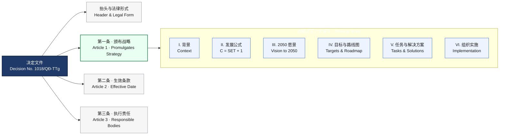
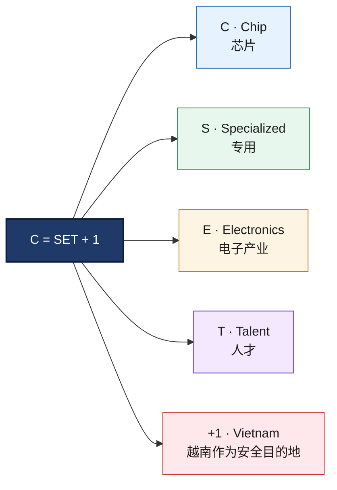
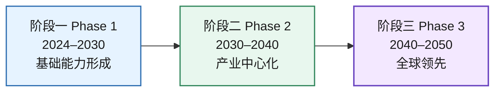
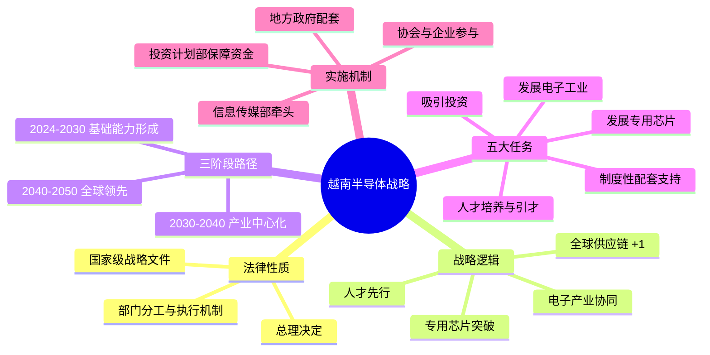

# 精读笔记

## 前情提要

### 基本信息
- 来源：越南政府总理决定（政府正式法律/政策文件）
- 文件类型：`Decision / Prime Minister’s Decision`
- 文件编号：`No. 1018/QĐ-TTg`
- 日期：`September 21, 2024`
- 原文语言：越南语
- 英文工作标题：`Decision Promulgating the Strategy for the Development of Vietnam’s Semiconductor Industry through 2030, with a Vision to 2050`

### 作者/签发者背景简介
- 签发者：`Phạm Minh Chính`
- 身份：越南政府总理（Prime Minister of Vietnam）
- 背景简介：越南现任政府首脑，负责领导政府行政系统、统筹国家经济社会发展政策与重大产业战略推进。本文件属于其以总理名义签发的国家级战略决定文件。
- 说明：该文件属于正式公文，核心解读对象应是政策目标、法律依据、产业路径、任务分工与执行机制。

### 文章结构信息图

#### 图1：决定文件整体结构与第一条战略内容分布

#### 图2：战略公式 C = SET + 1

#### 图3：三阶段路线图（2024–2050）

#### 图4：主题思维导图

---

## 逐句精读

### 🔻原文
THỦ TƯỚNG CHÍNH PHỦ

🔹English
The / `Prime Minister` / of the Government.

🔸中文
`政府总理`。

### 背景注释
- `THỦ TƯỚNG CHÍNH PHỦ`是越南政府公文中的正式抬头，指文件以总理名义发布。
- 在英文法律公文中通常处理为 `Prime Minister` 或 `Prime Minister of the Government`，视上下文而定。

> **`Prime Minister`**
> 1. n. the head of government in many countries 政府首脑；总理
> 语域：政治、政府、公文、新闻
> 画龙点睛：`Prime Minister` 是国家行政系统最高负责人之一，常与 `President` 区分：前者偏政府首脑，后者偏国家元首。在国际新闻、政策文本和翻译题里极常见，注意大写与专名用法。

---

### 🔻原文
CỘNG HÒA XÃ HỘI CHỦ NGHĨA VIỆT NAM

🔹English
The / `Socialist Republic of Vietnam`.

🔸中文
`越南社会主义共和国`。

### 背景注释
- 这是越南的正式国号。
- 法律、条约、政府公告中一般使用全称。

> **`Socialist Republic`**
> 1. n. a state officially organized under socialist political principles 社会主义共和国
> 语域：政治、法律、外交
> 画龙点睛：这是固定国名结构，翻译时应整体记忆，不宜拆散机械处理。类似表达常见于外交文书、国际组织文件与正式引述，考试中可作为专名整体识别。

---

### 🔻原文
Độc lập - Tự do - Hạnh phúc

🔹English
`Independence` - `Freedom` - `Happiness`.

🔸中文
`独立` - `自由` - `幸福`。

### 背景注释
- 这是越南国家公文抬头中的固定政治格言，相当于国家正式文书的标准格式组成部分。

> **`Independence`**
> 1. n. freedom from control by others 独立，自主
> 语域：政治、历史、正式
> 画龙点睛：`independence` 常搭配 `national independence`、`economic independence`。注意它既可指国家独立，也可指个人自主。写作中与 `sovereignty` 有交叉，但后者更强调主权法理。

> **`Freedom`**
> 1. n. the power or right to act, speak, or think freely 自由
> 语域：政治、伦理、正式
> 画龙点睛：`freedom` 是高频核心词，可搭配 `freedom of speech`、`freedom of movement`。与 `liberty` 相比更常用、更宽泛；后者在法律政治语境中也很常见，语体略庄重。

---

### 🔻原文
Số: 1018/QĐ-TTg

🔹English
No. / `1018/QĐ-TTg`.

🔸中文
文号：`1018/QĐ-TTg`。

### 背景注释
- `Số` 意为“编号”。
- `QĐ`通常对应 `Quyết định`（决定）。
- `TTg`通常指 `Thủ tướng`（总理）。
- 因此该编号可理解为“总理决定第1018号”。

> **`No.`**
> 1. abbr. number 编号；第……号
> 语域：正式、公文、法律
> 画龙点睛：正式文件、合同、法规、判例中常用 `No.` 引出编号。翻译时通常不展开为 `number`，保留缩写更符合英语公文习惯，如 `Decision No. 1018/...`。

---

### 🔻原文
Hà Nội, ngày 21 tháng 9 năm 2024

🔹English
`Hanoi`, / `September 21, 2024`.

🔸中文
`河内`，`2024年9月21日`。

### 背景注释
- `Hà Nội` 是越南首都河内。
- 越南公文常写为“地点 + 日期”。

> **`promulgate`**
> 1. v. to officially announce or put a law or rule into effect 正式颁布；公布施行
> 语域：法律、政府、正式
> 画龙点睛：谈法律法规“发布/颁布”时，`promulgate` 比 `publish` 更准确。常见搭配：`promulgate a law`、`promulgate regulations`。写作中能显著提升正式度。

---

### 🔻原文
QUYẾT ĐỊNH

🔹English
`Decision`.

🔸中文
`决定`。

### 背景注释
- `Quyết định` 是越南行政法律文件中的正式文种之一，对应英文常用 `Decision`。

> **`Decision`**
> 1. n. an official determination or ruling 决定；裁定；正式决定文件
> 语域：法律、行政、正式
> 画龙点睛：在政策文本中，`Decision` 不只是普通“决定”，还可指一种文件类型。需根据上下文判断是抽象行为还是具体文书名称。

---

### 🔻原文
BAN HÀNH CHIẾN LƯỢC PHÁT TRIỂN CÔNG NGHIỆP BÁN DẪN VIỆT NAM ĐẾN NĂM 2030 VÀ TẦM NHÌN 2050

🔹English
`Promulgating` / the `Strategy` for the `Development` of Vietnam’s `Semiconductor Industry` / through `2030` / with a `Vision` to `2050`.

🔸中文
`颁布`《到`2030`年并展望`2050`年的越南`半导体产业`发展`战略`》。

### 背景注释
- 这是文件标题核心部分。
- `tầm nhìn 2050` 在政策文本中通常译为 `vision to 2050` 或 `vision toward 2050`，表示远景目标，而非法律上硬性期限。

> **`Strategy`**
> 1. n. a long-term plan designed to achieve major goals 战略；长期规划
> 语域：政策、商业、军事、正式
> 画龙点睛：`strategy` 强调中长期布局；与 `policy` 相比，前者更偏整体路径，后者更偏政策原则与具体规则。写作中常搭配 `development strategy`、`national strategy`。

> **`Semiconductor Industry`**
> 1. n. the sector involved in designing, manufacturing, and testing semiconductors 半导体产业
> 语域：科技、产业、政策
> 画龙点睛：这是技术与产业分析高频词组。可延伸到 `semiconductor supply chain`、`chip manufacturing`、`fabless design`。在阅读中常与 geopolitics、AI、electronics 同现。

> **`Vision`**
> 1. n. a long-term imaginative plan or outlook 愿景；远景目标
> 语域：政策、商业、正式
> 画龙点睛：政策文件中 `vision` 往往不是空泛口号，而是比 `goal` 更长期、比 `target` 更宏观的方向性表达。常见搭配：`vision for 2050`、`long-term vision`。

---

### 🔻原文
THỦ TƯỚNG CHÍNH PHỦ

🔹English
The / `Prime Minister`.

🔸中文
`政府总理`。

### 背景注释
- 此处再次出现，起到法定签发主体标示作用。

> **`official capacity`**
> 1. n. one’s formal role in government or an organization 官方身份；职务身份
> 语域：法律、政府
> 画龙点睛：理解这类公文时，要区分个人与其 `official capacity`。文件效力来自职位而非个人本身。该概念常用于法律责任、签署权限与国际公文解释。

---

### 🔻原文
Căn cứ Luật Tổ chức Chính phủ ngày 19 tháng 6 năm 2015; Luật sửa đổi, bổ sung một số điều của Luật Tổ chức Chính phủ và Luật Tổ chức chính quyền địa phương ngày 22 tháng 11 năm 2019;

🔹English
Pursuant to / the `Law on the Organization of the Government` / dated `June 19, 2015`; / and the `Law amending and supplementing a number of articles` / of the Law on the Organization of the Government / and the Law on the Organization of Local Government / dated `November 22, 2019`;

🔸中文
依据`2015年6月19日`颁布的《`政府组织法`》；以及`2019年11月22日`颁布的、对《政府组织法》和《地方政府组织法》若干条款进行`修订和补充`的法律；

### 背景注释
- `Căn cứ` 是越南法律公文中的标准引导词，相当于 “依据……/根据……”。
- 这一句列出总理作出本决定的法源依据，属于法律授权结构的一部分。

> **`Pursuant to`**
> 1. prep. in accordance with; as authorized by 依据；按照；根据
> 语域：法律、公文、正式
> 画龙点睛：`pursuant to` 是法律英语超高频表达，比 `according to` 更正式、更具法源意味。常用于法规、合同、判决书。翻译题中看到它，往往意味着“依法依据”。

> **`amend`**
> 1. v. to change a law, document, or statement slightly in order to improve it 修订；修改
> 语域：法律、正式
> 画龙点睛：法律文本里 `amend` 很常见，名词是 `amendment`。搭配有 `amend a law`、`constitutional amendment`。注意它通常是“正式修订”，不是一般性的 edit。

> **`supplement`**
> 1. v./n. to add something extra to complete or enhance 补充；增补
> 语域：正式、法律、学术
> 画龙点睛：`supplement` 在法律里常与 `amend` 连用，表示“修订并补充”。与 `complement` 不同：后者是“补足、相辅相成”，前者是“额外添加”。

---

### 🔻原文
Căn cứ Luật Công nghệ thông tin ngày 29 tháng 6 năm 2006;

🔹English
Pursuant to / the `Law on Information Technology` / dated `June 29, 2006`;

🔸中文
依据`2006年6月29日`颁布的《`信息技术法`》；

### 背景注释
- `Information Technology` 在政策文本中常缩写为 `IT`，但正式法名一般不缩写。
- 此句说明半导体战略也有信息技术法律基础。

> **`Information Technology`**
> 1. n. the use of computers and telecommunications to store, retrieve, and transmit information 信息技术
> 语域：科技、教育、政策
> 画龙点睛：`information technology` 是正式全称，写作首现宜用全称，后文可用 `IT`。注意它不仅指“计算机”，也涵盖网络、软件、数据系统等广义数字基础设施。

---

### 🔻原文
Căn cứ Nghị quyết số 52-NQ/TW ngày 27 tháng 9 năm 2019 của Bộ Chính trị về một số chủ trương, chính sách chủ động tham gia cuộc Cách mạng công nghiệp lần thứ tư;

🔹English
Pursuant to / `Resolution No. 52-NQ/TW` / dated `September 27, 2019`, / issued by the `Politburo`, / on a number of guidelines and policies / for proactively participating in the `Fourth Industrial Revolution`;

🔸中文
依据`2019年9月27日`由`政治局`发布的`第52-NQ/TW号决议`，该决议就主动参与`第四次工业革命`提出若干方针和政策；

### 背景注释
- `Politburo` 指政党的政治局，在越南政治体制中具有重要政策指导作用。
- `Fourth Industrial Revolution` 即工业4.0，通常与 AI、IoT、自动化、数据化相关。

> **`Resolution`**
> 1. n. a formal statement of decision or policy 决议
> 语域：政治、法律、政府
> 画龙点睛：`resolution` 常见于议会、党政机关、国际组织。与 `decision` 相比，`resolution` 更偏政策主张或集体决定，未必等同于具体执行命令。

> **`proactively`**
> 1. adv. in a way that creates or controls a situation rather than merely responding 主动地；前瞻性地
> 语域：商务、政策、正式
> 画龙点睛：写作中 `proactively address`、`proactively participate in` 很地道。它强调“先行动”，比 merely react 更积极，是政策和管理语境中的加分词。

> **`Fourth Industrial Revolution`**
> 1. n. the current era of technological transformation driven by AI, automation, and digital connectivity 第四次工业革命
> 语域：科技、政策、经济
> 画龙点睛：也常写作 `Industry 4.0`。阅读中通常与 `automation`、`AI`、`IoT`、`digital transformation` 同现。写作时可作为宏观背景句的高级表达。

---

### 🔻原文
Căn cứ Nghị quyết số 29-NQ/TW ngày 17 tháng 11 năm 2022 của Ban Chấp hành Trung ương Đảng khóa XIII về tiếp tục đẩy mạnh công nghiệp hóa, hiện đại hóa đất nước đến năm 2030, tầm nhìn đến năm 2045;

🔹English
Pursuant to / `Resolution No. 29-NQ/TW` / dated `November 17, 2022`, / of the `13th Party Central Committee`, / on continuing to advance the country’s `industrialization` and `modernization` / through `2030`, / with a vision to `2045`;

🔸中文
依据`2022年11月17日`十三届`党中央`发布的`第29-NQ/TW号决议`，该决议关于继续推进国家`工业化`和`现代化`，期限至`2030`年并远景展望至`2045`年；

### 背景注释
- `industrialization` 和 `modernization` 是发展型国家政策文件中的核心概念，常成对出现。
- 该句说明半导体发展战略嵌入国家工业现代化总体框架。

> **`industrialization`**
> 1. n. the process of developing industries in a country 工业化
> 语域：经济、发展研究、政策
> 画龙点睛：该词常用于宏观发展叙事，如 `drive industrialization`。注意它强调产业体系建设，不只是工厂数量增加；与 `urbanization`、`modernization` 常并列出现。

> **`modernization`**
> 1. n. the process of making something modern in methods, ideas, or equipment 现代化
> 语域：政策、经济、社会发展
> 画龙点睛：`modernization` 含义比工业化更广，可涉及治理、农业、军队、教育等。写作中与 `technological upgrading`、`institutional reform` 可形成语义联动。

---

### 🔻原文
Căn cứ Nghị quyết số 01/NQ-CP ngày 05 tháng 01 năm 2024 của Chính phủ về nhiệm vụ, giải pháp chủ yếu thực hiện kế hoạch phát triển kinh tế - xã hội và dự toán ngân sách nhà nước năm 2024;

🔹English
Pursuant to / `Resolution No. 01/NQ-CP` / dated `January 5, 2024`, / of the Government / on the principal tasks and solutions / for implementing the `2024` socio-economic development plan / and the state budget estimate;

🔸中文
依据政府于`2024年1月5日`发布的`第01/NQ-CP号决议`，该决议规定了落实`2024`年经济社会发展计划及国家预算方案的主要任务和解决办法；

### 背景注释
- `socio-economic development plan` 是社会主义国家与发展型政府文件中常见术语。
- `state budget estimate` 指财政预算草案或预算测算安排。

> **`principal`**
> 1. adj. most important; main 主要的；核心的
> 语域：正式、政策、学术
> 画龙点睛：`principal` 在此不表示“校长”或“本金”，而是形容词“主要的”。考试常考一词多义。常见搭配：`principal reason`、`principal task`、`principal challenge`。

> **`socio-economic`**
> 1. adj. relating to social and economic factors 社会经济的
> 语域：政策、学术、发展研究
> 画龙点睛：这是政策文本高频复合形容词，常见于 `socio-economic development`、`socio-economic impacts`。写作中比单写 `economic` 更全面，体现社会与经济双重视角。

---

### 🔻原文
Theo đề nghị của Bộ trưởng Bộ Thông tin và Truyền thông.

🔹English
At the proposal of / the `Minister of Information and Communications`.

🔸中文
根据`信息与通信部部长`的提议。

### 背景注释
- 这是政府决定常见结尾引导句，说明该决定是在主管部长提请基础上作出的。
- 越南的 `Ministry of Information and Communications` 曾是相关主管部门表述方式之一。

> **`proposal`**
> 1. n. a formal suggestion or plan 提议；建议；提案
> 语域：正式、行政、商务
> 画龙点睛：`at the proposal of` 是非常正式的行政套语。与 `suggestion` 相比，`proposal` 更正式、更具程序性，常用于政府、合同、项目申请等场景。

---

### 🔻原文
QUYẾT ĐỊNH:

🔹English
`Decides` / as follows:

🔸中文
`决定`如下：

### 背景注释
- 这是越南决定类公文从依据部分转入 operative part（实质规定部分）的标准格式。
- 英文也可译为 `Hereby decides:`，更具法律文体色彩。

> **`as follows`**
> 1. phrase in the following manner; as stated below 如下
> 语域：正式、公文、学术
> 画龙点睛：`as follows` 是说明下文列举内容的固定表达。注意后面通常接冒号。写作和翻译中非常高频，尤其适合条款、要点、步骤列示。

---

### 🔻原文
Điều 1. Ban hành Chiến lược phát triển công nghiệp bán dẫn Việt Nam đến năm 2030 và tầm nhìn 2050 (sau đây gọi là Chiến lược) với các nội dung sau:

🔹English
`Article 1.` / `Promulgates` the `Strategy` for the development of Vietnam’s semiconductor industry through `2030`, / with a vision to `2050` / (hereinafter referred to as / the `Strategy`) / with the following contents:

🔸中文
`第一条`：`颁布`《到`2030`年并展望`2050`年的越南半导体产业发展`战略`》（下文简称`战略`），内容如下：

### 背景注释
- `Article 1` 是正文第一条，后续所有战略内容都由本条引出。
- `hereinafter referred to as` 是法律文本极高频缩略命名公式。

> **`hereinafter referred to as`**
> 1. phrase used to introduce a shorter name that will be used later 下称；以下简称
> 语域：法律、合同、正式
> 画龙点睛：这是法律英语必须掌握的固定搭配。读合同、法规时极其常见。写作时用它可避免重复全称，提升正式度与文本一致性。

> **`Promulgate`**
> 1. v. to formally issue and make effective a law, rule, or decision 正式颁布；公布施行
> 语域：法律、政府
> 画龙点睛：和前文一样，这是法律“生效发布”色彩很强的词。若是一般新闻发布，不宜滥用。政策翻译中能准确区分 `issue`、`adopt`、`promulgate` 很重要。

---

### 🔻原文
I. BỐI CẢNH

🔹English
`I. Context`

🔸中文
`一、背景`

### 背景注释
- 这一部分交代战略提出的外部环境与越南自身条件，是全文论证基础。
- 政策文本中的 `context` 常不只是“背景介绍”，还承担“提出政策必要性”的功能。

> **`context`**
> 1. n. the situation, conditions, or background relevant to an event or idea 背景；语境；情境
> 语域：学术、政策、新闻
> 画龙点睛：`context` 是阅读和写作中的核心抽象词。常见搭配有 `in the context of`、`historical context`、`global context`。在政策文中，它常引出“为什么现在必须行动”。

---

### 🔻原文
1. Công nghiệp bán dẫn toàn cầu đang có những thay đổi và điều chỉnh lớn, xuất hiện những xu thế mới tạo cơ hội thúc đẩy khả năng tự chủ và phát triển năng lực sản xuất bán dẫn quốc gia.

🔹English
The global `semiconductor industry` / is undergoing major `changes` and `adjustments`, / and new `trends` are emerging / that create opportunities / to enhance national `self-reliance` / and develop domestic semiconductor manufacturing `capacity`.

🔸中文
全球`半导体产业`正在经历重大`变化`与`调整`，并出现了一些新的`趋势`，这些趋势为提升国家`自主能力`、发展本国半导体制造`产能`创造了机会。

### 背景注释
- 本句概括全球半导体格局从高度集中走向再平衡、韧性化、多元化的趋势。
- `self-reliance` 在产业政策中通常指关键环节自主可控，而不一定意味着完全脱离国际分工。
- `capacity` 在此不是单纯“能力”抽象义，更接近“产业能力/产能基础”。

> **`semiconductor industry`**
> 1. n. the industry engaged in chip design, fabrication, packaging, and testing 半导体产业
> 语域：科技、产业、政策
> 画龙点睛：这是全文主轴词。要注意它不是只指“制造”，还包括 `design`、`fabrication`、`packaging`、`testing` 等链条。写作中可延伸为 `global semiconductor industry`、`domestic semiconductor industry`。

> **`adjustment`**
> 1. n. a change made to improve or adapt something 调整；调节
> 语域：正式、商业、政策
> 画龙点睛：政策和经济报道里，`adjustment` 常隐含“结构性变化”而非微小改动。搭配如 `industrial adjustment`、`policy adjustment`、`market adjustment`。与 `change` 比，语气更专业。

> **`trend`**
> 1. n. a general direction in which something is developing 趋势；动向
> 语域：新闻、商业、学术
> 画龙点睛：写作中 `an emerging trend`、`long-term trend` 非常常见。它比 `fashion` 更中性、更长期。在图表作文和议论文中是高频高价值词。

> **`self-reliance`**
> 1. n. the ability to depend on one’s own resources rather than external support 自立；自力更生；自主可控能力
> 语域：政策、发展、政治
> 画龙点睛：在产业政策语境里，`self-reliance` 常与供应链安全、核心技术掌控联系在一起。与 `independence` 相比，它更强调实际能力建设，不一定意味着完全独立于外部。

> **`capacity`**
> 1. n. the ability or power to do something; industrial productive ability 能力；产能
> 语域：通用、商业、政策
> 画龙点睛：这是典型熟词僻义考点。日常可指“能力”，产业语境里常指 `production capacity`。翻译时一定结合上下文，不能机械地一律译成“能力”。

---

### 🔻原文
Ngành công nghiệp bán dẫn, với vai trò then chốt trong nền kinh tế số, đang ngày càng khẳng định vị thế quan trọng trong bối cảnh thế giới bước vào kỷ nguyên cách mạng công nghiệp lần thứ tư (CMCN 4.0).

🔹English
The `semiconductor industry`, / with its `pivotal` role / in the `digital economy`, / is increasingly affirming its important position / as the world enters / the era of the `Fourth Industrial Revolution` (`Industry 4.0`).

🔸中文
`半导体产业`凭借其在`数字经济`中的`关键`作用，正随着世界步入`第四次工业革命`（`工业4.0`）时代而日益确立其重要地位。

### 背景注释
- `digital economy` 指以数字技术、数据、平台、网络和智能系统为基础的经济活动形态。
- `pivotal` 是典型正式书面词，强于一般的 `important`。
- `CMCN 4.0` 是越南文对第四次工业革命的缩写表达。

> **`pivotal`**
> 1. adj. extremely important because other things depend on it 关键的；枢纽性的
> 语域：正式、新闻、学术
> 画龙点睛：`pivotal` 是高阶替换词，可替换普通的 `important`。常见搭配 `play a pivotal role in`。在写作中使用能明显提高语言层次，但要用于真正关键因素，避免滥用。

> **`digital economy`**
> 1. n. economic activities based on digital technologies and data 数字经济
> 语域：科技、经济、政策
> 画龙点睛：这是近年政策与新闻高频词，常与 `digital transformation`、`platform economy`、`data governance` 搭配。议论文中可作宏观背景词汇，适合科技、就业、增长类题目。

> **`affirm`**
> 1. v. to state or show that something is true or valid 确认；肯定；强化显示
> 语域：正式、法律、新闻
> 画龙点睛：本句中 `affirming its position` 更接近“不断彰显/巩固其地位”。它比 `show` 更正式。法律中 `affirm a judgment` 还有“维持原判”的意思，注意一词多义。

> **`era`**
> 1. n. a long and distinct period of history 时代；纪元
> 语域：通用、学术、新闻
> 画龙点睛：`era` 常用于宏观叙事，如 `the digital era`、`a new era of innovation`。写作中比 `time` 更有历史纵深感，也常与技术变革、政治阶段相连。

---

### 🔻原文
Sản phẩm bán dẫn đã và đang được ứng dụng rộng rãi trong nhiều hoạt động khác nhau của đời sống kinh tế, xã hội.

🔹English
`Semiconductor products` / have been and continue to be / widely `applied` / in many different activities / of economic and social life.

🔸中文
`半导体产品`过去已经并且现在仍被广泛`应用`于经济与社会生活中的多种不同活动。

### 背景注释
- 这里的 `sản phẩm bán dẫn` 可以广义理解为芯片及相关半导体器件。
- `economic and social life` 是政策文体固定搭配，可译作“经济社会生活”。

> **`semiconductor products`**
> 1. n. products such as chips and semiconductor devices 半导体产品
> 语域：科技、产业
> 画龙点睛：该词组范围比 `chips` 更广，可能包含传感器、功率器件、集成电路等。阅读中如果上下文谈应用场景，用 `semiconductor products` 往往比单写 `chips` 更准确。

> **`apply` / `applied`**
> 1. v. to use something for a particular purpose 应用；使用
> 语域：通用、科技、学术
> 画龙点睛：`apply` 是考试高频多义词。除“申请”外，还可表示“应用”。常见搭配：`be applied in/to`、`apply a method`。翻译时必须根据搭配判断词义。

> **`widely`**
> 1. adv. by many people or in many places 广泛地
> 语域：通用、学术、新闻
> 画龙点睛：这是论证适用范围的常用副词。可搭配 `widely used`、`widely accepted`、`widely recognized`。写作中非常实用，尤其适合科技与社会影响类论述。

---

### 🔻原文
Trước đây, chuỗi cung ứng bán dẫn toàn cầu đã phát triển theo hướng chuyên môn hóa cao, tập trung tại một số ít các quốc gia, khu vực, vùng lãnh thổ; không có quốc gia nào có khả năng tự chủ hoàn toàn trong lĩnh vực bán dẫn.

🔹English
Previously, / the global `semiconductor supply chain` / developed toward a highly `specialized` model, / concentrated in only a small number of countries, regions, and territories; / no country / possessed the ability / to be fully `self-sufficient` / in the semiconductor field.

🔸中文
过去，全球`半导体供应链`朝着高度`专业化`的方向发展，并集中于少数几个国家、地区和领土；没有任何一个国家能够在半导体领域实现完全`自给自足`。

### 背景注释
- 该句说明半导体长期以来依赖跨国分工：设计、设备、制造、材料、封测分散在不同经济体。
- `territories` 在国际政治和产业统计语境中常指具有独特经济/行政地位的地区。
- `self-sufficient` 比 `self-reliant` 更强调完整独立供给能力。

> **`semiconductor supply chain`**
> 1. n. the full network involved in semiconductor design, materials, manufacturing, and distribution 半导体供应链
> 语域：产业、经济、政策
> 画龙点睛：这是理解全球芯片竞争的关键词。它不仅是物流链，更包括技术、设备、材料和地缘政治关系。写作中可拓展为 `resilient supply chain`、`diversified supply chain`。

> **`specialized`**
> 1. adj. designed or developed for a particular purpose or area 专业化的；专门化的
> 语域：商业、科技、正式
> 画龙点睛：`specialized` 与后文 `specialized chips` 形成呼应。它既可描述产业分工，也可描述产品用途。注意与 `specific` 区别：前者偏“专门化”，后者偏“具体”。

> **`concentrated`**
> 1. adj./v. located or focused in a limited area 集中的；集中于
> 语域：学术、经济、新闻
> 画龙点睛：产业报道中常说 production is `concentrated in` 某地。它可用于空间集中、资本集中、市场集中等。是描述产业格局的常见高频词。

> **`self-sufficient`**
> 1. adj. able to produce everything needed without outside help 自给自足的；完全自主供给的
> 语域：政策、经济、发展研究
> 画龙点睛：和 `self-reliant` 相近，但 `self-sufficient` 更强调“供给层面的完整性”。在粮食、能源、芯片等话题中都很常见，是议论文中有力的政策词汇。

---

### 🔻原文
Trong những năm gần đây, các quốc gia lớn đã có sự cạnh tranh gay gắt dẫn đến việc phải điều chỉnh chiến lược bán dẫn theo hướng nâng cao năng lực trong nước và đẩy mạnh đa dạng hoá chuỗi cung ứng.

🔹English
In recent years, / major countries / have engaged in intense `competition`, / leading them to adjust their semiconductor `strategies` / toward strengthening domestic `capabilities` / and promoting greater `diversification` of supply chains.

🔸中文
近年来，主要国家之间展开了激烈`竞争`，从而推动它们调整各自的半导体`战略`，转向提升本国`能力`并加快供应链`多元化`。

### 背景注释
- 这里隐含的是近年主要经济体围绕芯片设计、先进制造、设备、出口管制和补贴政策展开竞争。
- `diversification of supply chains` 是后疫情时代与地缘政治紧张背景下的核心政策词组。

> **`competition`**
> 1. n. a situation in which people or groups try to be more successful than others 竞争
> 语域：通用、商业、政策
> 画龙点睛：在经济新闻里，`competition` 常与 `intense`、`fierce` 搭配。写作时可与 `cooperation` 构成对照，增强论述层次。注意其既可指市场竞争，也可指国家间战略竞争。

> **`capability`**
> 1. n. the ability to do something, especially in a developed or technical way 能力；技术能力
> 语域：正式、科技、军事、政策
> 画龙点睛：`capability` 比 `ability` 更正式，也更强调“系统性能力”。在科技与产业政策中，常指研发能力、制造能力、国防能力，是阅读高频词。

> **`diversification`**
> 1. n. the process of becoming more varied or spreading risk by not depending on one source 多元化；分散化
> 语域：经济、金融、政策
> 画龙点睛：这是供应链安全语境的核心词。常见搭配：`diversification of supply chains`、`portfolio diversification`。它强调减少单点依赖，写作中可与 `resilience` 联用。

---

### 🔻原文
2. Việt Nam có lợi thế địa chính trị, nhân lực về công nghiệp bán dẫn. Đây là cơ hội cho Việt Nam tham gia sâu hơn vào chuỗi cung ứng của ngành công nghiệp bán dẫn toàn cầu.

🔹English
Vietnam / has `geopolitical` and `human-resource` advantages / in the semiconductor industry. / This is an `opportunity` / for Vietnam / to participate more deeply / in the supply chain / of the global semiconductor industry.

🔸中文
越南在半导体产业方面具有`地缘政治`和`人力资源`优势。
这为越南更深入参与全球半导体产业供应链提供了`机遇`。

### 背景注释
- `geopolitical advantages` 在此主要指区位、外交关系、政治稳定性以及供应链重组中的战略位置。
- `human-resource advantages` 是发展型政策文件常用表达，强调劳动力规模、结构和培养潜力。

> **`geopolitical`**
> 1. adj. relating to politics, especially international relations, as influenced by geography 地缘政治的
> 语域：国际关系、政策、新闻
> 画龙点睛：这是国际新闻和时评中的高频词，常见搭配 `geopolitical tensions`、`geopolitical advantages`。它把地理位置与权力关系联系起来，是理解全球产业迁移的关键概念。

> **`human-resource` / `human resources`**
> 1. n. the workforce and talent available to an organization or country 人力资源；人才资源
> 语域：商业、政策、管理
> 画龙点睛：政策里谈国家发展时，`human resources` 不只是招聘意义上的HR，更指整体人才供给与劳动力结构。可与 `skilled workforce`、`talent pool` 替换搭配。

> **`opportunity`**
> 1. n. a favorable set of circumstances making something possible 机会；机遇
> 语域：通用、正式、商业
> 画龙点睛：这是写作万能核心词，但要学会搭配升级：`seize an opportunity`、`create opportunities for`、`window of opportunity`。在政策文中它常意味着“外部条件与内部能力同时具备”。

---

### 🔻原文
Việt Nam nằm ở trung tâm của khu vực đang chiếm tới 70% sản lượng sản xuất của ngành công nghiệp bán dẫn toàn cầu; là quốc gia có nền chính trị ổn định, nằm trong nhóm các nước có tốc độ phát triển nhanh nhất; là quốc gia có quan hệ đối tác chiến lược với nhiều cường quốc bán dẫn.

🔹English
Vietnam / is located at the center / of a region / that accounts for up to `70%` / of the global semiconductor industry’s manufacturing output; / it is a country / with a `stable` political system, / among the fastest-growing nations; / and it maintains `strategic partnerships` / with many semiconductor powers.

🔸中文
越南位于一个占全球半导体产业制造产出高达`70%`的地区中心；它是一个政治`稳定`、发展速度位居世界前列的国家；并且与多个半导体强国保持着`战略伙伴关系`。

### 背景注释
- `accounts for` 是统计、图表、经济报道常用表达。
- `strategic partnerships` 是外交政策高频概念，指较高层级、长期性的国家关系安排。
- `semiconductor powers` 不是法律固定术语，而是政策表述中对芯片强国的概括性说法。

> **`account for`**
> 1. v. to make up or constitute a proportion of something 占据；构成……比例
> 语域：学术、商业、统计、新闻
> 画龙点睛：图表作文和经济报道必备词组。不要只记“解释”义。`A accounts for 30% of B` 是高频句型，阅读中要根据搭配快速判断词义。

> **`stable`**
> 1. adj. firmly fixed; not likely to change suddenly 稳定的
> 语域：通用、经济、政治
> 画龙点睛：`stable` 可用于政治、市场、价格、情绪等多个领域。写作中 `politically stable`、`stable growth`、`stable environment` 都很常用，是政策文中正面评价的基础词。

> **`strategic partnership`**
> 1. n. a long-term cooperative relationship of high importance 战略伙伴关系
> 语域：外交、政策、国际关系
> 画龙点睛：这是国际关系高频正式术语。它比一般 `partnership` 更强调长期性和重要性。阅读时常与 `comprehensive`, `bilateral`, `mutual interests` 等词共现。

---

### 🔻原文
Việt Nam có tiềm năng về trữ lượng đất hiếm, ước đạt khoảng 20 triệu tấn.

🔹English
Vietnam / has potential / in `rare-earth` reserves, / estimated at around `20 million tons`.

🔸中文
越南在`稀土`储量方面具有潜力，估计约为`2000万吨`。

### 背景注释
- `rare earth` 通常指稀土元素，广泛用于电子、磁材、新能源、国防和高端制造。
- 文中强调资源禀赋对半导体及相关高科技产业的支撑意义。

> **`rare earth`**
> 1. n. a group of metallic elements important for high-tech products 稀土（元素/资源）
> 语域：科技、资源、产业
> 画龙点睛：虽然形式上像形容词+名词，实际常作为固定术语使用。常见搭配：`rare-earth minerals`、`rare-earth reserves`。科技与地缘经济文章中非常高频。

> **`reserve` / `reserves`**
> 1. n. a supply of something that is available for future use, especially natural resources 储量；储备
> 语域：经济、资源、地质
> 画龙点睛：在资源语境里通常用复数 `reserves`。如 `oil reserves`, `foreign exchange reserves`。注意与动词 `reserve`“预订”区分，是典型一词多义考点。

> **`estimated at`**
> 1. phrase judged to be approximately a particular amount 估计为……
> 语域：正式、统计、新闻
> 画龙点睛：这是描述数字的高频表达。图表和数据分析中很有用，如 `The figure is estimated at...`。比简单 `is about` 更正式、更适合书面表达。

---

### 🔻原文
Việt Nam là 01 trong 16 quốc gia đông dân nhất trên thế giới, có tỷ lệ dân số trẻ, có lợi thế nhân lực có năng lực về STEM (Khoa học, Công nghệ, Kỹ thuật, Toán học), có khả năng đáp ứng nhanh chóng nhu cầu nhân lực để phát triển ngành công nghiệp bán dẫn.

🔹English
Vietnam / is one of the `16` most populous countries in the world, / has a relatively `young population`, / possesses a workforce / with strengths in `STEM` (`Science`, `Technology`, `Engineering`, and `Mathematics`), / and is capable of rapidly meeting manpower demand / for the development of the semiconductor industry.

🔸中文
越南是世界上人口最多的`16`个国家之一，拥有相对`年轻的人口结构`，具备在`STEM`（`科学`、`技术`、`工程`和`数学`）方面有优势的劳动力，并且能够较快满足发展半导体产业所需的人力需求。

### 背景注释
- `most populous countries` 是人口规模表述的标准说法。
- `STEM` 是全球教育与产业政策高频缩写。
- 本句将人口规模、年龄结构、教育能力和产业人才供给联系起来。

> **`populous`**
> 1. adj. having a large population 人口众多的
> 语域：正式、学术、地理
> 画龙点睛：`populous` 是描述人口分布的较正式词，常见于地理和人口学文章。与 `crowded` 不同，后者强调拥挤感；`populous` 仅指人口多，是考试中很值得掌握的替换词。

> **`young population`**
> 1. n. a population with a relatively large share of young people 年轻型人口结构
> 语域：人口、经济、政策
> 画龙点睛：这是发展经济与劳动力优势讨论中的常见组合。可与 `aging population` 对照使用。写作时能自然引出就业、教育、创新活力等论点。

> **`STEM`**
> 1. n. Science, Technology, Engineering, and Mathematics 科学、技术、工程与数学
> 语域：教育、科技、政策
> 画龙点睛：这是国际教育政策热词，首现最好写全称。它常与人才培养、创新能力、产业升级联系在一起，是科技与教育话题写作的高频概念。

> **`manpower demand`**
> 1. n. the need for workers, especially skilled workers 人力需求；用工需求
> 语域：商业、政策、产业
> 画龙点睛：`manpower` 虽仍常见于正式文件，但现代英语中在某些场景会被更中性的 `workforce` 或 `talent demand` 替代。读到时要知道它强调“可投入的人力规模”。

---

### 🔻原文
Hiện nay, Đảng và Nhà nước Việt Nam đặt ưu tiên hàng đầu cho phát triển công nghiệp bán dẫn.

🔹English
At present, / the Party and the State of Vietnam / place `top priority` / on the development of the semiconductor industry.

🔸中文
当前，越南党和国家把发展半导体产业置于`最高优先级`。

### 背景注释
- `the Party and the State` 是越南政治语境中的固定表述，指执政党与国家机构。
- `top priority` 强调政策排序中的最高等级。

> **`top priority`**
> 1. n. the most important thing that must be dealt with first 最高优先事项
> 语域：政策、管理、新闻
> 画龙点睛：这是表达“最重视什么”的高频固定搭配。比单写 `very important` 更有政策排序意味。写作可用 `give top priority to`、`be a top priority for`.

> **`place priority on`**
> 1. phrase to consider something especially important 优先重视；优先考虑
> 语域：正式、政策
> 画龙点睛：这是非常地道的政策表达。也可说 `prioritize`。例如 `The government places priority on innovation.` 用于议论文能提升正式度和自然度。

---

### 🔻原文
Nghị quyết số 29-NQ/TW ngày 17 tháng 11 năm 2022 của Ban Chấp hành Trung ương Đảng khóa XIII về tiếp tục đẩy mạnh công nghiệp hóa, hiện đại hóa đất nước đến năm 2030, tầm nhìn đến năm 2045 xác định ưu tiên phát triển các ngành công nghiệp nền tảng, phát triển các ngành công nghiệp sử dụng nhiều công nghệ, xây dựng nền công nghiệp quốc gia vững mạnh, tự lực, tự cường.

🔹English
`Resolution No. 29-NQ/TW` / dated `November 17, 2022`, / of the `13th Party Central Committee`, / on continuing to advance national industrialization and modernization / through `2030`, / with a vision to `2045`, / identifies as priorities / the development of `foundational industries`, / the promotion of technology-intensive industries, / and the building of a strong, `self-reliant`, and `self-strengthening` national industrial base.

🔸中文
十三届党中央于`2022年11月17日`发布的`第29-NQ/TW号决议`，关于继续推进国家工业化和现代化、期限至`2030`年并远景展望至`2045`年，明确把发展`基础性产业`、发展技术密集型产业，以及建设一个强大、`自主`、`自强`的国家工业体系列为优先事项。

### 背景注释
- `foundational industries` 指支撑整体工业体系的基础性产业。
- `technology-intensive industries` 指高技术投入、高研发密度、高技术门槛产业。
- `self-strengthening` 为政策英译中较庄重的词，表示增强自主实力、强化内生能力。

> **`foundational industries`**
> 1. n. industries that form the basic support for broader industrial development 基础性产业；支柱基础产业
> 语域：政策、经济、产业
> 画龙点睛：与 `pillar industries`、`basic industries` 近义，但 `foundational` 更强调“底座”作用。阅读中遇到此类词，要联想到上游支撑能力和产业体系完整性。

> **`technology-intensive`**
> 1. adj. requiring a high level of technology and expertise 技术密集型的
> 语域：经济、产业、学术
> 画龙点睛：这类复合词在经济英语中很常见，类似还有 `capital-intensive`, `labor-intensive`。考试中常作为产业类型比较的核心术语，需成组掌握。

> **`self-strengthening`**
> 1. n./adj. the act or quality of making oneself stronger 自强；增强自主实力的
> 语域：政策、正式
> 画龙点睛：该词在一般英语中不算特别高频，但在政策翻译中可用于表达“自强”。阅读时不要误以为是字面随意拼接，它具有明确的政治与发展话语色彩。

---

### 🔻原文
Đây là những lợi thế tiềm năng để Việt Nam có thể tham gia vào các công đoạn trong chuỗi cung ứng bán dẫn toàn cầu, tiến tới phát triển hệ sinh thái bán dẫn trong nước hoàn chỉnh.

🔹English
These are `potential advantages` / that enable Vietnam / to participate in various `stages` / of the global semiconductor supply chain, / thereby moving toward / the development of a complete domestic semiconductor `ecosystem`.

🔸中文
这些都是越南得以参与全球半导体供应链各个`环节`、并进一步迈向构建完整国内半导体`生态系统`的`潜在优势`。

### 背景注释
- `stages` 在产业链语境中可指设计、制造、封装、测试等不同环节。
- `ecosystem` 在科技与产业政策中常指企业、人才、资本、科研、基础设施和制度环境的整体协同体系。

> **`potential advantage`**
> 1. n. a possible strength that may be developed or used 潜在优势
> 语域：商业、政策、分析
> 画龙点睛：写作中 `potential` 往往表示“尚未完全兑现但具备条件”。常见搭配 `unlock potential`, `potential benefits`, `potential risks`。它能帮助表达更审慎、更分析化的语气。

> **`stage`**
> 1. n. a particular part of a process or development stage 阶段；环节
> 语域：通用、产业、学术
> 画龙点睛：这是又一个熟词僻义点。除“舞台”外，在流程语境中常指“阶段/环节”。如 `at a later stage`、`production stage`、`all stages of the supply chain`。

> **`ecosystem`**
> 1. n. a complex network of interconnected people, organizations, and systems 生态系统；产业生态
> 语域：科技、商业、政策
> 画龙点睛：如今 `ecosystem` 已广泛用于商业和创新语境，不再只指自然生态。常见搭配 `innovation ecosystem`, `startup ecosystem`, `industrial ecosystem`，是高阶写作词汇。

---

### 🔻原文
II. CÔNG THỨC PHÁT TRIỂN CÔNG NGHIỆP BÁN DẪN VIỆT NAM

🔹English
`II. Formula for the Development of Vietnam’s Semiconductor Industry`

🔸中文
`二、越南半导体产业发展公式`

### 背景注释
- 此处的 `formula` 不是数学严格公式，而是政策叙事中的“发展逻辑/组合框架”。
- 该部分提出全文最核心的概念模型：`C = SET + 1`。

> **`formula`**
> 1. n. a fixed method, pattern, or principle for achieving something 公式；模式；方法框架
> 语域：通用、政策、商业
> 画龙点睛：`formula` 在非数学文本里常表示“成功公式、发展公式、固定框架”。阅读时要根据上下文判断，不要机械理解成算式本身。

---

### 🔻原文
Chiến lược đề ra con đường phát triển ngành công nghiệp bán dẫn Việt Nam từ nay đến năm 2030, tầm nhìn 2050 theo công thức sau:

🔹English
The `Strategy` / sets out a development path / for Vietnam’s semiconductor industry / from now until `2030`, / with a vision to `2050`, / according to the following `formula`:

🔸中文
该`战略`提出了越南半导体产业从现在到`2030`年、并远景展望至`2050`年的发展路径，其依据如下`公式`：

### 背景注释
- `sets out` 是政策、法律、学术文件中常见动词，表示“提出、阐明、列明”。
- `development path` 强调路径设计，而不只是结果目标。

> **`set out`**
> 1. v. to present, explain, or describe clearly 阐明；提出；列明
> 语域：正式、学术、政策
> 画龙点睛：`set out` 是文件英语高频短语，常见于 `The report sets out...`。注意它还有“出发”的意思，需靠上下文判断，是典型短语动词多义考点。

> **`development path`**
> 1. n. the route or trajectory of development 发展路径
> 语域：政策、经济、学术
> 画龙点睛：这是宏观分析中的常用组合。比 `plan` 更强调过程与阶段推进。写作时可替换为 `development trajectory`、`pathway to development`，但本词组最直观稳妥。

---

### 🔻原文
C = SET + 1

🔹English
`C = SET + 1`

🔸中文
`C = SET + 1`

### 背景注释
- 这是整份战略的核心符号化表达。
- `C` 代表 `Chip`，`SET` 分别代表 `Specialized`、`Electronics`、`Talent`，`+1` 代表越南作为全球供应链安全新目的地。

> **`core formula`**
> 1. n. the central conceptual model of a strategy 核心公式；核心框架
> 语域：政策、分析
> 画龙点睛：当文章用一个简短符号概括复杂战略时，可理解为 `core formula`。阅读时要特别注意后文如何逐一解释每个字母，因为这通常就是全文组织结构。

---

### 🔻原文
Trong đó:

🔹English
Where:

🔸中文
其中：

### 背景注释
- 这是引出公式各组成部分解释的标准表达。
- 英文中 `Where:` 常用于定义变量、术语或符号。

> **`where`**
> 1. conj. used to explain terms in a statement or formula 其中；在此分别指
> 语域：数学、法律、正式说明
> 画龙点睛：在定义公式或条款时，`where` 不表示地点，而是“其中/在这里分别定义为”。这是阅读公式、合同和学术说明时要熟悉的特殊用法。

---

### 🔻原文
C: Chip (Chip bán dẫn);

🔹English
`C`: `Chip` (`semiconductor chip`);

🔸中文
`C`：`Chip`（`半导体芯片`）；

### 背景注释
- `chip` 是全文中最基础的技术实体词。
- 英文里 `chip` 既可泛指芯片，也可在口语中指碎片、薯片，需结合上下文辨义。

> **`chip`**
> 1. n. a small piece of semiconductor material used in electronic devices 芯片
> 语域：科技、通用、产业
> 画龙点睛：现代英语里 `chip` 已成为高频科技词。正式场合也常写作 `semiconductor chip` 或 `microchip`。在写作中若首次出现，最好适度补充语义避免歧义。

---

### 🔻原文
S: Specialized (Chuyên dụng, Chip chuyên dụng);

🔹English
`S`: `Specialized` (`specialized chips`);

🔸中文
`S`：`Specialized`（`专用`，即`专用芯片`）；

### 背景注释
- `specialized chips` 指针对特定场景、特定任务优化设计的芯片，如 AI 加速、IoT、汽车电子、工业控制等。
- 与之相对的是通用芯片 `general-purpose chips`。

> **`specialized`**
> 1. adj. designed for a particular purpose 专用的；专门化的
> 语域：科技、产业、正式
> 画龙点睛：此词在全文具有双重重要性：既描述产业分工，也描述芯片类型。与 `general-purpose` 对照记忆尤其有效，是后文反复出现的主轴词。

> **`specialized chips`**
> 1. n. chips optimized for specific applications or tasks 专用芯片
> 语域：半导体、电子、AI
> 画龙点睛：这是技术英语中的关键概念。与通用芯片相比，它强调特定任务下的效率、功耗、成本或安全优势。阅读时要与 `application-specific` 建立联想。

---

### 🔻原文
E: Electronics (Điện tử, Công nghiệp điện tử);

🔹English
`E`: `Electronics` (`the electronics industry`);

🔸中文
`E`：`Electronics`（`电子`，即`电子工业`）；

### 背景注释
- 文件将半导体与电子产业绑定，强调“芯片必须有应用出口”。
- `electronics` 既可指电子学，也可指电子产品/电子工业，需按语境判断。

> **`electronics`**
> 1. n. electronic devices or the industry that produces them 电子技术；电子产品；电子工业
> 语域：科技、产业、教育
> 画龙点睛：这是典型兼具学科义和产业义的词。政策文里通常偏“电子产业”。写作中可用 `consumer electronics`、`electronics manufacturing` 来细化表达。

---

### 🔻原文
T: Talent (Nhân tài, Nhân lực);

🔹English
`T`: `Talent` (`talent and human resources`);

🔸中文
`T`：`Talent`（`人才`与`人力资源`）；

### 背景注释
- 文件将 `Talent` 放入核心公式，说明人才不是辅助项，而是前置支柱。
- 在产业政策中，`talent` 常与培养、引进、留用一起构成系统工程。

> **`talent`**
> 1. n. people with special ability or high levels of skill 人才；有才能的人
> 语域：通用、商业、政策
> 画龙点睛：现代政策和企业语境中，`talent` 经常是集合名词，指高质量人才队伍。常见搭配 `talent attraction`, `talent development`, `retain top talent`，非常适合写作升级。

---

### 🔻原文
+ 1: Việt Nam (Việt Nam là điểm đến mới an toàn của chuỗi cung ứng toàn cầu về công nghiệp bán dẫn).

🔹English
`+1`: `Vietnam` / (`Vietnam` is the new `safe destination` / in the global semiconductor industry supply chain).

🔸中文
`+1`：`越南`（`越南`是全球半导体产业供应链中一个新的`安全目的地`）。

### 背景注释
- `X+1` 或 `China+1` 类表达常见于供应链多元化讨论中，表示在原有主要生产基地之外增加一个新据点。
- 此处 `safe destination` 不仅指物理安全，也包括政治稳定、政策可预期和供应链安全。

> **`safe destination`**
> 1. n. a place regarded as secure and reliable for investment or relocation 安全目的地；可靠落地地
> 语域：投资、政策、供应链
> 画龙点睛：这里不是旅游意义上的 destination，而是产业与投资落地地。读到类似表达时，要把 `destination` 理解为资金、产能、项目的流向地点。

> **`supply chain`**
> 1. n. the linked system of organizations, people, and activities involved in producing and delivering goods 供应链
> 语域：商业、物流、产业、政策
> 画龙点睛：这是现代经济英语绝对核心词。写作中常与 `resilience`, `security`, `disruption`, `diversification` 搭配，是科技、贸易、疫情、地缘政治话题的高频词。

---

### 🔻原文
1. Về chip bán dẫn

🔹English
`1. On semiconductor chips`

🔸中文
`1. 关于半导体芯片`

### 背景注释
- 本节开始解释公式中的 `C`。
- `On ...` 在政策目录中相当于“关于……方面”。

> **`on`**
> 1. prep. concerning; about 关于
> 语域：正式、标题、学术
> 画龙点睛：在标题中 `on` 常表示“关于”，如 `Report on Climate Change`。不要只记“在……上面”的空间义，这是高频多义功能词。

---

### 🔻原文
Internet vạn vật (IoT) và trí tuệ nhân tạo (AI) là các công nghệ cốt lõi của CMCN 4.0.

🔹English
The `Internet of Things` (`IoT`) / and `artificial intelligence` (`AI`) / are `core technologies` / of the `Fourth Industrial Revolution`.

🔸中文
`物联网`（`IoT`）和`人工智能`（`AI`）是`第四次工业革命`的`核心技术`。

### 背景注释
- `IoT` 指通过传感器、网络与计算系统连接现实设备，实现数据采集与联动控制。
- `AI` 指模拟或增强智能决策、识别、预测与生成能力的技术体系。
- 两者共同构成半导体需求增长的重要驱动力。

> **`Internet of Things`**
> 1. n. a network of physical objects connected to the internet 物联网
> 语域：科技、产业、政策
> 画龙点睛：首现时最好写全称加缩写。它常与 `smart devices`, `sensors`, `connectivity` 同现。写作中可作为数字化、自动化、智慧城市等话题的关键术语。

> **`artificial intelligence`**
> 1. n. computer systems able to perform tasks that normally require human intelligence 人工智能
> 语域：科技、教育、商业、政策
> 画龙点睛：这是当代最重要的科技词之一。注意 `AI` 不只指聊天机器人，还包括识别、预测、决策、优化等能力。写作时可与 productivity、ethics、employment 等论点结合。

> **`core technology`**
> 1. n. a fundamental technology on which other applications or systems depend 核心技术
> 语域：科技、产业、政策
> 画龙点睛：`core` 强调基础性、关键性。搭配 `master core technologies`、`invest in core technologies` 很常见，是科技政策写作的高频表达。

---

### 🔻原文
IoT để số hoá thế giới thực, tạo ra thế giới số, tạo ra dữ liệu.

🔹English
`IoT` / `digitizes` the physical world, / creates a digital world, / and generates `data`.

🔸中文
`物联网`将现实世界`数字化`，构建数字世界，并产生`数据`。

### 背景注释
- 本句用简洁因果链说明 IoT 的功能：连接现实对象 → 形成数字映射 → 产生数据流。
- `digitize` 与 `digitalize` 在实际使用中常有交叉，但前者更偏“转为数字形式”。

> **`digitize`**
> 1. v. to convert information or processes into a digital form 数字化；转化为数字形式
> 语域：科技、商业、政策
> 画龙点睛：`digitize` 常强调把模拟对象或线下信息变成数字形式；而 `digital transformation` 更强调系统性重构。考试中二者常被混淆，需注意层级差异。

> **`generate`**
> 1. v. to produce or create 产生；生成
> 语域：通用、科技、学术
> 画龙点睛：这是写作中极其万能的高频动词，可搭配 `generate data`, `generate revenue`, `generate interest`。比 `make` 更正式、更准确。

> **`data`**
> 1. n. facts or information used for analysis or reference 数据
> 语域：科技、学术、商业
> 画龙点睛：现代英语里 `data` 常既可视作复数也可当不可数集合名词使用。考试和正式写作中两种用法都能见到，但保持前后一致最重要。

---

### 🔻原文
AI để xử lý dữ liệu và tạo ra giá trị mới.

🔹English
`AI` / processes `data` / and creates new `value`.

🔸中文
`人工智能`用于处理`数据`并创造新的`价值`。

### 背景注释
- 这里的 `value` 不只是价格或数值，而是广义上的经济价值、效率价值、社会价值和创新价值。
- 本句与上一句构成逻辑对偶：IoT 负责生成数据，AI 负责处理数据并释放价值。

> **`process`**
> 1. v. to handle or deal with information according to a set of steps 处理；加工
> 语域：通用、科技、商业
> 画龙点睛：`process data` 是固定高频搭配。注意它既可作动词，也可作名词“过程”。是阅读中极常见的一词多义基础词。

> **`value`**
> 1. n. the importance, usefulness, or worth of something 价值；效用；附加价值
> 语域：通用、商业、经济
> 画龙点睛：在商业和政策语境中，`create value` 是核心表达，不仅指赚钱，也可指提升效率、创新能力和社会效益。写作中非常好用。

---

### 🔻原文
Cốt lõi của IoT và AI là chip bán dẫn.

🔹English
At the `core` / of `IoT` and `AI` / are `semiconductor chips`.

🔸中文
`物联网`和`人工智能`的`核心`在于`半导体芯片`。

### 背景注释
- 这是全节的中心判断：无论物联网还是人工智能，其底层算力与控制基础都依赖芯片。
- 倒装结构译为英文更自然时可用正常语序：`Semiconductor chips are at the core of IoT and AI.`

> **`core`**
> 1. n. the central or most important part 核心；中心部分
> 语域：通用、学术、政策
> 画龙点睛：`at the core of` 是非常高频、很地道的固定结构，可用于抽象关系表达。写作中比反复使用 `very important` 更高级、更紧凑。

---

### 🔻原文
Công nghiệp bán dẫn, chip bán dẫn đã có mặt trong hầu hết các thiết bị, mọi mặt của đời sống xã hội, đã, đang và sẽ thay đổi, định hình thế giới; ảnh hưởng to lớn tới an ninh kinh tế và an ninh quốc phòng.

🔹English
The `semiconductor industry` and `semiconductor chips` / are present in most devices / and in every aspect of social life, / and they have changed, are changing, and will continue to `shape` the world; / they also have a profound impact / on `economic security` and `national defense security`.

🔸中文
`半导体产业`与`半导体芯片`已经存在于绝大多数设备之中，并渗透到社会生活的方方面面；它们过去已经、现在正在、未来还将继续`塑造`世界；同时也对`经济安全`与`国防安全`产生深远影响。

### 背景注释
- 本句把半导体的意义从“产业”提升到“世界塑造力量”与“国家安全资产”两个层面。
- `economic security` 指保障关键产业、供应链、资源和经济运行稳定的安全能力。
- `national defense security` 在中文里通常可简译为“国防安全”；英文政策文件中也常见 `national security and defense` 等变体。
- 句中 `have changed, are changing, and will continue to...` 形成时间递进，强调长期持续影响。

> **`shape`**
> 1. v. to influence the development of something 塑造；影响……的发展
> 语域：通用、新闻、政策、学术
> 画龙点睛：`shape the world / future / market` 是高频正式搭配。它比 `change` 更强调“形成轮廓、决定走向”。写作中用于谈技术、制度、教育或政策影响时非常有力。

> **`economic security`**
> 1. n. the condition in which an economy is protected from major risks and disruptions 经济安全
> 语域：政策、经济、国际关系
> 画龙点睛：这是近年高频政策词，常与供应链、能源、技术主权相连。写作时可与 `national security` 并列，体现对国家竞争力与风险治理的理解。

> **`national defense`**
> 1. n. the protection of a country by military means 国防
> 语域：军事、政策、新闻
> 画龙点睛：常见搭配 `national defense industry`, `defense capabilities`。与 `security` 搭配时范围更广，既含军事实力，也含战略保障。阅读中注意它不同于单纯的 `military`.

> **`profound impact`**
> 1. n. a very great or deep effect 深远影响
> 语域：学术、新闻、正式
> 画龙点睛：这是议论文和阅读中非常高频的高级表达。比 `big impact` 更书面、更有力度。常搭配 `have a profound impact on`，建议整体记忆。

---

### 🔻原文
Công nghiệp bán dẫn nằm trong một bức tranh rất lớn và có tính toàn cầu, đó là chuyển đổi số.

🔹English
The `semiconductor industry` / forms part of a much larger / and inherently global picture, / namely `digital transformation`.

🔸中文
`半导体产业`处于一个更为宏大且具有全球性的图景之中，这一图景就是`数字化转型`。

### 背景注释
- `a much larger picture` 可理解为“更大的整体格局/大局框架”。
- `digital transformation` 不只是把信息数字化，而是利用数字技术重构组织、产业、流程与商业模式。
- 本句将半导体置于全球数字化转型的底层支撑位置。

> **`form part of`**
> 1. phrase to be one component of a larger whole 构成……的一部分；属于……整体的一部分
> 语域：正式、学术、新闻
> 画龙点睛：这是非常地道的书面表达，比 `be part of` 更正式一点。适合写作中描述系统关系、结构归属、因果链条。

> **`picture`**
> 1. n. the overall situation; a broad view of how things are 总体局面；整体图景
> 语域：通用、新闻、分析
> 画龙点睛：这是熟词僻义。除“图画”外，`the bigger picture` 常表示“大局/全局”。阅读里非常常见，尤其在评论、商业分析、政策解读中。

> **`digital transformation`**
> 1. n. the process of fundamentally changing activities or institutions through digital technologies 数字化转型
> 语域：科技、商业、政策
> 画龙点睛：不要把它简单等同于 `digitization`。前者强调系统性重构，后者偏“转为数字形式”。写作中这是科技与管理题目的高频核心概念。

---

### 🔻原文
2. Về định hướng chip chuyên dụng

🔹English
`2. On the orientation toward specialized chips`

🔸中文
`2. 关于专用芯片的发展方向`

### 背景注释
- 这一小节解释公式中的 `S = Specialized`。
- `định hướng` 在政策语境中可译为 `orientation`, `direction`, `policy direction`，表示发展导向而非细则规定。

> **`orientation`**
> 1. n. the direction, aim, or general approach of something 方向；导向；取向
> 语域：政策、教育、正式
> 画龙点睛：`orientation` 在政策文本里常表示“发展方向/政策导向”。不要只记“迎新培训”或“方向感”的意思，这是典型多义词。

---

### 🔻原文
CMCN 4.0 liên quan tới các công nghệ cốt lõi về AI, IoT và tự động hoá công nghiệp.

🔹English
The `Fourth Industrial Revolution` / involves `core technologies` / such as `AI`, `IoT`, / and `industrial automation`.

🔸中文
`第四次工业革命`涉及`人工智能`、`物联网`和`工业自动化`等`核心技术`。

### 背景注释
- `industrial automation` 指利用控制系统、传感器、软件和机器人提升工业过程自动化程度。
- 本句为后文论证“为什么专用芯片更适配工业4.0”打基础。

> **`industrial automation`**
> 1. n. the use of control systems and technology to operate industrial processes automatically 工业自动化
> 语域：工程、制造、产业、政策
> 画龙点睛：这是工业升级领域的核心术语。常与 `smart manufacturing`, `robotics`, `control systems` 联动。写作中适合放在制造业升级、生产率提升等话题中。

> **`involve`**
> 1. v. to include or affect as a necessary part 涉及；包含
> 语域：通用、学术、正式
> 画龙点睛：`involve` 是阅读高频动词，常用于定义范围。搭配 `involve doing something`、`be involved in` 都很重要。比 `include` 更带有“牵涉其中”的意味。

---

### 🔻原文
Các ứng dụng này đòi hỏi hiệu suất tính toán rất cao, khả năng xử lý dữ liệu lớn, thời gian phản hồi nhanh.

🔹English
These `applications` / require very high `computing performance`, / the ability to process large volumes of data, / and fast `response times`.

🔸中文
这些`应用`需要非常高的`计算性能`、处理海量数据的能力，以及快速的`响应时间`。

### 背景注释
- `applications` 在此指 AI、IoT、工业自动化相关应用场景，而不是手机 App 的狭义含义。
- `response time` 在技术语境中指系统从接收输入到作出输出之间的延迟。

> **`application`**
> 1. n. a practical use of a technology or idea 应用；应用场景
> 语域：科技、商业、学术
> 画龙点睛：这是又一个熟词僻义。除“申请”外，还常表示“应用”。科技文章里 `applications of AI` 几乎是必见搭配，需熟练识别。

> **`computing performance`**
> 1. n. the speed and efficiency with which a system performs computational tasks 计算性能
> 语域：计算机、电子、技术
> 画龙点睛：谈芯片、服务器、AI 模型时，这一词组非常核心。写作时也可换成 `computational performance`，后者更书面、更学术。

> **`response time`**
> 1. n. the amount of time a system takes to react to an input 响应时间
> 语域：工程、计算机、服务管理
> 画龙点睛：这是技术和服务领域都常见的指标词。常与 `latency` 接近，但 `latency` 更偏技术精确定义；`response time` 更通用、更适合解释型写作。

---

### 🔻原文
Chip chuyên dụng được thiết kế để tối ưu hoá những nhu cầu này, giúp đạt hiệu suất cao hơn các chip đa dụng.

🔹English
`Specialized chips` / are designed / to `optimize` these needs, / helping achieve higher `performance` / than `general-purpose chips`.

🔸中文
`专用芯片`就是为`优化`这些需求而设计的，它们有助于实现比`通用芯片`更高的`性能`。

### 背景注释
- `general-purpose chips` 指适用范围广、功能较通用的芯片；与面向特定任务优化的专用芯片形成对照。
- `optimize` 在技术写作中往往表示在约束条件下实现效率、性能、功耗或成本的最佳平衡。

> **`optimize`**
> 1. v. to make something as effective or efficient as possible 优化；使达到最佳
> 语域：科技、工程、商业
> 画龙点睛：这是现代技术和商业英语中的明星词。常见搭配 `optimize performance / costs / efficiency`。写作中比 `improve` 更专业，但需注意它常暗示“有目标、有约束地改进”。

> **`performance`**
> 1. n. how well something works or carries out its function 性能；表现
> 语域：科技、商业、通用
> 画龙点睛：`performance` 在技术文中多译“性能”，在人或组织语境中可译“表现/业绩”。是典型多义高频词，要靠搭配判断。

> **`general-purpose`**
> 1. adj. suitable for many different uses 通用的；多用途的
> 语域：科技、工程、商业
> 画龙点睛：与 `specialized` 成对记忆效果最佳。科技阅读里常见 `general-purpose processor / chip / tool`。写作时用来做对比论证非常有效。

---

### 🔻原文
Ngoài ra, để đáp ứng các yêu cầu chuyên dụng, cụ thể như: yêu cầu về tiêu thụ nguồn thấp cho IoT, tính năng bảo mật cao cho các hệ thống công nghiệp trọng yếu quốc gia, các yêu cầu riêng biệt cho các lĩnh vực như viễn thông, y tế, giao thông, năng lượng đều cần đến chip chuyên dụng.

🔹English
In addition, / to meet `specialized requirements`, / such as low `power consumption` for `IoT`, / high `security` features for nationally critical industrial systems, / and distinct requirements in sectors / such as telecommunications, healthcare, transportation, and energy, / `specialized chips` are required.

🔸中文
此外，为了满足各种`专门化需求`，例如`物联网`所需的低`功耗`、国家关键工业系统所需的高`安全性`特征，以及电信、医疗、交通、能源等领域的差异化要求，都需要`专用芯片`。

### 背景注释
- `power consumption` 是芯片设计与电子系统中最重要的指标之一，尤其对 IoT 设备极为关键。
- `critical industrial systems` 指关系国家安全、能源、通信、制造基础设施等关键系统。
- 本句通过列举应用场景论证“专用芯片的必要性”。

> **`power consumption`**
> 1. n. the amount of electrical energy used by a device or system 功耗；电力消耗
> 语域：电子、电气、工程
> 画龙点睛：这是芯片、数据中心、家电和电动车等文章中的高频词。与 `energy efficiency` 常配套出现，是技术类阅读的重点指标词。

> **`security feature`**
> 1. n. a function designed to protect a system from threats 安全功能；安全特性
> 语域：网络安全、工程、产品设计
> 画龙点睛：可用于软件、芯片、金融产品等多种语境。常见搭配 `advanced security features`。写作中可与 `privacy protection`, `encryption` 一起使用。

> **`critical`**
> 1. adj. extremely important; essential 关键的；至关重要的
> 语域：正式、科技、政策
> 画龙点睛：`critical infrastructure / system / issue` 是高频搭配。它不只是“批判的”，还常表示“关键的”，这是考试中非常常见的一词多义点。

> **`distinct`**
> 1. adj. clearly different or separate 截然不同的；有区别的
> 语域：学术、正式、通用
> 画龙点睛：`distinct requirements` 很适合表达“不同领域有不同要求”。比 `different` 更正式、更清晰。写作中常用于分类、比较和因果分析。

---

### 🔻原文
Chip đa dụng khi áp dụng vào các ứng dụng chuyên dụng sẽ không dùng hết công suất, gây lãng phí, nhất là về nguồn điện, giá thành cao.

🔹English
When `general-purpose chips` / are applied to specialized applications, / their full `capacity` is not utilized, / resulting in `waste`, / especially in terms of power use, / and they also come with higher `costs`.

🔸中文
当`通用芯片`被用于专门化应用时，其全部`性能/能力`往往无法被充分利用，从而造成`浪费`，尤其会带来电力方面的浪费，而且`成本`也较高。

### 背景注释
- 这里的 `không dùng hết công suất` 可根据技术语境理解为“性能冗余/资源未被充分利用”，不宜死译成“没把功率用完”。
- 本句强调通用芯片用于特定场景时在功耗与成本上的低效率。

> **`utilize`**
> 1. v. to use something, especially effectively for a practical purpose 利用；加以使用
> 语域：正式、学术、技术
> 画龙点睛：`utilize` 比 `use` 更正式，但不要无差别替换。适合用于资源、能力、设备、数据等被有效使用的场景，如 `fully utilized capacity`.

> **`waste`**
> 1. n./v. the unnecessary use of something; to use carelessly or inefficiently 浪费；浪费掉
> 语域：通用、政策、商业
> 画龙点睛：在政策和技术文章中，`waste` 常与能源、资源、时间、 talent 搭配。写作中可衍生 `resource waste`, `energy waste`, `wasteful design`。

> **`cost` / `costs`**
> 1. n. the amount of money needed to buy, do, or produce something 成本；费用
> 语域：通用、商业、经济
> 画龙点睛：与 `price` 区分很重要：`cost` 更偏生产或承担成本，`price` 更偏售价。考试和写作中常考这一辨析，尤其在经济话题中。

---

### 🔻原文
Chip đa dụng thường chỉ có một số ít hãng sản xuất.

🔹English
`General-purpose chips` / are often produced / by only a small number of `manufacturers`.

🔸中文
`通用芯片`通常只由少数几家`制造商`生产。

### 背景注释
- 该句强调通用芯片市场可能更集中于少数头部企业。
- `manufacturer` 与 `producer` 近义，但前者更突出工业制造者身份。

> **`manufacturer`**
> 1. n. a company or person that makes goods on an industrial scale 制造商；生产厂商
> 语域：商业、产业、新闻
> 画龙点睛：这是产业文章中的基础高频词。可搭配 `chip manufacturer`, `car manufacturer`。与 `supplier`、`vendor`、`producer` 有交叉，但侧重点不同，需结合链条位置理解。

> **`a small number of`**
> 1. phrase only a few 少数几个
> 语域：通用、正式
> 画龙点睛：这是表达数量有限的常用结构。与 `a large number of` 配对记忆。写作中很适合用来描述市场集中度、样本数量或政策对象范围。

---

### 🔻原文
Chip chuyên dụng rất đa dạng, tạo ra nhiều cơ hội cho doanh nghiệp sản xuất, thúc đẩy đổi mới công nghệ.

🔹English
`Specialized chips` / are highly `diverse`, / creating many `opportunities` for manufacturing enterprises / and promoting `technological innovation`.

🔸中文
`专用芯片`具有高度`多样性`，这为制造企业创造了许多`机会`，并推动了`技术创新`。

### 背景注释
- `đa dạng` 在这里指应用需求多元、产品形态多样、进入场景丰富。
- `technological innovation` 是产业升级和政策文本中的核心术语。

> **`diverse`**
> 1. adj. showing a great deal of variety 多样的；多元的
> 语域：通用、学术、商业
> 画龙点睛：`diverse` 与名词 `diversity` 高频出现。可用于人群、产品、市场、需求、观点等。写作中与 `varied` 接近，但前者更正式、更常见于政策文。

> **`opportunity`**
> 1. n. a favorable chance for progress or success 机会；发展机遇
> 语域：通用、商业、政策
> 画龙点睛：本词虽基础，但在正式文本里几乎永不失效。关键在搭配：`create opportunities for`, `provide opportunities to`, `open up opportunities`. 这些比单写 `give chances` 更地道。

> **`technological innovation`**
> 1. n. the development and application of new technologies 技术创新
> 语域：科技、政策、商业
> 画龙点睛：这是学术与政策写作中的核心词组。可与 `drive`, `promote`, `spur` 搭配。讨论国家竞争力、企业升级时极具概括力。

---

### 🔻原文
Với cuộc cách mạng công nghiệp lần thứ ba, đại diện là chip đa dụng thì với CMCN 4.0 là chip chuyên dụng.

🔹English
If the `Third Industrial Revolution` / was represented / by `general-purpose chips`, / then the `Fourth Industrial Revolution` / is represented / by `specialized chips`.

🔸中文
如果说`第三次工业革命`的代表是`通用芯片`，那么`第四次工业革命`的代表就是`专用芯片`。

### 背景注释
- 本句是高度概括性的政策判断，用历史阶段对照突出专用芯片的时代意义。
- `represented by` 在此不是“被政治代表”，而是“其典型标志/代表性事物是”。

> **`represent`**
> 1. v. to stand for or symbolize something 代表；象征；体现
> 语域：通用、正式、学术
> 画龙点睛：`represent` 高度多义，可表示“代表某人发言”“构成比例”“象征体现”。阅读中必须依赖上下文辨义。本句属于“象征/代表时代特征”义。

> **`Third Industrial Revolution`**
> 1. n. the phase of industrial development associated with electronics, IT, and automation 第三次工业革命
> 语域：历史、科技、经济
> 画龙点睛：理解这一概念有助于把半导体放入更长历史脉络。它常与计算机、电子技术、自动化联系在一起，是科技史类文章的常见术语。

---

### 🔻原文
Các nước đi sau trong công nghiệp bán dẫn phải đi từ chip chuyên dụng.

🔹English
Latecomer countries / in the semiconductor industry / must begin / with `specialized chips`.

🔸中文
在半导体产业中，后发国家必须从`专用芯片`切入。

### 背景注释
- `latecomer countries` 是发展经济学与产业追赶理论常见表述，指后发追赶型国家。
- 该句体现一种“避开正面硬碰硬、选择差异化突破口”的产业战略思路。

> **`latecomer`**
> 1. n. a person, company, or country that enters a field later than others 后来者；后发者
> 语域：经济、发展研究、商业
> 画龙点睛：在产业分析中，`latecomer advantage` 是常见概念，强调后发者可借鉴前人经验、绕开部分路径依赖。是高水平阅读中值得掌握的词。

> **`begin with`**
> 1. phrase to start from 以……起步；从……开始
> 语域：通用、正式
> 画龙点睛：虽然简单，但在政策文里往往体现路径选择。写作中可替换为 `start with`, `build from`, `move first into`，但 `begin with` 最稳妥清晰。

---

### 🔻原文
3. Về định hướng công nghiệp điện tử

🔹English
`3. On the orientation toward the electronics industry`

🔸中文
`3. 关于电子工业的发展方向`

### 背景注释
- 本节对应公式中的 `E = Electronics`。
- 文件逻辑强调：半导体不是孤立产业，必须与下游电子产业形成联动。

> **`electronics industry`**
> 1. n. the industry that designs and manufactures electronic equipment and devices 电子工业；电子产业
> 语域：产业、科技、政策
> 画龙点睛：与 `semiconductor industry` 有上下游关系。阅读时要注意二者不能混为一谈：前者更广，后者是前者的重要上游基础。

---

### 🔻原文
Phát triển công nghiệp bán dẫn Việt Nam phải đi cùng với phát triển ngành công nghiệp điện tử, công nghiệp chuyển đổi số để tạo đầu ra cho chip bán dẫn.

🔹English
The development of Vietnam’s `semiconductor industry` / must go hand in hand / with the development of the `electronics industry` / and the `digital transformation industry`, / in order to create `market outlets` / for semiconductor chips.

🔸中文
越南`半导体产业`的发展必须与`电子工业`以及`数字化转型产业`的发展同步推进，以便为半导体芯片创造`市场出口/应用去向`。

### 背景注释
- `go hand in hand with` 是典型书面搭配，表示相伴而行、协同推进。
- `đầu ra` 在产业语境中可理解为产品销路、市场出口、应用落地，而不是字面“输出端口”。
- `digital transformation industry` 这里更准确理解为围绕数字化转型形成的产业需求与应用市场。

> **`go hand in hand with`**
> 1. phrase to happen or develop together with something 与……齐头并进；相伴发展
> 语域：通用、正式、学术
> 画龙点睛：这是议论文中非常好用的固定表达，适合说明协同关系，如 `economic growth should go hand in hand with environmental protection`.

> **`market outlet`**
> 1. n. a market or channel through which products can be sold or used 销路；市场出口；应用去向
> 语域：商业、产业、政策
> 画龙点睛：这里的 `outlet` 不是“插座”也不是“门店”，而是“出路/销路”。阅读中要结合经济语境判断，是典型熟词僻义。

> **`digital transformation industry`**
> 1. n. the broader sector involved in enabling and carrying out digital transformation 数字化转型相关产业
> 语域：政策、产业、科技
> 画龙点睛：虽然不是最固定的行业术语，但在政策文本里可理解为支撑数字化升级的服务、平台、设备与系统市场。理解其范围比死记定义更重要。

---

### 🔻原文
Chip bán dẫn là một thành phần đầu vào quan trọng của thiết bị điện tử.

🔹English
`Semiconductor chips` / are an important `input component` / of electronic devices.

🔸中文
`半导体芯片`是电子设备的重要`投入性部件/上游输入部件`。

### 背景注释
- `thành phần đầu vào` 属产业链语言，指生产或产品形成所需的投入项。
- 本句强调芯片作为电子设备上游核心部件的地位。

> **`input`**
> 1. n. something put into a system or process to make it function 投入；输入；生产要素
> 语域：经济、技术、教育
> 画龙点睛：`input` 在不同语境中含义丰富：可指数据输入、生产投入、意见建议。产业文章里常与 `output` 对应，是非常常见的一词多义词。

> **`component`**
> 1. n. one of the parts that make up a whole 部件；组成部分
> 语域：工程、科技、通用
> 画龙点睛：谈硬件设备时这是基础词。常见搭配 `key component`, `electronic component`。写作中也能抽象使用，如 `a component of economic growth`.

---

### 🔻原文
Nếu chỉ làm chip bán dẫn thì sẽ phụ thuộc đầu ra, phụ thuộc vào các doanh nghiệp sản xuất thiết bị điện tử.

🔹English
If a country / only produces `semiconductor chips`, / it will be dependent / on `market demand` and / on enterprises / that manufacture electronic devices.

🔸中文
如果一个国家只生产`半导体芯片`，那么它就会受制于`市场销路`，并依赖那些生产电子设备的企业。

### 背景注释
- 原文 `phụ thuộc đầu ra` 结合上下文应理解为“依赖产品销路/市场需求”，而不是字面“依赖输出”。
- 该句论证仅做芯片上游而缺乏下游整机产业会导致市场受制于人。

> **`be dependent on`**
> 1. phrase to rely on something or someone for support or success 依赖于；取决于
> 语域：通用、正式、学术
> 画龙点睛：这是高频基础结构，可与 `rely on` 互换，但前者更书面。写作中常用于分析结构性风险，如 `be heavily dependent on imports`.

> **`manufacture`**
> 1. v. to make goods, especially in large quantities using machinery 制造；生产
> 语域：工业、商业、正式
> 画龙点睛：比 `make` 更正式、更适合工业语境。名词为 `manufacturing`，是经济与产业文章中的超高频词，需熟练掌握其动名词和形容词用法。

---

### 🔻原文
Các quốc gia phát triển đột phá gần đây như Nhật Bản, Hàn Quốc, Đài Loan, ... đều có ngành công nghiệp điện tử phát triển.

🔹English
Countries that have achieved `breakthrough` development in recent decades, / such as `Japan`, `South Korea`, and `Taiwan`, / all possess well-developed `electronics industries`.

🔸中文
近年来实现`突破性`发展的国家，例如`日本`、`韩国`、`台湾`等，都拥有发达的`电子工业`。

### 背景注释
- `Japan`, `South Korea`, `Taiwan` 在全球电子和半导体产业链中长期占据重要地位。
- `breakthrough development` 在这里指在产业升级或经济发展上实现显著跃升，而非单一技术突破。

> **`breakthrough`**
> 1. n./adj. an important advance or success that overcomes a barrier 突破；突破性的
> 语域：科技、商业、新闻
> 画龙点睛：`breakthrough` 可作名词也可作前置修饰语。常见搭配 `make a breakthrough`, `breakthrough technology`。写作中非常适合表达关键进展。

> **`well-developed`**
> 1. adj. advanced and fully established 发达的；发展成熟的
> 语域：正式、经济、地理
> 画龙点睛：这是描述产业、交通、金融体系成熟度的常用词。比单写 `developed` 更强调“体系完善”。在比较类写作中很好用。

---

### 🔻原文
Công nghiệp điện tử đang có làn sóng mới là AI.

🔹English
The `electronics industry` / is now experiencing a new `wave`, / namely `AI`.

🔸中文
`电子工业`当前正迎来一股新的`浪潮`，那就是`人工智能`。

### 背景注释
- `wave` 在产业报道中常用于描述一轮新的技术潮流、投资潮或产品升级潮。
- 本句说明 AI 已成为新一轮电子产业升级的主要驱动力。

> **`wave`**
> 1. n. a period or movement of increased activity or change 浪潮；风潮
> 语域：新闻、商业、通用
> 画龙点睛：除“波浪”外，`wave of innovation / investment / migration` 都很常见。写作中用它能让趋势表达更生动，也更符合英文习惯。

---

### 🔻原文
Các thiết bị điện tử thế hệ mới cần được thông minh hóa bằng AI.

🔹English
A new generation of electronic devices / needs to be made `smarter` / through `AI`.

🔸中文
新一代电子设备需要借助`人工智能`实现`智能化`。

### 背景注释
- `thông minh hóa` 直译是“智能化”，英文若硬译成 `intelligentized` 不够自然；`be made smarter through AI` 更符合英语习惯。
- `new generation of electronic devices` 指具备更高感知、计算、交互与决策能力的新型设备。

> **`a new generation of`**
> 1. phrase a newer and more advanced type of something 新一代……
> 语域：科技、商业、新闻
> 画龙点睛：科技报道高频结构，如 `a new generation of batteries / devices / networks`。写作时可用来表达迭代升级，语感自然。

> **`smart` / `smarter`**
> 1. adj. having advanced digital or automated functions 智能的；更智能的
> 语域：科技、通用、市场营销
> 画龙点睛：在科技语境中 `smart` 并非“聪明的人”，而是“具备传感、连接、计算或自动化功能”。如 `smart devices`, `smart city`, `smart manufacturing`。

---

### 🔻原文
Chip AI sẽ là linh hồn của các thiết bị điện tử thế hệ mới.

🔹English
`AI chips` / will be the `soul` / of next-generation electronic devices.

🔸中文
`AI芯片`将成为下一代电子设备的`灵魂`。

### 背景注释
- `linh hồn` 是具有修辞色彩的政策表达，英文直译为 `soul` 可以保留原文强调效果。
- `AI chips` 可泛指为 AI 计算、推理、训练或边缘智能优化的芯片。

> **`soul`**
> 1. n. the essential or most important part of something 灵魂；核心所在
> 语域：通用、修辞、文学、评论
> 画龙点睛：除宗教义外，`the soul of` 常用于比喻“核心精髓”。写作中适度使用可增强表达力度，但要注意文体场合，避免在过于技术化的句子中滥用。

> **`next-generation`**
> 1. adj. belonging to the latest or coming stage of technological development 下一代的；新一代的
> 语域：科技、市场、产业
> 画龙点睛：这是产品与技术升级中极高频的前置形容词。可搭配 `next-generation devices`, `networks`, `chips`. 写作中可自然体现技术前沿感。

---

### 🔻原文
Việt Nam sẽ là một trong các nước đi đầu nếu đi theo con đường này; đây là cơ hội cho Việt Nam phát triển ngành công nghiệp điện tử, tạo đầu ra cho bán dẫn, nhất là các chip chuyên dụng.

🔹English
Vietnam / will be among the `leading` countries / if it follows this path; / this is an `opportunity` / for Vietnam / to develop its `electronics industry` / and create market demand for semiconductors, / especially `specialized chips`.

🔸中文
如果沿着这一路径前进，越南将成为`领先`国家之一；这也是越南发展`电子工业`、为半导体尤其是`专用芯片`创造市场需求的一个`机遇`。

### 背景注释
- 本句体现政策文件中典型的“路径—结果”推论结构。
- `leading countries` 在此强调在某一发展方向上的先发领先，并不等于全面科技实力世界领先。

> **`leading`**
> 1. adj. most important, successful, or advanced 领先的；居前的
> 语域：新闻、商业、政策
> 画龙点睛：`leading company / country / role` 都是高频搭配。比 `top` 更正式，适合写作与阅读。注意它有时是客观描述，有时也带政策愿景色彩。

> **`path`**
> 1. n. a route, course, or way of development 道路；路径
> 语域：通用、政策、学术
> 画龙点睛：在抽象语境里，`path` 非常适合表示发展路线。常与 `follow a path`, `development path`, `pathway` 等搭配，是议论文中很有用的抽象名词。

---

### 🔻原文
Ngành công nghiệp điện tử bao gồm thiết bị điện tử dân dụng và thiết bị điện tử chuyên dụng cho các ngành (viễn thông, y tế, năng lượng, ô tô, hàng không vũ trụ, quốc phòng an ninh,...) lớn hơn nhiều lần so với ngành công nghiệp bán dẫn.

🔹English
The `electronics industry` / includes both `consumer electronics` / and specialized electronic equipment / for sectors such as telecommunications, healthcare, energy, automobiles, aerospace, and defense and security, / and it is many times larger / than the semiconductor industry.

🔸中文
`电子工业`既包括`消费电子`，也包括面向电信、医疗、能源、汽车、航空航天、国防与安全等行业的专用电子设备，而且其规模比半导体产业大得多。

### 背景注释
- `consumer electronics` 是固定术语，指手机、电视、家电、可穿戴设备等面向消费者的电子产品。
- `aerospace` 指航空航天领域。
- 本句强调电子工业市场容量远大于半导体本身，从而为芯片产业提供更广阔需求基础。

> **`consumer electronics`**
> 1. n. electronic devices intended for everyday consumer use 消费电子
> 语域：商业、科技、产业
> 画龙点睛：这是标准行业术语。常见例子有 smartphones, TVs, laptops, wearables。写作中讨论科技消费或制造业时非常常用。

> **`aerospace`**
> 1. n./adj. the industry or field related to aircraft and spacecraft 航空航天（的）
> 语域：工程、国防、产业
> 画龙点睛：常见搭配 `aerospace industry`, `aerospace engineering`。与 `aviation` 相比，后者更偏航空，`aerospace` 还包括航天。

> **`many times larger than`**
> 1. phrase much larger than 大许多倍；远大于
> 语域：通用、统计、分析
> 画龙点睛：这是非常实用的数据比较表达。比简单 `much bigger than` 更有数量感。图表作文和经济分析中都可直接套用。

---

### 🔻原文
Công nghiệp chuyển đổi số còn có quy mô lớn hơn nhiều so với ngành công nghiệp điện tử.

🔹English
The `digital transformation industry` / is even much larger in `scale` / than the electronics industry.

🔸中文
`数字化转型产业`的`规模`甚至比电子工业还要大得多。

### 背景注释
- 此处逻辑是：数字化转型需求广泛渗透各行业，因此形成的市场空间比单纯电子设备产业更大。
- `scale` 在经济语境中往往指体量、规模，而不是比例尺。

> **`scale`**
> 1. n. the size or extent of something, especially in comparison 规模；体量
> 语域：商业、经济、学术
> 画龙点睛：`scale` 是高频经济词。常见搭配 `large-scale`, `at scale`, `economies of scale`。它也可作动词“攀登”“按比例缩放”，需根据上下文辨义。

---

### 🔻原文
Thông qua hoạt động chuyển đổi số, số hóa thế giới thực, nhu cầu sử dụng chip bán dẫn chuyên dụng cho công nghiệp điện tử và công nghiệp chuyển đổi số gấp nhiều lần so với nhu cầu thiết bị điện tử truyền thống trước đây, chip chuyên dụng cũng dễ sản xuất và chi phí thấp hơn chip đa dụng.

🔹English
Through `digital transformation` activities / and the digitization of the physical world, / demand for `specialized semiconductor chips` / in the electronics industry / and the digital transformation industry / is many times greater / than the former demand associated with traditional electronic devices; / `specialized chips` are also easier to manufacture / and less costly / than `general-purpose chips`.

🔸中文
通过`数字化转型`活动以及对现实世界的数字化，电子工业和数字化转型产业对`专用半导体芯片`的需求，已比过去传统电子设备所对应的需求高出许多倍；而且，`专用芯片`也比`通用芯片`更容易制造、成本更低。

### 背景注释
- 本句较长，核心逻辑有两层：一是需求量扩大，二是专用芯片相对更易制造且成本更低。
- `former demand associated with traditional electronic devices` 是对原文“传统电子设备过去的需求”的顺译处理。
- 这里的“更容易制造”是相对政策判断，不应机械理解为所有种类的专用芯片都绝对更容易。

> **`demand for`**
> 1. phrase the need or desire for a particular product or service 对……的需求
> 语域：经济、商业、政策
> 画龙点睛：这是经济写作中最常见的结构之一。要熟练掌握 `rising demand for`, `meet demand for`, `generate demand for` 等搭配，应用面极广。

> **`traditional`**
> 1. adj. existing in or as part of a long-established way 传统的；常规的
> 语域：通用、学术、商业
> 画龙点睛：在科技文章里，`traditional` 往往指旧模式、旧产品或旧方法，用于与 `digital`, `smart`, `new-generation` 对照，写作中非常常用。

> **`less costly`**
> 1. adj. phrase cheaper; involving lower cost 成本更低的
> 语域：正式、商业
> 画龙点睛：比直接说 `cheaper` 更书面，尤其适合政策和商业分析。用于比较方案、技术、制度设计时，显得更客观正式。

---

### 🔻原文
4. Về định hướng nguồn nhân lực, nhân tài

🔹English
`4. On the orientation toward human resources and talent`

🔸中文
`4. 关于人力资源与人才的发展方向`

### 背景注释
- 本节对应公式中的 `T = Talent`。
- 文件把人才置于产业起步的第一步，说明其在战略中的基础地位。

> **`human resources and talent`**
> 1. n. the workforce and highly skilled individuals needed for development 人力资源与人才
> 语域：政策、管理、产业
> 画龙点睛：这类并列表达常用于强调“既要数量，也要质量”。在产业政策里，人力资源偏规模与结构，talent 偏高端能力与创新引领。

---

### 🔻原文
Bước đi đầu tiên của Chiến lược là xây dựng Việt Nam thành một trong các trung tâm nhân lực toàn cầu về công nghiệp bán dẫn, từ đó tiến tới xây dựng ngành công nghiệp bán dẫn tại Việt Nam.

🔹English
The `first step` of the `Strategy` / is to build Vietnam / into one of the global `talent centers` / for the semiconductor industry, / and from there / move toward establishing / a semiconductor industry / in Vietnam.

🔸中文
该`战略`的`第一步`，是把越南建设成为全球半导体产业的一个`人才中心`，并在此基础上进一步推动越南本土半导体产业的建立。

### 背景注释
- 该句体现“先人才、后产业”的政策路径。
- `talent center` 在这里指人才培养、集聚、输出和服务的重要节点，而非单一机构。

> **`first step`**
> 1. n. the initial action in a process 第一步；起始举措
> 语域：通用、政策、写作
> 画龙点睛：在论证结构中，`the first step is to...` 是非常常见的句型。适合写作时组织条理，也能清楚呈现政策或行动顺序。

> **`talent center`**
> 1. n. a hub for attracting, developing, and supplying skilled people 人才中心；人才枢纽
> 语域：政策、产业、人力发展
> 画龙点睛：虽然不是最固定的术语，但在政策文里很自然。可与 `innovation hub`, `manufacturing center` 类比理解，核心是“集聚与辐射能力”。

> **`establish`**
> 1. v. to set up or create something on a firm basis 建立；设立；确立
> 语域：正式、法律、商业、政策
> 画龙点睛：`establish` 比 `build` 更正式，常用于组织、制度、产业体系的创建。阅读和写作中都非常高频，是书面表达升级词。

---

### 🔻原文
Trung tâm nhân lực toàn cầu không chỉ bao gồm nhân lực cho Việt Nam mà còn là nhân lực cho gia công, xuất khẩu lao động về công nghiệp bán dẫn.

🔹English
A global `talent center` / does not only mean supplying manpower for Vietnam, / but also providing labor / for `outsourcing` and `labor export` / in the semiconductor industry.

🔸中文
所谓全球`人才中心`，不仅意味着为越南国内提供人力，还意味着为半导体产业的`外包`和`劳务输出`提供劳动力。

### 背景注释
- `gia công` 在产业语境中常指外包加工、承接加工环节。
- `xuất khẩu lao động` 直译为 `labor export`，在政策语境中是指向海外输出劳动力/专业人才服务。
- 本句说明越南希望成为区域乃至全球半导体人才供给地。

> **`outsourcing`**
> 1. n. the practice of having work done by another company or external party 外包；委外
> 语域：商业、产业、管理
> 画龙点睛：这是全球产业分工的关键词。可作名词也可引申为动词 `outsource`。常见于 IT、制造、客服等领域，和全球价值链联系紧密。

> **`labor export`**
> 1. n. the sending of workers abroad for employment 劳务输出
> 语域：政策、经济、国际劳工
> 画龙点睛：这是较强政策色彩的表达。现代英文有时会用更中性的 `overseas labor deployment`，但理解其本质是“向国外输出劳动力/专业人才”。

---

### 🔻原文
Nhân lực tạo ra lợi thế thu hút đầu tư nghiên cứu, thiết kế, sản xuất, đóng gói, kiểm thử tại Việt Nam.

🔹English
`Human resources` / create an advantage / in attracting investment / in `research`, `design`, `manufacturing`, `packaging`, and `testing` / in Vietnam.

🔸中文
`人力资源`能够形成一种优势，从而吸引对越南的`研发`、`设计`、`制造`、`封装`和`测试`等环节的投资。

### 背景注释
- 句中列出的正是半导体主要产业链环节。
- `packaging and testing` 常一起出现，对应封装与测试，简称封测。

> **`attract investment`**
> 1. phrase to draw in capital from investors 吸引投资
> 语域：商业、政策、经济
> 画龙点睛：这是经济政策写作中的高频表达。可搭配 `foreign investment`, `private investment`, `high-quality investment`。与 `investment attraction` 也常互换出现。

> **`packaging`**
> 1. n. in semiconductors, the process of enclosing and connecting a chip for use 封装
> 语域：半导体、电子工程
> 画龙点睛：在一般英语里 `packaging` 是“包装”，但半导体里是专业术语“封装”。这是典型专业语义转换点，考试阅读中需特别警惕。

> **`testing`**
> 1. n. the process of checking performance, quality, or reliability 测试；检验
> 语域：工程、科技、制造
> 画龙点睛：半导体封测里 `testing` 是关键环节。它既可用于技术检验，也可用于教育考试场景。是高频基础词，但专业文章中含义更具体。

---

### 🔻原文
Với khả năng đáp ứng nhanh nhu cầu lao động thông qua đào tạo lại (Reskill), đào tạo nâng cao (Upskill) từ nguồn nhân lực sẵn có dồi dào là các kỹ sư điện tử, viễn thông, công nghệ thông tin, công nghệ số, cùng với lợi thế nguồn nhân lực có năng lực về STEM, thì Việt Nam là một trong các nước có ưu thế hàng đầu thế giới để trở thành trung tâm nhân lực toàn cầu về công nghiệp bán dẫn.

🔹English
With its ability / to respond quickly / to labor demand / through `reskilling` and `upskilling` / based on an abundant existing pool / of engineers in electronics, telecommunications, information technology, and digital technology, / together with the advantage / of a workforce strong in `STEM`, / Vietnam / is among the countries / with the world’s leading advantages / in becoming a global talent center / for the semiconductor industry.

🔸中文
凭借通过`再培训`（`Reskill`）和`技能提升培训`（`Upskill`）快速响应劳动力需求的能力，并依托现有数量充足的电子、通信、信息技术和数字技术工程师队伍，再加上具备`STEM`优势的人力资源基础，越南是世界上在建设全球半导体人才中心方面最具优势的国家之一。

### 背景注释
- `reskilling` 指为适应新岗位重新培养技能。
- `upskilling` 指在原有职业基础上进一步提升技能层级。
- 本句强调越南可以利用相近专业人才的“转训”优势，缩短半导体人才培养周期。

> **`reskilling`**
> 1. n. the process of training people to do a different job by giving them new skills 再培训；转岗技能培训
> 语域：就业、教育、产业政策
> 画龙点睛：这是数字经济和产业转型中的热点词。与 `career transition`、`workforce adaptation` 密切相关。写作中用于谈技术变革下的就业应对非常加分。

> **`upskilling`**
> 1. n. the process of teaching workers advanced or additional skills 技能提升；能力升级培训
> 语域：就业、教育、企业培训
> 画龙点睛：与 `reskilling` 对照记忆最佳：前者是“升级”，后者是“转型”。这组词在 AI、自动化、教育改革话题中极其常见，值得熟练掌握。

> **`abundant`**
> 1. adj. existing in large quantities 充足的；大量的
> 语域：正式、学术、新闻
> 画龙点睛：比 `many` 或 `a lot of` 更书面。常见搭配 `abundant resources`, `abundant talent`, `abundant evidence`。写作中很适合描述资源禀赋。

> **`workforce`**
> 1. n. the total number of people who are available to work 劳动力；劳动人口；从业队伍
> 语域：经济、商业、政策
> 画龙点睛：这是比 `labor` 稍更中性、更常用的现代词。适合讨论人才供给、就业结构、产业升级中的人员基础。

---

### 🔻原文
Nhân lực là trụ cột cốt lõi và là nền tảng để hình thành ngành công nghiệp bán dẫn của Việt Nam.

🔹English
`Human resources` / are the central `pillar` / and the `foundation` / for the formation / of Vietnam’s semiconductor industry.

🔸中文
`人力资源`是越南半导体产业形成的核心`支柱`与根本`基础`。

### 背景注释
- `trụ cột cốt lõi` 带有强调色彩，可处理为 `central pillar` 或 `core pillar`。
- 本句是本节主旨句，进一步强化“人才先行”的逻辑。

> **`pillar`**
> 1. n. an important principle, person, or part that supports something 支柱；栋梁
> 语域：正式、政策、评论
> 画龙点睛：除建筑义外，`pillar of growth / policy / society` 很常见。写作中用于比喻支撑性因素，非常有力度且自然。

> **`foundation`**
> 1. n. the basic structure or underlying basis of something 基础；根基
> 语域：通用、学术、政策
> 画龙点睛：这是抽象写作中的高频核心词。与 `basis`、`groundwork` 近义，但 `foundation` 最直观稳妥，常用于论证“某事是另一事的基础”。

---

### 🔻原文
Phát triển nguồn nhân lực đồng thời cả chiều rộng và chiều sâu, nhân lực là ưu tiên hàng đầu và là yếu tố quyết định; tăng cường đào tạo, phát huy các lợi thế về nguồn nhân lực (nhất là STEM) để Việt Nam trở thành một trong các trung tâm nhân lực bán dẫn toàn cầu, có khả năng đáp ứng nhu cầu nhân lực cho tất cả các công đoạn trong hoạt động bán dẫn.

🔹English
`Human-resource development` / must proceed / in both `breadth` and `depth`; / human resources / are the `top priority` / and the `decisive factor`; / training must be strengthened, / and the advantages of the workforce / especially in `STEM`, / must be fully leveraged / so that Vietnam can become / one of the global semiconductor talent centers, / capable of meeting manpower demand / across all stages / of semiconductor activities.

🔸中文
`人力资源开发`必须同时在`广度`与`深度`两个维度推进；人力资源既是`首要优先事项`，也是`决定性因素`；必须加强培训，充分发挥劳动力，尤其是`STEM`方面的人才优势，从而使越南成为全球半导体人才中心之一，并具备满足半导体各个环节人力需求的能力。

### 背景注释
- `chiều rộng và chiều sâu` 在政策文体中常表示“数量扩张 + 质量提升”。
- `all stages of semiconductor activities` 指研究、设计、制造、封装、测试等全链条。
- 本句把“优先排序”“决定性作用”“培训强化”“STEM优势”串成完整的人才战略逻辑。

> **`human-resource development`**
> 1. n. the process of improving the quantity and quality of a workforce 人力资源开发；人才队伍建设
> 语域：政策、管理、教育
> 画龙点睛：这是发展政策高频词组，强调的不只是招人，而是培养、配置、提升和长期供给。写作中常与 `economic development`、`industrial upgrading` 形成因果关系。

> **`breadth and depth`**
> 1. n. phrase wide scope and deep quality or expertise 广度与深度
> 语域：学术、政策、分析
> 画龙点睛：这是很有概括力的抽象表达。可用于人才、研究、课程、改革等领域，表示既要“面广”，又要“做深”。写作中用于结构升级论证很加分。

> **`decisive factor`**
> 1. n. a factor that determines the outcome 决定性因素
> 语域：正式、政策、学术
> 画龙点睛：比 `important factor` 力度更强。常见搭配 `be the decisive factor in`。议论文中可用来突出关键变量，增强论证的主次层次感。

> **`leverage`**
> 1. v. to use something effectively in order to gain an advantage 充分利用；借助……发挥优势
> 语域：商业、政策、正式
> 画龙点睛：`leverage advantages / resources / data` 是高频商务与政策表达。比 `use` 更有“撬动价值”的感觉，适合高阶写作，但要注意别滥用得太商业化。

---

### 🔻原文
Việc chuẩn bị nguồn nhân lực dựa trên dự báo, tầm nhìn dài hạn, nhưng vẫn phải bám sát nhu cầu thị trường.

🔹English
The preparation of `human resources` / should be based on `forecasting` / and a `long-term vision`, / while still remaining closely aligned / with `market demand`.

🔸中文
人力资源的准备与布局应建立在`预测`和`长期视野`之上，但同时仍必须紧密贴合`市场需求`。

### 背景注释
- 这句话强调人才培养不能只看短期岗位，也不能脱离实际需求。
- `forecasting` 在政策中通常指基于产业趋势、技术路径和岗位需求进行前瞻判断。
- `aligned with market demand` 是典型供需匹配逻辑。

> **`forecasting`**
> 1. n. the activity of predicting future developments 预测；预判
> 语域：经济、政策、商业、数据分析
> 画龙点睛：`forecasting` 不仅用于天气，也常用于市场、人才、技术趋势分析。写作中搭配 `demand forecasting`, `economic forecasting` 很自然，体现前瞻性思维。

> **`long-term vision`**
> 1. n. a strategic view focused on the distant future 长期愿景；长远眼光
> 语域：政策、商业、战略
> 画龙点睛：这是战略类写作的核心词组。与 `short-term goals` 对照使用效果极佳。表达“既看长远又顾现实”时尤其好用。

> **`align with`**
> 1. v. to match or be in agreement with 与……保持一致；对齐
> 语域：商业、政策、管理
> 画龙点睛：`align with market demand / policy goals / national interests` 很常见。现代英语中这是非常高频的正式动词，适合写作升级。

---

### 🔻原文
Thúc đẩy ký kết các cam kết về nhu cầu nhân lực giữa cơ sở đào tạo với các doanh nghiệp bán dẫn trong và ngoài nước, để tạo đầu ra, đảm bảo cho đào tạo thành công.

🔹English
It is necessary to promote the signing of `commitments` / on labor demand / between training institutions / and domestic as well as foreign semiconductor enterprises, / so as to create employment `outlets` / and ensure successful training outcomes.

🔸中文
应推动培训机构与国内外半导体企业之间就人力需求签署相关`承诺`，从而形成就业`出口/去向`，并确保人才培养取得成效。

### 背景注释
- `cam kết` 在此更接近“用工承诺、需求承诺、合作约定”。
- `cơ sở đào tạo` 指大学、职业院校、培训中心等教育培训机构。
- 这一句反映“订单式培养”或“校企协同培养”的思路。

> **`commitment`**
> 1. n. a promise or firm agreement to do something 承诺；约定；保证
> 语域：正式、商业、政策
> 画龙点睛：这是高频抽象名词。既可指个人投入，也可指机构间正式承诺。搭配 `make a commitment`, `commitment to training / investment / reform` 很常见。

> **`training institution`**
> 1. n. an organization that provides education or professional training 培训机构；教育机构
> 语域：教育、政策、管理
> 画龙点睛：这是较宽泛的正式表达，可涵盖高校、学院、培训中心等。比只写 `school` 更准确，特别适合政策语境。

> **`outlet`**
> 1. n. a route for products or people to enter a market or destination 出口；去向；渠道
> 语域：商业、产业、政策
> 画龙点睛：这是熟词僻义高频点。除“插座”“门店”外，在经济语境可指销路、去向。这里用于人才培养，强调培训后的就业出口。

---

### 🔻原文
Ở tầm quốc gia, Chính phủ sẽ ký kết các hợp tác quốc gia về cung cấp nhân lực bán dẫn với một số quốc gia đang thiếu hụt nhân lực bán dẫn.

🔹English
At the `national level`, / the Government / will conclude national cooperation agreements / on the supply of semiconductor `human resources` / with certain countries / that are experiencing shortages / of semiconductor talent.

🔸中文
在`国家层面`，政府将与一些半导体人才短缺的国家签署有关提供半导体`人力资源`的国家合作协议。

### 背景注释
- `at the national level` 表示不是学校或企业层面的合作，而是政府间合作。
- `shortages of semiconductor talent` 说明国际人才缺口被视为越南的机会窗口。

> **`national level`**
> 1. n. the level of the whole country, especially government-wide 国家层面
> 语域：政策、行政、国际合作
> 画龙点睛：与 `local level`, `institutional level`, `individual level` 对照记忆很实用。写作中用于区分政策主体和执行层级时非常清晰。

> **`conclude`**
> 1. v. to formally arrange or bring to completion, especially an agreement 缔结；达成；签署完成
> 语域：法律、外交、正式
> 画龙点睛：`conclude an agreement / treaty / deal` 是正式英语常见搭配。它比 `sign` 更强调过程完成与正式落定，适合法律和外交语境。

> **`shortage`**
> 1. n. a situation in which there is not enough of something 短缺；不足
> 语域：经济、新闻、政策
> 画龙点睛：高频搭配有 `labor shortage`, `housing shortage`, `skills shortage`。写作中用于指出结构性问题非常自然，也常与 `address`, `ease`, `alleviate` 搭配。

---

### 🔻原文
Ngoài việc đào tạo dài hạn như đào tạo STEM từ phổ thông, đào tạo đại học và sau đại học, vẫn phải chú trọng việc đào tạo nhanh trong ngắn hạn.

🔹English
In addition to `long-term training`, / such as STEM education from the school level / as well as undergraduate and postgraduate education, / attention must still be paid / to rapid `short-term training`.

🔸中文
除了从中小学阶段开始的`长期培养`，以及大学和研究生层次的 STEM 教育之外，仍必须重视快速的`短期培训`。

### 背景注释
- `đào tạo STEM từ phổ thông` 指从基础教育阶段开始的 STEM 教育。
- 该句强调“双轨制”：长期体系培养 + 短期快速补位。

> **`long-term training`**
> 1. n. training designed to build capacity over an extended period 长期培养；长期培训
> 语域：教育、政策、人力发展
> 画龙点睛：适合描述体系化的人才建设。与 `short-term training` 对照记忆，能帮助写作中更清晰地展开政策层次。

> **`postgraduate`**
> 1. adj./n. relating to study after completing a first degree 研究生阶段的；研究生
> 语域：教育、正式
> 画龙点睛：英式英语中 `postgraduate` 很常见，美式更常说 `graduate`. 阅读中二者都要熟悉，考试中经常考教育类词汇的英美差异。

> **`short-term`**
> 1. adj. lasting for a limited or brief period 短期的
> 语域：通用、商业、政策
> 画龙点睛：常用于计划、目标、培训、投资等。最好与 `long-term` 成组掌握，写作中能快速构建清楚的时间结构。

---

### 🔻原文
Cách tốt nhất trong ngắn hạn là đào tạo lại, đào tạo nâng cao, đào tạo chuyển tiếp cho các kỹ sư công nghệ thông tin, kỹ sư phần mềm, kỹ sư điện tử.

🔹English
The best `short-term` approach / is `reskilling`, `upskilling`, / and transitional training / for information technology engineers, software engineers, and electronics engineers.

🔸中文
在短期内，最佳做法是为信息技术工程师、软件工程师和电子工程师提供`再培训`、`技能提升培训`以及过渡性培训。

### 背景注释
- `đào tạo chuyển tiếp` 可理解为将相近专业人才转入新赛道的“过渡培训/衔接培训”。
- 句子反映出半导体所需人才与 IT、软件、电子等领域存在技能相通性。

> **`approach`**
> 1. n. a method or way of dealing with something 方法；路径；做法
> 语域：学术、政策、通用
> 画龙点睛：这是议论文万能词之一。比 `way` 更正式。可搭配 `effective approach`, `policy approach`, `a practical approach to...`。

> **`transitional training`**
> 1. n. training designed to help people move from one field or stage to another 过渡性培训；衔接培训
> 语域：教育、政策、人力转型
> 画龙点睛：虽不是最固定的日常词组，但含义很清晰，适合政策语境。可帮助表达“从相近专业转入新领域”的培训逻辑。

---

### 🔻原文
Để có đủ giáo viên, người hướng dẫn, cơ sở vật chất và giáo trình thì cần có sự hợp tác giữa các doanh nghiệp bán dẫn và các cơ sở đào tạo, cần có sự đầu tư của nhà nước cho các cơ sở đào tạo.

🔹English
In order to have sufficient `teachers`, `instructors`, `facilities`, and `teaching materials`, / cooperation is needed / between semiconductor enterprises / and training institutions, / and state `investment` / in those institutions / is also required.

🔸中文
为了拥有足够的`教师`、`指导人员`、`基础设施`和`教材`，需要半导体企业与培训机构之间开展合作，也需要国家对这些培训机构进行`投入`。

### 背景注释
- `cơ sở vật chất` 在教育语境中通常指实验室、设备、教学空间等硬件条件。
- `giáo trình` 指课程教材、教学大纲材料，不只是单本课本。

> **`facility` / `facilities`**
> 1. n. buildings, equipment, or services provided for a particular purpose 设施；硬件条件
> 语域：教育、商业、公共服务
> 画龙点睛：`facilities` 常用复数，表示一整套条件，如实验室、机房、宿舍等。写作中 `modern facilities` 是教育与基础建设话题高频搭配。

> **`teaching materials`**
> 1. n. resources used for instruction, such as textbooks or course content 教材；教学资料
> 语域：教育
> 画龙点睛：这是教育类文章中的实用词组。范围比 `textbook` 更广，可涵盖课件、实验指导、在线资源等。

> **`investment`**
> 1. n. the act of putting money, effort, or resources into something for future benefit 投资；投入
> 语域：经济、政策、商业
> 画龙点睛：在政策文本里，`investment` 不一定只指金融投资，也常指公共投入、教育投入。写作时可与 `public investment`, `long-term investment in education` 搭配。

---

### 🔻原文
Đào tạo lại giáo viên, thu hút các giáo viên bán dẫn nước ngoài, nhất là Việt kiều, là ưu tiên cao ở giai đoạn đầu.

🔹English
`Retraining` teachers / and attracting foreign semiconductor instructors, / especially overseas Vietnamese, / are high `priorities` / in the initial stage.

🔸中文
对教师进行`再培训`，并吸引外国半导体教师，尤其是海外越南裔专业人士，是起步阶段的高度`优先事项`。

### 背景注释
- `Việt kiều` 指海外越南人/越裔侨民。
- 句中强调的是“先解决师资”，因为产业人才培养能力首先取决于教师队伍质量。

> **`retraining`**
> 1. n. the process of training someone again in order to improve or change skills 再培训
> 语域：教育、就业、政策
> 画龙点睛：与 `reskilling` 近义，但 `retraining` 更常用于一般表达。若写作面向大众或通用政策，`retraining` 往往比 `reskilling` 更容易理解。

> **`priority` / `priorities`**
> 1. n. something that is regarded as more important than other things 优先事项
> 语域：通用、政策、管理
> 画龙点睛：`high priority`, `top priority`, `policy priority` 都很常用。写作中善用这个词，可以清楚展示轻重缓急和政策排序。

> **`initial stage`**
> 1. n. the beginning phase of a process 初始阶段；起步阶段
> 语域：学术、政策、商业
> 画龙点睛：描述分阶段发展时非常实用。可替换 `early stage`，但 `initial stage` 更正式、更适合书面语。

---

### 🔻原文
5. Vị thế của Việt Nam trong chuỗi cung ứng bán dẫn toàn cầu (+ 1)

🔹English
`5. Vietnam’s position in the global semiconductor supply chain (+1)`

🔸中文
`5. 越南在全球半导体供应链中的地位（+1）`

### 背景注释
- 本节解释公式中的 `+1`。
- `position` 在这里指战略位置、产业角色与供应链功能，不是单纯地理坐标。

> **`position`**
> 1. n. place, standing, or role in a system or competition 地位；位置；角色
> 语域：通用、商业、政策
> 画龙点睛：`position` 是多义高频词。可表示物理位置，也可表示市场地位、竞争位置、政治立场。阅读中要靠上下文快速切换义项。

---

### 🔻原文
Thế giới đang cơ cấu lại ngành công nghiệp bán dẫn theo hướng đa dạng hóa nguồn cung với mô hình "X+1", không chỉ về sản xuất mà ở tất cả các công đoạn của công nghiệp bán dẫn.

🔹English
The world / is `restructuring` the semiconductor industry / toward `supply diversification` / under an `"X+1"` model, / not only in manufacturing / but across all stages / of the semiconductor industry.

🔸中文
世界正在按照`“X+1”`模式，对半导体产业进行`重组`，朝着`供应来源多元化`的方向推进，而且这种调整不仅发生在制造环节，也覆盖半导体产业的所有环节。

### 背景注释
- `X+1` 模式指在原有主要布局之外增设新的备份或补充基地，以提升供应链安全与韧性。
- `restructuring` 强调的是结构重配，而非小幅修补。
- 句中指出多元化不仅限于生产，还包括设计、材料、设备、封测等链条。

> **`restructure` / `restructuring`**
> 1. v./n. to organize something differently, especially to improve efficiency or adapt to change 重组；结构调整
> 语域：商业、经济、政策
> 画龙点睛：这是经济新闻高频词。常见于企业重组、产业重组、债务重组。写作中比 `change` 更专业，也更体现系统性调整。

> **`supply diversification`**
> 1. n. the strategy of relying on multiple supply sources 供应多元化
> 语域：供应链、经济、政策
> 画龙点睛：与 `supply chain resilience`、`risk reduction` 常一起出现。它强调降低对单一来源的依赖，是当前全球产业安全话语中的关键词。

> **`across all stages`**
> 1. phrase covering every phase or link 覆盖所有阶段/环节
> 语域：正式、产业、学术
> 画龙点睛：这是非常实用的总结性表达。写作中可用于概括全流程、全链条覆盖，既简洁又正式。

---

### 🔻原文
Các nước đã có công nghiệp bán dẫn, hoặc một phần của công nghiệp bán dẫn, đều muốn có thêm một cơ sở nữa ở nước khác để bảo đảm an toàn.

🔹English
Countries that already have a semiconductor industry, / or part of one, / all want to add another `base` / in a different country / in order to ensure `security`.

🔸中文
那些已经拥有完整半导体产业、或至少拥有其中一部分环节的国家，都希望在别国再增设一个`基地`，以确保`安全`。

### 背景注释
- `cơ sở` 在这里应理解为“基地、据点、设施布局”，而非抽象“基础”。
- `security` 在供应链语境中强调安全性、可靠性、抗中断能力。

> **`base`**
> 1. n. a place from which operations are carried out 基地；据点；运营中心
> 语域：商业、军事、产业
> 画龙点睛：这是熟词高频延伸义。除“基础”外，还可表示企业、军队、科研或制造据点。理解上下文中的具体所指非常关键。

> **`ensure`**
> 1. v. to make certain that something happens or is true 确保；保证
> 语域：通用、正式、法律
> 画龙点睛：`ensure security / quality / compliance / success` 都极常见。与 `assure`、`insure` 是经典辨析：`ensure` 强调确保某事发生。

---

### 🔻原文
Việt Nam có quan hệ chiến lược tốt đẹp với hầu hết các cường quốc công nghiệp bán dẫn nên có thể là một trong ít nước “+1” này và có khả năng thu hút đầu tư trực tiếp nước ngoài (FDI) ở tất cả các công đoạn của công nghiệp bán dẫn.

🔹English
Vietnam / maintains strong `strategic relations` / with most semiconductor powers, / and therefore / can be one of the few `"+1"` countries / and has the potential / to attract `foreign direct investment` (`FDI`) / across all stages / of the semiconductor industry.

🔸中文
越南与大多数半导体强国保持良好的`战略关系`，因此有可能成为少数几个`“+1”国家`之一，并具备在半导体产业所有环节吸引`外国直接投资`（`FDI`）的潜力。

### 背景注释
- `FDI` 是国际经济与发展政策中的核心缩写。
- `semiconductor powers` 是概括性说法，指在芯片设计、制造、设备、材料等方面具备强大影响力的国家或经济体。
- 本句体现越南将外交与产业机会相结合的逻辑。

> **`strategic relations`**
> 1. n. important long-term relations between countries or institutions 战略关系
> 语域：外交、政策、国际关系
> 画龙点睛：比 `good relations` 更正式，也更强调长期与高层次合作。适合用于国际政治、贸易与产业合作语境。

> **`foreign direct investment`**
> 1. n. investment made by a company or individual in one country into business interests in another country 外国直接投资
> 语域：经济、金融、政策
> 画龙点睛：这是国际经济写作必备术语。与证券投资不同，`FDI` 通常涉及工厂、公司控制权、长期经营布局。常搭配 `attract FDI`, `FDI inflows`.

> **`potential`**
> 1. n./adj. the possibility of future development or success 潜力；潜在的
> 语域：通用、商业、政策
> 画龙点睛：这是非常实用的抽象词。可作名词也可作形容词。写作中用于表达“具备条件但尚未完全实现”，语气比直接断言更稳健。

---

### 🔻原文
Việt Nam sẽ thu hút FDI theo mô hình (X+1).

🔹English
Vietnam / will attract `FDI` / under the `(X+1)` model.

🔸中文
越南将按照`（X+1）`模式吸引`FDI`。

### 背景注释
- 这是高度凝练的政策表态句，明确投资吸引模式。
- 句短但信息密度高，说明越南的招商定位与全球供应链重组逻辑直接挂钩。

> **`under ... model`**
> 1. phrase according to a particular framework or pattern 按照……模式；在……框架下
> 语域：商业、政策、分析
> 画龙点睛：这是解释制度设计、商业模式和发展路径时很自然的结构。写作中可类推为 `under a partnership model`, `under a market-based model`.

---

### 🔻原文
Với mô hình này, Việt Nam sẽ trở thành lựa chọn “+1”, cung cấp sự an toàn cho ngành công nghiệp bán dẫn toàn cầu; Việt Nam không chỉ cung cấp hạ tầng nhân lực, đất đai, điện, nước, giao thông, viễn thông, các ưu đãi thuế mà còn mang lại sự an toàn cho công nghiệp bán dẫn.

🔹English
Under this model, / Vietnam / will become a `"+1"` option, / providing `security` for the global semiconductor industry; / Vietnam / will not only provide infrastructure / in terms of human resources, land, electricity, water, transportation, telecommunications, and tax `incentives`, / but will also offer safety / for the semiconductor industry.

🔸中文
在这一模式下，越南将成为一个`“+1”选择`，为全球半导体产业提供`安全性`；越南不仅能够提供人力资源、土地、电力、水、交通、通信以及税收`激励`等基础条件，还能够为半导体产业带来安全保障。

### 背景注释
- 句中把传统招商要素与“安全”并列，说明安全本身被视为关键竞争力。
- `tax incentives` 是投资促进政策的高频术语。
- `security` 这里兼具政治稳定、供应链安全和营商可预期性含义。

> **`option`**
> 1. n. one possible choice or alternative 选择；备选方案
> 语域：通用、商业、政策
> 画龙点睛：在商业和政策分析中，`option` 常表示“战略选项”。比 `choice` 稍更理性、规划化，适合正式文本。

> **`incentive`**
> 1. n. something that encourages someone to do something 激励；优惠措施；刺激因素
> 语域：经济、政策、商业
> 画龙点睛：`tax incentives`, `financial incentives`, `policy incentives` 都是常见搭配。写作中用于分析政策工具非常实用。

> **`infrastructure`**
> 1. n. the basic systems and services needed for an economy or organization to function 基础设施
> 语域：经济、政策、工程
> 画龙点睛：这是发展与投资话题中的核心词。现代语境下既包括交通、电力、水，也可扩展到数字基础设施和制度基础设施。

---

### 🔻原文
Công nghiệp bán dẫn có ảnh hưởng to lớn tới an ninh kinh tế và an ninh quốc phòng nên đảm bảo sự an toàn sẽ luôn là ưu tiên số một.

🔹English
Because the `semiconductor industry` / has a major impact / on `economic security` and `defense security`, / ensuring `safety` / will always be the `number-one priority`.

🔸中文
由于`半导体产业`对`经济安全`和`国防安全`具有重大影响，因此确保`安全`始终将是`头号优先事项`。

### 背景注释
- 该句再次强化“安全优先”的判断，呼应前文。
- `number-one priority` 比 `top priority` 更强调绝对排位第一。

> **`number-one priority`**
> 1. n. the single most important priority 头号优先事项
> 语域：政策、管理、新闻
> 画龙点睛：与 `top priority` 相近，但语气更强、更强调排第一。写作中可用于凸显政策核心，但不宜重复过多，以免显得用力过猛。

> **`ensure safety`**
> 1. phrase to make sure that conditions are secure and protected 确保安全
> 语域：政策、工程、管理
> 画龙点睛：这是非常常见的实务表达。可用于生产安全、公共安全、数据安全、供应链安全等多个场景，适用范围很广。

---

### 🔻原文
Việt Nam có lợi thế địa chính trị về công nghiệp bán dẫn.

🔹English
Vietnam / has `geopolitical advantages` / in relation to the semiconductor industry.

🔸中文
越南在半导体产业方面拥有`地缘政治优势`。

### 背景注释
- 这是对前文论点的概括回扣。
- `in relation to` 使英文更平稳自然，体现“就半导体产业而言”。

> **`geopolitical advantages`**
> 1. n. strategic benefits arising from geography and international relations 地缘政治优势
> 语域：国际关系、政策、产业分析
> 画龙点睛：这是当前全球供应链讨论中的高频概念。它往往不是单纯地理位置，而是地理、外交、政治稳定和战略关系的综合结果。

---

### 🔻原文
Việt Nam nằm ở trung tâm của khu vực đang chiếm tới 70% sản lượng sản xuất của ngành công nghiệp bán dẫn toàn cầu.

🔹English
Vietnam / is located at the center / of a region / that accounts for up to `70%` / of global semiconductor manufacturing output.

🔸中文
越南位于一个占全球半导体制造产出高达`70%`的地区中心。

### 背景注释
- 这句与前文相似，但这里更聚焦制造产出。
- `manufacturing output` 是统计和产业分析中的高频词组。

> **`manufacturing output`**
> 1. n. the quantity or value of goods produced by manufacturing 制造产出；工业产量
> 语域：经济、产业、统计
> 画龙点睛：这是分析产业规模与生产能力的常见表达。图表和经济评论中很常用，可与 `industrial output` 对比掌握。

---

### 🔻原文
Việt Nam là quốc gia có nền chính trị ổn định và nằm trong nhóm các nước có tốc độ phát triển nhanh nhất, có quan hệ đối tác chiến lược với nhiều cường quốc bán dẫn.

🔹English
Vietnam / is a country / with a `stable` political system / and is among the fastest-developing nations, / while also maintaining `strategic partnerships` / with many semiconductor powers.

🔸中文
越南是一个政治`稳定`、发展速度位居前列，并与多个半导体强国保持`战略伙伴关系`的国家。

### 背景注释
- `fastest-developing nations` 强调发展速度而非绝对发展水平。
- 政治稳定 + 快速发展 + 外交关系，是本文件持续重复的三大优势框架。

> **`fastest-developing`**
> 1. adj. developing more rapidly than most others 发展最快的之一
> 语域：经济、新闻、政策
> 画龙点睛：这是比较级结构压缩成复合形容词的典型形式。阅读中要注意其逻辑是“增速快”，不必然等于“最发达”。

---

### 🔻原文
Hiện nay, Đảng và Nhà nước Việt Nam đặt ưu tiên hàng đầu cho việc phát triển công nghiệp bán dẫn.

🔹English
At present, / the Party and the State of Vietnam / give `top priority` / to the development / of the semiconductor industry.

🔸中文
当前，越南党和国家把发展半导体产业置于`最高优先级`。

### 背景注释
- 这是前文论点再次强调，强化政策确定性。
- 在政府文件中，重复常常是为了巩固政策信号，而非表达冗余。

> **`give top priority to`**
> 1. phrase to treat something as the most important matter 优先重视；列为最高优先事项
> 语域：政策、管理、新闻
> 画龙点睛：这是完整固定搭配，建议整体记忆。写作中可直接套用，特别适合政府、学校、企业决策类论述。

---

### 🔻原文
Đây là những yếu tố quan trọng để Việt Nam có cơ hội trở thành một trong các trung tâm công nghiệp bán dẫn toàn cầu.

🔹English
These are important `factors` / that give Vietnam / the opportunity / to become / one of the global centers / of the semiconductor industry.

🔸中文
这些都是使越南有机会成为全球半导体产业中心之一的重要`因素`。

### 背景注释
- `global centers` 指重要节点、中心地带、关键枢纽，不一定是唯一中心。
- 本句为前文优势归纳性收束。

> **`factor`**
> 1. n. one of the elements that influences a result 因素
> 语域：通用、学术、政策
> 画龙点睛：这是分析性写作的万能词。搭配 `key factor`, `contributing factor`, `decisive factor` 能迅速构建逻辑框架，是阅读和写作都必须熟练掌握的基础核心词。

---

### 🔻原文
Từ nay đến năm 2050, Việt Nam sẽ triển khai công thức C = SET + 1 để thực hiện Chiến lược với quan điểm phát triển: đi từ nhân lực tới nghiên cứu, thiết kế, đóng gói, kiểm thử đến sản xuất; thúc đẩy hợp tác mang tính chiến lược với một số quốc gia, khu vực, vùng lãnh thổ, đối tác quan trọng trong hệ sinh thái bán dẫn toàn cầu; kết hợp vai trò nhà nước trong định hướng dài hạn và sự linh hoạt của thị trường trong ngắn hạn.

🔹English
From now until `2050`, / Vietnam / will implement the `C = SET + 1` formula / in carrying out the `Strategy`, / under the following development approach: / moving from `human resources` / to `research`, `design`, `packaging`, `testing`, and then `manufacturing`; / promoting `strategic cooperation` / with certain countries, regions, territories, and key partners / in the global semiconductor `ecosystem`; / and combining the State’s role / in long-term guidance / with the market’s `flexibility` / in the short term.

🔸中文
从现在到`2050`年，越南将通过实施 `C = SET + 1` 这一公式来推进该`战略`，其发展思路是：从`人力资源`出发，逐步推进到`研究`、`设计`、`封装`、`测试`再到`制造`；推动与全球半导体`生态系统`中的若干国家、地区、领土及重要伙伴开展`战略合作`；并把国家在长期方向引导中的作用与市场在短期中的`灵活性`结合起来。

### 背景注释
- 该句是全章总结句，集中概括路径顺序、国际合作和国家—市场关系。
- `moving from ... to ...` 表示发展顺序，而不一定意味着前者完成后才开始后者。
- `the State’s role ... and the market’s flexibility` 体现典型发展型政策框架：长期由国家定向，短期由市场调节。

> **`implement`**
> 1. v. to put a plan, decision, or policy into effect 实施；执行
> 语域：政策、管理、法律
> 画龙点睛：这是政策和管理文本中的核心动词。比 `do` 或 `carry out` 更正式，尤其适合形容战略、政策、改革方案的落地。

> **`strategic cooperation`**
> 1. n. cooperation that is long-term and of high importance 战略合作
> 语域：外交、政策、商业
> 画龙点睛：常见于国家关系和重大产业合作。与普通 `cooperation` 相比，它更强调深度、持续性和关键性。

> **`ecosystem`**
> 1. n. a network of interconnected participants and systems 生态系统；协同体系
> 语域：商业、科技、政策
> 画龙点睛：在产业语境中，它强调的是企业、资本、人才、技术、制度等共同作用的网络，而不是单个部门。理解这个词对把握现代产业政策很重要。

> **`flexibility`**
> 1. n. the ability to adapt to changing conditions 灵活性；适应性
> 语域：通用、商业、政策
> 画龙点睛：这是市场机制讨论中的关键词。常见搭配 `policy flexibility`, `labor market flexibility`, `strategic flexibility`。写作中可与 `stability` 形成张力和平衡。

---

### 🔻原文
III. TẦM NHÌN ĐẾN NĂM 2050

🔹English
`III. Vision to 2050`

🔸中文
`三、到2050年的愿景`

### 背景注释
- 本部分进入阶段化时间表。
- `Vision to 2050` 强调的是远景设计，而非立即可检验的刚性指标。

> **`vision`**
> 1. n. a long-term plan or ideal for the future 愿景；远景规划
> 语域：政策、商业、战略
> 画龙点睛：和 `target`、`goal` 相比，`vision` 时间更长、层次更高。写作中用它可以自然引出长远方向与阶段路径。

---

### 🔻原文
Việt Nam định hướng phát triển công nghiệp bán dẫn đến năm 2050 theo lộ trình 03 giai đoạn:

🔹English
Vietnam / envisions the development / of its semiconductor industry / through `2050` / according to a `three-phase roadmap`:

🔸中文
越南将其半导体产业到`2050`年的发展规划为一个`三阶段路线图`：

### 背景注释
- `lộ trình` 是政策文本中非常常见的词，英文常译 `roadmap`。
- 这里的 `three-phase roadmap` 为后文三个阶段总领。

> **`roadmap`**
> 1. n. a detailed plan showing how something will be achieved over time 路线图；实施路径图
> 语域：政策、商业、科技
> 画龙点睛：这是现代战略文件中的明星词。它不只是计划，而是带有阶段、步骤和时间安排的计划。写作中用于政策建议非常有层次感。

> **`phase`**
> 1. n. a distinct stage in a process or development 阶段
> 语域：学术、政策、科技
> 画龙点睛：与 `stage` 近义，但 `phase` 更常用于技术、项目和政策分期。二者都高频，建议对照掌握。

---

### 🔻原文
Giai đoạn 1 (2024 - 2030): tận dụng lợi thế địa chính trị, nhân lực về công nghiệp bán dẫn, thu hút FDI có chọn lọc, phát triển trở thành một trong các trung tâm về nhân lực bán dẫn toàn cầu, hình thành năng lực cơ bản trong tất cả các công đoạn từ nghiên cứu, thiết kế, sản xuất, đóng gói và kiểm thử của công nghiệp bán dẫn.

🔹English
`Phase 1 (2024–2030):` / capitalize on `geopolitical` and human-resource advantages in the semiconductor industry, / attract `FDI` selectively, / develop into one of the global centers / for semiconductor talent, / and build basic `capabilities` / across all stages / of the semiconductor industry, / from `research`, `design`, and `manufacturing` / to `packaging` and `testing`.

🔸中文
`第一阶段（2024—2030年）：` 充分利用半导体产业方面的`地缘政治`与人力资源优势，有选择地吸引`FDI`，发展成为全球半导体人才中心之一，并在半导体产业从`研究`、`设计`、`制造`到`封装`和`测试`的所有环节形成基本`能力`。

### 背景注释
- `thu hút FDI có chọn lọc` 指不是无差别招商，而是筛选更符合战略目标的外资项目。
- 本阶段关键词是：借势、引资、成人才中心、建基本能力。

> **`capitalize on`**
> 1. v. to make good use of an advantage or opportunity 充分利用；借助……获益
> 语域：商业、政策、正式
> 画龙点睛：比 `use` 更地道，也更体现“抓住机会”。常见于商业与政策分析，搭配 `capitalize on opportunities / strengths / trends` 很实用。

> **`selectively`**
> 1. adv. in a careful and chosen way 有选择地；择优地
> 语域：政策、正式、学术
> 画龙点睛：这是表达“并非全面开放，而是有所筛选”的好词。写作中能体现政策精细化，不是简单的一刀切支持或反对。

> **`capability`**
> 1. n. the ability, especially in a technical or organized sense 能力；产能基础；体系能力
> 语域：科技、政策、产业
> 画龙点睛：在产业语境中它常指一整套体系能力，而非单一技能。比 `ability` 更正式、更系统化。

---

### 🔻原文
Giai đoạn 2 (2030 - 2040): trở thành một trong các trung tâm về công nghiệp bán dẫn, điện tử toàn cầu; phát triển công nghiệp bán dẫn, điện tử kết hợp giữa tự cường và FDI.

🔹English
`Phase 2 (2030–2040):` / become one of the global centers / for the `semiconductor` and `electronics` industries; / develop the semiconductor and electronics sectors / through a combination / of `self-reliance` and `FDI`.

🔸中文
`第二阶段（2030—2040年）：` 成为全球`半导体`和`电子`产业中心之一；以`自主发展`与`FDI`相结合的方式推进半导体和电子产业发展。

### 背景注释
- 与第一阶段相比，这里从“人才中心”升级为“产业中心”。
- `self-reliance and FDI` 的组合体现开放条件下的自主能力建设。

> **`combination of`**
> 1. phrase a mixture or joint use of several things ……的结合
> 语域：通用、正式、学术
> 画龙点睛：这是极高频、极稳妥的抽象结构。适用于政策、原因、方法、因素等的并列整合，写作中非常好用。

> **`self-reliance`**
> 1. n. the ability to rely on one’s own resources and capabilities 自主；自立；自力更生
> 语域：政策、发展、政治
> 画龙点睛：在本文中它强调自主能力建设，而不是完全封闭。与开放合作并列出现时，往往体现“开放中求自主”的政策逻辑。

---

### 🔻原文
Giai đoạn 3 (2040 - 2050): trở thành quốc gia thuộc nhóm các quốc gia đi đầu trên thế giới về công nghiệp bán dẫn, điện tử; làm chủ nghiên cứu và phát triển trong lĩnh vực bán dẫn, điện tử.

🔹English
`Phase 3 (2040–2050):` / become a country / belonging to the world’s leading group / in the `semiconductor` and `electronics` industries; / and `master` `research and development` / in the fields of semiconductors and electronics.

🔸中文
`第三阶段（2040—2050年）：` 成为世界上在`半导体`和`电子`产业领域处于领先行列的国家之一；并在半导体和电子领域`掌握` `研究与开发`能力。

### 背景注释
- `làm chủ` 在政策翻译中常处理为 `master`, `gain command of`, `achieve mastery over`。
- 这一阶段目标从“参与”和“形成能力”升级为“全球领先”和“掌握研发”。

> **`master`**
> 1. v. to gain complete knowledge of or control over something 掌握；精通；驾驭
> 语域：通用、正式、教育、科技
> 画龙点睛：在技术和技能语境中，`master` 既可指“学会”，也可指“实现掌握/主导”。比 `learn` 或 `control` 更凝练、更高级。

> **`research and development`**
> 1. n. work directed toward innovation and the creation of new products or knowledge 研究与开发；研发
> 语域：科技、商业、政策
> 画龙点睛：常缩写为 `R&D`。这是科技产业文章的核心词组，写作中可与 `investment in R&D`, `R&D capability`, `innovation-driven growth` 搭配。

---

### 🔻原文
IV. MỤC TIÊU VÀ LỘ TRÌNH PHÁT TRIỂN

🔹English
`IV. Objectives and Development Roadmap`

🔸中文
`四、目标与发展路线图`

### 背景注释
- 这一部分从愿景进入可量化目标。
- `Objectives` 强调具体目标，`Roadmap` 强调阶段实施路径。

> **`objective`**
> 1. n. something that one plans or aims to achieve 目标
> 语域：正式、政策、商业、学术
> 画龙点睛：`objective` 比 `goal` 更正式，常见于政策文件、项目管理、学术计划。写作中若需要正式感，优先于口语化的 `aim`.

---

### 🔻原文
Phát triển ngành công nghiệp bán dẫn Việt Nam theo lộ trình 3 giai đoạn với các mục tiêu cụ thể như sau:

🔹English
The development of Vietnam’s semiconductor industry / will follow a `three-phase roadmap` / with the following `specific objectives`:

🔸中文
越南半导体产业的发展将遵循一个`三阶段路线图`，其`具体目标`如下：

### 背景注释
- `specific objectives` 表明后续将出现量化指标，不再只是方向性表述。
- 是由“战略逻辑”过渡到“目标管理”的典型句式。

> **`specific`**
> 1. adj. clearly defined and exact 明确的；具体的
> 语域：通用、学术、政策
> 画龙点睛：与 `general` 相对，是写作中提高准确性的关键形容词。`specific objectives / measures / examples` 都很常用。

---

### 🔻原文
1. Giai đoạn 1 (2024 - 2030):

🔹English
`1. Phase 1 (2024–2030):`

🔸中文
`1. 第一阶段（2024—2030年）：`

### 背景注释
- 以下开始列出阶段一量化指标。
- 从这一部分起，数字、企业数量、工厂数量、营收规模都需要精确把握。

> **`phase`**
> 1. n. a stage in a process 阶段
> 语域：政策、项目管理、科技
> 画龙点睛：此词在长篇结构中常反复出现。阅读时要主动把不同 `phase` 的目标进行对比，才能把握递进关系。

---

### 🔻原文
a) Thu hút đầu tư FDI có chọn lọc, hình thành ít nhất 100 doanh nghiệp thiết kế, 01 nhà máy chế tạo chip bán dẫn quy mô nhỏ và 10 nhà máy đóng gói, kiểm thử sản phẩm bán dẫn; phát triển một số sản phẩm bán dẫn chuyên dụng trong một số ngành lĩnh vực.

🔹English
`a)` / Attract `FDI` selectively, / establish at least `100` `design enterprises`, / `01` small-scale semiconductor `fabrication plant`, / and `10` semiconductor `packaging and testing` plants; / and develop certain `specialized semiconductor products` / in selected sectors and fields.

🔸中文
`a)` 有选择地吸引`FDI`，形成至少`100`家`设计企业`、`1`座小规模半导体`制造厂`以及`10`座半导体`封装与测试`工厂；并在若干行业领域发展一些`专用半导体产品`。

### 背景注释
- `doanh nghiệp thiết kế` 指芯片设计企业。
- `nhà máy chế tạo chip bán dẫn` 更接近 `fabrication plant/fab`，即晶圆制造厂。
- `selected sectors` 表明专用芯片将先在部分重点场景落地。

> **`design enterprise`**
> 1. n. a company engaged in chip or product design 设计企业
> 语域：产业、商业、科技
> 画龙点睛：在半导体语境中，它常对应 `fabless design company` 或设计型企业。理解其在产业链中的位置很重要：主要做设计，不一定自己制造。

> **`fabrication plant`**
> 1. n. a factory where semiconductor chips are manufactured 制造厂；晶圆厂
> 语域：半导体、制造业
> 画龙点睛：常简称 `fab`。这是半导体产业的关键词之一。阅读时要和 `assembly`, `packaging`, `testing` 区分清楚。

> **`packaging and testing`**
> 1. n. the post-fabrication processes of enclosing and checking chips 封装与测试
> 语域：半导体、工程
> 画龙点睛：这是半导体后段工艺核心术语，常成对出现。写作中若能掌握这一组词，说明对产业链有基本理解。

> **`selected sectors`**
> 1. n. carefully chosen industries or fields 选定领域；重点行业
> 语域：政策、商业、产业
> 画龙点睛：表达“不是全面铺开，而是重点突破”时很好用。与 `pilot sectors`, `priority sectors` 有相近效果。

---

### 🔻原文
b) Quy mô doanh thu công nghiệp bán dẫn tại Việt Nam đạt trên 25 tỷ USD/năm, giá trị gia tăng tại Việt Nam đạt từ 10 - 15%; quy mô doanh thu công nghiệp điện tử tại Việt Nam đạt trên 225 tỷ USD/năm, giá trị gia tăng tại Việt Nam đạt từ 10 - 15%.

🔹English
`b)` / The revenue scale / of Vietnam’s `semiconductor industry` / is to exceed `USD 25 billion per year`, / with `value added` in Vietnam / reaching `10–15%`; / the revenue scale / of Vietnam’s `electronics industry` / is to exceed `USD 225 billion per year`, / with value added in Vietnam / also reaching `10–15%`.

🔸中文
`b)` 越南`半导体产业`的营收规模将达到每年超过`250亿美元`，在越南境内实现的`增加值`达到`10%—15%`；越南`电子产业`的营收规模将达到每年超过`2250亿美元`，在越南境内实现的增加值也达到`10%—15%`。

### 背景注释
- `revenue scale` 直观表达为营收规模。
- `value added` 是产业经济中的关键概念，指在本地创造的附加价值，而非总销售额。
- 文件特别强调“在越南实现的增加值”，反映对本地化收益的关注。

> **`revenue`**
> 1. n. income generated from business operations 营收；收入
> 语域：商业、财务、经济
> 画龙点睛：与 `profit` 区分非常重要。`revenue` 是总收入，`profit` 是扣除成本后的利润。考试和商业阅读中常考这一辨析。

> **`value added`**
> 1. n. the value created in excess of the cost of inputs 增加值；附加值
> 语域：经济、产业、贸易
> 画龙点睛：这是理解本地产业收益的核心经济词。高附加值意味着更多技术、设计、品牌或制造价值留在本地，而不只是做简单组装。

> **`exceed`**
> 1. v. to be more than a number or limit 超过
> 语域：正式、统计、新闻
> 画龙点睛：比 `be more than` 更精炼、更书面。常见于数据、标准、预算、目标表述，是图表和政策阅读常客。

---

### 🔻原文
c) Quy mô nhân lực ngành công nghiệp bán dẫn Việt Nam đạt trên 50.000 kỹ sư, cử nhân có cơ cấu, số lượng phù hợp, đáp ứng nhu cầu phát triển.

🔹English
`c)` / The workforce of Vietnam’s semiconductor industry / is to exceed `50,000` `engineers` and `graduates`, / with an appropriate `structure` and quantity / to meet development needs.

🔸中文
`c)` 越南半导体产业的人才队伍规模将超过`5万`名`工程师`和`大学毕业生`，并具备适当的`结构`与数量，以满足发展需要。

### 背景注释
- `kỹ sư, cử nhân` 直译是工程师和学士/本科毕业生；政策语境下可概括为工程师与大学毕业人才。
- `cơ cấu phù hợp` 强调人才结构要匹配产业链需求，不只是总人数够多。

> **`engineer`**
> 1. n. a person trained in designing, building, or maintaining technical systems 工程师
> 语域：科技、教育、职业
> 画龙点睛：科技与产业文本中的高频职业词。可细分为 `software engineer`, `electrical engineer`, `design engineer` 等，写作时可帮助表达专业分工。

> **`graduate`**
> 1. n. a person who has completed a university degree 毕业生
> 语域：教育、就业
> 画龙点睛：作名词时常指大学毕业生。与 `undergraduate`、`postgraduate` 要区分。就业与教育话题中是基础高频词。

> **`structure`**
> 1. n. the arrangement or composition of parts 结构；构成
> 语域：通用、学术、政策、经济
> 画龙点睛：在人才和经济语境中，`structure` 常表示“构成是否合理”。如 `industrial structure`, `age structure`, `talent structure`，是分析类写作常用词。

---

### 🔻原文
2. Giai đoạn 2 (2030 - 2040):

🔹English
`2. Phase 2 (2030–2040):`

🔸中文
`2. 第二阶段（2030—2040年）：`

### 背景注释
- 以下进入阶段二量化目标。
- 相比阶段一，阶段二强调规模扩张和自主技术逐步形成。

> **`phase`**
> 1. n. a distinct stage in a sequence 阶段
> 语域：政策、项目、科技
> 画龙点睛：读这类长文时要把各 `phase` 的核心动词和数字串联记忆：阶段一“形成”，阶段二“扩大并自主”，阶段三“领先并掌握”。

---

### 🔻原文
a) Phát triển công nghiệp bán dẫn kết hợp giữa tự cường và FDI, hình thành ít nhất 200 doanh nghiệp thiết kế, 02 nhà máy chế tạo chip bán dẫn, 15 nhà máy đóng gói, kiểm thử sản phẩm bán dẫn, từng bước tự chủ về công nghệ thiết kế, sản xuất sản phẩm bán dẫn chuyên dụng.

🔹English
`a)` / Develop the semiconductor industry / through a combination / of `self-reliance` and `FDI`, / establish at least `200` design enterprises, / `02` semiconductor fabrication plants, / and `15` semiconductor packaging and testing plants, / and gradually achieve `technological self-sufficiency` / in the design and production / of `specialized semiconductor products`.

🔸中文
`a)` 通过`自主发展`与`FDI`相结合的方式推进半导体产业发展，形成至少`200`家设计企业、`2`座半导体制造厂和`15`座半导体封装测试工厂，并在`专用半导体产品`的设计与生产技术方面逐步实现`技术自主`。

### 背景注释
- `từng bước tự chủ` 强调渐进式自主，而不是一次性完成。
- `technological self-sufficiency` 在这里是对设计与生产能力自主性的概括译法。

> **`gradually`**
> 1. adv. slowly over time rather than all at once 逐步地；渐进地
> 语域：通用、政策、学术
> 画龙点睛：这是表达阶段推进和政策节奏的高频副词。适合写作中体现稳步改革、循序渐进，不显得激进或绝对。

> **`self-sufficiency`**
> 1. n. the ability to meet one’s own needs without external help 自给自足；自主供给能力
> 语域：政策、经济、产业
> 画龙点睛：与 `self-reliance` 接近，但更强调供给完整性。讨论粮食、能源、芯片等关键领域时尤为高频。

---

### 🔻原文
b) Quy mô doanh thu công nghiệp bán dẫn tại Việt Nam đạt trên 50 tỷ USD/năm, giá trị gia tăng tại Việt Nam đạt từ 15 - 20%; quy mô doanh thu công nghiệp điện tử tại Việt Nam đạt trên 485 tỷ USD/năm, giá trị gia tăng tại Việt Nam đạt từ 15 - 20%.

🔹English
`b)` / The revenue scale / of Vietnam’s semiconductor industry / is to exceed `USD 50 billion per year`, / with `value added` in Vietnam / reaching `15–20%`; / the revenue scale / of Vietnam’s electronics industry / is to exceed `USD 485 billion per year`, / with value added in Vietnam / reaching `15–20%`.

🔸中文
`b)` 越南半导体产业的营收规模将达到每年超过`500亿美元`，在越南境内实现的`增加值`达到`15%—20%`；越南电子产业的营收规模将达到每年超过`4850亿美元`，在越南境内实现的增加值达到`15%—20%`。

### 背景注释
- 与阶段一相比，这里营收规模与本地增加值占比均上升。
- 文件逻辑是：不仅做大规模，也提升本地价值沉淀。

> **`value added`**
> 1. n. the economic value created beyond the cost of inputs 增加值；附加值
> 语域：经济、产业、贸易
> 画龙点睛：反复出现时要注意它的政策意义：真正的目标不是单纯出口额，而是本地创造多少价值。这是理解产业升级的重要抓手。

---

### 🔻原文
c) Quy mô nhân lực ngành công nghiệp bán dẫn Việt Nam đạt trên 100.000 kỹ sư, cử nhân có cơ cấu, số lượng phù hợp, đáp ứng nhu cầu phát triển.

🔹English
`c)` / The workforce of Vietnam’s semiconductor industry / is to exceed `100,000` engineers and graduates, / with an appropriate structure and quantity / to meet development needs.

🔸中文
`c)` 越南半导体产业的人才规模将超过`10万`名工程师和大学毕业人才，并具备适当的结构与数量，以满足发展需要。

### 背景注释
- 阶段二的人才目标较阶段一翻倍，体现产业扩张要求。
- 仍强调 `structure`，说明人才质量与分布并重。

> **`workforce`**
> 1. n. the total group of people available for work 劳动力队伍；人才队伍
> 语域：经济、政策、商业
> 画龙点睛：比 `workers` 更适合谈系统性人才供给。写作中用于国家、行业、企业层面的整体用工分析都很自然。

---

### 🔻原文
3. Giai đoạn 3 (2040 - 2050):

🔹English
`3. Phase 3 (2040–2050):`

🔸中文
`3. 第三阶段（2040—2050年）：`

### 背景注释
- 这一阶段进入最高目标区间：研发掌握、生态自主、部分环节领先。
- 下文中的数字指标继续上升，但更重要的是“质”的跃升。

> **`phase`**
> 1. n. a stage of development 阶段
> 语域：政策、科技、项目管理
> 画龙点睛：在长文阅读中，阶段标题虽然简单，但往往是答题定位点。要学会利用这些结构词快速回找信息。

---

### 🔻原文
a) Hình thành ít nhất 300 doanh nghiệp thiết kế, 03 nhà máy chế tạo chip bán dẫn, 20 nhà máy đóng gói, kiểm thử sản phẩm bán dẫn, làm chủ nghiên cứu và phát triển trong lĩnh vực bán dẫn.

🔹English
`a)` / Establish at least `300` design enterprises, / `03` semiconductor fabrication plants, / and `20` semiconductor packaging and testing plants, / and `master` `research and development` / in the semiconductor field.

🔸中文
`a)` 形成至少`300`家设计企业、`3`座半导体制造厂和`20`座半导体封装测试工厂，并在半导体领域`掌握` `研发`能力。

### 背景注释
- 阶段三不再仅是“逐步自主”，而是“掌握研发”。
- 设计企业数量持续上升，说明设计被视为越南的重要切入点之一。

> **`master`**
> 1. v. to gain full command of something 掌握；精通；实现主导
> 语域：正式、教育、科技
> 画龙点睛：此处再现，体现从“具备能力”到“掌握能力”的升级。阅读时要注意同一词在不同阶段出现所对应的战略层级变化。

---

### 🔻原文
b) Quy mô doanh thu công nghiệp bán dẫn tại Việt Nam đạt trên 100 tỷ USD/năm, giá trị gia tăng tại Việt Nam đạt từ 20 - 25%; quy mô doanh thu công nghiệp điện tử tại Việt Nam đạt trên 1.045 tỷ USD/năm, giá trị gia tăng tại Việt Nam đạt từ 20 - 25%.

🔹English
`b)` / The revenue scale / of Vietnam’s semiconductor industry / is to exceed `USD 100 billion per year`, / with `value added` in Vietnam / reaching `20–25%`; / the revenue scale / of Vietnam’s electronics industry / is to exceed `USD 1.045 trillion per year`, / with value added in Vietnam / reaching `20–25%`.

🔸中文
`b)` 越南半导体产业的营收规模将达到每年超过`1000亿美元`，在越南境内实现的`增加值`达到`20%—25%`；越南电子产业的营收规模将达到每年超过`1.045万亿美元`，在越南境内实现的增加值达到`20%—25%`。

### 背景注释
- `1.045 tỷ USD` 即 `1,045 billion USD`，英文可自然处理为 `1.045 trillion USD`。
- 从阶段一到阶段三，本地增加值比例持续上升，体现产业升级与本地化加深。

> **`trillion`**
> 1. n. one thousand billion (1,000,000,000,000) 万亿
> 语域：经济、金融、统计
> 画龙点睛：英语数字单位换算是考试与翻译难点。`billion` 是十亿，`trillion` 是万亿。处理大数字时要特别谨慎，避免中英数字单位错位。

---

### 🔻原文
c) Quy mô nhân lực ngành công nghiệp bán dẫn Việt Nam có cơ cấu, số lượng phù hợp, đáp ứng nhu cầu phát triển.

🔹English
`c)` / Vietnam’s semiconductor-industry workforce / is to have an appropriate `structure` and quantity / to meet development needs.

🔸中文
`c)` 越南半导体产业的人才队伍应具备适当的`结构`与数量，以满足发展需要。

### 背景注释
- 阶段三不再单列具体人数，而更强调结构与需求匹配。
- 这意味着后期重点可能从“扩数量”转向“优结构”。

> **`appropriate`**
> 1. adj. suitable or proper in the circumstances 适当的；恰当的
> 语域：通用、正式、学术
> 画龙点睛：这是书面表达中非常稳妥的形容词。常见搭配 `appropriate measures`, `appropriate level`, `appropriate structure`。写作中能体现审慎和准确。

---

### 🔻原文
d) Hoàn thiện hệ sinh thái công nghiệp bán dẫn Việt Nam tự chủ, có năng lực dẫn đầu ở một số công đoạn, phân khúc của chuỗi sản xuất.

🔹English
`d)` / Complete an `autonomous` Vietnamese semiconductor-industry `ecosystem`, / with `leading capabilities` / in certain stages and segments / of the production chain.

🔸中文
`d)` 完善一个`自主`的越南半导体产业`生态系统`，并在生产链的若干环节与细分领域具备`领先能力`。

### 背景注释
- `phân khúc` 指细分赛道、细分领域、市场分段。
- 该句并未要求“全链条全面领先”，而是强调在部分关键环节和细分领域形成领先。

> **`autonomous`**
> 1. adj. independent and self-governing; able to function on its own 自主的；自立运行的
> 语域：政策、科技、正式
> 画龙点睛：和 `autonomous vehicles` 的“自动驾驶”义不同，这里表示产业体系的自主性。阅读中必须依赖上下文辨义。

> **`segment`**
> 1. n. a separate part of a larger whole 细分部分；分段；分领域
> 语域：商业、市场、产业
> 画龙点睛：市场分析和产业链分析中都很常见。可搭配 `market segment`, `industry segment`, `high-value segment`。适合写作中表达“细分赛道”。

> **`leading capability`**
> 1. n. the ability to perform at a top or leading level 领先能力
> 语域：政策、产业、战略
> 画龙点睛：这是较强政策色彩的抽象表达，适合概括技术、制造或竞争力优势。与 `competitive edge` 接近，但更正式、更偏能力建设。

---

### 🔻原文
V. NHIỆM VỤ VÀ GIẢI PHÁP

🔹English
`V. Tasks and Solutions`

🔸中文
`五、任务与解决方案`

### 背景注释
- 从这一部分开始，全文从“目标”转向“怎么做”。
- 政策文件常用 `tasks and solutions` 结构，前者是事项，后者是配套手段。

> **`task`**
> 1. n. a piece of work that must be done 任务
> 语域：通用、政策、管理
> 画龙点睛：在政策文中，`task` 往往带有责任分工和执行意味，不只是一般待办事项。常与 `mission`, `measure`, `solution` 对照理解。

> **`solution`**
> 1. n. a way of dealing with a problem or achieving a goal 解决方案；应对办法
> 语域：通用、政策、商业
> 画龙点睛：这是非常高频的结果导向词。写作中可配 `practical solutions`, `policy solutions`, `long-term solutions`，适合从问题分析转入建议部分。

---

### 🔻原文
Trên cơ sở các nội dung nêu trên, Chiến lược đề ra 05 nhiệm vụ với các giải pháp thực hiện cụ thể:

🔹English
Based on the contents set out above, / the `Strategy` / proposes `05 tasks` / together with specific implementation `solutions`:

🔸中文
在上述内容基础上，该`战略`提出了`5项任务`及其具体实施`方案`：

### 背景注释
- 这是承上启下句，提示后面将进入五大任务模块。
- `implementation solutions` 表示不是原则性口号，而是可执行配套措施。

> **`set out above`**
> 1. phrase stated or presented earlier in the text 上文所述
> 语域：法律、政策、正式
> 画龙点睛：这是正式文件高频回指结构。写作中可用于衔接前后文，避免重复整段内容，提升文体成熟度。

> **`implementation`**
> 1. n. the process of putting a plan or decision into effect 实施；执行
> 语域：政策、管理、商业
> 画龙点睛：政策类文章里，`implementation` 和 `design` 常形成对照：前者是落地，后者是制定。会读会写这个词，能明显提升政策英语理解力。

---

### 🔻原文
1. Phát triển chip chuyên dụng

🔹English
`1. Develop specialized chips`

🔸中文
`1. 发展专用芯片`

### 背景注释
- 这是五大任务中的第一项，对应前文战略公式中的 `S = Specialized`。
- 从这里开始，文本从战略论证进入政策工具层面。

> **`develop`**
> 1. v. to create, improve, or expand something 发展；开发；培育
> 语域：通用、商业、政策
> 画龙点睛：`develop` 是极高频多义词。产业语境中既可指“发展产业”，也可指“开发产品”。阅读时要根据宾语判断最准确译法。

---

### 🔻原文
a) Nghiên cứu và phát triển công nghệ lõi, sản phẩm chip chuyên dụng đột phá thế hệ mới thông qua đầu tư vào các trung tâm nghiên cứu công nghệ lõi về bán dẫn, tập trung vào các lĩnh vực như chip AI, chip IoT; có cơ chế hỗ trợ cùng chia sẻ, dùng chung một số cơ sở hạ tầng phòng thí nghiệm, cơ sở nghiên cứu; mở rộng nghiên cứu và phát triển, chuyển giao công nghệ ở cấp quốc gia, viện nghiên cứu, trường đại học, doanh nghiệp trong lĩnh vực bán dẫn.

🔹English
`a)` / Conduct `research and development` / on `core technologies` / and breakthrough next-generation `specialized chip` products / by investing in semiconductor `core-technology research centers`, / focusing on areas such as `AI chips` and `IoT chips`; / establish support mechanisms / for the shared use of certain laboratory and research `infrastructure`; / and expand `research and development` / as well as `technology transfer` / at the national level / and across research institutes, universities, and enterprises / in the semiconductor field.

🔸中文
`a)` 通过投资建设半导体`核心技术研究中心`，开展对`核心技术`和新一代突破性`专用芯片`产品的`研发`，重点聚焦`AI芯片`和`IoT芯片`等领域；建立支持机制，推动部分实验室和科研`基础设施`的共享共用；并在国家层面以及研究机构、高校、企业之间扩大半导体领域的`研发`和`技术转移`。

### 背景注释
- `công nghệ lõi` 是产业政策中的关键概念，指最核心、最难替代、最能形成自主能力的底层技术。
- `technology transfer` 指科研成果、技术流程、工艺方法从实验室或一方主体向另一方主体转移与转化。
- 本句由三个并列动作构成：投中心、共享设施、扩研发与转移。

> **`core technology`**
> 1. n. the fundamental technology that underpins a system or industry 核心技术
> 语域：科技、产业、政策
> 画龙点睛：这是科技政策核心词。常与 `master`, `break through in`, `invest in` 连用。它往往决定产业是否真正具备自主可控能力，是高价值阅读词汇。

> **`breakthrough`**
> 1. adj./n. representing a major advance 突破性的；重大突破
> 语域：科技、新闻、政策
> 画龙点睛：技术和科研语境中极高频。搭配如 `breakthrough product`, `make a breakthrough in`。写作中能很好表达“跨越式进展”，但应留给真正重要的进步。

> **`infrastructure`**
> 1. n. the basic physical and organizational facilities needed for an activity to function 基础设施
> 语域：政策、工程、经济
> 画龙点睛：在科研语境中，它不只是公路电网，也包括实验平台、设备系统、数据平台。理解其广义用法非常重要。

> **`technology transfer`**
> 1. n. the process of moving technology, knowledge, or methods from one organization to another 技术转移；技术转化
> 语域：科技、产业、大学科研、政策
> 画龙点睛：这是大学—产业合作、国际合作中的核心概念。写作中可与 `commercialization`, `innovation`, `joint research` 联动使用。

---

### 🔻原文
b) Phát triển hệ sinh thái công nghiệp bán dẫn trong nước, kết nối với hệ sinh thái công nghiệp bán dẫn của các đối tác chiến lược; xây dựng nền tảng, công cụ dùng chung phục vụ khởi nghiệp sáng tạo, đào tạo chuyên gia, thiết kế, phát triển chip bán dẫn; thúc đẩy phát triển, sử dụng chip chuyên dụng trong một số ngành, lĩnh vực: nông nghiệp công nghệ cao, công nghiệp tự động hóa, điện tử tiêu dùng, công nghiệp chuyển đổi số, ...

🔹English
`b)` / Develop the domestic semiconductor-industry `ecosystem` / and connect it / with the semiconductor ecosystems / of `strategic partners`; / build shared `platforms` and `tools` / to support innovative `startups`, expert training, / and the design and development / of semiconductor chips; / and promote the development and use / of `specialized chips` / in sectors such as high-tech agriculture, industrial automation, consumer electronics, / and the digital transformation industry, among others.

🔸中文
`b)` 发展国内半导体产业`生态系统`，并将其与各`战略伙伴`的半导体生态系统连接起来；建设共享`平台`和`工具`，服务于创新型`创业`、专家培养以及半导体芯片的设计与开发；推动`专用芯片`在高科技农业、工业自动化、消费电子、数字化转型产业等若干领域的开发与应用。

### 背景注释
- `startup` 在中文里常译“初创企业/创业项目”，这里偏向创新创业生态。
- `shared platforms and tools` 可能包括设计工具、EDA 资源、仿真环境、测试平台等公共能力。
- 通过列举应用行业，文本强调专用芯片必须和场景结合。

> **`ecosystem`**
> 1. n. a network of interconnected participants, institutions, and resources 生态系统；协同体系
> 语域：商业、科技、政策
> 画龙点睛：在产业政策中，它强调“不是单点突破，而是系统协同”。企业、人才、资本、科研和制度都属于生态的一部分，这是理解现代产业竞争的关键。

> **`platform`**
> 1. n. a base or system that supports different activities or services 平台；支撑系统
> 语域：科技、商业、政策
> 画龙点睛：`platform` 既可指数字平台，也可指技术、服务或共享资源平台。是科技与商业写作中的高频词，适用范围极广。

> **`startup`**
> 1. n. a newly established business, especially an innovative one 初创企业；创业项目
> 语域：商业、科技、创新创业
> 画龙点睛：现代英语中非常高频，常与 `ecosystem`, `funding`, `innovation` 搭配。写作科技创新话题时很好用，但要注意它往往暗含“成长型、创新型”。

> **`consumer electronics`**
> 1. n. electronic products intended for personal or household use 消费电子
> 语域：产业、科技、商业
> 画龙点睛：这是行业标准术语。与半导体应用关系紧密，写作中可自然举例为 smartphones, wearables, smart home devices.

---

### 🔻原文
c) Xây dựng cơ chế ưu đãi, hỗ trợ đầu tư, tài chính đặc biệt của nhà nước để đầu tư xây dựng 01 nhà máy chế tạo chip bán dẫn quy mô nhỏ, công nghệ cao phục vụ nhu cầu nghiên cứu, thiết kế, sản xuất chip bán dẫn.

🔹English
`c)` / Establish special state `incentive`, investment-support, and financial mechanisms / to invest in the construction / of `01` small-scale, high-technology semiconductor `fabrication plant` / serving the needs / of semiconductor `research`, `design`, and `manufacturing`.

🔸中文
`c)` 建立国家层面的特殊`激励`、投资支持和财政机制，用于投资建设`1`座小规模、高技术半导体`制造厂`，以服务于半导体的`研发`、`设计`和`生产`需求。

### 背景注释
- 该句体现政府直接支持关键制造基础设施建设。
- `small-scale, high-technology fabrication plant` 说明其重点可能更偏研发验证、人才培养与工艺积累，而非大规模商业量产。

> **`incentive`**
> 1. n. a measure that encourages a desired action 激励；优惠政策
> 语域：政策、经济、商业
> 画龙点睛：在政策语境中常具体化为税收、融资、补贴、土地等优惠。写作时可和 `support mechanism`、`subsidy` 区分使用。

> **`financial mechanism`**
> 1. n. an arranged system for providing or managing funds 财政/金融机制；资金安排机制
> 语域：政策、金融、项目管理
> 画龙点睛：这是正式文本中常见的抽象搭配。它不等于单一资金，而是整体制度安排，如基金、贴息、担保、补贴等。

> **`fabrication plant`**
> 1. n. a factory where semiconductor chips are fabricated 半导体制造厂；晶圆厂
> 语域：半导体、制造业
> 画龙点睛：在半导体领域这是核心专业词。注意 `fabrication` 更强调制造工艺，区别于一般 `factory` 的宽泛含义。

---

### 🔻原文
d) Hỗ trợ doanh nghiệp, cơ sở nghiên cứu đào tạo đặt hàng sản xuất chip bán dẫn theo mô hình tập trung (Multi Project Wafer) để tiết kiệm thời gian, chi phí chế tạo, khuyến khích các dự án nghiên cứu, khởi nghiệp trong lĩnh vực bán dẫn

🔹English
`d)` / Support enterprises / and research and training institutions / in commissioning semiconductor-chip production / under the `centralized` `Multi-Project Wafer (MPW)` model / in order to save manufacturing `time` and `costs`, / and encourage research and `startup` projects / in the semiconductor field.

🔸中文
`d)` 支持企业以及科研、培训机构按照集中式的 `Multi-Project Wafer (MPW)` 模式委托生产半导体芯片，以节省制造`时间`和`成本`，并鼓励半导体领域的科研项目与`创业`项目。

### 背景注释
- `Multi-Project Wafer (MPW)` 是半导体研发常见模式：把多个设计项目拼在同一片晶圆上流片，以降低单个项目成本。
- `đặt hàng sản xuất` 在这里可理解为“委托流片/委托生产”。
- 本句聚焦降低研发试错门槛，利于高校、科研机构、初创项目参与。

> **`commission` / `commissioning`**
> 1. v. to formally request or authorize something to be produced or done 委托；下单定制
> 语域：商业、工程、正式
> 画龙点睛：在制造和工程语境中，`commission production` 很适合表达“委托生产”。注意它还有“委员会”“佣金”等其他词义，是典型多义词。

> **`centralized`**
> 1. adj. organized around a central system or shared structure 集中的；集中式的
> 语域：管理、政策、技术
> 画龙点睛：可用于管理结构、数据库、平台架构等。与 `decentralized` 对照掌握，对于科技和政策阅读都很有帮助。

> **`wafer`**
> 1. n. a thin slice of semiconductor material used in chip production 晶圆
> 语域：半导体、材料工程
> 画龙点睛：这是芯片制造领域的基础专业词。看到 `wafer fabrication`, `wafer yield`, `wafer processing` 都要能迅速识别是半导体上下文，而不是食品中的“薄饼”。

---

### 🔻原文
2. Phát triển Công nghiệp điện tử

🔹English
`2. Develop the electronics industry`

🔸中文
`2. 发展电子工业`

### 背景注释
- 这是五大任务中的第二项，对应前文 `E = Electronics`。
- 逻辑核心：为芯片创造下游应用与市场空间。

> **`electronics industry`**
> 1. n. the industry that produces electronic devices and equipment 电子工业；电子产业
> 语域：产业、科技、政策
> 画龙点睛：它比半导体产业范围更广。理解上下游关系是做科技产业类阅读题的关键：芯片是电子设备的重要上游零部件。

---

### 🔻原文
a) Tập trung bố trí nguồn lực cho nghiên cứu, phát triển thiết bị điện tử với trọng tâm là các thiết bị điện tử thế hệ mới tích hợp các chip chuyên dụng, chip AI.

🔹English
`a)` / Concentrate the allocation of `resources` / on the `research` and development / of electronic devices, / with a focus / on next-generation electronic devices / integrating `specialized chips` and `AI chips`.

🔸中文
`a)` 集中配置`资源`，用于电子设备的`研发`，重点发展集成`专用芯片`和`AI芯片`的新一代电子设备。

### 背景注释
- `integrating specialized chips and AI chips` 表示智能化电子设备的核心构造方向。
- `allocate resources` 是政策执行和预算安排常见表达。

> **`resource`**
> 1. n. something useful that can be drawn upon, such as money, people, or materials 资源
> 语域：通用、政策、商业
> 画龙点睛：在政策文本里，`resources` 常常不只是资金，还包括人才、时间、设备、制度支持。写作中是非常实用的总括词。

> **`allocate`**
> 1. v. to distribute resources for a particular purpose 分配；配置
> 语域：政策、商业、管理
> 画龙点睛：比 `give` 或 `use` 更正式，特别适合预算、资源、任务分工语境。常见搭配 `allocate funds / resources / responsibilities`.

> **`integrate`**
> 1. v. to combine parts into a unified whole 集成；整合
> 语域：科技、商业、教育
> 画龙点睛：科技文章里非常高频，如 `integrated systems`, `integrate AI into devices`. 写作时用于表达系统融合非常自然。

---

### 🔻原文
b) Có chính sách ưu tiên sử dụng ngân sách nhà nước để mua sắm thiết bị điện tử trong nước nhằm thúc đẩy, phát triển thị trường công nghiệp điện tử.

🔹English
`b)` / Adopt policies / giving priority / to the use of the state `budget` / for the procurement / of domestically produced electronic equipment / in order to promote and develop / the electronics-industry `market`.

🔸中文
`b)` 制定政策，优先使用国家`预算`采购国产电子设备，以推动并发展电子工业`市场`。

### 背景注释
- 该句体现“政府采购带动产业市场”的思路。
- `procurement` 是正式采购术语，常用于政府、军队、机构采购。

> **`budget`**
> 1. n. a plan showing how much money is available to spend 预算
> 语域：政府、商业、财务
> 画龙点睛：`state budget`, `annual budget`, `budget allocation` 都是高频搭配。写作中可用于公共政策、个人理财、项目管理等多个场景。

> **`procurement`**
> 1. n. the process of obtaining goods or services, especially officially 采购
> 语域：政府、商业、供应链
> 画龙点睛：比普通的 `purchase` 更正式，尤其适合政府和大型机构。阅读时若遇到 `public procurement`, 通常涉及政策扶持和规则设计。

> **`domestically produced`**
> 1. adj. made within the country 国产的；本国生产的
> 语域：经济、政策、贸易
> 画龙点睛：这是表达“本地制造”的地道结构。与 `imported` 对照使用很方便，适合产业政策写作。

---

### 🔻原文
c) Hỗ trợ, thúc đẩy các tập đoàn, doanh nghiệp lớn trong nước sản xuất thiết bị điện tử thế hệ mới hướng tới phát triển thành doanh nghiệp đa quốc gia nâng cao năng lực cạnh tranh toàn cầu và phát triển thị trường quốc tế; có cơ chế ưu đãi, khuyến khích các doanh nghiệp công nghệ số mở rộng sang đầu tư, sản xuất thiết bị điện tử thế hệ mới; hỗ trợ hoạt động khởi nghiệp sáng tạo trong lĩnh vực bán dẫn, điện tử.

🔹English
`c)` / Support and promote / domestic conglomerates and large enterprises / in producing next-generation electronic devices / with a view to developing into `multinational enterprises`, / enhancing global `competitiveness`, / and expanding into international markets; / establish incentive mechanisms / to encourage digital-technology enterprises / to expand into investment in and production of next-generation electronic devices; / and support innovative `startup` activities / in the semiconductor and electronics fields.

🔸中文
`c)` 支持并推动国内集团和大型企业生产新一代电子设备，目标是发展成为`跨国企业`，提升全球`竞争力`并开拓国际市场；建立激励机制，鼓励数字技术企业扩大在新一代电子设备投资与生产方面的布局；并支持半导体和电子领域的创新型`创业`活动。

### 背景注释
- 句子包含三个并列政策动作：扶持大企业国际化、鼓励数字企业跨界投资、支持创业创新。
- `with a view to` 是正式书面搭配，表示“以……为目标/着眼于……”。
- `multinational enterprise` 是国际商务高频术语。

> **`multinational enterprise`**
> 1. n. a company operating in multiple countries 跨国企业
> 语域：商业、经济、国际贸易
> 画龙点睛：常缩写为 `MNE` 或与 `multinational corporation (MNC)` 交替出现。写作中用它能准确表达企业国际化程度。

> **`competitiveness`**
> 1. n. the ability to compete successfully 竞争力
> 语域：商业、经济、政策
> 画龙点睛：这是经济和产业分析中的核心抽象词。常见搭配 `global competitiveness`, `enhance competitiveness`, `competitive advantage`。写作中非常高频。

> **`with a view to`**
> 1. phrase with the aim of; intending to 以……为目的；着眼于
> 语域：正式、法律、学术
> 画龙点睛：这是提升写作正式度的好短语。后面常接名词或动名词。比简单的 `to` 更正式、更适合政策和学术文体。

---

### 🔻原文
d) Phát triển hệ sinh thái công nghiệp phụ trợ, thúc đẩy chuyển giao công nghệ, đẩy mạnh liên doanh, liên kết với doanh nghiệp nước ngoài phục vụ sản xuất thiết bị điện từ dân dụng, chuyên dụng thế hệ mới.

🔹English
`d)` / Develop the `supporting-industry ecosystem`, / promote `technology transfer`, / and strengthen `joint ventures` and linkages / with foreign enterprises / serving the production / of next-generation consumer and specialized electronic equipment.

🔸中文
`d)` 发展`配套工业生态系统`，推动`技术转移`，并加强与外国企业的`合资`与合作联结，以服务于新一代民用及专用电子设备的生产。

### 背景注释
- `công nghiệp phụ trợ` 常译为 supporting industries，指为主产业提供零部件、材料、设备和服务的配套产业。
- `liên doanh, liên kết` 对应 `joint ventures and linkages/partnerships`。
- 句中 `thiết bị điện tử dân dụng, chuyên dụng` 指民用和专用电子设备。

> **`supporting industry`**
> 1. n. industries that supply parts, materials, or services to larger manufacturing sectors 配套产业；辅助产业
> 语域：产业、政策、经济
> 画龙点睛：这是东亚制造业政策里很常见的概念。理解它有助于把握产业链本地化，不只是最终产品制造，还包括零部件和中间环节配套。

> **`joint venture`**
> 1. n. a business arrangement in which two or more parties create or operate a venture together 合资企业；合资安排
> 语域：商业、法律、国际投资
> 画龙点睛：国际投资与合作中的核心术语。与 `partnership` 相比，`joint venture` 更具体，通常涉及共同出资和共同运营。

> **`linkage`**
> 1. n. a connection or relationship between things or organizations 联结；联系；产业关联
> 语域：学术、经济、政策
> 画龙点睛：在产业政策里，`linkages` 常表示企业间、产业间、上下游之间的关系网络。是理解生态和协同的重要词。

---

### 🔻原文
đ) Hỗ trợ, thúc đẩy doanh nghiệp bán dẫn, điện tử Việt Nam tham gia Chương trình phát triển thương hiệu quốc gia, hướng đến thị trường trong nước, khu vực và quốc tế; xúc tiến thương mại, đầu tư công nghiệp bán dẫn, điện tử tại các thị trường trọng điểm; lựa chọn một số sản phẩm bán dẫn, điện tử vào Chương trình phát triển sản phẩm quốc gia.

🔹English
`đ)` / Support and promote / Vietnamese semiconductor and electronics enterprises / in participating in the `National Brand Development Program`, / targeting domestic, regional, and international `markets`; / promote trade / and investment / in the semiconductor and electronics industries / in key `markets`; / and select certain semiconductor and electronics products / for inclusion in the `National Product Development Program`.

🔸中文
`đ)` 支持并推动越南半导体和电子企业参与`国家品牌发展计划`，面向国内、区域和国际`市场`；在重点`市场`推进半导体和电子产业的贸易与投资促进；并遴选部分半导体和电子产品纳入`国家产品发展计划`。

### 背景注释
- `National Brand Development Program` 和 `National Product Development Program` 属政府项目名称，翻译时宜首字母大写并整体处理。
- `xúc tiến thương mại` 是政府和商协会常用词，意为贸易促进、市场推广。

> **`brand`**
> 1. n. a name, image, or identity associated with a product or company 品牌
> 语域：商业、市场营销
> 画龙点睛：在产业升级中，`brand` 不只是商标，而是附加值和市场认知的重要来源。写作中可与 `innovation`, `quality`, `global presence` 联用。

> **`market`**
> 1. n. a place or system in which goods are bought and sold 市场
> 语域：通用、商业、经济
> 画龙点睛：这是最基础却最重要的经济词之一。重点要掌握搭配：`domestic market`, `emerging market`, `target market`, `market share`, `market access`.

> **`trade promotion`**
> 1. n. activities intended to increase trade and market access 贸易促进
> 语域：商业、政府、国际贸易
> 画龙点睛：是外贸与产业政策高频词。常由政府机构、商会、展会平台来实施。写作中能准确表达“推动出口和市场开拓”的含义。

---

### 🔻原文
3. Phát triển nguồn nhân lực và thu hút nhân tài trong lĩnh vực bán dẫn

🔹English
`3. Develop human resources and attract talent in the semiconductor field`

🔸中文
`3. 发展半导体领域的人力资源并吸引人才`

### 背景注释
- 这是五大任务中的第三项，对应前文 `T = Talent`。
- 相比前文的战略论证，这里开始列出具体政策动作。

> **`attract talent`**
> 1. phrase to draw skilled people to a place or sector 吸引人才
> 语域：政策、商业、人力资源
> 画龙点睛：是现代产业竞争和城市竞争中的关键词。常与 `retain talent`, `nurture talent`, `global talent` 连用，建议成组记忆。

---

### 🔻原文
a) Xây dựng và tổ chức triển khai Đề án phát triển nguồn nhân lực ngành công nghiệp bán dẫn đến năm 2030, định hướng đến năm 2050.

🔹English
`a)` / Formulate and organize the implementation / of the `Project` / on developing human resources / for the semiconductor industry / through `2030`, / with orientations toward `2050`.

🔸中文
`a)` 制定并组织实施《到`2030`年、面向`2050`年的半导体产业人力资源发展项目》。

### 背景注释
- `Đề án` 在政策文本中常译为 `Project`, `Program`, `Scheme`，这里 `Project` 可接受。
- 这是专门的人才发展方案，属于独立配套工程。

> **`formulate`**
> 1. v. to create or develop systematically 制定；系统构建
> 语域：政策、学术、正式
> 画龙点睛：比 `make` 或 `create` 更正式，常用于政策、计划、理论、战略。写作中用它能显著提升正式度。

> **`implementation`**
> 1. n. the act of carrying something out 实施；执行
> 语域：政策、管理、项目
> 画龙点睛：政策文本里，好的方案不等于好的 `implementation`。写作中谈“政策落地难”时，这个词非常关键。

---

### 🔻原文
Chú trọng, ưu tiên đào tạo lại, đào tạo nâng cao, đào tạo chuyển tiếp từ nguồn nhân lực sẵn có dồi dào là các kỹ sư điện tử, viễn thông, công nghệ thông tin, công nghệ số, cùng với lợi thế nguồn nhân lực có năng lực về STEM dựa trên dự báo, tầm nhìn dài hạn, bám sát nhu cầu thị trường.

🔹English
Special attention and priority / should be given / to `reskilling`, `upskilling`, and transitional training / based on the abundant existing pool / of engineers in electronics, telecommunications, information technology, and digital technology, / together with the advantage / of a workforce strong in `STEM`, / on the basis of `forecasting` and a `long-term vision`, / while staying closely aligned / with `market demand`.

🔸中文
应当特别重视并优先推进针对现有充足的电子、通信、信息技术和数字技术工程师队伍的`再培训`、`技能提升培训`和过渡培训，同时依托具备`STEM`优势的人力资源，并以`预测`和`长期视野`为基础，紧密贴合`市场需求`。

### 背景注释
- 这是前文人才战略的具体化，强调相近专业转训。
- 句法较长，但核心结构是：优先什么 + 依托什么 + 根据什么 + 对齐什么。

> **`give priority to`**
> 1. phrase to treat something as more important than other things 优先考虑；优先推进
> 语域：政策、管理、新闻
> 画龙点睛：这是正式表达“优先”的常用结构。与 `prioritize` 互换性强，但该短语更清晰、更适合考试写作。

> **`abundant`**
> 1. adj. available in large quantities 充足的；丰富的
> 语域：正式、学术、政策
> 画龙点睛：是描述资源、证据、人才、机会的高阶常用词。比 `many` 更书面，也更适合正式文本。

---

### 🔻原文
b) Hỗ trợ kinh phí cho hoạt động đào tạo, xây dựng giáo trình và nghiên cứu cấp đại học và sau đại học; đầu tư, mua sắm trang thiết bị hiện đại cho các cơ sở đào tạo, viện nghiên cứu; phát triển các trung tâm dữ liệu, các hệ thống siêu máy tính phục vụ hoạt động nghiên cứu, đào tạo, phát triển trong lĩnh vực bán dẫn, điện tử và các công nghệ số mới như trí tuệ nhân tạo, điện toán đám mây, ...

🔹English
`b)` / Provide financial support / for training activities, / curriculum development, / and undergraduate and postgraduate research; / invest in and procure modern equipment / for training institutions and research institutes; / and develop `data centers` and `supercomputer` systems / to serve research, training, and development / in semiconductors, electronics, / and emerging digital technologies / such as `artificial intelligence` and `cloud computing`.

🔸中文
`b)` 为培训活动、课程建设以及本科和研究生层次的研究提供经费支持；为培训机构和科研院所投资并购置现代化设备；并建设`数据中心`和`超级计算机`系统，以服务于半导体、电子以及`人工智能`、`云计算`等新兴数字技术领域的研究、培养和发展。

### 背景注释
- `curriculum development` 指课程体系与教学内容建设。
- `data centers` 与 `supercomputer systems` 是高性能计算与科研基础设施的重要组成部分。
- `cloud computing` 是现代数字基础设施核心概念之一。

> **`curriculum`**
> 1. n. the subjects and content taught in a course or educational program 课程体系；课程设置
> 语域：教育、学术
> 画龙点睛：比 `course` 更强调整体课程结构。教育类写作中非常实用，如 `curriculum reform`, `STEM curriculum`.

> **`data center`**
> 1. n. a facility used to house computing systems and data storage 数据中心
> 语域：科技、IT、基础设施
> 画龙点睛：是云计算、AI训练、数字经济文章中的高频词。常与 energy use, storage, network infrastructure 等话题一起出现。

> **`supercomputer`**
> 1. n. an extremely powerful computer used for complex calculations 超级计算机
> 语域：科技、科研、工程
> 画龙点睛：这是高性能计算领域的核心名词。常用于天气模拟、AI训练、科研建模等情境，科技阅读中相当常见。

> **`cloud computing`**
> 1. n. the delivery of computing services over the internet 云计算
> 语域：科技、商业、IT
> 画龙点睛：是数字化转型高频概念。写作中可与 `data storage`, `AI`, `scalability`, `digital infrastructure` 形成语义网络。

---

### 🔻原文
c) Xây dựng cơ chế, chính sách đột phá để thu hút và nuôi dưỡng nhân tài, các chuyên gia cao cấp hàng đầu thế giới trong lĩnh vực bán dẫn, điện tử trong và ngoài nước; kết nối chuyên gia đầu ngành trong nước và quốc tế, đặc biệt là các chuyên gia Việt Nam đang làm việc tại nước ngoài để hình thành Mạng lưới đổi mới sáng tạo Việt Nam trong lĩnh vực bán dẫn.

🔹English
`c)` / Establish `breakthrough` mechanisms and policies / to attract and `nurture talent`, / including world-leading senior experts / in semiconductors and electronics / from both within and outside the country; / connect leading domestic and international specialists, / especially Vietnamese experts working abroad, / in order to form the `Vietnam Innovation Network` / in the semiconductor field.

🔸中文
`c)` 建立具有`突破性`的机制和政策，以吸引并`培育人才`，包括来自国内外、在半导体和电子领域处于世界领先水平的高级专家；联结国内外顶尖专家，尤其是正在海外工作的越南专家，以形成半导体领域的`越南创新网络`。

### 背景注释
- `nurture talent` 强调不仅引进，还要培养、支持其发展。
- `Vietnam Innovation Network` 看起来是特定名称，宜视作专名处理。
- 该句特别点到海外越南专家，体现侨智回流策略。

> **`nurture`**
> 1. v. to support and encourage the growth or development of something 培育；培养；扶持
> 语域：教育、政策、商业
> 画龙点睛：比 `train` 或 `develop` 更带长期培养意味，适合表达人才、创新生态、产业能力的持续培育。

> **`senior expert`**
> 1. n. a highly experienced and authoritative specialist 高级专家；资深专家
> 语域：专业、政策、企业管理
> 画龙点睛：这是正式但自然的职业称谓，适用于政策文件。写作中要注意 `senior` 不只是“年长”，更指资历深、级别高。

> **`innovation network`**
> 1. n. a network that connects people and institutions for innovation 创新网络
> 语域：科技政策、创新管理
> 画龙点睛：现代创新活动越来越依赖网络化协同。看到 `network` 时，不要只想到互联网，也要想到组织联系和协作结构。

---

### 🔻原文
d) Hợp tác quốc gia về cung cấp nhân lực trong lĩnh vực bán dẫn với một số quốc gia đang thiếu hụt nhân lực; thúc đẩy ký kết các cam kết về nhu cầu nhân lực giữa các cơ sở đào tạo với các doanh nghiệp bán dẫn, điện tử trong và ngoài nước, để tạo đầu ra đảm bảo cho đào tạo thành công.

🔹English
`d)` / Engage in national-level cooperation / on the supply of human resources / in the semiconductor field / with countries facing labor shortages; / and promote the signing of `commitments` / on workforce demand / between training institutions / and domestic and foreign semiconductor and electronics enterprises, / so as to create employment `outlets` / that ensure successful training.

🔸中文
`d)` 与一些面临人才短缺的国家开展半导体领域人力供给方面的国家级合作；并推动培训机构与国内外半导体、电子企业之间就人才需求签署`承诺`，从而形成就业`出口/去向`，确保人才培养取得成效。

### 背景注释
- 本句和前文人才部分形成呼应：政府间合作 + 校企需求对接。
- `labor shortages` 在全球高技术产业中是常见痛点。

> **`labor shortage`**
> 1. n. a lack of enough workers 劳动力短缺；用工短缺
> 语域：经济、就业、政策
> 画龙点睛：可与 `skills shortage` 对照理解。前者偏数量不足，后者更偏能力结构不足。写作中区分这两者会显得更细致。

> **`outlet`**
> 1. n. a route to placement, sale, or practical use 出口；去向；渠道
> 语域：商业、政策、就业
> 画龙点睛：在人才语境中，它指就业去向；在产品语境中，它指销路。是典型需靠语境辨义的熟词僻义。

---

### 🔻原文
4. Thu hút đầu tư trong lĩnh vực bán dẫn

🔹English
`4. Attract investment in the semiconductor field`

🔸中文
`4. 吸引半导体领域投资`

### 背景注释
- 这是五大任务中的第四项。
- 逻辑重心是通过制度、财政、行政和基础设施安排吸引资本落地。

> **`attract investment`**
> 1. phrase to draw capital into a place or sector 吸引投资
> 语域：经济、政策、商业
> 画龙点睛：这是产业政策的核心表达之一。可与 `retain investment`, `mobilize investment`, `channel investment into...` 一并掌握。

---

### 🔻原文
a) Xây dựng cơ chế ưu đãi cao nhất để thu hút có chọn lọc dự án đầu tư nước ngoài có hàm lượng công nghệ cao trong công nghiệp bán dẫn, điện tử từ nguồn ngân sách trung ương và địa phương; xây dựng cơ chế một cửa hành chính đối với các dự án đầu tư trong công nghiệp bán dẫn, điện tử.

🔹English
`a)` / Establish the highest level of `incentive` mechanisms / to selectively attract foreign-investment projects / with high `technological content` / in the semiconductor and electronics industries, / using resources from the central and local budgets; / and establish a `one-stop administrative mechanism` / for investment projects / in the semiconductor and electronics industries.

🔸中文
`a)` 建立最高等级的`优惠激励`机制，利用中央和地方预算资源，有选择地吸引半导体和电子产业中技术含量高的外资项目；并为半导体、电子产业投资项目建立`一站式行政机制`。

### 背景注释
- `hàm lượng công nghệ cao` 可译为 high technological content，强调项目技术密度和附加值高。
- `one-stop administrative mechanism` 指投资者通过单一窗口办理审批服务，减少行政摩擦。
- 该句体现“高质量招商”而非数量导向招商。

> **`technological content`**
> 1. n. the degree to which a product or project embodies advanced technology 技术含量
> 语域：产业、政策、商业
> 画龙点睛：这是政策文件常见表达。它强调的不只是有技术，而是技术在项目中的含量和比重，常与附加值、创新水平相连。

> **`one-stop`**
> 1. adj. providing multiple services in one place or through one system 一站式的
> 语域：商业、政府服务、管理
> 画龙点睛：`one-stop service / one-stop shop` 很常见。放在行政语境里，表示企业不必多头跑，是营商环境优化的典型工具。

> **`administrative mechanism`**
> 1. n. an institutional procedure or arrangement for administration 行政机制；行政安排
> 语域：政策、政府、管理
> 画龙点睛：是正式文件中的常见抽象词组。理解它要看是否强调审批流程、权责分工、服务组织方式等。

---

### 🔻原文
b) Nghiên cứu, thành lập Quỹ hỗ trợ đầu tư để giảm thiểu ảnh hưởng của thuế thu nhập tối thiểu toàn cầu.

🔹English
`b)` / Study the establishment / of an `Investment Support Fund` / in order to minimize the impact / of the global `minimum corporate income tax`.

🔸中文
`b)` 研究设立`投资支持基金`，以尽量减少全球`最低企业所得税`带来的影响。

### 背景注释
- `global minimum corporate income tax` 指全球最低税负规则，近年国际税收治理重要议题。
- 设立基金是为了在税收优惠受限情况下，改用其他方式保持投资吸引力。

> **`fund`**
> 1. n. a sum of money set aside for a particular purpose 基金；专项资金
> 语域：金融、政策、商业
> 画龙点睛：`fund` 是金融和政策文本中的高频词。与动词 `fund`“资助”形成词性转换，阅读时要注意语法位置判断。

> **`minimize`**
> 1. v. to reduce something to the smallest possible amount 使最小化；尽量减少
> 语域：正式、学术、政策
> 画龙点睛：这是风险治理、成本控制、政策评估中的高频动词。搭配如 `minimize risks / impacts / costs` 都非常常见。

> **`corporate income tax`**
> 1. n. a tax imposed on the profits of companies 企业所得税
> 语域：税务、金融、法律
> 画龙点睛：财经阅读中常见。要与 `personal income tax`, `value-added tax`, `capital gains tax` 等税种区分。

---

### 🔻原文
c) Có chính sách ưu tiên các doanh nghiệp nước ngoài trong lĩnh vực bán dẫn, điện tử có hoạt động nghiên cứu và phát triển tại Việt Nam, sử dụng công nghiệp phụ trợ Việt Nam, liên doanh, liên kết với doanh nghiệp Việt Nam; tạo điều kiện thuận lợi để doanh nghiệp nhà nước, doanh nghiệp tư nhân, doanh nghiệp lớn, doanh nghiệp nhỏ và vừa liên doanh với doanh nghiệp nước ngoài trong lĩnh vực bán dẫn, điện tử.

🔹English
`c)` / Adopt policies / that give priority / to foreign semiconductor and electronics enterprises / conducting `research and development` in Vietnam, / using Vietnamese `supporting industries`, / and entering into `joint ventures` or linkages / with Vietnamese enterprises; / and create favorable conditions / for state-owned enterprises, private enterprises, large firms, / and small and medium-sized enterprises / to form joint ventures / with foreign companies / in the semiconductor and electronics fields.

🔸中文
`c)` 制定政策，优先支持那些在越南开展`研发`、使用越南`配套产业`并与越南企业进行`合资`或合作联结的外国半导体和电子企业；同时为国有企业、私营企业、大型企业以及中小企业与外国企业在半导体、电子领域开展合资创造便利条件。

### 背景注释
- `small and medium-sized enterprises` 即 SME，中小企业。
- 本句鼓励外资“嵌入本地”，而不是孤立运行。
- 逻辑重点是：有研发、本地采购、与本地企业合作的外资更受优先支持。

> **`state-owned enterprise`**
> 1. n. a company owned or controlled by the government 国有企业
> 语域：经济、政策、商业
> 画龙点睛：常缩写为 `SOE`。国际经济和发展政策阅读中非常常见，需与 private enterprise 形成对照记忆。

> **`small and medium-sized enterprises`**
> 1. n. businesses of relatively small or medium size 中小企业
> 语域：商业、政策、经济
> 画龙点睛：常缩写为 `SMEs`。这是政策支持与创新创业话题中的高频主体，写作中很常用。

> **`create favorable conditions`**
> 1. phrase to make it easier for something to happen 创造有利条件
> 语域：政策、外交、正式
> 画龙点睛：这是文件英语常见套语。虽然略公式化，但在正式文体中非常自然，适合表达政策支持而不具体指某一工具。

---

### 🔻原文
d) Thiết lập cơ chế làn xanh và các cơ chế khác để tạo thuận lợi cho doanh nghiệp phụ trợ, doanh nghiệp xuất nhập khẩu hàng hóa, nguyên liệu, vật tư, linh kiện liên quan đến công nghiệp bán dẫn, thiết bị điện tử dân dụng, chuyên dụng thế hệ mới.

🔹English
`d)` / Establish a `green-lane mechanism` / and other mechanisms / to facilitate supporting enterprises / and import-export businesses / dealing in goods, raw materials, supplies, and components / related to the semiconductor industry / and next-generation consumer and specialized electronic equipment.

🔸中文
`d)` 建立`绿色通道机制`及其他配套机制，为配套企业以及从事与半导体产业、新一代民用和专用电子设备相关货物、原材料、物资和零部件进出口的企业提供便利。

### 背景注释
- `làn xanh` 直译是 green lane，政策语境中通常指快速通关、优先处理、便利审批通道。
- `vật tư` 可根据语境译为 supplies/material inputs。
- 本句旨在降低物流与通关摩擦成本。

> **`green-lane mechanism`**
> 1. n. a fast-track arrangement that gives priority handling 绿色通道机制；快速通道安排
> 语域：政策、海关、行政
> 画龙点睛：现代政府服务和通关便利化中常见。看到 `green lane` 时，不要误解成环保专线，这里更多是“快速优先办理”。

> **`facilitate`**
> 1. v. to make a process easier or more efficient 促进；便利；使更顺畅
> 语域：正式、学术、政策
> 画龙点睛：是正式文体非常常用的动词。比 `help` 更书面。写作中可搭配 `facilitate trade / investment / cooperation / access`.

> **`component`**
> 1. n. a part used in making a larger product 零部件；组成部件
> 语域：制造、工程、商业
> 画龙点睛：工业和供应链文章中高频出现。和 `part` 相比更正式，也更适合技术和制造语境。

---

### 🔻原文
đ) Đầu tư phát triển hạ tầng số, hạ tầng điện, hạ tầng cấp thoát nước, áp dụng cơ chế hỗ trợ giá điện, nước đáp ứng yêu cầu của các nhà máy sản xuất bản dẫn, thiết bị điện tử tại các khu vực đã được quy hoạch; ưu tiên phát triển năng lượng tái tạo, năng lượng xanh phục vụ cho công nghiệp bán dẫn, điện tử.

🔹English
`đ)` / Invest in the development / of `digital infrastructure`, / power infrastructure, / and water supply and drainage infrastructure; / apply support mechanisms / for electricity and water prices / to meet the needs / of semiconductor and electronics manufacturing plants / in planned areas; / and prioritize the development / of `renewable energy` and `green energy` / serving the semiconductor and electronics industries.

🔸中文
`đ)` 投资发展`数字基础设施`、电力基础设施以及供排水基础设施；对已规划区域内的半导体和电子制造工厂实施电价、水价支持机制，以满足其需求；并优先发展服务于半导体和电子产业的`可再生能源`与`绿色能源`。

### 背景注释
- 半导体制造对电力、水资源和稳定基础设施要求极高，因此这句非常关键。
- `planned areas` 指已纳入规划的园区或指定工业区域。
- `green energy` 在政策文中通常泛指低碳、清洁、可持续能源。

> **`digital infrastructure`**
> 1. n. the digital systems and networks that support economic and social activity 数字基础设施
> 语域：科技、政策、经济
> 画龙点睛：包括数据中心、网络、云平台、计算设施等。数字经济和产业升级文章里是高频核心词。

> **`renewable energy`**
> 1. n. energy from naturally replenished sources such as wind or solar 可再生能源
> 语域：能源、环境、政策
> 画龙点睛：环境与产业政策双高频词。常与 `solar`, `wind`, `hydropower`, `energy transition` 一起出现，写作很常用。

> **`green energy`**
> 1. n. environmentally friendly energy with low emissions 绿色能源
> 语域：环境、政策、媒体
> 画龙点睛：与 `renewable energy` 有重叠，但 `green energy` 更强调环境友好和低碳属性。阅读时二者需区分但也常并列出现。

---

### 🔻原文
5. Một số nhiệm vụ và giải pháp khác

🔹English
`5. Several other tasks and solutions`

🔸中文
`5. 其他若干任务与解决方案`

### 背景注释
- 这是兜底性综合部分，纳入组织机制、标准体系、科研资金、国际合作、环保治理等内容。
- 往往包含制度性支撑措施。

> **`several`**
> 1. adj. more than two but not many 若干；几个
> 语域：通用、正式
> 画龙点睛：基础词但很实用。正式写作中比 `some` 更具体一点，语气也更稳健。

---

### 🔻原文
a) Thành lập Ban Chỉ đạo quốc gia về phát triển ngành công nghiệp bán dẫn (Ban Chỉ đạo), do Thủ tướng Chính phủ làm Trưởng Ban Chỉ đạo.

🔹English
`a)` / Establish the `National Steering Committee` / for the development of the semiconductor industry / (`the Steering Committee`), / headed by the `Prime Minister`.

🔸中文
`a)` 成立半导体产业发展`国家指导委员会`（下称`指导委员会`），由`政府总理`担任主任。

### 背景注释
- `Ban Chỉ đạo` 常译作 `Steering Committee`，表示跨部门统筹协调机构。
- 由总理任组长/主任，说明这一机制级别很高。

> **`steering committee`**
> 1. n. a committee that provides direction and coordination 指导委员会；领导小组；统筹协调机构
> 语域：政府、项目管理、组织治理
> 画龙点睛：在政策和大型项目中很常见。`steering` 强调“方向引导与统筹”，不是日常意义上的“转向”。

> **`headed by`**
> 1. phrase led by 由……担任负责人；由……领导
> 语域：正式、组织管理
> 画龙点睛：正式文件里非常常见，适合描述机构负责人。比 `led by` 稍正式，适合组织架构说明。

---

### 🔻原文
Ban Chỉ đạo là tổ chức phối hợp liên ngành, có chức năng giúp Chính phủ, Thủ tướng Chính phủ nghiên cứu, chỉ đạo, phối hợp giải quyết những công việc quan trọng, liên ngành liên quan đến thúc đẩy phát triển công nghiệp bán dẫn tại Việt Nam.

🔹English
The `Steering Committee` / is an `interdisciplinary coordinating body`, / tasked with assisting the Government / and the Prime Minister / in studying, directing, / and coordinating the resolution / of important cross-sector matters / related to promoting the development / of the semiconductor industry / in Vietnam.

🔸中文
`指导委员会`是一个`跨部门协调机构`，其职能是协助政府和总理研究、指导并协调处理与推动越南半导体产业发展相关的重要跨领域事项。

### 背景注释
- `liên ngành` 在政策语境中通常译 `interdisciplinary` 或 `inter-ministerial / cross-sector`，此处偏“跨部门、跨行业”。
- 本句说明该委员会不直接执行产业活动，而是承担研究、指挥和协调功能。

> **`coordinating body`**
> 1. n. an organization responsible for organizing and harmonizing action among multiple parties 协调机构
> 语域：政府、组织治理、政策
> 画龙点睛：这是正式文体常见词组，尤其适用于跨部门事务。与 `executive body` 相比，它更强调协调而非直接执行。

> **`cross-sector`**
> 1. adj. involving more than one sector or area 跨部门的；跨领域的
> 语域：政策、管理、发展研究
> 画龙点睛：现代公共政策高频词。可用于 health, education, technology, environment 等多部门协同情境。

> **`promote`**
> 1. v. to encourage or support the development of something 推动；促进
> 语域：通用、政策、商业
> 画龙点睛：在政策文中 `promote development / innovation / cooperation` 非常常见。不要只记“升职”义，这是经典多义词。

---

### 🔻原文
Thành lập Tổ Chuyên gia tư vấn chuyên môn về công nghiệp bán dẫn (Tổ Chuyên gia).

🔹English
Establish the `Expert Advisory Group` / on the semiconductor industry / (`the Expert Group`).

🔸中文
成立半导体产业`专家咨询组`（下称`专家组`）。

### 背景注释
- 与 `Steering Committee` 相比，`Expert Group` 更偏专业咨询，不是行政协调。
- 这是政策决策中的“专家支持系统”。

> **`advisory`**
> 1. adj. having the function of giving advice 咨询的；顾问性的
> 语域：政策、商业、法律
> 画龙点睛：`advisory group / board / opinion` 是常见表达。它强调建议性质，不等于拥有最终决策权。

> **`expert group`**
> 1. n. a group of specialists assembled to provide professional knowledge 专家组
> 语域：政策、科研、国际组织
> 画龙点睛：政策文本里极常见。理解其功能通常是论证、评估、咨询，而不是执行。阅读时可与 `committee`、`task force` 区分。

---

### 🔻原文
Tổ Chuyên gia là cơ quan tham mưu, tư vấn độc lập, chuyên nghiệp, có tầm nhìn chiến lược, nhằm cung cấp các kiến thức, phân tích chuyên sâu về chuyên môn để tham mưu, tư vấn giúp Ban Chỉ đạo và Thủ tướng Chính phủ chỉ đạo, định hướng phát triển công nghiệp bán dẫn tại Việt Nam.

🔹English
The `Expert Group` / is an independent and professional `advisory body` / with a `strategic vision`, / aimed at providing knowledge / and in-depth professional `analysis` / so as to advise and assist / the `Steering Committee` / and the Prime Minister / in directing and guiding / the development of the semiconductor industry / in Vietnam.

🔸中文
`专家组`是一个独立、专业并具备`战略视野`的`咨询机构`，其目的是提供知识和深入的专业`分析`，从而为`指导委员会`和总理在指挥、引导越南半导体产业发展方面提供咨询与支持。

### 背景注释
- `tham mưu` 在中文政策语境里常译“参谋、决策咨询”。
- `strategic vision` 在这里强调的是宏观、长期和系统性判断能力。
- 本句体现“行政协调 + 专业咨询”的双层治理机制。

> **`advisory body`**
> 1. n. an organization that provides expert advice to decision-makers 咨询机构；顾问机构
> 语域：政策、法律、组织治理
> 画龙点睛：和 `decision-making body` 区分很重要：前者给建议，后者做决定。阅读政策组织架构时，这类角色区分常是考点。

> **`strategic vision`**
> 1. n. the ability to see long-term directions and priorities 战略视野
> 语域：政策、商业、领导力
> 画龙点睛：这是正式文本中的高价值抽象词组。写作时若讨论领导、治理、产业规划，很适合作为高级概括表达。

> **`in-depth analysis`**
> 1. n. detailed and thorough analysis 深入分析
> 语域：学术、政策、商业
> 画龙点睛：是阅读理解和写作中很常见的正式搭配。比 `detailed study` 更偏分析判断，适合科研、政策和市场报告语境。

---

### 🔻原文
Tổ Chuyên gia do Bộ trưởng Bộ Thông tin và Truyền thông làm Tổ trưởng.

🔹English
The `Expert Group` / shall be headed / by the `Minister of Information and Communications`.

🔸中文
`专家组`由`信息与通信部部长`担任组长。

### 背景注释
- 这里说明专家组在行政体系中的牵头人选。
- `shall be headed by` 具有正式规定色彩。

> **`shall`**
> 1. modal v. used in legal or formal language to express obligation or official determination 应；将；须
> 语域：法律、公文、正式
> 画龙点睛：法律英语里 `shall` 非常常见，带有规范性或决定性。与日常英语中较少使用的情况不同，正式文件阅读必须熟悉。

---

### 🔻原文
Thành phần Tổ Chuyên gia gồm đại diện các hội, hiệp hội, doanh nghiệp, cơ sở nghiên cứu, đào tạo và các chuyên gia hàng đầu trong lĩnh vực bán dẫn.

🔹English
The `composition` of the `Expert Group` / includes representatives / of societies, associations, enterprises, / research and training institutions, / and leading experts / in the semiconductor field.

🔸中文
`专家组`的`组成`包括各类学会、协会、企业、科研与培训机构的代表，以及半导体领域的顶尖专家。

### 背景注释
- 这一句体现专家组的多元构成：协会、企业、科研机构、教育机构、专家。
- `composition` 在组织治理语境中常指成员构成。

> **`composition`**
> 1. n. the way in which something is made up; its constituent elements 组成；构成
> 语域：正式、学术、组织治理
> 画龙点睛：可用于团队、委员会、人口、化学物质等多种语境。与 `structure` 相近，但更偏“由哪些部分构成”。

> **`association`**
> 1. n. an organized group of people with a common purpose 协会；社团
> 语域：组织、商业、专业领域
> 画龙点睛：在行业和专业组织中很常见，如 `trade association`, `professional association`。阅读时注意它不同于单纯“联系、联想”义。

---

### 🔻原文
b) Xây dựng/Áp dụng hệ thống tiêu chuẩn, quy chuẩn kỹ thuật của Việt Nam (TCVN/QCVN) nhằm nâng cao chất lượng sản phẩm bán dẫn, điện tử; hình thành, công nhận hệ thống các tổ chức đánh giá chất lượng, trung tâm kiểm nghiệm, kiểm định sản phẩm, dịch vụ bán dẫn, điện tử.

🔹English
`b)` / Develop and apply / Vietnam’s system of `standards` and `technical regulations` (`TCVN/QCVN`) / in order to improve the quality / of semiconductor and electronics products; / and establish and recognize / a system of `quality-assessment` organizations, / testing centers, / and certification bodies / for semiconductor and electronics products and services.

🔸中文
`b)` 建立并实施越南的`标准`与`技术法规`体系（`TCVN/QCVN`），以提高半导体和电子产品的质量；并建立、认可一套面向半导体和电子产品及服务的`质量评估`机构、检测中心和认证机构体系。

### 背景注释
- `TCVN/QCVN` 是越南标准/技术规范体系的缩写表达。
- `standards` 与 `technical regulations` 有区别：前者多为标准要求，后者更带法定合规性质。
- `kiểm nghiệm, kiểm định` 涉及检测、检验、认证等质量保障体系。
- 本句体现产业发展不仅要有产能，也要有标准和合规能力。

> **`standard`**
> 1. n. an accepted level of quality or a formal specification 标准；规范
> 语域：工业、政策、教育、商业
> 画龙点睛：在产业文中，`standard` 常与质量、一致性、兼容性相连。写作中可搭配 `set standards`, `meet standards`, `industry standards`，是高频核心词。

> **`technical regulation`**
> 1. n. a legally binding technical requirement for products or processes 技术法规；技术性强制规范
> 语域：法律、工程、政策、贸易
> 画龙点睛：与普通 `standard` 相比，`technical regulation` 往往更具强制性。国际贸易与产品准入文章中很常见，值得重点掌握。

> **`quality assessment`**
> 1. n. the evaluation of how good or compliant something is 质量评估
> 语域：工业、教育、政策、质量管理
> 画龙点睛：是正式质量体系中的常用表达。可用于产品、机构、服务、教育项目等。写作中比简单 `check quality` 更专业。

> **`certification body`**
> 1. n. an organization authorized to certify that standards are met 认证机构
> 语域：质量管理、法律、贸易
> 画龙点睛：产品进入国际市场时，`certification` 常是关键环节。与 `testing center`、`inspection body` 成组理解会更完整。

---

### 🔻原文
c) Bổ sung hạng mục chi cho hoạt động nghiên cứu và phát triển, chế tạo, sản xuất sản phẩm bán dẫn, thiết bị điện tử dân dụng, chuyên dụng thế hệ mới của Việt Nam từ Quỹ Phát triển khoa học và công nghệ quốc gia, Quỹ Đổi mới công nghệ quốc gia.

🔹English
`c)` / Add expenditure items / for `research and development`, `fabrication`, and `production` / of Vietnam’s semiconductor products / and next-generation consumer and specialized electronic devices / under the `National Science and Technology Development Fund` / and the `National Technology Innovation Fund`.

🔸中文
`c)` 在`国家科学与技术发展基金`和`国家技术创新基金`下，增列用于越南半导体产品以及新一代民用和专用电子设备`研发`、`制造`和`生产`活动的支出项目。

### 背景注释
- `hạng mục chi` 指预算中的支出科目或可支持事项。
- 两个基金名称属于专门政策资金工具。
- 本句重点在于：把半导体和新一代电子设备明确纳入国家科技/创新基金支持范围。

> **`expenditure item`**
> 1. n. a category of spending in a budget 支出项目；经费科目
> 语域：财务、预算、政策
> 画龙点睛：这是财政和项目管理常用表达。与 `budget line` 相近，适合正式文件语境，帮助理解“钱能否依法拨到某项活动”。

> **`fabrication`**
> 1. n. the process of manufacturing, especially in a technical or industrial context 制造；加工；制备
> 语域：半导体、工程、制造
> 画龙点睛：在半导体语境里，它往往特指芯片制造工艺。不要和日常英语里“捏造”这一少见义混淆，专业文章中几乎总是技术义。

> **`innovation fund`**
> 1. n. a fund created to support innovation and technological development 创新基金
> 语域：政策、金融、科技
> 画龙点睛：这类表达在科技政策中非常常见。写作中出现 `fund` 时，要注意说明它支持的对象、用途和政策导向。

---

### 🔻原文
d) Thúc đẩy hợp tác quốc tế nhằm huy động nguồn lực cho phát triển ngành công nghiệp bán dẫn, điện tử Việt Nam; nâng cao vai trò của các cơ quan đại diện Việt Nam ở nước ngoài trong thúc đẩy hợp tác quốc tế về công nghiệp bán dẫn, điện tử.

🔹English
`d)` / Promote `international cooperation` / in order to mobilize `resources` / for the development / of Vietnam’s semiconductor and electronics industries; / and enhance the role / of Vietnam’s representative offices abroad / in promoting international cooperation / in the semiconductor and electronics sectors.

🔸中文
`d)` 推动`国际合作`，以调动各类`资源`支持越南半导体和电子产业发展；并提升越南驻外代表机构在推动半导体和电子领域国际合作中的作用。

### 背景注释
- `cơ quan đại diện Việt Nam ở nước ngoài` 一般可理解为驻外使领馆、商务机构及其他海外代表机构。
- 这句话表明外交通道被纳入产业推进工具箱。
- `mobilize resources` 是发展政策高频表达。

> **`international cooperation`**
> 1. n. collaboration between countries or institutions across borders 国际合作
> 语域：外交、政策、发展研究
> 画龙点睛：这是国际事务和产业政策中的高频大词。写作时可与 `knowledge sharing`, `technology transfer`, `joint research` 具体化搭配。

> **`mobilize`**
> 1. v. to gather and organize resources for a purpose 调动；动员；组织起来
> 语域：政策、军事、社会动员、发展
> 画龙点睛：比 `collect` 或 `use` 更有“组织、整合资源”的意味。写作中谈资金、人力、社会资源整合时很有力。

> **`representative office`**
> 1. n. an official office representing a country or organization in another place 代表机构；驻外机构
> 语域：外交、商业、法律
> 画龙点睛：在国际商务和外交中都常见。既可指使领馆类机构，也可指企业驻外办事处，要结合语境判断。

---

### 🔻原文
đ) Xây dựng quy định khai thác, xử lý và tái sử dụng, xử lý chất thải độc hại trong quá trình khai thác tài nguyên, sản xuất bán dẫn, điện tử; nâng cao năng lực xử lý môi trường, đảm bảo tận dụng lợi thế về tài nguyên nhưng vẫn bảo đảm an toàn cho môi trường; ưu tiên thúc đẩy các dự án sản xuất xanh trong lĩnh vực bán dẫn, tiết kiệm năng lượng, tài nguyên, bảo vệ môi trường.

🔹English
`đ)` / Develop regulations / on the extraction, processing, reuse, / and treatment of `hazardous waste` / arising during resource extraction / and semiconductor and electronics production; / enhance `environmental treatment` capacity, / ensuring that resource advantages are utilized / while still safeguarding the environment; / and give priority / to promoting `green production` projects / in the semiconductor sector / that save energy and resources / and protect the environment.

🔸中文
`đ)` 制定关于资源开采、半导体与电子生产过程中`有害废弃物`的开采、处理、再利用及处置规定；提升`环境处理`能力，确保在利用资源优势的同时仍然保障环境安全；并优先推动半导体领域节约能源、资源并保护环境的`绿色生产`项目。

### 背景注释
- 本句强调半导体发展不能忽视环境外部性，尤其是资源开采、化学处理与废弃物管理。
- `hazardous waste` 是环保法规中的核心术语。
- `green production` 与前文 `green energy` 呼应，说明政策强调绿色转型。

> **`hazardous waste`**
> 1. n. waste that is dangerous to health or the environment 有害废弃物；危险废物
> 语域：环境、法律、工业
> 画龙点睛：环保和工业监管文章中的高频术语。与 `toxic` 有联系，但 `hazardous` 法规色彩更强，覆盖范围也往往更广。

> **`environmental treatment`**
> 1. n. the handling and remediation of environmental impacts 环境治理；环境处理
> 语域：环境政策、工程、公共治理
> 画龙点睛：虽然不是最口语化说法，但在政策语境中可自然理解为环境治理能力。写作中也可替换为 `environmental management` 或 `environmental remediation` 视上下文而定。

> **`green production`**
> 1. n. production methods that reduce environmental harm 绿色生产
> 语域：环境、产业、政策
> 画龙点睛：是可持续制造和低碳转型中的高频概念。可与 `energy efficiency`, `resource efficiency`, `low-carbon manufacturing` 一起使用。

---

### 🔻原文
VI. TỔ CHỨC THỰC HIỆN

🔹English
`VI. Organization of Implementation`

🔸中文
`六、组织实施`

### 背景注释
- 这是政策文件的执行安排部分。
- 前文是“做什么”，本部分是“谁来做、怎么跟进、如何调整”。

> **`organization of implementation`**
> 1. n. the arrangement of responsibilities and procedures for carrying out a policy 组织实施；实施安排
> 语域：政策、管理、行政
> 画龙点睛：这是政策文件常见标题表达。抓住这一部分，通常就能看出牵头部门、监督方式和责任链条。

---

### 🔻原文
1. Bộ Thông tin và Truyền thông

🔹English
`1. Ministry of Information and Communications`

🔸中文
`1. 信息与通信部`

### 背景注释
- 这是第一牵头执行部门。
- 在此后的条款中，该部承担统筹协调、督促检查、定期报告和阶段评估等职责。

> **`ministry`**
> 1. n. a government department headed by a minister 部；部级政府部门
> 语域：政府、政治、国际关系
> 画龙点睛：正式国家机构名称中高频出现。阅读时要和 `department`, `agency`, `authority` 等不同组织类型区分。

---

### 🔻原文
a) Chủ trì, phối hợp, hướng dẫn, đôn đốc, kiểm tra các cơ quan, tổ chức, doanh nghiệp tổ chức triển khai thực hiện các nội dung của Chiến lược này; định kỳ hàng năm xây dựng báo cáo tình hình thực hiện và đề xuất, kiến nghị nhiệm vụ mới phù hợp với tình hình thực tiễn đối với các nội dung thuộc Chiến lược.

🔹English
`a)` / Take the lead in, / coordinate, guide, urge, / and inspect agencies, organizations, and enterprises / in organizing the implementation / of the contents of this `Strategy`; / and, on an annual basis, / prepare reports / on the implementation status / and propose or recommend new tasks / consistent with actual conditions / for matters falling within the Strategy.

🔸中文
`a)` 负责牵头、协调、指导、督促并检查各机关、组织和企业落实本`战略`的各项内容；并按年度编制实施情况报告，针对属于本战略范围内的事项，提出与实际情况相适应的新任务建议和意见。

### 背景注释
- `chủ trì` 常译“牵头”。
- 这一条体现主管部门的核心统筹责任，包括推进、监督、报告和提出新任务。
- `consistent with actual conditions` 表示政策执行需结合现实情况动态调整。

> **`take the lead in`**
> 1. phrase to be chiefly responsible for initiating or directing something 牵头；主导
> 语域：政策、管理、项目协作
> 画龙点睛：这是非常地道的“牵头负责”表达。比简单 `lead` 更完整自然，适合多部门协作语境。

> **`urge`**
> 1. v. to strongly encourage or press someone to act 督促；催促；推动
> 语域：正式、政策、新闻
> 画龙点睛：在公文里常有“督促落实”的意思。与 `encourage` 相比力度更强，带有推进和催办色彩。

> **`implementation status`**
> 1. n. the current state of how a policy or project is being carried out 实施情况；执行进展状态
> 语域：政策、项目管理、报告写作
> 画龙点睛：报告和评估文本中很常见。写作中若需表达“落实进展”，这是很自然的正式说法。

---

### 🔻原文
b) Căn cứ vào tình hình thực tế sau mỗi giai đoạn 2024 - 2030, 2030 - 2040, 2040 - 2050, Bộ Thông tin và Truyền thông chủ trì tiến hành rà soát, đánh giá, tham mưu, trình Thủ tướng Chính phủ xem xét điều chỉnh các nhiệm vụ trong Chiến lược để phù hợp với tình hình thực tế. Sau khi kết thúc Chiến lược, Bộ Thông tin và Truyền thông sẽ tiến hành tổng kết, đánh giá kết quả thực các nhiệm vụ của Chiến lược.

🔹English
`b)` / Based on actual conditions / after each phase / `2024–2030`, `2030–2040`, and `2040–2050`, / the Ministry of Information and Communications / shall take the lead / in conducting `reviews`, `assessments`, policy advice, / and submissions to the Prime Minister / for consideration of adjustments / to the tasks in the `Strategy` / so that they remain consistent / with actual conditions. / After the Strategy ends, / the Ministry / will conduct a final `review` / and assess the results / of the implementation of the Strategy’s tasks.

🔸中文
`b)` 根据`2024—2030`、`2030—2040`和`2040—2050`各阶段结束后的实际情况，信息与通信部应牵头开展`审查`、`评估`、政策参谋并向总理报送材料，以供审议并调整本`战略`中的各项任务，使其符合现实情况。战略结束后，信息与通信部还将进行全面`总结`，并评估该战略各项任务的执行结果。

### 背景注释
- 这条确立了分阶段复盘和动态调整机制。
- `tham mưu` 在这里可理解为提供政策咨询/参谋建议。
- `tổng kết` 常带有“全面总结、收官评估”的意味。

> **`review`**
> 1. n./v. a careful examination of something 审查；复盘；评估性审阅
> 语域：政策、学术、商业
> 画龙点睛：是正式文体中的高频词。比 `look at` 更专业。政策语境中常表示阶段性复盘，而不是简单浏览。

> **`assessment`**
> 1. n. the act of judging or evaluating something 评估；评价
> 语域：学术、政策、教育、商业
> 画龙点睛：和 `evaluation` 近义，但 `assessment` 更常用于系统性判断和量化分析。阅读中经常成组出现：`review and assessment`.

> **`submission`**
> 1. n. the act of formally presenting something for consideration 报送；提交文件
> 语域：法律、行政、学术
> 画龙点睛：正式程序中很常见。不要只记“屈从”义。在政府、公务和学术投稿语境里，它常表示正式提交材料。

---

### 🔻原文
2. Bộ Kế hoạch và Đầu tư

🔹English
`2. Ministry of Planning and Investment`

🔸中文
`2. 计划与投资部`

### 背景注释
- 该部门主要承担资金统筹与预算安排职责。
- 在产业政策执行中，资金可得性通常是关键约束之一。

> **`planning`**
> 1. n. the process of deciding in advance what should be done 规划；计划编制
> 语域：政策、商业、管理
> 画龙点睛：与 `investment` 并列时，体现“发展规划 + 资金安排”的组合功能。是很多政府部门和政策分析中的核心词。

---

### 🔻原文
a) Bộ Kế hoạch và Đầu tư chủ trì, phối hợp với các bộ, ngành, địa phương ưu tiên kế hoạch bố trí nguồn vốn đầu tư từ ngân sách nhà nước để triển khai các nhiệm vụ của Chiến lược.

🔹English
`a)` / The Ministry of Planning and Investment / shall take the lead, / in coordination with ministries, sectors, and localities, / in prioritizing plans / for allocating investment capital / from the state `budget` / to implement the tasks / of the `Strategy`.

🔸中文
`a)` 计划与投资部应牵头，并会同各部委、行业主管部门和地方，优先安排来自国家`预算`的投资资金计划，用于实施本`战略`的各项任务。

### 背景注释
- `bố trí nguồn vốn` 在预算语境中即安排、配置资金来源。
- `địa phương` 在越南公文中一般指地方政府或地方行政单位。

> **`allocate capital`**
> 1. phrase to assign investment funds to a particular purpose 配置资金；安排投资资本
> 语域：财务、政策、项目管理
> 画龙点睛：比简单 `spend money` 更正式，也更强调预算与项目对应关系。适合用于公共投资和大型项目语境。

> **`locality`**
> 1. n. a particular local area or local administrative unit 地方；地方行政区域
> 语域：政府、政策、正式
> 画龙点睛：在政策文件中常泛指地方政府层级。与 `local government` 接近，但 `locality` 更偏地域/行政单元本身。

---

### 🔻原文
b) Căn cứ khả năng cân đối ngân sách nhà nước hàng năm, ưu tiên bố trí kinh phí chi đầu tư nguồn ngân sách trung ương để triển khai các nhiệm vụ của Chiến lược theo quy định của pháp luật về đầu tư công, pháp luật về ngân sách nhà nước.

🔹English
`b)` / Based on the annual balancing capacity / of the state `budget`, / priority shall be given / to arranging expenditure / from the central budget / for investment / to implement the tasks / of the `Strategy` / in accordance with the laws / on public investment / and the state budget.

🔸中文
`b)` 根据国家`预算`每年的平衡能力，应优先安排中央预算中的投资性支出经费，用于依照公共投资法和国家预算法的规定实施本`战略`各项任务。

### 背景注释
- `khả năng cân đối ngân sách` 指财政收支平衡与可承受能力。
- 这句话强调资金安排要受预算约束并依法进行。
- `public investment` 是公共投资法治框架中的高频术语。

> **`in accordance with`**
> 1. phrase in a way that follows or complies with 依据；按照；依照
> 语域：法律、政策、正式
> 画龙点睛：这是法律英语核心搭配。与 `according to` 相比更正式、更具合规意味。写作中谈法规遵循时很常用。

> **`public investment`**
> 1. n. investment made by the government or public sector 公共投资
> 语域：经济、政策、财政
> 画龙点睛：是基建、产业政策和财政讨论中的高频词。可与 `private investment` 对照使用，帮助构建公共—私人比较。

---

### 🔻原文
3. Các bộ, ngành có trách nhiệm chủ trì, phối hợp với bộ, ngành, địa phương và tổ chức, doanh nghiệp liên quan thực hiện các nhiệm vụ chức năng, nhiệm vụ được giao và tại Phụ lục của Chiến lược.

🔹English
`3.` / Ministries and sectors / are responsible / for taking the lead / and coordinating with other ministries, sectors, localities, / and relevant organizations and enterprises / in carrying out their functional tasks, / assigned duties, / and the tasks set out / in the Appendix of the `Strategy`.

🔸中文
`3.` 各部委和行业主管部门有责任牵头，并与其他部委、行业部门、地方以及相关组织和企业协调，落实其职能范围内的任务、被交办的职责以及本`战略`附件中规定的任务。

### 背景注释
- `Phụ lục` 即附件/附录，通常列更细的任务分工。
- 本句是一般性责任分配条款，确保不仅牵头部门负责，其他部门也要协同落实。

> **`be responsible for`**
> 1. phrase to have the duty to do something 负责；承担责任
> 语域：通用、正式、法律、管理
> 画龙点睛：这是责任表达最常见的结构之一。正式文件中高频出现，写作中也很实用，尤其是任务分工和建议部分。

> **`appendix`**
> 1. n. a section at the end of a document containing additional details 附录；附件
> 语域：学术、法律、政策
> 画龙点睛：长篇文件常把细项任务放进 `appendix`。阅读时若题目问细节数据或分工，常需要回到附件定位。

---

### 🔻原文
4. Ủy ban nhân dân các tỉnh, thành phố trực thuộc trung ương

🔹English
`4. People’s Committees of provinces and centrally governed cities`

🔸中文
`4. 各省和中央直辖市人民委员会`

### 背景注释
- 这是地方政府层面的执行主体。
- `People’s Committees` 是越南地方行政机构的正式名称。

> **`centrally governed`**
> 1. adj. directly administered by the central government 中央直辖的
> 语域：政府、行政、法律
> 画龙点睛：在行政体制类文本中很常见。理解这类词有助于分清中央与地方权限结构。

---

### 🔻原文
a) Cải thiện môi trường chính sách trong phạm vi thẩm quyền được giao để tăng cường thu hút đầu tư về lĩnh vực bán dẫn.

🔹English
`a)` / Improve the `policy environment` / within the scope of their assigned authority / in order to strengthen investment attraction / in the semiconductor field.

🔸中文
`a)` 在被授予权限的范围内改善`政策环境`，以增强半导体领域的投资吸引力。

### 背景注释
- `môi trường chính sách` 可理解为营商制度环境、政策环境。
- 地方政府的权限范围是有边界的，因此句中加了 `within the scope of their assigned authority`。

> **`policy environment`**
> 1. n. the overall policy conditions affecting business or development 政策环境
> 语域：政策、经济、商业
> 画龙点睛：这是正式分析中很常见的抽象词组。比单一政策更宏观，涵盖法规、审批、激励、稳定性等多个维度。

> **`authority`**
> 1. n. the legal power to make decisions or act 权限；法定权力
> 语域：法律、政府、管理
> 画龙点睛：是行政和法律文本高频词。与 `power` 相近，但 `authority` 更强调合法授权和正式地位。

---

### 🔻原文
b) Trình Hội đồng nhân dân bố trí ngân sách địa phương để triển khai các nhiệm vụ trong Chiến lược theo quy định của pháp luật về đầu tư công, pháp luật về ngân sách nhà nước.

🔹English
`b)` / Submit to the People’s Councils / proposals to allocate local `budgets` / for implementing the tasks / in the `Strategy`, / in accordance with the laws / on public investment / and the state budget.

🔸中文
`b)` 向人民议会提交安排地方`预算`的方案，用于依照公共投资法和国家预算法实施本`战略`中的各项任务。

### 背景注释
- 这里体现地方预算安排通常需要地方议会层面的审议程序。
- `Submit to ... proposals` 是正式行政程序表达。

> **`submit`**
> 1. v. to formally present something for consideration 提交；报送
> 语域：法律、行政、学术
> 画龙点睛：在正式语境里非常高频。不要只记“屈服”义。与 `submission` 成套掌握，阅读公文时很有帮助。

> **`proposal`**
> 1. n. a formal plan or suggestion 提案；方案；建议
> 语域：正式、政策、商业
> 画龙点睛：和 `suggestion` 相比更正式、更程序化。政府和项目文本中尤其常见。

---

### 🔻原文
5. Các hội, hiệp hội trong lĩnh vực công nghệ thông tin, điện tử, viễn thông

🔹English
`5. Societies and associations in the fields of information technology, electronics, and telecommunications`

🔸中文
`5. 信息技术、电子和电信领域的各类学会与协会`

### 背景注释
- 本条明确行业组织也是实施主体之一。
- 行业协会在信息共享、企业联结、培训与政策建议中通常发挥桥梁作用。

> **`telecommunications`**
> 1. n. the technology and industry of communication over distance, especially by electronic means 电信；远程通信
> 语域：科技、商业、政策
> 画龙点睛：科技和基础设施文章中的高频词。常与 `network`, `infrastructure`, `spectrum`, `connectivity` 一起出现。

---

### 🔻原文
Kết nối các doanh nghiệp thành viên trong ngành công nghiệp bán dẫn, điện tử Việt Nam, thúc đẩy chia sẻ thông tin, giúp các thành viên xây dựng mối quan hệ và tìm kiếm cơ hội kinh doanh, kết nối với các hiệp hội quốc tế, cung cấp dịch vụ hỗ trợ cho các thành viên, tổ chức các hoạt động đào tạo, tham gia xây dựng tiêu chuẩn, quy chuẩn kỹ thuật, tham gia xây dựng chính sách cho công nghiệp bán dẫn, điện tử Việt Nam.

🔹English
Connect member enterprises / in Vietnam’s semiconductor and electronics industries, / promote `information sharing`, / help members build relationships / and seek `business opportunities`, / connect with international associations, / provide support services / for members, / organize training activities, / participate in the formulation / of `standards` and `technical regulations`, / and take part / in policymaking / for Vietnam’s semiconductor and electronics industries.

🔸中文
联结越南半导体和电子产业中的会员企业，推动`信息共享`，帮助会员建立联系并寻找`商业机会`，与国际协会对接，为会员提供支持服务，组织培训活动，参与`标准`和`技术法规`的制定，并参与越南半导体与电子产业政策的制定。

### 背景注释
- 这一长句列出了行业协会的多重职能：连接、共享、服务、培训、标准制定、政策参与。
- `business opportunities` 是商业和产业政策中的高频表达。
- 行业协会被定位为企业与国际组织、政府之间的中介平台。

> **`information sharing`**
> 1. n. the exchange of useful information among parties 信息共享
> 语域：商业、政策、组织协作
> 画龙点睛：现代协同治理和产业生态中的高频概念。写作中适合用于说明平台、协会、机构的协调功能。

> **`business opportunity`**
> 1. n. a chance to start or expand commercial activity 商业机会
> 语域：商业、创业、市场
> 画龙点睛：是商业英语中极其实用的词组。常见搭配 `identify business opportunities`, `create new business opportunities`.

> **`policymaking`**
> 1. n. the process of creating public policy 政策制定
> 语域：政府、政治、公共管理
> 画龙点睛：比 `making policy` 更凝练、更正式。适合公共政策、治理、制度分析类文章。

---

### 🔻原文
6. Khuyến khích các tập đoàn, doanh nghiệp nhà nước, các doanh nghiệp chủ lực của Việt Nam, ưu tiên sử dụng các sản phẩm bán dẫn, điện tử trong nước, đầu tư hệ thống thiết kế, lắp ráp kiểm thử dùng chung phục vụ nghiên cứu và phát triển sản phẩm mẫu, tham gia các nội dung có liên quan tại Chiến lược này.

🔹English
`6.` / Encourage conglomerates, `state-owned enterprises`, / and Vietnam’s key enterprises / to give priority / to using domestically made semiconductor and electronics products, / invest in shared `design`, `assembly`, and `testing` systems / serving the `research and development` / of prototype products, / and participate / in the relevant contents / of this `Strategy`.

🔸中文
`6.` 鼓励各大集团、`国有企业`以及越南的骨干企业优先使用国产半导体和电子产品，投资建设共享的`设计`、`组装`和`测试`系统，以服务于样机产品的`研发`，并参与本`战略`相关内容的实施。

### 背景注释
- `doanh nghiệp chủ lực` 可译“骨干企业/主力企业”。
- `sản phẩm mẫu` 在研发语境中可译 `prototype products`，即原型样机。
- 这条说明龙头企业不仅是使用者，也应成为公共能力建设的参与者。

> **`assembly`**
> 1. n. the process of putting parts together to make a product 组装；装配
> 语域：制造、工程、产业
> 画龙点睛：在制造业文本中非常常见。常与 `design`, `testing`, `manufacturing` 一起构成产品开发流程链条。

> **`prototype`**
> 1. n. an early model of a product used for testing or demonstration 原型；样机
> 语域：工程、产品开发、创新
> 画龙点睛：创新和研发话题高频词。常见搭配 `prototype product`, `prototype testing`, `build a prototype`. 写作中能体现对研发流程的理解。

> **`key enterprise`**
> 1. n. an enterprise playing a central or strategic role 骨干企业；关键企业
> 语域：政策、产业、商业
> 画龙点睛：这是政策语境中的常见表达，用来指在规模、影响力、链主作用上居于关键位置的企业。

---

### 🔻原文
Điều 2. Quyết định này có hiệu lực thi hành kể từ ngày ký ban hành.

🔹English
`Article 2.` / This `Decision` / shall take `effect` / from the date of its signing and promulgation.

🔸中文
`第二条`：本`决定`自签署颁布之日起生`效`。

### 背景注释
- 这是标准生效条款。
- `take effect` 是法律、公文中的核心固定表达。
- `kể từ` 表示“自……起”。

> **`take effect`**
> 1. phrase to become legally or officially valid 生效
> 语域：法律、政策、正式
> 画龙点睛：这是法律英语必备表达。与 `come into force` 高度近义，二者都要熟练识别，考试和正式文件阅读中非常常见。

> **`promulgation`**
> 1. n. the official announcement and enactment of a law or decision 颁布；正式公布施行
> 语域：法律、政府
> 画龙点睛：名词形式对应前文动词 `promulgate`。掌握词族转换有助于阅读中快速识别法律文体词汇。

---

### 🔻原文
Điều 3. Các Bộ trưởng, Thủ trưởng cơ quan ngang bộ, Thủ trưởng cơ quan thuộc Chính phủ, Chủ tịch Ủy ban nhân dân các tỉnh, thành phố trực thuộc trung ương, các hội, hiệp hội, các tập đoàn, doanh nghiệp nhà nước, doanh nghiệp tư nhân, tổ chức, cá nhân có liên quan chịu trách nhiệm thi hành Quyết định này.

🔹English
`Article 3.` / Ministers, heads of ministerial-level agencies, / heads of agencies under the Government, / chairpersons of the People’s Committees / of provinces and centrally governed cities, / societies, associations, conglomerates, `state-owned enterprises`, `private enterprises`, / and relevant organizations and individuals / shall be responsible / for implementing this `Decision`.

🔸中文
`第三条`：各部部长、部级机构负责人、政府直属机构负责人、各省和中央直辖市人民委员会主席、各类学会与协会、各大集团、`国有企业`、`私营企业`以及有关组织和个人，均应负责执行本`决定`。

### 背景注释
- 这是标准执行责任条款，明确适用与执行主体。
- `ministerial-level agencies` 指与部同级但不一定称“部”的机构。
- 条款通过列举广泛主体，确保执行责任覆盖到政府、社会组织和企业等多方。

> **`ministerial-level agency`**
> 1. n. an agency at the same rank as a ministry 部级机构；与部同级机构
> 语域：政府、法律、行政
> 画龙点睛：这种词在行政体制文件中常见。对理解政府组织架构和责任分工很重要，不宜简单概括为普通 `agency`.

> **`implement`**
> 1. v. to carry out or execute a decision, policy, or plan 执行；实施
> 语域：政策、管理、法律
> 画龙点睛：全文反复出现，是政策落地的核心动词。和 `formulate`、`review` 连起来，就构成“制定—实施—评估”的完整政策链。

---

### 🔻原文
Nơi nhận:

🔹English
`Recipients:`

🔸中文
`抄送/收件对象：`

### 背景注释
- 这是政府公文中的标准收件或抄送栏。
- 通常列明应收到本文件的各级机关与有关单位。

> **`recipient`**
> 1. n. a person or organization that receives something 接收方；收件对象
> 语域：公文、邮件、法律
> 画龙点睛：正式文件、邮件、转发通知中很常见。与 `sender` 形成对照，是公文格式词。

---

### 🔻原文
- Ban Bí thư Trung ương Đảng;

🔹English
- The `Party Central Secretariat`;

🔸中文
- `党中央书记处`；

### 背景注释
- 属于越南党内高层机构名称。
- 在公文抄送栏中，机构名一般采用规范专名直译。

> **`Secretariat`**
> 1. n. an administrative or executive office, especially in political or international bodies 书记处；秘书处
> 语域：政治、国际组织、行政
> 画龙点睛：要根据机构性质区分译法。在党政机构中常译“书记处”，在国际组织里常译“秘书处”。

---

### 🔻原文
- Thủ tướng, các Phó Thủ tướng Chính phủ;

🔹English
- The `Prime Minister` and Deputy Prime Ministers;

🔸中文
- `总理`及各位副总理；

### 背景注释
- 这是政府高层收件对象。
- `Deputy Prime Minister` 是固定政府职务名称。

> **`Deputy Prime Minister`**
> 1. n. a senior government official below the prime minister 副总理
> 语域：政府、政治、新闻
> 画龙点睛：国际政治新闻和正式公文中常见。注意大小写规范，专指职务时通常大写。

---

### 🔻原文
- Các bộ, cơ quan ngang bộ, cơ quan thuộc Chính phủ;

🔹English
- Ministries, ministerial-level agencies, and agencies under the Government;

🔸中文
- 各部、部级机构及政府直属机构；

### 背景注释
- 属于标准广泛抄送对象。
- 再次体现该决定需要跨部门知悉和执行。

> **`agency under the Government`**
> 1. n. an agency directly subordinate to the government 政府直属机构
> 语域：行政、法律、政府
> 画龙点睛：行政体制文本中的固定说法。理解上下级关系有助于把握执行链条。

---

### 🔻原文
- UBND các tỉnh, thành phố trực thuộc trung ương;

🔹English
- People’s Committees of provinces and centrally governed cities;

🔸中文
- 各省和中央直辖市人民委员会；

### 背景注释
- `UBND` 是 `Ủy ban nhân dân` 的缩写。
- 缩写在正式文件中常频繁出现，阅读时要注意还原全称。

> **`abbreviation`**
> 1. n. a shortened form of a word or phrase 缩写；简称
> 语域：通用、学术、公文
> 画龙点睛：处理政府文件时，识别缩写非常重要。很多理解障碍不是难词，而是没有还原缩写指代对象。

---

### 🔻原文
- Văn phòng Trung ương và các Ban của Đảng;

🔹English
- The Central Office and the Party’s committees/departments;

🔸中文
- 党中央办公厅及党的各委员会/部门；

### 背景注释
- 这里是党内机关系统的收件对象。
- 不同政治体制下，党政机关并列出现是常见公文现象。

> **`office`**
> 1. n. an administrative department or place of work 办公机构；办公室
> 语域：通用、政府、商业
> 画龙点睛：在政府文体中 `Office` 往往不是普通办公室，而是正式行政机构名称的一部分。

---

### 🔻原文
- Văn phòng Tổng Bí thư;

🔹English
- The Office of the `General Secretary`;

🔸中文
- `总书记办公室`；

### 背景注释
- `General Secretary` 是政党高级职务头衔。
- 政治机构名称一般作为专名整体处理。

> **`General Secretary`**
> 1. n. the top administrative or political leader in certain parties or organizations 总书记
> 语域：政治、国际组织
> 画龙点睛：不同国家语境中该头衔的权力含义可能不同，阅读时需结合制度背景理解。

---

### 🔻原文
- Văn phòng Chủ tịch nước;

🔹English
- The Office of the `President`;

🔸中文
- `国家主席办公室`；

### 背景注释
- 这是国家元首相关办公机构。
- `President` 在不同国家可能指国家元首或政府首脑，需结合体制判断。

> **`President`**
> 1. n. the head of state or head of an organization 总统；主席；校长；会长
> 语域：政治、组织治理
> 画龙点睛：这是典型多义词。此处应译“国家主席”，不能机械对应为“总统”，翻译时必须参考国家制度和正式称谓。

---

### 🔻原文
- Hội đồng Dân tộc và các Ủy ban của Quốc hội;

🔹English
- The Ethnic Council and the Committees of the National Assembly;

🔸中文
- 国会民族委员会及各专门委员会；

### 背景注释
- `National Assembly` 是越南国会的正式英文译名。
- 该行说明立法机关相关机构也被抄送。

> **`National Assembly`**
> 1. n. the legislative body in some countries 国民议会；国会
> 语域：政治、法律、国际关系
> 画龙点睛：是多个国家议会的正式名称。翻译时需结合具体国家制度和惯例，不能一概直译成同一种中文称谓。

---

### 🔻原文
- Văn phòng Quốc hội;

🔹English
- The Office of the National Assembly;

🔸中文
- 国会办公厅；

### 背景注释
- 属立法机关办公系统。
- 公文抄送中这种机构性条目通常不需展开过多解释，重在准确识别。

> **`legislative`**
> 1. adj. relating to lawmaking 立法的
> 语域：法律、政治
> 画龙点睛：虽然原句未直接出现该词，但理解国会机关时常需要这一核心概念。与 `executive`, `judicial` 一起构成政治体制基础词群。

---

### 🔻原文
- Ủy ban trung ương Mặt trận Tổ quốc Việt Nam;

🔹English
- The Central Committee of the Vietnam Fatherland Front;

🔸中文
- 越南祖国阵线中央委员会；

### 背景注释
- 属越南政治社会组织体系中的重要机构。
- 正式机构名称宜整体翻译。

> **`committee`**
> 1. n. a group of people appointed for a specific function 委员会
> 语域：政府、组织、商业、学术
> 画龙点睛：非常高频基础词。关键是区分不同前置修饰，如 `central committee`, `steering committee`, `advisory committee`，含义差别很大。

---

### 🔻原文
- Cơ quan trung ương của các đoàn thể;

🔹English
- Central agencies of mass organizations;

🔸中文
- 各群众团体中央机构；

### 背景注释
- `đoàn thể` 一般指各类群众组织、社会团体。
- 在政治公文中，mass organizations 是较常见译法。

> **`mass organization`**
> 1. n. a large social or political organization representing broad groups 群众组织；大众团体
> 语域：政治、社会组织、政策
> 画龙点睛：这一表达带有特定政治语境色彩。处理体制类文本时，直译常比意译更稳妥。

---

### 🔻原文
- VPCP: BTCN, các PCN, Trợ lý TTg, TGĐ Cổng TTĐT, các Vụ, Cục, Công báo;

🔹English
- Government Office: the Minister-Chairman, Deputy Chairpersons, assistants to the Prime Minister, the Director General of the Government Information Portal, departments, bureaus, and the Official Gazette;

🔸中文
- 政府办公厅：部长、各位副主任、总理助理、政府电子信息门户总经理、各司局及政府公报；

### 背景注释
- 这一行含大量缩写：`VPCP`（政府办公厅）、`BTCN`、`PCN`、`TTg`、`TGĐ`、`Cổng TTĐT` 等。
- 缩写密集的抄送栏通常不建议逐字硬译，而应根据常见公文结构作规范还原。
- `Official Gazette` 指官方公报。

> **`gazette`**
> 1. n. an official government publication, especially for legal notices 公报；官方公报
> 语域：法律、政府、公文
> 画龙点睛：处理法规文件时，`official gazette` 常与生效、公布、备案相关，是法律信息公开的重要渠道。

> **`portal`**
> 1. n. a website or gateway providing access to information 门户；门户网站
> 语域：IT、政府、互联网
> 画龙点睛：现代政府和企业常说 `information portal`。它不是字面“门”，而是信息入口平台。

---

### 🔻原文
- Lưu: VT, KSTT (2).

🔹English
- Filed at: Archives, Administrative Procedure Control Unit `(2)`.

🔸中文
- 存档：文书处、行政程序控制处（`2`份）。

### 背景注释
- `Lưu` 表示存档去向。
- `VT` 与 `KSTT` 为内部缩写，通常分别涉及文书/档案和行政程序控制。
- 公文尾部出现内部归档信息是标准格式。

> **`archive`**
> 1. n./v. a place for storing documents; to store documents safely 归档；档案；存档
> 语域：行政、图书馆、信息管理
> 画龙点睛：正式文件中很常见。数字化时代也常见 `digital archives`，适合扩展到信息治理话题。

---

### 🔻原文
THỦ TƯỚNG

🔹English
`PRIME MINISTER`

🔸中文
`总理`

### 背景注释
- 这是签署职位栏。
- 公文结尾常以签署人职务置于姓名上方。

> **`signature block`**
> 1. n. the section of a document showing the signer’s name and title 签署栏；签名信息区
> 语域：法律、公文、商务
> 画龙点睛：虽然不是原句词汇，但理解公文结构时很有用。文件末尾的职位+姓名组合通常就属于 `signature block`.

---

### 🔻原文
Phạm Minh Chính

🔹English
`Phạm Minh Chính`

🔸中文
`范明政`

### 背景注释
- 越南现任政府总理。
- 作为本决定的签发人，其姓名在英文中通常保留原拼写；中文常译作 `范明政`。
- 在正式引用时，可写作 `Prime Minister Phạm Minh Chính`.

> **`signatory`**
> 1. n. a person who signs a document, especially an official one 签署人；签字人
> 语域：法律、公文、外交
> 画龙点睛：正式文件阅读中，识别 `signatory` 很重要，因为文件效力和责任常与签署主体相关。不要只关注内容，也要关注是谁签发。