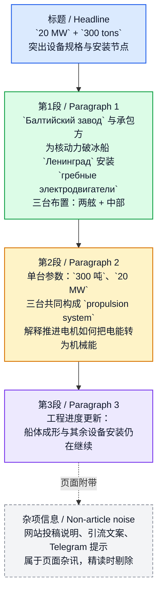

# По 20 МВт и 300 тонн весом：ОСК установила гребные электродвигатели на «Ленинград»

> 以下为俄 / 英 / 中三线对照精读；**同组内** `🔻` 原文行与 `🔹` 英译行行末保留两个空格，为 Markdown 硬换行，预览时分组对齐分行显示。

## 基本信息

- 文章来源：**《Сделано у нас》**（Sdelanounas.ru，俄罗斯工业与建设资讯／用户投稿平台）
- 题目：**По 20 МВт и 300 тонн весом: ОСК установила гребные электродвигатели на «Ленинград»**
- 可译为：**“每台20兆瓦、重300吨：联合造船集团已为‘列宁格勒’号安装推进电动机”**
- 署名：**Bionysheva_Elena**
- 原始来源标注：文内注明 **Источник: t.me**，即消息源来自 Telegram
- 作者背景简介：经可核实的公开信息看，**Bionysheva_Elena** 是 **Sdelanounas.ru** 上的活跃投稿用户名，长期发布与俄罗斯 **工业、能源、船舶、交通、制造业** 相关的短讯与资讯。**未检索到更明确、可独立验证的实名履历或机构任职信息**，因此此处仅能将其界定为该站公开可见的投稿作者／用户名，而不宜进一步推断其真实身份或职业背景。
- 参考链接：
  - Sdelanounas 文章页：https://sdelanounas.ru/blogs/175210/
  - 作者页：https://sdelanounas.ru/blog/Bionysheva_Elena/

---

## 前情提要

---

## 逐句精读

🔻 **По `20 МВт` и `300 тонн` весом: / `ОСК` установила `гребные электродвигатели` / на «`Ленинград`».**  
🔹 **At `20 megawatts` each and `300 tons` in weight, / `USC` has installed `propulsion electric motors` / on the `Leningrad`.**  
🔸 **每台功率达 `20兆瓦`、重量达 `300吨`：/ `联合造船集团`已在“`列宁格勒`”号上安装了`推进电动机`。**

背景注释：

- **ОСК / USC**：俄语全称 **Объединённая судостроительная корпорация**，通常译为**联合造船集团**或**联合造船公司**，是俄罗斯大型造船企业集团。
- **Ленинград / Leningrad**：此处指正在建造中的**核动力破冰船“列宁格勒”号**。
- **гребные электродвигатели**：直译为“螺旋桨推进电动机／推进用电动机”，在船舶工程语境中通常可译为**推进电动机**。
- 标题采用了俄语新闻中常见的**前置数字抓眼式标题**：先抛出核心参数，再引出事件本体。

> **`megawatt` / MW**
> 英文释义（noun）: `a unit of power equal to one million watts`（功率单位，`1 兆瓦 = 100 万瓦`）
> 语域：科技、工程、能源、新闻
> 画龙点睛：在能源、船舶、发电设备语境中极高频，常见搭配有 `installed capacity`、`power output`、`rated at 20 MW`。写作中看到 `at 20 MW each`，要迅速识别为“`单台功率为20兆瓦`”，而不是总功率。

> **`propulsion`**
> 英文释义（noun）: `the force or process that drives something forward`（推进；推进力；驱动过程）
> 语域：正式、工程、航空航天、船舶
> 画龙点睛：常见于 `propulsion system`、`electric propulsion`、`nuclear propulsion`。它比普通的 `movement` 更专业，强调“`驱动系统让载具前进`”这一技术机制，在阅读船舶、航天、军事类材料时要重点掌握。

> **`install`**
> 英文释义（verb）: `to put equipment or a system in place so that it is ready to be used`（安装，使设备就位并可投入使用）
> 语域：通用、工程、新闻
> 画龙点睛：新闻英语里 `install` 常用于大型设备、软件、系统、机器，不仅是“装上去”，更隐含“`按技术要求就位`”。常见搭配：`install equipment`、`install turbines`、`be installed on board`。名词是 `installation`。

> **`in weight`**
> 英文释义（phrase）: `with regard to weight`（在重量方面；重量为）
> 语域：正式、说明文、新闻
> 画龙点睛：这是较书面的表达。和 `weigh 300 tons` 相比，`300 tons in weight` 更像参数说明。考试中若遇到这种后置补充结构，要能迅速还原为“`重达300吨`”。

---

🔻 **Специалисты `Балтийского завода` / (входит в `ОСК`) / вместе с подрядной организацией / установили на строящийся атомный ледокол «`Ленинград`» / (`проект 22220`) / `гребные электродвигатели`.**  
🔹 **Specialists from the `Baltic Shipyard` / (`part of USC`) / together with a contractor / installed `propulsion electric motors` / on the nuclear-powered icebreaker `Leningrad`, which is under construction / (`Project 22220`).**  
🔸 **来自`波罗的海造船厂`的专家 / （该厂`隶属于联合造船集团`）/ 与承包单位一道 / 在正在建造中的核动力破冰船“`列宁格勒`”号上 / （`22220项目`）/ 安装了`推进电动机`。**

背景注释：

- **Балтийский завод / Baltic Shipyard**：俄罗斯著名船厂，长期参与大型船舶、尤其是**核动力破冰船**建造。
- **атомный ледокол**：即**核动力破冰船**，依靠核反应堆提供能源，常用于北极航道等高纬冰区。
- **проект 22220 / Project 22220**：俄罗斯一型新一代核动力破冰船项目编号，英语资料中常写为 **Project 22220** 或 **LK-60Ya class**。
- **подрядная организация**：即**承包组织／承包单位**，说明安装工作并非仅由船厂单独完成，而是与外部承包方协作。

> **`specialist`**
> 英文释义（noun）: `a person with deep knowledge or skill in a particular area`（专家；专业技术人员）
> 语域：正式、新闻、职场
> 画龙点睛：在俄式英语或新闻翻译中，`specialists` 往往不单指“专家学者”，也常指“`专业工程技术人员`”。翻译时要根据行业语境判断，不能机械译成“专家”而失去工程现场感。

> **`contractor`**
> 英文释义（noun）: `a person or company that is hired to do work or provide services`（承包商；承建方）
> 语域：商业、工程、法律、新闻
> 画龙点睛：与 `employee` 不同，`contractor` 强调“`按合同提供服务`”的外部主体。常见搭配：`main contractor`、`general contractor`、`subcontractor`。工程英语中区分总包与分包很常见。

> **`under construction`**
> 英文释义（phrase）: `being built and not yet completed`（在建中的；尚未完工的）
> 语域：新闻、工程、城市建设
> 画龙点睛：固定搭配，极高频。可用于建筑、桥梁、工厂、船舶：`a bridge under construction`、`a ship under construction`。写作中比 `being built` 更简洁、更正式。

> **`nuclear-powered`**
> 英文释义（adjective）: `using nuclear energy as a source of power`（核动力的）
> 语域：科技、军事、航运
> 画龙点睛：注意连字符写法。可用于 `nuclear-powered submarine`、`nuclear-powered vessel`、`nuclear-powered icebreaker`。它强调“`以核能作为动力来源`”，不是单纯“与核有关”。

> **`icebreaker`**
> 英文释义（noun）: `a ship designed to travel through or break up ice-covered waters`（破冰船）
> 语域：航运、极地、地理、新闻
> 画龙点睛：除了本义“破冰船”，日常英语里也有引申义，如 `an icebreaker question` 表示“活跃气氛的开场问题”。考试中常考这类“一词多义”：专业义与日常义并存。

---

🔻 **Два агрегата / разместили по бортам, / один — в центре.**  
🔹 **Two units / were positioned along the sides, / and one / in the center.**  
🔸 **两台机组 / 被布置在船体两舷，/ 另一台 / 则位于中央。**

背景注释：

- **агрегат**：在工程语境中常指**机组、总成、成套设备单元**，并不一定只是“一个简单零件”。
- **по бортам**：船舶语境中指**沿两侧舷边／分置于左右舷**。
- **в центре**：此处不是普通空间描述，而是说明三台推进电机的**结构布局方式**。

> **`unit`**
> 英文释义（noun）: `a single complete part of a larger system`（单元；机组；装置）
> 语域：工程、制造、新闻
> 画龙点睛：`unit` 很基础，但专业文本中常有“熟词僻义”。它不仅是“单位”，还常表示“`设备单元／机组`”。读科技新闻时，见到 `two units were installed`，往往要译成“安装了两台机组”。

> **`position`**
> 英文释义（verb）: `to place something in a particular location`（把……放置在某处；布置）
> 语域：正式、工程、通用
> 画龙点睛：比 `put` 更正式、更精确，常用于设备布局、军事部署、摄影取景。常见搭配：`be positioned on`、`be positioned at`、`position the sensors carefully`。被动语态在说明文里很常见。

> **`along the sides`**
> 英文释义（phrase）: `at or near both side edges`（沿两侧；位于两边）
> 语域：说明、工程
> 画龙点睛：这里翻译要服从船舶语境，不能只机械译成“沿着边”。在船舶文本中，往往对应“`左右舷`”。做翻译题时，要学会把一般空间词汇转换成专业表达。

> **`center`**
> 英文释义（noun）: `the middle point or part of something`（中心；中央）
> 语域：通用
> 画龙点睛：词本身不难，但在工程文中常用于布局描述：`centerline`、`center section`、`center shaft`。读图纸说明时，`center` 常不是抽象中心，而是“`中轴位置`”或“`中部结构`”。

---

🔻 **Каждый двигатель / весит `300 тонн` / и имеет мощность `20 МВт`.**  
🔹 **Each motor / weighs `300 tons` / and has a power rating of `20 MW`.**  
🔸 **每台电动机 / 重达 `300吨` / 且功率为 `20兆瓦`。**

背景注释：

- 这是典型的**设备参数句**，用最紧凑的方式给出两个核心指标：**重量**与**功率**。
- **has a power rating of** 比单纯 `has power of` 更专业，表示**额定功率／功率等级**。
- 在工程新闻中，数字往往是信息密度最高的部分，阅读时应优先抓住。

> **`weigh`**
> 英文释义（verb）: `to have a particular weight`（重……；重量为……）
> 语域：通用、说明文
> 画龙点睛：`weigh` 可作及物也可作不及物，但最常见结构是 `weigh + 数字`。如 `The engine weighs 300 tons.` 不要误写成 `is weighed 300 tons`。这类基本句型在写作里很实用。

> **`power rating`**
> 英文释义（noun phrase）: `the officially stated level of power an engine or device can produce`（额定功率；标称功率）
> 语域：工程、电气、机械
> 画龙点睛：比单独的 `power` 更技术化。常见搭配：`rated power`、`power output`、`rated at 20 MW`。考试翻译中，若出现设备参数，优先考虑“`额定`”这一层含义。

> **`motor`**
> 英文释义（noun）: `a machine that converts electrical energy into movement`（电动机）
> 语域：工程、日常、科技
> 画龙点睛：`motor` 与 `engine` 常被混用，但严格说 `motor` 更偏“`电动机`”，`engine` 常偏“`发动机／引擎`”。在电力推进语境中，用 `motor` 往往更准确。

---

🔻 **Все вместе / они составляют `пропульсивную установку` судна — / комплекс, / который обеспечивает движение и маневренность.**  
🔹 **Taken together, / they make up the vessel’s `propulsion system`— / a complex assembly / that provides movement and maneuverability.**  
🔸 **合在一起，/ 它们构成了该船的`推进系统`—— / 这是一个复合系统，/ 负责保障船舶的航行与机动性。**

背景注释：

- **пропульсивная установка**：船舶工程术语，通常可译为**推进装置**、**推进系统**。
- **комплекс**：俄语里常指一个**成套系统／综合装置**，不只是“复杂的东西”。
- **маневренность**：在交通工具语境中通常译为**机动性、操纵灵活性**。

> **`make up`**
> 英文释义（phrasal verb）: `to form or constitute something`（构成；组成）
> 语域：通用、正式写作
> 画龙点睛：`make up` 很常见，但此处不是“化妆”也不是“编造”，而是“`组成`”。阅读中要特别警惕短语动词多义。常见句型：`A and B make up the system.`

> **`propulsion system`**
> 英文释义（noun phrase）: `the system that generates and transmits power to move a vessel or vehicle`（推进系统）
> 语域：工程、船舶、航空航天
> 画龙点睛：极重要专业词组。它不仅指发动机，还包括电机、传动轴、螺旋桨等相关组件。做阅读题时，遇到这种总括性名词，要理解它往往覆盖多个子系统。

> **`assembly`**
> 英文释义（noun）: `a group of parts fitted together to form a machine or section of a machine`（总成；装配体）
> 语域：机械、制造、工程
> 画龙点睛：和普通的 `group` 不同，`assembly` 常强调“`按功能装配在一起的部件组合`”。制造业文本高频。也可表示“集会”，属典型多义词。

> **`maneuverability`**
> 英文释义（noun）: `the ability to move or be controlled easily and precisely`（机动性；操纵灵活性）
> 语域：交通、军事、工程
> 画龙点睛：由 `maneuver`／`manoeuvre` 派生而来，美式拼写常见 `maneuverability`，英式可见 `manoeuvrability`。在船舶、飞机、汽车文本里都很常用，常与 `stability` 对照出现。

---

🔻 **`ГЭД` / преобразуют электрическую энергию `турбогенераторов` / в механическую / и вращают валы с винтами, / уточняют в `ОСК`.**  
🔹 **The `propulsion electric motors` / convert the electrical energy of the `turbo-generators` / into mechanical energy / and turn the shafts connected to the propellers, / USC explained.**  
🔸 **`推进电动机` / 将`汽轮发电机`产生的电能 / 转化为机械能，/ 并带动与螺旋桨相连的传动轴旋转，/ `联合造船集团`方面补充说明道。**

背景注释：

- **ГЭД**：是 **гребной электродвигатель** 的缩写，即**推进电动机**。
- **турбогенераторы / turbo-generators**：通常指由汽轮机带动的发电机组，可译为**汽轮发电机组**。
- **валы с винтами**：直译“带有螺旋桨的轴”，更自然的技术表达是**与螺旋桨连接的传动轴**或**螺旋桨轴系**。
- **уточняют в ОСК**：俄语新闻常见尾注式消息来源表达，意思是“联合造船集团方面说明／补充称”。

> **`convert ... into ...`**
> 英文释义（verb phrase）: `to change something from one form into another`（把……转化为……）
> 语域：科技、学术、通用
> 画龙点睛：这是科技英语核心结构之一，极其高频。常见搭配：`convert energy into motion`、`convert data into information`。写作时若要表达“转化”，这个结构比单独 `change` 更准确、更正式。

> **`mechanical energy`**
> 英文释义（noun phrase）: `energy possessed by an object because of its motion or position, especially in machinery`（机械能）
> 语域：物理、工程
> 画龙点睛：与 `electrical energy`、`thermal energy`、`kinetic energy` 同属基础科技词汇群。阅读科技材料时，最好成组记忆，而不是零散背单词，这样更利于识别能量转换链条。

> **`shaft`**
> 英文释义（noun）: `a long rotating part in a machine that transmits power`（轴；传动轴）
> 语域：机械、船舶、工程
> 画龙点睛：在机械文献中非常常见，如 `drive shaft`、`shaft line`、`rotor shaft`。它不是普通“杆子”，而是承担动力传递功能的核心机械构件。翻译时要尽量具体。

> **`propeller`**
> 英文释义（noun）: `a device with blades that spins and pushes a ship or aircraft forward`（螺旋桨；推进器）
> 语域：船舶、航空、工程
> 画龙点睛：船舶和航空都能用。常见搭配：`propeller shaft`、`fixed-pitch propeller`、`turn the propeller`。和 `fan` 不同，`propeller` 强调推进功能而非单纯送风。

> **`explain`**
> 英文释义（verb）: `to make something clear by giving details`（解释；说明）
> 语域：通用、新闻
> 画龙点睛：新闻尾句中常用 `the company said / explained / noted` 来交代信息来源。此处译作“补充说明”比简单“解释”更符合中文新闻文体。要学会根据文体做功能性转换。

---

🔻 **Сейчас / на «`Ленинграде`» / продолжаются работы / по формированию корпуса / и установке остального оборудования.**  
🔹 **At present, / work continues / on the `Leningrad` / to form the hull / and install the remaining equipment.**  
🔸 **目前，/ “`列宁格勒`”号上 / 仍在继续进行 / 船体成形 / 以及其余设备的安装工作。**

背景注释：

- **формирование корпуса**：在造船语境中可理解为**船体结构成形／船体建造拼装推进**，不宜机械译成“形成船体”。
- **остального оборудования**：即**其余设备、剩余设备、尚未安装的其他设备**。
- **Сейчас**：新闻中的时间副词，提示该句是在做**工程进度更新**。

> **`at present`**
> 英文释义（phrase）: `now; at the current time`（目前；当前）
> 语域：正式、新闻、写作
> 画龙点睛：比 `now` 更书面。议论文、说明文、新闻稿里都常用。可替换表达有 `currently`、`as of now`，但 `at present` 更适合正式书面语。

> **`hull`**
> 英文释义（noun）: `the main body of a ship`（船体）
> 语域：船舶、海事、工程
> 画龙点睛：船舶英语核心词。常见搭配：`hull construction`、`double hull`、`hull section`。与泛泛的 `body` 相比，`hull` 是非常专业、准确的术语。

> **`remaining`**
> 英文释义（adjective）: `left after part has been used, done, or dealt with`（剩余的；其余的）
> 语域：通用、正式写作
> 画龙点睛：常见于 `the remaining work`、`the remaining time`、`the remaining equipment`。写作中比 `rest` 更正式，尤其适合说明尚未完成的工程任务。

> **`continue`**
> 英文释义（verb）: `to keep happening or to keep doing something`（继续；持续）
> 语域：通用
> 画龙点睛：新闻里常见 `work continues` 这种无人称、去主体化表达，突出“工程仍在推进”这一状态。写作时如果不强调执行者，这种句式很自然，也很客观。

---

## 补充说明：页面杂讯剔除

原文后半部分关于“网站允许访客发稿”“可投稿到 Telegram”“任何人都能添加新闻”等内容，属于**站点说明与引流文案**，不属于正文新闻事实，因此在精读中已剔除，不纳入逐句解析。  
但其保留的关键信息 **Источник: t.me** 已在“基本信息”部分注明，因为它涉及消息来源链条。
