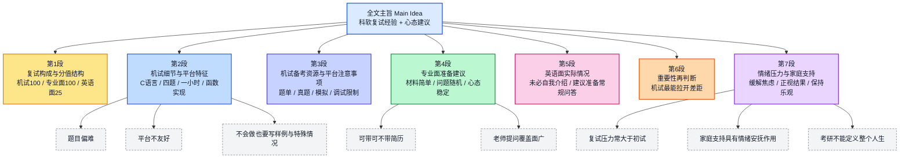

# 科软复试经验（小红书转录）双语精读笔记

## 前情提要

### 文章来源与文本信息

- 来源网站：`小红书（Xiaohongshu / RED）`
- 题目：`原帖未标注`
- 作者：`原帖作者昵称与帖子链接均未提供，无法可靠核验`
- 作者背景简介：基于用户提供的仅为转录文本、且未附原帖链接或作者主页，公开检索后`未能唯一定位原帖作者`，因此不对作者身份、院校背景或个人经历作臆测性标注。
- 文本主题：`科软复试经验分享`，核心内容围绕`机试`、`专业面`、`英语面`三部分展开，并以`情绪管理与家庭支持`收束全文。
- 可核来源：小红书官网 `https://www.xiaohongshu.com`

### 文章结构信息图

---

## 逐句精读

🔹 The `科软` (Ke Software) retest / is divided into / three parts: / the `programming test`, / the `English interview`, / and the `subject interview`.  
🔸 `科软复试`分为三个部分：`机试`、`英语面`、`专业面`。

背景注释：

- `科软`：这里通常是对某一`软件学院/软件工程相关项目`的简称，具体院校在原文中未明示。
- `retest`：在中国考研语境中通常对应`复试`，即初试之后的综合考核环节。

> **programming test（n.）机试；上机编程测试**
> 英文释义：`a practical exam in which candidates solve problems on a computer`（在电脑上完成题目的实践性考试）
> 语域：考试、教育、计算机
> 画龙点睛：在考研与校招语境中，`programming test`比单独的 `test` 更具体；也常说 `coding test`、`online assessment`。写作中若强调“上机完成”，可搭配 `take a programming test on-site`。

> **subject interview（n.）专业面；专业课面试**
> 英文释义：`an interview focused on the applicant’s academic or disciplinary knowledge`（聚焦申请者专业知识的面试）
> 语域：教育、招生、正式
> 画龙点睛：这是很实用的译法。`subject` 在此不是“主题”，而是“学科”。可类推为 `subject knowledge`（学科知识）、`subject-specific questions`（专业性问题）。

---

🔹 The `programming test` / is worth `100 points`, / the `subject interview` / is also worth `100 points`, / and the `English interview` / carries `25 points`.  
🔸 `机试`为`100分`，`专业面`为`100分`，`英语面`为`25分`。

背景注释：

- `be worth ... points`：常用于说明考试各模块的分值权重。
- `carry ... points`：新闻和正式表达里常见，表示“计/占多少分”。

> **be worth（phr.）值；值……分；具有……价值**
> 英文释义：`to have a value of a certain amount`（具有某种价值或分值）
> 语域：通用、考试、正式
> 画龙点睛：`worth` 后常接名词、金额、分值，也可接 `doing`，如 `It is worth preparing early.`。考试语境下 `This section is worth 20 points.` 很地道。

> **carry（v.）计有；带有；承载**
> 英文释义：`to include or involve a particular amount, weight, or consequence`（包含、附带某种数量或后果）
> 语域：正式、新闻、考试
> 画龙点睛：熟词僻义重点。`carry 25 points` 不是“携带”，而是“该项占25分”。还可说 `The offense carries a fine.`（该行为会招致罚款）。阅读中常考这种引申义。

---

🔹 Since / every point in the retest / counts the same / as every point in the initial exam, / it is still quite possible / to `stage a comeback`; / those who are just above the cutoff / should not feel discouraged, / because, judging from the data, / the chance of `turning things around` / is `over 50 percent`.  
🔸 由于复试中的`每一分`都与初试中的一分`等值`，所以仍然很容易`翻盘`；`压线`的同学不要沮丧，就数据而言，翻盘的几率`在50%以上`。

背景注释：

- `initial exam`：考研语境中的`初试`。
- `cutoff`：录取、进面、过线等语境中常指`分数线`或`最低门槛`。

> **count（v.）算数；起作用；被计算在内**
> 英文释义：`to be included or to have importance`（被计入；有影响）
> 语域：通用、考试、正式
> 画龙点睛：`count the same as` 表示“与……同样计算/同等看待”。还可说 `Every point counts.`，这是考试、比赛、申请中极高频表达。

> **stage a comeback（phr.）实现翻盘；扭转局面**
> 英文释义：`to recover from a disadvantage and become competitive again`（从劣势中恢复并重新占优）
> 语域：新闻、竞技、口语
> 画龙点睛：很适合写作替换单调的 `succeed`。`comeback` 常见于体育、商业、个人经历。可替换为 `make a comeback`；若强调逆转结果，也可说 `reverse the situation`。

> **cutoff（n.）分数线；截止线；门槛**
> 英文释义：`the minimum limit required for something`（所要求达到的最低界限）
> 语域：考试、招生、正式
> 画龙点睛：注意既可写作 `cutoff`，也常写 `cut-off score`。中文“压线”可灵活译为 `just above the cutoff`、`right at the cutoff line`。

---

🔹 To begin with / the relative importance of the retest components, / the `programming test` / is `the most important`.  
🔸 先说复试重要程度：`机试最重要`。

背景注释：

- 此句属于全文的`中心判断句`，后文所有展开都服务于这一定性。

> **relative importance（n.）相对重要性**
> 英文释义：`the degree of importance when compared with other things`（与其他事物相比所体现出的重要程度）
> 语域：正式、分析、学术
> 画龙点睛：写作中非常好用，适合讨论多因素比较，如 `the relative importance of theory and practice`。比单纯说 `importance` 更有“比较权重”的意味。

> **most important（adj.）最重要的**
> 英文释义：`more important than anything else in a given context`（在特定语境下比其他因素都更重要）
> 语域：通用
> 画龙点睛：基础词但非常高频。正式写作中可用 `of primary importance`、`the top priority`、`the decisive component` 做升级替换。

---

🔹 As for the `programming test`, / candidates may use `C` only; / there are `four questions` in total, / each worth `25 points`, / and the time limit / is `one hour`. / The format / is similar to `LeetCode`, / and candidates only need / to implement the required function.  
🔸 关于`机试`：只能使用`C语言`；总共`四道题`，每题`25分`，时间为`一个小时`。模式类似`力扣（LeetCode）`，只需要实现相应的`功能函数`即可。

背景注释：

- `C`：经典程序设计语言，语法接近底层，很多院校机试仍指定使用。
- `LeetCode`：国际常见算法刷题平台，中国考生常称“力扣”。
- `implement the required function`：说明平台常给定函数框架，考生只需补全逻辑。

> **implement（v.）实现；执行；落实**
> 英文释义：`to put a plan, system, or function into effect`（使计划、系统或函数得以实现）
> 语域：计算机、正式、学术
> 画龙点睛：计算机语境下极常见。`implement an algorithm/function/interface` 都很自然。名词为 `implementation`。写作中比 `do`、`write` 更专业。

> **time limit（n.）时间限制**
> 英文释义：`the maximum amount of time allowed`（允许使用的最大时间）
> 语域：考试、比赛、通用
> 画龙点睛：与 `deadline` 区分：`time limit` 偏单次过程时长；`deadline` 偏最后截止时刻。算法题中还可见 `memory limit`（内存限制）。

> **in total（phr.）总共；合计**
> 英文释义：`when everything is added together`（把所有部分加总起来）
> 语域：通用、正式
> 画龙点睛：写作中可替换 `altogether`。若用于数据描述，常与数字搭配：`There are 4 questions in total.` 结构简洁稳妥。

---

🔹 The questions / in the past `two years` / have been rather `difficult`, / and the testing platform itself / is really `not user-friendly`; / so I suggest / that everyone / start practicing problems immediately / after the initial exam.  
🔸 最近`两年`出的题都偏`难`，再加上那个机试平台确实`不太好用`，所以建议大家在考完`初试后立即刷题`。

背景注释：

- `not user-friendly`：常用来描述软件平台界面、交互、报错提示等不够友好。
- 这里的 `practicing problems` 对应中文语境中的“刷题”。

> **user-friendly（adj.）易用的；对用户友好的**
> 英文释义：`easy for people to understand and use`（易于理解和使用的）
> 语域：科技、产品、通用
> 画龙点睛：反义可说 `unfriendly`、`hard to navigate`。英语写作中评价系统平台时，这个词比简单说 `good` 或 `bad` 更专业。

> **practice problems（phr.）练习题；刷题**
> 英文释义：`to work through exercises or questions for training`（通过做题进行训练）
> 语域：教育、考试、口语
> 画龙点睛：中文“刷题”很难直译成 `brush questions`。更自然是 `practice problems`、`work on coding questions`、`do mock problems`。

> **immediately（adv.）立刻；马上**
> 英文释义：`without delay`（没有延迟地）
> 语域：通用
> 画龙点睛：正式写作里可表达时间上的紧迫性。若想更口语，可用 `right away`；若更正式，可用 `promptly`。

---

🔹 The problem sets / I recommend / include `Code Thoughts`, / the `Hot 100`, / and `Ling Shen’s list`.  
🔸 我建议刷的题单有：`代码随想录`、`Hot100`、`灵神题单`。

背景注释：

- `代码随想录`：国内较常见的算法刷题资料整理。
- `Hot 100`：通常指高频经典算法题集合。
- `灵神题单`：中文互联网程序员/算法学习圈常见整理名称之一。因原帖未附链接，此处仅作概念性注释。

> **problem set（n.）题单；习题集**
> 英文释义：`a collection of practice questions or problems`（一组供练习的问题集合）
> 语域：教育、考试、计算机
> 画龙点睛：非常贴合“题单”。比 `questions` 更系统化。学术环境也常说 `exercise set`、`worksheet`，但算法训练里 `problem set` 更自然。

> **recommend（v.）推荐；建议**
> 英文释义：`to suggest something as suitable or useful`（建议某物适合使用）
> 语域：通用、正式
> 画龙点睛：可接名词或从句：`recommend A` / `recommend that sb do sth`。注意正式英语里常用虚拟形式：`recommend that everyone start early.`

---

🔹 In addition, / `Qingwen` provides / free real exam questions / from each year, / and when the retest approaches, / it also offers `mock exams`; / everyone should participate / as much as possible.  
🔸 此外，`晴问`上有免费的`历年真题`，临近复试时还会有`模拟考`，大家可以尽量多参加。

背景注释：

- `Qingwen`：原文提到的平台名称，因未附网址，此处仅按音译标注。
- `mock exams`：正式考试前的模拟测试，有助于熟悉节奏与平台环境。

> **mock exam（n.）模拟考试**
> 英文释义：`an exam designed to imitate the real one for practice`（模仿正式考试而设置的练习性考试）
> 语域：教育、考试
> 画龙点睛：还可说 `mock test`、`practice exam`。写作中提备考方法时，这是很实用的高频搭配。`sit a mock exam` 表示“参加一次模拟考”。

> **approach（v.）临近；靠近**
> 英文释义：`to come nearer in time or distance`（在时间或空间上接近）
> 语域：正式、新闻、通用
> 画龙点睛：熟词僻义重点。除了“方法”，作动词时常表示“临近”。如 `As the deadline approaches...`，是写作中非常常见的时间状语结构。

---

🔹 Let me also answer / several frequently asked questions here: / `qsort` can be used; / debugging is done / through `input and output`; / after finishing the code, / you can only `save` it, / and you cannot see / how many test cases you have passed; / as for `malloc`, / the amount of memory / you can allocate / is actually quite large / and absolutely sufficient.  
🔸 这里也顺便回答几个大家常问的问题：可以用`qsort`函数；调试方式是`输入输出调试`；写完之后只能`保存`，看不到自己通过了多少个`测试样例`；至于`malloc`，可申请的空间其实很大，`绝对够用`。

背景注释：

- `qsort`：C 标准库中的快速排序函数。
- `input and output debugging`：没有可视化调试器时，通过打印输入输出检查程序行为。
- `malloc`：C 语言中用于动态内存分配的函数。

> **debugging（n.）调试**
> 英文释义：`the process of finding and fixing errors in a program`（查找并修复程序错误的过程）
> 语域：计算机
> 画龙点睛：动词是 `debug`。常见搭配：`debug a program`、`debug by printing logs`。考试环境里，`debug through input/output` 很贴近实际。

> **test case（n.）测试样例；测试用例**
> 英文释义：`a specific set of inputs used to check whether a program works correctly`（用来检验程序是否正确的一组特定输入）
> 语域：计算机、软件测试
> 画龙点睛：注意不是普通的 `example`。算法平台里 `sample` 往往是题面给出的样例，`test cases` 则包含隐藏数据。阅读中要区分。

> **allocate（v.）分配；拨给**
> 英文释义：`to assign resources such as memory, money, or time for a particular purpose`（为特定目的分配资源）
> 语域：计算机、正式、经济
> 画龙点睛：计算机里常说 `allocate memory`。名词是 `allocation`。和 `assign` 相比，`allocate` 更强调资源配置。

---

🔹 But / there are several things / you should pay attention to: / the location reported for an error / may be inaccurate; / `array out-of-bounds` errors / may not be reported; / and even an `infinite loop` / may not trigger an error— / it may simply cause the system / to freeze for a while.  
🔸 但要注意几点：平台提示的`报错位置`可能`不准确`；`数组越界`可能不会报错；`死循环`也可能不会报错，甚至会让系统`卡一会儿`。

背景注释：

- `array out-of-bounds`：访问数组合法范围之外的位置。
- `infinite loop`：循环条件始终成立，程序无法正常结束。
- `freeze`：程序或系统卡住、不响应。

> **out-of-bounds（adj.）越界的；超出范围的**
> 英文释义：`beyond the legal or expected limit`（超出合法或预期边界的）
> 语域：计算机
> 画龙点睛：常见完整搭配是 `array out-of-bounds access`。这是程序错误高频来源之一。阅读题或技术文档里遇到时，要联想到“内存安全”问题。

> **trigger（v.）触发；引发**
> 英文释义：`to cause something to happen`（引起某事发生）
> 语域：通用、科技、新闻
> 画龙点睛：很高频的正式动词。可替换 `cause`，但更有“启动机制”的意味。比如 `trigger an exception`、`trigger a response`。

> **freeze（v.）卡住；冻结；停止响应**
> 英文释义：`to stop working properly, especially temporarily`（尤指暂时停止正常工作）
> 语域：计算机、口语
> 画龙点睛：科技语境下很常见。名词可说 `a system freeze`。若想更正式，也可说 `become unresponsive`。

---

🔹 Therefore, / when you encounter an error / in your daily practice, / try to locate the problem yourself first, / and only then / ask `AI` for help.  
🔸 所以，平时大家在遇到`报错`时，尽量先`自己定位问题`，然后再去问`AI`。

背景注释：

- 此句强调的是`独立排错能力`优先，其后才是借助智能工具。
- `AI` 在此泛指人工智能问答或辅助编程工具。

> **locate（v.）找到；定位**
> 英文释义：`to find the exact place or source of something`（找到某物确切的位置或来源）
> 语域：通用、技术、正式
> 画龙点睛：程序语境里 `locate the bug`、`locate the issue` 很常见。比 `find` 更强调“精确定位”。

> **encounter（v.）遇到；遭遇**
> 英文释义：`to experience or come across something, especially a problem`（遇见，尤指问题）
> 语域：正式、书面
> 画龙点睛：比 `meet` 更书面，技术文档中高频，如 `users may encounter errors`。写作中能显著提升正式度。

---

🔹 Finally, / the most important point is this: / if you do not know / how to solve a problem, / `returning the sample output` / and handling `special cases` / can still earn you / some points.  
🔸 最后也是最重要的一点：如果题目`不会写`，把`样例情况`和`特殊情况`返回出来，`也会有分`。

背景注释：

- 此处强调的是`部分得分意识`：即使不会完整求解，也要尽量覆盖可拿分情况。
- `special cases`：边界条件、极端输入、特殊输入。

> **special case（n.）特殊情况；特殊输入**
> 英文释义：`an unusual or exceptional situation that requires separate treatment`（需要单独处理的异常或特殊情况）
> 语域：计算机、数学、正式
> 画龙点睛：算法题极高频表达。常与 `edge case` 对照使用：`edge case` 更偏边界，`special case` 更偏特殊分支。面试表达中非常实用。

> **earn（v.）获得；挣得**
> 英文释义：`to obtain something as a result of effort or performance`（通过努力或表现获得）
> 语域：通用、考试
> 画龙点睛：不仅能用于“挣钱”，还可用于 `earn points / earn credit / earn respect`。考试语境里比 `get` 更自然、更正式。

---

🔹 As for the `subject interview`, / I only printed out / my undergraduate transcript, / and I had neither projects / nor competition experience; / whether you bring a résumé or not / is up to you.  
🔸 至于`专业面`，我只打印了自己的`本科成绩单`，没有`项目`和`比赛经历`；大家`带不带简历都可以`。

背景注释：

- `undergraduate transcript`：本科阶段课程成绩单。
- `résumé`：简历，法语词源，英语求职与申请场景中极常见。

> **transcript（n.）成绩单；文字记录**
> 英文释义：`an official record of a student’s courses and grades`（学生课程与成绩的正式记录）
> 语域：教育、申请、正式
> 画龙点睛：注意不要和 `certificate`（证书）混淆。申请学校常见搭配：`official transcript`、`academic transcript`。

> **résumé（n.）简历**
> 英文释义：`a brief document listing a person’s education, experience, and skills`（简要列出教育背景、经历与技能的文件）
> 语域：求职、申请、正式
> 画龙点睛：美式英语常用 `resume`，英式有时更常见 `CV`。二者并非完全等同，但在一般申请语境中可近似理解。

---

🔹 I think / the questions asked / in the `subject interview` / are very hard / to prepare for in advance: / they may be about `408`, / undergraduate courses, / or even your graduation project. / If you have time, / you can prepare carefully; / if you do not, / that is actually fine as well, / because the score gap here / is usually not very large.  
🔸 我觉得专业面老师问的问题`很难提前准备到`：可能问`408`，可能问`本科课程`，也可能问`毕业设计`。如果有时间，大家可以好好准备；如果没时间，其实也没关系，因为这一部分的`分差通常不会很大`。

背景注释：

- `408`：中国考研计算机学科中常指`计算机学科专业基础综合`，通常涵盖数据结构、计算机组成原理、操作系统、计算机网络等内容。
- `graduation project`：本科毕业设计/毕业论文相关项目。

> **prepare for（phr.）为……做准备**
> 英文释义：`to get ready for something in advance`（提前为某事做好准备）
> 语域：通用
> 画龙点睛：高频核心短语。可接名词，如 `prepare for the interview`；也可引申为心理准备。考试写作中非常实用。

> **in advance（phr.）提前；预先**
> 英文释义：`before a particular time or event`（在某个时间点或事件之前）
> 语域：通用、正式
> 画龙点睛：和 `ahead of time` 接近，但 `in advance` 更正式、更常用于书面表达。搭配 `book in advance`、`prepare in advance` 高频。

> **score gap（n.）分差；成绩差距**
> 英文释义：`the difference in scores between candidates or sections`（不同考生或不同部分之间的分数差）
> 语域：考试、统计
> 画龙点睛：可扩展为 `performance gap`、`achievement gap`。在分析录取形势时，这个表达非常贴切。

---

🔹 If the interviewers ask you / something you do not know / during the interview, / just apologize briefly; / when you are put under pressure, / you should maintain / a good state of mind.  
🔸 老师在面试的时候如果问到你`不会的`，简要`道歉`就好；在受到`压力`时，要保持好`心态`。

背景注释：

- `state of mind`：心理状态、心态。
- 这里的 `apologize briefly` 不是认错，而是礼貌地承认自己暂时不会。

> **put sb under pressure（phr.）给某人施压；使某人承受压力**
> 英文释义：`to make someone feel stressed or challenged`（让某人感到紧张或承压）
> 语域：通用、正式
> 画龙点睛：被动形式高频：`be under pressure`。口语和写作都能用。可拓展为 `academic pressure`、`financial pressure`。

> **state of mind（n.）心态；心理状态**
> 英文释义：`a person’s emotional or mental condition at a particular time`（某一时刻的心理或情绪状态）
> 语域：通用、正式
> 画龙点睛：是表达“心态”的优质说法。若写作要更抽象，可用 `mindset`；若强调临时状态，`state of mind` 更贴切。

---

🔹 As for the `English interview`, / I had also prepared / a `self-introduction`; / yet after I went in, / the teacher simply started asking me questions / and did not ask me / to introduce myself.  
🔸 至于`英语面`，我原本也准备了`自我介绍`；但进去之后，老师直接开始提问，`没有让我自我介绍`。

背景注释：

- `self-introduction`：面试场景中常指简短的个人介绍，内容通常包括姓名、院校、专业、兴趣、项目经历等。

> **self-introduction（n.）自我介绍**
> 英文释义：`a short spoken or written presentation of oneself`（对自己的简短口头或书面介绍）
> 语域：教育、面试、通用
> 画龙点睛：面试场景常说 `give a self-introduction`，也可更自然地说 `introduce yourself briefly`。后者更口语、更地道。

> **simply（adv.）直接地；只是；干脆**
> 英文释义：`in a direct or uncomplicated way`（直接地、简洁地）
> 语域：通用
> 画龙点睛：语义灵活。这里不是“简单地”，而更接近“径直、直接就”。阅读中要根据语境灵活判断。

---

🔹 It seems / that different teachers / do things differently, / but I still recommend / that everyone prepare / a self-introduction / and some frequently asked questions. / The English teachers / are quite `kind`, / and their spoken English / is also easy to understand, / so there is no need / to worry too much.  
🔸 看起来`不同老师`的做法`不一样`，不过我还是建议大家准备一下`自我介绍`和`常见问题`。英语老师都挺`和蔼`的，说的`口语`也很容易听懂，所以大家`不用过于担心`。

背景注释：

- `spoken English`：口头表达出来的英语，与书面英语相对。
- `frequently asked questions`：可泛指面试中高频出现的问题。

> **spoken English（n.）英语口语；口头英语**
> 英文释义：`English as it is spoken rather than written`（作为口头表达而非书面表达的英语）
> 语域：教育、语言学习
> 画龙点睛：与 `written English` 对应。备考建议中常说 `improve your spoken English`。如果强调听力理解，可搭配 `easy to follow`。

> **kind（adj.）和蔼的；友善的**
> 英文释义：`friendly, generous, and considerate`（友善、体贴、温和的）
> 语域：通用
> 画龙点睛：基础词，但使用频率极高。若写作想更正式，可用 `approachable`（平易近人的）、`considerate`（体贴的）、`cordial`（亲切友好的）。

> **worry too much（phr.）过于担心**
> 英文释义：`to be more anxious than necessary`（焦虑程度超过必要范围）
> 语域：口语、通用
> 画龙点睛：非常实用的安慰类表达。写作中可升级为 `there is no need for excessive anxiety`。

---

🔹 As you can tell / from how much space / I have devoted to each part, / the `programming test` / is definitely the most important one. / The `subject interview` and the `English interview` / really do not create / a large gap, / so everyone should simply focus / on preparing well / for the programming test.  
🔸 从我分配的`篇幅`也可以看出来，`机试`就是最重要的。`专业面`和`英语面`确实`拉不开太大差距`，所以大家就把重点放在`好好准备机试`上。

背景注释：

- `devote space to`：写作分析中可表示“为某部分分配篇幅”。
- `create a large gap`：这里指得分上不易显著拉开差距。

> **devote（v.）投入；用于；专用于**
> 英文释义：`to give time, effort, or space to something`（把时间、精力或篇幅投入某事）
> 语域：正式、书面
> 画龙点睛：常见搭配 `devote time to`、`be devoted to`。这里把它用于“篇幅分配”，很书面，也很适合阅读写作。

> **focus on（phr.）集中于；专注于**
> 英文释义：`to give special attention to something`（把主要注意力放在某事上）
> 语域：通用
> 画龙点睛：可替换为 `concentrate on`、`prioritize`。但 `focus on` 最稳妥、最自然。考试写作中可搭配 `focus on efficiency / fundamentals / key points`。

---

🔹 Finally, / let me share / a few personal thoughts. / From what I have seen, / the pressure people feel / while preparing for the retest / is often even greater / than that of the initial exam; / so during both the preparation period / and the retest itself, / everyone should maintain / a good mindset.  
🔸 最后说一点我的`心里话`。就我所见，大家在准备`复试`时承受的`压力`往往比`初试`还要大一些，所以无论是在准备阶段还是复试进行时，都要保持好`心态`。

背景注释：

- `from what I have seen`：常用于引出个人观察，不等于绝对事实。
- 本句由经验判断转入情绪管理主题，是全文的情感转折点。

> **mindset（n.）心态；思维方式**
> 英文释义：`a fixed or characteristic way of thinking, especially one that affects behavior`（影响行为的一种思维倾向或心理取向）
> 语域：心理、教育、通用
> 画龙点睛：是表达“心态”的高频词。和 `state of mind` 相比，`mindset` 更偏稳定的思维方式。作文里讨论成长、竞争、压力时很好用。

> **pressure（n.）压力**
> 英文释义：`mental or emotional strain caused by demanding circumstances`（由高要求环境带来的心理或情绪负担）
> 语域：通用
> 画龙点睛：常见搭配 `feel pressure`、`cope with pressure`、`academic pressure`。写作中如果谈应对，可接 `manage`, `handle`, `relieve`。

---

🔹 During the retest period, / my family / often called me / to ask how I was doing. / At that time, / I was a little impatient / and very anxious, / and I did not really want / to talk with them.  
🔸 在复试阶段，我的`家里人`经常给我`打电话`询问情况。那时我有点`不耐烦`，也非常`焦虑`，并不是很想和他们交流。

背景注释：

- 这一句把“外在考试压力”具体化为“与家人沟通时的情绪反应”。

> **impatient（adj.）不耐烦的；急躁的**
> 英文释义：`annoyed because something is taking too long or because of irritation`（因等待或烦躁而失去耐心）
> 语域：通用
> 画龙点睛：常见搭配 `be impatient with sb/sth`。反义词是 `patient`。写作中描述情绪变化时，比 `angry` 更细腻。

> **anxious（adj.）焦虑的；担忧的**
> 英文释义：`feeling worried or nervous about something uncertain`（因不确定性而担忧、紧张）
> 语域：通用、心理
> 画龙点睛：高频情绪词。注意与 `eager` 的区别：`anxious to do` 有时也可表示“急切想做”，要看语境。名词是 `anxiety`。

---

🔹 But after I saw / the admission list, / the first thing I did / was to tell them the good news. / They all smiled happily, / and only later / did I learn / that my grandparents / had gotten up early / to pray for me.  
🔸 但在看到`录取名单`之后，我第一时间还是去向他们`报喜`。他们都笑得很开心，而我也是后来才知道，爷爷奶奶曾经`起早`去为我`祈福`。

背景注释：

- `admission list`：录取名单。
- `pray for`：为某人祈祷、祈福。
- 句中体现的是结果揭晓后的情感回流与家庭支持的显现。

> **admission list（n.）录取名单**
> 英文释义：`the official list of applicants who have been admitted`（正式公布的录取人员名单）
> 语域：教育、招生、正式
> 画龙点睛：也可说 `list of admitted students`。若强调“公布结果”，常搭配 `release` 或 `announce`。

> **pray for（phr.）为……祈祷；为……祈福**
> 英文释义：`to ask for divine help or blessing for someone`（为某人向神明或命运祈求帮助与保佑）
> 语域：宗教、情感、通用
> 画龙点睛：除了宗教语境，也可泛化为表达祝愿。写作中如怕宗教色彩过强，可用 `wish me well`、`hope for my success`。

---

🔹 Looking back now / on the encouragement / my mother gave me / before the retest, / and the casual conversation / my father had with me / right after it ended, / I feel / a great deal of warmth / in my heart.  
🔸 现在回想起来，复试前我妈妈给我的`鼓励`，以及复试结束后我爸爸第一时间和我的`闲聊`，都让我感到内心十分`温暖`。

背景注释：

- `looking back`：回顾过去、回头看。
- `casual conversation`：轻松自然的闲聊，不带明确任务压力。

> **encouragement（n.）鼓励**
> 英文释义：`words or actions that give someone confidence or support`（给予某人信心或支持的话语、行为）
> 语域：通用
> 画龙点睛：动词是 `encourage`。常见搭配 `offer encouragement`、`draw encouragement from`。写作中用于亲情、教育、团队支持都很自然。

> **warmth（n.）温暖；暖意；温情**
> 英文释义：`a feeling of kindness, affection, or emotional comfort`（善意、关爱或情感抚慰所带来的温暖感）
> 语域：情感、文学、通用
> 画龙点睛：这里不是物理温度，而是情感温度。作文中表达亲情与支持时，比直接说 `love` 更含蓄、更有层次。

---

🔹 No matter / what the outcome is, / your family / is always supporting you / quietly in the background. / I hope everyone / can talk more openly / with their families, / because that can both `ease` your anxiety / and give them / a measure of reassurance.  
🔸 不论`结局`如何，家里人永远都在默默地`支持你`。希望大家能和家里多`谈谈心`，因为这既可以`缓解`自己的焦虑，也能给他们一丝`安慰`。

背景注释：

- `quietly in the background`：默默地、不张扬地支持。
- `talk openly`：坦诚交流、敞开心扉。

> **ease（v.）缓解；减轻**
> 英文释义：`to make something less severe, painful, or difficult`（使某事变得不那么严重、痛苦或困难）
> 语域：正式、通用、医疗
> 画龙点睛：非常适合写作的“高级替换词”，可替换 `reduce`、`relieve` 的一部分场景，如 `ease anxiety / ease tension / ease the burden`。

> **reassurance（n.）安慰；宽慰；使人安心的话或事**
> 英文释义：`words or actions that make someone feel less worried`（让人不再那么担心的话语或举动）
> 语域：正式、心理、通用
> 画龙点睛：比 `comfort` 更偏“消除担忧”。动词是 `reassure`。阅读中常见于医疗、政策、家庭沟通语境。

---

🔹 The postgraduate entrance examination / is only `a small step` / on the road of your life. / Whether you succeed / or fail, / it cannot determine / your entire life.  
🔸 `考研`也只是你人生道路上的`一小步`。无论是`成功`还是`失败`，它都`决定不了你的人生`。

背景注释：

- 这里把考研放回更长的人生时间轴中，属于典型的“降维减压”表达。

> **determine（v.）决定；左右；确定**
> 英文释义：`to control, decide, or shape the result of something`（决定、支配或塑造某事结果）
> 语域：正式、通用、学术
> 画龙点睛：比 `decide` 更书面。可说 `determine one’s future / outcome / direction`。阅读中常见于因果关系与影响分析。

> **a small step（n.）一小步**
> 英文释义：`a minor stage in a much longer process`（在更长过程中的一个小阶段）
> 语域：通用、修辞
> 画龙点睛：这是常见隐喻表达。写作中若想更正式，可改为 `only one stage in life`、`just a limited episode in a longer journey`。

---

🔹 I hope / everyone can face it / bravely / with a `positive` and `optimistic` attitude, / and I believe / that all of you / will succeed.  
🔸 希望大家怀着`积极`、`乐观`的心态，`勇敢地面对`，也相信大家一定能够`成功`。

背景注释：

- 这是全文的收束句，兼具情绪鼓励与行动导向功能。

> **optimistic（adj.）乐观的**
> 英文释义：`expecting good things to happen or believing that the future will be favorable`（期待好结果、相信未来会向好的方向发展）
> 语域：通用
> 画龙点睛：名词是 `optimism`。和 `positive` 相比，`optimistic` 更明确指“对未来持乐观看法”。二者并列时语义更完整。

> **face（v.）面对；直面**
> 英文释义：`to deal with something difficult or challenging`（应对困难或挑战）
> 语域：通用
> 画龙点睛：熟词核心义的引申。`face difficulties / face pressure / face the future` 都非常常见。写作中比 `meet` 更自然。

> **positive（adj.）积极的；正向的**
> 英文释义：`hopeful, constructive, or confident in attitude`（态度上积极、建设性或有信心的）
> 语域：通用
> 画龙点睛：高频基础词，但适用面极广。常见搭配 `a positive attitude`、`positive feedback`。注意语境不同可译为“正面的、积极的、阳性的”。

---

## 补充说明

- 该文本原始来源为用户提供的`小红书帖子转录内容`。
- 由于`原帖链接、作者昵称、发布时间`均未提供，且公开检索`未能唯一定位原帖`，因此只对`平台来源`作可靠标注，不对作者背景作推测性扩写。
- 可核平台链接：`https://www.xiaohongshu.com`
